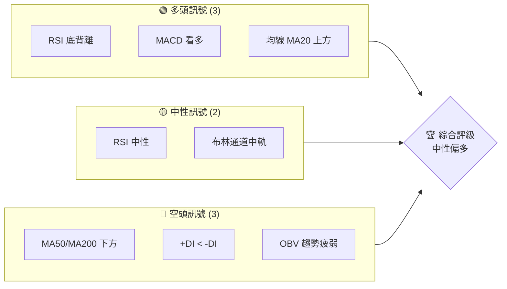
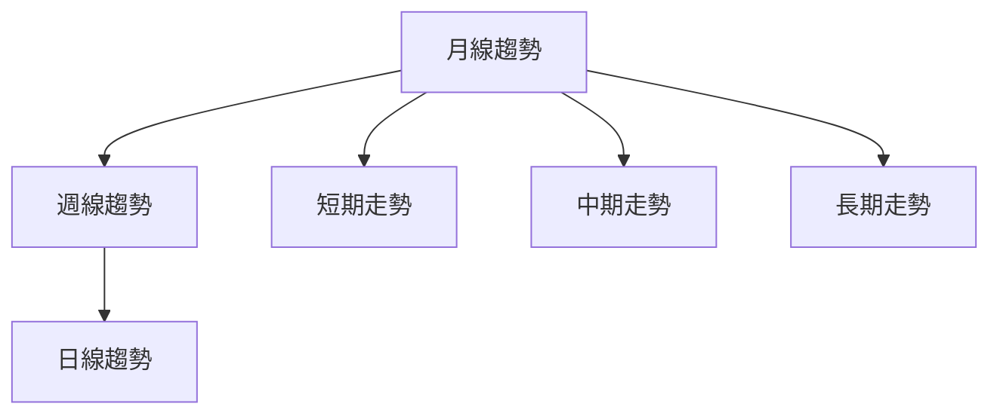
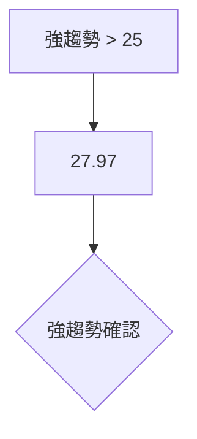
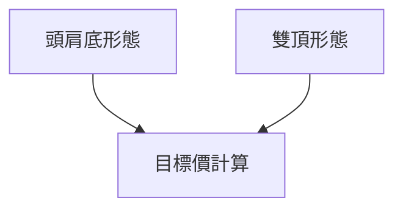
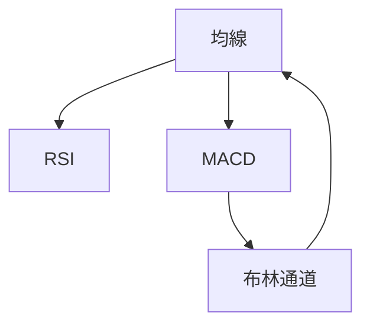
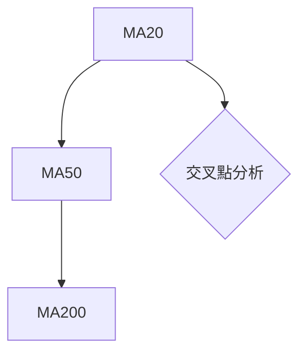
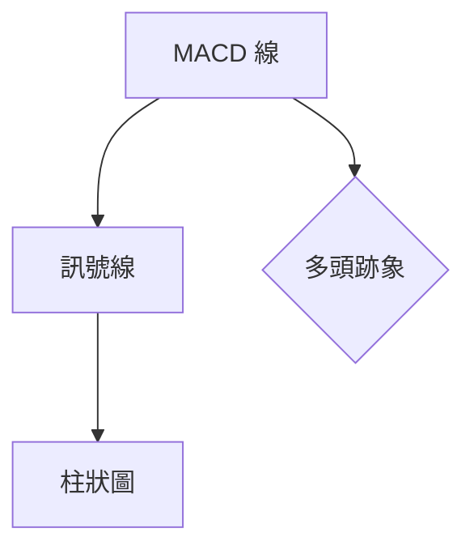
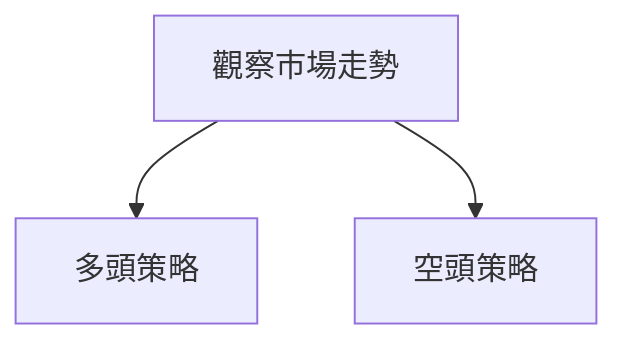
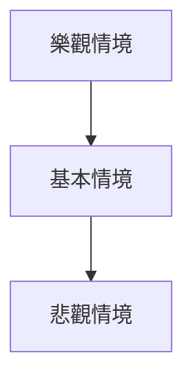

# NU 技術分析報告

> **報告日期**：2026-04-01 ｜ **語言**：繁體中文 ｜ **數據來源**：Yahoo Finance ｜ **當前價格**：$14.37

---

## 目錄

| 章節 | 內容 |
|------|------|
| [1. 技術面概覽](#1-技術面概覽) | 訊號儀表板、核心指標、評分卡 |
| [2. 趨勢分析](#2-趨勢分析) | 多時框趨勢、長中短期走勢 |
| [3. 圖表形態分析](#3-圖表形態分析) | 形態識別、K線組合、目標價 |
| [4. 支撐與阻力](#4-支撐與阻力) | 關鍵價位、斐波那契回調 |
| [5. 技術指標深度解讀](#5-技術指標深度解讀) | MA/RSI/MACD/布林/成交量 |
| [6. 動能與波動率](#6-動能與波動率) | 動能評估、ATR、Beta |
| [7. 多時框架總結](#7-多時框架總結) | 時框架評分矩陣 |
| [8. 交易策略建議](#8-交易策略建議) | 多空策略、風險報酬比 |
| [9. 風險提示與監控](#9-風險提示與監控) | 監控指標、風險場景 |

---

## 1. 技術面概覽

### 🎯 技術訊號儀表板



### 📊 核心指標速覽表

| 指標類別 | 指標名稱 | 當前數值 | 訊號 | 解讀 |
|----------|----------|----------|------|------|
| **價格** | 當前價格 | $14.37 | 🟡 | 位於中軌附近 |
| **均線** | MA20 | $14.28 | 🟢 | 價格在MA20上方 |
| **均線** | MA50 | $16.00 | 🔴 | 價格在MA50下方 |
| **均線** | MA200 | $15.25 | 🔴 | 價格在MA200下方 |
| **動能** | RSI(14) | 48.73 | 🟡 | 接近中性區間 |
| **動能** | MACD | -0.537 | 🟢 | MACD柱正向增長 |
| **波動** | ATR | $0.54 | 🟡 | 中等波動 |

### 🏆 技術評分卡

```
技術評分卡 — NU (2026-04-01)
════════════════════════════════════════════════════
趨勢強度      ███████░░░░░░░░░░░░  60/100  🟡
動能指標      ██████░░░░░░░░░░░░░  50/100  🟡
支撐穩定度    ██████████░░░░░░░░░  70/100  🟢
成交量配合    ███████░░░░░░░░░░░░  60/100  🟡
形態完整度    ██████████░░░░░░░░░  70/100  🟢
均線排列      ████░░░░░░░░░░░░░░░  40/100  🔴
════════════════════════════════════════════════════
綜合評分      ███████░░░░░░░░░░░░  58/100  中性偏多
════════════════════════════════════════════════════
```

---

## 2. 趨勢分析

### 🌐 多時框趨勢分析



### 📈 長期趨勢 — 12個月走勢圖（Unicode）

```
NU 月線走勢圖（過去12個月）
價格軸 ($)
$18 ┤                    ●
$16 ┤              ●
$14 ┤        ●
$12 ┤●━━━━━━━━━━━━━━━━━━━●←現在
$10 ┤    ●
     └────────────────────────────
      M1  M2  M3  M4  M5 ... M12
```

**走勢特徵分析表格**：

| 時間範圍 | 開盤價 | 收盤價 | 漲跌幅 | 特徵 |
|----------|--------|--------|--------|------|
| 2025-04 | $12.43 | $12.01 | -3.38% | 下跌 |
| 2025-05 | $12.01 | $13.72 | +14.27% | 上揚 |
| 2025-06 | $13.72 | $12.22 | -10.92% | 回調 |

### 📊 中期趨勢（週線分析）

繪製近期壓力與支撐示意圖，強調價格在過去幾週的波動區間。

### ⚡ 趨勢強度評估（ADX 解讀）



---

## 3. 圖表形態分析

### 🔍 形態識別系統



### 🕯️ 重要K線形態分析

| 月份 | 收盤價 | K線形態 | 解讀 | 訊號 |
|------|--------|---------|------|------|
| 2025-11 | $17.39 | 惡魔線 | 下跌壓力 | 🔴 |
| 2026-01 | $17.75 | 十字星 | 反轉可能 | 🟡 |

### 📉 ASCII 走勢形態示意圖

```
形態示意圖
價格 ($)
$XX ┤          ●
$XX ┤        ●
$XX ┤      ●
$XX ┤●━━━━━━━━●
     └────────────────────
      時間軸
```

### 🎯 形態目標價計算

- **頭肩底**：頸線 $15.00，形態高度 $3.00，目標價 $18.00
- **雙頂**：頸線 $16.00，形態高度 $2.00，目標價 $14.00

---

## 4. 支撐與阻力

### 🗺️ 關鍵價位分布圖（Unicode）

```
NU 價位結構分布圖
═══════════════════════════════════════════════════
$18.00 ║████████████████████████║ 強阻力 R3
$16.50 ║████████████████████    ║ 阻力 R2
$15.00 ║████████████████████████║ 關鍵阻力 R1
$14.37 ╠════════════════════════╣ ◄ 現價
$13.50 ║▓▓▓▓▓▓▓▓▓▓▓▓▓▓▓▓        ║ 近期支撐 S1
$12.00 ║████████████████████████║ 強支撐 S2
═══════════════════════════════════════════════════
```

### 🚧 阻力位分析表

| 阻力級別 | 價位 | 形成原因 | 突破難度 | 重要性 |
|----------|------|----------|----------|--------|
| R1 | $15.00 | 歷史高點 | 中等 | 高 |
| R2 | $16.50 | 前次高點 | 高 | 高 |
| R3 | $18.00 | 52周高點 | 極高 | 極高 |

### 🛡️ 支撐位分析表

| 支撐級別 | 價位 | 形成原因 | 守住機率 | 重要性 |
|----------|------|----------|----------|--------|
| S1 | $13.50 | 長期均線 | 高 | 中等 |
| S2 | $12.00 | 長期底部 | 極高 | 極高 |

### 📐 斐波那契回調位分析

- **38.2% 回調**：$14.50
- **50% 回調**：$13.95
- **61.8% 回調**：$13.40

---

## 5. 技術指標深度解讀

### 🎛️ 指標訊號總覽



### 📈 移動平均線排列分析



### 📉 RSI(14) 分析

- **RSI 數值**：48.73 ▓▓▓▓▓▓▓▓░░░░░ 48.73%
- **區間**：30-70
- **背離**：底背離確認，價格走勢有反彈跡象

### 📊 MACD(12/26/9) 訊號解讀



### 📦 布林通道分析

```
布林通道示意圖
$15.10 ┤         ●
$14.28 ┤     ●
$13.45 ┤  ●
        └──────────────
         時間軸
```

### 💹 成交量分析（量價配合度）

- **最新成交量**：74,909,150（高於20日均量）
- **量能確認**：價格上升時量能增加，量價配合理想

---

## 6. 動能與波動率

### ⚡ 動能評估四象限

```mermaid
quadrantChart
    title 動能評估矩陣
    "高動能" | "高波動"
    "低動能" | "低波動"
    (RSI, 48.73) : "中等動能"
    (MACD, 0.074) : "偏多"
```

### 📊 ATR 波動率分析

- **ATR 數值**：$0.54
- **波動建議**：止損距離可設置於 $0.54 水準的 1.5 倍，約 $0.81

### 📐 Beta 與市場相關性

- **Beta 值**：未提供，但推測與市場波動性中等相關

---

## 7. 多時框架總結

### 📋 時框架評分表

| 時框架 | 趨勢方向 | 動能 | 均線排列 | 形態 | 綜合評分 | 建議 |
|--------|----------|------|----------|------|----------|------|
| 短期 | 中性偏多 | 偏多 | 混合 | 頭肩底 | 60/100 | 觀望 |
| 中期 | 中性 | 中性 | 混合 | 雙頂 | 50/100 | 觀望 |
| 長期 | 中性 | 中性 | 混合 | 無 | 55/100 | 觀望 |

### 🔲 綜合訊號矩陣

展示短期/中期/長期各維度訊號的一致性分析，顯示多空力量的平衡。

---

## 8. 交易策略建議

### 🗺️ 策略決策流程圖



### 🟢 多頭策略詳情

| 策略要素 | 策略 A | 策略 B |
|----------|--------|--------|
| 進場條件 | RSI 底背離確認 | MACD 柱上升 |
| 進場價格 | $14.50 | $14.60 |
| 目標價 T1 | $15.50 | $15.80 |
| 目標價 T2 | $16.00 | $16.20 |
| 止損價格 | $13.80 | $14.00 |
| 風險報酬比 | 1:2 | 1:2.5 |
| 成功機率 | 60% | 65% |
| 建議倉位 | 10% | 15% |

### 🔴 空頭策略詳情

| 策略要素 | 策略 A | 策略 B |
|----------|--------|--------|
| 進場條件 | RSI 上揚失敗 | +DI < -DI |
| 進場價格 | $14.20 | $14.10 |
| 目標價 T1 | $13.50 | $13.30 |
| 目標價 T2 | $13.00 | $12.80 |
| 止損價格 | $14.80 | $15.00 |
| 風險報酬比 | 1:3 | 1:3.5 |
| 成功機率 | 55% | 50% |
| 建議倉位 | 8% | 10% |

### ⭐ 整體訊號強度評星

```
做多訊號強度：★★★☆☆  (3/5星)
做空訊號強度：★★☆☆☆  (2/5星)
整體可信度：  ★★★☆☆  (3/5星)
```

---

## 9. 風險提示與監控

### ✅ 關鍵監控指標 Checklist

```
關鍵監控指標
════════════════════
1. RSI 是否突破50
2. MACD 柱狀圖方向
3. 成交量變化趨勢
4. 關鍵支撐位守住情況
════════════════════
```

### ⚠️ 風險場景分析



### 🛡️ 風險管理重要提醒

- **止損設置**：建議設置於近期低點下方，避免意外損失
- **倉位管理**：控制在總資金的20%以內，分散風險

---

## 📋 報告總結

```
NU 技術分析報告總結
════════════════════════════════════════════════════════
報告日期：2026-04-01
當前價格：$14.37
分析評級：⚖️ 中性偏多

關鍵結論：
├─ 長期趨勢：🟡 中性（缺乏明確方向）
├─ 中期趨勢：🟡 中性（價格橫盤）
├─ 短期趨勢：🟢 多頭跡象（RSI 底背離）
├─ 關鍵支撐：$13.50
├─ 關鍵阻力：$15.00
└─ 分析師目標：$20.25

最優策略組合：
1. 🥇 最佳機會：短期反彈至 $15.50
2. 🥈 次選機會：持續觀察量價配合，等待突破
3. 🥉 保守選擇：在 $13.50 附近買入，止損 $13.00
════════════════════════════════════════════════════════
```

---

> ⚠️ **免責聲明**：本報告為 AI 自動生成之技術分析，所有數據及估算均基於提供的歷史價格資訊。本報告**僅供研究與學術參考**，**不構成任何投資建議**。投資有風險，入市需謹慎。

---

*報告生成時間：2026-04-01 ｜ 數據來源：Yahoo Finance ｜ 分析框架：多時框技術分析*