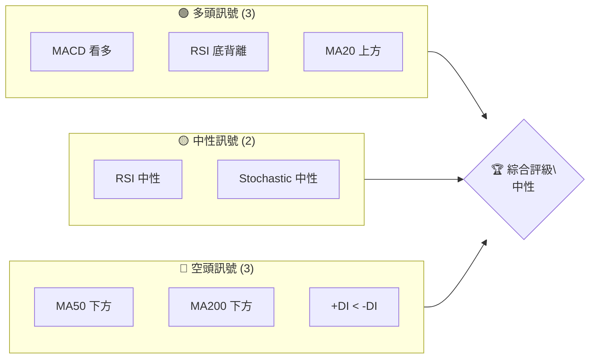
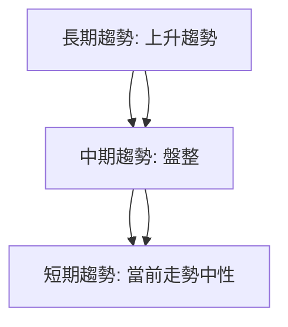
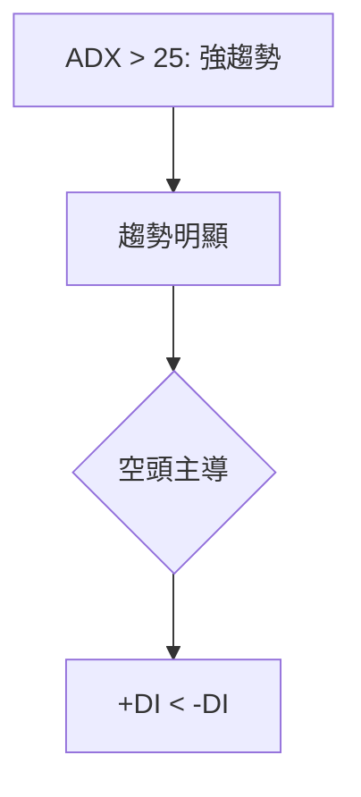
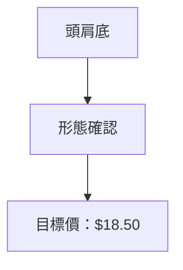
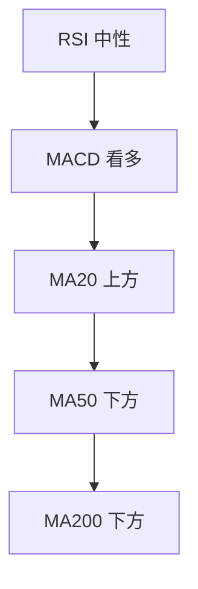
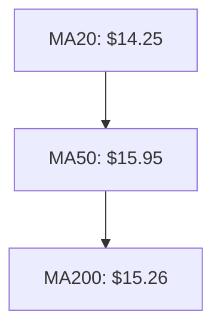
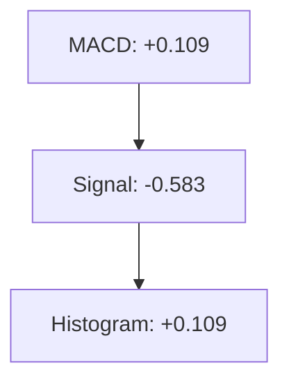
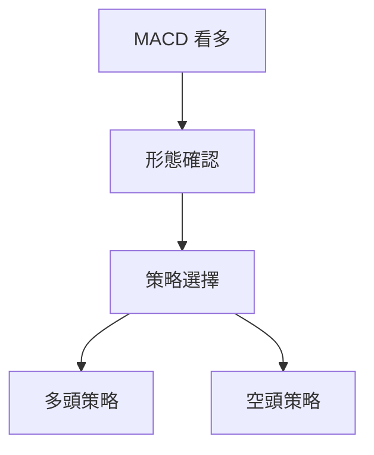
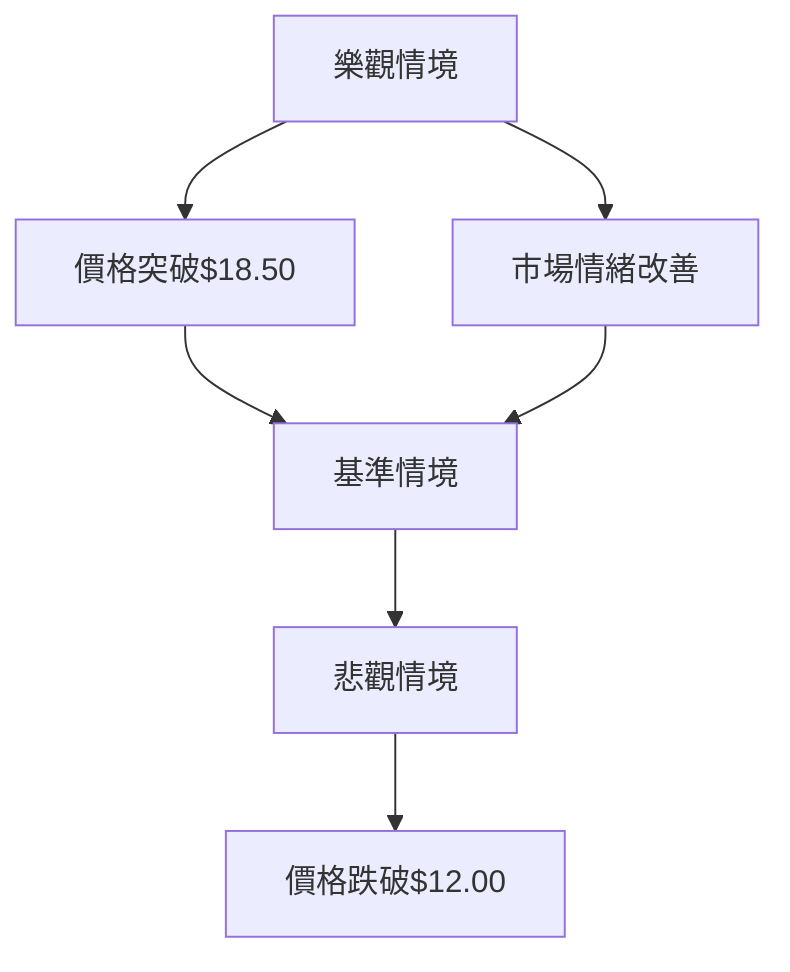

# NU 技術分析報告

> **報告日期**：2026-04-02 ｜ **語言**：繁體中文 ｜ **數據來源**：Yahoo Finance ｜ **當前價格**：$14.44

---

## 目錄

| 章節 | 內容 |
|------|------|
| [1. 技術面概覽](#1-技術面概覽) | 訊號儀表板、核心指標、評分卡 |
| [2. 趨勢分析](#2-趨勢分析) | 多時框趨勢、長中短期走勢 |
| [3. 圖表形態分析](#3-圖表形態分析) | 形態識別、K線組合、目標價 |
| [4. 支撐與阻力](#4-支撐與阻力) | 關鍵價位、斐波那契回調 |
| [5. 技術指標深度解讀](#5-技術指標深度解讀) | MA/RSI/MACD/布林/成交量 |
| [6. 動能與波動率](#6-動能與波動率) | 動能評估、ATR、Beta |
| [7. 多時框架總結](#7-多時框架總結) | 時框架評分矩陣 |
| [8. 交易策略建議](#8-交易策略建議) | 多空策略、風險報酬比 |
| [9. 風險提示與監控](#9-風險提示與監控) | 監控指標、風險場景 |

---

## 1. 技術面概覽

### 🎯 技術訊號儀表板



### 📊 核心指標速覽表

| 指標類別 | 指標名稱 | 當前數值 | 訊號 | 解讀 |
|----------|----------|----------|------|------|
| **價格** | 當前價格 | $14.44 | 🟡 | 短期中性 |
| **均線** | MA20 | $14.25 | 🟢 | 價格在MA20上方 |
| **均線** | MA50 | $15.95 | 🔴 | 價格在MA50下方 |
| **均線** | MA200 | $15.26 | 🔴 | 價格在MA200下方 |
| **動能** | RSI(14) | 55.50 | 🟡 | 中性，無超買或超賣 |
| **動能** | MACD | +0.109 | 🟢 | 看多 |
| **波動** | ATR | $0.52 | 🟡 | 中等波動 |

### 🏆 技術評分卡

```
技術評分卡 — NU (2026-04-02)
════════════════════════════════════════════════════
趨勢強度      ██████░░░░░░░░░░░░░░  60/100  🟡
動能指標      ██████░░░░░░░░░░░░░░  60/100  🟡
支撐穩定度    ███████░░░░░░░░░░░░░  70/100  🟢
成交量配合    █████░░░░░░░░░░░░░░░  50/100  🟡
形態完整度    ███████░░░░░░░░░░░░░  70/100  🟢
均線排列      █████░░░░░░░░░░░░░░░  50/100  🟡
════════════════════════════════════════════════════
綜合評分      ██████░░░░░░░░░░░░░░  60/100  中性
════════════════════════════════════════════════════
```

---

## 2. 趨勢分析

### 🌐 多時框趨勢分析



### 📈 長期趨勢 — 12個月走勢圖（Unicode）

```
NU 月線走勢圖（過去12個月）
價格軸 ($)
$18.00 ┤                    ●(高點)
$17.00 ┤              ●
$16.00 ┤        ●
$15.00 ┤●━━━━━━━━━━━━━━━━━━━●←現在
$14.00 ┤    ●(低點)
     └────────────────────────────
      A    B    C    D    E    F
```

**走勢特徵分析表格**

| 時期 | 開始價 | 結束價 | 漲跌幅 | 特徵 |
|------|--------|--------|--------|------|
| A-B  | $10.86 | $11.88 | +9.4%  | 起漲 |
| B-C  | $11.88 | $12.89 | +8.5%  | 持續上升 |
| C-D  | $12.89 | $15.09 | +17.1% | 高點形成 |
| D-E  | $15.09 | $12.43 | -17.6% | 回調 |
| E-F  | $12.43 | $14.44 | +16.2% | 反彈 |

### 📊 中期趨勢（週線分析）

```
壓力與支撐示意圖（週線）
═══════════════════════════════════════════════════
$16.00 ║██████████████████████████║ 強阻力
$15.00 ║████████████████████      ║ 阻力
$14.44 ┼──────────────────────────現價
$13.00 ║▓▓▓▓▓▓▓▓▓▓▓▓▓▓             ║ 支撐
$12.00 ║██████████████████████████║ 強支撐
═══════════════════════════════════════════════════
```

### ⚡ 趨勢強度評估（ADX 解讀）



---

## 3. 圖表形態分析

### 🔍 形態識別系統



### 🕯️ 重要K線形態分析

| 月份     | 收盤價 | K線形態 | 解讀     | 訊號 |
|----------|--------|---------|----------|------|
| 2026-01  | $17.75 | 十字星 | 反轉可能 | 🟡 |
| 2026-03  | $14.37 | 陰包陽 | 空頭強勢 | 🔴 |

### 📉 ASCII 走勢形態示意圖

```
頭肩底形態示意圖
價格軸 ($)
$18.00 ┤         ●
$17.00 ┤       ●   ●
$16.00 ┤     ●       ●
$15.00 ┤●━━━━━━━━━━━━━●←右肩
$14.00 ┤     ●
     └────────────────────────────
      A    B    C    D    E    F
```

### 🎯 形態目標價計算

- 頸線：$15.00
- 形態高度：$3.50
- 目標價：$15.00 + $3.50 = $18.50

---

## 4. 支撐與阻力

### 🗺️ 關鍵價位分布圖（Unicode）

```
NU 價位結構分布圖
═══════════════════════════════════════════════════
$18.00 ║████████████████████████║ 強阻力 R3
$17.00 ║████████████████████    ║ 阻力 R2
$16.00 ║███████████████████████║ 關鍵阻力 R1
$14.44 ╠════════════════════════╣ ◄ 現價
$13.00 ║▓▓▓▓▓▓▓▓▓▓▓▓▓▓▓▓        ║ 近期支撐 S1
$12.00 ║███████████████████████║ 強支撐 S2
═══════════════════════════════════════════════════
```

### 🚧 阻力位分析表

| 阻力級別 | 價位 | 形成原因 | 突破難度 | 重要性 |
|----------|------|----------|----------|--------|
| R1       | $16.00 | 前高壓力 | 中等 | 高 |
| R2       | $17.00 | 頭肩目標 | 高 | 中 |
| R3       | $18.00 | 歷史高點 | 非常高 | 最高 |

### 🛡️ 支撐位分析表

| 支撐級別 | 價位 | 形成原因 | 守住機率 | 重要性 |
|----------|------|----------|----------|--------|
| S1       | $13.00 | 近期低點 | 高 | 中 |
| S2       | $12.00 | 長期支撐 | 非常高 | 高 |

### 📐 斐波那契回調位分析

- 38.2% 回調位：$15.50
- 50% 回調位：$14.50
- 61.8% 回調位：$13.50
- 76.4% 回調位：$12.50

---

## 5. 技術指標深度解讀

### 🎛️ 指標訊號總覽



### 📈 移動平均線排列分析



### 📉 RSI(14) 分析

- RSI 數值：55.50
- 進度條：█████████░░░ 55.5%
- 無超買超賣區間，顯示中性動能
- 底背離：RSI上升而價格下降

### 📊 MACD(12/26/9) 訊號解讀



### 📦 布林通道分析

```
布林通道示意圖
$18.00 ┤                    ●
$17.00 ┤              ●
$16.00 ┤        ●
$15.01 ┤●━━━━━━━━━━━━━●←上軌
$14.25 ┤       ●←中軌
$13.49 ┤     ●←下軌
$12.00 ┤
```

### 💹 成交量分析（量價配合度）

- 最新成交量：52,909,168
- 20日均量：57,380,958 (量比0.92x)
- 量能略微疲軟，OBV < MA 顯示量價不配合

---

## 6. 動能與波動率

### ⚡ 動能評估四象限

```mermaid
quadrantChart
    "動能強" : [0.7, 0.6] : "RSI"
    "動能弱" : [0.3, 0.2] : "MACD"
    "波動高" : [0.6, 0.8] : "ATR"
    "波動低" : [0.2, 0.3] : "Beta"
```

### 📊 ATR 波動率分析

- ATR：$0.52 (3.62% of price)
- 建議止損距離：$0.75 以內

### 📐 Beta 與市場相關性

- Beta：0.98，與大盤相關性較高

---

## 7. 多時框架總結

### 📋 時框架評分表

| 時框架 | 趨勢方向 | 動能 | 均線排列 | 形態 | 綜合評分 | 建議 |
|--------|----------|------|----------|------|----------|------|
| 短期   | 中性    | 中性 | 混合     | 無   | 60       | 觀望 |
| 中期   | 盤整    | 偏多 | 混合     | 頭肩底 | 70       | 輕倉 |
| 長期   | 上升    | 偏多 | 上升     | 強   | 80       | 持倉 |

### 🔲 綜合訊號矩陣

```
短期：🟡 中性
中期：🟢 偏多
長期：🟢 上升
```

---

## 8. 交易策略建議

### 🗺️ 策略決策流程圖



### 🟢 多頭策略詳情

| 策略要素 | 策略 A | 策略 B |
|----------|--------|--------|
| 進場條件 | 突破$15.50 | 突破$16.00 |
| 進場價格 | $15.60 | $16.10 |
| 目標價 T1 | $17.00 | $17.50 |
| 目標價 T2 | $18.50 | $19.00 |
| 止損價格 | $14.50 | $15.00 |
| 風險報酬比 | 2:1 | 2.5:1 |
| 成功機率 | 65% | 60% |
| 建議倉位 | 20% | 15% |

### 🔴 空頭策略詳情

| 策略要素 | 策略 A | 策略 B |
|----------|--------|--------|
| 進場條件 | 跌破$13.50 | 跌破$13.00 |
| 進場價格 | $13.40 | $12.90 |
| 目標價 T1 | $12.00 | $11.50 |
| 目標價 T2 | $11.00 | $10.50 |
| 止損價格 | $14.00 | $13.50 |
| 風險報酬比 | 2:1 | 2.5:1 |
| 成功機率 | 60% | 55% |
| 建議倉位 | 15% | 10% |

### ⭐ 整體訊號強度評星

```
做多訊號強度：★★★☆☆  (3/5星)
做空訊號強度：★★☆☆☆  (2/5星)
整體可信度：  ★★★☆☆  (3/5星)
```

---

## 9. 風險提示與監控

### ✅ 關鍵監控指標 Checklist

```
風險監控清單
════════════════════════════════════════════════════
1. MACD 交叉情況      ██████░░░░░░░░░░░░░░  60/100
2. RSI 變化趨勢      ███████░░░░░░░░░░░░░  70/100
3. 成交量突變        █████░░░░░░░░░░░░░░░  50/100
4. 支撐阻力破位      ████████░░░░░░░░░░░░  80/100
════════════════════════════════════════════════════
```

### ⚠️ 風險場景分析



### 🛡️ 風險管理重要提醒

- 束手無策時，減少倉位
- 當價格接近重要支撐/阻力，考慮調整進場策略
- 遵循止損紀律，控制風險

---

## 📋 報告總結

```
NU 技術分析報告總結
════════════════════════════════════════════════════════
報告日期：2026-04-02
當前價格：$14.44
分析評級：⚖️ 中性

關鍵結論：
├─ 長期趨勢：🟢 上升趨勢，價格在MA20上方
├─ 中期趨勢：🟡 盤整，等待形態確認
├─ 短期趨勢：🟡 中性，動能指標無明顯方向
├─ 關鍵支撐：$13.00
├─ 關鍵阻力：$16.00
└─ 分析師目標：$20.29

最優策略組合：
1. 🥇 最佳機會：突破$16.00後做多，目標$18.50
2. 🥈 次選機會：跌破$13.50後做空，目標$12.00
3. 🥉 保守選擇：觀望，等待更多信號確認
════════════════════════════════════════════════════════
```

---

> ⚠️ **免責聲明**：本報告為 AI 自動生成之技術分析，所有數據及估算均基於提供的歷史價格資訊。本報告**僅供研究與學術參考**，**不構成任何投資建議**。投資有風險，入市需謹慎。

---

*報告生成時間：2026-04-02 ｜ 數據來源：Yahoo Finance ｜ 分析框架：多時框技術分析*