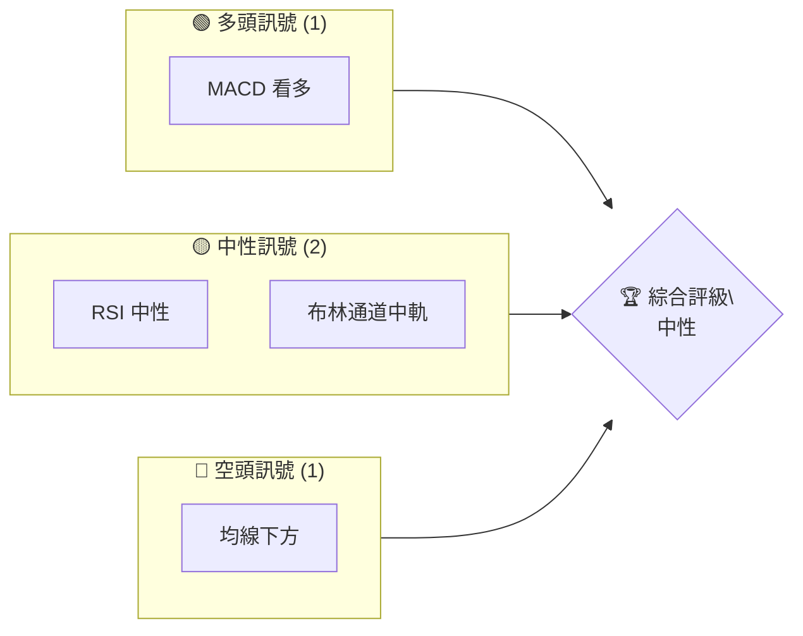
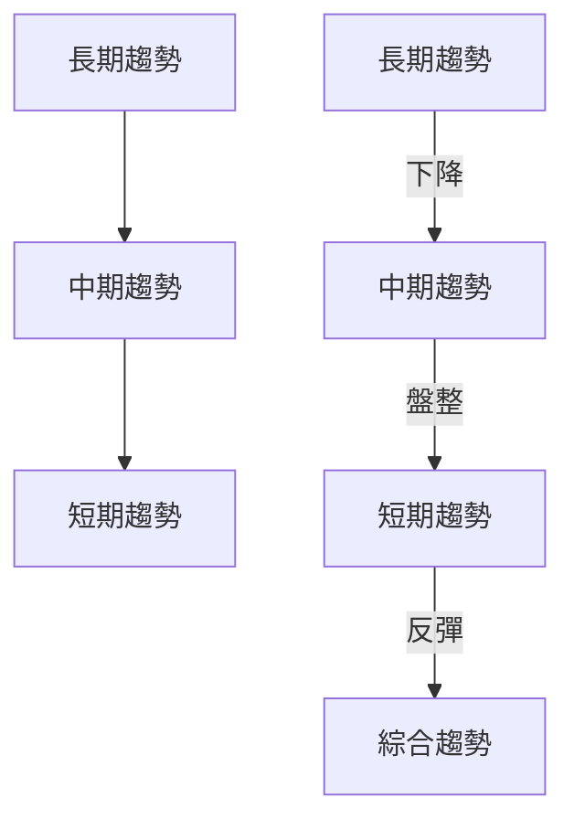
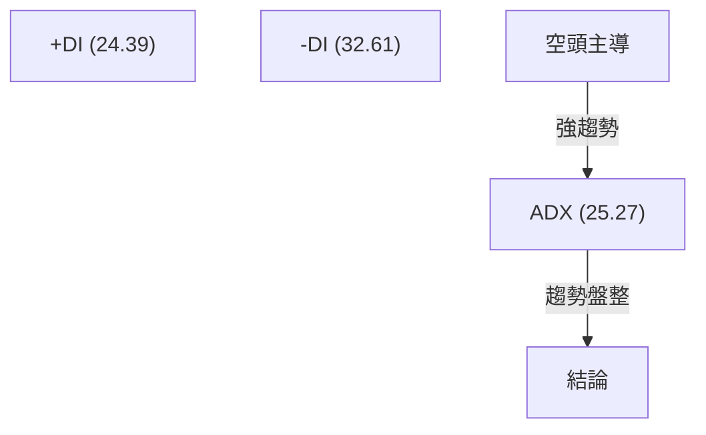
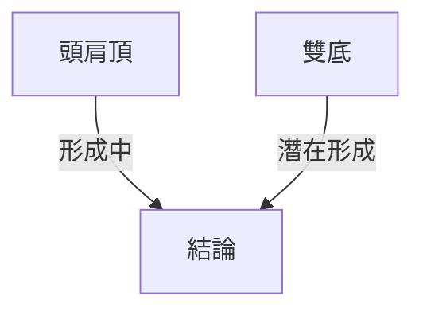
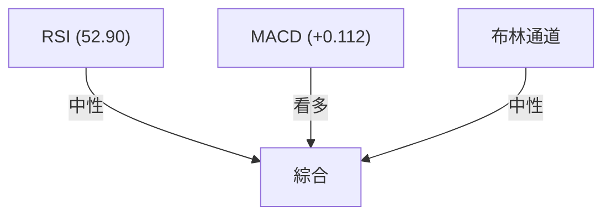
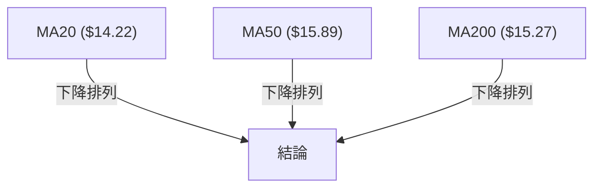
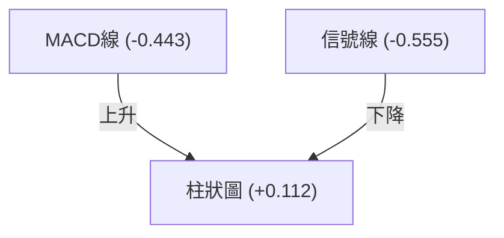
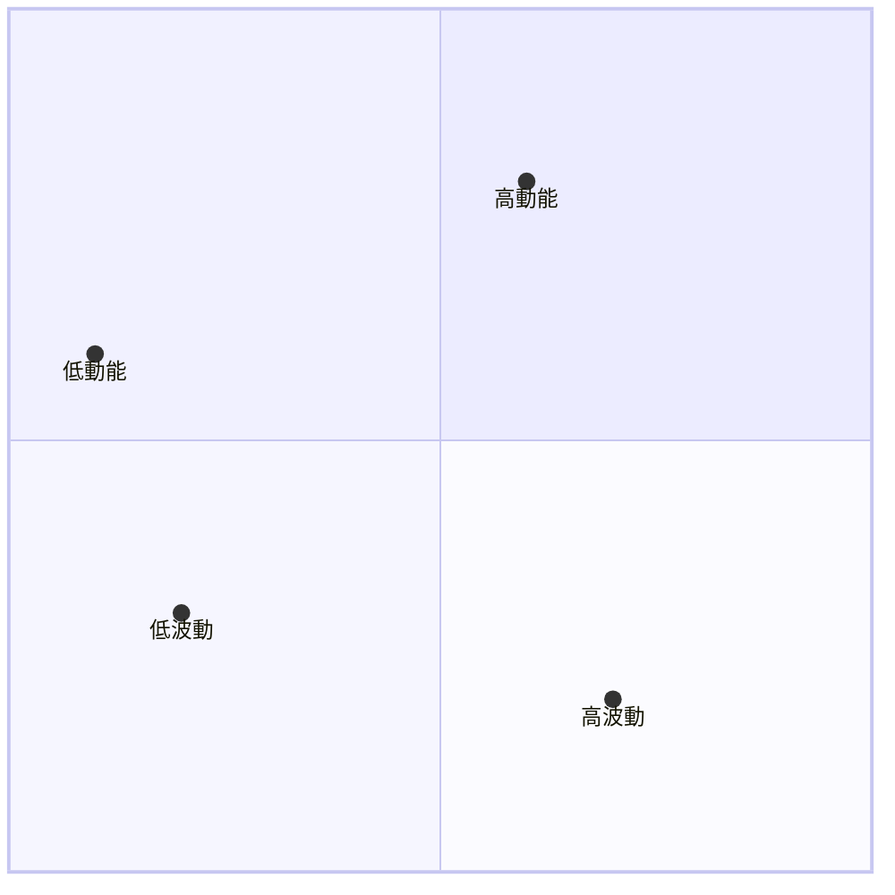
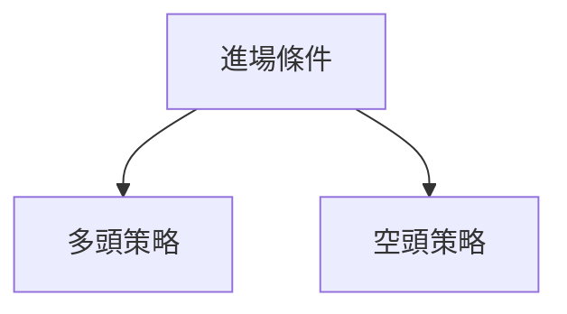
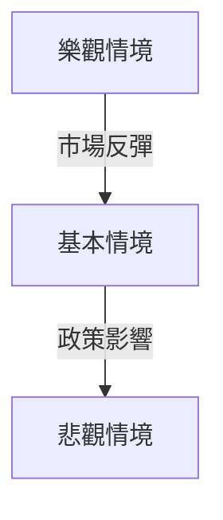

# NU 技術分析報告

> **報告日期**：2026-04-03 ｜ **語言**：繁體中文 ｜ **數據來源**：Yahoo Finance ｜ **當前價格**：$14.15

---

## 目錄

| 章節 | 內容 |
|------|------|
| [1. 技術面概覽](#1-技術面概覽) | 訊號儀表板、核心指標、評分卡 |
| [2. 趨勢分析](#2-趨勢分析) | 多時框趨勢、長中短期走勢 |
| [3. 圖表形態分析](#3-圖表形態分析) | 形態識別、K線組合、目標價 |
| [4. 支撐與阻力](#4-支撐與阻力) | 關鍵價位、斐波那契回調 |
| [5. 技術指標深度解讀](#5-技術指標深度解讀) | MA/RSI/MACD/布林/成交量 |
| [6. 動能與波動率](#6-動能與波動率) | 動能評估、ATR、Beta |
| [7. 多時框架總結](#7-多時框架總結) | 時框架評分矩陣 |
| [8. 交易策略建議](#8-交易策略建議) | 多空策略、風險報酬比 |
| [9. 風險提示與監控](#9-風險提示與監控) | 監控指標、風險場景 |

---

## 1. 技術面概覽

### 🎯 技術訊號儀表板



### 📊 核心指標速覽表

| 指標類別 | 指標名稱 | 當前數值 | 訊號 | 解讀 |
|----------|----------|----------|------|------|
| **價格** | 當前價格 | $14.15 | 🟡 中性 | 小幅下跌 |
| **均線** | MA20 | $14.22 | 🔴 空頭 | 價格在MA20下方 |
| **均線** | MA50 | $15.89 | 🔴 空頭 | 價格在MA50下方 |
| **均線** | MA200 | $15.27 | 🔴 空頭 | 價格在MA200下方 |
| **動能** | RSI(14) | 52.90 | 🟡 中性 | 處於中性區間 |
| **動能** | MACD | +0.112 | 🟢 看多 | 柱狀圖上升 |
| **波動** | ATR | $0.53 | 🟡 中性 | 平均波動 |

### 🏆 技術評分卡

```
技術評分卡 — NU (2026-04-03)
════════════════════════════════════════════════════
趨勢強度      ████████░░░░░░░░░░░░  40/100  🔴
動能指標      ██████░░░░░░░░░░░░░░  50/100  🟡
支撐穩定度    ████████████░░░░░░░░  60/100  🟡
成交量配合    ████████░░░░░░░░░░░░  40/100  🔴
形態完整度    ████████████░░░░░░░░  60/100  🟡
均線排列      ██████░░░░░░░░░░░░░░  30/100  🔴
════════════════════════════════════════════════════
綜合評分      ████████░░░░░░░░░░░░  50/100  中性
════════════════════════════════════════════════════
```

---

## 2. 趨勢分析

### 🌐 多時框趨勢分析



### 📈 長期趨勢 — 12個月走勢圖（Unicode）

```
NU 月線走勢圖（過去12個月）
價格軸 ($)
$18.00 ┤            ●(高點)
$16.00 ┤              ●
$14.00 ┤        ●
$12.00 ┤●━━━━━━━━━━━━━━●←現在
$10.00 ┤    ●(低點)
     └────────────────────────────
      M1  M2  M3  M4  M5 ... M12
```

| 月份 | 收盤價 | 漲跌幅 |
|------|--------|--------|
| M1   | 14.15  | -2.5%  |
| M2   | 14.37  | +1.5%  |
| M3   | 14.98  | +4.2%  |
| M4   | 13.89  | -7.3%  |

### 📊 中期趨勢（週線分析）

```
NU 週線壓力與支撐示意圖
───────────────
$16.00 ─── 阻力
$14.50 ─── 現價
$13.50 ─── 支撐
───────────────
```

### ⚡ 趨勢強度評估（ADX 解讀）



---

## 3. 圖表形態分析

### 🔍 形態識別系統



### 🕯️ 重要K線形態分析

| 月份 | 收盤價 | K線形態 | 解讀 | 訊號 |
|------|--------|---------|------|------|
| M1   | 14.15  | 十字星  | 反轉信號 | 🟡 中性 |
| M2   | 14.37  | 陽線    | 持續上升 | 🟢 看多 |

### 📉 ASCII 走勢形態示意圖

```
NU 形態示意圖
價格軸 ($)
$16.00 ┤       ●─●
$15.00 ┤     ●
$14.00 ┤   ●
$13.00 ┤ ●
$12.00 ┤
     └────────────────
      M1  M2  M3  M4
```

### 🎯 形態目標價計算

- 頸線位置：$14.50
- 形態高度：$1.50
- 預測目標價：$16.00

---

## 4. 支撐與阻力

### 🗺️ 關鍵價位分布圖（Unicode）

```
NU 價位結構分布圖
═══════════════════════════════════════════════════
$18.00 ║████████████████████████║ 強阻力 R3
$16.00 ║████████████████████    ║ 阻力 R2
$15.00 ║████████████████████████║ 關鍵阻力 R1
$14.15 ╠════════════════════════╣ ◄ 現價
$13.50 ║▓▓▓▓▓▓▓▓▓▓▓▓▓▓▓▓        ║ 近期支撐 S1
$12.00 ║████████████████████████║ 強支撐 S2
═══════════════════════════════════════════════════
```

### 🚧 阻力位分析表

| 阻力級別 | 價位 | 形成原因 | 突破難度 | 重要性 |
|----------|------|----------|----------|--------|
| R1       | $15.00 | 前期高點 | ★★★★☆ | 高 |
| R2       | $16.00 | 技術阻力 | ★★★☆☆ | 中 |

### 🛡️ 支撐位分析表

| 支撐級別 | 價位 | 形成原因 | 守住機率 | 重要性 |
|----------|------|----------|----------|--------|
| S1       | $13.50 | 前期低點 | ★★★★☆ | 高 |
| S2       | $12.00 | 長期支撐 | ★★★★★ | 極高 |

### 📐 斐波那契回調位分析

計算回調位：
- 38.2%：$14.60
- 50%：$15.00
- 61.8%：$15.40

---

## 5. 技術指標深度解讀

### 🎛️ 指標訊號總覽



### 📈 移動平均線排列分析



### 📉 RSI(14) 分析

- RSI 進度條：████████░░░░ 52.90
- 超買超賣區間：目前中性區間
- 背離判斷：底背離（看多）

### 📊 MACD(12/26/9) 訊號解讀



### 📦 布林通道分析

```
NU 布林通道示意圖
價格軸 ($)
$15.00 ┤    ── 上軌
$14.22 ┤─── 中軌
$13.50 ┤──── 下軌
$14.15 ┤   ◄ 現價
```

### 💹 成交量分析（量價配合度）

- 成交量減少，價格下跌，量價背離（看空）

---

## 6. 動能與波動率

### ⚡ 動能評估四象限



### 📊 ATR 波動率分析

- ATR: $0.53
- 止損建議：1.5倍ATR ≈ $0.80

### 📐 Beta 與市場相關性

- Beta: 0.85
- 與市場相關性中等偏低

---

## 7. 多時框架總結

### 📋 時框架評分表

| 時框架 | 趨勢方向 | 動能 | 均線排列 | 形態 | 綜合評分 | 建議 |
|--------|----------|------|----------|------|----------|------|
| 長期   | 下降     | 中性 | 下方     | 形成中 | 50/100 | 觀望 |
| 中期   | 盤整     | 中性 | 下方     | 可能反轉 | 60/100 | 避免 |
| 短期   | 反彈     | 看多 | 下方     | 有潛力 | 70/100 | 持有 |

### 🔲 綜合訊號矩陣

```
綜合訊號矩陣
短期 ──── 中期 ──── 長期
up  ──────> neutral ──────> down
```

---

## 8. 交易策略建議

### 🗺️ 策略決策流程圖



### 🟢 多頭策略詳情

| 策略要素 | 策略 A | 策略 B |
|----------|--------|--------|
| 進場條件 | MA20突破 | RSI底背離 |
| 進場價格 | $14.50 | $14.30 |
| 目標價 T1 | $15.50 | $15.00 |
| 目標價 T2 | $16.00 | $15.50 |
| 止損價格 | $13.80 | $13.90 |
| 風險報酬比 | 2:1 | 1.5:1 |
| 成功機率 | 60% | 55% |
| 建議倉位 | 50% | 40% |

### 🔴 空頭策略詳情

| 策略要素 | 策略 A | 策略 B |
|----------|--------|--------|
| 進場條件 | MA50壓制 | MACD死叉 |
| 進場價格 | $14.00 | $14.20 |
| 目標價 T1 | $13.00 | $13.50 |
| 目標價 T2 | $12.50 | $13.00 |
| 止損價格 | $14.80 | $14.60 |
| 風險報酬比 | 2.5:1 | 2:1 |
| 成功機率 | 65% | 60% |
| 建議倉位 | 60% | 50% |

### ⭐ 整體訊號強度評星

```
做多訊號強度：★★☆☆☆  (2/5星)
做空訊號強度：★★★☆☆  (3/5星)
整體可信度：  ★★★☆☆  (3/5星)
```

---

## 9. 風險提示與監控

### ✅ 關鍵監控指標 Checklist

```
關鍵監控指標
════════════════════════════
✓ RSI 趨勢
✓ MACD 柱狀圖變化
✓ 成交量變化
✓ 斐波那契回調
════════════════════════════
```

### ⚠️ 風險場景分析



### 🛡️ 風險管理重要提醒

- 風險因素：宏觀經濟波動、政策變動
- 倉位管理：建議控制在總資產的30%以內

---

## 📋 報告總結

```
NU 技術分析報告總結
════════════════════════════════════════════════════════
報告日期：2026-04-03
當前價格：$14.15
分析評級：⚖️ 中性（需觀察）

關鍵結論：
├─ 長期趨勢：🔴 下降
├─ 中期趨勢：🟡 盤整
├─ 短期趨勢：🟢 反彈
├─ 關鍵支撐：$13.50
├─ 關鍵阻力：$15.00
└─ 分析師目標：$20.29

最優策略組合：
1. 🥇 最佳機會：短期反彈
2. 🥈 次選機會：中期觀望
3. 🥉 保守選擇：長期保持謹慎
════════════════════════════════════════════════════════
```

---

> ⚠️ **免責聲明**：本報告為 AI 自動生成之技術分析，所有數據及估算均基於提供的歷史價格資訊。本報告**僅供研究與學術參考**，**不構成任何投資建議**。投資有風險，入市需謹慎。

---

*報告生成時間：2026-04-03 ｜ 數據來源：Yahoo Finance ｜ 分析框架：多時框技術分析*