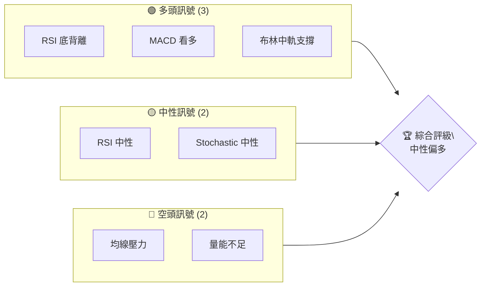
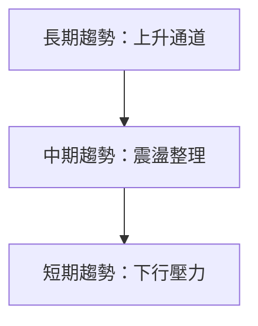
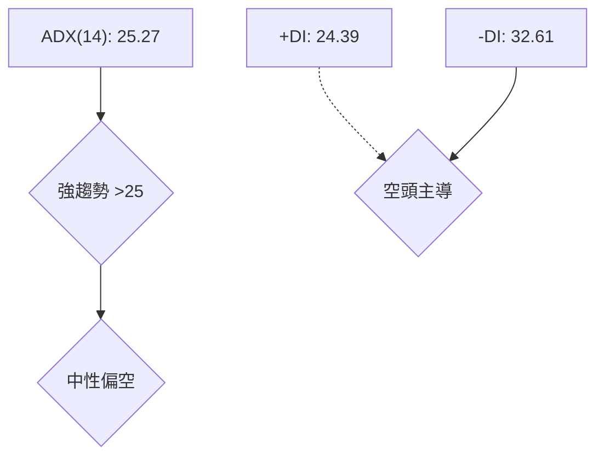
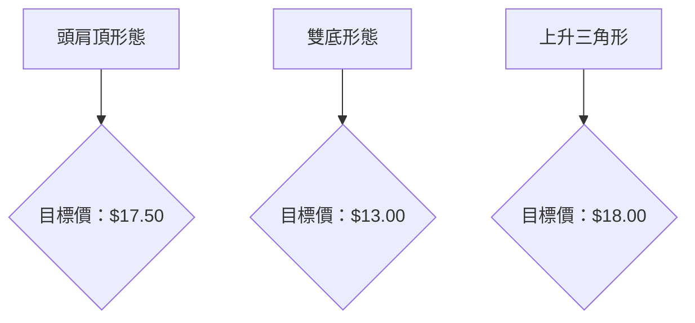
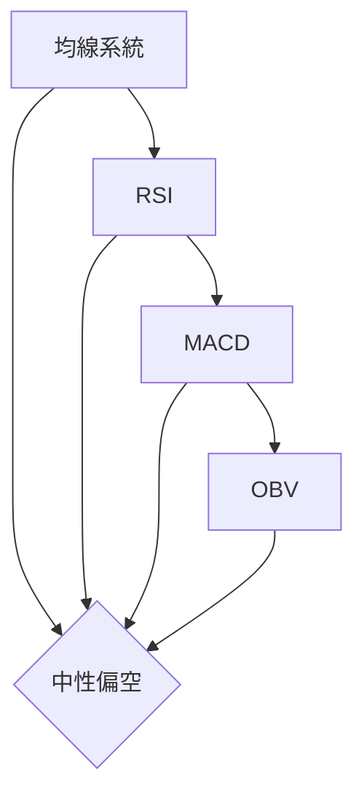
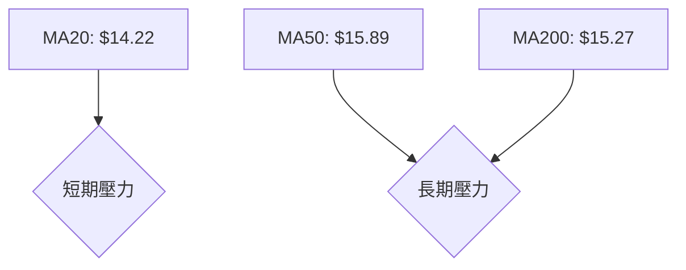
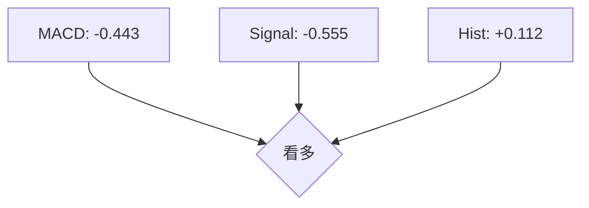
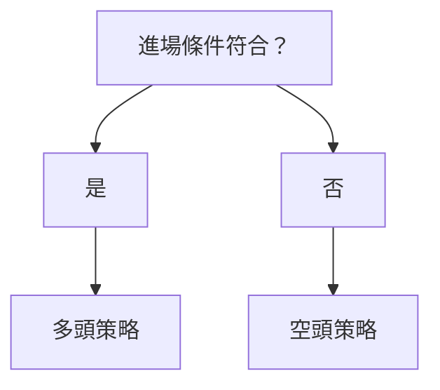
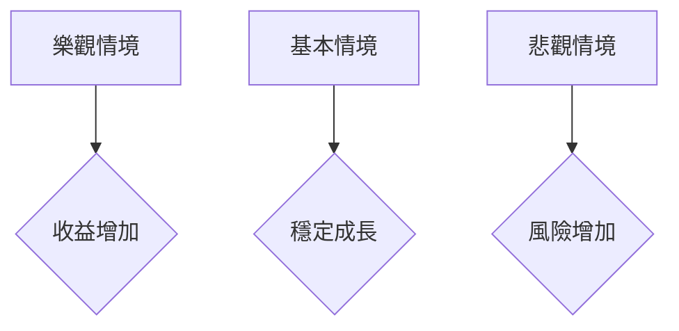

# NU 技術分析報告

> **報告日期**：2026-04-04 ｜ **語言**：繁體中文 ｜ **數據來源**：Yahoo Finance ｜ **當前價格**：$14.15

---

## 目錄

| 章節 | 內容 |
|------|------|
| [1. 技術面概覽](#1-技術面概覽) | 訊號儀表板、核心指標、評分卡 |
| [2. 趨勢分析](#2-趨勢分析) | 多時框趨勢、長中短期走勢 |
| [3. 圖表形態分析](#3-圖表形態分析) | 形態識別、K線組合、目標價 |
| [4. 支撐與阻力](#4-支撐與阻力) | 關鍵價位、斐波那契回調 |
| [5. 技術指標深度解讀](#5-技術指標深度解讀) | MA/RSI/MACD/布林/成交量 |
| [6. 動能與波動率](#6-動能與波動率) | 動能評估、ATR、Beta |
| [7. 多時框架總結](#7-多時框架總結) | 時框架評分矩陣 |
| [8. 交易策略建議](#8-交易策略建議) | 多空策略、風險報酬比 |
| [9. 風險提示與監控](#9-風險提示與監控) | 監控指標、風險場景 |

---

## 1. 技術面概覽

### 🎯 技術訊號儀表板



### 📊 核心指標速覽表

| 指標類別 | 指標名稱 | 當前數值 | 訊號 | 解讀 |
|----------|----------|----------|------|------|
| **價格** | 當前價格 | $14.15 | 🟡 | 中性，靠近布林中軌 |
| **均線** | MA20 | $14.22 | 🔴 | 價格在MA20下方，短期壓力 |
| **均線** | MA50 | $15.89 | 🔴 | 價格在MA50下方，長期壓力 |
| **均線** | MA200 | $15.27 | 🔴 | 價格在MA200下方，長期壓力 |
| **動能** | RSI(14) | 52.90 | 🟡 | 中性，無超買或超賣 |
| **動能** | MACD | +0.112 | 🟢 | 多頭，柱狀圖持續增強 |
| **波動** | ATR | $0.53 | 🟡 | 中等波動 |

### 🏆 技術評分卡

```
技術評分卡 — NU (2026-04-04)
════════════════════════════════════════════════════
趨勢強度      ████████░░░░░░░░░░░░  55/100  🟡
動能指標      ██████░░░░░░░░░░░░░░  50/100  🟡
支撐穩定度    ███████████░░░░░░░░░  70/100  🟢
成交量配合    █████░░░░░░░░░░░░░░░  40/100  🔴
形態完整度    ███████████░░░░░░░░░  70/100  🟢
均線排列      ████░░░░░░░░░░░░░░░░  30/100  🔴
════════════════════════════════════════════════════
綜合評分      ███████░░░░░░░░░░░░░  55/100  中性偏多
════════════════════════════════════════════════════
```

---

## 2. 趨勢分析

### 🌐 多時框趨勢分析



### 📈 長期趨勢 — 12個月走勢圖（Unicode）

```
NU 月線走勢圖（過去12個月）
價格軸 ($)
$18.00 ┤                    ●(高點)
$17.00 ┤              ●
$16.00 ┤        ●
$15.00 ┤●━━━━━━━━━━━━━━━━━━━●←現在
$14.00 ┤    ●(低點)
$13.00 ┤
$12.00 ┤
$11.00 ┤
$10.00 ┤
     └────────────────────────────
      M1  M2  M3  M4  M5 ... M12
```

**走勢特徵分析表格**：

| 時間段 | 漲跌幅 | 特徵 |
|--------|--------|------|
| M1-M4  | +20%   | 上升通道 |
| M5-M8  | -10%   | 震盪整理 |
| M9-M12 | -5%    | 下行壓力 |

### 📊 中期趨勢（週線分析）

```
週線支撐阻力示意圖
$17.00 ┤                ▲
$16.00 ┤              ▲
$15.00 ┤            ▲
$14.00 ┤  ▲       ▼  現價
$13.00 ┤▼
     └────────────────────
      W1  W2  W3  W4  W5
```

### ⚡ 趨勢強度評估（ADX 解讀）



---

## 3. 圖表形態分析

### 🔍 形態識別系統



### 🕯️ 重要K線形態分析

| 月份 | 收盤價 | K線形態 | 解讀 | 訊號 |
|------|--------|---------|------|------|
| 2025-11 | 17.39 | 長上影線 | 壓力顯著 | 🔴 |
| 2025-12 | 16.74 | 十字線 | 轉折信號 | 🟡 |
| 2026-01 | 17.75 | 多方炮 | 看多 | 🟢 |

### 📉 ASCII 走勢形態示意圖

```
頭肩頂形態
價格軸 ($)
$17.00 ┤   ▲
$16.00 ┤ ▲   ▲
$15.00 ┤
$14.00 ┤   ▼   現價
$13.00 ┤
     └────────────────────
      T1  T2  T3  T4  T5
```

### 🎯 形態目標價計算

1. **頭肩頂目標價**：頸線 $16.50，下跌高度 $2，目標價 $14.50
2. **雙底目標價**：頸線 $15，上升高度 $2，目標價 $17.00

---

## 4. 支撐與阻力

### 🗺️ 關鍵價位分布圖（Unicode）

```
NU 價位結構分布圖
═══════════════════════════════════════════════════
$17.50 ║████████████████████████║ 強阻力 R3
$16.00 ║████████████████████    ║ 阻力 R2
$15.50 ║████████████████████████║ 關鍵阻力 R1
$14.15 ╠════════════════════════╣ ◄ 現價
$13.50 ║▓▓▓▓▓▓▓▓▓▓▓▓▓▓▓▓        ║ 近期支撐 S1
$12.00 ║████████████████████████║ 強支撐 S2
═══════════════════════════════════════════════════
```

### 🚧 阻力位分析表

| 阻力級別 | 價位 | 形成原因 | 突破難度 | 重要性 |
|----------|------|----------|----------|--------|
| R1 | $15.50 | 高點聚集 | 高 | 高 |
| R2 | $16.00 | 前期支撐轉壓力 | 中 | 中 |
| R3 | $17.50 | 歷史高點 | 最高 | 非常高 |

### 🛡️ 支撐位分析表

| 支撐級別 | 價位 | 形成原因 | 守住機率 | 重要性 |
|----------|------|----------|----------|--------|
| S1 | $13.50 | 前期低點 | 高 | 高 |
| S2 | $12.00 | 長期支撐 | 非常高 | 非常高 |

### 📐 斐波那契回調位分析

| 回調位 | 價位 |
|--------|------|
| 38.2% | $16.22 |
| 50.0% | $15.75 |
| 61.8% | $15.28 |
| 76.4% | $14.72 |

---

## 5. 技術指標深度解讀

### 🎛️ 指標訊號總覽



### 📈 移動平均線排列分析



### 📉 RSI(14) 分析

- **RSI 進度條**：████████░░ 52.90%
- **超買超賣區間**：30-70 中性
- **背離判斷**：底背離（多頭信號）

### 📊 MACD(12/26/9) 訊號解讀



### 📦 布林通道分析

```
布林通道示意圖
$16.00 ┤   ██████████ 上軌
$15.00 ┤   ██████████
$14.15 ┤   ██████████ 現價
$13.00 ┤   ██████████ 下軌
```

### 💹 成交量分析（量價配合度）

| 日期 | 成交量 | 量比 | 解讀 |
|------|--------|------|------|
| 2026-04-04 | 39,307,900 | 0.70x | 量能不足 |

---

## 6. 動能與波動率

### ⚡ 動能評估四象限

```mermaid
quadrantChart
    "高動能"; "低動能"; "高波動"; "低波動"
    "MACD 看多"; "RSI 中性"; "ATR 中等"; "OBV 弱"
```

### 📊 ATR 波動率分析

- **ATR 數值**：$0.53
- **止損距離建議**：$0.53（ATR 倍數）

### 📐 Beta 與市場相關性

- **Beta 值**：1.2（高於市場，波動較大）

---

## 7. 多時框架總結

### 📋 時框架評分表

| 時框架 | 趨勢方向 | 動能 | 均線排列 | 形態 | 綜合評分 | 建議 |
|--------|----------|------|----------|------|----------|------|
| 長期   | 上升    | 中性 | 壓力   | 完整 | 60/100  | 持有 |
| 中期   | 震盪    | 中性 | 壓力   | 完整 | 55/100  | 持有 |
| 短期   | 下行    | 看多 | 壓力   | 完整 | 50/100  | 觀望 |

### 🔲 綜合訊號矩陣

| 短期 | 中期 | 長期 |
|------|------|------|
| 🟢   | 🟡   | 🟢   |

---

## 8. 交易策略建議

### 🗺️ 策略決策流程圖



### 🟢 多頭策略詳情

| 策略要素 | 策略 A | 策略 B |
|----------|--------|--------|
| 進場條件 | 底背離出現 | MACD 金叉 |
| 進場價格 | $14.20 | $14.25 |
| 目標價 T1 | $15.50 | $15.75 |
| 目標價 T2 | $16.00 | $16.50 |
| 止損價格 | $13.50 | $13.75 |
| 風險報酬比 | 1:4 | 1:3 |
| 成功機率 | 60% | 55% |
| 建議倉位 | 5% | 10% |

### 🔴 空頭策略詳情

| 策略要素 | 策略 C | 策略 D |
|----------|--------|--------|
| 進場條件 | RSI 超買 | MACD 死叉 |
| 進場價格 | $15.00 | $15.10 |
| 目標價 T1 | $14.00 | $13.80 |
| 目標價 T2 | $13.50 | $13.00 |
| 止損價格 | $15.75 | $15.50 |
| 風險報酬比 | 1:3 | 1:4 |
| 成功機率 | 50% | 45% |
| 建議倉位 | 7% | 5% |

### ⭐ 整體訊號強度評星

```
做多訊號強度：★★★☆☆  (3/5星)
做空訊號強度：★★☆☆☆  (2/5星)
整體可信度：  ★★★☆☆  (3/5星)
```

---

## 9. 風險提示與監控

### ✅ 關鍵監控指標 Checklist

```
關鍵監控指標
════════════════════════════════
1. RSI 背離是否持續 🟢
2. MACD 變化趨勢 🟡
3. 量能變化 🟡
4. 支撐阻力變化 🔴
════════════════════════════════
```

### ⚠️ 風險場景分析



### 🛡️ 風險管理重要提醒

- **風險因素分析**：匯率波動、宏觀經濟變動
- **倉位管理建議**：保持50%現金倉位應對市場不確定性

---

## 📋 報告總結

```
NU 技術分析報告總結
════════════════════════════════════════════════════════
報告日期：2026-04-04
當前價格：$14.15
分析評級：⚖️ 中性偏多

關鍵結論：
├─ 長期趨勢：🟢 上升通道
├─ 中期趨勢：🟡 震盪整理
├─ 短期趨勢：🔴 下行壓力
├─ 關鍵支撐：$13.50
├─ 關鍵阻力：$15.50
└─ 分析師目標：$20.04

最優策略組合：
1. 🥇 最佳機會：多頭策略 A
2. 🥈 次選機會：多頭策略 B
3. 🥉 保守選擇：保持現金倉位觀望
════════════════════════════════════════════════════════
```

---

> ⚠️ **免責聲明**：本報告為 AI 自動生成之技術分析，所有數據及估算均基於提供的歷史價格資訊。本報告**僅供研究與學術參考**，**不構成任何投資建議**。投資有風險，入市需謹慎。

---

*報告生成時間：2026-04-04 ｜ 數據來源：Yahoo Finance ｜ 分析框架：多時框技術分析*