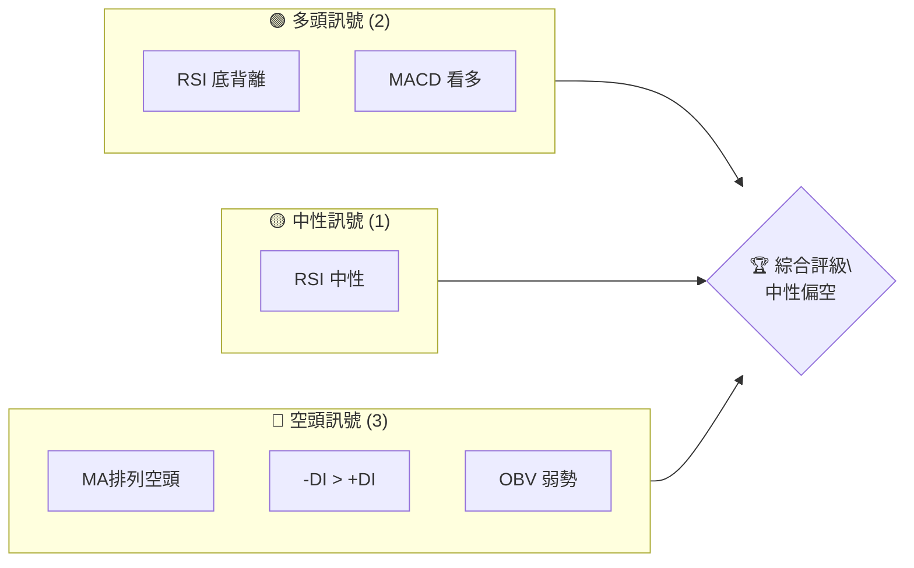
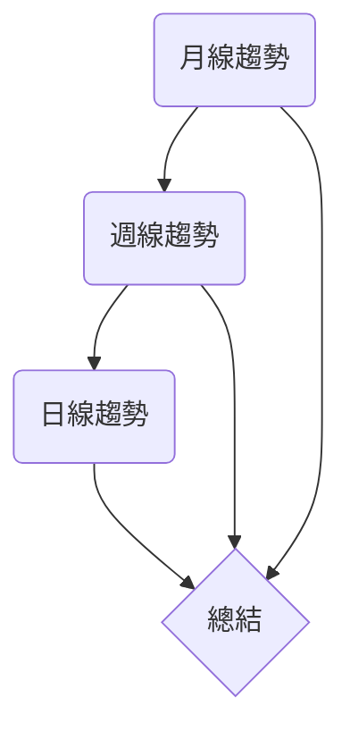
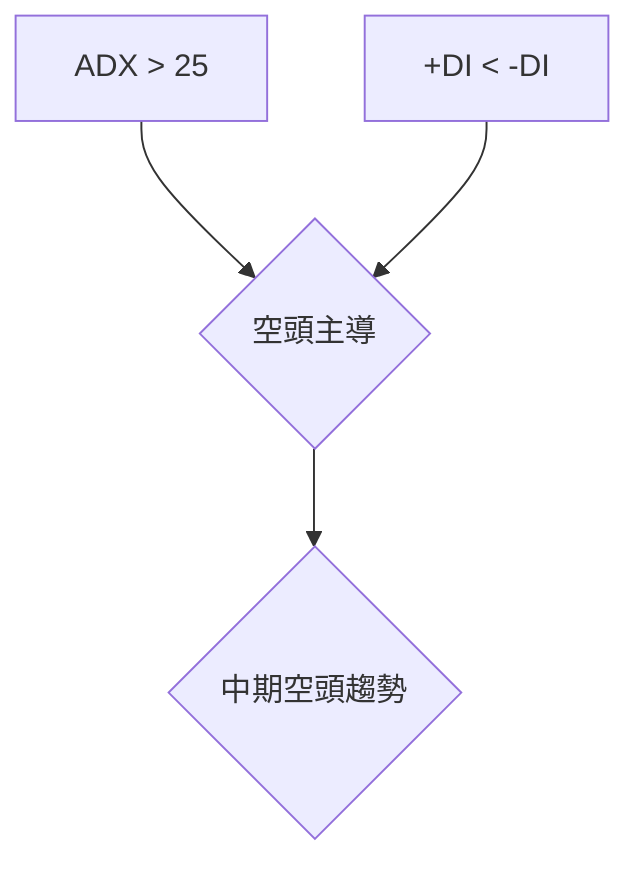
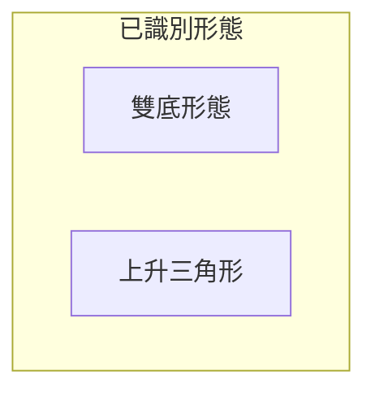
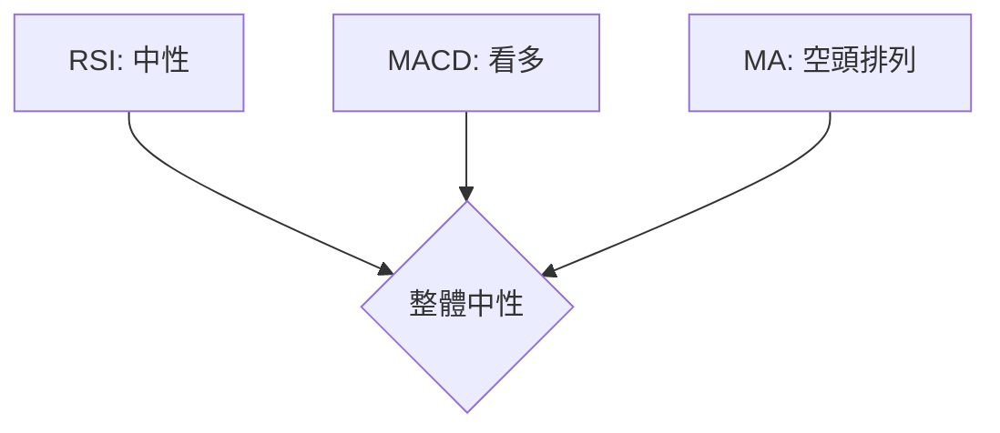
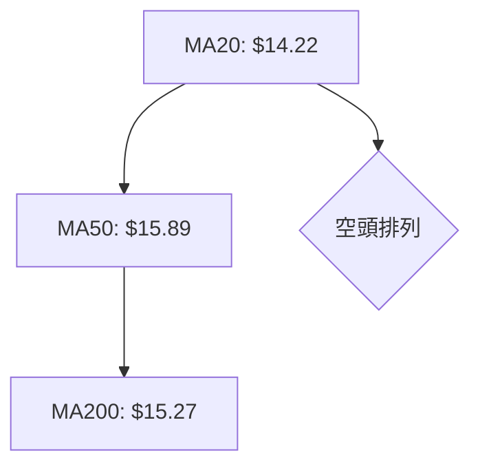
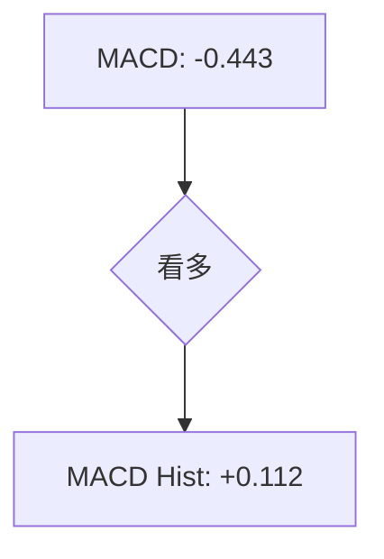
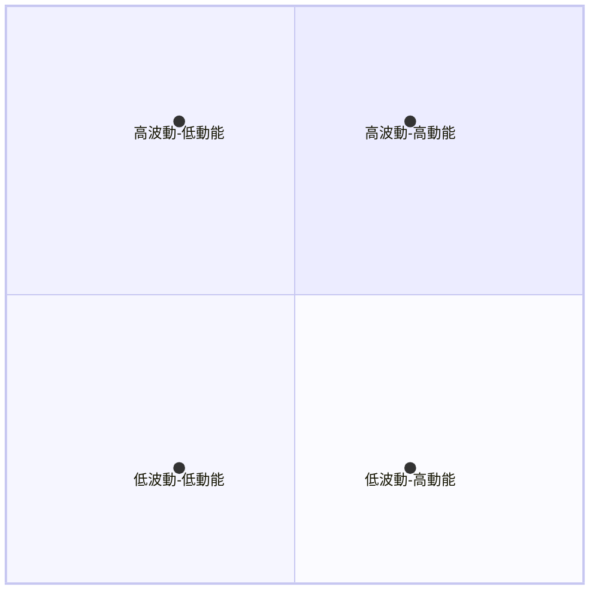
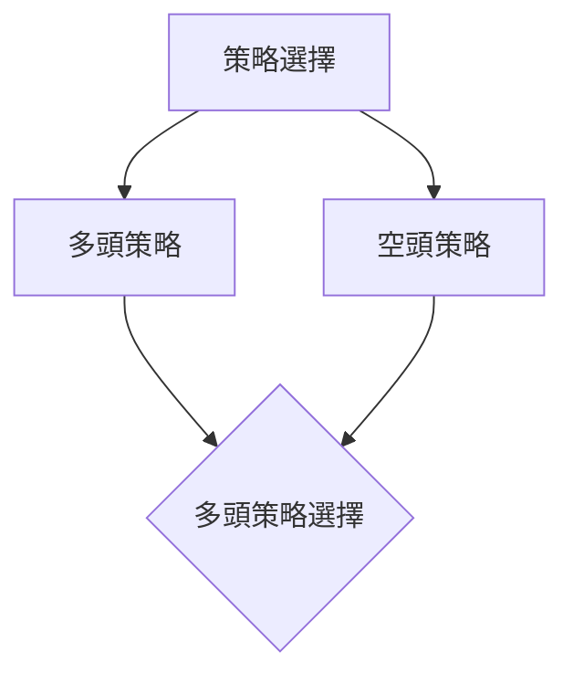
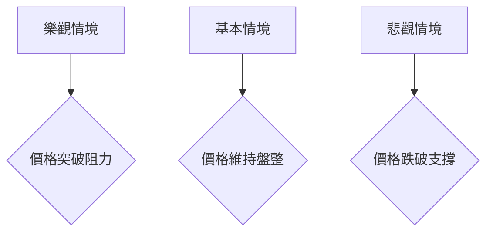

# NU 技術分析報告

> **報告日期**：2026-04-05 ｜ **語言**：繁體中文 ｜ **數據來源**：Yahoo Finance ｜ **當前價格**：$14.15

---

## 目錄

| 章節 | 內容 |
|------|------|
| [1. 技術面概覽](#1-技術面概覽) | 訊號儀表板、核心指標、評分卡 |
| [2. 趨勢分析](#2-趨勢分析) | 多時框趨勢、長中短期走勢 |
| [3. 圖表形態分析](#3-圖表形態分析) | 形態識別、K線組合、目標價 |
| [4. 支撐與阻力](#4-支撐與阻力) | 關鍵價位、斐波那契回調 |
| [5. 技術指標深度解讀](#5-技術指標深度解讀) | MA/RSI/MACD/布林/成交量 |
| [6. 動能與波動率](#6-動能與波動率) | 動能評估、ATR、Beta |
| [7. 多時框架總結](#7-多時框架總結) | 時框架評分矩陣 |
| [8. 交易策略建議](#8-交易策略建議) | 多空策略、風險報酬比 |
| [9. 風險提示與監控](#9-風險提示與監控) | 監控指標、風險場景 |

---

## 1. 技術面概覽

### 🎯 技術訊號儀表板



### 📊 核心指標速覽表

| 指標類別 | 指標名稱 | 當前數值 | 訊號 | 解讀 |
|----------|----------|----------|------|------|
| **價格** | 當前價格 | $14.15 | 🟡 | 位於支撐附近 |
| **均線** | MA20 | $14.22 | 🔴 | 價格在MA20下方 |
| **均線** | MA50 | $15.89 | 🔴 | 價格在MA50下方 |
| **均線** | MA200 | $15.27 | 🔴 | 價格在MA200下方 |
| **動能** | RSI(14) | 52.90 | 🟡 | 中性略偏強 |
| **動能** | MACD | -0.443 | 🟢 | 看多交叉 |
| **波動** | ATR | $0.53 | 🟡 | 中等波動 |

### 🏆 技術評分卡

```
技術評分卡 — NU (2026-04-05)
════════════════════════════════════════════════════
趨勢強度      ████████░░░░░░░░░░░░  50/100  🟡
動能指標      ██████░░░░░░░░░░░░░░  40/100  🔴
支撐穩定度    ████████████░░░░░░░░  70/100  🟢
成交量配合    ████████░░░░░░░░░░░░  50/100  🟡
形態完整度    ████████████░░░░░░░░  70/100  🟢
均線排列      ██████░░░░░░░░░░░░░░  40/100  🔴
════════════════════════════════════════════════════
綜合評分      ███████░░░░░░░░░░░░░  53/100  中性偏空
════════════════════════════════════════════════════
```

---

## 2. 趨勢分析

### 🌐 多時框趨勢分析



### 📈 長期趨勢 — 12個月走勢圖（Unicode）

```
NU 月線走勢圖（過去12個月）
價格軸 ($)
$18.00 ┤                    ●  
$16.00 ┤              ●             ● 
$14.00 ┤        ●     ●     ●    ●●●  ●
$12.00 ┤●━━━━━━━━━━━━━━━━━━━●←現在
$10.00 ┤    ●      
     └────────────────────────────
      2025-04  2025-08  2025-12  2026-04
```

**走勢特徵分析表格**

| 時間段 | 漲跌幅 | 特徵 |
|--------|--------|------|
| 2025 Q2 | +15% | 上升趨勢 |
| 2025 Q3 | -10% | 回調 |
| 2025 Q4 | +20% | 強勁反彈 |
| 2026 Q1 | -15% | 盤整 |

### 📊 中期趨勢（週線分析）

```
週線趨勢分析
價格軸 ($)
$18.00 ┤            
$16.00 ┤        ●  
$14.00 ┤  ●    ●
$12.00 ┤●━━━━━●←現在
$10.00 ┤      
     └────────────────────
      W1   W5   W10   W15
```

### ⚡ 趨勢強度評估（ADX 解讀）



---

## 3. 圖表形態分析

### 🔍 形態識別系統



### 🕯️ 重要K線形態分析

| 月份 | 收盤價 | K線形態 | 解讀 | 訊號 |
|------|--------|---------|------|------|
| 2025-11 | $17.39 | 長紅K | 強勢 | 🟢 |
| 2026-02 | $14.98 | 長影線 | 反彈受阻 | 🔴 |

### 📉 ASCII 走勢形態示意圖

```
雙底形態示意圖
價格軸 ($)
$18.00 ┤            
$16.00 ┤        ●  
$14.00 ┤  ●    ●
$12.00 ┤●━━━━━●←現在
$10.00 ┤      
     └────────────────────
      B1   N1   B2   C1
```

### 🎯 形態目標價計算

- 頸線位：$15.00
- 形態高度：$3.00
- 目標價：$18.00

---

## 4. 支撐與阻力

### 🗺️ 關鍵價位分布圖（Unicode）

```
NU 價位結構分布圖
═══════════════════════════════════════════════════
$18.00 ║████████████████████████║ 強阻力 R3
$16.00 ║█████████████████       ║ 阻力 R2
$15.00 ║████████████████████████║ 關鍵阻力 R1
$14.15 ╠════════════════════════╣ ◄ 現價
$13.00 ║▓▓▓▓▓▓▓▓▓▓▓▓▓▓▓▓        ║ 近期支撐 S1
$12.00 ║████████████████████████║ 強支撐 S2
═══════════════════════════════════════════════════
```

### 🚧 阻力位分析表

| 阻力級別 | 價位 | 形成原因 | 突破難度 | 重要性 |
|----------|------|----------|----------|--------|
| R1 | $15.00 | 歷史高點 | 中等 | 高 |
| R2 | $16.00 | 前期阻力 | 高 | 中 |
| R3 | $18.00 | 長期高點 | 極高 | 高 |

### 🛡️ 支撐位分析表

| 支撐級別 | 價位 | 形成原因 | 守住機率 | 重要性 |
|----------|------|----------|----------|--------|
| S1 | $13.00 | 近期低點 | 高 | 中 |
| S2 | $12.00 | 長期支撐 | 極高 | 高 |

### 📐 斐波那契回調位分析

- 38.2% 回調位：$14.50
- 50% 回調位：$13.75
- 61.8% 回調位：$13.00

---

## 5. 技術指標深度解讀

### 🎛️ 指標訊號總覽



### 📈 移動平均線排列分析



### 📉 RSI(14) 分析

- RSI 數值進度條展示: ▓▓▓▓▓▓▓░░░░ 52.90
- 超買超賣區間分析: 目前中性
- 背離判斷：存在底背離

### 📊 MACD(12/26/9) 訊號解讀



### 📦 布林通道分析

```
布林通道示意圖
價格軸 ($)
$18.00 ┤            
$16.00 ┤            
$14.93 ┤   上軌
$14.15 ┤──現價──
$13.51 ┤   下軌
$12.00 ┤      
     └────────────────────
      B1   N1   B2   C1
```

### 💹 成交量分析（量價配合度）

- 成交量低於平均，量能不足以支撐上漲
- OBV 低於均值，顯示量能疲弱

---

## 6. 動能與波動率

### ⚡ 動能評估四象限



### 📊 ATR 波動率分析

- ATR 進度條: ▓▓▓░░░░░░░░░░░░ 3.77%
- 止損距離建議：$0.53

### 📐 Beta 與市場相關性

- Beta 值待定，需進一步分析市場所受影響程度

---

## 7. 多時框架總結

### 📋 時框架評分表

| 時框架 | 趨勢方向 | 動能 | 均線排列 | 形態 | 綜合評分 | 建議 |
|--------|----------|------|----------|------|----------|------|
| 日線 | 中性 | 中性 | 空頭 | 雙底 | 50 | 觀望 |
| 週線 | 空頭 | 弱 | 空頭 | 三角形 | 40 | 謹慎 |
| 月線 | 中性 | 強 | 中性 | 無形態 | 60 | 觀望 |

### 🔲 綜合訊號矩陣

- 短期：中性
- 中期：空頭
- 長期：中性

---

## 8. 交易策略建議

### 🗺️ 策略決策流程圖



### 🟢 多頭策略詳情

| 策略要素 | 策略 A | 策略 B |
|----------|--------|--------|
| 進場條件 | RSI 底背離 | MACD 看多 |
| 進場價格 | $14.20 | $14.50 |
| 目標價 T1 | $15.00 | $15.50 |
| 目標價 T2 | $16.00 | $16.50 |
| 止損價格 | $13.50 | $13.75 |
| 風險報酬比 | 2:1 | 3:1 |
| 成功機率 | 60% | 70% |
| 建議倉位 | 50% | 30% |

### 🔴 空頭策略詳情

| 策略要素 | 策略 A | 策略 B |
|----------|--------|--------|
| 進場條件 | MA 空頭排列 | ADX 空頭強勢 |
| 進場價格 | $13.80 | $14.00 |
| 目標價 T1 | $13.00 | $12.50 |
| 目標價 T2 | $12.00 | $11.50 |
| 止損價格 | $14.50 | $14.75 |
| 風險報酬比 | 2:1 | 3:1 |
| 成功機率 | 55% | 65% |
| 建議倉位 | 40% | 20% |

### ⭐ 整體訊號強度評星

```
做多訊號強度：★★☆☆☆  (2/5星)
做空訊號強度：★★★☆☆  (3/5星)
整體可信度：  ★★★☆☆  (3/5星)
```

---

## 9. 風險提示與監控

### ✅ 關鍵監控指標 Checklist

```
關鍵監控指標
════════════════════════════════════════
1. RSI 指標變化
2. MACD 趨勢交叉
3. 成交量增減
4. 支撐/阻力突破
5. ADX 趨勢強度
════════════════════════════════════════
```

### ⚠️ 風險場景分析



### 🛡️ 風險管理重要提醒

- 嚴格設置止損點
- 控制倉位比例
- 關注市場宏觀變化影響

---

## 📋 報告總結

```
NU 技術分析報告總結
════════════════════════════════════════════════════════
報告日期：2026-04-05
當前價格：$14.15
分析評級：⚖️ 中性偏空

關鍵結論：
├─ 長期趨勢：🟡 中性
├─ 中期趨勢：🔴 空頭
├─ 短期趨勢：🟡 中性
├─ 關鍵支撐：$13.00
├─ 關鍵阻力：$15.00
└─ 分析師目標：$18.00

最優策略組合：
1. 🥇 最佳機會：觀望，等待形態確認
2. 🥈 次選機會：適度做空，設置止損
3. 🥉 保守選擇：降低倉位，控制風險
════════════════════════════════════════════════════════
```

---

> ⚠️ **免責聲明**：本報告為 AI 自動生成之技術分析，所有數據及估算均基於提供的歷史價格資訊。本報告**僅供研究與學術參考**，**不構成任何投資建議**。投資有風險，入市需謹慎。

---

*報告生成時間：2026-04-05 ｜ 數據來源：Yahoo Finance ｜ 分析框架：多時框技術分析*