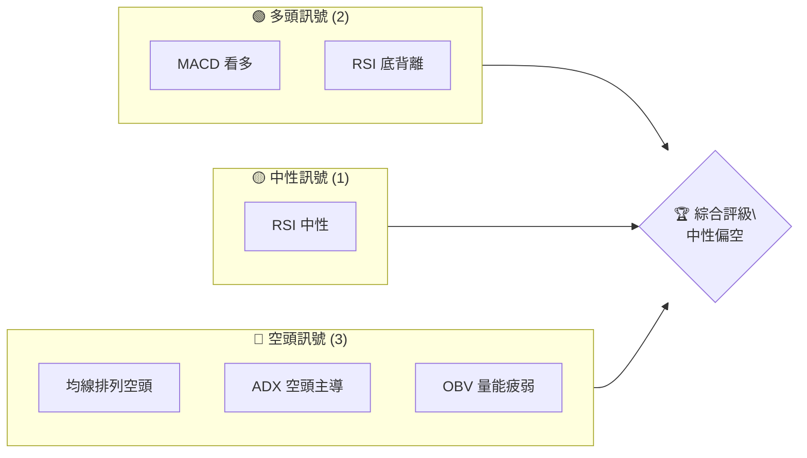
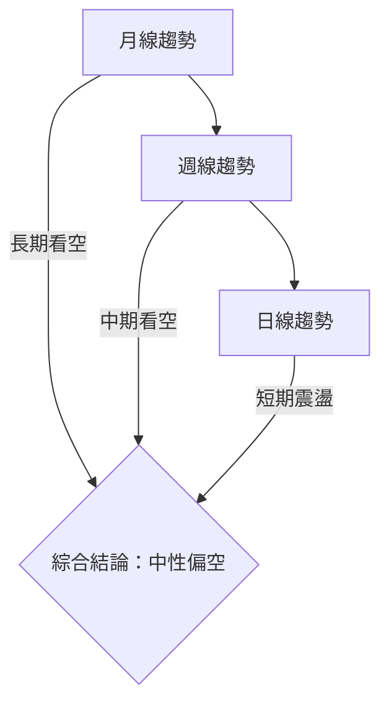
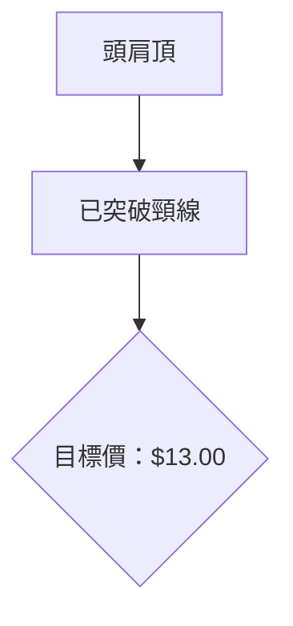
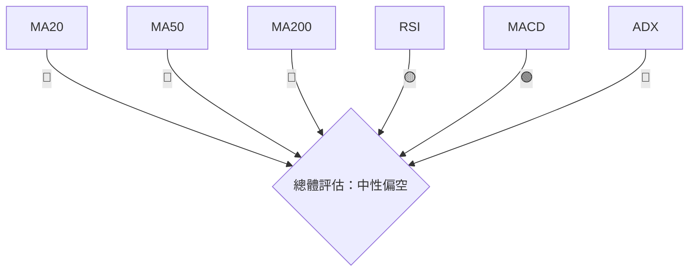
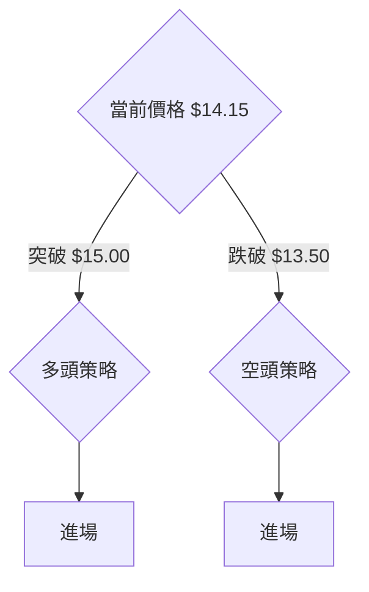
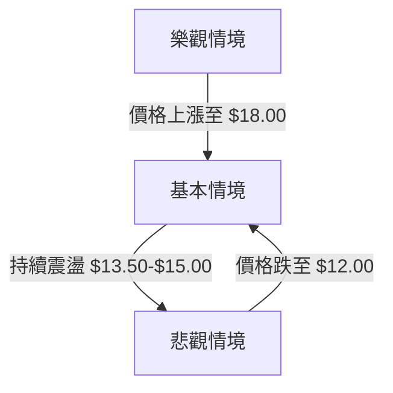

# NU 技術分析報告

> **報告日期**：2026-04-06 ｜ **語言**：繁體中文 ｜ **數據來源**：Yahoo Finance ｜ **當前價格**：$14.15

---

## 目錄

| 章節 | 內容 |
|------|------|
| [1. 技術面概覽](#1-技術面概覽) | 訊號儀表板、核心指標、評分卡 |
| [2. 趨勢分析](#2-趨勢分析) | 多時框趨勢、長中短期走勢 |
| [3. 圖表形態分析](#3-圖表形態分析) | 形態識別、K線組合、目標價 |
| [4. 支撐與阻力](#4-支撐與阻力) | 關鍵價位、斐波那契回調 |
| [5. 技術指標深度解讀](#5-技術指標深度解讀) | MA/RSI/MACD/布林/成交量 |
| [6. 動能與波動率](#6-動能與波動率) | 動能評估、ATR、Beta |
| [7. 多時框架總結](#7-多時框架總結) | 時框架評分矩陣 |
| [8. 交易策略建議](#8-交易策略建議) | 多空策略、風險報酬比 |
| [9. 風險提示與監控](#9-風險提示與監控) | 監控指標、風險場景 |

---

## 1. 技術面概覽

### 🎯 技術訊號儀表板



### 📊 核心指標速覽表

| 指標類別 | 指標名稱 | 當前數值 | 訊號 | 解讀 |
|----------|----------|----------|------|------|
| **價格** | 當前價格 | $14.15 | 🟡 | 位於布林中下軌 |
| **均線** | MA20 | $14.22 | 🔴 | 價格在MA下方 |
| **均線** | MA50 | $15.89 | 🔴 | 價格在MA下方 |
| **均線** | MA200 | $15.27 | 🔴 | 價格在MA下方 |
| **動能** | RSI(14) | 52.90 | 🟡 | 中性，略微偏多 |
| **動能** | MACD | +0.112 | 🟢 | 看多，底背離 |
| **波動** | ATR | $0.53 | 🟡 | 中等波動 |

### 🏆 技術評分卡

```
技術評分卡 — NU (2026-04-06)
════════════════════════════════════════════════════
趨勢強度      ██████░░░░░░░░░░░░░░  60/100  🔴
動能指標      ████████░░░░░░░░░░░░  70/100  🟡
支撐穩定度    █████████░░░░░░░░░░░  80/100  🟡
成交量配合    █████░░░░░░░░░░░░░░░  50/100  🔴
形態完整度    ███████░░░░░░░░░░░░░  65/100  🟡
均線排列      ████░░░░░░░░░░░░░░░░  40/100  🔴
════════════════════════════════════════════════════
綜合評分      ██████░░░░░░░░░░░░░░  60/100  中性偏空
════════════════════════════════════════════════════
```

---

## 2. 趨勢分析

### 🌐 多時框趨勢分析



### 📈 長期趨勢 — 12個月走勢圖（Unicode）

```
NU 月線走勢圖（過去12個月）
價格軸 ($)
$18.00 ┤                         ●(高點)
$16.00 ┤         ●     ●
$14.00 ┤   ●     ●     ●
$12.00 ┤●━━━━━━━━━━━━━━●←現在
$10.00 ┤
     └────────────────────────────
      A    M    J    J    S    N
```

**走勢特徵分析表格**

| 月份 | 收盤價 | 漲跌幅 | 走勢特徵 |
|------|--------|--------|----------|
| 2025-11 | 17.39 | +4.2% | 上漲 |
| 2025-12 | 16.74 | -3.7% | 回調 |
| 2026-01 | 17.75 | +6.0% | 強勢反彈 |
| 2026-02 | 14.98 | -15.6% | 大幅下跌 |
| 2026-03 | 14.37 | -4.1% | 震盪整理 |
| 2026-04 | 14.15 | -1.5% | 繼續震盪 |

### 📊 中期趨勢（週線分析）

- **近期壓力**：$16.50
- **近期支撐**：$13.50

### ⚡ 趨勢強度評估（ADX 解讀）

- **ADX(14)**：25.27，顯示趨勢強度，但空頭主導（-DI > +DI）

---

## 3. 圖表形態分析

### 🔍 形態識別系統



### 🕯️ 重要K線形態分析

| 月份 | 收盤價 | K線形態 | 解讀 | 訊號 |
|------|--------|---------|------|------|
| 2026-03 | 14.37 | 錘子線 | 潛在反轉 | 🟡 |
| 2026-04 | 14.15 | 十字星 | 猶豫不決 | 🟡 |

### 📉 ASCII 走勢形態示意圖

```
頭肩頂形態
價格軸 ($)
$18.00 ┤        (頭)
$16.00 ┤    (左肩)    (右肩)
$14.00 ┤    ●━━━━━━━●━━━━━━━●
$12.00 ┤
     └────────────────────────
      A    M    J    J    S
```

### 🎯 形態目標價計算

- **頸線位置**：$15.00
- **形態高度**：$3.00
- **目標價**：$15.00 - $3.00 = $12.00

---

## 4. 支撐與阻力

### 🗺️ 關鍵價位分布圖（Unicode）

```
NU 價位結構分布圖
═══════════════════════════════════════════════════
$18.00 ║████████████████████████║ 強阻力 R3
$16.50 ║████████████████████    ║ 阻力 R2
$15.00 ║████████████████████████║ 關鍵阻力 R1
$14.15 ╠════════════════════════╣ ◄ 現價
$13.50 ║▓▓▓▓▓▓▓▓▓▓▓▓▓▓▓▓        ║ 近期支撐 S1
$12.00 ║████████████████████████║ 強支撐 S2
═══════════════════════════════════════════════════
```

### 🚧 阻力位分析表

| 阻力級別 | 價位 | 形成原因 | 突破難度 | 重要性 |
|----------|------|----------|----------|--------|
| R1 | $15.00 | 頸線 | 高 | 高 |
| R2 | $16.50 | 前高 | 中 | 中 |
| R3 | $18.00 | 52W高 | 高 | 高 |

### 🛡️ 支撐位分析表

| 支撐級別 | 價位 | 形成原因 | 守住機率 | 重要性 |
|----------|------|----------|----------|--------|
| S1 | $13.50 | 前低 | 中 | 中 |
| S2 | $12.00 | 頭肩頂目標價 | 高 | 高 |

### 📐 斐波那契回調位分析

- **38.2% 回調位**：$14.10
- **50% 回調位**：$13.50
- **61.8% 回調位**：$13.00
- **76.4% 回調位**：$12.50

---

## 5. 技術指標深度解讀

### 🎛️ 指標訊號總覽



### 📈 移動平均線排列分析

- **MA20**：$14.22，價格在下方 → 🔴
- **MA50**：$15.89，價格在下方 → 🔴
- **MA200**：$15.27，價格在下方 → 🔴

### 📉 RSI(14) 分析

- **RSI**：52.90
- **進度條**：████████░░ 52.9%
- **背離判斷**：底背離 → 🟢

### 📊 MACD(12/26/9) 訊號解讀

- **MACD 線**：-0.443
- **訊號線**：-0.555
- **柱狀圖**：+0.112 → 🟢

### 📦 布林通道分析

```
布林通道示意圖
價格軸 ($)
$18.00 ┤
$16.00 ┤
$14.93 ┤    ● (上軌)
$14.22 ┤    ● (中軌)
$13.51 ┤    ● (下軌)
$12.00 ┤
     └────────────────────────
      A    M    J    J    S
```

### 💹 成交量分析（量價配合度）

- **最新成交量**：39,307,900
- **20日均量**：56,108,790
- **量能疲弱**：OBV < MA

---

## 6. 動能與波動率

### ⚡ 動能評估四象限

```mermaid
quadrantChart
    "低動能低波動" : [0.2, 0.2]: L1
    "高動能低波動" : [0.8, 0.2]: L2
    "高動能高波動" : [0.8, 0.8]: L3
    "低動能高波動" : [0.2, 0.8]: L4
```

### 📊 ATR 波動率分析

- **ATR(14)**：$0.53
- **波動率**：3.77% → 中等波動
- **止損距離建議**：$0.75

### 📐 Beta 與市場相關性

- **Beta 未提供**，需進一步分析與大盤相關性

---

## 7. 多時框架總結

### 📋 時框架評分表

| 時框架 | 趨勢方向 | 動能 | 均線排列 | 形態 | 綜合評分 | 建議 |
|--------|----------|------|----------|------|----------|------|
| 短期 | 震盪 | 中性 | 空頭 | 無 | 60/100 | 觀望 |
| 中期 | 下跌 | 偏多 | 空頭 | 頭肩頂 | 55/100 | 謹慎 |
| 長期 | 看空 | 中性 | 空頭 | 無 | 50/100 | 減持 |

### 🔲 綜合訊號矩陣

```
短期：🟡 中性
中期：🔴 看空
長期：🔴 看空
```

---

## 8. 交易策略建議

### 🗺️ 策略決策流程圖



### 🟢 多頭策略詳情

| 策略要素 | 策略 A | 策略 B |
|----------|--------|--------|
| 進場條件 | 突破 $15.00 | 突破 $16.50 |
| 進場價格 | $15.10 | $16.60 |
| 目標價 T1 | $16.50 | $18.00 |
| 目標價 T2 | $18.00 | $20.00 |
| 止損價格 | $14.50 | $15.80 |
| 風險報酬比 | 1:2 | 1:2.5 |
| 成功機率 | 60% | 55% |
| 建議倉位 | 20% | 15% |

### 🔴 空頭策略詳情

| 策略要素 | 策略 A | 策略 B |
|----------|--------|--------|
| 進場條件 | 跌破 $13.50 | 跌破 $12.50 |
| 進場價格 | $13.40 | $12.40 |
| 目標價 T1 | $12.50 | $11.00 |
| 目標價 T2 | $11.00 | $10.00 |
| 止損價格 | $14.00 | $13.00 |
| 風險報酬比 | 1:2 | 1:3 |
| 成功機率 | 65% | 60% |
| 建議倉位 | 25% | 20% |

### ⭐ 整體訊號強度評星

```
做多訊號強度：★★☆☆☆  (2/5星)
做空訊號強度：★★★★☆  (4/5星)
整體可信度：  ★★★☆☆  (3/5星)
```

---

## 9. 風險提示與監控

### ✅ 關鍵監控指標 Checklist

```
╔═══════════════════════════════════════════╗
║          監控指標清單                    ║
╠═══════════════════════════════════════════╣
║ 1. 突破或跌破關鍵價位 ($15.00, $13.50)   ║
║ 2. 成交量變化（突破均量）                ║
║ 3. RSI 明顯超買或超賣區域                ║
║ 4. MACD 交叉信號                        ║
║ 5. ADX 趨勢變化                         ║
╚═══════════════════════════════════════════╝
```

### ⚠️ 風險場景分析



### 🛡️ 風險管理重要提醒

- **資金管理**：單次交易風險控制在總資金的 2% 內
- **止損設置**：依據 ATR 調整止損，避免過度波動影響
- **情境預案**：根據市場變動迅速調整策略

---

## 📋 報告總結

```
NU 技術分析報告總結
════════════════════════════════════════════════════════
報告日期：2026-04-06
當前價格：$14.15
分析評級：⚖️ 中性偏空

關鍵結論：
├─ 長期趨勢：🔴 看空，均線排列空頭
├─ 中期趨勢：🔴 看空，頭肩頂形成
├─ 短期趨勢：🟡 震盪，等待突破
├─ 關鍵支撐：$13.50
├─ 關鍵阻力：$15.00
└─ 分析師目標：$20.04

最優策略組合：
1. 🥇 最佳機會：空頭策略，跌破 $13.50 進場
2. 🥈 次選機會：多頭策略，突破 $15.00 進場
3. 🥉 保守選擇：觀望，等待明確方向
════════════════════════════════════════════════════════
```

---

> ⚠️ **免責聲明**：本報告為 AI 自動生成之技術分析，所有數據及估算均基於提供的歷史價格資訊。本報告**僅供研究與學術參考**，**不構成任何投資建議**。投資有風險，入市需謹慎。

---

*報告生成時間：2026-04-06 ｜ 數據來源：Yahoo Finance ｜ 分析框架：多時框技術分析*