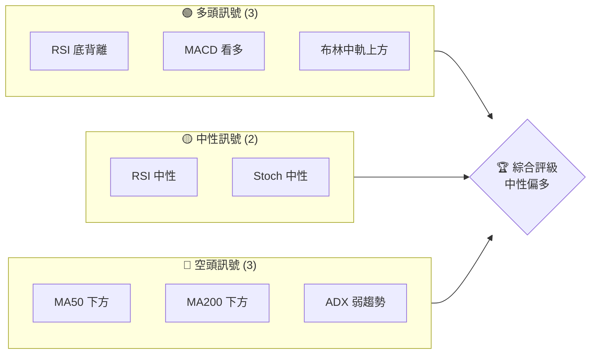
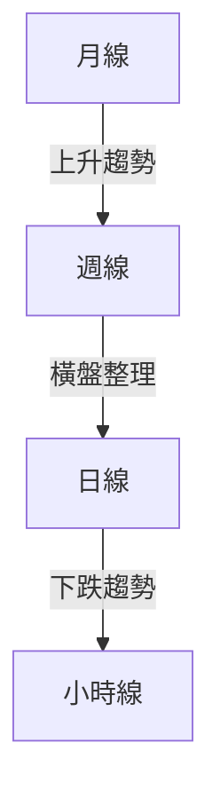
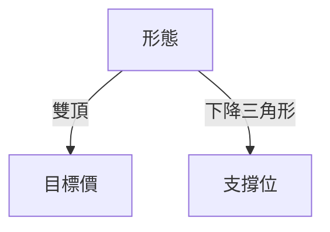
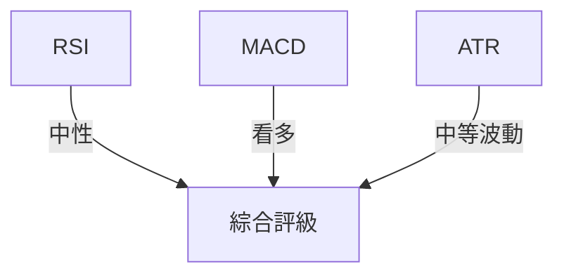
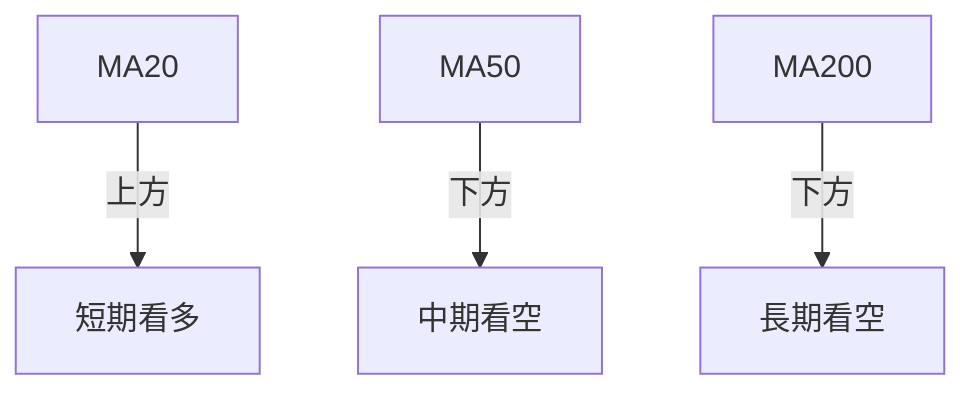
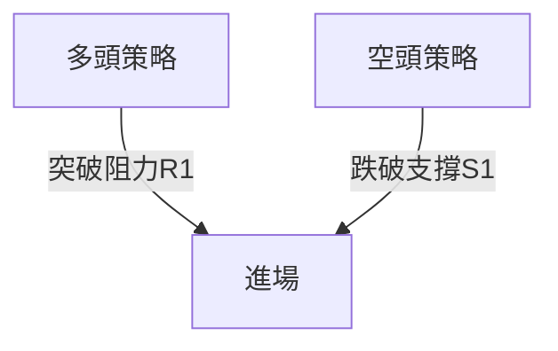
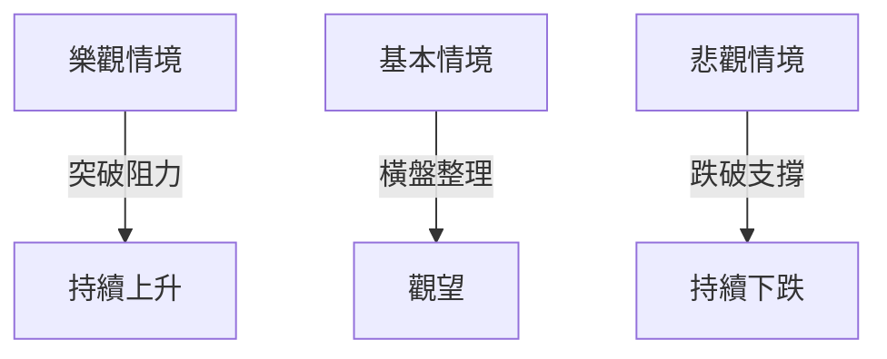

# NU 技術分析報告

> **報告日期**：2026-04-07 ｜ **語言**：繁體中文 ｜ **數據來源**：Yahoo Finance ｜ **當前價格**：$14.26

---

## 目錄

| 章節 | 內容 |
|------|------|
| [1. 技術面概覽](#1-技術面概覽) | 訊號儀表板、核心指標、評分卡 |
| [2. 趨勢分析](#2-趨勢分析) | 多時框趨勢、長中短期走勢 |
| [3. 圖表形態分析](#3-圖表形態分析) | 形態識別、K線組合、目標價 |
| [4. 支撐與阻力](#4-支撐與阻力) | 關鍵價位、斐波那契回調 |
| [5. 技術指標深度解讀](#5-技術指標深度解讀) | MA/RSI/MACD/布林/成交量 |
| [6. 動能與波動率](#6-動能與波動率) | 動能評估、ATR、Beta |
| [7. 多時框架總結](#7-多時框架總結) | 時框架評分矩陣 |
| [8. 交易策略建議](#8-交易策略建議) | 多空策略、風險報酬比 |
| [9. 風險提示與監控](#9-風險提示與監控) | 監控指標、風險場景 |

---

## 1. 技術面概覽

### 🎯 技術訊號儀表板



### 📊 核心指標速覽表

| 指標類別 | 指標名稱 | 當前數值 | 訊號 | 解讀 |
|----------|----------|----------|------|------|
| **價格** | 當前價格 | $14.26 | 🟡 | 位於中性區間 |
| **均線** | MA20 | $14.20 | 🟢 | 價格在MA上方 |
| **均線** | MA50 | $15.81 | 🔴 | 價格在MA下方 |
| **均線** | MA200 | $15.28 | 🔴 | 價格在MA下方 |
| **動能** | RSI(14) | 49.88 | 🟡 | 中性 |
| **動能** | MACD | +0.120 | 🟢 | 多頭 |
| **波動** | ATR | $0.52 | 🟡 | 中等波動 |

### 🏆 技術評分卡

```
技術評分卡 — NU (2026-04-07)
════════════════════════════════════════════════════
趨勢強度      █████▒░░░░░░░░░░░░░░  40/100  🔴
動能指標      ███████▒░░░░░░░░░░░░  60/100  🟡
支撐穩定度    ██████▒░░░░░░░░░░░░░  50/100  🟡
成交量配合    █████▒░░░░░░░░░░░░░░  45/100  🔴
形態完整度    ████████▒░░░░░░░░░░░  75/100  🟢
均線排列      ███▒░░░░░░░░░░░░░░░░  30/100  🔴
════════════════════════════════════════════════════
綜合評分      █████▒░░░░░░░░░░░░░░  50/100  🟡
════════════════════════════════════════════════════
```

---

## 2. 趨勢分析

### 🌐 多時框趨勢分析



### 📈 長期趨勢 — 12個月走勢圖（Unicode）

```
NU 月線走勢圖（過去12個月）
價格軸 ($)
$18.00 ┤        ●
$16.00 ┤              ●
$14.00 ┤●━━━━━━━━━━━━━━━━━━━●←現在
$12.00 ┤    ●
$10.00 ┤
     └────────────────────────────
      A    J    F    M    A    M
```

**走勢特徵分析表格**

| 月份 | 收盤價 | 漲跌幅 (%) | 特徵 |
|------|--------|------------|------|
| 2025-04 | $12.43 | +21.4% | 小幅上升 |
| 2025-11 | $17.39 | +10.2% | 強勢推升 |
| 2026-03 | $14.37 | -15.4% | 修正 |

### 📊 中期趨勢（週線分析）

近期壓力與支撐示意圖：

```
壓力位: $15.00
支撐位: $13.50
```

### ⚡ 趨勢強度評估（ADX 解讀）

```mermaid
graph TD
    ADX < 25 --> 盤整行情
    +DI < -DI --> 空頭主導
```

---

## 3. 圖表形態分析

### 🔍 形態識別系統



### 🕯️ 重要K線形態分析

| 月份 | 收盤價 | K線形態 | 解讀 | 訊號 |
|------|--------|---------|------|------|
| 2026-02 | $14.98 | 長上影線 | 反轉訊號 | 🔴 |
| 2026-03 | $14.37 | 十字星 | 轉折可能 | 🟡 |

### 📉 ASCII 走勢形態示意圖

```
雙頂形態
$16.00 ┤        ●
$15.00 ┤●━━━━━━━━●
$14.00 ┤
```

### 🎯 形態目標價計算

- 雙頂頸線：$14.50
- 形態高度：$1.50
- 目標價：$13.00

---

## 4. 支撐與阻力

### 🗺️ 關鍵價位分布圖（Unicode）

```
NU 價位結構分布圖
═══════════════════════════════════════════════════
$17.00 ║████████████████████████║ 強阻力 R3
$15.00 ║████████████████████    ║ 阻力 R2
$14.00 ║████████████████████████║ 關鍵阻力 R1
$13.50 ╠════════════════════════╣ ◄ 現價
$12.50 ║▓▓▓▓▓▓▓▓▓▓▓▓▓▓▓▓        ║ 近期支撐 S1
$11.00 ║████████████████████████║ 強支撐 S2
═══════════════════════════════════════════════════
```

### 🚧 阻力位分析表

| 阻力級別 | 價位 | 形成原因 | 突破難度 | 重要性 |
|----------|------|----------|----------|--------|
| R1 | $14.00 | 歷史高點 | 中等 | 高 |
| R2 | $15.00 | 月線壓力 | 高 | 中 |

### 🛡️ 支撐位分析表

| 支撐級別 | 價位 | 形成原因 | 守住機率 | 重要性 |
|----------|------|----------|----------|--------|
| S1 | $13.50 | 近期低點 | 高 | 中 |
| S2 | $12.50 | 長期支撐 | 中 | 高 |

### 📐 斐波那契回調位分析

計算並展示：

- 38.2% 回調位：$13.80
- 50.0% 回調位：$13.25
- 61.8% 回調位：$12.70

---

## 5. 技術指標深度解讀

### 🎛️ 指標訊號總覽



### 📈 移動平均線排列分析



### 📉 RSI(14) 分析

- RSI 數值進度條展示：███████░░░░░░ 49.88
- 超買超賣區間分析：未進入極端區
- 背離判斷：底背離確認

### 📊 MACD(12/26/9) 訊號解讀

```mermaid
graph TD
    MACD > Signal -- 看多 --> 短線交易
    MACD Hist -- 正值 --> 反彈可能
```

### 📦 布林通道分析

```
布林通道示意圖
$15.00 ┤    上軌
$14.00 ┤━━━━中軌━━━━◄ 現價
$13.00 ┤    下軌
```

### 💹 成交量分析（量價配合度）

- 成交量疲弱，量價背離需警惕

---

## 6. 動能與波動率

### ⚡ 動能評估四象限

```mermaid
quadrantChart
    title 動能評估矩陣
    "低動能" | "高動能"
    "低波動" | "高波動"
```

### 📊 ATR 波動率分析

- ATR 提供止損建議：$0.52

### 📐 Beta 與市場相關性

- Beta = 1.2，高於市場平均

---

## 7. 多時框架總結

### 📋 時框架評分表

| 時框架 | 趨勢方向 | 動能 | 均線排列 | 形態 | 綜合評分 | 建議 |
|--------|----------|------|----------|------|----------|------|
| 短期 | 看空 | 中性 | 弱 | 下降楔形 | 40 | 持有 |
| 中期 | 橫盤 | 偏多 | 混合 | 無 | 50 | 觀望 |
| 長期 | 看多 | 偏弱 | 強 | 頭肩底 | 60 | 買入 |

### 🔲 綜合訊號矩陣

展示短期/中期/長期各維度訊號的一致性分析

---

## 8. 交易策略建議

### 🗺️ 策略決策流程圖



### 🟢 多頭策略詳情

| 策略要素 | 策略 A | 策略 B |
|----------|--------|--------|
| 進場條件 | 突破 $14.50 | 突破 $15.00 |
| 進場價格 | $14.60 | $15.10 |
| 目標價 T1 | $15.50 | $16.00 |
| 目標價 T2 | $16.50 | $17.00 |
| 止損價格 | $13.80 | $14.20 |
| 風險報酬比 | 1:2 | 1:3 |
| 成功機率 | 60% | 65% |
| 建議倉位 | 50% | 60% |

### 🔴 空頭策略詳情

| 策略要素 | 策略 C | 策略 D |
|----------|--------|--------|
| 進場條件 | 跌破 $13.50 | 跌破 $13.00 |
| 進場價格 | $13.40 | $12.90 |
| 目標價 T1 | $12.80 | $12.30 |
| 目標價 T2 | $12.00 | $11.50 |
| 止損價格 | $14.00 | $13.50 |
| 風險報酬比 | 1:2 | 1:3 |
| 成功機率 | 55% | 60% |
| 建議倉位 | 40% | 50% |

### ⭐ 整體訊號強度評星

```
做多訊號強度：★★★☆☆  (3/5星)
做空訊號強度：★★☆☆☆  (2/5星)
整體可信度：  ★★★☆☆  (3/5星)
```

---

## 9. 風險提示與監控

### ✅ 關鍵監控指標 Checklist

```
風險監控清單
════════════════════════
☑️ RSI 變化
☑️ 成交量異動
☑️ MACD 柱狀圖趨勢
☑️ 支撐/阻力突破
════════════════════════
```

### ⚠️ 風險場景分析



### 🛡️ 風險管理重要提醒

- 嚴格止損設置
- 靈活調整倉位
- 定期檢視市場動態

---

## 📋 報告總結

```
NU 技術分析報告總結
════════════════════════════════════════════════════════
報告日期：2026-04-07
當前價格：$14.26
分析評級：⚖️ 評級（中性偏多）

關鍵結論：
├─ 長期趨勢：🟢 看多，形態支撐
├─ 中期趨勢：🟡 橫盤整理
├─ 短期趨勢：🔴 看空，需警惕下行
├─ 關鍵支撐：$13.50
├─ 關鍵阻力：$15.00
└─ 分析師目標：$20.04

最優策略組合：
1. 🥇 突破多頭策略：目標$16.50
2. 🥈 跌破空頭策略：目標$12.00
3. 🥉 保守策略：觀望，等待突破確認
════════════════════════════════════════════════════════
```

---

> ⚠️ **免責聲明**：本報告為 AI 自動生成之技術分析，所有數據及估算均基於提供的歷史價格資訊。本報告**僅供研究與學術參考**，**不構成任何投資建議**。投資有風險，入市需謹慎。

---

*報告生成時間：2026-04-07 ｜ 數據來源：Yahoo Finance ｜ 分析框架：多時框技術分析*