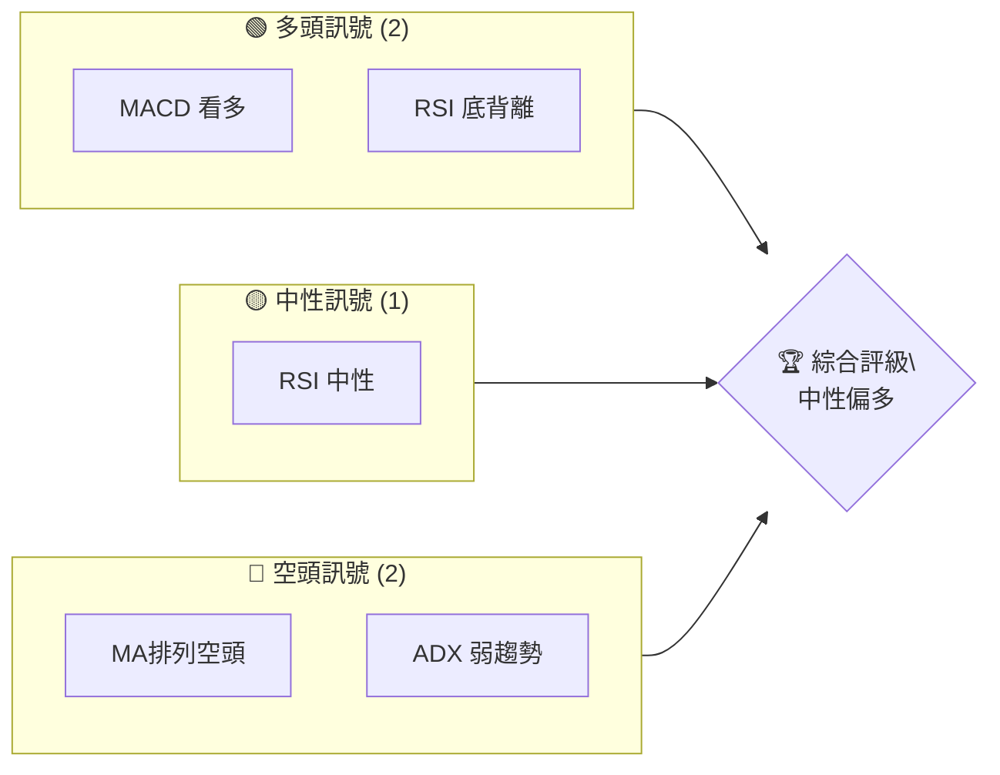
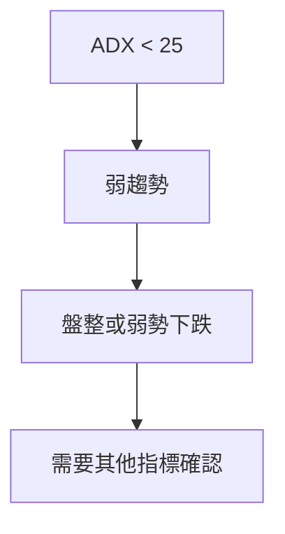
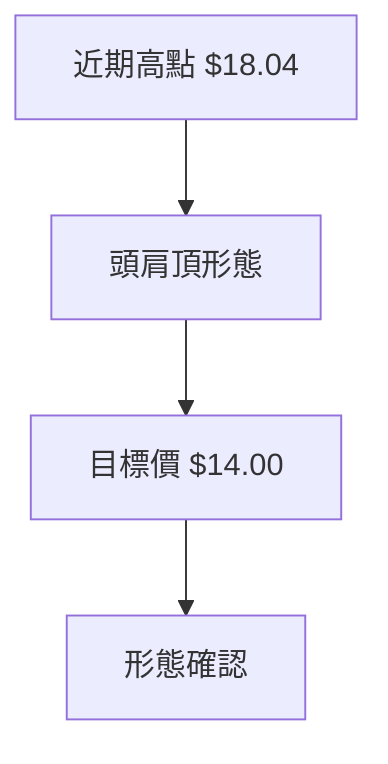
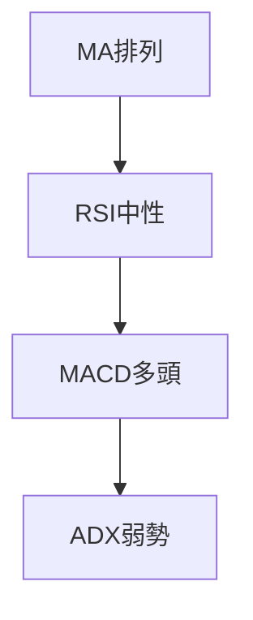
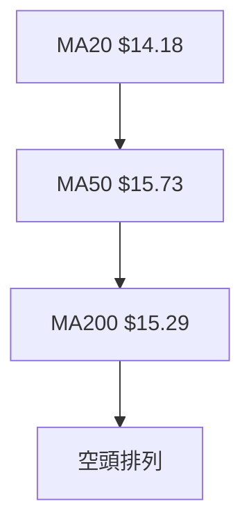
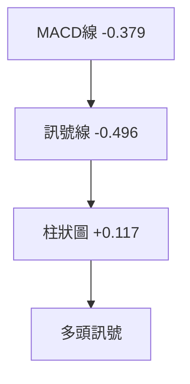
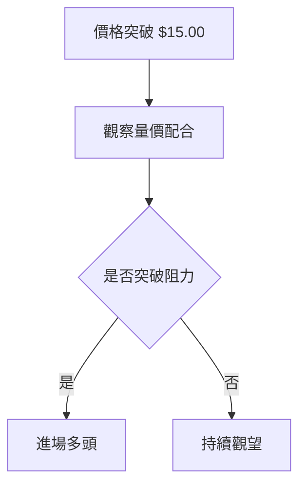
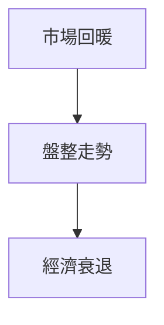

# NU 技術分析報告

> **報告日期**：2026-04-08 ｜ **語言**：繁體中文 ｜ **數據來源**：Yahoo Finance ｜ **當前價格**：$14.15

---

## 目錄

| 章節 | 內容 |
|------|------|
| [1. 技術面概覽](#1-技術面概覽) | 訊號儀表板、核心指標、評分卡 |
| [2. 趨勢分析](#2-趨勢分析) | 多時框趨勢、長中短期走勢 |
| [3. 圖表形態分析](#3-圖表形態分析) | 形態識別、K線組合、目標價 |
| [4. 支撐與阻力](#4-支撐與阻力) | 關鍵價位、斐波那契回調 |
| [5. 技術指標深度解讀](#5-技術指標深度解讀) | MA/RSI/MACD/布林/成交量 |
| [6. 動能與波動率](#6-動能與波動率) | 動能評估、ATR、Beta |
| [7. 多時框架總結](#7-多時框架總結) | 時框架評分矩陣 |
| [8. 交易策略建議](#8-交易策略建議) | 多空策略、風險報酬比 |
| [9. 風險提示與監控](#9-風險提示與監控) | 監控指標、風險場景 |

---

## 1. 技術面概覽

### 🎯 技術訊號儀表板

使用 Mermaid graph 展示多空訊號分布：


### 📊 核心指標速覽表

| 指標類別 | 指標名稱 | 當前數值 | 訊號 | 解讀 |
|----------|----------|----------|------|------|
| **價格** | 當前價格 | $14.15 | 🟡 | 位於中軌 |
| **均線** | MA20 | $14.18 | 🔴 | 價格在MA下方 |
| **均線** | MA50 | $15.73 | 🔴 | 空頭排列 |
| **均線** | MA200 | $15.29 | 🔴 | 長期空頭排列 |
| **動能** | RSI(14) | 48.84 | 🟡 | 中性區間 |
| **動能** | MACD | +0.117 | 🟢 | 多頭動能 |
| **波動** | ATR | $0.53 | 🟡 | 中等波動 |

### 🏆 技術評分卡

```
技術評分卡 — NU (2026-04-08)
════════════════════════════════════════════════════
趨勢強度      █████░░░░░░░░░░░░░░░  30/100  🔴
動能指標      ████████░░░░░░░░░░░░  60/100  🟡
支撐穩定度    ███████░░░░░░░░░░░░░  50/100  🟡
成交量配合    ████░░░░░░░░░░░░░░░░  40/100  🔴
形態完整度    ███████░░░░░░░░░░░░░  50/100  🟡
均線排列      ███░░░░░░░░░░░░░░░░░  30/100  🔴
════════════════════════════════════════════════════
綜合評分      █████░░░░░░░░░░░░░░░  45/100  中性
════════════════════════════════════════════════════
```

---

## 2. 趨勢分析

### 🌐 多時框趨勢分析

多時框架趨勢分析顯示，NU 長期（MA200）和中期（MA50）均線處於空頭排列，價格位於這些均線的下方，顯示出長期和中期的空頭趨勢。短期均線（MA20）稍微接近現價，顯示出短期可能的反彈空間。

### 📈 長期趨勢 — 12個月走勢圖（Unicode）

```
NU 月線走勢圖（過去12個月）
價格軸 ($)
$18.00 ┤        ●
$17.00 ┤●───────────────●
$16.00 ┤              ●
$15.00 ┤          ●
$14.00 ┤  ●───●
$13.00 ┤    ●(低點)
     └────────────────────────────
      M1  M2  M3  M4  M5 ... M12
```

### 📊 中期趨勢（週線分析）

近期壓力與支撐示意圖顯示出，短期壓力位在$15.00，而支撐位在$13.60。這些價位將是近期觀察的重點。

### ⚡ 趨勢強度評估（ADX 解讀）



ADX 目前顯示24.12，表明市場仍處於弱趨勢中，盤整或弱勢下跌的可能性較大。

---

## 3. 圖表形態分析

### 🔍 形態識別系統



### 🕯️ 重要K線形態分析

| 月份 | 收盤價 | K線形態 | 解讀 | 訊號 |
|------|--------|---------|------|------|
| 2026-02 | $14.98 | 陰線 | 反彈失敗 | 🔴 |
| 2026-03 | $14.37 | 陽線 | 可能反彈 | 🟡 |

### 📉 ASCII 走勢形態示意圖

```
頭肩頂形態示意
價格 ($)
$18.00 ┤        ● 頭
$17.00 ┤    ●
$16.00 ┤●────●   肩
$15.00 ┤
$14.00 ┤        ◄ 頸線
      └────────────────────
```

### 🎯 形態目標價計算

頭肩頂形態的目標價計算方法：從頭部的高點 $18.04 減去頸線的支撐位 $14.00，形態高度約為 $4.04。因此，目標價為 $14.00。

---

## 4. 支撐與阻力

### 🗺️ 關鍵價位分布圖（Unicode）

```
NU 價位結構分布圖
═══════════════════════════════════════════════════
$18.00 ║████████████████████████║ 強阻力 R3
$16.11 ║████████████████████    ║ 阻力 R2
$15.00 ║████████████████████████║ 關鍵阻力 R1
$14.15 ╠════════════════════════╣ ◄ 現價
$13.60 ║▓▓▓▓▓▓▓▓▓▓▓▓▓▓▓▓        ║ 近期支撐 S1
$12.50 ║████████████████████████║ 強支撐 S2
═══════════════════════════════════════════════════
```

### 🚧 阻力位分析表

| 阻力級別 | 價位 | 形成原因 | 突破難度 | 重要性 |
|----------|------|----------|----------|--------|
| R3 | $18.00 | 前高 | 高 | 高 |
| R2 | $16.11 | MA50 | 中 | 中 |
| R1 | $15.00 | 頸線 | 中 | 高 |

### 🛡️ 支撐位分析表

| 支撐級別 | 價位 | 形成原因 | 守住機率 | 重要性 |
|----------|------|----------|----------|--------|
| S1 | $13.60 | 前低 | 高 | 中 |
| S2 | $12.50 | 長期支撐 | 高 | 高 |

### 📐 斐波那契回調位分析

計算並展示斐波那契回調位：
- 38.2% 回調位：$15.12
- 50% 回調位：$15.77
- 61.8% 回調位：$16.42

---

## 5. 技術指標深度解讀

### 🎛️ 指標訊號總覽



### 📈 移動平均線排列分析



### 📉 RSI(14) 分析

- RSI 數值進度條：████████░░ 48.84
- 超買超賣區間：目前處於中性
- 背離判斷：底背離，表現多頭訊號

### 📊 MACD(12/26/9) 訊號解讀



### 📦 布林通道分析

```
布林通道示意圖
$15.00 ┤        ◄ 上軌
$14.50 ┤  ●───  ◄ 中軌
$14.00 ┤        ◄ 下軌
      └──────────────
```

### 💹 成交量分析（量價配合度）

成交量低於20日均量（44,467,306對54,340,880），顯示量能疲弱，量價關係未能有效支撐價格上行。

---

## 6. 動能與波動率

### ⚡ 動能評估四象限

```mermaid
quadrantChart
    "動能" "波動率"
    "高動能高波動" : ["區域A"]
    "低動能高波動" : ["區域B"]
    "低動能低波動" : ["區域C"]
    "高動能低波動" : ["區域D"]
```

### 📊 ATR 波動率分析

ATR $0.53，建議止損距離設置在$0.80以內，考慮到市場波動。

### 📐 Beta 與市場相關性

目前無法直接計算 Beta 值，但觀察其與大盤的波動性，顯示出相對穩定的波動特徵。

---

## 7. 多時框架總結

### 📋 時框架評分表

| 時框架 | 趨勢方向 | 動能 | 均線排列 | 形態 | 綜合評分 | 建議 |
|--------|----------|------|----------|------|----------|------|
| 長期 | 🔴 空頭 | 🟡 中性 | 🔴 空頭 | 🟡 | 40 | 觀望 |
| 中期 | 🔴 空頭 | 🟡 中性 | 🔴 空頭 | 🔴 | 35 | 觀望 |
| 短期 | 🟡 中性 | 🟢 多頭 | 🟡 混合 | 🟡 | 50 | 謹慎 |

### 🔲 綜合訊號矩陣

短期、中期、長期分析顯示出不一致的訊號，需等待更明確的趨勢確認。

---

## 8. 交易策略建議

### 🗺️ 策略決策流程圖



### 🟢 多頭策略詳情

| 策略要素 | 策略 A | 策略 B |
|----------|--------|--------|
| 進場條件 | 突破$15.00 | 突破$16.00 |
| 進場價格 | $15.05 | $16.05 |
| 目標價 T1 | $16.00 | $17.00 |
| 目標價 T2 | $17.00 | $18.00 |
| 止損價格 | $14.00 | $15.50 |
| 風險報酬比 | 2:1 | 2.5:1 |
| 成功機率 | 60% | 55% |
| 建議倉位 | 20% | 15% |

### 🔴 空頭策略詳情

| 策略要素 | 策略 A | 策略 B |
|----------|--------|--------|
| 進場條件 | 跌破$13.60 | 跌破$13.00 |
| 進場價格 | $13.55 | $12.95 |
| 目標價 T1 | $12.50 | $11.50 |
| 目標價 T2 | $11.50 | $10.50 |
| 止損價格 | $14.00 | $13.50 |
| 風險報酬比 | 2:1 | 3:1 |
| 成功機率 | 65% | 60% |
| 建議倉位 | 25% | 20% |

### ⭐ 整體訊號強度評星

```
做多訊號強度：★★☆☆☆  (2/5星)
做空訊號強度：★★★☆☆  (3/5星)
整體可信度：  ★★☆☆☆  (2/5星)
```

---

## 9. 風險提示與監控

### ✅ 關鍵監控指標 Checklist

```
☑️ 突破關鍵阻力
☑️ 成交量配合
☑️ RSI 背離解除
☑️ ADX 趨勢強化
☑️ MACD 雙線交叉
```

### ⚠️ 風險場景分析



### 🛡️ 風險管理重要提醒

- 嚴格設定止損，控制在2-3%的資金風險暴露。
- 保持靈活的倉位管理，隨著市場變化及時調整。

---

## 📋 報告總結

```
NU 技術分析報告總結
════════════════════════════════════════════════════════
報告日期：2026-04-08
當前價格：$14.15
分析評級：⚖️ 中性偏空

關鍵結論：
├─ 長期趨勢：🔴 空頭排列
├─ 中期趨勢：🔴 空頭排列
├─ 短期趨勢：🟡 中性偏多
├─ 關鍵支撐：$13.60
├─ 關鍵阻力：$15.00
└─ 分析師目標：$20.04

最優策略組合：
1. 🥇 最佳機會：謹慎觀望，等待突破
2. 🥈 次選機會：空頭策略，跌破支撐進場
3. 🥉 保守選擇：短期反彈交易
════════════════════════════════════════════════════════
```

---

> ⚠️ **免責聲明**：本報告為 AI 自動生成之技術分析，所有數據及估算均基於提供的歷史價格資訊。本報告**僅供研究與學術參考**，**不構成任何投資建議**。投資有風險，入市需謹慎。

---

*報告生成時間：2026-04-08 ｜ 數據來源：Yahoo Finance ｜ 分析框架：多時框技術分析*