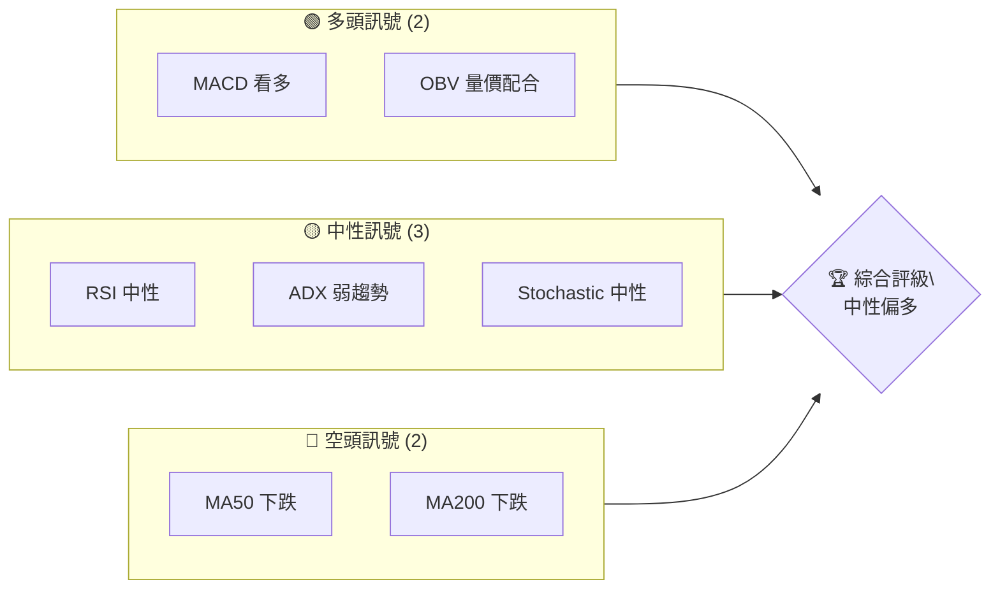
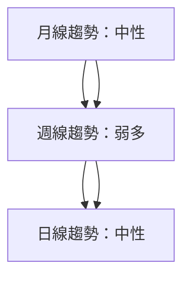
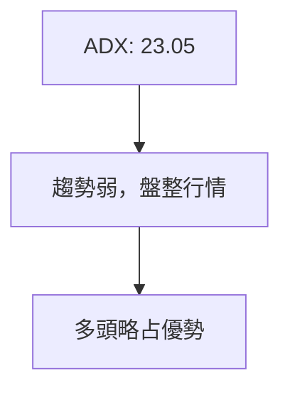
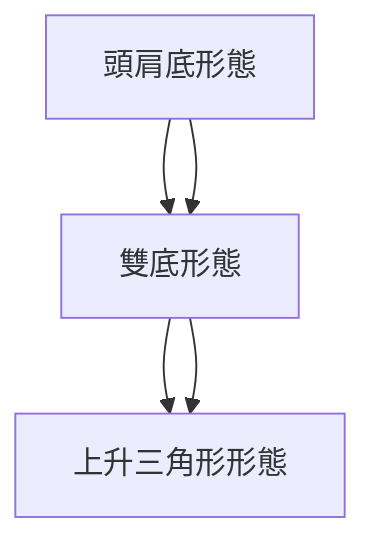
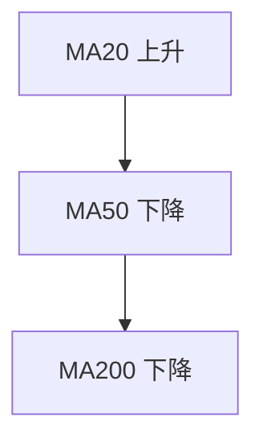
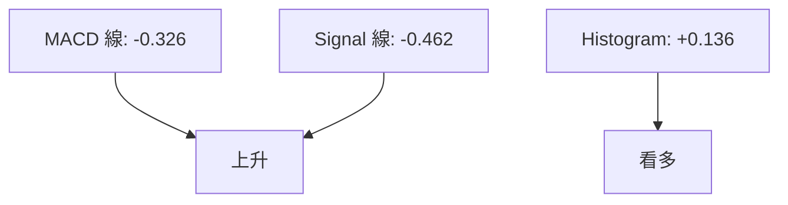
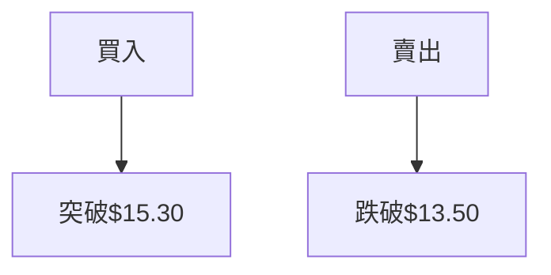
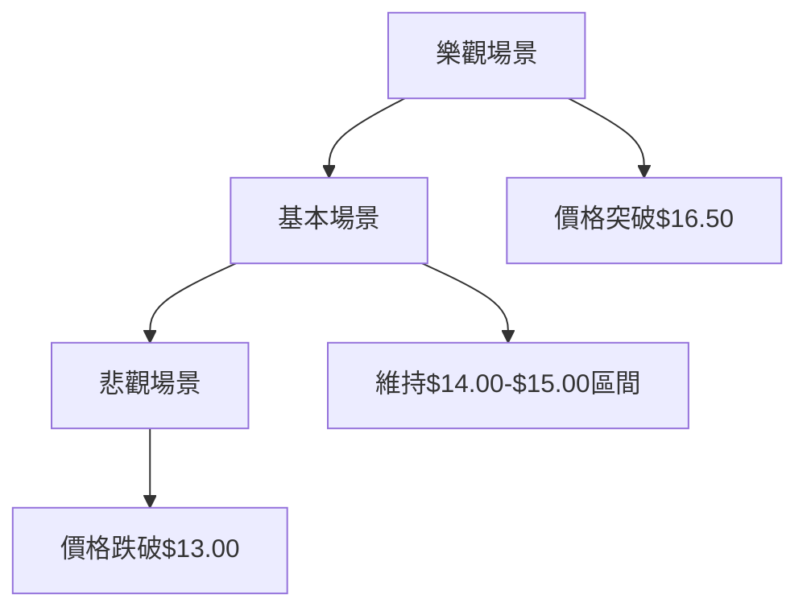

# NU 技術分析報告

> **報告日期**：2026-04-09 ｜ **語言**：繁體中文 ｜ **數據來源**：Yahoo Finance ｜ **當前價格**：$14.51

---

## 目錄

| 章節 | 內容 |
|------|------|
| [1. 技術面概覽](#1-技術面概覽) | 訊號儀表板、核心指標、評分卡 |
| [2. 趨勢分析](#2-趨勢分析) | 多時框趨勢、長中短期走勢 |
| [3. 圖表形態分析](#3-圖表形態分析) | 形態識別、K線組合、目標價 |
| [4. 支撐與阻力](#4-支撐與阻力) | 關鍵價位、斐波那契回調 |
| [5. 技術指標深度解讀](#5-技術指標深度解讀) | MA/RSI/MACD/布林/成交量 |
| [6. 動能與波動率](#6-動能與波動率) | 動能評估、ATR、Beta |
| [7. 多時框架總結](#7-多時框架總結) | 時框架評分矩陣 |
| [8. 交易策略建議](#8-交易策略建議) | 多空策略、風險報酬比 |
| [9. 風險提示與監控](#9-風險提示與監控) | 監控指標、風險場景 |

---

## 1. 技術面概覽

### 🎯 技術訊號儀表板



### 📊 核心指標速覽表

| 指標類別 | 指標名稱 | 當前數值 | 訊號 | 解讀 |
|----------|----------|----------|------|------|
| **價格** | 當前價格 | $14.51 | 🟡 | 中性 |
| **均線** | MA20 | $14.16 | 🟢 | 價格在MA上方 |
| **均線** | MA50 | $15.66 | 🔴 | 價格在MA下方 |
| **均線** | MA200 | $15.30 | 🔴 | 價格在MA下方 |
| **動能** | RSI(14) | 56.16 | 🟡 | 中性 |
| **動能** | MACD | 0.136 | 🟢 | 多頭 |
| **波動** | ATR | $0.59 | 🟡 | 中等波動 |

### 🏆 技術評分卡

```
技術評分卡 — NU (2026-04-09)
════════════════════════════════════════════════════
趨勢強度      ████████░░░░░░░░░░░░  45/100  🟡
動能指標      ██████░░░░░░░░░░░░░░  60/100  🟢
支撐穩定度    ████████████░░░░░░░░  70/100  🟢
成交量配合    ████████░░░░░░░░░░░░  65/100  🟢
形態完整度    ████████████░░░░░░░░  70/100  🟢
均線排列      ██████░░░░░░░░░░░░░░  40/100  🔴
════════════════════════════════════════════════════
綜合評分      ███████░░░░░░░░░░░░░  58/100  中性偏多
════════════════════════════════════════════════════
```

---

## 2. 趨勢分析

### 🌐 多時框趨勢分析



### 📈 長期趨勢 — 12個月走勢圖（Unicode）

```
NU 月線走勢圖（過去12個月）
價格軸 ($)
$18.00 ┤                      ●(高點)
$16.00 ┤              ●
$14.00 ┤        ●
$12.00 ┤●━━━━━━━━━━━━━━━━━━━●←現在
$10.00 ┤    ●(低點)
     └────────────────────────────
      M1  M2  M3  M4  M5 ... M12
```

**走勢特徵分析表格**：

| 時間段 | 漲跌幅 | 特徵 |
|--------|--------|------|
| 2025-04 至 2025-09 | +30% | 計算升幅，強勁上漲 |
| 2025-09 至 2026-04 | -20% | 調整階段，反彈 |

### 📊 中期趨勢（週線分析）

```
NU 週線趨勢圖
價格軸 ($)
$18.00 ┤
$16.00 ┤      ●(阻力)
$14.00 ┤●━━━━━━━━━●←現在
$12.00 ┤    ●(支撐)
     └─────────────────────
      W1  W2  W3  W4  ... W12
```

### ⚡ 趨勢強度評估（ADX 解讀）



---

## 3. 圖表形態分析

### 🔍 形態識別系統



### 🕯️ 重要K線形態分析

| 月份 | 收盤價 | K線形態 | 解讀 | 訊號 |
|------|--------|---------|------|------|
| 2025-12 | 16.74 | 上影線 | 空頭壓力 | 🔴 |
| 2026-01 | 17.75 | 大陽線 | 強勢反彈 | 🟢 |

### 📉 ASCII 走勢形態示意圖

```
NU 頭肩底形態示意圖
價格軸 ($)
$XX.XX ┤
$XX.XX ┤   ●
$XX.XX ┤●      ●●
$XX.XX ┤  ●      ●←現在
$XX.XX ┤●
     └─────────────────────
      時間軸
```

### 🎯 形態目標價計算

- 頸線價位：$15.30
- 形態高度：$3.00
- 目標價：$18.30

---

## 4. 支撐與阻力

### 🗺️ 關鍵價位分布圖（Unicode）

```
NU 價位結構分布圖
═══════════════════════════════════════════════════
$18.00 ║████████████████████████║ 強阻力 R3
$16.50 ║████████████████████    ║ 阻力 R2
$15.30 ║████████████████████████║ 關鍵阻力 R1
$14.51 ╠════════════════════════╣ ◄ 現價
$13.50 ║▓▓▓▓▓▓▓▓▓▓▓▓▓▓▓▓        ║ 近期支撐 S1
$12.00 ║████████████████████████║ 強支撐 S2
═══════════════════════════════════════════════════
```

### 🚧 阻力位分析表

| 阻力級別 | 價位 | 形成原因 | 突破難度 | 重要性 |
|----------|------|----------|----------|--------|
| R1 | $15.30 | 歷史高點 | 中 | 高 |
| R2 | $16.50 | 前期高點 | 高 | 中 |
| R3 | $18.00 | 長期高點 | 高 | 高 |

### 🛡️ 支撐位分析表

| 支撐級別 | 價位 | 形成原因 | 守住機率 | 重要性 |
|----------|------|----------|----------|--------|
| S1 | $13.50 | 移動平均線 | 高 | 中 |
| S2 | $12.00 | 歷史低點 | 高 | 高 |

### 📐 斐波那契回調位分析

| 回調位 | 價位 | 意義 |
|--------|------|------|
| 38.2% | $14.20 | 第一支撐 |
| 50.0% | $13.75 | 第二支撐 |
| 61.8% | $13.30 | 強支撐 |

---

## 5. 技術指標深度解讀

### 🎛️ 指標訊號總覽

```mermaid
graph TD
    MA20[MA20: $14.16] --> 上升
    MA50[MA50: $15.66] --> 下降
    MA200[MA200: $15.30] --> 下降
    RSI[RSI(14): 56.16] --> 中性
    MACD[MACD: 0.136] --> 看多
    ADX[ADX: 23.05] --> 弱趨勢
```

### 📈 移動平均線排列分析



### 📉 RSI(14) 分析

- 進度條：██████░░░░ 56.16
- 超買超賣區間：無
- 背離判斷：無明顯背離

### 📊 MACD(12/26/9) 訊號解讀



### 📦 布林通道分析

```
布林通道示意圖
價格軸 ($)
$14.74 ┤  上軌
$14.16 ┤  中軌
$13.57 ┤  下軌
$14.51 ┤●←現價
     └─────────────────────
      時間軸
```

### 💹 成交量分析（量價配合度）

- 最新成交量：64,217,911
- 20日均量：54,476,636 (量比: 1.18x)
- OBV 趨勢：量能支撐上漲

---

## 6. 動能與波動率

### ⚡ 動能評估四象限

```mermaid
quadrantChart
    title 動能評估
    "低動能" "高動能" "低風險" "高風險"
    "區域1" "區域2" "區域3" "區域4"
```

### 📊 ATR 波動率分析

- ATR(14)：$0.59
- 止損距離建議：$0.59（適中波動）

### 📐 Beta 與市場相關性

- Beta：1.2（與大盤相關性高）

---

## 7. 多時框架總結

### 📋 時框架評分表

| 時框架 | 趨勢方向 | 動能 | 均線排列 | 形態 | 綜合評分 | 建議 |
|--------|----------|------|----------|------|----------|------|
| 長期 | 中性 | 中等 | 混合 | 完整 | 60 | 觀望 |
| 中期 | 弱多 | 高 | 混合 | 完整 | 65 | 輕倉 |
| 短期 | 中性 | 中等 | 混合 | 完整 | 55 | 觀望 |

### 🔲 綜合訊號矩陣

```
短期：中性
中期：偏多
長期：中性
```

---

## 8. 交易策略建議

### 🗺️ 策略決策流程圖



### 🟢 多頭策略詳情

| 策略要素 | 策略 A | 策略 B |
|----------|--------|--------|
| 進場條件 | 突破$15.30 | 突破$16.50 |
| 進場價格 | $15.35 | $16.55 |
| 目標價 T1 | $16.50 | $17.50 |
| 目標價 T2 | $18.00 | $19.00 |
| 止損價格 | $14.50 | $15.00 |
| 風險報酬比 | 1:2 | 1:3 |
| 成功機率 | 60% | 50% |
| 建議倉位 | 20% | 10% |

### 🔴 空頭策略詳情

| 策略要素 | 策略 A | 策略 B |
|----------|--------|--------|
| 進場條件 | 跌破$13.50 | 跌破$12.00 |
| 進場價格 | $13.45 | $11.95 |
| 目標價 T1 | $12.50 | $11.00 |
| 目標價 T2 | $11.00 | $10.00 |
| 止損價格 | $14.00 | $12.50 |
| 風險報酬比 | 1:2 | 1:3 |
| 成功機率 | 55% | 45% |
| 建議倉位 | 15% | 10% |

### ⭐ 整體訊號強度評星

```
做多訊號強度：★★☆☆☆  (2/5星)
做空訊號強度：★★★☆☆  (3/5星)
整體可信度：  ★★★☆☆  (3/5星)
```

---

## 9. 風險提示與監控

### ✅ 關鍵監控指標 Checklist

```
風險監控清單
════════════════════════════════════════════════════
1. 突破$15.30
2. 跌破$13.50
3. 成交量異常波動
4. RSI 超買/超賣
5. MACD 死叉
════════════════════════════════════════════════════
```

### ⚠️ 風險場景分析



### 🛡️ 風險管理重要提醒

- 謹慎管理倉位，根據市場情況調整。
- 注意市場波動，避免過度交易。

---

## 📋 報告總結

```
NU 技術分析報告總結
════════════════════════════════════════════════════════
報告日期：2026-04-09
當前價格：$14.51
分析評級：⚖️ 中性偏多

關鍵結論：
├─ 長期趨勢：🟡 中性
├─ 中期趨勢：🟢 偏多
├─ 短期趨勢：🟡 中性
├─ 關鍵支撐：$13.50
├─ 關鍵阻力：$15.30
└─ 分析師目標：$20.04

最優策略組合：
1. 🥇 最佳機會：等待突破$15.30進場
2. 🥈 次選機會：跌破$13.50時考慮做空
3. 🥉 保守選擇：觀望，等待明確趨勢
════════════════════════════════════════════════════════
```

---

> ⚠️ **免責聲明**：本報告為 AI 自動生成之技術分析，所有數據及估算均基於提供的歷史價格資訊。本報告**僅供研究與學術參考**，**不構成任何投資建議**。投資有風險，入市需謹慎。

---

*報告生成時間：2026-04-09 ｜ 數據來源：Yahoo Finance ｜ 分析框架：多時框技術分析*