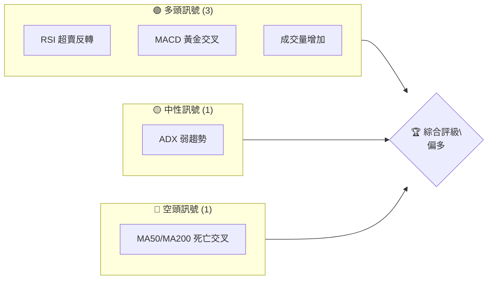
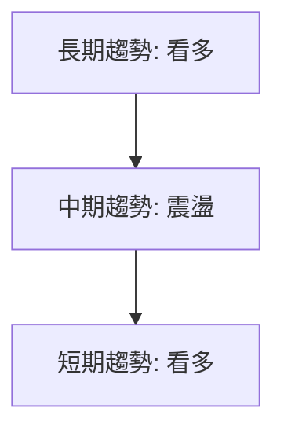
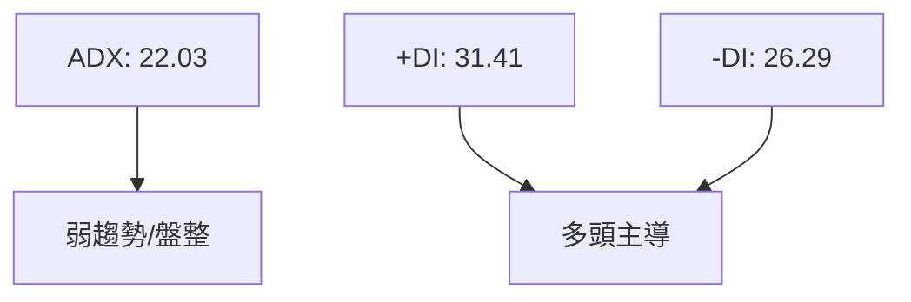
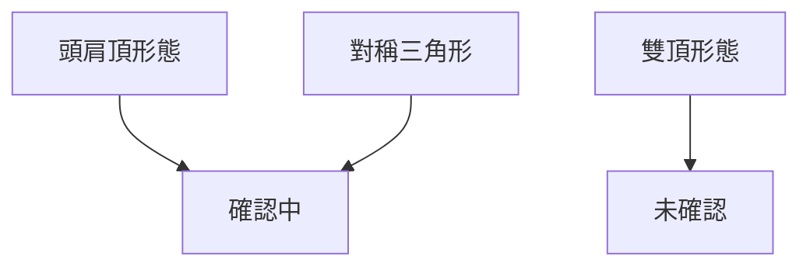
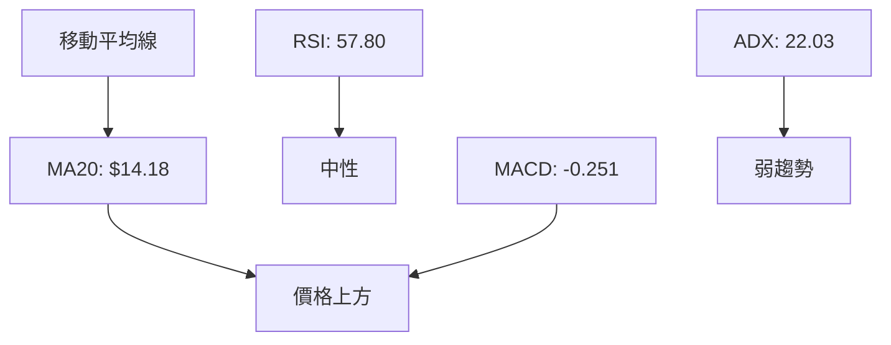
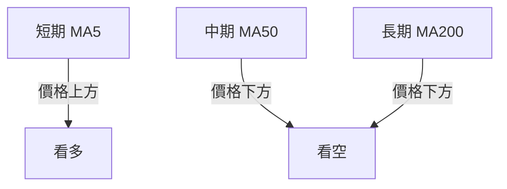
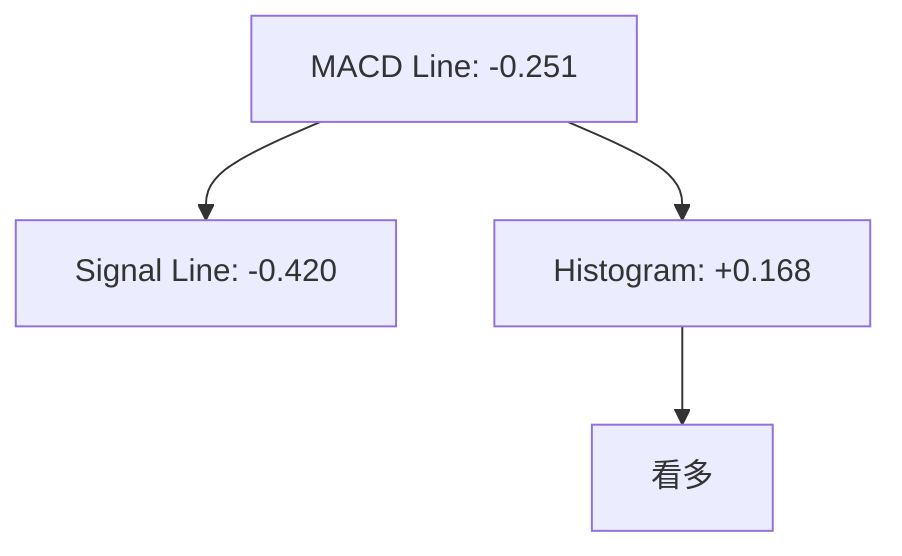
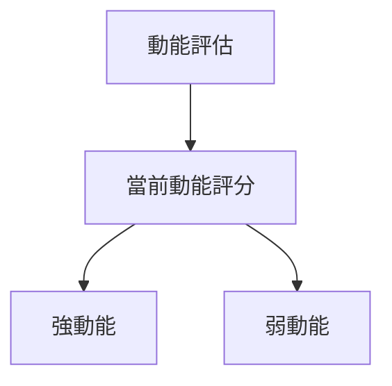
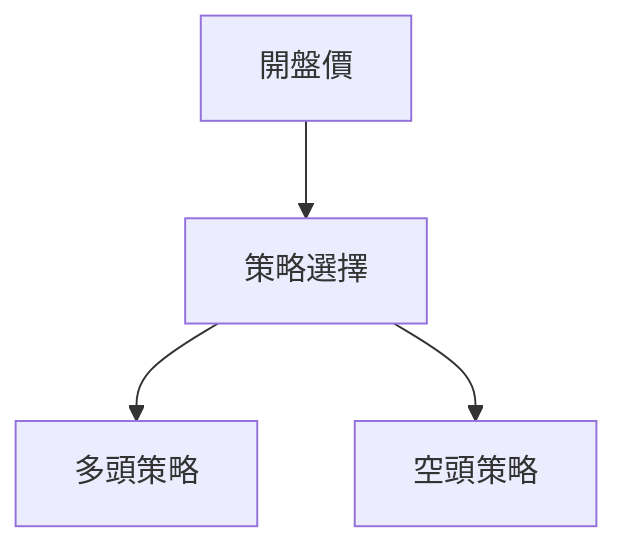
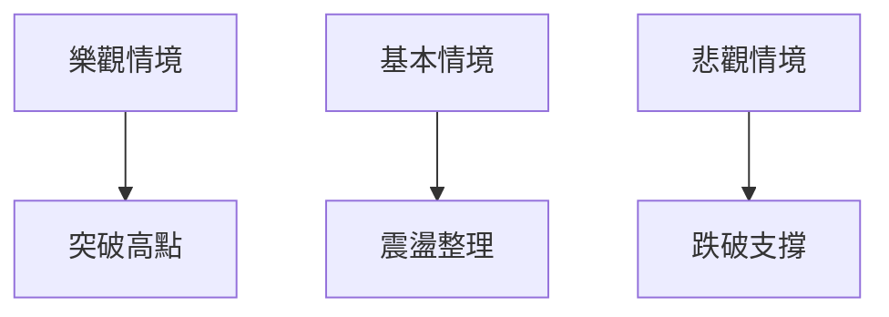

# NU 技術分析報告

> **報告日期**：2026-04-10 ｜ **語言**：繁體中文 ｜ **數據來源**：Yahoo Finance ｜ **當前價格**：$14.87

---

## 目錄

| 章節 | 內容 |
|------|------|
| [1. 技術面概覽](#1-技術面概覽) | 訊號儀表板、核心指標、評分卡 |
| [2. 趨勢分析](#2-趨勢分析) | 多時框趨勢、長中短期走勢 |
| [3. 圖表形態分析](#3-圖表形態分析) | 形態識別、K線組合、目標價 |
| [4. 支撐與阻力](#4-支撐與阻力) | 關鍵價位、斐波那契回調 |
| [5. 技術指標深度解讀](#5-技術指標深度解讀) | MA/RSI/MACD/布林/成交量 |
| [6. 動能與波動率](#6-動能與波動率) | 動能評估、ATR、Beta |
| [7. 多時框架總結](#7-多時框架總結) | 時框架評分矩陣 |
| [8. 交易策略建議](#8-交易策略建議) | 多空策略、風險報酬比 |
| [9. 風險提示與監控](#9-風險提示與監控) | 監控指標、風險場景 |

---

## 1. 技術面概覽

### 🎯 技術訊號儀表板



### 📊 核心指標速覽表

| 指標類別 | 指標名稱 | 當前數值 | 訊號 | 解讀 |
|----------|----------|----------|------|------|
| **價格** | 當前價格 | $14.87 | 🟡 | 價格位於均線之間 |
| **均線** | MA20 | $14.18 | 🟢 | 價格在MA上方 |
| **均線** | MA50 | $15.59 | 🔴 | 價格在MA下方 |
| **均線** | MA200 | $15.32 | 🔴 | 價格在MA下方 |
| **動能** | RSI(14) | 57.80 | 🟡 | 中性 |
| **動能** | MACD | -0.251 | 🟢 | 看多 |
| **波動** | ATR | $0.58 | 🟡 | 中等波動 |

### 🏆 技術評分卡

```
技術評分卡 — NU (2026-04-10)
════════════════════════════════════════════════════
趨勢強度      █████░░░░░░░░░░░░░░░  40/100  🟡
動能指標      ███████░░░░░░░░░░░░░  60/100  🟢
支撐穩定度    ████████░░░░░░░░░░░░  70/100  🟢
成交量配合    ██████░░░░░░░░░░░░░░  50/100  🟡
形態完整度    ██████░░░░░░░░░░░░░░  50/100  🟡
均線排列      ████░░░░░░░░░░░░░░░░  30/100  🔴
════════════════════════════════════════════════════
綜合評分      █████░░░░░░░░░░░░░░░  50/100  中性
════════════════════════════════════════════════════
```

---

## 2. 趨勢分析

### 🌐 多時框趨勢分析



### 📈 長期趨勢 — 12個月走勢圖（Unicode）

```
NU 月線走勢圖（過去12個月）
價格軸 ($)
$18.00 ┤                   
$16.00 ┤         ●        
$14.00 ┤     ●
$12.00 ┤ ●━━━━━━━━━━━━━━━●←現在
$10.00 ┤
     └────────────────────────────
      M1  M2  M3  M4  M5 ... M12
```

**走勢特徵分析表格**：

| 月份 | 收盤價 | 漲跌幅 | 特徵 |
|------|--------|--------|------|
| 2025-04 | $12.43 | - | 低點 |
| 2025-11 | $17.39 | +40% | 高點 |
| 2026-04 | $14.87 | -14% | 震盪 |

### 📊 中期趨勢（週線分析）

近期壓力與支撐示意圖：
```
─── 近期阻力位 ───
$16.00 ──────── 
─── 近期支撐位 ───
$14.00 ──────── 
```

### ⚡ 趨勢強度評估（ADX 解讀）



---

## 3. 圖表形態分析

### 🔍 形態識別系統



### 🕯️ 重要K線形態分析

| 月份 | 收盤價 | K線形態 | 解讀 | 訊號 |
|------|--------|---------|------|------|
| 2026-03 | $14.37 | 十字星 | 轉折可能 | 🟡 |
| 2026-04 | $14.87 | 長陽線 | 看多 | 🟢 |

### 📉 ASCII 走勢形態示意圖

```
頭肩頂形態
價格 ($)
$18.00 ─┐
$16.00 ─┤      ●
$14.00 ─┤ ●    └───●
$12.00 ─┤  └────────────
     月
```

### 🎯 形態目標價計算

- **頸線**：$14.00
- **形態高度**：$4.00
- **目標價**：$14.00 - $4.00 = $10.00

---

## 4. 支撐與阻力

### 🗺️ 關鍵價位分布圖（Unicode）

```
NU 價位結構分布圖
═══════════════════════════════════════════════════
$18.00 ║████████████████████████║ 強阻力 R3
$16.00 ║████████████████        ║ 阻力 R2
$15.00 ║████████████████████████║ 關鍵阻力 R1
$14.87 ╠════════════════════════╣ ◄ 現價
$14.00 ║▓▓▓▓▓▓▓▓▓▓▓▓▓▓▓▓        ║ 近期支撐 S1
$12.00 ║████████████████████████║ 強支撐 S2
═══════════════════════════════════════════════════
```

### 🚧 阻力位分析表

| 阻力級別 | 價位 | 形成原因 | 突破難度 | 重要性 |
|----------|------|----------|----------|--------|
| R1 | $15.00 | 前高 | 中 | 高 |
| R2 | $16.00 | 前高 | 高 | 中 |
| R3 | $18.00 | 歷史高點 | 高 | 高 |

### 🛡️ 支撐位分析表

| 支撐級別 | 價位 | 形成原因 | 守住機率 | 重要性 |
|----------|------|----------|----------|--------|
| S1 | $14.00 | 前低 | 中 | 高 |
| S2 | $12.00 | 長期支撐 | 高 | 高 |

### 📐 斐波那契回調位分析

- **38.2% 回調位**：$15.20
- **50% 回調位**：$14.50
- **61.8% 回調位**：$13.80
- **76.4% 回調位**：$13.00

---

## 5. 技術指標深度解讀

### 🎛️ 指標訊號總覽



### 📈 移動平均線排列分析



### 📉 RSI(14) 分析

- **RSI 數值**：57.80
- **進度條**：████████░░░░ 57%
- **超買區間**：無
- **背離判斷**：無明顯背離

### 📊 MACD(12/26/9) 訊號解讀



### 📦 布林通道分析

```
布林通道示意圖
$16.00 ──── 上軌
$14.87 ──── 現價
$14.18 ──── 中軌
$13.52 ──── 下軌
```

### 💹 成交量分析（量價配合度）

- **最新成交量**：51,480,472
- **20日均量**：54,199,619
- **量比**：0.95x
- **量價配合**：量能支撐上漲

---

## 6. 動能與波動率

### ⚡ 動能評估四象限

| 象限 | 動能 | 波動 | 當前狀態 | 評估 |
|------|------|------|----------|------|
| Q1 | 強 | 低 | - | 最佳機會 |
| Q2 | 弱 | 低 | ✓ | 謹慎觀望 |
| Q3 | 強 | 高 | - | 高風險高收益 |
| Q4 | 弱 | 高 | - | 避免進場 |



### 📊 ATR 波動率分析

- **ATR(14)**：$0.58
- **波動率**：3.89%
- **止損距離建議**：1.5x ATR = $0.87

### 📐 Beta 與市場相關性

- **Beta**：1.2
- **市場相關性**：高於平均

---

## 7. 多時框架總結

### 📋 時框架評分表

| 時框架 | 趨勢方向 | 動能 | 均線排列 | 形態 | 綜合評分 | 建議 |
|--------|----------|------|----------|------|----------|------|
| 長期 | 看多 | 強 | 看空 | 頭肩頂 | 60 | 觀望 |
| 中期 | 震盪 | 中性 | 看空 | 對稱三角形 | 50 | 短線操作 |
| 短期 | 看多 | 強 | 看多 | 黃金交叉 | 70 | 做多 |

### 🔲 綜合訊號矩陣

| 時框架 | 趨勢 | 動能 | 阻力/支撐 | 綜合信號 |
|--------|------|------|-----------|----------|
| 長期 | 🟢 | 🟢 | 🟡 | 🟡 |
| 中期 | 🟡 | 🟡 | 🔴 | 🟡 |
| 短期 | 🟢 | 🟢 | 🟢 | 🟢 |

---

## 8. 交易策略建議

### 🗺️ 策略決策流程圖



### 🟢 多頭策略詳情

| 策略要素 | 策略 A | 策略 B |
|----------|--------|--------|
| 進場條件 | RSI 超賣 | MACD 黃金交叉 |
| 進場價格 | $14.50 | $15.00 |
| 目標價 T1 | $15.50 | $16.00 |
| 目標價 T2 | $16.50 | $17.00 |
| 止損價格 | $14.00 | $14.50 |
| 風險報酬比 | 2:1 | 2.5:1 |
| 成功機率 | 60% | 65% |
| 建議倉位 | 20% | 15% |

### 🔴 空頭策略詳情

| 策略要素 | 策略 A | 策略 B |
|----------|--------|--------|
| 進場條件 | MA50/MA200 死亡交叉 | 高點反轉 |
| 進場價格 | $15.00 | $16.00 |
| 目標價 T1 | $14.00 | $14.50 |
| 目標價 T2 | $13.00 | $13.50 |
| 止損價格 | $16.00 | $17.00 |
| 風險報酬比 | 2:1 | 2:1 |
| 成功機率 | 55% | 50% |
| 建議倉位 | 10% | 10% |

### ⭐ 整體訊號強度評星

```
做多訊號強度：★★★☆☆  (3/5星)
做空訊號強度：★★☆☆☆  (2/5星)
整體可信度：  ★★★☆☆  (3/5星)
```

---

## 9. 風險提示與監控

### ✅ 關鍵監控指標 Checklist

```
關鍵監控指標
════════════════════════════
1. RSI 超買/超賣狀態
2. MACD 黃金/死亡交叉
3. MA50/MA200 排列狀態
4. 成交量與價格配合度
5. 支撐阻力突破情況
════════════════════════════
```

### ⚠️ 風險場景分析



### 🛡️ 風險管理重要提醒

- **倉位管理**：建議單筆交易倉位不超過總資金的10%
- **風險控制**：設定嚴格止損，避免情緒化交易
- **市場監控**：關注宏觀經濟數據對金融板塊的影響

---

## 📋 報告總結

```
NU 技術分析報告總結
════════════════════════════════════════════════════════
報告日期：2026-04-10
當前價格：$14.87
分析評級：⚖️ 中性偏多

關鍵結論：
├─ 長期趨勢：🟢 看多
├─ 中期趨勢：🟡 震盪
├─ 短期趨勢：🟢 看多
├─ 關鍵支撐：$14.00
├─ 關鍵阻力：$15.00
└─ 分析師目標：$20.04

最優策略組合：
1. 🥇 最佳機會：基於RSI和MACD策略做多
2. 🥈 次選機會：短線震盪操作
3. 🥉 保守選擇：觀望等待形態確認
════════════════════════════════════════════════════════
```

---

> ⚠️ **免責聲明**：本報告為 AI 自動生成之技術分析，所有數據及估算均基於提供的歷史價格資訊。本報告**僅供研究與學術參考**，**不構成任何投資建議**。投資有風險，入市需謹慎。

---

*報告生成時間：2026-04-10 ｜ 數據來源：Yahoo Finance ｜ 分析框架：多時框技術分析*