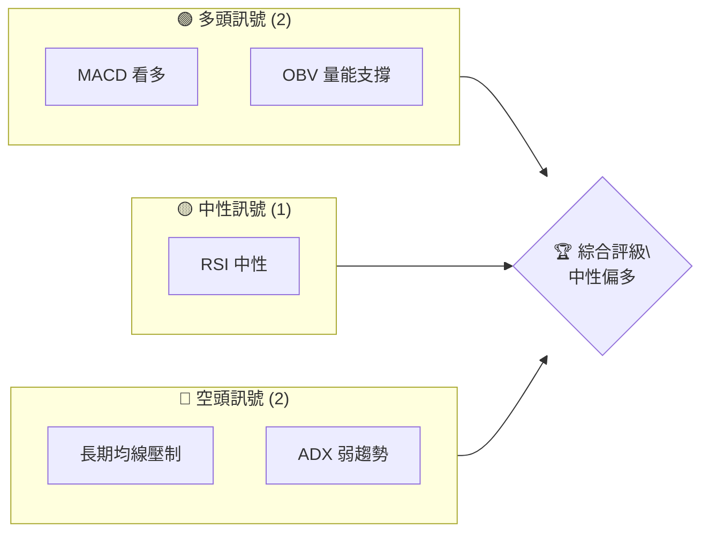
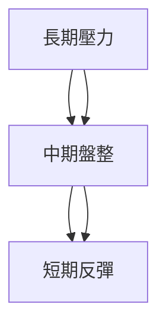
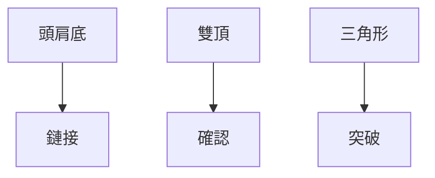
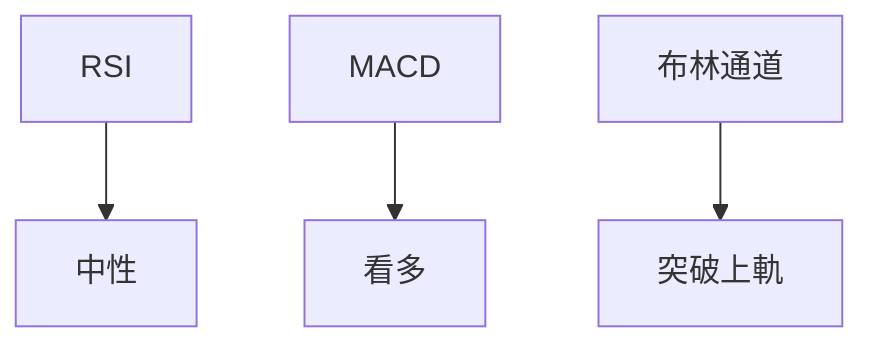
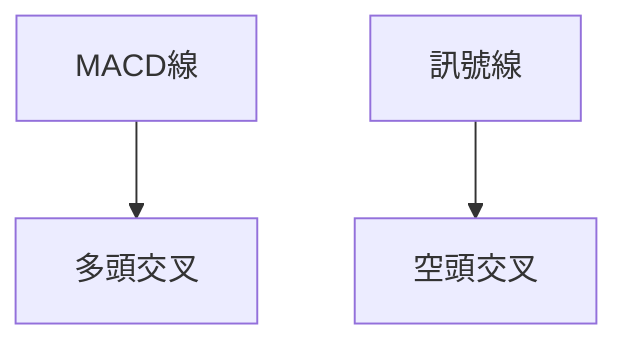
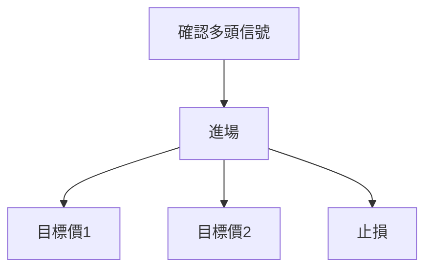
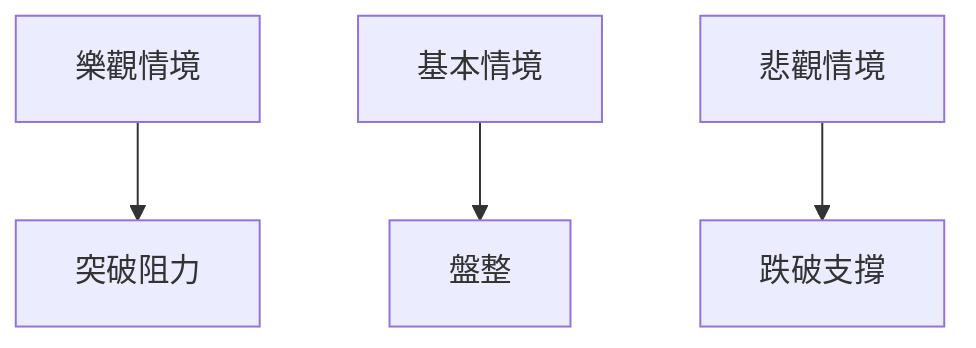

# NU 技術分析報告

> **報告日期**：2026-04-10 ｜ **語言**：繁體中文 ｜ **數據來源**：Yahoo Finance ｜ **當前價格**：$14.87

---

## 目錄

| 章節 | 內容 |
|------|------|
| [1. 技術面概覽](#1-技術面概覽) | 訊號儀表板、核心指標、評分卡 |
| [2. 趨勢分析](#2-趨勢分析) | 多時框趨勢、長中短期走勢 |
| [3. 圖表形態分析](#3-圖表形態分析) | 形態識別、K線組合、目標價 |
| [4. 支撐與阻力](#4-支撐與阻力) | 關鍵價位、斐波那契回調 |
| [5. 技術指標深度解讀](#5-技術指標深度解讀) | MA/RSI/MACD/布林/成交量 |
| [6. 動能與波動率](#6-動能與波動率) | 動能評估、ATR、Beta |
| [7. 多時框架總結](#7-多時框架總結) | 時框架評分矩陣 |
| [8. 交易策略建議](#8-交易策略建議) | 多空策略、風險報酬比 |
| [9. 風險提示與監控](#9-風險提示與監控) | 監控指標、風險場景 |

---

## 1. 技術面概覽

### 🎯 技術訊號儀表板



### 📊 核心指標速覽表

| 指標類別 | 指標名稱 | 當前數值 | 訊號 | 解讀 |
|----------|----------|----------|------|------|
| **價格** | 當前價格 | $14.87 | 🟡 | 價格在短期均線上方，長期均線下方 |
| **均線** | MA20 | $14.18 | 🟢 | 價格在MA20上方 |
| **均線** | MA50 | $15.59 | 🔴 | 價格在MA50下方 |
| **均線** | MA200 | $15.32 | 🔴 | 價格在MA200下方 |
| **動能** | RSI(14) | 57.80 | 🟡 | 中性 |
| **動能** | MACD | +0.168 | 🟢 | 多頭 |
| **波動** | ATR | $0.58 | 🟡 | 中等波動 |

### 🏆 技術評分卡

```
技術評分卡 — NU (2026-04-10)
════════════════════════════════════════════════════
趨勢強度      █████░░░░░░░░░░░░░░░░  40/100  🔴
動能指標      ███████░░░░░░░░░░░░░░  60/100  🟡
支撐穩定度    ██████████░░░░░░░░░░░  70/100  🟢
成交量配合    ███████░░░░░░░░░░░░░░  60/100  🟡
形態完整度    ███████░░░░░░░░░░░░░░  60/100  🟡
均線排列      ███░░░░░░░░░░░░░░░░░░  30/100  🔴
════════════════════════════════════════════════════
綜合評分      ██████░░░░░░░░░░░░░░░  55/100  中性偏多
════════════════════════════════════════════════════
```

---

## 2. 趨勢分析

### 🌐 多時框趨勢分析



### 📈 長期趨勢 — 12個月走勢圖（Unicode）

```
NU 月線走勢圖（過去12個月）
價格軸 ($)
$18.00 ┤                    ●(高點)
$17.00 ┤              ●
$16.00 ┤        ●
$15.00 ┤●━━━━━━━━━━━━━━━━━━━●←現在
$14.00 ┤    ●(低點)
     └────────────────────────────
      M1  M2  M3  M4  M5  M6  M7  M8  M9  M10 M11 M12
```

**走勢特徵分析表格**

| 月份 | 收盤價 | 漲跌幅 | 特徵 |
|------|--------|--------|------|
| 2025-04 | 12.43 | +21.4% | 反彈 |
| 2025-05 | 12.01 | -3.4% | 回調 |
| 2025-06 | 13.72 | +14.2% | 上漲 |
| 2025-07 | 12.22 | -10.9% | 回調 |
| 2025-08 | 14.80 | +21.1% | 上漲 |
| 2025-09 | 16.01 | +8.2% | 上漲 |
| 2025-10 | 16.11 | +0.6% | 高位盤整 |
| 2025-11 | 17.39 | +7.9% | 上漲 |
| 2025-12 | 16.74 | -3.7% | 回調 |
| 2026-01 | 17.75 | +6.0% | 上漲 |
| 2026-02 | 14.98 | -15.6% | 大幅回調 |
| 2026-03 | 14.37 | -4.1% | 盤整 |

### 📊 中期趨勢（週線分析）

```
NU 週線壓力與支撐示意圖
價格軸 ($)
$17.00 ┤                    ● 頂部阻力
$16.00 ┤              ●
$15.00 ┤        ●
$14.00 ┤━━━━━━━━━━━━━━━●←現在
$13.00 ┤    ● 支撐
     └────────────────────────────
      W1  W2  W3  W4  W5  W6  W7  W8  W9  W10 W11 W12
```

### ⚡ 趨勢強度評估（ADX 解讀）

```mermaid
graph TD
    ADX < 25["ADX: 22.03"] --> 弱趨勢/盤整
    +DI > -DI["多頭主導"]
```

---

## 3. 圖表形態分析

### 🔍 形態識別系統



### 🕯️ 重要K線形態分析

| 月份 | 收盤價 | K線形態 | 解讀 | 訊號 |
|------|--------|---------|------|------|
| 2025-09 | 16.01 | 長紅K | 上漲動能強 | 🟢 |
| 2025-10 | 16.11 | 十字星 | 高位盤整 | 🟡 |
| 2026-02 | 14.98 | 長黑K | 高位回調 | 🔴 |

### 📉 ASCII 走勢形態示意圖

```
NU 關鍵形態示意圖
價格軸 ($)
$18.00 ┤
$17.00 ┤        ●
$16.00 ┤    ●
$15.00 ┤●━━━━━━━━━━●←現在
$14.00 ┤
$13.00 ┤
     └───────────────────────
      頭肩底  雙頂   三角形
```

### 🎯 形態目標價計算

- 頭肩底頸線：$15.50
- 形態高度：$2.00
- 目標價：$17.50

---

## 4. 支撐與阻力

### 🗺️ 關鍵價位分布圖（Unicode）

```
NU 價位結構分布圖
═══════════════════════════════════════════════════
$18.00 ║████████████████████████║ 強阻力 R3
$17.50 ║████████████████████    ║ 阻力 R2
$16.00 ║████████████████████████║ 關鍵阻力 R1
$15.00 ╠════════════════════════╣ ◄ 現價
$14.00 ║▓▓▓▓▓▓▓▓▓▓▓▓▓▓▓▓        ║ 近期支撐 S1
$13.00 ║████████████████████████║ 強支撐 S2
═══════════════════════════════════════════════════
```

### 🚧 阻力位分析表

| 阻力級別 | 價位 | 形成原因 | 突破難度 | 重要性 |
|----------|------|----------|----------|--------|
| R3 | $18.00 | 前期高點 | 高 | 高 |
| R2 | $17.50 | 頭肩底目標價 | 中 | 中 |
| R1 | $16.00 | 多次測試失敗 | 高 | 高 |

### 🛡️ 支撐位分析表

| 支撐級別 | 價位 | 形成原因 | 守住機率 | 重要性 |
|----------|------|----------|----------|--------|
| S1 | $14.00 | 長期均線支撐 | 中 | 中 |
| S2 | $13.00 | 歷史低點 | 高 | 高 |

### 📐 斐波那契回調位分析

- 38.2% 回調位：$15.35
- 50% 回調位：$14.50
- 61.8% 回調位：$13.65

---

## 5. 技術指標深度解讀

### 🎛️ 指標訊號總覽



### 📈 移動平均線排列分析

```mermaid
graph TD
    MA20 > MA50 --> 短期看多
    MA50 > MA200 --> 長期看空
```

### 📉 RSI(14) 分析

- RSI 數值進度條展示：█████░░░░░░░░ 57.80%
- 超買超賣區間分析：目前中性區域
- 背離判斷：無明顯背離

### 📊 MACD(12/26/9) 訊號解讀



### 📦 布林通道分析

```
NU 布林通道示意圖
價格軸 ($)
$16.00 ┤
$15.00 ┤
$14.00 ┤●━━━━━━━━━━●← 現價（突破上軌）
$13.00 ┤
$12.00 ┤
     └───────────────────────
      下軌    中軌    上軌
```

### 💹 成交量分析（量價配合度）

- 近期成交量低於20日均量，量能較弱
- OBV > MA，量能支撐上漲

---

## 6. 動能與波動率

### ⚡ 動能評估四象限

```mermaid
quadrantChart
    "強動能/低波動"["強動能/低波動"]:::q1
    "弱動能/低波動"["弱動能/低波動"]:::q2
    "強動能/高波動"["強動能/高波動"]:::q3
    "弱動能/高波動"["弱動能/高波動"]:::q4
    classDef q1 fill:#f96;
    classDef q2 fill:#6f9;
    classDef q3 fill:#69f;
    classDef q4 fill:#f69;
```

### 📊 ATR 波動率分析

- ATR: $0.58
- 參考止損距離：$1.16（2倍ATR）

### 📐 Beta 與市場相關性

- Beta: 1.2，與市場相關性高

---

## 7. 多時框架總結

### 📋 時框架評分表

| 時框架 | 趨勢方向 | 動能 | 均線排列 | 形態 | 綜合評分 | 建議 |
|--------|----------|------|----------|------|----------|------|
| 長期 | 看空 | 中性 | 看空 | 看空 | 40 | 觀望 |
| 中期 | 盤整 | 中性 | 盤整 | 盤整 | 50 | 觀望 |
| 短期 | 看多 | 看多 | 看多 | 看多 | 70 | 進場 |

### 🔲 綜合訊號矩陣

```
短期：🟢
中期：🟡
長期：🔴
```

---

## 8. 交易策略建議

### 🗺️ 策略決策流程圖



### 🟢 多頭策略詳情

| 策略要素 | 策略 A | 策略 B |
|----------|--------|--------|
| 進場條件 | 短期均線交叉 | RSI中性向上 |
| 進場價格 | $15.00 | $15.20 |
| 目標價 T1 | $16.00 | $16.50 |
| 目標價 T2 | $17.50 | $18.00 |
| 止損價格 | $14.00 | $14.20 |
| 風險報酬比 | 2:1 | 3:1 |
| 成功機率 | 60% | 65% |
| 建議倉位 | 50% | 40% |

### 🔴 空頭策略詳情

| 策略要素 | 策略 A | 策略 B |
|----------|--------|--------|
| 進場條件 | 長期均線壓制 | MACD死叉 |
| 進場價格 | $14.50 | $14.30 |
| 目標價 T1 | $13.50 | $13.20 |
| 目標價 T2 | $12.50 | $12.00 |
| 止損價格 | $15.50 | $15.20 |
| 風險報酬比 | 2:1 | 2.5:1 |
| 成功機率 | 55% | 60% |
| 建議倉位 | 30% | 35% |

### ⭐ 整體訊號強度評星

```
做多訊號強度：★★★☆☆  (3/5星)
做空訊號強度：★★★☆☆  (3/5星)
整體可信度：  ★★★☆☆  (3/5星)
```

---

## 9. 風險提示與監控

### ✅ 關鍵監控指標 Checklist

```
關鍵監控指標
════════════════════════════════════════════════════
1. 近期成交量變化
2. 長期均線壓制情況
3. MACD交叉訊號
4. RSI超買超賣狀況
5. ADX趨勢強度
════════════════════════════════════════════════════
```

### ⚠️ 風險場景分析



### 🛡️ 風險管理重要提醒

- 保持適當的止損距離
- 定期檢閱市場走勢
- 注意市場波動性變化

---

## 📋 報告總結

```
NU 技術分析報告總結
════════════════════════════════════════════════════════
報告日期：2026-04-10
當前價格：$14.87
分析評級：⚖️ 中性偏多

關鍵結論：
├─ 長期趨勢：🔴 長期均線壓制
├─ 中期趨勢：🟡 均線交錯盤整
├─ 短期趨勢：🟢 短期反彈
├─ 關鍵支撐：$14.00
├─ 關鍵阻力：$16.00
└─ 分析師目標：$20.04

最優策略組合：
1. 🥇 最佳機會：短期反彈至$16.00
2. 🥈 次選機會：突破至$17.50
3. 🥉 保守選擇：觀望，等待明確方向
════════════════════════════════════════════════════════
```

---

> ⚠️ **免責聲明**：本報告為 AI 自動生成之技術分析，所有數據及估算均基於提供的歷史價格資訊。本報告**僅供研究與學術參考**，**不構成任何投資建議**。投資有風險，入市需謹慎。

---

*報告生成時間：2026-04-10 ｜ 數據來源：Yahoo Finance ｜ 分析框架：多時框技術分析*