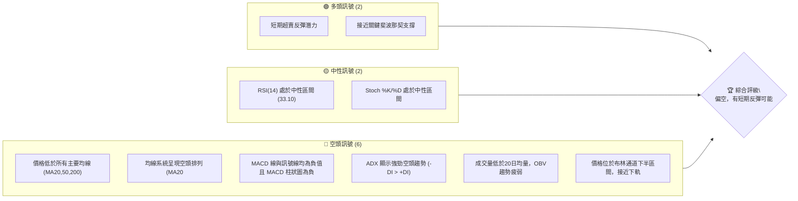
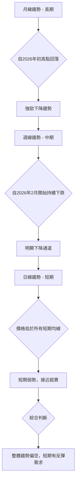
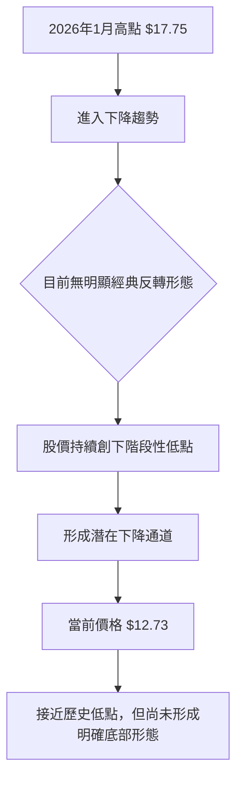
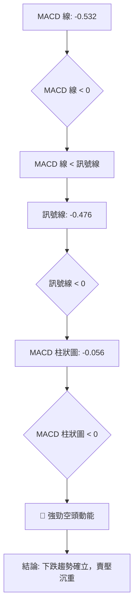

<details>
<summary>📊 靜態圖表 (點擊展開)</summary>

</details>

<html>
<head><meta charset="utf-8" /></head>
<body>
    <div>                        <script>window.PlotlyConfig = {MathJaxConfig: 'local'};</script>
        <script charset="utf-8" src="https://cdn.plot.ly/plotly-3.5.0.min.js" integrity="sha256-fHbNLP+GlIXN+efbQec78UkemUz3NJp7UmfGxC1tNxs=" crossorigin="anonymous"></script>                <div id="candlestick-chart" class="plotly-graph-div" style="height:500px; width:100%;"></div>            <script>                window.PLOTLYENV=window.PLOTLYENV || {};                                if (document.getElementById("candlestick-chart")) {                    Plotly.newPlot(                        "candlestick-chart",                        [{"close":{"dtype":"f8","bdata":"AAAAgOvRKEAAAACgmZkoQAAAAEAK1ydAAAAAQOF6KEAAAACgcL0oQAAAAMAeBShAAAAAQDMzKkAAAADA9agqQAAAAKBwPSpAAAAAoHA9K0AAAABAClcrQAAAAKBH4StAAAAAgMJ1LEAAAABA4XosQAAAACCuRy1AAAAAgD2KLUAAAACgmZktQAAAAOBRuC1AAAAAwMzMLUAAAACgcL0tQAAAAEDhei1AAAAA4KNwLkAAAAAghesuQAAAAMAeBS9AAAAAoHA9L0AAAACgR2EvQAAAAIDr0S9AAAAAIK7HL0AAAAAghesvQAAAAEDh+i9AAAAAIIUrMEAAAADAzEwwQAAAAGBmJjBAAAAAYI8CMEAAAAAgXI8vQAAAACBcjy9AAAAAYGbmL0AAAABgjwIwQAAAAKBHYS5AAAAA4KNwLkAAAABguJ4uQAAAAGCPwi5AAAAAYI9CLkAAAAAghesuQAAAAKBwvS5AAAAAQArXLUAAAADA9SguQAAAAIDr0S1AAAAAAClcLkAAAACAwnUtQAAAAAAAAC5AAAAAgOvRLkAAAABA4XouQAAAAIDrUS5AAAAAwMzML0AAAACAFK4vQAAAAAAAADBAAAAAACncL0AAAABAChcwQAAAACBcDzBAAAAAACkcMEAAAACgRyEwQAAAAKCZmS9AAAAAIIUrMEAAAACgR+EvQAAAAKBwvS9AAAAAwB4FMEAAAAAA12MwQAAAAIAULjBAAAAAgBQuL0AAAAAA16MvQAAAAEAzMy9AAAAAANejLkAAAACA61EvQAAAAADXoy5AAAAAIK7HL0AAAABACtcvQAAAAAApnDBAAAAAAABAMUAAAAAA12MxQAAAAEDhejFAAAAAACmcMUAAAADgo3AxQAAAAGBmpjFAAAAAQDOzMEAAAABguJ4wQAAAAIAUrjBAAAAA4KOwMEAAAACA69EwQAAAAGBm5jBAAAAAYGamMEAAAABAMzMwQAAAAOBRuC9AAAAAwB5FMEAAAABAClcwQAAAAGC4njBAAAAAYI\u002fCMEAAAACgcL0wQAAAAGCPwjBAAAAAwPWoMEAAAACgR+EwQAAAAKBwvTBAAAAAwB4FMUAAAADgo\u002fAxQAAAAAAp3DFAAAAAAACAMUAAAAAAKZwxQAAAAIDCdTFAAAAAgD0KMUAAAAAgXI8wQAAAAADXozBAAAAAACmcMEAAAACgmZkwQAAAAOBR+DBAAAAAoHA9MUAAAAAAAAAyQAAAAIA9CjJAAAAAgBQuMkAAAADAzIwyQAAAAGCPwjJAAAAAYI\u002fCMkAAAAAAAMAxQAAAAAApHDJAAAAAYLgeMkAAAADAHgUxQAAAACBczzBAAAAAYGZmMUAAAADAzIwxQAAAAIDrkTFAAAAAwPVoMUAAAACAPQoxQAAAAIDr0TBAAAAAgOvRMEAAAAAghSsxQAAAAIDrUTFAAAAAIK6HMUAAAADgozAwQAAAACCuhzBAAAAAYGamMEAAAABguB4uQAAAAIDC9S1AAAAAoEdhLkAAAADAHoUtQAAAAAAAAC5AAAAAANejLUAAAADA9SgtQAAAAEAKVy1AAAAAYI\u002fCLUAAAABA4fosQAAAAOCj8CtAAAAAIK7HK0AAAACAPYosQAAAAAAAgCxAAAAA4KPwK0AAAACA61EsQAAAAKBH4StAAAAAAClcLUAAAACgR2EsQAAAAADXoyxAAAAAgD0KLEAAAABAMzMrQAAAAMAeBStAAAAAoHC9LEAAAACgR+EsQAAAAMDMTCxAAAAAwB6FLEAAAADAzEwsQAAAAMAeBS1AAAAAoHC9LUAAAAAghestQAAAAGBm5i1AAAAAQDOzLkAAAACAFK4uQAAAAAAp3C5AAAAAgBSuLkAAAABAMzMuQAAAAKCZGS5AAAAAQDOzLUAAAAAghessQAAAAMAeBS1AAAAAIK5HLUAAAAAAAAAtQAAAAOB6FCxAAAAAgML1LEAAAACgR+EsQAAAAIDrUSxAAAAAAACALEAAAACAwvUsQAAAAMAehSxAAAAAoJmZK0AAAAAAAAArQAAAAIA9iipAAAAAANejKUAAAAAAKdwpQAAAAKBHYShAAAAA4HqUKEAAAADgepQoQAAAAOB6lClAAAAAgOtRKkAAAACAwnUpQA=="},"high":{"dtype":"f8","bdata":"AAAAQDMzKUAAAACAFC4pQAAAAKBwvShAAAAA4HqUKEAAAAAghesoQAAAAADXoyhAAAAAANcjLEAAAADAHgUrQAAAAIDCtSpAAAAAAACAK0AAAACgmZkrQAAAAIDC9StAAAAAYI8CLUAAAABAM7MsQAAAAEAKVy1AAAAAQOE6LkAAAAAA16MtQAAAAKBwvS1AAAAAgOsRLkAAAACgcP0tQAAAAKCZWS5AAAAA4KOwLkAAAADAHgUvQAAAACCFay9AAAAAoEehL0AAAACAPYovQAAAAKBHATBAAAAAgOsRMEAAAADAzAwwQAAAAKBHITBAAAAAoJlZMEAAAADAzEwwQAAAAMDMbDBAAAAAYLheMEAAAADgURgwQAAAAKBw\u002fS9AAAAAoJkZMEAAAADgozAwQAAAAMDMDDBAAAAAwMzMLkAAAAAAAMAuQAAAAEDh+i5AAAAA4HoUL0AAAAAAAAAvQAAAAMD1KC9AAAAAYGbmLkAAAACgcD0uQAAAAKBHYS5AAAAAAFaOLkAAAABguJ4uQAAAAGC4Hi5AAAAAIK5HL0AAAACAFC4vQAAAACCF6y5AAAAAANcjMEAAAACgRyEwQAAAAKCZWTBAAAAAgOsRMEAAAADAHkUwQAAAAKBwPTBAAAAAwB5FMEAAAAAAAIAwQAAAAKBwHTBAAAAAIIVrMEAAAABgZmYwQAAAAAAAwC9AAAAA4FE4MEAAAADAzIwwQAAAAAAAgDBAAAAAgOsxMEAAAABgj0IwQAAAAKBwvS9AAAAAoJlZL0AAAADgo3AvQAAAAEAzEzBAAAAAwB4FMEAAAAAgXA8wQAAAAMDMrDBAAAAAoEdhMUAAAACAFI4xQAAAACBcjzFAAAAAQArXMUAAAADgUbgxQAAAAOCj0DFAAAAAQOG6MUAAAABAMxMxQAAAAEDhujBAAAAAoJnZMEAAAAAAKRwxQAAAACBcDzFAAAAAgOsRMUAAAADAHoUwQAAAAMD1KDBAAAAA4CJbMEAAAADgUXgwQAAAAKBHoTBAAAAA4HrUMEAAAADA9cgwQAAAAGCPwjBAAAAAIFzPMEAAAABA4RoxQAAAAMDM7DBAAAAAIFwPMUAAAACAlSMyQAAAAGC4XjJAAAAAYI\u002fCMUAAAACAvp8xQAAAAIDrETJAAAAAIIVrMUAAAACA6xExQAAAAOCjsDBAAAAA4FH4MEAAAABgDq0wQAAAAOCjUDFAAAAAgD2KMUAAAAAAAAAyQAAAAOCjEDJAAAAAYI9CMkAAAAAgXI8yQAAAAMD1yDJAAAAAQOH6MkAAAABguJ4yQAAAAEAKdzJAAAAAYGamMkAAAACAPSoyQAAAAGCPIjFAAAAAIIVrMUAAAABACtcxQAAAAAApvDFAAAAAoHD9MUAAAADAzIwxQAAAAKBH4TBAAAAAAAAAMUAAAABA4XoxQAAAAOCjcDFAAAAAQAqXMUAAAADA9WgxQAAAAEAKlzBAAAAAoJnZMEAAAACgR+EvQAAAAGBmZi5AAAAAQIusLkAAAABguB4uQAAAAIDCtS5AAAAAwMxMLkAAAABAM3MtQAAAAIDrkS1AAAAAgD1KLkAAAACgR+EtQAAAAEAzsyxAAAAAYLieLEAAAACgcL0sQAAAAOB6FC1AAAAAwMyMLEAAAAAAAIAsQAAAAMDMTCxAAAAAQArXLUAAAADAHgUtQAAAAKBHYS1AAAAAYGamLEAAAABgZuYrQAAAAIDrkStAAAAAgOvRLEAAAACgmZktQAAAAIDC9SxAAAAAIK7HLEAAAACA61EsQAAAAMBJzC5AAAAAACncLUAAAADgehQuQAAAACBcDy5AAAAA4KPwLkAAAABguB4vQAAAAKBHIS9AAAAAYLieL0AAAABAM7MuQAAAACBcjy5AAAAA4KNwLkAAAAAA16MtQAAAAOB6FC1AAAAAIIWrLUAAAABAClctQAAAAMAeBS1AAAAAYLgeLUAAAACA61EtQAAAAOCj8CxAAAAAoEfhLEAAAACgmRktQAAAAEAzMy1AAAAAwPWoLEAAAADA9egrQAAAAAApHCtAAAAAgD2KKkAAAABAClcqQAAAACBczyhAAAAAwMzMKEAAAADAzMwoQAAAAKCZmSlAAAAAoJmZKkAAAADAHoUqQA=="},"hovertemplate":"\u003cb\u003e%{x|%Y-%m-%d}\u003c\u002fb\u003e\u003cbr\u003e\u958b: $%{open:.2f}\u003cbr\u003e\u9ad8: $%{high:.2f}\u003cbr\u003e\u4f4e: $%{low:.2f}\u003cbr\u003e\u6536: $%{close:.2f}\u003cextra\u003e\u003c\u002fextra\u003e","low":{"dtype":"f8","bdata":"AAAAgD2KKEAAAAAAAIAoQAAAACCuxydAAAAAgD3KJ0AAAAAAAIAoQAAAACCuxydAAAAAQArXKUAAAACAPYopQAAAAEAzMypAAAAAIK5HKkAAAACgR+EqQAAAAEDh+ipAAAAAYLjeK0AAAAAgWiQsQAAAAGCPgixAAAAAgOtRLUAAAACAFC4tQAAAAIAUrixAAAAAgMJ1LUAAAACAwvUsQAAAAIA9Ci1AAAAAIIVrLUAAAABgjwIuQAAAAKCZmS5AAAAAgML1LkAAAADgehQvQAAAAMD1aC9AAAAAgOtRL0AAAABgZqYvQAAAAMAexS9AAAAAwB4FMEAAAACAwvUvQAAAACCuBzBAAAAAoPHSL0AAAACAwnUvQAAAAKCZGS9AAAAAwPWoL0AAAADAzEwvQAAAAIDrUS5AAAAAgD0KLkAAAADgUTguQAAAAAAAQC5AAAAAgD0KLkAAAACgmRkuQAAAAIDCdS5AAAAAYI\u002fCLUAAAABACtctQAAAACCuRy1AAAAA4FG4LUAAAABAXjotQAAAAGC4Hi1AAAAAYLgeLkAAAAAgXE8uQAAAAIDrES5AAAAAgMJ1LkAAAAAgBJYvQAAAAEAK1y9AAAAAANejL0AAAAAAKdwvQAAAAADXAzBAAAAAYI\u002fCL0AAAACAFO4vQAAAAGBmZi9AAAAA4HqUL0AAAACAFK4vQAAAAGBm5i5AAAAAwMzML0AAAADAzAwwQAAAACCFCzBAAAAA4FH4LkAAAAAA16MuQAAAAAAAAC9AAAAAwB6FLkAAAACgR2EuQAAAAKCZmS5AAAAAYI+CLkAAAAAgXI8vQAAAAAApXC9AAAAAwPXoMEAAAABAMzMxQAAAACCuRzFAAAAAQOF6MUAAAACAPUoxQAAAAAApXDFAAAAAoJmZMEAAAADgUXgwQAAAAAACSzBAAAAAQAp3MEAAAABAM7MwQAAAAKCZmTBAAAAAoEehMEAAAACAFC4wQAAAAIAULi9AAAAAwCAQMEAAAABAYlAwQAAAAKCZWTBAAAAAIFyPMEAAAABgZqYwQAAAAAApnDBAAAAAgD2KMEAAAACAFK4wQAAAAIDCtTBAAAAAYGamMEAAAACAPSoxQAAAACBczzFAAAAAIK5nMUAAAABguF4xQAAAAADXYzFAAAAAwB4FMUAAAACAPWowQAAAAMDMbDBAAAAAgEGAMEAAAACAFE4wQAAAAKCZWTBAAAAAgOsRMUAAAADgelQxQAAAAIDCtTFAAAAAYGbmMUAAAACgmRkyQAAAAAApXDJAAAAAoHA9MkAAAACAwrUxQAAAAIDCtTFAAAAAQArXMUAAAAAAAOAwQAAAAMDMjDBAAAAAYI\u002fCMEAAAABACjcxQAAAAIA9CjFAAAAAoJlZMUAAAACAwrUwQAAAAGC4XjBAAAAAQAqXMEAAAABACtcwQAAAAMAe5TBAAAAAIIUrMUAAAADgehQwQAAAAKBwvS9AAAAAANeDMEAAAADgehQuQAAAAGBmZi1AAAAAYLieLEAAAABAClcsQAAAAKCZmS1AAAAA4FE4LUAAAADgUXgsQAAAAIDCdSxAAAAAIFwPLUAAAABgj8IsQAAAAGCPwitAAAAAoEehK0AAAABguB4sQAAAAOBReCxAAAAA4HrUK0AAAAAgXA8rQAAAAOB6lCtAAAAA4KNwLEAAAACA61EsQAAAACCFayxAAAAAACncK0AAAADgehQrQAAAAIDr0SpAAAAAYGZmK0AAAAAAKdwsQAAAAAACqytAAAAAwPUoLEAAAACAFK4rQAAAAIDr0SxAAAAAwMzMLEAAAAAgXI8tQAAAAEAzMy1AAAAAoHA9LkAAAACgmZkuQAAAAOB6lC5AAAAAYLieLkAAAAAAKdwtQAAAAOCj8C1AAAAAQApXLUAAAACA65EsQAAAAKBHYSxAAAAAoJkZLUAAAACAwrUsQAAAAOB6FCxAAAAAoJkZLEAAAABgj8IsQAAAAIAULixAAAAAQApXLEAAAACgcH0sQAAAAMD1aCxAAAAAAACAK0AAAABACtcqQAAAAMAehSpAAAAAIK6HKUAAAACAFK4pQAAAACBcjydAAAAAYLgeKEAAAAAghesnQAAAAMD1qChAAAAAYLgeKUAAAAAghWspQA=="},"name":"\u50f9\u683c","open":{"dtype":"f8","bdata":"AAAAIFyPKEAAAAAAAAApQAAAAKCZmShAAAAAQArXJ0AAAADA9agoQAAAAIA9iihAAAAAwMzMKkAAAABAMzMqQAAAAIDCdSpAAAAAgBTuKkAAAACAPQorQAAAAOCjcCtAAAAAAAAALEAAAABA4XosQAAAAIDC9SxAAAAAAACALUAAAADgUTgtQAAAAMD1KC1AAAAAoHC9LUAAAACAFK4tQAAAAMAeBS5AAAAAIFyPLUAAAACAwnUuQAAAAKCZGS9AAAAAIFwPL0AAAAAAKVwvQAAAAAAAgC9AAAAAoEfhL0AAAABgZuYvQAAAAGCPAjBAAAAAgOsRMEAAAAAAKRwwQAAAAMDMTDBAAAAAgBQuMEAAAAAAKdwvQAAAAAAp3C9AAAAAYGbmL0AAAAAghesvQAAAAMDMDDBAAAAAgD2KLkAAAAAgXI8uQAAAAKBwvS5AAAAAgOvRLkAAAAAAKVwuQAAAACBcDy9AAAAA4FG4LkAAAADA9SguQAAAAEAzsy1AAAAAAAAALkAAAADgepQuQAAAACCuRy1AAAAAYI9CLkAAAABAM7MuQAAAAADXoy5AAAAAwB6FLkAAAABAChcwQAAAAEDhOjBAAAAAIIXrL0AAAABgZuYvQAAAAIDrETBAAAAAACkcMEAAAADgozAwQAAAAKCZmS9AAAAA4FG4L0AAAABguF4wQAAAAADXoy9AAAAAoJkZMEAAAABAChcwQAAAAIDCdTBAAAAAgD0KMEAAAAAAKdwuQAAAAOBReC9AAAAAwMzMLkAAAADAzIwuQAAAAIAUri9AAAAAgMK1LkAAAAAAAAAwQAAAAEAK1y9AAAAAQOH6MEAAAAAA12MxQAAAAIAUbjFAAAAAgMK1MUAAAABAM7MxQAAAAGBmpjFAAAAAQDOzMUAAAABguN4wQAAAAMAeZTBAAAAAoJmZMEAAAABA4bowQAAAACCu5zBAAAAAYGYGMUAAAAAAAIAwQAAAAEAKFzBAAAAAYGYmMEAAAACgmVkwQAAAACCFazBAAAAA4KOwMEAAAABAM7MwQAAAAKBwvTBAAAAAgD2qMEAAAADAHsUwQAAAAGC43jBAAAAAIFwPMUAAAACAFC4xQAAAAGC4HjJAAAAAYLieMUAAAABACpcxQAAAAIAUrjFAAAAAoJlZMUAAAAAgXA8xQAAAAOCjkDBAAAAAAADAMEAAAACA65EwQAAAAAApXDBAAAAAYI8iMUAAAACAPaoxQAAAAAAAADJAAAAAwMwMMkAAAAAAKVwyQAAAAGCPojJAAAAA4HrUMkAAAAAgrocyQAAAAKBwvTFAAAAAIK5nMkAAAADgehQyQAAAAOB61DBAAAAAIIUrMUAAAADgo3AxQAAAAGBmJjFAAAAAgOvxMUAAAADA9YgxQAAAAKBwvTBAAAAAAADAMEAAAABAM\u002fMwQAAAAADXIzFAAAAAQDMzMUAAAAAAAEAxQAAAAOCjMDBAAAAAANeDMEAAAABACtcvQAAAAOCjcC1AAAAAIIXrLEAAAAAAKVwtQAAAAKBw\u002fS1AAAAAACncLUAAAABgjwItQAAAAIDr0SxAAAAAQOF6LUAAAAAAAIAtQAAAAGBmZixAAAAAANcjLEAAAACgcD0sQAAAAMDMzCxAAAAA4KNwLEAAAAAAKVwrQAAAAKBwPSxAAAAAoEehLEAAAADgUfgsQAAAAGCPQi1AAAAAYI9CLEAAAACAwnUrQAAAACCFaytAAAAAoJmZK0AAAACAFC4tQAAAAAAAACxAAAAAYI9CLEAAAABAMzMsQAAAACCFay5AAAAAwB4FLUAAAAAAKdwtQAAAAIAUri1AAAAAYI9CLkAAAAAghesuQAAAACCuxy5AAAAAYLieL0AAAABA4XouQAAAAOBROC5AAAAAAClcLkAAAABguJ4tQAAAAEAK1yxAAAAAIK5HLUAAAADgehQtQAAAAIDC9SxAAAAA4HpULEAAAACA61EtQAAAACCuxyxAAAAAANejLEAAAAAAAAAtQAAAAAAAAC1AAAAAoJmZLEAAAABgj8IrQAAAAEAK1ypAAAAAIIVrKkAAAABAM7MpQAAAAECJAShAAAAAwMzMKEAAAADgelQoQAAAAIAUrihAAAAA4FE4KUAAAADAzEwqQA=="},"x":["2025-08-07T00:00:00-04:00","2025-08-08T00:00:00-04:00","2025-08-11T00:00:00-04:00","2025-08-12T00:00:00-04:00","2025-08-13T00:00:00-04:00","2025-08-14T00:00:00-04:00","2025-08-15T00:00:00-04:00","2025-08-18T00:00:00-04:00","2025-08-19T00:00:00-04:00","2025-08-20T00:00:00-04:00","2025-08-21T00:00:00-04:00","2025-08-22T00:00:00-04:00","2025-08-25T00:00:00-04:00","2025-08-26T00:00:00-04:00","2025-08-27T00:00:00-04:00","2025-08-28T00:00:00-04:00","2025-08-29T00:00:00-04:00","2025-09-02T00:00:00-04:00","2025-09-03T00:00:00-04:00","2025-09-04T00:00:00-04:00","2025-09-05T00:00:00-04:00","2025-09-08T00:00:00-04:00","2025-09-09T00:00:00-04:00","2025-09-10T00:00:00-04:00","2025-09-11T00:00:00-04:00","2025-09-12T00:00:00-04:00","2025-09-15T00:00:00-04:00","2025-09-16T00:00:00-04:00","2025-09-17T00:00:00-04:00","2025-09-18T00:00:00-04:00","2025-09-19T00:00:00-04:00","2025-09-22T00:00:00-04:00","2025-09-23T00:00:00-04:00","2025-09-24T00:00:00-04:00","2025-09-25T00:00:00-04:00","2025-09-26T00:00:00-04:00","2025-09-29T00:00:00-04:00","2025-09-30T00:00:00-04:00","2025-10-01T00:00:00-04:00","2025-10-02T00:00:00-04:00","2025-10-03T00:00:00-04:00","2025-10-06T00:00:00-04:00","2025-10-07T00:00:00-04:00","2025-10-08T00:00:00-04:00","2025-10-09T00:00:00-04:00","2025-10-10T00:00:00-04:00","2025-10-13T00:00:00-04:00","2025-10-14T00:00:00-04:00","2025-10-15T00:00:00-04:00","2025-10-16T00:00:00-04:00","2025-10-17T00:00:00-04:00","2025-10-20T00:00:00-04:00","2025-10-21T00:00:00-04:00","2025-10-22T00:00:00-04:00","2025-10-23T00:00:00-04:00","2025-10-24T00:00:00-04:00","2025-10-27T00:00:00-04:00","2025-10-28T00:00:00-04:00","2025-10-29T00:00:00-04:00","2025-10-30T00:00:00-04:00","2025-10-31T00:00:00-04:00","2025-11-03T00:00:00-05:00","2025-11-04T00:00:00-05:00","2025-11-05T00:00:00-05:00","2025-11-06T00:00:00-05:00","2025-11-07T00:00:00-05:00","2025-11-10T00:00:00-05:00","2025-11-11T00:00:00-05:00","2025-11-12T00:00:00-05:00","2025-11-13T00:00:00-05:00","2025-11-14T00:00:00-05:00","2025-11-17T00:00:00-05:00","2025-11-18T00:00:00-05:00","2025-11-19T00:00:00-05:00","2025-11-20T00:00:00-05:00","2025-11-21T00:00:00-05:00","2025-11-24T00:00:00-05:00","2025-11-25T00:00:00-05:00","2025-11-26T00:00:00-05:00","2025-11-28T00:00:00-05:00","2025-12-01T00:00:00-05:00","2025-12-02T00:00:00-05:00","2025-12-03T00:00:00-05:00","2025-12-04T00:00:00-05:00","2025-12-05T00:00:00-05:00","2025-12-08T00:00:00-05:00","2025-12-09T00:00:00-05:00","2025-12-10T00:00:00-05:00","2025-12-11T00:00:00-05:00","2025-12-12T00:00:00-05:00","2025-12-15T00:00:00-05:00","2025-12-16T00:00:00-05:00","2025-12-17T00:00:00-05:00","2025-12-18T00:00:00-05:00","2025-12-19T00:00:00-05:00","2025-12-22T00:00:00-05:00","2025-12-23T00:00:00-05:00","2025-12-24T00:00:00-05:00","2025-12-26T00:00:00-05:00","2025-12-29T00:00:00-05:00","2025-12-30T00:00:00-05:00","2025-12-31T00:00:00-05:00","2026-01-02T00:00:00-05:00","2026-01-05T00:00:00-05:00","2026-01-06T00:00:00-05:00","2026-01-07T00:00:00-05:00","2026-01-08T00:00:00-05:00","2026-01-09T00:00:00-05:00","2026-01-12T00:00:00-05:00","2026-01-13T00:00:00-05:00","2026-01-14T00:00:00-05:00","2026-01-15T00:00:00-05:00","2026-01-16T00:00:00-05:00","2026-01-20T00:00:00-05:00","2026-01-21T00:00:00-05:00","2026-01-22T00:00:00-05:00","2026-01-23T00:00:00-05:00","2026-01-26T00:00:00-05:00","2026-01-27T00:00:00-05:00","2026-01-28T00:00:00-05:00","2026-01-29T00:00:00-05:00","2026-01-30T00:00:00-05:00","2026-02-02T00:00:00-05:00","2026-02-03T00:00:00-05:00","2026-02-04T00:00:00-05:00","2026-02-05T00:00:00-05:00","2026-02-06T00:00:00-05:00","2026-02-09T00:00:00-05:00","2026-02-10T00:00:00-05:00","2026-02-11T00:00:00-05:00","2026-02-12T00:00:00-05:00","2026-02-13T00:00:00-05:00","2026-02-17T00:00:00-05:00","2026-02-18T00:00:00-05:00","2026-02-19T00:00:00-05:00","2026-02-20T00:00:00-05:00","2026-02-23T00:00:00-05:00","2026-02-24T00:00:00-05:00","2026-02-25T00:00:00-05:00","2026-02-26T00:00:00-05:00","2026-02-27T00:00:00-05:00","2026-03-02T00:00:00-05:00","2026-03-03T00:00:00-05:00","2026-03-04T00:00:00-05:00","2026-03-05T00:00:00-05:00","2026-03-06T00:00:00-05:00","2026-03-09T00:00:00-04:00","2026-03-10T00:00:00-04:00","2026-03-11T00:00:00-04:00","2026-03-12T00:00:00-04:00","2026-03-13T00:00:00-04:00","2026-03-16T00:00:00-04:00","2026-03-17T00:00:00-04:00","2026-03-18T00:00:00-04:00","2026-03-19T00:00:00-04:00","2026-03-20T00:00:00-04:00","2026-03-23T00:00:00-04:00","2026-03-24T00:00:00-04:00","2026-03-25T00:00:00-04:00","2026-03-26T00:00:00-04:00","2026-03-27T00:00:00-04:00","2026-03-30T00:00:00-04:00","2026-03-31T00:00:00-04:00","2026-04-01T00:00:00-04:00","2026-04-02T00:00:00-04:00","2026-04-06T00:00:00-04:00","2026-04-07T00:00:00-04:00","2026-04-08T00:00:00-04:00","2026-04-09T00:00:00-04:00","2026-04-10T00:00:00-04:00","2026-04-13T00:00:00-04:00","2026-04-14T00:00:00-04:00","2026-04-15T00:00:00-04:00","2026-04-16T00:00:00-04:00","2026-04-17T00:00:00-04:00","2026-04-20T00:00:00-04:00","2026-04-21T00:00:00-04:00","2026-04-22T00:00:00-04:00","2026-04-23T00:00:00-04:00","2026-04-24T00:00:00-04:00","2026-04-27T00:00:00-04:00","2026-04-28T00:00:00-04:00","2026-04-29T00:00:00-04:00","2026-04-30T00:00:00-04:00","2026-05-01T00:00:00-04:00","2026-05-04T00:00:00-04:00","2026-05-05T00:00:00-04:00","2026-05-06T00:00:00-04:00","2026-05-07T00:00:00-04:00","2026-05-08T00:00:00-04:00","2026-05-11T00:00:00-04:00","2026-05-12T00:00:00-04:00","2026-05-13T00:00:00-04:00","2026-05-14T00:00:00-04:00","2026-05-15T00:00:00-04:00","2026-05-18T00:00:00-04:00","2026-05-19T00:00:00-04:00","2026-05-20T00:00:00-04:00","2026-05-21T00:00:00-04:00","2026-05-22T00:00:00-04:00"],"type":"candlestick"},{"hovertemplate":"MA30: $%{y:.2f}\u003cextra\u003e\u003c\u002fextra\u003e","line":{"color":"#2196F3","dash":"dash","width":2},"mode":"lines","name":"MA30","x":["2025-08-07T00:00:00-04:00","2025-08-08T00:00:00-04:00","2025-08-11T00:00:00-04:00","2025-08-12T00:00:00-04:00","2025-08-13T00:00:00-04:00","2025-08-14T00:00:00-04:00","2025-08-15T00:00:00-04:00","2025-08-18T00:00:00-04:00","2025-08-19T00:00:00-04:00","2025-08-20T00:00:00-04:00","2025-08-21T00:00:00-04:00","2025-08-22T00:00:00-04:00","2025-08-25T00:00:00-04:00","2025-08-26T00:00:00-04:00","2025-08-27T00:00:00-04:00","2025-08-28T00:00:00-04:00","2025-08-29T00:00:00-04:00","2025-09-02T00:00:00-04:00","2025-09-03T00:00:00-04:00","2025-09-04T00:00:00-04:00","2025-09-05T00:00:00-04:00","2025-09-08T00:00:00-04:00","2025-09-09T00:00:00-04:00","2025-09-10T00:00:00-04:00","2025-09-11T00:00:00-04:00","2025-09-12T00:00:00-04:00","2025-09-15T00:00:00-04:00","2025-09-16T00:00:00-04:00","2025-09-17T00:00:00-04:00","2025-09-18T00:00:00-04:00","2025-09-19T00:00:00-04:00","2025-09-22T00:00:00-04:00","2025-09-23T00:00:00-04:00","2025-09-24T00:00:00-04:00","2025-09-25T00:00:00-04:00","2025-09-26T00:00:00-04:00","2025-09-29T00:00:00-04:00","2025-09-30T00:00:00-04:00","2025-10-01T00:00:00-04:00","2025-10-02T00:00:00-04:00","2025-10-03T00:00:00-04:00","2025-10-06T00:00:00-04:00","2025-10-07T00:00:00-04:00","2025-10-08T00:00:00-04:00","2025-10-09T00:00:00-04:00","2025-10-10T00:00:00-04:00","2025-10-13T00:00:00-04:00","2025-10-14T00:00:00-04:00","2025-10-15T00:00:00-04:00","2025-10-16T00:00:00-04:00","2025-10-17T00:00:00-04:00","2025-10-20T00:00:00-04:00","2025-10-21T00:00:00-04:00","2025-10-22T00:00:00-04:00","2025-10-23T00:00:00-04:00","2025-10-24T00:00:00-04:00","2025-10-27T00:00:00-04:00","2025-10-28T00:00:00-04:00","2025-10-29T00:00:00-04:00","2025-10-30T00:00:00-04:00","2025-10-31T00:00:00-04:00","2025-11-03T00:00:00-05:00","2025-11-04T00:00:00-05:00","2025-11-05T00:00:00-05:00","2025-11-06T00:00:00-05:00","2025-11-07T00:00:00-05:00","2025-11-10T00:00:00-05:00","2025-11-11T00:00:00-05:00","2025-11-12T00:00:00-05:00","2025-11-13T00:00:00-05:00","2025-11-14T00:00:00-05:00","2025-11-17T00:00:00-05:00","2025-11-18T00:00:00-05:00","2025-11-19T00:00:00-05:00","2025-11-20T00:00:00-05:00","2025-11-21T00:00:00-05:00","2025-11-24T00:00:00-05:00","2025-11-25T00:00:00-05:00","2025-11-26T00:00:00-05:00","2025-11-28T00:00:00-05:00","2025-12-01T00:00:00-05:00","2025-12-02T00:00:00-05:00","2025-12-03T00:00:00-05:00","2025-12-04T00:00:00-05:00","2025-12-05T00:00:00-05:00","2025-12-08T00:00:00-05:00","2025-12-09T00:00:00-05:00","2025-12-10T00:00:00-05:00","2025-12-11T00:00:00-05:00","2025-12-12T00:00:00-05:00","2025-12-15T00:00:00-05:00","2025-12-16T00:00:00-05:00","2025-12-17T00:00:00-05:00","2025-12-18T00:00:00-05:00","2025-12-19T00:00:00-05:00","2025-12-22T00:00:00-05:00","2025-12-23T00:00:00-05:00","2025-12-24T00:00:00-05:00","2025-12-26T00:00:00-05:00","2025-12-29T00:00:00-05:00","2025-12-30T00:00:00-05:00","2025-12-31T00:00:00-05:00","2026-01-02T00:00:00-05:00","2026-01-05T00:00:00-05:00","2026-01-06T00:00:00-05:00","2026-01-07T00:00:00-05:00","2026-01-08T00:00:00-05:00","2026-01-09T00:00:00-05:00","2026-01-12T00:00:00-05:00","2026-01-13T00:00:00-05:00","2026-01-14T00:00:00-05:00","2026-01-15T00:00:00-05:00","2026-01-16T00:00:00-05:00","2026-01-20T00:00:00-05:00","2026-01-21T00:00:00-05:00","2026-01-22T00:00:00-05:00","2026-01-23T00:00:00-05:00","2026-01-26T00:00:00-05:00","2026-01-27T00:00:00-05:00","2026-01-28T00:00:00-05:00","2026-01-29T00:00:00-05:00","2026-01-30T00:00:00-05:00","2026-02-02T00:00:00-05:00","2026-02-03T00:00:00-05:00","2026-02-04T00:00:00-05:00","2026-02-05T00:00:00-05:00","2026-02-06T00:00:00-05:00","2026-02-09T00:00:00-05:00","2026-02-10T00:00:00-05:00","2026-02-11T00:00:00-05:00","2026-02-12T00:00:00-05:00","2026-02-13T00:00:00-05:00","2026-02-17T00:00:00-05:00","2026-02-18T00:00:00-05:00","2026-02-19T00:00:00-05:00","2026-02-20T00:00:00-05:00","2026-02-23T00:00:00-05:00","2026-02-24T00:00:00-05:00","2026-02-25T00:00:00-05:00","2026-02-26T00:00:00-05:00","2026-02-27T00:00:00-05:00","2026-03-02T00:00:00-05:00","2026-03-03T00:00:00-05:00","2026-03-04T00:00:00-05:00","2026-03-05T00:00:00-05:00","2026-03-06T00:00:00-05:00","2026-03-09T00:00:00-04:00","2026-03-10T00:00:00-04:00","2026-03-11T00:00:00-04:00","2026-03-12T00:00:00-04:00","2026-03-13T00:00:00-04:00","2026-03-16T00:00:00-04:00","2026-03-17T00:00:00-04:00","2026-03-18T00:00:00-04:00","2026-03-19T00:00:00-04:00","2026-03-20T00:00:00-04:00","2026-03-23T00:00:00-04:00","2026-03-24T00:00:00-04:00","2026-03-25T00:00:00-04:00","2026-03-26T00:00:00-04:00","2026-03-27T00:00:00-04:00","2026-03-30T00:00:00-04:00","2026-03-31T00:00:00-04:00","2026-04-01T00:00:00-04:00","2026-04-02T00:00:00-04:00","2026-04-06T00:00:00-04:00","2026-04-07T00:00:00-04:00","2026-04-08T00:00:00-04:00","2026-04-09T00:00:00-04:00","2026-04-10T00:00:00-04:00","2026-04-13T00:00:00-04:00","2026-04-14T00:00:00-04:00","2026-04-15T00:00:00-04:00","2026-04-16T00:00:00-04:00","2026-04-17T00:00:00-04:00","2026-04-20T00:00:00-04:00","2026-04-21T00:00:00-04:00","2026-04-22T00:00:00-04:00","2026-04-23T00:00:00-04:00","2026-04-24T00:00:00-04:00","2026-04-27T00:00:00-04:00","2026-04-28T00:00:00-04:00","2026-04-29T00:00:00-04:00","2026-04-30T00:00:00-04:00","2026-05-01T00:00:00-04:00","2026-05-04T00:00:00-04:00","2026-05-05T00:00:00-04:00","2026-05-06T00:00:00-04:00","2026-05-07T00:00:00-04:00","2026-05-08T00:00:00-04:00","2026-05-11T00:00:00-04:00","2026-05-12T00:00:00-04:00","2026-05-13T00:00:00-04:00","2026-05-14T00:00:00-04:00","2026-05-15T00:00:00-04:00","2026-05-18T00:00:00-04:00","2026-05-19T00:00:00-04:00","2026-05-20T00:00:00-04:00","2026-05-21T00:00:00-04:00","2026-05-22T00:00:00-04:00"],"y":{"dtype":"f8","bdata":"AAAAAAAA+H8AAAAAAAD4fwAAAAAAAPh\u002fAAAAAAAA+H8AAAAAAAD4fwAAAAAAAPh\u002fAAAAAAAA+H8AAAAAAAD4fwAAAAAAAPh\u002fAAAAAAAA+H8AAAAAAAD4fwAAAAAAAPh\u002fAAAAAAAA+H8AAAAAAAD4fwAAAAAAAPh\u002fAAAAAAAA+H8AAAAAAAD4fwAAAAAAAPh\u002fAAAAAAAA+H8AAAAAAAD4fwAAAAAAAPh\u002fAAAAAAAA+H8AAAAAAAD4fwAAAAAAAPh\u002fAAAAAAAA+H8AAAAAAAD4fwAAAAAAAPh\u002fAAAAAAAA+H8AAAAAAAD4fxEREUEZfSxAIiIi8kS9LEBVVVU1iQEtQLy7u1u6SS1A3t3dvRGKLUAiIiJCRMQtQDMzM6ObBC5AmpmZeT81LkAzMzOT\u002fGIuQKuqqopQhi5AzczMDJ+hLkAiIiJSnL0uQHd3d8cv1i5AERER8YvlLkBEREQ0XvouQO\u002fu7p7TBi9Aq6qq+mIJL0ARERFRKg4vQFVVVcUEDy9AzczMHMwTL0ARERFxaBEvQGZmZmbYFS9AVVVVhRYZL0AzMzNTVRUvQGZmZiZcDy9AzczMfCMUL0CamZnZshYvQBERERE8GC9ARERE1OoYL0Dv7u7OIhsvQERERKRUHC9AAAAAgE4bL0AiIiLCZxgvQGZmZpZuEi9AMzMzoykVL0AAAACw5BcvQHd3d+dtGS9A3t3dvZ8aL0C8u7v7GyEvQM3MzFwBMi9Aq6qq6lE4L0AzMzMjBkEvQFVVVVXHRC9AREREdAVIL0BEREREb0svQAAAANCUSi9A7+7uziJbL0AzMzPTeGkvQN7d3T18hi9AVVVVNdCpL0DNzMzsNdcvQKuqqprEADBARERElIoTMEDe3d2NUCYwQKuqqgqQOzBAvLu7q2NCMEC8u7ubC0kwQHd3dxfZTjBAZmZmVlVVMEC8u7sLkFswQN7d3Q27YjBAMzMzs1ZnMEDv7u6e72cwQBEREbFyaDBAVVVVJU1pMEDe3d31tmwwQM3MzFwdczBAq6qq6m15MEARERGBanwwQImIiIhdgTBAvLu7+36KMEBmZmaWipMwQERERPREnTBAmpmZqcarMEBmZmZmO78wQN7d3R3o1DBA7+7uNqXiMEC8u7sTEfEwQFVVVe1R+DBAVVVVLYf2MEC8u7sDcu8wQJqZmQFH6DBAEREReb7fMEDv7u52k9gwQDMzM\u002fvF0jBAiYiIoGHXMEAAAABIKOMwQHd3dz\u002fD7jBAvLu7M3r7MECamZlxPQoxQFVVVa0cGjFAMzMzCx4sMUCamZkRWDkxQFVVVUWLTDFAiYiIqFRcMUBEREQkImIxQDMzMzPBYzFAzczMTDdpMUBVVVXFIHAxQN7d3T0KdzFAREREpHB9MUC8u7srzn4xQO\u002fu7u58fzFAZmZmBsh9MUDv7u7uNXcxQImIiEiacjFAIiIi0ttyMUCJiIjIvWYxQLy7uyvOXjFAMzMzM3pbMUDv7u5mrU4xQLy7uxODQDFAmpmZCWU0MUDv7u5+sSQxQHd3d\u002ffhEzFAVVVVZTv\u002fMECrqqpKDOIwQJqZmWlKxTBAvLu7cyGpMEB3d3c\u002ffIYwQFVVVVWcXTBAAAAAqA00MEAzMzN7WxYwQM3MzFzW6i9AvLu7uwKkL0AzMzMzM3MvQKuqqvo3Qi9A7+7uHswTL0Dv7u4OdNouQHd3d5f8oi5AVVVVdSFpLkDe3d3day4uQCIiIkLu9S1AvLu7Cx7MLUDe3d19hp0tQM3MzIxsZy1AMzMzs50vLUDNzMzMzAwtQImIiEhT6ixAiYiIWPLLLEAAAABwPcosQN7d3V26ySxAvLu7a3XMLECrqqp6W9YsQN7d3S2y3SxAiYiIGJLmLEAzMzMDcu8sQCIiIkLu9SxAAAAAMGv1LEDe3d0d6PQsQJqZmWkf\u002fixAZmZmNuwKLUCJiIgY2Q4tQHd3d5dDCy1AAAAA0PcTLUBmZmYmvxgtQImIiFiAHC1AVVVVpSkVLUDNzMysHBotQImIiIgWGS1AZmZmVlUVLUDe3d1toBMtQKuqqtqHDy1AzczMzBP1LEAzMzODTtssQERERCTbuSxAREREFDyYLEDe3d2dfXgsQCIiItIiWyxAd3d3t\u002fM9LEAiIiKy5BcsQA=="},"type":"scatter"},{"hovertemplate":"MA60: $%{y:.2f}\u003cextra\u003e\u003c\u002fextra\u003e","line":{"color":"#9C27B0","dash":"dash","width":2},"mode":"lines","name":"MA60","x":["2025-08-07T00:00:00-04:00","2025-08-08T00:00:00-04:00","2025-08-11T00:00:00-04:00","2025-08-12T00:00:00-04:00","2025-08-13T00:00:00-04:00","2025-08-14T00:00:00-04:00","2025-08-15T00:00:00-04:00","2025-08-18T00:00:00-04:00","2025-08-19T00:00:00-04:00","2025-08-20T00:00:00-04:00","2025-08-21T00:00:00-04:00","2025-08-22T00:00:00-04:00","2025-08-25T00:00:00-04:00","2025-08-26T00:00:00-04:00","2025-08-27T00:00:00-04:00","2025-08-28T00:00:00-04:00","2025-08-29T00:00:00-04:00","2025-09-02T00:00:00-04:00","2025-09-03T00:00:00-04:00","2025-09-04T00:00:00-04:00","2025-09-05T00:00:00-04:00","2025-09-08T00:00:00-04:00","2025-09-09T00:00:00-04:00","2025-09-10T00:00:00-04:00","2025-09-11T00:00:00-04:00","2025-09-12T00:00:00-04:00","2025-09-15T00:00:00-04:00","2025-09-16T00:00:00-04:00","2025-09-17T00:00:00-04:00","2025-09-18T00:00:00-04:00","2025-09-19T00:00:00-04:00","2025-09-22T00:00:00-04:00","2025-09-23T00:00:00-04:00","2025-09-24T00:00:00-04:00","2025-09-25T00:00:00-04:00","2025-09-26T00:00:00-04:00","2025-09-29T00:00:00-04:00","2025-09-30T00:00:00-04:00","2025-10-01T00:00:00-04:00","2025-10-02T00:00:00-04:00","2025-10-03T00:00:00-04:00","2025-10-06T00:00:00-04:00","2025-10-07T00:00:00-04:00","2025-10-08T00:00:00-04:00","2025-10-09T00:00:00-04:00","2025-10-10T00:00:00-04:00","2025-10-13T00:00:00-04:00","2025-10-14T00:00:00-04:00","2025-10-15T00:00:00-04:00","2025-10-16T00:00:00-04:00","2025-10-17T00:00:00-04:00","2025-10-20T00:00:00-04:00","2025-10-21T00:00:00-04:00","2025-10-22T00:00:00-04:00","2025-10-23T00:00:00-04:00","2025-10-24T00:00:00-04:00","2025-10-27T00:00:00-04:00","2025-10-28T00:00:00-04:00","2025-10-29T00:00:00-04:00","2025-10-30T00:00:00-04:00","2025-10-31T00:00:00-04:00","2025-11-03T00:00:00-05:00","2025-11-04T00:00:00-05:00","2025-11-05T00:00:00-05:00","2025-11-06T00:00:00-05:00","2025-11-07T00:00:00-05:00","2025-11-10T00:00:00-05:00","2025-11-11T00:00:00-05:00","2025-11-12T00:00:00-05:00","2025-11-13T00:00:00-05:00","2025-11-14T00:00:00-05:00","2025-11-17T00:00:00-05:00","2025-11-18T00:00:00-05:00","2025-11-19T00:00:00-05:00","2025-11-20T00:00:00-05:00","2025-11-21T00:00:00-05:00","2025-11-24T00:00:00-05:00","2025-11-25T00:00:00-05:00","2025-11-26T00:00:00-05:00","2025-11-28T00:00:00-05:00","2025-12-01T00:00:00-05:00","2025-12-02T00:00:00-05:00","2025-12-03T00:00:00-05:00","2025-12-04T00:00:00-05:00","2025-12-05T00:00:00-05:00","2025-12-08T00:00:00-05:00","2025-12-09T00:00:00-05:00","2025-12-10T00:00:00-05:00","2025-12-11T00:00:00-05:00","2025-12-12T00:00:00-05:00","2025-12-15T00:00:00-05:00","2025-12-16T00:00:00-05:00","2025-12-17T00:00:00-05:00","2025-12-18T00:00:00-05:00","2025-12-19T00:00:00-05:00","2025-12-22T00:00:00-05:00","2025-12-23T00:00:00-05:00","2025-12-24T00:00:00-05:00","2025-12-26T00:00:00-05:00","2025-12-29T00:00:00-05:00","2025-12-30T00:00:00-05:00","2025-12-31T00:00:00-05:00","2026-01-02T00:00:00-05:00","2026-01-05T00:00:00-05:00","2026-01-06T00:00:00-05:00","2026-01-07T00:00:00-05:00","2026-01-08T00:00:00-05:00","2026-01-09T00:00:00-05:00","2026-01-12T00:00:00-05:00","2026-01-13T00:00:00-05:00","2026-01-14T00:00:00-05:00","2026-01-15T00:00:00-05:00","2026-01-16T00:00:00-05:00","2026-01-20T00:00:00-05:00","2026-01-21T00:00:00-05:00","2026-01-22T00:00:00-05:00","2026-01-23T00:00:00-05:00","2026-01-26T00:00:00-05:00","2026-01-27T00:00:00-05:00","2026-01-28T00:00:00-05:00","2026-01-29T00:00:00-05:00","2026-01-30T00:00:00-05:00","2026-02-02T00:00:00-05:00","2026-02-03T00:00:00-05:00","2026-02-04T00:00:00-05:00","2026-02-05T00:00:00-05:00","2026-02-06T00:00:00-05:00","2026-02-09T00:00:00-05:00","2026-02-10T00:00:00-05:00","2026-02-11T00:00:00-05:00","2026-02-12T00:00:00-05:00","2026-02-13T00:00:00-05:00","2026-02-17T00:00:00-05:00","2026-02-18T00:00:00-05:00","2026-02-19T00:00:00-05:00","2026-02-20T00:00:00-05:00","2026-02-23T00:00:00-05:00","2026-02-24T00:00:00-05:00","2026-02-25T00:00:00-05:00","2026-02-26T00:00:00-05:00","2026-02-27T00:00:00-05:00","2026-03-02T00:00:00-05:00","2026-03-03T00:00:00-05:00","2026-03-04T00:00:00-05:00","2026-03-05T00:00:00-05:00","2026-03-06T00:00:00-05:00","2026-03-09T00:00:00-04:00","2026-03-10T00:00:00-04:00","2026-03-11T00:00:00-04:00","2026-03-12T00:00:00-04:00","2026-03-13T00:00:00-04:00","2026-03-16T00:00:00-04:00","2026-03-17T00:00:00-04:00","2026-03-18T00:00:00-04:00","2026-03-19T00:00:00-04:00","2026-03-20T00:00:00-04:00","2026-03-23T00:00:00-04:00","2026-03-24T00:00:00-04:00","2026-03-25T00:00:00-04:00","2026-03-26T00:00:00-04:00","2026-03-27T00:00:00-04:00","2026-03-30T00:00:00-04:00","2026-03-31T00:00:00-04:00","2026-04-01T00:00:00-04:00","2026-04-02T00:00:00-04:00","2026-04-06T00:00:00-04:00","2026-04-07T00:00:00-04:00","2026-04-08T00:00:00-04:00","2026-04-09T00:00:00-04:00","2026-04-10T00:00:00-04:00","2026-04-13T00:00:00-04:00","2026-04-14T00:00:00-04:00","2026-04-15T00:00:00-04:00","2026-04-16T00:00:00-04:00","2026-04-17T00:00:00-04:00","2026-04-20T00:00:00-04:00","2026-04-21T00:00:00-04:00","2026-04-22T00:00:00-04:00","2026-04-23T00:00:00-04:00","2026-04-24T00:00:00-04:00","2026-04-27T00:00:00-04:00","2026-04-28T00:00:00-04:00","2026-04-29T00:00:00-04:00","2026-04-30T00:00:00-04:00","2026-05-01T00:00:00-04:00","2026-05-04T00:00:00-04:00","2026-05-05T00:00:00-04:00","2026-05-06T00:00:00-04:00","2026-05-07T00:00:00-04:00","2026-05-08T00:00:00-04:00","2026-05-11T00:00:00-04:00","2026-05-12T00:00:00-04:00","2026-05-13T00:00:00-04:00","2026-05-14T00:00:00-04:00","2026-05-15T00:00:00-04:00","2026-05-18T00:00:00-04:00","2026-05-19T00:00:00-04:00","2026-05-20T00:00:00-04:00","2026-05-21T00:00:00-04:00","2026-05-22T00:00:00-04:00"],"y":{"dtype":"f8","bdata":"AAAAAAAA+H8AAAAAAAD4fwAAAAAAAPh\u002fAAAAAAAA+H8AAAAAAAD4fwAAAAAAAPh\u002fAAAAAAAA+H8AAAAAAAD4fwAAAAAAAPh\u002fAAAAAAAA+H8AAAAAAAD4fwAAAAAAAPh\u002fAAAAAAAA+H8AAAAAAAD4fwAAAAAAAPh\u002fAAAAAAAA+H8AAAAAAAD4fwAAAAAAAPh\u002fAAAAAAAA+H8AAAAAAAD4fwAAAAAAAPh\u002fAAAAAAAA+H8AAAAAAAD4fwAAAAAAAPh\u002fAAAAAAAA+H8AAAAAAAD4fwAAAAAAAPh\u002fAAAAAAAA+H8AAAAAAAD4fwAAAAAAAPh\u002fAAAAAAAA+H8AAAAAAAD4fwAAAAAAAPh\u002fAAAAAAAA+H8AAAAAAAD4fwAAAAAAAPh\u002fAAAAAAAA+H8AAAAAAAD4fwAAAAAAAPh\u002fAAAAAAAA+H8AAAAAAAD4fwAAAAAAAPh\u002fAAAAAAAA+H8AAAAAAAD4fwAAAAAAAPh\u002fAAAAAAAA+H8AAAAAAAD4fwAAAAAAAPh\u002fAAAAAAAA+H8AAAAAAAD4fwAAAAAAAPh\u002fAAAAAAAA+H8AAAAAAAD4fwAAAAAAAPh\u002fAAAAAAAA+H8AAAAAAAD4fwAAAAAAAPh\u002fAAAAAAAA+H8AAAAAAAD4f6uqqvK2zC1AERERuUnsLUC8u7t7+AwuQBEREXkULi5AiYiIsJ1PLkARERF5FG4uQFVVVcUEjy5AvLu7m++nLkB3d3dHDMIuQLy7u\u002fMo3C5AvLu7e\u002fjsLkCrqqo6Uf8uQGZmZo57DS9Aq6qqssgWL0BERES85iIvQHd3dze0KC9AzczM5EIyL0AiIiKS0TsvQJqZmYHASi9AERERKc5eL0Dv7u4uT3QvQN7d3c2wiy9A7+7u1hWgL0B3d3c3+7AvQN7d3R0+wy9AIiIianXML0CJiIgIZdQvQAAAACD32i9AiYiIwMrhL0AzMzNzIekvQAAAAGDl8C9AMzMz8\u002f30L0AAAACAI\u002fQvQERERPyp8S9A7+7u9uHzL0De3d1NqfgvQImIiFDU\u002fy9AzczM5F4DMEB3d3c\u002ffAYwQHd3dxsvDTBAiYiI+FMTMEAAAADUBhowQHd3d0\u002fUHzBA3t3dseQnMEBERESEeTIwQO\u002fu7kIZPTBAMzMzTxtIMECrqqq+5lIwQCIiIgbIXTBAAAAApLdlMEARERF9hm0wQCIiIs6FdDBAq6qqhqR5MEBmZmYCcn8wQO\u002fu7gIrhzBAIiIipuKMMEDe3d3xGZYwQHd3dyvOnjBAERERxWeoMECrqqq+5rIwQJqZmd1rvjBAMzMzX7rJMEBERETYo9AwQDMzM\u002ft+2jBA7+7u5tDiMEARERGNbOcwQAAAAEhv6zBAvLu7m1LxMEAzMzOjRfYwQDMzM+Mz\u002fDBAAAAA0PcDMUARERFhLAkxQJqZmfFgDjFAAAAAWMcUMUCrqqqqOBsxQDMzMzPBIzFAiYiIhMAqMUAiIiJu5ysxQImIiAyQKzFAREREsAApMUBVVVW1Dx8xQKuqqgplFDFAVVVVwREKMUDv7u56ov4wQFVVVflT8zBA7+7ugk7rMEBVVVVJmuIwQImIiNQG2jBAvLu7003SMECJiIjYXMgwQFVVVYHcuzBAmpmZ2RWwMEBmZmbG2acwQN7d3Tn7oDBAMzMzAyuXMEDv7u7e3Y0wQERERJhugjBAIiIiro55MEBmZmZmrW4wQM3MzEREZDBAd3d3rwBZMEBVVVUNAkswQAAAAAg6PTBAIiIihusxMEDv7u6W\u002fCIwQHd3d0coEzBA3t3dVVUFMEDv7u4uJO0vQAAAAND30y9Ad3d3X3PBL0Dv7u4ezLMvQKuqqkJgpS9Ad3d3v5+aL0BEREQ8348vQGZmZg67gi9AmpmZcYRyL0BERERMxVkvQKuqqopBQC9AvLu7C9cjL0BmZmZO8AAvQCIiIgqs3C5AMzMzw4O5LkB3d3cHyJ0uQCIiIvoMey5A3t3dRf1bLkDNzMws+UUuQJqZmSlcLy5AIiIi4noULkDe3d1dSPotQAAAAJAJ3i1A3t3dZTu\u002fLUDe3d0lBqEtQGZmZg67gi1ARERE7JhgLUCJiIiAajwtQImIiNijEC1AvLu74+zjLEBVVVU1pcIsQFVVVQ27oixAAAAACPOELEAREREREXEsQA=="},"type":"scatter"},{"hovertemplate":"MA200: $%{y:.2f}\u003cextra\u003e\u003c\u002fextra\u003e","line":{"color":"#FF6F00","dash":"solid","width":2},"mode":"lines","name":"MA200","x":["2025-08-07T00:00:00-04:00","2025-08-08T00:00:00-04:00","2025-08-11T00:00:00-04:00","2025-08-12T00:00:00-04:00","2025-08-13T00:00:00-04:00","2025-08-14T00:00:00-04:00","2025-08-15T00:00:00-04:00","2025-08-18T00:00:00-04:00","2025-08-19T00:00:00-04:00","2025-08-20T00:00:00-04:00","2025-08-21T00:00:00-04:00","2025-08-22T00:00:00-04:00","2025-08-25T00:00:00-04:00","2025-08-26T00:00:00-04:00","2025-08-27T00:00:00-04:00","2025-08-28T00:00:00-04:00","2025-08-29T00:00:00-04:00","2025-09-02T00:00:00-04:00","2025-09-03T00:00:00-04:00","2025-09-04T00:00:00-04:00","2025-09-05T00:00:00-04:00","2025-09-08T00:00:00-04:00","2025-09-09T00:00:00-04:00","2025-09-10T00:00:00-04:00","2025-09-11T00:00:00-04:00","2025-09-12T00:00:00-04:00","2025-09-15T00:00:00-04:00","2025-09-16T00:00:00-04:00","2025-09-17T00:00:00-04:00","2025-09-18T00:00:00-04:00","2025-09-19T00:00:00-04:00","2025-09-22T00:00:00-04:00","2025-09-23T00:00:00-04:00","2025-09-24T00:00:00-04:00","2025-09-25T00:00:00-04:00","2025-09-26T00:00:00-04:00","2025-09-29T00:00:00-04:00","2025-09-30T00:00:00-04:00","2025-10-01T00:00:00-04:00","2025-10-02T00:00:00-04:00","2025-10-03T00:00:00-04:00","2025-10-06T00:00:00-04:00","2025-10-07T00:00:00-04:00","2025-10-08T00:00:00-04:00","2025-10-09T00:00:00-04:00","2025-10-10T00:00:00-04:00","2025-10-13T00:00:00-04:00","2025-10-14T00:00:00-04:00","2025-10-15T00:00:00-04:00","2025-10-16T00:00:00-04:00","2025-10-17T00:00:00-04:00","2025-10-20T00:00:00-04:00","2025-10-21T00:00:00-04:00","2025-10-22T00:00:00-04:00","2025-10-23T00:00:00-04:00","2025-10-24T00:00:00-04:00","2025-10-27T00:00:00-04:00","2025-10-28T00:00:00-04:00","2025-10-29T00:00:00-04:00","2025-10-30T00:00:00-04:00","2025-10-31T00:00:00-04:00","2025-11-03T00:00:00-05:00","2025-11-04T00:00:00-05:00","2025-11-05T00:00:00-05:00","2025-11-06T00:00:00-05:00","2025-11-07T00:00:00-05:00","2025-11-10T00:00:00-05:00","2025-11-11T00:00:00-05:00","2025-11-12T00:00:00-05:00","2025-11-13T00:00:00-05:00","2025-11-14T00:00:00-05:00","2025-11-17T00:00:00-05:00","2025-11-18T00:00:00-05:00","2025-11-19T00:00:00-05:00","2025-11-20T00:00:00-05:00","2025-11-21T00:00:00-05:00","2025-11-24T00:00:00-05:00","2025-11-25T00:00:00-05:00","2025-11-26T00:00:00-05:00","2025-11-28T00:00:00-05:00","2025-12-01T00:00:00-05:00","2025-12-02T00:00:00-05:00","2025-12-03T00:00:00-05:00","2025-12-04T00:00:00-05:00","2025-12-05T00:00:00-05:00","2025-12-08T00:00:00-05:00","2025-12-09T00:00:00-05:00","2025-12-10T00:00:00-05:00","2025-12-11T00:00:00-05:00","2025-12-12T00:00:00-05:00","2025-12-15T00:00:00-05:00","2025-12-16T00:00:00-05:00","2025-12-17T00:00:00-05:00","2025-12-18T00:00:00-05:00","2025-12-19T00:00:00-05:00","2025-12-22T00:00:00-05:00","2025-12-23T00:00:00-05:00","2025-12-24T00:00:00-05:00","2025-12-26T00:00:00-05:00","2025-12-29T00:00:00-05:00","2025-12-30T00:00:00-05:00","2025-12-31T00:00:00-05:00","2026-01-02T00:00:00-05:00","2026-01-05T00:00:00-05:00","2026-01-06T00:00:00-05:00","2026-01-07T00:00:00-05:00","2026-01-08T00:00:00-05:00","2026-01-09T00:00:00-05:00","2026-01-12T00:00:00-05:00","2026-01-13T00:00:00-05:00","2026-01-14T00:00:00-05:00","2026-01-15T00:00:00-05:00","2026-01-16T00:00:00-05:00","2026-01-20T00:00:00-05:00","2026-01-21T00:00:00-05:00","2026-01-22T00:00:00-05:00","2026-01-23T00:00:00-05:00","2026-01-26T00:00:00-05:00","2026-01-27T00:00:00-05:00","2026-01-28T00:00:00-05:00","2026-01-29T00:00:00-05:00","2026-01-30T00:00:00-05:00","2026-02-02T00:00:00-05:00","2026-02-03T00:00:00-05:00","2026-02-04T00:00:00-05:00","2026-02-05T00:00:00-05:00","2026-02-06T00:00:00-05:00","2026-02-09T00:00:00-05:00","2026-02-10T00:00:00-05:00","2026-02-11T00:00:00-05:00","2026-02-12T00:00:00-05:00","2026-02-13T00:00:00-05:00","2026-02-17T00:00:00-05:00","2026-02-18T00:00:00-05:00","2026-02-19T00:00:00-05:00","2026-02-20T00:00:00-05:00","2026-02-23T00:00:00-05:00","2026-02-24T00:00:00-05:00","2026-02-25T00:00:00-05:00","2026-02-26T00:00:00-05:00","2026-02-27T00:00:00-05:00","2026-03-02T00:00:00-05:00","2026-03-03T00:00:00-05:00","2026-03-04T00:00:00-05:00","2026-03-05T00:00:00-05:00","2026-03-06T00:00:00-05:00","2026-03-09T00:00:00-04:00","2026-03-10T00:00:00-04:00","2026-03-11T00:00:00-04:00","2026-03-12T00:00:00-04:00","2026-03-13T00:00:00-04:00","2026-03-16T00:00:00-04:00","2026-03-17T00:00:00-04:00","2026-03-18T00:00:00-04:00","2026-03-19T00:00:00-04:00","2026-03-20T00:00:00-04:00","2026-03-23T00:00:00-04:00","2026-03-24T00:00:00-04:00","2026-03-25T00:00:00-04:00","2026-03-26T00:00:00-04:00","2026-03-27T00:00:00-04:00","2026-03-30T00:00:00-04:00","2026-03-31T00:00:00-04:00","2026-04-01T00:00:00-04:00","2026-04-02T00:00:00-04:00","2026-04-06T00:00:00-04:00","2026-04-07T00:00:00-04:00","2026-04-08T00:00:00-04:00","2026-04-09T00:00:00-04:00","2026-04-10T00:00:00-04:00","2026-04-13T00:00:00-04:00","2026-04-14T00:00:00-04:00","2026-04-15T00:00:00-04:00","2026-04-16T00:00:00-04:00","2026-04-17T00:00:00-04:00","2026-04-20T00:00:00-04:00","2026-04-21T00:00:00-04:00","2026-04-22T00:00:00-04:00","2026-04-23T00:00:00-04:00","2026-04-24T00:00:00-04:00","2026-04-27T00:00:00-04:00","2026-04-28T00:00:00-04:00","2026-04-29T00:00:00-04:00","2026-04-30T00:00:00-04:00","2026-05-01T00:00:00-04:00","2026-05-04T00:00:00-04:00","2026-05-05T00:00:00-04:00","2026-05-06T00:00:00-04:00","2026-05-07T00:00:00-04:00","2026-05-08T00:00:00-04:00","2026-05-11T00:00:00-04:00","2026-05-12T00:00:00-04:00","2026-05-13T00:00:00-04:00","2026-05-14T00:00:00-04:00","2026-05-15T00:00:00-04:00","2026-05-18T00:00:00-04:00","2026-05-19T00:00:00-04:00","2026-05-20T00:00:00-04:00","2026-05-21T00:00:00-04:00","2026-05-22T00:00:00-04:00"],"y":{"dtype":"f8","bdata":"AAAAAAAA+H8AAAAAAAD4fwAAAAAAAPh\u002fAAAAAAAA+H8AAAAAAAD4fwAAAAAAAPh\u002fAAAAAAAA+H8AAAAAAAD4fwAAAAAAAPh\u002fAAAAAAAA+H8AAAAAAAD4fwAAAAAAAPh\u002fAAAAAAAA+H8AAAAAAAD4fwAAAAAAAPh\u002fAAAAAAAA+H8AAAAAAAD4fwAAAAAAAPh\u002fAAAAAAAA+H8AAAAAAAD4fwAAAAAAAPh\u002fAAAAAAAA+H8AAAAAAAD4fwAAAAAAAPh\u002fAAAAAAAA+H8AAAAAAAD4fwAAAAAAAPh\u002fAAAAAAAA+H8AAAAAAAD4fwAAAAAAAPh\u002fAAAAAAAA+H8AAAAAAAD4fwAAAAAAAPh\u002fAAAAAAAA+H8AAAAAAAD4fwAAAAAAAPh\u002fAAAAAAAA+H8AAAAAAAD4fwAAAAAAAPh\u002fAAAAAAAA+H8AAAAAAAD4fwAAAAAAAPh\u002fAAAAAAAA+H8AAAAAAAD4fwAAAAAAAPh\u002fAAAAAAAA+H8AAAAAAAD4fwAAAAAAAPh\u002fAAAAAAAA+H8AAAAAAAD4fwAAAAAAAPh\u002fAAAAAAAA+H8AAAAAAAD4fwAAAAAAAPh\u002fAAAAAAAA+H8AAAAAAAD4fwAAAAAAAPh\u002fAAAAAAAA+H8AAAAAAAD4fwAAAAAAAPh\u002fAAAAAAAA+H8AAAAAAAD4fwAAAAAAAPh\u002fAAAAAAAA+H8AAAAAAAD4fwAAAAAAAPh\u002fAAAAAAAA+H8AAAAAAAD4fwAAAAAAAPh\u002fAAAAAAAA+H8AAAAAAAD4fwAAAAAAAPh\u002fAAAAAAAA+H8AAAAAAAD4fwAAAAAAAPh\u002fAAAAAAAA+H8AAAAAAAD4fwAAAAAAAPh\u002fAAAAAAAA+H8AAAAAAAD4fwAAAAAAAPh\u002fAAAAAAAA+H8AAAAAAAD4fwAAAAAAAPh\u002fAAAAAAAA+H8AAAAAAAD4fwAAAAAAAPh\u002fAAAAAAAA+H8AAAAAAAD4fwAAAAAAAPh\u002fAAAAAAAA+H8AAAAAAAD4fwAAAAAAAPh\u002fAAAAAAAA+H8AAAAAAAD4fwAAAAAAAPh\u002fAAAAAAAA+H8AAAAAAAD4fwAAAAAAAPh\u002fAAAAAAAA+H8AAAAAAAD4fwAAAAAAAPh\u002fAAAAAAAA+H8AAAAAAAD4fwAAAAAAAPh\u002fAAAAAAAA+H8AAAAAAAD4fwAAAAAAAPh\u002fAAAAAAAA+H8AAAAAAAD4fwAAAAAAAPh\u002fAAAAAAAA+H8AAAAAAAD4fwAAAAAAAPh\u002fAAAAAAAA+H8AAAAAAAD4fwAAAAAAAPh\u002fAAAAAAAA+H8AAAAAAAD4fwAAAAAAAPh\u002fAAAAAAAA+H8AAAAAAAD4fwAAAAAAAPh\u002fAAAAAAAA+H8AAAAAAAD4fwAAAAAAAPh\u002fAAAAAAAA+H8AAAAAAAD4fwAAAAAAAPh\u002fAAAAAAAA+H8AAAAAAAD4fwAAAAAAAPh\u002fAAAAAAAA+H8AAAAAAAD4fwAAAAAAAPh\u002fAAAAAAAA+H8AAAAAAAD4fwAAAAAAAPh\u002fAAAAAAAA+H8AAAAAAAD4fwAAAAAAAPh\u002fAAAAAAAA+H8AAAAAAAD4fwAAAAAAAPh\u002fAAAAAAAA+H8AAAAAAAD4fwAAAAAAAPh\u002fAAAAAAAA+H8AAAAAAAD4fwAAAAAAAPh\u002fAAAAAAAA+H8AAAAAAAD4fwAAAAAAAPh\u002fAAAAAAAA+H8AAAAAAAD4fwAAAAAAAPh\u002fAAAAAAAA+H8AAAAAAAD4fwAAAAAAAPh\u002fAAAAAAAA+H8AAAAAAAD4fwAAAAAAAPh\u002fAAAAAAAA+H8AAAAAAAD4fwAAAAAAAPh\u002fAAAAAAAA+H8AAAAAAAD4fwAAAAAAAPh\u002fAAAAAAAA+H8AAAAAAAD4fwAAAAAAAPh\u002fAAAAAAAA+H8AAAAAAAD4fwAAAAAAAPh\u002fAAAAAAAA+H8AAAAAAAD4fwAAAAAAAPh\u002fAAAAAAAA+H8AAAAAAAD4fwAAAAAAAPh\u002fAAAAAAAA+H8AAAAAAAD4fwAAAAAAAPh\u002fAAAAAAAA+H8AAAAAAAD4fwAAAAAAAPh\u002fAAAAAAAA+H8AAAAAAAD4fwAAAAAAAPh\u002fAAAAAAAA+H8AAAAAAAD4fwAAAAAAAPh\u002fAAAAAAAA+H8AAAAAAAD4fwAAAAAAAPh\u002fAAAAAAAA+H8AAAAAAAD4fwAAAAAAAPh\u002fAAAAAAAA+H9cj8LhevQuQA=="},"type":"scatter"}],                        {"template":{"data":{"barpolar":[{"marker":{"line":{"color":"rgb(17,17,17)","width":0.5},"pattern":{"fillmode":"overlay","size":10,"solidity":0.2}},"type":"barpolar"}],"bar":[{"error_x":{"color":"#f2f5fa"},"error_y":{"color":"#f2f5fa"},"marker":{"line":{"color":"rgb(17,17,17)","width":0.5},"pattern":{"fillmode":"overlay","size":10,"solidity":0.2}},"type":"bar"}],"carpet":[{"aaxis":{"endlinecolor":"#A2B1C6","gridcolor":"#506784","linecolor":"#506784","minorgridcolor":"#506784","startlinecolor":"#A2B1C6"},"baxis":{"endlinecolor":"#A2B1C6","gridcolor":"#506784","linecolor":"#506784","minorgridcolor":"#506784","startlinecolor":"#A2B1C6"},"type":"carpet"}],"choropleth":[{"colorbar":{"outlinewidth":0,"ticks":""},"type":"choropleth"}],"contourcarpet":[{"colorbar":{"outlinewidth":0,"ticks":""},"type":"contourcarpet"}],"contour":[{"colorbar":{"outlinewidth":0,"ticks":""},"colorscale":[[0.0,"#0d0887"],[0.1111111111111111,"#46039f"],[0.2222222222222222,"#7201a8"],[0.3333333333333333,"#9c179e"],[0.4444444444444444,"#bd3786"],[0.5555555555555556,"#d8576b"],[0.6666666666666666,"#ed7953"],[0.7777777777777778,"#fb9f3a"],[0.8888888888888888,"#fdca26"],[1.0,"#f0f921"]],"type":"contour"}],"heatmap":[{"colorbar":{"outlinewidth":0,"ticks":""},"colorscale":[[0.0,"#0d0887"],[0.1111111111111111,"#46039f"],[0.2222222222222222,"#7201a8"],[0.3333333333333333,"#9c179e"],[0.4444444444444444,"#bd3786"],[0.5555555555555556,"#d8576b"],[0.6666666666666666,"#ed7953"],[0.7777777777777778,"#fb9f3a"],[0.8888888888888888,"#fdca26"],[1.0,"#f0f921"]],"type":"heatmap"}],"histogram2dcontour":[{"colorbar":{"outlinewidth":0,"ticks":""},"colorscale":[[0.0,"#0d0887"],[0.1111111111111111,"#46039f"],[0.2222222222222222,"#7201a8"],[0.3333333333333333,"#9c179e"],[0.4444444444444444,"#bd3786"],[0.5555555555555556,"#d8576b"],[0.6666666666666666,"#ed7953"],[0.7777777777777778,"#fb9f3a"],[0.8888888888888888,"#fdca26"],[1.0,"#f0f921"]],"type":"histogram2dcontour"}],"histogram2d":[{"colorbar":{"outlinewidth":0,"ticks":""},"colorscale":[[0.0,"#0d0887"],[0.1111111111111111,"#46039f"],[0.2222222222222222,"#7201a8"],[0.3333333333333333,"#9c179e"],[0.4444444444444444,"#bd3786"],[0.5555555555555556,"#d8576b"],[0.6666666666666666,"#ed7953"],[0.7777777777777778,"#fb9f3a"],[0.8888888888888888,"#fdca26"],[1.0,"#f0f921"]],"type":"histogram2d"}],"histogram":[{"marker":{"pattern":{"fillmode":"overlay","size":10,"solidity":0.2}},"type":"histogram"}],"mesh3d":[{"colorbar":{"outlinewidth":0,"ticks":""},"type":"mesh3d"}],"parcoords":[{"line":{"colorbar":{"outlinewidth":0,"ticks":""}},"type":"parcoords"}],"pie":[{"automargin":true,"type":"pie"}],"scatter3d":[{"line":{"colorbar":{"outlinewidth":0,"ticks":""}},"marker":{"colorbar":{"outlinewidth":0,"ticks":""}},"type":"scatter3d"}],"scattercarpet":[{"marker":{"colorbar":{"outlinewidth":0,"ticks":""}},"type":"scattercarpet"}],"scattergeo":[{"marker":{"colorbar":{"outlinewidth":0,"ticks":""}},"type":"scattergeo"}],"scattergl":[{"marker":{"line":{"color":"#283442"}},"type":"scattergl"}],"scattermapbox":[{"marker":{"colorbar":{"outlinewidth":0,"ticks":""}},"type":"scattermapbox"}],"scattermap":[{"marker":{"colorbar":{"outlinewidth":0,"ticks":""}},"type":"scattermap"}],"scatterpolargl":[{"marker":{"colorbar":{"outlinewidth":0,"ticks":""}},"type":"scatterpolargl"}],"scatterpolar":[{"marker":{"colorbar":{"outlinewidth":0,"ticks":""}},"type":"scatterpolar"}],"scatter":[{"marker":{"line":{"color":"#283442"}},"type":"scatter"}],"scatterternary":[{"marker":{"colorbar":{"outlinewidth":0,"ticks":""}},"type":"scatterternary"}],"surface":[{"colorbar":{"outlinewidth":0,"ticks":""},"colorscale":[[0.0,"#0d0887"],[0.1111111111111111,"#46039f"],[0.2222222222222222,"#7201a8"],[0.3333333333333333,"#9c179e"],[0.4444444444444444,"#bd3786"],[0.5555555555555556,"#d8576b"],[0.6666666666666666,"#ed7953"],[0.7777777777777778,"#fb9f3a"],[0.8888888888888888,"#fdca26"],[1.0,"#f0f921"]],"type":"surface"}],"table":[{"cells":{"fill":{"color":"#506784"},"line":{"color":"rgb(17,17,17)"}},"header":{"fill":{"color":"#2a3f5f"},"line":{"color":"rgb(17,17,17)"}},"type":"table"}]},"layout":{"annotationdefaults":{"arrowcolor":"#f2f5fa","arrowhead":0,"arrowwidth":1},"autotypenumbers":"strict","coloraxis":{"colorbar":{"outlinewidth":0,"ticks":""}},"colorscale":{"diverging":[[0,"#8e0152"],[0.1,"#c51b7d"],[0.2,"#de77ae"],[0.3,"#f1b6da"],[0.4,"#fde0ef"],[0.5,"#f7f7f7"],[0.6,"#e6f5d0"],[0.7,"#b8e186"],[0.8,"#7fbc41"],[0.9,"#4d9221"],[1,"#276419"]],"sequential":[[0.0,"#0d0887"],[0.1111111111111111,"#46039f"],[0.2222222222222222,"#7201a8"],[0.3333333333333333,"#9c179e"],[0.4444444444444444,"#bd3786"],[0.5555555555555556,"#d8576b"],[0.6666666666666666,"#ed7953"],[0.7777777777777778,"#fb9f3a"],[0.8888888888888888,"#fdca26"],[1.0,"#f0f921"]],"sequentialminus":[[0.0,"#0d0887"],[0.1111111111111111,"#46039f"],[0.2222222222222222,"#7201a8"],[0.3333333333333333,"#9c179e"],[0.4444444444444444,"#bd3786"],[0.5555555555555556,"#d8576b"],[0.6666666666666666,"#ed7953"],[0.7777777777777778,"#fb9f3a"],[0.8888888888888888,"#fdca26"],[1.0,"#f0f921"]]},"colorway":["#636efa","#EF553B","#00cc96","#ab63fa","#FFA15A","#19d3f3","#FF6692","#B6E880","#FF97FF","#FECB52"],"font":{"color":"#f2f5fa"},"geo":{"bgcolor":"rgb(17,17,17)","lakecolor":"rgb(17,17,17)","landcolor":"rgb(17,17,17)","showlakes":true,"showland":true,"subunitcolor":"#506784"},"hoverlabel":{"align":"left"},"hovermode":"closest","mapbox":{"style":"dark"},"paper_bgcolor":"rgb(17,17,17)","plot_bgcolor":"rgb(17,17,17)","polar":{"angularaxis":{"gridcolor":"#506784","linecolor":"#506784","ticks":""},"bgcolor":"rgb(17,17,17)","radialaxis":{"gridcolor":"#506784","linecolor":"#506784","ticks":""}},"scene":{"xaxis":{"backgroundcolor":"rgb(17,17,17)","gridcolor":"#506784","gridwidth":2,"linecolor":"#506784","showbackground":true,"ticks":"","zerolinecolor":"#C8D4E3"},"yaxis":{"backgroundcolor":"rgb(17,17,17)","gridcolor":"#506784","gridwidth":2,"linecolor":"#506784","showbackground":true,"ticks":"","zerolinecolor":"#C8D4E3"},"zaxis":{"backgroundcolor":"rgb(17,17,17)","gridcolor":"#506784","gridwidth":2,"linecolor":"#506784","showbackground":true,"ticks":"","zerolinecolor":"#C8D4E3"}},"shapedefaults":{"line":{"color":"#f2f5fa"}},"sliderdefaults":{"bgcolor":"#C8D4E3","bordercolor":"rgb(17,17,17)","borderwidth":1,"tickwidth":0},"ternary":{"aaxis":{"gridcolor":"#506784","linecolor":"#506784","ticks":""},"baxis":{"gridcolor":"#506784","linecolor":"#506784","ticks":""},"bgcolor":"rgb(17,17,17)","caxis":{"gridcolor":"#506784","linecolor":"#506784","ticks":""}},"title":{"x":0.05},"updatemenudefaults":{"bgcolor":"#506784","borderwidth":0},"xaxis":{"automargin":true,"gridcolor":"#283442","linecolor":"#506784","ticks":"","title":{"standoff":15},"zerolinecolor":"#283442","zerolinewidth":2},"yaxis":{"automargin":true,"gridcolor":"#283442","linecolor":"#506784","ticks":"","title":{"standoff":15},"zerolinecolor":"#283442","zerolinewidth":2}}},"xaxis":{"rangeslider":{"visible":false},"title":{"text":"\u65e5\u671f"}},"font":{"size":11},"title":{"text":"NU  |  MA(30\u002f60\u002f200)  |  \u6700\u8fd1200\u4ea4\u6613\u65e5"},"yaxis":{"title":{"text":"\u80a1\u50f9 (USD)"}},"hovermode":"x unified","height":500},                        {"responsive": true}                    )                };            </script>        </div>
</body>
</html>

# NU 技術分析報告

> **報告日期**：2026-05-23 ｜ **語言**：繁體中文 ｜ **數據來源**：提供數據 ｜ **當前價格**：$12.73

---

## 目錄

| 章節 | 內容 |
|------|------|
| [1. 技術面概覽](#1-技術面概覽) | 訊號儀表板、核心指標、評分卡 |
| [2. 趨勢分析](#2-趨勢分析) | 多時框趨勢、長中短期走勢 |
| [3. 圖表形態分析](#3-圖表形態分析) | 形態識別、K線組合、目標價 |
| [4. 支撐與阻力](#4-支撐與阻力) | 關鍵價位、斐波那契回調 |
| [5. 技術指標深度解讀](#5-技術指標深度解讀) | MA/RSI/MACD/布林/成交量 |
| [6. 動能與波動率](#6-動能與波動率) | 動能評估、ATR、Beta |
| [7. 多時框架總結](#7-多時框架總結) | 時框架評分矩陣 |
| [8. 交易策略建議](#8-交易策略建議) | 多空策略、風險報酬比 |
| [9. 風險提示與監控](#9-風險提示與監控) | 監控指標、風險場景 |

---

## 1. 技術面概覽

本章節提供 NU 股票當前技術面的高層次總結，透過視覺化儀表板、核心指標速覽及綜合評分卡，快速掌握其多空訊號分佈與整體健康狀況。

### 🎯 技術訊號儀表板

當前 NU 的技術訊號呈現顯著的空頭主導，多數關鍵指標均指向下行壓力。短期內雖有潛在反彈動能，但整體趨勢仍偏弱。



**儀表板解讀**：
目前多頭訊號稀少，主要來自價格深度下跌後的超賣狀態以及接近重要的斐波那契支撐位。中性訊號則顯示動能指標尚未完全進入極端區間。然而，空頭訊號佔據主導，涵蓋了趨勢、動能和量能等多個關鍵維度，表明 NU 正處於明顯的下降趨勢中。

### 📊 核心指標速覽表

下表列出 NU 的關鍵技術指標及其當前數值與訊號，提供快速概覽。

| 指標類別 | 指標名稱 | 當前數值 | 訊號 | 解讀 |
|----------|----------|----------|------|------|
| **價格** | 當前價格 | $12.73 | 🔴 | 位於52週區間的14.0%，接近低點 |
| **均線** | MA20 | $13.55 | 🔴 | 價格位於MA20下方，短期趨勢承壓 |
| **均線** | MA50 | $14.12 | 🔴 | 價格位於MA50下方，中期趨勢承壓 |
| **均線** | MA200 | $15.48 | 🔴 | 價格位於MA200下方，長期趨勢承壓 |
| **動能** | RSI(14) | 33.10 | 🟡 | 接近超賣區(30)，有反彈潛力但尚未確認 |
| **動能** | MACD | -0.532 | 🔴 | MACD線在訊號線下方，柱狀圖為負，空頭動能強勁 |
| **波動** | ATR(14) | $0.50 | 🟡 | 每日波動約3.91%，波動率適中 |
| **趨勢** | ADX(14) | 29.11 | 🔴 | 趨勢強度強勁，且空頭主導 (-DI > +DI) |
| **量能** | OBV趨勢 | OBV < MA | 🔴 | 量能疲弱，未能支撐價格 |

### 🏆 技術評分卡

這張評分卡綜合評估了 NU 在不同技術維度上的表現，以百分比進度條和顏色標示其強弱，並給出總體評級。

```
╔══════════════════════════════════════════════════════════════╗
║              技術評分卡 — NU (2026-05-23)                      ║
╠══════════════════════════════════════════════════════════════╣
║ 趨勢強度      ▓▓▓▓▓▓▓░░░░░░░░░░░░  35/100  🔴                 ║
║ 動能指標      ▓▓▓▓▓▓░░░░░░░░░░░░░░  30/100  🔴                 ║
║ 支撐穩定度    ▓▓▓▓▓▓▓▓▓░░░░░░░░░░  45/100  🟡                 ║
║ 成交量配合    ▓▓▓▓▓▓░░░░░░░░░░░░░░  30/100  🔴                 ║
║ 形態完整度    ▓▓▓▓▓▓▓░░░░░░░░░░░░  35/100  🔴                 ║
║ 均線排列      ▓▓▓▓▓▓░░░░░░░░░░░░░░  30/100  🔴                 ║
╠══════════════════════════════════════════════════════════════╣
║ 綜合評分      ▓▓▓▓▓▓▓░░░░░░░░░░░░  34/100  🔴 (偏空)           ║
╚══════════════════════════════════════════════════════════════╝
```

**評分卡解讀**：
NU 的技術評分卡顯示整體偏空的態勢。趨勢強度、動能、成交量配合和均線排列都處於較低水平，表明市場對該股票的買盤意願低迷，賣壓沉重。支撐穩定度相對稍高，是因為價格已接近一些關鍵的歷史低點和斐波那契回調位，可能在這些位置獲得一定的支撐，但能否有效反彈仍需觀察。綜合評分偏低，建議投資者保持謹慎。

---

## 2. 趨勢分析

本章將從多個時間框架深入分析 NU 的價格趨勢，從長期月線到中期週線，再結合 ADX 指標評估趨勢的強度與方向。

### 🌐 多時框趨勢分析

NU 的多時框架趨勢分析顯示，長期和中期趨勢均轉為下行，短期趨勢也處於弱勢，但已接近短期超賣區。



**多時框趨勢解讀**：
*   **長期（月線）**：從2025年5月的 $12.01 上漲至2026年1月的 $17.75 (或更高點 $18.04)，形成一段上升趨勢。然而，自2026年1月高點後，NU 股價開始顯著回落，目前收於 $12.73，已跌破多個中期支撐，顯示長期趨勢已從上升轉為下降。
*   **中期（週線）**：自2026年2月高點 $17.75 之後，NU 股價一路下跌，形成清晰的下降通道。在過去的幾週內，股價持續創下階段性新低，並未能有效突破任何重要的中期阻力位。MA20、MA50、MA200 均線呈現空頭排列，進一步確認了中期下降趨勢的確立。
*   **短期（日線）**：當前價格 $12.73 位於所有短期移動平均線（MA5、MA10、MA20）下方，且這些均線均呈現向下傾斜。RSI 處於 33.10，接近超賣區間，暗示短期可能存在技術性反彈的需求，但缺乏強勁的買盤動能。

### 📈 長期趨勢 — 12個月走勢圖（Unicode）

下圖展示了 NU 過去12個月的月線收盤價格走勢，標示出關鍵高低點，以視覺化方式呈現其長期演變。

```
NU 月線走勢圖（過去12個月：2025年5月 - 2026年5月）
價格軸 ($)
$18.00 ┤                               ●(26/01) $17.75
$17.00 ┤                       ●(25/11) $17.39
$16.00 ┤             ●(25/09) $16.01 ●(25/10) $16.11
$15.00 ┤        ●(25/08) $14.80
$14.00 ┤                                       ●(26/04) $14.48
$13.00 ┤    ●(25/06) $13.72
$12.00 ┤●(25/05) $12.01                                        ●(26/05) $12.73
$11.00 ┤
     └───────────────────────────────────────────────────────────────────
      25/05 25/06 25/07 25/08 25/09 25/10 25/11 25/12 26/01 26/02 26/03 26/04 26/05
      月
```

**走勢特徵分析表格**：
| 階段 | 時間區間 | 主要走勢 | 漲跌幅 | 關鍵特徵 |
|------|----------|----------|--------|----------|
| **1** | 2025年5月 - 2026年1月 | **上升趨勢** | 約 +47.79% | 股價從 $12.01 上漲至 $17.75，呈現穩健的多頭行情，期間雖有回調但未破壞上升結構。 |
| **2** | 2026年2月 - 2026年5月 | **下降趨勢** | 約 -28.20% | 股價從 $17.75 高點快速回落至 $12.73，形成明顯的下降趨勢，連續數月收陰線，賣壓沉重。 |

**長期趨勢總結**：
從過去12個月的走勢來看，NU 在2025年下半年表現強勁，但在2026年初達到高點後，迅速轉入下降通道。當前價格 $12.73 已經接近過去12個月的起始點，顯示過去一年的漲幅已幾乎回吐。這種從強勁上漲到急劇下跌的轉變，表明市場情緒發生了根本性逆轉，長期投資者應警惕。

### 📊 中期趨勢（週線分析）

中期趨勢主要由週線圖反映，NU 目前正處於清晰的下降通道中。下圖示意了其近期主要的壓力與支撐結構。

```
NU 近期壓力與支撐示意圖（週線）
價格軸 ($)
$18.00 ┤         R3(高點 $18.04)
$17.00 ┤
$16.00 ┤         R2($16.01-16.11)
$15.00 ┤    R1($14.98-15.06)
$14.00 ┤  ┌───────────────────┐
$13.00 ┤  │                   │
$12.73 ├─┼─● 現價
$12.00 ┤  │                   │ S1($11.71-11.85)
$11.00 ┤  └───────────────────┘
$10.00 ┤                   S2($10.24-10.36)
     └───────────────────────────────────
       時間軸 (近期)
```
**中期趨勢解讀**：
自2026年1月底的高點 $18.04 以來，NU 的中期趨勢一直向下。股價在2月和3月經歷了快速下跌，隨後在4月出現一次較弱的反彈，但未能突破關鍵阻力，隨後再次下跌。
*   **中期阻力**：當前最直接的中期阻力位於 $13.55 (MA20)，其次是 $14.12 (MA50) 和 $14.98 (2月收盤價)。更強勁的阻力帶在 $15.06 (斐波那契50%回調) 至 $16.11 區間，這是多個歷史高點和斐波那契水平的重合區。
*   **中期支撐**：當前價格 $12.73 已接近關鍵中期支撐 $11.85 (布林下軌) 和 $11.71 (52週低點)。若這些支撐被有效跌破，下一主要支撐將會是 $10.75 (2025年2月低點) 和 $10.24 (2025年3月低點)。
綜合來看，中期趨勢顯著偏空，股價處於下降通道中，每次反彈都被視為賣出機會。

### ⚡ 趨勢強度評估（ADX 解讀）

ADX 指標用於衡量趨勢的強度，而不判斷方向。結合 +DI 和 -DI 則可判斷趨勢的方向性。

```mermaid
graph TD
    A[ADX(14) 值: 29.11] --> B{判斷趨勢強度}
    B --> C{ADX > 25: 強趨勢}
    C --> D[+DI: 19.77]
    C --> E[-DI: 32.88]
    D --> F{+DI < -DI: 空頭主導}
    E --> F
    F --> G{綜合結論}
    G --> H[NU 處於強勁的空頭趨勢中]
```

**ADX 強度對照表**：
| ADX 值 | 趨勢強度 |
|----------|----------|
| 0-20 | 無趨勢或弱趨勢 |
| 20-25 | 趨勢形成中 |
| **25-50** | **強趨勢** |
| 50-75 | 非常強的趨勢 |
| 75-100 | 極端強的趨勢 |

**ADX 解讀**：
*   **ADX(14) = 29.11**：這個數值顯著高於25，明確指出 NU 當前正處於一個「強勁的趨勢」之中。這意味著市場的動能非常集中，無論是上漲還是下跌，都具有較高的持續性。
*   **+DI = 19.77, -DI = 32.88**：當 -DI 值顯著高於 +DI 值時，表示當前的強趨勢是由空頭力量主導。-DI 達到 32.88，遠超 +DI 的 19.77，確認了市場正處於一個強勁的「下降趨勢」中。
**結論**：ADX 指標明確告訴我們，NU 目前正經歷一個強勢的空頭行情。在這種環境下，逆勢操作風險極高，順應趨勢進行交易（例如等待反彈後做空，或在確認底部形成前保持觀望）是更為穩妥的策略。

---

## 3. 圖表形態分析

本章將分析 NU 股價走勢中可能形成的圖表形態，這些形態能夠提供未來價格走勢的預期和潛在的目標價位。由於提供的數據為月度收盤價，難以識別精確的日線或週線級別的複雜形態。我們將主要關注更宏觀的價格結構。

### 🔍 形態識別系統

從提供的24個月月線數據來看，NU 在2026年1月達到一個歷史高點，隨後進入下降趨勢。目前沒有清晰的經典反轉或持續形態（如頭肩頂、雙底、三角形等）從月線數據中顯現。然而，我們可以將當前走勢視為一個從高點回落的趨勢。



**形態解讀**：
雖然沒有識別出具體的經典圖表形態，但從2026年1月的高點 $17.75 (或考慮52週高點 $18.98) 至今，股價形成了一個明顯的「下降趨勢通道」。這種通道形態表明賣方力量持續佔優，每次價格反彈至通道上緣附近都會遭遇新的賣壓。當前價格 $12.73 位於通道下半部分，顯示短期內可能繼續尋求支撐。

### 🕯️ 重要K線形態分析

由於提供的數據是月度收盤價，無法進行詳細的K線形態（如錘子線、吞噬形態等）分析。然而，我們可以觀察月度收盤價的變化，尤其是在轉折點處。

| 月份 | 收盤價 | K線形態 (月度推斷) | 解讀 | 訊號 |
|------|--------|---------------------|------|------|
| 2026-01 | $17.75 | 長上影線或實體較小 (高點附近) | 股價衝高後回落，上方賣壓重。 | 🔴 |
| 2026-02 | $14.98 | 長陰線 (或實體較大陰線) | 賣盤力量主導，快速下跌。 | 🔴 |
| 2026-03 | $14.37 | 陰線 | 延續跌勢，但跌幅有所收斂。 | 🔴 |
| 2026-04 | $14.48 | 小陽線或十字星 | 跌勢暫緩，多空力量平衡，但反彈無力。 | 🟡 |
| 2026-05 | $12.73 | 長陰線 (或實體較大陰線) | 跌勢再度加劇，空頭重新控制局面。 | 🔴 |

**K線形態解讀**：
從月度K線推斷，2026年1月的高點可能伴隨著上影線較長或實體較小的K線，顯示上漲動能衰竭。隨後的2月和5月出現了較長的陰線，表明賣壓強勁且持續。4月份的小陽線或十字星形態未能有效逆轉趨勢，反而成為下跌途中的短暫喘息。這與當前的下降趨勢判斷一致。

### 📉 ASCII 走勢形態示意圖

下圖描繪了 NU 自2026年初高點以來的下降趨勢通道，標註了關鍵的阻力線和支撐線。

```
NU 下降趨勢通道示意圖
價格軸 ($)
$18.00 ┤        R(通道上緣)
$17.00 ┤       /
$16.00 ┤      /
$15.00 ┤     /
$14.00 ┤    /
$13.00 ┤   /
$12.73 ├─● 現價
$12.00 ┤  / S(通道下緣)
$11.00 ┤ /
$10.00 ┤/
     └────────────────────────────
      時間軸 (2026年初至今)

關鍵點位：
  - 高點 (通道上緣起點): $18.04 (2026-01-25)
  - 近期高點 (通道上緣): $15.34 (2026-04-19)
  - 近期低點 (通道下緣): $12.19 (2026-05-17)
  - 當前價格: $12.73
```

**形態示意圖解讀**：
圖中清晰顯示了 NU 股價從高點 $18.04 沿著下降趨勢通道向下運行。每次價格嘗試反彈，都會在趨勢線或前高點附近遭遇阻力。目前的價格 $12.73 位於通道中部偏下位置，雖然從 $12.19 有所反彈，但仍未脫離下降通道的範疇。通道上緣構成動態阻力，通道下緣則提供動態支撐。

### 🎯 形態目標價計算

由於沒有識別出經典的形態反轉模式，我們將基於下降趨勢通道來推斷可能的目標價位。下降通道的目標價位通常是通道的下緣。

**目標價計算基於下降通道**：
1.  **通道起始高點**：約 $18.04 (2026年1月25日)
2.  **通道近期低點**：約 $12.19 (2026年5月17日)
3.  **通道近期反彈高點**：約 $15.34 (2026年4月19日)

**下降通道的潛在目標價**：
*   **短期目標價**：若股價繼續沿下降通道運行，並且無法突破通道上緣，則下方目標價仍指向通道下緣。由於通道是動態的，我們假設其斜率不變。
    *   **目標價1 (通道下緣)**：若短期內跌破 $12.19，則可能下探至 $11.71 (52週低點) 甚至 $10.24 (2025年3月低點)。這些是通道下緣可能觸及的區域。
    *   **目標價2 (極端情況)**：若市場情緒極度悲觀，並跌破 $10.24 歷史低點，則下方無明確技術支撐，可能進一步下跌至個位數。
*   **反彈目標價**：若股價能夠有效突破下降通道上緣，則可能挑戰通道的高度。
    *   **反彈目標價1 (通道上緣)**：約 $13.50 - $14.00 區間（動態阻力，需根據時間推移調整）。
    *   **反彈目標價2 (通道突破後)**：若能有效突破下降通道，並站穩，則理論上漲幅可達通道高度。假設通道高度約為 $18.04 - $12.19 = $5.85。若從 $12.73 突破，則潛在反彈目標可能在 $12.73 + $5.85 = $18.58。但這屬於極端樂觀情況，需有強勁買盤和基本面配合。

**結論**：由於目前處於下降通道中，形態分析主要強調下行風險。在沒有明確底部形態形成之前，對形態目標價的預測應以謹慎為主。

---

## 4. 支撐與阻力

支撐與阻力是技術分析的基石，它們代表了買賣雙方力量的關鍵轉折點。本章將詳細分析 NU 的關鍵價位，包括歷史高低點、均線、斐波那契回調等。

### 🗺️ 關鍵價位分布圖（Unicode）

下圖以視覺化方式呈現 NU 的關鍵支撐與阻力位，幫助我們快速了解當前價格所處的市場結構。

```
NU 價位結構分布圖 (2026-05-23)
═══════════════════════════════════════════════════
$18.98 ║████████████████████████║ 強阻力 R4 (52W高點)
$18.04 ║████████████████████████║ 強阻力 R3 (2026年1月高點)
$16.11 ║████████████████████    ║ 阻力 R2 (2025年9-10月高點)
$15.48 ║████████████████████████║ 關鍵阻力 R1 (MA200)
$14.12 ║▓▓▓▓▓▓▓▓▓▓▓▓▓▓▓▓        ║ 中期阻力 (MA50)
$13.55 ║▓▓▓▓▓▓▓▓▓▓▓▓▓▓▓▓        ║ 近期阻力 (MA20 / 布林中軌)
$12.73 ╠════════════════════════╣ ◄ 現價
$12.19 ║▓▓▓▓▓▓▓▓▓▓▓▓▓▓▓▓        ║ 近期支撐 S1 (2026年5月17日低點)
$11.85 ║████████████████████████║ 強支撐 S2 (布林下軌 / 接近52W低點)
$11.71 ║████████████████████████║ 強支撐 S3 (52W低點)
$10.24 ║████████████████████████║ 極強支撐 S4 (2025年3月歷史低點)
═══════════════════════════════════════════════════
```

**價位結構解讀**：
當前價格 $12.73 位於多個關鍵支撐和阻力之間，但更靠近下方支撐。上方阻力密集，而下方支撐則相對分散，顯示下行空間可能較大。

### 🚧 阻力位分析表

| 阻力級別 | 價位 | 形成原因 | 突破難度 | 重要性 |
|----------|------|----------|----------|--------|
| **R1** | $13.55 | 短期移動平均線 (MA20) 及布林通道中軌 | 中等 | 🟢 (若突破，短期跌勢緩解) |
| **R1** | $14.12 | 中期移動平均線 (MA50) | 中等偏高 | 🟡 (若突破，中期趨勢可能企穩) |
| **R2** | $14.98 - $15.06 | 2026年2月收盤價及斐波那契50%回調位 | 高 | 🟡 (重要心理關口及回調阻力) |
| **R3** | $15.48 | 長期移動平均線 (MA200) | 很高 | 🔴 (決定長期趨勢是否逆轉的關鍵) |
| **R4** | $16.01 - $16.11 | 2025年9月-10月高點 | 很高 | 🔴 (歷史交易密集區，賣壓沉重) |
| **R5** | $17.75 - $18.04 | 2026年1月高點 / 歷史高點 | 極高 | 🔴 (需極強利好才能達到) |
| **R6** | $18.98 | 52週高點 | 極高 | 🔴 (突破意味著進入新一輪上升趨勢) |

**阻力位解讀**：
NU 上方的阻力位非常密集且強勁。短期內，MA20 ($13.55) 是最直接的考驗。若能突破，則需面對 MA50 ($14.12) 和斐波那契回調位 ($15.06) 的雙重壓力。MA200 ($15.48) 更是判斷長期趨勢的重要關口，目前股價遠低於此線，突破難度極大。這表明在當前市場情緒下，任何反彈都可能遇到強大賣壓。

### 🛡️ 支撐位分析表

| 支撐級別 | 價位 | 形成原因 | 守住機率 | 重要性 |
|----------|------|----------|----------|--------|
| **S1** | $12.19 | 2026年5月17日低點 | 中等 | 🟢 (短期反彈的基礎) |
| **S2** | $11.85 | 布林通道下軌 | 中等偏高 | 🟢 (布林通道的極限支撐) |
| **S3** | $11.71 | 52週低點 | 高 | 🟡 (若跌破，恐引發恐慌性拋售) |
| **S4** | $10.75 | 2025年2月低點 | 很高 | 🟡 (歷史重要低點) |
| **S5** | $10.36 | 2024年12月低點 | 很高 | 🔴 (長期關鍵支撐) |
| **S6** | $10.24 | 2025年3月低點 / 數據中歷史最低點 | 極高 | 🔴 (最終防線，決定是否創新低) |

**支撐位解讀**：
NU 的當前價格 $12.73 距離最近的支撐位 $12.19 和 $11.85 (布林下軌) 不遠。這些是短期內需要密切關注的點位。更重要的是 $11.71 的52週低點，這是市場情緒和趨勢強度的重要考驗。若 $11.71 被有效跌破，將開啟新的下行空間，並可能測試 $10.75、$10.36 甚至 $10.24 等歷史低點。這些低點構成 NU 的最終防線。

### 📐 斐波那契回調位分析

我們將以2025年3月的低點 $10.24 (提供的歷史最低點) 作為上漲波段的起點，2026年1月25日的高點 $18.04 作為終點，來計算當前下跌的回調位。

*   **斐波那契波段**：
    *   低點 (0%) = $10.24 (2025年3月)
    *   高點 (100%) = $18.04 (2026年1月25日)
    *   總漲幅 = $18.04 - $10.24 = $7.80

*   **斐波那契回調位計算**：
    *   **23.6% 回調位**：$18.04 - ($7.80 * 0.236) = $18.04 - $1.84 = **$16.20**
    *   **38.2% 回調位**：$18.04 - ($7.80 * 0.382) = $18.04 - $2.98 = **$15.06**
    *   **50.0% 回調位**：$18.04 - ($7.80 * 0.500) = $18.04 - $3.90 = **$14.14**
    *   **61.8% 回調位**：$18.04 - ($7.80 * 0.618) = $18.04 - $4.82 = **$13.22**
    *   **76.4% 回調位**：$18.04 - ($7.80 * 0.764) = $18.04 - $5.96 = **$12.08**

**斐波那契回調視覺化**：
```
NU 斐波那契回調位 (從 $10.24 至 $18.04)
═══════════════════════════════════════════════════════
$18.04 ║████████████████████████║ (100% 高點)
$16.20 ║████████████████████    ║ (23.6% 回調)
$15.06 ║████████████████████████║ (38.2% 回調 - 重要阻力)
$14.14 ║▓▓▓▓▓▓▓▓▓▓▓▓▓▓▓▓        ║ (50.0% 回調 - 中期阻力)
$13.22 ║▓▓▓▓▓▓▓▓▓▓▓▓▓▓▓▓        ║ (61.8% 回調 - 關鍵支撐/阻力)
$12.73 ╠════════════════════════╣ ◄ 現價
$12.08 ║████████████████████████║ (76.4% 回調 - 強支撐)
$10.24 ║████████████████████████║ (0% 低點)
═══════════════════════════════════════════════════════
```

**斐波那契回調位解讀**：
當前價格 $12.73 位於 61.8% ($13.22) 和 76.4% ($12.08) 回調位之間。這是一個非常深的跌幅，表明市場對 NU 的信心嚴重受損。
*   **$13.22 (61.8% 回調位)**：這是一個黃金分割點，通常被視為重要的支撐或阻力。目前股價位於其下方，因此 $13.22 構成一個即時的阻力。
*   **$12.08 (76.4% 回調位)**：這是一個非常強勁的支撐位，通常是趨勢反轉的最後一道防線。當前價格 $12.73 距離此支撐不遠，若能在此處獲得有效支撐並反彈，則有機會築底。但若跌破此位，則可能回測甚至跌破 $10.24 的原始低點。
**結論**：斐波那契分析進一步確認了 $12.08 附近的強勁支撐潛力。對於多頭而言，守住此位至關重要。對於空頭而言，跌破此位將打開更大的下行空間。

---

## 5. 技術指標深度解讀

本章將對 NU 的多項關鍵技術指標進行深入分析，包括移動平均線、RSI、MACD、布林通道和成交量，並探討它們之間的相互確認或矛盾，以提供更全面的市場洞察。

### 🎛️ 指標訊號總覽

下圖展示了各主要技術指標當前的訊號方向，以及它們之間的協同或衝突關係。

```mermaid
graph TD
    P[當前價格 $12.73] --> M20[MA20: $13.55 🔴]
    P --> M50[MA50: $14.12 🔴]
    P --> M200[MA200: $15.48 🔴]
    M20 --> MA_ALIGN[均線空頭排列 🔴]
    M50 --> MA_ALIGN
    M200 --> MA_ALIGN

    P --> RSI[RSI(14): 33.10 🟡]
    RSI --> RSI_STATE{接近超賣，短期有反彈需求}

    P --> MACD_L[MACD: -0.532 🔴]
    MACD_L --> MACD_S[MACD Signal: -0.476 🔴]
    MACD_S --> MACD_HIST[MACD Hist: -0.056 🔴]
    MACD_HIST --> MACD_STATE{空頭動能強勁，MACD線在訊號線下方}

    P --> BB_U[BB上軌: $15.25]
    P --> BB_M[BB中軌: $13.55 🔴]
    P --> BB_L[BB下軌: $11.85 🟢]
    BB_L --> BB_STATE{價格接近下軌，短期支撐}

    P --> VOL[最新成交量: 49.2M 🔴]
    VOL --> AVG_VOL[20日均量: 51.3M]
    VOL --> OBV[OBV趨勢: OBV < MA 🔴]
    OBV --> VOL_STATE{成交量萎縮，量能疲弱}

    MA_ALIGN & MACD_STATE & VOL_STATE --> BEARISH_CONSENSUS[🔴 強烈空頭共識]
    RSI_STATE & BB_STATE --> POTENTIAL_BOUNCE[🟢 短期反彈潛力]
    BEARISH_CONSENSUS & POTENTIAL_BOUNCE --> FINAL_SUMMARY[整體偏空，短期或有技術性反彈]
```

**指標訊號總覽解讀**：
大多數指標指向空頭。均線系統、MACD、成交量和OBV都呈現強烈的看空訊號，確認了當前市場的下行趨勢和賣壓。然而，RSI 接近超賣區以及價格接近布林通道下軌，提供了一些短期技術性反彈的潛力。這形成了一個矛盾，即整體趨勢是下跌的，但短期內可能因為超賣而出現小幅回調。

### 📈 移動平均線排列分析

移動平均線 (MA) 是判斷趨勢方向和強度的重要工具。MA的排列順序及其與價格的關係能提供清晰的趨勢訊號。

```mermaid
graph TD
    A[當前價格 $12.73] --> B{與均線關係}
    B --> C[低於MA20: $13.55 🔴]
    B --> D[低於MA50: $14.12 🔴]
    B --> E[低於MA200: $15.48 🔴]
    C --> F{均線排列}
    D --> F
    E --> F
    F --> G[MA20 ($13.55) < MA50 ($14.12) < MA200 ($15.48)]
    G --> H[🔴 空頭排列]
    H --> I[結論: 長中短期趨勢均為下降趨勢]
```

**移動平均線排列分析**：
*   **價格與均線關係**：當前股價 $12.73 位於所有主要移動平均線 (MA20、MA50、MA200) 的下方。這是一個非常明確的看空訊號，表明股價在短期、中期和長期都承受著下行壓力。
*   **均線排列**：MA20 ($13.55) < MA50 ($14.12) < MA200 ($15.48)，這形成了一個典型的「空頭排列」。空頭排列是強勢下降趨勢的標誌，意味著短期賣壓大於中期賣壓，中期賣壓又大於長期賣壓，市場情緒極度悲觀。
*   **均線走勢**：所有移動平均線，包括短期MA5 ($12.65) 和MA10 ($12.80) 也都呈現向下趨勢，尤其是MA20、MA60、MA120、MA240 均呈現顯著的下跌百分比，進一步確認了下降趨勢的強勁。
**結論**：均線系統發出強烈的空頭訊號，表明 NU 股價正處於一個全面且強勁的下降趨勢中。在這種情況下，均線將成為股價反彈時的強勁阻力。

### 📉 RSI(14) 分析

相對強弱指數 (RSI) 用於衡量價格變動的速度和變化，以判斷資產是否處於超買或超賣狀態。

*   **RSI(14) 數值**：33.10
*   **超買超賣區間**：
    *   超買區：RSI > 70
    *   超賣區：RSI < 30
    *   中性區：30 < RSI < 70

**RSI 數值進度條展示**：
```
RSI(14) 強度：▓▓▓▓▓▓▓▓▓▓▓▓▓▓▓░░░░░  33.10 (中性，接近超賣)
```

**RSI 分析**：
當前 RSI 值為 33.10，位於中性區間，但已非常接近超賣區 (RSI < 30)。
*   **接近超賣**：RSI 接近 30，表明近期賣壓非常沉重，可能導致股價在短期內出現技術性反彈。然而，在強勁的下降趨勢中，RSI 可能會長時間停留在超賣區或其邊緣，這並不總是意味著立即反轉。
*   **無明顯背離**：根據提供的數據，RSI 在價格下跌過程中，也呈現出相應的降低。
    *   2026年3月15日，價格 $13.89，RSI 25.6 (超賣)
    *   2026年5月17日，價格 $12.19，RSI 20.8 (超賣)
    *   2026年5月24日，價格 $12.73，RSI 33.1
    從 $13.89 到 $12.19，價格創下新低，RSI 也創下新低 (25.6 -> 20.8)，因此沒有形成底背離。在當前價格 $12.73 從 $12.19 反彈時，RSI 也從 20.8 上升到 33.1，這是一個正常的反彈。
**結論**：RSI 接近超賣區，暗示短期有反彈需求，但並未提供明確的底部反轉訊號。由於沒有觀察到背離，RSI 目前主要反映了當前市場的弱勢。

### 📊 MACD(12/26/9) 訊號解讀

平滑異同移動平均線 (MACD) 用於識別趨勢的動能、方向和潛在的轉折點。



**MACD 訊號解讀**：
*   **MACD 線 (-0.532) 與訊號線 (-0.476)**：MACD 線位於訊號線下方，且兩者均為負值。這是一個明確的空頭訊號，表明短期動能弱於中期動能，且整體動能處於零軸下方，確認了股價的下降趨勢。
*   **MACD 柱狀圖 (-0.056)**：柱狀圖為負值，且在數據快照中顯示為 -0.056。這表示 MACD 線與訊號線的負向乖離正在擴大 (或負向收窄但仍為負值)。在提供的近20週數據中，MACD 柱狀圖在4月19日達到峰值 +0.203 後，迅速轉為負值並持續擴大，表明賣壓迅速增加，空頭動能強勁。
*   **背離判斷**：
    *   **歷史上的多頭背離**：在2026年3月29日，價格創下 $13.60 的低點，低於3月15日的 $13.89。然而，MACD 柱狀圖從3月15日的 -0.132 轉為3月29日的 +0.048，形成了一個底背離。這個背離預示了隨後4月份的反彈，股價從 $13.60 上漲到 $15.34。這證明了MACD背離的有效性。
    *   **當前背離**：從4月19日高點 $15.34 (MACD柱 +0.203) 到當前 $12.73 (MACD柱 -0.056)，價格持續下跌，MACD柱狀圖也持續為負且在震盪中。目前沒有明顯的 MACD 底背離跡象。
**結論**：MACD 指標明確顯示 NU 處於強勁的空頭動能中，且短期內賣壓仍重。雖然歷史上曾出現過有效的多頭背離，但當前並無此類訊號。

### 📦 布林通道分析

布林通道由三條線組成：中軌 (通常是20日移動平均線)、上軌和下軌，用於衡量價格的波動區間。

*   **布林上軌**：$15.25
*   **布林中軌 (MA20)**：$13.55
*   **布林下軌**：$11.85
*   **當前價格**：$12.