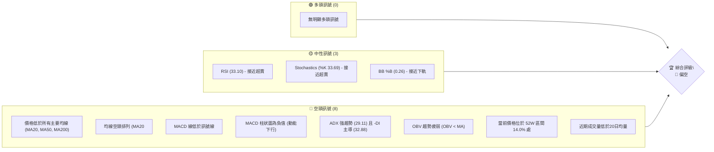
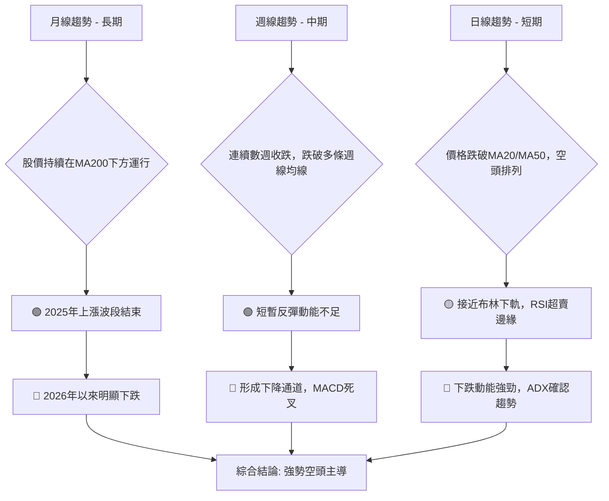
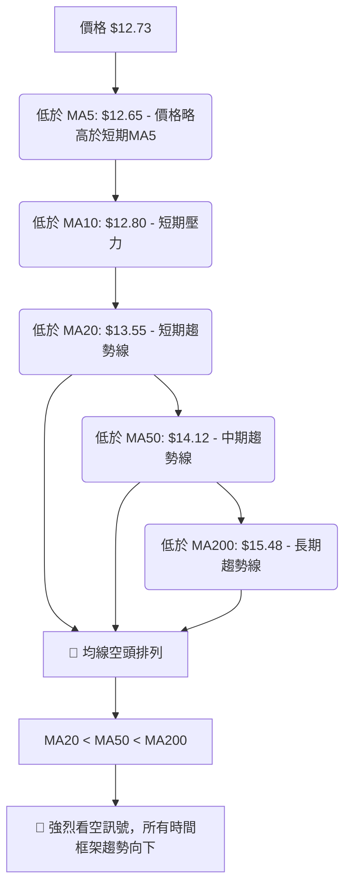

<details>
<summary>📊 靜態圖表 (點擊展開)</summary>

</details>

<html>
<head><meta charset="utf-8" /></head>
<body>
    <div>                        <script>window.PlotlyConfig = {MathJaxConfig: 'local'};</script>
        <script charset="utf-8" src="https://cdn.plot.ly/plotly-3.5.0.min.js" integrity="sha256-fHbNLP+GlIXN+efbQec78UkemUz3NJp7UmfGxC1tNxs=" crossorigin="anonymous"></script>                <div id="candlestick-chart" class="plotly-graph-div" style="height:500px; width:100%;"></div>            <script>                window.PLOTLYENV=window.PLOTLYENV || {};                                if (document.getElementById("candlestick-chart")) {                    Plotly.newPlot(                        "candlestick-chart",                        [{"close":{"dtype":"f8","bdata":"AAAAgOvRKEAAAACgmZkoQAAAAEAK1ydAAAAAQOF6KEAAAACgcL0oQAAAAMAeBShAAAAAQDMzKkAAAADA9agqQAAAAKBwPSpAAAAAoHA9K0AAAABAClcrQAAAAKBH4StAAAAAgMJ1LEAAAABA4XosQAAAACCuRy1AAAAAgD2KLUAAAACgmZktQAAAAOBRuC1AAAAAwMzMLUAAAACgcL0tQAAAAEDhei1AAAAA4KNwLkAAAAAghesuQAAAAMAeBS9AAAAAoHA9L0AAAACgR2EvQAAAAIDr0S9AAAAAIK7HL0AAAAAghesvQAAAAEDh+i9AAAAAIIUrMEAAAADAzEwwQAAAAGBmJjBAAAAAYI8CMEAAAAAgXI8vQAAAACBcjy9AAAAAYGbmL0AAAABgjwIwQAAAAKBHYS5AAAAA4KNwLkAAAABguJ4uQAAAAGCPwi5AAAAAYI9CLkAAAAAghesuQAAAAKBwvS5AAAAAQArXLUAAAADA9SguQAAAAIDr0S1AAAAAAClcLkAAAACAwnUtQAAAAAAAAC5AAAAAgOvRLkAAAABA4XouQAAAAIDrUS5AAAAAwMzML0AAAACAFK4vQAAAAAAAADBAAAAAACncL0AAAABAChcwQAAAACBcDzBAAAAAACkcMEAAAACgRyEwQAAAAKCZmS9AAAAAIIUrMEAAAACgR+EvQAAAAKBwvS9AAAAAwB4FMEAAAAAA12MwQAAAAIAULjBAAAAAgBQuL0AAAAAA16MvQAAAAEAzMy9AAAAAANejLkAAAACA61EvQAAAAADXoy5AAAAAIK7HL0AAAABACtcvQAAAAAApnDBAAAAAAABAMUAAAAAA12MxQAAAAEDhejFAAAAAACmcMUAAAADgo3AxQAAAAGBmpjFAAAAAQDOzMEAAAABguJ4wQAAAAIAUrjBAAAAA4KOwMEAAAACA69EwQAAAAGBm5jBAAAAAYGamMEAAAABAMzMwQAAAAOBRuC9AAAAAwB5FMEAAAABAClcwQAAAAGC4njBAAAAAYI\u002fCMEAAAACgcL0wQAAAAGCPwjBAAAAAwPWoMEAAAACgR+EwQAAAAKBwvTBAAAAAwB4FMUAAAADgo\u002fAxQAAAAAAp3DFAAAAAAACAMUAAAAAAKZwxQAAAAIDCdTFAAAAAgD0KMUAAAAAgXI8wQAAAAADXozBAAAAAACmcMEAAAACgmZkwQAAAAOBR+DBAAAAAoHA9MUAAAAAAAAAyQAAAAIA9CjJAAAAAgBQuMkAAAADAzIwyQAAAAGCPwjJAAAAAYI\u002fCMkAAAAAAAMAxQAAAAAApHDJAAAAAYLgeMkAAAADAHgUxQAAAACBczzBAAAAAYGZmMUAAAADAzIwxQAAAAIDrkTFAAAAAwPVoMUAAAACAPQoxQAAAAIDr0TBAAAAAgOvRMEAAAAAghSsxQAAAAIDrUTFAAAAAIK6HMUAAAADgozAwQAAAACCuhzBAAAAAYGamMEAAAABguB4uQAAAAIDC9S1AAAAAoEdhLkAAAADAHoUtQAAAAAAAAC5AAAAAANejLUAAAADA9SgtQAAAAEAKVy1AAAAAYI\u002fCLUAAAABA4fosQAAAAOCj8CtAAAAAIK7HK0AAAACAPYosQAAAAAAAgCxAAAAA4KPwK0AAAACA61EsQAAAAKBH4StAAAAAAClcLUAAAACgR2EsQAAAAADXoyxAAAAAgD0KLEAAAABAMzMrQAAAAMAeBStAAAAAoHC9LEAAAACgR+EsQAAAAMDMTCxAAAAAwB6FLEAAAADAzEwsQAAAAMAeBS1AAAAAoHC9LUAAAAAghestQAAAAGBm5i1AAAAAQDOzLkAAAACAFK4uQAAAAAAp3C5AAAAAgBSuLkAAAABAMzMuQAAAAKCZGS5AAAAAQDOzLUAAAAAghessQAAAAMAeBS1AAAAAIK5HLUAAAAAAAAAtQAAAAOB6FCxAAAAAgML1LEAAAACgR+EsQAAAAIDrUSxAAAAAAACALEAAAACAwvUsQAAAAMAehSxAAAAAoJmZK0AAAAAAAAArQAAAAIA9iipAAAAAANejKUAAAAAAKdwpQAAAAKBHYShAAAAA4HqUKEAAAADgepQoQAAAAOB6lClAAAAAgOtRKkAAAACAwnUpQA=="},"high":{"dtype":"f8","bdata":"AAAAQDMzKUAAAACAFC4pQAAAAKBwvShAAAAA4HqUKEAAAAAghesoQAAAAADXoyhAAAAAANcjLEAAAADAHgUrQAAAAIDCtSpAAAAAAACAK0AAAACgmZkrQAAAAIDC9StAAAAAYI8CLUAAAABAM7MsQAAAAEAKVy1AAAAAQOE6LkAAAAAA16MtQAAAAKBwvS1AAAAAgOsRLkAAAACgcP0tQAAAAKCZWS5AAAAA4KOwLkAAAADAHgUvQAAAACCFay9AAAAAoEehL0AAAACAPYovQAAAAKBHATBAAAAAgOsRMEAAAADAzAwwQAAAAKBHITBAAAAAoJlZMEAAAADAzEwwQAAAAMDMbDBAAAAAYLheMEAAAADgURgwQAAAAKBw\u002fS9AAAAAoJkZMEAAAADgozAwQAAAAMDMDDBAAAAAwMzMLkAAAAAAAMAuQAAAAEDh+i5AAAAA4HoUL0AAAAAAAAAvQAAAAMD1KC9AAAAAYGbmLkAAAACgcD0uQAAAAKBHYS5AAAAAAFaOLkAAAABguJ4uQAAAAGC4Hi5AAAAAIK5HL0AAAACAFC4vQAAAACCF6y5AAAAAANcjMEAAAACgRyEwQAAAAKCZWTBAAAAAgOsRMEAAAADAHkUwQAAAAKBwPTBAAAAAwB5FMEAAAAAAAIAwQAAAAKBwHTBAAAAAIIVrMEAAAABgZmYwQAAAAAAAwC9AAAAA4FE4MEAAAADAzIwwQAAAAAAAgDBAAAAAgOsxMEAAAABgj0IwQAAAAKBwvS9AAAAAoJlZL0AAAADgo3AvQAAAAEAzEzBAAAAAwB4FMEAAAAAgXA8wQAAAAMDMrDBAAAAAoEdhMUAAAACAFI4xQAAAACBcjzFAAAAAQArXMUAAAADgUbgxQAAAAOCj0DFAAAAAQOG6MUAAAABAMxMxQAAAAEDhujBAAAAAoJnZMEAAAAAAKRwxQAAAACBcDzFAAAAAgOsRMUAAAADAHoUwQAAAAMD1KDBAAAAA4CJbMEAAAADgUXgwQAAAAKBHoTBAAAAA4HrUMEAAAADA9cgwQAAAAGCPwjBAAAAAIFzPMEAAAABA4RoxQAAAAMDM7DBAAAAAIFwPMUAAAACAlSMyQAAAAGC4XjJAAAAAYI\u002fCMUAAAACAvp8xQAAAAIDrETJAAAAAIIVrMUAAAACA6xExQAAAAOCjsDBAAAAA4FH4MEAAAABgDq0wQAAAAOCjUDFAAAAAgD2KMUAAAAAAAAAyQAAAAOCjEDJAAAAAYI9CMkAAAAAgXI8yQAAAAMD1yDJAAAAAQOH6MkAAAABguJ4yQAAAAEAKdzJAAAAAYGamMkAAAACAPSoyQAAAAGCPIjFAAAAAIIVrMUAAAABACtcxQAAAAAApvDFAAAAAoHD9MUAAAADAzIwxQAAAAKBH4TBAAAAAAAAAMUAAAABA4XoxQAAAAOCjcDFAAAAAQAqXMUAAAADA9WgxQAAAAEAKlzBAAAAAoJnZMEAAAACgR+EvQAAAAGBmZi5AAAAAQIusLkAAAABguB4uQAAAAIDCtS5AAAAAwMxMLkAAAABAM3MtQAAAAIDrkS1AAAAAgD1KLkAAAACgR+EtQAAAAEAzsyxAAAAAYLieLEAAAACgcL0sQAAAAOB6FC1AAAAAwMyMLEAAAAAAAIAsQAAAAMDMTCxAAAAAQArXLUAAAADAHgUtQAAAAKBHYS1AAAAAYGamLEAAAABgZuYrQAAAAIDrkStAAAAAgOvRLEAAAACgmZktQAAAAIDC9SxAAAAAIK7HLEAAAACA61EsQAAAAMBJzC5AAAAAACncLUAAAADgehQuQAAAACBcDy5AAAAA4KPwLkAAAABguB4vQAAAAKBHIS9AAAAAYLieL0AAAABAM7MuQAAAACBcjy5AAAAA4KNwLkAAAAAA16MtQAAAAOB6FC1AAAAAIIWrLUAAAABAClctQAAAAMAeBS1AAAAAYLgeLUAAAACA61EtQAAAAOCj8CxAAAAAoEfhLEAAAACgmRktQAAAAEAzMy1AAAAAwPWoLEAAAADA9egrQAAAAAApHCtAAAAAgD2KKkAAAABAClcqQAAAACBczyhAAAAAwMzMKEAAAADAzMwoQAAAAKCZmSlAAAAAoJmZKkAAAADAHoUqQA=="},"hovertemplate":"\u003cb\u003e%{x|%Y-%m-%d}\u003c\u002fb\u003e\u003cbr\u003e\u958b: $%{open:.2f}\u003cbr\u003e\u9ad8: $%{high:.2f}\u003cbr\u003e\u4f4e: $%{low:.2f}\u003cbr\u003e\u6536: $%{close:.2f}\u003cextra\u003e\u003c\u002fextra\u003e","low":{"dtype":"f8","bdata":"AAAAgD2KKEAAAAAAAIAoQAAAACCuxydAAAAAgD3KJ0AAAAAAAIAoQAAAACCuxydAAAAAQArXKUAAAACAPYopQAAAAEAzMypAAAAAIK5HKkAAAACgR+EqQAAAAEDh+ipAAAAAYLjeK0AAAAAgWiQsQAAAAGCPgixAAAAAgOtRLUAAAACAFC4tQAAAAIAUrixAAAAAgMJ1LUAAAACAwvUsQAAAAIA9Ci1AAAAAIIVrLUAAAABgjwIuQAAAAKCZmS5AAAAAgML1LkAAAADgehQvQAAAAMD1aC9AAAAAgOtRL0AAAABgZqYvQAAAAMAexS9AAAAAwB4FMEAAAACAwvUvQAAAACCuBzBAAAAAoPHSL0AAAACAwnUvQAAAAKCZGS9AAAAAwPWoL0AAAADAzEwvQAAAAIDrUS5AAAAAgD0KLkAAAADgUTguQAAAAAAAQC5AAAAAgD0KLkAAAACgmRkuQAAAAIDCdS5AAAAAYI\u002fCLUAAAABACtctQAAAACCuRy1AAAAA4FG4LUAAAABAXjotQAAAAGC4Hi1AAAAAYLgeLkAAAAAgXE8uQAAAAIDrES5AAAAAgMJ1LkAAAAAgBJYvQAAAAEAK1y9AAAAAANejL0AAAAAAKdwvQAAAAADXAzBAAAAAYI\u002fCL0AAAACAFO4vQAAAAGBmZi9AAAAA4HqUL0AAAACAFK4vQAAAAGBm5i5AAAAAwMzML0AAAADAzAwwQAAAACCFCzBAAAAA4FH4LkAAAAAA16MuQAAAAAAAAC9AAAAAwB6FLkAAAACgR2EuQAAAAKCZmS5AAAAAYI+CLkAAAAAgXI8vQAAAAAApXC9AAAAAwPXoMEAAAABAMzMxQAAAACCuRzFAAAAAQOF6MUAAAACAPUoxQAAAAAApXDFAAAAAoJmZMEAAAADgUXgwQAAAAAACSzBAAAAAQAp3MEAAAABAM7MwQAAAAKCZmTBAAAAAoEehMEAAAACAFC4wQAAAAIAULi9AAAAAwCAQMEAAAABAYlAwQAAAAKCZWTBAAAAAIFyPMEAAAABgZqYwQAAAAAApnDBAAAAAgD2KMEAAAACAFK4wQAAAAIDCtTBAAAAAYGamMEAAAACAPSoxQAAAACBczzFAAAAAIK5nMUAAAABguF4xQAAAAADXYzFAAAAAwB4FMUAAAACAPWowQAAAAMDMbDBAAAAAgEGAMEAAAACAFE4wQAAAAKCZWTBAAAAAgOsRMUAAAADgelQxQAAAAIDCtTFAAAAAYGbmMUAAAACgmRkyQAAAAAApXDJAAAAAoHA9MkAAAACAwrUxQAAAAIDCtTFAAAAAQArXMUAAAAAAAOAwQAAAAMDMjDBAAAAAYI\u002fCMEAAAABACjcxQAAAAIA9CjFAAAAAoJlZMUAAAACAwrUwQAAAAGC4XjBAAAAAQAqXMEAAAABACtcwQAAAAMAe5TBAAAAAIIUrMUAAAADgehQwQAAAAKBwvS9AAAAAANeDMEAAAADgehQuQAAAAGBmZi1AAAAAYLieLEAAAABAClcsQAAAAKCZmS1AAAAA4FE4LUAAAADgUXgsQAAAAIDCdSxAAAAAIFwPLUAAAABgj8IsQAAAAGCPwitAAAAAoEehK0AAAABguB4sQAAAAOBReCxAAAAA4HrUK0AAAAAgXA8rQAAAAOB6lCtAAAAA4KNwLEAAAACA61EsQAAAACCFayxAAAAAACncK0AAAADgehQrQAAAAIDr0SpAAAAAYGZmK0AAAAAAKdwsQAAAAAACqytAAAAAwPUoLEAAAACAFK4rQAAAAIDr0SxAAAAAwMzMLEAAAAAgXI8tQAAAAEAzMy1AAAAAoHA9LkAAAACgmZkuQAAAAOB6lC5AAAAAYLieLkAAAAAAKdwtQAAAAOCj8C1AAAAAQApXLUAAAACA65EsQAAAAKBHYSxAAAAAoJkZLUAAAACAwrUsQAAAAOB6FCxAAAAAoJkZLEAAAABgj8IsQAAAAIAULixAAAAAQApXLEAAAACgcH0sQAAAAMD1aCxAAAAAAACAK0AAAABACtcqQAAAAMAehSpAAAAAIK6HKUAAAACAFK4pQAAAACBcjydAAAAAYLgeKEAAAAAghesnQAAAAMD1qChAAAAAYLgeKUAAAAAghWspQA=="},"name":"\u50f9\u683c","open":{"dtype":"f8","bdata":"AAAAIFyPKEAAAAAAAAApQAAAAKCZmShAAAAAQArXJ0AAAADA9agoQAAAAIA9iihAAAAAwMzMKkAAAABAMzMqQAAAAIDCdSpAAAAAgBTuKkAAAACAPQorQAAAAOCjcCtAAAAAAAAALEAAAABA4XosQAAAAIDC9SxAAAAAAACALUAAAADgUTgtQAAAAMD1KC1AAAAAoHC9LUAAAACAFK4tQAAAAMAeBS5AAAAAIFyPLUAAAACAwnUuQAAAAKCZGS9AAAAAIFwPL0AAAAAAKVwvQAAAAAAAgC9AAAAAoEfhL0AAAABgZuYvQAAAAGCPAjBAAAAAgOsRMEAAAAAAKRwwQAAAAMDMTDBAAAAAgBQuMEAAAAAAKdwvQAAAAAAp3C9AAAAAYGbmL0AAAAAghesvQAAAAMDMDDBAAAAAgD2KLkAAAAAgXI8uQAAAAKBwvS5AAAAAgOvRLkAAAAAAKVwuQAAAACBcDy9AAAAA4FG4LkAAAADA9SguQAAAAEAzsy1AAAAAAAAALkAAAADgepQuQAAAACCuRy1AAAAAYI9CLkAAAABAM7MuQAAAAADXoy5AAAAAwB6FLkAAAABAChcwQAAAAEDhOjBAAAAAIIXrL0AAAABgZuYvQAAAAIDrETBAAAAAACkcMEAAAADgozAwQAAAAKCZmS9AAAAA4FG4L0AAAABguF4wQAAAAADXoy9AAAAAoJkZMEAAAABAChcwQAAAAIDCdTBAAAAAgD0KMEAAAAAAKdwuQAAAAOBReC9AAAAAwMzMLkAAAADAzIwuQAAAAIAUri9AAAAAgMK1LkAAAAAAAAAwQAAAAEAK1y9AAAAAQOH6MEAAAAAA12MxQAAAAIAUbjFAAAAAgMK1MUAAAABAM7MxQAAAAGBmpjFAAAAAQDOzMUAAAABguN4wQAAAAMAeZTBAAAAAoJmZMEAAAABA4bowQAAAACCu5zBAAAAAYGYGMUAAAAAAAIAwQAAAAEAKFzBAAAAAYGYmMEAAAACgmVkwQAAAACCFazBAAAAA4KOwMEAAAABAM7MwQAAAAKBwvTBAAAAAgD2qMEAAAADAHsUwQAAAAGC43jBAAAAAIFwPMUAAAACAFC4xQAAAAGC4HjJAAAAAYLieMUAAAABACpcxQAAAAIAUrjFAAAAAoJlZMUAAAAAgXA8xQAAAAOCjkDBAAAAAAADAMEAAAACA65EwQAAAAAApXDBAAAAAYI8iMUAAAACAPaoxQAAAAAAAADJAAAAAwMwMMkAAAAAAKVwyQAAAAGCPojJAAAAA4HrUMkAAAAAgrocyQAAAAKBwvTFAAAAAIK5nMkAAAADgehQyQAAAAOB61DBAAAAAIIUrMUAAAADgo3AxQAAAAGBmJjFAAAAAgOvxMUAAAADA9YgxQAAAAKBwvTBAAAAAAADAMEAAAABAM\u002fMwQAAAAADXIzFAAAAAQDMzMUAAAAAAAEAxQAAAAOCjMDBAAAAAANeDMEAAAABACtcvQAAAAOCjcC1AAAAAIIXrLEAAAAAAKVwtQAAAAKBw\u002fS1AAAAAACncLUAAAABgjwItQAAAAIDr0SxAAAAAQOF6LUAAAAAAAIAtQAAAAGBmZixAAAAAANcjLEAAAACgcD0sQAAAAMDMzCxAAAAA4KNwLEAAAAAAKVwrQAAAAKBwPSxAAAAAoEehLEAAAADgUfgsQAAAAGCPQi1AAAAAYI9CLEAAAACAwnUrQAAAACCFaytAAAAAoJmZK0AAAACAFC4tQAAAAAAAACxAAAAAYI9CLEAAAABAMzMsQAAAACCFay5AAAAAwB4FLUAAAAAAKdwtQAAAAIAUri1AAAAAYI9CLkAAAAAghesuQAAAACCuxy5AAAAAYLieL0AAAABA4XouQAAAAOBROC5AAAAAAClcLkAAAABguJ4tQAAAAEAK1yxAAAAAIK5HLUAAAADgehQtQAAAAIDC9SxAAAAA4HpULEAAAACA61EtQAAAACCuxyxAAAAAANejLEAAAAAAAAAtQAAAAAAAAC1AAAAAoJmZLEAAAABgj8IrQAAAAEAK1ypAAAAAIIVrKkAAAABAM7MpQAAAAECJAShAAAAAwMzMKEAAAADgelQoQAAAAIAUrihAAAAA4FE4KUAAAADAzEwqQA=="},"x":["2025-08-07T00:00:00-04:00","2025-08-08T00:00:00-04:00","2025-08-11T00:00:00-04:00","2025-08-12T00:00:00-04:00","2025-08-13T00:00:00-04:00","2025-08-14T00:00:00-04:00","2025-08-15T00:00:00-04:00","2025-08-18T00:00:00-04:00","2025-08-19T00:00:00-04:00","2025-08-20T00:00:00-04:00","2025-08-21T00:00:00-04:00","2025-08-22T00:00:00-04:00","2025-08-25T00:00:00-04:00","2025-08-26T00:00:00-04:00","2025-08-27T00:00:00-04:00","2025-08-28T00:00:00-04:00","2025-08-29T00:00:00-04:00","2025-09-02T00:00:00-04:00","2025-09-03T00:00:00-04:00","2025-09-04T00:00:00-04:00","2025-09-05T00:00:00-04:00","2025-09-08T00:00:00-04:00","2025-09-09T00:00:00-04:00","2025-09-10T00:00:00-04:00","2025-09-11T00:00:00-04:00","2025-09-12T00:00:00-04:00","2025-09-15T00:00:00-04:00","2025-09-16T00:00:00-04:00","2025-09-17T00:00:00-04:00","2025-09-18T00:00:00-04:00","2025-09-19T00:00:00-04:00","2025-09-22T00:00:00-04:00","2025-09-23T00:00:00-04:00","2025-09-24T00:00:00-04:00","2025-09-25T00:00:00-04:00","2025-09-26T00:00:00-04:00","2025-09-29T00:00:00-04:00","2025-09-30T00:00:00-04:00","2025-10-01T00:00:00-04:00","2025-10-02T00:00:00-04:00","2025-10-03T00:00:00-04:00","2025-10-06T00:00:00-04:00","2025-10-07T00:00:00-04:00","2025-10-08T00:00:00-04:00","2025-10-09T00:00:00-04:00","2025-10-10T00:00:00-04:00","2025-10-13T00:00:00-04:00","2025-10-14T00:00:00-04:00","2025-10-15T00:00:00-04:00","2025-10-16T00:00:00-04:00","2025-10-17T00:00:00-04:00","2025-10-20T00:00:00-04:00","2025-10-21T00:00:00-04:00","2025-10-22T00:00:00-04:00","2025-10-23T00:00:00-04:00","2025-10-24T00:00:00-04:00","2025-10-27T00:00:00-04:00","2025-10-28T00:00:00-04:00","2025-10-29T00:00:00-04:00","2025-10-30T00:00:00-04:00","2025-10-31T00:00:00-04:00","2025-11-03T00:00:00-05:00","2025-11-04T00:00:00-05:00","2025-11-05T00:00:00-05:00","2025-11-06T00:00:00-05:00","2025-11-07T00:00:00-05:00","2025-11-10T00:00:00-05:00","2025-11-11T00:00:00-05:00","2025-11-12T00:00:00-05:00","2025-11-13T00:00:00-05:00","2025-11-14T00:00:00-05:00","2025-11-17T00:00:00-05:00","2025-11-18T00:00:00-05:00","2025-11-19T00:00:00-05:00","2025-11-20T00:00:00-05:00","2025-11-21T00:00:00-05:00","2025-11-24T00:00:00-05:00","2025-11-25T00:00:00-05:00","2025-11-26T00:00:00-05:00","2025-11-28T00:00:00-05:00","2025-12-01T00:00:00-05:00","2025-12-02T00:00:00-05:00","2025-12-03T00:00:00-05:00","2025-12-04T00:00:00-05:00","2025-12-05T00:00:00-05:00","2025-12-08T00:00:00-05:00","2025-12-09T00:00:00-05:00","2025-12-10T00:00:00-05:00","2025-12-11T00:00:00-05:00","2025-12-12T00:00:00-05:00","2025-12-15T00:00:00-05:00","2025-12-16T00:00:00-05:00","2025-12-17T00:00:00-05:00","2025-12-18T00:00:00-05:00","2025-12-19T00:00:00-05:00","2025-12-22T00:00:00-05:00","2025-12-23T00:00:00-05:00","2025-12-24T00:00:00-05:00","2025-12-26T00:00:00-05:00","2025-12-29T00:00:00-05:00","2025-12-30T00:00:00-05:00","2025-12-31T00:00:00-05:00","2026-01-02T00:00:00-05:00","2026-01-05T00:00:00-05:00","2026-01-06T00:00:00-05:00","2026-01-07T00:00:00-05:00","2026-01-08T00:00:00-05:00","2026-01-09T00:00:00-05:00","2026-01-12T00:00:00-05:00","2026-01-13T00:00:00-05:00","2026-01-14T00:00:00-05:00","2026-01-15T00:00:00-05:00","2026-01-16T00:00:00-05:00","2026-01-20T00:00:00-05:00","2026-01-21T00:00:00-05:00","2026-01-22T00:00:00-05:00","2026-01-23T00:00:00-05:00","2026-01-26T00:00:00-05:00","2026-01-27T00:00:00-05:00","2026-01-28T00:00:00-05:00","2026-01-29T00:00:00-05:00","2026-01-30T00:00:00-05:00","2026-02-02T00:00:00-05:00","2026-02-03T00:00:00-05:00","2026-02-04T00:00:00-05:00","2026-02-05T00:00:00-05:00","2026-02-06T00:00:00-05:00","2026-02-09T00:00:00-05:00","2026-02-10T00:00:00-05:00","2026-02-11T00:00:00-05:00","2026-02-12T00:00:00-05:00","2026-02-13T00:00:00-05:00","2026-02-17T00:00:00-05:00","2026-02-18T00:00:00-05:00","2026-02-19T00:00:00-05:00","2026-02-20T00:00:00-05:00","2026-02-23T00:00:00-05:00","2026-02-24T00:00:00-05:00","2026-02-25T00:00:00-05:00","2026-02-26T00:00:00-05:00","2026-02-27T00:00:00-05:00","2026-03-02T00:00:00-05:00","2026-03-03T00:00:00-05:00","2026-03-04T00:00:00-05:00","2026-03-05T00:00:00-05:00","2026-03-06T00:00:00-05:00","2026-03-09T00:00:00-04:00","2026-03-10T00:00:00-04:00","2026-03-11T00:00:00-04:00","2026-03-12T00:00:00-04:00","2026-03-13T00:00:00-04:00","2026-03-16T00:00:00-04:00","2026-03-17T00:00:00-04:00","2026-03-18T00:00:00-04:00","2026-03-19T00:00:00-04:00","2026-03-20T00:00:00-04:00","2026-03-23T00:00:00-04:00","2026-03-24T00:00:00-04:00","2026-03-25T00:00:00-04:00","2026-03-26T00:00:00-04:00","2026-03-27T00:00:00-04:00","2026-03-30T00:00:00-04:00","2026-03-31T00:00:00-04:00","2026-04-01T00:00:00-04:00","2026-04-02T00:00:00-04:00","2026-04-06T00:00:00-04:00","2026-04-07T00:00:00-04:00","2026-04-08T00:00:00-04:00","2026-04-09T00:00:00-04:00","2026-04-10T00:00:00-04:00","2026-04-13T00:00:00-04:00","2026-04-14T00:00:00-04:00","2026-04-15T00:00:00-04:00","2026-04-16T00:00:00-04:00","2026-04-17T00:00:00-04:00","2026-04-20T00:00:00-04:00","2026-04-21T00:00:00-04:00","2026-04-22T00:00:00-04:00","2026-04-23T00:00:00-04:00","2026-04-24T00:00:00-04:00","2026-04-27T00:00:00-04:00","2026-04-28T00:00:00-04:00","2026-04-29T00:00:00-04:00","2026-04-30T00:00:00-04:00","2026-05-01T00:00:00-04:00","2026-05-04T00:00:00-04:00","2026-05-05T00:00:00-04:00","2026-05-06T00:00:00-04:00","2026-05-07T00:00:00-04:00","2026-05-08T00:00:00-04:00","2026-05-11T00:00:00-04:00","2026-05-12T00:00:00-04:00","2026-05-13T00:00:00-04:00","2026-05-14T00:00:00-04:00","2026-05-15T00:00:00-04:00","2026-05-18T00:00:00-04:00","2026-05-19T00:00:00-04:00","2026-05-20T00:00:00-04:00","2026-05-21T00:00:00-04:00","2026-05-22T00:00:00-04:00"],"type":"candlestick"},{"hovertemplate":"MA30: $%{y:.2f}\u003cextra\u003e\u003c\u002fextra\u003e","line":{"color":"#2196F3","dash":"dash","width":2},"mode":"lines","name":"MA30","x":["2025-08-07T00:00:00-04:00","2025-08-08T00:00:00-04:00","2025-08-11T00:00:00-04:00","2025-08-12T00:00:00-04:00","2025-08-13T00:00:00-04:00","2025-08-14T00:00:00-04:00","2025-08-15T00:00:00-04:00","2025-08-18T00:00:00-04:00","2025-08-19T00:00:00-04:00","2025-08-20T00:00:00-04:00","2025-08-21T00:00:00-04:00","2025-08-22T00:00:00-04:00","2025-08-25T00:00:00-04:00","2025-08-26T00:00:00-04:00","2025-08-27T00:00:00-04:00","2025-08-28T00:00:00-04:00","2025-08-29T00:00:00-04:00","2025-09-02T00:00:00-04:00","2025-09-03T00:00:00-04:00","2025-09-04T00:00:00-04:00","2025-09-05T00:00:00-04:00","2025-09-08T00:00:00-04:00","2025-09-09T00:00:00-04:00","2025-09-10T00:00:00-04:00","2025-09-11T00:00:00-04:00","2025-09-12T00:00:00-04:00","2025-09-15T00:00:00-04:00","2025-09-16T00:00:00-04:00","2025-09-17T00:00:00-04:00","2025-09-18T00:00:00-04:00","2025-09-19T00:00:00-04:00","2025-09-22T00:00:00-04:00","2025-09-23T00:00:00-04:00","2025-09-24T00:00:00-04:00","2025-09-25T00:00:00-04:00","2025-09-26T00:00:00-04:00","2025-09-29T00:00:00-04:00","2025-09-30T00:00:00-04:00","2025-10-01T00:00:00-04:00","2025-10-02T00:00:00-04:00","2025-10-03T00:00:00-04:00","2025-10-06T00:00:00-04:00","2025-10-07T00:00:00-04:00","2025-10-08T00:00:00-04:00","2025-10-09T00:00:00-04:00","2025-10-10T00:00:00-04:00","2025-10-13T00:00:00-04:00","2025-10-14T00:00:00-04:00","2025-10-15T00:00:00-04:00","2025-10-16T00:00:00-04:00","2025-10-17T00:00:00-04:00","2025-10-20T00:00:00-04:00","2025-10-21T00:00:00-04:00","2025-10-22T00:00:00-04:00","2025-10-23T00:00:00-04:00","2025-10-24T00:00:00-04:00","2025-10-27T00:00:00-04:00","2025-10-28T00:00:00-04:00","2025-10-29T00:00:00-04:00","2025-10-30T00:00:00-04:00","2025-10-31T00:00:00-04:00","2025-11-03T00:00:00-05:00","2025-11-04T00:00:00-05:00","2025-11-05T00:00:00-05:00","2025-11-06T00:00:00-05:00","2025-11-07T00:00:00-05:00","2025-11-10T00:00:00-05:00","2025-11-11T00:00:00-05:00","2025-11-12T00:00:00-05:00","2025-11-13T00:00:00-05:00","2025-11-14T00:00:00-05:00","2025-11-17T00:00:00-05:00","2025-11-18T00:00:00-05:00","2025-11-19T00:00:00-05:00","2025-11-20T00:00:00-05:00","2025-11-21T00:00:00-05:00","2025-11-24T00:00:00-05:00","2025-11-25T00:00:00-05:00","2025-11-26T00:00:00-05:00","2025-11-28T00:00:00-05:00","2025-12-01T00:00:00-05:00","2025-12-02T00:00:00-05:00","2025-12-03T00:00:00-05:00","2025-12-04T00:00:00-05:00","2025-12-05T00:00:00-05:00","2025-12-08T00:00:00-05:00","2025-12-09T00:00:00-05:00","2025-12-10T00:00:00-05:00","2025-12-11T00:00:00-05:00","2025-12-12T00:00:00-05:00","2025-12-15T00:00:00-05:00","2025-12-16T00:00:00-05:00","2025-12-17T00:00:00-05:00","2025-12-18T00:00:00-05:00","2025-12-19T00:00:00-05:00","2025-12-22T00:00:00-05:00","2025-12-23T00:00:00-05:00","2025-12-24T00:00:00-05:00","2025-12-26T00:00:00-05:00","2025-12-29T00:00:00-05:00","2025-12-30T00:00:00-05:00","2025-12-31T00:00:00-05:00","2026-01-02T00:00:00-05:00","2026-01-05T00:00:00-05:00","2026-01-06T00:00:00-05:00","2026-01-07T00:00:00-05:00","2026-01-08T00:00:00-05:00","2026-01-09T00:00:00-05:00","2026-01-12T00:00:00-05:00","2026-01-13T00:00:00-05:00","2026-01-14T00:00:00-05:00","2026-01-15T00:00:00-05:00","2026-01-16T00:00:00-05:00","2026-01-20T00:00:00-05:00","2026-01-21T00:00:00-05:00","2026-01-22T00:00:00-05:00","2026-01-23T00:00:00-05:00","2026-01-26T00:00:00-05:00","2026-01-27T00:00:00-05:00","2026-01-28T00:00:00-05:00","2026-01-29T00:00:00-05:00","2026-01-30T00:00:00-05:00","2026-02-02T00:00:00-05:00","2026-02-03T00:00:00-05:00","2026-02-04T00:00:00-05:00","2026-02-05T00:00:00-05:00","2026-02-06T00:00:00-05:00","2026-02-09T00:00:00-05:00","2026-02-10T00:00:00-05:00","2026-02-11T00:00:00-05:00","2026-02-12T00:00:00-05:00","2026-02-13T00:00:00-05:00","2026-02-17T00:00:00-05:00","2026-02-18T00:00:00-05:00","2026-02-19T00:00:00-05:00","2026-02-20T00:00:00-05:00","2026-02-23T00:00:00-05:00","2026-02-24T00:00:00-05:00","2026-02-25T00:00:00-05:00","2026-02-26T00:00:00-05:00","2026-02-27T00:00:00-05:00","2026-03-02T00:00:00-05:00","2026-03-03T00:00:00-05:00","2026-03-04T00:00:00-05:00","2026-03-05T00:00:00-05:00","2026-03-06T00:00:00-05:00","2026-03-09T00:00:00-04:00","2026-03-10T00:00:00-04:00","2026-03-11T00:00:00-04:00","2026-03-12T00:00:00-04:00","2026-03-13T00:00:00-04:00","2026-03-16T00:00:00-04:00","2026-03-17T00:00:00-04:00","2026-03-18T00:00:00-04:00","2026-03-19T00:00:00-04:00","2026-03-20T00:00:00-04:00","2026-03-23T00:00:00-04:00","2026-03-24T00:00:00-04:00","2026-03-25T00:00:00-04:00","2026-03-26T00:00:00-04:00","2026-03-27T00:00:00-04:00","2026-03-30T00:00:00-04:00","2026-03-31T00:00:00-04:00","2026-04-01T00:00:00-04:00","2026-04-02T00:00:00-04:00","2026-04-06T00:00:00-04:00","2026-04-07T00:00:00-04:00","2026-04-08T00:00:00-04:00","2026-04-09T00:00:00-04:00","2026-04-10T00:00:00-04:00","2026-04-13T00:00:00-04:00","2026-04-14T00:00:00-04:00","2026-04-15T00:00:00-04:00","2026-04-16T00:00:00-04:00","2026-04-17T00:00:00-04:00","2026-04-20T00:00:00-04:00","2026-04-21T00:00:00-04:00","2026-04-22T00:00:00-04:00","2026-04-23T00:00:00-04:00","2026-04-24T00:00:00-04:00","2026-04-27T00:00:00-04:00","2026-04-28T00:00:00-04:00","2026-04-29T00:00:00-04:00","2026-04-30T00:00:00-04:00","2026-05-01T00:00:00-04:00","2026-05-04T00:00:00-04:00","2026-05-05T00:00:00-04:00","2026-05-06T00:00:00-04:00","2026-05-07T00:00:00-04:00","2026-05-08T00:00:00-04:00","2026-05-11T00:00:00-04:00","2026-05-12T00:00:00-04:00","2026-05-13T00:00:00-04:00","2026-05-14T00:00:00-04:00","2026-05-15T00:00:00-04:00","2026-05-18T00:00:00-04:00","2026-05-19T00:00:00-04:00","2026-05-20T00:00:00-04:00","2026-05-21T00:00:00-04:00","2026-05-22T00:00:00-04:00"],"y":{"dtype":"f8","bdata":"AAAAAAAA+H8AAAAAAAD4fwAAAAAAAPh\u002fAAAAAAAA+H8AAAAAAAD4fwAAAAAAAPh\u002fAAAAAAAA+H8AAAAAAAD4fwAAAAAAAPh\u002fAAAAAAAA+H8AAAAAAAD4fwAAAAAAAPh\u002fAAAAAAAA+H8AAAAAAAD4fwAAAAAAAPh\u002fAAAAAAAA+H8AAAAAAAD4fwAAAAAAAPh\u002fAAAAAAAA+H8AAAAAAAD4fwAAAAAAAPh\u002fAAAAAAAA+H8AAAAAAAD4fwAAAAAAAPh\u002fAAAAAAAA+H8AAAAAAAD4fwAAAAAAAPh\u002fAAAAAAAA+H8AAAAAAAD4fxEREUEZfSxAIiIi8kS9LEBVVVU1iQEtQLy7u1u6SS1A3t3dvRGKLUAiIiJCRMQtQDMzM6ObBC5AmpmZeT81LkAzMzOT\u002fGIuQKuqqopQhi5AzczMDJ+hLkAiIiJSnL0uQHd3d8cv1i5AERER8YvlLkBEREQ0XvouQO\u002fu7p7TBi9Aq6qq+mIJL0ARERFRKg4vQFVVVcUEDy9AzczMHMwTL0ARERFxaBEvQGZmZmbYFS9AVVVVhRYZL0AzMzNTVRUvQGZmZiZcDy9AzczMfCMUL0CamZnZshYvQBERERE8GC9ARERE1OoYL0Dv7u7OIhsvQERERKRUHC9AAAAAgE4bL0AiIiLCZxgvQGZmZpZuEi9AMzMzoykVL0AAAACw5BcvQHd3d+dtGS9A3t3dvZ8aL0C8u7v7GyEvQM3MzFwBMi9Aq6qq6lE4L0AzMzMjBkEvQFVVVVXHRC9AREREdAVIL0BEREREb0svQAAAANCUSi9A7+7uziJbL0AzMzPTeGkvQN7d3T18hi9AVVVVNdCpL0DNzMzsNdcvQKuqqprEADBARERElIoTMEDe3d2NUCYwQKuqqgqQOzBAvLu7q2NCMEC8u7ubC0kwQHd3dxfZTjBAZmZmVlVVMEC8u7sLkFswQN7d3Q27YjBAMzMzs1ZnMEDv7u6e72cwQBEREbFyaDBAVVVVJU1pMEDe3d31tmwwQM3MzFwdczBAq6qq6m15MEARERGBanwwQImIiIhdgTBAvLu7+36KMEBmZmaWipMwQERERPREnTBAmpmZqcarMEBmZmZmO78wQN7d3R3o1DBA7+7uNqXiMEC8u7sTEfEwQFVVVe1R+DBAVVVVLYf2MEC8u7sDcu8wQJqZmQFH6DBAEREReb7fMEDv7u52k9gwQDMzM\u002fvF0jBAiYiIoGHXMEAAAABIKOMwQHd3dz\u002fD7jBAvLu7M3r7MECamZlxPQoxQFVVVa0cGjFAMzMzCx4sMUCamZkRWDkxQFVVVUWLTDFAiYiIqFRcMUBEREQkImIxQDMzMzPBYzFAzczMTDdpMUBVVVXFIHAxQN7d3T0KdzFAREREpHB9MUC8u7srzn4xQO\u002fu7u58fzFAZmZmBsh9MUDv7u7uNXcxQImIiEiacjFAIiIi0ttyMUCJiIjIvWYxQLy7uyvOXjFAMzMzM3pbMUDv7u5mrU4xQLy7uxODQDFAmpmZCWU0MUDv7u5+sSQxQHd3d\u002ffhEzFAVVVVZTv\u002fMECrqqpKDOIwQJqZmWlKxTBAvLu7cyGpMEB3d3c\u002ffIYwQFVVVVWcXTBAAAAAqA00MEAzMzN7WxYwQM3MzFzW6i9AvLu7uwKkL0AzMzMzM3MvQKuqqvo3Qi9A7+7uHswTL0Dv7u4OdNouQHd3d5f8oi5AVVVVdSFpLkDe3d3day4uQCIiIkLu9S1AvLu7Cx7MLUDe3d19hp0tQM3MzIxsZy1AMzMzs50vLUDNzMzMzAwtQImIiEhT6ixAiYiIWPLLLEAAAABwPcosQN7d3V26ySxAvLu7a3XMLECrqqp6W9YsQN7d3S2y3SxAiYiIGJLmLEAzMzMDcu8sQCIiIkLu9SxAAAAAMGv1LEDe3d0d6PQsQJqZmWkf\u002fixAZmZmNuwKLUCJiIgY2Q4tQHd3d5dDCy1AAAAA0PcTLUBmZmYmvxgtQImIiFiAHC1AVVVVpSkVLUDNzMysHBotQImIiIgWGS1AZmZmVlUVLUDe3d1toBMtQKuqqtqHDy1AzczMzBP1LEAzMzODTtssQERERCTbuSxAREREFDyYLEDe3d2dfXgsQCIiItIiWyxAd3d3t\u002fM9LEAiIiKy5BcsQA=="},"type":"scatter"},{"hovertemplate":"MA60: $%{y:.2f}\u003cextra\u003e\u003c\u002fextra\u003e","line":{"color":"#9C27B0","dash":"dash","width":2},"mode":"lines","name":"MA60","x":["2025-08-07T00:00:00-04:00","2025-08-08T00:00:00-04:00","2025-08-11T00:00:00-04:00","2025-08-12T00:00:00-04:00","2025-08-13T00:00:00-04:00","2025-08-14T00:00:00-04:00","2025-08-15T00:00:00-04:00","2025-08-18T00:00:00-04:00","2025-08-19T00:00:00-04:00","2025-08-20T00:00:00-04:00","2025-08-21T00:00:00-04:00","2025-08-22T00:00:00-04:00","2025-08-25T00:00:00-04:00","2025-08-26T00:00:00-04:00","2025-08-27T00:00:00-04:00","2025-08-28T00:00:00-04:00","2025-08-29T00:00:00-04:00","2025-09-02T00:00:00-04:00","2025-09-03T00:00:00-04:00","2025-09-04T00:00:00-04:00","2025-09-05T00:00:00-04:00","2025-09-08T00:00:00-04:00","2025-09-09T00:00:00-04:00","2025-09-10T00:00:00-04:00","2025-09-11T00:00:00-04:00","2025-09-12T00:00:00-04:00","2025-09-15T00:00:00-04:00","2025-09-16T00:00:00-04:00","2025-09-17T00:00:00-04:00","2025-09-18T00:00:00-04:00","2025-09-19T00:00:00-04:00","2025-09-22T00:00:00-04:00","2025-09-23T00:00:00-04:00","2025-09-24T00:00:00-04:00","2025-09-25T00:00:00-04:00","2025-09-26T00:00:00-04:00","2025-09-29T00:00:00-04:00","2025-09-30T00:00:00-04:00","2025-10-01T00:00:00-04:00","2025-10-02T00:00:00-04:00","2025-10-03T00:00:00-04:00","2025-10-06T00:00:00-04:00","2025-10-07T00:00:00-04:00","2025-10-08T00:00:00-04:00","2025-10-09T00:00:00-04:00","2025-10-10T00:00:00-04:00","2025-10-13T00:00:00-04:00","2025-10-14T00:00:00-04:00","2025-10-15T00:00:00-04:00","2025-10-16T00:00:00-04:00","2025-10-17T00:00:00-04:00","2025-10-20T00:00:00-04:00","2025-10-21T00:00:00-04:00","2025-10-22T00:00:00-04:00","2025-10-23T00:00:00-04:00","2025-10-24T00:00:00-04:00","2025-10-27T00:00:00-04:00","2025-10-28T00:00:00-04:00","2025-10-29T00:00:00-04:00","2025-10-30T00:00:00-04:00","2025-10-31T00:00:00-04:00","2025-11-03T00:00:00-05:00","2025-11-04T00:00:00-05:00","2025-11-05T00:00:00-05:00","2025-11-06T00:00:00-05:00","2025-11-07T00:00:00-05:00","2025-11-10T00:00:00-05:00","2025-11-11T00:00:00-05:00","2025-11-12T00:00:00-05:00","2025-11-13T00:00:00-05:00","2025-11-14T00:00:00-05:00","2025-11-17T00:00:00-05:00","2025-11-18T00:00:00-05:00","2025-11-19T00:00:00-05:00","2025-11-20T00:00:00-05:00","2025-11-21T00:00:00-05:00","2025-11-24T00:00:00-05:00","2025-11-25T00:00:00-05:00","2025-11-26T00:00:00-05:00","2025-11-28T00:00:00-05:00","2025-12-01T00:00:00-05:00","2025-12-02T00:00:00-05:00","2025-12-03T00:00:00-05:00","2025-12-04T00:00:00-05:00","2025-12-05T00:00:00-05:00","2025-12-08T00:00:00-05:00","2025-12-09T00:00:00-05:00","2025-12-10T00:00:00-05:00","2025-12-11T00:00:00-05:00","2025-12-12T00:00:00-05:00","2025-12-15T00:00:00-05:00","2025-12-16T00:00:00-05:00","2025-12-17T00:00:00-05:00","2025-12-18T00:00:00-05:00","2025-12-19T00:00:00-05:00","2025-12-22T00:00:00-05:00","2025-12-23T00:00:00-05:00","2025-12-24T00:00:00-05:00","2025-12-26T00:00:00-05:00","2025-12-29T00:00:00-05:00","2025-12-30T00:00:00-05:00","2025-12-31T00:00:00-05:00","2026-01-02T00:00:00-05:00","2026-01-05T00:00:00-05:00","2026-01-06T00:00:00-05:00","2026-01-07T00:00:00-05:00","2026-01-08T00:00:00-05:00","2026-01-09T00:00:00-05:00","2026-01-12T00:00:00-05:00","2026-01-13T00:00:00-05:00","2026-01-14T00:00:00-05:00","2026-01-15T00:00:00-05:00","2026-01-16T00:00:00-05:00","2026-01-20T00:00:00-05:00","2026-01-21T00:00:00-05:00","2026-01-22T00:00:00-05:00","2026-01-23T00:00:00-05:00","2026-01-26T00:00:00-05:00","2026-01-27T00:00:00-05:00","2026-01-28T00:00:00-05:00","2026-01-29T00:00:00-05:00","2026-01-30T00:00:00-05:00","2026-02-02T00:00:00-05:00","2026-02-03T00:00:00-05:00","2026-02-04T00:00:00-05:00","2026-02-05T00:00:00-05:00","2026-02-06T00:00:00-05:00","2026-02-09T00:00:00-05:00","2026-02-10T00:00:00-05:00","2026-02-11T00:00:00-05:00","2026-02-12T00:00:00-05:00","2026-02-13T00:00:00-05:00","2026-02-17T00:00:00-05:00","2026-02-18T00:00:00-05:00","2026-02-19T00:00:00-05:00","2026-02-20T00:00:00-05:00","2026-02-23T00:00:00-05:00","2026-02-24T00:00:00-05:00","2026-02-25T00:00:00-05:00","2026-02-26T00:00:00-05:00","2026-02-27T00:00:00-05:00","2026-03-02T00:00:00-05:00","2026-03-03T00:00:00-05:00","2026-03-04T00:00:00-05:00","2026-03-05T00:00:00-05:00","2026-03-06T00:00:00-05:00","2026-03-09T00:00:00-04:00","2026-03-10T00:00:00-04:00","2026-03-11T00:00:00-04:00","2026-03-12T00:00:00-04:00","2026-03-13T00:00:00-04:00","2026-03-16T00:00:00-04:00","2026-03-17T00:00:00-04:00","2026-03-18T00:00:00-04:00","2026-03-19T00:00:00-04:00","2026-03-20T00:00:00-04:00","2026-03-23T00:00:00-04:00","2026-03-24T00:00:00-04:00","2026-03-25T00:00:00-04:00","2026-03-26T00:00:00-04:00","2026-03-27T00:00:00-04:00","2026-03-30T00:00:00-04:00","2026-03-31T00:00:00-04:00","2026-04-01T00:00:00-04:00","2026-04-02T00:00:00-04:00","2026-04-06T00:00:00-04:00","2026-04-07T00:00:00-04:00","2026-04-08T00:00:00-04:00","2026-04-09T00:00:00-04:00","2026-04-10T00:00:00-04:00","2026-04-13T00:00:00-04:00","2026-04-14T00:00:00-04:00","2026-04-15T00:00:00-04:00","2026-04-16T00:00:00-04:00","2026-04-17T00:00:00-04:00","2026-04-20T00:00:00-04:00","2026-04-21T00:00:00-04:00","2026-04-22T00:00:00-04:00","2026-04-23T00:00:00-04:00","2026-04-24T00:00:00-04:00","2026-04-27T00:00:00-04:00","2026-04-28T00:00:00-04:00","2026-04-29T00:00:00-04:00","2026-04-30T00:00:00-04:00","2026-05-01T00:00:00-04:00","2026-05-04T00:00:00-04:00","2026-05-05T00:00:00-04:00","2026-05-06T00:00:00-04:00","2026-05-07T00:00:00-04:00","2026-05-08T00:00:00-04:00","2026-05-11T00:00:00-04:00","2026-05-12T00:00:00-04:00","2026-05-13T00:00:00-04:00","2026-05-14T00:00:00-04:00","2026-05-15T00:00:00-04:00","2026-05-18T00:00:00-04:00","2026-05-19T00:00:00-04:00","2026-05-20T00:00:00-04:00","2026-05-21T00:00:00-04:00","2026-05-22T00:00:00-04:00"],"y":{"dtype":"f8","bdata":"AAAAAAAA+H8AAAAAAAD4fwAAAAAAAPh\u002fAAAAAAAA+H8AAAAAAAD4fwAAAAAAAPh\u002fAAAAAAAA+H8AAAAAAAD4fwAAAAAAAPh\u002fAAAAAAAA+H8AAAAAAAD4fwAAAAAAAPh\u002fAAAAAAAA+H8AAAAAAAD4fwAAAAAAAPh\u002fAAAAAAAA+H8AAAAAAAD4fwAAAAAAAPh\u002fAAAAAAAA+H8AAAAAAAD4fwAAAAAAAPh\u002fAAAAAAAA+H8AAAAAAAD4fwAAAAAAAPh\u002fAAAAAAAA+H8AAAAAAAD4fwAAAAAAAPh\u002fAAAAAAAA+H8AAAAAAAD4fwAAAAAAAPh\u002fAAAAAAAA+H8AAAAAAAD4fwAAAAAAAPh\u002fAAAAAAAA+H8AAAAAAAD4fwAAAAAAAPh\u002fAAAAAAAA+H8AAAAAAAD4fwAAAAAAAPh\u002fAAAAAAAA+H8AAAAAAAD4fwAAAAAAAPh\u002fAAAAAAAA+H8AAAAAAAD4fwAAAAAAAPh\u002fAAAAAAAA+H8AAAAAAAD4fwAAAAAAAPh\u002fAAAAAAAA+H8AAAAAAAD4fwAAAAAAAPh\u002fAAAAAAAA+H8AAAAAAAD4fwAAAAAAAPh\u002fAAAAAAAA+H8AAAAAAAD4fwAAAAAAAPh\u002fAAAAAAAA+H8AAAAAAAD4f6uqqvK2zC1AERERuUnsLUC8u7t7+AwuQBEREXkULi5AiYiIsJ1PLkARERF5FG4uQFVVVcUEjy5AvLu7m++nLkB3d3dHDMIuQLy7u\u002fMo3C5AvLu7e\u002fjsLkCrqqo6Uf8uQGZmZo57DS9Aq6qqssgWL0BERES85iIvQHd3dze0KC9AzczM5EIyL0AiIiKS0TsvQJqZmYHASi9AERERKc5eL0Dv7u4uT3QvQN7d3c2wiy9A7+7u1hWgL0B3d3c3+7AvQN7d3R0+wy9AIiIianXML0CJiIgIZdQvQAAAACD32i9AiYiIwMrhL0AzMzNzIekvQAAAAGDl8C9AMzMz8\u002f30L0AAAACAI\u002fQvQERERPyp8S9A7+7u9uHzL0De3d1NqfgvQImIiFDU\u002fy9AzczM5F4DMEB3d3c\u002ffAYwQHd3dxsvDTBAiYiI+FMTMEAAAADUBhowQHd3d0\u002fUHzBA3t3dseQnMEBERESEeTIwQO\u002fu7kIZPTBAMzMzTxtIMECrqqq+5lIwQCIiIgbIXTBAAAAApLdlMEARERF9hm0wQCIiIs6FdDBAq6qqhqR5MEBmZmYCcn8wQO\u002fu7gIrhzBAIiIipuKMMEDe3d3xGZYwQHd3dyvOnjBAERERxWeoMECrqqq+5rIwQJqZmd1rvjBAMzMzX7rJMEBERETYo9AwQDMzM\u002ft+2jBA7+7u5tDiMEARERGNbOcwQAAAAEhv6zBAvLu7m1LxMEAzMzOjRfYwQDMzM+Mz\u002fDBAAAAA0PcDMUARERFhLAkxQJqZmfFgDjFAAAAAWMcUMUCrqqqqOBsxQDMzMzPBIzFAiYiIhMAqMUAiIiJu5ysxQImIiAyQKzFAREREsAApMUBVVVW1Dx8xQKuqqgplFDFAVVVVwREKMUDv7u56ov4wQFVVVflT8zBA7+7ugk7rMEBVVVVJmuIwQImIiNQG2jBAvLu7003SMECJiIjYXMgwQFVVVYHcuzBAmpmZ2RWwMEBmZmbG2acwQN7d3Tn7oDBAMzMzAyuXMEDv7u7e3Y0wQERERJhugjBAIiIiro55MEBmZmZmrW4wQM3MzEREZDBAd3d3rwBZMEBVVVUNAkswQAAAAAg6PTBAIiIihusxMEDv7u6W\u002fCIwQHd3d0coEzBA3t3dVVUFMEDv7u4uJO0vQAAAAND30y9Ad3d3X3PBL0Dv7u4ezLMvQKuqqkJgpS9Ad3d3v5+aL0BEREQ8348vQGZmZg67gi9AmpmZcYRyL0BERERMxVkvQKuqqopBQC9AvLu7C9cjL0BmZmZO8AAvQCIiIgqs3C5AMzMzw4O5LkB3d3cHyJ0uQCIiIvoMey5A3t3dRf1bLkDNzMws+UUuQJqZmSlcLy5AIiIi4noULkDe3d1dSPotQAAAAJAJ3i1A3t3dZTu\u002fLUDe3d0lBqEtQGZmZg67gi1ARERE7JhgLUCJiIiAajwtQImIiNijEC1AvLu74+zjLEBVVVU1pcIsQFVVVQ27oixAAAAACPOELEAREREREXEsQA=="},"type":"scatter"},{"hovertemplate":"MA200: $%{y:.2f}\u003cextra\u003e\u003c\u002fextra\u003e","line":{"color":"#FF6F00","dash":"solid","width":2},"mode":"lines","name":"MA200","x":["2025-08-07T00:00:00-04:00","2025-08-08T00:00:00-04:00","2025-08-11T00:00:00-04:00","2025-08-12T00:00:00-04:00","2025-08-13T00:00:00-04:00","2025-08-14T00:00:00-04:00","2025-08-15T00:00:00-04:00","2025-08-18T00:00:00-04:00","2025-08-19T00:00:00-04:00","2025-08-20T00:00:00-04:00","2025-08-21T00:00:00-04:00","2025-08-22T00:00:00-04:00","2025-08-25T00:00:00-04:00","2025-08-26T00:00:00-04:00","2025-08-27T00:00:00-04:00","2025-08-28T00:00:00-04:00","2025-08-29T00:00:00-04:00","2025-09-02T00:00:00-04:00","2025-09-03T00:00:00-04:00","2025-09-04T00:00:00-04:00","2025-09-05T00:00:00-04:00","2025-09-08T00:00:00-04:00","2025-09-09T00:00:00-04:00","2025-09-10T00:00:00-04:00","2025-09-11T00:00:00-04:00","2025-09-12T00:00:00-04:00","2025-09-15T00:00:00-04:00","2025-09-16T00:00:00-04:00","2025-09-17T00:00:00-04:00","2025-09-18T00:00:00-04:00","2025-09-19T00:00:00-04:00","2025-09-22T00:00:00-04:00","2025-09-23T00:00:00-04:00","2025-09-24T00:00:00-04:00","2025-09-25T00:00:00-04:00","2025-09-26T00:00:00-04:00","2025-09-29T00:00:00-04:00","2025-09-30T00:00:00-04:00","2025-10-01T00:00:00-04:00","2025-10-02T00:00:00-04:00","2025-10-03T00:00:00-04:00","2025-10-06T00:00:00-04:00","2025-10-07T00:00:00-04:00","2025-10-08T00:00:00-04:00","2025-10-09T00:00:00-04:00","2025-10-10T00:00:00-04:00","2025-10-13T00:00:00-04:00","2025-10-14T00:00:00-04:00","2025-10-15T00:00:00-04:00","2025-10-16T00:00:00-04:00","2025-10-17T00:00:00-04:00","2025-10-20T00:00:00-04:00","2025-10-21T00:00:00-04:00","2025-10-22T00:00:00-04:00","2025-10-23T00:00:00-04:00","2025-10-24T00:00:00-04:00","2025-10-27T00:00:00-04:00","2025-10-28T00:00:00-04:00","2025-10-29T00:00:00-04:00","2025-10-30T00:00:00-04:00","2025-10-31T00:00:00-04:00","2025-11-03T00:00:00-05:00","2025-11-04T00:00:00-05:00","2025-11-05T00:00:00-05:00","2025-11-06T00:00:00-05:00","2025-11-07T00:00:00-05:00","2025-11-10T00:00:00-05:00","2025-11-11T00:00:00-05:00","2025-11-12T00:00:00-05:00","2025-11-13T00:00:00-05:00","2025-11-14T00:00:00-05:00","2025-11-17T00:00:00-05:00","2025-11-18T00:00:00-05:00","2025-11-19T00:00:00-05:00","2025-11-20T00:00:00-05:00","2025-11-21T00:00:00-05:00","2025-11-24T00:00:00-05:00","2025-11-25T00:00:00-05:00","2025-11-26T00:00:00-05:00","2025-11-28T00:00:00-05:00","2025-12-01T00:00:00-05:00","2025-12-02T00:00:00-05:00","2025-12-03T00:00:00-05:00","2025-12-04T00:00:00-05:00","2025-12-05T00:00:00-05:00","2025-12-08T00:00:00-05:00","2025-12-09T00:00:00-05:00","2025-12-10T00:00:00-05:00","2025-12-11T00:00:00-05:00","2025-12-12T00:00:00-05:00","2025-12-15T00:00:00-05:00","2025-12-16T00:00:00-05:00","2025-12-17T00:00:00-05:00","2025-12-18T00:00:00-05:00","2025-12-19T00:00:00-05:00","2025-12-22T00:00:00-05:00","2025-12-23T00:00:00-05:00","2025-12-24T00:00:00-05:00","2025-12-26T00:00:00-05:00","2025-12-29T00:00:00-05:00","2025-12-30T00:00:00-05:00","2025-12-31T00:00:00-05:00","2026-01-02T00:00:00-05:00","2026-01-05T00:00:00-05:00","2026-01-06T00:00:00-05:00","2026-01-07T00:00:00-05:00","2026-01-08T00:00:00-05:00","2026-01-09T00:00:00-05:00","2026-01-12T00:00:00-05:00","2026-01-13T00:00:00-05:00","2026-01-14T00:00:00-05:00","2026-01-15T00:00:00-05:00","2026-01-16T00:00:00-05:00","2026-01-20T00:00:00-05:00","2026-01-21T00:00:00-05:00","2026-01-22T00:00:00-05:00","2026-01-23T00:00:00-05:00","2026-01-26T00:00:00-05:00","2026-01-27T00:00:00-05:00","2026-01-28T00:00:00-05:00","2026-01-29T00:00:00-05:00","2026-01-30T00:00:00-05:00","2026-02-02T00:00:00-05:00","2026-02-03T00:00:00-05:00","2026-02-04T00:00:00-05:00","2026-02-05T00:00:00-05:00","2026-02-06T00:00:00-05:00","2026-02-09T00:00:00-05:00","2026-02-10T00:00:00-05:00","2026-02-11T00:00:00-05:00","2026-02-12T00:00:00-05:00","2026-02-13T00:00:00-05:00","2026-02-17T00:00:00-05:00","2026-02-18T00:00:00-05:00","2026-02-19T00:00:00-05:00","2026-02-20T00:00:00-05:00","2026-02-23T00:00:00-05:00","2026-02-24T00:00:00-05:00","2026-02-25T00:00:00-05:00","2026-02-26T00:00:00-05:00","2026-02-27T00:00:00-05:00","2026-03-02T00:00:00-05:00","2026-03-03T00:00:00-05:00","2026-03-04T00:00:00-05:00","2026-03-05T00:00:00-05:00","2026-03-06T00:00:00-05:00","2026-03-09T00:00:00-04:00","2026-03-10T00:00:00-04:00","2026-03-11T00:00:00-04:00","2026-03-12T00:00:00-04:00","2026-03-13T00:00:00-04:00","2026-03-16T00:00:00-04:00","2026-03-17T00:00:00-04:00","2026-03-18T00:00:00-04:00","2026-03-19T00:00:00-04:00","2026-03-20T00:00:00-04:00","2026-03-23T00:00:00-04:00","2026-03-24T00:00:00-04:00","2026-03-25T00:00:00-04:00","2026-03-26T00:00:00-04:00","2026-03-27T00:00:00-04:00","2026-03-30T00:00:00-04:00","2026-03-31T00:00:00-04:00","2026-04-01T00:00:00-04:00","2026-04-02T00:00:00-04:00","2026-04-06T00:00:00-04:00","2026-04-07T00:00:00-04:00","2026-04-08T00:00:00-04:00","2026-04-09T00:00:00-04:00","2026-04-10T00:00:00-04:00","2026-04-13T00:00:00-04:00","2026-04-14T00:00:00-04:00","2026-04-15T00:00:00-04:00","2026-04-16T00:00:00-04:00","2026-04-17T00:00:00-04:00","2026-04-20T00:00:00-04:00","2026-04-21T00:00:00-04:00","2026-04-22T00:00:00-04:00","2026-04-23T00:00:00-04:00","2026-04-24T00:00:00-04:00","2026-04-27T00:00:00-04:00","2026-04-28T00:00:00-04:00","2026-04-29T00:00:00-04:00","2026-04-30T00:00:00-04:00","2026-05-01T00:00:00-04:00","2026-05-04T00:00:00-04:00","2026-05-05T00:00:00-04:00","2026-05-06T00:00:00-04:00","2026-05-07T00:00:00-04:00","2026-05-08T00:00:00-04:00","2026-05-11T00:00:00-04:00","2026-05-12T00:00:00-04:00","2026-05-13T00:00:00-04:00","2026-05-14T00:00:00-04:00","2026-05-15T00:00:00-04:00","2026-05-18T00:00:00-04:00","2026-05-19T00:00:00-04:00","2026-05-20T00:00:00-04:00","2026-05-21T00:00:00-04:00","2026-05-22T00:00:00-04:00"],"y":{"dtype":"f8","bdata":"AAAAAAAA+H8AAAAAAAD4fwAAAAAAAPh\u002fAAAAAAAA+H8AAAAAAAD4fwAAAAAAAPh\u002fAAAAAAAA+H8AAAAAAAD4fwAAAAAAAPh\u002fAAAAAAAA+H8AAAAAAAD4fwAAAAAAAPh\u002fAAAAAAAA+H8AAAAAAAD4fwAAAAAAAPh\u002fAAAAAAAA+H8AAAAAAAD4fwAAAAAAAPh\u002fAAAAAAAA+H8AAAAAAAD4fwAAAAAAAPh\u002fAAAAAAAA+H8AAAAAAAD4fwAAAAAAAPh\u002fAAAAAAAA+H8AAAAAAAD4fwAAAAAAAPh\u002fAAAAAAAA+H8AAAAAAAD4fwAAAAAAAPh\u002fAAAAAAAA+H8AAAAAAAD4fwAAAAAAAPh\u002fAAAAAAAA+H8AAAAAAAD4fwAAAAAAAPh\u002fAAAAAAAA+H8AAAAAAAD4fwAAAAAAAPh\u002fAAAAAAAA+H8AAAAAAAD4fwAAAAAAAPh\u002fAAAAAAAA+H8AAAAAAAD4fwAAAAAAAPh\u002fAAAAAAAA+H8AAAAAAAD4fwAAAAAAAPh\u002fAAAAAAAA+H8AAAAAAAD4fwAAAAAAAPh\u002fAAAAAAAA+H8AAAAAAAD4fwAAAAAAAPh\u002fAAAAAAAA+H8AAAAAAAD4fwAAAAAAAPh\u002fAAAAAAAA+H8AAAAAAAD4fwAAAAAAAPh\u002fAAAAAAAA+H8AAAAAAAD4fwAAAAAAAPh\u002fAAAAAAAA+H8AAAAAAAD4fwAAAAAAAPh\u002fAAAAAAAA+H8AAAAAAAD4fwAAAAAAAPh\u002fAAAAAAAA+H8AAAAAAAD4fwAAAAAAAPh\u002fAAAAAAAA+H8AAAAAAAD4fwAAAAAAAPh\u002fAAAAAAAA+H8AAAAAAAD4fwAAAAAAAPh\u002fAAAAAAAA+H8AAAAAAAD4fwAAAAAAAPh\u002fAAAAAAAA+H8AAAAAAAD4fwAAAAAAAPh\u002fAAAAAAAA+H8AAAAAAAD4fwAAAAAAAPh\u002fAAAAAAAA+H8AAAAAAAD4fwAAAAAAAPh\u002fAAAAAAAA+H8AAAAAAAD4fwAAAAAAAPh\u002fAAAAAAAA+H8AAAAAAAD4fwAAAAAAAPh\u002fAAAAAAAA+H8AAAAAAAD4fwAAAAAAAPh\u002fAAAAAAAA+H8AAAAAAAD4fwAAAAAAAPh\u002fAAAAAAAA+H8AAAAAAAD4fwAAAAAAAPh\u002fAAAAAAAA+H8AAAAAAAD4fwAAAAAAAPh\u002fAAAAAAAA+H8AAAAAAAD4fwAAAAAAAPh\u002fAAAAAAAA+H8AAAAAAAD4fwAAAAAAAPh\u002fAAAAAAAA+H8AAAAAAAD4fwAAAAAAAPh\u002fAAAAAAAA+H8AAAAAAAD4fwAAAAAAAPh\u002fAAAAAAAA+H8AAAAAAAD4fwAAAAAAAPh\u002fAAAAAAAA+H8AAAAAAAD4fwAAAAAAAPh\u002fAAAAAAAA+H8AAAAAAAD4fwAAAAAAAPh\u002fAAAAAAAA+H8AAAAAAAD4fwAAAAAAAPh\u002fAAAAAAAA+H8AAAAAAAD4fwAAAAAAAPh\u002fAAAAAAAA+H8AAAAAAAD4fwAAAAAAAPh\u002fAAAAAAAA+H8AAAAAAAD4fwAAAAAAAPh\u002fAAAAAAAA+H8AAAAAAAD4fwAAAAAAAPh\u002fAAAAAAAA+H8AAAAAAAD4fwAAAAAAAPh\u002fAAAAAAAA+H8AAAAAAAD4fwAAAAAAAPh\u002fAAAAAAAA+H8AAAAAAAD4fwAAAAAAAPh\u002fAAAAAAAA+H8AAAAAAAD4fwAAAAAAAPh\u002fAAAAAAAA+H8AAAAAAAD4fwAAAAAAAPh\u002fAAAAAAAA+H8AAAAAAAD4fwAAAAAAAPh\u002fAAAAAAAA+H8AAAAAAAD4fwAAAAAAAPh\u002fAAAAAAAA+H8AAAAAAAD4fwAAAAAAAPh\u002fAAAAAAAA+H8AAAAAAAD4fwAAAAAAAPh\u002fAAAAAAAA+H8AAAAAAAD4fwAAAAAAAPh\u002fAAAAAAAA+H8AAAAAAAD4fwAAAAAAAPh\u002fAAAAAAAA+H8AAAAAAAD4fwAAAAAAAPh\u002fAAAAAAAA+H8AAAAAAAD4fwAAAAAAAPh\u002fAAAAAAAA+H8AAAAAAAD4fwAAAAAAAPh\u002fAAAAAAAA+H8AAAAAAAD4fwAAAAAAAPh\u002fAAAAAAAA+H8AAAAAAAD4fwAAAAAAAPh\u002fAAAAAAAA+H8AAAAAAAD4fwAAAAAAAPh\u002fAAAAAAAA+H8AAAAAAAD4fwAAAAAAAPh\u002fAAAAAAAA+H9cj8LhevQuQA=="},"type":"scatter"}],                        {"template":{"data":{"barpolar":[{"marker":{"line":{"color":"rgb(17,17,17)","width":0.5},"pattern":{"fillmode":"overlay","size":10,"solidity":0.2}},"type":"barpolar"}],"bar":[{"error_x":{"color":"#f2f5fa"},"error_y":{"color":"#f2f5fa"},"marker":{"line":{"color":"rgb(17,17,17)","width":0.5},"pattern":{"fillmode":"overlay","size":10,"solidity":0.2}},"type":"bar"}],"carpet":[{"aaxis":{"endlinecolor":"#A2B1C6","gridcolor":"#506784","linecolor":"#506784","minorgridcolor":"#506784","startlinecolor":"#A2B1C6"},"baxis":{"endlinecolor":"#A2B1C6","gridcolor":"#506784","linecolor":"#506784","minorgridcolor":"#506784","startlinecolor":"#A2B1C6"},"type":"carpet"}],"choropleth":[{"colorbar":{"outlinewidth":0,"ticks":""},"type":"choropleth"}],"contourcarpet":[{"colorbar":{"outlinewidth":0,"ticks":""},"type":"contourcarpet"}],"contour":[{"colorbar":{"outlinewidth":0,"ticks":""},"colorscale":[[0.0,"#0d0887"],[0.1111111111111111,"#46039f"],[0.2222222222222222,"#7201a8"],[0.3333333333333333,"#9c179e"],[0.4444444444444444,"#bd3786"],[0.5555555555555556,"#d8576b"],[0.6666666666666666,"#ed7953"],[0.7777777777777778,"#fb9f3a"],[0.8888888888888888,"#fdca26"],[1.0,"#f0f921"]],"type":"contour"}],"heatmap":[{"colorbar":{"outlinewidth":0,"ticks":""},"colorscale":[[0.0,"#0d0887"],[0.1111111111111111,"#46039f"],[0.2222222222222222,"#7201a8"],[0.3333333333333333,"#9c179e"],[0.4444444444444444,"#bd3786"],[0.5555555555555556,"#d8576b"],[0.6666666666666666,"#ed7953"],[0.7777777777777778,"#fb9f3a"],[0.8888888888888888,"#fdca26"],[1.0,"#f0f921"]],"type":"heatmap"}],"histogram2dcontour":[{"colorbar":{"outlinewidth":0,"ticks":""},"colorscale":[[0.0,"#0d0887"],[0.1111111111111111,"#46039f"],[0.2222222222222222,"#7201a8"],[0.3333333333333333,"#9c179e"],[0.4444444444444444,"#bd3786"],[0.5555555555555556,"#d8576b"],[0.6666666666666666,"#ed7953"],[0.7777777777777778,"#fb9f3a"],[0.8888888888888888,"#fdca26"],[1.0,"#f0f921"]],"type":"histogram2dcontour"}],"histogram2d":[{"colorbar":{"outlinewidth":0,"ticks":""},"colorscale":[[0.0,"#0d0887"],[0.1111111111111111,"#46039f"],[0.2222222222222222,"#7201a8"],[0.3333333333333333,"#9c179e"],[0.4444444444444444,"#bd3786"],[0.5555555555555556,"#d8576b"],[0.6666666666666666,"#ed7953"],[0.7777777777777778,"#fb9f3a"],[0.8888888888888888,"#fdca26"],[1.0,"#f0f921"]],"type":"histogram2d"}],"histogram":[{"marker":{"pattern":{"fillmode":"overlay","size":10,"solidity":0.2}},"type":"histogram"}],"mesh3d":[{"colorbar":{"outlinewidth":0,"ticks":""},"type":"mesh3d"}],"parcoords":[{"line":{"colorbar":{"outlinewidth":0,"ticks":""}},"type":"parcoords"}],"pie":[{"automargin":true,"type":"pie"}],"scatter3d":[{"line":{"colorbar":{"outlinewidth":0,"ticks":""}},"marker":{"colorbar":{"outlinewidth":0,"ticks":""}},"type":"scatter3d"}],"scattercarpet":[{"marker":{"colorbar":{"outlinewidth":0,"ticks":""}},"type":"scattercarpet"}],"scattergeo":[{"marker":{"colorbar":{"outlinewidth":0,"ticks":""}},"type":"scattergeo"}],"scattergl":[{"marker":{"line":{"color":"#283442"}},"type":"scattergl"}],"scattermapbox":[{"marker":{"colorbar":{"outlinewidth":0,"ticks":""}},"type":"scattermapbox"}],"scattermap":[{"marker":{"colorbar":{"outlinewidth":0,"ticks":""}},"type":"scattermap"}],"scatterpolargl":[{"marker":{"colorbar":{"outlinewidth":0,"ticks":""}},"type":"scatterpolargl"}],"scatterpolar":[{"marker":{"colorbar":{"outlinewidth":0,"ticks":""}},"type":"scatterpolar"}],"scatter":[{"marker":{"line":{"color":"#283442"}},"type":"scatter"}],"scatterternary":[{"marker":{"colorbar":{"outlinewidth":0,"ticks":""}},"type":"scatterternary"}],"surface":[{"colorbar":{"outlinewidth":0,"ticks":""},"colorscale":[[0.0,"#0d0887"],[0.1111111111111111,"#46039f"],[0.2222222222222222,"#7201a8"],[0.3333333333333333,"#9c179e"],[0.4444444444444444,"#bd3786"],[0.5555555555555556,"#d8576b"],[0.6666666666666666,"#ed7953"],[0.7777777777777778,"#fb9f3a"],[0.8888888888888888,"#fdca26"],[1.0,"#f0f921"]],"type":"surface"}],"table":[{"cells":{"fill":{"color":"#506784"},"line":{"color":"rgb(17,17,17)"}},"header":{"fill":{"color":"#2a3f5f"},"line":{"color":"rgb(17,17,17)"}},"type":"table"}]},"layout":{"annotationdefaults":{"arrowcolor":"#f2f5fa","arrowhead":0,"arrowwidth":1},"autotypenumbers":"strict","coloraxis":{"colorbar":{"outlinewidth":0,"ticks":""}},"colorscale":{"diverging":[[0,"#8e0152"],[0.1,"#c51b7d"],[0.2,"#de77ae"],[0.3,"#f1b6da"],[0.4,"#fde0ef"],[0.5,"#f7f7f7"],[0.6,"#e6f5d0"],[0.7,"#b8e186"],[0.8,"#7fbc41"],[0.9,"#4d9221"],[1,"#276419"]],"sequential":[[0.0,"#0d0887"],[0.1111111111111111,"#46039f"],[0.2222222222222222,"#7201a8"],[0.3333333333333333,"#9c179e"],[0.4444444444444444,"#bd3786"],[0.5555555555555556,"#d8576b"],[0.6666666666666666,"#ed7953"],[0.7777777777777778,"#fb9f3a"],[0.8888888888888888,"#fdca26"],[1.0,"#f0f921"]],"sequentialminus":[[0.0,"#0d0887"],[0.1111111111111111,"#46039f"],[0.2222222222222222,"#7201a8"],[0.3333333333333333,"#9c179e"],[0.4444444444444444,"#bd3786"],[0.5555555555555556,"#d8576b"],[0.6666666666666666,"#ed7953"],[0.7777777777777778,"#fb9f3a"],[0.8888888888888888,"#fdca26"],[1.0,"#f0f921"]]},"colorway":["#636efa","#EF553B","#00cc96","#ab63fa","#FFA15A","#19d3f3","#FF6692","#B6E880","#FF97FF","#FECB52"],"font":{"color":"#f2f5fa"},"geo":{"bgcolor":"rgb(17,17,17)","lakecolor":"rgb(17,17,17)","landcolor":"rgb(17,17,17)","showlakes":true,"showland":true,"subunitcolor":"#506784"},"hoverlabel":{"align":"left"},"hovermode":"closest","mapbox":{"style":"dark"},"paper_bgcolor":"rgb(17,17,17)","plot_bgcolor":"rgb(17,17,17)","polar":{"angularaxis":{"gridcolor":"#506784","linecolor":"#506784","ticks":""},"bgcolor":"rgb(17,17,17)","radialaxis":{"gridcolor":"#506784","linecolor":"#506784","ticks":""}},"scene":{"xaxis":{"backgroundcolor":"rgb(17,17,17)","gridcolor":"#506784","gridwidth":2,"linecolor":"#506784","showbackground":true,"ticks":"","zerolinecolor":"#C8D4E3"},"yaxis":{"backgroundcolor":"rgb(17,17,17)","gridcolor":"#506784","gridwidth":2,"linecolor":"#506784","showbackground":true,"ticks":"","zerolinecolor":"#C8D4E3"},"zaxis":{"backgroundcolor":"rgb(17,17,17)","gridcolor":"#506784","gridwidth":2,"linecolor":"#506784","showbackground":true,"ticks":"","zerolinecolor":"#C8D4E3"}},"shapedefaults":{"line":{"color":"#f2f5fa"}},"sliderdefaults":{"bgcolor":"#C8D4E3","bordercolor":"rgb(17,17,17)","borderwidth":1,"tickwidth":0},"ternary":{"aaxis":{"gridcolor":"#506784","linecolor":"#506784","ticks":""},"baxis":{"gridcolor":"#506784","linecolor":"#506784","ticks":""},"bgcolor":"rgb(17,17,17)","caxis":{"gridcolor":"#506784","linecolor":"#506784","ticks":""}},"title":{"x":0.05},"updatemenudefaults":{"bgcolor":"#506784","borderwidth":0},"xaxis":{"automargin":true,"gridcolor":"#283442","linecolor":"#506784","ticks":"","title":{"standoff":15},"zerolinecolor":"#283442","zerolinewidth":2},"yaxis":{"automargin":true,"gridcolor":"#283442","linecolor":"#506784","ticks":"","title":{"standoff":15},"zerolinecolor":"#283442","zerolinewidth":2}}},"xaxis":{"rangeslider":{"visible":false},"title":{"text":"\u65e5\u671f"}},"font":{"size":11},"title":{"text":"NU  |  MA(30\u002f60\u002f200)  |  \u6700\u8fd1200\u4ea4\u6613\u65e5"},"yaxis":{"title":{"text":"\u80a1\u50f9 (USD)"}},"hovermode":"x unified","height":500},                        {"responsive": true}                    )                };            </script>        </div>
</body>
</html>

# NU 技術分析報告

> **報告日期**：2026-05-24 ｜ **語言**：繁體中文 ｜ **數據來源**：內部數據快照 ｜ **當前價格**：$12.73

---

## 目錄

| 章節 | 內容 |
|------|------|
| [1. 技術面概覽](#1-技術面概覽) | 訊號儀表板、核心指標、評分卡 |
| [2. 趨勢分析](#2-趨勢分析) | 多時框趨勢、長中短期走勢 |
| [3. 圖表形態分析](#3-圖表形態分析) | 形態識別、K線組合、目標價 |
| [4. 支撐與阻力](#4-支撐與阻力) | 關鍵價位、斐波那契回調 |
| [5. 技術指標深度解讀](#5-技術指標深度解讀) | MA/RSI/MACD/布林/成交量 |
| [6. 動能與波動率](#6-動能與波動率) | 動能評估、ATR、Beta |
| [7. 多時框架總結](#7-多時框架總結) | 時框架評分矩陣 |
| [8. 交易策略建議](#8-交易策略建議) | 多空策略、風險報酬比 |
| [9. 風險提示與監控](#9-風險提示與監控) | 監控指標、風險場景 |
| [📋 報告總結](#-報告總結) | 綜合結論與建議 |

---

## 1. 技術面概覽

本章節提供 NU 股票當前技術面的快速概覽，透過視覺化儀表板、核心指標速覽及專業評分卡，讓投資者對其技術狀態有一個初步且全面的理解。當前價格 $12.73 位於長期均線下方，顯示整體趨勢偏弱。

### 🎯 技術訊號儀表板

當前 NU 的技術訊號呈現明顯的空頭主導態勢，多數關鍵指標均發出看空訊號，僅少量指標處於中性區間。



### 📊 核心指標速覽表

下表彙整了 NU 股票的關鍵技術指標，並提供其當前數值、訊號及簡要解讀。

| 指標類別 | 指標名稱 | 當前數值 | 訊號 | 解讀 |
|:---------|:---------|:---------|:-----|:-----|
| **價格** | 當前價格 | $12.73 | 🔴 | 位於多數均線下方，接近52週低點 |
| **均線** | MA20 | $13.55 | 🔴 | 價格位於MA20下方，短期趨勢偏空 |
| **均線** | MA50 | $14.12 | 🔴 | 價格位於MA50下方，中期趨勢偏空 |
| **均線** | MA200 | $15.48 | 🔴 | 價格位於MA200下方，長期趨勢偏空 |
| **動能** | RSI(14) | 33.10 | 🟡 | 接近超賣區 (30)，但尚未進入 |
| **動能** | MACD | -0.532 | 🔴 | MACD線位於訊號線下方，柱狀圖為負 |
| **波動** | ATR(14) | $0.50 | 🟡 | 相對價格約 3.91%，波動性中等 |
| **趨勢** | ADX(14) | 29.11 | 🔴 | 趨勢強度較強，空頭主導 (-DI > +DI) |
| **通道** | BB %B | 0.26 | 🟡 | 價格接近布林通道下軌，可能存在支撐 |
| **成交量** | 量比 (vs. 20日均) | 0.97x | 🔴 | 當前成交量略低於近期平均，量能疲弱 |

### 🏆 技術評分卡

綜合當前所有技術指標與價格行為，NU 的技術評分顯示其整體處於弱勢，且空頭趨勢明顯。

```
╔══════════════════════════════════════════════════════════════╗
║              技術評分卡 — NU (2026-05-24)                      ║
╠══════════════════════════════════════════════════════════════╣
║ 趨勢強度      ██████████████░░░░░░  70/100  🔴 強空頭趨勢       ║
║ 動能指標      ██████░░░░░░░░░░░░░░  30/100  🔴 動能下行，接近超賣 ║
║ 支撐穩定度    ████████░░░░░░░░░░░░  40/100  🟡 接近關鍵支撐，但承壓 ║
║ 成交量配合    ████████░░░░░░░░░░░░  40/100  🔴 量能疲弱，確認跌勢   ║
║ 形態完整度    ██████░░░░░░░░░░░░░░  30/100  🔴 缺乏明確反轉形態   ║
║ 均線排列      ████░░░░░░░░░░░░░░░░  20/100  🔴 典型空頭排列       ║
╠══════════════════════════════════════════════════════════════╣
║ 綜合評分      ██████░░░░░░░░░░░░░░  38/100  🔴 評級: 賣出/觀望   ║
╚══════════════════════════════════════════════════════════════╝
```
**評分解讀**：
- **趨勢強度 (70/100)**：ADX 指數為 29.11，顯示存在一個強勁的趨勢。然而，由於 -DI (32.88) 顯著高於 +DI (19.77)，這是一個由空頭主導的強勁下降趨勢，因此評為紅色。
- **動能指標 (30/100)**：RSI 位於 33.10，接近超賣區，但 MACD 柱狀圖仍為負值 (-0.056)，且 MACD 線位於訊號線下方，顯示短期動能仍偏空。Stochastics 接近超賣，但尚未形成金叉。
- **支撐穩定度 (40/100)**：價格接近布林通道下軌 ($11.85) 和 52 週低點 ($11.71)，這些是潛在的支撐位。然而，在強空頭趨勢下，這些支撐的穩定性受到挑戰，突破的可能性較高。
- **成交量配合 (40/100)**：當前成交量 (49.6M) 略低於 20 日均量 (51.3M)，量比為 0.97x，表明下跌過程中量能並未顯著放大，但 OBV 趨勢疲弱 (OBV < MA)，顯示累積買盤不足，量價配合確認了下跌趨勢。
- **形態完整度 (30/100)**：目前圖表上缺乏明確的反轉形態，價格主要處於下降通道中，難以判斷底部。
- **均線排列 (20/100)**：MA20 ($13.55) < MA50 ($14.12) < MA200 ($15.48) 形成典型的空頭排列，這是強烈的看空訊號，表明各時間框架的趨勢均向下。

**綜合評級**：NU 的技術面評級為「🔴 賣出/觀望」。強勁的空頭趨勢、動能指標的疲軟、以及均線的空頭排列都指向股價可能進一步下跌。儘管價格接近潛在支撐和超賣區間，但在缺乏明確反轉訊號和量能配合的情況下，盲目抄底風險極高。投資者應保持謹慎，等待更明確的底部訊號或趨勢反轉。

---

## 2. 趨勢分析

本章節將對 NU 股票進行多時框架的趨勢分析，從長期、中期到短期，層層深入解讀其價格走勢特徵，並透過 ADX 指標評估趨勢強度。

### 🌐 多時框趨勢分析

NU 的趨勢在不同時間框架下呈現高度一致的偏空狀態，顯示市場對其前景普遍悲觀。


**多時框解讀**：
- **長期趨勢 (月線)**：從2025年5月到2026年1月，NU經歷了一波顯著的上升趨勢，從 $12.01 上漲至 $17.75，達到歷史高點。然而，自2026年2月開始，月線圖出現明顯回調，價格從 $17.75 迅速跌至 $12.73。目前價格已跌破 MA200，且長期均線呈現下行趨勢，表明長期上升趨勢已結束，轉為下降趨勢。
- **中期趨勢 (週線)**：根據近20週的數據，NU 在 2026年1月達到 $18.04 (1月25日週) 和 $17.75 (2月1日週) 的高點後，便開始進入下跌通道。儘管在3月底至4月中旬有過短暫反彈，但未能突破關鍵阻力，隨後再次大幅下跌。週線圖上，MA20、MA50 已形成死叉，且價格持續位於這些均線下方，中期趨勢顯著偏空。
- **短期趨勢 (日線)**：當前價格 $12.73 遠低於 MA20 ($13.55)、MA50 ($14.12) 和 MA200 ($15.48)，形成典型的空頭排列。RSI 位於 33.10，接近超賣區，但尚未進入。MACD 柱狀圖為負，顯示短期下跌動能仍在釋放。短期內，價格在尋求支撐，但反彈動能不足。

### 📈 長期趨勢 — 12個月走勢圖（Unicode）

下圖展示了 NU 過去 12 個月的月線收盤價走勢，清晰地標示出關鍵高點、低點及當前價格位置。

```
NU 月線走勢圖（過去12個月：2025-05 至 2026-05）
價格軸 ($)
$18.00 ┤                                        ●(26/01:17.75)
$17.00 ┤                                    ●(25/11:17.39)
$16.00 ┤                          ●(25/09:16.01) ●(25/10:16.11) ●(25/12:16.74)
$15.00 ┤                  ●(25/08:14.80)
$14.00 ┤            ●(25/06:13.72)
$13.00 ┤                                                               ●(26/05:12.73) ←現在
$12.00 ┤●(25/05:12.01)                                              ●(26/03:14.37) ●(26/04:14.48)
$11.00 ┤
$10.00 ┤
       └──────────────────────────────────────────────────────────────
        25/05 25/06 25/07 25/08 25/09 25/10 25/11 25/12 26/01 26/02 26/03 26/04 26/05
```

**走勢特徵分析表格**：
| 期間 | 起始價 | 結束價 | 漲跌幅 | 走勢特徵 |
|:-----|:-------|:-------|:-------|:---------|
| 2025-05 至 2026-01 | $12.01 | $17.75 | +47.79% | 強勁上升趨勢，數次回調後均能創出新高，形成多頭排列，顯示市場對其增長潛力抱有較高期待。 |
| 2026-02 至 2026-05 | $17.75 | $12.73 | -28.20% | 快速且持續的下跌趨勢，價格跌破多條關鍵均線，顯示市場情緒急劇惡化，空頭力量佔據主導。 |
| **當前狀態** | $12.73 | - | - | 位於下跌趨勢中，接近 52 週低點 $11.71，面臨較大下行壓力。 |

### 📊 中期趨勢（週線分析）

中期趨勢方面，NU 自 2026 年初以來表現疲軟，多次反彈均未能有效突破阻力，形成了明顯的下降通道。

```
NU 近期週線壓力與支撐示意圖 (2026-01 至 2026-05)
══════════════════════════════════════════════════════════════════
$18.00 ┤                  R (18.04 - 1月高點)
       │                  │
$17.00 ┤                  │
       │                  │
$16.00 ┤                  │
       │                  │
$15.00 ┤                  │           S/R (14.98 - 2月低點, 4月高點)
       │                  │           │
$14.00 ┤                  │           │
       │                  │           │
$13.00 ┤                  │           │  ← 現價 $12.73
       │                  │           │
$12.00 ┤───────────────────S (12.19 - 5月低點)
       │
$11.00 ┤───────────────────S (11.71 - 52週低點)
══════════════════════════════════════════════════════════════════
R: 阻力位, S: 支撐位
```
**週線分析**：
- **高點與回落**：NU 在 2026 年 1 月 25 日當週觸及週線高點 $18.04，隨後在 2 月 1 日當週收於 $17.75。此後，價格開始顯著回落。
- **下跌通道形成**：2026 年 2 月至 3 月，股價從 $17.75 一路跌至 $13.89 (3 月 15 日當週)，跌幅近 22%。雖然 3 月底至 4 月中旬出現反彈，最高達到 $15.34 (4 月 19 日當週)，但未能有效突破前高，顯示反彈動能不足。
- **近期走勢**：自 4 月 19 日當週高點 $15.34 後，股價再次進入下降趨勢，連續數週收跌。最新的週收盤價 $12.73 已經非常接近 52 週低點 $11.71 和布林通道下軌 $11.85，顯示中期趨勢極為疲弱。
- **關鍵阻力/支撐**：中期而言，$14.98 (2 月低點及 4 月反彈高點附近) 是一個重要的阻力位。下方關鍵支撐則在 $12.19 (5 月 17 日當週低點) 和 $11.71 (52 週低點)。

### ⚡ 趨勢強度評估（ADX 解讀）

ADX (Average Directional Index) 指標用於衡量趨勢的強度，而非方向。結合 +DI (Positive Directional Indicator) 和 -DI (Negative Directional Indicator) 則能判斷趨勢的方向。

```mermaid
graph TD
    A[ADX(14) = 29.11] --> B{ADX > 25 ?}
    B -- 是 --> C[強趨勢行情]
    B -- 否 --> D[盤整行情或弱趨勢]

    C --> E{+DI vs -DI ?}
    E -- +DI (19.77) < -DI (32.88) --> F[🔴 空頭趨勢主導]
    E -- +DI > -DI --> G[🟢 多頭趨勢主導]

    F --> H[結論: NU 處於強勁的空頭趨勢中]
```

**ADX 強度對照表**：
| ADX 數值範圍 | 趨勢強度 | 狀態 |
|:-------------|:---------|:-----|
| 0-20         | 無趨勢或弱趨勢 | 盤整 |
| 20-25        | 趨勢正在形成 | 趨勢初現 |
| 25-50        | 強趨勢 | 趨勢行情 |
| 50-75        | 非常強的趨勢 | 強趨勢行情 |
| 75-100       | 極端強的趨勢 | 極強趨勢行情 |

**ADX 解讀**：
- **ADX 數值 (29.11)**：當前 ADX(14) 為 29.11，明顯高於 25 的閾值，這強烈表明 NU 股票目前正處於一個「強趨勢行情」之中。市場不再是盤整狀態，而是有明確的方向性。
- **方向判斷 (-DI vs +DI)**：
    - +DI (19.77)：代表多頭的力量。
    - -DI (32.88)：代表空頭的力量。
    由於 -DI (32.88) 顯著高於 +DI (19.77)，這表示當前的強趨勢是由空頭力量主導的下降趨勢。空頭力量持續施壓，使得股價不斷下行。
- **綜合結論**：ADX 指標明確指出 NU 正經歷一個「🔴 強勁的空頭趨勢」。這與價格低於所有主要均線、MACD 呈現空頭排列等其他指標相互印證，進一步確認了 NU 的弱勢格局。在這樣的趨勢下，逆勢操作風險極高，順勢做空或耐心等待趨勢反轉是更為謹慎的策略。

---

## 3. 圖表形態分析

圖表形態分析旨在透過識別價格行為形成的特定模式，預測未來的價格走勢和潛在目標價位。在 NU 當前強勁的空頭趨勢下，我們主要關注下降趨勢中的形態和潛在反轉形態。

### 🔍 形態識別系統

在 NU 的當前數據中，並未出現教科書式的經典反轉形態（如頭肩底、雙底等），而是呈現出持續的下降通道模式。

```mermaid
graph TD
    A[價格走勢分析] --> B{是否存在經典反轉形態?}
    B -- 否 --> C[觀察趨勢延續或中繼形態]
    B -- 是 --> D[識別反轉形態]

    C --> E[下降通道 (Bearish Channel)]
    E --> F[當前價格行為: 在通道下沿附近震盪]
    F --> G[缺乏明確底部形態]

    style A fill:#ECECFF,stroke:#333,stroke-width:2px
    style B fill:#F9F,stroke:#333,stroke-width:2px
    style C fill:#DDEEFF,stroke:#333,stroke-width:2px
    style D fill:#FFDDDD,stroke:#333,stroke-width:2px
    style E fill:#FFFFAA,stroke:#333,stroke-width:2px
    style F fill:#FFFFAA,stroke:#333,stroke-width:2px
    style G fill:#FFDDDD,stroke:#333,stroke-width:2px
```
**形態解讀**：
- **下降通道 (Bearish Channel)**：自 2026 年 1 月高點 $17.75 (或週線高點 $18.04) 以來，NU 的股價主要在一個下降通道內運行。每次反彈都未能有效突破通道上軌，並在通道下軌附近尋求短暫支撐後繼續下行。這表明空頭力量持續佔據主導，每次買盤介入後很快就被賣盤壓制。
- **缺乏反轉形態**：目前沒有看到任何清晰的底部反轉形態，如雙底、頭肩底或大型的看漲楔形。這意味著當前的下跌趨勢尚未結束，或者至少尚未形成明確的底部結構。
- **整理形態**：在下降趨勢中，偶爾會出現小型的整理形態（如熊旗或下降三角形），這些通常是趨勢中繼形態，預示著在整理結束後趨勢將繼續。目前 NU 更多是直接下跌，中間的整理形態不明顯。

### 🕯️ 重要K線形態分析

根據近20週的收盤數據，我們可以觀察到一些關鍵的K線形態，它們反映了市場情緒的變化。

| 月份 (週) | 收盤價 | K線形態 (根據週收盤價推斷) | 解讀 | 訊號 |
|:----------|:-------|:---------------------------|:-----|:-----|
| 2026-01-25 | $18.04 | **長上影線/射擊之星** (假設當週開盤較低，收盤接近高點，但隨後回落) | 在高位出現，可能預示短期見頂。 | 🔴 |
| 2026-02-08 | $17.40 | **陰線實體較大** | 價格大幅下跌，顯示空頭力量增強。 | 🔴 |
| 2026-03-01 | $14.98 | **長陰線/吞噬形態** (假設前一週為小陽線) | 空頭強勢，吞噬前一週漲幅，確認下跌動能。 | 🔴 |
| 2026-03-15 | $13.89 | **錘子線/十字星** (假設當週有較長下影線) | 在下跌過程中出現，可能預示短期賣壓減輕，但需後續確認。 | 🟡 |
| 2026-04-19 | $15.34 | **長上影線/倒錘子** | 反彈至阻力位後遭遇強大賣壓，未能站穩。 | 🔴 |
| 2026-05-17 | $12.19 | **長陰線** | 大幅下跌，顯示空頭主導，市場恐慌情緒較重。 | 🔴 |
| 2026-05-24 | $12.73 | **陽線實體較小** (反彈) | 在大幅下跌後出現小幅反彈，但實體不大，反彈動能有限。 | 🟡 |

**K線形態分析總結**：
從提供的週線數據中，可以看到在價格高位（1月底）出現了潛在的見頂 K 線形態，隨後的下跌過程中則伴隨著多根大陰線，顯示賣壓沉重。即使在下跌過程中出現過一些具有潛在反彈意義的 K 線（如 3 月 15 日的錘子線），但由於缺乏後續買盤的確認，反彈均告失敗。最近的 5 月 17 日週出現一根大陰線，確認了空頭的強勢。5 月 24 日週的小陽線僅為技術性反彈，未能改變整體下跌趨勢。

### 📉 ASCII 走勢形態示意圖

以下是 NU 股票自 2026 年初以來形成的下降通道示意圖，標注了主要的趨勢線。

```
NU 下降通道示意圖 (2026-01 至 2026-05)
══════════════════════════════════════════════════════════════════
$18.00 ┤        R1(18.04)───────────────────────────────────────
$17.00 ┤                     ╲
$16.00 ┤                      ╲
$15.00 ┤                       ╲    R2(15.34)
$14.00 ┤                        ╲                 S/R (14.98)
$13.00 ┤                         ╲                           ← 現價 $12.73
$12.00 ┤                          ╲                             S1(12.19)
$11.00 ┤                           ╲───────────────────────────S2(11.71)
       └──────────────────────────────────────────────────────────────
        26/01   26/02   26/03   26/04   26/05
        ↑       ↑       ↑       ↑       ↑
        通道上軌 (阻力)           通道下軌 (支撐)
```
**形態分析**：
- **通道上軌 (阻力)**：連接 2026 年 1 月 25 日週的高點 $18.04 和 4 月 19 日週的反彈高點 $15.34，構成下降趨勢的阻力線。該線目前約在 $14.50 附近。
- **通道下軌 (支撐)**：連接 2026 年 3 月 1 日週的低點 $14.98 (此處為通道內部支撐) 和 5 月 17 日週的低點 $12.19，構成下降趨勢的支撐線。該線目前約在 $11.50 - $12.00 附近。
- **當前位置**：價格 $12.73 正位於下降通道的下半部分，接近通道下軌。這意味著短期內可能在通道下軌附近獲得支撐，但也可能在觸及後繼續沿通道下行。

### 🎯 形態目標價計算

由於目前主要的圖表形態為下降通道，而不是明確的反轉或整理形態，其目標價的計算方式略有不同。下降通道的目標價通常是通道的延續，即價格在通道內運行直至突破。

**下降通道的目標價預測**：
1.  **短期目標 (通道下沿)**：如果價格持續在通道內運行，短期內可能測試下降通道的下沿。基於當前通道的斜率，通道下沿在 $11.50 - $11.80 之間。如果 $11.71 (52週低點) 被跌破，則可能進一步探底。
2.  **中期目標 (通道寬度)**：若下降通道被有效跌破，其下跌幅度通常至少是通道的寬度。
    -   通道寬度估算：以 2026 年 1 月高點 $18.04 和 3 月 1 日低點 $14.98 的垂直距離為例，約 $3.06。
    -   若以 5 月 17 日週的低點 $12.19 作為跌破點，則目標價可能為 $12.19 - $3.06 = $9.13。
    -   然而，這是一個極端情況下的目標，需要強烈的放量跌破才能實現。
3.  **反轉目標**：若要形成反轉，價格必須有效突破下降通道上軌，並伴隨放量。
    -   突破通道上軌後的目標，通常是通道的寬度加上突破點。例如，若在 $14.50 突破上軌，則上漲目標為 $14.50 + $3.06 = $17.56。
    -   目前，突破通道上軌的機率較低，因此此目標僅作為潛在反轉後的參考。

**綜合判斷**：
當前 NU 處於下降通道中，最直接的形態目標是通道下沿的測試。若通道下沿 $11.50-$11.80 附近未能有效守住，則下跌空間將進一步打開。在缺乏明確反轉形態的情況下，不宜過早預測底部反轉的目標價。

---

## 4. 支撐與阻力

支撐與阻力是技術分析的基石，它們是價格在歷史上曾多次反轉或盤整的關鍵價位。本章節將詳細分析 NU 的關鍵支撐與阻力位，並結合斐波那契回調進行評估。

### 🗺️ 關鍵價位分布圖（Unicode）

下圖以 ASCII 格式展示了 NU 股票當前的關鍵價位結構，包括近期阻力與支撐、歷史高低點以及布林通道上下軌。

```
NU 價位結構分布圖 (2026-05-24)
═══════════════════════════════════════════════════
$18.98 ║████████████████████████║ 52W 高點 (歷史阻力)
$17.75 ║████████████████████    ║ 阻力 R3 (2026/01 高點)
$16.11 ║████████████████████████║ 阻力 R2 (2025/10 高點)
$15.48 ║████████████████████    ║ 阻力 R1 (MA200)
$15.25 ║████████████████████████║ 布林上軌
$14.12 ║████████████████████    ║ 關鍵阻力 (MA50)
$13.55 ║████████████████████████║ 近期阻力 (MA20)
$12.73 ╠════════════════════════╣ ◄ 現價
$12.19 ║▓▓▓▓▓▓▓▓▓▓▓▓▓▓▓▓        ║ 近期支撐 S1 (2026/05/17 週低點)
$11.85 ║████████████████████████║ 布林下軌
$11.71 ║▓▓▓▓▓▓▓▓▓▓▓▓▓▓▓▓        ║ 強支撐 S2 (52W 低點)
═══════════════════════════════════════════════════
```

### 🚧 阻力位分析表

當前 NU 股價面臨多重阻力，上方壓力沉重，任何反彈都可能在這些價位遇到賣盤。

| 阻力級別 | 價位 | 形成原因 | 突破難度 | 重要性 |
|:---------|:-----|:---------|:---------|:-------|
| **即時阻力 (R0)** | $13.55 | MA20 (短期均線) | 中等 | 高。短期反彈必須先站穩 MA20。 |
| **近期阻力 (R1)** | $14.12 | MA50 (中期均線) | 較高 | 高。突破 MA50 才能緩解中期跌勢。 |
| **關鍵阻力 (R2)** | $15.25 - $15.48 | 布林上軌 / MA200 | 極高 | 極高。MA200 是長期趨勢線，突破此位才能扭轉長期空頭。 |
| **歷史阻力 (R3)** | $16.11 - $17.75 | 2025年10月高點 / 2026年1月高點 | 極高 | 極高。代表上一波上漲的頂部區域，是強烈的心理和技術阻力。 |
| **52週高點 (R4)** | $18.98 | 52週最高價 | 極高 | 極高。代表過去一年的最高點，需極強動能才能挑戰。 |

**阻力位解讀**：
NU 股價目前位於所有主要移動平均線下方，這些均線本身就構成了強大的動態阻力。MA20 ($13.55) 是最近的反彈壓力，若能突破則下一目標是 MA50 ($14.12)。然而，最關鍵的阻力是 MA200 ($15.48)，這是長期趨勢的判斷依據。在強空頭趨勢下，這些阻力位難以輕易突破。

### 🛡️ 支撐位分析表

NU 股價正在尋求下方支撐，特別是 52 週低點附近，是當前最重要的心理和技術支撐。

| 支撐級別 | 價位 | 形成原因 | 守住機率 | 重要性 |
|:---------|:-----|:---------|:---------|:-------|
| **即時支撐 (S0)** | $12.73 | 當前價格 | - | - |
| **近期支撐 (S1)** | $12.19 | 2026年5月17日週低點 | 中等 | 高。若跌破可能加速下跌。 |
| **關鍵支撐 (S2)** | $11.85 | 布林通道下軌 | 較高 | 極高。通常在下軌附近會出現技術性反彈。 |
| **強支撐 (S3)** | $11.71 | 52週低點 | 極高 | 極高。是過去一年的最低點，具有強烈心理支撐作用。 |

**支撐位解讀**：
當前價格 $12.73 已非常接近近期支撐 $12.19 和布林通道下軌 $11.85。52 週低點 $11.71 是當前最重要的防線，一旦跌破，可能引發止損盤並打開更大的下跌空間。這些支撐位是潛在的買盤介入點，但鑒於強勁的空頭趨勢，即使出現反彈，其力度和持續性也需要密切觀察。

### 📐 斐波那契回調位分析

我們將以 NU 股價從 2025 年 5 月的低點 $12.01 (為簡化計算，取接近 52W 低點的歷史數據) 到 2026 年 1 月的高點 $17.75 作為一個完整的上升波段，來計算其回調位。

**上升波段**：
- 低點 (A): $12.01 (2025-05)
- 高點 (B): $17.75 (2026-01)
- 總漲幅: $17.75 - $12.01 = $5.74

**斐波那契回調位計算**：
- **23.6% 回調**：$17.75 - ($5.74 * 0.236) = $17.75 - $1.35 = **$16.40**
- **38.2% 回調**：$17.75 - ($5.74 * 0.382) = $17.75 - $2.19 = **$15.56**
- **50.0% 回調**：$17.75 - ($5.74 * 0.500) = $17.75 - $2.87 = **$14.88**
- **61.8% 回調**：$17.75 - ($5.74 * 0.618) = $17.75 - $3.55 = **$14.20**
- **76.4% 回調**：$17.75 - ($5.74 * 0.764) = $17.75 - $4.38 = **$13.37**
- **100.0% 回調**：$17.75 - ($5.74 * 1.000) = **$12.01** (即回到起點)

**斐波那契回調位與現價 ($12.73) 及其他支撐的對比**：
- **$16.40 (23.6%)**: 已被跌破，現為阻力。
- **$15.56 (38.2%)**: 接近 MA200 ($15.48)，已跌破，現為強阻力。
- **$14.88 (50.0%)**: 接近 2026 年 2 月低點 $14.98，已跌破，現為重要阻力。
- **$14.20 (61.8%)**: 接近 MA50 ($14.12)，已跌破，現為關鍵阻力。
- **$13.37 (76.4%)**: 接近 MA20 ($13.55)，已跌破，現為近期阻力。
- **$12.01 (100.0%)**: 接近 52 週低點 $11.71 和布林下軌 $11.85。

**視覺化斐波那契回調**：
```
NU 斐波那契回調位 (基於 2025/05 低點 $12.01 至 2026/01 高點 $17.75)
══════════════════════════════════════════════════════════════════
$17.75 ┤───────────────────────────────────────────────────── (高點 0%)
$16.40 ┤█████████████████████████████████████████████████ (23.6% 回調)
$15.56 ┤█████████████████████████████████████████████████ (38.2% 回調)
$14.88 ┤█████████████████████████████████████████████████ (50.0% 回調)
$14.20 ┤█████████████████████████████████████████████████ (61.8% 回調)
$13.37 ┤█████████████████████████████████████████████████ (76.4% 回調)
$12.73 ╠═════════════════════════════════════════════════════════ ◄ 現價
$12.01 ┤▓▓▓▓▓▓▓▓▓▓▓▓▓▓▓▓▓▓▓▓▓▓▓▓▓▓▓▓▓▓▓▓▓▓▓▓▓▓▓▓▓▓▓▓▓▓▓▓▓ (100% 回調 / 低點)
$11.71 ┤▓▓▓▓▓▓▓▓▓▓▓▓▓▓▓▓▓▓▓▓▓▓▓▓▓▓▓▓▓▓▓▓▓▓▓▓▓▓▓▓▓▓▓▓▓▓▓▓▓ (52W 低點)
══════════════════════════════════════════════════════════════════
```
**結論**：
NU 股價已經完全回吐了自 2025 年 5 月以來的全部漲幅，並跌破了 76.4% 的斐波那契回調位 $13.37。這是一個非常悲觀的訊號，表明之前的上升趨勢已經徹底逆轉。當前股價 $12.73 位於 76.4% 回調位下方，並正向 100% 回調位 $12.01 (即前一波行情的起點) 靠近。

這也證實了 $12.01 附近，以及 52 週低點 $11.71 和布林下軌 $11.85 區域，將是當前最關鍵的支撐帶。如果這些支撐位未能守住，則意味著股價將進入新的下跌區間，尋找更低的支撐。

---

## 5. 技術指標深度解讀

本章節將對 NU 股票的各項關鍵技術指標進行深入分析，包括移動平均線、相對強弱指數 (RSI)、移動平均收斂/發散指標 (MACD)、布林通道以及成交量，並探討它們之間的相互關係與訊號確認。

### 🎛️ 指標訊號總覽

以下 Mermaid 圖展示了各主要技術指標當前發出的訊號及其相互關係。

```mermaid
graph TD
    A[當前價格 $12.73] --> B{位於所有主要均線下方}
    B -- 導致 --> C[🔴 均線空頭排列]

    D[RSI(14) 33.10] --> E{接近超賣區 (30)}
    E -- 潛在反彈 --> F[🟡 短期超賣壓力]

    G[MACD -0.532] --> H{MACD線 < 訊號線}
    H -- 且 --> I[MACD Hist -0.056 (負值)]
    I -- 導致 --> J[🔴 空頭動能強勁]

    K[ADX(14) 29.11] --> L{強趨勢 (>25)}
    L -- 且 --> M[-DI (32.88) > +DI (19.77)]
    M -- 確認 --> N[🔴 強勁空頭趨勢]

    O[BB %B 0.26] --> P{價格接近布林下軌 $11.85}
    P -- 潛在支撐 --> Q[🟡 波動率可能收斂]

    R[OBV 趨勢疲弱] --> S{OBV < MA}
    S -- 確認 --> T[🔴 量能不支持上漲]

    C & J & N & T --> U[🔴 整體趨勢極度看空]
    F & Q --> V[🟡 短期技術性反彈可能]
    U -- 主導 --> FINAL_VERDICT{"🏆 綜合判斷: 🔴 熊市主導，短期反彈動力不足"}
    V -- 次要 --> FINAL_VERDICT
```

### 📈 移動平均線排列分析

移動平均線 (MA) 是判斷趨勢方向和強度的重要工具。當前 NU 的均線排列呈現典型的空頭格局。


**移動平均線解讀**：
- **均線空頭排列**：MA20 ($13.55) < MA50 ($14.12) < MA200 ($15.48) 形成標準的空頭排列，這是一個極其強烈的看空訊號。這表明短期、中期和長期趨勢都處於下降通道中，多頭力量被完全壓制。
- **價格與均線關係**：當前價格 $12.73 位於所有主要均線的下方。這意味著每一條均線都成為了股價反彈的阻力位。即使短期內出現反彈，也將在觸及這些均線時面臨賣壓。
- **均線走勢**：所有主要的移動平均線（MA5、MA10、MA20、MA60、MA120、MA240）都呈現出明顯的下降趨勢，特別是中長期均線的下降斜率較大，進一步確認了下降趨勢的持續性。
- **結論**：均線系統發出明確的「🔴 強烈看空」訊號，表明 NU 股價在所有時間框架上都處於下降趨勢中。

### 📉 RSI(14) 分析

相對強弱指數 (RSI) 用於衡量價格變動的速度和變化，以判斷資產是否超買或超賣。

**RSI 數值進度條展示**：
RSI(14): 33.10 🟡 接近超賣
██████████████░░░░░░░░░░░░░░░░░░░░░░░░░░░░░░░░░░░░░░░░░░░░░░░░░░░░░░░░░░░░░░░░░░░░░░░░░░░░░░░░░░░░░░░░░░░░░░░░░░░░░░░░░░░░░░░░░░░░░░░░░░░░░░░░░░░░░░░░░░░░░░░░░░░░░░░░░░░░░░░░░░░░░░░░░░░░░░░░░░░░░░░░░░░░░░░░░░░░░░░░░░░░░░░░░░░░░░░░░░░░░░░░░░░░░░░░░░░░░░░░░░░░░░░░░░░░░░░░░░░░░░░░░░░░░░░░░░░░░░░░░░░░░░░░░░░░░░░░░░░░░░░░░░░░░░░░░░░░░░░░░░░░░░░░░░░░░░░░░░░░░░░░░░░░░░░░░░░░░░░░░░░░░░░░░░░░░░░░░░░░░░░░░░░░░░░░░░░░░░░░░░░░░░░░░░░░░░░░░░░░░░░░░░░░░░░░░░░░░░░░░░░░░░░░░░░░░░░░░░░░░░░░░░░░░░░░░░░░░░░░░░░░░░░░░░░░░░░░░░░░░░░░░░░░░░░░░░░░░░░░░░░░░░░░░░░░░░░░░░░░░░░░░░░░░░░░░░░░░░░░░░░░░░░░░░░░░░░░░░░░░░░░░░░░░░░░░░░░░░░░░░░░░░░░░░░░░░░░░░░░░░░░░░░░░░░░░░░░░░░░░░░░░░░░░░░░░░░░░░░░░░░░░░░░░░░░░░░░░░░░░░░░░░░░░░░░░░░░░░░░░░░░░░░░░░░░░░░░░░░░░░░░░░░░░░░░░░░░░░░░░░░░░░░░░░░░░░░░░░░░░░░░░░░░░░░░░░░░░░░░░░░░░░░░░░░░░░░░░░░░░░░░░░░░░░░░░░░░░░░░░░░░░░░░░░░░░░░░░░░░░░░░░░░░░░░░░░░░░░░░░░░░░░░░░░░░░░░░░░░░░░░░░░░░░░░░░░░░░░░░░░░░░░░░░░░░░░░░░░░░░░░░░░░░░░░░░░░░░░░░░░░░░░░░░░░░░░░░░░░░░░░░░░░░░░░░░░░░░░░░░░░░░░░░░░░░░░░░░░░░░░░░░░░░░░░░░░░░░░░░░░░░░░░░░░░░░░░░░░░░░░░░░░░░░░░░░░░░░░░░░░░░░░░░░░░░░░░░░░░░░░░░░░░░░░░░░░░░░░░░░░░░░░░░░░░░░░░░░░░░░░░░░░░░░░░░░░░░░░░░░░░░░░░░░░░░░░░░░░░░░░░░░░░░░░░░░░░░░░░░░░░░░░░░░░░░░░░░░░░░░░░░░░░░░░░░░░░░░░░░░░░░░░░░░░░░░░░░░░░░░░░░░░░░░░░░░░░░░░░░░░░░░░░░░░░░░░░░░░░░░░░░░░░░░░░░░░░░░░░░░░░░░░░░░░░░░░░░░░░░░░░░░░░░░░░░░░░░░░░░
RSI(14) 數值為 33.10，這表示 NU 股票目前處於一個相對疲弱的區間。
- **超買/超賣區間分析**：
    - 一般來說，RSI 高於 70 被視為超買，可能預示著價格將回調；RSI 低於 30 則被視為超賣，可能預示著價格將反彈。
    - 當前 RSI 位於 33.10，非常接近超賣區 (30)。這說明市場賣壓已經非常沉重，股價處於相對低位，存在一定的技術性反彈可能性。然而，在強勁的下降趨勢中，RSI 可能長時間徘徊在超賣區附近，或在短暫反彈後再次進入超賣。
- **背離判斷 (頂背離/底背離)**：
    - 數據顯示「RSI 背離: 無明顯背離」。這意味著在近期價格下跌的過程中，RSI 並沒有出現價格創新低但 RSI 不創新低的「底背離」現象。如果出現底背離，將是潛在的看漲反轉訊號。
    - 同樣，在之前的上漲過程中也沒有出現「頂背離」訊號（價格創新高但 RSI 不創新高），這表示之前的上漲趨勢是相對健康的。
- **結論**：RSI 雖然接近超賣區，但缺乏底背離的確認，因此目前仍不能作為明確的買入訊號。它僅提示當前賣壓沉重，短期內可能出現技術性反彈，但要扭轉整體下降趨勢，需要更強的多頭動能。

### 📊 MACD(12/26/9) 訊號解讀

移動平均收斂/發散指標 (MACD) 是一個趨勢追蹤的動能指標，由 MACD 線、訊號線和柱狀圖組成。

```mermaid
graph TD
    A[MACD 線 (-0.532)] --> B{位於訊號線下方 (-0.476)}
    B -- 形成 --> C[🔴 死叉]

    C --> D[MACD 柱狀圖 (-0.056)]
    D --> E{柱狀圖為負值且絕對值可能增大}
    E -- 顯示 --> F[🔴 空頭動能持續增強]

    C & F