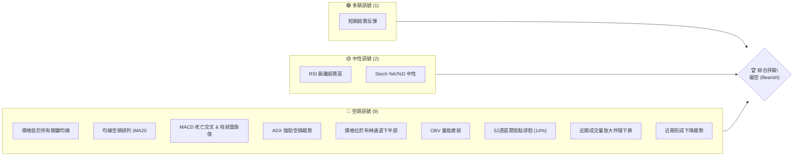
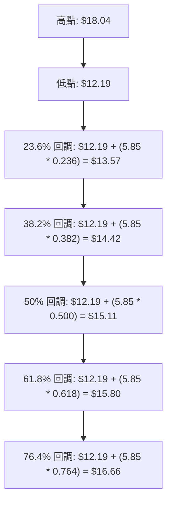
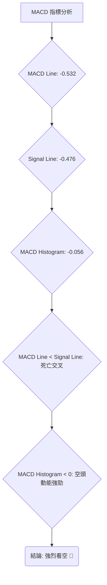

<details>
<summary>📊 靜態圖表 (點擊展開)</summary>

</details>

<html>
<head><meta charset="utf-8" /></head>
<body>
    <div>                        <script>window.PlotlyConfig = {MathJaxConfig: 'local'};</script>
        <script charset="utf-8" src="https://cdn.plot.ly/plotly-3.5.0.min.js" integrity="sha256-fHbNLP+GlIXN+efbQec78UkemUz3NJp7UmfGxC1tNxs=" crossorigin="anonymous"></script>                <div id="candlestick-chart" class="plotly-graph-div" style="height:500px; width:100%;"></div>            <script>                window.PLOTLYENV=window.PLOTLYENV || {};                                if (document.getElementById("candlestick-chart")) {                    Plotly.newPlot(                        "candlestick-chart",                        [{"close":{"dtype":"f8","bdata":"AAAAgOvRKEAAAACgmZkoQAAAAEAK1ydAAAAAQOF6KEAAAACgcL0oQAAAAMAeBShAAAAAQDMzKkAAAADA9agqQAAAAKBwPSpAAAAAoHA9K0AAAABAClcrQAAAAKBH4StAAAAAgMJ1LEAAAABA4XosQAAAACCuRy1AAAAAgD2KLUAAAACgmZktQAAAAOBRuC1AAAAAwMzMLUAAAACgcL0tQAAAAEDhei1AAAAA4KNwLkAAAAAghesuQAAAAMAeBS9AAAAAoHA9L0AAAACgR2EvQAAAAIDr0S9AAAAAIK7HL0AAAAAghesvQAAAAEDh+i9AAAAAIIUrMEAAAADAzEwwQAAAAGBmJjBAAAAAYI8CMEAAAAAgXI8vQAAAACBcjy9AAAAAYGbmL0AAAABgjwIwQAAAAKBHYS5AAAAA4KNwLkAAAABguJ4uQAAAAGCPwi5AAAAAYI9CLkAAAAAghesuQAAAAKBwvS5AAAAAQArXLUAAAADA9SguQAAAAIDr0S1AAAAAAClcLkAAAACAwnUtQAAAAAAAAC5AAAAAgOvRLkAAAABA4XouQAAAAIDrUS5AAAAAwMzML0AAAACAFK4vQAAAAAAAADBAAAAAACncL0AAAABAChcwQAAAACBcDzBAAAAAACkcMEAAAACgRyEwQAAAAKCZmS9AAAAAIIUrMEAAAACgR+EvQAAAAKBwvS9AAAAAwB4FMEAAAAAA12MwQAAAAIAULjBAAAAAgBQuL0AAAAAA16MvQAAAAEAzMy9AAAAAANejLkAAAACA61EvQAAAAADXoy5AAAAAIK7HL0AAAABACtcvQAAAAAApnDBAAAAAAABAMUAAAAAA12MxQAAAAEDhejFAAAAAACmcMUAAAADgo3AxQAAAAGBmpjFAAAAAQDOzMEAAAABguJ4wQAAAAIAUrjBAAAAA4KOwMEAAAACA69EwQAAAAGBm5jBAAAAAYGamMEAAAABAMzMwQAAAAOBRuC9AAAAAwB5FMEAAAABAClcwQAAAAGC4njBAAAAAYI\u002fCMEAAAACgcL0wQAAAAGCPwjBAAAAAwPWoMEAAAACgR+EwQAAAAKBwvTBAAAAAwB4FMUAAAADgo\u002fAxQAAAAAAp3DFAAAAAAACAMUAAAAAAKZwxQAAAAIDCdTFAAAAAgD0KMUAAAAAgXI8wQAAAAADXozBAAAAAACmcMEAAAACgmZkwQAAAAOBR+DBAAAAAoHA9MUAAAAAAAAAyQAAAAIA9CjJAAAAAgBQuMkAAAADAzIwyQAAAAGCPwjJAAAAAYI\u002fCMkAAAAAAAMAxQAAAAAApHDJAAAAAYLgeMkAAAADAHgUxQAAAACBczzBAAAAAYGZmMUAAAADAzIwxQAAAAIDrkTFAAAAAwPVoMUAAAACAPQoxQAAAAIDr0TBAAAAAgOvRMEAAAAAghSsxQAAAAIDrUTFAAAAAIK6HMUAAAADgozAwQAAAACCuhzBAAAAAYGamMEAAAABguB4uQAAAAIDC9S1AAAAAoEdhLkAAAADAHoUtQAAAAAAAAC5AAAAAANejLUAAAADA9SgtQAAAAEAKVy1AAAAAYI\u002fCLUAAAABA4fosQAAAAOCj8CtAAAAAIK7HK0AAAACAPYosQAAAAAAAgCxAAAAA4KPwK0AAAACA61EsQAAAAKBH4StAAAAAAClcLUAAAACgR2EsQAAAAADXoyxAAAAAgD0KLEAAAABAMzMrQAAAAMAeBStAAAAAoHC9LEAAAACgR+EsQAAAAMDMTCxAAAAAwB6FLEAAAADAzEwsQAAAAMAeBS1AAAAAoHC9LUAAAAAghestQAAAAGBm5i1AAAAAQDOzLkAAAACAFK4uQAAAAAAp3C5AAAAAgBSuLkAAAABAMzMuQAAAAKCZGS5AAAAAQDOzLUAAAAAghessQAAAAMAeBS1AAAAAIK5HLUAAAAAAAAAtQAAAAOB6FCxAAAAAgML1LEAAAACgR+EsQAAAAIDrUSxAAAAAAACALEAAAACAwvUsQAAAAMAehSxAAAAAoJmZK0AAAAAAAAArQAAAAIA9iipAAAAAANejKUAAAAAAKdwpQAAAAKBHYShAAAAA4HqUKEAAAADgepQoQAAAAOB6lClAAAAAgOtRKkAAAACAwnUpQA=="},"high":{"dtype":"f8","bdata":"AAAAQDMzKUAAAACAFC4pQAAAAKBwvShAAAAA4HqUKEAAAAAghesoQAAAAADXoyhAAAAAANcjLEAAAADAHgUrQAAAAIDCtSpAAAAAAACAK0AAAACgmZkrQAAAAIDC9StAAAAAYI8CLUAAAABAM7MsQAAAAEAKVy1AAAAAQOE6LkAAAAAA16MtQAAAAKBwvS1AAAAAgOsRLkAAAACgcP0tQAAAAKCZWS5AAAAA4KOwLkAAAADAHgUvQAAAACCFay9AAAAAoEehL0AAAACAPYovQAAAAKBHATBAAAAAgOsRMEAAAADAzAwwQAAAAKBHITBAAAAAoJlZMEAAAADAzEwwQAAAAMDMbDBAAAAAYLheMEAAAADgURgwQAAAAKBw\u002fS9AAAAAoJkZMEAAAADgozAwQAAAAMDMDDBAAAAAwMzMLkAAAAAAAMAuQAAAAEDh+i5AAAAA4HoUL0AAAAAAAAAvQAAAAMD1KC9AAAAAYGbmLkAAAACgcD0uQAAAAKBHYS5AAAAAAFaOLkAAAABguJ4uQAAAAGC4Hi5AAAAAIK5HL0AAAACAFC4vQAAAACCF6y5AAAAAANcjMEAAAACgRyEwQAAAAKCZWTBAAAAAgOsRMEAAAADAHkUwQAAAAKBwPTBAAAAAwB5FMEAAAAAAAIAwQAAAAKBwHTBAAAAAIIVrMEAAAABgZmYwQAAAAAAAwC9AAAAA4FE4MEAAAADAzIwwQAAAAAAAgDBAAAAAgOsxMEAAAABgj0IwQAAAAKBwvS9AAAAAoJlZL0AAAADgo3AvQAAAAEAzEzBAAAAAwB4FMEAAAAAgXA8wQAAAAMDMrDBAAAAAoEdhMUAAAACAFI4xQAAAACBcjzFAAAAAQArXMUAAAADgUbgxQAAAAOCj0DFAAAAAQOG6MUAAAABAMxMxQAAAAEDhujBAAAAAoJnZMEAAAAAAKRwxQAAAACBcDzFAAAAAgOsRMUAAAADAHoUwQAAAAMD1KDBAAAAA4CJbMEAAAADgUXgwQAAAAKBHoTBAAAAA4HrUMEAAAADA9cgwQAAAAGCPwjBAAAAAIFzPMEAAAABA4RoxQAAAAMDM7DBAAAAAIFwPMUAAAACAlSMyQAAAAGC4XjJAAAAAYI\u002fCMUAAAACAvp8xQAAAAIDrETJAAAAAIIVrMUAAAACA6xExQAAAAOCjsDBAAAAA4FH4MEAAAABgDq0wQAAAAOCjUDFAAAAAgD2KMUAAAAAAAAAyQAAAAOCjEDJAAAAAYI9CMkAAAAAgXI8yQAAAAMD1yDJAAAAAQOH6MkAAAABguJ4yQAAAAEAKdzJAAAAAYGamMkAAAACAPSoyQAAAAGCPIjFAAAAAIIVrMUAAAABACtcxQAAAAAApvDFAAAAAoHD9MUAAAADAzIwxQAAAAKBH4TBAAAAAAAAAMUAAAABA4XoxQAAAAOCjcDFAAAAAQAqXMUAAAADA9WgxQAAAAEAKlzBAAAAAoJnZMEAAAACgR+EvQAAAAGBmZi5AAAAAQIusLkAAAABguB4uQAAAAIDCtS5AAAAAwMxMLkAAAABAM3MtQAAAAIDrkS1AAAAAgD1KLkAAAACgR+EtQAAAAEAzsyxAAAAAYLieLEAAAACgcL0sQAAAAOB6FC1AAAAAwMyMLEAAAAAAAIAsQAAAAMDMTCxAAAAAQArXLUAAAADAHgUtQAAAAKBHYS1AAAAAYGamLEAAAABgZuYrQAAAAIDrkStAAAAAgOvRLEAAAACgmZktQAAAAIDC9SxAAAAAIK7HLEAAAACA61EsQAAAAMBJzC5AAAAAACncLUAAAADgehQuQAAAACBcDy5AAAAA4KPwLkAAAABguB4vQAAAAKBHIS9AAAAAYLieL0AAAABAM7MuQAAAACBcjy5AAAAA4KNwLkAAAAAA16MtQAAAAOB6FC1AAAAAIIWrLUAAAABAClctQAAAAMAeBS1AAAAAYLgeLUAAAACA61EtQAAAAOCj8CxAAAAAoEfhLEAAAACgmRktQAAAAEAzMy1AAAAAwPWoLEAAAADA9egrQAAAAAApHCtAAAAAgD2KKkAAAABAClcqQAAAACBczyhAAAAAwMzMKEAAAADAzMwoQAAAAKCZmSlAAAAAoJmZKkAAAADAHoUqQA=="},"hovertemplate":"\u003cb\u003e%{x|%Y-%m-%d}\u003c\u002fb\u003e\u003cbr\u003e\u958b: $%{open:.2f}\u003cbr\u003e\u9ad8: $%{high:.2f}\u003cbr\u003e\u4f4e: $%{low:.2f}\u003cbr\u003e\u6536: $%{close:.2f}\u003cextra\u003e\u003c\u002fextra\u003e","low":{"dtype":"f8","bdata":"AAAAgD2KKEAAAAAAAIAoQAAAACCuxydAAAAAgD3KJ0AAAAAAAIAoQAAAACCuxydAAAAAQArXKUAAAACAPYopQAAAAEAzMypAAAAAIK5HKkAAAACgR+EqQAAAAEDh+ipAAAAAYLjeK0AAAAAgWiQsQAAAAGCPgixAAAAAgOtRLUAAAACAFC4tQAAAAIAUrixAAAAAgMJ1LUAAAACAwvUsQAAAAIA9Ci1AAAAAIIVrLUAAAABgjwIuQAAAAKCZmS5AAAAAgML1LkAAAADgehQvQAAAAMD1aC9AAAAAgOtRL0AAAABgZqYvQAAAAMAexS9AAAAAwB4FMEAAAACAwvUvQAAAACCuBzBAAAAAoPHSL0AAAACAwnUvQAAAAKCZGS9AAAAAwPWoL0AAAADAzEwvQAAAAIDrUS5AAAAAgD0KLkAAAADgUTguQAAAAAAAQC5AAAAAgD0KLkAAAACgmRkuQAAAAIDCdS5AAAAAYI\u002fCLUAAAABACtctQAAAACCuRy1AAAAA4FG4LUAAAABAXjotQAAAAGC4Hi1AAAAAYLgeLkAAAAAgXE8uQAAAAIDrES5AAAAAgMJ1LkAAAAAgBJYvQAAAAEAK1y9AAAAAANejL0AAAAAAKdwvQAAAAADXAzBAAAAAYI\u002fCL0AAAACAFO4vQAAAAGBmZi9AAAAA4HqUL0AAAACAFK4vQAAAAGBm5i5AAAAAwMzML0AAAADAzAwwQAAAACCFCzBAAAAA4FH4LkAAAAAA16MuQAAAAAAAAC9AAAAAwB6FLkAAAACgR2EuQAAAAKCZmS5AAAAAYI+CLkAAAAAgXI8vQAAAAAApXC9AAAAAwPXoMEAAAABAMzMxQAAAACCuRzFAAAAAQOF6MUAAAACAPUoxQAAAAAApXDFAAAAAoJmZMEAAAADgUXgwQAAAAAACSzBAAAAAQAp3MEAAAABAM7MwQAAAAKCZmTBAAAAAoEehMEAAAACAFC4wQAAAAIAULi9AAAAAwCAQMEAAAABAYlAwQAAAAKCZWTBAAAAAIFyPMEAAAABgZqYwQAAAAAApnDBAAAAAgD2KMEAAAACAFK4wQAAAAIDCtTBAAAAAYGamMEAAAACAPSoxQAAAACBczzFAAAAAIK5nMUAAAABguF4xQAAAAADXYzFAAAAAwB4FMUAAAACAPWowQAAAAMDMbDBAAAAAgEGAMEAAAACAFE4wQAAAAKCZWTBAAAAAgOsRMUAAAADgelQxQAAAAIDCtTFAAAAAYGbmMUAAAACgmRkyQAAAAAApXDJAAAAAoHA9MkAAAACAwrUxQAAAAIDCtTFAAAAAQArXMUAAAAAAAOAwQAAAAMDMjDBAAAAAYI\u002fCMEAAAABACjcxQAAAAIA9CjFAAAAAoJlZMUAAAACAwrUwQAAAAGC4XjBAAAAAQAqXMEAAAABACtcwQAAAAMAe5TBAAAAAIIUrMUAAAADgehQwQAAAAKBwvS9AAAAAANeDMEAAAADgehQuQAAAAGBmZi1AAAAAYLieLEAAAABAClcsQAAAAKCZmS1AAAAA4FE4LUAAAADgUXgsQAAAAIDCdSxAAAAAIFwPLUAAAABgj8IsQAAAAGCPwitAAAAAoEehK0AAAABguB4sQAAAAOBReCxAAAAA4HrUK0AAAAAgXA8rQAAAAOB6lCtAAAAA4KNwLEAAAACA61EsQAAAACCFayxAAAAAACncK0AAAADgehQrQAAAAIDr0SpAAAAAYGZmK0AAAAAAKdwsQAAAAAACqytAAAAAwPUoLEAAAACAFK4rQAAAAIDr0SxAAAAAwMzMLEAAAAAgXI8tQAAAAEAzMy1AAAAAoHA9LkAAAACgmZkuQAAAAOB6lC5AAAAAYLieLkAAAAAAKdwtQAAAAOCj8C1AAAAAQApXLUAAAACA65EsQAAAAKBHYSxAAAAAoJkZLUAAAACAwrUsQAAAAOB6FCxAAAAAoJkZLEAAAABgj8IsQAAAAIAULixAAAAAQApXLEAAAACgcH0sQAAAAMD1aCxAAAAAAACAK0AAAABACtcqQAAAAMAehSpAAAAAIK6HKUAAAACAFK4pQAAAACBcjydAAAAAYLgeKEAAAAAghesnQAAAAMD1qChAAAAAYLgeKUAAAAAghWspQA=="},"name":"\u50f9\u683c","open":{"dtype":"f8","bdata":"AAAAIFyPKEAAAAAAAAApQAAAAKCZmShAAAAAQArXJ0AAAADA9agoQAAAAIA9iihAAAAAwMzMKkAAAABAMzMqQAAAAIDCdSpAAAAAgBTuKkAAAACAPQorQAAAAOCjcCtAAAAAAAAALEAAAABA4XosQAAAAIDC9SxAAAAAAACALUAAAADgUTgtQAAAAMD1KC1AAAAAoHC9LUAAAACAFK4tQAAAAMAeBS5AAAAAIFyPLUAAAACAwnUuQAAAAKCZGS9AAAAAIFwPL0AAAAAAKVwvQAAAAAAAgC9AAAAAoEfhL0AAAABgZuYvQAAAAGCPAjBAAAAAgOsRMEAAAAAAKRwwQAAAAMDMTDBAAAAAgBQuMEAAAAAAKdwvQAAAAAAp3C9AAAAAYGbmL0AAAAAghesvQAAAAMDMDDBAAAAAgD2KLkAAAAAgXI8uQAAAAKBwvS5AAAAAgOvRLkAAAAAAKVwuQAAAACBcDy9AAAAA4FG4LkAAAADA9SguQAAAAEAzsy1AAAAAAAAALkAAAADgepQuQAAAACCuRy1AAAAAYI9CLkAAAABAM7MuQAAAAADXoy5AAAAAwB6FLkAAAABAChcwQAAAAEDhOjBAAAAAIIXrL0AAAABgZuYvQAAAAIDrETBAAAAAACkcMEAAAADgozAwQAAAAKCZmS9AAAAA4FG4L0AAAABguF4wQAAAAADXoy9AAAAAoJkZMEAAAABAChcwQAAAAIDCdTBAAAAAgD0KMEAAAAAAKdwuQAAAAOBReC9AAAAAwMzMLkAAAADAzIwuQAAAAIAUri9AAAAAgMK1LkAAAAAAAAAwQAAAAEAK1y9AAAAAQOH6MEAAAAAA12MxQAAAAIAUbjFAAAAAgMK1MUAAAABAM7MxQAAAAGBmpjFAAAAAQDOzMUAAAABguN4wQAAAAMAeZTBAAAAAoJmZMEAAAABA4bowQAAAACCu5zBAAAAAYGYGMUAAAAAAAIAwQAAAAEAKFzBAAAAAYGYmMEAAAACgmVkwQAAAACCFazBAAAAA4KOwMEAAAABAM7MwQAAAAKBwvTBAAAAAgD2qMEAAAADAHsUwQAAAAGC43jBAAAAAIFwPMUAAAACAFC4xQAAAAGC4HjJAAAAAYLieMUAAAABACpcxQAAAAIAUrjFAAAAAoJlZMUAAAAAgXA8xQAAAAOCjkDBAAAAAAADAMEAAAACA65EwQAAAAAApXDBAAAAAYI8iMUAAAACAPaoxQAAAAAAAADJAAAAAwMwMMkAAAAAAKVwyQAAAAGCPojJAAAAA4HrUMkAAAAAgrocyQAAAAKBwvTFAAAAAIK5nMkAAAADgehQyQAAAAOB61DBAAAAAIIUrMUAAAADgo3AxQAAAAGBmJjFAAAAAgOvxMUAAAADA9YgxQAAAAKBwvTBAAAAAAADAMEAAAABAM\u002fMwQAAAAADXIzFAAAAAQDMzMUAAAAAAAEAxQAAAAOCjMDBAAAAAANeDMEAAAABACtcvQAAAAOCjcC1AAAAAIIXrLEAAAAAAKVwtQAAAAKBw\u002fS1AAAAAACncLUAAAABgjwItQAAAAIDr0SxAAAAAQOF6LUAAAAAAAIAtQAAAAGBmZixAAAAAANcjLEAAAACgcD0sQAAAAMDMzCxAAAAA4KNwLEAAAAAAKVwrQAAAAKBwPSxAAAAAoEehLEAAAADgUfgsQAAAAGCPQi1AAAAAYI9CLEAAAACAwnUrQAAAACCFaytAAAAAoJmZK0AAAACAFC4tQAAAAAAAACxAAAAAYI9CLEAAAABAMzMsQAAAACCFay5AAAAAwB4FLUAAAAAAKdwtQAAAAIAUri1AAAAAYI9CLkAAAAAghesuQAAAACCuxy5AAAAAYLieL0AAAABA4XouQAAAAOBROC5AAAAAAClcLkAAAABguJ4tQAAAAEAK1yxAAAAAIK5HLUAAAADgehQtQAAAAIDC9SxAAAAA4HpULEAAAACA61EtQAAAACCuxyxAAAAAANejLEAAAAAAAAAtQAAAAAAAAC1AAAAAoJmZLEAAAABgj8IrQAAAAEAK1ypAAAAAIIVrKkAAAABAM7MpQAAAAECJAShAAAAAwMzMKEAAAADgelQoQAAAAIAUrihAAAAA4FE4KUAAAADAzEwqQA=="},"x":["2025-08-07T00:00:00-04:00","2025-08-08T00:00:00-04:00","2025-08-11T00:00:00-04:00","2025-08-12T00:00:00-04:00","2025-08-13T00:00:00-04:00","2025-08-14T00:00:00-04:00","2025-08-15T00:00:00-04:00","2025-08-18T00:00:00-04:00","2025-08-19T00:00:00-04:00","2025-08-20T00:00:00-04:00","2025-08-21T00:00:00-04:00","2025-08-22T00:00:00-04:00","2025-08-25T00:00:00-04:00","2025-08-26T00:00:00-04:00","2025-08-27T00:00:00-04:00","2025-08-28T00:00:00-04:00","2025-08-29T00:00:00-04:00","2025-09-02T00:00:00-04:00","2025-09-03T00:00:00-04:00","2025-09-04T00:00:00-04:00","2025-09-05T00:00:00-04:00","2025-09-08T00:00:00-04:00","2025-09-09T00:00:00-04:00","2025-09-10T00:00:00-04:00","2025-09-11T00:00:00-04:00","2025-09-12T00:00:00-04:00","2025-09-15T00:00:00-04:00","2025-09-16T00:00:00-04:00","2025-09-17T00:00:00-04:00","2025-09-18T00:00:00-04:00","2025-09-19T00:00:00-04:00","2025-09-22T00:00:00-04:00","2025-09-23T00:00:00-04:00","2025-09-24T00:00:00-04:00","2025-09-25T00:00:00-04:00","2025-09-26T00:00:00-04:00","2025-09-29T00:00:00-04:00","2025-09-30T00:00:00-04:00","2025-10-01T00:00:00-04:00","2025-10-02T00:00:00-04:00","2025-10-03T00:00:00-04:00","2025-10-06T00:00:00-04:00","2025-10-07T00:00:00-04:00","2025-10-08T00:00:00-04:00","2025-10-09T00:00:00-04:00","2025-10-10T00:00:00-04:00","2025-10-13T00:00:00-04:00","2025-10-14T00:00:00-04:00","2025-10-15T00:00:00-04:00","2025-10-16T00:00:00-04:00","2025-10-17T00:00:00-04:00","2025-10-20T00:00:00-04:00","2025-10-21T00:00:00-04:00","2025-10-22T00:00:00-04:00","2025-10-23T00:00:00-04:00","2025-10-24T00:00:00-04:00","2025-10-27T00:00:00-04:00","2025-10-28T00:00:00-04:00","2025-10-29T00:00:00-04:00","2025-10-30T00:00:00-04:00","2025-10-31T00:00:00-04:00","2025-11-03T00:00:00-05:00","2025-11-04T00:00:00-05:00","2025-11-05T00:00:00-05:00","2025-11-06T00:00:00-05:00","2025-11-07T00:00:00-05:00","2025-11-10T00:00:00-05:00","2025-11-11T00:00:00-05:00","2025-11-12T00:00:00-05:00","2025-11-13T00:00:00-05:00","2025-11-14T00:00:00-05:00","2025-11-17T00:00:00-05:00","2025-11-18T00:00:00-05:00","2025-11-19T00:00:00-05:00","2025-11-20T00:00:00-05:00","2025-11-21T00:00:00-05:00","2025-11-24T00:00:00-05:00","2025-11-25T00:00:00-05:00","2025-11-26T00:00:00-05:00","2025-11-28T00:00:00-05:00","2025-12-01T00:00:00-05:00","2025-12-02T00:00:00-05:00","2025-12-03T00:00:00-05:00","2025-12-04T00:00:00-05:00","2025-12-05T00:00:00-05:00","2025-12-08T00:00:00-05:00","2025-12-09T00:00:00-05:00","2025-12-10T00:00:00-05:00","2025-12-11T00:00:00-05:00","2025-12-12T00:00:00-05:00","2025-12-15T00:00:00-05:00","2025-12-16T00:00:00-05:00","2025-12-17T00:00:00-05:00","2025-12-18T00:00:00-05:00","2025-12-19T00:00:00-05:00","2025-12-22T00:00:00-05:00","2025-12-23T00:00:00-05:00","2025-12-24T00:00:00-05:00","2025-12-26T00:00:00-05:00","2025-12-29T00:00:00-05:00","2025-12-30T00:00:00-05:00","2025-12-31T00:00:00-05:00","2026-01-02T00:00:00-05:00","2026-01-05T00:00:00-05:00","2026-01-06T00:00:00-05:00","2026-01-07T00:00:00-05:00","2026-01-08T00:00:00-05:00","2026-01-09T00:00:00-05:00","2026-01-12T00:00:00-05:00","2026-01-13T00:00:00-05:00","2026-01-14T00:00:00-05:00","2026-01-15T00:00:00-05:00","2026-01-16T00:00:00-05:00","2026-01-20T00:00:00-05:00","2026-01-21T00:00:00-05:00","2026-01-22T00:00:00-05:00","2026-01-23T00:00:00-05:00","2026-01-26T00:00:00-05:00","2026-01-27T00:00:00-05:00","2026-01-28T00:00:00-05:00","2026-01-29T00:00:00-05:00","2026-01-30T00:00:00-05:00","2026-02-02T00:00:00-05:00","2026-02-03T00:00:00-05:00","2026-02-04T00:00:00-05:00","2026-02-05T00:00:00-05:00","2026-02-06T00:00:00-05:00","2026-02-09T00:00:00-05:00","2026-02-10T00:00:00-05:00","2026-02-11T00:00:00-05:00","2026-02-12T00:00:00-05:00","2026-02-13T00:00:00-05:00","2026-02-17T00:00:00-05:00","2026-02-18T00:00:00-05:00","2026-02-19T00:00:00-05:00","2026-02-20T00:00:00-05:00","2026-02-23T00:00:00-05:00","2026-02-24T00:00:00-05:00","2026-02-25T00:00:00-05:00","2026-02-26T00:00:00-05:00","2026-02-27T00:00:00-05:00","2026-03-02T00:00:00-05:00","2026-03-03T00:00:00-05:00","2026-03-04T00:00:00-05:00","2026-03-05T00:00:00-05:00","2026-03-06T00:00:00-05:00","2026-03-09T00:00:00-04:00","2026-03-10T00:00:00-04:00","2026-03-11T00:00:00-04:00","2026-03-12T00:00:00-04:00","2026-03-13T00:00:00-04:00","2026-03-16T00:00:00-04:00","2026-03-17T00:00:00-04:00","2026-03-18T00:00:00-04:00","2026-03-19T00:00:00-04:00","2026-03-20T00:00:00-04:00","2026-03-23T00:00:00-04:00","2026-03-24T00:00:00-04:00","2026-03-25T00:00:00-04:00","2026-03-26T00:00:00-04:00","2026-03-27T00:00:00-04:00","2026-03-30T00:00:00-04:00","2026-03-31T00:00:00-04:00","2026-04-01T00:00:00-04:00","2026-04-02T00:00:00-04:00","2026-04-06T00:00:00-04:00","2026-04-07T00:00:00-04:00","2026-04-08T00:00:00-04:00","2026-04-09T00:00:00-04:00","2026-04-10T00:00:00-04:00","2026-04-13T00:00:00-04:00","2026-04-14T00:00:00-04:00","2026-04-15T00:00:00-04:00","2026-04-16T00:00:00-04:00","2026-04-17T00:00:00-04:00","2026-04-20T00:00:00-04:00","2026-04-21T00:00:00-04:00","2026-04-22T00:00:00-04:00","2026-04-23T00:00:00-04:00","2026-04-24T00:00:00-04:00","2026-04-27T00:00:00-04:00","2026-04-28T00:00:00-04:00","2026-04-29T00:00:00-04:00","2026-04-30T00:00:00-04:00","2026-05-01T00:00:00-04:00","2026-05-04T00:00:00-04:00","2026-05-05T00:00:00-04:00","2026-05-06T00:00:00-04:00","2026-05-07T00:00:00-04:00","2026-05-08T00:00:00-04:00","2026-05-11T00:00:00-04:00","2026-05-12T00:00:00-04:00","2026-05-13T00:00:00-04:00","2026-05-14T00:00:00-04:00","2026-05-15T00:00:00-04:00","2026-05-18T00:00:00-04:00","2026-05-19T00:00:00-04:00","2026-05-20T00:00:00-04:00","2026-05-21T00:00:00-04:00","2026-05-22T00:00:00-04:00"],"type":"candlestick"},{"hovertemplate":"MA30: $%{y:.2f}\u003cextra\u003e\u003c\u002fextra\u003e","line":{"color":"#2196F3","dash":"dash","width":2},"mode":"lines","name":"MA30","x":["2025-08-07T00:00:00-04:00","2025-08-08T00:00:00-04:00","2025-08-11T00:00:00-04:00","2025-08-12T00:00:00-04:00","2025-08-13T00:00:00-04:00","2025-08-14T00:00:00-04:00","2025-08-15T00:00:00-04:00","2025-08-18T00:00:00-04:00","2025-08-19T00:00:00-04:00","2025-08-20T00:00:00-04:00","2025-08-21T00:00:00-04:00","2025-08-22T00:00:00-04:00","2025-08-25T00:00:00-04:00","2025-08-26T00:00:00-04:00","2025-08-27T00:00:00-04:00","2025-08-28T00:00:00-04:00","2025-08-29T00:00:00-04:00","2025-09-02T00:00:00-04:00","2025-09-03T00:00:00-04:00","2025-09-04T00:00:00-04:00","2025-09-05T00:00:00-04:00","2025-09-08T00:00:00-04:00","2025-09-09T00:00:00-04:00","2025-09-10T00:00:00-04:00","2025-09-11T00:00:00-04:00","2025-09-12T00:00:00-04:00","2025-09-15T00:00:00-04:00","2025-09-16T00:00:00-04:00","2025-09-17T00:00:00-04:00","2025-09-18T00:00:00-04:00","2025-09-19T00:00:00-04:00","2025-09-22T00:00:00-04:00","2025-09-23T00:00:00-04:00","2025-09-24T00:00:00-04:00","2025-09-25T00:00:00-04:00","2025-09-26T00:00:00-04:00","2025-09-29T00:00:00-04:00","2025-09-30T00:00:00-04:00","2025-10-01T00:00:00-04:00","2025-10-02T00:00:00-04:00","2025-10-03T00:00:00-04:00","2025-10-06T00:00:00-04:00","2025-10-07T00:00:00-04:00","2025-10-08T00:00:00-04:00","2025-10-09T00:00:00-04:00","2025-10-10T00:00:00-04:00","2025-10-13T00:00:00-04:00","2025-10-14T00:00:00-04:00","2025-10-15T00:00:00-04:00","2025-10-16T00:00:00-04:00","2025-10-17T00:00:00-04:00","2025-10-20T00:00:00-04:00","2025-10-21T00:00:00-04:00","2025-10-22T00:00:00-04:00","2025-10-23T00:00:00-04:00","2025-10-24T00:00:00-04:00","2025-10-27T00:00:00-04:00","2025-10-28T00:00:00-04:00","2025-10-29T00:00:00-04:00","2025-10-30T00:00:00-04:00","2025-10-31T00:00:00-04:00","2025-11-03T00:00:00-05:00","2025-11-04T00:00:00-05:00","2025-11-05T00:00:00-05:00","2025-11-06T00:00:00-05:00","2025-11-07T00:00:00-05:00","2025-11-10T00:00:00-05:00","2025-11-11T00:00:00-05:00","2025-11-12T00:00:00-05:00","2025-11-13T00:00:00-05:00","2025-11-14T00:00:00-05:00","2025-11-17T00:00:00-05:00","2025-11-18T00:00:00-05:00","2025-11-19T00:00:00-05:00","2025-11-20T00:00:00-05:00","2025-11-21T00:00:00-05:00","2025-11-24T00:00:00-05:00","2025-11-25T00:00:00-05:00","2025-11-26T00:00:00-05:00","2025-11-28T00:00:00-05:00","2025-12-01T00:00:00-05:00","2025-12-02T00:00:00-05:00","2025-12-03T00:00:00-05:00","2025-12-04T00:00:00-05:00","2025-12-05T00:00:00-05:00","2025-12-08T00:00:00-05:00","2025-12-09T00:00:00-05:00","2025-12-10T00:00:00-05:00","2025-12-11T00:00:00-05:00","2025-12-12T00:00:00-05:00","2025-12-15T00:00:00-05:00","2025-12-16T00:00:00-05:00","2025-12-17T00:00:00-05:00","2025-12-18T00:00:00-05:00","2025-12-19T00:00:00-05:00","2025-12-22T00:00:00-05:00","2025-12-23T00:00:00-05:00","2025-12-24T00:00:00-05:00","2025-12-26T00:00:00-05:00","2025-12-29T00:00:00-05:00","2025-12-30T00:00:00-05:00","2025-12-31T00:00:00-05:00","2026-01-02T00:00:00-05:00","2026-01-05T00:00:00-05:00","2026-01-06T00:00:00-05:00","2026-01-07T00:00:00-05:00","2026-01-08T00:00:00-05:00","2026-01-09T00:00:00-05:00","2026-01-12T00:00:00-05:00","2026-01-13T00:00:00-05:00","2026-01-14T00:00:00-05:00","2026-01-15T00:00:00-05:00","2026-01-16T00:00:00-05:00","2026-01-20T00:00:00-05:00","2026-01-21T00:00:00-05:00","2026-01-22T00:00:00-05:00","2026-01-23T00:00:00-05:00","2026-01-26T00:00:00-05:00","2026-01-27T00:00:00-05:00","2026-01-28T00:00:00-05:00","2026-01-29T00:00:00-05:00","2026-01-30T00:00:00-05:00","2026-02-02T00:00:00-05:00","2026-02-03T00:00:00-05:00","2026-02-04T00:00:00-05:00","2026-02-05T00:00:00-05:00","2026-02-06T00:00:00-05:00","2026-02-09T00:00:00-05:00","2026-02-10T00:00:00-05:00","2026-02-11T00:00:00-05:00","2026-02-12T00:00:00-05:00","2026-02-13T00:00:00-05:00","2026-02-17T00:00:00-05:00","2026-02-18T00:00:00-05:00","2026-02-19T00:00:00-05:00","2026-02-20T00:00:00-05:00","2026-02-23T00:00:00-05:00","2026-02-24T00:00:00-05:00","2026-02-25T00:00:00-05:00","2026-02-26T00:00:00-05:00","2026-02-27T00:00:00-05:00","2026-03-02T00:00:00-05:00","2026-03-03T00:00:00-05:00","2026-03-04T00:00:00-05:00","2026-03-05T00:00:00-05:00","2026-03-06T00:00:00-05:00","2026-03-09T00:00:00-04:00","2026-03-10T00:00:00-04:00","2026-03-11T00:00:00-04:00","2026-03-12T00:00:00-04:00","2026-03-13T00:00:00-04:00","2026-03-16T00:00:00-04:00","2026-03-17T00:00:00-04:00","2026-03-18T00:00:00-04:00","2026-03-19T00:00:00-04:00","2026-03-20T00:00:00-04:00","2026-03-23T00:00:00-04:00","2026-03-24T00:00:00-04:00","2026-03-25T00:00:00-04:00","2026-03-26T00:00:00-04:00","2026-03-27T00:00:00-04:00","2026-03-30T00:00:00-04:00","2026-03-31T00:00:00-04:00","2026-04-01T00:00:00-04:00","2026-04-02T00:00:00-04:00","2026-04-06T00:00:00-04:00","2026-04-07T00:00:00-04:00","2026-04-08T00:00:00-04:00","2026-04-09T00:00:00-04:00","2026-04-10T00:00:00-04:00","2026-04-13T00:00:00-04:00","2026-04-14T00:00:00-04:00","2026-04-15T00:00:00-04:00","2026-04-16T00:00:00-04:00","2026-04-17T00:00:00-04:00","2026-04-20T00:00:00-04:00","2026-04-21T00:00:00-04:00","2026-04-22T00:00:00-04:00","2026-04-23T00:00:00-04:00","2026-04-24T00:00:00-04:00","2026-04-27T00:00:00-04:00","2026-04-28T00:00:00-04:00","2026-04-29T00:00:00-04:00","2026-04-30T00:00:00-04:00","2026-05-01T00:00:00-04:00","2026-05-04T00:00:00-04:00","2026-05-05T00:00:00-04:00","2026-05-06T00:00:00-04:00","2026-05-07T00:00:00-04:00","2026-05-08T00:00:00-04:00","2026-05-11T00:00:00-04:00","2026-05-12T00:00:00-04:00","2026-05-13T00:00:00-04:00","2026-05-14T00:00:00-04:00","2026-05-15T00:00:00-04:00","2026-05-18T00:00:00-04:00","2026-05-19T00:00:00-04:00","2026-05-20T00:00:00-04:00","2026-05-21T00:00:00-04:00","2026-05-22T00:00:00-04:00"],"y":{"dtype":"f8","bdata":"AAAAAAAA+H8AAAAAAAD4fwAAAAAAAPh\u002fAAAAAAAA+H8AAAAAAAD4fwAAAAAAAPh\u002fAAAAAAAA+H8AAAAAAAD4fwAAAAAAAPh\u002fAAAAAAAA+H8AAAAAAAD4fwAAAAAAAPh\u002fAAAAAAAA+H8AAAAAAAD4fwAAAAAAAPh\u002fAAAAAAAA+H8AAAAAAAD4fwAAAAAAAPh\u002fAAAAAAAA+H8AAAAAAAD4fwAAAAAAAPh\u002fAAAAAAAA+H8AAAAAAAD4fwAAAAAAAPh\u002fAAAAAAAA+H8AAAAAAAD4fwAAAAAAAPh\u002fAAAAAAAA+H8AAAAAAAD4fxEREUEZfSxAIiIi8kS9LEBVVVU1iQEtQLy7u1u6SS1A3t3dvRGKLUAiIiJCRMQtQDMzM6ObBC5AmpmZeT81LkAzMzOT\u002fGIuQKuqqopQhi5AzczMDJ+hLkAiIiJSnL0uQHd3d8cv1i5AERER8YvlLkBEREQ0XvouQO\u002fu7p7TBi9Aq6qq+mIJL0ARERFRKg4vQFVVVcUEDy9AzczMHMwTL0ARERFxaBEvQGZmZmbYFS9AVVVVhRYZL0AzMzNTVRUvQGZmZiZcDy9AzczMfCMUL0CamZnZshYvQBERERE8GC9ARERE1OoYL0Dv7u7OIhsvQERERKRUHC9AAAAAgE4bL0AiIiLCZxgvQGZmZpZuEi9AMzMzoykVL0AAAACw5BcvQHd3d+dtGS9A3t3dvZ8aL0C8u7v7GyEvQM3MzFwBMi9Aq6qq6lE4L0AzMzMjBkEvQFVVVVXHRC9AREREdAVIL0BEREREb0svQAAAANCUSi9A7+7uziJbL0AzMzPTeGkvQN7d3T18hi9AVVVVNdCpL0DNzMzsNdcvQKuqqprEADBARERElIoTMEDe3d2NUCYwQKuqqgqQOzBAvLu7q2NCMEC8u7ubC0kwQHd3dxfZTjBAZmZmVlVVMEC8u7sLkFswQN7d3Q27YjBAMzMzs1ZnMEDv7u6e72cwQBEREbFyaDBAVVVVJU1pMEDe3d31tmwwQM3MzFwdczBAq6qq6m15MEARERGBanwwQImIiIhdgTBAvLu7+36KMEBmZmaWipMwQERERPREnTBAmpmZqcarMEBmZmZmO78wQN7d3R3o1DBA7+7uNqXiMEC8u7sTEfEwQFVVVe1R+DBAVVVVLYf2MEC8u7sDcu8wQJqZmQFH6DBAEREReb7fMEDv7u52k9gwQDMzM\u002fvF0jBAiYiIoGHXMEAAAABIKOMwQHd3dz\u002fD7jBAvLu7M3r7MECamZlxPQoxQFVVVa0cGjFAMzMzCx4sMUCamZkRWDkxQFVVVUWLTDFAiYiIqFRcMUBEREQkImIxQDMzMzPBYzFAzczMTDdpMUBVVVXFIHAxQN7d3T0KdzFAREREpHB9MUC8u7srzn4xQO\u002fu7u58fzFAZmZmBsh9MUDv7u7uNXcxQImIiEiacjFAIiIi0ttyMUCJiIjIvWYxQLy7uyvOXjFAMzMzM3pbMUDv7u5mrU4xQLy7uxODQDFAmpmZCWU0MUDv7u5+sSQxQHd3d\u002ffhEzFAVVVVZTv\u002fMECrqqpKDOIwQJqZmWlKxTBAvLu7cyGpMEB3d3c\u002ffIYwQFVVVVWcXTBAAAAAqA00MEAzMzN7WxYwQM3MzFzW6i9AvLu7uwKkL0AzMzMzM3MvQKuqqvo3Qi9A7+7uHswTL0Dv7u4OdNouQHd3d5f8oi5AVVVVdSFpLkDe3d3day4uQCIiIkLu9S1AvLu7Cx7MLUDe3d19hp0tQM3MzIxsZy1AMzMzs50vLUDNzMzMzAwtQImIiEhT6ixAiYiIWPLLLEAAAABwPcosQN7d3V26ySxAvLu7a3XMLECrqqp6W9YsQN7d3S2y3SxAiYiIGJLmLEAzMzMDcu8sQCIiIkLu9SxAAAAAMGv1LEDe3d0d6PQsQJqZmWkf\u002fixAZmZmNuwKLUCJiIgY2Q4tQHd3d5dDCy1AAAAA0PcTLUBmZmYmvxgtQImIiFiAHC1AVVVVpSkVLUDNzMysHBotQImIiIgWGS1AZmZmVlUVLUDe3d1toBMtQKuqqtqHDy1AzczMzBP1LEAzMzODTtssQERERCTbuSxAREREFDyYLEDe3d2dfXgsQCIiItIiWyxAd3d3t\u002fM9LEAiIiKy5BcsQA=="},"type":"scatter"},{"hovertemplate":"MA60: $%{y:.2f}\u003cextra\u003e\u003c\u002fextra\u003e","line":{"color":"#9C27B0","dash":"dash","width":2},"mode":"lines","name":"MA60","x":["2025-08-07T00:00:00-04:00","2025-08-08T00:00:00-04:00","2025-08-11T00:00:00-04:00","2025-08-12T00:00:00-04:00","2025-08-13T00:00:00-04:00","2025-08-14T00:00:00-04:00","2025-08-15T00:00:00-04:00","2025-08-18T00:00:00-04:00","2025-08-19T00:00:00-04:00","2025-08-20T00:00:00-04:00","2025-08-21T00:00:00-04:00","2025-08-22T00:00:00-04:00","2025-08-25T00:00:00-04:00","2025-08-26T00:00:00-04:00","2025-08-27T00:00:00-04:00","2025-08-28T00:00:00-04:00","2025-08-29T00:00:00-04:00","2025-09-02T00:00:00-04:00","2025-09-03T00:00:00-04:00","2025-09-04T00:00:00-04:00","2025-09-05T00:00:00-04:00","2025-09-08T00:00:00-04:00","2025-09-09T00:00:00-04:00","2025-09-10T00:00:00-04:00","2025-09-11T00:00:00-04:00","2025-09-12T00:00:00-04:00","2025-09-15T00:00:00-04:00","2025-09-16T00:00:00-04:00","2025-09-17T00:00:00-04:00","2025-09-18T00:00:00-04:00","2025-09-19T00:00:00-04:00","2025-09-22T00:00:00-04:00","2025-09-23T00:00:00-04:00","2025-09-24T00:00:00-04:00","2025-09-25T00:00:00-04:00","2025-09-26T00:00:00-04:00","2025-09-29T00:00:00-04:00","2025-09-30T00:00:00-04:00","2025-10-01T00:00:00-04:00","2025-10-02T00:00:00-04:00","2025-10-03T00:00:00-04:00","2025-10-06T00:00:00-04:00","2025-10-07T00:00:00-04:00","2025-10-08T00:00:00-04:00","2025-10-09T00:00:00-04:00","2025-10-10T00:00:00-04:00","2025-10-13T00:00:00-04:00","2025-10-14T00:00:00-04:00","2025-10-15T00:00:00-04:00","2025-10-16T00:00:00-04:00","2025-10-17T00:00:00-04:00","2025-10-20T00:00:00-04:00","2025-10-21T00:00:00-04:00","2025-10-22T00:00:00-04:00","2025-10-23T00:00:00-04:00","2025-10-24T00:00:00-04:00","2025-10-27T00:00:00-04:00","2025-10-28T00:00:00-04:00","2025-10-29T00:00:00-04:00","2025-10-30T00:00:00-04:00","2025-10-31T00:00:00-04:00","2025-11-03T00:00:00-05:00","2025-11-04T00:00:00-05:00","2025-11-05T00:00:00-05:00","2025-11-06T00:00:00-05:00","2025-11-07T00:00:00-05:00","2025-11-10T00:00:00-05:00","2025-11-11T00:00:00-05:00","2025-11-12T00:00:00-05:00","2025-11-13T00:00:00-05:00","2025-11-14T00:00:00-05:00","2025-11-17T00:00:00-05:00","2025-11-18T00:00:00-05:00","2025-11-19T00:00:00-05:00","2025-11-20T00:00:00-05:00","2025-11-21T00:00:00-05:00","2025-11-24T00:00:00-05:00","2025-11-25T00:00:00-05:00","2025-11-26T00:00:00-05:00","2025-11-28T00:00:00-05:00","2025-12-01T00:00:00-05:00","2025-12-02T00:00:00-05:00","2025-12-03T00:00:00-05:00","2025-12-04T00:00:00-05:00","2025-12-05T00:00:00-05:00","2025-12-08T00:00:00-05:00","2025-12-09T00:00:00-05:00","2025-12-10T00:00:00-05:00","2025-12-11T00:00:00-05:00","2025-12-12T00:00:00-05:00","2025-12-15T00:00:00-05:00","2025-12-16T00:00:00-05:00","2025-12-17T00:00:00-05:00","2025-12-18T00:00:00-05:00","2025-12-19T00:00:00-05:00","2025-12-22T00:00:00-05:00","2025-12-23T00:00:00-05:00","2025-12-24T00:00:00-05:00","2025-12-26T00:00:00-05:00","2025-12-29T00:00:00-05:00","2025-12-30T00:00:00-05:00","2025-12-31T00:00:00-05:00","2026-01-02T00:00:00-05:00","2026-01-05T00:00:00-05:00","2026-01-06T00:00:00-05:00","2026-01-07T00:00:00-05:00","2026-01-08T00:00:00-05:00","2026-01-09T00:00:00-05:00","2026-01-12T00:00:00-05:00","2026-01-13T00:00:00-05:00","2026-01-14T00:00:00-05:00","2026-01-15T00:00:00-05:00","2026-01-16T00:00:00-05:00","2026-01-20T00:00:00-05:00","2026-01-21T00:00:00-05:00","2026-01-22T00:00:00-05:00","2026-01-23T00:00:00-05:00","2026-01-26T00:00:00-05:00","2026-01-27T00:00:00-05:00","2026-01-28T00:00:00-05:00","2026-01-29T00:00:00-05:00","2026-01-30T00:00:00-05:00","2026-02-02T00:00:00-05:00","2026-02-03T00:00:00-05:00","2026-02-04T00:00:00-05:00","2026-02-05T00:00:00-05:00","2026-02-06T00:00:00-05:00","2026-02-09T00:00:00-05:00","2026-02-10T00:00:00-05:00","2026-02-11T00:00:00-05:00","2026-02-12T00:00:00-05:00","2026-02-13T00:00:00-05:00","2026-02-17T00:00:00-05:00","2026-02-18T00:00:00-05:00","2026-02-19T00:00:00-05:00","2026-02-20T00:00:00-05:00","2026-02-23T00:00:00-05:00","2026-02-24T00:00:00-05:00","2026-02-25T00:00:00-05:00","2026-02-26T00:00:00-05:00","2026-02-27T00:00:00-05:00","2026-03-02T00:00:00-05:00","2026-03-03T00:00:00-05:00","2026-03-04T00:00:00-05:00","2026-03-05T00:00:00-05:00","2026-03-06T00:00:00-05:00","2026-03-09T00:00:00-04:00","2026-03-10T00:00:00-04:00","2026-03-11T00:00:00-04:00","2026-03-12T00:00:00-04:00","2026-03-13T00:00:00-04:00","2026-03-16T00:00:00-04:00","2026-03-17T00:00:00-04:00","2026-03-18T00:00:00-04:00","2026-03-19T00:00:00-04:00","2026-03-20T00:00:00-04:00","2026-03-23T00:00:00-04:00","2026-03-24T00:00:00-04:00","2026-03-25T00:00:00-04:00","2026-03-26T00:00:00-04:00","2026-03-27T00:00:00-04:00","2026-03-30T00:00:00-04:00","2026-03-31T00:00:00-04:00","2026-04-01T00:00:00-04:00","2026-04-02T00:00:00-04:00","2026-04-06T00:00:00-04:00","2026-04-07T00:00:00-04:00","2026-04-08T00:00:00-04:00","2026-04-09T00:00:00-04:00","2026-04-10T00:00:00-04:00","2026-04-13T00:00:00-04:00","2026-04-14T00:00:00-04:00","2026-04-15T00:00:00-04:00","2026-04-16T00:00:00-04:00","2026-04-17T00:00:00-04:00","2026-04-20T00:00:00-04:00","2026-04-21T00:00:00-04:00","2026-04-22T00:00:00-04:00","2026-04-23T00:00:00-04:00","2026-04-24T00:00:00-04:00","2026-04-27T00:00:00-04:00","2026-04-28T00:00:00-04:00","2026-04-29T00:00:00-04:00","2026-04-30T00:00:00-04:00","2026-05-01T00:00:00-04:00","2026-05-04T00:00:00-04:00","2026-05-05T00:00:00-04:00","2026-05-06T00:00:00-04:00","2026-05-07T00:00:00-04:00","2026-05-08T00:00:00-04:00","2026-05-11T00:00:00-04:00","2026-05-12T00:00:00-04:00","2026-05-13T00:00:00-04:00","2026-05-14T00:00:00-04:00","2026-05-15T00:00:00-04:00","2026-05-18T00:00:00-04:00","2026-05-19T00:00:00-04:00","2026-05-20T00:00:00-04:00","2026-05-21T00:00:00-04:00","2026-05-22T00:00:00-04:00"],"y":{"dtype":"f8","bdata":"AAAAAAAA+H8AAAAAAAD4fwAAAAAAAPh\u002fAAAAAAAA+H8AAAAAAAD4fwAAAAAAAPh\u002fAAAAAAAA+H8AAAAAAAD4fwAAAAAAAPh\u002fAAAAAAAA+H8AAAAAAAD4fwAAAAAAAPh\u002fAAAAAAAA+H8AAAAAAAD4fwAAAAAAAPh\u002fAAAAAAAA+H8AAAAAAAD4fwAAAAAAAPh\u002fAAAAAAAA+H8AAAAAAAD4fwAAAAAAAPh\u002fAAAAAAAA+H8AAAAAAAD4fwAAAAAAAPh\u002fAAAAAAAA+H8AAAAAAAD4fwAAAAAAAPh\u002fAAAAAAAA+H8AAAAAAAD4fwAAAAAAAPh\u002fAAAAAAAA+H8AAAAAAAD4fwAAAAAAAPh\u002fAAAAAAAA+H8AAAAAAAD4fwAAAAAAAPh\u002fAAAAAAAA+H8AAAAAAAD4fwAAAAAAAPh\u002fAAAAAAAA+H8AAAAAAAD4fwAAAAAAAPh\u002fAAAAAAAA+H8AAAAAAAD4fwAAAAAAAPh\u002fAAAAAAAA+H8AAAAAAAD4fwAAAAAAAPh\u002fAAAAAAAA+H8AAAAAAAD4fwAAAAAAAPh\u002fAAAAAAAA+H8AAAAAAAD4fwAAAAAAAPh\u002fAAAAAAAA+H8AAAAAAAD4fwAAAAAAAPh\u002fAAAAAAAA+H8AAAAAAAD4f6uqqvK2zC1AERERuUnsLUC8u7t7+AwuQBEREXkULi5AiYiIsJ1PLkARERF5FG4uQFVVVcUEjy5AvLu7m++nLkB3d3dHDMIuQLy7u\u002fMo3C5AvLu7e\u002fjsLkCrqqo6Uf8uQGZmZo57DS9Aq6qqssgWL0BERES85iIvQHd3dze0KC9AzczM5EIyL0AiIiKS0TsvQJqZmYHASi9AERERKc5eL0Dv7u4uT3QvQN7d3c2wiy9A7+7u1hWgL0B3d3c3+7AvQN7d3R0+wy9AIiIianXML0CJiIgIZdQvQAAAACD32i9AiYiIwMrhL0AzMzNzIekvQAAAAGDl8C9AMzMz8\u002f30L0AAAACAI\u002fQvQERERPyp8S9A7+7u9uHzL0De3d1NqfgvQImIiFDU\u002fy9AzczM5F4DMEB3d3c\u002ffAYwQHd3dxsvDTBAiYiI+FMTMEAAAADUBhowQHd3d0\u002fUHzBA3t3dseQnMEBERESEeTIwQO\u002fu7kIZPTBAMzMzTxtIMECrqqq+5lIwQCIiIgbIXTBAAAAApLdlMEARERF9hm0wQCIiIs6FdDBAq6qqhqR5MEBmZmYCcn8wQO\u002fu7gIrhzBAIiIipuKMMEDe3d3xGZYwQHd3dyvOnjBAERERxWeoMECrqqq+5rIwQJqZmd1rvjBAMzMzX7rJMEBERETYo9AwQDMzM\u002ft+2jBA7+7u5tDiMEARERGNbOcwQAAAAEhv6zBAvLu7m1LxMEAzMzOjRfYwQDMzM+Mz\u002fDBAAAAA0PcDMUARERFhLAkxQJqZmfFgDjFAAAAAWMcUMUCrqqqqOBsxQDMzMzPBIzFAiYiIhMAqMUAiIiJu5ysxQImIiAyQKzFAREREsAApMUBVVVW1Dx8xQKuqqgplFDFAVVVVwREKMUDv7u56ov4wQFVVVflT8zBA7+7ugk7rMEBVVVVJmuIwQImIiNQG2jBAvLu7003SMECJiIjYXMgwQFVVVYHcuzBAmpmZ2RWwMEBmZmbG2acwQN7d3Tn7oDBAMzMzAyuXMEDv7u7e3Y0wQERERJhugjBAIiIiro55MEBmZmZmrW4wQM3MzEREZDBAd3d3rwBZMEBVVVUNAkswQAAAAAg6PTBAIiIihusxMEDv7u6W\u002fCIwQHd3d0coEzBA3t3dVVUFMEDv7u4uJO0vQAAAAND30y9Ad3d3X3PBL0Dv7u4ezLMvQKuqqkJgpS9Ad3d3v5+aL0BEREQ8348vQGZmZg67gi9AmpmZcYRyL0BERERMxVkvQKuqqopBQC9AvLu7C9cjL0BmZmZO8AAvQCIiIgqs3C5AMzMzw4O5LkB3d3cHyJ0uQCIiIvoMey5A3t3dRf1bLkDNzMws+UUuQJqZmSlcLy5AIiIi4noULkDe3d1dSPotQAAAAJAJ3i1A3t3dZTu\u002fLUDe3d0lBqEtQGZmZg67gi1ARERE7JhgLUCJiIiAajwtQImIiNijEC1AvLu74+zjLEBVVVU1pcIsQFVVVQ27oixAAAAACPOELEAREREREXEsQA=="},"type":"scatter"},{"hovertemplate":"MA200: $%{y:.2f}\u003cextra\u003e\u003c\u002fextra\u003e","line":{"color":"#FF6F00","dash":"solid","width":2},"mode":"lines","name":"MA200","x":["2025-08-07T00:00:00-04:00","2025-08-08T00:00:00-04:00","2025-08-11T00:00:00-04:00","2025-08-12T00:00:00-04:00","2025-08-13T00:00:00-04:00","2025-08-14T00:00:00-04:00","2025-08-15T00:00:00-04:00","2025-08-18T00:00:00-04:00","2025-08-19T00:00:00-04:00","2025-08-20T00:00:00-04:00","2025-08-21T00:00:00-04:00","2025-08-22T00:00:00-04:00","2025-08-25T00:00:00-04:00","2025-08-26T00:00:00-04:00","2025-08-27T00:00:00-04:00","2025-08-28T00:00:00-04:00","2025-08-29T00:00:00-04:00","2025-09-02T00:00:00-04:00","2025-09-03T00:00:00-04:00","2025-09-04T00:00:00-04:00","2025-09-05T00:00:00-04:00","2025-09-08T00:00:00-04:00","2025-09-09T00:00:00-04:00","2025-09-10T00:00:00-04:00","2025-09-11T00:00:00-04:00","2025-09-12T00:00:00-04:00","2025-09-15T00:00:00-04:00","2025-09-16T00:00:00-04:00","2025-09-17T00:00:00-04:00","2025-09-18T00:00:00-04:00","2025-09-19T00:00:00-04:00","2025-09-22T00:00:00-04:00","2025-09-23T00:00:00-04:00","2025-09-24T00:00:00-04:00","2025-09-25T00:00:00-04:00","2025-09-26T00:00:00-04:00","2025-09-29T00:00:00-04:00","2025-09-30T00:00:00-04:00","2025-10-01T00:00:00-04:00","2025-10-02T00:00:00-04:00","2025-10-03T00:00:00-04:00","2025-10-06T00:00:00-04:00","2025-10-07T00:00:00-04:00","2025-10-08T00:00:00-04:00","2025-10-09T00:00:00-04:00","2025-10-10T00:00:00-04:00","2025-10-13T00:00:00-04:00","2025-10-14T00:00:00-04:00","2025-10-15T00:00:00-04:00","2025-10-16T00:00:00-04:00","2025-10-17T00:00:00-04:00","2025-10-20T00:00:00-04:00","2025-10-21T00:00:00-04:00","2025-10-22T00:00:00-04:00","2025-10-23T00:00:00-04:00","2025-10-24T00:00:00-04:00","2025-10-27T00:00:00-04:00","2025-10-28T00:00:00-04:00","2025-10-29T00:00:00-04:00","2025-10-30T00:00:00-04:00","2025-10-31T00:00:00-04:00","2025-11-03T00:00:00-05:00","2025-11-04T00:00:00-05:00","2025-11-05T00:00:00-05:00","2025-11-06T00:00:00-05:00","2025-11-07T00:00:00-05:00","2025-11-10T00:00:00-05:00","2025-11-11T00:00:00-05:00","2025-11-12T00:00:00-05:00","2025-11-13T00:00:00-05:00","2025-11-14T00:00:00-05:00","2025-11-17T00:00:00-05:00","2025-11-18T00:00:00-05:00","2025-11-19T00:00:00-05:00","2025-11-20T00:00:00-05:00","2025-11-21T00:00:00-05:00","2025-11-24T00:00:00-05:00","2025-11-25T00:00:00-05:00","2025-11-26T00:00:00-05:00","2025-11-28T00:00:00-05:00","2025-12-01T00:00:00-05:00","2025-12-02T00:00:00-05:00","2025-12-03T00:00:00-05:00","2025-12-04T00:00:00-05:00","2025-12-05T00:00:00-05:00","2025-12-08T00:00:00-05:00","2025-12-09T00:00:00-05:00","2025-12-10T00:00:00-05:00","2025-12-11T00:00:00-05:00","2025-12-12T00:00:00-05:00","2025-12-15T00:00:00-05:00","2025-12-16T00:00:00-05:00","2025-12-17T00:00:00-05:00","2025-12-18T00:00:00-05:00","2025-12-19T00:00:00-05:00","2025-12-22T00:00:00-05:00","2025-12-23T00:00:00-05:00","2025-12-24T00:00:00-05:00","2025-12-26T00:00:00-05:00","2025-12-29T00:00:00-05:00","2025-12-30T00:00:00-05:00","2025-12-31T00:00:00-05:00","2026-01-02T00:00:00-05:00","2026-01-05T00:00:00-05:00","2026-01-06T00:00:00-05:00","2026-01-07T00:00:00-05:00","2026-01-08T00:00:00-05:00","2026-01-09T00:00:00-05:00","2026-01-12T00:00:00-05:00","2026-01-13T00:00:00-05:00","2026-01-14T00:00:00-05:00","2026-01-15T00:00:00-05:00","2026-01-16T00:00:00-05:00","2026-01-20T00:00:00-05:00","2026-01-21T00:00:00-05:00","2026-01-22T00:00:00-05:00","2026-01-23T00:00:00-05:00","2026-01-26T00:00:00-05:00","2026-01-27T00:00:00-05:00","2026-01-28T00:00:00-05:00","2026-01-29T00:00:00-05:00","2026-01-30T00:00:00-05:00","2026-02-02T00:00:00-05:00","2026-02-03T00:00:00-05:00","2026-02-04T00:00:00-05:00","2026-02-05T00:00:00-05:00","2026-02-06T00:00:00-05:00","2026-02-09T00:00:00-05:00","2026-02-10T00:00:00-05:00","2026-02-11T00:00:00-05:00","2026-02-12T00:00:00-05:00","2026-02-13T00:00:00-05:00","2026-02-17T00:00:00-05:00","2026-02-18T00:00:00-05:00","2026-02-19T00:00:00-05:00","2026-02-20T00:00:00-05:00","2026-02-23T00:00:00-05:00","2026-02-24T00:00:00-05:00","2026-02-25T00:00:00-05:00","2026-02-26T00:00:00-05:00","2026-02-27T00:00:00-05:00","2026-03-02T00:00:00-05:00","2026-03-03T00:00:00-05:00","2026-03-04T00:00:00-05:00","2026-03-05T00:00:00-05:00","2026-03-06T00:00:00-05:00","2026-03-09T00:00:00-04:00","2026-03-10T00:00:00-04:00","2026-03-11T00:00:00-04:00","2026-03-12T00:00:00-04:00","2026-03-13T00:00:00-04:00","2026-03-16T00:00:00-04:00","2026-03-17T00:00:00-04:00","2026-03-18T00:00:00-04:00","2026-03-19T00:00:00-04:00","2026-03-20T00:00:00-04:00","2026-03-23T00:00:00-04:00","2026-03-24T00:00:00-04:00","2026-03-25T00:00:00-04:00","2026-03-26T00:00:00-04:00","2026-03-27T00:00:00-04:00","2026-03-30T00:00:00-04:00","2026-03-31T00:00:00-04:00","2026-04-01T00:00:00-04:00","2026-04-02T00:00:00-04:00","2026-04-06T00:00:00-04:00","2026-04-07T00:00:00-04:00","2026-04-08T00:00:00-04:00","2026-04-09T00:00:00-04:00","2026-04-10T00:00:00-04:00","2026-04-13T00:00:00-04:00","2026-04-14T00:00:00-04:00","2026-04-15T00:00:00-04:00","2026-04-16T00:00:00-04:00","2026-04-17T00:00:00-04:00","2026-04-20T00:00:00-04:00","2026-04-21T00:00:00-04:00","2026-04-22T00:00:00-04:00","2026-04-23T00:00:00-04:00","2026-04-24T00:00:00-04:00","2026-04-27T00:00:00-04:00","2026-04-28T00:00:00-04:00","2026-04-29T00:00:00-04:00","2026-04-30T00:00:00-04:00","2026-05-01T00:00:00-04:00","2026-05-04T00:00:00-04:00","2026-05-05T00:00:00-04:00","2026-05-06T00:00:00-04:00","2026-05-07T00:00:00-04:00","2026-05-08T00:00:00-04:00","2026-05-11T00:00:00-04:00","2026-05-12T00:00:00-04:00","2026-05-13T00:00:00-04:00","2026-05-14T00:00:00-04:00","2026-05-15T00:00:00-04:00","2026-05-18T00:00:00-04:00","2026-05-19T00:00:00-04:00","2026-05-20T00:00:00-04:00","2026-05-21T00:00:00-04:00","2026-05-22T00:00:00-04:00"],"y":{"dtype":"f8","bdata":"AAAAAAAA+H8AAAAAAAD4fwAAAAAAAPh\u002fAAAAAAAA+H8AAAAAAAD4fwAAAAAAAPh\u002fAAAAAAAA+H8AAAAAAAD4fwAAAAAAAPh\u002fAAAAAAAA+H8AAAAAAAD4fwAAAAAAAPh\u002fAAAAAAAA+H8AAAAAAAD4fwAAAAAAAPh\u002fAAAAAAAA+H8AAAAAAAD4fwAAAAAAAPh\u002fAAAAAAAA+H8AAAAAAAD4fwAAAAAAAPh\u002fAAAAAAAA+H8AAAAAAAD4fwAAAAAAAPh\u002fAAAAAAAA+H8AAAAAAAD4fwAAAAAAAPh\u002fAAAAAAAA+H8AAAAAAAD4fwAAAAAAAPh\u002fAAAAAAAA+H8AAAAAAAD4fwAAAAAAAPh\u002fAAAAAAAA+H8AAAAAAAD4fwAAAAAAAPh\u002fAAAAAAAA+H8AAAAAAAD4fwAAAAAAAPh\u002fAAAAAAAA+H8AAAAAAAD4fwAAAAAAAPh\u002fAAAAAAAA+H8AAAAAAAD4fwAAAAAAAPh\u002fAAAAAAAA+H8AAAAAAAD4fwAAAAAAAPh\u002fAAAAAAAA+H8AAAAAAAD4fwAAAAAAAPh\u002fAAAAAAAA+H8AAAAAAAD4fwAAAAAAAPh\u002fAAAAAAAA+H8AAAAAAAD4fwAAAAAAAPh\u002fAAAAAAAA+H8AAAAAAAD4fwAAAAAAAPh\u002fAAAAAAAA+H8AAAAAAAD4fwAAAAAAAPh\u002fAAAAAAAA+H8AAAAAAAD4fwAAAAAAAPh\u002fAAAAAAAA+H8AAAAAAAD4fwAAAAAAAPh\u002fAAAAAAAA+H8AAAAAAAD4fwAAAAAAAPh\u002fAAAAAAAA+H8AAAAAAAD4fwAAAAAAAPh\u002fAAAAAAAA+H8AAAAAAAD4fwAAAAAAAPh\u002fAAAAAAAA+H8AAAAAAAD4fwAAAAAAAPh\u002fAAAAAAAA+H8AAAAAAAD4fwAAAAAAAPh\u002fAAAAAAAA+H8AAAAAAAD4fwAAAAAAAPh\u002fAAAAAAAA+H8AAAAAAAD4fwAAAAAAAPh\u002fAAAAAAAA+H8AAAAAAAD4fwAAAAAAAPh\u002fAAAAAAAA+H8AAAAAAAD4fwAAAAAAAPh\u002fAAAAAAAA+H8AAAAAAAD4fwAAAAAAAPh\u002fAAAAAAAA+H8AAAAAAAD4fwAAAAAAAPh\u002fAAAAAAAA+H8AAAAAAAD4fwAAAAAAAPh\u002fAAAAAAAA+H8AAAAAAAD4fwAAAAAAAPh\u002fAAAAAAAA+H8AAAAAAAD4fwAAAAAAAPh\u002fAAAAAAAA+H8AAAAAAAD4fwAAAAAAAPh\u002fAAAAAAAA+H8AAAAAAAD4fwAAAAAAAPh\u002fAAAAAAAA+H8AAAAAAAD4fwAAAAAAAPh\u002fAAAAAAAA+H8AAAAAAAD4fwAAAAAAAPh\u002fAAAAAAAA+H8AAAAAAAD4fwAAAAAAAPh\u002fAAAAAAAA+H8AAAAAAAD4fwAAAAAAAPh\u002fAAAAAAAA+H8AAAAAAAD4fwAAAAAAAPh\u002fAAAAAAAA+H8AAAAAAAD4fwAAAAAAAPh\u002fAAAAAAAA+H8AAAAAAAD4fwAAAAAAAPh\u002fAAAAAAAA+H8AAAAAAAD4fwAAAAAAAPh\u002fAAAAAAAA+H8AAAAAAAD4fwAAAAAAAPh\u002fAAAAAAAA+H8AAAAAAAD4fwAAAAAAAPh\u002fAAAAAAAA+H8AAAAAAAD4fwAAAAAAAPh\u002fAAAAAAAA+H8AAAAAAAD4fwAAAAAAAPh\u002fAAAAAAAA+H8AAAAAAAD4fwAAAAAAAPh\u002fAAAAAAAA+H8AAAAAAAD4fwAAAAAAAPh\u002fAAAAAAAA+H8AAAAAAAD4fwAAAAAAAPh\u002fAAAAAAAA+H8AAAAAAAD4fwAAAAAAAPh\u002fAAAAAAAA+H8AAAAAAAD4fwAAAAAAAPh\u002fAAAAAAAA+H8AAAAAAAD4fwAAAAAAAPh\u002fAAAAAAAA+H8AAAAAAAD4fwAAAAAAAPh\u002fAAAAAAAA+H8AAAAAAAD4fwAAAAAAAPh\u002fAAAAAAAA+H8AAAAAAAD4fwAAAAAAAPh\u002fAAAAAAAA+H8AAAAAAAD4fwAAAAAAAPh\u002fAAAAAAAA+H8AAAAAAAD4fwAAAAAAAPh\u002fAAAAAAAA+H8AAAAAAAD4fwAAAAAAAPh\u002fAAAAAAAA+H8AAAAAAAD4fwAAAAAAAPh\u002fAAAAAAAA+H8AAAAAAAD4fwAAAAAAAPh\u002fAAAAAAAA+H8AAAAAAAD4fwAAAAAAAPh\u002fAAAAAAAA+H9cj8LhevQuQA=="},"type":"scatter"}],                        {"template":{"data":{"barpolar":[{"marker":{"line":{"color":"rgb(17,17,17)","width":0.5},"pattern":{"fillmode":"overlay","size":10,"solidity":0.2}},"type":"barpolar"}],"bar":[{"error_x":{"color":"#f2f5fa"},"error_y":{"color":"#f2f5fa"},"marker":{"line":{"color":"rgb(17,17,17)","width":0.5},"pattern":{"fillmode":"overlay","size":10,"solidity":0.2}},"type":"bar"}],"carpet":[{"aaxis":{"endlinecolor":"#A2B1C6","gridcolor":"#506784","linecolor":"#506784","minorgridcolor":"#506784","startlinecolor":"#A2B1C6"},"baxis":{"endlinecolor":"#A2B1C6","gridcolor":"#506784","linecolor":"#506784","minorgridcolor":"#506784","startlinecolor":"#A2B1C6"},"type":"carpet"}],"choropleth":[{"colorbar":{"outlinewidth":0,"ticks":""},"type":"choropleth"}],"contourcarpet":[{"colorbar":{"outlinewidth":0,"ticks":""},"type":"contourcarpet"}],"contour":[{"colorbar":{"outlinewidth":0,"ticks":""},"colorscale":[[0.0,"#0d0887"],[0.1111111111111111,"#46039f"],[0.2222222222222222,"#7201a8"],[0.3333333333333333,"#9c179e"],[0.4444444444444444,"#bd3786"],[0.5555555555555556,"#d8576b"],[0.6666666666666666,"#ed7953"],[0.7777777777777778,"#fb9f3a"],[0.8888888888888888,"#fdca26"],[1.0,"#f0f921"]],"type":"contour"}],"heatmap":[{"colorbar":{"outlinewidth":0,"ticks":""},"colorscale":[[0.0,"#0d0887"],[0.1111111111111111,"#46039f"],[0.2222222222222222,"#7201a8"],[0.3333333333333333,"#9c179e"],[0.4444444444444444,"#bd3786"],[0.5555555555555556,"#d8576b"],[0.6666666666666666,"#ed7953"],[0.7777777777777778,"#fb9f3a"],[0.8888888888888888,"#fdca26"],[1.0,"#f0f921"]],"type":"heatmap"}],"histogram2dcontour":[{"colorbar":{"outlinewidth":0,"ticks":""},"colorscale":[[0.0,"#0d0887"],[0.1111111111111111,"#46039f"],[0.2222222222222222,"#7201a8"],[0.3333333333333333,"#9c179e"],[0.4444444444444444,"#bd3786"],[0.5555555555555556,"#d8576b"],[0.6666666666666666,"#ed7953"],[0.7777777777777778,"#fb9f3a"],[0.8888888888888888,"#fdca26"],[1.0,"#f0f921"]],"type":"histogram2dcontour"}],"histogram2d":[{"colorbar":{"outlinewidth":0,"ticks":""},"colorscale":[[0.0,"#0d0887"],[0.1111111111111111,"#46039f"],[0.2222222222222222,"#7201a8"],[0.3333333333333333,"#9c179e"],[0.4444444444444444,"#bd3786"],[0.5555555555555556,"#d8576b"],[0.6666666666666666,"#ed7953"],[0.7777777777777778,"#fb9f3a"],[0.8888888888888888,"#fdca26"],[1.0,"#f0f921"]],"type":"histogram2d"}],"histogram":[{"marker":{"pattern":{"fillmode":"overlay","size":10,"solidity":0.2}},"type":"histogram"}],"mesh3d":[{"colorbar":{"outlinewidth":0,"ticks":""},"type":"mesh3d"}],"parcoords":[{"line":{"colorbar":{"outlinewidth":0,"ticks":""}},"type":"parcoords"}],"pie":[{"automargin":true,"type":"pie"}],"scatter3d":[{"line":{"colorbar":{"outlinewidth":0,"ticks":""}},"marker":{"colorbar":{"outlinewidth":0,"ticks":""}},"type":"scatter3d"}],"scattercarpet":[{"marker":{"colorbar":{"outlinewidth":0,"ticks":""}},"type":"scattercarpet"}],"scattergeo":[{"marker":{"colorbar":{"outlinewidth":0,"ticks":""}},"type":"scattergeo"}],"scattergl":[{"marker":{"line":{"color":"#283442"}},"type":"scattergl"}],"scattermapbox":[{"marker":{"colorbar":{"outlinewidth":0,"ticks":""}},"type":"scattermapbox"}],"scattermap":[{"marker":{"colorbar":{"outlinewidth":0,"ticks":""}},"type":"scattermap"}],"scatterpolargl":[{"marker":{"colorbar":{"outlinewidth":0,"ticks":""}},"type":"scatterpolargl"}],"scatterpolar":[{"marker":{"colorbar":{"outlinewidth":0,"ticks":""}},"type":"scatterpolar"}],"scatter":[{"marker":{"line":{"color":"#283442"}},"type":"scatter"}],"scatterternary":[{"marker":{"colorbar":{"outlinewidth":0,"ticks":""}},"type":"scatterternary"}],"surface":[{"colorbar":{"outlinewidth":0,"ticks":""},"colorscale":[[0.0,"#0d0887"],[0.1111111111111111,"#46039f"],[0.2222222222222222,"#7201a8"],[0.3333333333333333,"#9c179e"],[0.4444444444444444,"#bd3786"],[0.5555555555555556,"#d8576b"],[0.6666666666666666,"#ed7953"],[0.7777777777777778,"#fb9f3a"],[0.8888888888888888,"#fdca26"],[1.0,"#f0f921"]],"type":"surface"}],"table":[{"cells":{"fill":{"color":"#506784"},"line":{"color":"rgb(17,17,17)"}},"header":{"fill":{"color":"#2a3f5f"},"line":{"color":"rgb(17,17,17)"}},"type":"table"}]},"layout":{"annotationdefaults":{"arrowcolor":"#f2f5fa","arrowhead":0,"arrowwidth":1},"autotypenumbers":"strict","coloraxis":{"colorbar":{"outlinewidth":0,"ticks":""}},"colorscale":{"diverging":[[0,"#8e0152"],[0.1,"#c51b7d"],[0.2,"#de77ae"],[0.3,"#f1b6da"],[0.4,"#fde0ef"],[0.5,"#f7f7f7"],[0.6,"#e6f5d0"],[0.7,"#b8e186"],[0.8,"#7fbc41"],[0.9,"#4d9221"],[1,"#276419"]],"sequential":[[0.0,"#0d0887"],[0.1111111111111111,"#46039f"],[0.2222222222222222,"#7201a8"],[0.3333333333333333,"#9c179e"],[0.4444444444444444,"#bd3786"],[0.5555555555555556,"#d8576b"],[0.6666666666666666,"#ed7953"],[0.7777777777777778,"#fb9f3a"],[0.8888888888888888,"#fdca26"],[1.0,"#f0f921"]],"sequentialminus":[[0.0,"#0d0887"],[0.1111111111111111,"#46039f"],[0.2222222222222222,"#7201a8"],[0.3333333333333333,"#9c179e"],[0.4444444444444444,"#bd3786"],[0.5555555555555556,"#d8576b"],[0.6666666666666666,"#ed7953"],[0.7777777777777778,"#fb9f3a"],[0.8888888888888888,"#fdca26"],[1.0,"#f0f921"]]},"colorway":["#636efa","#EF553B","#00cc96","#ab63fa","#FFA15A","#19d3f3","#FF6692","#B6E880","#FF97FF","#FECB52"],"font":{"color":"#f2f5fa"},"geo":{"bgcolor":"rgb(17,17,17)","lakecolor":"rgb(17,17,17)","landcolor":"rgb(17,17,17)","showlakes":true,"showland":true,"subunitcolor":"#506784"},"hoverlabel":{"align":"left"},"hovermode":"closest","mapbox":{"style":"dark"},"paper_bgcolor":"rgb(17,17,17)","plot_bgcolor":"rgb(17,17,17)","polar":{"angularaxis":{"gridcolor":"#506784","linecolor":"#506784","ticks":""},"bgcolor":"rgb(17,17,17)","radialaxis":{"gridcolor":"#506784","linecolor":"#506784","ticks":""}},"scene":{"xaxis":{"backgroundcolor":"rgb(17,17,17)","gridcolor":"#506784","gridwidth":2,"linecolor":"#506784","showbackground":true,"ticks":"","zerolinecolor":"#C8D4E3"},"yaxis":{"backgroundcolor":"rgb(17,17,17)","gridcolor":"#506784","gridwidth":2,"linecolor":"#506784","showbackground":true,"ticks":"","zerolinecolor":"#C8D4E3"},"zaxis":{"backgroundcolor":"rgb(17,17,17)","gridcolor":"#506784","gridwidth":2,"linecolor":"#506784","showbackground":true,"ticks":"","zerolinecolor":"#C8D4E3"}},"shapedefaults":{"line":{"color":"#f2f5fa"}},"sliderdefaults":{"bgcolor":"#C8D4E3","bordercolor":"rgb(17,17,17)","borderwidth":1,"tickwidth":0},"ternary":{"aaxis":{"gridcolor":"#506784","linecolor":"#506784","ticks":""},"baxis":{"gridcolor":"#506784","linecolor":"#506784","ticks":""},"bgcolor":"rgb(17,17,17)","caxis":{"gridcolor":"#506784","linecolor":"#506784","ticks":""}},"title":{"x":0.05},"updatemenudefaults":{"bgcolor":"#506784","borderwidth":0},"xaxis":{"automargin":true,"gridcolor":"#283442","linecolor":"#506784","ticks":"","title":{"standoff":15},"zerolinecolor":"#283442","zerolinewidth":2},"yaxis":{"automargin":true,"gridcolor":"#283442","linecolor":"#506784","ticks":"","title":{"standoff":15},"zerolinecolor":"#283442","zerolinewidth":2}}},"xaxis":{"rangeslider":{"visible":false},"title":{"text":"\u65e5\u671f"}},"font":{"size":11},"title":{"text":"NU  |  MA(30\u002f60\u002f200)  |  \u6700\u8fd1200\u4ea4\u6613\u65e5"},"yaxis":{"title":{"text":"\u80a1\u50f9 (USD)"}},"hovermode":"x unified","height":500},                        {"responsive": true}                    )                };            </script>        </div>
</body>
</html>

# NU 技術分析報告

> **報告日期**：2026-05-25 ｜ **語言**：繁體中文 ｜ **數據來源**：Yahoo Finance ｜ **當前價格**：$12.73

---

## 目錄

| 章節 | 內容 |
|------|------|
| [1. 技術面概覽](#1-技術面概覽) | 訊號儀表板、核心指標、評分卡 |
| [2. 趨勢分析](#2-趨勢分析) | 多時框趨勢、長中短期走勢 |
| [3. 圖表形態分析](#3-圖表形態分析) | 形態識別、K線組合、目標價 |
| [4. 支撐與阻力](#4-支撐與阻力) | 關鍵價位、斐波那契回調 |
| [5. 技術指標深度解讀](#5-技術指標深度解讀) | MA/RSI/MACD/布林/成交量 |
| [6. 動能與波動率](#6-動能與波動率) | 動能評估、ATR、Beta |
| [7. 多時框架總結](#7-多時框架總結) | 時框架評分矩陣 |
| [8. 交易策略建議](#8-交易策略建議) | 多空策略、風險報酬比 |
| [9. 風險提示與監控](#9-風險提示與監控) | 監控指標、風險場景 |

---

## 1. 技術面概覽

本章節將對 NU 的技術面狀況進行初步概覽，透過訊號儀表板、核心指標速覽及技術評分卡，快速掌握其當前多空態勢。

### 🎯 技術訊號儀表板

當前 NU (Nu Holdings Ltd.) 的技術訊號呈現出顯著的空頭主導態勢。儘管股價在觸及52週低點後略有反彈，但整體趨勢和多數關鍵指標仍指向下行風險。



**儀表板總結**：目前多頭訊號極為稀少，僅限於價格從極度超賣區進行的技術性反彈。中性訊號則顯示動能指標暫時脫離極端，但並未轉為多頭。最為顯著的是空頭訊號，涵蓋了趨勢、動能、量能、相對位置等核心技術面，表明 NU 正處於一個強勁的下跌趨勢中，且短期內反轉的動能不足。

### 📊 核心指標速覽表

下表彙整了 NU 當前的主要技術指標數值及其初步解讀。

| 指標類別 | 指標名稱 | 當前數值 | 訊號 | 解讀 |
|----------|----------|----------|------|------|
| **價格** | 當前價格 | $12.73 | 🔴 | 位於52週區間低點 (14%)，且低於所有關鍵均線 |
| **均線** | MA20 (短期) | $13.55 | 🔴 | 價格位於MA20下方，短期壓力顯著 |
| **均線** | MA50 (中期) | $14.12 | 🔴 | 價格位於MA50下方，中期趨勢向下 |
| **均線** | MA200 (長期) | $15.48 | 🔴 | 價格位於MA200下方，長期趨勢看空 |
| **動能** | RSI(14) | 33.10 | 🟡 | 脫離超賣區 (20.8)，但仍處於弱勢區間 (30-40) |
| **動能** | MACD (Hist) | -0.056 | 🔴 | MACD線位於訊號線下方，柱狀圖為負，空頭動能強勁 |
| **波動** | ATR(14) | $0.50 | 🟡 | 佔價格約3.91%，波動性中等，但足以影響短期交易 |
| **趨勢** | ADX(14) | 29.11 | 🔴 | 強趨勢 (+25)，且 -DI > +DI，確認為強勁空頭趨勢 |
| **量能** | OBV趨勢 | OBV < MA | 🔴 | 量能疲弱，未能支持價格上漲，或確認下跌趨勢 |

**速覽總結**：從核心指標來看，NU 的技術面壓力重重。價格、均線系統、MACD、ADX 和 OBV 均發出強烈的空頭訊號，顯示股價在短期、中期和長期都面臨下行壓力。RSI 雖然脫離極度超賣，但這更多被視為技術性反彈而非趨勢反轉的訊號。

### 🏆 技術評分卡

根據上述指標和分析，對 NU 的技術面進行綜合評分。評分範圍為 0-100，分數越高代表技術面越強勁。

```
╔══════════════════════════════════════════════════════════════╗
║              技術評分卡 — NU (2026-05-25)                    ║
╠══════════════════════════════════════════════════════════════╣
║ 趨勢強度      ▓▓▓▓▓▓▓░░░░░░░░░░░░░░  35/100  🔴 (強勁下跌趨勢) ║
║ 動能指標      ▓▓▓▓▓▓░░░░░░░░░░░░░░  30/100  🔴 (MACD空頭，RSI弱勢) ║
║ 支撐穩定度    ▓▓▓▓▓▓▓▓░░░░░░░░░░░░  40/100  🔴 (近期支撐被頻繁測試) ║
║ 成交量配合    ▓▓▓▓▓▓░░░░░░░░░░░░░░  30/100  🔴 (下跌放量，上漲縮量) ║
║ 形態完整度    ▓▓▓▓▓▓▓░░░░░░░░░░░░░░  35/100  🔴 (形成下降通道) ║
║ 均線排列      ▓▓▓▓▓░░░░░░░░░░░░░░░░  25/100  🔴 (標準空頭排列) ║
╠══════════════════════════════════════════════════════════════╣
║ 綜合評分      ▓▓▓▓▓▓░░░░░░░░░░░░░░  32/100  評級: 🔴 偏空 (Bearish) ║
╚══════════════════════════════════════════════════════════════╝
```

**評分卡總結**：NU 的技術評分整體偏低，綜合評分為 32/100，屬於「偏空」評級。這反映出其所有主要技術層面都處於弱勢。強勁的下跌趨勢、負面的動能指標、不穩定的支撐、以及空頭排列的均線系統，都指向股價在可預見的未來仍將面臨下行壓力。投資者應對此保持高度警惕。

---

## 2. 趨勢分析

本章節將透過多時框架分析，深入探討 NU 的長期、中期和短期趨勢，並利用 ADX 指標評估趨勢的強度和方向。

### 🌐 多時框趨勢分析

多時框架分析顯示，NU 在長期、中期和短期均呈現出清晰的下跌趨勢。

```mermaid
graph TD
    A[月線趨勢: 長期] --> B{過去12個月高點17.75，低點10.24，現價12.73}
    B --> C[整體震盪下行，形成下降通道]
    C --> D[週線趨勢: 中期]
    D --> E{過去20週高點18.04，低點12.19，現價12.73}
    E --> F[明確的下降趨勢，價格持續創新低]
    F --> G[日線趨勢: 短期]
    G --> H{MA20 ($13.55) < MA50 ($14.12) < MA200 ($15.48)}
    H --> I[價格低於所有均線，均線空頭排列，短期反彈後繼續下跌]
    I --> J(綜合趨勢: 強勁空頭)
```

**多時框總結**：
*   **長期趨勢 (月線)**：從過去12個月的數據來看，NU 在2025年11月達到17.39美元的高點後，開始呈現震盪下行的格局。儘管2026年1月曾挑戰17.75美元，但未能突破前高，隨後便加速下跌。整體而言，長期趨勢已從上升轉為下降。
*   **中期趨勢 (週線)**：過去20週的數據顯示，NU 在2026年1月底達到18.04美元的階段性高點後，便進入了明顯的下降通道。價格不斷創出新的階段性低點（如3月初的14.98美元，5月中旬的12.19美元），且每次反彈都未能突破前高，確認了中期下跌趨勢。
*   **短期趨勢 (日線)**：當前價格 $12.73 遠低於所有短期、中期和長期移動平均線 (MA20: $13.55, MA50: $14.12, MA200: $15.48)。均線系統呈現標準的空頭排列 (MA20 < MA50 < MA200)，這是一個非常強烈的短期空頭訊號。短期內，每次反彈都可能遇到均線壓力。

### 📈 長期趨勢 — 12個月走勢圖（Unicode）

下圖展示了 NU 過去12個月的月線收盤價走勢，並標注了關鍵高低點。

```
NU 月線走勢圖（過去12個月）
價格軸 ($)
$18.00 ┤                                  ● $17.75 (26-01)
$17.00 ┤                                ● $17.39 (25-11)
$16.00 ┤                          ● $16.01 (25-09)  ● $16.11 (25-10)
$15.00 ┤              ● $14.97 (24-08)             ● $14.98 (26-02)
$14.00 ┤      ● $13.72 (25-06)   ● $14.80 (25-08)  ● $14.37 (26-03) ● $14.48 (26-04)
$13.00 ┤  ● $12.89 (24-06)   ● $13.24 (25-01) ● $13.65 (24-09)
$12.00 ┤● $11.88 (24-05) ● $12.13 (24-07) ● $12.53 (24-11) ● $12.43 (25-04) ● $12.01 (25-05) ● $12.22 (25-07) ● $12.73 (26-05) ←現在
$11.00 ┤                     ● $10.75 (25-02)
$10.00 ┤               ● $10.36 (24-12) ● $10.24 (25-03)
     └─────────────────────────────────────────────────────────
      24-05 24-07 24-09 24-11 25-01 25-03 25-05 25-07 25-09 25-11 26-01 26-03 26-05 (月份)
```

**走勢特徵分析表格**：
下表分析了 NU 過去12個月的關鍵價格走勢及特徵：

| 階段始末 | 時間區間 | 價格區間 | 漲跌幅 | 走勢特徵 | 訊號 |
|----------|----------|----------|--------|----------|------|
| **上升期** | 24-05 至 24-08 | $11.88 → $14.97 | +26.01% | 從低點穩步上漲，形成初步上升趨勢。 | 🟢 |
| **回調與盤整** | 24-09 至 25-03 | $14.97 → $10.24 | -31.60% | 經歷一次較深的回調，跌破前低，顯示多頭力量減弱。 | 🔴 |
| **再次上漲** | 25-04 至 25-11 | $12.43 → $17.39 | +39.90% | 創出過去12個月新高，多頭趨勢強勁，但隨後動能減弱。 | 🟢 |
| **加速下跌** | 25-12 至 26-05 | $16.74 → $12.73 | -23.96% | 價格從高點快速回落，未能守住重要支撐，形成明確的下降趨勢。 | 🔴 |

**長期趨勢總結**：NU 在過去12個月經歷了兩次主要的漲跌循環。在2025年11月達到高點 $17.39 後，雖然在2026年1月嘗試反彈至 $17.75，但隨後未能維持漲勢，價格開始一路下行。當前價格 $12.73 已經接近過去12個月的低點區域 (24-12的 $10.36, 25-03的 $10.24, 25-02的 $10.75)，顯示長期多頭動能已經耗盡，並轉為長期下跌趨勢。

### 📊 中期趨勢（週線分析）

從近20週的週線收盤數據來看，NU 的中期趨勢呈現出明顯的下降通道。

```
NU 近期週線壓力與支撐示意圖
價格軸 ($)
$18.50 ┤                                          ● 26-01-25 ($18.04)
$17.50 ┤                                      ● 26-02-01 ($17.75)
$16.50 ┤                                  ● 26-02-15 ($16.82)
$15.50 ┤                                                ● 26-04-19 ($15.34)
$14.50 ┤                      ● 26-03-01 ($14.98)        ● 26-04-26 ($14.51)
$13.50 ┤                                                   ● 26-05-03 ($14.44)
$12.50 ┤                                                      ● 26-05-24 ($12.73) ← 現價
$11.50 ┤                                                     ● 26-05-17 ($12.19)
       └──────────────────────────────────────────────────────────
           26-01   26-02   26-03   26-04   26-05 (週)
```

**中期趨勢分析**：
*   **下降通道形成**：自2026年1月底達到 $18.04 高點後，NU 的股價便開始構築一系列的「更低的高點」（Lower Highs）和「更低的低點」（Lower Lows）。例如，高點從 $18.04 (26-01-25) 降至 $17.75 (26-02-01)，再到 $15.34 (26-04-19)；低點則從 $14.98 (26-03-01) 降至 $13.89 (26-03-15)，再到 $12.19 (26-05-17)。這明確勾勒出一個下降通道。
*   **均線壓力**：中期均線 (如 MA50 和 MA60) 已經下彎，並對價格構成壓力。價格每次反彈嘗試突破這些均線時，都遭遇賣壓而回落。
*   **量能配合**：在股價下跌的過程中，特別是3月初 ($14.98) 和5月中旬 ($12.19) 的大幅下跌，都伴隨著顯著的成交量放大 (3月1日週成交量457M，5月17日週成交量377M)。這表明有大量的賣盤湧出，確認了中期下跌趨勢的有效性。
*   **當前位置**：目前價格 $12.73 位於下降通道的下半部，且距離通道下沿 $12.19 (最近低點) 較近，顯示短期可能會有技術性反彈，但整體中期趨勢仍是空頭。

### ⚡ 趨勢強度評估（ADX 解讀）

ADX (Average Directional Index) 用於衡量趨勢的強度，而不判斷方向。結合 +DI (Positive Directional Indicator) 和 -DI (Negative Directional Indicator) 則可以判斷趨勢的方向。

```mermaid
graph TD
    A[ADX 指標分析] --> B{ADX(14) 數值: 29.11}
    B --> C{ADX > 25: 強趨勢}
    C --> D{+DI(19.77) 與 -DI(32.88) 比較}
    D --> E{-DI > +DI: 空頭主導}
    E --> F[結論: NU 處於強勁的空頭趨勢]
```

**ADX 強度對照表**：
| ADX 數值範圍 | 趨勢強度 | 市場狀態 |
|--------------|----------|----------|
| 0-20         | 弱趨勢   | 盤整/震盪 |
| 20-25        | 新興趨勢 | 趨勢形成中 |
| **25-50**    | **強趨勢** | **明確的趨勢行情** |
| 50-75        | 極強趨勢 | 趨勢加速中 |
| 75-100       | 超強趨勢 | 趨勢末期，可能過熱 |

**ADX 解讀**：
*   **ADX(14) = 29.11**：這個數值明顯高於 25，根據 ADX 強度對照表，這表示 NU 目前處於一個**強勁的趨勢行情**中，而非盤整行情。
*   **+DI = 19.77** 與 **-DI = 32.88**：由於 -DI 的數值 (32.88) 明顯大於 +DI 的數值 (19.77)，這表明當前的強勁趨勢是由**空頭力量主導**。換句話說，ADX 不僅確認了存在一個強趨勢，而且明確指出這是一個強勁的下跌趨勢。

**趨勢強度總結**：ADX 指標的分析與前述多時框架趨勢分析高度一致，共同確認了 NU 正處於一個有力的、由賣方主導的下跌趨勢之中。投資者應當避免在這種強趨勢逆勢操作，除非有明確的趨勢反轉訊號出現。

---

## 3. 圖表形態分析

本章節將透過分析價格走勢圖，識別 NU 可能形成的圖表形態和K線組合，並據此推導潛在的價格目標。

### 🔍 形態識別系統

根據提供的月線和週線數據，NU 在中期趨勢中呈現出一個明顯的下降通道形態。

```mermaid
graph TD
    A[價格走勢分析] --> B{識別圖表形態}
    B --> C{中期趨勢: 下降通道}
    C --> D[特徵: 更低的高點 & 更低的低點]
    D --> E[確認: 趨勢線平行，價格在通道內波動]
    E --> F{潛在形態: 熊旗/下降三角形 (需日線數據確認)}
    F --> G[當前階段: 通道下沿附近，可能反彈]
```

**形態分析**：
*   **下降通道 (Descending Channel)**：從2026年1月底 $18.04 的高點開始，NU 的股價持續在兩條大致平行的下降趨勢線之間波動。上方的趨勢線連接了 $18.04、$17.75、$15.34 等高點，而下方的趨勢線則連接了 $14.98、$13.89、$12.19 等低點。這種形態確認了中期下跌趨勢的結構性。
    *   **通道上沿阻力**：約在 $14.50 - $15.50 區間 (隨著時間推移而下降)。
    *   **通道下沿支撐**：約在 $12.00 - $12.50 區間 (隨著時間推移而下降)。
*   **潛在形態 (需日線確認)**：在下降通道內部，短期內可能會出現一些小的形態，例如在通道下沿附近的短暫盤整，形成潛在的「熊旗」或「下降三角形」。但由於缺乏日線數據，這些形態的完整性及有效性難以準確判斷。目前股價在 $12.73，略高於近期通道下沿 $12.19，可能正在通道下沿附近尋找支撐。

### 🕯️ 重要K線形態分析

由於提供的數據僅為週收盤價，缺乏開高低等詳細資訊，因此無法進行傳統的K線形態分析 (如錘子線、吞噬形態)。然而，我們可以從週收盤價的變化幅度結合成交量，推斷出一些趨勢反轉或延續的跡象。

| 月份 (週) | 收盤價 | 週變化 | 週成交量 | K線形態推斷 (基於收盤價) | 解讀 | 訊號 |
|-----------|--------|--------|----------|---------------------------|------|------|
| 26-01-25  | $18.04 | +$1.44 | 275M     | 大陽線 (相對)            | 階段性高點，多頭力量耗盡 | 🔴 |
| 26-03-01  | $14.98 | -$2.77 | 457M     | 大陰線 (相對)            | 價格大幅下跌，伴隨巨量，賣壓沉重 | 🔴 |
| 26-03-15  | $13.89 | -$0.69 | 293M     | 陰線                     | 跌勢延續，動能持續 | 🔴 |
| 26-04-19  | $15.34 | +$0.38 | 188M     | 小陽線                   | 短暫反彈，但量能不足 | 🟡 |
| 26-05-17  | $12.19 | -$1.61 | 377M     | 大陰線 (相對)            | 再次大幅下跌，放量，空頭力量強勁 | 🔴 |
| 26-05-24  | $12.73 | +$0.54 | 303M     | 小陽線 (相對)            | 從低點反彈，可能為技術性修正 | 🟡 |

**K線形態分析總結**：
從週收盤價和成交量來看，NU 在大幅下跌時通常伴隨著巨大的成交量 (如3月1日和5月17日)，這表明空頭力量強勁，並且有大量籌碼在下跌過程中被拋售。而價格反彈時，成交量往往較小 (如4月19日)，顯示買盤追價意願不強。最近一週 ($12.73) 的反彈，成交量雖大於前兩週，但仍低於5月17日大跌時的量能，且未能收復太多失地，因此更傾向於視為下跌途中的技術性反彈，而非趨勢反轉訊號。

### 📉 ASCII 走勢形態示意圖

下圖示意了 NU 近期形成的下降通道形態，標注了關鍵的高點、低點及通道邊界。

```
NU 下降通道形態示意圖 (中期)
價格軸 ($)
$18.50 ┤          R1                                      (下降通道上沿)
$17.50 ┤              ● (高點 $18.04)
$16.50 ┤              ╲
$15.50 ┤                ╲
$14.50 ┤                  ● (高點 $15.34)
$13.50 ┤                  │ ╲
$12.50 ┤                  │   ● (現價 $12.73)
$11.50 ┤                  │   │ ╲
$10.50 ┤                  L1  │   ● (低點 $12.19)         (下降通道下沿)
       └──────────────────────────────────────────────────────────
           時間軸 ->
```
**圖示說明**：
*   **R1 (下降通道上沿)**：由近期的高點 (如 $18.04 和 $15.34) 連接而成，構成價格上漲的阻力。
*   **L1 (下降通道下沿)**：由近期的低點 (如 $14.98 和 $12.19) 連接而成，構成價格下跌的支撐。
*   **當前位置**：價格 $12.73 位於下降通道的下半部，靠近下沿，顯示短期內有機會在下沿獲得支撐或反彈。然而，只要價格維持在通道內部，中期趨勢仍是空頭。

### 🎯 形態目標價計算

由於 NU 目前處於一個清晰的下降通道中，並且沒有形成明確的反轉形態 (如頭肩底、雙底等)，因此我們主要關注下降通道的目標價和潛在跌幅。

**下降通道的目標價計算**：
在下降通道中，價格的目標通常是通道的下沿。如果價格突破通道下沿，則可能預示著加速下跌，其目標價可以根據通道的寬度來估算。

1.  **通道寬度估算**：
    *   在2026年1月25日的高點 $18.04 和3月1日低點 $14.98 之間，通道寬度約為 $3.06。
    *   在2026年4月19日的高點 $15.34 和5月17日低點 $12.19 之間，通道寬度約為 $3.15。
    *   取平均通道寬度約為 $3.10。

2.  **短期目標價 (通道下沿)**：
    *   當前價格 $12.73 位於通道內，近期低點為 $12.19。如果價格再次測試通道下沿，則 $12.19 將是短期目標價。
    *   **目標價 T1 (通道下沿)**：$12.19
    *   **潛在風險**：如果 $12.19 被有效跌破，則可能進一步下探。

3.  **中期目標價 (跌破通道後)**：
    *   如果價格有效跌破 $12.19 的通道下沿支撐，根據通道寬度原則，下跌目標價可以從跌破點向下延伸通道寬度。
    *   假設跌破點為 $12.19：
    *   **目標價 T2 (跌破通道後)**：$12.19 - $3.10 (平均通道寬度) = $9.09。
    *   這個 $9.09 的目標價將是 NU 在歷史上的一個重要支撐區域，接近2024年12月和2025年3月的低點 ($10.36 和 $10.24)。

**形態目標價總結**：
*   **短期目標價 T1**：$12.19 (下降通道下沿支撐)
*   **中期目標價 T2**：$9.09 (若跌破下降通道下沿)

**重要提示**：這些目標價是基於圖表形態的推算，並非必然發生。在實際交易中，需要密切關注價格行為、成交量以及其他技術指標的確認訊號。若有強勁的反轉形態出現，則這些目標價需要重新評估。

---

## 4. 支撐與阻力

本章節將詳細分析 NU 的關鍵支撐與阻力價位，包括歷史高低點、均線位置以及斐波那契回調位，並透過視覺化圖表清晰呈現。

### 🗺️ 關鍵價位分布圖（Unicode）

下圖展示了 NU 當前價格 $12.73 附近的關鍵支撐與阻力價位分布。

```
NU 價位結構分布圖 (2026-05-25)
═══════════════════════════════════════════════════
$19.39 ║████████████████████████║ 分析師平均目標價
$18.98 ║████████████████████████║ 52週高點 / 強阻力 R3
$18.04 ║████████████████████    ║ 近期高點 / 強阻力 R2
$16.66 ║████████████████████████║ 斐波那契 76.4% 回調阻力
$15.80 ║████████████████████    ║ 斐波那契 61.8% 回調阻力
$15.48 ║████████████████████████║ MA200 / 關鍵阻力 R1 (長期)
$15.11 ║████████████████████    ║ 斐波那契 50% 回調阻力
$14.42 ║████████████████████████║ 斐波那契 38.2% 回調阻力
$14.12 ║████████████████████    ║ MA50 / 中期阻力
$13.57 ║▓▓▓▓▓▓▓▓▓▓▓▓▓▓▓▓        ║ 斐波那契 23.6% 回調阻力
$13.55 ║████████████████████████║ MA20 / 短期阻力
$12.73 ╠════════════════════════╣ ◄ 現價
$12.19 ║▓▓▓▓▓▓▓▓▓▓▓▓▓▓▓▓        ║ 近期低點 / 頻道下沿 / 近期支撐 S1
$11.85 ║████████████████████████║ 布林通道下軌 / 短期支撐 S2
$11.71 ║████████████████████    ║ 52週低點 / 強支撐 S3
$10.24 ║████████████████████████║ 歷史低點 / 極強支撐 S4
═══════════════════════════════════════════════════
```

### 🚧 阻力位分析表

下表詳細列出了 NU 的關鍵阻力價位及其重要性。

| 阻力級別 | 價位 | 形成原因 | 突破難度 | 重要性 |
|----------|------|----------|----------|--------|
| **短期阻力** | $13.55 | MA20，斐波那契 23.6% ($13.57) | 中等 | 價格若要企穩反彈，首先需突破此處。 |
| **中期阻力** | $14.12 | MA50 | 中等偏高 | 若能突破，中期跌勢可能暫緩。 |
| **關鍵阻力 R1** | $14.42 - $15.48 | 斐波那契 38.2% ($14.42) 至 MA200 ($15.48) 區間，以及下降通道上沿 | 高 | 該區間包含多重技術阻力，是判斷趨勢能否逆轉的關鍵。 |
| **強阻力 R2** | $18.04 | 2026年1月25日高點 | 極高 | 突破此高點才能確認中期趨勢反轉。 |
| **強阻力 R3** | $18.98 | 52週高點 | 極高 | 突破此點才能確認長期趨勢反轉。 |

### 🛡️ 支撐位分析表

下表詳細列出了 NU 的關鍵支撐價位及其重要性。

| 支撐級別 | 價位 | 形成原因 | 守住機率 | 重要性 |
|----------|------|----------|----------|--------|
| **近期支撐 S1** | $12.19 | 2026年5月17日低點，下降通道下沿 | 中等 | 若能守住此點，可能形成短期反彈。 |
| **短期支撐 S2** | $11.85 | 布林通道下軌 | 中等 | 作為動態支撐，短期跌勢可能在此減緩。 |
| **強支撐 S3** | $11.71 | 52週低點 | 高 | 歷史低點，具有較強的心理和技術支撐作用。 |
| **極強支撐 S4** | $10.24 - $10.36 | 2024年12月和2025年3月歷史低點 | 極高 | 這是過去一年半的最低點，具有極強的防守意義。 |

### 📐 斐波那契回調位分析

我們將以近期主要下跌波段 (從2026年1月25日高點 $18.04 到2026年5月17日低點 $12.19) 為基礎，計算斐波那契回調位。這些回調位在價格反彈時，通常會構成重要的阻力。

*   **高點 (A)**：$18.04 (2026-01-25)
*   **低點 (B)**：$12.19 (2026-05-17)
*   **跌幅**：$18.04 - $12.19 = $5.85



**斐波那契回調位列表**：
*   **23.6% 回調位**：$13.57 (與 MA20 $13.55 形成強烈共振，構成短期重要阻力)
*   **38.2% 回調位**：$14.42 (一個重要的中期反彈阻力位)
*   **50% 回調位**：$15.11 (通常代表前一波跌幅的一半，心理阻力較強)
*   **61.8% 回調位**：$15.80 (黃金分割位，若能突破此處，則反彈力度較強)
*   **76.4% 回調位**：$16.66 (接近前高點，突破此處代表趨勢可能逆轉)

**斐波那契分析總結**：目前 NU 價格 $12.73 位於所有斐波那契回調位之下，顯示反彈仍需克服重重阻力。最直接的阻力位於 $13.57 (23.6% 回調位)，這與短期移動平均線 MA20 幾乎重合，形成了一個關鍵的短期壓力區。若能有效突破 $13.57，下一個阻力將是 $14.42。

---

## 5. 技術指標深度解讀

本章節將對 NU 的各項技術指標進行深入分析，包括移動平均線、相對強弱指標 (RSI)、平滑異同移動平均線 (MACD)、布林通道以及成交量，並探討它們之間的相互確認或矛盾。

### 🎛️ 指標訊號總覽

```mermaid
graph TD
    A[NU 技術指標分析] --> B(價格行為: $12.73)
    B --> C{均線系統}
    C --> D{動能指標}
    C --> E{波動率}
    C --> F{量能指標}

    subgraph 均線系統
        C1[MA20: $13.55] --> C2[MA50: $14.12]
        C2 --> C3[MA200: $15.48]
        C3 --> C4[均線空頭排列: MA20 < MA50 < MA200]
        C4 --> C5[價格低於所有均線]
        C5 --> C6(訊號: 強烈看空 🔴)
    end

    subgraph 動能指標
        D1[RSI(14): 33.10] --> D2[脫離超賣區，但仍處弱勢]
        D2 --> D3(訊號: 中性偏空 🟡)
        D4[MACD: -0.532] --> D5[MACD Signal: -0.476]
        D5 --> D6[MACD Hist: -0.056]
        D6 --> D7[MACD死亡交叉，柱狀圖負值]
        D7 --> D8(訊號: 強烈看空 🔴)
        D9[Stoch %K: 33.69, %D: 39.23] --> D10[中性區間]
        D10 --> D11(訊號: 中性 🟡)
    end

    subgraph 波動率
        E1[ATR(14): $0.50] --> E2[佔價格3.91%]
        E2 --> E3[波動性中等]
        E3 --> E4(訊號: 中性 🟡)
        E5[BB上軌: $15.25, 中軌: $13.55, 下軌: $11.85] --> E6[價格接近下軌, %B=0.26]
        E6 --> E7(訊號: 看空 🔴)
    end

    subgraph 量能指標
        F1[最新成交量: 49.6M] --> F2[20日均量: 51.3M (量比0.97x)]
        F2 --> F3[OBV趨勢: OBV < MA]
        F3 --> F4[成交量未支持反彈]
        F4 --> F5(訊號: 看空 🔴)
    end
```

**指標訊號總覽總結**：
多數指標顯示 NU 處於強烈的空頭環境中。均線系統、MACD、布林通道和成交量均發出看空訊號，相互印證了當前的下跌趨勢。RSI 和 Stoch 雖然暫時脫離極端，但仍處於弱勢或中性區間，不足以構成反轉訊號。ADX 在「趨勢分析」章節中已確認了強勁的空頭趨勢。

### 📈 移動平均線排列分析

移動平均線 (MA) 是判斷趨勢方向和強度的重要工具。

```mermaid
graph TD
    A[移動平均線分析] --> B{當前價格: $12.73}
    B --> C[MA20 (短期): $13.55]
    B --> D[MA50 (中期): $14.12]
    B --> E[MA200 (長期): $15.48]

    C --> F{價格 < MA20: 短期空頭}
    D --> G{價格 < MA50: 中期空頭}
    E --> H{價格 < MA200: 長期空頭}

    F --> I{均線排列}
    G --> I
    H --> I

    I --> J[MA20 ($13.55) < MA50 ($14.12) < MA200 ($15.48)]
    J --> K(結論: 標準空頭排列 🔴)
```

**移動平均線分析**：
*   **價格與均線關係**：當前收盤價 $12.73 顯著低於所有關鍵移動平均線：MA20 ($13.55)、MA50 ($14.12) 和 MA200 ($15.48)。這表明無論是短期、中期還是長期，股價都處於均線壓制之下，賣方力量強勁。
*   **均線排列**：NU 的移動平均線呈現出典型的「空頭排列」：短期均線 (MA20) 在最下方，中期均線 (MA50) 在中間，長期均線 (MA200) 在最上方 (MA20 < MA50 < MA200)。這是一種非常強烈的空頭訊號，表明市場的賣壓持續且結構性。
*   **均線走勢**：數據顯示所有均線 (MA5, MA10, MA20, MA60, MA120, MA240) 均呈現下降趨勢，並且當前價格遠低於這些均線，進一步確認了下降趨勢的穩固性。MA60、MA120、MA240 的跌幅分別為 -10.48%、-18.77%、-15.36%，顯示中長期均線的下行速度也相當快。
*   **整合分析**：均線系統的分析與 ADX 指標的「強勁空頭趨勢」判斷相互印證，構成了一個高度一致的看空訊號。在這種均線排列下，任何價格反彈都可能在觸及上方均線時遭遇強勁阻力。

### 📉 RSI(14) 分析

相對強弱指標 (RSI) 用於衡量價格變動的速度和幅度，判斷超買或超賣狀態。

*   **RSI(14) 數值**：33.10
*   **RSI 超買超賣區間**：
    *   超買區：> 70
    *   中性區：30 - 70
    *   超賣區：< 30

**RSI 數值進度條**：
RSI 33.10: ▓▓▓▓▓▓▓▓▓▓▓▓▓▓▓▓░░░░░░░░░░░░░░░░░░░░░░░░░░░░░░░░░░░░░░░░░░░░░░░░░░░░░░░░░░░░░░░░░░░░░░░░░░ 33.10%

**RSI 分析**：
1.  **當前狀態**：RSI 數值 33.10 位於中性區間 (30-70)，但非常接近超賣區 (低於30)。這表明市場賣壓仍然存在，儘管短期內可能存在技術性反彈的需求，但整體動能依然疲弱。
2.  **超買/超賣區間分析**：
    *   從近20週的數據來看，RSI 曾在2026年4月19日達到 79.6 (強烈超買)，隨後價格見頂回落，驗證了超買訊號的有效性。
    *   最近在2026年5月17日，RSI 跌至 20.8 (強烈超賣)，隨後價格從 $12.19 反彈至 $12.73。這是一個典型的超賣反彈訊號，但目前反彈動能尚未強到足以扭轉趨勢。
3.  **背離判斷 (頂背離/底背離)**：
    *   **頂背離**：在2026年1月25日 ($18.04) 至2026年2月1日 ($17.75) 期間，價格創下更高的高點，而RSI卻從70.6降至53.5，顯示出潛在的頂背離跡象，預示著隨後的下跌。
    *   **底背離**：從2026年3月15日 ($13.89, RSI 25.6) 到2026年5月17日 ($12.19, RSI 20.8)，價格持續創下更低的低點。而RSI也同步創下更低的低點，因此**無明顯的底背離跡象**。這意味著當前的下跌趨勢仍然穩固，缺乏強烈的反轉訊號。
4.  **整合分析**：RSI 顯示當前處於弱勢，雖然從極度超賣區反彈，但沒有底背離的確認，因此這波反彈更可能是技術性修正，而非趨勢反轉。若RSI未能有效突破50以上，則仍應視為空頭主導。

### 📊 MACD(12/26/9) 訊號解讀

平滑異同移動平均線 (MACD) 用於判斷趨勢的動能、方向和潛在反轉。



**MACD 分析**：
1.  **MACD 線與訊號線**：
    *   MACD 線 (-0.532) 位於訊號線 (-0.476) 的下方。這形成了「死亡交叉」，是一個明確的空頭訊號，表明短期動能已轉弱並低於中期動能。
2.  **MACD 柱狀圖 (Histogram)**：
    *   柱狀圖數值為 -0.056，且為負值。負值的柱狀圖表示空頭動能正在釋放。雖然數值絕對值不大，但其從正轉負，並在最近幾週持續為負，顯示賣壓持續。
3.  **MACD 背離判斷**：
    *   **頂背離**：在2026年4月19日，價格達到 $15.34 (相對高點)，MACD柱狀圖達到 +0.203 (相對高點)。隨後價格下跌，MACD柱狀圖也快速轉負。在2026年1月至2月期間，價格創下 $18.04 和 $17.75 的高點，而MACD柱狀圖的高點在 $18.04 時為 +0.067，在 $17.75 時為 +0.098，並未形成頂背離。
    *   **底背離**：從2026年3月15日 ($13.89) 到2026年5月17日 ($12.19)，價格創下更低的低點，而MACD柱狀圖的最低點在 $13.89 時為 -0.132，在 $12.19 時為 -0.207。MACD柱狀圖也同步創下更低的低點，因此**無明顯的底背離跡象**。這與RSI的判斷一致，表明下跌趨勢的動能仍然強勁。
4.  **整合分析**：MACD 的死亡交叉和負值柱狀圖，以及缺乏底背離，都強烈支持了當前的空頭趨勢。這表明賣壓仍在持續，且短期內難以看到趨勢逆轉的跡象。

### 📦 布林通道分析

布林通道 (Bollinger Bands) 用於衡量價格的波動範圍和相對位置，判斷價格是否超買或超賣。

*   **BB上軌**：$15.25
*   **BB中軌 (MA20)**：$13.55
*   **BB下軌**：$11.85
*   **當前收盤價**：$12.73
*   **BB %B**：0.26 (0=下軌, 0.5=中軌, 1=上軌)

```
NU 布林通道示意圖
價格軸 ($)
$16.00 ┤                                  BB上軌 ($15.25)
$15.00 ┤              ╱╲
$14.00 ┤───────────────中軌 (MA20 $13.55)
$13.00 ┤          ╱   ╲
$12.00 ┤──────╱───────╲──────BB下軌 ($11.85)
$11.00 ┤
       └────────────────────────────
        時間軸
          現價 $12.73
```
**布林通道分析**：
1.  **價格相對位置**：當前價格 $12.73 位於布林通道的中軌 ($13.55) 和下軌 ($11.85) 之間。
2.  **BB %B**：數值為 0.26，這表明價格位於通道下半部，且更接近下軌。這是一個偏空訊號，顯示股價仍處於弱勢，並可能向下軌測試支撐。
3.  **通道寬度**：從數據中沒有直接給出通道寬度，但可以從上軌和下軌的差值推算 ($15.25 - $11.85 = $3.40)。ATR 值 $0.50 顯示波動性中等。
4.  **整合分析**：價格在布林通道下半部運行，且接近下軌，這與均線和MACD的空頭訊號一致。如果價格跌破下軌 $11.85，可能預示著下跌趨勢的加速。反之，如果價格能夠突破中軌 $13.55 (同時也是MA20)，則可能為短期反彈提供動能。

### 💹 成交量分析（量價配合度）

成交量是價格走勢的能量來源，量價配合度是判斷趨勢健康與否的關鍵。

*   **最新成交量**：49,620,500
*   **20日均量**：51,