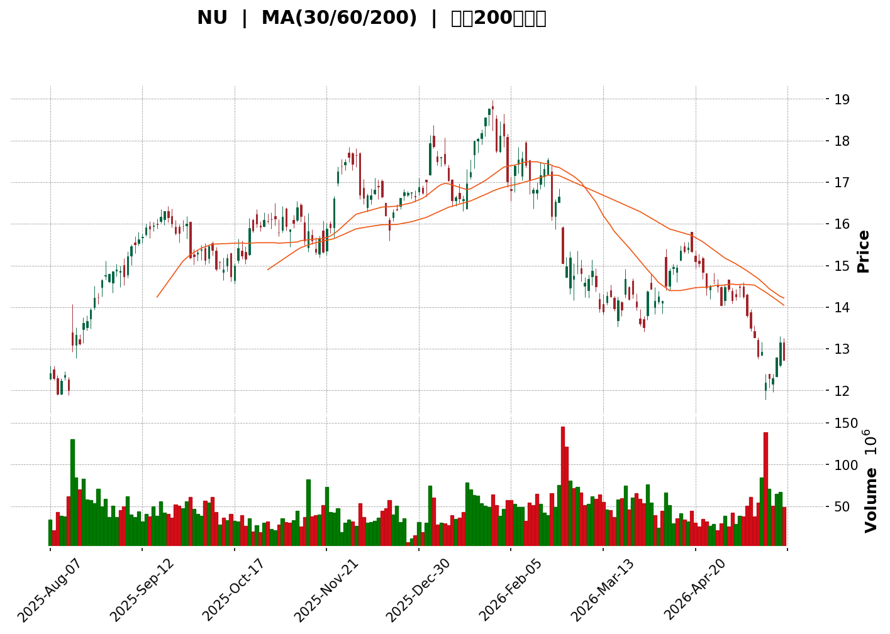
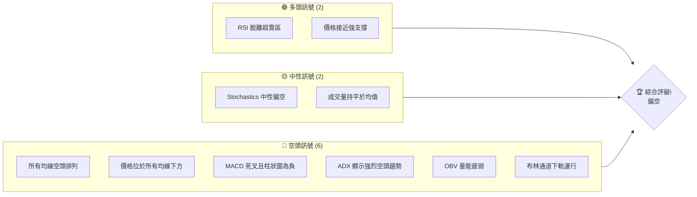
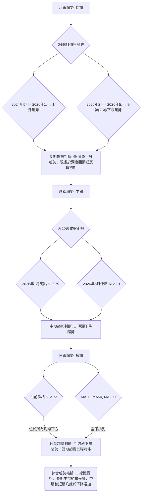
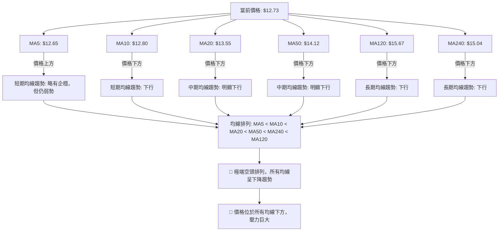

<details>
<summary>📊 靜態圖表 (點擊展開)</summary>

</details>

<html>
<head><meta charset="utf-8" /></head>
<body>
    <div>                        <script>window.PlotlyConfig = {MathJaxConfig: 'local'};</script>
        <script charset="utf-8" src="https://cdn.plot.ly/plotly-3.5.0.min.js" integrity="sha256-fHbNLP+GlIXN+efbQec78UkemUz3NJp7UmfGxC1tNxs=" crossorigin="anonymous"></script>                <div id="candlestick-chart" class="plotly-graph-div" style="height:500px; width:100%;"></div>            <script>                window.PLOTLYENV=window.PLOTLYENV || {};                                if (document.getElementById("candlestick-chart")) {                    Plotly.newPlot(                        "candlestick-chart",                        [{"close":{"dtype":"f8","bdata":"AAAAgOvRKEAAAACgmZkoQAAAAEAK1ydAAAAAQOF6KEAAAACgcL0oQAAAAMAeBShAAAAAQDMzKkAAAADA9agqQAAAAKBwPSpAAAAAoHA9K0AAAABAClcrQAAAAKBH4StAAAAAgMJ1LEAAAABA4XosQAAAACCuRy1AAAAAgD2KLUAAAACgmZktQAAAAOBRuC1AAAAAwMzMLUAAAACgcL0tQAAAAEDhei1AAAAA4KNwLkAAAAAghesuQAAAAMAeBS9AAAAAoHA9L0AAAACgR2EvQAAAAIDr0S9AAAAAIK7HL0AAAAAghesvQAAAAEDh+i9AAAAAIIUrMEAAAADAzEwwQAAAAGBmJjBAAAAAYI8CMEAAAAAgXI8vQAAAACBcjy9AAAAAYGbmL0AAAABgjwIwQAAAAKBHYS5AAAAA4KNwLkAAAABguJ4uQAAAAGCPwi5AAAAAYI9CLkAAAAAghesuQAAAAKBwvS5AAAAAQArXLUAAAADA9SguQAAAAIDr0S1AAAAAAClcLkAAAACAwnUtQAAAAAAAAC5AAAAAgOvRLkAAAABA4XouQAAAAIDrUS5AAAAAwMzML0AAAACAFK4vQAAAAAAAADBAAAAAACncL0AAAABAChcwQAAAACBcDzBAAAAAACkcMEAAAACgRyEwQAAAAKCZmS9AAAAAIIUrMEAAAACgR+EvQAAAAKBwvS9AAAAAwB4FMEAAAAAA12MwQAAAAIAULjBAAAAAgBQuL0AAAAAA16MvQAAAAEAzMy9AAAAAANejLkAAAACA61EvQAAAAADXoy5AAAAAIK7HL0AAAABACtcvQAAAAAApnDBAAAAAAABAMUAAAAAA12MxQAAAAEDhejFAAAAAACmcMUAAAADgo3AxQAAAAGBmpjFAAAAAQDOzMEAAAABguJ4wQAAAAIAUrjBAAAAA4KOwMEAAAACA69EwQAAAAGBm5jBAAAAAYGamMEAAAABAMzMwQAAAAOBRuC9AAAAAwB5FMEAAAABAClcwQAAAAGC4njBAAAAAYI\u002fCMEAAAACgcL0wQAAAAGCPwjBAAAAAwPWoMEAAAACgR+EwQAAAAKBwvTBAAAAAwB4FMUAAAADgo\u002fAxQAAAAAAp3DFAAAAAAACAMUAAAAAAKZwxQAAAAIDCdTFAAAAAgD0KMUAAAAAgXI8wQAAAAADXozBAAAAAACmcMEAAAACgmZkwQAAAAOBR+DBAAAAAoHA9MUAAAAAAAAAyQAAAAIA9CjJAAAAAgBQuMkAAAADAzIwyQAAAAGCPwjJAAAAAYI\u002fCMkAAAAAAAMAxQAAAAAApHDJAAAAAYLgeMkAAAADAHgUxQAAAACBczzBAAAAAYGZmMUAAAADAzIwxQAAAAIDrkTFAAAAAwPVoMUAAAACAPQoxQAAAAIDr0TBAAAAAgOvRMEAAAAAghSsxQAAAAIDrUTFAAAAAIK6HMUAAAADgozAwQAAAACCuhzBAAAAAYGamMEAAAABguB4uQAAAAIDC9S1AAAAAoEdhLkAAAADAHoUtQAAAAAAAAC5AAAAAANejLUAAAADA9SgtQAAAAEAKVy1AAAAAYI\u002fCLUAAAABA4fosQAAAAOCj8CtAAAAAIK7HK0AAAACAPYosQAAAAAAAgCxAAAAA4KPwK0AAAACA61EsQAAAAKBH4StAAAAAAClcLUAAAACgR2EsQAAAAADXoyxAAAAAgD0KLEAAAABAMzMrQAAAAMAeBStAAAAAoHC9LEAAAACgR+EsQAAAAMDMTCxAAAAAwB6FLEAAAADAzEwsQAAAAMAeBS1AAAAAoHC9LUAAAAAghestQAAAAGBm5i1AAAAAQDOzLkAAAACAFK4uQAAAAAAp3C5AAAAAgBSuLkAAAABAMzMuQAAAAKCZGS5AAAAAQDOzLUAAAAAghessQAAAAMAeBS1AAAAAIK5HLUAAAAAAAAAtQAAAAOB6FCxAAAAAgML1LEAAAACgR+EsQAAAAIDrUSxAAAAAAACALEAAAACAwvUsQAAAAMAehSxAAAAAoJmZK0AAAAAAAAArQAAAAIA9iipAAAAAANejKUAAAAAAKdwpQAAAAKBHYShAAAAA4HqUKEAAAADgepQoQAAAAOB6lClAAAAAgOtRKkAAAACAwnUpQA=="},"high":{"dtype":"f8","bdata":"AAAAQDMzKUAAAACAFC4pQAAAAKBwvShAAAAA4HqUKEAAAAAghesoQAAAAADXoyhAAAAAANcjLEAAAADAHgUrQAAAAIDCtSpAAAAAAACAK0AAAACgmZkrQAAAAIDC9StAAAAAYI8CLUAAAABAM7MsQAAAAEAKVy1AAAAAQOE6LkAAAAAA16MtQAAAAKBwvS1AAAAAgOsRLkAAAACgcP0tQAAAAKCZWS5AAAAA4KOwLkAAAADAHgUvQAAAACCFay9AAAAAoEehL0AAAACAPYovQAAAAKBHATBAAAAAgOsRMEAAAADAzAwwQAAAAKBHITBAAAAAoJlZMEAAAADAzEwwQAAAAMDMbDBAAAAAYLheMEAAAADgURgwQAAAAKBw\u002fS9AAAAAoJkZMEAAAADgozAwQAAAAMDMDDBAAAAAwMzMLkAAAAAAAMAuQAAAAEDh+i5AAAAA4HoUL0AAAAAAAAAvQAAAAMD1KC9AAAAAYGbmLkAAAACgcD0uQAAAAKBHYS5AAAAAAFaOLkAAAABguJ4uQAAAAGC4Hi5AAAAAIK5HL0AAAACAFC4vQAAAACCF6y5AAAAAANcjMEAAAACgRyEwQAAAAKCZWTBAAAAAgOsRMEAAAADAHkUwQAAAAKBwPTBAAAAAwB5FMEAAAAAAAIAwQAAAAKBwHTBAAAAAIIVrMEAAAABgZmYwQAAAAAAAwC9AAAAA4FE4MEAAAADAzIwwQAAAAAAAgDBAAAAAgOsxMEAAAABgj0IwQAAAAKBwvS9AAAAAoJlZL0AAAADgo3AvQAAAAEAzEzBAAAAAwB4FMEAAAAAgXA8wQAAAAMDMrDBAAAAAoEdhMUAAAACAFI4xQAAAACBcjzFAAAAAQArXMUAAAADgUbgxQAAAAOCj0DFAAAAAQOG6MUAAAABAMxMxQAAAAEDhujBAAAAAoJnZMEAAAAAAKRwxQAAAACBcDzFAAAAAgOsRMUAAAADAHoUwQAAAAMD1KDBAAAAA4CJbMEAAAADgUXgwQAAAAKBHoTBAAAAA4HrUMEAAAADA9cgwQAAAAGCPwjBAAAAAIFzPMEAAAABA4RoxQAAAAMDM7DBAAAAAIFwPMUAAAACAlSMyQAAAAGC4XjJAAAAAYI\u002fCMUAAAACAvp8xQAAAAIDrETJAAAAAIIVrMUAAAACA6xExQAAAAOCjsDBAAAAA4FH4MEAAAABgDq0wQAAAAOCjUDFAAAAAgD2KMUAAAAAAAAAyQAAAAOCjEDJAAAAAYI9CMkAAAAAgXI8yQAAAAMD1yDJAAAAAQOH6MkAAAABguJ4yQAAAAEAKdzJAAAAAYGamMkAAAACAPSoyQAAAAGCPIjFAAAAAIIVrMUAAAABACtcxQAAAAAApvDFAAAAAoHD9MUAAAADAzIwxQAAAAKBH4TBAAAAAAAAAMUAAAABA4XoxQAAAAOCjcDFAAAAAQAqXMUAAAADA9WgxQAAAAEAKlzBAAAAAoJnZMEAAAACgR+EvQAAAAGBmZi5AAAAAQIusLkAAAABguB4uQAAAAIDCtS5AAAAAwMxMLkAAAABAM3MtQAAAAIDrkS1AAAAAgD1KLkAAAACgR+EtQAAAAEAzsyxAAAAAYLieLEAAAACgcL0sQAAAAOB6FC1AAAAAwMyMLEAAAAAAAIAsQAAAAMDMTCxAAAAAQArXLUAAAADAHgUtQAAAAKBHYS1AAAAAYGamLEAAAABgZuYrQAAAAIDrkStAAAAAgOvRLEAAAACgmZktQAAAAIDC9SxAAAAAIK7HLEAAAACA61EsQAAAAMBJzC5AAAAAACncLUAAAADgehQuQAAAACBcDy5AAAAA4KPwLkAAAABguB4vQAAAAKBHIS9AAAAAYLieL0AAAABAM7MuQAAAACBcjy5AAAAA4KNwLkAAAAAA16MtQAAAAOB6FC1AAAAAIIWrLUAAAABAClctQAAAAMAeBS1AAAAAYLgeLUAAAACA61EtQAAAAOCj8CxAAAAAoEfhLEAAAACgmRktQAAAAEAzMy1AAAAAwPWoLEAAAADA9egrQAAAAAApHCtAAAAAgD2KKkAAAABAClcqQAAAACBczyhAAAAAwMzMKEAAAADAzMwoQAAAAKCZmSlAAAAAoJmZKkAAAADAHoUqQA=="},"hovertemplate":"\u003cb\u003e%{x|%Y-%m-%d}\u003c\u002fb\u003e\u003cbr\u003e\u958b: $%{open:.2f}\u003cbr\u003e\u9ad8: $%{high:.2f}\u003cbr\u003e\u4f4e: $%{low:.2f}\u003cbr\u003e\u6536: $%{close:.2f}\u003cextra\u003e\u003c\u002fextra\u003e","low":{"dtype":"f8","bdata":"AAAAgD2KKEAAAAAAAIAoQAAAACCuxydAAAAAgD3KJ0AAAAAAAIAoQAAAACCuxydAAAAAQArXKUAAAACAPYopQAAAAEAzMypAAAAAIK5HKkAAAACgR+EqQAAAAEDh+ipAAAAAYLjeK0AAAAAgWiQsQAAAAGCPgixAAAAAgOtRLUAAAACAFC4tQAAAAIAUrixAAAAAgMJ1LUAAAACAwvUsQAAAAIA9Ci1AAAAAIIVrLUAAAABgjwIuQAAAAKCZmS5AAAAAgML1LkAAAADgehQvQAAAAMD1aC9AAAAAgOtRL0AAAABgZqYvQAAAAMAexS9AAAAAwB4FMEAAAACAwvUvQAAAACCuBzBAAAAAoPHSL0AAAACAwnUvQAAAAKCZGS9AAAAAwPWoL0AAAADAzEwvQAAAAIDrUS5AAAAAgD0KLkAAAADgUTguQAAAAAAAQC5AAAAAgD0KLkAAAACgmRkuQAAAAIDCdS5AAAAAYI\u002fCLUAAAABACtctQAAAACCuRy1AAAAA4FG4LUAAAABAXjotQAAAAGC4Hi1AAAAAYLgeLkAAAAAgXE8uQAAAAIDrES5AAAAAgMJ1LkAAAAAgBJYvQAAAAEAK1y9AAAAAANejL0AAAAAAKdwvQAAAAADXAzBAAAAAYI\u002fCL0AAAACAFO4vQAAAAGBmZi9AAAAA4HqUL0AAAACAFK4vQAAAAGBm5i5AAAAAwMzML0AAAADAzAwwQAAAACCFCzBAAAAA4FH4LkAAAAAA16MuQAAAAAAAAC9AAAAAwB6FLkAAAACgR2EuQAAAAKCZmS5AAAAAYI+CLkAAAAAgXI8vQAAAAAApXC9AAAAAwPXoMEAAAABAMzMxQAAAACCuRzFAAAAAQOF6MUAAAACAPUoxQAAAAAApXDFAAAAAoJmZMEAAAADgUXgwQAAAAAACSzBAAAAAQAp3MEAAAABAM7MwQAAAAKCZmTBAAAAAoEehMEAAAACAFC4wQAAAAIAULi9AAAAAwCAQMEAAAABAYlAwQAAAAKCZWTBAAAAAIFyPMEAAAABgZqYwQAAAAAApnDBAAAAAgD2KMEAAAACAFK4wQAAAAIDCtTBAAAAAYGamMEAAAACAPSoxQAAAACBczzFAAAAAIK5nMUAAAABguF4xQAAAAADXYzFAAAAAwB4FMUAAAACAPWowQAAAAMDMbDBAAAAAgEGAMEAAAACAFE4wQAAAAKCZWTBAAAAAgOsRMUAAAADgelQxQAAAAIDCtTFAAAAAYGbmMUAAAACgmRkyQAAAAAApXDJAAAAAoHA9MkAAAACAwrUxQAAAAIDCtTFAAAAAQArXMUAAAAAAAOAwQAAAAMDMjDBAAAAAYI\u002fCMEAAAABACjcxQAAAAIA9CjFAAAAAoJlZMUAAAACAwrUwQAAAAGC4XjBAAAAAQAqXMEAAAABACtcwQAAAAMAe5TBAAAAAIIUrMUAAAADgehQwQAAAAKBwvS9AAAAAANeDMEAAAADgehQuQAAAAGBmZi1AAAAAYLieLEAAAABAClcsQAAAAKCZmS1AAAAA4FE4LUAAAADgUXgsQAAAAIDCdSxAAAAAIFwPLUAAAABgj8IsQAAAAGCPwitAAAAAoEehK0AAAABguB4sQAAAAOBReCxAAAAA4HrUK0AAAAAgXA8rQAAAAOB6lCtAAAAA4KNwLEAAAACA61EsQAAAACCFayxAAAAAACncK0AAAADgehQrQAAAAIDr0SpAAAAAYGZmK0AAAAAAKdwsQAAAAAACqytAAAAAwPUoLEAAAACAFK4rQAAAAIDr0SxAAAAAwMzMLEAAAAAgXI8tQAAAAEAzMy1AAAAAoHA9LkAAAACgmZkuQAAAAOB6lC5AAAAAYLieLkAAAAAAKdwtQAAAAOCj8C1AAAAAQApXLUAAAACA65EsQAAAAKBHYSxAAAAAoJkZLUAAAACAwrUsQAAAAOB6FCxAAAAAoJkZLEAAAABgj8IsQAAAAIAULixAAAAAQApXLEAAAACgcH0sQAAAAMD1aCxAAAAAAACAK0AAAABACtcqQAAAAMAehSpAAAAAIK6HKUAAAACAFK4pQAAAACBcjydAAAAAYLgeKEAAAAAghesnQAAAAMD1qChAAAAAYLgeKUAAAAAghWspQA=="},"name":"\u50f9\u683c","open":{"dtype":"f8","bdata":"AAAAIFyPKEAAAAAAAAApQAAAAKCZmShAAAAAQArXJ0AAAADA9agoQAAAAIA9iihAAAAAwMzMKkAAAABAMzMqQAAAAIDCdSpAAAAAgBTuKkAAAACAPQorQAAAAOCjcCtAAAAAAAAALEAAAABA4XosQAAAAIDC9SxAAAAAAACALUAAAADgUTgtQAAAAMD1KC1AAAAAoHC9LUAAAACAFK4tQAAAAMAeBS5AAAAAIFyPLUAAAACAwnUuQAAAAKCZGS9AAAAAIFwPL0AAAAAAKVwvQAAAAAAAgC9AAAAAoEfhL0AAAABgZuYvQAAAAGCPAjBAAAAAgOsRMEAAAAAAKRwwQAAAAMDMTDBAAAAAgBQuMEAAAAAAKdwvQAAAAAAp3C9AAAAAYGbmL0AAAAAghesvQAAAAMDMDDBAAAAAgD2KLkAAAAAgXI8uQAAAAKBwvS5AAAAAgOvRLkAAAAAAKVwuQAAAACBcDy9AAAAA4FG4LkAAAADA9SguQAAAAEAzsy1AAAAAAAAALkAAAADgepQuQAAAACCuRy1AAAAAYI9CLkAAAABAM7MuQAAAAADXoy5AAAAAwB6FLkAAAABAChcwQAAAAEDhOjBAAAAAIIXrL0AAAABgZuYvQAAAAIDrETBAAAAAACkcMEAAAADgozAwQAAAAKCZmS9AAAAA4FG4L0AAAABguF4wQAAAAADXoy9AAAAAoJkZMEAAAABAChcwQAAAAIDCdTBAAAAAgD0KMEAAAAAAKdwuQAAAAOBReC9AAAAAwMzMLkAAAADAzIwuQAAAAIAUri9AAAAAgMK1LkAAAAAAAAAwQAAAAEAK1y9AAAAAQOH6MEAAAAAA12MxQAAAAIAUbjFAAAAAgMK1MUAAAABAM7MxQAAAAGBmpjFAAAAAQDOzMUAAAABguN4wQAAAAMAeZTBAAAAAoJmZMEAAAABA4bowQAAAACCu5zBAAAAAYGYGMUAAAAAAAIAwQAAAAEAKFzBAAAAAYGYmMEAAAACgmVkwQAAAACCFazBAAAAA4KOwMEAAAABAM7MwQAAAAKBwvTBAAAAAgD2qMEAAAADAHsUwQAAAAGC43jBAAAAAIFwPMUAAAACAFC4xQAAAAGC4HjJAAAAAYLieMUAAAABACpcxQAAAAIAUrjFAAAAAoJlZMUAAAAAgXA8xQAAAAOCjkDBAAAAAAADAMEAAAACA65EwQAAAAAApXDBAAAAAYI8iMUAAAACAPaoxQAAAAAAAADJAAAAAwMwMMkAAAAAAKVwyQAAAAGCPojJAAAAA4HrUMkAAAAAgrocyQAAAAKBwvTFAAAAAIK5nMkAAAADgehQyQAAAAOB61DBAAAAAIIUrMUAAAADgo3AxQAAAAGBmJjFAAAAAgOvxMUAAAADA9YgxQAAAAKBwvTBAAAAAAADAMEAAAABAM\u002fMwQAAAAADXIzFAAAAAQDMzMUAAAAAAAEAxQAAAAOCjMDBAAAAAANeDMEAAAABACtcvQAAAAOCjcC1AAAAAIIXrLEAAAAAAKVwtQAAAAKBw\u002fS1AAAAAACncLUAAAABgjwItQAAAAIDr0SxAAAAAQOF6LUAAAAAAAIAtQAAAAGBmZixAAAAAANcjLEAAAACgcD0sQAAAAMDMzCxAAAAA4KNwLEAAAAAAKVwrQAAAAKBwPSxAAAAAoEehLEAAAADgUfgsQAAAAGCPQi1AAAAAYI9CLEAAAACAwnUrQAAAACCFaytAAAAAoJmZK0AAAACAFC4tQAAAAAAAACxAAAAAYI9CLEAAAABAMzMsQAAAACCFay5AAAAAwB4FLUAAAAAAKdwtQAAAAIAUri1AAAAAYI9CLkAAAAAghesuQAAAACCuxy5AAAAAYLieL0AAAABA4XouQAAAAOBROC5AAAAAAClcLkAAAABguJ4tQAAAAEAK1yxAAAAAIK5HLUAAAADgehQtQAAAAIDC9SxAAAAA4HpULEAAAACA61EtQAAAACCuxyxAAAAAANejLEAAAAAAAAAtQAAAAAAAAC1AAAAAoJmZLEAAAABgj8IrQAAAAEAK1ypAAAAAIIVrKkAAAABAM7MpQAAAAECJAShAAAAAwMzMKEAAAADgelQoQAAAAIAUrihAAAAA4FE4KUAAAADAzEwqQA=="},"x":["2025-08-07T00:00:00-04:00","2025-08-08T00:00:00-04:00","2025-08-11T00:00:00-04:00","2025-08-12T00:00:00-04:00","2025-08-13T00:00:00-04:00","2025-08-14T00:00:00-04:00","2025-08-15T00:00:00-04:00","2025-08-18T00:00:00-04:00","2025-08-19T00:00:00-04:00","2025-08-20T00:00:00-04:00","2025-08-21T00:00:00-04:00","2025-08-22T00:00:00-04:00","2025-08-25T00:00:00-04:00","2025-08-26T00:00:00-04:00","2025-08-27T00:00:00-04:00","2025-08-28T00:00:00-04:00","2025-08-29T00:00:00-04:00","2025-09-02T00:00:00-04:00","2025-09-03T00:00:00-04:00","2025-09-04T00:00:00-04:00","2025-09-05T00:00:00-04:00","2025-09-08T00:00:00-04:00","2025-09-09T00:00:00-04:00","2025-09-10T00:00:00-04:00","2025-09-11T00:00:00-04:00","2025-09-12T00:00:00-04:00","2025-09-15T00:00:00-04:00","2025-09-16T00:00:00-04:00","2025-09-17T00:00:00-04:00","2025-09-18T00:00:00-04:00","2025-09-19T00:00:00-04:00","2025-09-22T00:00:00-04:00","2025-09-23T00:00:00-04:00","2025-09-24T00:00:00-04:00","2025-09-25T00:00:00-04:00","2025-09-26T00:00:00-04:00","2025-09-29T00:00:00-04:00","2025-09-30T00:00:00-04:00","2025-10-01T00:00:00-04:00","2025-10-02T00:00:00-04:00","2025-10-03T00:00:00-04:00","2025-10-06T00:00:00-04:00","2025-10-07T00:00:00-04:00","2025-10-08T00:00:00-04:00","2025-10-09T00:00:00-04:00","2025-10-10T00:00:00-04:00","2025-10-13T00:00:00-04:00","2025-10-14T00:00:00-04:00","2025-10-15T00:00:00-04:00","2025-10-16T00:00:00-04:00","2025-10-17T00:00:00-04:00","2025-10-20T00:00:00-04:00","2025-10-21T00:00:00-04:00","2025-10-22T00:00:00-04:00","2025-10-23T00:00:00-04:00","2025-10-24T00:00:00-04:00","2025-10-27T00:00:00-04:00","2025-10-28T00:00:00-04:00","2025-10-29T00:00:00-04:00","2025-10-30T00:00:00-04:00","2025-10-31T00:00:00-04:00","2025-11-03T00:00:00-05:00","2025-11-04T00:00:00-05:00","2025-11-05T00:00:00-05:00","2025-11-06T00:00:00-05:00","2025-11-07T00:00:00-05:00","2025-11-10T00:00:00-05:00","2025-11-11T00:00:00-05:00","2025-11-12T00:00:00-05:00","2025-11-13T00:00:00-05:00","2025-11-14T00:00:00-05:00","2025-11-17T00:00:00-05:00","2025-11-18T00:00:00-05:00","2025-11-19T00:00:00-05:00","2025-11-20T00:00:00-05:00","2025-11-21T00:00:00-05:00","2025-11-24T00:00:00-05:00","2025-11-25T00:00:00-05:00","2025-11-26T00:00:00-05:00","2025-11-28T00:00:00-05:00","2025-12-01T00:00:00-05:00","2025-12-02T00:00:00-05:00","2025-12-03T00:00:00-05:00","2025-12-04T00:00:00-05:00","2025-12-05T00:00:00-05:00","2025-12-08T00:00:00-05:00","2025-12-09T00:00:00-05:00","2025-12-10T00:00:00-05:00","2025-12-11T00:00:00-05:00","2025-12-12T00:00:00-05:00","2025-12-15T00:00:00-05:00","2025-12-16T00:00:00-05:00","2025-12-17T00:00:00-05:00","2025-12-18T00:00:00-05:00","2025-12-19T00:00:00-05:00","2025-12-22T00:00:00-05:00","2025-12-23T00:00:00-05:00","2025-12-24T00:00:00-05:00","2025-12-26T00:00:00-05:00","2025-12-29T00:00:00-05:00","2025-12-30T00:00:00-05:00","2025-12-31T00:00:00-05:00","2026-01-02T00:00:00-05:00","2026-01-05T00:00:00-05:00","2026-01-06T00:00:00-05:00","2026-01-07T00:00:00-05:00","2026-01-08T00:00:00-05:00","2026-01-09T00:00:00-05:00","2026-01-12T00:00:00-05:00","2026-01-13T00:00:00-05:00","2026-01-14T00:00:00-05:00","2026-01-15T00:00:00-05:00","2026-01-16T00:00:00-05:00","2026-01-20T00:00:00-05:00","2026-01-21T00:00:00-05:00","2026-01-22T00:00:00-05:00","2026-01-23T00:00:00-05:00","2026-01-26T00:00:00-05:00","2026-01-27T00:00:00-05:00","2026-01-28T00:00:00-05:00","2026-01-29T00:00:00-05:00","2026-01-30T00:00:00-05:00","2026-02-02T00:00:00-05:00","2026-02-03T00:00:00-05:00","2026-02-04T00:00:00-05:00","2026-02-05T00:00:00-05:00","2026-02-06T00:00:00-05:00","2026-02-09T00:00:00-05:00","2026-02-10T00:00:00-05:00","2026-02-11T00:00:00-05:00","2026-02-12T00:00:00-05:00","2026-02-13T00:00:00-05:00","2026-02-17T00:00:00-05:00","2026-02-18T00:00:00-05:00","2026-02-19T00:00:00-05:00","2026-02-20T00:00:00-05:00","2026-02-23T00:00:00-05:00","2026-02-24T00:00:00-05:00","2026-02-25T00:00:00-05:00","2026-02-26T00:00:00-05:00","2026-02-27T00:00:00-05:00","2026-03-02T00:00:00-05:00","2026-03-03T00:00:00-05:00","2026-03-04T00:00:00-05:00","2026-03-05T00:00:00-05:00","2026-03-06T00:00:00-05:00","2026-03-09T00:00:00-04:00","2026-03-10T00:00:00-04:00","2026-03-11T00:00:00-04:00","2026-03-12T00:00:00-04:00","2026-03-13T00:00:00-04:00","2026-03-16T00:00:00-04:00","2026-03-17T00:00:00-04:00","2026-03-18T00:00:00-04:00","2026-03-19T00:00:00-04:00","2026-03-20T00:00:00-04:00","2026-03-23T00:00:00-04:00","2026-03-24T00:00:00-04:00","2026-03-25T00:00:00-04:00","2026-03-26T00:00:00-04:00","2026-03-27T00:00:00-04:00","2026-03-30T00:00:00-04:00","2026-03-31T00:00:00-04:00","2026-04-01T00:00:00-04:00","2026-04-02T00:00:00-04:00","2026-04-06T00:00:00-04:00","2026-04-07T00:00:00-04:00","2026-04-08T00:00:00-04:00","2026-04-09T00:00:00-04:00","2026-04-10T00:00:00-04:00","2026-04-13T00:00:00-04:00","2026-04-14T00:00:00-04:00","2026-04-15T00:00:00-04:00","2026-04-16T00:00:00-04:00","2026-04-17T00:00:00-04:00","2026-04-20T00:00:00-04:00","2026-04-21T00:00:00-04:00","2026-04-22T00:00:00-04:00","2026-04-23T00:00:00-04:00","2026-04-24T00:00:00-04:00","2026-04-27T00:00:00-04:00","2026-04-28T00:00:00-04:00","2026-04-29T00:00:00-04:00","2026-04-30T00:00:00-04:00","2026-05-01T00:00:00-04:00","2026-05-04T00:00:00-04:00","2026-05-05T00:00:00-04:00","2026-05-06T00:00:00-04:00","2026-05-07T00:00:00-04:00","2026-05-08T00:00:00-04:00","2026-05-11T00:00:00-04:00","2026-05-12T00:00:00-04:00","2026-05-13T00:00:00-04:00","2026-05-14T00:00:00-04:00","2026-05-15T00:00:00-04:00","2026-05-18T00:00:00-04:00","2026-05-19T00:00:00-04:00","2026-05-20T00:00:00-04:00","2026-05-21T00:00:00-04:00","2026-05-22T00:00:00-04:00"],"type":"candlestick"},{"hovertemplate":"MA30: $%{y:.2f}\u003cextra\u003e\u003c\u002fextra\u003e","line":{"color":"#2196F3","dash":"dash","width":2},"mode":"lines","name":"MA30","x":["2025-08-07T00:00:00-04:00","2025-08-08T00:00:00-04:00","2025-08-11T00:00:00-04:00","2025-08-12T00:00:00-04:00","2025-08-13T00:00:00-04:00","2025-08-14T00:00:00-04:00","2025-08-15T00:00:00-04:00","2025-08-18T00:00:00-04:00","2025-08-19T00:00:00-04:00","2025-08-20T00:00:00-04:00","2025-08-21T00:00:00-04:00","2025-08-22T00:00:00-04:00","2025-08-25T00:00:00-04:00","2025-08-26T00:00:00-04:00","2025-08-27T00:00:00-04:00","2025-08-28T00:00:00-04:00","2025-08-29T00:00:00-04:00","2025-09-02T00:00:00-04:00","2025-09-03T00:00:00-04:00","2025-09-04T00:00:00-04:00","2025-09-05T00:00:00-04:00","2025-09-08T00:00:00-04:00","2025-09-09T00:00:00-04:00","2025-09-10T00:00:00-04:00","2025-09-11T00:00:00-04:00","2025-09-12T00:00:00-04:00","2025-09-15T00:00:00-04:00","2025-09-16T00:00:00-04:00","2025-09-17T00:00:00-04:00","2025-09-18T00:00:00-04:00","2025-09-19T00:00:00-04:00","2025-09-22T00:00:00-04:00","2025-09-23T00:00:00-04:00","2025-09-24T00:00:00-04:00","2025-09-25T00:00:00-04:00","2025-09-26T00:00:00-04:00","2025-09-29T00:00:00-04:00","2025-09-30T00:00:00-04:00","2025-10-01T00:00:00-04:00","2025-10-02T00:00:00-04:00","2025-10-03T00:00:00-04:00","2025-10-06T00:00:00-04:00","2025-10-07T00:00:00-04:00","2025-10-08T00:00:00-04:00","2025-10-09T00:00:00-04:00","2025-10-10T00:00:00-04:00","2025-10-13T00:00:00-04:00","2025-10-14T00:00:00-04:00","2025-10-15T00:00:00-04:00","2025-10-16T00:00:00-04:00","2025-10-17T00:00:00-04:00","2025-10-20T00:00:00-04:00","2025-10-21T00:00:00-04:00","2025-10-22T00:00:00-04:00","2025-10-23T00:00:00-04:00","2025-10-24T00:00:00-04:00","2025-10-27T00:00:00-04:00","2025-10-28T00:00:00-04:00","2025-10-29T00:00:00-04:00","2025-10-30T00:00:00-04:00","2025-10-31T00:00:00-04:00","2025-11-03T00:00:00-05:00","2025-11-04T00:00:00-05:00","2025-11-05T00:00:00-05:00","2025-11-06T00:00:00-05:00","2025-11-07T00:00:00-05:00","2025-11-10T00:00:00-05:00","2025-11-11T00:00:00-05:00","2025-11-12T00:00:00-05:00","2025-11-13T00:00:00-05:00","2025-11-14T00:00:00-05:00","2025-11-17T00:00:00-05:00","2025-11-18T00:00:00-05:00","2025-11-19T00:00:00-05:00","2025-11-20T00:00:00-05:00","2025-11-21T00:00:00-05:00","2025-11-24T00:00:00-05:00","2025-11-25T00:00:00-05:00","2025-11-26T00:00:00-05:00","2025-11-28T00:00:00-05:00","2025-12-01T00:00:00-05:00","2025-12-02T00:00:00-05:00","2025-12-03T00:00:00-05:00","2025-12-04T00:00:00-05:00","2025-12-05T00:00:00-05:00","2025-12-08T00:00:00-05:00","2025-12-09T00:00:00-05:00","2025-12-10T00:00:00-05:00","2025-12-11T00:00:00-05:00","2025-12-12T00:00:00-05:00","2025-12-15T00:00:00-05:00","2025-12-16T00:00:00-05:00","2025-12-17T00:00:00-05:00","2025-12-18T00:00:00-05:00","2025-12-19T00:00:00-05:00","2025-12-22T00:00:00-05:00","2025-12-23T00:00:00-05:00","2025-12-24T00:00:00-05:00","2025-12-26T00:00:00-05:00","2025-12-29T00:00:00-05:00","2025-12-30T00:00:00-05:00","2025-12-31T00:00:00-05:00","2026-01-02T00:00:00-05:00","2026-01-05T00:00:00-05:00","2026-01-06T00:00:00-05:00","2026-01-07T00:00:00-05:00","2026-01-08T00:00:00-05:00","2026-01-09T00:00:00-05:00","2026-01-12T00:00:00-05:00","2026-01-13T00:00:00-05:00","2026-01-14T00:00:00-05:00","2026-01-15T00:00:00-05:00","2026-01-16T00:00:00-05:00","2026-01-20T00:00:00-05:00","2026-01-21T00:00:00-05:00","2026-01-22T00:00:00-05:00","2026-01-23T00:00:00-05:00","2026-01-26T00:00:00-05:00","2026-01-27T00:00:00-05:00","2026-01-28T00:00:00-05:00","2026-01-29T00:00:00-05:00","2026-01-30T00:00:00-05:00","2026-02-02T00:00:00-05:00","2026-02-03T00:00:00-05:00","2026-02-04T00:00:00-05:00","2026-02-05T00:00:00-05:00","2026-02-06T00:00:00-05:00","2026-02-09T00:00:00-05:00","2026-02-10T00:00:00-05:00","2026-02-11T00:00:00-05:00","2026-02-12T00:00:00-05:00","2026-02-13T00:00:00-05:00","2026-02-17T00:00:00-05:00","2026-02-18T00:00:00-05:00","2026-02-19T00:00:00-05:00","2026-02-20T00:00:00-05:00","2026-02-23T00:00:00-05:00","2026-02-24T00:00:00-05:00","2026-02-25T00:00:00-05:00","2026-02-26T00:00:00-05:00","2026-02-27T00:00:00-05:00","2026-03-02T00:00:00-05:00","2026-03-03T00:00:00-05:00","2026-03-04T00:00:00-05:00","2026-03-05T00:00:00-05:00","2026-03-06T00:00:00-05:00","2026-03-09T00:00:00-04:00","2026-03-10T00:00:00-04:00","2026-03-11T00:00:00-04:00","2026-03-12T00:00:00-04:00","2026-03-13T00:00:00-04:00","2026-03-16T00:00:00-04:00","2026-03-17T00:00:00-04:00","2026-03-18T00:00:00-04:00","2026-03-19T00:00:00-04:00","2026-03-20T00:00:00-04:00","2026-03-23T00:00:00-04:00","2026-03-24T00:00:00-04:00","2026-03-25T00:00:00-04:00","2026-03-26T00:00:00-04:00","2026-03-27T00:00:00-04:00","2026-03-30T00:00:00-04:00","2026-03-31T00:00:00-04:00","2026-04-01T00:00:00-04:00","2026-04-02T00:00:00-04:00","2026-04-06T00:00:00-04:00","2026-04-07T00:00:00-04:00","2026-04-08T00:00:00-04:00","2026-04-09T00:00:00-04:00","2026-04-10T00:00:00-04:00","2026-04-13T00:00:00-04:00","2026-04-14T00:00:00-04:00","2026-04-15T00:00:00-04:00","2026-04-16T00:00:00-04:00","2026-04-17T00:00:00-04:00","2026-04-20T00:00:00-04:00","2026-04-21T00:00:00-04:00","2026-04-22T00:00:00-04:00","2026-04-23T00:00:00-04:00","2026-04-24T00:00:00-04:00","2026-04-27T00:00:00-04:00","2026-04-28T00:00:00-04:00","2026-04-29T00:00:00-04:00","2026-04-30T00:00:00-04:00","2026-05-01T00:00:00-04:00","2026-05-04T00:00:00-04:00","2026-05-05T00:00:00-04:00","2026-05-06T00:00:00-04:00","2026-05-07T00:00:00-04:00","2026-05-08T00:00:00-04:00","2026-05-11T00:00:00-04:00","2026-05-12T00:00:00-04:00","2026-05-13T00:00:00-04:00","2026-05-14T00:00:00-04:00","2026-05-15T00:00:00-04:00","2026-05-18T00:00:00-04:00","2026-05-19T00:00:00-04:00","2026-05-20T00:00:00-04:00","2026-05-21T00:00:00-04:00","2026-05-22T00:00:00-04:00"],"y":{"dtype":"f8","bdata":"AAAAAAAA+H8AAAAAAAD4fwAAAAAAAPh\u002fAAAAAAAA+H8AAAAAAAD4fwAAAAAAAPh\u002fAAAAAAAA+H8AAAAAAAD4fwAAAAAAAPh\u002fAAAAAAAA+H8AAAAAAAD4fwAAAAAAAPh\u002fAAAAAAAA+H8AAAAAAAD4fwAAAAAAAPh\u002fAAAAAAAA+H8AAAAAAAD4fwAAAAAAAPh\u002fAAAAAAAA+H8AAAAAAAD4fwAAAAAAAPh\u002fAAAAAAAA+H8AAAAAAAD4fwAAAAAAAPh\u002fAAAAAAAA+H8AAAAAAAD4fwAAAAAAAPh\u002fAAAAAAAA+H8AAAAAAAD4fxEREUEZfSxAIiIi8kS9LEBVVVU1iQEtQLy7u1u6SS1A3t3dvRGKLUAiIiJCRMQtQDMzM6ObBC5AmpmZeT81LkAzMzOT\u002fGIuQKuqqopQhi5AzczMDJ+hLkAiIiJSnL0uQHd3d8cv1i5AERER8YvlLkBEREQ0XvouQO\u002fu7p7TBi9Aq6qq+mIJL0ARERFRKg4vQFVVVcUEDy9AzczMHMwTL0ARERFxaBEvQGZmZmbYFS9AVVVVhRYZL0AzMzNTVRUvQGZmZiZcDy9AzczMfCMUL0CamZnZshYvQBERERE8GC9ARERE1OoYL0Dv7u7OIhsvQERERKRUHC9AAAAAgE4bL0AiIiLCZxgvQGZmZpZuEi9AMzMzoykVL0AAAACw5BcvQHd3d+dtGS9A3t3dvZ8aL0C8u7v7GyEvQM3MzFwBMi9Aq6qq6lE4L0AzMzMjBkEvQFVVVVXHRC9AREREdAVIL0BEREREb0svQAAAANCUSi9A7+7uziJbL0AzMzPTeGkvQN7d3T18hi9AVVVVNdCpL0DNzMzsNdcvQKuqqprEADBARERElIoTMEDe3d2NUCYwQKuqqgqQOzBAvLu7q2NCMEC8u7ubC0kwQHd3dxfZTjBAZmZmVlVVMEC8u7sLkFswQN7d3Q27YjBAMzMzs1ZnMEDv7u6e72cwQBEREbFyaDBAVVVVJU1pMEDe3d31tmwwQM3MzFwdczBAq6qq6m15MEARERGBanwwQImIiIhdgTBAvLu7+36KMEBmZmaWipMwQERERPREnTBAmpmZqcarMEBmZmZmO78wQN7d3R3o1DBA7+7uNqXiMEC8u7sTEfEwQFVVVe1R+DBAVVVVLYf2MEC8u7sDcu8wQJqZmQFH6DBAEREReb7fMEDv7u52k9gwQDMzM\u002fvF0jBAiYiIoGHXMEAAAABIKOMwQHd3dz\u002fD7jBAvLu7M3r7MECamZlxPQoxQFVVVa0cGjFAMzMzCx4sMUCamZkRWDkxQFVVVUWLTDFAiYiIqFRcMUBEREQkImIxQDMzMzPBYzFAzczMTDdpMUBVVVXFIHAxQN7d3T0KdzFAREREpHB9MUC8u7srzn4xQO\u002fu7u58fzFAZmZmBsh9MUDv7u7uNXcxQImIiEiacjFAIiIi0ttyMUCJiIjIvWYxQLy7uyvOXjFAMzMzM3pbMUDv7u5mrU4xQLy7uxODQDFAmpmZCWU0MUDv7u5+sSQxQHd3d\u002ffhEzFAVVVVZTv\u002fMECrqqpKDOIwQJqZmWlKxTBAvLu7cyGpMEB3d3c\u002ffIYwQFVVVVWcXTBAAAAAqA00MEAzMzN7WxYwQM3MzFzW6i9AvLu7uwKkL0AzMzMzM3MvQKuqqvo3Qi9A7+7uHswTL0Dv7u4OdNouQHd3d5f8oi5AVVVVdSFpLkDe3d3day4uQCIiIkLu9S1AvLu7Cx7MLUDe3d19hp0tQM3MzIxsZy1AMzMzs50vLUDNzMzMzAwtQImIiEhT6ixAiYiIWPLLLEAAAABwPcosQN7d3V26ySxAvLu7a3XMLECrqqp6W9YsQN7d3S2y3SxAiYiIGJLmLEAzMzMDcu8sQCIiIkLu9SxAAAAAMGv1LEDe3d0d6PQsQJqZmWkf\u002fixAZmZmNuwKLUCJiIgY2Q4tQHd3d5dDCy1AAAAA0PcTLUBmZmYmvxgtQImIiFiAHC1AVVVVpSkVLUDNzMysHBotQImIiIgWGS1AZmZmVlUVLUDe3d1toBMtQKuqqtqHDy1AzczMzBP1LEAzMzODTtssQERERCTbuSxAREREFDyYLEDe3d2dfXgsQCIiItIiWyxAd3d3t\u002fM9LEAiIiKy5BcsQA=="},"type":"scatter"},{"hovertemplate":"MA60: $%{y:.2f}\u003cextra\u003e\u003c\u002fextra\u003e","line":{"color":"#9C27B0","dash":"dash","width":2},"mode":"lines","name":"MA60","x":["2025-08-07T00:00:00-04:00","2025-08-08T00:00:00-04:00","2025-08-11T00:00:00-04:00","2025-08-12T00:00:00-04:00","2025-08-13T00:00:00-04:00","2025-08-14T00:00:00-04:00","2025-08-15T00:00:00-04:00","2025-08-18T00:00:00-04:00","2025-08-19T00:00:00-04:00","2025-08-20T00:00:00-04:00","2025-08-21T00:00:00-04:00","2025-08-22T00:00:00-04:00","2025-08-25T00:00:00-04:00","2025-08-26T00:00:00-04:00","2025-08-27T00:00:00-04:00","2025-08-28T00:00:00-04:00","2025-08-29T00:00:00-04:00","2025-09-02T00:00:00-04:00","2025-09-03T00:00:00-04:00","2025-09-04T00:00:00-04:00","2025-09-05T00:00:00-04:00","2025-09-08T00:00:00-04:00","2025-09-09T00:00:00-04:00","2025-09-10T00:00:00-04:00","2025-09-11T00:00:00-04:00","2025-09-12T00:00:00-04:00","2025-09-15T00:00:00-04:00","2025-09-16T00:00:00-04:00","2025-09-17T00:00:00-04:00","2025-09-18T00:00:00-04:00","2025-09-19T00:00:00-04:00","2025-09-22T00:00:00-04:00","2025-09-23T00:00:00-04:00","2025-09-24T00:00:00-04:00","2025-09-25T00:00:00-04:00","2025-09-26T00:00:00-04:00","2025-09-29T00:00:00-04:00","2025-09-30T00:00:00-04:00","2025-10-01T00:00:00-04:00","2025-10-02T00:00:00-04:00","2025-10-03T00:00:00-04:00","2025-10-06T00:00:00-04:00","2025-10-07T00:00:00-04:00","2025-10-08T00:00:00-04:00","2025-10-09T00:00:00-04:00","2025-10-10T00:00:00-04:00","2025-10-13T00:00:00-04:00","2025-10-14T00:00:00-04:00","2025-10-15T00:00:00-04:00","2025-10-16T00:00:00-04:00","2025-10-17T00:00:00-04:00","2025-10-20T00:00:00-04:00","2025-10-21T00:00:00-04:00","2025-10-22T00:00:00-04:00","2025-10-23T00:00:00-04:00","2025-10-24T00:00:00-04:00","2025-10-27T00:00:00-04:00","2025-10-28T00:00:00-04:00","2025-10-29T00:00:00-04:00","2025-10-30T00:00:00-04:00","2025-10-31T00:00:00-04:00","2025-11-03T00:00:00-05:00","2025-11-04T00:00:00-05:00","2025-11-05T00:00:00-05:00","2025-11-06T00:00:00-05:00","2025-11-07T00:00:00-05:00","2025-11-10T00:00:00-05:00","2025-11-11T00:00:00-05:00","2025-11-12T00:00:00-05:00","2025-11-13T00:00:00-05:00","2025-11-14T00:00:00-05:00","2025-11-17T00:00:00-05:00","2025-11-18T00:00:00-05:00","2025-11-19T00:00:00-05:00","2025-11-20T00:00:00-05:00","2025-11-21T00:00:00-05:00","2025-11-24T00:00:00-05:00","2025-11-25T00:00:00-05:00","2025-11-26T00:00:00-05:00","2025-11-28T00:00:00-05:00","2025-12-01T00:00:00-05:00","2025-12-02T00:00:00-05:00","2025-12-03T00:00:00-05:00","2025-12-04T00:00:00-05:00","2025-12-05T00:00:00-05:00","2025-12-08T00:00:00-05:00","2025-12-09T00:00:00-05:00","2025-12-10T00:00:00-05:00","2025-12-11T00:00:00-05:00","2025-12-12T00:00:00-05:00","2025-12-15T00:00:00-05:00","2025-12-16T00:00:00-05:00","2025-12-17T00:00:00-05:00","2025-12-18T00:00:00-05:00","2025-12-19T00:00:00-05:00","2025-12-22T00:00:00-05:00","2025-12-23T00:00:00-05:00","2025-12-24T00:00:00-05:00","2025-12-26T00:00:00-05:00","2025-12-29T00:00:00-05:00","2025-12-30T00:00:00-05:00","2025-12-31T00:00:00-05:00","2026-01-02T00:00:00-05:00","2026-01-05T00:00:00-05:00","2026-01-06T00:00:00-05:00","2026-01-07T00:00:00-05:00","2026-01-08T00:00:00-05:00","2026-01-09T00:00:00-05:00","2026-01-12T00:00:00-05:00","2026-01-13T00:00:00-05:00","2026-01-14T00:00:00-05:00","2026-01-15T00:00:00-05:00","2026-01-16T00:00:00-05:00","2026-01-20T00:00:00-05:00","2026-01-21T00:00:00-05:00","2026-01-22T00:00:00-05:00","2026-01-23T00:00:00-05:00","2026-01-26T00:00:00-05:00","2026-01-27T00:00:00-05:00","2026-01-28T00:00:00-05:00","2026-01-29T00:00:00-05:00","2026-01-30T00:00:00-05:00","2026-02-02T00:00:00-05:00","2026-02-03T00:00:00-05:00","2026-02-04T00:00:00-05:00","2026-02-05T00:00:00-05:00","2026-02-06T00:00:00-05:00","2026-02-09T00:00:00-05:00","2026-02-10T00:00:00-05:00","2026-02-11T00:00:00-05:00","2026-02-12T00:00:00-05:00","2026-02-13T00:00:00-05:00","2026-02-17T00:00:00-05:00","2026-02-18T00:00:00-05:00","2026-02-19T00:00:00-05:00","2026-02-20T00:00:00-05:00","2026-02-23T00:00:00-05:00","2026-02-24T00:00:00-05:00","2026-02-25T00:00:00-05:00","2026-02-26T00:00:00-05:00","2026-02-27T00:00:00-05:00","2026-03-02T00:00:00-05:00","2026-03-03T00:00:00-05:00","2026-03-04T00:00:00-05:00","2026-03-05T00:00:00-05:00","2026-03-06T00:00:00-05:00","2026-03-09T00:00:00-04:00","2026-03-10T00:00:00-04:00","2026-03-11T00:00:00-04:00","2026-03-12T00:00:00-04:00","2026-03-13T00:00:00-04:00","2026-03-16T00:00:00-04:00","2026-03-17T00:00:00-04:00","2026-03-18T00:00:00-04:00","2026-03-19T00:00:00-04:00","2026-03-20T00:00:00-04:00","2026-03-23T00:00:00-04:00","2026-03-24T00:00:00-04:00","2026-03-25T00:00:00-04:00","2026-03-26T00:00:00-04:00","2026-03-27T00:00:00-04:00","2026-03-30T00:00:00-04:00","2026-03-31T00:00:00-04:00","2026-04-01T00:00:00-04:00","2026-04-02T00:00:00-04:00","2026-04-06T00:00:00-04:00","2026-04-07T00:00:00-04:00","2026-04-08T00:00:00-04:00","2026-04-09T00:00:00-04:00","2026-04-10T00:00:00-04:00","2026-04-13T00:00:00-04:00","2026-04-14T00:00:00-04:00","2026-04-15T00:00:00-04:00","2026-04-16T00:00:00-04:00","2026-04-17T00:00:00-04:00","2026-04-20T00:00:00-04:00","2026-04-21T00:00:00-04:00","2026-04-22T00:00:00-04:00","2026-04-23T00:00:00-04:00","2026-04-24T00:00:00-04:00","2026-04-27T00:00:00-04:00","2026-04-28T00:00:00-04:00","2026-04-29T00:00:00-04:00","2026-04-30T00:00:00-04:00","2026-05-01T00:00:00-04:00","2026-05-04T00:00:00-04:00","2026-05-05T00:00:00-04:00","2026-05-06T00:00:00-04:00","2026-05-07T00:00:00-04:00","2026-05-08T00:00:00-04:00","2026-05-11T00:00:00-04:00","2026-05-12T00:00:00-04:00","2026-05-13T00:00:00-04:00","2026-05-14T00:00:00-04:00","2026-05-15T00:00:00-04:00","2026-05-18T00:00:00-04:00","2026-05-19T00:00:00-04:00","2026-05-20T00:00:00-04:00","2026-05-21T00:00:00-04:00","2026-05-22T00:00:00-04:00"],"y":{"dtype":"f8","bdata":"AAAAAAAA+H8AAAAAAAD4fwAAAAAAAPh\u002fAAAAAAAA+H8AAAAAAAD4fwAAAAAAAPh\u002fAAAAAAAA+H8AAAAAAAD4fwAAAAAAAPh\u002fAAAAAAAA+H8AAAAAAAD4fwAAAAAAAPh\u002fAAAAAAAA+H8AAAAAAAD4fwAAAAAAAPh\u002fAAAAAAAA+H8AAAAAAAD4fwAAAAAAAPh\u002fAAAAAAAA+H8AAAAAAAD4fwAAAAAAAPh\u002fAAAAAAAA+H8AAAAAAAD4fwAAAAAAAPh\u002fAAAAAAAA+H8AAAAAAAD4fwAAAAAAAPh\u002fAAAAAAAA+H8AAAAAAAD4fwAAAAAAAPh\u002fAAAAAAAA+H8AAAAAAAD4fwAAAAAAAPh\u002fAAAAAAAA+H8AAAAAAAD4fwAAAAAAAPh\u002fAAAAAAAA+H8AAAAAAAD4fwAAAAAAAPh\u002fAAAAAAAA+H8AAAAAAAD4fwAAAAAAAPh\u002fAAAAAAAA+H8AAAAAAAD4fwAAAAAAAPh\u002fAAAAAAAA+H8AAAAAAAD4fwAAAAAAAPh\u002fAAAAAAAA+H8AAAAAAAD4fwAAAAAAAPh\u002fAAAAAAAA+H8AAAAAAAD4fwAAAAAAAPh\u002fAAAAAAAA+H8AAAAAAAD4fwAAAAAAAPh\u002fAAAAAAAA+H8AAAAAAAD4f6uqqvK2zC1AERERuUnsLUC8u7t7+AwuQBEREXkULi5AiYiIsJ1PLkARERF5FG4uQFVVVcUEjy5AvLu7m++nLkB3d3dHDMIuQLy7u\u002fMo3C5AvLu7e\u002fjsLkCrqqo6Uf8uQGZmZo57DS9Aq6qqssgWL0BERES85iIvQHd3dze0KC9AzczM5EIyL0AiIiKS0TsvQJqZmYHASi9AERERKc5eL0Dv7u4uT3QvQN7d3c2wiy9A7+7u1hWgL0B3d3c3+7AvQN7d3R0+wy9AIiIianXML0CJiIgIZdQvQAAAACD32i9AiYiIwMrhL0AzMzNzIekvQAAAAGDl8C9AMzMz8\u002f30L0AAAACAI\u002fQvQERERPyp8S9A7+7u9uHzL0De3d1NqfgvQImIiFDU\u002fy9AzczM5F4DMEB3d3c\u002ffAYwQHd3dxsvDTBAiYiI+FMTMEAAAADUBhowQHd3d0\u002fUHzBA3t3dseQnMEBERESEeTIwQO\u002fu7kIZPTBAMzMzTxtIMECrqqq+5lIwQCIiIgbIXTBAAAAApLdlMEARERF9hm0wQCIiIs6FdDBAq6qqhqR5MEBmZmYCcn8wQO\u002fu7gIrhzBAIiIipuKMMEDe3d3xGZYwQHd3dyvOnjBAERERxWeoMECrqqq+5rIwQJqZmd1rvjBAMzMzX7rJMEBERETYo9AwQDMzM\u002ft+2jBA7+7u5tDiMEARERGNbOcwQAAAAEhv6zBAvLu7m1LxMEAzMzOjRfYwQDMzM+Mz\u002fDBAAAAA0PcDMUARERFhLAkxQJqZmfFgDjFAAAAAWMcUMUCrqqqqOBsxQDMzMzPBIzFAiYiIhMAqMUAiIiJu5ysxQImIiAyQKzFAREREsAApMUBVVVW1Dx8xQKuqqgplFDFAVVVVwREKMUDv7u56ov4wQFVVVflT8zBA7+7ugk7rMEBVVVVJmuIwQImIiNQG2jBAvLu7003SMECJiIjYXMgwQFVVVYHcuzBAmpmZ2RWwMEBmZmbG2acwQN7d3Tn7oDBAMzMzAyuXMEDv7u7e3Y0wQERERJhugjBAIiIiro55MEBmZmZmrW4wQM3MzEREZDBAd3d3rwBZMEBVVVUNAkswQAAAAAg6PTBAIiIihusxMEDv7u6W\u002fCIwQHd3d0coEzBA3t3dVVUFMEDv7u4uJO0vQAAAAND30y9Ad3d3X3PBL0Dv7u4ezLMvQKuqqkJgpS9Ad3d3v5+aL0BEREQ8348vQGZmZg67gi9AmpmZcYRyL0BERERMxVkvQKuqqopBQC9AvLu7C9cjL0BmZmZO8AAvQCIiIgqs3C5AMzMzw4O5LkB3d3cHyJ0uQCIiIvoMey5A3t3dRf1bLkDNzMws+UUuQJqZmSlcLy5AIiIi4noULkDe3d1dSPotQAAAAJAJ3i1A3t3dZTu\u002fLUDe3d0lBqEtQGZmZg67gi1ARERE7JhgLUCJiIiAajwtQImIiNijEC1AvLu74+zjLEBVVVU1pcIsQFVVVQ27oixAAAAACPOELEAREREREXEsQA=="},"type":"scatter"},{"hovertemplate":"MA200: $%{y:.2f}\u003cextra\u003e\u003c\u002fextra\u003e","line":{"color":"#FF6F00","dash":"solid","width":2},"mode":"lines","name":"MA200","x":["2025-08-07T00:00:00-04:00","2025-08-08T00:00:00-04:00","2025-08-11T00:00:00-04:00","2025-08-12T00:00:00-04:00","2025-08-13T00:00:00-04:00","2025-08-14T00:00:00-04:00","2025-08-15T00:00:00-04:00","2025-08-18T00:00:00-04:00","2025-08-19T00:00:00-04:00","2025-08-20T00:00:00-04:00","2025-08-21T00:00:00-04:00","2025-08-22T00:00:00-04:00","2025-08-25T00:00:00-04:00","2025-08-26T00:00:00-04:00","2025-08-27T00:00:00-04:00","2025-08-28T00:00:00-04:00","2025-08-29T00:00:00-04:00","2025-09-02T00:00:00-04:00","2025-09-03T00:00:00-04:00","2025-09-04T00:00:00-04:00","2025-09-05T00:00:00-04:00","2025-09-08T00:00:00-04:00","2025-09-09T00:00:00-04:00","2025-09-10T00:00:00-04:00","2025-09-11T00:00:00-04:00","2025-09-12T00:00:00-04:00","2025-09-15T00:00:00-04:00","2025-09-16T00:00:00-04:00","2025-09-17T00:00:00-04:00","2025-09-18T00:00:00-04:00","2025-09-19T00:00:00-04:00","2025-09-22T00:00:00-04:00","2025-09-23T00:00:00-04:00","2025-09-24T00:00:00-04:00","2025-09-25T00:00:00-04:00","2025-09-26T00:00:00-04:00","2025-09-29T00:00:00-04:00","2025-09-30T00:00:00-04:00","2025-10-01T00:00:00-04:00","2025-10-02T00:00:00-04:00","2025-10-03T00:00:00-04:00","2025-10-06T00:00:00-04:00","2025-10-07T00:00:00-04:00","2025-10-08T00:00:00-04:00","2025-10-09T00:00:00-04:00","2025-10-10T00:00:00-04:00","2025-10-13T00:00:00-04:00","2025-10-14T00:00:00-04:00","2025-10-15T00:00:00-04:00","2025-10-16T00:00:00-04:00","2025-10-17T00:00:00-04:00","2025-10-20T00:00:00-04:00","2025-10-21T00:00:00-04:00","2025-10-22T00:00:00-04:00","2025-10-23T00:00:00-04:00","2025-10-24T00:00:00-04:00","2025-10-27T00:00:00-04:00","2025-10-28T00:00:00-04:00","2025-10-29T00:00:00-04:00","2025-10-30T00:00:00-04:00","2025-10-31T00:00:00-04:00","2025-11-03T00:00:00-05:00","2025-11-04T00:00:00-05:00","2025-11-05T00:00:00-05:00","2025-11-06T00:00:00-05:00","2025-11-07T00:00:00-05:00","2025-11-10T00:00:00-05:00","2025-11-11T00:00:00-05:00","2025-11-12T00:00:00-05:00","2025-11-13T00:00:00-05:00","2025-11-14T00:00:00-05:00","2025-11-17T00:00:00-05:00","2025-11-18T00:00:00-05:00","2025-11-19T00:00:00-05:00","2025-11-20T00:00:00-05:00","2025-11-21T00:00:00-05:00","2025-11-24T00:00:00-05:00","2025-11-25T00:00:00-05:00","2025-11-26T00:00:00-05:00","2025-11-28T00:00:00-05:00","2025-12-01T00:00:00-05:00","2025-12-02T00:00:00-05:00","2025-12-03T00:00:00-05:00","2025-12-04T00:00:00-05:00","2025-12-05T00:00:00-05:00","2025-12-08T00:00:00-05:00","2025-12-09T00:00:00-05:00","2025-12-10T00:00:00-05:00","2025-12-11T00:00:00-05:00","2025-12-12T00:00:00-05:00","2025-12-15T00:00:00-05:00","2025-12-16T00:00:00-05:00","2025-12-17T00:00:00-05:00","2025-12-18T00:00:00-05:00","2025-12-19T00:00:00-05:00","2025-12-22T00:00:00-05:00","2025-12-23T00:00:00-05:00","2025-12-24T00:00:00-05:00","2025-12-26T00:00:00-05:00","2025-12-29T00:00:00-05:00","2025-12-30T00:00:00-05:00","2025-12-31T00:00:00-05:00","2026-01-02T00:00:00-05:00","2026-01-05T00:00:00-05:00","2026-01-06T00:00:00-05:00","2026-01-07T00:00:00-05:00","2026-01-08T00:00:00-05:00","2026-01-09T00:00:00-05:00","2026-01-12T00:00:00-05:00","2026-01-13T00:00:00-05:00","2026-01-14T00:00:00-05:00","2026-01-15T00:00:00-05:00","2026-01-16T00:00:00-05:00","2026-01-20T00:00:00-05:00","2026-01-21T00:00:00-05:00","2026-01-22T00:00:00-05:00","2026-01-23T00:00:00-05:00","2026-01-26T00:00:00-05:00","2026-01-27T00:00:00-05:00","2026-01-28T00:00:00-05:00","2026-01-29T00:00:00-05:00","2026-01-30T00:00:00-05:00","2026-02-02T00:00:00-05:00","2026-02-03T00:00:00-05:00","2026-02-04T00:00:00-05:00","2026-02-05T00:00:00-05:00","2026-02-06T00:00:00-05:00","2026-02-09T00:00:00-05:00","2026-02-10T00:00:00-05:00","2026-02-11T00:00:00-05:00","2026-02-12T00:00:00-05:00","2026-02-13T00:00:00-05:00","2026-02-17T00:00:00-05:00","2026-02-18T00:00:00-05:00","2026-02-19T00:00:00-05:00","2026-02-20T00:00:00-05:00","2026-02-23T00:00:00-05:00","2026-02-24T00:00:00-05:00","2026-02-25T00:00:00-05:00","2026-02-26T00:00:00-05:00","2026-02-27T00:00:00-05:00","2026-03-02T00:00:00-05:00","2026-03-03T00:00:00-05:00","2026-03-04T00:00:00-05:00","2026-03-05T00:00:00-05:00","2026-03-06T00:00:00-05:00","2026-03-09T00:00:00-04:00","2026-03-10T00:00:00-04:00","2026-03-11T00:00:00-04:00","2026-03-12T00:00:00-04:00","2026-03-13T00:00:00-04:00","2026-03-16T00:00:00-04:00","2026-03-17T00:00:00-04:00","2026-03-18T00:00:00-04:00","2026-03-19T00:00:00-04:00","2026-03-20T00:00:00-04:00","2026-03-23T00:00:00-04:00","2026-03-24T00:00:00-04:00","2026-03-25T00:00:00-04:00","2026-03-26T00:00:00-04:00","2026-03-27T00:00:00-04:00","2026-03-30T00:00:00-04:00","2026-03-31T00:00:00-04:00","2026-04-01T00:00:00-04:00","2026-04-02T00:00:00-04:00","2026-04-06T00:00:00-04:00","2026-04-07T00:00:00-04:00","2026-04-08T00:00:00-04:00","2026-04-09T00:00:00-04:00","2026-04-10T00:00:00-04:00","2026-04-13T00:00:00-04:00","2026-04-14T00:00:00-04:00","2026-04-15T00:00:00-04:00","2026-04-16T00:00:00-04:00","2026-04-17T00:00:00-04:00","2026-04-20T00:00:00-04:00","2026-04-21T00:00:00-04:00","2026-04-22T00:00:00-04:00","2026-04-23T00:00:00-04:00","2026-04-24T00:00:00-04:00","2026-04-27T00:00:00-04:00","2026-04-28T00:00:00-04:00","2026-04-29T00:00:00-04:00","2026-04-30T00:00:00-04:00","2026-05-01T00:00:00-04:00","2026-05-04T00:00:00-04:00","2026-05-05T00:00:00-04:00","2026-05-06T00:00:00-04:00","2026-05-07T00:00:00-04:00","2026-05-08T00:00:00-04:00","2026-05-11T00:00:00-04:00","2026-05-12T00:00:00-04:00","2026-05-13T00:00:00-04:00","2026-05-14T00:00:00-04:00","2026-05-15T00:00:00-04:00","2026-05-18T00:00:00-04:00","2026-05-19T00:00:00-04:00","2026-05-20T00:00:00-04:00","2026-05-21T00:00:00-04:00","2026-05-22T00:00:00-04:00"],"y":{"dtype":"f8","bdata":"AAAAAAAA+H8AAAAAAAD4fwAAAAAAAPh\u002fAAAAAAAA+H8AAAAAAAD4fwAAAAAAAPh\u002fAAAAAAAA+H8AAAAAAAD4fwAAAAAAAPh\u002fAAAAAAAA+H8AAAAAAAD4fwAAAAAAAPh\u002fAAAAAAAA+H8AAAAAAAD4fwAAAAAAAPh\u002fAAAAAAAA+H8AAAAAAAD4fwAAAAAAAPh\u002fAAAAAAAA+H8AAAAAAAD4fwAAAAAAAPh\u002fAAAAAAAA+H8AAAAAAAD4fwAAAAAAAPh\u002fAAAAAAAA+H8AAAAAAAD4fwAAAAAAAPh\u002fAAAAAAAA+H8AAAAAAAD4fwAAAAAAAPh\u002fAAAAAAAA+H8AAAAAAAD4fwAAAAAAAPh\u002fAAAAAAAA+H8AAAAAAAD4fwAAAAAAAPh\u002fAAAAAAAA+H8AAAAAAAD4fwAAAAAAAPh\u002fAAAAAAAA+H8AAAAAAAD4fwAAAAAAAPh\u002fAAAAAAAA+H8AAAAAAAD4fwAAAAAAAPh\u002fAAAAAAAA+H8AAAAAAAD4fwAAAAAAAPh\u002fAAAAAAAA+H8AAAAAAAD4fwAAAAAAAPh\u002fAAAAAAAA+H8AAAAAAAD4fwAAAAAAAPh\u002fAAAAAAAA+H8AAAAAAAD4fwAAAAAAAPh\u002fAAAAAAAA+H8AAAAAAAD4fwAAAAAAAPh\u002fAAAAAAAA+H8AAAAAAAD4fwAAAAAAAPh\u002fAAAAAAAA+H8AAAAAAAD4fwAAAAAAAPh\u002fAAAAAAAA+H8AAAAAAAD4fwAAAAAAAPh\u002fAAAAAAAA+H8AAAAAAAD4fwAAAAAAAPh\u002fAAAAAAAA+H8AAAAAAAD4fwAAAAAAAPh\u002fAAAAAAAA+H8AAAAAAAD4fwAAAAAAAPh\u002fAAAAAAAA+H8AAAAAAAD4fwAAAAAAAPh\u002fAAAAAAAA+H8AAAAAAAD4fwAAAAAAAPh\u002fAAAAAAAA+H8AAAAAAAD4fwAAAAAAAPh\u002fAAAAAAAA+H8AAAAAAAD4fwAAAAAAAPh\u002fAAAAAAAA+H8AAAAAAAD4fwAAAAAAAPh\u002fAAAAAAAA+H8AAAAAAAD4fwAAAAAAAPh\u002fAAAAAAAA+H8AAAAAAAD4fwAAAAAAAPh\u002fAAAAAAAA+H8AAAAAAAD4fwAAAAAAAPh\u002fAAAAAAAA+H8AAAAAAAD4fwAAAAAAAPh\u002fAAAAAAAA+H8AAAAAAAD4fwAAAAAAAPh\u002fAAAAAAAA+H8AAAAAAAD4fwAAAAAAAPh\u002fAAAAAAAA+H8AAAAAAAD4fwAAAAAAAPh\u002fAAAAAAAA+H8AAAAAAAD4fwAAAAAAAPh\u002fAAAAAAAA+H8AAAAAAAD4fwAAAAAAAPh\u002fAAAAAAAA+H8AAAAAAAD4fwAAAAAAAPh\u002fAAAAAAAA+H8AAAAAAAD4fwAAAAAAAPh\u002fAAAAAAAA+H8AAAAAAAD4fwAAAAAAAPh\u002fAAAAAAAA+H8AAAAAAAD4fwAAAAAAAPh\u002fAAAAAAAA+H8AAAAAAAD4fwAAAAAAAPh\u002fAAAAAAAA+H8AAAAAAAD4fwAAAAAAAPh\u002fAAAAAAAA+H8AAAAAAAD4fwAAAAAAAPh\u002fAAAAAAAA+H8AAAAAAAD4fwAAAAAAAPh\u002fAAAAAAAA+H8AAAAAAAD4fwAAAAAAAPh\u002fAAAAAAAA+H8AAAAAAAD4fwAAAAAAAPh\u002fAAAAAAAA+H8AAAAAAAD4fwAAAAAAAPh\u002fAAAAAAAA+H8AAAAAAAD4fwAAAAAAAPh\u002fAAAAAAAA+H8AAAAAAAD4fwAAAAAAAPh\u002fAAAAAAAA+H8AAAAAAAD4fwAAAAAAAPh\u002fAAAAAAAA+H8AAAAAAAD4fwAAAAAAAPh\u002fAAAAAAAA+H8AAAAAAAD4fwAAAAAAAPh\u002fAAAAAAAA+H8AAAAAAAD4fwAAAAAAAPh\u002fAAAAAAAA+H8AAAAAAAD4fwAAAAAAAPh\u002fAAAAAAAA+H8AAAAAAAD4fwAAAAAAAPh\u002fAAAAAAAA+H8AAAAAAAD4fwAAAAAAAPh\u002fAAAAAAAA+H8AAAAAAAD4fwAAAAAAAPh\u002fAAAAAAAA+H8AAAAAAAD4fwAAAAAAAPh\u002fAAAAAAAA+H8AAAAAAAD4fwAAAAAAAPh\u002fAAAAAAAA+H8AAAAAAAD4fwAAAAAAAPh\u002fAAAAAAAA+H8AAAAAAAD4fwAAAAAAAPh\u002fAAAAAAAA+H8AAAAAAAD4fwAAAAAAAPh\u002fAAAAAAAA+H9cj8LhevQuQA=="},"type":"scatter"}],                        {"template":{"data":{"barpolar":[{"marker":{"line":{"color":"rgb(17,17,17)","width":0.5},"pattern":{"fillmode":"overlay","size":10,"solidity":0.2}},"type":"barpolar"}],"bar":[{"error_x":{"color":"#f2f5fa"},"error_y":{"color":"#f2f5fa"},"marker":{"line":{"color":"rgb(17,17,17)","width":0.5},"pattern":{"fillmode":"overlay","size":10,"solidity":0.2}},"type":"bar"}],"carpet":[{"aaxis":{"endlinecolor":"#A2B1C6","gridcolor":"#506784","linecolor":"#506784","minorgridcolor":"#506784","startlinecolor":"#A2B1C6"},"baxis":{"endlinecolor":"#A2B1C6","gridcolor":"#506784","linecolor":"#506784","minorgridcolor":"#506784","startlinecolor":"#A2B1C6"},"type":"carpet"}],"choropleth":[{"colorbar":{"outlinewidth":0,"ticks":""},"type":"choropleth"}],"contourcarpet":[{"colorbar":{"outlinewidth":0,"ticks":""},"type":"contourcarpet"}],"contour":[{"colorbar":{"outlinewidth":0,"ticks":""},"colorscale":[[0.0,"#0d0887"],[0.1111111111111111,"#46039f"],[0.2222222222222222,"#7201a8"],[0.3333333333333333,"#9c179e"],[0.4444444444444444,"#bd3786"],[0.5555555555555556,"#d8576b"],[0.6666666666666666,"#ed7953"],[0.7777777777777778,"#fb9f3a"],[0.8888888888888888,"#fdca26"],[1.0,"#f0f921"]],"type":"contour"}],"heatmap":[{"colorbar":{"outlinewidth":0,"ticks":""},"colorscale":[[0.0,"#0d0887"],[0.1111111111111111,"#46039f"],[0.2222222222222222,"#7201a8"],[0.3333333333333333,"#9c179e"],[0.4444444444444444,"#bd3786"],[0.5555555555555556,"#d8576b"],[0.6666666666666666,"#ed7953"],[0.7777777777777778,"#fb9f3a"],[0.8888888888888888,"#fdca26"],[1.0,"#f0f921"]],"type":"heatmap"}],"histogram2dcontour":[{"colorbar":{"outlinewidth":0,"ticks":""},"colorscale":[[0.0,"#0d0887"],[0.1111111111111111,"#46039f"],[0.2222222222222222,"#7201a8"],[0.3333333333333333,"#9c179e"],[0.4444444444444444,"#bd3786"],[0.5555555555555556,"#d8576b"],[0.6666666666666666,"#ed7953"],[0.7777777777777778,"#fb9f3a"],[0.8888888888888888,"#fdca26"],[1.0,"#f0f921"]],"type":"histogram2dcontour"}],"histogram2d":[{"colorbar":{"outlinewidth":0,"ticks":""},"colorscale":[[0.0,"#0d0887"],[0.1111111111111111,"#46039f"],[0.2222222222222222,"#7201a8"],[0.3333333333333333,"#9c179e"],[0.4444444444444444,"#bd3786"],[0.5555555555555556,"#d8576b"],[0.6666666666666666,"#ed7953"],[0.7777777777777778,"#fb9f3a"],[0.8888888888888888,"#fdca26"],[1.0,"#f0f921"]],"type":"histogram2d"}],"histogram":[{"marker":{"pattern":{"fillmode":"overlay","size":10,"solidity":0.2}},"type":"histogram"}],"mesh3d":[{"colorbar":{"outlinewidth":0,"ticks":""},"type":"mesh3d"}],"parcoords":[{"line":{"colorbar":{"outlinewidth":0,"ticks":""}},"type":"parcoords"}],"pie":[{"automargin":true,"type":"pie"}],"scatter3d":[{"line":{"colorbar":{"outlinewidth":0,"ticks":""}},"marker":{"colorbar":{"outlinewidth":0,"ticks":""}},"type":"scatter3d"}],"scattercarpet":[{"marker":{"colorbar":{"outlinewidth":0,"ticks":""}},"type":"scattercarpet"}],"scattergeo":[{"marker":{"colorbar":{"outlinewidth":0,"ticks":""}},"type":"scattergeo"}],"scattergl":[{"marker":{"line":{"color":"#283442"}},"type":"scattergl"}],"scattermapbox":[{"marker":{"colorbar":{"outlinewidth":0,"ticks":""}},"type":"scattermapbox"}],"scattermap":[{"marker":{"colorbar":{"outlinewidth":0,"ticks":""}},"type":"scattermap"}],"scatterpolargl":[{"marker":{"colorbar":{"outlinewidth":0,"ticks":""}},"type":"scatterpolargl"}],"scatterpolar":[{"marker":{"colorbar":{"outlinewidth":0,"ticks":""}},"type":"scatterpolar"}],"scatter":[{"marker":{"line":{"color":"#283442"}},"type":"scatter"}],"scatterternary":[{"marker":{"colorbar":{"outlinewidth":0,"ticks":""}},"type":"scatterternary"}],"surface":[{"colorbar":{"outlinewidth":0,"ticks":""},"colorscale":[[0.0,"#0d0887"],[0.1111111111111111,"#46039f"],[0.2222222222222222,"#7201a8"],[0.3333333333333333,"#9c179e"],[0.4444444444444444,"#bd3786"],[0.5555555555555556,"#d8576b"],[0.6666666666666666,"#ed7953"],[0.7777777777777778,"#fb9f3a"],[0.8888888888888888,"#fdca26"],[1.0,"#f0f921"]],"type":"surface"}],"table":[{"cells":{"fill":{"color":"#506784"},"line":{"color":"rgb(17,17,17)"}},"header":{"fill":{"color":"#2a3f5f"},"line":{"color":"rgb(17,17,17)"}},"type":"table"}]},"layout":{"annotationdefaults":{"arrowcolor":"#f2f5fa","arrowhead":0,"arrowwidth":1},"autotypenumbers":"strict","coloraxis":{"colorbar":{"outlinewidth":0,"ticks":""}},"colorscale":{"diverging":[[0,"#8e0152"],[0.1,"#c51b7d"],[0.2,"#de77ae"],[0.3,"#f1b6da"],[0.4,"#fde0ef"],[0.5,"#f7f7f7"],[0.6,"#e6f5d0"],[0.7,"#b8e186"],[0.8,"#7fbc41"],[0.9,"#4d9221"],[1,"#276419"]],"sequential":[[0.0,"#0d0887"],[0.1111111111111111,"#46039f"],[0.2222222222222222,"#7201a8"],[0.3333333333333333,"#9c179e"],[0.4444444444444444,"#bd3786"],[0.5555555555555556,"#d8576b"],[0.6666666666666666,"#ed7953"],[0.7777777777777778,"#fb9f3a"],[0.8888888888888888,"#fdca26"],[1.0,"#f0f921"]],"sequentialminus":[[0.0,"#0d0887"],[0.1111111111111111,"#46039f"],[0.2222222222222222,"#7201a8"],[0.3333333333333333,"#9c179e"],[0.4444444444444444,"#bd3786"],[0.5555555555555556,"#d8576b"],[0.6666666666666666,"#ed7953"],[0.7777777777777778,"#fb9f3a"],[0.8888888888888888,"#fdca26"],[1.0,"#f0f921"]]},"colorway":["#636efa","#EF553B","#00cc96","#ab63fa","#FFA15A","#19d3f3","#FF6692","#B6E880","#FF97FF","#FECB52"],"font":{"color":"#f2f5fa"},"geo":{"bgcolor":"rgb(17,17,17)","lakecolor":"rgb(17,17,17)","landcolor":"rgb(17,17,17)","showlakes":true,"showland":true,"subunitcolor":"#506784"},"hoverlabel":{"align":"left"},"hovermode":"closest","mapbox":{"style":"dark"},"paper_bgcolor":"rgb(17,17,17)","plot_bgcolor":"rgb(17,17,17)","polar":{"angularaxis":{"gridcolor":"#506784","linecolor":"#506784","ticks":""},"bgcolor":"rgb(17,17,17)","radialaxis":{"gridcolor":"#506784","linecolor":"#506784","ticks":""}},"scene":{"xaxis":{"backgroundcolor":"rgb(17,17,17)","gridcolor":"#506784","gridwidth":2,"linecolor":"#506784","showbackground":true,"ticks":"","zerolinecolor":"#C8D4E3"},"yaxis":{"backgroundcolor":"rgb(17,17,17)","gridcolor":"#506784","gridwidth":2,"linecolor":"#506784","showbackground":true,"ticks":"","zerolinecolor":"#C8D4E3"},"zaxis":{"backgroundcolor":"rgb(17,17,17)","gridcolor":"#506784","gridwidth":2,"linecolor":"#506784","showbackground":true,"ticks":"","zerolinecolor":"#C8D4E3"}},"shapedefaults":{"line":{"color":"#f2f5fa"}},"sliderdefaults":{"bgcolor":"#C8D4E3","bordercolor":"rgb(17,17,17)","borderwidth":1,"tickwidth":0},"ternary":{"aaxis":{"gridcolor":"#506784","linecolor":"#506784","ticks":""},"baxis":{"gridcolor":"#506784","linecolor":"#506784","ticks":""},"bgcolor":"rgb(17,17,17)","caxis":{"gridcolor":"#506784","linecolor":"#506784","ticks":""}},"title":{"x":0.05},"updatemenudefaults":{"bgcolor":"#506784","borderwidth":0},"xaxis":{"automargin":true,"gridcolor":"#283442","linecolor":"#506784","ticks":"","title":{"standoff":15},"zerolinecolor":"#283442","zerolinewidth":2},"yaxis":{"automargin":true,"gridcolor":"#283442","linecolor":"#506784","ticks":"","title":{"standoff":15},"zerolinecolor":"#283442","zerolinewidth":2}}},"xaxis":{"rangeslider":{"visible":false},"title":{"text":"\u65e5\u671f"}},"font":{"size":11},"title":{"text":"NU  |  MA(30\u002f60\u002f200)  |  \u6700\u8fd1200\u4ea4\u6613\u65e5"},"yaxis":{"title":{"text":"\u80a1\u50f9 (USD)"}},"hovermode":"x unified","height":500},                        {"responsive": true}                    )                };            </script>        </div>
</body>
</html>

# NU 技術分析報告

> **報告日期**：2026-05-26 ｜ **語言**：繁體中文 ｜ **數據來源**：Yahoo Finance ｜ **當前價格**：$12.73

---

## 目錄

| 章節 | 內容 |
|------|------|
| [1. 技術面概覽](#1-技術面概覽) | 訊號儀表板、核心指標、評分卡 |
| [2. 趨勢分析](#2-趨勢分析) | 多時框趨勢、長中短期走勢 |
| [3. 圖表形態分析](#3-圖表形態分析) | 形態識別、K線組合、目標價 |
| [4. 支撐與阻力](#4-支撐與阻力) | 關鍵價位、斐波那契回調 |
| [5. 技術指標深度解讀](#5-技術指標深度解讀) | MA/RSI/MACD/布林/成交量 |
| [6. 動能與波動率](#6-動能與波動率) | 動能評估、ATR、Beta |
| [7. 多時框架總結](#7-多時框架總結) | 時框架評分矩陣 |
| [8. 交易策略建議](#8-交易策略建議) | 多空策略、風險報酬比 |
| [9. 風險提示與監控](#9-風險提示與監控) | 監控指標、風險場景 |
| [10. 報告總結](#10-報告總結) | 綜合評級、關鍵結論、最優策略 |

---

## 1. 技術面概覽

本章提供 NU 股票當前技術面的快速掃描與總結，透過視覺化儀表板和評分卡，讓投資者對其多空訊號強度有初步了解。

### 🎯 技術訊號儀表板

當前 NU 的技術訊號呈現明顯的空頭主導格局，儘管近期價格從超賣區略有反彈，但整體趨勢和動能指標仍指向下行。



**解讀**：儀表板清晰顯示，多頭訊號僅限於價格從極端超賣區反彈以及接近歷史關鍵支撐位，這些訊號更多是「跌深反彈」的性質，而非趨勢反轉。中性訊號則顯示市場在等待方向，而壓倒性的空頭訊號則來自於趨勢、動能和量能指標的全面確認。這表明 NU 當前處於一個強勢的空頭市場中。

### 📊 核心指標速覽表

下表彙整了 NU 股票當前關鍵技術指標的數值、訊號及簡要解讀，提供一目了然的市場狀態評估。

| 指標類別 | 指標名稱 | 當前數值 | 訊號 | 解讀 |
|----------|----------|----------|------|------|
| **價格** | 當前價格 | $12.73 | 🟡 | 位於52週區間底部14.0%，潛在超賣反彈機會 |
| **均線** | MA20 | $13.55 | 🔴 | 價格遠低於短期均線，空頭壓力大 |
| **均線** | MA50 | $14.12 | 🔴 | 價格遠低於中期均線，中期趨勢向下 |
| **均線** | MA200 | $15.48 | 🔴 | 價格遠低於長期均線，長期趨勢確立為空頭 |
| **動能** | RSI(14) | 33.10 | 🟡 | 脫離超賣區 (20.8) 略有回升，但仍處弱勢區域 |
| **動能** | MACD | -0.532 | 🔴 | MACD線在訊號線下方，且柱狀圖為負，強烈空頭動能 |
| **波動** | ATR(14) | $0.50 | 🟢 | 相對於價格 ($12.73)，波動率 (3.91%) 處於中等偏低水平，但近期跌勢中波動放大 |
| **趨勢** | ADX(14) | 29.11 | 🔴 | ADX > 25 且 -DI > +DI，顯示強烈且由空頭主導的趨勢 |
| **量能** | OBV趨勢 | OBV < MA | 🔴 | 成交量未能配合價格上漲，量能疲弱，確認空頭趨勢 |

**解讀**：從核心指標來看，NU 的價格、均線系統、MACD、ADX 和 OBV 都發出了強烈的空頭訊號。RSI 雖然從極端超賣區有所回升，但仍處於弱勢，不足以改變整體空頭格局。ATR 顯示的波動率在近期跌勢中有所放大，增加了交易風險。

### 🏆 技術評分卡

本評分卡從多個維度量化 NU 的技術面表現，提供綜合性的評級。

```
╔══════════════════════════════════════════════════════════════╗
║                 技術評分卡 — NU (2026-05-26)                 ║
╠══════════════════════════════════════════════════════════════╣
║ 趨勢強度      ███████████████░░░░░░  75/100  🔴 (強烈空頭) ║
║ 動能指標      ████░░░░░░░░░░░░░░░░░░  20/100  🔴 (空頭主導) ║
║ 支撐穩定度    ████████████░░░░░░░░░░  60/100  🟡 (接近關鍵支撐) ║
║ 成交量配合    ████░░░░░░░░░░░░░░░░░░  20/100  🔴 (量能疲弱) ║
║ 形態完整度    ██████░░░░░░░░░░░░░░░░  30/100  🔴 (下跌通道) ║
║ 均線排列      ██░░░░░░░░░░░░░░░░░░░░  10/100  🔴 (極端空頭排列) ║
╠══════════════════════════════════════════════════════════════╣
║ 綜合評分      ████░░░░░░░░░░░░░░░░░░  36/100  🟥 (強烈看空)  ║
╚══════════════════════════════════════════════════════════════╝
```

**評分解讀**：
*   **趨勢強度 (75/100, 🔴)**：ADX 顯示強烈的空頭趨勢，這是一個非常明確的訊號。
*   **動能指標 (20/100, 🔴)**：MACD 柱狀圖為負，RSI 雖脫離超賣但仍在弱勢區，Stochastics 偏空，整體動能極弱。
*   **支撐穩定度 (60/100, 🟡)**：價格接近 52 週低點和布林通道下軌，存在一定的支撐，但尚未被有效驗證。
*   **成交量配合 (20/100, 🔴)**：OBV 趨勢向下，且近期下跌伴隨量能放大，反彈量能不足，量價配合顯示空頭佔優。
*   **形態完整度 (30/100, 🔴)**：近期形成明顯的下降通道，反轉形態尚未出現，下跌趨勢清晰。
*   **均線排列 (10/100, 🔴)**：所有均線（MA5, MA10, MA20, MA60, MA120, MA240）呈現完美的空頭排列，且價格位於所有均線下方，這是極端看空的訊號。

**綜合評級**：NU 的技術面評分非常低，為 36/100，處於強烈看空區間。儘管價格處於低位，但缺乏有效的反轉訊號和買盤動能。短期內可能會有超跌反彈，但中長期趨勢仍舊偏空。

---

## 2. 趨勢分析

本章將從多時框架深入剖析 NU 的價格趨勢，從長期、中期到短期，結合 ADX 指標評估趨勢的強度與方向。

### 🌐 多時框趨勢分析

透過月線、週線和日線的層層遞進分析，描繪 NU 股票的全貌趨勢。



**解讀**：
*   **月線趨勢 (長期)**：從 2024 年 5 月的 $11.88 一路震盪上行至 2026 年 1 月的 $17.75，形成一個約 18 個月的上升趨勢。然而，自 2026 年 1 月高點以來，股價開始深度回調，至今已下跌約 28%。這表明長期上升趨勢的動能已嚴重受損，目前正處於一個重要的轉折點，可能從上升趨勢轉為下降趨勢或至少是長期盤整。
*   **週線趨勢 (中期)**：從近 20 週的數據來看，NU 在 2026 年 1 月初達到 $17.75 的高點後，便開始了持續的下跌。儘管在 3 月底至 4 月中旬有過一次反彈嘗試，但未能突破關鍵阻力並創出新高，隨後再次大幅下跌。MA20、MA50、MA200 的空頭排列也確認了中期趨勢的下行。
*   **日線趨勢 (短期)**：當前價格 $12.73 位於所有短期、中期和長期移動平均線之下，且均線呈現完美的空頭排列。這顯示短期內空頭力量佔據絕對優勢。RSI 從極端超賣區 (20.8) 回升至 33.10，暗示短期內可能會有技術性反彈，但這是在強烈下降趨勢中的反彈，持續性存疑。

### 📈 長期趨勢 — 12個月走勢圖（Unicode）

以下是 NU 過去 12 個月的月線收盤價走勢圖，標註了關鍵高點和低點，以視覺化方式呈現其長期價格行為。

```
NU 月線走勢圖（過去12個月）
價格軸 ($)
$18.00 ┤                                  ● $17.75 (2026-01 高點)
$17.00 ┤                               ● $17.39
$16.00 ┤                    ● $16.01 ● $16.11 ● $16.74
$15.00 ┤           ● $14.80                          ● $14.98
$14.00 ┤                                        ● $14.37 ● $14.48
$13.00 ┤     ● $13.72                                       ● $12.73 ←現在
$12.00 ┤● $12.01                                        ● $12.19 (2026-05 低點)
$11.00 ┤
     └───────────────────────────────────────────────────────────
      25-05 25-06 25-07 25-08 25-09 25-10 25-11 25-12 26-01 26-02 26-03 26-04 26-05 (月份)
```

**走勢特徵分析表格**：

| 階段 | 時間區間 | 價格區間 | 漲跌幅 | 走勢特徵 | 評估 |
|------|----------|----------|--------|----------|------|
| **上升期** | 2025-05 至 2026-01 | $12.01 → $17.75 | +47.79% | 穩步上升，創下多個新高，成交量溫和放大。 | 🟢 強勁上升趨勢 |
| **回調期** | 2026-02 至 2026-05 | $17.75 → $12.73 | -28.20% | 快速下跌，跌破多個支撐位，尤其在 2026-03 和 2026-05 伴隨大量。 | 🔴 快速下跌，趨勢反轉風險高 |

**解讀**：從長期月線圖可以看出，NU 在過去一年中經歷了顯著的上升和回調。從 2025 年 5 月的 $12.01 上漲到 2026 年 1 月的 $17.75，形成一個清晰的上升通道。然而，2026 年 2 月之後的下跌打破了這一上升格局，目前價格已跌至 $12.73，接近過去一年上升趨勢的起點。這表明長期上漲動能已耗盡，市場正處於尋找新方向的階段，短期內仍傾向於下跌。

### 📊 中期趨勢（週線分析）

中期趨勢主要由週線圖和中期移動平均線來判斷。當前 NU 的中期走勢呈現明顯的下降通道。

**近期壓力與支撐示意圖**：
```
NU 週線壓力與支撐示意圖
════════════════════════════════════════════════════
$17.75 ║████████████████████████║ 關鍵阻力 (2026-01 高點)
$16.00 ║██████████████████████  ║ 中期阻力 (MA200約$15.48, 斐波那契61.8%約$15.62)
$14.97 ║████████████████████████║ 重要阻力 (MA50約$14.12, 斐波那契50%約$14.97)
$14.31 ║██████████████          ║ 短期阻力 (MA20約$13.55, 斐波那契38.2%約$14.31)
$12.73 ╠════════════════════════╣ ◄ 現價
$12.19 ║▓▓▓▓▓▓▓▓▓▓▓▓▓▓▓▓        ║ 近期支撐 (2026-05 低點, 布林下軌約$11.85)
$11.71 ║████████████████████████║ 關鍵支撐 (52週低點)
════════════════════════════════════════════════════
```
**解讀**：中期而言，NU 在 $17.75 建立了一個重要的頂部，隨後價格持續走低。MA20 ($13.55)、MA50 ($14.12) 和 MA200 ($15.48) 均位於當前價格上方，並呈現空頭排列，對股價構成強勁的動態阻力。近期價格在 $12.19 附近找到暫時支撐，但能否形成有效反彈並扭轉中期趨勢，仍需觀察能否突破上方層層阻力。

### ⚡ 趨勢強度評估（ADX 解讀）

ADX (Average Directional Index) 指標用於衡量趨勢的強度，而非方向。結合 +DI 和 -DI 則能判斷趨勢的方向。

```mermaid
graph TD
    A[ADX(14) = 29.11] --> B{ADX > 25?}
    B -- Yes --> C[趨勢強度: 強]
    B -- No --> D[趨勢強度: 弱/盤整]

    C --> E{比較 +DI 與 -DI}
    E --> F{+DI (19.77) > -DI (32.88)?}
    F -- No (-DI > +DI) --> G[趨勢方向: 空頭]
    F -- Yes (+DI > -DI) --> H[趨勢方向: 多頭]

    G --> I(綜合結論: 🔴 強烈的空頭趨勢)
```

**ADX 強度對照表**：
| ADX 數值範圍 | 趨勢強度 | NU ADX (29.11) |
|--------------|----------|----------------|
| 0-20         | 無趨勢或弱趨勢 | ░░░░░░░░░░░░░░░░░░░░ |
| 20-25        | 新興趨勢或中等強度 | ▓▓▓▓▓▓▓▓░░░░░░░░░░░░ |
| 25-50        | 強趨勢     | ▓▓▓▓▓▓▓▓▓▓▓▓▓▓▓▓░░░░ |
| >50          | 極強趨勢   | ▓▓▓▓▓▓▓▓▓▓▓▓▓▓▓▓▓▓▓▓ |

**解讀**：NU 的 ADX(14) 為 29.11，明顯高於 25，這表明市場存在一個「強勢趨勢」。進一步觀察 +DI (19.77) 和 -DI (32.88)，我們發現 -DI 遠高於 +DI。這清晰地指示了當前的強勢趨勢是由空頭力量主導的。因此，NU 目前正處於一個「強烈的空頭趨勢」之中，而非盤整行情。這種強烈的空頭趨勢意味著短期內價格反轉的可能性較低，即使出現反彈，也可能只是下跌途中的修正。

---

## 3. 圖表形態分析

圖表形態是價格行為的重要表現，本章將識別 NU 股價走勢中可能存在的形態，並據此推測未來價格目標。

### 🔍 形態識別系統

根據 NU 過去 24 個月的價格歷史和近期的週線走勢，我們可以識別出以下主要形態：

```mermaid
graph TD
    A[歷史價格數據] --> B{2024-05 ~ 2026-01: 上升通道}
    B --> C{2026-01 ~ 2026-05: 下降通道 / 旗形整理 (下破)}

    C -- 確認下破 --> D[當前形態: 🔴 下降通道]
    D --> E{潛在反轉形態?}
    E -- 尚未形成 --> F[目前無明確反轉形態]
    F --> G(綜合判斷: 🔴 處於下降通道，短期可能形成小型底部形態，但需確認)
```

**解讀**：
*   **長期上升通道 (2024-05 ~ 2026-01)**：NU 在這段時間內形成了清晰的上升通道，價格穩步走高。
*   **下降通道 (2026-01 ~ 2026-05)**：自 2026 年 1 月高點 $17.75 以來，NU 價格持續走低，形成了一個明顯的下降通道。價格在通道上軌受阻，在通道下軌獲得支撐，但每次反彈都未能突破前高。當前價格 $12.73 仍處於這個下降通道內。
*   **潛在旗形整理下破 (2026-03 ~ 2026-04)**：在 3 月初的急跌後，價格在 $13.60-$15.34 之間形成了一個短暫的反彈，但隨後迅速跌破。如果將其視為一個下跌中繼的旗形或三角形整理，那麼其向下突破確認了下跌趨勢的延續。
*   **目前無明確反轉形態**：儘管價格處於低位，但目前尚未觀察到如頭肩底、雙重底等明確的底部反轉形態。短期內可能出現「V形反轉」或「圓弧底」的雛形，但仍需更多時間和價格行為來確認。

### 🕯️ 重要K線形態分析

根據近 20 週的收盤價和成交量數據，我們分析關鍵 K 線形態及其市場意義。

| 月份 | 收盤價 | K線形態 (週線) | 解讀 | 訊號 |
|------|--------|-----------------|------|------|
| 2026-01-25 | $18.04 | 吞噬線/烏雲蓋頂 (未能確認) | 創近期高點，但隨後一周未能維持，顯示上方壓力。 | 🟡 潛在見頂訊號 |
| 2026-03-01 | $14.98 | 大陰線/長黑棒 | 帶巨量大幅下跌，強烈空頭力量釋放，跌破多個支撐。 | 🔴 強烈看空 |
| 2026-03-08 | $14.58 | 錘子線 (未能確認) | 帶下影線，嘗試反彈，但成交量仍大，未能形成強勢反轉。 | 🟡 暫時支撐嘗試 |
| 2026-04-19 | $15.34 | 射擊之星/十字星 (未能確認) | 創反彈新高，但RSI過熱 (79.6)，隨後一周迅速下跌，顯示反彈無力。 | 🔴 反彈受阻，潛在見頂 |
| 2026-05-17 | $12.19 | 大陰線/長黑棒 | 帶巨量大幅下跌，跌破前低，空頭趨勢加速，進入極端超賣。 | 🔴 強烈看空 |
| 2026-05-24 | $12.73 | 小陽線/螺旋槳 | 從極端超賣區反彈，但實體較小，量能仍高，顯示多空拉鋸，但空頭佔優。 | 🟡 跌深反彈，企穩跡象不明 |

**解讀**：近期 K 線形態顯示，市場在下跌過程中，每次反彈都遇到強大賣壓。特別是 2026 年 3 月初和 5 月中旬的兩次大陰線，都伴隨著巨量，明確地確認了空頭的強勢。4 月中旬的反彈在 RSI 過熱後迅速夭折，顯示市場對反彈的信心不足。目前的 $12.73 收盤價形成的小陽線，雖然是從超賣區反彈，但實體不大，能否形成有效底部仍需觀察後續幾週的走勢。

### 📉 ASCII 走勢形態示意圖

以下示意圖展示了 NU 近期從高點 $17.75 形成的下降通道形態。

```
NU 下降通道形態示意圖 (週線)
價格軸 ($)
$18.00 ┤              ▲ (2026-01 高點)
$17.00 ┤             / \
$16.00 ┤            /   \ (下降通道上軌)
$15.00 ┤           /     \
$14.00 ┤          /       \
$13.00 ┤         /         \
$12.73 ╠═════════════════════╣ ← 現價
$12.00 ┤        ▼ (2026-05 低點)
$11.00 ┤       (下降通道下軌)
     └───────────────────────────
      時間軸
```
**解讀**：從示意圖中可以清晰地看到，NU 的價格在 2026 年 1 月觸及高點 $17.75 後，便進入了一個下降通道。通道的上軌由 $17.75 和 4 月中旬的 $15.34 連接而成，下軌則由 3 月初的 $13.89 和 5 月中旬的 $12.19 連接而成。當前價格 $12.73 位於下降通道的下半部分，表明空頭趨勢仍在持續。要打破這個下降通道，價格需要放量突破上軌，並形成更高的高點和更高的低點。

### 🎯 形態目標價計算

當前主要形態為下降通道，若通道被有效跌破，或在通道內達到目標。

**下降通道的潛在目標**：
由於 NU 目前處於下降通道中，若無法有效突破通道上軌並形成反轉，則價格可能繼續沿通道下行。通道下軌的延伸將是潛在的支撐目標。
*   **下降通道下軌延伸**：若下降趨勢持續，價格可能測試通道下軌。根據歷史數據，通道下軌大致在 $11.71 (52週低點) 至 $11.00 區間。
*   **潛在跌破目標**：如果下降通道最終被向下突破，則其形態高度可能提供進一步的下跌目標。考慮到通道的初始高度 (從 $17.75 到 $12.19 的跌幅約為 $5.56)，若跌破 $11.71，則下一目標可能為 $11.71 - $5.56 = $6.15。然而，這是一個極端情況，需要極大的賣壓才能實現。

**短期反彈目標（若有）**：
若短期內從現有支撐位 $12.19 附近形成有效反彈，則其目標將是通道上軌或斐波那契回調位。
*   **下降通道上軌**：若短期反彈，初步目標將是下降通道的上軌，約在 $13.50 - $14.00 區間（動態變化）。
*   **斐波那契回調位**：從 $17.75 到 $12.19 的跌幅計算，38.2% 回調位為 $14.31，50% 回調位為 $14.97，61.8% 回調位為 $15.62。這些都是重要的阻力區域。

**結論**：目前 NU 的圖表形態主要為下降通道，預示著在沒有強力買盤支撐下，價格仍有下行風險。短期反彈目標清晰，但要實現趨勢反轉，需要突破多重阻力並伴隨放量。

---

## 4. 支撐與阻力

支撐與阻力是技術分析的核心概念，本章將詳細分析 NU 的關鍵價位，並結合斐波那契回調，預測其未來的潛在轉折點。

### 🗺️ 關鍵價位分布圖（Unicode）

此圖展示了 NU 股價當前所處的關鍵支撐與阻力區間。

```
NU 價位結構分布圖
═══════════════════════════════════════════════════
$17.75 ║████████████████████████║ 強阻力 R3 (2026-01 高點)
$15.62 ║████████████████████    ║ 阻力 R2 (61.8% 斐波那契回調)
$14.97 ║████████████████████████║ 關鍵阻力 R1 (50% 斐波那契回調, MA50)
$14.31 ║▓▓▓▓▓▓▓▓▓▓▓▓▓▓▓▓        ║ 短期阻力 (38.2% 斐波那契回調, MA20)
$13.55 ║▓▓▓▓▓▓▓▓▓▓▓▓▓▓▓▓        ║ 動態阻力 (MA20)
$12.73 ╠════════════════════════╣ ◄ 現價
$12.19 ║▓▓▓▓▓▓▓▓▓▓▓▓▓▓▓▓        ║ 近期支撐 S1 (2026-05 低點, 布林下軌約$11.85)
$11.71 ║████████████████████████║ 強支撐 S2 (52週低點)
$10.24 ║████████████████████████║ 極強支撐 S3 (2025-03 低點)
═══════════════════════════════════════════════════
```
**解讀**：當前價格 $12.73 位於多重阻力下方，且非常接近短期支撐位。這表明市場正處於一個關鍵的決策點，考驗下方支撐的有效性。上方阻力密集，反彈空間有限，除非有強力利好消息或市場情緒轉變。

### 🚧 阻力位分析表

下表詳細列出 NU 的關鍵阻力位及其特性。

| 阻力級別 | 價位 | 形成原因 | 突破難度 | 重要性 |
|----------|------|----------|----------|--------|
| **短期阻力** | $13.55 | MA20 (20日移動平均線), 近期下跌反彈的初步壓力 | 中等 | 🟢 |
| **短期阻力** | $14.31 | 斐波那契 38.2% 回調位 (從 $17.75 至 $12.19) | 中等偏高 | 🟡 |
| **關鍵阻力 R1** | $14.97 | 斐波那契 50% 回調位, MA50 (50日移動平均線) | 高 | 🔴 |
| **中期阻力 R2** | $15.62 | 斐波那契 61.8% 回調位, MA200 (200日移動平均線) | 非常高 | 🔴 |
| **強阻力 R3** | $17.75 | 2026 年 1 月高點，長期上升趨勢的頂部 | 極高 | 🔴 |

**解讀**：NU 面臨著多重且強勁的阻力。最近的阻力是 MA20 ($13.55) 和斐波那契 38.2% 回調位 ($14.31)。如果能有效突破這些短期阻力，則下一個重要考驗是 $14.97 (50% 回調位和 MA50)。突破 $15.62 (61.8% 回調位和 MA200) 將意味著中期趨勢可能發生轉變。而 $17.75 的歷史高點則是一個極難逾越的心理和技術關口。在當前弱勢市場中，突破這些阻力需要巨大的買盤動能和利好消息。

### 🛡️ 支撐位分析表

下表詳細列出 NU 的關鍵支撐位及其特性。

| 支撐級別 | 價位 | 形成原因 | 守住機率 | 重要性 |
|----------|------|----------|----------|--------|
| **近期支撐 S1** | $12.19 | 2026 年 5 月中旬低點，布林通道下軌 ($11.85) | 中等 | 🟢 |
| **關鍵支撐 S2** | $11.71 | 52 週低點 (歷史數據點)，心理關口 | 中等偏高 | 🟡 |
| **強支撐 S3** | $10.24 | 2025 年 3 月低點，長期上升趨勢的起點附近 | 高 | 🔴 |

**解讀**：NU 當前價格 $12.73 距離其近期低點 $12.19 和 52 週低點 $11.71 非常接近。這兩個價位構成了重要的短期和中期支撐。特別是 $11.71 作為 52 週低點，具有較強的心理和技術支撐作用。如果 $11.71 被有效跌破，則市場將面臨更大的下行壓力，並可能測試 2025 年 3 月的強支撐 $10.24。守住這些支撐位對於遏制當前跌勢至關重要。

### 📐 斐波那契回調位分析

斐波那契回調位基於最近一次顯著的價格波動，用於識別潛在的支撐和阻力區域。我們以 2026 年 1 月的高點 ($17.75) 作為波段高點，2026 年 5 月中旬的低點 ($12.19) 作為波段低點，計算其回調位。

```mermaid
graph TD
    A[波段高點: $17.75 (2026-01)] --> B[波段低點: $12.19 (2026-05)]
    B --> C{計算回調位}
    C --> D[斐波那契 23.6% 回調: $13.52]
    C --> E[斐波那契 38.2% 回調: $14.31]
    C --> F[斐波那契 50% 回調: $14.97]
    C --> G[斐波那契 61.8% 回調: $15.62]
    C --> H[斐波那契 76.4% 回調: $16.43]

    D -- 靠近 MA20 ($13.55) --> I[短期反彈阻力]
    E -- 關鍵阻力 --> J[中期反彈阻力]
    F -- 強阻力, 心理關口 --> K[重要阻力]
    G -- 趨勢扭轉關鍵 --> L[長期趨勢阻力]
    H -- 接近高點 --> M[極強阻力]
```

**斐波那契回調位詳情**：
*   **23.6% 回調位**: $13.52。這與當前的 MA20 ($13.55) 非常接近，構成反彈的初步阻力。
*   **38.2% 回調位**: $14.31。這是一個重要的短期反彈阻力，若能突破此位，則反彈動能增強。
*   **50% 回調位**: $14.97。這是心理上的重要阻力，也常與其他技術指標（如 MA50）重疊，是判斷反彈強度的關鍵點。
*   **61.8% 回調位**: $15.62。被視為「黃金分割位」，若價格能回升並突破此位，可能意味著中期趨勢有機會扭轉。此位也與 MA200 ($15.48) 接近，構成強勁阻力。
*   **76.4% 回調位**: $16.43。接近前期高點，突破此位則基本確認下跌趨勢的逆轉。

**視覺化回調位**：
```
NU 斐波那契回調示意圖 (基於 $17.75 至 $12.19)
════════════════════════════════════════════════════
$17.75 ║████████████████████████║ (高點)
       ║                        ║
$16.43 ║████████████████████████║ 76.4%
$15.62 ║████████████████████████║ 61.8% (黃金分割)
$14.97 ║████████████████████████║ 50.0%
$14.31 ║████████████████████████║ 38.2%
$13.52 ║████████████████████████║ 23.6%
$12.73 ╠════════════════════════╣ ◄ 現價
$12.19 ║████████████████████████║ (低點)
════════════════════════════════════════════════════
```
**結論**：斐波那契回調位清晰地標示了 NU 在反彈過程中將面臨的層層阻力。在當前價格 $12.73 附近，任何反彈都將首先挑戰 $13.52 和 $14.31。突破這些阻力需要顯著的買盤力量。

---

## 5. 技術指標深度解讀

本章將對 NU 的核心技術指標進行深入分析，包括移動平均線、RSI、MACD、布林通道和成交量，並探討它們之間的相互確認或矛盾。

### 🎛️ 指標訊號總覽

以下 Mermaid 圖表展示了各個技術指標當前發出的訊號及其之間的關係。

```mermaid
graph TD
    A[當前價格: $12.73] --> B{MA 系統}
    B --> C{MA20 ($13.55) < 價格}
    B --> D{MA50 ($14.12) < 價格}
    B --> E{MA200 ($15.48) < 價格}
    C & D & E --> F[🔴 所有均線空頭排列，價格位於均線下方]

    A --> G{RSI(14): 33.10}
    G --> H[🟡 脫離超賣區，但仍處弱勢]
    H --> I[無明顯背離]

    A --> J{MACD}
    J --> K[MACD線 (-0.532) < 訊號線 (-0.476)]
    J --> L[MACD柱狀圖 (-0.056) 為負]
    K & L --> M[🔴 MACD 死叉，空頭動能強勁]

    A --> N{ADX(14): 29.11}
    N --> O[+DI (19.77) < -DI (32.88)]
    O --> P[🔴 強烈空頭趨勢]

    A --> Q{布林通道}
    Q --> R[價格 ($12.73) 位於中軌 ($13.55) 下方]
    Q --> S[價格 ($12.73) 靠近下軌 ($11.85)]
    R & S --> T[🔴 布林通道偏空，價格沿下軌運行]

    A --> U{成交量}
    U --> V[最新成交量 (49.6M) 略低於20日均量 (51.3M)]
    U --> W[OBV 趨勢向下 (OBV < MA)]
    V & W --> X[🔴 量能疲弱，缺乏買盤支持]

    F & M & P & T & X --> Y(綜合結論: 🔴 壓倒性空頭訊號，短期反彈動力不足)
```

**解讀**：所有主要技術指標均指向空頭。均線系統完美空頭排列，MACD 顯示強勁的下跌動能，ADX 確認了趨勢的強度和方向，布林通道顯示價格沿下軌運行，而成交量分析則揭示了買盤的疲軟。RSI 雖然從超賣區反彈，但這更像是技術性修正，而非趨勢反轉的訊號。

### 📈 移動平均線排列分析

移動平均線 (MA) 系統是判斷趨勢方向和強度的重要工具。NU 的移動平均線排列呈現極端看空的態勢。



**均線排列狀態**：
*   **MA5 ($12.65)**: 價格 $12.73 略高於 MA5，顯示短期有企穩跡象。
*   **MA10 ($12.80)**: 價格低於 MA10，短期壓力存在。
*   **MA20 ($13.55)**: 價格遠低於 MA20，短期趨勢向下。
*   **MA50 ($14.12)**: 價格遠低於 MA50，中期趨勢向下。
*   **MA200 ($15.48)**: 價格遠低於 MA200，長期趨勢向下。

**均線排列順序**：MA5 ($12.65) < MA10 ($12.80) < MA20 ($13.55) < MA50 ($14.12) < MA240 ($15.04) < MA120 ($15.67)。這是一個典型的「空頭排列」，表明所有時間框架的趨勢都指向下跌。 MA120 ($15.67) 和 MA240 ($15.04) 的交叉顯示長期趨勢也在調整中。

**結論**：均線系統發出強烈的看空訊號。價格位於所有主要移動平均線下方，且均線呈現完美的空頭排列，這代表了極為強勁的賣壓和下降趨勢。任何價格反彈都將在這些移動平均線處遇到強勁阻力。

### 📉 RSI(14) 分析

RSI (相對強弱指標) 衡量價格變動的速度和變化，用於判斷超買或超賣狀況。

**RSI 數值進度條展示**：
NU RSI(14): 33.10
RSI 強度：▓▓▓▓▓▓▓▓▓▓▓▓▓▓▓▓▓░░░░░░░░░░░░░░░░░░░░░░░░░░░░░░░░░░░░░░░░░░░░░░░░░░░░░░░░░░░░░░░░░░░░░░░░░░░░░░░░░░░░░░░░░░░░░░░░░░░░░░░░░░░░░░░░░░░░░░░░░░░░░░░░░░░░░░░░░░░░░░░░░░░░░░░░░░░░░░░░░░░░░░░░░░░░░░░░░░░░░░░░░░░░░░░░░░░░░░░░░░░░░░░░░░░░░░░░░░░░░░░░░░░░░░░░░░░░░░░░░░░░░░░░░░░░░░░░░░░░░░░░░░░░░░░░░░░░░░░░░░░░░░░░░░░░░░░░░░░░░░░░░░░░░░░░░░░░░░░░░░░░░░░░░░░░░░░░░░░░░░░░░░░░░░░░░░░░░░░░░░░░░░░░░░░░░░░░░░░░░░░░░░░░░░░░░░░░░░░░░░░░░░░░░░░░░░░░░░░░░░░░░░░░░░░░░░░░░░░░░░░░░░░░░░░░░░░░░░░░░░░░░░░░░░░░░░░░░░░░░░░░░░░░░░░░░░░░░░░░░░░░░░░░░░░░░░░░░░░░░░░░░░░░░░░░░░░░░░░░░░░░░░░░░░░░░░░░░░░░░░░░░░░░░░░░░░░░░░░░░░░░░░░░░░░░░░░░░░░░░░░░░░░░░░░░░░░░░░░░░░░░░░░░░░░░░░░░░░░░░░░░░░░░░░░░░░░░░░░░░░░░░░░░░░░░░░░░░░░░░░░░░░░░░░░░░░░░░░░░░░░░░░░░░░░░░░░░░░░░░░░░░░░░░░░░░░░░░░░░░░░░░░░░░░░░░░░░░░░░░░░░░░░░░░░░░░░░░░░░░░░░░░░░░░░░░░░░░░░░░░░░░░░░░░░░░░░░░░░░░░░░░░░░░░░░░░░░░░░░░░░░░░░░░░░░░░░░░░░░░░░░░░░░░░░░░░░░░░░░░░░░░░░░░░░░░░░░░░░░░░░░░░░░░░░░░░░░░░░░░░░░░░░░░░░░░░░░░░░░░░░░░░░░░░░░░░░░░░░░░░░░░░░░░░░░░░░░░░░░░░░░░░░░░░░░░░░░░░░░░░░░░░░░░░░░░░░░░░░░░░░░░░░░░░░░░░░░░░░░░░░░░░░░░░░░░░░░░░░░░░░░░░░░░░░░░░░░░░░░░░░░░░░░░░░░░░░░░░░░░░░░░░░░░░░░░░░░░░░░░░░░░░░░░░░░░░░░░░░░░░░░░░░░░░░░░░░░░░░░░░░░░░░░░░░░░░░░░░░░░░░░░░░░░░░░░░░░░░░░░░░░░░░░░░░░░░░░░░░░░░░░░░░░░░░░░░░░░░░░░░░░░░░░░░░░░░░░░░░░░░░░░░░░░░░░░░░░░░░░░░░░░░░░░░░░░░░░░░░░░░░░░░░░░░░░░░░░░░░░░░░░░░░░░░░░░░░░░░░░░░░░░░░░░░░░░░░░░░░░░░░░░░░░░░░░░░░░░░░░░░░░░░░░░░░░░░░░░░░░░░░░░░░░░░░░░░░░░░░░░░░░░░░░░░░░░░░░░░░░░░░░░░░░░░░░░░░░░░░░░░░░░░░░░░░░░░░░░░░░░░░░░░░░░░░░░░░░░░░░░░░░░░░░░░░░░░░░░░░░░░░░░░░░░░░░░░░░░░░░░░░░░░░░░░░░░░░░░░░░░░░░░░░░░░░░░░░░░░░░░░░░░░░░░░░░░░░░░░░░░░░░░░░░░░░░░░░░░░░░░░░░░░░░░░░░░░░░░░░░░░░░░░░░░░░░░░░░░░░░░░░░░░░░░░░░░░░░░░░░░░░░░░░░░░░░░░░░░░░░░░░░░░░░░░░░░░░░░░░░░░░░░░░░░░░░░░░░░░░░░░░░░░░░░░░░░░░░░░░░░░░░░░░░░░░░░░░░░░░░░░░░░░░░░░░░░░░░░░░░░░░░░░░░░░░░░░░░░░░░░░░░░░░░░░░░░░░░░░░░░░░░░░░░░░░░░░░░░░░░░░░░░░░░░░░░░░░░░░░░░░░░░░░░░░░░░░░░░░░░░░░░░░░░░░░░░░░░░░░░░░░░░░░░░░░░░░░░░░░░░░░░░░░░░░░░░░░░░░░░░░░░░░░░░░░░░░░░░░░░░░░░░░░░░░░░░░░░░░░░░░░░░░░░░░

```
RSI (14) = 33.10
RSI 進度條：▓▓▓▓▓▓▓▓▓▓▓▓▓▓▓░░░░░░░░░░░░░░░░░░░░░░░░░░░░░░░░░░░░░░░░░░░░░░░░░░░░░░░░░░░░░░░░░░░░░░░░░░░░░░░░░░░░░░░░░░░░░░░░░░░░░░░░░░░░░░░░░░░░░░░░░░░░░░░░░░░░░░░░░░░░░░░░░░░░░░░░░░░░░░░░░░░░░░░░░░░░░░░░░░░░░░░░░░░░░░░░░░░░░░░░░░░░░░░░░░░░░░░░░░░░░░░░░░░░░░░░░░░░░░░░░░░░░░░░░░░░░░░░░░░░░░░░░░░░░░░░░░░░░░░░░░░░░░░░░░░░░░░░░░░░░░░░░░░░░░░░░░░░░░░░░░░░░░░░░░░░░░░░░░░░░░░░░░░░░░░░░░░░░░░░░░░░░░░░░░░░░░░░░░░░░░░░░░░░░░░░░░░░░░░░░░░░░░░░░░░░░░░░░░░░░░░░░░░░░░░░░░░░░░░░░░░░░░░░░░░░░░░░░░░░░░░░░░░░░░░░░░░░░░░░░░░░░░░░░░░░░░░░░░░░░░░░░░░░░░░░░░░░░░░░░░░░░░░░░░░░░░░░░░░░░░░░░░░░░░░░░░░░░░░░░░░░░░░░░░░░░░░░░░░░░░░░░░░░░░░░░░░░░░░░░░░░░░░░░░░░░░░░░░░░░░░░░░░░░░░░░░░░░░░░░░░░░░░░░░░░░░░░░░░░░░░░░░░░░░░░░░░░░░░░░░░░░░░░░░░░░░░░░░░░░░░░░░░░░░░░░░░░░░░░░░░░░░░░░░░░░░