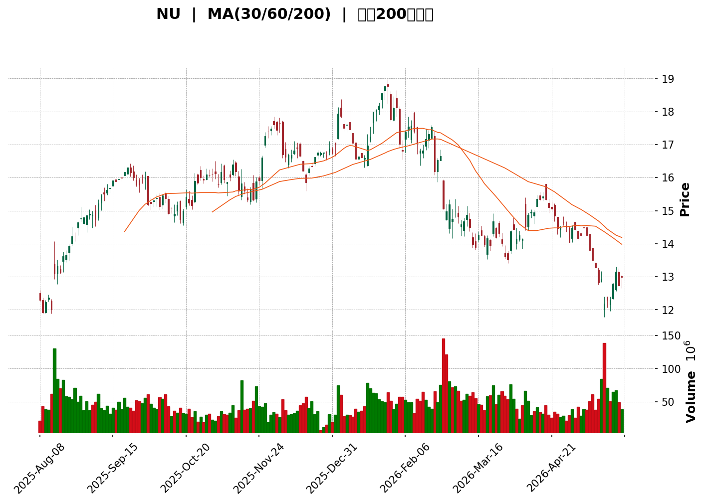
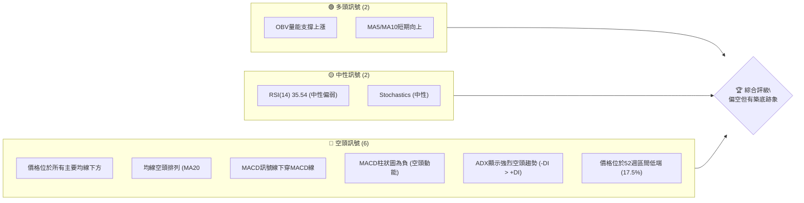
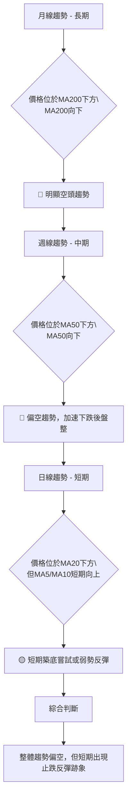

<details>
<summary>📊 靜態圖表 (點擊展開)</summary>

</details>

<html>
<head><meta charset="utf-8" /></head>
<body>
    <div>                        <script>window.PlotlyConfig = {MathJaxConfig: 'local'};</script>
        <script charset="utf-8" src="https://cdn.plot.ly/plotly-3.5.0.min.js" integrity="sha256-fHbNLP+GlIXN+efbQec78UkemUz3NJp7UmfGxC1tNxs=" crossorigin="anonymous"></script>                <div id="candlestick-chart" class="plotly-graph-div" style="height:500px; width:100%;"></div>            <script>                window.PLOTLYENV=window.PLOTLYENV || {};                                if (document.getElementById("candlestick-chart")) {                    Plotly.newPlot(                        "candlestick-chart",                        [{"close":{"dtype":"f8","bdata":"AAAAoJmZKEAAAABACtcnQAAAAEDheihAAAAAoHC9KEAAAADAHgUoQAAAAEAzMypAAAAAwPWoKkAAAACgcD0qQAAAAKBwPStAAAAAQApXK0AAAACgR+ErQAAAAIDCdSxAAAAAQOF6LEAAAAAgrkctQAAAAIA9ii1AAAAAoJmZLUAAAADgUbgtQAAAAMDMzC1AAAAAoHC9LUAAAABA4XotQAAAAOCjcC5AAAAAIIXrLkAAAADAHgUvQAAAAKBwPS9AAAAAoEdhL0AAAACA69EvQAAAACCuxy9AAAAAIIXrL0AAAABA4fovQAAAACCFKzBAAAAAwMxMMEAAAABgZiYwQAAAAGCPAjBAAAAAIFyPL0AAAAAgXI8vQAAAAGBm5i9AAAAAYI8CMEAAAACgR2EuQAAAAOCjcC5AAAAAYLieLkAAAABgj8IuQAAAAGCPQi5AAAAAIIXrLkAAAACgcL0uQAAAAEAK1y1AAAAAwPUoLkAAAACA69EtQAAAAAApXC5AAAAAgMJ1LUAAAAAAAAAuQAAAAIDr0S5AAAAAQOF6LkAAAACA61EuQAAAAMDMzC9AAAAAgBSuL0AAAAAAAAAwQAAAAAAp3C9AAAAAQAoXMEAAAAAgXA8wQAAAAAApHDBAAAAAoEchMEAAAACgmZkvQAAAACCFKzBAAAAAoEfhL0AAAACgcL0vQAAAAMAeBTBAAAAAANdjMEAAAACAFC4wQAAAAIAULi9AAAAAANejL0AAAABAMzMvQAAAAADXoy5AAAAAgOtRL0AAAAAA16MuQAAAACCuxy9AAAAAQArXL0AAAAAAKZwwQAAAAAAAQDFAAAAAANdjMUAAAABA4XoxQAAAAAApnDFAAAAA4KNwMUAAAABgZqYxQAAAAEAzszBAAAAAYLieMEAAAACAFK4wQAAAAOCjsDBAAAAAgOvRMEAAAABgZuYwQAAAAGBmpjBAAAAAQDMzMEAAAADgUbgvQAAAAMAeRTBAAAAAQApXMEAAAABguJ4wQAAAAGCPwjBAAAAAoHC9MEAAAABgj8IwQAAAAMD1qDBAAAAAoEfhMEAAAACgcL0wQAAAAMAeBTFAAAAA4KPwMUAAAAAAKdwxQAAAAAAAgDFAAAAAACmcMUAAAACAwnUxQAAAAIA9CjFAAAAAIFyPMEAAAAAA16MwQAAAAAApnDBAAAAAoJmZMEAAAADgUfgwQAAAAKBwPTFAAAAAAAAAMkAAAACAPQoyQAAAAIAULjJAAAAAwMyMMkAAAABgj8IyQAAAAGCPwjJAAAAAAADAMUAAAAAAKRwyQAAAAGC4HjJAAAAAwB4FMUAAAAAgXM8wQAAAAGBmZjFAAAAAwMyMMUAAAACA65ExQAAAAMD1aDFAAAAAgD0KMUAAAACA69EwQAAAAIDr0TBAAAAAIIUrMUAAAACA61ExQAAAACCuhzFAAAAA4KMwMEAAAAAgrocwQAAAAGBmpjBAAAAAYLgeLkAAAACAwvUtQAAAAKBHYS5AAAAAwB6FLUAAAAAAAAAuQAAAAADXoy1AAAAAwPUoLUAAAABAClctQAAAAGCPwi1AAAAAQOH6LEAAAADgo\u002fArQAAAACCuxytAAAAAgD2KLEAAAAAAAIAsQAAAAOCj8CtAAAAAgOtRLEAAAACgR+ErQAAAAAApXC1AAAAAoEdhLEAAAAAA16MsQAAAAIA9CixAAAAAQDMzK0AAAADAHgUrQAAAAKBwvSxAAAAAoEfhLEAAAADAzEwsQAAAAMAehSxAAAAAwMxMLEAAAADAHgUtQAAAAKBwvS1AAAAAIIXrLUAAAABgZuYtQAAAAEAzsy5AAAAAgBSuLkAAAAAAKdwuQAAAAIAUri5AAAAAQDMzLkAAAACgmRkuQAAAAEAzsy1AAAAAIIXrLEAAAADAHgUtQAAAACCuRy1AAAAAAAAALUAAAADgehQsQAAAAIDC9SxAAAAAoEfhLEAAAACA61EsQAAAAAAAgCxAAAAAgML1LEAAAADAHoUsQAAAAKCZmStAAAAAAAAAK0AAAACAPYoqQAAAAADXoylAAAAAACncKUAAAACgR2EoQAAAAOB6lChAAAAA4HqUKEAAAADgepQpQAAAAIDrUSpAAAAAgMJ1KUAAAACAwvUpQA=="},"high":{"dtype":"f8","bdata":"AAAAgBQuKUAAAACgcL0oQAAAAOB6lChAAAAAIIXrKEAAAAAA16MoQAAAAADXIyxAAAAAwB4FK0AAAACAwrUqQAAAAAAAgCtAAAAAoJmZK0AAAACAwvUrQAAAAGCPAi1AAAAAQDOzLEAAAABAClctQAAAAEDhOi5AAAAAANejLUAAAACgcL0tQAAAAIDrES5AAAAAoHD9LUAAAACgmVkuQAAAAOCjsC5AAAAAwB4FL0AAAAAghWsvQAAAAKBHoS9AAAAAgD2KL0AAAACgRwEwQAAAAIDrETBAAAAAwMwMMEAAAACgRyEwQAAAAKCZWTBAAAAAwMxMMEAAAADAzGwwQAAAAGC4XjBAAAAA4FEYMEAAAACgcP0vQAAAAKCZGTBAAAAA4KMwMEAAAADAzAwwQAAAAMDMzC5AAAAAAADALkAAAABA4fouQAAAAOB6FC9AAAAAAAAAL0AAAADA9SgvQAAAAGBm5i5AAAAAoHA9LkAAAACgR2EuQAAAAABWji5AAAAAYLieLkAAAABguB4uQAAAACCuRy9AAAAAgBQuL0AAAAAghesuQAAAAADXIzBAAAAAoEchMEAAAACgmVkwQAAAAIDrETBAAAAAwB5FMEAAAACgcD0wQAAAAMAeRTBAAAAAAACAMEAAAACgcB0wQAAAACCFazBAAAAAYGZmMEAAAAAAAMAvQAAAAOBRODBAAAAAwMyMMEAAAAAAAIAwQAAAAIDrMTBAAAAAYI9CMEAAAACgcL0vQAAAAKCZWS9AAAAA4KNwL0AAAABAMxMwQAAAAMAeBTBAAAAAIFwPMEAAAADAzKwwQAAAAKBHYTFAAAAAgBSOMUAAAAAgXI8xQAAAAEAK1zFAAAAA4FG4MUAAAADgo9AxQAAAAEDhujFAAAAAQDMTMUAAAABA4bowQAAAAKCZ2TBAAAAAACkcMUAAAAAgXA8xQAAAAIDrETFAAAAAwB6FMEAAAADA9SgwQAAAAOAiWzBAAAAA4FF4MEAAAACgR6EwQAAAAOB61DBAAAAAwPXIMEAAAABgj8IwQAAAACBczzBAAAAAQOEaMUAAAADAzOwwQAAAACBcDzFAAAAAgJUjMkAAAABguF4yQAAAAGCPwjFAAAAAgL6fMUAAAACA6xEyQAAAACCFazFAAAAAgOsRMUAAAADgo7AwQAAAAOBR+DBAAAAAYA6tMEAAAADgo1AxQAAAAIA9ijFAAAAAAAAAMkAAAADgoxAyQAAAAGCPQjJAAAAAIFyPMkAAAADA9cgyQAAAAEDh+jJAAAAAYLieMkAAAABACncyQAAAAGBmpjJAAAAAgD0qMkAAAABgjyIxQAAAACCFazFAAAAAQArXMUAAAAAAKbwxQAAAAKBw\u002fTFAAAAAwMyMMUAAAACgR+EwQAAAAAAAADFAAAAAQOF6MUAAAADgo3AxQAAAAEAKlzFAAAAAwPVoMUAAAABACpcwQAAAAKCZ2TBAAAAAoEfhL0AAAABgZmYuQAAAAECLrC5AAAAAYLgeLkAAAACAwrUuQAAAAMDMTC5AAAAAQDNzLUAAAACA65EtQAAAAIA9Si5AAAAAoEfhLUAAAABAM7MsQAAAAGC4nixAAAAAoHC9LEAAAADgehQtQAAAAMDMjCxAAAAAAACALEAAAADAzEwsQAAAAEAK1y1AAAAAwB4FLUAAAACgR2EtQAAAAGBmpixAAAAAYGbmK0AAAACA65ErQAAAAIDr0SxAAAAAoJmZLUAAAACAwvUsQAAAACCuxyxAAAAAgOtRLEAAAADAScwuQAAAAAAp3C1AAAAA4HoULkAAAAAgXA8uQAAAAOCj8C5AAAAAYLgeL0AAAACgRyEvQAAAAGC4ni9AAAAAQDOzLkAAAAAgXI8uQAAAAOCjcC5AAAAAANejLUAAAADgehQtQAAAACCFqy1AAAAAQApXLUAAAADAHgUtQAAAAGC4Hi1AAAAAgOtRLUAAAADgo\u002fAsQAAAAKBH4SxAAAAAoJkZLUAAAABAMzMtQAAAAMD1qCxAAAAAwPXoK0AAAAAAKRwrQAAAAIA9iipAAAAAQApXKkAAAAAgXM8oQAAAAMDMzChAAAAAwMzMKEAAAACgmZkpQAAAAKCZmSpAAAAAwB6FKkAAAACgRyEqQA=="},"hovertemplate":"\u003cb\u003e%{x|%Y-%m-%d}\u003c\u002fb\u003e\u003cbr\u003e\u958b: $%{open:.2f}\u003cbr\u003e\u9ad8: $%{high:.2f}\u003cbr\u003e\u4f4e: $%{low:.2f}\u003cbr\u003e\u6536: $%{close:.2f}\u003cextra\u003e\u003c\u002fextra\u003e","low":{"dtype":"f8","bdata":"AAAAAACAKEAAAAAgrscnQAAAAIA9yidAAAAAAACAKEAAAAAgrscnQAAAAEAK1ylAAAAAgD2KKUAAAABAMzMqQAAAACCuRypAAAAAoEfhKkAAAABA4foqQAAAAGC43itAAAAAIFokLEAAAABgj4IsQAAAAIDrUS1AAAAAgBQuLUAAAACAFK4sQAAAAIDCdS1AAAAAgML1LEAAAACAPQotQAAAACCFay1AAAAAYI8CLkAAAACgmZkuQAAAAIDC9S5AAAAA4HoUL0AAAADA9WgvQAAAAIDrUS9AAAAAYGamL0AAAADAHsUvQAAAAMAeBTBAAAAAgML1L0AAAAAgrgcwQAAAAKDx0i9AAAAAgMJ1L0AAAACgmRkvQAAAAMD1qC9AAAAAwMxML0AAAACA61EuQAAAAIA9Ci5AAAAA4FE4LkAAAAAAAEAuQAAAAIA9Ci5AAAAAoJkZLkAAAACAwnUuQAAAAGCPwi1AAAAAQArXLUAAAAAgrkctQAAAAOBRuC1AAAAAQF46LUAAAABguB4tQAAAAGC4Hi5AAAAAIFxPLkAAAACA6xEuQAAAAIDCdS5AAAAAIASWL0AAAABACtcvQAAAAADXoy9AAAAAACncL0AAAAAA1wMwQAAAAGCPwi9AAAAAgBTuL0AAAABgZmYvQAAAAOB6lC9AAAAAgBSuL0AAAABgZuYuQAAAAMDMzC9AAAAAwMwMMEAAAAAghQswQAAAAOBR+C5AAAAAANejLkAAAAAAAAAvQAAAAMAehS5AAAAAoEdhLkAAAACgmZkuQAAAAGCPgi5AAAAAIFyPL0AAAAAAKVwvQAAAAMD16DBAAAAAQDMzMUAAAAAgrkcxQAAAAEDhejFAAAAAgD1KMUAAAAAAKVwxQAAAAKCZmTBAAAAA4FF4MEAAAAAAAkswQAAAAEAKdzBAAAAAQDOzMEAAAACgmZkwQAAAAKBHoTBAAAAAgBQuMEAAAACAFC4vQAAAAMAgEDBAAAAAQGJQMEAAAACgmVkwQAAAACBcjzBAAAAAYGamMEAAAAAAKZwwQAAAAIA9ijBAAAAAgBSuMEAAAACAwrUwQAAAAGBmpjBAAAAAgD0qMUAAAAAgXM8xQAAAACCuZzFAAAAAYLheMUAAAAAA12MxQAAAAMAeBTFAAAAAgD1qMEAAAADAzGwwQAAAAIBBgDBAAAAAgBROMEAAAACgmVkwQAAAAIDrETFAAAAA4HpUMUAAAACAwrUxQAAAAGBm5jFAAAAAoJkZMkAAAAAAKVwyQAAAAKBwPTJAAAAAgMK1MUAAAACAwrUxQAAAAEAK1zFAAAAAAADgMEAAAADAzIwwQAAAAGCPwjBAAAAAQAo3MUAAAACAPQoxQAAAAKCZWTFAAAAAgMK1MEAAAABguF4wQAAAAEAKlzBAAAAAQArXMEAAAADAHuUwQAAAACCFKzFAAAAA4HoUMEAAAACgcL0vQAAAAADXgzBAAAAA4HoULkAAAABgZmYtQAAAAGC4nixAAAAAQApXLEAAAACgmZktQAAAAOBROC1AAAAA4FF4LEAAAACAwnUsQAAAACBcDy1AAAAAYI\u002fCLEAAAABgj8IrQAAAAKBHoStAAAAAYLgeLEAAAADgUXgsQAAAAOB61CtAAAAAIFwPK0AAAADgepQrQAAAAOCjcCxAAAAAgOtRLEAAAAAghWssQAAAAAAp3CtAAAAA4HoUK0AAAACA69EqQAAAAGBmZitAAAAAACncLEAAAAAAAqsrQAAAAMD1KCxAAAAAgBSuK0AAAACA69EsQAAAAMDMzCxAAAAAIFyPLUAAAABAMzMtQAAAAKBwPS5AAAAAoJmZLkAAAADgepQuQAAAAGC4ni5AAAAAACncLUAAAADgo\u002fAtQAAAAEAKVy1AAAAAgOuRLEAAAACgR2EsQAAAAKCZGS1AAAAAgMK1LEAAAADgehQsQAAAAKCZGSxAAAAAYI\u002fCLEAAAACAFC4sQAAAAEAKVyxAAAAAoHB9LEAAAADA9WgsQAAAAAAAgCtAAAAAQArXKkAAAADAHoUqQAAAACCuhylAAAAAgBSuKUAAAAAgXI8nQAAAAGC4HihAAAAAIIXrJ0AAAADA9agoQAAAAGC4HilAAAAAIIVrKUAAAADAzEwpQA=="},"name":"\u50f9\u683c","open":{"dtype":"f8","bdata":"AAAAAAAAKUAAAACgmZkoQAAAAEAK1ydAAAAAwPWoKEAAAACAPYooQAAAAMDMzCpAAAAAQDMzKkAAAACAwnUqQAAAAIAU7ipAAAAAgD0KK0AAAADgo3ArQAAAAAAAACxAAAAAQOF6LEAAAACAwvUsQAAAAAAAgC1AAAAA4FE4LUAAAADA9SgtQAAAAKBwvS1AAAAAgBSuLUAAAADAHgUuQAAAACBcjy1AAAAAgMJ1LkAAAACgmRkvQAAAACBcDy9AAAAAAClcL0AAAAAAAIAvQAAAAKBH4S9AAAAAYGbmL0AAAABgjwIwQAAAAIDrETBAAAAAACkcMEAAAADAzEwwQAAAAIAULjBAAAAAACncL0AAAAAAKdwvQAAAAGBm5i9AAAAAIIXrL0AAAADAzAwwQAAAAIA9ii5AAAAAIFyPLkAAAACgcL0uQAAAAIDr0S5AAAAAAClcLkAAAAAgXA8vQAAAAOBRuC5AAAAAwPUoLkAAAABAM7MtQAAAAAAAAC5AAAAA4HqULkAAAAAgrkctQAAAAGCPQi5AAAAAQDOzLkAAAAAA16MuQAAAAMAehS5AAAAAQAoXMEAAAABA4TowQAAAACCF6y9AAAAAYGbmL0AAAACA6xEwQAAAAAApHDBAAAAA4KMwMEAAAACgmZkvQAAAAOBRuC9AAAAAYLheMEAAAAAA16MvQAAAAKCZGTBAAAAAQAoXMEAAAACAwnUwQAAAAIA9CjBAAAAAACncLkAAAADgUXgvQAAAAMDMzC5AAAAAwMyMLkAAAACAFK4vQAAAAIDCtS5AAAAAAAAAMEAAAABACtcvQAAAAEDh+jBAAAAAANdjMUAAAACAFG4xQAAAAIDCtTFAAAAAQDOzMUAAAABgZqYxQAAAAEAzszFAAAAAYLjeMEAAAADAHmUwQAAAAKCZmTBAAAAAQOG6MEAAAAAgrucwQAAAAGBmBjFAAAAAAACAMEAAAABAChcwQAAAAGBmJjBAAAAAoJlZMEAAAAAghWswQAAAAOCjsDBAAAAAQDOzMEAAAACgcL0wQAAAAIA9qjBAAAAAwB7FMEAAAABguN4wQAAAACBcDzFAAAAAgBQuMUAAAABguB4yQAAAAGC4njFAAAAAQAqXMUAAAACAFK4xQAAAAKCZWTFAAAAAIFwPMUAAAADgo5AwQAAAAAAAwDBAAAAAgOuRMEAAAAAAKVwwQAAAAGCPIjFAAAAAgD2qMUAAAAAAAAAyQAAAAMDMDDJAAAAAAClcMkAAAABgj6IyQAAAAOB61DJAAAAAIK6HMkAAAACgcL0xQAAAACCuZzJAAAAA4HoUMkAAAADgetQwQAAAACCFKzFAAAAA4KNwMUAAAABgZiYxQAAAAIDr8TFAAAAAwPWIMUAAAACgcL0wQAAAAAAAwDBAAAAAQDPzMEAAAAAA1yMxQAAAAEAzMzFAAAAAAABAMUAAAADgozAwQAAAAADXgzBAAAAAQArXL0AAAADgo3AtQAAAACCF6yxAAAAAAClcLUAAAACgcP0tQAAAAAAp3C1AAAAAYI8CLUAAAACA69EsQAAAAEDhei1AAAAAAACALUAAAABgZmYsQAAAAADXIyxAAAAAoHA9LEAAAADAzMwsQAAAAOCjcCxAAAAAAClcK0AAAACgcD0sQAAAAKBHoSxAAAAA4FH4LEAAAABgj0ItQAAAAGCPQixAAAAAgMJ1K0AAAAAghWsrQAAAAKCZmStAAAAAgBQuLUAAAAAAAAAsQAAAAGCPQixAAAAAQDMzLEAAAAAghWsuQAAAAMAeBS1AAAAAACncLUAAAACAFK4tQAAAAGCPQi5AAAAAIIXrLkAAAAAgrscuQAAAAGC4ni9AAAAAQOF6LkAAAADgUTguQAAAAAApXC5AAAAAYLieLUAAAABACtcsQAAAACCuRy1AAAAA4HoULUAAAACAwvUsQAAAAOB6VCxAAAAAgOtRLUAAAAAgrscsQAAAAADXoyxAAAAAAAAALUAAAAAAAAAtQAAAAKCZmSxAAAAAYI\u002fCK0AAAABACtcqQAAAACCFaypAAAAAQDOzKUAAAABAiQEoQAAAAMDMzChAAAAA4HpUKEAAAACAFK4oQAAAAOBROClAAAAAwMxMKkAAAAAgrgcqQA=="},"x":["2025-08-08T00:00:00-04:00","2025-08-11T00:00:00-04:00","2025-08-12T00:00:00-04:00","2025-08-13T00:00:00-04:00","2025-08-14T00:00:00-04:00","2025-08-15T00:00:00-04:00","2025-08-18T00:00:00-04:00","2025-08-19T00:00:00-04:00","2025-08-20T00:00:00-04:00","2025-08-21T00:00:00-04:00","2025-08-22T00:00:00-04:00","2025-08-25T00:00:00-04:00","2025-08-26T00:00:00-04:00","2025-08-27T00:00:00-04:00","2025-08-28T00:00:00-04:00","2025-08-29T00:00:00-04:00","2025-09-02T00:00:00-04:00","2025-09-03T00:00:00-04:00","2025-09-04T00:00:00-04:00","2025-09-05T00:00:00-04:00","2025-09-08T00:00:00-04:00","2025-09-09T00:00:00-04:00","2025-09-10T00:00:00-04:00","2025-09-11T00:00:00-04:00","2025-09-12T00:00:00-04:00","2025-09-15T00:00:00-04:00","2025-09-16T00:00:00-04:00","2025-09-17T00:00:00-04:00","2025-09-18T00:00:00-04:00","2025-09-19T00:00:00-04:00","2025-09-22T00:00:00-04:00","2025-09-23T00:00:00-04:00","2025-09-24T00:00:00-04:00","2025-09-25T00:00:00-04:00","2025-09-26T00:00:00-04:00","2025-09-29T00:00:00-04:00","2025-09-30T00:00:00-04:00","2025-10-01T00:00:00-04:00","2025-10-02T00:00:00-04:00","2025-10-03T00:00:00-04:00","2025-10-06T00:00:00-04:00","2025-10-07T00:00:00-04:00","2025-10-08T00:00:00-04:00","2025-10-09T00:00:00-04:00","2025-10-10T00:00:00-04:00","2025-10-13T00:00:00-04:00","2025-10-14T00:00:00-04:00","2025-10-15T00:00:00-04:00","2025-10-16T00:00:00-04:00","2025-10-17T00:00:00-04:00","2025-10-20T00:00:00-04:00","2025-10-21T00:00:00-04:00","2025-10-22T00:00:00-04:00","2025-10-23T00:00:00-04:00","2025-10-24T00:00:00-04:00","2025-10-27T00:00:00-04:00","2025-10-28T00:00:00-04:00","2025-10-29T00:00:00-04:00","2025-10-30T00:00:00-04:00","2025-10-31T00:00:00-04:00","2025-11-03T00:00:00-05:00","2025-11-04T00:00:00-05:00","2025-11-05T00:00:00-05:00","2025-11-06T00:00:00-05:00","2025-11-07T00:00:00-05:00","2025-11-10T00:00:00-05:00","2025-11-11T00:00:00-05:00","2025-11-12T00:00:00-05:00","2025-11-13T00:00:00-05:00","2025-11-14T00:00:00-05:00","2025-11-17T00:00:00-05:00","2025-11-18T00:00:00-05:00","2025-11-19T00:00:00-05:00","2025-11-20T00:00:00-05:00","2025-11-21T00:00:00-05:00","2025-11-24T00:00:00-05:00","2025-11-25T00:00:00-05:00","2025-11-26T00:00:00-05:00","2025-11-28T00:00:00-05:00","2025-12-01T00:00:00-05:00","2025-12-02T00:00:00-05:00","2025-12-03T00:00:00-05:00","2025-12-04T00:00:00-05:00","2025-12-05T00:00:00-05:00","2025-12-08T00:00:00-05:00","2025-12-09T00:00:00-05:00","2025-12-10T00:00:00-05:00","2025-12-11T00:00:00-05:00","2025-12-12T00:00:00-05:00","2025-12-15T00:00:00-05:00","2025-12-16T00:00:00-05:00","2025-12-17T00:00:00-05:00","2025-12-18T00:00:00-05:00","2025-12-19T00:00:00-05:00","2025-12-22T00:00:00-05:00","2025-12-23T00:00:00-05:00","2025-12-24T00:00:00-05:00","2025-12-26T00:00:00-05:00","2025-12-29T00:00:00-05:00","2025-12-30T00:00:00-05:00","2025-12-31T00:00:00-05:00","2026-01-02T00:00:00-05:00","2026-01-05T00:00:00-05:00","2026-01-06T00:00:00-05:00","2026-01-07T00:00:00-05:00","2026-01-08T00:00:00-05:00","2026-01-09T00:00:00-05:00","2026-01-12T00:00:00-05:00","2026-01-13T00:00:00-05:00","2026-01-14T00:00:00-05:00","2026-01-15T00:00:00-05:00","2026-01-16T00:00:00-05:00","2026-01-20T00:00:00-05:00","2026-01-21T00:00:00-05:00","2026-01-22T00:00:00-05:00","2026-01-23T00:00:00-05:00","2026-01-26T00:00:00-05:00","2026-01-27T00:00:00-05:00","2026-01-28T00:00:00-05:00","2026-01-29T00:00:00-05:00","2026-01-30T00:00:00-05:00","2026-02-02T00:00:00-05:00","2026-02-03T00:00:00-05:00","2026-02-04T00:00:00-05:00","2026-02-05T00:00:00-05:00","2026-02-06T00:00:00-05:00","2026-02-09T00:00:00-05:00","2026-02-10T00:00:00-05:00","2026-02-11T00:00:00-05:00","2026-02-12T00:00:00-05:00","2026-02-13T00:00:00-05:00","2026-02-17T00:00:00-05:00","2026-02-18T00:00:00-05:00","2026-02-19T00:00:00-05:00","2026-02-20T00:00:00-05:00","2026-02-23T00:00:00-05:00","2026-02-24T00:00:00-05:00","2026-02-25T00:00:00-05:00","2026-02-26T00:00:00-05:00","2026-02-27T00:00:00-05:00","2026-03-02T00:00:00-05:00","2026-03-03T00:00:00-05:00","2026-03-04T00:00:00-05:00","2026-03-05T00:00:00-05:00","2026-03-06T00:00:00-05:00","2026-03-09T00:00:00-04:00","2026-03-10T00:00:00-04:00","2026-03-11T00:00:00-04:00","2026-03-12T00:00:00-04:00","2026-03-13T00:00:00-04:00","2026-03-16T00:00:00-04:00","2026-03-17T00:00:00-04:00","2026-03-18T00:00:00-04:00","2026-03-19T00:00:00-04:00","2026-03-20T00:00:00-04:00","2026-03-23T00:00:00-04:00","2026-03-24T00:00:00-04:00","2026-03-25T00:00:00-04:00","2026-03-26T00:00:00-04:00","2026-03-27T00:00:00-04:00","2026-03-30T00:00:00-04:00","2026-03-31T00:00:00-04:00","2026-04-01T00:00:00-04:00","2026-04-02T00:00:00-04:00","2026-04-06T00:00:00-04:00","2026-04-07T00:00:00-04:00","2026-04-08T00:00:00-04:00","2026-04-09T00:00:00-04:00","2026-04-10T00:00:00-04:00","2026-04-13T00:00:00-04:00","2026-04-14T00:00:00-04:00","2026-04-15T00:00:00-04:00","2026-04-16T00:00:00-04:00","2026-04-17T00:00:00-04:00","2026-04-20T00:00:00-04:00","2026-04-21T00:00:00-04:00","2026-04-22T00:00:00-04:00","2026-04-23T00:00:00-04:00","2026-04-24T00:00:00-04:00","2026-04-27T00:00:00-04:00","2026-04-28T00:00:00-04:00","2026-04-29T00:00:00-04:00","2026-04-30T00:00:00-04:00","2026-05-01T00:00:00-04:00","2026-05-04T00:00:00-04:00","2026-05-05T00:00:00-04:00","2026-05-06T00:00:00-04:00","2026-05-07T00:00:00-04:00","2026-05-08T00:00:00-04:00","2026-05-11T00:00:00-04:00","2026-05-12T00:00:00-04:00","2026-05-13T00:00:00-04:00","2026-05-14T00:00:00-04:00","2026-05-15T00:00:00-04:00","2026-05-18T00:00:00-04:00","2026-05-19T00:00:00-04:00","2026-05-20T00:00:00-04:00","2026-05-21T00:00:00-04:00","2026-05-22T00:00:00-04:00","2026-05-26T00:00:00-04:00"],"type":"candlestick"},{"hovertemplate":"MA30: $%{y:.2f}\u003cextra\u003e\u003c\u002fextra\u003e","line":{"color":"#2196F3","dash":"dash","width":2},"mode":"lines","name":"MA30","x":["2025-08-08T00:00:00-04:00","2025-08-11T00:00:00-04:00","2025-08-12T00:00:00-04:00","2025-08-13T00:00:00-04:00","2025-08-14T00:00:00-04:00","2025-08-15T00:00:00-04:00","2025-08-18T00:00:00-04:00","2025-08-19T00:00:00-04:00","2025-08-20T00:00:00-04:00","2025-08-21T00:00:00-04:00","2025-08-22T00:00:00-04:00","2025-08-25T00:00:00-04:00","2025-08-26T00:00:00-04:00","2025-08-27T00:00:00-04:00","2025-08-28T00:00:00-04:00","2025-08-29T00:00:00-04:00","2025-09-02T00:00:00-04:00","2025-09-03T00:00:00-04:00","2025-09-04T00:00:00-04:00","2025-09-05T00:00:00-04:00","2025-09-08T00:00:00-04:00","2025-09-09T00:00:00-04:00","2025-09-10T00:00:00-04:00","2025-09-11T00:00:00-04:00","2025-09-12T00:00:00-04:00","2025-09-15T00:00:00-04:00","2025-09-16T00:00:00-04:00","2025-09-17T00:00:00-04:00","2025-09-18T00:00:00-04:00","2025-09-19T00:00:00-04:00","2025-09-22T00:00:00-04:00","2025-09-23T00:00:00-04:00","2025-09-24T00:00:00-04:00","2025-09-25T00:00:00-04:00","2025-09-26T00:00:00-04:00","2025-09-29T00:00:00-04:00","2025-09-30T00:00:00-04:00","2025-10-01T00:00:00-04:00","2025-10-02T00:00:00-04:00","2025-10-03T00:00:00-04:00","2025-10-06T00:00:00-04:00","2025-10-07T00:00:00-04:00","2025-10-08T00:00:00-04:00","2025-10-09T00:00:00-04:00","2025-10-10T00:00:00-04:00","2025-10-13T00:00:00-04:00","2025-10-14T00:00:00-04:00","2025-10-15T00:00:00-04:00","2025-10-16T00:00:00-04:00","2025-10-17T00:00:00-04:00","2025-10-20T00:00:00-04:00","2025-10-21T00:00:00-04:00","2025-10-22T00:00:00-04:00","2025-10-23T00:00:00-04:00","2025-10-24T00:00:00-04:00","2025-10-27T00:00:00-04:00","2025-10-28T00:00:00-04:00","2025-10-29T00:00:00-04:00","2025-10-30T00:00:00-04:00","2025-10-31T00:00:00-04:00","2025-11-03T00:00:00-05:00","2025-11-04T00:00:00-05:00","2025-11-05T00:00:00-05:00","2025-11-06T00:00:00-05:00","2025-11-07T00:00:00-05:00","2025-11-10T00:00:00-05:00","2025-11-11T00:00:00-05:00","2025-11-12T00:00:00-05:00","2025-11-13T00:00:00-05:00","2025-11-14T00:00:00-05:00","2025-11-17T00:00:00-05:00","2025-11-18T00:00:00-05:00","2025-11-19T00:00:00-05:00","2025-11-20T00:00:00-05:00","2025-11-21T00:00:00-05:00","2025-11-24T00:00:00-05:00","2025-11-25T00:00:00-05:00","2025-11-26T00:00:00-05:00","2025-11-28T00:00:00-05:00","2025-12-01T00:00:00-05:00","2025-12-02T00:00:00-05:00","2025-12-03T00:00:00-05:00","2025-12-04T00:00:00-05:00","2025-12-05T00:00:00-05:00","2025-12-08T00:00:00-05:00","2025-12-09T00:00:00-05:00","2025-12-10T00:00:00-05:00","2025-12-11T00:00:00-05:00","2025-12-12T00:00:00-05:00","2025-12-15T00:00:00-05:00","2025-12-16T00:00:00-05:00","2025-12-17T00:00:00-05:00","2025-12-18T00:00:00-05:00","2025-12-19T00:00:00-05:00","2025-12-22T00:00:00-05:00","2025-12-23T00:00:00-05:00","2025-12-24T00:00:00-05:00","2025-12-26T00:00:00-05:00","2025-12-29T00:00:00-05:00","2025-12-30T00:00:00-05:00","2025-12-31T00:00:00-05:00","2026-01-02T00:00:00-05:00","2026-01-05T00:00:00-05:00","2026-01-06T00:00:00-05:00","2026-01-07T00:00:00-05:00","2026-01-08T00:00:00-05:00","2026-01-09T00:00:00-05:00","2026-01-12T00:00:00-05:00","2026-01-13T00:00:00-05:00","2026-01-14T00:00:00-05:00","2026-01-15T00:00:00-05:00","2026-01-16T00:00:00-05:00","2026-01-20T00:00:00-05:00","2026-01-21T00:00:00-05:00","2026-01-22T00:00:00-05:00","2026-01-23T00:00:00-05:00","2026-01-26T00:00:00-05:00","2026-01-27T00:00:00-05:00","2026-01-28T00:00:00-05:00","2026-01-29T00:00:00-05:00","2026-01-30T00:00:00-05:00","2026-02-02T00:00:00-05:00","2026-02-03T00:00:00-05:00","2026-02-04T00:00:00-05:00","2026-02-05T00:00:00-05:00","2026-02-06T00:00:00-05:00","2026-02-09T00:00:00-05:00","2026-02-10T00:00:00-05:00","2026-02-11T00:00:00-05:00","2026-02-12T00:00:00-05:00","2026-02-13T00:00:00-05:00","2026-02-17T00:00:00-05:00","2026-02-18T00:00:00-05:00","2026-02-19T00:00:00-05:00","2026-02-20T00:00:00-05:00","2026-02-23T00:00:00-05:00","2026-02-24T00:00:00-05:00","2026-02-25T00:00:00-05:00","2026-02-26T00:00:00-05:00","2026-02-27T00:00:00-05:00","2026-03-02T00:00:00-05:00","2026-03-03T00:00:00-05:00","2026-03-04T00:00:00-05:00","2026-03-05T00:00:00-05:00","2026-03-06T00:00:00-05:00","2026-03-09T00:00:00-04:00","2026-03-10T00:00:00-04:00","2026-03-11T00:00:00-04:00","2026-03-12T00:00:00-04:00","2026-03-13T00:00:00-04:00","2026-03-16T00:00:00-04:00","2026-03-17T00:00:00-04:00","2026-03-18T00:00:00-04:00","2026-03-19T00:00:00-04:00","2026-03-20T00:00:00-04:00","2026-03-23T00:00:00-04:00","2026-03-24T00:00:00-04:00","2026-03-25T00:00:00-04:00","2026-03-26T00:00:00-04:00","2026-03-27T00:00:00-04:00","2026-03-30T00:00:00-04:00","2026-03-31T00:00:00-04:00","2026-04-01T00:00:00-04:00","2026-04-02T00:00:00-04:00","2026-04-06T00:00:00-04:00","2026-04-07T00:00:00-04:00","2026-04-08T00:00:00-04:00","2026-04-09T00:00:00-04:00","2026-04-10T00:00:00-04:00","2026-04-13T00:00:00-04:00","2026-04-14T00:00:00-04:00","2026-04-15T00:00:00-04:00","2026-04-16T00:00:00-04:00","2026-04-17T00:00:00-04:00","2026-04-20T00:00:00-04:00","2026-04-21T00:00:00-04:00","2026-04-22T00:00:00-04:00","2026-04-23T00:00:00-04:00","2026-04-24T00:00:00-04:00","2026-04-27T00:00:00-04:00","2026-04-28T00:00:00-04:00","2026-04-29T00:00:00-04:00","2026-04-30T00:00:00-04:00","2026-05-01T00:00:00-04:00","2026-05-04T00:00:00-04:00","2026-05-05T00:00:00-04:00","2026-05-06T00:00:00-04:00","2026-05-07T00:00:00-04:00","2026-05-08T00:00:00-04:00","2026-05-11T00:00:00-04:00","2026-05-12T00:00:00-04:00","2026-05-13T00:00:00-04:00","2026-05-14T00:00:00-04:00","2026-05-15T00:00:00-04:00","2026-05-18T00:00:00-04:00","2026-05-19T00:00:00-04:00","2026-05-20T00:00:00-04:00","2026-05-21T00:00:00-04:00","2026-05-22T00:00:00-04:00","2026-05-26T00:00:00-04:00"],"y":{"dtype":"f8","bdata":"AAAAAAAA+H8AAAAAAAD4fwAAAAAAAPh\u002fAAAAAAAA+H8AAAAAAAD4fwAAAAAAAPh\u002fAAAAAAAA+H8AAAAAAAD4fwAAAAAAAPh\u002fAAAAAAAA+H8AAAAAAAD4fwAAAAAAAPh\u002fAAAAAAAA+H8AAAAAAAD4fwAAAAAAAPh\u002fAAAAAAAA+H8AAAAAAAD4fwAAAAAAAPh\u002fAAAAAAAA+H8AAAAAAAD4fwAAAAAAAPh\u002fAAAAAAAA+H8AAAAAAAD4fwAAAAAAAPh\u002fAAAAAAAA+H8AAAAAAAD4fwAAAAAAAPh\u002fAAAAAAAA+H8AAAAAAAD4fyIiIvJEvSxAVVVVNYkBLUC8u7tbukktQN7d3b0Rii1AIiIiQkTELUAzMzOjmwQuQJqZmXk\u002fNS5AMzMzk\u002fxiLkCrqqqKUIYuQM3MzAyfoS5AIiIiUpy9LkB3d3fHL9YuQBEREfGL5S5ARERENF76LkDv7u6e0wYvQKuqqvpiCS9AERERUSoOL0BVVVXFBA8vQM3MzBzMEy9AERERcWgRL0BmZmZm2BUvQFVVVYUWGS9AMzMzU1UVL0BmZmYmXA8vQM3MzHwjFC9AmpmZ2bIWL0ARERERPBgvQERERNTqGC9A7+7uziIbL0BERESkVBwvQAAAAIBOGy9AIiIiwmcYL0BmZmaWbhIvQDMzM6MpFS9AAAAAsOQXL0B3d3fnbRkvQN7d3b2fGi9AvLu7+xshL0DNzMxcATIvQKuqqupROC9AMzMzIwZBL0BVVVVVx0QvQERERHQFSC9ARERERG9LL0AAAADQlEovQO\u002fu7s4iWy9AMzMz03hpL0De3d09fIYvQFVVVTXQqS9AzczM7DXXL0CrqqqaxAAwQERERJSKEzBA3t3djVAmMECrqqoKkDswQLy7u6tjQjBAvLu7mwtJMEB3d3cX2U4wQGZmZlZVVTBAvLu7C5BbMEDe3d0Nu2IwQDMzM7NWZzBA7+7unu9nMEARERGxcmgwQFVVVSVNaTBA3t3d9bZsMEDNzMxcHXMwQKuqqupteTBAERERgWp8MECJiIiIXYEwQLy7u\u002ft+ijBAZmZmloqTMEBERET0RJ0wQJqZmanGqzBAZmZmZju\u002fMEDe3d0d6NQwQO\u002fu7jal4jBAvLu7ExHxMEBVVVXtUfgwQFVVVS2H9jBAvLu7A3LvMECamZkBR+gwQBEREXm+3zBA7+7udpPYMEAzMzP7xdIwQImIiKBh1zBAAAAASCjjMEB3d3c\u002fw+4wQLy7uzN6+zBAmpmZcT0KMUBVVVWtHBoxQDMzMwseLDFAmpmZEVg5MUBVVVVFi0wxQImIiKhUXDFAREREJCJiMUAzMzMzwWMxQM3MzEw3aTFAVVVVxSBwMUDe3d09CncxQERERKRwfTFAvLu7K85+MUDv7u7ufH8xQGZmZgbIfTFA7+7u7jV3MUCJiIhImnIxQCIiItLbcjFAiYiIyL1mMUC8u7srzl4xQDMzMzN6WzFA7+7uZq1OMUC8u7sTg0AxQJqZmQllNDFA7+7ufrEkMUB3d3f34RMxQFVVVWU7\u002fzBAq6qqSgziMECamZlpSsUwQLy7u3MhqTBAd3d3P3yGMEBVVVVVnF0wQAAAAKgNNDBAMzMze1sWMEDNzMxc1uovQLy7u7sCpC9AMzMzMzNzL0Crqqr6N0IvQO\u002fu7h7MEy9A7+7uDnTaLkB3d3eX\u002fKIuQFVVVXUhaS5A3t3d3WsuLkAiIiJC7vUtQLy7uwsezC1A3t3dfYadLUDNzMyMbGctQDMzM7OdLy1AzczMzMwMLUCJiIhIU+osQImIiFjyyyxAAAAAcD3KLEDe3d1dusksQLy7u2t1zCxAq6qqelvWLEDe3d0tst0sQImIiBiS5ixAMzMzA3LvLEAiIiJC7vUsQAAAADBr9SxA3t3dHej0LECamZlpH\u002f4sQGZmZjbsCi1AiYiIGNkOLUB3d3eXQwstQAAAAND3Ey1AZmZmJr8YLUCJiIhYgBwtQFVVVaUpFS1AzczMrBwaLUCJiIiIFhktQGZmZlZVFS1A3t3dbaATLUCrqqrahw8tQM3MzMwT9SxAMzMzg07bLEBEREQk27ksQERERBQ8mCxA3t3dnX14LEAiIiLSIlssQHd3d7fzPSxAIiIisuQXLEAiIiKiRfYrQA=="},"type":"scatter"},{"hovertemplate":"MA60: $%{y:.2f}\u003cextra\u003e\u003c\u002fextra\u003e","line":{"color":"#9C27B0","dash":"dash","width":2},"mode":"lines","name":"MA60","x":["2025-08-08T00:00:00-04:00","2025-08-11T00:00:00-04:00","2025-08-12T00:00:00-04:00","2025-08-13T00:00:00-04:00","2025-08-14T00:00:00-04:00","2025-08-15T00:00:00-04:00","2025-08-18T00:00:00-04:00","2025-08-19T00:00:00-04:00","2025-08-20T00:00:00-04:00","2025-08-21T00:00:00-04:00","2025-08-22T00:00:00-04:00","2025-08-25T00:00:00-04:00","2025-08-26T00:00:00-04:00","2025-08-27T00:00:00-04:00","2025-08-28T00:00:00-04:00","2025-08-29T00:00:00-04:00","2025-09-02T00:00:00-04:00","2025-09-03T00:00:00-04:00","2025-09-04T00:00:00-04:00","2025-09-05T00:00:00-04:00","2025-09-08T00:00:00-04:00","2025-09-09T00:00:00-04:00","2025-09-10T00:00:00-04:00","2025-09-11T00:00:00-04:00","2025-09-12T00:00:00-04:00","2025-09-15T00:00:00-04:00","2025-09-16T00:00:00-04:00","2025-09-17T00:00:00-04:00","2025-09-18T00:00:00-04:00","2025-09-19T00:00:00-04:00","2025-09-22T00:00:00-04:00","2025-09-23T00:00:00-04:00","2025-09-24T00:00:00-04:00","2025-09-25T00:00:00-04:00","2025-09-26T00:00:00-04:00","2025-09-29T00:00:00-04:00","2025-09-30T00:00:00-04:00","2025-10-01T00:00:00-04:00","2025-10-02T00:00:00-04:00","2025-10-03T00:00:00-04:00","2025-10-06T00:00:00-04:00","2025-10-07T00:00:00-04:00","2025-10-08T00:00:00-04:00","2025-10-09T00:00:00-04:00","2025-10-10T00:00:00-04:00","2025-10-13T00:00:00-04:00","2025-10-14T00:00:00-04:00","2025-10-15T00:00:00-04:00","2025-10-16T00:00:00-04:00","2025-10-17T00:00:00-04:00","2025-10-20T00:00:00-04:00","2025-10-21T00:00:00-04:00","2025-10-22T00:00:00-04:00","2025-10-23T00:00:00-04:00","2025-10-24T00:00:00-04:00","2025-10-27T00:00:00-04:00","2025-10-28T00:00:00-04:00","2025-10-29T00:00:00-04:00","2025-10-30T00:00:00-04:00","2025-10-31T00:00:00-04:00","2025-11-03T00:00:00-05:00","2025-11-04T00:00:00-05:00","2025-11-05T00:00:00-05:00","2025-11-06T00:00:00-05:00","2025-11-07T00:00:00-05:00","2025-11-10T00:00:00-05:00","2025-11-11T00:00:00-05:00","2025-11-12T00:00:00-05:00","2025-11-13T00:00:00-05:00","2025-11-14T00:00:00-05:00","2025-11-17T00:00:00-05:00","2025-11-18T00:00:00-05:00","2025-11-19T00:00:00-05:00","2025-11-20T00:00:00-05:00","2025-11-21T00:00:00-05:00","2025-11-24T00:00:00-05:00","2025-11-25T00:00:00-05:00","2025-11-26T00:00:00-05:00","2025-11-28T00:00:00-05:00","2025-12-01T00:00:00-05:00","2025-12-02T00:00:00-05:00","2025-12-03T00:00:00-05:00","2025-12-04T00:00:00-05:00","2025-12-05T00:00:00-05:00","2025-12-08T00:00:00-05:00","2025-12-09T00:00:00-05:00","2025-12-10T00:00:00-05:00","2025-12-11T00:00:00-05:00","2025-12-12T00:00:00-05:00","2025-12-15T00:00:00-05:00","2025-12-16T00:00:00-05:00","2025-12-17T00:00:00-05:00","2025-12-18T00:00:00-05:00","2025-12-19T00:00:00-05:00","2025-12-22T00:00:00-05:00","2025-12-23T00:00:00-05:00","2025-12-24T00:00:00-05:00","2025-12-26T00:00:00-05:00","2025-12-29T00:00:00-05:00","2025-12-30T00:00:00-05:00","2025-12-31T00:00:00-05:00","2026-01-02T00:00:00-05:00","2026-01-05T00:00:00-05:00","2026-01-06T00:00:00-05:00","2026-01-07T00:00:00-05:00","2026-01-08T00:00:00-05:00","2026-01-09T00:00:00-05:00","2026-01-12T00:00:00-05:00","2026-01-13T00:00:00-05:00","2026-01-14T00:00:00-05:00","2026-01-15T00:00:00-05:00","2026-01-16T00:00:00-05:00","2026-01-20T00:00:00-05:00","2026-01-21T00:00:00-05:00","2026-01-22T00:00:00-05:00","2026-01-23T00:00:00-05:00","2026-01-26T00:00:00-05:00","2026-01-27T00:00:00-05:00","2026-01-28T00:00:00-05:00","2026-01-29T00:00:00-05:00","2026-01-30T00:00:00-05:00","2026-02-02T00:00:00-05:00","2026-02-03T00:00:00-05:00","2026-02-04T00:00:00-05:00","2026-02-05T00:00:00-05:00","2026-02-06T00:00:00-05:00","2026-02-09T00:00:00-05:00","2026-02-10T00:00:00-05:00","2026-02-11T00:00:00-05:00","2026-02-12T00:00:00-05:00","2026-02-13T00:00:00-05:00","2026-02-17T00:00:00-05:00","2026-02-18T00:00:00-05:00","2026-02-19T00:00:00-05:00","2026-02-20T00:00:00-05:00","2026-02-23T00:00:00-05:00","2026-02-24T00:00:00-05:00","2026-02-25T00:00:00-05:00","2026-02-26T00:00:00-05:00","2026-02-27T00:00:00-05:00","2026-03-02T00:00:00-05:00","2026-03-03T00:00:00-05:00","2026-03-04T00:00:00-05:00","2026-03-05T00:00:00-05:00","2026-03-06T00:00:00-05:00","2026-03-09T00:00:00-04:00","2026-03-10T00:00:00-04:00","2026-03-11T00:00:00-04:00","2026-03-12T00:00:00-04:00","2026-03-13T00:00:00-04:00","2026-03-16T00:00:00-04:00","2026-03-17T00:00:00-04:00","2026-03-18T00:00:00-04:00","2026-03-19T00:00:00-04:00","2026-03-20T00:00:00-04:00","2026-03-23T00:00:00-04:00","2026-03-24T00:00:00-04:00","2026-03-25T00:00:00-04:00","2026-03-26T00:00:00-04:00","2026-03-27T00:00:00-04:00","2026-03-30T00:00:00-04:00","2026-03-31T00:00:00-04:00","2026-04-01T00:00:00-04:00","2026-04-02T00:00:00-04:00","2026-04-06T00:00:00-04:00","2026-04-07T00:00:00-04:00","2026-04-08T00:00:00-04:00","2026-04-09T00:00:00-04:00","2026-04-10T00:00:00-04:00","2026-04-13T00:00:00-04:00","2026-04-14T00:00:00-04:00","2026-04-15T00:00:00-04:00","2026-04-16T00:00:00-04:00","2026-04-17T00:00:00-04:00","2026-04-20T00:00:00-04:00","2026-04-21T00:00:00-04:00","2026-04-22T00:00:00-04:00","2026-04-23T00:00:00-04:00","2026-04-24T00:00:00-04:00","2026-04-27T00:00:00-04:00","2026-04-28T00:00:00-04:00","2026-04-29T00:00:00-04:00","2026-04-30T00:00:00-04:00","2026-05-01T00:00:00-04:00","2026-05-04T00:00:00-04:00","2026-05-05T00:00:00-04:00","2026-05-06T00:00:00-04:00","2026-05-07T00:00:00-04:00","2026-05-08T00:00:00-04:00","2026-05-11T00:00:00-04:00","2026-05-12T00:00:00-04:00","2026-05-13T00:00:00-04:00","2026-05-14T00:00:00-04:00","2026-05-15T00:00:00-04:00","2026-05-18T00:00:00-04:00","2026-05-19T00:00:00-04:00","2026-05-20T00:00:00-04:00","2026-05-21T00:00:00-04:00","2026-05-22T00:00:00-04:00","2026-05-26T00:00:00-04:00"],"y":{"dtype":"f8","bdata":"AAAAAAAA+H8AAAAAAAD4fwAAAAAAAPh\u002fAAAAAAAA+H8AAAAAAAD4fwAAAAAAAPh\u002fAAAAAAAA+H8AAAAAAAD4fwAAAAAAAPh\u002fAAAAAAAA+H8AAAAAAAD4fwAAAAAAAPh\u002fAAAAAAAA+H8AAAAAAAD4fwAAAAAAAPh\u002fAAAAAAAA+H8AAAAAAAD4fwAAAAAAAPh\u002fAAAAAAAA+H8AAAAAAAD4fwAAAAAAAPh\u002fAAAAAAAA+H8AAAAAAAD4fwAAAAAAAPh\u002fAAAAAAAA+H8AAAAAAAD4fwAAAAAAAPh\u002fAAAAAAAA+H8AAAAAAAD4fwAAAAAAAPh\u002fAAAAAAAA+H8AAAAAAAD4fwAAAAAAAPh\u002fAAAAAAAA+H8AAAAAAAD4fwAAAAAAAPh\u002fAAAAAAAA+H8AAAAAAAD4fwAAAAAAAPh\u002fAAAAAAAA+H8AAAAAAAD4fwAAAAAAAPh\u002fAAAAAAAA+H8AAAAAAAD4fwAAAAAAAPh\u002fAAAAAAAA+H8AAAAAAAD4fwAAAAAAAPh\u002fAAAAAAAA+H8AAAAAAAD4fwAAAAAAAPh\u002fAAAAAAAA+H8AAAAAAAD4fwAAAAAAAPh\u002fAAAAAAAA+H8AAAAAAAD4fwAAAAAAAPh\u002fAAAAAAAA+H8AAAAAAAD4fxEREblJ7C1AvLu7e\u002fgMLkARERF5FC4uQImIiLCdTy5AEREReRRuLkBVVVXFBI8uQLy7u5vvpy5Ad3d3RwzCLkC8u7vzKNwuQLy7u3v47C5Aq6qqOlH\u002fLkBmZmaOew0vQKuqqrLIFi9AREREvOYiL0B3d3c3tCgvQM3MzORCMi9AIiIiktE7L0CamZmBwEovQBERESnOXi9A7+7uLk90L0De3d3NsIsvQO\u002fu7tYVoC9Ad3d3N\u002fuwL0De3d0dPsMvQCIiImp1zC9AiYiICGXUL0AAAAAg99ovQImIiMDK4S9AMzMzcyHpL0AAAABg5fAvQDMzM\u002fP99C9AAAAAgCP0L0BERET8qfEvQO\u002fu7vbh8y9A3t3dTan4L0CJiIhQ1P8vQM3MzOReAzBAd3d3P3wGMEB3d3cbLw0wQImIiPhTEzBAAAAA1AYaMEB3d3dP1B8wQN7d3bHkJzBAREREhHkyMEDv7u5CGT0wQDMzM08bSDBAq6qqvuZSMEAiIiIGyF0wQAAAAKS3ZTBAERERfYZtMEAiIiLOhXQwQKuqqoakeTBAZmZmAnJ\u002fMEDv7u4CK4cwQCIiIqbijDBA3t3d8RmWMEB3d3crzp4wQBEREcVnqDBAq6qqvuayMECamZnda74wQDMzM1+6yTBARERE2KPQMEAzMzP7ftowQO\u002fu7ubQ4jBAERERjWznMEAAAABIb+swQLy7u5tS8TBAMzMzo0X2MEAzMzPjM\u002fwwQAAAAND3AzFAERERYSwJMUCamZnxYA4xQAAAAFjHFDFAq6qqqjgbMUAzMzMzwSMxQImIiITAKjFAIiIibucrMUCJiIgMkCsxQERERLAAKTFAVVVVtQ8fMUCrqqoKZRQxQFVVVcERCjFA7+7ueqL+MEBVVVX5U\u002fMwQO\u002fu7oJO6zBAVVVVSZriMECJiIjUBtowQLy7u9NN0jBAiYiI2FzIMEBVVVWB3LswQJqZmdkVsDBAZmZmxtmnMEDe3d05+6AwQDMzMwMrlzBA7+7u3t2NMEBERESYboIwQCIiIq6OeTBAZmZmZq1uMEDNzMxERGQwQHd3d68AWTBAVVVVDQJLMEAAAAAIOj0wQCIiIobrMTBA7+7ulvwiMEB3d3dHKBMwQN7d3VVVBTBA7+7uLiTtL0AAAADQ99MvQHd3d19zwS9A7+7uHsyzL0CrqqpCYKUvQHd3d7+fmi9AREREPN+PL0BmZmYOu4IvQJqZmXGEci9ARERETMVZL0CrqqqKQUAvQLy7uwvXIy9AZmZmTvAAL0AiIiIKrNwuQDMzM8ODuS5Ad3d3B8idLkAiIiL6DHsuQN7d3UX9Wy5AzczMLPlFLkCamZkpXC8uQCIiIuJ6FC5A3t3dXUj6LUAAAACQCd4tQN7d3WU7vy1A3t3dJQahLUBmZmYOu4ItQEREROyYYC1AiYiIgGo8LUCJiIjYoxAtQLy7u+Ps4yxAVVVVNaXCLEBVVVUNu6IsQAAAAAjzhCxAERERERFxLEAAAAAAAGAsQA=="},"type":"scatter"},{"hovertemplate":"MA200: $%{y:.2f}\u003cextra\u003e\u003c\u002fextra\u003e","line":{"color":"#FF6F00","dash":"solid","width":2},"mode":"lines","name":"MA200","x":["2025-08-08T00:00:00-04:00","2025-08-11T00:00:00-04:00","2025-08-12T00:00:00-04:00","2025-08-13T00:00:00-04:00","2025-08-14T00:00:00-04:00","2025-08-15T00:00:00-04:00","2025-08-18T00:00:00-04:00","2025-08-19T00:00:00-04:00","2025-08-20T00:00:00-04:00","2025-08-21T00:00:00-04:00","2025-08-22T00:00:00-04:00","2025-08-25T00:00:00-04:00","2025-08-26T00:00:00-04:00","2025-08-27T00:00:00-04:00","2025-08-28T00:00:00-04:00","2025-08-29T00:00:00-04:00","2025-09-02T00:00:00-04:00","2025-09-03T00:00:00-04:00","2025-09-04T00:00:00-04:00","2025-09-05T00:00:00-04:00","2025-09-08T00:00:00-04:00","2025-09-09T00:00:00-04:00","2025-09-10T00:00:00-04:00","2025-09-11T00:00:00-04:00","2025-09-12T00:00:00-04:00","2025-09-15T00:00:00-04:00","2025-09-16T00:00:00-04:00","2025-09-17T00:00:00-04:00","2025-09-18T00:00:00-04:00","2025-09-19T00:00:00-04:00","2025-09-22T00:00:00-04:00","2025-09-23T00:00:00-04:00","2025-09-24T00:00:00-04:00","2025-09-25T00:00:00-04:00","2025-09-26T00:00:00-04:00","2025-09-29T00:00:00-04:00","2025-09-30T00:00:00-04:00","2025-10-01T00:00:00-04:00","2025-10-02T00:00:00-04:00","2025-10-03T00:00:00-04:00","2025-10-06T00:00:00-04:00","2025-10-07T00:00:00-04:00","2025-10-08T00:00:00-04:00","2025-10-09T00:00:00-04:00","2025-10-10T00:00:00-04:00","2025-10-13T00:00:00-04:00","2025-10-14T00:00:00-04:00","2025-10-15T00:00:00-04:00","2025-10-16T00:00:00-04:00","2025-10-17T00:00:00-04:00","2025-10-20T00:00:00-04:00","2025-10-21T00:00:00-04:00","2025-10-22T00:00:00-04:00","2025-10-23T00:00:00-04:00","2025-10-24T00:00:00-04:00","2025-10-27T00:00:00-04:00","2025-10-28T00:00:00-04:00","2025-10-29T00:00:00-04:00","2025-10-30T00:00:00-04:00","2025-10-31T00:00:00-04:00","2025-11-03T00:00:00-05:00","2025-11-04T00:00:00-05:00","2025-11-05T00:00:00-05:00","2025-11-06T00:00:00-05:00","2025-11-07T00:00:00-05:00","2025-11-10T00:00:00-05:00","2025-11-11T00:00:00-05:00","2025-11-12T00:00:00-05:00","2025-11-13T00:00:00-05:00","2025-11-14T00:00:00-05:00","2025-11-17T00:00:00-05:00","2025-11-18T00:00:00-05:00","2025-11-19T00:00:00-05:00","2025-11-20T00:00:00-05:00","2025-11-21T00:00:00-05:00","2025-11-24T00:00:00-05:00","2025-11-25T00:00:00-05:00","2025-11-26T00:00:00-05:00","2025-11-28T00:00:00-05:00","2025-12-01T00:00:00-05:00","2025-12-02T00:00:00-05:00","2025-12-03T00:00:00-05:00","2025-12-04T00:00:00-05:00","2025-12-05T00:00:00-05:00","2025-12-08T00:00:00-05:00","2025-12-09T00:00:00-05:00","2025-12-10T00:00:00-05:00","2025-12-11T00:00:00-05:00","2025-12-12T00:00:00-05:00","2025-12-15T00:00:00-05:00","2025-12-16T00:00:00-05:00","2025-12-17T00:00:00-05:00","2025-12-18T00:00:00-05:00","2025-12-19T00:00:00-05:00","2025-12-22T00:00:00-05:00","2025-12-23T00:00:00-05:00","2025-12-24T00:00:00-05:00","2025-12-26T00:00:00-05:00","2025-12-29T00:00:00-05:00","2025-12-30T00:00:00-05:00","2025-12-31T00:00:00-05:00","2026-01-02T00:00:00-05:00","2026-01-05T00:00:00-05:00","2026-01-06T00:00:00-05:00","2026-01-07T00:00:00-05:00","2026-01-08T00:00:00-05:00","2026-01-09T00:00:00-05:00","2026-01-12T00:00:00-05:00","2026-01-13T00:00:00-05:00","2026-01-14T00:00:00-05:00","2026-01-15T00:00:00-05:00","2026-01-16T00:00:00-05:00","2026-01-20T00:00:00-05:00","2026-01-21T00:00:00-05:00","2026-01-22T00:00:00-05:00","2026-01-23T00:00:00-05:00","2026-01-26T00:00:00-05:00","2026-01-27T00:00:00-05:00","2026-01-28T00:00:00-05:00","2026-01-29T00:00:00-05:00","2026-01-30T00:00:00-05:00","2026-02-02T00:00:00-05:00","2026-02-03T00:00:00-05:00","2026-02-04T00:00:00-05:00","2026-02-05T00:00:00-05:00","2026-02-06T00:00:00-05:00","2026-02-09T00:00:00-05:00","2026-02-10T00:00:00-05:00","2026-02-11T00:00:00-05:00","2026-02-12T00:00:00-05:00","2026-02-13T00:00:00-05:00","2026-02-17T00:00:00-05:00","2026-02-18T00:00:00-05:00","2026-02-19T00:00:00-05:00","2026-02-20T00:00:00-05:00","2026-02-23T00:00:00-05:00","2026-02-24T00:00:00-05:00","2026-02-25T00:00:00-05:00","2026-02-26T00:00:00-05:00","2026-02-27T00:00:00-05:00","2026-03-02T00:00:00-05:00","2026-03-03T00:00:00-05:00","2026-03-04T00:00:00-05:00","2026-03-05T00:00:00-05:00","2026-03-06T00:00:00-05:00","2026-03-09T00:00:00-04:00","2026-03-10T00:00:00-04:00","2026-03-11T00:00:00-04:00","2026-03-12T00:00:00-04:00","2026-03-13T00:00:00-04:00","2026-03-16T00:00:00-04:00","2026-03-17T00:00:00-04:00","2026-03-18T00:00:00-04:00","2026-03-19T00:00:00-04:00","2026-03-20T00:00:00-04:00","2026-03-23T00:00:00-04:00","2026-03-24T00:00:00-04:00","2026-03-25T00:00:00-04:00","2026-03-26T00:00:00-04:00","2026-03-27T00:00:00-04:00","2026-03-30T00:00:00-04:00","2026-03-31T00:00:00-04:00","2026-04-01T00:00:00-04:00","2026-04-02T00:00:00-04:00","2026-04-06T00:00:00-04:00","2026-04-07T00:00:00-04:00","2026-04-08T00:00:00-04:00","2026-04-09T00:00:00-04:00","2026-04-10T00:00:00-04:00","2026-04-13T00:00:00-04:00","2026-04-14T00:00:00-04:00","2026-04-15T00:00:00-04:00","2026-04-16T00:00:00-04:00","2026-04-17T00:00:00-04:00","2026-04-20T00:00:00-04:00","2026-04-21T00:00:00-04:00","2026-04-22T00:00:00-04:00","2026-04-23T00:00:00-04:00","2026-04-24T00:00:00-04:00","2026-04-27T00:00:00-04:00","2026-04-28T00:00:00-04:00","2026-04-29T00:00:00-04:00","2026-04-30T00:00:00-04:00","2026-05-01T00:00:00-04:00","2026-05-04T00:00:00-04:00","2026-05-05T00:00:00-04:00","2026-05-06T00:00:00-04:00","2026-05-07T00:00:00-04:00","2026-05-08T00:00:00-04:00","2026-05-11T00:00:00-04:00","2026-05-12T00:00:00-04:00","2026-05-13T00:00:00-04:00","2026-05-14T00:00:00-04:00","2026-05-15T00:00:00-04:00","2026-05-18T00:00:00-04:00","2026-05-19T00:00:00-04:00","2026-05-20T00:00:00-04:00","2026-05-21T00:00:00-04:00","2026-05-22T00:00:00-04:00","2026-05-26T00:00:00-04:00"],"y":{"dtype":"f8","bdata":"AAAAAAAA+H8AAAAAAAD4fwAAAAAAAPh\u002fAAAAAAAA+H8AAAAAAAD4fwAAAAAAAPh\u002fAAAAAAAA+H8AAAAAAAD4fwAAAAAAAPh\u002fAAAAAAAA+H8AAAAAAAD4fwAAAAAAAPh\u002fAAAAAAAA+H8AAAAAAAD4fwAAAAAAAPh\u002fAAAAAAAA+H8AAAAAAAD4fwAAAAAAAPh\u002fAAAAAAAA+H8AAAAAAAD4fwAAAAAAAPh\u002fAAAAAAAA+H8AAAAAAAD4fwAAAAAAAPh\u002fAAAAAAAA+H8AAAAAAAD4fwAAAAAAAPh\u002fAAAAAAAA+H8AAAAAAAD4fwAAAAAAAPh\u002fAAAAAAAA+H8AAAAAAAD4fwAAAAAAAPh\u002fAAAAAAAA+H8AAAAAAAD4fwAAAAAAAPh\u002fAAAAAAAA+H8AAAAAAAD4fwAAAAAAAPh\u002fAAAAAAAA+H8AAAAAAAD4fwAAAAAAAPh\u002fAAAAAAAA+H8AAAAAAAD4fwAAAAAAAPh\u002fAAAAAAAA+H8AAAAAAAD4fwAAAAAAAPh\u002fAAAAAAAA+H8AAAAAAAD4fwAAAAAAAPh\u002fAAAAAAAA+H8AAAAAAAD4fwAAAAAAAPh\u002fAAAAAAAA+H8AAAAAAAD4fwAAAAAAAPh\u002fAAAAAAAA+H8AAAAAAAD4fwAAAAAAAPh\u002fAAAAAAAA+H8AAAAAAAD4fwAAAAAAAPh\u002fAAAAAAAA+H8AAAAAAAD4fwAAAAAAAPh\u002fAAAAAAAA+H8AAAAAAAD4fwAAAAAAAPh\u002fAAAAAAAA+H8AAAAAAAD4fwAAAAAAAPh\u002fAAAAAAAA+H8AAAAAAAD4fwAAAAAAAPh\u002fAAAAAAAA+H8AAAAAAAD4fwAAAAAAAPh\u002fAAAAAAAA+H8AAAAAAAD4fwAAAAAAAPh\u002fAAAAAAAA+H8AAAAAAAD4fwAAAAAAAPh\u002fAAAAAAAA+H8AAAAAAAD4fwAAAAAAAPh\u002fAAAAAAAA+H8AAAAAAAD4fwAAAAAAAPh\u002fAAAAAAAA+H8AAAAAAAD4fwAAAAAAAPh\u002fAAAAAAAA+H8AAAAAAAD4fwAAAAAAAPh\u002fAAAAAAAA+H8AAAAAAAD4fwAAAAAAAPh\u002fAAAAAAAA+H8AAAAAAAD4fwAAAAAAAPh\u002fAAAAAAAA+H8AAAAAAAD4fwAAAAAAAPh\u002fAAAAAAAA+H8AAAAAAAD4fwAAAAAAAPh\u002fAAAAAAAA+H8AAAAAAAD4fwAAAAAAAPh\u002fAAAAAAAA+H8AAAAAAAD4fwAAAAAAAPh\u002fAAAAAAAA+H8AAAAAAAD4fwAAAAAAAPh\u002fAAAAAAAA+H8AAAAAAAD4fwAAAAAAAPh\u002fAAAAAAAA+H8AAAAAAAD4fwAAAAAAAPh\u002fAAAAAAAA+H8AAAAAAAD4fwAAAAAAAPh\u002fAAAAAAAA+H8AAAAAAAD4fwAAAAAAAPh\u002fAAAAAAAA+H8AAAAAAAD4fwAAAAAAAPh\u002fAAAAAAAA+H8AAAAAAAD4fwAAAAAAAPh\u002fAAAAAAAA+H8AAAAAAAD4fwAAAAAAAPh\u002fAAAAAAAA+H8AAAAAAAD4fwAAAAAAAPh\u002fAAAAAAAA+H8AAAAAAAD4fwAAAAAAAPh\u002fAAAAAAAA+H8AAAAAAAD4fwAAAAAAAPh\u002fAAAAAAAA+H8AAAAAAAD4fwAAAAAAAPh\u002fAAAAAAAA+H8AAAAAAAD4fwAAAAAAAPh\u002fAAAAAAAA+H8AAAAAAAD4fwAAAAAAAPh\u002fAAAAAAAA+H8AAAAAAAD4fwAAAAAAAPh\u002fAAAAAAAA+H8AAAAAAAD4fwAAAAAAAPh\u002fAAAAAAAA+H8AAAAAAAD4fwAAAAAAAPh\u002fAAAAAAAA+H8AAAAAAAD4fwAAAAAAAPh\u002fAAAAAAAA+H8AAAAAAAD4fwAAAAAAAPh\u002fAAAAAAAA+H8AAAAAAAD4fwAAAAAAAPh\u002fAAAAAAAA+H8AAAAAAAD4fwAAAAAAAPh\u002fAAAAAAAA+H8AAAAAAAD4fwAAAAAAAPh\u002fAAAAAAAA+H8AAAAAAAD4fwAAAAAAAPh\u002fAAAAAAAA+H8AAAAAAAD4fwAAAAAAAPh\u002fAAAAAAAA+H8AAAAAAAD4fwAAAAAAAPh\u002fAAAAAAAA+H8AAAAAAAD4fwAAAAAAAPh\u002fAAAAAAAA+H8AAAAAAAD4fwAAAAAAAPh\u002fAAAAAAAA+H8AAAAAAAD4fwAAAAAAAPh\u002fAAAAAAAA+H89Ctdv8PUuQA=="},"type":"scatter"}],                        {"template":{"data":{"barpolar":[{"marker":{"line":{"color":"rgb(17,17,17)","width":0.5},"pattern":{"fillmode":"overlay","size":10,"solidity":0.2}},"type":"barpolar"}],"bar":[{"error_x":{"color":"#f2f5fa"},"error_y":{"color":"#f2f5fa"},"marker":{"line":{"color":"rgb(17,17,17)","width":0.5},"pattern":{"fillmode":"overlay","size":10,"solidity":0.2}},"type":"bar"}],"carpet":[{"aaxis":{"endlinecolor":"#A2B1C6","gridcolor":"#506784","linecolor":"#506784","minorgridcolor":"#506784","startlinecolor":"#A2B1C6"},"baxis":{"endlinecolor":"#A2B1C6","gridcolor":"#506784","linecolor":"#506784","minorgridcolor":"#506784","startlinecolor":"#A2B1C6"},"type":"carpet"}],"choropleth":[{"colorbar":{"outlinewidth":0,"ticks":""},"type":"choropleth"}],"contourcarpet":[{"colorbar":{"outlinewidth":0,"ticks":""},"type":"contourcarpet"}],"contour":[{"colorbar":{"outlinewidth":0,"ticks":""},"colorscale":[[0.0,"#0d0887"],[0.1111111111111111,"#46039f"],[0.2222222222222222,"#7201a8"],[0.3333333333333333,"#9c179e"],[0.4444444444444444,"#bd3786"],[0.5555555555555556,"#d8576b"],[0.6666666666666666,"#ed7953"],[0.7777777777777778,"#fb9f3a"],[0.8888888888888888,"#fdca26"],[1.0,"#f0f921"]],"type":"contour"}],"heatmap":[{"colorbar":{"outlinewidth":0,"ticks":""},"colorscale":[[0.0,"#0d0887"],[0.1111111111111111,"#46039f"],[0.2222222222222222,"#7201a8"],[0.3333333333333333,"#9c179e"],[0.4444444444444444,"#bd3786"],[0.5555555555555556,"#d8576b"],[0.6666666666666666,"#ed7953"],[0.7777777777777778,"#fb9f3a"],[0.8888888888888888,"#fdca26"],[1.0,"#f0f921"]],"type":"heatmap"}],"histogram2dcontour":[{"colorbar":{"outlinewidth":0,"ticks":""},"colorscale":[[0.0,"#0d0887"],[0.1111111111111111,"#46039f"],[0.2222222222222222,"#7201a8"],[0.3333333333333333,"#9c179e"],[0.4444444444444444,"#bd3786"],[0.5555555555555556,"#d8576b"],[0.6666666666666666,"#ed7953"],[0.7777777777777778,"#fb9f3a"],[0.8888888888888888,"#fdca26"],[1.0,"#f0f921"]],"type":"histogram2dcontour"}],"histogram2d":[{"colorbar":{"outlinewidth":0,"ticks":""},"colorscale":[[0.0,"#0d0887"],[0.1111111111111111,"#46039f"],[0.2222222222222222,"#7201a8"],[0.3333333333333333,"#9c179e"],[0.4444444444444444,"#bd3786"],[0.5555555555555556,"#d8576b"],[0.6666666666666666,"#ed7953"],[0.7777777777777778,"#fb9f3a"],[0.8888888888888888,"#fdca26"],[1.0,"#f0f921"]],"type":"histogram2d"}],"histogram":[{"marker":{"pattern":{"fillmode":"overlay","size":10,"solidity":0.2}},"type":"histogram"}],"mesh3d":[{"colorbar":{"outlinewidth":0,"ticks":""},"type":"mesh3d"}],"parcoords":[{"line":{"colorbar":{"outlinewidth":0,"ticks":""}},"type":"parcoords"}],"pie":[{"automargin":true,"type":"pie"}],"scatter3d":[{"line":{"colorbar":{"outlinewidth":0,"ticks":""}},"marker":{"colorbar":{"outlinewidth":0,"ticks":""}},"type":"scatter3d"}],"scattercarpet":[{"marker":{"colorbar":{"outlinewidth":0,"ticks":""}},"type":"scattercarpet"}],"scattergeo":[{"marker":{"colorbar":{"outlinewidth":0,"ticks":""}},"type":"scattergeo"}],"scattergl":[{"marker":{"line":{"color":"#283442"}},"type":"scattergl"}],"scattermapbox":[{"marker":{"colorbar":{"outlinewidth":0,"ticks":""}},"type":"scattermapbox"}],"scattermap":[{"marker":{"colorbar":{"outlinewidth":0,"ticks":""}},"type":"scattermap"}],"scatterpolargl":[{"marker":{"colorbar":{"outlinewidth":0,"ticks":""}},"type":"scatterpolargl"}],"scatterpolar":[{"marker":{"colorbar":{"outlinewidth":0,"ticks":""}},"type":"scatterpolar"}],"scatter":[{"marker":{"line":{"color":"#283442"}},"type":"scatter"}],"scatterternary":[{"marker":{"colorbar":{"outlinewidth":0,"ticks":""}},"type":"scatterternary"}],"surface":[{"colorbar":{"outlinewidth":0,"ticks":""},"colorscale":[[0.0,"#0d0887"],[0.1111111111111111,"#46039f"],[0.2222222222222222,"#7201a8"],[0.3333333333333333,"#9c179e"],[0.4444444444444444,"#bd3786"],[0.5555555555555556,"#d8576b"],[0.6666666666666666,"#ed7953"],[0.7777777777777778,"#fb9f3a"],[0.8888888888888888,"#fdca26"],[1.0,"#f0f921"]],"type":"surface"}],"table":[{"cells":{"fill":{"color":"#506784"},"line":{"color":"rgb(17,17,17)"}},"header":{"fill":{"color":"#2a3f5f"},"line":{"color":"rgb(17,17,17)"}},"type":"table"}]},"layout":{"annotationdefaults":{"arrowcolor":"#f2f5fa","arrowhead":0,"arrowwidth":1},"autotypenumbers":"strict","coloraxis":{"colorbar":{"outlinewidth":0,"ticks":""}},"colorscale":{"diverging":[[0,"#8e0152"],[0.1,"#c51b7d"],[0.2,"#de77ae"],[0.3,"#f1b6da"],[0.4,"#fde0ef"],[0.5,"#f7f7f7"],[0.6,"#e6f5d0"],[0.7,"#b8e186"],[0.8,"#7fbc41"],[0.9,"#4d9221"],[1,"#276419"]],"sequential":[[0.0,"#0d0887"],[0.1111111111111111,"#46039f"],[0.2222222222222222,"#7201a8"],[0.3333333333333333,"#9c179e"],[0.4444444444444444,"#bd3786"],[0.5555555555555556,"#d8576b"],[0.6666666666666666,"#ed7953"],[0.7777777777777778,"#fb9f3a"],[0.8888888888888888,"#fdca26"],[1.0,"#f0f921"]],"sequentialminus":[[0.0,"#0d0887"],[0.1111111111111111,"#46039f"],[0.2222222222222222,"#7201a8"],[0.3333333333333333,"#9c179e"],[0.4444444444444444,"#bd3786"],[0.5555555555555556,"#d8576b"],[0.6666666666666666,"#ed7953"],[0.7777777777777778,"#fb9f3a"],[0.8888888888888888,"#fdca26"],[1.0,"#f0f921"]]},"colorway":["#636efa","#EF553B","#00cc96","#ab63fa","#FFA15A","#19d3f3","#FF6692","#B6E880","#FF97FF","#FECB52"],"font":{"color":"#f2f5fa"},"geo":{"bgcolor":"rgb(17,17,17)","lakecolor":"rgb(17,17,17)","landcolor":"rgb(17,17,17)","showlakes":true,"showland":true,"subunitcolor":"#506784"},"hoverlabel":{"align":"left"},"hovermode":"closest","mapbox":{"style":"dark"},"paper_bgcolor":"rgb(17,17,17)","plot_bgcolor":"rgb(17,17,17)","polar":{"angularaxis":{"gridcolor":"#506784","linecolor":"#506784","ticks":""},"bgcolor":"rgb(17,17,17)","radialaxis":{"gridcolor":"#506784","linecolor":"#506784","ticks":""}},"scene":{"xaxis":{"backgroundcolor":"rgb(17,17,17)","gridcolor":"#506784","gridwidth":2,"linecolor":"#506784","showbackground":true,"ticks":"","zerolinecolor":"#C8D4E3"},"yaxis":{"backgroundcolor":"rgb(17,17,17)","gridcolor":"#506784","gridwidth":2,"linecolor":"#506784","showbackground":true,"ticks":"","zerolinecolor":"#C8D4E3"},"zaxis":{"backgroundcolor":"rgb(17,17,17)","gridcolor":"#506784","gridwidth":2,"linecolor":"#506784","showbackground":true,"ticks":"","zerolinecolor":"#C8D4E3"}},"shapedefaults":{"line":{"color":"#f2f5fa"}},"sliderdefaults":{"bgcolor":"#C8D4E3","bordercolor":"rgb(17,17,17)","borderwidth":1,"tickwidth":0},"ternary":{"aaxis":{"gridcolor":"#506784","linecolor":"#506784","ticks":""},"baxis":{"gridcolor":"#506784","linecolor":"#506784","ticks":""},"bgcolor":"rgb(17,17,17)","caxis":{"gridcolor":"#506784","linecolor":"#506784","ticks":""}},"title":{"x":0.05},"updatemenudefaults":{"bgcolor":"#506784","borderwidth":0},"xaxis":{"automargin":true,"gridcolor":"#283442","linecolor":"#506784","ticks":"","title":{"standoff":15},"zerolinecolor":"#283442","zerolinewidth":2},"yaxis":{"automargin":true,"gridcolor":"#283442","linecolor":"#506784","ticks":"","title":{"standoff":15},"zerolinecolor":"#283442","zerolinewidth":2}}},"xaxis":{"rangeslider":{"visible":false},"title":{"text":"\u65e5\u671f"}},"font":{"size":11},"title":{"text":"NU  |  MA(30\u002f60\u002f200)  |  \u6700\u8fd1200\u4ea4\u6613\u65e5"},"yaxis":{"title":{"text":"\u80a1\u50f9 (USD)"}},"hovermode":"x unified","height":500},                        {"responsive": true}                    )                };            </script>        </div>
</body>
</html>

# NU 技術分析報告

> **報告日期**：2026-05-27 ｜ **語言**：繁體中文 ｜ **數據來源**：Yahoo Finance ｜ **當前價格**：$12.98

---

## 目錄

| 章節 | 內容 |
|------|------|
| [1. 技術面概覽](#1-技術面概覽) | 訊號儀表板、核心指標、評分卡 |
| [2. 趨勢分析](#2-趨勢分析) | 多時框趨勢、長中短期走勢 |
| [3. 圖表形態分析](#3-圖表形態分析) | 形態識別、K線組合、目標價 |
| [4. 支撐與阻力](#4-支撐與阻力) | 關鍵價位、斐波那契回調 |
| [5. 技術指標深度解讀](#5-技術指標深度解讀) | MA/RSI/MACD/布林/成交量 |
| [6. 動能與波動率](#6-動能與波動率) | 動能評估、ATR、Beta |
| [7. 多時框架總結](#7-多時框架總結) | 時框架評分矩陣 |
| [8. 交易策略建議](#8-交易策略建議) | 多空策略、風險報酬比 |
| [9. 風險提示與監控](#9-風險提示與監控) | 監控指標、風險場景 |
| [📋 報告總結](#-報告總結) | 報告總結 |

---

## 1. 技術面概覽

本章節旨在提供 NU 股票技術面狀況的宏觀視角，透過訊號儀表板、核心指標速覽及專業評分卡，快速掌握當前市場情緒與價格行為。

### 🎯 技術訊號儀表板

當前 NU 的技術訊號呈現出多空交織但偏向空頭的複雜局面。雖然短期內出現了一些潛在的底部訊號，但整體趨勢和主要動能指標仍顯示出下行壓力。



**解讀**:
- **多頭訊號**：OBV趨勢顯示量能正在支撐股價，這是一個潛在的積極信號，表明儘管價格下跌，但可能存在機構資金的吸籌行為。此外，極短期的MA5和MA10呈現上升趨勢，反映了近期股價的微幅反彈，可能為短線交易者提供機會。
- **中性訊號**：RSI和Stochastics指標目前處於中性區間，但RSI數值偏低（35.54），接近超賣區，這可能預示著股價在短期內有超跌反彈的潛力，但也可能繼續下探。
- **空頭訊號**：最為顯著的是價格位於所有主要移動平均線（MA20, MA50, MA200）下方，且這些均線呈現典型的空頭排列，這強烈表明中長期趨勢處於下行。MACD指標的空頭交叉和負值柱狀圖確認了空頭動能的持續。ADX指標則進一步強調了當前趨勢的強度，且空頭力量佔據主導地位。價格處於52週區間的低端，也反映了其弱勢。

綜合來看，NU 目前處於一個明顯的下降趨勢中，但近期出現的量能和短期均線訊號，暗示著空頭力量可能正在減弱，市場正在尋找潛在的底部。投資者應對空頭趨勢保持警惕，同時關注可能出現的反彈機會。

### 📊 核心指標速覽表

下表彙整了 NU 當前的主要技術指標，提供了一目了然的市場狀態快照。

| 指標類別 | 指標名稱 | 當前數值 | 訊號 | 解讀 |
|----------|----------|----------|------|------|
| **價格** | 當前價格 | $12.98 | 🟡 | 位於52週區間低端 (17.5%)，接近關鍵支撐 |
| **均線** | MA5 | $12.79 | 🟢 | 價格位於MA5上方，MA5向上，短期動能積極 |
| **均線** | MA10 | $12.74 | 🟢 | 價格位於MA10上方，MA10向上，短期動能積極 |
| **均線** | MA20 | $13.47 | 🔴 | 價格位於MA20下方，MA20向下，短期壓力沉重 |
| **均線** | MA50 | $14.10 | 🔴 | 價格位於MA50下方，MA50向下，中期壓力顯著 |
| **均線** | MA200 | $15.48 | 🔴 | 價格位於MA200下方，MA200向下，長期趨勢看跌 |
| **動能** | RSI(14) | 35.54 | 🟡 | 處於中性區間但接近超賣，動能偏弱 |
| **動能** | MACD | -0.498 | 🔴 | MACD線位於訊號線下方，顯示空頭動能 |
| **動能** | MACD Hist | -0.018 | 🟡 | 柱狀圖為負但接近零，空頭動能正在減弱 |
| **趨勢** | ADX(14) | 28.90 | 🔴 | 趨勢強度強烈，但空頭主導 (-DI 31.77 > +DI 18.58) |
| **波動** | ATR(14) | $0.51 | 🟡 | 每日波動約 3.91%，屬於中等波動水平 |
| **布林** | BB %B | 0.35 | 🟡 | 價格位於布林通道下半區，接近中軌 |
| **成交量**| 量比 (20日) | 0.75x | 🔴 | 當前成交量低於20日均量，買盤不積極 |
| **成交量**| OBV趨勢 | OBV > MA | 🟢 | OBV線高於其移動平均線，量能支撐上漲 |

**進一步分析**：
- **價格與均線**：雖然短期的MA5和MA10已翻轉向上，但價格仍被更長期的MA20、MA50和MA200所壓制，這意味著任何反彈都可能在這些均線處遇到強大阻力。空頭排列的均線系統是經典的下降趨勢標誌。
- **動能指標**：RSI雖然偏弱，但尚未進入極端超賣區（低於30），這提供了反彈的空間。MACD的負值柱狀圖顯示空頭動能，但其絕對值非常小且正在縮小，這是一個潛在的積極信號，可能預示著空頭力量的衰竭。
- **趨勢與波動**：ADX確認了強烈的趨勢，但其方向性 (-DI > +DI) 表明目前是空頭趨勢。ATR顯示波動性適中，這意味著價格波動幅度在可控範圍內，但仍需注意風險。
- **成交量**：量比低於1，顯示近期成交不活躍，但 OBV 的多頭訊號與價格下跌形成背離，這是一個值得關注的潛在底部訊號，可能預示著有部分資金在低位吸納籌碼。

### 🏆 技術評分卡

本評分卡綜合考量各項技術指標，提供 NU 當前技術面的量化評估。分數越高代表技術面越強勁。

```
╔══════════════════════════════════════════════════════════════╗
║                技術評分卡 — NU (2026-05-27)                  ║
╠══════════════════════════════════════════════════════════════╣
║ 趨勢強度      ████████░░░░░░░░░░░░  40/100  🔴 (強空頭趨勢)    ║
║ 動能指標      ███████░░░░░░░░░░░░░  35/100  🟡 (偏空但動能衰竭)║
║ 支撐穩定度    ██████░░░░░░░░░░░░░░  30/100  🔴 (接近52週低點)  ║
║ 成交量配合    ████████░░░░░░░░░░░░  45/100  🟡 (OBV積極但量縮)║
║ 形態完整度    ███████░░░░░░░░░░░░░  35/100  🟡 (潛在築底形態)  ║
║ 均線排列      ████░░░░░░░░░░░░░░░░  20/100  🔴 (標準空頭排列)  ║
╠══════════════════════════════════════════════════════════════╣
║ 綜合評分      ██████░░░░░░░░░░░░░░  34/100  評級: ⚖️ 偏空但有反彈機會 ║
╚══════════════════════════════════════════════════════════════╝
```

**評分理由與綜合解讀**：
- **趨勢強度 (40/100 🔴)**：ADX 28.90 顯示趨勢強勁，但主要由空頭力量 (-DI 31.77) 主導，多頭力量 (+DI 18.58) 較弱，因此趨勢強度雖高，但方向性偏空。
- **動能指標 (35/100 🟡)**：RSI 35.54 處於中性偏弱，MACD 柱狀圖為負，但其絕對值很小，且 MACD 線與訊號線非常接近，顯示空頭動能正在減弱，有潛在的反轉可能，但目前仍偏空。
- **支撐穩定度 (30/100 🔴)**：股價 $12.98 位於 52 週區間的 17.5%，距離 52 週低點 $11.71 不遠，顯示下方支撐薄弱，有跌破新低的風險。布林通道下軌 $11.83 也提供了短期支撐，但整體而言，支撐並不穩固。
- **成交量配合 (45/100 🟡)**：近期成交量低於平均，顯示市場觀望情緒濃厚。然而，OBV 趨勢顯示量能支撐上漲，與價格下跌形成背離，這是一個潛在的看漲訊號，提升了成交量配合的評分，但量縮仍是隱憂。
- **形態完整度 (35/100 🟡)**：根據近期的價格走勢，股價在經歷大幅下跌後，正試圖在低位盤整，可能形成潛在的築底形態（如雙底或頭肩底的右肩），但目前尚未完全確認，仍有待觀察。
- **均線排列 (20/100 🔴)**：MA20 ($13.47) < MA50 ($14.10) < MA200 ($15.48) 的經典空頭排列，是極度看空的訊號，反映了長期下行壓力。

**綜合評級**：NU 的技術面目前呈現出顯著的空頭趨勢，主要體現在均線排列和 ADX 的空頭主導。然而，動能指標的空頭衰竭跡象，以及 OBV 的積極背離，暗示著市場可能正在醞釀一次反彈，甚至是一個潛在的底部。投資者應當認識到當前的下行風險，但同時也要留意這些潛在的底部訊號，進行謹慎的觀察和佈局。當前建議**偏空觀望，伺機尋找反彈機會**。

---

## 2. 趨勢分析

對 NU 股票的多時框架趨勢進行深入分析，有助於理解其長期、中期和短期內的價格行為，並判斷當前趨勢的強度和方向。

### 🌐 多時框趨勢分析

以下 Mermaid 圖表展示了 NU 股票在不同時間框架下的趨勢判斷，從宏觀到微觀層層遞進。



**詳細解讀**：
- **長期趨勢 (月線)**：NU 的價格 $12.98 遠低於其 MA200 ($15.48)，且 MA200 呈現明確的下降趨勢。從過去 12 個月的走勢來看，雖然有階段性反彈，但整體重心下移，尤其是在 2026 年初達到高點 $17.75 後，出現了顯著的回調。這表明從長期角度來看，NU 仍處於一個顯著的空頭市場中。
- **中期趨勢 (週線)**：價格同樣位於 MA50 ($14.10) 下方，MA50 也呈下降趨勢。從近 20 週的數據來看，股價在 2026 年 1 月底達到 $18.04 的高點後，經歷了快速且大幅的下跌，中間雖有小幅反彈，但未能突破關鍵阻力。最近幾週股價在 $12-$13 區間進行盤整，顯示中期下跌動能有所減緩，但尚未形成明確的反轉。
- **短期趨勢 (日線)**：價格 $12.98 仍低於 MA20 ($13.47)，這表明短期內仍受空頭壓力。然而，MA5 ($12.79) 和 MA10 ($12.74) 均已向上穿越，且價格位於它們之上，這是一個積極的短期訊號，預示著股價在經歷連續下跌後，正在嘗試築底或進行弱勢反彈。這種短期與中長期趨勢的背離，需要密切關注。

**綜合判斷**：NU 的主要趨勢仍為空頭，長期和中期趨勢均顯示出下行壓力。然而，短期內市場似乎在尋找底部，並出現了初步的反彈跡象。這可能是一個短線交易機會，但也可能僅是下降趨勢中的一次技術性反彈。

### 📈 長期趨勢 — 12個月走勢圖（Unicode）

以下 ASCII 圖表展示了 NU 過去 12 個月的月線收盤價走勢，標註了重要的價格點。

```
NU 月線走勢圖（過去12個月：2025-05 至 2026-05）
價格軸 ($)
$18.98 ┤                                       ▲ (52W高點)
$18.00 ┤                                   ● (2026-01: $17.75)
$17.00 ┤                             ● (2025-11: $17.39)
$16.00 ┤                   ● (2025-10: $16.11)
$15.00 ┤          ● (2025-08: $14.80)
$14.00 ┤        ● (2025-06: $13.72)
$13.00 ┤● (2025-05: $12.01)──────────────────────────● (2026-05: $12.98) ←現在價格
$12.00 ┤
$11.71 ┤───────────▲ (52W低點)
     └───────────────────────────────────────────────────────────
      2025-05 06 07 08 09 10 11 12 2026-01 02 03 04 05
```

**走勢特徵分析表格**：

| 階段 | 時間週期 | 價格範圍 | 漲跌幅 | 走勢特徵 | 訊號 |
|------|----------|----------|--------|----------|------|
| **築底反彈** | 2025-05 至 2025-11 | $12.01 → $17.39 | +44.8% | 從低點穩步反彈，形成上升趨勢，突破多個阻力位。 | 🟢 |
| **高位盤整** | 2025-11 至 2026-01 | $17.39 → $17.75 | +2.1% | 在高位進行震盪，未能有效突破 $18.00 關口，量能開始萎縮。 | 🟡 |
| **急劇下跌** | 2026-01 至 2026-03 | $17.75 → $13.89 | -21.8% | 跌破多條均線，MACD形成死叉，RSI進入超賣區，伴隨放量下跌。 | 🔴 |
| **低位盤整** | 2026-03 至 2026-05 | $13.89 → $12.98 | -6.6% | 在 $12-$14 區間震盪築底，多次觸及 $12.00 附近支撐，但反彈乏力。 | 🟡 |
| **當前狀態** | 2026-05 | $12.98 | -3.5% (月) | 繼續在低位盤整，短期有小幅反彈，但仍受上方均線壓制。 | 🟡 |

**分析總結**：
NU 在過去一年中經歷了從築底反彈到高位盤整，再到急劇下跌的完整週期。2025年下半年表現強勁，但在2026年初達到頂峰後，市場情緒急轉直下，導致股價大幅回調。目前股價正處於低位盤整階段，嘗試尋找新的支撐。這段歷史走勢表明，NU 具有較高的波動性，且容易受到市場情緒和宏觀經濟環境的影響。

### 📊 中期趨勢（週線分析）

中期趨勢主要觀察最近 20 週的週線走勢。從數據來看，NU 在 2026 年 1 月 25 日達到週線高點 $18.04 後，便開始了一輪顯著的下跌。

**近期壓力與支撐示意圖** (ASCII 圖)
```
NU 週線近期走勢與關鍵點位
價格軸 ($)
$18.04 ┤           ● (高點)  ← 2026-01-25 阻力 R3
$17.75 ┤         ●
$17.53 ┤       ●
$17.00 ┤     ●
$16.00 ┤
$15.34 ┤             ● (前期反彈高點) ← 2026-04-19 阻力 R2
$14.98 ┤     ●
$14.50 ┤             ●
$14.00 ┤         ● ●
$13.60 ┤               ●
$13.00 ┤                 ● (現價 $12.98)
$12.73 ┤                   ●
$12.19 ┤                     ● (近期低點) ← 2026-05-17 支撐 S1
$11.71 ┤─────────────────────── ▲ (52W低點) ← 強支撐 S2
     └───────────────────────────────────────────────────────────
      2026-01-25  02-22  03-22  04-19  05-17  05-31
```

**分析**：
- **下跌通道**：自 2026 年 1 月高點 $18.04 以來，NU 股價呈現出一個明顯的下降通道。每次反彈都未能有效突破前高，並在更低的水平形成新的高點。
- **關鍵阻力**：當前股價 $12.98 上方的關鍵阻力包括：
    - 近期反彈高點 $15.34 (2026-04-19)，這是此前反彈的失敗點。
    - 週線 MA20 ($13.47)，這是一個短期但重要的動態阻力。
    - 週線 MA50 ($14.10)，這是中期趨勢的關鍵分界線。
- **關鍵支撐**：下方的關鍵支撐包括：
    - 近期低點 $12.19 (2026-05-17)，這是市場在最近一次下跌後找到的臨時支撐。
    - 52 週低點 $11.71，這是目前最為重要的心理和技術支撐位。
- **量價關係**：從週線數據來看，在 2026 年 3 月 1 日 (收盤 $14.98, RSI 26.3) 和 2026 年 5 月 17 日 (收盤 $12.19, RSI 20.8) 兩次下跌至超賣區時，都伴隨著較大的成交量 (457M 和 377M)，這可能代表著恐慌性拋售或潛在的底部吸籌。而最近的反彈則量能不足 (38.7M)，顯示買盤力量仍顯謹慎。

### ⚡ 趨勢強度評估（ADX 解讀）

ADX (Average Directional Index) 指標用於衡量趨勢的強度，而非方向。結合 +DI (Positive Directional Indicator) 和 -DI (Negative Directional Indicator) 則可以判斷趨勢的方向性。

```mermaid
graph TD
    A[ADX(14) = 28.90] --> B{判斷趨勢強度}
    B -- ADX > 25 --> C[強趨勢]
    B -- 20 < ADX < 25 --> D[中等趨勢]
    B -- ADX < 20 --> E[弱趨勢/盤整]

    C --> F{判斷趨勢方向}
    F -- +DI (18.58) < -DI (31.77) --> G[🔴 空頭主導]
    F -- +DI > -DI --> H[🟢 多頭主導]

    G --> I[結論: NU處於強勢空頭趨勢]
```

**ADX 強度對照表**：

| ADX 數值範圍 | 趨勢強度 | 市場狀態 |
|--------------|----------|----------|
| 0-20         | 弱趨勢   | 盤整行情 |
| 20-25        | 中等趨勢 | 趨勢初現或趨勢減弱 |
| 25-50        | 強趨勢   | 明顯的趨勢行情 |
| 50-75        | 非常強勢 | 趨勢加速 |
| 75-100       | 極端強勢 | 趨勢可能過度延伸 |

**分析**：
- **趨勢強度**：NU 當前的 ADX(14) 數值為 28.90。根據 ADX 強度對照表，這明確指示 NU 處於一個「強趨勢」中。這意味著市場並非處於無方向的盤整狀態，而是存在一個明顯的動向。
- **趨勢方向**：為了確定這個強趨勢的方向，我們需要觀察 +DI 和 -DI 的相對大小。目前 +DI 為 18.58，而 -DI 為 31.77。由於 -DI 顯著高於 +DI，這表明當前的強趨勢是由空頭力量主導的。
- **綜合結論**：NU 目前正處於一個強勢的空頭趨勢之中。儘管短期內可能出現反彈，但整體趨勢的力量仍然向下。投資者應當對這種強勢的空頭趨勢保持高度警惕，除非有明確的趨勢反轉訊號出現，否則逆勢操作的風險較高。

---

## 3. 圖表形態分析

圖表形態分析透過識別價格走勢中重複出現的特定圖形，來預測未來價格的可能走向。本章節將嘗試從 NU 的歷史價格中識別潛在的圖表形態，並評估其潛在的目標價。

### 🔍 形態識別系統

根據 NU 近期的價格走勢，我們觀察到一些潛在的形態，這些形態可能預示著趨勢的延續或反轉。

```mermaid
graph TD
    A[觀察近期價格走勢] --> B{股價自高點$18.04回落}
    B --> C{多次觸及$12-$13區間}
    C --> D{反彈未能突破前高點}

    D --> E[潛在形態識別]
    E --> F{下降通道}
    E --> G{潛在雙底/三底形態 (築底中)}
    E --> H{熊旗形態 (短線反彈)}

    F --> I[🔴 趨勢延續：繼續下探]
    G --> J[🟢 趨勢反轉：向上突破]
    H --> K[🔴 趨勢延續：反彈後繼續下跌]

    K --> L[綜合判斷: 目前更傾向於下降通道或熊旗，但底部形態正在醞釀]
```

**分析**：
1.  **下降通道 (Descending Channel)**：自 2026 年 1 月底的高點 $18.04 以來，NU 的價格呈現出一系列更低的高點和更低的低點。這是一個典型的下降通道形態，表明股價在一個受約束的區間內持續下跌。當前價格 $12.98 仍在此通道內運行，通道上軌可能在 $14.50 附近，下軌則在 $11.50 附近。
2.  **潛在雙底/三底形態 (Potential Double/Triple Bottom)**：儘管整體趨勢向下，但在 $12.00-$12.20 附近，股價多次獲得支撐，如 2025-05 ($12.01)、2026-05-17 ($12.19)。這暗示該區域存在較強的買盤，可能正在形成一個底部形態。如果股價能夠有效突破頸線，則可能確認反轉。但目前尚未形成明確的頸線突破。
3.  **熊旗形態 (Bear Flag)**：在下降趨勢中，股價有時會出現短暫的反彈，形成一個向上傾斜的平行通道，這就是熊旗。如果當前 $12.19-$12.98 的反彈構成一個短期的熊旗，那麼在反彈結束後，股價很可能會繼續下跌。

**綜合判斷**：目前 NU 的價格走勢更符合下降通道或熊旗的描述，表明空頭趨勢仍佔主導。然而，在 $12.00-$12.20 區間的多次支撐，為潛在的底部形態提供了可能性。投資者應密切關注股價在這些關鍵區域的行為。

### 🕯️ 重要K線形態分析

以下表格分析了近 20 週週線數據中出現的重要 K 線形態及其潛在含義。

| 日期          | 收盤價 | K線形態 (週) | 解讀                                           | 訊號 |
|---------------|--------|--------------|------------------------------------------------|------|
| 2026-01-25    | $18.04 | 長上影線     | 價格嘗試上漲，但遇到強大阻力，表明多頭力量衰竭。 | 🔴   |
| 2026-03-01    | $14.98 | 長陰線       | 伴隨巨量下跌，顯示恐慌性拋售，空頭力量強勁。   | 🔴   |
| 2026-03-08    | $14.58 | 長陰線       | 空頭延續，市場信心不足。                       | 🔴   |
| 2026-03-15    | $13.89 | 長陰線       | 跌勢持續，接近超賣區。                         | 🔴   |
| 2026-04-19    | $15.34 | 長上影線/倒錘頭 | 反彈至高點後迅速回落，表明上方拋壓沉重。       | 🔴   |
| 2026-05-17    | $12.19 | 錘頭線/長下影線 | 股價大幅下跌後出現反彈，下影線長，表明下方有買盤支撐。 | 🟢   |
| 2026-05-24    | $12.73 | 小陽線       | 在前一週錘頭線後，價格小幅上漲，確認底部買盤。 | 🟡   |
| 2026-05-31    | $12.98 | 小陽線       | 延續反彈，但量能不足，仍需進一步確認。         | 🟡   |

**分析**：
- **空頭主導**：在 2026 年初至 4 月期間，NU 出現了多根長陰線和長上影線，這些都是典型的看跌 K 線形態，確認了股價的下行趨勢和上方壓力。特別是 3 月初的連續長陰線，伴隨巨量，顯示了市場的恐慌情緒。
- **潛在底部訊號**：2026 年 5 月 17 日出現的錘頭線或長下影線，是一個重要的潛在反轉訊號。它表明在大幅下跌後，有強大的買盤力量介入，將股價從低點推升。隨後兩週的小陽線，雖然量能不大，但確認了這種買盤的持續性，為股價在 $12.00 附近築底提供了初步證據。
- **需要確認**：儘管出現了潛在的底部 K 線形態，但由於整體趨勢仍然偏空，且近期反彈量能不足，這些形態的有效性仍需進一步的確認，例如出現更強的陽線突破關鍵阻力。

### 📉 ASCII 走勢形態示意圖

以下 ASCII 圖表描繪了 NU 自 2026 年 1 月高點以來的下降通道形態，以及當前在通道下沿的築底嘗試。

```
NU 下降通道與潛在底部形態示意圖
價格軸 ($)
$18.04 ┤───────┐ (通道上軌 - 壓力線)
$17.00 ┤       │
$16.00 ┤     ╲ │
$15.00 ┤       ╲       ┌───┐ (熊旗反彈區)
$14.00 ┤         ╲   ╱   │   │
$13.00 ┤           ╲╱    │   │ ● $12.98 (現價)
$12.00 ┤─────────┴───────┴───────┴── (通道下軌 - 支撐線)
$11.71 ┤           ▲ (52W低點)
     └───────────────────────────────────
      時間軸 (2026-01 至 2026-05)
```

**形態分析**：
- **下降通道**：圖中清晰地展示了股價如何沿著兩條向下傾斜的平行線運行。上軌代表著每一次反彈的阻力，下軌則提供了下跌時的支撐。目前股價 $12.98 位於通道下沿附近，這通常是一個可能出現反彈的區域。
- **熊旗反彈**：近期的反彈 ($12.19 到 $12.98) 在圖中被標示為一個小的「熊旗反彈區」。這是一個在下降趨勢中常見的調整形態，如果被確認，反彈後股價可能再次跌回通道下沿或更低。
- **潛在底部**：通道下軌與 $11.71 (52週低點) 形成了重要的支撐區間。如果股價能夠在此區間有效築底並向上突破通道上軌，則下降趨勢可能結束。

### 🎯 形態目標價計算

基於目前觀察到的下降通道和潛在底部形態，我們可以估算其可能的目標價。

1.  **下降通道目標價 (空頭)**：
    *   **方法**：如果股價未能有效突破下降通道上軌，並繼續沿通道下行，則可能觸及通道下軌。
    *   **通道上軌**：約 $14.50 (由 2026-01-25 $18.04 和 2026-04-19 $15.34 兩點繪製的趨勢線)。
    *   **通道下軌**：約 $11.50 (由 2025-05 $12.01 和 2026-05-17 $12.19 兩點繪製的趨勢線，並向下延伸)。
    *   **目標價**：若股價跌破 $12.19 的近期低點，則可能測試通道下軌 $11.50，甚至更低的 $11.00 關口。
    *   **結論**：若空頭趨勢延續，短期下跌目標價為 **$11.50**。

2.  **潛在雙底/三底形態目標價 (多頭)**：
    *   **方法**：如果股價在 $12.00-$12.20 區間成功築底並形成雙底或三底，其目標價通常是從底部到頸線的高度。
    *   **底部區域**：約 $12.00。
    *   **潛在頸線**：近期反彈的高點，例如 2026-04-19 的 $15.34，或者更保守的 MA20 ($13.47)。
    *   **目標價估算**：
        *   若以 $12.00 為底，MA20 ($13.47) 為頸線：高度 = $13.47 - $12.00 = $1.47。突破頸線後的目標價 = $13.47 + $1.47 = **$14.94**。
        *   若以 $12.00 為底，更長期的 $15.34 為頸線：高度 = $15.34 - $12.00 = $3.34。突破頸線後的目標價 = $15.34 + $3.34 = **$18.68**。
    *   **結論**：目前尚未確認突破頸線，但若底部形態成立並向上突破，潛在目標價區間為 **$14.94 至 $18.68**。

**綜合考量**：
-   目前空頭趨勢佔優，下降通道的目標價更具短期參考性。
-   多頭形態的目標價需要更強的訊號確認，例如放量突破關鍵阻力位。
-   投資者應密切關注 $12.00-$12.20 區間的支撐作用，以及股價能否有效突破 MA20 ($13.47) 和 MA50 ($14.10)。

---

## 4. 支撐與阻力

識別關鍵的支撐與阻力位是技術分析的基石，這些價位代表了買賣雙方力量的平衡點，對未來的價格走勢具有重要的指示作用。

### 🗺️ 關鍵價位分布圖（Unicode）

以下 ASCII 圖表展示了 NU 當前價格附近的關鍵支撐與阻力位，以及它們的相對強度。

```
╔══════════════════════════════════════════════════════════════╗
║                    NU 價位結構分布圖                         ║
╠══════════════════════════════════════════════════════════════╣
║ $18.98 ║████████████████████████████████████████████████║ 極強阻力 R5 (52W高點)
║ $17.75 ║████████████████████████████████████████████████║ 強阻力 R4 (2026-01 高點)
║ $15.80 ║████████████████████████████████████████████████║ 強阻力 R3 (斐波那契 61.8%)
║ $15.34 ║████████████████████████████████████████████████║ 關鍵阻力 R2 (近期反彈高點)
║ $15.10 ║████████████████████████████████████████████████║ 阻力 R1.5 (布林上軌 / 斐波那契 50%)
║ $14.43 ║████████████████████████████████████████████████║ 阻力 R1.2 (斐波那契 38.2%)
║ $14.10 ║▓▓▓▓▓▓▓▓▓▓▓▓▓▓▓▓▓▓▓▓▓▓▓▓▓▓▓▓▓▓▓▓▓▓▓▓▓▓▓▓▓▓▓▓▓▓▓▓║ 阻力 R1.1 (MA50)
║ $13.57 ║▓▓▓▓▓▓▓▓▓▓▓▓▓▓▓▓▓▓▓▓▓▓▓▓▓▓▓▓▓▓▓▓▓▓▓▓▓▓▓▓▓▓▓▓▓▓▓▓║ 阻力 R1 (斐波那契 23.6%)
║ $13.47 ║▓▓▓▓▓▓▓▓▓▓▓▓▓▓▓▓▓▓▓▓▓▓▓▓▓▓▓▓▓▓▓▓▓▓▓▓▓▓▓▓▓▓▓▓▓▓▓▓║ 阻力 R1 (MA20 / 布林中軌)
║ $12.98 ╠══════════════════════════════════════════════════════════╣ ◄ 現價
║ $12.19 ║████████████████████████████████████████████████║ 近期支撐 S1 (近期低點)
║ $11.83 ║▓▓▓▓▓▓▓▓▓▓▓▓▓▓▓▓▓▓▓▓▓▓▓▓▓▓▓▓▓▓▓▓▓▓▓▓▓▓▓▓▓▓▓▓▓▓▓▓║ 支撐 S1.5 (布林下軌)
║ $11.71 ║████████████████████████████████████████████████║ 強支撐 S2 (52W低點)
╚══════════════════════════════════════════════════════════════╝
```

### 🚧 阻力位分析表

| 阻力級別 | 價位     | 形成原因                                   | 突破難度 | 重要性 | 訊號 |
|----------|----------|--------------------------------------------|----------|--------|------|
| **R1**   | $13.47   | MA20 / 布林中軌。短期下跌趨勢中的動態阻力。 | 中等     | 高     | 🔴   |
| **R1.1** | $14.10   | MA50。中期下跌趨勢中的關鍵動態阻力。       | 中等偏高 | 高     | 🔴   |
| **R1.2** | $14.43   | 斐波那契 38.2% 回調位。                    | 中等偏高 | 中     | 🔴   |
| **R2**   | $15.34   | 2026-04-19 近期反彈高點。前期多頭反攻失敗點。| 高       | 極高   | 🔴   |
| **R3**   | $15.80   | 斐波那契 61.8% 回調位。                    | 極高     | 極高   | 🔴   |
| **R4**   | $17.75   | 2026-01-25 高點。主要頭部形態的起點。      | 極高     | 極高   | 🔴   |
| **R5**   | $18.98   | 52週高點。歷史最高價，強大心理阻力。       | 極高     | 極高   | 🔴   |

**分析**：
- **近期阻力密集**：NU 在 $13.47 (MA20) 和 $14.10 (MA50) 附近存在密集且強勁的動態阻力。這兩條均線不僅是技術上的壓力，也代表了短期和中期投資者的平均持倉成本，股價要上漲必須突破這些套牢區。
- **斐波那契與前期高點**：斐波那契回調位 $13.57, $14.43, $15.12, $15.80 與前期反彈高點 $15.34 形成了多重阻力區。其中 $15.34 尤為關鍵，若能突破此處，則表示反彈力度較強。
- **長期阻力巨大**：$17.75 和 $18.98 的歷史高點構成了巨大的長期阻力，短期內難以觸及。

### 🛡️ 支撐位分析表

| 支撐級別 | 價位     | 形成原因                                   | 守住機率 | 重要性 | 訊號 |
|----------|----------|--------------------------------------------|----------|--------|------|
| **S1**   | $12.19   | 2026-05-17 近期低點。近期市場找到的臨時底部。| 中等     | 高     | 🟢   |
| **S1.5** | $11.83   | 布林通道下軌。動態支撐，可能隨波動調整。   | 中等     | 中     | 🟡   |
| **S2**   | $11.71   | 52週低點。歷史低位，具有強大心理支撐。     | 高       | 極高   | 🟢   |
| **S3**   | $10.36   | 2024-12 月收盤價。歷史數據中較低水平。     | 中等     | 中     | 🟢   |

**分析**：
- **近期支撐**：股價 $12.98 距離近期低點 $12.19 和布林下軌 $11.83 不遠，這些是當前股價下跌時可能獲得支撐的區域。
- **關鍵心理支撐**：52 週低點 $11.71 是一個極其重要的支撐位。如果該點位被跌破，則可能引發更深層次的恐慌性拋售，並開啟新的下跌空間。反之，若能在此處企穩並反彈，則可能形成雙底或更複雜的底部形態。
- **歷史支撐**：更遠的歷史數據中，2024 年 12 月的 $10.36 是一個較低的水平，若 $11.71 失守，此價位可能成為下一個潛在支撐。

**綜合考量**：NU 目前面臨多重密集阻力，上漲空間受限。而下方的支撐位相對稀疏，一旦關鍵支撐 $11.71 失守，下跌空間可能被打開。這凸顯了當前市場的脆弱性。

### 📐 斐波那契回調位分析

斐波那契回調是基於股價在一次主要趨勢運動後，傾向於回調到特定百分比水平的理論。我們將使用 2026-01-25 的高點 $18.04 和 2026-05-17 的低點 $12.19 作為主要波動區間進行計算。

*   **高點 (100%)**：$18.04 (2026-01-25)
*   **低點 (0%)**：$12.19 (2026-05-17)
*   **總跌幅**：$18.04 - $12.19 = $5.85

**斐波那契回調位計算**：
-   **23.6% 回調位**：$12.19 + ($5.85 * 0.236) = $12.19 + $1.38 = **$13.57**
-   **38.2% 回調位**：$12.19 + ($5.85 * 0.382) = $12.19 + $2.23 = **$14.43**
-   **50.0% 回調位**：$12.19 + ($5.85 * 0.500) = $12.19 + $2.93 = **$15.12**
-   **61.8% 回調位**：$12.19 + ($5.85 * 0.618) = $12.19 + $3.62 = **$15.81**
-   **76.4% 回調位**：$12.19 + ($5.85 * 0.764) = $12.19 + $4.47 = **$16.66**

**視覺化斐波那契回調** (ASCII 圖)

```
NU 斐波那契回調位 (基於 $18.04 至 $12.19 的下跌)
價格軸 ($)
$18.04 ┤───────────────────────────────────────────────────── (100% 高點)
$17.00 ┤
$16.66 ┤─────────────────────────────────────────── (76.4% 回調)
$15.81 ┤──────────────────────────────────── (61.8% 回調)
$15.12 ┤───────────────────────────────── (50.0% 回調)
$14.43 ┤─────────────────────────────── (38.2% 回調)
$13.57 ┤──────────────────────────── (23.6% 回調)
$12.98 ╠═════════════════════════════════════════════════════════╣ ◄ 現價
$12.19 ┤───────────────────────────────────────────────────── (0% 低點)
     └───────────────────────────────────────────────────────────
      時間軸
```

**分析**：
-   **當前位置**：NU 當前價格 $12.98 位於 23.6% 回調位 $13.57 之下，這表明股價在經歷大幅下跌後，僅進行了非常有限的反彈，或者說目前的反彈尚未觸及第一個重要的斐波那契阻力位。
-   **關鍵阻力**：
    -   **$13.57 (23.6%)**：這是反彈的第一個重要阻力位。它與 MA20 ($13.47) 和布林中軌 ($13.47) 非常接近，形成了強大的短期阻力區。如果股價能夠突破此處，將是多頭的一個積極訊號。
    -   **$14.43 (38.2%)**：這是一個更重要的回調位，如果股價能夠突破 23.6% 並站穩，則此處將是下一個目標。它也接近 MA50 ($14.10)，形成中期阻力。
    -   **$15.12 (50%)**：通常被視為一個重要的心理關口，若能回調至此，則表明市場對未來走勢的信心有所恢復。
    -   **$15.81 (61.8%)**：黃金分割點，極為重要的阻力位。如果股價能夠回調至此，則可能意味著下跌趨勢的結束，或至少是強勁的反彈。
-   **策略意義**：這些斐波那契回調位可以作為潛在的交易目標和阻力點。對於希望做多的交易者，突破這些回調位是重要的