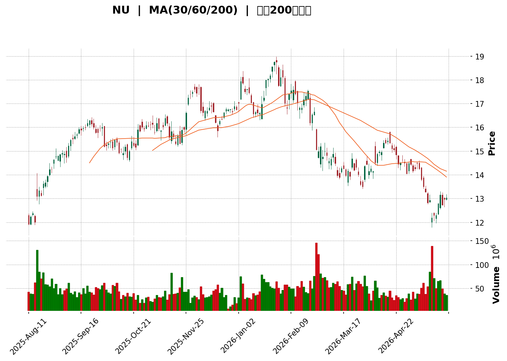
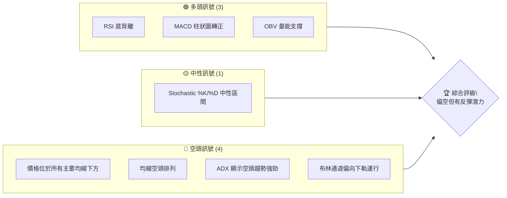
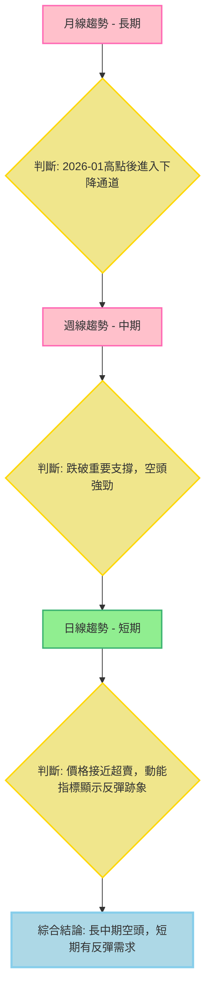

<details>
<summary>📊 靜態圖表 (點擊展開)</summary>

</details>

<html>
<head><meta charset="utf-8" /></head>
<body>
    <div>                        <script>window.PlotlyConfig = {MathJaxConfig: 'local'};</script>
        <script charset="utf-8" src="https://cdn.plot.ly/plotly-3.5.0.min.js" integrity="sha256-fHbNLP+GlIXN+efbQec78UkemUz3NJp7UmfGxC1tNxs=" crossorigin="anonymous"></script>                <div id="candlestick-chart" class="plotly-graph-div" style="height:500px; width:100%;"></div>            <script>                window.PLOTLYENV=window.PLOTLYENV || {};                                if (document.getElementById("candlestick-chart")) {                    Plotly.newPlot(                        "candlestick-chart",                        [{"close":{"dtype":"f8","bdata":"AAAAQArXJ0AAAABA4XooQAAAAKBwvShAAAAAwB4FKEAAAABAMzMqQAAAAMD1qCpAAAAAoHA9KkAAAACgcD0rQAAAAEAKVytAAAAAoEfhK0AAAACAwnUsQAAAAEDheixAAAAAIK5HLUAAAACAPYotQAAAAKCZmS1AAAAA4FG4LUAAAADAzMwtQAAAAKBwvS1AAAAAQOF6LUAAAADgo3AuQAAAACCF6y5AAAAAwB4FL0AAAACgcD0vQAAAAKBHYS9AAAAAgOvRL0AAAAAgrscvQAAAACCF6y9AAAAAQOH6L0AAAAAghSswQAAAAMDMTDBAAAAAYGYmMEAAAABgjwIwQAAAACBcjy9AAAAAIFyPL0AAAABgZuYvQAAAAGCPAjBAAAAAoEdhLkAAAADgo3AuQAAAAGC4ni5AAAAAYI\u002fCLkAAAABgj0IuQAAAACCF6y5AAAAAoHC9LkAAAABACtctQAAAAMD1KC5AAAAAgOvRLUAAAAAAKVwuQAAAAIDCdS1AAAAAAAAALkAAAACA69EuQAAAAEDhei5AAAAAgOtRLkAAAADAzMwvQAAAAIAUri9AAAAAAAAAMEAAAAAAKdwvQAAAAEAKFzBAAAAAIFwPMEAAAAAAKRwwQAAAAKBHITBAAAAAoJmZL0AAAAAghSswQAAAAKBH4S9AAAAAoHC9L0AAAADAHgUwQAAAAADXYzBAAAAAgBQuMEAAAACAFC4vQAAAAADXoy9AAAAAQDMzL0AAAAAA16MuQAAAAIDrUS9AAAAAANejLkAAAAAgrscvQAAAAEAK1y9AAAAAACmcMEAAAAAAAEAxQAAAAADXYzFAAAAAQOF6MUAAAAAAKZwxQAAAAOCjcDFAAAAAYGamMUAAAABAM7MwQAAAAGC4njBAAAAAgBSuMEAAAADgo7AwQAAAAIDr0TBAAAAAYGbmMEAAAABgZqYwQAAAAEAzMzBAAAAA4FG4L0AAAADAHkUwQAAAAEAKVzBAAAAAYLieMEAAAABgj8IwQAAAAKBwvTBAAAAAYI\u002fCMEAAAADA9agwQAAAAKBH4TBAAAAAoHC9MEAAAADAHgUxQAAAAOCj8DFAAAAAACncMUAAAAAAAIAxQAAAAAApnDFAAAAAgMJ1MUAAAACAPQoxQAAAACBcjzBAAAAAANejMEAAAAAAKZwwQAAAAKCZmTBAAAAA4FH4MEAAAACgcD0xQAAAAAAAADJAAAAAgD0KMkAAAACAFC4yQAAAAMDMjDJAAAAAYI\u002fCMkAAAABgj8IyQAAAAAAAwDFAAAAAACkcMkAAAABguB4yQAAAAMAeBTFAAAAAIFzPMEAAAABgZmYxQAAAAMDMjDFAAAAAgOuRMUAAAADA9WgxQAAAAIA9CjFAAAAAgOvRMEAAAACA69EwQAAAACCFKzFAAAAAgOtRMUAAAAAgrocxQAAAAOCjMDBAAAAAIK6HMEAAAABgZqYwQAAAAGC4Hi5AAAAAgML1LUAAAACgR2EuQAAAAMAehS1AAAAAAAAALkAAAAAA16MtQAAAAMD1KC1AAAAAQApXLUAAAABgj8ItQAAAAEDh+ixAAAAA4KPwK0AAAAAgrscrQAAAAIA9iixAAAAAAACALEAAAADgo\u002fArQAAAAIDrUSxAAAAAoEfhK0AAAAAAKVwtQAAAAKBHYSxAAAAAANejLEAAAACAPQosQAAAAEAzMytAAAAAwB4FK0AAAACgcL0sQAAAAKBH4SxAAAAAwMxMLEAAAADAHoUsQAAAAMDMTCxAAAAAwB4FLUAAAACgcL0tQAAAACCF6y1AAAAAYGbmLUAAAABAM7MuQAAAAIAUri5AAAAAACncLkAAAACAFK4uQAAAAEAzMy5AAAAAoJkZLkAAAABAM7MtQAAAACCF6yxAAAAAwB4FLUAAAAAgrkctQAAAAAAAAC1AAAAA4HoULEAAAACAwvUsQAAAAKBH4SxAAAAAgOtRLEAAAAAAAIAsQAAAAIDC9SxAAAAAwB6FLEAAAACgmZkrQAAAAAAAACtAAAAAgD2KKkAAAAAA16MpQAAAAAAp3ClAAAAAoEdhKEAAAADgepQoQAAAAOB6lChAAAAA4HqUKUAAAACA61EqQAAAAIDCdSlAAAAAgML1KUAAAAAgXA8qQA=="},"high":{"dtype":"f8","bdata":"AAAAoHC9KEAAAADgepQoQAAAACCF6yhAAAAAANejKEAAAAAA1yMsQAAAAMAeBStAAAAAgMK1KkAAAAAAAIArQAAAAKCZmStAAAAAgML1K0AAAABgjwItQAAAAEAzsyxAAAAAQApXLUAAAABA4TouQAAAAADXoy1AAAAAoHC9LUAAAACA6xEuQAAAAKBw\u002fS1AAAAAoJlZLkAAAADgo7AuQAAAAMAeBS9AAAAAIIVrL0AAAACgR6EvQAAAAIA9ii9AAAAAoEcBMEAAAACA6xEwQAAAAMDMDDBAAAAAoEchMEAAAACgmVkwQAAAAMDMTDBAAAAAwMxsMEAAAABguF4wQAAAAOBRGDBAAAAAoHD9L0AAAACgmRkwQAAAAOCjMDBAAAAAwMwMMEAAAADAzMwuQAAAAAAAwC5AAAAAQOH6LkAAAADgehQvQAAAAAAAAC9AAAAAwPUoL0AAAABgZuYuQAAAAKBwPS5AAAAAoEdhLkAAAAAAVo4uQAAAAGC4ni5AAAAAYLgeLkAAAAAgrkcvQAAAAIAULi9AAAAAIIXrLkAAAAAA1yMwQAAAAKBHITBAAAAAoJlZMEAAAACA6xEwQAAAAMAeRTBAAAAAoHA9MEAAAADAHkUwQAAAAAAAgDBAAAAAoHAdMEAAAAAghWswQAAAAGBmZjBAAAAAAADAL0AAAADgUTgwQAAAAMDMjDBAAAAAAACAMEAAAACA6zEwQAAAAGCPQjBAAAAAoHC9L0AAAACgmVkvQAAAAOCjcC9AAAAAQDMTMEAAAADAHgUwQAAAACBcDzBAAAAAwMysMEAAAACgR2ExQAAAAIAUjjFAAAAAIFyPMUAAAABACtcxQAAAAOBRuDFAAAAA4KPQMUAAAABA4boxQAAAAEAzEzFAAAAAQOG6MEAAAACgmdkwQAAAAAApHDFAAAAAIFwPMUAAAACA6xExQAAAAMAehTBAAAAAwPUoMEAAAADgIlswQAAAAOBReDBAAAAAoEehMEAAAADgetQwQAAAAMD1yDBAAAAAYI\u002fCMEAAAAAgXM8wQAAAAEDhGjFAAAAAwMzsMEAAAAAgXA8xQAAAAICVIzJAAAAAYLheMkAAAABgj8IxQAAAAIC+nzFAAAAAgOsRMkAAAAAghWsxQAAAAIDrETFAAAAA4KOwMEAAAADgUfgwQAAAAGAOrTBAAAAA4KNQMUAAAACAPYoxQAAAAAAAADJAAAAA4KMQMkAAAABgj0IyQAAAACBcjzJAAAAAwPXIMkAAAABA4foyQAAAAGC4njJAAAAAQAp3MkAAAABgZqYyQAAAAIA9KjJAAAAAYI8iMUAAAAAghWsxQAAAAEAK1zFAAAAAACm8MUAAAACgcP0xQAAAAMDMjDFAAAAAoEfhMEAAAAAAAAAxQAAAAEDhejFAAAAA4KNwMUAAAABACpcxQAAAAMD1aDFAAAAAQAqXMEAAAACgmdkwQAAAAKBH4S9AAAAAYGZmLkAAAABAi6wuQAAAAGC4Hi5AAAAAgMK1LkAAAADAzEwuQAAAAEAzcy1AAAAAgOuRLUAAAACAPUouQAAAAKBH4S1AAAAAQDOzLEAAAABguJ4sQAAAAKBwvSxAAAAA4HoULUAAAADAzIwsQAAAAAAAgCxAAAAAwMxMLEAAAABACtctQAAAAMAeBS1AAAAAoEdhLUAAAABgZqYsQAAAAGBm5itAAAAAgOuRK0AAAACA69EsQAAAAKCZmS1AAAAAgML1LEAAAAAgrscsQAAAAIDrUSxAAAAAwEnMLkAAAAAAKdwtQAAAAOB6FC5AAAAAIFwPLkAAAADgo\u002fAuQAAAAGC4Hi9AAAAAoEchL0AAAABguJ4vQAAAAEAzsy5AAAAAIFyPLkAAAADgo3AuQAAAAADXoy1AAAAA4HoULUAAAAAghastQAAAAEAKVy1AAAAAwB4FLUAAAABguB4tQAAAAIDrUS1AAAAA4KPwLEAAAACgR+EsQAAAAKCZGS1AAAAAQDMzLUAAAADA9agsQAAAAMD16CtAAAAAACkcK0AAAACAPYoqQAAAAEAKVypAAAAAIFzPKEAAAADAzMwoQAAAAMDMzChAAAAAoJmZKUAAAACgmZkqQAAAAMAehSpAAAAAoEchKkAAAAAAKVwqQA=="},"hovertemplate":"\u003cb\u003e%{x|%Y-%m-%d}\u003c\u002fb\u003e\u003cbr\u003e\u958b: $%{open:.2f}\u003cbr\u003e\u9ad8: $%{high:.2f}\u003cbr\u003e\u4f4e: $%{low:.2f}\u003cbr\u003e\u6536: $%{close:.2f}\u003cextra\u003e\u003c\u002fextra\u003e","low":{"dtype":"f8","bdata":"AAAAIK7HJ0AAAACAPconQAAAAAAAgChAAAAAIK7HJ0AAAABACtcpQAAAAIA9iilAAAAAQDMzKkAAAAAgrkcqQAAAAKBH4SpAAAAAQOH6KkAAAABguN4rQAAAACBaJCxAAAAAYI+CLEAAAACA61EtQAAAAIAULi1AAAAAgBSuLEAAAACAwnUtQAAAAIDC9SxAAAAAgD0KLUAAAAAghWstQAAAAGCPAi5AAAAAoJmZLkAAAACAwvUuQAAAAOB6FC9AAAAAwPVoL0AAAACA61EvQAAAAGBmpi9AAAAAwB7FL0AAAADAHgUwQAAAAIDC9S9AAAAAIK4HMEAAAACg8dIvQAAAAIDCdS9AAAAAoJkZL0AAAADA9agvQAAAAMDMTC9AAAAAgOtRLkAAAACAPQouQAAAAOBROC5AAAAAAABALkAAAACAPQouQAAAAKCZGS5AAAAAgMJ1LkAAAABgj8ItQAAAAEAK1y1AAAAAIK5HLUAAAADgUbgtQAAAAEBeOi1AAAAAYLgeLUAAAABguB4uQAAAACBcTy5AAAAAgOsRLkAAAACAwnUuQAAAACAEli9AAAAAQArXL0AAAAAA16MvQAAAAAAp3C9AAAAAANcDMEAAAABgj8IvQAAAAIAU7i9AAAAAYGZmL0AAAADgepQvQAAAAIAUri9AAAAAYGbmLkAAAADAzMwvQAAAAMDMDDBAAAAAIIULMEAAAADgUfguQAAAAADXoy5AAAAAAAAAL0AAAADAHoUuQAAAAKBHYS5AAAAAoJmZLkAAAABgj4IuQAAAACBcjy9AAAAAAClcL0AAAADA9egwQAAAAEAzMzFAAAAAIK5HMUAAAABA4XoxQAAAAIA9SjFAAAAAAClcMUAAAACgmZkwQAAAAOBReDBAAAAAAAJLMEAAAABACncwQAAAAEAzszBAAAAAoJmZMEAAAACgR6EwQAAAAIAULjBAAAAAgBQuL0AAAADAIBAwQAAAAEBiUDBAAAAAoJlZMEAAAAAgXI8wQAAAAGBmpjBAAAAAACmcMEAAAACAPYowQAAAAIAUrjBAAAAAgMK1MEAAAABgZqYwQAAAAIA9KjFAAAAAIFzPMUAAAAAgrmcxQAAAAGC4XjFAAAAAANdjMUAAAADAHgUxQAAAAIA9ajBAAAAAwMxsMEAAAACAQYAwQAAAAIAUTjBAAAAAoJlZMEAAAACA6xExQAAAAOB6VDFAAAAAgMK1MUAAAABgZuYxQAAAAKCZGTJAAAAAAClcMkAAAACgcD0yQAAAAIDCtTFAAAAAgMK1MUAAAABACtcxQAAAAAAA4DBAAAAAwMyMMEAAAABgj8IwQAAAAEAKNzFAAAAAgD0KMUAAAACgmVkxQAAAAIDCtTBAAAAAYLheMEAAAABACpcwQAAAAEAK1zBAAAAAwB7lMEAAAAAghSsxQAAAAOB6FDBAAAAAoHC9L0AAAAAA14MwQAAAAOB6FC5AAAAAYGZmLUAAAABguJ4sQAAAAEAKVyxAAAAAoJmZLUAAAADgUTgtQAAAAOBReCxAAAAAgMJ1LEAAAAAgXA8tQAAAAGCPwixAAAAAYI\u002fCK0AAAACgR6ErQAAAAGC4HixAAAAA4FF4LEAAAADgetQrQAAAACBcDytAAAAA4HqUK0AAAADgo3AsQAAAAIDrUSxAAAAAIIVrLEAAAAAAKdwrQAAAAOB6FCtAAAAAgOvRKkAAAABgZmYrQAAAAAAp3CxAAAAAAAKrK0AAAADA9SgsQAAAAIAUritAAAAAgOvRLEAAAADAzMwsQAAAACBcjy1AAAAAQDMzLUAAAACgcD0uQAAAAKCZmS5AAAAA4HqULkAAAABguJ4uQAAAAAAp3C1AAAAA4KPwLUAAAABAClctQAAAAIDrkSxAAAAAoEdhLEAAAACgmRktQAAAAIDCtSxAAAAA4HoULEAAAACgmRksQAAAAGCPwixAAAAAgBQuLEAAAABAClcsQAAAAKBwfSxAAAAAwPVoLEAAAAAAAIArQAAAAEAK1ypAAAAAwB6FKkAAAAAgrocpQAAAAIAUrilAAAAAIFyPJ0AAAABguB4oQAAAACCF6ydAAAAAwPWoKEAAAABguB4pQAAAACCFaylAAAAAwMxMKUAAAAAAKdwpQA=="},"name":"\u50f9\u683c","open":{"dtype":"f8","bdata":"AAAAoJmZKEAAAABACtcnQAAAAMD1qChAAAAAgD2KKEAAAADAzMwqQAAAAEAzMypAAAAAgMJ1KkAAAACAFO4qQAAAAIA9CitAAAAA4KNwK0AAAAAAAAAsQAAAAEDheixAAAAAgML1LEAAAAAAAIAtQAAAAOBROC1AAAAAwPUoLUAAAACgcL0tQAAAAIAUri1AAAAAwB4FLkAAAAAgXI8tQAAAAIDCdS5AAAAAoJkZL0AAAAAgXA8vQAAAAAApXC9AAAAAAACAL0AAAACgR+EvQAAAAGBm5i9AAAAAYI8CMEAAAACA6xEwQAAAAAApHDBAAAAAwMxMMEAAAACAFC4wQAAAAAAp3C9AAAAAACncL0AAAABgZuYvQAAAACCF6y9AAAAAwMwMMEAAAACAPYouQAAAACBcjy5AAAAAoHC9LkAAAACA69EuQAAAAAApXC5AAAAAIFwPL0AAAADgUbguQAAAAMD1KC5AAAAAQDOzLUAAAAAAAAAuQAAAAOB6lC5AAAAAIK5HLUAAAABgj0IuQAAAAEAzsy5AAAAAANejLkAAAADAHoUuQAAAAEAKFzBAAAAAQOE6MEAAAAAghesvQAAAAGBm5i9AAAAAgOsRMEAAAAAAKRwwQAAAAOCjMDBAAAAAoJmZL0AAAADgUbgvQAAAAGC4XjBAAAAAANejL0AAAACgmRkwQAAAAEAKFzBAAAAAgMJ1MEAAAACAPQowQAAAAAAp3C5AAAAA4FF4L0AAAADAzMwuQAAAAMDMjC5AAAAAgBSuL0AAAACAwrUuQAAAAAAAADBAAAAAQArXL0AAAABA4fowQAAAAADXYzFAAAAAgBRuMUAAAACAwrUxQAAAAEAzszFAAAAAYGamMUAAAABAM7MxQAAAAGC43jBAAAAAwB5lMEAAAACgmZkwQAAAAEDhujBAAAAAIK7nMEAAAABgZgYxQAAAAAAAgDBAAAAAQAoXMEAAAABgZiYwQAAAAKCZWTBAAAAAIIVrMEAAAADgo7AwQAAAAEAzszBAAAAAoHC9MEAAAACAPaowQAAAAMAexTBAAAAAYLjeMEAAAAAgXA8xQAAAAIAULjFAAAAAYLgeMkAAAABguJ4xQAAAAEAKlzFAAAAAgBSuMUAAAACgmVkxQAAAACBcDzFAAAAA4KOQMEAAAAAAAMAwQAAAAIDrkTBAAAAAAClcMEAAAABgjyIxQAAAAIA9qjFAAAAAAAAAMkAAAADAzAwyQAAAAAApXDJAAAAAYI+iMkAAAADgetQyQAAAACCuhzJAAAAAoHC9MUAAAAAgrmcyQAAAAOB6FDJAAAAA4HrUMEAAAAAghSsxQAAAAOCjcDFAAAAAYGYmMUAAAACA6\u002fExQAAAAMD1iDFAAAAAoHC9MEAAAAAAAMAwQAAAAEAz8zBAAAAAANcjMUAAAABAMzMxQAAAAAAAQDFAAAAA4KMwMEAAAAAA14MwQAAAAEAK1y9AAAAA4KNwLUAAAAAghessQAAAAAApXC1AAAAAoHD9LUAAAAAAKdwtQAAAAGCPAi1AAAAAgOvRLEAAAABA4XotQAAAAAAAgC1AAAAAYGZmLEAAAAAA1yMsQAAAAKBwPSxAAAAAwMzMLEAAAADgo3AsQAAAAAApXCtAAAAAoHA9LEAAAACgR6EsQAAAAOBR+CxAAAAAYI9CLUAAAABgj0IsQAAAAIDCdStAAAAAIIVrK0AAAACgmZkrQAAAAIAULi1AAAAAAAAALEAAAABgj0IsQAAAAEAzMyxAAAAAIIVrLkAAAADAHgUtQAAAAAAp3C1AAAAAgBSuLUAAAABgj0IuQAAAACCF6y5AAAAAIK7HLkAAAABguJ4vQAAAAEDhei5AAAAA4FE4LkAAAAAAKVwuQAAAAGC4ni1AAAAAQArXLEAAAAAgrkctQAAAAOB6FC1AAAAAgML1LEAAAADgelQsQAAAAIDrUS1AAAAAIK7HLEAAAAAA16MsQAAAAAAAAC1AAAAAAAAALUAAAACgmZksQAAAAGCPwitAAAAAQArXKkAAAAAghWsqQAAAAEAzsylAAAAAQIkBKEAAAADAzMwoQAAAAOB6VChAAAAAgBSuKEAAAADgUTgpQAAAAMDMTCpAAAAAIK4HKkAAAAAghespQA=="},"x":["2025-08-11T00:00:00-04:00","2025-08-12T00:00:00-04:00","2025-08-13T00:00:00-04:00","2025-08-14T00:00:00-04:00","2025-08-15T00:00:00-04:00","2025-08-18T00:00:00-04:00","2025-08-19T00:00:00-04:00","2025-08-20T00:00:00-04:00","2025-08-21T00:00:00-04:00","2025-08-22T00:00:00-04:00","2025-08-25T00:00:00-04:00","2025-08-26T00:00:00-04:00","2025-08-27T00:00:00-04:00","2025-08-28T00:00:00-04:00","2025-08-29T00:00:00-04:00","2025-09-02T00:00:00-04:00","2025-09-03T00:00:00-04:00","2025-09-04T00:00:00-04:00","2025-09-05T00:00:00-04:00","2025-09-08T00:00:00-04:00","2025-09-09T00:00:00-04:00","2025-09-10T00:00:00-04:00","2025-09-11T00:00:00-04:00","2025-09-12T00:00:00-04:00","2025-09-15T00:00:00-04:00","2025-09-16T00:00:00-04:00","2025-09-17T00:00:00-04:00","2025-09-18T00:00:00-04:00","2025-09-19T00:00:00-04:00","2025-09-22T00:00:00-04:00","2025-09-23T00:00:00-04:00","2025-09-24T00:00:00-04:00","2025-09-25T00:00:00-04:00","2025-09-26T00:00:00-04:00","2025-09-29T00:00:00-04:00","2025-09-30T00:00:00-04:00","2025-10-01T00:00:00-04:00","2025-10-02T00:00:00-04:00","2025-10-03T00:00:00-04:00","2025-10-06T00:00:00-04:00","2025-10-07T00:00:00-04:00","2025-10-08T00:00:00-04:00","2025-10-09T00:00:00-04:00","2025-10-10T00:00:00-04:00","2025-10-13T00:00:00-04:00","2025-10-14T00:00:00-04:00","2025-10-15T00:00:00-04:00","2025-10-16T00:00:00-04:00","2025-10-17T00:00:00-04:00","2025-10-20T00:00:00-04:00","2025-10-21T00:00:00-04:00","2025-10-22T00:00:00-04:00","2025-10-23T00:00:00-04:00","2025-10-24T00:00:00-04:00","2025-10-27T00:00:00-04:00","2025-10-28T00:00:00-04:00","2025-10-29T00:00:00-04:00","2025-10-30T00:00:00-04:00","2025-10-31T00:00:00-04:00","2025-11-03T00:00:00-05:00","2025-11-04T00:00:00-05:00","2025-11-05T00:00:00-05:00","2025-11-06T00:00:00-05:00","2025-11-07T00:00:00-05:00","2025-11-10T00:00:00-05:00","2025-11-11T00:00:00-05:00","2025-11-12T00:00:00-05:00","2025-11-13T00:00:00-05:00","2025-11-14T00:00:00-05:00","2025-11-17T00:00:00-05:00","2025-11-18T00:00:00-05:00","2025-11-19T00:00:00-05:00","2025-11-20T00:00:00-05:00","2025-11-21T00:00:00-05:00","2025-11-24T00:00:00-05:00","2025-11-25T00:00:00-05:00","2025-11-26T00:00:00-05:00","2025-11-28T00:00:00-05:00","2025-12-01T00:00:00-05:00","2025-12-02T00:00:00-05:00","2025-12-03T00:00:00-05:00","2025-12-04T00:00:00-05:00","2025-12-05T00:00:00-05:00","2025-12-08T00:00:00-05:00","2025-12-09T00:00:00-05:00","2025-12-10T00:00:00-05:00","2025-12-11T00:00:00-05:00","2025-12-12T00:00:00-05:00","2025-12-15T00:00:00-05:00","2025-12-16T00:00:00-05:00","2025-12-17T00:00:00-05:00","2025-12-18T00:00:00-05:00","2025-12-19T00:00:00-05:00","2025-12-22T00:00:00-05:00","2025-12-23T00:00:00-05:00","2025-12-24T00:00:00-05:00","2025-12-26T00:00:00-05:00","2025-12-29T00:00:00-05:00","2025-12-30T00:00:00-05:00","2025-12-31T00:00:00-05:00","2026-01-02T00:00:00-05:00","2026-01-05T00:00:00-05:00","2026-01-06T00:00:00-05:00","2026-01-07T00:00:00-05:00","2026-01-08T00:00:00-05:00","2026-01-09T00:00:00-05:00","2026-01-12T00:00:00-05:00","2026-01-13T00:00:00-05:00","2026-01-14T00:00:00-05:00","2026-01-15T00:00:00-05:00","2026-01-16T00:00:00-05:00","2026-01-20T00:00:00-05:00","2026-01-21T00:00:00-05:00","2026-01-22T00:00:00-05:00","2026-01-23T00:00:00-05:00","2026-01-26T00:00:00-05:00","2026-01-27T00:00:00-05:00","2026-01-28T00:00:00-05:00","2026-01-29T00:00:00-05:00","2026-01-30T00:00:00-05:00","2026-02-02T00:00:00-05:00","2026-02-03T00:00:00-05:00","2026-02-04T00:00:00-05:00","2026-02-05T00:00:00-05:00","2026-02-06T00:00:00-05:00","2026-02-09T00:00:00-05:00","2026-02-10T00:00:00-05:00","2026-02-11T00:00:00-05:00","2026-02-12T00:00:00-05:00","2026-02-13T00:00:00-05:00","2026-02-17T00:00:00-05:00","2026-02-18T00:00:00-05:00","2026-02-19T00:00:00-05:00","2026-02-20T00:00:00-05:00","2026-02-23T00:00:00-05:00","2026-02-24T00:00:00-05:00","2026-02-25T00:00:00-05:00","2026-02-26T00:00:00-05:00","2026-02-27T00:00:00-05:00","2026-03-02T00:00:00-05:00","2026-03-03T00:00:00-05:00","2026-03-04T00:00:00-05:00","2026-03-05T00:00:00-05:00","2026-03-06T00:00:00-05:00","2026-03-09T00:00:00-04:00","2026-03-10T00:00:00-04:00","2026-03-11T00:00:00-04:00","2026-03-12T00:00:00-04:00","2026-03-13T00:00:00-04:00","2026-03-16T00:00:00-04:00","2026-03-17T00:00:00-04:00","2026-03-18T00:00:00-04:00","2026-03-19T00:00:00-04:00","2026-03-20T00:00:00-04:00","2026-03-23T00:00:00-04:00","2026-03-24T00:00:00-04:00","2026-03-25T00:00:00-04:00","2026-03-26T00:00:00-04:00","2026-03-27T00:00:00-04:00","2026-03-30T00:00:00-04:00","2026-03-31T00:00:00-04:00","2026-04-01T00:00:00-04:00","2026-04-02T00:00:00-04:00","2026-04-06T00:00:00-04:00","2026-04-07T00:00:00-04:00","2026-04-08T00:00:00-04:00","2026-04-09T00:00:00-04:00","2026-04-10T00:00:00-04:00","2026-04-13T00:00:00-04:00","2026-04-14T00:00:00-04:00","2026-04-15T00:00:00-04:00","2026-04-16T00:00:00-04:00","2026-04-17T00:00:00-04:00","2026-04-20T00:00:00-04:00","2026-04-21T00:00:00-04:00","2026-04-22T00:00:00-04:00","2026-04-23T00:00:00-04:00","2026-04-24T00:00:00-04:00","2026-04-27T00:00:00-04:00","2026-04-28T00:00:00-04:00","2026-04-29T00:00:00-04:00","2026-04-30T00:00:00-04:00","2026-05-01T00:00:00-04:00","2026-05-04T00:00:00-04:00","2026-05-05T00:00:00-04:00","2026-05-06T00:00:00-04:00","2026-05-07T00:00:00-04:00","2026-05-08T00:00:00-04:00","2026-05-11T00:00:00-04:00","2026-05-12T00:00:00-04:00","2026-05-13T00:00:00-04:00","2026-05-14T00:00:00-04:00","2026-05-15T00:00:00-04:00","2026-05-18T00:00:00-04:00","2026-05-19T00:00:00-04:00","2026-05-20T00:00:00-04:00","2026-05-21T00:00:00-04:00","2026-05-22T00:00:00-04:00","2026-05-26T00:00:00-04:00","2026-05-27T00:00:00-04:00"],"type":"candlestick"},{"hovertemplate":"MA30: $%{y:.2f}\u003cextra\u003e\u003c\u002fextra\u003e","line":{"color":"#2196F3","dash":"dash","width":2},"mode":"lines","name":"MA30","x":["2025-08-11T00:00:00-04:00","2025-08-12T00:00:00-04:00","2025-08-13T00:00:00-04:00","2025-08-14T00:00:00-04:00","2025-08-15T00:00:00-04:00","2025-08-18T00:00:00-04:00","2025-08-19T00:00:00-04:00","2025-08-20T00:00:00-04:00","2025-08-21T00:00:00-04:00","2025-08-22T00:00:00-04:00","2025-08-25T00:00:00-04:00","2025-08-26T00:00:00-04:00","2025-08-27T00:00:00-04:00","2025-08-28T00:00:00-04:00","2025-08-29T00:00:00-04:00","2025-09-02T00:00:00-04:00","2025-09-03T00:00:00-04:00","2025-09-04T00:00:00-04:00","2025-09-05T00:00:00-04:00","2025-09-08T00:00:00-04:00","2025-09-09T00:00:00-04:00","2025-09-10T00:00:00-04:00","2025-09-11T00:00:00-04:00","2025-09-12T00:00:00-04:00","2025-09-15T00:00:00-04:00","2025-09-16T00:00:00-04:00","2025-09-17T00:00:00-04:00","2025-09-18T00:00:00-04:00","2025-09-19T00:00:00-04:00","2025-09-22T00:00:00-04:00","2025-09-23T00:00:00-04:00","2025-09-24T00:00:00-04:00","2025-09-25T00:00:00-04:00","2025-09-26T00:00:00-04:00","2025-09-29T00:00:00-04:00","2025-09-30T00:00:00-04:00","2025-10-01T00:00:00-04:00","2025-10-02T00:00:00-04:00","2025-10-03T00:00:00-04:00","2025-10-06T00:00:00-04:00","2025-10-07T00:00:00-04:00","2025-10-08T00:00:00-04:00","2025-10-09T00:00:00-04:00","2025-10-10T00:00:00-04:00","2025-10-13T00:00:00-04:00","2025-10-14T00:00:00-04:00","2025-10-15T00:00:00-04:00","2025-10-16T00:00:00-04:00","2025-10-17T00:00:00-04:00","2025-10-20T00:00:00-04:00","2025-10-21T00:00:00-04:00","2025-10-22T00:00:00-04:00","2025-10-23T00:00:00-04:00","2025-10-24T00:00:00-04:00","2025-10-27T00:00:00-04:00","2025-10-28T00:00:00-04:00","2025-10-29T00:00:00-04:00","2025-10-30T00:00:00-04:00","2025-10-31T00:00:00-04:00","2025-11-03T00:00:00-05:00","2025-11-04T00:00:00-05:00","2025-11-05T00:00:00-05:00","2025-11-06T00:00:00-05:00","2025-11-07T00:00:00-05:00","2025-11-10T00:00:00-05:00","2025-11-11T00:00:00-05:00","2025-11-12T00:00:00-05:00","2025-11-13T00:00:00-05:00","2025-11-14T00:00:00-05:00","2025-11-17T00:00:00-05:00","2025-11-18T00:00:00-05:00","2025-11-19T00:00:00-05:00","2025-11-20T00:00:00-05:00","2025-11-21T00:00:00-05:00","2025-11-24T00:00:00-05:00","2025-11-25T00:00:00-05:00","2025-11-26T00:00:00-05:00","2025-11-28T00:00:00-05:00","2025-12-01T00:00:00-05:00","2025-12-02T00:00:00-05:00","2025-12-03T00:00:00-05:00","2025-12-04T00:00:00-05:00","2025-12-05T00:00:00-05:00","2025-12-08T00:00:00-05:00","2025-12-09T00:00:00-05:00","2025-12-10T00:00:00-05:00","2025-12-11T00:00:00-05:00","2025-12-12T00:00:00-05:00","2025-12-15T00:00:00-05:00","2025-12-16T00:00:00-05:00","2025-12-17T00:00:00-05:00","2025-12-18T00:00:00-05:00","2025-12-19T00:00:00-05:00","2025-12-22T00:00:00-05:00","2025-12-23T00:00:00-05:00","2025-12-24T00:00:00-05:00","2025-12-26T00:00:00-05:00","2025-12-29T00:00:00-05:00","2025-12-30T00:00:00-05:00","2025-12-31T00:00:00-05:00","2026-01-02T00:00:00-05:00","2026-01-05T00:00:00-05:00","2026-01-06T00:00:00-05:00","2026-01-07T00:00:00-05:00","2026-01-08T00:00:00-05:00","2026-01-09T00:00:00-05:00","2026-01-12T00:00:00-05:00","2026-01-13T00:00:00-05:00","2026-01-14T00:00:00-05:00","2026-01-15T00:00:00-05:00","2026-01-16T00:00:00-05:00","2026-01-20T00:00:00-05:00","2026-01-21T00:00:00-05:00","2026-01-22T00:00:00-05:00","2026-01-23T00:00:00-05:00","2026-01-26T00:00:00-05:00","2026-01-27T00:00:00-05:00","2026-01-28T00:00:00-05:00","2026-01-29T00:00:00-05:00","2026-01-30T00:00:00-05:00","2026-02-02T00:00:00-05:00","2026-02-03T00:00:00-05:00","2026-02-04T00:00:00-05:00","2026-02-05T00:00:00-05:00","2026-02-06T00:00:00-05:00","2026-02-09T00:00:00-05:00","2026-02-10T00:00:00-05:00","2026-02-11T00:00:00-05:00","2026-02-12T00:00:00-05:00","2026-02-13T00:00:00-05:00","2026-02-17T00:00:00-05:00","2026-02-18T00:00:00-05:00","2026-02-19T00:00:00-05:00","2026-02-20T00:00:00-05:00","2026-02-23T00:00:00-05:00","2026-02-24T00:00:00-05:00","2026-02-25T00:00:00-05:00","2026-02-26T00:00:00-05:00","2026-02-27T00:00:00-05:00","2026-03-02T00:00:00-05:00","2026-03-03T00:00:00-05:00","2026-03-04T00:00:00-05:00","2026-03-05T00:00:00-05:00","2026-03-06T00:00:00-05:00","2026-03-09T00:00:00-04:00","2026-03-10T00:00:00-04:00","2026-03-11T00:00:00-04:00","2026-03-12T00:00:00-04:00","2026-03-13T00:00:00-04:00","2026-03-16T00:00:00-04:00","2026-03-17T00:00:00-04:00","2026-03-18T00:00:00-04:00","2026-03-19T00:00:00-04:00","2026-03-20T00:00:00-04:00","2026-03-23T00:00:00-04:00","2026-03-24T00:00:00-04:00","2026-03-25T00:00:00-04:00","2026-03-26T00:00:00-04:00","2026-03-27T00:00:00-04:00","2026-03-30T00:00:00-04:00","2026-03-31T00:00:00-04:00","2026-04-01T00:00:00-04:00","2026-04-02T00:00:00-04:00","2026-04-06T00:00:00-04:00","2026-04-07T00:00:00-04:00","2026-04-08T00:00:00-04:00","2026-04-09T00:00:00-04:00","2026-04-10T00:00:00-04:00","2026-04-13T00:00:00-04:00","2026-04-14T00:00:00-04:00","2026-04-15T00:00:00-04:00","2026-04-16T00:00:00-04:00","2026-04-17T00:00:00-04:00","2026-04-20T00:00:00-04:00","2026-04-21T00:00:00-04:00","2026-04-22T00:00:00-04:00","2026-04-23T00:00:00-04:00","2026-04-24T00:00:00-04:00","2026-04-27T00:00:00-04:00","2026-04-28T00:00:00-04:00","2026-04-29T00:00:00-04:00","2026-04-30T00:00:00-04:00","2026-05-01T00:00:00-04:00","2026-05-04T00:00:00-04:00","2026-05-05T00:00:00-04:00","2026-05-06T00:00:00-04:00","2026-05-07T00:00:00-04:00","2026-05-08T00:00:00-04:00","2026-05-11T00:00:00-04:00","2026-05-12T00:00:00-04:00","2026-05-13T00:00:00-04:00","2026-05-14T00:00:00-04:00","2026-05-15T00:00:00-04:00","2026-05-18T00:00:00-04:00","2026-05-19T00:00:00-04:00","2026-05-20T00:00:00-04:00","2026-05-21T00:00:00-04:00","2026-05-22T00:00:00-04:00","2026-05-26T00:00:00-04:00","2026-05-27T00:00:00-04:00"],"y":{"dtype":"f8","bdata":"AAAAAAAA+H8AAAAAAAD4fwAAAAAAAPh\u002fAAAAAAAA+H8AAAAAAAD4fwAAAAAAAPh\u002fAAAAAAAA+H8AAAAAAAD4fwAAAAAAAPh\u002fAAAAAAAA+H8AAAAAAAD4fwAAAAAAAPh\u002fAAAAAAAA+H8AAAAAAAD4fwAAAAAAAPh\u002fAAAAAAAA+H8AAAAAAAD4fwAAAAAAAPh\u002fAAAAAAAA+H8AAAAAAAD4fwAAAAAAAPh\u002fAAAAAAAA+H8AAAAAAAD4fwAAAAAAAPh\u002fAAAAAAAA+H8AAAAAAAD4fwAAAAAAAPh\u002fAAAAAAAA+H8AAAAAAAD4f1VVVTWJAS1AvLu7W7pJLUDe3d29EYotQCIiIkJExC1AMzMzo5sELkCamZl5PzUuQDMzM5P8Yi5Aq6qqilCGLkDNzMwMn6EuQCIiIlKcvS5Ad3d3xy\u002fWLkARERHxi+UuQERERDRe+i5A7+7untMGL0Crqqr6YgkvQBEREVEqDi9AVVVVxQQPL0DNzMwczBMvQBEREXFoES9AZmZmZtgVL0BVVVWFFhkvQDMzM1NVFS9AZmZmJlwPL0DNzMx8IxQvQJqZmdmyFi9AERERETwYL0BERETU6hgvQO\u002fu7s4iGy9AREREpFQcL0AAAACAThsvQCIiIsJnGC9AZmZmlm4SL0AzMzOjKRUvQAAAALDkFy9Ad3d3520ZL0De3d29nxovQLy7u\u002fsbIS9AzczMXAEyL0CrqqrqUTgvQDMzMyMGQS9AVVVVVcdEL0BERER0BUgvQERERERvSy9AAAAA0JRKL0Dv7u7OIlsvQDMzM9N4aS9A3t3dPXyGL0BVVVU10KkvQM3MzOw11y9Aq6qqmsQAMEBERESUihMwQN7d3Y1QJjBAq6qqCpA7MEC8u7urY0IwQLy7u5sLSTBAd3d3F9lOMEBmZmZWVVUwQLy7uwuQWzBA3t3dDbtiMEAzMzOzVmcwQO\u002fu7p7vZzBAERERsXJoMEBVVVUlTWkwQN7d3fW2bDBAzczMXB1zMECrqqrqbXkwQBEREYFqfDBAiYiIiF2BMEC8u7v7foowQGZmZpaKkzBARERE9ESdMECamZmpxqswQGZmZmY7vzBA3t3dHejUMEDv7u42peIwQLy7uxMR8TBAVVVV7VH4MEBVVVUth\u002fYwQLy7uwNy7zBAmpmZAUfoMEARERF5vt8wQO\u002fu7naT2DBAMzMz+8XSMECJiIigYdcwQAAAAEgo4zBAd3d3P8PuMEC8u7szevswQJqZmXE9CjFAVVVVrRwaMUAzMzMLHiwxQJqZmRFYOTFAVVVVRYtMMUCJiIioVFwxQERERCQiYjFAMzMzM8FjMUDNzMxMN2kxQFVVVcUgcDFA3t3dPQp3MUBERESkcH0xQLy7uyvOfjFA7+7u7nx\u002fMUBmZmYGyH0xQO\u002fu7u41dzFAiYiISJpyMUAiIiLS23IxQImIiMi9ZjFAvLu7K85eMUAzMzMzelsxQO\u002fu7matTjFAvLu7E4NAMUCamZkJZTQxQO\u002fu7n6xJDFAd3d39+ETMUBVVVVlO\u002f8wQKuqqkoM4jBAmpmZaUrFMEC8u7tzIakwQHd3dz98hjBAVVVVVZxdMEAAAACoDTQwQDMzM3tbFjBAzczMXNbqL0C8u7u7AqQvQDMzMzMzcy9Aq6qq+jdCL0Dv7u4ezBMvQO\u002fu7g502i5Ad3d3l\u002fyiLkBVVVV1IWkuQN7d3d1rLi5AIiIiQu71LUC8u7sLHswtQN7d3X2GnS1AzczMjGxnLUAzMzOznS8tQM3MzMzMDC1AiYiISFPqLECJiIhY8sssQAAAAHA9yixA3t3dXbrJLEC8u7trdcwsQKuqqnpb1ixA3t3dLbLdLECJiIgYkuYsQDMzMwNy7yxAIiIiQu71LEAAAAAwa\u002fUsQN7d3R3o9CxAmpmZaR\u002f+LEBmZmY27AotQImIiBjZDi1Ad3d3l0MLLUAAAADQ9xMtQGZmZia\u002fGC1AiYiIWIAcLUBVVVWlKRUtQM3MzKwcGi1AiYiIiBYZLUBmZmZWVRUtQN7d3W2gEy1Aq6qq2ocPLUDNzMzME\u002fUsQDMzM4NO2yxAREREJNu5LEBEREQUPJgsQN7d3Z19eCxAIiIi0iJbLEB3d3e38z0sQCIiIrLkFyxAIiIiokX2K0BVVVVlrc4rQA=="},"type":"scatter"},{"hovertemplate":"MA60: $%{y:.2f}\u003cextra\u003e\u003c\u002fextra\u003e","line":{"color":"#9C27B0","dash":"dash","width":2},"mode":"lines","name":"MA60","x":["2025-08-11T00:00:00-04:00","2025-08-12T00:00:00-04:00","2025-08-13T00:00:00-04:00","2025-08-14T00:00:00-04:00","2025-08-15T00:00:00-04:00","2025-08-18T00:00:00-04:00","2025-08-19T00:00:00-04:00","2025-08-20T00:00:00-04:00","2025-08-21T00:00:00-04:00","2025-08-22T00:00:00-04:00","2025-08-25T00:00:00-04:00","2025-08-26T00:00:00-04:00","2025-08-27T00:00:00-04:00","2025-08-28T00:00:00-04:00","2025-08-29T00:00:00-04:00","2025-09-02T00:00:00-04:00","2025-09-03T00:00:00-04:00","2025-09-04T00:00:00-04:00","2025-09-05T00:00:00-04:00","2025-09-08T00:00:00-04:00","2025-09-09T00:00:00-04:00","2025-09-10T00:00:00-04:00","2025-09-11T00:00:00-04:00","2025-09-12T00:00:00-04:00","2025-09-15T00:00:00-04:00","2025-09-16T00:00:00-04:00","2025-09-17T00:00:00-04:00","2025-09-18T00:00:00-04:00","2025-09-19T00:00:00-04:00","2025-09-22T00:00:00-04:00","2025-09-23T00:00:00-04:00","2025-09-24T00:00:00-04:00","2025-09-25T00:00:00-04:00","2025-09-26T00:00:00-04:00","2025-09-29T00:00:00-04:00","2025-09-30T00:00:00-04:00","2025-10-01T00:00:00-04:00","2025-10-02T00:00:00-04:00","2025-10-03T00:00:00-04:00","2025-10-06T00:00:00-04:00","2025-10-07T00:00:00-04:00","2025-10-08T00:00:00-04:00","2025-10-09T00:00:00-04:00","2025-10-10T00:00:00-04:00","2025-10-13T00:00:00-04:00","2025-10-14T00:00:00-04:00","2025-10-15T00:00:00-04:00","2025-10-16T00:00:00-04:00","2025-10-17T00:00:00-04:00","2025-10-20T00:00:00-04:00","2025-10-21T00:00:00-04:00","2025-10-22T00:00:00-04:00","2025-10-23T00:00:00-04:00","2025-10-24T00:00:00-04:00","2025-10-27T00:00:00-04:00","2025-10-28T00:00:00-04:00","2025-10-29T00:00:00-04:00","2025-10-30T00:00:00-04:00","2025-10-31T00:00:00-04:00","2025-11-03T00:00:00-05:00","2025-11-04T00:00:00-05:00","2025-11-05T00:00:00-05:00","2025-11-06T00:00:00-05:00","2025-11-07T00:00:00-05:00","2025-11-10T00:00:00-05:00","2025-11-11T00:00:00-05:00","2025-11-12T00:00:00-05:00","2025-11-13T00:00:00-05:00","2025-11-14T00:00:00-05:00","2025-11-17T00:00:00-05:00","2025-11-18T00:00:00-05:00","2025-11-19T00:00:00-05:00","2025-11-20T00:00:00-05:00","2025-11-21T00:00:00-05:00","2025-11-24T00:00:00-05:00","2025-11-25T00:00:00-05:00","2025-11-26T00:00:00-05:00","2025-11-28T00:00:00-05:00","2025-12-01T00:00:00-05:00","2025-12-02T00:00:00-05:00","2025-12-03T00:00:00-05:00","2025-12-04T00:00:00-05:00","2025-12-05T00:00:00-05:00","2025-12-08T00:00:00-05:00","2025-12-09T00:00:00-05:00","2025-12-10T00:00:00-05:00","2025-12-11T00:00:00-05:00","2025-12-12T00:00:00-05:00","2025-12-15T00:00:00-05:00","2025-12-16T00:00:00-05:00","2025-12-17T00:00:00-05:00","2025-12-18T00:00:00-05:00","2025-12-19T00:00:00-05:00","2025-12-22T00:00:00-05:00","2025-12-23T00:00:00-05:00","2025-12-24T00:00:00-05:00","2025-12-26T00:00:00-05:00","2025-12-29T00:00:00-05:00","2025-12-30T00:00:00-05:00","2025-12-31T00:00:00-05:00","2026-01-02T00:00:00-05:00","2026-01-05T00:00:00-05:00","2026-01-06T00:00:00-05:00","2026-01-07T00:00:00-05:00","2026-01-08T00:00:00-05:00","2026-01-09T00:00:00-05:00","2026-01-12T00:00:00-05:00","2026-01-13T00:00:00-05:00","2026-01-14T00:00:00-05:00","2026-01-15T00:00:00-05:00","2026-01-16T00:00:00-05:00","2026-01-20T00:00:00-05:00","2026-01-21T00:00:00-05:00","2026-01-22T00:00:00-05:00","2026-01-23T00:00:00-05:00","2026-01-26T00:00:00-05:00","2026-01-27T00:00:00-05:00","2026-01-28T00:00:00-05:00","2026-01-29T00:00:00-05:00","2026-01-30T00:00:00-05:00","2026-02-02T00:00:00-05:00","2026-02-03T00:00:00-05:00","2026-02-04T00:00:00-05:00","2026-02-05T00:00:00-05:00","2026-02-06T00:00:00-05:00","2026-02-09T00:00:00-05:00","2026-02-10T00:00:00-05:00","2026-02-11T00:00:00-05:00","2026-02-12T00:00:00-05:00","2026-02-13T00:00:00-05:00","2026-02-17T00:00:00-05:00","2026-02-18T00:00:00-05:00","2026-02-19T00:00:00-05:00","2026-02-20T00:00:00-05:00","2026-02-23T00:00:00-05:00","2026-02-24T00:00:00-05:00","2026-02-25T00:00:00-05:00","2026-02-26T00:00:00-05:00","2026-02-27T00:00:00-05:00","2026-03-02T00:00:00-05:00","2026-03-03T00:00:00-05:00","2026-03-04T00:00:00-05:00","2026-03-05T00:00:00-05:00","2026-03-06T00:00:00-05:00","2026-03-09T00:00:00-04:00","2026-03-10T00:00:00-04:00","2026-03-11T00:00:00-04:00","2026-03-12T00:00:00-04:00","2026-03-13T00:00:00-04:00","2026-03-16T00:00:00-04:00","2026-03-17T00:00:00-04:00","2026-03-18T00:00:00-04:00","2026-03-19T00:00:00-04:00","2026-03-20T00:00:00-04:00","2026-03-23T00:00:00-04:00","2026-03-24T00:00:00-04:00","2026-03-25T00:00:00-04:00","2026-03-26T00:00:00-04:00","2026-03-27T00:00:00-04:00","2026-03-30T00:00:00-04:00","2026-03-31T00:00:00-04:00","2026-04-01T00:00:00-04:00","2026-04-02T00:00:00-04:00","2026-04-06T00:00:00-04:00","2026-04-07T00:00:00-04:00","2026-04-08T00:00:00-04:00","2026-04-09T00:00:00-04:00","2026-04-10T00:00:00-04:00","2026-04-13T00:00:00-04:00","2026-04-14T00:00:00-04:00","2026-04-15T00:00:00-04:00","2026-04-16T00:00:00-04:00","2026-04-17T00:00:00-04:00","2026-04-20T00:00:00-04:00","2026-04-21T00:00:00-04:00","2026-04-22T00:00:00-04:00","2026-04-23T00:00:00-04:00","2026-04-24T00:00:00-04:00","2026-04-27T00:00:00-04:00","2026-04-28T00:00:00-04:00","2026-04-29T00:00:00-04:00","2026-04-30T00:00:00-04:00","2026-05-01T00:00:00-04:00","2026-05-04T00:00:00-04:00","2026-05-05T00:00:00-04:00","2026-05-06T00:00:00-04:00","2026-05-07T00:00:00-04:00","2026-05-08T00:00:00-04:00","2026-05-11T00:00:00-04:00","2026-05-12T00:00:00-04:00","2026-05-13T00:00:00-04:00","2026-05-14T00:00:00-04:00","2026-05-15T00:00:00-04:00","2026-05-18T00:00:00-04:00","2026-05-19T00:00:00-04:00","2026-05-20T00:00:00-04:00","2026-05-21T00:00:00-04:00","2026-05-22T00:00:00-04:00","2026-05-26T00:00:00-04:00","2026-05-27T00:00:00-04:00"],"y":{"dtype":"f8","bdata":"AAAAAAAA+H8AAAAAAAD4fwAAAAAAAPh\u002fAAAAAAAA+H8AAAAAAAD4fwAAAAAAAPh\u002fAAAAAAAA+H8AAAAAAAD4fwAAAAAAAPh\u002fAAAAAAAA+H8AAAAAAAD4fwAAAAAAAPh\u002fAAAAAAAA+H8AAAAAAAD4fwAAAAAAAPh\u002fAAAAAAAA+H8AAAAAAAD4fwAAAAAAAPh\u002fAAAAAAAA+H8AAAAAAAD4fwAAAAAAAPh\u002fAAAAAAAA+H8AAAAAAAD4fwAAAAAAAPh\u002fAAAAAAAA+H8AAAAAAAD4fwAAAAAAAPh\u002fAAAAAAAA+H8AAAAAAAD4fwAAAAAAAPh\u002fAAAAAAAA+H8AAAAAAAD4fwAAAAAAAPh\u002fAAAAAAAA+H8AAAAAAAD4fwAAAAAAAPh\u002fAAAAAAAA+H8AAAAAAAD4fwAAAAAAAPh\u002fAAAAAAAA+H8AAAAAAAD4fwAAAAAAAPh\u002fAAAAAAAA+H8AAAAAAAD4fwAAAAAAAPh\u002fAAAAAAAA+H8AAAAAAAD4fwAAAAAAAPh\u002fAAAAAAAA+H8AAAAAAAD4fwAAAAAAAPh\u002fAAAAAAAA+H8AAAAAAAD4fwAAAAAAAPh\u002fAAAAAAAA+H8AAAAAAAD4fwAAAAAAAPh\u002fAAAAAAAA+H8AAAAAAAD4f7y7u3v4DC5AEREReRQuLkCJiIiwnU8uQBEREXkUbi5AVVVVxQSPLkC8u7ub76cuQHd3d0cMwi5AvLu78yjcLkC8u7t7+OwuQKuqqjpR\u002fy5AZmZmjnsNL0CrqqqyyBYvQERERLzmIi9Ad3d3N7QoL0DNzMzkQjIvQCIiIpLROy9AmpmZgcBKL0AREREpzl4vQO\u002fu7i5PdC9A3t3dzbCLL0Dv7u7WFaAvQHd3dzf7sC9A3t3dHT7DL0AiIiJqdcwvQImIiAhl1C9AAAAAIPfaL0CJiIjAyuEvQDMzM3Mh6S9AAAAAYOXwL0AzMzPz\u002ffQvQAAAAIAj9C9ARERE\u002fKnxL0Dv7u724fMvQN7d3U2p+C9AiYiIUNT\u002fL0DNzMzkXgMwQHd3dz98BjBAd3d3Gy8NMECJiIj4UxMwQAAAANQGGjBAd3d3T9QfMEDe3d2x5CcwQERERIR5MjBA7+7uQhk9MEAzMzNPG0gwQKuqqr7mUjBAIiIiBshdMEAAAACkt2UwQBEREX2GbTBAIiIizoV0MECrqqqGpHkwQGZmZgJyfzBA7+7uAiuHMEAiIiKm4owwQN7d3fEZljBAd3d3K86eMEARERHFZ6gwQKuqqr7msjBAmpmZ3Wu+MEAzMzNfuskwQERERNij0DBAMzMz+37aMEDv7u7m0OIwQBEREY1s5zBAAAAASG\u002frMEC8u7ubUvEwQDMzM6NF9jBAMzMz4zP8MEAAAADQ9wMxQBEREWEsCTFAmpmZ8WAOMUAAAABYxxQxQKuqqqo4GzFAMzMzM8EjMUCJiIiEwCoxQCIiIm7nKzFAiYiIDJArMUBERESwACkxQFVVVbUPHzFAq6qqCmUUMUBVVVXBEQoxQO\u002fu7nqi\u002fjBAVVVV+VPzMEDv7u6CTuswQFVVVUma4jBAiYiI1AbaMEC8u7vTTdIwQImIiNhcyDBAVVVVgdy7MECamZnZFbAwQGZmZsbZpzBA3t3dOfugMEAzMzMDK5cwQO\u002fu7t7djTBAREREmG6CMEAiIiKujnkwQGZmZmatbjBAzczMRERkMEB3d3evAFkwQFVVVQ0CSzBAAAAACDo9MEAiIiKG6zEwQO\u002fu7pb8IjBAd3d3RygTMEDe3d1VVQUwQO\u002fu7i4k7S9AAAAA0PfTL0B3d3dfc8EvQO\u002fu7h7Msy9Aq6qqQmClL0B3d3e\u002fn5ovQERERDzfjy9AZmZmDruCL0CamZlxhHIvQEREREzFWS9Aq6qqikFAL0C8u7sL1yMvQGZmZk7wAC9AIiIiCqzcLkAzMzPDg7kuQHd3dwfInS5AIiIi+gx7LkDe3d1F\u002fVsuQM3MzCz5RS5AmpmZKVwvLkAiIiLiehQuQN7d3V1I+i1AAAAAkAneLUDe3d1lO78tQN7d3SUGoS1AZmZmDruCLUBERETsmGAtQImIiIBqPC1AiYiI2KMQLUC8u7vj7OMsQFVVVTWlwixAVVVVDbuiLEAAAAAI84QsQBERERERcSxAAAAAAABgLECJiIhokU0sQA=="},"type":"scatter"},{"hovertemplate":"MA200: $%{y:.2f}\u003cextra\u003e\u003c\u002fextra\u003e","line":{"color":"#FF6F00","dash":"solid","width":2},"mode":"lines","name":"MA200","x":["2025-08-11T00:00:00-04:00","2025-08-12T00:00:00-04:00","2025-08-13T00:00:00-04:00","2025-08-14T00:00:00-04:00","2025-08-15T00:00:00-04:00","2025-08-18T00:00:00-04:00","2025-08-19T00:00:00-04:00","2025-08-20T00:00:00-04:00","2025-08-21T00:00:00-04:00","2025-08-22T00:00:00-04:00","2025-08-25T00:00:00-04:00","2025-08-26T00:00:00-04:00","2025-08-27T00:00:00-04:00","2025-08-28T00:00:00-04:00","2025-08-29T00:00:00-04:00","2025-09-02T00:00:00-04:00","2025-09-03T00:00:00-04:00","2025-09-04T00:00:00-04:00","2025-09-05T00:00:00-04:00","2025-09-08T00:00:00-04:00","2025-09-09T00:00:00-04:00","2025-09-10T00:00:00-04:00","2025-09-11T00:00:00-04:00","2025-09-12T00:00:00-04:00","2025-09-15T00:00:00-04:00","2025-09-16T00:00:00-04:00","2025-09-17T00:00:00-04:00","2025-09-18T00:00:00-04:00","2025-09-19T00:00:00-04:00","2025-09-22T00:00:00-04:00","2025-09-23T00:00:00-04:00","2025-09-24T00:00:00-04:00","2025-09-25T00:00:00-04:00","2025-09-26T00:00:00-04:00","2025-09-29T00:00:00-04:00","2025-09-30T00:00:00-04:00","2025-10-01T00:00:00-04:00","2025-10-02T00:00:00-04:00","2025-10-03T00:00:00-04:00","2025-10-06T00:00:00-04:00","2025-10-07T00:00:00-04:00","2025-10-08T00:00:00-04:00","2025-10-09T00:00:00-04:00","2025-10-10T00:00:00-04:00","2025-10-13T00:00:00-04:00","2025-10-14T00:00:00-04:00","2025-10-15T00:00:00-04:00","2025-10-16T00:00:00-04:00","2025-10-17T00:00:00-04:00","2025-10-20T00:00:00-04:00","2025-10-21T00:00:00-04:00","2025-10-22T00:00:00-04:00","2025-10-23T00:00:00-04:00","2025-10-24T00:00:00-04:00","2025-10-27T00:00:00-04:00","2025-10-28T00:00:00-04:00","2025-10-29T00:00:00-04:00","2025-10-30T00:00:00-04:00","2025-10-31T00:00:00-04:00","2025-11-03T00:00:00-05:00","2025-11-04T00:00:00-05:00","2025-11-05T00:00:00-05:00","2025-11-06T00:00:00-05:00","2025-11-07T00:00:00-05:00","2025-11-10T00:00:00-05:00","2025-11-11T00:00:00-05:00","2025-11-12T00:00:00-05:00","2025-11-13T00:00:00-05:00","2025-11-14T00:00:00-05:00","2025-11-17T00:00:00-05:00","2025-11-18T00:00:00-05:00","2025-11-19T00:00:00-05:00","2025-11-20T00:00:00-05:00","2025-11-21T00:00:00-05:00","2025-11-24T00:00:00-05:00","2025-11-25T00:00:00-05:00","2025-11-26T00:00:00-05:00","2025-11-28T00:00:00-05:00","2025-12-01T00:00:00-05:00","2025-12-02T00:00:00-05:00","2025-12-03T00:00:00-05:00","2025-12-04T00:00:00-05:00","2025-12-05T00:00:00-05:00","2025-12-08T00:00:00-05:00","2025-12-09T00:00:00-05:00","2025-12-10T00:00:00-05:00","2025-12-11T00:00:00-05:00","2025-12-12T00:00:00-05:00","2025-12-15T00:00:00-05:00","2025-12-16T00:00:00-05:00","2025-12-17T00:00:00-05:00","2025-12-18T00:00:00-05:00","2025-12-19T00:00:00-05:00","2025-12-22T00:00:00-05:00","2025-12-23T00:00:00-05:00","2025-12-24T00:00:00-05:00","2025-12-26T00:00:00-05:00","2025-12-29T00:00:00-05:00","2025-12-30T00:00:00-05:00","2025-12-31T00:00:00-05:00","2026-01-02T00:00:00-05:00","2026-01-05T00:00:00-05:00","2026-01-06T00:00:00-05:00","2026-01-07T00:00:00-05:00","2026-01-08T00:00:00-05:00","2026-01-09T00:00:00-05:00","2026-01-12T00:00:00-05:00","2026-01-13T00:00:00-05:00","2026-01-14T00:00:00-05:00","2026-01-15T00:00:00-05:00","2026-01-16T00:00:00-05:00","2026-01-20T00:00:00-05:00","2026-01-21T00:00:00-05:00","2026-01-22T00:00:00-05:00","2026-01-23T00:00:00-05:00","2026-01-26T00:00:00-05:00","2026-01-27T00:00:00-05:00","2026-01-28T00:00:00-05:00","2026-01-29T00:00:00-05:00","2026-01-30T00:00:00-05:00","2026-02-02T00:00:00-05:00","2026-02-03T00:00:00-05:00","2026-02-04T00:00:00-05:00","2026-02-05T00:00:00-05:00","2026-02-06T00:00:00-05:00","2026-02-09T00:00:00-05:00","2026-02-10T00:00:00-05:00","2026-02-11T00:00:00-05:00","2026-02-12T00:00:00-05:00","2026-02-13T00:00:00-05:00","2026-02-17T00:00:00-05:00","2026-02-18T00:00:00-05:00","2026-02-19T00:00:00-05:00","2026-02-20T00:00:00-05:00","2026-02-23T00:00:00-05:00","2026-02-24T00:00:00-05:00","2026-02-25T00:00:00-05:00","2026-02-26T00:00:00-05:00","2026-02-27T00:00:00-05:00","2026-03-02T00:00:00-05:00","2026-03-03T00:00:00-05:00","2026-03-04T00:00:00-05:00","2026-03-05T00:00:00-05:00","2026-03-06T00:00:00-05:00","2026-03-09T00:00:00-04:00","2026-03-10T00:00:00-04:00","2026-03-11T00:00:00-04:00","2026-03-12T00:00:00-04:00","2026-03-13T00:00:00-04:00","2026-03-16T00:00:00-04:00","2026-03-17T00:00:00-04:00","2026-03-18T00:00:00-04:00","2026-03-19T00:00:00-04:00","2026-03-20T00:00:00-04:00","2026-03-23T00:00:00-04:00","2026-03-24T00:00:00-04:00","2026-03-25T00:00:00-04:00","2026-03-26T00:00:00-04:00","2026-03-27T00:00:00-04:00","2026-03-30T00:00:00-04:00","2026-03-31T00:00:00-04:00","2026-04-01T00:00:00-04:00","2026-04-02T00:00:00-04:00","2026-04-06T00:00:00-04:00","2026-04-07T00:00:00-04:00","2026-04-08T00:00:00-04:00","2026-04-09T00:00:00-04:00","2026-04-10T00:00:00-04:00","2026-04-13T00:00:00-04:00","2026-04-14T00:00:00-04:00","2026-04-15T00:00:00-04:00","2026-04-16T00:00:00-04:00","2026-04-17T00:00:00-04:00","2026-04-20T00:00:00-04:00","2026-04-21T00:00:00-04:00","2026-04-22T00:00:00-04:00","2026-04-23T00:00:00-04:00","2026-04-24T00:00:00-04:00","2026-04-27T00:00:00-04:00","2026-04-28T00:00:00-04:00","2026-04-29T00:00:00-04:00","2026-04-30T00:00:00-04:00","2026-05-01T00:00:00-04:00","2026-05-04T00:00:00-04:00","2026-05-05T00:00:00-04:00","2026-05-06T00:00:00-04:00","2026-05-07T00:00:00-04:00","2026-05-08T00:00:00-04:00","2026-05-11T00:00:00-04:00","2026-05-12T00:00:00-04:00","2026-05-13T00:00:00-04:00","2026-05-14T00:00:00-04:00","2026-05-15T00:00:00-04:00","2026-05-18T00:00:00-04:00","2026-05-19T00:00:00-04:00","2026-05-20T00:00:00-04:00","2026-05-21T00:00:00-04:00","2026-05-22T00:00:00-04:00","2026-05-26T00:00:00-04:00","2026-05-27T00:00:00-04:00"],"y":{"dtype":"f8","bdata":"AAAAAAAA+H8AAAAAAAD4fwAAAAAAAPh\u002fAAAAAAAA+H8AAAAAAAD4fwAAAAAAAPh\u002fAAAAAAAA+H8AAAAAAAD4fwAAAAAAAPh\u002fAAAAAAAA+H8AAAAAAAD4fwAAAAAAAPh\u002fAAAAAAAA+H8AAAAAAAD4fwAAAAAAAPh\u002fAAAAAAAA+H8AAAAAAAD4fwAAAAAAAPh\u002fAAAAAAAA+H8AAAAAAAD4fwAAAAAAAPh\u002fAAAAAAAA+H8AAAAAAAD4fwAAAAAAAPh\u002fAAAAAAAA+H8AAAAAAAD4fwAAAAAAAPh\u002fAAAAAAAA+H8AAAAAAAD4fwAAAAAAAPh\u002fAAAAAAAA+H8AAAAAAAD4fwAAAAAAAPh\u002fAAAAAAAA+H8AAAAAAAD4fwAAAAAAAPh\u002fAAAAAAAA+H8AAAAAAAD4fwAAAAAAAPh\u002fAAAAAAAA+H8AAAAAAAD4fwAAAAAAAPh\u002fAAAAAAAA+H8AAAAAAAD4fwAAAAAAAPh\u002fAAAAAAAA+H8AAAAAAAD4fwAAAAAAAPh\u002fAAAAAAAA+H8AAAAAAAD4fwAAAAAAAPh\u002fAAAAAAAA+H8AAAAAAAD4fwAAAAAAAPh\u002fAAAAAAAA+H8AAAAAAAD4fwAAAAAAAPh\u002fAAAAAAAA+H8AAAAAAAD4fwAAAAAAAPh\u002fAAAAAAAA+H8AAAAAAAD4fwAAAAAAAPh\u002fAAAAAAAA+H8AAAAAAAD4fwAAAAAAAPh\u002fAAAAAAAA+H8AAAAAAAD4fwAAAAAAAPh\u002fAAAAAAAA+H8AAAAAAAD4fwAAAAAAAPh\u002fAAAAAAAA+H8AAAAAAAD4fwAAAAAAAPh\u002fAAAAAAAA+H8AAAAAAAD4fwAAAAAAAPh\u002fAAAAAAAA+H8AAAAAAAD4fwAAAAAAAPh\u002fAAAAAAAA+H8AAAAAAAD4fwAAAAAAAPh\u002fAAAAAAAA+H8AAAAAAAD4fwAAAAAAAPh\u002fAAAAAAAA+H8AAAAAAAD4fwAAAAAAAPh\u002fAAAAAAAA+H8AAAAAAAD4fwAAAAAAAPh\u002fAAAAAAAA+H8AAAAAAAD4fwAAAAAAAPh\u002fAAAAAAAA+H8AAAAAAAD4fwAAAAAAAPh\u002fAAAAAAAA+H8AAAAAAAD4fwAAAAAAAPh\u002fAAAAAAAA+H8AAAAAAAD4fwAAAAAAAPh\u002fAAAAAAAA+H8AAAAAAAD4fwAAAAAAAPh\u002fAAAAAAAA+H8AAAAAAAD4fwAAAAAAAPh\u002fAAAAAAAA+H8AAAAAAAD4fwAAAAAAAPh\u002fAAAAAAAA+H8AAAAAAAD4fwAAAAAAAPh\u002fAAAAAAAA+H8AAAAAAAD4fwAAAAAAAPh\u002fAAAAAAAA+H8AAAAAAAD4fwAAAAAAAPh\u002fAAAAAAAA+H8AAAAAAAD4fwAAAAAAAPh\u002fAAAAAAAA+H8AAAAAAAD4fwAAAAAAAPh\u002fAAAAAAAA+H8AAAAAAAD4fwAAAAAAAPh\u002fAAAAAAAA+H8AAAAAAAD4fwAAAAAAAPh\u002fAAAAAAAA+H8AAAAAAAD4fwAAAAAAAPh\u002fAAAAAAAA+H8AAAAAAAD4fwAAAAAAAPh\u002fAAAAAAAA+H8AAAAAAAD4fwAAAAAAAPh\u002fAAAAAAAA+H8AAAAAAAD4fwAAAAAAAPh\u002fAAAAAAAA+H8AAAAAAAD4fwAAAAAAAPh\u002fAAAAAAAA+H8AAAAAAAD4fwAAAAAAAPh\u002fAAAAAAAA+H8AAAAAAAD4fwAAAAAAAPh\u002fAAAAAAAA+H8AAAAAAAD4fwAAAAAAAPh\u002fAAAAAAAA+H8AAAAAAAD4fwAAAAAAAPh\u002fAAAAAAAA+H8AAAAAAAD4fwAAAAAAAPh\u002fAAAAAAAA+H8AAAAAAAD4fwAAAAAAAPh\u002fAAAAAAAA+H8AAAAAAAD4fwAAAAAAAPh\u002fAAAAAAAA+H8AAAAAAAD4fwAAAAAAAPh\u002fAAAAAAAA+H8AAAAAAAD4fwAAAAAAAPh\u002fAAAAAAAA+H8AAAAAAAD4fwAAAAAAAPh\u002fAAAAAAAA+H8AAAAAAAD4fwAAAAAAAPh\u002fAAAAAAAA+H8AAAAAAAD4fwAAAAAAAPh\u002fAAAAAAAA+H8AAAAAAAD4fwAAAAAAAPh\u002fAAAAAAAA+H8AAAAAAAD4fwAAAAAAAPh\u002fAAAAAAAA+H8AAAAAAAD4fwAAAAAAAPh\u002fAAAAAAAA+H8AAAAAAAD4fwAAAAAAAPh\u002fAAAAAAAA+H\u002fXo3DZzvcuQA=="},"type":"scatter"}],                        {"template":{"data":{"barpolar":[{"marker":{"line":{"color":"rgb(17,17,17)","width":0.5},"pattern":{"fillmode":"overlay","size":10,"solidity":0.2}},"type":"barpolar"}],"bar":[{"error_x":{"color":"#f2f5fa"},"error_y":{"color":"#f2f5fa"},"marker":{"line":{"color":"rgb(17,17,17)","width":0.5},"pattern":{"fillmode":"overlay","size":10,"solidity":0.2}},"type":"bar"}],"carpet":[{"aaxis":{"endlinecolor":"#A2B1C6","gridcolor":"#506784","linecolor":"#506784","minorgridcolor":"#506784","startlinecolor":"#A2B1C6"},"baxis":{"endlinecolor":"#A2B1C6","gridcolor":"#506784","linecolor":"#506784","minorgridcolor":"#506784","startlinecolor":"#A2B1C6"},"type":"carpet"}],"choropleth":[{"colorbar":{"outlinewidth":0,"ticks":""},"type":"choropleth"}],"contourcarpet":[{"colorbar":{"outlinewidth":0,"ticks":""},"type":"contourcarpet"}],"contour":[{"colorbar":{"outlinewidth":0,"ticks":""},"colorscale":[[0.0,"#0d0887"],[0.1111111111111111,"#46039f"],[0.2222222222222222,"#7201a8"],[0.3333333333333333,"#9c179e"],[0.4444444444444444,"#bd3786"],[0.5555555555555556,"#d8576b"],[0.6666666666666666,"#ed7953"],[0.7777777777777778,"#fb9f3a"],[0.8888888888888888,"#fdca26"],[1.0,"#f0f921"]],"type":"contour"}],"heatmap":[{"colorbar":{"outlinewidth":0,"ticks":""},"colorscale":[[0.0,"#0d0887"],[0.1111111111111111,"#46039f"],[0.2222222222222222,"#7201a8"],[0.3333333333333333,"#9c179e"],[0.4444444444444444,"#bd3786"],[0.5555555555555556,"#d8576b"],[0.6666666666666666,"#ed7953"],[0.7777777777777778,"#fb9f3a"],[0.8888888888888888,"#fdca26"],[1.0,"#f0f921"]],"type":"heatmap"}],"histogram2dcontour":[{"colorbar":{"outlinewidth":0,"ticks":""},"colorscale":[[0.0,"#0d0887"],[0.1111111111111111,"#46039f"],[0.2222222222222222,"#7201a8"],[0.3333333333333333,"#9c179e"],[0.4444444444444444,"#bd3786"],[0.5555555555555556,"#d8576b"],[0.6666666666666666,"#ed7953"],[0.7777777777777778,"#fb9f3a"],[0.8888888888888888,"#fdca26"],[1.0,"#f0f921"]],"type":"histogram2dcontour"}],"histogram2d":[{"colorbar":{"outlinewidth":0,"ticks":""},"colorscale":[[0.0,"#0d0887"],[0.1111111111111111,"#46039f"],[0.2222222222222222,"#7201a8"],[0.3333333333333333,"#9c179e"],[0.4444444444444444,"#bd3786"],[0.5555555555555556,"#d8576b"],[0.6666666666666666,"#ed7953"],[0.7777777777777778,"#fb9f3a"],[0.8888888888888888,"#fdca26"],[1.0,"#f0f921"]],"type":"histogram2d"}],"histogram":[{"marker":{"pattern":{"fillmode":"overlay","size":10,"solidity":0.2}},"type":"histogram"}],"mesh3d":[{"colorbar":{"outlinewidth":0,"ticks":""},"type":"mesh3d"}],"parcoords":[{"line":{"colorbar":{"outlinewidth":0,"ticks":""}},"type":"parcoords"}],"pie":[{"automargin":true,"type":"pie"}],"scatter3d":[{"line":{"colorbar":{"outlinewidth":0,"ticks":""}},"marker":{"colorbar":{"outlinewidth":0,"ticks":""}},"type":"scatter3d"}],"scattercarpet":[{"marker":{"colorbar":{"outlinewidth":0,"ticks":""}},"type":"scattercarpet"}],"scattergeo":[{"marker":{"colorbar":{"outlinewidth":0,"ticks":""}},"type":"scattergeo"}],"scattergl":[{"marker":{"line":{"color":"#283442"}},"type":"scattergl"}],"scattermapbox":[{"marker":{"colorbar":{"outlinewidth":0,"ticks":""}},"type":"scattermapbox"}],"scattermap":[{"marker":{"colorbar":{"outlinewidth":0,"ticks":""}},"type":"scattermap"}],"scatterpolargl":[{"marker":{"colorbar":{"outlinewidth":0,"ticks":""}},"type":"scatterpolargl"}],"scatterpolar":[{"marker":{"colorbar":{"outlinewidth":0,"ticks":""}},"type":"scatterpolar"}],"scatter":[{"marker":{"line":{"color":"#283442"}},"type":"scatter"}],"scatterternary":[{"marker":{"colorbar":{"outlinewidth":0,"ticks":""}},"type":"scatterternary"}],"surface":[{"colorbar":{"outlinewidth":0,"ticks":""},"colorscale":[[0.0,"#0d0887"],[0.1111111111111111,"#46039f"],[0.2222222222222222,"#7201a8"],[0.3333333333333333,"#9c179e"],[0.4444444444444444,"#bd3786"],[0.5555555555555556,"#d8576b"],[0.6666666666666666,"#ed7953"],[0.7777777777777778,"#fb9f3a"],[0.8888888888888888,"#fdca26"],[1.0,"#f0f921"]],"type":"surface"}],"table":[{"cells":{"fill":{"color":"#506784"},"line":{"color":"rgb(17,17,17)"}},"header":{"fill":{"color":"#2a3f5f"},"line":{"color":"rgb(17,17,17)"}},"type":"table"}]},"layout":{"annotationdefaults":{"arrowcolor":"#f2f5fa","arrowhead":0,"arrowwidth":1},"autotypenumbers":"strict","coloraxis":{"colorbar":{"outlinewidth":0,"ticks":""}},"colorscale":{"diverging":[[0,"#8e0152"],[0.1,"#c51b7d"],[0.2,"#de77ae"],[0.3,"#f1b6da"],[0.4,"#fde0ef"],[0.5,"#f7f7f7"],[0.6,"#e6f5d0"],[0.7,"#b8e186"],[0.8,"#7fbc41"],[0.9,"#4d9221"],[1,"#276419"]],"sequential":[[0.0,"#0d0887"],[0.1111111111111111,"#46039f"],[0.2222222222222222,"#7201a8"],[0.3333333333333333,"#9c179e"],[0.4444444444444444,"#bd3786"],[0.5555555555555556,"#d8576b"],[0.6666666666666666,"#ed7953"],[0.7777777777777778,"#fb9f3a"],[0.8888888888888888,"#fdca26"],[1.0,"#f0f921"]],"sequentialminus":[[0.0,"#0d0887"],[0.1111111111111111,"#46039f"],[0.2222222222222222,"#7201a8"],[0.3333333333333333,"#9c179e"],[0.4444444444444444,"#bd3786"],[0.5555555555555556,"#d8576b"],[0.6666666666666666,"#ed7953"],[0.7777777777777778,"#fb9f3a"],[0.8888888888888888,"#fdca26"],[1.0,"#f0f921"]]},"colorway":["#636efa","#EF553B","#00cc96","#ab63fa","#FFA15A","#19d3f3","#FF6692","#B6E880","#FF97FF","#FECB52"],"font":{"color":"#f2f5fa"},"geo":{"bgcolor":"rgb(17,17,17)","lakecolor":"rgb(17,17,17)","landcolor":"rgb(17,17,17)","showlakes":true,"showland":true,"subunitcolor":"#506784"},"hoverlabel":{"align":"left"},"hovermode":"closest","mapbox":{"style":"dark"},"paper_bgcolor":"rgb(17,17,17)","plot_bgcolor":"rgb(17,17,17)","polar":{"angularaxis":{"gridcolor":"#506784","linecolor":"#506784","ticks":""},"bgcolor":"rgb(17,17,17)","radialaxis":{"gridcolor":"#506784","linecolor":"#506784","ticks":""}},"scene":{"xaxis":{"backgroundcolor":"rgb(17,17,17)","gridcolor":"#506784","gridwidth":2,"linecolor":"#506784","showbackground":true,"ticks":"","zerolinecolor":"#C8D4E3"},"yaxis":{"backgroundcolor":"rgb(17,17,17)","gridcolor":"#506784","gridwidth":2,"linecolor":"#506784","showbackground":true,"ticks":"","zerolinecolor":"#C8D4E3"},"zaxis":{"backgroundcolor":"rgb(17,17,17)","gridcolor":"#506784","gridwidth":2,"linecolor":"#506784","showbackground":true,"ticks":"","zerolinecolor":"#C8D4E3"}},"shapedefaults":{"line":{"color":"#f2f5fa"}},"sliderdefaults":{"bgcolor":"#C8D4E3","bordercolor":"rgb(17,17,17)","borderwidth":1,"tickwidth":0},"ternary":{"aaxis":{"gridcolor":"#506784","linecolor":"#506784","ticks":""},"baxis":{"gridcolor":"#506784","linecolor":"#506784","ticks":""},"bgcolor":"rgb(17,17,17)","caxis":{"gridcolor":"#506784","linecolor":"#506784","ticks":""}},"title":{"x":0.05},"updatemenudefaults":{"bgcolor":"#506784","borderwidth":0},"xaxis":{"automargin":true,"gridcolor":"#283442","linecolor":"#506784","ticks":"","title":{"standoff":15},"zerolinecolor":"#283442","zerolinewidth":2},"yaxis":{"automargin":true,"gridcolor":"#283442","linecolor":"#506784","ticks":"","title":{"standoff":15},"zerolinecolor":"#283442","zerolinewidth":2}}},"xaxis":{"rangeslider":{"visible":false},"title":{"text":"\u65e5\u671f"}},"font":{"size":11},"title":{"text":"NU  |  MA(30\u002f60\u002f200)  |  \u6700\u8fd1200\u4ea4\u6613\u65e5"},"yaxis":{"title":{"text":"\u80a1\u50f9 (USD)"}},"hovermode":"x unified","height":500},                        {"responsive": true}                    )                };            </script>        </div>
</body>
</html>

# NU 技術分析報告

> **報告日期**：2026-05-28 ｜ **語言**：繁體中文 ｜ **數據來源**：Yahoo Finance ｜ **當前價格**：$13.03

---

## 目錄

| 章節 | 內容 |
|:-----|:-----|
| [1. 技術面概覽](#1-技術面概覽) | 訊號儀表板、核心指標、評分卡 |
| [2. 趨勢分析](#2-趨勢分析) | 多時框趨勢、長中短期走勢 |
| [3. 圖表形態分析](#3-圖表形態分析) | 形態識別、K線組合、目標價 |
| [4. 支撐與阻力](#4-支撐與阻力) | 關鍵價位、斐波那契回調 |
| [5. 技術指標深度解讀](#5-技術指標深度解讀) | MA/RSI/MACD/布林/成交量 |
| [6. 動能與波動率](#6-動能與波動率) | 動能評估、ATR、Beta |
| [7. 多時框架總結](#7-多時框架總結) | 時框架評分矩陣 |
| [8. 交易策略建議](#8-交易策略建議) | 多空策略、風險報酬比 |
| [9. 風險提示與監控](#9-風險提示與監控) | 監控指標、風險場景 |
| [📋 報告總結](#-報告總結) | 綜合評級與建議 |

---

## 1. 技術面概覽

本章節將為 NU (Nu Holdings Ltd.) 提供一份高層次的技術面快照，透過視覺化的儀表板、核心指標速覽表及綜合評分卡，讓投資者對其當前技術狀況有一個初步而全面的理解。當前價格為 $13.03。

### 🎯 技術訊號儀表板

以下 Mermaid 圖表展示了 NU 當前主要技術指標的多空訊號分佈。多頭訊號（🟢）表示股價有上漲潛力，空頭訊號（🔴）表示下行風險較大，而中性訊號（🟡）則提示市場處於盤整或觀望狀態。


**解讀：**
從儀表板中可以看出，NU 目前面臨著強勁的空頭壓力，主要體現在價格位於所有主要移動平均線下方，且均線呈現標準的空頭排列，這是一個經典的下降趨勢特徵。此外，ADX 指標確認了當前空頭趨勢的強度，而布林通道的運行軌跡也偏向下行。然而，值得注意的是，RSI 呈現底背離現象，MACD 柱狀圖轉正，且 OBV 量能顯示出對上漲的潛在支撐，這些都是短期的潛在反彈或趨勢放緩的早期訊號。這種多空訊號的拉鋸表明市場處於一個關鍵的轉折點，短期內可能出現技術性反彈，但長期趨勢的逆轉仍需更多確認。

### 📊 核心指標速覽表

下表彙整了 NU 當前最重要的技術指標數值、其所發出的訊號以及簡要的解讀。

| 指標類別 | 指標名稱 | 當前數值 | 訊號 | 解讀 |
|:---------|:---------|:---------|:-----|:-----|
| **價格** | 當前價格 | $13.03 | 🟡 | 位於52週區間的底部18.2%，近期有反彈跡象 |
| **均線** | MA20 | $13.39 | 🔴 | 價格位於MA20下方，短期趨勢偏空 |
| **均線** | MA50 | $14.08 | 🔴 | 價格位於MA50下方，中期趨勢偏空 |
| **均線** | MA200 | $15.48 | 🔴 | 價格位於MA200下方，長期趨勢偏空 |
| **動能** | RSI(14) | 32.78 | 🟢 | 接近超賣區，且存在底背離，預示潛在反彈 |
| **動能** | MACD | -0.461 | 🟢 | MACD柱狀圖轉正 (+0.015)，顯示短期動能轉強 |
| **波動** | ATR(14) | $0.50 | 🟡 | 每日波動約 3.87%，屬於中等波動水平 |
| **趨勢** | ADX(14) | 28.40 | 🔴 | 趨勢強度較強 (>25)，-DI主導，確認空頭趨勢 |
| **量能** | OBV趨勢 | OBV > MA | 🟢 | 量能累積趨勢良好，支撐潛在反彈 |

**詳細分析：**
*   **價格位置：** NU 目前的價格 $13.03 處於其過去52週範圍的較低端 (18.2%)，這通常意味著股價已大幅修正，可能存在價值買入機會，但也可能反映基本面問題或持續的市場壓力。
*   **移動平均線：** 價格 $13.03 明確地低於所有短期 (MA20: $13.39)、中期 (MA50: $14.08) 和長期 (MA200: $15.48) 移動平均線。更甚者，均線呈現 MA20 < MA50 < MA200 的典型空頭排列，這強烈指出 NU 處於一個明確且強勁的下降趨勢中。短期內，這些均線將構成重要的動態阻力。
*   **RSI(14)：** RSI 值為 32.78，雖然尚未進入傳統的超賣區 (通常為30以下)，但已非常接近。更重要的是，數據明確指出存在 **底背離 (Bullish Divergence)**。這是一個重要的多頭訊號，表示儘管價格創下新低或接近低點，但相對強弱指標卻未能同步創低，暗示賣壓可能正在減弱，短期內有機會出現反彈。
*   **MACD：** MACD 線 (-0.461) 雖然仍在訊號線 (-0.476) 上方微幅運行，但最關鍵的是 MACD 柱狀圖已由負轉正 (+0.015)。這代表短期動能從空頭轉向多頭，是 MACD 發出的初步買入訊號，通常預示著股價短期內可能止跌回升。
*   **ATR(14)：** ATR 為 $0.50，佔股價的 3.87%。這顯示 NU 每日的波動幅度相對適中，不屬於極端高波動或極端低波動的股票。這對於制定止損和目標價位提供了實用的參考依據。
*   **ADX(14)：** ADX 值為 28.40，高於 25，表明當前存在一個強勢趨勢。然而，-DI (30.58) 明顯高於 +DI (19.61)，這明確指出當前的強勢趨勢是由空頭主導的下降趨勢。這與均線的空頭排列相互印證，確認了中期趨勢的弱勢。
*   **OBV趨勢：** OBV > MA 表明成交量在價格下跌過程中並未大幅萎縮，甚至在某些時段呈現累積，這通常被視為對價格上漲的潛在支撐。這與 RSI 底背離和 MACD 柱狀圖轉正的訊號形成呼應，暗示儘管價格下跌，但市場內部可能存在買盤力量。

### 🏆 技術評分卡

本評分卡從多個維度對 NU 的技術狀況進行評估，並以進度條和評級直觀呈現。

╔════════════════════════════════════════════════════════════════════════════╗
║                   技術評分卡 — NU (2026-05-28)                               ║
╠════════════════════════════════════════════════════════════════════════════╣
║ 趨勢強度      ▓▓▓▓▓▓░░░░░░░░░░░░░░░░░░  30/100  🔴 (強勁空頭趨勢)             ║
║ 動能指標      ▓▓▓▓▓▓▓▓▓▓▓▓▓░░░░░░░░░░░  65/100  🟢 (短期動能轉強，有底背離)   ║
║ 支撐穩定度    ▓▓▓▓▓▓▓▓░░░░░░░░░░░░░░░░  40/100  🟡 (接近重要支撐，但尚未確認) ║
║ 成交量配合    ▓▓▓▓▓▓▓▓▓▓▓▓▓░░░░░░░░░░░  60/100  🟢 (OBV支持，但近期量能不足) ║
║ 形態完整度    ▓▓▓▓▓▓░░░░░░░░░░░░░░░░░░  35/100  🔴 (缺乏明確反轉形態)         ║
║ 均線排列      ▓▓░░░░░░░░░░░░░░░░░░░░░░  10/100  🔴 (標準空頭排列)             ║
╠════════════════════════════════════════════════════════════════════════════╣
║ 綜合評分      ▓▓▓▓▓▓▓▓░░░░░░░░░░░░░░░░  40/100  評級：⚖️ 偏空但具備反彈潛力      ║
╚════════════════════════════════════════════════════════════════════════════╝

**評分卡解讀：**
*   **趨勢強度 (30/100, 🔴)：** ADX 指標明確顯示強勁的空頭趨勢，且價格遠低於長期均線。這表明 NU 仍處於一個顯著的下降通道中，逆轉需要強大的力量。
*   **動能指標 (65/100, 🟢)：** 儘管處於下降趨勢，但 RSI 的底背離和 MACD 柱狀圖轉正提供了重要的多頭動能訊號。這些是短期內可能出現反彈的關鍵跡象，顯示賣壓正在減弱，買盤開始介入。
*   **支撐穩定度 (40/100, 🟡)：** 價格接近 52 週低點 $11.71 和布林通道下軌 $11.82，這些水平可能提供初步支撐。然而，在強勁空頭趨勢下，這些支撐位的穩定性仍需觀察，可能會被跌破。
*   **成交量配合 (60/100, 🟢)：** OBV 趨勢顯示量能對上漲有支撐作用，這是一個積極訊號。但近期成交量低於平均水平 (0.68x)，這可能限制短期反彈的力度，除非有大量資金重新入場。
*   **形態完整度 (35/100, 🔴)：** 從提供的數據來看，尚未形成明確的底部反轉形態，如雙底或頭肩底。目前更多是下跌後的盤整或短暫反彈。
*   **均線排列 (10/100, 🔴)：** 均線呈現典型的空頭排列 (MA20 < MA50 < MA200)，這是最為悲觀的技術訊號之一，表明股價在各個時間框架內都處於弱勢。

**綜合評分 (40/100, ⚖️ 偏空但具備反彈潛力)：** 總體而言，NU 的技術面評分顯示其仍處於一個明確的下降趨勢中，空頭力量佔據主導。然而，動能指標 (RSI 底背離、MACD 柱狀圖轉正) 和 OBV 提供了重要的短期多頭訊號，暗示在當前價位附近可能會有技術性反彈的需求。投資者應警惕長期趨勢的阻力，但同時關注短期反彈的機會。

---

## 2. 趨勢分析

本章節將透過多時框架分析，深入探討 NU 的價格趨勢，從長期、中期到短期，層層遞進地揭示其市場行為。

### 🌐 多時框趨勢分析

下圖以 Mermaid graph TD 形式展示了 NU 在不同時間框架下的趨勢判斷，幫助我們理解當前價格行為的宏觀背景。



**詳細解讀：**
*   **長期趨勢 (月線)：** 從過去12個月的數據來看，NU 在2026年1月達到高點 $17.75 後，明顯進入了一個下降通道。儘管此前有過一段上漲，但近期的高點未能突破前高，且隨後出現了較大幅度的回調。這種模式暗示長期上漲動能的減弱，並轉向整理或下跌。
*   **中期趨勢 (週線)：** 週線圖上，股價在2026年2月跌破了關鍵的中期支撐位，並持續在主要移動平均線下方運行。ADX 指標的強勁空頭訊號也印證了中期趨勢的疲軟。這表明在中期時間框架內，賣方力量佔據絕對優勢，每一次反彈都可能面臨較大的拋售壓力。
*   **短期趨勢 (日線)：** 短期來看，價格 $13.03 已經顯著接近甚至觸及了多個短期超賣指標（如 RSI 接近超賣區，布林通道下軌）。RSI 的底背離和 MACD 柱狀圖轉正等動能指標，強烈暗示短期內存在技術性反彈的需求。這可能是由於過度下跌後，部分抄底資金或空頭回補所致。
*   **綜合結論：** NU 的整體趨勢呈現出長中期空頭主導的格局，股價處於明顯的下降通道中。然而，短期內出現的動能指標反轉訊號，預示著在當前低位附近有較大的技術性反彈需求。這種反彈可能不會改變長期趨勢，但對於短期交易者而言，提供了一定的機會。

### 📈 長期趨勢 — 12個月走勢圖（Unicode）

下方的 ASCII 圖表展示了 NU 過去12個月的月線收盤價走勢，並標註了關鍵的高點和低點，幫助我們更直觀地理解長期趨勢。

```
NU 月線走勢圖（過去12個月）
價格軸 ($)
$18.00 ┤                                           ● (2026-01: $17.75)
$17.00 ┤                                        ●
$16.00 ┤                             ● ●
$15.00 ┤                   ●     ●           ● ●
$14.00 ┤                                 ●   ●   ●
$13.00 ┤●━━━━━━━━━━━━━━━━━━━━━━━━━━━━━━━━━━━━━━━━━━━●←現在 (2026-05: $13.03)
$12.00 ┤  ●   ●     ●   ●
$11.00 ┤    ●
$10.00 ┤        ● (2025-03: $10.24)
       └───────────────────────────────────────────────────────────
        25/05 25/06 25/07 25/08 25/09 25/10 25/11 25/12 26/01 26/02 26/03 26/04 26/05
```

**走勢特徵分析表格**：
下表詳細分析了 NU 過去12個月的價格走勢，標註了各階段的漲跌幅和趨勢特徵。

| 月份      | 收盤價 ($) | 月度漲跌幅 (%) | 走勢特徵                                     |
|:----------|:-----------|:---------------|:---------------------------------------------|
| 2025-05   | 12.01      | -3.30%         | 經歷前期下跌後小幅回調，處於低位             |
| 2025-06   | 13.72      | +14.24%        | 強勁反彈，突破前期阻力，開啟上漲階段         |
| 2025-07   | 12.22      | -10.93%        | 大幅回調，但未跌破前期低點，上漲趨勢中的修正 |
| 2025-08   | 14.80      | +21.11%        | 再次強勁上漲，確認上漲趨勢                   |
| 2025-09   | 16.01      | +8.18%         | 持續上漲，動能強勁                           |
| 2025-10   | 16.11      | +0.62%         | 上漲動能減弱，高位盤整                       |
| 2025-11   | 17.39      | +7.95%         | 再次突破新高，延續上漲趨勢                   |
| 2025-12   | 16.74      | -3.74%         | 高位回調，但仍維持在較高水平                 |
| 2026-01   | 17.75      | +6.03%         | 創下近期新高，但未能有效突破前高（52W高點$18.98） |
| 2026-02   | 14.98      | -15.61%        | 大幅下跌，跌破多條短期均線，趨勢轉弱訊號     |
| 2026-03   | 14.37      | -4.07%         | 持續下跌，確認中期趨勢轉空                   |
| 2026-04   | 14.48      | +0.77%         | 小幅反彈，但未能突破前期阻力，遇阻回落       |
| 2026-05   | 13.03      | -10.01%        | 再次大幅下跌，創下近期新低，空頭趨勢延續     |

**長期走勢綜合分析：**
NU 在2025年5月至2026年1月期間呈現出一個清晰的上升趨勢，期間股價從 $12.01 上漲至 $17.75。然而，2026年1月的高點 $17.75 雖然創出新高，但未能有效突破更廣義的52週高點 $18.98。隨後從2026年2月開始，股價出現了劇烈下跌，在2月和3月連續大幅回調，並在2026年5月再次大幅下跌，回吐了大部分漲幅，回到了 $13.03 的水平。這種「高點未有效突破後急劇下跌」的模式，通常預示著長期上升趨勢的終結，並進入一個下降或盤整階段。當前價格 $13.03 已經跌破了多個長期支撐，並接近 52 週低點，顯示長期趨勢已轉為空頭。

### 📊 中期趨勢（週線分析）

中期趨勢主要關注週線級別的價格行為，以及主要均線的排列狀況。目前的數據顯示，NU 的中期趨勢呈現明顯的空頭格局。

**近期壓力與支撐示意圖：**
```
NU 中期趨勢壓力與支撐 (週線視角)
═══════════════════════════════════════════════════
$17.75 ║████████████████████████║ 主要中期阻力 (2026-01高點)
$16.00 ║████████████████████    ║ 次要中期阻力 (2025-09/10高點)
$15.48 ║████████████████████████║ MA200 (強阻力)
$14.08 ║████████████████████████║ MA50 (重要動態阻力)
$13.39 ║████████████████████████║ MA20 (短期動態阻力)
$13.03 ╠════════════════════════╣ ◄ 現價
$12.53 ║▓▓▓▓▓▓▓▓▓▓▓▓▓▓▓▓        ║ 近期平台支撐 (2024-11月收盤)
$11.71 ║████████████████████████║ 52週低點 / 強支撐 S1
$10.24 ║████████████████████████║ 歷史低點 / 強支撐 S2
═══════════════════════════════════════════════════
```
**中期趨勢分析：**
NU 的中期趨勢自2026年2月以來持續惡化。股價在 $17.75 達到頂部後，經歷了連續數週的下跌，並跌破了關鍵的 MA20、MA50 和 MA200 等中期移動平均線。目前，價格 $13.03 遠低於所有這些均線，且這些均線呈現空頭排列 (MA20 < MA50 < MA200)，這是一個非常明確的中期看空訊號。
*   **MA20 ($13.39)：** 作為短期交易者的風向標，價格未能站穩 MA20 上方，顯示短期買盤力量不足，MA20 構成即時阻力。
*   **MA50 ($14.08)：** 價格跌破 MA50 並在其下方運行，確認了中期趨勢的疲軟。MA50 將成為中期反彈的強大阻力。
*   **MA200 ($15.48)：** 價格遠低於 MA200，這是長期看漲趨勢的生命線。跌破並遠離 MA200 表明中期和長期都處於熊市狀態。
從週線圖來看，股價在 $14.98 (2026-02) 和 $14.37 (2026-03) 形成的平台已經被跌破，這加劇了中期空頭壓力。目前的目標是尋找在 $11.71 (52週低點) 或 $10.24 (24個月歷史低點) 附近的更強支撐。

### ⚡ 趨勢強度評估（ADX 解讀）

平均趨向指數 (ADX) 用於衡量趨勢的強度，而非方向。結合 +DI 和 -DI 則可判斷趨勢的方向。

```mermaid
graph TD
    A[開始] --> B{ADX(14)值: 28.40}
    B -- ADX > 25 --> C[判斷: 趨勢強度強勁]
    B -- ADX < 25 --> D[判斷: 趨勢強度較弱/盤整]
    C --> E{比較: +DI(19.61) vs -DI(30.58)}
    E -- -DI > +DI --> F[結論: 強勁的空頭趨勢主導]
    E -- +DI > -DI --> G[結論: 強勁的多頭趨勢主導]
    D --> H[結論: 市場處於盤整，缺乏方向性]
    F --> I[空頭力量佔優]
    G --> J[多頭力量佔優]
```

**ADX 強度對照表：**
| ADX 數值範圍 | 趨勢強度 | 市場狀態 |
|:-------------|:---------|:---------|
| 0-20         | 弱趨勢   | 盤整/無趨勢 |
| 20-25        | 中等趨勢 | 趨勢形成中 |
| 25-50        | 強趨勢   | 明確趨勢行情 |
| 50-75        | 非常強趨勢 | 趨勢加速/超買超賣 |
| 75-100       | 極強趨勢 | 趨勢極端，可能反轉 |

**NU 的 ADX 分析：**
*   **ADX(14) 數值：** NU 的 ADX(14) 為 28.40。根據對照表，這個數值明確表示當前市場存在一個 **強勁的趨勢**。
*   **DI 指標比較：** 我們進一步觀察 +DI 和 -DI 的數值。目前 +DI 為 19.61，而 -DI 為 30.58。由於 -DI 明顯高於 +DI，這表明當前強勁的趨勢方向是 **空頭趨勢**。
*   **綜合結論：** ADX 指標明確指出，NU 目前正處於一個 **強勁且由空頭主導的下降趨勢** 中。這與均線系統所顯示的空頭排列相互印證，確認了當前市場的弱勢格局。這意味著，儘管短期動能指標可能出現反彈訊號，但整體趨勢的慣性仍然向下，任何反彈都可能被視為修正性反彈，而非趨勢逆轉。投資者在制定策略時，應充分考慮這一強勁空頭趨勢的影響。

---

## 3. 圖表形態分析

圖表形態是價格行為的視覺化表現，它們可以揭示市場參與者的心理活動，並預示未來的價格走勢。

### 🔍 形態識別系統

基於提供的月度收盤價數據，要識別精確的日線級別圖表形態存在限制。然而，我們可以從宏觀層面觀察到一些潛在的形態或趨勢結構。

```mermaid
graph TD
    A[價格走勢分析] --> B{觀察到2026-01高點 ($17.75)}
    B --> C{觀察到2026-05低點 ($13.03)}
    C --> D{識別: 高點下移，低點下移}
    D --> E[結論: 形成下降通道或潛在下降旗形]
    E --> F{當前: 價格在通道底部附近，短期動能反轉訊號}
    F --> G[潛在: 下降通道內的技術性反彈]
```

**形態識別分析：**
從過去12個月的月線走勢圖中，我們可以看到 NU 在2025年5月至2026年1月經歷了一段上升趨勢，最高點達到 $17.75。然而，自2026年2月起，股價開始大幅下跌，高點和低點均呈現下移的趨勢：
*   **高點下移：** 從 $17.75 (2026-01) 下降到 $14.48 (2026-04)。
*   **低點下移：** 從 $16.74 (2025-12) 下降到 $13.03 (2026-05)。
這種高點和低點持續下移的模式，明確地構成了一個 **下降趨勢通道**。當前價格 $13.03 位於這個下降通道的下沿附近。在下降通道中，價格通常會在通道上沿遇到阻力，並在通道下沿找到支撐。結合短期動能指標的底背離和 MACD 柱狀圖轉正，這暗示價格在通道下沿可能會出現技術性反彈。

**潛在形態：下降旗形 (Bear Flag) 或下降三角形 (Descending Triangle) 的可能性：**
如果從2026年2月開始的下跌被視為旗杆，那麼隨後的盤整或小幅反彈可能形成旗面。然而，目前的回調幅度較大，更傾向於一個下降通道。
*   **下降通道 (Descending Channel)：** 這是目前最明顯的形態。價格在兩條平行的下降趨勢線之間波動。當前價格接近下趨勢線，存在反彈至上趨勢線或通道中線的可能。
*   **潛在下降三角形：** 如果價格在 $13.03 附近形成一個水平支撐，而反彈的高點持續下移，則可能形成下降三角形，這通常是一個看跌的整理形態。但目前數據不足以完全確認。

### 🕯️ 重要K線形態分析

由於提供的數據是月度收盤價，而非每日或每週的 K 線圖，因此無法進行詳細的 K 線形態分析（如錘子線、射擊之星、吞噬形態等）。我們只能從月度價格變化中觀察其趨勢和力量。

| 月份      | 收盤價 ($) | 價格行為特徵                          | 解讀                                                                                                | 訊號 |
|:----------|:-----------|:--------------------------------------|:----------------------------------------------------------------------------------------------------|:-----|
| 2026-01   | 17.75      | 長期上漲後的沖高回落                  | 股價創出近期高點，但隨後未能維持漲勢，暗示上方阻力強勁，多頭力量開始衰竭。                  | 🔴   |
| 2026-02   | 14.98      | 大幅下跌，實體較大                    | 價格從高位大幅跳水，跌幅達 15.61%，顯示強勁的拋售壓力，預示趨勢可能反轉或進入修正。          | 🔴   |
| 2026-03   | 14.37      | 延續下跌，實體中等                    | 繼續下跌，跌幅收窄但仍為負，確認空頭趨勢的延續。                                            | 🔴   |
| 2026-04   | 14.48      | 小幅反彈，實體較小                    | 股價輕微上漲，漲幅僅 0.77%，表明在經歷連續下跌後出現短暫喘息，但反彈力度非常弱。             | 🟡   |
| 2026-05   | 13.03      | 再次大幅下跌，實體較大                | 股價再次遭受重挫，跌幅達 10.01%，創下近期新低。這是一個強烈的看跌訊號，確認空頭趨勢的延續。 | 🔴   |
| **當前**  | **13.03**  | **接近月度低點，但短期有反彈訊號** | 儘管月度收盤價顯示強勁下跌，但日線級別的RSI底背離和MACD轉正，預示短期內可能出現技術性反彈。 | 🟢   |

### 📉 ASCII 走勢形態示意圖

以下 ASCII 圖表展示了 NU 自2026年1月高點以來的下降通道形態，並標注了形態的關鍵點位。

```
NU 下降通道形態示意圖 (2026-01 至 2026-05)
價格軸 ($)
$18.00 ┤              R1 (通道上沿阻力)
       │                  \
$17.00 ┤                   \
       │                    \
$16.00 ┤                     \
       │                      \
$15.00 ┤                       \
       │                        \
$14.00 ┤                         \
       │                          \
$13.03 ╠───────────────────────────● (現價)
       │                            \
$12.00 ┤                             \
       │                              \
$11.71 ┤                               S1 (通道下沿支撐 / 52W低點)
       │                                \
$11.00 ┤                                 \
       └───────────────────────────────────────────────────────────
        26/01   26/02   26/03   26/04   26/05
```
**形態關鍵點位：**
*   **通道上沿 (R1 趨勢線)：** 連接 2026-01 高點 $17.75 和 2026-04 反彈高點 $14.48，形成下降趨勢線。預計在未來反彈中，這條趨勢線將構成重要阻力。根據趨勢線斜率，當前位置的通道上沿約在 $15.50-$16.00 區間。
*   **通道下沿 (S1 趨勢線)：** 連接 2026-02 低點 $14.98 和 2026-05 低點 $13.03 (當前價位附近)，形成下降趨勢線。這個區域，尤其是 52 週低點 $11.71，將是重要的支撐區域。
*   **現價 ($13.03)：** 位於下降通道的下沿附近，這通常是技術性反彈的潛在區域。

### 🎯 形態目標價計算

由於目前識別為下降通道形態，主要目標價並非基於反轉形態的頸線突破，而是通道內的波動目標或趨勢延續目標。

**下降通道內的目標價：**
1.  **短期反彈目標 (通道中線或上沿)：**
    *   如果股價在 $13.03 附近獲得支撐並開始反彈，其初步目標將是下降通道的中線。根據通道的斜率和寬度，中線大約位於當前價格與通道上沿之間的中點。
    *   假設通道上沿目前約在 $15.50，則通道中線約為 ($13.03 + $15.50) / 2 = $14.26。
    *   **目標價 T1 (通道中線)：$14.26**
    *   如果反彈動能強勁，則可能測試通道上沿。考慮到通道上沿是動態的，其價位會隨時間下移。
    *   **目標價 T2 (通道上沿)：$15.50** (需根據實際時間點和趨勢線斜率調整)

2.  **形態突破目標 (向上突破)：**
    *   若股價能有效突破下降通道的上沿，並伴隨大量能，則下降通道形態可能失效，轉為看漲。
    *   這種情況下的目標價通常會是通道突破點加上通道的垂直高度。假設通道寬度約為 $17.75 - $13.03 = $4.72。
    *   **突破後目標價：** 若在 $15.50 突破，則潛在目標為 $15.50 + $4.72 = $20.22。這是一個較為樂觀且需要強勁催化劑才能實現的長期目標。

**當前階段的形態結論：**
目前 NU 處於一個明確的下降通道中，價格位於通道下沿附近，短期動能指標顯示反彈需求。因此，主要的形態分析集中在通道內的反彈目標。任何對於通道上沿的有效突破，都將是一個重要的趨勢轉變訊號。

---

## 4. 支撐與阻力

支撐與阻力是技術分析的核心概念，它們是價格在過去停止或反轉的區域，反映了市場供需關係的變化。

### 🗺️ 關鍵價位分布圖（Unicode）

下方的 ASCII 圖表視覺化了 NU 當前的價格結構，標註了重要的支撐位和阻力位，這些價位將在未來的價格走勢中扮演關鍵角色。

```
NU 價位結構分布圖
════════════════════════════════════════════════════════════════════════════
$18.98 ║██████████████████████████████████████████████████████████████████████║ 強阻力 R3 (52週高點)
$17.75 ║██████████████████████████████████████████████████████████████████████║ 阻力 R2 (2026-01高點)
$16.20 ║██████████████████████████████████████████████████████████████████████║ 阻力 R1 (斐波那契61.8%回撤位)
$15.48 ║██████████████████████████████████████████████████████████████████████║ 關鍵阻力 (MA200)
$14.97 ║██████████████████████████████████████████████████████████████████████║ 次要阻力 (布林上軌)
$14.48 ║██████████████████████████████████████████████████████████████████████║ 次要阻力 (2026-04收盤 / 斐波那契38.2%回撤位)
$14.08 ║██████████████████████████████████████████████████████████████████████║ 動態阻力 (MA50)
$13.39 ║██████████████████████████████████████████████████████████████████████║ 動態阻力 (MA20 / 布林中軌)
$13.03 ╠════════════════════════════════════════════════════════════════════════╣ ◄ 現價
$12.53 ║▓▓▓▓▓▓▓▓▓▓▓▓▓▓▓▓▓▓▓▓▓▓▓▓▓▓▓▓▓▓▓▓▓▓▓▓▓▓▓▓▓▓▓▓▓▓▓▓▓▓▓▓▓▓▓▓▓▓▓▓▓▓▓▓▓▓▓▓▓▓▓▓║ 近期支撐 S1 (2024-11月收盤價)
$11.82 ║██████████████████████████████████████████████████████████████████████║ 強支撐 S2 (布林下軌)
$11.71 ║██████████████████████████████████████████████████████████████████████║ 強支撐 S3 (52週低點)
$10.24 ║██████████████████████████████████████████████████████████████████████║ 極強支撐 S4 (24個月歷史低點)
════════════════════════════════════════════════════════════════════════════
```

### 🚧 阻力位分析表

下表詳細列出了 NU 當前可能面臨的阻力位，並分析其形成原因、突破難度及重要性。

| 阻力級別 | 價位 ($) | 形成原因                                   | 突破難度 | 重要性 |
|:---------|:---------|:-------------------------------------------|:---------|:-------|
| **即時阻力** | **13.39** | MA20 / 布林通道中軌                        | 中等     | 高     |
| **短期阻力** | **14.08** | MA50                                       | 中等     | 高     |
| **中期阻力** | **14.48** | 2026-04月收盤價 / 斐波那契38.2%回撤位      | 中等     | 中     |
| **關鍵阻力** | **15.35** | 斐波那契50%回撤位                          | 高       | 高     |
| **強阻力 R1** | **15.48** | MA200                                      | 極高     | 極高   |
| **強阻力 R2** | **16.20** | 斐波那契61.8%回撤位                        | 極高     | 高     |
| **強阻力 R3** | **17.75** | 2026-01月高點                              | 極高     | 高     |
| **極強阻力** | **18.98** | 52週高點                                   | 極高     | 極高   |

**阻力位詳細分析：**
NU 的阻力結構非常密集，尤其是在當前價格上方。由於股價處於下降趨勢且均線空頭排列，這些阻力位將在任何反彈中構成巨大挑戰。
*   **MA20 ($13.39) 和 MA50 ($14.08)：** 這些是價格反彈首先會遇到的動態阻力。在下降趨勢中，價格經常在觸及這些均線後再次下跌。MA20 僅比現價高 $0.36，是短期反彈的即時考驗。
*   **$14.48 (2026-04收盤價 / 斐波那契38.2%)：** 這個價位是前期反彈的高點，也是一個斐波那契回撤位，將提供較強的阻力。
*   **$15.35 (斐波那契50%) 和 $15.48 (MA200)：** 這兩個價位相距不遠，形成一個非常強勁的阻力區。MA200 是長期趨勢的生命線，一旦價格回升至此，將面臨巨大的賣壓。斐波那契50%回撤位也常被視為趨勢反轉的關鍵點。
*   **$16.20 (斐波那契61.8%)：** 這是另一個重要的斐波那契回撤位，通常代表著上漲趨勢的強勁反彈點，但在下降趨勢中，它將是極難突破的阻力。
*   **$17.75 (2026-01高點) 和 $18.98 (52週高點)：** 這些是歷史高點，代表著大量被套牢的籌碼，在牛市恢復之前，突破這些價位的可能性極低。

### 🛡️ 支撐位分析表

下表列出了 NU 當前可能獲得支撐的價位，並分析其形成原因、守住機率及重要性。

| 支撐級別 | 價位 ($) | 形成原因                                   | 守住機率 | 重要性 |
|:---------|:---------|:-------------------------------------------|:---------|:-------|
| **即時支撐** | **12.53** | 2024-11月收盤價 / 近期平台                 | 中等     | 高     |
| **關鍵支撐 S1** | **11.82** | 布林通道下軌                               | 中等     | 極高   |
| **關鍵支撐 S2** | **11.71** | 52週低點                                   | 高       | 極高   |
| **強支撐 S3** | **10.75** | 2025-02月收盤價                            | 高       | 中     |
| **極強支撐 S4** | **10.24** | 24個月歷史低點 / 心理關口                  | 極高     | 極高   |

**支撐位詳細分析：**
NU 目前正處於下降趨勢中，因此支撐位的強度和能否守住至關重要。
*   **$12.53 (2024-11月收盤價)：** 這個價位是過去一個相對穩定的平台，可能提供初步的技術性支撐。
*   **$11.82 (布林通道下軌) 和 $11.71 (52週低點)：** 這兩個價位相距極近，形成了當前最為關鍵的支撐區。布林通道下軌通常是價格下跌的極限，而 52 週低點則代表了過去一年市場的最低共識。RSI 底背離和 MACD 轉正的訊號，增加了股價在這一區域獲得支撐並反彈的可能性。如果此區域被有效跌破，將是一個非常強烈的看跌訊號。
*   **$10.75 (2025-02月收盤價)：** 如果 $11.71 的支撐未能守住，下一個潛在支撐將是 $10.75。
*   **$10.24 (24個月歷史低點)：** 這是過去兩年數據中的最低點，具有強烈的歷史和心理支撐意義。如果股價跌至此水平，預計會有大量買盤介入。

### 📐 斐波那契回調位分析

我們將以 NU 的 52 週高點 $18.98 和 52 週低點 $11.71 作為主要波動區間，計算其斐波那契回調位，以識別潛在的支撐和阻力。

*   **52週高點 (High):** $18.98
*   **52週低點 (Low):** $11.71
*   **波動區間 (Range):** $18.98 - $11.71 = $7.27

**斐波那契回調位計算：**
*   **23.6% 回調位：** $18.98 - ($7.27 * 0.236) = $18.98 - $1.717 = **$17.263** ≈ $17.26
*   **38.2% 回調位：** $18.98 - ($7.27 * 0.382) = $18.98 - $2.778 = **$16.202** ≈ $16.20
*   **50% 回調位：** $18.98 - ($7.27 * 0.500) = $18.98 - $3.635 = **$15.345** ≈ $15.35
*   **61.8% 回調位：** $18.98 - ($7.27 * 0.618) = $18.98 - $4.493 = **$14.487** ≈ $14.49
*   **76.4% 回調位：** $18.98 - ($7.27 * 0.764) = $18.98 - $5.553 = **$13.427** ≈ $13.43

**斐波那契回調位視覺化：**
```
NU 斐波那契回調位 (基於52週高低點)
════════════════════════════════════════════════════════════════════════════
$18.98 ┤██████████████████████████████████████████████████████████████████████║ (52週高點)
       │
$17.26 ┤██████████████████████████████████████████████████████████████████████║ (23.6% 回調)
       │
$16.20 ┤██████████████████████████████████████████████████████████████████████║ (38.2% 回調)
       │
$15.35 ┤██████████████████████████████████████████████████████████████████████║ (50% 回調)
       │
$14.49 ┤██████████████████████████████████████████████████████████████████████║ (61.8% 回調)
       │
$13.43 ┤██████████████████████████████████████████████████████████████████████║ (76.4% 回調)
       │
$13.03 ╠════════════════════════════════════════════════════════════════════════╣ ◄ 現價
       │
$11.71 ┤██████████████████████████████████████████████████████████████████████║ (52週低點)
════════════════════════════════════════════════════════════════════════════
```

**斐波那契回調位與現有 S/R 關係：**
*   **$14.49 (61.8% 回調位)：** 這個價位與我們之前識別的 $14.48 (2026-04月收盤價) 非常接近，進一步確認了該區域作為一個重要阻力的作用。
*   **$15.35 (50% 回調位)：** 這個價位與 MA200 ($15.48) 形成一個強大的阻力區，對於任何反彈來說，突破這個區域將是極具挑戰性的。
*   **$13.43 (76.4% 回調位)：** 這個回