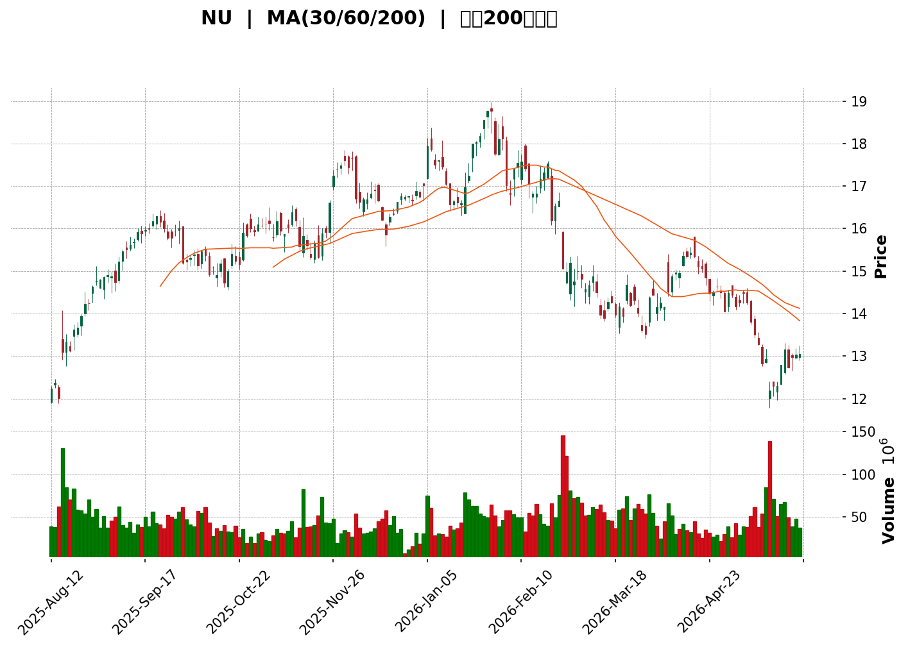
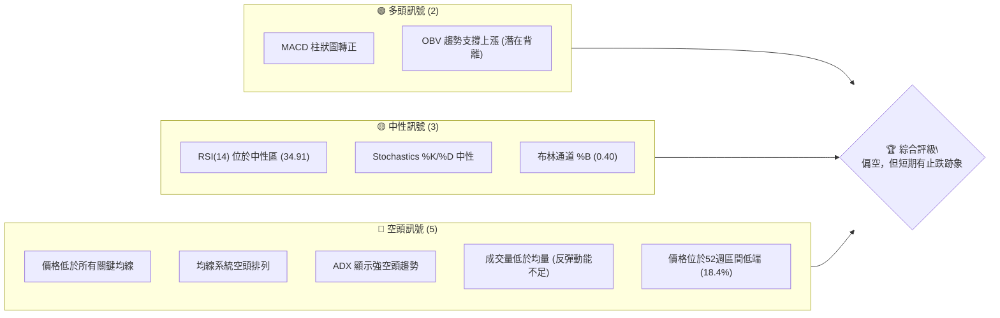

<details>
<summary>📊 靜態圖表 (點擊展開)</summary>

</details>

<html>
<head><meta charset="utf-8" /></head>
<body>
    <div>                        <script>window.PlotlyConfig = {MathJaxConfig: 'local'};</script>
        <script charset="utf-8" src="https://cdn.plot.ly/plotly-3.5.0.min.js" integrity="sha256-fHbNLP+GlIXN+efbQec78UkemUz3NJp7UmfGxC1tNxs=" crossorigin="anonymous"></script>                <div id="candlestick-chart" class="plotly-graph-div" style="height:500px; width:100%;"></div>            <script>                window.PLOTLYENV=window.PLOTLYENV || {};                                if (document.getElementById("candlestick-chart")) {                    Plotly.newPlot(                        "candlestick-chart",                        [{"close":{"dtype":"f8","bdata":"AAAAQOF6KEAAAACgcL0oQAAAAMAeBShAAAAAQDMzKkAAAADA9agqQAAAAKBwPSpAAAAAoHA9K0AAAABAClcrQAAAAKBH4StAAAAAgMJ1LEAAAABA4XosQAAAACCuRy1AAAAAgD2KLUAAAACgmZktQAAAAOBRuC1AAAAAwMzMLUAAAACgcL0tQAAAAEDhei1AAAAA4KNwLkAAAAAghesuQAAAAMAeBS9AAAAAoHA9L0AAAACgR2EvQAAAAIDr0S9AAAAAIK7HL0AAAAAghesvQAAAAEDh+i9AAAAAIIUrMEAAAADAzEwwQAAAAGBmJjBAAAAAYI8CMEAAAAAgXI8vQAAAACBcjy9AAAAAYGbmL0AAAABgjwIwQAAAAKBHYS5AAAAA4KNwLkAAAABguJ4uQAAAAGCPwi5AAAAAYI9CLkAAAAAghesuQAAAAKBwvS5AAAAAQArXLUAAAADA9SguQAAAAIDr0S1AAAAAAClcLkAAAACAwnUtQAAAAAAAAC5AAAAAgOvRLkAAAABA4XouQAAAAIDrUS5AAAAAwMzML0AAAACAFK4vQAAAAAAAADBAAAAAACncL0AAAABAChcwQAAAACBcDzBAAAAAACkcMEAAAACgRyEwQAAAAKCZmS9AAAAAIIUrMEAAAACgR+EvQAAAAKBwvS9AAAAAwB4FMEAAAAAA12MwQAAAAIAULjBAAAAAgBQuL0AAAAAA16MvQAAAAEAzMy9AAAAAANejLkAAAACA61EvQAAAAADXoy5AAAAAIK7HL0AAAABACtcvQAAAAAApnDBAAAAAAABAMUAAAAAA12MxQAAAAEDhejFAAAAAACmcMUAAAADgo3AxQAAAAGBmpjFAAAAAQDOzMEAAAABguJ4wQAAAAIAUrjBAAAAA4KOwMEAAAACA69EwQAAAAGBm5jBAAAAAYGamMEAAAABAMzMwQAAAAOBRuC9AAAAAwB5FMEAAAABAClcwQAAAAGC4njBAAAAAYI\u002fCMEAAAACgcL0wQAAAAGCPwjBAAAAAwPWoMEAAAACgR+EwQAAAAKBwvTBAAAAAwB4FMUAAAADgo\u002fAxQAAAAAAp3DFAAAAAAACAMUAAAAAAKZwxQAAAAIDCdTFAAAAAgD0KMUAAAAAgXI8wQAAAAADXozBAAAAAACmcMEAAAACgmZkwQAAAAOBR+DBAAAAAoHA9MUAAAAAAAAAyQAAAAIA9CjJAAAAAgBQuMkAAAADAzIwyQAAAAGCPwjJAAAAAYI\u002fCMkAAAAAAAMAxQAAAAAApHDJAAAAAYLgeMkAAAADAHgUxQAAAACBczzBAAAAAYGZmMUAAAADAzIwxQAAAAIDrkTFAAAAAwPVoMUAAAACAPQoxQAAAAIDr0TBAAAAAgOvRMEAAAAAghSsxQAAAAIDrUTFAAAAAIK6HMUAAAADgozAwQAAAACCuhzBAAAAAYGamMEAAAABguB4uQAAAAIDC9S1AAAAAoEdhLkAAAADAHoUtQAAAAAAAAC5AAAAAANejLUAAAADA9SgtQAAAAEAKVy1AAAAAYI\u002fCLUAAAABA4fosQAAAAOCj8CtAAAAAIK7HK0AAAACAPYosQAAAAAAAgCxAAAAA4KPwK0AAAACA61EsQAAAAKBH4StAAAAAAClcLUAAAACgR2EsQAAAAADXoyxAAAAAgD0KLEAAAABAMzMrQAAAAMAeBStAAAAAoHC9LEAAAACgR+EsQAAAAMDMTCxAAAAAwB6FLEAAAADAzEwsQAAAAMAeBS1AAAAAoHC9LUAAAAAghestQAAAAGBm5i1AAAAAQDOzLkAAAACAFK4uQAAAAAAp3C5AAAAAgBSuLkAAAABAMzMuQAAAAKCZGS5AAAAAQDOzLUAAAAAghessQAAAAMAeBS1AAAAAIK5HLUAAAAAAAAAtQAAAAOB6FCxAAAAAgML1LEAAAACgR+EsQAAAAIDrUSxAAAAAAACALEAAAACAwvUsQAAAAMAehSxAAAAAoJmZK0AAAAAAAAArQAAAAIA9iipAAAAAANejKUAAAAAAKdwpQAAAAKBHYShAAAAA4HqUKEAAAADgepQoQAAAAOB6lClAAAAAgOtRKkAAAACAwnUpQAAAAIDC9SlAAAAAIFwPKkAAAACgmRkqQA=="},"high":{"dtype":"f8","bdata":"AAAA4HqUKEAAAAAghesoQAAAAADXoyhAAAAAANcjLEAAAADAHgUrQAAAAIDCtSpAAAAAAACAK0AAAACgmZkrQAAAAIDC9StAAAAAYI8CLUAAAABAM7MsQAAAAEAKVy1AAAAAQOE6LkAAAAAA16MtQAAAAKBwvS1AAAAAgOsRLkAAAACgcP0tQAAAAKCZWS5AAAAA4KOwLkAAAADAHgUvQAAAACCFay9AAAAAoEehL0AAAACAPYovQAAAAKBHATBAAAAAgOsRMEAAAADAzAwwQAAAAKBHITBAAAAAoJlZMEAAAADAzEwwQAAAAMDMbDBAAAAAYLheMEAAAADgURgwQAAAAKBw\u002fS9AAAAAoJkZMEAAAADgozAwQAAAAMDMDDBAAAAAwMzMLkAAAAAAAMAuQAAAAEDh+i5AAAAA4HoUL0AAAAAAAAAvQAAAAMD1KC9AAAAAYGbmLkAAAACgcD0uQAAAAKBHYS5AAAAAAFaOLkAAAABguJ4uQAAAAGC4Hi5AAAAAIK5HL0AAAACAFC4vQAAAACCF6y5AAAAAANcjMEAAAACgRyEwQAAAAKCZWTBAAAAAgOsRMEAAAADAHkUwQAAAAKBwPTBAAAAAwB5FMEAAAAAAAIAwQAAAAKBwHTBAAAAAIIVrMEAAAABgZmYwQAAAAAAAwC9AAAAA4FE4MEAAAADAzIwwQAAAAAAAgDBAAAAAgOsxMEAAAABgj0IwQAAAAKBwvS9AAAAAoJlZL0AAAADgo3AvQAAAAEAzEzBAAAAAwB4FMEAAAAAgXA8wQAAAAMDMrDBAAAAAoEdhMUAAAACAFI4xQAAAACBcjzFAAAAAQArXMUAAAADgUbgxQAAAAOCj0DFAAAAAQOG6MUAAAABAMxMxQAAAAEDhujBAAAAAoJnZMEAAAAAAKRwxQAAAACBcDzFAAAAAgOsRMUAAAADAHoUwQAAAAMD1KDBAAAAA4CJbMEAAAADgUXgwQAAAAKBHoTBAAAAA4HrUMEAAAADA9cgwQAAAAGCPwjBAAAAAIFzPMEAAAABA4RoxQAAAAMDM7DBAAAAAIFwPMUAAAACAlSMyQAAAAGC4XjJAAAAAYI\u002fCMUAAAACAvp8xQAAAAIDrETJAAAAAIIVrMUAAAACA6xExQAAAAOCjsDBAAAAA4FH4MEAAAABgDq0wQAAAAOCjUDFAAAAAgD2KMUAAAAAAAAAyQAAAAOCjEDJAAAAAYI9CMkAAAAAgXI8yQAAAAMD1yDJAAAAAQOH6MkAAAABguJ4yQAAAAEAKdzJAAAAAYGamMkAAAACAPSoyQAAAAGCPIjFAAAAAIIVrMUAAAABACtcxQAAAAAApvDFAAAAAoHD9MUAAAADAzIwxQAAAAKBH4TBAAAAAAAAAMUAAAABA4XoxQAAAAOCjcDFAAAAAQAqXMUAAAADA9WgxQAAAAEAKlzBAAAAAoJnZMEAAAACgR+EvQAAAAGBmZi5AAAAAQIusLkAAAABguB4uQAAAAIDCtS5AAAAAwMxMLkAAAABAM3MtQAAAAIDrkS1AAAAAgD1KLkAAAACgR+EtQAAAAEAzsyxAAAAAYLieLEAAAACgcL0sQAAAAOB6FC1AAAAAwMyMLEAAAAAAAIAsQAAAAMDMTCxAAAAAQArXLUAAAADAHgUtQAAAAKBHYS1AAAAAYGamLEAAAABgZuYrQAAAAIDrkStAAAAAgOvRLEAAAACgmZktQAAAAIDC9SxAAAAAIK7HLEAAAACA61EsQAAAAMBJzC5AAAAAACncLUAAAADgehQuQAAAACBcDy5AAAAA4KPwLkAAAABguB4vQAAAAKBHIS9AAAAAYLieL0AAAABAM7MuQAAAACBcjy5AAAAA4KNwLkAAAAAA16MtQAAAAOB6FC1AAAAAIIWrLUAAAABAClctQAAAAMAeBS1AAAAAYLgeLUAAAACA61EtQAAAAOCj8CxAAAAAoEfhLEAAAACgmRktQAAAAEAzMy1AAAAAwPWoLEAAAADA9egrQAAAAAApHCtAAAAAgD2KKkAAAABAClcqQAAAACBczyhAAAAAwMzMKEAAAADAzMwoQAAAAKCZmSlAAAAAoJmZKkAAAADAHoUqQAAAAKBHISpAAAAAAClcKkAAAABA4XoqQA=="},"hovertemplate":"\u003cb\u003e%{x|%Y-%m-%d}\u003c\u002fb\u003e\u003cbr\u003e\u958b: $%{open:.2f}\u003cbr\u003e\u9ad8: $%{high:.2f}\u003cbr\u003e\u4f4e: $%{low:.2f}\u003cbr\u003e\u6536: $%{close:.2f}\u003cextra\u003e\u003c\u002fextra\u003e","low":{"dtype":"f8","bdata":"AAAAgD3KJ0AAAAAAAIAoQAAAACCuxydAAAAAQArXKUAAAACAPYopQAAAAEAzMypAAAAAIK5HKkAAAACgR+EqQAAAAEDh+ipAAAAAYLjeK0AAAAAgWiQsQAAAAGCPgixAAAAAgOtRLUAAAACAFC4tQAAAAIAUrixAAAAAgMJ1LUAAAACAwvUsQAAAAIA9Ci1AAAAAIIVrLUAAAABgjwIuQAAAAKCZmS5AAAAAgML1LkAAAADgehQvQAAAAMD1aC9AAAAAgOtRL0AAAABgZqYvQAAAAMAexS9AAAAAwB4FMEAAAACAwvUvQAAAACCuBzBAAAAAoPHSL0AAAACAwnUvQAAAAKCZGS9AAAAAwPWoL0AAAADAzEwvQAAAAIDrUS5AAAAAgD0KLkAAAADgUTguQAAAAAAAQC5AAAAAgD0KLkAAAACgmRkuQAAAAIDCdS5AAAAAYI\u002fCLUAAAABACtctQAAAACCuRy1AAAAA4FG4LUAAAABAXjotQAAAAGC4Hi1AAAAAYLgeLkAAAAAgXE8uQAAAAIDrES5AAAAAgMJ1LkAAAAAgBJYvQAAAAEAK1y9AAAAAANejL0AAAAAAKdwvQAAAAADXAzBAAAAAYI\u002fCL0AAAACAFO4vQAAAAGBmZi9AAAAA4HqUL0AAAACAFK4vQAAAAGBm5i5AAAAAwMzML0AAAADAzAwwQAAAACCFCzBAAAAA4FH4LkAAAAAA16MuQAAAAAAAAC9AAAAAwB6FLkAAAACgR2EuQAAAAKCZmS5AAAAAYI+CLkAAAAAgXI8vQAAAAAApXC9AAAAAwPXoMEAAAABAMzMxQAAAACCuRzFAAAAAQOF6MUAAAACAPUoxQAAAAAApXDFAAAAAoJmZMEAAAADgUXgwQAAAAAACSzBAAAAAQAp3MEAAAABAM7MwQAAAAKCZmTBAAAAAoEehMEAAAACAFC4wQAAAAIAULi9AAAAAwCAQMEAAAABAYlAwQAAAAKCZWTBAAAAAIFyPMEAAAABgZqYwQAAAAAApnDBAAAAAgD2KMEAAAACAFK4wQAAAAIDCtTBAAAAAYGamMEAAAACAPSoxQAAAACBczzFAAAAAIK5nMUAAAABguF4xQAAAAADXYzFAAAAAwB4FMUAAAACAPWowQAAAAMDMbDBAAAAAgEGAMEAAAACAFE4wQAAAAKCZWTBAAAAAgOsRMUAAAADgelQxQAAAAIDCtTFAAAAAYGbmMUAAAACgmRkyQAAAAAApXDJAAAAAoHA9MkAAAACAwrUxQAAAAIDCtTFAAAAAQArXMUAAAAAAAOAwQAAAAMDMjDBAAAAAYI\u002fCMEAAAABACjcxQAAAAIA9CjFAAAAAoJlZMUAAAACAwrUwQAAAAGC4XjBAAAAAQAqXMEAAAABACtcwQAAAAMAe5TBAAAAAIIUrMUAAAADgehQwQAAAAKBwvS9AAAAAANeDMEAAAADgehQuQAAAAGBmZi1AAAAAYLieLEAAAABAClcsQAAAAKCZmS1AAAAA4FE4LUAAAADgUXgsQAAAAIDCdSxAAAAAIFwPLUAAAABgj8IsQAAAAGCPwitAAAAAoEehK0AAAABguB4sQAAAAOBReCxAAAAA4HrUK0AAAAAgXA8rQAAAAOB6lCtAAAAA4KNwLEAAAACA61EsQAAAACCFayxAAAAAACncK0AAAADgehQrQAAAAIDr0SpAAAAAYGZmK0AAAAAAKdwsQAAAAAACqytAAAAAwPUoLEAAAACAFK4rQAAAAIDr0SxAAAAAwMzMLEAAAAAgXI8tQAAAAEAzMy1AAAAAoHA9LkAAAACgmZkuQAAAAOB6lC5AAAAAYLieLkAAAAAAKdwtQAAAAOCj8C1AAAAAQApXLUAAAACA65EsQAAAAKBHYSxAAAAAoJkZLUAAAACAwrUsQAAAAOB6FCxAAAAAoJkZLEAAAABgj8IsQAAAAIAULixAAAAAQApXLEAAAACgcH0sQAAAAMD1aCxAAAAAAACAK0AAAABACtcqQAAAAMAehSpAAAAAIK6HKUAAAACAFK4pQAAAACBcjydAAAAAYLgeKEAAAAAghesnQAAAAMD1qChAAAAAYLgeKUAAAAAghWspQAAAAMDMTClAAAAAACncKUAAAACAPcopQA=="},"name":"\u50f9\u683c","open":{"dtype":"f8","bdata":"AAAAQArXJ0AAAADA9agoQAAAAIA9iihAAAAAwMzMKkAAAABAMzMqQAAAAIDCdSpAAAAAgBTuKkAAAACAPQorQAAAAOCjcCtAAAAAAAAALEAAAABA4XosQAAAAIDC9SxAAAAAAACALUAAAADgUTgtQAAAAMD1KC1AAAAAoHC9LUAAAACAFK4tQAAAAMAeBS5AAAAAIFyPLUAAAACAwnUuQAAAAKCZGS9AAAAAIFwPL0AAAAAAKVwvQAAAAAAAgC9AAAAAoEfhL0AAAABgZuYvQAAAAGCPAjBAAAAAgOsRMEAAAAAAKRwwQAAAAMDMTDBAAAAAgBQuMEAAAAAAKdwvQAAAAAAp3C9AAAAAYGbmL0AAAAAghesvQAAAAMDMDDBAAAAAgD2KLkAAAAAgXI8uQAAAAKBwvS5AAAAAgOvRLkAAAAAAKVwuQAAAACBcDy9AAAAA4FG4LkAAAADA9SguQAAAAEAzsy1AAAAAAAAALkAAAADgepQuQAAAACCuRy1AAAAAYI9CLkAAAABAM7MuQAAAAADXoy5AAAAAwB6FLkAAAABAChcwQAAAAEDhOjBAAAAAIIXrL0AAAABgZuYvQAAAAIDrETBAAAAAACkcMEAAAADgozAwQAAAAKCZmS9AAAAA4FG4L0AAAABguF4wQAAAAADXoy9AAAAAoJkZMEAAAABAChcwQAAAAIDCdTBAAAAAgD0KMEAAAAAAKdwuQAAAAOBReC9AAAAAwMzMLkAAAADAzIwuQAAAAIAUri9AAAAAgMK1LkAAAAAAAAAwQAAAAEAK1y9AAAAAQOH6MEAAAAAA12MxQAAAAIAUbjFAAAAAgMK1MUAAAABAM7MxQAAAAGBmpjFAAAAAQDOzMUAAAABguN4wQAAAAMAeZTBAAAAAoJmZMEAAAABA4bowQAAAACCu5zBAAAAAYGYGMUAAAAAAAIAwQAAAAEAKFzBAAAAAYGYmMEAAAACgmVkwQAAAACCFazBAAAAA4KOwMEAAAABAM7MwQAAAAKBwvTBAAAAAgD2qMEAAAADAHsUwQAAAAGC43jBAAAAAIFwPMUAAAACAFC4xQAAAAGC4HjJAAAAAYLieMUAAAABACpcxQAAAAIAUrjFAAAAAoJlZMUAAAAAgXA8xQAAAAOCjkDBAAAAAAADAMEAAAACA65EwQAAAAAApXDBAAAAAYI8iMUAAAACAPaoxQAAAAAAAADJAAAAAwMwMMkAAAAAAKVwyQAAAAGCPojJAAAAA4HrUMkAAAAAgrocyQAAAAKBwvTFAAAAAIK5nMkAAAADgehQyQAAAAOB61DBAAAAAIIUrMUAAAADgo3AxQAAAAGBmJjFAAAAAgOvxMUAAAADA9YgxQAAAAKBwvTBAAAAAAADAMEAAAABAM\u002fMwQAAAAADXIzFAAAAAQDMzMUAAAAAAAEAxQAAAAOCjMDBAAAAAANeDMEAAAABACtcvQAAAAOCjcC1AAAAAIIXrLEAAAAAAKVwtQAAAAKBw\u002fS1AAAAAACncLUAAAABgjwItQAAAAIDr0SxAAAAAQOF6LUAAAAAAAIAtQAAAAGBmZixAAAAAANcjLEAAAACgcD0sQAAAAMDMzCxAAAAA4KNwLEAAAAAAKVwrQAAAAKBwPSxAAAAAoEehLEAAAADgUfgsQAAAAGCPQi1AAAAAYI9CLEAAAACAwnUrQAAAACCFaytAAAAAoJmZK0AAAACAFC4tQAAAAAAAACxAAAAAYI9CLEAAAABAMzMsQAAAACCFay5AAAAAwB4FLUAAAAAAKdwtQAAAAIAUri1AAAAAYI9CLkAAAAAghesuQAAAACCuxy5AAAAAYLieL0AAAABA4XouQAAAAOBROC5AAAAAAClcLkAAAABguJ4tQAAAAEAK1yxAAAAAIK5HLUAAAADgehQtQAAAAIDC9SxAAAAA4HpULEAAAACA61EtQAAAACCuxyxAAAAAANejLEAAAAAAAAAtQAAAAAAAAC1AAAAAoJmZLEAAAABgj8IrQAAAAEAK1ypAAAAAIIVrKkAAAABAM7MpQAAAAECJAShAAAAAwMzMKEAAAADgelQoQAAAAIAUrihAAAAA4FE4KUAAAADAzEwqQAAAACCuBypAAAAAIIXrKUAAAADgo\u002fApQA=="},"x":["2025-08-12T00:00:00-04:00","2025-08-13T00:00:00-04:00","2025-08-14T00:00:00-04:00","2025-08-15T00:00:00-04:00","2025-08-18T00:00:00-04:00","2025-08-19T00:00:00-04:00","2025-08-20T00:00:00-04:00","2025-08-21T00:00:00-04:00","2025-08-22T00:00:00-04:00","2025-08-25T00:00:00-04:00","2025-08-26T00:00:00-04:00","2025-08-27T00:00:00-04:00","2025-08-28T00:00:00-04:00","2025-08-29T00:00:00-04:00","2025-09-02T00:00:00-04:00","2025-09-03T00:00:00-04:00","2025-09-04T00:00:00-04:00","2025-09-05T00:00:00-04:00","2025-09-08T00:00:00-04:00","2025-09-09T00:00:00-04:00","2025-09-10T00:00:00-04:00","2025-09-11T00:00:00-04:00","2025-09-12T00:00:00-04:00","2025-09-15T00:00:00-04:00","2025-09-16T00:00:00-04:00","2025-09-17T00:00:00-04:00","2025-09-18T00:00:00-04:00","2025-09-19T00:00:00-04:00","2025-09-22T00:00:00-04:00","2025-09-23T00:00:00-04:00","2025-09-24T00:00:00-04:00","2025-09-25T00:00:00-04:00","2025-09-26T00:00:00-04:00","2025-09-29T00:00:00-04:00","2025-09-30T00:00:00-04:00","2025-10-01T00:00:00-04:00","2025-10-02T00:00:00-04:00","2025-10-03T00:00:00-04:00","2025-10-06T00:00:00-04:00","2025-10-07T00:00:00-04:00","2025-10-08T00:00:00-04:00","2025-10-09T00:00:00-04:00","2025-10-10T00:00:00-04:00","2025-10-13T00:00:00-04:00","2025-10-14T00:00:00-04:00","2025-10-15T00:00:00-04:00","2025-10-16T00:00:00-04:00","2025-10-17T00:00:00-04:00","2025-10-20T00:00:00-04:00","2025-10-21T00:00:00-04:00","2025-10-22T00:00:00-04:00","2025-10-23T00:00:00-04:00","2025-10-24T00:00:00-04:00","2025-10-27T00:00:00-04:00","2025-10-28T00:00:00-04:00","2025-10-29T00:00:00-04:00","2025-10-30T00:00:00-04:00","2025-10-31T00:00:00-04:00","2025-11-03T00:00:00-05:00","2025-11-04T00:00:00-05:00","2025-11-05T00:00:00-05:00","2025-11-06T00:00:00-05:00","2025-11-07T00:00:00-05:00","2025-11-10T00:00:00-05:00","2025-11-11T00:00:00-05:00","2025-11-12T00:00:00-05:00","2025-11-13T00:00:00-05:00","2025-11-14T00:00:00-05:00","2025-11-17T00:00:00-05:00","2025-11-18T00:00:00-05:00","2025-11-19T00:00:00-05:00","2025-11-20T00:00:00-05:00","2025-11-21T00:00:00-05:00","2025-11-24T00:00:00-05:00","2025-11-25T00:00:00-05:00","2025-11-26T00:00:00-05:00","2025-11-28T00:00:00-05:00","2025-12-01T00:00:00-05:00","2025-12-02T00:00:00-05:00","2025-12-03T00:00:00-05:00","2025-12-04T00:00:00-05:00","2025-12-05T00:00:00-05:00","2025-12-08T00:00:00-05:00","2025-12-09T00:00:00-05:00","2025-12-10T00:00:00-05:00","2025-12-11T00:00:00-05:00","2025-12-12T00:00:00-05:00","2025-12-15T00:00:00-05:00","2025-12-16T00:00:00-05:00","2025-12-17T00:00:00-05:00","2025-12-18T00:00:00-05:00","2025-12-19T00:00:00-05:00","2025-12-22T00:00:00-05:00","2025-12-23T00:00:00-05:00","2025-12-24T00:00:00-05:00","2025-12-26T00:00:00-05:00","2025-12-29T00:00:00-05:00","2025-12-30T00:00:00-05:00","2025-12-31T00:00:00-05:00","2026-01-02T00:00:00-05:00","2026-01-05T00:00:00-05:00","2026-01-06T00:00:00-05:00","2026-01-07T00:00:00-05:00","2026-01-08T00:00:00-05:00","2026-01-09T00:00:00-05:00","2026-01-12T00:00:00-05:00","2026-01-13T00:00:00-05:00","2026-01-14T00:00:00-05:00","2026-01-15T00:00:00-05:00","2026-01-16T00:00:00-05:00","2026-01-20T00:00:00-05:00","2026-01-21T00:00:00-05:00","2026-01-22T00:00:00-05:00","2026-01-23T00:00:00-05:00","2026-01-26T00:00:00-05:00","2026-01-27T00:00:00-05:00","2026-01-28T00:00:00-05:00","2026-01-29T00:00:00-05:00","2026-01-30T00:00:00-05:00","2026-02-02T00:00:00-05:00","2026-02-03T00:00:00-05:00","2026-02-04T00:00:00-05:00","2026-02-05T00:00:00-05:00","2026-02-06T00:00:00-05:00","2026-02-09T00:00:00-05:00","2026-02-10T00:00:00-05:00","2026-02-11T00:00:00-05:00","2026-02-12T00:00:00-05:00","2026-02-13T00:00:00-05:00","2026-02-17T00:00:00-05:00","2026-02-18T00:00:00-05:00","2026-02-19T00:00:00-05:00","2026-02-20T00:00:00-05:00","2026-02-23T00:00:00-05:00","2026-02-24T00:00:00-05:00","2026-02-25T00:00:00-05:00","2026-02-26T00:00:00-05:00","2026-02-27T00:00:00-05:00","2026-03-02T00:00:00-05:00","2026-03-03T00:00:00-05:00","2026-03-04T00:00:00-05:00","2026-03-05T00:00:00-05:00","2026-03-06T00:00:00-05:00","2026-03-09T00:00:00-04:00","2026-03-10T00:00:00-04:00","2026-03-11T00:00:00-04:00","2026-03-12T00:00:00-04:00","2026-03-13T00:00:00-04:00","2026-03-16T00:00:00-04:00","2026-03-17T00:00:00-04:00","2026-03-18T00:00:00-04:00","2026-03-19T00:00:00-04:00","2026-03-20T00:00:00-04:00","2026-03-23T00:00:00-04:00","2026-03-24T00:00:00-04:00","2026-03-25T00:00:00-04:00","2026-03-26T00:00:00-04:00","2026-03-27T00:00:00-04:00","2026-03-30T00:00:00-04:00","2026-03-31T00:00:00-04:00","2026-04-01T00:00:00-04:00","2026-04-02T00:00:00-04:00","2026-04-06T00:00:00-04:00","2026-04-07T00:00:00-04:00","2026-04-08T00:00:00-04:00","2026-04-09T00:00:00-04:00","2026-04-10T00:00:00-04:00","2026-04-13T00:00:00-04:00","2026-04-14T00:00:00-04:00","2026-04-15T00:00:00-04:00","2026-04-16T00:00:00-04:00","2026-04-17T00:00:00-04:00","2026-04-20T00:00:00-04:00","2026-04-21T00:00:00-04:00","2026-04-22T00:00:00-04:00","2026-04-23T00:00:00-04:00","2026-04-24T00:00:00-04:00","2026-04-27T00:00:00-04:00","2026-04-28T00:00:00-04:00","2026-04-29T00:00:00-04:00","2026-04-30T00:00:00-04:00","2026-05-01T00:00:00-04:00","2026-05-04T00:00:00-04:00","2026-05-05T00:00:00-04:00","2026-05-06T00:00:00-04:00","2026-05-07T00:00:00-04:00","2026-05-08T00:00:00-04:00","2026-05-11T00:00:00-04:00","2026-05-12T00:00:00-04:00","2026-05-13T00:00:00-04:00","2026-05-14T00:00:00-04:00","2026-05-15T00:00:00-04:00","2026-05-18T00:00:00-04:00","2026-05-19T00:00:00-04:00","2026-05-20T00:00:00-04:00","2026-05-21T00:00:00-04:00","2026-05-22T00:00:00-04:00","2026-05-26T00:00:00-04:00","2026-05-27T00:00:00-04:00","2026-05-28T00:00:00-04:00"],"type":"candlestick"},{"hovertemplate":"MA30: $%{y:.2f}\u003cextra\u003e\u003c\u002fextra\u003e","line":{"color":"#2196F3","dash":"dash","width":2},"mode":"lines","name":"MA30","x":["2025-08-12T00:00:00-04:00","2025-08-13T00:00:00-04:00","2025-08-14T00:00:00-04:00","2025-08-15T00:00:00-04:00","2025-08-18T00:00:00-04:00","2025-08-19T00:00:00-04:00","2025-08-20T00:00:00-04:00","2025-08-21T00:00:00-04:00","2025-08-22T00:00:00-04:00","2025-08-25T00:00:00-04:00","2025-08-26T00:00:00-04:00","2025-08-27T00:00:00-04:00","2025-08-28T00:00:00-04:00","2025-08-29T00:00:00-04:00","2025-09-02T00:00:00-04:00","2025-09-03T00:00:00-04:00","2025-09-04T00:00:00-04:00","2025-09-05T00:00:00-04:00","2025-09-08T00:00:00-04:00","2025-09-09T00:00:00-04:00","2025-09-10T00:00:00-04:00","2025-09-11T00:00:00-04:00","2025-09-12T00:00:00-04:00","2025-09-15T00:00:00-04:00","2025-09-16T00:00:00-04:00","2025-09-17T00:00:00-04:00","2025-09-18T00:00:00-04:00","2025-09-19T00:00:00-04:00","2025-09-22T00:00:00-04:00","2025-09-23T00:00:00-04:00","2025-09-24T00:00:00-04:00","2025-09-25T00:00:00-04:00","2025-09-26T00:00:00-04:00","2025-09-29T00:00:00-04:00","2025-09-30T00:00:00-04:00","2025-10-01T00:00:00-04:00","2025-10-02T00:00:00-04:00","2025-10-03T00:00:00-04:00","2025-10-06T00:00:00-04:00","2025-10-07T00:00:00-04:00","2025-10-08T00:00:00-04:00","2025-10-09T00:00:00-04:00","2025-10-10T00:00:00-04:00","2025-10-13T00:00:00-04:00","2025-10-14T00:00:00-04:00","2025-10-15T00:00:00-04:00","2025-10-16T00:00:00-04:00","2025-10-17T00:00:00-04:00","2025-10-20T00:00:00-04:00","2025-10-21T00:00:00-04:00","2025-10-22T00:00:00-04:00","2025-10-23T00:00:00-04:00","2025-10-24T00:00:00-04:00","2025-10-27T00:00:00-04:00","2025-10-28T00:00:00-04:00","2025-10-29T00:00:00-04:00","2025-10-30T00:00:00-04:00","2025-10-31T00:00:00-04:00","2025-11-03T00:00:00-05:00","2025-11-04T00:00:00-05:00","2025-11-05T00:00:00-05:00","2025-11-06T00:00:00-05:00","2025-11-07T00:00:00-05:00","2025-11-10T00:00:00-05:00","2025-11-11T00:00:00-05:00","2025-11-12T00:00:00-05:00","2025-11-13T00:00:00-05:00","2025-11-14T00:00:00-05:00","2025-11-17T00:00:00-05:00","2025-11-18T00:00:00-05:00","2025-11-19T00:00:00-05:00","2025-11-20T00:00:00-05:00","2025-11-21T00:00:00-05:00","2025-11-24T00:00:00-05:00","2025-11-25T00:00:00-05:00","2025-11-26T00:00:00-05:00","2025-11-28T00:00:00-05:00","2025-12-01T00:00:00-05:00","2025-12-02T00:00:00-05:00","2025-12-03T00:00:00-05:00","2025-12-04T00:00:00-05:00","2025-12-05T00:00:00-05:00","2025-12-08T00:00:00-05:00","2025-12-09T00:00:00-05:00","2025-12-10T00:00:00-05:00","2025-12-11T00:00:00-05:00","2025-12-12T00:00:00-05:00","2025-12-15T00:00:00-05:00","2025-12-16T00:00:00-05:00","2025-12-17T00:00:00-05:00","2025-12-18T00:00:00-05:00","2025-12-19T00:00:00-05:00","2025-12-22T00:00:00-05:00","2025-12-23T00:00:00-05:00","2025-12-24T00:00:00-05:00","2025-12-26T00:00:00-05:00","2025-12-29T00:00:00-05:00","2025-12-30T00:00:00-05:00","2025-12-31T00:00:00-05:00","2026-01-02T00:00:00-05:00","2026-01-05T00:00:00-05:00","2026-01-06T00:00:00-05:00","2026-01-07T00:00:00-05:00","2026-01-08T00:00:00-05:00","2026-01-09T00:00:00-05:00","2026-01-12T00:00:00-05:00","2026-01-13T00:00:00-05:00","2026-01-14T00:00:00-05:00","2026-01-15T00:00:00-05:00","2026-01-16T00:00:00-05:00","2026-01-20T00:00:00-05:00","2026-01-21T00:00:00-05:00","2026-01-22T00:00:00-05:00","2026-01-23T00:00:00-05:00","2026-01-26T00:00:00-05:00","2026-01-27T00:00:00-05:00","2026-01-28T00:00:00-05:00","2026-01-29T00:00:00-05:00","2026-01-30T00:00:00-05:00","2026-02-02T00:00:00-05:00","2026-02-03T00:00:00-05:00","2026-02-04T00:00:00-05:00","2026-02-05T00:00:00-05:00","2026-02-06T00:00:00-05:00","2026-02-09T00:00:00-05:00","2026-02-10T00:00:00-05:00","2026-02-11T00:00:00-05:00","2026-02-12T00:00:00-05:00","2026-02-13T00:00:00-05:00","2026-02-17T00:00:00-05:00","2026-02-18T00:00:00-05:00","2026-02-19T00:00:00-05:00","2026-02-20T00:00:00-05:00","2026-02-23T00:00:00-05:00","2026-02-24T00:00:00-05:00","2026-02-25T00:00:00-05:00","2026-02-26T00:00:00-05:00","2026-02-27T00:00:00-05:00","2026-03-02T00:00:00-05:00","2026-03-03T00:00:00-05:00","2026-03-04T00:00:00-05:00","2026-03-05T00:00:00-05:00","2026-03-06T00:00:00-05:00","2026-03-09T00:00:00-04:00","2026-03-10T00:00:00-04:00","2026-03-11T00:00:00-04:00","2026-03-12T00:00:00-04:00","2026-03-13T00:00:00-04:00","2026-03-16T00:00:00-04:00","2026-03-17T00:00:00-04:00","2026-03-18T00:00:00-04:00","2026-03-19T00:00:00-04:00","2026-03-20T00:00:00-04:00","2026-03-23T00:00:00-04:00","2026-03-24T00:00:00-04:00","2026-03-25T00:00:00-04:00","2026-03-26T00:00:00-04:00","2026-03-27T00:00:00-04:00","2026-03-30T00:00:00-04:00","2026-03-31T00:00:00-04:00","2026-04-01T00:00:00-04:00","2026-04-02T00:00:00-04:00","2026-04-06T00:00:00-04:00","2026-04-07T00:00:00-04:00","2026-04-08T00:00:00-04:00","2026-04-09T00:00:00-04:00","2026-04-10T00:00:00-04:00","2026-04-13T00:00:00-04:00","2026-04-14T00:00:00-04:00","2026-04-15T00:00:00-04:00","2026-04-16T00:00:00-04:00","2026-04-17T00:00:00-04:00","2026-04-20T00:00:00-04:00","2026-04-21T00:00:00-04:00","2026-04-22T00:00:00-04:00","2026-04-23T00:00:00-04:00","2026-04-24T00:00:00-04:00","2026-04-27T00:00:00-04:00","2026-04-28T00:00:00-04:00","2026-04-29T00:00:00-04:00","2026-04-30T00:00:00-04:00","2026-05-01T00:00:00-04:00","2026-05-04T00:00:00-04:00","2026-05-05T00:00:00-04:00","2026-05-06T00:00:00-04:00","2026-05-07T00:00:00-04:00","2026-05-08T00:00:00-04:00","2026-05-11T00:00:00-04:00","2026-05-12T00:00:00-04:00","2026-05-13T00:00:00-04:00","2026-05-14T00:00:00-04:00","2026-05-15T00:00:00-04:00","2026-05-18T00:00:00-04:00","2026-05-19T00:00:00-04:00","2026-05-20T00:00:00-04:00","2026-05-21T00:00:00-04:00","2026-05-22T00:00:00-04:00","2026-05-26T00:00:00-04:00","2026-05-27T00:00:00-04:00","2026-05-28T00:00:00-04:00"],"y":{"dtype":"f8","bdata":"AAAAAAAA+H8AAAAAAAD4fwAAAAAAAPh\u002fAAAAAAAA+H8AAAAAAAD4fwAAAAAAAPh\u002fAAAAAAAA+H8AAAAAAAD4fwAAAAAAAPh\u002fAAAAAAAA+H8AAAAAAAD4fwAAAAAAAPh\u002fAAAAAAAA+H8AAAAAAAD4fwAAAAAAAPh\u002fAAAAAAAA+H8AAAAAAAD4fwAAAAAAAPh\u002fAAAAAAAA+H8AAAAAAAD4fwAAAAAAAPh\u002fAAAAAAAA+H8AAAAAAAD4fwAAAAAAAPh\u002fAAAAAAAA+H8AAAAAAAD4fwAAAAAAAPh\u002fAAAAAAAA+H8AAAAAAAD4f7y7u1u6SS1A3t3dvRGKLUAiIiJCRMQtQDMzM6ObBC5AmpmZeT81LkAzMzOT\u002fGIuQKuqqopQhi5AzczMDJ+hLkAiIiJSnL0uQHd3d8cv1i5AERER8YvlLkBEREQ0XvouQO\u002fu7p7TBi9Aq6qq+mIJL0ARERFRKg4vQFVVVcUEDy9AzczMHMwTL0ARERFxaBEvQGZmZmbYFS9AVVVVhRYZL0AzMzNTVRUvQGZmZiZcDy9AzczMfCMUL0CamZnZshYvQBERERE8GC9ARERE1OoYL0Dv7u7OIhsvQERERKRUHC9AAAAAgE4bL0AiIiLCZxgvQGZmZpZuEi9AMzMzoykVL0AAAACw5BcvQHd3d+dtGS9A3t3dvZ8aL0C8u7v7GyEvQM3MzFwBMi9Aq6qq6lE4L0AzMzMjBkEvQFVVVVXHRC9AREREdAVIL0BEREREb0svQAAAANCUSi9A7+7uziJbL0AzMzPTeGkvQN7d3T18hi9AVVVVNdCpL0DNzMzsNdcvQKuqqprEADBARERElIoTMEDe3d2NUCYwQKuqqgqQOzBAvLu7q2NCMEC8u7ubC0kwQHd3dxfZTjBAZmZmVlVVMEC8u7sLkFswQN7d3Q27YjBAMzMzs1ZnMEDv7u6e72cwQBEREbFyaDBAVVVVJU1pMEDe3d31tmwwQM3MzFwdczBAq6qq6m15MEARERGBanwwQImIiIhdgTBAvLu7+36KMEBmZmaWipMwQERERPREnTBAmpmZqcarMEBmZmZmO78wQN7d3R3o1DBA7+7uNqXiMEC8u7sTEfEwQFVVVe1R+DBAVVVVLYf2MEC8u7sDcu8wQJqZmQFH6DBAEREReb7fMEDv7u52k9gwQDMzM\u002fvF0jBAiYiIoGHXMEAAAABIKOMwQHd3dz\u002fD7jBAvLu7M3r7MECamZlxPQoxQFVVVa0cGjFAMzMzCx4sMUCamZkRWDkxQFVVVUWLTDFAiYiIqFRcMUBEREQkImIxQDMzMzPBYzFAzczMTDdpMUBVVVXFIHAxQN7d3T0KdzFAREREpHB9MUC8u7srzn4xQO\u002fu7u58fzFAZmZmBsh9MUDv7u7uNXcxQImIiEiacjFAIiIi0ttyMUCJiIjIvWYxQLy7uyvOXjFAMzMzM3pbMUDv7u5mrU4xQLy7uxODQDFAmpmZCWU0MUDv7u5+sSQxQHd3d\u002ffhEzFAVVVVZTv\u002fMECrqqpKDOIwQJqZmWlKxTBAvLu7cyGpMEB3d3c\u002ffIYwQFVVVVWcXTBAAAAAqA00MEAzMzN7WxYwQM3MzFzW6i9AvLu7uwKkL0AzMzMzM3MvQKuqqvo3Qi9A7+7uHswTL0Dv7u4OdNouQHd3d5f8oi5AVVVVdSFpLkDe3d3day4uQCIiIkLu9S1AvLu7Cx7MLUDe3d19hp0tQM3MzIxsZy1AMzMzs50vLUDNzMzMzAwtQImIiEhT6ixAiYiIWPLLLEAAAABwPcosQN7d3V26ySxAvLu7a3XMLECrqqp6W9YsQN7d3S2y3SxAiYiIGJLmLEAzMzMDcu8sQCIiIkLu9SxAAAAAMGv1LEDe3d0d6PQsQJqZmWkf\u002fixAZmZmNuwKLUCJiIgY2Q4tQHd3d5dDCy1AAAAA0PcTLUBmZmYmvxgtQImIiFiAHC1AVVVVpSkVLUDNzMysHBotQImIiIgWGS1AZmZmVlUVLUDe3d1toBMtQKuqqtqHDy1AzczMzBP1LEAzMzODTtssQERERCTbuSxAREREFDyYLEDe3d2dfXgsQCIiItIiWyxAd3d3t\u002fM9LEAiIiKy5BcsQCIiIqJF9itAVVVVZa3OK0C8u7s7mKcrQA=="},"type":"scatter"},{"hovertemplate":"MA60: $%{y:.2f}\u003cextra\u003e\u003c\u002fextra\u003e","line":{"color":"#9C27B0","dash":"dash","width":2},"mode":"lines","name":"MA60","x":["2025-08-12T00:00:00-04:00","2025-08-13T00:00:00-04:00","2025-08-14T00:00:00-04:00","2025-08-15T00:00:00-04:00","2025-08-18T00:00:00-04:00","2025-08-19T00:00:00-04:00","2025-08-20T00:00:00-04:00","2025-08-21T00:00:00-04:00","2025-08-22T00:00:00-04:00","2025-08-25T00:00:00-04:00","2025-08-26T00:00:00-04:00","2025-08-27T00:00:00-04:00","2025-08-28T00:00:00-04:00","2025-08-29T00:00:00-04:00","2025-09-02T00:00:00-04:00","2025-09-03T00:00:00-04:00","2025-09-04T00:00:00-04:00","2025-09-05T00:00:00-04:00","2025-09-08T00:00:00-04:00","2025-09-09T00:00:00-04:00","2025-09-10T00:00:00-04:00","2025-09-11T00:00:00-04:00","2025-09-12T00:00:00-04:00","2025-09-15T00:00:00-04:00","2025-09-16T00:00:00-04:00","2025-09-17T00:00:00-04:00","2025-09-18T00:00:00-04:00","2025-09-19T00:00:00-04:00","2025-09-22T00:00:00-04:00","2025-09-23T00:00:00-04:00","2025-09-24T00:00:00-04:00","2025-09-25T00:00:00-04:00","2025-09-26T00:00:00-04:00","2025-09-29T00:00:00-04:00","2025-09-30T00:00:00-04:00","2025-10-01T00:00:00-04:00","2025-10-02T00:00:00-04:00","2025-10-03T00:00:00-04:00","2025-10-06T00:00:00-04:00","2025-10-07T00:00:00-04:00","2025-10-08T00:00:00-04:00","2025-10-09T00:00:00-04:00","2025-10-10T00:00:00-04:00","2025-10-13T00:00:00-04:00","2025-10-14T00:00:00-04:00","2025-10-15T00:00:00-04:00","2025-10-16T00:00:00-04:00","2025-10-17T00:00:00-04:00","2025-10-20T00:00:00-04:00","2025-10-21T00:00:00-04:00","2025-10-22T00:00:00-04:00","2025-10-23T00:00:00-04:00","2025-10-24T00:00:00-04:00","2025-10-27T00:00:00-04:00","2025-10-28T00:00:00-04:00","2025-10-29T00:00:00-04:00","2025-10-30T00:00:00-04:00","2025-10-31T00:00:00-04:00","2025-11-03T00:00:00-05:00","2025-11-04T00:00:00-05:00","2025-11-05T00:00:00-05:00","2025-11-06T00:00:00-05:00","2025-11-07T00:00:00-05:00","2025-11-10T00:00:00-05:00","2025-11-11T00:00:00-05:00","2025-11-12T00:00:00-05:00","2025-11-13T00:00:00-05:00","2025-11-14T00:00:00-05:00","2025-11-17T00:00:00-05:00","2025-11-18T00:00:00-05:00","2025-11-19T00:00:00-05:00","2025-11-20T00:00:00-05:00","2025-11-21T00:00:00-05:00","2025-11-24T00:00:00-05:00","2025-11-25T00:00:00-05:00","2025-11-26T00:00:00-05:00","2025-11-28T00:00:00-05:00","2025-12-01T00:00:00-05:00","2025-12-02T00:00:00-05:00","2025-12-03T00:00:00-05:00","2025-12-04T00:00:00-05:00","2025-12-05T00:00:00-05:00","2025-12-08T00:00:00-05:00","2025-12-09T00:00:00-05:00","2025-12-10T00:00:00-05:00","2025-12-11T00:00:00-05:00","2025-12-12T00:00:00-05:00","2025-12-15T00:00:00-05:00","2025-12-16T00:00:00-05:00","2025-12-17T00:00:00-05:00","2025-12-18T00:00:00-05:00","2025-12-19T00:00:00-05:00","2025-12-22T00:00:00-05:00","2025-12-23T00:00:00-05:00","2025-12-24T00:00:00-05:00","2025-12-26T00:00:00-05:00","2025-12-29T00:00:00-05:00","2025-12-30T00:00:00-05:00","2025-12-31T00:00:00-05:00","2026-01-02T00:00:00-05:00","2026-01-05T00:00:00-05:00","2026-01-06T00:00:00-05:00","2026-01-07T00:00:00-05:00","2026-01-08T00:00:00-05:00","2026-01-09T00:00:00-05:00","2026-01-12T00:00:00-05:00","2026-01-13T00:00:00-05:00","2026-01-14T00:00:00-05:00","2026-01-15T00:00:00-05:00","2026-01-16T00:00:00-05:00","2026-01-20T00:00:00-05:00","2026-01-21T00:00:00-05:00","2026-01-22T00:00:00-05:00","2026-01-23T00:00:00-05:00","2026-01-26T00:00:00-05:00","2026-01-27T00:00:00-05:00","2026-01-28T00:00:00-05:00","2026-01-29T00:00:00-05:00","2026-01-30T00:00:00-05:00","2026-02-02T00:00:00-05:00","2026-02-03T00:00:00-05:00","2026-02-04T00:00:00-05:00","2026-02-05T00:00:00-05:00","2026-02-06T00:00:00-05:00","2026-02-09T00:00:00-05:00","2026-02-10T00:00:00-05:00","2026-02-11T00:00:00-05:00","2026-02-12T00:00:00-05:00","2026-02-13T00:00:00-05:00","2026-02-17T00:00:00-05:00","2026-02-18T00:00:00-05:00","2026-02-19T00:00:00-05:00","2026-02-20T00:00:00-05:00","2026-02-23T00:00:00-05:00","2026-02-24T00:00:00-05:00","2026-02-25T00:00:00-05:00","2026-02-26T00:00:00-05:00","2026-02-27T00:00:00-05:00","2026-03-02T00:00:00-05:00","2026-03-03T00:00:00-05:00","2026-03-04T00:00:00-05:00","2026-03-05T00:00:00-05:00","2026-03-06T00:00:00-05:00","2026-03-09T00:00:00-04:00","2026-03-10T00:00:00-04:00","2026-03-11T00:00:00-04:00","2026-03-12T00:00:00-04:00","2026-03-13T00:00:00-04:00","2026-03-16T00:00:00-04:00","2026-03-17T00:00:00-04:00","2026-03-18T00:00:00-04:00","2026-03-19T00:00:00-04:00","2026-03-20T00:00:00-04:00","2026-03-23T00:00:00-04:00","2026-03-24T00:00:00-04:00","2026-03-25T00:00:00-04:00","2026-03-26T00:00:00-04:00","2026-03-27T00:00:00-04:00","2026-03-30T00:00:00-04:00","2026-03-31T00:00:00-04:00","2026-04-01T00:00:00-04:00","2026-04-02T00:00:00-04:00","2026-04-06T00:00:00-04:00","2026-04-07T00:00:00-04:00","2026-04-08T00:00:00-04:00","2026-04-09T00:00:00-04:00","2026-04-10T00:00:00-04:00","2026-04-13T00:00:00-04:00","2026-04-14T00:00:00-04:00","2026-04-15T00:00:00-04:00","2026-04-16T00:00:00-04:00","2026-04-17T00:00:00-04:00","2026-04-20T00:00:00-04:00","2026-04-21T00:00:00-04:00","2026-04-22T00:00:00-04:00","2026-04-23T00:00:00-04:00","2026-04-24T00:00:00-04:00","2026-04-27T00:00:00-04:00","2026-04-28T00:00:00-04:00","2026-04-29T00:00:00-04:00","2026-04-30T00:00:00-04:00","2026-05-01T00:00:00-04:00","2026-05-04T00:00:00-04:00","2026-05-05T00:00:00-04:00","2026-05-06T00:00:00-04:00","2026-05-07T00:00:00-04:00","2026-05-08T00:00:00-04:00","2026-05-11T00:00:00-04:00","2026-05-12T00:00:00-04:00","2026-05-13T00:00:00-04:00","2026-05-14T00:00:00-04:00","2026-05-15T00:00:00-04:00","2026-05-18T00:00:00-04:00","2026-05-19T00:00:00-04:00","2026-05-20T00:00:00-04:00","2026-05-21T00:00:00-04:00","2026-05-22T00:00:00-04:00","2026-05-26T00:00:00-04:00","2026-05-27T00:00:00-04:00","2026-05-28T00:00:00-04:00"],"y":{"dtype":"f8","bdata":"AAAAAAAA+H8AAAAAAAD4fwAAAAAAAPh\u002fAAAAAAAA+H8AAAAAAAD4fwAAAAAAAPh\u002fAAAAAAAA+H8AAAAAAAD4fwAAAAAAAPh\u002fAAAAAAAA+H8AAAAAAAD4fwAAAAAAAPh\u002fAAAAAAAA+H8AAAAAAAD4fwAAAAAAAPh\u002fAAAAAAAA+H8AAAAAAAD4fwAAAAAAAPh\u002fAAAAAAAA+H8AAAAAAAD4fwAAAAAAAPh\u002fAAAAAAAA+H8AAAAAAAD4fwAAAAAAAPh\u002fAAAAAAAA+H8AAAAAAAD4fwAAAAAAAPh\u002fAAAAAAAA+H8AAAAAAAD4fwAAAAAAAPh\u002fAAAAAAAA+H8AAAAAAAD4fwAAAAAAAPh\u002fAAAAAAAA+H8AAAAAAAD4fwAAAAAAAPh\u002fAAAAAAAA+H8AAAAAAAD4fwAAAAAAAPh\u002fAAAAAAAA+H8AAAAAAAD4fwAAAAAAAPh\u002fAAAAAAAA+H8AAAAAAAD4fwAAAAAAAPh\u002fAAAAAAAA+H8AAAAAAAD4fwAAAAAAAPh\u002fAAAAAAAA+H8AAAAAAAD4fwAAAAAAAPh\u002fAAAAAAAA+H8AAAAAAAD4fwAAAAAAAPh\u002fAAAAAAAA+H8AAAAAAAD4fwAAAAAAAPh\u002fAAAAAAAA+H8AAAAAAAD4fxEREXkULi5AiYiIsJ1PLkARERF5FG4uQFVVVcUEjy5AvLu7m++nLkB3d3dHDMIuQLy7u\u002fMo3C5AvLu7e\u002fjsLkCrqqo6Uf8uQGZmZo57DS9Aq6qqssgWL0BERES85iIvQHd3dze0KC9AzczM5EIyL0AiIiKS0TsvQJqZmYHASi9AERERKc5eL0Dv7u4uT3QvQN7d3c2wiy9A7+7u1hWgL0B3d3c3+7AvQN7d3R0+wy9AIiIianXML0CJiIgIZdQvQAAAACD32i9AiYiIwMrhL0AzMzNzIekvQAAAAGDl8C9AMzMz8\u002f30L0AAAACAI\u002fQvQERERPyp8S9A7+7u9uHzL0De3d1NqfgvQImIiFDU\u002fy9AzczM5F4DMEB3d3c\u002ffAYwQHd3dxsvDTBAiYiI+FMTMEAAAADUBhowQHd3d0\u002fUHzBA3t3dseQnMEBERESEeTIwQO\u002fu7kIZPTBAMzMzTxtIMECrqqq+5lIwQCIiIgbIXTBAAAAApLdlMEARERF9hm0wQCIiIs6FdDBAq6qqhqR5MEBmZmYCcn8wQO\u002fu7gIrhzBAIiIipuKMMEDe3d3xGZYwQHd3dyvOnjBAERERxWeoMECrqqq+5rIwQJqZmd1rvjBAMzMzX7rJMEBERETYo9AwQDMzM\u002ft+2jBA7+7u5tDiMEARERGNbOcwQAAAAEhv6zBAvLu7m1LxMEAzMzOjRfYwQDMzM+Mz\u002fDBAAAAA0PcDMUARERFhLAkxQJqZmfFgDjFAAAAAWMcUMUCrqqqqOBsxQDMzMzPBIzFAiYiIhMAqMUAiIiJu5ysxQImIiAyQKzFAREREsAApMUBVVVW1Dx8xQKuqqgplFDFAVVVVwREKMUDv7u56ov4wQFVVVflT8zBA7+7ugk7rMEBVVVVJmuIwQImIiNQG2jBAvLu7003SMECJiIjYXMgwQFVVVYHcuzBAmpmZ2RWwMEBmZmbG2acwQN7d3Tn7oDBAMzMzAyuXMEDv7u7e3Y0wQERERJhugjBAIiIiro55MEBmZmZmrW4wQM3MzEREZDBAd3d3rwBZMEBVVVUNAkswQAAAAAg6PTBAIiIihusxMEDv7u6W\u002fCIwQHd3d0coEzBA3t3dVVUFMEDv7u4uJO0vQAAAAND30y9Ad3d3X3PBL0Dv7u4ezLMvQKuqqkJgpS9Ad3d3v5+aL0BEREQ8348vQGZmZg67gi9AmpmZcYRyL0BERERMxVkvQKuqqopBQC9AvLu7C9cjL0BmZmZO8AAvQCIiIgqs3C5AMzMzw4O5LkB3d3cHyJ0uQCIiIvoMey5A3t3dRf1bLkDNzMws+UUuQJqZmSlcLy5AIiIi4noULkDe3d1dSPotQAAAAJAJ3i1A3t3dZTu\u002fLUDe3d0lBqEtQGZmZg67gi1ARERE7JhgLUCJiIiAajwtQImIiNijEC1AvLu74+zjLEBVVVU1pcIsQFVVVQ27oixAAAAACPOELEAREREREXEsQAAAAAAAYCxAiYiIaJFNLEAzMzPb+T4sQA=="},"type":"scatter"},{"hovertemplate":"MA200: $%{y:.2f}\u003cextra\u003e\u003c\u002fextra\u003e","line":{"color":"#FF6F00","dash":"solid","width":2},"mode":"lines","name":"MA200","x":["2025-08-12T00:00:00-04:00","2025-08-13T00:00:00-04:00","2025-08-14T00:00:00-04:00","2025-08-15T00:00:00-04:00","2025-08-18T00:00:00-04:00","2025-08-19T00:00:00-04:00","2025-08-20T00:00:00-04:00","2025-08-21T00:00:00-04:00","2025-08-22T00:00:00-04:00","2025-08-25T00:00:00-04:00","2025-08-26T00:00:00-04:00","2025-08-27T00:00:00-04:00","2025-08-28T00:00:00-04:00","2025-08-29T00:00:00-04:00","2025-09-02T00:00:00-04:00","2025-09-03T00:00:00-04:00","2025-09-04T00:00:00-04:00","2025-09-05T00:00:00-04:00","2025-09-08T00:00:00-04:00","2025-09-09T00:00:00-04:00","2025-09-10T00:00:00-04:00","2025-09-11T00:00:00-04:00","2025-09-12T00:00:00-04:00","2025-09-15T00:00:00-04:00","2025-09-16T00:00:00-04:00","2025-09-17T00:00:00-04:00","2025-09-18T00:00:00-04:00","2025-09-19T00:00:00-04:00","2025-09-22T00:00:00-04:00","2025-09-23T00:00:00-04:00","2025-09-24T00:00:00-04:00","2025-09-25T00:00:00-04:00","2025-09-26T00:00:00-04:00","2025-09-29T00:00:00-04:00","2025-09-30T00:00:00-04:00","2025-10-01T00:00:00-04:00","2025-10-02T00:00:00-04:00","2025-10-03T00:00:00-04:00","2025-10-06T00:00:00-04:00","2025-10-07T00:00:00-04:00","2025-10-08T00:00:00-04:00","2025-10-09T00:00:00-04:00","2025-10-10T00:00:00-04:00","2025-10-13T00:00:00-04:00","2025-10-14T00:00:00-04:00","2025-10-15T00:00:00-04:00","2025-10-16T00:00:00-04:00","2025-10-17T00:00:00-04:00","2025-10-20T00:00:00-04:00","2025-10-21T00:00:00-04:00","2025-10-22T00:00:00-04:00","2025-10-23T00:00:00-04:00","2025-10-24T00:00:00-04:00","2025-10-27T00:00:00-04:00","2025-10-28T00:00:00-04:00","2025-10-29T00:00:00-04:00","2025-10-30T00:00:00-04:00","2025-10-31T00:00:00-04:00","2025-11-03T00:00:00-05:00","2025-11-04T00:00:00-05:00","2025-11-05T00:00:00-05:00","2025-11-06T00:00:00-05:00","2025-11-07T00:00:00-05:00","2025-11-10T00:00:00-05:00","2025-11-11T00:00:00-05:00","2025-11-12T00:00:00-05:00","2025-11-13T00:00:00-05:00","2025-11-14T00:00:00-05:00","2025-11-17T00:00:00-05:00","2025-11-18T00:00:00-05:00","2025-11-19T00:00:00-05:00","2025-11-20T00:00:00-05:00","2025-11-21T00:00:00-05:00","2025-11-24T00:00:00-05:00","2025-11-25T00:00:00-05:00","2025-11-26T00:00:00-05:00","2025-11-28T00:00:00-05:00","2025-12-01T00:00:00-05:00","2025-12-02T00:00:00-05:00","2025-12-03T00:00:00-05:00","2025-12-04T00:00:00-05:00","2025-12-05T00:00:00-05:00","2025-12-08T00:00:00-05:00","2025-12-09T00:00:00-05:00","2025-12-10T00:00:00-05:00","2025-12-11T00:00:00-05:00","2025-12-12T00:00:00-05:00","2025-12-15T00:00:00-05:00","2025-12-16T00:00:00-05:00","2025-12-17T00:00:00-05:00","2025-12-18T00:00:00-05:00","2025-12-19T00:00:00-05:00","2025-12-22T00:00:00-05:00","2025-12-23T00:00:00-05:00","2025-12-24T00:00:00-05:00","2025-12-26T00:00:00-05:00","2025-12-29T00:00:00-05:00","2025-12-30T00:00:00-05:00","2025-12-31T00:00:00-05:00","2026-01-02T00:00:00-05:00","2026-01-05T00:00:00-05:00","2026-01-06T00:00:00-05:00","2026-01-07T00:00:00-05:00","2026-01-08T00:00:00-05:00","2026-01-09T00:00:00-05:00","2026-01-12T00:00:00-05:00","2026-01-13T00:00:00-05:00","2026-01-14T00:00:00-05:00","2026-01-15T00:00:00-05:00","2026-01-16T00:00:00-05:00","2026-01-20T00:00:00-05:00","2026-01-21T00:00:00-05:00","2026-01-22T00:00:00-05:00","2026-01-23T00:00:00-05:00","2026-01-26T00:00:00-05:00","2026-01-27T00:00:00-05:00","2026-01-28T00:00:00-05:00","2026-01-29T00:00:00-05:00","2026-01-30T00:00:00-05:00","2026-02-02T00:00:00-05:00","2026-02-03T00:00:00-05:00","2026-02-04T00:00:00-05:00","2026-02-05T00:00:00-05:00","2026-02-06T00:00:00-05:00","2026-02-09T00:00:00-05:00","2026-02-10T00:00:00-05:00","2026-02-11T00:00:00-05:00","2026-02-12T00:00:00-05:00","2026-02-13T00:00:00-05:00","2026-02-17T00:00:00-05:00","2026-02-18T00:00:00-05:00","2026-02-19T00:00:00-05:00","2026-02-20T00:00:00-05:00","2026-02-23T00:00:00-05:00","2026-02-24T00:00:00-05:00","2026-02-25T00:00:00-05:00","2026-02-26T00:00:00-05:00","2026-02-27T00:00:00-05:00","2026-03-02T00:00:00-05:00","2026-03-03T00:00:00-05:00","2026-03-04T00:00:00-05:00","2026-03-05T00:00:00-05:00","2026-03-06T00:00:00-05:00","2026-03-09T00:00:00-04:00","2026-03-10T00:00:00-04:00","2026-03-11T00:00:00-04:00","2026-03-12T00:00:00-04:00","2026-03-13T00:00:00-04:00","2026-03-16T00:00:00-04:00","2026-03-17T00:00:00-04:00","2026-03-18T00:00:00-04:00","2026-03-19T00:00:00-04:00","2026-03-20T00:00:00-04:00","2026-03-23T00:00:00-04:00","2026-03-24T00:00:00-04:00","2026-03-25T00:00:00-04:00","2026-03-26T00:00:00-04:00","2026-03-27T00:00:00-04:00","2026-03-30T00:00:00-04:00","2026-03-31T00:00:00-04:00","2026-04-01T00:00:00-04:00","2026-04-02T00:00:00-04:00","2026-04-06T00:00:00-04:00","2026-04-07T00:00:00-04:00","2026-04-08T00:00:00-04:00","2026-04-09T00:00:00-04:00","2026-04-10T00:00:00-04:00","2026-04-13T00:00:00-04:00","2026-04-14T00:00:00-04:00","2026-04-15T00:00:00-04:00","2026-04-16T00:00:00-04:00","2026-04-17T00:00:00-04:00","2026-04-20T00:00:00-04:00","2026-04-21T00:00:00-04:00","2026-04-22T00:00:00-04:00","2026-04-23T00:00:00-04:00","2026-04-24T00:00:00-04:00","2026-04-27T00:00:00-04:00","2026-04-28T00:00:00-04:00","2026-04-29T00:00:00-04:00","2026-04-30T00:00:00-04:00","2026-05-01T00:00:00-04:00","2026-05-04T00:00:00-04:00","2026-05-05T00:00:00-04:00","2026-05-06T00:00:00-04:00","2026-05-07T00:00:00-04:00","2026-05-08T00:00:00-04:00","2026-05-11T00:00:00-04:00","2026-05-12T00:00:00-04:00","2026-05-13T00:00:00-04:00","2026-05-14T00:00:00-04:00","2026-05-15T00:00:00-04:00","2026-05-18T00:00:00-04:00","2026-05-19T00:00:00-04:00","2026-05-20T00:00:00-04:00","2026-05-21T00:00:00-04:00","2026-05-22T00:00:00-04:00","2026-05-26T00:00:00-04:00","2026-05-27T00:00:00-04:00","2026-05-28T00:00:00-04:00"],"y":{"dtype":"f8","bdata":"AAAAAAAA+H8AAAAAAAD4fwAAAAAAAPh\u002fAAAAAAAA+H8AAAAAAAD4fwAAAAAAAPh\u002fAAAAAAAA+H8AAAAAAAD4fwAAAAAAAPh\u002fAAAAAAAA+H8AAAAAAAD4fwAAAAAAAPh\u002fAAAAAAAA+H8AAAAAAAD4fwAAAAAAAPh\u002fAAAAAAAA+H8AAAAAAAD4fwAAAAAAAPh\u002fAAAAAAAA+H8AAAAAAAD4fwAAAAAAAPh\u002fAAAAAAAA+H8AAAAAAAD4fwAAAAAAAPh\u002fAAAAAAAA+H8AAAAAAAD4fwAAAAAAAPh\u002fAAAAAAAA+H8AAAAAAAD4fwAAAAAAAPh\u002fAAAAAAAA+H8AAAAAAAD4fwAAAAAAAPh\u002fAAAAAAAA+H8AAAAAAAD4fwAAAAAAAPh\u002fAAAAAAAA+H8AAAAAAAD4fwAAAAAAAPh\u002fAAAAAAAA+H8AAAAAAAD4fwAAAAAAAPh\u002fAAAAAAAA+H8AAAAAAAD4fwAAAAAAAPh\u002fAAAAAAAA+H8AAAAAAAD4fwAAAAAAAPh\u002fAAAAAAAA+H8AAAAAAAD4fwAAAAAAAPh\u002fAAAAAAAA+H8AAAAAAAD4fwAAAAAAAPh\u002fAAAAAAAA+H8AAAAAAAD4fwAAAAAAAPh\u002fAAAAAAAA+H8AAAAAAAD4fwAAAAAAAPh\u002fAAAAAAAA+H8AAAAAAAD4fwAAAAAAAPh\u002fAAAAAAAA+H8AAAAAAAD4fwAAAAAAAPh\u002fAAAAAAAA+H8AAAAAAAD4fwAAAAAAAPh\u002fAAAAAAAA+H8AAAAAAAD4fwAAAAAAAPh\u002fAAAAAAAA+H8AAAAAAAD4fwAAAAAAAPh\u002fAAAAAAAA+H8AAAAAAAD4fwAAAAAAAPh\u002fAAAAAAAA+H8AAAAAAAD4fwAAAAAAAPh\u002fAAAAAAAA+H8AAAAAAAD4fwAAAAAAAPh\u002fAAAAAAAA+H8AAAAAAAD4fwAAAAAAAPh\u002fAAAAAAAA+H8AAAAAAAD4fwAAAAAAAPh\u002fAAAAAAAA+H8AAAAAAAD4fwAAAAAAAPh\u002fAAAAAAAA+H8AAAAAAAD4fwAAAAAAAPh\u002fAAAAAAAA+H8AAAAAAAD4fwAAAAAAAPh\u002fAAAAAAAA+H8AAAAAAAD4fwAAAAAAAPh\u002fAAAAAAAA+H8AAAAAAAD4fwAAAAAAAPh\u002fAAAAAAAA+H8AAAAAAAD4fwAAAAAAAPh\u002fAAAAAAAA+H8AAAAAAAD4fwAAAAAAAPh\u002fAAAAAAAA+H8AAAAAAAD4fwAAAAAAAPh\u002fAAAAAAAA+H8AAAAAAAD4fwAAAAAAAPh\u002fAAAAAAAA+H8AAAAAAAD4fwAAAAAAAPh\u002fAAAAAAAA+H8AAAAAAAD4fwAAAAAAAPh\u002fAAAAAAAA+H8AAAAAAAD4fwAAAAAAAPh\u002fAAAAAAAA+H8AAAAAAAD4fwAAAAAAAPh\u002fAAAAAAAA+H8AAAAAAAD4fwAAAAAAAPh\u002fAAAAAAAA+H8AAAAAAAD4fwAAAAAAAPh\u002fAAAAAAAA+H8AAAAAAAD4fwAAAAAAAPh\u002fAAAAAAAA+H8AAAAAAAD4fwAAAAAAAPh\u002fAAAAAAAA+H8AAAAAAAD4fwAAAAAAAPh\u002fAAAAAAAA+H8AAAAAAAD4fwAAAAAAAPh\u002fAAAAAAAA+H8AAAAAAAD4fwAAAAAAAPh\u002fAAAAAAAA+H8AAAAAAAD4fwAAAAAAAPh\u002fAAAAAAAA+H8AAAAAAAD4fwAAAAAAAPh\u002fAAAAAAAA+H8AAAAAAAD4fwAAAAAAAPh\u002fAAAAAAAA+H8AAAAAAAD4fwAAAAAAAPh\u002fAAAAAAAA+H8AAAAAAAD4fwAAAAAAAPh\u002fAAAAAAAA+H8AAAAAAAD4fwAAAAAAAPh\u002fAAAAAAAA+H8AAAAAAAD4fwAAAAAAAPh\u002fAAAAAAAA+H8AAAAAAAD4fwAAAAAAAPh\u002fAAAAAAAA+H8AAAAAAAD4fwAAAAAAAPh\u002fAAAAAAAA+H8AAAAAAAD4fwAAAAAAAPh\u002fAAAAAAAA+H8AAAAAAAD4fwAAAAAAAPh\u002fAAAAAAAA+H8AAAAAAAD4fwAAAAAAAPh\u002fAAAAAAAA+H8AAAAAAAD4fwAAAAAAAPh\u002fAAAAAAAA+H8AAAAAAAD4fwAAAAAAAPh\u002fAAAAAAAA+H8AAAAAAAD4fwAAAAAAAPh\u002fAAAAAAAA+H8AAAAAAAD4fwAAAAAAAPh\u002fAAAAAAAA+H8AAABos\u002fouQA=="},"type":"scatter"}],                        {"template":{"data":{"barpolar":[{"marker":{"line":{"color":"rgb(17,17,17)","width":0.5},"pattern":{"fillmode":"overlay","size":10,"solidity":0.2}},"type":"barpolar"}],"bar":[{"error_x":{"color":"#f2f5fa"},"error_y":{"color":"#f2f5fa"},"marker":{"line":{"color":"rgb(17,17,17)","width":0.5},"pattern":{"fillmode":"overlay","size":10,"solidity":0.2}},"type":"bar"}],"carpet":[{"aaxis":{"endlinecolor":"#A2B1C6","gridcolor":"#506784","linecolor":"#506784","minorgridcolor":"#506784","startlinecolor":"#A2B1C6"},"baxis":{"endlinecolor":"#A2B1C6","gridcolor":"#506784","linecolor":"#506784","minorgridcolor":"#506784","startlinecolor":"#A2B1C6"},"type":"carpet"}],"choropleth":[{"colorbar":{"outlinewidth":0,"ticks":""},"type":"choropleth"}],"contourcarpet":[{"colorbar":{"outlinewidth":0,"ticks":""},"type":"contourcarpet"}],"contour":[{"colorbar":{"outlinewidth":0,"ticks":""},"colorscale":[[0.0,"#0d0887"],[0.1111111111111111,"#46039f"],[0.2222222222222222,"#7201a8"],[0.3333333333333333,"#9c179e"],[0.4444444444444444,"#bd3786"],[0.5555555555555556,"#d8576b"],[0.6666666666666666,"#ed7953"],[0.7777777777777778,"#fb9f3a"],[0.8888888888888888,"#fdca26"],[1.0,"#f0f921"]],"type":"contour"}],"heatmap":[{"colorbar":{"outlinewidth":0,"ticks":""},"colorscale":[[0.0,"#0d0887"],[0.1111111111111111,"#46039f"],[0.2222222222222222,"#7201a8"],[0.3333333333333333,"#9c179e"],[0.4444444444444444,"#bd3786"],[0.5555555555555556,"#d8576b"],[0.6666666666666666,"#ed7953"],[0.7777777777777778,"#fb9f3a"],[0.8888888888888888,"#fdca26"],[1.0,"#f0f921"]],"type":"heatmap"}],"histogram2dcontour":[{"colorbar":{"outlinewidth":0,"ticks":""},"colorscale":[[0.0,"#0d0887"],[0.1111111111111111,"#46039f"],[0.2222222222222222,"#7201a8"],[0.3333333333333333,"#9c179e"],[0.4444444444444444,"#bd3786"],[0.5555555555555556,"#d8576b"],[0.6666666666666666,"#ed7953"],[0.7777777777777778,"#fb9f3a"],[0.8888888888888888,"#fdca26"],[1.0,"#f0f921"]],"type":"histogram2dcontour"}],"histogram2d":[{"colorbar":{"outlinewidth":0,"ticks":""},"colorscale":[[0.0,"#0d0887"],[0.1111111111111111,"#46039f"],[0.2222222222222222,"#7201a8"],[0.3333333333333333,"#9c179e"],[0.4444444444444444,"#bd3786"],[0.5555555555555556,"#d8576b"],[0.6666666666666666,"#ed7953"],[0.7777777777777778,"#fb9f3a"],[0.8888888888888888,"#fdca26"],[1.0,"#f0f921"]],"type":"histogram2d"}],"histogram":[{"marker":{"pattern":{"fillmode":"overlay","size":10,"solidity":0.2}},"type":"histogram"}],"mesh3d":[{"colorbar":{"outlinewidth":0,"ticks":""},"type":"mesh3d"}],"parcoords":[{"line":{"colorbar":{"outlinewidth":0,"ticks":""}},"type":"parcoords"}],"pie":[{"automargin":true,"type":"pie"}],"scatter3d":[{"line":{"colorbar":{"outlinewidth":0,"ticks":""}},"marker":{"colorbar":{"outlinewidth":0,"ticks":""}},"type":"scatter3d"}],"scattercarpet":[{"marker":{"colorbar":{"outlinewidth":0,"ticks":""}},"type":"scattercarpet"}],"scattergeo":[{"marker":{"colorbar":{"outlinewidth":0,"ticks":""}},"type":"scattergeo"}],"scattergl":[{"marker":{"line":{"color":"#283442"}},"type":"scattergl"}],"scattermapbox":[{"marker":{"colorbar":{"outlinewidth":0,"ticks":""}},"type":"scattermapbox"}],"scattermap":[{"marker":{"colorbar":{"outlinewidth":0,"ticks":""}},"type":"scattermap"}],"scatterpolargl":[{"marker":{"colorbar":{"outlinewidth":0,"ticks":""}},"type":"scatterpolargl"}],"scatterpolar":[{"marker":{"colorbar":{"outlinewidth":0,"ticks":""}},"type":"scatterpolar"}],"scatter":[{"marker":{"line":{"color":"#283442"}},"type":"scatter"}],"scatterternary":[{"marker":{"colorbar":{"outlinewidth":0,"ticks":""}},"type":"scatterternary"}],"surface":[{"colorbar":{"outlinewidth":0,"ticks":""},"colorscale":[[0.0,"#0d0887"],[0.1111111111111111,"#46039f"],[0.2222222222222222,"#7201a8"],[0.3333333333333333,"#9c179e"],[0.4444444444444444,"#bd3786"],[0.5555555555555556,"#d8576b"],[0.6666666666666666,"#ed7953"],[0.7777777777777778,"#fb9f3a"],[0.8888888888888888,"#fdca26"],[1.0,"#f0f921"]],"type":"surface"}],"table":[{"cells":{"fill":{"color":"#506784"},"line":{"color":"rgb(17,17,17)"}},"header":{"fill":{"color":"#2a3f5f"},"line":{"color":"rgb(17,17,17)"}},"type":"table"}]},"layout":{"annotationdefaults":{"arrowcolor":"#f2f5fa","arrowhead":0,"arrowwidth":1},"autotypenumbers":"strict","coloraxis":{"colorbar":{"outlinewidth":0,"ticks":""}},"colorscale":{"diverging":[[0,"#8e0152"],[0.1,"#c51b7d"],[0.2,"#de77ae"],[0.3,"#f1b6da"],[0.4,"#fde0ef"],[0.5,"#f7f7f7"],[0.6,"#e6f5d0"],[0.7,"#b8e186"],[0.8,"#7fbc41"],[0.9,"#4d9221"],[1,"#276419"]],"sequential":[[0.0,"#0d0887"],[0.1111111111111111,"#46039f"],[0.2222222222222222,"#7201a8"],[0.3333333333333333,"#9c179e"],[0.4444444444444444,"#bd3786"],[0.5555555555555556,"#d8576b"],[0.6666666666666666,"#ed7953"],[0.7777777777777778,"#fb9f3a"],[0.8888888888888888,"#fdca26"],[1.0,"#f0f921"]],"sequentialminus":[[0.0,"#0d0887"],[0.1111111111111111,"#46039f"],[0.2222222222222222,"#7201a8"],[0.3333333333333333,"#9c179e"],[0.4444444444444444,"#bd3786"],[0.5555555555555556,"#d8576b"],[0.6666666666666666,"#ed7953"],[0.7777777777777778,"#fb9f3a"],[0.8888888888888888,"#fdca26"],[1.0,"#f0f921"]]},"colorway":["#636efa","#EF553B","#00cc96","#ab63fa","#FFA15A","#19d3f3","#FF6692","#B6E880","#FF97FF","#FECB52"],"font":{"color":"#f2f5fa"},"geo":{"bgcolor":"rgb(17,17,17)","lakecolor":"rgb(17,17,17)","landcolor":"rgb(17,17,17)","showlakes":true,"showland":true,"subunitcolor":"#506784"},"hoverlabel":{"align":"left"},"hovermode":"closest","mapbox":{"style":"dark"},"paper_bgcolor":"rgb(17,17,17)","plot_bgcolor":"rgb(17,17,17)","polar":{"angularaxis":{"gridcolor":"#506784","linecolor":"#506784","ticks":""},"bgcolor":"rgb(17,17,17)","radialaxis":{"gridcolor":"#506784","linecolor":"#506784","ticks":""}},"scene":{"xaxis":{"backgroundcolor":"rgb(17,17,17)","gridcolor":"#506784","gridwidth":2,"linecolor":"#506784","showbackground":true,"ticks":"","zerolinecolor":"#C8D4E3"},"yaxis":{"backgroundcolor":"rgb(17,17,17)","gridcolor":"#506784","gridwidth":2,"linecolor":"#506784","showbackground":true,"ticks":"","zerolinecolor":"#C8D4E3"},"zaxis":{"backgroundcolor":"rgb(17,17,17)","gridcolor":"#506784","gridwidth":2,"linecolor":"#506784","showbackground":true,"ticks":"","zerolinecolor":"#C8D4E3"}},"shapedefaults":{"line":{"color":"#f2f5fa"}},"sliderdefaults":{"bgcolor":"#C8D4E3","bordercolor":"rgb(17,17,17)","borderwidth":1,"tickwidth":0},"ternary":{"aaxis":{"gridcolor":"#506784","linecolor":"#506784","ticks":""},"baxis":{"gridcolor":"#506784","linecolor":"#506784","ticks":""},"bgcolor":"rgb(17,17,17)","caxis":{"gridcolor":"#506784","linecolor":"#506784","ticks":""}},"title":{"x":0.05},"updatemenudefaults":{"bgcolor":"#506784","borderwidth":0},"xaxis":{"automargin":true,"gridcolor":"#283442","linecolor":"#506784","ticks":"","title":{"standoff":15},"zerolinecolor":"#283442","zerolinewidth":2},"yaxis":{"automargin":true,"gridcolor":"#283442","linecolor":"#506784","ticks":"","title":{"standoff":15},"zerolinecolor":"#283442","zerolinewidth":2}}},"xaxis":{"rangeslider":{"visible":false},"title":{"text":"\u65e5\u671f"}},"font":{"size":11},"title":{"text":"NU  |  MA(30\u002f60\u002f200)  |  \u6700\u8fd1200\u4ea4\u6613\u65e5"},"yaxis":{"title":{"text":"\u80a1\u50f9 (USD)"}},"hovermode":"x unified","height":500},                        {"responsive": true}                    )                };            </script>        </div>
</body>
</html>

# NU 技術分析報告

> **報告日期**：2026-05-29 ｜ **語言**：繁體中文 ｜ **數據來源**：Yahoo Finance ｜ **當前價格**：$13.05

---

## 目錄

| 章節 | 內容 |
|------|------|
| [1. 技術面概覽](#1-技術面概覽) | 訊號儀表板、核心指標、評分卡 |
| [2. 趨勢分析](#2-趨勢分析) | 多時框趨勢、長中短期走勢 |
| [3. 圖表形態分析](#3-圖表形態分析) | 形態識別、K線組合、目標價 |
| [4. 支撐與阻力](#4-支撐與阻力) | 關鍵價位、斐波那契回調 |
| [5. 技術指標深度解讀](#5-技術指標深度解讀) | MA/RSI/MACD/布林/成交量 |
| [6. 動能與波動率](#6-動能與波動率) | 動能評估、ATR、Beta |
| [7. 多時框架總結](#7-多時框架總結) | 時框架評分矩陣 |
| [8. 交易策略建議](#8-交易策略建議) | 多空策略、風險報酬比 |
| [9. 風險提示與監控](#9-風險提示與監控) | 監控指標、風險場景 |
| [10. 報告總結](#10-報告總結) | 綜合評級與關鍵結論 |

---

## 1. 技術面概覽

NU (Nu Holdings Ltd.) 目前正處於一個複雜的技術格局中。從長中期來看，股價在經歷了2025年5月至2026年1月的強勁上漲後，進入了顯著的回調階段，呈現出明顯的空頭排列。然而，短期內在關鍵支撐區附近出現了一些初步的止跌跡象和動能改善訊號，這使得當前市場情緒顯得有些膠著。本章將通過儀表板、速覽表和評分卡，對NU的技術現狀進行初步的綜合評估。

### 🎯 技術訊號儀表板

當前NU的技術訊號呈現出多空交織的局面。長期和中期趨勢指標普遍指向空頭，顯示股價仍受壓制。然而，短期動能指標和量能卻出現了初步的看多訊號，暗示著潛在的反彈機會或築底過程。



**儀表板解讀**：
目前空頭訊號數量明顯多於多頭訊號，主要體現在長期趨勢和均線系統的弱勢。價格不僅低於短期MA20 ($13.34)，更遠低於中期MA50 ($14.05) 和長期MA200 ($15.49)，且均線呈現標準的空頭排列 (MA20 < MA50 < MA200)。ADX指標也確認了當前是一個由空頭主導的強趨勢市場。這些都強烈暗示著整體趨勢仍偏向下行。

然而，MACD柱狀圖轉正 (從負值轉為正值 +0.040) 是一個值得關注的短期多頭訊號，它表明短期動能正在改善，可能預示著股價即將或正在經歷一個向上的反彈。同時，OBV趨勢顯示OBV高於其移動平均線，這是一個較為隱蔽但重要的多頭訊號，暗示儘管價格下跌，但累積的買盤壓力可能仍在支撐，存在潛在的量價背離。

綜合來看，NU的技術面仍以空頭為主導，短期內可能會有技術性反彈，但要扭轉長期頹勢仍需更多強勁的多頭訊號確認。

### 📊 核心指標速覽表

以下表格匯總了NU當前主要的技術指標數據及其初步解讀。

| 指標類別 | 指標名稱 | 當前數值 | 訊號 | 解讀 |
|----------|----------|----------|------|------|
| **價格** | 當前價格 | $13.05 | 🔴 | 位於52週區間底部，低於所有關鍵均線 |
| **均線** | MA20 | $13.34 | 🔴 | 價格位於短期均線下方，短期承壓 |
| **均線** | MA50 | $14.05 | 🔴 | 價格位於中期均線下方，中期趨勢弱勢 |
| **均線** | MA200 | $15.49 | 🔴 | 價格位於長期均線下方，長期趨勢看空 |
| **動能** | RSI(14) | 34.91 | 🟡 | 接近超賣區 (30)，有觸底反彈潛力，但尚未進入超賣區 |
| **動能** | MACD | -0.426 | 🟢 | MACD柱狀圖轉正 (+0.040)，顯示短期動能改善，可能形成金叉 |
| **波動** | ATR(14) | $0.50 | 🟡 | 每日波動約3.83%，屬於中等波動水平 |
| **趨勢** | ADX(14) | 27.76 | 🔴 | ADX>25，趨勢強度強；-DI > +DI，空頭主導 |
| **成交量** | 量比 (vs 20日均量) | 0.70x | 🔴 | 當前成交量萎縮，反彈缺乏量能支持 |
| **量能** | OBV趨勢 | OBV > MA | 🟢 | 量能累積，可能預示潛在買盤支撐 |

**速覽表解讀**：
從核心指標來看，NU的股價目前正經歷顯著的下行壓力。所有主要移動平均線均位於股價上方，形成強勁的阻力，且均線本身呈現出明確的空頭排列，這是一個典型的熊市結構。RSI雖然尚未進入超賣區，但已非常接近，這可能意味著股價在短期內有技術性反彈的需求。MACD柱狀圖由負轉正是一個積極的訊號，通常預示著短期趨勢可能正在發生轉變，值得密切關注其後續發展。ADX指標則明確指出當前市場存在一個強勁的趨勢，且該趨勢由空頭力量主導，這與均線系統的判斷一致。成交量的萎縮在下跌或反彈初期可能是一個中性甚至偏空的訊號，表明市場缺乏足夠的買盤或賣盤力量來推動股價形成明確方向。然而，OBV趨勢的看多訊號則是一個潛在的積極因素，它可能反映了機構或其他大資金在低位進行的吸籌行為，與價格走勢形成背離。

### 🏆 技術評分卡

以下技術評分卡對NU的各個技術維度進行了量化評估，並給出綜合評分。評分範圍為0-100，越高代表技術面越強。

```
╔══════════════════════════════════════════════════════════════╗
║              技術評分卡 — NU (2026-05-29)                     ║
╠══════════════════════════════════════════════════════════════╣
║ 趨勢強度      ████████░░░░░░░░░░░░  40/100  🔴                 ║
║   (ADX強，但空頭主導，故評分較低)                               ║
║ 動能指標      ██████████░░░░░░░░░░  50/100  🟡                 ║
║   (RSI中性，MACD柱狀圖轉正，但整體仍偏弱)                       ║
║ 支撐穩定度    ████████████░░░░░░░░  60/100  🟡                 ║
║   (接近52週低點和布林下軌，存在潛在強支撐)                     ║
║ 成交量配合    ████░░░░░░░░░░░░░░░░  20/100  🔴                 ║
║   (成交量萎縮，反彈缺乏量能支持；OBV雖強，但量價背離需謹慎)    ║
║ 形態完整度    ██████░░░░░░░░░░░░░░  30/100  🔴                 ║
║   (目前處於回調階段，未見明顯反轉形態)                         ║
║ 均線排列      ██░░░░░░░░░░░░░░░░░░  10/100  🔴                 ║
║   (MA20<MA50<MA200，典型空頭排列)                              ║
╠══════════════════════════════════════════════════════════════╣
║ 綜合評分      ██████░░░░░░░░░░░░░░  37/100  🟡                 ║
╠══════════════════════════════════════════════════════════════╣
║ **評級結論**：當前技術面偏弱，短期有止跌跡象，但尚未形成明確反轉。║
╚══════════════════════════════════════════════════════════════╝
```

**評分卡解讀**：
綜合評分顯示NU的技術面目前處於相對弱勢，總分僅37/100。這主要受到「均線排列」、「成交量配合」和「形態完整度」的嚴重拖累。均線系統的空頭排列是當前最為顯著的空頭訊號，表明長期和中期趨勢均不容樂觀。成交量在近期反彈中未能有效放大，使得反彈的持續性受到質疑。趨勢強度雖然強勁，但由於是空頭趨勢，因此對多頭而言並非利好。

然而，「動能指標」和「支撐穩定度」的評分相對較高，這為市場帶來了一絲希望。MACD柱狀圖轉正和RSI接近超賣區都暗示著短期內可能出現技術性反彈。同時，股價接近52週低點和布林通道下軌，這些區域通常會提供較強的支撐，有助於股價止跌。

總體而言，NU目前處於一個空頭主導但短期可能醞釀反彈的階段。投資者應對潛在的底部訊號保持警惕，但同時也要認識到扭轉整體空頭趨勢需要更強勁的催化劑和持續的買盤。

---

## 2. 趨勢分析

對NU的多時框架趨勢進行深入分析，可以幫助我們理解股價當前所處的宏觀背景及其短期內可能發生的變化。從月線、週線到日線，每個時間框架都提供了不同的視角。

### 🌐 多時框趨勢分析

以下Mermaid圖展示了NU在不同時間框架下的趨勢判斷，從長期到短期層層遞進。

```mermaid
graph TD
    A[長期趨勢: 月線 (24個月)] --> B{2025年5月-2026年1月: 🟢 上漲趨勢}
    B --> C{2026年1月-2026年5月: 🔴 修正/下跌趨勢}
    C --> D[中期趨勢: 週線 (20週)]
    D --> E{2026年1月下旬-2026年5月下旬: 🔴 顯著下跌趨勢}
    E --> F{當前: 🟡 底部震盪或潛在反彈}
    F --> G[短期趨勢: 日線 (當前快照)]
    G --> H{當前價格低於所有關鍵均線: 🔴 偏空}
    G --> I{MACD柱狀圖轉正，RSI接近超賣: 🟢 短期動能改善}
    H & I --> J(綜合判斷: 長中期空頭主導，短期有止跌反彈跡象)
```

**多時框趨勢解讀**：
*   **長期趨勢 (月線)**：從過去24個月的數據來看，NU在2025年5月的低點$12.01開始了一波強勁的上漲行情，直至2026年1月達到$17.75的高點，這是一個明確的長期多頭趨勢。然而，自2026年1月高點之後，股價開始進入顯著的修正階段，從$17.75一路下跌至當前的$13.05，跌幅達26.4%。這表明長期上漲趨勢已經被破壞，目前處於一個長期回調或潛在的趨勢反轉階段。
*   **中期趨勢 (週線)**：檢視近20週的數據，可以清楚看到股價從2026年1月下旬的$18.04高點開始，經歷了持續的下跌。儘管期間有零星的反彈，但每次反彈都未能突破前高，並在關鍵阻力位下方受挫，形成了一系列更低的高點和更低的低點，這是一個典型的中期下跌趨勢。當前價格$13.05距離2026年1月的最高點已下跌約27.6%，顯示中期趨勢已被空頭完全掌控。
*   **短期趨勢 (日線)**：在日線層面，股價在近期創下$12.19的低點後，有所反彈至$13.05。儘管價格仍位於所有關鍵移動平均線下方，顯示短期壓力依然存在，但MACD柱狀圖由負轉正，以及RSI接近超賣區，都提供了短期動能改善的訊號。這表明在經歷了一段時間的下跌後，短期內市場可能正在尋求一個平衡點，或者正在醞釀一次技術性反彈。

綜合來看，NU的長期和中期趨勢都指向空頭，顯示股價仍處於修正或下跌的通道中。然而，短期指標的改善提供了一線希望，暗示短期內可能會有反彈。這種多空交織的局面要求投資者在制定策略時必須格外謹慎。

### 📈 長期趨勢 — 12個月走勢圖（Unicode）

以下ASCII圖展示了NU在過去12個月的月線收盤價走勢，標注了關鍵的高點和低點。

```
NU 月線走勢圖（過去12個月：2025年5月 - 2026年5月）
價格軸 ($)
$18.00 ┤                                  ● $17.75 (2026-01)
$17.00 ┤                          ● $17.39 (2025-11)
$16.00 ┤                  ● $16.01 (2025-09)  ● $16.11 (2025-10)
$15.00 ┤            ● $14.80 (2025-08)
$14.00 ┤                                      ● $14.48 (2026-04)
$13.00 ┤● $13.72 (2025-06)                                    ● $13.05 (2026-05)
$12.00 ┤● $12.01 (2025-05) ● $12.22 (2025-07)
     └───────────────────────────────────────────────────────
      2025-05 06   07   08   09   10   11   12   2026-01  02   03   04   05
```

**走勢特徵分析表格**：
下表詳細分析了NU在過去12個月各階段的價格走勢及特徵。

| 階段日期 | 起始價 | 結束價 | 漲跌幅 | 走勢特徵 | 趨勢判斷 |
|----------|--------|--------|--------|----------|----------|
| 2025-05 至 2026-01 | $12.01 | $17.75 | +47.79% | 經歷了強勁的上升趨勢，期間多個月份收盤價創出新高，形成明確的上升通道。 | 🟢 強勁多頭 |
| 2026-01 至 2026-03 | $17.75 | $14.37 | -19.01% | 從高點開始快速回調，跌破多個關鍵支撐位，空頭力量顯著增強。 | 🔴 顯著回調 |
| 2026-03 至 2026-04 | $14.37 | $14.48 | +0.77% | 短暫企穩並小幅反彈，但未能突破前期阻力，顯示反彈動能不足。 | 🟡 盤整/弱反彈 |
| 2026-04 至 2026-05 | $14.48 | $13.05 | -9.88% | 再次回落，跌破前期支撐，逼近長期低點，空頭壓力重新佔據主導。 | 🔴 再次下跌 |

**長期走勢解讀**：
NU在過去12個月的走勢呈現出一個「先揚後抑」的格局。從2025年5月的$12.01低點開始，股價經歷了長達8個月的強勁上升趨勢，最高觸及$17.75。這段時期顯示了市場對NU成長前景的樂觀預期。然而，進入2026年後，股價開始了一波深度的修正，從1月份的高點一路下跌，當前價格$13.05已接近2025年5月的起漲點$12.01。這表明市場情緒發生了重大轉變，長期的上漲趨勢已經被打破，目前處於一個明顯的下跌趨勢中。儘管在3月至4月期間有過短暫的企穩跡象，但未能形成有效的反轉，隨後又再次下跌，確認了當前市場的弱勢。

### 📊 中期趨勢（週線分析）

從中期週線角度來看，NU自2026年1月下旬的$18.04高點以來，一直處於下降通道中。股價持續創出更低的高點和更低的低點。當前的價格$13.05位於下降通道的下半部分，並在近期測試了關鍵的長期支撐區域。

以下ASCII圖示意了NU近期週線走勢中的主要壓力與支撐位。

```
NU 中期壓力與支撐示意圖 (週線)
價格軸 ($)
$18.00 ┤                     R: $18.04 (前高點)
$17.00 ┤                     ║
$16.00 ┤                     ║
$15.00 ┤                     ║ R: $15.49 (MA200)
$14.00 ┤                     ║ R: $14.05 (MA50)
$13.00 ╠═════════════════════╣ ◄ 現價 $13.05
$12.00 ┤                     S: $12.19 (近期低點)
$11.00 ┤                     S: $11.71 (52週低點)
     └───────────────────────────
      時間軸 (週)
```

**中期走勢解讀**：
中期趨勢顯示，NU從2026年1月下旬的$18.04高點開始，已經形成了明確的下降趨勢。股價在下跌過程中，MA20、MA50和MA200等主要移動平均線都轉化為強勁的阻力位。目前股價$13.05已跌破所有關鍵均線，並位於MA50 ($14.05) 和MA200 ($15.49) 的下方，這強化了中期趨勢的空頭性質。

近期股價在$12.19和$11.71附近找到了暫時的支撐，這兩個點位分別是近期低點和52週低點，通常會吸引一部分抄底買盤。然而，在下降趨勢中，任何反彈都可能在上方阻力位（如MA20 $13.34、MA50 $14.05）遇到壓力。若要改變中期趨勢，股價必須能夠有效突破並站穩在MA50上方，並進一步挑戰MA200，同時伴隨成交量的放大。目前來看，中期趨勢仍舊偏空。

### ⚡ 趨勢強度評估（ADX 解讀）

平均方向性指數 (ADX) 及其組成部分 (+DI 和 -DI) 用於衡量趨勢的強度和方向。

以下Mermaid圖展示了ADX分析的流程和結論。

```mermaid
graph LR
    A[ADX(14) 值: 27.76] --> B{ADX > 25 ?}
    B -- 是 --> C[趨勢強度強勁]
    B -- 否 --> D[趨勢強度弱或盤整]

    C --> E[比較 +DI 和 -DI]
    E --> F{+DI (19.50) > -DI (28.96) ?}
    F -- 否 (即 -DI > +DI) --> G[空頭主導趨勢]
    F -- 是 --> H[多頭主導趨勢]

    G --> I(結論: NU處於強勁的空頭趨勢中)
    H --> J(結論: NU處於強勁的多頭趨勢中)
    D --> K(結論: NU處於盤整或弱趨勢)
```

**ADX 強度對照表**：

| ADX 數值範圍 | 趨勢強度 | 狀態 |
|--------------|----------|------|
| 0-20         | 弱趨勢/盤整 | 市場缺乏明確方向，價格可能在區間內波動。 |
| 20-25        | 趨勢形成中 | 趨勢開始確立，可關注突破機會。 |
| **25-50**    | **強趨勢** | **趨勢明確且強勁，適合順勢交易。** |
| 50-75        | 非常強趨勢 | 趨勢極其強勁，但可能過度延伸，需警惕回調。 |
| 75-100       | 極端趨勢   | 趨勢已達到極致，隨時可能反轉。 |

**ADX 解讀**：
NU當前的ADX(14)數值為**27.76**。根據ADX強度對照表，當ADX值超過25時，表明市場存在一個強勁的趨勢。因此，我們可以判斷NU目前正處於一個**強趨勢行情**中。

進一步分析方向性指標：
*   **+DI (多頭方向指數)**：19.50
*   **-DI (空頭方向指數)**：28.96

由於**-DI (28.96) 明顯高於 +DI (19.50)**，這表明當前這個強勁的趨勢是由**空頭力量主導**。換句話說，NU目前正處於一個強勁的下跌趨勢中。這與我們在均線分析中觀察到的空頭排列和價格持續下跌的現象相符，彼此互相確認。

**結論**：ADX指標明確指出，NU當前的市場是一個強勁的空頭趨勢市場。這意味著在當前階段，做空或等待更明確的底部訊號和反轉形態出現是更為謹慎的策略，逆勢操作風險較高。

---

## 3. 圖表形態分析

圖表形態分析旨在通過識別價格走勢中形成的特定模式，來預測未來價格的可能走向和目標價位。對於NU而言，在經歷大幅回調後，市場正處於一個築底或尋找新平衡點的階段。

### 🔍 形態識別系統

在當前的下跌趨勢中，識別明確的反轉形態對於判斷底部至關重要。以下Mermaid圖展示了在當前市場條件下，我們主要關注的圖表形態。

```mermaid
graph TD
    A[價格走勢分析] --> B{是否存在反轉形態？}
    B -- 否 --> C[當前處於下跌趨勢中的修正/盤整]
    B -- 是 --> D[識別具體形態]

    C --> E[關注潛在底部形態]
    E --> F[雙底 (Double Bottom)]
    E --> G[頭肩底 (Inverse Head & Shoulders)]
    E --> H[上升三角形 (Ascending Triangle)]

    D --> I[確認形態有效性]
    I --> J[測量形態目標價]

    subgraph 當前NU形態判斷
        K[NU當前走勢] --> L{近期創低點後反彈}
        L --> M[未形成明確反轉形態]
        M --> N[觀察潛在的 "下降楔形" 或 "矩形盤整"]
        N --> O(結論: 尚未形成可交易的明確反轉形態，需持續觀察)
    end
```

**形態識別解讀**：
根據提供的數據，NU自2026年1月高點以來一直處於下跌趨勢中。雖然近期價格在$12.19處觸底並有所反彈，但尚未形成任何明確且可交易的底部反轉形態，例如雙底、頭肩底或上升三角形等。目前的走勢更像是下跌趨勢中的技術性反彈或在低位構築一個盤整區間。

如果仔細觀察，從2026年1月下旬的$18.04高點到目前的$13.05，股價呈現出一系列更低的高點和更低的低點。這可能構成一個**下降通道 (Descending Channel)**，或者在低位形成**矩形盤整 (Rectangle Consolidation)**。下降通道代表趨勢的延續，而矩形盤整則可能是一個中繼形態或反轉形態的前奏。在當前階段，我們傾向於認為股價處於一個下降通道的末端，或者正在嘗試在低位構建一個較大的盤整區。

### 🕯️ 重要K線形態分析

K線形態能夠提供短期內市場情緒變化的線索。以下表格分析了NU在近20週數據中可能出現的K線形態，並給出解讀。由於數據只提供收盤價，對於K線的具體形態判斷會有所限制，但仍可從相對價格變化和RSI/MACD柱狀圖的配合來推斷。

| 日期 | 收盤價 | RSI | MACD柱 | 週成交量 | K線形態推斷 | 解讀與訊號 |
|------|--------|-----|--------|----------|--------------|------------|
| 2026-03-01 | $14.98 | 26.3 | -0.254 | 457,730,300 | **長陰線/吞噬** | 🔴 價格從17.53大幅下跌，RSI進入超賣區，伴隨巨量。強烈空頭訊號，趨勢加速下行。 |
| 2026-03-08 | $14.58 | 29.6 | -0.214 | 344,228,600 | **中陰線/小陽線** | 🟡 跌勢放緩，RSI仍低位，MACD柱狀圖負值收斂，可能出現短期止跌嘗試。 |
| 2026-03-15 | $13.89 | 25.6 | -0.132 | 293,127,200 | **長陰線/陰線吞噬** | 🔴 再次創下短期新低，RSI更低，確認空頭趨勢。 |
| 2026-03-22 | $13.94 | 32.0 | -0.007 | 247,028,400 | **小陽線/十字星** | 🟡 價格小幅反彈，MACD柱狀圖接近零軸，RSI回升，顯示空頭力量減弱，多空膠著。 |
| 2026-04-19 | $15.34 | 79.6 | +0.203 | 188,783,900 | **長陽線/看漲吞噬** | 🟢 價格大幅上漲，RSI進入超買區，MACD柱狀圖正值擴大，強勁反彈訊號。 |
| 2026-04-26 | $14.51 | 55.1 | +0.005 | 150,522,000 | **長陰線/烏雲蓋頂** | 🔴 價格從高點回落，RSI從超買區下降，MACD柱狀圖大幅收斂，反彈結束訊號。 |
| 2026-05-17 | $12.19 | 20.8 | -0.207 | 377,560,100 | **長陰線/錘子線 (低點)** | 🟢 價格跌至極低點，RSI進入嚴重超賣區，成交量放大，可能形成錘子線或紡錘線，暗示底部買盤介入。 |
| 2026-05-24 | $12.73 | 33.1 | -0.056 | 303,531,500 | **中陽線/看漲吞噬 (局部)** | 🟢 價格從低點反彈，RSI回升，MACD柱狀圖負值收斂，確認短期止跌反彈。 |
| 2026-05-31 | $13.05 | 34.9 | +0.040 | 125,144,769 | **小陽線/啟明星 (局部)** | 🟢 價格繼續上漲，MACD柱狀圖轉正，RSI繼續回升，確認短期動能轉多。 |

**K線形態分析解讀**：
從近期的週線數據來看，NU的K線形態呈現出價格在下跌趨勢中試圖築底的跡象。
*   **2026年3月初**的長陰線伴隨RSI超賣和巨量，標誌著下跌趨勢的加速。
*   **2026年4月19日**出現了一次強勁的反彈，形成長陽線，RSI甚至進入超買區，顯示短期多頭力量的爆發。然而，這次反彈在隨後的**4月26日**被長陰線吞噬，形成「烏雲蓋頂」或類似的看跌形態，確認反彈結束。
*   最值得關注的是**2026年5月17日**，股價跌至$12.19的極低點，RSI低至20.8，伴隨著巨大的成交量。雖然沒有開盤價和最高最低價，但這種「低點巨量」的組合往往是底部區域的特徵，暗示有大量籌碼換手或抄底資金介入，可能形成「錘子線」或「看漲吞噬」的底部反轉K線。
*   隨後兩週，**5月24日**和**5月31日**的收盤價連續上漲，RSI從超賣區回升，MACD柱狀圖也從負值持續收斂並最終轉正。這幾個K線的組合，如果考慮其開盤價和收盤價的位置，很可能形成了「啟明星」或「早晨之星」的看漲形態，確認了短期止跌反彈的動能。

總體而言，雖然長期趨勢仍偏空，但近期K線形態提供了一些短期築底和反彈的積極訊號。

### 📉 ASCII 走勢形態示意圖

以下ASCII圖示意了NU自2026年1月高點以來可能形成的下降通道，以及近期在底部區域的盤整和潛在反彈。

```
NU 下降通道與潛在底部形態示意圖

價格軸 ($)
$18.00 ┤              ● (2026-01 高點 $18.04)
$17.00 ┤             / \
$16.00 ┤            /   \
$15.00 ┤           /     ● (2026-04 反彈高點 $15.34)
$14.00 ┤          /      ║
$13.00 ╠═════════════════════╣ ◄ 現價 $13.05
$12.00 ┤         ● (2026-05 低點 $12.19)
$11.00 ┤         S: $11.71 (52週低點)
     └───────────────────────────
      時間軸 (週)

走勢形態分析：
- 從 $18.04 (2026-01) 到 $12.19 (2026-05)，股價形成一條明顯的下降趨勢線。
- 期間的反彈高點 $15.34 (2026-04) 仍低於前高，確認下降趨勢。
- 近期在 $12.19 附近形成短期底部，並有小幅反彈。
- 觀察是否能形成 W底 或 頭肩底 反轉形態。
```

**形態示意圖解讀**：
從示意圖中可以看出，NU的股價在2026年1月高點之後，呈現出一個清晰的下降通道。股價在通道內運行，每次反彈都觸及通道上沿或中期阻力後回落，而下跌則觸及通道下沿或關鍵支撐後暫時企穩。

近期股價在$12.19附近獲得支撐，這是52週低點$11.71上方的一個重要關口。目前的反彈，如果能夠持續，可能會在下降通道內形成一個「W底」或「雙底」形態的左側或右側。然而，要確認這些反轉形態，股價必須突破形態的頸線（通常是反彈高點），並伴隨放大的成交量。在當前階段，我們只能說股價在經歷大幅下跌後，正在底部區域進行盤整和築底嘗試。

### 🎯 形態目標價計算

由於NU目前尚未形成明確且可交易的底部反轉形態（如雙底或頭肩底），因此無法給出基於形態的精確目標價。當前的走勢更像是下降趨勢中的盤整或築底。

**如果未來形成一個明確的「雙底」形態**：
*   **潛在底部**：$12.19 (近期低點) / $11.71 (52週低點)。假設雙底的兩個低點在$12.00-$12.20區間。
*   **頸線**：如果股價從$12.19反彈，並在$13.34 (MA20/布林中軌) 附近受阻回落，那麼$13.34可能成為潛在的頸線。若能突破，下一個反彈高點則可能成為頸線。
*   **形態高度**：假設低點為$12.00，頸線為$14.00 (MA50)，則高度為$2.00。
*   **目標價計算**：頸線價格 + 形態高度 = $14.00 + $2.00 = $16.00。

**如果未來形成一個「下降楔形」形態 (看漲反轉形態)**：
*   **形態特徵**：下降楔形通常由兩條向下傾斜的收斂趨勢線組成，代表賣壓逐漸減弱。
*   **目標價計算**：突破楔形上沿後，目標價通常為楔形形態的起始高點或形態的最高點。

**當前結論**：
鑒於目前缺乏明確的反轉形態，基於形態的目標價計算缺乏足夠的可靠性。當前應更關注短期阻力位（如MA20 $13.34、MA50 $14.05）的突破，以及在關鍵支撐位（$12.19、$11.71）的守穩情況。一旦有明確的反轉形態確立並突破頸線，才能進行更精確的形態目標價計算。在當前階段，任何目標價都應主要基於支撐阻力位和斐波那契回調進行預估。

---

## 4. 支撐與阻力

支撐與阻力是技術分析的基石，它們代表了市場中買賣壓力的關鍵轉換點。對於NU而言，在經歷大幅下跌後，識別這些關鍵價位對於判斷潛在的反彈目標和止跌點至關重要。

### 🗺️ 關鍵價位分布圖（Unicode）

以下ASCII圖展示了NU當前的價格結構，標注了主要的支撐位和阻力位。

```
NU 價位結構分布圖 (2026-05-29)
═══════════════════════════════════════════════════════════════════
$19.39 ║████████████████████████║ 強阻力 R4 (分析師平均目標價)
$18.98 ║████████████████████████║ 強阻力 R3 (52週高點)
$17.75 ║████████████████████████║ 強阻力 R2 (2026-01 月線高點)
$15.49 ║████████████████████    ║ 阻力 R1 (MA200 / Fibonacci 38.2%)
$14.89 ║████████████████████████║ 關鍵阻力 R0.5 (布林上軌 / Fibonacci 50%)
$14.05 ║████████████████████████║ 關鍵阻力 R0 (MA50 / Fibonacci 61.8%)
$13.34 ║▓▓▓▓▓▓▓▓▓▓▓▓▓▓▓▓        ║ 近期阻力 R0.2 (MA20 / 布林中軌 / Fibonacci 76.4%)
$13.05 ╠════════════════════════╣ ◄ 現價
$12.19 ║████████████████████████║ 近期支撐 S1 (2026-05 近期低點)
$11.80 ║▓▓▓▓▓▓▓▓▓▓▓▓▓▓▓▓        ║ 強支撐 S2 (布林下軌)
$11.71 ║████████████████████████║ 強支撐 S3 (52週低點)
$10.24 ║████████████████████████║ 極限支撐 S4 (2025-03 月線低點)
═══════════════════════════════════════════════════════════════════
```

**價位分布圖解讀**：
從分布圖中可以看到，NU目前的股價$13.05位於多個關鍵阻力位下方，這顯示上行壓力巨大。最近的阻力位於MA20和布林中軌的$13.34，以及MA50和斐波那契61.8%回調位的$14.05。這些將是股價反彈首先需要測試並突破的關口。

下方支撐方面，近期低點$12.19、布林下軌$11.80和52週低點$11.71形成了強大的支撐區域。股價在這些區域附近經歷了止跌反彈，表明買盤在這些低位有較強的介入意願。如果這些支撐位被跌破，則可能會進一步下探至更長期的低點$10.24。

### 🚧 阻力位分析表

以下表格詳細分析了NU當前的主要阻力位。

| 阻力級別 | 價位 | 形成原因 | 突破難度 | 重要性 |
|----------|------|----------|----------|--------|
| **近期阻力** | $13.34 | MA20 / 布林通道中軌 / Fibonacci 76.4% 回調位 | 中等 | 🟢 首次反彈目標，突破則短期看多 |
| **關鍵阻力** | $14.05 | MA50 / Fibonacci 61.8% 回調位 (從$17.75-$12.01計算) | 較高 | 🟡 突破則中期趨勢有改善跡象 |
| **強阻力** | $14.89 | 布林通道上軌 / Fibonacci 50% 回調位 | 高 | 🟡 突破則反彈勢頭強勁，可能挑戰MA200 |
| **強阻力** | $15.49 | MA200 / Fibonacci 38.2% 回調位 | 很高 | 🔴 突破則長期趨勢有望扭轉為多頭 |
| **歷史阻力** | $17.75 | 2026年1月月線高點 | 極高 | 🔴 扭轉大趨勢的關鍵點 |
| **心理阻力** | $18.98 | 52週高點 | 極高 | 🔴 突破意味著進入新一輪上升趨勢 |
| **分析師目標** | $19.39 | 分析師平均目標價 | 極高 | 🔴 市場預期上限，突破則情緒極度樂觀 |

**阻力位解讀**：
NU目前面臨著層層阻力。最直接的挑戰是短期均線MA20 ($13.34)，這也是布林通道的中軌。如果股價能夠有效突破並站穩$13.34，將為短期反彈打開空間。下一個重要的阻力是MA50 ($14.05)，這個價位同時也是斐波那契61.8%的回調位，具有很強的技術意義。突破MA50將是中期趨勢改善的初步訊號。

長期來看，MA200 ($15.49) 和2026年1月的高點$17.75是扭轉整體空頭趨勢的關鍵阻力。在當前弱勢市場中，要突破這些長期阻力需要非常強勁的利好消息和持續的買盤支持。分析師的平均目標價$19.39，目前看來是一個非常遙遠的目標，需要股價首先克服所有這些技術阻力。

### 🛡️ 支撐位分析表

以下表格詳細分析了NU當前的主要支撐位。

| 支撐級別 | 價位 | 形成原因 | 守住機率 | 重要性 |
|----------|------|----------|----------|--------|
| **近期支撐** | $12.19 | 2026年5月近期低點 | 中等 | 🟢 短期止跌關鍵，守住則反彈有望 |
| **強支撐** | $11.80 | 布林通道下軌 | 較高 | 🟡 技術超賣區，通常伴隨反彈 |
| **關鍵支撐** | $11.71 | 52週低點 | 很高 | 🟢 長期重要心理關口，跌破則趨勢極度悲觀 |
| **歷史支撐** | $10.36 | 2024年12月月線低點 | 很高 | 🟡 較強的歷史支撐，可能吸引抄底盤 |
| **極限支撐** | $10.24 | 2025年3月月線低點 | 極高 | 🔴 跌破則意味著更深層次的下跌 |

**支撐位解讀**：
NU近期在$12.19處獲得了初步支撐，這是股價在下跌過程中嘗試築底的訊號。布林通道下軌$11.80和52週低點$11.71共同構成了目前最為關鍵的強支撐區域。股價在這些區域通常會遇到較強的買盤，因為這些是歷史性的低點和技術上的超賣區。

如果$11.71的52週低點被有效跌破，將是一個非常強烈的看跌訊號，可能引發止損盤和恐慌性拋售，導致股價進一步下探至$10.36甚至$10.24的更長期低點。因此，對多頭而言，守住$11.71至關重要；對空頭而言，跌破此位則是加碼的機會。

### 📐 斐波那契回調位分析

斐波那契回調位用於識別在主要趨勢中的潛在支撐和阻力區域。我們將以NU從2025年5月的低點 ($12.01) 到2026年1月的高點 ($17.75) 這一波上漲趨勢作為基礎，計算其回調位。

*   **上漲區間**：$12.01 (低點) 至 $17.75 (高點)
*   **總漲幅**：$17.75 - $12.01 = $5.74

**斐波那契回調位計算**：
*   **23.6% 回調**：$17.75 - ($5.74 * 0.236) = $17.75 - $1.35 = **$16.40**
*   **38.2% 回調**：$17.75 - ($5.74 * 0.382) = $17.75 - $2.19 = **$15.56** (與MA200接近)
*   **50.0% 回調**：$17.75 - ($5.74 * 0.500) = $17.75 - $2.87 = **$14.88** (與布林上軌接近)
*   **61.8% 回調**：$17.75 - ($5.74 * 0.61