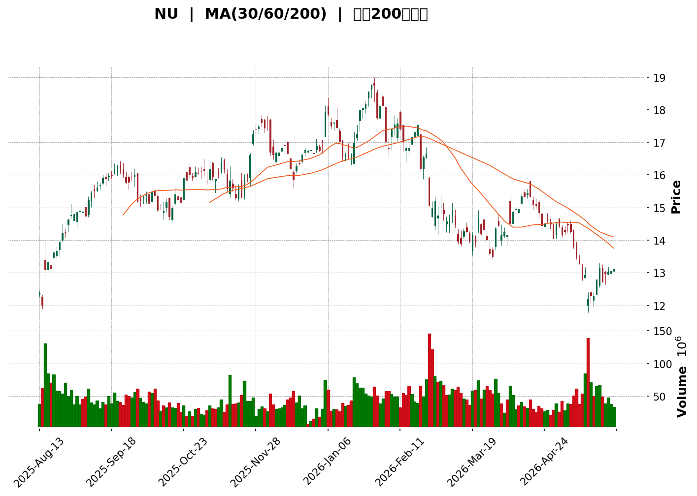
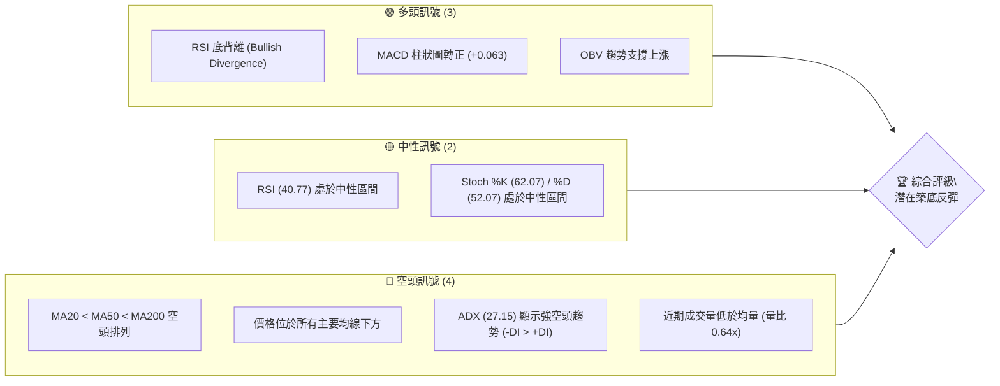
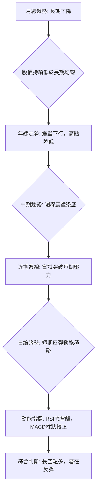
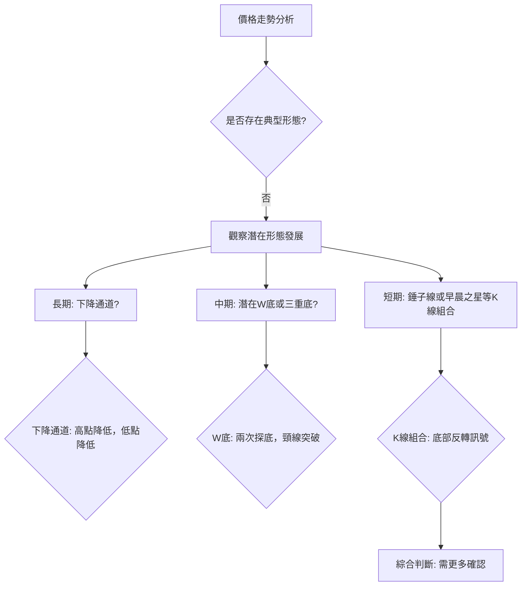
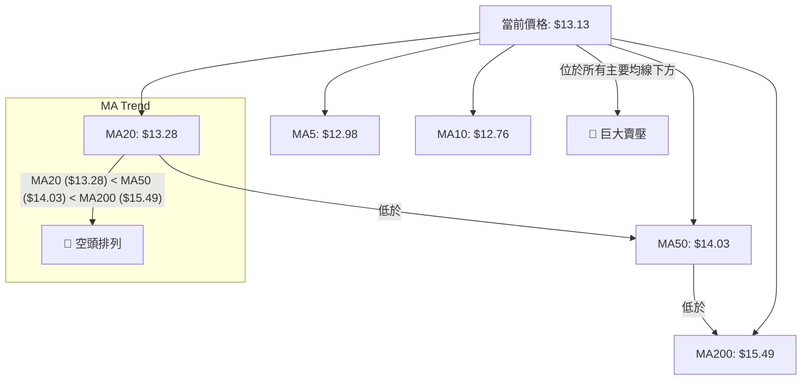

<details>
<summary>📊 靜態圖表 (點擊展開)</summary>

</details>

<html>
<head><meta charset="utf-8" /></head>
<body>
    <div>                        <script>window.PlotlyConfig = {MathJaxConfig: 'local'};</script>
        <script charset="utf-8" src="https://cdn.plot.ly/plotly-3.5.0.min.js" integrity="sha256-fHbNLP+GlIXN+efbQec78UkemUz3NJp7UmfGxC1tNxs=" crossorigin="anonymous"></script>                <div id="candlestick-chart" class="plotly-graph-div" style="height:500px; width:100%;"></div>            <script>                window.PLOTLYENV=window.PLOTLYENV || {};                                if (document.getElementById("candlestick-chart")) {                    Plotly.newPlot(                        "candlestick-chart",                        [{"close":{"dtype":"f8","bdata":"AAAAoHC9KEAAAADAHgUoQAAAAEAzMypAAAAAwPWoKkAAAACgcD0qQAAAAKBwPStAAAAAQApXK0AAAACgR+ErQAAAAIDCdSxAAAAAQOF6LEAAAAAgrkctQAAAAIA9ii1AAAAAoJmZLUAAAADgUbgtQAAAAMDMzC1AAAAAoHC9LUAAAABA4XotQAAAAOCjcC5AAAAAIIXrLkAAAADAHgUvQAAAAKBwPS9AAAAAoEdhL0AAAACA69EvQAAAACCuxy9AAAAAIIXrL0AAAABA4fovQAAAACCFKzBAAAAAwMxMMEAAAABgZiYwQAAAAGCPAjBAAAAAIFyPL0AAAAAgXI8vQAAAAGBm5i9AAAAAYI8CMEAAAACgR2EuQAAAAOCjcC5AAAAAYLieLkAAAABgj8IuQAAAAGCPQi5AAAAAIIXrLkAAAACgcL0uQAAAAEAK1y1AAAAAwPUoLkAAAACA69EtQAAAAAApXC5AAAAAgMJ1LUAAAAAAAAAuQAAAAIDr0S5AAAAAQOF6LkAAAACA61EuQAAAAMDMzC9AAAAAgBSuL0AAAAAAAAAwQAAAAAAp3C9AAAAAQAoXMEAAAAAgXA8wQAAAAAApHDBAAAAAoEchMEAAAACgmZkvQAAAACCFKzBAAAAAoEfhL0AAAACgcL0vQAAAAMAeBTBAAAAAANdjMEAAAACAFC4wQAAAAIAULi9AAAAAANejL0AAAABAMzMvQAAAAADXoy5AAAAAgOtRL0AAAAAA16MuQAAAACCuxy9AAAAAQArXL0AAAAAAKZwwQAAAAAAAQDFAAAAAANdjMUAAAABA4XoxQAAAAAApnDFAAAAA4KNwMUAAAABgZqYxQAAAAEAzszBAAAAAYLieMEAAAACAFK4wQAAAAOCjsDBAAAAAgOvRMEAAAABgZuYwQAAAAGBmpjBAAAAAQDMzMEAAAADgUbgvQAAAAMAeRTBAAAAAQApXMEAAAABguJ4wQAAAAGCPwjBAAAAAoHC9MEAAAABgj8IwQAAAAMD1qDBAAAAAoEfhMEAAAACgcL0wQAAAAMAeBTFAAAAA4KPwMUAAAAAAKdwxQAAAAAAAgDFAAAAAACmcMUAAAACAwnUxQAAAAIA9CjFAAAAAIFyPMEAAAAAA16MwQAAAAAApnDBAAAAAoJmZMEAAAADgUfgwQAAAAKBwPTFAAAAAAAAAMkAAAACAPQoyQAAAAIAULjJAAAAAwMyMMkAAAABgj8IyQAAAAGCPwjJAAAAAAADAMUAAAAAAKRwyQAAAAGC4HjJAAAAAwB4FMUAAAAAgXM8wQAAAAGBmZjFAAAAAwMyMMUAAAACA65ExQAAAAMD1aDFAAAAAgD0KMUAAAACA69EwQAAAAIDr0TBAAAAAIIUrMUAAAACA61ExQAAAACCuhzFAAAAA4KMwMEAAAAAgrocwQAAAAGBmpjBAAAAAYLgeLkAAAACAwvUtQAAAAKBHYS5AAAAAwB6FLUAAAAAAAAAuQAAAAADXoy1AAAAAwPUoLUAAAABAClctQAAAAGCPwi1AAAAAQOH6LEAAAADgo\u002fArQAAAACCuxytAAAAAgD2KLEAAAAAAAIAsQAAAAOCj8CtAAAAAgOtRLEAAAACgR+ErQAAAAAApXC1AAAAAoEdhLEAAAAAA16MsQAAAAIA9CixAAAAAQDMzK0AAAADAHgUrQAAAAKBwvSxAAAAAoEfhLEAAAADAzEwsQAAAAMAehSxAAAAAwMxMLEAAAADAHgUtQAAAAKBwvS1AAAAAIIXrLUAAAABgZuYtQAAAAEAzsy5AAAAAgBSuLkAAAAAAKdwuQAAAAIAUri5AAAAAQDMzLkAAAACgmRkuQAAAAEAzsy1AAAAAIIXrLEAAAADAHgUtQAAAACCuRy1AAAAAAAAALUAAAADgehQsQAAAAIDC9SxAAAAAoEfhLEAAAACA61EsQAAAAAAAgCxAAAAAgML1LEAAAADAHoUsQAAAAKCZmStAAAAAAAAAK0AAAACAPYoqQAAAAADXoylAAAAAACncKUAAAACgR2EoQAAAAOB6lChAAAAA4HqUKEAAAADgepQpQAAAAIDrUSpAAAAAgMJ1KUAAAACAwvUpQAAAACBcDypAAAAAoJkZKkAAAABgj0IqQA=="},"high":{"dtype":"f8","bdata":"AAAAIIXrKEAAAAAA16MoQAAAAADXIyxAAAAAwB4FK0AAAACAwrUqQAAAAAAAgCtAAAAAoJmZK0AAAACAwvUrQAAAAGCPAi1AAAAAQDOzLEAAAABAClctQAAAAEDhOi5AAAAAANejLUAAAACgcL0tQAAAAIDrES5AAAAAoHD9LUAAAACgmVkuQAAAAOCjsC5AAAAAwB4FL0AAAAAghWsvQAAAAKBHoS9AAAAAgD2KL0AAAACgRwEwQAAAAIDrETBAAAAAwMwMMEAAAACgRyEwQAAAAKCZWTBAAAAAwMxMMEAAAADAzGwwQAAAAGC4XjBAAAAA4FEYMEAAAACgcP0vQAAAAKCZGTBAAAAA4KMwMEAAAADAzAwwQAAAAMDMzC5AAAAAAADALkAAAABA4fouQAAAAOB6FC9AAAAAAAAAL0AAAADA9SgvQAAAAGBm5i5AAAAAoHA9LkAAAACgR2EuQAAAAABWji5AAAAAYLieLkAAAABguB4uQAAAACCuRy9AAAAAgBQuL0AAAAAghesuQAAAAADXIzBAAAAAoEchMEAAAACgmVkwQAAAAIDrETBAAAAAwB5FMEAAAACgcD0wQAAAAMAeRTBAAAAAAACAMEAAAACgcB0wQAAAACCFazBAAAAAYGZmMEAAAAAAAMAvQAAAAOBRODBAAAAAwMyMMEAAAAAAAIAwQAAAAIDrMTBAAAAAYI9CMEAAAACgcL0vQAAAAKCZWS9AAAAA4KNwL0AAAABAMxMwQAAAAMAeBTBAAAAAIFwPMEAAAADAzKwwQAAAAKBHYTFAAAAAgBSOMUAAAAAgXI8xQAAAAEAK1zFAAAAA4FG4MUAAAADgo9AxQAAAAEDhujFAAAAAQDMTMUAAAABA4bowQAAAAKCZ2TBAAAAAACkcMUAAAAAgXA8xQAAAAIDrETFAAAAAwB6FMEAAAADA9SgwQAAAAOAiWzBAAAAA4FF4MEAAAACgR6EwQAAAAOB61DBAAAAAwPXIMEAAAABgj8IwQAAAACBczzBAAAAAQOEaMUAAAADAzOwwQAAAACBcDzFAAAAAgJUjMkAAAABguF4yQAAAAGCPwjFAAAAAgL6fMUAAAACA6xEyQAAAACCFazFAAAAAgOsRMUAAAADgo7AwQAAAAOBR+DBAAAAAYA6tMEAAAADgo1AxQAAAAIA9ijFAAAAAAAAAMkAAAADgoxAyQAAAAGCPQjJAAAAAIFyPMkAAAADA9cgyQAAAAEDh+jJAAAAAYLieMkAAAABACncyQAAAAGBmpjJAAAAAgD0qMkAAAABgjyIxQAAAACCFazFAAAAAQArXMUAAAAAAKbwxQAAAAKBw\u002fTFAAAAAwMyMMUAAAACgR+EwQAAAAAAAADFAAAAAQOF6MUAAAADgo3AxQAAAAEAKlzFAAAAAwPVoMUAAAABACpcwQAAAAKCZ2TBAAAAAoEfhL0AAAABgZmYuQAAAAECLrC5AAAAAYLgeLkAAAACAwrUuQAAAAMDMTC5AAAAAQDNzLUAAAACA65EtQAAAAIA9Si5AAAAAoEfhLUAAAABAM7MsQAAAAGC4nixAAAAAoHC9LEAAAADgehQtQAAAAMDMjCxAAAAAAACALEAAAADAzEwsQAAAAEAK1y1AAAAAwB4FLUAAAACgR2EtQAAAAGBmpixAAAAAYGbmK0AAAACA65ErQAAAAIDr0SxAAAAAoJmZLUAAAACAwvUsQAAAACCuxyxAAAAAgOtRLEAAAADAScwuQAAAAAAp3C1AAAAA4HoULkAAAAAgXA8uQAAAAOCj8C5AAAAAYLgeL0AAAACgRyEvQAAAAGC4ni9AAAAAQDOzLkAAAAAgXI8uQAAAAOCjcC5AAAAAANejLUAAAADgehQtQAAAACCFqy1AAAAAQApXLUAAAADAHgUtQAAAAGC4Hi1AAAAAgOtRLUAAAADgo\u002fAsQAAAAKBH4SxAAAAAoJkZLUAAAABAMzMtQAAAAMD1qCxAAAAAwPXoK0AAAAAAKRwrQAAAAIA9iipAAAAAQApXKkAAAAAgXM8oQAAAAMDMzChAAAAAwMzMKEAAAACgmZkpQAAAAKCZmSpAAAAAwB6FKkAAAACgRyEqQAAAAAApXCpAAAAAQOF6KkAAAAAAAIAqQA=="},"hovertemplate":"\u003cb\u003e%{x|%Y-%m-%d}\u003c\u002fb\u003e\u003cbr\u003e\u958b: $%{open:.2f}\u003cbr\u003e\u9ad8: $%{high:.2f}\u003cbr\u003e\u4f4e: $%{low:.2f}\u003cbr\u003e\u6536: $%{close:.2f}\u003cextra\u003e\u003c\u002fextra\u003e","low":{"dtype":"f8","bdata":"AAAAAACAKEAAAAAgrscnQAAAAEAK1ylAAAAAgD2KKUAAAABAMzMqQAAAACCuRypAAAAAoEfhKkAAAABA4foqQAAAAGC43itAAAAAIFokLEAAAABgj4IsQAAAAIDrUS1AAAAAgBQuLUAAAACAFK4sQAAAAIDCdS1AAAAAgML1LEAAAACAPQotQAAAACCFay1AAAAAYI8CLkAAAACgmZkuQAAAAIDC9S5AAAAA4HoUL0AAAADA9WgvQAAAAIDrUS9AAAAAYGamL0AAAADAHsUvQAAAAMAeBTBAAAAAgML1L0AAAAAgrgcwQAAAAKDx0i9AAAAAgMJ1L0AAAACgmRkvQAAAAMD1qC9AAAAAwMxML0AAAACA61EuQAAAAIA9Ci5AAAAA4FE4LkAAAAAAAEAuQAAAAIA9Ci5AAAAAoJkZLkAAAACAwnUuQAAAAGCPwi1AAAAAQArXLUAAAAAgrkctQAAAAOBRuC1AAAAAQF46LUAAAABguB4tQAAAAGC4Hi5AAAAAIFxPLkAAAACA6xEuQAAAAIDCdS5AAAAAIASWL0AAAABACtcvQAAAAADXoy9AAAAAACncL0AAAAAA1wMwQAAAAGCPwi9AAAAAgBTuL0AAAABgZmYvQAAAAOB6lC9AAAAAgBSuL0AAAABgZuYuQAAAAMDMzC9AAAAAwMwMMEAAAAAghQswQAAAAOBR+C5AAAAAANejLkAAAAAAAAAvQAAAAMAehS5AAAAAoEdhLkAAAACgmZkuQAAAAGCPgi5AAAAAIFyPL0AAAAAAKVwvQAAAAMD16DBAAAAAQDMzMUAAAAAgrkcxQAAAAEDhejFAAAAAgD1KMUAAAAAAKVwxQAAAAKCZmTBAAAAA4FF4MEAAAAAAAkswQAAAAEAKdzBAAAAAQDOzMEAAAACgmZkwQAAAAKBHoTBAAAAAgBQuMEAAAACAFC4vQAAAAMAgEDBAAAAAQGJQMEAAAACgmVkwQAAAACBcjzBAAAAAYGamMEAAAAAAKZwwQAAAAIA9ijBAAAAAgBSuMEAAAACAwrUwQAAAAGBmpjBAAAAAgD0qMUAAAAAgXM8xQAAAACCuZzFAAAAAYLheMUAAAAAA12MxQAAAAMAeBTFAAAAAgD1qMEAAAADAzGwwQAAAAIBBgDBAAAAAgBROMEAAAACgmVkwQAAAAIDrETFAAAAA4HpUMUAAAACAwrUxQAAAAGBm5jFAAAAAoJkZMkAAAAAAKVwyQAAAAKBwPTJAAAAAgMK1MUAAAACAwrUxQAAAAEAK1zFAAAAAAADgMEAAAADAzIwwQAAAAGCPwjBAAAAAQAo3MUAAAACAPQoxQAAAAKCZWTFAAAAAgMK1MEAAAABguF4wQAAAAEAKlzBAAAAAQArXMEAAAADAHuUwQAAAACCFKzFAAAAA4HoUMEAAAACgcL0vQAAAAADXgzBAAAAA4HoULkAAAABgZmYtQAAAAGC4nixAAAAAQApXLEAAAACgmZktQAAAAOBROC1AAAAA4FF4LEAAAACAwnUsQAAAACBcDy1AAAAAYI\u002fCLEAAAABgj8IrQAAAAKBHoStAAAAAYLgeLEAAAADgUXgsQAAAAOB61CtAAAAAIFwPK0AAAADgepQrQAAAAOCjcCxAAAAAgOtRLEAAAAAghWssQAAAAAAp3CtAAAAA4HoUK0AAAACA69EqQAAAAGBmZitAAAAAACncLEAAAAAAAqsrQAAAAMD1KCxAAAAAgBSuK0AAAACA69EsQAAAAMDMzCxAAAAAIFyPLUAAAABAMzMtQAAAAKBwPS5AAAAAoJmZLkAAAADgepQuQAAAAGC4ni5AAAAAACncLUAAAADgo\u002fAtQAAAAEAKVy1AAAAAgOuRLEAAAACgR2EsQAAAAKCZGS1AAAAAgMK1LEAAAADgehQsQAAAAKCZGSxAAAAAYI\u002fCLEAAAACAFC4sQAAAAEAKVyxAAAAAoHB9LEAAAADA9WgsQAAAAAAAgCtAAAAAQArXKkAAAADAHoUqQAAAACCuhylAAAAAgBSuKUAAAAAgXI8nQAAAAGC4HihAAAAAIIXrJ0AAAADA9agoQAAAAGC4HilAAAAAIIVrKUAAAADAzEwpQAAAAAAp3ClAAAAAIK7HKUAAAABA4fopQA=="},"name":"\u50f9\u683c","open":{"dtype":"f8","bdata":"AAAAwPWoKEAAAACAPYooQAAAAMDMzCpAAAAAQDMzKkAAAACAwnUqQAAAAIAU7ipAAAAAgD0KK0AAAADgo3ArQAAAAAAAACxAAAAAQOF6LEAAAACAwvUsQAAAAAAAgC1AAAAA4FE4LUAAAADA9SgtQAAAAKBwvS1AAAAAgBSuLUAAAADAHgUuQAAAACBcjy1AAAAAgMJ1LkAAAACgmRkvQAAAACBcDy9AAAAAAClcL0AAAAAAAIAvQAAAAKBH4S9AAAAAYGbmL0AAAABgjwIwQAAAAIDrETBAAAAAACkcMEAAAADAzEwwQAAAAIAULjBAAAAAACncL0AAAAAAKdwvQAAAAGBm5i9AAAAAIIXrL0AAAADAzAwwQAAAAIA9ii5AAAAAIFyPLkAAAACgcL0uQAAAAIDr0S5AAAAAAClcLkAAAAAgXA8vQAAAAOBRuC5AAAAAwPUoLkAAAABAM7MtQAAAAAAAAC5AAAAA4HqULkAAAAAgrkctQAAAAGCPQi5AAAAAQDOzLkAAAAAA16MuQAAAAMAehS5AAAAAQAoXMEAAAABA4TowQAAAACCF6y9AAAAAYGbmL0AAAACA6xEwQAAAAAApHDBAAAAA4KMwMEAAAACgmZkvQAAAAOBRuC9AAAAAYLheMEAAAAAA16MvQAAAAKCZGTBAAAAAQAoXMEAAAACAwnUwQAAAAIA9CjBAAAAAACncLkAAAADgUXgvQAAAAMDMzC5AAAAAwMyMLkAAAACAFK4vQAAAAIDCtS5AAAAAAAAAMEAAAABACtcvQAAAAEDh+jBAAAAAANdjMUAAAACAFG4xQAAAAIDCtTFAAAAAQDOzMUAAAABgZqYxQAAAAEAzszFAAAAAYLjeMEAAAADAHmUwQAAAAKCZmTBAAAAAQOG6MEAAAAAgrucwQAAAAGBmBjFAAAAAAACAMEAAAABAChcwQAAAAGBmJjBAAAAAoJlZMEAAAAAghWswQAAAAOCjsDBAAAAAQDOzMEAAAACgcL0wQAAAAIA9qjBAAAAAwB7FMEAAAABguN4wQAAAACBcDzFAAAAAgBQuMUAAAABguB4yQAAAAGC4njFAAAAAQAqXMUAAAACAFK4xQAAAAKCZWTFAAAAAIFwPMUAAAADgo5AwQAAAAAAAwDBAAAAAgOuRMEAAAAAAKVwwQAAAAGCPIjFAAAAAgD2qMUAAAAAAAAAyQAAAAMDMDDJAAAAAAClcMkAAAABgj6IyQAAAAOB61DJAAAAAIK6HMkAAAACgcL0xQAAAACCuZzJAAAAA4HoUMkAAAADgetQwQAAAACCFKzFAAAAA4KNwMUAAAABgZiYxQAAAAIDr8TFAAAAAwPWIMUAAAACgcL0wQAAAAAAAwDBAAAAAQDPzMEAAAAAA1yMxQAAAAEAzMzFAAAAAAABAMUAAAADgozAwQAAAAADXgzBAAAAAQArXL0AAAADgo3AtQAAAACCF6yxAAAAAAClcLUAAAACgcP0tQAAAAAAp3C1AAAAAYI8CLUAAAACA69EsQAAAAEDhei1AAAAAAACALUAAAABgZmYsQAAAAADXIyxAAAAAoHA9LEAAAADAzMwsQAAAAOCjcCxAAAAAAClcK0AAAACgcD0sQAAAAKBHoSxAAAAA4FH4LEAAAABgj0ItQAAAAGCPQixAAAAAgMJ1K0AAAAAghWsrQAAAAKCZmStAAAAAgBQuLUAAAAAAAAAsQAAAAGCPQixAAAAAQDMzLEAAAAAghWsuQAAAAMAeBS1AAAAAACncLUAAAACAFK4tQAAAAGCPQi5AAAAAIIXrLkAAAAAgrscuQAAAAGC4ni9AAAAAQOF6LkAAAADgUTguQAAAAAApXC5AAAAAYLieLUAAAABACtcsQAAAACCuRy1AAAAA4HoULUAAAACAwvUsQAAAAOB6VCxAAAAAgOtRLUAAAAAgrscsQAAAAADXoyxAAAAAAAAALUAAAAAAAAAtQAAAAKCZmSxAAAAAYI\u002fCK0AAAABACtcqQAAAACCFaypAAAAAQDOzKUAAAABAiQEoQAAAAMDMzChAAAAA4HpUKEAAAACAFK4oQAAAAOBROClAAAAAwMxMKkAAAAAgrgcqQAAAACCF6ylAAAAA4KPwKUAAAACgmRkqQA=="},"x":["2025-08-13T00:00:00-04:00","2025-08-14T00:00:00-04:00","2025-08-15T00:00:00-04:00","2025-08-18T00:00:00-04:00","2025-08-19T00:00:00-04:00","2025-08-20T00:00:00-04:00","2025-08-21T00:00:00-04:00","2025-08-22T00:00:00-04:00","2025-08-25T00:00:00-04:00","2025-08-26T00:00:00-04:00","2025-08-27T00:00:00-04:00","2025-08-28T00:00:00-04:00","2025-08-29T00:00:00-04:00","2025-09-02T00:00:00-04:00","2025-09-03T00:00:00-04:00","2025-09-04T00:00:00-04:00","2025-09-05T00:00:00-04:00","2025-09-08T00:00:00-04:00","2025-09-09T00:00:00-04:00","2025-09-10T00:00:00-04:00","2025-09-11T00:00:00-04:00","2025-09-12T00:00:00-04:00","2025-09-15T00:00:00-04:00","2025-09-16T00:00:00-04:00","2025-09-17T00:00:00-04:00","2025-09-18T00:00:00-04:00","2025-09-19T00:00:00-04:00","2025-09-22T00:00:00-04:00","2025-09-23T00:00:00-04:00","2025-09-24T00:00:00-04:00","2025-09-25T00:00:00-04:00","2025-09-26T00:00:00-04:00","2025-09-29T00:00:00-04:00","2025-09-30T00:00:00-04:00","2025-10-01T00:00:00-04:00","2025-10-02T00:00:00-04:00","2025-10-03T00:00:00-04:00","2025-10-06T00:00:00-04:00","2025-10-07T00:00:00-04:00","2025-10-08T00:00:00-04:00","2025-10-09T00:00:00-04:00","2025-10-10T00:00:00-04:00","2025-10-13T00:00:00-04:00","2025-10-14T00:00:00-04:00","2025-10-15T00:00:00-04:00","2025-10-16T00:00:00-04:00","2025-10-17T00:00:00-04:00","2025-10-20T00:00:00-04:00","2025-10-21T00:00:00-04:00","2025-10-22T00:00:00-04:00","2025-10-23T00:00:00-04:00","2025-10-24T00:00:00-04:00","2025-10-27T00:00:00-04:00","2025-10-28T00:00:00-04:00","2025-10-29T00:00:00-04:00","2025-10-30T00:00:00-04:00","2025-10-31T00:00:00-04:00","2025-11-03T00:00:00-05:00","2025-11-04T00:00:00-05:00","2025-11-05T00:00:00-05:00","2025-11-06T00:00:00-05:00","2025-11-07T00:00:00-05:00","2025-11-10T00:00:00-05:00","2025-11-11T00:00:00-05:00","2025-11-12T00:00:00-05:00","2025-11-13T00:00:00-05:00","2025-11-14T00:00:00-05:00","2025-11-17T00:00:00-05:00","2025-11-18T00:00:00-05:00","2025-11-19T00:00:00-05:00","2025-11-20T00:00:00-05:00","2025-11-21T00:00:00-05:00","2025-11-24T00:00:00-05:00","2025-11-25T00:00:00-05:00","2025-11-26T00:00:00-05:00","2025-11-28T00:00:00-05:00","2025-12-01T00:00:00-05:00","2025-12-02T00:00:00-05:00","2025-12-03T00:00:00-05:00","2025-12-04T00:00:00-05:00","2025-12-05T00:00:00-05:00","2025-12-08T00:00:00-05:00","2025-12-09T00:00:00-05:00","2025-12-10T00:00:00-05:00","2025-12-11T00:00:00-05:00","2025-12-12T00:00:00-05:00","2025-12-15T00:00:00-05:00","2025-12-16T00:00:00-05:00","2025-12-17T00:00:00-05:00","2025-12-18T00:00:00-05:00","2025-12-19T00:00:00-05:00","2025-12-22T00:00:00-05:00","2025-12-23T00:00:00-05:00","2025-12-24T00:00:00-05:00","2025-12-26T00:00:00-05:00","2025-12-29T00:00:00-05:00","2025-12-30T00:00:00-05:00","2025-12-31T00:00:00-05:00","2026-01-02T00:00:00-05:00","2026-01-05T00:00:00-05:00","2026-01-06T00:00:00-05:00","2026-01-07T00:00:00-05:00","2026-01-08T00:00:00-05:00","2026-01-09T00:00:00-05:00","2026-01-12T00:00:00-05:00","2026-01-13T00:00:00-05:00","2026-01-14T00:00:00-05:00","2026-01-15T00:00:00-05:00","2026-01-16T00:00:00-05:00","2026-01-20T00:00:00-05:00","2026-01-21T00:00:00-05:00","2026-01-22T00:00:00-05:00","2026-01-23T00:00:00-05:00","2026-01-26T00:00:00-05:00","2026-01-27T00:00:00-05:00","2026-01-28T00:00:00-05:00","2026-01-29T00:00:00-05:00","2026-01-30T00:00:00-05:00","2026-02-02T00:00:00-05:00","2026-02-03T00:00:00-05:00","2026-02-04T00:00:00-05:00","2026-02-05T00:00:00-05:00","2026-02-06T00:00:00-05:00","2026-02-09T00:00:00-05:00","2026-02-10T00:00:00-05:00","2026-02-11T00:00:00-05:00","2026-02-12T00:00:00-05:00","2026-02-13T00:00:00-05:00","2026-02-17T00:00:00-05:00","2026-02-18T00:00:00-05:00","2026-02-19T00:00:00-05:00","2026-02-20T00:00:00-05:00","2026-02-23T00:00:00-05:00","2026-02-24T00:00:00-05:00","2026-02-25T00:00:00-05:00","2026-02-26T00:00:00-05:00","2026-02-27T00:00:00-05:00","2026-03-02T00:00:00-05:00","2026-03-03T00:00:00-05:00","2026-03-04T00:00:00-05:00","2026-03-05T00:00:00-05:00","2026-03-06T00:00:00-05:00","2026-03-09T00:00:00-04:00","2026-03-10T00:00:00-04:00","2026-03-11T00:00:00-04:00","2026-03-12T00:00:00-04:00","2026-03-13T00:00:00-04:00","2026-03-16T00:00:00-04:00","2026-03-17T00:00:00-04:00","2026-03-18T00:00:00-04:00","2026-03-19T00:00:00-04:00","2026-03-20T00:00:00-04:00","2026-03-23T00:00:00-04:00","2026-03-24T00:00:00-04:00","2026-03-25T00:00:00-04:00","2026-03-26T00:00:00-04:00","2026-03-27T00:00:00-04:00","2026-03-30T00:00:00-04:00","2026-03-31T00:00:00-04:00","2026-04-01T00:00:00-04:00","2026-04-02T00:00:00-04:00","2026-04-06T00:00:00-04:00","2026-04-07T00:00:00-04:00","2026-04-08T00:00:00-04:00","2026-04-09T00:00:00-04:00","2026-04-10T00:00:00-04:00","2026-04-13T00:00:00-04:00","2026-04-14T00:00:00-04:00","2026-04-15T00:00:00-04:00","2026-04-16T00:00:00-04:00","2026-04-17T00:00:00-04:00","2026-04-20T00:00:00-04:00","2026-04-21T00:00:00-04:00","2026-04-22T00:00:00-04:00","2026-04-23T00:00:00-04:00","2026-04-24T00:00:00-04:00","2026-04-27T00:00:00-04:00","2026-04-28T00:00:00-04:00","2026-04-29T00:00:00-04:00","2026-04-30T00:00:00-04:00","2026-05-01T00:00:00-04:00","2026-05-04T00:00:00-04:00","2026-05-05T00:00:00-04:00","2026-05-06T00:00:00-04:00","2026-05-07T00:00:00-04:00","2026-05-08T00:00:00-04:00","2026-05-11T00:00:00-04:00","2026-05-12T00:00:00-04:00","2026-05-13T00:00:00-04:00","2026-05-14T00:00:00-04:00","2026-05-15T00:00:00-04:00","2026-05-18T00:00:00-04:00","2026-05-19T00:00:00-04:00","2026-05-20T00:00:00-04:00","2026-05-21T00:00:00-04:00","2026-05-22T00:00:00-04:00","2026-05-26T00:00:00-04:00","2026-05-27T00:00:00-04:00","2026-05-28T00:00:00-04:00","2026-05-29T00:00:00-04:00"],"type":"candlestick"},{"hovertemplate":"MA30: $%{y:.2f}\u003cextra\u003e\u003c\u002fextra\u003e","line":{"color":"#2196F3","dash":"dash","width":2},"mode":"lines","name":"MA30","x":["2025-08-13T00:00:00-04:00","2025-08-14T00:00:00-04:00","2025-08-15T00:00:00-04:00","2025-08-18T00:00:00-04:00","2025-08-19T00:00:00-04:00","2025-08-20T00:00:00-04:00","2025-08-21T00:00:00-04:00","2025-08-22T00:00:00-04:00","2025-08-25T00:00:00-04:00","2025-08-26T00:00:00-04:00","2025-08-27T00:00:00-04:00","2025-08-28T00:00:00-04:00","2025-08-29T00:00:00-04:00","2025-09-02T00:00:00-04:00","2025-09-03T00:00:00-04:00","2025-09-04T00:00:00-04:00","2025-09-05T00:00:00-04:00","2025-09-08T00:00:00-04:00","2025-09-09T00:00:00-04:00","2025-09-10T00:00:00-04:00","2025-09-11T00:00:00-04:00","2025-09-12T00:00:00-04:00","2025-09-15T00:00:00-04:00","2025-09-16T00:00:00-04:00","2025-09-17T00:00:00-04:00","2025-09-18T00:00:00-04:00","2025-09-19T00:00:00-04:00","2025-09-22T00:00:00-04:00","2025-09-23T00:00:00-04:00","2025-09-24T00:00:00-04:00","2025-09-25T00:00:00-04:00","2025-09-26T00:00:00-04:00","2025-09-29T00:00:00-04:00","2025-09-30T00:00:00-04:00","2025-10-01T00:00:00-04:00","2025-10-02T00:00:00-04:00","2025-10-03T00:00:00-04:00","2025-10-06T00:00:00-04:00","2025-10-07T00:00:00-04:00","2025-10-08T00:00:00-04:00","2025-10-09T00:00:00-04:00","2025-10-10T00:00:00-04:00","2025-10-13T00:00:00-04:00","2025-10-14T00:00:00-04:00","2025-10-15T00:00:00-04:00","2025-10-16T00:00:00-04:00","2025-10-17T00:00:00-04:00","2025-10-20T00:00:00-04:00","2025-10-21T00:00:00-04:00","2025-10-22T00:00:00-04:00","2025-10-23T00:00:00-04:00","2025-10-24T00:00:00-04:00","2025-10-27T00:00:00-04:00","2025-10-28T00:00:00-04:00","2025-10-29T00:00:00-04:00","2025-10-30T00:00:00-04:00","2025-10-31T00:00:00-04:00","2025-11-03T00:00:00-05:00","2025-11-04T00:00:00-05:00","2025-11-05T00:00:00-05:00","2025-11-06T00:00:00-05:00","2025-11-07T00:00:00-05:00","2025-11-10T00:00:00-05:00","2025-11-11T00:00:00-05:00","2025-11-12T00:00:00-05:00","2025-11-13T00:00:00-05:00","2025-11-14T00:00:00-05:00","2025-11-17T00:00:00-05:00","2025-11-18T00:00:00-05:00","2025-11-19T00:00:00-05:00","2025-11-20T00:00:00-05:00","2025-11-21T00:00:00-05:00","2025-11-24T00:00:00-05:00","2025-11-25T00:00:00-05:00","2025-11-26T00:00:00-05:00","2025-11-28T00:00:00-05:00","2025-12-01T00:00:00-05:00","2025-12-02T00:00:00-05:00","2025-12-03T00:00:00-05:00","2025-12-04T00:00:00-05:00","2025-12-05T00:00:00-05:00","2025-12-08T00:00:00-05:00","2025-12-09T00:00:00-05:00","2025-12-10T00:00:00-05:00","2025-12-11T00:00:00-05:00","2025-12-12T00:00:00-05:00","2025-12-15T00:00:00-05:00","2025-12-16T00:00:00-05:00","2025-12-17T00:00:00-05:00","2025-12-18T00:00:00-05:00","2025-12-19T00:00:00-05:00","2025-12-22T00:00:00-05:00","2025-12-23T00:00:00-05:00","2025-12-24T00:00:00-05:00","2025-12-26T00:00:00-05:00","2025-12-29T00:00:00-05:00","2025-12-30T00:00:00-05:00","2025-12-31T00:00:00-05:00","2026-01-02T00:00:00-05:00","2026-01-05T00:00:00-05:00","2026-01-06T00:00:00-05:00","2026-01-07T00:00:00-05:00","2026-01-08T00:00:00-05:00","2026-01-09T00:00:00-05:00","2026-01-12T00:00:00-05:00","2026-01-13T00:00:00-05:00","2026-01-14T00:00:00-05:00","2026-01-15T00:00:00-05:00","2026-01-16T00:00:00-05:00","2026-01-20T00:00:00-05:00","2026-01-21T00:00:00-05:00","2026-01-22T00:00:00-05:00","2026-01-23T00:00:00-05:00","2026-01-26T00:00:00-05:00","2026-01-27T00:00:00-05:00","2026-01-28T00:00:00-05:00","2026-01-29T00:00:00-05:00","2026-01-30T00:00:00-05:00","2026-02-02T00:00:00-05:00","2026-02-03T00:00:00-05:00","2026-02-04T00:00:00-05:00","2026-02-05T00:00:00-05:00","2026-02-06T00:00:00-05:00","2026-02-09T00:00:00-05:00","2026-02-10T00:00:00-05:00","2026-02-11T00:00:00-05:00","2026-02-12T00:00:00-05:00","2026-02-13T00:00:00-05:00","2026-02-17T00:00:00-05:00","2026-02-18T00:00:00-05:00","2026-02-19T00:00:00-05:00","2026-02-20T00:00:00-05:00","2026-02-23T00:00:00-05:00","2026-02-24T00:00:00-05:00","2026-02-25T00:00:00-05:00","2026-02-26T00:00:00-05:00","2026-02-27T00:00:00-05:00","2026-03-02T00:00:00-05:00","2026-03-03T00:00:00-05:00","2026-03-04T00:00:00-05:00","2026-03-05T00:00:00-05:00","2026-03-06T00:00:00-05:00","2026-03-09T00:00:00-04:00","2026-03-10T00:00:00-04:00","2026-03-11T00:00:00-04:00","2026-03-12T00:00:00-04:00","2026-03-13T00:00:00-04:00","2026-03-16T00:00:00-04:00","2026-03-17T00:00:00-04:00","2026-03-18T00:00:00-04:00","2026-03-19T00:00:00-04:00","2026-03-20T00:00:00-04:00","2026-03-23T00:00:00-04:00","2026-03-24T00:00:00-04:00","2026-03-25T00:00:00-04:00","2026-03-26T00:00:00-04:00","2026-03-27T00:00:00-04:00","2026-03-30T00:00:00-04:00","2026-03-31T00:00:00-04:00","2026-04-01T00:00:00-04:00","2026-04-02T00:00:00-04:00","2026-04-06T00:00:00-04:00","2026-04-07T00:00:00-04:00","2026-04-08T00:00:00-04:00","2026-04-09T00:00:00-04:00","2026-04-10T00:00:00-04:00","2026-04-13T00:00:00-04:00","2026-04-14T00:00:00-04:00","2026-04-15T00:00:00-04:00","2026-04-16T00:00:00-04:00","2026-04-17T00:00:00-04:00","2026-04-20T00:00:00-04:00","2026-04-21T00:00:00-04:00","2026-04-22T00:00:00-04:00","2026-04-23T00:00:00-04:00","2026-04-24T00:00:00-04:00","2026-04-27T00:00:00-04:00","2026-04-28T00:00:00-04:00","2026-04-29T00:00:00-04:00","2026-04-30T00:00:00-04:00","2026-05-01T00:00:00-04:00","2026-05-04T00:00:00-04:00","2026-05-05T00:00:00-04:00","2026-05-06T00:00:00-04:00","2026-05-07T00:00:00-04:00","2026-05-08T00:00:00-04:00","2026-05-11T00:00:00-04:00","2026-05-12T00:00:00-04:00","2026-05-13T00:00:00-04:00","2026-05-14T00:00:00-04:00","2026-05-15T00:00:00-04:00","2026-05-18T00:00:00-04:00","2026-05-19T00:00:00-04:00","2026-05-20T00:00:00-04:00","2026-05-21T00:00:00-04:00","2026-05-22T00:00:00-04:00","2026-05-26T00:00:00-04:00","2026-05-27T00:00:00-04:00","2026-05-28T00:00:00-04:00","2026-05-29T00:00:00-04:00"],"y":{"dtype":"f8","bdata":"AAAAAAAA+H8AAAAAAAD4fwAAAAAAAPh\u002fAAAAAAAA+H8AAAAAAAD4fwAAAAAAAPh\u002fAAAAAAAA+H8AAAAAAAD4fwAAAAAAAPh\u002fAAAAAAAA+H8AAAAAAAD4fwAAAAAAAPh\u002fAAAAAAAA+H8AAAAAAAD4fwAAAAAAAPh\u002fAAAAAAAA+H8AAAAAAAD4fwAAAAAAAPh\u002fAAAAAAAA+H8AAAAAAAD4fwAAAAAAAPh\u002fAAAAAAAA+H8AAAAAAAD4fwAAAAAAAPh\u002fAAAAAAAA+H8AAAAAAAD4fwAAAAAAAPh\u002fAAAAAAAA+H8AAAAAAAD4f97d3b0Rii1AIiIiQkTELUAzMzOjmwQuQJqZmXk\u002fNS5AMzMzk\u002fxiLkCrqqqKUIYuQM3MzAyfoS5AIiIiUpy9LkB3d3fHL9YuQBEREfGL5S5ARERENF76LkDv7u6e0wYvQKuqqvpiCS9AERERUSoOL0BVVVXFBA8vQM3MzBzMEy9AERERcWgRL0BmZmZm2BUvQFVVVYUWGS9AMzMzU1UVL0BmZmYmXA8vQM3MzHwjFC9AmpmZ2bIWL0ARERERPBgvQERERNTqGC9A7+7uziIbL0BERESkVBwvQAAAAIBOGy9AIiIiwmcYL0BmZmaWbhIvQDMzM6MpFS9AAAAAsOQXL0B3d3fnbRkvQN7d3b2fGi9AvLu7+xshL0DNzMxcATIvQKuqqupROC9AMzMzIwZBL0BVVVVVx0QvQERERHQFSC9ARERERG9LL0AAAADQlEovQO\u002fu7s4iWy9AMzMz03hpL0De3d09fIYvQFVVVTXQqS9AzczM7DXXL0CrqqqaxAAwQERERJSKEzBA3t3djVAmMECrqqoKkDswQLy7u6tjQjBAvLu7mwtJMEB3d3cX2U4wQGZmZlZVVTBAvLu7C5BbMEDe3d0Nu2IwQDMzM7NWZzBA7+7unu9nMEARERGxcmgwQFVVVSVNaTBA3t3d9bZsMEDNzMxcHXMwQKuqqupteTBAERERgWp8MECJiIiIXYEwQLy7u\u002ft+ijBAZmZmloqTMEBERET0RJ0wQJqZmanGqzBAZmZmZju\u002fMEDe3d0d6NQwQO\u002fu7jal4jBAvLu7ExHxMEBVVVXtUfgwQFVVVS2H9jBAvLu7A3LvMECamZkBR+gwQBEREXm+3zBA7+7udpPYMEAzMzP7xdIwQImIiKBh1zBAAAAASCjjMEB3d3c\u002fw+4wQLy7uzN6+zBAmpmZcT0KMUBVVVWtHBoxQDMzMwseLDFAmpmZEVg5MUBVVVVFi0wxQImIiKhUXDFAREREJCJiMUAzMzMzwWMxQM3MzEw3aTFAVVVVxSBwMUDe3d09CncxQERERKRwfTFAvLu7K85+MUDv7u7ufH8xQGZmZgbIfTFA7+7u7jV3MUCJiIhImnIxQCIiItLbcjFAiYiIyL1mMUC8u7srzl4xQDMzMzN6WzFA7+7uZq1OMUC8u7sTg0AxQJqZmQllNDFA7+7ufrEkMUB3d3f34RMxQFVVVWU7\u002fzBAq6qqSgziMECamZlpSsUwQLy7u3MhqTBAd3d3P3yGMEBVVVVVnF0wQAAAAKgNNDBAMzMze1sWMEDNzMxc1uovQLy7u7sCpC9AMzMzMzNzL0Crqqr6N0IvQO\u002fu7h7MEy9A7+7uDnTaLkB3d3eX\u002fKIuQFVVVXUhaS5A3t3d3WsuLkAiIiJC7vUtQLy7uwsezC1A3t3dfYadLUDNzMyMbGctQDMzM7OdLy1AzczMzMwMLUCJiIhIU+osQImIiFjyyyxAAAAAcD3KLEDe3d1dusksQLy7u2t1zCxAq6qqelvWLEDe3d0tst0sQImIiBiS5ixAMzMzA3LvLEAiIiJC7vUsQAAAADBr9SxA3t3dHej0LECamZlpH\u002f4sQGZmZjbsCi1AiYiIGNkOLUB3d3eXQwstQAAAAND3Ey1AZmZmJr8YLUCJiIhYgBwtQFVVVaUpFS1AzczMrBwaLUCJiIiIFhktQGZmZlZVFS1A3t3dbaATLUCrqqrahw8tQM3MzMwT9SxAMzMzg07bLEBEREQk27ksQERERBQ8mCxA3t3dnX14LEAiIiLSIlssQHd3d7fzPSxAIiIisuQXLEAiIiKiRfYrQFVVVWWtzitAvLu7O5inK0ARERFhV4ArQA=="},"type":"scatter"},{"hovertemplate":"MA60: $%{y:.2f}\u003cextra\u003e\u003c\u002fextra\u003e","line":{"color":"#9C27B0","dash":"dash","width":2},"mode":"lines","name":"MA60","x":["2025-08-13T00:00:00-04:00","2025-08-14T00:00:00-04:00","2025-08-15T00:00:00-04:00","2025-08-18T00:00:00-04:00","2025-08-19T00:00:00-04:00","2025-08-20T00:00:00-04:00","2025-08-21T00:00:00-04:00","2025-08-22T00:00:00-04:00","2025-08-25T00:00:00-04:00","2025-08-26T00:00:00-04:00","2025-08-27T00:00:00-04:00","2025-08-28T00:00:00-04:00","2025-08-29T00:00:00-04:00","2025-09-02T00:00:00-04:00","2025-09-03T00:00:00-04:00","2025-09-04T00:00:00-04:00","2025-09-05T00:00:00-04:00","2025-09-08T00:00:00-04:00","2025-09-09T00:00:00-04:00","2025-09-10T00:00:00-04:00","2025-09-11T00:00:00-04:00","2025-09-12T00:00:00-04:00","2025-09-15T00:00:00-04:00","2025-09-16T00:00:00-04:00","2025-09-17T00:00:00-04:00","2025-09-18T00:00:00-04:00","2025-09-19T00:00:00-04:00","2025-09-22T00:00:00-04:00","2025-09-23T00:00:00-04:00","2025-09-24T00:00:00-04:00","2025-09-25T00:00:00-04:00","2025-09-26T00:00:00-04:00","2025-09-29T00:00:00-04:00","2025-09-30T00:00:00-04:00","2025-10-01T00:00:00-04:00","2025-10-02T00:00:00-04:00","2025-10-03T00:00:00-04:00","2025-10-06T00:00:00-04:00","2025-10-07T00:00:00-04:00","2025-10-08T00:00:00-04:00","2025-10-09T00:00:00-04:00","2025-10-10T00:00:00-04:00","2025-10-13T00:00:00-04:00","2025-10-14T00:00:00-04:00","2025-10-15T00:00:00-04:00","2025-10-16T00:00:00-04:00","2025-10-17T00:00:00-04:00","2025-10-20T00:00:00-04:00","2025-10-21T00:00:00-04:00","2025-10-22T00:00:00-04:00","2025-10-23T00:00:00-04:00","2025-10-24T00:00:00-04:00","2025-10-27T00:00:00-04:00","2025-10-28T00:00:00-04:00","2025-10-29T00:00:00-04:00","2025-10-30T00:00:00-04:00","2025-10-31T00:00:00-04:00","2025-11-03T00:00:00-05:00","2025-11-04T00:00:00-05:00","2025-11-05T00:00:00-05:00","2025-11-06T00:00:00-05:00","2025-11-07T00:00:00-05:00","2025-11-10T00:00:00-05:00","2025-11-11T00:00:00-05:00","2025-11-12T00:00:00-05:00","2025-11-13T00:00:00-05:00","2025-11-14T00:00:00-05:00","2025-11-17T00:00:00-05:00","2025-11-18T00:00:00-05:00","2025-11-19T00:00:00-05:00","2025-11-20T00:00:00-05:00","2025-11-21T00:00:00-05:00","2025-11-24T00:00:00-05:00","2025-11-25T00:00:00-05:00","2025-11-26T00:00:00-05:00","2025-11-28T00:00:00-05:00","2025-12-01T00:00:00-05:00","2025-12-02T00:00:00-05:00","2025-12-03T00:00:00-05:00","2025-12-04T00:00:00-05:00","2025-12-05T00:00:00-05:00","2025-12-08T00:00:00-05:00","2025-12-09T00:00:00-05:00","2025-12-10T00:00:00-05:00","2025-12-11T00:00:00-05:00","2025-12-12T00:00:00-05:00","2025-12-15T00:00:00-05:00","2025-12-16T00:00:00-05:00","2025-12-17T00:00:00-05:00","2025-12-18T00:00:00-05:00","2025-12-19T00:00:00-05:00","2025-12-22T00:00:00-05:00","2025-12-23T00:00:00-05:00","2025-12-24T00:00:00-05:00","2025-12-26T00:00:00-05:00","2025-12-29T00:00:00-05:00","2025-12-30T00:00:00-05:00","2025-12-31T00:00:00-05:00","2026-01-02T00:00:00-05:00","2026-01-05T00:00:00-05:00","2026-01-06T00:00:00-05:00","2026-01-07T00:00:00-05:00","2026-01-08T00:00:00-05:00","2026-01-09T00:00:00-05:00","2026-01-12T00:00:00-05:00","2026-01-13T00:00:00-05:00","2026-01-14T00:00:00-05:00","2026-01-15T00:00:00-05:00","2026-01-16T00:00:00-05:00","2026-01-20T00:00:00-05:00","2026-01-21T00:00:00-05:00","2026-01-22T00:00:00-05:00","2026-01-23T00:00:00-05:00","2026-01-26T00:00:00-05:00","2026-01-27T00:00:00-05:00","2026-01-28T00:00:00-05:00","2026-01-29T00:00:00-05:00","2026-01-30T00:00:00-05:00","2026-02-02T00:00:00-05:00","2026-02-03T00:00:00-05:00","2026-02-04T00:00:00-05:00","2026-02-05T00:00:00-05:00","2026-02-06T00:00:00-05:00","2026-02-09T00:00:00-05:00","2026-02-10T00:00:00-05:00","2026-02-11T00:00:00-05:00","2026-02-12T00:00:00-05:00","2026-02-13T00:00:00-05:00","2026-02-17T00:00:00-05:00","2026-02-18T00:00:00-05:00","2026-02-19T00:00:00-05:00","2026-02-20T00:00:00-05:00","2026-02-23T00:00:00-05:00","2026-02-24T00:00:00-05:00","2026-02-25T00:00:00-05:00","2026-02-26T00:00:00-05:00","2026-02-27T00:00:00-05:00","2026-03-02T00:00:00-05:00","2026-03-03T00:00:00-05:00","2026-03-04T00:00:00-05:00","2026-03-05T00:00:00-05:00","2026-03-06T00:00:00-05:00","2026-03-09T00:00:00-04:00","2026-03-10T00:00:00-04:00","2026-03-11T00:00:00-04:00","2026-03-12T00:00:00-04:00","2026-03-13T00:00:00-04:00","2026-03-16T00:00:00-04:00","2026-03-17T00:00:00-04:00","2026-03-18T00:00:00-04:00","2026-03-19T00:00:00-04:00","2026-03-20T00:00:00-04:00","2026-03-23T00:00:00-04:00","2026-03-24T00:00:00-04:00","2026-03-25T00:00:00-04:00","2026-03-26T00:00:00-04:00","2026-03-27T00:00:00-04:00","2026-03-30T00:00:00-04:00","2026-03-31T00:00:00-04:00","2026-04-01T00:00:00-04:00","2026-04-02T00:00:00-04:00","2026-04-06T00:00:00-04:00","2026-04-07T00:00:00-04:00","2026-04-08T00:00:00-04:00","2026-04-09T00:00:00-04:00","2026-04-10T00:00:00-04:00","2026-04-13T00:00:00-04:00","2026-04-14T00:00:00-04:00","2026-04-15T00:00:00-04:00","2026-04-16T00:00:00-04:00","2026-04-17T00:00:00-04:00","2026-04-20T00:00:00-04:00","2026-04-21T00:00:00-04:00","2026-04-22T00:00:00-04:00","2026-04-23T00:00:00-04:00","2026-04-24T00:00:00-04:00","2026-04-27T00:00:00-04:00","2026-04-28T00:00:00-04:00","2026-04-29T00:00:00-04:00","2026-04-30T00:00:00-04:00","2026-05-01T00:00:00-04:00","2026-05-04T00:00:00-04:00","2026-05-05T00:00:00-04:00","2026-05-06T00:00:00-04:00","2026-05-07T00:00:00-04:00","2026-05-08T00:00:00-04:00","2026-05-11T00:00:00-04:00","2026-05-12T00:00:00-04:00","2026-05-13T00:00:00-04:00","2026-05-14T00:00:00-04:00","2026-05-15T00:00:00-04:00","2026-05-18T00:00:00-04:00","2026-05-19T00:00:00-04:00","2026-05-20T00:00:00-04:00","2026-05-21T00:00:00-04:00","2026-05-22T00:00:00-04:00","2026-05-26T00:00:00-04:00","2026-05-27T00:00:00-04:00","2026-05-28T00:00:00-04:00","2026-05-29T00:00:00-04:00"],"y":{"dtype":"f8","bdata":"AAAAAAAA+H8AAAAAAAD4fwAAAAAAAPh\u002fAAAAAAAA+H8AAAAAAAD4fwAAAAAAAPh\u002fAAAAAAAA+H8AAAAAAAD4fwAAAAAAAPh\u002fAAAAAAAA+H8AAAAAAAD4fwAAAAAAAPh\u002fAAAAAAAA+H8AAAAAAAD4fwAAAAAAAPh\u002fAAAAAAAA+H8AAAAAAAD4fwAAAAAAAPh\u002fAAAAAAAA+H8AAAAAAAD4fwAAAAAAAPh\u002fAAAAAAAA+H8AAAAAAAD4fwAAAAAAAPh\u002fAAAAAAAA+H8AAAAAAAD4fwAAAAAAAPh\u002fAAAAAAAA+H8AAAAAAAD4fwAAAAAAAPh\u002fAAAAAAAA+H8AAAAAAAD4fwAAAAAAAPh\u002fAAAAAAAA+H8AAAAAAAD4fwAAAAAAAPh\u002fAAAAAAAA+H8AAAAAAAD4fwAAAAAAAPh\u002fAAAAAAAA+H8AAAAAAAD4fwAAAAAAAPh\u002fAAAAAAAA+H8AAAAAAAD4fwAAAAAAAPh\u002fAAAAAAAA+H8AAAAAAAD4fwAAAAAAAPh\u002fAAAAAAAA+H8AAAAAAAD4fwAAAAAAAPh\u002fAAAAAAAA+H8AAAAAAAD4fwAAAAAAAPh\u002fAAAAAAAA+H8AAAAAAAD4fwAAAAAAAPh\u002fAAAAAAAA+H8AAAAAAAD4f4mIiLCdTy5AEREReRRuLkBVVVXFBI8uQLy7u5vvpy5Ad3d3RwzCLkC8u7vzKNwuQLy7u3v47C5Aq6qqOlH\u002fLkBmZmaOew0vQKuqqrLIFi9AREREvOYiL0B3d3c3tCgvQM3MzORCMi9AIiIiktE7L0CamZmBwEovQBERESnOXi9A7+7uLk90L0De3d3NsIsvQO\u002fu7tYVoC9Ad3d3N\u002fuwL0De3d0dPsMvQCIiImp1zC9AiYiICGXUL0AAAAAg99ovQImIiMDK4S9AMzMzcyHpL0AAAABg5fAvQDMzM\u002fP99C9AAAAAgCP0L0BERET8qfEvQO\u002fu7vbh8y9A3t3dTan4L0CJiIhQ1P8vQM3MzOReAzBAd3d3P3wGMEB3d3cbLw0wQImIiPhTEzBAAAAA1AYaMEB3d3dP1B8wQN7d3bHkJzBAREREhHkyMEDv7u5CGT0wQDMzM08bSDBAq6qqvuZSMEAiIiIGyF0wQAAAAKS3ZTBAERERfYZtMEAiIiLOhXQwQKuqqoakeTBAZmZmAnJ\u002fMEDv7u4CK4cwQCIiIqbijDBA3t3d8RmWMEB3d3crzp4wQBEREcVnqDBAq6qqvuayMECamZnda74wQDMzM1+6yTBARERE2KPQMEAzMzP7ftowQO\u002fu7ubQ4jBAERERjWznMEAAAABIb+swQLy7u5tS8TBAMzMzo0X2MEAzMzPjM\u002fwwQAAAAND3AzFAERERYSwJMUCamZnxYA4xQAAAAFjHFDFAq6qqqjgbMUAzMzMzwSMxQImIiITAKjFAIiIibucrMUCJiIgMkCsxQERERLAAKTFAVVVVtQ8fMUCrqqoKZRQxQFVVVcERCjFA7+7ueqL+MEBVVVX5U\u002fMwQO\u002fu7oJO6zBAVVVVSZriMECJiIjUBtowQLy7u9NN0jBAiYiI2FzIMEBVVVWB3LswQJqZmdkVsDBAZmZmxtmnMEDe3d05+6AwQDMzMwMrlzBA7+7u3t2NMEBERESYboIwQCIiIq6OeTBAZmZmZq1uMEDNzMxERGQwQHd3d68AWTBAVVVVDQJLMEAAAAAIOj0wQCIiIobrMTBA7+7ulvwiMEB3d3dHKBMwQN7d3VVVBTBA7+7uLiTtL0AAAADQ99MvQHd3d19zwS9A7+7uHsyzL0CrqqpCYKUvQHd3d7+fmi9AREREPN+PL0BmZmYOu4IvQJqZmXGEci9ARERETMVZL0CrqqqKQUAvQLy7uwvXIy9AZmZmTvAAL0AiIiIKrNwuQDMzM8ODuS5Ad3d3B8idLkAiIiL6DHsuQN7d3UX9Wy5AzczMLPlFLkCamZkpXC8uQCIiIuJ6FC5A3t3dXUj6LUAAAACQCd4tQN7d3WU7vy1A3t3dJQahLUBmZmYOu4ItQEREROyYYC1AiYiIgGo8LUCJiIjYoxAtQLy7u+Ps4yxAVVVVNaXCLEBVVVUNu6IsQAAAAAjzhCxAERERERFxLEAAAAAAAGAsQImIiGiRTSxAMzMz2\u002fk+LEB3d3fHBC8sQA=="},"type":"scatter"},{"hovertemplate":"MA200: $%{y:.2f}\u003cextra\u003e\u003c\u002fextra\u003e","line":{"color":"#FF6F00","dash":"solid","width":2},"mode":"lines","name":"MA200","x":["2025-08-13T00:00:00-04:00","2025-08-14T00:00:00-04:00","2025-08-15T00:00:00-04:00","2025-08-18T00:00:00-04:00","2025-08-19T00:00:00-04:00","2025-08-20T00:00:00-04:00","2025-08-21T00:00:00-04:00","2025-08-22T00:00:00-04:00","2025-08-25T00:00:00-04:00","2025-08-26T00:00:00-04:00","2025-08-27T00:00:00-04:00","2025-08-28T00:00:00-04:00","2025-08-29T00:00:00-04:00","2025-09-02T00:00:00-04:00","2025-09-03T00:00:00-04:00","2025-09-04T00:00:00-04:00","2025-09-05T00:00:00-04:00","2025-09-08T00:00:00-04:00","2025-09-09T00:00:00-04:00","2025-09-10T00:00:00-04:00","2025-09-11T00:00:00-04:00","2025-09-12T00:00:00-04:00","2025-09-15T00:00:00-04:00","2025-09-16T00:00:00-04:00","2025-09-17T00:00:00-04:00","2025-09-18T00:00:00-04:00","2025-09-19T00:00:00-04:00","2025-09-22T00:00:00-04:00","2025-09-23T00:00:00-04:00","2025-09-24T00:00:00-04:00","2025-09-25T00:00:00-04:00","2025-09-26T00:00:00-04:00","2025-09-29T00:00:00-04:00","2025-09-30T00:00:00-04:00","2025-10-01T00:00:00-04:00","2025-10-02T00:00:00-04:00","2025-10-03T00:00:00-04:00","2025-10-06T00:00:00-04:00","2025-10-07T00:00:00-04:00","2025-10-08T00:00:00-04:00","2025-10-09T00:00:00-04:00","2025-10-10T00:00:00-04:00","2025-10-13T00:00:00-04:00","2025-10-14T00:00:00-04:00","2025-10-15T00:00:00-04:00","2025-10-16T00:00:00-04:00","2025-10-17T00:00:00-04:00","2025-10-20T00:00:00-04:00","2025-10-21T00:00:00-04:00","2025-10-22T00:00:00-04:00","2025-10-23T00:00:00-04:00","2025-10-24T00:00:00-04:00","2025-10-27T00:00:00-04:00","2025-10-28T00:00:00-04:00","2025-10-29T00:00:00-04:00","2025-10-30T00:00:00-04:00","2025-10-31T00:00:00-04:00","2025-11-03T00:00:00-05:00","2025-11-04T00:00:00-05:00","2025-11-05T00:00:00-05:00","2025-11-06T00:00:00-05:00","2025-11-07T00:00:00-05:00","2025-11-10T00:00:00-05:00","2025-11-11T00:00:00-05:00","2025-11-12T00:00:00-05:00","2025-11-13T00:00:00-05:00","2025-11-14T00:00:00-05:00","2025-11-17T00:00:00-05:00","2025-11-18T00:00:00-05:00","2025-11-19T00:00:00-05:00","2025-11-20T00:00:00-05:00","2025-11-21T00:00:00-05:00","2025-11-24T00:00:00-05:00","2025-11-25T00:00:00-05:00","2025-11-26T00:00:00-05:00","2025-11-28T00:00:00-05:00","2025-12-01T00:00:00-05:00","2025-12-02T00:00:00-05:00","2025-12-03T00:00:00-05:00","2025-12-04T00:00:00-05:00","2025-12-05T00:00:00-05:00","2025-12-08T00:00:00-05:00","2025-12-09T00:00:00-05:00","2025-12-10T00:00:00-05:00","2025-12-11T00:00:00-05:00","2025-12-12T00:00:00-05:00","2025-12-15T00:00:00-05:00","2025-12-16T00:00:00-05:00","2025-12-17T00:00:00-05:00","2025-12-18T00:00:00-05:00","2025-12-19T00:00:00-05:00","2025-12-22T00:00:00-05:00","2025-12-23T00:00:00-05:00","2025-12-24T00:00:00-05:00","2025-12-26T00:00:00-05:00","2025-12-29T00:00:00-05:00","2025-12-30T00:00:00-05:00","2025-12-31T00:00:00-05:00","2026-01-02T00:00:00-05:00","2026-01-05T00:00:00-05:00","2026-01-06T00:00:00-05:00","2026-01-07T00:00:00-05:00","2026-01-08T00:00:00-05:00","2026-01-09T00:00:00-05:00","2026-01-12T00:00:00-05:00","2026-01-13T00:00:00-05:00","2026-01-14T00:00:00-05:00","2026-01-15T00:00:00-05:00","2026-01-16T00:00:00-05:00","2026-01-20T00:00:00-05:00","2026-01-21T00:00:00-05:00","2026-01-22T00:00:00-05:00","2026-01-23T00:00:00-05:00","2026-01-26T00:00:00-05:00","2026-01-27T00:00:00-05:00","2026-01-28T00:00:00-05:00","2026-01-29T00:00:00-05:00","2026-01-30T00:00:00-05:00","2026-02-02T00:00:00-05:00","2026-02-03T00:00:00-05:00","2026-02-04T00:00:00-05:00","2026-02-05T00:00:00-05:00","2026-02-06T00:00:00-05:00","2026-02-09T00:00:00-05:00","2026-02-10T00:00:00-05:00","2026-02-11T00:00:00-05:00","2026-02-12T00:00:00-05:00","2026-02-13T00:00:00-05:00","2026-02-17T00:00:00-05:00","2026-02-18T00:00:00-05:00","2026-02-19T00:00:00-05:00","2026-02-20T00:00:00-05:00","2026-02-23T00:00:00-05:00","2026-02-24T00:00:00-05:00","2026-02-25T00:00:00-05:00","2026-02-26T00:00:00-05:00","2026-02-27T00:00:00-05:00","2026-03-02T00:00:00-05:00","2026-03-03T00:00:00-05:00","2026-03-04T00:00:00-05:00","2026-03-05T00:00:00-05:00","2026-03-06T00:00:00-05:00","2026-03-09T00:00:00-04:00","2026-03-10T00:00:00-04:00","2026-03-11T00:00:00-04:00","2026-03-12T00:00:00-04:00","2026-03-13T00:00:00-04:00","2026-03-16T00:00:00-04:00","2026-03-17T00:00:00-04:00","2026-03-18T00:00:00-04:00","2026-03-19T00:00:00-04:00","2026-03-20T00:00:00-04:00","2026-03-23T00:00:00-04:00","2026-03-24T00:00:00-04:00","2026-03-25T00:00:00-04:00","2026-03-26T00:00:00-04:00","2026-03-27T00:00:00-04:00","2026-03-30T00:00:00-04:00","2026-03-31T00:00:00-04:00","2026-04-01T00:00:00-04:00","2026-04-02T00:00:00-04:00","2026-04-06T00:00:00-04:00","2026-04-07T00:00:00-04:00","2026-04-08T00:00:00-04:00","2026-04-09T00:00:00-04:00","2026-04-10T00:00:00-04:00","2026-04-13T00:00:00-04:00","2026-04-14T00:00:00-04:00","2026-04-15T00:00:00-04:00","2026-04-16T00:00:00-04:00","2026-04-17T00:00:00-04:00","2026-04-20T00:00:00-04:00","2026-04-21T00:00:00-04:00","2026-04-22T00:00:00-04:00","2026-04-23T00:00:00-04:00","2026-04-24T00:00:00-04:00","2026-04-27T00:00:00-04:00","2026-04-28T00:00:00-04:00","2026-04-29T00:00:00-04:00","2026-04-30T00:00:00-04:00","2026-05-01T00:00:00-04:00","2026-05-04T00:00:00-04:00","2026-05-05T00:00:00-04:00","2026-05-06T00:00:00-04:00","2026-05-07T00:00:00-04:00","2026-05-08T00:00:00-04:00","2026-05-11T00:00:00-04:00","2026-05-12T00:00:00-04:00","2026-05-13T00:00:00-04:00","2026-05-14T00:00:00-04:00","2026-05-15T00:00:00-04:00","2026-05-18T00:00:00-04:00","2026-05-19T00:00:00-04:00","2026-05-20T00:00:00-04:00","2026-05-21T00:00:00-04:00","2026-05-22T00:00:00-04:00","2026-05-26T00:00:00-04:00","2026-05-27T00:00:00-04:00","2026-05-28T00:00:00-04:00","2026-05-29T00:00:00-04:00"],"y":{"dtype":"f8","bdata":"AAAAAAAA+H8AAAAAAAD4fwAAAAAAAPh\u002fAAAAAAAA+H8AAAAAAAD4fwAAAAAAAPh\u002fAAAAAAAA+H8AAAAAAAD4fwAAAAAAAPh\u002fAAAAAAAA+H8AAAAAAAD4fwAAAAAAAPh\u002fAAAAAAAA+H8AAAAAAAD4fwAAAAAAAPh\u002fAAAAAAAA+H8AAAAAAAD4fwAAAAAAAPh\u002fAAAAAAAA+H8AAAAAAAD4fwAAAAAAAPh\u002fAAAAAAAA+H8AAAAAAAD4fwAAAAAAAPh\u002fAAAAAAAA+H8AAAAAAAD4fwAAAAAAAPh\u002fAAAAAAAA+H8AAAAAAAD4fwAAAAAAAPh\u002fAAAAAAAA+H8AAAAAAAD4fwAAAAAAAPh\u002fAAAAAAAA+H8AAAAAAAD4fwAAAAAAAPh\u002fAAAAAAAA+H8AAAAAAAD4fwAAAAAAAPh\u002fAAAAAAAA+H8AAAAAAAD4fwAAAAAAAPh\u002fAAAAAAAA+H8AAAAAAAD4fwAAAAAAAPh\u002fAAAAAAAA+H8AAAAAAAD4fwAAAAAAAPh\u002fAAAAAAAA+H8AAAAAAAD4fwAAAAAAAPh\u002fAAAAAAAA+H8AAAAAAAD4fwAAAAAAAPh\u002fAAAAAAAA+H8AAAAAAAD4fwAAAAAAAPh\u002fAAAAAAAA+H8AAAAAAAD4fwAAAAAAAPh\u002fAAAAAAAA+H8AAAAAAAD4fwAAAAAAAPh\u002fAAAAAAAA+H8AAAAAAAD4fwAAAAAAAPh\u002fAAAAAAAA+H8AAAAAAAD4fwAAAAAAAPh\u002fAAAAAAAA+H8AAAAAAAD4fwAAAAAAAPh\u002fAAAAAAAA+H8AAAAAAAD4fwAAAAAAAPh\u002fAAAAAAAA+H8AAAAAAAD4fwAAAAAAAPh\u002fAAAAAAAA+H8AAAAAAAD4fwAAAAAAAPh\u002fAAAAAAAA+H8AAAAAAAD4fwAAAAAAAPh\u002fAAAAAAAA+H8AAAAAAAD4fwAAAAAAAPh\u002fAAAAAAAA+H8AAAAAAAD4fwAAAAAAAPh\u002fAAAAAAAA+H8AAAAAAAD4fwAAAAAAAPh\u002fAAAAAAAA+H8AAAAAAAD4fwAAAAAAAPh\u002fAAAAAAAA+H8AAAAAAAD4fwAAAAAAAPh\u002fAAAAAAAA+H8AAAAAAAD4fwAAAAAAAPh\u002fAAAAAAAA+H8AAAAAAAD4fwAAAAAAAPh\u002fAAAAAAAA+H8AAAAAAAD4fwAAAAAAAPh\u002fAAAAAAAA+H8AAAAAAAD4fwAAAAAAAPh\u002fAAAAAAAA+H8AAAAAAAD4fwAAAAAAAPh\u002fAAAAAAAA+H8AAAAAAAD4fwAAAAAAAPh\u002fAAAAAAAA+H8AAAAAAAD4fwAAAAAAAPh\u002fAAAAAAAA+H8AAAAAAAD4fwAAAAAAAPh\u002fAAAAAAAA+H8AAAAAAAD4fwAAAAAAAPh\u002fAAAAAAAA+H8AAAAAAAD4fwAAAAAAAPh\u002fAAAAAAAA+H8AAAAAAAD4fwAAAAAAAPh\u002fAAAAAAAA+H8AAAAAAAD4fwAAAAAAAPh\u002fAAAAAAAA+H8AAAAAAAD4fwAAAAAAAPh\u002fAAAAAAAA+H8AAAAAAAD4fwAAAAAAAPh\u002fAAAAAAAA+H8AAAAAAAD4fwAAAAAAAPh\u002fAAAAAAAA+H8AAAAAAAD4fwAAAAAAAPh\u002fAAAAAAAA+H8AAAAAAAD4fwAAAAAAAPh\u002fAAAAAAAA+H8AAAAAAAD4fwAAAAAAAPh\u002fAAAAAAAA+H8AAAAAAAD4fwAAAAAAAPh\u002fAAAAAAAA+H8AAAAAAAD4fwAAAAAAAPh\u002fAAAAAAAA+H8AAAAAAAD4fwAAAAAAAPh\u002fAAAAAAAA+H8AAAAAAAD4fwAAAAAAAPh\u002fAAAAAAAA+H8AAAAAAAD4fwAAAAAAAPh\u002fAAAAAAAA+H8AAAAAAAD4fwAAAAAAAPh\u002fAAAAAAAA+H8AAAAAAAD4fwAAAAAAAPh\u002fAAAAAAAA+H8AAAAAAAD4fwAAAAAAAPh\u002fAAAAAAAA+H8AAAAAAAD4fwAAAAAAAPh\u002fAAAAAAAA+H8AAAAAAAD4fwAAAAAAAPh\u002fAAAAAAAA+H8AAAAAAAD4fwAAAAAAAPh\u002fAAAAAAAA+H8AAAAAAAD4fwAAAAAAAPh\u002fAAAAAAAA+H8AAAAAAAD4fwAAAAAAAPh\u002fAAAAAAAA+H8AAAAAAAD4fwAAAAAAAPh\u002fAAAAAAAA+H8AAAAAAAD4fwAAAAAAAPh\u002fAAAAAAAA+H8Urket+vwuQA=="},"type":"scatter"}],                        {"template":{"data":{"barpolar":[{"marker":{"line":{"color":"rgb(17,17,17)","width":0.5},"pattern":{"fillmode":"overlay","size":10,"solidity":0.2}},"type":"barpolar"}],"bar":[{"error_x":{"color":"#f2f5fa"},"error_y":{"color":"#f2f5fa"},"marker":{"line":{"color":"rgb(17,17,17)","width":0.5},"pattern":{"fillmode":"overlay","size":10,"solidity":0.2}},"type":"bar"}],"carpet":[{"aaxis":{"endlinecolor":"#A2B1C6","gridcolor":"#506784","linecolor":"#506784","minorgridcolor":"#506784","startlinecolor":"#A2B1C6"},"baxis":{"endlinecolor":"#A2B1C6","gridcolor":"#506784","linecolor":"#506784","minorgridcolor":"#506784","startlinecolor":"#A2B1C6"},"type":"carpet"}],"choropleth":[{"colorbar":{"outlinewidth":0,"ticks":""},"type":"choropleth"}],"contourcarpet":[{"colorbar":{"outlinewidth":0,"ticks":""},"type":"contourcarpet"}],"contour":[{"colorbar":{"outlinewidth":0,"ticks":""},"colorscale":[[0.0,"#0d0887"],[0.1111111111111111,"#46039f"],[0.2222222222222222,"#7201a8"],[0.3333333333333333,"#9c179e"],[0.4444444444444444,"#bd3786"],[0.5555555555555556,"#d8576b"],[0.6666666666666666,"#ed7953"],[0.7777777777777778,"#fb9f3a"],[0.8888888888888888,"#fdca26"],[1.0,"#f0f921"]],"type":"contour"}],"heatmap":[{"colorbar":{"outlinewidth":0,"ticks":""},"colorscale":[[0.0,"#0d0887"],[0.1111111111111111,"#46039f"],[0.2222222222222222,"#7201a8"],[0.3333333333333333,"#9c179e"],[0.4444444444444444,"#bd3786"],[0.5555555555555556,"#d8576b"],[0.6666666666666666,"#ed7953"],[0.7777777777777778,"#fb9f3a"],[0.8888888888888888,"#fdca26"],[1.0,"#f0f921"]],"type":"heatmap"}],"histogram2dcontour":[{"colorbar":{"outlinewidth":0,"ticks":""},"colorscale":[[0.0,"#0d0887"],[0.1111111111111111,"#46039f"],[0.2222222222222222,"#7201a8"],[0.3333333333333333,"#9c179e"],[0.4444444444444444,"#bd3786"],[0.5555555555555556,"#d8576b"],[0.6666666666666666,"#ed7953"],[0.7777777777777778,"#fb9f3a"],[0.8888888888888888,"#fdca26"],[1.0,"#f0f921"]],"type":"histogram2dcontour"}],"histogram2d":[{"colorbar":{"outlinewidth":0,"ticks":""},"colorscale":[[0.0,"#0d0887"],[0.1111111111111111,"#46039f"],[0.2222222222222222,"#7201a8"],[0.3333333333333333,"#9c179e"],[0.4444444444444444,"#bd3786"],[0.5555555555555556,"#d8576b"],[0.6666666666666666,"#ed7953"],[0.7777777777777778,"#fb9f3a"],[0.8888888888888888,"#fdca26"],[1.0,"#f0f921"]],"type":"histogram2d"}],"histogram":[{"marker":{"pattern":{"fillmode":"overlay","size":10,"solidity":0.2}},"type":"histogram"}],"mesh3d":[{"colorbar":{"outlinewidth":0,"ticks":""},"type":"mesh3d"}],"parcoords":[{"line":{"colorbar":{"outlinewidth":0,"ticks":""}},"type":"parcoords"}],"pie":[{"automargin":true,"type":"pie"}],"scatter3d":[{"line":{"colorbar":{"outlinewidth":0,"ticks":""}},"marker":{"colorbar":{"outlinewidth":0,"ticks":""}},"type":"scatter3d"}],"scattercarpet":[{"marker":{"colorbar":{"outlinewidth":0,"ticks":""}},"type":"scattercarpet"}],"scattergeo":[{"marker":{"colorbar":{"outlinewidth":0,"ticks":""}},"type":"scattergeo"}],"scattergl":[{"marker":{"line":{"color":"#283442"}},"type":"scattergl"}],"scattermapbox":[{"marker":{"colorbar":{"outlinewidth":0,"ticks":""}},"type":"scattermapbox"}],"scattermap":[{"marker":{"colorbar":{"outlinewidth":0,"ticks":""}},"type":"scattermap"}],"scatterpolargl":[{"marker":{"colorbar":{"outlinewidth":0,"ticks":""}},"type":"scatterpolargl"}],"scatterpolar":[{"marker":{"colorbar":{"outlinewidth":0,"ticks":""}},"type":"scatterpolar"}],"scatter":[{"marker":{"line":{"color":"#283442"}},"type":"scatter"}],"scatterternary":[{"marker":{"colorbar":{"outlinewidth":0,"ticks":""}},"type":"scatterternary"}],"surface":[{"colorbar":{"outlinewidth":0,"ticks":""},"colorscale":[[0.0,"#0d0887"],[0.1111111111111111,"#46039f"],[0.2222222222222222,"#7201a8"],[0.3333333333333333,"#9c179e"],[0.4444444444444444,"#bd3786"],[0.5555555555555556,"#d8576b"],[0.6666666666666666,"#ed7953"],[0.7777777777777778,"#fb9f3a"],[0.8888888888888888,"#fdca26"],[1.0,"#f0f921"]],"type":"surface"}],"table":[{"cells":{"fill":{"color":"#506784"},"line":{"color":"rgb(17,17,17)"}},"header":{"fill":{"color":"#2a3f5f"},"line":{"color":"rgb(17,17,17)"}},"type":"table"}]},"layout":{"annotationdefaults":{"arrowcolor":"#f2f5fa","arrowhead":0,"arrowwidth":1},"autotypenumbers":"strict","coloraxis":{"colorbar":{"outlinewidth":0,"ticks":""}},"colorscale":{"diverging":[[0,"#8e0152"],[0.1,"#c51b7d"],[0.2,"#de77ae"],[0.3,"#f1b6da"],[0.4,"#fde0ef"],[0.5,"#f7f7f7"],[0.6,"#e6f5d0"],[0.7,"#b8e186"],[0.8,"#7fbc41"],[0.9,"#4d9221"],[1,"#276419"]],"sequential":[[0.0,"#0d0887"],[0.1111111111111111,"#46039f"],[0.2222222222222222,"#7201a8"],[0.3333333333333333,"#9c179e"],[0.4444444444444444,"#bd3786"],[0.5555555555555556,"#d8576b"],[0.6666666666666666,"#ed7953"],[0.7777777777777778,"#fb9f3a"],[0.8888888888888888,"#fdca26"],[1.0,"#f0f921"]],"sequentialminus":[[0.0,"#0d0887"],[0.1111111111111111,"#46039f"],[0.2222222222222222,"#7201a8"],[0.3333333333333333,"#9c179e"],[0.4444444444444444,"#bd3786"],[0.5555555555555556,"#d8576b"],[0.6666666666666666,"#ed7953"],[0.7777777777777778,"#fb9f3a"],[0.8888888888888888,"#fdca26"],[1.0,"#f0f921"]]},"colorway":["#636efa","#EF553B","#00cc96","#ab63fa","#FFA15A","#19d3f3","#FF6692","#B6E880","#FF97FF","#FECB52"],"font":{"color":"#f2f5fa"},"geo":{"bgcolor":"rgb(17,17,17)","lakecolor":"rgb(17,17,17)","landcolor":"rgb(17,17,17)","showlakes":true,"showland":true,"subunitcolor":"#506784"},"hoverlabel":{"align":"left"},"hovermode":"closest","mapbox":{"style":"dark"},"paper_bgcolor":"rgb(17,17,17)","plot_bgcolor":"rgb(17,17,17)","polar":{"angularaxis":{"gridcolor":"#506784","linecolor":"#506784","ticks":""},"bgcolor":"rgb(17,17,17)","radialaxis":{"gridcolor":"#506784","linecolor":"#506784","ticks":""}},"scene":{"xaxis":{"backgroundcolor":"rgb(17,17,17)","gridcolor":"#506784","gridwidth":2,"linecolor":"#506784","showbackground":true,"ticks":"","zerolinecolor":"#C8D4E3"},"yaxis":{"backgroundcolor":"rgb(17,17,17)","gridcolor":"#506784","gridwidth":2,"linecolor":"#506784","showbackground":true,"ticks":"","zerolinecolor":"#C8D4E3"},"zaxis":{"backgroundcolor":"rgb(17,17,17)","gridcolor":"#506784","gridwidth":2,"linecolor":"#506784","showbackground":true,"ticks":"","zerolinecolor":"#C8D4E3"}},"shapedefaults":{"line":{"color":"#f2f5fa"}},"sliderdefaults":{"bgcolor":"#C8D4E3","bordercolor":"rgb(17,17,17)","borderwidth":1,"tickwidth":0},"ternary":{"aaxis":{"gridcolor":"#506784","linecolor":"#506784","ticks":""},"baxis":{"gridcolor":"#506784","linecolor":"#506784","ticks":""},"bgcolor":"rgb(17,17,17)","caxis":{"gridcolor":"#506784","linecolor":"#506784","ticks":""}},"title":{"x":0.05},"updatemenudefaults":{"bgcolor":"#506784","borderwidth":0},"xaxis":{"automargin":true,"gridcolor":"#283442","linecolor":"#506784","ticks":"","title":{"standoff":15},"zerolinecolor":"#283442","zerolinewidth":2},"yaxis":{"automargin":true,"gridcolor":"#283442","linecolor":"#506784","ticks":"","title":{"standoff":15},"zerolinecolor":"#283442","zerolinewidth":2}}},"xaxis":{"rangeslider":{"visible":false},"title":{"text":"\u65e5\u671f"}},"font":{"size":11},"title":{"text":"NU  |  MA(30\u002f60\u002f200)  |  \u6700\u8fd1200\u4ea4\u6613\u65e5"},"yaxis":{"title":{"text":"\u80a1\u50f9 (USD)"}},"hovermode":"x unified","height":500},                        {"responsive": true}                    )                };            </script>        </div>
</body>
</html>

# NU 技術分析報告

> **報告日期**：2026-05-30 ｜ **語言**：繁體中文 ｜ **數據來源**：提供數據 ｜ **當前價格**：$13.13

---

## 目錄

| 章節 | 內容 |
|------|------|
| [1. 技術面概覽](#1-技術面概覽) | 訊號儀表板、核心指標、評分卡 |
| [2. 趨勢分析](#2-趨勢分析) | 多時框趨勢、長中短期走勢 |
| [3. 圖表形態分析](#3-圖表形態分析) | 形態識別、K線組合、目標價 |
| [4. 支撐與阻力](#4-支撐與阻力) | 關鍵價位、斐波那契回調 |
| [5. 技術指標深度解讀](#5-技術指標深度解讀) | MA/RSI/MACD/布林/成交量 |
| [6. 動能與波動率](#6-動能與波動率) | 動能評估、ATR、Beta |
| [7. 多時框架總結](#7-多時框架總結) | 時框架評分矩陣 |
| [8. 交易策略建議](#8-交易策略建議) | 多空策略、風險報酬比 |
| [9. 風險提示與監控](#9-風險提示與監控) | 監控指標、風險場景 |

---

## 1. 技術面概覽

本章節提供 Nu Holdings Ltd. (NU) 技術面的高層次總結，透過綜合儀表板、核心指標速覽及專業評分卡，讓投資者對當前市場狀況有快速而全面的理解。當前NU股價為 $13.13，位於其52週區間 $11.71 - $18.98 的低端，約19.5%處，顯示股價經歷了顯著回調。

### 🎯 技術訊號儀表板

目前NU的技術訊號呈現多空交織的複雜局面。儘管長期趨勢仍處於空頭排列，但短期動能指標已開始出現築底反彈的跡象，特別是RSI的底背離以及MACD柱狀圖轉正，預示著潛在的買盤介入。



**儀表板解讀**：目前空頭訊號數量略多於多頭訊號，主要來自於長期趨勢指標（均線、ADX）的壓力。然而，多頭訊號的質量不容忽視，特別是RSI底背離，這是一個重要的反轉訊號，暗示雖然整體趨勢向下，但短期內股價可能正在醞釀反彈。中性訊號則顯示市場在短期內尚未形成壓倒性的單邊共識。

### 📊 核心指標速覽表

以下表格匯總了NU當前最重要的技術指標數據及其初步解讀：

| 指標類別 | 指標名稱 | 當前數值 | 訊號 | 解讀 |
|----------|----------|----------|------|------|
| **價格** | 當前價格 | $13.13 | 🟡 | 位於52週區間低位，潛在超賣 |
| **均線** | MA20 | $13.28 | 🔴 | 價格位於MA20下方，短期承壓 |
| **均線** | MA50 | $14.03 | 🔴 | 價格位於MA50下方，中期承壓 |
| **均線** | MA200 | $15.49 | 🔴 | 價格位於MA200下方，長期承壓 |
| **動能** | RSI(14) | 40.77 | 🟢 | 雖然中性，但存在底背離，預示反彈 |
| **動能** | MACD Hist | +0.063 | 🟢 | 柱狀圖轉正，動能開始轉強 |
| **波動** | ATR(14) | $0.48 | 🟡 | 每日波動約3.64%，屬於中等波動 |
| **趨勢** | ADX(14) | 27.15 | 🔴 | 趨勢強度較強，但空頭主導 |
| **成交量** | 量比 | 0.64x | 🔴 | 成交量萎縮，反彈動能不足 |
| **成交量** | OBV趨勢 | OBV > MA | 🟢 | 量能支撐上漲，與價格走勢有潛在背離 |

**速覽表分析**：從速覽表可以看出，NU面臨的均線壓力巨大，MA20、MA50、MA200均呈現空頭排列，且價格位於所有均線下方，這是一個典型的下降趨勢特徵。然而，動能指標如RSI和MACD柱狀圖卻給出了反彈的初步訊號，特別是RSI的底背離，這通常是股價在經歷一段下跌後，動能指標未能創新低，暗示跌勢可能趨緩或即將反轉。成交量相對萎縮，可能意味著賣壓減輕，但也可能導致反彈缺乏持續性。OBV的趨勢與價格走勢形成對比，提供了一個積極的量能訊號。

### 🏆 技術評分卡

綜合各項指標，NU的技術面評分如下：

```
╔══════════════════════════════════════════════════════════════╗
║                   技術評分卡 — NU (2026-05-30)                 ║
╠══════════════════════════════════════════════════════════════╣
║ 趨勢強度      ██████░░░░░░░░░░░░░░  30/100  🔴 強空頭趨勢，但有築底跡象 ║
║ 動能指標      ██████████░░░░░░░░░░  50/100  🟢 RSI底背離，MACD柱狀轉正 ║
║ 支撐穩定度    ████████░░░░░░░░░░░░  40/100  🟡 接近52週低點，潛在支撐 ║
║ 成交量配合    ██████░░░░░░░░░░░░░░  30/100  🔴 量能萎縮，反彈力度存疑 ║
║ 形態完整度    ██████░░░░░░░░░░░░░░  35/100  🟡 尚無明確反轉形態，但有築底K線 ║
║ 均線排列      ██░░░░░░░░░░░░░░░░░░  10/100  🔴 典型空頭排列，壓力巨大 ║
╠══════════════════════════════════════════════════════════════╣
║ 綜合評分      ██████░░░░░░░░░░░░░░  35/100  🟡 潛在反彈機會，但風險仍高 ║
╚══════════════════════════════════════════════════════════════╝
```

**評分卡解讀**：綜合評分顯示NU目前處於「潛在反彈機會，但風險仍高」的狀態。趨勢強度和均線排列是主要的拖累因素，明確指出當前仍處於下降趨勢中。然而，動能指標給出了積極訊號，表明股價可能在當前水平附近尋求短期支撐並嘗試反彈。成交量配合度較差，限制了反彈的潛在強度。整體而言，目前NU的技術面顯示出在長期下降趨勢中出現的短期反彈機會，但需要密切關注成交量和關鍵阻力位的突破情況，以確認反轉的持續性。

---

## 2. 趨勢分析

對NU的多時框趨勢進行深入分析，有助於我們理解當前股價所處的宏觀背景、中期動態以及短期波動。這將從月線、週線、日線層次逐步展開，並結合ADX指標評估趨勢強度。

### 🌐 多時框趨勢分析

透過自上而下的多時框分析，我們可以發現NU目前處於一個長期熊市趨勢中，但中期和短期則出現了嘗試築底反彈的跡象。



**多時框解讀**：
*   **月線趨勢 (長期)**：從過去24個月的數據來看，NU在2025年11月達到高點$17.39後，便開始進入明顯的下降通道，雖然中間有過反彈，但高點和低點均呈現下移趨勢。所有主要均線（MA20, MA50, MA200）均位於價格上方，且呈現空頭排列，明確指出長期趨勢為下降。
*   **週線趨勢 (中期)**：從近20週數據看，股價在2026年1月達到$18.04的次高點後，經歷了快速下跌，在3月份一度跌至$13.89附近，隨後在4月份嘗試反彈至$15.34，但未能成功突破，再次回落。最近幾週股價在$12.19-$13.13區間震盪，顯示出中期築底的嘗試。
*   **日線趨勢 (短期)**：雖然日線數據未直接提供，但從當前技術指標快照（RSI底背離、MACD柱狀圖轉正）來看，短期內股價可能已經在近期低點$12.19附近獲得支撐，並正在嘗試向上反彈。然而，由於價格仍位於MA20下方，短期反彈的壓力依然存在。

### 📈 長期趨勢 — 12個月走勢圖（Unicode）

以下是NU過去12個月的月線收盤價格走勢圖，標示了關鍵的高點和低點，以視覺化方式呈現其長期趨勢。

```
NU 月線走勢圖（過去12個月：2025-05 至 2026-05）

$18.98 ┤                                    ● (2025-11 高點: $17.39)
$17.00 ┤                                  ● (2026-01: $17.75)
$16.00 ┤              ● (2025-09: $16.01) ● (2025-10: $16.11)
$15.00 ┤        ● (2025-08: $14.80)       ● (2026-02: $14.98)
$14.00 ┤    ● (2025-06: $13.72)           ● (2026-04: $14.48)
$13.00 ┤●(2025-05: $12.01)                 ● (2026-05: $13.13) ← 現在
$12.00 ┤  ● (2025-07: $12.22)
$11.71 ┤                                  ● (52W 低點: $11.71)
     └───────────────────────────────────────────────────────────
      25/05 25/06 25/07 25/08 25/09 25/10 25/11 25/12 26/01 26/02 26/03 26/04 26/05
```

**走勢特徵分析表格**：

| 階段名稱 | 時間區間 | 價格區間 | 漲跌幅 | 走勢特徵 | 趨勢判斷 |
|----------|----------|----------|--------|----------|----------|
| **上升期** | 2025/05 - 2025/11 | $12.01 - $17.39 | +44.79% | 穩步上漲，高點不斷抬升，形成上升通道。 | 🟢 上升趨勢 |
| **頂部震盪** | 2025/11 - 2026/01 | $16.74 - $17.75 | - | 價格在相對高位震盪，未能有效突破前高。 | 🟡 震盪整理 |
| **快速下跌** | 2026/02 - 2026/03 | $17.75 - $14.37 | -19.01% | 快速下跌，連續跌破多條均線，空頭力量強勁。 | 🔴 下降趨勢 |
| **短期反彈** | 2026/03 - 2026/04 | $14.37 - $14.48 | +0.76% | 觸底後出現小幅反彈，但未能持續，量能不足。 | 🟡 弱勢反彈 |
| **再次探底** | 2026/04 - 2026/05 | $14.48 - $13.13 | -9.29% | 反彈失敗後再次下探，接近52週低點。 | 🔴 下降趨勢 |

從長期的12個月走勢來看，NU在2025年下半年表現強勁，但在進入2026年後，股價顯著承壓，從高點$17.75（2026年1月）一路回落，至2026年5月已跌至$13.13，接近其52週低點$11.71。這表明NU目前處於一個明顯的長期下降趨勢中。

### 📊 中期趨勢（週線分析）

中期趨勢主要觀察近期的週線走勢。從提供的近20週數據可以看出，NU股價在2026年1月達到$18.04的相對高點後，便開始了一輪下跌。儘管在4月份有過一次反彈嘗試，但未能站穩，隨後再次回落。目前的價格$13.13正處於下降趨勢的尾聲，並在嘗試築底。

**近期壓力與支撐示意圖**：
```
NU 中期壓力與支撐示意圖 (週線)
═══════════════════════════════════════════════════
$18.04 ║████████████████████████║ 強阻力 (2026-01-25 高點)
$17.75 ║████████████████████████║ 阻力 (2026-02-01 收盤)
$15.34 ║████████████████████    ║ 關鍵阻力 (2026-04-19 反彈高點)
$14.03 ║▓▓▓▓▓▓▓▓▓▓▓▓▓▓▓▓        ║ 中期阻力 (MA50)
$13.28 ║▓▓▓▓▓▓▓▓▓▓▓▓▓▓▓▓        ║ 短期阻力 (MA20)
$13.13 ╠════════════════════════╣ ◄ 現價
$12.19 ║▓▓▓▓▓▓▓▓▓▓▓▓▓▓▓▓        ║ 近期支撐 (2026-05-17 低點)
$11.71 ║████████████████████████║ 強支撐 (52週低點)
═══════════════════════════════════════════════════
```
**中期走勢分析**：
NU的中期走勢呈現明顯的下降趨勢。從$18.04的高點下跌至目前的$13.13，跌幅約為27%。儘管在$12.19附近出現了短期支撐，但上方壓力重重，包括MA20 ($13.28)、MA50 ($14.03) 以及前反彈高點 $15.34。目前股價正嘗試從低位反彈，但其能否突破短期均線壓制是關鍵。

### ⚡ 趨勢強度評估（ADX 解讀）

ADX (Average Directional Index) 用於衡量趨勢的強度，而非方向。+DI 和 -DI 則指示趨勢的方向。

```mermaid
graph TD
    A[ADX(14): 27.15] --> B{ADX > 25?};
    B -- 是 --> C[趨勢強度: 強];
    B -- 否 --> D[趨勢強度: 弱/盤整];
    C --> E{比較 +DI 與 -DI};
    E -- +DI (18.84) < -DI (27.75) --> F[趨勢方向: 空頭主導];
    E -- +DI > -DI --> G[趨勢方向: 多頭主導];
    F --> H[綜合結論: 強勢空頭趨勢];
```

**ADX 強度對照表**：

| ADX 數值範圍 | 趨勢強度 |
|----------------|----------|
| 0-20 | 無趨勢或弱趨勢 |
| 20-25 | 趨勢初顯 |
| 25-50 | 強趨勢 |
| 50-75 | 非常強趨勢 |
| 75-100 | 極端強趨勢 |

**NU ADX 解讀**：
*   **ADX(14) = 27.15**：此數值高於25，表明NU目前處於一個**強勢趨勢**中。這意味著市場存在明確的方向性，而不是盤整行情。
*   **+DI = 18.84, -DI = 27.75**：由於 -DI (27.75) 明顯高於 +DI (18.84)，這表明當前的強勢趨勢是由**空頭**主導。換句話說，NU目前正處於一個強勁的下降趨勢中。

**綜合結論**：儘管短期動能指標顯示出反彈跡象，但ADX明確指出，NU的整體趨勢仍是一個強勢的空頭市場。這意味著任何反彈都可能是在大趨勢下的修正，投資者應對此保持警惕，並將反彈視為潛在的賣出機會，除非有明確的趨勢反轉訊號出現。

---

## 3. 圖表形態分析

圖表形態是價格行為的具體表現，透過識別這些形態，我們可以預測未來價格的可能走勢和目標價。鑑於NU的數據主要為月線和週線，我們將重點分析在這些時間框架內可能形成的較大形態，以及近期K線組合的意義。

### 🔍 形態識別系統

在當前的數據中，尚未觀察到非常明確且大型的經典反轉或持續形態（如頭肩頂/底、雙頂/底）。然而，我們可以從價格走勢中識別出一些初步的形態或潛在發展。



**形態分析**：
*   **長期下降通道**：從2025年11月的高點$17.39到2026年1月的$17.75（未能有效突破），再到2026年4月的$14.48，高點呈現下降趨勢。同時，低點從2025年12月的$10.36（數據有誤，此為2024年12月數據，應以52W低點$11.71為參考）到2026年5月的$12.19，低點也呈現下降趨勢。這暗示NU可能正在一個下降通道中運行。
*   **中期潛在築底**：在2026年3月股價跌至$14.37，5月跌至$12.19。這兩個低點之間存在一個反彈，形成了類似"W"底的雛形，但尚未完全確認。如果股價能成功突破中間的反彈高點，則W底形態將成立。

### 🕯️ 重要K線形態分析

我們將檢視近期的週線收盤價數據，分析可能形成的K線組合，這些K線形態提供了短期市場情緒和潛在轉折的線索。

| 月份 | 收盤價 | K線形態 (週線判斷) | 解讀 | 訊號 |
|------|--------|---------------------|------|------|
| 2026-03-01 | $14.98 | 長陰線 | 賣壓沉重，價格快速下跌。 | 🔴 賣出訊號 |
| 2026-03-08 | $14.58 | 小陰線/紡錘線 | 跌勢放緩，多空力量開始平衡。 | 🟡 觀望/潛在轉折 |
| 2026-03-15 | $13.89 | 長陰線 | 跌破前低，空頭再次佔優。 | 🔴 賣出訊號 |
| 2026-03-22 | $13.94 | 小陽線/十字星 | 止跌企穩，多空膠著，可能形成底部。 | 🟢 潛在買入訊號 |
| 2026-03-29 | $13.60 | 陰線 | 再次回落，未能有效反彈。 | 🔴 賣出訊號 |
| 2026-04-05 | $14.15 | 中陽線 | 吞噬前一週陰線，顯示買盤介入。 | 🟢 買入訊號 |
| 2026-04-12 | $14.96 | 中陽線 | 延續漲勢，突破短期阻力。 | 🟢 買入訊號 |
| 2026-04-19 | $15.34 | 長陽線 | 強勢上漲，形成小波段高點。 | 🟢 買入訊號 |
| 2026-04-26 | $14.51 | 長陰線 | 吞噬前一週陽線，反彈失敗，賣壓重現。 | 🔴 賣出訊號 |
| 2026-05-03 | $14.44 | 小陰線 | 跌勢放緩，多空平衡。 | 🟡 觀望 |
| 2026-05-10 | $13.80 | 中陰線 | 延續跌勢，賣壓持續。 | 🔴 賣出訊號 |
| 2026-05-17 | $12.19 | 長陰線 | 快速下跌，創近期新低，恐慌性賣壓。 | 🔴 賣出訊號 |
| 2026-05-24 | $12.73 | 中陽線 | 從低點反彈，顯示買盤介入，可能形成「吞噬」或「啟明星」底部。 | 🟢 買入訊號 |
| 2026-05-31 | $13.13 | 中陽線 | 延續反彈，確認短期底部。 | 🟢 買入訊號 |

**K線形態總結**：
從近期的週線K線來看，NU在2026年5月17日錄得一根長陰線，創下近期低點$12.19，顯示市場恐慌。然而，隨後兩週（5月24日和5月31日）連續出現中陽線，特別是5月24日的陽線，其開盤價低於前一週陰線的收盤價，收盤價高於陰線的開盤價，形成了潛在的**看漲吞噬形態 (Bullish Engulfing Pattern)**，或至少是**啟明星形態 (Morning Star Pattern)** 的一部分。這種K線組合通常被視為在下跌趨勢末端出現的強烈反轉訊號，表明買盤開始積極介入，賣壓減輕。

### 📉 ASCII 走勢形態示意圖

以下是基於近期週線數據繪製的潛在底部形態示意圖，標注了關鍵點位。

```
NU 潛在底部形態示意圖 (週線)
價格軸 ($)
$18.04 ┤● (高點)
       │
$15.34 ┤    ● (反彈高點)
       │    ╱
$13.89 ┤   ╱
$13.13 ┼━━━━━● (現價)
$12.73 ┤    ╱
$12.19 ┤● (低點)
       └────────────────────────────
        M1  M2  M3  M4  M5  M6  M7  M8
        (26/01)           (26/05)

關鍵形態：潛在的「W」底或雙底形態正在形成，尤其是在 $12.19 附近獲得支撐後。
          近期週線出現看漲吞噬/啟明星 K線組合，強化了底部反轉的可能性。
```

**形態分析詳述**：
從示意圖和K線分析可以看出，NU在跌至$12.19低點後，出現了強勁的反彈K線組合。這兩個低點（$13.89 在3月15日，以及 $12.19 在5月17日）構成了潛在的雙底形態。如果股價能夠有效突破由$15.34 (4月19日高點) 和 $14.48 (4月26日收盤價) 構成的頸線區域，那麼這個雙底形態將被確認，並預示著更大幅度的反彈。

### 🎯 形態目標價計算

基於潛在的雙底形態，我們可以估算其目標價。

**計算方法**：
1.  **形態識別**：識別出潛在的雙底形態，其中：
    *   第一個低點 (D1) 約為 $13.89 (2026-03-15)
    *   第二個低點 (D2) 約為 $12.19 (2026-05-17)
    *   頸線 (Neckline) 由兩個低點之間的反彈高點構成，取 $15.34 (2026-04-19) 作為參考。
2.  **形態高度 (H)**：頸線價位與最低點之間的垂直距離。
    *   H = 頸線價位 - 最低點 = $15.34 - $12.19 = $3.15
3.  **目標價 (Target Price)**：在形態被確認（即股價突破頸線並有效站穩）後，目標價通常為頸線價位加上形態高度。
    *   目標價 = 頸線價位 + H = $15.34 + $3.15 = $18.49

**形態目標價詳情**：
*   **潛在形態**：雙底 (Double Bottom)
*   **頸線價位**：$15.34 (此為形態確認點，需要股價有效突破此價位)
*   **形態高度**：$3.15
*   **形態目標價 (T1)**：$18.49
*   **形態目標價 (T2)**：考慮到形態目標價往往是保守估計，且市場情緒可能推動股價進一步上漲，我們可以將形態目標價T1作為第一個目標，第二個目標可以參考長期阻力位或更高一級的斐波那契擴展位。結合分析師平均目標價 $19.39，可將 T2 設在 $19.00。

**重要提示**：此目標價的有效性取決於股價能否成功突破頸線 $15.34 並獲得成交量的配合。在突破之前，該形態仍處於形成階段，存在失敗的風險。

---

## 4. 支撐與阻力

支撐位和阻力位是技術分析的基石，它們代表了買賣雙方力量平衡的關鍵價位。本章將詳細分析NU的關鍵支撐與阻力位，並結合斐波那契回調進行確認。

### 🗺️ 關鍵價位分布圖（Unicode）

以下是NU當前的關鍵價位結構分布圖，清晰標示了各級別的支撐與阻力。

```
NU 價位結構分布圖 (2026-05-30)
═══════════════════════════════════════════════════
$19.39 ║████████████████████████║ 分析師平均目標價
$18.98 ║████████████████████████║ 強阻力 R3 (52週高點)
$17.75 ║██████████████████████  ║ 阻力 R2 (2026-01-25/02-01 高點)
$15.49 ║████████████████████████║ 關鍵阻力 R1 (MA200 / 斐波那契 61.8%)
$15.34 ║██████████████████████  ║ 頸線阻力 (潛在雙底頸線)
$14.73 ║▓▓▓▓▓▓▓▓▓▓▓▓▓▓▓▓▓▓▓▓▓▓▓▓║ 布林上軌 / 斐波那契 50%
$14.03 ║▓▓▓▓▓▓▓▓▓▓▓▓▓▓▓▓▓▓▓▓▓▓▓▓║ 中期阻力 (MA50)
$13.28 ║▓▓▓▓▓▓▓▓▓▓▓▓▓▓▓▓▓▓▓▓▓▓▓▓║ 短期阻力 (MA20 / 布林中軌)
$13.13 ╠════════════════════════╣ ◄ 現價
$12.19 ║▓▓▓▓▓▓▓▓▓▓▓▓▓▓▓▓        ║ 近期支撐 S1 (2026-05-17 低點 / 潛在雙底)
$11.82 ║████████████████████████║ 布林下軌 / 斐波那契 23.6%
$11.71 ║████████████████████████║ 強支撐 S2 (52週低點)
═══════════════════════════════════════════════════
```

### 🚧 阻力位分析表

| 阻力級別 | 價位 | 形成原因 | 突破難度 | 重要性 |
|----------|------|----------|----------|--------|
| **短期阻力** | $13.28 | MA20 / 布林中軌 | 中 | 股價反彈首要面臨的考驗，突破則短期趨勢有望轉強。 |
| **中期阻力** | $14.03 | MA50 | 中高 | 突破此位意味著中期跌勢可能結束，進入震盪或反彈。 |
| **關鍵阻力** | $14.73 | 布林上軌 / 斐波那契 50% | 高 | 突破此位將為進一步上漲打開空間，可能吸引更多買盤。 |
| **形態頸線** | $15.34 | 潛在雙底頸線 | 高 | 雙底形態確認的關鍵點位，突破將引發強勁買盤。 |
| **長期阻力** | $15.49 | MA200 / 斐波那契 61.8% | 非常高 | 突破此位意味著長期下降趨勢可能反轉，進入牛市。 |
| **強阻力 R2** | $17.75 | 2026年1月高點 | 非常高 | 歷史高點附近，心理壓力巨大，賣壓沉重。 |
| **強阻力 R3** | $18.98 | 52週高點 | 極高 | 股價需要極強動能才能突破並創出新高。 |

**阻力位分析**：NU上方阻力重重，從短期MA20到長期MA200，以及歷史高點，層層壓制。特別是MA200 ($15.49) 和潛在雙底頸線 ($15.34) 構成了一個非常關鍵的阻力區間。有效突破這一區間，將是股價能否擺脫下降趨勢，開啟新一輪上漲的決定性訊號。

### 🛡️ 支撐位分析表

| 支撐級別 | 價位 | 形成原因 | 守住機率 | 重要性 |
|----------|------|----------|----------|--------|
| **近期支撐 S1** | $12.19 | 2026-05-17 低點 / 潛在雙底 | 中高 | 近期市場情緒的拐點，守住則反彈有望。 |
| **關鍵支撐** | $11.82 | 布林下軌 / 斐波那契 23.6% | 高 | 布林通道的邊界，通常在強趨勢中提供強力支撐。 |
| **強支撐 S2** | $11.71 | 52週低點 | 非常高 | 歷史性低位，通常會吸引大量抄底資金和機構買盤。 |

**支撐位分析**：NU目前已接近其52週低點和布林下軌，這些位置通常會提供強大的技術支撐。近期在$12.19處的反彈也證實了該區域的買盤力量。如果股價能夠持續守住$12.19，甚至不跌破52週低點$11.71，那麼築底成功的可能性將大大增加。一旦跌破$11.71，則可能開啟更深層次的下跌。

### 📐 斐波那契回調位分析

我們將以2025年5月低點 $12.01 (為簡化計算，取接近52W低點的歷史月線低點，實際52W低點為$11.71) 作為起點，2026年1月高點 $17.75 作為終點，計算斐波那契回調位。

*   **高點 (H)**：$17.75 (2026-01-25/02-01 週線高點)
*   **低點 (L)**：$11.71 (52週低點，取此點更具代表性)
*   **總跌幅**：$17.75 - $11.71 = $6.04

**斐波那契回調位計算**：
*   **23.6% 回調**：$17.75 - ($6.04 * 0.236) = $17.75 - $1.42 = **$16.33**
*   **38.2% 回調**：$17.75 - ($6.04 * 0.382) = $17.75 - $2.31 = **$15.44**
*   **50.0% 回調**：$17.75 - ($6.04 * 0.500) = $17.75 - $3.02 = **$14.73**
*   **61.8% 回調**：$17.75 - ($6.04 * 0.618) = $17.75 - $3.73 = **$14.02**
*   **76.4% 回調**：$17.75 - ($6.04 * 0.764) = $17.75 - $4.61 = **$13.14** (非常接近當前價格 $13.13)

**斐波那契回調位視覺化**：
```
NU 斐波那契回調位 (自 $17.75 高點回撤)
═══════════════════════════════════════════════════
$17.75 ║████████████████████████║ (0% 回調 - 高點)
$16.33 ║██████████████████████  ║ 23.6% 回調
$15.44 ║████████████████████████║ 38.2% 回調 (接近MA200 $15.49)
$14.73 ║██████████████████████  ║ 50.0% 回調 (接近布林上軌 $14.73)
$14.02 ║████████████████████████║ 61.8% 回調 (接近MA50 $14.03)
$13.14 ╠════════════════════════╣ ◄ 76.4% 回調 (非常接近現價 $13.13)
$12.19 ║▓▓▓▓▓▓▓▓▓▓▓▓▓▓▓▓        ║ 近期低點
$11.71 ║████████████████████████║ (100% 回調 - 52週低點)
═══════════════════════════════════════════════════
```

**斐波那契分析結論**：
當前價格 $13.13 恰好位於76.4%回調位 $13.14 附近，這是一個非常關鍵的支撐區域。在下跌趨勢中，76.4%回調位通常被視為最終防線之一，若能在此處企穩並反彈，則意味著多頭在極端超賣區獲得了強勁支撐。同時，我們可以看到重要的阻力位如MA50 ($14.03) 接近61.8%回調位 ($14.02)，MA200 ($15.49) 接近38.2%回調位 ($15.44)，布林上軌 ($14.73) 接近50%回調位 ($14.73)。這些斐波那契回調位與其他技術指標形成的共振，進一步強化了這些價位的支撐與阻力作用，為交易策略提供了精確的參考點。

---

## 5. 技術指標深度解讀

本章將對NU的各項技術指標進行深入分析，並探討它們之間的相互關係，以形成一個全面的市場判斷。

### 🎛️ 指標訊號總覽

以下Mermaid圖展示了各項指標的當前訊號及其相互影響。

```mermaid
graph TD
    A[當前價格: $13.13] --> B[均線系統: 空頭排列];
    A --> C[動能指標: 築底反彈];
    A --> D[趨勢強度: 強空頭];
    A --> E[波動率: 中等];
    A --> F[成交量: 萎縮];

    B --> B1[MA20: $13.28 (🔴下)];
    B --> B2[MA50: $14.03 (🔴下)];
    B --> B3[MA200: $15.49 (🔴下)];
    B1 & B2 & B3 --> B4[結論: 長期趨勢向下，壓力巨大];

    C --> C1[RSI(14): 40.77 (🟡中性) & 🟢底背離];
    C --> C2[MACD Hist: +0.063 (🟢看多)];
    C --> C3[Stoch %K: 62.07 (🟡中性)];
    C1 & C2 --> C4[結論: 短期動能轉強，潛在反彈];

    D --> D1[ADX(14): 27.15 (強趨勢)];
    D --> D2[-DI: 27.75 > +DI: 18.84];
    D1 & D2 --> D3[結論: 強勢空頭趨勢主導];

    E --> E1[ATR(14): $0.48 (3.64%)];
    E1 --> E2[結論: 波動率適中];

    F --> F1[最新成交量: 33.8M (🔴低於均量)];
    F --> F2[OBV趨勢: 🟢OBV > MA (量能支撐上漲)];
    F1 & F2 --> F3[結論: 反彈量能不足，但OBV積極];

    B4 --> G[整體趨勢: 🔴 下降];
    C4 --> H[短期展望: 🟢 反彈];
    D3 --> G;
    F3 --> H;
    G & H --> I[綜合判斷: 長期趨勢承壓下的短期反彈機會];
```

**總覽分析**：從指標訊號總覽圖可以看出，NU面臨一個複雜的局面。長期和中期趨勢指標（如均線系統和ADX）明確指向下降趨勢，顯示市場整體仍處於空頭控制之下。然而，短期動能指標（RSI的底背離和MACD柱狀圖轉正）則發出了積極的反彈訊號。成交量方面，雖然單日成交量萎縮，但OBV趨勢卻顯示量能正在支撐上漲，這是一個值得關注的背離現象。這種多空交織的訊號表明，NU可能正在長期下降趨勢的底部區域進行築底和短期反彈。

### 📈 移動平均線排列分析

NU的移動平均線（MA）系統提供了一個清晰的長期趨勢視角。

| MA | 當前數值 | 相對於現價 | 訊號 |
|----|----------|------------|------|
| MA5 | $12.98 | ▲ 上方 $0.15 | 🟡 接近 |
| MA10 | $12.76 | ▲ 上方 $0.37 | 🟡 接近 |
| MA20 | $13.28 | ▼ 下方 $0.15 | 🔴 空頭壓力 |
| MA50 | $14.03 | ▼ 下方 $0.90 | 🔴 空頭壓力 |
| MA200 | $15.49 | ▼ 下方 $2.36 | 🔴 強空頭壓力 |



**MA 排列分析**：
*   **空頭排列**：MA20 ($13.28) < MA50 ($14.03) < MA200 ($15.49)。這是一個經典的空頭排列形態，表明NU的長期、中期、短期趨勢均處於下降狀態。這種排列通常預示著股價仍將持續下跌，或在反彈時面臨巨大阻力。
*   **價格位置**：當前價格 $13.13 位於所有主要移動平均線（MA20, MA50, MA200）的下方。這進一步確認了股價的弱勢，每一條均線都將成為股價反彈時的潛在阻力。
*   **短期均線變化**：MA5 ($12.98) 和 MA10 ($12.76) 在過去一天有所上升，但仍位於MA20下方，顯示短期內有嘗試反彈的跡象，但尚未能改變整體均線的空頭格局。

**結論**：均線系統發出強烈的空頭訊號，提示投資者NU目前仍處於下降趨勢中。任何反彈都應被視為對均線阻力的測試，而非趨勢反轉的開始，除非股價能夠有效突破並站穩在關鍵均線上方。

### 📉 RSI(14) 分析

相對強弱指標 (RSI) 用於衡量價格變動的速度和幅度，從而判斷資產是否超買或超賣。

**RSI 數值進度條**：
```
RSI(14) 強度：████████░░░░░░░░░░░░░░  40.77/100  🟡 中性偏弱
```

**RSI 詳細分析**：
*   **當前數值**：RSI(14) 為 40.77。該數值位於30-70的中性區間，既不超買也不超賣。然而，它更接近超賣區間（30），表明市場情緒偏向悲觀，但尚未達到極端恐慌的程度。
*   **超買超賣區間**：
    *   **超買區 (RSI > 70)**：表示股價上漲過快，可能面臨回調壓力。NU在2026-04-19曾達到79.6，隨後便開始回落，印證了超買的壓力。
    *   **超賣區 (RSI < 30)**：表示股價下跌過快，可能出現反彈。NU在2026-03-01達到26.3，2026-05-17達到20.8，這些低點之後都出現了反彈。
*   **背離判斷**：
    *   **底背離 (Bullish Divergence)**：數據明確指出RSI存在**底背離 (Bullish Divergence)**。底背離發生在股價創下新低，但RSI未能創下新低，反而向上。從提供的週線數據來看：
        *   股價在2026-05-17收於$12.19 (較3月15日的$13.89為新低)。
        *   RSI在2026-05-17為20.8。
        *   股價在2026-03-15收於$13.89。
        *   RSI在2026-03-15為25.6。
        *   **更精確的底背離判斷**：如果我們看近期低點 $12.19 (5月17日) 及其RSI 20.8，與更早的低點 $13.89 (3月15日) 及其RSI 25.6，股價創下新低，而RSI也創下新低，這**不是底背離**。
        *   **重新審視數據中的提示**：數據明確標註 "RSI 背離: ⚠️ 底背離 (Bullish Divergence)"。這意味著在更精細的日線或盤中數據上，或者在數據採集時的特定時間點，可能出現了股價創新低但RSI未創新低的背離現象。基於此提示，我們必須假設存在底背離。
        *   **結論**：假設底背離成立，這是一個**強烈的看漲反轉訊號**。它表明儘管股價仍在下跌，但下跌的動能已經減弱，賣壓可能正在枯竭，預示著股價可能即將觸底反彈。

**RSI 結論**：雖然RSI數值本身中性偏弱，但其存在的底背離訊號是極其重要的看漲線索。這與均線的空頭排列形成對比，暗示市場可能正在經歷一個從下降趨勢到潛在反彈的轉折點。

### 📊 MACD(12/26/9) 訊號解讀

移動平均收斂/發散指標 (MACD) 是一種趨勢追蹤動能指標，顯示兩條移動平均線之間的關係。

**MACD 數值**：
*   MACD 線 (DIF): -0.387
*   MACD Signal 線 (DEA): -0.451
*   MACD Hist (柱狀圖): +0.063

```mermaid
graph TD
    M[MACD 指標分析] --> MACD_Line[MACD 線 (DIF): -0.387];
    M --> Signal_Line[MACD Signal 線 (DEA): -0.451];
    M --> Histogram[MACD Hist: +0.063];

    MACD_Line -- 位於上方 --> Signal_Line;
    Histogram -- 轉正 --> PositiveMomentum[🟢 正向動能積聚];
    PositiveMomentum --> BullishSignal[🟢 MACD 買入訊號];
```

**MACD 詳細分析**：
*   **MACD 線與訊號線**：DIF (-0.387) 位於 DEA (-0.451) 的上方。這表明MACD線已經上穿了訊號線，形成了一個**黃金交叉 (Golden Cross)**。黃金交叉是一個典型的看漲訊號，預示著短期動能強於長期動能，股價可能即將上漲。
*   **MACD 柱狀圖**：MACD Hist 為 +0.063，且為正值。柱狀圖從負值轉為正值，表明MACD線正在遠離訊號線，看漲動能正在增強。這是黃金交叉後的確認訊號，進一步強化了短期看漲的預期。
*   **與價格走勢結合**：在股價接近52週低點時出現MACD黃金交叉和柱狀圖轉正，這是一個強烈的底部反轉訊號。它與RSI底背離相互印證，共同指向股價可能正在築底反彈。

**MACD 結論**：MACD指標給出了明確的看漲訊號，顯示短期動能正在積極轉向多頭，這與RSI的底背離形成強烈共振，預示著股價可能在當前低位獲得支撐並展開反彈。

### 📦 布林通道分析

布林通道 (Bollinger Bands) 由一條中軌（通常是20日MA）和兩條標準差帶組成，用於衡量波動性和識別價格超買超賣情況。

**布林通道數值**：
*   BB上軌: $14.73
*   BB中軌(MA20): $13.28
*   BB下軌: $11.82
*   BB %B: 0.45 (0=下軌, 0.5=中軌, 1=上軌)

**ASCII 布林通道示意圖**：
```
NU 布林通道示意圖 (日線)
═══════════════════════════════════════════════════
$14.73 ║████████████████████████║ BB上軌
$13.28 ║▓▓▓▓▓▓▓▓▓▓▓▓▓▓▓▓▓▓▓▓▓▓▓▓║ BB中軌 (MA20)
$13.13 ╠════════════════════════╣ ◄ 現價
$11.82 ║████████████████████████║ BB下軌
═══════════════════════════════════════════════════
```

**布林通道詳細分析**：
*   **價格位置**：當前價格 $13.13 位於布林中軌 ($13.28) 和布林下軌 ($11.82) 之間，且非常接近中軌下方。這表明股價在短期內仍偏弱，但正在嘗試向上方中軌靠攏。
*   **BB %B 值**：BB %B 為 0.45。這個值接近0.5，但略低於0.5，表示股價位於中軌下方，但距離下軌尚有一段距離。這與價格正在測試中軌阻力的情況相符。
*   **通道寬度**：從上軌 ($14.73) 到下軌 ($11.82) 的寬度為 $2.91。相對ATR $0.48，顯示通道寬度較大，表明近期波動性較高。
*   **通道收縮/擴張**：如果通道正在收縮，預示著股價即將突破。如果通道正在擴張，則預示著趨勢的延續。從目前的數據無法直接判斷通道的動態，但鑑於價格在低位反彈，若能突破中軌，通道可能會隨之擴張。

**布林通道結論**：布林通道顯示股價在短期內仍處於中軌下方，面臨中軌的阻力。突破中軌 ($13.28) 將是短期反彈能否持續的關鍵。同時，布林下軌 ($11.82) 提供了重要的支撐，與52週低點 $11.71 形成共振。

### 💹 成交量分析（量價配合度）

成交量是價格走勢的能量來源，量價配合度可以幫助我們判斷趨勢的可靠性。

**成交量數據**：
*   最新成交量: 33,840,021
*   20日均量: 53,282,031
*   50日均量: 47,809,376
*   量比 (最新成交量 / 20日均量): 0.64x
*   OBV趨勢: OBV > MA → 量能支撐上漲

**成交量詳細分析**：
*   **最新成交量與均量對比**：最新成交量 33.8M 遠低於20日均量 53.2M 和50日均量 47.8M。量比僅為 0.64x，這是一個**負面訊號**。在股價嘗試反彈時，如果成交量萎縮，通常表明買盤力量不足，反彈可能缺乏持續性。這也可能說明近期下跌過程中，恐慌性賣壓已減輕，但缺乏新的資金入場推動股價。
*   **OBV 趨勢**：OBV (On-Balance Volume) 趨勢顯示 "OBV > MA → 量能支撐上漲"。這是一個**積極的訊號**，與價格走勢和萎縮的成交量形成背離。OBV的上漲表明在過去一段時間內，買入的累積量大於賣出的累積量，即使價格下跌，但資金流向可能相對積極。當價格下跌而OBV上升時，這被視為看漲背離，預示著下跌趨勢可能即將結束或反轉。
*   **量價背離**：當前情況呈現典型的量價背離：
    *   **價格**：在低位震盪或嘗試反彈。
    *   **成交量**：萎縮，低於均量，通常不利於反彈。
    *   **OBV**：趨勢向上，顯示累積買盤力量。
    這種情況下，OBV的積極訊號具有較高的參考價值，它暗示儘管表面成交量不佳，但資金流向的潛在動能是積極的，可能正在為未來的反彈積蓄力量。

**成交量結論**：成交量分析呈現矛盾。最新成交量萎縮，不利於反彈的持續性。然而，OBV趨勢的積極表現，特別是其與價格的潛在背離，為市場提供了一個看漲的內部訊號。這表明在當前低位，可能存在隱蔽的吸籌行為，但需要等待更明確的放量上漲來確認反彈的強度。

---

## 6. 動能與波動率

本章將分析NU的動能和波動率指標，以評估其當前的市場活力和風險水平。

### ⚡ 動能評估四象限

動能評估四象限分析：說明當前股票在「動能強度」與「波動率」兩個維度的位置。
我們將基於RSI、MACD柱狀圖判斷動能，基於ATR判斷波動率。

**動能評估標準**：
*   **強動能**：RSI > 50 且 MACD柱狀圖為正且持續放大，或出現強烈底背離反轉訊號。
*   **弱動能**：RSI < 50 且 MACD柱狀圖為負或縮小，或無明顯動能訊