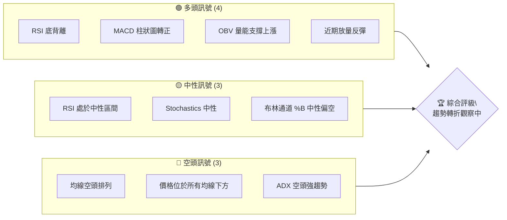
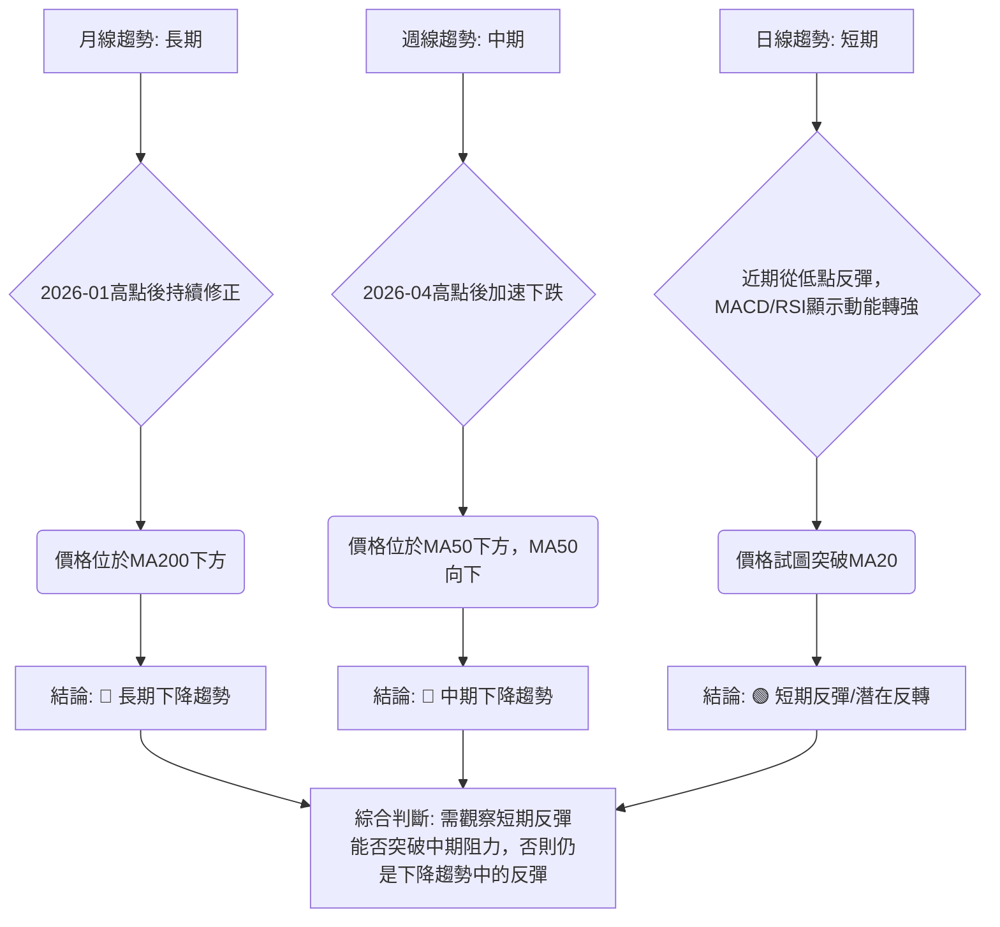

<details>
<summary>📊 靜態圖表 (點擊展開)</summary>

</details>

<html>
<head><meta charset="utf-8" /></head>
<body>
    <div>                        <script>window.PlotlyConfig = {MathJaxConfig: 'local'};</script>
        <script charset="utf-8" src="https://cdn.plot.ly/plotly-3.5.0.min.js" integrity="sha256-fHbNLP+GlIXN+efbQec78UkemUz3NJp7UmfGxC1tNxs=" crossorigin="anonymous"></script>                <div id="candlestick-chart" class="plotly-graph-div" style="height:500px; width:100%;"></div>            <script>                window.PLOTLYENV=window.PLOTLYENV || {};                                if (document.getElementById("candlestick-chart")) {                    Plotly.newPlot(                        "candlestick-chart",                        [{"close":{"dtype":"f8","bdata":"AAAAoHC9KEAAAADAHgUoQAAAAEAzMypAAAAAwPWoKkAAAACgcD0qQAAAAKBwPStAAAAAQApXK0AAAACgR+ErQAAAAIDCdSxAAAAAQOF6LEAAAAAgrkctQAAAAIA9ii1AAAAAoJmZLUAAAADgUbgtQAAAAMDMzC1AAAAAoHC9LUAAAABA4XotQAAAAOCjcC5AAAAAIIXrLkAAAADAHgUvQAAAAKBwPS9AAAAAoEdhL0AAAACA69EvQAAAACCuxy9AAAAAIIXrL0AAAABA4fovQAAAACCFKzBAAAAAwMxMMEAAAABgZiYwQAAAAGCPAjBAAAAAIFyPL0AAAAAgXI8vQAAAAGBm5i9AAAAAYI8CMEAAAACgR2EuQAAAAOCjcC5AAAAAYLieLkAAAABgj8IuQAAAAGCPQi5AAAAAIIXrLkAAAACgcL0uQAAAAEAK1y1AAAAAwPUoLkAAAACA69EtQAAAAAApXC5AAAAAgMJ1LUAAAAAAAAAuQAAAAIDr0S5AAAAAQOF6LkAAAACA61EuQAAAAMDMzC9AAAAAgBSuL0AAAAAAAAAwQAAAAAAp3C9AAAAAQAoXMEAAAAAgXA8wQAAAAAApHDBAAAAAoEchMEAAAACgmZkvQAAAACCFKzBAAAAAoEfhL0AAAACgcL0vQAAAAMAeBTBAAAAAANdjMEAAAACAFC4wQAAAAIAULi9AAAAAANejL0AAAABAMzMvQAAAAADXoy5AAAAAgOtRL0AAAAAA16MuQAAAACCuxy9AAAAAQArXL0AAAAAAKZwwQAAAAAAAQDFAAAAAANdjMUAAAABA4XoxQAAAAAApnDFAAAAA4KNwMUAAAABgZqYxQAAAAEAzszBAAAAAYLieMEAAAACAFK4wQAAAAOCjsDBAAAAAgOvRMEAAAABgZuYwQAAAAGBmpjBAAAAAQDMzMEAAAADgUbgvQAAAAMAeRTBAAAAAQApXMEAAAABguJ4wQAAAAGCPwjBAAAAAoHC9MEAAAABgj8IwQAAAAMD1qDBAAAAAoEfhMEAAAACgcL0wQAAAAMAeBTFAAAAA4KPwMUAAAAAAKdwxQAAAAAAAgDFAAAAAACmcMUAAAACAwnUxQAAAAIA9CjFAAAAAIFyPMEAAAAAA16MwQAAAAAApnDBAAAAAoJmZMEAAAADgUfgwQAAAAKBwPTFAAAAAAAAAMkAAAACAPQoyQAAAAIAULjJAAAAAwMyMMkAAAABgj8IyQAAAAGCPwjJAAAAAAADAMUAAAAAAKRwyQAAAAGC4HjJAAAAAwB4FMUAAAAAgXM8wQAAAAGBmZjFAAAAAwMyMMUAAAACA65ExQAAAAMD1aDFAAAAAgD0KMUAAAACA69EwQAAAAIDr0TBAAAAAIIUrMUAAAACA61ExQAAAACCuhzFAAAAA4KMwMEAAAAAgrocwQAAAAGBmpjBAAAAAYLgeLkAAAACAwvUtQAAAAKBHYS5AAAAAwB6FLUAAAAAAAAAuQAAAAADXoy1AAAAAwPUoLUAAAABAClctQAAAAGCPwi1AAAAAQOH6LEAAAADgo\u002fArQAAAACCuxytAAAAAgD2KLEAAAAAAAIAsQAAAAOCj8CtAAAAAgOtRLEAAAACgR+ErQAAAAAApXC1AAAAAoEdhLEAAAAAA16MsQAAAAIA9CixAAAAAQDMzK0AAAADAHgUrQAAAAKBwvSxAAAAAoEfhLEAAAADAzEwsQAAAAMAehSxAAAAAwMxMLEAAAADAHgUtQAAAAKBwvS1AAAAAIIXrLUAAAABgZuYtQAAAAEAzsy5AAAAAgBSuLkAAAAAAKdwuQAAAAIAUri5AAAAAQDMzLkAAAACgmRkuQAAAAEAzsy1AAAAAIIXrLEAAAADAHgUtQAAAACCuRy1AAAAAAAAALUAAAADgehQsQAAAAIDC9SxAAAAAoEfhLEAAAACA61EsQAAAAAAAgCxAAAAAgML1LEAAAADAHoUsQAAAAKCZmStAAAAAAAAAK0AAAACAPYoqQAAAAADXoylAAAAAACncKUAAAACgR2EoQAAAAOB6lChAAAAA4HqUKEAAAADgepQpQAAAAIDrUSpAAAAAgMJ1KUAAAACAwvUpQAAAACBcDypAAAAAoJkZKkAAAABgj0IqQA=="},"high":{"dtype":"f8","bdata":"AAAAIIXrKEAAAAAA16MoQAAAAADXIyxAAAAAwB4FK0AAAACAwrUqQAAAAAAAgCtAAAAAoJmZK0AAAACAwvUrQAAAAGCPAi1AAAAAQDOzLEAAAABAClctQAAAAEDhOi5AAAAAANejLUAAAACgcL0tQAAAAIDrES5AAAAAoHD9LUAAAACgmVkuQAAAAOCjsC5AAAAAwB4FL0AAAAAghWsvQAAAAKBHoS9AAAAAgD2KL0AAAACgRwEwQAAAAIDrETBAAAAAwMwMMEAAAACgRyEwQAAAAKCZWTBAAAAAwMxMMEAAAADAzGwwQAAAAGC4XjBAAAAA4FEYMEAAAACgcP0vQAAAAKCZGTBAAAAA4KMwMEAAAADAzAwwQAAAAMDMzC5AAAAAAADALkAAAABA4fouQAAAAOB6FC9AAAAAAAAAL0AAAADA9SgvQAAAAGBm5i5AAAAAoHA9LkAAAACgR2EuQAAAAABWji5AAAAAYLieLkAAAABguB4uQAAAACCuRy9AAAAAgBQuL0AAAAAghesuQAAAAADXIzBAAAAAoEchMEAAAACgmVkwQAAAAIDrETBAAAAAwB5FMEAAAACgcD0wQAAAAMAeRTBAAAAAAACAMEAAAACgcB0wQAAAACCFazBAAAAAYGZmMEAAAAAAAMAvQAAAAOBRODBAAAAAwMyMMEAAAAAAAIAwQAAAAIDrMTBAAAAAYI9CMEAAAACgcL0vQAAAAKCZWS9AAAAA4KNwL0AAAABAMxMwQAAAAMAeBTBAAAAAIFwPMEAAAADAzKwwQAAAAKBHYTFAAAAAgBSOMUAAAAAgXI8xQAAAAEAK1zFAAAAA4FG4MUAAAADgo9AxQAAAAEDhujFAAAAAQDMTMUAAAABA4bowQAAAAKCZ2TBAAAAAACkcMUAAAAAgXA8xQAAAAIDrETFAAAAAwB6FMEAAAADA9SgwQAAAAOAiWzBAAAAA4FF4MEAAAACgR6EwQAAAAOB61DBAAAAAwPXIMEAAAABgj8IwQAAAACBczzBAAAAAQOEaMUAAAADAzOwwQAAAACBcDzFAAAAAgJUjMkAAAABguF4yQAAAAGCPwjFAAAAAgL6fMUAAAACA6xEyQAAAACCFazFAAAAAgOsRMUAAAADgo7AwQAAAAOBR+DBAAAAAYA6tMEAAAADgo1AxQAAAAIA9ijFAAAAAAAAAMkAAAADgoxAyQAAAAGCPQjJAAAAAIFyPMkAAAADA9cgyQAAAAEDh+jJAAAAAYLieMkAAAABACncyQAAAAGBmpjJAAAAAgD0qMkAAAABgjyIxQAAAACCFazFAAAAAQArXMUAAAAAAKbwxQAAAAKBw\u002fTFAAAAAwMyMMUAAAACgR+EwQAAAAAAAADFAAAAAQOF6MUAAAADgo3AxQAAAAEAKlzFAAAAAwPVoMUAAAABACpcwQAAAAKCZ2TBAAAAAoEfhL0AAAABgZmYuQAAAAECLrC5AAAAAYLgeLkAAAACAwrUuQAAAAMDMTC5AAAAAQDNzLUAAAACA65EtQAAAAIA9Si5AAAAAoEfhLUAAAABAM7MsQAAAAGC4nixAAAAAoHC9LEAAAADgehQtQAAAAMDMjCxAAAAAAACALEAAAADAzEwsQAAAAEAK1y1AAAAAwB4FLUAAAACgR2EtQAAAAGBmpixAAAAAYGbmK0AAAACA65ErQAAAAIDr0SxAAAAAoJmZLUAAAACAwvUsQAAAACCuxyxAAAAAgOtRLEAAAADAScwuQAAAAAAp3C1AAAAA4HoULkAAAAAgXA8uQAAAAOCj8C5AAAAAYLgeL0AAAACgRyEvQAAAAGC4ni9AAAAAQDOzLkAAAAAgXI8uQAAAAOCjcC5AAAAAANejLUAAAADgehQtQAAAACCFqy1AAAAAQApXLUAAAADAHgUtQAAAAGC4Hi1AAAAAgOtRLUAAAADgo\u002fAsQAAAAKBH4SxAAAAAoJkZLUAAAABAMzMtQAAAAMD1qCxAAAAAwPXoK0AAAAAAKRwrQAAAAIA9iipAAAAAQApXKkAAAAAgXM8oQAAAAMDMzChAAAAAwMzMKEAAAACgmZkpQAAAAKCZmSpAAAAAwB6FKkAAAACgRyEqQAAAAAApXCpAAAAAQOF6KkAAAAAAAIAqQA=="},"hovertemplate":"\u003cb\u003e%{x|%Y-%m-%d}\u003c\u002fb\u003e\u003cbr\u003e\u958b: $%{open:.2f}\u003cbr\u003e\u9ad8: $%{high:.2f}\u003cbr\u003e\u4f4e: $%{low:.2f}\u003cbr\u003e\u6536: $%{close:.2f}\u003cextra\u003e\u003c\u002fextra\u003e","low":{"dtype":"f8","bdata":"AAAAAACAKEAAAAAgrscnQAAAAEAK1ylAAAAAgD2KKUAAAABAMzMqQAAAACCuRypAAAAAoEfhKkAAAABA4foqQAAAAGC43itAAAAAIFokLEAAAABgj4IsQAAAAIDrUS1AAAAAgBQuLUAAAACAFK4sQAAAAIDCdS1AAAAAgML1LEAAAACAPQotQAAAACCFay1AAAAAYI8CLkAAAACgmZkuQAAAAIDC9S5AAAAA4HoUL0AAAADA9WgvQAAAAIDrUS9AAAAAYGamL0AAAADAHsUvQAAAAMAeBTBAAAAAgML1L0AAAAAgrgcwQAAAAKDx0i9AAAAAgMJ1L0AAAACgmRkvQAAAAMD1qC9AAAAAwMxML0AAAACA61EuQAAAAIA9Ci5AAAAA4FE4LkAAAAAAAEAuQAAAAIA9Ci5AAAAAoJkZLkAAAACAwnUuQAAAAGCPwi1AAAAAQArXLUAAAAAgrkctQAAAAOBRuC1AAAAAQF46LUAAAABguB4tQAAAAGC4Hi5AAAAAIFxPLkAAAACA6xEuQAAAAIDCdS5AAAAAIASWL0AAAABACtcvQAAAAADXoy9AAAAAACncL0AAAAAA1wMwQAAAAGCPwi9AAAAAgBTuL0AAAABgZmYvQAAAAOB6lC9AAAAAgBSuL0AAAABgZuYuQAAAAMDMzC9AAAAAwMwMMEAAAAAghQswQAAAAOBR+C5AAAAAANejLkAAAAAAAAAvQAAAAMAehS5AAAAAoEdhLkAAAACgmZkuQAAAAGCPgi5AAAAAIFyPL0AAAAAAKVwvQAAAAMD16DBAAAAAQDMzMUAAAAAgrkcxQAAAAEDhejFAAAAAgD1KMUAAAAAAKVwxQAAAAKCZmTBAAAAA4FF4MEAAAAAAAkswQAAAAEAKdzBAAAAAQDOzMEAAAACgmZkwQAAAAKBHoTBAAAAAgBQuMEAAAACAFC4vQAAAAMAgEDBAAAAAQGJQMEAAAACgmVkwQAAAACBcjzBAAAAAYGamMEAAAAAAKZwwQAAAAIA9ijBAAAAAgBSuMEAAAACAwrUwQAAAAGBmpjBAAAAAgD0qMUAAAAAgXM8xQAAAACCuZzFAAAAAYLheMUAAAAAA12MxQAAAAMAeBTFAAAAAgD1qMEAAAADAzGwwQAAAAIBBgDBAAAAAgBROMEAAAACgmVkwQAAAAIDrETFAAAAA4HpUMUAAAACAwrUxQAAAAGBm5jFAAAAAoJkZMkAAAAAAKVwyQAAAAKBwPTJAAAAAgMK1MUAAAACAwrUxQAAAAEAK1zFAAAAAAADgMEAAAADAzIwwQAAAAGCPwjBAAAAAQAo3MUAAAACAPQoxQAAAAKCZWTFAAAAAgMK1MEAAAABguF4wQAAAAEAKlzBAAAAAQArXMEAAAADAHuUwQAAAACCFKzFAAAAA4HoUMEAAAACgcL0vQAAAAADXgzBAAAAA4HoULkAAAABgZmYtQAAAAGC4nixAAAAAQApXLEAAAACgmZktQAAAAOBROC1AAAAA4FF4LEAAAACAwnUsQAAAACBcDy1AAAAAYI\u002fCLEAAAABgj8IrQAAAAKBHoStAAAAAYLgeLEAAAADgUXgsQAAAAOB61CtAAAAAIFwPK0AAAADgepQrQAAAAOCjcCxAAAAAgOtRLEAAAAAghWssQAAAAAAp3CtAAAAA4HoUK0AAAACA69EqQAAAAGBmZitAAAAAACncLEAAAAAAAqsrQAAAAMD1KCxAAAAAgBSuK0AAAACA69EsQAAAAMDMzCxAAAAAIFyPLUAAAABAMzMtQAAAAKBwPS5AAAAAoJmZLkAAAADgepQuQAAAAGC4ni5AAAAAACncLUAAAADgo\u002fAtQAAAAEAKVy1AAAAAgOuRLEAAAACgR2EsQAAAAKCZGS1AAAAAgMK1LEAAAADgehQsQAAAAKCZGSxAAAAAYI\u002fCLEAAAACAFC4sQAAAAEAKVyxAAAAAoHB9LEAAAADA9WgsQAAAAAAAgCtAAAAAQArXKkAAAADAHoUqQAAAACCuhylAAAAAgBSuKUAAAAAgXI8nQAAAAGC4HihAAAAAIIXrJ0AAAADA9agoQAAAAGC4HilAAAAAIIVrKUAAAADAzEwpQAAAAAAp3ClAAAAAIK7HKUAAAABA4fopQA=="},"name":"\u50f9\u683c","open":{"dtype":"f8","bdata":"AAAAwPWoKEAAAACAPYooQAAAAMDMzCpAAAAAQDMzKkAAAACAwnUqQAAAAIAU7ipAAAAAgD0KK0AAAADgo3ArQAAAAAAAACxAAAAAQOF6LEAAAACAwvUsQAAAAAAAgC1AAAAA4FE4LUAAAADA9SgtQAAAAKBwvS1AAAAAgBSuLUAAAADAHgUuQAAAACBcjy1AAAAAgMJ1LkAAAACgmRkvQAAAACBcDy9AAAAAAClcL0AAAAAAAIAvQAAAAKBH4S9AAAAAYGbmL0AAAABgjwIwQAAAAIDrETBAAAAAACkcMEAAAADAzEwwQAAAAIAULjBAAAAAACncL0AAAAAAKdwvQAAAAGBm5i9AAAAAIIXrL0AAAADAzAwwQAAAAIA9ii5AAAAAIFyPLkAAAACgcL0uQAAAAIDr0S5AAAAAAClcLkAAAAAgXA8vQAAAAOBRuC5AAAAAwPUoLkAAAABAM7MtQAAAAAAAAC5AAAAA4HqULkAAAAAgrkctQAAAAGCPQi5AAAAAQDOzLkAAAAAA16MuQAAAAMAehS5AAAAAQAoXMEAAAABA4TowQAAAACCF6y9AAAAAYGbmL0AAAACA6xEwQAAAAAApHDBAAAAA4KMwMEAAAACgmZkvQAAAAOBRuC9AAAAAYLheMEAAAAAA16MvQAAAAKCZGTBAAAAAQAoXMEAAAACAwnUwQAAAAIA9CjBAAAAAACncLkAAAADgUXgvQAAAAMDMzC5AAAAAwMyMLkAAAACAFK4vQAAAAIDCtS5AAAAAAAAAMEAAAABACtcvQAAAAEDh+jBAAAAAANdjMUAAAACAFG4xQAAAAIDCtTFAAAAAQDOzMUAAAABgZqYxQAAAAEAzszFAAAAAYLjeMEAAAADAHmUwQAAAAKCZmTBAAAAAQOG6MEAAAAAgrucwQAAAAGBmBjFAAAAAAACAMEAAAABAChcwQAAAAGBmJjBAAAAAoJlZMEAAAAAghWswQAAAAOCjsDBAAAAAQDOzMEAAAACgcL0wQAAAAIA9qjBAAAAAwB7FMEAAAABguN4wQAAAACBcDzFAAAAAgBQuMUAAAABguB4yQAAAAGC4njFAAAAAQAqXMUAAAACAFK4xQAAAAKCZWTFAAAAAIFwPMUAAAADgo5AwQAAAAAAAwDBAAAAAgOuRMEAAAAAAKVwwQAAAAGCPIjFAAAAAgD2qMUAAAAAAAAAyQAAAAMDMDDJAAAAAAClcMkAAAABgj6IyQAAAAOB61DJAAAAAIK6HMkAAAACgcL0xQAAAACCuZzJAAAAA4HoUMkAAAADgetQwQAAAACCFKzFAAAAA4KNwMUAAAABgZiYxQAAAAIDr8TFAAAAAwPWIMUAAAACgcL0wQAAAAAAAwDBAAAAAQDPzMEAAAAAA1yMxQAAAAEAzMzFAAAAAAABAMUAAAADgozAwQAAAAADXgzBAAAAAQArXL0AAAADgo3AtQAAAACCF6yxAAAAAAClcLUAAAACgcP0tQAAAAAAp3C1AAAAAYI8CLUAAAACA69EsQAAAAEDhei1AAAAAAACALUAAAABgZmYsQAAAAADXIyxAAAAAoHA9LEAAAADAzMwsQAAAAOCjcCxAAAAAAClcK0AAAACgcD0sQAAAAKBHoSxAAAAA4FH4LEAAAABgj0ItQAAAAGCPQixAAAAAgMJ1K0AAAAAghWsrQAAAAKCZmStAAAAAgBQuLUAAAAAAAAAsQAAAAGCPQixAAAAAQDMzLEAAAAAghWsuQAAAAMAeBS1AAAAAACncLUAAAACAFK4tQAAAAGCPQi5AAAAAIIXrLkAAAAAgrscuQAAAAGC4ni9AAAAAQOF6LkAAAADgUTguQAAAAAApXC5AAAAAYLieLUAAAABACtcsQAAAACCuRy1AAAAA4HoULUAAAACAwvUsQAAAAOB6VCxAAAAAgOtRLUAAAAAgrscsQAAAAADXoyxAAAAAAAAALUAAAAAAAAAtQAAAAKCZmSxAAAAAYI\u002fCK0AAAABACtcqQAAAACCFaypAAAAAQDOzKUAAAABAiQEoQAAAAMDMzChAAAAA4HpUKEAAAACAFK4oQAAAAOBROClAAAAAwMxMKkAAAAAgrgcqQAAAACCF6ylAAAAA4KPwKUAAAACgmRkqQA=="},"x":["2025-08-13T00:00:00-04:00","2025-08-14T00:00:00-04:00","2025-08-15T00:00:00-04:00","2025-08-18T00:00:00-04:00","2025-08-19T00:00:00-04:00","2025-08-20T00:00:00-04:00","2025-08-21T00:00:00-04:00","2025-08-22T00:00:00-04:00","2025-08-25T00:00:00-04:00","2025-08-26T00:00:00-04:00","2025-08-27T00:00:00-04:00","2025-08-28T00:00:00-04:00","2025-08-29T00:00:00-04:00","2025-09-02T00:00:00-04:00","2025-09-03T00:00:00-04:00","2025-09-04T00:00:00-04:00","2025-09-05T00:00:00-04:00","2025-09-08T00:00:00-04:00","2025-09-09T00:00:00-04:00","2025-09-10T00:00:00-04:00","2025-09-11T00:00:00-04:00","2025-09-12T00:00:00-04:00","2025-09-15T00:00:00-04:00","2025-09-16T00:00:00-04:00","2025-09-17T00:00:00-04:00","2025-09-18T00:00:00-04:00","2025-09-19T00:00:00-04:00","2025-09-22T00:00:00-04:00","2025-09-23T00:00:00-04:00","2025-09-24T00:00:00-04:00","2025-09-25T00:00:00-04:00","2025-09-26T00:00:00-04:00","2025-09-29T00:00:00-04:00","2025-09-30T00:00:00-04:00","2025-10-01T00:00:00-04:00","2025-10-02T00:00:00-04:00","2025-10-03T00:00:00-04:00","2025-10-06T00:00:00-04:00","2025-10-07T00:00:00-04:00","2025-10-08T00:00:00-04:00","2025-10-09T00:00:00-04:00","2025-10-10T00:00:00-04:00","2025-10-13T00:00:00-04:00","2025-10-14T00:00:00-04:00","2025-10-15T00:00:00-04:00","2025-10-16T00:00:00-04:00","2025-10-17T00:00:00-04:00","2025-10-20T00:00:00-04:00","2025-10-21T00:00:00-04:00","2025-10-22T00:00:00-04:00","2025-10-23T00:00:00-04:00","2025-10-24T00:00:00-04:00","2025-10-27T00:00:00-04:00","2025-10-28T00:00:00-04:00","2025-10-29T00:00:00-04:00","2025-10-30T00:00:00-04:00","2025-10-31T00:00:00-04:00","2025-11-03T00:00:00-05:00","2025-11-04T00:00:00-05:00","2025-11-05T00:00:00-05:00","2025-11-06T00:00:00-05:00","2025-11-07T00:00:00-05:00","2025-11-10T00:00:00-05:00","2025-11-11T00:00:00-05:00","2025-11-12T00:00:00-05:00","2025-11-13T00:00:00-05:00","2025-11-14T00:00:00-05:00","2025-11-17T00:00:00-05:00","2025-11-18T00:00:00-05:00","2025-11-19T00:00:00-05:00","2025-11-20T00:00:00-05:00","2025-11-21T00:00:00-05:00","2025-11-24T00:00:00-05:00","2025-11-25T00:00:00-05:00","2025-11-26T00:00:00-05:00","2025-11-28T00:00:00-05:00","2025-12-01T00:00:00-05:00","2025-12-02T00:00:00-05:00","2025-12-03T00:00:00-05:00","2025-12-04T00:00:00-05:00","2025-12-05T00:00:00-05:00","2025-12-08T00:00:00-05:00","2025-12-09T00:00:00-05:00","2025-12-10T00:00:00-05:00","2025-12-11T00:00:00-05:00","2025-12-12T00:00:00-05:00","2025-12-15T00:00:00-05:00","2025-12-16T00:00:00-05:00","2025-12-17T00:00:00-05:00","2025-12-18T00:00:00-05:00","2025-12-19T00:00:00-05:00","2025-12-22T00:00:00-05:00","2025-12-23T00:00:00-05:00","2025-12-24T00:00:00-05:00","2025-12-26T00:00:00-05:00","2025-12-29T00:00:00-05:00","2025-12-30T00:00:00-05:00","2025-12-31T00:00:00-05:00","2026-01-02T00:00:00-05:00","2026-01-05T00:00:00-05:00","2026-01-06T00:00:00-05:00","2026-01-07T00:00:00-05:00","2026-01-08T00:00:00-05:00","2026-01-09T00:00:00-05:00","2026-01-12T00:00:00-05:00","2026-01-13T00:00:00-05:00","2026-01-14T00:00:00-05:00","2026-01-15T00:00:00-05:00","2026-01-16T00:00:00-05:00","2026-01-20T00:00:00-05:00","2026-01-21T00:00:00-05:00","2026-01-22T00:00:00-05:00","2026-01-23T00:00:00-05:00","2026-01-26T00:00:00-05:00","2026-01-27T00:00:00-05:00","2026-01-28T00:00:00-05:00","2026-01-29T00:00:00-05:00","2026-01-30T00:00:00-05:00","2026-02-02T00:00:00-05:00","2026-02-03T00:00:00-05:00","2026-02-04T00:00:00-05:00","2026-02-05T00:00:00-05:00","2026-02-06T00:00:00-05:00","2026-02-09T00:00:00-05:00","2026-02-10T00:00:00-05:00","2026-02-11T00:00:00-05:00","2026-02-12T00:00:00-05:00","2026-02-13T00:00:00-05:00","2026-02-17T00:00:00-05:00","2026-02-18T00:00:00-05:00","2026-02-19T00:00:00-05:00","2026-02-20T00:00:00-05:00","2026-02-23T00:00:00-05:00","2026-02-24T00:00:00-05:00","2026-02-25T00:00:00-05:00","2026-02-26T00:00:00-05:00","2026-02-27T00:00:00-05:00","2026-03-02T00:00:00-05:00","2026-03-03T00:00:00-05:00","2026-03-04T00:00:00-05:00","2026-03-05T00:00:00-05:00","2026-03-06T00:00:00-05:00","2026-03-09T00:00:00-04:00","2026-03-10T00:00:00-04:00","2026-03-11T00:00:00-04:00","2026-03-12T00:00:00-04:00","2026-03-13T00:00:00-04:00","2026-03-16T00:00:00-04:00","2026-03-17T00:00:00-04:00","2026-03-18T00:00:00-04:00","2026-03-19T00:00:00-04:00","2026-03-20T00:00:00-04:00","2026-03-23T00:00:00-04:00","2026-03-24T00:00:00-04:00","2026-03-25T00:00:00-04:00","2026-03-26T00:00:00-04:00","2026-03-27T00:00:00-04:00","2026-03-30T00:00:00-04:00","2026-03-31T00:00:00-04:00","2026-04-01T00:00:00-04:00","2026-04-02T00:00:00-04:00","2026-04-06T00:00:00-04:00","2026-04-07T00:00:00-04:00","2026-04-08T00:00:00-04:00","2026-04-09T00:00:00-04:00","2026-04-10T00:00:00-04:00","2026-04-13T00:00:00-04:00","2026-04-14T00:00:00-04:00","2026-04-15T00:00:00-04:00","2026-04-16T00:00:00-04:00","2026-04-17T00:00:00-04:00","2026-04-20T00:00:00-04:00","2026-04-21T00:00:00-04:00","2026-04-22T00:00:00-04:00","2026-04-23T00:00:00-04:00","2026-04-24T00:00:00-04:00","2026-04-27T00:00:00-04:00","2026-04-28T00:00:00-04:00","2026-04-29T00:00:00-04:00","2026-04-30T00:00:00-04:00","2026-05-01T00:00:00-04:00","2026-05-04T00:00:00-04:00","2026-05-05T00:00:00-04:00","2026-05-06T00:00:00-04:00","2026-05-07T00:00:00-04:00","2026-05-08T00:00:00-04:00","2026-05-11T00:00:00-04:00","2026-05-12T00:00:00-04:00","2026-05-13T00:00:00-04:00","2026-05-14T00:00:00-04:00","2026-05-15T00:00:00-04:00","2026-05-18T00:00:00-04:00","2026-05-19T00:00:00-04:00","2026-05-20T00:00:00-04:00","2026-05-21T00:00:00-04:00","2026-05-22T00:00:00-04:00","2026-05-26T00:00:00-04:00","2026-05-27T00:00:00-04:00","2026-05-28T00:00:00-04:00","2026-05-29T00:00:00-04:00"],"type":"candlestick"},{"hovertemplate":"MA30: $%{y:.2f}\u003cextra\u003e\u003c\u002fextra\u003e","line":{"color":"#2196F3","dash":"dash","width":2},"mode":"lines","name":"MA30","x":["2025-08-13T00:00:00-04:00","2025-08-14T00:00:00-04:00","2025-08-15T00:00:00-04:00","2025-08-18T00:00:00-04:00","2025-08-19T00:00:00-04:00","2025-08-20T00:00:00-04:00","2025-08-21T00:00:00-04:00","2025-08-22T00:00:00-04:00","2025-08-25T00:00:00-04:00","2025-08-26T00:00:00-04:00","2025-08-27T00:00:00-04:00","2025-08-28T00:00:00-04:00","2025-08-29T00:00:00-04:00","2025-09-02T00:00:00-04:00","2025-09-03T00:00:00-04:00","2025-09-04T00:00:00-04:00","2025-09-05T00:00:00-04:00","2025-09-08T00:00:00-04:00","2025-09-09T00:00:00-04:00","2025-09-10T00:00:00-04:00","2025-09-11T00:00:00-04:00","2025-09-12T00:00:00-04:00","2025-09-15T00:00:00-04:00","2025-09-16T00:00:00-04:00","2025-09-17T00:00:00-04:00","2025-09-18T00:00:00-04:00","2025-09-19T00:00:00-04:00","2025-09-22T00:00:00-04:00","2025-09-23T00:00:00-04:00","2025-09-24T00:00:00-04:00","2025-09-25T00:00:00-04:00","2025-09-26T00:00:00-04:00","2025-09-29T00:00:00-04:00","2025-09-30T00:00:00-04:00","2025-10-01T00:00:00-04:00","2025-10-02T00:00:00-04:00","2025-10-03T00:00:00-04:00","2025-10-06T00:00:00-04:00","2025-10-07T00:00:00-04:00","2025-10-08T00:00:00-04:00","2025-10-09T00:00:00-04:00","2025-10-10T00:00:00-04:00","2025-10-13T00:00:00-04:00","2025-10-14T00:00:00-04:00","2025-10-15T00:00:00-04:00","2025-10-16T00:00:00-04:00","2025-10-17T00:00:00-04:00","2025-10-20T00:00:00-04:00","2025-10-21T00:00:00-04:00","2025-10-22T00:00:00-04:00","2025-10-23T00:00:00-04:00","2025-10-24T00:00:00-04:00","2025-10-27T00:00:00-04:00","2025-10-28T00:00:00-04:00","2025-10-29T00:00:00-04:00","2025-10-30T00:00:00-04:00","2025-10-31T00:00:00-04:00","2025-11-03T00:00:00-05:00","2025-11-04T00:00:00-05:00","2025-11-05T00:00:00-05:00","2025-11-06T00:00:00-05:00","2025-11-07T00:00:00-05:00","2025-11-10T00:00:00-05:00","2025-11-11T00:00:00-05:00","2025-11-12T00:00:00-05:00","2025-11-13T00:00:00-05:00","2025-11-14T00:00:00-05:00","2025-11-17T00:00:00-05:00","2025-11-18T00:00:00-05:00","2025-11-19T00:00:00-05:00","2025-11-20T00:00:00-05:00","2025-11-21T00:00:00-05:00","2025-11-24T00:00:00-05:00","2025-11-25T00:00:00-05:00","2025-11-26T00:00:00-05:00","2025-11-28T00:00:00-05:00","2025-12-01T00:00:00-05:00","2025-12-02T00:00:00-05:00","2025-12-03T00:00:00-05:00","2025-12-04T00:00:00-05:00","2025-12-05T00:00:00-05:00","2025-12-08T00:00:00-05:00","2025-12-09T00:00:00-05:00","2025-12-10T00:00:00-05:00","2025-12-11T00:00:00-05:00","2025-12-12T00:00:00-05:00","2025-12-15T00:00:00-05:00","2025-12-16T00:00:00-05:00","2025-12-17T00:00:00-05:00","2025-12-18T00:00:00-05:00","2025-12-19T00:00:00-05:00","2025-12-22T00:00:00-05:00","2025-12-23T00:00:00-05:00","2025-12-24T00:00:00-05:00","2025-12-26T00:00:00-05:00","2025-12-29T00:00:00-05:00","2025-12-30T00:00:00-05:00","2025-12-31T00:00:00-05:00","2026-01-02T00:00:00-05:00","2026-01-05T00:00:00-05:00","2026-01-06T00:00:00-05:00","2026-01-07T00:00:00-05:00","2026-01-08T00:00:00-05:00","2026-01-09T00:00:00-05:00","2026-01-12T00:00:00-05:00","2026-01-13T00:00:00-05:00","2026-01-14T00:00:00-05:00","2026-01-15T00:00:00-05:00","2026-01-16T00:00:00-05:00","2026-01-20T00:00:00-05:00","2026-01-21T00:00:00-05:00","2026-01-22T00:00:00-05:00","2026-01-23T00:00:00-05:00","2026-01-26T00:00:00-05:00","2026-01-27T00:00:00-05:00","2026-01-28T00:00:00-05:00","2026-01-29T00:00:00-05:00","2026-01-30T00:00:00-05:00","2026-02-02T00:00:00-05:00","2026-02-03T00:00:00-05:00","2026-02-04T00:00:00-05:00","2026-02-05T00:00:00-05:00","2026-02-06T00:00:00-05:00","2026-02-09T00:00:00-05:00","2026-02-10T00:00:00-05:00","2026-02-11T00:00:00-05:00","2026-02-12T00:00:00-05:00","2026-02-13T00:00:00-05:00","2026-02-17T00:00:00-05:00","2026-02-18T00:00:00-05:00","2026-02-19T00:00:00-05:00","2026-02-20T00:00:00-05:00","2026-02-23T00:00:00-05:00","2026-02-24T00:00:00-05:00","2026-02-25T00:00:00-05:00","2026-02-26T00:00:00-05:00","2026-02-27T00:00:00-05:00","2026-03-02T00:00:00-05:00","2026-03-03T00:00:00-05:00","2026-03-04T00:00:00-05:00","2026-03-05T00:00:00-05:00","2026-03-06T00:00:00-05:00","2026-03-09T00:00:00-04:00","2026-03-10T00:00:00-04:00","2026-03-11T00:00:00-04:00","2026-03-12T00:00:00-04:00","2026-03-13T00:00:00-04:00","2026-03-16T00:00:00-04:00","2026-03-17T00:00:00-04:00","2026-03-18T00:00:00-04:00","2026-03-19T00:00:00-04:00","2026-03-20T00:00:00-04:00","2026-03-23T00:00:00-04:00","2026-03-24T00:00:00-04:00","2026-03-25T00:00:00-04:00","2026-03-26T00:00:00-04:00","2026-03-27T00:00:00-04:00","2026-03-30T00:00:00-04:00","2026-03-31T00:00:00-04:00","2026-04-01T00:00:00-04:00","2026-04-02T00:00:00-04:00","2026-04-06T00:00:00-04:00","2026-04-07T00:00:00-04:00","2026-04-08T00:00:00-04:00","2026-04-09T00:00:00-04:00","2026-04-10T00:00:00-04:00","2026-04-13T00:00:00-04:00","2026-04-14T00:00:00-04:00","2026-04-15T00:00:00-04:00","2026-04-16T00:00:00-04:00","2026-04-17T00:00:00-04:00","2026-04-20T00:00:00-04:00","2026-04-21T00:00:00-04:00","2026-04-22T00:00:00-04:00","2026-04-23T00:00:00-04:00","2026-04-24T00:00:00-04:00","2026-04-27T00:00:00-04:00","2026-04-28T00:00:00-04:00","2026-04-29T00:00:00-04:00","2026-04-30T00:00:00-04:00","2026-05-01T00:00:00-04:00","2026-05-04T00:00:00-04:00","2026-05-05T00:00:00-04:00","2026-05-06T00:00:00-04:00","2026-05-07T00:00:00-04:00","2026-05-08T00:00:00-04:00","2026-05-11T00:00:00-04:00","2026-05-12T00:00:00-04:00","2026-05-13T00:00:00-04:00","2026-05-14T00:00:00-04:00","2026-05-15T00:00:00-04:00","2026-05-18T00:00:00-04:00","2026-05-19T00:00:00-04:00","2026-05-20T00:00:00-04:00","2026-05-21T00:00:00-04:00","2026-05-22T00:00:00-04:00","2026-05-26T00:00:00-04:00","2026-05-27T00:00:00-04:00","2026-05-28T00:00:00-04:00","2026-05-29T00:00:00-04:00"],"y":{"dtype":"f8","bdata":"AAAAAAAA+H8AAAAAAAD4fwAAAAAAAPh\u002fAAAAAAAA+H8AAAAAAAD4fwAAAAAAAPh\u002fAAAAAAAA+H8AAAAAAAD4fwAAAAAAAPh\u002fAAAAAAAA+H8AAAAAAAD4fwAAAAAAAPh\u002fAAAAAAAA+H8AAAAAAAD4fwAAAAAAAPh\u002fAAAAAAAA+H8AAAAAAAD4fwAAAAAAAPh\u002fAAAAAAAA+H8AAAAAAAD4fwAAAAAAAPh\u002fAAAAAAAA+H8AAAAAAAD4fwAAAAAAAPh\u002fAAAAAAAA+H8AAAAAAAD4fwAAAAAAAPh\u002fAAAAAAAA+H8AAAAAAAD4f97d3b0Rii1AIiIiQkTELUAzMzOjmwQuQJqZmXk\u002fNS5AMzMzk\u002fxiLkCrqqqKUIYuQM3MzAyfoS5AIiIiUpy9LkB3d3fHL9YuQBEREfGL5S5ARERENF76LkDv7u6e0wYvQKuqqvpiCS9AERERUSoOL0BVVVXFBA8vQM3MzBzMEy9AERERcWgRL0BmZmZm2BUvQFVVVYUWGS9AMzMzU1UVL0BmZmYmXA8vQM3MzHwjFC9AmpmZ2bIWL0ARERERPBgvQERERNTqGC9A7+7uziIbL0BERESkVBwvQAAAAIBOGy9AIiIiwmcYL0BmZmaWbhIvQDMzM6MpFS9AAAAAsOQXL0B3d3fnbRkvQN7d3b2fGi9AvLu7+xshL0DNzMxcATIvQKuqqupROC9AMzMzIwZBL0BVVVVVx0QvQERERHQFSC9ARERERG9LL0AAAADQlEovQO\u002fu7s4iWy9AMzMz03hpL0De3d09fIYvQFVVVTXQqS9AzczM7DXXL0CrqqqaxAAwQERERJSKEzBA3t3djVAmMECrqqoKkDswQLy7u6tjQjBAvLu7mwtJMEB3d3cX2U4wQGZmZlZVVTBAvLu7C5BbMEDe3d0Nu2IwQDMzM7NWZzBA7+7unu9nMEARERGxcmgwQFVVVSVNaTBA3t3d9bZsMEDNzMxcHXMwQKuqqupteTBAERERgWp8MECJiIiIXYEwQLy7u\u002ft+ijBAZmZmloqTMEBERET0RJ0wQJqZmanGqzBAZmZmZju\u002fMEDe3d0d6NQwQO\u002fu7jal4jBAvLu7ExHxMEBVVVXtUfgwQFVVVS2H9jBAvLu7A3LvMECamZkBR+gwQBEREXm+3zBA7+7udpPYMEAzMzP7xdIwQImIiKBh1zBAAAAASCjjMEB3d3c\u002fw+4wQLy7uzN6+zBAmpmZcT0KMUBVVVWtHBoxQDMzMwseLDFAmpmZEVg5MUBVVVVFi0wxQImIiKhUXDFAREREJCJiMUAzMzMzwWMxQM3MzEw3aTFAVVVVxSBwMUDe3d09CncxQERERKRwfTFAvLu7K85+MUDv7u7ufH8xQGZmZgbIfTFA7+7u7jV3MUCJiIhImnIxQCIiItLbcjFAiYiIyL1mMUC8u7srzl4xQDMzMzN6WzFA7+7uZq1OMUC8u7sTg0AxQJqZmQllNDFA7+7ufrEkMUB3d3f34RMxQFVVVWU7\u002fzBAq6qqSgziMECamZlpSsUwQLy7u3MhqTBAd3d3P3yGMEBVVVVVnF0wQAAAAKgNNDBAMzMze1sWMEDNzMxc1uovQLy7u7sCpC9AMzMzMzNzL0Crqqr6N0IvQO\u002fu7h7MEy9A7+7uDnTaLkB3d3eX\u002fKIuQFVVVXUhaS5A3t3d3WsuLkAiIiJC7vUtQLy7uwsezC1A3t3dfYadLUDNzMyMbGctQDMzM7OdLy1AzczMzMwMLUCJiIhIU+osQImIiFjyyyxAAAAAcD3KLEDe3d1dusksQLy7u2t1zCxAq6qqelvWLEDe3d0tst0sQImIiBiS5ixAMzMzA3LvLEAiIiJC7vUsQAAAADBr9SxA3t3dHej0LECamZlpH\u002f4sQGZmZjbsCi1AiYiIGNkOLUB3d3eXQwstQAAAAND3Ey1AZmZmJr8YLUCJiIhYgBwtQFVVVaUpFS1AzczMrBwaLUCJiIiIFhktQGZmZlZVFS1A3t3dbaATLUCrqqrahw8tQM3MzMwT9SxAMzMzg07bLEBEREQk27ksQERERBQ8mCxA3t3dnX14LEAiIiLSIlssQHd3d7fzPSxAIiIisuQXLEAiIiKiRfYrQFVVVWWtzitAvLu7O5inK0ARERFhV4ArQA=="},"type":"scatter"},{"hovertemplate":"MA60: $%{y:.2f}\u003cextra\u003e\u003c\u002fextra\u003e","line":{"color":"#9C27B0","dash":"dash","width":2},"mode":"lines","name":"MA60","x":["2025-08-13T00:00:00-04:00","2025-08-14T00:00:00-04:00","2025-08-15T00:00:00-04:00","2025-08-18T00:00:00-04:00","2025-08-19T00:00:00-04:00","2025-08-20T00:00:00-04:00","2025-08-21T00:00:00-04:00","2025-08-22T00:00:00-04:00","2025-08-25T00:00:00-04:00","2025-08-26T00:00:00-04:00","2025-08-27T00:00:00-04:00","2025-08-28T00:00:00-04:00","2025-08-29T00:00:00-04:00","2025-09-02T00:00:00-04:00","2025-09-03T00:00:00-04:00","2025-09-04T00:00:00-04:00","2025-09-05T00:00:00-04:00","2025-09-08T00:00:00-04:00","2025-09-09T00:00:00-04:00","2025-09-10T00:00:00-04:00","2025-09-11T00:00:00-04:00","2025-09-12T00:00:00-04:00","2025-09-15T00:00:00-04:00","2025-09-16T00:00:00-04:00","2025-09-17T00:00:00-04:00","2025-09-18T00:00:00-04:00","2025-09-19T00:00:00-04:00","2025-09-22T00:00:00-04:00","2025-09-23T00:00:00-04:00","2025-09-24T00:00:00-04:00","2025-09-25T00:00:00-04:00","2025-09-26T00:00:00-04:00","2025-09-29T00:00:00-04:00","2025-09-30T00:00:00-04:00","2025-10-01T00:00:00-04:00","2025-10-02T00:00:00-04:00","2025-10-03T00:00:00-04:00","2025-10-06T00:00:00-04:00","2025-10-07T00:00:00-04:00","2025-10-08T00:00:00-04:00","2025-10-09T00:00:00-04:00","2025-10-10T00:00:00-04:00","2025-10-13T00:00:00-04:00","2025-10-14T00:00:00-04:00","2025-10-15T00:00:00-04:00","2025-10-16T00:00:00-04:00","2025-10-17T00:00:00-04:00","2025-10-20T00:00:00-04:00","2025-10-21T00:00:00-04:00","2025-10-22T00:00:00-04:00","2025-10-23T00:00:00-04:00","2025-10-24T00:00:00-04:00","2025-10-27T00:00:00-04:00","2025-10-28T00:00:00-04:00","2025-10-29T00:00:00-04:00","2025-10-30T00:00:00-04:00","2025-10-31T00:00:00-04:00","2025-11-03T00:00:00-05:00","2025-11-04T00:00:00-05:00","2025-11-05T00:00:00-05:00","2025-11-06T00:00:00-05:00","2025-11-07T00:00:00-05:00","2025-11-10T00:00:00-05:00","2025-11-11T00:00:00-05:00","2025-11-12T00:00:00-05:00","2025-11-13T00:00:00-05:00","2025-11-14T00:00:00-05:00","2025-11-17T00:00:00-05:00","2025-11-18T00:00:00-05:00","2025-11-19T00:00:00-05:00","2025-11-20T00:00:00-05:00","2025-11-21T00:00:00-05:00","2025-11-24T00:00:00-05:00","2025-11-25T00:00:00-05:00","2025-11-26T00:00:00-05:00","2025-11-28T00:00:00-05:00","2025-12-01T00:00:00-05:00","2025-12-02T00:00:00-05:00","2025-12-03T00:00:00-05:00","2025-12-04T00:00:00-05:00","2025-12-05T00:00:00-05:00","2025-12-08T00:00:00-05:00","2025-12-09T00:00:00-05:00","2025-12-10T00:00:00-05:00","2025-12-11T00:00:00-05:00","2025-12-12T00:00:00-05:00","2025-12-15T00:00:00-05:00","2025-12-16T00:00:00-05:00","2025-12-17T00:00:00-05:00","2025-12-18T00:00:00-05:00","2025-12-19T00:00:00-05:00","2025-12-22T00:00:00-05:00","2025-12-23T00:00:00-05:00","2025-12-24T00:00:00-05:00","2025-12-26T00:00:00-05:00","2025-12-29T00:00:00-05:00","2025-12-30T00:00:00-05:00","2025-12-31T00:00:00-05:00","2026-01-02T00:00:00-05:00","2026-01-05T00:00:00-05:00","2026-01-06T00:00:00-05:00","2026-01-07T00:00:00-05:00","2026-01-08T00:00:00-05:00","2026-01-09T00:00:00-05:00","2026-01-12T00:00:00-05:00","2026-01-13T00:00:00-05:00","2026-01-14T00:00:00-05:00","2026-01-15T00:00:00-05:00","2026-01-16T00:00:00-05:00","2026-01-20T00:00:00-05:00","2026-01-21T00:00:00-05:00","2026-01-22T00:00:00-05:00","2026-01-23T00:00:00-05:00","2026-01-26T00:00:00-05:00","2026-01-27T00:00:00-05:00","2026-01-28T00:00:00-05:00","2026-01-29T00:00:00-05:00","2026-01-30T00:00:00-05:00","2026-02-02T00:00:00-05:00","2026-02-03T00:00:00-05:00","2026-02-04T00:00:00-05:00","2026-02-05T00:00:00-05:00","2026-02-06T00:00:00-05:00","2026-02-09T00:00:00-05:00","2026-02-10T00:00:00-05:00","2026-02-11T00:00:00-05:00","2026-02-12T00:00:00-05:00","2026-02-13T00:00:00-05:00","2026-02-17T00:00:00-05:00","2026-02-18T00:00:00-05:00","2026-02-19T00:00:00-05:00","2026-02-20T00:00:00-05:00","2026-02-23T00:00:00-05:00","2026-02-24T00:00:00-05:00","2026-02-25T00:00:00-05:00","2026-02-26T00:00:00-05:00","2026-02-27T00:00:00-05:00","2026-03-02T00:00:00-05:00","2026-03-03T00:00:00-05:00","2026-03-04T00:00:00-05:00","2026-03-05T00:00:00-05:00","2026-03-06T00:00:00-05:00","2026-03-09T00:00:00-04:00","2026-03-10T00:00:00-04:00","2026-03-11T00:00:00-04:00","2026-03-12T00:00:00-04:00","2026-03-13T00:00:00-04:00","2026-03-16T00:00:00-04:00","2026-03-17T00:00:00-04:00","2026-03-18T00:00:00-04:00","2026-03-19T00:00:00-04:00","2026-03-20T00:00:00-04:00","2026-03-23T00:00:00-04:00","2026-03-24T00:00:00-04:00","2026-03-25T00:00:00-04:00","2026-03-26T00:00:00-04:00","2026-03-27T00:00:00-04:00","2026-03-30T00:00:00-04:00","2026-03-31T00:00:00-04:00","2026-04-01T00:00:00-04:00","2026-04-02T00:00:00-04:00","2026-04-06T00:00:00-04:00","2026-04-07T00:00:00-04:00","2026-04-08T00:00:00-04:00","2026-04-09T00:00:00-04:00","2026-04-10T00:00:00-04:00","2026-04-13T00:00:00-04:00","2026-04-14T00:00:00-04:00","2026-04-15T00:00:00-04:00","2026-04-16T00:00:00-04:00","2026-04-17T00:00:00-04:00","2026-04-20T00:00:00-04:00","2026-04-21T00:00:00-04:00","2026-04-22T00:00:00-04:00","2026-04-23T00:00:00-04:00","2026-04-24T00:00:00-04:00","2026-04-27T00:00:00-04:00","2026-04-28T00:00:00-04:00","2026-04-29T00:00:00-04:00","2026-04-30T00:00:00-04:00","2026-05-01T00:00:00-04:00","2026-05-04T00:00:00-04:00","2026-05-05T00:00:00-04:00","2026-05-06T00:00:00-04:00","2026-05-07T00:00:00-04:00","2026-05-08T00:00:00-04:00","2026-05-11T00:00:00-04:00","2026-05-12T00:00:00-04:00","2026-05-13T00:00:00-04:00","2026-05-14T00:00:00-04:00","2026-05-15T00:00:00-04:00","2026-05-18T00:00:00-04:00","2026-05-19T00:00:00-04:00","2026-05-20T00:00:00-04:00","2026-05-21T00:00:00-04:00","2026-05-22T00:00:00-04:00","2026-05-26T00:00:00-04:00","2026-05-27T00:00:00-04:00","2026-05-28T00:00:00-04:00","2026-05-29T00:00:00-04:00"],"y":{"dtype":"f8","bdata":"AAAAAAAA+H8AAAAAAAD4fwAAAAAAAPh\u002fAAAAAAAA+H8AAAAAAAD4fwAAAAAAAPh\u002fAAAAAAAA+H8AAAAAAAD4fwAAAAAAAPh\u002fAAAAAAAA+H8AAAAAAAD4fwAAAAAAAPh\u002fAAAAAAAA+H8AAAAAAAD4fwAAAAAAAPh\u002fAAAAAAAA+H8AAAAAAAD4fwAAAAAAAPh\u002fAAAAAAAA+H8AAAAAAAD4fwAAAAAAAPh\u002fAAAAAAAA+H8AAAAAAAD4fwAAAAAAAPh\u002fAAAAAAAA+H8AAAAAAAD4fwAAAAAAAPh\u002fAAAAAAAA+H8AAAAAAAD4fwAAAAAAAPh\u002fAAAAAAAA+H8AAAAAAAD4fwAAAAAAAPh\u002fAAAAAAAA+H8AAAAAAAD4fwAAAAAAAPh\u002fAAAAAAAA+H8AAAAAAAD4fwAAAAAAAPh\u002fAAAAAAAA+H8AAAAAAAD4fwAAAAAAAPh\u002fAAAAAAAA+H8AAAAAAAD4fwAAAAAAAPh\u002fAAAAAAAA+H8AAAAAAAD4fwAAAAAAAPh\u002fAAAAAAAA+H8AAAAAAAD4fwAAAAAAAPh\u002fAAAAAAAA+H8AAAAAAAD4fwAAAAAAAPh\u002fAAAAAAAA+H8AAAAAAAD4fwAAAAAAAPh\u002fAAAAAAAA+H8AAAAAAAD4f4mIiLCdTy5AEREReRRuLkBVVVXFBI8uQLy7u5vvpy5Ad3d3RwzCLkC8u7vzKNwuQLy7u3v47C5Aq6qqOlH\u002fLkBmZmaOew0vQKuqqrLIFi9AREREvOYiL0B3d3c3tCgvQM3MzORCMi9AIiIiktE7L0CamZmBwEovQBERESnOXi9A7+7uLk90L0De3d3NsIsvQO\u002fu7tYVoC9Ad3d3N\u002fuwL0De3d0dPsMvQCIiImp1zC9AiYiICGXUL0AAAAAg99ovQImIiMDK4S9AMzMzcyHpL0AAAABg5fAvQDMzM\u002fP99C9AAAAAgCP0L0BERET8qfEvQO\u002fu7vbh8y9A3t3dTan4L0CJiIhQ1P8vQM3MzOReAzBAd3d3P3wGMEB3d3cbLw0wQImIiPhTEzBAAAAA1AYaMEB3d3dP1B8wQN7d3bHkJzBAREREhHkyMEDv7u5CGT0wQDMzM08bSDBAq6qqvuZSMEAiIiIGyF0wQAAAAKS3ZTBAERERfYZtMEAiIiLOhXQwQKuqqoakeTBAZmZmAnJ\u002fMEDv7u4CK4cwQCIiIqbijDBA3t3d8RmWMEB3d3crzp4wQBEREcVnqDBAq6qqvuayMECamZnda74wQDMzM1+6yTBARERE2KPQMEAzMzP7ftowQO\u002fu7ubQ4jBAERERjWznMEAAAABIb+swQLy7u5tS8TBAMzMzo0X2MEAzMzPjM\u002fwwQAAAAND3AzFAERERYSwJMUCamZnxYA4xQAAAAFjHFDFAq6qqqjgbMUAzMzMzwSMxQImIiITAKjFAIiIibucrMUCJiIgMkCsxQERERLAAKTFAVVVVtQ8fMUCrqqoKZRQxQFVVVcERCjFA7+7ueqL+MEBVVVX5U\u002fMwQO\u002fu7oJO6zBAVVVVSZriMECJiIjUBtowQLy7u9NN0jBAiYiI2FzIMEBVVVWB3LswQJqZmdkVsDBAZmZmxtmnMEDe3d05+6AwQDMzMwMrlzBA7+7u3t2NMEBERESYboIwQCIiIq6OeTBAZmZmZq1uMEDNzMxERGQwQHd3d68AWTBAVVVVDQJLMEAAAAAIOj0wQCIiIobrMTBA7+7ulvwiMEB3d3dHKBMwQN7d3VVVBTBA7+7uLiTtL0AAAADQ99MvQHd3d19zwS9A7+7uHsyzL0CrqqpCYKUvQHd3d7+fmi9AREREPN+PL0BmZmYOu4IvQJqZmXGEci9ARERETMVZL0CrqqqKQUAvQLy7uwvXIy9AZmZmTvAAL0AiIiIKrNwuQDMzM8ODuS5Ad3d3B8idLkAiIiL6DHsuQN7d3UX9Wy5AzczMLPlFLkCamZkpXC8uQCIiIuJ6FC5A3t3dXUj6LUAAAACQCd4tQN7d3WU7vy1A3t3dJQahLUBmZmYOu4ItQEREROyYYC1AiYiIgGo8LUCJiIjYoxAtQLy7u+Ps4yxAVVVVNaXCLEBVVVUNu6IsQAAAAAjzhCxAERERERFxLEAAAAAAAGAsQImIiGiRTSxAMzMz2\u002fk+LEB3d3fHBC8sQA=="},"type":"scatter"},{"hovertemplate":"MA200: $%{y:.2f}\u003cextra\u003e\u003c\u002fextra\u003e","line":{"color":"#FF6F00","dash":"solid","width":2},"mode":"lines","name":"MA200","x":["2025-08-13T00:00:00-04:00","2025-08-14T00:00:00-04:00","2025-08-15T00:00:00-04:00","2025-08-18T00:00:00-04:00","2025-08-19T00:00:00-04:00","2025-08-20T00:00:00-04:00","2025-08-21T00:00:00-04:00","2025-08-22T00:00:00-04:00","2025-08-25T00:00:00-04:00","2025-08-26T00:00:00-04:00","2025-08-27T00:00:00-04:00","2025-08-28T00:00:00-04:00","2025-08-29T00:00:00-04:00","2025-09-02T00:00:00-04:00","2025-09-03T00:00:00-04:00","2025-09-04T00:00:00-04:00","2025-09-05T00:00:00-04:00","2025-09-08T00:00:00-04:00","2025-09-09T00:00:00-04:00","2025-09-10T00:00:00-04:00","2025-09-11T00:00:00-04:00","2025-09-12T00:00:00-04:00","2025-09-15T00:00:00-04:00","2025-09-16T00:00:00-04:00","2025-09-17T00:00:00-04:00","2025-09-18T00:00:00-04:00","2025-09-19T00:00:00-04:00","2025-09-22T00:00:00-04:00","2025-09-23T00:00:00-04:00","2025-09-24T00:00:00-04:00","2025-09-25T00:00:00-04:00","2025-09-26T00:00:00-04:00","2025-09-29T00:00:00-04:00","2025-09-30T00:00:00-04:00","2025-10-01T00:00:00-04:00","2025-10-02T00:00:00-04:00","2025-10-03T00:00:00-04:00","2025-10-06T00:00:00-04:00","2025-10-07T00:00:00-04:00","2025-10-08T00:00:00-04:00","2025-10-09T00:00:00-04:00","2025-10-10T00:00:00-04:00","2025-10-13T00:00:00-04:00","2025-10-14T00:00:00-04:00","2025-10-15T00:00:00-04:00","2025-10-16T00:00:00-04:00","2025-10-17T00:00:00-04:00","2025-10-20T00:00:00-04:00","2025-10-21T00:00:00-04:00","2025-10-22T00:00:00-04:00","2025-10-23T00:00:00-04:00","2025-10-24T00:00:00-04:00","2025-10-27T00:00:00-04:00","2025-10-28T00:00:00-04:00","2025-10-29T00:00:00-04:00","2025-10-30T00:00:00-04:00","2025-10-31T00:00:00-04:00","2025-11-03T00:00:00-05:00","2025-11-04T00:00:00-05:00","2025-11-05T00:00:00-05:00","2025-11-06T00:00:00-05:00","2025-11-07T00:00:00-05:00","2025-11-10T00:00:00-05:00","2025-11-11T00:00:00-05:00","2025-11-12T00:00:00-05:00","2025-11-13T00:00:00-05:00","2025-11-14T00:00:00-05:00","2025-11-17T00:00:00-05:00","2025-11-18T00:00:00-05:00","2025-11-19T00:00:00-05:00","2025-11-20T00:00:00-05:00","2025-11-21T00:00:00-05:00","2025-11-24T00:00:00-05:00","2025-11-25T00:00:00-05:00","2025-11-26T00:00:00-05:00","2025-11-28T00:00:00-05:00","2025-12-01T00:00:00-05:00","2025-12-02T00:00:00-05:00","2025-12-03T00:00:00-05:00","2025-12-04T00:00:00-05:00","2025-12-05T00:00:00-05:00","2025-12-08T00:00:00-05:00","2025-12-09T00:00:00-05:00","2025-12-10T00:00:00-05:00","2025-12-11T00:00:00-05:00","2025-12-12T00:00:00-05:00","2025-12-15T00:00:00-05:00","2025-12-16T00:00:00-05:00","2025-12-17T00:00:00-05:00","2025-12-18T00:00:00-05:00","2025-12-19T00:00:00-05:00","2025-12-22T00:00:00-05:00","2025-12-23T00:00:00-05:00","2025-12-24T00:00:00-05:00","2025-12-26T00:00:00-05:00","2025-12-29T00:00:00-05:00","2025-12-30T00:00:00-05:00","2025-12-31T00:00:00-05:00","2026-01-02T00:00:00-05:00","2026-01-05T00:00:00-05:00","2026-01-06T00:00:00-05:00","2026-01-07T00:00:00-05:00","2026-01-08T00:00:00-05:00","2026-01-09T00:00:00-05:00","2026-01-12T00:00:00-05:00","2026-01-13T00:00:00-05:00","2026-01-14T00:00:00-05:00","2026-01-15T00:00:00-05:00","2026-01-16T00:00:00-05:00","2026-01-20T00:00:00-05:00","2026-01-21T00:00:00-05:00","2026-01-22T00:00:00-05:00","2026-01-23T00:00:00-05:00","2026-01-26T00:00:00-05:00","2026-01-27T00:00:00-05:00","2026-01-28T00:00:00-05:00","2026-01-29T00:00:00-05:00","2026-01-30T00:00:00-05:00","2026-02-02T00:00:00-05:00","2026-02-03T00:00:00-05:00","2026-02-04T00:00:00-05:00","2026-02-05T00:00:00-05:00","2026-02-06T00:00:00-05:00","2026-02-09T00:00:00-05:00","2026-02-10T00:00:00-05:00","2026-02-11T00:00:00-05:00","2026-02-12T00:00:00-05:00","2026-02-13T00:00:00-05:00","2026-02-17T00:00:00-05:00","2026-02-18T00:00:00-05:00","2026-02-19T00:00:00-05:00","2026-02-20T00:00:00-05:00","2026-02-23T00:00:00-05:00","2026-02-24T00:00:00-05:00","2026-02-25T00:00:00-05:00","2026-02-26T00:00:00-05:00","2026-02-27T00:00:00-05:00","2026-03-02T00:00:00-05:00","2026-03-03T00:00:00-05:00","2026-03-04T00:00:00-05:00","2026-03-05T00:00:00-05:00","2026-03-06T00:00:00-05:00","2026-03-09T00:00:00-04:00","2026-03-10T00:00:00-04:00","2026-03-11T00:00:00-04:00","2026-03-12T00:00:00-04:00","2026-03-13T00:00:00-04:00","2026-03-16T00:00:00-04:00","2026-03-17T00:00:00-04:00","2026-03-18T00:00:00-04:00","2026-03-19T00:00:00-04:00","2026-03-20T00:00:00-04:00","2026-03-23T00:00:00-04:00","2026-03-24T00:00:00-04:00","2026-03-25T00:00:00-04:00","2026-03-26T00:00:00-04:00","2026-03-27T00:00:00-04:00","2026-03-30T00:00:00-04:00","2026-03-31T00:00:00-04:00","2026-04-01T00:00:00-04:00","2026-04-02T00:00:00-04:00","2026-04-06T00:00:00-04:00","2026-04-07T00:00:00-04:00","2026-04-08T00:00:00-04:00","2026-04-09T00:00:00-04:00","2026-04-10T00:00:00-04:00","2026-04-13T00:00:00-04:00","2026-04-14T00:00:00-04:00","2026-04-15T00:00:00-04:00","2026-04-16T00:00:00-04:00","2026-04-17T00:00:00-04:00","2026-04-20T00:00:00-04:00","2026-04-21T00:00:00-04:00","2026-04-22T00:00:00-04:00","2026-04-23T00:00:00-04:00","2026-04-24T00:00:00-04:00","2026-04-27T00:00:00-04:00","2026-04-28T00:00:00-04:00","2026-04-29T00:00:00-04:00","2026-04-30T00:00:00-04:00","2026-05-01T00:00:00-04:00","2026-05-04T00:00:00-04:00","2026-05-05T00:00:00-04:00","2026-05-06T00:00:00-04:00","2026-05-07T00:00:00-04:00","2026-05-08T00:00:00-04:00","2026-05-11T00:00:00-04:00","2026-05-12T00:00:00-04:00","2026-05-13T00:00:00-04:00","2026-05-14T00:00:00-04:00","2026-05-15T00:00:00-04:00","2026-05-18T00:00:00-04:00","2026-05-19T00:00:00-04:00","2026-05-20T00:00:00-04:00","2026-05-21T00:00:00-04:00","2026-05-22T00:00:00-04:00","2026-05-26T00:00:00-04:00","2026-05-27T00:00:00-04:00","2026-05-28T00:00:00-04:00","2026-05-29T00:00:00-04:00"],"y":{"dtype":"f8","bdata":"AAAAAAAA+H8AAAAAAAD4fwAAAAAAAPh\u002fAAAAAAAA+H8AAAAAAAD4fwAAAAAAAPh\u002fAAAAAAAA+H8AAAAAAAD4fwAAAAAAAPh\u002fAAAAAAAA+H8AAAAAAAD4fwAAAAAAAPh\u002fAAAAAAAA+H8AAAAAAAD4fwAAAAAAAPh\u002fAAAAAAAA+H8AAAAAAAD4fwAAAAAAAPh\u002fAAAAAAAA+H8AAAAAAAD4fwAAAAAAAPh\u002fAAAAAAAA+H8AAAAAAAD4fwAAAAAAAPh\u002fAAAAAAAA+H8AAAAAAAD4fwAAAAAAAPh\u002fAAAAAAAA+H8AAAAAAAD4fwAAAAAAAPh\u002fAAAAAAAA+H8AAAAAAAD4fwAAAAAAAPh\u002fAAAAAAAA+H8AAAAAAAD4fwAAAAAAAPh\u002fAAAAAAAA+H8AAAAAAAD4fwAAAAAAAPh\u002fAAAAAAAA+H8AAAAAAAD4fwAAAAAAAPh\u002fAAAAAAAA+H8AAAAAAAD4fwAAAAAAAPh\u002fAAAAAAAA+H8AAAAAAAD4fwAAAAAAAPh\u002fAAAAAAAA+H8AAAAAAAD4fwAAAAAAAPh\u002fAAAAAAAA+H8AAAAAAAD4fwAAAAAAAPh\u002fAAAAAAAA+H8AAAAAAAD4fwAAAAAAAPh\u002fAAAAAAAA+H8AAAAAAAD4fwAAAAAAAPh\u002fAAAAAAAA+H8AAAAAAAD4fwAAAAAAAPh\u002fAAAAAAAA+H8AAAAAAAD4fwAAAAAAAPh\u002fAAAAAAAA+H8AAAAAAAD4fwAAAAAAAPh\u002fAAAAAAAA+H8AAAAAAAD4fwAAAAAAAPh\u002fAAAAAAAA+H8AAAAAAAD4fwAAAAAAAPh\u002fAAAAAAAA+H8AAAAAAAD4fwAAAAAAAPh\u002fAAAAAAAA+H8AAAAAAAD4fwAAAAAAAPh\u002fAAAAAAAA+H8AAAAAAAD4fwAAAAAAAPh\u002fAAAAAAAA+H8AAAAAAAD4fwAAAAAAAPh\u002fAAAAAAAA+H8AAAAAAAD4fwAAAAAAAPh\u002fAAAAAAAA+H8AAAAAAAD4fwAAAAAAAPh\u002fAAAAAAAA+H8AAAAAAAD4fwAAAAAAAPh\u002fAAAAAAAA+H8AAAAAAAD4fwAAAAAAAPh\u002fAAAAAAAA+H8AAAAAAAD4fwAAAAAAAPh\u002fAAAAAAAA+H8AAAAAAAD4fwAAAAAAAPh\u002fAAAAAAAA+H8AAAAAAAD4fwAAAAAAAPh\u002fAAAAAAAA+H8AAAAAAAD4fwAAAAAAAPh\u002fAAAAAAAA+H8AAAAAAAD4fwAAAAAAAPh\u002fAAAAAAAA+H8AAAAAAAD4fwAAAAAAAPh\u002fAAAAAAAA+H8AAAAAAAD4fwAAAAAAAPh\u002fAAAAAAAA+H8AAAAAAAD4fwAAAAAAAPh\u002fAAAAAAAA+H8AAAAAAAD4fwAAAAAAAPh\u002fAAAAAAAA+H8AAAAAAAD4fwAAAAAAAPh\u002fAAAAAAAA+H8AAAAAAAD4fwAAAAAAAPh\u002fAAAAAAAA+H8AAAAAAAD4fwAAAAAAAPh\u002fAAAAAAAA+H8AAAAAAAD4fwAAAAAAAPh\u002fAAAAAAAA+H8AAAAAAAD4fwAAAAAAAPh\u002fAAAAAAAA+H8AAAAAAAD4fwAAAAAAAPh\u002fAAAAAAAA+H8AAAAAAAD4fwAAAAAAAPh\u002fAAAAAAAA+H8AAAAAAAD4fwAAAAAAAPh\u002fAAAAAAAA+H8AAAAAAAD4fwAAAAAAAPh\u002fAAAAAAAA+H8AAAAAAAD4fwAAAAAAAPh\u002fAAAAAAAA+H8AAAAAAAD4fwAAAAAAAPh\u002fAAAAAAAA+H8AAAAAAAD4fwAAAAAAAPh\u002fAAAAAAAA+H8AAAAAAAD4fwAAAAAAAPh\u002fAAAAAAAA+H8AAAAAAAD4fwAAAAAAAPh\u002fAAAAAAAA+H8AAAAAAAD4fwAAAAAAAPh\u002fAAAAAAAA+H8AAAAAAAD4fwAAAAAAAPh\u002fAAAAAAAA+H8AAAAAAAD4fwAAAAAAAPh\u002fAAAAAAAA+H8AAAAAAAD4fwAAAAAAAPh\u002fAAAAAAAA+H8AAAAAAAD4fwAAAAAAAPh\u002fAAAAAAAA+H8AAAAAAAD4fwAAAAAAAPh\u002fAAAAAAAA+H8AAAAAAAD4fwAAAAAAAPh\u002fAAAAAAAA+H8AAAAAAAD4fwAAAAAAAPh\u002fAAAAAAAA+H8AAAAAAAD4fwAAAAAAAPh\u002fAAAAAAAA+H8AAAAAAAD4fwAAAAAAAPh\u002fAAAAAAAA+H8Urket+vwuQA=="},"type":"scatter"}],                        {"template":{"data":{"barpolar":[{"marker":{"line":{"color":"rgb(17,17,17)","width":0.5},"pattern":{"fillmode":"overlay","size":10,"solidity":0.2}},"type":"barpolar"}],"bar":[{"error_x":{"color":"#f2f5fa"},"error_y":{"color":"#f2f5fa"},"marker":{"line":{"color":"rgb(17,17,17)","width":0.5},"pattern":{"fillmode":"overlay","size":10,"solidity":0.2}},"type":"bar"}],"carpet":[{"aaxis":{"endlinecolor":"#A2B1C6","gridcolor":"#506784","linecolor":"#506784","minorgridcolor":"#506784","startlinecolor":"#A2B1C6"},"baxis":{"endlinecolor":"#A2B1C6","gridcolor":"#506784","linecolor":"#506784","minorgridcolor":"#506784","startlinecolor":"#A2B1C6"},"type":"carpet"}],"choropleth":[{"colorbar":{"outlinewidth":0,"ticks":""},"type":"choropleth"}],"contourcarpet":[{"colorbar":{"outlinewidth":0,"ticks":""},"type":"contourcarpet"}],"contour":[{"colorbar":{"outlinewidth":0,"ticks":""},"colorscale":[[0.0,"#0d0887"],[0.1111111111111111,"#46039f"],[0.2222222222222222,"#7201a8"],[0.3333333333333333,"#9c179e"],[0.4444444444444444,"#bd3786"],[0.5555555555555556,"#d8576b"],[0.6666666666666666,"#ed7953"],[0.7777777777777778,"#fb9f3a"],[0.8888888888888888,"#fdca26"],[1.0,"#f0f921"]],"type":"contour"}],"heatmap":[{"colorbar":{"outlinewidth":0,"ticks":""},"colorscale":[[0.0,"#0d0887"],[0.1111111111111111,"#46039f"],[0.2222222222222222,"#7201a8"],[0.3333333333333333,"#9c179e"],[0.4444444444444444,"#bd3786"],[0.5555555555555556,"#d8576b"],[0.6666666666666666,"#ed7953"],[0.7777777777777778,"#fb9f3a"],[0.8888888888888888,"#fdca26"],[1.0,"#f0f921"]],"type":"heatmap"}],"histogram2dcontour":[{"colorbar":{"outlinewidth":0,"ticks":""},"colorscale":[[0.0,"#0d0887"],[0.1111111111111111,"#46039f"],[0.2222222222222222,"#7201a8"],[0.3333333333333333,"#9c179e"],[0.4444444444444444,"#bd3786"],[0.5555555555555556,"#d8576b"],[0.6666666666666666,"#ed7953"],[0.7777777777777778,"#fb9f3a"],[0.8888888888888888,"#fdca26"],[1.0,"#f0f921"]],"type":"histogram2dcontour"}],"histogram2d":[{"colorbar":{"outlinewidth":0,"ticks":""},"colorscale":[[0.0,"#0d0887"],[0.1111111111111111,"#46039f"],[0.2222222222222222,"#7201a8"],[0.3333333333333333,"#9c179e"],[0.4444444444444444,"#bd3786"],[0.5555555555555556,"#d8576b"],[0.6666666666666666,"#ed7953"],[0.7777777777777778,"#fb9f3a"],[0.8888888888888888,"#fdca26"],[1.0,"#f0f921"]],"type":"histogram2d"}],"histogram":[{"marker":{"pattern":{"fillmode":"overlay","size":10,"solidity":0.2}},"type":"histogram"}],"mesh3d":[{"colorbar":{"outlinewidth":0,"ticks":""},"type":"mesh3d"}],"parcoords":[{"line":{"colorbar":{"outlinewidth":0,"ticks":""}},"type":"parcoords"}],"pie":[{"automargin":true,"type":"pie"}],"scatter3d":[{"line":{"colorbar":{"outlinewidth":0,"ticks":""}},"marker":{"colorbar":{"outlinewidth":0,"ticks":""}},"type":"scatter3d"}],"scattercarpet":[{"marker":{"colorbar":{"outlinewidth":0,"ticks":""}},"type":"scattercarpet"}],"scattergeo":[{"marker":{"colorbar":{"outlinewidth":0,"ticks":""}},"type":"scattergeo"}],"scattergl":[{"marker":{"line":{"color":"#283442"}},"type":"scattergl"}],"scattermapbox":[{"marker":{"colorbar":{"outlinewidth":0,"ticks":""}},"type":"scattermapbox"}],"scattermap":[{"marker":{"colorbar":{"outlinewidth":0,"ticks":""}},"type":"scattermap"}],"scatterpolargl":[{"marker":{"colorbar":{"outlinewidth":0,"ticks":""}},"type":"scatterpolargl"}],"scatterpolar":[{"marker":{"colorbar":{"outlinewidth":0,"ticks":""}},"type":"scatterpolar"}],"scatter":[{"marker":{"line":{"color":"#283442"}},"type":"scatter"}],"scatterternary":[{"marker":{"colorbar":{"outlinewidth":0,"ticks":""}},"type":"scatterternary"}],"surface":[{"colorbar":{"outlinewidth":0,"ticks":""},"colorscale":[[0.0,"#0d0887"],[0.1111111111111111,"#46039f"],[0.2222222222222222,"#7201a8"],[0.3333333333333333,"#9c179e"],[0.4444444444444444,"#bd3786"],[0.5555555555555556,"#d8576b"],[0.6666666666666666,"#ed7953"],[0.7777777777777778,"#fb9f3a"],[0.8888888888888888,"#fdca26"],[1.0,"#f0f921"]],"type":"surface"}],"table":[{"cells":{"fill":{"color":"#506784"},"line":{"color":"rgb(17,17,17)"}},"header":{"fill":{"color":"#2a3f5f"},"line":{"color":"rgb(17,17,17)"}},"type":"table"}]},"layout":{"annotationdefaults":{"arrowcolor":"#f2f5fa","arrowhead":0,"arrowwidth":1},"autotypenumbers":"strict","coloraxis":{"colorbar":{"outlinewidth":0,"ticks":""}},"colorscale":{"diverging":[[0,"#8e0152"],[0.1,"#c51b7d"],[0.2,"#de77ae"],[0.3,"#f1b6da"],[0.4,"#fde0ef"],[0.5,"#f7f7f7"],[0.6,"#e6f5d0"],[0.7,"#b8e186"],[0.8,"#7fbc41"],[0.9,"#4d9221"],[1,"#276419"]],"sequential":[[0.0,"#0d0887"],[0.1111111111111111,"#46039f"],[0.2222222222222222,"#7201a8"],[0.3333333333333333,"#9c179e"],[0.4444444444444444,"#bd3786"],[0.5555555555555556,"#d8576b"],[0.6666666666666666,"#ed7953"],[0.7777777777777778,"#fb9f3a"],[0.8888888888888888,"#fdca26"],[1.0,"#f0f921"]],"sequentialminus":[[0.0,"#0d0887"],[0.1111111111111111,"#46039f"],[0.2222222222222222,"#7201a8"],[0.3333333333333333,"#9c179e"],[0.4444444444444444,"#bd3786"],[0.5555555555555556,"#d8576b"],[0.6666666666666666,"#ed7953"],[0.7777777777777778,"#fb9f3a"],[0.8888888888888888,"#fdca26"],[1.0,"#f0f921"]]},"colorway":["#636efa","#EF553B","#00cc96","#ab63fa","#FFA15A","#19d3f3","#FF6692","#B6E880","#FF97FF","#FECB52"],"font":{"color":"#f2f5fa"},"geo":{"bgcolor":"rgb(17,17,17)","lakecolor":"rgb(17,17,17)","landcolor":"rgb(17,17,17)","showlakes":true,"showland":true,"subunitcolor":"#506784"},"hoverlabel":{"align":"left"},"hovermode":"closest","mapbox":{"style":"dark"},"paper_bgcolor":"rgb(17,17,17)","plot_bgcolor":"rgb(17,17,17)","polar":{"angularaxis":{"gridcolor":"#506784","linecolor":"#506784","ticks":""},"bgcolor":"rgb(17,17,17)","radialaxis":{"gridcolor":"#506784","linecolor":"#506784","ticks":""}},"scene":{"xaxis":{"backgroundcolor":"rgb(17,17,17)","gridcolor":"#506784","gridwidth":2,"linecolor":"#506784","showbackground":true,"ticks":"","zerolinecolor":"#C8D4E3"},"yaxis":{"backgroundcolor":"rgb(17,17,17)","gridcolor":"#506784","gridwidth":2,"linecolor":"#506784","showbackground":true,"ticks":"","zerolinecolor":"#C8D4E3"},"zaxis":{"backgroundcolor":"rgb(17,17,17)","gridcolor":"#506784","gridwidth":2,"linecolor":"#506784","showbackground":true,"ticks":"","zerolinecolor":"#C8D4E3"}},"shapedefaults":{"line":{"color":"#f2f5fa"}},"sliderdefaults":{"bgcolor":"#C8D4E3","bordercolor":"rgb(17,17,17)","borderwidth":1,"tickwidth":0},"ternary":{"aaxis":{"gridcolor":"#506784","linecolor":"#506784","ticks":""},"baxis":{"gridcolor":"#506784","linecolor":"#506784","ticks":""},"bgcolor":"rgb(17,17,17)","caxis":{"gridcolor":"#506784","linecolor":"#506784","ticks":""}},"title":{"x":0.05},"updatemenudefaults":{"bgcolor":"#506784","borderwidth":0},"xaxis":{"automargin":true,"gridcolor":"#283442","linecolor":"#506784","ticks":"","title":{"standoff":15},"zerolinecolor":"#283442","zerolinewidth":2},"yaxis":{"automargin":true,"gridcolor":"#283442","linecolor":"#506784","ticks":"","title":{"standoff":15},"zerolinecolor":"#283442","zerolinewidth":2}}},"xaxis":{"rangeslider":{"visible":false},"title":{"text":"\u65e5\u671f"}},"font":{"size":11},"title":{"text":"NU  |  MA(30\u002f60\u002f200)  |  \u6700\u8fd1200\u4ea4\u6613\u65e5"},"yaxis":{"title":{"text":"\u80a1\u50f9 (USD)"}},"hovermode":"x unified","height":500},                        {"responsive": true}                    )                };            </script>        </div>
</body>
</html>

# NU 技術分析報告

> **報告日期**：2026-05-31 ｜ **語言**：繁體中文 ｜ **數據來源**：Yahoo Finance ｜ **當前價格**：$13.13

---

## 目錄

| 章節 | 內容 |
|------|------|
| [1. 技術面概覽](#1-技術面概覽) | 訊號儀表板、核心指標、評分卡 |
| [2. 趨勢分析](#2-趨勢分析) | 多時框趨勢、長中短期走勢 |
| [3. 圖表形態分析](#3-圖表形態分析) | 形態識別、K線組合、目標價 |
| [4. 支撐與阻力](#4-支撐與阻力) | 關鍵價位、斐波那契回調 |
| [5. 技術指標深度解讀](#5-技術指標深度解讀) | MA/RSI/MACD/布林/成交量 |
| [6. 動能與波動率](#6-動能與波動率) | 動能評估、ATR、Beta |
| [7. 多時框架總結](#7-多時框架總結) | 時框架評分矩陣 |
| [8. 交易策略建議](#8-交易策略建議) | 多空策略、風險報酬比 |
| [9. 風險提示與監控](#9-風險提示與監控) | 監控指標、風險場景 |

---

## 1. 技術面概覽

### 🎯 技術訊號儀表板

Nu Holdings Ltd. (NU) 目前正處於一個關鍵的轉折點。儘管長期和中期趨勢仍呈現空頭主導，但短期內已浮現多項強烈的看漲反轉訊號。這些訊號包括 RSI 底背離、MACD 柱狀圖轉正以及伴隨顯著放量的價格反彈。當前價格 $13.13 位於多數移動平均線下方，顯示其仍處於修正階段，但同時也獲得了斐波那契回調位的強力支撐。



**儀表板解讀**：
當前 NU 的技術面呈現多空交織的複雜局面。多頭訊號主要來自於動能指標和成交量的積極變化，暗示短期內可能出現反彈或趨勢反轉。然而，移動平均線的空頭排列和 ADX 顯示的強勁空頭趨勢，則提醒投資者中長期仍需保持謹慎。這種多空拉鋸的狀態，使得 NU 處於一個高度不確定的觀察期。

### 📊 核心指標速覽表

| 指標類別 | 指標名稱 | 當前數值 | 訊號 | 解讀 |
|----------|----------|----------|------|------|
| **價格** | 當前價格 | $13.13 | 🟡 | 位於52W區間下緣 (19.5%)，近期從低點反彈 |
| **均線** | MA20 | $13.28 | 🔴 | 價格位於短期均線下方，短期壓力 |
| **均線** | MA50 | $14.03 | 🔴 | 價格位於中期均線下方，中期壓力 |
| **均線** | MA200 | $15.49 | 🔴 | 價格位於長期均線下方，長期壓力 |
| **動能** | RSI(14) | 40.77 | 🟢 | 處於中性區間，但存在明確底背離，看多反轉 |
| **動能** | MACD | -0.387 | 🟢 | MACD柱狀圖轉正 (+0.063)，顯示動能轉強 |
| **波動** | ATR(14) | $0.48 | 🟡 | 每日平均波動約3.64%，屬中等波動 |
| **趨勢** | ADX(14) | 27.15 | 🔴 | 趨勢強度較強 (>25)，但由空頭主導 (-DI > +DI) |
| **成交量** | 量比(20日) | 1.63x | 🟢 | 最新成交量顯著高於20日均量，配合反彈為佳 |

### 🏆 技術評分卡

NU 的技術評分反映了當前市場的複雜性。雖然趨勢和均線排列呈現負面，但動能指標和成交量提供了強烈的反轉訊號，尤其是在價格接近重要支撐位時。這表明市場可能正處於從下降趨勢向盤整或反彈過渡的初期階段。

╔══════════════════════════════════════════════════════════════╗
║                    技術評分卡 — NU (2026-05-31)                 ║
╠══════════════════════════════════════════════════════════════╣
║ 趨勢強度      ██░░░░░░░░░░░░░░░░░░  20/100  🔴 強勁空頭趨勢，ADX高，-DI主導     ║
║ 動能指標      ████████████░░░░░░░░  65/100  🟢 RSI底背離，MACD柱狀圖轉正       ║
║ 支撐穩定度    ██████████████░░░░░░  70/100  🟢 斐波那契回調位支撐，近期低點反彈 ║
║ 成交量配合    ███████████████░░░░░  80/100  🟢 放量反彈，OBV看漲              ║
║ 形態完整度    ██████████░░░░░░░░░░  60/100  🟡 潛在反轉形態（雙底/下降楔形）  ║
║ 均線排列      █░░░░░░░░░░░░░░░░░░░░  10/100  🔴 典型空頭排列，價格遠低於均線   ║
╠══════════════════════════════════════════════════════════════╣
║ 綜合評分      ██████████░░░░░░░░░░  55/100  🟡 趨勢轉折觀察中                  ║
╚══════════════════════════════════════════════════════════════╝

---

## 2. 趨勢分析

### 🌐 多時框趨勢分析

對 NU 進行多時框趨勢分析顯示，雖然短期內出現了積極的反轉訊號，但中長期趨勢仍由空頭主導。這意味著任何上漲都可能面臨來自較高時間框架的壓力。



**多時框趨勢總結**：
- **長期趨勢 (月線)**：自2026年1月創下 $17.75 的高點後，NU 股價經歷了顯著修正。目前價格 $13.13 遠低於長期移動平均線 MA200 ($15.49)，顯示長期趨勢仍處於下降通道。儘管巴西金融科技市場前景廣闊，但股價的修正壓力不容忽視。
- **中期趨勢 (週線)**：從2026年4月的高點 $15.34 開始，NU 股價加速下跌，並在5月中旬創下 $12.19 的近期低點。目前股價位於中期移動平均線 MA50 ($14.03) 和 MA60 ($14.09) 下方，且這些均線均呈現向下傾斜，確認了中期下降趨勢。
- **短期趨勢 (日線)**：在經歷了5月中旬的快速下跌後，NU 股價從 $12.19 反彈至 $13.13。這一反彈伴隨著 MACD 柱狀圖轉正和 RSI 底背離，顯示短期內買盤力量正在積聚。然而，價格仍受制於 MA20 ($13.28) 的短期壓力，能否有效突破並站穩是短期趨勢轉折的關鍵。

### 📈 長期趨勢 — 12個月走勢圖（Unicode）

下圖展示了 NU 過去12個月的月線收盤價走勢，清晰可見其從底部震盪上行至高點，隨後進入修正階段的歷程。

```
NU 月線走勢圖（過去12個月：2025-05 至 2026-05）
價格軸 ($)
$18.00 ┤                                     ● (2026-01: 17.75)
$17.00 ┤                           ● (2025-11: 17.39)
$16.00 ┤                 ● (2025-09: 16.01) ● (2025-10: 16.11) ● (2025-12: 16.74)
$15.00 ┤           ● (2025-08: 14.80)                     ● (2026-02: 14.98)
$14.00 ┤                                            ● (2026-03: 14.37) ● (2026-04: 14.48)
$13.00 ┤                                                                ● (2026-05: 13.13)
$12.00 ┤● (2025-05: 12.01) ● (2025-07: 12.22)
$11.00 ┤
     └───────────────────────────────────────────────────────────────────────────────────────
       25-05   25-06   25-07   25-08   25-09   25-10   25-11   25-12   26-01   26-02   26-03   26-04   26-05
```

**走勢特徵分析表格**：

| 階段 | 時間區間 | 價格區間 | 漲跌幅 | 主要特徵 |
|------|------------|------------|--------|------------------------------------------------------------------------------------------------------------------------------------|
| **築底反彈** | 2025-05 至 2025-08 | $12.01 - $14.80 | +23.23% | 從 $12.01 的低點穩步反彈，顯示買盤逐漸介入，建立上升動能。 |
| **震盪上行** | 2025-09 至 2026-01 | $14.80 - $17.75 | +19.93% | 股價在高位震盪後突破，在2026年1月達到 $17.75 的階段性高點，形成一個清晰的上升趨勢。 |
| **高位修正** | 2026-02 至 2026-05 | $17.75 - $13.13 | -25.97% | 自高點以來，股價持續回落，顯示賣壓沉重。尤其在2026年5月跌至 $13.13，接近12個月來的低位，並觸及關鍵斐波那契支撐。 |

### 📊 中期趨勢（週線分析）

中期趨勢圖顯示 NU 在經歷了2026年初的高點後，呈現了一個明顯的下降通道。近期價格在 $12.19 附近獲得支撐後反彈，但上方仍面臨多重壓力。

```
NU 週線近期壓力與支撐示意圖
價格軸 ($)
$17.00 ┤             R3 (17.75 - 歷史高點)
$16.00 ┤
$15.00 ┤       R2 (15.49 - MA200)
$14.00 ┤   R1 (14.03 - MA50)
$13.00 ┤            現價 13.13
$12.00 ┤       S1 (12.19 - 近期低點)
$11.00 ┤ S2 (11.71 - 52W低點)
$10.00 ┤
     └───────────────────────────────
       時間軸 (近期週線)
```

**中期走勢特點**：
- **下降通道**：自2026年1月以來，NU 股價呈現出一個明顯的下降通道，每次反彈都未能突破前高，並持續創出新低。
- **壓力位密集**：股價上方 $13.28 (MA20)、$14.03 (MA50)、$14.09 (MA60) 形成密集阻力區，這些均線均向下傾斜，對股價構成強大壓制。
- **近期支撐**：股價在 $12.19 (2026-05-17週收盤) 附近獲得初步支撐並出現反彈，該點位與52週低點 $11.71 相距不遠，顯示下方買盤的介入。

### ⚡ 趨勢強度評估（ADX 解讀）

ADX (Average Directional Index) 用於衡量趨勢的強度，而非方向。當 ADX 高於25時，通常表示趨勢強勁。+DI 和 -DI 則指示趨勢的方向。

```mermaid
graph TD
    A[ADX(14): 27.15] --> B{ADX > 25?}
    B -- 是 --> C[趨勢強勁]
    B -- 否 --> D[趨勢不明或盤整]

    C --> E{比較 +DI 與 -DI}
    E -- +DI (18.84) > -DI (27.75) --> F[多頭趨勢強勁]
    E -- -DI (27.75) > +DI (18.84) --> G[空頭趨勢強勁]

    G --> H[結論: 🔴 NU 處於強勁的空頭趨勢中]
```

**ADX 強度對照表**：

| ADX 數值 | 趨勢強度 | NU 現況 |
|----------|----------|---------|
| 0-20     | 無趨勢/盤整 | N/A     |
| 20-25    | 趨勢形成中 | N/A     |
| **25-50**| **強趨勢** | **27.15** |
| 50-75    | 非常強勁 | N/A     |
| 75-100   | 極強趨勢 | N/A     |

**ADX 解讀**：
- **趨勢強度**：NU 的 ADX(14) 數值為 27.15，顯著高於25的閾值，這明確指出當前市場存在一個強勁的趨勢。這不是一個盤整或無趨勢的市場。
- **趨勢方向**：在強趨勢的背景下，我們需要查看 +DI 和 -DI 的相對大小。目前 -DI (27.75) 明顯高於 +DI (18.84)。這表明當前主導市場的強勁趨勢是**空頭趨勢**。
- **綜合判斷**：儘管短期內有反彈跡象，但 ADX 的數據顯示，中長期市場仍受到強大的空頭力量控制。這種強勁的空頭趨勢意味著即使有反彈，也可能面臨較大的賣壓，除非有更強大的催化劑能扭轉整體趨勢。投資者應警惕趨勢的慣性。

---

## 3. 圖表形態分析

### 🔍 形態識別系統

在 NU 的日線和週線圖上，我們可以觀察到一些正在發展或潛在的圖表形態。由於股價近期從低點反彈，我們主要關注潛在的底部反轉形態。

```mermaid
graph TD
    A[股價走勢] --> B{趨勢方向?}
    B -- 下降趨勢 --> C[尋找底部反轉形態]
    B -- 上升趨勢 --> D[尋找頂部反轉形態]
    B -- 盤整 --> E[尋找持續形態]

    C --> C1{近期低點: $12.19 (2026-05-17)}
    C1 --> C2{近期反彈: $13.13 (2026-05-31)}
    C2 --> C3[潛在形態: 雙底或下降楔形反轉]
    C3 --> C4[確認條件: 突破頸線或下降趨勢線]

    A --> F[K線形態]
    F --> F1{近期週K: 2026-05-24, 2026-05-31}
    F1 --> F2[形態: 潛在看漲吞噬或錘子線組合]
    F2 --> F3[訊號: 🟢 底部買盤動能增強]
```

**形態分析**：
1.  **潛在雙底 (Double Bottom)**：股價在2026年3月15日觸及 $13.89，隨後在2026年5月17日觸及 $12.19 的更低點，但隨後迅速反彈。如果股價在 $12.19 附近形成第二個底部，並有效突破中間高點的頸線，則可能形成雙底形態。目前的 $13.13 反彈是形成第二個底部的初步跡象。
2.  **下降楔形 (Falling Wedge)**：自2026年1月高點 $17.75 以來，股價呈現高點和低點逐漸下降，但下降速度趨緩，形成一個收斂的下降楔形。這是一種常見的看漲反轉形態，預示著下跌動能減弱，未來有望向上突破。
3.  **看漲吞噬/錘子線組合**：從週線數據來看，在2026年5月17日股價觸及 $12.19 低點，隨後一周 (2026-05-24) 收盤 $12.73，最新一周 (2026-05-31) 收盤 $13.13。尤其在 $12.19 低點之後，出現了較強的反彈 K 線，配合放大的成交量，可能形成看漲的 K 線組合，例如錘子線或看漲吞噬（若考慮日線圖）。

### 🕯️ 重要K線形態分析

| 月份 | 收盤價 | K線形態 (週線級別推斷) | 解讀 | 訊號 |
|------|--------|--------------------------|------|------|
| 2026-03-01 | $14.98 | 長陰線 (Large Bearish Candle) | 股價跌破關鍵支撐，賣壓沉重，趨勢加速下跌。 | 🔴 |
| 2026-03-08 | $14.58 | 中陰線 (Medium Bearish Candle) | 延續下跌趨勢，但跌幅略有收斂。 | 🔴 |
| 2026-03-15 | $13.89 | 長陰線 (Large Bearish Candle) | 再次加速下跌，創下階段性新低，顯示空頭力量強勁。 | 🔴 |
| 2026-05-17 | $12.19 | 長陰線/帶長下影線 (Long Bearish Candle / Hammer-like) | 股價大幅下跌至低點，但隨後出現反彈，可能形成帶長下影線的K線，顯示下方有買盤介入。 | 🟡 |
| 2026-05-24 | $12.73 | 中陽線 (Medium Bullish Candle) | 在前一周低點後出現反彈，收復部分失地，形成看漲動能的初步跡象。 | 🟢 |
| 2026-05-31 | $13.13 | 中陽線 (Medium Bullish Candle) | 延續反彈，收盤價高於前一周，且MACD柱狀圖轉正，確認短期買盤力量。 | 🟢 |

### 📉 ASCII 走勢形態示意圖

以下示意圖展示了 NU 自2026年1月高點以來的潛在下降楔形形態，以及近期在 $12.19 附近形成的初步底部結構。

```
NU 潛在下降楔形與底部形態示意圖
價格軸 ($)
$18.00 ┤              ● (2026-01 高點 17.75)
$17.00 ┤              ╲
$16.00 ┤               ╲
$15.00 ┤                ╲
$14.00 ┤                 ╲
$13.00 ┤                  ╲   ● (現價 13.13)
$12.00 ┤                   ╲ /
$11.00 ┤                    ● (近期低點 12.19)
     └───────────────────────────────────────────────────────
       時間軸 (2026-01 至 2026-05)

圖形解讀：
- 上方虛線代表下降趨勢線，連接著一系列逐漸降低的高點。
- 下方實線代表下降支撐線，連接著一系列逐漸降低的低點，且下降坡度較上方趨勢線平緩，形成收斂的楔形。
- 股價近期在 $12.19 附近觸底並反彈，可能預示著楔形形態的結束和向上突破的潛力。
- 突破下降趨勢線將確認形態反轉。
```

### 🎯 形態目標價計算

由於當前形態仍在發展中，我們將基於下降楔形和潛在雙底形態進行目標價的初步估算。

1.  **下降楔形目標價**：
    -   **計算方法**：下降楔形向上突破後的目標價通常是該形態開始時（即楔形最寬處）的價格範圍，加到突破點上。或者以楔形中較高的高點作為目標。
    -   **形態起始高點**：約 $17.75 (2026-01)
    -   **形態最低點**：約 $12.19 (2026-05-17)
    -   **形態高度**：$17.75 - $12.19 = $5.56
    -   **預期突破點**：假設在 $13.50 附近突破下降趨勢線。
    -   **目標價 T1 (保守)**：$13.50 + ($5.56 * 0.382) = $13.50 + $2.12 = **$15.62** (接近MA200)
    -   **目標價 T2 (激進)**：$13.50 + ($5.56 * 0.618) = $13.50 + $3.43 = **$16.93** (接近前期高點)

2.  **潛在雙底形態目標價**：
    -   **計算方法**：雙底形態的目標價通常是頸線到最低點的垂直距離，加到頸線價格上。
    -   **第一底部**：約 $13.89 (2026-03-15)
    -   **第二底部**：約 $12.19 (2026-05-17)
    -   **中間高點 (潛在頸線)**：約 $14.96 (2026-04-12)
    -   **形態高度**：$14.96 - $12.19 = $2.77
    -   **目標價 T1**：$14.96 + $2.77 = **$17.73** (非常接近2026-01高點)
    -   **確認條件**：股價需有效突破並站穩 $14.96 的頸線位。

**綜合判斷**：形態分析提供了強烈的潛在反轉訊號。下降楔形和雙底形態均指向股價有向上突破的潛力，目標價範圍從 $15.62 到 $17.73。這些目標價的實現將取決於市場能否確認這些形態，並伴隨成交量的持續放大。

---

## 4. 支撐與阻力

### 🗺️ 關鍵價位分布圖（Unicode）

當前 NU 股價 $13.13 正處於一個多空拉鋸的關鍵區域。下方有堅實的斐波那契回調位和近期低點支撐，上方則面臨多條移動平均線和前期高點的阻力。

```
NU 價位結構分布圖 (2026-05-31)
═══════════════════════════════════════════════════
$17.75 ║████████████████████████║ 強阻力 R3 (歷史高點)
$16.33 ║████████████████████    ║ 阻力 R2 (23.6% Fib 擴展)
$15.49 ║████████████████████████║ 關鍵阻力 R1 (MA200, 61.8% Fib 回調)
$14.73 ║▓▓▓▓▓▓▓▓▓▓▓▓▓▓▓▓▓▓▓▓▓▓▓▓║ 阻力 R1.5 (BB上軌, 50% Fib 回調)
$14.03 ║▓▓▓▓▓▓▓▓▓▓▓▓▓▓▓▓▓▓▓▓▓▓▓▓║ 阻力 R1.2 (MA50, 38.2% Fib 回調)
$13.28 ║▓▓▓▓▓▓▓▓▓▓▓▓▓▓▓▓        ║ 近期阻力 R0.5 (MA20)
$13.13 ╠════════════════════════╣ ◄ 現價
$13.13 ║▓▓▓▓▓▓▓▓▓▓▓▓▓▓▓▓        ║ 近期支撐 S0.5 (23.6% Fib 回調)
$12.19 ║████████████████████████║ 近期支撐 S1 (近期低點)
$11.82 ║████████████████████    ║ 強支撐 S1.5 (BB下軌)
$11.71 ║████████████████████████║ 強支撐 S2 (52W 低點)
$10.24 ║████████████████████████║ 極強支撐 S3 (歷史低點附近)
═══════════════════════════════════════════════════
```

### 🚧 阻力位分析表

| 阻力級別 | 價位 | 形成原因 | 突破難度 | 重要性 |
|----------|------|----------|----------|--------|
| **即時阻力 (R0.5)** | **$13.28** | **MA20**：短期移動平均線，目前股價位於其下方，形成即時壓力。 | 中等 | **高**：突破此位是短期反彈的初步確認。 |
| **短期阻力 (R1)** | **$14.03 - $14.09** | **MA50, MA60, 38.2% Fibonacci 回調位**：多條中期均線匯聚，同時也是從 $11.71 至 $17.75 上漲波段的38.2%回調位，構成強大阻力區。 | 較高 | **非常高**：有效突破此區將意味著中期趨勢可能轉好。 |
| **中期阻力 (R1.5)** | **$14.73 - $14.98** | **布林通道上軌, 50% Fibonacci 回調位, 2026-02-08/03-01 週收盤**：布林通道上軌與50%回調位重疊，以及前期震盪區間的高點，形成強勁壓力。 | 較高 | **高**：若能突破，則有望挑戰長期均線。 |
| **關鍵阻力 (R2)** | **$15.34 - $15.49** | **2026-04-19 週收盤高點, MA200, 61.8% Fibonacci 回調位**：長期移動平均線與重要的斐波那契回調位，以及前期反彈高點，是趨勢反轉的關鍵考驗。 | 極高 | **極高**：突破並站穩此位將確認長期下降趨勢結束。 |
| **主要阻力 (R3)** | **$17.75** | **2026-01-27 歷史高點**：前期高點，若能再次挑戰此位，則意味著牛市重新確立。 | 極高 | **極高**：突破此位將開啟新的上漲空間。 |

### 🛡️ 支撐位分析表

| 支撐級別 | 價位 | 形成原因 | 守住機率 | 重要性 |
|----------|------|----------|----------|--------|
| **即時支撐 (S0.5)** | **$13.13** | **23.6% Fibonacci 回調位**：從 $11.71 至 $17.75 上漲波段的23.6%回調位，恰好與當前價格重合，形成重要心理和技術支撐。 | 中等 | **非常高**：若此位失守，可能引發進一步下跌。 |
| **短期支撐 (S1)** | **$12.19** | **2026-05-17 週收盤低點**：近期股價反彈的起點，是多頭防守的第一道防線。 | 較高 | **高**：此位是短期反彈能否持續的關鍵。 |
| **關鍵支撐 (S1.5)** | **$11.82** | **布林通道下軌**：布林通道的底部，通常提供強勁的技術支撐。 | 較高 | **高**：跌破此位可能導致超賣。 |
| **強勁支撐 (S2)** | **$11.71** | **52週低點**：過去一年來的最低價位，具有極強的心理和技術支撐意義。 | 極高 | **極高**：此位是當前長期趨勢的生命線。 |
| **極強支撐 (S3)** | **$10.24** | **2025-03 歷史低點附近**：更長期的歷史低點，若跌破 S2，此位將是最終防線。 | 較高 | **極高**：跌破此位意味著趨勢將進入更深層次的熊市。 |

### 📐 斐波那契回調位分析

我們將從 NU 的52週低點 $11.71 (2025-03-03) 到2026年1月高點 $17.75 這一波主要上漲趨勢進行斐波那契回調分析，以判斷當前回調的關鍵支撐位。

-   **起點 (低點)**：$11.71 (52週低點)
-   **終點 (高點)**：$17.75 (2026-01 高點)
-   **波段範圍**：$17.75 - $11.71 = $6.04

**斐波那契回調位計算**：
-   **23.6% 回調位**：$17.75 - ($6.04 * 0.236) = $17.75 - $1.42 = **$16.33**
-   **38.2% 回調位**：$17.75 - ($6.04 * 0.382) = $17.75 - $2.31 = **$15.44**
-   **50% 回調位**：$17.75 - ($6.04 * 0.500) = $17.75 - $3.02 = **$14.73**
-   **61.8% 回調位**：$17.75 - ($6.04 * 0.618) = $17.75 - $3.73 = **$14.02**
-   **76.4% 回調位**：$17.75 - ($6.04 * 0.764) = $17.75 - $4.61 = **$13.14**

```
NU 斐波那契回調位示意圖 (從 $17.75 修正至 $11.71)
═══════════════════════════════════════════════════
$17.75 ║████████████████████████║ (高點 0%)
$16.33 ║████████████████████    ║ (23.6% 回調)
$15.44 ║████████████████████████║ (38.2% 回調)
$14.73 ║▓▓▓▓▓▓▓▓▓▓▓▓▓▓▓▓▓▓▓▓▓▓▓▓║ (50% 回調)
$14.02 ║▓▓▓▓▓▓▓▓▓▓▓▓▓▓▓▓▓▓▓▓▓▓▓▓║ (61.8% 回調)
$13.14 ║▓▓▓▓▓▓▓▓▓▓▓▓▓▓▓▓        ║ (76.4% 回調) ◄ 現價 $13.13 位於此區
$11.71 ╠════════════════════════╣ (低點 100%)
═══════════════════════════════════════════════════
```

**斐波那契回調解讀**：
當前股價 $13.13 位於 $13.14 的 76.4% 斐波那契回調位附近。這是一個非常關鍵的支撐區域。股價在此位獲得支撐並反彈，顯示買盤在此處的積極介入。
-   **$14.02 (61.8% 回調位)**：這是一個黃金分割比例，通常被視為重要的反彈目標或支撐。若股價能反彈至此位，將面臨較大阻力。
-   **$14.73 (50% 回調位)**：若能突破 61.8% 回調位，50% 回調位將是下一個重要阻力，也與布林通道中軌 MA20 重合。
-   **$15.44 (38.2% 回調位)**：若股價能反彈至此，將是趨勢轉強的有力訊號，此位也接近 MA200。

**結論**：斐波那契回調分析強化了當前價格 $13.13 附近作為關鍵支撐的重要性。若此支撐能有效守住，配合其他看漲訊號，NU 有望展開一波技術性反彈，並挑戰上方的斐波那契阻力位。

---

## 5. 技術指標深度解讀

### 🎛️ 指標訊號總覽

以下 Mermaid 圖表展示了各主要技術指標當前的訊號方向及其相互關係。

```mermaid
graph TD
    A[價格 $13.13] --> B{均線系統}
    B -- MA20 $13.28 --> B1[🔴 空頭壓制]
    B -- MA50 $14.03 --> B2[🔴 空頭壓制]
    B -- MA200 $15.49 --> B3[🔴 空頭壓制]
    B --> B4[結論: 🔴 均線空頭排列]

    A --> C{動能指標}
    C -- RSI(14) 40.77 --> C1[🟡 中性但有底背離]
    C -- MACD Hist +0.063 --> C2[🟢 多頭動能轉強]
    C -- Stochastics %K 62.07 --> C3[🟡 中性偏多]
    C --> C4[結論: 🟢 動能指標顯示反轉跡象]

    A --> D{趨勢強度}
    D -- ADX(14) 27.15 --> D1[🔴 強趨勢]
    D -- +DI 18.84 vs -DI 27.75 --> D2[🔴 空頭主導]
    D --> D3[結論: 🔴 強勁空頭趨勢]

    A --> E{成交量}
    E -- 最新成交量 91.6M --> E1[🟢 1.63x 20日均量]
    E -- OBV 趨勢 --> E2[🟢 量能支撐上漲]
    E --> E3[結論: 🟢 量價配合良好，支持反彈]

    A --> F{波動率}
    F -- ATR(14) $0.48 --> F1[🟡 中等波動]
    F