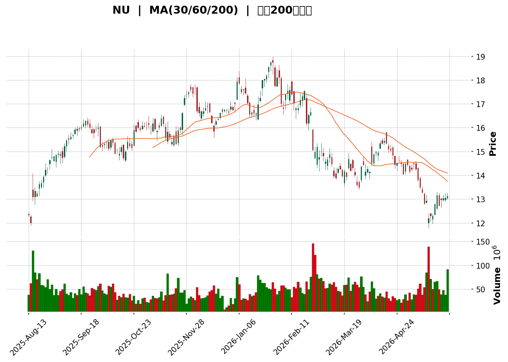
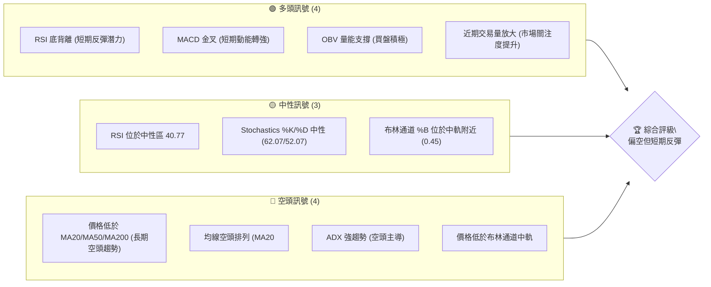
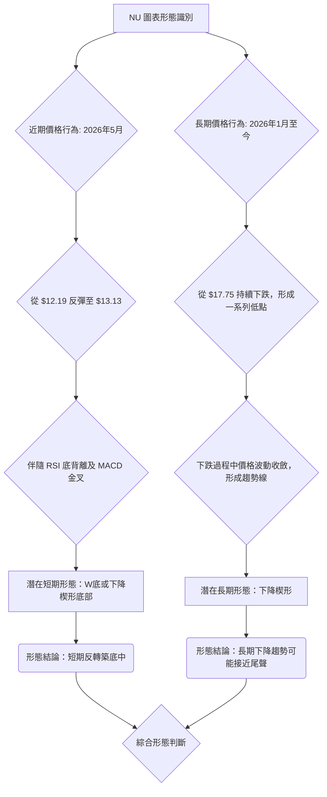
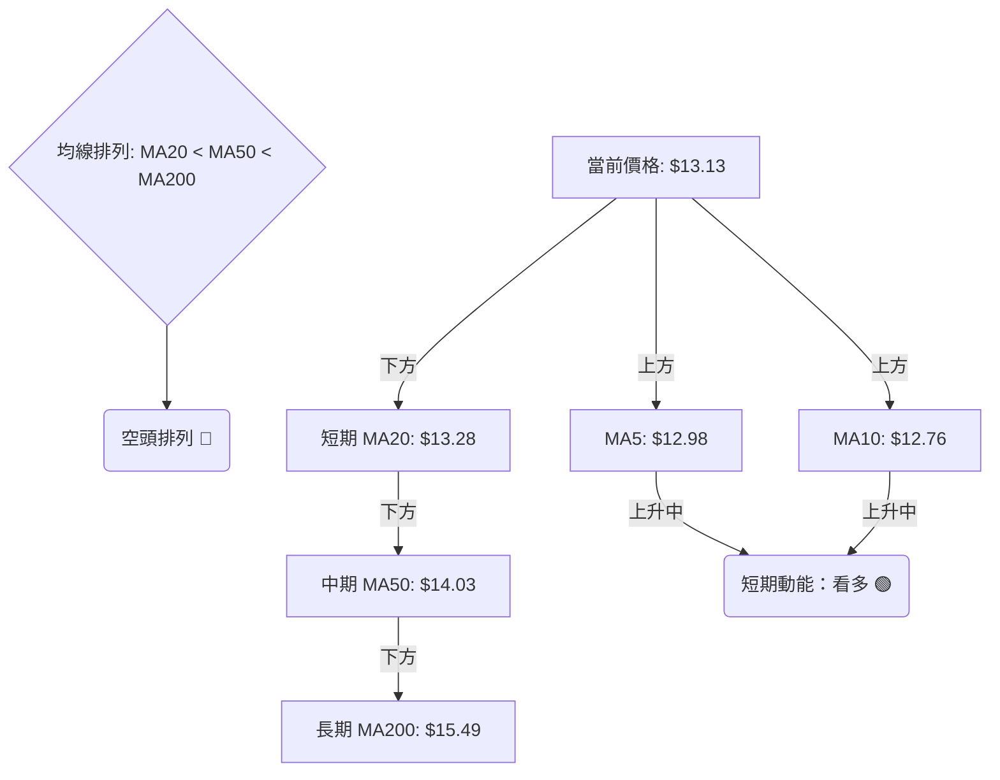

<details>
<summary>📊 靜態圖表 (點擊展開)</summary>

</details>

<html>
<head><meta charset="utf-8" /></head>
<body>
    <div>                        <script>window.PlotlyConfig = {MathJaxConfig: 'local'};</script>
        <script charset="utf-8" src="https://cdn.plot.ly/plotly-3.5.0.min.js" integrity="sha256-fHbNLP+GlIXN+efbQec78UkemUz3NJp7UmfGxC1tNxs=" crossorigin="anonymous"></script>                <div id="candlestick-chart" class="plotly-graph-div" style="height:500px; width:100%;"></div>            <script>                window.PLOTLYENV=window.PLOTLYENV || {};                                if (document.getElementById("candlestick-chart")) {                    Plotly.newPlot(                        "candlestick-chart",                        [{"close":{"dtype":"f8","bdata":"AAAAoHC9KEAAAADAHgUoQAAAAEAzMypAAAAAwPWoKkAAAACgcD0qQAAAAKBwPStAAAAAQApXK0AAAACgR+ErQAAAAIDCdSxAAAAAQOF6LEAAAAAgrkctQAAAAIA9ii1AAAAAoJmZLUAAAADgUbgtQAAAAMDMzC1AAAAAoHC9LUAAAABA4XotQAAAAOCjcC5AAAAAIIXrLkAAAADAHgUvQAAAAKBwPS9AAAAAoEdhL0AAAACA69EvQAAAACCuxy9AAAAAIIXrL0AAAABA4fovQAAAACCFKzBAAAAAwMxMMEAAAABgZiYwQAAAAGCPAjBAAAAAIFyPL0AAAAAgXI8vQAAAAGBm5i9AAAAAYI8CMEAAAACgR2EuQAAAAOCjcC5AAAAAYLieLkAAAABgj8IuQAAAAGCPQi5AAAAAIIXrLkAAAACgcL0uQAAAAEAK1y1AAAAAwPUoLkAAAACA69EtQAAAAAApXC5AAAAAgMJ1LUAAAAAAAAAuQAAAAIDr0S5AAAAAQOF6LkAAAACA61EuQAAAAMDMzC9AAAAAgBSuL0AAAAAAAAAwQAAAAAAp3C9AAAAAQAoXMEAAAAAgXA8wQAAAAAApHDBAAAAAoEchMEAAAACgmZkvQAAAACCFKzBAAAAAoEfhL0AAAACgcL0vQAAAAMAeBTBAAAAAANdjMEAAAACAFC4wQAAAAIAULi9AAAAAANejL0AAAABAMzMvQAAAAADXoy5AAAAAgOtRL0AAAAAA16MuQAAAACCuxy9AAAAAQArXL0AAAAAAKZwwQAAAAAAAQDFAAAAAANdjMUAAAABA4XoxQAAAAAApnDFAAAAA4KNwMUAAAABgZqYxQAAAAEAzszBAAAAAYLieMEAAAACAFK4wQAAAAOCjsDBAAAAAgOvRMEAAAABgZuYwQAAAAGBmpjBAAAAAQDMzMEAAAADgUbgvQAAAAMAeRTBAAAAAQApXMEAAAABguJ4wQAAAAGCPwjBAAAAAoHC9MEAAAABgj8IwQAAAAMD1qDBAAAAAoEfhMEAAAACgcL0wQAAAAMAeBTFAAAAA4KPwMUAAAAAAKdwxQAAAAAAAgDFAAAAAACmcMUAAAACAwnUxQAAAAIA9CjFAAAAAIFyPMEAAAAAA16MwQAAAAAApnDBAAAAAoJmZMEAAAADgUfgwQAAAAKBwPTFAAAAAAAAAMkAAAACAPQoyQAAAAIAULjJAAAAAwMyMMkAAAABgj8IyQAAAAGCPwjJAAAAAAADAMUAAAAAAKRwyQAAAAGC4HjJAAAAAwB4FMUAAAAAgXM8wQAAAAGBmZjFAAAAAwMyMMUAAAACA65ExQAAAAMD1aDFAAAAAgD0KMUAAAACA69EwQAAAAIDr0TBAAAAAIIUrMUAAAACA61ExQAAAACCuhzFAAAAA4KMwMEAAAAAgrocwQAAAAGBmpjBAAAAAYLgeLkAAAACAwvUtQAAAAKBHYS5AAAAAwB6FLUAAAAAAAAAuQAAAAADXoy1AAAAAwPUoLUAAAABAClctQAAAAGCPwi1AAAAAQOH6LEAAAADgo\u002fArQAAAACCuxytAAAAAgD2KLEAAAAAAAIAsQAAAAOCj8CtAAAAAgOtRLEAAAACgR+ErQAAAAAApXC1AAAAAoEdhLEAAAAAA16MsQAAAAIA9CixAAAAAQDMzK0AAAADAHgUrQAAAAKBwvSxAAAAAoEfhLEAAAADAzEwsQAAAAMAehSxAAAAAwMxMLEAAAADAHgUtQAAAAKBwvS1AAAAAIIXrLUAAAABgZuYtQAAAAEAzsy5AAAAAgBSuLkAAAAAAKdwuQAAAAIAUri5AAAAAQDMzLkAAAACgmRkuQAAAAEAzsy1AAAAAIIXrLEAAAADAHgUtQAAAACCuRy1AAAAAAAAALUAAAADgehQsQAAAAIDC9SxAAAAAoEfhLEAAAACA61EsQAAAAAAAgCxAAAAAgML1LEAAAADAHoUsQAAAAKCZmStAAAAAAAAAK0AAAACAPYoqQAAAAADXoylAAAAAACncKUAAAACgR2EoQAAAAOB6lChAAAAA4HqUKEAAAADgepQpQAAAAIDrUSpAAAAAgMJ1KUAAAACAwvUpQAAAACBcDypAAAAAoJkZKkAAAABgj0IqQA=="},"high":{"dtype":"f8","bdata":"AAAAIIXrKEAAAAAA16MoQAAAAADXIyxAAAAAwB4FK0AAAACAwrUqQAAAAAAAgCtAAAAAoJmZK0AAAACAwvUrQAAAAGCPAi1AAAAAQDOzLEAAAABAClctQAAAAEDhOi5AAAAAANejLUAAAACgcL0tQAAAAIDrES5AAAAAoHD9LUAAAACgmVkuQAAAAOCjsC5AAAAAwB4FL0AAAAAghWsvQAAAAKBHoS9AAAAAgD2KL0AAAACgRwEwQAAAAIDrETBAAAAAwMwMMEAAAACgRyEwQAAAAKCZWTBAAAAAwMxMMEAAAADAzGwwQAAAAGC4XjBAAAAA4FEYMEAAAACgcP0vQAAAAKCZGTBAAAAA4KMwMEAAAADAzAwwQAAAAMDMzC5AAAAAAADALkAAAABA4fouQAAAAOB6FC9AAAAAAAAAL0AAAADA9SgvQAAAAGBm5i5AAAAAoHA9LkAAAACgR2EuQAAAAABWji5AAAAAYLieLkAAAABguB4uQAAAACCuRy9AAAAAgBQuL0AAAAAghesuQAAAAADXIzBAAAAAoEchMEAAAACgmVkwQAAAAIDrETBAAAAAwB5FMEAAAACgcD0wQAAAAMAeRTBAAAAAAACAMEAAAACgcB0wQAAAACCFazBAAAAAYGZmMEAAAAAAAMAvQAAAAOBRODBAAAAAwMyMMEAAAAAAAIAwQAAAAIDrMTBAAAAAYI9CMEAAAACgcL0vQAAAAKCZWS9AAAAA4KNwL0AAAABAMxMwQAAAAMAeBTBAAAAAIFwPMEAAAADAzKwwQAAAAKBHYTFAAAAAgBSOMUAAAAAgXI8xQAAAAEAK1zFAAAAA4FG4MUAAAADgo9AxQAAAAEDhujFAAAAAQDMTMUAAAABA4bowQAAAAKCZ2TBAAAAAACkcMUAAAAAgXA8xQAAAAIDrETFAAAAAwB6FMEAAAADA9SgwQAAAAOAiWzBAAAAA4FF4MEAAAACgR6EwQAAAAOB61DBAAAAAwPXIMEAAAABgj8IwQAAAACBczzBAAAAAQOEaMUAAAADAzOwwQAAAACBcDzFAAAAAgJUjMkAAAABguF4yQAAAAGCPwjFAAAAAgL6fMUAAAACA6xEyQAAAACCFazFAAAAAgOsRMUAAAADgo7AwQAAAAOBR+DBAAAAAYA6tMEAAAADgo1AxQAAAAIA9ijFAAAAAAAAAMkAAAADgoxAyQAAAAGCPQjJAAAAAIFyPMkAAAADA9cgyQAAAAEDh+jJAAAAAYLieMkAAAABACncyQAAAAGBmpjJAAAAAgD0qMkAAAABgjyIxQAAAACCFazFAAAAAQArXMUAAAAAAKbwxQAAAAKBw\u002fTFAAAAAwMyMMUAAAACgR+EwQAAAAAAAADFAAAAAQOF6MUAAAADgo3AxQAAAAEAKlzFAAAAAwPVoMUAAAABACpcwQAAAAKCZ2TBAAAAAoEfhL0AAAABgZmYuQAAAAECLrC5AAAAAYLgeLkAAAACAwrUuQAAAAMDMTC5AAAAAQDNzLUAAAACA65EtQAAAAIA9Si5AAAAAoEfhLUAAAABAM7MsQAAAAGC4nixAAAAAoHC9LEAAAADgehQtQAAAAMDMjCxAAAAAAACALEAAAADAzEwsQAAAAEAK1y1AAAAAwB4FLUAAAACgR2EtQAAAAGBmpixAAAAAYGbmK0AAAACA65ErQAAAAIDr0SxAAAAAoJmZLUAAAACAwvUsQAAAACCuxyxAAAAAgOtRLEAAAADAScwuQAAAAAAp3C1AAAAA4HoULkAAAAAgXA8uQAAAAOCj8C5AAAAAYLgeL0AAAACgRyEvQAAAAGC4ni9AAAAAQDOzLkAAAAAgXI8uQAAAAOCjcC5AAAAAANejLUAAAADgehQtQAAAACCFqy1AAAAAQApXLUAAAADAHgUtQAAAAGC4Hi1AAAAAgOtRLUAAAADgo\u002fAsQAAAAKBH4SxAAAAAoJkZLUAAAABAMzMtQAAAAMD1qCxAAAAAwPXoK0AAAAAAKRwrQAAAAIA9iipAAAAAQApXKkAAAAAgXM8oQAAAAMDMzChAAAAAwMzMKEAAAACgmZkpQAAAAKCZmSpAAAAAwB6FKkAAAACgRyEqQAAAAAApXCpAAAAAQOF6KkAAAAAAAIAqQA=="},"hovertemplate":"\u003cb\u003e%{x|%Y-%m-%d}\u003c\u002fb\u003e\u003cbr\u003e\u958b: $%{open:.2f}\u003cbr\u003e\u9ad8: $%{high:.2f}\u003cbr\u003e\u4f4e: $%{low:.2f}\u003cbr\u003e\u6536: $%{close:.2f}\u003cextra\u003e\u003c\u002fextra\u003e","low":{"dtype":"f8","bdata":"AAAAAACAKEAAAAAgrscnQAAAAEAK1ylAAAAAgD2KKUAAAABAMzMqQAAAACCuRypAAAAAoEfhKkAAAABA4foqQAAAAGC43itAAAAAIFokLEAAAABgj4IsQAAAAIDrUS1AAAAAgBQuLUAAAACAFK4sQAAAAIDCdS1AAAAAgML1LEAAAACAPQotQAAAACCFay1AAAAAYI8CLkAAAACgmZkuQAAAAIDC9S5AAAAA4HoUL0AAAADA9WgvQAAAAIDrUS9AAAAAYGamL0AAAADAHsUvQAAAAMAeBTBAAAAAgML1L0AAAAAgrgcwQAAAAKDx0i9AAAAAgMJ1L0AAAACgmRkvQAAAAMD1qC9AAAAAwMxML0AAAACA61EuQAAAAIA9Ci5AAAAA4FE4LkAAAAAAAEAuQAAAAIA9Ci5AAAAAoJkZLkAAAACAwnUuQAAAAGCPwi1AAAAAQArXLUAAAAAgrkctQAAAAOBRuC1AAAAAQF46LUAAAABguB4tQAAAAGC4Hi5AAAAAIFxPLkAAAACA6xEuQAAAAIDCdS5AAAAAIASWL0AAAABACtcvQAAAAADXoy9AAAAAACncL0AAAAAA1wMwQAAAAGCPwi9AAAAAgBTuL0AAAABgZmYvQAAAAOB6lC9AAAAAgBSuL0AAAABgZuYuQAAAAMDMzC9AAAAAwMwMMEAAAAAghQswQAAAAOBR+C5AAAAAANejLkAAAAAAAAAvQAAAAMAehS5AAAAAoEdhLkAAAACgmZkuQAAAAGCPgi5AAAAAIFyPL0AAAAAAKVwvQAAAAMD16DBAAAAAQDMzMUAAAAAgrkcxQAAAAEDhejFAAAAAgD1KMUAAAAAAKVwxQAAAAKCZmTBAAAAA4FF4MEAAAAAAAkswQAAAAEAKdzBAAAAAQDOzMEAAAACgmZkwQAAAAKBHoTBAAAAAgBQuMEAAAACAFC4vQAAAAMAgEDBAAAAAQGJQMEAAAACgmVkwQAAAACBcjzBAAAAAYGamMEAAAAAAKZwwQAAAAIA9ijBAAAAAgBSuMEAAAACAwrUwQAAAAGBmpjBAAAAAgD0qMUAAAAAgXM8xQAAAACCuZzFAAAAAYLheMUAAAAAA12MxQAAAAMAeBTFAAAAAgD1qMEAAAADAzGwwQAAAAIBBgDBAAAAAgBROMEAAAACgmVkwQAAAAIDrETFAAAAA4HpUMUAAAACAwrUxQAAAAGBm5jFAAAAAoJkZMkAAAAAAKVwyQAAAAKBwPTJAAAAAgMK1MUAAAACAwrUxQAAAAEAK1zFAAAAAAADgMEAAAADAzIwwQAAAAGCPwjBAAAAAQAo3MUAAAACAPQoxQAAAAKCZWTFAAAAAgMK1MEAAAABguF4wQAAAAEAKlzBAAAAAQArXMEAAAADAHuUwQAAAACCFKzFAAAAA4HoUMEAAAACgcL0vQAAAAADXgzBAAAAA4HoULkAAAABgZmYtQAAAAGC4nixAAAAAQApXLEAAAACgmZktQAAAAOBROC1AAAAA4FF4LEAAAACAwnUsQAAAACBcDy1AAAAAYI\u002fCLEAAAABgj8IrQAAAAKBHoStAAAAAYLgeLEAAAADgUXgsQAAAAOB61CtAAAAAIFwPK0AAAADgepQrQAAAAOCjcCxAAAAAgOtRLEAAAAAghWssQAAAAAAp3CtAAAAA4HoUK0AAAACA69EqQAAAAGBmZitAAAAAACncLEAAAAAAAqsrQAAAAMD1KCxAAAAAgBSuK0AAAACA69EsQAAAAMDMzCxAAAAAIFyPLUAAAABAMzMtQAAAAKBwPS5AAAAAoJmZLkAAAADgepQuQAAAAGC4ni5AAAAAACncLUAAAADgo\u002fAtQAAAAEAKVy1AAAAAgOuRLEAAAACgR2EsQAAAAKCZGS1AAAAAgMK1LEAAAADgehQsQAAAAKCZGSxAAAAAYI\u002fCLEAAAACAFC4sQAAAAEAKVyxAAAAAoHB9LEAAAADA9WgsQAAAAAAAgCtAAAAAQArXKkAAAADAHoUqQAAAACCuhylAAAAAgBSuKUAAAAAgXI8nQAAAAGC4HihAAAAAIIXrJ0AAAADA9agoQAAAAGC4HilAAAAAIIVrKUAAAADAzEwpQAAAAAAp3ClAAAAAIK7HKUAAAABA4fopQA=="},"name":"\u50f9\u683c","open":{"dtype":"f8","bdata":"AAAAwPWoKEAAAACAPYooQAAAAMDMzCpAAAAAQDMzKkAAAACAwnUqQAAAAIAU7ipAAAAAgD0KK0AAAADgo3ArQAAAAAAAACxAAAAAQOF6LEAAAACAwvUsQAAAAAAAgC1AAAAA4FE4LUAAAADA9SgtQAAAAKBwvS1AAAAAgBSuLUAAAADAHgUuQAAAACBcjy1AAAAAgMJ1LkAAAACgmRkvQAAAACBcDy9AAAAAAClcL0AAAAAAAIAvQAAAAKBH4S9AAAAAYGbmL0AAAABgjwIwQAAAAIDrETBAAAAAACkcMEAAAADAzEwwQAAAAIAULjBAAAAAACncL0AAAAAAKdwvQAAAAGBm5i9AAAAAIIXrL0AAAADAzAwwQAAAAIA9ii5AAAAAIFyPLkAAAACgcL0uQAAAAIDr0S5AAAAAAClcLkAAAAAgXA8vQAAAAOBRuC5AAAAAwPUoLkAAAABAM7MtQAAAAAAAAC5AAAAA4HqULkAAAAAgrkctQAAAAGCPQi5AAAAAQDOzLkAAAAAA16MuQAAAAMAehS5AAAAAQAoXMEAAAABA4TowQAAAACCF6y9AAAAAYGbmL0AAAACA6xEwQAAAAAApHDBAAAAA4KMwMEAAAACgmZkvQAAAAOBRuC9AAAAAYLheMEAAAAAA16MvQAAAAKCZGTBAAAAAQAoXMEAAAACAwnUwQAAAAIA9CjBAAAAAACncLkAAAADgUXgvQAAAAMDMzC5AAAAAwMyMLkAAAACAFK4vQAAAAIDCtS5AAAAAAAAAMEAAAABACtcvQAAAAEDh+jBAAAAAANdjMUAAAACAFG4xQAAAAIDCtTFAAAAAQDOzMUAAAABgZqYxQAAAAEAzszFAAAAAYLjeMEAAAADAHmUwQAAAAKCZmTBAAAAAQOG6MEAAAAAgrucwQAAAAGBmBjFAAAAAAACAMEAAAABAChcwQAAAAGBmJjBAAAAAoJlZMEAAAAAghWswQAAAAOCjsDBAAAAAQDOzMEAAAACgcL0wQAAAAIA9qjBAAAAAwB7FMEAAAABguN4wQAAAACBcDzFAAAAAgBQuMUAAAABguB4yQAAAAGC4njFAAAAAQAqXMUAAAACAFK4xQAAAAKCZWTFAAAAAIFwPMUAAAADgo5AwQAAAAAAAwDBAAAAAgOuRMEAAAAAAKVwwQAAAAGCPIjFAAAAAgD2qMUAAAAAAAAAyQAAAAMDMDDJAAAAAAClcMkAAAABgj6IyQAAAAOB61DJAAAAAIK6HMkAAAACgcL0xQAAAACCuZzJAAAAA4HoUMkAAAADgetQwQAAAACCFKzFAAAAA4KNwMUAAAABgZiYxQAAAAIDr8TFAAAAAwPWIMUAAAACgcL0wQAAAAAAAwDBAAAAAQDPzMEAAAAAA1yMxQAAAAEAzMzFAAAAAAABAMUAAAADgozAwQAAAAADXgzBAAAAAQArXL0AAAADgo3AtQAAAACCF6yxAAAAAAClcLUAAAACgcP0tQAAAAAAp3C1AAAAAYI8CLUAAAACA69EsQAAAAEDhei1AAAAAAACALUAAAABgZmYsQAAAAADXIyxAAAAAoHA9LEAAAADAzMwsQAAAAOCjcCxAAAAAAClcK0AAAACgcD0sQAAAAKBHoSxAAAAA4FH4LEAAAABgj0ItQAAAAGCPQixAAAAAgMJ1K0AAAAAghWsrQAAAAKCZmStAAAAAgBQuLUAAAAAAAAAsQAAAAGCPQixAAAAAQDMzLEAAAAAghWsuQAAAAMAeBS1AAAAAACncLUAAAACAFK4tQAAAAGCPQi5AAAAAIIXrLkAAAAAgrscuQAAAAGC4ni9AAAAAQOF6LkAAAADgUTguQAAAAAApXC5AAAAAYLieLUAAAABACtcsQAAAACCuRy1AAAAA4HoULUAAAACAwvUsQAAAAOB6VCxAAAAAgOtRLUAAAAAgrscsQAAAAADXoyxAAAAAAAAALUAAAAAAAAAtQAAAAKCZmSxAAAAAYI\u002fCK0AAAABACtcqQAAAACCFaypAAAAAQDOzKUAAAABAiQEoQAAAAMDMzChAAAAA4HpUKEAAAACAFK4oQAAAAOBROClAAAAAwMxMKkAAAAAgrgcqQAAAACCF6ylAAAAA4KPwKUAAAACgmRkqQA=="},"x":["2025-08-13T00:00:00-04:00","2025-08-14T00:00:00-04:00","2025-08-15T00:00:00-04:00","2025-08-18T00:00:00-04:00","2025-08-19T00:00:00-04:00","2025-08-20T00:00:00-04:00","2025-08-21T00:00:00-04:00","2025-08-22T00:00:00-04:00","2025-08-25T00:00:00-04:00","2025-08-26T00:00:00-04:00","2025-08-27T00:00:00-04:00","2025-08-28T00:00:00-04:00","2025-08-29T00:00:00-04:00","2025-09-02T00:00:00-04:00","2025-09-03T00:00:00-04:00","2025-09-04T00:00:00-04:00","2025-09-05T00:00:00-04:00","2025-09-08T00:00:00-04:00","2025-09-09T00:00:00-04:00","2025-09-10T00:00:00-04:00","2025-09-11T00:00:00-04:00","2025-09-12T00:00:00-04:00","2025-09-15T00:00:00-04:00","2025-09-16T00:00:00-04:00","2025-09-17T00:00:00-04:00","2025-09-18T00:00:00-04:00","2025-09-19T00:00:00-04:00","2025-09-22T00:00:00-04:00","2025-09-23T00:00:00-04:00","2025-09-24T00:00:00-04:00","2025-09-25T00:00:00-04:00","2025-09-26T00:00:00-04:00","2025-09-29T00:00:00-04:00","2025-09-30T00:00:00-04:00","2025-10-01T00:00:00-04:00","2025-10-02T00:00:00-04:00","2025-10-03T00:00:00-04:00","2025-10-06T00:00:00-04:00","2025-10-07T00:00:00-04:00","2025-10-08T00:00:00-04:00","2025-10-09T00:00:00-04:00","2025-10-10T00:00:00-04:00","2025-10-13T00:00:00-04:00","2025-10-14T00:00:00-04:00","2025-10-15T00:00:00-04:00","2025-10-16T00:00:00-04:00","2025-10-17T00:00:00-04:00","2025-10-20T00:00:00-04:00","2025-10-21T00:00:00-04:00","2025-10-22T00:00:00-04:00","2025-10-23T00:00:00-04:00","2025-10-24T00:00:00-04:00","2025-10-27T00:00:00-04:00","2025-10-28T00:00:00-04:00","2025-10-29T00:00:00-04:00","2025-10-30T00:00:00-04:00","2025-10-31T00:00:00-04:00","2025-11-03T00:00:00-05:00","2025-11-04T00:00:00-05:00","2025-11-05T00:00:00-05:00","2025-11-06T00:00:00-05:00","2025-11-07T00:00:00-05:00","2025-11-10T00:00:00-05:00","2025-11-11T00:00:00-05:00","2025-11-12T00:00:00-05:00","2025-11-13T00:00:00-05:00","2025-11-14T00:00:00-05:00","2025-11-17T00:00:00-05:00","2025-11-18T00:00:00-05:00","2025-11-19T00:00:00-05:00","2025-11-20T00:00:00-05:00","2025-11-21T00:00:00-05:00","2025-11-24T00:00:00-05:00","2025-11-25T00:00:00-05:00","2025-11-26T00:00:00-05:00","2025-11-28T00:00:00-05:00","2025-12-01T00:00:00-05:00","2025-12-02T00:00:00-05:00","2025-12-03T00:00:00-05:00","2025-12-04T00:00:00-05:00","2025-12-05T00:00:00-05:00","2025-12-08T00:00:00-05:00","2025-12-09T00:00:00-05:00","2025-12-10T00:00:00-05:00","2025-12-11T00:00:00-05:00","2025-12-12T00:00:00-05:00","2025-12-15T00:00:00-05:00","2025-12-16T00:00:00-05:00","2025-12-17T00:00:00-05:00","2025-12-18T00:00:00-05:00","2025-12-19T00:00:00-05:00","2025-12-22T00:00:00-05:00","2025-12-23T00:00:00-05:00","2025-12-24T00:00:00-05:00","2025-12-26T00:00:00-05:00","2025-12-29T00:00:00-05:00","2025-12-30T00:00:00-05:00","2025-12-31T00:00:00-05:00","2026-01-02T00:00:00-05:00","2026-01-05T00:00:00-05:00","2026-01-06T00:00:00-05:00","2026-01-07T00:00:00-05:00","2026-01-08T00:00:00-05:00","2026-01-09T00:00:00-05:00","2026-01-12T00:00:00-05:00","2026-01-13T00:00:00-05:00","2026-01-14T00:00:00-05:00","2026-01-15T00:00:00-05:00","2026-01-16T00:00:00-05:00","2026-01-20T00:00:00-05:00","2026-01-21T00:00:00-05:00","2026-01-22T00:00:00-05:00","2026-01-23T00:00:00-05:00","2026-01-26T00:00:00-05:00","2026-01-27T00:00:00-05:00","2026-01-28T00:00:00-05:00","2026-01-29T00:00:00-05:00","2026-01-30T00:00:00-05:00","2026-02-02T00:00:00-05:00","2026-02-03T00:00:00-05:00","2026-02-04T00:00:00-05:00","2026-02-05T00:00:00-05:00","2026-02-06T00:00:00-05:00","2026-02-09T00:00:00-05:00","2026-02-10T00:00:00-05:00","2026-02-11T00:00:00-05:00","2026-02-12T00:00:00-05:00","2026-02-13T00:00:00-05:00","2026-02-17T00:00:00-05:00","2026-02-18T00:00:00-05:00","2026-02-19T00:00:00-05:00","2026-02-20T00:00:00-05:00","2026-02-23T00:00:00-05:00","2026-02-24T00:00:00-05:00","2026-02-25T00:00:00-05:00","2026-02-26T00:00:00-05:00","2026-02-27T00:00:00-05:00","2026-03-02T00:00:00-05:00","2026-03-03T00:00:00-05:00","2026-03-04T00:00:00-05:00","2026-03-05T00:00:00-05:00","2026-03-06T00:00:00-05:00","2026-03-09T00:00:00-04:00","2026-03-10T00:00:00-04:00","2026-03-11T00:00:00-04:00","2026-03-12T00:00:00-04:00","2026-03-13T00:00:00-04:00","2026-03-16T00:00:00-04:00","2026-03-17T00:00:00-04:00","2026-03-18T00:00:00-04:00","2026-03-19T00:00:00-04:00","2026-03-20T00:00:00-04:00","2026-03-23T00:00:00-04:00","2026-03-24T00:00:00-04:00","2026-03-25T00:00:00-04:00","2026-03-26T00:00:00-04:00","2026-03-27T00:00:00-04:00","2026-03-30T00:00:00-04:00","2026-03-31T00:00:00-04:00","2026-04-01T00:00:00-04:00","2026-04-02T00:00:00-04:00","2026-04-06T00:00:00-04:00","2026-04-07T00:00:00-04:00","2026-04-08T00:00:00-04:00","2026-04-09T00:00:00-04:00","2026-04-10T00:00:00-04:00","2026-04-13T00:00:00-04:00","2026-04-14T00:00:00-04:00","2026-04-15T00:00:00-04:00","2026-04-16T00:00:00-04:00","2026-04-17T00:00:00-04:00","2026-04-20T00:00:00-04:00","2026-04-21T00:00:00-04:00","2026-04-22T00:00:00-04:00","2026-04-23T00:00:00-04:00","2026-04-24T00:00:00-04:00","2026-04-27T00:00:00-04:00","2026-04-28T00:00:00-04:00","2026-04-29T00:00:00-04:00","2026-04-30T00:00:00-04:00","2026-05-01T00:00:00-04:00","2026-05-04T00:00:00-04:00","2026-05-05T00:00:00-04:00","2026-05-06T00:00:00-04:00","2026-05-07T00:00:00-04:00","2026-05-08T00:00:00-04:00","2026-05-11T00:00:00-04:00","2026-05-12T00:00:00-04:00","2026-05-13T00:00:00-04:00","2026-05-14T00:00:00-04:00","2026-05-15T00:00:00-04:00","2026-05-18T00:00:00-04:00","2026-05-19T00:00:00-04:00","2026-05-20T00:00:00-04:00","2026-05-21T00:00:00-04:00","2026-05-22T00:00:00-04:00","2026-05-26T00:00:00-04:00","2026-05-27T00:00:00-04:00","2026-05-28T00:00:00-04:00","2026-05-29T00:00:00-04:00"],"type":"candlestick"},{"hovertemplate":"MA30: $%{y:.2f}\u003cextra\u003e\u003c\u002fextra\u003e","line":{"color":"#2196F3","dash":"dash","width":2},"mode":"lines","name":"MA30","x":["2025-08-13T00:00:00-04:00","2025-08-14T00:00:00-04:00","2025-08-15T00:00:00-04:00","2025-08-18T00:00:00-04:00","2025-08-19T00:00:00-04:00","2025-08-20T00:00:00-04:00","2025-08-21T00:00:00-04:00","2025-08-22T00:00:00-04:00","2025-08-25T00:00:00-04:00","2025-08-26T00:00:00-04:00","2025-08-27T00:00:00-04:00","2025-08-28T00:00:00-04:00","2025-08-29T00:00:00-04:00","2025-09-02T00:00:00-04:00","2025-09-03T00:00:00-04:00","2025-09-04T00:00:00-04:00","2025-09-05T00:00:00-04:00","2025-09-08T00:00:00-04:00","2025-09-09T00:00:00-04:00","2025-09-10T00:00:00-04:00","2025-09-11T00:00:00-04:00","2025-09-12T00:00:00-04:00","2025-09-15T00:00:00-04:00","2025-09-16T00:00:00-04:00","2025-09-17T00:00:00-04:00","2025-09-18T00:00:00-04:00","2025-09-19T00:00:00-04:00","2025-09-22T00:00:00-04:00","2025-09-23T00:00:00-04:00","2025-09-24T00:00:00-04:00","2025-09-25T00:00:00-04:00","2025-09-26T00:00:00-04:00","2025-09-29T00:00:00-04:00","2025-09-30T00:00:00-04:00","2025-10-01T00:00:00-04:00","2025-10-02T00:00:00-04:00","2025-10-03T00:00:00-04:00","2025-10-06T00:00:00-04:00","2025-10-07T00:00:00-04:00","2025-10-08T00:00:00-04:00","2025-10-09T00:00:00-04:00","2025-10-10T00:00:00-04:00","2025-10-13T00:00:00-04:00","2025-10-14T00:00:00-04:00","2025-10-15T00:00:00-04:00","2025-10-16T00:00:00-04:00","2025-10-17T00:00:00-04:00","2025-10-20T00:00:00-04:00","2025-10-21T00:00:00-04:00","2025-10-22T00:00:00-04:00","2025-10-23T00:00:00-04:00","2025-10-24T00:00:00-04:00","2025-10-27T00:00:00-04:00","2025-10-28T00:00:00-04:00","2025-10-29T00:00:00-04:00","2025-10-30T00:00:00-04:00","2025-10-31T00:00:00-04:00","2025-11-03T00:00:00-05:00","2025-11-04T00:00:00-05:00","2025-11-05T00:00:00-05:00","2025-11-06T00:00:00-05:00","2025-11-07T00:00:00-05:00","2025-11-10T00:00:00-05:00","2025-11-11T00:00:00-05:00","2025-11-12T00:00:00-05:00","2025-11-13T00:00:00-05:00","2025-11-14T00:00:00-05:00","2025-11-17T00:00:00-05:00","2025-11-18T00:00:00-05:00","2025-11-19T00:00:00-05:00","2025-11-20T00:00:00-05:00","2025-11-21T00:00:00-05:00","2025-11-24T00:00:00-05:00","2025-11-25T00:00:00-05:00","2025-11-26T00:00:00-05:00","2025-11-28T00:00:00-05:00","2025-12-01T00:00:00-05:00","2025-12-02T00:00:00-05:00","2025-12-03T00:00:00-05:00","2025-12-04T00:00:00-05:00","2025-12-05T00:00:00-05:00","2025-12-08T00:00:00-05:00","2025-12-09T00:00:00-05:00","2025-12-10T00:00:00-05:00","2025-12-11T00:00:00-05:00","2025-12-12T00:00:00-05:00","2025-12-15T00:00:00-05:00","2025-12-16T00:00:00-05:00","2025-12-17T00:00:00-05:00","2025-12-18T00:00:00-05:00","2025-12-19T00:00:00-05:00","2025-12-22T00:00:00-05:00","2025-12-23T00:00:00-05:00","2025-12-24T00:00:00-05:00","2025-12-26T00:00:00-05:00","2025-12-29T00:00:00-05:00","2025-12-30T00:00:00-05:00","2025-12-31T00:00:00-05:00","2026-01-02T00:00:00-05:00","2026-01-05T00:00:00-05:00","2026-01-06T00:00:00-05:00","2026-01-07T00:00:00-05:00","2026-01-08T00:00:00-05:00","2026-01-09T00:00:00-05:00","2026-01-12T00:00:00-05:00","2026-01-13T00:00:00-05:00","2026-01-14T00:00:00-05:00","2026-01-15T00:00:00-05:00","2026-01-16T00:00:00-05:00","2026-01-20T00:00:00-05:00","2026-01-21T00:00:00-05:00","2026-01-22T00:00:00-05:00","2026-01-23T00:00:00-05:00","2026-01-26T00:00:00-05:00","2026-01-27T00:00:00-05:00","2026-01-28T00:00:00-05:00","2026-01-29T00:00:00-05:00","2026-01-30T00:00:00-05:00","2026-02-02T00:00:00-05:00","2026-02-03T00:00:00-05:00","2026-02-04T00:00:00-05:00","2026-02-05T00:00:00-05:00","2026-02-06T00:00:00-05:00","2026-02-09T00:00:00-05:00","2026-02-10T00:00:00-05:00","2026-02-11T00:00:00-05:00","2026-02-12T00:00:00-05:00","2026-02-13T00:00:00-05:00","2026-02-17T00:00:00-05:00","2026-02-18T00:00:00-05:00","2026-02-19T00:00:00-05:00","2026-02-20T00:00:00-05:00","2026-02-23T00:00:00-05:00","2026-02-24T00:00:00-05:00","2026-02-25T00:00:00-05:00","2026-02-26T00:00:00-05:00","2026-02-27T00:00:00-05:00","2026-03-02T00:00:00-05:00","2026-03-03T00:00:00-05:00","2026-03-04T00:00:00-05:00","2026-03-05T00:00:00-05:00","2026-03-06T00:00:00-05:00","2026-03-09T00:00:00-04:00","2026-03-10T00:00:00-04:00","2026-03-11T00:00:00-04:00","2026-03-12T00:00:00-04:00","2026-03-13T00:00:00-04:00","2026-03-16T00:00:00-04:00","2026-03-17T00:00:00-04:00","2026-03-18T00:00:00-04:00","2026-03-19T00:00:00-04:00","2026-03-20T00:00:00-04:00","2026-03-23T00:00:00-04:00","2026-03-24T00:00:00-04:00","2026-03-25T00:00:00-04:00","2026-03-26T00:00:00-04:00","2026-03-27T00:00:00-04:00","2026-03-30T00:00:00-04:00","2026-03-31T00:00:00-04:00","2026-04-01T00:00:00-04:00","2026-04-02T00:00:00-04:00","2026-04-06T00:00:00-04:00","2026-04-07T00:00:00-04:00","2026-04-08T00:00:00-04:00","2026-04-09T00:00:00-04:00","2026-04-10T00:00:00-04:00","2026-04-13T00:00:00-04:00","2026-04-14T00:00:00-04:00","2026-04-15T00:00:00-04:00","2026-04-16T00:00:00-04:00","2026-04-17T00:00:00-04:00","2026-04-20T00:00:00-04:00","2026-04-21T00:00:00-04:00","2026-04-22T00:00:00-04:00","2026-04-23T00:00:00-04:00","2026-04-24T00:00:00-04:00","2026-04-27T00:00:00-04:00","2026-04-28T00:00:00-04:00","2026-04-29T00:00:00-04:00","2026-04-30T00:00:00-04:00","2026-05-01T00:00:00-04:00","2026-05-04T00:00:00-04:00","2026-05-05T00:00:00-04:00","2026-05-06T00:00:00-04:00","2026-05-07T00:00:00-04:00","2026-05-08T00:00:00-04:00","2026-05-11T00:00:00-04:00","2026-05-12T00:00:00-04:00","2026-05-13T00:00:00-04:00","2026-05-14T00:00:00-04:00","2026-05-15T00:00:00-04:00","2026-05-18T00:00:00-04:00","2026-05-19T00:00:00-04:00","2026-05-20T00:00:00-04:00","2026-05-21T00:00:00-04:00","2026-05-22T00:00:00-04:00","2026-05-26T00:00:00-04:00","2026-05-27T00:00:00-04:00","2026-05-28T00:00:00-04:00","2026-05-29T00:00:00-04:00"],"y":{"dtype":"f8","bdata":"AAAAAAAA+H8AAAAAAAD4fwAAAAAAAPh\u002fAAAAAAAA+H8AAAAAAAD4fwAAAAAAAPh\u002fAAAAAAAA+H8AAAAAAAD4fwAAAAAAAPh\u002fAAAAAAAA+H8AAAAAAAD4fwAAAAAAAPh\u002fAAAAAAAA+H8AAAAAAAD4fwAAAAAAAPh\u002fAAAAAAAA+H8AAAAAAAD4fwAAAAAAAPh\u002fAAAAAAAA+H8AAAAAAAD4fwAAAAAAAPh\u002fAAAAAAAA+H8AAAAAAAD4fwAAAAAAAPh\u002fAAAAAAAA+H8AAAAAAAD4fwAAAAAAAPh\u002fAAAAAAAA+H8AAAAAAAD4f97d3b0Rii1AIiIiQkTELUAzMzOjmwQuQJqZmXk\u002fNS5AMzMzk\u002fxiLkCrqqqKUIYuQM3MzAyfoS5AIiIiUpy9LkB3d3fHL9YuQBEREfGL5S5ARERENF76LkDv7u6e0wYvQKuqqvpiCS9AERERUSoOL0BVVVXFBA8vQM3MzBzMEy9AERERcWgRL0BmZmZm2BUvQFVVVYUWGS9AMzMzU1UVL0BmZmYmXA8vQM3MzHwjFC9AmpmZ2bIWL0ARERERPBgvQERERNTqGC9A7+7uziIbL0BERESkVBwvQAAAAIBOGy9AIiIiwmcYL0BmZmaWbhIvQDMzM6MpFS9AAAAAsOQXL0B3d3fnbRkvQN7d3b2fGi9AvLu7+xshL0DNzMxcATIvQKuqqupROC9AMzMzIwZBL0BVVVVVx0QvQERERHQFSC9ARERERG9LL0AAAADQlEovQO\u002fu7s4iWy9AMzMz03hpL0De3d09fIYvQFVVVTXQqS9AzczM7DXXL0CrqqqaxAAwQERERJSKEzBA3t3djVAmMECrqqoKkDswQLy7u6tjQjBAvLu7mwtJMEB3d3cX2U4wQGZmZlZVVTBAvLu7C5BbMEDe3d0Nu2IwQDMzM7NWZzBA7+7unu9nMEARERGxcmgwQFVVVSVNaTBA3t3d9bZsMEDNzMxcHXMwQKuqqupteTBAERERgWp8MECJiIiIXYEwQLy7u\u002ft+ijBAZmZmloqTMEBERET0RJ0wQJqZmanGqzBAZmZmZju\u002fMEDe3d0d6NQwQO\u002fu7jal4jBAvLu7ExHxMEBVVVXtUfgwQFVVVS2H9jBAvLu7A3LvMECamZkBR+gwQBEREXm+3zBA7+7udpPYMEAzMzP7xdIwQImIiKBh1zBAAAAASCjjMEB3d3c\u002fw+4wQLy7uzN6+zBAmpmZcT0KMUBVVVWtHBoxQDMzMwseLDFAmpmZEVg5MUBVVVVFi0wxQImIiKhUXDFAREREJCJiMUAzMzMzwWMxQM3MzEw3aTFAVVVVxSBwMUDe3d09CncxQERERKRwfTFAvLu7K85+MUDv7u7ufH8xQGZmZgbIfTFA7+7u7jV3MUCJiIhImnIxQCIiItLbcjFAiYiIyL1mMUC8u7srzl4xQDMzMzN6WzFA7+7uZq1OMUC8u7sTg0AxQJqZmQllNDFA7+7ufrEkMUB3d3f34RMxQFVVVWU7\u002fzBAq6qqSgziMECamZlpSsUwQLy7u3MhqTBAd3d3P3yGMEBVVVVVnF0wQAAAAKgNNDBAMzMze1sWMEDNzMxc1uovQLy7u7sCpC9AMzMzMzNzL0Crqqr6N0IvQO\u002fu7h7MEy9A7+7uDnTaLkB3d3eX\u002fKIuQFVVVXUhaS5A3t3d3WsuLkAiIiJC7vUtQLy7uwsezC1A3t3dfYadLUDNzMyMbGctQDMzM7OdLy1AzczMzMwMLUCJiIhIU+osQImIiFjyyyxAAAAAcD3KLEDe3d1dusksQLy7u2t1zCxAq6qqelvWLEDe3d0tst0sQImIiBiS5ixAMzMzA3LvLEAiIiJC7vUsQAAAADBr9SxA3t3dHej0LECamZlpH\u002f4sQGZmZjbsCi1AiYiIGNkOLUB3d3eXQwstQAAAAND3Ey1AZmZmJr8YLUCJiIhYgBwtQFVVVaUpFS1AzczMrBwaLUCJiIiIFhktQGZmZlZVFS1A3t3dbaATLUCrqqrahw8tQM3MzMwT9SxAMzMzg07bLEBEREQk27ksQERERBQ8mCxA3t3dnX14LEAiIiLSIlssQHd3d7fzPSxAIiIisuQXLEAiIiKiRfYrQFVVVWWtzitAvLu7O5inK0ARERFhV4ArQA=="},"type":"scatter"},{"hovertemplate":"MA60: $%{y:.2f}\u003cextra\u003e\u003c\u002fextra\u003e","line":{"color":"#9C27B0","dash":"dash","width":2},"mode":"lines","name":"MA60","x":["2025-08-13T00:00:00-04:00","2025-08-14T00:00:00-04:00","2025-08-15T00:00:00-04:00","2025-08-18T00:00:00-04:00","2025-08-19T00:00:00-04:00","2025-08-20T00:00:00-04:00","2025-08-21T00:00:00-04:00","2025-08-22T00:00:00-04:00","2025-08-25T00:00:00-04:00","2025-08-26T00:00:00-04:00","2025-08-27T00:00:00-04:00","2025-08-28T00:00:00-04:00","2025-08-29T00:00:00-04:00","2025-09-02T00:00:00-04:00","2025-09-03T00:00:00-04:00","2025-09-04T00:00:00-04:00","2025-09-05T00:00:00-04:00","2025-09-08T00:00:00-04:00","2025-09-09T00:00:00-04:00","2025-09-10T00:00:00-04:00","2025-09-11T00:00:00-04:00","2025-09-12T00:00:00-04:00","2025-09-15T00:00:00-04:00","2025-09-16T00:00:00-04:00","2025-09-17T00:00:00-04:00","2025-09-18T00:00:00-04:00","2025-09-19T00:00:00-04:00","2025-09-22T00:00:00-04:00","2025-09-23T00:00:00-04:00","2025-09-24T00:00:00-04:00","2025-09-25T00:00:00-04:00","2025-09-26T00:00:00-04:00","2025-09-29T00:00:00-04:00","2025-09-30T00:00:00-04:00","2025-10-01T00:00:00-04:00","2025-10-02T00:00:00-04:00","2025-10-03T00:00:00-04:00","2025-10-06T00:00:00-04:00","2025-10-07T00:00:00-04:00","2025-10-08T00:00:00-04:00","2025-10-09T00:00:00-04:00","2025-10-10T00:00:00-04:00","2025-10-13T00:00:00-04:00","2025-10-14T00:00:00-04:00","2025-10-15T00:00:00-04:00","2025-10-16T00:00:00-04:00","2025-10-17T00:00:00-04:00","2025-10-20T00:00:00-04:00","2025-10-21T00:00:00-04:00","2025-10-22T00:00:00-04:00","2025-10-23T00:00:00-04:00","2025-10-24T00:00:00-04:00","2025-10-27T00:00:00-04:00","2025-10-28T00:00:00-04:00","2025-10-29T00:00:00-04:00","2025-10-30T00:00:00-04:00","2025-10-31T00:00:00-04:00","2025-11-03T00:00:00-05:00","2025-11-04T00:00:00-05:00","2025-11-05T00:00:00-05:00","2025-11-06T00:00:00-05:00","2025-11-07T00:00:00-05:00","2025-11-10T00:00:00-05:00","2025-11-11T00:00:00-05:00","2025-11-12T00:00:00-05:00","2025-11-13T00:00:00-05:00","2025-11-14T00:00:00-05:00","2025-11-17T00:00:00-05:00","2025-11-18T00:00:00-05:00","2025-11-19T00:00:00-05:00","2025-11-20T00:00:00-05:00","2025-11-21T00:00:00-05:00","2025-11-24T00:00:00-05:00","2025-11-25T00:00:00-05:00","2025-11-26T00:00:00-05:00","2025-11-28T00:00:00-05:00","2025-12-01T00:00:00-05:00","2025-12-02T00:00:00-05:00","2025-12-03T00:00:00-05:00","2025-12-04T00:00:00-05:00","2025-12-05T00:00:00-05:00","2025-12-08T00:00:00-05:00","2025-12-09T00:00:00-05:00","2025-12-10T00:00:00-05:00","2025-12-11T00:00:00-05:00","2025-12-12T00:00:00-05:00","2025-12-15T00:00:00-05:00","2025-12-16T00:00:00-05:00","2025-12-17T00:00:00-05:00","2025-12-18T00:00:00-05:00","2025-12-19T00:00:00-05:00","2025-12-22T00:00:00-05:00","2025-12-23T00:00:00-05:00","2025-12-24T00:00:00-05:00","2025-12-26T00:00:00-05:00","2025-12-29T00:00:00-05:00","2025-12-30T00:00:00-05:00","2025-12-31T00:00:00-05:00","2026-01-02T00:00:00-05:00","2026-01-05T00:00:00-05:00","2026-01-06T00:00:00-05:00","2026-01-07T00:00:00-05:00","2026-01-08T00:00:00-05:00","2026-01-09T00:00:00-05:00","2026-01-12T00:00:00-05:00","2026-01-13T00:00:00-05:00","2026-01-14T00:00:00-05:00","2026-01-15T00:00:00-05:00","2026-01-16T00:00:00-05:00","2026-01-20T00:00:00-05:00","2026-01-21T00:00:00-05:00","2026-01-22T00:00:00-05:00","2026-01-23T00:00:00-05:00","2026-01-26T00:00:00-05:00","2026-01-27T00:00:00-05:00","2026-01-28T00:00:00-05:00","2026-01-29T00:00:00-05:00","2026-01-30T00:00:00-05:00","2026-02-02T00:00:00-05:00","2026-02-03T00:00:00-05:00","2026-02-04T00:00:00-05:00","2026-02-05T00:00:00-05:00","2026-02-06T00:00:00-05:00","2026-02-09T00:00:00-05:00","2026-02-10T00:00:00-05:00","2026-02-11T00:00:00-05:00","2026-02-12T00:00:00-05:00","2026-02-13T00:00:00-05:00","2026-02-17T00:00:00-05:00","2026-02-18T00:00:00-05:00","2026-02-19T00:00:00-05:00","2026-02-20T00:00:00-05:00","2026-02-23T00:00:00-05:00","2026-02-24T00:00:00-05:00","2026-02-25T00:00:00-05:00","2026-02-26T00:00:00-05:00","2026-02-27T00:00:00-05:00","2026-03-02T00:00:00-05:00","2026-03-03T00:00:00-05:00","2026-03-04T00:00:00-05:00","2026-03-05T00:00:00-05:00","2026-03-06T00:00:00-05:00","2026-03-09T00:00:00-04:00","2026-03-10T00:00:00-04:00","2026-03-11T00:00:00-04:00","2026-03-12T00:00:00-04:00","2026-03-13T00:00:00-04:00","2026-03-16T00:00:00-04:00","2026-03-17T00:00:00-04:00","2026-03-18T00:00:00-04:00","2026-03-19T00:00:00-04:00","2026-03-20T00:00:00-04:00","2026-03-23T00:00:00-04:00","2026-03-24T00:00:00-04:00","2026-03-25T00:00:00-04:00","2026-03-26T00:00:00-04:00","2026-03-27T00:00:00-04:00","2026-03-30T00:00:00-04:00","2026-03-31T00:00:00-04:00","2026-04-01T00:00:00-04:00","2026-04-02T00:00:00-04:00","2026-04-06T00:00:00-04:00","2026-04-07T00:00:00-04:00","2026-04-08T00:00:00-04:00","2026-04-09T00:00:00-04:00","2026-04-10T00:00:00-04:00","2026-04-13T00:00:00-04:00","2026-04-14T00:00:00-04:00","2026-04-15T00:00:00-04:00","2026-04-16T00:00:00-04:00","2026-04-17T00:00:00-04:00","2026-04-20T00:00:00-04:00","2026-04-21T00:00:00-04:00","2026-04-22T00:00:00-04:00","2026-04-23T00:00:00-04:00","2026-04-24T00:00:00-04:00","2026-04-27T00:00:00-04:00","2026-04-28T00:00:00-04:00","2026-04-29T00:00:00-04:00","2026-04-30T00:00:00-04:00","2026-05-01T00:00:00-04:00","2026-05-04T00:00:00-04:00","2026-05-05T00:00:00-04:00","2026-05-06T00:00:00-04:00","2026-05-07T00:00:00-04:00","2026-05-08T00:00:00-04:00","2026-05-11T00:00:00-04:00","2026-05-12T00:00:00-04:00","2026-05-13T00:00:00-04:00","2026-05-14T00:00:00-04:00","2026-05-15T00:00:00-04:00","2026-05-18T00:00:00-04:00","2026-05-19T00:00:00-04:00","2026-05-20T00:00:00-04:00","2026-05-21T00:00:00-04:00","2026-05-22T00:00:00-04:00","2026-05-26T00:00:00-04:00","2026-05-27T00:00:00-04:00","2026-05-28T00:00:00-04:00","2026-05-29T00:00:00-04:00"],"y":{"dtype":"f8","bdata":"AAAAAAAA+H8AAAAAAAD4fwAAAAAAAPh\u002fAAAAAAAA+H8AAAAAAAD4fwAAAAAAAPh\u002fAAAAAAAA+H8AAAAAAAD4fwAAAAAAAPh\u002fAAAAAAAA+H8AAAAAAAD4fwAAAAAAAPh\u002fAAAAAAAA+H8AAAAAAAD4fwAAAAAAAPh\u002fAAAAAAAA+H8AAAAAAAD4fwAAAAAAAPh\u002fAAAAAAAA+H8AAAAAAAD4fwAAAAAAAPh\u002fAAAAAAAA+H8AAAAAAAD4fwAAAAAAAPh\u002fAAAAAAAA+H8AAAAAAAD4fwAAAAAAAPh\u002fAAAAAAAA+H8AAAAAAAD4fwAAAAAAAPh\u002fAAAAAAAA+H8AAAAAAAD4fwAAAAAAAPh\u002fAAAAAAAA+H8AAAAAAAD4fwAAAAAAAPh\u002fAAAAAAAA+H8AAAAAAAD4fwAAAAAAAPh\u002fAAAAAAAA+H8AAAAAAAD4fwAAAAAAAPh\u002fAAAAAAAA+H8AAAAAAAD4fwAAAAAAAPh\u002fAAAAAAAA+H8AAAAAAAD4fwAAAAAAAPh\u002fAAAAAAAA+H8AAAAAAAD4fwAAAAAAAPh\u002fAAAAAAAA+H8AAAAAAAD4fwAAAAAAAPh\u002fAAAAAAAA+H8AAAAAAAD4fwAAAAAAAPh\u002fAAAAAAAA+H8AAAAAAAD4f4mIiLCdTy5AEREReRRuLkBVVVXFBI8uQLy7u5vvpy5Ad3d3RwzCLkC8u7vzKNwuQLy7u3v47C5Aq6qqOlH\u002fLkBmZmaOew0vQKuqqrLIFi9AREREvOYiL0B3d3c3tCgvQM3MzORCMi9AIiIiktE7L0CamZmBwEovQBERESnOXi9A7+7uLk90L0De3d3NsIsvQO\u002fu7tYVoC9Ad3d3N\u002fuwL0De3d0dPsMvQCIiImp1zC9AiYiICGXUL0AAAAAg99ovQImIiMDK4S9AMzMzcyHpL0AAAABg5fAvQDMzM\u002fP99C9AAAAAgCP0L0BERET8qfEvQO\u002fu7vbh8y9A3t3dTan4L0CJiIhQ1P8vQM3MzOReAzBAd3d3P3wGMEB3d3cbLw0wQImIiPhTEzBAAAAA1AYaMEB3d3dP1B8wQN7d3bHkJzBAREREhHkyMEDv7u5CGT0wQDMzM08bSDBAq6qqvuZSMEAiIiIGyF0wQAAAAKS3ZTBAERERfYZtMEAiIiLOhXQwQKuqqoakeTBAZmZmAnJ\u002fMEDv7u4CK4cwQCIiIqbijDBA3t3d8RmWMEB3d3crzp4wQBEREcVnqDBAq6qqvuayMECamZnda74wQDMzM1+6yTBARERE2KPQMEAzMzP7ftowQO\u002fu7ubQ4jBAERERjWznMEAAAABIb+swQLy7u5tS8TBAMzMzo0X2MEAzMzPjM\u002fwwQAAAAND3AzFAERERYSwJMUCamZnxYA4xQAAAAFjHFDFAq6qqqjgbMUAzMzMzwSMxQImIiITAKjFAIiIibucrMUCJiIgMkCsxQERERLAAKTFAVVVVtQ8fMUCrqqoKZRQxQFVVVcERCjFA7+7ueqL+MEBVVVX5U\u002fMwQO\u002fu7oJO6zBAVVVVSZriMECJiIjUBtowQLy7u9NN0jBAiYiI2FzIMEBVVVWB3LswQJqZmdkVsDBAZmZmxtmnMEDe3d05+6AwQDMzMwMrlzBA7+7u3t2NMEBERESYboIwQCIiIq6OeTBAZmZmZq1uMEDNzMxERGQwQHd3d68AWTBAVVVVDQJLMEAAAAAIOj0wQCIiIobrMTBA7+7ulvwiMEB3d3dHKBMwQN7d3VVVBTBA7+7uLiTtL0AAAADQ99MvQHd3d19zwS9A7+7uHsyzL0CrqqpCYKUvQHd3d7+fmi9AREREPN+PL0BmZmYOu4IvQJqZmXGEci9ARERETMVZL0CrqqqKQUAvQLy7uwvXIy9AZmZmTvAAL0AiIiIKrNwuQDMzM8ODuS5Ad3d3B8idLkAiIiL6DHsuQN7d3UX9Wy5AzczMLPlFLkCamZkpXC8uQCIiIuJ6FC5A3t3dXUj6LUAAAACQCd4tQN7d3WU7vy1A3t3dJQahLUBmZmYOu4ItQEREROyYYC1AiYiIgGo8LUCJiIjYoxAtQLy7u+Ps4yxAVVVVNaXCLEBVVVUNu6IsQAAAAAjzhCxAERERERFxLEAAAAAAAGAsQImIiGiRTSxAMzMz2\u002fk+LEB3d3fHBC8sQA=="},"type":"scatter"},{"hovertemplate":"MA200: $%{y:.2f}\u003cextra\u003e\u003c\u002fextra\u003e","line":{"color":"#FF6F00","dash":"solid","width":2},"mode":"lines","name":"MA200","x":["2025-08-13T00:00:00-04:00","2025-08-14T00:00:00-04:00","2025-08-15T00:00:00-04:00","2025-08-18T00:00:00-04:00","2025-08-19T00:00:00-04:00","2025-08-20T00:00:00-04:00","2025-08-21T00:00:00-04:00","2025-08-22T00:00:00-04:00","2025-08-25T00:00:00-04:00","2025-08-26T00:00:00-04:00","2025-08-27T00:00:00-04:00","2025-08-28T00:00:00-04:00","2025-08-29T00:00:00-04:00","2025-09-02T00:00:00-04:00","2025-09-03T00:00:00-04:00","2025-09-04T00:00:00-04:00","2025-09-05T00:00:00-04:00","2025-09-08T00:00:00-04:00","2025-09-09T00:00:00-04:00","2025-09-10T00:00:00-04:00","2025-09-11T00:00:00-04:00","2025-09-12T00:00:00-04:00","2025-09-15T00:00:00-04:00","2025-09-16T00:00:00-04:00","2025-09-17T00:00:00-04:00","2025-09-18T00:00:00-04:00","2025-09-19T00:00:00-04:00","2025-09-22T00:00:00-04:00","2025-09-23T00:00:00-04:00","2025-09-24T00:00:00-04:00","2025-09-25T00:00:00-04:00","2025-09-26T00:00:00-04:00","2025-09-29T00:00:00-04:00","2025-09-30T00:00:00-04:00","2025-10-01T00:00:00-04:00","2025-10-02T00:00:00-04:00","2025-10-03T00:00:00-04:00","2025-10-06T00:00:00-04:00","2025-10-07T00:00:00-04:00","2025-10-08T00:00:00-04:00","2025-10-09T00:00:00-04:00","2025-10-10T00:00:00-04:00","2025-10-13T00:00:00-04:00","2025-10-14T00:00:00-04:00","2025-10-15T00:00:00-04:00","2025-10-16T00:00:00-04:00","2025-10-17T00:00:00-04:00","2025-10-20T00:00:00-04:00","2025-10-21T00:00:00-04:00","2025-10-22T00:00:00-04:00","2025-10-23T00:00:00-04:00","2025-10-24T00:00:00-04:00","2025-10-27T00:00:00-04:00","2025-10-28T00:00:00-04:00","2025-10-29T00:00:00-04:00","2025-10-30T00:00:00-04:00","2025-10-31T00:00:00-04:00","2025-11-03T00:00:00-05:00","2025-11-04T00:00:00-05:00","2025-11-05T00:00:00-05:00","2025-11-06T00:00:00-05:00","2025-11-07T00:00:00-05:00","2025-11-10T00:00:00-05:00","2025-11-11T00:00:00-05:00","2025-11-12T00:00:00-05:00","2025-11-13T00:00:00-05:00","2025-11-14T00:00:00-05:00","2025-11-17T00:00:00-05:00","2025-11-18T00:00:00-05:00","2025-11-19T00:00:00-05:00","2025-11-20T00:00:00-05:00","2025-11-21T00:00:00-05:00","2025-11-24T00:00:00-05:00","2025-11-25T00:00:00-05:00","2025-11-26T00:00:00-05:00","2025-11-28T00:00:00-05:00","2025-12-01T00:00:00-05:00","2025-12-02T00:00:00-05:00","2025-12-03T00:00:00-05:00","2025-12-04T00:00:00-05:00","2025-12-05T00:00:00-05:00","2025-12-08T00:00:00-05:00","2025-12-09T00:00:00-05:00","2025-12-10T00:00:00-05:00","2025-12-11T00:00:00-05:00","2025-12-12T00:00:00-05:00","2025-12-15T00:00:00-05:00","2025-12-16T00:00:00-05:00","2025-12-17T00:00:00-05:00","2025-12-18T00:00:00-05:00","2025-12-19T00:00:00-05:00","2025-12-22T00:00:00-05:00","2025-12-23T00:00:00-05:00","2025-12-24T00:00:00-05:00","2025-12-26T00:00:00-05:00","2025-12-29T00:00:00-05:00","2025-12-30T00:00:00-05:00","2025-12-31T00:00:00-05:00","2026-01-02T00:00:00-05:00","2026-01-05T00:00:00-05:00","2026-01-06T00:00:00-05:00","2026-01-07T00:00:00-05:00","2026-01-08T00:00:00-05:00","2026-01-09T00:00:00-05:00","2026-01-12T00:00:00-05:00","2026-01-13T00:00:00-05:00","2026-01-14T00:00:00-05:00","2026-01-15T00:00:00-05:00","2026-01-16T00:00:00-05:00","2026-01-20T00:00:00-05:00","2026-01-21T00:00:00-05:00","2026-01-22T00:00:00-05:00","2026-01-23T00:00:00-05:00","2026-01-26T00:00:00-05:00","2026-01-27T00:00:00-05:00","2026-01-28T00:00:00-05:00","2026-01-29T00:00:00-05:00","2026-01-30T00:00:00-05:00","2026-02-02T00:00:00-05:00","2026-02-03T00:00:00-05:00","2026-02-04T00:00:00-05:00","2026-02-05T00:00:00-05:00","2026-02-06T00:00:00-05:00","2026-02-09T00:00:00-05:00","2026-02-10T00:00:00-05:00","2026-02-11T00:00:00-05:00","2026-02-12T00:00:00-05:00","2026-02-13T00:00:00-05:00","2026-02-17T00:00:00-05:00","2026-02-18T00:00:00-05:00","2026-02-19T00:00:00-05:00","2026-02-20T00:00:00-05:00","2026-02-23T00:00:00-05:00","2026-02-24T00:00:00-05:00","2026-02-25T00:00:00-05:00","2026-02-26T00:00:00-05:00","2026-02-27T00:00:00-05:00","2026-03-02T00:00:00-05:00","2026-03-03T00:00:00-05:00","2026-03-04T00:00:00-05:00","2026-03-05T00:00:00-05:00","2026-03-06T00:00:00-05:00","2026-03-09T00:00:00-04:00","2026-03-10T00:00:00-04:00","2026-03-11T00:00:00-04:00","2026-03-12T00:00:00-04:00","2026-03-13T00:00:00-04:00","2026-03-16T00:00:00-04:00","2026-03-17T00:00:00-04:00","2026-03-18T00:00:00-04:00","2026-03-19T00:00:00-04:00","2026-03-20T00:00:00-04:00","2026-03-23T00:00:00-04:00","2026-03-24T00:00:00-04:00","2026-03-25T00:00:00-04:00","2026-03-26T00:00:00-04:00","2026-03-27T00:00:00-04:00","2026-03-30T00:00:00-04:00","2026-03-31T00:00:00-04:00","2026-04-01T00:00:00-04:00","2026-04-02T00:00:00-04:00","2026-04-06T00:00:00-04:00","2026-04-07T00:00:00-04:00","2026-04-08T00:00:00-04:00","2026-04-09T00:00:00-04:00","2026-04-10T00:00:00-04:00","2026-04-13T00:00:00-04:00","2026-04-14T00:00:00-04:00","2026-04-15T00:00:00-04:00","2026-04-16T00:00:00-04:00","2026-04-17T00:00:00-04:00","2026-04-20T00:00:00-04:00","2026-04-21T00:00:00-04:00","2026-04-22T00:00:00-04:00","2026-04-23T00:00:00-04:00","2026-04-24T00:00:00-04:00","2026-04-27T00:00:00-04:00","2026-04-28T00:00:00-04:00","2026-04-29T00:00:00-04:00","2026-04-30T00:00:00-04:00","2026-05-01T00:00:00-04:00","2026-05-04T00:00:00-04:00","2026-05-05T00:00:00-04:00","2026-05-06T00:00:00-04:00","2026-05-07T00:00:00-04:00","2026-05-08T00:00:00-04:00","2026-05-11T00:00:00-04:00","2026-05-12T00:00:00-04:00","2026-05-13T00:00:00-04:00","2026-05-14T00:00:00-04:00","2026-05-15T00:00:00-04:00","2026-05-18T00:00:00-04:00","2026-05-19T00:00:00-04:00","2026-05-20T00:00:00-04:00","2026-05-21T00:00:00-04:00","2026-05-22T00:00:00-04:00","2026-05-26T00:00:00-04:00","2026-05-27T00:00:00-04:00","2026-05-28T00:00:00-04:00","2026-05-29T00:00:00-04:00"],"y":{"dtype":"f8","bdata":"AAAAAAAA+H8AAAAAAAD4fwAAAAAAAPh\u002fAAAAAAAA+H8AAAAAAAD4fwAAAAAAAPh\u002fAAAAAAAA+H8AAAAAAAD4fwAAAAAAAPh\u002fAAAAAAAA+H8AAAAAAAD4fwAAAAAAAPh\u002fAAAAAAAA+H8AAAAAAAD4fwAAAAAAAPh\u002fAAAAAAAA+H8AAAAAAAD4fwAAAAAAAPh\u002fAAAAAAAA+H8AAAAAAAD4fwAAAAAAAPh\u002fAAAAAAAA+H8AAAAAAAD4fwAAAAAAAPh\u002fAAAAAAAA+H8AAAAAAAD4fwAAAAAAAPh\u002fAAAAAAAA+H8AAAAAAAD4fwAAAAAAAPh\u002fAAAAAAAA+H8AAAAAAAD4fwAAAAAAAPh\u002fAAAAAAAA+H8AAAAAAAD4fwAAAAAAAPh\u002fAAAAAAAA+H8AAAAAAAD4fwAAAAAAAPh\u002fAAAAAAAA+H8AAAAAAAD4fwAAAAAAAPh\u002fAAAAAAAA+H8AAAAAAAD4fwAAAAAAAPh\u002fAAAAAAAA+H8AAAAAAAD4fwAAAAAAAPh\u002fAAAAAAAA+H8AAAAAAAD4fwAAAAAAAPh\u002fAAAAAAAA+H8AAAAAAAD4fwAAAAAAAPh\u002fAAAAAAAA+H8AAAAAAAD4fwAAAAAAAPh\u002fAAAAAAAA+H8AAAAAAAD4fwAAAAAAAPh\u002fAAAAAAAA+H8AAAAAAAD4fwAAAAAAAPh\u002fAAAAAAAA+H8AAAAAAAD4fwAAAAAAAPh\u002fAAAAAAAA+H8AAAAAAAD4fwAAAAAAAPh\u002fAAAAAAAA+H8AAAAAAAD4fwAAAAAAAPh\u002fAAAAAAAA+H8AAAAAAAD4fwAAAAAAAPh\u002fAAAAAAAA+H8AAAAAAAD4fwAAAAAAAPh\u002fAAAAAAAA+H8AAAAAAAD4fwAAAAAAAPh\u002fAAAAAAAA+H8AAAAAAAD4fwAAAAAAAPh\u002fAAAAAAAA+H8AAAAAAAD4fwAAAAAAAPh\u002fAAAAAAAA+H8AAAAAAAD4fwAAAAAAAPh\u002fAAAAAAAA+H8AAAAAAAD4fwAAAAAAAPh\u002fAAAAAAAA+H8AAAAAAAD4fwAAAAAAAPh\u002fAAAAAAAA+H8AAAAAAAD4fwAAAAAAAPh\u002fAAAAAAAA+H8AAAAAAAD4fwAAAAAAAPh\u002fAAAAAAAA+H8AAAAAAAD4fwAAAAAAAPh\u002fAAAAAAAA+H8AAAAAAAD4fwAAAAAAAPh\u002fAAAAAAAA+H8AAAAAAAD4fwAAAAAAAPh\u002fAAAAAAAA+H8AAAAAAAD4fwAAAAAAAPh\u002fAAAAAAAA+H8AAAAAAAD4fwAAAAAAAPh\u002fAAAAAAAA+H8AAAAAAAD4fwAAAAAAAPh\u002fAAAAAAAA+H8AAAAAAAD4fwAAAAAAAPh\u002fAAAAAAAA+H8AAAAAAAD4fwAAAAAAAPh\u002fAAAAAAAA+H8AAAAAAAD4fwAAAAAAAPh\u002fAAAAAAAA+H8AAAAAAAD4fwAAAAAAAPh\u002fAAAAAAAA+H8AAAAAAAD4fwAAAAAAAPh\u002fAAAAAAAA+H8AAAAAAAD4fwAAAAAAAPh\u002fAAAAAAAA+H8AAAAAAAD4fwAAAAAAAPh\u002fAAAAAAAA+H8AAAAAAAD4fwAAAAAAAPh\u002fAAAAAAAA+H8AAAAAAAD4fwAAAAAAAPh\u002fAAAAAAAA+H8AAAAAAAD4fwAAAAAAAPh\u002fAAAAAAAA+H8AAAAAAAD4fwAAAAAAAPh\u002fAAAAAAAA+H8AAAAAAAD4fwAAAAAAAPh\u002fAAAAAAAA+H8AAAAAAAD4fwAAAAAAAPh\u002fAAAAAAAA+H8AAAAAAAD4fwAAAAAAAPh\u002fAAAAAAAA+H8AAAAAAAD4fwAAAAAAAPh\u002fAAAAAAAA+H8AAAAAAAD4fwAAAAAAAPh\u002fAAAAAAAA+H8AAAAAAAD4fwAAAAAAAPh\u002fAAAAAAAA+H8AAAAAAAD4fwAAAAAAAPh\u002fAAAAAAAA+H8AAAAAAAD4fwAAAAAAAPh\u002fAAAAAAAA+H8AAAAAAAD4fwAAAAAAAPh\u002fAAAAAAAA+H8AAAAAAAD4fwAAAAAAAPh\u002fAAAAAAAA+H8AAAAAAAD4fwAAAAAAAPh\u002fAAAAAAAA+H8AAAAAAAD4fwAAAAAAAPh\u002fAAAAAAAA+H8AAAAAAAD4fwAAAAAAAPh\u002fAAAAAAAA+H8AAAAAAAD4fwAAAAAAAPh\u002fAAAAAAAA+H8AAAAAAAD4fwAAAAAAAPh\u002fAAAAAAAA+H8Urket+vwuQA=="},"type":"scatter"}],                        {"template":{"data":{"barpolar":[{"marker":{"line":{"color":"rgb(17,17,17)","width":0.5},"pattern":{"fillmode":"overlay","size":10,"solidity":0.2}},"type":"barpolar"}],"bar":[{"error_x":{"color":"#f2f5fa"},"error_y":{"color":"#f2f5fa"},"marker":{"line":{"color":"rgb(17,17,17)","width":0.5},"pattern":{"fillmode":"overlay","size":10,"solidity":0.2}},"type":"bar"}],"carpet":[{"aaxis":{"endlinecolor":"#A2B1C6","gridcolor":"#506784","linecolor":"#506784","minorgridcolor":"#506784","startlinecolor":"#A2B1C6"},"baxis":{"endlinecolor":"#A2B1C6","gridcolor":"#506784","linecolor":"#506784","minorgridcolor":"#506784","startlinecolor":"#A2B1C6"},"type":"carpet"}],"choropleth":[{"colorbar":{"outlinewidth":0,"ticks":""},"type":"choropleth"}],"contourcarpet":[{"colorbar":{"outlinewidth":0,"ticks":""},"type":"contourcarpet"}],"contour":[{"colorbar":{"outlinewidth":0,"ticks":""},"colorscale":[[0.0,"#0d0887"],[0.1111111111111111,"#46039f"],[0.2222222222222222,"#7201a8"],[0.3333333333333333,"#9c179e"],[0.4444444444444444,"#bd3786"],[0.5555555555555556,"#d8576b"],[0.6666666666666666,"#ed7953"],[0.7777777777777778,"#fb9f3a"],[0.8888888888888888,"#fdca26"],[1.0,"#f0f921"]],"type":"contour"}],"heatmap":[{"colorbar":{"outlinewidth":0,"ticks":""},"colorscale":[[0.0,"#0d0887"],[0.1111111111111111,"#46039f"],[0.2222222222222222,"#7201a8"],[0.3333333333333333,"#9c179e"],[0.4444444444444444,"#bd3786"],[0.5555555555555556,"#d8576b"],[0.6666666666666666,"#ed7953"],[0.7777777777777778,"#fb9f3a"],[0.8888888888888888,"#fdca26"],[1.0,"#f0f921"]],"type":"heatmap"}],"histogram2dcontour":[{"colorbar":{"outlinewidth":0,"ticks":""},"colorscale":[[0.0,"#0d0887"],[0.1111111111111111,"#46039f"],[0.2222222222222222,"#7201a8"],[0.3333333333333333,"#9c179e"],[0.4444444444444444,"#bd3786"],[0.5555555555555556,"#d8576b"],[0.6666666666666666,"#ed7953"],[0.7777777777777778,"#fb9f3a"],[0.8888888888888888,"#fdca26"],[1.0,"#f0f921"]],"type":"histogram2dcontour"}],"histogram2d":[{"colorbar":{"outlinewidth":0,"ticks":""},"colorscale":[[0.0,"#0d0887"],[0.1111111111111111,"#46039f"],[0.2222222222222222,"#7201a8"],[0.3333333333333333,"#9c179e"],[0.4444444444444444,"#bd3786"],[0.5555555555555556,"#d8576b"],[0.6666666666666666,"#ed7953"],[0.7777777777777778,"#fb9f3a"],[0.8888888888888888,"#fdca26"],[1.0,"#f0f921"]],"type":"histogram2d"}],"histogram":[{"marker":{"pattern":{"fillmode":"overlay","size":10,"solidity":0.2}},"type":"histogram"}],"mesh3d":[{"colorbar":{"outlinewidth":0,"ticks":""},"type":"mesh3d"}],"parcoords":[{"line":{"colorbar":{"outlinewidth":0,"ticks":""}},"type":"parcoords"}],"pie":[{"automargin":true,"type":"pie"}],"scatter3d":[{"line":{"colorbar":{"outlinewidth":0,"ticks":""}},"marker":{"colorbar":{"outlinewidth":0,"ticks":""}},"type":"scatter3d"}],"scattercarpet":[{"marker":{"colorbar":{"outlinewidth":0,"ticks":""}},"type":"scattercarpet"}],"scattergeo":[{"marker":{"colorbar":{"outlinewidth":0,"ticks":""}},"type":"scattergeo"}],"scattergl":[{"marker":{"line":{"color":"#283442"}},"type":"scattergl"}],"scattermapbox":[{"marker":{"colorbar":{"outlinewidth":0,"ticks":""}},"type":"scattermapbox"}],"scattermap":[{"marker":{"colorbar":{"outlinewidth":0,"ticks":""}},"type":"scattermap"}],"scatterpolargl":[{"marker":{"colorbar":{"outlinewidth":0,"ticks":""}},"type":"scatterpolargl"}],"scatterpolar":[{"marker":{"colorbar":{"outlinewidth":0,"ticks":""}},"type":"scatterpolar"}],"scatter":[{"marker":{"line":{"color":"#283442"}},"type":"scatter"}],"scatterternary":[{"marker":{"colorbar":{"outlinewidth":0,"ticks":""}},"type":"scatterternary"}],"surface":[{"colorbar":{"outlinewidth":0,"ticks":""},"colorscale":[[0.0,"#0d0887"],[0.1111111111111111,"#46039f"],[0.2222222222222222,"#7201a8"],[0.3333333333333333,"#9c179e"],[0.4444444444444444,"#bd3786"],[0.5555555555555556,"#d8576b"],[0.6666666666666666,"#ed7953"],[0.7777777777777778,"#fb9f3a"],[0.8888888888888888,"#fdca26"],[1.0,"#f0f921"]],"type":"surface"}],"table":[{"cells":{"fill":{"color":"#506784"},"line":{"color":"rgb(17,17,17)"}},"header":{"fill":{"color":"#2a3f5f"},"line":{"color":"rgb(17,17,17)"}},"type":"table"}]},"layout":{"annotationdefaults":{"arrowcolor":"#f2f5fa","arrowhead":0,"arrowwidth":1},"autotypenumbers":"strict","coloraxis":{"colorbar":{"outlinewidth":0,"ticks":""}},"colorscale":{"diverging":[[0,"#8e0152"],[0.1,"#c51b7d"],[0.2,"#de77ae"],[0.3,"#f1b6da"],[0.4,"#fde0ef"],[0.5,"#f7f7f7"],[0.6,"#e6f5d0"],[0.7,"#b8e186"],[0.8,"#7fbc41"],[0.9,"#4d9221"],[1,"#276419"]],"sequential":[[0.0,"#0d0887"],[0.1111111111111111,"#46039f"],[0.2222222222222222,"#7201a8"],[0.3333333333333333,"#9c179e"],[0.4444444444444444,"#bd3786"],[0.5555555555555556,"#d8576b"],[0.6666666666666666,"#ed7953"],[0.7777777777777778,"#fb9f3a"],[0.8888888888888888,"#fdca26"],[1.0,"#f0f921"]],"sequentialminus":[[0.0,"#0d0887"],[0.1111111111111111,"#46039f"],[0.2222222222222222,"#7201a8"],[0.3333333333333333,"#9c179e"],[0.4444444444444444,"#bd3786"],[0.5555555555555556,"#d8576b"],[0.6666666666666666,"#ed7953"],[0.7777777777777778,"#fb9f3a"],[0.8888888888888888,"#fdca26"],[1.0,"#f0f921"]]},"colorway":["#636efa","#EF553B","#00cc96","#ab63fa","#FFA15A","#19d3f3","#FF6692","#B6E880","#FF97FF","#FECB52"],"font":{"color":"#f2f5fa"},"geo":{"bgcolor":"rgb(17,17,17)","lakecolor":"rgb(17,17,17)","landcolor":"rgb(17,17,17)","showlakes":true,"showland":true,"subunitcolor":"#506784"},"hoverlabel":{"align":"left"},"hovermode":"closest","mapbox":{"style":"dark"},"paper_bgcolor":"rgb(17,17,17)","plot_bgcolor":"rgb(17,17,17)","polar":{"angularaxis":{"gridcolor":"#506784","linecolor":"#506784","ticks":""},"bgcolor":"rgb(17,17,17)","radialaxis":{"gridcolor":"#506784","linecolor":"#506784","ticks":""}},"scene":{"xaxis":{"backgroundcolor":"rgb(17,17,17)","gridcolor":"#506784","gridwidth":2,"linecolor":"#506784","showbackground":true,"ticks":"","zerolinecolor":"#C8D4E3"},"yaxis":{"backgroundcolor":"rgb(17,17,17)","gridcolor":"#506784","gridwidth":2,"linecolor":"#506784","showbackground":true,"ticks":"","zerolinecolor":"#C8D4E3"},"zaxis":{"backgroundcolor":"rgb(17,17,17)","gridcolor":"#506784","gridwidth":2,"linecolor":"#506784","showbackground":true,"ticks":"","zerolinecolor":"#C8D4E3"}},"shapedefaults":{"line":{"color":"#f2f5fa"}},"sliderdefaults":{"bgcolor":"#C8D4E3","bordercolor":"rgb(17,17,17)","borderwidth":1,"tickwidth":0},"ternary":{"aaxis":{"gridcolor":"#506784","linecolor":"#506784","ticks":""},"baxis":{"gridcolor":"#506784","linecolor":"#506784","ticks":""},"bgcolor":"rgb(17,17,17)","caxis":{"gridcolor":"#506784","linecolor":"#506784","ticks":""}},"title":{"x":0.05},"updatemenudefaults":{"bgcolor":"#506784","borderwidth":0},"xaxis":{"automargin":true,"gridcolor":"#283442","linecolor":"#506784","ticks":"","title":{"standoff":15},"zerolinecolor":"#283442","zerolinewidth":2},"yaxis":{"automargin":true,"gridcolor":"#283442","linecolor":"#506784","ticks":"","title":{"standoff":15},"zerolinecolor":"#283442","zerolinewidth":2}}},"xaxis":{"rangeslider":{"visible":false},"title":{"text":"\u65e5\u671f"}},"font":{"size":11},"title":{"text":"NU  |  MA(30\u002f60\u002f200)  |  \u6700\u8fd1200\u4ea4\u6613\u65e5"},"yaxis":{"title":{"text":"\u80a1\u50f9 (USD)"}},"hovermode":"x unified","height":500},                        {"responsive": true}                    )                };            </script>        </div>
</body>
</html>

# NU 技術分析報告

> **報告日期**：2026-06-01 ｜ **語言**：繁體中文 ｜ **數據來源**：Yahoo Finance ｜ **當前價格**：$13.13

---

## 目錄

| 章節 | 內容 |
|------|------|
| [1. 技術面概覽](#1-技術面概覽) | 訊號儀表板、核心指標、評分卡 |
| [2. 趨勢分析](#2-趨勢分析) | 多時框趨勢、長中短期走勢 |
| [3. 圖表形態分析](#3-圖表形態分析) | 形態識別、K線組合、目標價 |
| [4. 支撐與阻力](#4-支撐與阻力) | 關鍵價位、斐波那契回調 |
| [5. 技術指標深度解讀](#5-技術指標深度解讀) | MA/RSI/MACD/布林/成交量 |
| [6. 動能與波動率](#6-動能與波動率) | 動能評估、ATR、Beta |
| [7. 多時框架總結](#7-多時框架總結) | 時框架評分矩陣 |
| [8. 交易策略建議](#8-交易策略建議) | 多空策略、風險報酬比 |
| [9. 風險提示與監控](#9-風險提示與監控) | 監控指標、風險場景 |
| [10. 報告總結](#10-報告總結) | 綜合結論與建議 |

---

## 1. 技術面概覽

本章旨在提供 NU 股票技術狀況的快速總覽，透過整合性的儀表板、核心指標速覽及技術評分卡，讓讀者迅速掌握當前多空訊號及潛在機會。

### 🎯 技術訊號儀表板

當前 NU 的技術訊號呈現多空交織的複雜局面。儘管長期趨勢仍處於空頭排列，但短期內出現了數個重要的看漲訊號，暗示著潛在的反彈或趨勢轉變。



**儀表板解讀**：
從訊號儀表板可以看出，NU 在短期內出現了強烈的多頭反彈訊號，包括 RSI 底背離、MACD 金叉以及成交量的積極配合。這些訊號通常預示著價格可能從超賣區反彈。然而，不容忽視的是，中長期移動平均線仍呈現典型的空頭排列，且 ADX 指標確認當前趨勢為強烈的空頭趨勢。價格位於布林通道中軌下方，也進一步強化了中期偏空的觀點。因此，目前的市場狀態可被解讀為在長期空頭趨勢中的一次強勁短期反彈。

### 📊 核心指標速覽表

以下表格匯總了 NU 當前的主要技術指標數據及其初步解讀。

| 指標類別 | 指標名稱 | 當前數值 | 訊號 | 解讀 |
|----------|----------|----------|------|------|
| **價格** | 當前收盤價 | $13.13 | 🟡 | 位於52週區間的19.5%，相對低位，但近期有反彈 |
| **均線** | MA20 | $13.28 | 🔴 | 價格位於MA20下方，短期壓力 |
| **均線** | MA50 | $14.03 | 🔴 | 價格位於MA50下方，中期壓力 |
| **均線** | MA200 | $15.49 | 🔴 | 價格位於MA200下方，長期趨勢偏空 |
| **動能** | RSI(14) | 40.77 | 🟡 | 處於中性區間，但從超賣區反彈，有底背離訊號 |
| **動能** | MACD | -0.387 | 🟢 | MACD線高於Signal線，柱狀圖轉正，短期動能看多 |
| **趨勢** | ADX(14) | 27.15 | 🔴 | 趨勢強度強勁 (>25)，但-DI主導 (+DI 18.84, -DI 27.75)，空頭趨勢 |
| **波動** | ATR(14) | $0.48 | 🟡 | 每日波動約3.64%，屬於中等波動水平 |
| **成交量** | 量比(Vs 20日均量) | 1.63x | 🟢 | 成交量顯著放大，伴隨價格反彈，量價配合良好 |
| **成交量** | OBV趨勢 | OBV > MA | 🟢 | OBV線高於其均線，量能支撐價格上漲，積極訊號 |

**速覽表總結**：
從核心指標來看，NU 的長期趨勢明顯偏空，所有重要均線皆位於價格上方且呈空頭排列。然而，短期動能指標如 RSI（底背離）、MACD（金叉）和成交量（放量上漲、OBV確認）都顯示出強勁的反彈勢頭。這表明雖然大趨勢仍是下降，但短期內存在較大的上漲潛力。

### 🏆 技術評分卡

根據上述指標和初步分析，我們對 NU 的技術面進行綜合評分。

```
╔══════════════════════════════════════════════════════════════╗
║              技術評分卡 — NU (2026-06-01)                    ║
╠══════════════════════════════════════════════════════════════╣
║  趨勢強度      ██████░░░░░░░░░░░░░░  30/100  🔴             ║
║    (長期空頭趨勢，ADX確認，但短期有反彈勢頭)                   ║
╠══════════════════════════════════════════════════════════════╣
║  動能指標      ████████████░░░░░░░░  65/100  🟢             ║
║    (RSI底背離，MACD金叉，Stochastics中性偏上)                  ║
╠══════════════════════════════════════════════════════════════╣
║  支撐穩定度    ████████░░░░░░░░░░░░  40/100  🟡             ║
║    (近期低點有守，但下方支撐有限，歷史低點有較強支撐)            ║
╠══════════════════════════════════════════════════════════════╣
║  成交量配合    ██████████████░░░░░░  75/100  🟢             ║
║    (近期反彈放量，量比高達1.63x，OBV趨勢正面)                  ║
╠══════════════════════════════════════════════════════════════╣
║  形態完整度    ██████░░░░░░░░░░░░░░  35/100  🟡             ║
║    (長期下降趨勢，短期可能形成W底或下降楔形，尚待確認)           ║
╠══════════════════════════════════════════════════════════════╣
║  均線排列      ████░░░░░░░░░░░░░░░░  20/100  🔴             ║
║    (標準空頭排列，價格位於所有均線下方，壓力重重)                ║
╠══════════════════════════════════════════════════════════════╣
║  綜合評分      ██████░░░░░░░░░░░░░░  45/100  🟡             ║
║    綜合評級：⚖️ 中性偏空，但短期存在反彈機會。                 ║
╚══════════════════════════════════════════════════════════════╝
```
**評分卡總結**：
整體來看，NU 的技術評分為中性偏空。雖然動能指標和成交量配合度表現出色，暗示短期內有較強的反彈潛力，但長期趨勢和均線排列的空頭格局，以及相對不穩定的支撐結構，使得整體評級未能轉為看多。這是一個典型的「逆勢反彈」情境，操作上需更加謹慎，並嚴格控制風險。

---

## 2. 趨勢分析

趨勢分析是技術分析的核心，本章將從多時框架深入剖析 NU 的價格走勢，從長期到短期，識別其主導趨勢、次級趨勢以及當前的市場情緒。

### 🌐 多時框趨勢分析

我們將 NU 的趨勢分為長期、中期和短期，並使用 Mermaid 圖表展示其相互關係和判斷。

```mermaid
graph TD
    A[開始分析] --> B{選擇時間框架};

    subgraph 長期趨勢 (月線/年線)
        LT1[MA200 評估] --> LT2{價格是否高於MA200?};
        LT2 -->|否| LT3[🟢 長期趨勢：空頭];
        LT2 -->|是| LT4[🔴 長期趨勢：多頭];
        LT3 --> LT_OUT(長期趨勢判斷);
        LT4 --> LT_OUT(長期趨勢判斷);
    end

    subgraph 中期趨勢 (週線/季線)
        MT1[MA50 評估] --> MT2{價格是否高於MA50?};
        MT2 -->|否| MT3[🟢 中期趨勢：空頭];
        MT2 -->|是| MT4[🔴 中期趨勢：多頭];
        MT3 --> MT_OUT(中期趨勢判斷);
        MT4 --> MT_OUT(中期趨勢判斷);
    end

    subgraph 短期趨勢 (日線/週線)
        ST1[MA20 評估] --> ST2{價格是否高於MA20?};
        ST2 -->|否| ST3[🟢 短期趨勢：空頭];
        ST2 -->|是| ST4[🔴 短期趨勢：多頭];
        ST5[RSI/MACD 動能] --> ST6{動能是否轉強?};
        ST6 -->|是| ST7[🟢 短期動能：看多];
        ST6 -->|否| ST8[🔴 短期動能：看空];
        ST3 & ST7 --> ST_OUT(短期趨勢判斷);
        ST4 & ST8 --> ST_OUT(短期趨勢判斷);
    end

    LT_OUT --> C{綜合判斷};
    MT_OUT --> C;
    ST_OUT --> C;
    C --> D[最終趨勢結論];

    style LT3 fill:#f9f,stroke:#333,stroke-width:2px
    style MT3 fill:#f9f,stroke:#333,stroke-width:2px
    style ST3 fill:#f9f,stroke:#333,stroke-width:2px
    style ST7 fill:#9f9,stroke:#333,stroke-width:2px
```

**分析**：
- **長期趨勢 (24個月月線觀察)**：從2025年1月的$13.24到2026年1月的$17.75，股價經歷了一波強勁上漲。然而，自2026年1月高點後，股價開始明顯回落，從$17.75一路下跌至目前的$13.13。當前價格($13.13)遠低於MA200 ($15.49)。這明確指示 NU 的長期趨勢已轉為**空頭趨勢 🔴**。
- **中期趨勢 (12個月月線及近20週週線觀察)**：從2025年5月到2026年5月，股價從$12.01上漲至$17.75後，又回落至$13.13。當前價格同樣低於MA50 ($14.03)。過去幾個月的下跌動能強勁，儘管近期有短暫反彈，但未能改變中期下降結構。因此，中期趨勢也判定為**空頭趨勢 🔴**。
- **短期趨勢 (近20週週線及日線動能)**：當前價格$13.13位於MA20 ($13.28)下方，但非常接近。然而，短期動能指標顯示出積極訊號：RSI出現底背離，MACD形成金叉，且成交量顯著放大。這些訊號表明短期內存在強勁的反彈動能。雖然價格尚未完全站穩MA20，但反彈勢頭不容小覷。因此，短期趨勢呈現為**空頭中的強勁反彈 🟡**。

### 📈 長期趨勢 — 12個月走勢圖（Unicode）

以下為 NU 過去12個月的月線收盤價走勢圖，標註了關鍵的高點和低點。

```
NU 月線走勢圖（過去12個月：2025-05 至 2026-05）
價格軸 ($)
$18.00 ┤                                        ● (2026-01: 17.75)
$17.00 ┤                                    ●
$16.00 ┤                      ●     ●   ●
$15.00 ┤            ●                   ●
$14.00 ┤        ●                         ●
$13.00 ┤●                                       ●←現在 (13.13)
$12.00 ┤● (2025-05: 12.01)
     └────────────────────────────────────────────────────────
      25/05 25/06 25/07 25/08 25/09 25/10 25/11 25/12 26/01 26/02 26/03 26/04 26/05
```

**走勢特徵分析表格**：

| 月份 | 收盤價 ($) | 月度漲跌幅 | 走勢特徵 |
|------|------------|------------|----------|
| 2025-05 | 12.01 | - | 年度低點附近，築底階段 |
| 2025-06 | 13.72 | +14.24% | 強勁反彈，突破前期阻力 |
| 2025-07 | 12.22 | -10.93% | 回調，但未跌破前低 |
| 2025-08 | 14.80 | +21.11% | 再次上漲，形成上升趨勢 |
| 2025-09 | 16.01 | +8.18% | 延續漲勢，趨勢強勁 |
| 2025-10 | 16.11 | +0.62% | 漲勢趨緩，高位震盪 |
| 2025-11 | 17.39 | +7.95% | 再度突破新高，多頭強勢 |
| 2025-12 | 16.74 | -3.74% | 小幅回調，但仍處高位 |
| 2026-01 | 17.75 | +6.03% | **年度高點**，創歷史新高 |
| 2026-02 | 14.98 | -15.61% | **大幅下跌**，跌破多個支撐 |
| 2026-03 | 14.37 | -4.07% | 延續跌勢，尋求支撐 |
| 2026-04 | 14.48 | +0.77% | 短暫企穩，小幅反彈 |
| 2026-05 | 13.13 | -9.20% | **再次下跌**，逼近前期低點，但月尾有反彈跡象 |

**長期趨勢總結**：
NU 在2025年5月至2026年1月經歷了一輪強勁的多頭行情，從$12.01一路飆升至$17.75，漲幅高達47.79%。然而，自2026年1月達到歷史高點後，股價進入了顯著的下降趨勢。在2026年2月經歷了首次大幅下跌，隨後雖有小幅反彈，但整體趨勢仍向下，於2026年5月跌至$13.13，接近52週低點。這種「N」字形的走勢表明，長期來看，股價已從多頭轉為空頭主導。

### 📊 中期趨勢（週線分析）

中期趨勢主要觀察過去20週的週線走勢，以識別關鍵的壓力與支撐區間。

```
NU 近期壓力與支撐示意圖 (2026-01 至 2026-05)
價格軸 ($)
$18.00 ┤                                 R (高點 $18.04)
$17.00 ┤        R
$16.00 ┤    R
$15.00 ┤              R
$14.00 ┤                                  R (近期反彈受阻 $14.48)
$13.00 ┤            S                  ●←現價 ($13.13)
$12.00 ┤S (低點 $12.19)
     └────────────────────────────────────────────────────────
      26/01 26/02 26/03 26/04 26/05
```

**分析**：
從2026年1月下旬的$18.04高點開始，NU 股價經歷了一波明顯的下跌。在2月和3月，股價多次嘗試反彈但都未能突破關鍵阻力。
- **主要壓力區**：$14.50-$15.00 區間。這是多次反彈受阻的區域，包括2026年4月初的$14.15和4月中旬的$14.96。
- **關鍵阻力**：$17.50-$18.00 區間。這是前期歷史高點密集區，若要徹底扭轉中期趨勢，需要強勁突破此區。
- **主要支撐區**：$12.00-$12.20 區間。2026年5月17日股價跌至$12.19後，出現了明顯的反彈，顯示此處有較強的買盤支撐。
- **近期走勢**：股價在2026年5月17日觸及$12.19的低點後，開始了一波反彈，目前已回升至$13.13。這次反彈伴隨著成交量的放大，顯示買盤介入積極。

### ⚡ 趨勢強度評估（ADX 解讀）

ADX (Average Directional Index) 指標用於衡量趨勢的強度，而非方向。結合 +DI 和 -DI 則可判斷趨勢的方向性。

```mermaid
graph TD
    A[ADX 指標分析] --> B{ADX 值: 27.15};
    B --> C{ADX > 25?};
    C -->|是| D[趨勢強度：強勁];
    C -->|否| E[趨勢強度：弱/盤整];

    D --> F{比較 +DI 與 -DI};
    F --> G{+DI (18.84) > -DI (27.75)?};
    G -->|否 (-DI主導)| H[趨勢方向：空頭];
    G -->|是 (+DI主導)| I[趨勢方向：多頭];

    H --> J[綜合結論：強勁空頭趨勢];
    I --> K[綜合結論：強勁多頭趨勢];
    E --> L[綜合結論：盤整行情];
```

**ADX 強度對照表**：

| ADX 值範圍 | 趨勢強度 |
|------------|----------|
| 0-20 | 無趨勢或弱趨勢 |
| 20-25 | 趨勢開始形成 |
| 25-50 | 強勁趨勢 |
| 50-75 | 非常強勁趨勢 |
| 75-100 | 極度強勁趨勢 |

**當前 ADX 分析**：
- **ADX(14) = 27.15**：此數值高於25，明確指出 NU 目前處於一個**強勁的趨勢行情**之中，而非盤整。
- **-DI = 27.75, +DI = 18.84**：由於 -DI (空頭趨向線) 顯著高於 +DI (多頭趨向線)，這表明當前強勁的趨勢是由**空頭主導**。
- **結論**：儘管短期內有反彈，但 ADX 指標明確告訴我們，NU 的主導趨勢仍然是強勁的空頭趨勢。這意味著任何反彈都可能是在大趨勢下的次級修正，除非有極其強烈的訊號來扭轉 ADX 的方向性判斷。投資者應警惕在強空頭趨勢中追漲的風險。

---

## 3. 圖表形態分析

圖表形態是價格行為的視覺化表現，能提供關於市場情緒、供需平衡以及未來價格走向的線索。本章將識別 NU 圖表上可能存在的形態，並據此推導目標價。

### 🔍 形態識別系統

根據 NU 過去的價格走勢，我們識別出一個可能的短期反轉形態以及一個長期下降趨勢中的潛在形態。



**形態分析**：
1.  **長期下降楔形 (Falling Wedge)**：自2026年1月高點 $17.75 以來，NU 的股價呈現出明顯的下跌趨勢。觀察其高點和低點的連線，可能會發現兩條向下傾斜但逐漸收斂的趨勢線。這種下降楔形通常被視為一個**看漲的反轉形態**，預示著在趨勢線收斂點附近或突破上趨勢線後，股價有較大機率向上反轉。
2.  **短期 W底 (Double Bottom) 或 V型反轉 (V-shape Recovery) 雛形**：在2026年5月17日觸及 $12.19 的近期低點後，股價迅速反彈至 $13.13。雖然尚未形成完整的 W底結構（需要回測頸線並再次上漲），但這種快速從低位反彈的走勢，加上 RSI 底背離和 MACD 金叉的確認，暗示著短期內市場可能正在構築底部。如果價格能夠有效突破並站穩 $13.60（2026-03-29 的小高點），則 W底形態的確立將會更加明確。

### 🕯️ 重要K線形態分析

雖然提供的數據是週線收盤價，我們仍可以從價格行為中推斷出潛在的K線意義。

| 月份/週別 | 收盤價 ($) | 形態推斷 | 解讀 | 訊號 |
|------------|------------|----------|------|------|
| 2026-01-25 | 18.04 | **射擊之星/烏雲罩頂** | 創下高點後，隨即在次週大幅下跌，暗示多頭動能耗盡，空頭開始主導。 | 🔴 |
| 2026-03-01 | 14.98 | **長陰線/向下跳空** | 相較前一週的 $17.53，此週大幅下跌，伴隨巨量，表明空頭力量強勁，跌勢確立。 | 🔴 |
| 2026-05-17 | 12.19 | **錘子線/長下影線** | 股價跌至低點 $12.19，RSI 達到20.8的極度超賣區，暗示下方有強勁買盤承接。雖然是週線收盤，但這種低位止跌，通常預示反彈。 | 🟢 |
| 2026-05-31 | 13.13 | **大陽線/吞噬形態** | 從 $12.19 反彈至 $13.13，週漲幅達 7.7%。如果前一週是陰線，則此週可能形成看漲吞噬，確認短期反彈動能。 | 🟢 |

### 📉 ASCII 走勢形態示意圖

以下示意圖展示了 NU 自2026年1月高點以來可能形成的下降楔形以及近期可能形成的 W底形態。

```
NU 下降楔形與潛在W底形態示意圖
═══════════════════════════════════════════════════
$18.00 ║                                 R (高點)
$17.00 ║                                /
$16.00 ║                       /       /
$15.00 ║             /       /
$14.00 ║           /       /
$13.00 ║        /       /              ●  ← 現價 ($13.13)
$12.00 ║      / S -----/ S ----------/ S (W底低點 $12.19)
$11.00 ║    /
     ╚═══════════════════════════════════════════════════
       (下降趨勢線收斂，形成下降楔形)
       (S代表支撐點，近期可能形成W底的左腳和右腳)
```

**形態分析細節**：
圖中可見，股價從高點開始，其波動區間逐漸收窄，高點不斷降低，低點也在降低，但低點下降速度慢於高點，形成一個向右下方傾斜的楔形。近期在 $12.19 處形成了一個明顯的低點，隨後價格反彈，這可能是 W底形態的右腳開端。

### 🎯 形態目標價計算

基於潛在的下降楔形和 W底形態，我們可以推導出相應的目標價。

1.  **下降楔形目標價**：
    下降楔形的目標價通常是楔形開口處的最大寬度。
    -   楔形頂部（2026年1月高點）約為 $17.75。
    -   楔形底部（若假設其從 $12.19 處反轉）約為 $12.19。
    -   最大寬度 = $17.75 - $12.19 = $5.56。
    -   若下降楔形成功向上突破，則其目標價通常為突破點加上楔形的最大寬度。假設突破點為 $14.00 左右（即 MA50 附近），則目標價約為 $14.00 + $5.56 = $19.56。此目標價與分析師的平均目標價 $19.39 非常接近，增加了其可信度。

2.  **潛在 W底形態目標價**：
    W底形態的目標價是從頸線位置起算，加上形態的高度。
    -   W底的兩個低點約為 $12.19。
    -   W底的頸線位置可參考近期反彈的最高點，例如 $14.48 (2026-04)。
    -   形態高度 = $14.48 - $12.19 = $2.29。
    -   若股價能夠有效突破頸線 $14.48，則目標價約為 $14.48 + $2.29 = $16.77。

**結論**：
下降楔形和潛在 W底形態都預示著 NU 股價有較大的反彈甚至反轉潛力。長期下降楔形提供了更為宏大的目標價，而短期 W底則提供了更近期的反彈目標。這些形態的形成和確認，將為多頭策略提供堅實的依據。

---

## 4. 支撐與阻力

支撐與阻力是技術分析的基石，它們代表了歷史上買賣雙方力量轉換的關鍵價位。本章將詳細分析 NU 的關鍵支撐與阻力位，並結合斐波那契回調位，構建完整的價位結構圖。

### 🗺️ 關鍵價位分布圖（Unicode）

以下為 NU 的當前價位結構分布圖，標註了重要的阻力與支撐位。

```
NU 價位結構分布圖 (當前價格 $13.13)
═══════════════════════════════════════════════════
$18.00 ║████████████████████████║ 強阻力 R4 (2026-01 高點)
$17.00 ║████████████████████    ║ 阻力 R3 (2025-11 高點)
$16.00 ║████████████████████████║ 關鍵阻力 R2 (61.8%斐波那契回調/2025-09高點)
$15.00 ║████████████████████    ║ 阻力 R1 (50%斐波那契回調/MA200/BB上軌)
$14.00 ║▓▓▓▓▓▓▓▓▓▓▓▓▓▓▓▓        ║ 近期阻力 (38.2%斐波那契回調/MA50)
$13.13 ╠════════════════════════╣ ◄ 現價
$13.00 ║▓▓▓▓▓▓▓▓▓▓▓▓▓▓▓▓        ║ 近期支撐 S1 (MA20/2026-05-31收盤價)
$12.00 ║████████████████████████║ 強支撐 S2 (52W低點/BB下軌/2026-05-17低點)
$11.00 ║████████████████████    ║ 支撐 S3 (2024-12低點)
$10.00 ║████████████████████████║ 強支撐 S4 (2025-03低點)
═══════════════════════════════════════════════════
```

**價位結構分析**：
當前價格 $13.13 位於多個重要壓力下方，但同時也獲得了近期低點的支撐。上方阻力密集，尤其在 $14.00-$15.00 區間，是股價反彈必須克服的關鍵區域。下方 $12.00 附近是極為重要的心理和技術支撐，一旦跌破，將面臨更大的下行風險。

### 🚧 阻力位分析表

| 阻力級別 | 價位 ($) | 形成原因 | 突破難度 | 重要性 |
|----------|----------|----------|----------|--------|
| **R1** | 13.28 | MA20 / 布林通道中軌 (MA20) | 中等 | 價格需站穩此位才能確認短期反彈勢頭 |
| **R2** | 14.03 | MA50 / 斐波那契 38.2% 回調位 ($14.31 附近) | 較高 | 中期趨勢轉強的初步訊號，同時也是斐波那契關鍵位 |
| **R3** | 14.73 | 布林通道上軌 / 斐波那契 50% 回調位 ($14.97 附近) | 高 | 突破此位可能預示中期反彈動能強勁 |
| **R4** | 15.49 | MA200 / 斐波那契 61.8% 回調位 ($15.62 附近) | 很高 | 長期趨勢扭轉的關鍵門檻 |
| **R5** | 17.75 | 2026年1月歷史高點 | 極高 | 股價要重回多頭格局的最終考驗 |

### 🛡️ 支撐位分析表

| 支撐級別 | 價位 ($) | 形成原因 | 守住機率 | 重要性 |
|----------|----------|----------|----------|--------|
| **S1** | 12.73 | 2026-05-24 週收盤價 / 近期反彈起點上方 | 高 | 短期反彈的關鍵防線，若跌破可能再次探低 |
| **S2** | 12.19 | 2026-05-17 週收盤價 / 近期低點 | 很高 | 形成 W底形態的關鍵點，具備強大心理支撐 |
| **S3** | 11.82 | 布林通道下軌 / 52週低點 $11.71 | 極高 | 長期下跌趨勢的極限支撐，具有極強的買盤承接力 |
| **S4** | 10.36 | 2024年12月低點 | 很高 | 歷史重要支撐，若跌破 S3，此處是下一個重要防線 |
| **S5** | 10.24 | 2025年3月低點 | 很高 | 長期最低點，極端情況下的最終支撐 |

### 📐 斐波那契回調位分析

我們將從2026年1月的高點 $17.75 到2026年5月的低點 $12.19 進行斐波那契回調分析，以識別潛在的反彈阻力位。

-   **下跌區間**：$17.75 (高點) - $12.19 (低點) = $5.56
-   **計算基準**：低點 $12.19

| 回調比例 | 斐波那契價位 ($) | 意義 |
|----------|------------------|------|
| **23.6%** | $12.19 + ($5.56 * 0.236) = $12.19 + $1.31 = **$13.50** | 初步反彈阻力，與 MA20 ($13.28) 接近 |
| **38.2%** | $12.19 + ($5.56 * 0.382) = $12.19 + $2.12 = **$14.31** | 重要反彈阻力，若突破則反彈動能增強，與 MA50 ($14.03) 接近 |
| **50.0%** | $12.19 + ($5.56 * 0.500) = $12.19 + $2.78 = **$14.97** | 關鍵阻力位，通常是反彈的強勁壓力區，與布林通道上軌 ($14.73) 接近 |
| **61.8%** | $12.19 + ($5.56 * 0.618) = $12.19 + $3.43 = **$15.62** | 黃金分割回調位，突破此位可能意味著趨勢反轉，與 MA200 ($15.49) 接近 |
| **76.4%** | $12.19 + ($5.56 * 0.764) = $12.19 + $4.25 = **$16.44** | 強勁阻力，若能突破則確認趨勢反轉可能性極高 |

**斐波那契回調視覺化**：

```
NU 斐波那契回調位示意圖 (從 $17.75 到 $12.19)
═══════════════════════════════════════════════════
$17.75 ║═════════════════════════════════════════════║ (100% - 高點)
$16.44 ║█████████████████████████████████████████████║ (76.4% 回調)
$15.62 ║█████████████████████████████████████████████║ (61.8% 回調 - 黃金分割)
$14.97 ║█████████████████████████████████████████████║ (50% 回調 - 關鍵心理位)
$14.31 ║█████████████████████████████████████████████║ (38.2% 回調 - 重要阻力)
$13.50 ║█████████████████████████████████████████████║ (23.6% 回調 - 初步阻力)
$13.13 ╠═════════════════════════════════════════════╣ ◄ 現價
$12.19 ║═════════════════════════════════════════════║ (0% - 低點)
═══════════════════════════════════════════════════
```

**結論**：
斐波那契回調位與重要的均線和布林通道位置高度重合，這增加了這些價位作為支撐和阻力點的有效性。尤其是 $14.31 (38.2%)、$14.97 (50%) 和 $15.62 (61.8%)，將是 NU 反彈路徑上的主要考驗。若能有效突破這些價位，將逐步扭轉其下降趨勢。

---

## 5. 技術指標深度解讀

本章將對 NU 的核心技術指標進行深入分析，包括移動平均線、RSI、MACD、布林通道和成交量，並探討它們之間的相互確認或矛盾，以提供更全面的市場洞察。

### 🎛️ 指標訊號總覽

以下 Mermaid 圖表展示了各個技術指標當前的訊號及其相互關係。

```mermaid
graph TD
    A[當前價格 $13.13] --> B(均線系統);
    A --> C(動能指標);
    A --> D(波動率指標);
    A --> E(成交量分析);

    subgraph 均線系統
        B1[MA20: $13.28]
        B2[MA50: $14.03]
        B3[MA200: $15.49]
        B4[價格 < MA20 < MA50 < MA200] --> B5(空頭排列 🔴);
    end

    subgraph 動能指標
        C1[RSI(14): 40.77] --> C2(中性區，但從超賣反彈 🟡);
        C2 --> C3(RSI 底背離 🟢);
        C4[MACD: -0.387] --> C5(MACD 線 > Signal 線 🟢);
        C6[MACD Hist: +0.063] --> C7(MACD 金叉 🟢);
    end

    subgraph 波動率指標
        D1[ATR(14): $0.48] --> D2(中等波動 🟡);
        D3[布林通道中軌: $13.28] --> D4(價格略低於中軌 🟡);
        D5[布林通道 %B: 0.45] --> D6(靠近中軌 🟡);
    end

    subgraph 成交量分析
        E1[最新成交量: 91.6M] --> E2(20日均量比: 1.63x 🟢);
        E3[OBV趨勢: OBV > MA] --> E4(量能支撐上漲 🟢);
    end

    B5 --> F(整體趨勢：空頭主導);
    C3 & C7 & E2 & E4 --> G(短期動能：強勁反彈);
    F & G --> H(綜合結論：空頭趨勢中的強勁短期反彈機會 🟡);
```

**指標訊號總覽解讀**：
從總覽圖可見，NU 的長期趨勢指標（均線系統）明確指向空頭，所有均線呈空頭排列且價格位於其下方。然而，動能指標（RSI、MACD）和成交量指標則發出強烈的短期看漲訊號，尤其是 RSI 底背離和 MACD 金叉，以及放大的成交量對反彈的支撐。這表明市場處於一個複雜的階段，長期趨勢與短期動能之間存在顯著的矛盾，為逆勢操作提供了潛在機會。

### 📈 移動平均線排列分析

移動平均線 (MA) 是判斷趨勢方向和強度的重要工具。



**移動平均線分析**：
-   **長期均線排列**：MA20 ($13.28) < MA50 ($14.03) < MA200 ($15.49)。這種完美的**空頭排列**是經典的長期看跌訊號，表明 NU 股票