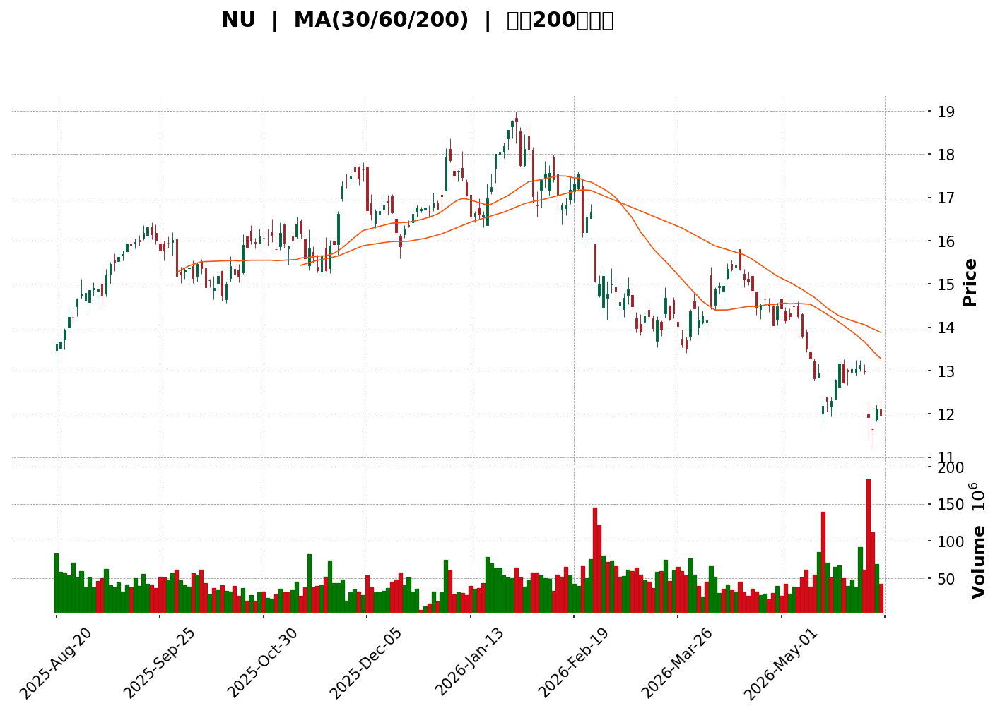
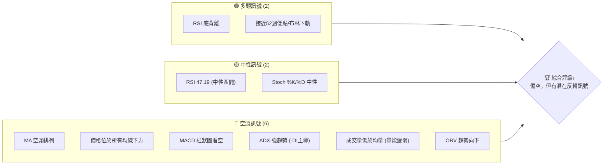
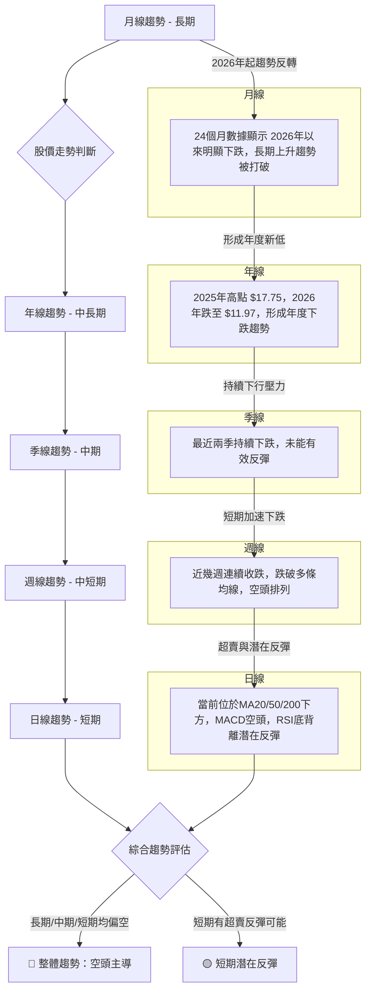
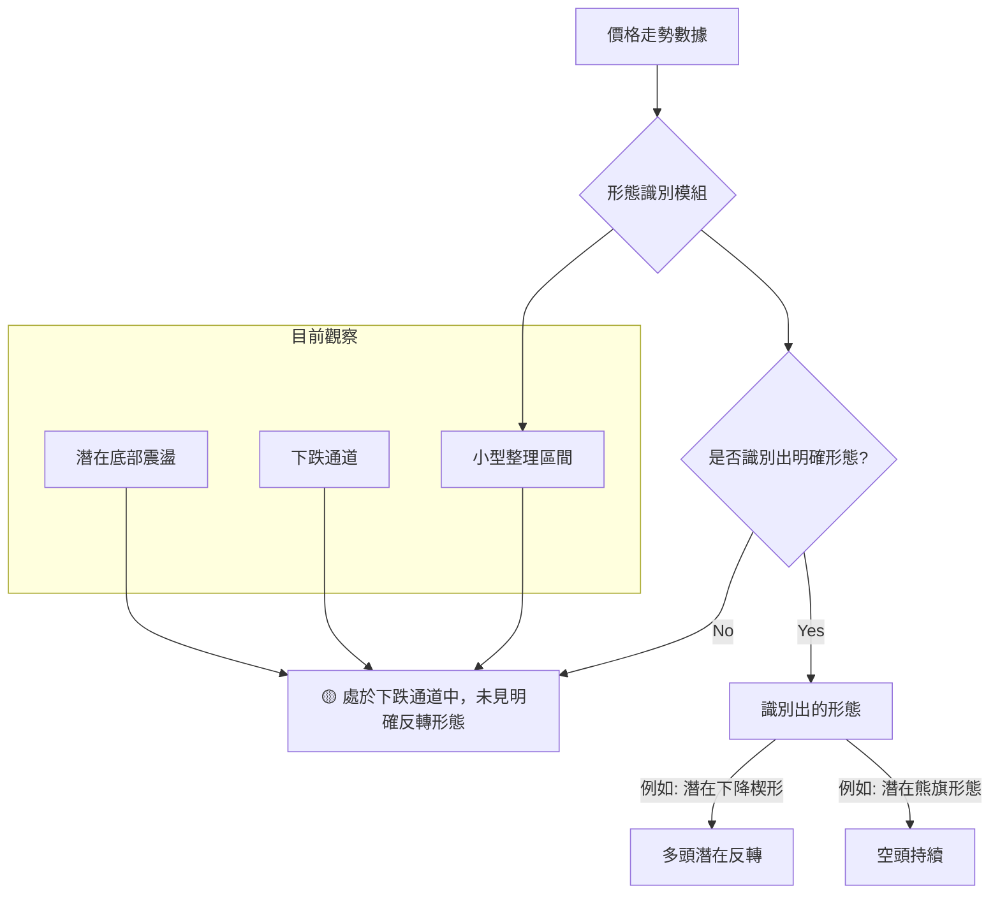
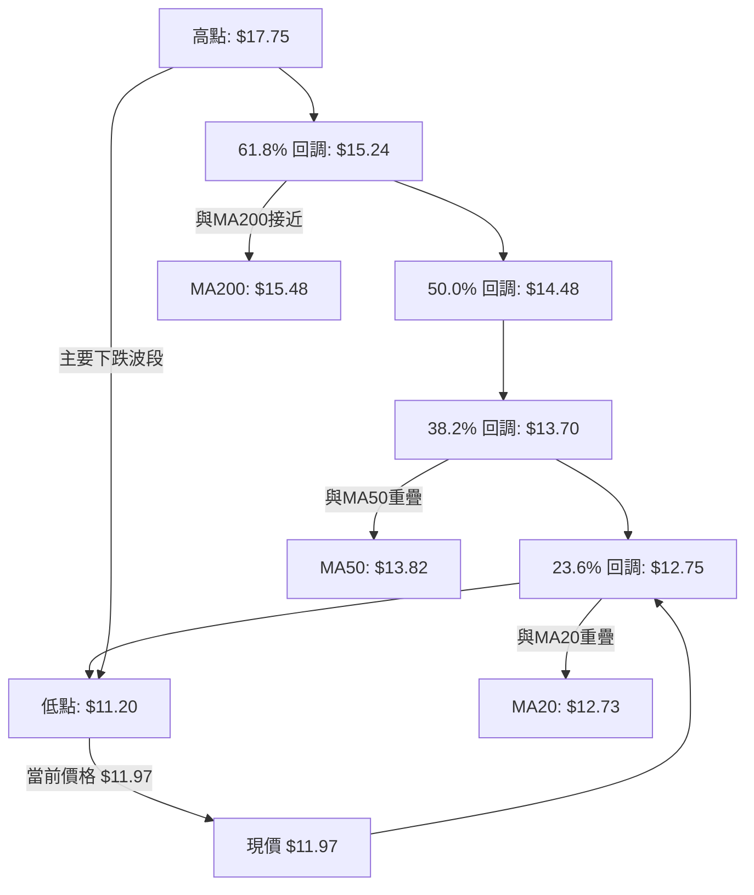
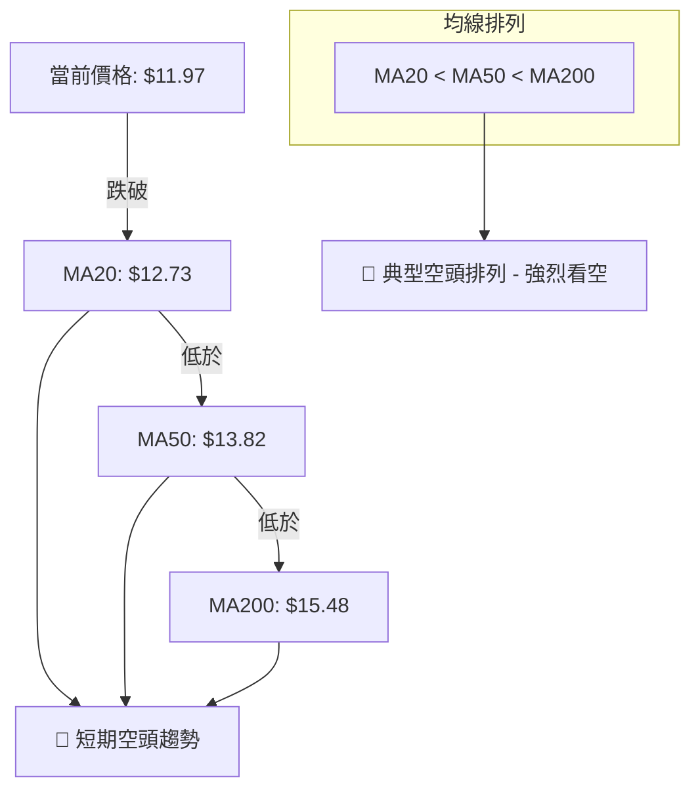
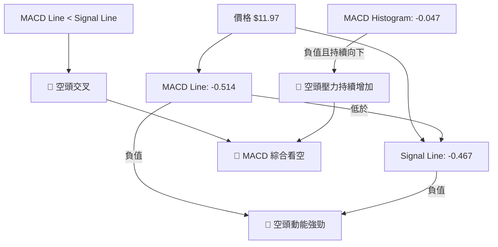
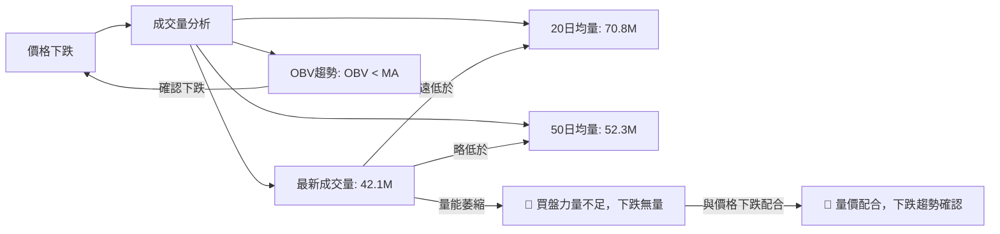

<details>
<summary>📊 靜態圖表 (點擊展開)</summary>

</details>

<html>
<head><meta charset="utf-8" /></head>
<body>
    <div style="height:500px; width:100%;">                        <script>window.PlotlyConfig = {MathJaxConfig: 'local'};</script>
        <script charset="utf-8" src="https://cdn.plot.ly/plotly-3.6.0.min.js" integrity="sha256-QaOVwtVY0T02VaHrr6pnoHLCwayMJp4O5n4YyaE3rJk=" crossorigin="anonymous"></script>                <div id="candlestick-chart" class="plotly-graph-div" style="height:100%; width:100%;"></div>            <script>                window.PLOTLYENV=window.PLOTLYENV || {};                                if (document.getElementById("candlestick-chart")) {                    Plotly.newPlot(                        "candlestick-chart",                        [{"close":{"dtype":"f8","bdata":"AAAAoHA9K0AAAABAClcrQAAAAKBH4StAAAAAgMJ1LEAAAABA4XosQAAAACCuRy1AAAAAgD2KLUAAAACgmZktQAAAAOBRuC1AAAAAwMzMLUAAAACgcL0tQAAAAEDhei1AAAAA4KNwLkAAAAAghesuQAAAAMAeBS9AAAAAoHA9L0AAAACgR2EvQAAAAIDr0S9AAAAAIK7HL0AAAAAghesvQAAAAEDh+i9AAAAAIIUrMEAAAADAzEwwQAAAAGBmJjBAAAAAYI8CMEAAAAAgXI8vQAAAACBcjy9AAAAAYGbmL0AAAABgjwIwQAAAAKBHYS5AAAAA4KNwLkAAAABguJ4uQAAAAGCPwi5AAAAAYI9CLkAAAAAghesuQAAAAKBwvS5AAAAAQArXLUAAAADA9SguQAAAAIDr0S1AAAAAAClcLkAAAACAwnUtQAAAAAAAAC5AAAAAgOvRLkAAAABA4XouQAAAAIDrUS5AAAAAwMzML0AAAACAFK4vQAAAAAAAADBAAAAAACncL0AAAABAChcwQAAAACBcDzBAAAAAACkcMEAAAACgRyEwQAAAAKCZmS9AAAAAIIUrMEAAAACgR+EvQAAAAKBwvS9AAAAAwB4FMEAAAAAA12MwQAAAAIAULjBAAAAAgBQuL0AAAAAA16MvQAAAAEAzMy9AAAAAANejLkAAAACA61EvQAAAAADXoy5AAAAAIK7HL0AAAABACtcvQAAAAAApnDBAAAAAAABAMUAAAAAA12MxQAAAAEDhejFAAAAAACmcMUAAAADgo3AxQAAAAGBmpjFAAAAAQDOzMEAAAABguJ4wQAAAAIAUrjBAAAAA4KOwMEAAAACA69EwQAAAAGBm5jBAAAAAYGamMEAAAABAMzMwQAAAAOBRuC9AAAAAwB5FMEAAAABAClcwQAAAAGC4njBAAAAAYI\u002fCMEAAAACgcL0wQAAAAGCPwjBAAAAAwPWoMEAAAACgR+EwQAAAAKBwvTBAAAAAwB4FMUAAAADgo\u002fAxQAAAAAAp3DFAAAAAAACAMUAAAAAAKZwxQAAAAIDCdTFAAAAAgD0KMUAAAAAgXI8wQAAAAADXozBAAAAAACmcMEAAAACgmZkwQAAAAOBR+DBAAAAAoHA9MUAAAAAAAAAyQAAAAIA9CjJAAAAAgBQuMkAAAADAzIwyQAAAAGCPwjJAAAAAYI\u002fCMkAAAAAAAMAxQAAAAAApHDJAAAAAYLgeMkAAAADAHgUxQAAAACBczzBAAAAAYGZmMUAAAADAzIwxQAAAAIDrkTFAAAAAwPVoMUAAAACAPQoxQAAAAIDr0TBAAAAAgOvRMEAAAAAghSsxQAAAAIDrUTFAAAAAIK6HMUAAAADgozAwQAAAACCuhzBAAAAAYGamMEAAAABguB4uQAAAAIDC9S1AAAAAoEdhLkAAAADAHoUtQAAAAAAAAC5AAAAAANejLUAAAADA9SgtQAAAAEAKVy1AAAAAYI\u002fCLUAAAABA4fosQAAAAOCj8CtAAAAAIK7HK0AAAACAPYosQAAAAAAAgCxAAAAA4KPwK0AAAACA61EsQAAAAKBH4StAAAAAAClcLUAAAACgR2EsQAAAAADXoyxAAAAAgD0KLEAAAABAMzMrQAAAAMAeBStAAAAAoHC9LEAAAACgR+EsQAAAAMDMTCxAAAAAwB6FLEAAAADAzEwsQAAAAMAeBS1AAAAAoHC9LUAAAAAghestQAAAAGBm5i1AAAAAQDOzLkAAAACAFK4uQAAAAAAp3C5AAAAAgBSuLkAAAABAMzMuQAAAAKCZGS5AAAAAQDOzLUAAAAAghessQAAAAMAeBS1AAAAAIK5HLUAAAAAAAAAtQAAAAOB6FCxAAAAAgML1LEAAAACgR+EsQAAAAIDrUSxAAAAAAACALEAAAACAwvUsQAAAAMAehSxAAAAAoJmZK0AAAAAAAAArQAAAAIA9iipAAAAAANejKUAAAAAAKdwpQAAAAKBHYShAAAAA4HqUKEAAAADgepQoQAAAAOB6lClAAAAAgOtRKkAAAACAwnUpQAAAAIDC9SlAAAAAIFwPKkAAAACgmRkqQAAAAGCPQipAAAAAQOH6KUAAAAAAKdwnQAAAACCuRydAAAAAoHA9KEAAAADgo\u002fAnQA=="},"high":{"dtype":"f8","bdata":"AAAAAACAK0AAAACgmZkrQAAAAIDC9StAAAAAYI8CLUAAAABAM7MsQAAAAEAKVy1AAAAAQOE6LkAAAAAA16MtQAAAAKBwvS1AAAAAgOsRLkAAAACgcP0tQAAAAKCZWS5AAAAA4KOwLkAAAADAHgUvQAAAACCFay9AAAAAoEehL0AAAACAPYovQAAAAKBHATBAAAAAgOsRMEAAAADAzAwwQAAAAKBHITBAAAAAoJlZMEAAAADAzEwwQAAAAMDMbDBAAAAAYLheMEAAAADgURgwQAAAAKBw\u002fS9AAAAAoJkZMEAAAADgozAwQAAAAMDMDDBAAAAAwMzMLkAAAAAAAMAuQAAAAEDh+i5AAAAA4HoUL0AAAAAAAAAvQAAAAMD1KC9AAAAAYGbmLkAAAACgcD0uQAAAAKBHYS5AAAAAAFaOLkAAAABguJ4uQAAAAGC4Hi5AAAAAIK5HL0AAAACAFC4vQAAAACCF6y5AAAAAANcjMEAAAACgRyEwQAAAAKCZWTBAAAAAgOsRMEAAAADAHkUwQAAAAKBwPTBAAAAAwB5FMEAAAAAAAIAwQAAAAKBwHTBAAAAAIIVrMEAAAABgZmYwQAAAAAAAwC9AAAAA4FE4MEAAAADAzIwwQAAAAAAAgDBAAAAAgOsxMEAAAABgj0IwQAAAAKBwvS9AAAAAoJlZL0AAAADgo3AvQAAAAEAzEzBAAAAAwB4FMEAAAAAgXA8wQAAAAMDMrDBAAAAAoEdhMUAAAACAFI4xQAAAACBcjzFAAAAAQArXMUAAAADgUbgxQAAAAOCj0DFAAAAAQOG6MUAAAABAMxMxQAAAAEDhujBAAAAAoJnZMEAAAAAAKRwxQAAAACBcDzFAAAAAgOsRMUAAAADAHoUwQAAAAMD1KDBAAAAA4CJbMEAAAADgUXgwQAAAAKBHoTBAAAAA4HrUMEAAAADA9cgwQAAAAGCPwjBAAAAAIFzPMEAAAABA4RoxQAAAAMDM7DBAAAAAIFwPMUAAAACAlSMyQAAAAGC4XjJAAAAAYI\u002fCMUAAAACAvp8xQAAAAIDrETJAAAAAIIVrMUAAAACA6xExQAAAAOCjsDBAAAAA4FH4MEAAAABgDq0wQAAAAOCjUDFAAAAAgD2KMUAAAAAAAAAyQAAAAOCjEDJAAAAAYI9CMkAAAAAgXI8yQAAAAMD1yDJAAAAAQOH6MkAAAABguJ4yQAAAAEAKdzJAAAAAYGamMkAAAACAPSoyQAAAAGCPIjFAAAAAIIVrMUAAAABACtcxQAAAAAApvDFAAAAAoHD9MUAAAADAzIwxQAAAAKBH4TBAAAAAAAAAMUAAAABA4XoxQAAAAOCjcDFAAAAAQAqXMUAAAADA9WgxQAAAAEAKlzBAAAAAoJnZMEAAAACgR+EvQAAAAGBmZi5AAAAAQIusLkAAAABguB4uQAAAAIDCtS5AAAAAwMxMLkAAAABAM3MtQAAAAIDrkS1AAAAAgD1KLkAAAACgR+EtQAAAAEAzsyxAAAAAYLieLEAAAACgcL0sQAAAAOB6FC1AAAAAwMyMLEAAAAAAAIAsQAAAAMDMTCxAAAAAQArXLUAAAADAHgUtQAAAAKBHYS1AAAAAYGamLEAAAABgZuYrQAAAAIDrkStAAAAAgOvRLEAAAACgmZktQAAAAIDC9SxAAAAAIK7HLEAAAACA61EsQAAAAMBJzC5AAAAAACncLUAAAADgehQuQAAAACBcDy5AAAAA4KPwLkAAAABguB4vQAAAAKBHIS9AAAAAYLieL0AAAABAM7MuQAAAACBcjy5AAAAA4KNwLkAAAAAA16MtQAAAAOB6FC1AAAAAIIWrLUAAAABAClctQAAAAMAeBS1AAAAAYLgeLUAAAACA61EtQAAAAOCj8CxAAAAAoEfhLEAAAACgmRktQAAAAEAzMy1AAAAAwPWoLEAAAADA9egrQAAAAAApHCtAAAAAgD2KKkAAAABAClcqQAAAACBczyhAAAAAwMzMKEAAAADAzMwoQAAAAKCZmSlAAAAAoJmZKkAAAADAHoUqQAAAAKBHISpAAAAAAClcKkAAAABA4XoqQAAAAAAAgCpAAAAAwMxMKkAAAAAghWsoQAAAAEDheidAAAAAgBRuKEAAAABAM7MoQA=="},"hovertemplate":"\u003cb\u003e%{x|%Y-%m-%d}\u003c\u002fb\u003e\u003cbr\u003e\u958b: $%{open:.2f}\u003cbr\u003e\u9ad8: $%{high:.2f}\u003cbr\u003e\u4f4e: $%{low:.2f}\u003cbr\u003e\u6536: $%{close:.2f}\u003cextra\u003e\u003c\u002fextra\u003e","low":{"dtype":"f8","bdata":"AAAAIK5HKkAAAACgR+EqQAAAAEDh+ipAAAAAYLjeK0AAAAAgWiQsQAAAAGCPgixAAAAAgOtRLUAAAACAFC4tQAAAAIAUrixAAAAAgMJ1LUAAAACAwvUsQAAAAIA9Ci1AAAAAIIVrLUAAAABgjwIuQAAAAKCZmS5AAAAAgML1LkAAAADgehQvQAAAAMD1aC9AAAAAgOtRL0AAAABgZqYvQAAAAMAexS9AAAAAwB4FMEAAAACAwvUvQAAAACCuBzBAAAAAoPHSL0AAAACAwnUvQAAAAKCZGS9AAAAAwPWoL0AAAADAzEwvQAAAAIDrUS5AAAAAgD0KLkAAAADgUTguQAAAAAAAQC5AAAAAgD0KLkAAAACgmRkuQAAAAIDCdS5AAAAAYI\u002fCLUAAAABACtctQAAAACCuRy1AAAAA4FG4LUAAAABAXjotQAAAAGC4Hi1AAAAAYLgeLkAAAAAgXE8uQAAAAIDrES5AAAAAgMJ1LkAAAAAgBJYvQAAAAEAK1y9AAAAAANejL0AAAAAAKdwvQAAAAADXAzBAAAAAYI\u002fCL0AAAACAFO4vQAAAAGBmZi9AAAAA4HqUL0AAAACAFK4vQAAAAGBm5i5AAAAAwMzML0AAAADAzAwwQAAAACCFCzBAAAAA4FH4LkAAAAAA16MuQAAAAAAAAC9AAAAAwB6FLkAAAACgR2EuQAAAAKCZmS5AAAAAYI+CLkAAAAAgXI8vQAAAAAApXC9AAAAAwPXoMEAAAABAMzMxQAAAACCuRzFAAAAAQOF6MUAAAACAPUoxQAAAAAApXDFAAAAAoJmZMEAAAADgUXgwQAAAAAACSzBAAAAAQAp3MEAAAABAM7MwQAAAAKCZmTBAAAAAoEehMEAAAACAFC4wQAAAAIAULi9AAAAAwCAQMEAAAABAYlAwQAAAAKCZWTBAAAAAIFyPMEAAAABgZqYwQAAAAAApnDBAAAAAgD2KMEAAAACAFK4wQAAAAIDCtTBAAAAAYGamMEAAAACAPSoxQAAAACBczzFAAAAAIK5nMUAAAABguF4xQAAAAADXYzFAAAAAwB4FMUAAAACAPWowQAAAAMDMbDBAAAAAgEGAMEAAAACAFE4wQAAAAKCZWTBAAAAAgOsRMUAAAADgelQxQAAAAIDCtTFAAAAAYGbmMUAAAACgmRkyQAAAAAApXDJAAAAAoHA9MkAAAACAwrUxQAAAAIDCtTFAAAAAQArXMUAAAAAAAOAwQAAAAMDMjDBAAAAAYI\u002fCMEAAAABACjcxQAAAAIA9CjFAAAAAoJlZMUAAAACAwrUwQAAAAGC4XjBAAAAAQAqXMEAAAABACtcwQAAAAMAe5TBAAAAAIIUrMUAAAADgehQwQAAAAKBwvS9AAAAAANeDMEAAAADgehQuQAAAAGBmZi1AAAAAYLieLEAAAABAClcsQAAAAKCZmS1AAAAA4FE4LUAAAADgUXgsQAAAAIDCdSxAAAAAIFwPLUAAAABgj8IsQAAAAGCPwitAAAAAoEehK0AAAABguB4sQAAAAOBReCxAAAAA4HrUK0AAAAAgXA8rQAAAAOB6lCtAAAAA4KNwLEAAAACA61EsQAAAACCFayxAAAAAACncK0AAAADgehQrQAAAAIDr0SpAAAAAYGZmK0AAAAAAKdwsQAAAAAACqytAAAAAwPUoLEAAAACAFK4rQAAAAIDr0SxAAAAAwMzMLEAAAAAgXI8tQAAAAEAzMy1AAAAAoHA9LkAAAACgmZkuQAAAAOB6lC5AAAAAYLieLkAAAAAAKdwtQAAAAOCj8C1AAAAAQApXLUAAAACA65EsQAAAAKBHYSxAAAAAoJkZLUAAAACAwrUsQAAAAOB6FCxAAAAAoJkZLEAAAABgj8IsQAAAAIAULixAAAAAQApXLEAAAACgcH0sQAAAAMD1aCxAAAAAAACAK0AAAABACtcqQAAAAMAehSpAAAAAIK6HKUAAAACAFK4pQAAAACBcjydAAAAAYLgeKEAAAAAghesnQAAAAMD1qChAAAAAYLgeKUAAAAAghWspQAAAAMDMTClAAAAAACncKUAAAAAgrscpQAAAAEDh+ilAAAAAgOvRKUAAAACgR+EmQAAAAGBmZiZAAAAAANejJ0AAAABguN4nQA=="},"name":"\u50f9\u683c","open":{"dtype":"f8","bdata":"AAAAgBTuKkAAAACAPQorQAAAAOCjcCtAAAAAAAAALEAAAABA4XosQAAAAIDC9SxAAAAAAACALUAAAADgUTgtQAAAAMD1KC1AAAAAoHC9LUAAAACAFK4tQAAAAMAeBS5AAAAAIFyPLUAAAACAwnUuQAAAAKCZGS9AAAAAIFwPL0AAAAAAKVwvQAAAAAAAgC9AAAAAoEfhL0AAAABgZuYvQAAAAGCPAjBAAAAAgOsRMEAAAAAAKRwwQAAAAMDMTDBAAAAAgBQuMEAAAAAAKdwvQAAAAAAp3C9AAAAAYGbmL0AAAAAghesvQAAAAMDMDDBAAAAAgD2KLkAAAAAgXI8uQAAAAKBwvS5AAAAAgOvRLkAAAAAAKVwuQAAAACBcDy9AAAAA4FG4LkAAAADA9SguQAAAAEAzsy1AAAAAAAAALkAAAADgepQuQAAAACCuRy1AAAAAYI9CLkAAAABAM7MuQAAAAADXoy5AAAAAwB6FLkAAAABAChcwQAAAAEDhOjBAAAAAIIXrL0AAAABgZuYvQAAAAIDrETBAAAAAACkcMEAAAADgozAwQAAAAKCZmS9AAAAA4FG4L0AAAABguF4wQAAAAADXoy9AAAAAoJkZMEAAAABAChcwQAAAAIDCdTBAAAAAgD0KMEAAAAAAKdwuQAAAAOBReC9AAAAAwMzMLkAAAADAzIwuQAAAAIAUri9AAAAAgMK1LkAAAAAAAAAwQAAAAEAK1y9AAAAAQOH6MEAAAAAA12MxQAAAAIAUbjFAAAAAgMK1MUAAAABAM7MxQAAAAGBmpjFAAAAAQDOzMUAAAABguN4wQAAAAMAeZTBAAAAAoJmZMEAAAABA4bowQAAAACCu5zBAAAAAYGYGMUAAAAAAAIAwQAAAAEAKFzBAAAAAYGYmMEAAAACgmVkwQAAAACCFazBAAAAA4KOwMEAAAABAM7MwQAAAAKBwvTBAAAAAgD2qMEAAAADAHsUwQAAAAGC43jBAAAAAIFwPMUAAAACAFC4xQAAAAGC4HjJAAAAAYLieMUAAAABACpcxQAAAAIAUrjFAAAAAoJlZMUAAAAAgXA8xQAAAAOCjkDBAAAAAAADAMEAAAACA65EwQAAAAAApXDBAAAAAYI8iMUAAAACAPaoxQAAAAAAAADJAAAAAwMwMMkAAAAAAKVwyQAAAAGCPojJAAAAA4HrUMkAAAAAgrocyQAAAAKBwvTFAAAAAIK5nMkAAAADgehQyQAAAAOB61DBAAAAAIIUrMUAAAADgo3AxQAAAAGBmJjFAAAAAgOvxMUAAAADA9YgxQAAAAKBwvTBAAAAAAADAMEAAAABAM\u002fMwQAAAAADXIzFAAAAAQDMzMUAAAAAAAEAxQAAAAOCjMDBAAAAAANeDMEAAAABACtcvQAAAAOCjcC1AAAAAIIXrLEAAAAAAKVwtQAAAAKBw\u002fS1AAAAAACncLUAAAABgjwItQAAAAIDr0SxAAAAAQOF6LUAAAAAAAIAtQAAAAGBmZixAAAAAANcjLEAAAACgcD0sQAAAAMDMzCxAAAAA4KNwLEAAAAAAKVwrQAAAAKBwPSxAAAAAoEehLEAAAADgUfgsQAAAAGCPQi1AAAAAYI9CLEAAAACAwnUrQAAAACCFaytAAAAAoJmZK0AAAACAFC4tQAAAAAAAACxAAAAAYI9CLEAAAABAMzMsQAAAACCFay5AAAAAwB4FLUAAAAAAKdwtQAAAAIAUri1AAAAAYI9CLkAAAAAghesuQAAAACCuxy5AAAAAYLieL0AAAABA4XouQAAAAOBROC5AAAAAAClcLkAAAABguJ4tQAAAAEAK1yxAAAAAIK5HLUAAAADgehQtQAAAAIDC9SxAAAAA4HpULEAAAACA61EtQAAAACCuxyxAAAAAANejLEAAAAAAAAAtQAAAAAAAAC1AAAAAoJmZLEAAAABgj8IrQAAAAEAK1ypAAAAAIIVrKkAAAABAM7MpQAAAAECJAShAAAAAwMzMKEAAAADgelQoQAAAAIAUrihAAAAA4FE4KUAAAADAzEwqQAAAACCuBypAAAAAIIXrKUAAAADgo\u002fApQAAAAKCZGSpAAAAAAAAAKkAAAABA4fonQAAAAMDMTCdAAAAAYI\u002fCJ0AAAABAMzMoQA=="},"x":["2025-08-20T00:00:00-04:00","2025-08-21T00:00:00-04:00","2025-08-22T00:00:00-04:00","2025-08-25T00:00:00-04:00","2025-08-26T00:00:00-04:00","2025-08-27T00:00:00-04:00","2025-08-28T00:00:00-04:00","2025-08-29T00:00:00-04:00","2025-09-02T00:00:00-04:00","2025-09-03T00:00:00-04:00","2025-09-04T00:00:00-04:00","2025-09-05T00:00:00-04:00","2025-09-08T00:00:00-04:00","2025-09-09T00:00:00-04:00","2025-09-10T00:00:00-04:00","2025-09-11T00:00:00-04:00","2025-09-12T00:00:00-04:00","2025-09-15T00:00:00-04:00","2025-09-16T00:00:00-04:00","2025-09-17T00:00:00-04:00","2025-09-18T00:00:00-04:00","2025-09-19T00:00:00-04:00","2025-09-22T00:00:00-04:00","2025-09-23T00:00:00-04:00","2025-09-24T00:00:00-04:00","2025-09-25T00:00:00-04:00","2025-09-26T00:00:00-04:00","2025-09-29T00:00:00-04:00","2025-09-30T00:00:00-04:00","2025-10-01T00:00:00-04:00","2025-10-02T00:00:00-04:00","2025-10-03T00:00:00-04:00","2025-10-06T00:00:00-04:00","2025-10-07T00:00:00-04:00","2025-10-08T00:00:00-04:00","2025-10-09T00:00:00-04:00","2025-10-10T00:00:00-04:00","2025-10-13T00:00:00-04:00","2025-10-14T00:00:00-04:00","2025-10-15T00:00:00-04:00","2025-10-16T00:00:00-04:00","2025-10-17T00:00:00-04:00","2025-10-20T00:00:00-04:00","2025-10-21T00:00:00-04:00","2025-10-22T00:00:00-04:00","2025-10-23T00:00:00-04:00","2025-10-24T00:00:00-04:00","2025-10-27T00:00:00-04:00","2025-10-28T00:00:00-04:00","2025-10-29T00:00:00-04:00","2025-10-30T00:00:00-04:00","2025-10-31T00:00:00-04:00","2025-11-03T00:00:00-05:00","2025-11-04T00:00:00-05:00","2025-11-05T00:00:00-05:00","2025-11-06T00:00:00-05:00","2025-11-07T00:00:00-05:00","2025-11-10T00:00:00-05:00","2025-11-11T00:00:00-05:00","2025-11-12T00:00:00-05:00","2025-11-13T00:00:00-05:00","2025-11-14T00:00:00-05:00","2025-11-17T00:00:00-05:00","2025-11-18T00:00:00-05:00","2025-11-19T00:00:00-05:00","2025-11-20T00:00:00-05:00","2025-11-21T00:00:00-05:00","2025-11-24T00:00:00-05:00","2025-11-25T00:00:00-05:00","2025-11-26T00:00:00-05:00","2025-11-28T00:00:00-05:00","2025-12-01T00:00:00-05:00","2025-12-02T00:00:00-05:00","2025-12-03T00:00:00-05:00","2025-12-04T00:00:00-05:00","2025-12-05T00:00:00-05:00","2025-12-08T00:00:00-05:00","2025-12-09T00:00:00-05:00","2025-12-10T00:00:00-05:00","2025-12-11T00:00:00-05:00","2025-12-12T00:00:00-05:00","2025-12-15T00:00:00-05:00","2025-12-16T00:00:00-05:00","2025-12-17T00:00:00-05:00","2025-12-18T00:00:00-05:00","2025-12-19T00:00:00-05:00","2025-12-22T00:00:00-05:00","2025-12-23T00:00:00-05:00","2025-12-24T00:00:00-05:00","2025-12-26T00:00:00-05:00","2025-12-29T00:00:00-05:00","2025-12-30T00:00:00-05:00","2025-12-31T00:00:00-05:00","2026-01-02T00:00:00-05:00","2026-01-05T00:00:00-05:00","2026-01-06T00:00:00-05:00","2026-01-07T00:00:00-05:00","2026-01-08T00:00:00-05:00","2026-01-09T00:00:00-05:00","2026-01-12T00:00:00-05:00","2026-01-13T00:00:00-05:00","2026-01-14T00:00:00-05:00","2026-01-15T00:00:00-05:00","2026-01-16T00:00:00-05:00","2026-01-20T00:00:00-05:00","2026-01-21T00:00:00-05:00","2026-01-22T00:00:00-05:00","2026-01-23T00:00:00-05:00","2026-01-26T00:00:00-05:00","2026-01-27T00:00:00-05:00","2026-01-28T00:00:00-05:00","2026-01-29T00:00:00-05:00","2026-01-30T00:00:00-05:00","2026-02-02T00:00:00-05:00","2026-02-03T00:00:00-05:00","2026-02-04T00:00:00-05:00","2026-02-05T00:00:00-05:00","2026-02-06T00:00:00-05:00","2026-02-09T00:00:00-05:00","2026-02-10T00:00:00-05:00","2026-02-11T00:00:00-05:00","2026-02-12T00:00:00-05:00","2026-02-13T00:00:00-05:00","2026-02-17T00:00:00-05:00","2026-02-18T00:00:00-05:00","2026-02-19T00:00:00-05:00","2026-02-20T00:00:00-05:00","2026-02-23T00:00:00-05:00","2026-02-24T00:00:00-05:00","2026-02-25T00:00:00-05:00","2026-02-26T00:00:00-05:00","2026-02-27T00:00:00-05:00","2026-03-02T00:00:00-05:00","2026-03-03T00:00:00-05:00","2026-03-04T00:00:00-05:00","2026-03-05T00:00:00-05:00","2026-03-06T00:00:00-05:00","2026-03-09T00:00:00-04:00","2026-03-10T00:00:00-04:00","2026-03-11T00:00:00-04:00","2026-03-12T00:00:00-04:00","2026-03-13T00:00:00-04:00","2026-03-16T00:00:00-04:00","2026-03-17T00:00:00-04:00","2026-03-18T00:00:00-04:00","2026-03-19T00:00:00-04:00","2026-03-20T00:00:00-04:00","2026-03-23T00:00:00-04:00","2026-03-24T00:00:00-04:00","2026-03-25T00:00:00-04:00","2026-03-26T00:00:00-04:00","2026-03-27T00:00:00-04:00","2026-03-30T00:00:00-04:00","2026-03-31T00:00:00-04:00","2026-04-01T00:00:00-04:00","2026-04-02T00:00:00-04:00","2026-04-06T00:00:00-04:00","2026-04-07T00:00:00-04:00","2026-04-08T00:00:00-04:00","2026-04-09T00:00:00-04:00","2026-04-10T00:00:00-04:00","2026-04-13T00:00:00-04:00","2026-04-14T00:00:00-04:00","2026-04-15T00:00:00-04:00","2026-04-16T00:00:00-04:00","2026-04-17T00:00:00-04:00","2026-04-20T00:00:00-04:00","2026-04-21T00:00:00-04:00","2026-04-22T00:00:00-04:00","2026-04-23T00:00:00-04:00","2026-04-24T00:00:00-04:00","2026-04-27T00:00:00-04:00","2026-04-28T00:00:00-04:00","2026-04-29T00:00:00-04:00","2026-04-30T00:00:00-04:00","2026-05-01T00:00:00-04:00","2026-05-04T00:00:00-04:00","2026-05-05T00:00:00-04:00","2026-05-06T00:00:00-04:00","2026-05-07T00:00:00-04:00","2026-05-08T00:00:00-04:00","2026-05-11T00:00:00-04:00","2026-05-12T00:00:00-04:00","2026-05-13T00:00:00-04:00","2026-05-14T00:00:00-04:00","2026-05-15T00:00:00-04:00","2026-05-18T00:00:00-04:00","2026-05-19T00:00:00-04:00","2026-05-20T00:00:00-04:00","2026-05-21T00:00:00-04:00","2026-05-22T00:00:00-04:00","2026-05-26T00:00:00-04:00","2026-05-27T00:00:00-04:00","2026-05-28T00:00:00-04:00","2026-05-29T00:00:00-04:00","2026-06-01T00:00:00-04:00","2026-06-02T00:00:00-04:00","2026-06-03T00:00:00-04:00","2026-06-04T00:00:00-04:00","2026-06-05T00:00:00-04:00"],"type":"candlestick"},{"hovertemplate":"MA30: $%{y:.2f}\u003cextra\u003e\u003c\u002fextra\u003e","line":{"color":"#2196F3","dash":"dash","width":2},"mode":"lines","name":"MA30","x":["2025-08-20T00:00:00-04:00","2025-08-21T00:00:00-04:00","2025-08-22T00:00:00-04:00","2025-08-25T00:00:00-04:00","2025-08-26T00:00:00-04:00","2025-08-27T00:00:00-04:00","2025-08-28T00:00:00-04:00","2025-08-29T00:00:00-04:00","2025-09-02T00:00:00-04:00","2025-09-03T00:00:00-04:00","2025-09-04T00:00:00-04:00","2025-09-05T00:00:00-04:00","2025-09-08T00:00:00-04:00","2025-09-09T00:00:00-04:00","2025-09-10T00:00:00-04:00","2025-09-11T00:00:00-04:00","2025-09-12T00:00:00-04:00","2025-09-15T00:00:00-04:00","2025-09-16T00:00:00-04:00","2025-09-17T00:00:00-04:00","2025-09-18T00:00:00-04:00","2025-09-19T00:00:00-04:00","2025-09-22T00:00:00-04:00","2025-09-23T00:00:00-04:00","2025-09-24T00:00:00-04:00","2025-09-25T00:00:00-04:00","2025-09-26T00:00:00-04:00","2025-09-29T00:00:00-04:00","2025-09-30T00:00:00-04:00","2025-10-01T00:00:00-04:00","2025-10-02T00:00:00-04:00","2025-10-03T00:00:00-04:00","2025-10-06T00:00:00-04:00","2025-10-07T00:00:00-04:00","2025-10-08T00:00:00-04:00","2025-10-09T00:00:00-04:00","2025-10-10T00:00:00-04:00","2025-10-13T00:00:00-04:00","2025-10-14T00:00:00-04:00","2025-10-15T00:00:00-04:00","2025-10-16T00:00:00-04:00","2025-10-17T00:00:00-04:00","2025-10-20T00:00:00-04:00","2025-10-21T00:00:00-04:00","2025-10-22T00:00:00-04:00","2025-10-23T00:00:00-04:00","2025-10-24T00:00:00-04:00","2025-10-27T00:00:00-04:00","2025-10-28T00:00:00-04:00","2025-10-29T00:00:00-04:00","2025-10-30T00:00:00-04:00","2025-10-31T00:00:00-04:00","2025-11-03T00:00:00-05:00","2025-11-04T00:00:00-05:00","2025-11-05T00:00:00-05:00","2025-11-06T00:00:00-05:00","2025-11-07T00:00:00-05:00","2025-11-10T00:00:00-05:00","2025-11-11T00:00:00-05:00","2025-11-12T00:00:00-05:00","2025-11-13T00:00:00-05:00","2025-11-14T00:00:00-05:00","2025-11-17T00:00:00-05:00","2025-11-18T00:00:00-05:00","2025-11-19T00:00:00-05:00","2025-11-20T00:00:00-05:00","2025-11-21T00:00:00-05:00","2025-11-24T00:00:00-05:00","2025-11-25T00:00:00-05:00","2025-11-26T00:00:00-05:00","2025-11-28T00:00:00-05:00","2025-12-01T00:00:00-05:00","2025-12-02T00:00:00-05:00","2025-12-03T00:00:00-05:00","2025-12-04T00:00:00-05:00","2025-12-05T00:00:00-05:00","2025-12-08T00:00:00-05:00","2025-12-09T00:00:00-05:00","2025-12-10T00:00:00-05:00","2025-12-11T00:00:00-05:00","2025-12-12T00:00:00-05:00","2025-12-15T00:00:00-05:00","2025-12-16T00:00:00-05:00","2025-12-17T00:00:00-05:00","2025-12-18T00:00:00-05:00","2025-12-19T00:00:00-05:00","2025-12-22T00:00:00-05:00","2025-12-23T00:00:00-05:00","2025-12-24T00:00:00-05:00","2025-12-26T00:00:00-05:00","2025-12-29T00:00:00-05:00","2025-12-30T00:00:00-05:00","2025-12-31T00:00:00-05:00","2026-01-02T00:00:00-05:00","2026-01-05T00:00:00-05:00","2026-01-06T00:00:00-05:00","2026-01-07T00:00:00-05:00","2026-01-08T00:00:00-05:00","2026-01-09T00:00:00-05:00","2026-01-12T00:00:00-05:00","2026-01-13T00:00:00-05:00","2026-01-14T00:00:00-05:00","2026-01-15T00:00:00-05:00","2026-01-16T00:00:00-05:00","2026-01-20T00:00:00-05:00","2026-01-21T00:00:00-05:00","2026-01-22T00:00:00-05:00","2026-01-23T00:00:00-05:00","2026-01-26T00:00:00-05:00","2026-01-27T00:00:00-05:00","2026-01-28T00:00:00-05:00","2026-01-29T00:00:00-05:00","2026-01-30T00:00:00-05:00","2026-02-02T00:00:00-05:00","2026-02-03T00:00:00-05:00","2026-02-04T00:00:00-05:00","2026-02-05T00:00:00-05:00","2026-02-06T00:00:00-05:00","2026-02-09T00:00:00-05:00","2026-02-10T00:00:00-05:00","2026-02-11T00:00:00-05:00","2026-02-12T00:00:00-05:00","2026-02-13T00:00:00-05:00","2026-02-17T00:00:00-05:00","2026-02-18T00:00:00-05:00","2026-02-19T00:00:00-05:00","2026-02-20T00:00:00-05:00","2026-02-23T00:00:00-05:00","2026-02-24T00:00:00-05:00","2026-02-25T00:00:00-05:00","2026-02-26T00:00:00-05:00","2026-02-27T00:00:00-05:00","2026-03-02T00:00:00-05:00","2026-03-03T00:00:00-05:00","2026-03-04T00:00:00-05:00","2026-03-05T00:00:00-05:00","2026-03-06T00:00:00-05:00","2026-03-09T00:00:00-04:00","2026-03-10T00:00:00-04:00","2026-03-11T00:00:00-04:00","2026-03-12T00:00:00-04:00","2026-03-13T00:00:00-04:00","2026-03-16T00:00:00-04:00","2026-03-17T00:00:00-04:00","2026-03-18T00:00:00-04:00","2026-03-19T00:00:00-04:00","2026-03-20T00:00:00-04:00","2026-03-23T00:00:00-04:00","2026-03-24T00:00:00-04:00","2026-03-25T00:00:00-04:00","2026-03-26T00:00:00-04:00","2026-03-27T00:00:00-04:00","2026-03-30T00:00:00-04:00","2026-03-31T00:00:00-04:00","2026-04-01T00:00:00-04:00","2026-04-02T00:00:00-04:00","2026-04-06T00:00:00-04:00","2026-04-07T00:00:00-04:00","2026-04-08T00:00:00-04:00","2026-04-09T00:00:00-04:00","2026-04-10T00:00:00-04:00","2026-04-13T00:00:00-04:00","2026-04-14T00:00:00-04:00","2026-04-15T00:00:00-04:00","2026-04-16T00:00:00-04:00","2026-04-17T00:00:00-04:00","2026-04-20T00:00:00-04:00","2026-04-21T00:00:00-04:00","2026-04-22T00:00:00-04:00","2026-04-23T00:00:00-04:00","2026-04-24T00:00:00-04:00","2026-04-27T00:00:00-04:00","2026-04-28T00:00:00-04:00","2026-04-29T00:00:00-04:00","2026-04-30T00:00:00-04:00","2026-05-01T00:00:00-04:00","2026-05-04T00:00:00-04:00","2026-05-05T00:00:00-04:00","2026-05-06T00:00:00-04:00","2026-05-07T00:00:00-04:00","2026-05-08T00:00:00-04:00","2026-05-11T00:00:00-04:00","2026-05-12T00:00:00-04:00","2026-05-13T00:00:00-04:00","2026-05-14T00:00:00-04:00","2026-05-15T00:00:00-04:00","2026-05-18T00:00:00-04:00","2026-05-19T00:00:00-04:00","2026-05-20T00:00:00-04:00","2026-05-21T00:00:00-04:00","2026-05-22T00:00:00-04:00","2026-05-26T00:00:00-04:00","2026-05-27T00:00:00-04:00","2026-05-28T00:00:00-04:00","2026-05-29T00:00:00-04:00","2026-06-01T00:00:00-04:00","2026-06-02T00:00:00-04:00","2026-06-03T00:00:00-04:00","2026-06-04T00:00:00-04:00","2026-06-05T00:00:00-04:00"],"y":{"dtype":"f8","bdata":"AAAAAAAA+H8AAAAAAAD4fwAAAAAAAPh\u002fAAAAAAAA+H8AAAAAAAD4fwAAAAAAAPh\u002fAAAAAAAA+H8AAAAAAAD4fwAAAAAAAPh\u002fAAAAAAAA+H8AAAAAAAD4fwAAAAAAAPh\u002fAAAAAAAA+H8AAAAAAAD4fwAAAAAAAPh\u002fAAAAAAAA+H8AAAAAAAD4fwAAAAAAAPh\u002fAAAAAAAA+H8AAAAAAAD4fwAAAAAAAPh\u002fAAAAAAAA+H8AAAAAAAD4fwAAAAAAAPh\u002fAAAAAAAA+H8AAAAAAAD4fwAAAAAAAPh\u002fAAAAAAAA+H8AAAAAAAD4f6uqqopQhi5AzczMDJ+hLkAiIiJSnL0uQHd3d8cv1i5AERER8YvlLkBEREQ0XvouQO\u002fu7p7TBi9Aq6qq+mIJL0ARERFRKg4vQFVVVcUEDy9AzczMHMwTL0ARERFxaBEvQGZmZmbYFS9AVVVVhRYZL0AzMzNTVRUvQGZmZiZcDy9AzczMfCMUL0CamZnZshYvQBERERE8GC9ARERE1OoYL0Dv7u7OIhsvQERERKRUHC9AAAAAgE4bL0AiIiLCZxgvQGZmZpZuEi9AMzMzoykVL0AAAACw5BcvQHd3d+dtGS9A3t3dvZ8aL0C8u7v7GyEvQM3MzFwBMi9Aq6qq6lE4L0AzMzMjBkEvQFVVVVXHRC9AREREdAVIL0BEREREb0svQAAAANCUSi9A7+7uziJbL0AzMzPTeGkvQN7d3T18hi9AVVVVNdCpL0DNzMzsNdcvQKuqqprEADBARERElIoTMEDe3d2NUCYwQKuqqgqQOzBAvLu7q2NCMEC8u7ubC0kwQHd3dxfZTjBAZmZmVlVVMEC8u7sLkFswQN7d3Q27YjBAMzMzs1ZnMEDv7u6e72cwQBEREbFyaDBAVVVVJU1pMEDe3d31tmwwQM3MzFwdczBAq6qq6m15MEARERGBanwwQImIiIhdgTBAvLu7+36KMEBmZmaWipMwQERERPREnTBAmpmZqcarMEBmZmZmO78wQN7d3R3o1DBA7+7uNqXiMEC8u7sTEfEwQFVVVe1R+DBAVVVVLYf2MEC8u7sDcu8wQJqZmQFH6DBAEREReb7fMEDv7u52k9gwQDMzM\u002fvF0jBAiYiIoGHXMEAAAABIKOMwQHd3dz\u002fD7jBAvLu7M3r7MECamZlxPQoxQFVVVa0cGjFAMzMzCx4sMUCamZkRWDkxQFVVVUWLTDFAiYiIqFRcMUBEREQkImIxQDMzMzPBYzFAzczMTDdpMUBVVVXFIHAxQN7d3T0KdzFAREREpHB9MUC8u7srzn4xQO\u002fu7u58fzFAZmZmBsh9MUDv7u7uNXcxQImIiEiacjFAIiIi0ttyMUCJiIjIvWYxQLy7uyvOXjFAMzMzM3pbMUDv7u5mrU4xQLy7uxODQDFAmpmZCWU0MUDv7u5+sSQxQHd3d\u002ffhEzFAVVVVZTv\u002fMECrqqpKDOIwQJqZmWlKxTBAvLu7cyGpMEB3d3c\u002ffIYwQFVVVVWcXTBAAAAAqA00MEAzMzN7WxYwQM3MzFzW6i9AvLu7uwKkL0AzMzMzM3MvQKuqqvo3Qi9A7+7uHswTL0Dv7u4OdNouQHd3d5f8oi5AVVVVdSFpLkDe3d3day4uQCIiIkLu9S1AvLu7Cx7MLUDe3d19hp0tQM3MzIxsZy1AMzMzs50vLUDNzMzMzAwtQImIiEhT6ixAiYiIWPLLLEAAAABwPcosQN7d3V26ySxAvLu7a3XMLECrqqp6W9YsQN7d3S2y3SxAiYiIGJLmLEAzMzMDcu8sQCIiIkLu9SxAAAAAMGv1LEDe3d0d6PQsQJqZmWkf\u002fixAZmZmNuwKLUCJiIgY2Q4tQHd3d5dDCy1AAAAA0PcTLUBmZmYmvxgtQImIiFiAHC1AVVVVpSkVLUDNzMysHBotQImIiIgWGS1AZmZmVlUVLUDe3d1toBMtQKuqqtqHDy1AzczMzBP1LEAzMzODTtssQERERCTbuSxAREREFDyYLEDe3d2dfXgsQCIiItIiWyxAd3d3t\u002fM9LEAiIiKy5BcsQCIiIqJF9itAVVVVZa3OK0C8u7s7mKcrQBEREWFXgCtAIiIiEjxYK0AREREhIiIrQM3MzJzv5ypA7+7uDli5KkBVVVUV2Y4qQA=="},"type":"scatter"},{"hovertemplate":"MA60: $%{y:.2f}\u003cextra\u003e\u003c\u002fextra\u003e","line":{"color":"#9C27B0","dash":"dash","width":2},"mode":"lines","name":"MA60","x":["2025-08-20T00:00:00-04:00","2025-08-21T00:00:00-04:00","2025-08-22T00:00:00-04:00","2025-08-25T00:00:00-04:00","2025-08-26T00:00:00-04:00","2025-08-27T00:00:00-04:00","2025-08-28T00:00:00-04:00","2025-08-29T00:00:00-04:00","2025-09-02T00:00:00-04:00","2025-09-03T00:00:00-04:00","2025-09-04T00:00:00-04:00","2025-09-05T00:00:00-04:00","2025-09-08T00:00:00-04:00","2025-09-09T00:00:00-04:00","2025-09-10T00:00:00-04:00","2025-09-11T00:00:00-04:00","2025-09-12T00:00:00-04:00","2025-09-15T00:00:00-04:00","2025-09-16T00:00:00-04:00","2025-09-17T00:00:00-04:00","2025-09-18T00:00:00-04:00","2025-09-19T00:00:00-04:00","2025-09-22T00:00:00-04:00","2025-09-23T00:00:00-04:00","2025-09-24T00:00:00-04:00","2025-09-25T00:00:00-04:00","2025-09-26T00:00:00-04:00","2025-09-29T00:00:00-04:00","2025-09-30T00:00:00-04:00","2025-10-01T00:00:00-04:00","2025-10-02T00:00:00-04:00","2025-10-03T00:00:00-04:00","2025-10-06T00:00:00-04:00","2025-10-07T00:00:00-04:00","2025-10-08T00:00:00-04:00","2025-10-09T00:00:00-04:00","2025-10-10T00:00:00-04:00","2025-10-13T00:00:00-04:00","2025-10-14T00:00:00-04:00","2025-10-15T00:00:00-04:00","2025-10-16T00:00:00-04:00","2025-10-17T00:00:00-04:00","2025-10-20T00:00:00-04:00","2025-10-21T00:00:00-04:00","2025-10-22T00:00:00-04:00","2025-10-23T00:00:00-04:00","2025-10-24T00:00:00-04:00","2025-10-27T00:00:00-04:00","2025-10-28T00:00:00-04:00","2025-10-29T00:00:00-04:00","2025-10-30T00:00:00-04:00","2025-10-31T00:00:00-04:00","2025-11-03T00:00:00-05:00","2025-11-04T00:00:00-05:00","2025-11-05T00:00:00-05:00","2025-11-06T00:00:00-05:00","2025-11-07T00:00:00-05:00","2025-11-10T00:00:00-05:00","2025-11-11T00:00:00-05:00","2025-11-12T00:00:00-05:00","2025-11-13T00:00:00-05:00","2025-11-14T00:00:00-05:00","2025-11-17T00:00:00-05:00","2025-11-18T00:00:00-05:00","2025-11-19T00:00:00-05:00","2025-11-20T00:00:00-05:00","2025-11-21T00:00:00-05:00","2025-11-24T00:00:00-05:00","2025-11-25T00:00:00-05:00","2025-11-26T00:00:00-05:00","2025-11-28T00:00:00-05:00","2025-12-01T00:00:00-05:00","2025-12-02T00:00:00-05:00","2025-12-03T00:00:00-05:00","2025-12-04T00:00:00-05:00","2025-12-05T00:00:00-05:00","2025-12-08T00:00:00-05:00","2025-12-09T00:00:00-05:00","2025-12-10T00:00:00-05:00","2025-12-11T00:00:00-05:00","2025-12-12T00:00:00-05:00","2025-12-15T00:00:00-05:00","2025-12-16T00:00:00-05:00","2025-12-17T00:00:00-05:00","2025-12-18T00:00:00-05:00","2025-12-19T00:00:00-05:00","2025-12-22T00:00:00-05:00","2025-12-23T00:00:00-05:00","2025-12-24T00:00:00-05:00","2025-12-26T00:00:00-05:00","2025-12-29T00:00:00-05:00","2025-12-30T00:00:00-05:00","2025-12-31T00:00:00-05:00","2026-01-02T00:00:00-05:00","2026-01-05T00:00:00-05:00","2026-01-06T00:00:00-05:00","2026-01-07T00:00:00-05:00","2026-01-08T00:00:00-05:00","2026-01-09T00:00:00-05:00","2026-01-12T00:00:00-05:00","2026-01-13T00:00:00-05:00","2026-01-14T00:00:00-05:00","2026-01-15T00:00:00-05:00","2026-01-16T00:00:00-05:00","2026-01-20T00:00:00-05:00","2026-01-21T00:00:00-05:00","2026-01-22T00:00:00-05:00","2026-01-23T00:00:00-05:00","2026-01-26T00:00:00-05:00","2026-01-27T00:00:00-05:00","2026-01-28T00:00:00-05:00","2026-01-29T00:00:00-05:00","2026-01-30T00:00:00-05:00","2026-02-02T00:00:00-05:00","2026-02-03T00:00:00-05:00","2026-02-04T00:00:00-05:00","2026-02-05T00:00:00-05:00","2026-02-06T00:00:00-05:00","2026-02-09T00:00:00-05:00","2026-02-10T00:00:00-05:00","2026-02-11T00:00:00-05:00","2026-02-12T00:00:00-05:00","2026-02-13T00:00:00-05:00","2026-02-17T00:00:00-05:00","2026-02-18T00:00:00-05:00","2026-02-19T00:00:00-05:00","2026-02-20T00:00:00-05:00","2026-02-23T00:00:00-05:00","2026-02-24T00:00:00-05:00","2026-02-25T00:00:00-05:00","2026-02-26T00:00:00-05:00","2026-02-27T00:00:00-05:00","2026-03-02T00:00:00-05:00","2026-03-03T00:00:00-05:00","2026-03-04T00:00:00-05:00","2026-03-05T00:00:00-05:00","2026-03-06T00:00:00-05:00","2026-03-09T00:00:00-04:00","2026-03-10T00:00:00-04:00","2026-03-11T00:00:00-04:00","2026-03-12T00:00:00-04:00","2026-03-13T00:00:00-04:00","2026-03-16T00:00:00-04:00","2026-03-17T00:00:00-04:00","2026-03-18T00:00:00-04:00","2026-03-19T00:00:00-04:00","2026-03-20T00:00:00-04:00","2026-03-23T00:00:00-04:00","2026-03-24T00:00:00-04:00","2026-03-25T00:00:00-04:00","2026-03-26T00:00:00-04:00","2026-03-27T00:00:00-04:00","2026-03-30T00:00:00-04:00","2026-03-31T00:00:00-04:00","2026-04-01T00:00:00-04:00","2026-04-02T00:00:00-04:00","2026-04-06T00:00:00-04:00","2026-04-07T00:00:00-04:00","2026-04-08T00:00:00-04:00","2026-04-09T00:00:00-04:00","2026-04-10T00:00:00-04:00","2026-04-13T00:00:00-04:00","2026-04-14T00:00:00-04:00","2026-04-15T00:00:00-04:00","2026-04-16T00:00:00-04:00","2026-04-17T00:00:00-04:00","2026-04-20T00:00:00-04:00","2026-04-21T00:00:00-04:00","2026-04-22T00:00:00-04:00","2026-04-23T00:00:00-04:00","2026-04-24T00:00:00-04:00","2026-04-27T00:00:00-04:00","2026-04-28T00:00:00-04:00","2026-04-29T00:00:00-04:00","2026-04-30T00:00:00-04:00","2026-05-01T00:00:00-04:00","2026-05-04T00:00:00-04:00","2026-05-05T00:00:00-04:00","2026-05-06T00:00:00-04:00","2026-05-07T00:00:00-04:00","2026-05-08T00:00:00-04:00","2026-05-11T00:00:00-04:00","2026-05-12T00:00:00-04:00","2026-05-13T00:00:00-04:00","2026-05-14T00:00:00-04:00","2026-05-15T00:00:00-04:00","2026-05-18T00:00:00-04:00","2026-05-19T00:00:00-04:00","2026-05-20T00:00:00-04:00","2026-05-21T00:00:00-04:00","2026-05-22T00:00:00-04:00","2026-05-26T00:00:00-04:00","2026-05-27T00:00:00-04:00","2026-05-28T00:00:00-04:00","2026-05-29T00:00:00-04:00","2026-06-01T00:00:00-04:00","2026-06-02T00:00:00-04:00","2026-06-03T00:00:00-04:00","2026-06-04T00:00:00-04:00","2026-06-05T00:00:00-04:00"],"y":{"dtype":"f8","bdata":"AAAAAAAA+H8AAAAAAAD4fwAAAAAAAPh\u002fAAAAAAAA+H8AAAAAAAD4fwAAAAAAAPh\u002fAAAAAAAA+H8AAAAAAAD4fwAAAAAAAPh\u002fAAAAAAAA+H8AAAAAAAD4fwAAAAAAAPh\u002fAAAAAAAA+H8AAAAAAAD4fwAAAAAAAPh\u002fAAAAAAAA+H8AAAAAAAD4fwAAAAAAAPh\u002fAAAAAAAA+H8AAAAAAAD4fwAAAAAAAPh\u002fAAAAAAAA+H8AAAAAAAD4fwAAAAAAAPh\u002fAAAAAAAA+H8AAAAAAAD4fwAAAAAAAPh\u002fAAAAAAAA+H8AAAAAAAD4fwAAAAAAAPh\u002fAAAAAAAA+H8AAAAAAAD4fwAAAAAAAPh\u002fAAAAAAAA+H8AAAAAAAD4fwAAAAAAAPh\u002fAAAAAAAA+H8AAAAAAAD4fwAAAAAAAPh\u002fAAAAAAAA+H8AAAAAAAD4fwAAAAAAAPh\u002fAAAAAAAA+H8AAAAAAAD4fwAAAAAAAPh\u002fAAAAAAAA+H8AAAAAAAD4fwAAAAAAAPh\u002fAAAAAAAA+H8AAAAAAAD4fwAAAAAAAPh\u002fAAAAAAAA+H8AAAAAAAD4fwAAAAAAAPh\u002fAAAAAAAA+H8AAAAAAAD4fwAAAAAAAPh\u002fAAAAAAAA+H8AAAAAAAD4f7y7u\u002fMo3C5AvLu7e\u002fjsLkCrqqo6Uf8uQGZmZo57DS9Aq6qqssgWL0BERES85iIvQHd3dze0KC9AzczM5EIyL0AiIiKS0TsvQJqZmYHASi9AERERKc5eL0Dv7u4uT3QvQN7d3c2wiy9A7+7u1hWgL0B3d3c3+7AvQN7d3R0+wy9AIiIianXML0CJiIgIZdQvQAAAACD32i9AiYiIwMrhL0AzMzNzIekvQAAAAGDl8C9AMzMz8\u002f30L0AAAACAI\u002fQvQERERPyp8S9A7+7u9uHzL0De3d1NqfgvQImIiFDU\u002fy9AzczM5F4DMEB3d3c\u002ffAYwQHd3dxsvDTBAiYiI+FMTMEAAAADUBhowQHd3d0\u002fUHzBA3t3dseQnMEBERESEeTIwQO\u002fu7kIZPTBAMzMzTxtIMECrqqq+5lIwQCIiIgbIXTBAAAAApLdlMEARERF9hm0wQCIiIs6FdDBAq6qqhqR5MEBmZmYCcn8wQO\u002fu7gIrhzBAIiIipuKMMEDe3d3xGZYwQHd3dyvOnjBAERERxWeoMECrqqq+5rIwQJqZmd1rvjBAMzMzX7rJMEBERETYo9AwQDMzM\u002ft+2jBA7+7u5tDiMEARERGNbOcwQAAAAEhv6zBAvLu7m1LxMEAzMzOjRfYwQDMzM+Mz\u002fDBAAAAA0PcDMUARERFhLAkxQJqZmfFgDjFAAAAAWMcUMUCrqqqqOBsxQDMzMzPBIzFAiYiIhMAqMUAiIiJu5ysxQImIiAyQKzFAREREsAApMUBVVVW1Dx8xQKuqqgplFDFAVVVVwREKMUDv7u56ov4wQFVVVflT8zBA7+7ugk7rMEBVVVVJmuIwQImIiNQG2jBAvLu7003SMECJiIjYXMgwQFVVVYHcuzBAmpmZ2RWwMEBmZmbG2acwQN7d3Tn7oDBAMzMzAyuXMEDv7u7e3Y0wQERERJhugjBAIiIiro55MEBmZmZmrW4wQM3MzEREZDBAd3d3rwBZMEBVVVUNAkswQAAAAAg6PTBAIiIihusxMEDv7u6W\u002fCIwQHd3d0coEzBA3t3dVVUFMEDv7u4uJO0vQAAAAND30y9Ad3d3X3PBL0Dv7u4ezLMvQKuqqkJgpS9Ad3d3v5+aL0BEREQ8348vQGZmZg67gi9AmpmZcYRyL0BERERMxVkvQKuqqopBQC9AvLu7C9cjL0BmZmZO8AAvQCIiIgqs3C5AMzMzw4O5LkB3d3cHyJ0uQCIiIvoMey5A3t3dRf1bLkDNzMws+UUuQJqZmSlcLy5AIiIi4noULkDe3d1dSPotQAAAAJAJ3i1A3t3dZTu\u002fLUDe3d0lBqEtQGZmZg67gi1ARERE7JhgLUCJiIiAajwtQImIiNijEC1AvLu74+zjLEBVVVU1pcIsQFVVVQ27oixAAAAACPOELEAREREREXEsQAAAAAAAYCxAiYiIaJFNLEAzMzPb+T4sQHd3d8cELyxAVVVVFWcfLEAiIiISyggsQHd3d+\u002fu7itAd3d3n2HXK0CamZmZ4MErQA=="},"type":"scatter"},{"hovertemplate":"MA200: $%{y:.2f}\u003cextra\u003e\u003c\u002fextra\u003e","line":{"color":"#FF6F00","dash":"solid","width":2},"mode":"lines","name":"MA200","x":["2025-08-20T00:00:00-04:00","2025-08-21T00:00:00-04:00","2025-08-22T00:00:00-04:00","2025-08-25T00:00:00-04:00","2025-08-26T00:00:00-04:00","2025-08-27T00:00:00-04:00","2025-08-28T00:00:00-04:00","2025-08-29T00:00:00-04:00","2025-09-02T00:00:00-04:00","2025-09-03T00:00:00-04:00","2025-09-04T00:00:00-04:00","2025-09-05T00:00:00-04:00","2025-09-08T00:00:00-04:00","2025-09-09T00:00:00-04:00","2025-09-10T00:00:00-04:00","2025-09-11T00:00:00-04:00","2025-09-12T00:00:00-04:00","2025-09-15T00:00:00-04:00","2025-09-16T00:00:00-04:00","2025-09-17T00:00:00-04:00","2025-09-18T00:00:00-04:00","2025-09-19T00:00:00-04:00","2025-09-22T00:00:00-04:00","2025-09-23T00:00:00-04:00","2025-09-24T00:00:00-04:00","2025-09-25T00:00:00-04:00","2025-09-26T00:00:00-04:00","2025-09-29T00:00:00-04:00","2025-09-30T00:00:00-04:00","2025-10-01T00:00:00-04:00","2025-10-02T00:00:00-04:00","2025-10-03T00:00:00-04:00","2025-10-06T00:00:00-04:00","2025-10-07T00:00:00-04:00","2025-10-08T00:00:00-04:00","2025-10-09T00:00:00-04:00","2025-10-10T00:00:00-04:00","2025-10-13T00:00:00-04:00","2025-10-14T00:00:00-04:00","2025-10-15T00:00:00-04:00","2025-10-16T00:00:00-04:00","2025-10-17T00:00:00-04:00","2025-10-20T00:00:00-04:00","2025-10-21T00:00:00-04:00","2025-10-22T00:00:00-04:00","2025-10-23T00:00:00-04:00","2025-10-24T00:00:00-04:00","2025-10-27T00:00:00-04:00","2025-10-28T00:00:00-04:00","2025-10-29T00:00:00-04:00","2025-10-30T00:00:00-04:00","2025-10-31T00:00:00-04:00","2025-11-03T00:00:00-05:00","2025-11-04T00:00:00-05:00","2025-11-05T00:00:00-05:00","2025-11-06T00:00:00-05:00","2025-11-07T00:00:00-05:00","2025-11-10T00:00:00-05:00","2025-11-11T00:00:00-05:00","2025-11-12T00:00:00-05:00","2025-11-13T00:00:00-05:00","2025-11-14T00:00:00-05:00","2025-11-17T00:00:00-05:00","2025-11-18T00:00:00-05:00","2025-11-19T00:00:00-05:00","2025-11-20T00:00:00-05:00","2025-11-21T00:00:00-05:00","2025-11-24T00:00:00-05:00","2025-11-25T00:00:00-05:00","2025-11-26T00:00:00-05:00","2025-11-28T00:00:00-05:00","2025-12-01T00:00:00-05:00","2025-12-02T00:00:00-05:00","2025-12-03T00:00:00-05:00","2025-12-04T00:00:00-05:00","2025-12-05T00:00:00-05:00","2025-12-08T00:00:00-05:00","2025-12-09T00:00:00-05:00","2025-12-10T00:00:00-05:00","2025-12-11T00:00:00-05:00","2025-12-12T00:00:00-05:00","2025-12-15T00:00:00-05:00","2025-12-16T00:00:00-05:00","2025-12-17T00:00:00-05:00","2025-12-18T00:00:00-05:00","2025-12-19T00:00:00-05:00","2025-12-22T00:00:00-05:00","2025-12-23T00:00:00-05:00","2025-12-24T00:00:00-05:00","2025-12-26T00:00:00-05:00","2025-12-29T00:00:00-05:00","2025-12-30T00:00:00-05:00","2025-12-31T00:00:00-05:00","2026-01-02T00:00:00-05:00","2026-01-05T00:00:00-05:00","2026-01-06T00:00:00-05:00","2026-01-07T00:00:00-05:00","2026-01-08T00:00:00-05:00","2026-01-09T00:00:00-05:00","2026-01-12T00:00:00-05:00","2026-01-13T00:00:00-05:00","2026-01-14T00:00:00-05:00","2026-01-15T00:00:00-05:00","2026-01-16T00:00:00-05:00","2026-01-20T00:00:00-05:00","2026-01-21T00:00:00-05:00","2026-01-22T00:00:00-05:00","2026-01-23T00:00:00-05:00","2026-01-26T00:00:00-05:00","2026-01-27T00:00:00-05:00","2026-01-28T00:00:00-05:00","2026-01-29T00:00:00-05:00","2026-01-30T00:00:00-05:00","2026-02-02T00:00:00-05:00","2026-02-03T00:00:00-05:00","2026-02-04T00:00:00-05:00","2026-02-05T00:00:00-05:00","2026-02-06T00:00:00-05:00","2026-02-09T00:00:00-05:00","2026-02-10T00:00:00-05:00","2026-02-11T00:00:00-05:00","2026-02-12T00:00:00-05:00","2026-02-13T00:00:00-05:00","2026-02-17T00:00:00-05:00","2026-02-18T00:00:00-05:00","2026-02-19T00:00:00-05:00","2026-02-20T00:00:00-05:00","2026-02-23T00:00:00-05:00","2026-02-24T00:00:00-05:00","2026-02-25T00:00:00-05:00","2026-02-26T00:00:00-05:00","2026-02-27T00:00:00-05:00","2026-03-02T00:00:00-05:00","2026-03-03T00:00:00-05:00","2026-03-04T00:00:00-05:00","2026-03-05T00:00:00-05:00","2026-03-06T00:00:00-05:00","2026-03-09T00:00:00-04:00","2026-03-10T00:00:00-04:00","2026-03-11T00:00:00-04:00","2026-03-12T00:00:00-04:00","2026-03-13T00:00:00-04:00","2026-03-16T00:00:00-04:00","2026-03-17T00:00:00-04:00","2026-03-18T00:00:00-04:00","2026-03-19T00:00:00-04:00","2026-03-20T00:00:00-04:00","2026-03-23T00:00:00-04:00","2026-03-24T00:00:00-04:00","2026-03-25T00:00:00-04:00","2026-03-26T00:00:00-04:00","2026-03-27T00:00:00-04:00","2026-03-30T00:00:00-04:00","2026-03-31T00:00:00-04:00","2026-04-01T00:00:00-04:00","2026-04-02T00:00:00-04:00","2026-04-06T00:00:00-04:00","2026-04-07T00:00:00-04:00","2026-04-08T00:00:00-04:00","2026-04-09T00:00:00-04:00","2026-04-10T00:00:00-04:00","2026-04-13T00:00:00-04:00","2026-04-14T00:00:00-04:00","2026-04-15T00:00:00-04:00","2026-04-16T00:00:00-04:00","2026-04-17T00:00:00-04:00","2026-04-20T00:00:00-04:00","2026-04-21T00:00:00-04:00","2026-04-22T00:00:00-04:00","2026-04-23T00:00:00-04:00","2026-04-24T00:00:00-04:00","2026-04-27T00:00:00-04:00","2026-04-28T00:00:00-04:00","2026-04-29T00:00:00-04:00","2026-04-30T00:00:00-04:00","2026-05-01T00:00:00-04:00","2026-05-04T00:00:00-04:00","2026-05-05T00:00:00-04:00","2026-05-06T00:00:00-04:00","2026-05-07T00:00:00-04:00","2026-05-08T00:00:00-04:00","2026-05-11T00:00:00-04:00","2026-05-12T00:00:00-04:00","2026-05-13T00:00:00-04:00","2026-05-14T00:00:00-04:00","2026-05-15T00:00:00-04:00","2026-05-18T00:00:00-04:00","2026-05-19T00:00:00-04:00","2026-05-20T00:00:00-04:00","2026-05-21T00:00:00-04:00","2026-05-22T00:00:00-04:00","2026-05-26T00:00:00-04:00","2026-05-27T00:00:00-04:00","2026-05-28T00:00:00-04:00","2026-05-29T00:00:00-04:00","2026-06-01T00:00:00-04:00","2026-06-02T00:00:00-04:00","2026-06-03T00:00:00-04:00","2026-06-04T00:00:00-04:00","2026-06-05T00:00:00-04:00"],"y":{"dtype":"f8","bdata":"AAAAAAAA+H8AAAAAAAD4fwAAAAAAAPh\u002fAAAAAAAA+H8AAAAAAAD4fwAAAAAAAPh\u002fAAAAAAAA+H8AAAAAAAD4fwAAAAAAAPh\u002fAAAAAAAA+H8AAAAAAAD4fwAAAAAAAPh\u002fAAAAAAAA+H8AAAAAAAD4fwAAAAAAAPh\u002fAAAAAAAA+H8AAAAAAAD4fwAAAAAAAPh\u002fAAAAAAAA+H8AAAAAAAD4fwAAAAAAAPh\u002fAAAAAAAA+H8AAAAAAAD4fwAAAAAAAPh\u002fAAAAAAAA+H8AAAAAAAD4fwAAAAAAAPh\u002fAAAAAAAA+H8AAAAAAAD4fwAAAAAAAPh\u002fAAAAAAAA+H8AAAAAAAD4fwAAAAAAAPh\u002fAAAAAAAA+H8AAAAAAAD4fwAAAAAAAPh\u002fAAAAAAAA+H8AAAAAAAD4fwAAAAAAAPh\u002fAAAAAAAA+H8AAAAAAAD4fwAAAAAAAPh\u002fAAAAAAAA+H8AAAAAAAD4fwAAAAAAAPh\u002fAAAAAAAA+H8AAAAAAAD4fwAAAAAAAPh\u002fAAAAAAAA+H8AAAAAAAD4fwAAAAAAAPh\u002fAAAAAAAA+H8AAAAAAAD4fwAAAAAAAPh\u002fAAAAAAAA+H8AAAAAAAD4fwAAAAAAAPh\u002fAAAAAAAA+H8AAAAAAAD4fwAAAAAAAPh\u002fAAAAAAAA+H8AAAAAAAD4fwAAAAAAAPh\u002fAAAAAAAA+H8AAAAAAAD4fwAAAAAAAPh\u002fAAAAAAAA+H8AAAAAAAD4fwAAAAAAAPh\u002fAAAAAAAA+H8AAAAAAAD4fwAAAAAAAPh\u002fAAAAAAAA+H8AAAAAAAD4fwAAAAAAAPh\u002fAAAAAAAA+H8AAAAAAAD4fwAAAAAAAPh\u002fAAAAAAAA+H8AAAAAAAD4fwAAAAAAAPh\u002fAAAAAAAA+H8AAAAAAAD4fwAAAAAAAPh\u002fAAAAAAAA+H8AAAAAAAD4fwAAAAAAAPh\u002fAAAAAAAA+H8AAAAAAAD4fwAAAAAAAPh\u002fAAAAAAAA+H8AAAAAAAD4fwAAAAAAAPh\u002fAAAAAAAA+H8AAAAAAAD4fwAAAAAAAPh\u002fAAAAAAAA+H8AAAAAAAD4fwAAAAAAAPh\u002fAAAAAAAA+H8AAAAAAAD4fwAAAAAAAPh\u002fAAAAAAAA+H8AAAAAAAD4fwAAAAAAAPh\u002fAAAAAAAA+H8AAAAAAAD4fwAAAAAAAPh\u002fAAAAAAAA+H8AAAAAAAD4fwAAAAAAAPh\u002fAAAAAAAA+H8AAAAAAAD4fwAAAAAAAPh\u002fAAAAAAAA+H8AAAAAAAD4fwAAAAAAAPh\u002fAAAAAAAA+H8AAAAAAAD4fwAAAAAAAPh\u002fAAAAAAAA+H8AAAAAAAD4fwAAAAAAAPh\u002fAAAAAAAA+H8AAAAAAAD4fwAAAAAAAPh\u002fAAAAAAAA+H8AAAAAAAD4fwAAAAAAAPh\u002fAAAAAAAA+H8AAAAAAAD4fwAAAAAAAPh\u002fAAAAAAAA+H8AAAAAAAD4fwAAAAAAAPh\u002fAAAAAAAA+H8AAAAAAAD4fwAAAAAAAPh\u002fAAAAAAAA+H8AAAAAAAD4fwAAAAAAAPh\u002fAAAAAAAA+H8AAAAAAAD4fwAAAAAAAPh\u002fAAAAAAAA+H8AAAAAAAD4fwAAAAAAAPh\u002fAAAAAAAA+H8AAAAAAAD4fwAAAAAAAPh\u002fAAAAAAAA+H8AAAAAAAD4fwAAAAAAAPh\u002fAAAAAAAA+H8AAAAAAAD4fwAAAAAAAPh\u002fAAAAAAAA+H8AAAAAAAD4fwAAAAAAAPh\u002fAAAAAAAA+H8AAAAAAAD4fwAAAAAAAPh\u002fAAAAAAAA+H8AAAAAAAD4fwAAAAAAAPh\u002fAAAAAAAA+H8AAAAAAAD4fwAAAAAAAPh\u002fAAAAAAAA+H8AAAAAAAD4fwAAAAAAAPh\u002fAAAAAAAA+H8AAAAAAAD4fwAAAAAAAPh\u002fAAAAAAAA+H8AAAAAAAD4fwAAAAAAAPh\u002fAAAAAAAA+H8AAAAAAAD4fwAAAAAAAPh\u002fAAAAAAAA+H8AAAAAAAD4fwAAAAAAAPh\u002fAAAAAAAA+H8AAAAAAAD4fwAAAAAAAPh\u002fAAAAAAAA+H8AAAAAAAD4fwAAAAAAAPh\u002fAAAAAAAA+H8AAAAAAAD4fwAAAAAAAPh\u002fAAAAAAAA+H8AAAAAAAD4fwAAAAAAAPh\u002fAAAAAAAA+H8AAAAAAAD4fwAAAAAAAPh\u002fAAAAAAAA+H8K16MYlfQuQA=="},"type":"scatter"}],                        {"template":{"data":{"barpolar":[{"marker":{"line":{"color":"rgb(17,17,17)","width":0.5},"pattern":{"fillmode":"overlay","size":10,"solidity":0.2}},"type":"barpolar"}],"bar":[{"error_x":{"color":"#f2f5fa"},"error_y":{"color":"#f2f5fa"},"marker":{"line":{"color":"rgb(17,17,17)","width":0.5},"pattern":{"fillmode":"overlay","size":10,"solidity":0.2}},"type":"bar"}],"carpet":[{"aaxis":{"endlinecolor":"#A2B1C6","gridcolor":"#506784","linecolor":"#506784","minorgridcolor":"#506784","startlinecolor":"#A2B1C6"},"baxis":{"endlinecolor":"#A2B1C6","gridcolor":"#506784","linecolor":"#506784","minorgridcolor":"#506784","startlinecolor":"#A2B1C6"},"type":"carpet"}],"choropleth":[{"colorbar":{"outlinewidth":0,"ticks":""},"type":"choropleth"}],"contourcarpet":[{"colorbar":{"outlinewidth":0,"ticks":""},"type":"contourcarpet"}],"contour":[{"colorbar":{"outlinewidth":0,"ticks":""},"colorscale":[[0.0,"#0d0887"],[0.1111111111111111,"#46039f"],[0.2222222222222222,"#7201a8"],[0.3333333333333333,"#9c179e"],[0.4444444444444444,"#bd3786"],[0.5555555555555556,"#d8576b"],[0.6666666666666666,"#ed7953"],[0.7777777777777778,"#fb9f3a"],[0.8888888888888888,"#fdca26"],[1.0,"#f0f921"]],"type":"contour"}],"heatmap":[{"colorbar":{"outlinewidth":0,"ticks":""},"colorscale":[[0.0,"#0d0887"],[0.1111111111111111,"#46039f"],[0.2222222222222222,"#7201a8"],[0.3333333333333333,"#9c179e"],[0.4444444444444444,"#bd3786"],[0.5555555555555556,"#d8576b"],[0.6666666666666666,"#ed7953"],[0.7777777777777778,"#fb9f3a"],[0.8888888888888888,"#fdca26"],[1.0,"#f0f921"]],"type":"heatmap"}],"histogram2dcontour":[{"colorbar":{"outlinewidth":0,"ticks":""},"colorscale":[[0.0,"#0d0887"],[0.1111111111111111,"#46039f"],[0.2222222222222222,"#7201a8"],[0.3333333333333333,"#9c179e"],[0.4444444444444444,"#bd3786"],[0.5555555555555556,"#d8576b"],[0.6666666666666666,"#ed7953"],[0.7777777777777778,"#fb9f3a"],[0.8888888888888888,"#fdca26"],[1.0,"#f0f921"]],"type":"histogram2dcontour"}],"histogram2d":[{"colorbar":{"outlinewidth":0,"ticks":""},"colorscale":[[0.0,"#0d0887"],[0.1111111111111111,"#46039f"],[0.2222222222222222,"#7201a8"],[0.3333333333333333,"#9c179e"],[0.4444444444444444,"#bd3786"],[0.5555555555555556,"#d8576b"],[0.6666666666666666,"#ed7953"],[0.7777777777777778,"#fb9f3a"],[0.8888888888888888,"#fdca26"],[1.0,"#f0f921"]],"type":"histogram2d"}],"histogram":[{"marker":{"pattern":{"fillmode":"overlay","size":10,"solidity":0.2}},"type":"histogram"}],"mesh3d":[{"colorbar":{"outlinewidth":0,"ticks":""},"type":"mesh3d"}],"parcoords":[{"line":{"colorbar":{"outlinewidth":0,"ticks":""}},"type":"parcoords"}],"pie":[{"automargin":true,"type":"pie"}],"scatter3d":[{"line":{"colorbar":{"outlinewidth":0,"ticks":""}},"marker":{"colorbar":{"outlinewidth":0,"ticks":""}},"type":"scatter3d"}],"scattercarpet":[{"marker":{"colorbar":{"outlinewidth":0,"ticks":""}},"type":"scattercarpet"}],"scattergeo":[{"marker":{"colorbar":{"outlinewidth":0,"ticks":""}},"type":"scattergeo"}],"scattergl":[{"marker":{"line":{"color":"#283442"}},"type":"scattergl"}],"scattermapbox":[{"marker":{"colorbar":{"outlinewidth":0,"ticks":""}},"type":"scattermapbox"}],"scattermap":[{"marker":{"colorbar":{"outlinewidth":0,"ticks":""}},"type":"scattermap"}],"scatterpolargl":[{"marker":{"colorbar":{"outlinewidth":0,"ticks":""}},"type":"scatterpolargl"}],"scatterpolar":[{"marker":{"colorbar":{"outlinewidth":0,"ticks":""}},"type":"scatterpolar"}],"scatter":[{"marker":{"line":{"color":"#283442"}},"type":"scatter"}],"scatterternary":[{"marker":{"colorbar":{"outlinewidth":0,"ticks":""}},"type":"scatterternary"}],"surface":[{"colorbar":{"outlinewidth":0,"ticks":""},"colorscale":[[0.0,"#0d0887"],[0.1111111111111111,"#46039f"],[0.2222222222222222,"#7201a8"],[0.3333333333333333,"#9c179e"],[0.4444444444444444,"#bd3786"],[0.5555555555555556,"#d8576b"],[0.6666666666666666,"#ed7953"],[0.7777777777777778,"#fb9f3a"],[0.8888888888888888,"#fdca26"],[1.0,"#f0f921"]],"type":"surface"}],"table":[{"cells":{"fill":{"color":"#506784"},"line":{"color":"rgb(17,17,17)"}},"header":{"fill":{"color":"#2a3f5f"},"line":{"color":"rgb(17,17,17)"}},"type":"table"}]},"layout":{"annotationdefaults":{"arrowcolor":"#f2f5fa","arrowhead":0,"arrowwidth":1},"autotypenumbers":"strict","coloraxis":{"colorbar":{"outlinewidth":0,"ticks":""}},"colorscale":{"diverging":[[0,"#8e0152"],[0.1,"#c51b7d"],[0.2,"#de77ae"],[0.3,"#f1b6da"],[0.4,"#fde0ef"],[0.5,"#f7f7f7"],[0.6,"#e6f5d0"],[0.7,"#b8e186"],[0.8,"#7fbc41"],[0.9,"#4d9221"],[1,"#276419"]],"sequential":[[0.0,"#0d0887"],[0.1111111111111111,"#46039f"],[0.2222222222222222,"#7201a8"],[0.3333333333333333,"#9c179e"],[0.4444444444444444,"#bd3786"],[0.5555555555555556,"#d8576b"],[0.6666666666666666,"#ed7953"],[0.7777777777777778,"#fb9f3a"],[0.8888888888888888,"#fdca26"],[1.0,"#f0f921"]],"sequentialminus":[[0.0,"#0d0887"],[0.1111111111111111,"#46039f"],[0.2222222222222222,"#7201a8"],[0.3333333333333333,"#9c179e"],[0.4444444444444444,"#bd3786"],[0.5555555555555556,"#d8576b"],[0.6666666666666666,"#ed7953"],[0.7777777777777778,"#fb9f3a"],[0.8888888888888888,"#fdca26"],[1.0,"#f0f921"]]},"colorway":["#636efa","#EF553B","#00cc96","#ab63fa","#FFA15A","#19d3f3","#FF6692","#B6E880","#FF97FF","#FECB52"],"font":{"color":"#f2f5fa"},"geo":{"bgcolor":"rgb(17,17,17)","lakecolor":"rgb(17,17,17)","landcolor":"rgb(17,17,17)","showlakes":true,"showland":true,"subunitcolor":"#506784"},"hoverlabel":{"align":"left"},"hovermode":"closest","mapbox":{"style":"dark"},"paper_bgcolor":"rgb(17,17,17)","plot_bgcolor":"rgb(17,17,17)","polar":{"angularaxis":{"gridcolor":"#506784","linecolor":"#506784","ticks":""},"bgcolor":"rgb(17,17,17)","radialaxis":{"gridcolor":"#506784","linecolor":"#506784","ticks":""}},"scene":{"xaxis":{"backgroundcolor":"rgb(17,17,17)","gridcolor":"#506784","gridwidth":2,"linecolor":"#506784","showbackground":true,"ticks":"","zerolinecolor":"#C8D4E3"},"yaxis":{"backgroundcolor":"rgb(17,17,17)","gridcolor":"#506784","gridwidth":2,"linecolor":"#506784","showbackground":true,"ticks":"","zerolinecolor":"#C8D4E3"},"zaxis":{"backgroundcolor":"rgb(17,17,17)","gridcolor":"#506784","gridwidth":2,"linecolor":"#506784","showbackground":true,"ticks":"","zerolinecolor":"#C8D4E3"}},"shapedefaults":{"line":{"color":"#f2f5fa"}},"sliderdefaults":{"bgcolor":"#C8D4E3","bordercolor":"rgb(17,17,17)","borderwidth":1,"tickwidth":0},"ternary":{"aaxis":{"gridcolor":"#506784","linecolor":"#506784","ticks":""},"baxis":{"gridcolor":"#506784","linecolor":"#506784","ticks":""},"bgcolor":"rgb(17,17,17)","caxis":{"gridcolor":"#506784","linecolor":"#506784","ticks":""}},"title":{"x":0.05},"updatemenudefaults":{"bgcolor":"#506784","borderwidth":0},"xaxis":{"automargin":true,"gridcolor":"#283442","linecolor":"#506784","ticks":"","title":{"standoff":15},"zerolinecolor":"#283442","zerolinewidth":2},"yaxis":{"automargin":true,"gridcolor":"#283442","linecolor":"#506784","ticks":"","title":{"standoff":15},"zerolinecolor":"#283442","zerolinewidth":2}}},"xaxis":{"rangeslider":{"visible":false},"title":{"text":"\u65e5\u671f"}},"font":{"size":11},"title":{"text":"NU  |  MA(30\u002f60\u002f200)  |  \u6700\u8fd1200\u4ea4\u6613\u65e5"},"yaxis":{"title":{"text":"\u80a1\u50f9 (USD)"}},"hovermode":"x unified","height":500},                        {"responsive": true}                    )                };            </script>        </div>
</body>
</html>

# NU 技術分析報告

> **報告日期**：2026-06-06 ｜ **語言**：繁體中文 ｜ **數據來源**：Yahoo Finance ｜ **當前價格**：$11.97

---

## 目錄

| 章節 | 內容 |
|------|------|
| [1. 技術面概覽](#1-技術面概覽) | 訊號儀表板、核心指標、評分卡 |
| [2. 趨勢分析](#2-趨勢分析) | 多時框趨勢、長中短期走勢 |
| [3. 圖表形態分析](#3-圖表形態分析) | 形態識別、K線組合、目標價 |
| [4. 支撐與阻力](#4-支撐與阻力) | 關鍵價位、斐波那契回調 |
| [5. 技術指標深度解讀](#5-技術指標深度解讀) | MA/RSI/MACD/布林/成交量 |
| [6. 動能與波動率](#6-動能與波動率) | 動能評估、ATR、Beta |
| [7. 多時框架總結](#7-多時框架總結) | 時框架評分矩陣 |
| [8. 交易策略建議](#8-交易策略建議) | 多空策略、風險報酬比 |
| [9. 風險提示與監控](#9-風險提示與監控) | 監控指標、風險場景 |
| [📋 報告總結](#-報告總結) | 綜合結論與建議 |

---

## 1. 技術面概覽

本章節提供 NU 股票的即時技術分析快照，透過綜合儀表板、核心指標速覽與專業評分卡，快速呈現當前市場的多空力量對比及潛在交易訊號。當前股價 $11.97 位於 52 週區間的極低點，顯示出近期市場的顯著賣壓。

### 🎯 技術訊號儀表板

以下 Mermaid 圖表視覺化呈現了 NU 當前的多空訊號分佈，幫助投資者一目瞭然地掌握市場情緒和潛在方向。



**儀表板解讀**：
從儀表板中可以看到，NU 目前的技術訊號以空頭為主導，多達 6 個主要指標發出看空訊號，包括所有重要移動平均線的空頭排列、價格遠低於均線、MACD 柱狀圖為負值、以及 ADX 指示的強勁空頭趨勢。成交量和 OBV 也確認了量能的疲弱。然而，存在兩個值得關注的多頭訊號：RSI 出現底背離，這是一個重要的潛在反轉訊號；以及價格極度接近 52 週低點及布林通道下軌，可能預示著超賣反彈的機會。RSI 和 Stoch 指標目前處於中性區間，表明短期內市場力量可能正在尋找新的平衡點。

### 📊 核心指標速覽表

下表彙整了 NU 當前最關鍵的技術指標數據及其對應的市場訊號與初步解讀。

| 指標類別 | 指標名稱 | 當前數值 | 訊號 | 解讀 |
|----------|----------|----------|------|------|
| **價格** | 當前價格 | $11.97 | 🔴 | 位於 52 週低點附近，顯示強大賣壓 |
| **均線** | MA20 | $12.73 | 🔴 | 價格 ($11.97) 位於 MA20 下方，短期趨勢看跌 |
| **均線** | MA50 | $13.82 | 🔴 | 價格 ($11.97) 位於 MA50 下方，中期趨勢看跌 |
| **均線** | MA200 | $15.48 | 🔴 | 價格 ($11.97) 位於 MA200 下方，長期趨勢看跌 |
| **動能** | RSI(14) | 47.19 | 🟡 | 處於中性區間，但有底背離訊號 |
| **動能** | MACD | -0.514 | 🔴 | MACD 線低於訊號線，柱狀圖為負，看空 |
| **波動** | ATR(14) | $0.53 | 🟡 | 佔價格 4.39%，波動性中等偏高，需注意風險 |
| **趨勢** | ADX(14) | 30.54 | 🔴 | 強趨勢，且 -DI 顯著高於 +DI，空頭趨勢強勁 |
| **量能** | OBV趨勢 | OBV < MA | 🔴 | 量能疲弱，未確認價格上漲，確認下跌 |

**速覽表分析**：
整體而言，NU 的核心技術指標呈現出顯著的空頭傾向。價格不僅跌破所有主要均線，且均線系統呈現典型的空頭排列（MA20 < MA50 < MA200），這是強烈下跌趨勢的標誌。MACD 顯示空頭動能正在釋放。儘管 RSI 處於中性，但其底背離訊號是唯一值得多頭期待的因素。ADX 指示當前市場處於一個強勢的趨勢中，且由空頭主導，這意味著逆勢操作風險較高。成交量低於平均水平，OBV 趨勢向下，表明市場缺乏買盤支撐，下跌趨能較為順暢。

### 🏆 技術評分卡

下方的 ASCII 方框圖將 NU 的多個技術層面進行量化評分，並以進度條形式直觀展示，提供一個綜合性的技術健康度評估。

```
╔══════════════════════════════════════════════════════════════╗
║             技術評分卡 — NU (2026-06-06)                     ║
╠══════════════════════════════════════════════════════════════╣
║ 趨勢強度      █████████████░░░░░░░░  65/100  🔴 空頭強勢       ║
║ 動能指標      ████████░░░░░░░░░░░░  40/100  🟡 中性偏空，有底背離 ║
║ 支撐穩定度    ██████████████░░░░░░  70/100  🟢 接近強支撐區間     ║
║ 成交量配合    ██████░░░░░░░░░░░░░░  30/100  🔴 量能疲弱，未能配合反彈 ║
║ 形態完整度    ████████░░░░░░░░░░░░  40/100  🟡 缺乏明確反轉形態   ║
║ 均線排列      ██████░░░░░░░░░░░░░░  30/100  🔴 典型空頭排列     ║
╠══════════════════════════════════════════════════════════════╣
║ 綜合評分      ████████░░░░░░░░░░░░  46/100  🔴 偏空，需謹慎       ║
╚══════════════════════════════════════════════════════════════╝
```

**評分卡總結**：
NU 的技術評分卡顯示出整體偏空的態勢。趨勢強度方面，ADX 指示強勢趨勢，但因 -DI 主導，故評為空頭強勢。動能指標因 RSI 的底背離而獲得一定分數，但 MACD 仍偏空，綜合評為中性偏空。支撐穩定度較高，主要因為價格已跌至接近 52 週低點和多重歷史支撐區間，存在一定的地緣性支撐。然而，成交量配合度極低，顯示當前缺乏買盤推動。均線排列呈現完全的空頭趨勢。形態完整度方面，目前尚未出現明確的底部反轉形態，因此評分較低。綜合來看，NU 在技術面上屬於偏空狀態，儘管有潛在的超賣反彈訊號，但整體市場結構仍然疲弱，投資者應保持高度警惕。

---

## 2. 趨勢分析

本章節將透過多時框架分析，深入探討 NU 股票的長期、中期及短期趨勢，並結合 ADX 指標評估趨勢的強度與方向。多時框分析有助於避免單一時間框架的片面性，提供更全面的市場視角。

### 🌐 多時框趨勢分析

以下 Mermaid 圖表展示了 NU 從長期到短期的趨勢判斷流程，幫助我們理解不同時間維度上的市場力量。



**多時框解讀**：
- **長期趨勢 (月線/年線)**：從過去 24 個月的數據來看，NU 在 2025 年 11 月至 2026 年 1 月達到高點 ($17.39 - $17.75)，隨後在 2026 年初開始呈現明顯的下跌趨勢。儘管 2025 年整體呈震盪上行，但 2026 年的跌幅已打破了之前的上行結構，形成了一個新的長期下跌通道。當前價格 $11.97 遠低於 2025 年的高點，顯示長期趨勢已轉為空頭。
- **中期趨勢 (季線/週線)**：近幾季和近幾週的表現確認了中期趨勢的疲軟。股價連續數週下挫，跌破了 MA20、MA50 等中期均線，並形成了典型的空頭排列。這種排列暗示中期賣壓沉重，且市場缺乏足夠的買盤來扭轉頹勢。
- **短期趨勢 (日線)**：短期來看，股價在 $11.97 附近，位於所有短期和中期均線下方。MACD 柱狀圖為負，表明短期動能偏空。然而，RSI 出現底背離，且價格接近布林通道下軌及 52 週低點，這為短期內提供了一個潛在的超賣反彈機會，但這種反彈的持續性仍需觀察。

### 📈 長期趨勢 — 12個月走勢圖（Unicode）

以下 ASCII 走勢圖展示了 NU 過去 12 個月的月線收盤價走勢，並標註了關鍵的高低點，以視覺化方式呈現長期價格變動。

```
NU 月線走勢圖（過去12個月：2025-06 至 2026-06）
價格軸 ($)
$18.00 ┤                               ●(2026-01 高點 $17.75)
$17.00 ┤                     ●(2025-11 $17.39) ●(2025-12 $16.74)
$16.00 ┤             ●(2025-09 $16.01) ●(2025-10 $16.11)
$15.00 ┤           ●(2025-08 $14.80)
$14.00 ┤ ●(2025-06 $13.72)
$13.00 ┤                                                 ●(2026-05 $13.13)
$12.00 ┤                                                         ●(2026-06 $11.97)
$11.00 ┤                                                         ●(52W 低點 $11.20)
       └────────────────────────────────────────────────────────────
        25/06 25/07 25/08 25/09 25/10 25/11 25/12 26/01 26/02 26/03 26/04 26/05 26/06
```

**走勢特徵分析表格**：
下表詳細分析了 NU 過去 12 個月的價格走勢，突出各階段的漲跌幅和主要特徵。

| 期間 (月份) | 收盤價 (開始) | 收盤價 (結束) | 漲跌幅 (%) | 走勢特徵 |
|-------------|---------------|---------------|------------|----------|
| 2025-06     | $12.01        | $13.72        | +14.24%    | 從前月低點反彈，確立上升趨勢 |
| 2025-07     | $13.72        | $12.22        | -11.08%    | 短期回調，但仍維持在較高水平 |
| 2025-08     | $12.22        | $14.80        | +21.11%    | 強勁反彈，創近期新高 |
| 2025-09     | $14.80        | $16.01        | +8.18%     | 持續上漲，趨勢強勁 |
| 2025-10     | $16.01        | $16.11        | +0.62%     | 漲勢趨緩，進入高位震盪 |
| 2025-11     | $16.11        | $17.39        | +7.95%     | 突破高點，延續上漲趨勢 |
| 2025-12     | $17.39        | $16.74        | -3.74%     | 短期回調，但仍守住關鍵支撐 |
| 2026-01     | $16.74        | $17.75        | +6.03%     | 創出 52 週新高，多頭動能強勁 |
| 2026-02     | $17.75        | $14.98        | -15.60%    | 巨大跌幅，打破上升趨勢，轉為空頭 |
| 2026-03     | $14.98        | $14.37        | -4.07%     | 延續跌勢，但跌幅收窄 |
| 2026-04     | $14.37        | $14.48        | +0.76%     | 短暫企穩，但未能形成有效反彈 |
| 2026-05     | $14.48        | $13.13        | -9.18%     | 再次下跌，跌破關鍵支撐 |
| 2026-06     | $13.13        | $11.97        | -8.83%     | 加速下跌，接近 52 週低點 |

**長期趨勢總結**：
NU 的長期走勢在 2025 年經歷了顯著的上升階段，並在 2026 年 1 月觸及 $17.75 的高點。然而，從 2026 年 2 月開始，股價遭遇了嚴重的賣壓，短短一個月內下跌超過 15%，打破了之前的上升通道。隨後的幾個月雖有小幅反彈，但未能站穩，跌勢在 2026 年 5 月和 6 月加速，目前已跌至 $11.97，接近 52 週低點 $11.20。這表明 NU 的長期趨勢已經從上升轉為明顯的下降趨勢。

### 📊 中期趨勢（週線分析）

中期趨勢主要透過週線圖和均線系統來評估。當前 NU 的週線圖顯示股價位於 MA20、MA50、MA200 等所有主要中期均線下方，且這些均線呈現空頭排列，明確指示中期下跌趨勢。

**近期壓力與支撐示意圖（週線）**：
下圖展示了 NU 近期週線層級的關鍵壓力與支撐位。

```
NU 週線近期壓力與支撐示意圖
價格軸 ($)
$18.00 ┤                     R3 ($17.75) - 2026年1月高點
$17.00 ┤
$16.00 ┤                     R2 ($16.01) - 2025年9月高點
$15.00 ┤                     R1 ($14.98) - 2026年2月收盤價
$14.00 ┤                     MA50 ($13.82) - 重要中期阻力
$13.00 ┤
$12.00 ╠═════════════════════╣ ← 現價 $11.97
$11.00 ┤                     S1 ($11.59) - 布林下軌
$10.00 ┤                     S2 ($11.20) - 52週低點
$ 9.00 ┤                     S3 ($10.24) - 2025年3月低點
       └──────────────────────────────────────────────────
        時間軸 (近期週線)
```

**中期趨勢總結**：
從週線圖來看，NU 股價自 2026 年 2 月高點 $17.75 以來，一直處於下降通道中。儘管在 $13.80 - $14.50 區間曾有嘗試反彈，但均未能突破關鍵阻力。目前股價 $11.97 已經跌破了多個中期支撐位，並正在測試布林通道下軌 $11.59 和 52 週低點 $11.20。MA50 ($13.82) 已經成為一個重要的中期壓力位。中期趨勢明確看空。

### ⚡ 趨勢強度評估（ADX 解讀）

ADX 指標用於衡量趨勢的強度，而非方向。結合 +DI 和 -DI 則能判斷趨勢的方向。

**ADX 分析流程圖**：
```mermaid
graph TD
    A[ADX(14) 數值] --> B{ADX > 25?}
    B -- Yes --> C[強趨勢]
    B -- No --> D[弱趨勢/盤整]

    C --> E{+DI vs -DI?}
    E -- +DI > -DI --> F[🟢 強多頭趨勢]
    E -- -DI > +DI --> G[🔴 強空頭趨勢]

    D --> H[🟡 盤整或震盪]

    A -- "ADX: 30.54" --> B
    C -- "強趨勢" --> E
    E -- "-DI: 36.05 > +DI: 18.99" --> G
    G -- "結論" --> RESULT["🔴 NU 處於強勁空頭趨勢"]
```

**ADX 強度對照表**：

| ADX 數值範圍 | 趨勢強度 | 市場行為 |
|--------------|----------|----------|
| 0-20         | 弱趨勢   | 盤整、無趨勢 |
| 20-25        | 趨勢萌芽 | 趨勢開始形成 |
| 25-50        | 強趨勢   | 明確的趨勢行情 |
| 50-75        | 非常強勢 | 趨勢加速，動能強勁 |
| 75-100       | 極端強勢 | 趨勢可能過熱，存在反轉風險 |

**ADX 解讀**：
- **ADX(14) = 30.54**：此數值高於 25，表明 NU 目前市場處於一個**強勢的趨勢行情**中，而非盤整。
- **+DI = 18.99，-DI = 36.05**：由於 -DI (36.05) 顯著高於 +DI (18.99)，這明確指出當前的強勢趨勢是由**空頭力量主導**。空頭趨勢正在持續並具有較強的動能。
- **綜合結論**：NU 股票目前處於一個**強勁的空頭趨勢**中。對於多頭而言，這意味著逆勢操作的風險較高，需等待趨勢轉弱或明確的反轉訊號。對於空頭而言，這確認了目前的下跌趨勢，可能仍有進一步下行的空間。

---

## 3. 圖表形態分析

圖表形態分析是技術分析的重要組成部分，透過識別價格走勢中形成的特定模式，可以預測未來價格的潛在方向和目標價。本章節將檢視 NU 是否存在可識別的圖表形態，並分析其 K 線組合。

### 🔍 形態識別系統

在 NU 的歷史走勢中，我們目前尚未觀察到非常典型且已經完成的頭肩頂/底、雙頂/底、或大型三角形等反轉或持續形態。目前的價格走勢更偏向於一個持續的下跌通道。然而，在下跌過程中，可能會出現一些小型或正在形成的形態，需要密切關注。



**形態分析現狀**：
目前 NU 的價格走勢主要表現為一個明顯的下跌通道。自 2026 年 1 月的高點 $17.75 以來，股價一路震盪下行，高點和低點均不斷降低。這種通道形態本身是一種趨勢持續形態，預示著在通道被有效突破之前，下跌趨勢將會延續。在通道內部，股價可能會在通道上下沿之間波動。
近期價格在 $11.97 附近，接近 52 週低點 $11.20 和布林通道下軌 $11.59，這可能構成一個短期的底部震盪區間，等待市場力量重新平衡。雖然尚未形成明確的反轉形態，但接近重要支撐位時，可能會出現小型看漲形態（如錘子線、啟明星等），需要結合 K 線進行更細緻的判斷。

### 🕯️ 重要K線形態分析

K 線形態是短期市場情緒的直接反映。在 NU 的近期走勢中，我們將重點關注在關鍵價位附近出現的 K 線組合，以判斷潛在的反轉或持續訊號。

| 月份 | 收盤價 | K線形態 (週線) | 解讀 | 訊號 |
|------|--------|-----------------|------|------|
| 2026-01-25 | $18.04 | 長上影線/高位震盪 | 價格觸及高點後遇阻回落，多頭力量減弱，潛在轉折 | 🔴 |
| 2026-02-01 | $17.75 | 陰線吞噬 (前週陽線) | 空頭強勢，完全吞沒前一週漲幅，確認下跌趨勢開始 | 🔴 |
| 2026-03-01 | $14.98 | 長陰線 (大跌) | 恐慌性拋售，空頭力量極強，跌破多個支撐 | 🔴 |
| 2026-05-17 | $12.19 | 長陰線 (大跌) | 再度加速下跌，顯示賣壓沉重，市場信心不足 | 🔴 |
| 2026-05-24 | $12.73 | 帶下影線陽線 (錘子線變體) | 在低位出現，暗示下方有承接力，短期可能止跌 | 🟡 |
| 2026-05-31 | $13.13 | 小實體陽線 | 價格小幅反彈，但量能不足，仍處於弱勢反彈 | 🟡 |
| 2026-06-07 | $11.97 | 長陰線 (跌破前週低點) | 重新跌破前幾週反彈低點，空頭延續，反彈失敗 | 🔴 |

**K線形態總結**：
從近期的週線 K 線形態來看，NU 在 2026 年 1 月至 2 月的高位出現了長上影線和陰線吞噬形態，明確標誌著多頭動能的衰竭和空頭趨勢的啟動。隨後的幾個月中，長陰線頻繁出現，尤其是在 2026 年 3 月和 5 月，顯示出強勁的賣壓。雖然在 2026 年 5 月 24 日出現了帶下影線的陽線，暗示短期可能止跌，但隨後的反彈未能持續，並在 2026 年 6 月 7 日被一根長陰線打破，跌破了之前的反彈低點，這再次確認了空頭的控制力。目前市場缺乏明確的底部反轉 K 線形態，空頭延續的風險較高。

### 📉 ASCII 走勢形態示意圖

以下 ASCII 圖表繪製了 NU 自 2026 年初以來的價格走勢，標注了其下跌通道形態和關鍵的轉折點。

```
NU 下跌通道形態示意圖 (2026年1月 - 2026年6月)

價格軸 ($)
$18.00 ┤              ╲ R1 ($17.75, 26/01)
$17.00 ┤               ╲
$16.00 ┤                ╲
$15.00 ┤                 ╲ R2 ($14.98, 26/02)
$14.00 ┤                  ╲
$13.00 ┤                   ╲ R3 ($13.13, 26/05)
$12.00 ╠═════════════════════╣ ← 現價 $11.97
$11.00 ┤                     ╲ S1 ($11.20, 52W Low)
$10.00 ┤                      ╲ S2 ($10.24, 25/03 Low)
       └──────────────────────────────────────────────────
        26/01 26/02 26/03 26/04 26/05 26/06

關鍵點位：
- 2026/01 高點: $17.75
- 2026/06 現價: $11.97
- 52週低點:   $11.20
- 下跌通道上軌: 約 $17.75 -> $14.98 -> $13.13 連線
- 下跌通道下軌: 約 $14.98 (26/02低點) -> $12.19 (26/05低點) -> $11.20 (52W低點) 連線
```

**形態示意圖分析**：
圖中清晰地展示了 NU 自 2026 年 1 月高點以來所形成的下跌通道。價格在通道上軌受阻，下軌獲得支撐，但整體重心不斷下移。目前的股價 $11.97 位於通道下半部分，接近通道下軌。這種形態表明空頭力量持續主導，除非價格能夠有效突破通道上軌，否則下跌趨勢將難以改變。

### 🎯 形態目標價計算

由於目前沒有識別出明確的、標準的反轉形態（如頭肩底或雙底），因此無法基於這些形態進行目標價計算。但我們可以從下跌通道和歷史支撐阻力角度來預估潛在的目標價。

**下跌通道目標價預估**：
如果 NU 繼續在下跌通道內運行，且未能有效跌破通道下軌，則在通道下軌附近可能會獲得短期支撐。
- **通道下軌**：根據圖表，通道下軌大致延伸至 $11.00 - $11.20 區間（接近 52 週低點）。如果價格繼續沿此通道下行，則 $11.00 可能是一個潛在的短期支撐目標。
- **通道上軌阻力**：當前通道上軌大約位於 $13.00 - $13.50 區間。如果股價嘗試反彈，此處將構成重要阻力。

**近期重要支撐與阻力作為目標價參考**：
- **短期下跌目標**：如果 $11.97 附近的支撐未能守住，下一個關鍵目標將是 52 週低點 **$11.20**，甚至更低的 2025 年 3 月低點 **$10.24**。
- **短期反彈目標**：如果能在 $11.97 或 $11.20 附近形成底部反彈，則初步反彈目標將是布林通道中軌 (MA20) **$12.73**，其次是 MA50 **$13.82**。

**結論**：
目前 NU 主要處於下跌通道中，形態分析支持下跌趨勢的延續。近期股價接近關鍵支撐位，但缺乏明確的反轉形態。因此，在未出現強勁反轉訊號之前，應謹慎看待任何反彈，並將通道上軌和重要均線視為潛在的阻力位。

---

## 4. 支撐與阻力

支撐與阻力是技術分析的基石，它們代表了買賣雙方力量平衡的關鍵價位。本章節將詳細分析 NU 的關鍵支撐與阻力位，並結合斐波那契回調進行更精確的定位。

### 🗺️ 關鍵價位分布圖（Unicode）

下圖以 ASCII 格式展示了 NU 當前的價格結構，標註了重要的支撐和阻力位，以及它們的相對強度。

```
NU 價位結構分布圖 (2026-06-06)
═══════════════════════════════════════════════════
$17.75 ║████████████████████████║ 強阻力 R3 (2026/01 高點, 52W 高點)
$16.74 ║████████████████████    ║ 阻力 R2 (2025/12 收盤)
$15.48 ║████████████████████████║ 關鍵阻力 R1 (MA200)
$13.82 ║████████████████████████║ 阻力 (MA50)
$12.73 ║████████████████████    ║ 阻力 (MA20)
$11.97 ╠════════════════════════╣ ◄ 現價
$11.59 ║▓▓▓▓▓▓▓▓▓▓▓▓▓▓▓▓        ║ 近期支撐 S1 (布林下軌)
$11.20 ║████████████████████████║ 強支撐 S2 (52週低點)
$10.24 ║████████████████████████║ 強支撐 S3 (2025/03 低點)
═══════════════════════════════════════════════════
```

**價位結構解讀**：
當前 NU 的股價 $11.97 位於多個關鍵阻力下方，並且非常接近短期和中期的重要支撐。
- **上方阻力重重**：從 MA20 ($12.73) 到 MA200 ($15.48) 再到 52 週高點 ($17.75)，上方存在多重阻力，表明股價在反彈過程中將面臨巨大的賣壓。
- **下方支撐臨近**：布林通道下軌 ($11.59) 和 52 週低點 ($11.20) 構成近期最直接的支撐區間。若此區間失守，則下一個強支撐將是 2025 年 3 月的低點 $10.24。

### 🚧 阻力位分析表

阻力位是價格上漲時可能遇到賣壓的價位。突破這些阻力需要強勁的買盤動能。

| 阻力級別 | 價位 | 形成原因 | 突破難度 | 重要性 |
|----------|------|----------|----------|--------|
| **即時阻力** | $12.73 | MA20 (20日移動平均線) | 中等 | 🟢 短期趨勢轉變的關鍵 |
| **短期阻力** | $13.13 | 2026年5月收盤價, 近期反彈高點 | 中等 | 🟡 短期下跌趨勢的延續與否 |
| **中期阻力** | $13.82 | MA50 (50日移動平均線) | 較高 | 🟡 中期趨勢反轉的重要標誌 |
| **強阻力** | $14.98 | 2026年2月收盤價, 下跌通道上軌 | 高 | 🔴 決定中期下跌趨勢是否結束 |
| **關鍵阻力** | $15.48 | MA200 (200日移動平均線) | 非常高 | 🔴 長期趨勢方向的決定性價位 |
| **歷史阻力** | $17.75 | 2026年1月高點, 52週高點 | 極高 | 🔴 歷史最高點，突破意味著新一輪上漲 |

**阻力位分析**：
NU 目前面臨多重阻力。最直接的阻力是短期均線 MA20 ($12.73)，若能突破此處，則可能測試 2026 年 5 月反彈高點 $13.13 和 MA50 ($13.82)。然而，真正的挑戰在於 MA200 ($15.48) 和 2026 年 1 月的高點 $17.75。這些長期均線和歷史高點形成了強大的供應區域，需要極大的買盤力量才能突破，因此長期阻力突破難度極高。

### 🛡️ 支撐位分析表

支撐位是價格下跌時可能獲得買盤支撐的價位。跌破這些支撐可能預示著進一步下跌。

| 支撐級別 | 價位 | 形成原因 | 守住機率 | 重要性 |
|----------|------|----------|----------|--------|
| **即時支撐** | $11.59 | 布林通道下軌 | 中等 | 🟢 短期超賣反彈的潛在啟動點 |
| **關鍵支撐** | $11.20 | 52週低點 | 較高 | 🟢 中期下跌趨勢是否加速的關鍵 |
| **強支撐** | $10.24 | 2025年3月低點 | 高 | 🟡 歷史重要低點，具有較強心理支撐 |
| **潛在支撐** | $10.00 | 分析師最低目標價, 整數關口 | 中等 | 🟡 心理關口，分析師預期底部 |

**支撐位分析**：
NU 目前正接近其關鍵支撐區間。布林通道下軌 $11.59 是第一個需要關注的即時支撐，它代表了短期內的超賣極限。更重要的是 52 週低點 $11.20，這是過去一年中的最低價，一旦跌破，將開啟新的下跌空間。如果 $11.20 無法守住，則 2025 年 3 月的低點 $10.24 將成為下一個重要的歷史支撐位。分析師的最低目標價 $10.00 也與此區域吻合，增加了該價位的支撐強度。

### 📐 斐波那契回調位分析

斐波那契回調位是基於黃金分割比例的水平線，用於識別價格回調時的潛在支撐或阻力。我們將以 2026 年 1 月高點 ($17.75) 到 52 週低點 ($11.20) 作為近期主要下跌波段，計算其反彈回調位。

**斐波那契回調計算**：
- **高點 (100%)**：$17.75 (2026-01-25)
- **低點 (0%)**：$11.20 (52週低點)
- **總跌幅**：$17.75 - $11.20 = $6.55

| 斐波那契比例 | 回調價位 | 潛在意義 |
|--------------|----------|----------|
| **23.6%**    | $11.20 + ($6.55 * 0.236) = $12.75 | 短期反彈的第一個阻力位，接近 MA20 ($12.73) |
| **38.2%**    | $11.20 + ($6.55 * 0.382) = $13.70 | 重要的回調阻力位，接近 MA50 ($13.82) |
| **50.0%**    | $11.20 + ($6.55 * 0.500) = $14.48 | 心理阻力位，通常是反彈的強勁阻力 |
| **61.8%**    | $11.20 + ($6.55 * 0.618) = $15.24 | 黃金分割點，強勁阻力，接近 MA200 ($15.48) |

**斐波那契回調視覺化**：


**斐波那契分析結論**：
斐波那契回調分析進一步強化了我們對阻力位的判斷。23.6% 回調位 ($12.75) 與 MA20 ($12.73) 幾乎重合，這將是短期反彈的第一個強力阻力。38.2% 回調位 ($13.70) 接近 MA50 ($13.82)，形成中期反彈的關鍵阻力。而 61.8% 回調位 ($15.24) 則與 MA200 ($15.48) 接近，構成長期反轉的極高難度阻力。這表明，即使 NU 能夠從當前低點反彈，上方也將面臨層層阻礙。

---

## 5. 技術指標深度解讀

技術指標是量化市場行為的重要工具，它們幫助我們從動能、趨勢、波動和量能等不同維度理解價格走勢。本章節將對 NU 的主要技術指標進行深度解讀，並分析它們之間的相互關係。

### 🎛️ 指標訊號總覽

以下 Mermaid 圖表展示了 NU 各主要技術指標當前的訊號方向，並指出它們之間的協同或矛盾關係。

```mermaid
graph TD
    A[當前價格 $11.97] --> B{均線系統}
    A --> C{動能指標}
    A --> D{波動率指標}
    A --> E{量能指標}

    subgraph Moving_Averages ["均線系統 (MA)"]
        MA1[MA20: $12.73 - 🔴 價格下方]
        MA2[MA50: $13.82 - 🔴 價格下方]
        MA3[MA200: $15.48 - 🔴 價格下方]
        MA4[均線排列: MA20<MA50<MA200 - 🔴 空頭排列]
    end

    subgraph Momentum_Indicators ["動能指標"]
        MO1[RSI(14): 47.19 - 🟡 中性]
        MO2[RSI 背離: ⚠️ 底背離 - 🟢 潛在反轉]
        MO3[MACD: -0.514 - 🔴 負值]
        MO4[MACD Signal: -0.467 - 🔴 MACD線在訊號線下方]
        MO5[MACD Hist: -0.047 - 🔴 看空]
        MO6[Stoch %K: 36.67, %D: 33.81 - 🟡 中性]
    end

    subgraph Volatility_Indicators ["波動率指標"]
        VO1[ATR(14): $0.53 - 🟡 中等偏高]
        VO2[布林通道 %B: 0.17 - 🔴 接近下軌]
    end

    subgraph Volume_Indicators ["量能指標"]
        VL1[最新成交量: 42.1M - 🔴 低於均量]
        VL2[20日均量: 70.8M]
        VL3[OBV趨勢: OBV < MA - 🔴 量能疲弱]
    end

    B --> MA1 & MA2 & MA3 & MA4
    C --> MO1 & MO2 & MO3 & MO4 & MO5 & MO6
    D --> VO1 & VO2
    E --> VL1 & VL2 & VL3

    MA4 -- "確認" --> MO5
    MO2 -- "與整體空頭訊號矛盾，需關注" --> A
    VO2 -- "確認" --> MA1
    VL3 -- "確認" --> MA4
```

**指標訊號總覽解讀**：
從總覽圖中可以看出，NU 的技術指標呈現出壓倒性的空頭訊號。均線系統完全空頭排列，價格遠低於所有關鍵均線，這是強烈的下跌趨勢確認。動能指標方面，MACD 處於空頭區域，顯示賣壓持續。然而，RSI 的底背離是一個重要的多頭潛在訊號，它與當前普遍的空頭趨勢形成矛盾，暗示短期內可能會有反彈。波動率指標顯示價格接近布林通道下軌，也支持了超賣反彈的可能性。量能指標則顯示成交量萎縮且 OBV 趨勢向下，這確認了下跌趨勢的量價配合，但對於反彈而言，量能不足則是一個隱憂。

### 📈 移動平均線排列分析

移動平均線 (MA) 是判斷趨勢方向和強度的最基本工具。當前 NU 的均線系統呈現出教科書般的空頭排列。

**移動平均線排列狀態**：


**均線分析**：
- **價格與均線關係**：當前股價 $11.97 顯著低於所有主要移動平均線：MA20 ($12.73)、MA50 ($13.82) 和 MA200 ($15.48)。這表明無論是短期、中期還是長期，股價都處於均線下方，賣壓沉重。
- **均線排列**：NU 的均線系統呈現完美的**空頭排列 (MA20 < MA50 < MA200)**。這種排列是強烈下跌趨勢的典型特徵，意味著短期動能、中期動能和長期動能均向下，市場處於全面的熊市格局。在這種排列下，任何反彈都可能在觸及上方均線時遇到強勁阻力。
- **結論**：均線系統發出強烈的空頭訊號，確認 NU 處於下降趨勢中。

### 📉 RSI(14) 分析

相對強弱指數 (RSI) 衡量價格變動的速度和幅度，用於判斷資產是否超買或超賣。

- **RSI(14) 數值**：47.19

**RSI 數值進度條展示**：
RSI 強度：████████░░░░░░░░░░░░  47.19/100  🟡 中性

**超買超賣區間分析**：
- **超買區 (RSI > 70)**：NU 的 RSI 目前未進入超買區，表明短期內沒有因過度買入而導致的回調壓力。
- **超賣區 (RSI < 30)**：RSI 數值 47.19 雖然不在傳統超賣區 (30 以下)，但已接近中性區間的下沿。在持續下跌的趨勢中，RSI 在 40-50 區間可能被視為相對弱勢，但尚未達到極度超賣水平。
- **中性區 (30-70)**：當前 RSI 位於中性區，表示市場買賣力量相對平衡，但需要結合其他指標進行判斷。

**背離判斷**：
- **RSI 背離**：⚠️ **底背離 (Bullish Divergence)**
- **解讀**：數據明確指出 RSI 存在底背離。底背離發生在價格創出新低，但 RSI 指標未能創出新低，反而向上。這是一個重要的**看漲反轉訊號**。它表明儘管價格持續下跌，但下跌的動能正在減弱，空頭力量可能已是強弩之末，多頭力量正在積蓄，短期內存在反彈的可能性。
- **結論**：RSI 雖然數值中性，但其底背離訊號是目前唯一的強烈多頭提示，值得高度關注。它與均線和 MACD 的空頭訊號形成矛盾，預示著市場可能即將迎來短暫的調整或反彈。

### 📊 MACD(12/26/9) 訊號解讀

平滑異同移動平均線 (MACD) 是一種趨勢跟蹤動量指標，由快線 (MACD Line)、慢線 (Signal Line) 和柱狀圖 (Histogram) 組成。

- **MACD 線**：-0.514
- **MACD Signal 線**：-0.467
- **MACD 柱狀圖 (Histogram)**：-0.047

**MACD 指標關係圖**：


**MACD 分析**：
- **MACD 線與訊號線**：MACD 線 (-0.514) 位於訊號線 (-0.467) 下方，形成**空頭交叉**。這是一個明確的賣出訊號，表明短期動能弱於中期動能，下跌趨勢正在持續。
- **MACD 柱狀圖**：MACD 柱狀圖為負值 (-0.047)，且從數據的趨勢來看 (2026-05-31 為 +0.063，2026-06-07 為 -0.047)，柱狀圖由正轉負，顯示空頭動能正在重新積聚並釋放，賣壓增加。
- **結論**：MACD 指標明確發出空頭訊號，確認了當前市場的下跌趨勢和空頭動能的持續。這與均線系統的空頭排列相符，共同構成強烈的空頭判斷。

### 📦 布林通道分析

布林通道 (Bollinger Bands) 由中軌 (MA20)、上軌和下軌組成，用於衡量價格的波動區間。

- **BB上軌**：$13.87
- **BB中軌(MA20)**：$12.73
- **BB下軌**：$11.59
- **BB %B**：0.17 (0=下軌, 0.5=中軌, 1=上軌)

**布林通道示意圖**：
```
NU 布林通道示意圖 (2026-06-06)

價格軸 ($)
$14.00 ┤              ═════════════ BB上軌 ($13.87)
$13.50 ┤
$13.00 ┤
$12.50 ┤              ───────────── BB中軌 (MA20, $12.73)
$12.00 ╠═══════════════════════════╣ ← 現價 ($11.97)
$11.50 ┤              ═════════════ BB下軌 ($11.59)
$11.00 ┤

通道形狀：通道開口可能正在擴大，顯示波動性增加。
```

**布林通道分析**：
- **價格與通道關係**：當前股價 $11.97 位於布林通道中軌 ($12.73) 和下軌 ($11.59) 之間，且非常接近下軌。
- **BB %B**：BB %B 為 0.17，這表示股價非常接近布林通道下軌 (0 代表觸及下軌)。價格觸及或接近布林通道下軌通常被視為超賣狀態，可能預示著短期內會有反彈或止跌。
- **通道寬度**：從數據中無法直接判斷通道寬度的變化，但若價格持續貼近下軌且通道開口擴大，則可能預示著下跌趨勢的加速。如果通道收窄，則可能預示著波動性降低，準備變盤。根據 ATR 數值 $0.53 (4.39% of price)，波動性中等偏高，暗示通道可能處於擴張狀態。
- **結論**：布林通道顯示 NU 處於超賣狀態，接近下軌，這與 RSI 的底背離訊號相互印證，共同提示短期內存在反彈的可能性。然而，這僅是短期訊號，長期趨勢仍由均線和 MACD 指導。

### 💹 成交量分析（量價配合度）

成交量是價格趨勢的能量來源，量價配合度可以驗證趨勢的可靠性。

- **最新成交量**：42,187,724
- **20日均量**：70,798,241
- **50日均量**：52,318,060
- **量比 (最新/20日均量)**：0.60x (低於平均)
- **OBV趨勢**：OBV < MA → 量能疲弱

**成交量與價格關係圖**：


**成交量分析**：
- **最新成交量與均量比較**：最新的成交量 42,187,724 遠低於 20 日均量 70,798,241 (量比 0.60x)，也低於 50 日均量 52,318,060。這表明在當前價格區間，市場交易活躍度顯著下降。
- **量價配合度**：在下跌趨勢中，如果伴隨著放大的成交量，則下跌趨勢被確認。然而，如果下跌伴隨著萎縮的成交量，這可能意味著賣壓正在減輕，但也可能代表市場缺乏買盤支撐，導致價格輕易下跌。在 NU 的情況下，價格持續下跌，但成交量卻低於平均，這暗示著：
    1. **賣壓可能正在減弱**：在低位，大部分想賣出的籌碼可能已經賣出。
    2. **買盤力量不足**：市場缺乏足夠的買盤來承接賣壓並推動價格反彈，導致價格持續走低。
- **OBV 趨勢**：OBV (On-Balance Volume) 趨勢低於其移動平均線，這是一個明確的**量能疲弱訊號**。OBV 是一種累積成交量指標，其下降趨勢確認了賣壓的持續性和買盤的不足。量價背離方面，如果價格下跌而 OBV 上升，則可能預示著底部反轉。但目前 OBV 隨價格下跌，顯示量價配合，下跌趨勢得到確認。
- **結論**：成交量分析顯示，NU 的量能處於疲弱狀態。儘管最新成交量較低可能暗示賣壓有所減輕，但更重要的是缺乏買盤的有效介入。OBV 的下降趨勢進一步確認了空頭力量的控制，這使得任何反彈都顯得缺乏持續的量能支撐。

---

## 6. 動能與波動率

動能指標衡量價格變化的速度和強度，而波動率指標則量化價格波動的幅度。本章節將結合這些指標，為 NU 的當前市場行為提供更深入的洞察。

### ⚡ 動能評估四象限

動能評估四象限幫助我們將股票歸類到不同的市場狀態，從而採取相應的交易策略。我們將根據 NU 的動能強度（基於 RSI, MACD）和波動率（基於 ATR, 布林通道）進行評估。

| 象限 | 動能 (RSI, MACD) | 波動 (ATR, BB) | 當前狀態 | 評估 |
|------|------------------|----------------|----------|------|
| Q1   | 強 (看漲)        | 低             | -        | 最佳機會 (趨勢明確，風險可控) |
| Q2   | 弱 (看漲/中性)   | 低             | -        | 謹慎觀望 (缺乏動能，等待突破) |
| Q3   | 強 (看跌)        | 高             | ✓        | 高風險高收益 (趨勢強勁，波動大) |
| Q4   | 弱 (看跌/中性)   | 高             | -        | 避免進場 (方向不明，波動大) |

**NU 動能評估**：
- **動能判斷**：
    - RSI(14) 47.19 (中性區間)，但有底背離訊號，暗示動能可能轉強。
    - MACD 柱狀圖 -0.047 (負值)，MACD 線在訊號線下方，顯示當前動能偏空。
    - 綜合來看，當前動能雖然有底背離的潛在多頭訊號，但 MACD 仍偏空，因此整體動能傾向於**弱勢看