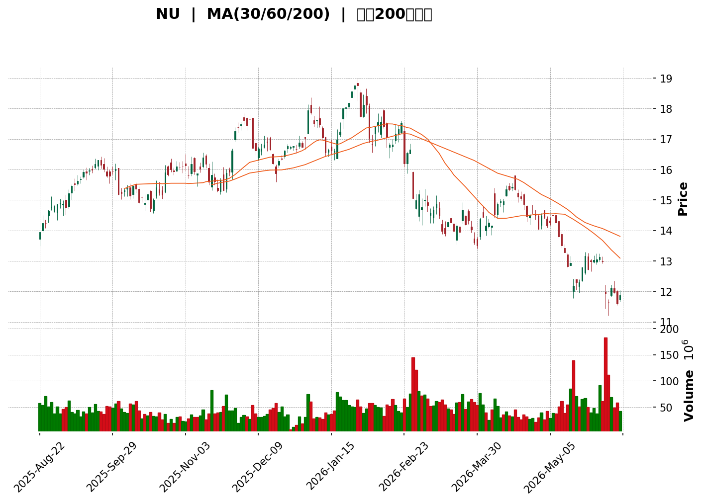
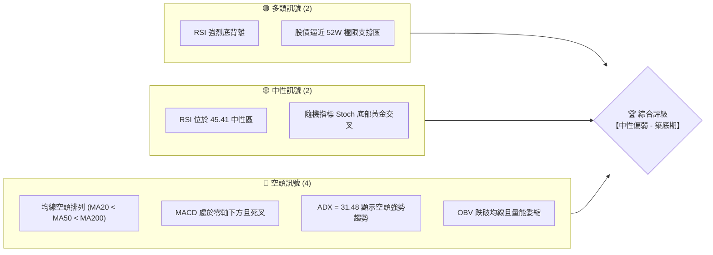
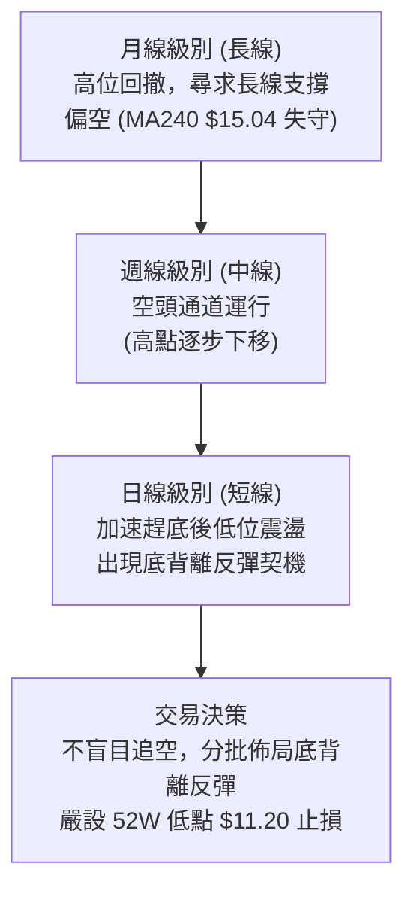
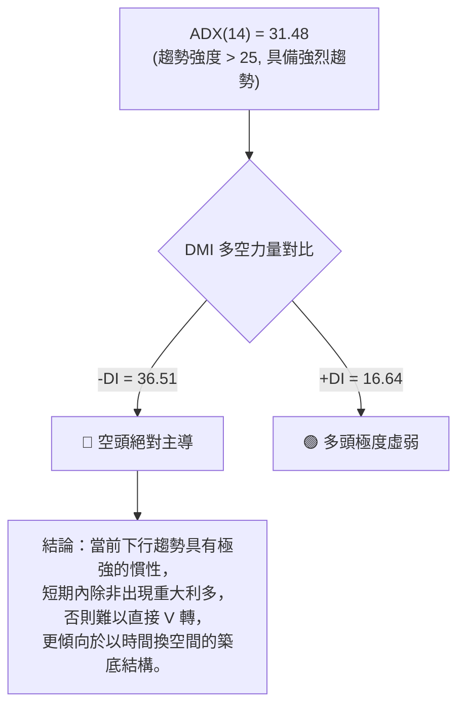
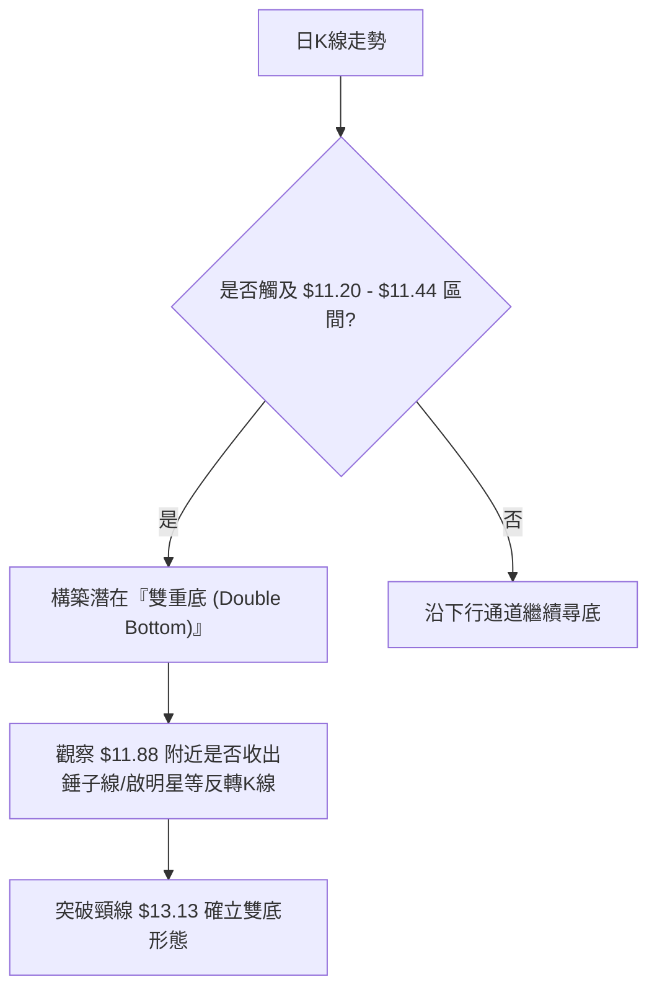

<details>
<summary>📊 靜態圖表 (點擊展開)</summary>

</details>

<html>
<head><meta charset="utf-8" /></head>
<body>
    <div style="height:500px; width:100%;">                        <script>window.PlotlyConfig = {MathJaxConfig: 'local'};</script>
        <script charset="utf-8" src="https://cdn.plot.ly/plotly-3.6.0.min.js" integrity="sha256-QaOVwtVY0T02VaHrr6pnoHLCwayMJp4O5n4YyaE3rJk=" crossorigin="anonymous"></script>                <div id="candlestick-chart" class="plotly-graph-div" style="height:100%; width:100%;"></div>            <script>                window.PLOTLYENV=window.PLOTLYENV || {};                                if (document.getElementById("candlestick-chart")) {                    Plotly.newPlot(                        "candlestick-chart",                        [{"close":{"dtype":"f8","bdata":"AAAAoEfhK0AAAACAwnUsQAAAAEDheixAAAAAIK5HLUAAAACAPYotQAAAAKCZmS1AAAAA4FG4LUAAAADAzMwtQAAAAKBwvS1AAAAAQOF6LUAAAADgo3AuQAAAACCF6y5AAAAAwB4FL0AAAACgcD0vQAAAAKBHYS9AAAAAgOvRL0AAAAAgrscvQAAAACCF6y9AAAAAQOH6L0AAAAAghSswQAAAAMDMTDBAAAAAYGYmMEAAAABgjwIwQAAAACBcjy9AAAAAIFyPL0AAAABgZuYvQAAAAGCPAjBAAAAAoEdhLkAAAADgo3AuQAAAAGC4ni5AAAAAYI\u002fCLkAAAABgj0IuQAAAACCF6y5AAAAAoHC9LkAAAABACtctQAAAAMD1KC5AAAAAgOvRLUAAAAAAKVwuQAAAAIDCdS1AAAAAAAAALkAAAACA69EuQAAAAEDhei5AAAAAgOtRLkAAAADAzMwvQAAAAIAUri9AAAAAAAAAMEAAAAAAKdwvQAAAAEAKFzBAAAAAIFwPMEAAAAAAKRwwQAAAAKBHITBAAAAAoJmZL0AAAAAghSswQAAAAKBH4S9AAAAAoHC9L0AAAADAHgUwQAAAAADXYzBAAAAAgBQuMEAAAACAFC4vQAAAAADXoy9AAAAAQDMzL0AAAAAA16MuQAAAAIDrUS9AAAAAANejLkAAAAAgrscvQAAAAEAK1y9AAAAAACmcMEAAAAAAAEAxQAAAAADXYzFAAAAAQOF6MUAAAAAAKZwxQAAAAOCjcDFAAAAAYGamMUAAAABAM7MwQAAAAGC4njBAAAAAgBSuMEAAAADgo7AwQAAAAIDr0TBAAAAAYGbmMEAAAABgZqYwQAAAAEAzMzBAAAAA4FG4L0AAAADAHkUwQAAAAEAKVzBAAAAAYLieMEAAAABgj8IwQAAAAKBwvTBAAAAAYI\u002fCMEAAAADA9agwQAAAAKBH4TBAAAAAoHC9MEAAAADAHgUxQAAAAOCj8DFAAAAAACncMUAAAAAAAIAxQAAAAAApnDFAAAAAgMJ1MUAAAACAPQoxQAAAACBcjzBAAAAAANejMEAAAAAAKZwwQAAAAKCZmTBAAAAA4FH4MEAAAACgcD0xQAAAAAAAADJAAAAAgD0KMkAAAACAFC4yQAAAAMDMjDJAAAAAYI\u002fCMkAAAABgj8IyQAAAAAAAwDFAAAAAACkcMkAAAABguB4yQAAAAMAeBTFAAAAAIFzPMEAAAABgZmYxQAAAAMDMjDFAAAAAgOuRMUAAAADA9WgxQAAAAIA9CjFAAAAAgOvRMEAAAACA69EwQAAAACCFKzFAAAAAgOtRMUAAAAAgrocxQAAAAOCjMDBAAAAAIK6HMEAAAABgZqYwQAAAAGC4Hi5AAAAAgML1LUAAAACgR2EuQAAAAMAehS1AAAAAAAAALkAAAAAA16MtQAAAAMD1KC1AAAAAQApXLUAAAABgj8ItQAAAAEDh+ixAAAAA4KPwK0AAAAAgrscrQAAAAIA9iixAAAAAAACALEAAAADgo\u002fArQAAAAIDrUSxAAAAAoEfhK0AAAAAAKVwtQAAAAKBHYSxAAAAAANejLEAAAACAPQosQAAAAEAzMytAAAAAwB4FK0AAAACgcL0sQAAAAKBH4SxAAAAAwMxMLEAAAADAHoUsQAAAAMDMTCxAAAAAwB4FLUAAAACgcL0tQAAAACCF6y1AAAAAYGbmLUAAAABAM7MuQAAAAIAUri5AAAAAACncLkAAAACAFK4uQAAAAEAzMy5AAAAAoJkZLkAAAABAM7MtQAAAACCF6yxAAAAAwB4FLUAAAAAgrkctQAAAAAAAAC1AAAAA4HoULEAAAACAwvUsQAAAAKBH4SxAAAAAgOtRLEAAAAAAAIAsQAAAAIDC9SxAAAAAwB6FLEAAAACgmZkrQAAAAAAAACtAAAAAgD2KKkAAAAAA16MpQAAAAAAp3ClAAAAAoEdhKEAAAADgepQoQAAAAOB6lChAAAAA4HqUKUAAAACA61EqQAAAAIDCdSlAAAAAgML1KUAAAAAgXA8qQAAAAKCZGSpAAAAAYI9CKkAAAABA4fopQAAAAAAp3CdAAAAAIK5HJ0AAAACgcD0oQAAAAOCj8CdAAAAAQDMzJ0AAAABgj8InQA=="},"high":{"dtype":"f8","bdata":"AAAAgML1K0AAAABgjwItQAAAAEAzsyxAAAAAQApXLUAAAABA4TouQAAAAADXoy1AAAAAoHC9LUAAAACA6xEuQAAAAKBw\u002fS1AAAAAoJlZLkAAAADgo7AuQAAAAMAeBS9AAAAAIIVrL0AAAACgR6EvQAAAAIA9ii9AAAAAoEcBMEAAAACA6xEwQAAAAMDMDDBAAAAAoEchMEAAAACgmVkwQAAAAMDMTDBAAAAAwMxsMEAAAABguF4wQAAAAOBRGDBAAAAAoHD9L0AAAACgmRkwQAAAAOCjMDBAAAAAwMwMMEAAAADAzMwuQAAAAAAAwC5AAAAAQOH6LkAAAADgehQvQAAAAAAAAC9AAAAAwPUoL0AAAABgZuYuQAAAAKBwPS5AAAAAoEdhLkAAAAAAVo4uQAAAAGC4ni5AAAAAYLgeLkAAAAAgrkcvQAAAAIAULi9AAAAAIIXrLkAAAAAA1yMwQAAAAKBHITBAAAAAoJlZMEAAAACA6xEwQAAAAMAeRTBAAAAAoHA9MEAAAADAHkUwQAAAAAAAgDBAAAAAoHAdMEAAAAAghWswQAAAAGBmZjBAAAAAAADAL0AAAADgUTgwQAAAAMDMjDBAAAAAAACAMEAAAACA6zEwQAAAAGCPQjBAAAAAoHC9L0AAAACgmVkvQAAAAOCjcC9AAAAAQDMTMEAAAADAHgUwQAAAACBcDzBAAAAAwMysMEAAAACgR2ExQAAAAIAUjjFAAAAAIFyPMUAAAABACtcxQAAAAOBRuDFAAAAA4KPQMUAAAABA4boxQAAAAEAzEzFAAAAAQOG6MEAAAACgmdkwQAAAAAApHDFAAAAAIFwPMUAAAACA6xExQAAAAMAehTBAAAAAwPUoMEAAAADgIlswQAAAAOBReDBAAAAAoEehMEAAAADgetQwQAAAAMD1yDBAAAAAYI\u002fCMEAAAAAgXM8wQAAAAEDhGjFAAAAAwMzsMEAAAAAgXA8xQAAAAICVIzJAAAAAYLheMkAAAABgj8IxQAAAAIC+nzFAAAAAgOsRMkAAAAAghWsxQAAAAIDrETFAAAAA4KOwMEAAAADgUfgwQAAAAGAOrTBAAAAA4KNQMUAAAACAPYoxQAAAAAAAADJAAAAA4KMQMkAAAABgj0IyQAAAACBcjzJAAAAAwPXIMkAAAABA4foyQAAAAGC4njJAAAAAQAp3MkAAAABgZqYyQAAAAIA9KjJAAAAAYI8iMUAAAAAghWsxQAAAAEAK1zFAAAAAACm8MUAAAACgcP0xQAAAAMDMjDFAAAAAoEfhMEAAAAAAAAAxQAAAAEDhejFAAAAA4KNwMUAAAABACpcxQAAAAMD1aDFAAAAAQAqXMEAAAACgmdkwQAAAAKBH4S9AAAAAYGZmLkAAAABAi6wuQAAAAGC4Hi5AAAAAgMK1LkAAAADAzEwuQAAAAEAzcy1AAAAAgOuRLUAAAACAPUouQAAAAKBH4S1AAAAAQDOzLEAAAABguJ4sQAAAAKBwvSxAAAAA4HoULUAAAADAzIwsQAAAAAAAgCxAAAAAwMxMLEAAAABACtctQAAAAMAeBS1AAAAAoEdhLUAAAABgZqYsQAAAAGBm5itAAAAAgOuRK0AAAACA69EsQAAAAKCZmS1AAAAAgML1LEAAAAAgrscsQAAAAIDrUSxAAAAAwEnMLkAAAAAAKdwtQAAAAOB6FC5AAAAAIFwPLkAAAADgo\u002fAuQAAAAGC4Hi9AAAAAoEchL0AAAABguJ4vQAAAAEAzsy5AAAAAIFyPLkAAAADgo3AuQAAAAADXoy1AAAAA4HoULUAAAAAghastQAAAAEAKVy1AAAAAwB4FLUAAAABguB4tQAAAAIDrUS1AAAAA4KPwLEAAAACgR+EsQAAAAKCZGS1AAAAAQDMzLUAAAADA9agsQAAAAMD16CtAAAAAACkcK0AAAACAPYoqQAAAAEAKVypAAAAAIFzPKEAAAADAzMwoQAAAAMDMzChAAAAAoJmZKUAAAACgmZkqQAAAAMAehSpAAAAAoEchKkAAAAAAKVwqQAAAAEDheipAAAAAAACAKkAAAADAzEwqQAAAACCFayhAAAAAQOF6J0AAAACAFG4oQAAAAEAzsyhAAAAAoJkZKEAAAACA6xEoQA=="},"hovertemplate":"\u003cb\u003e%{x|%Y-%m-%d}\u003c\u002fb\u003e\u003cbr\u003e\u958b: $%{open:.2f}\u003cbr\u003e\u9ad8: $%{high:.2f}\u003cbr\u003e\u4f4e: $%{low:.2f}\u003cbr\u003e\u6536: $%{close:.2f}\u003cextra\u003e\u003c\u002fextra\u003e","low":{"dtype":"f8","bdata":"AAAAQOH6KkAAAABguN4rQAAAACBaJCxAAAAAYI+CLEAAAACA61EtQAAAAIAULi1AAAAAgBSuLEAAAACAwnUtQAAAAIDC9SxAAAAAgD0KLUAAAAAghWstQAAAAGCPAi5AAAAAoJmZLkAAAACAwvUuQAAAAOB6FC9AAAAAwPVoL0AAAACA61EvQAAAAGBmpi9AAAAAwB7FL0AAAADAHgUwQAAAAIDC9S9AAAAAIK4HMEAAAACg8dIvQAAAAIDCdS9AAAAAoJkZL0AAAADA9agvQAAAAMDMTC9AAAAAgOtRLkAAAACAPQouQAAAAOBROC5AAAAAAABALkAAAACAPQouQAAAAKCZGS5AAAAAgMJ1LkAAAABgj8ItQAAAAEAK1y1AAAAAIK5HLUAAAADgUbgtQAAAAEBeOi1AAAAAYLgeLUAAAABguB4uQAAAACBcTy5AAAAAgOsRLkAAAACAwnUuQAAAACAEli9AAAAAQArXL0AAAAAA16MvQAAAAAAp3C9AAAAAANcDMEAAAABgj8IvQAAAAIAU7i9AAAAAYGZmL0AAAADgepQvQAAAAIAUri9AAAAAYGbmLkAAAADAzMwvQAAAAMDMDDBAAAAAIIULMEAAAADgUfguQAAAAADXoy5AAAAAAAAAL0AAAADAHoUuQAAAAKBHYS5AAAAAoJmZLkAAAABgj4IuQAAAACBcjy9AAAAAAClcL0AAAADA9egwQAAAAEAzMzFAAAAAIK5HMUAAAABA4XoxQAAAAIA9SjFAAAAAAClcMUAAAACgmZkwQAAAAOBReDBAAAAAAAJLMEAAAABACncwQAAAAEAzszBAAAAAoJmZMEAAAACgR6EwQAAAAIAULjBAAAAAgBQuL0AAAADAIBAwQAAAAEBiUDBAAAAAoJlZMEAAAAAgXI8wQAAAAGBmpjBAAAAAACmcMEAAAACAPYowQAAAAIAUrjBAAAAAgMK1MEAAAABgZqYwQAAAAIA9KjFAAAAAIFzPMUAAAAAgrmcxQAAAAGC4XjFAAAAAANdjMUAAAADAHgUxQAAAAIA9ajBAAAAAwMxsMEAAAACAQYAwQAAAAIAUTjBAAAAAoJlZMEAAAACA6xExQAAAAOB6VDFAAAAAgMK1MUAAAABgZuYxQAAAAKCZGTJAAAAAAClcMkAAAACgcD0yQAAAAIDCtTFAAAAAgMK1MUAAAABACtcxQAAAAAAA4DBAAAAAwMyMMEAAAABgj8IwQAAAAEAKNzFAAAAAgD0KMUAAAACgmVkxQAAAAIDCtTBAAAAAYLheMEAAAABACpcwQAAAAEAK1zBAAAAAwB7lMEAAAAAghSsxQAAAAOB6FDBAAAAAoHC9L0AAAAAA14MwQAAAAOB6FC5AAAAAYGZmLUAAAABguJ4sQAAAAEAKVyxAAAAAoJmZLUAAAADgUTgtQAAAAOBReCxAAAAAgMJ1LEAAAAAgXA8tQAAAAGCPwixAAAAAYI\u002fCK0AAAACgR6ErQAAAAGC4HixAAAAA4FF4LEAAAADgetQrQAAAACBcDytAAAAA4HqUK0AAAADgo3AsQAAAAIDrUSxAAAAAIIVrLEAAAAAAKdwrQAAAAOB6FCtAAAAAgOvRKkAAAABgZmYrQAAAAAAp3CxAAAAAAAKrK0AAAADA9SgsQAAAAIAUritAAAAAgOvRLEAAAADAzMwsQAAAACBcjy1AAAAAQDMzLUAAAACgcD0uQAAAAKCZmS5AAAAA4HqULkAAAABguJ4uQAAAAAAp3C1AAAAA4KPwLUAAAABAClctQAAAAIDrkSxAAAAAoEdhLEAAAACgmRktQAAAAIDCtSxAAAAA4HoULEAAAACgmRksQAAAAGCPwixAAAAAgBQuLEAAAABAClcsQAAAAKBwfSxAAAAAwPVoLEAAAAAAAIArQAAAAEAK1ypAAAAAwB6FKkAAAAAgrocpQAAAAIAUrilAAAAAIFyPJ0AAAABguB4oQAAAACCF6ydAAAAAwPWoKEAAAABguB4pQAAAACCFaylAAAAAwMxMKUAAAAAAKdwpQAAAACCuxylAAAAAQOH6KUAAAACA69EpQAAAAKBH4SZAAAAAYGZmJkAAAAAA16MnQAAAAGC43idAAAAAoJkZJ0AAAAAgXE8nQA=="},"name":"\u50f9\u683c","open":{"dtype":"f8","bdata":"AAAA4KNwK0AAAAAAAAAsQAAAAEDheixAAAAAgML1LEAAAAAAAIAtQAAAAOBROC1AAAAAwPUoLUAAAACgcL0tQAAAAIAUri1AAAAAwB4FLkAAAAAgXI8tQAAAAIDCdS5AAAAAoJkZL0AAAAAgXA8vQAAAAAApXC9AAAAAAACAL0AAAACgR+EvQAAAAGBm5i9AAAAAYI8CMEAAAACA6xEwQAAAAAApHDBAAAAAwMxMMEAAAACAFC4wQAAAAAAp3C9AAAAAACncL0AAAABgZuYvQAAAACCF6y9AAAAAwMwMMEAAAACAPYouQAAAACBcjy5AAAAAoHC9LkAAAACA69EuQAAAAAApXC5AAAAAIFwPL0AAAADgUbguQAAAAMD1KC5AAAAAQDOzLUAAAAAAAAAuQAAAAOB6lC5AAAAAIK5HLUAAAABgj0IuQAAAAEAzsy5AAAAAANejLkAAAADAHoUuQAAAAEAKFzBAAAAAQOE6MEAAAAAghesvQAAAAGBm5i9AAAAAgOsRMEAAAAAAKRwwQAAAAOCjMDBAAAAAoJmZL0AAAADgUbgvQAAAAGC4XjBAAAAAANejL0AAAACgmRkwQAAAAEAKFzBAAAAAgMJ1MEAAAACAPQowQAAAAAAp3C5AAAAA4FF4L0AAAADAzMwuQAAAAMDMjC5AAAAAgBSuL0AAAACAwrUuQAAAAAAAADBAAAAAQArXL0AAAABA4fowQAAAAADXYzFAAAAAgBRuMUAAAACAwrUxQAAAAEAzszFAAAAAYGamMUAAAABAM7MxQAAAAGC43jBAAAAAwB5lMEAAAACgmZkwQAAAAEDhujBAAAAAIK7nMEAAAABgZgYxQAAAAAAAgDBAAAAAQAoXMEAAAABgZiYwQAAAAKCZWTBAAAAAIIVrMEAAAADgo7AwQAAAAEAzszBAAAAAoHC9MEAAAACAPaowQAAAAMAexTBAAAAAYLjeMEAAAAAgXA8xQAAAAIAULjFAAAAAYLgeMkAAAABguJ4xQAAAAEAKlzFAAAAAgBSuMUAAAACgmVkxQAAAACBcDzFAAAAA4KOQMEAAAAAAAMAwQAAAAIDrkTBAAAAAAClcMEAAAABgjyIxQAAAAIA9qjFAAAAAAAAAMkAAAADAzAwyQAAAAAApXDJAAAAAYI+iMkAAAADgetQyQAAAACCuhzJAAAAAoHC9MUAAAAAgrmcyQAAAAOB6FDJAAAAA4HrUMEAAAAAghSsxQAAAAOCjcDFAAAAAYGYmMUAAAACA6\u002fExQAAAAMD1iDFAAAAAoHC9MEAAAAAAAMAwQAAAAEAz8zBAAAAAANcjMUAAAABAMzMxQAAAAAAAQDFAAAAA4KMwMEAAAAAA14MwQAAAAEAK1y9AAAAA4KNwLUAAAAAghessQAAAAAApXC1AAAAAoHD9LUAAAAAAKdwtQAAAAGCPAi1AAAAAgOvRLEAAAABA4XotQAAAAAAAgC1AAAAAYGZmLEAAAAAA1yMsQAAAAKBwPSxAAAAAwMzMLEAAAADgo3AsQAAAAAApXCtAAAAAoHA9LEAAAACgR6EsQAAAAOBR+CxAAAAAYI9CLUAAAABgj0IsQAAAAIDCdStAAAAAIIVrK0AAAACgmZkrQAAAAIAULi1AAAAAAAAALEAAAABgj0IsQAAAAEAzMyxAAAAAIIVrLkAAAADAHgUtQAAAAAAp3C1AAAAAgBSuLUAAAABgj0IuQAAAACCF6y5AAAAAIK7HLkAAAABguJ4vQAAAAEDhei5AAAAA4FE4LkAAAAAAKVwuQAAAAGC4ni1AAAAAQArXLEAAAAAgrkctQAAAAOB6FC1AAAAAgML1LEAAAADgelQsQAAAAIDrUS1AAAAAIK7HLEAAAAAA16MsQAAAAAAAAC1AAAAAAAAALUAAAACgmZksQAAAAGCPwitAAAAAQArXKkAAAAAghWsqQAAAAEAzsylAAAAAQIkBKEAAAADAzMwoQAAAAOB6VChAAAAAgBSuKEAAAADgUTgpQAAAAMDMTCpAAAAAIK4HKkAAAAAghespQAAAAOCj8ClAAAAAoJkZKkAAAAAAAAAqQAAAAEDh+idAAAAAwMxMJ0AAAABgj8InQAAAAEAzMyhAAAAAwB4FKEAAAADgo3AnQA=="},"x":["2025-08-22T00:00:00-04:00","2025-08-25T00:00:00-04:00","2025-08-26T00:00:00-04:00","2025-08-27T00:00:00-04:00","2025-08-28T00:00:00-04:00","2025-08-29T00:00:00-04:00","2025-09-02T00:00:00-04:00","2025-09-03T00:00:00-04:00","2025-09-04T00:00:00-04:00","2025-09-05T00:00:00-04:00","2025-09-08T00:00:00-04:00","2025-09-09T00:00:00-04:00","2025-09-10T00:00:00-04:00","2025-09-11T00:00:00-04:00","2025-09-12T00:00:00-04:00","2025-09-15T00:00:00-04:00","2025-09-16T00:00:00-04:00","2025-09-17T00:00:00-04:00","2025-09-18T00:00:00-04:00","2025-09-19T00:00:00-04:00","2025-09-22T00:00:00-04:00","2025-09-23T00:00:00-04:00","2025-09-24T00:00:00-04:00","2025-09-25T00:00:00-04:00","2025-09-26T00:00:00-04:00","2025-09-29T00:00:00-04:00","2025-09-30T00:00:00-04:00","2025-10-01T00:00:00-04:00","2025-10-02T00:00:00-04:00","2025-10-03T00:00:00-04:00","2025-10-06T00:00:00-04:00","2025-10-07T00:00:00-04:00","2025-10-08T00:00:00-04:00","2025-10-09T00:00:00-04:00","2025-10-10T00:00:00-04:00","2025-10-13T00:00:00-04:00","2025-10-14T00:00:00-04:00","2025-10-15T00:00:00-04:00","2025-10-16T00:00:00-04:00","2025-10-17T00:00:00-04:00","2025-10-20T00:00:00-04:00","2025-10-21T00:00:00-04:00","2025-10-22T00:00:00-04:00","2025-10-23T00:00:00-04:00","2025-10-24T00:00:00-04:00","2025-10-27T00:00:00-04:00","2025-10-28T00:00:00-04:00","2025-10-29T00:00:00-04:00","2025-10-30T00:00:00-04:00","2025-10-31T00:00:00-04:00","2025-11-03T00:00:00-05:00","2025-11-04T00:00:00-05:00","2025-11-05T00:00:00-05:00","2025-11-06T00:00:00-05:00","2025-11-07T00:00:00-05:00","2025-11-10T00:00:00-05:00","2025-11-11T00:00:00-05:00","2025-11-12T00:00:00-05:00","2025-11-13T00:00:00-05:00","2025-11-14T00:00:00-05:00","2025-11-17T00:00:00-05:00","2025-11-18T00:00:00-05:00","2025-11-19T00:00:00-05:00","2025-11-20T00:00:00-05:00","2025-11-21T00:00:00-05:00","2025-11-24T00:00:00-05:00","2025-11-25T00:00:00-05:00","2025-11-26T00:00:00-05:00","2025-11-28T00:00:00-05:00","2025-12-01T00:00:00-05:00","2025-12-02T00:00:00-05:00","2025-12-03T00:00:00-05:00","2025-12-04T00:00:00-05:00","2025-12-05T00:00:00-05:00","2025-12-08T00:00:00-05:00","2025-12-09T00:00:00-05:00","2025-12-10T00:00:00-05:00","2025-12-11T00:00:00-05:00","2025-12-12T00:00:00-05:00","2025-12-15T00:00:00-05:00","2025-12-16T00:00:00-05:00","2025-12-17T00:00:00-05:00","2025-12-18T00:00:00-05:00","2025-12-19T00:00:00-05:00","2025-12-22T00:00:00-05:00","2025-12-23T00:00:00-05:00","2025-12-24T00:00:00-05:00","2025-12-26T00:00:00-05:00","2025-12-29T00:00:00-05:00","2025-12-30T00:00:00-05:00","2025-12-31T00:00:00-05:00","2026-01-02T00:00:00-05:00","2026-01-05T00:00:00-05:00","2026-01-06T00:00:00-05:00","2026-01-07T00:00:00-05:00","2026-01-08T00:00:00-05:00","2026-01-09T00:00:00-05:00","2026-01-12T00:00:00-05:00","2026-01-13T00:00:00-05:00","2026-01-14T00:00:00-05:00","2026-01-15T00:00:00-05:00","2026-01-16T00:00:00-05:00","2026-01-20T00:00:00-05:00","2026-01-21T00:00:00-05:00","2026-01-22T00:00:00-05:00","2026-01-23T00:00:00-05:00","2026-01-26T00:00:00-05:00","2026-01-27T00:00:00-05:00","2026-01-28T00:00:00-05:00","2026-01-29T00:00:00-05:00","2026-01-30T00:00:00-05:00","2026-02-02T00:00:00-05:00","2026-02-03T00:00:00-05:00","2026-02-04T00:00:00-05:00","2026-02-05T00:00:00-05:00","2026-02-06T00:00:00-05:00","2026-02-09T00:00:00-05:00","2026-02-10T00:00:00-05:00","2026-02-11T00:00:00-05:00","2026-02-12T00:00:00-05:00","2026-02-13T00:00:00-05:00","2026-02-17T00:00:00-05:00","2026-02-18T00:00:00-05:00","2026-02-19T00:00:00-05:00","2026-02-20T00:00:00-05:00","2026-02-23T00:00:00-05:00","2026-02-24T00:00:00-05:00","2026-02-25T00:00:00-05:00","2026-02-26T00:00:00-05:00","2026-02-27T00:00:00-05:00","2026-03-02T00:00:00-05:00","2026-03-03T00:00:00-05:00","2026-03-04T00:00:00-05:00","2026-03-05T00:00:00-05:00","2026-03-06T00:00:00-05:00","2026-03-09T00:00:00-04:00","2026-03-10T00:00:00-04:00","2026-03-11T00:00:00-04:00","2026-03-12T00:00:00-04:00","2026-03-13T00:00:00-04:00","2026-03-16T00:00:00-04:00","2026-03-17T00:00:00-04:00","2026-03-18T00:00:00-04:00","2026-03-19T00:00:00-04:00","2026-03-20T00:00:00-04:00","2026-03-23T00:00:00-04:00","2026-03-24T00:00:00-04:00","2026-03-25T00:00:00-04:00","2026-03-26T00:00:00-04:00","2026-03-27T00:00:00-04:00","2026-03-30T00:00:00-04:00","2026-03-31T00:00:00-04:00","2026-04-01T00:00:00-04:00","2026-04-02T00:00:00-04:00","2026-04-06T00:00:00-04:00","2026-04-07T00:00:00-04:00","2026-04-08T00:00:00-04:00","2026-04-09T00:00:00-04:00","2026-04-10T00:00:00-04:00","2026-04-13T00:00:00-04:00","2026-04-14T00:00:00-04:00","2026-04-15T00:00:00-04:00","2026-04-16T00:00:00-04:00","2026-04-17T00:00:00-04:00","2026-04-20T00:00:00-04:00","2026-04-21T00:00:00-04:00","2026-04-22T00:00:00-04:00","2026-04-23T00:00:00-04:00","2026-04-24T00:00:00-04:00","2026-04-27T00:00:00-04:00","2026-04-28T00:00:00-04:00","2026-04-29T00:00:00-04:00","2026-04-30T00:00:00-04:00","2026-05-01T00:00:00-04:00","2026-05-04T00:00:00-04:00","2026-05-05T00:00:00-04:00","2026-05-06T00:00:00-04:00","2026-05-07T00:00:00-04:00","2026-05-08T00:00:00-04:00","2026-05-11T00:00:00-04:00","2026-05-12T00:00:00-04:00","2026-05-13T00:00:00-04:00","2026-05-14T00:00:00-04:00","2026-05-15T00:00:00-04:00","2026-05-18T00:00:00-04:00","2026-05-19T00:00:00-04:00","2026-05-20T00:00:00-04:00","2026-05-21T00:00:00-04:00","2026-05-22T00:00:00-04:00","2026-05-26T00:00:00-04:00","2026-05-27T00:00:00-04:00","2026-05-28T00:00:00-04:00","2026-05-29T00:00:00-04:00","2026-06-01T00:00:00-04:00","2026-06-02T00:00:00-04:00","2026-06-03T00:00:00-04:00","2026-06-04T00:00:00-04:00","2026-06-05T00:00:00-04:00","2026-06-08T00:00:00-04:00","2026-06-09T00:00:00-04:00"],"type":"candlestick"},{"hovertemplate":"MA30: $%{y:.2f}\u003cextra\u003e\u003c\u002fextra\u003e","line":{"color":"#2196F3","dash":"dash","width":2},"mode":"lines","name":"MA30","x":["2025-08-22T00:00:00-04:00","2025-08-25T00:00:00-04:00","2025-08-26T00:00:00-04:00","2025-08-27T00:00:00-04:00","2025-08-28T00:00:00-04:00","2025-08-29T00:00:00-04:00","2025-09-02T00:00:00-04:00","2025-09-03T00:00:00-04:00","2025-09-04T00:00:00-04:00","2025-09-05T00:00:00-04:00","2025-09-08T00:00:00-04:00","2025-09-09T00:00:00-04:00","2025-09-10T00:00:00-04:00","2025-09-11T00:00:00-04:00","2025-09-12T00:00:00-04:00","2025-09-15T00:00:00-04:00","2025-09-16T00:00:00-04:00","2025-09-17T00:00:00-04:00","2025-09-18T00:00:00-04:00","2025-09-19T00:00:00-04:00","2025-09-22T00:00:00-04:00","2025-09-23T00:00:00-04:00","2025-09-24T00:00:00-04:00","2025-09-25T00:00:00-04:00","2025-09-26T00:00:00-04:00","2025-09-29T00:00:00-04:00","2025-09-30T00:00:00-04:00","2025-10-01T00:00:00-04:00","2025-10-02T00:00:00-04:00","2025-10-03T00:00:00-04:00","2025-10-06T00:00:00-04:00","2025-10-07T00:00:00-04:00","2025-10-08T00:00:00-04:00","2025-10-09T00:00:00-04:00","2025-10-10T00:00:00-04:00","2025-10-13T00:00:00-04:00","2025-10-14T00:00:00-04:00","2025-10-15T00:00:00-04:00","2025-10-16T00:00:00-04:00","2025-10-17T00:00:00-04:00","2025-10-20T00:00:00-04:00","2025-10-21T00:00:00-04:00","2025-10-22T00:00:00-04:00","2025-10-23T00:00:00-04:00","2025-10-24T00:00:00-04:00","2025-10-27T00:00:00-04:00","2025-10-28T00:00:00-04:00","2025-10-29T00:00:00-04:00","2025-10-30T00:00:00-04:00","2025-10-31T00:00:00-04:00","2025-11-03T00:00:00-05:00","2025-11-04T00:00:00-05:00","2025-11-05T00:00:00-05:00","2025-11-06T00:00:00-05:00","2025-11-07T00:00:00-05:00","2025-11-10T00:00:00-05:00","2025-11-11T00:00:00-05:00","2025-11-12T00:00:00-05:00","2025-11-13T00:00:00-05:00","2025-11-14T00:00:00-05:00","2025-11-17T00:00:00-05:00","2025-11-18T00:00:00-05:00","2025-11-19T00:00:00-05:00","2025-11-20T00:00:00-05:00","2025-11-21T00:00:00-05:00","2025-11-24T00:00:00-05:00","2025-11-25T00:00:00-05:00","2025-11-26T00:00:00-05:00","2025-11-28T00:00:00-05:00","2025-12-01T00:00:00-05:00","2025-12-02T00:00:00-05:00","2025-12-03T00:00:00-05:00","2025-12-04T00:00:00-05:00","2025-12-05T00:00:00-05:00","2025-12-08T00:00:00-05:00","2025-12-09T00:00:00-05:00","2025-12-10T00:00:00-05:00","2025-12-11T00:00:00-05:00","2025-12-12T00:00:00-05:00","2025-12-15T00:00:00-05:00","2025-12-16T00:00:00-05:00","2025-12-17T00:00:00-05:00","2025-12-18T00:00:00-05:00","2025-12-19T00:00:00-05:00","2025-12-22T00:00:00-05:00","2025-12-23T00:00:00-05:00","2025-12-24T00:00:00-05:00","2025-12-26T00:00:00-05:00","2025-12-29T00:00:00-05:00","2025-12-30T00:00:00-05:00","2025-12-31T00:00:00-05:00","2026-01-02T00:00:00-05:00","2026-01-05T00:00:00-05:00","2026-01-06T00:00:00-05:00","2026-01-07T00:00:00-05:00","2026-01-08T00:00:00-05:00","2026-01-09T00:00:00-05:00","2026-01-12T00:00:00-05:00","2026-01-13T00:00:00-05:00","2026-01-14T00:00:00-05:00","2026-01-15T00:00:00-05:00","2026-01-16T00:00:00-05:00","2026-01-20T00:00:00-05:00","2026-01-21T00:00:00-05:00","2026-01-22T00:00:00-05:00","2026-01-23T00:00:00-05:00","2026-01-26T00:00:00-05:00","2026-01-27T00:00:00-05:00","2026-01-28T00:00:00-05:00","2026-01-29T00:00:00-05:00","2026-01-30T00:00:00-05:00","2026-02-02T00:00:00-05:00","2026-02-03T00:00:00-05:00","2026-02-04T00:00:00-05:00","2026-02-05T00:00:00-05:00","2026-02-06T00:00:00-05:00","2026-02-09T00:00:00-05:00","2026-02-10T00:00:00-05:00","2026-02-11T00:00:00-05:00","2026-02-12T00:00:00-05:00","2026-02-13T00:00:00-05:00","2026-02-17T00:00:00-05:00","2026-02-18T00:00:00-05:00","2026-02-19T00:00:00-05:00","2026-02-20T00:00:00-05:00","2026-02-23T00:00:00-05:00","2026-02-24T00:00:00-05:00","2026-02-25T00:00:00-05:00","2026-02-26T00:00:00-05:00","2026-02-27T00:00:00-05:00","2026-03-02T00:00:00-05:00","2026-03-03T00:00:00-05:00","2026-03-04T00:00:00-05:00","2026-03-05T00:00:00-05:00","2026-03-06T00:00:00-05:00","2026-03-09T00:00:00-04:00","2026-03-10T00:00:00-04:00","2026-03-11T00:00:00-04:00","2026-03-12T00:00:00-04:00","2026-03-13T00:00:00-04:00","2026-03-16T00:00:00-04:00","2026-03-17T00:00:00-04:00","2026-03-18T00:00:00-04:00","2026-03-19T00:00:00-04:00","2026-03-20T00:00:00-04:00","2026-03-23T00:00:00-04:00","2026-03-24T00:00:00-04:00","2026-03-25T00:00:00-04:00","2026-03-26T00:00:00-04:00","2026-03-27T00:00:00-04:00","2026-03-30T00:00:00-04:00","2026-03-31T00:00:00-04:00","2026-04-01T00:00:00-04:00","2026-04-02T00:00:00-04:00","2026-04-06T00:00:00-04:00","2026-04-07T00:00:00-04:00","2026-04-08T00:00:00-04:00","2026-04-09T00:00:00-04:00","2026-04-10T00:00:00-04:00","2026-04-13T00:00:00-04:00","2026-04-14T00:00:00-04:00","2026-04-15T00:00:00-04:00","2026-04-16T00:00:00-04:00","2026-04-17T00:00:00-04:00","2026-04-20T00:00:00-04:00","2026-04-21T00:00:00-04:00","2026-04-22T00:00:00-04:00","2026-04-23T00:00:00-04:00","2026-04-24T00:00:00-04:00","2026-04-27T00:00:00-04:00","2026-04-28T00:00:00-04:00","2026-04-29T00:00:00-04:00","2026-04-30T00:00:00-04:00","2026-05-01T00:00:00-04:00","2026-05-04T00:00:00-04:00","2026-05-05T00:00:00-04:00","2026-05-06T00:00:00-04:00","2026-05-07T00:00:00-04:00","2026-05-08T00:00:00-04:00","2026-05-11T00:00:00-04:00","2026-05-12T00:00:00-04:00","2026-05-13T00:00:00-04:00","2026-05-14T00:00:00-04:00","2026-05-15T00:00:00-04:00","2026-05-18T00:00:00-04:00","2026-05-19T00:00:00-04:00","2026-05-20T00:00:00-04:00","2026-05-21T00:00:00-04:00","2026-05-22T00:00:00-04:00","2026-05-26T00:00:00-04:00","2026-05-27T00:00:00-04:00","2026-05-28T00:00:00-04:00","2026-05-29T00:00:00-04:00","2026-06-01T00:00:00-04:00","2026-06-02T00:00:00-04:00","2026-06-03T00:00:00-04:00","2026-06-04T00:00:00-04:00","2026-06-05T00:00:00-04:00","2026-06-08T00:00:00-04:00","2026-06-09T00:00:00-04:00"],"y":{"dtype":"f8","bdata":"AAAAAAAA+H8AAAAAAAD4fwAAAAAAAPh\u002fAAAAAAAA+H8AAAAAAAD4fwAAAAAAAPh\u002fAAAAAAAA+H8AAAAAAAD4fwAAAAAAAPh\u002fAAAAAAAA+H8AAAAAAAD4fwAAAAAAAPh\u002fAAAAAAAA+H8AAAAAAAD4fwAAAAAAAPh\u002fAAAAAAAA+H8AAAAAAAD4fwAAAAAAAPh\u002fAAAAAAAA+H8AAAAAAAD4fwAAAAAAAPh\u002fAAAAAAAA+H8AAAAAAAD4fwAAAAAAAPh\u002fAAAAAAAA+H8AAAAAAAD4fwAAAAAAAPh\u002fAAAAAAAA+H8AAAAAAAD4fyIiIlKcvS5Ad3d3xy\u002fWLkARERHxi+UuQERERDRe+i5A7+7untMGL0Crqqr6YgkvQBEREVEqDi9AVVVVxQQPL0DNzMwczBMvQBEREXFoES9AZmZmZtgVL0BVVVWFFhkvQDMzM1NVFS9AZmZmJlwPL0DNzMx8IxQvQJqZmdmyFi9AERERETwYL0BERETU6hgvQO\u002fu7s4iGy9AREREpFQcL0AAAACAThsvQCIiIsJnGC9AZmZmlm4SL0AzMzOjKRUvQAAAALDkFy9Ad3d3520ZL0De3d29nxovQLy7u\u002fsbIS9AzczMXAEyL0CrqqrqUTgvQDMzMyMGQS9AVVVVVcdEL0BERER0BUgvQERERERvSy9AAAAA0JRKL0Dv7u7OIlsvQDMzM9N4aS9A3t3dPXyGL0BVVVU10KkvQM3MzOw11y9Aq6qqmsQAMEBERESUihMwQN7d3Y1QJjBAq6qqCpA7MEC8u7urY0IwQLy7u5sLSTBAd3d3F9lOMEBmZmZWVVUwQLy7uwuQWzBA3t3dDbtiMEAzMzOzVmcwQO\u002fu7p7vZzBAERERsXJoMEBVVVUlTWkwQN7d3fW2bDBAzczMXB1zMECrqqrqbXkwQBEREYFqfDBAiYiIiF2BMEC8u7v7foowQGZmZpaKkzBARERE9ESdMECamZmpxqswQGZmZmY7vzBA3t3dHejUMEDv7u42peIwQLy7uxMR8TBAVVVV7VH4MEBVVVUth\u002fYwQLy7uwNy7zBAmpmZAUfoMEARERF5vt8wQO\u002fu7naT2DBAMzMz+8XSMECJiIigYdcwQAAAAEgo4zBAd3d3P8PuMEC8u7szevswQJqZmXE9CjFAVVVVrRwaMUAzMzMLHiwxQJqZmRFYOTFAVVVVRYtMMUCJiIioVFwxQERERCQiYjFAMzMzM8FjMUDNzMxMN2kxQFVVVcUgcDFA3t3dPQp3MUBERESkcH0xQLy7uyvOfjFA7+7u7nx\u002fMUBmZmYGyH0xQO\u002fu7u41dzFAiYiISJpyMUAiIiLS23IxQImIiMi9ZjFAvLu7K85eMUAzMzMzelsxQO\u002fu7matTjFAvLu7E4NAMUCamZkJZTQxQO\u002fu7n6xJDFAd3d39+ETMUBVVVVlO\u002f8wQKuqqkoM4jBAmpmZaUrFMEC8u7tzIakwQHd3dz98hjBAVVVVVZxdMEAAAACoDTQwQDMzM3tbFjBAzczMXNbqL0C8u7u7AqQvQDMzMzMzcy9Aq6qq+jdCL0Dv7u4ezBMvQO\u002fu7g502i5Ad3d3l\u002fyiLkBVVVV1IWkuQN7d3d1rLi5AIiIiQu71LUC8u7sLHswtQN7d3X2GnS1AzczMjGxnLUAzMzOznS8tQM3MzMzMDC1AiYiISFPqLECJiIhY8sssQAAAAHA9yixA3t3dXbrJLEC8u7trdcwsQKuqqnpb1ixA3t3dLbLdLECJiIgYkuYsQDMzMwNy7yxAIiIiQu71LEAAAAAwa\u002fUsQN7d3R3o9CxAmpmZaR\u002f+LEBmZmY27AotQImIiBjZDi1Ad3d3l0MLLUAAAADQ9xMtQGZmZia\u002fGC1AiYiIWIAcLUBVVVWlKRUtQM3MzKwcGi1AiYiIiBYZLUBmZmZWVRUtQN7d3W2gEy1Aq6qq2ocPLUDNzMzME\u002fUsQDMzM4NO2yxAREREJNu5LEBEREQUPJgsQN7d3Z19eCxAIiIi0iJbLEB3d3e38z0sQCIiIrLkFyxAIiIiokX2K0BVVVVlrc4rQLy7uzuYpytAERERYVeAK0AiIiISPFgrQBERESEiIitAzczMnO\u002fnKkDv7u4OWLkqQFVVVRXZjipAmpmZGS9dKkCamZl5FC4qQA=="},"type":"scatter"},{"hovertemplate":"MA60: $%{y:.2f}\u003cextra\u003e\u003c\u002fextra\u003e","line":{"color":"#9C27B0","dash":"dash","width":2},"mode":"lines","name":"MA60","x":["2025-08-22T00:00:00-04:00","2025-08-25T00:00:00-04:00","2025-08-26T00:00:00-04:00","2025-08-27T00:00:00-04:00","2025-08-28T00:00:00-04:00","2025-08-29T00:00:00-04:00","2025-09-02T00:00:00-04:00","2025-09-03T00:00:00-04:00","2025-09-04T00:00:00-04:00","2025-09-05T00:00:00-04:00","2025-09-08T00:00:00-04:00","2025-09-09T00:00:00-04:00","2025-09-10T00:00:00-04:00","2025-09-11T00:00:00-04:00","2025-09-12T00:00:00-04:00","2025-09-15T00:00:00-04:00","2025-09-16T00:00:00-04:00","2025-09-17T00:00:00-04:00","2025-09-18T00:00:00-04:00","2025-09-19T00:00:00-04:00","2025-09-22T00:00:00-04:00","2025-09-23T00:00:00-04:00","2025-09-24T00:00:00-04:00","2025-09-25T00:00:00-04:00","2025-09-26T00:00:00-04:00","2025-09-29T00:00:00-04:00","2025-09-30T00:00:00-04:00","2025-10-01T00:00:00-04:00","2025-10-02T00:00:00-04:00","2025-10-03T00:00:00-04:00","2025-10-06T00:00:00-04:00","2025-10-07T00:00:00-04:00","2025-10-08T00:00:00-04:00","2025-10-09T00:00:00-04:00","2025-10-10T00:00:00-04:00","2025-10-13T00:00:00-04:00","2025-10-14T00:00:00-04:00","2025-10-15T00:00:00-04:00","2025-10-16T00:00:00-04:00","2025-10-17T00:00:00-04:00","2025-10-20T00:00:00-04:00","2025-10-21T00:00:00-04:00","2025-10-22T00:00:00-04:00","2025-10-23T00:00:00-04:00","2025-10-24T00:00:00-04:00","2025-10-27T00:00:00-04:00","2025-10-28T00:00:00-04:00","2025-10-29T00:00:00-04:00","2025-10-30T00:00:00-04:00","2025-10-31T00:00:00-04:00","2025-11-03T00:00:00-05:00","2025-11-04T00:00:00-05:00","2025-11-05T00:00:00-05:00","2025-11-06T00:00:00-05:00","2025-11-07T00:00:00-05:00","2025-11-10T00:00:00-05:00","2025-11-11T00:00:00-05:00","2025-11-12T00:00:00-05:00","2025-11-13T00:00:00-05:00","2025-11-14T00:00:00-05:00","2025-11-17T00:00:00-05:00","2025-11-18T00:00:00-05:00","2025-11-19T00:00:00-05:00","2025-11-20T00:00:00-05:00","2025-11-21T00:00:00-05:00","2025-11-24T00:00:00-05:00","2025-11-25T00:00:00-05:00","2025-11-26T00:00:00-05:00","2025-11-28T00:00:00-05:00","2025-12-01T00:00:00-05:00","2025-12-02T00:00:00-05:00","2025-12-03T00:00:00-05:00","2025-12-04T00:00:00-05:00","2025-12-05T00:00:00-05:00","2025-12-08T00:00:00-05:00","2025-12-09T00:00:00-05:00","2025-12-10T00:00:00-05:00","2025-12-11T00:00:00-05:00","2025-12-12T00:00:00-05:00","2025-12-15T00:00:00-05:00","2025-12-16T00:00:00-05:00","2025-12-17T00:00:00-05:00","2025-12-18T00:00:00-05:00","2025-12-19T00:00:00-05:00","2025-12-22T00:00:00-05:00","2025-12-23T00:00:00-05:00","2025-12-24T00:00:00-05:00","2025-12-26T00:00:00-05:00","2025-12-29T00:00:00-05:00","2025-12-30T00:00:00-05:00","2025-12-31T00:00:00-05:00","2026-01-02T00:00:00-05:00","2026-01-05T00:00:00-05:00","2026-01-06T00:00:00-05:00","2026-01-07T00:00:00-05:00","2026-01-08T00:00:00-05:00","2026-01-09T00:00:00-05:00","2026-01-12T00:00:00-05:00","2026-01-13T00:00:00-05:00","2026-01-14T00:00:00-05:00","2026-01-15T00:00:00-05:00","2026-01-16T00:00:00-05:00","2026-01-20T00:00:00-05:00","2026-01-21T00:00:00-05:00","2026-01-22T00:00:00-05:00","2026-01-23T00:00:00-05:00","2026-01-26T00:00:00-05:00","2026-01-27T00:00:00-05:00","2026-01-28T00:00:00-05:00","2026-01-29T00:00:00-05:00","2026-01-30T00:00:00-05:00","2026-02-02T00:00:00-05:00","2026-02-03T00:00:00-05:00","2026-02-04T00:00:00-05:00","2026-02-05T00:00:00-05:00","2026-02-06T00:00:00-05:00","2026-02-09T00:00:00-05:00","2026-02-10T00:00:00-05:00","2026-02-11T00:00:00-05:00","2026-02-12T00:00:00-05:00","2026-02-13T00:00:00-05:00","2026-02-17T00:00:00-05:00","2026-02-18T00:00:00-05:00","2026-02-19T00:00:00-05:00","2026-02-20T00:00:00-05:00","2026-02-23T00:00:00-05:00","2026-02-24T00:00:00-05:00","2026-02-25T00:00:00-05:00","2026-02-26T00:00:00-05:00","2026-02-27T00:00:00-05:00","2026-03-02T00:00:00-05:00","2026-03-03T00:00:00-05:00","2026-03-04T00:00:00-05:00","2026-03-05T00:00:00-05:00","2026-03-06T00:00:00-05:00","2026-03-09T00:00:00-04:00","2026-03-10T00:00:00-04:00","2026-03-11T00:00:00-04:00","2026-03-12T00:00:00-04:00","2026-03-13T00:00:00-04:00","2026-03-16T00:00:00-04:00","2026-03-17T00:00:00-04:00","2026-03-18T00:00:00-04:00","2026-03-19T00:00:00-04:00","2026-03-20T00:00:00-04:00","2026-03-23T00:00:00-04:00","2026-03-24T00:00:00-04:00","2026-03-25T00:00:00-04:00","2026-03-26T00:00:00-04:00","2026-03-27T00:00:00-04:00","2026-03-30T00:00:00-04:00","2026-03-31T00:00:00-04:00","2026-04-01T00:00:00-04:00","2026-04-02T00:00:00-04:00","2026-04-06T00:00:00-04:00","2026-04-07T00:00:00-04:00","2026-04-08T00:00:00-04:00","2026-04-09T00:00:00-04:00","2026-04-10T00:00:00-04:00","2026-04-13T00:00:00-04:00","2026-04-14T00:00:00-04:00","2026-04-15T00:00:00-04:00","2026-04-16T00:00:00-04:00","2026-04-17T00:00:00-04:00","2026-04-20T00:00:00-04:00","2026-04-21T00:00:00-04:00","2026-04-22T00:00:00-04:00","2026-04-23T00:00:00-04:00","2026-04-24T00:00:00-04:00","2026-04-27T00:00:00-04:00","2026-04-28T00:00:00-04:00","2026-04-29T00:00:00-04:00","2026-04-30T00:00:00-04:00","2026-05-01T00:00:00-04:00","2026-05-04T00:00:00-04:00","2026-05-05T00:00:00-04:00","2026-05-06T00:00:00-04:00","2026-05-07T00:00:00-04:00","2026-05-08T00:00:00-04:00","2026-05-11T00:00:00-04:00","2026-05-12T00:00:00-04:00","2026-05-13T00:00:00-04:00","2026-05-14T00:00:00-04:00","2026-05-15T00:00:00-04:00","2026-05-18T00:00:00-04:00","2026-05-19T00:00:00-04:00","2026-05-20T00:00:00-04:00","2026-05-21T00:00:00-04:00","2026-05-22T00:00:00-04:00","2026-05-26T00:00:00-04:00","2026-05-27T00:00:00-04:00","2026-05-28T00:00:00-04:00","2026-05-29T00:00:00-04:00","2026-06-01T00:00:00-04:00","2026-06-02T00:00:00-04:00","2026-06-03T00:00:00-04:00","2026-06-04T00:00:00-04:00","2026-06-05T00:00:00-04:00","2026-06-08T00:00:00-04:00","2026-06-09T00:00:00-04:00"],"y":{"dtype":"f8","bdata":"AAAAAAAA+H8AAAAAAAD4fwAAAAAAAPh\u002fAAAAAAAA+H8AAAAAAAD4fwAAAAAAAPh\u002fAAAAAAAA+H8AAAAAAAD4fwAAAAAAAPh\u002fAAAAAAAA+H8AAAAAAAD4fwAAAAAAAPh\u002fAAAAAAAA+H8AAAAAAAD4fwAAAAAAAPh\u002fAAAAAAAA+H8AAAAAAAD4fwAAAAAAAPh\u002fAAAAAAAA+H8AAAAAAAD4fwAAAAAAAPh\u002fAAAAAAAA+H8AAAAAAAD4fwAAAAAAAPh\u002fAAAAAAAA+H8AAAAAAAD4fwAAAAAAAPh\u002fAAAAAAAA+H8AAAAAAAD4fwAAAAAAAPh\u002fAAAAAAAA+H8AAAAAAAD4fwAAAAAAAPh\u002fAAAAAAAA+H8AAAAAAAD4fwAAAAAAAPh\u002fAAAAAAAA+H8AAAAAAAD4fwAAAAAAAPh\u002fAAAAAAAA+H8AAAAAAAD4fwAAAAAAAPh\u002fAAAAAAAA+H8AAAAAAAD4fwAAAAAAAPh\u002fAAAAAAAA+H8AAAAAAAD4fwAAAAAAAPh\u002fAAAAAAAA+H8AAAAAAAD4fwAAAAAAAPh\u002fAAAAAAAA+H8AAAAAAAD4fwAAAAAAAPh\u002fAAAAAAAA+H8AAAAAAAD4fwAAAAAAAPh\u002fAAAAAAAA+H8AAAAAAAD4f6uqqjpR\u002fy5AZmZmjnsNL0CrqqqyyBYvQERERLzmIi9Ad3d3N7QoL0DNzMzkQjIvQCIiIpLROy9AmpmZgcBKL0AREREpzl4vQO\u002fu7i5PdC9A3t3dzbCLL0Dv7u7WFaAvQHd3dzf7sC9A3t3dHT7DL0AiIiJqdcwvQImIiAhl1C9AAAAAIPfaL0CJiIjAyuEvQDMzM3Mh6S9AAAAAYOXwL0AzMzPz\u002ffQvQAAAAIAj9C9ARERE\u002fKnxL0Dv7u724fMvQN7d3U2p+C9AiYiIUNT\u002fL0DNzMzkXgMwQHd3dz98BjBAd3d3Gy8NMECJiIj4UxMwQAAAANQGGjBAd3d3T9QfMEDe3d2x5CcwQERERIR5MjBA7+7uQhk9MEAzMzNPG0gwQKuqqr7mUjBAIiIiBshdMEAAAACkt2UwQBEREX2GbTBAIiIizoV0MECrqqqGpHkwQGZmZgJyfzBA7+7uAiuHMEAiIiKm4owwQN7d3fEZljBAd3d3K86eMEARERHFZ6gwQKuqqr7msjBAmpmZ3Wu+MEAzMzNfuskwQERERNij0DBAMzMz+37aMEDv7u7m0OIwQBEREY1s5zBAAAAASG\u002frMEC8u7ubUvEwQDMzM6NF9jBAMzMz4zP8MEAAAADQ9wMxQBEREWEsCTFAmpmZ8WAOMUAAAABYxxQxQKuqqqo4GzFAMzMzM8EjMUCJiIiEwCoxQCIiIm7nKzFAiYiIDJArMUBERESwACkxQFVVVbUPHzFAq6qqCmUUMUBVVVXBEQoxQO\u002fu7nqi\u002fjBAVVVV+VPzMEDv7u6CTuswQFVVVUma4jBAiYiI1AbaMEC8u7vTTdIwQImIiNhcyDBAVVVVgdy7MECamZnZFbAwQGZmZsbZpzBA3t3dOfugMEAzMzMDK5cwQO\u002fu7t7djTBAREREmG6CMEAiIiKujnkwQGZmZmatbjBAzczMRERkMEB3d3evAFkwQFVVVQ0CSzBAAAAACDo9MEAiIiKG6zEwQO\u002fu7pb8IjBAd3d3RygTMEDe3d1VVQUwQO\u002fu7i4k7S9AAAAA0PfTL0B3d3dfc8EvQO\u002fu7h7Msy9Aq6qqQmClL0B3d3e\u002fn5ovQERERDzfjy9AZmZmDruCL0CamZlxhHIvQEREREzFWS9Aq6qqikFAL0C8u7sL1yMvQGZmZk7wAC9AIiIiCqzcLkAzMzPDg7kuQHd3dwfInS5AIiIi+gx7LkDe3d1F\u002fVsuQM3MzCz5RS5AmpmZKVwvLkAiIiLiehQuQN7d3V1I+i1AAAAAkAneLUDe3d1lO78tQN7d3SUGoS1AZmZmDruCLUBERETsmGAtQImIiIBqPC1AiYiI2KMQLUC8u7vj7OMsQFVVVTWlwixAVVVVDbuiLEAAAAAI84QsQBERERERcSxAAAAAAABgLECJiIhokU0sQDMzM9v5PixAd3d3xwQvLEBVVVUVZx8sQCIiIhLKCCxAd3d37+7uK0B3d3efYdcrQJqZmZngwStAmpmZQaetK0AAAABYgJwrQA=="},"type":"scatter"},{"hovertemplate":"MA200: $%{y:.2f}\u003cextra\u003e\u003c\u002fextra\u003e","line":{"color":"#FF6F00","dash":"solid","width":2},"mode":"lines","name":"MA200","x":["2025-08-22T00:00:00-04:00","2025-08-25T00:00:00-04:00","2025-08-26T00:00:00-04:00","2025-08-27T00:00:00-04:00","2025-08-28T00:00:00-04:00","2025-08-29T00:00:00-04:00","2025-09-02T00:00:00-04:00","2025-09-03T00:00:00-04:00","2025-09-04T00:00:00-04:00","2025-09-05T00:00:00-04:00","2025-09-08T00:00:00-04:00","2025-09-09T00:00:00-04:00","2025-09-10T00:00:00-04:00","2025-09-11T00:00:00-04:00","2025-09-12T00:00:00-04:00","2025-09-15T00:00:00-04:00","2025-09-16T00:00:00-04:00","2025-09-17T00:00:00-04:00","2025-09-18T00:00:00-04:00","2025-09-19T00:00:00-04:00","2025-09-22T00:00:00-04:00","2025-09-23T00:00:00-04:00","2025-09-24T00:00:00-04:00","2025-09-25T00:00:00-04:00","2025-09-26T00:00:00-04:00","2025-09-29T00:00:00-04:00","2025-09-30T00:00:00-04:00","2025-10-01T00:00:00-04:00","2025-10-02T00:00:00-04:00","2025-10-03T00:00:00-04:00","2025-10-06T00:00:00-04:00","2025-10-07T00:00:00-04:00","2025-10-08T00:00:00-04:00","2025-10-09T00:00:00-04:00","2025-10-10T00:00:00-04:00","2025-10-13T00:00:00-04:00","2025-10-14T00:00:00-04:00","2025-10-15T00:00:00-04:00","2025-10-16T00:00:00-04:00","2025-10-17T00:00:00-04:00","2025-10-20T00:00:00-04:00","2025-10-21T00:00:00-04:00","2025-10-22T00:00:00-04:00","2025-10-23T00:00:00-04:00","2025-10-24T00:00:00-04:00","2025-10-27T00:00:00-04:00","2025-10-28T00:00:00-04:00","2025-10-29T00:00:00-04:00","2025-10-30T00:00:00-04:00","2025-10-31T00:00:00-04:00","2025-11-03T00:00:00-05:00","2025-11-04T00:00:00-05:00","2025-11-05T00:00:00-05:00","2025-11-06T00:00:00-05:00","2025-11-07T00:00:00-05:00","2025-11-10T00:00:00-05:00","2025-11-11T00:00:00-05:00","2025-11-12T00:00:00-05:00","2025-11-13T00:00:00-05:00","2025-11-14T00:00:00-05:00","2025-11-17T00:00:00-05:00","2025-11-18T00:00:00-05:00","2025-11-19T00:00:00-05:00","2025-11-20T00:00:00-05:00","2025-11-21T00:00:00-05:00","2025-11-24T00:00:00-05:00","2025-11-25T00:00:00-05:00","2025-11-26T00:00:00-05:00","2025-11-28T00:00:00-05:00","2025-12-01T00:00:00-05:00","2025-12-02T00:00:00-05:00","2025-12-03T00:00:00-05:00","2025-12-04T00:00:00-05:00","2025-12-05T00:00:00-05:00","2025-12-08T00:00:00-05:00","2025-12-09T00:00:00-05:00","2025-12-10T00:00:00-05:00","2025-12-11T00:00:00-05:00","2025-12-12T00:00:00-05:00","2025-12-15T00:00:00-05:00","2025-12-16T00:00:00-05:00","2025-12-17T00:00:00-05:00","2025-12-18T00:00:00-05:00","2025-12-19T00:00:00-05:00","2025-12-22T00:00:00-05:00","2025-12-23T00:00:00-05:00","2025-12-24T00:00:00-05:00","2025-12-26T00:00:00-05:00","2025-12-29T00:00:00-05:00","2025-12-30T00:00:00-05:00","2025-12-31T00:00:00-05:00","2026-01-02T00:00:00-05:00","2026-01-05T00:00:00-05:00","2026-01-06T00:00:00-05:00","2026-01-07T00:00:00-05:00","2026-01-08T00:00:00-05:00","2026-01-09T00:00:00-05:00","2026-01-12T00:00:00-05:00","2026-01-13T00:00:00-05:00","2026-01-14T00:00:00-05:00","2026-01-15T00:00:00-05:00","2026-01-16T00:00:00-05:00","2026-01-20T00:00:00-05:00","2026-01-21T00:00:00-05:00","2026-01-22T00:00:00-05:00","2026-01-23T00:00:00-05:00","2026-01-26T00:00:00-05:00","2026-01-27T00:00:00-05:00","2026-01-28T00:00:00-05:00","2026-01-29T00:00:00-05:00","2026-01-30T00:00:00-05:00","2026-02-02T00:00:00-05:00","2026-02-03T00:00:00-05:00","2026-02-04T00:00:00-05:00","2026-02-05T00:00:00-05:00","2026-02-06T00:00:00-05:00","2026-02-09T00:00:00-05:00","2026-02-10T00:00:00-05:00","2026-02-11T00:00:00-05:00","2026-02-12T00:00:00-05:00","2026-02-13T00:00:00-05:00","2026-02-17T00:00:00-05:00","2026-02-18T00:00:00-05:00","2026-02-19T00:00:00-05:00","2026-02-20T00:00:00-05:00","2026-02-23T00:00:00-05:00","2026-02-24T00:00:00-05:00","2026-02-25T00:00:00-05:00","2026-02-26T00:00:00-05:00","2026-02-27T00:00:00-05:00","2026-03-02T00:00:00-05:00","2026-03-03T00:00:00-05:00","2026-03-04T00:00:00-05:00","2026-03-05T00:00:00-05:00","2026-03-06T00:00:00-05:00","2026-03-09T00:00:00-04:00","2026-03-10T00:00:00-04:00","2026-03-11T00:00:00-04:00","2026-03-12T00:00:00-04:00","2026-03-13T00:00:00-04:00","2026-03-16T00:00:00-04:00","2026-03-17T00:00:00-04:00","2026-03-18T00:00:00-04:00","2026-03-19T00:00:00-04:00","2026-03-20T00:00:00-04:00","2026-03-23T00:00:00-04:00","2026-03-24T00:00:00-04:00","2026-03-25T00:00:00-04:00","2026-03-26T00:00:00-04:00","2026-03-27T00:00:00-04:00","2026-03-30T00:00:00-04:00","2026-03-31T00:00:00-04:00","2026-04-01T00:00:00-04:00","2026-04-02T00:00:00-04:00","2026-04-06T00:00:00-04:00","2026-04-07T00:00:00-04:00","2026-04-08T00:00:00-04:00","2026-04-09T00:00:00-04:00","2026-04-10T00:00:00-04:00","2026-04-13T00:00:00-04:00","2026-04-14T00:00:00-04:00","2026-04-15T00:00:00-04:00","2026-04-16T00:00:00-04:00","2026-04-17T00:00:00-04:00","2026-04-20T00:00:00-04:00","2026-04-21T00:00:00-04:00","2026-04-22T00:00:00-04:00","2026-04-23T00:00:00-04:00","2026-04-24T00:00:00-04:00","2026-04-27T00:00:00-04:00","2026-04-28T00:00:00-04:00","2026-04-29T00:00:00-04:00","2026-04-30T00:00:00-04:00","2026-05-01T00:00:00-04:00","2026-05-04T00:00:00-04:00","2026-05-05T00:00:00-04:00","2026-05-06T00:00:00-04:00","2026-05-07T00:00:00-04:00","2026-05-08T00:00:00-04:00","2026-05-11T00:00:00-04:00","2026-05-12T00:00:00-04:00","2026-05-13T00:00:00-04:00","2026-05-14T00:00:00-04:00","2026-05-15T00:00:00-04:00","2026-05-18T00:00:00-04:00","2026-05-19T00:00:00-04:00","2026-05-20T00:00:00-04:00","2026-05-21T00:00:00-04:00","2026-05-22T00:00:00-04:00","2026-05-26T00:00:00-04:00","2026-05-27T00:00:00-04:00","2026-05-28T00:00:00-04:00","2026-05-29T00:00:00-04:00","2026-06-01T00:00:00-04:00","2026-06-02T00:00:00-04:00","2026-06-03T00:00:00-04:00","2026-06-04T00:00:00-04:00","2026-06-05T00:00:00-04:00","2026-06-08T00:00:00-04:00","2026-06-09T00:00:00-04:00"],"y":{"dtype":"f8","bdata":"AAAAAAAA+H8AAAAAAAD4fwAAAAAAAPh\u002fAAAAAAAA+H8AAAAAAAD4fwAAAAAAAPh\u002fAAAAAAAA+H8AAAAAAAD4fwAAAAAAAPh\u002fAAAAAAAA+H8AAAAAAAD4fwAAAAAAAPh\u002fAAAAAAAA+H8AAAAAAAD4fwAAAAAAAPh\u002fAAAAAAAA+H8AAAAAAAD4fwAAAAAAAPh\u002fAAAAAAAA+H8AAAAAAAD4fwAAAAAAAPh\u002fAAAAAAAA+H8AAAAAAAD4fwAAAAAAAPh\u002fAAAAAAAA+H8AAAAAAAD4fwAAAAAAAPh\u002fAAAAAAAA+H8AAAAAAAD4fwAAAAAAAPh\u002fAAAAAAAA+H8AAAAAAAD4fwAAAAAAAPh\u002fAAAAAAAA+H8AAAAAAAD4fwAAAAAAAPh\u002fAAAAAAAA+H8AAAAAAAD4fwAAAAAAAPh\u002fAAAAAAAA+H8AAAAAAAD4fwAAAAAAAPh\u002fAAAAAAAA+H8AAAAAAAD4fwAAAAAAAPh\u002fAAAAAAAA+H8AAAAAAAD4fwAAAAAAAPh\u002fAAAAAAAA+H8AAAAAAAD4fwAAAAAAAPh\u002fAAAAAAAA+H8AAAAAAAD4fwAAAAAAAPh\u002fAAAAAAAA+H8AAAAAAAD4fwAAAAAAAPh\u002fAAAAAAAA+H8AAAAAAAD4fwAAAAAAAPh\u002fAAAAAAAA+H8AAAAAAAD4fwAAAAAAAPh\u002fAAAAAAAA+H8AAAAAAAD4fwAAAAAAAPh\u002fAAAAAAAA+H8AAAAAAAD4fwAAAAAAAPh\u002fAAAAAAAA+H8AAAAAAAD4fwAAAAAAAPh\u002fAAAAAAAA+H8AAAAAAAD4fwAAAAAAAPh\u002fAAAAAAAA+H8AAAAAAAD4fwAAAAAAAPh\u002fAAAAAAAA+H8AAAAAAAD4fwAAAAAAAPh\u002fAAAAAAAA+H8AAAAAAAD4fwAAAAAAAPh\u002fAAAAAAAA+H8AAAAAAAD4fwAAAAAAAPh\u002fAAAAAAAA+H8AAAAAAAD4fwAAAAAAAPh\u002fAAAAAAAA+H8AAAAAAAD4fwAAAAAAAPh\u002fAAAAAAAA+H8AAAAAAAD4fwAAAAAAAPh\u002fAAAAAAAA+H8AAAAAAAD4fwAAAAAAAPh\u002fAAAAAAAA+H8AAAAAAAD4fwAAAAAAAPh\u002fAAAAAAAA+H8AAAAAAAD4fwAAAAAAAPh\u002fAAAAAAAA+H8AAAAAAAD4fwAAAAAAAPh\u002fAAAAAAAA+H8AAAAAAAD4fwAAAAAAAPh\u002fAAAAAAAA+H8AAAAAAAD4fwAAAAAAAPh\u002fAAAAAAAA+H8AAAAAAAD4fwAAAAAAAPh\u002fAAAAAAAA+H8AAAAAAAD4fwAAAAAAAPh\u002fAAAAAAAA+H8AAAAAAAD4fwAAAAAAAPh\u002fAAAAAAAA+H8AAAAAAAD4fwAAAAAAAPh\u002fAAAAAAAA+H8AAAAAAAD4fwAAAAAAAPh\u002fAAAAAAAA+H8AAAAAAAD4fwAAAAAAAPh\u002fAAAAAAAA+H8AAAAAAAD4fwAAAAAAAPh\u002fAAAAAAAA+H8AAAAAAAD4fwAAAAAAAPh\u002fAAAAAAAA+H8AAAAAAAD4fwAAAAAAAPh\u002fAAAAAAAA+H8AAAAAAAD4fwAAAAAAAPh\u002fAAAAAAAA+H8AAAAAAAD4fwAAAAAAAPh\u002fAAAAAAAA+H8AAAAAAAD4fwAAAAAAAPh\u002fAAAAAAAA+H8AAAAAAAD4fwAAAAAAAPh\u002fAAAAAAAA+H8AAAAAAAD4fwAAAAAAAPh\u002fAAAAAAAA+H8AAAAAAAD4fwAAAAAAAPh\u002fAAAAAAAA+H8AAAAAAAD4fwAAAAAAAPh\u002fAAAAAAAA+H8AAAAAAAD4fwAAAAAAAPh\u002fAAAAAAAA+H8AAAAAAAD4fwAAAAAAAPh\u002fAAAAAAAA+H8AAAAAAAD4fwAAAAAAAPh\u002fAAAAAAAA+H8AAAAAAAD4fwAAAAAAAPh\u002fAAAAAAAA+H8AAAAAAAD4fwAAAAAAAPh\u002fAAAAAAAA+H8AAAAAAAD4fwAAAAAAAPh\u002fAAAAAAAA+H8AAAAAAAD4fwAAAAAAAPh\u002fAAAAAAAA+H8AAAAAAAD4fwAAAAAAAPh\u002fAAAAAAAA+H8AAAAAAAD4fwAAAAAAAPh\u002fAAAAAAAA+H8AAAAAAAD4fwAAAAAAAPh\u002fAAAAAAAA+H8AAAAAAAD4fwAAAAAAAPh\u002fAAAAAAAA+H8AAAAAAAD4fwAAAAAAAPh\u002fAAAAAAAA+H\u002fNzMws1OouQA=="},"type":"scatter"}],                        {"template":{"data":{"barpolar":[{"marker":{"line":{"color":"rgb(17,17,17)","width":0.5},"pattern":{"fillmode":"overlay","size":10,"solidity":0.2}},"type":"barpolar"}],"bar":[{"error_x":{"color":"#f2f5fa"},"error_y":{"color":"#f2f5fa"},"marker":{"line":{"color":"rgb(17,17,17)","width":0.5},"pattern":{"fillmode":"overlay","size":10,"solidity":0.2}},"type":"bar"}],"carpet":[{"aaxis":{"endlinecolor":"#A2B1C6","gridcolor":"#506784","linecolor":"#506784","minorgridcolor":"#506784","startlinecolor":"#A2B1C6"},"baxis":{"endlinecolor":"#A2B1C6","gridcolor":"#506784","linecolor":"#506784","minorgridcolor":"#506784","startlinecolor":"#A2B1C6"},"type":"carpet"}],"choropleth":[{"colorbar":{"outlinewidth":0,"ticks":""},"type":"choropleth"}],"contourcarpet":[{"colorbar":{"outlinewidth":0,"ticks":""},"type":"contourcarpet"}],"contour":[{"colorbar":{"outlinewidth":0,"ticks":""},"colorscale":[[0.0,"#0d0887"],[0.1111111111111111,"#46039f"],[0.2222222222222222,"#7201a8"],[0.3333333333333333,"#9c179e"],[0.4444444444444444,"#bd3786"],[0.5555555555555556,"#d8576b"],[0.6666666666666666,"#ed7953"],[0.7777777777777778,"#fb9f3a"],[0.8888888888888888,"#fdca26"],[1.0,"#f0f921"]],"type":"contour"}],"heatmap":[{"colorbar":{"outlinewidth":0,"ticks":""},"colorscale":[[0.0,"#0d0887"],[0.1111111111111111,"#46039f"],[0.2222222222222222,"#7201a8"],[0.3333333333333333,"#9c179e"],[0.4444444444444444,"#bd3786"],[0.5555555555555556,"#d8576b"],[0.6666666666666666,"#ed7953"],[0.7777777777777778,"#fb9f3a"],[0.8888888888888888,"#fdca26"],[1.0,"#f0f921"]],"type":"heatmap"}],"histogram2dcontour":[{"colorbar":{"outlinewidth":0,"ticks":""},"colorscale":[[0.0,"#0d0887"],[0.1111111111111111,"#46039f"],[0.2222222222222222,"#7201a8"],[0.3333333333333333,"#9c179e"],[0.4444444444444444,"#bd3786"],[0.5555555555555556,"#d8576b"],[0.6666666666666666,"#ed7953"],[0.7777777777777778,"#fb9f3a"],[0.8888888888888888,"#fdca26"],[1.0,"#f0f921"]],"type":"histogram2dcontour"}],"histogram2d":[{"colorbar":{"outlinewidth":0,"ticks":""},"colorscale":[[0.0,"#0d0887"],[0.1111111111111111,"#46039f"],[0.2222222222222222,"#7201a8"],[0.3333333333333333,"#9c179e"],[0.4444444444444444,"#bd3786"],[0.5555555555555556,"#d8576b"],[0.6666666666666666,"#ed7953"],[0.7777777777777778,"#fb9f3a"],[0.8888888888888888,"#fdca26"],[1.0,"#f0f921"]],"type":"histogram2d"}],"histogram":[{"marker":{"pattern":{"fillmode":"overlay","size":10,"solidity":0.2}},"type":"histogram"}],"mesh3d":[{"colorbar":{"outlinewidth":0,"ticks":""},"type":"mesh3d"}],"parcoords":[{"line":{"colorbar":{"outlinewidth":0,"ticks":""}},"type":"parcoords"}],"pie":[{"automargin":true,"type":"pie"}],"scatter3d":[{"line":{"colorbar":{"outlinewidth":0,"ticks":""}},"marker":{"colorbar":{"outlinewidth":0,"ticks":""}},"type":"scatter3d"}],"scattercarpet":[{"marker":{"colorbar":{"outlinewidth":0,"ticks":""}},"type":"scattercarpet"}],"scattergeo":[{"marker":{"colorbar":{"outlinewidth":0,"ticks":""}},"type":"scattergeo"}],"scattergl":[{"marker":{"line":{"color":"#283442"}},"type":"scattergl"}],"scattermapbox":[{"marker":{"colorbar":{"outlinewidth":0,"ticks":""}},"type":"scattermapbox"}],"scattermap":[{"marker":{"colorbar":{"outlinewidth":0,"ticks":""}},"type":"scattermap"}],"scatterpolargl":[{"marker":{"colorbar":{"outlinewidth":0,"ticks":""}},"type":"scatterpolargl"}],"scatterpolar":[{"marker":{"colorbar":{"outlinewidth":0,"ticks":""}},"type":"scatterpolar"}],"scatter":[{"marker":{"line":{"color":"#283442"}},"type":"scatter"}],"scatterternary":[{"marker":{"colorbar":{"outlinewidth":0,"ticks":""}},"type":"scatterternary"}],"surface":[{"colorbar":{"outlinewidth":0,"ticks":""},"colorscale":[[0.0,"#0d0887"],[0.1111111111111111,"#46039f"],[0.2222222222222222,"#7201a8"],[0.3333333333333333,"#9c179e"],[0.4444444444444444,"#bd3786"],[0.5555555555555556,"#d8576b"],[0.6666666666666666,"#ed7953"],[0.7777777777777778,"#fb9f3a"],[0.8888888888888888,"#fdca26"],[1.0,"#f0f921"]],"type":"surface"}],"table":[{"cells":{"fill":{"color":"#506784"},"line":{"color":"rgb(17,17,17)"}},"header":{"fill":{"color":"#2a3f5f"},"line":{"color":"rgb(17,17,17)"}},"type":"table"}]},"layout":{"annotationdefaults":{"arrowcolor":"#f2f5fa","arrowhead":0,"arrowwidth":1},"autotypenumbers":"strict","coloraxis":{"colorbar":{"outlinewidth":0,"ticks":""}},"colorscale":{"diverging":[[0,"#8e0152"],[0.1,"#c51b7d"],[0.2,"#de77ae"],[0.3,"#f1b6da"],[0.4,"#fde0ef"],[0.5,"#f7f7f7"],[0.6,"#e6f5d0"],[0.7,"#b8e186"],[0.8,"#7fbc41"],[0.9,"#4d9221"],[1,"#276419"]],"sequential":[[0.0,"#0d0887"],[0.1111111111111111,"#46039f"],[0.2222222222222222,"#7201a8"],[0.3333333333333333,"#9c179e"],[0.4444444444444444,"#bd3786"],[0.5555555555555556,"#d8576b"],[0.6666666666666666,"#ed7953"],[0.7777777777777778,"#fb9f3a"],[0.8888888888888888,"#fdca26"],[1.0,"#f0f921"]],"sequentialminus":[[0.0,"#0d0887"],[0.1111111111111111,"#46039f"],[0.2222222222222222,"#7201a8"],[0.3333333333333333,"#9c179e"],[0.4444444444444444,"#bd3786"],[0.5555555555555556,"#d8576b"],[0.6666666666666666,"#ed7953"],[0.7777777777777778,"#fb9f3a"],[0.8888888888888888,"#fdca26"],[1.0,"#f0f921"]]},"colorway":["#636efa","#EF553B","#00cc96","#ab63fa","#FFA15A","#19d3f3","#FF6692","#B6E880","#FF97FF","#FECB52"],"font":{"color":"#f2f5fa"},"geo":{"bgcolor":"rgb(17,17,17)","lakecolor":"rgb(17,17,17)","landcolor":"rgb(17,17,17)","showlakes":true,"showland":true,"subunitcolor":"#506784"},"hoverlabel":{"align":"left"},"hovermode":"closest","mapbox":{"style":"dark"},"paper_bgcolor":"rgb(17,17,17)","plot_bgcolor":"rgb(17,17,17)","polar":{"angularaxis":{"gridcolor":"#506784","linecolor":"#506784","ticks":""},"bgcolor":"rgb(17,17,17)","radialaxis":{"gridcolor":"#506784","linecolor":"#506784","ticks":""}},"scene":{"xaxis":{"backgroundcolor":"rgb(17,17,17)","gridcolor":"#506784","gridwidth":2,"linecolor":"#506784","showbackground":true,"ticks":"","zerolinecolor":"#C8D4E3"},"yaxis":{"backgroundcolor":"rgb(17,17,17)","gridcolor":"#506784","gridwidth":2,"linecolor":"#506784","showbackground":true,"ticks":"","zerolinecolor":"#C8D4E3"},"zaxis":{"backgroundcolor":"rgb(17,17,17)","gridcolor":"#506784","gridwidth":2,"linecolor":"#506784","showbackground":true,"ticks":"","zerolinecolor":"#C8D4E3"}},"shapedefaults":{"line":{"color":"#f2f5fa"}},"sliderdefaults":{"bgcolor":"#C8D4E3","bordercolor":"rgb(17,17,17)","borderwidth":1,"tickwidth":0},"ternary":{"aaxis":{"gridcolor":"#506784","linecolor":"#506784","ticks":""},"baxis":{"gridcolor":"#506784","linecolor":"#506784","ticks":""},"bgcolor":"rgb(17,17,17)","caxis":{"gridcolor":"#506784","linecolor":"#506784","ticks":""}},"title":{"x":0.05},"updatemenudefaults":{"bgcolor":"#506784","borderwidth":0},"xaxis":{"automargin":true,"gridcolor":"#283442","linecolor":"#506784","ticks":"","title":{"standoff":15},"zerolinecolor":"#283442","zerolinewidth":2},"yaxis":{"automargin":true,"gridcolor":"#283442","linecolor":"#506784","ticks":"","title":{"standoff":15},"zerolinecolor":"#283442","zerolinewidth":2}}},"xaxis":{"rangeslider":{"visible":false},"title":{"text":"\u65e5\u671f"}},"font":{"size":11},"title":{"text":"NU  |  MA(30\u002f60\u002f200)  |  \u6700\u8fd1200\u4ea4\u6613\u65e5"},"yaxis":{"title":{"text":"\u80a1\u50f9 (USD)"}},"hovermode":"x unified","height":500},                        {"responsive": true}                    )                };            </script>        </div>
</body>
</html>

# NU 技術分析報告

> **報告日期**：2026-06-10 ｜ **語言**：繁體中文 ｜ **數據來源**：Yahoo Finance ｜ **當前價格**：$11.88

---

## 目錄

| 章節 | 內容 |
|------|------|
| [1. 技術面概覽](#1-技術面概覽) | 訊號儀表板、核心指標、評分卡 |
| [2. 趨勢分析](#2-趨勢分析) | 多時框趨勢、長中短期走勢 |
| [3. 圖表形態分析](#3-圖表形態分析) | 形態識別、K線組合、目標價 |
| [4. 支撐與阻力](#4-支撐與阻力) | 關鍵價位、斐波那契回調 |
| [5. 技術指標深度解讀](#5-技術指標深度解讀) | MA/RSI/MACD/布林/成交量 |
| [6. 動能與波動率](#6-動能與波動率) | 動能評估、ATR、Beta |
| [7. 多時框架總結](#7-多時框架總結) | 時框架評分矩陣 |
| [8. 交易策略建議](#8-交易策略建議) | 多空策略、風險報酬比 |
| [9. 風險提示與監控](#9-風險提示與監控) | 監控指標、風險場景 |

---

## 1. 技術面概覽

### 🎯 技術訊號儀表板



### 📊 核心指標速覽表

| 指標類別 | 指標名稱 | 當前數值 | 訊號 | 解讀 |
|----------|----------|----------|------|------|
| **價格** | 當前價格 | $11.88 | 🟡 中性 | 位於 52 週高低點區間之 8.7% 極度低位，超跌嚴重 |
| **均線** | MA20 | $12.54 | 🔴 看空 | 價格在 MA20 下方，且 MA20 扣高向下斜率陡峭 |
| **均線** | MA50 | $13.74 | 🔴 看空 | 中期生命線，構成上方強大中期壓力 |
| **均線** | MA200 | $15.46 | 🔴 看空 | 長期牛熊分界線，失守已久，長期趨勢轉空 |
| **動能** | RSI(14) | 45.41 | 🟢 看多 | 數值中性，但與價格形成顯著的**底背離**，暗示動能衰竭 |
| **動能** | MACD | -0.545 | 🔴 看空 | 雙線在零軸下方運行，柱狀體呈負值 (-0.050)，空頭控盤 |
| **波動** | ATR(14) | $0.54 | 🟡 中性 | 佔股價 4.52%，波動度中等，適合進行波段佈局 |
| **趨勢** | ADX(14) | 31.48 | 🔴 看空 | ADX > 25 且 -DI (36.51) 遠高於 +DI (16.64)，空頭趨勢極強 |
| **通道** | BB %B | 0.20 | 🟢 看多 | 股價貼近布林通道下軌 ($11.44) 附近，具備超跌反彈空間 |
| **量能** | 量比 | 0.60x | 🔴 看空 | 20日均量委縮，顯示買盤追價意願低迷，屬於無量下跌 |

### 🏆 技術評分卡

```
技術評分卡 — NU (2026-06-10)
════════════════════════════════════════════════════
趨勢強度      ██████████████░░░░░░  70/100  🔴 強烈空頭
動能指標      ██████████░░░░░░░░░░  50/100  🟡 中性底背離
支撐穩定度    ████████████████░░░░  80/100  🟢 接近年內低點
成交量配合    ████████░░░░░░░░░░░░  40/100  🔴 量能退潮
形態完整度    ████████████░░░░░░░░  60/100  🟡 構築雙底雛形
均線排列      ████░░░░░░░░░░░░░░░░  20/100  🔴 完美空頭排列
════════════════════════════════════════════════════
綜合評分      ██████████░░░░░░░░░░  50/100  ⚖️ 中性偏弱 (築底中)
════════════════════════════════════════════════════
```

---

## 2. 趨勢分析

### 🌐 多時框趨勢分析



### 📈 長期趨勢 — 12個月走勢圖

```
NU 月線走勢圖（過去12個月）
價格軸 ($)
$18.00 ┤                                           ● 2026-01 (高點 $17.75)
$17.00 ┤                                       ●   │
$16.00 ┤                       ●   ●       ●   │   │
$15.00 ┤               ●       │   │   ●   │   │   │   ● 2026-02 ($14.98)
$14.00 ┤               │       │   │   │   │   │   │   │   ● 2026-03 ($14.37)
$13.00 ┤               │   ●   │   │   │   │   │   │   │   │   ● 2026-05 ($13.13)
$12.00 ┤   ● 2025-07   │   │   │   │   │   │   │   │   │   │   │   ● 現在 ($11.88)
$11.00 ┤   │           ●   │   │   │   │   │   │   │   │   │   │   │
$10.00 ┤───┴───────────┴───┴───┴───┴───┴───┴───┴───┴───┴───┴───┴───┴────
          M07         M08 M09 M10 M11 M12 M01 M02 M03 M04 M05 M06 (2026)
```

**走勢特徵分析表格**：

| 階段 | 時間區間 | 收盤價變動 | 趨勢特徵描述 | 關鍵量能表現 |
|:---|:---|:---|:---|:---|
| **第一階段：主升段** | 2025-07 至 2026-01 | $12.22 → $17.75 | 典型的多頭階梯式上漲，高點不斷創新高，站穩所有均線。 | 伴隨週均量溫和放大，呈現健康量增價漲。 |
| **第二階段：主跌段** | 2026-01 至 2026-03 | $17.75 → $14.37 | 跌破 MA20 關鍵支撐，2026年3月初出現放量大陰線，趨勢轉空。 | 2026-03-01 當週成交量放大至 4.57 億股，主力資金出逃。 |
| **第三階段：盤整反彈**| 2026-03 至 2026-04 | $14.37 → $14.48 | 縮量橫盤整理，RSI 一度反彈至 79.6，但未能突破 MA50。 | 成交量顯著萎縮至 1.5 億股左右，顯示反彈無動能。 |
| **第四階段：二次趕底**| 2026-05 至 2026-06 | $13.13 → $11.88 | 股價再度破底，逼近 52 週低點 $11.20，日線級別出現嚴重超賣。 | 2026-06-07 週交易量高達 4.73 億股，暗示有恐慌盤湧出。 |

### 📊 中期趨勢（週線分析）

從週線結構來看，NU 正處於一個標準的**下行通道**中。

```
【週線下行通道示意圖】
$18.00 ───────────────────────────────▼─── (通道上軌：阻力線)
          \                           /
           \                         /
$15.00 ─────\───────────▼───────────/────── (MA200 壓力 $15.46)
             \         / \         /
              \       /   \       /
$12.00 ────────\─────▲─────\─────▲──────── (通道下軌：支撐線)
                \   /       \   /
                 \ /         \ /
$11.20 ───────────▼───────────▼─────────── (52週最低支撐線)
```

### ⚡ 趨勢強度評估（ADX 解讀）



**ADX 趨勢強度對照表**：

| ADX 數值區間 | 趨勢狀態 | NU 當前定位 (31.48) | 交易策略指導 |
|:---|:---|:---|:---|
| < 20 | 盤整 / 無趨勢 | | 適合網格交易、高拋低吸 |
| 20 - 25 | 趨勢初顯 | | 準備順勢進場 |
| **25 - 50** | **強趨勢** | **★ 當前定位 (空頭強趨勢)** | **切忌盲目逆勢抄底，需等待指標背離與關鍵支撐確認** |
| > 50 | 極強趨勢 | | 順勢持倉，不輕易猜頂/猜底 |

---

## 3. 圖表形態分析

### 🔍 形態識別系統



### 🕯️ 重要K線形態分析

| 日期/月份 | 收盤價 | K線形態 | 技術解讀 | 訊號強度 |
|:---|:---|:---|:---|:---|
| **2026-05-17** | $12.19 | **大陰線 (Marubozu)** | 跌破前期整理平台，RSI 觸及 20.8 極度超賣，恐慌盤湧出。 | 🔴🔴🔴 強烈看空 |
| **2026-05-24** | $12.73 | **錘子線 (Hammer)** | 股價探底回升，下影線極長，顯示 $12.00 以下有強力買盤支撐。 | 🟢🟢🟡 弱勢看多 |
| **2026-05-31** | $13.13 | **反彈陽線** | 試圖收復失地，但受阻於 MA20 ($12.54) 上方阻力。 | 🟡🟡🟡 中性 |
| **2026-06-07** | $11.97 | **長下影陰K線** | 二次探底，測試 $11.50 支撐，成交量放大，暗示有主力資金在此吸籌。 | 🟢🟡🟡 築底訊號 |
| **2026-06-14** | $