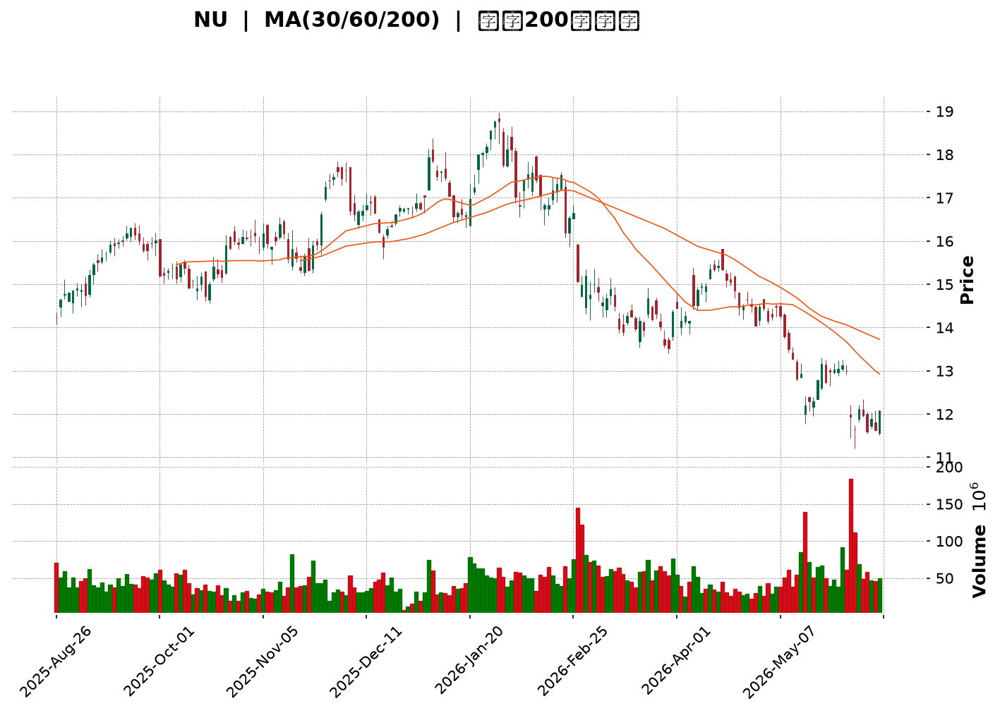
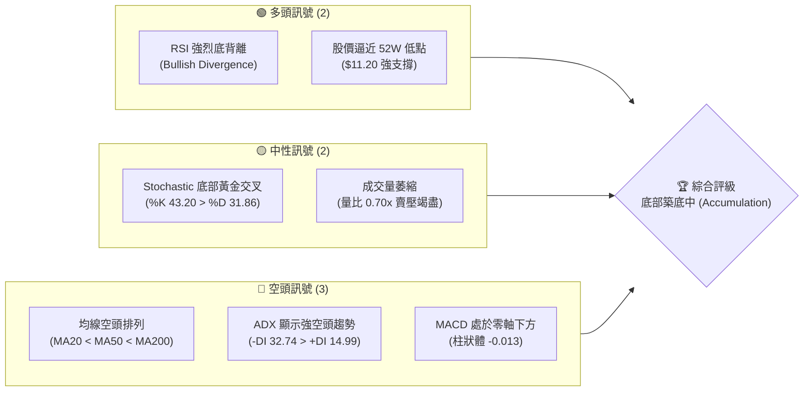
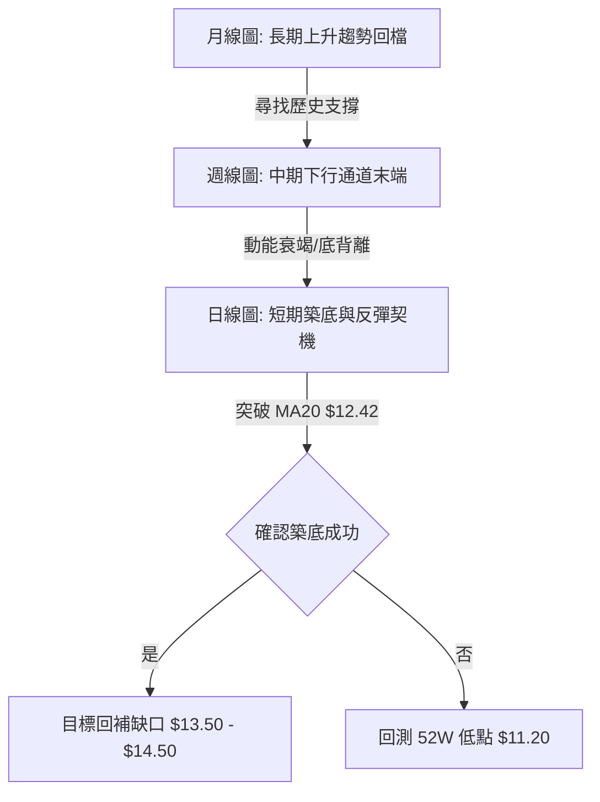
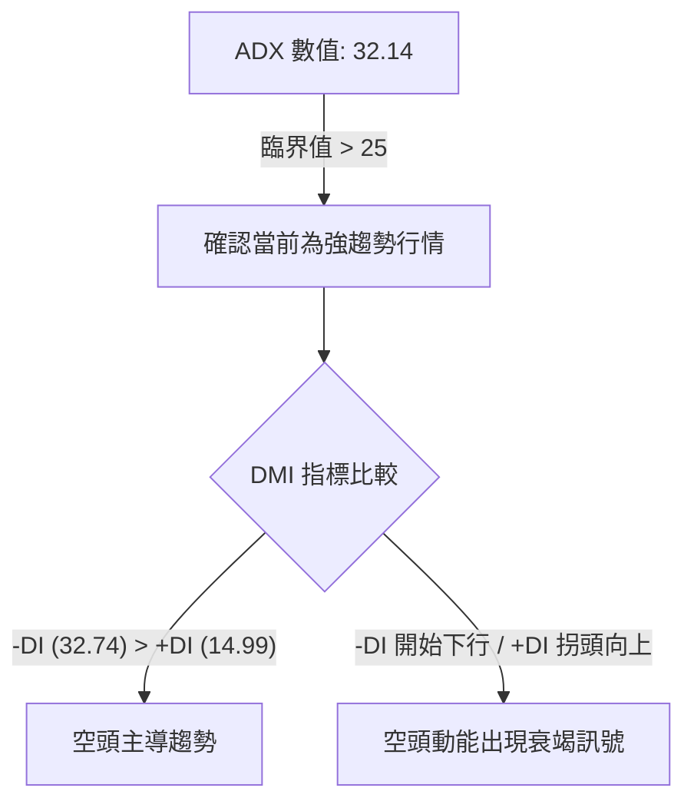
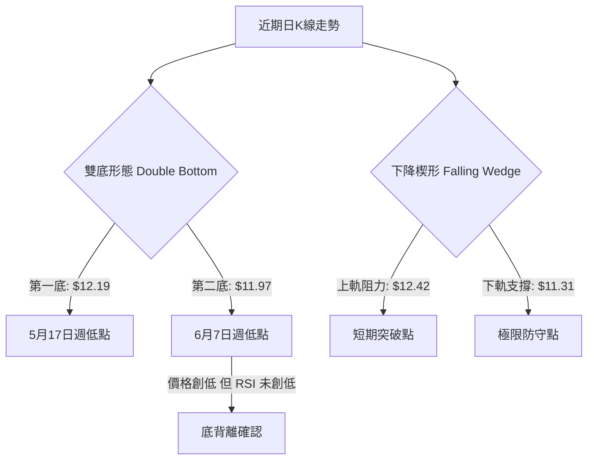

<details>
<summary>📊 靜態圖表 (點擊展開)</summary>

</details>

<html>
<head><meta charset="utf-8" /></head>
<body>
    <div style="height:500px; width:100%;">                        <script>window.PlotlyConfig = {MathJaxConfig: 'local'};</script>
        <script charset="utf-8" src="https://cdn.plot.ly/plotly-3.6.0.min.js" integrity="sha256-QaOVwtVY0T02VaHrr6pnoHLCwayMJp4O5n4YyaE3rJk=" crossorigin="anonymous"></script>                <div id="candlestick-chart" class="plotly-graph-div" style="height:100%; width:100%;"></div>            <script>                window.PLOTLYENV=window.PLOTLYENV || {};                                if (document.getElementById("candlestick-chart")) {                    Plotly.newPlot(                        "candlestick-chart",                        [{"close":{"dtype":"f8","bdata":"AAAAQOF6LEAAAAAgrkctQAAAAIA9ii1AAAAAoJmZLUAAAADgUbgtQAAAAMDMzC1AAAAAoHC9LUAAAABA4XotQAAAAOCjcC5AAAAAIIXrLkAAAADAHgUvQAAAAKBwPS9AAAAAoEdhL0AAAACA69EvQAAAACCuxy9AAAAAIIXrL0AAAABA4fovQAAAACCFKzBAAAAAwMxMMEAAAABgZiYwQAAAAGCPAjBAAAAAIFyPL0AAAAAgXI8vQAAAAGBm5i9AAAAAYI8CMEAAAACgR2EuQAAAAOCjcC5AAAAAYLieLkAAAABgj8IuQAAAAGCPQi5AAAAAIIXrLkAAAACgcL0uQAAAAEAK1y1AAAAAwPUoLkAAAACA69EtQAAAAAApXC5AAAAAgMJ1LUAAAAAAAAAuQAAAAIDr0S5AAAAAQOF6LkAAAACA61EuQAAAAMDMzC9AAAAAgBSuL0AAAAAAAAAwQAAAAAAp3C9AAAAAQAoXMEAAAAAgXA8wQAAAAAApHDBAAAAAoEchMEAAAACgmZkvQAAAACCFKzBAAAAAoEfhL0AAAACgcL0vQAAAAMAeBTBAAAAAANdjMEAAAACAFC4wQAAAAIAULi9AAAAAANejL0AAAABAMzMvQAAAAADXoy5AAAAAgOtRL0AAAAAA16MuQAAAACCuxy9AAAAAQArXL0AAAAAAKZwwQAAAAAAAQDFAAAAAANdjMUAAAABA4XoxQAAAAAApnDFAAAAA4KNwMUAAAABgZqYxQAAAAEAzszBAAAAAYLieMEAAAACAFK4wQAAAAOCjsDBAAAAAgOvRMEAAAABgZuYwQAAAAGBmpjBAAAAAQDMzMEAAAADgUbgvQAAAAMAeRTBAAAAAQApXMEAAAABguJ4wQAAAAGCPwjBAAAAAoHC9MEAAAABgj8IwQAAAAMD1qDBAAAAAoEfhMEAAAACgcL0wQAAAAMAeBTFAAAAA4KPwMUAAAAAAKdwxQAAAAAAAgDFAAAAAACmcMUAAAACAwnUxQAAAAIA9CjFAAAAAIFyPMEAAAAAA16MwQAAAAAApnDBAAAAAoJmZMEAAAADgUfgwQAAAAKBwPTFAAAAAAAAAMkAAAACAPQoyQAAAAIAULjJAAAAAwMyMMkAAAABgj8IyQAAAAGCPwjJAAAAAAADAMUAAAAAAKRwyQAAAAGC4HjJAAAAAwB4FMUAAAAAgXM8wQAAAAGBmZjFAAAAAwMyMMUAAAACA65ExQAAAAMD1aDFAAAAAgD0KMUAAAACA69EwQAAAAIDr0TBAAAAAIIUrMUAAAACA61ExQAAAACCuhzFAAAAA4KMwMEAAAAAgrocwQAAAAGBmpjBAAAAAYLgeLkAAAACAwvUtQAAAAKBHYS5AAAAAwB6FLUAAAAAAAAAuQAAAAADXoy1AAAAAwPUoLUAAAABAClctQAAAAGCPwi1AAAAAQOH6LEAAAADgo\u002fArQAAAACCuxytAAAAAgD2KLEAAAAAAAIAsQAAAAOCj8CtAAAAAgOtRLEAAAACgR+ErQAAAAAApXC1AAAAAoEdhLEAAAAAA16MsQAAAAIA9CixAAAAAQDMzK0AAAADAHgUrQAAAAKBwvSxAAAAAoEfhLEAAAADAzEwsQAAAAMAehSxAAAAAwMxMLEAAAADAHgUtQAAAAKBwvS1AAAAAIIXrLUAAAABgZuYtQAAAAEAzsy5AAAAAgBSuLkAAAAAAKdwuQAAAAIAUri5AAAAAQDMzLkAAAACgmRkuQAAAAEAzsy1AAAAAIIXrLEAAAADAHgUtQAAAACCuRy1AAAAAAAAALUAAAADgehQsQAAAAIDC9SxAAAAAoEfhLEAAAACA61EsQAAAAAAAgCxAAAAAgML1LEAAAADAHoUsQAAAAKCZmStAAAAAAAAAK0AAAACAPYoqQAAAAADXoylAAAAAACncKUAAAACgR2EoQAAAAOB6lChAAAAA4HqUKEAAAADgepQpQAAAAIDrUSpAAAAAgMJ1KUAAAACAwvUpQAAAACBcDypAAAAAoJkZKkAAAABgj0IqQAAAAEDh+ilAAAAAACncJ0AAAAAgrkcnQAAAAKBwPShAAAAA4KPwJ0AAAABAMzMnQAAAAGCPwidAAAAAoHA9J0AAAACAFC4oQA=="},"high":{"dtype":"f8","bdata":"AAAAQDOzLEAAAABAClctQAAAAEDhOi5AAAAAANejLUAAAACgcL0tQAAAAIDrES5AAAAAoHD9LUAAAACgmVkuQAAAAOCjsC5AAAAAwB4FL0AAAAAghWsvQAAAAKBHoS9AAAAAgD2KL0AAAACgRwEwQAAAAIDrETBAAAAAwMwMMEAAAACgRyEwQAAAAKCZWTBAAAAAwMxMMEAAAADAzGwwQAAAAGC4XjBAAAAA4FEYMEAAAACgcP0vQAAAAKCZGTBAAAAA4KMwMEAAAADAzAwwQAAAAMDMzC5AAAAAAADALkAAAABA4fouQAAAAOB6FC9AAAAAAAAAL0AAAADA9SgvQAAAAGBm5i5AAAAAoHA9LkAAAACgR2EuQAAAAABWji5AAAAAYLieLkAAAABguB4uQAAAACCuRy9AAAAAgBQuL0AAAAAghesuQAAAAADXIzBAAAAAoEchMEAAAACgmVkwQAAAAIDrETBAAAAAwB5FMEAAAACgcD0wQAAAAMAeRTBAAAAAAACAMEAAAACgcB0wQAAAACCFazBAAAAAYGZmMEAAAAAAAMAvQAAAAOBRODBAAAAAwMyMMEAAAAAAAIAwQAAAAIDrMTBAAAAAYI9CMEAAAACgcL0vQAAAAKCZWS9AAAAA4KNwL0AAAABAMxMwQAAAAMAeBTBAAAAAIFwPMEAAAADAzKwwQAAAAKBHYTFAAAAAgBSOMUAAAAAgXI8xQAAAAEAK1zFAAAAA4FG4MUAAAADgo9AxQAAAAEDhujFAAAAAQDMTMUAAAABA4bowQAAAAKCZ2TBAAAAAACkcMUAAAAAgXA8xQAAAAIDrETFAAAAAwB6FMEAAAADA9SgwQAAAAOAiWzBAAAAA4FF4MEAAAACgR6EwQAAAAOB61DBAAAAAwPXIMEAAAABgj8IwQAAAACBczzBAAAAAQOEaMUAAAADAzOwwQAAAACBcDzFAAAAAgJUjMkAAAABguF4yQAAAAGCPwjFAAAAAgL6fMUAAAACA6xEyQAAAACCFazFAAAAAgOsRMUAAAADgo7AwQAAAAOBR+DBAAAAAYA6tMEAAAADgo1AxQAAAAIA9ijFAAAAAAAAAMkAAAADgoxAyQAAAAGCPQjJAAAAAIFyPMkAAAADA9cgyQAAAAEDh+jJAAAAAYLieMkAAAABACncyQAAAAGBmpjJAAAAAgD0qMkAAAABgjyIxQAAAACCFazFAAAAAQArXMUAAAAAAKbwxQAAAAKBw\u002fTFAAAAAwMyMMUAAAACgR+EwQAAAAAAAADFAAAAAQOF6MUAAAADgo3AxQAAAAEAKlzFAAAAAwPVoMUAAAABACpcwQAAAAKCZ2TBAAAAAoEfhL0AAAABgZmYuQAAAAECLrC5AAAAAYLgeLkAAAACAwrUuQAAAAMDMTC5AAAAAQDNzLUAAAACA65EtQAAAAIA9Si5AAAAAoEfhLUAAAABAM7MsQAAAAGC4nixAAAAAoHC9LEAAAADgehQtQAAAAMDMjCxAAAAAAACALEAAAADAzEwsQAAAAEAK1y1AAAAAwB4FLUAAAACgR2EtQAAAAGBmpixAAAAAYGbmK0AAAACA65ErQAAAAIDr0SxAAAAAoJmZLUAAAACAwvUsQAAAACCuxyxAAAAAgOtRLEAAAADAScwuQAAAAAAp3C1AAAAA4HoULkAAAAAgXA8uQAAAAOCj8C5AAAAAYLgeL0AAAACgRyEvQAAAAGC4ni9AAAAAQDOzLkAAAAAgXI8uQAAAAOCjcC5AAAAAANejLUAAAADgehQtQAAAACCFqy1AAAAAQApXLUAAAADAHgUtQAAAAGC4Hi1AAAAAgOtRLUAAAADgo\u002fAsQAAAAKBH4SxAAAAAoJkZLUAAAABAMzMtQAAAAMD1qCxAAAAAwPXoK0AAAAAAKRwrQAAAAIA9iipAAAAAQApXKkAAAAAgXM8oQAAAAMDMzChAAAAAwMzMKEAAAACgmZkpQAAAAKCZmSpAAAAAwB6FKkAAAACgRyEqQAAAAAApXCpAAAAAQOF6KkAAAAAAAIAqQAAAAMDMTCpAAAAAIIVrKEAAAABA4XonQAAAAIAUbihAAAAAQDOzKEAAAACgmRkoQAAAAIDrEShAAAAAgBQuKEAAAACAFC4oQA=="},"hovertemplate":"\u003cb\u003e%{x|%Y-%m-%d}\u003c\u002fb\u003e\u003cbr\u003e\u958b: $%{open:.2f}\u003cbr\u003e\u9ad8: $%{high:.2f}\u003cbr\u003e\u4f4e: $%{low:.2f}\u003cbr\u003e\u6536: $%{close:.2f}\u003cextra\u003e\u003c\u002fextra\u003e","low":{"dtype":"f8","bdata":"AAAAIFokLEAAAABgj4IsQAAAAIDrUS1AAAAAgBQuLUAAAACAFK4sQAAAAIDCdS1AAAAAgML1LEAAAACAPQotQAAAACCFay1AAAAAYI8CLkAAAACgmZkuQAAAAIDC9S5AAAAA4HoUL0AAAADA9WgvQAAAAIDrUS9AAAAAYGamL0AAAADAHsUvQAAAAMAeBTBAAAAAgML1L0AAAAAgrgcwQAAAAKDx0i9AAAAAgMJ1L0AAAACgmRkvQAAAAMD1qC9AAAAAwMxML0AAAACA61EuQAAAAIA9Ci5AAAAA4FE4LkAAAAAAAEAuQAAAAIA9Ci5AAAAAoJkZLkAAAACAwnUuQAAAAGCPwi1AAAAAQArXLUAAAAAgrkctQAAAAOBRuC1AAAAAQF46LUAAAABguB4tQAAAAGC4Hi5AAAAAIFxPLkAAAACA6xEuQAAAAIDCdS5AAAAAIASWL0AAAABACtcvQAAAAADXoy9AAAAAACncL0AAAAAA1wMwQAAAAGCPwi9AAAAAgBTuL0AAAABgZmYvQAAAAOB6lC9AAAAAgBSuL0AAAABgZuYuQAAAAMDMzC9AAAAAwMwMMEAAAAAghQswQAAAAOBR+C5AAAAAANejLkAAAAAAAAAvQAAAAMAehS5AAAAAoEdhLkAAAACgmZkuQAAAAGCPgi5AAAAAIFyPL0AAAAAAKVwvQAAAAMD16DBAAAAAQDMzMUAAAAAgrkcxQAAAAEDhejFAAAAAgD1KMUAAAAAAKVwxQAAAAKCZmTBAAAAA4FF4MEAAAAAAAkswQAAAAEAKdzBAAAAAQDOzMEAAAACgmZkwQAAAAKBHoTBAAAAAgBQuMEAAAACAFC4vQAAAAMAgEDBAAAAAQGJQMEAAAACgmVkwQAAAACBcjzBAAAAAYGamMEAAAAAAKZwwQAAAAIA9ijBAAAAAgBSuMEAAAACAwrUwQAAAAGBmpjBAAAAAgD0qMUAAAAAgXM8xQAAAACCuZzFAAAAAYLheMUAAAAAA12MxQAAAAMAeBTFAAAAAgD1qMEAAAADAzGwwQAAAAIBBgDBAAAAAgBROMEAAAACgmVkwQAAAAIDrETFAAAAA4HpUMUAAAACAwrUxQAAAAGBm5jFAAAAAoJkZMkAAAAAAKVwyQAAAAKBwPTJAAAAAgMK1MUAAAACAwrUxQAAAAEAK1zFAAAAAAADgMEAAAADAzIwwQAAAAGCPwjBAAAAAQAo3MUAAAACAPQoxQAAAAKCZWTFAAAAAgMK1MEAAAABguF4wQAAAAEAKlzBAAAAAQArXMEAAAADAHuUwQAAAACCFKzFAAAAA4HoUMEAAAACgcL0vQAAAAADXgzBAAAAA4HoULkAAAABgZmYtQAAAAGC4nixAAAAAQApXLEAAAACgmZktQAAAAOBROC1AAAAA4FF4LEAAAACAwnUsQAAAACBcDy1AAAAAYI\u002fCLEAAAABgj8IrQAAAAKBHoStAAAAAYLgeLEAAAADgUXgsQAAAAOB61CtAAAAAIFwPK0AAAADgepQrQAAAAOCjcCxAAAAAgOtRLEAAAAAghWssQAAAAAAp3CtAAAAA4HoUK0AAAACA69EqQAAAAGBmZitAAAAAACncLEAAAAAAAqsrQAAAAMD1KCxAAAAAgBSuK0AAAACA69EsQAAAAMDMzCxAAAAAIFyPLUAAAABAMzMtQAAAAKBwPS5AAAAAoJmZLkAAAADgepQuQAAAAGC4ni5AAAAAACncLUAAAADgo\u002fAtQAAAAEAKVy1AAAAAgOuRLEAAAACgR2EsQAAAAKCZGS1AAAAAgMK1LEAAAADgehQsQAAAAKCZGSxAAAAAYI\u002fCLEAAAACAFC4sQAAAAEAKVyxAAAAAoHB9LEAAAADA9WgsQAAAAAAAgCtAAAAAQArXKkAAAADAHoUqQAAAACCuhylAAAAAgBSuKUAAAAAgXI8nQAAAAGC4HihAAAAAIIXrJ0AAAADA9agoQAAAAGC4HilAAAAAIIVrKUAAAADAzEwpQAAAAAAp3ClAAAAAIK7HKUAAAABA4fopQAAAAIDr0SlAAAAAoEfhJkAAAABgZmYmQAAAAADXoydAAAAAYLjeJ0AAAACgmRknQAAAACBcTydAAAAA4FE4J0AAAADAHgUnQA=="},"name":"\u50f9\u683c","open":{"dtype":"f8","bdata":"AAAAQOF6LEAAAACAwvUsQAAAAAAAgC1AAAAA4FE4LUAAAADA9SgtQAAAAKBwvS1AAAAAgBSuLUAAAADAHgUuQAAAACBcjy1AAAAAgMJ1LkAAAACgmRkvQAAAACBcDy9AAAAAAClcL0AAAAAAAIAvQAAAAKBH4S9AAAAAYGbmL0AAAABgjwIwQAAAAIDrETBAAAAAACkcMEAAAADAzEwwQAAAAIAULjBAAAAAACncL0AAAAAAKdwvQAAAAGBm5i9AAAAAIIXrL0AAAADAzAwwQAAAAIA9ii5AAAAAIFyPLkAAAACgcL0uQAAAAIDr0S5AAAAAAClcLkAAAAAgXA8vQAAAAOBRuC5AAAAAwPUoLkAAAABAM7MtQAAAAAAAAC5AAAAA4HqULkAAAAAgrkctQAAAAGCPQi5AAAAAQDOzLkAAAAAA16MuQAAAAMAehS5AAAAAQAoXMEAAAABA4TowQAAAACCF6y9AAAAAYGbmL0AAAACA6xEwQAAAAAApHDBAAAAA4KMwMEAAAACgmZkvQAAAAOBRuC9AAAAAYLheMEAAAAAA16MvQAAAAKCZGTBAAAAAQAoXMEAAAACAwnUwQAAAAIA9CjBAAAAAACncLkAAAADgUXgvQAAAAMDMzC5AAAAAwMyMLkAAAACAFK4vQAAAAIDCtS5AAAAAAAAAMEAAAABACtcvQAAAAEDh+jBAAAAAANdjMUAAAACAFG4xQAAAAIDCtTFAAAAAQDOzMUAAAABgZqYxQAAAAEAzszFAAAAAYLjeMEAAAADAHmUwQAAAAKCZmTBAAAAAQOG6MEAAAAAgrucwQAAAAGBmBjFAAAAAAACAMEAAAABAChcwQAAAAGBmJjBAAAAAoJlZMEAAAAAghWswQAAAAOCjsDBAAAAAQDOzMEAAAACgcL0wQAAAAIA9qjBAAAAAwB7FMEAAAABguN4wQAAAACBcDzFAAAAAgBQuMUAAAABguB4yQAAAAGC4njFAAAAAQAqXMUAAAACAFK4xQAAAAKCZWTFAAAAAIFwPMUAAAADgo5AwQAAAAAAAwDBAAAAAgOuRMEAAAAAAKVwwQAAAAGCPIjFAAAAAgD2qMUAAAAAAAAAyQAAAAMDMDDJAAAAAAClcMkAAAABgj6IyQAAAAOB61DJAAAAAIK6HMkAAAACgcL0xQAAAACCuZzJAAAAA4HoUMkAAAADgetQwQAAAACCFKzFAAAAA4KNwMUAAAABgZiYxQAAAAIDr8TFAAAAAwPWIMUAAAACgcL0wQAAAAAAAwDBAAAAAQDPzMEAAAAAA1yMxQAAAAEAzMzFAAAAAAABAMUAAAADgozAwQAAAAADXgzBAAAAAQArXL0AAAADgo3AtQAAAACCF6yxAAAAAAClcLUAAAACgcP0tQAAAAAAp3C1AAAAAYI8CLUAAAACA69EsQAAAAEDhei1AAAAAAACALUAAAABgZmYsQAAAAADXIyxAAAAAoHA9LEAAAADAzMwsQAAAAOCjcCxAAAAAAClcK0AAAACgcD0sQAAAAKBHoSxAAAAA4FH4LEAAAABgj0ItQAAAAGCPQixAAAAAgMJ1K0AAAAAghWsrQAAAAKCZmStAAAAAgBQuLUAAAAAAAAAsQAAAAGCPQixAAAAAQDMzLEAAAAAghWsuQAAAAMAeBS1AAAAAACncLUAAAACAFK4tQAAAAGCPQi5AAAAAIIXrLkAAAAAgrscuQAAAAGC4ni9AAAAAQOF6LkAAAADgUTguQAAAAAApXC5AAAAAYLieLUAAAABACtcsQAAAACCuRy1AAAAA4HoULUAAAACAwvUsQAAAAOB6VCxAAAAAgOtRLUAAAAAgrscsQAAAAADXoyxAAAAAAAAALUAAAAAAAAAtQAAAAKCZmSxAAAAAYI\u002fCK0AAAABACtcqQAAAACCFaypAAAAAQDOzKUAAAABAiQEoQAAAAMDMzChAAAAA4HpUKEAAAACAFK4oQAAAAOBROClAAAAAwMxMKkAAAAAgrgcqQAAAACCF6ylAAAAA4KPwKUAAAACgmRkqQAAAAAAAACpAAAAAQOH6J0AAAADAzEwnQAAAAGCPwidAAAAAQDMzKEAAAADAHgUoQAAAAOCjcCdAAAAAoJmZJ0AAAAAA1yMnQA=="},"x":["2025-08-26T00:00:00-04:00","2025-08-27T00:00:00-04:00","2025-08-28T00:00:00-04:00","2025-08-29T00:00:00-04:00","2025-09-02T00:00:00-04:00","2025-09-03T00:00:00-04:00","2025-09-04T00:00:00-04:00","2025-09-05T00:00:00-04:00","2025-09-08T00:00:00-04:00","2025-09-09T00:00:00-04:00","2025-09-10T00:00:00-04:00","2025-09-11T00:00:00-04:00","2025-09-12T00:00:00-04:00","2025-09-15T00:00:00-04:00","2025-09-16T00:00:00-04:00","2025-09-17T00:00:00-04:00","2025-09-18T00:00:00-04:00","2025-09-19T00:00:00-04:00","2025-09-22T00:00:00-04:00","2025-09-23T00:00:00-04:00","2025-09-24T00:00:00-04:00","2025-09-25T00:00:00-04:00","2025-09-26T00:00:00-04:00","2025-09-29T00:00:00-04:00","2025-09-30T00:00:00-04:00","2025-10-01T00:00:00-04:00","2025-10-02T00:00:00-04:00","2025-10-03T00:00:00-04:00","2025-10-06T00:00:00-04:00","2025-10-07T00:00:00-04:00","2025-10-08T00:00:00-04:00","2025-10-09T00:00:00-04:00","2025-10-10T00:00:00-04:00","2025-10-13T00:00:00-04:00","2025-10-14T00:00:00-04:00","2025-10-15T00:00:00-04:00","2025-10-16T00:00:00-04:00","2025-10-17T00:00:00-04:00","2025-10-20T00:00:00-04:00","2025-10-21T00:00:00-04:00","2025-10-22T00:00:00-04:00","2025-10-23T00:00:00-04:00","2025-10-24T00:00:00-04:00","2025-10-27T00:00:00-04:00","2025-10-28T00:00:00-04:00","2025-10-29T00:00:00-04:00","2025-10-30T00:00:00-04:00","2025-10-31T00:00:00-04:00","2025-11-03T00:00:00-05:00","2025-11-04T00:00:00-05:00","2025-11-05T00:00:00-05:00","2025-11-06T00:00:00-05:00","2025-11-07T00:00:00-05:00","2025-11-10T00:00:00-05:00","2025-11-11T00:00:00-05:00","2025-11-12T00:00:00-05:00","2025-11-13T00:00:00-05:00","2025-11-14T00:00:00-05:00","2025-11-17T00:00:00-05:00","2025-11-18T00:00:00-05:00","2025-11-19T00:00:00-05:00","2025-11-20T00:00:00-05:00","2025-11-21T00:00:00-05:00","2025-11-24T00:00:00-05:00","2025-11-25T00:00:00-05:00","2025-11-26T00:00:00-05:00","2025-11-28T00:00:00-05:00","2025-12-01T00:00:00-05:00","2025-12-02T00:00:00-05:00","2025-12-03T00:00:00-05:00","2025-12-04T00:00:00-05:00","2025-12-05T00:00:00-05:00","2025-12-08T00:00:00-05:00","2025-12-09T00:00:00-05:00","2025-12-10T00:00:00-05:00","2025-12-11T00:00:00-05:00","2025-12-12T00:00:00-05:00","2025-12-15T00:00:00-05:00","2025-12-16T00:00:00-05:00","2025-12-17T00:00:00-05:00","2025-12-18T00:00:00-05:00","2025-12-19T00:00:00-05:00","2025-12-22T00:00:00-05:00","2025-12-23T00:00:00-05:00","2025-12-24T00:00:00-05:00","2025-12-26T00:00:00-05:00","2025-12-29T00:00:00-05:00","2025-12-30T00:00:00-05:00","2025-12-31T00:00:00-05:00","2026-01-02T00:00:00-05:00","2026-01-05T00:00:00-05:00","2026-01-06T00:00:00-05:00","2026-01-07T00:00:00-05:00","2026-01-08T00:00:00-05:00","2026-01-09T00:00:00-05:00","2026-01-12T00:00:00-05:00","2026-01-13T00:00:00-05:00","2026-01-14T00:00:00-05:00","2026-01-15T00:00:00-05:00","2026-01-16T00:00:00-05:00","2026-01-20T00:00:00-05:00","2026-01-21T00:00:00-05:00","2026-01-22T00:00:00-05:00","2026-01-23T00:00:00-05:00","2026-01-26T00:00:00-05:00","2026-01-27T00:00:00-05:00","2026-01-28T00:00:00-05:00","2026-01-29T00:00:00-05:00","2026-01-30T00:00:00-05:00","2026-02-02T00:00:00-05:00","2026-02-03T00:00:00-05:00","2026-02-04T00:00:00-05:00","2026-02-05T00:00:00-05:00","2026-02-06T00:00:00-05:00","2026-02-09T00:00:00-05:00","2026-02-10T00:00:00-05:00","2026-02-11T00:00:00-05:00","2026-02-12T00:00:00-05:00","2026-02-13T00:00:00-05:00","2026-02-17T00:00:00-05:00","2026-02-18T00:00:00-05:00","2026-02-19T00:00:00-05:00","2026-02-20T00:00:00-05:00","2026-02-23T00:00:00-05:00","2026-02-24T00:00:00-05:00","2026-02-25T00:00:00-05:00","2026-02-26T00:00:00-05:00","2026-02-27T00:00:00-05:00","2026-03-02T00:00:00-05:00","2026-03-03T00:00:00-05:00","2026-03-04T00:00:00-05:00","2026-03-05T00:00:00-05:00","2026-03-06T00:00:00-05:00","2026-03-09T00:00:00-04:00","2026-03-10T00:00:00-04:00","2026-03-11T00:00:00-04:00","2026-03-12T00:00:00-04:00","2026-03-13T00:00:00-04:00","2026-03-16T00:00:00-04:00","2026-03-17T00:00:00-04:00","2026-03-18T00:00:00-04:00","2026-03-19T00:00:00-04:00","2026-03-20T00:00:00-04:00","2026-03-23T00:00:00-04:00","2026-03-24T00:00:00-04:00","2026-03-25T00:00:00-04:00","2026-03-26T00:00:00-04:00","2026-03-27T00:00:00-04:00","2026-03-30T00:00:00-04:00","2026-03-31T00:00:00-04:00","2026-04-01T00:00:00-04:00","2026-04-02T00:00:00-04:00","2026-04-06T00:00:00-04:00","2026-04-07T00:00:00-04:00","2026-04-08T00:00:00-04:00","2026-04-09T00:00:00-04:00","2026-04-10T00:00:00-04:00","2026-04-13T00:00:00-04:00","2026-04-14T00:00:00-04:00","2026-04-15T00:00:00-04:00","2026-04-16T00:00:00-04:00","2026-04-17T00:00:00-04:00","2026-04-20T00:00:00-04:00","2026-04-21T00:00:00-04:00","2026-04-22T00:00:00-04:00","2026-04-23T00:00:00-04:00","2026-04-24T00:00:00-04:00","2026-04-27T00:00:00-04:00","2026-04-28T00:00:00-04:00","2026-04-29T00:00:00-04:00","2026-04-30T00:00:00-04:00","2026-05-01T00:00:00-04:00","2026-05-04T00:00:00-04:00","2026-05-05T00:00:00-04:00","2026-05-06T00:00:00-04:00","2026-05-07T00:00:00-04:00","2026-05-08T00:00:00-04:00","2026-05-11T00:00:00-04:00","2026-05-12T00:00:00-04:00","2026-05-13T00:00:00-04:00","2026-05-14T00:00:00-04:00","2026-05-15T00:00:00-04:00","2026-05-18T00:00:00-04:00","2026-05-19T00:00:00-04:00","2026-05-20T00:00:00-04:00","2026-05-21T00:00:00-04:00","2026-05-22T00:00:00-04:00","2026-05-26T00:00:00-04:00","2026-05-27T00:00:00-04:00","2026-05-28T00:00:00-04:00","2026-05-29T00:00:00-04:00","2026-06-01T00:00:00-04:00","2026-06-02T00:00:00-04:00","2026-06-03T00:00:00-04:00","2026-06-04T00:00:00-04:00","2026-06-05T00:00:00-04:00","2026-06-08T00:00:00-04:00","2026-06-09T00:00:00-04:00","2026-06-10T00:00:00-04:00","2026-06-11T00:00:00-04:00"],"type":"candlestick"},{"hovertemplate":"MA30: $%{y:.2f}\u003cextra\u003e\u003c\u002fextra\u003e","line":{"color":"#2196F3","dash":"dash","width":2},"mode":"lines","name":"MA30","x":["2025-08-26T00:00:00-04:00","2025-08-27T00:00:00-04:00","2025-08-28T00:00:00-04:00","2025-08-29T00:00:00-04:00","2025-09-02T00:00:00-04:00","2025-09-03T00:00:00-04:00","2025-09-04T00:00:00-04:00","2025-09-05T00:00:00-04:00","2025-09-08T00:00:00-04:00","2025-09-09T00:00:00-04:00","2025-09-10T00:00:00-04:00","2025-09-11T00:00:00-04:00","2025-09-12T00:00:00-04:00","2025-09-15T00:00:00-04:00","2025-09-16T00:00:00-04:00","2025-09-17T00:00:00-04:00","2025-09-18T00:00:00-04:00","2025-09-19T00:00:00-04:00","2025-09-22T00:00:00-04:00","2025-09-23T00:00:00-04:00","2025-09-24T00:00:00-04:00","2025-09-25T00:00:00-04:00","2025-09-26T00:00:00-04:00","2025-09-29T00:00:00-04:00","2025-09-30T00:00:00-04:00","2025-10-01T00:00:00-04:00","2025-10-02T00:00:00-04:00","2025-10-03T00:00:00-04:00","2025-10-06T00:00:00-04:00","2025-10-07T00:00:00-04:00","2025-10-08T00:00:00-04:00","2025-10-09T00:00:00-04:00","2025-10-10T00:00:00-04:00","2025-10-13T00:00:00-04:00","2025-10-14T00:00:00-04:00","2025-10-15T00:00:00-04:00","2025-10-16T00:00:00-04:00","2025-10-17T00:00:00-04:00","2025-10-20T00:00:00-04:00","2025-10-21T00:00:00-04:00","2025-10-22T00:00:00-04:00","2025-10-23T00:00:00-04:00","2025-10-24T00:00:00-04:00","2025-10-27T00:00:00-04:00","2025-10-28T00:00:00-04:00","2025-10-29T00:00:00-04:00","2025-10-30T00:00:00-04:00","2025-10-31T00:00:00-04:00","2025-11-03T00:00:00-05:00","2025-11-04T00:00:00-05:00","2025-11-05T00:00:00-05:00","2025-11-06T00:00:00-05:00","2025-11-07T00:00:00-05:00","2025-11-10T00:00:00-05:00","2025-11-11T00:00:00-05:00","2025-11-12T00:00:00-05:00","2025-11-13T00:00:00-05:00","2025-11-14T00:00:00-05:00","2025-11-17T00:00:00-05:00","2025-11-18T00:00:00-05:00","2025-11-19T00:00:00-05:00","2025-11-20T00:00:00-05:00","2025-11-21T00:00:00-05:00","2025-11-24T00:00:00-05:00","2025-11-25T00:00:00-05:00","2025-11-26T00:00:00-05:00","2025-11-28T00:00:00-05:00","2025-12-01T00:00:00-05:00","2025-12-02T00:00:00-05:00","2025-12-03T00:00:00-05:00","2025-12-04T00:00:00-05:00","2025-12-05T00:00:00-05:00","2025-12-08T00:00:00-05:00","2025-12-09T00:00:00-05:00","2025-12-10T00:00:00-05:00","2025-12-11T00:00:00-05:00","2025-12-12T00:00:00-05:00","2025-12-15T00:00:00-05:00","2025-12-16T00:00:00-05:00","2025-12-17T00:00:00-05:00","2025-12-18T00:00:00-05:00","2025-12-19T00:00:00-05:00","2025-12-22T00:00:00-05:00","2025-12-23T00:00:00-05:00","2025-12-24T00:00:00-05:00","2025-12-26T00:00:00-05:00","2025-12-29T00:00:00-05:00","2025-12-30T00:00:00-05:00","2025-12-31T00:00:00-05:00","2026-01-02T00:00:00-05:00","2026-01-05T00:00:00-05:00","2026-01-06T00:00:00-05:00","2026-01-07T00:00:00-05:00","2026-01-08T00:00:00-05:00","2026-01-09T00:00:00-05:00","2026-01-12T00:00:00-05:00","2026-01-13T00:00:00-05:00","2026-01-14T00:00:00-05:00","2026-01-15T00:00:00-05:00","2026-01-16T00:00:00-05:00","2026-01-20T00:00:00-05:00","2026-01-21T00:00:00-05:00","2026-01-22T00:00:00-05:00","2026-01-23T00:00:00-05:00","2026-01-26T00:00:00-05:00","2026-01-27T00:00:00-05:00","2026-01-28T00:00:00-05:00","2026-01-29T00:00:00-05:00","2026-01-30T00:00:00-05:00","2026-02-02T00:00:00-05:00","2026-02-03T00:00:00-05:00","2026-02-04T00:00:00-05:00","2026-02-05T00:00:00-05:00","2026-02-06T00:00:00-05:00","2026-02-09T00:00:00-05:00","2026-02-10T00:00:00-05:00","2026-02-11T00:00:00-05:00","2026-02-12T00:00:00-05:00","2026-02-13T00:00:00-05:00","2026-02-17T00:00:00-05:00","2026-02-18T00:00:00-05:00","2026-02-19T00:00:00-05:00","2026-02-20T00:00:00-05:00","2026-02-23T00:00:00-05:00","2026-02-24T00:00:00-05:00","2026-02-25T00:00:00-05:00","2026-02-26T00:00:00-05:00","2026-02-27T00:00:00-05:00","2026-03-02T00:00:00-05:00","2026-03-03T00:00:00-05:00","2026-03-04T00:00:00-05:00","2026-03-05T00:00:00-05:00","2026-03-06T00:00:00-05:00","2026-03-09T00:00:00-04:00","2026-03-10T00:00:00-04:00","2026-03-11T00:00:00-04:00","2026-03-12T00:00:00-04:00","2026-03-13T00:00:00-04:00","2026-03-16T00:00:00-04:00","2026-03-17T00:00:00-04:00","2026-03-18T00:00:00-04:00","2026-03-19T00:00:00-04:00","2026-03-20T00:00:00-04:00","2026-03-23T00:00:00-04:00","2026-03-24T00:00:00-04:00","2026-03-25T00:00:00-04:00","2026-03-26T00:00:00-04:00","2026-03-27T00:00:00-04:00","2026-03-30T00:00:00-04:00","2026-03-31T00:00:00-04:00","2026-04-01T00:00:00-04:00","2026-04-02T00:00:00-04:00","2026-04-06T00:00:00-04:00","2026-04-07T00:00:00-04:00","2026-04-08T00:00:00-04:00","2026-04-09T00:00:00-04:00","2026-04-10T00:00:00-04:00","2026-04-13T00:00:00-04:00","2026-04-14T00:00:00-04:00","2026-04-15T00:00:00-04:00","2026-04-16T00:00:00-04:00","2026-04-17T00:00:00-04:00","2026-04-20T00:00:00-04:00","2026-04-21T00:00:00-04:00","2026-04-22T00:00:00-04:00","2026-04-23T00:00:00-04:00","2026-04-24T00:00:00-04:00","2026-04-27T00:00:00-04:00","2026-04-28T00:00:00-04:00","2026-04-29T00:00:00-04:00","2026-04-30T00:00:00-04:00","2026-05-01T00:00:00-04:00","2026-05-04T00:00:00-04:00","2026-05-05T00:00:00-04:00","2026-05-06T00:00:00-04:00","2026-05-07T00:00:00-04:00","2026-05-08T00:00:00-04:00","2026-05-11T00:00:00-04:00","2026-05-12T00:00:00-04:00","2026-05-13T00:00:00-04:00","2026-05-14T00:00:00-04:00","2026-05-15T00:00:00-04:00","2026-05-18T00:00:00-04:00","2026-05-19T00:00:00-04:00","2026-05-20T00:00:00-04:00","2026-05-21T00:00:00-04:00","2026-05-22T00:00:00-04:00","2026-05-26T00:00:00-04:00","2026-05-27T00:00:00-04:00","2026-05-28T00:00:00-04:00","2026-05-29T00:00:00-04:00","2026-06-01T00:00:00-04:00","2026-06-02T00:00:00-04:00","2026-06-03T00:00:00-04:00","2026-06-04T00:00:00-04:00","2026-06-05T00:00:00-04:00","2026-06-08T00:00:00-04:00","2026-06-09T00:00:00-04:00","2026-06-10T00:00:00-04:00","2026-06-11T00:00:00-04:00"],"y":{"dtype":"f8","bdata":"AAAAAAAA+H8AAAAAAAD4fwAAAAAAAPh\u002fAAAAAAAA+H8AAAAAAAD4fwAAAAAAAPh\u002fAAAAAAAA+H8AAAAAAAD4fwAAAAAAAPh\u002fAAAAAAAA+H8AAAAAAAD4fwAAAAAAAPh\u002fAAAAAAAA+H8AAAAAAAD4fwAAAAAAAPh\u002fAAAAAAAA+H8AAAAAAAD4fwAAAAAAAPh\u002fAAAAAAAA+H8AAAAAAAD4fwAAAAAAAPh\u002fAAAAAAAA+H8AAAAAAAD4fwAAAAAAAPh\u002fAAAAAAAA+H8AAAAAAAD4fwAAAAAAAPh\u002fAAAAAAAA+H8AAAAAAAD4fxEREfGL5S5ARERENF76LkDv7u6e0wYvQKuqqvpiCS9AERERUSoOL0BVVVXFBA8vQM3MzBzMEy9AERERcWgRL0BmZmZm2BUvQFVVVYUWGS9AMzMzU1UVL0BmZmYmXA8vQM3MzHwjFC9AmpmZ2bIWL0ARERERPBgvQERERNTqGC9A7+7uziIbL0BERESkVBwvQAAAAIBOGy9AIiIiwmcYL0BmZmaWbhIvQDMzM6MpFS9AAAAAsOQXL0B3d3fnbRkvQN7d3b2fGi9AvLu7+xshL0DNzMxcATIvQKuqqupROC9AMzMzIwZBL0BVVVVVx0QvQERERHQFSC9ARERERG9LL0AAAADQlEovQO\u002fu7s4iWy9AMzMz03hpL0De3d09fIYvQFVVVTXQqS9AzczM7DXXL0CrqqqaxAAwQERERJSKEzBA3t3djVAmMECrqqoKkDswQLy7u6tjQjBAvLu7mwtJMEB3d3cX2U4wQGZmZlZVVTBAvLu7C5BbMEDe3d0Nu2IwQDMzM7NWZzBA7+7unu9nMEARERGxcmgwQFVVVSVNaTBA3t3d9bZsMEDNzMxcHXMwQKuqqupteTBAERERgWp8MECJiIiIXYEwQLy7u\u002ft+ijBAZmZmloqTMEBERET0RJ0wQJqZmanGqzBAZmZmZju\u002fMEDe3d0d6NQwQO\u002fu7jal4jBAvLu7ExHxMEBVVVXtUfgwQFVVVS2H9jBAvLu7A3LvMECamZkBR+gwQBEREXm+3zBA7+7udpPYMEAzMzP7xdIwQImIiKBh1zBAAAAASCjjMEB3d3c\u002fw+4wQLy7uzN6+zBAmpmZcT0KMUBVVVWtHBoxQDMzMwseLDFAmpmZEVg5MUBVVVVFi0wxQImIiKhUXDFAREREJCJiMUAzMzMzwWMxQM3MzEw3aTFAVVVVxSBwMUDe3d09CncxQERERKRwfTFAvLu7K85+MUDv7u7ufH8xQGZmZgbIfTFA7+7u7jV3MUCJiIhImnIxQCIiItLbcjFAiYiIyL1mMUC8u7srzl4xQDMzMzN6WzFA7+7uZq1OMUC8u7sTg0AxQJqZmQllNDFA7+7ufrEkMUB3d3f34RMxQFVVVWU7\u002fzBAq6qqSgziMECamZlpSsUwQLy7u3MhqTBAd3d3P3yGMEBVVVVVnF0wQAAAAKgNNDBAMzMze1sWMEDNzMxc1uovQLy7u7sCpC9AMzMzMzNzL0Crqqr6N0IvQO\u002fu7h7MEy9A7+7uDnTaLkB3d3eX\u002fKIuQFVVVXUhaS5A3t3d3WsuLkAiIiJC7vUtQLy7uwsezC1A3t3dfYadLUDNzMyMbGctQDMzM7OdLy1AzczMzMwMLUCJiIhIU+osQImIiFjyyyxAAAAAcD3KLEDe3d1dusksQLy7u2t1zCxAq6qqelvWLEDe3d0tst0sQImIiBiS5ixAMzMzA3LvLEAiIiJC7vUsQAAAADBr9SxA3t3dHej0LECamZlpH\u002f4sQGZmZjbsCi1AiYiIGNkOLUB3d3eXQwstQAAAAND3Ey1AZmZmJr8YLUCJiIhYgBwtQFVVVaUpFS1AzczMrBwaLUCJiIiIFhktQGZmZlZVFS1A3t3dbaATLUCrqqrahw8tQM3MzMwT9SxAMzMzg07bLEBEREQk27ksQERERBQ8mCxA3t3dnX14LEAiIiLSIlssQHd3d7fzPSxAIiIisuQXLEAiIiKiRfYrQFVVVWWtzitAvLu7O5inK0ARERFhV4ArQCIiIhI8WCtAERERISIiK0DNzMyc7+cqQO\u002fu7g5YuSpAVVVVFdmOKkCamZkZL10qQJqZmXkULipAAAAAkO38KUAiIiLipdspQA=="},"type":"scatter"},{"hovertemplate":"MA60: $%{y:.2f}\u003cextra\u003e\u003c\u002fextra\u003e","line":{"color":"#9C27B0","dash":"dash","width":2},"mode":"lines","name":"MA60","x":["2025-08-26T00:00:00-04:00","2025-08-27T00:00:00-04:00","2025-08-28T00:00:00-04:00","2025-08-29T00:00:00-04:00","2025-09-02T00:00:00-04:00","2025-09-03T00:00:00-04:00","2025-09-04T00:00:00-04:00","2025-09-05T00:00:00-04:00","2025-09-08T00:00:00-04:00","2025-09-09T00:00:00-04:00","2025-09-10T00:00:00-04:00","2025-09-11T00:00:00-04:00","2025-09-12T00:00:00-04:00","2025-09-15T00:00:00-04:00","2025-09-16T00:00:00-04:00","2025-09-17T00:00:00-04:00","2025-09-18T00:00:00-04:00","2025-09-19T00:00:00-04:00","2025-09-22T00:00:00-04:00","2025-09-23T00:00:00-04:00","2025-09-24T00:00:00-04:00","2025-09-25T00:00:00-04:00","2025-09-26T00:00:00-04:00","2025-09-29T00:00:00-04:00","2025-09-30T00:00:00-04:00","2025-10-01T00:00:00-04:00","2025-10-02T00:00:00-04:00","2025-10-03T00:00:00-04:00","2025-10-06T00:00:00-04:00","2025-10-07T00:00:00-04:00","2025-10-08T00:00:00-04:00","2025-10-09T00:00:00-04:00","2025-10-10T00:00:00-04:00","2025-10-13T00:00:00-04:00","2025-10-14T00:00:00-04:00","2025-10-15T00:00:00-04:00","2025-10-16T00:00:00-04:00","2025-10-17T00:00:00-04:00","2025-10-20T00:00:00-04:00","2025-10-21T00:00:00-04:00","2025-10-22T00:00:00-04:00","2025-10-23T00:00:00-04:00","2025-10-24T00:00:00-04:00","2025-10-27T00:00:00-04:00","2025-10-28T00:00:00-04:00","2025-10-29T00:00:00-04:00","2025-10-30T00:00:00-04:00","2025-10-31T00:00:00-04:00","2025-11-03T00:00:00-05:00","2025-11-04T00:00:00-05:00","2025-11-05T00:00:00-05:00","2025-11-06T00:00:00-05:00","2025-11-07T00:00:00-05:00","2025-11-10T00:00:00-05:00","2025-11-11T00:00:00-05:00","2025-11-12T00:00:00-05:00","2025-11-13T00:00:00-05:00","2025-11-14T00:00:00-05:00","2025-11-17T00:00:00-05:00","2025-11-18T00:00:00-05:00","2025-11-19T00:00:00-05:00","2025-11-20T00:00:00-05:00","2025-11-21T00:00:00-05:00","2025-11-24T00:00:00-05:00","2025-11-25T00:00:00-05:00","2025-11-26T00:00:00-05:00","2025-11-28T00:00:00-05:00","2025-12-01T00:00:00-05:00","2025-12-02T00:00:00-05:00","2025-12-03T00:00:00-05:00","2025-12-04T00:00:00-05:00","2025-12-05T00:00:00-05:00","2025-12-08T00:00:00-05:00","2025-12-09T00:00:00-05:00","2025-12-10T00:00:00-05:00","2025-12-11T00:00:00-05:00","2025-12-12T00:00:00-05:00","2025-12-15T00:00:00-05:00","2025-12-16T00:00:00-05:00","2025-12-17T00:00:00-05:00","2025-12-18T00:00:00-05:00","2025-12-19T00:00:00-05:00","2025-12-22T00:00:00-05:00","2025-12-23T00:00:00-05:00","2025-12-24T00:00:00-05:00","2025-12-26T00:00:00-05:00","2025-12-29T00:00:00-05:00","2025-12-30T00:00:00-05:00","2025-12-31T00:00:00-05:00","2026-01-02T00:00:00-05:00","2026-01-05T00:00:00-05:00","2026-01-06T00:00:00-05:00","2026-01-07T00:00:00-05:00","2026-01-08T00:00:00-05:00","2026-01-09T00:00:00-05:00","2026-01-12T00:00:00-05:00","2026-01-13T00:00:00-05:00","2026-01-14T00:00:00-05:00","2026-01-15T00:00:00-05:00","2026-01-16T00:00:00-05:00","2026-01-20T00:00:00-05:00","2026-01-21T00:00:00-05:00","2026-01-22T00:00:00-05:00","2026-01-23T00:00:00-05:00","2026-01-26T00:00:00-05:00","2026-01-27T00:00:00-05:00","2026-01-28T00:00:00-05:00","2026-01-29T00:00:00-05:00","2026-01-30T00:00:00-05:00","2026-02-02T00:00:00-05:00","2026-02-03T00:00:00-05:00","2026-02-04T00:00:00-05:00","2026-02-05T00:00:00-05:00","2026-02-06T00:00:00-05:00","2026-02-09T00:00:00-05:00","2026-02-10T00:00:00-05:00","2026-02-11T00:00:00-05:00","2026-02-12T00:00:00-05:00","2026-02-13T00:00:00-05:00","2026-02-17T00:00:00-05:00","2026-02-18T00:00:00-05:00","2026-02-19T00:00:00-05:00","2026-02-20T00:00:00-05:00","2026-02-23T00:00:00-05:00","2026-02-24T00:00:00-05:00","2026-02-25T00:00:00-05:00","2026-02-26T00:00:00-05:00","2026-02-27T00:00:00-05:00","2026-03-02T00:00:00-05:00","2026-03-03T00:00:00-05:00","2026-03-04T00:00:00-05:00","2026-03-05T00:00:00-05:00","2026-03-06T00:00:00-05:00","2026-03-09T00:00:00-04:00","2026-03-10T00:00:00-04:00","2026-03-11T00:00:00-04:00","2026-03-12T00:00:00-04:00","2026-03-13T00:00:00-04:00","2026-03-16T00:00:00-04:00","2026-03-17T00:00:00-04:00","2026-03-18T00:00:00-04:00","2026-03-19T00:00:00-04:00","2026-03-20T00:00:00-04:00","2026-03-23T00:00:00-04:00","2026-03-24T00:00:00-04:00","2026-03-25T00:00:00-04:00","2026-03-26T00:00:00-04:00","2026-03-27T00:00:00-04:00","2026-03-30T00:00:00-04:00","2026-03-31T00:00:00-04:00","2026-04-01T00:00:00-04:00","2026-04-02T00:00:00-04:00","2026-04-06T00:00:00-04:00","2026-04-07T00:00:00-04:00","2026-04-08T00:00:00-04:00","2026-04-09T00:00:00-04:00","2026-04-10T00:00:00-04:00","2026-04-13T00:00:00-04:00","2026-04-14T00:00:00-04:00","2026-04-15T00:00:00-04:00","2026-04-16T00:00:00-04:00","2026-04-17T00:00:00-04:00","2026-04-20T00:00:00-04:00","2026-04-21T00:00:00-04:00","2026-04-22T00:00:00-04:00","2026-04-23T00:00:00-04:00","2026-04-24T00:00:00-04:00","2026-04-27T00:00:00-04:00","2026-04-28T00:00:00-04:00","2026-04-29T00:00:00-04:00","2026-04-30T00:00:00-04:00","2026-05-01T00:00:00-04:00","2026-05-04T00:00:00-04:00","2026-05-05T00:00:00-04:00","2026-05-06T00:00:00-04:00","2026-05-07T00:00:00-04:00","2026-05-08T00:00:00-04:00","2026-05-11T00:00:00-04:00","2026-05-12T00:00:00-04:00","2026-05-13T00:00:00-04:00","2026-05-14T00:00:00-04:00","2026-05-15T00:00:00-04:00","2026-05-18T00:00:00-04:00","2026-05-19T00:00:00-04:00","2026-05-20T00:00:00-04:00","2026-05-21T00:00:00-04:00","2026-05-22T00:00:00-04:00","2026-05-26T00:00:00-04:00","2026-05-27T00:00:00-04:00","2026-05-28T00:00:00-04:00","2026-05-29T00:00:00-04:00","2026-06-01T00:00:00-04:00","2026-06-02T00:00:00-04:00","2026-06-03T00:00:00-04:00","2026-06-04T00:00:00-04:00","2026-06-05T00:00:00-04:00","2026-06-08T00:00:00-04:00","2026-06-09T00:00:00-04:00","2026-06-10T00:00:00-04:00","2026-06-11T00:00:00-04:00"],"y":{"dtype":"f8","bdata":"AAAAAAAA+H8AAAAAAAD4fwAAAAAAAPh\u002fAAAAAAAA+H8AAAAAAAD4fwAAAAAAAPh\u002fAAAAAAAA+H8AAAAAAAD4fwAAAAAAAPh\u002fAAAAAAAA+H8AAAAAAAD4fwAAAAAAAPh\u002fAAAAAAAA+H8AAAAAAAD4fwAAAAAAAPh\u002fAAAAAAAA+H8AAAAAAAD4fwAAAAAAAPh\u002fAAAAAAAA+H8AAAAAAAD4fwAAAAAAAPh\u002fAAAAAAAA+H8AAAAAAAD4fwAAAAAAAPh\u002fAAAAAAAA+H8AAAAAAAD4fwAAAAAAAPh\u002fAAAAAAAA+H8AAAAAAAD4fwAAAAAAAPh\u002fAAAAAAAA+H8AAAAAAAD4fwAAAAAAAPh\u002fAAAAAAAA+H8AAAAAAAD4fwAAAAAAAPh\u002fAAAAAAAA+H8AAAAAAAD4fwAAAAAAAPh\u002fAAAAAAAA+H8AAAAAAAD4fwAAAAAAAPh\u002fAAAAAAAA+H8AAAAAAAD4fwAAAAAAAPh\u002fAAAAAAAA+H8AAAAAAAD4fwAAAAAAAPh\u002fAAAAAAAA+H8AAAAAAAD4fwAAAAAAAPh\u002fAAAAAAAA+H8AAAAAAAD4fwAAAAAAAPh\u002fAAAAAAAA+H8AAAAAAAD4fwAAAAAAAPh\u002fAAAAAAAA+H8AAAAAAAD4f6uqqrLIFi9AREREvOYiL0B3d3c3tCgvQM3MzORCMi9AIiIiktE7L0CamZmBwEovQBERESnOXi9A7+7uLk90L0De3d3NsIsvQO\u002fu7tYVoC9Ad3d3N\u002fuwL0De3d0dPsMvQCIiImp1zC9AiYiICGXUL0AAAAAg99ovQImIiMDK4S9AMzMzcyHpL0AAAABg5fAvQDMzM\u002fP99C9AAAAAgCP0L0BERET8qfEvQO\u002fu7vbh8y9A3t3dTan4L0CJiIhQ1P8vQM3MzOReAzBAd3d3P3wGMEB3d3cbLw0wQImIiPhTEzBAAAAA1AYaMEB3d3dP1B8wQN7d3bHkJzBAREREhHkyMEDv7u5CGT0wQDMzM08bSDBAq6qqvuZSMEAiIiIGyF0wQAAAAKS3ZTBAERERfYZtMEAiIiLOhXQwQKuqqoakeTBAZmZmAnJ\u002fMEDv7u4CK4cwQCIiIqbijDBA3t3d8RmWMEB3d3crzp4wQBEREcVnqDBAq6qqvuayMECamZnda74wQDMzM1+6yTBARERE2KPQMEAzMzP7ftowQO\u002fu7ubQ4jBAERERjWznMEAAAABIb+swQLy7u5tS8TBAMzMzo0X2MEAzMzPjM\u002fwwQAAAAND3AzFAERERYSwJMUCamZnxYA4xQAAAAFjHFDFAq6qqqjgbMUAzMzMzwSMxQImIiITAKjFAIiIibucrMUCJiIgMkCsxQERERLAAKTFAVVVVtQ8fMUCrqqoKZRQxQFVVVcERCjFA7+7ueqL+MEBVVVX5U\u002fMwQO\u002fu7oJO6zBAVVVVSZriMECJiIjUBtowQLy7u9NN0jBAiYiI2FzIMEBVVVWB3LswQJqZmdkVsDBAZmZmxtmnMEDe3d05+6AwQDMzMwMrlzBA7+7u3t2NMEBERESYboIwQCIiIq6OeTBAZmZmZq1uMEDNzMxERGQwQHd3d68AWTBAVVVVDQJLMEAAAAAIOj0wQCIiIobrMTBA7+7ulvwiMEB3d3dHKBMwQN7d3VVVBTBA7+7uLiTtL0AAAADQ99MvQHd3d19zwS9A7+7uHsyzL0CrqqpCYKUvQHd3d7+fmi9AREREPN+PL0BmZmYOu4IvQJqZmXGEci9ARERETMVZL0CrqqqKQUAvQLy7uwvXIy9AZmZmTvAAL0AiIiIKrNwuQDMzM8ODuS5Ad3d3B8idLkAiIiL6DHsuQN7d3UX9Wy5AzczMLPlFLkCamZkpXC8uQCIiIuJ6FC5A3t3dXUj6LUAAAACQCd4tQN7d3WU7vy1A3t3dJQahLUBmZmYOu4ItQEREROyYYC1AiYiIgGo8LUCJiIjYoxAtQLy7u+Ps4yxAVVVVNaXCLEBVVVUNu6IsQAAAAAjzhCxAERERERFxLEAAAAAAAGAsQImIiGiRTSxAMzMz2\u002fk+LEB3d3fHBC8sQFVVVRVnHyxAIiIiEsoILEB3d3fv7u4rQHd3d59h1ytAmpmZmeDBK0CamZlBp60rQAAAAFiAnCtAREREVOOFK0DNzMy8dHMrQA=="},"type":"scatter"},{"hovertemplate":"MA200: $%{y:.2f}\u003cextra\u003e\u003c\u002fextra\u003e","line":{"color":"#FF6F00","dash":"solid","width":2},"mode":"lines","name":"MA200","x":["2025-08-26T00:00:00-04:00","2025-08-27T00:00:00-04:00","2025-08-28T00:00:00-04:00","2025-08-29T00:00:00-04:00","2025-09-02T00:00:00-04:00","2025-09-03T00:00:00-04:00","2025-09-04T00:00:00-04:00","2025-09-05T00:00:00-04:00","2025-09-08T00:00:00-04:00","2025-09-09T00:00:00-04:00","2025-09-10T00:00:00-04:00","2025-09-11T00:00:00-04:00","2025-09-12T00:00:00-04:00","2025-09-15T00:00:00-04:00","2025-09-16T00:00:00-04:00","2025-09-17T00:00:00-04:00","2025-09-18T00:00:00-04:00","2025-09-19T00:00:00-04:00","2025-09-22T00:00:00-04:00","2025-09-23T00:00:00-04:00","2025-09-24T00:00:00-04:00","2025-09-25T00:00:00-04:00","2025-09-26T00:00:00-04:00","2025-09-29T00:00:00-04:00","2025-09-30T00:00:00-04:00","2025-10-01T00:00:00-04:00","2025-10-02T00:00:00-04:00","2025-10-03T00:00:00-04:00","2025-10-06T00:00:00-04:00","2025-10-07T00:00:00-04:00","2025-10-08T00:00:00-04:00","2025-10-09T00:00:00-04:00","2025-10-10T00:00:00-04:00","2025-10-13T00:00:00-04:00","2025-10-14T00:00:00-04:00","2025-10-15T00:00:00-04:00","2025-10-16T00:00:00-04:00","2025-10-17T00:00:00-04:00","2025-10-20T00:00:00-04:00","2025-10-21T00:00:00-04:00","2025-10-22T00:00:00-04:00","2025-10-23T00:00:00-04:00","2025-10-24T00:00:00-04:00","2025-10-27T00:00:00-04:00","2025-10-28T00:00:00-04:00","2025-10-29T00:00:00-04:00","2025-10-30T00:00:00-04:00","2025-10-31T00:00:00-04:00","2025-11-03T00:00:00-05:00","2025-11-04T00:00:00-05:00","2025-11-05T00:00:00-05:00","2025-11-06T00:00:00-05:00","2025-11-07T00:00:00-05:00","2025-11-10T00:00:00-05:00","2025-11-11T00:00:00-05:00","2025-11-12T00:00:00-05:00","2025-11-13T00:00:00-05:00","2025-11-14T00:00:00-05:00","2025-11-17T00:00:00-05:00","2025-11-18T00:00:00-05:00","2025-11-19T00:00:00-05:00","2025-11-20T00:00:00-05:00","2025-11-21T00:00:00-05:00","2025-11-24T00:00:00-05:00","2025-11-25T00:00:00-05:00","2025-11-26T00:00:00-05:00","2025-11-28T00:00:00-05:00","2025-12-01T00:00:00-05:00","2025-12-02T00:00:00-05:00","2025-12-03T00:00:00-05:00","2025-12-04T00:00:00-05:00","2025-12-05T00:00:00-05:00","2025-12-08T00:00:00-05:00","2025-12-09T00:00:00-05:00","2025-12-10T00:00:00-05:00","2025-12-11T00:00:00-05:00","2025-12-12T00:00:00-05:00","2025-12-15T00:00:00-05:00","2025-12-16T00:00:00-05:00","2025-12-17T00:00:00-05:00","2025-12-18T00:00:00-05:00","2025-12-19T00:00:00-05:00","2025-12-22T00:00:00-05:00","2025-12-23T00:00:00-05:00","2025-12-24T00:00:00-05:00","2025-12-26T00:00:00-05:00","2025-12-29T00:00:00-05:00","2025-12-30T00:00:00-05:00","2025-12-31T00:00:00-05:00","2026-01-02T00:00:00-05:00","2026-01-05T00:00:00-05:00","2026-01-06T00:00:00-05:00","2026-01-07T00:00:00-05:00","2026-01-08T00:00:00-05:00","2026-01-09T00:00:00-05:00","2026-01-12T00:00:00-05:00","2026-01-13T00:00:00-05:00","2026-01-14T00:00:00-05:00","2026-01-15T00:00:00-05:00","2026-01-16T00:00:00-05:00","2026-01-20T00:00:00-05:00","2026-01-21T00:00:00-05:00","2026-01-22T00:00:00-05:00","2026-01-23T00:00:00-05:00","2026-01-26T00:00:00-05:00","2026-01-27T00:00:00-05:00","2026-01-28T00:00:00-05:00","2026-01-29T00:00:00-05:00","2026-01-30T00:00:00-05:00","2026-02-02T00:00:00-05:00","2026-02-03T00:00:00-05:00","2026-02-04T00:00:00-05:00","2026-02-05T00:00:00-05:00","2026-02-06T00:00:00-05:00","2026-02-09T00:00:00-05:00","2026-02-10T00:00:00-05:00","2026-02-11T00:00:00-05:00","2026-02-12T00:00:00-05:00","2026-02-13T00:00:00-05:00","2026-02-17T00:00:00-05:00","2026-02-18T00:00:00-05:00","2026-02-19T00:00:00-05:00","2026-02-20T00:00:00-05:00","2026-02-23T00:00:00-05:00","2026-02-24T00:00:00-05:00","2026-02-25T00:00:00-05:00","2026-02-26T00:00:00-05:00","2026-02-27T00:00:00-05:00","2026-03-02T00:00:00-05:00","2026-03-03T00:00:00-05:00","2026-03-04T00:00:00-05:00","2026-03-05T00:00:00-05:00","2026-03-06T00:00:00-05:00","2026-03-09T00:00:00-04:00","2026-03-10T00:00:00-04:00","2026-03-11T00:00:00-04:00","2026-03-12T00:00:00-04:00","2026-03-13T00:00:00-04:00","2026-03-16T00:00:00-04:00","2026-03-17T00:00:00-04:00","2026-03-18T00:00:00-04:00","2026-03-19T00:00:00-04:00","2026-03-20T00:00:00-04:00","2026-03-23T00:00:00-04:00","2026-03-24T00:00:00-04:00","2026-03-25T00:00:00-04:00","2026-03-26T00:00:00-04:00","2026-03-27T00:00:00-04:00","2026-03-30T00:00:00-04:00","2026-03-31T00:00:00-04:00","2026-04-01T00:00:00-04:00","2026-04-02T00:00:00-04:00","2026-04-06T00:00:00-04:00","2026-04-07T00:00:00-04:00","2026-04-08T00:00:00-04:00","2026-04-09T00:00:00-04:00","2026-04-10T00:00:00-04:00","2026-04-13T00:00:00-04:00","2026-04-14T00:00:00-04:00","2026-04-15T00:00:00-04:00","2026-04-16T00:00:00-04:00","2026-04-17T00:00:00-04:00","2026-04-20T00:00:00-04:00","2026-04-21T00:00:00-04:00","2026-04-22T00:00:00-04:00","2026-04-23T00:00:00-04:00","2026-04-24T00:00:00-04:00","2026-04-27T00:00:00-04:00","2026-04-28T00:00:00-04:00","2026-04-29T00:00:00-04:00","2026-04-30T00:00:00-04:00","2026-05-01T00:00:00-04:00","2026-05-04T00:00:00-04:00","2026-05-05T00:00:00-04:00","2026-05-06T00:00:00-04:00","2026-05-07T00:00:00-04:00","2026-05-08T00:00:00-04:00","2026-05-11T00:00:00-04:00","2026-05-12T00:00:00-04:00","2026-05-13T00:00:00-04:00","2026-05-14T00:00:00-04:00","2026-05-15T00:00:00-04:00","2026-05-18T00:00:00-04:00","2026-05-19T00:00:00-04:00","2026-05-20T00:00:00-04:00","2026-05-21T00:00:00-04:00","2026-05-22T00:00:00-04:00","2026-05-26T00:00:00-04:00","2026-05-27T00:00:00-04:00","2026-05-28T00:00:00-04:00","2026-05-29T00:00:00-04:00","2026-06-01T00:00:00-04:00","2026-06-02T00:00:00-04:00","2026-06-03T00:00:00-04:00","2026-06-04T00:00:00-04:00","2026-06-05T00:00:00-04:00","2026-06-08T00:00:00-04:00","2026-06-09T00:00:00-04:00","2026-06-10T00:00:00-04:00","2026-06-11T00:00:00-04:00"],"y":{"dtype":"f8","bdata":"AAAAAAAA+H8AAAAAAAD4fwAAAAAAAPh\u002fAAAAAAAA+H8AAAAAAAD4fwAAAAAAAPh\u002fAAAAAAAA+H8AAAAAAAD4fwAAAAAAAPh\u002fAAAAAAAA+H8AAAAAAAD4fwAAAAAAAPh\u002fAAAAAAAA+H8AAAAAAAD4fwAAAAAAAPh\u002fAAAAAAAA+H8AAAAAAAD4fwAAAAAAAPh\u002fAAAAAAAA+H8AAAAAAAD4fwAAAAAAAPh\u002fAAAAAAAA+H8AAAAAAAD4fwAAAAAAAPh\u002fAAAAAAAA+H8AAAAAAAD4fwAAAAAAAPh\u002fAAAAAAAA+H8AAAAAAAD4fwAAAAAAAPh\u002fAAAAAAAA+H8AAAAAAAD4fwAAAAAAAPh\u002fAAAAAAAA+H8AAAAAAAD4fwAAAAAAAPh\u002fAAAAAAAA+H8AAAAAAAD4fwAAAAAAAPh\u002fAAAAAAAA+H8AAAAAAAD4fwAAAAAAAPh\u002fAAAAAAAA+H8AAAAAAAD4fwAAAAAAAPh\u002fAAAAAAAA+H8AAAAAAAD4fwAAAAAAAPh\u002fAAAAAAAA+H8AAAAAAAD4fwAAAAAAAPh\u002fAAAAAAAA+H8AAAAAAAD4fwAAAAAAAPh\u002fAAAAAAAA+H8AAAAAAAD4fwAAAAAAAPh\u002fAAAAAAAA+H8AAAAAAAD4fwAAAAAAAPh\u002fAAAAAAAA+H8AAAAAAAD4fwAAAAAAAPh\u002fAAAAAAAA+H8AAAAAAAD4fwAAAAAAAPh\u002fAAAAAAAA+H8AAAAAAAD4fwAAAAAAAPh\u002fAAAAAAAA+H8AAAAAAAD4fwAAAAAAAPh\u002fAAAAAAAA+H8AAAAAAAD4fwAAAAAAAPh\u002fAAAAAAAA+H8AAAAAAAD4fwAAAAAAAPh\u002fAAAAAAAA+H8AAAAAAAD4fwAAAAAAAPh\u002fAAAAAAAA+H8AAAAAAAD4fwAAAAAAAPh\u002fAAAAAAAA+H8AAAAAAAD4fwAAAAAAAPh\u002fAAAAAAAA+H8AAAAAAAD4fwAAAAAAAPh\u002fAAAAAAAA+H8AAAAAAAD4fwAAAAAAAPh\u002fAAAAAAAA+H8AAAAAAAD4fwAAAAAAAPh\u002fAAAAAAAA+H8AAAAAAAD4fwAAAAAAAPh\u002fAAAAAAAA+H8AAAAAAAD4fwAAAAAAAPh\u002fAAAAAAAA+H8AAAAAAAD4fwAAAAAAAPh\u002fAAAAAAAA+H8AAAAAAAD4fwAAAAAAAPh\u002fAAAAAAAA+H8AAAAAAAD4fwAAAAAAAPh\u002fAAAAAAAA+H8AAAAAAAD4fwAAAAAAAPh\u002fAAAAAAAA+H8AAAAAAAD4fwAAAAAAAPh\u002fAAAAAAAA+H8AAAAAAAD4fwAAAAAAAPh\u002fAAAAAAAA+H8AAAAAAAD4fwAAAAAAAPh\u002fAAAAAAAA+H8AAAAAAAD4fwAAAAAAAPh\u002fAAAAAAAA+H8AAAAAAAD4fwAAAAAAAPh\u002fAAAAAAAA+H8AAAAAAAD4fwAAAAAAAPh\u002fAAAAAAAA+H8AAAAAAAD4fwAAAAAAAPh\u002fAAAAAAAA+H8AAAAAAAD4fwAAAAAAAPh\u002fAAAAAAAA+H8AAAAAAAD4fwAAAAAAAPh\u002fAAAAAAAA+H8AAAAAAAD4fwAAAAAAAPh\u002fAAAAAAAA+H8AAAAAAAD4fwAAAAAAAPh\u002fAAAAAAAA+H8AAAAAAAD4fwAAAAAAAPh\u002fAAAAAAAA+H8AAAAAAAD4fwAAAAAAAPh\u002fAAAAAAAA+H8AAAAAAAD4fwAAAAAAAPh\u002fAAAAAAAA+H8AAAAAAAD4fwAAAAAAAPh\u002fAAAAAAAA+H8AAAAAAAD4fwAAAAAAAPh\u002fAAAAAAAA+H8AAAAAAAD4fwAAAAAAAPh\u002fAAAAAAAA+H8AAAAAAAD4fwAAAAAAAPh\u002fAAAAAAAA+H8AAAAAAAD4fwAAAAAAAPh\u002fAAAAAAAA+H8AAAAAAAD4fwAAAAAAAPh\u002fAAAAAAAA+H8AAAAAAAD4fwAAAAAAAPh\u002fAAAAAAAA+H8AAAAAAAD4fwAAAAAAAPh\u002fAAAAAAAA+H8AAAAAAAD4fwAAAAAAAPh\u002fAAAAAAAA+H8AAAAAAAD4fwAAAAAAAPh\u002fAAAAAAAA+H8AAAAAAAD4fwAAAAAAAPh\u002fAAAAAAAA+H8AAAAAAAD4fwAAAAAAAPh\u002fAAAAAAAA+H8AAAAAAAD4fwAAAAAAAPh\u002fAAAAAAAA+H8AAAAAAAD4fwAAAAAAAPh\u002fAAAAAAAA+H9SuB5Fad8uQA=="},"type":"scatter"}],                        {"template":{"data":{"barpolar":[{"marker":{"line":{"color":"rgb(17,17,17)","width":0.5},"pattern":{"fillmode":"overlay","size":10,"solidity":0.2}},"type":"barpolar"}],"bar":[{"error_x":{"color":"#f2f5fa"},"error_y":{"color":"#f2f5fa"},"marker":{"line":{"color":"rgb(17,17,17)","width":0.5},"pattern":{"fillmode":"overlay","size":10,"solidity":0.2}},"type":"bar"}],"carpet":[{"aaxis":{"endlinecolor":"#A2B1C6","gridcolor":"#506784","linecolor":"#506784","minorgridcolor":"#506784","startlinecolor":"#A2B1C6"},"baxis":{"endlinecolor":"#A2B1C6","gridcolor":"#506784","linecolor":"#506784","minorgridcolor":"#506784","startlinecolor":"#A2B1C6"},"type":"carpet"}],"choropleth":[{"colorbar":{"outlinewidth":0,"ticks":""},"type":"choropleth"}],"contourcarpet":[{"colorbar":{"outlinewidth":0,"ticks":""},"type":"contourcarpet"}],"contour":[{"colorbar":{"outlinewidth":0,"ticks":""},"colorscale":[[0.0,"#0d0887"],[0.1111111111111111,"#46039f"],[0.2222222222222222,"#7201a8"],[0.3333333333333333,"#9c179e"],[0.4444444444444444,"#bd3786"],[0.5555555555555556,"#d8576b"],[0.6666666666666666,"#ed7953"],[0.7777777777777778,"#fb9f3a"],[0.8888888888888888,"#fdca26"],[1.0,"#f0f921"]],"type":"contour"}],"heatmap":[{"colorbar":{"outlinewidth":0,"ticks":""},"colorscale":[[0.0,"#0d0887"],[0.1111111111111111,"#46039f"],[0.2222222222222222,"#7201a8"],[0.3333333333333333,"#9c179e"],[0.4444444444444444,"#bd3786"],[0.5555555555555556,"#d8576b"],[0.6666666666666666,"#ed7953"],[0.7777777777777778,"#fb9f3a"],[0.8888888888888888,"#fdca26"],[1.0,"#f0f921"]],"type":"heatmap"}],"histogram2dcontour":[{"colorbar":{"outlinewidth":0,"ticks":""},"colorscale":[[0.0,"#0d0887"],[0.1111111111111111,"#46039f"],[0.2222222222222222,"#7201a8"],[0.3333333333333333,"#9c179e"],[0.4444444444444444,"#bd3786"],[0.5555555555555556,"#d8576b"],[0.6666666666666666,"#ed7953"],[0.7777777777777778,"#fb9f3a"],[0.8888888888888888,"#fdca26"],[1.0,"#f0f921"]],"type":"histogram2dcontour"}],"histogram2d":[{"colorbar":{"outlinewidth":0,"ticks":""},"colorscale":[[0.0,"#0d0887"],[0.1111111111111111,"#46039f"],[0.2222222222222222,"#7201a8"],[0.3333333333333333,"#9c179e"],[0.4444444444444444,"#bd3786"],[0.5555555555555556,"#d8576b"],[0.6666666666666666,"#ed7953"],[0.7777777777777778,"#fb9f3a"],[0.8888888888888888,"#fdca26"],[1.0,"#f0f921"]],"type":"histogram2d"}],"histogram":[{"marker":{"pattern":{"fillmode":"overlay","size":10,"solidity":0.2}},"type":"histogram"}],"mesh3d":[{"colorbar":{"outlinewidth":0,"ticks":""},"type":"mesh3d"}],"parcoords":[{"line":{"colorbar":{"outlinewidth":0,"ticks":""}},"type":"parcoords"}],"pie":[{"automargin":true,"type":"pie"}],"scatter3d":[{"line":{"colorbar":{"outlinewidth":0,"ticks":""}},"marker":{"colorbar":{"outlinewidth":0,"ticks":""}},"type":"scatter3d"}],"scattercarpet":[{"marker":{"colorbar":{"outlinewidth":0,"ticks":""}},"type":"scattercarpet"}],"scattergeo":[{"marker":{"colorbar":{"outlinewidth":0,"ticks":""}},"type":"scattergeo"}],"scattergl":[{"marker":{"line":{"color":"#283442"}},"type":"scattergl"}],"scattermapbox":[{"marker":{"colorbar":{"outlinewidth":0,"ticks":""}},"type":"scattermapbox"}],"scattermap":[{"marker":{"colorbar":{"outlinewidth":0,"ticks":""}},"type":"scattermap"}],"scatterpolargl":[{"marker":{"colorbar":{"outlinewidth":0,"ticks":""}},"type":"scatterpolargl"}],"scatterpolar":[{"marker":{"colorbar":{"outlinewidth":0,"ticks":""}},"type":"scatterpolar"}],"scatter":[{"marker":{"line":{"color":"#283442"}},"type":"scatter"}],"scatterternary":[{"marker":{"colorbar":{"outlinewidth":0,"ticks":""}},"type":"scatterternary"}],"surface":[{"colorbar":{"outlinewidth":0,"ticks":""},"colorscale":[[0.0,"#0d0887"],[0.1111111111111111,"#46039f"],[0.2222222222222222,"#7201a8"],[0.3333333333333333,"#9c179e"],[0.4444444444444444,"#bd3786"],[0.5555555555555556,"#d8576b"],[0.6666666666666666,"#ed7953"],[0.7777777777777778,"#fb9f3a"],[0.8888888888888888,"#fdca26"],[1.0,"#f0f921"]],"type":"surface"}],"table":[{"cells":{"fill":{"color":"#506784"},"line":{"color":"rgb(17,17,17)"}},"header":{"fill":{"color":"#2a3f5f"},"line":{"color":"rgb(17,17,17)"}},"type":"table"}]},"layout":{"annotationdefaults":{"arrowcolor":"#f2f5fa","arrowhead":0,"arrowwidth":1},"autotypenumbers":"strict","coloraxis":{"colorbar":{"outlinewidth":0,"ticks":""}},"colorscale":{"diverging":[[0,"#8e0152"],[0.1,"#c51b7d"],[0.2,"#de77ae"],[0.3,"#f1b6da"],[0.4,"#fde0ef"],[0.5,"#f7f7f7"],[0.6,"#e6f5d0"],[0.7,"#b8e186"],[0.8,"#7fbc41"],[0.9,"#4d9221"],[1,"#276419"]],"sequential":[[0.0,"#0d0887"],[0.1111111111111111,"#46039f"],[0.2222222222222222,"#7201a8"],[0.3333333333333333,"#9c179e"],[0.4444444444444444,"#bd3786"],[0.5555555555555556,"#d8576b"],[0.6666666666666666,"#ed7953"],[0.7777777777777778,"#fb9f3a"],[0.8888888888888888,"#fdca26"],[1.0,"#f0f921"]],"sequentialminus":[[0.0,"#0d0887"],[0.1111111111111111,"#46039f"],[0.2222222222222222,"#7201a8"],[0.3333333333333333,"#9c179e"],[0.4444444444444444,"#bd3786"],[0.5555555555555556,"#d8576b"],[0.6666666666666666,"#ed7953"],[0.7777777777777778,"#fb9f3a"],[0.8888888888888888,"#fdca26"],[1.0,"#f0f921"]]},"colorway":["#636efa","#EF553B","#00cc96","#ab63fa","#FFA15A","#19d3f3","#FF6692","#B6E880","#FF97FF","#FECB52"],"font":{"color":"#f2f5fa"},"geo":{"bgcolor":"rgb(17,17,17)","lakecolor":"rgb(17,17,17)","landcolor":"rgb(17,17,17)","showlakes":true,"showland":true,"subunitcolor":"#506784"},"hoverlabel":{"align":"left"},"hovermode":"closest","mapbox":{"style":"dark"},"paper_bgcolor":"rgb(17,17,17)","plot_bgcolor":"rgb(17,17,17)","polar":{"angularaxis":{"gridcolor":"#506784","linecolor":"#506784","ticks":""},"bgcolor":"rgb(17,17,17)","radialaxis":{"gridcolor":"#506784","linecolor":"#506784","ticks":""}},"scene":{"xaxis":{"backgroundcolor":"rgb(17,17,17)","gridcolor":"#506784","gridwidth":2,"linecolor":"#506784","showbackground":true,"ticks":"","zerolinecolor":"#C8D4E3"},"yaxis":{"backgroundcolor":"rgb(17,17,17)","gridcolor":"#506784","gridwidth":2,"linecolor":"#506784","showbackground":true,"ticks":"","zerolinecolor":"#C8D4E3"},"zaxis":{"backgroundcolor":"rgb(17,17,17)","gridcolor":"#506784","gridwidth":2,"linecolor":"#506784","showbackground":true,"ticks":"","zerolinecolor":"#C8D4E3"}},"shapedefaults":{"line":{"color":"#f2f5fa"}},"sliderdefaults":{"bgcolor":"#C8D4E3","bordercolor":"rgb(17,17,17)","borderwidth":1,"tickwidth":0},"ternary":{"aaxis":{"gridcolor":"#506784","linecolor":"#506784","ticks":""},"baxis":{"gridcolor":"#506784","linecolor":"#506784","ticks":""},"bgcolor":"rgb(17,17,17)","caxis":{"gridcolor":"#506784","linecolor":"#506784","ticks":""}},"title":{"x":0.05},"updatemenudefaults":{"bgcolor":"#506784","borderwidth":0},"xaxis":{"automargin":true,"gridcolor":"#283442","linecolor":"#506784","ticks":"","title":{"standoff":15},"zerolinecolor":"#283442","zerolinewidth":2},"yaxis":{"automargin":true,"gridcolor":"#283442","linecolor":"#506784","ticks":"","title":{"standoff":15},"zerolinecolor":"#283442","zerolinewidth":2}}},"xaxis":{"rangeslider":{"visible":false},"title":{"text":"\u65e5\u671f"}},"font":{"size":11},"title":{"text":"NU  |  MA(30\u002f60\u002f200)  |  \u6700\u8fd1200\u4ea4\u6613\u65e5"},"yaxis":{"title":{"text":"\u80a1\u50f9 (USD)"}},"hovermode":"x unified","height":500},                        {"responsive": true}                    )                };            </script>        </div>
</body>
</html>

# NU 技術分析報告

> **報告日期**：2026-06-12 ｜ **語言**：繁體中文 ｜ **數據來源**：Yahoo Finance ｜ **當前價格**：$12.09

---

## 目錄

| 章節 | 內容 |
|------|------|
| [1. 技術面概覽](#1-技術面概覽) | 訊號儀表板、核心指標、評分卡 |
| [2. 趨勢分析](#2-趨勢分析) | 多時框趨勢、長中短期走勢 |
| [3. 圖表形態分析](#3-圖表形態分析) | 形態識別、K線組合、目標價 |
| [4. 支撐與阻力](#4-支撐與阻力) | 關鍵價位、斐波那契回調 |
| [5. 技術指標深度解讀](#5-技術指標深度解讀) | MA/RSI/MACD/布林/成交量 |
| [6. 動能與波動率](#6-動能與波動率) | 動能評估、ATR、Beta |
| [7. 多時框架總結](#7-多時框架總結) | 時框架評分矩陣 |
| [8. 交易策略建議](#8-交易策略建議) | 多空策略、風險報酬比 |
| [9. 風險提示與監控](#9-風險提示與監控) | 監控指標、風險場景 |
| [10. 📋 報告總結](#10-報告總結) | 核心結論與最優策略組合 |

---

## 1. 技術面概覽

### 🎯 技術訊號儀表板



### 📊 核心指標速覽表

| 指標類別 | 指標名稱 | 當前數值 | 訊號 | 解讀 |
|----------|----------|----------|------|------|
| **價格** | 當前價格 | $12.09 | 🟡 中性 | 位於 52W 區間 11.4% 的極度超跌區域，下行空間受限 |
| **均線** | MA20 | $12.42 | 🔴 看空 | 股價位於短期均線下方，短期面臨下行壓力 |
| **均線** | MA50 | $13.66 | 🔴 看空 | 中期下行趨勢尚未扭轉 |
| **均線** | MA200 | $15.44 | 🔴 看空 | 長期牛熊分界線失守，整體格局偏空 |
| **動能** | RSI(14) | 37.64 | 🟢 看多 | 處於弱勢區，但日線與週線均出現顯著的**底背離**訊號 |
| **動能** | MACD | -0.524 | 🟡 中性 | 雙線在零軸下低檔鈍化，但綠色柱狀體收縮，動能衰竭中 |
| **波動** | ATR(14) | $0.52 | 🟡 中性 | 每日波動率達 4.33%，適合進行區間波段操作 |
| **趨勢** | ADX(14) | 32.14 | 🔴 看空 | ADX > 25 且 -DI 主導，顯示當前下行趨勢強度仍高 |
| **量能** | OBV | 弱勢 | 🔴 看空 | OBV 低於其移動平均線，買盤跟進意願仍顯不足 |

### 🏆 技術評分卡

```
技術評分卡 — NU (2026-06-12)
════════════════════════════════════════════════════
趨勢強度      ██████████████░░░░░░  70/100  🔴 空頭主導
動能指標      ████████░░░░░░░░░░░░  40/100  🟡 底部背離
支撐穩定度    ████████████████░░░░  80/100  🟢 強力支撐
成交量配合    ████████░░░░░░░░░░░░  40/100  🟡 縮量築底
形態完整度    ████████████░░░░░░░░  60/100  🟡 楔形整理
均線排列      ████░░░░░░░░░░░░░░░░  20/100  🔴 空頭排列
════════════════════════════════════════════════════
綜合評分      ██████████░░░░░░░░░░  50/100  ⚖️ 觀望並分批布局
════════════════════════════════════════════════════
```

---

## 2. 趨勢分析

### 🌐 多時框趨勢分析



### 📈 長期趨勢 — 12個月走勢圖（Unicode）

以下為 NU 自 2025 年 7 月至 2026 年 6 月之 12 個月收盤價走勢圖，清晰展示了股價自高點 $17.75 震盪回落至當前 $12.09 的完整歷程：

```
NU 月線走勢圖（過去12個月）
價格軸 ($)
$18.00 ┤              ●(17.75)
$17.00 ┤          ●       ●
$16.00 ┤      ●   ●
$15.00 ┤    ●             ●   ●   ●
$14.00 ┤                          ●
$13.00 ┤                              ●
$12.00 ┤●━━━━━━━━━━━━━━━━━━━━━━━━━━━━━━━━━●(12.09)現價
       └───────────────────────────────────
        Jul  Aug  Sep  Oct  Nov  Dec  Jan  Feb  Mar  Apr  May  Jun
        25   25   25   25   25   25   26   26   26   26   26   26
```

**走勢特徵分析表格**：

| 階段 | 時間區間 | 價格變化 | 累計漲跌幅 | 趨勢特徵描述 |
|------|----------|----------|------------|--------------|
| **第一階段** | 2025-07 至 2025-11 | $12.22 → $17.39 | +42.31% | 強勢主升段，伴隨成交量放大，突破多重阻力創下波段高點。 |
| **第二階段** | 2025-11 至 2026-01 | $17.39 → $17.75 | +2.07% | 高檔箱型震盪，呈現雙頂雛形，買盤動能出現衰竭跡象。 |
| **第三階段** | 2026-01 至 2026-06 | $17.75 → $12.09 | -31.89% | 中期修正段，均線全面轉為空頭排列，外資機構下調評級導致恐慌盤湧出。 |

### 📊 中期趨勢（週線分析）

從週線級別來看，NU 目前正處於一個大型的**下降通道**（Descending Channel）中。然而，近期走勢顯示股價在接近通道下軌（約 $11.50 - $12.00 區間）時，下跌斜率明顯放緩。

```
中期壓力與支撐示意圖（週線）
═══════════════════════════════════════════════════════════
$15.44 ══════════════════════════════════ [MA200 長期牛熊分界線]
  \
   \  下降通道上軌 (阻力約 $13.80)
    \
     \          ● (4月中旬反彈高點 $15.34)
      \        / \
       \      /   \
        \    /     \
$12.09 ──●──/───────●─── [當前價格] ───
          \/         \
          ●           ● (5月中旬低點 $12.19)
           \           \
            \           ● (6月最新低點 $11.97) -> 雙底結構形成中
             \──────────────────────── 下降通道下軌 (支撐約 $11.50)
═══════════════════════════════════════════════════════════
```

### ⚡ 趨勢強度評估（ADX 解讀）



**DMI 趨勢強度對照表**：

| 指標 | 當前數值 | 臨界標準 | 趨勢狀態 | 交易指導意義 |
|------|----------|----------|----------|--------------|
| **ADX** | **32.14** | > 25.00 | 強趨勢 (Strong Trend) | 當前不宜盲目逆勢做多，須等待趨勢確認反轉。 |
| **+DI** | **14.99** | - | 多頭力量極度微弱 | 買盤力量尚未凝聚，不宜重倉追高。 |
| **-DI** | **32.74** | - | 空頭力量處於絕對主導 | 空頭掌控盤面，但數值已達極端值，隨時可能發生空頭回補（Short Squeeze）。 |

---

## 3. 圖表形態分析

### 🔍 形態識別系統



### 🕯️ 重要K線形態分析

| 日期/月份 | 收盤價 | K線形態 | 解讀 | 訊號 |
|------|--------|---------|------|------|
| **2026-05-17** | $12.19 | **長下影錘子線 (Hammer)** | 在經歷連續暴跌後，下檔買盤湧現，顯示 $12.00 關卡具備實質買盤支撐。 | 🟢 看多 |
| **2026-05-31** | $13.13 | **看漲吞沒 (Bullish Engulfing)** | 週線級別收出大陽線，吞沒前一週陰線實體，多頭嘗試奪回主導權。 | 🟢 看多 |
| **2026-06-07** | $11.97 | **十字星 (Doji) + 破底翻** | 盤中一度跌破前低至 $11.97，但收盤拉回，形成典型假突破（Bear Trap）。 | 🟢 看多 |
| **2026-06-14** | $12.09 | **孕線 (Harami)** | 波動率顯著收窄，市場進入方向抉擇期，醞釀下一波爆發性動能。 | 🟡 中性 |

### 📉 ASCII 走勢形態示意圖

NU 在日線圖上呈現出標準的**下降楔形（Falling Wedge）**與**潛在雙底（Potential Double Bottom）**的複合形態。這是極具參考價值的看漲反轉前兆：

```
NU 日線級別下降楔形與雙底示意圖
價格 ($)
$13.50 ┤  \
$13.00 ┤   \   ● (5/31 高點 $13.13)
$12.50 ┤    \ / \             ● 楔形上軌阻力位 (MA20 $12.42)
$12.00 ┤     ●   \           / \
$11.50 ┤ (5/17)   \         /   ● (當前現價 $12.09)
$11.00 ┤  第一底   \       /
$10.50 ┤  $12.19    \     /
       │             ●───● (6/7) 第二底 $11.97 (破底翻假突破)
       │              楔形下軌支撐位 ($11.31)
       └──────────────────────────────────────────── 時間 (日)
```

### 🎯 形態目標價計算

當前雙底形態的頸線（Neckline）位於 2026 年 5 月 31 日的高點 **$13.13**。

1. **形態高度計算**：
   $$\text{頸線價格} (\$13.13) - \text{最低點} (\$11.97) = \text{形態高度} (\$1.16)$$
2. **最小量測目標價 (T1)**：
   $$\text{頸線價格} (\$13.13) + \text{形態高度} (\$1.16