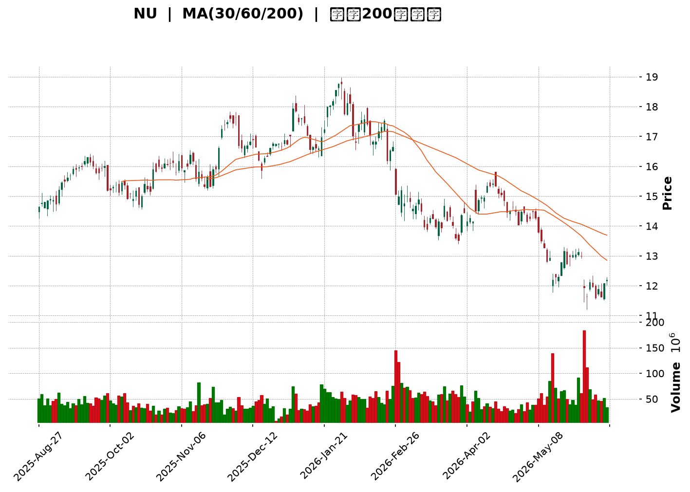
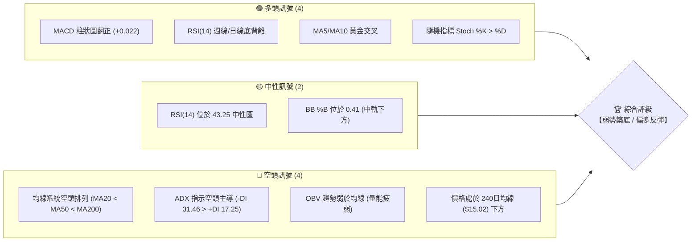
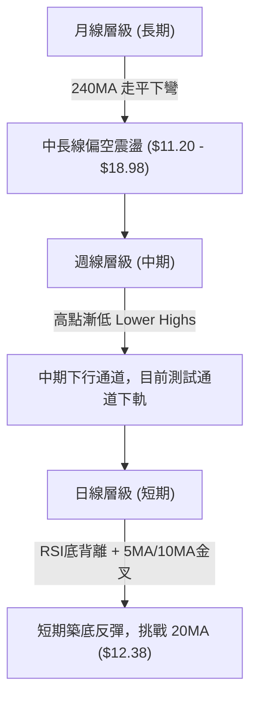
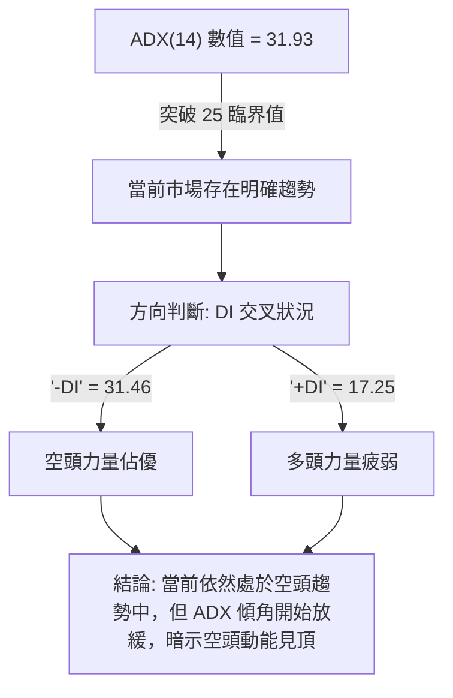

<details>
<summary>📊 靜態圖表 (點擊展開)</summary>

</details>

<html>
<head><meta charset="utf-8" /></head>
<body>
    <div style="height:500px; width:100%;">                        <script>window.PlotlyConfig = {MathJaxConfig: 'local'};</script>
        <script charset="utf-8" src="https://cdn.plot.ly/plotly-3.6.0.min.js" integrity="sha256-QaOVwtVY0T02VaHrr6pnoHLCwayMJp4O5n4YyaE3rJk=" crossorigin="anonymous"></script>                <div id="candlestick-chart" class="plotly-graph-div" style="height:100%; width:100%;"></div>            <script>                window.PLOTLYENV=window.PLOTLYENV || {};                                if (document.getElementById("candlestick-chart")) {                    Plotly.newPlot(                        "candlestick-chart",                        [{"close":{"dtype":"f8","bdata":"AAAAIK5HLUAAAACAPYotQAAAAKCZmS1AAAAA4FG4LUAAAADAzMwtQAAAAKBwvS1AAAAAQOF6LUAAAADgo3AuQAAAACCF6y5AAAAAwB4FL0AAAACgcD0vQAAAAKBHYS9AAAAAgOvRL0AAAAAgrscvQAAAACCF6y9AAAAAQOH6L0AAAAAghSswQAAAAMDMTDBAAAAAYGYmMEAAAABgjwIwQAAAACBcjy9AAAAAIFyPL0AAAABgZuYvQAAAAGCPAjBAAAAAoEdhLkAAAADgo3AuQAAAAGC4ni5AAAAAYI\u002fCLkAAAABgj0IuQAAAACCF6y5AAAAAoHC9LkAAAABACtctQAAAAMD1KC5AAAAAgOvRLUAAAAAAKVwuQAAAAIDCdS1AAAAAAAAALkAAAACA69EuQAAAAEDhei5AAAAAgOtRLkAAAADAzMwvQAAAAIAUri9AAAAAAAAAMEAAAAAAKdwvQAAAAEAKFzBAAAAAIFwPMEAAAAAAKRwwQAAAAKBHITBAAAAAoJmZL0AAAAAghSswQAAAAKBH4S9AAAAAoHC9L0AAAADAHgUwQAAAAADXYzBAAAAAgBQuMEAAAACAFC4vQAAAAADXoy9AAAAAQDMzL0AAAAAA16MuQAAAAIDrUS9AAAAAANejLkAAAAAgrscvQAAAAEAK1y9AAAAAACmcMEAAAAAAAEAxQAAAAADXYzFAAAAAQOF6MUAAAAAAKZwxQAAAAOCjcDFAAAAAYGamMUAAAABAM7MwQAAAAGC4njBAAAAAgBSuMEAAAADgo7AwQAAAAIDr0TBAAAAAYGbmMEAAAABgZqYwQAAAAEAzMzBAAAAA4FG4L0AAAADAHkUwQAAAAEAKVzBAAAAAYLieMEAAAABgj8IwQAAAAKBwvTBAAAAAYI\u002fCMEAAAADA9agwQAAAAKBH4TBAAAAAoHC9MEAAAADAHgUxQAAAAOCj8DFAAAAAACncMUAAAAAAAIAxQAAAAAApnDFAAAAAgMJ1MUAAAACAPQoxQAAAACBcjzBAAAAAANejMEAAAAAAKZwwQAAAAKCZmTBAAAAA4FH4MEAAAACgcD0xQAAAAAAAADJAAAAAgD0KMkAAAACAFC4yQAAAAMDMjDJAAAAAYI\u002fCMkAAAABgj8IyQAAAAAAAwDFAAAAAACkcMkAAAABguB4yQAAAAMAeBTFAAAAAIFzPMEAAAABgZmYxQAAAAMDMjDFAAAAAgOuRMUAAAADA9WgxQAAAAIA9CjFAAAAAgOvRMEAAAACA69EwQAAAACCFKzFAAAAAgOtRMUAAAAAgrocxQAAAAOCjMDBAAAAAIK6HMEAAAABgZqYwQAAAAGC4Hi5AAAAAgML1LUAAAACgR2EuQAAAAMAehS1AAAAAAAAALkAAAAAA16MtQAAAAMD1KC1AAAAAQApXLUAAAABgj8ItQAAAAEDh+ixAAAAA4KPwK0AAAAAgrscrQAAAAIA9iixAAAAAAACALEAAAADgo\u002fArQAAAAIDrUSxAAAAAoEfhK0AAAAAAKVwtQAAAAKBHYSxAAAAAANejLEAAAACAPQosQAAAAEAzMytAAAAAwB4FK0AAAACgcL0sQAAAAKBH4SxAAAAAwMxMLEAAAADAHoUsQAAAAMDMTCxAAAAAwB4FLUAAAACgcL0tQAAAACCF6y1AAAAAYGbmLUAAAABAM7MuQAAAAIAUri5AAAAAACncLkAAAACAFK4uQAAAAEAzMy5AAAAAoJkZLkAAAABAM7MtQAAAACCF6yxAAAAAwB4FLUAAAAAgrkctQAAAAAAAAC1AAAAA4HoULEAAAACAwvUsQAAAAKBH4SxAAAAAgOtRLEAAAAAAAIAsQAAAAIDC9SxAAAAAwB6FLEAAAACgmZkrQAAAAAAAACtAAAAAgD2KKkAAAAAA16MpQAAAAAAp3ClAAAAAoEdhKEAAAADgepQoQAAAAOB6lChAAAAA4HqUKUAAAACA61EqQAAAAIDCdSlAAAAAgML1KUAAAAAgXA8qQAAAAKCZGSpAAAAAYI9CKkAAAABA4fopQAAAAAAp3CdAAAAAIK5HJ0AAAACgcD0oQAAAAOCj8CdAAAAAQDMzJ0AAAABgj8InQAAAAKBwPSdAAAAAgBQuKEAAAACgR2EoQA=="},"high":{"dtype":"f8","bdata":"AAAAQApXLUAAAABA4TouQAAAAADXoy1AAAAAoHC9LUAAAACA6xEuQAAAAKBw\u002fS1AAAAAoJlZLkAAAADgo7AuQAAAAMAeBS9AAAAAIIVrL0AAAACgR6EvQAAAAIA9ii9AAAAAoEcBMEAAAACA6xEwQAAAAMDMDDBAAAAAoEchMEAAAACgmVkwQAAAAMDMTDBAAAAAwMxsMEAAAABguF4wQAAAAOBRGDBAAAAAoHD9L0AAAACgmRkwQAAAAOCjMDBAAAAAwMwMMEAAAADAzMwuQAAAAAAAwC5AAAAAQOH6LkAAAADgehQvQAAAAAAAAC9AAAAAwPUoL0AAAABgZuYuQAAAAKBwPS5AAAAAoEdhLkAAAAAAVo4uQAAAAGC4ni5AAAAAYLgeLkAAAAAgrkcvQAAAAIAULi9AAAAAIIXrLkAAAAAA1yMwQAAAAKBHITBAAAAAoJlZMEAAAACA6xEwQAAAAMAeRTBAAAAAoHA9MEAAAADAHkUwQAAAAAAAgDBAAAAAoHAdMEAAAAAghWswQAAAAGBmZjBAAAAAAADAL0AAAADgUTgwQAAAAMDMjDBAAAAAAACAMEAAAACA6zEwQAAAAGCPQjBAAAAAoHC9L0AAAACgmVkvQAAAAOCjcC9AAAAAQDMTMEAAAADAHgUwQAAAACBcDzBAAAAAwMysMEAAAACgR2ExQAAAAIAUjjFAAAAAIFyPMUAAAABACtcxQAAAAOBRuDFAAAAA4KPQMUAAAABA4boxQAAAAEAzEzFAAAAAQOG6MEAAAACgmdkwQAAAAAApHDFAAAAAIFwPMUAAAACA6xExQAAAAMAehTBAAAAAwPUoMEAAAADgIlswQAAAAOBReDBAAAAAoEehMEAAAADgetQwQAAAAMD1yDBAAAAAYI\u002fCMEAAAAAgXM8wQAAAAEDhGjFAAAAAwMzsMEAAAAAgXA8xQAAAAICVIzJAAAAAYLheMkAAAABgj8IxQAAAAIC+nzFAAAAAgOsRMkAAAAAghWsxQAAAAIDrETFAAAAA4KOwMEAAAADgUfgwQAAAAGAOrTBAAAAA4KNQMUAAAACAPYoxQAAAAAAAADJAAAAA4KMQMkAAAABgj0IyQAAAACBcjzJAAAAAwPXIMkAAAABA4foyQAAAAGC4njJAAAAAQAp3MkAAAABgZqYyQAAAAIA9KjJAAAAAYI8iMUAAAAAghWsxQAAAAEAK1zFAAAAAACm8MUAAAACgcP0xQAAAAMDMjDFAAAAAoEfhMEAAAAAAAAAxQAAAAEDhejFAAAAA4KNwMUAAAABACpcxQAAAAMD1aDFAAAAAQAqXMEAAAACgmdkwQAAAAKBH4S9AAAAAYGZmLkAAAABAi6wuQAAAAGC4Hi5AAAAAgMK1LkAAAADAzEwuQAAAAEAzcy1AAAAAgOuRLUAAAACAPUouQAAAAKBH4S1AAAAAQDOzLEAAAABguJ4sQAAAAKBwvSxAAAAA4HoULUAAAADAzIwsQAAAAAAAgCxAAAAAwMxMLEAAAABACtctQAAAAMAeBS1AAAAAoEdhLUAAAABgZqYsQAAAAGBm5itAAAAAgOuRK0AAAACA69EsQAAAAKCZmS1AAAAAgML1LEAAAAAgrscsQAAAAIDrUSxAAAAAwEnMLkAAAAAAKdwtQAAAAOB6FC5AAAAAIFwPLkAAAADgo\u002fAuQAAAAGC4Hi9AAAAAoEchL0AAAABguJ4vQAAAAEAzsy5AAAAAIFyPLkAAAADgo3AuQAAAAADXoy1AAAAA4HoULUAAAAAghastQAAAAEAKVy1AAAAAwB4FLUAAAABguB4tQAAAAIDrUS1AAAAA4KPwLEAAAACgR+EsQAAAAKCZGS1AAAAAQDMzLUAAAADA9agsQAAAAMD16CtAAAAAACkcK0AAAACAPYoqQAAAAEAKVypAAAAAIFzPKEAAAADAzMwoQAAAAMDMzChAAAAAoJmZKUAAAACgmZkqQAAAAMAehSpAAAAAoEchKkAAAAAAKVwqQAAAAEDheipAAAAAAACAKkAAAADAzEwqQAAAACCFayhAAAAAQOF6J0AAAACAFG4oQAAAAEAzsyhAAAAAoJkZKEAAAACA6xEoQAAAAIAULihAAAAAgBQuKEAAAADgepQoQA=="},"hovertemplate":"\u003cb\u003e%{x|%Y-%m-%d}\u003c\u002fb\u003e\u003cbr\u003e\u958b: $%{open:.2f}\u003cbr\u003e\u9ad8: $%{high:.2f}\u003cbr\u003e\u4f4e: $%{low:.2f}\u003cbr\u003e\u6536: $%{close:.2f}\u003cextra\u003e\u003c\u002fextra\u003e","low":{"dtype":"f8","bdata":"AAAAYI+CLEAAAACA61EtQAAAAIAULi1AAAAAgBSuLEAAAACAwnUtQAAAAIDC9SxAAAAAgD0KLUAAAAAghWstQAAAAGCPAi5AAAAAoJmZLkAAAACAwvUuQAAAAOB6FC9AAAAAwPVoL0AAAACA61EvQAAAAGBmpi9AAAAAwB7FL0AAAADAHgUwQAAAAIDC9S9AAAAAIK4HMEAAAACg8dIvQAAAAIDCdS9AAAAAoJkZL0AAAADA9agvQAAAAMDMTC9AAAAAgOtRLkAAAACAPQouQAAAAOBROC5AAAAAAABALkAAAACAPQouQAAAAKCZGS5AAAAAgMJ1LkAAAABgj8ItQAAAAEAK1y1AAAAAIK5HLUAAAADgUbgtQAAAAEBeOi1AAAAAYLgeLUAAAABguB4uQAAAACBcTy5AAAAAgOsRLkAAAACAwnUuQAAAACAEli9AAAAAQArXL0AAAAAA16MvQAAAAAAp3C9AAAAAANcDMEAAAABgj8IvQAAAAIAU7i9AAAAAYGZmL0AAAADgepQvQAAAAIAUri9AAAAAYGbmLkAAAADAzMwvQAAAAMDMDDBAAAAAIIULMEAAAADgUfguQAAAAADXoy5AAAAAAAAAL0AAAADAHoUuQAAAAKBHYS5AAAAAoJmZLkAAAABgj4IuQAAAACBcjy9AAAAAAClcL0AAAADA9egwQAAAAEAzMzFAAAAAIK5HMUAAAABA4XoxQAAAAIA9SjFAAAAAAClcMUAAAACgmZkwQAAAAOBReDBAAAAAAAJLMEAAAABACncwQAAAAEAzszBAAAAAoJmZMEAAAACgR6EwQAAAAIAULjBAAAAAgBQuL0AAAADAIBAwQAAAAEBiUDBAAAAAoJlZMEAAAAAgXI8wQAAAAGBmpjBAAAAAACmcMEAAAACAPYowQAAAAIAUrjBAAAAAgMK1MEAAAABgZqYwQAAAAIA9KjFAAAAAIFzPMUAAAAAgrmcxQAAAAGC4XjFAAAAAANdjMUAAAADAHgUxQAAAAIA9ajBAAAAAwMxsMEAAAACAQYAwQAAAAIAUTjBAAAAAoJlZMEAAAACA6xExQAAAAOB6VDFAAAAAgMK1MUAAAABgZuYxQAAAAKCZGTJAAAAAAClcMkAAAACgcD0yQAAAAIDCtTFAAAAAgMK1MUAAAABACtcxQAAAAAAA4DBAAAAAwMyMMEAAAABgj8IwQAAAAEAKNzFAAAAAgD0KMUAAAACgmVkxQAAAAIDCtTBAAAAAYLheMEAAAABACpcwQAAAAEAK1zBAAAAAwB7lMEAAAAAghSsxQAAAAOB6FDBAAAAAoHC9L0AAAAAA14MwQAAAAOB6FC5AAAAAYGZmLUAAAABguJ4sQAAAAEAKVyxAAAAAoJmZLUAAAADgUTgtQAAAAOBReCxAAAAAgMJ1LEAAAAAgXA8tQAAAAGCPwixAAAAAYI\u002fCK0AAAACgR6ErQAAAAGC4HixAAAAA4FF4LEAAAADgetQrQAAAACBcDytAAAAA4HqUK0AAAADgo3AsQAAAAIDrUSxAAAAAIIVrLEAAAAAAKdwrQAAAAOB6FCtAAAAAgOvRKkAAAABgZmYrQAAAAAAp3CxAAAAAAAKrK0AAAADA9SgsQAAAAIAUritAAAAAgOvRLEAAAADAzMwsQAAAACBcjy1AAAAAQDMzLUAAAACgcD0uQAAAAKCZmS5AAAAA4HqULkAAAABguJ4uQAAAAAAp3C1AAAAA4KPwLUAAAABAClctQAAAAIDrkSxAAAAAoEdhLEAAAACgmRktQAAAAIDCtSxAAAAA4HoULEAAAACgmRksQAAAAGCPwixAAAAAgBQuLEAAAABAClcsQAAAAKBwfSxAAAAAwPVoLEAAAAAAAIArQAAAAEAK1ypAAAAAwB6FKkAAAAAgrocpQAAAAIAUrilAAAAAIFyPJ0AAAABguB4oQAAAACCF6ydAAAAAwPWoKEAAAABguB4pQAAAACCFaylAAAAAwMxMKUAAAAAAKdwpQAAAACCuxylAAAAAQOH6KUAAAACA69EpQAAAAKBH4SZAAAAAYGZmJkAAAAAA16MnQAAAAGC43idAAAAAoJkZJ0AAAAAgXE8nQAAAAOBROCdAAAAAwB4FJ0AAAAAgrgcoQA=="},"name":"\u50f9\u683c","open":{"dtype":"f8","bdata":"AAAAgML1LEAAAAAAAIAtQAAAAOBROC1AAAAAwPUoLUAAAACgcL0tQAAAAIAUri1AAAAAwB4FLkAAAAAgXI8tQAAAAIDCdS5AAAAAoJkZL0AAAAAgXA8vQAAAAAApXC9AAAAAAACAL0AAAACgR+EvQAAAAGBm5i9AAAAAYI8CMEAAAACA6xEwQAAAAAApHDBAAAAAwMxMMEAAAACAFC4wQAAAAAAp3C9AAAAAACncL0AAAABgZuYvQAAAACCF6y9AAAAAwMwMMEAAAACAPYouQAAAACBcjy5AAAAAoHC9LkAAAACA69EuQAAAAAApXC5AAAAAIFwPL0AAAADgUbguQAAAAMD1KC5AAAAAQDOzLUAAAAAAAAAuQAAAAOB6lC5AAAAAIK5HLUAAAABgj0IuQAAAAEAzsy5AAAAAANejLkAAAADAHoUuQAAAAEAKFzBAAAAAQOE6MEAAAAAghesvQAAAAGBm5i9AAAAAgOsRMEAAAAAAKRwwQAAAAOCjMDBAAAAAoJmZL0AAAADgUbgvQAAAAGC4XjBAAAAAANejL0AAAACgmRkwQAAAAEAKFzBAAAAAgMJ1MEAAAACAPQowQAAAAAAp3C5AAAAA4FF4L0AAAADAzMwuQAAAAMDMjC5AAAAAgBSuL0AAAACAwrUuQAAAAAAAADBAAAAAQArXL0AAAABA4fowQAAAAADXYzFAAAAAgBRuMUAAAACAwrUxQAAAAEAzszFAAAAAYGamMUAAAABAM7MxQAAAAGC43jBAAAAAwB5lMEAAAACgmZkwQAAAAEDhujBAAAAAIK7nMEAAAABgZgYxQAAAAAAAgDBAAAAAQAoXMEAAAABgZiYwQAAAAKCZWTBAAAAAIIVrMEAAAADgo7AwQAAAAEAzszBAAAAAoHC9MEAAAACAPaowQAAAAMAexTBAAAAAYLjeMEAAAAAgXA8xQAAAAIAULjFAAAAAYLgeMkAAAABguJ4xQAAAAEAKlzFAAAAAgBSuMUAAAACgmVkxQAAAACBcDzFAAAAA4KOQMEAAAAAAAMAwQAAAAIDrkTBAAAAAAClcMEAAAABgjyIxQAAAAIA9qjFAAAAAAAAAMkAAAADAzAwyQAAAAAApXDJAAAAAYI+iMkAAAADgetQyQAAAACCuhzJAAAAAoHC9MUAAAAAgrmcyQAAAAOB6FDJAAAAA4HrUMEAAAAAghSsxQAAAAOCjcDFAAAAAYGYmMUAAAACA6\u002fExQAAAAMD1iDFAAAAAoHC9MEAAAAAAAMAwQAAAAEAz8zBAAAAAANcjMUAAAABAMzMxQAAAAAAAQDFAAAAA4KMwMEAAAAAA14MwQAAAAEAK1y9AAAAA4KNwLUAAAAAghessQAAAAAApXC1AAAAAoHD9LUAAAAAAKdwtQAAAAGCPAi1AAAAAgOvRLEAAAABA4XotQAAAAAAAgC1AAAAAYGZmLEAAAAAA1yMsQAAAAKBwPSxAAAAAwMzMLEAAAADgo3AsQAAAAAApXCtAAAAAoHA9LEAAAACgR6EsQAAAAOBR+CxAAAAAYI9CLUAAAABgj0IsQAAAAIDCdStAAAAAIIVrK0AAAACgmZkrQAAAAIAULi1AAAAAAAAALEAAAABgj0IsQAAAAEAzMyxAAAAAIIVrLkAAAADAHgUtQAAAAAAp3C1AAAAAgBSuLUAAAABgj0IuQAAAACCF6y5AAAAAIK7HLkAAAABguJ4vQAAAAEDhei5AAAAA4FE4LkAAAAAAKVwuQAAAAGC4ni1AAAAAQArXLEAAAAAgrkctQAAAAOB6FC1AAAAAgML1LEAAAADgelQsQAAAAIDrUS1AAAAAIK7HLEAAAAAA16MsQAAAAAAAAC1AAAAAAAAALUAAAACgmZksQAAAAGCPwitAAAAAQArXKkAAAAAghWsqQAAAAEAzsylAAAAAQIkBKEAAAADAzMwoQAAAAOB6VChAAAAAgBSuKEAAAADgUTgpQAAAAMDMTCpAAAAAIK4HKkAAAAAghespQAAAAOCj8ClAAAAAoJkZKkAAAAAAAAAqQAAAAEDh+idAAAAAwMxMJ0AAAABgj8InQAAAAEAzMyhAAAAAwB4FKEAAAADgo3AnQAAAAKCZmSdAAAAAANcjJ0AAAABAClcoQA=="},"x":["2025-08-27T00:00:00-04:00","2025-08-28T00:00:00-04:00","2025-08-29T00:00:00-04:00","2025-09-02T00:00:00-04:00","2025-09-03T00:00:00-04:00","2025-09-04T00:00:00-04:00","2025-09-05T00:00:00-04:00","2025-09-08T00:00:00-04:00","2025-09-09T00:00:00-04:00","2025-09-10T00:00:00-04:00","2025-09-11T00:00:00-04:00","2025-09-12T00:00:00-04:00","2025-09-15T00:00:00-04:00","2025-09-16T00:00:00-04:00","2025-09-17T00:00:00-04:00","2025-09-18T00:00:00-04:00","2025-09-19T00:00:00-04:00","2025-09-22T00:00:00-04:00","2025-09-23T00:00:00-04:00","2025-09-24T00:00:00-04:00","2025-09-25T00:00:00-04:00","2025-09-26T00:00:00-04:00","2025-09-29T00:00:00-04:00","2025-09-30T00:00:00-04:00","2025-10-01T00:00:00-04:00","2025-10-02T00:00:00-04:00","2025-10-03T00:00:00-04:00","2025-10-06T00:00:00-04:00","2025-10-07T00:00:00-04:00","2025-10-08T00:00:00-04:00","2025-10-09T00:00:00-04:00","2025-10-10T00:00:00-04:00","2025-10-13T00:00:00-04:00","2025-10-14T00:00:00-04:00","2025-10-15T00:00:00-04:00","2025-10-16T00:00:00-04:00","2025-10-17T00:00:00-04:00","2025-10-20T00:00:00-04:00","2025-10-21T00:00:00-04:00","2025-10-22T00:00:00-04:00","2025-10-23T00:00:00-04:00","2025-10-24T00:00:00-04:00","2025-10-27T00:00:00-04:00","2025-10-28T00:00:00-04:00","2025-10-29T00:00:00-04:00","2025-10-30T00:00:00-04:00","2025-10-31T00:00:00-04:00","2025-11-03T00:00:00-05:00","2025-11-04T00:00:00-05:00","2025-11-05T00:00:00-05:00","2025-11-06T00:00:00-05:00","2025-11-07T00:00:00-05:00","2025-11-10T00:00:00-05:00","2025-11-11T00:00:00-05:00","2025-11-12T00:00:00-05:00","2025-11-13T00:00:00-05:00","2025-11-14T00:00:00-05:00","2025-11-17T00:00:00-05:00","2025-11-18T00:00:00-05:00","2025-11-19T00:00:00-05:00","2025-11-20T00:00:00-05:00","2025-11-21T00:00:00-05:00","2025-11-24T00:00:00-05:00","2025-11-25T00:00:00-05:00","2025-11-26T00:00:00-05:00","2025-11-28T00:00:00-05:00","2025-12-01T00:00:00-05:00","2025-12-02T00:00:00-05:00","2025-12-03T00:00:00-05:00","2025-12-04T00:00:00-05:00","2025-12-05T00:00:00-05:00","2025-12-08T00:00:00-05:00","2025-12-09T00:00:00-05:00","2025-12-10T00:00:00-05:00","2025-12-11T00:00:00-05:00","2025-12-12T00:00:00-05:00","2025-12-15T00:00:00-05:00","2025-12-16T00:00:00-05:00","2025-12-17T00:00:00-05:00","2025-12-18T00:00:00-05:00","2025-12-19T00:00:00-05:00","2025-12-22T00:00:00-05:00","2025-12-23T00:00:00-05:00","2025-12-24T00:00:00-05:00","2025-12-26T00:00:00-05:00","2025-12-29T00:00:00-05:00","2025-12-30T00:00:00-05:00","2025-12-31T00:00:00-05:00","2026-01-02T00:00:00-05:00","2026-01-05T00:00:00-05:00","2026-01-06T00:00:00-05:00","2026-01-07T00:00:00-05:00","2026-01-08T00:00:00-05:00","2026-01-09T00:00:00-05:00","2026-01-12T00:00:00-05:00","2026-01-13T00:00:00-05:00","2026-01-14T00:00:00-05:00","2026-01-15T00:00:00-05:00","2026-01-16T00:00:00-05:00","2026-01-20T00:00:00-05:00","2026-01-21T00:00:00-05:00","2026-01-22T00:00:00-05:00","2026-01-23T00:00:00-05:00","2026-01-26T00:00:00-05:00","2026-01-27T00:00:00-05:00","2026-01-28T00:00:00-05:00","2026-01-29T00:00:00-05:00","2026-01-30T00:00:00-05:00","2026-02-02T00:00:00-05:00","2026-02-03T00:00:00-05:00","2026-02-04T00:00:00-05:00","2026-02-05T00:00:00-05:00","2026-02-06T00:00:00-05:00","2026-02-09T00:00:00-05:00","2026-02-10T00:00:00-05:00","2026-02-11T00:00:00-05:00","2026-02-12T00:00:00-05:00","2026-02-13T00:00:00-05:00","2026-02-17T00:00:00-05:00","2026-02-18T00:00:00-05:00","2026-02-19T00:00:00-05:00","2026-02-20T00:00:00-05:00","2026-02-23T00:00:00-05:00","2026-02-24T00:00:00-05:00","2026-02-25T00:00:00-05:00","2026-02-26T00:00:00-05:00","2026-02-27T00:00:00-05:00","2026-03-02T00:00:00-05:00","2026-03-03T00:00:00-05:00","2026-03-04T00:00:00-05:00","2026-03-05T00:00:00-05:00","2026-03-06T00:00:00-05:00","2026-03-09T00:00:00-04:00","2026-03-10T00:00:00-04:00","2026-03-11T00:00:00-04:00","2026-03-12T00:00:00-04:00","2026-03-13T00:00:00-04:00","2026-03-16T00:00:00-04:00","2026-03-17T00:00:00-04:00","2026-03-18T00:00:00-04:00","2026-03-19T00:00:00-04:00","2026-03-20T00:00:00-04:00","2026-03-23T00:00:00-04:00","2026-03-24T00:00:00-04:00","2026-03-25T00:00:00-04:00","2026-03-26T00:00:00-04:00","2026-03-27T00:00:00-04:00","2026-03-30T00:00:00-04:00","2026-03-31T00:00:00-04:00","2026-04-01T00:00:00-04:00","2026-04-02T00:00:00-04:00","2026-04-06T00:00:00-04:00","2026-04-07T00:00:00-04:00","2026-04-08T00:00:00-04:00","2026-04-09T00:00:00-04:00","2026-04-10T00:00:00-04:00","2026-04-13T00:00:00-04:00","2026-04-14T00:00:00-04:00","2026-04-15T00:00:00-04:00","2026-04-16T00:00:00-04:00","2026-04-17T00:00:00-04:00","2026-04-20T00:00:00-04:00","2026-04-21T00:00:00-04:00","2026-04-22T00:00:00-04:00","2026-04-23T00:00:00-04:00","2026-04-24T00:00:00-04:00","2026-04-27T00:00:00-04:00","2026-04-28T00:00:00-04:00","2026-04-29T00:00:00-04:00","2026-04-30T00:00:00-04:00","2026-05-01T00:00:00-04:00","2026-05-04T00:00:00-04:00","2026-05-05T00:00:00-04:00","2026-05-06T00:00:00-04:00","2026-05-07T00:00:00-04:00","2026-05-08T00:00:00-04:00","2026-05-11T00:00:00-04:00","2026-05-12T00:00:00-04:00","2026-05-13T00:00:00-04:00","2026-05-14T00:00:00-04:00","2026-05-15T00:00:00-04:00","2026-05-18T00:00:00-04:00","2026-05-19T00:00:00-04:00","2026-05-20T00:00:00-04:00","2026-05-21T00:00:00-04:00","2026-05-22T00:00:00-04:00","2026-05-26T00:00:00-04:00","2026-05-27T00:00:00-04:00","2026-05-28T00:00:00-04:00","2026-05-29T00:00:00-04:00","2026-06-01T00:00:00-04:00","2026-06-02T00:00:00-04:00","2026-06-03T00:00:00-04:00","2026-06-04T00:00:00-04:00","2026-06-05T00:00:00-04:00","2026-06-08T00:00:00-04:00","2026-06-09T00:00:00-04:00","2026-06-10T00:00:00-04:00","2026-06-11T00:00:00-04:00","2026-06-12T00:00:00-04:00"],"type":"candlestick"},{"hovertemplate":"MA30: $%{y:.2f}\u003cextra\u003e\u003c\u002fextra\u003e","line":{"color":"#2196F3","dash":"dash","width":2},"mode":"lines","name":"MA30","x":["2025-08-27T00:00:00-04:00","2025-08-28T00:00:00-04:00","2025-08-29T00:00:00-04:00","2025-09-02T00:00:00-04:00","2025-09-03T00:00:00-04:00","2025-09-04T00:00:00-04:00","2025-09-05T00:00:00-04:00","2025-09-08T00:00:00-04:00","2025-09-09T00:00:00-04:00","2025-09-10T00:00:00-04:00","2025-09-11T00:00:00-04:00","2025-09-12T00:00:00-04:00","2025-09-15T00:00:00-04:00","2025-09-16T00:00:00-04:00","2025-09-17T00:00:00-04:00","2025-09-18T00:00:00-04:00","2025-09-19T00:00:00-04:00","2025-09-22T00:00:00-04:00","2025-09-23T00:00:00-04:00","2025-09-24T00:00:00-04:00","2025-09-25T00:00:00-04:00","2025-09-26T00:00:00-04:00","2025-09-29T00:00:00-04:00","2025-09-30T00:00:00-04:00","2025-10-01T00:00:00-04:00","2025-10-02T00:00:00-04:00","2025-10-03T00:00:00-04:00","2025-10-06T00:00:00-04:00","2025-10-07T00:00:00-04:00","2025-10-08T00:00:00-04:00","2025-10-09T00:00:00-04:00","2025-10-10T00:00:00-04:00","2025-10-13T00:00:00-04:00","2025-10-14T00:00:00-04:00","2025-10-15T00:00:00-04:00","2025-10-16T00:00:00-04:00","2025-10-17T00:00:00-04:00","2025-10-20T00:00:00-04:00","2025-10-21T00:00:00-04:00","2025-10-22T00:00:00-04:00","2025-10-23T00:00:00-04:00","2025-10-24T00:00:00-04:00","2025-10-27T00:00:00-04:00","2025-10-28T00:00:00-04:00","2025-10-29T00:00:00-04:00","2025-10-30T00:00:00-04:00","2025-10-31T00:00:00-04:00","2025-11-03T00:00:00-05:00","2025-11-04T00:00:00-05:00","2025-11-05T00:00:00-05:00","2025-11-06T00:00:00-05:00","2025-11-07T00:00:00-05:00","2025-11-10T00:00:00-05:00","2025-11-11T00:00:00-05:00","2025-11-12T00:00:00-05:00","2025-11-13T00:00:00-05:00","2025-11-14T00:00:00-05:00","2025-11-17T00:00:00-05:00","2025-11-18T00:00:00-05:00","2025-11-19T00:00:00-05:00","2025-11-20T00:00:00-05:00","2025-11-21T00:00:00-05:00","2025-11-24T00:00:00-05:00","2025-11-25T00:00:00-05:00","2025-11-26T00:00:00-05:00","2025-11-28T00:00:00-05:00","2025-12-01T00:00:00-05:00","2025-12-02T00:00:00-05:00","2025-12-03T00:00:00-05:00","2025-12-04T00:00:00-05:00","2025-12-05T00:00:00-05:00","2025-12-08T00:00:00-05:00","2025-12-09T00:00:00-05:00","2025-12-10T00:00:00-05:00","2025-12-11T00:00:00-05:00","2025-12-12T00:00:00-05:00","2025-12-15T00:00:00-05:00","2025-12-16T00:00:00-05:00","2025-12-17T00:00:00-05:00","2025-12-18T00:00:00-05:00","2025-12-19T00:00:00-05:00","2025-12-22T00:00:00-05:00","2025-12-23T00:00:00-05:00","2025-12-24T00:00:00-05:00","2025-12-26T00:00:00-05:00","2025-12-29T00:00:00-05:00","2025-12-30T00:00:00-05:00","2025-12-31T00:00:00-05:00","2026-01-02T00:00:00-05:00","2026-01-05T00:00:00-05:00","2026-01-06T00:00:00-05:00","2026-01-07T00:00:00-05:00","2026-01-08T00:00:00-05:00","2026-01-09T00:00:00-05:00","2026-01-12T00:00:00-05:00","2026-01-13T00:00:00-05:00","2026-01-14T00:00:00-05:00","2026-01-15T00:00:00-05:00","2026-01-16T00:00:00-05:00","2026-01-20T00:00:00-05:00","2026-01-21T00:00:00-05:00","2026-01-22T00:00:00-05:00","2026-01-23T00:00:00-05:00","2026-01-26T00:00:00-05:00","2026-01-27T00:00:00-05:00","2026-01-28T00:00:00-05:00","2026-01-29T00:00:00-05:00","2026-01-30T00:00:00-05:00","2026-02-02T00:00:00-05:00","2026-02-03T00:00:00-05:00","2026-02-04T00:00:00-05:00","2026-02-05T00:00:00-05:00","2026-02-06T00:00:00-05:00","2026-02-09T00:00:00-05:00","2026-02-10T00:00:00-05:00","2026-02-11T00:00:00-05:00","2026-02-12T00:00:00-05:00","2026-02-13T00:00:00-05:00","2026-02-17T00:00:00-05:00","2026-02-18T00:00:00-05:00","2026-02-19T00:00:00-05:00","2026-02-20T00:00:00-05:00","2026-02-23T00:00:00-05:00","2026-02-24T00:00:00-05:00","2026-02-25T00:00:00-05:00","2026-02-26T00:00:00-05:00","2026-02-27T00:00:00-05:00","2026-03-02T00:00:00-05:00","2026-03-03T00:00:00-05:00","2026-03-04T00:00:00-05:00","2026-03-05T00:00:00-05:00","2026-03-06T00:00:00-05:00","2026-03-09T00:00:00-04:00","2026-03-10T00:00:00-04:00","2026-03-11T00:00:00-04:00","2026-03-12T00:00:00-04:00","2026-03-13T00:00:00-04:00","2026-03-16T00:00:00-04:00","2026-03-17T00:00:00-04:00","2026-03-18T00:00:00-04:00","2026-03-19T00:00:00-04:00","2026-03-20T00:00:00-04:00","2026-03-23T00:00:00-04:00","2026-03-24T00:00:00-04:00","2026-03-25T00:00:00-04:00","2026-03-26T00:00:00-04:00","2026-03-27T00:00:00-04:00","2026-03-30T00:00:00-04:00","2026-03-31T00:00:00-04:00","2026-04-01T00:00:00-04:00","2026-04-02T00:00:00-04:00","2026-04-06T00:00:00-04:00","2026-04-07T00:00:00-04:00","2026-04-08T00:00:00-04:00","2026-04-09T00:00:00-04:00","2026-04-10T00:00:00-04:00","2026-04-13T00:00:00-04:00","2026-04-14T00:00:00-04:00","2026-04-15T00:00:00-04:00","2026-04-16T00:00:00-04:00","2026-04-17T00:00:00-04:00","2026-04-20T00:00:00-04:00","2026-04-21T00:00:00-04:00","2026-04-22T00:00:00-04:00","2026-04-23T00:00:00-04:00","2026-04-24T00:00:00-04:00","2026-04-27T00:00:00-04:00","2026-04-28T00:00:00-04:00","2026-04-29T00:00:00-04:00","2026-04-30T00:00:00-04:00","2026-05-01T00:00:00-04:00","2026-05-04T00:00:00-04:00","2026-05-05T00:00:00-04:00","2026-05-06T00:00:00-04:00","2026-05-07T00:00:00-04:00","2026-05-08T00:00:00-04:00","2026-05-11T00:00:00-04:00","2026-05-12T00:00:00-04:00","2026-05-13T00:00:00-04:00","2026-05-14T00:00:00-04:00","2026-05-15T00:00:00-04:00","2026-05-18T00:00:00-04:00","2026-05-19T00:00:00-04:00","2026-05-20T00:00:00-04:00","2026-05-21T00:00:00-04:00","2026-05-22T00:00:00-04:00","2026-05-26T00:00:00-04:00","2026-05-27T00:00:00-04:00","2026-05-28T00:00:00-04:00","2026-05-29T00:00:00-04:00","2026-06-01T00:00:00-04:00","2026-06-02T00:00:00-04:00","2026-06-03T00:00:00-04:00","2026-06-04T00:00:00-04:00","2026-06-05T00:00:00-04:00","2026-06-08T00:00:00-04:00","2026-06-09T00:00:00-04:00","2026-06-10T00:00:00-04:00","2026-06-11T00:00:00-04:00","2026-06-12T00:00:00-04:00"],"y":{"dtype":"f8","bdata":"AAAAAAAA+H8AAAAAAAD4fwAAAAAAAPh\u002fAAAAAAAA+H8AAAAAAAD4fwAAAAAAAPh\u002fAAAAAAAA+H8AAAAAAAD4fwAAAAAAAPh\u002fAAAAAAAA+H8AAAAAAAD4fwAAAAAAAPh\u002fAAAAAAAA+H8AAAAAAAD4fwAAAAAAAPh\u002fAAAAAAAA+H8AAAAAAAD4fwAAAAAAAPh\u002fAAAAAAAA+H8AAAAAAAD4fwAAAAAAAPh\u002fAAAAAAAA+H8AAAAAAAD4fwAAAAAAAPh\u002fAAAAAAAA+H8AAAAAAAD4fwAAAAAAAPh\u002fAAAAAAAA+H8AAAAAAAD4f0RERDRe+i5A7+7untMGL0Crqqr6YgkvQBEREVEqDi9AVVVVxQQPL0DNzMwczBMvQBEREXFoES9AZmZmZtgVL0BVVVWFFhkvQDMzM1NVFS9AZmZmJlwPL0DNzMx8IxQvQJqZmdmyFi9AERERETwYL0BERETU6hgvQO\u002fu7s4iGy9AREREpFQcL0AAAACAThsvQCIiIsJnGC9AZmZmlm4SL0AzMzOjKRUvQAAAALDkFy9Ad3d3520ZL0De3d29nxovQLy7u\u002fsbIS9AzczMXAEyL0CrqqrqUTgvQDMzMyMGQS9AVVVVVcdEL0BERER0BUgvQERERERvSy9AAAAA0JRKL0Dv7u7OIlsvQDMzM9N4aS9A3t3dPXyGL0BVVVU10KkvQM3MzOw11y9Aq6qqmsQAMEBERESUihMwQN7d3Y1QJjBAq6qqCpA7MEC8u7urY0IwQLy7u5sLSTBAd3d3F9lOMEBmZmZWVVUwQLy7uwuQWzBA3t3dDbtiMEAzMzOzVmcwQO\u002fu7p7vZzBAERERsXJoMEBVVVUlTWkwQN7d3fW2bDBAzczMXB1zMECrqqrqbXkwQBEREYFqfDBAiYiIiF2BMEC8u7v7foowQGZmZpaKkzBARERE9ESdMECamZmpxqswQGZmZmY7vzBA3t3dHejUMEDv7u42peIwQLy7uxMR8TBAVVVV7VH4MEBVVVUth\u002fYwQLy7uwNy7zBAmpmZAUfoMEARERF5vt8wQO\u002fu7naT2DBAMzMz+8XSMECJiIigYdcwQAAAAEgo4zBAd3d3P8PuMEC8u7szevswQJqZmXE9CjFAVVVVrRwaMUAzMzMLHiwxQJqZmRFYOTFAVVVVRYtMMUCJiIioVFwxQERERCQiYjFAMzMzM8FjMUDNzMxMN2kxQFVVVcUgcDFA3t3dPQp3MUBERESkcH0xQLy7uyvOfjFA7+7u7nx\u002fMUBmZmYGyH0xQO\u002fu7u41dzFAiYiISJpyMUAiIiLS23IxQImIiMi9ZjFAvLu7K85eMUAzMzMzelsxQO\u002fu7matTjFAvLu7E4NAMUCamZkJZTQxQO\u002fu7n6xJDFAd3d39+ETMUBVVVVlO\u002f8wQKuqqkoM4jBAmpmZaUrFMEC8u7tzIakwQHd3dz98hjBAVVVVVZxdMEAAAACoDTQwQDMzM3tbFjBAzczMXNbqL0C8u7u7AqQvQDMzMzMzcy9Aq6qq+jdCL0Dv7u4ezBMvQO\u002fu7g502i5Ad3d3l\u002fyiLkBVVVV1IWkuQN7d3d1rLi5AIiIiQu71LUC8u7sLHswtQN7d3X2GnS1AzczMjGxnLUAzMzOznS8tQM3MzMzMDC1AiYiISFPqLECJiIhY8sssQAAAAHA9yixA3t3dXbrJLEC8u7trdcwsQKuqqnpb1ixA3t3dLbLdLECJiIgYkuYsQDMzMwNy7yxAIiIiQu71LEAAAAAwa\u002fUsQN7d3R3o9CxAmpmZaR\u002f+LEBmZmY27AotQImIiBjZDi1Ad3d3l0MLLUAAAADQ9xMtQGZmZia\u002fGC1AiYiIWIAcLUBVVVWlKRUtQM3MzKwcGi1AiYiIiBYZLUBmZmZWVRUtQN7d3W2gEy1Aq6qq2ocPLUDNzMzME\u002fUsQDMzM4NO2yxAREREJNu5LEBEREQUPJgsQN7d3Z19eCxAIiIi0iJbLEB3d3e38z0sQCIiIrLkFyxAIiIiokX2K0BVVVVlrc4rQLy7uzuYpytAERERYVeAK0AiIiISPFgrQBERESEiIitAzczMnO\u002fnKkDv7u4OWLkqQFVVVRXZjipAmpmZGS9dKkCamZl5FC4qQAAAAJDt\u002fClAIiIi4qXbKUCJiIi4kLQpQA=="},"type":"scatter"},{"hovertemplate":"MA60: $%{y:.2f}\u003cextra\u003e\u003c\u002fextra\u003e","line":{"color":"#9C27B0","dash":"dash","width":2},"mode":"lines","name":"MA60","x":["2025-08-27T00:00:00-04:00","2025-08-28T00:00:00-04:00","2025-08-29T00:00:00-04:00","2025-09-02T00:00:00-04:00","2025-09-03T00:00:00-04:00","2025-09-04T00:00:00-04:00","2025-09-05T00:00:00-04:00","2025-09-08T00:00:00-04:00","2025-09-09T00:00:00-04:00","2025-09-10T00:00:00-04:00","2025-09-11T00:00:00-04:00","2025-09-12T00:00:00-04:00","2025-09-15T00:00:00-04:00","2025-09-16T00:00:00-04:00","2025-09-17T00:00:00-04:00","2025-09-18T00:00:00-04:00","2025-09-19T00:00:00-04:00","2025-09-22T00:00:00-04:00","2025-09-23T00:00:00-04:00","2025-09-24T00:00:00-04:00","2025-09-25T00:00:00-04:00","2025-09-26T00:00:00-04:00","2025-09-29T00:00:00-04:00","2025-09-30T00:00:00-04:00","2025-10-01T00:00:00-04:00","2025-10-02T00:00:00-04:00","2025-10-03T00:00:00-04:00","2025-10-06T00:00:00-04:00","2025-10-07T00:00:00-04:00","2025-10-08T00:00:00-04:00","2025-10-09T00:00:00-04:00","2025-10-10T00:00:00-04:00","2025-10-13T00:00:00-04:00","2025-10-14T00:00:00-04:00","2025-10-15T00:00:00-04:00","2025-10-16T00:00:00-04:00","2025-10-17T00:00:00-04:00","2025-10-20T00:00:00-04:00","2025-10-21T00:00:00-04:00","2025-10-22T00:00:00-04:00","2025-10-23T00:00:00-04:00","2025-10-24T00:00:00-04:00","2025-10-27T00:00:00-04:00","2025-10-28T00:00:00-04:00","2025-10-29T00:00:00-04:00","2025-10-30T00:00:00-04:00","2025-10-31T00:00:00-04:00","2025-11-03T00:00:00-05:00","2025-11-04T00:00:00-05:00","2025-11-05T00:00:00-05:00","2025-11-06T00:00:00-05:00","2025-11-07T00:00:00-05:00","2025-11-10T00:00:00-05:00","2025-11-11T00:00:00-05:00","2025-11-12T00:00:00-05:00","2025-11-13T00:00:00-05:00","2025-11-14T00:00:00-05:00","2025-11-17T00:00:00-05:00","2025-11-18T00:00:00-05:00","2025-11-19T00:00:00-05:00","2025-11-20T00:00:00-05:00","2025-11-21T00:00:00-05:00","2025-11-24T00:00:00-05:00","2025-11-25T00:00:00-05:00","2025-11-26T00:00:00-05:00","2025-11-28T00:00:00-05:00","2025-12-01T00:00:00-05:00","2025-12-02T00:00:00-05:00","2025-12-03T00:00:00-05:00","2025-12-04T00:00:00-05:00","2025-12-05T00:00:00-05:00","2025-12-08T00:00:00-05:00","2025-12-09T00:00:00-05:00","2025-12-10T00:00:00-05:00","2025-12-11T00:00:00-05:00","2025-12-12T00:00:00-05:00","2025-12-15T00:00:00-05:00","2025-12-16T00:00:00-05:00","2025-12-17T00:00:00-05:00","2025-12-18T00:00:00-05:00","2025-12-19T00:00:00-05:00","2025-12-22T00:00:00-05:00","2025-12-23T00:00:00-05:00","2025-12-24T00:00:00-05:00","2025-12-26T00:00:00-05:00","2025-12-29T00:00:00-05:00","2025-12-30T00:00:00-05:00","2025-12-31T00:00:00-05:00","2026-01-02T00:00:00-05:00","2026-01-05T00:00:00-05:00","2026-01-06T00:00:00-05:00","2026-01-07T00:00:00-05:00","2026-01-08T00:00:00-05:00","2026-01-09T00:00:00-05:00","2026-01-12T00:00:00-05:00","2026-01-13T00:00:00-05:00","2026-01-14T00:00:00-05:00","2026-01-15T00:00:00-05:00","2026-01-16T00:00:00-05:00","2026-01-20T00:00:00-05:00","2026-01-21T00:00:00-05:00","2026-01-22T00:00:00-05:00","2026-01-23T00:00:00-05:00","2026-01-26T00:00:00-05:00","2026-01-27T00:00:00-05:00","2026-01-28T00:00:00-05:00","2026-01-29T00:00:00-05:00","2026-01-30T00:00:00-05:00","2026-02-02T00:00:00-05:00","2026-02-03T00:00:00-05:00","2026-02-04T00:00:00-05:00","2026-02-05T00:00:00-05:00","2026-02-06T00:00:00-05:00","2026-02-09T00:00:00-05:00","2026-02-10T00:00:00-05:00","2026-02-11T00:00:00-05:00","2026-02-12T00:00:00-05:00","2026-02-13T00:00:00-05:00","2026-02-17T00:00:00-05:00","2026-02-18T00:00:00-05:00","2026-02-19T00:00:00-05:00","2026-02-20T00:00:00-05:00","2026-02-23T00:00:00-05:00","2026-02-24T00:00:00-05:00","2026-02-25T00:00:00-05:00","2026-02-26T00:00:00-05:00","2026-02-27T00:00:00-05:00","2026-03-02T00:00:00-05:00","2026-03-03T00:00:00-05:00","2026-03-04T00:00:00-05:00","2026-03-05T00:00:00-05:00","2026-03-06T00:00:00-05:00","2026-03-09T00:00:00-04:00","2026-03-10T00:00:00-04:00","2026-03-11T00:00:00-04:00","2026-03-12T00:00:00-04:00","2026-03-13T00:00:00-04:00","2026-03-16T00:00:00-04:00","2026-03-17T00:00:00-04:00","2026-03-18T00:00:00-04:00","2026-03-19T00:00:00-04:00","2026-03-20T00:00:00-04:00","2026-03-23T00:00:00-04:00","2026-03-24T00:00:00-04:00","2026-03-25T00:00:00-04:00","2026-03-26T00:00:00-04:00","2026-03-27T00:00:00-04:00","2026-03-30T00:00:00-04:00","2026-03-31T00:00:00-04:00","2026-04-01T00:00:00-04:00","2026-04-02T00:00:00-04:00","2026-04-06T00:00:00-04:00","2026-04-07T00:00:00-04:00","2026-04-08T00:00:00-04:00","2026-04-09T00:00:00-04:00","2026-04-10T00:00:00-04:00","2026-04-13T00:00:00-04:00","2026-04-14T00:00:00-04:00","2026-04-15T00:00:00-04:00","2026-04-16T00:00:00-04:00","2026-04-17T00:00:00-04:00","2026-04-20T00:00:00-04:00","2026-04-21T00:00:00-04:00","2026-04-22T00:00:00-04:00","2026-04-23T00:00:00-04:00","2026-04-24T00:00:00-04:00","2026-04-27T00:00:00-04:00","2026-04-28T00:00:00-04:00","2026-04-29T00:00:00-04:00","2026-04-30T00:00:00-04:00","2026-05-01T00:00:00-04:00","2026-05-04T00:00:00-04:00","2026-05-05T00:00:00-04:00","2026-05-06T00:00:00-04:00","2026-05-07T00:00:00-04:00","2026-05-08T00:00:00-04:00","2026-05-11T00:00:00-04:00","2026-05-12T00:00:00-04:00","2026-05-13T00:00:00-04:00","2026-05-14T00:00:00-04:00","2026-05-15T00:00:00-04:00","2026-05-18T00:00:00-04:00","2026-05-19T00:00:00-04:00","2026-05-20T00:00:00-04:00","2026-05-21T00:00:00-04:00","2026-05-22T00:00:00-04:00","2026-05-26T00:00:00-04:00","2026-05-27T00:00:00-04:00","2026-05-28T00:00:00-04:00","2026-05-29T00:00:00-04:00","2026-06-01T00:00:00-04:00","2026-06-02T00:00:00-04:00","2026-06-03T00:00:00-04:00","2026-06-04T00:00:00-04:00","2026-06-05T00:00:00-04:00","2026-06-08T00:00:00-04:00","2026-06-09T00:00:00-04:00","2026-06-10T00:00:00-04:00","2026-06-11T00:00:00-04:00","2026-06-12T00:00:00-04:00"],"y":{"dtype":"f8","bdata":"AAAAAAAA+H8AAAAAAAD4fwAAAAAAAPh\u002fAAAAAAAA+H8AAAAAAAD4fwAAAAAAAPh\u002fAAAAAAAA+H8AAAAAAAD4fwAAAAAAAPh\u002fAAAAAAAA+H8AAAAAAAD4fwAAAAAAAPh\u002fAAAAAAAA+H8AAAAAAAD4fwAAAAAAAPh\u002fAAAAAAAA+H8AAAAAAAD4fwAAAAAAAPh\u002fAAAAAAAA+H8AAAAAAAD4fwAAAAAAAPh\u002fAAAAAAAA+H8AAAAAAAD4fwAAAAAAAPh\u002fAAAAAAAA+H8AAAAAAAD4fwAAAAAAAPh\u002fAAAAAAAA+H8AAAAAAAD4fwAAAAAAAPh\u002fAAAAAAAA+H8AAAAAAAD4fwAAAAAAAPh\u002fAAAAAAAA+H8AAAAAAAD4fwAAAAAAAPh\u002fAAAAAAAA+H8AAAAAAAD4fwAAAAAAAPh\u002fAAAAAAAA+H8AAAAAAAD4fwAAAAAAAPh\u002fAAAAAAAA+H8AAAAAAAD4fwAAAAAAAPh\u002fAAAAAAAA+H8AAAAAAAD4fwAAAAAAAPh\u002fAAAAAAAA+H8AAAAAAAD4fwAAAAAAAPh\u002fAAAAAAAA+H8AAAAAAAD4fwAAAAAAAPh\u002fAAAAAAAA+H8AAAAAAAD4fwAAAAAAAPh\u002fAAAAAAAA+H8AAAAAAAD4f0RERLzmIi9Ad3d3N7QoL0DNzMzkQjIvQCIiIpLROy9AmpmZgcBKL0AREREpzl4vQO\u002fu7i5PdC9A3t3dzbCLL0Dv7u7WFaAvQHd3dzf7sC9A3t3dHT7DL0AiIiJqdcwvQImIiAhl1C9AAAAAIPfaL0CJiIjAyuEvQDMzM3Mh6S9AAAAAYOXwL0AzMzPz\u002ffQvQAAAAIAj9C9ARERE\u002fKnxL0Dv7u724fMvQN7d3U2p+C9AiYiIUNT\u002fL0DNzMzkXgMwQHd3dz98BjBAd3d3Gy8NMECJiIj4UxMwQAAAANQGGjBAd3d3T9QfMEDe3d2x5CcwQERERIR5MjBA7+7uQhk9MEAzMzNPG0gwQKuqqr7mUjBAIiIiBshdMEAAAACkt2UwQBEREX2GbTBAIiIizoV0MECrqqqGpHkwQGZmZgJyfzBA7+7uAiuHMEAiIiKm4owwQN7d3fEZljBAd3d3K86eMEARERHFZ6gwQKuqqr7msjBAmpmZ3Wu+MEAzMzNfuskwQERERNij0DBAMzMz+37aMEDv7u7m0OIwQBEREY1s5zBAAAAASG\u002frMEC8u7ubUvEwQDMzM6NF9jBAMzMz4zP8MEAAAADQ9wMxQBEREWEsCTFAmpmZ8WAOMUAAAABYxxQxQKuqqqo4GzFAMzMzM8EjMUCJiIiEwCoxQCIiIm7nKzFAiYiIDJArMUBERESwACkxQFVVVbUPHzFAq6qqCmUUMUBVVVXBEQoxQO\u002fu7nqi\u002fjBAVVVV+VPzMEDv7u6CTuswQFVVVUma4jBAiYiI1AbaMEC8u7vTTdIwQImIiNhcyDBAVVVVgdy7MECamZnZFbAwQGZmZsbZpzBA3t3dOfugMEAzMzMDK5cwQO\u002fu7t7djTBAREREmG6CMEAiIiKujnkwQGZmZmatbjBAzczMRERkMEB3d3evAFkwQFVVVQ0CSzBAAAAACDo9MEAiIiKG6zEwQO\u002fu7pb8IjBAd3d3RygTMEDe3d1VVQUwQO\u002fu7i4k7S9AAAAA0PfTL0B3d3dfc8EvQO\u002fu7h7Msy9Aq6qqQmClL0B3d3e\u002fn5ovQERERDzfjy9AZmZmDruCL0CamZlxhHIvQEREREzFWS9Aq6qqikFAL0C8u7sL1yMvQGZmZk7wAC9AIiIiCqzcLkAzMzPDg7kuQHd3dwfInS5AIiIi+gx7LkDe3d1F\u002fVsuQM3MzCz5RS5AmpmZKVwvLkAiIiLiehQuQN7d3V1I+i1AAAAAkAneLUDe3d1lO78tQN7d3SUGoS1AZmZmDruCLUBERETsmGAtQImIiIBqPC1AiYiI2KMQLUC8u7vj7OMsQFVVVTWlwixAVVVVDbuiLEAAAAAI84QsQBERERERcSxAAAAAAABgLECJiIhokU0sQDMzM9v5PixAd3d3xwQvLEBVVVUVZx8sQCIiIhLKCCxAd3d37+7uK0B3d3efYdcrQJqZmZngwStAmpmZQaetK0AAAABYgJwrQERERFTjhStAzczMvHRzK0BERERERGQrQA=="},"type":"scatter"},{"hovertemplate":"MA200: $%{y:.2f}\u003cextra\u003e\u003c\u002fextra\u003e","line":{"color":"#FF6F00","dash":"solid","width":2},"mode":"lines","name":"MA200","x":["2025-08-27T00:00:00-04:00","2025-08-28T00:00:00-04:00","2025-08-29T00:00:00-04:00","2025-09-02T00:00:00-04:00","2025-09-03T00:00:00-04:00","2025-09-04T00:00:00-04:00","2025-09-05T00:00:00-04:00","2025-09-08T00:00:00-04:00","2025-09-09T00:00:00-04:00","2025-09-10T00:00:00-04:00","2025-09-11T00:00:00-04:00","2025-09-12T00:00:00-04:00","2025-09-15T00:00:00-04:00","2025-09-16T00:00:00-04:00","2025-09-17T00:00:00-04:00","2025-09-18T00:00:00-04:00","2025-09-19T00:00:00-04:00","2025-09-22T00:00:00-04:00","2025-09-23T00:00:00-04:00","2025-09-24T00:00:00-04:00","2025-09-25T00:00:00-04:00","2025-09-26T00:00:00-04:00","2025-09-29T00:00:00-04:00","2025-09-30T00:00:00-04:00","2025-10-01T00:00:00-04:00","2025-10-02T00:00:00-04:00","2025-10-03T00:00:00-04:00","2025-10-06T00:00:00-04:00","2025-10-07T00:00:00-04:00","2025-10-08T00:00:00-04:00","2025-10-09T00:00:00-04:00","2025-10-10T00:00:00-04:00","2025-10-13T00:00:00-04:00","2025-10-14T00:00:00-04:00","2025-10-15T00:00:00-04:00","2025-10-16T00:00:00-04:00","2025-10-17T00:00:00-04:00","2025-10-20T00:00:00-04:00","2025-10-21T00:00:00-04:00","2025-10-22T00:00:00-04:00","2025-10-23T00:00:00-04:00","2025-10-24T00:00:00-04:00","2025-10-27T00:00:00-04:00","2025-10-28T00:00:00-04:00","2025-10-29T00:00:00-04:00","2025-10-30T00:00:00-04:00","2025-10-31T00:00:00-04:00","2025-11-03T00:00:00-05:00","2025-11-04T00:00:00-05:00","2025-11-05T00:00:00-05:00","2025-11-06T00:00:00-05:00","2025-11-07T00:00:00-05:00","2025-11-10T00:00:00-05:00","2025-11-11T00:00:00-05:00","2025-11-12T00:00:00-05:00","2025-11-13T00:00:00-05:00","2025-11-14T00:00:00-05:00","2025-11-17T00:00:00-05:00","2025-11-18T00:00:00-05:00","2025-11-19T00:00:00-05:00","2025-11-20T00:00:00-05:00","2025-11-21T00:00:00-05:00","2025-11-24T00:00:00-05:00","2025-11-25T00:00:00-05:00","2025-11-26T00:00:00-05:00","2025-11-28T00:00:00-05:00","2025-12-01T00:00:00-05:00","2025-12-02T00:00:00-05:00","2025-12-03T00:00:00-05:00","2025-12-04T00:00:00-05:00","2025-12-05T00:00:00-05:00","2025-12-08T00:00:00-05:00","2025-12-09T00:00:00-05:00","2025-12-10T00:00:00-05:00","2025-12-11T00:00:00-05:00","2025-12-12T00:00:00-05:00","2025-12-15T00:00:00-05:00","2025-12-16T00:00:00-05:00","2025-12-17T00:00:00-05:00","2025-12-18T00:00:00-05:00","2025-12-19T00:00:00-05:00","2025-12-22T00:00:00-05:00","2025-12-23T00:00:00-05:00","2025-12-24T00:00:00-05:00","2025-12-26T00:00:00-05:00","2025-12-29T00:00:00-05:00","2025-12-30T00:00:00-05:00","2025-12-31T00:00:00-05:00","2026-01-02T00:00:00-05:00","2026-01-05T00:00:00-05:00","2026-01-06T00:00:00-05:00","2026-01-07T00:00:00-05:00","2026-01-08T00:00:00-05:00","2026-01-09T00:00:00-05:00","2026-01-12T00:00:00-05:00","2026-01-13T00:00:00-05:00","2026-01-14T00:00:00-05:00","2026-01-15T00:00:00-05:00","2026-01-16T00:00:00-05:00","2026-01-20T00:00:00-05:00","2026-01-21T00:00:00-05:00","2026-01-22T00:00:00-05:00","2026-01-23T00:00:00-05:00","2026-01-26T00:00:00-05:00","2026-01-27T00:00:00-05:00","2026-01-28T00:00:00-05:00","2026-01-29T00:00:00-05:00","2026-01-30T00:00:00-05:00","2026-02-02T00:00:00-05:00","2026-02-03T00:00:00-05:00","2026-02-04T00:00:00-05:00","2026-02-05T00:00:00-05:00","2026-02-06T00:00:00-05:00","2026-02-09T00:00:00-05:00","2026-02-10T00:00:00-05:00","2026-02-11T00:00:00-05:00","2026-02-12T00:00:00-05:00","2026-02-13T00:00:00-05:00","2026-02-17T00:00:00-05:00","2026-02-18T00:00:00-05:00","2026-02-19T00:00:00-05:00","2026-02-20T00:00:00-05:00","2026-02-23T00:00:00-05:00","2026-02-24T00:00:00-05:00","2026-02-25T00:00:00-05:00","2026-02-26T00:00:00-05:00","2026-02-27T00:00:00-05:00","2026-03-02T00:00:00-05:00","2026-03-03T00:00:00-05:00","2026-03-04T00:00:00-05:00","2026-03-05T00:00:00-05:00","2026-03-06T00:00:00-05:00","2026-03-09T00:00:00-04:00","2026-03-10T00:00:00-04:00","2026-03-11T00:00:00-04:00","2026-03-12T00:00:00-04:00","2026-03-13T00:00:00-04:00","2026-03-16T00:00:00-04:00","2026-03-17T00:00:00-04:00","2026-03-18T00:00:00-04:00","2026-03-19T00:00:00-04:00","2026-03-20T00:00:00-04:00","2026-03-23T00:00:00-04:00","2026-03-24T00:00:00-04:00","2026-03-25T00:00:00-04:00","2026-03-26T00:00:00-04:00","2026-03-27T00:00:00-04:00","2026-03-30T00:00:00-04:00","2026-03-31T00:00:00-04:00","2026-04-01T00:00:00-04:00","2026-04-02T00:00:00-04:00","2026-04-06T00:00:00-04:00","2026-04-07T00:00:00-04:00","2026-04-08T00:00:00-04:00","2026-04-09T00:00:00-04:00","2026-04-10T00:00:00-04:00","2026-04-13T00:00:00-04:00","2026-04-14T00:00:00-04:00","2026-04-15T00:00:00-04:00","2026-04-16T00:00:00-04:00","2026-04-17T00:00:00-04:00","2026-04-20T00:00:00-04:00","2026-04-21T00:00:00-04:00","2026-04-22T00:00:00-04:00","2026-04-23T00:00:00-04:00","2026-04-24T00:00:00-04:00","2026-04-27T00:00:00-04:00","2026-04-28T00:00:00-04:00","2026-04-29T00:00:00-04:00","2026-04-30T00:00:00-04:00","2026-05-01T00:00:00-04:00","2026-05-04T00:00:00-04:00","2026-05-05T00:00:00-04:00","2026-05-06T00:00:00-04:00","2026-05-07T00:00:00-04:00","2026-05-08T00:00:00-04:00","2026-05-11T00:00:00-04:00","2026-05-12T00:00:00-04:00","2026-05-13T00:00:00-04:00","2026-05-14T00:00:00-04:00","2026-05-15T00:00:00-04:00","2026-05-18T00:00:00-04:00","2026-05-19T00:00:00-04:00","2026-05-20T00:00:00-04:00","2026-05-21T00:00:00-04:00","2026-05-22T00:00:00-04:00","2026-05-26T00:00:00-04:00","2026-05-27T00:00:00-04:00","2026-05-28T00:00:00-04:00","2026-05-29T00:00:00-04:00","2026-06-01T00:00:00-04:00","2026-06-02T00:00:00-04:00","2026-06-03T00:00:00-04:00","2026-06-04T00:00:00-04:00","2026-06-05T00:00:00-04:00","2026-06-08T00:00:00-04:00","2026-06-09T00:00:00-04:00","2026-06-10T00:00:00-04:00","2026-06-11T00:00:00-04:00","2026-06-12T00:00:00-04:00"],"y":{"dtype":"f8","bdata":"AAAAAAAA+H8AAAAAAAD4fwAAAAAAAPh\u002fAAAAAAAA+H8AAAAAAAD4fwAAAAAAAPh\u002fAAAAAAAA+H8AAAAAAAD4fwAAAAAAAPh\u002fAAAAAAAA+H8AAAAAAAD4fwAAAAAAAPh\u002fAAAAAAAA+H8AAAAAAAD4fwAAAAAAAPh\u002fAAAAAAAA+H8AAAAAAAD4fwAAAAAAAPh\u002fAAAAAAAA+H8AAAAAAAD4fwAAAAAAAPh\u002fAAAAAAAA+H8AAAAAAAD4fwAAAAAAAPh\u002fAAAAAAAA+H8AAAAAAAD4fwAAAAAAAPh\u002fAAAAAAAA+H8AAAAAAAD4fwAAAAAAAPh\u002fAAAAAAAA+H8AAAAAAAD4fwAAAAAAAPh\u002fAAAAAAAA+H8AAAAAAAD4fwAAAAAAAPh\u002fAAAAAAAA+H8AAAAAAAD4fwAAAAAAAPh\u002fAAAAAAAA+H8AAAAAAAD4fwAAAAAAAPh\u002fAAAAAAAA+H8AAAAAAAD4fwAAAAAAAPh\u002fAAAAAAAA+H8AAAAAAAD4fwAAAAAAAPh\u002fAAAAAAAA+H8AAAAAAAD4fwAAAAAAAPh\u002fAAAAAAAA+H8AAAAAAAD4fwAAAAAAAPh\u002fAAAAAAAA+H8AAAAAAAD4fwAAAAAAAPh\u002fAAAAAAAA+H8AAAAAAAD4fwAAAAAAAPh\u002fAAAAAAAA+H8AAAAAAAD4fwAAAAAAAPh\u002fAAAAAAAA+H8AAAAAAAD4fwAAAAAAAPh\u002fAAAAAAAA+H8AAAAAAAD4fwAAAAAAAPh\u002fAAAAAAAA+H8AAAAAAAD4fwAAAAAAAPh\u002fAAAAAAAA+H8AAAAAAAD4fwAAAAAAAPh\u002fAAAAAAAA+H8AAAAAAAD4fwAAAAAAAPh\u002fAAAAAAAA+H8AAAAAAAD4fwAAAAAAAPh\u002fAAAAAAAA+H8AAAAAAAD4fwAAAAAAAPh\u002fAAAAAAAA+H8AAAAAAAD4fwAAAAAAAPh\u002fAAAAAAAA+H8AAAAAAAD4fwAAAAAAAPh\u002fAAAAAAAA+H8AAAAAAAD4fwAAAAAAAPh\u002fAAAAAAAA+H8AAAAAAAD4fwAAAAAAAPh\u002fAAAAAAAA+H8AAAAAAAD4fwAAAAAAAPh\u002fAAAAAAAA+H8AAAAAAAD4fwAAAAAAAPh\u002fAAAAAAAA+H8AAAAAAAD4fwAAAAAAAPh\u002fAAAAAAAA+H8AAAAAAAD4fwAAAAAAAPh\u002fAAAAAAAA+H8AAAAAAAD4fwAAAAAAAPh\u002fAAAAAAAA+H8AAAAAAAD4fwAAAAAAAPh\u002fAAAAAAAA+H8AAAAAAAD4fwAAAAAAAPh\u002fAAAAAAAA+H8AAAAAAAD4fwAAAAAAAPh\u002fAAAAAAAA+H8AAAAAAAD4fwAAAAAAAPh\u002fAAAAAAAA+H8AAAAAAAD4fwAAAAAAAPh\u002fAAAAAAAA+H8AAAAAAAD4fwAAAAAAAPh\u002fAAAAAAAA+H8AAAAAAAD4fwAAAAAAAPh\u002fAAAAAAAA+H8AAAAAAAD4fwAAAAAAAPh\u002fAAAAAAAA+H8AAAAAAAD4fwAAAAAAAPh\u002fAAAAAAAA+H8AAAAAAAD4fwAAAAAAAPh\u002fAAAAAAAA+H8AAAAAAAD4fwAAAAAAAPh\u002fAAAAAAAA+H8AAAAAAAD4fwAAAAAAAPh\u002fAAAAAAAA+H8AAAAAAAD4fwAAAAAAAPh\u002fAAAAAAAA+H8AAAAAAAD4fwAAAAAAAPh\u002fAAAAAAAA+H8AAAAAAAD4fwAAAAAAAPh\u002fAAAAAAAA+H8AAAAAAAD4fwAAAAAAAPh\u002fAAAAAAAA+H8AAAAAAAD4fwAAAAAAAPh\u002fAAAAAAAA+H8AAAAAAAD4fwAAAAAAAPh\u002fAAAAAAAA+H8AAAAAAAD4fwAAAAAAAPh\u002fAAAAAAAA+H8AAAAAAAD4fwAAAAAAAPh\u002fAAAAAAAA+H8AAAAAAAD4fwAAAAAAAPh\u002fAAAAAAAA+H8AAAAAAAD4fwAAAAAAAPh\u002fAAAAAAAA+H8AAAAAAAD4fwAAAAAAAPh\u002fAAAAAAAA+H8AAAAAAAD4fwAAAAAAAPh\u002fAAAAAAAA+H8AAAAAAAD4fwAAAAAAAPh\u002fAAAAAAAA+H8AAAAAAAD4fwAAAAAAAPh\u002fAAAAAAAA+H8AAAAAAAD4fwAAAAAAAPh\u002fAAAAAAAA+H8AAAAAAAD4fwAAAAAAAPh\u002fAAAAAAAA+H8AAAAAAAD4fwAAAAAAAPh\u002fAAAAAAAA+H\u002fD9SjIKdouQA=="},"type":"scatter"}],                        {"template":{"data":{"barpolar":[{"marker":{"line":{"color":"rgb(17,17,17)","width":0.5},"pattern":{"fillmode":"overlay","size":10,"solidity":0.2}},"type":"barpolar"}],"bar":[{"error_x":{"color":"#f2f5fa"},"error_y":{"color":"#f2f5fa"},"marker":{"line":{"color":"rgb(17,17,17)","width":0.5},"pattern":{"fillmode":"overlay","size":10,"solidity":0.2}},"type":"bar"}],"carpet":[{"aaxis":{"endlinecolor":"#A2B1C6","gridcolor":"#506784","linecolor":"#506784","minorgridcolor":"#506784","startlinecolor":"#A2B1C6"},"baxis":{"endlinecolor":"#A2B1C6","gridcolor":"#506784","linecolor":"#506784","minorgridcolor":"#506784","startlinecolor":"#A2B1C6"},"type":"carpet"}],"choropleth":[{"colorbar":{"outlinewidth":0,"ticks":""},"type":"choropleth"}],"contourcarpet":[{"colorbar":{"outlinewidth":0,"ticks":""},"type":"contourcarpet"}],"contour":[{"colorbar":{"outlinewidth":0,"ticks":""},"colorscale":[[0.0,"#0d0887"],[0.1111111111111111,"#46039f"],[0.2222222222222222,"#7201a8"],[0.3333333333333333,"#9c179e"],[0.4444444444444444,"#bd3786"],[0.5555555555555556,"#d8576b"],[0.6666666666666666,"#ed7953"],[0.7777777777777778,"#fb9f3a"],[0.8888888888888888,"#fdca26"],[1.0,"#f0f921"]],"type":"contour"}],"heatmap":[{"colorbar":{"outlinewidth":0,"ticks":""},"colorscale":[[0.0,"#0d0887"],[0.1111111111111111,"#46039f"],[0.2222222222222222,"#7201a8"],[0.3333333333333333,"#9c179e"],[0.4444444444444444,"#bd3786"],[0.5555555555555556,"#d8576b"],[0.6666666666666666,"#ed7953"],[0.7777777777777778,"#fb9f3a"],[0.8888888888888888,"#fdca26"],[1.0,"#f0f921"]],"type":"heatmap"}],"histogram2dcontour":[{"colorbar":{"outlinewidth":0,"ticks":""},"colorscale":[[0.0,"#0d0887"],[0.1111111111111111,"#46039f"],[0.2222222222222222,"#7201a8"],[0.3333333333333333,"#9c179e"],[0.4444444444444444,"#bd3786"],[0.5555555555555556,"#d8576b"],[0.6666666666666666,"#ed7953"],[0.7777777777777778,"#fb9f3a"],[0.8888888888888888,"#fdca26"],[1.0,"#f0f921"]],"type":"histogram2dcontour"}],"histogram2d":[{"colorbar":{"outlinewidth":0,"ticks":""},"colorscale":[[0.0,"#0d0887"],[0.1111111111111111,"#46039f"],[0.2222222222222222,"#7201a8"],[0.3333333333333333,"#9c179e"],[0.4444444444444444,"#bd3786"],[0.5555555555555556,"#d8576b"],[0.6666666666666666,"#ed7953"],[0.7777777777777778,"#fb9f3a"],[0.8888888888888888,"#fdca26"],[1.0,"#f0f921"]],"type":"histogram2d"}],"histogram":[{"marker":{"pattern":{"fillmode":"overlay","size":10,"solidity":0.2}},"type":"histogram"}],"mesh3d":[{"colorbar":{"outlinewidth":0,"ticks":""},"type":"mesh3d"}],"parcoords":[{"line":{"colorbar":{"outlinewidth":0,"ticks":""}},"type":"parcoords"}],"pie":[{"automargin":true,"type":"pie"}],"scatter3d":[{"line":{"colorbar":{"outlinewidth":0,"ticks":""}},"marker":{"colorbar":{"outlinewidth":0,"ticks":""}},"type":"scatter3d"}],"scattercarpet":[{"marker":{"colorbar":{"outlinewidth":0,"ticks":""}},"type":"scattercarpet"}],"scattergeo":[{"marker":{"colorbar":{"outlinewidth":0,"ticks":""}},"type":"scattergeo"}],"scattergl":[{"marker":{"line":{"color":"#283442"}},"type":"scattergl"}],"scattermapbox":[{"marker":{"colorbar":{"outlinewidth":0,"ticks":""}},"type":"scattermapbox"}],"scattermap":[{"marker":{"colorbar":{"outlinewidth":0,"ticks":""}},"type":"scattermap"}],"scatterpolargl":[{"marker":{"colorbar":{"outlinewidth":0,"ticks":""}},"type":"scatterpolargl"}],"scatterpolar":[{"marker":{"colorbar":{"outlinewidth":0,"ticks":""}},"type":"scatterpolar"}],"scatter":[{"marker":{"line":{"color":"#283442"}},"type":"scatter"}],"scatterternary":[{"marker":{"colorbar":{"outlinewidth":0,"ticks":""}},"type":"scatterternary"}],"surface":[{"colorbar":{"outlinewidth":0,"ticks":""},"colorscale":[[0.0,"#0d0887"],[0.1111111111111111,"#46039f"],[0.2222222222222222,"#7201a8"],[0.3333333333333333,"#9c179e"],[0.4444444444444444,"#bd3786"],[0.5555555555555556,"#d8576b"],[0.6666666666666666,"#ed7953"],[0.7777777777777778,"#fb9f3a"],[0.8888888888888888,"#fdca26"],[1.0,"#f0f921"]],"type":"surface"}],"table":[{"cells":{"fill":{"color":"#506784"},"line":{"color":"rgb(17,17,17)"}},"header":{"fill":{"color":"#2a3f5f"},"line":{"color":"rgb(17,17,17)"}},"type":"table"}]},"layout":{"annotationdefaults":{"arrowcolor":"#f2f5fa","arrowhead":0,"arrowwidth":1},"autotypenumbers":"strict","coloraxis":{"colorbar":{"outlinewidth":0,"ticks":""}},"colorscale":{"diverging":[[0,"#8e0152"],[0.1,"#c51b7d"],[0.2,"#de77ae"],[0.3,"#f1b6da"],[0.4,"#fde0ef"],[0.5,"#f7f7f7"],[0.6,"#e6f5d0"],[0.7,"#b8e186"],[0.8,"#7fbc41"],[0.9,"#4d9221"],[1,"#276419"]],"sequential":[[0.0,"#0d0887"],[0.1111111111111111,"#46039f"],[0.2222222222222222,"#7201a8"],[0.3333333333333333,"#9c179e"],[0.4444444444444444,"#bd3786"],[0.5555555555555556,"#d8576b"],[0.6666666666666666,"#ed7953"],[0.7777777777777778,"#fb9f3a"],[0.8888888888888888,"#fdca26"],[1.0,"#f0f921"]],"sequentialminus":[[0.0,"#0d0887"],[0.1111111111111111,"#46039f"],[0.2222222222222222,"#7201a8"],[0.3333333333333333,"#9c179e"],[0.4444444444444444,"#bd3786"],[0.5555555555555556,"#d8576b"],[0.6666666666666666,"#ed7953"],[0.7777777777777778,"#fb9f3a"],[0.8888888888888888,"#fdca26"],[1.0,"#f0f921"]]},"colorway":["#636efa","#EF553B","#00cc96","#ab63fa","#FFA15A","#19d3f3","#FF6692","#B6E880","#FF97FF","#FECB52"],"font":{"color":"#f2f5fa"},"geo":{"bgcolor":"rgb(17,17,17)","lakecolor":"rgb(17,17,17)","landcolor":"rgb(17,17,17)","showlakes":true,"showland":true,"subunitcolor":"#506784"},"hoverlabel":{"align":"left"},"hovermode":"closest","mapbox":{"style":"dark"},"paper_bgcolor":"rgb(17,17,17)","plot_bgcolor":"rgb(17,17,17)","polar":{"angularaxis":{"gridcolor":"#506784","linecolor":"#506784","ticks":""},"bgcolor":"rgb(17,17,17)","radialaxis":{"gridcolor":"#506784","linecolor":"#506784","ticks":""}},"scene":{"xaxis":{"backgroundcolor":"rgb(17,17,17)","gridcolor":"#506784","gridwidth":2,"linecolor":"#506784","showbackground":true,"ticks":"","zerolinecolor":"#C8D4E3"},"yaxis":{"backgroundcolor":"rgb(17,17,17)","gridcolor":"#506784","gridwidth":2,"linecolor":"#506784","showbackground":true,"ticks":"","zerolinecolor":"#C8D4E3"},"zaxis":{"backgroundcolor":"rgb(17,17,17)","gridcolor":"#506784","gridwidth":2,"linecolor":"#506784","showbackground":true,"ticks":"","zerolinecolor":"#C8D4E3"}},"shapedefaults":{"line":{"color":"#f2f5fa"}},"sliderdefaults":{"bgcolor":"#C8D4E3","bordercolor":"rgb(17,17,17)","borderwidth":1,"tickwidth":0},"ternary":{"aaxis":{"gridcolor":"#506784","linecolor":"#506784","ticks":""},"baxis":{"gridcolor":"#506784","linecolor":"#506784","ticks":""},"bgcolor":"rgb(17,17,17)","caxis":{"gridcolor":"#506784","linecolor":"#506784","ticks":""}},"title":{"x":0.05},"updatemenudefaults":{"bgcolor":"#506784","borderwidth":0},"xaxis":{"automargin":true,"gridcolor":"#283442","linecolor":"#506784","ticks":"","title":{"standoff":15},"zerolinecolor":"#283442","zerolinewidth":2},"yaxis":{"automargin":true,"gridcolor":"#283442","linecolor":"#506784","ticks":"","title":{"standoff":15},"zerolinecolor":"#283442","zerolinewidth":2}}},"xaxis":{"rangeslider":{"visible":false},"title":{"text":"\u65e5\u671f"}},"font":{"size":11},"title":{"text":"NU  |  MA(30\u002f60\u002f200)  |  \u6700\u8fd1200\u4ea4\u6613\u65e5"},"yaxis":{"title":{"text":"\u80a1\u50f9 (USD)"}},"hovermode":"x unified","height":500},                        {"responsive": true}                    )                };            </script>        </div>
</body>
</html>

# NU 技術分析報告

> **報告日期**：2026-06-13 ｜ **語言**：繁體中文 ｜ **數據來源**：Yahoo Finance ｜ **當前價格**：$12.19

---

## 目錄

| 章節 | 內容 |
|------|------|
| [1. 技術面概覽](#1-技術面概覽) | 訊號儀表板、核心指標、評分卡 |
| [2. 趨勢分析](#2-趨勢分析) | 多時框趨勢、長中短期走勢、12個月走勢圖 |
| [3. 圖表形態分析](#3-圖表形態分析) | 雙底形態識別、K線組合、目標價計算 |
| [4. 支撐與阻力](#4-支撐與阻力) | 關鍵價位分布、斐波那契回調位分析 |
| [5. 技術指標深度解讀](#5-技術指標深度解讀) | 均線系統、RSI底背離、MACD金叉、布林通道、OBV量能 |
| [6. 動能與波動率](#6-動能與波動率) | 動能四象限、ATR波動率、Beta相關性 |
| [7. 多時框架總結](#7-多時框架總結) | 日/週/月時框架評分矩陣與訊號一致性 |
| [8. 交易策略建議](#8-交易策略建議) | 多空交易策略（含進場、止損、目標價、風報比） |
| [9. 風險提示與監控](#9-風險提示與監控) | 關鍵監控 Checklist、三情境分析、倉位管理 |

---

## 1. 技術面概覽

### 🎯 技術訊號儀表板

目前 NU 的整體技術結構呈現「**短期築底反彈、中期震盪偏空、長期空頭排列但動能衰竭**」的格局。以下為多空訊號的分布與綜合評判：



### 📊 核心指標速覽表

| 指標類別 | 指標名稱 | 當前數值 | 訊號 | 解讀 |
|----------|----------|----------|------|------|
| **價格** | 當前收盤價 | $12.19 | 🟡 中性 | 位於 52 週區間的 12.7% 低位，具備左側估值與技術吸引力。 |
| **均線** | MA20 | $12.38 | 🔴 空頭 | 價格在 MA20 下方，但距離極近 (-1.56%)，短期有突破企圖。 |
| **均線** | MA50 | $13.61 | 🔴 空頭 | 中期下行壓力線，與布林上軌 ($13.48) 形成共振阻力。 |
| **均線** | MA200 | $15.43 | 🔴 空頭 | 長期牛熊分界線，斜率向下，顯示長期趨勢尚未扭轉。 |
| **動能** | RSI(14) | 43.25 | 🟢 看多 | 數值處於中性偏弱，但日線與週線均出現顯著的**底背離**。 |
| **動能** | MACD | -0.484 (Sig: -0.506) | 🟢 看多 | 柱狀圖為 +0.022，形成黃金交叉，低檔動能開始轉強。 |
| **趨勢** | ADX(14) | 31.93 | 🔴 空頭 | ADX > 25 顯示趨勢強勁，-DI 遠高於 +DI，空頭仍掌握中長線主導權。 |
| **波動** | ATR(14) | $0.50 (4.13%) | 🟡 中性 | 波動率適中，每日波幅約 $0.50，提供良好的波段操作空間。 |
| **量能** | OBV | 弱於均線 | 🔴 空頭 | 累計成交量未能有效放大，顯示主流資金尚未發動集體上攻。 |

### 🏆 技術評分卡

╔══════════════════════════════════════════════════════════════╗
║             技術評分卡 — NU (2026-06-13)                     ║
╠══════════════════════════════════════════════════════════════╣
║ 趨勢強度   ████████████░░░░░░░░  60/100 🟡 中性 (空頭趨勢趨緩) ║
║ 動能指標   ██████████████░░░░░░  70/100 🟢 看多 (底背離+MACD金叉)║
║ 支撐穩定度 ██████████████░░░░░░  70/100 🟢 看多 (11.20-11.97築底)║
║ 成交量配合 ████████░░░░░░░░░░░░  40/100 🔴 空頭 (量能低於均量)  ║
║ 形態完整度 ████████████░░░░░░░░  60/100 🟡 中性 (雙底構建中)    ║
║ 均線排列   ██████░░░░░░░░░░░░░░  30/100 🔴 空頭 (MA20/50/200空頭)║
╠══════════════════════════════════════════════════════════════╣
║ 綜合評分   ██████████░░░░░░░░░░  55/100 🟡 弱勢築底，具反彈契機   ║
╚══════════════════════════════════════════════════════════════╝

---

## 2. 趨勢分析

### 🌐 多時框趨勢分析

技術分析必須遵循「由大到小」的原則。以下是 NU 在月線、週線與日線上的趨勢演變邏輯：



### 📈 長期趨勢 — 24個月歷史走勢圖

以下為過去 24 個月（2024-06 至 2026-06）的收盤價走勢示意圖。可以清楚看到，NU 在 2025 年底達到頂峰後，經歷了半年的修正，目前正處於歷史支撐帶的考驗期。

```
NU 24個月收盤走勢圖（2024-06 至 2026-06）
價格軸 ($)
$18.00 ┤                                           ● (2026-01: 17.75)
$16.50 ┤                               ●   ●   ●   █
$15.00 ┤             ●       ●         █   █   █   █   ●
$13.50 ┤ ●           █   ●   █         █   █   █   █   █   ●   ●
$12.00 ┤ █   ●       █   █   █   ●     █   █   █   █   █   █   █   ●   ● (現價: 12.19)
$10.50 ┤ █   █   ●   █   █   █   █   ● █   █   █   █   █   █   █   █   █
$09.00 ┤ █   █   █   █   █   █   █   █ █   █   █   █   █   █   █   █   █
       └─┬───┬───┬───┬───┬───┬───┬───┬─┬───┬───┬───┬───┬───┬───┬───┬───┬───► 月份
        06  08  10  12  02  04  06  08 10  12  02  04  06  08  10  12  02 (2026)
```

**走勢特徵分析表**：

| 歷史階段 | 時間區間 | 收盤價變動 | 趨勢特徵描述 | 技術量能配合度 |
|----------|----------|------------|--------------|----------------|
| **第一階段** | 2024-06 ~ 2024-12 | $12.89 → $10.36 | 初次築底，測試 $10 關卡 | 量能溫和，洗盤特徵明顯 |
| **第二階段** | 2025-01 ~ 2025-05 | $13.24 → $12.01 | 區間震盪，籌碼重組 | 波動收斂，均線糾纏 |
| **第三階段** | 2025-06 ~ 2026-01 | $13.72 → $17.75 | **強勢主升段**，創歷史新高 | 成交量顯著放大，多頭主導 |
| **第四階段** | 2026-02 ~ 2026-06 | $17.75 → $12.19 | **中期修正段**，回吐前期漲幅 | 跌勢放量，近一個月量能萎縮，出現止跌信號 |

### 📊 中期趨勢（週線分析）

從週線級別來看，NU 自 2026 年 1 月的高點 $17.75 下跌以來，呈現典型的「一頂比一頂低」的空頭走勢。然而，最近四週的K線展現出抗跌性：
*   **2026-05-17**：收盤 $12.19，RSI 達到極度超賣的 20.8。
*   **2026-06-07**：收盤 $11.97，創下波段收盤新低，但 RSI 卻逆勢上升至 47.2。
*   **2026-06-14**（當前週）：收盤回升至 $12.19，RSI 維持在 43.2。

這在週線級別上構成了非常罕見且強烈的**雙重底背離**結構，暗示中期跌勢已進入尾聲。

### ⚡ 趨勢強度評估（ADX 解讀）



| ADX 數值區間 | 趨勢強度 | 對應 NU 現狀 | 操作指引 |
|--------------|----------|--------------|----------|
| < 20 | 無趨勢 / 盤整 | 否 | 適合網格/高拋低吸 |
| 20 - 25 | 趨勢初建 | 否 | 觀察突破方向 |
| **25 - 50** | **強趨勢** | **是 (31.93)** | **順勢操作，但需防範極端超賣反彈** |
| > 50 | 極強趨勢 | 否 | 尋求反轉機會 |

---

## 3. 圖表形態分析

### 🔍 形態識別系統

在日線圖上，NU 正在構建一個經典的**雙底（Double Bottom）**，又稱「W底」形態。這是一個強烈的看漲反轉形態。

```mermaid
graph LR
    A["左底 (Left Bottom)\n$11.20\n(2026-05-17 近期低點)"] --> B["頸線阻力 (Neckline)\n$13.13\n(2026-05-31 高點)"]
    B --> C["右底 (Right Bottom)\n$11.97\n(2026-06-07 次低點)"]
    C --> D{"突破頸線 $13.13?"}
    D -->|是 (右側確認)| E["形態完成，展開等幅波段上漲"]
    D -->|否 (繼續震盪)| F["維持區間盤整"]
```

### 🕯️ 重要K線形態分析

近期日K線在 $12.00 附近出現了多次「長下影線」與「孕線」組合，顯示下方買盤強勁：

| 日期 | 收盤價 | K線形態 | 解讀 | 訊號強度 |
|------|--------|---------|------|----------|
| 2026-05-17 | $12.19 | **錘頭線 (Hammer)** | 探底 $11.20 後強力拉回，顯示買盤在 $11.00 關卡集結。 | 🟢🟢🟢 |
| 2026-05-24 | $12.73 | **看漲吞沒 (Bullish Engulfing)** | 實體完全包覆前一日陰線，短期多頭奪回主導權。 | 🟢🟢🟢 |
| 2026-06-07 | $11.97 | **倒錘頭線 (Inverted Hammer)** | 雖收低，但盤中曾試圖上攻，測試上方賣壓。 | 🟡 |
| 2026-06-13 | $12.19 | **十字星 (Doji)** | 多空勢均力敵，出現在連續下跌後，通常為變盤訊號。 | 🟡 |

### 📉 ASCII 雙底形態與背離示意圖

```
                    [頸線阻力位: $13.13]
                         ┌───┐
                         │   │
                         │   │             [目標價2: $15.06]
             ┌───┐       │   │                 ┌───┐
             │   │───────┼───┼─────────●───────│   │
             │   │       │   │        / \      │   │
             │   │       │   │       /   \     │   │
    ─────────┼───┼───────┼───┼──────/─────\────┼───┼─── 價格支撐帶 ($12.00)
            \   /         \ /      /       \  /
             \ /           ●      /         \/
              ●      [右底: $11.97]
       [左底: $11.20]
─────────────────────────────────────────────────────────
RSI(14) 走勢 (呈現一底比一底高)
              /                  /● (RSI: 43.25)
             /                  /
            /                  /
           ● (RSI: 20.8)      /
          /──────────────────/ (底背離確認 ⚠️)
```

### 🎯 形態目標價計算

根據雙底形態的量化計算公式：
1.  **形態高度** = 頸線價格 ($13.13) - 最低點價格 ($11.20) = $1.93