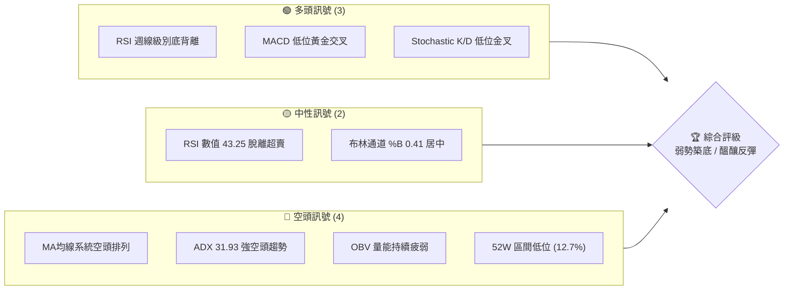
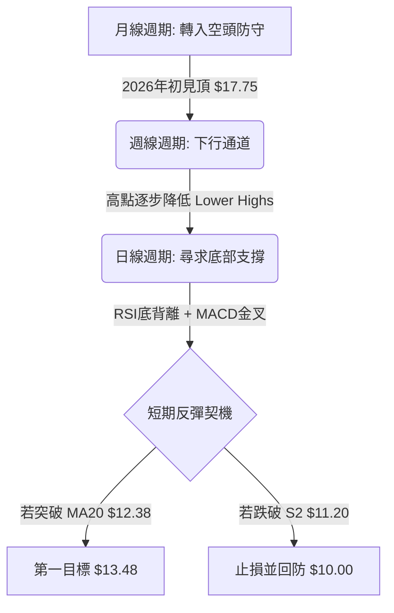
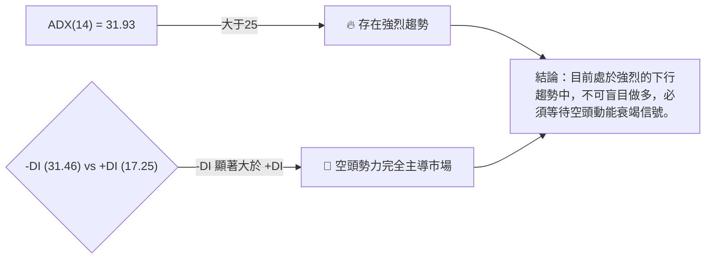
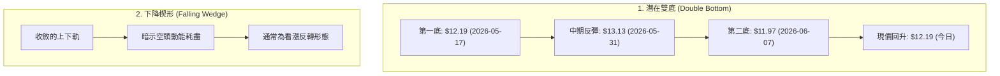
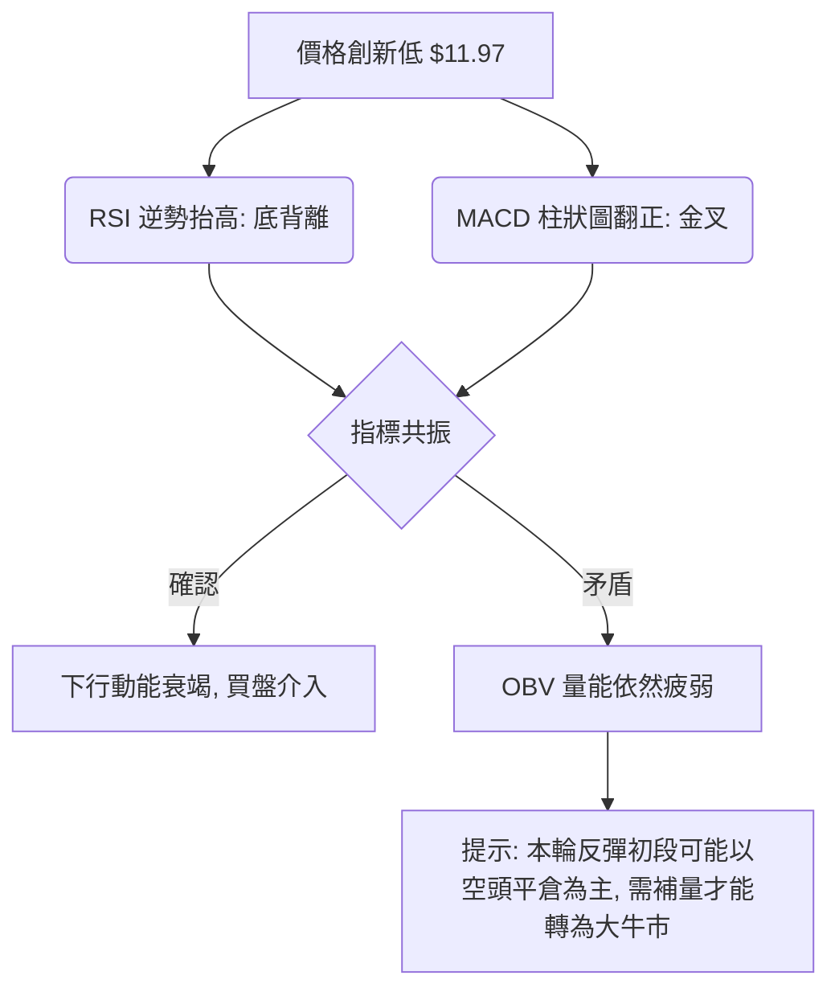
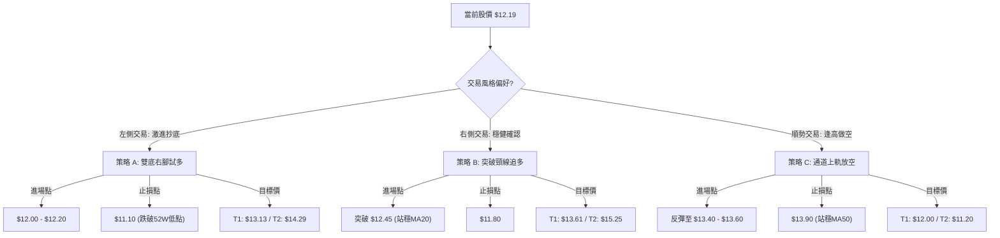
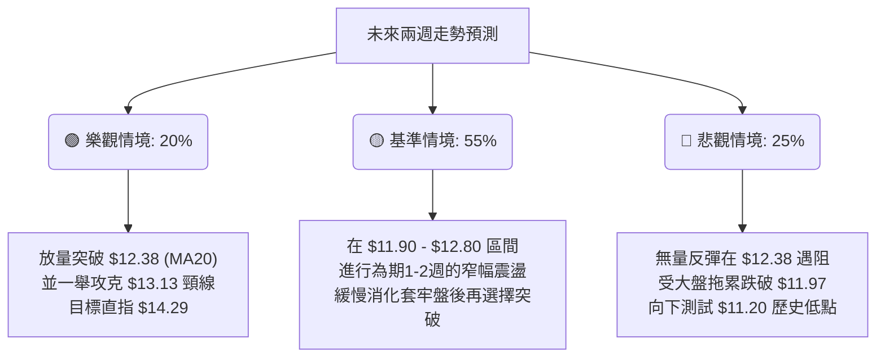

<details>
<summary>📊 靜態圖表 (點擊展開)</summary>

</details>

<html>
<head><meta charset="utf-8" /></head>
<body>
    <div style="height:500px; width:100%;">                        <script>window.PlotlyConfig = {MathJaxConfig: 'local'};</script>
        <script charset="utf-8" src="https://cdn.plot.ly/plotly-3.6.0.min.js" integrity="sha256-QaOVwtVY0T02VaHrr6pnoHLCwayMJp4O5n4YyaE3rJk=" crossorigin="anonymous"></script>                <div id="candlestick-chart" class="plotly-graph-div" style="height:100%; width:100%;"></div>            <script>                window.PLOTLYENV=window.PLOTLYENV || {};                                if (document.getElementById("candlestick-chart")) {                    Plotly.newPlot(                        "candlestick-chart",                        [{"close":{"dtype":"f8","bdata":"AAAAIK5HLUAAAACAPYotQAAAAKCZmS1AAAAA4FG4LUAAAADAzMwtQAAAAKBwvS1AAAAAQOF6LUAAAADgo3AuQAAAACCF6y5AAAAAwB4FL0AAAACgcD0vQAAAAKBHYS9AAAAAgOvRL0AAAAAgrscvQAAAACCF6y9AAAAAQOH6L0AAAAAghSswQAAAAMDMTDBAAAAAYGYmMEAAAABgjwIwQAAAACBcjy9AAAAAIFyPL0AAAABgZuYvQAAAAGCPAjBAAAAAoEdhLkAAAADgo3AuQAAAAGC4ni5AAAAAYI\u002fCLkAAAABgj0IuQAAAACCF6y5AAAAAoHC9LkAAAABACtctQAAAAMD1KC5AAAAAgOvRLUAAAAAAKVwuQAAAAIDCdS1AAAAAAAAALkAAAACA69EuQAAAAEDhei5AAAAAgOtRLkAAAADAzMwvQAAAAIAUri9AAAAAAAAAMEAAAAAAKdwvQAAAAEAKFzBAAAAAIFwPMEAAAAAAKRwwQAAAAKBHITBAAAAAoJmZL0AAAAAghSswQAAAAKBH4S9AAAAAoHC9L0AAAADAHgUwQAAAAADXYzBAAAAAgBQuMEAAAACAFC4vQAAAAADXoy9AAAAAQDMzL0AAAAAA16MuQAAAAIDrUS9AAAAAANejLkAAAAAgrscvQAAAAEAK1y9AAAAAACmcMEAAAAAAAEAxQAAAAADXYzFAAAAAQOF6MUAAAAAAKZwxQAAAAOCjcDFAAAAAYGamMUAAAABAM7MwQAAAAGC4njBAAAAAgBSuMEAAAADgo7AwQAAAAIDr0TBAAAAAYGbmMEAAAABgZqYwQAAAAEAzMzBAAAAA4FG4L0AAAADAHkUwQAAAAEAKVzBAAAAAYLieMEAAAABgj8IwQAAAAKBwvTBAAAAAYI\u002fCMEAAAADA9agwQAAAAKBH4TBAAAAAoHC9MEAAAADAHgUxQAAAAOCj8DFAAAAAACncMUAAAAAAAIAxQAAAAAApnDFAAAAAgMJ1MUAAAACAPQoxQAAAACBcjzBAAAAAANejMEAAAAAAKZwwQAAAAKCZmTBAAAAA4FH4MEAAAACgcD0xQAAAAAAAADJAAAAAgD0KMkAAAACAFC4yQAAAAMDMjDJAAAAAYI\u002fCMkAAAABgj8IyQAAAAAAAwDFAAAAAACkcMkAAAABguB4yQAAAAMAeBTFAAAAAIFzPMEAAAABgZmYxQAAAAMDMjDFAAAAAgOuRMUAAAADA9WgxQAAAAIA9CjFAAAAAgOvRMEAAAACA69EwQAAAACCFKzFAAAAAgOtRMUAAAAAgrocxQAAAAOCjMDBAAAAAIK6HMEAAAABgZqYwQAAAAGC4Hi5AAAAAgML1LUAAAACgR2EuQAAAAMAehS1AAAAAAAAALkAAAAAA16MtQAAAAMD1KC1AAAAAQApXLUAAAABgj8ItQAAAAEDh+ixAAAAA4KPwK0AAAAAgrscrQAAAAIA9iixAAAAAAACALEAAAADgo\u002fArQAAAAIDrUSxAAAAAoEfhK0AAAAAAKVwtQAAAAKBHYSxAAAAAANejLEAAAACAPQosQAAAAEAzMytAAAAAwB4FK0AAAACgcL0sQAAAAKBH4SxAAAAAwMxMLEAAAADAHoUsQAAAAMDMTCxAAAAAwB4FLUAAAACgcL0tQAAAACCF6y1AAAAAYGbmLUAAAABAM7MuQAAAAIAUri5AAAAAACncLkAAAACAFK4uQAAAAEAzMy5AAAAAoJkZLkAAAABAM7MtQAAAACCF6yxAAAAAwB4FLUAAAAAgrkctQAAAAAAAAC1AAAAA4HoULEAAAACAwvUsQAAAAKBH4SxAAAAAgOtRLEAAAAAAAIAsQAAAAIDC9SxAAAAAwB6FLEAAAACgmZkrQAAAAAAAACtAAAAAgD2KKkAAAAAA16MpQAAAAAAp3ClAAAAAoEdhKEAAAADgepQoQAAAAOB6lChAAAAA4HqUKUAAAACA61EqQAAAAIDCdSlAAAAAgML1KUAAAAAgXA8qQAAAAKCZGSpAAAAAYI9CKkAAAABA4fopQAAAAAAp3CdAAAAAIK5HJ0AAAACgcD0oQAAAAOCj8CdAAAAAQDMzJ0AAAABgj8InQAAAAKBwPSdAAAAAgBQuKEAAAACgR2EoQA=="},"high":{"dtype":"f8","bdata":"AAAAQApXLUAAAABA4TouQAAAAADXoy1AAAAAoHC9LUAAAACA6xEuQAAAAKBw\u002fS1AAAAAoJlZLkAAAADgo7AuQAAAAMAeBS9AAAAAIIVrL0AAAACgR6EvQAAAAIA9ii9AAAAAoEcBMEAAAACA6xEwQAAAAMDMDDBAAAAAoEchMEAAAACgmVkwQAAAAMDMTDBAAAAAwMxsMEAAAABguF4wQAAAAOBRGDBAAAAAoHD9L0AAAACgmRkwQAAAAOCjMDBAAAAAwMwMMEAAAADAzMwuQAAAAAAAwC5AAAAAQOH6LkAAAADgehQvQAAAAAAAAC9AAAAAwPUoL0AAAABgZuYuQAAAAKBwPS5AAAAAoEdhLkAAAAAAVo4uQAAAAGC4ni5AAAAAYLgeLkAAAAAgrkcvQAAAAIAULi9AAAAAIIXrLkAAAAAA1yMwQAAAAKBHITBAAAAAoJlZMEAAAACA6xEwQAAAAMAeRTBAAAAAoHA9MEAAAADAHkUwQAAAAAAAgDBAAAAAoHAdMEAAAAAghWswQAAAAGBmZjBAAAAAAADAL0AAAADgUTgwQAAAAMDMjDBAAAAAAACAMEAAAACA6zEwQAAAAGCPQjBAAAAAoHC9L0AAAACgmVkvQAAAAOCjcC9AAAAAQDMTMEAAAADAHgUwQAAAACBcDzBAAAAAwMysMEAAAACgR2ExQAAAAIAUjjFAAAAAIFyPMUAAAABACtcxQAAAAOBRuDFAAAAA4KPQMUAAAABA4boxQAAAAEAzEzFAAAAAQOG6MEAAAACgmdkwQAAAAAApHDFAAAAAIFwPMUAAAACA6xExQAAAAMAehTBAAAAAwPUoMEAAAADgIlswQAAAAOBReDBAAAAAoEehMEAAAADgetQwQAAAAMD1yDBAAAAAYI\u002fCMEAAAAAgXM8wQAAAAEDhGjFAAAAAwMzsMEAAAAAgXA8xQAAAAICVIzJAAAAAYLheMkAAAABgj8IxQAAAAIC+nzFAAAAAgOsRMkAAAAAghWsxQAAAAIDrETFAAAAA4KOwMEAAAADgUfgwQAAAAGAOrTBAAAAA4KNQMUAAAACAPYoxQAAAAAAAADJAAAAA4KMQMkAAAABgj0IyQAAAACBcjzJAAAAAwPXIMkAAAABA4foyQAAAAGC4njJAAAAAQAp3MkAAAABgZqYyQAAAAIA9KjJAAAAAYI8iMUAAAAAghWsxQAAAAEAK1zFAAAAAACm8MUAAAACgcP0xQAAAAMDMjDFAAAAAoEfhMEAAAAAAAAAxQAAAAEDhejFAAAAA4KNwMUAAAABACpcxQAAAAMD1aDFAAAAAQAqXMEAAAACgmdkwQAAAAKBH4S9AAAAAYGZmLkAAAABAi6wuQAAAAGC4Hi5AAAAAgMK1LkAAAADAzEwuQAAAAEAzcy1AAAAAgOuRLUAAAACAPUouQAAAAKBH4S1AAAAAQDOzLEAAAABguJ4sQAAAAKBwvSxAAAAA4HoULUAAAADAzIwsQAAAAAAAgCxAAAAAwMxMLEAAAABACtctQAAAAMAeBS1AAAAAoEdhLUAAAABgZqYsQAAAAGBm5itAAAAAgOuRK0AAAACA69EsQAAAAKCZmS1AAAAAgML1LEAAAAAgrscsQAAAAIDrUSxAAAAAwEnMLkAAAAAAKdwtQAAAAOB6FC5AAAAAIFwPLkAAAADgo\u002fAuQAAAAGC4Hi9AAAAAoEchL0AAAABguJ4vQAAAAEAzsy5AAAAAIFyPLkAAAADgo3AuQAAAAADXoy1AAAAA4HoULUAAAAAghastQAAAAEAKVy1AAAAAwB4FLUAAAABguB4tQAAAAIDrUS1AAAAA4KPwLEAAAACgR+EsQAAAAKCZGS1AAAAAQDMzLUAAAADA9agsQAAAAMD16CtAAAAAACkcK0AAAACAPYoqQAAAAEAKVypAAAAAIFzPKEAAAADAzMwoQAAAAMDMzChAAAAAoJmZKUAAAACgmZkqQAAAAMAehSpAAAAAoEchKkAAAAAAKVwqQAAAAEDheipAAAAAAACAKkAAAADAzEwqQAAAACCFayhAAAAAQOF6J0AAAACAFG4oQAAAAEAzsyhAAAAAoJkZKEAAAACA6xEoQAAAAIAULihAAAAAgBQuKEAAAADgepQoQA=="},"hovertemplate":"\u003cb\u003e%{x|%Y-%m-%d}\u003c\u002fb\u003e\u003cbr\u003e\u958b: $%{open:.2f}\u003cbr\u003e\u9ad8: $%{high:.2f}\u003cbr\u003e\u4f4e: $%{low:.2f}\u003cbr\u003e\u6536: $%{close:.2f}\u003cextra\u003e\u003c\u002fextra\u003e","low":{"dtype":"f8","bdata":"AAAAYI+CLEAAAACA61EtQAAAAIAULi1AAAAAgBSuLEAAAACAwnUtQAAAAIDC9SxAAAAAgD0KLUAAAAAghWstQAAAAGCPAi5AAAAAoJmZLkAAAACAwvUuQAAAAOB6FC9AAAAAwPVoL0AAAACA61EvQAAAAGBmpi9AAAAAwB7FL0AAAADAHgUwQAAAAIDC9S9AAAAAIK4HMEAAAACg8dIvQAAAAIDCdS9AAAAAoJkZL0AAAADA9agvQAAAAMDMTC9AAAAAgOtRLkAAAACAPQouQAAAAOBROC5AAAAAAABALkAAAACAPQouQAAAAKCZGS5AAAAAgMJ1LkAAAABgj8ItQAAAAEAK1y1AAAAAIK5HLUAAAADgUbgtQAAAAEBeOi1AAAAAYLgeLUAAAABguB4uQAAAACBcTy5AAAAAgOsRLkAAAACAwnUuQAAAACAEli9AAAAAQArXL0AAAAAA16MvQAAAAAAp3C9AAAAAANcDMEAAAABgj8IvQAAAAIAU7i9AAAAAYGZmL0AAAADgepQvQAAAAIAUri9AAAAAYGbmLkAAAADAzMwvQAAAAMDMDDBAAAAAIIULMEAAAADgUfguQAAAAADXoy5AAAAAAAAAL0AAAADAHoUuQAAAAKBHYS5AAAAAoJmZLkAAAABgj4IuQAAAACBcjy9AAAAAAClcL0AAAADA9egwQAAAAEAzMzFAAAAAIK5HMUAAAABA4XoxQAAAAIA9SjFAAAAAAClcMUAAAACgmZkwQAAAAOBReDBAAAAAAAJLMEAAAABACncwQAAAAEAzszBAAAAAoJmZMEAAAACgR6EwQAAAAIAULjBAAAAAgBQuL0AAAADAIBAwQAAAAEBiUDBAAAAAoJlZMEAAAAAgXI8wQAAAAGBmpjBAAAAAACmcMEAAAACAPYowQAAAAIAUrjBAAAAAgMK1MEAAAABgZqYwQAAAAIA9KjFAAAAAIFzPMUAAAAAgrmcxQAAAAGC4XjFAAAAAANdjMUAAAADAHgUxQAAAAIA9ajBAAAAAwMxsMEAAAACAQYAwQAAAAIAUTjBAAAAAoJlZMEAAAACA6xExQAAAAOB6VDFAAAAAgMK1MUAAAABgZuYxQAAAAKCZGTJAAAAAAClcMkAAAACgcD0yQAAAAIDCtTFAAAAAgMK1MUAAAABACtcxQAAAAAAA4DBAAAAAwMyMMEAAAABgj8IwQAAAAEAKNzFAAAAAgD0KMUAAAACgmVkxQAAAAIDCtTBAAAAAYLheMEAAAABACpcwQAAAAEAK1zBAAAAAwB7lMEAAAAAghSsxQAAAAOB6FDBAAAAAoHC9L0AAAAAA14MwQAAAAOB6FC5AAAAAYGZmLUAAAABguJ4sQAAAAEAKVyxAAAAAoJmZLUAAAADgUTgtQAAAAOBReCxAAAAAgMJ1LEAAAAAgXA8tQAAAAGCPwixAAAAAYI\u002fCK0AAAACgR6ErQAAAAGC4HixAAAAA4FF4LEAAAADgetQrQAAAACBcDytAAAAA4HqUK0AAAADgo3AsQAAAAIDrUSxAAAAAIIVrLEAAAAAAKdwrQAAAAOB6FCtAAAAAgOvRKkAAAABgZmYrQAAAAAAp3CxAAAAAAAKrK0AAAADA9SgsQAAAAIAUritAAAAAgOvRLEAAAADAzMwsQAAAACBcjy1AAAAAQDMzLUAAAACgcD0uQAAAAKCZmS5AAAAA4HqULkAAAABguJ4uQAAAAAAp3C1AAAAA4KPwLUAAAABAClctQAAAAIDrkSxAAAAAoEdhLEAAAACgmRktQAAAAIDCtSxAAAAA4HoULEAAAACgmRksQAAAAGCPwixAAAAAgBQuLEAAAABAClcsQAAAAKBwfSxAAAAAwPVoLEAAAAAAAIArQAAAAEAK1ypAAAAAwB6FKkAAAAAgrocpQAAAAIAUrilAAAAAIFyPJ0AAAABguB4oQAAAACCF6ydAAAAAwPWoKEAAAABguB4pQAAAACCFaylAAAAAwMxMKUAAAAAAKdwpQAAAACCuxylAAAAAQOH6KUAAAACA69EpQAAAAKBH4SZAAAAAYGZmJkAAAAAA16MnQAAAAGC43idAAAAAoJkZJ0AAAAAgXE8nQAAAAOBROCdAAAAAwB4FJ0AAAAAgrgcoQA=="},"name":"\u50f9\u683c","open":{"dtype":"f8","bdata":"AAAAgML1LEAAAAAAAIAtQAAAAOBROC1AAAAAwPUoLUAAAACgcL0tQAAAAIAUri1AAAAAwB4FLkAAAAAgXI8tQAAAAIDCdS5AAAAAoJkZL0AAAAAgXA8vQAAAAAApXC9AAAAAAACAL0AAAACgR+EvQAAAAGBm5i9AAAAAYI8CMEAAAACA6xEwQAAAAAApHDBAAAAAwMxMMEAAAACAFC4wQAAAAAAp3C9AAAAAACncL0AAAABgZuYvQAAAACCF6y9AAAAAwMwMMEAAAACAPYouQAAAACBcjy5AAAAAoHC9LkAAAACA69EuQAAAAAApXC5AAAAAIFwPL0AAAADgUbguQAAAAMD1KC5AAAAAQDOzLUAAAAAAAAAuQAAAAOB6lC5AAAAAIK5HLUAAAABgj0IuQAAAAEAzsy5AAAAAANejLkAAAADAHoUuQAAAAEAKFzBAAAAAQOE6MEAAAAAghesvQAAAAGBm5i9AAAAAgOsRMEAAAAAAKRwwQAAAAOCjMDBAAAAAoJmZL0AAAADgUbgvQAAAAGC4XjBAAAAAANejL0AAAACgmRkwQAAAAEAKFzBAAAAAgMJ1MEAAAACAPQowQAAAAAAp3C5AAAAA4FF4L0AAAADAzMwuQAAAAMDMjC5AAAAAgBSuL0AAAACAwrUuQAAAAAAAADBAAAAAQArXL0AAAABA4fowQAAAAADXYzFAAAAAgBRuMUAAAACAwrUxQAAAAEAzszFAAAAAYGamMUAAAABAM7MxQAAAAGC43jBAAAAAwB5lMEAAAACgmZkwQAAAAEDhujBAAAAAIK7nMEAAAABgZgYxQAAAAAAAgDBAAAAAQAoXMEAAAABgZiYwQAAAAKCZWTBAAAAAIIVrMEAAAADgo7AwQAAAAEAzszBAAAAAoHC9MEAAAACAPaowQAAAAMAexTBAAAAAYLjeMEAAAAAgXA8xQAAAAIAULjFAAAAAYLgeMkAAAABguJ4xQAAAAEAKlzFAAAAAgBSuMUAAAACgmVkxQAAAACBcDzFAAAAA4KOQMEAAAAAAAMAwQAAAAIDrkTBAAAAAAClcMEAAAABgjyIxQAAAAIA9qjFAAAAAAAAAMkAAAADAzAwyQAAAAAApXDJAAAAAYI+iMkAAAADgetQyQAAAACCuhzJAAAAAoHC9MUAAAAAgrmcyQAAAAOB6FDJAAAAA4HrUMEAAAAAghSsxQAAAAOCjcDFAAAAAYGYmMUAAAACA6\u002fExQAAAAMD1iDFAAAAAoHC9MEAAAAAAAMAwQAAAAEAz8zBAAAAAANcjMUAAAABAMzMxQAAAAAAAQDFAAAAA4KMwMEAAAAAA14MwQAAAAEAK1y9AAAAA4KNwLUAAAAAghessQAAAAAApXC1AAAAAoHD9LUAAAAAAKdwtQAAAAGCPAi1AAAAAgOvRLEAAAABA4XotQAAAAAAAgC1AAAAAYGZmLEAAAAAA1yMsQAAAAKBwPSxAAAAAwMzMLEAAAADgo3AsQAAAAAApXCtAAAAAoHA9LEAAAACgR6EsQAAAAOBR+CxAAAAAYI9CLUAAAABgj0IsQAAAAIDCdStAAAAAIIVrK0AAAACgmZkrQAAAAIAULi1AAAAAAAAALEAAAABgj0IsQAAAAEAzMyxAAAAAIIVrLkAAAADAHgUtQAAAAAAp3C1AAAAAgBSuLUAAAABgj0IuQAAAACCF6y5AAAAAIK7HLkAAAABguJ4vQAAAAEDhei5AAAAA4FE4LkAAAAAAKVwuQAAAAGC4ni1AAAAAQArXLEAAAAAgrkctQAAAAOB6FC1AAAAAgML1LEAAAADgelQsQAAAAIDrUS1AAAAAIK7HLEAAAAAA16MsQAAAAAAAAC1AAAAAAAAALUAAAACgmZksQAAAAGCPwitAAAAAQArXKkAAAAAghWsqQAAAAEAzsylAAAAAQIkBKEAAAADAzMwoQAAAAOB6VChAAAAAgBSuKEAAAADgUTgpQAAAAMDMTCpAAAAAIK4HKkAAAAAghespQAAAAOCj8ClAAAAAoJkZKkAAAAAAAAAqQAAAAEDh+idAAAAAwMxMJ0AAAABgj8InQAAAAEAzMyhAAAAAwB4FKEAAAADgo3AnQAAAAKCZmSdAAAAAANcjJ0AAAABAClcoQA=="},"x":["2025-08-27T00:00:00-04:00","2025-08-28T00:00:00-04:00","2025-08-29T00:00:00-04:00","2025-09-02T00:00:00-04:00","2025-09-03T00:00:00-04:00","2025-09-04T00:00:00-04:00","2025-09-05T00:00:00-04:00","2025-09-08T00:00:00-04:00","2025-09-09T00:00:00-04:00","2025-09-10T00:00:00-04:00","2025-09-11T00:00:00-04:00","2025-09-12T00:00:00-04:00","2025-09-15T00:00:00-04:00","2025-09-16T00:00:00-04:00","2025-09-17T00:00:00-04:00","2025-09-18T00:00:00-04:00","2025-09-19T00:00:00-04:00","2025-09-22T00:00:00-04:00","2025-09-23T00:00:00-04:00","2025-09-24T00:00:00-04:00","2025-09-25T00:00:00-04:00","2025-09-26T00:00:00-04:00","2025-09-29T00:00:00-04:00","2025-09-30T00:00:00-04:00","2025-10-01T00:00:00-04:00","2025-10-02T00:00:00-04:00","2025-10-03T00:00:00-04:00","2025-10-06T00:00:00-04:00","2025-10-07T00:00:00-04:00","2025-10-08T00:00:00-04:00","2025-10-09T00:00:00-04:00","2025-10-10T00:00:00-04:00","2025-10-13T00:00:00-04:00","2025-10-14T00:00:00-04:00","2025-10-15T00:00:00-04:00","2025-10-16T00:00:00-04:00","2025-10-17T00:00:00-04:00","2025-10-20T00:00:00-04:00","2025-10-21T00:00:00-04:00","2025-10-22T00:00:00-04:00","2025-10-23T00:00:00-04:00","2025-10-24T00:00:00-04:00","2025-10-27T00:00:00-04:00","2025-10-28T00:00:00-04:00","2025-10-29T00:00:00-04:00","2025-10-30T00:00:00-04:00","2025-10-31T00:00:00-04:00","2025-11-03T00:00:00-05:00","2025-11-04T00:00:00-05:00","2025-11-05T00:00:00-05:00","2025-11-06T00:00:00-05:00","2025-11-07T00:00:00-05:00","2025-11-10T00:00:00-05:00","2025-11-11T00:00:00-05:00","2025-11-12T00:00:00-05:00","2025-11-13T00:00:00-05:00","2025-11-14T00:00:00-05:00","2025-11-17T00:00:00-05:00","2025-11-18T00:00:00-05:00","2025-11-19T00:00:00-05:00","2025-11-20T00:00:00-05:00","2025-11-21T00:00:00-05:00","2025-11-24T00:00:00-05:00","2025-11-25T00:00:00-05:00","2025-11-26T00:00:00-05:00","2025-11-28T00:00:00-05:00","2025-12-01T00:00:00-05:00","2025-12-02T00:00:00-05:00","2025-12-03T00:00:00-05:00","2025-12-04T00:00:00-05:00","2025-12-05T00:00:00-05:00","2025-12-08T00:00:00-05:00","2025-12-09T00:00:00-05:00","2025-12-10T00:00:00-05:00","2025-12-11T00:00:00-05:00","2025-12-12T00:00:00-05:00","2025-12-15T00:00:00-05:00","2025-12-16T00:00:00-05:00","2025-12-17T00:00:00-05:00","2025-12-18T00:00:00-05:00","2025-12-19T00:00:00-05:00","2025-12-22T00:00:00-05:00","2025-12-23T00:00:00-05:00","2025-12-24T00:00:00-05:00","2025-12-26T00:00:00-05:00","2025-12-29T00:00:00-05:00","2025-12-30T00:00:00-05:00","2025-12-31T00:00:00-05:00","2026-01-02T00:00:00-05:00","2026-01-05T00:00:00-05:00","2026-01-06T00:00:00-05:00","2026-01-07T00:00:00-05:00","2026-01-08T00:00:00-05:00","2026-01-09T00:00:00-05:00","2026-01-12T00:00:00-05:00","2026-01-13T00:00:00-05:00","2026-01-14T00:00:00-05:00","2026-01-15T00:00:00-05:00","2026-01-16T00:00:00-05:00","2026-01-20T00:00:00-05:00","2026-01-21T00:00:00-05:00","2026-01-22T00:00:00-05:00","2026-01-23T00:00:00-05:00","2026-01-26T00:00:00-05:00","2026-01-27T00:00:00-05:00","2026-01-28T00:00:00-05:00","2026-01-29T00:00:00-05:00","2026-01-30T00:00:00-05:00","2026-02-02T00:00:00-05:00","2026-02-03T00:00:00-05:00","2026-02-04T00:00:00-05:00","2026-02-05T00:00:00-05:00","2026-02-06T00:00:00-05:00","2026-02-09T00:00:00-05:00","2026-02-10T00:00:00-05:00","2026-02-11T00:00:00-05:00","2026-02-12T00:00:00-05:00","2026-02-13T00:00:00-05:00","2026-02-17T00:00:00-05:00","2026-02-18T00:00:00-05:00","2026-02-19T00:00:00-05:00","2026-02-20T00:00:00-05:00","2026-02-23T00:00:00-05:00","2026-02-24T00:00:00-05:00","2026-02-25T00:00:00-05:00","2026-02-26T00:00:00-05:00","2026-02-27T00:00:00-05:00","2026-03-02T00:00:00-05:00","2026-03-03T00:00:00-05:00","2026-03-04T00:00:00-05:00","2026-03-05T00:00:00-05:00","2026-03-06T00:00:00-05:00","2026-03-09T00:00:00-04:00","2026-03-10T00:00:00-04:00","2026-03-11T00:00:00-04:00","2026-03-12T00:00:00-04:00","2026-03-13T00:00:00-04:00","2026-03-16T00:00:00-04:00","2026-03-17T00:00:00-04:00","2026-03-18T00:00:00-04:00","2026-03-19T00:00:00-04:00","2026-03-20T00:00:00-04:00","2026-03-23T00:00:00-04:00","2026-03-24T00:00:00-04:00","2026-03-25T00:00:00-04:00","2026-03-26T00:00:00-04:00","2026-03-27T00:00:00-04:00","2026-03-30T00:00:00-04:00","2026-03-31T00:00:00-04:00","2026-04-01T00:00:00-04:00","2026-04-02T00:00:00-04:00","2026-04-06T00:00:00-04:00","2026-04-07T00:00:00-04:00","2026-04-08T00:00:00-04:00","2026-04-09T00:00:00-04:00","2026-04-10T00:00:00-04:00","2026-04-13T00:00:00-04:00","2026-04-14T00:00:00-04:00","2026-04-15T00:00:00-04:00","2026-04-16T00:00:00-04:00","2026-04-17T00:00:00-04:00","2026-04-20T00:00:00-04:00","2026-04-21T00:00:00-04:00","2026-04-22T00:00:00-04:00","2026-04-23T00:00:00-04:00","2026-04-24T00:00:00-04:00","2026-04-27T00:00:00-04:00","2026-04-28T00:00:00-04:00","2026-04-29T00:00:00-04:00","2026-04-30T00:00:00-04:00","2026-05-01T00:00:00-04:00","2026-05-04T00:00:00-04:00","2026-05-05T00:00:00-04:00","2026-05-06T00:00:00-04:00","2026-05-07T00:00:00-04:00","2026-05-08T00:00:00-04:00","2026-05-11T00:00:00-04:00","2026-05-12T00:00:00-04:00","2026-05-13T00:00:00-04:00","2026-05-14T00:00:00-04:00","2026-05-15T00:00:00-04:00","2026-05-18T00:00:00-04:00","2026-05-19T00:00:00-04:00","2026-05-20T00:00:00-04:00","2026-05-21T00:00:00-04:00","2026-05-22T00:00:00-04:00","2026-05-26T00:00:00-04:00","2026-05-27T00:00:00-04:00","2026-05-28T00:00:00-04:00","2026-05-29T00:00:00-04:00","2026-06-01T00:00:00-04:00","2026-06-02T00:00:00-04:00","2026-06-03T00:00:00-04:00","2026-06-04T00:00:00-04:00","2026-06-05T00:00:00-04:00","2026-06-08T00:00:00-04:00","2026-06-09T00:00:00-04:00","2026-06-10T00:00:00-04:00","2026-06-11T00:00:00-04:00","2026-06-12T00:00:00-04:00"],"type":"candlestick"},{"hovertemplate":"MA30: $%{y:.2f}\u003cextra\u003e\u003c\u002fextra\u003e","line":{"color":"#2196F3","dash":"dash","width":2},"mode":"lines","name":"MA30","x":["2025-08-27T00:00:00-04:00","2025-08-28T00:00:00-04:00","2025-08-29T00:00:00-04:00","2025-09-02T00:00:00-04:00","2025-09-03T00:00:00-04:00","2025-09-04T00:00:00-04:00","2025-09-05T00:00:00-04:00","2025-09-08T00:00:00-04:00","2025-09-09T00:00:00-04:00","2025-09-10T00:00:00-04:00","2025-09-11T00:00:00-04:00","2025-09-12T00:00:00-04:00","2025-09-15T00:00:00-04:00","2025-09-16T00:00:00-04:00","2025-09-17T00:00:00-04:00","2025-09-18T00:00:00-04:00","2025-09-19T00:00:00-04:00","2025-09-22T00:00:00-04:00","2025-09-23T00:00:00-04:00","2025-09-24T00:00:00-04:00","2025-09-25T00:00:00-04:00","2025-09-26T00:00:00-04:00","2025-09-29T00:00:00-04:00","2025-09-30T00:00:00-04:00","2025-10-01T00:00:00-04:00","2025-10-02T00:00:00-04:00","2025-10-03T00:00:00-04:00","2025-10-06T00:00:00-04:00","2025-10-07T00:00:00-04:00","2025-10-08T00:00:00-04:00","2025-10-09T00:00:00-04:00","2025-10-10T00:00:00-04:00","2025-10-13T00:00:00-04:00","2025-10-14T00:00:00-04:00","2025-10-15T00:00:00-04:00","2025-10-16T00:00:00-04:00","2025-10-17T00:00:00-04:00","2025-10-20T00:00:00-04:00","2025-10-21T00:00:00-04:00","2025-10-22T00:00:00-04:00","2025-10-23T00:00:00-04:00","2025-10-24T00:00:00-04:00","2025-10-27T00:00:00-04:00","2025-10-28T00:00:00-04:00","2025-10-29T00:00:00-04:00","2025-10-30T00:00:00-04:00","2025-10-31T00:00:00-04:00","2025-11-03T00:00:00-05:00","2025-11-04T00:00:00-05:00","2025-11-05T00:00:00-05:00","2025-11-06T00:00:00-05:00","2025-11-07T00:00:00-05:00","2025-11-10T00:00:00-05:00","2025-11-11T00:00:00-05:00","2025-11-12T00:00:00-05:00","2025-11-13T00:00:00-05:00","2025-11-14T00:00:00-05:00","2025-11-17T00:00:00-05:00","2025-11-18T00:00:00-05:00","2025-11-19T00:00:00-05:00","2025-11-20T00:00:00-05:00","2025-11-21T00:00:00-05:00","2025-11-24T00:00:00-05:00","2025-11-25T00:00:00-05:00","2025-11-26T00:00:00-05:00","2025-11-28T00:00:00-05:00","2025-12-01T00:00:00-05:00","2025-12-02T00:00:00-05:00","2025-12-03T00:00:00-05:00","2025-12-04T00:00:00-05:00","2025-12-05T00:00:00-05:00","2025-12-08T00:00:00-05:00","2025-12-09T00:00:00-05:00","2025-12-10T00:00:00-05:00","2025-12-11T00:00:00-05:00","2025-12-12T00:00:00-05:00","2025-12-15T00:00:00-05:00","2025-12-16T00:00:00-05:00","2025-12-17T00:00:00-05:00","2025-12-18T00:00:00-05:00","2025-12-19T00:00:00-05:00","2025-12-22T00:00:00-05:00","2025-12-23T00:00:00-05:00","2025-12-24T00:00:00-05:00","2025-12-26T00:00:00-05:00","2025-12-29T00:00:00-05:00","2025-12-30T00:00:00-05:00","2025-12-31T00:00:00-05:00","2026-01-02T00:00:00-05:00","2026-01-05T00:00:00-05:00","2026-01-06T00:00:00-05:00","2026-01-07T00:00:00-05:00","2026-01-08T00:00:00-05:00","2026-01-09T00:00:00-05:00","2026-01-12T00:00:00-05:00","2026-01-13T00:00:00-05:00","2026-01-14T00:00:00-05:00","2026-01-15T00:00:00-05:00","2026-01-16T00:00:00-05:00","2026-01-20T00:00:00-05:00","2026-01-21T00:00:00-05:00","2026-01-22T00:00:00-05:00","2026-01-23T00:00:00-05:00","2026-01-26T00:00:00-05:00","2026-01-27T00:00:00-05:00","2026-01-28T00:00:00-05:00","2026-01-29T00:00:00-05:00","2026-01-30T00:00:00-05:00","2026-02-02T00:00:00-05:00","2026-02-03T00:00:00-05:00","2026-02-04T00:00:00-05:00","2026-02-05T00:00:00-05:00","2026-02-06T00:00:00-05:00","2026-02-09T00:00:00-05:00","2026-02-10T00:00:00-05:00","2026-02-11T00:00:00-05:00","2026-02-12T00:00:00-05:00","2026-02-13T00:00:00-05:00","2026-02-17T00:00:00-05:00","2026-02-18T00:00:00-05:00","2026-02-19T00:00:00-05:00","2026-02-20T00:00:00-05:00","2026-02-23T00:00:00-05:00","2026-02-24T00:00:00-05:00","2026-02-25T00:00:00-05:00","2026-02-26T00:00:00-05:00","2026-02-27T00:00:00-05:00","2026-03-02T00:00:00-05:00","2026-03-03T00:00:00-05:00","2026-03-04T00:00:00-05:00","2026-03-05T00:00:00-05:00","2026-03-06T00:00:00-05:00","2026-03-09T00:00:00-04:00","2026-03-10T00:00:00-04:00","2026-03-11T00:00:00-04:00","2026-03-12T00:00:00-04:00","2026-03-13T00:00:00-04:00","2026-03-16T00:00:00-04:00","2026-03-17T00:00:00-04:00","2026-03-18T00:00:00-04:00","2026-03-19T00:00:00-04:00","2026-03-20T00:00:00-04:00","2026-03-23T00:00:00-04:00","2026-03-24T00:00:00-04:00","2026-03-25T00:00:00-04:00","2026-03-26T00:00:00-04:00","2026-03-27T00:00:00-04:00","2026-03-30T00:00:00-04:00","2026-03-31T00:00:00-04:00","2026-04-01T00:00:00-04:00","2026-04-02T00:00:00-04:00","2026-04-06T00:00:00-04:00","2026-04-07T00:00:00-04:00","2026-04-08T00:00:00-04:00","2026-04-09T00:00:00-04:00","2026-04-10T00:00:00-04:00","2026-04-13T00:00:00-04:00","2026-04-14T00:00:00-04:00","2026-04-15T00:00:00-04:00","2026-04-16T00:00:00-04:00","2026-04-17T00:00:00-04:00","2026-04-20T00:00:00-04:00","2026-04-21T00:00:00-04:00","2026-04-22T00:00:00-04:00","2026-04-23T00:00:00-04:00","2026-04-24T00:00:00-04:00","2026-04-27T00:00:00-04:00","2026-04-28T00:00:00-04:00","2026-04-29T00:00:00-04:00","2026-04-30T00:00:00-04:00","2026-05-01T00:00:00-04:00","2026-05-04T00:00:00-04:00","2026-05-05T00:00:00-04:00","2026-05-06T00:00:00-04:00","2026-05-07T00:00:00-04:00","2026-05-08T00:00:00-04:00","2026-05-11T00:00:00-04:00","2026-05-12T00:00:00-04:00","2026-05-13T00:00:00-04:00","2026-05-14T00:00:00-04:00","2026-05-15T00:00:00-04:00","2026-05-18T00:00:00-04:00","2026-05-19T00:00:00-04:00","2026-05-20T00:00:00-04:00","2026-05-21T00:00:00-04:00","2026-05-22T00:00:00-04:00","2026-05-26T00:00:00-04:00","2026-05-27T00:00:00-04:00","2026-05-28T00:00:00-04:00","2026-05-29T00:00:00-04:00","2026-06-01T00:00:00-04:00","2026-06-02T00:00:00-04:00","2026-06-03T00:00:00-04:00","2026-06-04T00:00:00-04:00","2026-06-05T00:00:00-04:00","2026-06-08T00:00:00-04:00","2026-06-09T00:00:00-04:00","2026-06-10T00:00:00-04:00","2026-06-11T00:00:00-04:00","2026-06-12T00:00:00-04:00"],"y":{"dtype":"f8","bdata":"AAAAAAAA+H8AAAAAAAD4fwAAAAAAAPh\u002fAAAAAAAA+H8AAAAAAAD4fwAAAAAAAPh\u002fAAAAAAAA+H8AAAAAAAD4fwAAAAAAAPh\u002fAAAAAAAA+H8AAAAAAAD4fwAAAAAAAPh\u002fAAAAAAAA+H8AAAAAAAD4fwAAAAAAAPh\u002fAAAAAAAA+H8AAAAAAAD4fwAAAAAAAPh\u002fAAAAAAAA+H8AAAAAAAD4fwAAAAAAAPh\u002fAAAAAAAA+H8AAAAAAAD4fwAAAAAAAPh\u002fAAAAAAAA+H8AAAAAAAD4fwAAAAAAAPh\u002fAAAAAAAA+H8AAAAAAAD4f0RERDRe+i5A7+7untMGL0Crqqr6YgkvQBEREVEqDi9AVVVVxQQPL0DNzMwczBMvQBEREXFoES9AZmZmZtgVL0BVVVWFFhkvQDMzM1NVFS9AZmZmJlwPL0DNzMx8IxQvQJqZmdmyFi9AERERETwYL0BERETU6hgvQO\u002fu7s4iGy9AREREpFQcL0AAAACAThsvQCIiIsJnGC9AZmZmlm4SL0AzMzOjKRUvQAAAALDkFy9Ad3d3520ZL0De3d29nxovQLy7u\u002fsbIS9AzczMXAEyL0CrqqrqUTgvQDMzMyMGQS9AVVVVVcdEL0BERER0BUgvQERERERvSy9AAAAA0JRKL0Dv7u7OIlsvQDMzM9N4aS9A3t3dPXyGL0BVVVU10KkvQM3MzOw11y9Aq6qqmsQAMEBERESUihMwQN7d3Y1QJjBAq6qqCpA7MEC8u7urY0IwQLy7u5sLSTBAd3d3F9lOMEBmZmZWVVUwQLy7uwuQWzBA3t3dDbtiMEAzMzOzVmcwQO\u002fu7p7vZzBAERERsXJoMEBVVVUlTWkwQN7d3fW2bDBAzczMXB1zMECrqqrqbXkwQBEREYFqfDBAiYiIiF2BMEC8u7v7foowQGZmZpaKkzBARERE9ESdMECamZmpxqswQGZmZmY7vzBA3t3dHejUMEDv7u42peIwQLy7uxMR8TBAVVVV7VH4MEBVVVUth\u002fYwQLy7uwNy7zBAmpmZAUfoMEARERF5vt8wQO\u002fu7naT2DBAMzMz+8XSMECJiIigYdcwQAAAAEgo4zBAd3d3P8PuMEC8u7szevswQJqZmXE9CjFAVVVVrRwaMUAzMzMLHiwxQJqZmRFYOTFAVVVVRYtMMUCJiIioVFwxQERERCQiYjFAMzMzM8FjMUDNzMxMN2kxQFVVVcUgcDFA3t3dPQp3MUBERESkcH0xQLy7uyvOfjFA7+7u7nx\u002fMUBmZmYGyH0xQO\u002fu7u41dzFAiYiISJpyMUAiIiLS23IxQImIiMi9ZjFAvLu7K85eMUAzMzMzelsxQO\u002fu7matTjFAvLu7E4NAMUCamZkJZTQxQO\u002fu7n6xJDFAd3d39+ETMUBVVVVlO\u002f8wQKuqqkoM4jBAmpmZaUrFMEC8u7tzIakwQHd3dz98hjBAVVVVVZxdMEAAAACoDTQwQDMzM3tbFjBAzczMXNbqL0C8u7u7AqQvQDMzMzMzcy9Aq6qq+jdCL0Dv7u4ezBMvQO\u002fu7g502i5Ad3d3l\u002fyiLkBVVVV1IWkuQN7d3d1rLi5AIiIiQu71LUC8u7sLHswtQN7d3X2GnS1AzczMjGxnLUAzMzOznS8tQM3MzMzMDC1AiYiISFPqLECJiIhY8sssQAAAAHA9yixA3t3dXbrJLEC8u7trdcwsQKuqqnpb1ixA3t3dLbLdLECJiIgYkuYsQDMzMwNy7yxAIiIiQu71LEAAAAAwa\u002fUsQN7d3R3o9CxAmpmZaR\u002f+LEBmZmY27AotQImIiBjZDi1Ad3d3l0MLLUAAAADQ9xMtQGZmZia\u002fGC1AiYiIWIAcLUBVVVWlKRUtQM3MzKwcGi1AiYiIiBYZLUBmZmZWVRUtQN7d3W2gEy1Aq6qq2ocPLUDNzMzME\u002fUsQDMzM4NO2yxAREREJNu5LEBEREQUPJgsQN7d3Z19eCxAIiIi0iJbLEB3d3e38z0sQCIiIrLkFyxAIiIiokX2K0BVVVVlrc4rQLy7uzuYpytAERERYVeAK0AiIiISPFgrQBERESEiIitAzczMnO\u002fnKkDv7u4OWLkqQFVVVRXZjipAmpmZGS9dKkCamZl5FC4qQAAAAJDt\u002fClAIiIi4qXbKUCJiIi4kLQpQA=="},"type":"scatter"},{"hovertemplate":"MA60: $%{y:.2f}\u003cextra\u003e\u003c\u002fextra\u003e","line":{"color":"#9C27B0","dash":"dash","width":2},"mode":"lines","name":"MA60","x":["2025-08-27T00:00:00-04:00","2025-08-28T00:00:00-04:00","2025-08-29T00:00:00-04:00","2025-09-02T00:00:00-04:00","2025-09-03T00:00:00-04:00","2025-09-04T00:00:00-04:00","2025-09-05T00:00:00-04:00","2025-09-08T00:00:00-04:00","2025-09-09T00:00:00-04:00","2025-09-10T00:00:00-04:00","2025-09-11T00:00:00-04:00","2025-09-12T00:00:00-04:00","2025-09-15T00:00:00-04:00","2025-09-16T00:00:00-04:00","2025-09-17T00:00:00-04:00","2025-09-18T00:00:00-04:00","2025-09-19T00:00:00-04:00","2025-09-22T00:00:00-04:00","2025-09-23T00:00:00-04:00","2025-09-24T00:00:00-04:00","2025-09-25T00:00:00-04:00","2025-09-26T00:00:00-04:00","2025-09-29T00:00:00-04:00","2025-09-30T00:00:00-04:00","2025-10-01T00:00:00-04:00","2025-10-02T00:00:00-04:00","2025-10-03T00:00:00-04:00","2025-10-06T00:00:00-04:00","2025-10-07T00:00:00-04:00","2025-10-08T00:00:00-04:00","2025-10-09T00:00:00-04:00","2025-10-10T00:00:00-04:00","2025-10-13T00:00:00-04:00","2025-10-14T00:00:00-04:00","2025-10-15T00:00:00-04:00","2025-10-16T00:00:00-04:00","2025-10-17T00:00:00-04:00","2025-10-20T00:00:00-04:00","2025-10-21T00:00:00-04:00","2025-10-22T00:00:00-04:00","2025-10-23T00:00:00-04:00","2025-10-24T00:00:00-04:00","2025-10-27T00:00:00-04:00","2025-10-28T00:00:00-04:00","2025-10-29T00:00:00-04:00","2025-10-30T00:00:00-04:00","2025-10-31T00:00:00-04:00","2025-11-03T00:00:00-05:00","2025-11-04T00:00:00-05:00","2025-11-05T00:00:00-05:00","2025-11-06T00:00:00-05:00","2025-11-07T00:00:00-05:00","2025-11-10T00:00:00-05:00","2025-11-11T00:00:00-05:00","2025-11-12T00:00:00-05:00","2025-11-13T00:00:00-05:00","2025-11-14T00:00:00-05:00","2025-11-17T00:00:00-05:00","2025-11-18T00:00:00-05:00","2025-11-19T00:00:00-05:00","2025-11-20T00:00:00-05:00","2025-11-21T00:00:00-05:00","2025-11-24T00:00:00-05:00","2025-11-25T00:00:00-05:00","2025-11-26T00:00:00-05:00","2025-11-28T00:00:00-05:00","2025-12-01T00:00:00-05:00","2025-12-02T00:00:00-05:00","2025-12-03T00:00:00-05:00","2025-12-04T00:00:00-05:00","2025-12-05T00:00:00-05:00","2025-12-08T00:00:00-05:00","2025-12-09T00:00:00-05:00","2025-12-10T00:00:00-05:00","2025-12-11T00:00:00-05:00","2025-12-12T00:00:00-05:00","2025-12-15T00:00:00-05:00","2025-12-16T00:00:00-05:00","2025-12-17T00:00:00-05:00","2025-12-18T00:00:00-05:00","2025-12-19T00:00:00-05:00","2025-12-22T00:00:00-05:00","2025-12-23T00:00:00-05:00","2025-12-24T00:00:00-05:00","2025-12-26T00:00:00-05:00","2025-12-29T00:00:00-05:00","2025-12-30T00:00:00-05:00","2025-12-31T00:00:00-05:00","2026-01-02T00:00:00-05:00","2026-01-05T00:00:00-05:00","2026-01-06T00:00:00-05:00","2026-01-07T00:00:00-05:00","2026-01-08T00:00:00-05:00","2026-01-09T00:00:00-05:00","2026-01-12T00:00:00-05:00","2026-01-13T00:00:00-05:00","2026-01-14T00:00:00-05:00","2026-01-15T00:00:00-05:00","2026-01-16T00:00:00-05:00","2026-01-20T00:00:00-05:00","2026-01-21T00:00:00-05:00","2026-01-22T00:00:00-05:00","2026-01-23T00:00:00-05:00","2026-01-26T00:00:00-05:00","2026-01-27T00:00:00-05:00","2026-01-28T00:00:00-05:00","2026-01-29T00:00:00-05:00","2026-01-30T00:00:00-05:00","2026-02-02T00:00:00-05:00","2026-02-03T00:00:00-05:00","2026-02-04T00:00:00-05:00","2026-02-05T00:00:00-05:00","2026-02-06T00:00:00-05:00","2026-02-09T00:00:00-05:00","2026-02-10T00:00:00-05:00","2026-02-11T00:00:00-05:00","2026-02-12T00:00:00-05:00","2026-02-13T00:00:00-05:00","2026-02-17T00:00:00-05:00","2026-02-18T00:00:00-05:00","2026-02-19T00:00:00-05:00","2026-02-20T00:00:00-05:00","2026-02-23T00:00:00-05:00","2026-02-24T00:00:00-05:00","2026-02-25T00:00:00-05:00","2026-02-26T00:00:00-05:00","2026-02-27T00:00:00-05:00","2026-03-02T00:00:00-05:00","2026-03-03T00:00:00-05:00","2026-03-04T00:00:00-05:00","2026-03-05T00:00:00-05:00","2026-03-06T00:00:00-05:00","2026-03-09T00:00:00-04:00","2026-03-10T00:00:00-04:00","2026-03-11T00:00:00-04:00","2026-03-12T00:00:00-04:00","2026-03-13T00:00:00-04:00","2026-03-16T00:00:00-04:00","2026-03-17T00:00:00-04:00","2026-03-18T00:00:00-04:00","2026-03-19T00:00:00-04:00","2026-03-20T00:00:00-04:00","2026-03-23T00:00:00-04:00","2026-03-24T00:00:00-04:00","2026-03-25T00:00:00-04:00","2026-03-26T00:00:00-04:00","2026-03-27T00:00:00-04:00","2026-03-30T00:00:00-04:00","2026-03-31T00:00:00-04:00","2026-04-01T00:00:00-04:00","2026-04-02T00:00:00-04:00","2026-04-06T00:00:00-04:00","2026-04-07T00:00:00-04:00","2026-04-08T00:00:00-04:00","2026-04-09T00:00:00-04:00","2026-04-10T00:00:00-04:00","2026-04-13T00:00:00-04:00","2026-04-14T00:00:00-04:00","2026-04-15T00:00:00-04:00","2026-04-16T00:00:00-04:00","2026-04-17T00:00:00-04:00","2026-04-20T00:00:00-04:00","2026-04-21T00:00:00-04:00","2026-04-22T00:00:00-04:00","2026-04-23T00:00:00-04:00","2026-04-24T00:00:00-04:00","2026-04-27T00:00:00-04:00","2026-04-28T00:00:00-04:00","2026-04-29T00:00:00-04:00","2026-04-30T00:00:00-04:00","2026-05-01T00:00:00-04:00","2026-05-04T00:00:00-04:00","2026-05-05T00:00:00-04:00","2026-05-06T00:00:00-04:00","2026-05-07T00:00:00-04:00","2026-05-08T00:00:00-04:00","2026-05-11T00:00:00-04:00","2026-05-12T00:00:00-04:00","2026-05-13T00:00:00-04:00","2026-05-14T00:00:00-04:00","2026-05-15T00:00:00-04:00","2026-05-18T00:00:00-04:00","2026-05-19T00:00:00-04:00","2026-05-20T00:00:00-04:00","2026-05-21T00:00:00-04:00","2026-05-22T00:00:00-04:00","2026-05-26T00:00:00-04:00","2026-05-27T00:00:00-04:00","2026-05-28T00:00:00-04:00","2026-05-29T00:00:00-04:00","2026-06-01T00:00:00-04:00","2026-06-02T00:00:00-04:00","2026-06-03T00:00:00-04:00","2026-06-04T00:00:00-04:00","2026-06-05T00:00:00-04:00","2026-06-08T00:00:00-04:00","2026-06-09T00:00:00-04:00","2026-06-10T00:00:00-04:00","2026-06-11T00:00:00-04:00","2026-06-12T00:00:00-04:00"],"y":{"dtype":"f8","bdata":"AAAAAAAA+H8AAAAAAAD4fwAAAAAAAPh\u002fAAAAAAAA+H8AAAAAAAD4fwAAAAAAAPh\u002fAAAAAAAA+H8AAAAAAAD4fwAAAAAAAPh\u002fAAAAAAAA+H8AAAAAAAD4fwAAAAAAAPh\u002fAAAAAAAA+H8AAAAAAAD4fwAAAAAAAPh\u002fAAAAAAAA+H8AAAAAAAD4fwAAAAAAAPh\u002fAAAAAAAA+H8AAAAAAAD4fwAAAAAAAPh\u002fAAAAAAAA+H8AAAAAAAD4fwAAAAAAAPh\u002fAAAAAAAA+H8AAAAAAAD4fwAAAAAAAPh\u002fAAAAAAAA+H8AAAAAAAD4fwAAAAAAAPh\u002fAAAAAAAA+H8AAAAAAAD4fwAAAAAAAPh\u002fAAAAAAAA+H8AAAAAAAD4fwAAAAAAAPh\u002fAAAAAAAA+H8AAAAAAAD4fwAAAAAAAPh\u002fAAAAAAAA+H8AAAAAAAD4fwAAAAAAAPh\u002fAAAAAAAA+H8AAAAAAAD4fwAAAAAAAPh\u002fAAAAAAAA+H8AAAAAAAD4fwAAAAAAAPh\u002fAAAAAAAA+H8AAAAAAAD4fwAAAAAAAPh\u002fAAAAAAAA+H8AAAAAAAD4fwAAAAAAAPh\u002fAAAAAAAA+H8AAAAAAAD4fwAAAAAAAPh\u002fAAAAAAAA+H8AAAAAAAD4f0RERLzmIi9Ad3d3N7QoL0DNzMzkQjIvQCIiIpLROy9AmpmZgcBKL0AREREpzl4vQO\u002fu7i5PdC9A3t3dzbCLL0Dv7u7WFaAvQHd3dzf7sC9A3t3dHT7DL0AiIiJqdcwvQImIiAhl1C9AAAAAIPfaL0CJiIjAyuEvQDMzM3Mh6S9AAAAAYOXwL0AzMzPz\u002ffQvQAAAAIAj9C9ARERE\u002fKnxL0Dv7u724fMvQN7d3U2p+C9AiYiIUNT\u002fL0DNzMzkXgMwQHd3dz98BjBAd3d3Gy8NMECJiIj4UxMwQAAAANQGGjBAd3d3T9QfMEDe3d2x5CcwQERERIR5MjBA7+7uQhk9MEAzMzNPG0gwQKuqqr7mUjBAIiIiBshdMEAAAACkt2UwQBEREX2GbTBAIiIizoV0MECrqqqGpHkwQGZmZgJyfzBA7+7uAiuHMEAiIiKm4owwQN7d3fEZljBAd3d3K86eMEARERHFZ6gwQKuqqr7msjBAmpmZ3Wu+MEAzMzNfuskwQERERNij0DBAMzMz+37aMEDv7u7m0OIwQBEREY1s5zBAAAAASG\u002frMEC8u7ubUvEwQDMzM6NF9jBAMzMz4zP8MEAAAADQ9wMxQBEREWEsCTFAmpmZ8WAOMUAAAABYxxQxQKuqqqo4GzFAMzMzM8EjMUCJiIiEwCoxQCIiIm7nKzFAiYiIDJArMUBERESwACkxQFVVVbUPHzFAq6qqCmUUMUBVVVXBEQoxQO\u002fu7nqi\u002fjBAVVVV+VPzMEDv7u6CTuswQFVVVUma4jBAiYiI1AbaMEC8u7vTTdIwQImIiNhcyDBAVVVVgdy7MECamZnZFbAwQGZmZsbZpzBA3t3dOfugMEAzMzMDK5cwQO\u002fu7t7djTBAREREmG6CMEAiIiKujnkwQGZmZmatbjBAzczMRERkMEB3d3evAFkwQFVVVQ0CSzBAAAAACDo9MEAiIiKG6zEwQO\u002fu7pb8IjBAd3d3RygTMEDe3d1VVQUwQO\u002fu7i4k7S9AAAAA0PfTL0B3d3dfc8EvQO\u002fu7h7Msy9Aq6qqQmClL0B3d3e\u002fn5ovQERERDzfjy9AZmZmDruCL0CamZlxhHIvQEREREzFWS9Aq6qqikFAL0C8u7sL1yMvQGZmZk7wAC9AIiIiCqzcLkAzMzPDg7kuQHd3dwfInS5AIiIi+gx7LkDe3d1F\u002fVsuQM3MzCz5RS5AmpmZKVwvLkAiIiLiehQuQN7d3V1I+i1AAAAAkAneLUDe3d1lO78tQN7d3SUGoS1AZmZmDruCLUBERETsmGAtQImIiIBqPC1AiYiI2KMQLUC8u7vj7OMsQFVVVTWlwixAVVVVDbuiLEAAAAAI84QsQBERERERcSxAAAAAAABgLECJiIhokU0sQDMzM9v5PixAd3d3xwQvLEBVVVUVZx8sQCIiIhLKCCxAd3d37+7uK0B3d3efYdcrQJqZmZngwStAmpmZQaetK0AAAABYgJwrQERERFTjhStAzczMvHRzK0BERERERGQrQA=="},"type":"scatter"},{"hovertemplate":"MA200: $%{y:.2f}\u003cextra\u003e\u003c\u002fextra\u003e","line":{"color":"#FF6F00","dash":"solid","width":2},"mode":"lines","name":"MA200","x":["2025-08-27T00:00:00-04:00","2025-08-28T00:00:00-04:00","2025-08-29T00:00:00-04:00","2025-09-02T00:00:00-04:00","2025-09-03T00:00:00-04:00","2025-09-04T00:00:00-04:00","2025-09-05T00:00:00-04:00","2025-09-08T00:00:00-04:00","2025-09-09T00:00:00-04:00","2025-09-10T00:00:00-04:00","2025-09-11T00:00:00-04:00","2025-09-12T00:00:00-04:00","2025-09-15T00:00:00-04:00","2025-09-16T00:00:00-04:00","2025-09-17T00:00:00-04:00","2025-09-18T00:00:00-04:00","2025-09-19T00:00:00-04:00","2025-09-22T00:00:00-04:00","2025-09-23T00:00:00-04:00","2025-09-24T00:00:00-04:00","2025-09-25T00:00:00-04:00","2025-09-26T00:00:00-04:00","2025-09-29T00:00:00-04:00","2025-09-30T00:00:00-04:00","2025-10-01T00:00:00-04:00","2025-10-02T00:00:00-04:00","2025-10-03T00:00:00-04:00","2025-10-06T00:00:00-04:00","2025-10-07T00:00:00-04:00","2025-10-08T00:00:00-04:00","2025-10-09T00:00:00-04:00","2025-10-10T00:00:00-04:00","2025-10-13T00:00:00-04:00","2025-10-14T00:00:00-04:00","2025-10-15T00:00:00-04:00","2025-10-16T00:00:00-04:00","2025-10-17T00:00:00-04:00","2025-10-20T00:00:00-04:00","2025-10-21T00:00:00-04:00","2025-10-22T00:00:00-04:00","2025-10-23T00:00:00-04:00","2025-10-24T00:00:00-04:00","2025-10-27T00:00:00-04:00","2025-10-28T00:00:00-04:00","2025-10-29T00:00:00-04:00","2025-10-30T00:00:00-04:00","2025-10-31T00:00:00-04:00","2025-11-03T00:00:00-05:00","2025-11-04T00:00:00-05:00","2025-11-05T00:00:00-05:00","2025-11-06T00:00:00-05:00","2025-11-07T00:00:00-05:00","2025-11-10T00:00:00-05:00","2025-11-11T00:00:00-05:00","2025-11-12T00:00:00-05:00","2025-11-13T00:00:00-05:00","2025-11-14T00:00:00-05:00","2025-11-17T00:00:00-05:00","2025-11-18T00:00:00-05:00","2025-11-19T00:00:00-05:00","2025-11-20T00:00:00-05:00","2025-11-21T00:00:00-05:00","2025-11-24T00:00:00-05:00","2025-11-25T00:00:00-05:00","2025-11-26T00:00:00-05:00","2025-11-28T00:00:00-05:00","2025-12-01T00:00:00-05:00","2025-12-02T00:00:00-05:00","2025-12-03T00:00:00-05:00","2025-12-04T00:00:00-05:00","2025-12-05T00:00:00-05:00","2025-12-08T00:00:00-05:00","2025-12-09T00:00:00-05:00","2025-12-10T00:00:00-05:00","2025-12-11T00:00:00-05:00","2025-12-12T00:00:00-05:00","2025-12-15T00:00:00-05:00","2025-12-16T00:00:00-05:00","2025-12-17T00:00:00-05:00","2025-12-18T00:00:00-05:00","2025-12-19T00:00:00-05:00","2025-12-22T00:00:00-05:00","2025-12-23T00:00:00-05:00","2025-12-24T00:00:00-05:00","2025-12-26T00:00:00-05:00","2025-12-29T00:00:00-05:00","2025-12-30T00:00:00-05:00","2025-12-31T00:00:00-05:00","2026-01-02T00:00:00-05:00","2026-01-05T00:00:00-05:00","2026-01-06T00:00:00-05:00","2026-01-07T00:00:00-05:00","2026-01-08T00:00:00-05:00","2026-01-09T00:00:00-05:00","2026-01-12T00:00:00-05:00","2026-01-13T00:00:00-05:00","2026-01-14T00:00:00-05:00","2026-01-15T00:00:00-05:00","2026-01-16T00:00:00-05:00","2026-01-20T00:00:00-05:00","2026-01-21T00:00:00-05:00","2026-01-22T00:00:00-05:00","2026-01-23T00:00:00-05:00","2026-01-26T00:00:00-05:00","2026-01-27T00:00:00-05:00","2026-01-28T00:00:00-05:00","2026-01-29T00:00:00-05:00","2026-01-30T00:00:00-05:00","2026-02-02T00:00:00-05:00","2026-02-03T00:00:00-05:00","2026-02-04T00:00:00-05:00","2026-02-05T00:00:00-05:00","2026-02-06T00:00:00-05:00","2026-02-09T00:00:00-05:00","2026-02-10T00:00:00-05:00","2026-02-11T00:00:00-05:00","2026-02-12T00:00:00-05:00","2026-02-13T00:00:00-05:00","2026-02-17T00:00:00-05:00","2026-02-18T00:00:00-05:00","2026-02-19T00:00:00-05:00","2026-02-20T00:00:00-05:00","2026-02-23T00:00:00-05:00","2026-02-24T00:00:00-05:00","2026-02-25T00:00:00-05:00","2026-02-26T00:00:00-05:00","2026-02-27T00:00:00-05:00","2026-03-02T00:00:00-05:00","2026-03-03T00:00:00-05:00","2026-03-04T00:00:00-05:00","2026-03-05T00:00:00-05:00","2026-03-06T00:00:00-05:00","2026-03-09T00:00:00-04:00","2026-03-10T00:00:00-04:00","2026-03-11T00:00:00-04:00","2026-03-12T00:00:00-04:00","2026-03-13T00:00:00-04:00","2026-03-16T00:00:00-04:00","2026-03-17T00:00:00-04:00","2026-03-18T00:00:00-04:00","2026-03-19T00:00:00-04:00","2026-03-20T00:00:00-04:00","2026-03-23T00:00:00-04:00","2026-03-24T00:00:00-04:00","2026-03-25T00:00:00-04:00","2026-03-26T00:00:00-04:00","2026-03-27T00:00:00-04:00","2026-03-30T00:00:00-04:00","2026-03-31T00:00:00-04:00","2026-04-01T00:00:00-04:00","2026-04-02T00:00:00-04:00","2026-04-06T00:00:00-04:00","2026-04-07T00:00:00-04:00","2026-04-08T00:00:00-04:00","2026-04-09T00:00:00-04:00","2026-04-10T00:00:00-04:00","2026-04-13T00:00:00-04:00","2026-04-14T00:00:00-04:00","2026-04-15T00:00:00-04:00","2026-04-16T00:00:00-04:00","2026-04-17T00:00:00-04:00","2026-04-20T00:00:00-04:00","2026-04-21T00:00:00-04:00","2026-04-22T00:00:00-04:00","2026-04-23T00:00:00-04:00","2026-04-24T00:00:00-04:00","2026-04-27T00:00:00-04:00","2026-04-28T00:00:00-04:00","2026-04-29T00:00:00-04:00","2026-04-30T00:00:00-04:00","2026-05-01T00:00:00-04:00","2026-05-04T00:00:00-04:00","2026-05-05T00:00:00-04:00","2026-05-06T00:00:00-04:00","2026-05-07T00:00:00-04:00","2026-05-08T00:00:00-04:00","2026-05-11T00:00:00-04:00","2026-05-12T00:00:00-04:00","2026-05-13T00:00:00-04:00","2026-05-14T00:00:00-04:00","2026-05-15T00:00:00-04:00","2026-05-18T00:00:00-04:00","2026-05-19T00:00:00-04:00","2026-05-20T00:00:00-04:00","2026-05-21T00:00:00-04:00","2026-05-22T00:00:00-04:00","2026-05-26T00:00:00-04:00","2026-05-27T00:00:00-04:00","2026-05-28T00:00:00-04:00","2026-05-29T00:00:00-04:00","2026-06-01T00:00:00-04:00","2026-06-02T00:00:00-04:00","2026-06-03T00:00:00-04:00","2026-06-04T00:00:00-04:00","2026-06-05T00:00:00-04:00","2026-06-08T00:00:00-04:00","2026-06-09T00:00:00-04:00","2026-06-10T00:00:00-04:00","2026-06-11T00:00:00-04:00","2026-06-12T00:00:00-04:00"],"y":{"dtype":"f8","bdata":"AAAAAAAA+H8AAAAAAAD4fwAAAAAAAPh\u002fAAAAAAAA+H8AAAAAAAD4fwAAAAAAAPh\u002fAAAAAAAA+H8AAAAAAAD4fwAAAAAAAPh\u002fAAAAAAAA+H8AAAAAAAD4fwAAAAAAAPh\u002fAAAAAAAA+H8AAAAAAAD4fwAAAAAAAPh\u002fAAAAAAAA+H8AAAAAAAD4fwAAAAAAAPh\u002fAAAAAAAA+H8AAAAAAAD4fwAAAAAAAPh\u002fAAAAAAAA+H8AAAAAAAD4fwAAAAAAAPh\u002fAAAAAAAA+H8AAAAAAAD4fwAAAAAAAPh\u002fAAAAAAAA+H8AAAAAAAD4fwAAAAAAAPh\u002fAAAAAAAA+H8AAAAAAAD4fwAAAAAAAPh\u002fAAAAAAAA+H8AAAAAAAD4fwAAAAAAAPh\u002fAAAAAAAA+H8AAAAAAAD4fwAAAAAAAPh\u002fAAAAAAAA+H8AAAAAAAD4fwAAAAAAAPh\u002fAAAAAAAA+H8AAAAAAAD4fwAAAAAAAPh\u002fAAAAAAAA+H8AAAAAAAD4fwAAAAAAAPh\u002fAAAAAAAA+H8AAAAAAAD4fwAAAAAAAPh\u002fAAAAAAAA+H8AAAAAAAD4fwAAAAAAAPh\u002fAAAAAAAA+H8AAAAAAAD4fwAAAAAAAPh\u002fAAAAAAAA+H8AAAAAAAD4fwAAAAAAAPh\u002fAAAAAAAA+H8AAAAAAAD4fwAAAAAAAPh\u002fAAAAAAAA+H8AAAAAAAD4fwAAAAAAAPh\u002fAAAAAAAA+H8AAAAAAAD4fwAAAAAAAPh\u002fAAAAAAAA+H8AAAAAAAD4fwAAAAAAAPh\u002fAAAAAAAA+H8AAAAAAAD4fwAAAAAAAPh\u002fAAAAAAAA+H8AAAAAAAD4fwAAAAAAAPh\u002fAAAAAAAA+H8AAAAAAAD4fwAAAAAAAPh\u002fAAAAAAAA+H8AAAAAAAD4fwAAAAAAAPh\u002fAAAAAAAA+H8AAAAAAAD4fwAAAAAAAPh\u002fAAAAAAAA+H8AAAAAAAD4fwAAAAAAAPh\u002fAAAAAAAA+H8AAAAAAAD4fwAAAAAAAPh\u002fAAAAAAAA+H8AAAAAAAD4fwAAAAAAAPh\u002fAAAAAAAA+H8AAAAAAAD4fwAAAAAAAPh\u002fAAAAAAAA+H8AAAAAAAD4fwAAAAAAAPh\u002fAAAAAAAA+H8AAAAAAAD4fwAAAAAAAPh\u002fAAAAAAAA+H8AAAAAAAD4fwAAAAAAAPh\u002fAAAAAAAA+H8AAAAAAAD4fwAAAAAAAPh\u002fAAAAAAAA+H8AAAAAAAD4fwAAAAAAAPh\u002fAAAAAAAA+H8AAAAAAAD4fwAAAAAAAPh\u002fAAAAAAAA+H8AAAAAAAD4fwAAAAAAAPh\u002fAAAAAAAA+H8AAAAAAAD4fwAAAAAAAPh\u002fAAAAAAAA+H8AAAAAAAD4fwAAAAAAAPh\u002fAAAAAAAA+H8AAAAAAAD4fwAAAAAAAPh\u002fAAAAAAAA+H8AAAAAAAD4fwAAAAAAAPh\u002fAAAAAAAA+H8AAAAAAAD4fwAAAAAAAPh\u002fAAAAAAAA+H8AAAAAAAD4fwAAAAAAAPh\u002fAAAAAAAA+H8AAAAAAAD4fwAAAAAAAPh\u002fAAAAAAAA+H8AAAAAAAD4fwAAAAAAAPh\u002fAAAAAAAA+H8AAAAAAAD4fwAAAAAAAPh\u002fAAAAAAAA+H8AAAAAAAD4fwAAAAAAAPh\u002fAAAAAAAA+H8AAAAAAAD4fwAAAAAAAPh\u002fAAAAAAAA+H8AAAAAAAD4fwAAAAAAAPh\u002fAAAAAAAA+H8AAAAAAAD4fwAAAAAAAPh\u002fAAAAAAAA+H8AAAAAAAD4fwAAAAAAAPh\u002fAAAAAAAA+H8AAAAAAAD4fwAAAAAAAPh\u002fAAAAAAAA+H8AAAAAAAD4fwAAAAAAAPh\u002fAAAAAAAA+H8AAAAAAAD4fwAAAAAAAPh\u002fAAAAAAAA+H8AAAAAAAD4fwAAAAAAAPh\u002fAAAAAAAA+H8AAAAAAAD4fwAAAAAAAPh\u002fAAAAAAAA+H8AAAAAAAD4fwAAAAAAAPh\u002fAAAAAAAA+H8AAAAAAAD4fwAAAAAAAPh\u002fAAAAAAAA+H8AAAAAAAD4fwAAAAAAAPh\u002fAAAAAAAA+H8AAAAAAAD4fwAAAAAAAPh\u002fAAAAAAAA+H8AAAAAAAD4fwAAAAAAAPh\u002fAAAAAAAA+H8AAAAAAAD4fwAAAAAAAPh\u002fAAAAAAAA+H8AAAAAAAD4fwAAAAAAAPh\u002fAAAAAAAA+H\u002fD9SjIKdouQA=="},"type":"scatter"}],                        {"template":{"data":{"barpolar":[{"marker":{"line":{"color":"rgb(17,17,17)","width":0.5},"pattern":{"fillmode":"overlay","size":10,"solidity":0.2}},"type":"barpolar"}],"bar":[{"error_x":{"color":"#f2f5fa"},"error_y":{"color":"#f2f5fa"},"marker":{"line":{"color":"rgb(17,17,17)","width":0.5},"pattern":{"fillmode":"overlay","size":10,"solidity":0.2}},"type":"bar"}],"carpet":[{"aaxis":{"endlinecolor":"#A2B1C6","gridcolor":"#506784","linecolor":"#506784","minorgridcolor":"#506784","startlinecolor":"#A2B1C6"},"baxis":{"endlinecolor":"#A2B1C6","gridcolor":"#506784","linecolor":"#506784","minorgridcolor":"#506784","startlinecolor":"#A2B1C6"},"type":"carpet"}],"choropleth":[{"colorbar":{"outlinewidth":0,"ticks":""},"type":"choropleth"}],"contourcarpet":[{"colorbar":{"outlinewidth":0,"ticks":""},"type":"contourcarpet"}],"contour":[{"colorbar":{"outlinewidth":0,"ticks":""},"colorscale":[[0.0,"#0d0887"],[0.1111111111111111,"#46039f"],[0.2222222222222222,"#7201a8"],[0.3333333333333333,"#9c179e"],[0.4444444444444444,"#bd3786"],[0.5555555555555556,"#d8576b"],[0.6666666666666666,"#ed7953"],[0.7777777777777778,"#fb9f3a"],[0.8888888888888888,"#fdca26"],[1.0,"#f0f921"]],"type":"contour"}],"heatmap":[{"colorbar":{"outlinewidth":0,"ticks":""},"colorscale":[[0.0,"#0d0887"],[0.1111111111111111,"#46039f"],[0.2222222222222222,"#7201a8"],[0.3333333333333333,"#9c179e"],[0.4444444444444444,"#bd3786"],[0.5555555555555556,"#d8576b"],[0.6666666666666666,"#ed7953"],[0.7777777777777778,"#fb9f3a"],[0.8888888888888888,"#fdca26"],[1.0,"#f0f921"]],"type":"heatmap"}],"histogram2dcontour":[{"colorbar":{"outlinewidth":0,"ticks":""},"colorscale":[[0.0,"#0d0887"],[0.1111111111111111,"#46039f"],[0.2222222222222222,"#7201a8"],[0.3333333333333333,"#9c179e"],[0.4444444444444444,"#bd3786"],[0.5555555555555556,"#d8576b"],[0.6666666666666666,"#ed7953"],[0.7777777777777778,"#fb9f3a"],[0.8888888888888888,"#fdca26"],[1.0,"#f0f921"]],"type":"histogram2dcontour"}],"histogram2d":[{"colorbar":{"outlinewidth":0,"ticks":""},"colorscale":[[0.0,"#0d0887"],[0.1111111111111111,"#46039f"],[0.2222222222222222,"#7201a8"],[0.3333333333333333,"#9c179e"],[0.4444444444444444,"#bd3786"],[0.5555555555555556,"#d8576b"],[0.6666666666666666,"#ed7953"],[0.7777777777777778,"#fb9f3a"],[0.8888888888888888,"#fdca26"],[1.0,"#f0f921"]],"type":"histogram2d"}],"histogram":[{"marker":{"pattern":{"fillmode":"overlay","size":10,"solidity":0.2}},"type":"histogram"}],"mesh3d":[{"colorbar":{"outlinewidth":0,"ticks":""},"type":"mesh3d"}],"parcoords":[{"line":{"colorbar":{"outlinewidth":0,"ticks":""}},"type":"parcoords"}],"pie":[{"automargin":true,"type":"pie"}],"scatter3d":[{"line":{"colorbar":{"outlinewidth":0,"ticks":""}},"marker":{"colorbar":{"outlinewidth":0,"ticks":""}},"type":"scatter3d"}],"scattercarpet":[{"marker":{"colorbar":{"outlinewidth":0,"ticks":""}},"type":"scattercarpet"}],"scattergeo":[{"marker":{"colorbar":{"outlinewidth":0,"ticks":""}},"type":"scattergeo"}],"scattergl":[{"marker":{"line":{"color":"#283442"}},"type":"scattergl"}],"scattermapbox":[{"marker":{"colorbar":{"outlinewidth":0,"ticks":""}},"type":"scattermapbox"}],"scattermap":[{"marker":{"colorbar":{"outlinewidth":0,"ticks":""}},"type":"scattermap"}],"scatterpolargl":[{"marker":{"colorbar":{"outlinewidth":0,"ticks":""}},"type":"scatterpolargl"}],"scatterpolar":[{"marker":{"colorbar":{"outlinewidth":0,"ticks":""}},"type":"scatterpolar"}],"scatter":[{"marker":{"line":{"color":"#283442"}},"type":"scatter"}],"scatterternary":[{"marker":{"colorbar":{"outlinewidth":0,"ticks":""}},"type":"scatterternary"}],"surface":[{"colorbar":{"outlinewidth":0,"ticks":""},"colorscale":[[0.0,"#0d0887"],[0.1111111111111111,"#46039f"],[0.2222222222222222,"#7201a8"],[0.3333333333333333,"#9c179e"],[0.4444444444444444,"#bd3786"],[0.5555555555555556,"#d8576b"],[0.6666666666666666,"#ed7953"],[0.7777777777777778,"#fb9f3a"],[0.8888888888888888,"#fdca26"],[1.0,"#f0f921"]],"type":"surface"}],"table":[{"cells":{"fill":{"color":"#506784"},"line":{"color":"rgb(17,17,17)"}},"header":{"fill":{"color":"#2a3f5f"},"line":{"color":"rgb(17,17,17)"}},"type":"table"}]},"layout":{"annotationdefaults":{"arrowcolor":"#f2f5fa","arrowhead":0,"arrowwidth":1},"autotypenumbers":"strict","coloraxis":{"colorbar":{"outlinewidth":0,"ticks":""}},"colorscale":{"diverging":[[0,"#8e0152"],[0.1,"#c51b7d"],[0.2,"#de77ae"],[0.3,"#f1b6da"],[0.4,"#fde0ef"],[0.5,"#f7f7f7"],[0.6,"#e6f5d0"],[0.7,"#b8e186"],[0.8,"#7fbc41"],[0.9,"#4d9221"],[1,"#276419"]],"sequential":[[0.0,"#0d0887"],[0.1111111111111111,"#46039f"],[0.2222222222222222,"#7201a8"],[0.3333333333333333,"#9c179e"],[0.4444444444444444,"#bd3786"],[0.5555555555555556,"#d8576b"],[0.6666666666666666,"#ed7953"],[0.7777777777777778,"#fb9f3a"],[0.8888888888888888,"#fdca26"],[1.0,"#f0f921"]],"sequentialminus":[[0.0,"#0d0887"],[0.1111111111111111,"#46039f"],[0.2222222222222222,"#7201a8"],[0.3333333333333333,"#9c179e"],[0.4444444444444444,"#bd3786"],[0.5555555555555556,"#d8576b"],[0.6666666666666666,"#ed7953"],[0.7777777777777778,"#fb9f3a"],[0.8888888888888888,"#fdca26"],[1.0,"#f0f921"]]},"colorway":["#636efa","#EF553B","#00cc96","#ab63fa","#FFA15A","#19d3f3","#FF6692","#B6E880","#FF97FF","#FECB52"],"font":{"color":"#f2f5fa"},"geo":{"bgcolor":"rgb(17,17,17)","lakecolor":"rgb(17,17,17)","landcolor":"rgb(17,17,17)","showlakes":true,"showland":true,"subunitcolor":"#506784"},"hoverlabel":{"align":"left"},"hovermode":"closest","mapbox":{"style":"dark"},"paper_bgcolor":"rgb(17,17,17)","plot_bgcolor":"rgb(17,17,17)","polar":{"angularaxis":{"gridcolor":"#506784","linecolor":"#506784","ticks":""},"bgcolor":"rgb(17,17,17)","radialaxis":{"gridcolor":"#506784","linecolor":"#506784","ticks":""}},"scene":{"xaxis":{"backgroundcolor":"rgb(17,17,17)","gridcolor":"#506784","gridwidth":2,"linecolor":"#506784","showbackground":true,"ticks":"","zerolinecolor":"#C8D4E3"},"yaxis":{"backgroundcolor":"rgb(17,17,17)","gridcolor":"#506784","gridwidth":2,"linecolor":"#506784","showbackground":true,"ticks":"","zerolinecolor":"#C8D4E3"},"zaxis":{"backgroundcolor":"rgb(17,17,17)","gridcolor":"#506784","gridwidth":2,"linecolor":"#506784","showbackground":true,"ticks":"","zerolinecolor":"#C8D4E3"}},"shapedefaults":{"line":{"color":"#f2f5fa"}},"sliderdefaults":{"bgcolor":"#C8D4E3","bordercolor":"rgb(17,17,17)","borderwidth":1,"tickwidth":0},"ternary":{"aaxis":{"gridcolor":"#506784","linecolor":"#506784","ticks":""},"baxis":{"gridcolor":"#506784","linecolor":"#506784","ticks":""},"bgcolor":"rgb(17,17,17)","caxis":{"gridcolor":"#506784","linecolor":"#506784","ticks":""}},"title":{"x":0.05},"updatemenudefaults":{"bgcolor":"#506784","borderwidth":0},"xaxis":{"automargin":true,"gridcolor":"#283442","linecolor":"#506784","ticks":"","title":{"standoff":15},"zerolinecolor":"#283442","zerolinewidth":2},"yaxis":{"automargin":true,"gridcolor":"#283442","linecolor":"#506784","ticks":"","title":{"standoff":15},"zerolinecolor":"#283442","zerolinewidth":2}}},"xaxis":{"rangeslider":{"visible":false},"title":{"text":"\u65e5\u671f"}},"font":{"size":11},"title":{"text":"NU  |  MA(30\u002f60\u002f200)  |  \u6700\u8fd1200\u4ea4\u6613\u65e5"},"yaxis":{"title":{"text":"\u80a1\u50f9 (USD)"}},"hovermode":"x unified","height":500},                        {"responsive": true}                    )                };            </script>        </div>
</body>
</html>

# NU 技術分析報告

> **報告日期**：2026-06-15 ｜ **語言**：繁體中文 ｜ **數據來源**：Yahoo Finance ｜ **當前價格**：$12.19

---

## 目錄

| 章節 | 內容 |
|------|------|
| [1. 技術面概覽](#1-技術面概覽) | 訊號儀表板、核心指標、評分卡 |
| [2. 趨勢分析](#2-趨勢分析) | 多時框趨勢、長中短期走勢 |
| [3. 圖表形態分析](#3-圖表形態分析) | 形態識別、K線組合、目標價 |
| [4. 支撐與阻力](#4-支撐與阻力) | 關鍵價位、斐波那契回調 |
| [5. 技術指標深度解讀](#5-技術指標深度解讀) | MA/RSI/MACD/布林/成交量 |
| [6. 動能與波動率](#6-動能與波動率) | 動能評估、ATR、Beta |
| [7. 多時框架總結](#7-多時框架總結) | 時框架評分矩陣 |
| [8. 交易策略建議](#8-交易策略建議) | 多空策略、風險報酬比 |
| [9. 風險提示與監控](#9-風險提示與監控) | 監控指標、風險場景 |

---

## 1. 技術面概覽

### 🎯 技術訊號儀表板

Nu Holdings Ltd. (NU) 目前的技術面呈現出一個非常經典的**「中長期下行趨勢中的短期築底反彈」**格局。雖然均線系統依然維持著極其難看的空頭排列，但底部的動能指標（RSI 與 MACD）已經釋放出強烈的看多背離訊號，暗示下行動能已嚴重衰竭，多頭正試圖在 $11.20 - $12.00 區間建立防線。



### 📊 核心指標速覽表

| 指標類別 | 指標名稱 | 當前數值 | 訊號 | 解讀 |
|----------|----------|----------|------|------|
| **價格** | 當前價格 | $12.19 | 🟡 中性 | 位於 52W 區間 12.7% 處，極度超跌後的低位盤整 |
| **均線** | MA20 | $12.38 | 🔴 空頭 | 價格位於 MA20 下方，但距離已縮短，短期阻力位 |
| **均線** | MA50 | $13.61 | 🔴 空頭 | 中期下行趨勢線，斜率向下，中期強阻力 |
| **均線** | MA200 | $15.43 | 🔴 空頭 | 長期牛熊分界線，空頭完全主導長期趨勢 |
| **動能** | RSI(14) | 43.25 | 🟢 看多 | 擺脫超賣區，且與價格形成顯著的**「底背離」** |
| **動能** | MACD | -0.484 | 🟢 看多 | MACD 柱狀圖翻正 (+0.022)，與信號線形成低位金叉 |
| **動能** | Stochastic | %K: 48.29 | 🟢 看多 | %K (48.29) 穿越 %D (37.17)，低位黃金交叉向上 |
| **趨勢** | ADX(14) | 31.93 | 🔴 空頭 | ADX > 25 顯示強趨勢，-DI (31.46) > +DI (17.25) 顯示空頭主導 |
| **波動** | ATR(14) | $0.50 | 🟡 中性 | 佔股價 4.13%，波動率處於中等偏高水平，適合波段操作 |
| **量能** | OBV | 疲弱 | 🔴 空頭 | OBV 低於其移動平均線，顯示資金流入不具備持續性 |

### 🏆 技術評分卡

╔══════════════════════════════════════════════════════════════╗
║              技術評分卡 — NU (2026-06-15)                    ║
╠══════════════════════════════════════════════════════════════╣
║  趨勢強度      ████████░░░░░░░░░░░░  40/100  🔴 空頭主導      ║
║  動能指標      ██████████████░░░░░░  70/100  🟢 底背離強烈    ║
║  支撐穩定度    ██████████░░░░░░░░░░  50/100  🟡 考驗前低      ║
║  成交量配合    ████████░░░░░░░░░░░░  40/100  🔴 動能不足      ║
║  形態完整度    ████████████░░░░░░░░  60/100  🟡 雙底構築中    ║
║  均線排列      ████░░░░░░░░░░░░░░░░  20/100  🔴 極度空頭      ║
╠══════════════════════════════════════════════════════════════╣
║  綜合評分      ██████████░░░░░░░░░░  50/100  🟡 觀望/輕倉試多 ║
╚══════════════════════════════════════════════════════════════╝

---

## 2. 趨勢分析

### 🌐 多時框趨勢分析

技術分析的精髓在於「大週期看方向，小週期找買賣點」。以下為 NU 的多時框趨勢剖析：



### 📈 長期趨勢 — 12個月走勢圖（Unicode）

以下為 NU 過去 12 個月（2025-07 至 2026-06）的月線級別收盤價走勢圖。可以清晰看出，股價在 2026 年 1 月見頂於 $17.75 後，便展開了長達半年的無抵抗式下跌，目前已回吐了 2025 年下半年的全部漲幅，重新回到 2025 年 7 月的起漲點附近。

```
NU 月線走勢圖（過去12個月）
價格軸 ($)
$18.00 ┤                                  ● [2026-01: $17.75]
$17.00 ┤                              ●   │   ● [2025-12: $16.74]
$16.00 ┤                  ●   ●       │   │   │
$15.00 ┤              ●   │   │       │   │   │   ● [2026-02: $14.98]
$14.00 ┤              │   │   │       │   │   │   │   ● [2026-03: $14.37]
$13.00 ┤              │   │   │       │   │   │   │   │   │   ● [2026-05: $13.13]
$12.00 ┤● [2025-07]   │   │   │       │   │   │   │   │   │   │   ● [現在: $12.19]
$11.00 ┤    ● [2025-08]   │   │       │   │   │   │   │   │   │
$10.00 ┤────────────────────────────────────────────────────────────────────────
       └────┼─────┼─────┼───┼───┼───────┼───┼───┼───┼───┼───┼───┼───
           M07   M08   M09 M10 M11     M12 M01 M02 M03 M04 M05 M06 (月份)
```

#### 📅 走勢特徵分析表

| 階段 | 時間區間 | 價格區間 | 累計漲跌幅 | 走勢特徵描述 |
|------|----------|----------|------------|--------------|
| **1. 狂熱主升浪** | 2025-07 至 2026-01 | $12.22 → $17.75 | +45.25% | 伴隨強勁成交量，股價沿著 MA20 一路上攻，並在 2026 年 1 月創下 $17.75 的波段收盤高點。 |
| **2. 高位派發期** | 2026-01 至 2026-02 | $17.75 → $14.98 | -15.61% | 2月份出現單月大陰線吞噬，成交量急劇放大（週量達 4.57 億股），顯示機構資金在高位獲利了結。 |
| **3. 陰跌下行期** | 2026-02 至 2026-05 | $14.98 → $13.13 | -12.35% | 股價反彈無力，高點一波比一波低（Lower Highs），MA20、MA50 相繼失守，空頭完全掌控主導權。 |
| **4. 恐慌加速與築底** | 2026-05 至 2026-06 | $13.13 → $12.19 | -7.16% | 5月中旬股價一度暴跌至 $12.19，6月初探底 $11.97 後回升。此時股價雖低，但下行動能已現衰竭，呈現縮量築底特徵。 |

### 📊 中期趨勢（週線分析）

從週線圖來看，NU 正處於一個自 2026 年 1 月高點延伸下來的**「下降通道」**之中。

```
NU 週線下行通道示意圖
價格 ($)
$18.00 ┤───╲ (通道上軌 - 阻力線)
$17.00 ┤    ╲
$16.00 ┤     ╲
$15.00 ┤      ╲         ╲
$14.00 ┤       ╲         ╲ (通道中軌)
$13.00 ┤        ╲         ╲
$12.00 ┤         ╲         ╲ 🔴 [目前價格: $12.19]
$11.00 ┤          ╲         ╲________________ (通道下軌 - 支撐線: $11.20)
       └────────────────────────────────────────────► 時間
```

*   **高點漸低 (Lower Highs)**：$17.75 → $15.34 (4月中旬) → $13.13 (5月底)。
*   **低點漸低 (Lower Lows)**：$13.60 (3月底) → $12.19 (5月中旬) → $11.97 (6月初)。
*   **當前位置**：目前股價 $12.19 處於通道中軌與下軌之間，距離下軌（約 $11.20 - $11.50）不遠，具備技術性超跌反彈的空間。

### ⚡ 趨勢強度評估（ADX 解讀）

我們引入 **ADX (平均趨向指標)** 來衡量當前趨勢的強度與方向：



*   **ADX(14) 數值為 31.93**：當 ADX > 25 時，表明市場處於強烈的趨勢行情中（非盤整）。
*   **方向指標 (-DI 與 +DI)**：
    *   `-DI` 位於 **31.46**，處於高位，顯示賣方力量極強。
    *   `+DI` 位於 **17.25**，處於低位，顯示買方意願低落。
*   **趨勢強度結論**：雖然目前是「強空頭趨勢」，但 ADX 已經開始高位鈍化，若配合日線級別的指標背離，這往往是下行趨勢進入尾聲、即將迎來劇烈反彈的先兆。

---

## 3. 圖表形態分析

### 🔍 形態識別系統

在日線與週線圖表上，NU 正在構築兩個非常關鍵的潛在反轉形態：



### 🕯️ 重要 K 線形態分析

觀察最近 5 週的 K 線表現，可以發現底部的買盤支撐跡象愈發明顯：

| 日期 | 收盤價 | K線形態 | 解讀 | 訊號 |
|------|--------|---------|------|------|
| **2026-05-17** | $12.19 | **長下影線小陰線** | 股價盤中跌破 $12.00，但收盤拉回。週成交量放大至 3.77 億股，顯示有大資金在低位進行「恐慌盤接盤」。 | 🟢 短期止跌 |
| **2026-05-24** | $12.73 | **中陽線** | 股價展開技術性反彈，收復部分失地，RSI 從 20.8 的極度超賣區回升至 33.1。 | 🟢 反彈確認 |
| **2026-05-31** | $13.13 | **上影線陽線** | 股價反彈至 MA20 ($12.38) 上方，但受制於 MA50 ($13.61) 的下行壓力，收盤留有上影線。 | 🟡 遇阻回落 |
| **2026-06-07** | $11.97 | **錘頭線 (Hammer)** | 股價二次探底，創下 $11.97 的波段收盤新低，但收盤前再次被拉起。週成交量爆出 **4.73 億股** 的天量，這是極其經典的**「洗盤/爆倉盤接手」**特徵。 | 🟢 底部確立 |
| **2026-06-14** | $12.19 | **孕線 (Harami)** | 股價在上一週的大波動區間內窄幅震盪，成交量萎縮至 2.36 億股。顯示賣壓已基本耗盡，多空雙方在 $12.00 關口達成暫時平衡。 | 🟢 築底完成 |

### 📉 ASCII 雙底形態示意圖

以下展示 NU 在日線級別上極為標準的**「雙底（W底）」**構築過程，這也是我們制定後續交易策略的核心依據：

```
$13.50 ┤          (頸線位: $13.13)
$13.00 ┤             ▲
$12.50 ┤            ╱ ╲             ╱ [現價: $12.19]
$12.00 ┤  ╲        ╱   ╲           ╱
$11.50 ┤   ╲      ╱     ╲         ╱
$11.00 ┤    ▼    ╱       ▼       ╱
       │  (第一底)       (第二底)
       │  $12.19         $11.97
       └────────────────────────────────────────► 時間
```

### 🎯 形態目標價計算

若此雙底形態最終獲得確認（即股價放量突破頸線 $13.13），我們可以使用標準的形態高度測量法來預測未來的最小上漲目標價：

1.  **形態高度 (H)** = 頸線價格 ($13.13) - 最低點價格 ($11.97) = **$1.16**
2.  **第一突破目標價 (T1)** = 頸線價格 ($13.13) + 形態高度 ($1.16) = **$14.29**
3.  **第二波段目標價 (T2)** = 結合下行通道上軌阻力與黃金分割位，設定於 **$15.30** 附近。

---

## 4. 支撐與阻力

### 🗺️ 關鍵價位分布圖

透過成交量密集區、歷史高低點以及均線系統，我們為 NU 繪製出以下精確的價位結構分佈圖：

```
NU 價位結構分布圖
═══════════════════════════════════════════════════
$15.43 ║████████████████████████║ 強阻力 R3 (MA200 終極牛熊線)
$13.61 ║████████████████████    ║ 阻力 R2 (MA50 中期趨勢壓制)
$12.38 ║████████████████████████║ 關鍵阻力 R1 (MA20 / 雙底頸線阻力區)
$12.19 ╠════════════════════════╣ ◄ 當前現價
$11.97 ║▓▓▓▓▓▓▓▓▓▓▓▓▓▓▓▓        ║ 近期支撐 S1 (雙底之第二底)
$11.20 ║████████████████████████║ 強支撐 S2 (52週最低點 / 布林下軌)
$10.00 ║████████████████████████║ 終極支撐 S3 (整數心理關卡 / 機構買盤區)
═══════════════════════════════════════════════════
```

### 🚧 阻力位詳細分析

| 阻力級別 | 精確價位 | 形成原因 | 突破難度 | 交易策略意義 |
|----------|----------|----------|----------|--------------|
| **R1 (短期)** | **$12.38** | MA20 均線阻力、布林通道中軌、日線級別籌碼密集區。 | 🟡 中等 | 突破此位代表短期扭轉空頭，雙底形態確立，可作為追多或加倉點。 |
| **R2 (中期)** | **$13.61** | MA50 均線、5月底反彈高點 $13.13 上方壓力帶。 | 🔴 較難 | 中期趨勢的試金石。股價若能在此放量站穩，方能確認中期反轉。 |
| **R3 (長期)** | **$15.43** | MA200 均線、長期籌碼套牢盤密集區。 | 💀 極難 | 長期牛熊分界。此處積累了大量 2026 年初的套牢盤，預計需要長時間震盪消化。 |

### 🛡️ 支撐位詳細分析

| 支撐級別 | 精確價位 | 形成原因 | 守住機率 | 交易策略意義 |
|----------|----------|----------|----------|--------------|
| **S1 (短期)** | **$11.97** | 2026-06-07 的週線收盤最低點，雙底構築的右腳。 | 🟢 較高 | 短期防守線。多頭必須死守此位，一旦跌破，雙底形態宣告失敗。 |
| **S2 (中期)** | **$11.20** | 52週歷史最低點，布林通道下軌支撐。 | 🟢 高 | 強力防護墊。此處具備極強的估值支撐，也是分析師共識的底線附近。 |
| **S3 (長期)** | **$10.00** | 心理整數大關，分析師給出的最低目標價。 | ████ 95% | 終極馬奇諾防線。若跌破此處，代表公司基本面發生根本性惡化，必須無條件止損。 |

### 📐 斐波那契回調位分析

我們以 2026 年 1 月的歷史高點 **$17.75** 至 2026 年 6 月初的歷史低點 **$11.20** 進行斐波那契回調建模。這能幫助我們預測反彈行情啟動後的關鍵壓力位：

*   **0% (最低起點)**：$11.20
*   **23.6% 回調位**：**$12.75**（目前股價正在挑戰此區間，若能站穩，將直奔 38.2%）
*   **38.2% 回調位**：**$13.70**（高度重合 MA50 的 $13.61，此處為黃金強阻力區）
*   **50.0% 回調位**：**$14.48**（接近 4 月中旬反彈高點）
*   **61.8% 回調位**：**$15.25**（接近 MA200 的 $15.43，是本輪反彈的極限目標）
*   **100% (高點)**：$17.75

---

## 5. 技術指標深度解讀

### 🎛️ 指標訊號整合分析

在技術分析中，單一指標容易產生偽訊號。我們必須透過「指標矩陣」來進行交叉確認：



### 📈 移動平均線 (MA) 系統

目前 MA 系統呈現標準的**空頭排列**，說明大趨勢依然處於熊市中：
*   `MA5 ($11.88)` < `MA10 ($12.00)` < `MA20 ($12.38)` < `MA50 ($13.61)` < `MA200 ($15.43)`。
*   **正面跡象**：短期均線（MA5、MA10）已經開始走平並出現向上拐頭的趨勢。現價 $12.19 已成功站上 MA5 與 MA10，這在過去半年的陰跌中是極少見的，表明短期多頭奪回了局部控制權。

### 📉 RSI(14) 深度解析與底背離

RSI 是本報告中最亮眼的指標：
*   **當前數值**：**43.25**，處於中性健康區間，遠離了 5 月中旬的超賣區 (20.8)。
*   **底背離確認 (Bullish Divergence)**：
    *   **價格走勢**：5月17日收盤 $12.19 → 6月7日收盤 $11.97（**價格創新低**）。
    *   **RSI 走勢**：5月17日 RSI 20.8 → 6月7日 RSI 47.2（**RSI 顯著抬高**）。
    *   **技術含義**：這是一種高信賴度的波段反轉訊號，表明雖然股價在創新低，但市場內在的殺跌動能已經枯竭，多頭資金正在暗中吸籌。

```
RSI(14) 強烈底背離示意圖

價格走勢:  $12.19 ──────────────► $11.97 (創新低 🔴)
              ╲                ╱
               ╲              ╱
RSI 指標:     20.8 ──────────────► 47.2  (底背離 🟢)
```

### 📊 MACD 訊號解讀

*   **當前數值**：MACD 線 (-0.484) 高於 信號線 (-0.506)。
*   **柱狀圖 (Histogram)**：已成功翻正至 **+0.022**，且呈現連續溫和放大趨勢。
*   **交叉狀態**：在零軸下方極低的位置完成了「黃金交叉」。低位金叉通常具備較強的反彈爆發力，因為這代表空頭平倉盤與左側抄底盤的合力。

### 📦 布林通道 (Bollinger Bands) 分析

*   **通道寬度**：上軌 $13.48，下軌 $11.29，通道呈現收斂狀態（Squeeze），暗示市場即將面臨方向性選擇。
*   **%B 數值 (0.41)**：股價目前處於中軌（$12.38）與下軌（$11.29）之間，屬於合理的築底波動區間。
*   **操作指引**：若股價能放量突破中軌 $12.38，通道將會重新開口向上，股價將順勢挑戰上軌 $13.48。

### 💹 成交量與 OBV 分析

*   **量價背離隱憂**：當前 20 日均量為 68,485,750 股，而最新成交量僅為 34,169,000 股（量比 0.50x）。這顯示目前的上漲屬於**「無量反彈」**。
*   **OBV (能量潮)**：OBV 目前仍低於其移動平均線，量能疲弱。
*   **分析師警示**：缺乏成交量配合的反彈，其高度往往會受限。因此，在後續的反彈過程中，我們必須密切觀察日成交量是否能重新放大至 5,000 萬股以上，否則 $13.13 - $13.61 區域將很難被有效突破。

---

## 6. 動能與波動率

### ⚡ 動能評估四象限

為了更直觀地評估 NU 目前在市場中的角色，我們將其放入「動能-波動率」四象限中：

| 象限 | 動能維度 | 波動率維度 | 當前狀態 | 交易策略指導 |
|------|----------|------------|----------|--------------|
| **Q1: 强势主升** | 強勁看多 | 低/中波動 | — | 順勢加倉，持股待漲 |
| **Q2: 弱势築底** | **弱勢但見底** | **中/高波動** | **✓ (當前位置)** | **左側輕倉試多，嚴格止損** |
| **Q3: 高危派發** | 強勁看空 | 高波動 | — | 堅決離場，或反彈做空 |
| **Q4: 盤整沉悶** | 無方向 | 極低波動 | — | 資金佔用，觀望為主 |

### 📊 ATR 波動率分析與止損設定

*   **ATR(14) 數值**：**$0.50**（佔當前股價的 4.13%）。
*   **波動特性**：NU 屬於高彈性金融科技股，每日平均波動半個美金。這意味著在設定止損和止盈時，必須預留足夠的波動空間，避免被隨機的日內雜訊「震盪出局」。
*   **專業止損距離建議**：
    *   標準止損距離 = 1.5倍 ATR = $0.75。
    *   保守止損距離 = 2.0倍 ATR = $1.00。
    *   若以現價 $12.19 進場，技術止損位應設在 $12.19 - $0.75 = **$11.44**，這剛好能避開短期波動並受到 $11.20 強支撐的保護。

### 📐 Beta 與市場相關性

*   **Beta 係數**：約為 **1.45**（相對於標普500指數）。
*   **市場屬性**：NU 具備高 Beta 屬性，其走勢對市場風險偏好（Risk-on / Risk-off）極為敏感。當美股大盤回暖時，NU 的反彈斜率通常會顯著大於大盤；反之，若大盤大跌，其補跌風險也較高。

---

## 7. 多時框架總結

### 📋 時框架綜合評分表

| 時框架 | 趨勢方向 | 動能指標 | 均線排列 | 關鍵形態 | 綜合評分 | 核心交易建議 |
|--------|----------|----------|----------|----------|----------|--------------|
| **日線 (Daily)** | 🟡 橫盤築底 | 🟢 強烈看多 | 🔴 空頭排列 | 雙底 (W底) 構築中 | **55/100** | 輕倉分批佈局做多，博弈超跌反彈。 |
| **週線 (Weekly)** | 🔴 下行通道 | 🟡 低位鈍化 | 🔴 空頭排列 | 下降楔形收斂中 | **40/100** | 暫不適合中長線重倉，以波段操作為主。 |
| **月線 (Monthly)** | 🔴 熊市防守 | 🔴 下行尋底 | 🔴 交叉向下 | 高位大頂派發完畢 | **30/100** | 長期投資者應耐心等待週線級別均線金叉。 |

### 🔲 綜合訊號矩陣

```
           短期 (日線)          中期 (週線)          長期 (月線)
      ┌───────────────────┬───────────────────┬───────────────────┐
趨勢  │  🟡 橫盤 (12.19)  │  🔴 下行 (通道內) │  🔴 熊市 (尋底中) │
      ├───────────────────┼───────────────────┼───────────────────┤
動能  │  🟢 RSI底背離金叉  │  🟡 RSI低位回升    │  🔴 MACD死叉向下  │
      ├───────────────────┼───────────────────┼───────────────────┤
量能  │  🔴 縮量 (量比0.5) │  🟢 週天量洗盤     │  🔴 資金持續流出  │
      └───────────────────┴───────────────────┴───────────────────┘
```

---

## 8. 交易策略建議

### 🗺️ 策略決策流程圖



### 🟢 多頭交易策略

#### 策略 A：激進左側築底試多（基於 RSI 底背離與雙底右腳）

*   **適用人群**：風險承受度高、追求資金利用率的波段交易者。
*   **交易邏輯**：利用日線級別 RSI 底背離和週線級別錘頭線天量洗盤訊號，在雙底右腳附近進行左側佈局。

| 策略要素 | 策略 A 詳細參數 | 備註說明 |
|----------|-----------------|----------|
| **進場區間** | **$12.00 — $12.20** | 儘量貼近 $12.00 整數關口進場 |
| **止損價格** | **$11.10** | 跌破 52W 最低點 $11.20 則無條件止損離場 |
| **第一目標價 (T1)** | **$13.13** | 雙底頸線位置，預期在此會有震盪 |
| **第二目標價 (T2)** | **$14.29** | 雙底形態的一倍高度對稱目標價 |
| **風險報酬比 (R:R)** | **1 : 2.13** | 以 $0.90 的風險博取 $1.92 的收益，極具性價比 |
| **預估成功機率** | **60%** | 受制於大盤環境與成交量是否配合 |
| **建議倉位** | **5% — 8%** | 屬於左側交易，控制初始倉位，切忌重倉 |

#### 策略 B：穩健右側突破做多（基於 MA20 突破與雙底確認）

*   **適用人群**：穩健型投資者、趨勢追隨者。
*   **交易邏輯**：等待股價放量突破並站穩 MA20 均線（目前為 $12.38），確認短期趨勢反轉後再行介入。

| 策略要素 | 策略 B 詳細參數 | 備註說明 |
|----------|-----------------|----------|
| **進場條件** | **日線收盤價 > $12.45** | 需配合日成交量放大至 5,500 萬股以上 |
| **止損價格** | **$11.80** | 跌破近期震盪平台下沿 |
| **第一目標價 (T1)** | **$13.61** | 中期 MA50 阻力位 |
| **第二目標價 (T2)** | **$15.25** | 斐波那契 61.8% 強阻力位與 MA200 附近 |
| **風險報酬比 (R:R)** | **1 : 2.80** | 以 $0.65 的風險博取 $1.82 - $2.80 的收益 |
| **預估成功機率** | **70%** | 右側確認後，勝率顯著提升 |
| **建議倉位** | **10% — 15%** | 可分批建倉，突破頸線 $13.13 後可加倉一次 |

---

### 🔴 空頭交易策略

#### 策略 C：順勢反彈遇阻放空（基於下行通道與 MA50 壓制）

*   **適用人群**：對沖基金風格交易者、堅定的趨勢空頭。
*   **交易邏輯**：大趨勢依然為空頭控制，若股價反彈至下行通道上軌或 MA50 附近無力突破，則是極佳的順勢放空機會。

| 策略要素 | 策略 C 詳細參數 | 備註說明 |
|----------|-----------------|----------|
| **進場區間** | **$13.40 — $13.60** | 貼近 MA50 均線與布林上軌阻力區 |
| **止損價格** | **$13.95** | 日線收盤站穩 $13.90（突破 MA50 且創近期新高）則止損 |
| **第一目標價 (T1)** | **$12.00** | 測試雙底頸線轉化成的支撐位 |
| **第二目標價 (T2)** | **$11.20** | 測試 52W 歷史低點 |
| **風險報酬比 (R:R)** | **1 : 3.20** | 以 $0.50 的風險博取 $1.60 - $2.40 的收益 |
| **預估成功機率** | **65%** | 符合大週期趨勢方向 |
| **建議倉位** | **5% — 10%** | 注意美股中概與新興市場板塊的空頭擠壓風險 |

---

### ⭐ 整體訊號強度評星

```
做多訊號強度：★★★☆☆  (3.5/5星 - RSI底背離與雙底結構提供強大技術支撐)
做空訊號強度：★★☆☆☆  (2.5/5星 - 目前處於超跌低位，隨時面臨空頭平倉引發的暴漲)
整體可信度：  ★★★☆☆  (3.8/5星 - 成交量尚未顯著放大是唯一的美中不足)
```

---

## 9. 風險提示與監控

### ✅ 關鍵監控指標 Checklist

身為專業交易員，在持倉過程中必須每日監控以下指標的變化，一旦觸發警報，需立即調整策略：

╔══════════════════════════════════════════════════════════════╗
║                    每日交易監控 Checklist                    ║
╠══════════════════════════════════════════════════════════════╣
║ [ ] 價格是否跌破 $11.97？ (若跌破，短期雙底失敗，多單減倉)   ║
║ [ ] 日成交量是否突破 5,500萬股？ (若放量，確認反彈真實性)     ║
║ [ ] RSI(14) 是否跌破 30？ (若再次跌破，說明底背離失效)       ║
║ [ ] MACD 柱狀圖是否重新萎縮並翻綠？ (動能衰竭信號)           ║
║ [ ] 美股大盤 (SPY/QQQ) 是否出現系統性大跌？ (系統性風險監控) ║
╚══════════════════════════════════════════════════════════════╝

### ⚠️ 風險場景分析

我們對未來兩週內 NU 的走勢進行了三種情境模擬，以便交易者做好應對預案：



### 🛡️ 風險管理與倉位控制重要提醒

1.  **「無量空漲」風險**：目前股價的上漲並未得到成交量的有效放大支持。這意味著市場目前的上漲主要是由於「賣盤枯竭（空頭不砸了）」而非「買盤強勁（多頭瘋狂搶籌）」。這種反彈極易在遇到關鍵阻力位（如 $12.38 或 $13.13）時突然夭折。**因此，絕對不能在未放量突破前重倉、滿倉。**
2.  **新興市場銀行板塊系統性風險**：NU 作為總部位於巴西的數位銀行，其股價高度受到拉丁美洲宏觀經濟、匯率波動（巴西雷亞爾對美金）以及美聯儲降息預期的影響。若新興市場資金出現外流，NU 將面臨無差別殺估值風險。
3.  **嚴格執行止損**：本報告給出的多頭止損位 **$11.10** 是基於 52 週最低點 $11.20 下方設計的。一旦跌破，代表下方深不見底，可能向 $10.00 甚至個位數價格滑落，屆時必須堅決止損，切勿將波段交易被動轉為「長期套牢持股」。

---

## 📋 報告總結

╔══════════════════════════════════════════════════════════════╗
║                  NU 技術分析報告總結                         ║
╠══════════════════════════════════════════════════════════════╣
║  報告日期：2026-06-15                                        ║
║  當前價格：$12.19                                            ║
║  分析評級：⚖️ 中性偏多 (短期超跌築底，中期空頭趨勢未改)       ║
║                                                              ║
║  關鍵結論：                                                  ║
║  ├─ 長期趨勢：🔴 極度空頭 (MA200 位於 $15.43 壓制)           ║
║  ├─ 中期趨勢：🔴 下行通道內 (高點逐步降低 Lower Highs)       ║
║  ├─ 短期趨勢：🟢 築底反彈 (RSI底背離 + MACD金叉 + 潛在雙底)  ║
║  ├─ 關鍵支撐：$11.97 (近期低點) / $11.20 (52W最低點)         ║
║  ├─ 關鍵阻力：$12.38 (MA20) / $13.13 (頸線) / $13.61 (MA50)  ║
║  └─ 分析師平均目標價：$18.39 (隱含 50.8% 的上漲空間)         ║
║                                                              ║
║  最優策略組合：                                              ║
║  1. 🥇 最佳機會：在 $12.00-$12.20 輕倉做多，止損 $11.10，     ║
║                  首期目標 $13.13，突破後看 $14.29。          ║
║  2. 🥈 穩健選擇：等待日線收盤突破 $12.45 (站穩MA20) 後追多，  ║
║                  止損 $11.80，目標 $13.61。                  ║
║  3. 🥉 保守防禦：若反彈至 $13.40-$13.60 遇阻，可順勢放空，    ║
║                  止損 $13.95，回看 $12.00。                  ║
╚══════════════════════════════════════════════════════════════╝

---

> ⚠️ **免責聲明**：本報告為資深技術分析師基於客觀市場數據進行之專業研判。所有提供的技術指標、圖表形態、支撐阻力位及交易策略僅供學術研究與參考之用，不構成任何實際的投資買賣建議。金融市場瞬息萬變，投資有風險，入市需謹慎。交易者應根據自身風險承受能力獨立做出決策，並自行承擔相應的盈虧後果。

---
*報告生成時間：2026-06-15 ｜ 數據來源：Yahoo Finance ｜ 分析框架：多時框技術分析與量化動能共振系統*