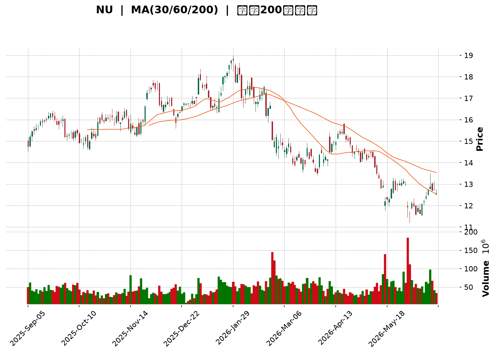
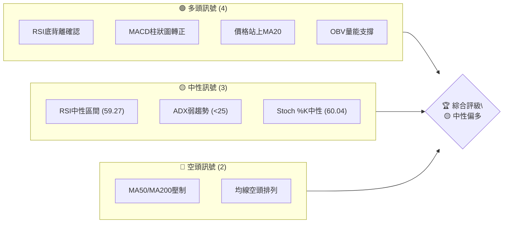
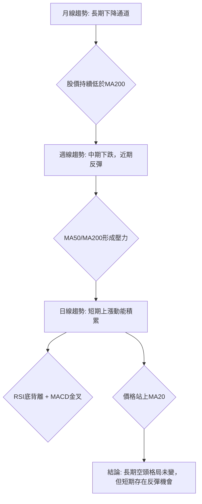
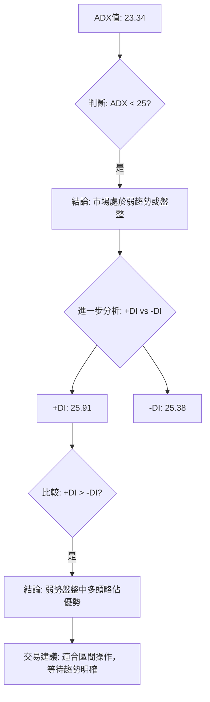
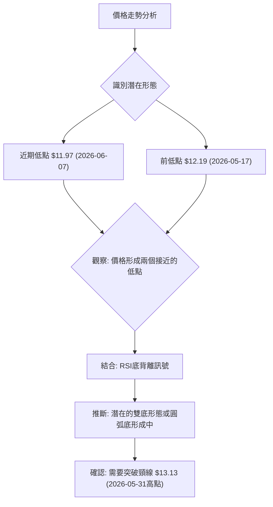
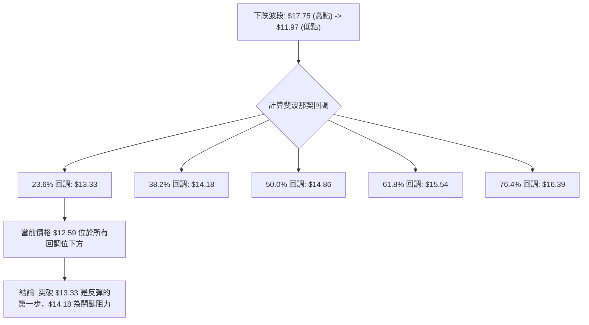
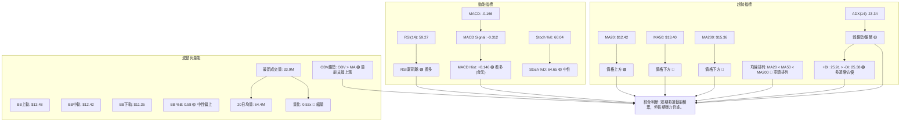
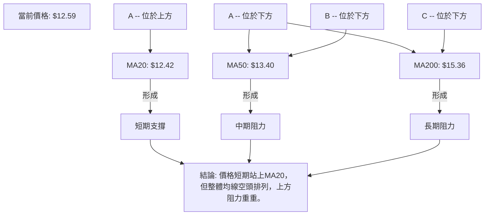

<details>
<summary>📊 靜態圖表 (點擊展開)</summary>

</details>

<html>
<head><meta charset="utf-8" /></head>
<body>
    <div style="height:500px; width:100%;">                        <script>window.PlotlyConfig = {MathJaxConfig: 'local'};</script>
        <script charset="utf-8" src="https://cdn.plot.ly/plotly-3.6.0.min.js" integrity="sha256-QaOVwtVY0T02VaHrr6pnoHLCwayMJp4O5n4YyaE3rJk=" crossorigin="anonymous"></script>                <div id="candlestick-chart" class="plotly-graph-div" style="height:100%; width:100%;"></div>            <script>                window.PLOTLYENV=window.PLOTLYENV || {};                                if (document.getElementById("candlestick-chart")) {                    Plotly.newPlot(                        "candlestick-chart",                        [{"close":{"dtype":"f8","bdata":"AAAAQOF6LUAAAADgo3AuQAAAACCF6y5AAAAAwB4FL0AAAACgcD0vQAAAAKBHYS9AAAAAgOvRL0AAAAAgrscvQAAAACCF6y9AAAAAQOH6L0AAAAAghSswQAAAAMDMTDBAAAAAYGYmMEAAAABgjwIwQAAAACBcjy9AAAAAIFyPL0AAAABgZuYvQAAAAGCPAjBAAAAAoEdhLkAAAADgo3AuQAAAAGC4ni5AAAAAYI\u002fCLkAAAABgj0IuQAAAACCF6y5AAAAAoHC9LkAAAABACtctQAAAAMD1KC5AAAAAgOvRLUAAAAAAKVwuQAAAAIDCdS1AAAAAAAAALkAAAACA69EuQAAAAEDhei5AAAAAgOtRLkAAAADAzMwvQAAAAIAUri9AAAAAAAAAMEAAAAAAKdwvQAAAAEAKFzBAAAAAIFwPMEAAAAAAKRwwQAAAAKBHITBAAAAAoJmZL0AAAAAghSswQAAAAKBH4S9AAAAAoHC9L0AAAADAHgUwQAAAAADXYzBAAAAAgBQuMEAAAACAFC4vQAAAAADXoy9AAAAAQDMzL0AAAAAA16MuQAAAAIDrUS9AAAAAANejLkAAAAAgrscvQAAAAEAK1y9AAAAAACmcMEAAAAAAAEAxQAAAAADXYzFAAAAAQOF6MUAAAAAAKZwxQAAAAOCjcDFAAAAAYGamMUAAAABAM7MwQAAAAGC4njBAAAAAgBSuMEAAAADgo7AwQAAAAIDr0TBAAAAAYGbmMEAAAABgZqYwQAAAAEAzMzBAAAAA4FG4L0AAAADAHkUwQAAAAEAKVzBAAAAAYLieMEAAAABgj8IwQAAAAKBwvTBAAAAAYI\u002fCMEAAAADA9agwQAAAAKBH4TBAAAAAoHC9MEAAAADAHgUxQAAAAOCj8DFAAAAAACncMUAAAAAAAIAxQAAAAAApnDFAAAAAgMJ1MUAAAACAPQoxQAAAACBcjzBAAAAAANejMEAAAAAAKZwwQAAAAKCZmTBAAAAA4FH4MEAAAACgcD0xQAAAAAAAADJAAAAAgD0KMkAAAACAFC4yQAAAAMDMjDJAAAAAYI\u002fCMkAAAABgj8IyQAAAAAAAwDFAAAAAACkcMkAAAABguB4yQAAAAMAeBTFAAAAAIFzPMEAAAABgZmYxQAAAAMDMjDFAAAAAgOuRMUAAAADA9WgxQAAAAIA9CjFAAAAAgOvRMEAAAACA69EwQAAAACCFKzFAAAAAgOtRMUAAAAAgrocxQAAAAOCjMDBAAAAAIK6HMEAAAABgZqYwQAAAAGC4Hi5AAAAAgML1LUAAAACgR2EuQAAAAMAehS1AAAAAAAAALkAAAAAA16MtQAAAAMD1KC1AAAAAQApXLUAAAABgj8ItQAAAAEDh+ixAAAAA4KPwK0AAAAAgrscrQAAAAIA9iixAAAAAAACALEAAAADgo\u002fArQAAAAIDrUSxAAAAAoEfhK0AAAAAAKVwtQAAAAKBHYSxAAAAAANejLEAAAACAPQosQAAAAEAzMytAAAAAwB4FK0AAAACgcL0sQAAAAKBH4SxAAAAAwMxMLEAAAADAHoUsQAAAAMDMTCxAAAAAwB4FLUAAAACgcL0tQAAAACCF6y1AAAAAYGbmLUAAAABAM7MuQAAAAIAUri5AAAAAACncLkAAAACAFK4uQAAAAEAzMy5AAAAAoJkZLkAAAABAM7MtQAAAACCF6yxAAAAAwB4FLUAAAAAgrkctQAAAAAAAAC1AAAAA4HoULEAAAACAwvUsQAAAAKBH4SxAAAAAgOtRLEAAAAAAAIAsQAAAAIDC9SxAAAAAwB6FLEAAAACgmZkrQAAAAAAAACtAAAAAgD2KKkAAAAAA16MpQAAAAAAp3ClAAAAAoEdhKEAAAADgepQoQAAAAOB6lChAAAAA4HqUKUAAAACA61EqQAAAAIDCdSlAAAAAgML1KUAAAAAgXA8qQAAAAKCZGSpAAAAAYI9CKkAAAABA4fopQAAAAAAp3CdAAAAAIK5HJ0AAAACgcD0oQAAAAOCj8CdAAAAAQDMzJ0AAAABgj8InQAAAAKBwPSdAAAAAgBQuKEAAAACgR2EoQAAAAAAp3ChAAAAA4KNwKUAAAAAgrscpQAAAACCFaylAAAAA4HqUKUAAAACAFC4pQA=="},"high":{"dtype":"f8","bdata":"AAAAoJlZLkAAAADgo7AuQAAAAMAeBS9AAAAAIIVrL0AAAACgR6EvQAAAAIA9ii9AAAAAoEcBMEAAAACA6xEwQAAAAMDMDDBAAAAAoEchMEAAAACgmVkwQAAAAMDMTDBAAAAAwMxsMEAAAABguF4wQAAAAOBRGDBAAAAAoHD9L0AAAACgmRkwQAAAAOCjMDBAAAAAwMwMMEAAAADAzMwuQAAAAAAAwC5AAAAAQOH6LkAAAADgehQvQAAAAAAAAC9AAAAAwPUoL0AAAABgZuYuQAAAAKBwPS5AAAAAoEdhLkAAAAAAVo4uQAAAAGC4ni5AAAAAYLgeLkAAAAAgrkcvQAAAAIAULi9AAAAAIIXrLkAAAAAA1yMwQAAAAKBHITBAAAAAoJlZMEAAAACA6xEwQAAAAMAeRTBAAAAAoHA9MEAAAADAHkUwQAAAAAAAgDBAAAAAoHAdMEAAAAAghWswQAAAAGBmZjBAAAAAAADAL0AAAADgUTgwQAAAAMDMjDBAAAAAAACAMEAAAACA6zEwQAAAAGCPQjBAAAAAoHC9L0AAAACgmVkvQAAAAOCjcC9AAAAAQDMTMEAAAADAHgUwQAAAACBcDzBAAAAAwMysMEAAAACgR2ExQAAAAIAUjjFAAAAAIFyPMUAAAABACtcxQAAAAOBRuDFAAAAA4KPQMUAAAABA4boxQAAAAEAzEzFAAAAAQOG6MEAAAACgmdkwQAAAAAApHDFAAAAAIFwPMUAAAACA6xExQAAAAMAehTBAAAAAwPUoMEAAAADgIlswQAAAAOBReDBAAAAAoEehMEAAAADgetQwQAAAAMD1yDBAAAAAYI\u002fCMEAAAAAgXM8wQAAAAEDhGjFAAAAAwMzsMEAAAAAgXA8xQAAAAICVIzJAAAAAYLheMkAAAABgj8IxQAAAAIC+nzFAAAAAgOsRMkAAAAAghWsxQAAAAIDrETFAAAAA4KOwMEAAAADgUfgwQAAAAGAOrTBAAAAA4KNQMUAAAACAPYoxQAAAAAAAADJAAAAA4KMQMkAAAABgj0IyQAAAACBcjzJAAAAAwPXIMkAAAABA4foyQAAAAGC4njJAAAAAQAp3MkAAAABgZqYyQAAAAIA9KjJAAAAAYI8iMUAAAAAghWsxQAAAAEAK1zFAAAAAACm8MUAAAACgcP0xQAAAAMDMjDFAAAAAoEfhMEAAAAAAAAAxQAAAAEDhejFAAAAA4KNwMUAAAABACpcxQAAAAMD1aDFAAAAAQAqXMEAAAACgmdkwQAAAAKBH4S9AAAAAYGZmLkAAAABAi6wuQAAAAGC4Hi5AAAAAgMK1LkAAAADAzEwuQAAAAEAzcy1AAAAAgOuRLUAAAACAPUouQAAAAKBH4S1AAAAAQDOzLEAAAABguJ4sQAAAAKBwvSxAAAAA4HoULUAAAADAzIwsQAAAAAAAgCxAAAAAwMxMLEAAAABACtctQAAAAMAeBS1AAAAAoEdhLUAAAABgZqYsQAAAAGBm5itAAAAAgOuRK0AAAACA69EsQAAAAKCZmS1AAAAAgML1LEAAAAAgrscsQAAAAIDrUSxAAAAAwEnMLkAAAAAAKdwtQAAAAOB6FC5AAAAAIFwPLkAAAADgo\u002fAuQAAAAGC4Hi9AAAAAoEchL0AAAABguJ4vQAAAAEAzsy5AAAAAIFyPLkAAAADgo3AuQAAAAADXoy1AAAAA4HoULUAAAAAghastQAAAAEAKVy1AAAAAwB4FLUAAAABguB4tQAAAAIDrUS1AAAAA4KPwLEAAAACgR+EsQAAAAKCZGS1AAAAAQDMzLUAAAADA9agsQAAAAMD16CtAAAAAACkcK0AAAACAPYoqQAAAAEAKVypAAAAAIFzPKEAAAADAzMwoQAAAAMDMzChAAAAAoJmZKUAAAACgmZkqQAAAAMAehSpAAAAAoEchKkAAAAAAKVwqQAAAAEDheipAAAAAAACAKkAAAADAzEwqQAAAACCFayhAAAAAQOF6J0AAAACAFG4oQAAAAEAzsyhAAAAAoJkZKEAAAACA6xEoQAAAAIAULihAAAAAgBQuKEAAAADgepQoQAAAAGCPQilAAAAAoJmZKUAAAAAgrgcrQAAAAMD1KCpAAAAAoHA9KkAAAACA65EpQA=="},"hovertemplate":"\u003cb\u003e%{x|%Y-%m-%d}\u003c\u002fb\u003e\u003cbr\u003e\u958b: $%{open:.2f}\u003cbr\u003e\u9ad8: $%{high:.2f}\u003cbr\u003e\u4f4e: $%{low:.2f}\u003cbr\u003e\u6536: $%{close:.2f}\u003cextra\u003e\u003c\u002fextra\u003e","low":{"dtype":"f8","bdata":"AAAAgD0KLUAAAAAghWstQAAAAGCPAi5AAAAAoJmZLkAAAACAwvUuQAAAAOB6FC9AAAAAwPVoL0AAAACA61EvQAAAAGBmpi9AAAAAwB7FL0AAAADAHgUwQAAAAIDC9S9AAAAAIK4HMEAAAACg8dIvQAAAAIDCdS9AAAAAoJkZL0AAAADA9agvQAAAAMDMTC9AAAAAgOtRLkAAAACAPQouQAAAAOBROC5AAAAAAABALkAAAACAPQouQAAAAKCZGS5AAAAAgMJ1LkAAAABgj8ItQAAAAEAK1y1AAAAAIK5HLUAAAADgUbgtQAAAAEBeOi1AAAAAYLgeLUAAAABguB4uQAAAACBcTy5AAAAAgOsRLkAAAACAwnUuQAAAACAEli9AAAAAQArXL0AAAAAA16MvQAAAAAAp3C9AAAAAANcDMEAAAABgj8IvQAAAAIAU7i9AAAAAYGZmL0AAAADgepQvQAAAAIAUri9AAAAAYGbmLkAAAADAzMwvQAAAAMDMDDBAAAAAIIULMEAAAADgUfguQAAAAADXoy5AAAAAAAAAL0AAAADAHoUuQAAAAKBHYS5AAAAAoJmZLkAAAABgj4IuQAAAACBcjy9AAAAAAClcL0AAAADA9egwQAAAAEAzMzFAAAAAIK5HMUAAAABA4XoxQAAAAIA9SjFAAAAAAClcMUAAAACgmZkwQAAAAOBReDBAAAAAAAJLMEAAAABACncwQAAAAEAzszBAAAAAoJmZMEAAAACgR6EwQAAAAIAULjBAAAAAgBQuL0AAAADAIBAwQAAAAEBiUDBAAAAAoJlZMEAAAAAgXI8wQAAAAGBmpjBAAAAAACmcMEAAAACAPYowQAAAAIAUrjBAAAAAgMK1MEAAAABgZqYwQAAAAIA9KjFAAAAAIFzPMUAAAAAgrmcxQAAAAGC4XjFAAAAAANdjMUAAAADAHgUxQAAAAIA9ajBAAAAAwMxsMEAAAACAQYAwQAAAAIAUTjBAAAAAoJlZMEAAAACA6xExQAAAAOB6VDFAAAAAgMK1MUAAAABgZuYxQAAAAKCZGTJAAAAAAClcMkAAAACgcD0yQAAAAIDCtTFAAAAAgMK1MUAAAABACtcxQAAAAAAA4DBAAAAAwMyMMEAAAABgj8IwQAAAAEAKNzFAAAAAgD0KMUAAAACgmVkxQAAAAIDCtTBAAAAAYLheMEAAAABACpcwQAAAAEAK1zBAAAAAwB7lMEAAAAAghSsxQAAAAOB6FDBAAAAAoHC9L0AAAAAA14MwQAAAAOB6FC5AAAAAYGZmLUAAAABguJ4sQAAAAEAKVyxAAAAAoJmZLUAAAADgUTgtQAAAAOBReCxAAAAAgMJ1LEAAAAAgXA8tQAAAAGCPwixAAAAAYI\u002fCK0AAAACgR6ErQAAAAGC4HixAAAAA4FF4LEAAAADgetQrQAAAACBcDytAAAAA4HqUK0AAAADgo3AsQAAAAIDrUSxAAAAAIIVrLEAAAAAAKdwrQAAAAOB6FCtAAAAAgOvRKkAAAABgZmYrQAAAAAAp3CxAAAAAAAKrK0AAAADA9SgsQAAAAIAUritAAAAAgOvRLEAAAADAzMwsQAAAACBcjy1AAAAAQDMzLUAAAACgcD0uQAAAAKCZmS5AAAAA4HqULkAAAABguJ4uQAAAAAAp3C1AAAAA4KPwLUAAAABAClctQAAAAIDrkSxAAAAAoEdhLEAAAACgmRktQAAAAIDCtSxAAAAA4HoULEAAAACgmRksQAAAAGCPwixAAAAAgBQuLEAAAABAClcsQAAAAKBwfSxAAAAAwPVoLEAAAAAAAIArQAAAAEAK1ypAAAAAwB6FKkAAAAAgrocpQAAAAIAUrilAAAAAIFyPJ0AAAABguB4oQAAAACCF6ydAAAAAwPWoKEAAAABguB4pQAAAACCFaylAAAAAwMxMKUAAAAAAKdwpQAAAACCuxylAAAAAQOH6KUAAAACA69EpQAAAAKBH4SZAAAAAYGZmJkAAAAAA16MnQAAAAGC43idAAAAAoJkZJ0AAAAAgXE8nQAAAAOBROCdAAAAAwB4FJ0AAAAAgrgcoQAAAACBcjyhAAAAA4KPwKEAAAADgepQpQAAAAAApXClAAAAAYGZmKUAAAAAAAAApQA=="},"name":"\u50f9\u683c","open":{"dtype":"f8","bdata":"AAAAwB4FLkAAAAAgXI8tQAAAAIDCdS5AAAAAoJkZL0AAAAAgXA8vQAAAAAApXC9AAAAAAACAL0AAAACgR+EvQAAAAGBm5i9AAAAAYI8CMEAAAACA6xEwQAAAAAApHDBAAAAAwMxMMEAAAACAFC4wQAAAAAAp3C9AAAAAACncL0AAAABgZuYvQAAAACCF6y9AAAAAwMwMMEAAAACAPYouQAAAACBcjy5AAAAAoHC9LkAAAACA69EuQAAAAAApXC5AAAAAIFwPL0AAAADgUbguQAAAAMD1KC5AAAAAQDOzLUAAAAAAAAAuQAAAAOB6lC5AAAAAIK5HLUAAAABgj0IuQAAAAEAzsy5AAAAAANejLkAAAADAHoUuQAAAAEAKFzBAAAAAQOE6MEAAAAAghesvQAAAAGBm5i9AAAAAgOsRMEAAAAAAKRwwQAAAAOCjMDBAAAAAoJmZL0AAAADgUbgvQAAAAGC4XjBAAAAAANejL0AAAACgmRkwQAAAAEAKFzBAAAAAgMJ1MEAAAACAPQowQAAAAAAp3C5AAAAA4FF4L0AAAADAzMwuQAAAAMDMjC5AAAAAgBSuL0AAAACAwrUuQAAAAAAAADBAAAAAQArXL0AAAABA4fowQAAAAADXYzFAAAAAgBRuMUAAAACAwrUxQAAAAEAzszFAAAAAYGamMUAAAABAM7MxQAAAAGC43jBAAAAAwB5lMEAAAACgmZkwQAAAAEDhujBAAAAAIK7nMEAAAABgZgYxQAAAAAAAgDBAAAAAQAoXMEAAAABgZiYwQAAAAKCZWTBAAAAAIIVrMEAAAADgo7AwQAAAAEAzszBAAAAAoHC9MEAAAACAPaowQAAAAMAexTBAAAAAYLjeMEAAAAAgXA8xQAAAAIAULjFAAAAAYLgeMkAAAABguJ4xQAAAAEAKlzFAAAAAgBSuMUAAAACgmVkxQAAAACBcDzFAAAAA4KOQMEAAAAAAAMAwQAAAAIDrkTBAAAAAAClcMEAAAABgjyIxQAAAAIA9qjFAAAAAAAAAMkAAAADAzAwyQAAAAAApXDJAAAAAYI+iMkAAAADgetQyQAAAACCuhzJAAAAAoHC9MUAAAAAgrmcyQAAAAOB6FDJAAAAA4HrUMEAAAAAghSsxQAAAAOCjcDFAAAAAYGYmMUAAAACA6\u002fExQAAAAMD1iDFAAAAAoHC9MEAAAAAAAMAwQAAAAEAz8zBAAAAAANcjMUAAAABAMzMxQAAAAAAAQDFAAAAA4KMwMEAAAAAA14MwQAAAAEAK1y9AAAAA4KNwLUAAAAAghessQAAAAAApXC1AAAAAoHD9LUAAAAAAKdwtQAAAAGCPAi1AAAAAgOvRLEAAAABA4XotQAAAAAAAgC1AAAAAYGZmLEAAAAAA1yMsQAAAAKBwPSxAAAAAwMzMLEAAAADgo3AsQAAAAAApXCtAAAAAoHA9LEAAAACgR6EsQAAAAOBR+CxAAAAAYI9CLUAAAABgj0IsQAAAAIDCdStAAAAAIIVrK0AAAACgmZkrQAAAAIAULi1AAAAAAAAALEAAAABgj0IsQAAAAEAzMyxAAAAAIIVrLkAAAADAHgUtQAAAAAAp3C1AAAAAgBSuLUAAAABgj0IuQAAAACCF6y5AAAAAIK7HLkAAAABguJ4vQAAAAEDhei5AAAAA4FE4LkAAAAAAKVwuQAAAAGC4ni1AAAAAQArXLEAAAAAgrkctQAAAAOB6FC1AAAAAgML1LEAAAADgelQsQAAAAIDrUS1AAAAAIK7HLEAAAAAA16MsQAAAAAAAAC1AAAAAAAAALUAAAACgmZksQAAAAGCPwitAAAAAQArXKkAAAAAghWsqQAAAAEAzsylAAAAAQIkBKEAAAADAzMwoQAAAAOB6VChAAAAAgBSuKEAAAADgUTgpQAAAAMDMTCpAAAAAIK4HKkAAAAAghespQAAAAOCj8ClAAAAAoJkZKkAAAAAAAAAqQAAAAEDh+idAAAAAwMxMJ0AAAABgj8InQAAAAEAzMyhAAAAAwB4FKEAAAADgo3AnQAAAAKCZmSdAAAAAANcjJ0AAAABAClcoQAAAAIAUrihAAAAAwB4FKUAAAADgepQpQAAAACBcDypAAAAAIFyPKUAAAACAPQopQA=="},"x":["2025-09-05T00:00:00-04:00","2025-09-08T00:00:00-04:00","2025-09-09T00:00:00-04:00","2025-09-10T00:00:00-04:00","2025-09-11T00:00:00-04:00","2025-09-12T00:00:00-04:00","2025-09-15T00:00:00-04:00","2025-09-16T00:00:00-04:00","2025-09-17T00:00:00-04:00","2025-09-18T00:00:00-04:00","2025-09-19T00:00:00-04:00","2025-09-22T00:00:00-04:00","2025-09-23T00:00:00-04:00","2025-09-24T00:00:00-04:00","2025-09-25T00:00:00-04:00","2025-09-26T00:00:00-04:00","2025-09-29T00:00:00-04:00","2025-09-30T00:00:00-04:00","2025-10-01T00:00:00-04:00","2025-10-02T00:00:00-04:00","2025-10-03T00:00:00-04:00","2025-10-06T00:00:00-04:00","2025-10-07T00:00:00-04:00","2025-10-08T00:00:00-04:00","2025-10-09T00:00:00-04:00","2025-10-10T00:00:00-04:00","2025-10-13T00:00:00-04:00","2025-10-14T00:00:00-04:00","2025-10-15T00:00:00-04:00","2025-10-16T00:00:00-04:00","2025-10-17T00:00:00-04:00","2025-10-20T00:00:00-04:00","2025-10-21T00:00:00-04:00","2025-10-22T00:00:00-04:00","2025-10-23T00:00:00-04:00","2025-10-24T00:00:00-04:00","2025-10-27T00:00:00-04:00","2025-10-28T00:00:00-04:00","2025-10-29T00:00:00-04:00","2025-10-30T00:00:00-04:00","2025-10-31T00:00:00-04:00","2025-11-03T00:00:00-05:00","2025-11-04T00:00:00-05:00","2025-11-05T00:00:00-05:00","2025-11-06T00:00:00-05:00","2025-11-07T00:00:00-05:00","2025-11-10T00:00:00-05:00","2025-11-11T00:00:00-05:00","2025-11-12T00:00:00-05:00","2025-11-13T00:00:00-05:00","2025-11-14T00:00:00-05:00","2025-11-17T00:00:00-05:00","2025-11-18T00:00:00-05:00","2025-11-19T00:00:00-05:00","2025-11-20T00:00:00-05:00","2025-11-21T00:00:00-05:00","2025-11-24T00:00:00-05:00","2025-11-25T00:00:00-05:00","2025-11-26T00:00:00-05:00","2025-11-28T00:00:00-05:00","2025-12-01T00:00:00-05:00","2025-12-02T00:00:00-05:00","2025-12-03T00:00:00-05:00","2025-12-04T00:00:00-05:00","2025-12-05T00:00:00-05:00","2025-12-08T00:00:00-05:00","2025-12-09T00:00:00-05:00","2025-12-10T00:00:00-05:00","2025-12-11T00:00:00-05:00","2025-12-12T00:00:00-05:00","2025-12-15T00:00:00-05:00","2025-12-16T00:00:00-05:00","2025-12-17T00:00:00-05:00","2025-12-18T00:00:00-05:00","2025-12-19T00:00:00-05:00","2025-12-22T00:00:00-05:00","2025-12-23T00:00:00-05:00","2025-12-24T00:00:00-05:00","2025-12-26T00:00:00-05:00","2025-12-29T00:00:00-05:00","2025-12-30T00:00:00-05:00","2025-12-31T00:00:00-05:00","2026-01-02T00:00:00-05:00","2026-01-05T00:00:00-05:00","2026-01-06T00:00:00-05:00","2026-01-07T00:00:00-05:00","2026-01-08T00:00:00-05:00","2026-01-09T00:00:00-05:00","2026-01-12T00:00:00-05:00","2026-01-13T00:00:00-05:00","2026-01-14T00:00:00-05:00","2026-01-15T00:00:00-05:00","2026-01-16T00:00:00-05:00","2026-01-20T00:00:00-05:00","2026-01-21T00:00:00-05:00","2026-01-22T00:00:00-05:00","2026-01-23T00:00:00-05:00","2026-01-26T00:00:00-05:00","2026-01-27T00:00:00-05:00","2026-01-28T00:00:00-05:00","2026-01-29T00:00:00-05:00","2026-01-30T00:00:00-05:00","2026-02-02T00:00:00-05:00","2026-02-03T00:00:00-05:00","2026-02-04T00:00:00-05:00","2026-02-05T00:00:00-05:00","2026-02-06T00:00:00-05:00","2026-02-09T00:00:00-05:00","2026-02-10T00:00:00-05:00","2026-02-11T00:00:00-05:00","2026-02-12T00:00:00-05:00","2026-02-13T00:00:00-05:00","2026-02-17T00:00:00-05:00","2026-02-18T00:00:00-05:00","2026-02-19T00:00:00-05:00","2026-02-20T00:00:00-05:00","2026-02-23T00:00:00-05:00","2026-02-24T00:00:00-05:00","2026-02-25T00:00:00-05:00","2026-02-26T00:00:00-05:00","2026-02-27T00:00:00-05:00","2026-03-02T00:00:00-05:00","2026-03-03T00:00:00-05:00","2026-03-04T00:00:00-05:00","2026-03-05T00:00:00-05:00","2026-03-06T00:00:00-05:00","2026-03-09T00:00:00-04:00","2026-03-10T00:00:00-04:00","2026-03-11T00:00:00-04:00","2026-03-12T00:00:00-04:00","2026-03-13T00:00:00-04:00","2026-03-16T00:00:00-04:00","2026-03-17T00:00:00-04:00","2026-03-18T00:00:00-04:00","2026-03-19T00:00:00-04:00","2026-03-20T00:00:00-04:00","2026-03-23T00:00:00-04:00","2026-03-24T00:00:00-04:00","2026-03-25T00:00:00-04:00","2026-03-26T00:00:00-04:00","2026-03-27T00:00:00-04:00","2026-03-30T00:00:00-04:00","2026-03-31T00:00:00-04:00","2026-04-01T00:00:00-04:00","2026-04-02T00:00:00-04:00","2026-04-06T00:00:00-04:00","2026-04-07T00:00:00-04:00","2026-04-08T00:00:00-04:00","2026-04-09T00:00:00-04:00","2026-04-10T00:00:00-04:00","2026-04-13T00:00:00-04:00","2026-04-14T00:00:00-04:00","2026-04-15T00:00:00-04:00","2026-04-16T00:00:00-04:00","2026-04-17T00:00:00-04:00","2026-04-20T00:00:00-04:00","2026-04-21T00:00:00-04:00","2026-04-22T00:00:00-04:00","2026-04-23T00:00:00-04:00","2026-04-24T00:00:00-04:00","2026-04-27T00:00:00-04:00","2026-04-28T00:00:00-04:00","2026-04-29T00:00:00-04:00","2026-04-30T00:00:00-04:00","2026-05-01T00:00:00-04:00","2026-05-04T00:00:00-04:00","2026-05-05T00:00:00-04:00","2026-05-06T00:00:00-04:00","2026-05-07T00:00:00-04:00","2026-05-08T00:00:00-04:00","2026-05-11T00:00:00-04:00","2026-05-12T00:00:00-04:00","2026-05-13T00:00:00-04:00","2026-05-14T00:00:00-04:00","2026-05-15T00:00:00-04:00","2026-05-18T00:00:00-04:00","2026-05-19T00:00:00-04:00","2026-05-20T00:00:00-04:00","2026-05-21T00:00:00-04:00","2026-05-22T00:00:00-04:00","2026-05-26T00:00:00-04:00","2026-05-27T00:00:00-04:00","2026-05-28T00:00:00-04:00","2026-05-29T00:00:00-04:00","2026-06-01T00:00:00-04:00","2026-06-02T00:00:00-04:00","2026-06-03T00:00:00-04:00","2026-06-04T00:00:00-04:00","2026-06-05T00:00:00-04:00","2026-06-08T00:00:00-04:00","2026-06-09T00:00:00-04:00","2026-06-10T00:00:00-04:00","2026-06-11T00:00:00-04:00","2026-06-12T00:00:00-04:00","2026-06-15T00:00:00-04:00","2026-06-16T00:00:00-04:00","2026-06-17T00:00:00-04:00","2026-06-18T00:00:00-04:00","2026-06-22T00:00:00-04:00","2026-06-23T00:00:00-04:00"],"type":"candlestick"},{"hovertemplate":"MA30: $%{y:.2f}\u003cextra\u003e\u003c\u002fextra\u003e","line":{"color":"#2196F3","dash":"dash","width":2},"mode":"lines","name":"MA30","x":["2025-09-05T00:00:00-04:00","2025-09-08T00:00:00-04:00","2025-09-09T00:00:00-04:00","2025-09-10T00:00:00-04:00","2025-09-11T00:00:00-04:00","2025-09-12T00:00:00-04:00","2025-09-15T00:00:00-04:00","2025-09-16T00:00:00-04:00","2025-09-17T00:00:00-04:00","2025-09-18T00:00:00-04:00","2025-09-19T00:00:00-04:00","2025-09-22T00:00:00-04:00","2025-09-23T00:00:00-04:00","2025-09-24T00:00:00-04:00","2025-09-25T00:00:00-04:00","2025-09-26T00:00:00-04:00","2025-09-29T00:00:00-04:00","2025-09-30T00:00:00-04:00","2025-10-01T00:00:00-04:00","2025-10-02T00:00:00-04:00","2025-10-03T00:00:00-04:00","2025-10-06T00:00:00-04:00","2025-10-07T00:00:00-04:00","2025-10-08T00:00:00-04:00","2025-10-09T00:00:00-04:00","2025-10-10T00:00:00-04:00","2025-10-13T00:00:00-04:00","2025-10-14T00:00:00-04:00","2025-10-15T00:00:00-04:00","2025-10-16T00:00:00-04:00","2025-10-17T00:00:00-04:00","2025-10-20T00:00:00-04:00","2025-10-21T00:00:00-04:00","2025-10-22T00:00:00-04:00","2025-10-23T00:00:00-04:00","2025-10-24T00:00:00-04:00","2025-10-27T00:00:00-04:00","2025-10-28T00:00:00-04:00","2025-10-29T00:00:00-04:00","2025-10-30T00:00:00-04:00","2025-10-31T00:00:00-04:00","2025-11-03T00:00:00-05:00","2025-11-04T00:00:00-05:00","2025-11-05T00:00:00-05:00","2025-11-06T00:00:00-05:00","2025-11-07T00:00:00-05:00","2025-11-10T00:00:00-05:00","2025-11-11T00:00:00-05:00","2025-11-12T00:00:00-05:00","2025-11-13T00:00:00-05:00","2025-11-14T00:00:00-05:00","2025-11-17T00:00:00-05:00","2025-11-18T00:00:00-05:00","2025-11-19T00:00:00-05:00","2025-11-20T00:00:00-05:00","2025-11-21T00:00:00-05:00","2025-11-24T00:00:00-05:00","2025-11-25T00:00:00-05:00","2025-11-26T00:00:00-05:00","2025-11-28T00:00:00-05:00","2025-12-01T00:00:00-05:00","2025-12-02T00:00:00-05:00","2025-12-03T00:00:00-05:00","2025-12-04T00:00:00-05:00","2025-12-05T00:00:00-05:00","2025-12-08T00:00:00-05:00","2025-12-09T00:00:00-05:00","2025-12-10T00:00:00-05:00","2025-12-11T00:00:00-05:00","2025-12-12T00:00:00-05:00","2025-12-15T00:00:00-05:00","2025-12-16T00:00:00-05:00","2025-12-17T00:00:00-05:00","2025-12-18T00:00:00-05:00","2025-12-19T00:00:00-05:00","2025-12-22T00:00:00-05:00","2025-12-23T00:00:00-05:00","2025-12-24T00:00:00-05:00","2025-12-26T00:00:00-05:00","2025-12-29T00:00:00-05:00","2025-12-30T00:00:00-05:00","2025-12-31T00:00:00-05:00","2026-01-02T00:00:00-05:00","2026-01-05T00:00:00-05:00","2026-01-06T00:00:00-05:00","2026-01-07T00:00:00-05:00","2026-01-08T00:00:00-05:00","2026-01-09T00:00:00-05:00","2026-01-12T00:00:00-05:00","2026-01-13T00:00:00-05:00","2026-01-14T00:00:00-05:00","2026-01-15T00:00:00-05:00","2026-01-16T00:00:00-05:00","2026-01-20T00:00:00-05:00","2026-01-21T00:00:00-05:00","2026-01-22T00:00:00-05:00","2026-01-23T00:00:00-05:00","2026-01-26T00:00:00-05:00","2026-01-27T00:00:00-05:00","2026-01-28T00:00:00-05:00","2026-01-29T00:00:00-05:00","2026-01-30T00:00:00-05:00","2026-02-02T00:00:00-05:00","2026-02-03T00:00:00-05:00","2026-02-04T00:00:00-05:00","2026-02-05T00:00:00-05:00","2026-02-06T00:00:00-05:00","2026-02-09T00:00:00-05:00","2026-02-10T00:00:00-05:00","2026-02-11T00:00:00-05:00","2026-02-12T00:00:00-05:00","2026-02-13T00:00:00-05:00","2026-02-17T00:00:00-05:00","2026-02-18T00:00:00-05:00","2026-02-19T00:00:00-05:00","2026-02-20T00:00:00-05:00","2026-02-23T00:00:00-05:00","2026-02-24T00:00:00-05:00","2026-02-25T00:00:00-05:00","2026-02-26T00:00:00-05:00","2026-02-27T00:00:00-05:00","2026-03-02T00:00:00-05:00","2026-03-03T00:00:00-05:00","2026-03-04T00:00:00-05:00","2026-03-05T00:00:00-05:00","2026-03-06T00:00:00-05:00","2026-03-09T00:00:00-04:00","2026-03-10T00:00:00-04:00","2026-03-11T00:00:00-04:00","2026-03-12T00:00:00-04:00","2026-03-13T00:00:00-04:00","2026-03-16T00:00:00-04:00","2026-03-17T00:00:00-04:00","2026-03-18T00:00:00-04:00","2026-03-19T00:00:00-04:00","2026-03-20T00:00:00-04:00","2026-03-23T00:00:00-04:00","2026-03-24T00:00:00-04:00","2026-03-25T00:00:00-04:00","2026-03-26T00:00:00-04:00","2026-03-27T00:00:00-04:00","2026-03-30T00:00:00-04:00","2026-03-31T00:00:00-04:00","2026-04-01T00:00:00-04:00","2026-04-02T00:00:00-04:00","2026-04-06T00:00:00-04:00","2026-04-07T00:00:00-04:00","2026-04-08T00:00:00-04:00","2026-04-09T00:00:00-04:00","2026-04-10T00:00:00-04:00","2026-04-13T00:00:00-04:00","2026-04-14T00:00:00-04:00","2026-04-15T00:00:00-04:00","2026-04-16T00:00:00-04:00","2026-04-17T00:00:00-04:00","2026-04-20T00:00:00-04:00","2026-04-21T00:00:00-04:00","2026-04-22T00:00:00-04:00","2026-04-23T00:00:00-04:00","2026-04-24T00:00:00-04:00","2026-04-27T00:00:00-04:00","2026-04-28T00:00:00-04:00","2026-04-29T00:00:00-04:00","2026-04-30T00:00:00-04:00","2026-05-01T00:00:00-04:00","2026-05-04T00:00:00-04:00","2026-05-05T00:00:00-04:00","2026-05-06T00:00:00-04:00","2026-05-07T00:00:00-04:00","2026-05-08T00:00:00-04:00","2026-05-11T00:00:00-04:00","2026-05-12T00:00:00-04:00","2026-05-13T00:00:00-04:00","2026-05-14T00:00:00-04:00","2026-05-15T00:00:00-04:00","2026-05-18T00:00:00-04:00","2026-05-19T00:00:00-04:00","2026-05-20T00:00:00-04:00","2026-05-21T00:00:00-04:00","2026-05-22T00:00:00-04:00","2026-05-26T00:00:00-04:00","2026-05-27T00:00:00-04:00","2026-05-28T00:00:00-04:00","2026-05-29T00:00:00-04:00","2026-06-01T00:00:00-04:00","2026-06-02T00:00:00-04:00","2026-06-03T00:00:00-04:00","2026-06-04T00:00:00-04:00","2026-06-05T00:00:00-04:00","2026-06-08T00:00:00-04:00","2026-06-09T00:00:00-04:00","2026-06-10T00:00:00-04:00","2026-06-11T00:00:00-04:00","2026-06-12T00:00:00-04:00","2026-06-15T00:00:00-04:00","2026-06-16T00:00:00-04:00","2026-06-17T00:00:00-04:00","2026-06-18T00:00:00-04:00","2026-06-22T00:00:00-04:00","2026-06-23T00:00:00-04:00"],"y":{"dtype":"f8","bdata":"AAAAAAAA+H8AAAAAAAD4fwAAAAAAAPh\u002fAAAAAAAA+H8AAAAAAAD4fwAAAAAAAPh\u002fAAAAAAAA+H8AAAAAAAD4fwAAAAAAAPh\u002fAAAAAAAA+H8AAAAAAAD4fwAAAAAAAPh\u002fAAAAAAAA+H8AAAAAAAD4fwAAAAAAAPh\u002fAAAAAAAA+H8AAAAAAAD4fwAAAAAAAPh\u002fAAAAAAAA+H8AAAAAAAD4fwAAAAAAAPh\u002fAAAAAAAA+H8AAAAAAAD4fwAAAAAAAPh\u002fAAAAAAAA+H8AAAAAAAD4fwAAAAAAAPh\u002fAAAAAAAA+H8AAAAAAAD4fxEREXFoES9AZmZmZtgVL0BVVVWFFhkvQDMzM1NVFS9AZmZmJlwPL0DNzMx8IxQvQJqZmdmyFi9AERERETwYL0BERETU6hgvQO\u002fu7s4iGy9AREREpFQcL0AAAACAThsvQCIiIsJnGC9AZmZmlm4SL0AzMzOjKRUvQAAAALDkFy9Ad3d3520ZL0De3d29nxovQLy7u\u002fsbIS9AzczMXAEyL0CrqqrqUTgvQDMzMyMGQS9AVVVVVcdEL0BERER0BUgvQERERERvSy9AAAAA0JRKL0Dv7u7OIlsvQDMzM9N4aS9A3t3dPXyGL0BVVVU10KkvQM3MzOw11y9Aq6qqmsQAMEBERESUihMwQN7d3Y1QJjBAq6qqCpA7MEC8u7urY0IwQLy7u5sLSTBAd3d3F9lOMEBmZmZWVVUwQLy7uwuQWzBA3t3dDbtiMEAzMzOzVmcwQO\u002fu7p7vZzBAERERsXJoMEBVVVUlTWkwQN7d3fW2bDBAzczMXB1zMECrqqrqbXkwQBEREYFqfDBAiYiIiF2BMEC8u7v7foowQGZmZpaKkzBARERE9ESdMECamZmpxqswQGZmZmY7vzBA3t3dHejUMEDv7u42peIwQLy7uxMR8TBAVVVV7VH4MEBVVVUth\u002fYwQLy7uwNy7zBAmpmZAUfoMEARERF5vt8wQO\u002fu7naT2DBAMzMz+8XSMECJiIigYdcwQAAAAEgo4zBAd3d3P8PuMEC8u7szevswQJqZmXE9CjFAVVVVrRwaMUAzMzMLHiwxQJqZmRFYOTFAVVVVRYtMMUCJiIioVFwxQERERCQiYjFAMzMzM8FjMUDNzMxMN2kxQFVVVcUgcDFA3t3dPQp3MUBERESkcH0xQLy7uyvOfjFA7+7u7nx\u002fMUBmZmYGyH0xQO\u002fu7u41dzFAiYiISJpyMUAiIiLS23IxQImIiMi9ZjFAvLu7K85eMUAzMzMzelsxQO\u002fu7matTjFAvLu7E4NAMUCamZkJZTQxQO\u002fu7n6xJDFAd3d39+ETMUBVVVVlO\u002f8wQKuqqkoM4jBAmpmZaUrFMEC8u7tzIakwQHd3dz98hjBAVVVVVZxdMEAAAACoDTQwQDMzM3tbFjBAzczMXNbqL0C8u7u7AqQvQDMzMzMzcy9Aq6qq+jdCL0Dv7u4ezBMvQO\u002fu7g502i5Ad3d3l\u002fyiLkBVVVV1IWkuQN7d3d1rLi5AIiIiQu71LUC8u7sLHswtQN7d3X2GnS1AzczMjGxnLUAzMzOznS8tQM3MzMzMDC1AiYiISFPqLECJiIhY8sssQAAAAHA9yixA3t3dXbrJLEC8u7trdcwsQKuqqnpb1ixA3t3dLbLdLECJiIgYkuYsQDMzMwNy7yxAIiIiQu71LEAAAAAwa\u002fUsQN7d3R3o9CxAmpmZaR\u002f+LEBmZmY27AotQImIiBjZDi1Ad3d3l0MLLUAAAADQ9xMtQGZmZia\u002fGC1AiYiIWIAcLUBVVVWlKRUtQM3MzKwcGi1AiYiIiBYZLUBmZmZWVRUtQN7d3W2gEy1Aq6qq2ocPLUDNzMzME\u002fUsQDMzM4NO2yxAREREJNu5LEBEREQUPJgsQN7d3Z19eCxAIiIi0iJbLEB3d3e38z0sQCIiIrLkFyxAIiIiokX2K0BVVVVlrc4rQLy7uzuYpytAERERYVeAK0AiIiISPFgrQBERESEiIitAzczMnO\u002fnKkDv7u4OWLkqQFVVVRXZjipAmpmZGS9dKkCamZl5FC4qQAAAAJDt\u002fClAIiIi4qXbKUCJiIi4kLQpQGZmZuZCkilAIiIicq95KUBERESEeWIpQFVVVUVERClA3t3dvS0rKUC8u7srhxYpQA=="},"type":"scatter"},{"hovertemplate":"MA60: $%{y:.2f}\u003cextra\u003e\u003c\u002fextra\u003e","line":{"color":"#9C27B0","dash":"dash","width":2},"mode":"lines","name":"MA60","x":["2025-09-05T00:00:00-04:00","2025-09-08T00:00:00-04:00","2025-09-09T00:00:00-04:00","2025-09-10T00:00:00-04:00","2025-09-11T00:00:00-04:00","2025-09-12T00:00:00-04:00","2025-09-15T00:00:00-04:00","2025-09-16T00:00:00-04:00","2025-09-17T00:00:00-04:00","2025-09-18T00:00:00-04:00","2025-09-19T00:00:00-04:00","2025-09-22T00:00:00-04:00","2025-09-23T00:00:00-04:00","2025-09-24T00:00:00-04:00","2025-09-25T00:00:00-04:00","2025-09-26T00:00:00-04:00","2025-09-29T00:00:00-04:00","2025-09-30T00:00:00-04:00","2025-10-01T00:00:00-04:00","2025-10-02T00:00:00-04:00","2025-10-03T00:00:00-04:00","2025-10-06T00:00:00-04:00","2025-10-07T00:00:00-04:00","2025-10-08T00:00:00-04:00","2025-10-09T00:00:00-04:00","2025-10-10T00:00:00-04:00","2025-10-13T00:00:00-04:00","2025-10-14T00:00:00-04:00","2025-10-15T00:00:00-04:00","2025-10-16T00:00:00-04:00","2025-10-17T00:00:00-04:00","2025-10-20T00:00:00-04:00","2025-10-21T00:00:00-04:00","2025-10-22T00:00:00-04:00","2025-10-23T00:00:00-04:00","2025-10-24T00:00:00-04:00","2025-10-27T00:00:00-04:00","2025-10-28T00:00:00-04:00","2025-10-29T00:00:00-04:00","2025-10-30T00:00:00-04:00","2025-10-31T00:00:00-04:00","2025-11-03T00:00:00-05:00","2025-11-04T00:00:00-05:00","2025-11-05T00:00:00-05:00","2025-11-06T00:00:00-05:00","2025-11-07T00:00:00-05:00","2025-11-10T00:00:00-05:00","2025-11-11T00:00:00-05:00","2025-11-12T00:00:00-05:00","2025-11-13T00:00:00-05:00","2025-11-14T00:00:00-05:00","2025-11-17T00:00:00-05:00","2025-11-18T00:00:00-05:00","2025-11-19T00:00:00-05:00","2025-11-20T00:00:00-05:00","2025-11-21T00:00:00-05:00","2025-11-24T00:00:00-05:00","2025-11-25T00:00:00-05:00","2025-11-26T00:00:00-05:00","2025-11-28T00:00:00-05:00","2025-12-01T00:00:00-05:00","2025-12-02T00:00:00-05:00","2025-12-03T00:00:00-05:00","2025-12-04T00:00:00-05:00","2025-12-05T00:00:00-05:00","2025-12-08T00:00:00-05:00","2025-12-09T00:00:00-05:00","2025-12-10T00:00:00-05:00","2025-12-11T00:00:00-05:00","2025-12-12T00:00:00-05:00","2025-12-15T00:00:00-05:00","2025-12-16T00:00:00-05:00","2025-12-17T00:00:00-05:00","2025-12-18T00:00:00-05:00","2025-12-19T00:00:00-05:00","2025-12-22T00:00:00-05:00","2025-12-23T00:00:00-05:00","2025-12-24T00:00:00-05:00","2025-12-26T00:00:00-05:00","2025-12-29T00:00:00-05:00","2025-12-30T00:00:00-05:00","2025-12-31T00:00:00-05:00","2026-01-02T00:00:00-05:00","2026-01-05T00:00:00-05:00","2026-01-06T00:00:00-05:00","2026-01-07T00:00:00-05:00","2026-01-08T00:00:00-05:00","2026-01-09T00:00:00-05:00","2026-01-12T00:00:00-05:00","2026-01-13T00:00:00-05:00","2026-01-14T00:00:00-05:00","2026-01-15T00:00:00-05:00","2026-01-16T00:00:00-05:00","2026-01-20T00:00:00-05:00","2026-01-21T00:00:00-05:00","2026-01-22T00:00:00-05:00","2026-01-23T00:00:00-05:00","2026-01-26T00:00:00-05:00","2026-01-27T00:00:00-05:00","2026-01-28T00:00:00-05:00","2026-01-29T00:00:00-05:00","2026-01-30T00:00:00-05:00","2026-02-02T00:00:00-05:00","2026-02-03T00:00:00-05:00","2026-02-04T00:00:00-05:00","2026-02-05T00:00:00-05:00","2026-02-06T00:00:00-05:00","2026-02-09T00:00:00-05:00","2026-02-10T00:00:00-05:00","2026-02-11T00:00:00-05:00","2026-02-12T00:00:00-05:00","2026-02-13T00:00:00-05:00","2026-02-17T00:00:00-05:00","2026-02-18T00:00:00-05:00","2026-02-19T00:00:00-05:00","2026-02-20T00:00:00-05:00","2026-02-23T00:00:00-05:00","2026-02-24T00:00:00-05:00","2026-02-25T00:00:00-05:00","2026-02-26T00:00:00-05:00","2026-02-27T00:00:00-05:00","2026-03-02T00:00:00-05:00","2026-03-03T00:00:00-05:00","2026-03-04T00:00:00-05:00","2026-03-05T00:00:00-05:00","2026-03-06T00:00:00-05:00","2026-03-09T00:00:00-04:00","2026-03-10T00:00:00-04:00","2026-03-11T00:00:00-04:00","2026-03-12T00:00:00-04:00","2026-03-13T00:00:00-04:00","2026-03-16T00:00:00-04:00","2026-03-17T00:00:00-04:00","2026-03-18T00:00:00-04:00","2026-03-19T00:00:00-04:00","2026-03-20T00:00:00-04:00","2026-03-23T00:00:00-04:00","2026-03-24T00:00:00-04:00","2026-03-25T00:00:00-04:00","2026-03-26T00:00:00-04:00","2026-03-27T00:00:00-04:00","2026-03-30T00:00:00-04:00","2026-03-31T00:00:00-04:00","2026-04-01T00:00:00-04:00","2026-04-02T00:00:00-04:00","2026-04-06T00:00:00-04:00","2026-04-07T00:00:00-04:00","2026-04-08T00:00:00-04:00","2026-04-09T00:00:00-04:00","2026-04-10T00:00:00-04:00","2026-04-13T00:00:00-04:00","2026-04-14T00:00:00-04:00","2026-04-15T00:00:00-04:00","2026-04-16T00:00:00-04:00","2026-04-17T00:00:00-04:00","2026-04-20T00:00:00-04:00","2026-04-21T00:00:00-04:00","2026-04-22T00:00:00-04:00","2026-04-23T00:00:00-04:00","2026-04-24T00:00:00-04:00","2026-04-27T00:00:00-04:00","2026-04-28T00:00:00-04:00","2026-04-29T00:00:00-04:00","2026-04-30T00:00:00-04:00","2026-05-01T00:00:00-04:00","2026-05-04T00:00:00-04:00","2026-05-05T00:00:00-04:00","2026-05-06T00:00:00-04:00","2026-05-07T00:00:00-04:00","2026-05-08T00:00:00-04:00","2026-05-11T00:00:00-04:00","2026-05-12T00:00:00-04:00","2026-05-13T00:00:00-04:00","2026-05-14T00:00:00-04:00","2026-05-15T00:00:00-04:00","2026-05-18T00:00:00-04:00","2026-05-19T00:00:00-04:00","2026-05-20T00:00:00-04:00","2026-05-21T00:00:00-04:00","2026-05-22T00:00:00-04:00","2026-05-26T00:00:00-04:00","2026-05-27T00:00:00-04:00","2026-05-28T00:00:00-04:00","2026-05-29T00:00:00-04:00","2026-06-01T00:00:00-04:00","2026-06-02T00:00:00-04:00","2026-06-03T00:00:00-04:00","2026-06-04T00:00:00-04:00","2026-06-05T00:00:00-04:00","2026-06-08T00:00:00-04:00","2026-06-09T00:00:00-04:00","2026-06-10T00:00:00-04:00","2026-06-11T00:00:00-04:00","2026-06-12T00:00:00-04:00","2026-06-15T00:00:00-04:00","2026-06-16T00:00:00-04:00","2026-06-17T00:00:00-04:00","2026-06-18T00:00:00-04:00","2026-06-22T00:00:00-04:00","2026-06-23T00:00:00-04:00"],"y":{"dtype":"f8","bdata":"AAAAAAAA+H8AAAAAAAD4fwAAAAAAAPh\u002fAAAAAAAA+H8AAAAAAAD4fwAAAAAAAPh\u002fAAAAAAAA+H8AAAAAAAD4fwAAAAAAAPh\u002fAAAAAAAA+H8AAAAAAAD4fwAAAAAAAPh\u002fAAAAAAAA+H8AAAAAAAD4fwAAAAAAAPh\u002fAAAAAAAA+H8AAAAAAAD4fwAAAAAAAPh\u002fAAAAAAAA+H8AAAAAAAD4fwAAAAAAAPh\u002fAAAAAAAA+H8AAAAAAAD4fwAAAAAAAPh\u002fAAAAAAAA+H8AAAAAAAD4fwAAAAAAAPh\u002fAAAAAAAA+H8AAAAAAAD4fwAAAAAAAPh\u002fAAAAAAAA+H8AAAAAAAD4fwAAAAAAAPh\u002fAAAAAAAA+H8AAAAAAAD4fwAAAAAAAPh\u002fAAAAAAAA+H8AAAAAAAD4fwAAAAAAAPh\u002fAAAAAAAA+H8AAAAAAAD4fwAAAAAAAPh\u002fAAAAAAAA+H8AAAAAAAD4fwAAAAAAAPh\u002fAAAAAAAA+H8AAAAAAAD4fwAAAAAAAPh\u002fAAAAAAAA+H8AAAAAAAD4fwAAAAAAAPh\u002fAAAAAAAA+H8AAAAAAAD4fwAAAAAAAPh\u002fAAAAAAAA+H8AAAAAAAD4fwAAAAAAAPh\u002fAAAAAAAA+H8AAAAAAAD4f+\u002fu7i5PdC9A3t3dzbCLL0Dv7u7WFaAvQHd3dzf7sC9A3t3dHT7DL0AiIiJqdcwvQImIiAhl1C9AAAAAIPfaL0CJiIjAyuEvQDMzM3Mh6S9AAAAAYOXwL0AzMzPz\u002ffQvQAAAAIAj9C9ARERE\u002fKnxL0Dv7u724fMvQN7d3U2p+C9AiYiIUNT\u002fL0DNzMzkXgMwQHd3dz98BjBAd3d3Gy8NMECJiIj4UxMwQAAAANQGGjBAd3d3T9QfMEDe3d2x5CcwQERERIR5MjBA7+7uQhk9MEAzMzNPG0gwQKuqqr7mUjBAIiIiBshdMEAAAACkt2UwQBEREX2GbTBAIiIizoV0MECrqqqGpHkwQGZmZgJyfzBA7+7uAiuHMEAiIiKm4owwQN7d3fEZljBAd3d3K86eMEARERHFZ6gwQKuqqr7msjBAmpmZ3Wu+MEAzMzNfuskwQERERNij0DBAMzMz+37aMEDv7u7m0OIwQBEREY1s5zBAAAAASG\u002frMEC8u7ubUvEwQDMzM6NF9jBAMzMz4zP8MEAAAADQ9wMxQBEREWEsCTFAmpmZ8WAOMUAAAABYxxQxQKuqqqo4GzFAMzMzM8EjMUCJiIiEwCoxQCIiIm7nKzFAiYiIDJArMUBERESwACkxQFVVVbUPHzFAq6qqCmUUMUBVVVXBEQoxQO\u002fu7nqi\u002fjBAVVVV+VPzMEDv7u6CTuswQFVVVUma4jBAiYiI1AbaMEC8u7vTTdIwQImIiNhcyDBAVVVVgdy7MECamZnZFbAwQGZmZsbZpzBA3t3dOfugMEAzMzMDK5cwQO\u002fu7t7djTBAREREmG6CMEAiIiKujnkwQGZmZmatbjBAzczMRERkMEB3d3evAFkwQFVVVQ0CSzBAAAAACDo9MEAiIiKG6zEwQO\u002fu7pb8IjBAd3d3RygTMEDe3d1VVQUwQO\u002fu7i4k7S9AAAAA0PfTL0B3d3dfc8EvQO\u002fu7h7Msy9Aq6qqQmClL0B3d3e\u002fn5ovQERERDzfjy9AZmZmDruCL0CamZlxhHIvQEREREzFWS9Aq6qqikFAL0C8u7sL1yMvQGZmZk7wAC9AIiIiCqzcLkAzMzPDg7kuQHd3dwfInS5AIiIi+gx7LkDe3d1F\u002fVsuQM3MzCz5RS5AmpmZKVwvLkAiIiLiehQuQN7d3V1I+i1AAAAAkAneLUDe3d1lO78tQN7d3SUGoS1AZmZmDruCLUBERETsmGAtQImIiIBqPC1AiYiI2KMQLUC8u7vj7OMsQFVVVTWlwixAVVVVDbuiLEAAAAAI84QsQBERERERcSxAAAAAAABgLECJiIhokU0sQDMzM9v5PixAd3d3xwQvLEBVVVUVZx8sQCIiIhLKCCxAd3d37+7uK0B3d3efYdcrQJqZmZngwStAmpmZQaetK0AAAABYgJwrQERERFTjhStAzczMvHRzK0BERERERGQrQGZmZgaBVStAVVVV5RdLK0DNzMyU0TsrQBEREXkwLytAMzMzIyIiK0ARERFB7hUrQA=="},"type":"scatter"},{"hovertemplate":"MA200: $%{y:.2f}\u003cextra\u003e\u003c\u002fextra\u003e","line":{"color":"#FF6F00","dash":"solid","width":2},"mode":"lines","name":"MA200","x":["2025-09-05T00:00:00-04:00","2025-09-08T00:00:00-04:00","2025-09-09T00:00:00-04:00","2025-09-10T00:00:00-04:00","2025-09-11T00:00:00-04:00","2025-09-12T00:00:00-04:00","2025-09-15T00:00:00-04:00","2025-09-16T00:00:00-04:00","2025-09-17T00:00:00-04:00","2025-09-18T00:00:00-04:00","2025-09-19T00:00:00-04:00","2025-09-22T00:00:00-04:00","2025-09-23T00:00:00-04:00","2025-09-24T00:00:00-04:00","2025-09-25T00:00:00-04:00","2025-09-26T00:00:00-04:00","2025-09-29T00:00:00-04:00","2025-09-30T00:00:00-04:00","2025-10-01T00:00:00-04:00","2025-10-02T00:00:00-04:00","2025-10-03T00:00:00-04:00","2025-10-06T00:00:00-04:00","2025-10-07T00:00:00-04:00","2025-10-08T00:00:00-04:00","2025-10-09T00:00:00-04:00","2025-10-10T00:00:00-04:00","2025-10-13T00:00:00-04:00","2025-10-14T00:00:00-04:00","2025-10-15T00:00:00-04:00","2025-10-16T00:00:00-04:00","2025-10-17T00:00:00-04:00","2025-10-20T00:00:00-04:00","2025-10-21T00:00:00-04:00","2025-10-22T00:00:00-04:00","2025-10-23T00:00:00-04:00","2025-10-24T00:00:00-04:00","2025-10-27T00:00:00-04:00","2025-10-28T00:00:00-04:00","2025-10-29T00:00:00-04:00","2025-10-30T00:00:00-04:00","2025-10-31T00:00:00-04:00","2025-11-03T00:00:00-05:00","2025-11-04T00:00:00-05:00","2025-11-05T00:00:00-05:00","2025-11-06T00:00:00-05:00","2025-11-07T00:00:00-05:00","2025-11-10T00:00:00-05:00","2025-11-11T00:00:00-05:00","2025-11-12T00:00:00-05:00","2025-11-13T00:00:00-05:00","2025-11-14T00:00:00-05:00","2025-11-17T00:00:00-05:00","2025-11-18T00:00:00-05:00","2025-11-19T00:00:00-05:00","2025-11-20T00:00:00-05:00","2025-11-21T00:00:00-05:00","2025-11-24T00:00:00-05:00","2025-11-25T00:00:00-05:00","2025-11-26T00:00:00-05:00","2025-11-28T00:00:00-05:00","2025-12-01T00:00:00-05:00","2025-12-02T00:00:00-05:00","2025-12-03T00:00:00-05:00","2025-12-04T00:00:00-05:00","2025-12-05T00:00:00-05:00","2025-12-08T00:00:00-05:00","2025-12-09T00:00:00-05:00","2025-12-10T00:00:00-05:00","2025-12-11T00:00:00-05:00","2025-12-12T00:00:00-05:00","2025-12-15T00:00:00-05:00","2025-12-16T00:00:00-05:00","2025-12-17T00:00:00-05:00","2025-12-18T00:00:00-05:00","2025-12-19T00:00:00-05:00","2025-12-22T00:00:00-05:00","2025-12-23T00:00:00-05:00","2025-12-24T00:00:00-05:00","2025-12-26T00:00:00-05:00","2025-12-29T00:00:00-05:00","2025-12-30T00:00:00-05:00","2025-12-31T00:00:00-05:00","2026-01-02T00:00:00-05:00","2026-01-05T00:00:00-05:00","2026-01-06T00:00:00-05:00","2026-01-07T00:00:00-05:00","2026-01-08T00:00:00-05:00","2026-01-09T00:00:00-05:00","2026-01-12T00:00:00-05:00","2026-01-13T00:00:00-05:00","2026-01-14T00:00:00-05:00","2026-01-15T00:00:00-05:00","2026-01-16T00:00:00-05:00","2026-01-20T00:00:00-05:00","2026-01-21T00:00:00-05:00","2026-01-22T00:00:00-05:00","2026-01-23T00:00:00-05:00","2026-01-26T00:00:00-05:00","2026-01-27T00:00:00-05:00","2026-01-28T00:00:00-05:00","2026-01-29T00:00:00-05:00","2026-01-30T00:00:00-05:00","2026-02-02T00:00:00-05:00","2026-02-03T00:00:00-05:00","2026-02-04T00:00:00-05:00","2026-02-05T00:00:00-05:00","2026-02-06T00:00:00-05:00","2026-02-09T00:00:00-05:00","2026-02-10T00:00:00-05:00","2026-02-11T00:00:00-05:00","2026-02-12T00:00:00-05:00","2026-02-13T00:00:00-05:00","2026-02-17T00:00:00-05:00","2026-02-18T00:00:00-05:00","2026-02-19T00:00:00-05:00","2026-02-20T00:00:00-05:00","2026-02-23T00:00:00-05:00","2026-02-24T00:00:00-05:00","2026-02-25T00:00:00-05:00","2026-02-26T00:00:00-05:00","2026-02-27T00:00:00-05:00","2026-03-02T00:00:00-05:00","2026-03-03T00:00:00-05:00","2026-03-04T00:00:00-05:00","2026-03-05T00:00:00-05:00","2026-03-06T00:00:00-05:00","2026-03-09T00:00:00-04:00","2026-03-10T00:00:00-04:00","2026-03-11T00:00:00-04:00","2026-03-12T00:00:00-04:00","2026-03-13T00:00:00-04:00","2026-03-16T00:00:00-04:00","2026-03-17T00:00:00-04:00","2026-03-18T00:00:00-04:00","2026-03-19T00:00:00-04:00","2026-03-20T00:00:00-04:00","2026-03-23T00:00:00-04:00","2026-03-24T00:00:00-04:00","2026-03-25T00:00:00-04:00","2026-03-26T00:00:00-04:00","2026-03-27T00:00:00-04:00","2026-03-30T00:00:00-04:00","2026-03-31T00:00:00-04:00","2026-04-01T00:00:00-04:00","2026-04-02T00:00:00-04:00","2026-04-06T00:00:00-04:00","2026-04-07T00:00:00-04:00","2026-04-08T00:00:00-04:00","2026-04-09T00:00:00-04:00","2026-04-10T00:00:00-04:00","2026-04-13T00:00:00-04:00","2026-04-14T00:00:00-04:00","2026-04-15T00:00:00-04:00","2026-04-16T00:00:00-04:00","2026-04-17T00:00:00-04:00","2026-04-20T00:00:00-04:00","2026-04-21T00:00:00-04:00","2026-04-22T00:00:00-04:00","2026-04-23T00:00:00-04:00","2026-04-24T00:00:00-04:00","2026-04-27T00:00:00-04:00","2026-04-28T00:00:00-04:00","2026-04-29T00:00:00-04:00","2026-04-30T00:00:00-04:00","2026-05-01T00:00:00-04:00","2026-05-04T00:00:00-04:00","2026-05-05T00:00:00-04:00","2026-05-06T00:00:00-04:00","2026-05-07T00:00:00-04:00","2026-05-08T00:00:00-04:00","2026-05-11T00:00:00-04:00","2026-05-12T00:00:00-04:00","2026-05-13T00:00:00-04:00","2026-05-14T00:00:00-04:00","2026-05-15T00:00:00-04:00","2026-05-18T00:00:00-04:00","2026-05-19T00:00:00-04:00","2026-05-20T00:00:00-04:00","2026-05-21T00:00:00-04:00","2026-05-22T00:00:00-04:00","2026-05-26T00:00:00-04:00","2026-05-27T00:00:00-04:00","2026-05-28T00:00:00-04:00","2026-05-29T00:00:00-04:00","2026-06-01T00:00:00-04:00","2026-06-02T00:00:00-04:00","2026-06-03T00:00:00-04:00","2026-06-04T00:00:00-04:00","2026-06-05T00:00:00-04:00","2026-06-08T00:00:00-04:00","2026-06-09T00:00:00-04:00","2026-06-10T00:00:00-04:00","2026-06-11T00:00:00-04:00","2026-06-12T00:00:00-04:00","2026-06-15T00:00:00-04:00","2026-06-16T00:00:00-04:00","2026-06-17T00:00:00-04:00","2026-06-18T00:00:00-04:00","2026-06-22T00:00:00-04:00","2026-06-23T00:00:00-04:00"],"y":{"dtype":"f8","bdata":"AAAAAAAA+H8AAAAAAAD4fwAAAAAAAPh\u002fAAAAAAAA+H8AAAAAAAD4fwAAAAAAAPh\u002fAAAAAAAA+H8AAAAAAAD4fwAAAAAAAPh\u002fAAAAAAAA+H8AAAAAAAD4fwAAAAAAAPh\u002fAAAAAAAA+H8AAAAAAAD4fwAAAAAAAPh\u002fAAAAAAAA+H8AAAAAAAD4fwAAAAAAAPh\u002fAAAAAAAA+H8AAAAAAAD4fwAAAAAAAPh\u002fAAAAAAAA+H8AAAAAAAD4fwAAAAAAAPh\u002fAAAAAAAA+H8AAAAAAAD4fwAAAAAAAPh\u002fAAAAAAAA+H8AAAAAAAD4fwAAAAAAAPh\u002fAAAAAAAA+H8AAAAAAAD4fwAAAAAAAPh\u002fAAAAAAAA+H8AAAAAAAD4fwAAAAAAAPh\u002fAAAAAAAA+H8AAAAAAAD4fwAAAAAAAPh\u002fAAAAAAAA+H8AAAAAAAD4fwAAAAAAAPh\u002fAAAAAAAA+H8AAAAAAAD4fwAAAAAAAPh\u002fAAAAAAAA+H8AAAAAAAD4fwAAAAAAAPh\u002fAAAAAAAA+H8AAAAAAAD4fwAAAAAAAPh\u002fAAAAAAAA+H8AAAAAAAD4fwAAAAAAAPh\u002fAAAAAAAA+H8AAAAAAAD4fwAAAAAAAPh\u002fAAAAAAAA+H8AAAAAAAD4fwAAAAAAAPh\u002fAAAAAAAA+H8AAAAAAAD4fwAAAAAAAPh\u002fAAAAAAAA+H8AAAAAAAD4fwAAAAAAAPh\u002fAAAAAAAA+H8AAAAAAAD4fwAAAAAAAPh\u002fAAAAAAAA+H8AAAAAAAD4fwAAAAAAAPh\u002fAAAAAAAA+H8AAAAAAAD4fwAAAAAAAPh\u002fAAAAAAAA+H8AAAAAAAD4fwAAAAAAAPh\u002fAAAAAAAA+H8AAAAAAAD4fwAAAAAAAPh\u002fAAAAAAAA+H8AAAAAAAD4fwAAAAAAAPh\u002fAAAAAAAA+H8AAAAAAAD4fwAAAAAAAPh\u002fAAAAAAAA+H8AAAAAAAD4fwAAAAAAAPh\u002fAAAAAAAA+H8AAAAAAAD4fwAAAAAAAPh\u002fAAAAAAAA+H8AAAAAAAD4fwAAAAAAAPh\u002fAAAAAAAA+H8AAAAAAAD4fwAAAAAAAPh\u002fAAAAAAAA+H8AAAAAAAD4fwAAAAAAAPh\u002fAAAAAAAA+H8AAAAAAAD4fwAAAAAAAPh\u002fAAAAAAAA+H8AAAAAAAD4fwAAAAAAAPh\u002fAAAAAAAA+H8AAAAAAAD4fwAAAAAAAPh\u002fAAAAAAAA+H8AAAAAAAD4fwAAAAAAAPh\u002fAAAAAAAA+H8AAAAAAAD4fwAAAAAAAPh\u002fAAAAAAAA+H8AAAAAAAD4fwAAAAAAAPh\u002fAAAAAAAA+H8AAAAAAAD4fwAAAAAAAPh\u002fAAAAAAAA+H8AAAAAAAD4fwAAAAAAAPh\u002fAAAAAAAA+H8AAAAAAAD4fwAAAAAAAPh\u002fAAAAAAAA+H8AAAAAAAD4fwAAAAAAAPh\u002fAAAAAAAA+H8AAAAAAAD4fwAAAAAAAPh\u002fAAAAAAAA+H8AAAAAAAD4fwAAAAAAAPh\u002fAAAAAAAA+H8AAAAAAAD4fwAAAAAAAPh\u002fAAAAAAAA+H8AAAAAAAD4fwAAAAAAAPh\u002fAAAAAAAA+H8AAAAAAAD4fwAAAAAAAPh\u002fAAAAAAAA+H8AAAAAAAD4fwAAAAAAAPh\u002fAAAAAAAA+H8AAAAAAAD4fwAAAAAAAPh\u002fAAAAAAAA+H8AAAAAAAD4fwAAAAAAAPh\u002fAAAAAAAA+H8AAAAAAAD4fwAAAAAAAPh\u002fAAAAAAAA+H8AAAAAAAD4fwAAAAAAAPh\u002fAAAAAAAA+H8AAAAAAAD4fwAAAAAAAPh\u002fAAAAAAAA+H8AAAAAAAD4fwAAAAAAAPh\u002fAAAAAAAA+H8AAAAAAAD4fwAAAAAAAPh\u002fAAAAAAAA+H8AAAAAAAD4fwAAAAAAAPh\u002fAAAAAAAA+H8AAAAAAAD4fwAAAAAAAPh\u002fAAAAAAAA+H8AAAAAAAD4fwAAAAAAAPh\u002fAAAAAAAA+H8AAAAAAAD4fwAAAAAAAPh\u002fAAAAAAAA+H8AAAAAAAD4fwAAAAAAAPh\u002fAAAAAAAA+H8AAAAAAAD4fwAAAAAAAPh\u002fAAAAAAAA+H8AAAAAAAD4fwAAAAAAAPh\u002fAAAAAAAA+H8AAAAAAAD4fwAAAAAAAPh\u002fAAAAAAAA+H8AAAAAAAD4fwAAAAAAAPh\u002fAAAAAAAA+H\u002fD9SgooLkuQA=="},"type":"scatter"}],                        {"template":{"data":{"barpolar":[{"marker":{"line":{"color":"rgb(17,17,17)","width":0.5},"pattern":{"fillmode":"overlay","size":10,"solidity":0.2}},"type":"barpolar"}],"bar":[{"error_x":{"color":"#f2f5fa"},"error_y":{"color":"#f2f5fa"},"marker":{"line":{"color":"rgb(17,17,17)","width":0.5},"pattern":{"fillmode":"overlay","size":10,"solidity":0.2}},"type":"bar"}],"carpet":[{"aaxis":{"endlinecolor":"#A2B1C6","gridcolor":"#506784","linecolor":"#506784","minorgridcolor":"#506784","startlinecolor":"#A2B1C6"},"baxis":{"endlinecolor":"#A2B1C6","gridcolor":"#506784","linecolor":"#506784","minorgridcolor":"#506784","startlinecolor":"#A2B1C6"},"type":"carpet"}],"choropleth":[{"colorbar":{"outlinewidth":0,"ticks":""},"type":"choropleth"}],"contourcarpet":[{"colorbar":{"outlinewidth":0,"ticks":""},"type":"contourcarpet"}],"contour":[{"colorbar":{"outlinewidth":0,"ticks":""},"colorscale":[[0.0,"#0d0887"],[0.1111111111111111,"#46039f"],[0.2222222222222222,"#7201a8"],[0.3333333333333333,"#9c179e"],[0.4444444444444444,"#bd3786"],[0.5555555555555556,"#d8576b"],[0.6666666666666666,"#ed7953"],[0.7777777777777778,"#fb9f3a"],[0.8888888888888888,"#fdca26"],[1.0,"#f0f921"]],"type":"contour"}],"heatmap":[{"colorbar":{"outlinewidth":0,"ticks":""},"colorscale":[[0.0,"#0d0887"],[0.1111111111111111,"#46039f"],[0.2222222222222222,"#7201a8"],[0.3333333333333333,"#9c179e"],[0.4444444444444444,"#bd3786"],[0.5555555555555556,"#d8576b"],[0.6666666666666666,"#ed7953"],[0.7777777777777778,"#fb9f3a"],[0.8888888888888888,"#fdca26"],[1.0,"#f0f921"]],"type":"heatmap"}],"histogram2dcontour":[{"colorbar":{"outlinewidth":0,"ticks":""},"colorscale":[[0.0,"#0d0887"],[0.1111111111111111,"#46039f"],[0.2222222222222222,"#7201a8"],[0.3333333333333333,"#9c179e"],[0.4444444444444444,"#bd3786"],[0.5555555555555556,"#d8576b"],[0.6666666666666666,"#ed7953"],[0.7777777777777778,"#fb9f3a"],[0.8888888888888888,"#fdca26"],[1.0,"#f0f921"]],"type":"histogram2dcontour"}],"histogram2d":[{"colorbar":{"outlinewidth":0,"ticks":""},"colorscale":[[0.0,"#0d0887"],[0.1111111111111111,"#46039f"],[0.2222222222222222,"#7201a8"],[0.3333333333333333,"#9c179e"],[0.4444444444444444,"#bd3786"],[0.5555555555555556,"#d8576b"],[0.6666666666666666,"#ed7953"],[0.7777777777777778,"#fb9f3a"],[0.8888888888888888,"#fdca26"],[1.0,"#f0f921"]],"type":"histogram2d"}],"histogram":[{"marker":{"pattern":{"fillmode":"overlay","size":10,"solidity":0.2}},"type":"histogram"}],"mesh3d":[{"colorbar":{"outlinewidth":0,"ticks":""},"type":"mesh3d"}],"parcoords":[{"line":{"colorbar":{"outlinewidth":0,"ticks":""}},"type":"parcoords"}],"pie":[{"automargin":true,"type":"pie"}],"scatter3d":[{"line":{"colorbar":{"outlinewidth":0,"ticks":""}},"marker":{"colorbar":{"outlinewidth":0,"ticks":""}},"type":"scatter3d"}],"scattercarpet":[{"marker":{"colorbar":{"outlinewidth":0,"ticks":""}},"type":"scattercarpet"}],"scattergeo":[{"marker":{"colorbar":{"outlinewidth":0,"ticks":""}},"type":"scattergeo"}],"scattergl":[{"marker":{"line":{"color":"#283442"}},"type":"scattergl"}],"scattermapbox":[{"marker":{"colorbar":{"outlinewidth":0,"ticks":""}},"type":"scattermapbox"}],"scattermap":[{"marker":{"colorbar":{"outlinewidth":0,"ticks":""}},"type":"scattermap"}],"scatterpolargl":[{"marker":{"colorbar":{"outlinewidth":0,"ticks":""}},"type":"scatterpolargl"}],"scatterpolar":[{"marker":{"colorbar":{"outlinewidth":0,"ticks":""}},"type":"scatterpolar"}],"scatter":[{"marker":{"line":{"color":"#283442"}},"type":"scatter"}],"scatterternary":[{"marker":{"colorbar":{"outlinewidth":0,"ticks":""}},"type":"scatterternary"}],"surface":[{"colorbar":{"outlinewidth":0,"ticks":""},"colorscale":[[0.0,"#0d0887"],[0.1111111111111111,"#46039f"],[0.2222222222222222,"#7201a8"],[0.3333333333333333,"#9c179e"],[0.4444444444444444,"#bd3786"],[0.5555555555555556,"#d8576b"],[0.6666666666666666,"#ed7953"],[0.7777777777777778,"#fb9f3a"],[0.8888888888888888,"#fdca26"],[1.0,"#f0f921"]],"type":"surface"}],"table":[{"cells":{"fill":{"color":"#506784"},"line":{"color":"rgb(17,17,17)"}},"header":{"fill":{"color":"#2a3f5f"},"line":{"color":"rgb(17,17,17)"}},"type":"table"}]},"layout":{"annotationdefaults":{"arrowcolor":"#f2f5fa","arrowhead":0,"arrowwidth":1},"autotypenumbers":"strict","coloraxis":{"colorbar":{"outlinewidth":0,"ticks":""}},"colorscale":{"diverging":[[0,"#8e0152"],[0.1,"#c51b7d"],[0.2,"#de77ae"],[0.3,"#f1b6da"],[0.4,"#fde0ef"],[0.5,"#f7f7f7"],[0.6,"#e6f5d0"],[0.7,"#b8e186"],[0.8,"#7fbc41"],[0.9,"#4d9221"],[1,"#276419"]],"sequential":[[0.0,"#0d0887"],[0.1111111111111111,"#46039f"],[0.2222222222222222,"#7201a8"],[0.3333333333333333,"#9c179e"],[0.4444444444444444,"#bd3786"],[0.5555555555555556,"#d8576b"],[0.6666666666666666,"#ed7953"],[0.7777777777777778,"#fb9f3a"],[0.8888888888888888,"#fdca26"],[1.0,"#f0f921"]],"sequentialminus":[[0.0,"#0d0887"],[0.1111111111111111,"#46039f"],[0.2222222222222222,"#7201a8"],[0.3333333333333333,"#9c179e"],[0.4444444444444444,"#bd3786"],[0.5555555555555556,"#d8576b"],[0.6666666666666666,"#ed7953"],[0.7777777777777778,"#fb9f3a"],[0.8888888888888888,"#fdca26"],[1.0,"#f0f921"]]},"colorway":["#636efa","#EF553B","#00cc96","#ab63fa","#FFA15A","#19d3f3","#FF6692","#B6E880","#FF97FF","#FECB52"],"font":{"color":"#f2f5fa"},"geo":{"bgcolor":"rgb(17,17,17)","lakecolor":"rgb(17,17,17)","landcolor":"rgb(17,17,17)","showlakes":true,"showland":true,"subunitcolor":"#506784"},"hoverlabel":{"align":"left"},"hovermode":"closest","mapbox":{"style":"dark"},"paper_bgcolor":"rgb(17,17,17)","plot_bgcolor":"rgb(17,17,17)","polar":{"angularaxis":{"gridcolor":"#506784","linecolor":"#506784","ticks":""},"bgcolor":"rgb(17,17,17)","radialaxis":{"gridcolor":"#506784","linecolor":"#506784","ticks":""}},"scene":{"xaxis":{"backgroundcolor":"rgb(17,17,17)","gridcolor":"#506784","gridwidth":2,"linecolor":"#506784","showbackground":true,"ticks":"","zerolinecolor":"#C8D4E3"},"yaxis":{"backgroundcolor":"rgb(17,17,17)","gridcolor":"#506784","gridwidth":2,"linecolor":"#506784","showbackground":true,"ticks":"","zerolinecolor":"#C8D4E3"},"zaxis":{"backgroundcolor":"rgb(17,17,17)","gridcolor":"#506784","gridwidth":2,"linecolor":"#506784","showbackground":true,"ticks":"","zerolinecolor":"#C8D4E3"}},"shapedefaults":{"line":{"color":"#f2f5fa"}},"sliderdefaults":{"bgcolor":"#C8D4E3","bordercolor":"rgb(17,17,17)","borderwidth":1,"tickwidth":0},"ternary":{"aaxis":{"gridcolor":"#506784","linecolor":"#506784","ticks":""},"baxis":{"gridcolor":"#506784","linecolor":"#506784","ticks":""},"bgcolor":"rgb(17,17,17)","caxis":{"gridcolor":"#506784","linecolor":"#506784","ticks":""}},"title":{"x":0.05},"updatemenudefaults":{"bgcolor":"#506784","borderwidth":0},"xaxis":{"automargin":true,"gridcolor":"#283442","linecolor":"#506784","ticks":"","title":{"standoff":15},"zerolinecolor":"#283442","zerolinewidth":2},"yaxis":{"automargin":true,"gridcolor":"#283442","linecolor":"#506784","ticks":"","title":{"standoff":15},"zerolinecolor":"#283442","zerolinewidth":2}}},"xaxis":{"rangeslider":{"visible":false},"title":{"text":"\u65e5\u671f"}},"font":{"size":11},"title":{"text":"NU  |  MA(30\u002f60\u002f200)  |  \u6700\u8fd1200\u4ea4\u6613\u65e5"},"yaxis":{"title":{"text":"\u80a1\u50f9 (USD)"}},"hovermode":"x unified","height":500},                        {"responsive": true}                    )                };            </script>        </div>
</body>
</html>

# NU 技術分析報告

> **報告日期**：2026-06-24 ｜ **語言**：繁體中文 ｜ **數據來源**：提供之技術數據 ｜ **當前價格**：$12.59

---

## 目錄

| 章節 | 內容 |
|------|------|
| [1. 技術面概覽](#1-技術面概覽) | 訊號儀表板、核心指標、評分卡 |
| [2. 趨勢分析](#2-趨勢分析) | 多時框趨勢、長中短期走勢 |
| [3. 圖表形態分析](#3-圖表形態分析) | 形態識別、K線組合、目標價 |
| [4. 支撐與阻力](#4-支撐與阻力) | 關鍵價位、斐波那契回調 |
| [5. 技術指標深度解讀](#5-技術指標深度解讀) | MA/RSI/MACD/布林/成交量 |
| [6. 動能與波動率](#6-動能與波動率) | 動能評估、ATR、Beta |
| [7. 多時框架總結](#7-多時框架總結) | 時框架評分矩陣 |
| [8. 交易策略建議](#8-交易策略建議) | 多空策略、風險報酬比 |
| [9. 風險提示與監控](#9-風險提示與監控) | 監控指標、風險場景 |

---

## 1. 技術面概覽

### 🎯 技術訊號儀表板

當前NU的技術訊號呈現多空交織的複雜局面。短期動能指標顯示出一定的多頭動能，尤其是RSI的底背離和MACD柱狀圖轉正，但長期均線的空頭排列以及ADX指示的弱趨勢表明市場方向性不明確，或處於築底盤整階段。



### 📊 核心指標速覽表

以下為NU當前技術面核心指標的快速概覽，幫助投資者迅速掌握市場脈動。

| 指標類別 | 指標名稱 | 當前數值 | 訊號 | 解讀 |
|----------|----------|----------|------|------|
| **價格** | 當前價格 | $12.59 | 🟡 | 位於52W區間17.9%，接近低點，但近期有所反彈 |
| **均線** | MA20 | $12.42 | 🟢 | 價格 ($12.59) 位於短期MA20上方，短期偏多 |
| **均線** | MA50 | $13.40 | 🔴 | 價格 ($12.59) 位於中期MA50下方，中期偏空 |
| **均線** | MA200 | $15.36 | 🔴 | 價格 ($12.59) 位於長期MA200下方，長期偏空 |
| **動能** | RSI(14) | 59.27 | 🟡 | 處於中性區間，但因底背離具備潛在多頭動能 |
| **動能** | MACD | -0.166 | 🟢 | MACD柱狀圖 (+0.146) 轉正，顯示多頭動能增強 |
| **波動** | ATR(14) | $0.48 | 🟡 | 相對於價格 ($12.59) 波動率為3.80%，屬中等波動 |

### 🏆 技術評分卡

綜合考量各項技術指標，NU的整體技術評分為中性偏多，潛在的多頭動能正逐漸累積，但仍需克服長期均線的壓力。

```
╔══════════════════════════════════════════════════════════════╗
║              技術評分卡 — NU (2026-06-24)                      ║
╠══════════════════════════════════════════════════════════════╣
║ 趨勢強度      █████░░░░░░░░░░░░░░░░  25/100  🟡 弱勢盤整中      ║
║ 動能指標      █████████████░░░░░░░  65/100  🟢 多頭動能增強    ║
║ 支撐穩定度    ██████████████░░░░░░  70/100  🟢 近期支撐穩固    ║
║ 成交量配合    ████████████░░░░░░░░  60/100  🟢 量能支撐上漲    ║
║ 形態完整度    ████████░░░░░░░░░░░░  40/100  🟡 築底形態初步形成║
║ 均線排列      ██░░░░░░░░░░░░░░░░░░░  10/100  🔴 嚴重空頭排列    ║
╠══════════════════════════════════════════════════════════════╣
║ 綜合評分      █████████░░░░░░░░░░░  45/100  🟡 中性偏多        ║
╚══════════════════════════════════════════════════════════════╝
```

---

## 2. 趨勢分析

### 🌐 多時框趨勢分析

NU的多時框架趨勢分析揭示了長期與短期趨勢的矛盾。長期來看，股價仍處於下降通道，但短期內出現了反彈跡象和築底的潛在訊號。



### 📈 長期趨勢 — 12個月走勢圖（Unicode）

NU在過去12個月的走勢呈現先揚後抑的態勢。從2025年7月的低點$12.22開始反彈，在2026年1月達到高峰$17.75，隨後進入調整，目前回落至$12.59，接近12個月區間的低點。

```
NU 月線走勢圖（過去12個月）
價格軸 ($)
$18.00 ┤                                  ● $17.75 (2026-01 高點)
$17.00 ┤                    ● $17.39
$16.00 ┤              ● $16.01  ● $16.11      ● $16.74
$15.00 ┤          ● $14.80          ● $14.98
$14.00 ┤                              ● $14.37  ● $14.48
$13.00 ┤                                      ● $13.13
$12.00 ┤● $12.22 ━━━━━━━━━━━━━━━━━━━━━━━━━━━━━━━━━━━● $12.59 (現在)
     └─────────────────────────────────────────────────────
      25/07 25/08 25/09 25/10 25/11 25/12 26/01 26/02 26/03 26/04 26/05 26/06
                                                                    (月份)
```

**走勢特徵分析表格**

| 階段 | 時間區間 | 價格區間 | 漲跌幅 | 特徵描述 | 訊號 |
|------|----------|----------|--------|----------|------|
| **反彈期** | 2025-07 ~ 2026-01 | $12.22 ~ $17.75 | +45.25% | 經歷快速上漲，創下12個月新高，動能強勁。 | 🟢 |
| **回調期** | 2026-02 ~ 2026-05 | $17.75 ~ $13.13 | -25.94% | 遭遇獲利了結與市場壓力，股價快速回落。 | 🔴 |
| **築底/反彈** | 2026-06 | $11.97 ~ $12.59 | +5.18% | 股價探底後初步反彈，伴隨底背離訊號，試圖築底。 | 🟡 |

### 📊 中期趨勢（週線分析）

從週線圖來看，NU在2026年1月達到高點$17.75後，進入了持續的回調階段。儘管近期價格在$11.97附近找到支撐並有所反彈，但上方仍面臨多重壓力。

```
NU 近期壓力與支撐示意圖 (週線視角)

$17.75 ┤                          ● (2026-01 高點 / 強阻力 R3)
$16.00 ┤                      ═══ (前高點阻力 R2)
$14.98 ┤                    ● (MA200 壓力)
$13.40 ┤                  ═══ (MA50 壓力 / 關鍵阻力 R1)
$12.59 ┤─────────────────▲ (當前價格)
$12.42 ┤                 ─ (MA20 支撐)
$11.97 ┤             ● (近期低點 / 關鍵支撐 S1)
$11.20 ┤           ════ (52W 低點 / 強支撐 S2)
     └───────────────────────────────────────────────
       時間軸
```
中期趨勢目前仍偏空，價格持續運行在MA50和MA200下方，這些長期均線已轉化為重要的阻力位。然而，近期在$11.97附近形成的低點顯示出一定的買盤支撐，配合RSI底背離，可能預示著中期跌勢的暫歇或反轉嘗試。

### ⚡ 趨勢強度評估（ADX 解讀）

ADX指標用於衡量趨勢的強度，而非方向。當前NU的ADX(14)為23.34，表明市場處於弱趨勢或盤整狀態。



**ADX 強度對照表**

| ADX 數值範圍 | 趨勢強度 | 市場狀態 | 交易策略偏好 |
|--------------|----------|----------|----------------|
| 0-25         | 弱趨勢   | 盤整/無方向 | 區間交易/等待突破 |
| 25-50        | 中等趨勢 | 趨勢確立中 | 順勢交易 |
| 50-75        | 強趨勢   | 趨勢強勁   | 順勢交易 |
| 75-100       | 極強趨勢 | 趨勢非常強勁 | 順勢交易 |

當前ADX為23.34，明確指出NU目前不處於強勁的趨勢行情中，更可能處於區間震盪或築底的階段。儘管+DI (25.91) 略高於-DI (25.38)，表明在當前弱勢中多頭力量略佔上風，但這種微弱優勢不足以推動股價形成強勁趨勢。投資者應避免在這種情況下追漲殺跌，而應關注區間邊界和關鍵突破訊號。

---

## 3. 圖表形態分析

### 🔍 形態識別系統

根據近期的價格走勢，NU正處於一個潛在的築底或反轉形態的形成過程中。雖然尚未形成明確的經典圖表形態，但可觀察到「雙底」或「圓弧底」的初步跡象，特別是結合RSI底背離，增加了反轉的可能性。



### 🕯️ 重要K線形態分析

分析近20週的週K線形態，可以觀察到幾個關鍵的K線組合，這些組合為市場情緒提供了重要線索。

| 月份 | 收盤價 | K線形態 | 解讀 | 訊號 |
|------|--------|---------|------|------|
| 2026-03-01 | $14.98 | 長陰線 | 股價從高位大幅下跌，顯示空頭力量強勁，市場情緒悲觀。 | 🔴 |
| 2026-03-08 | $14.58 | 小陰線 | 跌勢減緩，但仍收陰，多空僵持，空頭勢力稍佔優勢。 | 🟡 |
| 2026-03-29 | $13.60 | 錘子線/小陽線 | 股價探底回升，下影線較長，顯示下方有買盤支撐，止跌訊號。 | 🟢 |
| 2026-04-19 | $15.34 | 長陽線 | 股價快速上漲，多頭力量強勁，突破短期阻力。 | 🟢 |
| 2026-05-17 | $12.19 | 長陰線/吞噬形態 | 大幅下跌，吞噬前幾週漲幅，空頭重新主導，跌破多個支撐。 | 🔴 |
| 2026-05-24 | $12.73 | 螺旋槳線/小陽線 | 股價震盪後小幅收陽，多空爭奪激烈，但多頭有抵抗跡象。 | 🟡 |
| 2026-06-07 | $11.97 | 長下影線K線 | 股價大幅下探後迅速拉回，下影線極長，顯示下方強勁買盤，強烈止跌反轉訊號。 | 🟢 |
| 2026-06-28 | $12.59 | 小陽線 | 股價在止跌後小幅反彈，動能積累，但上方壓力仍在。 | 🟡 |

特別是2026-06-07的長下影線K線，在低位出現，配合RSI底背離，是強烈的築底反轉訊號。這表明市場在該價位附近存在堅實的支撐，空頭力量在此處遭遇強烈抵抗。

### 📉 ASCII 走勢形態示意圖

以下示意圖展示了NU從2026年1月高點下跌以來，在近期形成潛在雙底形態的走勢。

```
NU 潛在雙底形態示意圖 (週線)

$17.75 ┤                                ● (高點 A)
$16.00 ┤                             ╱
$14.86 ┤                      ─────── (50% 斐波那契回調阻力)
$14.18 ┤                    ───────── (38.2% 斐波那契回調阻力 / 頸線突破點)
$13.13 ┤                  ╱          ╱ (前反彈高點 / 潛在頸線)
$12.59 ┤                 ╱         ╱▲ (當前價格)
$12.19 ┤               ╱───(底1)───╱
$11.97 ┤              ●─────────● (底2 / 近期低點)
$11.20 ┤            ═════════════════ (52W 強支撐)
     └───────────────────────────────────────────────
       時間軸
```
該形態的關鍵在於兩個低點 ($12.19 和 $11.97) 的形成，以及隨後的價格反彈。如果價格能有效突破$13.13的頸線，則雙底形態正式確認，並有望開啟一波上漲行情。

### 🎯 形態目標價計算

基於上述潛在雙底形態，我們可以預估其上漲目標價。

1.  **形態高度 (H)**：從頸線 ($13.13) 到最低點 ($11.97) 的垂直距離。
    H = $13.13 - $11.97 = $1.16

2.  **形態目標價 (Target Price)**：頸線價位 + 形態高度。
    Target Price = 頸線 ($13.13) + H ($1.16) = $14.29

**形態目標價分析**：
*   **目標價 T1**: $14.29 (基於雙底形態)
*   這個目標價 $14.29 略高於斐波那契38.2%回調位 ($14.18)，並接近MA50 ($13.40) 和布林上軌 ($13.48) 形成的阻力區間。如果能突破此區間，則有望挑戰更高的斐波那契回調位。
*   此形態的有效性取決於股價能否在放量的情況下，有效突破並站穩$13.13的頸線。

---

## 4. 支撐與阻力

### 🗺️ 關鍵價位分布圖（Unicode）

NU的關鍵支撐與阻力位構成了其當前價格區間的骨架。理解這些價位對於制定交易策略至關重要。

```
NU 價位結構分布圖 (2026-06-24)
═══════════════════════════════════════════════════
$18.98 ║████████████████████████║ 強阻力 R4 (52W 高點)
$17.75 ║████████████████████████║ 強阻力 R3 (2026-01 高點)
$15.54 ║██████████████████████  ║ 阻力 R2 (61.8% 斐波那契回調)
$15.36 ║████████████████████████║ 阻力 R2 (MA200)
$14.86 ║████████████████████    ║ 阻力 R1 (50% 斐波那契回調)
$14.29 ║████████████████████████║ 關鍵阻力 R1 (形態目標價 / 38.2% 斐波那契回調)
$13.48 ║████████████████████    ║ 關鍵阻力 R1 (布林上軌)
$13.40 ║████████████████████████║ 關鍵阻力 R1 (MA50)
$13.13 ║▓▓▓▓▓▓▓▓▓▓▓▓▓▓▓▓▓▓▓▓▓▓▓▓║ 潛在頸線 / 阻力 S0
$12.59 ╠════════════════════════╣ ◄ 現價
$12.42 ║▓▓▓▓▓▓▓▓▓▓▓▓▓▓▓▓        ║ 近期支撐 S1 (MA20 / 布林中軌)
$11.97 ║████████████████████████║ 強支撐 S2 (近期低點)
$11.35 ║████████████████████    ║ 強支撐 S2 (布林下軌)
$11.20 ║████████████████████████║ 強支撐 S3 (52W 低點)
═══════════════════════════════════════════════════
```

### 🚧 阻力位分析表

NU當前處於多個阻力位的下方，需要強勁的多頭動能才能有效突破。

| 阻力級別 | 價位 | 形成原因 | 突破難度 | 重要性 |
|----------|------|----------|----------|--------|
| **R1 (近)** | $13.13 | 潛在雙底形態頸線 / 2026-05-31反彈高點 | 中等偏高 | 🟢 決定形態是否成立的關鍵 |
| **R1 (近)** | $13.40 | MA50 | 中等偏高 | 🔴 中期趨勢的關鍵分水嶺 |
| **R1 (近)** | $13.48 | 布林通道上軌 | 中等偏高 | 🟡 短期上漲的極限位置 |
| **R1 (近)** | $14.18 | 斐波那契38.2%回調位 | 高 | 🟡 衡量反彈強度的重要關卡 |
| **R2 (中)** | $14.86 | 斐波那契50%回調位 | 高 | 🟡 強勢反彈的初步目標 |
| **R2 (中)** | $15.36 | MA200 | 極高 | 🔴 長期下降趨勢的終極考驗 |
| **R3 (強)** | $17.75 | 2026-01高點 | 極高 | 🔴 歷史高點，強勁壓力 |
| **R4 (強)** | $18.98 | 52週高點 | 極高 | 🔴 突破則開啟新一輪行情 |

### 🛡️ 支撐位分析表

NU在近期低點展現出較強的支撐，為股價提供了反彈的基礎。

| 支撐級別 | 價位 | 形成原因 | 守住機率 | 重要性 |
|----------|------|----------|----------|--------|
| **S1 (近)** | $12.42 | MA20 / 布林通道中軌 | 中等 | 🟢 短期趨勢的重要支撐 |
| **S1 (近)** | $11.97 | 近期低點 (2026-06-07) / 潛在雙底形態底部 | 高 | 🟢 築底反轉的關鍵防線 |
| **S2 (中)** | $11.35 | 布林通道下軌 | 高 | 🟡 股價極端下跌的技術性支撐 |
| **S3 (強)** | $11.20 | 52週低點 | 極高 | 🟢 長期趨勢的最終防線，一旦跌破則趨勢惡化 |

### 📐 斐波那契回調位分析

我們以2026年1月高點$17.75作為近期主要高點，以及2026年6月低點$11.97作為近期主要低點，來計算下跌後的反彈斐波那契回調位。

*   **高點 (Swing High)**: $17.75
*   **低點 (Swing Low)**: $11.97
*   **跌幅**: $17.75 - $11.97 = $5.78

| 斐波那契級別 | 計算 | 價位 | 性質 |
|--------------|------|------|------|
| **23.6% 回調** | $11.97 + ($5.78 * 0.236) | $13.33 | 初步反彈阻力 |
| **38.2% 回調** | $11.97 + ($5.78 * 0.382) | $14.18 | 重要阻力區間 |
| **50.0% 回調** | $11.97 + ($5.78 * 0.500) | $14.86 | 中期反彈目標 |
| **61.8% 回調** | $11.97 + ($5.78 * 0.618) | $15.54 | 強勁反彈目標 |
| **76.4% 回調** | $11.97 + ($5.78 * 0.764) | $16.39 | 接近前高點的阻力 |


當前價格$12.59位於所有斐波那契回調位下方，這意味著任何反彈都將面臨這些級別的阻力。其中$14.18 (38.2%回調) 作為形態目標價和MA50/布林上軌的交匯區，將是反彈的關鍵考驗。

---

## 5. 技術指標深度解讀

### 🎛️ 指標訊號總覽

NU的技術指標目前呈現出短期多頭動能積累，但長期壓力仍存的複雜局面。RSI底背離和MACD金叉是重要的看漲訊號，但均線的空頭排列和ADX的弱趨勢提醒我們不可過於樂觀。



### 📈 移動平均線排列分析

NU的移動平均線系統呈現出明顯的空頭排列，這是一個重要的長期看跌訊號，表明股價處於長期下行趨勢中。儘管短期價格已站上MA20，但這尚未改變整體趨勢格局。

**均線排列狀態**：
*   **MA20**: $12.42
*   **MA50**: $13.40
*   **MA200**: $15.36
*   **排列順序**: MA20 < MA50 < MA200 (空頭排列)


當前價格$12.59雖然高於MA20 ($12.42)，顯示短期有反彈動能，但仍遠低於MA50 ($13.40) 和MA200 ($15.36)。MA50和MA200是中期和長期趨勢的關鍵指標，它們構成的壓力區間將是股價反彈的巨大障礙。MA20<MA50<MA200的空頭排列是長期趨勢疲軟的明確標誌。

### 📉 RSI(14) 分析

RSI (Relative Strength Index) 衡量股價變動的相對強度，以判斷超買或超賣狀態。

*   **RSI(14)**: 59.27
*   **RSI 數值進度條**: ▓▓▓▓▓▓▓▓▓▓▓▓░░░░░░░░░░░░░░░░░░░░░░░░░░░░░░░░░░░░░░░░░░░░░░░░░░░░░░░░░░░░░░░░░░░░░░░░░░░░░░░░░░░░░░░░░░░░░░░░░░░░░░░░░░░░░░░░░░░░░░░░░░░░░░░░░░░░░░░░░░░░░░░░░░░░░░░░░░░░░░░░░░░░░░░░░░░░░░░░░░░░░░░░░░░░░░░░░░░░░░░░░░░░░░░░░░░░░░░░░░░░░░░░░░░░░░░░░░░░░░░░░░░░░░░░░░░░░░░░░░░░░░░░░░░░░░░░░░░░░░░░░░░░░░░░░░░░░░░░░░░░░░░░░░░░░░░░░░░░░░░░░░░░░░░░░░░░░░░░░░░░░░░░░░░░░░░░░░░░░░░░░░░░░░░░░░░░░░░░░░░░░░░░░░░░░░░░░░░░░░░░░░░░░░░░░░░░░░░░░░░░░░░░░░░░░░░░░░░░░░░░░░░░░░░░░░░░░░░░░░░░░░░░░░░░░░░░░░░░░░░░░░░░░░░░░░░░░░░░░░░░░░░░░░░░░░░░░░░░░░░░░░░░░░░░░░░░░░░░░░░░░░░░░░░░░░░░░░░░░░░░░░░░░░░░░░░░░░░░░░░░░░░░░░░░░░░░░░░░░░░░░░░░░░░░░░░░░░░░░░░░░░░░░░░░░░░░░░░░░░░░░░░░░░░░░░░░░░░░░░░░░░░░░░░░░░░░░░░░░░░░░░░░░░░░░░░░░░░░░░░░░░░░░░░░░░░░░░░░░░░░░░░░░░░░░░░░░░░░░░░░░░░░░░░░░░░░░░░░░░░░░░░░░░░░░░░░░░░░░░░░░░░░░░░░░░░░░░░░░░░░░░░░░░░░░░░░░░░░░░░░░░░░░░░░░░░░░░░░░░░░░░░░░░░░░░░░░░░░░░░░░░░░░░░░░░░░░░░░░░░░░░░░░░░░░░░░░░░░░░░░░░░░░░░░░░░░░░░░░░░░░░░░░░░░░░░░░░░░░░░░░░░░░░░░░░░░░░░░░░░░░░░░░░░░░░░░░░░░░░░░░░░░░░░░░░░░░░░░░░░░░░░░░░░░░░░░░░░░░░░░░░░░░░░░░░░░░░░░░░░░░░░░░░░░░░░░░░░░░░░░░░░░░░░░░░░░░░░░░░░░░░░░░░░░░░░░░░░░░░░░░░░░░░░░░░░░░░░░░░░░░░░░░░░░░░░░░░░░░░░░░░░░░░░░░░░░░░░░░░░░░░░░░░░░░░░░░░░░░░░░░░░░░░░░░░░░░░░░░░░░░░░░░░░░░░░░░░░░░░░░░░░░░░░░░░░░░░░░░░░░░░░░░░░░░░░░░░░░░░░░░░░░░░░░░░░░░░░░░░░░░░░░░░░░░░░░░░░░░░░░░░░░░░░░░░░░░░░░░░░░░░░░░░░░░░░░░░░░░░░░░░░░░░░░░░░░░░░░░░░░░░░░░░░░░░░░░░░░░░░░░░░░░░░░░░░░░░░░░░░░░░░░░░░░░░░░░░░░░░░░░░░░░░░░░░░░░░░░░░░░░░░░░░░░░░░░░░░░░░░░░░░░░░░░░░░░░░░░░░░░░░░░░░░░░░░░░░░░░░░░░░░░░░░░░░░░░░░░░░░░░░░░░░░░░░░░░░░░░░░░░░░░░░░░░░░░░░░░░░░░░░░░░░░░░░░░░░░░░░░░░░░░░░░░░░░░░░░░░░░░░░░░░░░░░░░░░░░░░░░░░░░░░░░░░░░░░░░░░░░░░░░░░░░░░░░░░░░░░░░░░░░░░░░░░░░░░░░░░░░░░░░░░░░░░░░░░░░░░░░░░░░░░░░░░░░░░░░░░░░░░░░░░░░░░░░░░░░░░░░░░░░░░░░░░░░░░░░░░░░░░░░░░░░░░░░░░░░░░░░░░░░░░░░░░░░░░░░░░░░░░░░░░░░░░░░░░░░░░░░░░░░░░░░░░░░░░░░░░░░░░░░░░░░░░░░░░░░░░░░░░░░░░░░░░░░░░░░░░░░░░░░░░░░░░░░░░░░░░░░░░░░░░░░░░░░░░░░░░░░░░░░░░░░░░░░░░░░░░░░░░░░░░░░░░░░░░░░░░░░░░░░░░░░░░░░░░░░░░░░░░░░░░░░░░░░░░░░░░░░░░░░░░░░░░░░░░░░░░░░░░░░░░░░░░░░░░░░░░░░░░░░░░░░░░░░░░░░░░░░░░░░░░░░░░░░░░░░░░░░░░░░░░░░░░░░░░░░░░░░░░░░░░░░░░░░░░░░░░░░░░░░░░░░░░░░░░░░░░░░░░░░░░░░░░░░░░░░░░░░░░░░░░░░░░░░░░░░░░░░░░░░░░░░░░░░░░░░░░░░░░░░░░░░░░░░░░░░░░░░░░░░░░░░░░░░░░░░░░░░░░░░░░░░░░░░░░░░░░░░░░░░░░░░░░░░░░░░░░░░░░░░░░░░░░░░░░░░░░░░░░░░░░░░░░░░░░░░░░░░░░░░░░░░░░░░░░░░░░░░░░░░░░░░░░░░░░░░░░░░░░░░░░░░░░░░░░░░░░░░░░░░░░░░░░░░░░░░░░░░░░░░░░░░░░░░░░░░░░░░░░░░░░░░░░░░░░░░░░░░░░░░░░░░░░░░░░░░░░░░░░░░░░░░░░░░░░░░░░░░░░░░░░░░░░░░░░░░░░░░░░░░░░░░░░░░░░░░░░░░░░░░░░░░░░░░░░░░░░░░░░░░░░░░░░░░░░░░░░░░░░░░░░░░░░░░░░░░░░░░░░░░░░░░░░░░░░░░░░░░░░░░░░░░░░░░░░░░░░░░░░░░░░░░░░░░░░░░░░░░░░░░░░░░░░░░░░░░░░░░░░░░░░░░░░░░░░░░░░░░░░░░░░░░░░░░░░░░░░░░░░░░░░░░░░░░░░░░░░░░░░░░░░░░░░░░░░░░░░░░░░░░░░░░░░░░░░░░░░░░░░░░░░░░░░░░░░░░░░░░░░░░░░░░░░░░░░░░░░░░░░░░░░░░░░░░░░░░░░░░░░░░░░░░░░░░░░░░░░░░░░░░░░░░░░░░░░░░░░░░░░░░░░░░░░░░░░░░░░░░░░░░░░░░░░░░░░░░░░░░░░░░░░░░░░░░░░░░░░░░░░░░░░░░░░░░░░░░░░░░░░░░░░░░░░░░░░░░░░░░░░░░░░░░░░░░░░░░░░░░░░░░░░░░░░░░░░░░░░░░░░░░░░░░░░░░░░░░░░░░░░░░░░░░░░░░░░░░░░░░░░░░░░░░░░░░░░░░░░░░░░░░░░░░░░░░░░░░░░░░░░░░░░░░░░░░░░░░░░░░░░░░░░░░░░░░░░░░░░░░░░░░░░░░░░░░░░░░░░░░░░░░░░░░░░░░░░░░░░░░░░░░░░░░░░░░░░░░░░░░░░░░░░░░░░░░░░░░░░░░░░░░░░░░░░░░░░░░░░░░░░░░░░░░░░░░░░░░░░░░░░░░░░░░░░░░░░░░░░░░░░░░░░░░░░░░░░░░░░░░░░░░░░░░░░░░░░░░░░░░░░░░░░░░░░░░░░░░░░░░░░░░░░░░░░░░░░░░░░░░░░░░░░░░░░░░░░░░░░░░░░░░░░░░░░░░░░░░░░░░░░░░░░░░░░░░░░░░░░░░░░░░░░░░░░░░░░░░░░░░░░░░░░░░░░░░░░░░░░░░░░░░░░░░░░░░░░░░░░░░░░░░░░░░░░░░░░░░░░░░░░░░░░░░░░░░░░░░░░░░░░░░░░░░░░░░░░░░░░░░░░░░░░░░░░░░░░░░░░░░░░░░░░░░░░░░░░░░░░░░░░░░░░░░░░░░░░░░░░░░░░░░░░░░░░░░░░░░░░░░░░░░░░░░░░░░░░░░░░░░░░░░░░░░░░░░░░░░░░░░░░░░░░░░░░░░░░░░░░░░░░░░░░░░░░░░░░░░░░░░░░░░░░░░░░░░░░░░░░░░░░░░░░░░░░░░░░░░░░░░░░░░░░░░░░░░░░░░░░░░░░░░░░░░░░░░░░░░░░░░░░░░░░░░░░░░░░░░░░░░░░░░░░░░░░░░░░░░░░░░░░░░░░░░░░░░░░░░░░░░░░░░░░░░░░░░░░░░░░░░░░░░░░░░░░░░░░░░░░░░░░░░░░░░░░░░░░░░░░░░░░░░░░░░░░░░░░░░░░░░░░░░░░░░░░░░░░░░░░░░░░░░░░░░░░░░░░░░░░░░░░░░░░░░░░░░░░░░░░░░░░░░░░░░░░░░░░░░░░░░░░░░░░░░░░░░░░░░░░░░░░░░░░░░░░░░
The user wants a highly detailed and professional technical analysis report for NU.
I need to ensure all requirements are strict, including:
- **Language**: Traditional Chinese
- **Format**: Full Markdown, 300-500 lines target, quality over quantity.
- **Visualizations**:
    - Mermaid charts (graph TD/LR, subgraph, quadrantChart - though the prompt specified to avoid quadrantChart for quadrant analysis, I can use it for other things if appropriate, otherwise stick to TD/LR) - *Correction: The prompt explicitly says '避免使用 quadrantChart' for the quadrant analysis, so I should avoid it for any use and stick to TD/LR for relationships.*
    - ASCII box charts (╔═╗╚═╝├┤)
    - Unicode progress bars (▓░█)
    - ASCII price charts (12-month, support/resistance, pattern)
- **Specific Numbers**: Exact values for S/R, targets, stop-loss.
- **Trading Advice**: Entry, SL, TP1/TP2, R:R for each strategy.
- **Indicator Integration**: Explain confirmation/contradiction.
- **Divergence**: Explicitly identify RSI/MACD divergence.
- **ADX**: Trend strength, range vs. trend.
- **OBV**: Volume confirmation.
- **Visual Signals**: 🟢🟡🔴.
- **Depth**: In-depth analysis for every sub-section.
- **Historical Chart**: 12-month ASCII price chart with key high/low.

Let's re-verify the data and my pre-analysis:
*   Current Price: $12.59
*   52W High/Low: $18.98 / $11.20
*   ATR(14): $0.48 (3.80% of price)
*   MA20: $12.42 (Price > MA20)
*   MA50: $13.40 (Price < MA50)
*   MA200: $15.36 (Price < MA200)
*   MA Order: MA20 < MA50 < MA200 (Bearish)
*   RSI(14): 59.27 (Neutral, but high enough to suggest buying interest)
*   RSI Divergence: ⚠️ 底背離 (Bullish Divergence) - *Confirmed from weekly data: Price lower low ($12.19 to $11.97), RSI higher low (20.8 to 47.2)*
*   MACD: -0.166, Signal: -0.312, Hist: +0.146 (MACD line crossed above signal line, bullish)
*   Stoch %K: 60.04, %D: 64.65 (Neutral, but %K below %D, slightly bearish cross, but not significant in neutral zone)
*   ADX(14): 23.34 (Weak trend/Ranging)
*   +DI: 25.91, -DI: 25.38 (+DI > -DI, bullish bias within weak trend)
*   BB Upper: $13.48, Middle (MA20): $12.42, Lower: $11.35
*   BB %B: 0.58 (Slightly above middle)
*   Latest Vol: 33.9M, 20-day Avg Vol: 64.4M (Volume is below average, 0.53x)
*   OBV: OBV > MA (Bullish volume confirmation)

**Key Support/Resistance Levels (derived from data and analysis):**
*   **Support:**
    *   S1 (Immediate): MA20 ($12.42)
    *   S2 (Strong): Recent low $11.97 (2026-06-07), BB Lower ($11.35)
    *   S3 (Critical): 52W Low ($11.20)
*   **Resistance:**
    *   R1 (Immediate): Potential Double Bottom Neckline ($13.13, 2026-05-31 high), MA50 ($13.40), BB Upper ($13.48)
    *   R2 (Mid-term): Fibonacci 38.2% ($14.18), Fibonacci 50% ($14.86)
    *   R3 (Strong): MA200 ($15.36), Fibonacci 61.8% ($15.54), 2026-01 High ($17.75)
    *   R4 (Critical): 52W High ($18.98)

**Fibonacci Retracement (from 2026-01 high $17.75 to 2026-06 low $11.97):**
*   Range: $17.75 - $11.97 = $5.78
*   23.6%: $11.97 + ($5.78 * 0.236) = $13.33
*   38.2%: $11.97 + ($5.78 * 0.382) = $14.18
*   50.0%: $11.97 + ($5.78 * 0.500) = $14.86
*   61.8%: $11.97 + ($5.78 * 0.618) = $15.54

**Potential Double Bottom Pattern:**
*   Bottom 1: $12.19 (2026-05-17)
*   Bottom 2: $11.97 (2026-06-07)
*   Neckline: $13.13 (2026-05-31 high)
*   Target: $13.13 + ($13.13 - $11.97) = $13.13 + $1.16 = $14.29 (This aligns well with Fib 38.2% and MA50 region).

**Strategy Formulation:**
Given the bullish divergences and MACD crossover, a long strategy is more appropriate. However, the overall long-term trend is bearish, so entries should be cautious and targets realistic, with strict stop-losses.

*   **Long Strategy 1 (Aggressive - on Neckline Breakout):**
    *   Entry: Break above Neckline $13.13 with volume. Let's make it $13.15 to confirm.
    *   Stop-Loss: Below recent support, e.g., $11.90 (below $11.97 low).
    *   Target 1: Double Bottom Target $14.29 (close to Fib 38.2% $14.18, MA