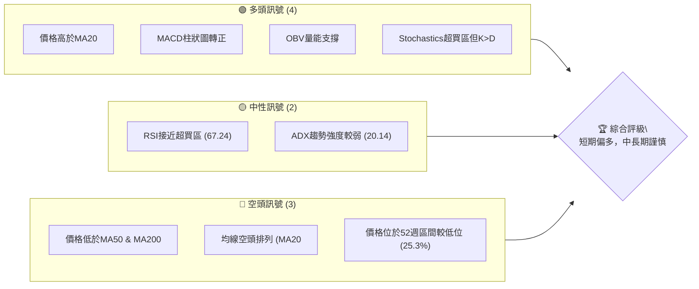
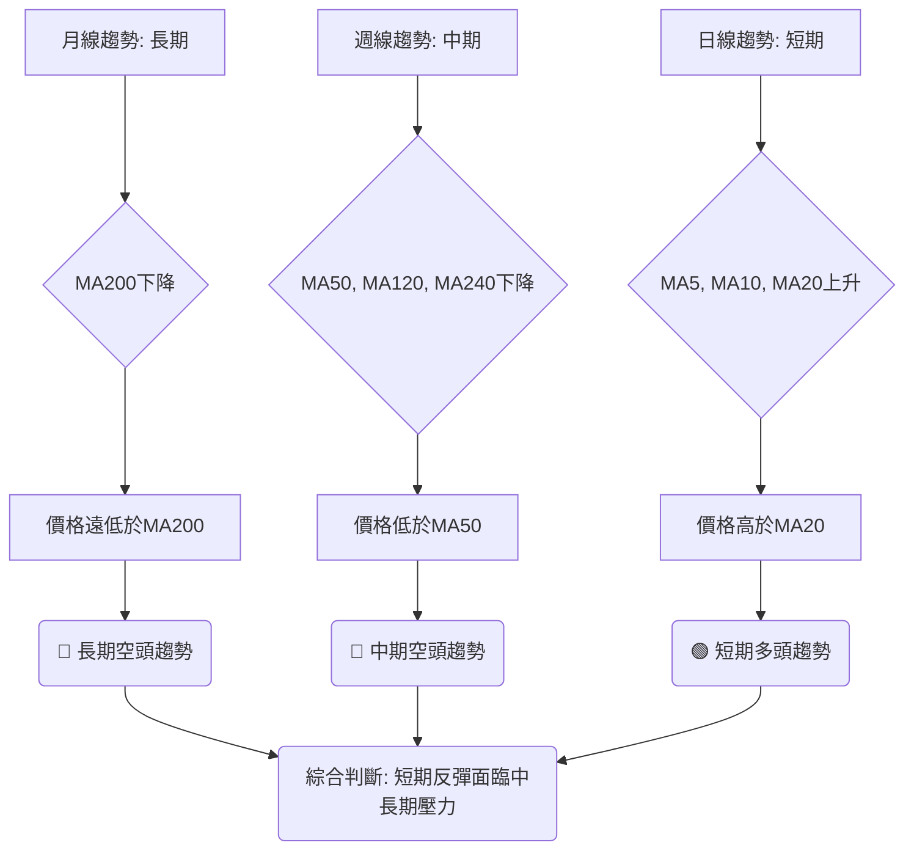
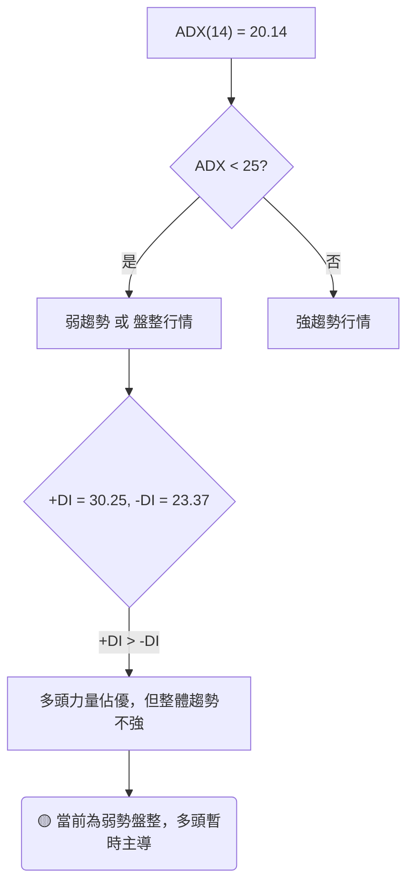
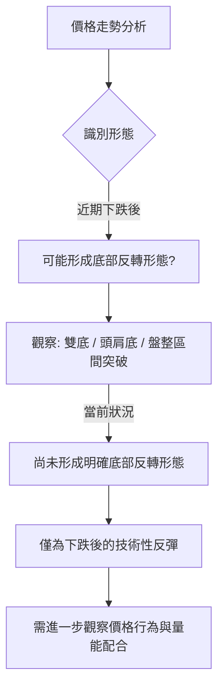
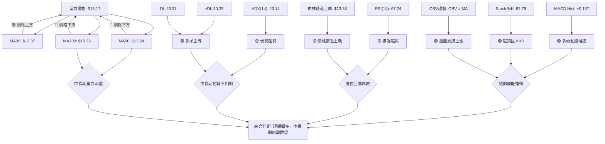
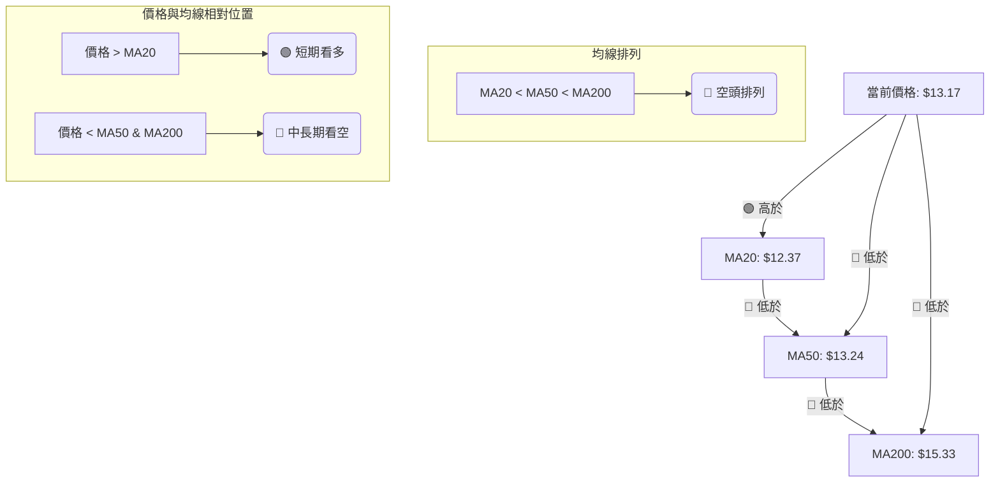
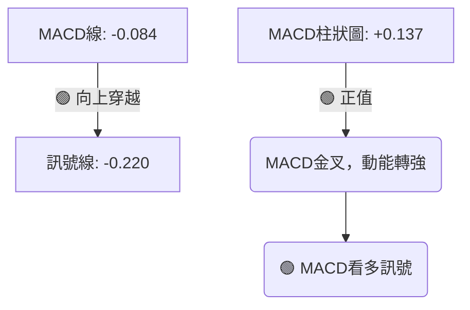
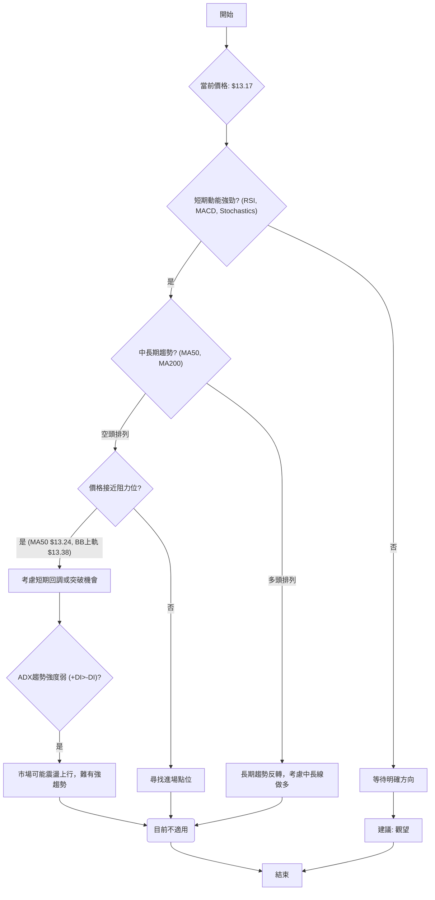
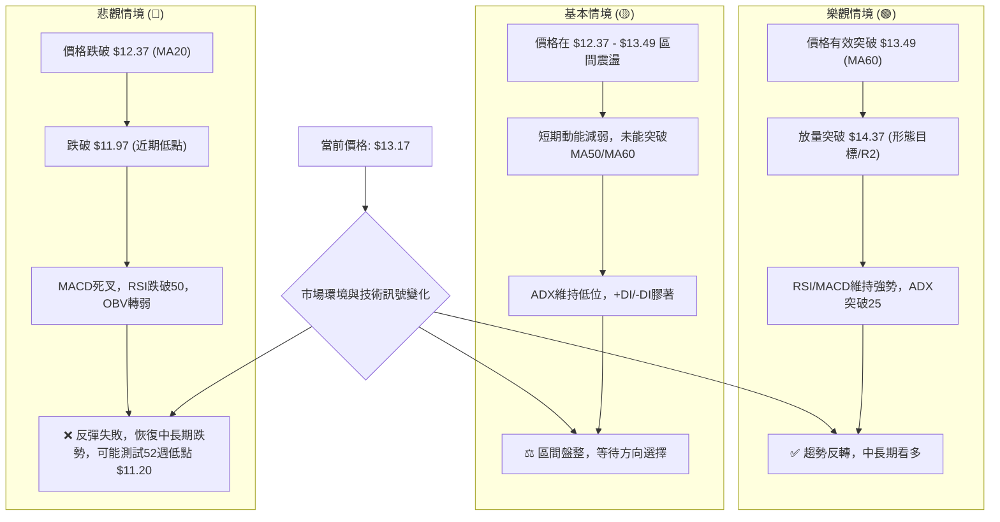

<details>
<summary>📊 靜態圖表 (點擊展開)</summary>

</details>

<html>
<head><meta charset="utf-8" /></head>
<body>
    <div style="height:500px; width:100%;">                        <script>window.PlotlyConfig = {MathJaxConfig: 'local'};</script>
        <script charset="utf-8" src="https://cdn.plot.ly/plotly-3.6.0.min.js" integrity="sha256-QaOVwtVY0T02VaHrr6pnoHLCwayMJp4O5n4YyaE3rJk=" crossorigin="anonymous"></script>                <div id="candlestick-chart" class="plotly-graph-div" style="height:100%; width:100%;"></div>            <script>                window.PLOTLYENV=window.PLOTLYENV || {};                                if (document.getElementById("candlestick-chart")) {                    Plotly.newPlot(                        "candlestick-chart",                        [{"close":{"dtype":"f8","bdata":"AAAAwB4FL0AAAACgcD0vQAAAAKBHYS9AAAAAgOvRL0AAAAAgrscvQAAAACCF6y9AAAAAQOH6L0AAAAAghSswQAAAAMDMTDBAAAAAYGYmMEAAAABgjwIwQAAAACBcjy9AAAAAIFyPL0AAAABgZuYvQAAAAGCPAjBAAAAAoEdhLkAAAADgo3AuQAAAAGC4ni5AAAAAYI\u002fCLkAAAABgj0IuQAAAACCF6y5AAAAAoHC9LkAAAABACtctQAAAAMD1KC5AAAAAgOvRLUAAAAAAKVwuQAAAAIDCdS1AAAAAAAAALkAAAACA69EuQAAAAEDhei5AAAAAgOtRLkAAAADAzMwvQAAAAIAUri9AAAAAAAAAMEAAAAAAKdwvQAAAAEAKFzBAAAAAIFwPMEAAAAAAKRwwQAAAAKBHITBAAAAAoJmZL0AAAAAghSswQAAAAKBH4S9AAAAAoHC9L0AAAADAHgUwQAAAAADXYzBAAAAAgBQuMEAAAACAFC4vQAAAAADXoy9AAAAAQDMzL0AAAAAA16MuQAAAAIDrUS9AAAAAANejLkAAAAAgrscvQAAAAEAK1y9AAAAAACmcMEAAAAAAAEAxQAAAAADXYzFAAAAAQOF6MUAAAAAAKZwxQAAAAOCjcDFAAAAAYGamMUAAAABAM7MwQAAAAGC4njBAAAAAgBSuMEAAAADgo7AwQAAAAIDr0TBAAAAAYGbmMEAAAABgZqYwQAAAAEAzMzBAAAAA4FG4L0AAAADAHkUwQAAAAEAKVzBAAAAAYLieMEAAAABgj8IwQAAAAKBwvTBAAAAAYI\u002fCMEAAAADA9agwQAAAAKBH4TBAAAAAoHC9MEAAAADAHgUxQAAAAOCj8DFAAAAAACncMUAAAAAAAIAxQAAAAAApnDFAAAAAgMJ1MUAAAACAPQoxQAAAACBcjzBAAAAAANejMEAAAAAAKZwwQAAAAKCZmTBAAAAA4FH4MEAAAACgcD0xQAAAAAAAADJAAAAAgD0KMkAAAACAFC4yQAAAAMDMjDJAAAAAYI\u002fCMkAAAABgj8IyQAAAAAAAwDFAAAAAACkcMkAAAABguB4yQAAAAMAeBTFAAAAAIFzPMEAAAABgZmYxQAAAAMDMjDFAAAAAgOuRMUAAAADA9WgxQAAAAIA9CjFAAAAAgOvRMEAAAACA69EwQAAAACCFKzFAAAAAgOtRMUAAAAAgrocxQAAAAOCjMDBAAAAAIK6HMEAAAABgZqYwQAAAAGC4Hi5AAAAAgML1LUAAAACgR2EuQAAAAMAehS1AAAAAAAAALkAAAAAA16MtQAAAAMD1KC1AAAAAQApXLUAAAABgj8ItQAAAAEDh+ixAAAAA4KPwK0AAAAAgrscrQAAAAIA9iixAAAAAAACALEAAAADgo\u002fArQAAAAIDrUSxAAAAAoEfhK0AAAAAAKVwtQAAAAKBHYSxAAAAAANejLEAAAACAPQosQAAAAEAzMytAAAAAwB4FK0AAAACgcL0sQAAAAKBH4SxAAAAAwMxMLEAAAADAHoUsQAAAAMDMTCxAAAAAwB4FLUAAAACgcL0tQAAAACCF6y1AAAAAYGbmLUAAAABAM7MuQAAAAIAUri5AAAAAACncLkAAAACAFK4uQAAAAEAzMy5AAAAAoJkZLkAAAABAM7MtQAAAACCF6yxAAAAAwB4FLUAAAAAgrkctQAAAAAAAAC1AAAAA4HoULEAAAACAwvUsQAAAAKBH4SxAAAAAgOtRLEAAAAAAAIAsQAAAAIDC9SxAAAAAwB6FLEAAAACgmZkrQAAAAAAAACtAAAAAgD2KKkAAAAAA16MpQAAAAAAp3ClAAAAAoEdhKEAAAADgepQoQAAAAOB6lChAAAAA4HqUKUAAAACA61EqQAAAAIDCdSlAAAAAgML1KUAAAAAgXA8qQAAAAKCZGSpAAAAAYI9CKkAAAABA4fopQAAAAAAp3CdAAAAAIK5HJ0AAAACgcD0oQAAAAOCj8CdAAAAAQDMzJ0AAAABgj8InQAAAAKBwPSdAAAAAgBQuKEAAAACgR2EoQAAAAAAp3ChAAAAA4KNwKUAAAAAgrscpQAAAACCFaylAAAAA4HqUKUAAAACAFC4pQAAAACCF6yhAAAAAIIXrKEAAAABAClcqQA=="},"high":{"dtype":"f8","bdata":"AAAAIIVrL0AAAACgR6EvQAAAAIA9ii9AAAAAoEcBMEAAAACA6xEwQAAAAMDMDDBAAAAAoEchMEAAAACgmVkwQAAAAMDMTDBAAAAAwMxsMEAAAABguF4wQAAAAOBRGDBAAAAAoHD9L0AAAACgmRkwQAAAAOCjMDBAAAAAwMwMMEAAAADAzMwuQAAAAAAAwC5AAAAAQOH6LkAAAADgehQvQAAAAAAAAC9AAAAAwPUoL0AAAABgZuYuQAAAAKBwPS5AAAAAoEdhLkAAAAAAVo4uQAAAAGC4ni5AAAAAYLgeLkAAAAAgrkcvQAAAAIAULi9AAAAAIIXrLkAAAAAA1yMwQAAAAKBHITBAAAAAoJlZMEAAAACA6xEwQAAAAMAeRTBAAAAAoHA9MEAAAADAHkUwQAAAAAAAgDBAAAAAoHAdMEAAAAAghWswQAAAAGBmZjBAAAAAAADAL0AAAADgUTgwQAAAAMDMjDBAAAAAAACAMEAAAACA6zEwQAAAAGCPQjBAAAAAoHC9L0AAAACgmVkvQAAAAOCjcC9AAAAAQDMTMEAAAADAHgUwQAAAACBcDzBAAAAAwMysMEAAAACgR2ExQAAAAIAUjjFAAAAAIFyPMUAAAABACtcxQAAAAOBRuDFAAAAA4KPQMUAAAABA4boxQAAAAEAzEzFAAAAAQOG6MEAAAACgmdkwQAAAAAApHDFAAAAAIFwPMUAAAACA6xExQAAAAMAehTBAAAAAwPUoMEAAAADgIlswQAAAAOBReDBAAAAAoEehMEAAAADgetQwQAAAAMD1yDBAAAAAYI\u002fCMEAAAAAgXM8wQAAAAEDhGjFAAAAAwMzsMEAAAAAgXA8xQAAAAICVIzJAAAAAYLheMkAAAABgj8IxQAAAAIC+nzFAAAAAgOsRMkAAAAAghWsxQAAAAIDrETFAAAAA4KOwMEAAAADgUfgwQAAAAGAOrTBAAAAA4KNQMUAAAACAPYoxQAAAAAAAADJAAAAA4KMQMkAAAABgj0IyQAAAACBcjzJAAAAAwPXIMkAAAABA4foyQAAAAGC4njJAAAAAQAp3MkAAAABgZqYyQAAAAIA9KjJAAAAAYI8iMUAAAAAghWsxQAAAAEAK1zFAAAAAACm8MUAAAACgcP0xQAAAAMDMjDFAAAAAoEfhMEAAAAAAAAAxQAAAAEDhejFAAAAA4KNwMUAAAABACpcxQAAAAMD1aDFAAAAAQAqXMEAAAACgmdkwQAAAAKBH4S9AAAAAYGZmLkAAAABAi6wuQAAAAGC4Hi5AAAAAgMK1LkAAAADAzEwuQAAAAEAzcy1AAAAAgOuRLUAAAACAPUouQAAAAKBH4S1AAAAAQDOzLEAAAABguJ4sQAAAAKBwvSxAAAAA4HoULUAAAADAzIwsQAAAAAAAgCxAAAAAwMxMLEAAAABACtctQAAAAMAeBS1AAAAAoEdhLUAAAABgZqYsQAAAAGBm5itAAAAAgOuRK0AAAACA69EsQAAAAKCZmS1AAAAAgML1LEAAAAAgrscsQAAAAIDrUSxAAAAAwEnMLkAAAAAAKdwtQAAAAOB6FC5AAAAAIFwPLkAAAADgo\u002fAuQAAAAGC4Hi9AAAAAoEchL0AAAABguJ4vQAAAAEAzsy5AAAAAIFyPLkAAAADgo3AuQAAAAADXoy1AAAAA4HoULUAAAAAghastQAAAAEAKVy1AAAAAwB4FLUAAAABguB4tQAAAAIDrUS1AAAAA4KPwLEAAAACgR+EsQAAAAKCZGS1AAAAAQDMzLUAAAADA9agsQAAAAMD16CtAAAAAACkcK0AAAACAPYoqQAAAAEAKVypAAAAAIFzPKEAAAADAzMwoQAAAAMDMzChAAAAAoJmZKUAAAACgmZkqQAAAAMAehSpAAAAAoEchKkAAAAAAKVwqQAAAAEDheipAAAAAAACAKkAAAADAzEwqQAAAACCFayhAAAAAQOF6J0AAAACAFG4oQAAAAEAzsyhAAAAAoJkZKEAAAACA6xEoQAAAAIAULihAAAAAgBQuKEAAAADgepQoQAAAAGCPQilAAAAAoJmZKUAAAAAgrgcrQAAAAMD1KCpAAAAAoHA9KkAAAACA65EpQAAAAOCjcClAAAAAgD1KKUAAAACAFK4qQA=="},"hovertemplate":"\u003cb\u003e%{x|%Y-%m-%d}\u003c\u002fb\u003e\u003cbr\u003e\u958b: $%{open:.2f}\u003cbr\u003e\u9ad8: $%{high:.2f}\u003cbr\u003e\u4f4e: $%{low:.2f}\u003cbr\u003e\u6536: $%{close:.2f}\u003cextra\u003e\u003c\u002fextra\u003e","low":{"dtype":"f8","bdata":"AAAAoJmZLkAAAACAwvUuQAAAAOB6FC9AAAAAwPVoL0AAAACA61EvQAAAAGBmpi9AAAAAwB7FL0AAAADAHgUwQAAAAIDC9S9AAAAAIK4HMEAAAACg8dIvQAAAAIDCdS9AAAAAoJkZL0AAAADA9agvQAAAAMDMTC9AAAAAgOtRLkAAAACAPQouQAAAAOBROC5AAAAAAABALkAAAACAPQouQAAAAKCZGS5AAAAAgMJ1LkAAAABgj8ItQAAAAEAK1y1AAAAAIK5HLUAAAADgUbgtQAAAAEBeOi1AAAAAYLgeLUAAAABguB4uQAAAACBcTy5AAAAAgOsRLkAAAACAwnUuQAAAACAEli9AAAAAQArXL0AAAAAA16MvQAAAAAAp3C9AAAAAANcDMEAAAABgj8IvQAAAAIAU7i9AAAAAYGZmL0AAAADgepQvQAAAAIAUri9AAAAAYGbmLkAAAADAzMwvQAAAAMDMDDBAAAAAIIULMEAAAADgUfguQAAAAADXoy5AAAAAAAAAL0AAAADAHoUuQAAAAKBHYS5AAAAAoJmZLkAAAABgj4IuQAAAACBcjy9AAAAAAClcL0AAAADA9egwQAAAAEAzMzFAAAAAIK5HMUAAAABA4XoxQAAAAIA9SjFAAAAAAClcMUAAAACgmZkwQAAAAOBReDBAAAAAAAJLMEAAAABACncwQAAAAEAzszBAAAAAoJmZMEAAAACgR6EwQAAAAIAULjBAAAAAgBQuL0AAAADAIBAwQAAAAEBiUDBAAAAAoJlZMEAAAAAgXI8wQAAAAGBmpjBAAAAAACmcMEAAAACAPYowQAAAAIAUrjBAAAAAgMK1MEAAAABgZqYwQAAAAIA9KjFAAAAAIFzPMUAAAAAgrmcxQAAAAGC4XjFAAAAAANdjMUAAAADAHgUxQAAAAIA9ajBAAAAAwMxsMEAAAACAQYAwQAAAAIAUTjBAAAAAoJlZMEAAAACA6xExQAAAAOB6VDFAAAAAgMK1MUAAAABgZuYxQAAAAKCZGTJAAAAAAClcMkAAAACgcD0yQAAAAIDCtTFAAAAAgMK1MUAAAABACtcxQAAAAAAA4DBAAAAAwMyMMEAAAABgj8IwQAAAAEAKNzFAAAAAgD0KMUAAAACgmVkxQAAAAIDCtTBAAAAAYLheMEAAAABACpcwQAAAAEAK1zBAAAAAwB7lMEAAAAAghSsxQAAAAOB6FDBAAAAAoHC9L0AAAAAA14MwQAAAAOB6FC5AAAAAYGZmLUAAAABguJ4sQAAAAEAKVyxAAAAAoJmZLUAAAADgUTgtQAAAAOBReCxAAAAAgMJ1LEAAAAAgXA8tQAAAAGCPwixAAAAAYI\u002fCK0AAAACgR6ErQAAAAGC4HixAAAAA4FF4LEAAAADgetQrQAAAACBcDytAAAAA4HqUK0AAAADgo3AsQAAAAIDrUSxAAAAAIIVrLEAAAAAAKdwrQAAAAOB6FCtAAAAAgOvRKkAAAABgZmYrQAAAAAAp3CxAAAAAAAKrK0AAAADA9SgsQAAAAIAUritAAAAAgOvRLEAAAADAzMwsQAAAACBcjy1AAAAAQDMzLUAAAACgcD0uQAAAAKCZmS5AAAAA4HqULkAAAABguJ4uQAAAAAAp3C1AAAAA4KPwLUAAAABAClctQAAAAIDrkSxAAAAAoEdhLEAAAACgmRktQAAAAIDCtSxAAAAA4HoULEAAAACgmRksQAAAAGCPwixAAAAAgBQuLEAAAABAClcsQAAAAKBwfSxAAAAAwPVoLEAAAAAAAIArQAAAAEAK1ypAAAAAwB6FKkAAAAAgrocpQAAAAIAUrilAAAAAIFyPJ0AAAABguB4oQAAAACCF6ydAAAAAwPWoKEAAAABguB4pQAAAACCFaylAAAAAwMxMKUAAAAAAKdwpQAAAACCuxylAAAAAQOH6KUAAAACA69EpQAAAAKBH4SZAAAAAYGZmJkAAAAAA16MnQAAAAGC43idAAAAAoJkZJ0AAAAAgXE8nQAAAAOBROCdAAAAAwB4FJ0AAAAAgrgcoQAAAACBcjyhAAAAA4KPwKEAAAADgepQpQAAAAAApXClAAAAAYGZmKUAAAAAAAAApQAAAAKBH4ShAAAAAgMJ1KEAAAAAA1+MoQA=="},"name":"\u50f9\u683c","open":{"dtype":"f8","bdata":"AAAAoJkZL0AAAAAgXA8vQAAAAAApXC9AAAAAAACAL0AAAACgR+EvQAAAAGBm5i9AAAAAYI8CMEAAAACA6xEwQAAAAAApHDBAAAAAwMxMMEAAAACAFC4wQAAAAAAp3C9AAAAAACncL0AAAABgZuYvQAAAACCF6y9AAAAAwMwMMEAAAACAPYouQAAAACBcjy5AAAAAoHC9LkAAAACA69EuQAAAAAApXC5AAAAAIFwPL0AAAADgUbguQAAAAMD1KC5AAAAAQDOzLUAAAAAAAAAuQAAAAOB6lC5AAAAAIK5HLUAAAABgj0IuQAAAAEAzsy5AAAAAANejLkAAAADAHoUuQAAAAEAKFzBAAAAAQOE6MEAAAAAghesvQAAAAGBm5i9AAAAAgOsRMEAAAAAAKRwwQAAAAOCjMDBAAAAAoJmZL0AAAADgUbgvQAAAAGC4XjBAAAAAANejL0AAAACgmRkwQAAAAEAKFzBAAAAAgMJ1MEAAAACAPQowQAAAAAAp3C5AAAAA4FF4L0AAAADAzMwuQAAAAMDMjC5AAAAAgBSuL0AAAACAwrUuQAAAAAAAADBAAAAAQArXL0AAAABA4fowQAAAAADXYzFAAAAAgBRuMUAAAACAwrUxQAAAAEAzszFAAAAAYGamMUAAAABAM7MxQAAAAGC43jBAAAAAwB5lMEAAAACgmZkwQAAAAEDhujBAAAAAIK7nMEAAAABgZgYxQAAAAAAAgDBAAAAAQAoXMEAAAABgZiYwQAAAAKCZWTBAAAAAIIVrMEAAAADgo7AwQAAAAEAzszBAAAAAoHC9MEAAAACAPaowQAAAAMAexTBAAAAAYLjeMEAAAAAgXA8xQAAAAIAULjFAAAAAYLgeMkAAAABguJ4xQAAAAEAKlzFAAAAAgBSuMUAAAACgmVkxQAAAACBcDzFAAAAA4KOQMEAAAAAAAMAwQAAAAIDrkTBAAAAAAClcMEAAAABgjyIxQAAAAIA9qjFAAAAAAAAAMkAAAADAzAwyQAAAAAApXDJAAAAAYI+iMkAAAADgetQyQAAAACCuhzJAAAAAoHC9MUAAAAAgrmcyQAAAAOB6FDJAAAAA4HrUMEAAAAAghSsxQAAAAOCjcDFAAAAAYGYmMUAAAACA6\u002fExQAAAAMD1iDFAAAAAoHC9MEAAAAAAAMAwQAAAAEAz8zBAAAAAANcjMUAAAABAMzMxQAAAAAAAQDFAAAAA4KMwMEAAAAAA14MwQAAAAEAK1y9AAAAA4KNwLUAAAAAghessQAAAAAApXC1AAAAAoHD9LUAAAAAAKdwtQAAAAGCPAi1AAAAAgOvRLEAAAABA4XotQAAAAAAAgC1AAAAAYGZmLEAAAAAA1yMsQAAAAKBwPSxAAAAAwMzMLEAAAADgo3AsQAAAAAApXCtAAAAAoHA9LEAAAACgR6EsQAAAAOBR+CxAAAAAYI9CLUAAAABgj0IsQAAAAIDCdStAAAAAIIVrK0AAAACgmZkrQAAAAIAULi1AAAAAAAAALEAAAABgj0IsQAAAAEAzMyxAAAAAIIVrLkAAAADAHgUtQAAAAAAp3C1AAAAAgBSuLUAAAABgj0IuQAAAACCF6y5AAAAAIK7HLkAAAABguJ4vQAAAAEDhei5AAAAA4FE4LkAAAAAAKVwuQAAAAGC4ni1AAAAAQArXLEAAAAAgrkctQAAAAOB6FC1AAAAAgML1LEAAAADgelQsQAAAAIDrUS1AAAAAIK7HLEAAAAAA16MsQAAAAAAAAC1AAAAAAAAALUAAAACgmZksQAAAAGCPwitAAAAAQArXKkAAAAAghWsqQAAAAEAzsylAAAAAQIkBKEAAAADAzMwoQAAAAOB6VChAAAAAgBSuKEAAAADgUTgpQAAAAMDMTCpAAAAAIK4HKkAAAAAghespQAAAAOCj8ClAAAAAoJkZKkAAAAAAAAAqQAAAAEDh+idAAAAAwMxMJ0AAAABgj8InQAAAAEAzMyhAAAAAwB4FKEAAAADgo3AnQAAAAKCZmSdAAAAAANcjJ0AAAABAClcoQAAAAIAUrihAAAAAwB4FKUAAAADgepQpQAAAACBcDypAAAAAIFyPKUAAAACAPQopQAAAAKCZGSlAAAAAgML1KEAAAAAA1+MoQA=="},"x":["2025-09-10T00:00:00-04:00","2025-09-11T00:00:00-04:00","2025-09-12T00:00:00-04:00","2025-09-15T00:00:00-04:00","2025-09-16T00:00:00-04:00","2025-09-17T00:00:00-04:00","2025-09-18T00:00:00-04:00","2025-09-19T00:00:00-04:00","2025-09-22T00:00:00-04:00","2025-09-23T00:00:00-04:00","2025-09-24T00:00:00-04:00","2025-09-25T00:00:00-04:00","2025-09-26T00:00:00-04:00","2025-09-29T00:00:00-04:00","2025-09-30T00:00:00-04:00","2025-10-01T00:00:00-04:00","2025-10-02T00:00:00-04:00","2025-10-03T00:00:00-04:00","2025-10-06T00:00:00-04:00","2025-10-07T00:00:00-04:00","2025-10-08T00:00:00-04:00","2025-10-09T00:00:00-04:00","2025-10-10T00:00:00-04:00","2025-10-13T00:00:00-04:00","2025-10-14T00:00:00-04:00","2025-10-15T00:00:00-04:00","2025-10-16T00:00:00-04:00","2025-10-17T00:00:00-04:00","2025-10-20T00:00:00-04:00","2025-10-21T00:00:00-04:00","2025-10-22T00:00:00-04:00","2025-10-23T00:00:00-04:00","2025-10-24T00:00:00-04:00","2025-10-27T00:00:00-04:00","2025-10-28T00:00:00-04:00","2025-10-29T00:00:00-04:00","2025-10-30T00:00:00-04:00","2025-10-31T00:00:00-04:00","2025-11-03T00:00:00-05:00","2025-11-04T00:00:00-05:00","2025-11-05T00:00:00-05:00","2025-11-06T00:00:00-05:00","2025-11-07T00:00:00-05:00","2025-11-10T00:00:00-05:00","2025-11-11T00:00:00-05:00","2025-11-12T00:00:00-05:00","2025-11-13T00:00:00-05:00","2025-11-14T00:00:00-05:00","2025-11-17T00:00:00-05:00","2025-11-18T00:00:00-05:00","2025-11-19T00:00:00-05:00","2025-11-20T00:00:00-05:00","2025-11-21T00:00:00-05:00","2025-11-24T00:00:00-05:00","2025-11-25T00:00:00-05:00","2025-11-26T00:00:00-05:00","2025-11-28T00:00:00-05:00","2025-12-01T00:00:00-05:00","2025-12-02T00:00:00-05:00","2025-12-03T00:00:00-05:00","2025-12-04T00:00:00-05:00","2025-12-05T00:00:00-05:00","2025-12-08T00:00:00-05:00","2025-12-09T00:00:00-05:00","2025-12-10T00:00:00-05:00","2025-12-11T00:00:00-05:00","2025-12-12T00:00:00-05:00","2025-12-15T00:00:00-05:00","2025-12-16T00:00:00-05:00","2025-12-17T00:00:00-05:00","2025-12-18T00:00:00-05:00","2025-12-19T00:00:00-05:00","2025-12-22T00:00:00-05:00","2025-12-23T00:00:00-05:00","2025-12-24T00:00:00-05:00","2025-12-26T00:00:00-05:00","2025-12-29T00:00:00-05:00","2025-12-30T00:00:00-05:00","2025-12-31T00:00:00-05:00","2026-01-02T00:00:00-05:00","2026-01-05T00:00:00-05:00","2026-01-06T00:00:00-05:00","2026-01-07T00:00:00-05:00","2026-01-08T00:00:00-05:00","2026-01-09T00:00:00-05:00","2026-01-12T00:00:00-05:00","2026-01-13T00:00:00-05:00","2026-01-14T00:00:00-05:00","2026-01-15T00:00:00-05:00","2026-01-16T00:00:00-05:00","2026-01-20T00:00:00-05:00","2026-01-21T00:00:00-05:00","2026-01-22T00:00:00-05:00","2026-01-23T00:00:00-05:00","2026-01-26T00:00:00-05:00","2026-01-27T00:00:00-05:00","2026-01-28T00:00:00-05:00","2026-01-29T00:00:00-05:00","2026-01-30T00:00:00-05:00","2026-02-02T00:00:00-05:00","2026-02-03T00:00:00-05:00","2026-02-04T00:00:00-05:00","2026-02-05T00:00:00-05:00","2026-02-06T00:00:00-05:00","2026-02-09T00:00:00-05:00","2026-02-10T00:00:00-05:00","2026-02-11T00:00:00-05:00","2026-02-12T00:00:00-05:00","2026-02-13T00:00:00-05:00","2026-02-17T00:00:00-05:00","2026-02-18T00:00:00-05:00","2026-02-19T00:00:00-05:00","2026-02-20T00:00:00-05:00","2026-02-23T00:00:00-05:00","2026-02-24T00:00:00-05:00","2026-02-25T00:00:00-05:00","2026-02-26T00:00:00-05:00","2026-02-27T00:00:00-05:00","2026-03-02T00:00:00-05:00","2026-03-03T00:00:00-05:00","2026-03-04T00:00:00-05:00","2026-03-05T00:00:00-05:00","2026-03-06T00:00:00-05:00","2026-03-09T00:00:00-04:00","2026-03-10T00:00:00-04:00","2026-03-11T00:00:00-04:00","2026-03-12T00:00:00-04:00","2026-03-13T00:00:00-04:00","2026-03-16T00:00:00-04:00","2026-03-17T00:00:00-04:00","2026-03-18T00:00:00-04:00","2026-03-19T00:00:00-04:00","2026-03-20T00:00:00-04:00","2026-03-23T00:00:00-04:00","2026-03-24T00:00:00-04:00","2026-03-25T00:00:00-04:00","2026-03-26T00:00:00-04:00","2026-03-27T00:00:00-04:00","2026-03-30T00:00:00-04:00","2026-03-31T00:00:00-04:00","2026-04-01T00:00:00-04:00","2026-04-02T00:00:00-04:00","2026-04-06T00:00:00-04:00","2026-04-07T00:00:00-04:00","2026-04-08T00:00:00-04:00","2026-04-09T00:00:00-04:00","2026-04-10T00:00:00-04:00","2026-04-13T00:00:00-04:00","2026-04-14T00:00:00-04:00","2026-04-15T00:00:00-04:00","2026-04-16T00:00:00-04:00","2026-04-17T00:00:00-04:00","2026-04-20T00:00:00-04:00","2026-04-21T00:00:00-04:00","2026-04-22T00:00:00-04:00","2026-04-23T00:00:00-04:00","2026-04-24T00:00:00-04:00","2026-04-27T00:00:00-04:00","2026-04-28T00:00:00-04:00","2026-04-29T00:00:00-04:00","2026-04-30T00:00:00-04:00","2026-05-01T00:00:00-04:00","2026-05-04T00:00:00-04:00","2026-05-05T00:00:00-04:00","2026-05-06T00:00:00-04:00","2026-05-07T00:00:00-04:00","2026-05-08T00:00:00-04:00","2026-05-11T00:00:00-04:00","2026-05-12T00:00:00-04:00","2026-05-13T00:00:00-04:00","2026-05-14T00:00:00-04:00","2026-05-15T00:00:00-04:00","2026-05-18T00:00:00-04:00","2026-05-19T00:00:00-04:00","2026-05-20T00:00:00-04:00","2026-05-21T00:00:00-04:00","2026-05-22T00:00:00-04:00","2026-05-26T00:00:00-04:00","2026-05-27T00:00:00-04:00","2026-05-28T00:00:00-04:00","2026-05-29T00:00:00-04:00","2026-06-01T00:00:00-04:00","2026-06-02T00:00:00-04:00","2026-06-03T00:00:00-04:00","2026-06-04T00:00:00-04:00","2026-06-05T00:00:00-04:00","2026-06-08T00:00:00-04:00","2026-06-09T00:00:00-04:00","2026-06-10T00:00:00-04:00","2026-06-11T00:00:00-04:00","2026-06-12T00:00:00-04:00","2026-06-15T00:00:00-04:00","2026-06-16T00:00:00-04:00","2026-06-17T00:00:00-04:00","2026-06-18T00:00:00-04:00","2026-06-22T00:00:00-04:00","2026-06-23T00:00:00-04:00","2026-06-24T00:00:00-04:00","2026-06-25T00:00:00-04:00","2026-06-26T00:00:00-04:00"],"type":"candlestick"},{"hovertemplate":"MA30: $%{y:.2f}\u003cextra\u003e\u003c\u002fextra\u003e","line":{"color":"#2196F3","dash":"dash","width":2},"mode":"lines","name":"MA30","x":["2025-09-10T00:00:00-04:00","2025-09-11T00:00:00-04:00","2025-09-12T00:00:00-04:00","2025-09-15T00:00:00-04:00","2025-09-16T00:00:00-04:00","2025-09-17T00:00:00-04:00","2025-09-18T00:00:00-04:00","2025-09-19T00:00:00-04:00","2025-09-22T00:00:00-04:00","2025-09-23T00:00:00-04:00","2025-09-24T00:00:00-04:00","2025-09-25T00:00:00-04:00","2025-09-26T00:00:00-04:00","2025-09-29T00:00:00-04:00","2025-09-30T00:00:00-04:00","2025-10-01T00:00:00-04:00","2025-10-02T00:00:00-04:00","2025-10-03T00:00:00-04:00","2025-10-06T00:00:00-04:00","2025-10-07T00:00:00-04:00","2025-10-08T00:00:00-04:00","2025-10-09T00:00:00-04:00","2025-10-10T00:00:00-04:00","2025-10-13T00:00:00-04:00","2025-10-14T00:00:00-04:00","2025-10-15T00:00:00-04:00","2025-10-16T00:00:00-04:00","2025-10-17T00:00:00-04:00","2025-10-20T00:00:00-04:00","2025-10-21T00:00:00-04:00","2025-10-22T00:00:00-04:00","2025-10-23T00:00:00-04:00","2025-10-24T00:00:00-04:00","2025-10-27T00:00:00-04:00","2025-10-28T00:00:00-04:00","2025-10-29T00:00:00-04:00","2025-10-30T00:00:00-04:00","2025-10-31T00:00:00-04:00","2025-11-03T00:00:00-05:00","2025-11-04T00:00:00-05:00","2025-11-05T00:00:00-05:00","2025-11-06T00:00:00-05:00","2025-11-07T00:00:00-05:00","2025-11-10T00:00:00-05:00","2025-11-11T00:00:00-05:00","2025-11-12T00:00:00-05:00","2025-11-13T00:00:00-05:00","2025-11-14T00:00:00-05:00","2025-11-17T00:00:00-05:00","2025-11-18T00:00:00-05:00","2025-11-19T00:00:00-05:00","2025-11-20T00:00:00-05:00","2025-11-21T00:00:00-05:00","2025-11-24T00:00:00-05:00","2025-11-25T00:00:00-05:00","2025-11-26T00:00:00-05:00","2025-11-28T00:00:00-05:00","2025-12-01T00:00:00-05:00","2025-12-02T00:00:00-05:00","2025-12-03T00:00:00-05:00","2025-12-04T00:00:00-05:00","2025-12-05T00:00:00-05:00","2025-12-08T00:00:00-05:00","2025-12-09T00:00:00-05:00","2025-12-10T00:00:00-05:00","2025-12-11T00:00:00-05:00","2025-12-12T00:00:00-05:00","2025-12-15T00:00:00-05:00","2025-12-16T00:00:00-05:00","2025-12-17T00:00:00-05:00","2025-12-18T00:00:00-05:00","2025-12-19T00:00:00-05:00","2025-12-22T00:00:00-05:00","2025-12-23T00:00:00-05:00","2025-12-24T00:00:00-05:00","2025-12-26T00:00:00-05:00","2025-12-29T00:00:00-05:00","2025-12-30T00:00:00-05:00","2025-12-31T00:00:00-05:00","2026-01-02T00:00:00-05:00","2026-01-05T00:00:00-05:00","2026-01-06T00:00:00-05:00","2026-01-07T00:00:00-05:00","2026-01-08T00:00:00-05:00","2026-01-09T00:00:00-05:00","2026-01-12T00:00:00-05:00","2026-01-13T00:00:00-05:00","2026-01-14T00:00:00-05:00","2026-01-15T00:00:00-05:00","2026-01-16T00:00:00-05:00","2026-01-20T00:00:00-05:00","2026-01-21T00:00:00-05:00","2026-01-22T00:00:00-05:00","2026-01-23T00:00:00-05:00","2026-01-26T00:00:00-05:00","2026-01-27T00:00:00-05:00","2026-01-28T00:00:00-05:00","2026-01-29T00:00:00-05:00","2026-01-30T00:00:00-05:00","2026-02-02T00:00:00-05:00","2026-02-03T00:00:00-05:00","2026-02-04T00:00:00-05:00","2026-02-05T00:00:00-05:00","2026-02-06T00:00:00-05:00","2026-02-09T00:00:00-05:00","2026-02-10T00:00:00-05:00","2026-02-11T00:00:00-05:00","2026-02-12T00:00:00-05:00","2026-02-13T00:00:00-05:00","2026-02-17T00:00:00-05:00","2026-02-18T00:00:00-05:00","2026-02-19T00:00:00-05:00","2026-02-20T00:00:00-05:00","2026-02-23T00:00:00-05:00","2026-02-24T00:00:00-05:00","2026-02-25T00:00:00-05:00","2026-02-26T00:00:00-05:00","2026-02-27T00:00:00-05:00","2026-03-02T00:00:00-05:00","2026-03-03T00:00:00-05:00","2026-03-04T00:00:00-05:00","2026-03-05T00:00:00-05:00","2026-03-06T00:00:00-05:00","2026-03-09T00:00:00-04:00","2026-03-10T00:00:00-04:00","2026-03-11T00:00:00-04:00","2026-03-12T00:00:00-04:00","2026-03-13T00:00:00-04:00","2026-03-16T00:00:00-04:00","2026-03-17T00:00:00-04:00","2026-03-18T00:00:00-04:00","2026-03-19T00:00:00-04:00","2026-03-20T00:00:00-04:00","2026-03-23T00:00:00-04:00","2026-03-24T00:00:00-04:00","2026-03-25T00:00:00-04:00","2026-03-26T00:00:00-04:00","2026-03-27T00:00:00-04:00","2026-03-30T00:00:00-04:00","2026-03-31T00:00:00-04:00","2026-04-01T00:00:00-04:00","2026-04-02T00:00:00-04:00","2026-04-06T00:00:00-04:00","2026-04-07T00:00:00-04:00","2026-04-08T00:00:00-04:00","2026-04-09T00:00:00-04:00","2026-04-10T00:00:00-04:00","2026-04-13T00:00:00-04:00","2026-04-14T00:00:00-04:00","2026-04-15T00:00:00-04:00","2026-04-16T00:00:00-04:00","2026-04-17T00:00:00-04:00","2026-04-20T00:00:00-04:00","2026-04-21T00:00:00-04:00","2026-04-22T00:00:00-04:00","2026-04-23T00:00:00-04:00","2026-04-24T00:00:00-04:00","2026-04-27T00:00:00-04:00","2026-04-28T00:00:00-04:00","2026-04-29T00:00:00-04:00","2026-04-30T00:00:00-04:00","2026-05-01T00:00:00-04:00","2026-05-04T00:00:00-04:00","2026-05-05T00:00:00-04:00","2026-05-06T00:00:00-04:00","2026-05-07T00:00:00-04:00","2026-05-08T00:00:00-04:00","2026-05-11T00:00:00-04:00","2026-05-12T00:00:00-04:00","2026-05-13T00:00:00-04:00","2026-05-14T00:00:00-04:00","2026-05-15T00:00:00-04:00","2026-05-18T00:00:00-04:00","2026-05-19T00:00:00-04:00","2026-05-20T00:00:00-04:00","2026-05-21T00:00:00-04:00","2026-05-22T00:00:00-04:00","2026-05-26T00:00:00-04:00","2026-05-27T00:00:00-04:00","2026-05-28T00:00:00-04:00","2026-05-29T00:00:00-04:00","2026-06-01T00:00:00-04:00","2026-06-02T00:00:00-04:00","2026-06-03T00:00:00-04:00","2026-06-04T00:00:00-04:00","2026-06-05T00:00:00-04:00","2026-06-08T00:00:00-04:00","2026-06-09T00:00:00-04:00","2026-06-10T00:00:00-04:00","2026-06-11T00:00:00-04:00","2026-06-12T00:00:00-04:00","2026-06-15T00:00:00-04:00","2026-06-16T00:00:00-04:00","2026-06-17T00:00:00-04:00","2026-06-18T00:00:00-04:00","2026-06-22T00:00:00-04:00","2026-06-23T00:00:00-04:00","2026-06-24T00:00:00-04:00","2026-06-25T00:00:00-04:00","2026-06-26T00:00:00-04:00"],"y":{"dtype":"f8","bdata":"AAAAAAAA+H8AAAAAAAD4fwAAAAAAAPh\u002fAAAAAAAA+H8AAAAAAAD4fwAAAAAAAPh\u002fAAAAAAAA+H8AAAAAAAD4fwAAAAAAAPh\u002fAAAAAAAA+H8AAAAAAAD4fwAAAAAAAPh\u002fAAAAAAAA+H8AAAAAAAD4fwAAAAAAAPh\u002fAAAAAAAA+H8AAAAAAAD4fwAAAAAAAPh\u002fAAAAAAAA+H8AAAAAAAD4fwAAAAAAAPh\u002fAAAAAAAA+H8AAAAAAAD4fwAAAAAAAPh\u002fAAAAAAAA+H8AAAAAAAD4fwAAAAAAAPh\u002fAAAAAAAA+H8AAAAAAAD4fzMzM1NVFS9AZmZmJlwPL0DNzMx8IxQvQJqZmdmyFi9AERERETwYL0BERETU6hgvQO\u002fu7s4iGy9AREREpFQcL0AAAACAThsvQCIiIsJnGC9AZmZmlm4SL0AzMzOjKRUvQAAAALDkFy9Ad3d3520ZL0De3d29nxovQLy7u\u002fsbIS9AzczMXAEyL0CrqqrqUTgvQDMzMyMGQS9AVVVVVcdEL0BERER0BUgvQERERERvSy9AAAAA0JRKL0Dv7u7OIlsvQDMzM9N4aS9A3t3dPXyGL0BVVVU10KkvQM3MzOw11y9Aq6qqmsQAMEBERESUihMwQN7d3Y1QJjBAq6qqCpA7MEC8u7urY0IwQLy7u5sLSTBAd3d3F9lOMEBmZmZWVVUwQLy7uwuQWzBA3t3dDbtiMEAzMzOzVmcwQO\u002fu7p7vZzBAERERsXJoMEBVVVUlTWkwQN7d3fW2bDBAzczMXB1zMECrqqrqbXkwQBEREYFqfDBAiYiIiF2BMEC8u7v7foowQGZmZpaKkzBARERE9ESdMECamZmpxqswQGZmZmY7vzBA3t3dHejUMEDv7u42peIwQLy7uxMR8TBAVVVV7VH4MEBVVVUth\u002fYwQLy7uwNy7zBAmpmZAUfoMEARERF5vt8wQO\u002fu7naT2DBAMzMz+8XSMECJiIigYdcwQAAAAEgo4zBAd3d3P8PuMEC8u7szevswQJqZmXE9CjFAVVVVrRwaMUAzMzMLHiwxQJqZmRFYOTFAVVVVRYtMMUCJiIioVFwxQERERCQiYjFAMzMzM8FjMUDNzMxMN2kxQFVVVcUgcDFA3t3dPQp3MUBERESkcH0xQLy7uyvOfjFA7+7u7nx\u002fMUBmZmYGyH0xQO\u002fu7u41dzFAiYiISJpyMUAiIiLS23IxQImIiMi9ZjFAvLu7K85eMUAzMzMzelsxQO\u002fu7matTjFAvLu7E4NAMUCamZkJZTQxQO\u002fu7n6xJDFAd3d39+ETMUBVVVVlO\u002f8wQKuqqkoM4jBAmpmZaUrFMEC8u7tzIakwQHd3dz98hjBAVVVVVZxdMEAAAACoDTQwQDMzM3tbFjBAzczMXNbqL0C8u7u7AqQvQDMzMzMzcy9Aq6qq+jdCL0Dv7u4ezBMvQO\u002fu7g502i5Ad3d3l\u002fyiLkBVVVV1IWkuQN7d3d1rLi5AIiIiQu71LUC8u7sLHswtQN7d3X2GnS1AzczMjGxnLUAzMzOznS8tQM3MzMzMDC1AiYiISFPqLECJiIhY8sssQAAAAHA9yixA3t3dXbrJLEC8u7trdcwsQKuqqnpb1ixA3t3dLbLdLECJiIgYkuYsQDMzMwNy7yxAIiIiQu71LEAAAAAwa\u002fUsQN7d3R3o9CxAmpmZaR\u002f+LEBmZmY27AotQImIiBjZDi1Ad3d3l0MLLUAAAADQ9xMtQGZmZia\u002fGC1AiYiIWIAcLUBVVVWlKRUtQM3MzKwcGi1AiYiIiBYZLUBmZmZWVRUtQN7d3W2gEy1Aq6qq2ocPLUDNzMzME\u002fUsQDMzM4NO2yxAREREJNu5LEBEREQUPJgsQN7d3Z19eCxAIiIi0iJbLEB3d3e38z0sQCIiIrLkFyxAIiIiokX2K0BVVVVlrc4rQLy7uzuYpytAERERYVeAK0AiIiISPFgrQBERESEiIitAzczMnO\u002fnKkDv7u4OWLkqQFVVVRXZjipAmpmZGS9dKkCamZl5FC4qQAAAAJDt\u002fClAIiIi4qXbKUCJiIi4kLQpQGZmZuZCkilAIiIicq95KUBERESEeWIpQFVVVUVERClA3t3dvS0rKUC8u7srhxYpQHd3d1fHBClAVVVVZfT2KEAiIiKS7fwoQA=="},"type":"scatter"},{"hovertemplate":"MA60: $%{y:.2f}\u003cextra\u003e\u003c\u002fextra\u003e","line":{"color":"#9C27B0","dash":"dash","width":2},"mode":"lines","name":"MA60","x":["2025-09-10T00:00:00-04:00","2025-09-11T00:00:00-04:00","2025-09-12T00:00:00-04:00","2025-09-15T00:00:00-04:00","2025-09-16T00:00:00-04:00","2025-09-17T00:00:00-04:00","2025-09-18T00:00:00-04:00","2025-09-19T00:00:00-04:00","2025-09-22T00:00:00-04:00","2025-09-23T00:00:00-04:00","2025-09-24T00:00:00-04:00","2025-09-25T00:00:00-04:00","2025-09-26T00:00:00-04:00","2025-09-29T00:00:00-04:00","2025-09-30T00:00:00-04:00","2025-10-01T00:00:00-04:00","2025-10-02T00:00:00-04:00","2025-10-03T00:00:00-04:00","2025-10-06T00:00:00-04:00","2025-10-07T00:00:00-04:00","2025-10-08T00:00:00-04:00","2025-10-09T00:00:00-04:00","2025-10-10T00:00:00-04:00","2025-10-13T00:00:00-04:00","2025-10-14T00:00:00-04:00","2025-10-15T00:00:00-04:00","2025-10-16T00:00:00-04:00","2025-10-17T00:00:00-04:00","2025-10-20T00:00:00-04:00","2025-10-21T00:00:00-04:00","2025-10-22T00:00:00-04:00","2025-10-23T00:00:00-04:00","2025-10-24T00:00:00-04:00","2025-10-27T00:00:00-04:00","2025-10-28T00:00:00-04:00","2025-10-29T00:00:00-04:00","2025-10-30T00:00:00-04:00","2025-10-31T00:00:00-04:00","2025-11-03T00:00:00-05:00","2025-11-04T00:00:00-05:00","2025-11-05T00:00:00-05:00","2025-11-06T00:00:00-05:00","2025-11-07T00:00:00-05:00","2025-11-10T00:00:00-05:00","2025-11-11T00:00:00-05:00","2025-11-12T00:00:00-05:00","2025-11-13T00:00:00-05:00","2025-11-14T00:00:00-05:00","2025-11-17T00:00:00-05:00","2025-11-18T00:00:00-05:00","2025-11-19T00:00:00-05:00","2025-11-20T00:00:00-05:00","2025-11-21T00:00:00-05:00","2025-11-24T00:00:00-05:00","2025-11-25T00:00:00-05:00","2025-11-26T00:00:00-05:00","2025-11-28T00:00:00-05:00","2025-12-01T00:00:00-05:00","2025-12-02T00:00:00-05:00","2025-12-03T00:00:00-05:00","2025-12-04T00:00:00-05:00","2025-12-05T00:00:00-05:00","2025-12-08T00:00:00-05:00","2025-12-09T00:00:00-05:00","2025-12-10T00:00:00-05:00","2025-12-11T00:00:00-05:00","2025-12-12T00:00:00-05:00","2025-12-15T00:00:00-05:00","2025-12-16T00:00:00-05:00","2025-12-17T00:00:00-05:00","2025-12-18T00:00:00-05:00","2025-12-19T00:00:00-05:00","2025-12-22T00:00:00-05:00","2025-12-23T00:00:00-05:00","2025-12-24T00:00:00-05:00","2025-12-26T00:00:00-05:00","2025-12-29T00:00:00-05:00","2025-12-30T00:00:00-05:00","2025-12-31T00:00:00-05:00","2026-01-02T00:00:00-05:00","2026-01-05T00:00:00-05:00","2026-01-06T00:00:00-05:00","2026-01-07T00:00:00-05:00","2026-01-08T00:00:00-05:00","2026-01-09T00:00:00-05:00","2026-01-12T00:00:00-05:00","2026-01-13T00:00:00-05:00","2026-01-14T00:00:00-05:00","2026-01-15T00:00:00-05:00","2026-01-16T00:00:00-05:00","2026-01-20T00:00:00-05:00","2026-01-21T00:00:00-05:00","2026-01-22T00:00:00-05:00","2026-01-23T00:00:00-05:00","2026-01-26T00:00:00-05:00","2026-01-27T00:00:00-05:00","2026-01-28T00:00:00-05:00","2026-01-29T00:00:00-05:00","2026-01-30T00:00:00-05:00","2026-02-02T00:00:00-05:00","2026-02-03T00:00:00-05:00","2026-02-04T00:00:00-05:00","2026-02-05T00:00:00-05:00","2026-02-06T00:00:00-05:00","2026-02-09T00:00:00-05:00","2026-02-10T00:00:00-05:00","2026-02-11T00:00:00-05:00","2026-02-12T00:00:00-05:00","2026-02-13T00:00:00-05:00","2026-02-17T00:00:00-05:00","2026-02-18T00:00:00-05:00","2026-02-19T00:00:00-05:00","2026-02-20T00:00:00-05:00","2026-02-23T00:00:00-05:00","2026-02-24T00:00:00-05:00","2026-02-25T00:00:00-05:00","2026-02-26T00:00:00-05:00","2026-02-27T00:00:00-05:00","2026-03-02T00:00:00-05:00","2026-03-03T00:00:00-05:00","2026-03-04T00:00:00-05:00","2026-03-05T00:00:00-05:00","2026-03-06T00:00:00-05:00","2026-03-09T00:00:00-04:00","2026-03-10T00:00:00-04:00","2026-03-11T00:00:00-04:00","2026-03-12T00:00:00-04:00","2026-03-13T00:00:00-04:00","2026-03-16T00:00:00-04:00","2026-03-17T00:00:00-04:00","2026-03-18T00:00:00-04:00","2026-03-19T00:00:00-04:00","2026-03-20T00:00:00-04:00","2026-03-23T00:00:00-04:00","2026-03-24T00:00:00-04:00","2026-03-25T00:00:00-04:00","2026-03-26T00:00:00-04:00","2026-03-27T00:00:00-04:00","2026-03-30T00:00:00-04:00","2026-03-31T00:00:00-04:00","2026-04-01T00:00:00-04:00","2026-04-02T00:00:00-04:00","2026-04-06T00:00:00-04:00","2026-04-07T00:00:00-04:00","2026-04-08T00:00:00-04:00","2026-04-09T00:00:00-04:00","2026-04-10T00:00:00-04:00","2026-04-13T00:00:00-04:00","2026-04-14T00:00:00-04:00","2026-04-15T00:00:00-04:00","2026-04-16T00:00:00-04:00","2026-04-17T00:00:00-04:00","2026-04-20T00:00:00-04:00","2026-04-21T00:00:00-04:00","2026-04-22T00:00:00-04:00","2026-04-23T00:00:00-04:00","2026-04-24T00:00:00-04:00","2026-04-27T00:00:00-04:00","2026-04-28T00:00:00-04:00","2026-04-29T00:00:00-04:00","2026-04-30T00:00:00-04:00","2026-05-01T00:00:00-04:00","2026-05-04T00:00:00-04:00","2026-05-05T00:00:00-04:00","2026-05-06T00:00:00-04:00","2026-05-07T00:00:00-04:00","2026-05-08T00:00:00-04:00","2026-05-11T00:00:00-04:00","2026-05-12T00:00:00-04:00","2026-05-13T00:00:00-04:00","2026-05-14T00:00:00-04:00","2026-05-15T00:00:00-04:00","2026-05-18T00:00:00-04:00","2026-05-19T00:00:00-04:00","2026-05-20T00:00:00-04:00","2026-05-21T00:00:00-04:00","2026-05-22T00:00:00-04:00","2026-05-26T00:00:00-04:00","2026-05-27T00:00:00-04:00","2026-05-28T00:00:00-04:00","2026-05-29T00:00:00-04:00","2026-06-01T00:00:00-04:00","2026-06-02T00:00:00-04:00","2026-06-03T00:00:00-04:00","2026-06-04T00:00:00-04:00","2026-06-05T00:00:00-04:00","2026-06-08T00:00:00-04:00","2026-06-09T00:00:00-04:00","2026-06-10T00:00:00-04:00","2026-06-11T00:00:00-04:00","2026-06-12T00:00:00-04:00","2026-06-15T00:00:00-04:00","2026-06-16T00:00:00-04:00","2026-06-17T00:00:00-04:00","2026-06-18T00:00:00-04:00","2026-06-22T00:00:00-04:00","2026-06-23T00:00:00-04:00","2026-06-24T00:00:00-04:00","2026-06-25T00:00:00-04:00","2026-06-26T00:00:00-04:00"],"y":{"dtype":"f8","bdata":"AAAAAAAA+H8AAAAAAAD4fwAAAAAAAPh\u002fAAAAAAAA+H8AAAAAAAD4fwAAAAAAAPh\u002fAAAAAAAA+H8AAAAAAAD4fwAAAAAAAPh\u002fAAAAAAAA+H8AAAAAAAD4fwAAAAAAAPh\u002fAAAAAAAA+H8AAAAAAAD4fwAAAAAAAPh\u002fAAAAAAAA+H8AAAAAAAD4fwAAAAAAAPh\u002fAAAAAAAA+H8AAAAAAAD4fwAAAAAAAPh\u002fAAAAAAAA+H8AAAAAAAD4fwAAAAAAAPh\u002fAAAAAAAA+H8AAAAAAAD4fwAAAAAAAPh\u002fAAAAAAAA+H8AAAAAAAD4fwAAAAAAAPh\u002fAAAAAAAA+H8AAAAAAAD4fwAAAAAAAPh\u002fAAAAAAAA+H8AAAAAAAD4fwAAAAAAAPh\u002fAAAAAAAA+H8AAAAAAAD4fwAAAAAAAPh\u002fAAAAAAAA+H8AAAAAAAD4fwAAAAAAAPh\u002fAAAAAAAA+H8AAAAAAAD4fwAAAAAAAPh\u002fAAAAAAAA+H8AAAAAAAD4fwAAAAAAAPh\u002fAAAAAAAA+H8AAAAAAAD4fwAAAAAAAPh\u002fAAAAAAAA+H8AAAAAAAD4fwAAAAAAAPh\u002fAAAAAAAA+H8AAAAAAAD4fwAAAAAAAPh\u002fAAAAAAAA+H8AAAAAAAD4f3d3dzf7sC9A3t3dHT7DL0AiIiJqdcwvQImIiAhl1C9AAAAAIPfaL0CJiIjAyuEvQDMzM3Mh6S9AAAAAYOXwL0AzMzPz\u002ffQvQAAAAIAj9C9ARERE\u002fKnxL0Dv7u724fMvQN7d3U2p+C9AiYiIUNT\u002fL0DNzMzkXgMwQHd3dz98BjBAd3d3Gy8NMECJiIj4UxMwQAAAANQGGjBAd3d3T9QfMEDe3d2x5CcwQERERIR5MjBA7+7uQhk9MEAzMzNPG0gwQKuqqr7mUjBAIiIiBshdMEAAAACkt2UwQBEREX2GbTBAIiIizoV0MECrqqqGpHkwQGZmZgJyfzBA7+7uAiuHMEAiIiKm4owwQN7d3fEZljBAd3d3K86eMEARERHFZ6gwQKuqqr7msjBAmpmZ3Wu+MEAzMzNfuskwQERERNij0DBAMzMz+37aMEDv7u7m0OIwQBEREY1s5zBAAAAASG\u002frMEC8u7ubUvEwQDMzM6NF9jBAMzMz4zP8MEAAAADQ9wMxQBEREWEsCTFAmpmZ8WAOMUAAAABYxxQxQKuqqqo4GzFAMzMzM8EjMUCJiIiEwCoxQCIiIm7nKzFAiYiIDJArMUBERESwACkxQFVVVbUPHzFAq6qqCmUUMUBVVVXBEQoxQO\u002fu7nqi\u002fjBAVVVV+VPzMEDv7u6CTuswQFVVVUma4jBAiYiI1AbaMEC8u7vTTdIwQImIiNhcyDBAVVVVgdy7MECamZnZFbAwQGZmZsbZpzBA3t3dOfugMEAzMzMDK5cwQO\u002fu7t7djTBAREREmG6CMEAiIiKujnkwQGZmZmatbjBAzczMRERkMEB3d3evAFkwQFVVVQ0CSzBAAAAACDo9MEAiIiKG6zEwQO\u002fu7pb8IjBAd3d3RygTMEDe3d1VVQUwQO\u002fu7i4k7S9AAAAA0PfTL0B3d3dfc8EvQO\u002fu7h7Msy9Aq6qqQmClL0B3d3e\u002fn5ovQERERDzfjy9AZmZmDruCL0CamZlxhHIvQEREREzFWS9Aq6qqikFAL0C8u7sL1yMvQGZmZk7wAC9AIiIiCqzcLkAzMzPDg7kuQHd3dwfInS5AIiIi+gx7LkDe3d1F\u002fVsuQM3MzCz5RS5AmpmZKVwvLkAiIiLiehQuQN7d3V1I+i1AAAAAkAneLUDe3d1lO78tQN7d3SUGoS1AZmZmDruCLUBERETsmGAtQImIiIBqPC1AiYiI2KMQLUC8u7vj7OMsQFVVVTWlwixAVVVVDbuiLEAAAAAI84QsQBERERERcSxAAAAAAABgLECJiIhokU0sQDMzM9v5PixAd3d3xwQvLEBVVVUVZx8sQCIiIhLKCCxAd3d37+7uK0B3d3efYdcrQJqZmZngwStAmpmZQaetK0AAAABYgJwrQERERFTjhStAzczMvHRzK0BERERERGQrQGZmZgaBVStAVVVV5RdLK0DNzMyU0TsrQBEREXkwLytAMzMzIyIiK0ARERFB7hUrQKuqquIzDCtAAAAAID4DK0B3d3evAPkqQA=="},"type":"scatter"},{"hovertemplate":"MA200: $%{y:.2f}\u003cextra\u003e\u003c\u002fextra\u003e","line":{"color":"#FF6F00","dash":"solid","width":2},"mode":"lines","name":"MA200","x":["2025-09-10T00:00:00-04:00","2025-09-11T00:00:00-04:00","2025-09-12T00:00:00-04:00","2025-09-15T00:00:00-04:00","2025-09-16T00:00:00-04:00","2025-09-17T00:00:00-04:00","2025-09-18T00:00:00-04:00","2025-09-19T00:00:00-04:00","2025-09-22T00:00:00-04:00","2025-09-23T00:00:00-04:00","2025-09-24T00:00:00-04:00","2025-09-25T00:00:00-04:00","2025-09-26T00:00:00-04:00","2025-09-29T00:00:00-04:00","2025-09-30T00:00:00-04:00","2025-10-01T00:00:00-04:00","2025-10-02T00:00:00-04:00","2025-10-03T00:00:00-04:00","2025-10-06T00:00:00-04:00","2025-10-07T00:00:00-04:00","2025-10-08T00:00:00-04:00","2025-10-09T00:00:00-04:00","2025-10-10T00:00:00-04:00","2025-10-13T00:00:00-04:00","2025-10-14T00:00:00-04:00","2025-10-15T00:00:00-04:00","2025-10-16T00:00:00-04:00","2025-10-17T00:00:00-04:00","2025-10-20T00:00:00-04:00","2025-10-21T00:00:00-04:00","2025-10-22T00:00:00-04:00","2025-10-23T00:00:00-04:00","2025-10-24T00:00:00-04:00","2025-10-27T00:00:00-04:00","2025-10-28T00:00:00-04:00","2025-10-29T00:00:00-04:00","2025-10-30T00:00:00-04:00","2025-10-31T00:00:00-04:00","2025-11-03T00:00:00-05:00","2025-11-04T00:00:00-05:00","2025-11-05T00:00:00-05:00","2025-11-06T00:00:00-05:00","2025-11-07T00:00:00-05:00","2025-11-10T00:00:00-05:00","2025-11-11T00:00:00-05:00","2025-11-12T00:00:00-05:00","2025-11-13T00:00:00-05:00","2025-11-14T00:00:00-05:00","2025-11-17T00:00:00-05:00","2025-11-18T00:00:00-05:00","2025-11-19T00:00:00-05:00","2025-11-20T00:00:00-05:00","2025-11-21T00:00:00-05:00","2025-11-24T00:00:00-05:00","2025-11-25T00:00:00-05:00","2025-11-26T00:00:00-05:00","2025-11-28T00:00:00-05:00","2025-12-01T00:00:00-05:00","2025-12-02T00:00:00-05:00","2025-12-03T00:00:00-05:00","2025-12-04T00:00:00-05:00","2025-12-05T00:00:00-05:00","2025-12-08T00:00:00-05:00","2025-12-09T00:00:00-05:00","2025-12-10T00:00:00-05:00","2025-12-11T00:00:00-05:00","2025-12-12T00:00:00-05:00","2025-12-15T00:00:00-05:00","2025-12-16T00:00:00-05:00","2025-12-17T00:00:00-05:00","2025-12-18T00:00:00-05:00","2025-12-19T00:00:00-05:00","2025-12-22T00:00:00-05:00","2025-12-23T00:00:00-05:00","2025-12-24T00:00:00-05:00","2025-12-26T00:00:00-05:00","2025-12-29T00:00:00-05:00","2025-12-30T00:00:00-05:00","2025-12-31T00:00:00-05:00","2026-01-02T00:00:00-05:00","2026-01-05T00:00:00-05:00","2026-01-06T00:00:00-05:00","2026-01-07T00:00:00-05:00","2026-01-08T00:00:00-05:00","2026-01-09T00:00:00-05:00","2026-01-12T00:00:00-05:00","2026-01-13T00:00:00-05:00","2026-01-14T00:00:00-05:00","2026-01-15T00:00:00-05:00","2026-01-16T00:00:00-05:00","2026-01-20T00:00:00-05:00","2026-01-21T00:00:00-05:00","2026-01-22T00:00:00-05:00","2026-01-23T00:00:00-05:00","2026-01-26T00:00:00-05:00","2026-01-27T00:00:00-05:00","2026-01-28T00:00:00-05:00","2026-01-29T00:00:00-05:00","2026-01-30T00:00:00-05:00","2026-02-02T00:00:00-05:00","2026-02-03T00:00:00-05:00","2026-02-04T00:00:00-05:00","2026-02-05T00:00:00-05:00","2026-02-06T00:00:00-05:00","2026-02-09T00:00:00-05:00","2026-02-10T00:00:00-05:00","2026-02-11T00:00:00-05:00","2026-02-12T00:00:00-05:00","2026-02-13T00:00:00-05:00","2026-02-17T00:00:00-05:00","2026-02-18T00:00:00-05:00","2026-02-19T00:00:00-05:00","2026-02-20T00:00:00-05:00","2026-02-23T00:00:00-05:00","2026-02-24T00:00:00-05:00","2026-02-25T00:00:00-05:00","2026-02-26T00:00:00-05:00","2026-02-27T00:00:00-05:00","2026-03-02T00:00:00-05:00","2026-03-03T00:00:00-05:00","2026-03-04T00:00:00-05:00","2026-03-05T00:00:00-05:00","2026-03-06T00:00:00-05:00","2026-03-09T00:00:00-04:00","2026-03-10T00:00:00-04:00","2026-03-11T00:00:00-04:00","2026-03-12T00:00:00-04:00","2026-03-13T00:00:00-04:00","2026-03-16T00:00:00-04:00","2026-03-17T00:00:00-04:00","2026-03-18T00:00:00-04:00","2026-03-19T00:00:00-04:00","2026-03-20T00:00:00-04:00","2026-03-23T00:00:00-04:00","2026-03-24T00:00:00-04:00","2026-03-25T00:00:00-04:00","2026-03-26T00:00:00-04:00","2026-03-27T00:00:00-04:00","2026-03-30T00:00:00-04:00","2026-03-31T00:00:00-04:00","2026-04-01T00:00:00-04:00","2026-04-02T00:00:00-04:00","2026-04-06T00:00:00-04:00","2026-04-07T00:00:00-04:00","2026-04-08T00:00:00-04:00","2026-04-09T00:00:00-04:00","2026-04-10T00:00:00-04:00","2026-04-13T00:00:00-04:00","2026-04-14T00:00:00-04:00","2026-04-15T00:00:00-04:00","2026-04-16T00:00:00-04:00","2026-04-17T00:00:00-04:00","2026-04-20T00:00:00-04:00","2026-04-21T00:00:00-04:00","2026-04-22T00:00:00-04:00","2026-04-23T00:00:00-04:00","2026-04-24T00:00:00-04:00","2026-04-27T00:00:00-04:00","2026-04-28T00:00:00-04:00","2026-04-29T00:00:00-04:00","2026-04-30T00:00:00-04:00","2026-05-01T00:00:00-04:00","2026-05-04T00:00:00-04:00","2026-05-05T00:00:00-04:00","2026-05-06T00:00:00-04:00","2026-05-07T00:00:00-04:00","2026-05-08T00:00:00-04:00","2026-05-11T00:00:00-04:00","2026-05-12T00:00:00-04:00","2026-05-13T00:00:00-04:00","2026-05-14T00:00:00-04:00","2026-05-15T00:00:00-04:00","2026-05-18T00:00:00-04:00","2026-05-19T00:00:00-04:00","2026-05-20T00:00:00-04:00","2026-05-21T00:00:00-04:00","2026-05-22T00:00:00-04:00","2026-05-26T00:00:00-04:00","2026-05-27T00:00:00-04:00","2026-05-28T00:00:00-04:00","2026-05-29T00:00:00-04:00","2026-06-01T00:00:00-04:00","2026-06-02T00:00:00-04:00","2026-06-03T00:00:00-04:00","2026-06-04T00:00:00-04:00","2026-06-05T00:00:00-04:00","2026-06-08T00:00:00-04:00","2026-06-09T00:00:00-04:00","2026-06-10T00:00:00-04:00","2026-06-11T00:00:00-04:00","2026-06-12T00:00:00-04:00","2026-06-15T00:00:00-04:00","2026-06-16T00:00:00-04:00","2026-06-17T00:00:00-04:00","2026-06-18T00:00:00-04:00","2026-06-22T00:00:00-04:00","2026-06-23T00:00:00-04:00","2026-06-24T00:00:00-04:00","2026-06-25T00:00:00-04:00","2026-06-26T00:00:00-04:00"],"y":{"dtype":"f8","bdata":"AAAAAAAA+H8AAAAAAAD4fwAAAAAAAPh\u002fAAAAAAAA+H8AAAAAAAD4fwAAAAAAAPh\u002fAAAAAAAA+H8AAAAAAAD4fwAAAAAAAPh\u002fAAAAAAAA+H8AAAAAAAD4fwAAAAAAAPh\u002fAAAAAAAA+H8AAAAAAAD4fwAAAAAAAPh\u002fAAAAAAAA+H8AAAAAAAD4fwAAAAAAAPh\u002fAAAAAAAA+H8AAAAAAAD4fwAAAAAAAPh\u002fAAAAAAAA+H8AAAAAAAD4fwAAAAAAAPh\u002fAAAAAAAA+H8AAAAAAAD4fwAAAAAAAPh\u002fAAAAAAAA+H8AAAAAAAD4fwAAAAAAAPh\u002fAAAAAAAA+H8AAAAAAAD4fwAAAAAAAPh\u002fAAAAAAAA+H8AAAAAAAD4fwAAAAAAAPh\u002fAAAAAAAA+H8AAAAAAAD4fwAAAAAAAPh\u002fAAAAAAAA+H8AAAAAAAD4fwAAAAAAAPh\u002fAAAAAAAA+H8AAAAAAAD4fwAAAAAAAPh\u002fAAAAAAAA+H8AAAAAAAD4fwAAAAAAAPh\u002fAAAAAAAA+H8AAAAAAAD4fwAAAAAAAPh\u002fAAAAAAAA+H8AAAAAAAD4fwAAAAAAAPh\u002fAAAAAAAA+H8AAAAAAAD4fwAAAAAAAPh\u002fAAAAAAAA+H8AAAAAAAD4fwAAAAAAAPh\u002fAAAAAAAA+H8AAAAAAAD4fwAAAAAAAPh\u002fAAAAAAAA+H8AAAAAAAD4fwAAAAAAAPh\u002fAAAAAAAA+H8AAAAAAAD4fwAAAAAAAPh\u002fAAAAAAAA+H8AAAAAAAD4fwAAAAAAAPh\u002fAAAAAAAA+H8AAAAAAAD4fwAAAAAAAPh\u002fAAAAAAAA+H8AAAAAAAD4fwAAAAAAAPh\u002fAAAAAAAA+H8AAAAAAAD4fwAAAAAAAPh\u002fAAAAAAAA+H8AAAAAAAD4fwAAAAAAAPh\u002fAAAAAAAA+H8AAAAAAAD4fwAAAAAAAPh\u002fAAAAAAAA+H8AAAAAAAD4fwAAAAAAAPh\u002fAAAAAAAA+H8AAAAAAAD4fwAAAAAAAPh\u002fAAAAAAAA+H8AAAAAAAD4fwAAAAAAAPh\u002fAAAAAAAA+H8AAAAAAAD4fwAAAAAAAPh\u002fAAAAAAAA+H8AAAAAAAD4fwAAAAAAAPh\u002fAAAAAAAA+H8AAAAAAAD4fwAAAAAAAPh\u002fAAAAAAAA+H8AAAAAAAD4fwAAAAAAAPh\u002fAAAAAAAA+H8AAAAAAAD4fwAAAAAAAPh\u002fAAAAAAAA+H8AAAAAAAD4fwAAAAAAAPh\u002fAAAAAAAA+H8AAAAAAAD4fwAAAAAAAPh\u002fAAAAAAAA+H8AAAAAAAD4fwAAAAAAAPh\u002fAAAAAAAA+H8AAAAAAAD4fwAAAAAAAPh\u002fAAAAAAAA+H8AAAAAAAD4fwAAAAAAAPh\u002fAAAAAAAA+H8AAAAAAAD4fwAAAAAAAPh\u002fAAAAAAAA+H8AAAAAAAD4fwAAAAAAAPh\u002fAAAAAAAA+H8AAAAAAAD4fwAAAAAAAPh\u002fAAAAAAAA+H8AAAAAAAD4fwAAAAAAAPh\u002fAAAAAAAA+H8AAAAAAAD4fwAAAAAAAPh\u002fAAAAAAAA+H8AAAAAAAD4fwAAAAAAAPh\u002fAAAAAAAA+H8AAAAAAAD4fwAAAAAAAPh\u002fAAAAAAAA+H8AAAAAAAD4fwAAAAAAAPh\u002fAAAAAAAA+H8AAAAAAAD4fwAAAAAAAPh\u002fAAAAAAAA+H8AAAAAAAD4fwAAAAAAAPh\u002fAAAAAAAA+H8AAAAAAAD4fwAAAAAAAPh\u002fAAAAAAAA+H8AAAAAAAD4fwAAAAAAAPh\u002fAAAAAAAA+H8AAAAAAAD4fwAAAAAAAPh\u002fAAAAAAAA+H8AAAAAAAD4fwAAAAAAAPh\u002fAAAAAAAA+H8AAAAAAAD4fwAAAAAAAPh\u002fAAAAAAAA+H8AAAAAAAD4fwAAAAAAAPh\u002fAAAAAAAA+H8AAAAAAAD4fwAAAAAAAPh\u002fAAAAAAAA+H8AAAAAAAD4fwAAAAAAAPh\u002fAAAAAAAA+H8AAAAAAAD4fwAAAAAAAPh\u002fAAAAAAAA+H8AAAAAAAD4fwAAAAAAAPh\u002fAAAAAAAA+H8AAAAAAAD4fwAAAAAAAPh\u002fAAAAAAAA+H8AAAAAAAD4fwAAAAAAAPh\u002fAAAAAAAA+H8AAAAAAAD4fwAAAAAAAPh\u002fAAAAAAAA+H8AAAAAAAD4fwAAAAAAAPh\u002fAAAAAAAA+H+kcD1e3KYuQA=="},"type":"scatter"}],                        {"template":{"data":{"barpolar":[{"marker":{"line":{"color":"rgb(17,17,17)","width":0.5},"pattern":{"fillmode":"overlay","size":10,"solidity":0.2}},"type":"barpolar"}],"bar":[{"error_x":{"color":"#f2f5fa"},"error_y":{"color":"#f2f5fa"},"marker":{"line":{"color":"rgb(17,17,17)","width":0.5},"pattern":{"fillmode":"overlay","size":10,"solidity":0.2}},"type":"bar"}],"carpet":[{"aaxis":{"endlinecolor":"#A2B1C6","gridcolor":"#506784","linecolor":"#506784","minorgridcolor":"#506784","startlinecolor":"#A2B1C6"},"baxis":{"endlinecolor":"#A2B1C6","gridcolor":"#506784","linecolor":"#506784","minorgridcolor":"#506784","startlinecolor":"#A2B1C6"},"type":"carpet"}],"choropleth":[{"colorbar":{"outlinewidth":0,"ticks":""},"type":"choropleth"}],"contourcarpet":[{"colorbar":{"outlinewidth":0,"ticks":""},"type":"contourcarpet"}],"contour":[{"colorbar":{"outlinewidth":0,"ticks":""},"colorscale":[[0.0,"#0d0887"],[0.1111111111111111,"#46039f"],[0.2222222222222222,"#7201a8"],[0.3333333333333333,"#9c179e"],[0.4444444444444444,"#bd3786"],[0.5555555555555556,"#d8576b"],[0.6666666666666666,"#ed7953"],[0.7777777777777778,"#fb9f3a"],[0.8888888888888888,"#fdca26"],[1.0,"#f0f921"]],"type":"contour"}],"heatmap":[{"colorbar":{"outlinewidth":0,"ticks":""},"colorscale":[[0.0,"#0d0887"],[0.1111111111111111,"#46039f"],[0.2222222222222222,"#7201a8"],[0.3333333333333333,"#9c179e"],[0.4444444444444444,"#bd3786"],[0.5555555555555556,"#d8576b"],[0.6666666666666666,"#ed7953"],[0.7777777777777778,"#fb9f3a"],[0.8888888888888888,"#fdca26"],[1.0,"#f0f921"]],"type":"heatmap"}],"histogram2dcontour":[{"colorbar":{"outlinewidth":0,"ticks":""},"colorscale":[[0.0,"#0d0887"],[0.1111111111111111,"#46039f"],[0.2222222222222222,"#7201a8"],[0.3333333333333333,"#9c179e"],[0.4444444444444444,"#bd3786"],[0.5555555555555556,"#d8576b"],[0.6666666666666666,"#ed7953"],[0.7777777777777778,"#fb9f3a"],[0.8888888888888888,"#fdca26"],[1.0,"#f0f921"]],"type":"histogram2dcontour"}],"histogram2d":[{"colorbar":{"outlinewidth":0,"ticks":""},"colorscale":[[0.0,"#0d0887"],[0.1111111111111111,"#46039f"],[0.2222222222222222,"#7201a8"],[0.3333333333333333,"#9c179e"],[0.4444444444444444,"#bd3786"],[0.5555555555555556,"#d8576b"],[0.6666666666666666,"#ed7953"],[0.7777777777777778,"#fb9f3a"],[0.8888888888888888,"#fdca26"],[1.0,"#f0f921"]],"type":"histogram2d"}],"histogram":[{"marker":{"pattern":{"fillmode":"overlay","size":10,"solidity":0.2}},"type":"histogram"}],"mesh3d":[{"colorbar":{"outlinewidth":0,"ticks":""},"type":"mesh3d"}],"parcoords":[{"line":{"colorbar":{"outlinewidth":0,"ticks":""}},"type":"parcoords"}],"pie":[{"automargin":true,"type":"pie"}],"scatter3d":[{"line":{"colorbar":{"outlinewidth":0,"ticks":""}},"marker":{"colorbar":{"outlinewidth":0,"ticks":""}},"type":"scatter3d"}],"scattercarpet":[{"marker":{"colorbar":{"outlinewidth":0,"ticks":""}},"type":"scattercarpet"}],"scattergeo":[{"marker":{"colorbar":{"outlinewidth":0,"ticks":""}},"type":"scattergeo"}],"scattergl":[{"marker":{"line":{"color":"#283442"}},"type":"scattergl"}],"scattermapbox":[{"marker":{"colorbar":{"outlinewidth":0,"ticks":""}},"type":"scattermapbox"}],"scattermap":[{"marker":{"colorbar":{"outlinewidth":0,"ticks":""}},"type":"scattermap"}],"scatterpolargl":[{"marker":{"colorbar":{"outlinewidth":0,"ticks":""}},"type":"scatterpolargl"}],"scatterpolar":[{"marker":{"colorbar":{"outlinewidth":0,"ticks":""}},"type":"scatterpolar"}],"scatter":[{"marker":{"line":{"color":"#283442"}},"type":"scatter"}],"scatterternary":[{"marker":{"colorbar":{"outlinewidth":0,"ticks":""}},"type":"scatterternary"}],"surface":[{"colorbar":{"outlinewidth":0,"ticks":""},"colorscale":[[0.0,"#0d0887"],[0.1111111111111111,"#46039f"],[0.2222222222222222,"#7201a8"],[0.3333333333333333,"#9c179e"],[0.4444444444444444,"#bd3786"],[0.5555555555555556,"#d8576b"],[0.6666666666666666,"#ed7953"],[0.7777777777777778,"#fb9f3a"],[0.8888888888888888,"#fdca26"],[1.0,"#f0f921"]],"type":"surface"}],"table":[{"cells":{"fill":{"color":"#506784"},"line":{"color":"rgb(17,17,17)"}},"header":{"fill":{"color":"#2a3f5f"},"line":{"color":"rgb(17,17,17)"}},"type":"table"}]},"layout":{"annotationdefaults":{"arrowcolor":"#f2f5fa","arrowhead":0,"arrowwidth":1},"autotypenumbers":"strict","coloraxis":{"colorbar":{"outlinewidth":0,"ticks":""}},"colorscale":{"diverging":[[0,"#8e0152"],[0.1,"#c51b7d"],[0.2,"#de77ae"],[0.3,"#f1b6da"],[0.4,"#fde0ef"],[0.5,"#f7f7f7"],[0.6,"#e6f5d0"],[0.7,"#b8e186"],[0.8,"#7fbc41"],[0.9,"#4d9221"],[1,"#276419"]],"sequential":[[0.0,"#0d0887"],[0.1111111111111111,"#46039f"],[0.2222222222222222,"#7201a8"],[0.3333333333333333,"#9c179e"],[0.4444444444444444,"#bd3786"],[0.5555555555555556,"#d8576b"],[0.6666666666666666,"#ed7953"],[0.7777777777777778,"#fb9f3a"],[0.8888888888888888,"#fdca26"],[1.0,"#f0f921"]],"sequentialminus":[[0.0,"#0d0887"],[0.1111111111111111,"#46039f"],[0.2222222222222222,"#7201a8"],[0.3333333333333333,"#9c179e"],[0.4444444444444444,"#bd3786"],[0.5555555555555556,"#d8576b"],[0.6666666666666666,"#ed7953"],[0.7777777777777778,"#fb9f3a"],[0.8888888888888888,"#fdca26"],[1.0,"#f0f921"]]},"colorway":["#636efa","#EF553B","#00cc96","#ab63fa","#FFA15A","#19d3f3","#FF6692","#B6E880","#FF97FF","#FECB52"],"font":{"color":"#f2f5fa"},"geo":{"bgcolor":"rgb(17,17,17)","lakecolor":"rgb(17,17,17)","landcolor":"rgb(17,17,17)","showlakes":true,"showland":true,"subunitcolor":"#506784"},"hoverlabel":{"align":"left"},"hovermode":"closest","mapbox":{"style":"dark"},"paper_bgcolor":"rgb(17,17,17)","plot_bgcolor":"rgb(17,17,17)","polar":{"angularaxis":{"gridcolor":"#506784","linecolor":"#506784","ticks":""},"bgcolor":"rgb(17,17,17)","radialaxis":{"gridcolor":"#506784","linecolor":"#506784","ticks":""}},"scene":{"xaxis":{"backgroundcolor":"rgb(17,17,17)","gridcolor":"#506784","gridwidth":2,"linecolor":"#506784","showbackground":true,"ticks":"","zerolinecolor":"#C8D4E3"},"yaxis":{"backgroundcolor":"rgb(17,17,17)","gridcolor":"#506784","gridwidth":2,"linecolor":"#506784","showbackground":true,"ticks":"","zerolinecolor":"#C8D4E3"},"zaxis":{"backgroundcolor":"rgb(17,17,17)","gridcolor":"#506784","gridwidth":2,"linecolor":"#506784","showbackground":true,"ticks":"","zerolinecolor":"#C8D4E3"}},"shapedefaults":{"line":{"color":"#f2f5fa"}},"sliderdefaults":{"bgcolor":"#C8D4E3","bordercolor":"rgb(17,17,17)","borderwidth":1,"tickwidth":0},"ternary":{"aaxis":{"gridcolor":"#506784","linecolor":"#506784","ticks":""},"baxis":{"gridcolor":"#506784","linecolor":"#506784","ticks":""},"bgcolor":"rgb(17,17,17)","caxis":{"gridcolor":"#506784","linecolor":"#506784","ticks":""}},"title":{"x":0.05},"updatemenudefaults":{"bgcolor":"#506784","borderwidth":0},"xaxis":{"automargin":true,"gridcolor":"#283442","linecolor":"#506784","ticks":"","title":{"standoff":15},"zerolinecolor":"#283442","zerolinewidth":2},"yaxis":{"automargin":true,"gridcolor":"#283442","linecolor":"#506784","ticks":"","title":{"standoff":15},"zerolinecolor":"#283442","zerolinewidth":2}}},"xaxis":{"rangeslider":{"visible":false},"title":{"text":"\u65e5\u671f"}},"font":{"size":11},"title":{"text":"NU  |  MA(30\u002f60\u002f200)  |  \u6700\u8fd1200\u4ea4\u6613\u65e5"},"yaxis":{"title":{"text":"\u80a1\u50f9 (USD)"}},"hovermode":"x unified","height":500},                        {"responsive": true}                    )                };            </script>        </div>
</body>
</html>

# NU 技術分析報告

> **報告日期**：2026-06-28 ｜ **語言**：繁體中文 ｜ **數據來源**：Yahoo Finance ｜ **當前價格**：$13.17

---

## 目錄

| 章節 | 內容 |
|------|------|
| [1. 技術面概覽](#1-技術面概覽) | 訊號儀表板、核心指標、評分卡 |
| [2. 趨勢分析](#2-趨勢分析) | 多時框趨勢、長中短期走勢 |
| [3. 圖表形態分析](#3-圖表形態分析) | 形態識別、K線組合、目標價 |
| [4. 支撐與阻力](#4-支撐與阻力) | 關鍵價位、斐波那契回調 |
| [5. 技術指標深度解讀](#5-技術指標深度解讀) | MA/RSI/MACD/布林/成交量 |
| [6. 動能與波動率](#6-動能與波動率) | 動能評估、ATR、Beta |
| [7. 多時框架總結](#7-多時框架總結) | 時框架評分矩陣 |
| [8. 交易策略建議](#8-交易策略建議) | 多空策略、風險報酬比 |
| [9. 風險提示與監控](#9-風險提示與監控) | 監控指標、風險場景 |
| [10. 報告總結](#10-報告總結) | 關鍵結論與策略摘要 |

---

## 1. 技術面概覽

### 🎯 技術訊號儀表板

NU 目前技術面呈現短期偏多但中長期偏空的複雜格局。短期動能強勁，但面臨長期均線壓力。



**儀表板解讀**：
當前NU的技術訊號呈現多空交織。短期來看，價格成功站上MA20，MACD柱狀圖轉正，以及OBV的量能支持，都顯示出強勁的短期反彈動能。Stochastics指標進入超買區，但K值持續高於D值，進一步確認了這種短期上漲的勢頭。然而，RSI接近70，提示可能面臨超買回調壓力。更重要的是，ADX顯示趨勢強度不足，表明當前仍處於弱勢反彈或盤整階段，而非強勁的趨勢行情。從中期和長期來看，價格仍運行在MA50和MA200下方，且均線呈現空頭排列，這對股價構成顯著的上方阻力。綜合來看，當前NU處於從底部反彈的初期階段，短期動能強勁，但能否突破中長期壓力，確立反轉趨勢，仍需觀察。

### 📊 核心指標速覽表

| 指標類別 | 指標名稱 | 當前數值 | 訊號 | 解讀 |
|----------|----------|----------|------|------|
| **價格** | 當前價格 | $13.17 | 🟡 | 位於短期均線上方，中長期均線下方 |
| **均線** | MA20 | $12.37 | 🟢 | 價格在MA20上方，短期支撐 |
| **均線** | MA50 | $13.24 | 🔴 | 價格在MA50下方，中期阻力 |
| **均線** | MA200 | $15.33 | 🔴 | 價格在MA200下方，長期阻力 |
| **動能** | RSI(14) | 67.24 | 🟡 | 接近超買區，短期動能強勁但需注意回調 |
| **動能** | MACD | -0.084 / -0.220 | 🟢 | MACD線向上穿越訊號線，柱狀圖轉正，看多 |
| **動能** | Stoch %K/%D | 82.79 / 59.19 | 🟢 | 進入超買區，K值高於D值，短期動能強勢 |
| **趨勢** | ADX(14) | 20.14 | 🟡 | 趨勢強度較弱，可能為盤整或弱勢反彈 |
| **波動** | ATR(14) | $0.47 | 🟡 | 中等波動，每日波動約3.57% |
| **布林** | BB %B | 0.90 | 🟡 | 價格接近布林上軌，短期超漲壓力 |
| **成交量** | OBV趨勢 | OBV > MA | 🟢 | 量能配合價格上漲，確認短期動能 |

### 🏆 技術評分卡

NU 的技術評分反映了短期動能的改善與中長期趨勢的挑戰。

```
╔══════════════════════════════════════════════════════════════╗
║              技術評分卡 — NU (2026-06-28)                      ║
╠══════════════════════════════════════════════════════════════╣
║ 趨勢強度      █████░░░░░░░░░░░░░░░░░░  25/100  🟡 (ADX顯示趨勢弱，但+DI主導)   ║
║ 動能指標      █████████████░░░░░░░░░  65/100  🟢 (RSI強勁, MACD金叉, Stoch超買)║
║ 支撐穩定度    ██████████░░░░░░░░░░░░  50/100  🟡 (MA20提供支撐，但下方空間仍大)║
║ 成交量配合    ██████████████░░░░░░░░  70/100  🟢 (OBV確認，但近期量能略減)     ║
║ 形態完整度    ██████░░░░░░░░░░░░░░░░  30/100  🔴 (尚未形成明確反轉形態)       ║
║ 均線排列      ████░░░░░░░░░░░░░░░░░░  20/100  🔴 (明顯空頭排列，壓力沉重)     ║
╠══════════════════════════════════════════════════════════════╣
║ 綜合評分      ██████░░░░░░░░░░░░░░░░  43/100  ⚖️ 謹慎中性 (短期反彈，長期壓力) ║
╚══════════════════════════════════════════════════════════════╝
```

**評分卡解讀**：
NU的技術評分顯示其短期動能強勁，動能指標得分較高，且成交量配合良好，這些是短期反彈的積極訊號。然而，趨勢強度、均線排列和形態完整度得分較低，反映出中長期趨勢仍處於弱勢，上方阻力沉重，尚未形成明確的反轉形態。支撐穩定度也僅為中等，表明下方仍存在一定風險。綜合評分顯示當前市場情緒謹慎中性，短期內可能延續反彈，但要確立長期上升趨勢仍需突破多重阻力。

---

## 2. 趨勢分析

### 🌐 多時框趨勢分析

NU 的多時框趨勢分析揭示了短期反彈與中長期下跌趨勢的衝突。



**多時框趨勢解讀**：
- **長期趨勢 (月線)**：由MA200 ($15.33) 持續下降趨勢所定義，當前價格 $13.17 遠低於MA200，表明NU仍處於長期的空頭市場中。52週高點 $18.98 至今已大幅回落，顯示長期下行壓力。
- **中期趨勢 (週線)**：MA50 ($13.24)、MA60 ($13.49)、MA120 ($14.84) 和MA240 ($15.00) 均呈下降趨勢，且價格 $13.17 位於這些中期均線下方（僅略低於MA50），確認了中期趨勢的弱勢。從2026年1月高點 $17.75 以來的下跌是中期趨勢的體現。
- **短期趨勢 (日線)**：近期MA5 ($12.69)、MA10 ($12.64) 和MA20 ($12.37) 均呈現上升趨勢，且當前價格 $13.17 已經站穩在MA20上方，顯示出強勁的短期反彈動能。這是近期股價從 $11.97 附近反彈的結果。

**綜合判斷**：NU目前處於短期反彈與中長期空頭趨勢的交匯點。短期多頭動能強勁，但上方有層層中長期均線阻力。能否突破這些阻力，是判斷反彈能否演變為趨勢反轉的關鍵。

### 📈 長期趨勢 — 12個月走勢圖（Unicode）

以下為NU過去12個月的收盤價走勢圖，標註了關鍵高點和低點。

```
NU 月線走勢圖（2025年6月 - 2026年6月）
價格軸 ($)
$18.00 ┤                                 ● (2026-01: $17.75)
$17.50 ┤                       ● (2025-11: $17.39)
$17.00 ┤                           ● (2025-12: $16.74)
$16.50 ┤
$16.00 ┤             ● ● (2025-09: $16.01, 2025-10: $16.11)
$15.50 ┤
$15.00 ┤         ● (2025-08: $14.80)         ● (2026-02: $14.98)
$14.50 ┤                                 ● (2026-04: $14.48)
$14.00 ┤                               ● (2026-03: $14.37)
$13.50 ┤● (2025-06: $13.72)
$13.00 ┤                                       ● ● (2026-05: $13.13, 2026-06: $13.17)
$12.50 ┤
$12.00 ┤  ● (2025-07: $12.22)
$11.50 ┤
$11.00 ┤
     └─────────────────────────────────────────────────────
       J   A   S   O   N   D   J   F   M   A   M   J
     (2025)                                       (2026)
```

**走勢特徵分析表格**：

| 階段日期 | 高點 (月) | 低點 (月) | 漲跌幅 | 走勢特徵 | 評估 |
|----------|-----------|-----------|--------|----------|------|
| 2025-06至2026-01 | $17.75 (2026-01) | $12.22 (2025-07) | 漲幅 45.25% | 經歷一波強勁上升趨勢，從低點 $12.22 穩步上漲，於2026年1月達到高點 $17.75。 | 🟢 確立上升趨勢 |
| 2026-01至2026-05 | $17.75 (2026-01) | $13.13 (2026-05) | 跌幅 25.97% | 從2026年1月高點開始，股價呈現明顯的回調或下跌趨勢，跌破多個關鍵支撐，直至5月觸及 $13.13。 | 🔴 確立下跌趨勢 |
| 2026-05至2026-06 | $13.17 (2026-06) | $13.13 (2026-05) | 漲幅 0.30% | 在經歷大幅下跌後，股價在 $13.13 附近企穩並小幅反彈至 $13.17，顯示短期有築底跡象，但反彈力度仍需觀察。 | 🟡 短期止跌反彈 |

**長期趨勢總結**：NU在過去一年中經歷了先漲後跌的過程。從2025年夏季到2026年初，股價表現強勁，但隨後進入了為期數月的調整期，回吐了大部分漲幅。目前正處於下跌後的初步反彈階段，但尚未完全扭轉中期和長期下跌趨勢。

### 📊 中期趨勢（週線分析）

從週線圖來看，NU在2026年1月達到高點 $17.75 後，便進入了明顯的中期下跌趨勢。儘管近期從 $11.97 附近有所反彈，但仍未突破中期下行通道。

```
NU 近期壓力與支撐示意圖（週線視角）

價格 ($)
$17.75 ┤●───────────────────────────┐ (2026-01 高點)
$17.00 ┤  ╲                           │
$16.00 ┤    ╲                         │
$15.33 ┤───────╳──────MA200 阻力位 R3───────┤
$15.00 ┤      ╲                       │
$14.37 ┤─────────╳────阻力位 R2 (3月低點)───┤
$14.00 ┤          ╲                     │
$13.49 ┤───────────╳──MA60 阻力位 R1───────┤
$13.24 ┤────────────╳─MA50 阻力位 (關鍵)───┤
$13.17 ╠═══════════════════════════ 現價 ╣
$12.37 ┤───────────────╳─MA20 支撐位 S1──────┤
$12.00 ┤                 ╲             │
$11.97 ┤─────────────────╳─支撐位 S2 (6月低點)──┤
$11.36 ┤───────────────────╳─布林下軌 S3───────┤
$11.20 ┤─────────────────────╳─52週低點 S4──────┤
     └────────────────────────────────────────────
```

**中期趨勢解讀**：
週線圖顯示，NU自2026年1月高點 $17.75 以來，形成了一個下降通道。雖然最近幾週出現從 $11.97 附近的反彈，但股價仍受到MA50 ($13.24)、MA60 ($13.49) 等中期均線的壓制。MA50目前是反彈能否持續的關鍵阻力。若能有效突破並站穩 $13.49 上方，則中期跌勢有望緩解，否則仍將面臨下行壓力。當前的反彈，可以視為對前期超跌的技術性修復，但尚未改變中期空頭格局。

### ⚡ 趨勢強度評估（ADX 解讀）

ADX 指標用於衡量趨勢的強度，而非方向。



**ADX 強度對照表**：

| ADX 數值範圍 | 趨勢強度 | 市場階段 |
|--------------|----------|----------|
| 0-25         | 弱趨勢   | 盤整/震盪 |
| 25-50        | 中等趨勢 | 趨勢確立 |
| 50-75        | 強趨勢   | 強勢運行 |
| 75-100       | 極強趨勢 | 趨勢加速 |

**ADX 解讀**：
NU的ADX(14)數值為20.14，明顯低於25，這表明當前NU的趨勢強度較弱，市場可能處於盤整或弱勢反彈階段，而非強勁的單邊趨勢行情。
然而，+DI (30.25) 大於 -DI (23.37)，這說明在當前弱勢趨勢中，多頭力量稍微佔據主導地位。儘管多頭力量佔優，但由於整體ADX數值較低，這意味著多頭的推動力量並不足以形成一個強勁的上升趨勢，更傾向於在一個較窄的區間內震盪上行。投資者應警惕，在弱趨勢行情中，價格波動可能較為反覆，難以形成持續性的單邊走勢。

---

## 3. 圖表形態分析

### 🔍 形態識別系統

在NU的價格走勢中，近期從2026年1月高點 $17.75 到5月低點 $13.13 形成了一個明顯的下跌趨勢。目前股價正在此下跌趨勢後嘗試築底反彈。



**形態識別解讀**：
從2026年1月的高點 $17.75 到2026年5月的低點 $13.13，NU的股價呈現出一個清晰的下降趨勢。此後，股價在 $11.97 - $13.17 區間內波動，並在 $13.13 附近顯示出初步的止跌跡象。雖然近期出現反彈，MACD和RSI也給出積極訊號，但目前尚未形成經典的底部反轉形態，如雙底(Double Bottom)、頭肩底(Inverse Head and Shoulders)或大型的W底。目前的走勢更像是下跌趨勢中的技術性反彈或築底前的盤整。若要確認底部形態，需觀察價格能否再次測試低點 $11.97/$11.20 並成功反彈，或有效突破重要的中期阻力位 $13.24 (MA50) 和 $13.49 (MA60)，並伴隨放量。

### 🕯️ 重要K線形態分析

分析近期的週線收盤數據，以識別關鍵K線形態。

| 月份 | 收盤價 | K線形態 (週) | 解讀 | 訊號 |
|------|--------|---------------|------|------|
| 2026-05-17 | $12.19 | 錘子線 (Hammer) | 在下跌趨勢中出現，下影線較長，顯示下方買盤支撐。 | 🟢 潛在止跌 |
| 2026-05-24 | $12.73 | 上漲吞噬 (Bullish Engulfing) | 前一周小陰線被本周大陽線完全吞噬，顯示多頭力量佔優。 | 🟢 反轉訊號 |
| 2026-05-31 | $13.13 | 陽線 | 延續上漲動能，收於相對高位。 | 🟢 上漲持續 |
| 2026-06-07 | $11.97 | 長下影線陰線 | 雖然收陰，但下影線很長，表明盤中曾大幅下跌但被強力拉起，買盤積極。 | 🟡 支撐強勁 |
| 2026-06-14 | $12.19 | 陽線 | 延續止跌反彈，確認 $11.97 附近有支撐。 | 🟢 上漲持續 |
| 2026-06-21 | $12.71 | 陽線 | 穩步上漲，收盤價持續創新高。 | 🟢 上漲持續 |
| 2026-06-28 | $13.17 | 陽線 | 繼續上漲，接近短期阻力位。 | 🟢 上漲持續 |

**K線形態解讀**：
從2026年5月中旬開始，NU的週線圖出現了積極的K線組合。5月17日的錘子線暗示了下跌動能的減弱和潛在的底部支撐。隨後的上漲吞噬形態則明確發出了短期反轉的訊號。儘管在6月7日出現了一根帶有長下影線的陰線，顯示空頭仍有反撲，但強勁的下影線表明 $11.97 附近買盤的強勢，隨後幾週的陽線則確認了多頭的控制。這些K線組合共同構築了從 $11.97/$12.19 附近的短期底部，為當前的反彈提供了堅實的K線基礎。

### 📉 ASCII 走勢形態示意圖

以下示意圖描繪了NU從2026年1月高點以來的下跌趨勢，以及近期在 $11.97-$13.17 區間的潛在築底過程。

```
NU 下跌趨勢與潛在築底示意圖

價格 ($)
$17.75 ┤● (2026-01 高點)
$17.00 ┤  ╲
$16.00 ┤    ╲
$15.00 ┤      ╲
$14.00 ┤        ╲
$13.17 ╠═══════════┼───────● (現價)
$13.00 ┤         ╱  ╲   ╱
$12.00 ┤        ●─────●─────● (潛在底部 $11.97 - $12.19)
$11.00 ┤
     └────────────────────────────
      J  F  M  A  M  J (2026)

圖示說明：
- 高點 $17.75 之後價格沿下降趨勢線下行。
- 近期在 $11.97 - $13.17 區間形成一個潛在的「W」形或雙底形態的初期階段。
- 綠色線條表示近期反彈，紅色虛線表示可能的阻力。
```

**形態示意圖解讀**：
從2026年1月高點 $17.75 開始，NU的股價呈現清晰的「下降通道」或「下降旗形」形態，表明中期下跌趨勢。近期在 $11.97 至 $13.17 區間的價格行為顯示出企穩跡象，尤其是在 $11.97 和 $12.19 附近形成的兩個低點，結合當前 $13.17 的反彈，可能正在形成一個「W」形或「雙底」反轉形態。如果這個形態能夠完成，並有效突破頸線（約 $13.13-$13.17 之間，或更高點），將是強烈的看漲訊號。然而，目前僅處於形態的初期，仍需進一步觀察確認。

### 🎯 形態目標價計算

由於尚未形成明確的經典底部反轉形態，此處我們基於「潛在雙底」形態進行初步的目標價估算。
假設近期低點為 $11.97，頸線位置可初步定在 $13.17 (當前價格，或近期高點 $13.13 / $12.73)。我們取 $13.17 作為頸線。

- **形態類型**：潛在雙底 (W-Pattern)
- **底部點位**：約 $11.97 (2026-06-07 週線低點)
- **頸線點位**：約 $13.17 (當前價格，作為初步反彈高點)
- **形態高度**：頸線 - 底部 = $13.17 - $11.97 = $1.20

**形態目標價計算方法**：
形態目標價 = 頸線 + 形態高度
目標價 = $13.17 + $1.20 = $14.37

**形態目標價解讀**：
如果NU能夠成功完成潛在的雙底形態，並有效突破並站穩 $13.17 頸線，那麼其初步的形態目標價將落在 $14.37。值得注意的是，這個目標價恰好與2026年3月的低點 $14.37 以及部分斐波那契回調位重合，增加了其作為阻力位的可信度。若能突破 $14.37，則下一個形態目標可能延伸至 $15.33 (MA200) 或更高的斐波那契回調位。

---

## 4. 支撐與阻力

### 🗺️ 關鍵價位分布圖（Unicode）

NU 的關鍵支撐與阻力位分佈，反映了當前價格所處的市場結構。

```
NU 價位結構分布圖 (2026-06-28)
═══════════════════════════════════════════════════
$17.75 ║████████████████████████║ 強阻力 R4 (2026-01 高點)
$16.01 ║████████████████████    ║ 阻力 R3 (2025-09/10 高點, Fib 61.8%)
$15.33 ║████████████████████████║ 阻力 R2 (MA200, Fib 50%)
$14.89 ║████████████████████    ║ 阻力 R1 (Fib 38.2%)
$14.37 ║████████████████████████║ 關鍵阻力 R0 (2026-03 低點, 形態目標)
$13.38 ║▓▓▓▓▓▓▓▓▓▓▓▓▓▓▓▓        ║ 近期阻力 (BB上軌)
$13.24 ║▓▓▓▓▓▓▓▓▓▓▓▓▓▓▓▓▓▓▓▓▓▓▓▓║ 近期阻力 (MA50)
$13.17 ╠════════════════════════╣ ◄ 現價
$12.37 ║▓▓▓▓▓▓▓▓▓▓▓▓▓▓▓▓▓▓▓▓▓▓▓▓║ 近期支撐 S1 (MA20)
$11.97 ║████████████████████    ║ 關鍵支撐 S2 (2026-06 低點)
$11.36 ║████████████████████████║ 強支撐 S3 (BB下軌)
$11.20 ║████████████████████████║ 強支撐 S4 (52週低點)
═══════════════════════════════════════════════════
```

### 🚧 阻力位分析表

| 阻力級別 | 價位 | 形成原因 | 突破難度 | 重要性 |
|----------|------|----------|----------|--------|
| **R0**   | $13.24 | MA50、短期下降趨勢線 | 中等偏高 | 🟡 突破此位可視為短期反彈的確認，但上方壓力仍大。 |
| **R1**   | $13.38 | 布林通道上軌 | 中等偏高 | 🟡 價格接近此位可能引發短期回調或盤整。 |
| **R2**   | $14.37 | 2026年3月低點、潛在雙底形態目標 | 高 | 🔴 重要的心理和技術阻力，突破需大量能。 |
| **R3**   | $14.89 | 斐波那契38.2%回調位 | 高 | 🔴 與MA120接近，是中期反轉的關鍵考驗。 |
| **R4**   | $15.33 | MA200、斐波那契50%回調位 | 極高 | 🔴 長期趨勢的牛熊分界線，突破則長期趨勢有望扭轉。 |
| **R5**   | $16.01 | 2025年9月/10月高點、斐波那契61.8%回調位 | 極高 | 🔴 強勁的長期阻力，突破意味著趨勢的徹底反轉。 |

### 🛡️ 支撐位分析表

| 支撐級別 | 價位 | 形成原因 | 守住機率 | 重要性 |
|----------|------|----------|----------|--------|
| **S1**   | $12.37 | MA20 | 中等偏高 | 🟢 短期上升趨勢的關鍵支撐，守住則反彈持續。 |
| **S2**   | $11.97 | 2026年6月低點 | 高 | 🟢 近期底部的重要心理支撐，跌破將開啟新一輪跌勢。 |
| **S3**   | $11.36 | 布林通道下軌 | 高 | 🟢 提供了超賣區域的強勁技術支撐。 |
| **S4**   | $11.20 | 52週低點 | 極高 | 🟢 長期趨勢的關鍵支撐，跌破則長期看空。 |

### 📐 斐波那契回調位分析

我們以2026年1月高點 $17.75 作為波段頂部，2026年5月低點 $13.13 作為波段底部，計算其斐波那契回調位。

- **波段高點**：$17.75
- **波段低點**：$13.13
- **波段總跌幅**：$17.75 - $13.13 = $4.62

**斐波那契回調位計算及視覺化**：

```
NU 斐波那契回調位 (從 $17.75 跌至 $13.13)

$17.75 ┤─────────────────● (0% 回調 / 波段高點)
       │
       │
$15.98 ┤───────█████████████ (61.8% 回調)
$15.44 ┤──────────██████████ (50% 回調)
$14.89 ┤──────────────███████ (38.2% 回調)
       │
       │
$13.17 ╠═════════════════════► 當前價格
       │
$13.13 ┤─────────────────● (100% 回調 / 波段低點)
```

**斐波那契回調位解讀**：
- **38.2% 回調位**：$13.13 + ($4.62 * 0.382) = $13.13 + $1.76 = **$14.89**。這是反彈的第一個重要阻力位，若能突破，則反彈動能增強。此位與MA120 ($14.84) 接近，形成複合阻力。
- **50% 回調位**：$13.13 + ($4.62 * 0.50) = $13.13 + $2.31 = **$15.44**。這是反彈的關鍵阻力位，通常被認為是趨勢反轉的初步訊號。此位與MA200 ($15.33) 接近，形成極強的複合阻力。
- **61.8% 回調位**：$13.13 + ($4.62 * 0.618) = $13.13 + $2.85 = **$15.98**。黃金分割位，若能突破此位，則趨勢反轉的可能性大大增加。此位與2025年9月/10月高點 $16.01-$16.11 接近，構成重要阻力。

**綜合分析**：
當前價格 $13.17 位於所有斐波那契回調位之下，表明整體趨勢仍偏弱。短期反彈目標首先是測試 $14.37 (2026年3月低點形成的阻力)，隨後是斐波那契38.2%回調位 $14.89。這些水平將是判斷NU能否從下跌趨勢中有效反轉的關鍵考驗。

---

## 5. 技術指標深度解讀

### 🎛️ 指標訊號總覽

以下Mermaid圖表展示了各關鍵技術指標的當前訊號及其相互關係。



### 📈 移動平均線排列分析

NU的移動平均線排列呈現出典型的空頭趨勢格局，但短期均線已開始向上拐頭。



**均線排列解讀**：
NU的MA20 ($12.37) < MA50 ($13.24) < MA200 ($15.33)，這是一個典型的「空頭排列」，表明股價在中長期仍處於下跌趨勢之中，上方壓力沉重。MA200 ($15.33) 尤其是一個強大的長期阻力。
然而，值得注意的是，當前價格 $13.17 已經成功站上短期均線MA20 ($12.37)，且MA5 ($12.69) 和MA10 ($12.64) 均已向上穿越MA20，顯示短期內多頭力量正在集結，並推動股價反彈。但價格仍被MA50 ($13.24) 壓制，MA50是當前反彈能否持續的關鍵阻力位。若能突破MA50，則有機會挑戰MA60 ($13.49) 乃至MA120 ($14.84) 和MA200。

### 📉 RSI(14) 分析

RSI(14) 數值為 67.24。

**RSI 強度進度條**：
RSI(14) 強度：▓▓▓▓▓▓▓▓▓▓▓▓▓▓░░░░░░ 67.24% 🟡

**超買超賣區間分析**：
- **超買區 (RSI > 70)**：RSI 67.24 已經非常接近超買區，表明短期內買盤力量強勁，股價上漲動能充足。然而，一旦進入超買區，可能面臨技術性回調的風險。
- **超賣區 (RSI < 30)**：RSI在2026年5月17日達到20.8，處於嚴重超賣區，隨後觸底反彈，這與當前的反彈走勢相符。

**背離判斷**：
根據提供的數據，**無明顯RSI背離訊號**。價格從近期低點 $11.97 至今 $13.17 上漲，RSI也從低點回升至 67.24，兩者同步，未見頂背離或底背離現象。這表明當前的上漲動能是健康的，但接近超買區需要警惕。

### 📊 MACD(12/26/9) 訊號解讀

MACD 指標當前給出了明確的多頭訊號。



**MACD 訊號解讀**：
- **MACD線 (MACD)**：-0.084
- **訊號線 (Signal)**：-0.220
- **MACD柱狀圖 (Hist)**：+0.137

MACD線 (-0.084) 已向上穿越訊號線 (-0.220)，形成了「金叉」訊號。同時，MACD柱狀圖 (Hist) 數值為正 (+0.137)，並持續放大，這表示短期內多頭動能強勁且正在加速。這是技術面非常積極的看漲訊號，確認了近期股價的反彈勢頭。
**背離判斷**：根據提供的數據，**無明顯MACD背離訊號**。價格上漲與MACD柱狀圖轉正並放大同步，未見頂背離或底背離。這進一步增強了短期上漲動能的可信度。

### 📦 布林通道分析

NU的價格 $13.17 位於布林通道上軌附近，顯示短期超漲。

```
NU 布林通道示意圖 (MA20)

價格 ($)
$13.38 ┤───────────────────────布林上軌
       │                          ▲
$13.17 ╠═════════════════════════► 現價
       │                        ╱
$12.37 ┤─────────────────────中軌 (MA20)
       │                      ╱
       │                    ╱
$11.36 ┤─────────────────布林下軌
       │
     └────────────────────────────
```

**布林通道參數**：
- **布林上軌 (BB上軌)**：$13.38
- **布林中軌 (MA20)**：$12.37
- **布林下軌 (BB下軌)**：$11.36
- **BB %B**：0.90 (0=下軌, 0.5=中軌, 1=上軌)

**布林通道解讀**：
當前價格 $13.17 位於布林通道中軌 ($12.37) 上方，且非常接近布林上軌 ($13.38)。BB %B 數值為0.90，表明價格已運行至通道的極高位置。這通常意味著短期內股價可能出現超漲，面臨回調或橫盤整理的壓力。
布林通道的寬度（上軌 $13.38 - 下軌 $11.36 = $2.02）相對於當前股價而言屬於中等，顯示近期波動性適中。如果通道開始收窄，可能預示著價格即將進入盤整階段；如果通道擴大，則可能預示著趨勢的啟動。目前價格觸及上軌，需警惕短期回調風險，但若能有效突破上軌並維持在上軌之上，則可能開啟一波新的上漲趨勢。

### 💹 成交量分析（量價配合度）

成交量是確認價格走勢的關鍵指標。

| 成交量指標 | 當前數值 | 20日均量 | 50日均量 | 說明 | 訊號 |
|------------|----------|----------|----------|------|------|
| 最新成交量 | 54,749,000 | 64,424,685 | 53,356,930 | 最新成交量略低於20日均量，但高於50日均量。 | 🟡 |
| 量比       | 0.85x    | -        | -        | 今日成交量為20日均量的0.85倍，量能略顯不足。 | 🟡 |
| OBV趨勢    | OBV > MA | -        | -        | OBV線高於其移動平均線，量能支撐價格上漲。 | 🟢 |

**成交量解讀**：
最新成交量為54,749,000股，略低於20日均量 (64,424,685股)，量比為0.85x，這表明在最近的價格反彈中，當日成交量相對過去20天略有縮減。然而，最新成交量高於50日均量 (53,356,930股)，這可能意味著市場活躍度有所提升。

最關鍵的是OBV趨勢顯示「OBV > MA」，這是一個積極訊號。OBV線能夠反映累積買賣壓力，當OBV線向上且高於其移動平均線時，表明買盤力量正在累積，量能正在支撐價格的上漲，即使短期成交量有所縮減，底層的累積買盤仍然存在。這確認了短期反彈的可靠性。
**量價背離分析**：
目前沒有觀察到明顯的量價背離。雖然當日成交量略低於20日均量，但價格仍在上升，且OBV趨勢積極，這表明多頭力量仍在主導，只是可能在接近阻力位時出現短暫的觀望。如果價格繼續上漲而成交量持續萎縮，則需要警惕潛在的頂部背離風險。

---

## 6. 動能與波動率

### ⚡ 動能評估四象限

NU的動能評估結果顯示其短期動能強勁，但波動性適中。

| 象限 | 動能 | 波動 | 當前狀態 | 評估 |
|------|------|------|----------|------|
| Q1   | 強   | 低   | -        | 最佳機會 (趨勢明確，風險較低) |
| Q2   | 弱   | 低   | -        | 謹慎觀望 (缺乏動能，等待催化劑) |
| Q3   | 強   | 高   | -        | 高風險高收益 (趨勢強勁，但波動大) |
| Q4   | 弱   | 高   | -        | 避免進場 (方向不明，風險極高) |
| **NU** | **強** | **中** | **✓**      | **短期動能強勁，但因波動性適中，尚未進入極端高風險區域。** |

**動能評估解讀**：
- **動能評估**：RSI(14) 位於 67.24，接近超買區；MACD柱狀圖為正 (+0.137) 且 MACD 線已形成金叉；Stochastics %K 高達 82.79 並高於 %D。這些指標均強烈指向NU短期內具有非常強勁的上升動能。
- **波動率評估**：ATR(14) 為 $0.47，佔當前股價 $13.17 的 3.57%。相對於許多高成長股或小型股，這屬於中等偏高的波動率。這意味著NU的每日價格波動範圍較大，為短期交易提供了機會，但也增加了風險。

**綜合判斷**：NU目前處於「強動能，中等波動」的狀態。這表示短期內存在不錯的交易機會，但由於波動性不低，需要嚴格的風險管理。若能維持強勁動能並逐步消化上方阻力，則有望進入更穩定的上升通道。然而，中長期的趨勢仍不明朗，需要警惕回調風險。

### 📊 ATR 波動率分析

- **ATR(14) 數值**：$0.47
- **佔價格百分比**：3.57%

**ATR 解讀**：
ATR(14) 為 $0.47，這表示NU在過去14個交易日中，平均每日的價格波動範圍約為 $0.47。相對應於當前 $13.17 的股價，每日波動幅度約為3.57%。這個波動率屬於中等水平，對於短期交易者而言，提供了足夠的日內波動空間。

**止損距離建議**：
ATR 是設定止損點的有效工具。通常，止損點可以設定在 ATR 的1倍至3倍之間，以允許正常的市場雜訊而不至於過早止損。
- **保守止損**：建議將止損點設定在入場價格下方 1.5倍ATR，即約 $0.47 * 1.5 = $0.70。
- **激進止損**：建議將止損點設定在入場價格下方 1倍ATR，即約 $0.47。

例如，若進場價格為 $13.17，則保守止損點為 $13.17 - $0.70 = $12.47，激進止損點為 $13.17 - $0.47 = $12.70。這有助於在承受可控風險的同時，給予股價足夠的波動空間。

### 📐 Beta 與市場相關性

由於提供的數據中未包含NU的Beta值，我們將基於其行業背景進行推測性分析。

- **行業**：金融服務 - 區域銀行 (Banks - Regional)
- **國家**：巴西
- **一般金融股特性**：金融股通常與整體經濟表現高度相關，因此其Beta值一般接近或略高於1。區域性銀行可能因其特定市場的風險（如巴西的宏觀經濟波動）而具有更高的波動性。
- **推測Beta**：考量到其數位銀行的業務模式可能帶來較高的成長潛力，以及新興市場的風險溢價，推測NU的Beta值可能在 **1.0 - 1.5** 之間。

**市場相關性分析**：
如果Beta值在1.0-1.5之間，這意味著NU的股價波動幅度可能與整體市場（如標普500指數）的波動幅度相當或略高。
- **若Beta接近1.0**：NU股價走勢與大盤高度同步，市場上漲時它也上漲，市場下跌時它也下跌。
- **若Beta接近1.5**：NU股價波動幅度是大盤的1.5倍。在大盤上漲時，它可能提供更高的收益；但在大盤下跌時，它也可能面臨更大的跌幅。

**投資提示**：由於NU的Beta值可能偏高，投資者在配置倉位時應考慮其相對市場的波動性。在市場情緒樂觀時，高Beta股可能帶來超額收益，但在市場情緒悲觀時，其回調幅度也可能更大。因此，在當前市場環境下，結合其較弱的長期趨勢，風險管理尤為重要。

---

## 7. 多時框架總結

### 📋 時框架評分表

本表總結了NU在不同時間框架下的技術指標表現。

| 時框架 | 趨勢方向 | 動能 | 均線排列 | 形態 | 綜合評分 | 建議 |
|--------|----------|------|----------|------|----------|------|
| **短期 (日線)** | 🟢 上升 | 🟢 強勁 | 🟢 價格>MA20 | 🟡 潛在築底 | 7.5/10 | 🟢 觀察多頭機會 |
| **中期 (週線)** | 🔴 下降 | 🟡 中性偏多 | 🔴 空頭排列 | 🟡 尚未確認 | 4.0/10 | 🔴 謹慎觀望 |
| **長期 (月線)** | 🔴 下降 | 🔴 弱勢 | 🔴 空頭排列 | 🔴 下跌趨勢 | 2.0/10 | 🔴 避免追高 |

**時框架評分解讀**：
- **短期**：NU在日線圖上表現出強勁的反彈動能，價格站上MA20，MACD金叉，RSI和Stochastics均顯示看漲。儘管趨勢強度仍弱，但短期多頭佔據主導。
- **中期**：週線圖顯示NU仍處於中期下跌趨勢中，價格被MA50、MA60等均線壓制。雖然有止跌跡象和K線反轉訊號，但尚未形成明確的中期底部反轉形態。
- **長期**：月線圖確認NU處於長期空頭趨勢，價格遠低於MA200，均線空頭排列，缺乏長期上漲動能。

### 🔲 綜合訊號矩陣

以下矩陣分析了不同時間框架下各技術維度訊號的一致性。

```
NU 綜合訊號矩陣 (2026-06-28)

                  短期 (日線)    中期 (週線)    長期 (月線)
════════════════════════════════════════════════════════════
趨勢方向          🟢 上升        🔴 下降        🔴 下降
動能指標          🟢 強勁        🟡 中性偏多    🔴 弱勢
均線排列          🟡 價格>MA20   🔴 空頭排列    🔴 空頭排列
形態分析          🟡 潛在築底    🟡 尚未確認    🔴 下跌趨勢
支撐與阻力        🟢 獲MA20支撐  🟡 面臨MA50阻力 🔴 面臨MA200阻力
成交量配合        🟢 積極        🟡 穩定        🟡 穩定
════════════════════════════════════════════════════════════
綜合一致性評估：
短期訊號與中長期訊號存在顯著矛盾。短期動能強勁的反彈，正試圖挑戰中長期的下跌壓力。
這是一個複雜的市場環境，適合短線交易者，但中長線投資者需極度謹慎。
```

**綜合訊號矩陣解讀**：
矩陣清晰地展示了NU在不同時間框架下的技術訊號差異。短期而言，所有指標幾乎都指向多頭，顯示出強勁的反彈意願。然而，將視角拉長至中期和長期，則會發現趨勢方向、均線排列和形態分析均呈現空頭格局。這意味著當前的反彈很可能只是下跌趨勢中的技術性修正，而非趨勢的根本性逆轉。
這種多空訊號的矛盾性，使得NU的交易機會主要存在於短期。對於長期投資者而言，在明確的中長期反轉訊號出現之前（例如價格突破MA200並形成多頭排列），應保持觀望。短期交易者則可在嚴格控制風險的前提下，利用反彈動能尋找機會。

---

## 8. 交易策略建議

### 🗺️ 策略決策流程圖

以下流程圖展示了基於NU當前技術訊號的交易策略選擇邏輯。



### 🟢 多頭策略詳情

基於NU短期強勁動能但面臨中長期壓力的情況，建議採用短線多頭策略。

| 策略要素 | 策略 A (突破追漲) | 策略 B (回調買入) |
|----------|-------------------|-------------------|
| 進場條件 | 價格突破MA50 ($13.24)並站穩 | 價格回調至MA20 ($12.37)附近並獲支撐 |
| 進場價格 | **$13.30** (突破MA50後確認) | **$12.45** (MA20上方) |
| 目標價 T1 | **$14.37** (2026-03低點, 形態目標) | **$13.38** (布林上軌) |
| 目標價 T2 | **$14.89** (Fib 38.2%) | **$14.37** (2026-03低點, 形態目標) |
| 止損價格 | **$12.70** (約1.5倍ATR，跌破MA20) | **$11.80** (跌破近期低點 $11.97) |
| 風險報酬比 | **T1: 1.78:1** (風險 $0.60, 報酬 $1.07) <br> **T2: 2.65:1** (風險 $0.60, 報酬 $1.59) | **T1: 1.33:1** (風險 $0.65, 報酬 $0.93) <br> **T2: 2.95:1** (風險 $0.65, 報酬 $1.92) |
| 成功機率 | 55% (需放量突破確認) | 60% (若MA20支撐有效) |
| 建議倉位 | 5-10% (小倉位) | 5-10% (小倉位) |

**策略解讀**：
- **策略A (突破追漲)**：適用於NU成功突破MA50 $13.24 關鍵阻力，顯示多頭力量持續增強的情況。進場點設定在 $13.30，止損點 $12.70 允許一定的波動空間，但一旦跌破MA20則應離場。目標價T1 $14.37 是形態目標和前期關鍵阻力，T2 $14.89 是斐波那契38.2%回調位。
- **策略B (回調買入)**：適用於NU在短期反彈後出現技術性回調，但MA20 $12.37 支撐有效的情況。進場點設定在 $12.45，止損點 $11.80 設定在近期低點 $11.97 之下，以防趨勢逆轉。目標價T1 $13.38 是布林上軌，T2 $14.37 是形態目標。
**重要提示**：兩種策略均為短線操作，需嚴格執行止損，並密切關注成交量和阻力位的突破情況。

### 🔴 空頭策略詳情

考慮到NU中長期仍處空頭排列，若短期反彈失敗，則可能出現空頭機會。

| 策略要素 | 策略 C (反彈失敗做空) |
|----------|---------------------|
| 進場條件 | 價格未能突破MA50 ($13.24)及布林上軌 ($13.38)，並跌破MA20 ($12.37) |
| 進場價格 | **$12.30** (跌破MA20後確認) |
| 目標價 T1 | **$11.97** (2026-06低點, 關鍵支撐) |
| 目標價 T2 | **$11.36** (布林下軌) |
| 止損價格 | **$12.80** (重回MA20上方或接近MA50) |
| 風險報酬比 | **T1: 0.66:1** (風險 $0.50, 報酬 $0.33) <br> **T2: 2.20:1** (風險 $0.50, 報酬 $1.00) |
| 成功機率 | 50% (需確認反彈動能衰竭) |
| 建議倉位 | 5% (極小倉位) |

**策略解讀**：
- **策略C (反彈失敗做空)**：適用於NU的短期反彈在 $13.24-$13.38 阻力區遇阻，並重新跌破MA20 ($12.37) 的情況。這將確認短期反彈的失敗，並可能恢復中長期跌勢。進場點設定在 $12.30，止損點 $12.80 位於MA20上方，一旦價格重新站穩MA20或接近MA50，則應立即止損。目標價T1 $11.97 是近期重要支撐，T2 $11.36 是布林下軌。
**重要提示**：做空交易風險較高，尤其在短期動能偏多的情況下。此策略僅作為反彈失敗的應急方案，且需嚴格控制倉位和止損。

### ⭐ 整體訊號強度評星

綜合所有技術分析，給出NU的整體交易訊號評級。

```
╔══════════════════════════════════════════════════════════════╗
║              NU 整體訊號強度評星 (2026-06-28)                 ║
╠══════════════════════════════════════════════════════════════╣
║ 做多訊號強度：★★★★☆  (4/5星) (短期動能強勁，MACD金叉，OBV積極)       ║
║ 做空訊號強度：★★☆☆☆  (2/5星) (中長期趨勢疲軟，但短期反彈強勁)       ║
║ 整體可信度：  ★★★☆☆  (3/5星) (多空交織，短期機會與中長期風險並存)   ║
╚══════════════════════════════════════════════════════════════╝
```

**評星解讀**：
- **做多訊號強度**：短期來看，NU的多頭訊號非常強勁，包括價格站上MA20、MACD金叉、RSI接近超買、Stochastics超買以及OBV的量能配合。這為短線多頭提供了較高的可信度。
- **做空訊號強度**：儘管中長期趨勢仍處於空頭排列，但由於當前短期反彈動能強勁，使得做空訊號的即時強度有所減弱。做空機會主要存在於反彈失敗或突破關鍵阻力失敗時。
- **整體可信度**：整體可信度為中等。這是因為短期多頭訊號與中長期空頭壓力相互衝突。投資者若採取任何策略，都必須嚴格遵守交易紀律和風險管理原則。

---

## 9. 風險提示與監控

### ✅ 關鍵監控指標 Checklist

以下方框圖列出了在NU交易中需要密切關注的關鍵技術指標和價位。

```
╔══════════════════════════════════════════════════════════════╗
║              NU 關鍵監控指標 Checklist                         ║
╠══════════════════════════════════════════════════════════════╣
║ [X] 當前價格: $13.17                                           ║
║                                                              ║
║ ▶ 趨勢指標                                                     ║
║   [X] MA20 ($12.37) - 短期支撐/壓力                          ║
║   [X] MA50 ($13.24) - 中期關鍵阻力                           ║
║   [X] MA200 ($15.33) - 長期牛熊分界線                        ║
║   [X] ADX(14) - 趨勢強度變化 (關注是否突破25)                  ║
║                                                              ║
║ ▶ 動能指標                                                     ║
║   [X] RSI(14) - 關注是否進入超買區 (>70) 並出現背離           ║
║   [X] MACD - 關注金叉/死叉是否持續，柱狀圖變化                 ║
║   [X] Stoch %K/%D - 關注是否形成死叉，從超買區回落            ║
║                                                              ║
║ ▶ 波動與量能                                                   ║
║   [X] ATR(14) - 每日波動幅度，用於止損設定                     ║
║   [X] 成交量 - 關注突破阻力時的放量情況，以及下跌時的縮量/放量 │
║   [X] OBV趨勢 - 關注是否與價格走勢同步                         ║
║                                                              ║
║ ▶ 關鍵價位                                                     ║
║   [X] 近期低點: $11.97 (重要支撐)                            ║
║   [X] 52週低點: $11.20 (極強支撐)                            ║
║   [X] 布林上軌: $13.38 (短期阻力)                            ║
║   [X] 2026-03低點: $14.37 (形態目標/阻力)                    ║
╚══════════════════════════════════════════════════════════════╝
```

### ⚠️ 風險場景分析

NU的未來走勢存在多種可能性，需根據市場發展調整策略。



**風險場景解讀**：
- **樂觀情境**：如果NU能夠成功突破 MA50 ($13.24) 和 MA60 ($13.49) 等中期阻力，並伴隨成交量放大，且動能指標維持強勢，ADX也開始上升，則可能確認底部反轉，開啟一波新的中期上升趨勢，目標可看至MA200 ($15.33) 甚至更高。
- **基本情境**：價格可能在當前 $12.37 (MA20) 和 $13.49 (MA60) 之間進行區間震盪。短期動能可能逐漸減弱，ADX維持低位，市場缺乏明確方向。此時，高拋低吸的區間交易策略可能適用。
- **悲觀情境**：如果NU的反彈動能衰竭，未能有效突破中期阻力，反而跌破MA20 ($12.37) 和近期低點 $11.97，並伴隨MACD死叉和OBV轉弱，則可能確認反彈失敗，恢復中長期下跌趨勢，甚至可能下探52週低點 $11.20。

### 🛡️ 風險管理重要提醒

1.  **嚴格止損**：無論採取何種交易策略，都必須預設止損點並嚴格執行。ATR指標可作為設定止損距離的參考。
2.  **倉位管理**：鑑於NU目前多空交織的複雜局面，建議採取較小的倉位進行操作，尤其是在方向未明確之前。避免重倉追漲殺跌。
3.  **分批建倉/減倉**：可以考慮在關鍵支撐位附近分批建倉，在關鍵阻力位附近分批減倉，以降低單次交易的風險。
4.  **動態調整**：密切關注市場動態和上述關鍵監控指標的變化。一旦訊號發生變化，應及時調整交易策略。
5.  **不追高殺跌**：在弱趨勢或盤整行情中，追高殺跌容易被套。等待價格回調至支撐位或突破阻力後再考慮進場。
6.  **基本面配合**：雖然本報告是技術分析，但長期而言，基本面因素（如公司業績、宏觀經濟、行業政策）對股價有決定性影響。建議結合基本面分析進行決策。

---

## 📋 報告總結

```
╔════════════════════════════════════════════════════════════════════╗
║                   NU 技術分析報告總結                                ║
╠════════════════════════════════════════════════════════════════════╣
║ 報告日期：2026-06-28                                                 ║
║ 當前價格：$13.17                                                     ║
║ 分析評級：⚖️ 謹慎中性 - 短期動能強勁反彈，但中長期趨勢仍處空頭排列。     ║
║                                                                      ║
║ 關鍵結論：                                                           ║
║ ├─ 長期趨勢：🔴 空頭趨勢，價格遠低於MA200，MA200呈下降趨勢。             ║
║ ├─ 中期趨勢：🔴 空頭趨勢，價格低於MA50、MA60，均線空頭排列。             ║
║ ├─ 短期趨勢：🟢 多頭反彈，價格站上MA20，MACD金叉，RSI強勁。             ║
║ ├─ 關鍵支撐：$12.37 (MA20), $11.97 (近期低點), $11.20 (52週低點)。      ║
║ ├─ 關鍵阻力：$13.24 (MA50), $13.38 (布林上軌), $14.37 (形態目標/R2)。   ║
║ └─ 分析師目標：$17.82 (均值)，當前價格距離目標仍有較大空間，但技術阻力重重。║
║                                                                      ║
║ 最優策略組合：                                                       ║
║ 1. 🥇 最佳機會：**回調買入 (策略B)** - 在 $12.45 附近進場，止損 $11.80，目標 $13.38/$14.37。此策略風險報酬比更優，且順應短期反彈。     ║
║ 2. 🥈 次選機會：**突破追漲 (策略A)** - 若能放量突破 $13.38-$13.49 阻力區，可在 $13.30 進場，止損 $12.70，目標 $14.37/$14.89。需確認突破強度。║
║ 3. 🥉 保守選擇：**觀望** - 等待價格突破MA200 ($15.33) 並形成明確的中長期多頭排列，或跌破52週低點 ($11.20) 再考慮方向性操作。          ║
╚════════════════════════════════════════════════════════════════════╝
```

---

> ⚠️ **免責聲明**：本報告為 AI 自動生成之技術分析，所有數據及估算均基於提供的歷史價格資訊。本報告**僅供研究與學術參考**，**不構成任何投資建議**。投資有風險，入市需謹慎。

---

*報告生成時間：2026-06-28 ｜ 數據來源：Yahoo Finance ｜ 分析框架：多時框技術分析*