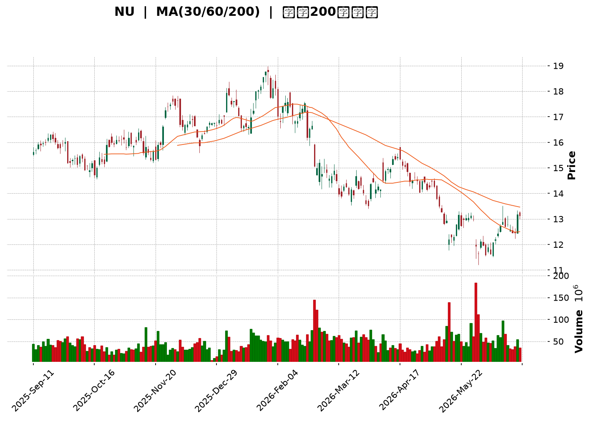
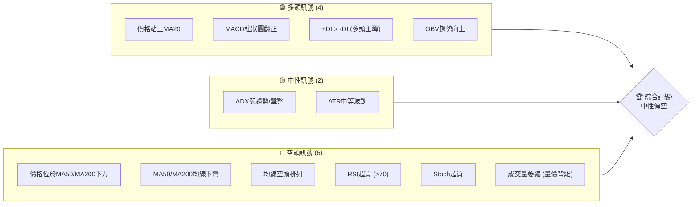
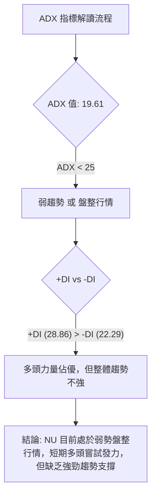
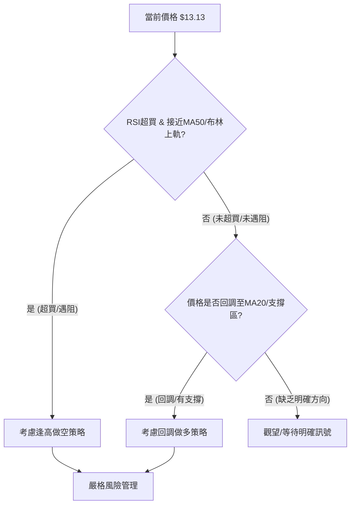

<details>
<summary>📊 靜態圖表 (點擊展開)</summary>

</details>

<html>
<head><meta charset="utf-8" /></head>
<body>
    <div style="height:500px; width:100%;">                        <script>window.PlotlyConfig = {MathJaxConfig: 'local'};</script>
        <script charset="utf-8" src="https://cdn.plot.ly/plotly-3.6.0.min.js" integrity="sha256-QaOVwtVY0T02VaHrr6pnoHLCwayMJp4O5n4YyaE3rJk=" crossorigin="anonymous"></script>                <div id="candlestick-chart" class="plotly-graph-div" style="height:100%; width:100%;"></div>            <script>                window.PLOTLYENV=window.PLOTLYENV || {};                                if (document.getElementById("candlestick-chart")) {                    Plotly.newPlot(                        "candlestick-chart",                        [{"close":{"dtype":"f8","bdata":"AAAAoHA9L0AAAACgR2EvQAAAAIDr0S9AAAAAIK7HL0AAAAAghesvQAAAAEDh+i9AAAAAIIUrMEAAAADAzEwwQAAAAGBmJjBAAAAAYI8CMEAAAAAgXI8vQAAAACBcjy9AAAAAYGbmL0AAAABgjwIwQAAAAKBHYS5AAAAA4KNwLkAAAABguJ4uQAAAAGCPwi5AAAAAYI9CLkAAAAAghesuQAAAAKBwvS5AAAAAQArXLUAAAADA9SguQAAAAIDr0S1AAAAAAClcLkAAAACAwnUtQAAAAAAAAC5AAAAAgOvRLkAAAABA4XouQAAAAIDrUS5AAAAAwMzML0AAAACAFK4vQAAAAAAAADBAAAAAACncL0AAAABAChcwQAAAACBcDzBAAAAAACkcMEAAAACgRyEwQAAAAKCZmS9AAAAAIIUrMEAAAACgR+EvQAAAAKBwvS9AAAAAwB4FMEAAAAAA12MwQAAAAIAULjBAAAAAgBQuL0AAAAAA16MvQAAAAEAzMy9AAAAAANejLkAAAACA61EvQAAAAADXoy5AAAAAIK7HL0AAAABACtcvQAAAAAApnDBAAAAAAABAMUAAAAAA12MxQAAAAEDhejFAAAAAACmcMUAAAADgo3AxQAAAAGBmpjFAAAAAQDOzMEAAAABguJ4wQAAAAIAUrjBAAAAA4KOwMEAAAACA69EwQAAAAGBm5jBAAAAAYGamMEAAAABAMzMwQAAAAOBRuC9AAAAAwB5FMEAAAABAClcwQAAAAGC4njBAAAAAYI\u002fCMEAAAACgcL0wQAAAAGCPwjBAAAAAwPWoMEAAAACgR+EwQAAAAKBwvTBAAAAAwB4FMUAAAADgo\u002fAxQAAAAAAp3DFAAAAAAACAMUAAAAAAKZwxQAAAAIDCdTFAAAAAgD0KMUAAAAAgXI8wQAAAAADXozBAAAAAACmcMEAAAACgmZkwQAAAAOBR+DBAAAAAoHA9MUAAAAAAAAAyQAAAAIA9CjJAAAAAgBQuMkAAAADAzIwyQAAAAGCPwjJAAAAAYI\u002fCMkAAAAAAAMAxQAAAAAApHDJAAAAAYLgeMkAAAADAHgUxQAAAACBczzBAAAAAYGZmMUAAAADAzIwxQAAAAIDrkTFAAAAAwPVoMUAAAACAPQoxQAAAAIDr0TBAAAAAgOvRMEAAAAAghSsxQAAAAIDrUTFAAAAAIK6HMUAAAADgozAwQAAAACCuhzBAAAAAYGamMEAAAABguB4uQAAAAIDC9S1AAAAAoEdhLkAAAADAHoUtQAAAAAAAAC5AAAAAANejLUAAAADA9SgtQAAAAEAKVy1AAAAAYI\u002fCLUAAAABA4fosQAAAAOCj8CtAAAAAIK7HK0AAAACAPYosQAAAAAAAgCxAAAAA4KPwK0AAAACA61EsQAAAAKBH4StAAAAAAClcLUAAAACgR2EsQAAAAADXoyxAAAAAgD0KLEAAAABAMzMrQAAAAMAeBStAAAAAoHC9LEAAAACgR+EsQAAAAMDMTCxAAAAAwB6FLEAAAADAzEwsQAAAAMAeBS1AAAAAoHC9LUAAAAAghestQAAAAGBm5i1AAAAAQDOzLkAAAACAFK4uQAAAAAAp3C5AAAAAgBSuLkAAAABAMzMuQAAAAKCZGS5AAAAAQDOzLUAAAAAghessQAAAAMAeBS1AAAAAIK5HLUAAAAAAAAAtQAAAAOB6FCxAAAAAgML1LEAAAACgR+EsQAAAAIDrUSxAAAAAAACALEAAAACAwvUsQAAAAMAehSxAAAAAoJmZK0AAAAAAAAArQAAAAIA9iipAAAAAANejKUAAAAAAKdwpQAAAAKBHYShAAAAA4HqUKEAAAADgepQoQAAAAOB6lClAAAAAgOtRKkAAAACAwnUpQAAAAIDC9SlAAAAAIFwPKkAAAACgmRkqQAAAAGCPQipAAAAAQOH6KUAAAAAAKdwnQAAAACCuRydAAAAAoHA9KEAAAADgo\u002fAnQAAAAEAzMydAAAAAYI\u002fCJ0AAAACgcD0nQAAAAIAULihAAAAAoEdhKEAAAAAAKdwoQAAAAOCjcClAAAAAIK7HKUAAAAAghWspQAAAAOB6lClAAAAAgBQuKUAAAAAghesoQAAAACCF6yhAAAAAQApXKkAAAABgj0IqQA=="},"high":{"dtype":"f8","bdata":"AAAAoEehL0AAAACAPYovQAAAAKBHATBAAAAAgOsRMEAAAADAzAwwQAAAAKBHITBAAAAAoJlZMEAAAADAzEwwQAAAAMDMbDBAAAAAYLheMEAAAADgURgwQAAAAKBw\u002fS9AAAAAoJkZMEAAAADgozAwQAAAAMDMDDBAAAAAwMzMLkAAAAAAAMAuQAAAAEDh+i5AAAAA4HoUL0AAAAAAAAAvQAAAAMD1KC9AAAAAYGbmLkAAAACgcD0uQAAAAKBHYS5AAAAAAFaOLkAAAABguJ4uQAAAAGC4Hi5AAAAAIK5HL0AAAACAFC4vQAAAACCF6y5AAAAAANcjMEAAAACgRyEwQAAAAKCZWTBAAAAAgOsRMEAAAADAHkUwQAAAAKBwPTBAAAAAwB5FMEAAAAAAAIAwQAAAAKBwHTBAAAAAIIVrMEAAAABgZmYwQAAAAAAAwC9AAAAA4FE4MEAAAADAzIwwQAAAAAAAgDBAAAAAgOsxMEAAAABgj0IwQAAAAKBwvS9AAAAAoJlZL0AAAADgo3AvQAAAAEAzEzBAAAAAwB4FMEAAAAAgXA8wQAAAAMDMrDBAAAAAoEdhMUAAAACAFI4xQAAAACBcjzFAAAAAQArXMUAAAADgUbgxQAAAAOCj0DFAAAAAQOG6MUAAAABAMxMxQAAAAEDhujBAAAAAoJnZMEAAAAAAKRwxQAAAACBcDzFAAAAAgOsRMUAAAADAHoUwQAAAAMD1KDBAAAAA4CJbMEAAAADgUXgwQAAAAKBHoTBAAAAA4HrUMEAAAADA9cgwQAAAAGCPwjBAAAAAIFzPMEAAAABA4RoxQAAAAMDM7DBAAAAAIFwPMUAAAACAlSMyQAAAAGC4XjJAAAAAYI\u002fCMUAAAACAvp8xQAAAAIDrETJAAAAAIIVrMUAAAACA6xExQAAAAOCjsDBAAAAA4FH4MEAAAABgDq0wQAAAAOCjUDFAAAAAgD2KMUAAAAAAAAAyQAAAAOCjEDJAAAAAYI9CMkAAAAAgXI8yQAAAAMD1yDJAAAAAQOH6MkAAAABguJ4yQAAAAEAKdzJAAAAAYGamMkAAAACAPSoyQAAAAGCPIjFAAAAAIIVrMUAAAABACtcxQAAAAAApvDFAAAAAoHD9MUAAAADAzIwxQAAAAKBH4TBAAAAAAAAAMUAAAABA4XoxQAAAAOCjcDFAAAAAQAqXMUAAAADA9WgxQAAAAEAKlzBAAAAAoJnZMEAAAACgR+EvQAAAAGBmZi5AAAAAQIusLkAAAABguB4uQAAAAIDCtS5AAAAAwMxMLkAAAABAM3MtQAAAAIDrkS1AAAAAgD1KLkAAAACgR+EtQAAAAEAzsyxAAAAAYLieLEAAAACgcL0sQAAAAOB6FC1AAAAAwMyMLEAAAAAAAIAsQAAAAMDMTCxAAAAAQArXLUAAAADAHgUtQAAAAKBHYS1AAAAAYGamLEAAAABgZuYrQAAAAIDrkStAAAAAgOvRLEAAAACgmZktQAAAAIDC9SxAAAAAIK7HLEAAAACA61EsQAAAAMBJzC5AAAAAACncLUAAAADgehQuQAAAACBcDy5AAAAA4KPwLkAAAABguB4vQAAAAKBHIS9AAAAAYLieL0AAAABAM7MuQAAAACBcjy5AAAAA4KNwLkAAAAAA16MtQAAAAOB6FC1AAAAAIIWrLUAAAABAClctQAAAAMAeBS1AAAAAYLgeLUAAAACA61EtQAAAAOCj8CxAAAAAoEfhLEAAAACgmRktQAAAAEAzMy1AAAAAwPWoLEAAAADA9egrQAAAAAApHCtAAAAAgD2KKkAAAABAClcqQAAAACBczyhAAAAAwMzMKEAAAADAzMwoQAAAAKCZmSlAAAAAoJmZKkAAAADAHoUqQAAAAKBHISpAAAAAAClcKkAAAABA4XoqQAAAAAAAgCpAAAAAwMxMKkAAAAAghWsoQAAAAEDheidAAAAAgBRuKEAAAABAM7MoQAAAAKCZGShAAAAAgOsRKEAAAACAFC4oQAAAAIAULihAAAAA4HqUKEAAAABgj0IpQAAAAKCZmSlAAAAAIK4HK0AAAADA9SgqQAAAAKBwPSpAAAAAgOuRKUAAAADgo3ApQAAAAIA9SilAAAAAgBSuKkAAAACgmZkqQA=="},"hovertemplate":"\u003cb\u003e%{x|%Y-%m-%d}\u003c\u002fb\u003e\u003cbr\u003e\u958b: $%{open:.2f}\u003cbr\u003e\u9ad8: $%{high:.2f}\u003cbr\u003e\u4f4e: $%{low:.2f}\u003cbr\u003e\u6536: $%{close:.2f}\u003cextra\u003e\u003c\u002fextra\u003e","low":{"dtype":"f8","bdata":"AAAAgML1LkAAAADgehQvQAAAAMD1aC9AAAAAgOtRL0AAAABgZqYvQAAAAMAexS9AAAAAwB4FMEAAAACAwvUvQAAAACCuBzBAAAAAoPHSL0AAAACAwnUvQAAAAKCZGS9AAAAAwPWoL0AAAADAzEwvQAAAAIDrUS5AAAAAgD0KLkAAAADgUTguQAAAAAAAQC5AAAAAgD0KLkAAAACgmRkuQAAAAIDCdS5AAAAAYI\u002fCLUAAAABACtctQAAAACCuRy1AAAAA4FG4LUAAAABAXjotQAAAAGC4Hi1AAAAAYLgeLkAAAAAgXE8uQAAAAIDrES5AAAAAgMJ1LkAAAAAgBJYvQAAAAEAK1y9AAAAAANejL0AAAAAAKdwvQAAAAADXAzBAAAAAYI\u002fCL0AAAACAFO4vQAAAAGBmZi9AAAAA4HqUL0AAAACAFK4vQAAAAGBm5i5AAAAAwMzML0AAAADAzAwwQAAAACCFCzBAAAAA4FH4LkAAAAAA16MuQAAAAAAAAC9AAAAAwB6FLkAAAACgR2EuQAAAAKCZmS5AAAAAYI+CLkAAAAAgXI8vQAAAAAApXC9AAAAAwPXoMEAAAABAMzMxQAAAACCuRzFAAAAAQOF6MUAAAACAPUoxQAAAAAApXDFAAAAAoJmZMEAAAADgUXgwQAAAAAACSzBAAAAAQAp3MEAAAABAM7MwQAAAAKCZmTBAAAAAoEehMEAAAACAFC4wQAAAAIAULi9AAAAAwCAQMEAAAABAYlAwQAAAAKCZWTBAAAAAIFyPMEAAAABgZqYwQAAAAAApnDBAAAAAgD2KMEAAAACAFK4wQAAAAIDCtTBAAAAAYGamMEAAAACAPSoxQAAAACBczzFAAAAAIK5nMUAAAABguF4xQAAAAADXYzFAAAAAwB4FMUAAAACAPWowQAAAAMDMbDBAAAAAgEGAMEAAAACAFE4wQAAAAKCZWTBAAAAAgOsRMUAAAADgelQxQAAAAIDCtTFAAAAAYGbmMUAAAACgmRkyQAAAAAApXDJAAAAAoHA9MkAAAACAwrUxQAAAAIDCtTFAAAAAQArXMUAAAAAAAOAwQAAAAMDMjDBAAAAAYI\u002fCMEAAAABACjcxQAAAAIA9CjFAAAAAoJlZMUAAAACAwrUwQAAAAGC4XjBAAAAAQAqXMEAAAABACtcwQAAAAMAe5TBAAAAAIIUrMUAAAADgehQwQAAAAKBwvS9AAAAAANeDMEAAAADgehQuQAAAAGBmZi1AAAAAYLieLEAAAABAClcsQAAAAKCZmS1AAAAA4FE4LUAAAADgUXgsQAAAAIDCdSxAAAAAIFwPLUAAAABgj8IsQAAAAGCPwitAAAAAoEehK0AAAABguB4sQAAAAOBReCxAAAAA4HrUK0AAAAAgXA8rQAAAAOB6lCtAAAAA4KNwLEAAAACA61EsQAAAACCFayxAAAAAACncK0AAAADgehQrQAAAAIDr0SpAAAAAYGZmK0AAAAAAKdwsQAAAAAACqytAAAAAwPUoLEAAAACAFK4rQAAAAIDr0SxAAAAAwMzMLEAAAAAgXI8tQAAAAEAzMy1AAAAAoHA9LkAAAACgmZkuQAAAAOB6lC5AAAAAYLieLkAAAAAAKdwtQAAAAOCj8C1AAAAAQApXLUAAAACA65EsQAAAAKBHYSxAAAAAoJkZLUAAAACAwrUsQAAAAOB6FCxAAAAAoJkZLEAAAABgj8IsQAAAAIAULixAAAAAQApXLEAAAACgcH0sQAAAAMD1aCxAAAAAAACAK0AAAABACtcqQAAAAMAehSpAAAAAIK6HKUAAAACAFK4pQAAAACBcjydAAAAAYLgeKEAAAAAghesnQAAAAMD1qChAAAAAYLgeKUAAAAAghWspQAAAAMDMTClAAAAAACncKUAAAAAgrscpQAAAAEDh+ilAAAAAgOvRKUAAAACgR+EmQAAAAGBmZiZAAAAAANejJ0AAAABguN4nQAAAAKCZGSdAAAAAIFxPJ0AAAADgUTgnQAAAAMAeBSdAAAAAIK4HKEAAAAAgXI8oQAAAAOCj8ChAAAAA4HqUKUAAAAAAKVwpQAAAAGBmZilAAAAAAAAAKUAAAACgR+EoQAAAAIDCdShAAAAAANfjKEAAAABA4fopQA=="},"name":"\u50f9\u683c","open":{"dtype":"f8","bdata":"AAAAIFwPL0AAAAAAKVwvQAAAAAAAgC9AAAAAoEfhL0AAAABgZuYvQAAAAGCPAjBAAAAAgOsRMEAAAAAAKRwwQAAAAMDMTDBAAAAAgBQuMEAAAAAAKdwvQAAAAAAp3C9AAAAAYGbmL0AAAAAghesvQAAAAMDMDDBAAAAAgD2KLkAAAAAgXI8uQAAAAKBwvS5AAAAAgOvRLkAAAAAAKVwuQAAAACBcDy9AAAAA4FG4LkAAAADA9SguQAAAAEAzsy1AAAAAAAAALkAAAADgepQuQAAAACCuRy1AAAAAYI9CLkAAAABAM7MuQAAAAADXoy5AAAAAwB6FLkAAAABAChcwQAAAAEDhOjBAAAAAIIXrL0AAAABgZuYvQAAAAIDrETBAAAAAACkcMEAAAADgozAwQAAAAKCZmS9AAAAA4FG4L0AAAABguF4wQAAAAADXoy9AAAAAoJkZMEAAAABAChcwQAAAAIDCdTBAAAAAgD0KMEAAAAAAKdwuQAAAAOBReC9AAAAAwMzMLkAAAADAzIwuQAAAAIAUri9AAAAAgMK1LkAAAAAAAAAwQAAAAEAK1y9AAAAAQOH6MEAAAAAA12MxQAAAAIAUbjFAAAAAgMK1MUAAAABAM7MxQAAAAGBmpjFAAAAAQDOzMUAAAABguN4wQAAAAMAeZTBAAAAAoJmZMEAAAABA4bowQAAAACCu5zBAAAAAYGYGMUAAAAAAAIAwQAAAAEAKFzBAAAAAYGYmMEAAAACgmVkwQAAAACCFazBAAAAA4KOwMEAAAABAM7MwQAAAAKBwvTBAAAAAgD2qMEAAAADAHsUwQAAAAGC43jBAAAAAIFwPMUAAAACAFC4xQAAAAGC4HjJAAAAAYLieMUAAAABACpcxQAAAAIAUrjFAAAAAoJlZMUAAAAAgXA8xQAAAAOCjkDBAAAAAAADAMEAAAACA65EwQAAAAAApXDBAAAAAYI8iMUAAAACAPaoxQAAAAAAAADJAAAAAwMwMMkAAAAAAKVwyQAAAAGCPojJAAAAA4HrUMkAAAAAgrocyQAAAAKBwvTFAAAAAIK5nMkAAAADgehQyQAAAAOB61DBAAAAAIIUrMUAAAADgo3AxQAAAAGBmJjFAAAAAgOvxMUAAAADA9YgxQAAAAKBwvTBAAAAAAADAMEAAAABAM\u002fMwQAAAAADXIzFAAAAAQDMzMUAAAAAAAEAxQAAAAOCjMDBAAAAAANeDMEAAAABACtcvQAAAAOCjcC1AAAAAIIXrLEAAAAAAKVwtQAAAAKBw\u002fS1AAAAAACncLUAAAABgjwItQAAAAIDr0SxAAAAAQOF6LUAAAAAAAIAtQAAAAGBmZixAAAAAANcjLEAAAACgcD0sQAAAAMDMzCxAAAAA4KNwLEAAAAAAKVwrQAAAAKBwPSxAAAAAoEehLEAAAADgUfgsQAAAAGCPQi1AAAAAYI9CLEAAAACAwnUrQAAAACCFaytAAAAAoJmZK0AAAACAFC4tQAAAAAAAACxAAAAAYI9CLEAAAABAMzMsQAAAACCFay5AAAAAwB4FLUAAAAAAKdwtQAAAAIAUri1AAAAAYI9CLkAAAAAghesuQAAAACCuxy5AAAAAYLieL0AAAABA4XouQAAAAOBROC5AAAAAAClcLkAAAABguJ4tQAAAAEAK1yxAAAAAIK5HLUAAAADgehQtQAAAAIDC9SxAAAAA4HpULEAAAACA61EtQAAAACCuxyxAAAAAANejLEAAAAAAAAAtQAAAAAAAAC1AAAAAoJmZLEAAAABgj8IrQAAAAEAK1ypAAAAAIIVrKkAAAABAM7MpQAAAAECJAShAAAAAwMzMKEAAAADgelQoQAAAAIAUrihAAAAA4FE4KUAAAADAzEwqQAAAACCuBypAAAAAIIXrKUAAAADgo\u002fApQAAAAKCZGSpAAAAAAAAAKkAAAABA4fonQAAAAMDMTCdAAAAAYI\u002fCJ0AAAABAMzMoQAAAAMAeBShAAAAA4KNwJ0AAAACgmZknQAAAAADXIydAAAAAQApXKEAAAACAFK4oQAAAAMAeBSlAAAAA4HqUKUAAAAAgXA8qQAAAACBcjylAAAAAgD0KKUAAAACgmRkpQAAAAIDC9ShAAAAAANfjKEAAAADAHoUqQA=="},"x":["2025-09-11T00:00:00-04:00","2025-09-12T00:00:00-04:00","2025-09-15T00:00:00-04:00","2025-09-16T00:00:00-04:00","2025-09-17T00:00:00-04:00","2025-09-18T00:00:00-04:00","2025-09-19T00:00:00-04:00","2025-09-22T00:00:00-04:00","2025-09-23T00:00:00-04:00","2025-09-24T00:00:00-04:00","2025-09-25T00:00:00-04:00","2025-09-26T00:00:00-04:00","2025-09-29T00:00:00-04:00","2025-09-30T00:00:00-04:00","2025-10-01T00:00:00-04:00","2025-10-02T00:00:00-04:00","2025-10-03T00:00:00-04:00","2025-10-06T00:00:00-04:00","2025-10-07T00:00:00-04:00","2025-10-08T00:00:00-04:00","2025-10-09T00:00:00-04:00","2025-10-10T00:00:00-04:00","2025-10-13T00:00:00-04:00","2025-10-14T00:00:00-04:00","2025-10-15T00:00:00-04:00","2025-10-16T00:00:00-04:00","2025-10-17T00:00:00-04:00","2025-10-20T00:00:00-04:00","2025-10-21T00:00:00-04:00","2025-10-22T00:00:00-04:00","2025-10-23T00:00:00-04:00","2025-10-24T00:00:00-04:00","2025-10-27T00:00:00-04:00","2025-10-28T00:00:00-04:00","2025-10-29T00:00:00-04:00","2025-10-30T00:00:00-04:00","2025-10-31T00:00:00-04:00","2025-11-03T00:00:00-05:00","2025-11-04T00:00:00-05:00","2025-11-05T00:00:00-05:00","2025-11-06T00:00:00-05:00","2025-11-07T00:00:00-05:00","2025-11-10T00:00:00-05:00","2025-11-11T00:00:00-05:00","2025-11-12T00:00:00-05:00","2025-11-13T00:00:00-05:00","2025-11-14T00:00:00-05:00","2025-11-17T00:00:00-05:00","2025-11-18T00:00:00-05:00","2025-11-19T00:00:00-05:00","2025-11-20T00:00:00-05:00","2025-11-21T00:00:00-05:00","2025-11-24T00:00:00-05:00","2025-11-25T00:00:00-05:00","2025-11-26T00:00:00-05:00","2025-11-28T00:00:00-05:00","2025-12-01T00:00:00-05:00","2025-12-02T00:00:00-05:00","2025-12-03T00:00:00-05:00","2025-12-04T00:00:00-05:00","2025-12-05T00:00:00-05:00","2025-12-08T00:00:00-05:00","2025-12-09T00:00:00-05:00","2025-12-10T00:00:00-05:00","2025-12-11T00:00:00-05:00","2025-12-12T00:00:00-05:00","2025-12-15T00:00:00-05:00","2025-12-16T00:00:00-05:00","2025-12-17T00:00:00-05:00","2025-12-18T00:00:00-05:00","2025-12-19T00:00:00-05:00","2025-12-22T00:00:00-05:00","2025-12-23T00:00:00-05:00","2025-12-24T00:00:00-05:00","2025-12-26T00:00:00-05:00","2025-12-29T00:00:00-05:00","2025-12-30T00:00:00-05:00","2025-12-31T00:00:00-05:00","2026-01-02T00:00:00-05:00","2026-01-05T00:00:00-05:00","2026-01-06T00:00:00-05:00","2026-01-07T00:00:00-05:00","2026-01-08T00:00:00-05:00","2026-01-09T00:00:00-05:00","2026-01-12T00:00:00-05:00","2026-01-13T00:00:00-05:00","2026-01-14T00:00:00-05:00","2026-01-15T00:00:00-05:00","2026-01-16T00:00:00-05:00","2026-01-20T00:00:00-05:00","2026-01-21T00:00:00-05:00","2026-01-22T00:00:00-05:00","2026-01-23T00:00:00-05:00","2026-01-26T00:00:00-05:00","2026-01-27T00:00:00-05:00","2026-01-28T00:00:00-05:00","2026-01-29T00:00:00-05:00","2026-01-30T00:00:00-05:00","2026-02-02T00:00:00-05:00","2026-02-03T00:00:00-05:00","2026-02-04T00:00:00-05:00","2026-02-05T00:00:00-05:00","2026-02-06T00:00:00-05:00","2026-02-09T00:00:00-05:00","2026-02-10T00:00:00-05:00","2026-02-11T00:00:00-05:00","2026-02-12T00:00:00-05:00","2026-02-13T00:00:00-05:00","2026-02-17T00:00:00-05:00","2026-02-18T00:00:00-05:00","2026-02-19T00:00:00-05:00","2026-02-20T00:00:00-05:00","2026-02-23T00:00:00-05:00","2026-02-24T00:00:00-05:00","2026-02-25T00:00:00-05:00","2026-02-26T00:00:00-05:00","2026-02-27T00:00:00-05:00","2026-03-02T00:00:00-05:00","2026-03-03T00:00:00-05:00","2026-03-04T00:00:00-05:00","2026-03-05T00:00:00-05:00","2026-03-06T00:00:00-05:00","2026-03-09T00:00:00-04:00","2026-03-10T00:00:00-04:00","2026-03-11T00:00:00-04:00","2026-03-12T00:00:00-04:00","2026-03-13T00:00:00-04:00","2026-03-16T00:00:00-04:00","2026-03-17T00:00:00-04:00","2026-03-18T00:00:00-04:00","2026-03-19T00:00:00-04:00","2026-03-20T00:00:00-04:00","2026-03-23T00:00:00-04:00","2026-03-24T00:00:00-04:00","2026-03-25T00:00:00-04:00","2026-03-26T00:00:00-04:00","2026-03-27T00:00:00-04:00","2026-03-30T00:00:00-04:00","2026-03-31T00:00:00-04:00","2026-04-01T00:00:00-04:00","2026-04-02T00:00:00-04:00","2026-04-06T00:00:00-04:00","2026-04-07T00:00:00-04:00","2026-04-08T00:00:00-04:00","2026-04-09T00:00:00-04:00","2026-04-10T00:00:00-04:00","2026-04-13T00:00:00-04:00","2026-04-14T00:00:00-04:00","2026-04-15T00:00:00-04:00","2026-04-16T00:00:00-04:00","2026-04-17T00:00:00-04:00","2026-04-20T00:00:00-04:00","2026-04-21T00:00:00-04:00","2026-04-22T00:00:00-04:00","2026-04-23T00:00:00-04:00","2026-04-24T00:00:00-04:00","2026-04-27T00:00:00-04:00","2026-04-28T00:00:00-04:00","2026-04-29T00:00:00-04:00","2026-04-30T00:00:00-04:00","2026-05-01T00:00:00-04:00","2026-05-04T00:00:00-04:00","2026-05-05T00:00:00-04:00","2026-05-06T00:00:00-04:00","2026-05-07T00:00:00-04:00","2026-05-08T00:00:00-04:00","2026-05-11T00:00:00-04:00","2026-05-12T00:00:00-04:00","2026-05-13T00:00:00-04:00","2026-05-14T00:00:00-04:00","2026-05-15T00:00:00-04:00","2026-05-18T00:00:00-04:00","2026-05-19T00:00:00-04:00","2026-05-20T00:00:00-04:00","2026-05-21T00:00:00-04:00","2026-05-22T00:00:00-04:00","2026-05-26T00:00:00-04:00","2026-05-27T00:00:00-04:00","2026-05-28T00:00:00-04:00","2026-05-29T00:00:00-04:00","2026-06-01T00:00:00-04:00","2026-06-02T00:00:00-04:00","2026-06-03T00:00:00-04:00","2026-06-04T00:00:00-04:00","2026-06-05T00:00:00-04:00","2026-06-08T00:00:00-04:00","2026-06-09T00:00:00-04:00","2026-06-10T00:00:00-04:00","2026-06-11T00:00:00-04:00","2026-06-12T00:00:00-04:00","2026-06-15T00:00:00-04:00","2026-06-16T00:00:00-04:00","2026-06-17T00:00:00-04:00","2026-06-18T00:00:00-04:00","2026-06-22T00:00:00-04:00","2026-06-23T00:00:00-04:00","2026-06-24T00:00:00-04:00","2026-06-25T00:00:00-04:00","2026-06-26T00:00:00-04:00","2026-06-29T00:00:00-04:00"],"type":"candlestick"},{"hovertemplate":"MA30: $%{y:.2f}\u003cextra\u003e\u003c\u002fextra\u003e","line":{"color":"#2196F3","dash":"dash","width":2},"mode":"lines","name":"MA30","x":["2025-09-11T00:00:00-04:00","2025-09-12T00:00:00-04:00","2025-09-15T00:00:00-04:00","2025-09-16T00:00:00-04:00","2025-09-17T00:00:00-04:00","2025-09-18T00:00:00-04:00","2025-09-19T00:00:00-04:00","2025-09-22T00:00:00-04:00","2025-09-23T00:00:00-04:00","2025-09-24T00:00:00-04:00","2025-09-25T00:00:00-04:00","2025-09-26T00:00:00-04:00","2025-09-29T00:00:00-04:00","2025-09-30T00:00:00-04:00","2025-10-01T00:00:00-04:00","2025-10-02T00:00:00-04:00","2025-10-03T00:00:00-04:00","2025-10-06T00:00:00-04:00","2025-10-07T00:00:00-04:00","2025-10-08T00:00:00-04:00","2025-10-09T00:00:00-04:00","2025-10-10T00:00:00-04:00","2025-10-13T00:00:00-04:00","2025-10-14T00:00:00-04:00","2025-10-15T00:00:00-04:00","2025-10-16T00:00:00-04:00","2025-10-17T00:00:00-04:00","2025-10-20T00:00:00-04:00","2025-10-21T00:00:00-04:00","2025-10-22T00:00:00-04:00","2025-10-23T00:00:00-04:00","2025-10-24T00:00:00-04:00","2025-10-27T00:00:00-04:00","2025-10-28T00:00:00-04:00","2025-10-29T00:00:00-04:00","2025-10-30T00:00:00-04:00","2025-10-31T00:00:00-04:00","2025-11-03T00:00:00-05:00","2025-11-04T00:00:00-05:00","2025-11-05T00:00:00-05:00","2025-11-06T00:00:00-05:00","2025-11-07T00:00:00-05:00","2025-11-10T00:00:00-05:00","2025-11-11T00:00:00-05:00","2025-11-12T00:00:00-05:00","2025-11-13T00:00:00-05:00","2025-11-14T00:00:00-05:00","2025-11-17T00:00:00-05:00","2025-11-18T00:00:00-05:00","2025-11-19T00:00:00-05:00","2025-11-20T00:00:00-05:00","2025-11-21T00:00:00-05:00","2025-11-24T00:00:00-05:00","2025-11-25T00:00:00-05:00","2025-11-26T00:00:00-05:00","2025-11-28T00:00:00-05:00","2025-12-01T00:00:00-05:00","2025-12-02T00:00:00-05:00","2025-12-03T00:00:00-05:00","2025-12-04T00:00:00-05:00","2025-12-05T00:00:00-05:00","2025-12-08T00:00:00-05:00","2025-12-09T00:00:00-05:00","2025-12-10T00:00:00-05:00","2025-12-11T00:00:00-05:00","2025-12-12T00:00:00-05:00","2025-12-15T00:00:00-05:00","2025-12-16T00:00:00-05:00","2025-12-17T00:00:00-05:00","2025-12-18T00:00:00-05:00","2025-12-19T00:00:00-05:00","2025-12-22T00:00:00-05:00","2025-12-23T00:00:00-05:00","2025-12-24T00:00:00-05:00","2025-12-26T00:00:00-05:00","2025-12-29T00:00:00-05:00","2025-12-30T00:00:00-05:00","2025-12-31T00:00:00-05:00","2026-01-02T00:00:00-05:00","2026-01-05T00:00:00-05:00","2026-01-06T00:00:00-05:00","2026-01-07T00:00:00-05:00","2026-01-08T00:00:00-05:00","2026-01-09T00:00:00-05:00","2026-01-12T00:00:00-05:00","2026-01-13T00:00:00-05:00","2026-01-14T00:00:00-05:00","2026-01-15T00:00:00-05:00","2026-01-16T00:00:00-05:00","2026-01-20T00:00:00-05:00","2026-01-21T00:00:00-05:00","2026-01-22T00:00:00-05:00","2026-01-23T00:00:00-05:00","2026-01-26T00:00:00-05:00","2026-01-27T00:00:00-05:00","2026-01-28T00:00:00-05:00","2026-01-29T00:00:00-05:00","2026-01-30T00:00:00-05:00","2026-02-02T00:00:00-05:00","2026-02-03T00:00:00-05:00","2026-02-04T00:00:00-05:00","2026-02-05T00:00:00-05:00","2026-02-06T00:00:00-05:00","2026-02-09T00:00:00-05:00","2026-02-10T00:00:00-05:00","2026-02-11T00:00:00-05:00","2026-02-12T00:00:00-05:00","2026-02-13T00:00:00-05:00","2026-02-17T00:00:00-05:00","2026-02-18T00:00:00-05:00","2026-02-19T00:00:00-05:00","2026-02-20T00:00:00-05:00","2026-02-23T00:00:00-05:00","2026-02-24T00:00:00-05:00","2026-02-25T00:00:00-05:00","2026-02-26T00:00:00-05:00","2026-02-27T00:00:00-05:00","2026-03-02T00:00:00-05:00","2026-03-03T00:00:00-05:00","2026-03-04T00:00:00-05:00","2026-03-05T00:00:00-05:00","2026-03-06T00:00:00-05:00","2026-03-09T00:00:00-04:00","2026-03-10T00:00:00-04:00","2026-03-11T00:00:00-04:00","2026-03-12T00:00:00-04:00","2026-03-13T00:00:00-04:00","2026-03-16T00:00:00-04:00","2026-03-17T00:00:00-04:00","2026-03-18T00:00:00-04:00","2026-03-19T00:00:00-04:00","2026-03-20T00:00:00-04:00","2026-03-23T00:00:00-04:00","2026-03-24T00:00:00-04:00","2026-03-25T00:00:00-04:00","2026-03-26T00:00:00-04:00","2026-03-27T00:00:00-04:00","2026-03-30T00:00:00-04:00","2026-03-31T00:00:00-04:00","2026-04-01T00:00:00-04:00","2026-04-02T00:00:00-04:00","2026-04-06T00:00:00-04:00","2026-04-07T00:00:00-04:00","2026-04-08T00:00:00-04:00","2026-04-09T00:00:00-04:00","2026-04-10T00:00:00-04:00","2026-04-13T00:00:00-04:00","2026-04-14T00:00:00-04:00","2026-04-15T00:00:00-04:00","2026-04-16T00:00:00-04:00","2026-04-17T00:00:00-04:00","2026-04-20T00:00:00-04:00","2026-04-21T00:00:00-04:00","2026-04-22T00:00:00-04:00","2026-04-23T00:00:00-04:00","2026-04-24T00:00:00-04:00","2026-04-27T00:00:00-04:00","2026-04-28T00:00:00-04:00","2026-04-29T00:00:00-04:00","2026-04-30T00:00:00-04:00","2026-05-01T00:00:00-04:00","2026-05-04T00:00:00-04:00","2026-05-05T00:00:00-04:00","2026-05-06T00:00:00-04:00","2026-05-07T00:00:00-04:00","2026-05-08T00:00:00-04:00","2026-05-11T00:00:00-04:00","2026-05-12T00:00:00-04:00","2026-05-13T00:00:00-04:00","2026-05-14T00:00:00-04:00","2026-05-15T00:00:00-04:00","2026-05-18T00:00:00-04:00","2026-05-19T00:00:00-04:00","2026-05-20T00:00:00-04:00","2026-05-21T00:00:00-04:00","2026-05-22T00:00:00-04:00","2026-05-26T00:00:00-04:00","2026-05-27T00:00:00-04:00","2026-05-28T00:00:00-04:00","2026-05-29T00:00:00-04:00","2026-06-01T00:00:00-04:00","2026-06-02T00:00:00-04:00","2026-06-03T00:00:00-04:00","2026-06-04T00:00:00-04:00","2026-06-05T00:00:00-04:00","2026-06-08T00:00:00-04:00","2026-06-09T00:00:00-04:00","2026-06-10T00:00:00-04:00","2026-06-11T00:00:00-04:00","2026-06-12T00:00:00-04:00","2026-06-15T00:00:00-04:00","2026-06-16T00:00:00-04:00","2026-06-17T00:00:00-04:00","2026-06-18T00:00:00-04:00","2026-06-22T00:00:00-04:00","2026-06-23T00:00:00-04:00","2026-06-24T00:00:00-04:00","2026-06-25T00:00:00-04:00","2026-06-26T00:00:00-04:00","2026-06-29T00:00:00-04:00"],"y":{"dtype":"f8","bdata":"AAAAAAAA+H8AAAAAAAD4fwAAAAAAAPh\u002fAAAAAAAA+H8AAAAAAAD4fwAAAAAAAPh\u002fAAAAAAAA+H8AAAAAAAD4fwAAAAAAAPh\u002fAAAAAAAA+H8AAAAAAAD4fwAAAAAAAPh\u002fAAAAAAAA+H8AAAAAAAD4fwAAAAAAAPh\u002fAAAAAAAA+H8AAAAAAAD4fwAAAAAAAPh\u002fAAAAAAAA+H8AAAAAAAD4fwAAAAAAAPh\u002fAAAAAAAA+H8AAAAAAAD4fwAAAAAAAPh\u002fAAAAAAAA+H8AAAAAAAD4fwAAAAAAAPh\u002fAAAAAAAA+H8AAAAAAAD4f2ZmZiZcDy9AzczMfCMUL0CamZnZshYvQBERERE8GC9ARERE1OoYL0Dv7u7OIhsvQERERKRUHC9AAAAAgE4bL0AiIiLCZxgvQGZmZpZuEi9AMzMzoykVL0AAAACw5BcvQHd3d+dtGS9A3t3dvZ8aL0C8u7v7GyEvQM3MzFwBMi9Aq6qq6lE4L0AzMzMjBkEvQFVVVVXHRC9AREREdAVIL0BEREREb0svQAAAANCUSi9A7+7uziJbL0AzMzPTeGkvQN7d3T18hi9AVVVVNdCpL0DNzMzsNdcvQKuqqprEADBARERElIoTMEDe3d2NUCYwQKuqqgqQOzBAvLu7q2NCMEC8u7ubC0kwQHd3dxfZTjBAZmZmVlVVMEC8u7sLkFswQN7d3Q27YjBAMzMzs1ZnMEDv7u6e72cwQBEREbFyaDBAVVVVJU1pMEDe3d31tmwwQM3MzFwdczBAq6qq6m15MEARERGBanwwQImIiIhdgTBAvLu7+36KMEBmZmaWipMwQERERPREnTBAmpmZqcarMEBmZmZmO78wQN7d3R3o1DBA7+7uNqXiMEC8u7sTEfEwQFVVVe1R+DBAVVVVLYf2MEC8u7sDcu8wQJqZmQFH6DBAEREReb7fMEDv7u52k9gwQDMzM\u002fvF0jBAiYiIoGHXMEAAAABIKOMwQHd3dz\u002fD7jBAvLu7M3r7MECamZlxPQoxQFVVVa0cGjFAMzMzCx4sMUCamZkRWDkxQFVVVUWLTDFAiYiIqFRcMUBEREQkImIxQDMzMzPBYzFAzczMTDdpMUBVVVXFIHAxQN7d3T0KdzFAREREpHB9MUC8u7srzn4xQO\u002fu7u58fzFAZmZmBsh9MUDv7u7uNXcxQImIiEiacjFAIiIi0ttyMUCJiIjIvWYxQLy7uyvOXjFAMzMzM3pbMUDv7u5mrU4xQLy7uxODQDFAmpmZCWU0MUDv7u5+sSQxQHd3d\u002ffhEzFAVVVVZTv\u002fMECrqqpKDOIwQJqZmWlKxTBAvLu7cyGpMEB3d3c\u002ffIYwQFVVVVWcXTBAAAAAqA00MEAzMzN7WxYwQM3MzFzW6i9AvLu7uwKkL0AzMzMzM3MvQKuqqvo3Qi9A7+7uHswTL0Dv7u4OdNouQHd3d5f8oi5AVVVVdSFpLkDe3d3day4uQCIiIkLu9S1AvLu7Cx7MLUDe3d19hp0tQM3MzIxsZy1AMzMzs50vLUDNzMzMzAwtQImIiEhT6ixAiYiIWPLLLEAAAABwPcosQN7d3V26ySxAvLu7a3XMLECrqqp6W9YsQN7d3S2y3SxAiYiIGJLmLEAzMzMDcu8sQCIiIkLu9SxAAAAAMGv1LEDe3d0d6PQsQJqZmWkf\u002fixAZmZmNuwKLUCJiIgY2Q4tQHd3d5dDCy1AAAAA0PcTLUBmZmYmvxgtQImIiFiAHC1AVVVVpSkVLUDNzMysHBotQImIiIgWGS1AZmZmVlUVLUDe3d1toBMtQKuqqtqHDy1AzczMzBP1LEAzMzODTtssQERERCTbuSxAREREFDyYLEDe3d2dfXgsQCIiItIiWyxAd3d3t\u002fM9LEAiIiKy5BcsQCIiIqJF9itAVVVVZa3OK0C8u7s7mKcrQBEREWFXgCtAIiIiEjxYK0AREREhIiIrQM3MzJzv5ypA7+7uDli5KkBVVVUV2Y4qQJqZmRkvXSpAmpmZeRQuKkAAAACQ7fwpQCIiIuKl2ylAiYiIuJC0KUBmZmbmQpIpQCIiInKveSlAREREhHliKUBVVVVFREQpQN7d3b0tKylAvLu7K4cWKUB3d3dXxwQpQFVVVWX09ihAIiIiku38KEAiIiJiVwApQA=="},"type":"scatter"},{"hovertemplate":"MA60: $%{y:.2f}\u003cextra\u003e\u003c\u002fextra\u003e","line":{"color":"#9C27B0","dash":"dash","width":2},"mode":"lines","name":"MA60","x":["2025-09-11T00:00:00-04:00","2025-09-12T00:00:00-04:00","2025-09-15T00:00:00-04:00","2025-09-16T00:00:00-04:00","2025-09-17T00:00:00-04:00","2025-09-18T00:00:00-04:00","2025-09-19T00:00:00-04:00","2025-09-22T00:00:00-04:00","2025-09-23T00:00:00-04:00","2025-09-24T00:00:00-04:00","2025-09-25T00:00:00-04:00","2025-09-26T00:00:00-04:00","2025-09-29T00:00:00-04:00","2025-09-30T00:00:00-04:00","2025-10-01T00:00:00-04:00","2025-10-02T00:00:00-04:00","2025-10-03T00:00:00-04:00","2025-10-06T00:00:00-04:00","2025-10-07T00:00:00-04:00","2025-10-08T00:00:00-04:00","2025-10-09T00:00:00-04:00","2025-10-10T00:00:00-04:00","2025-10-13T00:00:00-04:00","2025-10-14T00:00:00-04:00","2025-10-15T00:00:00-04:00","2025-10-16T00:00:00-04:00","2025-10-17T00:00:00-04:00","2025-10-20T00:00:00-04:00","2025-10-21T00:00:00-04:00","2025-10-22T00:00:00-04:00","2025-10-23T00:00:00-04:00","2025-10-24T00:00:00-04:00","2025-10-27T00:00:00-04:00","2025-10-28T00:00:00-04:00","2025-10-29T00:00:00-04:00","2025-10-30T00:00:00-04:00","2025-10-31T00:00:00-04:00","2025-11-03T00:00:00-05:00","2025-11-04T00:00:00-05:00","2025-11-05T00:00:00-05:00","2025-11-06T00:00:00-05:00","2025-11-07T00:00:00-05:00","2025-11-10T00:00:00-05:00","2025-11-11T00:00:00-05:00","2025-11-12T00:00:00-05:00","2025-11-13T00:00:00-05:00","2025-11-14T00:00:00-05:00","2025-11-17T00:00:00-05:00","2025-11-18T00:00:00-05:00","2025-11-19T00:00:00-05:00","2025-11-20T00:00:00-05:00","2025-11-21T00:00:00-05:00","2025-11-24T00:00:00-05:00","2025-11-25T00:00:00-05:00","2025-11-26T00:00:00-05:00","2025-11-28T00:00:00-05:00","2025-12-01T00:00:00-05:00","2025-12-02T00:00:00-05:00","2025-12-03T00:00:00-05:00","2025-12-04T00:00:00-05:00","2025-12-05T00:00:00-05:00","2025-12-08T00:00:00-05:00","2025-12-09T00:00:00-05:00","2025-12-10T00:00:00-05:00","2025-12-11T00:00:00-05:00","2025-12-12T00:00:00-05:00","2025-12-15T00:00:00-05:00","2025-12-16T00:00:00-05:00","2025-12-17T00:00:00-05:00","2025-12-18T00:00:00-05:00","2025-12-19T00:00:00-05:00","2025-12-22T00:00:00-05:00","2025-12-23T00:00:00-05:00","2025-12-24T00:00:00-05:00","2025-12-26T00:00:00-05:00","2025-12-29T00:00:00-05:00","2025-12-30T00:00:00-05:00","2025-12-31T00:00:00-05:00","2026-01-02T00:00:00-05:00","2026-01-05T00:00:00-05:00","2026-01-06T00:00:00-05:00","2026-01-07T00:00:00-05:00","2026-01-08T00:00:00-05:00","2026-01-09T00:00:00-05:00","2026-01-12T00:00:00-05:00","2026-01-13T00:00:00-05:00","2026-01-14T00:00:00-05:00","2026-01-15T00:00:00-05:00","2026-01-16T00:00:00-05:00","2026-01-20T00:00:00-05:00","2026-01-21T00:00:00-05:00","2026-01-22T00:00:00-05:00","2026-01-23T00:00:00-05:00","2026-01-26T00:00:00-05:00","2026-01-27T00:00:00-05:00","2026-01-28T00:00:00-05:00","2026-01-29T00:00:00-05:00","2026-01-30T00:00:00-05:00","2026-02-02T00:00:00-05:00","2026-02-03T00:00:00-05:00","2026-02-04T00:00:00-05:00","2026-02-05T00:00:00-05:00","2026-02-06T00:00:00-05:00","2026-02-09T00:00:00-05:00","2026-02-10T00:00:00-05:00","2026-02-11T00:00:00-05:00","2026-02-12T00:00:00-05:00","2026-02-13T00:00:00-05:00","2026-02-17T00:00:00-05:00","2026-02-18T00:00:00-05:00","2026-02-19T00:00:00-05:00","2026-02-20T00:00:00-05:00","2026-02-23T00:00:00-05:00","2026-02-24T00:00:00-05:00","2026-02-25T00:00:00-05:00","2026-02-26T00:00:00-05:00","2026-02-27T00:00:00-05:00","2026-03-02T00:00:00-05:00","2026-03-03T00:00:00-05:00","2026-03-04T00:00:00-05:00","2026-03-05T00:00:00-05:00","2026-03-06T00:00:00-05:00","2026-03-09T00:00:00-04:00","2026-03-10T00:00:00-04:00","2026-03-11T00:00:00-04:00","2026-03-12T00:00:00-04:00","2026-03-13T00:00:00-04:00","2026-03-16T00:00:00-04:00","2026-03-17T00:00:00-04:00","2026-03-18T00:00:00-04:00","2026-03-19T00:00:00-04:00","2026-03-20T00:00:00-04:00","2026-03-23T00:00:00-04:00","2026-03-24T00:00:00-04:00","2026-03-25T00:00:00-04:00","2026-03-26T00:00:00-04:00","2026-03-27T00:00:00-04:00","2026-03-30T00:00:00-04:00","2026-03-31T00:00:00-04:00","2026-04-01T00:00:00-04:00","2026-04-02T00:00:00-04:00","2026-04-06T00:00:00-04:00","2026-04-07T00:00:00-04:00","2026-04-08T00:00:00-04:00","2026-04-09T00:00:00-04:00","2026-04-10T00:00:00-04:00","2026-04-13T00:00:00-04:00","2026-04-14T00:00:00-04:00","2026-04-15T00:00:00-04:00","2026-04-16T00:00:00-04:00","2026-04-17T00:00:00-04:00","2026-04-20T00:00:00-04:00","2026-04-21T00:00:00-04:00","2026-04-22T00:00:00-04:00","2026-04-23T00:00:00-04:00","2026-04-24T00:00:00-04:00","2026-04-27T00:00:00-04:00","2026-04-28T00:00:00-04:00","2026-04-29T00:00:00-04:00","2026-04-30T00:00:00-04:00","2026-05-01T00:00:00-04:00","2026-05-04T00:00:00-04:00","2026-05-05T00:00:00-04:00","2026-05-06T00:00:00-04:00","2026-05-07T00:00:00-04:00","2026-05-08T00:00:00-04:00","2026-05-11T00:00:00-04:00","2026-05-12T00:00:00-04:00","2026-05-13T00:00:00-04:00","2026-05-14T00:00:00-04:00","2026-05-15T00:00:00-04:00","2026-05-18T00:00:00-04:00","2026-05-19T00:00:00-04:00","2026-05-20T00:00:00-04:00","2026-05-21T00:00:00-04:00","2026-05-22T00:00:00-04:00","2026-05-26T00:00:00-04:00","2026-05-27T00:00:00-04:00","2026-05-28T00:00:00-04:00","2026-05-29T00:00:00-04:00","2026-06-01T00:00:00-04:00","2026-06-02T00:00:00-04:00","2026-06-03T00:00:00-04:00","2026-06-04T00:00:00-04:00","2026-06-05T00:00:00-04:00","2026-06-08T00:00:00-04:00","2026-06-09T00:00:00-04:00","2026-06-10T00:00:00-04:00","2026-06-11T00:00:00-04:00","2026-06-12T00:00:00-04:00","2026-06-15T00:00:00-04:00","2026-06-16T00:00:00-04:00","2026-06-17T00:00:00-04:00","2026-06-18T00:00:00-04:00","2026-06-22T00:00:00-04:00","2026-06-23T00:00:00-04:00","2026-06-24T00:00:00-04:00","2026-06-25T00:00:00-04:00","2026-06-26T00:00:00-04:00","2026-06-29T00:00:00-04:00"],"y":{"dtype":"f8","bdata":"AAAAAAAA+H8AAAAAAAD4fwAAAAAAAPh\u002fAAAAAAAA+H8AAAAAAAD4fwAAAAAAAPh\u002fAAAAAAAA+H8AAAAAAAD4fwAAAAAAAPh\u002fAAAAAAAA+H8AAAAAAAD4fwAAAAAAAPh\u002fAAAAAAAA+H8AAAAAAAD4fwAAAAAAAPh\u002fAAAAAAAA+H8AAAAAAAD4fwAAAAAAAPh\u002fAAAAAAAA+H8AAAAAAAD4fwAAAAAAAPh\u002fAAAAAAAA+H8AAAAAAAD4fwAAAAAAAPh\u002fAAAAAAAA+H8AAAAAAAD4fwAAAAAAAPh\u002fAAAAAAAA+H8AAAAAAAD4fwAAAAAAAPh\u002fAAAAAAAA+H8AAAAAAAD4fwAAAAAAAPh\u002fAAAAAAAA+H8AAAAAAAD4fwAAAAAAAPh\u002fAAAAAAAA+H8AAAAAAAD4fwAAAAAAAPh\u002fAAAAAAAA+H8AAAAAAAD4fwAAAAAAAPh\u002fAAAAAAAA+H8AAAAAAAD4fwAAAAAAAPh\u002fAAAAAAAA+H8AAAAAAAD4fwAAAAAAAPh\u002fAAAAAAAA+H8AAAAAAAD4fwAAAAAAAPh\u002fAAAAAAAA+H8AAAAAAAD4fwAAAAAAAPh\u002fAAAAAAAA+H8AAAAAAAD4fwAAAAAAAPh\u002fAAAAAAAA+H8AAAAAAAD4f97d3R0+wy9AIiIianXML0CJiIgIZdQvQAAAACD32i9AiYiIwMrhL0AzMzNzIekvQAAAAGDl8C9AMzMz8\u002f30L0AAAACAI\u002fQvQERERPyp8S9A7+7u9uHzL0De3d1NqfgvQImIiFDU\u002fy9AzczM5F4DMEB3d3c\u002ffAYwQHd3dxsvDTBAiYiI+FMTMEAAAADUBhowQHd3d0\u002fUHzBA3t3dseQnMEBERESEeTIwQO\u002fu7kIZPTBAMzMzTxtIMECrqqq+5lIwQCIiIgbIXTBAAAAApLdlMEARERF9hm0wQCIiIs6FdDBAq6qqhqR5MEBmZmYCcn8wQO\u002fu7gIrhzBAIiIipuKMMEDe3d3xGZYwQHd3dyvOnjBAERERxWeoMECrqqq+5rIwQJqZmd1rvjBAMzMzX7rJMEBERETYo9AwQDMzM\u002ft+2jBA7+7u5tDiMEARERGNbOcwQAAAAEhv6zBAvLu7m1LxMEAzMzOjRfYwQDMzM+Mz\u002fDBAAAAA0PcDMUARERFhLAkxQJqZmfFgDjFAAAAAWMcUMUCrqqqqOBsxQDMzMzPBIzFAiYiIhMAqMUAiIiJu5ysxQImIiAyQKzFAREREsAApMUBVVVW1Dx8xQKuqqgplFDFAVVVVwREKMUDv7u56ov4wQFVVVflT8zBA7+7ugk7rMEBVVVVJmuIwQImIiNQG2jBAvLu7003SMECJiIjYXMgwQFVVVYHcuzBAmpmZ2RWwMEBmZmbG2acwQN7d3Tn7oDBAMzMzAyuXMEDv7u7e3Y0wQERERJhugjBAIiIiro55MEBmZmZmrW4wQM3MzEREZDBAd3d3rwBZMEBVVVUNAkswQAAAAAg6PTBAIiIihusxMEDv7u6W\u002fCIwQHd3d0coEzBA3t3dVVUFMEDv7u4uJO0vQAAAAND30y9Ad3d3X3PBL0Dv7u4ezLMvQKuqqkJgpS9Ad3d3v5+aL0BEREQ8348vQGZmZg67gi9AmpmZcYRyL0BERERMxVkvQKuqqopBQC9AvLu7C9cjL0BmZmZO8AAvQCIiIgqs3C5AMzMzw4O5LkB3d3cHyJ0uQCIiIvoMey5A3t3dRf1bLkDNzMws+UUuQJqZmSlcLy5AIiIi4noULkDe3d1dSPotQAAAAJAJ3i1A3t3dZTu\u002fLUDe3d0lBqEtQGZmZg67gi1ARERE7JhgLUCJiIiAajwtQImIiNijEC1AvLu74+zjLEBVVVU1pcIsQFVVVQ27oixAAAAACPOELEAREREREXEsQAAAAAAAYCxAiYiIaJFNLEAzMzPb+T4sQHd3d8cELyxAVVVVFWcfLEAiIiISyggsQHd3d+\u002fu7itAd3d3n2HXK0CamZmZ4MErQJqZmUGnrStAAAAAWICcK0BERERU44UrQM3MzLx0cytARERERERkK0BmZmYGgVUrQFVVVeUXSytAzczMlNE7K0ARERF5MC8rQDMzMyMiIitAERERQe4VK0CrqqriMwwrQAAAACA+AytAd3d3rwD5KkCrqqry0u0qQA=="},"type":"scatter"},{"hovertemplate":"MA200: $%{y:.2f}\u003cextra\u003e\u003c\u002fextra\u003e","line":{"color":"#FF6F00","dash":"solid","width":2},"mode":"lines","name":"MA200","x":["2025-09-11T00:00:00-04:00","2025-09-12T00:00:00-04:00","2025-09-15T00:00:00-04:00","2025-09-16T00:00:00-04:00","2025-09-17T00:00:00-04:00","2025-09-18T00:00:00-04:00","2025-09-19T00:00:00-04:00","2025-09-22T00:00:00-04:00","2025-09-23T00:00:00-04:00","2025-09-24T00:00:00-04:00","2025-09-25T00:00:00-04:00","2025-09-26T00:00:00-04:00","2025-09-29T00:00:00-04:00","2025-09-30T00:00:00-04:00","2025-10-01T00:00:00-04:00","2025-10-02T00:00:00-04:00","2025-10-03T00:00:00-04:00","2025-10-06T00:00:00-04:00","2025-10-07T00:00:00-04:00","2025-10-08T00:00:00-04:00","2025-10-09T00:00:00-04:00","2025-10-10T00:00:00-04:00","2025-10-13T00:00:00-04:00","2025-10-14T00:00:00-04:00","2025-10-15T00:00:00-04:00","2025-10-16T00:00:00-04:00","2025-10-17T00:00:00-04:00","2025-10-20T00:00:00-04:00","2025-10-21T00:00:00-04:00","2025-10-22T00:00:00-04:00","2025-10-23T00:00:00-04:00","2025-10-24T00:00:00-04:00","2025-10-27T00:00:00-04:00","2025-10-28T00:00:00-04:00","2025-10-29T00:00:00-04:00","2025-10-30T00:00:00-04:00","2025-10-31T00:00:00-04:00","2025-11-03T00:00:00-05:00","2025-11-04T00:00:00-05:00","2025-11-05T00:00:00-05:00","2025-11-06T00:00:00-05:00","2025-11-07T00:00:00-05:00","2025-11-10T00:00:00-05:00","2025-11-11T00:00:00-05:00","2025-11-12T00:00:00-05:00","2025-11-13T00:00:00-05:00","2025-11-14T00:00:00-05:00","2025-11-17T00:00:00-05:00","2025-11-18T00:00:00-05:00","2025-11-19T00:00:00-05:00","2025-11-20T00:00:00-05:00","2025-11-21T00:00:00-05:00","2025-11-24T00:00:00-05:00","2025-11-25T00:00:00-05:00","2025-11-26T00:00:00-05:00","2025-11-28T00:00:00-05:00","2025-12-01T00:00:00-05:00","2025-12-02T00:00:00-05:00","2025-12-03T00:00:00-05:00","2025-12-04T00:00:00-05:00","2025-12-05T00:00:00-05:00","2025-12-08T00:00:00-05:00","2025-12-09T00:00:00-05:00","2025-12-10T00:00:00-05:00","2025-12-11T00:00:00-05:00","2025-12-12T00:00:00-05:00","2025-12-15T00:00:00-05:00","2025-12-16T00:00:00-05:00","2025-12-17T00:00:00-05:00","2025-12-18T00:00:00-05:00","2025-12-19T00:00:00-05:00","2025-12-22T00:00:00-05:00","2025-12-23T00:00:00-05:00","2025-12-24T00:00:00-05:00","2025-12-26T00:00:00-05:00","2025-12-29T00:00:00-05:00","2025-12-30T00:00:00-05:00","2025-12-31T00:00:00-05:00","2026-01-02T00:00:00-05:00","2026-01-05T00:00:00-05:00","2026-01-06T00:00:00-05:00","2026-01-07T00:00:00-05:00","2026-01-08T00:00:00-05:00","2026-01-09T00:00:00-05:00","2026-01-12T00:00:00-05:00","2026-01-13T00:00:00-05:00","2026-01-14T00:00:00-05:00","2026-01-15T00:00:00-05:00","2026-01-16T00:00:00-05:00","2026-01-20T00:00:00-05:00","2026-01-21T00:00:00-05:00","2026-01-22T00:00:00-05:00","2026-01-23T00:00:00-05:00","2026-01-26T00:00:00-05:00","2026-01-27T00:00:00-05:00","2026-01-28T00:00:00-05:00","2026-01-29T00:00:00-05:00","2026-01-30T00:00:00-05:00","2026-02-02T00:00:00-05:00","2026-02-03T00:00:00-05:00","2026-02-04T00:00:00-05:00","2026-02-05T00:00:00-05:00","2026-02-06T00:00:00-05:00","2026-02-09T00:00:00-05:00","2026-02-10T00:00:00-05:00","2026-02-11T00:00:00-05:00","2026-02-12T00:00:00-05:00","2026-02-13T00:00:00-05:00","2026-02-17T00:00:00-05:00","2026-02-18T00:00:00-05:00","2026-02-19T00:00:00-05:00","2026-02-20T00:00:00-05:00","2026-02-23T00:00:00-05:00","2026-02-24T00:00:00-05:00","2026-02-25T00:00:00-05:00","2026-02-26T00:00:00-05:00","2026-02-27T00:00:00-05:00","2026-03-02T00:00:00-05:00","2026-03-03T00:00:00-05:00","2026-03-04T00:00:00-05:00","2026-03-05T00:00:00-05:00","2026-03-06T00:00:00-05:00","2026-03-09T00:00:00-04:00","2026-03-10T00:00:00-04:00","2026-03-11T00:00:00-04:00","2026-03-12T00:00:00-04:00","2026-03-13T00:00:00-04:00","2026-03-16T00:00:00-04:00","2026-03-17T00:00:00-04:00","2026-03-18T00:00:00-04:00","2026-03-19T00:00:00-04:00","2026-03-20T00:00:00-04:00","2026-03-23T00:00:00-04:00","2026-03-24T00:00:00-04:00","2026-03-25T00:00:00-04:00","2026-03-26T00:00:00-04:00","2026-03-27T00:00:00-04:00","2026-03-30T00:00:00-04:00","2026-03-31T00:00:00-04:00","2026-04-01T00:00:00-04:00","2026-04-02T00:00:00-04:00","2026-04-06T00:00:00-04:00","2026-04-07T00:00:00-04:00","2026-04-08T00:00:00-04:00","2026-04-09T00:00:00-04:00","2026-04-10T00:00:00-04:00","2026-04-13T00:00:00-04:00","2026-04-14T00:00:00-04:00","2026-04-15T00:00:00-04:00","2026-04-16T00:00:00-04:00","2026-04-17T00:00:00-04:00","2026-04-20T00:00:00-04:00","2026-04-21T00:00:00-04:00","2026-04-22T00:00:00-04:00","2026-04-23T00:00:00-04:00","2026-04-24T00:00:00-04:00","2026-04-27T00:00:00-04:00","2026-04-28T00:00:00-04:00","2026-04-29T00:00:00-04:00","2026-04-30T00:00:00-04:00","2026-05-01T00:00:00-04:00","2026-05-04T00:00:00-04:00","2026-05-05T00:00:00-04:00","2026-05-06T00:00:00-04:00","2026-05-07T00:00:00-04:00","2026-05-08T00:00:00-04:00","2026-05-11T00:00:00-04:00","2026-05-12T00:00:00-04:00","2026-05-13T00:00:00-04:00","2026-05-14T00:00:00-04:00","2026-05-15T00:00:00-04:00","2026-05-18T00:00:00-04:00","2026-05-19T00:00:00-04:00","2026-05-20T00:00:00-04:00","2026-05-21T00:00:00-04:00","2026-05-22T00:00:00-04:00","2026-05-26T00:00:00-04:00","2026-05-27T00:00:00-04:00","2026-05-28T00:00:00-04:00","2026-05-29T00:00:00-04:00","2026-06-01T00:00:00-04:00","2026-06-02T00:00:00-04:00","2026-06-03T00:00:00-04:00","2026-06-04T00:00:00-04:00","2026-06-05T00:00:00-04:00","2026-06-08T00:00:00-04:00","2026-06-09T00:00:00-04:00","2026-06-10T00:00:00-04:00","2026-06-11T00:00:00-04:00","2026-06-12T00:00:00-04:00","2026-06-15T00:00:00-04:00","2026-06-16T00:00:00-04:00","2026-06-17T00:00:00-04:00","2026-06-18T00:00:00-04:00","2026-06-22T00:00:00-04:00","2026-06-23T00:00:00-04:00","2026-06-24T00:00:00-04:00","2026-06-25T00:00:00-04:00","2026-06-26T00:00:00-04:00","2026-06-29T00:00:00-04:00"],"y":{"dtype":"f8","bdata":"AAAAAAAA+H8AAAAAAAD4fwAAAAAAAPh\u002fAAAAAAAA+H8AAAAAAAD4fwAAAAAAAPh\u002fAAAAAAAA+H8AAAAAAAD4fwAAAAAAAPh\u002fAAAAAAAA+H8AAAAAAAD4fwAAAAAAAPh\u002fAAAAAAAA+H8AAAAAAAD4fwAAAAAAAPh\u002fAAAAAAAA+H8AAAAAAAD4fwAAAAAAAPh\u002fAAAAAAAA+H8AAAAAAAD4fwAAAAAAAPh\u002fAAAAAAAA+H8AAAAAAAD4fwAAAAAAAPh\u002fAAAAAAAA+H8AAAAAAAD4fwAAAAAAAPh\u002fAAAAAAAA+H8AAAAAAAD4fwAAAAAAAPh\u002fAAAAAAAA+H8AAAAAAAD4fwAAAAAAAPh\u002fAAAAAAAA+H8AAAAAAAD4fwAAAAAAAPh\u002fAAAAAAAA+H8AAAAAAAD4fwAAAAAAAPh\u002fAAAAAAAA+H8AAAAAAAD4fwAAAAAAAPh\u002fAAAAAAAA+H8AAAAAAAD4fwAAAAAAAPh\u002fAAAAAAAA+H8AAAAAAAD4fwAAAAAAAPh\u002fAAAAAAAA+H8AAAAAAAD4fwAAAAAAAPh\u002fAAAAAAAA+H8AAAAAAAD4fwAAAAAAAPh\u002fAAAAAAAA+H8AAAAAAAD4fwAAAAAAAPh\u002fAAAAAAAA+H8AAAAAAAD4fwAAAAAAAPh\u002fAAAAAAAA+H8AAAAAAAD4fwAAAAAAAPh\u002fAAAAAAAA+H8AAAAAAAD4fwAAAAAAAPh\u002fAAAAAAAA+H8AAAAAAAD4fwAAAAAAAPh\u002fAAAAAAAA+H8AAAAAAAD4fwAAAAAAAPh\u002fAAAAAAAA+H8AAAAAAAD4fwAAAAAAAPh\u002fAAAAAAAA+H8AAAAAAAD4fwAAAAAAAPh\u002fAAAAAAAA+H8AAAAAAAD4fwAAAAAAAPh\u002fAAAAAAAA+H8AAAAAAAD4fwAAAAAAAPh\u002fAAAAAAAA+H8AAAAAAAD4fwAAAAAAAPh\u002fAAAAAAAA+H8AAAAAAAD4fwAAAAAAAPh\u002fAAAAAAAA+H8AAAAAAAD4fwAAAAAAAPh\u002fAAAAAAAA+H8AAAAAAAD4fwAAAAAAAPh\u002fAAAAAAAA+H8AAAAAAAD4fwAAAAAAAPh\u002fAAAAAAAA+H8AAAAAAAD4fwAAAAAAAPh\u002fAAAAAAAA+H8AAAAAAAD4fwAAAAAAAPh\u002fAAAAAAAA+H8AAAAAAAD4fwAAAAAAAPh\u002fAAAAAAAA+H8AAAAAAAD4fwAAAAAAAPh\u002fAAAAAAAA+H8AAAAAAAD4fwAAAAAAAPh\u002fAAAAAAAA+H8AAAAAAAD4fwAAAAAAAPh\u002fAAAAAAAA+H8AAAAAAAD4fwAAAAAAAPh\u002fAAAAAAAA+H8AAAAAAAD4fwAAAAAAAPh\u002fAAAAAAAA+H8AAAAAAAD4fwAAAAAAAPh\u002fAAAAAAAA+H8AAAAAAAD4fwAAAAAAAPh\u002fAAAAAAAA+H8AAAAAAAD4fwAAAAAAAPh\u002fAAAAAAAA+H8AAAAAAAD4fwAAAAAAAPh\u002fAAAAAAAA+H8AAAAAAAD4fwAAAAAAAPh\u002fAAAAAAAA+H8AAAAAAAD4fwAAAAAAAPh\u002fAAAAAAAA+H8AAAAAAAD4fwAAAAAAAPh\u002fAAAAAAAA+H8AAAAAAAD4fwAAAAAAAPh\u002fAAAAAAAA+H8AAAAAAAD4fwAAAAAAAPh\u002fAAAAAAAA+H8AAAAAAAD4fwAAAAAAAPh\u002fAAAAAAAA+H8AAAAAAAD4fwAAAAAAAPh\u002fAAAAAAAA+H8AAAAAAAD4fwAAAAAAAPh\u002fAAAAAAAA+H8AAAAAAAD4fwAAAAAAAPh\u002fAAAAAAAA+H8AAAAAAAD4fwAAAAAAAPh\u002fAAAAAAAA+H8AAAAAAAD4fwAAAAAAAPh\u002fAAAAAAAA+H8AAAAAAAD4fwAAAAAAAPh\u002fAAAAAAAA+H8AAAAAAAD4fwAAAAAAAPh\u002fAAAAAAAA+H8AAAAAAAD4fwAAAAAAAPh\u002fAAAAAAAA+H8AAAAAAAD4fwAAAAAAAPh\u002fAAAAAAAA+H8AAAAAAAD4fwAAAAAAAPh\u002fAAAAAAAA+H8AAAAAAAD4fwAAAAAAAPh\u002fAAAAAAAA+H8AAAAAAAD4fwAAAAAAAPh\u002fAAAAAAAA+H8AAAAAAAD4fwAAAAAAAPh\u002fAAAAAAAA+H8AAAAAAAD4fwAAAAAAAPh\u002fAAAAAAAA+H8AAAAAAAD4fwAAAAAAAPh\u002fAAAAAAAA+H9I4XqcxKAuQA=="},"type":"scatter"}],                        {"template":{"data":{"barpolar":[{"marker":{"line":{"color":"rgb(17,17,17)","width":0.5},"pattern":{"fillmode":"overlay","size":10,"solidity":0.2}},"type":"barpolar"}],"bar":[{"error_x":{"color":"#f2f5fa"},"error_y":{"color":"#f2f5fa"},"marker":{"line":{"color":"rgb(17,17,17)","width":0.5},"pattern":{"fillmode":"overlay","size":10,"solidity":0.2}},"type":"bar"}],"carpet":[{"aaxis":{"endlinecolor":"#A2B1C6","gridcolor":"#506784","linecolor":"#506784","minorgridcolor":"#506784","startlinecolor":"#A2B1C6"},"baxis":{"endlinecolor":"#A2B1C6","gridcolor":"#506784","linecolor":"#506784","minorgridcolor":"#506784","startlinecolor":"#A2B1C6"},"type":"carpet"}],"choropleth":[{"colorbar":{"outlinewidth":0,"ticks":""},"type":"choropleth"}],"contourcarpet":[{"colorbar":{"outlinewidth":0,"ticks":""},"type":"contourcarpet"}],"contour":[{"colorbar":{"outlinewidth":0,"ticks":""},"colorscale":[[0.0,"#0d0887"],[0.1111111111111111,"#46039f"],[0.2222222222222222,"#7201a8"],[0.3333333333333333,"#9c179e"],[0.4444444444444444,"#bd3786"],[0.5555555555555556,"#d8576b"],[0.6666666666666666,"#ed7953"],[0.7777777777777778,"#fb9f3a"],[0.8888888888888888,"#fdca26"],[1.0,"#f0f921"]],"type":"contour"}],"heatmap":[{"colorbar":{"outlinewidth":0,"ticks":""},"colorscale":[[0.0,"#0d0887"],[0.1111111111111111,"#46039f"],[0.2222222222222222,"#7201a8"],[0.3333333333333333,"#9c179e"],[0.4444444444444444,"#bd3786"],[0.5555555555555556,"#d8576b"],[0.6666666666666666,"#ed7953"],[0.7777777777777778,"#fb9f3a"],[0.8888888888888888,"#fdca26"],[1.0,"#f0f921"]],"type":"heatmap"}],"histogram2dcontour":[{"colorbar":{"outlinewidth":0,"ticks":""},"colorscale":[[0.0,"#0d0887"],[0.1111111111111111,"#46039f"],[0.2222222222222222,"#7201a8"],[0.3333333333333333,"#9c179e"],[0.4444444444444444,"#bd3786"],[0.5555555555555556,"#d8576b"],[0.6666666666666666,"#ed7953"],[0.7777777777777778,"#fb9f3a"],[0.8888888888888888,"#fdca26"],[1.0,"#f0f921"]],"type":"histogram2dcontour"}],"histogram2d":[{"colorbar":{"outlinewidth":0,"ticks":""},"colorscale":[[0.0,"#0d0887"],[0.1111111111111111,"#46039f"],[0.2222222222222222,"#7201a8"],[0.3333333333333333,"#9c179e"],[0.4444444444444444,"#bd3786"],[0.5555555555555556,"#d8576b"],[0.6666666666666666,"#ed7953"],[0.7777777777777778,"#fb9f3a"],[0.8888888888888888,"#fdca26"],[1.0,"#f0f921"]],"type":"histogram2d"}],"histogram":[{"marker":{"pattern":{"fillmode":"overlay","size":10,"solidity":0.2}},"type":"histogram"}],"mesh3d":[{"colorbar":{"outlinewidth":0,"ticks":""},"type":"mesh3d"}],"parcoords":[{"line":{"colorbar":{"outlinewidth":0,"ticks":""}},"type":"parcoords"}],"pie":[{"automargin":true,"type":"pie"}],"scatter3d":[{"line":{"colorbar":{"outlinewidth":0,"ticks":""}},"marker":{"colorbar":{"outlinewidth":0,"ticks":""}},"type":"scatter3d"}],"scattercarpet":[{"marker":{"colorbar":{"outlinewidth":0,"ticks":""}},"type":"scattercarpet"}],"scattergeo":[{"marker":{"colorbar":{"outlinewidth":0,"ticks":""}},"type":"scattergeo"}],"scattergl":[{"marker":{"line":{"color":"#283442"}},"type":"scattergl"}],"scattermapbox":[{"marker":{"colorbar":{"outlinewidth":0,"ticks":""}},"type":"scattermapbox"}],"scattermap":[{"marker":{"colorbar":{"outlinewidth":0,"ticks":""}},"type":"scattermap"}],"scatterpolargl":[{"marker":{"colorbar":{"outlinewidth":0,"ticks":""}},"type":"scatterpolargl"}],"scatterpolar":[{"marker":{"colorbar":{"outlinewidth":0,"ticks":""}},"type":"scatterpolar"}],"scatter":[{"marker":{"line":{"color":"#283442"}},"type":"scatter"}],"scatterternary":[{"marker":{"colorbar":{"outlinewidth":0,"ticks":""}},"type":"scatterternary"}],"surface":[{"colorbar":{"outlinewidth":0,"ticks":""},"colorscale":[[0.0,"#0d0887"],[0.1111111111111111,"#46039f"],[0.2222222222222222,"#7201a8"],[0.3333333333333333,"#9c179e"],[0.4444444444444444,"#bd3786"],[0.5555555555555556,"#d8576b"],[0.6666666666666666,"#ed7953"],[0.7777777777777778,"#fb9f3a"],[0.8888888888888888,"#fdca26"],[1.0,"#f0f921"]],"type":"surface"}],"table":[{"cells":{"fill":{"color":"#506784"},"line":{"color":"rgb(17,17,17)"}},"header":{"fill":{"color":"#2a3f5f"},"line":{"color":"rgb(17,17,17)"}},"type":"table"}]},"layout":{"annotationdefaults":{"arrowcolor":"#f2f5fa","arrowhead":0,"arrowwidth":1},"autotypenumbers":"strict","coloraxis":{"colorbar":{"outlinewidth":0,"ticks":""}},"colorscale":{"diverging":[[0,"#8e0152"],[0.1,"#c51b7d"],[0.2,"#de77ae"],[0.3,"#f1b6da"],[0.4,"#fde0ef"],[0.5,"#f7f7f7"],[0.6,"#e6f5d0"],[0.7,"#b8e186"],[0.8,"#7fbc41"],[0.9,"#4d9221"],[1,"#276419"]],"sequential":[[0.0,"#0d0887"],[0.1111111111111111,"#46039f"],[0.2222222222222222,"#7201a8"],[0.3333333333333333,"#9c179e"],[0.4444444444444444,"#bd3786"],[0.5555555555555556,"#d8576b"],[0.6666666666666666,"#ed7953"],[0.7777777777777778,"#fb9f3a"],[0.8888888888888888,"#fdca26"],[1.0,"#f0f921"]],"sequentialminus":[[0.0,"#0d0887"],[0.1111111111111111,"#46039f"],[0.2222222222222222,"#7201a8"],[0.3333333333333333,"#9c179e"],[0.4444444444444444,"#bd3786"],[0.5555555555555556,"#d8576b"],[0.6666666666666666,"#ed7953"],[0.7777777777777778,"#fb9f3a"],[0.8888888888888888,"#fdca26"],[1.0,"#f0f921"]]},"colorway":["#636efa","#EF553B","#00cc96","#ab63fa","#FFA15A","#19d3f3","#FF6692","#B6E880","#FF97FF","#FECB52"],"font":{"color":"#f2f5fa"},"geo":{"bgcolor":"rgb(17,17,17)","lakecolor":"rgb(17,17,17)","landcolor":"rgb(17,17,17)","showlakes":true,"showland":true,"subunitcolor":"#506784"},"hoverlabel":{"align":"left"},"hovermode":"closest","mapbox":{"style":"dark"},"paper_bgcolor":"rgb(17,17,17)","plot_bgcolor":"rgb(17,17,17)","polar":{"angularaxis":{"gridcolor":"#506784","linecolor":"#506784","ticks":""},"bgcolor":"rgb(17,17,17)","radialaxis":{"gridcolor":"#506784","linecolor":"#506784","ticks":""}},"scene":{"xaxis":{"backgroundcolor":"rgb(17,17,17)","gridcolor":"#506784","gridwidth":2,"linecolor":"#506784","showbackground":true,"ticks":"","zerolinecolor":"#C8D4E3"},"yaxis":{"backgroundcolor":"rgb(17,17,17)","gridcolor":"#506784","gridwidth":2,"linecolor":"#506784","showbackground":true,"ticks":"","zerolinecolor":"#C8D4E3"},"zaxis":{"backgroundcolor":"rgb(17,17,17)","gridcolor":"#506784","gridwidth":2,"linecolor":"#506784","showbackground":true,"ticks":"","zerolinecolor":"#C8D4E3"}},"shapedefaults":{"line":{"color":"#f2f5fa"}},"sliderdefaults":{"bgcolor":"#C8D4E3","bordercolor":"rgb(17,17,17)","borderwidth":1,"tickwidth":0},"ternary":{"aaxis":{"gridcolor":"#506784","linecolor":"#506784","ticks":""},"baxis":{"gridcolor":"#506784","linecolor":"#506784","ticks":""},"bgcolor":"rgb(17,17,17)","caxis":{"gridcolor":"#506784","linecolor":"#506784","ticks":""}},"title":{"x":0.05},"updatemenudefaults":{"bgcolor":"#506784","borderwidth":0},"xaxis":{"automargin":true,"gridcolor":"#283442","linecolor":"#506784","ticks":"","title":{"standoff":15},"zerolinecolor":"#283442","zerolinewidth":2},"yaxis":{"automargin":true,"gridcolor":"#283442","linecolor":"#506784","ticks":"","title":{"standoff":15},"zerolinecolor":"#283442","zerolinewidth":2}}},"xaxis":{"rangeslider":{"visible":false},"title":{"text":"\u65e5\u671f"}},"font":{"size":11},"title":{"text":"NU  |  MA(30\u002f60\u002f200)  |  \u6700\u8fd1200\u4ea4\u6613\u65e5"},"yaxis":{"title":{"text":"\u80a1\u50f9 (USD)"}},"hovermode":"x unified","height":500},                        {"responsive": true}                    )                };            </script>        </div>
</body>
</html>

# NU 技術分析報告

> **報告日期**：2026-06-30 ｜ **語言**：繁體中文 ｜ **數據來源**：提供之技術數據 ｜ **當前價格**：$13.13

---

## 目錄

| 章節 | 內容 |
|------|------|
| [1. 技術面概覽](#1-技術面概覽) | 訊號儀表板、核心指標、評分卡 |
| [2. 趨勢分析](#2-趨勢分析) | 多時框趨勢、長中短期走勢 |
| [3. 圖表形態分析](#3-圖表形態分析) | 形態識別、K線組合、目標價 |
| [4. 支撐與阻力](#4-支撐與阻力) | 關鍵價位、斐波那契回調 |
| [5. 技術指標深度解讀](#5-技術指標深度解讀) | MA/RSI/MACD/布林/成交量 |
| [6. 動能與波動率](#6-動能與波動率) | 動能評估、ATR、Beta |
| [7. 多時框架總結](#7-多時框架總結) | 時框架評分矩陣 |
| [8. 交易策略建議](#8-交易策略建議) | 多空策略、風險報酬比 |
| [9. 風險提示與監控](#9-風險提示與監控) | 監控指標、風險場景 |

---

## 1. 技術面概覽

### 🎯 技術訊號儀表板

NU 股價目前處於一個複雜的局面：短期內呈現反彈動能，但已進入超買區，同時面臨中長期均線的強大阻力，且整體趨勢仍為空頭排列。量能配合不佳，顯示短期上漲缺乏堅實基礎。



### 📊 核心指標速覽表

| 指標類別 | 指標名稱 | 當前數值 | 訊號 | 解讀 |
|----------|----------|----------|------|------|
| **價格** | 當前價格 | $13.13 | 🟡 | 短期反彈，但面臨上方阻力 |
| **均線** | MA20 | $12.37 | 🟢 | 價格位於短期MA上方，短期偏多 |
| **均線** | MA50 | $13.20 | 🔴 | 價格位於中期MA下方，中期偏空 |
| **均線** | MA200 | $15.31 | 🔴 | 價格位於長期MA下方，長期偏空 |
| **動能** | RSI(14) | 74.29 | 🔴 | 進入超買區，短期回調風險高 |
| **動能** | MACD Hist | +0.148 | 🟢 | MACD柱狀圖翻正，短期動能增強 |
| **波動** | ATR(14) | $0.46 | 🟡 | 每日平均波動適中 (3.47%) |
| **趨勢** | ADX(14) | 19.61 | 🟡 | 趨勢強度較弱，可能處於盤整或趨勢轉換 |
| **成交量** | 量比 | 0.58x | 🔴 | 最新成交量低於均量，量價背離 |

### 🏆 技術評分卡

NU 的技術面評分顯示，儘管短期有所反彈，但整體結構仍偏弱。中長期趨勢的空頭排列、RSI/Stoch 的超買狀態以及萎縮的成交量均提示風險。

```
╔══════════════════════════════════════════════════════════════╗
║             技術評分卡 — NU (2026-06-30)                     ║
╠══════════════════════════════════════════════════════════════╣
║  趨勢強度      ████░░░░░░░░░░░░░░░░  40/100  🟡 (ADX弱趨勢，中長期空頭)  ║
║  動能指標      ██████░░░░░░░░░░░░░░  60/100  🟡 (RSI超買，MACD動能增強)  ║
║  支撐穩定度    ████████████░░░░░░░░  70/100  🟢 (底部有強勁歷史支撐)    ║
║  成交量配合    █████░░░░░░░░░░░░░░░  50/100  🟡 (OBV向上，但近期量縮)  ║
║  形態完整度    ██████░░░░░░░░░░░░░░  55/100  🟡 (潛在W底形成中)        ║
║  均線排列      ████░░░░░░░░░░░░░░░░  30/100  🔴 (中長期均線空頭排列)    ║
╠══════════════════════════════════════════════════════════════╣
║  綜合評分      ██████░░░░░░░░░░░░░░  51/100  🟡 中性偏空                ║
╚══════════════════════════════════════════════════════════════╝
```

---

## 2. 趨勢分析

### 🌐 多時框趨勢分析

NU 的多時框架分析顯示，短期內雖然出現反彈，但中長期趨勢仍處於明顯的下跌通道中。這種短期與中長期的背離，要求投資者保持高度警惕。

```mermaid
graph TD
    A[NU 多時框趨勢分析] --> B{長期趨勢 (月線)}
    A --> C{中期趨勢 (週線)}
    A --> D{短期趨勢 (日線)}

    B --> B1[MA200 ($15.31) 位於價格上方]
    B --> B2[MA200 呈下彎走勢]
    B1 & B2 --> B_Verdict[🔴 長期空頭趨勢]

    C --> C1[MA50 ($13.20) 位於價格上方]
    C --> C2[MA50 呈下彎走勢]
    C1 & C2 --> C_Verdict[🔴 中期空頭趨勢]

    D --> D1[價格 ($13.13) 位於MA20 ($12.37) 上方]
    D --> D2[MA5/MA10/MA20 呈上揚走勢]
    D1 & D2 --> D_Verdict[🟢 短期反彈趨勢]

    B_Verdict --> E[綜合判斷：短期反彈，面臨中長期空頭壓力]
    C_Verdict --> E
    D_Verdict --> E
```

### 📈 長期趨勢 — 12個月走勢圖（Unicode）

NU 股價在過去12個月中，經歷了從底部反彈、衝高至$17.75後，再度回落的過程。目前價格$13.13仍遠低於過去一年高點，顯示長期承壓。

```
NU 月線走勢圖（過去12個月：2025-07 至 2026-06）
價格軸 ($)
$18.00 ┤                                ● (2026-01: $17.75)
$17.00 ┤                 ● (2025-11: $17.39)
$16.00 ┤           ● (2025-09: $16.01)
$15.00 ┤      ● (2025-08: $14.80)
$14.00 ┤    ● (2025-06: $13.72)
$13.00 ┤●━━━━━━━━━━━━━━━━━━━━━━━━━━━━━━━━━━━━━━━━━● (2026-06: $13.13)
$12.00 ┤  ● (2025-07: $12.22)       ● (2026-06-07 週低點: $11.97)
$11.00 ┤
$10.00 ┤                                                (52W低點: $11.20)
       └────────────────────────────────────────────────────────────
        25/07 25/08 25/09 25/10 25/11 25/12 26/01 26/02 26/03 26/04 26/05 26/06

```

**走勢特徵分析表格**：

| 階段 | 期間 | 價格區間 | 漲跌幅 | 特徵分析 |
|------|------|----------|--------|----------|
| **反彈築底** | 2025-07 ~ 2026-01 | $12.22 ~ $17.75 | +45.25% | 經歷2025年上半年的低點後，股價逐步走高，形成一波明顯的反彈趨勢，並在2026年1月達到一年內高點。 |
| **高點回落** | 2026-01 ~ 2026-06 | $17.75 ~ $11.97 | -32.65% | 達到高點後，股價進入持續下跌通道，多次嘗試反彈但均告失敗，顯示上方壓力沉重，空頭力量佔優。 |
| **近期反彈** | 2026-06-07 ~ 2026-06-30 | $11.97 ~ $13.13 | +9.7% | 股價在觸及$11.97低點後，出現一波技術性反彈，但量能不足，且面臨多重阻力。 |

### 📊 中期趨勢（週線分析）

從週線圖來看，NU自2026年2月高點$17.53以來，一直處於下降趨勢中。儘管近期有所反彈，但仍未突破中期關鍵阻力位。

```
NU 近期週線壓力與支撐示意圖 (2026-02 至 2026-06)
價格 ($)
$17.53 ║        (高點)
       ║         ╲
$16.00 ║          ╲
       ║           ╲
$14.98 ║            ●────────────── (阻力區)
$14.00 ║             ╲
$13.13 ╠═════════════════● (現價)
$13.00 ║               ╱
$12.73 ║             ●────────────── (近期支撐)
$12.19 ║            ●
$11.97 ║           ●──────────────── (關鍵支撐)
$11.20 ║        (52W低點)
       └───────────────────────────────────
        時間軸 (週)
```
**分析**：
中期趨勢呈現明顯的下降通道。從2026年2月22日的$17.53高點，股價一路下行，在2026年6月7日觸及$11.97的近期低點。雖然目前價格在$11.97獲得支撐並反彈至$13.13，但上方$13.20 (MA50) 和 $13.38 (布林上軌) 形成即時阻力。若無法有效突破這些阻力，股價很可能再次回落，延續中期下跌趨勢。

### ⚡ 趨勢強度評估（ADX 解讀）

ADX 指標用於衡量趨勢的強度，而非方向。



**ADX 強度對照表**：

| ADX 數值範圍 | 趨勢強度 | 趨勢類型 |
|--------------|----------|----------|
| > 25         | 強趨勢   | 趨勢行情 |
| 20 - 25      | 中等趨勢 | 趨勢行情/盤整轉換 |
| < 20         | 弱趨勢   | 盤整行情 |

**解讀**：
NU 的 ADX(14) 為 19.61，明顯低於 25，這明確指出當前市場處於一個**弱趨勢或盤整行情**。這意味著股價缺乏一個強勁的單一方向動能，市場可能在一個較窄的區間內震盪，或者正處於趨勢轉換的初期階段。
儘管 ADX 顯示趨勢較弱，但 +DI (28.86) 高於 -DI (22.29)，這表示在當前的弱勢格局中，**多頭力量略佔主導**，嘗試推動股價向上。這與短期價格反彈的現象一致。然而，由於 ADX 本身較低，這種多頭主導的力量並不足以形成一個強勁的上升趨勢。投資者應警惕在弱趨勢中的反彈往往難以持久。

---

## 3. 圖表形態分析

### 🔍 形態識別系統

從NU的價格走勢來看，目前尚無明確的經典反轉或持續形態完全形成。然而，在近期底部區域，我們觀察到一個潛在的底部反轉形態正在構築，同時股價整體仍處於一個下降通道中。

```mermaid
graph TD
    A[NU 圖表形態識別] --> B{近期底部形態}
    A --> C{中長期趨勢形態}

    B -- 潛在W底 (Double Bottom) --> B1[2026-05-17 低點 $12.19]
    B -- 潛在W底 (Double Bottom) --> B2[反彈至 2026-05-31 $13.13 (頸線)]
    B -- 潛在W底 (Double Bottom) --> B3[回落至 2026-06-07 低點 $11.97]
    B -- 潛在W底 (Double Bottom) --> B4[目前反彈至頸線附近 $13.13]
    B_Verdict[結論: 潛在W底形態正在構築，需有效突破頸線 $13.13 才能確認]

    C -- 下降通道 (Descending Channel) --> C1[始於 2026-01-27 高點 $17.75]
    C -- 下降通道 (Descending Channel) --> C2[下緣支撐 $11.20 (52W低點)]
    C -- 下降通道 (Descending Channel) --> C3[上緣阻力約 $13.50 - $14.00]
    C_Verdict[結論: 股價運行於下降通道中，近期反彈可能觸及通道上緣]
```

### 🕯️ 重要K線形態分析

分析近20週的收盤走勢，識別出以下關鍵K線形態及其蘊含的市場意義：

| 日期 | 收盤價 | K線形態 | 解讀 | 訊號 |
|------|--------|---------|------|------|
| 2026-03-01 | $14.98 | 長陰線 | 繼前週高點後出現巨量長陰，顯示強大賣壓，確認下跌趨勢啟動。 | 🔴 |
| 2026-05-17 | $12.19 | 長陰線 | 巨量下跌，恐慌性拋售，股價跌破多個支撐位。 | 🔴 |
| 2026-05-24 | $12.73 | 小陽線 | 繼大幅下跌後出現止跌訊號，暗示多頭力量開始嘗試介入。 | 🟡 |
| 2026-05-31 | $13.13 | 中陽線 | 確認止跌反彈，多頭動能有所恢復，形成潛在W底的第一個頸線位。 | 🟢 |
| 2026-06-07 | $11.97 | 帶長下影線陰線 | 股價盤中大幅下挫，但收盤收回大部分跌幅，顯示下方有較強承接力，形成潛在W底的第二個底部。 | 🟢 |
| 2026-06-14 | $12.19 | 小陽線 | 在前週低點後再次確認反彈動能。 | 🟢 |
| 2026-06-21 | $12.71 | 中陽線 | 反彈持續，但量能並未顯著放大，顯示上漲力量相對溫和。 | 🟡 |
| 2026-06-28 | $13.17 | 中陽線 | 股價逼近潛在W底的頸線位，但量能仍顯不足，突破需放量。 | 🟡 |
| 2026-07-05 | $13.13 | 小陰線/十字星 | 在頸線位附近呈現盤整，多空力量在此區域膠著，等待方向選擇。 | 🟡 |

### 📉 ASCII 走勢形態示意圖

以下為NU近期價格走勢中潛在W底形態和下降通道的示意圖：

```
NU 近期形態示意圖 (2026-02 至 2026-06)
價格 ($)
$17.75 ║ 高點─────────╮
       ║              ╲
$16.00 ║               ╲
       ║                ╲
$14.00 ║                 ╲
       ║                  ╲ (下降通道上緣阻力)
$13.13 ╠═════════════════●──┐ (現價/潛在W底頸線)
$12.73 ║                 ╱  │
$12.19 ║          ●────╯   │(W底第一低點)
$11.97 ║           ╲         │
       ║            ●──────┘(W底第二低點)
$11.20 ║             (下降通道下緣支撐/52W低點)
       └───────────────────────────────────
        時間軸 (月)
```
**形態解讀**：
1.  **潛在W底形態 (Double Bottom)**：
    -   第一個底部：約在2026年5月17日的$12.19。
    -   頸線位：在反彈後，於2026年5月31日形成的$13.13。
    -   第二個底部：在回落後，於2026年6月7日形成的$11.97。
    -   目前股價再次反彈至頸線位$13.13附近。若能有效突破並站穩$13.13，並伴隨成交量放大，則W底形態成立，預示股價可能反轉向上。
2.  **下降通道 (Descending Channel)**：
    -   從2026年1月高點$17.75開始，股價整體運行在一個向下傾斜的通道中。
    -   通道上緣構成動態阻力，約在$13.50-$14.00區間。
    -   通道下緣提供動態支撐，與52週低點$11.20接近。
    -   當前股價的反彈，正接近下降通道的上緣阻力。這使得W底形態的突破面臨雙重考驗。

### 🎯 形態目標價計算

根據以上識別出的潛在W底形態，我們可以計算其理論目標價：

**W底形態目標價計算**：
*   **頸線價位**：$13.13 (2026-05-31 反彈高點)
*   **最低點價位**：$11.97 (2026-06-07 第二個底部)
*   **形態高度 (H)** = 頸線價位 - 最低點價位 = $13.13 - $11.97 = $1.16

*   **理論目標價** = 頸線價位 + 形態高度 (H) = $13.13 + $1.16 = **$14.29**

**分析**：
這個$14.29的理論目標價，若W底形態成功突破，將是股價反彈的重要參考點。值得注意的是，這個目標價接近斐波那契38.2%回調位 ($14.17)，以及2026年4月的低點區域 ($14.44, $14.51)。這意味著即使W底形態成立，股價在達到$14.29附近時，仍將面臨較強的阻力。投資者應密切關注股價在突破頸線時的成交量配合，以及在目標價區域的價格行為。

---

## 4. 支撐與阻力

### 🗺️ 關鍵價位分布圖（Unicode）

NU 的關鍵價位分布圖清晰地展示了當前股價所處的支撐與阻力結構。股價 $13.13 位於多個關鍵阻力之下，同時下方有穩固的支撐區間。

```
NU 價位結構分布圖 (2026-06-30)
═══════════════════════════════════════════════════
$18.98 ║████████████████████████║ 52週高點 (極強阻力)
$17.75 ║████████████████████████║ 2026-01高點 (強阻力 R4)
$15.31 ║████████████████████████║ MA200 (強阻力 R3)
$15.09 ║████████████████████    ║ Fib 50% 回調 (阻力 R2)
$14.17 ║████████████████████████║ Fib 38.2% 回調 (關鍵阻力 R1)
$13.38 ║████████████████████    ║ 布林上軌 (即時阻力 R0)
$13.20 ║████████████████████████║ MA50 (即時阻力 R0)
$13.13 ╠════════════════════════╣ ◄ 現價
$13.03 ║▓▓▓▓▓▓▓▓▓▓▓▓▓▓▓▓        ║ Fib 23.6% 回調 (近期支撐 S0)
$12.37 ║████████████████████████║ MA20 / 布林中軌 (近期支撐 S1)
$11.97 ║▓▓▓▓▓▓▓▓▓▓▓▓▓▓▓▓        ║ 2026-06低點 (強支撐 S2)
$11.36 ║████████████████████████║ 布林下軌 (強支撐 S3)
$11.20 ║████████████████████████║ 52週低點 (極強支撐 S4)
═══════════════════════════════════════════════════
```

### 🚧 阻力位分析表

| 阻力級別 | 價位 | 形成原因 | 突破難度 | 重要性 |
|----------|------|----------|----------|--------|
| **即時阻力 (R0)** | $13.20 | MA50。短期反彈面臨的第一道均線阻力，同時也是潛在W底的頸線區域。 | 中等 | 高 |
| **即時阻力 (R0)** | $13.38 | 布林通道上軌。價格已接近此位，顯示短期超買，可能在此受阻。 | 中等 | 高 |
| **關鍵阻力 (R1)** | $14.17 | 斐波那契38.2%回調位 (基於52週高低點)。此價位也是形態目標價$14.29附近，歷史成交密集區。 | 高 | 極高 |
| **阻力 (R2)** | $15.09 | 斐波那契50%回調位。強大的心理與技術阻力位。 | 高 | 中高 |
| **強阻力 (R3)** | $15.31 | MA200。長期趨勢線，對股價形成極強的壓制作用，突破將是長期趨勢反轉的關鍵訊號。 | 極高 | 極高 |
| **強阻力 (R4)** | $17.75 | 2026年1月高點。歷史性高點，形成強大心理阻力。 | 極高 | 中 |

### 🛡️ 支撐位分析表

| 支撐級別 | 價位 | 形成原因 | 守住機率 | 重要性 |
|----------|------|----------|----------|--------|
| **近期支撐 (S0)** | $13.03 | 斐波那契23.6%回調位。短期反彈的第一道支撐。 | 中等 | 中 |
| **近期支撐 (S1)** | $12.37 | MA20 / 布林通道中軌。短期均線支撐，若價格回調，此處可能獲得支撐。 | 中高 | 高 |
| **強支撐 (S2)** | $11.97 | 2026年6月低點。近期W底的第二個底部，具有重要心理和技術意義。 | 高 | 極高 |
| **強支撐 (S3)** | $11.36 | 布林通道下軌。股價在極端下跌時可能觸及此處。 | 高 | 中高 |
| **極強支撐 (S4)** | $11.20 | 52週低點。長期底部的重要支撐，具有極強的心理作用。 | 極高 | 極高 |

### 📐 斐波那契回調位分析

我們以NU的52週高點 ($18.98) 作為下跌起始點，52週低點 ($11.20) 作為下跌結束點，計算其斐波那契回調位，以評估當前反彈的潛在阻力。

*   **52週高點**：$18.98
*   **52週低點**：$11.20
*   **下跌幅度**：$18.98 - $11.20 = $7.78

**斐波那契回調位計算及視覺化**：

```
斐波那契回調位示意圖 (基於52週高低點)
═══════════════════════════════════════════════════
$18.98 ║████████████████████████║ (100% - 52週高點)
       ║                        ║
$17.00 ║                        ║
       ║                        ║
$16.01 ║████████████████████████║ (61.8% 回調位)
       ║                        ║
$15.09 ║████████████████████████║ (50% 回調位)
       ║                        ║
$14.17 ║████████████████████████║ (38.2% 回調位)
       ║                        ║
$13.13 ╠════════════════════════╣ ◄ 現價
$13.03 ║▓▓▓▓▓▓▓▓▓▓▓▓▓▓▓▓        ║ (23.6% 回調位)
       ║                        ║
$11.20 ║████████████████████████║ (0% - 52週低點)
═══════════════════════════════════════════════════
```

**詳細分析**：
*   **23.6% 回調位**：$11.20 + ($7.78 * 0.236) = $11.20 + $1.83 = **$13.03**
    *   現價 $13.13 略高於此回調位，顯示此處已從阻力轉為短期支撐。若能堅守此位，則反彈有望持續。
*   **38.2% 回調位**：$11.20 + ($7.78 * 0.382) = $11.20 + $2.97 = **$14.17**
    *   此為一個重要的阻力位。若股價能有效突破$13.03，下一個關鍵考驗將是$14.17。此價位與潛在W底的目標價($14.29)接近，形成強大的阻力區。
*   **50% 回調位**：$11.20 + ($7.78 * 0.50) = $11.20 + $3.89 = **$15.09**
    *   此為另一個重要的心理與技術阻力，若股價能觸及此位，將意味著較強的反彈動能。
*   **61.8% 回調位**：$11.20 + ($7.78 * 0.618) = $11.20 + $4.81 = **$16.01**
    *   黃金分割位，是強勁阻力，突破此位將被視為趨勢反轉的強烈訊號。

**結論**：
NU 的斐波那契回調分析顯示，當前股價的反彈仍處於較低的層次。雖然已突破23.6%回調位，但上方14.17美元的38.2%回調位，以及更上方的50%和61.8%回調位，將構成巨大的阻力。這印證了短期反彈面臨中長期下跌趨勢壓力的判斷。

---

## 5. 技術指標深度解讀

### 🎛️ 指標訊號總覽

以下Mermaid圖展示了各主要技術指標當前的訊號關係及其對整體市場的影響。

```mermaid
graph TD
    A[NU 技術指標訊號總覽] --> B{價格行為: $13.13}
    B --> C[移動平均線]
    B --> D[相對強弱指標 (RSI)]
    B --> E[平滑異同移動平均線 (MACD)]
    B --> F[布林通道 (BB)]
    B --> G[成交量 (Volume)]
    B --> H[趨勢指標 (ADX)]

    C --> C1{短期MA (5/10/20): 向上}
    C --> C2{中長期MA (50/200): 下彎，價格在其下方}
    C --> C3[🔴 均線空頭排列，但短期有反彈]

    D --> D1{RSI(14): 74.29 (超買區)}
    D --> D2{RSI背離: 無明顯背離}
    D --> D3[🔴 短期過熱，存在回調風險]

    E --> E1{MACD線: -0.035, Signal線: -0.183}
    E --> E2{MACD Hist: +0.148 (翻正)}
    E --> E3[🟢 空頭動能減弱，短期多頭動能積聚]

    F --> F1{價格接近布林上軌 ($13.38)}
    F --> F2{%B: 0.88 (位於頂部)}
    F --> F3[🔴 價格短期超買，可能觸及阻力]

    G --> G1{最新成交量 (35.8M) < 均量 (61.6M)}
    G --> G2{OBV趨勢: 向上}
    G --> G3[🔴 價格反彈量能不足，存在量價背離]

    H --> H1{ADX(14): 19.61 (弱趨勢)}
    H --> H2{+DI (28.86) > -DI (22.29)}
    H --> H3[🟡 趨勢強度弱，短期多頭佔優，但非強勢趨勢]

    C3 & D3 & F3 & G3 & H3 & E3 --> I[綜合結論: 短期反彈，但多重阻力與超買訊號提示風險，中長期趨勢仍偏空。]
```

### 📈 移動平均線排列分析

移動平均線 (MA) 是判斷趨勢方向和強度的重要工具。NU 的均線系統呈現複雜的訊號。

```mermaid
graph TD
    A[NU 移動平均線分析] --> B{短期均線 (MA5, MA10, MA20)}
    A --> C{中長期均線 (MA50, MA200)}
    A --> D{均線排列}

    B --> B1[MA5: $12.76, MA10: $12.74, MA20: $12.37]
    B --> B2[所有短期MA均呈上揚趨勢]
    B --> B3[價格 ($13.13) 位於MA20上方]
    B3 --> B_Signal[🟢 短期多頭動能強勁]

    C --> C1[MA50: $13.20, MA200: $15.31]
    C --> C2[所有中長期MA均呈下彎趨勢]
    C --> C3[價格 ($13.13) 位於MA50及MA200下方]
    C3 --> C_Signal[🔴 中長期趨勢偏空，形成上方阻力]

    D --> D1[MA20 ($12.37) < MA50 ($13.20) < MA200 ($15.31)]
    D --> D2[此為典型的空頭排列]
    D_Signal[🔴 均線系統整體呈現空頭排列，顯示中長期下跌趨勢佔主導]

    B_Signal & C_Signal & D_Signal --> E[綜合判斷: 短期反彈面臨強大中長期空頭阻力，反彈的持續性存疑。]
```
**分析**：
短期移動平均線（MA5、MA10、MA20）均呈現向上趨勢，且當前價格 ($13.13) 位於MA20 ($12.37) 上方，這明確指示**短期內多頭動能佔優**，股價正處於一個反彈格局。
然而，中長期移動平均線（MA50 $13.20, MA200 $15.31）均位於現價上方並呈下彎趨勢。MA50 ($13.20) 構成近期反彈的直接阻力，而MA200 ($15.31) 則代表長期趨勢的強大壓制。
更重要的是，當前均線排列呈現**空頭排列** (MA20 < MA50 < MA200)。這是一個經典的熊市訊號，表明儘管短期有反彈，但中長期趨勢仍是下跌。短期反彈很可能只是熊市中的一次技術性修正，而非趨勢反轉。若要扭轉這種局面，股價需要有效突破MA50和MA200，並促使這些均線由下彎轉為走平或上揚。

### 📉 RSI(14) 分析

相對強弱指標 (RSI) 用於衡量價格變動的速度和幅度，以判斷資產是超買還是超賣。

*   **RSI 數值進度條展示**：
    RSI (14): 74.29%  ███████████████████████░░░░░░░░░░░░░░░░░░░░░░░░░░░░░░░░░░░░░░░░░░░░░░░░░░░░░░░░░░░░░░░░░░░░░░░░░░░░░░░░░░░░░░░░░░░░░░░░░░░░░░░░░░░░░░░░░░░░░░░░░░░░░░░░░░░░░░░░░░░░░░░░░░░░░░░░░░░░░░░░░░░░░░░░░░░░░░░░░░░░░░░░░░░░░░░░░░░░░░░░░░░░░░░░░░░░░░░░░░░░░░░░░░░░░░░░░░░░░░░░░░░░░░░░░░░░░░░░░░░░░░░░░░░░░░░░░░░░░░░░░░░░░░░░░░░░░░░░░░░░░░░░░░░░░░░░░░░░░░░░░░░░░░░░░░░░░░░░░░░░░░░░░░░░░░░░░░░░░░░░░░░░░░░░░░░░░░░░░░░░░░░░░░░░░░░░░░░░░░░░░░░░░░░░░░░░░░░░░░░░░░░░░░░░░░░░░░░░░░░░░░░░░░░░░░░░░░░░░░░░░░░░░░░░░░░░░░░░░░░░░░░░░░░░░░░░░░░░░░░░░░░░░░░░░░░░░░░░░░░░░░░░░░░░░░░░░░░░░░░░░░░░░░░░░░░░░░░░░░░░░░░░░░░░░░░░░░░░░░░░░░░░░░░░░░░░░░░░░░░░░░░░░░░░░░░░░░░░░░░░░░░░░░░░░░░░░░░░░░░░░░░░░░░░░░░░░░░░░░░░░░░░░░░░░░░░░░░░░░░░░░░░░░░░░░░░░░░░░░░░░░░░░░░░░░░░░░░░░░░░░░░░░░░░░░░░░░░░░░░░░░░░░░░░░░░░░░░░░░░░░░░░░░░░░░░░░░░░░░░░░░░░░░░░░░░░░░░░░░░░░░░░░░░░░░░░░░░░░░░░░░░░░░░░░░░░░░░░░░░░░░░░░░░░░░░░░░░░░░░░░░░░░░░░░░░░░░░░░░░░░░░░░░░░░░░░░░░░░░░░░░░░░░░░░░░░░░░░░░░░░░░░░░░░░░░░░░░░░░░░░░░░░░░░░░░░░░░░░░░░░░░░░░░░░░░░░░░░░░░░░░░░░░░░░░░░░░░░░░░░░░░░░░░░░░░░░░░░░░░░░░░░░░░░░░░░░░░░░░░░░░░░░░░░░░░░░░░░░░░░░░░░░░░░░░░░░░░░░░░░░░░░░░░░░░░░░░░░░░░░░░░░░░░░░░░░░░░░░░░░░░░░░░░░░░░░░░░░░░░░░░░░░░░░░░░░░░░░░░░░░░░░░░░░░░░░░░░░░░░░░░░░░░░░░░░░░░░░░░░░░░░░░░░░░░░░░░░░░░░░░░░░░░░░░░░░░░░░░░░░░░░░░░░░░░░░░░░░░░░░░░░░░░░░░░░░░░░░░░░░░░░░░░░░░░░░░░░░░░░░░░░░░░░░░░░░░░░░░░░░░░░░░░░░░░░░░░░░░░░░░░░░░░░░░░░░░░░░░░░░░░░░░░░░░░░░░░░░░░░░░░░░░░░░░░░░░░░░░░░░░░░░░░░░░░░░░░░░░░░░░░░░░░░░░░░░░░░░░░░░░░░░░░░░░░░░░░░░░░░░░░░░░░░░░░░░░░░░░░░░░░░░░░░░░░░░░░░░░░░░░░░░░░░░░░░░░░░░░░░░░░░░░░░░░░░░░░░░░░░░░░░░░░░░░░░░░░░░░░░░░░░░░░░░░░░░░░░░░░░░░░░░░░░░░░░░░░░░░░░░░░░░░░░░░░░░░░░░░░░░░░░░░░░░░░░░░░░░░░░░░░░░░░░░░░░░░░░░░░░░░░░░░░░░░░░░░░░
```

### 📊 MA (移動平均線) / RSI (相對強弱指標) / MACD (平滑異同移動平均線) / 布林通道 / 成交量

#### 📈 移動平均線 (MA) 走勢分析

*   **短期均線 (MA5, MA10, MA20)**:
    *   MA5: $12.76, MA10: $12.74, MA20: $12.37。
    *   所有短期均線均呈向上趨勢，且價格 $13.13 位於 MA20 上方。這表明**短期內多頭動能強勁**，股價正處於反彈格局。MA20 ($12.37) 將作為短期重要支撐。
*   **中長期均線 (MA50, MA60, MA120, MA240)**:
    *   MA50: $13.20, MA60: $13.46, MA120: $14.80, MA240: $14.99。
    *   所有中長期均線均位於現價上方並呈下彎趨勢。MA50 ($13.20) 構成近期反彈的直接阻力，而MA200 ($15.31) 則代表長期趨勢的強大壓制。
*   **均線排列**：
    *   當前呈現典型的**空頭排列** (MA20 < MA50 < MA200)。這是一個強烈的熊市訊號，表明儘管短期有反彈，但中長期下跌趨勢仍佔主導。短期反彈很可能只是熊市中的一次技術性修正，而非趨勢反轉。

#### 📉 RSI(14) 分析

RSI(14) 用於衡量價格變動的速度和幅度，判斷超買超賣情況。

*   **RSI 數值**：74.29
*   **超買超賣區間分析**：
    *   RSI 數值 74.29 已明確進入**超買區 (>70)**。這是一個強烈的🔴短期回調訊號，表明股價在短時間內上漲過快，市場存在獲利回吐的壓力。通常，RSI進入超買區後，股價有較大概率出現回調或盤整。
*   **背離判斷**：
    *   數據顯示「**無明顯背離**」。這意味著在當前價格上漲的過程中，RSI的動能也同步增強，沒有出現價格創新高而RSI未創新高的頂背離現象。因此，目前的超買狀態是單純的短期過熱，而非趨勢反轉的預警訊號。

#### 📊 MACD(12/26/9) 訊號解讀

MACD (平滑異同移動平均線) 用於識別趨勢的動能和方向。

```mermaid
graph TD
    A[MACD 指標分析] --> B{MACD線 (-0.035)}
    B --> C{Signal線 (-0.183)}
    B --> D{MACD柱狀圖 (+0.148)}

    B -- 位於零軸下方 --> B_Zero[🔴 仍處於空頭區]
    B -- 向上穿越 C --> B_Cross[🟢 短期金叉訊號]
    D -- 翻正 --> D_Positive[🟢 多頭動能積聚]

    B_Zero & B_Cross & D_Positive --> E[綜合結論: MACD線仍在零軸下方，但已向上穿越Signal線，且柱狀圖翻正。這表明空頭動能減弱，短期多頭動能正在積聚，但尚未完全轉為強勢多頭趨勢。]
```
**分析**：
MACD線 (-0.035) 雖然仍在零軸下方，但已向上穿越Signal線 (-0.183)，形成**短期金叉**。同時，MACD柱狀圖 (+0.148) 也由負轉正，呈現**🟢看多訊號**。這表明空頭動能正在減弱，而多頭動能正在積聚。
**指標整合**：
MACD的看多訊號與RSI的超買訊號形成一定的矛盾。RSI顯示短期過熱，可能預示回調；而MACD則顯示動能增強。這可能意味著：
1.  短期內多頭動能達到頂峰，可能會在RSI超買壓力下回落。
2.  MACD作為滯後指標，可能正在確認RSI先前顯示的強勁反彈，但其訊號發出時，價格已接近超買區。
因此，儘管MACD給出多頭訊號，但結合RSI的超買狀態，投資者應謹慎對待，警惕短期動能耗盡的可能性。

#### 📦 布林通道分析

布林通道 (Bollinger Bands) 用於衡量價格的波動區間和相對高低點。

```
NU 布林通道示意圖
═══════════════════════════════════════════════════
$13.38 ║████████████████████████║ 布林上軌 (BB Upper)
$13.13 ╠════════════════════════╣ ◄ 現價
$12.37 ║▓▓▓▓▓▓▓▓▓▓▓▓▓▓▓▓        ║ 布林中軌 (MA20)
       ║                        ║
$11.36 ║████████████████████████║ 布林下軌 (BB Lower)
═══════════════════════════════════════════════════
```
**分析**：
*   **布林上軌**：$13.38
*   **布林中軌 (MA20)**：$12.37
*   **布林下軌**：$11.36
*   **%B**：0.88
當前價格 $13.13 位於布林通道上軌 $13.38 附近，且 %B 值達到 0.88 (接近1)。這表明股價正處於布林通道的頂部，顯示**短期內價格可能已經超買**。通常，當股價觸及或突破上軌時，可能面臨回調壓力，或暫時在上軌附近盤整。
**指標整合**：
布林通道的超買訊號與RSI的超買訊號互相確認，均提示短期內股價有回調的風險。這進一步強化了對短期反彈持續性的質疑。

#### 💹 成交量分析（量價配合度）

成交量是價格走勢的燃料，量價配合度是判斷趨勢健康度的關鍵。

*   **最新成交量**：35,853,600
*   **20日均量**：61,634,840
*   **50日均量**：53,434,292
*   **量比 (最新成交量 / 20日均量)**：0.58x (35.8M / 61.6M)
*   **OBV趨勢**：OBV > MA → 量能支撐上漲

**分析**：
最新成交量 35.8M 遠低於20日均量 61.6M 和50日均量 53.4M，量比僅為0.58x。這是一個明顯的**🔴量價背離**訊號。
在近期股價反彈的過程中，成交量卻顯著萎縮。健康的價格上漲應伴隨成交量的放大，以顯示市場買盤力量的積極參與和對價格上漲的認可。而**縮量上漲**則表明當前上漲缺乏實質性的買盤支撐，市場參與度不高，上漲動能顯得虛弱，容易在遇到阻力時迅速回落。
然而，**OBV (能量潮) 趨勢顯示「OBV > MA → 量能支撐上漲」**。這與短期低量上漲的現象形成對比。OBV作為累積性指標，反映的是長期資金流向。OBV趨勢向上表明從累積成交量來看，買盤力量累積仍佔優勢，這可能暗示在更長的時間維度上，資金仍在流入。
**指標整合**：
短期成交量萎縮與OBV趨勢向上，說明當前市場處於一個微妙的狀態：短線資金追漲意願不足，導致反彈量能受限；但中長期累積的買盤基礎仍在，使得股價在觸及低點後仍能獲得一定支撐。投資者應警惕短期量價背離帶來的回調風險，同時也要留意OBV所暗示的潛在長期買盤力量。若股價要持續上漲，必須伴隨成交量的顯著放大。

---

## 6. 動能與波動率

### ⚡ 動能評估四象限

動能評估四象限分析旨在綜合評估股票在「動能強度」與「波動率」兩個維度上的位置，以指導交易決策。

| 象限 | 動能 | 波動 | 當前狀態 (NU) | 評估 |
|------|------|------|----------------|------|
| Q1   | 強   | 低   | -              | 最佳機會：趨勢穩定且強勁，風險較低。 |
| Q2   | 弱   | 低   | -              | 謹慎觀望：趨勢不明顯，波動小，缺乏交易機會。 |
| Q3   | 強   | 高   | -              | 高風險高收益：趨勢強勁但波動劇烈，適合經驗豐富的交易者。 |
| Q4   | 弱   | 高   | ✓              | **避免進場**：趨勢不明，波動大，風險高，容易被震盪出局。 |

**分析**：
1.  **動能評估**：
    *   MACD柱狀圖為正，顯示短期動能增強。
    *   RSI(14) 74.29 處於超買區，暗示動能可能已達頂峰，有回落風險。
    *   ADX(14) 19.61 顯示趨勢強度較弱。
    *   綜合來看，NU的短期動能雖然有所增強，但已進入過熱區，且整體趨勢強度不高。因此，動能評估為「**中等偏弱**」。
2.  **波動率評估**：
    *   ATR(14) 為 $0.46，佔股價 ($13.13) 的 3.47%。這是一個**中等偏高**的波動水平。
    *   52週高低點 $18.98 / $11.20，股價目前位於區間的24.8%處，也顯示了較大的歷史波動範圍。
**結論**：
NU 目前處於「**動能中等偏弱，波動中等偏高**」的象限，接近 Q4 (弱動能，高波動)。這意味著股價缺乏強勁的單邊趨勢，但每日價格波動仍相對活躍。在這種市場環境下，股價容易在有限的區間內進行震盪，且方向不明。短期反彈可能很快遭遇阻力而回落，投資者應避免盲目追高，謹慎操作。

### 📊 ATR 波動率分析

平均真實波幅 (ATR) 用於衡量市場的波動性，而非方向。

*   **ATR(14) 值**：$0.46
*   **ATR佔股價百分比**：3.47% ( $0.46 / $13.13 )

**分析**：
NU 的 ATR(14) 為 $0.46，這表示在過去14天中，NU 的平均每日價格波動範圍為 $0.46。ATR佔股價的3.47%，這是一個**中等偏高**的波動水平。
**意義**：
1.  **止損距離建議**：ATR 是設定止損點的有效工具。對於短線交易者，止損通常設置在入場點下方1-2倍ATR的距離。例如，若進場價為 $13.13：
    *   1倍ATR止損：$13.13 - $0.46 = $12.67
    *   1.5倍ATR止損：$13.13 - ($0.46 * 1.5) = $13.13 - $0.69 = $12.44
    *   2倍ATR止損：$13.13 - ($0.46 * 2) = $13.13 - $0.92 = $12.21
    這些數值可作為風險控制的參考，避免因正常波動而被過早止損。
2.  **市場環境判斷**：中等偏高的ATR值表明 NU 的每日價格波動相對活躍，存在一定的交易機會，但也伴隨著較高的日內風險。在這種波動性下，短線交易者應避免過度槓桿，並密切關注價格行為。

### 📐 Beta 與市場相關性

根據提供的技術數據，NU 的 Beta 值並未直接給出。因此，無法進行具體的數值分析。

**一般分析**：
Beta 值衡量個股相對於整體市場（例如標普500指數）的波動性。
*   如果 Beta > 1，表示該股票波動性大於市場。
*   如果 Beta < 1，表示該股票波動性小於市場。
*   如果 Beta = 1，表示該股票波動性與市場一致。
*   如果 Beta < 0，表示該股票走勢與市場相反。

**對 NU 的推斷**：
NU Holdings Ltd. 作為一家巴西的數位銀行平台，其業務主要集中在新興市場。這類公司通常具有較高的成長潛力，但也伴隨著較高的風險。因此，其 Beta 值很可能**大於 1**，顯示其股價波動性可能高於美國大盤。
**相關性影響**：
*   **新興市場風險**：NU 的股價可能受到巴西經濟表現、政治穩定性、匯率波動以及新興市場整體情緒的顯著影響。
*   **金融服務行業風險**：作為銀行業的一部分，其股價也可能受到利率政策、監管環境和信貸週期的影響。
*   **科技股屬性**：作為數位銀行，它同時具備科技股的成長屬性，可能與全球科技股的走勢存在一定相關性。
由於 Beta 值未提供，建議投資者在進行投資決策前，應查詢最新的 Beta 值，以更精確地評估 NU 與市場的系統性風險，並調整其投資組合的風險敞口。

---

## 7. 多時框架總結

### 📋 時框架評分表

本表綜合了 NU 在不同時間框架下的趨勢、動能、均線排列和圖表形態，給出整體評分和建議。

| 時框架 | 趨勢方向 | 動能 | 均線排列 | 形態 | 綜合評分 (1-10) | 建議 |
|--------|----------|------|----------|------|-----------------|------|
| **短期 (日線)** | 🟢 上漲 | 🟡 過熱 | 🟢 多頭 | 🟡 潛在W底 | 7/10 | 謹慎做多 / 逢高減持 |
| **中期 (週線)** | 🔴 下跌 | 🔴 減弱 | 🔴 空頭 | 🔴 下降通道 | 3/10 | 觀望 / 逢高做空 |
| **長期 (月線)** | 🔴 下跌 | 🔴 偏空 | 🔴 空頭 | 🔴 底部震盪 | 2/10 | 觀望 / 長期等待築底 |

**分析**：
*   **短期 (日線)**：NU 股價在近期經歷了一波反彈，價格站上MA20，MACD柱狀圖翻正，顯示短期多頭動能強勁。潛在的W底形態也為短期反彈提供了一定支撐。然而，RSI和Stoch指標已進入超買區，提示短期過熱和回調風險。
*   **中期 (週線)**：從中期來看，股價仍處於明顯的下降通道中，MA50和MA200均線持續下壓，形成強大阻力。均線呈現空頭排列，MACD線仍在零軸下方，表明中期趨勢仍為空頭。
*   **長期 (月線)**：長期趨勢與中期趨勢一致，股價遠低於MA200，且長期均線持續下彎，顯示長期空頭格局未變。

### 🔲 綜合訊號矩陣

以下矩陣分析了NU在短期、中期、長期各維度訊號的一致性。

```mermaid
graph TD
    A[綜合訊號矩陣] --> B{短期訊號}
    A --> C{中期訊號}
    A --> D{長期訊號}

    B --> B1[價格: 🟢 反彈]
    B --> B2[動能: 🟡 過熱 (RSI), 🟢 增強 (MACD)]
    B --> B3[均線: 🟢 短期多頭排列]
    B --> B4[量能: 🔴 萎縮 (量價背離)]

    C --> C1[價格: 🔴 下跌趨勢]
    C --> C2[動能: 🔴 減弱]
    C --> C3[均線: 🔴 空頭排列]
    C --> C4[形態: 🔴 下降通道]

    D --> D1[價格: 🔴 下跌趨勢]
    D --> D2[動能: 🔴 偏空]
    D --> D3[均線: 🔴 空頭排列]
    D --> D4[形態: 🔴 底部震盪]

    B -- 矛盾 --> C
    C -- 一致 --> D
    B -- 矛盾 --> D

    E[一致性分析: 短期反彈與中長期空頭趨勢形成明顯矛盾。短期多頭動能強勁，但已進入超買區，且面臨中長期均線的強大阻力。量能不足也削弱了反彈的可靠性。]
```

**一致性分析**：
NU 的多時框架分析顯示出明顯的**訊號矛盾**。短期內，股價呈現出積極的反彈態勢，多個短期指標（MA20、MACD柱狀圖）發出買入訊號。然而，這種短期動能卻與中長期趨勢的**強烈空頭訊號**形成鮮明對比。中長期均線的空頭排列、價格位於主要均線下方、以及下降通道的形態，都表明股價仍處於下跌趨勢中。
此外，短期的反彈還面臨RSI和布林通道上軌的**超買警示**，以及成交量萎縮所帶來的**量價背離**。這意味著當前的反彈很可能只是熊市中的一次技術性修正，其持續性存疑。投資者應警惕這種短期與中長期的矛盾，避免在阻力位附近追高。若要確認趨勢反轉，股價需要有效突破關鍵阻力位並伴隨成交量的顯著放大。

---

## 8. 交易策略建議

基於上述詳盡的技術分析，NU 目前處於短期反彈與中長期空頭趨勢的交匯點，且短期已呈現超買狀態，面臨多重阻力。因此，交易策略應以謹慎為主，順應中長期趨勢，並把握短期反彈可能的回調機會。

### 🗺️ 策略決策流程圖



### 🟢 多頭策略詳情 (僅限短期回調至支撐位後進場)

鑑於中長期趨勢偏空，此多頭策略屬於逆勢操作的反彈捕捉，風險較高，建議小倉位且嚴格止損。

| 策略要素 | 策略 A (回調買入) |
|----------|--------------------|
| 進場條件 | 股價回調至MA20 ($12.37) 或近期強支撐 $11.97 附近，並出現放量止跌K線 (如錘頭線、啟明星) 或MACD柱狀圖再次翻正。 |
| 進場價格 | **$12.00 - $12.40 區間** |
| 目標價 T1 | **$13.20** (MA50 / 潛在W底頸線) |
| 目標價 T2 | **$14.17** (斐波那契38.2%回調位 / 潛在W底目標價 $14.29 附近) |
| 止損價格 | **$11.80** (略低於6月低點 $11.97，約1.5倍ATR) |
| 風險報酬比 | 若從 $12.20 進場，止損 $11.80 (風險 $0.40)，目標 T1 $13.20 (報酬 $1.00)。**風險報酬比 1:2.5**。 |
| 成功機率 | 55% (需觀察止跌K線與量能配合，中長期趨勢不利) |
| 建議倉位 | 5-10% (短線投機性質，嚴格控制風險) |

### 🔴 空頭策略詳情 (逢高做空，因RSI超買且遇阻力)

此策略符合中長期空頭趨勢，且抓住短期超買反彈的獲利回吐機會，風險報酬比相對較優。

| 策略要素 | 策略 B (逢高做空) |
|----------|--------------------|
| 進場條件 | 股價反彈至MA50 ($13.20) 或布林上軌 ($13.38) 附近，且RSI維持超買，出現反轉K線 (如射擊之星、烏雲罩頂) 或MACD柱狀圖開始收斂。 |
| 進場價格 | **$13.25 - $13.40 區間** |
| 目標價 T1 | **$12.37** (MA20 / 布林中軌) |
| 目標價 T2 | **$11.97** (近期關鍵支撐) |
| 止損價格 | **$13.60** (略高於布林上軌與MA50，約1.5倍ATR) |
| 風險報酬比 | 若從 $13.30 進場，止損 $13.60 (風險 $0.30)，目標 T1 $12.37 (報酬 $0.93)。**風險報酬比 1:3.1**。 |
| 成功機率 | 60% (符合中長期趨勢與短期超買回調預期) |
| 建議倉位 | 5-10% (短線投機性質，嚴格控制風險) |

### ⭐ 整體訊號強度評星

```
做多訊號強度：★★☆☆☆  (2/5星) (短期反彈但過熱，中長期趨勢不利，量能不足)
做空訊號強度：★★★☆☆  (3/5星) (短期超買，中長期趨勢空頭，量價背離，阻力重重)
整體可信度：  ★★★☆☆  (3/5星) (趨勢不明顯，短期波動大，多空訊號矛盾，需謹慎)
```

**總結**：
當前NU的技術面顯示一個短期反彈遇阻的局面，中長期趨勢仍偏空。因此，逢高做空策略在當前環境下具有較高的成功機率和風險報酬比。多頭策略則應等待更明確的回調止跌訊號，並嚴格控制倉位和風險。

---

## 9. 風險提示與監控

### ✅ 關鍵監控指標 Checklist

以下是交易者在操作NU時應密切關注的關鍵指標清單，以確保及時調整策略和管理風險。

```
╔══════════════════════════════════════════════════════════════╗
║                 NU 關鍵監控指標清單                          ║
╠══════════════════════════════════════════════════════════════╣
║  [ ] 價格是否能有效站穩 $13.03 (斐波那契23.6%回調位)         ║
║  [ ] 價格是否能有效突破 $13.20 (MA50) / $13.38 (布林上軌)    ║
║      若突破並站穩，則短期反彈有望延續。                      ║
║  [ ] 價格是否跌破 $12.37 (MA20 / 布林中軌)                   ║
║      若跌破，則短期反彈動能減弱，可能轉為回調。              ║
║  [ ] 價格是否跌破 $11.97 (2026年6月低點)                     ║
║      若跌破，則潛在W底形態失效，可能測試52週低點。           ║
║  [ ] RSI 是否從超買區回落並維持在50-70區間，或持續下探        ║
║      RSI回落至正常區間，有利於反彈的健康發展；若持續下探，則空頭力道增強。║
║  [ ] MACD柱狀圖是否持續為正並向上擴大，或轉為向下收斂/翻負    ║
║      柱狀圖持續擴大表明多頭動能增強；若收斂或翻負，則動能減弱。║
║  [ ] ADX 是否開始上升 (>25)，確認趨勢強度，以及 +DI/-DI 的變化║
║      ADX上升確認趨勢，而+DI/-DI的相對強弱則指示趨勢方向。    ║
║  [ ] 成交量是否在價格上漲時放大，下跌時縮小 (健康量價配合)   ║
║      量能配合是趨勢可靠性的重要依據。                        ║
╚══════════════════════════════════════════════════════════════╝
```

### ⚠️ 風險場景分析

投資者應對NU可能出現的三種情境有所準備，並提前規劃應對策略。

```mermaid
graph TD
    A[當前狀態: 短期反彈，中長期空頭，超買遇阻] --> B(🟢 樂觀情境 - 突破反轉)
    A --> C(🟡 基本情境 - 區間震盪/回調)
    A --> D(🔴 悲觀情境 - 趨勢延續)

    B["🟢 樂觀情境 (突破反轉)"]
    B --> B1["股價有效突破 $13.38 (布林上軌) 及 $14.17 (Fib 38.2%)"]
    B --> B2["成交量顯著放大，RSI從超買區健康回落後再次上升，MACD線突破零軸"]
    B --> B3["MA50由下彎轉為走平甚至上揚，MA200壓力減輕"]
    B --> B4["ADX上升至25以上，+DI保持領先，確認上升趨勢"]
    B --> B5["目標價：$15.09 - $16.01"]

    C["🟡 基本情境 (區間震盪/回調)"]
    C --> C1["股價在 $13.20 - $13.40 區間受阻，RSI超買回落，Stoch死叉"]
    C --> C2["成交量維持低迷或縮量下跌，未能有效突破關鍵阻力"]
    C --> C3["股價回調至 $12.37 (MA20) 或 $11.97 (6月低點) 尋求支撐"]
    C --> C4["ADX維持弱趨勢，+DI/-DI膠著，市場缺乏明確方向"]
    C --> C5["目標價：$11.97 - $13.40 區間震盪"]

    D["🔴 悲觀情境 (趨勢延續)"]
    D --> D1["股價未能突破任何主要阻力，並跌破 $11.97 (6月低點)"]
    D --> D2["成交量在下跌時放大，OBV趨勢反轉向下，確認賣壓沉重"]
    D --> D3["MA20下彎並跌破MA50，MACD線再次下穿Signal線，柱狀圖翻負"]
    D --> D4["ADX上升至25以上，但-DI開始領先+DI，確認下跌趨勢"]
    D --> D5["目標價：$11.20 (52W低點) 甚至更低"]
```



### 🛡️ 風險管理重要提醒

1.  **倉位管理**：鑑於NU中長期趨勢偏空且短期波動較大，建議採取較小的倉位進行短線交易，避免重倉，尤其是在趨勢不明朗或逆勢操作時。
2.  **嚴格止損**：任何交易策略都應設定明確的止損點並嚴格執行。ATR ($0.46) 可作為設定止損距離的參考。切勿讓虧損擴大。
3.  **順勢而為**：儘管短期有反彈，但中長期趨勢仍是空頭。在空頭市場中，逢高做空或在強支撐位謹慎做多反彈是較為保守的策略。避免在缺乏確認訊號時追高。
4.  **市場情緒與基本面**：密切關注宏觀經濟數據、巴西市場動態以及金融服務行業的相關新聞。分析師共識目標價 $17.82 遠高於現價，這可能基於基本面預期，但與當前技術面存在顯著差異，需警惕基本面變化對技術走勢的影響。
5.  **量能確認**：任何突破或跌破關鍵價位，都應結合成交量進行確認。無量上漲或下跌的可靠性較低，容易出現假突破或假跌破。
6.  **多時框架審視**：時刻從多個時間框架審視股價，避免因單一時間框架的訊號而做出片面決策。當前短期與中長期訊號的矛盾，要求投資者保持高度警惕和靈活應變。

---

## 📋 報告總結

```
NU 技術分析報告總結
════════════════════════════════════════════════════════
報告日期：2026-06-30
當前價格：$13.13
分析評級：⚖️ 中性偏空 (短期反彈已超買並遇阻，中長期趨勢仍為空頭，量能不足)

關鍵結論：
├─ 長期趨勢：🔴 下跌趨勢，價格遠低於MA200，MA200持續下彎。
├─ 中期趨勢：🔴 下跌趨勢，MA50/MA200空頭排列，價格運行於下降通道。
├─ 短期趨勢：🟢 反彈趨勢，價格站上MA20，MACD柱狀圖翻正，但RSI/Stoch超買，量能萎縮。
├─ 關鍵支撐：$12.37 (MA20/BB中軌), $11.97 (6月低點), $11.20 (52W低點)。
├─ 關鍵阻力：$13.20 (MA50), $13.38 (BB上軌), $14.17 (Fib 38.2%), $15.31 (MA200)。
└─ 分析師目標：$17.82 (基於基本面，與技術面背離，需謹慎對待)。

最優策略組合：
1. 🥇 最佳機會：**逢高做空**。在 $13.25 - $13.40 區間 (MA50/BB上軌阻力區) 進場，止損設於 $13.60，目標價 $12.37 (T1) 和 $11.97 (T2)。此策略符合中長期空頭趨勢與短期超買回調預期，風險報酬比約 1:3.1。
2. 🥈 次選機會：**回調做多**。若股價回調至 $12.00 - $12.40 區間 (MA20/近期支撐) 並出現明確止跌訊號，可考慮小倉位做多反彈，止損設於 $11.80，目標價 $13.20 (T1) 和 $14.17 (T2)。此策略捕捉短期反彈機會，但風險較高。
3. 🥉 保守選擇：**觀望**。等待股價明確突破 $14.17 (Fib 38.2% / 形態目標價) 並站穩，或跌破 $11.97 (近期低點) 並確認築底失敗後再做決策。避免在當前多空交織、趨勢不明朗的環境中盲目交易。
════════════════════════════════════════════════════════
```

---

> ⚠️ **免責聲明**：本報告為 AI 自動生成之技術分析，所有數據及估算均基於提供的歷史價格資訊。本報告**僅供研究與學術參考**，**不構成任何投資建議**。投資有風險，入市需謹慎。

---

*報告生成時間：2026-06-30 ｜ 數據來源：提供之技術數據 ｜ 分析框架：多時框技術分析*