<details>
<summary>📊 靜態圖表 (點擊展開)</summary>
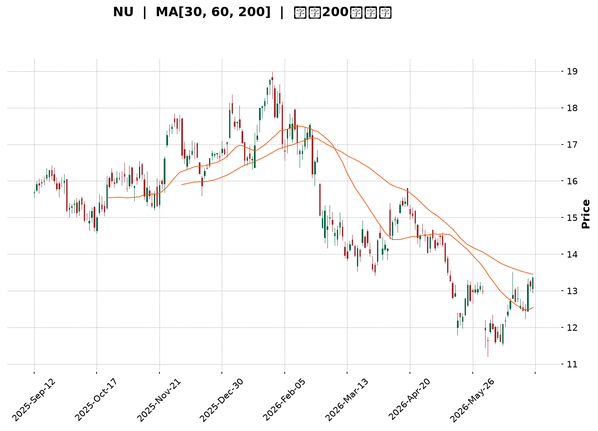
</details>

<html>
<head><meta charset="utf-8" /></head>
<body>
    <div style="height:500px; width:100%;">                        <script>window.PlotlyConfig = {MathJaxConfig: 'local'};</script>
        <script charset="utf-8" src="https://cdn.plot.ly/plotly-3.6.0.min.js" integrity="sha256-QaOVwtVY0T02VaHrr6pnoHLCwayMJp4O5n4YyaE3rJk=" crossorigin="anonymous"></script>                <div id="candlestick-chart" class="plotly-graph-div" style="height:100%; width:100%;"></div>            <script>                window.PLOTLYENV=window.PLOTLYENV || {};                                if (document.getElementById("candlestick-chart")) {                    Plotly.newPlot(                        "candlestick-chart",                        [{"close":{"dtype":"f8","bdata":"AAAAoEdhL0AAAACA69EvQAAAACCuxy9AAAAAIIXrL0AAAABA4fovQAAAACCFKzBAAAAAwMxMMEAAAABgZiYwQAAAAGCPAjBAAAAAIFyPL0AAAAAgXI8vQAAAAGBm5i9AAAAAYI8CMEAAAACgR2EuQAAAAOCjcC5AAAAAYLieLkAAAABgj8IuQAAAAGCPQi5AAAAAIIXrLkAAAACgcL0uQAAAAEAK1y1AAAAAwPUoLkAAAACA69EtQAAAAAApXC5AAAAAgMJ1LUAAAAAAAAAuQAAAAIDr0S5AAAAAQOF6LkAAAACA61EuQAAAAMDMzC9AAAAAgBSuL0AAAAAAAAAwQAAAAAAp3C9AAAAAQAoXMEAAAAAgXA8wQAAAAAApHDBAAAAAoEchMEAAAACgmZkvQAAAACCFKzBAAAAAoEfhL0AAAACgcL0vQAAAAMAeBTBAAAAAANdjMEAAAACAFC4wQAAAAIAULi9AAAAAANejL0AAAABAMzMvQAAAAADXoy5AAAAAgOtRL0AAAAAA16MuQAAAACCuxy9AAAAAQArXL0AAAAAAKZwwQAAAAAAAQDFAAAAAANdjMUAAAABA4XoxQAAAAAApnDFAAAAA4KNwMUAAAABgZqYxQAAAAEAzszBAAAAAYLieMEAAAACAFK4wQAAAAOCjsDBAAAAAgOvRMEAAAABgZuYwQAAAAGBmpjBAAAAAQDMzMEAAAADgUbgvQAAAAMAeRTBAAAAAQApXMEAAAABguJ4wQAAAAGCPwjBAAAAAoHC9MEAAAABgj8IwQAAAAMD1qDBAAAAAoEfhMEAAAACgcL0wQAAAAMAeBTFAAAAA4KPwMUAAAAAAKdwxQAAAAAAAgDFAAAAAACmcMUAAAACAwnUxQAAAAIA9CjFAAAAAIFyPMEAAAAAA16MwQAAAAAApnDBAAAAAoJmZMEAAAADgUfgwQAAAAKBwPTFAAAAAAAAAMkAAAACAPQoyQAAAAIAULjJAAAAAwMyMMkAAAABgj8IyQAAAAGCPwjJAAAAAAADAMUAAAAAAKRwyQAAAAGC4HjJAAAAAwB4FMUAAAAAgXM8wQAAAAGBmZjFAAAAAwMyMMUAAAACA65ExQAAAAMD1aDFAAAAAgD0KMUAAAACA69EwQAAAAIDr0TBAAAAAIIUrMUAAAACA61ExQAAAACCuhzFAAAAA4KMwMEAAAAAgrocwQAAAAGBmpjBAAAAAYLgeLkAAAACAwvUtQAAAAKBHYS5AAAAAwB6FLUAAAAAAAAAuQAAAAADXoy1AAAAAwPUoLUAAAABAClctQAAAAGCPwi1AAAAAQOH6LEAAAADgo\u002fArQAAAACCuxytAAAAAgD2KLEAAAAAAAIAsQAAAAOCj8CtAAAAAgOtRLEAAAACgR+ErQAAAAAApXC1AAAAAoEdhLEAAAAAA16MsQAAAAIA9CixAAAAAQDMzK0AAAADAHgUrQAAAAKBwvSxAAAAAoEfhLEAAAADAzEwsQAAAAMAehSxAAAAAwMxMLEAAAADAHgUtQAAAAKBwvS1AAAAAIIXrLUAAAABgZuYtQAAAAEAzsy5AAAAAgBSuLkAAAAAAKdwuQAAAAIAUri5AAAAAQDMzLkAAAACgmRkuQAAAAEAzsy1AAAAAIIXrLEAAAADAHgUtQAAAACCuRy1AAAAAAAAALUAAAADgehQsQAAAAIDC9SxAAAAAoEfhLEAAAACA61EsQAAAAAAAgCxAAAAAgML1LEAAAADAHoUsQAAAAKCZmStAAAAAAAAAK0AAAACAPYoqQAAAAADXoylAAAAAACncKUAAAACgR2EoQAAAAOB6lChAAAAA4HqUKEAAAADgepQpQAAAAIDrUSpAAAAAgMJ1KUAAAACAwvUpQAAAACBcDypAAAAAoJkZKkAAAABgj0IqQAAAAEDh+ilAAAAAACncJ0AAAAAgrkcnQAAAAKBwPShAAAAA4KPwJ0AAAABAMzMnQAAAAGCPwidAAAAAoHA9J0AAAACAFC4oQAAAAKBHYShAAAAAACncKEAAAADgo3ApQAAAACCuxylAAAAAIIVrKUAAAADgepQpQAAAAIAULilAAAAAIIXrKEAAAAAghesoQAAAAEAKVypAAAAAYI9CKkAAAADgUbgqQA=="},"high":{"dtype":"f8","bdata":"AAAAgD2KL0AAAACgRwEwQAAAAIDrETBAAAAAwMwMMEAAAACgRyEwQAAAAKCZWTBAAAAAwMxMMEAAAADAzGwwQAAAAGC4XjBAAAAA4FEYMEAAAACgcP0vQAAAAKCZGTBAAAAA4KMwMEAAAADAzAwwQAAAAMDMzC5AAAAAAADALkAAAABA4fouQAAAAOB6FC9AAAAAAAAAL0AAAADA9SgvQAAAAGBm5i5AAAAAoHA9LkAAAACgR2EuQAAAAABWji5AAAAAYLieLkAAAABguB4uQAAAACCuRy9AAAAAgBQuL0AAAAAghesuQAAAAADXIzBAAAAAoEchMEAAAACgmVkwQAAAAIDrETBAAAAAwB5FMEAAAACgcD0wQAAAAMAeRTBAAAAAAACAMEAAAACgcB0wQAAAACCFazBAAAAAYGZmMEAAAAAAAMAvQAAAAOBRODBAAAAAwMyMMEAAAAAAAIAwQAAAAIDrMTBAAAAAYI9CMEAAAACgcL0vQAAAAKCZWS9AAAAA4KNwL0AAAABAMxMwQAAAAMAeBTBAAAAAIFwPMEAAAADAzKwwQAAAAKBHYTFAAAAAgBSOMUAAAAAgXI8xQAAAAEAK1zFAAAAA4FG4MUAAAADgo9AxQAAAAEDhujFAAAAAQDMTMUAAAABA4bowQAAAAKCZ2TBAAAAAACkcMUAAAAAgXA8xQAAAAIDrETFAAAAAwB6FMEAAAADA9SgwQAAAAOAiWzBAAAAA4FF4MEAAAACgR6EwQAAAAOB61DBAAAAAwPXIMEAAAABgj8IwQAAAACBczzBAAAAAQOEaMUAAAADAzOwwQAAAACBcDzFAAAAAgJUjMkAAAABguF4yQAAAAGCPwjFAAAAAgL6fMUAAAACA6xEyQAAAACCFazFAAAAAgOsRMUAAAADgo7AwQAAAAOBR+DBAAAAAYA6tMEAAAADgo1AxQAAAAIA9ijFAAAAAAAAAMkAAAADgoxAyQAAAAGCPQjJAAAAAIFyPMkAAAADA9cgyQAAAAEDh+jJAAAAAYLieMkAAAABACncyQAAAAGBmpjJAAAAAgD0qMkAAAABgjyIxQAAAACCFazFAAAAAQArXMUAAAAAAKbwxQAAAAKBw\u002fTFAAAAAwMyMMUAAAACgR+EwQAAAAAAAADFAAAAAQOF6MUAAAADgo3AxQAAAAEAKlzFAAAAAwPVoMUAAAABACpcwQAAAAKCZ2TBAAAAAoEfhL0AAAABgZmYuQAAAAECLrC5AAAAAYLgeLkAAAACAwrUuQAAAAMDMTC5AAAAAQDNzLUAAAACA65EtQAAAAIA9Si5AAAAAoEfhLUAAAABAM7MsQAAAAGC4nixAAAAAoHC9LEAAAADgehQtQAAAAMDMjCxAAAAAAACALEAAAADAzEwsQAAAAEAK1y1AAAAAwB4FLUAAAACgR2EtQAAAAGBmpixAAAAAYGbmK0AAAACA65ErQAAAAIDr0SxAAAAAoJmZLUAAAACAwvUsQAAAACCuxyxAAAAAgOtRLEAAAADAScwuQAAAAAAp3C1AAAAA4HoULkAAAAAgXA8uQAAAAOCj8C5AAAAAYLgeL0AAAACgRyEvQAAAAGC4ni9AAAAAQDOzLkAAAAAgXI8uQAAAAOCjcC5AAAAAANejLUAAAADgehQtQAAAACCFqy1AAAAAQApXLUAAAADAHgUtQAAAAGC4Hi1AAAAAgOtRLUAAAADgo\u002fAsQAAAAKBH4SxAAAAAoJkZLUAAAABAMzMtQAAAAMD1qCxAAAAAwPXoK0AAAAAAKRwrQAAAAIA9iipAAAAAQApXKkAAAAAgXM8oQAAAAMDMzChAAAAAwMzMKEAAAACgmZkpQAAAAKCZmSpAAAAAwB6FKkAAAACgRyEqQAAAAAApXCpAAAAAQOF6KkAAAAAAAIAqQAAAAMDMTCpAAAAAIIVrKEAAAABA4XonQAAAAIAUbihAAAAAQDOzKEAAAACgmRkoQAAAAIDrEShAAAAAgBQuKEAAAACAFC4oQAAAAOB6lChAAAAAYI9CKUAAAACgmZkpQAAAACCuBytAAAAAwPUoKkAAAACgcD0qQAAAAIDrkSlAAAAA4KNwKUAAAACAPUopQAAAAIAUripAAAAAoJmZKkAAAAAgrscqQA=="},"hovertemplate":"\u003cb\u003e%{x|%Y-%m-%d}\u003c\u002fb\u003e\u003cbr\u003e\u958b: $%{open:.2f}\u003cbr\u003e\u9ad8: $%{high:.2f}\u003cbr\u003e\u4f4e: $%{low:.2f}\u003cbr\u003e\u6536: $%{close:.2f}\u003cextra\u003e\u003c\u002fextra\u003e","low":{"dtype":"f8","bdata":"AAAA4HoUL0AAAADA9WgvQAAAAIDrUS9AAAAAYGamL0AAAADAHsUvQAAAAMAeBTBAAAAAgML1L0AAAAAgrgcwQAAAAKDx0i9AAAAAgMJ1L0AAAACgmRkvQAAAAMD1qC9AAAAAwMxML0AAAACA61EuQAAAAIA9Ci5AAAAA4FE4LkAAAAAAAEAuQAAAAIA9Ci5AAAAAoJkZLkAAAACAwnUuQAAAAGCPwi1AAAAAQArXLUAAAAAgrkctQAAAAOBRuC1AAAAAQF46LUAAAABguB4tQAAAAGC4Hi5AAAAAIFxPLkAAAACA6xEuQAAAAIDCdS5AAAAAIASWL0AAAABACtcvQAAAAADXoy9AAAAAACncL0AAAAAA1wMwQAAAAGCPwi9AAAAAgBTuL0AAAABgZmYvQAAAAOB6lC9AAAAAgBSuL0AAAABgZuYuQAAAAMDMzC9AAAAAwMwMMEAAAAAghQswQAAAAOBR+C5AAAAAANejLkAAAAAAAAAvQAAAAMAehS5AAAAAoEdhLkAAAACgmZkuQAAAAGCPgi5AAAAAIFyPL0AAAAAAKVwvQAAAAMD16DBAAAAAQDMzMUAAAAAgrkcxQAAAAEDhejFAAAAAgD1KMUAAAAAAKVwxQAAAAKCZmTBAAAAA4FF4MEAAAAAAAkswQAAAAEAKdzBAAAAAQDOzMEAAAACgmZkwQAAAAKBHoTBAAAAAgBQuMEAAAACAFC4vQAAAAMAgEDBAAAAAQGJQMEAAAACgmVkwQAAAACBcjzBAAAAAYGamMEAAAAAAKZwwQAAAAIA9ijBAAAAAgBSuMEAAAACAwrUwQAAAAGBmpjBAAAAAgD0qMUAAAAAgXM8xQAAAACCuZzFAAAAAYLheMUAAAAAA12MxQAAAAMAeBTFAAAAAgD1qMEAAAADAzGwwQAAAAIBBgDBAAAAAgBROMEAAAACgmVkwQAAAAIDrETFAAAAA4HpUMUAAAACAwrUxQAAAAGBm5jFAAAAAoJkZMkAAAAAAKVwyQAAAAKBwPTJAAAAAgMK1MUAAAACAwrUxQAAAAEAK1zFAAAAAAADgMEAAAADAzIwwQAAAAGCPwjBAAAAAQAo3MUAAAACAPQoxQAAAAKCZWTFAAAAAgMK1MEAAAABguF4wQAAAAEAKlzBAAAAAQArXMEAAAADAHuUwQAAAACCFKzFAAAAA4HoUMEAAAACgcL0vQAAAAADXgzBAAAAA4HoULkAAAABgZmYtQAAAAGC4nixAAAAAQApXLEAAAACgmZktQAAAAOBROC1AAAAA4FF4LEAAAACAwnUsQAAAACBcDy1AAAAAYI\u002fCLEAAAABgj8IrQAAAAKBHoStAAAAAYLgeLEAAAADgUXgsQAAAAOB61CtAAAAAIFwPK0AAAADgepQrQAAAAOCjcCxAAAAAgOtRLEAAAAAghWssQAAAAAAp3CtAAAAA4HoUK0AAAACA69EqQAAAAGBmZitAAAAAACncLEAAAAAAAqsrQAAAAMD1KCxAAAAAgBSuK0AAAACA69EsQAAAAMDMzCxAAAAAIFyPLUAAAABAMzMtQAAAAKBwPS5AAAAAoJmZLkAAAADgepQuQAAAAGC4ni5AAAAAACncLUAAAADgo\u002fAtQAAAAEAKVy1AAAAAgOuRLEAAAACgR2EsQAAAAKCZGS1AAAAAgMK1LEAAAADgehQsQAAAAKCZGSxAAAAAYI\u002fCLEAAAACAFC4sQAAAAEAKVyxAAAAAoHB9LEAAAADA9WgsQAAAAAAAgCtAAAAAQArXKkAAAADAHoUqQAAAACCuhylAAAAAgBSuKUAAAAAgXI8nQAAAAGC4HihAAAAAIIXrJ0AAAADA9agoQAAAAGC4HilAAAAAIIVrKUAAAADAzEwpQAAAAAAp3ClAAAAAIK7HKUAAAABA4fopQAAAAIDr0SlAAAAAoEfhJkAAAABgZmYmQAAAAADXoydAAAAAYLjeJ0AAAACgmRknQAAAACBcTydAAAAA4FE4J0AAAADAHgUnQAAAACCuByhAAAAAIFyPKEAAAADgo\u002fAoQAAAAOB6lClAAAAAAClcKUAAAABgZmYpQAAAAAAAAClAAAAAoEfhKEAAAACAwnUoQAAAAADX4yhAAAAAQOH6KUAAAACgR+EpQA=="},"name":"\u50f9\u683c","open":{"dtype":"f8","bdata":"AAAAAClcL0AAAAAAAIAvQAAAAKBH4S9AAAAAYGbmL0AAAABgjwIwQAAAAIDrETBAAAAAACkcMEAAAADAzEwwQAAAAIAULjBAAAAAACncL0AAAAAAKdwvQAAAAGBm5i9AAAAAIIXrL0AAAADAzAwwQAAAAIA9ii5AAAAAIFyPLkAAAACgcL0uQAAAAIDr0S5AAAAAAClcLkAAAAAgXA8vQAAAAOBRuC5AAAAAwPUoLkAAAABAM7MtQAAAAAAAAC5AAAAA4HqULkAAAAAgrkctQAAAAGCPQi5AAAAAQDOzLkAAAAAA16MuQAAAAMAehS5AAAAAQAoXMEAAAABA4TowQAAAACCF6y9AAAAAYGbmL0AAAACA6xEwQAAAAAApHDBAAAAA4KMwMEAAAACgmZkvQAAAAOBRuC9AAAAAYLheMEAAAAAA16MvQAAAAKCZGTBAAAAAQAoXMEAAAACAwnUwQAAAAIA9CjBAAAAAACncLkAAAADgUXgvQAAAAMDMzC5AAAAAwMyMLkAAAACAFK4vQAAAAIDCtS5AAAAAAAAAMEAAAABACtcvQAAAAEDh+jBAAAAAANdjMUAAAACAFG4xQAAAAIDCtTFAAAAAQDOzMUAAAABgZqYxQAAAAEAzszFAAAAAYLjeMEAAAADAHmUwQAAAAKCZmTBAAAAAQOG6MEAAAAAgrucwQAAAAGBmBjFAAAAAAACAMEAAAABAChcwQAAAAGBmJjBAAAAAoJlZMEAAAAAghWswQAAAAOCjsDBAAAAAQDOzMEAAAACgcL0wQAAAAIA9qjBAAAAAwB7FMEAAAABguN4wQAAAACBcDzFAAAAAgBQuMUAAAABguB4yQAAAAGC4njFAAAAAQAqXMUAAAACAFK4xQAAAAKCZWTFAAAAAIFwPMUAAAADgo5AwQAAAAAAAwDBAAAAAgOuRMEAAAAAAKVwwQAAAAGCPIjFAAAAAgD2qMUAAAAAAAAAyQAAAAMDMDDJAAAAAAClcMkAAAABgj6IyQAAAAOB61DJAAAAAIK6HMkAAAACgcL0xQAAAACCuZzJAAAAA4HoUMkAAAADgetQwQAAAACCFKzFAAAAA4KNwMUAAAABgZiYxQAAAAIDr8TFAAAAAwPWIMUAAAACgcL0wQAAAAAAAwDBAAAAAQDPzMEAAAAAA1yMxQAAAAEAzMzFAAAAAAABAMUAAAADgozAwQAAAAADXgzBAAAAAQArXL0AAAADgo3AtQAAAACCF6yxAAAAAAClcLUAAAACgcP0tQAAAAAAp3C1AAAAAYI8CLUAAAACA69EsQAAAAEDhei1AAAAAAACALUAAAABgZmYsQAAAAADXIyxAAAAAoHA9LEAAAADAzMwsQAAAAOCjcCxAAAAAAClcK0AAAACgcD0sQAAAAKBHoSxAAAAA4FH4LEAAAABgj0ItQAAAAGCPQixAAAAAgMJ1K0AAAAAghWsrQAAAAKCZmStAAAAAgBQuLUAAAAAAAAAsQAAAAGCPQixAAAAAQDMzLEAAAAAghWsuQAAAAMAeBS1AAAAAACncLUAAAACAFK4tQAAAAGCPQi5AAAAAIIXrLkAAAAAgrscuQAAAAGC4ni9AAAAAQOF6LkAAAADgUTguQAAAAAApXC5AAAAAYLieLUAAAABACtcsQAAAACCuRy1AAAAA4HoULUAAAACAwvUsQAAAAOB6VCxAAAAAgOtRLUAAAAAgrscsQAAAAADXoyxAAAAAAAAALUAAAAAAAAAtQAAAAKCZmSxAAAAAYI\u002fCK0AAAABACtcqQAAAACCFaypAAAAAQDOzKUAAAABAiQEoQAAAAMDMzChAAAAA4HpUKEAAAACAFK4oQAAAAOBROClAAAAAwMxMKkAAAAAgrgcqQAAAACCF6ylAAAAA4KPwKUAAAACgmRkqQAAAAAAAACpAAAAAQOH6J0AAAADAzEwnQAAAAGCPwidAAAAAQDMzKEAAAADAHgUoQAAAAOCjcCdAAAAAoJmZJ0AAAAAA1yMnQAAAAEAKVyhAAAAAgBSuKEAAAADAHgUpQAAAAOB6lClAAAAAIFwPKkAAAAAgXI8pQAAAAIA9CilAAAAAoJkZKUAAAACAwvUoQAAAAADX4yhAAAAAwB6FKkAAAABguB4qQA=="},"x":["2025-09-12T00:00:00-04:00","2025-09-15T00:00:00-04:00","2025-09-16T00:00:00-04:00","2025-09-17T00:00:00-04:00","2025-09-18T00:00:00-04:00","2025-09-19T00:00:00-04:00","2025-09-22T00:00:00-04:00","2025-09-23T00:00:00-04:00","2025-09-24T00:00:00-04:00","2025-09-25T00:00:00-04:00","2025-09-26T00:00:00-04:00","2025-09-29T00:00:00-04:00","2025-09-30T00:00:00-04:00","2025-10-01T00:00:00-04:00","2025-10-02T00:00:00-04:00","2025-10-03T00:00:00-04:00","2025-10-06T00:00:00-04:00","2025-10-07T00:00:00-04:00","2025-10-08T00:00:00-04:00","2025-10-09T00:00:00-04:00","2025-10-10T00:00:00-04:00","2025-10-13T00:00:00-04:00","2025-10-14T00:00:00-04:00","2025-10-15T00:00:00-04:00","2025-10-16T00:00:00-04:00","2025-10-17T00:00:00-04:00","2025-10-20T00:00:00-04:00","2025-10-21T00:00:00-04:00","2025-10-22T00:00:00-04:00","2025-10-23T00:00:00-04:00","2025-10-24T00:00:00-04:00","2025-10-27T00:00:00-04:00","2025-10-28T00:00:00-04:00","2025-10-29T00:00:00-04:00","2025-10-30T00:00:00-04:00","2025-10-31T00:00:00-04:00","2025-11-03T00:00:00-05:00","2025-11-04T00:00:00-05:00","2025-11-05T00:00:00-05:00","2025-11-06T00:00:00-05:00","2025-11-07T00:00:00-05:00","2025-11-10T00:00:00-05:00","2025-11-11T00:00:00-05:00","2025-11-12T00:00:00-05:00","2025-11-13T00:00:00-05:00","2025-11-14T00:00:00-05:00","2025-11-17T00:00:00-05:00","2025-11-18T00:00:00-05:00","2025-11-19T00:00:00-05:00","2025-11-20T00:00:00-05:00","2025-11-21T00:00:00-05:00","2025-11-24T00:00:00-05:00","2025-11-25T00:00:00-05:00","2025-11-26T00:00:00-05:00","2025-11-28T00:00:00-05:00","2025-12-01T00:00:00-05:00","2025-12-02T00:00:00-05:00","2025-12-03T00:00:00-05:00","2025-12-04T00:00:00-05:00","2025-12-05T00:00:00-05:00","2025-12-08T00:00:00-05:00","2025-12-09T00:00:00-05:00","2025-12-10T00:00:00-05:00","2025-12-11T00:00:00-05:00","2025-12-12T00:00:00-05:00","2025-12-15T00:00:00-05:00","2025-12-16T00:00:00-05:00","2025-12-17T00:00:00-05:00","2025-12-18T00:00:00-05:00","2025-12-19T00:00:00-05:00","2025-12-22T00:00:00-05:00","2025-12-23T00:00:00-05:00","2025-12-24T00:00:00-05:00","2025-12-26T00:00:00-05:00","2025-12-29T00:00:00-05:00","2025-12-30T00:00:00-05:00","2025-12-31T00:00:00-05:00","2026-01-02T00:00:00-05:00","2026-01-05T00:00:00-05:00","2026-01-06T00:00:00-05:00","2026-01-07T00:00:00-05:00","2026-01-08T00:00:00-05:00","2026-01-09T00:00:00-05:00","2026-01-12T00:00:00-05:00","2026-01-13T00:00:00-05:00","2026-01-14T00:00:00-05:00","2026-01-15T00:00:00-05:00","2026-01-16T00:00:00-05:00","2026-01-20T00:00:00-05:00","2026-01-21T00:00:00-05:00","2026-01-22T00:00:00-05:00","2026-01-23T00:00:00-05:00","2026-01-26T00:00:00-05:00","2026-01-27T00:00:00-05:00","2026-01-28T00:00:00-05:00","2026-01-29T00:00:00-05:00","2026-01-30T00:00:00-05:00","2026-02-02T00:00:00-05:00","2026-02-03T00:00:00-05:00","2026-02-04T00:00:00-05:00","2026-02-05T00:00:00-05:00","2026-02-06T00:00:00-05:00","2026-02-09T00:00:00-05:00","2026-02-10T00:00:00-05:00","2026-02-11T00:00:00-05:00","2026-02-12T00:00:00-05:00","2026-02-13T00:00:00-05:00","2026-02-17T00:00:00-05:00","2026-02-18T00:00:00-05:00","2026-02-19T00:00:00-05:00","2026-02-20T00:00:00-05:00","2026-02-23T00:00:00-05:00","2026-02-24T00:00:00-05:00","2026-02-25T00:00:00-05:00","2026-02-26T00:00:00-05:00","2026-02-27T00:00:00-05:00","2026-03-02T00:00:00-05:00","2026-03-03T00:00:00-05:00","2026-03-04T00:00:00-05:00","2026-03-05T00:00:00-05:00","2026-03-06T00:00:00-05:00","2026-03-09T00:00:00-04:00","2026-03-10T00:00:00-04:00","2026-03-11T00:00:00-04:00","2026-03-12T00:00:00-04:00","2026-03-13T00:00:00-04:00","2026-03-16T00:00:00-04:00","2026-03-17T00:00:00-04:00","2026-03-18T00:00:00-04:00","2026-03-19T00:00:00-04:00","2026-03-20T00:00:00-04:00","2026-03-23T00:00:00-04:00","2026-03-24T00:00:00-04:00","2026-03-25T00:00:00-04:00","2026-03-26T00:00:00-04:00","2026-03-27T00:00:00-04:00","2026-03-30T00:00:00-04:00","2026-03-31T00:00:00-04:00","2026-04-01T00:00:00-04:00","2026-04-02T00:00:00-04:00","2026-04-06T00:00:00-04:00","2026-04-07T00:00:00-04:00","2026-04-08T00:00:00-04:00","2026-04-09T00:00:00-04:00","2026-04-10T00:00:00-04:00","2026-04-13T00:00:00-04:00","2026-04-14T00:00:00-04:00","2026-04-15T00:00:00-04:00","2026-04-16T00:00:00-04:00","2026-04-17T00:00:00-04:00","2026-04-20T00:00:00-04:00","2026-04-21T00:00:00-04:00","2026-04-22T00:00:00-04:00","2026-04-23T00:00:00-04:00","2026-04-24T00:00:00-04:00","2026-04-27T00:00:00-04:00","2026-04-28T00:00:00-04:00","2026-04-29T00:00:00-04:00","2026-04-30T00:00:00-04:00","2026-05-01T00:00:00-04:00","2026-05-04T00:00:00-04:00","2026-05-05T00:00:00-04:00","2026-05-06T00:00:00-04:00","2026-05-07T00:00:00-04:00","2026-05-08T00:00:00-04:00","2026-05-11T00:00:00-04:00","2026-05-12T00:00:00-04:00","2026-05-13T00:00:00-04:00","2026-05-14T00:00:00-04:00","2026-05-15T00:00:00-04:00","2026-05-18T00:00:00-04:00","2026-05-19T00:00:00-04:00","2026-05-20T00:00:00-04:00","2026-05-21T00:00:00-04:00","2026-05-22T00:00:00-04:00","2026-05-26T00:00:00-04:00","2026-05-27T00:00:00-04:00","2026-05-28T00:00:00-04:00","2026-05-29T00:00:00-04:00","2026-06-01T00:00:00-04:00","2026-06-02T00:00:00-04:00","2026-06-03T00:00:00-04:00","2026-06-04T00:00:00-04:00","2026-06-05T00:00:00-04:00","2026-06-08T00:00:00-04:00","2026-06-09T00:00:00-04:00","2026-06-10T00:00:00-04:00","2026-06-11T00:00:00-04:00","2026-06-12T00:00:00-04:00","2026-06-15T00:00:00-04:00","2026-06-16T00:00:00-04:00","2026-06-17T00:00:00-04:00","2026-06-18T00:00:00-04:00","2026-06-22T00:00:00-04:00","2026-06-23T00:00:00-04:00","2026-06-24T00:00:00-04:00","2026-06-25T00:00:00-04:00","2026-06-26T00:00:00-04:00","2026-06-29T00:00:00-04:00","2026-06-30T00:00:00-04:00"],"type":"candlestick"},{"hovertemplate":"MA30: $%{y:.2f}\u003cextra\u003e\u003c\u002fextra\u003e","line":{"color":"#2196F3","dash":"dash","width":2},"mode":"lines","name":"MA30","x":["2025-09-12T00:00:00-04:00","2025-09-15T00:00:00-04:00","2025-09-16T00:00:00-04:00","2025-09-17T00:00:00-04:00","2025-09-18T00:00:00-04:00","2025-09-19T00:00:00-04:00","2025-09-22T00:00:00-04:00","2025-09-23T00:00:00-04:00","2025-09-24T00:00:00-04:00","2025-09-25T00:00:00-04:00","2025-09-26T00:00:00-04:00","2025-09-29T00:00:00-04:00","2025-09-30T00:00:00-04:00","2025-10-01T00:00:00-04:00","2025-10-02T00:00:00-04:00","2025-10-03T00:00:00-04:00","2025-10-06T00:00:00-04:00","2025-10-07T00:00:00-04:00","2025-10-08T00:00:00-04:00","2025-10-09T00:00:00-04:00","2025-10-10T00:00:00-04:00","2025-10-13T00:00:00-04:00","2025-10-14T00:00:00-04:00","2025-10-15T00:00:00-04:00","2025-10-16T00:00:00-04:00","2025-10-17T00:00:00-04:00","2025-10-20T00:00:00-04:00","2025-10-21T00:00:00-04:00","2025-10-22T00:00:00-04:00","2025-10-23T00:00:00-04:00","2025-10-24T00:00:00-04:00","2025-10-27T00:00:00-04:00","2025-10-28T00:00:00-04:00","2025-10-29T00:00:00-04:00","2025-10-30T00:00:00-04:00","2025-10-31T00:00:00-04:00","2025-11-03T00:00:00-05:00","2025-11-04T00:00:00-05:00","2025-11-05T00:00:00-05:00","2025-11-06T00:00:00-05:00","2025-11-07T00:00:00-05:00","2025-11-10T00:00:00-05:00","2025-11-11T00:00:00-05:00","2025-11-12T00:00:00-05:00","2025-11-13T00:00:00-05:00","2025-11-14T00:00:00-05:00","2025-11-17T00:00:00-05:00","2025-11-18T00:00:00-05:00","2025-11-19T00:00:00-05:00","2025-11-20T00:00:00-05:00","2025-11-21T00:00:00-05:00","2025-11-24T00:00:00-05:00","2025-11-25T00:00:00-05:00","2025-11-26T00:00:00-05:00","2025-11-28T00:00:00-05:00","2025-12-01T00:00:00-05:00","2025-12-02T00:00:00-05:00","2025-12-03T00:00:00-05:00","2025-12-04T00:00:00-05:00","2025-12-05T00:00:00-05:00","2025-12-08T00:00:00-05:00","2025-12-09T00:00:00-05:00","2025-12-10T00:00:00-05:00","2025-12-11T00:00:00-05:00","2025-12-12T00:00:00-05:00","2025-12-15T00:00:00-05:00","2025-12-16T00:00:00-05:00","2025-12-17T00:00:00-05:00","2025-12-18T00:00:00-05:00","2025-12-19T00:00:00-05:00","2025-12-22T00:00:00-05:00","2025-12-23T00:00:00-05:00","2025-12-24T00:00:00-05:00","2025-12-26T00:00:00-05:00","2025-12-29T00:00:00-05:00","2025-12-30T00:00:00-05:00","2025-12-31T00:00:00-05:00","2026-01-02T00:00:00-05:00","2026-01-05T00:00:00-05:00","2026-01-06T00:00:00-05:00","2026-01-07T00:00:00-05:00","2026-01-08T00:00:00-05:00","2026-01-09T00:00:00-05:00","2026-01-12T00:00:00-05:00","2026-01-13T00:00:00-05:00","2026-01-14T00:00:00-05:00","2026-01-15T00:00:00-05:00","2026-01-16T00:00:00-05:00","2026-01-20T00:00:00-05:00","2026-01-21T00:00:00-05:00","2026-01-22T00:00:00-05:00","2026-01-23T00:00:00-05:00","2026-01-26T00:00:00-05:00","2026-01-27T00:00:00-05:00","2026-01-28T00:00:00-05:00","2026-01-29T00:00:00-05:00","2026-01-30T00:00:00-05:00","2026-02-02T00:00:00-05:00","2026-02-03T00:00:00-05:00","2026-02-04T00:00:00-05:00","2026-02-05T00:00:00-05:00","2026-02-06T00:00:00-05:00","2026-02-09T00:00:00-05:00","2026-02-10T00:00:00-05:00","2026-02-11T00:00:00-05:00","2026-02-12T00:00:00-05:00","2026-02-13T00:00:00-05:00","2026-02-17T00:00:00-05:00","2026-02-18T00:00:00-05:00","2026-02-19T00:00:00-05:00","2026-02-20T00:00:00-05:00","2026-02-23T00:00:00-05:00","2026-02-24T00:00:00-05:00","2026-02-25T00:00:00-05:00","2026-02-26T00:00:00-05:00","2026-02-27T00:00:00-05:00","2026-03-02T00:00:00-05:00","2026-03-03T00:00:00-05:00","2026-03-04T00:00:00-05:00","2026-03-05T00:00:00-05:00","2026-03-06T00:00:00-05:00","2026-03-09T00:00:00-04:00","2026-03-10T00:00:00-04:00","2026-03-11T00:00:00-04:00","2026-03-12T00:00:00-04:00","2026-03-13T00:00:00-04:00","2026-03-16T00:00:00-04:00","2026-03-17T00:00:00-04:00","2026-03-18T00:00:00-04:00","2026-03-19T00:00:00-04:00","2026-03-20T00:00:00-04:00","2026-03-23T00:00:00-04:00","2026-03-24T00:00:00-04:00","2026-03-25T00:00:00-04:00","2026-03-26T00:00:00-04:00","2026-03-27T00:00:00-04:00","2026-03-30T00:00:00-04:00","2026-03-31T00:00:00-04:00","2026-04-01T00:00:00-04:00","2026-04-02T00:00:00-04:00","2026-04-06T00:00:00-04:00","2026-04-07T00:00:00-04:00","2026-04-08T00:00:00-04:00","2026-04-09T00:00:00-04:00","2026-04-10T00:00:00-04:00","2026-04-13T00:00:00-04:00","2026-04-14T00:00:00-04:00","2026-04-15T00:00:00-04:00","2026-04-16T00:00:00-04:00","2026-04-17T00:00:00-04:00","2026-04-20T00:00:00-04:00","2026-04-21T00:00:00-04:00","2026-04-22T00:00:00-04:00","2026-04-23T00:00:00-04:00","2026-04-24T00:00:00-04:00","2026-04-27T00:00:00-04:00","2026-04-28T00:00:00-04:00","2026-04-29T00:00:00-04:00","2026-04-30T00:00:00-04:00","2026-05-01T00:00:00-04:00","2026-05-04T00:00:00-04:00","2026-05-05T00:00:00-04:00","2026-05-06T00:00:00-04:00","2026-05-07T00:00:00-04:00","2026-05-08T00:00:00-04:00","2026-05-11T00:00:00-04:00","2026-05-12T00:00:00-04:00","2026-05-13T00:00:00-04:00","2026-05-14T00:00:00-04:00","2026-05-15T00:00:00-04:00","2026-05-18T00:00:00-04:00","2026-05-19T00:00:00-04:00","2026-05-20T00:00:00-04:00","2026-05-21T00:00:00-04:00","2026-05-22T00:00:00-04:00","2026-05-26T00:00:00-04:00","2026-05-27T00:00:00-04:00","2026-05-28T00:00:00-04:00","2026-05-29T00:00:00-04:00","2026-06-01T00:00:00-04:00","2026-06-02T00:00:00-04:00","2026-06-03T00:00:00-04:00","2026-06-04T00:00:00-04:00","2026-06-05T00:00:00-04:00","2026-06-08T00:00:00-04:00","2026-06-09T00:00:00-04:00","2026-06-10T00:00:00-04:00","2026-06-11T00:00:00-04:00","2026-06-12T00:00:00-04:00","2026-06-15T00:00:00-04:00","2026-06-16T00:00:00-04:00","2026-06-17T00:00:00-04:00","2026-06-18T00:00:00-04:00","2026-06-22T00:00:00-04:00","2026-06-23T00:00:00-04:00","2026-06-24T00:00:00-04:00","2026-06-25T00:00:00-04:00","2026-06-26T00:00:00-04:00","2026-06-29T00:00:00-04:00","2026-06-30T00:00:00-04:00"],"y":{"dtype":"f8","bdata":"AAAAAAAA+H8AAAAAAAD4fwAAAAAAAPh\u002fAAAAAAAA+H8AAAAAAAD4fwAAAAAAAPh\u002fAAAAAAAA+H8AAAAAAAD4fwAAAAAAAPh\u002fAAAAAAAA+H8AAAAAAAD4fwAAAAAAAPh\u002fAAAAAAAA+H8AAAAAAAD4fwAAAAAAAPh\u002fAAAAAAAA+H8AAAAAAAD4fwAAAAAAAPh\u002fAAAAAAAA+H8AAAAAAAD4fwAAAAAAAPh\u002fAAAAAAAA+H8AAAAAAAD4fwAAAAAAAPh\u002fAAAAAAAA+H8AAAAAAAD4fwAAAAAAAPh\u002fAAAAAAAA+H8AAAAAAAD4f83MzHwjFC9AmpmZ2bIWL0ARERERPBgvQERERNTqGC9A7+7uziIbL0BERESkVBwvQAAAAIBOGy9AIiIiwmcYL0BmZmaWbhIvQDMzM6MpFS9AAAAAsOQXL0B3d3fnbRkvQN7d3b2fGi9AvLu7+xshL0DNzMxcATIvQKuqqupROC9AMzMzIwZBL0BVVVVVx0QvQERERHQFSC9ARERERG9LL0AAAADQlEovQO\u002fu7s4iWy9AMzMz03hpL0De3d09fIYvQFVVVTXQqS9AzczM7DXXL0CrqqqaxAAwQERERJSKEzBA3t3djVAmMECrqqoKkDswQLy7u6tjQjBAvLu7mwtJMEB3d3cX2U4wQGZmZlZVVTBAvLu7C5BbMEDe3d0Nu2IwQDMzM7NWZzBA7+7unu9nMEARERGxcmgwQFVVVSVNaTBA3t3d9bZsMEDNzMxcHXMwQKuqqupteTBAERERgWp8MECJiIiIXYEwQLy7u\u002ft+ijBAZmZmloqTMEBERET0RJ0wQJqZmanGqzBAZmZmZju\u002fMEDe3d0d6NQwQO\u002fu7jal4jBAvLu7ExHxMEBVVVXtUfgwQFVVVS2H9jBAvLu7A3LvMECamZkBR+gwQBEREXm+3zBA7+7udpPYMEAzMzP7xdIwQImIiKBh1zBAAAAASCjjMEB3d3c\u002fw+4wQLy7uzN6+zBAmpmZcT0KMUBVVVWtHBoxQDMzMwseLDFAmpmZEVg5MUBVVVVFi0wxQImIiKhUXDFAREREJCJiMUAzMzMzwWMxQM3MzEw3aTFAVVVVxSBwMUDe3d09CncxQERERKRwfTFAvLu7K85+MUDv7u7ufH8xQGZmZgbIfTFA7+7u7jV3MUCJiIhImnIxQCIiItLbcjFAiYiIyL1mMUC8u7srzl4xQDMzMzN6WzFA7+7uZq1OMUC8u7sTg0AxQJqZmQllNDFA7+7ufrEkMUB3d3f34RMxQFVVVWU7\u002fzBAq6qqSgziMECamZlpSsUwQLy7u3MhqTBAd3d3P3yGMEBVVVVVnF0wQAAAAKgNNDBAMzMze1sWMEDNzMxc1uovQLy7u7sCpC9AMzMzMzNzL0Crqqr6N0IvQO\u002fu7h7MEy9A7+7uDnTaLkB3d3eX\u002fKIuQFVVVXUhaS5A3t3d3WsuLkAiIiJC7vUtQLy7uwsezC1A3t3dfYadLUDNzMyMbGctQDMzM7OdLy1AzczMzMwMLUCJiIhIU+osQImIiFjyyyxAAAAAcD3KLEDe3d1dusksQLy7u2t1zCxAq6qqelvWLEDe3d0tst0sQImIiBiS5ixAMzMzA3LvLEAiIiJC7vUsQAAAADBr9SxA3t3dHej0LECamZlpH\u002f4sQGZmZjbsCi1AiYiIGNkOLUB3d3eXQwstQAAAAND3Ey1AZmZmJr8YLUCJiIhYgBwtQFVVVaUpFS1AzczMrBwaLUCJiIiIFhktQGZmZlZVFS1A3t3dbaATLUCrqqrahw8tQM3MzMwT9SxAMzMzg07bLEBEREQk27ksQERERBQ8mCxA3t3dnX14LEAiIiLSIlssQHd3d7fzPSxAIiIisuQXLEAiIiKiRfYrQFVVVWWtzitAvLu7O5inK0ARERFhV4ArQCIiIhI8WCtAERERISIiK0DNzMyc7+cqQO\u002fu7g5YuSpAVVVVFdmOKkCamZkZL10qQJqZmXkULipAAAAAkO38KUAiIiLipdspQImIiLiQtClAZmZm5kKSKUAiIiJyr3kpQERERIR5YilAVVVVRUREKUDe3d29LSspQLy7uyuHFilAd3d3V8cEKUBVVVVl9PYoQCIiIpLt\u002fChAIiIiYlcAKUARERExTxQpQA=="},"type":"scatter"},{"hovertemplate":"MA60: $%{y:.2f}\u003cextra\u003e\u003c\u002fextra\u003e","line":{"color":"#9C27B0","dash":"dash","width":2},"mode":"lines","name":"MA60","x":["2025-09-12T00:00:00-04:00","2025-09-15T00:00:00-04:00","2025-09-16T00:00:00-04:00","2025-09-17T00:00:00-04:00","2025-09-18T00:00:00-04:00","2025-09-19T00:00:00-04:00","2025-09-22T00:00:00-04:00","2025-09-23T00:00:00-04:00","2025-09-24T00:00:00-04:00","2025-09-25T00:00:00-04:00","2025-09-26T00:00:00-04:00","2025-09-29T00:00:00-04:00","2025-09-30T00:00:00-04:00","2025-10-01T00:00:00-04:00","2025-10-02T00:00:00-04:00","2025-10-03T00:00:00-04:00","2025-10-06T00:00:00-04:00","2025-10-07T00:00:00-04:00","2025-10-08T00:00:00-04:00","2025-10-09T00:00:00-04:00","2025-10-10T00:00:00-04:00","2025-10-13T00:00:00-04:00","2025-10-14T00:00:00-04:00","2025-10-15T00:00:00-04:00","2025-10-16T00:00:00-04:00","2025-10-17T00:00:00-04:00","2025-10-20T00:00:00-04:00","2025-10-21T00:00:00-04:00","2025-10-22T00:00:00-04:00","2025-10-23T00:00:00-04:00","2025-10-24T00:00:00-04:00","2025-10-27T00:00:00-04:00","2025-10-28T00:00:00-04:00","2025-10-29T00:00:00-04:00","2025-10-30T00:00:00-04:00","2025-10-31T00:00:00-04:00","2025-11-03T00:00:00-05:00","2025-11-04T00:00:00-05:00","2025-11-05T00:00:00-05:00","2025-11-06T00:00:00-05:00","2025-11-07T00:00:00-05:00","2025-11-10T00:00:00-05:00","2025-11-11T00:00:00-05:00","2025-11-12T00:00:00-05:00","2025-11-13T00:00:00-05:00","2025-11-14T00:00:00-05:00","2025-11-17T00:00:00-05:00","2025-11-18T00:00:00-05:00","2025-11-19T00:00:00-05:00","2025-11-20T00:00:00-05:00","2025-11-21T00:00:00-05:00","2025-11-24T00:00:00-05:00","2025-11-25T00:00:00-05:00","2025-11-26T00:00:00-05:00","2025-11-28T00:00:00-05:00","2025-12-01T00:00:00-05:00","2025-12-02T00:00:00-05:00","2025-12-03T00:00:00-05:00","2025-12-04T00:00:00-05:00","2025-12-05T00:00:00-05:00","2025-12-08T00:00:00-05:00","2025-12-09T00:00:00-05:00","2025-12-10T00:00:00-05:00","2025-12-11T00:00:00-05:00","2025-12-12T00:00:00-05:00","2025-12-15T00:00:00-05:00","2025-12-16T00:00:00-05:00","2025-12-17T00:00:00-05:00","2025-12-18T00:00:00-05:00","2025-12-19T00:00:00-05:00","2025-12-22T00:00:00-05:00","2025-12-23T00:00:00-05:00","2025-12-24T00:00:00-05:00","2025-12-26T00:00:00-05:00","2025-12-29T00:00:00-05:00","2025-12-30T00:00:00-05:00","2025-12-31T00:00:00-05:00","2026-01-02T00:00:00-05:00","2026-01-05T00:00:00-05:00","2026-01-06T00:00:00-05:00","2026-01-07T00:00:00-05:00","2026-01-08T00:00:00-05:00","2026-01-09T00:00:00-05:00","2026-01-12T00:00:00-05:00","2026-01-13T00:00:00-05:00","2026-01-14T00:00:00-05:00","2026-01-15T00:00:00-05:00","2026-01-16T00:00:00-05:00","2026-01-20T00:00:00-05:00","2026-01-21T00:00:00-05:00","2026-01-22T00:00:00-05:00","2026-01-23T00:00:00-05:00","2026-01-26T00:00:00-05:00","2026-01-27T00:00:00-05:00","2026-01-28T00:00:00-05:00","2026-01-29T00:00:00-05:00","2026-01-30T00:00:00-05:00","2026-02-02T00:00:00-05:00","2026-02-03T00:00:00-05:00","2026-02-04T00:00:00-05:00","2026-02-05T00:00:00-05:00","2026-02-06T00:00:00-05:00","2026-02-09T00:00:00-05:00","2026-02-10T00:00:00-05:00","2026-02-11T00:00:00-05:00","2026-02-12T00:00:00-05:00","2026-02-13T00:00:00-05:00","2026-02-17T00:00:00-05:00","2026-02-18T00:00:00-05:00","2026-02-19T00:00:00-05:00","2026-02-20T00:00:00-05:00","2026-02-23T00:00:00-05:00","2026-02-24T00:00:00-05:00","2026-02-25T00:00:00-05:00","2026-02-26T00:00:00-05:00","2026-02-27T00:00:00-05:00","2026-03-02T00:00:00-05:00","2026-03-03T00:00:00-05:00","2026-03-04T00:00:00-05:00","2026-03-05T00:00:00-05:00","2026-03-06T00:00:00-05:00","2026-03-09T00:00:00-04:00","2026-03-10T00:00:00-04:00","2026-03-11T00:00:00-04:00","2026-03-12T00:00:00-04:00","2026-03-13T00:00:00-04:00","2026-03-16T00:00:00-04:00","2026-03-17T00:00:00-04:00","2026-03-18T00:00:00-04:00","2026-03-19T00:00:00-04:00","2026-03-20T00:00:00-04:00","2026-03-23T00:00:00-04:00","2026-03-24T00:00:00-04:00","2026-03-25T00:00:00-04:00","2026-03-26T00:00:00-04:00","2026-03-27T00:00:00-04:00","2026-03-30T00:00:00-04:00","2026-03-31T00:00:00-04:00","2026-04-01T00:00:00-04:00","2026-04-02T00:00:00-04:00","2026-04-06T00:00:00-04:00","2026-04-07T00:00:00-04:00","2026-04-08T00:00:00-04:00","2026-04-09T00:00:00-04:00","2026-04-10T00:00:00-04:00","2026-04-13T00:00:00-04:00","2026-04-14T00:00:00-04:00","2026-04-15T00:00:00-04:00","2026-04-16T00:00:00-04:00","2026-04-17T00:00:00-04:00","2026-04-20T00:00:00-04:00","2026-04-21T00:00:00-04:00","2026-04-22T00:00:00-04:00","2026-04-23T00:00:00-04:00","2026-04-24T00:00:00-04:00","2026-04-27T00:00:00-04:00","2026-04-28T00:00:00-04:00","2026-04-29T00:00:00-04:00","2026-04-30T00:00:00-04:00","2026-05-01T00:00:00-04:00","2026-05-04T00:00:00-04:00","2026-05-05T00:00:00-04:00","2026-05-06T00:00:00-04:00","2026-05-07T00:00:00-04:00","2026-05-08T00:00:00-04:00","2026-05-11T00:00:00-04:00","2026-05-12T00:00:00-04:00","2026-05-13T00:00:00-04:00","2026-05-14T00:00:00-04:00","2026-05-15T00:00:00-04:00","2026-05-18T00:00:00-04:00","2026-05-19T00:00:00-04:00","2026-05-20T00:00:00-04:00","2026-05-21T00:00:00-04:00","2026-05-22T00:00:00-04:00","2026-05-26T00:00:00-04:00","2026-05-27T00:00:00-04:00","2026-05-28T00:00:00-04:00","2026-05-29T00:00:00-04:00","2026-06-01T00:00:00-04:00","2026-06-02T00:00:00-04:00","2026-06-03T00:00:00-04:00","2026-06-04T00:00:00-04:00","2026-06-05T00:00:00-04:00","2026-06-08T00:00:00-04:00","2026-06-09T00:00:00-04:00","2026-06-10T00:00:00-04:00","2026-06-11T00:00:00-04:00","2026-06-12T00:00:00-04:00","2026-06-15T00:00:00-04:00","2026-06-16T00:00:00-04:00","2026-06-17T00:00:00-04:00","2026-06-18T00:00:00-04:00","2026-06-22T00:00:00-04:00","2026-06-23T00:00:00-04:00","2026-06-24T00:00:00-04:00","2026-06-25T00:00:00-04:00","2026-06-26T00:00:00-04:00","2026-06-29T00:00:00-04:00","2026-06-30T00:00:00-04:00"],"y":{"dtype":"f8","bdata":"AAAAAAAA+H8AAAAAAAD4fwAAAAAAAPh\u002fAAAAAAAA+H8AAAAAAAD4fwAAAAAAAPh\u002fAAAAAAAA+H8AAAAAAAD4fwAAAAAAAPh\u002fAAAAAAAA+H8AAAAAAAD4fwAAAAAAAPh\u002fAAAAAAAA+H8AAAAAAAD4fwAAAAAAAPh\u002fAAAAAAAA+H8AAAAAAAD4fwAAAAAAAPh\u002fAAAAAAAA+H8AAAAAAAD4fwAAAAAAAPh\u002fAAAAAAAA+H8AAAAAAAD4fwAAAAAAAPh\u002fAAAAAAAA+H8AAAAAAAD4fwAAAAAAAPh\u002fAAAAAAAA+H8AAAAAAAD4fwAAAAAAAPh\u002fAAAAAAAA+H8AAAAAAAD4fwAAAAAAAPh\u002fAAAAAAAA+H8AAAAAAAD4fwAAAAAAAPh\u002fAAAAAAAA+H8AAAAAAAD4fwAAAAAAAPh\u002fAAAAAAAA+H8AAAAAAAD4fwAAAAAAAPh\u002fAAAAAAAA+H8AAAAAAAD4fwAAAAAAAPh\u002fAAAAAAAA+H8AAAAAAAD4fwAAAAAAAPh\u002fAAAAAAAA+H8AAAAAAAD4fwAAAAAAAPh\u002fAAAAAAAA+H8AAAAAAAD4fwAAAAAAAPh\u002fAAAAAAAA+H8AAAAAAAD4fwAAAAAAAPh\u002fAAAAAAAA+H8AAAAAAAD4fyIiImp1zC9AiYiICGXUL0AAAAAg99ovQImIiMDK4S9AMzMzcyHpL0AAAABg5fAvQDMzM\u002fP99C9AAAAAgCP0L0BERET8qfEvQO\u002fu7vbh8y9A3t3dTan4L0CJiIhQ1P8vQM3MzOReAzBAd3d3P3wGMEB3d3cbLw0wQImIiPhTEzBAAAAA1AYaMEB3d3dP1B8wQN7d3bHkJzBAREREhHkyMEDv7u5CGT0wQDMzM08bSDBAq6qqvuZSMEAiIiIGyF0wQAAAAKS3ZTBAERERfYZtMEAiIiLOhXQwQKuqqoakeTBAZmZmAnJ\u002fMEDv7u4CK4cwQCIiIqbijDBA3t3d8RmWMEB3d3crzp4wQBEREcVnqDBAq6qqvuayMECamZnda74wQDMzM1+6yTBARERE2KPQMEAzMzP7ftowQO\u002fu7ubQ4jBAERERjWznMEAAAABIb+swQLy7u5tS8TBAMzMzo0X2MEAzMzPjM\u002fwwQAAAAND3AzFAERERYSwJMUCamZnxYA4xQAAAAFjHFDFAq6qqqjgbMUAzMzMzwSMxQImIiITAKjFAIiIibucrMUCJiIgMkCsxQERERLAAKTFAVVVVtQ8fMUCrqqoKZRQxQFVVVcERCjFA7+7ueqL+MEBVVVX5U\u002fMwQO\u002fu7oJO6zBAVVVVSZriMECJiIjUBtowQLy7u9NN0jBAiYiI2FzIMEBVVVWB3LswQJqZmdkVsDBAZmZmxtmnMEDe3d05+6AwQDMzMwMrlzBA7+7u3t2NMEBERESYboIwQCIiIq6OeTBAZmZmZq1uMEDNzMxERGQwQHd3d68AWTBAVVVVDQJLMEAAAAAIOj0wQCIiIobrMTBA7+7ulvwiMEB3d3dHKBMwQN7d3VVVBTBA7+7uLiTtL0AAAADQ99MvQHd3d19zwS9A7+7uHsyzL0CrqqpCYKUvQHd3d7+fmi9AREREPN+PL0BmZmYOu4IvQJqZmXGEci9ARERETMVZL0CrqqqKQUAvQLy7uwvXIy9AZmZmTvAAL0AiIiIKrNwuQDMzM8ODuS5Ad3d3B8idLkAiIiL6DHsuQN7d3UX9Wy5AzczMLPlFLkCamZkpXC8uQCIiIuJ6FC5A3t3dXUj6LUAAAACQCd4tQN7d3WU7vy1A3t3dJQahLUBmZmYOu4ItQEREROyYYC1AiYiIgGo8LUCJiIjYoxAtQLy7u+Ps4yxAVVVVNaXCLEBVVVUNu6IsQAAAAAjzhCxAERERERFxLEAAAAAAAGAsQImIiGiRTSxAMzMz2\u002fk+LEB3d3fHBC8sQFVVVRVnHyxAIiIiEsoILEB3d3fv7u4rQHd3d59h1ytAmpmZmeDBK0CamZlBp60rQAAAAFiAnCtAREREVOOFK0DNzMy8dHMrQEREREREZCtAZmZmBoFVK0BVVVXlF0srQM3MzJTROytAEREReTAvK0AzMzMjIiIrQBEREUHuFStAq6qq4jMMK0AAAAAgPgMrQHd3d68A+SpAq6qq8tLtKkCrqqoqFecqQA=="},"type":"scatter"},{"hovertemplate":"MA200: $%{y:.2f}\u003cextra\u003e\u003c\u002fextra\u003e","line":{"color":"#FF6F00","dash":"solid","width":2},"mode":"lines","name":"MA200","x":["2025-09-12T00:00:00-04:00","2025-09-15T00:00:00-04:00","2025-09-16T00:00:00-04:00","2025-09-17T00:00:00-04:00","2025-09-18T00:00:00-04:00","2025-09-19T00:00:00-04:00","2025-09-22T00:00:00-04:00","2025-09-23T00:00:00-04:00","2025-09-24T00:00:00-04:00","2025-09-25T00:00:00-04:00","2025-09-26T00:00:00-04:00","2025-09-29T00:00:00-04:00","2025-09-30T00:00:00-04:00","2025-10-01T00:00:00-04:00","2025-10-02T00:00:00-04:00","2025-10-03T00:00:00-04:00","2025-10-06T00:00:00-04:00","2025-10-07T00:00:00-04:00","2025-10-08T00:00:00-04:00","2025-10-09T00:00:00-04:00","2025-10-10T00:00:00-04:00","2025-10-13T00:00:00-04:00","2025-10-14T00:00:00-04:00","2025-10-15T00:00:00-04:00","2025-10-16T00:00:00-04:00","2025-10-17T00:00:00-04:00","2025-10-20T00:00:00-04:00","2025-10-21T00:00:00-04:00","2025-10-22T00:00:00-04:00","2025-10-23T00:00:00-04:00","2025-10-24T00:00:00-04:00","2025-10-27T00:00:00-04:00","2025-10-28T00:00:00-04:00","2025-10-29T00:00:00-04:00","2025-10-30T00:00:00-04:00","2025-10-31T00:00:00-04:00","2025-11-03T00:00:00-05:00","2025-11-04T00:00:00-05:00","2025-11-05T00:00:00-05:00","2025-11-06T00:00:00-05:00","2025-11-07T00:00:00-05:00","2025-11-10T00:00:00-05:00","2025-11-11T00:00:00-05:00","2025-11-12T00:00:00-05:00","2025-11-13T00:00:00-05:00","2025-11-14T00:00:00-05:00","2025-11-17T00:00:00-05:00","2025-11-18T00:00:00-05:00","2025-11-19T00:00:00-05:00","2025-11-20T00:00:00-05:00","2025-11-21T00:00:00-05:00","2025-11-24T00:00:00-05:00","2025-11-25T00:00:00-05:00","2025-11-26T00:00:00-05:00","2025-11-28T00:00:00-05:00","2025-12-01T00:00:00-05:00","2025-12-02T00:00:00-05:00","2025-12-03T00:00:00-05:00","2025-12-04T00:00:00-05:00","2025-12-05T00:00:00-05:00","2025-12-08T00:00:00-05:00","2025-12-09T00:00:00-05:00","2025-12-10T00:00:00-05:00","2025-12-11T00:00:00-05:00","2025-12-12T00:00:00-05:00","2025-12-15T00:00:00-05:00","2025-12-16T00:00:00-05:00","2025-12-17T00:00:00-05:00","2025-12-18T00:00:00-05:00","2025-12-19T00:00:00-05:00","2025-12-22T00:00:00-05:00","2025-12-23T00:00:00-05:00","2025-12-24T00:00:00-05:00","2025-12-26T00:00:00-05:00","2025-12-29T00:00:00-05:00","2025-12-30T00:00:00-05:00","2025-12-31T00:00:00-05:00","2026-01-02T00:00:00-05:00","2026-01-05T00:00:00-05:00","2026-01-06T00:00:00-05:00","2026-01-07T00:00:00-05:00","2026-01-08T00:00:00-05:00","2026-01-09T00:00:00-05:00","2026-01-12T00:00:00-05:00","2026-01-13T00:00:00-05:00","2026-01-14T00:00:00-05:00","2026-01-15T00:00:00-05:00","2026-01-16T00:00:00-05:00","2026-01-20T00:00:00-05:00","2026-01-21T00:00:00-05:00","2026-01-22T00:00:00-05:00","2026-01-23T00:00:00-05:00","2026-01-26T00:00:00-05:00","2026-01-27T00:00:00-05:00","2026-01-28T00:00:00-05:00","2026-01-29T00:00:00-05:00","2026-01-30T00:00:00-05:00","2026-02-02T00:00:00-05:00","2026-02-03T00:00:00-05:00","2026-02-04T00:00:00-05:00","2026-02-05T00:00:00-05:00","2026-02-06T00:00:00-05:00","2026-02-09T00:00:00-05:00","2026-02-10T00:00:00-05:00","2026-02-11T00:00:00-05:00","2026-02-12T00:00:00-05:00","2026-02-13T00:00:00-05:00","2026-02-17T00:00:00-05:00","2026-02-18T00:00:00-05:00","2026-02-19T00:00:00-05:00","2026-02-20T00:00:00-05:00","2026-02-23T00:00:00-05:00","2026-02-24T00:00:00-05:00","2026-02-25T00:00:00-05:00","2026-02-26T00:00:00-05:00","2026-02-27T00:00:00-05:00","2026-03-02T00:00:00-05:00","2026-03-03T00:00:00-05:00","2026-03-04T00:00:00-05:00","2026-03-05T00:00:00-05:00","2026-03-06T00:00:00-05:00","2026-03-09T00:00:00-04:00","2026-03-10T00:00:00-04:00","2026-03-11T00:00:00-04:00","2026-03-12T00:00:00-04:00","2026-03-13T00:00:00-04:00","2026-03-16T00:00:00-04:00","2026-03-17T00:00:00-04:00","2026-03-18T00:00:00-04:00","2026-03-19T00:00:00-04:00","2026-03-20T00:00:00-04:00","2026-03-23T00:00:00-04:00","2026-03-24T00:00:00-04:00","2026-03-25T00:00:00-04:00","2026-03-26T00:00:00-04:00","2026-03-27T00:00:00-04:00","2026-03-30T00:00:00-04:00","2026-03-31T00:00:00-04:00","2026-04-01T00:00:00-04:00","2026-04-02T00:00:00-04:00","2026-04-06T00:00:00-04:00","2026-04-07T00:00:00-04:00","2026-04-08T00:00:00-04:00","2026-04-09T00:00:00-04:00","2026-04-10T00:00:00-04:00","2026-04-13T00:00:00-04:00","2026-04-14T00:00:00-04:00","2026-04-15T00:00:00-04:00","2026-04-16T00:00:00-04:00","2026-04-17T00:00:00-04:00","2026-04-20T00:00:00-04:00","2026-04-21T00:00:00-04:00","2026-04-22T00:00:00-04:00","2026-04-23T00:00:00-04:00","2026-04-24T00:00:00-04:00","2026-04-27T00:00:00-04:00","2026-04-28T00:00:00-04:00","2026-04-29T00:00:00-04:00","2026-04-30T00:00:00-04:00","2026-05-01T00:00:00-04:00","2026-05-04T00:00:00-04:00","2026-05-05T00:00:00-04:00","2026-05-06T00:00:00-04:00","2026-05-07T00:00:00-04:00","2026-05-08T00:00:00-04:00","2026-05-11T00:00:00-04:00","2026-05-12T00:00:00-04:00","2026-05-13T00:00:00-04:00","2026-05-14T00:00:00-04:00","2026-05-15T00:00:00-04:00","2026-05-18T00:00:00-04:00","2026-05-19T00:00:00-04:00","2026-05-20T00:00:00-04:00","2026-05-21T00:00:00-04:00","2026-05-22T00:00:00-04:00","2026-05-26T00:00:00-04:00","2026-05-27T00:00:00-04:00","2026-05-28T00:00:00-04:00","2026-05-29T00:00:00-04:00","2026-06-01T00:00:00-04:00","2026-06-02T00:00:00-04:00","2026-06-03T00:00:00-04:00","2026-06-04T00:00:00-04:00","2026-06-05T00:00:00-04:00","2026-06-08T00:00:00-04:00","2026-06-09T00:00:00-04:00","2026-06-10T00:00:00-04:00","2026-06-11T00:00:00-04:00","2026-06-12T00:00:00-04:00","2026-06-15T00:00:00-04:00","2026-06-16T00:00:00-04:00","2026-06-17T00:00:00-04:00","2026-06-18T00:00:00-04:00","2026-06-22T00:00:00-04:00","2026-06-23T00:00:00-04:00","2026-06-24T00:00:00-04:00","2026-06-25T00:00:00-04:00","2026-06-26T00:00:00-04:00","2026-06-29T00:00:00-04:00","2026-06-30T00:00:00-04:00"],"y":{"dtype":"f8","bdata":"AAAAAAAA+H8AAAAAAAD4fwAAAAAAAPh\u002fAAAAAAAA+H8AAAAAAAD4fwAAAAAAAPh\u002fAAAAAAAA+H8AAAAAAAD4fwAAAAAAAPh\u002fAAAAAAAA+H8AAAAAAAD4fwAAAAAAAPh\u002fAAAAAAAA+H8AAAAAAAD4fwAAAAAAAPh\u002fAAAAAAAA+H8AAAAAAAD4fwAAAAAAAPh\u002fAAAAAAAA+H8AAAAAAAD4fwAAAAAAAPh\u002fAAAAAAAA+H8AAAAAAAD4fwAAAAAAAPh\u002fAAAAAAAA+H8AAAAAAAD4fwAAAAAAAPh\u002fAAAAAAAA+H8AAAAAAAD4fwAAAAAAAPh\u002fAAAAAAAA+H8AAAAAAAD4fwAAAAAAAPh\u002fAAAAAAAA+H8AAAAAAAD4fwAAAAAAAPh\u002fAAAAAAAA+H8AAAAAAAD4fwAAAAAAAPh\u002fAAAAAAAA+H8AAAAAAAD4fwAAAAAAAPh\u002fAAAAAAAA+H8AAAAAAAD4fwAAAAAAAPh\u002fAAAAAAAA+H8AAAAAAAD4fwAAAAAAAPh\u002fAAAAAAAA+H8AAAAAAAD4fwAAAAAAAPh\u002fAAAAAAAA+H8AAAAAAAD4fwAAAAAAAPh\u002fAAAAAAAA+H8AAAAAAAD4fwAAAAAAAPh\u002fAAAAAAAA+H8AAAAAAAD4fwAAAAAAAPh\u002fAAAAAAAA+H8AAAAAAAD4fwAAAAAAAPh\u002fAAAAAAAA+H8AAAAAAAD4fwAAAAAAAPh\u002fAAAAAAAA+H8AAAAAAAD4fwAAAAAAAPh\u002fAAAAAAAA+H8AAAAAAAD4fwAAAAAAAPh\u002fAAAAAAAA+H8AAAAAAAD4fwAAAAAAAPh\u002fAAAAAAAA+H8AAAAAAAD4fwAAAAAAAPh\u002fAAAAAAAA+H8AAAAAAAD4fwAAAAAAAPh\u002fAAAAAAAA+H8AAAAAAAD4fwAAAAAAAPh\u002fAAAAAAAA+H8AAAAAAAD4fwAAAAAAAPh\u002fAAAAAAAA+H8AAAAAAAD4fwAAAAAAAPh\u002fAAAAAAAA+H8AAAAAAAD4fwAAAAAAAPh\u002fAAAAAAAA+H8AAAAAAAD4fwAAAAAAAPh\u002fAAAAAAAA+H8AAAAAAAD4fwAAAAAAAPh\u002fAAAAAAAA+H8AAAAAAAD4fwAAAAAAAPh\u002fAAAAAAAA+H8AAAAAAAD4fwAAAAAAAPh\u002fAAAAAAAA+H8AAAAAAAD4fwAAAAAAAPh\u002fAAAAAAAA+H8AAAAAAAD4fwAAAAAAAPh\u002fAAAAAAAA+H8AAAAAAAD4fwAAAAAAAPh\u002fAAAAAAAA+H8AAAAAAAD4fwAAAAAAAPh\u002fAAAAAAAA+H8AAAAAAAD4fwAAAAAAAPh\u002fAAAAAAAA+H8AAAAAAAD4fwAAAAAAAPh\u002fAAAAAAAA+H8AAAAAAAD4fwAAAAAAAPh\u002fAAAAAAAA+H8AAAAAAAD4fwAAAAAAAPh\u002fAAAAAAAA+H8AAAAAAAD4fwAAAAAAAPh\u002fAAAAAAAA+H8AAAAAAAD4fwAAAAAAAPh\u002fAAAAAAAA+H8AAAAAAAD4fwAAAAAAAPh\u002fAAAAAAAA+H8AAAAAAAD4fwAAAAAAAPh\u002fAAAAAAAA+H8AAAAAAAD4fwAAAAAAAPh\u002fAAAAAAAA+H8AAAAAAAD4fwAAAAAAAPh\u002fAAAAAAAA+H8AAAAAAAD4fwAAAAAAAPh\u002fAAAAAAAA+H8AAAAAAAD4fwAAAAAAAPh\u002fAAAAAAAA+H8AAAAAAAD4fwAAAAAAAPh\u002fAAAAAAAA+H8AAAAAAAD4fwAAAAAAAPh\u002fAAAAAAAA+H8AAAAAAAD4fwAAAAAAAPh\u002fAAAAAAAA+H8AAAAAAAD4fwAAAAAAAPh\u002fAAAAAAAA+H8AAAAAAAD4fwAAAAAAAPh\u002fAAAAAAAA+H8AAAAAAAD4fwAAAAAAAPh\u002fAAAAAAAA+H8AAAAAAAD4fwAAAAAAAPh\u002fAAAAAAAA+H8AAAAAAAD4fwAAAAAAAPh\u002fAAAAAAAA+H8AAAAAAAD4fwAAAAAAAPh\u002fAAAAAAAA+H8AAAAAAAD4fwAAAAAAAPh\u002fAAAAAAAA+H8AAAAAAAD4fwAAAAAAAPh\u002fAAAAAAAA+H8AAAAAAAD4fwAAAAAAAPh\u002fAAAAAAAA+H8AAAAAAAD4fwAAAAAAAPh\u002fAAAAAAAA+H8AAAAAAAD4fwAAAAAAAPh\u002fAAAAAAAA+H8AAAAAAAD4fwAAAAAAAPh\u002fAAAAAAAA+H\u002f2KFx\u002f+5ouQA=="},"type":"scatter"}],                        {"template":{"data":{"barpolar":[{"marker":{"line":{"color":"rgb(17,17,17)","width":0.5},"pattern":{"fillmode":"overlay","size":10,"solidity":0.2}},"type":"barpolar"}],"bar":[{"error_x":{"color":"#f2f5fa"},"error_y":{"color":"#f2f5fa"},"marker":{"line":{"color":"rgb(17,17,17)","width":0.5},"pattern":{"fillmode":"overlay","size":10,"solidity":0.2}},"type":"bar"}],"carpet":[{"aaxis":{"endlinecolor":"#A2B1C6","gridcolor":"#506784","linecolor":"#506784","minorgridcolor":"#506784","startlinecolor":"#A2B1C6"},"baxis":{"endlinecolor":"#A2B1C6","gridcolor":"#506784","linecolor":"#506784","minorgridcolor":"#506784","startlinecolor":"#A2B1C6"},"type":"carpet"}],"choropleth":[{"colorbar":{"outlinewidth":0,"ticks":""},"type":"choropleth"}],"contourcarpet":[{"colorbar":{"outlinewidth":0,"ticks":""},"type":"contourcarpet"}],"contour":[{"colorbar":{"outlinewidth":0,"ticks":""},"colorscale":[[0.0,"#0d0887"],[0.1111111111111111,"#46039f"],[0.2222222222222222,"#7201a8"],[0.3333333333333333,"#9c179e"],[0.4444444444444444,"#bd3786"],[0.5555555555555556,"#d8576b"],[0.6666666666666666,"#ed7953"],[0.7777777777777778,"#fb9f3a"],[0.8888888888888888,"#fdca26"],[1.0,"#f0f921"]],"type":"contour"}],"heatmap":[{"colorbar":{"outlinewidth":0,"ticks":""},"colorscale":[[0.0,"#0d0887"],[0.1111111111111111,"#46039f"],[0.2222222222222222,"#7201a8"],[0.3333333333333333,"#9c179e"],[0.4444444444444444,"#bd3786"],[0.5555555555555556,"#d8576b"],[0.6666666666666666,"#ed7953"],[0.7777777777777778,"#fb9f3a"],[0.8888888888888888,"#fdca26"],[1.0,"#f0f921"]],"type":"heatmap"}],"histogram2dcontour":[{"colorbar":{"outlinewidth":0,"ticks":""},"colorscale":[[0.0,"#0d0887"],[0.1111111111111111,"#46039f"],[0.2222222222222222,"#7201a8"],[0.3333333333333333,"#9c179e"],[0.4444444444444444,"#bd3786"],[0.5555555555555556,"#d8576b"],[0.6666666666666666,"#ed7953"],[0.7777777777777778,"#fb9f3a"],[0.8888888888888888,"#fdca26"],[1.0,"#f0f921"]],"type":"histogram2dcontour"}],"histogram2d":[{"colorbar":{"outlinewidth":0,"ticks":""},"colorscale":[[0.0,"#0d0887"],[0.1111111111111111,"#46039f"],[0.2222222222222222,"#7201a8"],[0.3333333333333333,"#9c179e"],[0.4444444444444444,"#bd3786"],[0.5555555555555556,"#d8576b"],[0.6666666666666666,"#ed7953"],[0.7777777777777778,"#fb9f3a"],[0.8888888888888888,"#fdca26"],[1.0,"#f0f921"]],"type":"histogram2d"}],"histogram":[{"marker":{"pattern":{"fillmode":"overlay","size":10,"solidity":0.2}},"type":"histogram"}],"mesh3d":[{"colorbar":{"outlinewidth":0,"ticks":""},"type":"mesh3d"}],"parcoords":[{"line":{"colorbar":{"outlinewidth":0,"ticks":""}},"type":"parcoords"}],"pie":[{"automargin":true,"type":"pie"}],"scatter3d":[{"line":{"colorbar":{"outlinewidth":0,"ticks":""}},"marker":{"colorbar":{"outlinewidth":0,"ticks":""}},"type":"scatter3d"}],"scattercarpet":[{"marker":{"colorbar":{"outlinewidth":0,"ticks":""}},"type":"scattercarpet"}],"scattergeo":[{"marker":{"colorbar":{"outlinewidth":0,"ticks":""}},"type":"scattergeo"}],"scattergl":[{"marker":{"line":{"color":"#283442"}},"type":"scattergl"}],"scattermapbox":[{"marker":{"colorbar":{"outlinewidth":0,"ticks":""}},"type":"scattermapbox"}],"scattermap":[{"marker":{"colorbar":{"outlinewidth":0,"ticks":""}},"type":"scattermap"}],"scatterpolargl":[{"marker":{"colorbar":{"outlinewidth":0,"ticks":""}},"type":"scatterpolargl"}],"scatterpolar":[{"marker":{"colorbar":{"outlinewidth":0,"ticks":""}},"type":"scatterpolar"}],"scatter":[{"marker":{"line":{"color":"#283442"}},"type":"scatter"}],"scatterternary":[{"marker":{"colorbar":{"outlinewidth":0,"ticks":""}},"type":"scatterternary"}],"surface":[{"colorbar":{"outlinewidth":0,"ticks":""},"colorscale":[[0.0,"#0d0887"],[0.1111111111111111,"#46039f"],[0.2222222222222222,"#7201a8"],[0.3333333333333333,"#9c179e"],[0.4444444444444444,"#bd3786"],[0.5555555555555556,"#d8576b"],[0.6666666666666666,"#ed7953"],[0.7777777777777778,"#fb9f3a"],[0.8888888888888888,"#fdca26"],[1.0,"#f0f921"]],"type":"surface"}],"table":[{"cells":{"fill":{"color":"#506784"},"line":{"color":"rgb(17,17,17)"}},"header":{"fill":{"color":"#2a3f5f"},"line":{"color":"rgb(17,17,17)"}},"type":"table"}]},"layout":{"annotationdefaults":{"arrowcolor":"#f2f5fa","arrowhead":0,"arrowwidth":1},"autotypenumbers":"strict","coloraxis":{"colorbar":{"outlinewidth":0,"ticks":""}},"colorscale":{"diverging":[[0,"#8e0152"],[0.1,"#c51b7d"],[0.2,"#de77ae"],[0.3,"#f1b6da"],[0.4,"#fde0ef"],[0.5,"#f7f7f7"],[0.6,"#e6f5d0"],[0.7,"#b8e186"],[0.8,"#7fbc41"],[0.9,"#4d9221"],[1,"#276419"]],"sequential":[[0.0,"#0d0887"],[0.1111111111111111,"#46039f"],[0.2222222222222222,"#7201a8"],[0.3333333333333333,"#9c179e"],[0.4444444444444444,"#bd3786"],[0.5555555555555556,"#d8576b"],[0.6666666666666666,"#ed7953"],[0.7777777777777778,"#fb9f3a"],[0.8888888888888888,"#fdca26"],[1.0,"#f0f921"]],"sequentialminus":[[0.0,"#0d0887"],[0.1111111111111111,"#46039f"],[0.2222222222222222,"#7201a8"],[0.3333333333333333,"#9c179e"],[0.4444444444444444,"#bd3786"],[0.5555555555555556,"#d8576b"],[0.6666666666666666,"#ed7953"],[0.7777777777777778,"#fb9f3a"],[0.8888888888888888,"#fdca26"],[1.0,"#f0f921"]]},"colorway":["#636efa","#EF553B","#00cc96","#ab63fa","#FFA15A","#19d3f3","#FF6692","#B6E880","#FF97FF","#FECB52"],"font":{"color":"#f2f5fa"},"geo":{"bgcolor":"rgb(17,17,17)","lakecolor":"rgb(17,17,17)","landcolor":"rgb(17,17,17)","showlakes":true,"showland":true,"subunitcolor":"#506784"},"hoverlabel":{"align":"left"},"hovermode":"closest","mapbox":{"style":"dark"},"paper_bgcolor":"rgb(17,17,17)","plot_bgcolor":"rgb(17,17,17)","polar":{"angularaxis":{"gridcolor":"#506784","linecolor":"#506784","ticks":""},"bgcolor":"rgb(17,17,17)","radialaxis":{"gridcolor":"#506784","linecolor":"#506784","ticks":""}},"scene":{"xaxis":{"backgroundcolor":"rgb(17,17,17)","gridcolor":"#506784","gridwidth":2,"linecolor":"#506784","showbackground":true,"ticks":"","zerolinecolor":"#C8D4E3"},"yaxis":{"backgroundcolor":"rgb(17,17,17)","gridcolor":"#506784","gridwidth":2,"linecolor":"#506784","showbackground":true,"ticks":"","zerolinecolor":"#C8D4E3"},"zaxis":{"backgroundcolor":"rgb(17,17,17)","gridcolor":"#506784","gridwidth":2,"linecolor":"#506784","showbackground":true,"ticks":"","zerolinecolor":"#C8D4E3"}},"shapedefaults":{"line":{"color":"#f2f5fa"}},"sliderdefaults":{"bgcolor":"#C8D4E3","bordercolor":"rgb(17,17,17)","borderwidth":1,"tickwidth":0},"ternary":{"aaxis":{"gridcolor":"#506784","linecolor":"#506784","ticks":""},"baxis":{"gridcolor":"#506784","linecolor":"#506784","ticks":""},"bgcolor":"rgb(17,17,17)","caxis":{"gridcolor":"#506784","linecolor":"#506784","ticks":""}},"title":{"x":0.05},"updatemenudefaults":{"bgcolor":"#506784","borderwidth":0},"xaxis":{"automargin":true,"gridcolor":"#283442","linecolor":"#506784","ticks":"","title":{"standoff":15},"zerolinecolor":"#283442","zerolinewidth":2},"yaxis":{"automargin":true,"gridcolor":"#283442","linecolor":"#506784","ticks":"","title":{"standoff":15},"zerolinecolor":"#283442","zerolinewidth":2}}},"xaxis":{"rangeslider":{"visible":false},"title":{"text":"\u65e5\u671f"}},"font":{"size":11},"title":{"text":"NU  |  MA(30\u002f60\u002f200)  |  \u6700\u8fd1200\u4ea4\u6613\u65e5"},"yaxis":{"title":{"text":"\u80a1\u50f9 (USD)"}},"hovermode":"x unified","height":500},                        {"responsive": true}                    )                };            </script>        </div>
</body>
</html>

# NU 技術分析報告

> **報告日期**：2026-07-01 ｜ **語言**：繁體中文 ｜ **數據來源**：提供數據集 ｜ **當前價格**：$13.36

---

## 目錄

| 章節 | 內容 |
|------|------|
| [1. 技術面概覽](#1-技術面概覽) | 訊號儀表板、核心指標、評分卡 |
| [2. 趨勢分析](#2-趨勢分析) | 多時框趨勢、長中短期走勢 |
| [3. 圖表形態分析](#3-圖表形態分析) | 形態識別、K線組合、目標價 |
| [4. 支撐與阻力](#4-支撐與阻力) | 關鍵價位、斐波那契回調 |
| [5. 技術指標深度解讀](#5-技術指標深度解讀) | MA/RSI/MACD/布林/成交量 |
| [6. 動能與波動率](#6-動能與波動率) | 動能評估、ATR、Beta |
| [7. 多時框架總結](#7-多時框架總結) | 時框架評分矩陣 |
| [8. 交易策略建議](#8-交易策略建議) | 多空策略、風險報酬比 |
| [9. 風險提示與監控](#9-風險提示與監控) | 監控指標、風險場景 |

---

## 1. 技術面概覽

### 🎯 技術訊號儀表板

NU 目前價格位於 $13.36，呈現短期強勁反彈，但面臨中期阻力與長期趨勢壓力。RSI 和 Stochastics 顯示超買，而 MACD 和 OBV 則維持多頭訊號，形成多空交織的複雜局面。

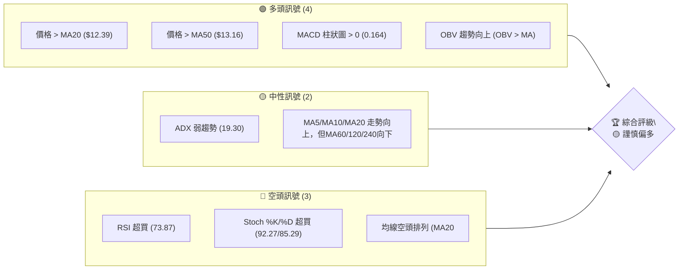

### 📊 核心指標速覽表

| 指標類別 | 指標名稱 | 當前數值 | 訊號 | 解讀 |
|----------|----------|----------|------|------|
| **價格** | 當前價格 | $13.36 | 🟡 | 短期反彈強勁，但接近近期阻力 |
| **均線** | MA20 | $12.39 | 🟢 | 價格位於短期均線上方，顯示短期動能 |
| **均線** | MA50 | $13.16 | 🟢 | 價格位於中期均線上方，顯示中期動能 |
| **均線** | MA200 | $15.30 | 🔴 | 價格位於長期均線下方，長期趨勢偏空 |
| **動能** | RSI(14) | 73.87 | 🔴 | 進入超買區，短期回調風險增加 |
| **動能** | MACD | 0.022 | 🟢 | MACD線位於訊號線上方，柱狀圖為正，看多 |
| **動能** | Stoch %K | 92.27 | 🔴 | 進入超買區，與RSI互相確認回調風險 |
| **趨勢** | ADX(14) | 19.30 | 🟡 | 趨勢強度較弱，市場處於盤整或弱趨勢 |
| **波動** | ATR(14) | $0.46 | 🟡 | 每日波動約 3.42%，屬中等波動 |
| **布林** | BB %B | 0.96 | 🔴 | 價格接近布林通道上軌，可能面臨阻力或區間壓力 |
| **成交量** | OBV趨勢 | OBV > MA | 🟢 | 量能配合價格上漲，支撐當前反彈 |

### 🏆 技術評分卡

NU 目前的技術面表現顯示短期動能強勁，但長期趨勢仍偏空，且多數動能指標已進入超買區，預示潛在的回調風險。

```
╔══════════════════════════════════════════════════════════════╗
║              技術評分卡 — NU (2026-07-01)                      ║
╠══════════════════════════════════════════════════════════════╣
║ 趨勢強度      ████████░░░░░░░░░░░░  40/100  🟡 (ADX弱趨勢，但+DI主導) ║
║ 動能指標      ██████░░░░░░░░░░░░░░  30/100  🔴 (RSI/Stoch超買，MACD多頭)║
║ 支撐穩定度    ██████████████░░░░░░  70/100  🟢 (短期均線提供支撐)     ║
║ 成交量配合    ██████████████░░░░░░  70/100  🟢 (OBV確認上漲動能)     ║
║ 形態完整度    ████████░░░░░░░░░░░░  40/100  🟡 (潛在W底，待確認)      ║
║ 均線排列      ████░░░░░░░░░░░░░░░░  20/100  🔴 (長期空頭排列，短期反彈)║
╠══════════════════════════════════════════════════════════════╣
║ 綜合評分      ██████░░░░░░░░░░░░░░  45/100  🟡 謹慎偏多               ║
╚══════════════════════════════════════════════════════════════╝
```

---

## 2. 趨勢分析

### 🌐 多時框趨勢分析

NU 的多時框架分析顯示，雖然短期和中期趨勢正在努力扭轉向上，但長期趨勢仍處於下行壓力。這表明當前的反彈可能只是長期下降趨勢中的一次修正，或是一個潛在底部構築的早期階段。

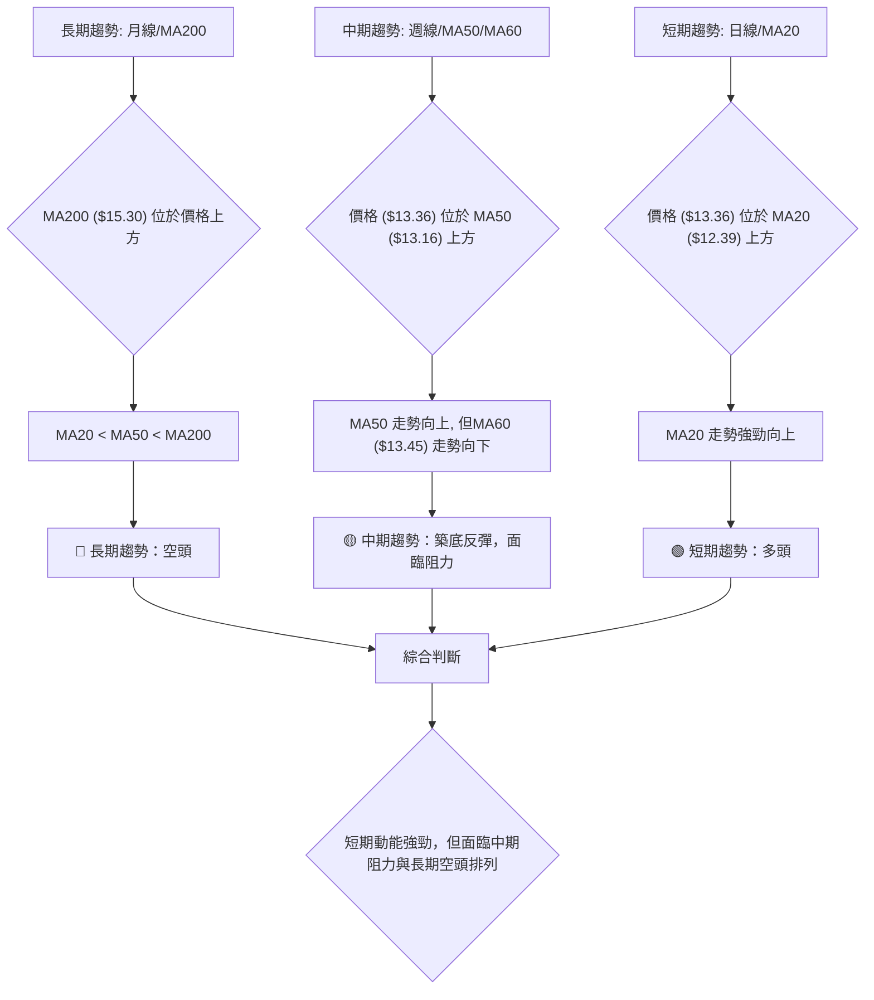

### 📈 長期趨勢 — 12個月走勢圖（Unicode）

NU 在過去12個月的價格走勢呈現出先上漲後回調的「倒V型」結構。從2025年7月的低點 $12.22 上漲至2026年1月的 $17.75 高點，隨後進入修正階段，並在2026年6月觸及 $11.97 的近期低點後反彈。

```
NU 月線走勢圖（過去12個月：2025-07 至 2026-06）
價格軸 ($)
$18.00 ┤                     ● (17.75, 26/01)
$17.50 ┤            ● (17.39, 25/11)
$17.00 ┤        ● (16.74, 25/12)
$16.50 ┤      
$16.00 ┤    ● (16.01, 25/09) ● (16.11, 25/10)
$15.50 ┤
$15.00 ┤  ● (14.80, 25/08)    ● (14.98, 26/02)
$14.50 ┤                ● (14.48, 26/04)
$14.00 ┤              ● (14.37, 26/03)
$13.50 ┤                   ● (13.36, 26/06) ← 現價
$13.00 ┤                  ● (13.13, 26/05)
$12.50 ┤
$12.00 ┤● (12.22, 25/07)
     └─────────────────────────────────────────────────────
      Jul Aug Sep Oct Nov Dec Jan Feb Mar Apr May Jun
      25  25  25  25  25  25  26  26  26  26  26  26

```

**走勢特徵分析表格**：

| 期間 | 起始價 | 結束價 | 漲跌幅 | 走勢特徵 | 評估 |
|------|--------|--------|--------|----------|------|
| 2025-07 ~ 2026-01 | $12.22 | $17.75 | +45.25% | 強勁上升趨勢，創下12個月新高 | 🟢 多頭主導 |
| 2026-01 ~ 2026-06 | $17.75 | $13.36 | -24.73% | 顯著回調，短期超賣後反彈 | 🔴 空頭修正 |
| 最近一個月 (2026-05 ~ 2026-06) | $13.13 | $13.36 | +1.75% | 止跌企穩，嘗試向上反彈 | 🟡 震盪築底 |

### 📊 中期趨勢（週線分析）

中期來看，NU 從2026年1月的高點 $17.75 開始經歷一波修正，最低觸及 $11.97。雖然目前價格從低點反彈，但上方仍有多重阻力。

```
NU 週線近期壓力與支撐示意圖
═══════════════════════════════════════════════════════════════
$18.00 ║                                      R3 (MA200, 長期壓力)
$17.50 ║                                  ● (26/02 高點 $17.53)
$17.00 ║
$16.50 ║
$16.00 ║
$15.50 ║                                      R2 (斐波那契/形態阻力 $15.54)
$15.00 ║                          ● (26/04 高點 $15.34) R1 (MA200 $15.30)
$14.50 ║
$14.00 ║                                      潛在頸線/斐波那契阻力 $14.18
$13.50 ╠═════════════════════════════════════════════════════════════╣ ← R1 ($13.45 布林上軌, MA60)
$13.36 ║                                                         現價
$13.00 ║                                      S1 (MA50 $13.16)
$12.50 ║                                      S1 (MA20 $12.39, 布林中軌)
$12.00 ║                                      S2 (近期低點 $11.97)
$11.50 ║
$11.20 ║                                      S3 (52週低點 $11.20)
═══════════════════════════════════════════════════════════════
```
**分析**：
- **近期阻力**：當前價格 $13.36 正面臨 $13.45 (布林通道上軌/MA60) 的短期阻力。若能突破，下一個重要阻力將是 $14.18 (38.2% 斐波那契回調位) 和 $14.86 (50% 斐波那契回調位)。
- **近期支撐**：最近的反彈使得 $13.16 (MA50) 成為即時支撐。更強的支撐位於 $12.39 (MA20/布林中軌) 和 $11.97 (6月初的低點)。

### ⚡ 趨勢強度評估（ADX 解讀）

ADX 指標用於衡量趨勢的強度，而非方向。NU 的 ADX 數值為 19.30，表明目前市場處於弱趨勢或盤整狀態。

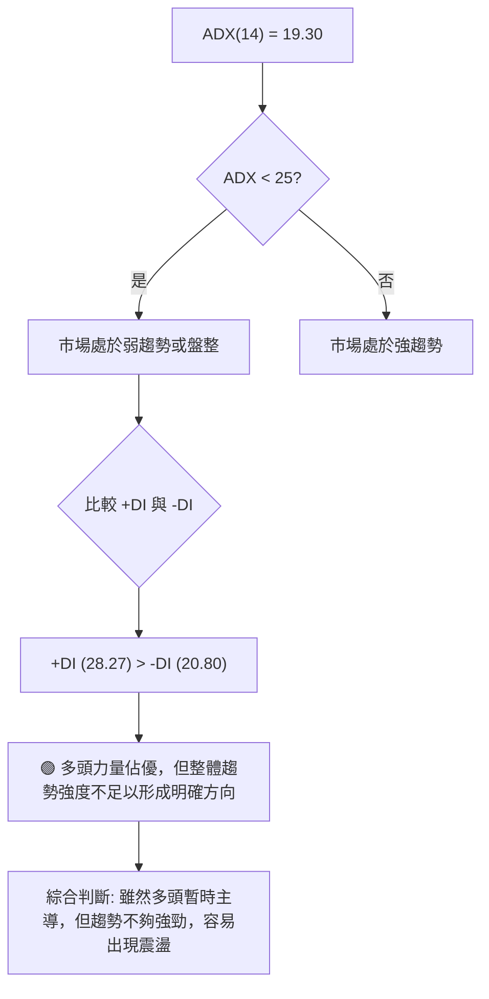

**ADX 強度對照表**：

| ADX 數值範圍 | 趨勢強度 | 市場解讀 |
|--------------|----------|----------|
| 0-25         | 弱趨勢/盤整 | 市場缺乏明確方向，價格可能在區間內震盪 |
| 25-50        | 中等趨勢 | 趨勢正在形成或已確立，動能適中 |
| 50-75        | 強趨勢 | 趨勢強勁，價格沿單一方向移動 |
| 75-100       | 極強趨勢 | 極端強勁的趨勢，可能出現超漲/超跌 |

**結論**：NU 的 ADX 數值為 19.30，明確指示當前為弱趨勢或盤整行情。儘管 +DI (28.27) 高於 -DI (20.80)，表明多頭力量在當前弱勢市場中佔據主導地位，但整體趨勢強度不足以支撐單邊行情。這意味著價格可能在特定區間內波動，任何單向突破都可能面臨較大阻力。

---

## 3. 圖表形態分析

### 🔍 形態識別系統

從 NU 的歷史價格走勢來看，近期從高點回落後，出現了潛在的底部反轉形態。特別是從2026年5月中旬的 $12.19 低點到6月初的 $11.97 低點，隨後價格反彈，形成了一個可能的「W」底（雙重底）形態。

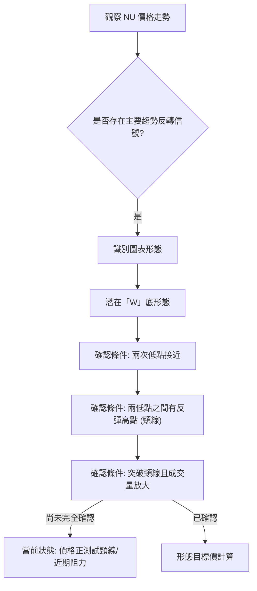

### 🕯️ 重要K線形態分析

根據提供的近20週收盤走勢數據，我們可以觀察到幾個關鍵的K線形態和價格行為：

| 月份 (週) | 收盤價 | K線形態 (推測) | 解讀 | 訊號 |
|-----------|--------|------------------|------|------|
| 2026-02-22 | $17.53 | 高位震盪/看跌吞噬 | 高位動能減弱，預示回調風險 | 🔴 |
| 2026-03-01 | $14.98 | 長陰線/看跌吞噬 | 價格大幅下跌，空頭強勢 | 🔴 |
| 2026-05-17 | $12.19 | 長陰線/錘子線 | 價格觸底，可能出現止跌信號 (需配合次週確認) | 🟡 |
| 2026-05-24 | $12.73 | 長陽線/吞噬前週陰線 | 強勢反彈，確認底部支撐 | 🟢 |
| 2026-06-07 | $11.97 | 長陰線/錘子線 | 再次探底，但隨後迅速收回，形成第二個低點 | 🟡 |
| 2026-06-14 | $12.19 | 長陽線/看漲吞噬 | 從低點強勁反彈，確認支撐，開啟反彈趨勢 | 🟢 |
| 2026-07-05 | $13.36 | 長陽線 | 延續反彈，動能強勁，但已進入超買區 | 🟢 |

**分析**：
- **2026年3月初**：從 $17.53 (2026-02-22) 跌至 $14.98 (2026-03-01)，伴隨巨量 (457,730,300)，形成一個強烈的看跌吞噬或長陰線，確認了趨勢的轉折。
- **2026年5月中旬至6月初**：價格在 $12.19 (2026-05-17) 和 $11.97 (2026-06-07) 附近形成兩個低點，伴隨著後續兩週的長陽線反彈，特別是2026-05-24的 $12.73 和2026-06-14的 $12.19 都顯示出強勁的買盤支撐。這為「W」底形態的形成提供了基礎。

### 📉 ASCII 走勢形態示意圖

近期 NU 股價從高點回落，在 $11.97 附近找到支撐並開始反彈，形成一個潛在的「W」底形態。

```
NU 潛在「W」底形態示意圖 (週線視角)
價格軸 ($)
$15.00 ┤                                  R (頸線 $14.18 - $14.86 區間)
$14.50 ┤
$14.00 ┤              ▲ (反彈高點)
$13.50 ┤                  ● (現價 $13.36)
$13.00 ┤
$12.50 ┤
$12.00 ┤    ● (低點 $12.19)                  ● (低點 $11.97)
$11.50 ┤                                   
     └────────────────────────────────────────────────────────
      May 17    May 24    May 31    Jun 07    Jun 14    Jun 21    Jun 28    Jul 05
      2026      2026      2026      2026      2026      2026      2026      2026
```
**形態分析**：
- **第一低點 (L1)**：約在 $12.19 (2026-05-17)。
- **反彈高點 (H1)**：約在 $13.13 (2026-05-31)。此為潛在頸線的基礎。
- **第二低點 (L2)**：約在 $11.97 (2026-06-07)，與第一低點 $12.19 接近。
- **當前價格**：$13.36，已突破 H1 形成的頸線 ($13.13)，但仍需觀察能否有效站穩。
- **頸線區間**：初步可設定在 $13.13 - $13.45 之間，若考慮更寬泛的阻力，則可能延伸至 $14.18 (38.2% 斐波那契回調)。

### 🎯 形態目標價計算

若「W」底形態確認，其目標價計算方式為：頸線高度加上頸線突破點。
- **頸線**：我們可以將 $13.13 (2026-05-31) 視為初步的頸線。
- **形態高度**：頸線高點 ($13.13) 與第二低點 ($11.97) 之間的距離。
    - 形態高度 = $13.13 - $11.97 = $1.16
- **突破點**：假設價格成功突破頸線 $13.13。
- **目標價**：
    - 形態目標價 T1 = 頸線 + 形態高度 = $13.13 + $1.16 = $14.29
    - 若考慮更保守的頸線突破點，例如 $13.45 (布林上軌)，目標價則為 $13.45 + $1.16 = $14.61。
    - 結合斐波那契回調，目標價區間為 $14.18 (38.2% 回調) 至 $14.86 (50% 回調)。因此，形態目標價 T1 落在 $14.29 附近是合理的。
- **最終形態目標價 T2**：$14.86 (50% 斐波那契回調位，與形態目標價 T1 $14.29 接近，可作為延伸目標)。若能進一步突破，則可挑戰 $15.54 (61.8% 斐波那契回調)。

**結論**：NU 存在潛在「W」底形態，一旦確認突破頸線 $13.13-$13.45 區間並伴隨量能放大，則形態目標價 T1 為 $14.29，延伸目標 T2 為 $14.86。

---

## 4. 支撐與阻力

### 🗺️ 關鍵價位分布圖（Unicode）

NU 的價格在 $13.36，位於近期反彈的高位，下方有多重支撐，但上方也面臨顯著阻力，特別是長期均線和斐波那契回調位。

```
NU 價位結構分布圖 (2026-07-01)
═══════════════════════════════════════════════════════════════
$18.98 ║█████████████████████████████████████████║ 強阻力 R3 (52W 高點)
$17.75 ║█████████████████████████████████████████║ 強阻力 R3 (26/01 高點)
$17.15 ║█████████████████████████████████████████║ 阻力 R2 (Fib 23.6%)
$16.01 ║█████████████████████████████████████████║ 阻力 R2 (Fib 38.2%)
$15.54 ║█████████████████████████████████████████║ 關鍵阻力 R1 (Fib 61.8% 反彈)
$15.30 ║█████████████████████████████████████████║ 關鍵阻力 R1 (MA200)
$14.86 ║█████████████████████████████████████████║ 關鍵阻力 R1 (Fib 50% 反彈)
$14.48 ║█████████████████████████████████████████║ 阻力 R1 (26/04 月收盤)
$14.18 ║█████████████████████████████████████████║ 關鍵阻力 R1 (Fib 38.2% 反彈)
$13.45 ║█████████████████████████████████████████║ 關鍵阻力 R1 (布林上軌, MA60)
$13.36 ╠═════════════════════════════════════════╣ ◄ 現價
$13.33 ║▓▓▓▓▓▓▓▓▓▓▓▓▓▓▓▓▓▓▓▓▓▓▓▓▓▓▓▓▓▓▓▓▓▓▓▓▓▓▓▓▓║ 近期支撐 S1 (Fib 23.6% 反彈)
$13.16 ║▓▓▓▓▓▓▓▓▓▓▓▓▓▓▓▓▓▓▓▓▓▓▓▓▓▓▓▓▓▓▓▓▓▓▓▓▓▓▓▓▓║ 近期支撐 S1 (MA50)
$12.39 ║▓▓▓▓▓▓▓▓▓▓▓▓▓▓▓▓▓▓▓▓▓▓▓▓▓▓▓▓▓▓▓▓▓▓▓▓▓▓▓▓▓║ 近期支撐 S1 (MA20, 布林中軌)
$11.97 ║▓▓▓▓▓▓▓▓▓▓▓▓▓▓▓▓▓▓▓▓▓▓▓▓▓▓▓▓▓▓▓▓▓▓▓▓▓▓▓▓▓║ 強支撐 S2 (近期低點)
$11.32 ║▓▓▓▓▓▓▓▓▓▓▓▓▓▓▓▓▓▓▓▓▓▓▓▓▓▓▓▓▓▓▓▓▓▓▓▓▓▓▓▓▓║ 強支撐 S2 (布林下軌)
$11.20 ║▓▓▓▓▓▓▓▓▓▓▓▓▓▓▓▓▓▓▓▓▓▓▓▓▓▓▓▓▓▓▓▓▓▓▓▓▓▓▓▓▓║ 強支撐 S2 (52W 低點)
═══════════════════════════════════════════════════════════════
```

### 🚧 阻力位分析表

| 阻力級別 | 價位 | 形成原因 | 突破難度 | 重要性 |
|----------|------|----------|----------|--------|
| **R1 (即時)** | $13.45 | 布林通道上軌，MA60 | 中等 | 🟢 近期突破關鍵 |
| **R1 (關鍵)** | $14.17 - $14.18 | 斐波那契61.8%回調 (長期修正) / 斐波那契38.2%回調 (近期下跌反彈) | 高 | 🟡 決定中期反彈強度 |
| **R1 (關鍵)** | $14.86 | 斐波那契50%回調 (近期下跌反彈) | 高 | 🟡 若突破，反彈動能增強 |
| **R2 (強勁)** | $15.30 - $15.54 | MA200，斐波那契61.8%回調 (近期下跌反彈) | 極高 | 🔴 決定長期趨勢是否逆轉 |
| **R3 (主要)** | $17.75 | 2026年1月高點 | 極高 | 🔴 長期趨勢反轉的最終確認 |
| **R3 (歷史)** | $18.98 | 52週高點 | 極高 | 🔴 極具挑戰性的長期目標 |

### 🛡️ 支撐位分析表

| 支撐級別 | 價位 | 形成原因 | 守住機率 | 重要性 |
|----------|------|----------|----------|--------|
| **S1 (即時)** | $13.16 | MA50 | 高 | 🟢 短期反彈的基礎 |
| **S1 (關鍵)** | $12.39 | MA20，布林通道中軌 | 較高 | 🟢 短期趨勢健康的關鍵 |
| **S2 (強勁)** | $11.97 | 近期低點 (2026-06-07) | 較高 | 🟡 潛在「W」底形態的底部 |
| **S2 (強勁)** | $11.32 | 布林通道下軌 | 高 | 🟡 提供強勁技術性支撐 |
| **S3 (極強)** | $11.20 | 52週低點 | 極高 | 🔴 長期趨勢的最後防線 |

### 📐 斐波那契回調位分析

我們將從兩個主要的價格區間進行斐波那契分析：

1.  **長期上漲趨勢的修正 (從52週低點 $11.20 到 52週高點 $18.98)**：
    這個區間反映了 NU 過去一年多來的整體上升勢頭，當前價格 $13.36 位於這個長期趨勢的深度回調區。
    -   **整體漲幅**：$18.98 - $11.20 = $7.78
    -   **23.6% 回調**：$18.98 - ($7.78 * 0.236) = $17.15 (若反彈至此，表示修正結束)
    -   **38.2% 回調**：$18.98 - ($7.78 * 0.382) = $16.01 (重要支撐/阻力區)
    -   **50% 回調**：$18.98 - ($7.78 * 0.50) = $15.09 (重要心理關口)
    -   **61.8% 回調**：$18.98 - ($7.78 * 0.618) = $14.17 (關鍵支撐/阻力，與當前價格接近)
    -   **76.4% 回調**：$18.98 - ($7.78 * 0.764) = $13.04 (深度回調支撐)
    -   **當前價格 $13.36 位於 61.8% ($14.17) 和 76.4% ($13.04) 回調之間，顯示長期趨勢經歷了深度修正。**

2.  **近期下跌趨勢的反彈 (從2026年1月高點 $17.75 到 2026年6月低點 $11.97)**：
    這個區間反映了 NU 近期的修正走勢，當前價格 $13.36 位於這個下跌趨勢的反彈區。
    -   **整體跌幅**：$17.75 - $11.97 = $5.78
    -   **23.6% 反彈**：$11.97 + ($5.78 * 0.236) = $13.33 (與當前價格 $13.36 極為接近，構成即時阻力)
    -   **38.2% 反彈**：$11.97 + ($5.78 * 0.382) = $14.18 (重要阻力，若突破則反彈動能增強)
    -   **50% 反彈**：$11.97 + ($5.78 * 0.50) = $14.86 (重要心理阻力)
    -   **61.8% 反彈**：$11.97 + ($5.78 * 0.618) = $15.54 (關鍵阻力，若突破則可能扭轉下跌趨勢)

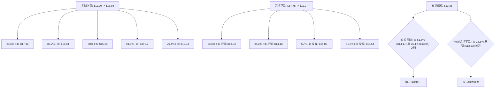

**總結**：
-   當前價格 $13.36 正在測試近期下跌趨勢的 23.6% 斐波那契反彈位 $13.33，這是非常重要的短期阻力。
-   若能突破 $13.33，則下一個阻力位將是 $14.18 (長期 61.8% 回調與近期 38.2% 反彈的匯合處)，這將是多頭能否進一步上攻的關鍵考驗。
-   下方 $13.04 (長期 76.4% 回調) 和 $12.39 (MA20/BB中軌) 構成強勁支撐。

---

## 5. 技術指標深度解讀

### 🎛️ 指標訊號總覽

NU 的技術指標呈現複雜局面：短期動能指標顯示超買，但趨勢指標（MA）排列偏空，而 MACD 和 OBV 則給出多頭訊號。這表明市場處於短期反彈與長期趨勢壓力的拉鋸戰中。

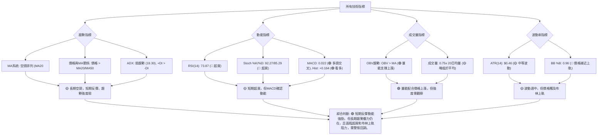

### 📈 移動平均線排列分析

NU 的移動平均線系統呈現典型的空頭排列，但價格已成功站上短期和中期均線，顯示短期買盤力量的增強。

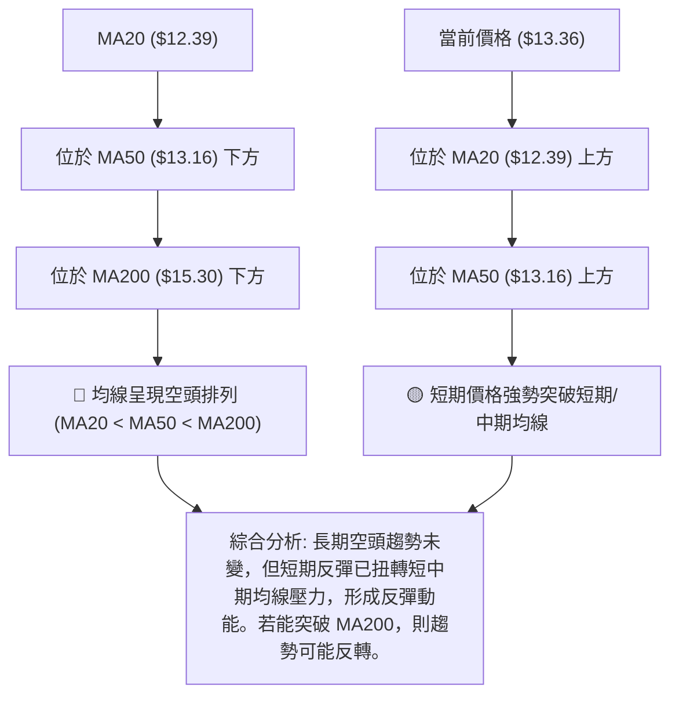
**詳細分析**：
- **空頭排列**：MA20 ($12.39) < MA50 ($13.16) < MA200 ($15.30)，這是經典的空頭排列，表明長期趨勢仍處於下降通道。
- **價格與均線關係**：當前價格 $13.36 已經突破並站穩在 MA20 和 MA50 之上，這是一個積極的短期訊號，顯示近期買盤力量強勁，成功扭轉了短中期趨勢。
- **均線走勢**：MA5 ($12.92)、MA10 ($12.83)、MA20 ($12.39) 均呈現向上趨勢，進一步確認了短期動能。然而，MA60 ($13.45)、MA120 ($14.76)、MA240 ($14.99) 仍向下，表明中期和長期壓力依然存在。
- **結論**：雖然長期均線排列仍偏空，但價格成功站上短中期均線，顯示短期反彈動能強勁。MA200 ($15.30) 將是未來多頭能否扭轉長期趨勢的關鍵阻力。

### 📉 RSI(14) 分析

RSI (相對強弱指標) 用於衡量價格變動的速度和變化，判斷資產是超買還是超賣。

-   **RSI 數值進度條**：
    RSI(14): 73.87 🔴 超買 ████████████████████░░░░░░ 73.87%

-   **超買超賣區間分析**：
    -   **當前 RSI(14) 為 73.87**，明確進入了超買區 (通常 > 70)。這表示 NU 股價在短期內上漲過快，可能存在回調或盤整的需求。
    -   從近20週數據看，2026-04-19 曾達到 79.6 的高點，隨後價格從 $15.34 回調。這次再次進入超買區，需要警惕歷史重演的風險。
    -   歷史上，RSI 低於 30 (超賣區) 時，如 2026-03-01 (RSI 26.3) 和 2026-05-17 (RSI 20.8)，往往預示著股價的短期底部。目前價格從超賣區強力反彈至超買區，動能轉換迅速。

-   **背離判斷 (頂背離/底背離)**：
    -   **頂背離**：當價格創出新高，但 RSI 未能創出新高時，預示潛在的看跌反轉。根據數據，2026-01 的 $17.75 高點後，RSI 並未達到極高值 (當時RSI值不詳，但隨後價格大幅下跌)。最近的價格高點 $15.34 (2026-04-19) 伴隨 RSI 79.6，而目前的 $13.36 伴隨 RSI 73.87。雖然價格較低，但RSI仍處於超買區。數據中明確指出「RSI 背離: 無明顯背離」，我們將遵循此點，但需注意超買本身即是警訊。
    -   **底背離**：當價格創出新低，但 RSI 未能創出新低時，預示潛在的看漲反轉。在2026年5月到6月的低點 (如 $12.19 和 $11.97)，RSI 分別為 20.8 和 47.2 (2026-06-07當週為 $11.97，RSI 47.2；前一週 $13.13，RSI 40.8。這段數據有點混亂，但整體趨勢是從低點反彈，RSI也隨之上升)。如果價格在 $11.97 附近形成新低而 RSI 未創新低，則可能存在底背離，但數據中並未明確顯示。

**結論**：RSI 處於超買區，對短期上漲構成壓力，但目前沒有明確的頂背離訊號。這表明當前上漲動能強勁，但回調風險不容忽視。

### 📊 MACD(12/26/9) 訊號解讀

MACD (移動平均線收斂/發散指標) 用於識別趨勢的方向、動能和持續時間。

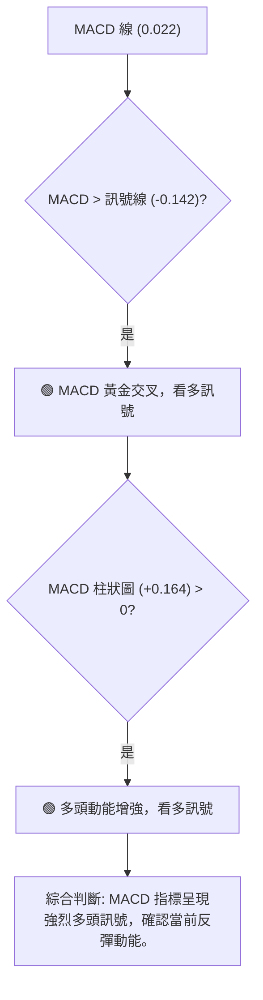
**詳細分析**：
-   **MACD 線 (0.022) 與訊號線 (-0.142)**：MACD 線位於訊號線上方，形成「黃金交叉」，這是經典的看漲訊號。這表明短期動能正在超越中期動能，支持當前價格的反彈。
-   **MACD 柱狀圖 (+0.164)**：柱狀圖為正值，且從負值區域轉為正值，並持續擴大，這進一步確認了多頭動能的增強。柱狀圖的增長速度也反映了動能的強度。
-   **背離判斷 (頂背離/底背離)**：
    -   **頂背離**：若價格創出新高，但 MACD 未能創出新高，則為頂背離。目前價格仍在反彈中，尚未達到此前的高點，因此沒有明顯的頂背離。
    -   **底背離**：若價格創出新低，但 MACD 未能創出新低，則為底背離。在2026年5月至6月的低點區域，價格雖然探底，但 MACD 柱狀圖在轉正之前，可能在較低點位形成收斂，這有助於形成底部反轉。目前 MACD 已經轉為正值，表明底背離的潛在效果已經顯現。

**結論**：MACD 指標明確發出多頭訊號，與 RSI 的超買狀態形成一定程度的矛盾。MACD 傾向於確認當前反彈的動能和趨勢方向，而 RSI 則警示短期的過熱風險。投資者需權衡這兩個指標，可能意味著反彈的持續性受到超買的限制，但整體方向仍向上。

### 📦 布林通道分析

布林通道 (Bollinger Bands) 用於衡量價格的波動範圍和相對位置。

```
NU 布林通道示意圖 (日線視角)
價格軸 ($)
$14.00 ┤                                  BB上軌 ($13.45)
$13.50 ┤                                  現價 ($13.36)
$13.00 ┤              ════════════════════════════════════════
$12.50 ┤                                  BB中軌 (MA20 $12.39)
$12.00 ┤              ════════════════════════════════════════
$11.50 ┤                                  BB下軌 ($11.32)
$11.00 ┤
     └────────────────────────────────────────────────────────
                      時間軸 (近期)
```
**詳細分析**：
-   **BB上軌**：$13.45
-   **BB中軌 (MA20)**：$12.39
-   **BB下軌**：$11.32
-   **當前價格 $13.36 位於布林通道上軌附近 (BB %B = 0.96)**。這是一個重要的訊號：
    -   **觸及上軌**：通常表示股價在短期內處於強勢，可能挑戰上軌壓力。
    -   **超買警示**：與 RSI 超買訊號互相印證，價格可能面臨短期回調或盤整。
    -   **通道擴張/收縮**：數據未直接提供布林通道的寬度變化，但若通道正在收縮後擴張，則可能預示著趨勢的啟動。若通道寬度維持不變或收縮，則觸及上軌後回落的可能性較大。
-   **布林通道中軌 (MA20)** $12.39 提供了強勁的動態支撐。只要價格維持在中軌上方，短期趨勢就偏多。
-   **布林通道下軌** $11.32 與 52週低點 $11.20 接近，形成了極強的支撐區。

**結論**：NU 股價已觸及布林通道上軌，結合 RSI 的超買，顯示短期存在回調壓力。這也意味著當前的反彈動能非常強勁，但需注意上漲空間可能受限，除非通道進一步擴張並伴隨強勁量能突破。

### 💹 成交量分析（量價配合度）

成交量是價格走勢的燃料，量價配合度對於判斷趨勢的可靠性至關重要。

-   **最新成交量**：45,571,700 股。
-   **20日均量**：60,866,165 股。
-   **50日均量**：53,442,590 股。
-   **量比**：0.75x (最新成交量 / 20日均量)。

**詳細分析**：
-   **當前成交量略低於20日和50日均量**：量比 0.75x 顯示當前交易日的成交量較近期的平均水平有所縮減。這在價格上漲的背景下，可能暗示上漲動能的持續性可能不足，或者市場正在等待進一步的催化劑。
-   **OBV 趨勢**：數據顯示「OBV > MA → 量能支撐上漲」，這是一個積極訊號。OBV (能量潮指標) 的上升表明在價格上漲時，成交量更大，而在價格下跌時，成交量較小，這確認了買盤力量主導市場，並為當前反彈提供了堅實的量能基礎。
-   **量價背離**：
    -   **看漲背離**：若價格下跌而 OBV 上升，則為看漲背離。在 NU 從 $17.75 跌至 $11.97 的過程中，如果 OBV 在低點沒有跟隨價格創新低，則可能存在底背離，這與 MACD 的底部反轉訊號相互印證。
    -   **看跌背離**：若價格上漲而 OBV 下降，則為看跌背離。目前的量比略低於平均，需要密切關注後續反彈過程中成交量能否放大，若價格持續上漲但成交量萎縮，則可能形成看跌背離。

**結論**：OBV 指標確認了量能對當前反彈的支撐，這是積極的訊號。然而，最新的日成交量略低於均值，這要求投資者在觀察價格突破阻力時，必須密切關注成交量能否有效放大，以避免潛在的量價背離風險。

---

## 6. 動能與波動率

### ⚡ 動能評估四象限

NU 目前的動能評估顯示其處於「高動能、中等波動」的狀態。短期內價格反彈強勁，但長期趨勢仍有待觀察，且波動率適中。

| 象限 | 動能 (RSI, MACD) | 波動 (ATR) | 當前狀態 | 評估 |
|------|------------------|------------|----------|------|
| Q1 | 強 (🟢)          | 低 (綠)    | -        | 最佳機會：上漲動能強勁且風險可控，可積極做多。 |
| Q2 | 弱 (🔴)          | 低 (綠)    | -        | 謹慎觀望：動能不足，市場可能盤整或下跌，等待方向。 |
| Q3 | 強 (🟢)          | 高 (紅)    | ✓        | **高風險高收益**：當前NU的狀態。動能強勁，但波動較大，需嚴格控制風險。適合激進型交易者。 |
| Q4 | 弱 (🔴)          | 高 (紅)    | -        | 避免進場：動能弱且波動大，市場極不穩定，不宜操作。 |

**分析**：
-   **動能強度**：RSI 73.87 超買，MACD 呈現黃金交叉且柱狀圖為正。Stochastics 也超買。這些指標綜合來看，NU 的短期上漲動能非常強勁。因此，動能評估為「強」。
-   **波動率**：ATR(14) 為 $0.46，佔當前價格 $13.36 的 3.42%。相較於許多高科技股或新興市場股票，這個波動率屬於中等水平。ATR 數值本身並非極高或極低，因此波動評估為「中」。
-   **結論**：NU 處於「高動能、中等波動」的第三象限。這代表當前有較大的上漲潛力，但同時伴隨著一定的價格波動風險。交易者應在享受動能帶來的收益時，時刻注意風險管理，例如設定嚴格的止損點。

### 📊 ATR 波動率分析

ATR (平均真實波幅) 用於衡量資產價格的波動性，是設定止損和目標價的重要參考。

-   **ATR(14)**：$0.46
-   **佔價格百分比**：3.42% ( $0.46 / $13.36 )

**詳細分析**：
-   **波動性判斷**：NU 的 ATR 數值為 $0.46，佔當前價格的 3.42%。這表明 NU 每日的平均波動幅度約為 3.42%。相較於整體市場，這屬於中等偏高的波動水平，符合其新興市場金融科技公司的性質。
-   **止損距離建議**：ATR 可以作為動態止損的參考。一般建議將止損點設置在當前價格下方 1-2 倍 ATR 的位置。
    -   **1倍 ATR 止損**：$13.36 - $0.46 = $12.90
    -   **2倍 ATR 止損**：$13.36 - ($0.46 * 2) = $12.44
    -   結合技術支撐位，例如 MA50 ($13.16) 或 MA20 ($12.39)，可以更精確地設定止損。例如，若採用激進止損，可在 $12.90 附近；若採用保守止損，則可考慮 $12.44 或更低的 $11.97 (近期低點)。
-   **交易策略應用**：中等波動率意味著價格有足夠的日內波動空間進行短線交易，但同時也增加了震盪止損的風險。對於中長線投資者，應將 ATR 納入倉位管理，避免因短期波動而被震出。

### 📐 Beta 與市場相關性

Beta 值衡量單一證券相對於整個市場的波動性。數據中未提供 NU 的 Beta 值，因此我們無法進行精確計算。

**分析**：
-   **數據限制**：由於缺乏 Beta 數據，我們無法量化 NU 相對於整體市場 (如 S&P 500) 的波動程度。
-   **推斷**：作為一家巴西的數位銀行，屬於金融服務行業，且業務主要在新興市場，NU 的 Beta 值很可能大於 1。這意味著它可能比市場整體波動性更高，在市場上漲時漲幅更大，在市場下跌時跌幅也可能更大。
-   **投資影響**：如果 Beta 值較高，投資者在市場波動較大時持有 NU 可能面臨更高的風險。因此，在進行交易決策時，應將其視為波動性較高、與市場相關性較強的股票，並採取相應的風險管理措施。

---

## 7. 多時框架總結

NU 的多時框架分析顯示，短期內買盤動能強勁，但中期面臨阻力，且長期趨勢仍未擺脫空頭排列的影響。這是一個典型的反彈修正行情，而非明確的趨勢反轉。

### 📋 時框架評分表

| 時框架 | 趨勢方向 | 動能 (RSI/MACD) | 均線排列 | 形態 (S/R) | 綜合評分 | 建議 |
|--------|----------|-----------------|----------|------------|----------|------|
| **短期** | 🟢 強勁反彈 | 🟡 超買但MACD多頭 | 🟢 價格>MA20/MA50 | 🟢 突破近期小阻力 | 7/10 | 🟢 謹慎做多，注意超買回調 |
| **中期** | 🟡 震盪築底 | 🟡 動能持續但有超買 | 🟡 MA50向上但MA60向下 | 🟡 面臨斐波那契/MA200阻力 | 5/10 | 🟡 觀望，等待突破或回調 |
| **長期** | 🔴 下跌修正 | 🔴 仍處於修正階段 | 🔴 MA20<MA50<MA200 | 🔴 距離主要阻力較遠 | 3/10 | 🔴 避免追高，等待長期趨勢扭轉 |

### 🔲 綜合訊號矩陣

| 指標類別 | 短期 (日線) | 中期 (週線) | 長期 (月線) | 一致性 | 分析 |
|----------|-------------|-------------|-------------|--------|------|
| **價格趨勢** | 🟢 上漲     | 🟡 震盪反彈 | 🔴 下跌修正 | 矛盾   | 短期動能強勁，但與中長期趨勢背離，反彈可能受限。 |
| **均線系統** | 🟢 價格>MA20/50 | 🟡 價格>MA50但<MA60 | 🔴 空頭排列 | 矛盾   | 短期均線顯示多頭，但長期空頭排列，趨勢扭轉需時間。 |
| **動能指標** | 🔴 RSI超買 / 🟢 MACD多頭 | 🟡 MACD柱狀圖仍為正 | 🟡 仍處於修正後反彈 | 矛盾   | 短期超買與多頭動能並存，中期動能需持續驗證。 |
| **支撐阻力** | 🟡 接近阻力 | 🟡 測試關鍵阻力 | 🔴 下方有強支撐 | 良好   | 短期面臨 $13.45-$14.18 阻力，下方 $12.39-$11.97 有強支撐。 |
| **成交量** | 🟢 OBV確認 | 🟡 量能略低於平均 | 🟡 底部放量反彈 | 良好   | OBV確認反彈，但近期日量縮，需關注量能能否放大。 |
| **波動率** | 🟡 中等波動 | 🟡 中等波動 | 🟡 中等波動 | 一致   | 波動率適中，但價格觸及布林上軌，需注意短期風險。 |

**綜合結論**：
NU 目前處於一個短期強勁反彈的階段，由 MACD 黃金交叉和 OBV 向上趨勢所支持。然而，RSI 和 Stochastics 已進入超買區，且價格已觸及布林通道上軌和短期斐波那契阻力，預示著回調風險。從中期看，儘管價格突破了短中期均線，但仍面臨 MA200 和更關鍵的斐波那契阻力 ($14.18, $14.86, $15.54)。長期來看，均線系統仍處於空頭排列，表明整體趨勢仍偏空。因此，當前行情更像是長期下跌趨勢中的一次技術性反彈，而非趨勢的根本性逆轉。投資者應保持謹慎樂觀，重點關注關鍵阻力位的突破情況，並做好風險管理。

---

## 8. 交易策略建議

基於 NU 的多時框架技術分析，目前市場處於短期反彈與中期阻力拉鋸的階段。RSI 和 Stochastics 超買，但 MACD 和 OBV 顯示多頭動能。因此，建議採取謹慎偏多的策略，等待回調至支撐位後入場，或在關鍵阻力突破後追蹤。

### 🗺️ 策略決策流程圖

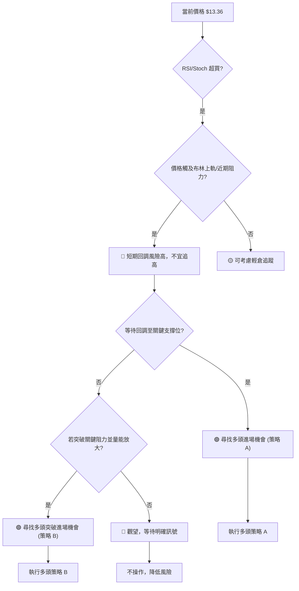

### 🟢 多頭策略詳情

**策略 A：回調買入策略 (Pullback Buy)**
此策略適用於當前超買情況下，預期價格會回調至關鍵支撐後再次上攻。

| 策略要素 | 策略 A：回調買入 |
|----------|--------------------|
| 進場條件 | 價格回調至 MA50 或 MA20 (同時為布林中軌) 附近，並出現止跌信號 (如錘子線、看漲吞噬等)。 |
| 進場價格 | $12.50 - $13.00 區間 (例如：$12.80) |
| 目標價 T1 | $14.18 (近期下跌趨勢 38.2% 斐波那契反彈位) |
| 目標價 T2 | $14.86 (近期下跌趨勢 50% 斐波那契反彈位) |
| 止損價格 | $11.80 (低於近期低點 $11.97) |
| 風險報酬比 | T1: $1.00 (風險) : $1.38 (報酬) = 1:1.38 <br> T2: $1.00 (風險) : $2.06 (報酬) = 1:2.06 |
| 成功機率 | 60% (基於底部形態和OBV支撐) |
| 建議倉位 | 10%-15% (視個人風險偏好) |

**策略 B：突破追蹤策略 (Breakout Buy)**
此策略適用於當前價格突破關鍵阻力並伴隨量能放大時，確認反彈動能持續。

| 策略要素 | 策略 B：突破追蹤 |
|----------|--------------------|
| 進場條件 | 價格有效突破 $13.45 (布林上軌/MA60) 或 $14.18 (38.2% 斐波那契反彈位)，並伴隨成交量放大。 |
| 進場價格 | $14.25 (突破 $14.18 後確認) |
| 目標價 T1 | $14.86 (近期下跌趨勢 50% 斐波那契反彈位) |
| 目標價 T2 | $15.54 (近期下跌趨勢 61.8% 斐波那契反彈位 / MA200 附近) |
| 止損價格 | $13.80 (突破點下方，參考 $14.18 的 1倍 ATR 止損約 $14.18 - $0.46 = $13.72) |
| 風險報酬比 | T1: $0.45 (風險) : $0.61 (報酬) = 1:1.36 <br> T2: $0.45 (風險) : $1.29 (報酬) = 1:2.87 |
| 成功機率 | 55% (需確認突破的有效性) |
| 建議倉位 | 5%-10% (突破策略風險較高) |

### 🔴 空頭策略詳情

**策略 C：高位回調做空策略 (Overbought Reversal Short)**
此策略適用於當前超買且價格觸及阻力，預期短期回調時進行。

| 策略要素 | 策略 C：高位回調做空 |
|----------|--------------------|
| 進場條件 | 價格在 $13.45 (布林上軌) 或 $14.18 (斐波那契阻力) 附近未能有效突破，並出現看跌K線形態 (如射擊之星、烏雲蓋頂) 或動能指標轉弱。 |
| 進場價格 | $13.40 (確認阻力有效後) |
| 目標價 T1 | $12.39 (MA20 / 布林中軌) |
| 目標價 T2 | $11.97 (近期低點) |
| 止損價格 | $13.70 (略高於 $13.45 布林上軌和 $13.36 現價，給予緩衝) |
| 風險報酬比 | T1: $0.30 (風險) : $1.01 (報酬) = 1:3.37 <br> T2: $0.30 (風險) : $1.43 (報酬) = 1:4.77 |
| 成功機率 | 50% (RSI超買支持，但MACD仍多頭) |
| 建議倉位 | 5%-10% (風險較高，需密切監控) |

### ⭐ 整體訊號強度評星

```
做多訊號強度：★★★☆☆  (3/5星) - 短期動能強勁，但超買和長期趨勢偏空限制上漲空間。
做空訊號強度：★★☆☆☆  (2/5星) - 超買和阻力提供做空機會，但MACD多頭和OBV支撐短期空頭壓力不大。
整體可信度：  ★★★☆☆  (3/5星) - 市場多空交織，需謹慎選擇方向並嚴格執行風控。
```

---

## 9. 風險提示與監控

NU 目前的技術面呈現多空拉鋸，短期反彈動能強勁但面臨超買和中長期阻力。有效的風險管理和持續監控是成功交易的關鍵。

### ✅ 關鍵監控指標 Checklist

以下是交易者在操作 NU 時應密切關注的指標清單：

```
╔══════════════════════════════════════════════════════════════╗
║              NU 關鍵監控指標 Checklist                         ║
╠══════════════════════════════════════════════════════════════╣
║ ├─ 價格行為：是否有效突破 $13.45 (布林上軌)？                  ║
║ ├─ 價格行為：是否有效突破 $14.18 (斐波那契阻力)？               ║
║ ├─ 價格行為：是否跌破 $13.16 (MA50) 或 $12.39 (MA20/BB中軌)？  ║
║ ├─ RSI(14)：是否從超買區回落並跌破 70？                        ║
║ ├─ MACD：MACD線是否跌破訊號線 (死叉)？柱狀圖是否轉負？          ║
║ ├─ 成交量：價格突破阻力時，成交量是否放大？價格回調時，成交量是否萎縮？║
║ ├─ ADX(14)：ADX 數值是否上升並突破 25，指示趨勢強化？+DI/-DI 變化？║
║ ├─ K線形態：是否出現反轉K線形態 (如流星線、看跌吞噬)？           ║
║ ├─ 外部因素：是否有影響巴西金融市場或金融科技板塊的宏觀新聞？    ║
╚══════════════════════════════════════════════════════════════╝
```

### ⚠️ 風險場景分析

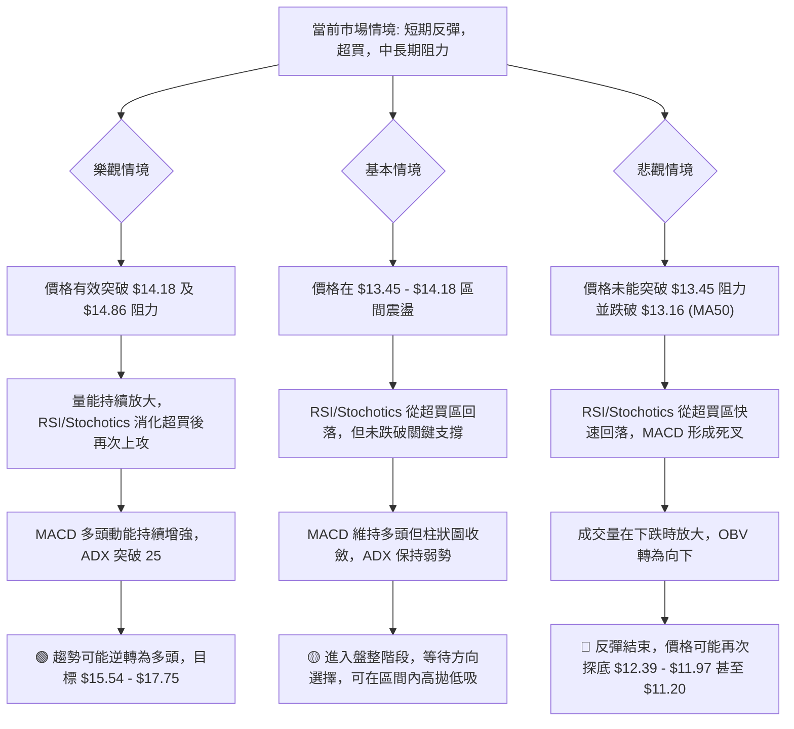

### 🛡️ 風險管理重要提醒

1.  **倉位管理**：鑑於當前市場多空交織且長期趨勢仍偏空，建議採取保守的倉位管理策略。單筆交易的倉位不應超過總資金的 5-10%，以避免單一股票的波動對整體資產造成過大影響。
2.  **嚴格止損**：無論採取何種策略，都必須設定並嚴格執行止損點。一旦價格觸及止損位，應果斷離場，避免虧損擴大。將止損點設置在關鍵支撐位下方，並參考 ATR 進行調整。
3.  **動態調整**：市場是動態變化的，技術訊號也可能隨時改變。應持續監控上述關鍵指標，並根據市場的最新變化靈活調整交易策略。例如，若超買指標持續，但價格卻能有效突破阻力，則需重新評估。
4.  **避免追高**：當前 RSI 處於超買區，價格觸及布林上軌。此時追高風險較大，建議耐心等待回調至支撐位後再考慮進場，或等待有效突破關鍵阻力並確認後再追蹤。
5.  **關注宏觀風險**：作為一家新興市場的金融公司，NU 的股價容易受到巴西經濟、政治環境以及全球市場情緒的影響。需密切關注相關宏觀經濟數據和新聞事件，這些都可能成為改變技術走勢的催化劑。

---

## 📋 報告總結

```
╔══════════════════════════════════════════════════════════════════╗
║                          NU 技術分析報告總結                         ║
╠══════════════════════════════════════════════════════════════════╣
║ 報告日期：2026-07-01                                               ║
║ 當前價格：$13.36                                                   ║
║ 分析評級：⚖️ 謹慎偏多 (短期反彈強勁，但面臨超買和中長期阻力)          ║
║                                                                    ║
║ 關鍵結論：                                                         ║
║ ├─ 長期趨勢：🔴 空頭排列 (MA20<MA50<MA200)，長期下行壓力仍在。       ║
║ ├─ 中期趨勢：🟡 築底反彈，價格已站上MA50，但面臨MA60及斐波那契阻力。 ║
║ ├─ 短期趨勢：🟢 強勁多頭，價格位於MA20上方，MACD黃金交叉，OBV向上。  ║
║ ├─ 關鍵支撐：S1: $13.16 (MA50), $12.39 (MA20/BB中軌)               ║
║ ├─ 關鍵支撐：S2: $11.97 (近期低點), $11.20 (52W低點)               ║
║ ├─ 關鍵阻力：R1: $13.45 (BB上軌), $14.18 (Fib 38.2%反彈), $14.86 (Fib 50%反彈)║
║ ├─ 關鍵阻力：R2: $15.30 (MA200), $15.54 (Fib 61.8%反彈)            ║
║ └─ 分析師目標：$17.82 (分析師共識均值，與技術阻力 R3 接近)          ║
║                                                                    ║
║ 最優策略組合：                                                     ║
║ 1. 🥇 最佳機會：等待價格回調至 $12.50-$13.00 區間 (MA20/MA50附近) 尋找止跌信號做多，目標 $14.18 - $14.86，止損 $11.80。║
║ 2. 🥈 次選機會：若價格有效突破 $14.18 (伴隨量能放大)，可考慮追蹤做多，目標 $14.86 - $15.54，止損 $13.80。           ║
║ 3. 🥉 保守選擇：若價格在 $13.45 - $14.18 區間受阻並出現看跌信號，可考慮輕倉做空，目標 $12.39 - $11.97，止損 $13.70。║
╚══════════════════════════════════════════════════════════════════╝
```

---

> ⚠️ **免責聲明**：本報告為 AI 自動生成之技術分析，所有數據及估算均基於提供的歷史價格資訊。本報告**僅供研究與學術參考**，**不構成任何投資建議**。投資有風險，入市需謹慎。

---

*報告生成時間：2026-07-01 ｜ 數據來源：提供數據集 ｜ 分析框架：多時框技術分析*