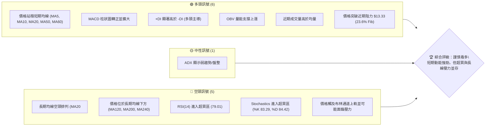
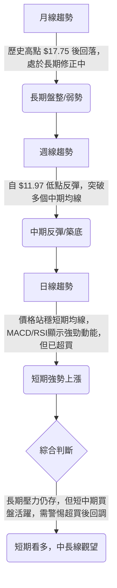
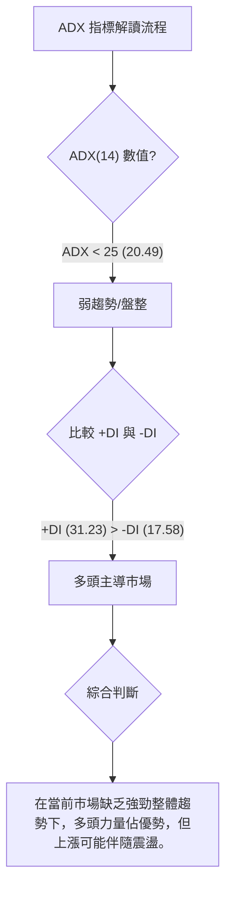
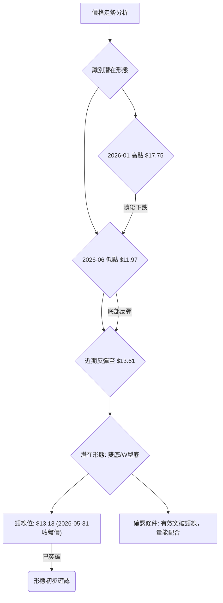
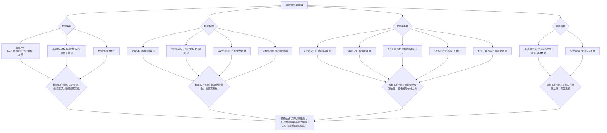
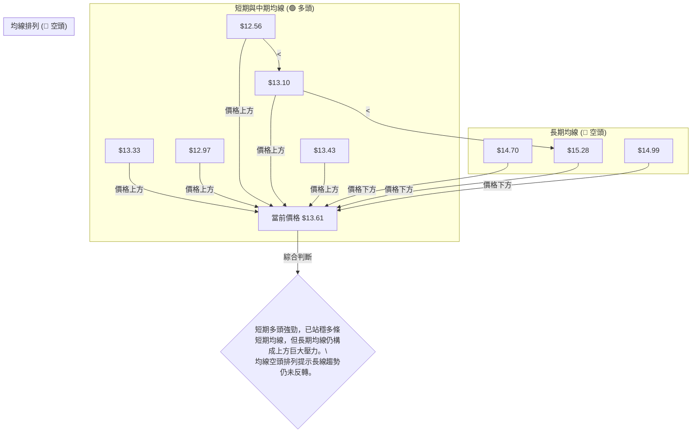
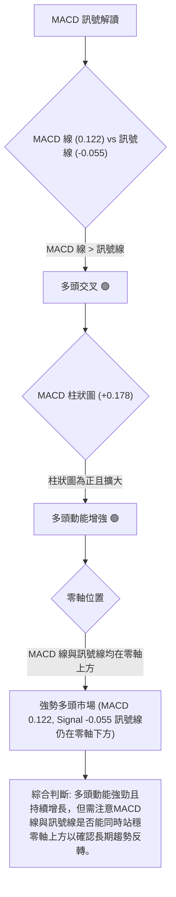
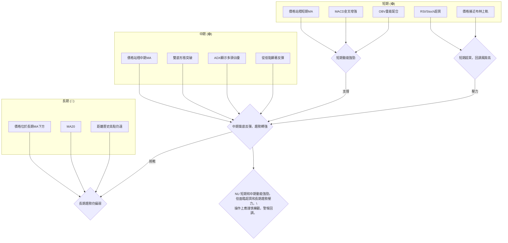
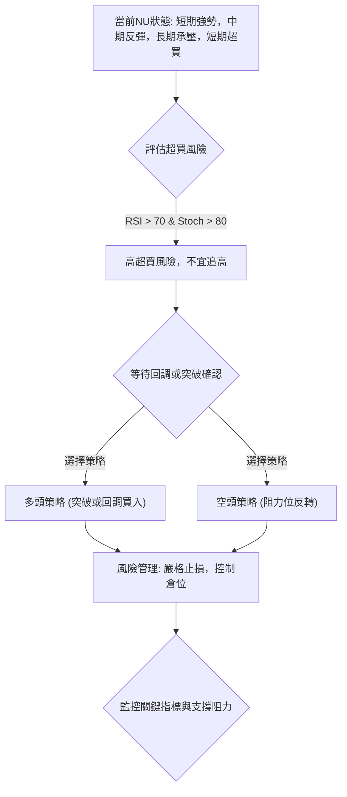
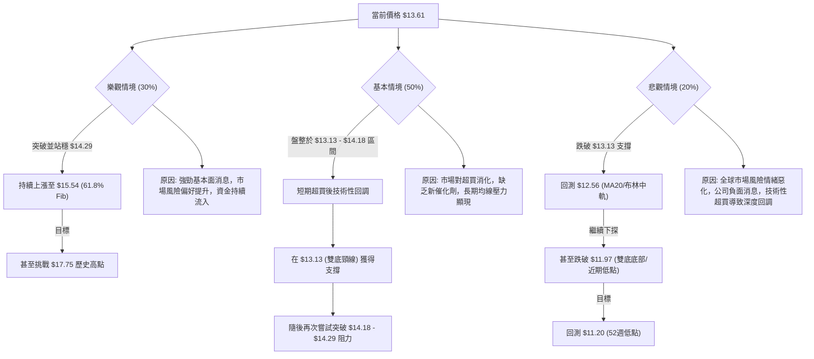

<details>
<summary>📊 靜態圖表 (點擊展開)</summary>

</details>

<html>
<head><meta charset="utf-8" /></head>
<body>
    <div style="height:500px; width:100%;">                        <script>window.PlotlyConfig = {MathJaxConfig: 'local'};</script>
        <script charset="utf-8" src="https://cdn.plot.ly/plotly-3.6.0.min.js" integrity="sha256-QaOVwtVY0T02VaHrr6pnoHLCwayMJp4O5n4YyaE3rJk=" crossorigin="anonymous"></script>                <div id="candlestick-chart" class="plotly-graph-div" style="height:100%; width:100%;"></div>            <script>                window.PLOTLYENV=window.PLOTLYENV || {};                                if (document.getElementById("candlestick-chart")) {                    Plotly.newPlot(                        "candlestick-chart",                        [{"close":{"dtype":"f8","bdata":"AAAAIK7HL0AAAAAghesvQAAAAEDh+i9AAAAAIIUrMEAAAADAzEwwQAAAAGBmJjBAAAAAYI8CMEAAAAAgXI8vQAAAACBcjy9AAAAAYGbmL0AAAABgjwIwQAAAAKBHYS5AAAAA4KNwLkAAAABguJ4uQAAAAGCPwi5AAAAAYI9CLkAAAAAghesuQAAAAKBwvS5AAAAAQArXLUAAAADA9SguQAAAAIDr0S1AAAAAAClcLkAAAACAwnUtQAAAAAAAAC5AAAAAgOvRLkAAAABA4XouQAAAAIDrUS5AAAAAwMzML0AAAACAFK4vQAAAAAAAADBAAAAAACncL0AAAABAChcwQAAAACBcDzBAAAAAACkcMEAAAACgRyEwQAAAAKCZmS9AAAAAIIUrMEAAAACgR+EvQAAAAKBwvS9AAAAAwB4FMEAAAAAA12MwQAAAAIAULjBAAAAAgBQuL0AAAAAA16MvQAAAAEAzMy9AAAAAANejLkAAAACA61EvQAAAAADXoy5AAAAAIK7HL0AAAABACtcvQAAAAAApnDBAAAAAAABAMUAAAAAA12MxQAAAAEDhejFAAAAAACmcMUAAAADgo3AxQAAAAGBmpjFAAAAAQDOzMEAAAABguJ4wQAAAAIAUrjBAAAAA4KOwMEAAAACA69EwQAAAAGBm5jBAAAAAYGamMEAAAABAMzMwQAAAAOBRuC9AAAAAwB5FMEAAAABAClcwQAAAAGC4njBAAAAAYI\u002fCMEAAAACgcL0wQAAAAGCPwjBAAAAAwPWoMEAAAACgR+EwQAAAAKBwvTBAAAAAwB4FMUAAAADgo\u002fAxQAAAAAAp3DFAAAAAAACAMUAAAAAAKZwxQAAAAIDCdTFAAAAAgD0KMUAAAAAgXI8wQAAAAADXozBAAAAAACmcMEAAAACgmZkwQAAAAOBR+DBAAAAAoHA9MUAAAAAAAAAyQAAAAIA9CjJAAAAAgBQuMkAAAADAzIwyQAAAAGCPwjJAAAAAYI\u002fCMkAAAAAAAMAxQAAAAAApHDJAAAAAYLgeMkAAAADAHgUxQAAAACBczzBAAAAAYGZmMUAAAADAzIwxQAAAAIDrkTFAAAAAwPVoMUAAAACAPQoxQAAAAIDr0TBAAAAAgOvRMEAAAAAghSsxQAAAAIDrUTFAAAAAIK6HMUAAAADgozAwQAAAACCuhzBAAAAAYGamMEAAAABguB4uQAAAAIDC9S1AAAAAoEdhLkAAAADAHoUtQAAAAAAAAC5AAAAAANejLUAAAADA9SgtQAAAAEAKVy1AAAAAYI\u002fCLUAAAABA4fosQAAAAOCj8CtAAAAAIK7HK0AAAACAPYosQAAAAAAAgCxAAAAA4KPwK0AAAACA61EsQAAAAKBH4StAAAAAAClcLUAAAACgR2EsQAAAAADXoyxAAAAAgD0KLEAAAABAMzMrQAAAAMAeBStAAAAAoHC9LEAAAACgR+EsQAAAAMDMTCxAAAAAwB6FLEAAAADAzEwsQAAAAMAeBS1AAAAAoHC9LUAAAAAghestQAAAAGBm5i1AAAAAQDOzLkAAAACAFK4uQAAAAAAp3C5AAAAAgBSuLkAAAABAMzMuQAAAAKCZGS5AAAAAQDOzLUAAAAAghessQAAAAMAeBS1AAAAAIK5HLUAAAAAAAAAtQAAAAOB6FCxAAAAAgML1LEAAAACgR+EsQAAAAIDrUSxAAAAAAACALEAAAACAwvUsQAAAAMAehSxAAAAAoJmZK0AAAAAAAAArQAAAAIA9iipAAAAAANejKUAAAAAAKdwpQAAAAKBHYShAAAAA4HqUKEAAAADgepQoQAAAAOB6lClAAAAAgOtRKkAAAACAwnUpQAAAAIDC9SlAAAAAIFwPKkAAAACgmRkqQAAAAGCPQipAAAAAQOH6KUAAAAAAKdwnQAAAACCuRydAAAAAoHA9KEAAAADgo\u002fAnQAAAAEAzMydAAAAAYI\u002fCJ0AAAACgcD0nQAAAAIAULihAAAAAoEdhKEAAAAAAKdwoQAAAAOCjcClAAAAAIK7HKUAAAAAghWspQAAAAOB6lClAAAAAgBQuKUAAAAAghesoQAAAACCF6yhAAAAAQApXKkAAAABgj0IqQAAAAOBRuCpAAAAAIK7HKkAAAADgUTgrQA=="},"high":{"dtype":"f8","bdata":"AAAAgOsRMEAAAADAzAwwQAAAAKBHITBAAAAAoJlZMEAAAADAzEwwQAAAAMDMbDBAAAAAYLheMEAAAADgURgwQAAAAKBw\u002fS9AAAAAoJkZMEAAAADgozAwQAAAAMDMDDBAAAAAwMzMLkAAAAAAAMAuQAAAAEDh+i5AAAAA4HoUL0AAAAAAAAAvQAAAAMD1KC9AAAAAYGbmLkAAAACgcD0uQAAAAKBHYS5AAAAAAFaOLkAAAABguJ4uQAAAAGC4Hi5AAAAAIK5HL0AAAACAFC4vQAAAACCF6y5AAAAAANcjMEAAAACgRyEwQAAAAKCZWTBAAAAAgOsRMEAAAADAHkUwQAAAAKBwPTBAAAAAwB5FMEAAAAAAAIAwQAAAAKBwHTBAAAAAIIVrMEAAAABgZmYwQAAAAAAAwC9AAAAA4FE4MEAAAADAzIwwQAAAAAAAgDBAAAAAgOsxMEAAAABgj0IwQAAAAKBwvS9AAAAAoJlZL0AAAADgo3AvQAAAAEAzEzBAAAAAwB4FMEAAAAAgXA8wQAAAAMDMrDBAAAAAoEdhMUAAAACAFI4xQAAAACBcjzFAAAAAQArXMUAAAADgUbgxQAAAAOCj0DFAAAAAQOG6MUAAAABAMxMxQAAAAEDhujBAAAAAoJnZMEAAAAAAKRwxQAAAACBcDzFAAAAAgOsRMUAAAADAHoUwQAAAAMD1KDBAAAAA4CJbMEAAAADgUXgwQAAAAKBHoTBAAAAA4HrUMEAAAADA9cgwQAAAAGCPwjBAAAAAIFzPMEAAAABA4RoxQAAAAMDM7DBAAAAAIFwPMUAAAACAlSMyQAAAAGC4XjJAAAAAYI\u002fCMUAAAACAvp8xQAAAAIDrETJAAAAAIIVrMUAAAACA6xExQAAAAOCjsDBAAAAA4FH4MEAAAABgDq0wQAAAAOCjUDFAAAAAgD2KMUAAAAAAAAAyQAAAAOCjEDJAAAAAYI9CMkAAAAAgXI8yQAAAAMD1yDJAAAAAQOH6MkAAAABguJ4yQAAAAEAKdzJAAAAAYGamMkAAAACAPSoyQAAAAGCPIjFAAAAAIIVrMUAAAABACtcxQAAAAAApvDFAAAAAoHD9MUAAAADAzIwxQAAAAKBH4TBAAAAAAAAAMUAAAABA4XoxQAAAAOCjcDFAAAAAQAqXMUAAAADA9WgxQAAAAEAKlzBAAAAAoJnZMEAAAACgR+EvQAAAAGBmZi5AAAAAQIusLkAAAABguB4uQAAAAIDCtS5AAAAAwMxMLkAAAABAM3MtQAAAAIDrkS1AAAAAgD1KLkAAAACgR+EtQAAAAEAzsyxAAAAAYLieLEAAAACgcL0sQAAAAOB6FC1AAAAAwMyMLEAAAAAAAIAsQAAAAMDMTCxAAAAAQArXLUAAAADAHgUtQAAAAKBHYS1AAAAAYGamLEAAAABgZuYrQAAAAIDrkStAAAAAgOvRLEAAAACgmZktQAAAAIDC9SxAAAAAIK7HLEAAAACA61EsQAAAAMBJzC5AAAAAACncLUAAAADgehQuQAAAACBcDy5AAAAA4KPwLkAAAABguB4vQAAAAKBHIS9AAAAAYLieL0AAAABAM7MuQAAAACBcjy5AAAAA4KNwLkAAAAAA16MtQAAAAOB6FC1AAAAAIIWrLUAAAABAClctQAAAAMAeBS1AAAAAYLgeLUAAAACA61EtQAAAAOCj8CxAAAAAoEfhLEAAAACgmRktQAAAAEAzMy1AAAAAwPWoLEAAAADA9egrQAAAAAApHCtAAAAAgD2KKkAAAABAClcqQAAAACBczyhAAAAAwMzMKEAAAADAzMwoQAAAAKCZmSlAAAAAoJmZKkAAAADAHoUqQAAAAKBHISpAAAAAAClcKkAAAABA4XoqQAAAAAAAgCpAAAAAwMxMKkAAAAAghWsoQAAAAEDheidAAAAAgBRuKEAAAABAM7MoQAAAAKCZGShAAAAAgOsRKEAAAACAFC4oQAAAAIAULihAAAAA4HqUKEAAAABgj0IpQAAAAKCZmSlAAAAAIK4HK0AAAADA9SgqQAAAAKBwPSpAAAAAgOuRKUAAAADgo3ApQAAAAIA9SilAAAAAgBSuKkAAAACgmZkqQAAAACCuxypAAAAAACncK0AAAAAAAIArQA=="},"hovertemplate":"\u003cb\u003e%{x|%Y-%m-%d}\u003c\u002fb\u003e\u003cbr\u003e\u958b: $%{open:.2f}\u003cbr\u003e\u9ad8: $%{high:.2f}\u003cbr\u003e\u4f4e: $%{low:.2f}\u003cbr\u003e\u6536: $%{close:.2f}\u003cextra\u003e\u003c\u002fextra\u003e","low":{"dtype":"f8","bdata":"AAAAgOtRL0AAAABgZqYvQAAAAMAexS9AAAAAwB4FMEAAAACAwvUvQAAAACCuBzBAAAAAoPHSL0AAAACAwnUvQAAAAKCZGS9AAAAAwPWoL0AAAADAzEwvQAAAAIDrUS5AAAAAgD0KLkAAAADgUTguQAAAAAAAQC5AAAAAgD0KLkAAAACgmRkuQAAAAIDCdS5AAAAAYI\u002fCLUAAAABACtctQAAAACCuRy1AAAAA4FG4LUAAAABAXjotQAAAAGC4Hi1AAAAAYLgeLkAAAAAgXE8uQAAAAIDrES5AAAAAgMJ1LkAAAAAgBJYvQAAAAEAK1y9AAAAAANejL0AAAAAAKdwvQAAAAADXAzBAAAAAYI\u002fCL0AAAACAFO4vQAAAAGBmZi9AAAAA4HqUL0AAAACAFK4vQAAAAGBm5i5AAAAAwMzML0AAAADAzAwwQAAAACCFCzBAAAAA4FH4LkAAAAAA16MuQAAAAAAAAC9AAAAAwB6FLkAAAACgR2EuQAAAAKCZmS5AAAAAYI+CLkAAAAAgXI8vQAAAAAApXC9AAAAAwPXoMEAAAABAMzMxQAAAACCuRzFAAAAAQOF6MUAAAACAPUoxQAAAAAApXDFAAAAAoJmZMEAAAADgUXgwQAAAAAACSzBAAAAAQAp3MEAAAABAM7MwQAAAAKCZmTBAAAAAoEehMEAAAACAFC4wQAAAAIAULi9AAAAAwCAQMEAAAABAYlAwQAAAAKCZWTBAAAAAIFyPMEAAAABgZqYwQAAAAAApnDBAAAAAgD2KMEAAAACAFK4wQAAAAIDCtTBAAAAAYGamMEAAAACAPSoxQAAAACBczzFAAAAAIK5nMUAAAABguF4xQAAAAADXYzFAAAAAwB4FMUAAAACAPWowQAAAAMDMbDBAAAAAgEGAMEAAAACAFE4wQAAAAKCZWTBAAAAAgOsRMUAAAADgelQxQAAAAIDCtTFAAAAAYGbmMUAAAACgmRkyQAAAAAApXDJAAAAAoHA9MkAAAACAwrUxQAAAAIDCtTFAAAAAQArXMUAAAAAAAOAwQAAAAMDMjDBAAAAAYI\u002fCMEAAAABACjcxQAAAAIA9CjFAAAAAoJlZMUAAAACAwrUwQAAAAGC4XjBAAAAAQAqXMEAAAABACtcwQAAAAMAe5TBAAAAAIIUrMUAAAADgehQwQAAAAKBwvS9AAAAAANeDMEAAAADgehQuQAAAAGBmZi1AAAAAYLieLEAAAABAClcsQAAAAKCZmS1AAAAA4FE4LUAAAADgUXgsQAAAAIDCdSxAAAAAIFwPLUAAAABgj8IsQAAAAGCPwitAAAAAoEehK0AAAABguB4sQAAAAOBReCxAAAAA4HrUK0AAAAAgXA8rQAAAAOB6lCtAAAAA4KNwLEAAAACA61EsQAAAACCFayxAAAAAACncK0AAAADgehQrQAAAAIDr0SpAAAAAYGZmK0AAAAAAKdwsQAAAAAACqytAAAAAwPUoLEAAAACAFK4rQAAAAIDr0SxAAAAAwMzMLEAAAAAgXI8tQAAAAEAzMy1AAAAAoHA9LkAAAACgmZkuQAAAAOB6lC5AAAAAYLieLkAAAAAAKdwtQAAAAOCj8C1AAAAAQApXLUAAAACA65EsQAAAAKBHYSxAAAAAoJkZLUAAAACAwrUsQAAAAOB6FCxAAAAAoJkZLEAAAABgj8IsQAAAAIAULixAAAAAQApXLEAAAACgcH0sQAAAAMD1aCxAAAAAAACAK0AAAABACtcqQAAAAMAehSpAAAAAIK6HKUAAAACAFK4pQAAAACBcjydAAAAAYLgeKEAAAAAghesnQAAAAMD1qChAAAAAYLgeKUAAAAAghWspQAAAAMDMTClAAAAAACncKUAAAAAgrscpQAAAAEDh+ilAAAAAgOvRKUAAAACgR+EmQAAAAGBmZiZAAAAAANejJ0AAAABguN4nQAAAAKCZGSdAAAAAIFxPJ0AAAADgUTgnQAAAAMAeBSdAAAAAIK4HKEAAAAAgXI8oQAAAAOCj8ChAAAAA4HqUKUAAAAAAKVwpQAAAAGBmZilAAAAAAAAAKUAAAACgR+EoQAAAAIDCdShAAAAAANfjKEAAAABA4fopQAAAAKBH4SlAAAAAAACAKkAAAABg46UqQA=="},"name":"\u50f9\u683c","open":{"dtype":"f8","bdata":"AAAAoEfhL0AAAABgZuYvQAAAAGCPAjBAAAAAgOsRMEAAAAAAKRwwQAAAAMDMTDBAAAAAgBQuMEAAAAAAKdwvQAAAAAAp3C9AAAAAYGbmL0AAAAAghesvQAAAAMDMDDBAAAAAgD2KLkAAAAAgXI8uQAAAAKBwvS5AAAAAgOvRLkAAAAAAKVwuQAAAACBcDy9AAAAA4FG4LkAAAADA9SguQAAAAEAzsy1AAAAAAAAALkAAAADgepQuQAAAACCuRy1AAAAAYI9CLkAAAABAM7MuQAAAAADXoy5AAAAAwB6FLkAAAABAChcwQAAAAEDhOjBAAAAAIIXrL0AAAABgZuYvQAAAAIDrETBAAAAAACkcMEAAAADgozAwQAAAAKCZmS9AAAAA4FG4L0AAAABguF4wQAAAAADXoy9AAAAAoJkZMEAAAABAChcwQAAAAIDCdTBAAAAAgD0KMEAAAAAAKdwuQAAAAOBReC9AAAAAwMzMLkAAAADAzIwuQAAAAIAUri9AAAAAgMK1LkAAAAAAAAAwQAAAAEAK1y9AAAAAQOH6MEAAAAAA12MxQAAAAIAUbjFAAAAAgMK1MUAAAABAM7MxQAAAAGBmpjFAAAAAQDOzMUAAAABguN4wQAAAAMAeZTBAAAAAoJmZMEAAAABA4bowQAAAACCu5zBAAAAAYGYGMUAAAAAAAIAwQAAAAEAKFzBAAAAAYGYmMEAAAACgmVkwQAAAACCFazBAAAAA4KOwMEAAAABAM7MwQAAAAKBwvTBAAAAAgD2qMEAAAADAHsUwQAAAAGC43jBAAAAAIFwPMUAAAACAFC4xQAAAAGC4HjJAAAAAYLieMUAAAABACpcxQAAAAIAUrjFAAAAAoJlZMUAAAAAgXA8xQAAAAOCjkDBAAAAAAADAMEAAAACA65EwQAAAAAApXDBAAAAAYI8iMUAAAACAPaoxQAAAAAAAADJAAAAAwMwMMkAAAAAAKVwyQAAAAGCPojJAAAAA4HrUMkAAAAAgrocyQAAAAKBwvTFAAAAAIK5nMkAAAADgehQyQAAAAOB61DBAAAAAIIUrMUAAAADgo3AxQAAAAGBmJjFAAAAAgOvxMUAAAADA9YgxQAAAAKBwvTBAAAAAAADAMEAAAABAM\u002fMwQAAAAADXIzFAAAAAQDMzMUAAAAAAAEAxQAAAAOCjMDBAAAAAANeDMEAAAABACtcvQAAAAOCjcC1AAAAAIIXrLEAAAAAAKVwtQAAAAKBw\u002fS1AAAAAACncLUAAAABgjwItQAAAAIDr0SxAAAAAQOF6LUAAAAAAAIAtQAAAAGBmZixAAAAAANcjLEAAAACgcD0sQAAAAMDMzCxAAAAA4KNwLEAAAAAAKVwrQAAAAKBwPSxAAAAAoEehLEAAAADgUfgsQAAAAGCPQi1AAAAAYI9CLEAAAACAwnUrQAAAACCFaytAAAAAoJmZK0AAAACAFC4tQAAAAAAAACxAAAAAYI9CLEAAAABAMzMsQAAAACCFay5AAAAAwB4FLUAAAAAAKdwtQAAAAIAUri1AAAAAYI9CLkAAAAAghesuQAAAACCuxy5AAAAAYLieL0AAAABA4XouQAAAAOBROC5AAAAAAClcLkAAAABguJ4tQAAAAEAK1yxAAAAAIK5HLUAAAADgehQtQAAAAIDC9SxAAAAA4HpULEAAAACA61EtQAAAACCuxyxAAAAAANejLEAAAAAAAAAtQAAAAAAAAC1AAAAAoJmZLEAAAABgj8IrQAAAAEAK1ypAAAAAIIVrKkAAAABAM7MpQAAAAECJAShAAAAAwMzMKEAAAADgelQoQAAAAIAUrihAAAAA4FE4KUAAAADAzEwqQAAAACCuBypAAAAAIIXrKUAAAADgo\u002fApQAAAAKCZGSpAAAAAAAAAKkAAAABA4fonQAAAAMDMTCdAAAAAYI\u002fCJ0AAAABAMzMoQAAAAMAeBShAAAAA4KNwJ0AAAACgmZknQAAAAADXIydAAAAAQApXKEAAAACAFK4oQAAAAMAeBSlAAAAA4HqUKUAAAAAgXA8qQAAAACBcjylAAAAAgD0KKUAAAACgmRkpQAAAAIDC9ShAAAAAANfjKEAAAADAHoUqQAAAAGC4HipAAAAAIFyPKkAAAACgR+EqQA=="},"x":["2025-09-16T00:00:00-04:00","2025-09-17T00:00:00-04:00","2025-09-18T00:00:00-04:00","2025-09-19T00:00:00-04:00","2025-09-22T00:00:00-04:00","2025-09-23T00:00:00-04:00","2025-09-24T00:00:00-04:00","2025-09-25T00:00:00-04:00","2025-09-26T00:00:00-04:00","2025-09-29T00:00:00-04:00","2025-09-30T00:00:00-04:00","2025-10-01T00:00:00-04:00","2025-10-02T00:00:00-04:00","2025-10-03T00:00:00-04:00","2025-10-06T00:00:00-04:00","2025-10-07T00:00:00-04:00","2025-10-08T00:00:00-04:00","2025-10-09T00:00:00-04:00","2025-10-10T00:00:00-04:00","2025-10-13T00:00:00-04:00","2025-10-14T00:00:00-04:00","2025-10-15T00:00:00-04:00","2025-10-16T00:00:00-04:00","2025-10-17T00:00:00-04:00","2025-10-20T00:00:00-04:00","2025-10-21T00:00:00-04:00","2025-10-22T00:00:00-04:00","2025-10-23T00:00:00-04:00","2025-10-24T00:00:00-04:00","2025-10-27T00:00:00-04:00","2025-10-28T00:00:00-04:00","2025-10-29T00:00:00-04:00","2025-10-30T00:00:00-04:00","2025-10-31T00:00:00-04:00","2025-11-03T00:00:00-05:00","2025-11-04T00:00:00-05:00","2025-11-05T00:00:00-05:00","2025-11-06T00:00:00-05:00","2025-11-07T00:00:00-05:00","2025-11-10T00:00:00-05:00","2025-11-11T00:00:00-05:00","2025-11-12T00:00:00-05:00","2025-11-13T00:00:00-05:00","2025-11-14T00:00:00-05:00","2025-11-17T00:00:00-05:00","2025-11-18T00:00:00-05:00","2025-11-19T00:00:00-05:00","2025-11-20T00:00:00-05:00","2025-11-21T00:00:00-05:00","2025-11-24T00:00:00-05:00","2025-11-25T00:00:00-05:00","2025-11-26T00:00:00-05:00","2025-11-28T00:00:00-05:00","2025-12-01T00:00:00-05:00","2025-12-02T00:00:00-05:00","2025-12-03T00:00:00-05:00","2025-12-04T00:00:00-05:00","2025-12-05T00:00:00-05:00","2025-12-08T00:00:00-05:00","2025-12-09T00:00:00-05:00","2025-12-10T00:00:00-05:00","2025-12-11T00:00:00-05:00","2025-12-12T00:00:00-05:00","2025-12-15T00:00:00-05:00","2025-12-16T00:00:00-05:00","2025-12-17T00:00:00-05:00","2025-12-18T00:00:00-05:00","2025-12-19T00:00:00-05:00","2025-12-22T00:00:00-05:00","2025-12-23T00:00:00-05:00","2025-12-24T00:00:00-05:00","2025-12-26T00:00:00-05:00","2025-12-29T00:00:00-05:00","2025-12-30T00:00:00-05:00","2025-12-31T00:00:00-05:00","2026-01-02T00:00:00-05:00","2026-01-05T00:00:00-05:00","2026-01-06T00:00:00-05:00","2026-01-07T00:00:00-05:00","2026-01-08T00:00:00-05:00","2026-01-09T00:00:00-05:00","2026-01-12T00:00:00-05:00","2026-01-13T00:00:00-05:00","2026-01-14T00:00:00-05:00","2026-01-15T00:00:00-05:00","2026-01-16T00:00:00-05:00","2026-01-20T00:00:00-05:00","2026-01-21T00:00:00-05:00","2026-01-22T00:00:00-05:00","2026-01-23T00:00:00-05:00","2026-01-26T00:00:00-05:00","2026-01-27T00:00:00-05:00","2026-01-28T00:00:00-05:00","2026-01-29T00:00:00-05:00","2026-01-30T00:00:00-05:00","2026-02-02T00:00:00-05:00","2026-02-03T00:00:00-05:00","2026-02-04T00:00:00-05:00","2026-02-05T00:00:00-05:00","2026-02-06T00:00:00-05:00","2026-02-09T00:00:00-05:00","2026-02-10T00:00:00-05:00","2026-02-11T00:00:00-05:00","2026-02-12T00:00:00-05:00","2026-02-13T00:00:00-05:00","2026-02-17T00:00:00-05:00","2026-02-18T00:00:00-05:00","2026-02-19T00:00:00-05:00","2026-02-20T00:00:00-05:00","2026-02-23T00:00:00-05:00","2026-02-24T00:00:00-05:00","2026-02-25T00:00:00-05:00","2026-02-26T00:00:00-05:00","2026-02-27T00:00:00-05:00","2026-03-02T00:00:00-05:00","2026-03-03T00:00:00-05:00","2026-03-04T00:00:00-05:00","2026-03-05T00:00:00-05:00","2026-03-06T00:00:00-05:00","2026-03-09T00:00:00-04:00","2026-03-10T00:00:00-04:00","2026-03-11T00:00:00-04:00","2026-03-12T00:00:00-04:00","2026-03-13T00:00:00-04:00","2026-03-16T00:00:00-04:00","2026-03-17T00:00:00-04:00","2026-03-18T00:00:00-04:00","2026-03-19T00:00:00-04:00","2026-03-20T00:00:00-04:00","2026-03-23T00:00:00-04:00","2026-03-24T00:00:00-04:00","2026-03-25T00:00:00-04:00","2026-03-26T00:00:00-04:00","2026-03-27T00:00:00-04:00","2026-03-30T00:00:00-04:00","2026-03-31T00:00:00-04:00","2026-04-01T00:00:00-04:00","2026-04-02T00:00:00-04:00","2026-04-06T00:00:00-04:00","2026-04-07T00:00:00-04:00","2026-04-08T00:00:00-04:00","2026-04-09T00:00:00-04:00","2026-04-10T00:00:00-04:00","2026-04-13T00:00:00-04:00","2026-04-14T00:00:00-04:00","2026-04-15T00:00:00-04:00","2026-04-16T00:00:00-04:00","2026-04-17T00:00:00-04:00","2026-04-20T00:00:00-04:00","2026-04-21T00:00:00-04:00","2026-04-22T00:00:00-04:00","2026-04-23T00:00:00-04:00","2026-04-24T00:00:00-04:00","2026-04-27T00:00:00-04:00","2026-04-28T00:00:00-04:00","2026-04-29T00:00:00-04:00","2026-04-30T00:00:00-04:00","2026-05-01T00:00:00-04:00","2026-05-04T00:00:00-04:00","2026-05-05T00:00:00-04:00","2026-05-06T00:00:00-04:00","2026-05-07T00:00:00-04:00","2026-05-08T00:00:00-04:00","2026-05-11T00:00:00-04:00","2026-05-12T00:00:00-04:00","2026-05-13T00:00:00-04:00","2026-05-14T00:00:00-04:00","2026-05-15T00:00:00-04:00","2026-05-18T00:00:00-04:00","2026-05-19T00:00:00-04:00","2026-05-20T00:00:00-04:00","2026-05-21T00:00:00-04:00","2026-05-22T00:00:00-04:00","2026-05-26T00:00:00-04:00","2026-05-27T00:00:00-04:00","2026-05-28T00:00:00-04:00","2026-05-29T00:00:00-04:00","2026-06-01T00:00:00-04:00","2026-06-02T00:00:00-04:00","2026-06-03T00:00:00-04:00","2026-06-04T00:00:00-04:00","2026-06-05T00:00:00-04:00","2026-06-08T00:00:00-04:00","2026-06-09T00:00:00-04:00","2026-06-10T00:00:00-04:00","2026-06-11T00:00:00-04:00","2026-06-12T00:00:00-04:00","2026-06-15T00:00:00-04:00","2026-06-16T00:00:00-04:00","2026-06-17T00:00:00-04:00","2026-06-18T00:00:00-04:00","2026-06-22T00:00:00-04:00","2026-06-23T00:00:00-04:00","2026-06-24T00:00:00-04:00","2026-06-25T00:00:00-04:00","2026-06-26T00:00:00-04:00","2026-06-29T00:00:00-04:00","2026-06-30T00:00:00-04:00","2026-07-01T00:00:00-04:00","2026-07-02T00:00:00-04:00"],"type":"candlestick"},{"hovertemplate":"MA30: $%{y:.2f}\u003cextra\u003e\u003c\u002fextra\u003e","line":{"color":"#2196F3","dash":"dash","width":2},"mode":"lines","name":"MA30","x":["2025-09-16T00:00:00-04:00","2025-09-17T00:00:00-04:00","2025-09-18T00:00:00-04:00","2025-09-19T00:00:00-04:00","2025-09-22T00:00:00-04:00","2025-09-23T00:00:00-04:00","2025-09-24T00:00:00-04:00","2025-09-25T00:00:00-04:00","2025-09-26T00:00:00-04:00","2025-09-29T00:00:00-04:00","2025-09-30T00:00:00-04:00","2025-10-01T00:00:00-04:00","2025-10-02T00:00:00-04:00","2025-10-03T00:00:00-04:00","2025-10-06T00:00:00-04:00","2025-10-07T00:00:00-04:00","2025-10-08T00:00:00-04:00","2025-10-09T00:00:00-04:00","2025-10-10T00:00:00-04:00","2025-10-13T00:00:00-04:00","2025-10-14T00:00:00-04:00","2025-10-15T00:00:00-04:00","2025-10-16T00:00:00-04:00","2025-10-17T00:00:00-04:00","2025-10-20T00:00:00-04:00","2025-10-21T00:00:00-04:00","2025-10-22T00:00:00-04:00","2025-10-23T00:00:00-04:00","2025-10-24T00:00:00-04:00","2025-10-27T00:00:00-04:00","2025-10-28T00:00:00-04:00","2025-10-29T00:00:00-04:00","2025-10-30T00:00:00-04:00","2025-10-31T00:00:00-04:00","2025-11-03T00:00:00-05:00","2025-11-04T00:00:00-05:00","2025-11-05T00:00:00-05:00","2025-11-06T00:00:00-05:00","2025-11-07T00:00:00-05:00","2025-11-10T00:00:00-05:00","2025-11-11T00:00:00-05:00","2025-11-12T00:00:00-05:00","2025-11-13T00:00:00-05:00","2025-11-14T00:00:00-05:00","2025-11-17T00:00:00-05:00","2025-11-18T00:00:00-05:00","2025-11-19T00:00:00-05:00","2025-11-20T00:00:00-05:00","2025-11-21T00:00:00-05:00","2025-11-24T00:00:00-05:00","2025-11-25T00:00:00-05:00","2025-11-26T00:00:00-05:00","2025-11-28T00:00:00-05:00","2025-12-01T00:00:00-05:00","2025-12-02T00:00:00-05:00","2025-12-03T00:00:00-05:00","2025-12-04T00:00:00-05:00","2025-12-05T00:00:00-05:00","2025-12-08T00:00:00-05:00","2025-12-09T00:00:00-05:00","2025-12-10T00:00:00-05:00","2025-12-11T00:00:00-05:00","2025-12-12T00:00:00-05:00","2025-12-15T00:00:00-05:00","2025-12-16T00:00:00-05:00","2025-12-17T00:00:00-05:00","2025-12-18T00:00:00-05:00","2025-12-19T00:00:00-05:00","2025-12-22T00:00:00-05:00","2025-12-23T00:00:00-05:00","2025-12-24T00:00:00-05:00","2025-12-26T00:00:00-05:00","2025-12-29T00:00:00-05:00","2025-12-30T00:00:00-05:00","2025-12-31T00:00:00-05:00","2026-01-02T00:00:00-05:00","2026-01-05T00:00:00-05:00","2026-01-06T00:00:00-05:00","2026-01-07T00:00:00-05:00","2026-01-08T00:00:00-05:00","2026-01-09T00:00:00-05:00","2026-01-12T00:00:00-05:00","2026-01-13T00:00:00-05:00","2026-01-14T00:00:00-05:00","2026-01-15T00:00:00-05:00","2026-01-16T00:00:00-05:00","2026-01-20T00:00:00-05:00","2026-01-21T00:00:00-05:00","2026-01-22T00:00:00-05:00","2026-01-23T00:00:00-05:00","2026-01-26T00:00:00-05:00","2026-01-27T00:00:00-05:00","2026-01-28T00:00:00-05:00","2026-01-29T00:00:00-05:00","2026-01-30T00:00:00-05:00","2026-02-02T00:00:00-05:00","2026-02-03T00:00:00-05:00","2026-02-04T00:00:00-05:00","2026-02-05T00:00:00-05:00","2026-02-06T00:00:00-05:00","2026-02-09T00:00:00-05:00","2026-02-10T00:00:00-05:00","2026-02-11T00:00:00-05:00","2026-02-12T00:00:00-05:00","2026-02-13T00:00:00-05:00","2026-02-17T00:00:00-05:00","2026-02-18T00:00:00-05:00","2026-02-19T00:00:00-05:00","2026-02-20T00:00:00-05:00","2026-02-23T00:00:00-05:00","2026-02-24T00:00:00-05:00","2026-02-25T00:00:00-05:00","2026-02-26T00:00:00-05:00","2026-02-27T00:00:00-05:00","2026-03-02T00:00:00-05:00","2026-03-03T00:00:00-05:00","2026-03-04T00:00:00-05:00","2026-03-05T00:00:00-05:00","2026-03-06T00:00:00-05:00","2026-03-09T00:00:00-04:00","2026-03-10T00:00:00-04:00","2026-03-11T00:00:00-04:00","2026-03-12T00:00:00-04:00","2026-03-13T00:00:00-04:00","2026-03-16T00:00:00-04:00","2026-03-17T00:00:00-04:00","2026-03-18T00:00:00-04:00","2026-03-19T00:00:00-04:00","2026-03-20T00:00:00-04:00","2026-03-23T00:00:00-04:00","2026-03-24T00:00:00-04:00","2026-03-25T00:00:00-04:00","2026-03-26T00:00:00-04:00","2026-03-27T00:00:00-04:00","2026-03-30T00:00:00-04:00","2026-03-31T00:00:00-04:00","2026-04-01T00:00:00-04:00","2026-04-02T00:00:00-04:00","2026-04-06T00:00:00-04:00","2026-04-07T00:00:00-04:00","2026-04-08T00:00:00-04:00","2026-04-09T00:00:00-04:00","2026-04-10T00:00:00-04:00","2026-04-13T00:00:00-04:00","2026-04-14T00:00:00-04:00","2026-04-15T00:00:00-04:00","2026-04-16T00:00:00-04:00","2026-04-17T00:00:00-04:00","2026-04-20T00:00:00-04:00","2026-04-21T00:00:00-04:00","2026-04-22T00:00:00-04:00","2026-04-23T00:00:00-04:00","2026-04-24T00:00:00-04:00","2026-04-27T00:00:00-04:00","2026-04-28T00:00:00-04:00","2026-04-29T00:00:00-04:00","2026-04-30T00:00:00-04:00","2026-05-01T00:00:00-04:00","2026-05-04T00:00:00-04:00","2026-05-05T00:00:00-04:00","2026-05-06T00:00:00-04:00","2026-05-07T00:00:00-04:00","2026-05-08T00:00:00-04:00","2026-05-11T00:00:00-04:00","2026-05-12T00:00:00-04:00","2026-05-13T00:00:00-04:00","2026-05-14T00:00:00-04:00","2026-05-15T00:00:00-04:00","2026-05-18T00:00:00-04:00","2026-05-19T00:00:00-04:00","2026-05-20T00:00:00-04:00","2026-05-21T00:00:00-04:00","2026-05-22T00:00:00-04:00","2026-05-26T00:00:00-04:00","2026-05-27T00:00:00-04:00","2026-05-28T00:00:00-04:00","2026-05-29T00:00:00-04:00","2026-06-01T00:00:00-04:00","2026-06-02T00:00:00-04:00","2026-06-03T00:00:00-04:00","2026-06-04T00:00:00-04:00","2026-06-05T00:00:00-04:00","2026-06-08T00:00:00-04:00","2026-06-09T00:00:00-04:00","2026-06-10T00:00:00-04:00","2026-06-11T00:00:00-04:00","2026-06-12T00:00:00-04:00","2026-06-15T00:00:00-04:00","2026-06-16T00:00:00-04:00","2026-06-17T00:00:00-04:00","2026-06-18T00:00:00-04:00","2026-06-22T00:00:00-04:00","2026-06-23T00:00:00-04:00","2026-06-24T00:00:00-04:00","2026-06-25T00:00:00-04:00","2026-06-26T00:00:00-04:00","2026-06-29T00:00:00-04:00","2026-06-30T00:00:00-04:00","2026-07-01T00:00:00-04:00","2026-07-02T00:00:00-04:00"],"y":{"dtype":"f8","bdata":"AAAAAAAA+H8AAAAAAAD4fwAAAAAAAPh\u002fAAAAAAAA+H8AAAAAAAD4fwAAAAAAAPh\u002fAAAAAAAA+H8AAAAAAAD4fwAAAAAAAPh\u002fAAAAAAAA+H8AAAAAAAD4fwAAAAAAAPh\u002fAAAAAAAA+H8AAAAAAAD4fwAAAAAAAPh\u002fAAAAAAAA+H8AAAAAAAD4fwAAAAAAAPh\u002fAAAAAAAA+H8AAAAAAAD4fwAAAAAAAPh\u002fAAAAAAAA+H8AAAAAAAD4fwAAAAAAAPh\u002fAAAAAAAA+H8AAAAAAAD4fwAAAAAAAPh\u002fAAAAAAAA+H8AAAAAAAD4fxERERE8GC9ARERE1OoYL0Dv7u7OIhsvQERERKRUHC9AAAAAgE4bL0AiIiLCZxgvQGZmZpZuEi9AMzMzoykVL0AAAACw5BcvQHd3d+dtGS9A3t3dvZ8aL0C8u7v7GyEvQM3MzFwBMi9Aq6qq6lE4L0AzMzMjBkEvQFVVVVXHRC9AREREdAVIL0BEREREb0svQAAAANCUSi9A7+7uziJbL0AzMzPTeGkvQN7d3T18hi9AVVVVNdCpL0DNzMzsNdcvQKuqqprEADBARERElIoTMEDe3d2NUCYwQKuqqgqQOzBAvLu7q2NCMEC8u7ubC0kwQHd3dxfZTjBAZmZmVlVVMEC8u7sLkFswQN7d3Q27YjBAMzMzs1ZnMEDv7u6e72cwQBEREbFyaDBAVVVVJU1pMEDe3d31tmwwQM3MzFwdczBAq6qq6m15MEARERGBanwwQImIiIhdgTBAvLu7+36KMEBmZmaWipMwQERERPREnTBAmpmZqcarMEBmZmZmO78wQN7d3R3o1DBA7+7uNqXiMEC8u7sTEfEwQFVVVe1R+DBAVVVVLYf2MEC8u7sDcu8wQJqZmQFH6DBAEREReb7fMEDv7u52k9gwQDMzM\u002fvF0jBAiYiIoGHXMEAAAABIKOMwQHd3dz\u002fD7jBAvLu7M3r7MECamZlxPQoxQFVVVa0cGjFAMzMzCx4sMUCamZkRWDkxQFVVVUWLTDFAiYiIqFRcMUBEREQkImIxQDMzMzPBYzFAzczMTDdpMUBVVVXFIHAxQN7d3T0KdzFAREREpHB9MUC8u7srzn4xQO\u002fu7u58fzFAZmZmBsh9MUDv7u7uNXcxQImIiEiacjFAIiIi0ttyMUCJiIjIvWYxQLy7uyvOXjFAMzMzM3pbMUDv7u5mrU4xQLy7uxODQDFAmpmZCWU0MUDv7u5+sSQxQHd3d\u002ffhEzFAVVVVZTv\u002fMECrqqpKDOIwQJqZmWlKxTBAvLu7cyGpMEB3d3c\u002ffIYwQFVVVVWcXTBAAAAAqA00MEAzMzN7WxYwQM3MzFzW6i9AvLu7uwKkL0AzMzMzM3MvQKuqqvo3Qi9A7+7uHswTL0Dv7u4OdNouQHd3d5f8oi5AVVVVdSFpLkDe3d3day4uQCIiIkLu9S1AvLu7Cx7MLUDe3d19hp0tQM3MzIxsZy1AMzMzs50vLUDNzMzMzAwtQImIiEhT6ixAiYiIWPLLLEAAAABwPcosQN7d3V26ySxAvLu7a3XMLECrqqp6W9YsQN7d3S2y3SxAiYiIGJLmLEAzMzMDcu8sQCIiIkLu9SxAAAAAMGv1LEDe3d0d6PQsQJqZmWkf\u002fixAZmZmNuwKLUCJiIgY2Q4tQHd3d5dDCy1AAAAA0PcTLUBmZmYmvxgtQImIiFiAHC1AVVVVpSkVLUDNzMysHBotQImIiIgWGS1AZmZmVlUVLUDe3d1toBMtQKuqqtqHDy1AzczMzBP1LEAzMzODTtssQERERCTbuSxAREREFDyYLEDe3d2dfXgsQCIiItIiWyxAd3d3t\u002fM9LEAiIiKy5BcsQCIiIqJF9itAVVVVZa3OK0C8u7s7mKcrQBEREWFXgCtAIiIiEjxYK0AREREhIiIrQM3MzJzv5ypA7+7uDli5KkBVVVUV2Y4qQJqZmRkvXSpAmpmZeRQuKkAAAACQ7fwpQCIiIuKl2ylAiYiIuJC0KUBmZmbmQpIpQCIiInKveSlAREREhHliKUBVVVVFREQpQN7d3b0tKylAvLu7K4cWKUB3d3dXxwQpQFVVVWX09ihAIiIiku38KEAiIiJiVwApQBERETFPFClAq6qqKhUnKUBVVVVVnD0pQA=="},"type":"scatter"},{"hovertemplate":"MA60: $%{y:.2f}\u003cextra\u003e\u003c\u002fextra\u003e","line":{"color":"#9C27B0","dash":"dash","width":2},"mode":"lines","name":"MA60","x":["2025-09-16T00:00:00-04:00","2025-09-17T00:00:00-04:00","2025-09-18T00:00:00-04:00","2025-09-19T00:00:00-04:00","2025-09-22T00:00:00-04:00","2025-09-23T00:00:00-04:00","2025-09-24T00:00:00-04:00","2025-09-25T00:00:00-04:00","2025-09-26T00:00:00-04:00","2025-09-29T00:00:00-04:00","2025-09-30T00:00:00-04:00","2025-10-01T00:00:00-04:00","2025-10-02T00:00:00-04:00","2025-10-03T00:00:00-04:00","2025-10-06T00:00:00-04:00","2025-10-07T00:00:00-04:00","2025-10-08T00:00:00-04:00","2025-10-09T00:00:00-04:00","2025-10-10T00:00:00-04:00","2025-10-13T00:00:00-04:00","2025-10-14T00:00:00-04:00","2025-10-15T00:00:00-04:00","2025-10-16T00:00:00-04:00","2025-10-17T00:00:00-04:00","2025-10-20T00:00:00-04:00","2025-10-21T00:00:00-04:00","2025-10-22T00:00:00-04:00","2025-10-23T00:00:00-04:00","2025-10-24T00:00:00-04:00","2025-10-27T00:00:00-04:00","2025-10-28T00:00:00-04:00","2025-10-29T00:00:00-04:00","2025-10-30T00:00:00-04:00","2025-10-31T00:00:00-04:00","2025-11-03T00:00:00-05:00","2025-11-04T00:00:00-05:00","2025-11-05T00:00:00-05:00","2025-11-06T00:00:00-05:00","2025-11-07T00:00:00-05:00","2025-11-10T00:00:00-05:00","2025-11-11T00:00:00-05:00","2025-11-12T00:00:00-05:00","2025-11-13T00:00:00-05:00","2025-11-14T00:00:00-05:00","2025-11-17T00:00:00-05:00","2025-11-18T00:00:00-05:00","2025-11-19T00:00:00-05:00","2025-11-20T00:00:00-05:00","2025-11-21T00:00:00-05:00","2025-11-24T00:00:00-05:00","2025-11-25T00:00:00-05:00","2025-11-26T00:00:00-05:00","2025-11-28T00:00:00-05:00","2025-12-01T00:00:00-05:00","2025-12-02T00:00:00-05:00","2025-12-03T00:00:00-05:00","2025-12-04T00:00:00-05:00","2025-12-05T00:00:00-05:00","2025-12-08T00:00:00-05:00","2025-12-09T00:00:00-05:00","2025-12-10T00:00:00-05:00","2025-12-11T00:00:00-05:00","2025-12-12T00:00:00-05:00","2025-12-15T00:00:00-05:00","2025-12-16T00:00:00-05:00","2025-12-17T00:00:00-05:00","2025-12-18T00:00:00-05:00","2025-12-19T00:00:00-05:00","2025-12-22T00:00:00-05:00","2025-12-23T00:00:00-05:00","2025-12-24T00:00:00-05:00","2025-12-26T00:00:00-05:00","2025-12-29T00:00:00-05:00","2025-12-30T00:00:00-05:00","2025-12-31T00:00:00-05:00","2026-01-02T00:00:00-05:00","2026-01-05T00:00:00-05:00","2026-01-06T00:00:00-05:00","2026-01-07T00:00:00-05:00","2026-01-08T00:00:00-05:00","2026-01-09T00:00:00-05:00","2026-01-12T00:00:00-05:00","2026-01-13T00:00:00-05:00","2026-01-14T00:00:00-05:00","2026-01-15T00:00:00-05:00","2026-01-16T00:00:00-05:00","2026-01-20T00:00:00-05:00","2026-01-21T00:00:00-05:00","2026-01-22T00:00:00-05:00","2026-01-23T00:00:00-05:00","2026-01-26T00:00:00-05:00","2026-01-27T00:00:00-05:00","2026-01-28T00:00:00-05:00","2026-01-29T00:00:00-05:00","2026-01-30T00:00:00-05:00","2026-02-02T00:00:00-05:00","2026-02-03T00:00:00-05:00","2026-02-04T00:00:00-05:00","2026-02-05T00:00:00-05:00","2026-02-06T00:00:00-05:00","2026-02-09T00:00:00-05:00","2026-02-10T00:00:00-05:00","2026-02-11T00:00:00-05:00","2026-02-12T00:00:00-05:00","2026-02-13T00:00:00-05:00","2026-02-17T00:00:00-05:00","2026-02-18T00:00:00-05:00","2026-02-19T00:00:00-05:00","2026-02-20T00:00:00-05:00","2026-02-23T00:00:00-05:00","2026-02-24T00:00:00-05:00","2026-02-25T00:00:00-05:00","2026-02-26T00:00:00-05:00","2026-02-27T00:00:00-05:00","2026-03-02T00:00:00-05:00","2026-03-03T00:00:00-05:00","2026-03-04T00:00:00-05:00","2026-03-05T00:00:00-05:00","2026-03-06T00:00:00-05:00","2026-03-09T00:00:00-04:00","2026-03-10T00:00:00-04:00","2026-03-11T00:00:00-04:00","2026-03-12T00:00:00-04:00","2026-03-13T00:00:00-04:00","2026-03-16T00:00:00-04:00","2026-03-17T00:00:00-04:00","2026-03-18T00:00:00-04:00","2026-03-19T00:00:00-04:00","2026-03-20T00:00:00-04:00","2026-03-23T00:00:00-04:00","2026-03-24T00:00:00-04:00","2026-03-25T00:00:00-04:00","2026-03-26T00:00:00-04:00","2026-03-27T00:00:00-04:00","2026-03-30T00:00:00-04:00","2026-03-31T00:00:00-04:00","2026-04-01T00:00:00-04:00","2026-04-02T00:00:00-04:00","2026-04-06T00:00:00-04:00","2026-04-07T00:00:00-04:00","2026-04-08T00:00:00-04:00","2026-04-09T00:00:00-04:00","2026-04-10T00:00:00-04:00","2026-04-13T00:00:00-04:00","2026-04-14T00:00:00-04:00","2026-04-15T00:00:00-04:00","2026-04-16T00:00:00-04:00","2026-04-17T00:00:00-04:00","2026-04-20T00:00:00-04:00","2026-04-21T00:00:00-04:00","2026-04-22T00:00:00-04:00","2026-04-23T00:00:00-04:00","2026-04-24T00:00:00-04:00","2026-04-27T00:00:00-04:00","2026-04-28T00:00:00-04:00","2026-04-29T00:00:00-04:00","2026-04-30T00:00:00-04:00","2026-05-01T00:00:00-04:00","2026-05-04T00:00:00-04:00","2026-05-05T00:00:00-04:00","2026-05-06T00:00:00-04:00","2026-05-07T00:00:00-04:00","2026-05-08T00:00:00-04:00","2026-05-11T00:00:00-04:00","2026-05-12T00:00:00-04:00","2026-05-13T00:00:00-04:00","2026-05-14T00:00:00-04:00","2026-05-15T00:00:00-04:00","2026-05-18T00:00:00-04:00","2026-05-19T00:00:00-04:00","2026-05-20T00:00:00-04:00","2026-05-21T00:00:00-04:00","2026-05-22T00:00:00-04:00","2026-05-26T00:00:00-04:00","2026-05-27T00:00:00-04:00","2026-05-28T00:00:00-04:00","2026-05-29T00:00:00-04:00","2026-06-01T00:00:00-04:00","2026-06-02T00:00:00-04:00","2026-06-03T00:00:00-04:00","2026-06-04T00:00:00-04:00","2026-06-05T00:00:00-04:00","2026-06-08T00:00:00-04:00","2026-06-09T00:00:00-04:00","2026-06-10T00:00:00-04:00","2026-06-11T00:00:00-04:00","2026-06-12T00:00:00-04:00","2026-06-15T00:00:00-04:00","2026-06-16T00:00:00-04:00","2026-06-17T00:00:00-04:00","2026-06-18T00:00:00-04:00","2026-06-22T00:00:00-04:00","2026-06-23T00:00:00-04:00","2026-06-24T00:00:00-04:00","2026-06-25T00:00:00-04:00","2026-06-26T00:00:00-04:00","2026-06-29T00:00:00-04:00","2026-06-30T00:00:00-04:00","2026-07-01T00:00:00-04:00","2026-07-02T00:00:00-04:00"],"y":{"dtype":"f8","bdata":"AAAAAAAA+H8AAAAAAAD4fwAAAAAAAPh\u002fAAAAAAAA+H8AAAAAAAD4fwAAAAAAAPh\u002fAAAAAAAA+H8AAAAAAAD4fwAAAAAAAPh\u002fAAAAAAAA+H8AAAAAAAD4fwAAAAAAAPh\u002fAAAAAAAA+H8AAAAAAAD4fwAAAAAAAPh\u002fAAAAAAAA+H8AAAAAAAD4fwAAAAAAAPh\u002fAAAAAAAA+H8AAAAAAAD4fwAAAAAAAPh\u002fAAAAAAAA+H8AAAAAAAD4fwAAAAAAAPh\u002fAAAAAAAA+H8AAAAAAAD4fwAAAAAAAPh\u002fAAAAAAAA+H8AAAAAAAD4fwAAAAAAAPh\u002fAAAAAAAA+H8AAAAAAAD4fwAAAAAAAPh\u002fAAAAAAAA+H8AAAAAAAD4fwAAAAAAAPh\u002fAAAAAAAA+H8AAAAAAAD4fwAAAAAAAPh\u002fAAAAAAAA+H8AAAAAAAD4fwAAAAAAAPh\u002fAAAAAAAA+H8AAAAAAAD4fwAAAAAAAPh\u002fAAAAAAAA+H8AAAAAAAD4fwAAAAAAAPh\u002fAAAAAAAA+H8AAAAAAAD4fwAAAAAAAPh\u002fAAAAAAAA+H8AAAAAAAD4fwAAAAAAAPh\u002fAAAAAAAA+H8AAAAAAAD4fwAAAAAAAPh\u002fAAAAAAAA+H8AAAAAAAD4fwAAACD32i9AiYiIwMrhL0AzMzNzIekvQAAAAGDl8C9AMzMz8\u002f30L0AAAACAI\u002fQvQERERPyp8S9A7+7u9uHzL0De3d1NqfgvQImIiFDU\u002fy9AzczM5F4DMEB3d3c\u002ffAYwQHd3dxsvDTBAiYiI+FMTMEAAAADUBhowQHd3d0\u002fUHzBA3t3dseQnMEBERESEeTIwQO\u002fu7kIZPTBAMzMzTxtIMECrqqq+5lIwQCIiIgbIXTBAAAAApLdlMEARERF9hm0wQCIiIs6FdDBAq6qqhqR5MEBmZmYCcn8wQO\u002fu7gIrhzBAIiIipuKMMEDe3d3xGZYwQHd3dyvOnjBAERERxWeoMECrqqq+5rIwQJqZmd1rvjBAMzMzX7rJMEBERETYo9AwQDMzM\u002ft+2jBA7+7u5tDiMEARERGNbOcwQAAAAEhv6zBAvLu7m1LxMEAzMzOjRfYwQDMzM+Mz\u002fDBAAAAA0PcDMUARERFhLAkxQJqZmfFgDjFAAAAAWMcUMUCrqqqqOBsxQDMzMzPBIzFAiYiIhMAqMUAiIiJu5ysxQImIiAyQKzFAREREsAApMUBVVVW1Dx8xQKuqqgplFDFAVVVVwREKMUDv7u56ov4wQFVVVflT8zBA7+7ugk7rMEBVVVVJmuIwQImIiNQG2jBAvLu7003SMECJiIjYXMgwQFVVVYHcuzBAmpmZ2RWwMEBmZmbG2acwQN7d3Tn7oDBAMzMzAyuXMEDv7u7e3Y0wQERERJhugjBAIiIiro55MEBmZmZmrW4wQM3MzEREZDBAd3d3rwBZMEBVVVUNAkswQAAAAAg6PTBAIiIihusxMEDv7u6W\u002fCIwQHd3d0coEzBA3t3dVVUFMEDv7u4uJO0vQAAAAND30y9Ad3d3X3PBL0Dv7u4ezLMvQKuqqkJgpS9Ad3d3v5+aL0BEREQ8348vQGZmZg67gi9AmpmZcYRyL0BERERMxVkvQKuqqopBQC9AvLu7C9cjL0BmZmZO8AAvQCIiIgqs3C5AMzMzw4O5LkB3d3cHyJ0uQCIiIvoMey5A3t3dRf1bLkDNzMws+UUuQJqZmSlcLy5AIiIi4noULkDe3d1dSPotQAAAAJAJ3i1A3t3dZTu\u002fLUDe3d0lBqEtQGZmZg67gi1ARERE7JhgLUCJiIiAajwtQImIiNijEC1AvLu74+zjLEBVVVU1pcIsQFVVVQ27oixAAAAACPOELEAREREREXEsQAAAAAAAYCxAiYiIaJFNLEAzMzPb+T4sQHd3d8cELyxAVVVVFWcfLEAiIiISyggsQHd3d+\u002fu7itAd3d3n2HXK0CamZmZ4MErQJqZmUGnrStAAAAAWICcK0BERERU44UrQM3MzLx0cytARERERERkK0BmZmYGgVUrQFVVVeUXSytAzczMlNE7K0ARERF5MC8rQDMzMyMiIitAERERQe4VK0CrqqriMwwrQAAAACA+AytAd3d3rwD5KkCrqqry0u0qQKuqqioV5ypAd3d3n6jfKkCamZn5DNsqQA=="},"type":"scatter"},{"hovertemplate":"MA200: $%{y:.2f}\u003cextra\u003e\u003c\u002fextra\u003e","line":{"color":"#FF6F00","dash":"solid","width":2},"mode":"lines","name":"MA200","x":["2025-09-16T00:00:00-04:00","2025-09-17T00:00:00-04:00","2025-09-18T00:00:00-04:00","2025-09-19T00:00:00-04:00","2025-09-22T00:00:00-04:00","2025-09-23T00:00:00-04:00","2025-09-24T00:00:00-04:00","2025-09-25T00:00:00-04:00","2025-09-26T00:00:00-04:00","2025-09-29T00:00:00-04:00","2025-09-30T00:00:00-04:00","2025-10-01T00:00:00-04:00","2025-10-02T00:00:00-04:00","2025-10-03T00:00:00-04:00","2025-10-06T00:00:00-04:00","2025-10-07T00:00:00-04:00","2025-10-08T00:00:00-04:00","2025-10-09T00:00:00-04:00","2025-10-10T00:00:00-04:00","2025-10-13T00:00:00-04:00","2025-10-14T00:00:00-04:00","2025-10-15T00:00:00-04:00","2025-10-16T00:00:00-04:00","2025-10-17T00:00:00-04:00","2025-10-20T00:00:00-04:00","2025-10-21T00:00:00-04:00","2025-10-22T00:00:00-04:00","2025-10-23T00:00:00-04:00","2025-10-24T00:00:00-04:00","2025-10-27T00:00:00-04:00","2025-10-28T00:00:00-04:00","2025-10-29T00:00:00-04:00","2025-10-30T00:00:00-04:00","2025-10-31T00:00:00-04:00","2025-11-03T00:00:00-05:00","2025-11-04T00:00:00-05:00","2025-11-05T00:00:00-05:00","2025-11-06T00:00:00-05:00","2025-11-07T00:00:00-05:00","2025-11-10T00:00:00-05:00","2025-11-11T00:00:00-05:00","2025-11-12T00:00:00-05:00","2025-11-13T00:00:00-05:00","2025-11-14T00:00:00-05:00","2025-11-17T00:00:00-05:00","2025-11-18T00:00:00-05:00","2025-11-19T00:00:00-05:00","2025-11-20T00:00:00-05:00","2025-11-21T00:00:00-05:00","2025-11-24T00:00:00-05:00","2025-11-25T00:00:00-05:00","2025-11-26T00:00:00-05:00","2025-11-28T00:00:00-05:00","2025-12-01T00:00:00-05:00","2025-12-02T00:00:00-05:00","2025-12-03T00:00:00-05:00","2025-12-04T00:00:00-05:00","2025-12-05T00:00:00-05:00","2025-12-08T00:00:00-05:00","2025-12-09T00:00:00-05:00","2025-12-10T00:00:00-05:00","2025-12-11T00:00:00-05:00","2025-12-12T00:00:00-05:00","2025-12-15T00:00:00-05:00","2025-12-16T00:00:00-05:00","2025-12-17T00:00:00-05:00","2025-12-18T00:00:00-05:00","2025-12-19T00:00:00-05:00","2025-12-22T00:00:00-05:00","2025-12-23T00:00:00-05:00","2025-12-24T00:00:00-05:00","2025-12-26T00:00:00-05:00","2025-12-29T00:00:00-05:00","2025-12-30T00:00:00-05:00","2025-12-31T00:00:00-05:00","2026-01-02T00:00:00-05:00","2026-01-05T00:00:00-05:00","2026-01-06T00:00:00-05:00","2026-01-07T00:00:00-05:00","2026-01-08T00:00:00-05:00","2026-01-09T00:00:00-05:00","2026-01-12T00:00:00-05:00","2026-01-13T00:00:00-05:00","2026-01-14T00:00:00-05:00","2026-01-15T00:00:00-05:00","2026-01-16T00:00:00-05:00","2026-01-20T00:00:00-05:00","2026-01-21T00:00:00-05:00","2026-01-22T00:00:00-05:00","2026-01-23T00:00:00-05:00","2026-01-26T00:00:00-05:00","2026-01-27T00:00:00-05:00","2026-01-28T00:00:00-05:00","2026-01-29T00:00:00-05:00","2026-01-30T00:00:00-05:00","2026-02-02T00:00:00-05:00","2026-02-03T00:00:00-05:00","2026-02-04T00:00:00-05:00","2026-02-05T00:00:00-05:00","2026-02-06T00:00:00-05:00","2026-02-09T00:00:00-05:00","2026-02-10T00:00:00-05:00","2026-02-11T00:00:00-05:00","2026-02-12T00:00:00-05:00","2026-02-13T00:00:00-05:00","2026-02-17T00:00:00-05:00","2026-02-18T00:00:00-05:00","2026-02-19T00:00:00-05:00","2026-02-20T00:00:00-05:00","2026-02-23T00:00:00-05:00","2026-02-24T00:00:00-05:00","2026-02-25T00:00:00-05:00","2026-02-26T00:00:00-05:00","2026-02-27T00:00:00-05:00","2026-03-02T00:00:00-05:00","2026-03-03T00:00:00-05:00","2026-03-04T00:00:00-05:00","2026-03-05T00:00:00-05:00","2026-03-06T00:00:00-05:00","2026-03-09T00:00:00-04:00","2026-03-10T00:00:00-04:00","2026-03-11T00:00:00-04:00","2026-03-12T00:00:00-04:00","2026-03-13T00:00:00-04:00","2026-03-16T00:00:00-04:00","2026-03-17T00:00:00-04:00","2026-03-18T00:00:00-04:00","2026-03-19T00:00:00-04:00","2026-03-20T00:00:00-04:00","2026-03-23T00:00:00-04:00","2026-03-24T00:00:00-04:00","2026-03-25T00:00:00-04:00","2026-03-26T00:00:00-04:00","2026-03-27T00:00:00-04:00","2026-03-30T00:00:00-04:00","2026-03-31T00:00:00-04:00","2026-04-01T00:00:00-04:00","2026-04-02T00:00:00-04:00","2026-04-06T00:00:00-04:00","2026-04-07T00:00:00-04:00","2026-04-08T00:00:00-04:00","2026-04-09T00:00:00-04:00","2026-04-10T00:00:00-04:00","2026-04-13T00:00:00-04:00","2026-04-14T00:00:00-04:00","2026-04-15T00:00:00-04:00","2026-04-16T00:00:00-04:00","2026-04-17T00:00:00-04:00","2026-04-20T00:00:00-04:00","2026-04-21T00:00:00-04:00","2026-04-22T00:00:00-04:00","2026-04-23T00:00:00-04:00","2026-04-24T00:00:00-04:00","2026-04-27T00:00:00-04:00","2026-04-28T00:00:00-04:00","2026-04-29T00:00:00-04:00","2026-04-30T00:00:00-04:00","2026-05-01T00:00:00-04:00","2026-05-04T00:00:00-04:00","2026-05-05T00:00:00-04:00","2026-05-06T00:00:00-04:00","2026-05-07T00:00:00-04:00","2026-05-08T00:00:00-04:00","2026-05-11T00:00:00-04:00","2026-05-12T00:00:00-04:00","2026-05-13T00:00:00-04:00","2026-05-14T00:00:00-04:00","2026-05-15T00:00:00-04:00","2026-05-18T00:00:00-04:00","2026-05-19T00:00:00-04:00","2026-05-20T00:00:00-04:00","2026-05-21T00:00:00-04:00","2026-05-22T00:00:00-04:00","2026-05-26T00:00:00-04:00","2026-05-27T00:00:00-04:00","2026-05-28T00:00:00-04:00","2026-05-29T00:00:00-04:00","2026-06-01T00:00:00-04:00","2026-06-02T00:00:00-04:00","2026-06-03T00:00:00-04:00","2026-06-04T00:00:00-04:00","2026-06-05T00:00:00-04:00","2026-06-08T00:00:00-04:00","2026-06-09T00:00:00-04:00","2026-06-10T00:00:00-04:00","2026-06-11T00:00:00-04:00","2026-06-12T00:00:00-04:00","2026-06-15T00:00:00-04:00","2026-06-16T00:00:00-04:00","2026-06-17T00:00:00-04:00","2026-06-18T00:00:00-04:00","2026-06-22T00:00:00-04:00","2026-06-23T00:00:00-04:00","2026-06-24T00:00:00-04:00","2026-06-25T00:00:00-04:00","2026-06-26T00:00:00-04:00","2026-06-29T00:00:00-04:00","2026-06-30T00:00:00-04:00","2026-07-01T00:00:00-04:00","2026-07-02T00:00:00-04:00"],"y":{"dtype":"f8","bdata":"AAAAAAAA+H8AAAAAAAD4fwAAAAAAAPh\u002fAAAAAAAA+H8AAAAAAAD4fwAAAAAAAPh\u002fAAAAAAAA+H8AAAAAAAD4fwAAAAAAAPh\u002fAAAAAAAA+H8AAAAAAAD4fwAAAAAAAPh\u002fAAAAAAAA+H8AAAAAAAD4fwAAAAAAAPh\u002fAAAAAAAA+H8AAAAAAAD4fwAAAAAAAPh\u002fAAAAAAAA+H8AAAAAAAD4fwAAAAAAAPh\u002fAAAAAAAA+H8AAAAAAAD4fwAAAAAAAPh\u002fAAAAAAAA+H8AAAAAAAD4fwAAAAAAAPh\u002fAAAAAAAA+H8AAAAAAAD4fwAAAAAAAPh\u002fAAAAAAAA+H8AAAAAAAD4fwAAAAAAAPh\u002fAAAAAAAA+H8AAAAAAAD4fwAAAAAAAPh\u002fAAAAAAAA+H8AAAAAAAD4fwAAAAAAAPh\u002fAAAAAAAA+H8AAAAAAAD4fwAAAAAAAPh\u002fAAAAAAAA+H8AAAAAAAD4fwAAAAAAAPh\u002fAAAAAAAA+H8AAAAAAAD4fwAAAAAAAPh\u002fAAAAAAAA+H8AAAAAAAD4fwAAAAAAAPh\u002fAAAAAAAA+H8AAAAAAAD4fwAAAAAAAPh\u002fAAAAAAAA+H8AAAAAAAD4fwAAAAAAAPh\u002fAAAAAAAA+H8AAAAAAAD4fwAAAAAAAPh\u002fAAAAAAAA+H8AAAAAAAD4fwAAAAAAAPh\u002fAAAAAAAA+H8AAAAAAAD4fwAAAAAAAPh\u002fAAAAAAAA+H8AAAAAAAD4fwAAAAAAAPh\u002fAAAAAAAA+H8AAAAAAAD4fwAAAAAAAPh\u002fAAAAAAAA+H8AAAAAAAD4fwAAAAAAAPh\u002fAAAAAAAA+H8AAAAAAAD4fwAAAAAAAPh\u002fAAAAAAAA+H8AAAAAAAD4fwAAAAAAAPh\u002fAAAAAAAA+H8AAAAAAAD4fwAAAAAAAPh\u002fAAAAAAAA+H8AAAAAAAD4fwAAAAAAAPh\u002fAAAAAAAA+H8AAAAAAAD4fwAAAAAAAPh\u002fAAAAAAAA+H8AAAAAAAD4fwAAAAAAAPh\u002fAAAAAAAA+H8AAAAAAAD4fwAAAAAAAPh\u002fAAAAAAAA+H8AAAAAAAD4fwAAAAAAAPh\u002fAAAAAAAA+H8AAAAAAAD4fwAAAAAAAPh\u002fAAAAAAAA+H8AAAAAAAD4fwAAAAAAAPh\u002fAAAAAAAA+H8AAAAAAAD4fwAAAAAAAPh\u002fAAAAAAAA+H8AAAAAAAD4fwAAAAAAAPh\u002fAAAAAAAA+H8AAAAAAAD4fwAAAAAAAPh\u002fAAAAAAAA+H8AAAAAAAD4fwAAAAAAAPh\u002fAAAAAAAA+H8AAAAAAAD4fwAAAAAAAPh\u002fAAAAAAAA+H8AAAAAAAD4fwAAAAAAAPh\u002fAAAAAAAA+H8AAAAAAAD4fwAAAAAAAPh\u002fAAAAAAAA+H8AAAAAAAD4fwAAAAAAAPh\u002fAAAAAAAA+H8AAAAAAAD4fwAAAAAAAPh\u002fAAAAAAAA+H8AAAAAAAD4fwAAAAAAAPh\u002fAAAAAAAA+H8AAAAAAAD4fwAAAAAAAPh\u002fAAAAAAAA+H8AAAAAAAD4fwAAAAAAAPh\u002fAAAAAAAA+H8AAAAAAAD4fwAAAAAAAPh\u002fAAAAAAAA+H8AAAAAAAD4fwAAAAAAAPh\u002fAAAAAAAA+H8AAAAAAAD4fwAAAAAAAPh\u002fAAAAAAAA+H8AAAAAAAD4fwAAAAAAAPh\u002fAAAAAAAA+H8AAAAAAAD4fwAAAAAAAPh\u002fAAAAAAAA+H8AAAAAAAD4fwAAAAAAAPh\u002fAAAAAAAA+H8AAAAAAAD4fwAAAAAAAPh\u002fAAAAAAAA+H8AAAAAAAD4fwAAAAAAAPh\u002fAAAAAAAA+H8AAAAAAAD4fwAAAAAAAPh\u002fAAAAAAAA+H8AAAAAAAD4fwAAAAAAAPh\u002fAAAAAAAA+H8AAAAAAAD4fwAAAAAAAPh\u002fAAAAAAAA+H8AAAAAAAD4fwAAAAAAAPh\u002fAAAAAAAA+H8AAAAAAAD4fwAAAAAAAPh\u002fAAAAAAAA+H8AAAAAAAD4fwAAAAAAAPh\u002fAAAAAAAA+H8AAAAAAAD4fwAAAAAAAPh\u002fAAAAAAAA+H8AAAAAAAD4fwAAAAAAAPh\u002fAAAAAAAA+H8AAAAAAAD4fwAAAAAAAPh\u002fAAAAAAAA+H8AAAAAAAD4fwAAAAAAAPh\u002fAAAAAAAA+H8AAAAAAAD4fwAAAAAAAPh\u002fAAAAAAAA+H+4HoXXNI8uQA=="},"type":"scatter"}],                        {"template":{"data":{"barpolar":[{"marker":{"line":{"color":"rgb(17,17,17)","width":0.5},"pattern":{"fillmode":"overlay","size":10,"solidity":0.2}},"type":"barpolar"}],"bar":[{"error_x":{"color":"#f2f5fa"},"error_y":{"color":"#f2f5fa"},"marker":{"line":{"color":"rgb(17,17,17)","width":0.5},"pattern":{"fillmode":"overlay","size":10,"solidity":0.2}},"type":"bar"}],"carpet":[{"aaxis":{"endlinecolor":"#A2B1C6","gridcolor":"#506784","linecolor":"#506784","minorgridcolor":"#506784","startlinecolor":"#A2B1C6"},"baxis":{"endlinecolor":"#A2B1C6","gridcolor":"#506784","linecolor":"#506784","minorgridcolor":"#506784","startlinecolor":"#A2B1C6"},"type":"carpet"}],"choropleth":[{"colorbar":{"outlinewidth":0,"ticks":""},"type":"choropleth"}],"contourcarpet":[{"colorbar":{"outlinewidth":0,"ticks":""},"type":"contourcarpet"}],"contour":[{"colorbar":{"outlinewidth":0,"ticks":""},"colorscale":[[0.0,"#0d0887"],[0.1111111111111111,"#46039f"],[0.2222222222222222,"#7201a8"],[0.3333333333333333,"#9c179e"],[0.4444444444444444,"#bd3786"],[0.5555555555555556,"#d8576b"],[0.6666666666666666,"#ed7953"],[0.7777777777777778,"#fb9f3a"],[0.8888888888888888,"#fdca26"],[1.0,"#f0f921"]],"type":"contour"}],"heatmap":[{"colorbar":{"outlinewidth":0,"ticks":""},"colorscale":[[0.0,"#0d0887"],[0.1111111111111111,"#46039f"],[0.2222222222222222,"#7201a8"],[0.3333333333333333,"#9c179e"],[0.4444444444444444,"#bd3786"],[0.5555555555555556,"#d8576b"],[0.6666666666666666,"#ed7953"],[0.7777777777777778,"#fb9f3a"],[0.8888888888888888,"#fdca26"],[1.0,"#f0f921"]],"type":"heatmap"}],"histogram2dcontour":[{"colorbar":{"outlinewidth":0,"ticks":""},"colorscale":[[0.0,"#0d0887"],[0.1111111111111111,"#46039f"],[0.2222222222222222,"#7201a8"],[0.3333333333333333,"#9c179e"],[0.4444444444444444,"#bd3786"],[0.5555555555555556,"#d8576b"],[0.6666666666666666,"#ed7953"],[0.7777777777777778,"#fb9f3a"],[0.8888888888888888,"#fdca26"],[1.0,"#f0f921"]],"type":"histogram2dcontour"}],"histogram2d":[{"colorbar":{"outlinewidth":0,"ticks":""},"colorscale":[[0.0,"#0d0887"],[0.1111111111111111,"#46039f"],[0.2222222222222222,"#7201a8"],[0.3333333333333333,"#9c179e"],[0.4444444444444444,"#bd3786"],[0.5555555555555556,"#d8576b"],[0.6666666666666666,"#ed7953"],[0.7777777777777778,"#fb9f3a"],[0.8888888888888888,"#fdca26"],[1.0,"#f0f921"]],"type":"histogram2d"}],"histogram":[{"marker":{"pattern":{"fillmode":"overlay","size":10,"solidity":0.2}},"type":"histogram"}],"mesh3d":[{"colorbar":{"outlinewidth":0,"ticks":""},"type":"mesh3d"}],"parcoords":[{"line":{"colorbar":{"outlinewidth":0,"ticks":""}},"type":"parcoords"}],"pie":[{"automargin":true,"type":"pie"}],"scatter3d":[{"line":{"colorbar":{"outlinewidth":0,"ticks":""}},"marker":{"colorbar":{"outlinewidth":0,"ticks":""}},"type":"scatter3d"}],"scattercarpet":[{"marker":{"colorbar":{"outlinewidth":0,"ticks":""}},"type":"scattercarpet"}],"scattergeo":[{"marker":{"colorbar":{"outlinewidth":0,"ticks":""}},"type":"scattergeo"}],"scattergl":[{"marker":{"line":{"color":"#283442"}},"type":"scattergl"}],"scattermapbox":[{"marker":{"colorbar":{"outlinewidth":0,"ticks":""}},"type":"scattermapbox"}],"scattermap":[{"marker":{"colorbar":{"outlinewidth":0,"ticks":""}},"type":"scattermap"}],"scatterpolargl":[{"marker":{"colorbar":{"outlinewidth":0,"ticks":""}},"type":"scatterpolargl"}],"scatterpolar":[{"marker":{"colorbar":{"outlinewidth":0,"ticks":""}},"type":"scatterpolar"}],"scatter":[{"marker":{"line":{"color":"#283442"}},"type":"scatter"}],"scatterternary":[{"marker":{"colorbar":{"outlinewidth":0,"ticks":""}},"type":"scatterternary"}],"surface":[{"colorbar":{"outlinewidth":0,"ticks":""},"colorscale":[[0.0,"#0d0887"],[0.1111111111111111,"#46039f"],[0.2222222222222222,"#7201a8"],[0.3333333333333333,"#9c179e"],[0.4444444444444444,"#bd3786"],[0.5555555555555556,"#d8576b"],[0.6666666666666666,"#ed7953"],[0.7777777777777778,"#fb9f3a"],[0.8888888888888888,"#fdca26"],[1.0,"#f0f921"]],"type":"surface"}],"table":[{"cells":{"fill":{"color":"#506784"},"line":{"color":"rgb(17,17,17)"}},"header":{"fill":{"color":"#2a3f5f"},"line":{"color":"rgb(17,17,17)"}},"type":"table"}]},"layout":{"annotationdefaults":{"arrowcolor":"#f2f5fa","arrowhead":0,"arrowwidth":1},"autotypenumbers":"strict","coloraxis":{"colorbar":{"outlinewidth":0,"ticks":""}},"colorscale":{"diverging":[[0,"#8e0152"],[0.1,"#c51b7d"],[0.2,"#de77ae"],[0.3,"#f1b6da"],[0.4,"#fde0ef"],[0.5,"#f7f7f7"],[0.6,"#e6f5d0"],[0.7,"#b8e186"],[0.8,"#7fbc41"],[0.9,"#4d9221"],[1,"#276419"]],"sequential":[[0.0,"#0d0887"],[0.1111111111111111,"#46039f"],[0.2222222222222222,"#7201a8"],[0.3333333333333333,"#9c179e"],[0.4444444444444444,"#bd3786"],[0.5555555555555556,"#d8576b"],[0.6666666666666666,"#ed7953"],[0.7777777777777778,"#fb9f3a"],[0.8888888888888888,"#fdca26"],[1.0,"#f0f921"]],"sequentialminus":[[0.0,"#0d0887"],[0.1111111111111111,"#46039f"],[0.2222222222222222,"#7201a8"],[0.3333333333333333,"#9c179e"],[0.4444444444444444,"#bd3786"],[0.5555555555555556,"#d8576b"],[0.6666666666666666,"#ed7953"],[0.7777777777777778,"#fb9f3a"],[0.8888888888888888,"#fdca26"],[1.0,"#f0f921"]]},"colorway":["#636efa","#EF553B","#00cc96","#ab63fa","#FFA15A","#19d3f3","#FF6692","#B6E880","#FF97FF","#FECB52"],"font":{"color":"#f2f5fa"},"geo":{"bgcolor":"rgb(17,17,17)","lakecolor":"rgb(17,17,17)","landcolor":"rgb(17,17,17)","showlakes":true,"showland":true,"subunitcolor":"#506784"},"hoverlabel":{"align":"left"},"hovermode":"closest","mapbox":{"style":"dark"},"paper_bgcolor":"rgb(17,17,17)","plot_bgcolor":"rgb(17,17,17)","polar":{"angularaxis":{"gridcolor":"#506784","linecolor":"#506784","ticks":""},"bgcolor":"rgb(17,17,17)","radialaxis":{"gridcolor":"#506784","linecolor":"#506784","ticks":""}},"scene":{"xaxis":{"backgroundcolor":"rgb(17,17,17)","gridcolor":"#506784","gridwidth":2,"linecolor":"#506784","showbackground":true,"ticks":"","zerolinecolor":"#C8D4E3"},"yaxis":{"backgroundcolor":"rgb(17,17,17)","gridcolor":"#506784","gridwidth":2,"linecolor":"#506784","showbackground":true,"ticks":"","zerolinecolor":"#C8D4E3"},"zaxis":{"backgroundcolor":"rgb(17,17,17)","gridcolor":"#506784","gridwidth":2,"linecolor":"#506784","showbackground":true,"ticks":"","zerolinecolor":"#C8D4E3"}},"shapedefaults":{"line":{"color":"#f2f5fa"}},"sliderdefaults":{"bgcolor":"#C8D4E3","bordercolor":"rgb(17,17,17)","borderwidth":1,"tickwidth":0},"ternary":{"aaxis":{"gridcolor":"#506784","linecolor":"#506784","ticks":""},"baxis":{"gridcolor":"#506784","linecolor":"#506784","ticks":""},"bgcolor":"rgb(17,17,17)","caxis":{"gridcolor":"#506784","linecolor":"#506784","ticks":""}},"title":{"x":0.05},"updatemenudefaults":{"bgcolor":"#506784","borderwidth":0},"xaxis":{"automargin":true,"gridcolor":"#283442","linecolor":"#506784","ticks":"","title":{"standoff":15},"zerolinecolor":"#283442","zerolinewidth":2},"yaxis":{"automargin":true,"gridcolor":"#283442","linecolor":"#506784","ticks":"","title":{"standoff":15},"zerolinecolor":"#283442","zerolinewidth":2}}},"xaxis":{"rangeslider":{"visible":false},"title":{"text":"\u65e5\u671f"}},"font":{"size":11},"title":{"text":"NU  |  MA(30\u002f60\u002f200)  |  \u6700\u8fd1200\u4ea4\u6613\u65e5"},"yaxis":{"title":{"text":"\u80a1\u50f9 (USD)"}},"hovermode":"x unified","height":500},                        {"responsive": true}                    )                };            </script>        </div>
</body>
</html>

# NU 技術分析報告

> **報告日期**：2026-07-03 ｜ **語言**：繁體中文 ｜ **數據來源**：提供數據 ｜ **當前價格**：$13.61

---

## 目錄

| 章節 | 內容 |
|------|------|
| [1. 技術面概覽](#1-技術面概覽) | 訊號儀表板、核心指標、評分卡 |
| [2. 趨勢分析](#2-趨勢分析) | 多時框趨勢、長中短期走勢 |
| [3. 圖表形態分析](#3-圖表形態分析) | 形態識別、K線組合、目標價 |
| [4. 支撐與阻力](#4-支撐與阻力) | 關鍵價位、斐波那契回調 |
| [5. 技術指標深度解讀](#5-技術指標深度解讀) | MA/RSI/MACD/布林/成交量 |
| [6. 動能與波動率](#6-動能與波動率) | 動能評估、ATR、Beta |
| [7. 多時框架總結](#7-多時框架總結) | 時框架評分矩陣 |
| [8. 交易策略建議](#8-交易策略建議) | 多空策略、風險報酬比 |
| [9. 風險提示與監控](#9-風險提示與監控) | 監控指標、風險場景 |

---

## 1. 技術面概覽

本章節提供 NU 股票當前技術面的快速概覽，透過視覺化儀表板、核心指標速覽及綜合評分卡，幫助投資者迅速掌握其多空態勢。

### 🎯 技術訊號儀表板

當前 NU 的技術訊號呈現多空交織的複雜局面。短期動能指標顯示強勁的買盤動能，但股價已進入超買區間，且長期均線仍呈現空頭排列，暗示潛在的回調風險。



### 📊 核心指標速覽表

下表列出 NU 當前主要技術指標的狀態與解讀，提供快速參考。

| 指標類別 | 指標名稱 | 當前數值 | 訊號 | 解讀 |
|----------|----------|----------|------|------|
| **價格** | 當前收盤價 | $13.61 | 🟡 | 位於52週區間的31.0%，近期反彈，但尚未脫離底部區間。 |
| **均線** | MA20 | $12.56 | 🟢 | 價格 ($13.61) 位於 MA20 上方，短期趨勢偏多。 |
| **均線** | MA50 | $13.10 | 🟢 | 價格 ($13.61) 位於 MA50 上方，中期趨勢偏多。 |
| **均線** | MA200 | $15.28 | 🔴 | 價格 ($13.61) 位於 MA200 下方，長期趨勢偏空。 |
| **動能** | RSI(14) | 79.01 | 🔴 | 嚴重超買，短線可能面臨回調壓力。 |
| **動能** | MACD (Hist) | +0.178 | 🟢 | MACD 線上穿訊號線，柱狀圖為正，動能強勁。 |
| **趨勢** | ADX(14) | 20.49 | 🟡 | 趨勢強度較弱，市場可能處於盤整或弱勢反彈中。 |
| **量能** | OBV趨勢 | OBV > MA | 🟢 | 量能確認價格上漲，買盤活躍。 |
| **波動** | ATR(14) | $0.46 | 🟡 | 每日波動約3.38%，屬於中等波動，適合短線交易。 |

### 🏆 技術評分卡

綜合考慮各項技術指標，NU 的整體技術評級為「謹慎看多」，短期動能強勁但需警惕超買風險。

╔══════════════════════════════════════════════════════════════╗
║                    技術評分卡 — NU (2026-07-03)                  ║
╠══════════════════════════════════════════════════════════════╣
║ 趨勢強度      ████████░░░░░░░░░░░░  40/100  🟡 (ADX弱趨勢，但+DI強勢) ║
║ 動能指標      ██████████░░░░░░░░░░  50/100  🟡 (MACD強勁，RSI/Stoch超買)║
║ 支撐穩定度    ██████████████░░░░░░  70/100  🟢 (多重均線支撐，斐波那契支撐)║
║ 成交量配合    ████████████████░░░░  80/100  🟢 (量能支撐價格上漲)      ║
║ 形態完整度    ████████░░░░░░░░░░░░  40/100  🟡 (未見明確大型圖表形態)  ║
║ 均線排列      ██████░░░░░░░░░░░░░░  30/100  🔴 (長線空頭排列，短線多頭)║
╠══════════════════════════════════════════════════════════════╣
║ 綜合評分      ████████░░░░░░░░░░░░  52/100  ⚖️ 謹慎看多                ║
╚══════════════════════════════════════════════════════════════╝

---

## 2. 趨勢分析

對 NU 股價進行多時框趨勢分析，從長期、中期到短期，層層遞進地解讀其走勢，並評估當前趨勢的強度。

### 🌐 多時框趨勢分析

NU 的趨勢在不同時間框架下表現出不同的特性。月線圖顯示長期處於盤整或下跌後的反彈，週線圖顯示從底部反彈，而日線圖則呈現強勁的短期上漲動能。



### 📈 長期趨勢 — 12個月走勢圖（Unicode）

NU 在過去12個月的走勢呈現先漲後跌再反彈的「M」型結構，2026年初達到高點後經歷了顯著回調，近期則從底部開始反彈。

```
NU 月線走勢圖（過去12個月）
價格軸 ($)
$18.00 ┤                                  ●(2026-01高點 $17.75)
$17.00 ┤                          ●
$16.00 ┤                 ●  ●
$15.00 ┤            ●
$14.00 ┤                                  ●  ●  ●
$13.00 ┤●                                                ●  ●←現在 ($13.61)
$12.00 ┤  ●
$11.00 ┤
     └────────────────────────────────────────────────────────────────────────────────────────────────────────
      2025-07  2025-08  2025-09  2025-10  2025-11  2025-12  2026-01  2026-02  2026-03  2026-04  2026-05  2026-06  2026-07
```

**走勢特徵分析表格**

| 階段 | 時間區間 | 價格範圍 | 漲跌幅 | 特徵描述 | 訊號 |
|------|----------|----------|--------|----------|------|
| **上升期** | 2025-07 ~ 2026-01 | $12.22 ~ $17.75 | +45.25% | 穩健上漲，創下歷史高點，買盤積極。 | 🟢 |
| **回調期** | 2026-02 ~ 2026-05 | $17.75 ~ $13.13 | -25.97% | 快速下跌，跌破多個支撐位，賣壓沉重。 | 🔴 |
| **反彈/盤整** | 2026-06 ~ 2026-07 | $11.97 ~ $13.61 | +13.70% | 自底部反彈，突破短期阻力，但漲幅有限，可能處於築底階段。 | 🟡 |

### 📊 中期趨勢（週線分析）

中期來看，NU 在經歷了2026年初以來的下跌後，於2026年5月/6月在 $11.97 - $12.19 區間找到了初步支撐，並啟動了一波反彈。當前股價已成功站上 MA20 和 MA50 等中期均線，顯示中期買盤力量有所恢復。然而，上方仍有 MA120 ($14.70) 和 MA200 ($15.28) 等長期均線的壓制。

近期壓力與支撐示意圖：
```
NU 中期壓力與支撐示意圖
════════════════════════════════════════════════════════
$17.75 ║                                    歷史高點 (2026-01)
$15.28 ║███████████████████████████████████║ MA200 長期壓力
$14.70 ║███████████████████████████████████║ MA120 重要阻力
$13.73 ║███████████████████████████████████║ 布林上軌 / 近期阻力
$13.61 ╠═════════════════════════════════════╣ ◄ 現價
$13.43 ║▓▓▓▓▓▓▓▓▓▓▓▓▓▓▓▓▓▓▓▓▓▓▓▓▓▓▓▓▓▓▓▓▓▓▓▓▓║ MA60 輕微支撐
$13.10 ║▓▓▓▓▓▓▓▓▓▓▓▓▓▓▓▓▓▓▓▓▓▓▓▓▓▓▓▓▓▓▓▓▓▓▓▓▓║ MA50 關鍵支撐
$12.56 ║▓▓▓▓▓▓▓▓▓▓▓▓▓▓▓▓▓▓▓▓▓▓▓▓▓▓▓▓▓▓▓▓▓▓▓▓▓║ MA20 穩固支撐 / 布林中軌
$11.97 ║███████████████████████████████████║ 近期低點 / 關鍵支撐
$11.20 ║███████████████████████████████████║ 52週低點 / 強支撐
════════════════════════════════════════════════════════
```
從週線數據來看，2026年5月17日觸及 $12.19，隨後在6月7日再次下探至 $11.97，形成了一個潛在的雙底形態。若能有效突破頸線 $13.13 (2026-05-31收盤價)，則中期上漲趨勢有望確立。當前價格 $13.61 已經突破此頸線，顯示中期趨勢轉強。

### ⚡ 趨勢強度評估（ADX 解讀）

ADX 指標用於衡量趨勢的強度，而非方向。當前 NU 的 ADX(14) 為 20.49，低於 25，這通常表示市場處於弱趨勢或盤整狀態。然而，+DI (31.23) 顯著高於 -DI (17.58)，這表明在當前的弱趨勢中，多頭力量佔據主導地位。



**ADX 強度對照表**

| ADX 數值範圍 | 趨勢強度 | 市場狀態 | 訊號 |
|--------------|----------|----------|------|
| 0-25         | 弱趨勢   | 盤整/築底 | 🟡 |
| 25-50        | 中等趨勢 | 趨勢行情 | 🟢/🔴 |
| 50-75        | 強趨勢   | 強勢趨勢 | 🟢/🔴 |
| 75-100       | 極強趨勢 | 爆發性趨勢 | 🟢/🔴 |

NU 的 ADX 數值 20.49 顯示當前趨勢強度為「弱趨勢」，市場可能正處於從下跌到反彈的過渡期，或在某個區間內盤整。儘管多頭佔優，但缺乏強勁趨勢的推動，暗示股價在突破關鍵阻力時可能遭遇較大阻力。

---

## 3. 圖表形態分析

本章節將基於提供的歷史價格數據，識別 NU 股價可能形成的圖表形態，並分析其潛在的目標價。由於缺乏詳細的日線 K 棒數據，形態識別將主要基於月度/週度收盤價的宏觀走勢。

### 🔍 形態識別系統

從2026年初的高點 $17.75 至今，NU 經歷了一波顯著下跌。近期在 $11.97 - $12.19 區間出現了初步的築底跡象，可能正在形成一個底部反轉形態。


根據20週收盤數據，NU 在2026年5月17日觸及 $12.19，隨後反彈至 $13.13 (2026-05-31)，然後在6月7日再次下探至 $11.97，之後再次反彈。這構成了一個潛在的「雙重底 (Double Bottom)」形態，其中 $13.13 附近的價格可以視為該形態的頸線。當前價格 $13.61 已經突破了這個頸線，初步確認了雙底形態。

### 🕯️ 重要K線形態分析

由於數據中僅提供月度/週度收盤價，無法進行傳統的K線形態分析（如錘頭、吞噬等）。然而，我們可以從價格的相對變化中推斷出一些趨勢反轉的跡象。

| 月份/週別 | 收盤價 | K線形態 (推斷) | 解讀 | 訊號 |
|-----------|--------|------------------|------|------|
| 2026-05-17 | $12.19 | 潛在底部構成 | 價格在低位獲得支撐，下跌動能減弱。 | 🟡 |
| 2026-05-31 | $13.13 | 底部反彈 | 價格從低點反彈，顯示買盤介入。 | 🟢 |
| 2026-06-07 | $11.97 | 第二次探底 | 再次測試低點，但未創新低，可能形成雙底。 | 🟢 |
| 2026-07-05 | $13.61 | 強勢上漲K線 (推斷) | 價格突破頸線，伴隨量能放大，確認反彈。 | 🟢 |

### 📉 ASCII 走勢形態示意圖

以下是基於最近幾個月價格走勢推斷的雙底形態示意圖：

```
NU 潛在雙底形態示意圖 (週線)
價格軸 ($)
$17.75 ┤                                     ● (2026-01高點)
       │
$15.00 ┤
       │
$13.13 ┼───────────────────────────┐ ◄ 頸線 (Neckline)
       │                           │
$12.19 ┤            ●              │
$11.97 ┤             `─●───────────┘
       └───────────────────────────
        2026-05-17  2026-05-31 2026-06-07  2026-07-05
        (底1)      (頸線)     (底2)     (突破)
```

### 🎯 形態目標價計算

根據識別出的潛在雙底形態，我們可以計算其理論目標價。

*   **底部1 (L1)**: $12.19 (2026-05-17 週收盤價)
*   **底部2 (L2)**: $11.97 (2026-06-07 週收盤價)
*   **頸線 (N)**: $13.13 (2026-05-31 週收盤價，作為反彈高點)

**計算方法**：
形態高度 (H) = 頸線 (N) - 最低點 (L2) = $13.13 - $11.97 = $1.16
理論目標價 = 頸線 (N) + 形態高度 (H) = $13.13 + $1.16 = $14.29

這個目標價 $14.29 位於斐波那契38.2%回調位 $14.18 附近，以及2026年4月5日週收盤價 $14.15 附近，顯示此目標具有一定的技術依據。

---

## 4. 支撐與阻力

支撐與阻力是技術分析的核心概念，它們代表了買賣雙方力量平衡的關鍵價位。本章節將詳細分析 NU 的關鍵支撐與阻力位。

### 🗺️ 關鍵價位分布圖（Unicode）

當前 NU 股價 ($13.61) 位於近期反彈的高位，下方有多重支撐，但上方也面臨較強阻力。

```
NU 價位結構分布圖 (2026-07-03)
═══════════════════════════════════════════════════════════════════
$18.98 ║██████████████████████████████████████████████████████████████║ 52週高點 / 極強阻力 R4
$17.75 ║██████████████████████████████████████████████████████████████║ 歷史高點 / 強阻力 R3
$16.38 ║██████████████████████████████████████████████████████████████║ 76.4% 斐波那契回調 R2
$15.54 ║██████████████████████████████████████████████████████████████║ 61.8% 斐波那契回調 R2
$15.28 ║██████████████████████████████████████████████████████████████║ MA200 長期阻力 R2
$14.86 ║██████████████████████████████████████████████████████████████║ 50.0% 斐波那契回調 R2
$14.70 ║██████████████████████████████████████████████████████████████║ MA120 中期阻力 R2
$14.29 ║██████████████████████████████████████████████████████████████║ 雙底形態目標價 R1
$14.18 ║██████████████████████████████████████████████████████████████║ 38.2% 斐波那契回調 R1
$13.73 ║██████████████████████████████████████████████████████████████║ 布林通道上軌 / 短期阻力 R1
$13.61 ╠═══════════════════════════════════════════════════════════════╣ ◄ 現價
$13.43 ║▓▓▓▓▓▓▓▓▓▓▓▓▓▓▓▓▓▓▓▓▓▓▓▓▓▓▓▓▓▓▓▓▓▓▓▓▓▓▓▓▓▓▓▓▓▓▓▓▓▓▓▓▓▓▓▓▓▓▓▓▓▓▓║ MA60 輕微支撐 S1
$13.33 ║▓▓▓▓▓▓▓▓▓▓▓▓▓▓▓▓▓▓▓▓▓▓▓▓▓▓▓▓▓▓▓▓▓▓▓▓▓▓▓▓▓▓▓▓▓▓▓▓▓▓▓▓▓▓▓▓▓▓▓▓▓▓▓║ 23.6% 斐波那契回調 / MA5 S1
$13.13 ║▓▓▓▓▓▓▓▓▓▓▓▓▓▓▓▓▓▓▓▓▓▓▓▓▓▓▓▓▓▓▓▓▓▓▓▓▓▓▓▓▓▓▓▓▓▓▓▓▓▓▓▓▓▓▓▓▓▓▓▓▓▓▓║ 雙底頸線 / MA50 關鍵支撐 S1
$12.97 ║▓▓▓▓▓▓▓▓▓▓▓▓▓▓▓▓▓▓▓▓▓▓▓▓▓▓▓▓▓▓▓▓▓▓▓▓▓▓▓▓▓▓▓▓▓▓▓▓▓▓▓▓▓▓▓▓▓▓▓▓▓▓▓║ MA10 支撐 S1
$12.56 ║▓▓▓▓▓▓▓▓▓▓▓▓▓▓▓▓▓▓▓▓▓▓▓▓▓▓▓▓▓▓▓▓▓▓▓▓▓▓▓▓▓▓▓▓▓▓▓▓▓▓▓▓▓▓▓▓▓▓▓▓▓▓▓║ MA20 穩固支撐 / 布林中軌 S2
$11.97 ║██████████████████████████████████████████████████████████████║ 雙底底部 / 近期低點 S2
$11.39 ║██████████████████████████████████████████████████████████████║ 布林通道下軌 S3
$11.20 ║██████████████████████████████████████████████████████████████║ 52週低點 / 強支撐 S3
$10.24 ║██████████████████████████████████████████████████████████████║ 歷史低點 / 極強支撐 S4
═══════════════════════════════════════════════════════════════════
```

### 🚧 阻力位分析表

NU 上方存在多重技術阻力，突破這些價位需要強勁的買盤動能和成交量配合。

| 阻力級別 | 價位 ($) | 形成原因 | 突破難度 | 重要性 | 訊號 |
|----------|----------|----------|----------|--------|------|
| **R1**   | $13.73    | 布林通道上軌 | 中等     | 關鍵   | 🔴   |
| **R1**   | $14.18    | 38.2% 斐波那契回調 | 中等     | 關鍵   | 🔴   |
| **R1**   | $14.29    | 雙底形態目標價 | 中等     | 關鍵   | 🔴   |
| **R2**   | $14.70    | MA120 中期均線 | 較高     | 重要   | 🔴   |
| **R2**   | $14.86    | 50.0% 斐波那契回調 | 較高     | 重要   | 🔴   |
| **R2**   | $15.28    | MA200 長期均線 | 較高     | 重要   | 🔴   |
| **R3**   | $17.75    | 2026-01 歷史高點 | 極高     | 極重要 | 🔴   |
| **R4**   | $18.98    | 52週高點       | 極高     | 極重要 | 🔴   |

### 🛡️ 支撐位分析表

NU 下方存在多重技術支撐，為股價提供了一定的安全邊際。

| 支撐級別 | 價位 ($) | 形成原因 | 守住機率 | 重要性 | 訊號 |
|----------|----------|----------|----------|--------|------|
| **S1**   | $13.43    | MA60 輕微支撐 | 高       | 一般   | 🟢   |
| **S1**   | $13.13    | 雙底頸線 / MA50 | 中高     | 關鍵   | 🟢   |
| **S1**   | $12.97    | MA10 支撐     | 中高     | 關鍵   | 🟢   |
| **S2**   | $12.56    | MA20 / 布林中軌 | 高       | 重要   | 🟢   |
| **S2**   | $11.97    | 雙底底部 / 近期低點 | 中高     | 重要   | 🟢   |
| **S3**   | $11.39    | 布林通道下軌 | 高       | 強勢   | 🟢   |
| **S3**   | $11.20    | 52週低點       | 極高     | 極重要 | 🟢   |

### 📐 斐波那契回調位分析

我們以 2026年1月高點 $17.75 作為波段高點，2026年6月7日週低點 $11.97 作為波段低點，計算斐波那契回調位，以評估反彈的潛在阻力。

*   **波段高點 (H)**: $17.75
*   **波段低點 (L)**: $11.97
*   **波段範圍**: $17.75 - $11.97 = $5.78

**斐波那契回調位計算及視覺化**

```
NU 斐波那契回調位 (從 $17.75 跌至 $11.97 後反彈)
═══════════════════════════════════════════════════════════════
$17.75 ║██████████████████████████████████████████████████████████████║ 100% (波段高點)
$17.00 ║                                                            ║
$16.38 ║██████████████████████████████████████████████████████████████║ 76.4% 回調位
$15.54 ║██████████████████████████████████████████████████████████████║ 61.8% 回調位 (黃金分割)
$14.86 ║██████████████████████████████████████████████████████████████║ 50.0% 回調位
$14.18 ║██████████████████████████████████████████████████████████████║ 38.2% 回調位
$13.61 ╠═══════════════════════════════════════════════════════════════╣ ◄ 現價
$13.33 ║▓▓▓▓▓▓▓▓▓▓▓▓▓▓▓▓▓▓▓▓▓▓▓▓▓▓▓▓▓▓▓▓▓▓▓▓▓▓▓▓▓▓▓▓▓▓▓▓▓▓▓▓▓▓▓▓▓▓▓▓▓▓▓║ 23.6% 回調位
$12.50 ║                                                            ║
$11.97 ║██████████████████████████████████████████████████████████████║ 0% (波段低點)
═══════════════════════════════════════════════════════════════
```
**分析**：
當前價格 $13.61 位於 23.6% 回調位 $13.33 之上，顯示反彈動能持續。然而，上方 $14.18 (38.2% 回調位) 和 $14.86 (50% 回調位) 將是重要的阻力區域。尤其是 38.2% 回調位，它與雙底形態的目標價 $14.29 接近，形成一個強大的阻力區間 ($14.18 - $14.29)。如果股價能有效突破此區間，下一個目標將是 50% 回調位 $14.86，甚至 61.8% 黃金分割回調位 $15.54。

---

## 5. 技術指標深度解讀

本章節將對 NU 的核心技術指標進行深度分析，包括移動平均線、RSI、MACD、布林通道和成交量，並探討它們之間的相互關係和訊號確認。

### 🎛️ 指標訊號總覽

以下 Mermaid 圖表展示了各主要技術指標當前的訊號方向及其相互關係，揭示了 NU 股價的複雜性。



### 📈 移動平均線排列分析

NU 的移動平均線系統呈現出一個多空交織的複雜局面。


**分析**：
*   **短期與中期均線**：MA5 ($13.33), MA10 ($12.97), MA20 ($12.56), MA50 ($13.10), MA60 ($13.43) 均位於當前價格 ($13.61) 之下，形成強勁的短期支撐帶。這表明短期內買盤力量佔優，股價呈現上升趨勢。
*   **長期均線**：MA120 ($14.70), MA200 ($15.28), MA240 ($14.99) 均位於當前價格之上，構成顯著的長期阻力。這意味著 NU 仍處於長期下跌趨勢或盤整區間，要扭轉長期頹勢，需要突破這些關鍵的長期均線。
*   **均線排列**：數據顯示 "空頭排列 MA20<MA50<MA200"，這是一個強烈的長期看空訊號，表示市場的整體結構仍然偏向空頭。儘管短期價格反彈，但尚未改變長期趨勢的本質。

**結論**：均線系統發出混合訊號。短期看漲，但長期壓力巨大，多頭反彈在上方阻力位面臨挑戰。

### 📉 RSI(14) 分析

RSI (相對強弱指標) 用於衡量價格變動的速度和變化，以判斷超買或超賣狀態。

*   **RSI(14) 數值**: 79.01

**RSI 強度進度條**：
RSI(14) 強度：▓▓▓▓▓▓▓▓▓▓▓▓▓▓▓▓░░░░ 79.01 (🔴 超買)

**分析**：
RSI 數值為 79.01，顯著高於 70 的超買區間。這是一個強烈的警告訊號，表明 NU 股價在短期內上漲過快，多頭力量可能過度消耗，隨時可能面臨獲利回吐或技術性回調。歷史經驗表明，當 RSI 長時間處於超買區時，雖然股價可能繼續上漲，但回調的風險也隨之增加。

**背離判斷**：
數據顯示「RSI 背離: 無明顯背離」。這意味著在最近的價格上漲過程中，RSI 並未出現與價格走勢相反的頂背離現象。如果出現頂背離（價格創新高，RSI 未創新高），將是更強烈的看跌訊號。目前沒有背離，說明短期上漲動能仍與價格同步，但超買本身已是風險。

### 📊 MACD(12/26/9) 訊號解讀

MACD (移動平均線收斂發散指標) 用於識別趨勢的方向、強度、動量和持續時間。

*   **MACD 線**: 0.122
*   **MACD Signal 線**: -0.055
*   **MACD 柱狀圖 (Hist)**: +0.178


**分析**：
MACD 線 (0.122) 位於訊號線 (-0.055) 之上，形成「黃金交叉」，且 MACD 柱狀圖為正 (+0.178) 並呈現擴大趨勢，這是一個強烈的短期看漲訊號，表明買盤動能正在積聚並增強。MACD 柱狀圖的增長確認了股價上漲的動能。
然而，需要注意的是，MACD 訊號線 (-0.055) 仍處於零軸下方。通常，當 MACD 線和訊號線都站上零軸時，才被視為更為穩固的多頭趨勢確認。目前的情況是短期動能強勁，但尚未完全擺脫長期空頭的影響。

**背離判斷**：
數據中未明確提及 MACD 背離，但從 MACD 柱狀圖為正且擴大來看，目前沒有明顯的頂背離現象。

### 📦 布林通道分析

布林通道 (Bollinger Bands) 用於衡量價格的波動區間和超買超賣程度。

*   **布林上軌 (Upper Band)**: $13.73
*   **布林中軌 (Middle Band, MA20)**: $12.56
*   **布林下軌 (Lower Band)**: $11.39
*   **BB %B**: 0.95

**ASCII 布林通道示意圖**：
```
NU 布林通道示意圖
═══════════════════════════════════════════════════════════════
$13.73 ║██████████████████████████████████████████████████████████████║ ◄ 布林上軌 (Upper Band)
$13.61 ╠═══════════════════════════════════════════════════════════════╣ ◄ 現價
$13.00 ║                                                            ║
$12.56 ║▓▓▓▓▓▓▓▓▓▓▓▓▓▓▓▓▓▓▓▓▓▓▓▓▓▓▓▓▓▓▓▓▓▓▓▓▓▓▓▓▓▓▓▓▓▓▓▓▓▓▓▓▓▓▓▓▓▓▓▓▓▓▓║ ◄ 布林中軌 (Middle Band - MA20)
$12.00 ║                                                            ║
$11.39 ║██████████████████████████████████████████████████████████████║ ◄ 布林下軌 (Lower Band)
═══════════════════════════════════════════════════════════════
```
**分析**：
當前價格 $13.61 非常接近布林通道上軌 $13.73，BB %B 為 0.95 (接近 1)，這是一個典型的超買訊號。價格觸及或突破上軌，通常意味著短期內上漲動能過強，可能面臨回調或橫盤整理的壓力。
布林通道的寬度代表波動率。雖然數據未直接顯示通道寬度，但價格從 $11.97 反彈至 $13.61 的過程中，通道可能經歷了一定程度的擴張，反映了波動性的增加。如果通道開始收窄 (squeeze)，則預示著未來可能會有新的趨勢行情。目前價格貼近上軌，顯示短期強勢。

### 💹 成交量分析（量價配合度）

成交量是價格走勢的燃料。量價配合度對於確認趨勢的可靠性至關重要。

*   **最新成交量**: 55,833,900
*   **20日均量**: 52,461,060 (量比: 1.06x)
*   **50日均量**: 54,848,844
*   **OBV趨勢**: OBV > MA → 量能支撐上漲

**分析**：
當前成交量 (55.8M) 略高於 20 日均量 (52.4M) 和 50 日均量 (54.8M)，量比為 1.06x。這表明在當前的反彈過程中，買盤活躍，資金流入量有所增加，對股價上漲提供了積極的支撐。
OBV (能量潮) 指標的趨勢顯示 "OBV > MA"，這是一個強烈的看漲訊號。OBV 上漲且高於其移動平均線，表示買盤壓力正在積聚，且上漲的量能是健康的，確認了價格的上漲趨勢。
**總結**：量能指標與價格走勢呈現積極配合，增加了當前反彈的可靠性。然而，在高位出現巨量可能也預示著短期頂部的形成，需要密切觀察後續量價變化。

---

## 6. 動能與波動率

本章節將評估 NU 的動能強度和波動性，這對於制定風險管理和交易策略至關重要。

### ⚡ 動能評估四象限

動能評估四象限分析通常將股票分為四類：強動能低波動、強動能高波動、弱動能低波動、弱動能高波動。由於 Mermaid 的 quadrantChart 在 Markdown 中可能無法直接呈現，我們將以表格形式進行分析。

| 象限 | 動能 (RSI, MACD) | 波動 (ADX, ATR) | 當前狀態 (NU) | 評估 | 訊號 |
|------|------------------|-----------------|-----------------|------|------|
| Q1   | 強               | 低              | -               | 最佳機會 (穩定上漲) | 🟢 |
| Q2   | 弱               | 低              | -               | 謹慎觀望 (盤整築底) | 🟡 |
| Q3   | 強               | 高              | ✓ (當前NU狀態)  | 高風險高收益 (快速波動) | 🟡 |
| Q4   | 弱               | 高              | -               | 避免進場 (混亂下跌) | 🔴 |

**分析**：
NU 的 RSI 和 MACD 顯示強勁的短期多頭動能，但 RSI 處於超買區間。ADX 顯示弱趨勢，但 ATR 數值 $0.46 (3.38%) 則代表中等偏高的波動率。綜合來看，NU 目前處於「強動能高波動」的象限 (Q3)。這意味著：
*   **強動能**：短期買盤積極，股價有能力繼續上漲。
*   **高波動**：價格變動幅度大，存在快速獲利或快速虧損的可能性，風險較高。
這種狀態適合有經驗的短線交易者，但對於長期投資者而言，可能需要等待波動率降低或超買狀態緩解後再考慮入場。

### 📊 ATR 波動率分析

ATR (平均真實波幅) 用於衡量資產價格的平均波動幅度。

*   **ATR(14)**: $0.46
*   **ATR 佔價格比重**: 3.38% ( $0.46 / $13.61 )

**ATR 波動率進度條**：
ATR 波動率強度：▓▓▓▓▓▓▓▓░░░░░░░░░░░░ 40% (中等偏高)

**分析**：
NU 的 14 日 ATR 為 $0.46，佔當前價格的 3.38%。這表示 NU 在過去 14 天內平均每天的價格波動範圍約為 $0.46。相較於一般大型股，3.38% 的日波動率屬於中等偏高水平，意味著該股票具有較高的日內交易機會和潛在風險。
對於交易者而言，ATR 可用於設定止損點。例如，將止損設置在當前價格下方 1.5 倍或 2 倍 ATR 的位置，可以有效管理風險，同時避免過早被震出。
*   1.5 * ATR = 1.5 * $0.46 = $0.69
*   2.0 * ATR = 2.0 * $0.46 = $0.92
若以當前價格 $13.61 計算，1.5 倍 ATR 止損點約為 $13.61 - $0.69 = $12.92。這與 MA10 ($12.97) 和 MA50 ($13.10) 支撐位接近，提供了一個合理的止損參考。

### 📐 Beta 與市場相關性

提供的數據中沒有 Beta 值。因此，我們無法直接分析 NU 與大盤的相關性。
**數據限制說明**：由於數據包中未提供 Beta 值，本報告無法對 NU 與市場的相關性進行量化分析。
**一般推斷**：作為一家巴西金融科技公司，NU 的股價走勢可能受到巴西本地經濟、利率政策以及全球新興市場風險偏好等因素的影響。雖然其在美股上市，但其核心業務市場的特殊性可能使其 Beta 值相對於純粹的美國金融股有所不同，可能對市場變化具有較高的敏感性（Beta > 1），也可能因地域性風險而表現出獨立性。投資者應注意其作為新興市場金融股的特點。

---

## 7. 多時框架總結

本章節將彙整各時框架下的技術分析結果，提供一個全面的視角，以評估 NU 的整體市場定位。

### 📋 時框架評分表

| 時框架 | 趨勢方向 | 動能 | 均線排列 | 形態 | 綜合評分 (1-10) | 建議 |
|--------|----------|------|----------|------|-----------------|------|
| **長期** (月線) | 🔴 下跌/盤整 | 🟡 築底 | 🔴 空頭排列 | 🟡 無明確形態 | 3/10            | 觀望/謹慎 |
| **中期** (週線) | 🟢 反彈/築底 | 🟢 增強 | 🟡 混合排列 | 🟢 雙底突破 | 7/10            | 積極觀望 |
| **短期** (日線) | 🟢 上漲     | 🔴 超買 | 🟢 多頭排列 | 🟡 無明確形態 | 6/10            | 謹慎看多 |

**分析**：
*   **長期**：NU 仍處於從高點回調後的盤整或弱勢階段，長期均線的空頭排列是顯著的負面訊號，表明長線趨勢尚未反轉。
*   **中期**：自 $11.97 低點以來，NU 呈現健康反彈，並成功突破了潛在的雙底頸線，中期動能顯著增強，部分中期均線已被收復。
*   **短期**：股價展現強勁上漲動能，站穩多條短期均線。然而，RSI 和 Stochastics 的嚴重超買狀態提示短線回調風險極高。

### 🔲 綜合訊號矩陣

此矩陣綜合了短期、中期、長期各維度訊號的一致性，以判斷整體市場偏向。


**分析**：
NU 的短期和中期訊號大多指向多頭，顯示股價正在從底部反彈並建立新的上升趨勢。然而，長期趨勢的空頭排列和當前短線的嚴重超買狀態，為這一反彈蒙上了一層陰影。這意味著，雖然短期內仍有上漲空間，但隨時可能面臨技術性回調，且要真正扭轉長期頹勢，仍需突破更多關鍵長期阻力。

---

## 8. 交易策略建議

基於上述詳盡的技術分析，本章節將提供具體的交易策略建議，包括進場、止損和目標價，並評估其風險報酬比。

### 🗺️ 策略決策流程圖



### 🟢 多頭策略詳情

考慮到 NU 短期動能強勁，但已處於超買區，多頭策略應分為兩種情況：等待回調或確認突破。

| 策略要素 | 策略 A: 回調買入 (逢低吸納) | 策略 B: 突破買入 (趨勢追隨) |
|----------|------------------------------|------------------------------|
| **進場條件** | 股價回調至關鍵支撐位，RSI/Stochastics 脫離超買區，並出現止跌K線。 | 股價有效突破關鍵阻力位，伴隨放量。 |
| **進場價格** | **$13.13 - $12.97** (MA50/雙底頸線/MA10區間) | **$14.30** (突破雙底目標價 $14.29) |
| **目標價 T1** | **$14.18** (38.2% Fib / 雙底目標) | **$14.86** (50% Fib / MA120上方) |
| **目標價 T2** | **$14.86** (50% Fib / MA120上方) | **$15.54** (61.8% Fib / MA200下方) |
| **止損價格** | **$12.55** (MA20 / 布林中軌下方) | **$13.90** (突破點下方約 1 ATR) |
| **風險報酬比** | 策略A: $0.46 (風險) : $1.05 (T1收益) = **1:2.28** | 策略B: $0.40 (風險) : $0.56 (T1收益) = **1:1.40** |
| **成功機率** | 65% | 55% |
| **建議倉位** | 5-10% | 5% |

**分析**：
*   **策略 A (回調買入)**：在超買狀態下，等待價格回調至強勁支撐位，並觀察動能指標是否降溫。這種策略風險較低，報酬潛力較高。理想的進場點位於 $13.13 (雙底頸線/MA50) 或 $12.97 (MA10) 附近，止損設在 $12.55 (MA20/布林中軌) 之下，以保護資本。
*   **策略 B (突破買入)**：若股價無視超買，直接放量突破雙底形態目標價 $14.29，則可追蹤突破。但由於已處於超買區，此策略風險相對較高，應嚴格控制倉位和止損。

### 🔴 空頭策略詳情

考慮到 NU 股價已處於超買區，且上方存在多重長期阻力，空頭策略可能在未來有機會。

| 策略要素 | 策略 C: 阻力位做空 (反轉交易) |
|----------|------------------------------|
| **進場條件** | 股價上攻關鍵阻力位 (如 $14.18 - $14.29 區間)，RSI/Stochastics 形成頂部鈍化或死叉，出現看跌K線形態，成交量萎縮。 |
| **進場價格** | **$14.15 - $14.25** (38.2% Fib / 雙底目標價區間) |
| **目標價 T1** | **$13.13** (雙底頸線 / MA50) |
| **目標價 T2** | **$12.56** (MA20 / 布林中軌) |
| **止損價格** | **$14.50** (高於阻力區間約 1 ATR) |
| **風險報酬比** | 策略C: $0.25 (風險) : $1.02 (T1收益) = **1:4.08** |
| **成功機率** | 50% |
| **建議倉位** | 5% |

**分析**：
*   **策略 C (阻力位做空)**：在 $14.18 - $14.29 的強阻力區間，若股價上攻無力並出現反轉訊號，可以考慮建立空頭倉位。此策略利用了超買狀態和長期阻力的壓制作用。止損點應設置在阻力區間上方，以防假突破。

### ⭐ 整體訊號強度評星

做多訊號強度：★★★★☆ (4/5星) - 短期動能強勁，中期反彈趨勢確立，但超買風險存在。
做空訊號強度：★★★☆☆ (3/5星) - 長期均線空頭排列，短期超買，上方阻力重重，有做空機會，但需等待確認。
整體可信度：  ★★★☆☆ (3/5星) - 訊號複雜，多空交織，需要謹慎判斷和嚴格風險管理。

---

## 9. 風險提示與監控

本章節將闡述 NU 投資可能面臨的風險，並提供關鍵監控指標和風險管理建議。

### ✅ 關鍵監控指標 Checklist

以下清單列出了在交易 NU 時應持續監控的關鍵技術指標和價位：

╔══════════════════════════════════════════════════════════════╗
║               NU 關鍵監控指標 Checklist (2026-07-03)           ║
╠══════════════════════════════════════════════════════════════╣
║ [ ] 價格是否維持在 $13.13 (雙底頸線/MA50) 之上？              ║
║ [ ] RSI(14) 是否從超買區回落並維持在 50 以上？               ║
║ [ ] MACD 柱狀圖是否持續為正並增長？                         ║
║ [ ] 成交量在價格上漲時是否持續放大，下跌時是否縮量？        ║
║ [ ] 股價是否能有效突破 $14.18 - $14.29 阻力區間？            ║
║ [ ] 股價是否跌破布林通道中軌 ($12.56)？                     ║
║ [ ] ADX 是否開始上升並突破 25，確認新的趨勢？               ║
║ [ ] 長期均線 (MA120, MA200) 是否開始走平或向上拐頭？        ║
╚══════════════════════════════════════════════════════════════╝

### ⚠️ 風險場景分析

NU 的未來走勢存在多種可能性，以下是三種主要的情境分析：



### 🛡️ 風險管理重要提醒

1.  **嚴格止損**：鑑於 NU 波動率較高且處於超買狀態，務必設定嚴格的止損點，並嚴格執行。避免因一時判斷失誤而造成過大損失。
2.  **倉位控制**：根據個人風險承受能力，合理分配倉位。在不確定性較高的市場環境中，建議降低單一股票的倉位比重。
3.  **分批進場/出場**：避免一次性重倉，可採用分批進場策略，在不同支撐位建立倉位；或分批出場，逐步鎖定利潤。
4.  **監控基本面**：雖然本報告為技術分析，但仍需關注 NU 的公司基本面、盈利報告及行業新聞，基本面變化可能迅速影響技術走勢。
5.  **警惕市場情緒**：當前市場情緒可能受到宏觀經濟因素影響，如利率政策、通脹數據、新興市場資金流向等，這些都可能對 NU 股價產生波動。

---

## 📋 報告總結

```
NU 技術分析報告總結
═══════════════════════════════════════════════════════════════════
報告日期：2026-07-03
當前價格：$13.61
分析評級：⚖️ 謹慎看多 (短期動能強勁，中期反彈確立，但超買與長期壓力並存)

關鍵結論：
├─ 長期趨勢：🔴 處於從高點回調後的盤整或弱勢，長線均線空頭排列，上方壓力巨大。
├─ 中期趨勢：🟢 自 $11.97 低點強勁反彈，成功突破潛在雙底形態頸線 $13.13，中期趨勢轉強。
├─ 短期趨勢：🟢 表現強勁上漲動能，價格站穩多條短期均線，但 RSI 及 Stochastics 已嚴重超買。
├─ 關鍵支撐：$13.13 (雙底頸線/MA50), $12.56 (MA20/布林中軌), $11.97 (雙底底部)。
├─ 關鍵阻力：$13.73 (布林上軌), $14.18 (38.2% Fib), $14.29 (雙底目標價), $14.70 (MA120)。
└─ 分析師目標：平均目標價 $17.82，遠高於當前價格，顯示長期潛力。

最優策略組合：
1. 🥇 最佳機會：等待技術性回調至 $13.13 - $12.97 區間，待超買緩解並出現止跌訊號時逢低吸納，止損設於 $12.55。
2. 🥈 次選機會：若股價放量有效突破 $14.29 (雙底目標價)，可考慮追蹤突破，但需嚴格止損 $13.90。
3. 🥉 保守選擇：在 $14.15 - $14.25 (強阻力區) 觀察價格行為，若出現明確看跌反轉訊號，可考慮小倉位做空，止損 $14.50。
═══════════════════════════════════════════════════════════════════
```

---

> ⚠️ **免責聲明**：本報告為 AI 自動生成之技術分析，所有數據及估算均基於提供的歷史價格資訊。本報告**僅供研究與學術參考**，**不構成任何投資建議**。投資有風險，入市需謹慎。

---

*報告生成時間：2026-07-03 ｜ 數據來源：提供數據 ｜ 分析框架：多時框技術分析*