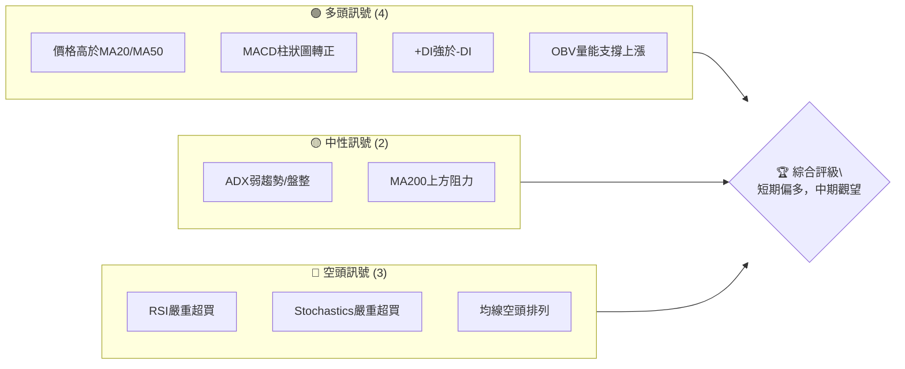
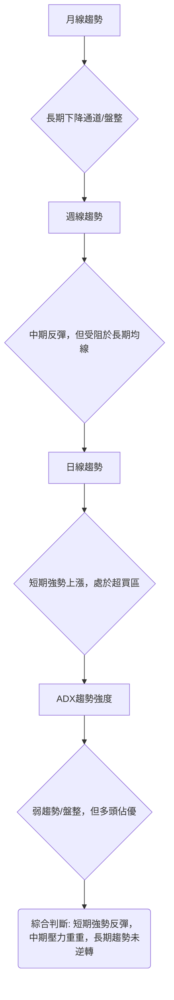
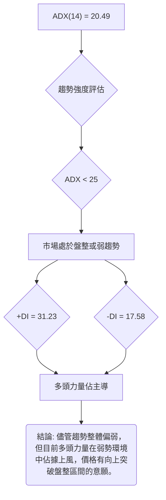
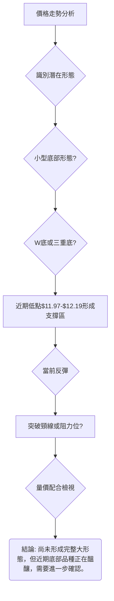
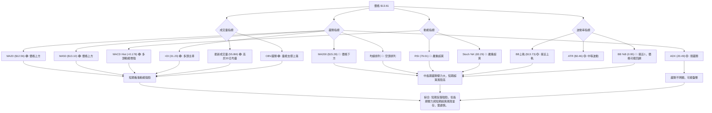
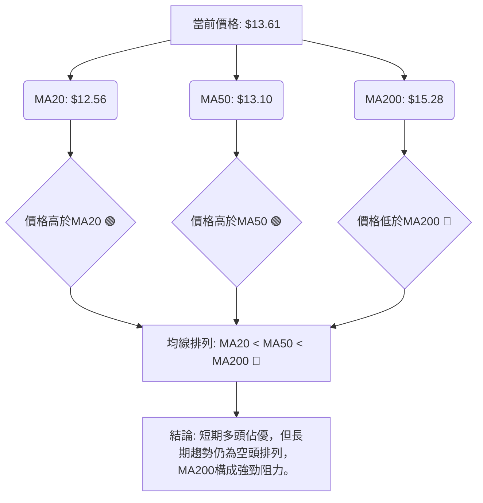
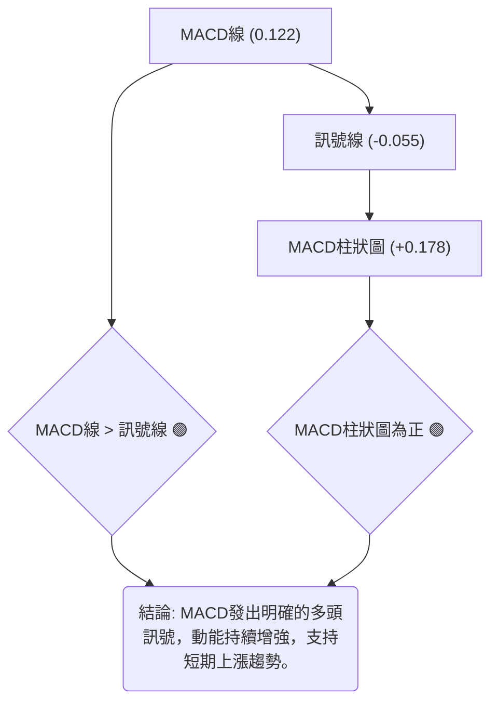
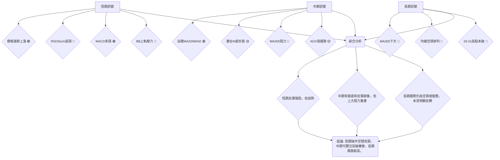
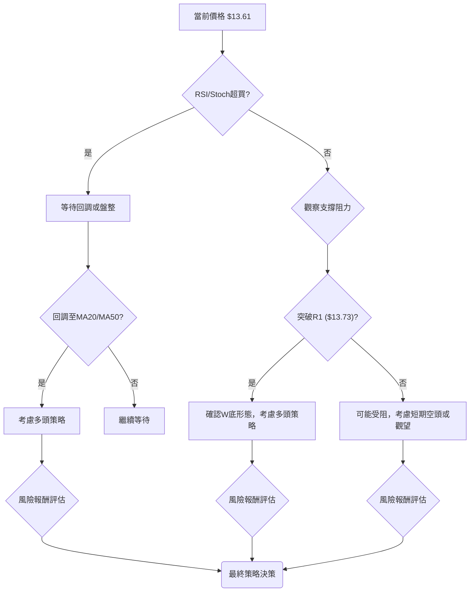
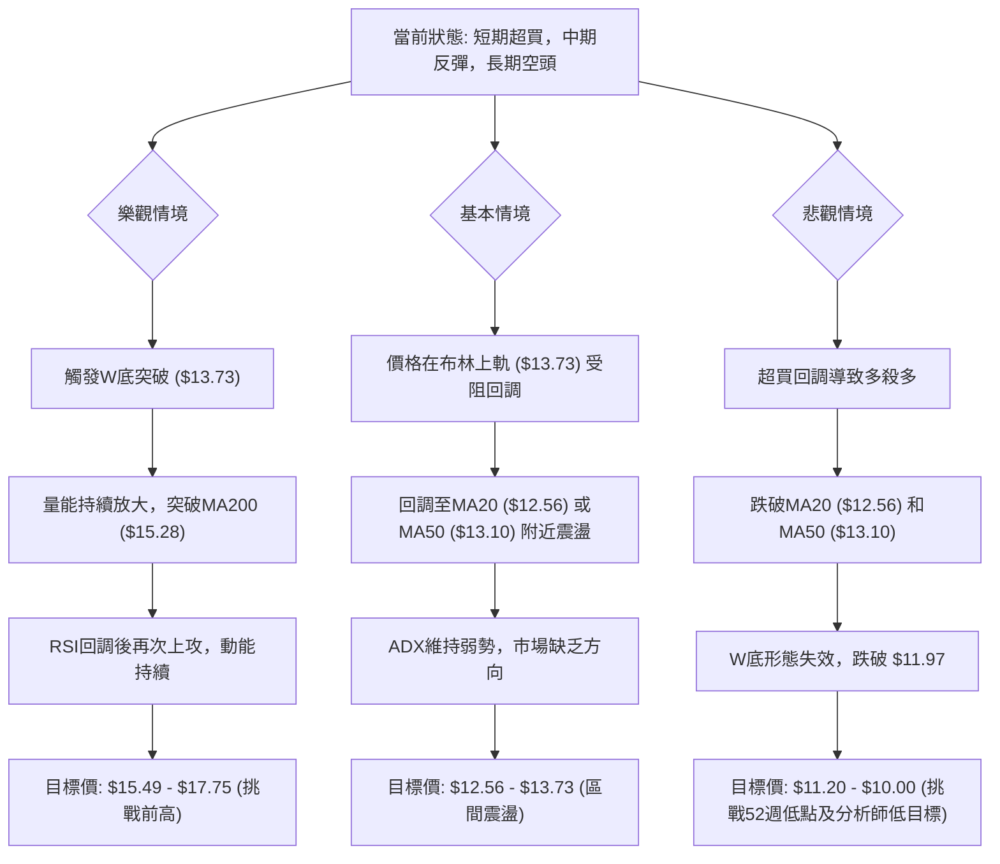

<details>
<summary>📊 靜態圖表 (點擊展開)</summary>

</details>

<html>
<head><meta charset="utf-8" /></head>
<body>
    <div style="height:500px; width:100%;">                        <script>window.PlotlyConfig = {MathJaxConfig: 'local'};</script>
        <script charset="utf-8" src="https://cdn.plot.ly/plotly-3.6.0.min.js" integrity="sha256-QaOVwtVY0T02VaHrr6pnoHLCwayMJp4O5n4YyaE3rJk=" crossorigin="anonymous"></script>                <div id="candlestick-chart" class="plotly-graph-div" style="height:100%; width:100%;"></div>            <script>                window.PLOTLYENV=window.PLOTLYENV || {};                                if (document.getElementById("candlestick-chart")) {                    Plotly.newPlot(                        "candlestick-chart",                        [{"close":{"dtype":"f8","bdata":"AAAAIK7HL0AAAAAghesvQAAAAEDh+i9AAAAAIIUrMEAAAADAzEwwQAAAAGBmJjBAAAAAYI8CMEAAAAAgXI8vQAAAACBcjy9AAAAAYGbmL0AAAABgjwIwQAAAAKBHYS5AAAAA4KNwLkAAAABguJ4uQAAAAGCPwi5AAAAAYI9CLkAAAAAghesuQAAAAKBwvS5AAAAAQArXLUAAAADA9SguQAAAAIDr0S1AAAAAAClcLkAAAACAwnUtQAAAAAAAAC5AAAAAgOvRLkAAAABA4XouQAAAAIDrUS5AAAAAwMzML0AAAACAFK4vQAAAAAAAADBAAAAAACncL0AAAABAChcwQAAAACBcDzBAAAAAACkcMEAAAACgRyEwQAAAAKCZmS9AAAAAIIUrMEAAAACgR+EvQAAAAKBwvS9AAAAAwB4FMEAAAAAA12MwQAAAAIAULjBAAAAAgBQuL0AAAAAA16MvQAAAAEAzMy9AAAAAANejLkAAAACA61EvQAAAAADXoy5AAAAAIK7HL0AAAABACtcvQAAAAAApnDBAAAAAAABAMUAAAAAA12MxQAAAAEDhejFAAAAAACmcMUAAAADgo3AxQAAAAGBmpjFAAAAAQDOzMEAAAABguJ4wQAAAAIAUrjBAAAAA4KOwMEAAAACA69EwQAAAAGBm5jBAAAAAYGamMEAAAABAMzMwQAAAAOBRuC9AAAAAwB5FMEAAAABAClcwQAAAAGC4njBAAAAAYI\u002fCMEAAAACgcL0wQAAAAGCPwjBAAAAAwPWoMEAAAACgR+EwQAAAAKBwvTBAAAAAwB4FMUAAAADgo\u002fAxQAAAAAAp3DFAAAAAAACAMUAAAAAAKZwxQAAAAIDCdTFAAAAAgD0KMUAAAAAgXI8wQAAAAADXozBAAAAAACmcMEAAAACgmZkwQAAAAOBR+DBAAAAAoHA9MUAAAAAAAAAyQAAAAIA9CjJAAAAAgBQuMkAAAADAzIwyQAAAAGCPwjJAAAAAYI\u002fCMkAAAAAAAMAxQAAAAAApHDJAAAAAYLgeMkAAAADAHgUxQAAAACBczzBAAAAAYGZmMUAAAADAzIwxQAAAAIDrkTFAAAAAwPVoMUAAAACAPQoxQAAAAIDr0TBAAAAAgOvRMEAAAAAghSsxQAAAAIDrUTFAAAAAIK6HMUAAAADgozAwQAAAACCuhzBAAAAAYGamMEAAAABguB4uQAAAAIDC9S1AAAAAoEdhLkAAAADAHoUtQAAAAAAAAC5AAAAAANejLUAAAADA9SgtQAAAAEAKVy1AAAAAYI\u002fCLUAAAABA4fosQAAAAOCj8CtAAAAAIK7HK0AAAACAPYosQAAAAAAAgCxAAAAA4KPwK0AAAACA61EsQAAAAKBH4StAAAAAAClcLUAAAACgR2EsQAAAAADXoyxAAAAAgD0KLEAAAABAMzMrQAAAAMAeBStAAAAAoHC9LEAAAACgR+EsQAAAAMDMTCxAAAAAwB6FLEAAAADAzEwsQAAAAMAeBS1AAAAAoHC9LUAAAAAghestQAAAAGBm5i1AAAAAQDOzLkAAAACAFK4uQAAAAAAp3C5AAAAAgBSuLkAAAABAMzMuQAAAAKCZGS5AAAAAQDOzLUAAAAAghessQAAAAMAeBS1AAAAAIK5HLUAAAAAAAAAtQAAAAOB6FCxAAAAAgML1LEAAAACgR+EsQAAAAIDrUSxAAAAAAACALEAAAACAwvUsQAAAAMAehSxAAAAAoJmZK0AAAAAAAAArQAAAAIA9iipAAAAAANejKUAAAAAAKdwpQAAAAKBHYShAAAAA4HqUKEAAAADgepQoQAAAAOB6lClAAAAAgOtRKkAAAACAwnUpQAAAAIDC9SlAAAAAIFwPKkAAAACgmRkqQAAAAGCPQipAAAAAQOH6KUAAAAAAKdwnQAAAACCuRydAAAAAoHA9KEAAAADgo\u002fAnQAAAAEAzMydAAAAAYI\u002fCJ0AAAACgcD0nQAAAAIAULihAAAAAoEdhKEAAAAAAKdwoQAAAAOCjcClAAAAAIK7HKUAAAAAghWspQAAAAOB6lClAAAAAgBQuKUAAAAAghesoQAAAACCF6yhAAAAAQApXKkAAAABgj0IqQAAAAOBRuCpAAAAAIK7HKkAAAADgUTgrQA=="},"high":{"dtype":"f8","bdata":"AAAAgOsRMEAAAADAzAwwQAAAAKBHITBAAAAAoJlZMEAAAADAzEwwQAAAAMDMbDBAAAAAYLheMEAAAADgURgwQAAAAKBw\u002fS9AAAAAoJkZMEAAAADgozAwQAAAAMDMDDBAAAAAwMzMLkAAAAAAAMAuQAAAAEDh+i5AAAAA4HoUL0AAAAAAAAAvQAAAAMD1KC9AAAAAYGbmLkAAAACgcD0uQAAAAKBHYS5AAAAAAFaOLkAAAABguJ4uQAAAAGC4Hi5AAAAAIK5HL0AAAACAFC4vQAAAACCF6y5AAAAAANcjMEAAAACgRyEwQAAAAKCZWTBAAAAAgOsRMEAAAADAHkUwQAAAAKBwPTBAAAAAwB5FMEAAAAAAAIAwQAAAAKBwHTBAAAAAIIVrMEAAAABgZmYwQAAAAAAAwC9AAAAA4FE4MEAAAADAzIwwQAAAAAAAgDBAAAAAgOsxMEAAAABgj0IwQAAAAKBwvS9AAAAAoJlZL0AAAADgo3AvQAAAAEAzEzBAAAAAwB4FMEAAAAAgXA8wQAAAAMDMrDBAAAAAoEdhMUAAAACAFI4xQAAAACBcjzFAAAAAQArXMUAAAADgUbgxQAAAAOCj0DFAAAAAQOG6MUAAAABAMxMxQAAAAEDhujBAAAAAoJnZMEAAAAAAKRwxQAAAACBcDzFAAAAAgOsRMUAAAADAHoUwQAAAAMD1KDBAAAAA4CJbMEAAAADgUXgwQAAAAKBHoTBAAAAA4HrUMEAAAADA9cgwQAAAAGCPwjBAAAAAIFzPMEAAAABA4RoxQAAAAMDM7DBAAAAAIFwPMUAAAACAlSMyQAAAAGC4XjJAAAAAYI\u002fCMUAAAACAvp8xQAAAAIDrETJAAAAAIIVrMUAAAACA6xExQAAAAOCjsDBAAAAA4FH4MEAAAABgDq0wQAAAAOCjUDFAAAAAgD2KMUAAAAAAAAAyQAAAAOCjEDJAAAAAYI9CMkAAAAAgXI8yQAAAAMD1yDJAAAAAQOH6MkAAAABguJ4yQAAAAEAKdzJAAAAAYGamMkAAAACAPSoyQAAAAGCPIjFAAAAAIIVrMUAAAABACtcxQAAAAAApvDFAAAAAoHD9MUAAAADAzIwxQAAAAKBH4TBAAAAAAAAAMUAAAABA4XoxQAAAAOCjcDFAAAAAQAqXMUAAAADA9WgxQAAAAEAKlzBAAAAAoJnZMEAAAACgR+EvQAAAAGBmZi5AAAAAQIusLkAAAABguB4uQAAAAIDCtS5AAAAAwMxMLkAAAABAM3MtQAAAAIDrkS1AAAAAgD1KLkAAAACgR+EtQAAAAEAzsyxAAAAAYLieLEAAAACgcL0sQAAAAOB6FC1AAAAAwMyMLEAAAAAAAIAsQAAAAMDMTCxAAAAAQArXLUAAAADAHgUtQAAAAKBHYS1AAAAAYGamLEAAAABgZuYrQAAAAIDrkStAAAAAgOvRLEAAAACgmZktQAAAAIDC9SxAAAAAIK7HLEAAAACA61EsQAAAAMBJzC5AAAAAACncLUAAAADgehQuQAAAACBcDy5AAAAA4KPwLkAAAABguB4vQAAAAKBHIS9AAAAAYLieL0AAAABAM7MuQAAAACBcjy5AAAAA4KNwLkAAAAAA16MtQAAAAOB6FC1AAAAAIIWrLUAAAABAClctQAAAAMAeBS1AAAAAYLgeLUAAAACA61EtQAAAAOCj8CxAAAAAoEfhLEAAAACgmRktQAAAAEAzMy1AAAAAwPWoLEAAAADA9egrQAAAAAApHCtAAAAAgD2KKkAAAABAClcqQAAAACBczyhAAAAAwMzMKEAAAADAzMwoQAAAAKCZmSlAAAAAoJmZKkAAAADAHoUqQAAAAKBHISpAAAAAAClcKkAAAABA4XoqQAAAAAAAgCpAAAAAwMxMKkAAAAAghWsoQAAAAEDheidAAAAAgBRuKEAAAABAM7MoQAAAAKCZGShAAAAAgOsRKEAAAACAFC4oQAAAAIAULihAAAAA4HqUKEAAAABgj0IpQAAAAKCZmSlAAAAAIK4HK0AAAADA9SgqQAAAAKBwPSpAAAAAgOuRKUAAAADgo3ApQAAAAIA9SilAAAAAgBSuKkAAAACgmZkqQAAAACCuxypAAAAAACncK0AAAAAAAIArQA=="},"hovertemplate":"\u003cb\u003e%{x|%Y-%m-%d}\u003c\u002fb\u003e\u003cbr\u003e\u958b: $%{open:.2f}\u003cbr\u003e\u9ad8: $%{high:.2f}\u003cbr\u003e\u4f4e: $%{low:.2f}\u003cbr\u003e\u6536: $%{close:.2f}\u003cextra\u003e\u003c\u002fextra\u003e","low":{"dtype":"f8","bdata":"AAAAgOtRL0AAAABgZqYvQAAAAMAexS9AAAAAwB4FMEAAAACAwvUvQAAAACCuBzBAAAAAoPHSL0AAAACAwnUvQAAAAKCZGS9AAAAAwPWoL0AAAADAzEwvQAAAAIDrUS5AAAAAgD0KLkAAAADgUTguQAAAAAAAQC5AAAAAgD0KLkAAAACgmRkuQAAAAIDCdS5AAAAAYI\u002fCLUAAAABACtctQAAAACCuRy1AAAAA4FG4LUAAAABAXjotQAAAAGC4Hi1AAAAAYLgeLkAAAAAgXE8uQAAAAIDrES5AAAAAgMJ1LkAAAAAgBJYvQAAAAEAK1y9AAAAAANejL0AAAAAAKdwvQAAAAADXAzBAAAAAYI\u002fCL0AAAACAFO4vQAAAAGBmZi9AAAAA4HqUL0AAAACAFK4vQAAAAGBm5i5AAAAAwMzML0AAAADAzAwwQAAAACCFCzBAAAAA4FH4LkAAAAAA16MuQAAAAAAAAC9AAAAAwB6FLkAAAACgR2EuQAAAAKCZmS5AAAAAYI+CLkAAAAAgXI8vQAAAAAApXC9AAAAAwPXoMEAAAABAMzMxQAAAACCuRzFAAAAAQOF6MUAAAACAPUoxQAAAAAApXDFAAAAAoJmZMEAAAADgUXgwQAAAAAACSzBAAAAAQAp3MEAAAABAM7MwQAAAAKCZmTBAAAAAoEehMEAAAACAFC4wQAAAAIAULi9AAAAAwCAQMEAAAABAYlAwQAAAAKCZWTBAAAAAIFyPMEAAAABgZqYwQAAAAAApnDBAAAAAgD2KMEAAAACAFK4wQAAAAIDCtTBAAAAAYGamMEAAAACAPSoxQAAAACBczzFAAAAAIK5nMUAAAABguF4xQAAAAADXYzFAAAAAwB4FMUAAAACAPWowQAAAAMDMbDBAAAAAgEGAMEAAAACAFE4wQAAAAKCZWTBAAAAAgOsRMUAAAADgelQxQAAAAIDCtTFAAAAAYGbmMUAAAACgmRkyQAAAAAApXDJAAAAAoHA9MkAAAACAwrUxQAAAAIDCtTFAAAAAQArXMUAAAAAAAOAwQAAAAMDMjDBAAAAAYI\u002fCMEAAAABACjcxQAAAAIA9CjFAAAAAoJlZMUAAAACAwrUwQAAAAGC4XjBAAAAAQAqXMEAAAABACtcwQAAAAMAe5TBAAAAAIIUrMUAAAADgehQwQAAAAKBwvS9AAAAAANeDMEAAAADgehQuQAAAAGBmZi1AAAAAYLieLEAAAABAClcsQAAAAKCZmS1AAAAA4FE4LUAAAADgUXgsQAAAAIDCdSxAAAAAIFwPLUAAAABgj8IsQAAAAGCPwitAAAAAoEehK0AAAABguB4sQAAAAOBReCxAAAAA4HrUK0AAAAAgXA8rQAAAAOB6lCtAAAAA4KNwLEAAAACA61EsQAAAACCFayxAAAAAACncK0AAAADgehQrQAAAAIDr0SpAAAAAYGZmK0AAAAAAKdwsQAAAAAACqytAAAAAwPUoLEAAAACAFK4rQAAAAIDr0SxAAAAAwMzMLEAAAAAgXI8tQAAAAEAzMy1AAAAAoHA9LkAAAACgmZkuQAAAAOB6lC5AAAAAYLieLkAAAAAAKdwtQAAAAOCj8C1AAAAAQApXLUAAAACA65EsQAAAAKBHYSxAAAAAoJkZLUAAAACAwrUsQAAAAOB6FCxAAAAAoJkZLEAAAABgj8IsQAAAAIAULixAAAAAQApXLEAAAACgcH0sQAAAAMD1aCxAAAAAAACAK0AAAABACtcqQAAAAMAehSpAAAAAIK6HKUAAAACAFK4pQAAAACBcjydAAAAAYLgeKEAAAAAghesnQAAAAMD1qChAAAAAYLgeKUAAAAAghWspQAAAAMDMTClAAAAAACncKUAAAAAgrscpQAAAAEDh+ilAAAAAgOvRKUAAAACgR+EmQAAAAGBmZiZAAAAAANejJ0AAAABguN4nQAAAAKCZGSdAAAAAIFxPJ0AAAADgUTgnQAAAAMAeBSdAAAAAIK4HKEAAAAAgXI8oQAAAAOCj8ChAAAAA4HqUKUAAAAAAKVwpQAAAAGBmZilAAAAAAAAAKUAAAACgR+EoQAAAAIDCdShAAAAAANfjKEAAAABA4fopQAAAAKBH4SlAAAAAAACAKkAAAABg46UqQA=="},"name":"\u50f9\u683c","open":{"dtype":"f8","bdata":"AAAAoEfhL0AAAABgZuYvQAAAAGCPAjBAAAAAgOsRMEAAAAAAKRwwQAAAAMDMTDBAAAAAgBQuMEAAAAAAKdwvQAAAAAAp3C9AAAAAYGbmL0AAAAAghesvQAAAAMDMDDBAAAAAgD2KLkAAAAAgXI8uQAAAAKBwvS5AAAAAgOvRLkAAAAAAKVwuQAAAACBcDy9AAAAA4FG4LkAAAADA9SguQAAAAEAzsy1AAAAAAAAALkAAAADgepQuQAAAACCuRy1AAAAAYI9CLkAAAABAM7MuQAAAAADXoy5AAAAAwB6FLkAAAABAChcwQAAAAEDhOjBAAAAAIIXrL0AAAABgZuYvQAAAAIDrETBAAAAAACkcMEAAAADgozAwQAAAAKCZmS9AAAAA4FG4L0AAAABguF4wQAAAAADXoy9AAAAAoJkZMEAAAABAChcwQAAAAIDCdTBAAAAAgD0KMEAAAAAAKdwuQAAAAOBReC9AAAAAwMzMLkAAAADAzIwuQAAAAIAUri9AAAAAgMK1LkAAAAAAAAAwQAAAAEAK1y9AAAAAQOH6MEAAAAAA12MxQAAAAIAUbjFAAAAAgMK1MUAAAABAM7MxQAAAAGBmpjFAAAAAQDOzMUAAAABguN4wQAAAAMAeZTBAAAAAoJmZMEAAAABA4bowQAAAACCu5zBAAAAAYGYGMUAAAAAAAIAwQAAAAEAKFzBAAAAAYGYmMEAAAACgmVkwQAAAACCFazBAAAAA4KOwMEAAAABAM7MwQAAAAKBwvTBAAAAAgD2qMEAAAADAHsUwQAAAAGC43jBAAAAAIFwPMUAAAACAFC4xQAAAAGC4HjJAAAAAYLieMUAAAABACpcxQAAAAIAUrjFAAAAAoJlZMUAAAAAgXA8xQAAAAOCjkDBAAAAAAADAMEAAAACA65EwQAAAAAApXDBAAAAAYI8iMUAAAACAPaoxQAAAAAAAADJAAAAAwMwMMkAAAAAAKVwyQAAAAGCPojJAAAAA4HrUMkAAAAAgrocyQAAAAKBwvTFAAAAAIK5nMkAAAADgehQyQAAAAOB61DBAAAAAIIUrMUAAAADgo3AxQAAAAGBmJjFAAAAAgOvxMUAAAADA9YgxQAAAAKBwvTBAAAAAAADAMEAAAABAM\u002fMwQAAAAADXIzFAAAAAQDMzMUAAAAAAAEAxQAAAAOCjMDBAAAAAANeDMEAAAABACtcvQAAAAOCjcC1AAAAAIIXrLEAAAAAAKVwtQAAAAKBw\u002fS1AAAAAACncLUAAAABgjwItQAAAAIDr0SxAAAAAQOF6LUAAAAAAAIAtQAAAAGBmZixAAAAAANcjLEAAAACgcD0sQAAAAMDMzCxAAAAA4KNwLEAAAAAAKVwrQAAAAKBwPSxAAAAAoEehLEAAAADgUfgsQAAAAGCPQi1AAAAAYI9CLEAAAACAwnUrQAAAACCFaytAAAAAoJmZK0AAAACAFC4tQAAAAAAAACxAAAAAYI9CLEAAAABAMzMsQAAAACCFay5AAAAAwB4FLUAAAAAAKdwtQAAAAIAUri1AAAAAYI9CLkAAAAAghesuQAAAACCuxy5AAAAAYLieL0AAAABA4XouQAAAAOBROC5AAAAAAClcLkAAAABguJ4tQAAAAEAK1yxAAAAAIK5HLUAAAADgehQtQAAAAIDC9SxAAAAA4HpULEAAAACA61EtQAAAACCuxyxAAAAAANejLEAAAAAAAAAtQAAAAAAAAC1AAAAAoJmZLEAAAABgj8IrQAAAAEAK1ypAAAAAIIVrKkAAAABAM7MpQAAAAECJAShAAAAAwMzMKEAAAADgelQoQAAAAIAUrihAAAAA4FE4KUAAAADAzEwqQAAAACCuBypAAAAAIIXrKUAAAADgo\u002fApQAAAAKCZGSpAAAAAAAAAKkAAAABA4fonQAAAAMDMTCdAAAAAYI\u002fCJ0AAAABAMzMoQAAAAMAeBShAAAAA4KNwJ0AAAACgmZknQAAAAADXIydAAAAAQApXKEAAAACAFK4oQAAAAMAeBSlAAAAA4HqUKUAAAAAgXA8qQAAAACBcjylAAAAAgD0KKUAAAACgmRkpQAAAAIDC9ShAAAAAANfjKEAAAADAHoUqQAAAAGC4HipAAAAAIFyPKkAAAACgR+EqQA=="},"x":["2025-09-16T00:00:00-04:00","2025-09-17T00:00:00-04:00","2025-09-18T00:00:00-04:00","2025-09-19T00:00:00-04:00","2025-09-22T00:00:00-04:00","2025-09-23T00:00:00-04:00","2025-09-24T00:00:00-04:00","2025-09-25T00:00:00-04:00","2025-09-26T00:00:00-04:00","2025-09-29T00:00:00-04:00","2025-09-30T00:00:00-04:00","2025-10-01T00:00:00-04:00","2025-10-02T00:00:00-04:00","2025-10-03T00:00:00-04:00","2025-10-06T00:00:00-04:00","2025-10-07T00:00:00-04:00","2025-10-08T00:00:00-04:00","2025-10-09T00:00:00-04:00","2025-10-10T00:00:00-04:00","2025-10-13T00:00:00-04:00","2025-10-14T00:00:00-04:00","2025-10-15T00:00:00-04:00","2025-10-16T00:00:00-04:00","2025-10-17T00:00:00-04:00","2025-10-20T00:00:00-04:00","2025-10-21T00:00:00-04:00","2025-10-22T00:00:00-04:00","2025-10-23T00:00:00-04:00","2025-10-24T00:00:00-04:00","2025-10-27T00:00:00-04:00","2025-10-28T00:00:00-04:00","2025-10-29T00:00:00-04:00","2025-10-30T00:00:00-04:00","2025-10-31T00:00:00-04:00","2025-11-03T00:00:00-05:00","2025-11-04T00:00:00-05:00","2025-11-05T00:00:00-05:00","2025-11-06T00:00:00-05:00","2025-11-07T00:00:00-05:00","2025-11-10T00:00:00-05:00","2025-11-11T00:00:00-05:00","2025-11-12T00:00:00-05:00","2025-11-13T00:00:00-05:00","2025-11-14T00:00:00-05:00","2025-11-17T00:00:00-05:00","2025-11-18T00:00:00-05:00","2025-11-19T00:00:00-05:00","2025-11-20T00:00:00-05:00","2025-11-21T00:00:00-05:00","2025-11-24T00:00:00-05:00","2025-11-25T00:00:00-05:00","2025-11-26T00:00:00-05:00","2025-11-28T00:00:00-05:00","2025-12-01T00:00:00-05:00","2025-12-02T00:00:00-05:00","2025-12-03T00:00:00-05:00","2025-12-04T00:00:00-05:00","2025-12-05T00:00:00-05:00","2025-12-08T00:00:00-05:00","2025-12-09T00:00:00-05:00","2025-12-10T00:00:00-05:00","2025-12-11T00:00:00-05:00","2025-12-12T00:00:00-05:00","2025-12-15T00:00:00-05:00","2025-12-16T00:00:00-05:00","2025-12-17T00:00:00-05:00","2025-12-18T00:00:00-05:00","2025-12-19T00:00:00-05:00","2025-12-22T00:00:00-05:00","2025-12-23T00:00:00-05:00","2025-12-24T00:00:00-05:00","2025-12-26T00:00:00-05:00","2025-12-29T00:00:00-05:00","2025-12-30T00:00:00-05:00","2025-12-31T00:00:00-05:00","2026-01-02T00:00:00-05:00","2026-01-05T00:00:00-05:00","2026-01-06T00:00:00-05:00","2026-01-07T00:00:00-05:00","2026-01-08T00:00:00-05:00","2026-01-09T00:00:00-05:00","2026-01-12T00:00:00-05:00","2026-01-13T00:00:00-05:00","2026-01-14T00:00:00-05:00","2026-01-15T00:00:00-05:00","2026-01-16T00:00:00-05:00","2026-01-20T00:00:00-05:00","2026-01-21T00:00:00-05:00","2026-01-22T00:00:00-05:00","2026-01-23T00:00:00-05:00","2026-01-26T00:00:00-05:00","2026-01-27T00:00:00-05:00","2026-01-28T00:00:00-05:00","2026-01-29T00:00:00-05:00","2026-01-30T00:00:00-05:00","2026-02-02T00:00:00-05:00","2026-02-03T00:00:00-05:00","2026-02-04T00:00:00-05:00","2026-02-05T00:00:00-05:00","2026-02-06T00:00:00-05:00","2026-02-09T00:00:00-05:00","2026-02-10T00:00:00-05:00","2026-02-11T00:00:00-05:00","2026-02-12T00:00:00-05:00","2026-02-13T00:00:00-05:00","2026-02-17T00:00:00-05:00","2026-02-18T00:00:00-05:00","2026-02-19T00:00:00-05:00","2026-02-20T00:00:00-05:00","2026-02-23T00:00:00-05:00","2026-02-24T00:00:00-05:00","2026-02-25T00:00:00-05:00","2026-02-26T00:00:00-05:00","2026-02-27T00:00:00-05:00","2026-03-02T00:00:00-05:00","2026-03-03T00:00:00-05:00","2026-03-04T00:00:00-05:00","2026-03-05T00:00:00-05:00","2026-03-06T00:00:00-05:00","2026-03-09T00:00:00-04:00","2026-03-10T00:00:00-04:00","2026-03-11T00:00:00-04:00","2026-03-12T00:00:00-04:00","2026-03-13T00:00:00-04:00","2026-03-16T00:00:00-04:00","2026-03-17T00:00:00-04:00","2026-03-18T00:00:00-04:00","2026-03-19T00:00:00-04:00","2026-03-20T00:00:00-04:00","2026-03-23T00:00:00-04:00","2026-03-24T00:00:00-04:00","2026-03-25T00:00:00-04:00","2026-03-26T00:00:00-04:00","2026-03-27T00:00:00-04:00","2026-03-30T00:00:00-04:00","2026-03-31T00:00:00-04:00","2026-04-01T00:00:00-04:00","2026-04-02T00:00:00-04:00","2026-04-06T00:00:00-04:00","2026-04-07T00:00:00-04:00","2026-04-08T00:00:00-04:00","2026-04-09T00:00:00-04:00","2026-04-10T00:00:00-04:00","2026-04-13T00:00:00-04:00","2026-04-14T00:00:00-04:00","2026-04-15T00:00:00-04:00","2026-04-16T00:00:00-04:00","2026-04-17T00:00:00-04:00","2026-04-20T00:00:00-04:00","2026-04-21T00:00:00-04:00","2026-04-22T00:00:00-04:00","2026-04-23T00:00:00-04:00","2026-04-24T00:00:00-04:00","2026-04-27T00:00:00-04:00","2026-04-28T00:00:00-04:00","2026-04-29T00:00:00-04:00","2026-04-30T00:00:00-04:00","2026-05-01T00:00:00-04:00","2026-05-04T00:00:00-04:00","2026-05-05T00:00:00-04:00","2026-05-06T00:00:00-04:00","2026-05-07T00:00:00-04:00","2026-05-08T00:00:00-04:00","2026-05-11T00:00:00-04:00","2026-05-12T00:00:00-04:00","2026-05-13T00:00:00-04:00","2026-05-14T00:00:00-04:00","2026-05-15T00:00:00-04:00","2026-05-18T00:00:00-04:00","2026-05-19T00:00:00-04:00","2026-05-20T00:00:00-04:00","2026-05-21T00:00:00-04:00","2026-05-22T00:00:00-04:00","2026-05-26T00:00:00-04:00","2026-05-27T00:00:00-04:00","2026-05-28T00:00:00-04:00","2026-05-29T00:00:00-04:00","2026-06-01T00:00:00-04:00","2026-06-02T00:00:00-04:00","2026-06-03T00:00:00-04:00","2026-06-04T00:00:00-04:00","2026-06-05T00:00:00-04:00","2026-06-08T00:00:00-04:00","2026-06-09T00:00:00-04:00","2026-06-10T00:00:00-04:00","2026-06-11T00:00:00-04:00","2026-06-12T00:00:00-04:00","2026-06-15T00:00:00-04:00","2026-06-16T00:00:00-04:00","2026-06-17T00:00:00-04:00","2026-06-18T00:00:00-04:00","2026-06-22T00:00:00-04:00","2026-06-23T00:00:00-04:00","2026-06-24T00:00:00-04:00","2026-06-25T00:00:00-04:00","2026-06-26T00:00:00-04:00","2026-06-29T00:00:00-04:00","2026-06-30T00:00:00-04:00","2026-07-01T00:00:00-04:00","2026-07-02T00:00:00-04:00"],"type":"candlestick"},{"hovertemplate":"MA30: $%{y:.2f}\u003cextra\u003e\u003c\u002fextra\u003e","line":{"color":"#2196F3","dash":"dash","width":2},"mode":"lines","name":"MA30","x":["2025-09-16T00:00:00-04:00","2025-09-17T00:00:00-04:00","2025-09-18T00:00:00-04:00","2025-09-19T00:00:00-04:00","2025-09-22T00:00:00-04:00","2025-09-23T00:00:00-04:00","2025-09-24T00:00:00-04:00","2025-09-25T00:00:00-04:00","2025-09-26T00:00:00-04:00","2025-09-29T00:00:00-04:00","2025-09-30T00:00:00-04:00","2025-10-01T00:00:00-04:00","2025-10-02T00:00:00-04:00","2025-10-03T00:00:00-04:00","2025-10-06T00:00:00-04:00","2025-10-07T00:00:00-04:00","2025-10-08T00:00:00-04:00","2025-10-09T00:00:00-04:00","2025-10-10T00:00:00-04:00","2025-10-13T00:00:00-04:00","2025-10-14T00:00:00-04:00","2025-10-15T00:00:00-04:00","2025-10-16T00:00:00-04:00","2025-10-17T00:00:00-04:00","2025-10-20T00:00:00-04:00","2025-10-21T00:00:00-04:00","2025-10-22T00:00:00-04:00","2025-10-23T00:00:00-04:00","2025-10-24T00:00:00-04:00","2025-10-27T00:00:00-04:00","2025-10-28T00:00:00-04:00","2025-10-29T00:00:00-04:00","2025-10-30T00:00:00-04:00","2025-10-31T00:00:00-04:00","2025-11-03T00:00:00-05:00","2025-11-04T00:00:00-05:00","2025-11-05T00:00:00-05:00","2025-11-06T00:00:00-05:00","2025-11-07T00:00:00-05:00","2025-11-10T00:00:00-05:00","2025-11-11T00:00:00-05:00","2025-11-12T00:00:00-05:00","2025-11-13T00:00:00-05:00","2025-11-14T00:00:00-05:00","2025-11-17T00:00:00-05:00","2025-11-18T00:00:00-05:00","2025-11-19T00:00:00-05:00","2025-11-20T00:00:00-05:00","2025-11-21T00:00:00-05:00","2025-11-24T00:00:00-05:00","2025-11-25T00:00:00-05:00","2025-11-26T00:00:00-05:00","2025-11-28T00:00:00-05:00","2025-12-01T00:00:00-05:00","2025-12-02T00:00:00-05:00","2025-12-03T00:00:00-05:00","2025-12-04T00:00:00-05:00","2025-12-05T00:00:00-05:00","2025-12-08T00:00:00-05:00","2025-12-09T00:00:00-05:00","2025-12-10T00:00:00-05:00","2025-12-11T00:00:00-05:00","2025-12-12T00:00:00-05:00","2025-12-15T00:00:00-05:00","2025-12-16T00:00:00-05:00","2025-12-17T00:00:00-05:00","2025-12-18T00:00:00-05:00","2025-12-19T00:00:00-05:00","2025-12-22T00:00:00-05:00","2025-12-23T00:00:00-05:00","2025-12-24T00:00:00-05:00","2025-12-26T00:00:00-05:00","2025-12-29T00:00:00-05:00","2025-12-30T00:00:00-05:00","2025-12-31T00:00:00-05:00","2026-01-02T00:00:00-05:00","2026-01-05T00:00:00-05:00","2026-01-06T00:00:00-05:00","2026-01-07T00:00:00-05:00","2026-01-08T00:00:00-05:00","2026-01-09T00:00:00-05:00","2026-01-12T00:00:00-05:00","2026-01-13T00:00:00-05:00","2026-01-14T00:00:00-05:00","2026-01-15T00:00:00-05:00","2026-01-16T00:00:00-05:00","2026-01-20T00:00:00-05:00","2026-01-21T00:00:00-05:00","2026-01-22T00:00:00-05:00","2026-01-23T00:00:00-05:00","2026-01-26T00:00:00-05:00","2026-01-27T00:00:00-05:00","2026-01-28T00:00:00-05:00","2026-01-29T00:00:00-05:00","2026-01-30T00:00:00-05:00","2026-02-02T00:00:00-05:00","2026-02-03T00:00:00-05:00","2026-02-04T00:00:00-05:00","2026-02-05T00:00:00-05:00","2026-02-06T00:00:00-05:00","2026-02-09T00:00:00-05:00","2026-02-10T00:00:00-05:00","2026-02-11T00:00:00-05:00","2026-02-12T00:00:00-05:00","2026-02-13T00:00:00-05:00","2026-02-17T00:00:00-05:00","2026-02-18T00:00:00-05:00","2026-02-19T00:00:00-05:00","2026-02-20T00:00:00-05:00","2026-02-23T00:00:00-05:00","2026-02-24T00:00:00-05:00","2026-02-25T00:00:00-05:00","2026-02-26T00:00:00-05:00","2026-02-27T00:00:00-05:00","2026-03-02T00:00:00-05:00","2026-03-03T00:00:00-05:00","2026-03-04T00:00:00-05:00","2026-03-05T00:00:00-05:00","2026-03-06T00:00:00-05:00","2026-03-09T00:00:00-04:00","2026-03-10T00:00:00-04:00","2026-03-11T00:00:00-04:00","2026-03-12T00:00:00-04:00","2026-03-13T00:00:00-04:00","2026-03-16T00:00:00-04:00","2026-03-17T00:00:00-04:00","2026-03-18T00:00:00-04:00","2026-03-19T00:00:00-04:00","2026-03-20T00:00:00-04:00","2026-03-23T00:00:00-04:00","2026-03-24T00:00:00-04:00","2026-03-25T00:00:00-04:00","2026-03-26T00:00:00-04:00","2026-03-27T00:00:00-04:00","2026-03-30T00:00:00-04:00","2026-03-31T00:00:00-04:00","2026-04-01T00:00:00-04:00","2026-04-02T00:00:00-04:00","2026-04-06T00:00:00-04:00","2026-04-07T00:00:00-04:00","2026-04-08T00:00:00-04:00","2026-04-09T00:00:00-04:00","2026-04-10T00:00:00-04:00","2026-04-13T00:00:00-04:00","2026-04-14T00:00:00-04:00","2026-04-15T00:00:00-04:00","2026-04-16T00:00:00-04:00","2026-04-17T00:00:00-04:00","2026-04-20T00:00:00-04:00","2026-04-21T00:00:00-04:00","2026-04-22T00:00:00-04:00","2026-04-23T00:00:00-04:00","2026-04-24T00:00:00-04:00","2026-04-27T00:00:00-04:00","2026-04-28T00:00:00-04:00","2026-04-29T00:00:00-04:00","2026-04-30T00:00:00-04:00","2026-05-01T00:00:00-04:00","2026-05-04T00:00:00-04:00","2026-05-05T00:00:00-04:00","2026-05-06T00:00:00-04:00","2026-05-07T00:00:00-04:00","2026-05-08T00:00:00-04:00","2026-05-11T00:00:00-04:00","2026-05-12T00:00:00-04:00","2026-05-13T00:00:00-04:00","2026-05-14T00:00:00-04:00","2026-05-15T00:00:00-04:00","2026-05-18T00:00:00-04:00","2026-05-19T00:00:00-04:00","2026-05-20T00:00:00-04:00","2026-05-21T00:00:00-04:00","2026-05-22T00:00:00-04:00","2026-05-26T00:00:00-04:00","2026-05-27T00:00:00-04:00","2026-05-28T00:00:00-04:00","2026-05-29T00:00:00-04:00","2026-06-01T00:00:00-04:00","2026-06-02T00:00:00-04:00","2026-06-03T00:00:00-04:00","2026-06-04T00:00:00-04:00","2026-06-05T00:00:00-04:00","2026-06-08T00:00:00-04:00","2026-06-09T00:00:00-04:00","2026-06-10T00:00:00-04:00","2026-06-11T00:00:00-04:00","2026-06-12T00:00:00-04:00","2026-06-15T00:00:00-04:00","2026-06-16T00:00:00-04:00","2026-06-17T00:00:00-04:00","2026-06-18T00:00:00-04:00","2026-06-22T00:00:00-04:00","2026-06-23T00:00:00-04:00","2026-06-24T00:00:00-04:00","2026-06-25T00:00:00-04:00","2026-06-26T00:00:00-04:00","2026-06-29T00:00:00-04:00","2026-06-30T00:00:00-04:00","2026-07-01T00:00:00-04:00","2026-07-02T00:00:00-04:00"],"y":{"dtype":"f8","bdata":"AAAAAAAA+H8AAAAAAAD4fwAAAAAAAPh\u002fAAAAAAAA+H8AAAAAAAD4fwAAAAAAAPh\u002fAAAAAAAA+H8AAAAAAAD4fwAAAAAAAPh\u002fAAAAAAAA+H8AAAAAAAD4fwAAAAAAAPh\u002fAAAAAAAA+H8AAAAAAAD4fwAAAAAAAPh\u002fAAAAAAAA+H8AAAAAAAD4fwAAAAAAAPh\u002fAAAAAAAA+H8AAAAAAAD4fwAAAAAAAPh\u002fAAAAAAAA+H8AAAAAAAD4fwAAAAAAAPh\u002fAAAAAAAA+H8AAAAAAAD4fwAAAAAAAPh\u002fAAAAAAAA+H8AAAAAAAD4fxERERE8GC9ARERE1OoYL0Dv7u7OIhsvQERERKRUHC9AAAAAgE4bL0AiIiLCZxgvQGZmZpZuEi9AMzMzoykVL0AAAACw5BcvQHd3d+dtGS9A3t3dvZ8aL0C8u7v7GyEvQM3MzFwBMi9Aq6qq6lE4L0AzMzMjBkEvQFVVVVXHRC9AREREdAVIL0BEREREb0svQAAAANCUSi9A7+7uziJbL0AzMzPTeGkvQN7d3T18hi9AVVVVNdCpL0DNzMzsNdcvQKuqqprEADBARERElIoTMEDe3d2NUCYwQKuqqgqQOzBAvLu7q2NCMEC8u7ubC0kwQHd3dxfZTjBAZmZmVlVVMEC8u7sLkFswQN7d3Q27YjBAMzMzs1ZnMEDv7u6e72cwQBEREbFyaDBAVVVVJU1pMEDe3d31tmwwQM3MzFwdczBAq6qq6m15MEARERGBanwwQImIiIhdgTBAvLu7+36KMEBmZmaWipMwQERERPREnTBAmpmZqcarMEBmZmZmO78wQN7d3R3o1DBA7+7uNqXiMEC8u7sTEfEwQFVVVe1R+DBAVVVVLYf2MEC8u7sDcu8wQJqZmQFH6DBAEREReb7fMEDv7u52k9gwQDMzM\u002fvF0jBAiYiIoGHXMEAAAABIKOMwQHd3dz\u002fD7jBAvLu7M3r7MECamZlxPQoxQFVVVa0cGjFAMzMzCx4sMUCamZkRWDkxQFVVVUWLTDFAiYiIqFRcMUBEREQkImIxQDMzMzPBYzFAzczMTDdpMUBVVVXFIHAxQN7d3T0KdzFAREREpHB9MUC8u7srzn4xQO\u002fu7u58fzFAZmZmBsh9MUDv7u7uNXcxQImIiEiacjFAIiIi0ttyMUCJiIjIvWYxQLy7uyvOXjFAMzMzM3pbMUDv7u5mrU4xQLy7uxODQDFAmpmZCWU0MUDv7u5+sSQxQHd3d\u002ffhEzFAVVVVZTv\u002fMECrqqpKDOIwQJqZmWlKxTBAvLu7cyGpMEB3d3c\u002ffIYwQFVVVVWcXTBAAAAAqA00MEAzMzN7WxYwQM3MzFzW6i9AvLu7uwKkL0AzMzMzM3MvQKuqqvo3Qi9A7+7uHswTL0Dv7u4OdNouQHd3d5f8oi5AVVVVdSFpLkDe3d3day4uQCIiIkLu9S1AvLu7Cx7MLUDe3d19hp0tQM3MzIxsZy1AMzMzs50vLUDNzMzMzAwtQImIiEhT6ixAiYiIWPLLLEAAAABwPcosQN7d3V26ySxAvLu7a3XMLECrqqp6W9YsQN7d3S2y3SxAiYiIGJLmLEAzMzMDcu8sQCIiIkLu9SxAAAAAMGv1LEDe3d0d6PQsQJqZmWkf\u002fixAZmZmNuwKLUCJiIgY2Q4tQHd3d5dDCy1AAAAA0PcTLUBmZmYmvxgtQImIiFiAHC1AVVVVpSkVLUDNzMysHBotQImIiIgWGS1AZmZmVlUVLUDe3d1toBMtQKuqqtqHDy1AzczMzBP1LEAzMzODTtssQERERCTbuSxAREREFDyYLEDe3d2dfXgsQCIiItIiWyxAd3d3t\u002fM9LEAiIiKy5BcsQCIiIqJF9itAVVVVZa3OK0C8u7s7mKcrQBEREWFXgCtAIiIiEjxYK0AREREhIiIrQM3MzJzv5ypA7+7uDli5KkBVVVUV2Y4qQJqZmRkvXSpAmpmZeRQuKkAAAACQ7fwpQCIiIuKl2ylAiYiIuJC0KUBmZmbmQpIpQCIiInKveSlAREREhHliKUBVVVVFREQpQN7d3b0tKylAvLu7K4cWKUB3d3dXxwQpQFVVVWX09ihAIiIiku38KEAiIiJiVwApQBERETFPFClAq6qqKhUnKUBVVVVVnD0pQA=="},"type":"scatter"},{"hovertemplate":"MA60: $%{y:.2f}\u003cextra\u003e\u003c\u002fextra\u003e","line":{"color":"#9C27B0","dash":"dash","width":2},"mode":"lines","name":"MA60","x":["2025-09-16T00:00:00-04:00","2025-09-17T00:00:00-04:00","2025-09-18T00:00:00-04:00","2025-09-19T00:00:00-04:00","2025-09-22T00:00:00-04:00","2025-09-23T00:00:00-04:00","2025-09-24T00:00:00-04:00","2025-09-25T00:00:00-04:00","2025-09-26T00:00:00-04:00","2025-09-29T00:00:00-04:00","2025-09-30T00:00:00-04:00","2025-10-01T00:00:00-04:00","2025-10-02T00:00:00-04:00","2025-10-03T00:00:00-04:00","2025-10-06T00:00:00-04:00","2025-10-07T00:00:00-04:00","2025-10-08T00:00:00-04:00","2025-10-09T00:00:00-04:00","2025-10-10T00:00:00-04:00","2025-10-13T00:00:00-04:00","2025-10-14T00:00:00-04:00","2025-10-15T00:00:00-04:00","2025-10-16T00:00:00-04:00","2025-10-17T00:00:00-04:00","2025-10-20T00:00:00-04:00","2025-10-21T00:00:00-04:00","2025-10-22T00:00:00-04:00","2025-10-23T00:00:00-04:00","2025-10-24T00:00:00-04:00","2025-10-27T00:00:00-04:00","2025-10-28T00:00:00-04:00","2025-10-29T00:00:00-04:00","2025-10-30T00:00:00-04:00","2025-10-31T00:00:00-04:00","2025-11-03T00:00:00-05:00","2025-11-04T00:00:00-05:00","2025-11-05T00:00:00-05:00","2025-11-06T00:00:00-05:00","2025-11-07T00:00:00-05:00","2025-11-10T00:00:00-05:00","2025-11-11T00:00:00-05:00","2025-11-12T00:00:00-05:00","2025-11-13T00:00:00-05:00","2025-11-14T00:00:00-05:00","2025-11-17T00:00:00-05:00","2025-11-18T00:00:00-05:00","2025-11-19T00:00:00-05:00","2025-11-20T00:00:00-05:00","2025-11-21T00:00:00-05:00","2025-11-24T00:00:00-05:00","2025-11-25T00:00:00-05:00","2025-11-26T00:00:00-05:00","2025-11-28T00:00:00-05:00","2025-12-01T00:00:00-05:00","2025-12-02T00:00:00-05:00","2025-12-03T00:00:00-05:00","2025-12-04T00:00:00-05:00","2025-12-05T00:00:00-05:00","2025-12-08T00:00:00-05:00","2025-12-09T00:00:00-05:00","2025-12-10T00:00:00-05:00","2025-12-11T00:00:00-05:00","2025-12-12T00:00:00-05:00","2025-12-15T00:00:00-05:00","2025-12-16T00:00:00-05:00","2025-12-17T00:00:00-05:00","2025-12-18T00:00:00-05:00","2025-12-19T00:00:00-05:00","2025-12-22T00:00:00-05:00","2025-12-23T00:00:00-05:00","2025-12-24T00:00:00-05:00","2025-12-26T00:00:00-05:00","2025-12-29T00:00:00-05:00","2025-12-30T00:00:00-05:00","2025-12-31T00:00:00-05:00","2026-01-02T00:00:00-05:00","2026-01-05T00:00:00-05:00","2026-01-06T00:00:00-05:00","2026-01-07T00:00:00-05:00","2026-01-08T00:00:00-05:00","2026-01-09T00:00:00-05:00","2026-01-12T00:00:00-05:00","2026-01-13T00:00:00-05:00","2026-01-14T00:00:00-05:00","2026-01-15T00:00:00-05:00","2026-01-16T00:00:00-05:00","2026-01-20T00:00:00-05:00","2026-01-21T00:00:00-05:00","2026-01-22T00:00:00-05:00","2026-01-23T00:00:00-05:00","2026-01-26T00:00:00-05:00","2026-01-27T00:00:00-05:00","2026-01-28T00:00:00-05:00","2026-01-29T00:00:00-05:00","2026-01-30T00:00:00-05:00","2026-02-02T00:00:00-05:00","2026-02-03T00:00:00-05:00","2026-02-04T00:00:00-05:00","2026-02-05T00:00:00-05:00","2026-02-06T00:00:00-05:00","2026-02-09T00:00:00-05:00","2026-02-10T00:00:00-05:00","2026-02-11T00:00:00-05:00","2026-02-12T00:00:00-05:00","2026-02-13T00:00:00-05:00","2026-02-17T00:00:00-05:00","2026-02-18T00:00:00-05:00","2026-02-19T00:00:00-05:00","2026-02-20T00:00:00-05:00","2026-02-23T00:00:00-05:00","2026-02-24T00:00:00-05:00","2026-02-25T00:00:00-05:00","2026-02-26T00:00:00-05:00","2026-02-27T00:00:00-05:00","2026-03-02T00:00:00-05:00","2026-03-03T00:00:00-05:00","2026-03-04T00:00:00-05:00","2026-03-05T00:00:00-05:00","2026-03-06T00:00:00-05:00","2026-03-09T00:00:00-04:00","2026-03-10T00:00:00-04:00","2026-03-11T00:00:00-04:00","2026-03-12T00:00:00-04:00","2026-03-13T00:00:00-04:00","2026-03-16T00:00:00-04:00","2026-03-17T00:00:00-04:00","2026-03-18T00:00:00-04:00","2026-03-19T00:00:00-04:00","2026-03-20T00:00:00-04:00","2026-03-23T00:00:00-04:00","2026-03-24T00:00:00-04:00","2026-03-25T00:00:00-04:00","2026-03-26T00:00:00-04:00","2026-03-27T00:00:00-04:00","2026-03-30T00:00:00-04:00","2026-03-31T00:00:00-04:00","2026-04-01T00:00:00-04:00","2026-04-02T00:00:00-04:00","2026-04-06T00:00:00-04:00","2026-04-07T00:00:00-04:00","2026-04-08T00:00:00-04:00","2026-04-09T00:00:00-04:00","2026-04-10T00:00:00-04:00","2026-04-13T00:00:00-04:00","2026-04-14T00:00:00-04:00","2026-04-15T00:00:00-04:00","2026-04-16T00:00:00-04:00","2026-04-17T00:00:00-04:00","2026-04-20T00:00:00-04:00","2026-04-21T00:00:00-04:00","2026-04-22T00:00:00-04:00","2026-04-23T00:00:00-04:00","2026-04-24T00:00:00-04:00","2026-04-27T00:00:00-04:00","2026-04-28T00:00:00-04:00","2026-04-29T00:00:00-04:00","2026-04-30T00:00:00-04:00","2026-05-01T00:00:00-04:00","2026-05-04T00:00:00-04:00","2026-05-05T00:00:00-04:00","2026-05-06T00:00:00-04:00","2026-05-07T00:00:00-04:00","2026-05-08T00:00:00-04:00","2026-05-11T00:00:00-04:00","2026-05-12T00:00:00-04:00","2026-05-13T00:00:00-04:00","2026-05-14T00:00:00-04:00","2026-05-15T00:00:00-04:00","2026-05-18T00:00:00-04:00","2026-05-19T00:00:00-04:00","2026-05-20T00:00:00-04:00","2026-05-21T00:00:00-04:00","2026-05-22T00:00:00-04:00","2026-05-26T00:00:00-04:00","2026-05-27T00:00:00-04:00","2026-05-28T00:00:00-04:00","2026-05-29T00:00:00-04:00","2026-06-01T00:00:00-04:00","2026-06-02T00:00:00-04:00","2026-06-03T00:00:00-04:00","2026-06-04T00:00:00-04:00","2026-06-05T00:00:00-04:00","2026-06-08T00:00:00-04:00","2026-06-09T00:00:00-04:00","2026-06-10T00:00:00-04:00","2026-06-11T00:00:00-04:00","2026-06-12T00:00:00-04:00","2026-06-15T00:00:00-04:00","2026-06-16T00:00:00-04:00","2026-06-17T00:00:00-04:00","2026-06-18T00:00:00-04:00","2026-06-22T00:00:00-04:00","2026-06-23T00:00:00-04:00","2026-06-24T00:00:00-04:00","2026-06-25T00:00:00-04:00","2026-06-26T00:00:00-04:00","2026-06-29T00:00:00-04:00","2026-06-30T00:00:00-04:00","2026-07-01T00:00:00-04:00","2026-07-02T00:00:00-04:00"],"y":{"dtype":"f8","bdata":"AAAAAAAA+H8AAAAAAAD4fwAAAAAAAPh\u002fAAAAAAAA+H8AAAAAAAD4fwAAAAAAAPh\u002fAAAAAAAA+H8AAAAAAAD4fwAAAAAAAPh\u002fAAAAAAAA+H8AAAAAAAD4fwAAAAAAAPh\u002fAAAAAAAA+H8AAAAAAAD4fwAAAAAAAPh\u002fAAAAAAAA+H8AAAAAAAD4fwAAAAAAAPh\u002fAAAAAAAA+H8AAAAAAAD4fwAAAAAAAPh\u002fAAAAAAAA+H8AAAAAAAD4fwAAAAAAAPh\u002fAAAAAAAA+H8AAAAAAAD4fwAAAAAAAPh\u002fAAAAAAAA+H8AAAAAAAD4fwAAAAAAAPh\u002fAAAAAAAA+H8AAAAAAAD4fwAAAAAAAPh\u002fAAAAAAAA+H8AAAAAAAD4fwAAAAAAAPh\u002fAAAAAAAA+H8AAAAAAAD4fwAAAAAAAPh\u002fAAAAAAAA+H8AAAAAAAD4fwAAAAAAAPh\u002fAAAAAAAA+H8AAAAAAAD4fwAAAAAAAPh\u002fAAAAAAAA+H8AAAAAAAD4fwAAAAAAAPh\u002fAAAAAAAA+H8AAAAAAAD4fwAAAAAAAPh\u002fAAAAAAAA+H8AAAAAAAD4fwAAAAAAAPh\u002fAAAAAAAA+H8AAAAAAAD4fwAAAAAAAPh\u002fAAAAAAAA+H8AAAAAAAD4fwAAACD32i9AiYiIwMrhL0AzMzNzIekvQAAAAGDl8C9AMzMz8\u002f30L0AAAACAI\u002fQvQERERPyp8S9A7+7u9uHzL0De3d1NqfgvQImIiFDU\u002fy9AzczM5F4DMEB3d3c\u002ffAYwQHd3dxsvDTBAiYiI+FMTMEAAAADUBhowQHd3d0\u002fUHzBA3t3dseQnMEBERESEeTIwQO\u002fu7kIZPTBAMzMzTxtIMECrqqq+5lIwQCIiIgbIXTBAAAAApLdlMEARERF9hm0wQCIiIs6FdDBAq6qqhqR5MEBmZmYCcn8wQO\u002fu7gIrhzBAIiIipuKMMEDe3d3xGZYwQHd3dyvOnjBAERERxWeoMECrqqq+5rIwQJqZmd1rvjBAMzMzX7rJMEBERETYo9AwQDMzM\u002ft+2jBA7+7u5tDiMEARERGNbOcwQAAAAEhv6zBAvLu7m1LxMEAzMzOjRfYwQDMzM+Mz\u002fDBAAAAA0PcDMUARERFhLAkxQJqZmfFgDjFAAAAAWMcUMUCrqqqqOBsxQDMzMzPBIzFAiYiIhMAqMUAiIiJu5ysxQImIiAyQKzFAREREsAApMUBVVVW1Dx8xQKuqqgplFDFAVVVVwREKMUDv7u56ov4wQFVVVflT8zBA7+7ugk7rMEBVVVVJmuIwQImIiNQG2jBAvLu7003SMECJiIjYXMgwQFVVVYHcuzBAmpmZ2RWwMEBmZmbG2acwQN7d3Tn7oDBAMzMzAyuXMEDv7u7e3Y0wQERERJhugjBAIiIiro55MEBmZmZmrW4wQM3MzEREZDBAd3d3rwBZMEBVVVUNAkswQAAAAAg6PTBAIiIihusxMEDv7u6W\u002fCIwQHd3d0coEzBA3t3dVVUFMEDv7u4uJO0vQAAAAND30y9Ad3d3X3PBL0Dv7u4ezLMvQKuqqkJgpS9Ad3d3v5+aL0BEREQ8348vQGZmZg67gi9AmpmZcYRyL0BERERMxVkvQKuqqopBQC9AvLu7C9cjL0BmZmZO8AAvQCIiIgqs3C5AMzMzw4O5LkB3d3cHyJ0uQCIiIvoMey5A3t3dRf1bLkDNzMws+UUuQJqZmSlcLy5AIiIi4noULkDe3d1dSPotQAAAAJAJ3i1A3t3dZTu\u002fLUDe3d0lBqEtQGZmZg67gi1ARERE7JhgLUCJiIiAajwtQImIiNijEC1AvLu74+zjLEBVVVU1pcIsQFVVVQ27oixAAAAACPOELEAREREREXEsQAAAAAAAYCxAiYiIaJFNLEAzMzPb+T4sQHd3d8cELyxAVVVVFWcfLEAiIiISyggsQHd3d+\u002fu7itAd3d3n2HXK0CamZmZ4MErQJqZmUGnrStAAAAAWICcK0BERERU44UrQM3MzLx0cytARERERERkK0BmZmYGgVUrQFVVVeUXSytAzczMlNE7K0ARERF5MC8rQDMzMyMiIitAERERQe4VK0CrqqriMwwrQAAAACA+AytAd3d3rwD5KkCrqqry0u0qQKuqqioV5ypAd3d3n6jfKkCamZn5DNsqQA=="},"type":"scatter"},{"hovertemplate":"MA200: $%{y:.2f}\u003cextra\u003e\u003c\u002fextra\u003e","line":{"color":"#FF6F00","dash":"solid","width":2},"mode":"lines","name":"MA200","x":["2025-09-16T00:00:00-04:00","2025-09-17T00:00:00-04:00","2025-09-18T00:00:00-04:00","2025-09-19T00:00:00-04:00","2025-09-22T00:00:00-04:00","2025-09-23T00:00:00-04:00","2025-09-24T00:00:00-04:00","2025-09-25T00:00:00-04:00","2025-09-26T00:00:00-04:00","2025-09-29T00:00:00-04:00","2025-09-30T00:00:00-04:00","2025-10-01T00:00:00-04:00","2025-10-02T00:00:00-04:00","2025-10-03T00:00:00-04:00","2025-10-06T00:00:00-04:00","2025-10-07T00:00:00-04:00","2025-10-08T00:00:00-04:00","2025-10-09T00:00:00-04:00","2025-10-10T00:00:00-04:00","2025-10-13T00:00:00-04:00","2025-10-14T00:00:00-04:00","2025-10-15T00:00:00-04:00","2025-10-16T00:00:00-04:00","2025-10-17T00:00:00-04:00","2025-10-20T00:00:00-04:00","2025-10-21T00:00:00-04:00","2025-10-22T00:00:00-04:00","2025-10-23T00:00:00-04:00","2025-10-24T00:00:00-04:00","2025-10-27T00:00:00-04:00","2025-10-28T00:00:00-04:00","2025-10-29T00:00:00-04:00","2025-10-30T00:00:00-04:00","2025-10-31T00:00:00-04:00","2025-11-03T00:00:00-05:00","2025-11-04T00:00:00-05:00","2025-11-05T00:00:00-05:00","2025-11-06T00:00:00-05:00","2025-11-07T00:00:00-05:00","2025-11-10T00:00:00-05:00","2025-11-11T00:00:00-05:00","2025-11-12T00:00:00-05:00","2025-11-13T00:00:00-05:00","2025-11-14T00:00:00-05:00","2025-11-17T00:00:00-05:00","2025-11-18T00:00:00-05:00","2025-11-19T00:00:00-05:00","2025-11-20T00:00:00-05:00","2025-11-21T00:00:00-05:00","2025-11-24T00:00:00-05:00","2025-11-25T00:00:00-05:00","2025-11-26T00:00:00-05:00","2025-11-28T00:00:00-05:00","2025-12-01T00:00:00-05:00","2025-12-02T00:00:00-05:00","2025-12-03T00:00:00-05:00","2025-12-04T00:00:00-05:00","2025-12-05T00:00:00-05:00","2025-12-08T00:00:00-05:00","2025-12-09T00:00:00-05:00","2025-12-10T00:00:00-05:00","2025-12-11T00:00:00-05:00","2025-12-12T00:00:00-05:00","2025-12-15T00:00:00-05:00","2025-12-16T00:00:00-05:00","2025-12-17T00:00:00-05:00","2025-12-18T00:00:00-05:00","2025-12-19T00:00:00-05:00","2025-12-22T00:00:00-05:00","2025-12-23T00:00:00-05:00","2025-12-24T00:00:00-05:00","2025-12-26T00:00:00-05:00","2025-12-29T00:00:00-05:00","2025-12-30T00:00:00-05:00","2025-12-31T00:00:00-05:00","2026-01-02T00:00:00-05:00","2026-01-05T00:00:00-05:00","2026-01-06T00:00:00-05:00","2026-01-07T00:00:00-05:00","2026-01-08T00:00:00-05:00","2026-01-09T00:00:00-05:00","2026-01-12T00:00:00-05:00","2026-01-13T00:00:00-05:00","2026-01-14T00:00:00-05:00","2026-01-15T00:00:00-05:00","2026-01-16T00:00:00-05:00","2026-01-20T00:00:00-05:00","2026-01-21T00:00:00-05:00","2026-01-22T00:00:00-05:00","2026-01-23T00:00:00-05:00","2026-01-26T00:00:00-05:00","2026-01-27T00:00:00-05:00","2026-01-28T00:00:00-05:00","2026-01-29T00:00:00-05:00","2026-01-30T00:00:00-05:00","2026-02-02T00:00:00-05:00","2026-02-03T00:00:00-05:00","2026-02-04T00:00:00-05:00","2026-02-05T00:00:00-05:00","2026-02-06T00:00:00-05:00","2026-02-09T00:00:00-05:00","2026-02-10T00:00:00-05:00","2026-02-11T00:00:00-05:00","2026-02-12T00:00:00-05:00","2026-02-13T00:00:00-05:00","2026-02-17T00:00:00-05:00","2026-02-18T00:00:00-05:00","2026-02-19T00:00:00-05:00","2026-02-20T00:00:00-05:00","2026-02-23T00:00:00-05:00","2026-02-24T00:00:00-05:00","2026-02-25T00:00:00-05:00","2026-02-26T00:00:00-05:00","2026-02-27T00:00:00-05:00","2026-03-02T00:00:00-05:00","2026-03-03T00:00:00-05:00","2026-03-04T00:00:00-05:00","2026-03-05T00:00:00-05:00","2026-03-06T00:00:00-05:00","2026-03-09T00:00:00-04:00","2026-03-10T00:00:00-04:00","2026-03-11T00:00:00-04:00","2026-03-12T00:00:00-04:00","2026-03-13T00:00:00-04:00","2026-03-16T00:00:00-04:00","2026-03-17T00:00:00-04:00","2026-03-18T00:00:00-04:00","2026-03-19T00:00:00-04:00","2026-03-20T00:00:00-04:00","2026-03-23T00:00:00-04:00","2026-03-24T00:00:00-04:00","2026-03-25T00:00:00-04:00","2026-03-26T00:00:00-04:00","2026-03-27T00:00:00-04:00","2026-03-30T00:00:00-04:00","2026-03-31T00:00:00-04:00","2026-04-01T00:00:00-04:00","2026-04-02T00:00:00-04:00","2026-04-06T00:00:00-04:00","2026-04-07T00:00:00-04:00","2026-04-08T00:00:00-04:00","2026-04-09T00:00:00-04:00","2026-04-10T00:00:00-04:00","2026-04-13T00:00:00-04:00","2026-04-14T00:00:00-04:00","2026-04-15T00:00:00-04:00","2026-04-16T00:00:00-04:00","2026-04-17T00:00:00-04:00","2026-04-20T00:00:00-04:00","2026-04-21T00:00:00-04:00","2026-04-22T00:00:00-04:00","2026-04-23T00:00:00-04:00","2026-04-24T00:00:00-04:00","2026-04-27T00:00:00-04:00","2026-04-28T00:00:00-04:00","2026-04-29T00:00:00-04:00","2026-04-30T00:00:00-04:00","2026-05-01T00:00:00-04:00","2026-05-04T00:00:00-04:00","2026-05-05T00:00:00-04:00","2026-05-06T00:00:00-04:00","2026-05-07T00:00:00-04:00","2026-05-08T00:00:00-04:00","2026-05-11T00:00:00-04:00","2026-05-12T00:00:00-04:00","2026-05-13T00:00:00-04:00","2026-05-14T00:00:00-04:00","2026-05-15T00:00:00-04:00","2026-05-18T00:00:00-04:00","2026-05-19T00:00:00-04:00","2026-05-20T00:00:00-04:00","2026-05-21T00:00:00-04:00","2026-05-22T00:00:00-04:00","2026-05-26T00:00:00-04:00","2026-05-27T00:00:00-04:00","2026-05-28T00:00:00-04:00","2026-05-29T00:00:00-04:00","2026-06-01T00:00:00-04:00","2026-06-02T00:00:00-04:00","2026-06-03T00:00:00-04:00","2026-06-04T00:00:00-04:00","2026-06-05T00:00:00-04:00","2026-06-08T00:00:00-04:00","2026-06-09T00:00:00-04:00","2026-06-10T00:00:00-04:00","2026-06-11T00:00:00-04:00","2026-06-12T00:00:00-04:00","2026-06-15T00:00:00-04:00","2026-06-16T00:00:00-04:00","2026-06-17T00:00:00-04:00","2026-06-18T00:00:00-04:00","2026-06-22T00:00:00-04:00","2026-06-23T00:00:00-04:00","2026-06-24T00:00:00-04:00","2026-06-25T00:00:00-04:00","2026-06-26T00:00:00-04:00","2026-06-29T00:00:00-04:00","2026-06-30T00:00:00-04:00","2026-07-01T00:00:00-04:00","2026-07-02T00:00:00-04:00"],"y":{"dtype":"f8","bdata":"AAAAAAAA+H8AAAAAAAD4fwAAAAAAAPh\u002fAAAAAAAA+H8AAAAAAAD4fwAAAAAAAPh\u002fAAAAAAAA+H8AAAAAAAD4fwAAAAAAAPh\u002fAAAAAAAA+H8AAAAAAAD4fwAAAAAAAPh\u002fAAAAAAAA+H8AAAAAAAD4fwAAAAAAAPh\u002fAAAAAAAA+H8AAAAAAAD4fwAAAAAAAPh\u002fAAAAAAAA+H8AAAAAAAD4fwAAAAAAAPh\u002fAAAAAAAA+H8AAAAAAAD4fwAAAAAAAPh\u002fAAAAAAAA+H8AAAAAAAD4fwAAAAAAAPh\u002fAAAAAAAA+H8AAAAAAAD4fwAAAAAAAPh\u002fAAAAAAAA+H8AAAAAAAD4fwAAAAAAAPh\u002fAAAAAAAA+H8AAAAAAAD4fwAAAAAAAPh\u002fAAAAAAAA+H8AAAAAAAD4fwAAAAAAAPh\u002fAAAAAAAA+H8AAAAAAAD4fwAAAAAAAPh\u002fAAAAAAAA+H8AAAAAAAD4fwAAAAAAAPh\u002fAAAAAAAA+H8AAAAAAAD4fwAAAAAAAPh\u002fAAAAAAAA+H8AAAAAAAD4fwAAAAAAAPh\u002fAAAAAAAA+H8AAAAAAAD4fwAAAAAAAPh\u002fAAAAAAAA+H8AAAAAAAD4fwAAAAAAAPh\u002fAAAAAAAA+H8AAAAAAAD4fwAAAAAAAPh\u002fAAAAAAAA+H8AAAAAAAD4fwAAAAAAAPh\u002fAAAAAAAA+H8AAAAAAAD4fwAAAAAAAPh\u002fAAAAAAAA+H8AAAAAAAD4fwAAAAAAAPh\u002fAAAAAAAA+H8AAAAAAAD4fwAAAAAAAPh\u002fAAAAAAAA+H8AAAAAAAD4fwAAAAAAAPh\u002fAAAAAAAA+H8AAAAAAAD4fwAAAAAAAPh\u002fAAAAAAAA+H8AAAAAAAD4fwAAAAAAAPh\u002fAAAAAAAA+H8AAAAAAAD4fwAAAAAAAPh\u002fAAAAAAAA+H8AAAAAAAD4fwAAAAAAAPh\u002fAAAAAAAA+H8AAAAAAAD4fwAAAAAAAPh\u002fAAAAAAAA+H8AAAAAAAD4fwAAAAAAAPh\u002fAAAAAAAA+H8AAAAAAAD4fwAAAAAAAPh\u002fAAAAAAAA+H8AAAAAAAD4fwAAAAAAAPh\u002fAAAAAAAA+H8AAAAAAAD4fwAAAAAAAPh\u002fAAAAAAAA+H8AAAAAAAD4fwAAAAAAAPh\u002fAAAAAAAA+H8AAAAAAAD4fwAAAAAAAPh\u002fAAAAAAAA+H8AAAAAAAD4fwAAAAAAAPh\u002fAAAAAAAA+H8AAAAAAAD4fwAAAAAAAPh\u002fAAAAAAAA+H8AAAAAAAD4fwAAAAAAAPh\u002fAAAAAAAA+H8AAAAAAAD4fwAAAAAAAPh\u002fAAAAAAAA+H8AAAAAAAD4fwAAAAAAAPh\u002fAAAAAAAA+H8AAAAAAAD4fwAAAAAAAPh\u002fAAAAAAAA+H8AAAAAAAD4fwAAAAAAAPh\u002fAAAAAAAA+H8AAAAAAAD4fwAAAAAAAPh\u002fAAAAAAAA+H8AAAAAAAD4fwAAAAAAAPh\u002fAAAAAAAA+H8AAAAAAAD4fwAAAAAAAPh\u002fAAAAAAAA+H8AAAAAAAD4fwAAAAAAAPh\u002fAAAAAAAA+H8AAAAAAAD4fwAAAAAAAPh\u002fAAAAAAAA+H8AAAAAAAD4fwAAAAAAAPh\u002fAAAAAAAA+H8AAAAAAAD4fwAAAAAAAPh\u002fAAAAAAAA+H8AAAAAAAD4fwAAAAAAAPh\u002fAAAAAAAA+H8AAAAAAAD4fwAAAAAAAPh\u002fAAAAAAAA+H8AAAAAAAD4fwAAAAAAAPh\u002fAAAAAAAA+H8AAAAAAAD4fwAAAAAAAPh\u002fAAAAAAAA+H8AAAAAAAD4fwAAAAAAAPh\u002fAAAAAAAA+H8AAAAAAAD4fwAAAAAAAPh\u002fAAAAAAAA+H8AAAAAAAD4fwAAAAAAAPh\u002fAAAAAAAA+H8AAAAAAAD4fwAAAAAAAPh\u002fAAAAAAAA+H8AAAAAAAD4fwAAAAAAAPh\u002fAAAAAAAA+H8AAAAAAAD4fwAAAAAAAPh\u002fAAAAAAAA+H8AAAAAAAD4fwAAAAAAAPh\u002fAAAAAAAA+H8AAAAAAAD4fwAAAAAAAPh\u002fAAAAAAAA+H8AAAAAAAD4fwAAAAAAAPh\u002fAAAAAAAA+H8AAAAAAAD4fwAAAAAAAPh\u002fAAAAAAAA+H8AAAAAAAD4fwAAAAAAAPh\u002fAAAAAAAA+H8AAAAAAAD4fwAAAAAAAPh\u002fAAAAAAAA+H+4HoXXNI8uQA=="},"type":"scatter"}],                        {"template":{"data":{"barpolar":[{"marker":{"line":{"color":"rgb(17,17,17)","width":0.5},"pattern":{"fillmode":"overlay","size":10,"solidity":0.2}},"type":"barpolar"}],"bar":[{"error_x":{"color":"#f2f5fa"},"error_y":{"color":"#f2f5fa"},"marker":{"line":{"color":"rgb(17,17,17)","width":0.5},"pattern":{"fillmode":"overlay","size":10,"solidity":0.2}},"type":"bar"}],"carpet":[{"aaxis":{"endlinecolor":"#A2B1C6","gridcolor":"#506784","linecolor":"#506784","minorgridcolor":"#506784","startlinecolor":"#A2B1C6"},"baxis":{"endlinecolor":"#A2B1C6","gridcolor":"#506784","linecolor":"#506784","minorgridcolor":"#506784","startlinecolor":"#A2B1C6"},"type":"carpet"}],"choropleth":[{"colorbar":{"outlinewidth":0,"ticks":""},"type":"choropleth"}],"contourcarpet":[{"colorbar":{"outlinewidth":0,"ticks":""},"type":"contourcarpet"}],"contour":[{"colorbar":{"outlinewidth":0,"ticks":""},"colorscale":[[0.0,"#0d0887"],[0.1111111111111111,"#46039f"],[0.2222222222222222,"#7201a8"],[0.3333333333333333,"#9c179e"],[0.4444444444444444,"#bd3786"],[0.5555555555555556,"#d8576b"],[0.6666666666666666,"#ed7953"],[0.7777777777777778,"#fb9f3a"],[0.8888888888888888,"#fdca26"],[1.0,"#f0f921"]],"type":"contour"}],"heatmap":[{"colorbar":{"outlinewidth":0,"ticks":""},"colorscale":[[0.0,"#0d0887"],[0.1111111111111111,"#46039f"],[0.2222222222222222,"#7201a8"],[0.3333333333333333,"#9c179e"],[0.4444444444444444,"#bd3786"],[0.5555555555555556,"#d8576b"],[0.6666666666666666,"#ed7953"],[0.7777777777777778,"#fb9f3a"],[0.8888888888888888,"#fdca26"],[1.0,"#f0f921"]],"type":"heatmap"}],"histogram2dcontour":[{"colorbar":{"outlinewidth":0,"ticks":""},"colorscale":[[0.0,"#0d0887"],[0.1111111111111111,"#46039f"],[0.2222222222222222,"#7201a8"],[0.3333333333333333,"#9c179e"],[0.4444444444444444,"#bd3786"],[0.5555555555555556,"#d8576b"],[0.6666666666666666,"#ed7953"],[0.7777777777777778,"#fb9f3a"],[0.8888888888888888,"#fdca26"],[1.0,"#f0f921"]],"type":"histogram2dcontour"}],"histogram2d":[{"colorbar":{"outlinewidth":0,"ticks":""},"colorscale":[[0.0,"#0d0887"],[0.1111111111111111,"#46039f"],[0.2222222222222222,"#7201a8"],[0.3333333333333333,"#9c179e"],[0.4444444444444444,"#bd3786"],[0.5555555555555556,"#d8576b"],[0.6666666666666666,"#ed7953"],[0.7777777777777778,"#fb9f3a"],[0.8888888888888888,"#fdca26"],[1.0,"#f0f921"]],"type":"histogram2d"}],"histogram":[{"marker":{"pattern":{"fillmode":"overlay","size":10,"solidity":0.2}},"type":"histogram"}],"mesh3d":[{"colorbar":{"outlinewidth":0,"ticks":""},"type":"mesh3d"}],"parcoords":[{"line":{"colorbar":{"outlinewidth":0,"ticks":""}},"type":"parcoords"}],"pie":[{"automargin":true,"type":"pie"}],"scatter3d":[{"line":{"colorbar":{"outlinewidth":0,"ticks":""}},"marker":{"colorbar":{"outlinewidth":0,"ticks":""}},"type":"scatter3d"}],"scattercarpet":[{"marker":{"colorbar":{"outlinewidth":0,"ticks":""}},"type":"scattercarpet"}],"scattergeo":[{"marker":{"colorbar":{"outlinewidth":0,"ticks":""}},"type":"scattergeo"}],"scattergl":[{"marker":{"line":{"color":"#283442"}},"type":"scattergl"}],"scattermapbox":[{"marker":{"colorbar":{"outlinewidth":0,"ticks":""}},"type":"scattermapbox"}],"scattermap":[{"marker":{"colorbar":{"outlinewidth":0,"ticks":""}},"type":"scattermap"}],"scatterpolargl":[{"marker":{"colorbar":{"outlinewidth":0,"ticks":""}},"type":"scatterpolargl"}],"scatterpolar":[{"marker":{"colorbar":{"outlinewidth":0,"ticks":""}},"type":"scatterpolar"}],"scatter":[{"marker":{"line":{"color":"#283442"}},"type":"scatter"}],"scatterternary":[{"marker":{"colorbar":{"outlinewidth":0,"ticks":""}},"type":"scatterternary"}],"surface":[{"colorbar":{"outlinewidth":0,"ticks":""},"colorscale":[[0.0,"#0d0887"],[0.1111111111111111,"#46039f"],[0.2222222222222222,"#7201a8"],[0.3333333333333333,"#9c179e"],[0.4444444444444444,"#bd3786"],[0.5555555555555556,"#d8576b"],[0.6666666666666666,"#ed7953"],[0.7777777777777778,"#fb9f3a"],[0.8888888888888888,"#fdca26"],[1.0,"#f0f921"]],"type":"surface"}],"table":[{"cells":{"fill":{"color":"#506784"},"line":{"color":"rgb(17,17,17)"}},"header":{"fill":{"color":"#2a3f5f"},"line":{"color":"rgb(17,17,17)"}},"type":"table"}]},"layout":{"annotationdefaults":{"arrowcolor":"#f2f5fa","arrowhead":0,"arrowwidth":1},"autotypenumbers":"strict","coloraxis":{"colorbar":{"outlinewidth":0,"ticks":""}},"colorscale":{"diverging":[[0,"#8e0152"],[0.1,"#c51b7d"],[0.2,"#de77ae"],[0.3,"#f1b6da"],[0.4,"#fde0ef"],[0.5,"#f7f7f7"],[0.6,"#e6f5d0"],[0.7,"#b8e186"],[0.8,"#7fbc41"],[0.9,"#4d9221"],[1,"#276419"]],"sequential":[[0.0,"#0d0887"],[0.1111111111111111,"#46039f"],[0.2222222222222222,"#7201a8"],[0.3333333333333333,"#9c179e"],[0.4444444444444444,"#bd3786"],[0.5555555555555556,"#d8576b"],[0.6666666666666666,"#ed7953"],[0.7777777777777778,"#fb9f3a"],[0.8888888888888888,"#fdca26"],[1.0,"#f0f921"]],"sequentialminus":[[0.0,"#0d0887"],[0.1111111111111111,"#46039f"],[0.2222222222222222,"#7201a8"],[0.3333333333333333,"#9c179e"],[0.4444444444444444,"#bd3786"],[0.5555555555555556,"#d8576b"],[0.6666666666666666,"#ed7953"],[0.7777777777777778,"#fb9f3a"],[0.8888888888888888,"#fdca26"],[1.0,"#f0f921"]]},"colorway":["#636efa","#EF553B","#00cc96","#ab63fa","#FFA15A","#19d3f3","#FF6692","#B6E880","#FF97FF","#FECB52"],"font":{"color":"#f2f5fa"},"geo":{"bgcolor":"rgb(17,17,17)","lakecolor":"rgb(17,17,17)","landcolor":"rgb(17,17,17)","showlakes":true,"showland":true,"subunitcolor":"#506784"},"hoverlabel":{"align":"left"},"hovermode":"closest","mapbox":{"style":"dark"},"paper_bgcolor":"rgb(17,17,17)","plot_bgcolor":"rgb(17,17,17)","polar":{"angularaxis":{"gridcolor":"#506784","linecolor":"#506784","ticks":""},"bgcolor":"rgb(17,17,17)","radialaxis":{"gridcolor":"#506784","linecolor":"#506784","ticks":""}},"scene":{"xaxis":{"backgroundcolor":"rgb(17,17,17)","gridcolor":"#506784","gridwidth":2,"linecolor":"#506784","showbackground":true,"ticks":"","zerolinecolor":"#C8D4E3"},"yaxis":{"backgroundcolor":"rgb(17,17,17)","gridcolor":"#506784","gridwidth":2,"linecolor":"#506784","showbackground":true,"ticks":"","zerolinecolor":"#C8D4E3"},"zaxis":{"backgroundcolor":"rgb(17,17,17)","gridcolor":"#506784","gridwidth":2,"linecolor":"#506784","showbackground":true,"ticks":"","zerolinecolor":"#C8D4E3"}},"shapedefaults":{"line":{"color":"#f2f5fa"}},"sliderdefaults":{"bgcolor":"#C8D4E3","bordercolor":"rgb(17,17,17)","borderwidth":1,"tickwidth":0},"ternary":{"aaxis":{"gridcolor":"#506784","linecolor":"#506784","ticks":""},"baxis":{"gridcolor":"#506784","linecolor":"#506784","ticks":""},"bgcolor":"rgb(17,17,17)","caxis":{"gridcolor":"#506784","linecolor":"#506784","ticks":""}},"title":{"x":0.05},"updatemenudefaults":{"bgcolor":"#506784","borderwidth":0},"xaxis":{"automargin":true,"gridcolor":"#283442","linecolor":"#506784","ticks":"","title":{"standoff":15},"zerolinecolor":"#283442","zerolinewidth":2},"yaxis":{"automargin":true,"gridcolor":"#283442","linecolor":"#506784","ticks":"","title":{"standoff":15},"zerolinecolor":"#283442","zerolinewidth":2}}},"xaxis":{"rangeslider":{"visible":false},"title":{"text":"\u65e5\u671f"}},"font":{"size":11},"title":{"text":"NU  |  MA(30\u002f60\u002f200)  |  \u6700\u8fd1200\u4ea4\u6613\u65e5"},"yaxis":{"title":{"text":"\u80a1\u50f9 (USD)"}},"hovermode":"x unified","height":500},                        {"responsive": true}                    )                };            </script>        </div>
</body>
</html>

# NU 技術分析報告

> **報告日期**：2026-07-04 ｜ **語言**：繁體中文 ｜ **數據來源**：Yahoo Finance ｜ **當前價格**：$13.61

---

## 目錄

| 章節 | 內容 |
|------|------|
| [1. 技術面概覽](#1-技術面概覽) | 訊號儀表板、核心指標、評分卡 |
| [2. 趨勢分析](#2-趨勢分析) | 多時框趨勢、長中短期走勢 |
| [3. 圖表形態分析](#3-圖表形態分析) | 形態識別、K線組合、目標價 |
| [4. 支撐與阻力](#4-支撐與阻力) | 關鍵價位、斐波那契回調 |
| [5. 技術指標深度解讀](#5-技術指標深度解讀) | MA/RSI/MACD/布林/成交量 |
| [6. 動能與波動率](#6-動能與波動率) | 動能評估、ATR、Beta |
| [7. 多時框架總結](#7-多時框架總結) | 時框架評分矩陣 |
| [8. 交易策略建議](#8-交易策略建議) | 多空策略、風險報酬比 |
| [9. 風險提示與監控](#9-風險提示與監控) | 監控指標、風險場景 |
| [📋 報告總結](#-報告總結) | 綜合結論與建議 |

---

## 1. 技術面概覽

本章提供 NU 股票當前技術面狀態的快速總覽，透過儀表板、核心指標速覽及技術評分卡，讓投資者對其多空訊號及潛在風險有初步認識。

### 🎯 技術訊號儀表板

當前 NU 的技術訊號呈現多空交織的局面，短期動能強勁但長線趨勢仍受壓，且存在超買風險。



**儀表板解讀**：
目前多頭訊號主要來自於短期價格對移動平均線的突破以及動能指標的即時表現（MACD柱狀圖轉正、+DI多頭主導）。然而，RSI和Stochastics雙雙進入超買區，暗示短期上漲動能可能過度延伸，存在回調風險。長期均線的空頭排列以及ADX所揭示的弱趨勢，則提醒投資者中期趨勢仍不明朗，缺乏強勁的趨勢性動能。綜合來看，短期內多頭力量佔優，但需警惕超買帶來的潛在回調。

### 📊 核心指標速覽表

| 指標類別 | 指標名稱 | 當前數值 | 訊號 | 解讀 |
|----------|----------|----------|------|------|
| **價格** | 當前價格 | $13.61 | 🟢 | 位於52週區間中下部，近期反彈 |
| **均線** | MA20 | $12.56 | 🟢 | 價格 ($13.61) 位於MA20上方，短期看多 |
| **均線** | MA50 | $13.10 | 🟢 | 價格 ($13.61) 位於MA50上方，中期看多 |
| **均線** | MA200 | $15.28 | 🔴 | 價格 ($13.61) 位於MA200下方，長期看空 |
| **動能** | RSI(14) | 79.01 | 🔴 | 嚴重超買，潛在回調風險 |
| **動能** | MACD | 0.122 (線), -0.055 (訊號), +0.178 (柱) | 🟢 | MACD線突破訊號線，柱狀圖為正，看多 |
| **動能** | Stoch %K | 83.29 | 🔴 | 嚴重超買，潛在回調風險 |
| **趨勢** | ADX(14) | 20.49 | 🟡 | 趨勢強度弱，處於盤整或弱趨勢 |
| **波動** | ATR(14) | $0.46 | 🟡 | 每日波動約3.38%，中等波動 |
| **量能** | OBV趨勢 | OBV > MA | 🟢 | 量能支撐價格上漲，量價配合良好 |

### 🏆 技術評分卡

本評分卡綜合考量各項技術指標，對 NU 的整體技術面進行量化評估。

```
╔══════════════════════════════════════════════════════════════╗
║             技術評分卡 — NU (2026-07-04)                       ║
╠══════════════════════════════════════════════════════════════╣
║ 趨勢強度      ██████░░░░░░░░░░░░░░  30/100  🟡 (ADX低，趨勢不明) ║
║ 動能指標      ████████░░░░░░░░░░░░  40/100  🟡 (超買與背離風險) ║
║ 支撐穩定度    ████████████░░░░░░░░  60/100  🟢 (短期支撐穩固)   ║
║ 成交量配合    ██████████████░░░░░░  70/100  🟢 (量能配合上漲)   ║
║ 形態完整度    ████████░░░░░░░░░░░░  40/100  🟡 (未見明確大形態) ║
║ 均線排列      ████░░░░░░░░░░░░░░░░  20/100  🔴 (長期空頭排列)   ║
╠══════════════════════════════════════════════════════════════╣
║ 綜合評分      ██████░░░░░░░░░░░░░░  43/100  🟡 觀望/短期偏多   ║
╚══════════════════════════════════════════════════════════════╝
```
**評分解讀**：
NU 的綜合技術評分顯示其處於中性偏弱的狀態。儘管短期動能和量能配合良好，但長期趨勢仍為空頭排列，且當前動能指標（RSI, Stochastics）已進入嚴重超買區，大幅拉低了動能評分。趨勢強度不足（ADX < 25）也意味著市場缺乏明確的方向性。支撐穩定度相對較高，暗示短期下跌空間有限，但上方阻力重重。整體而言，建議投資者保持觀望，或僅考慮短線交易機會，並嚴格控制風險。

---

## 2. 趨勢分析

本章將從多個時間框架深入分析 NU 的價格走勢，包括長期月線、中期週線和短期日線趨勢，並結合 ADX 指標評估趨勢的強度。

### 🌐 多時框趨勢分析

NU 股票的多時框架趨勢呈現出複雜的層次，長期趨勢仍處於調整中，但短期內出現了強勁的反彈動能。



**多時框趨勢解讀**：
*   **長期（月線）趨勢**：根據過去24個月的數據，NU 在2026年1月達到高點$17.75後，便進入了回調階段，隨後價格在$13-$15區間震盪，未能有效突破前期高點。MA200 ($15.28) 仍遠高於當前價格，且均線呈現空頭排列，表明長期趨勢仍處於下降或大型盤整格局中。
*   **中期（週線）趨勢**：從2026年5月低點$12.19（週）開始，NU 股價呈現溫和反彈。目前價格 ($13.61) 位於MA20 ($12.56) 和MA50 ($13.10) 上方，顯示中期趨勢有所改善，呈現反彈格局。然而，上方MA200 ($15.28) 構成重要阻力。
*   **短期（日線）趨勢**：當前價格強勢上漲，RSI和Stochastics均已進入超買區，表明短期動能非常強勁。價格已突破短期和中期移動平均線，但面臨布林通道上軌和MA200的雙重壓力。

### 📈 長期趨勢 — 12個月走勢圖（Unicode）

以下是 NU 過去12個月的月線收盤價走勢圖，標示了關鍵高低點。

```
NU 月線走勢圖（過去12個月：2025-07 至 2026-07）
價格軸 ($)
$18.00 ┤                                  ● (26-01: $17.75)
$17.00 ┤                    ● (25-11: $17.39)
$16.00 ┤              ● (25-09: $16.01) ● (25-10: $16.11)
$15.00 ┤        ● (25-08: $14.80)
$14.00 ┤                                        ● (26-04: $14.48)
$13.00 ┤● (25-07: $12.22)━━━━━━━━━━━━━━━━━━━━━━● (26-07: $13.61)
$12.00 ┤                                  ● (26-05: $13.13)
$11.00 ┤
     └─────────────────────────────────────────────────────
      25-07 25-08 25-09 25-10 25-11 25-12 26-01 26-02 26-03 26-04 26-05 26-06 26-07
```

**走勢特徵分析表格**：

| 時間段       | 起始價 | 結束價 | 漲跌幅    | 走勢特徵                                     |
|--------------|--------|--------|-----------|----------------------------------------------|
| 2025-07 至 2026-01 | $12.22 | $17.75 | +45.25%   | 強勁上漲趨勢，創下52週新高。                   |
| 2026-01 至 2026-03 | $17.75 | $14.37 | -19.01%   | 快速回調，跌破多條短期均線。                   |
| 2026-03 至 2026-05 | $14.37 | $13.13 | -8.50%    | 震盪下行，形成盤整區間下沿。                   |
| 2026-05 至 2026-07 | $13.13 | $13.61 | +3.66%    | 近期溫和反彈，但仍未突破中期阻力。             |

**長期趨勢總結**：
NU 在2025年下半年經歷了一波強勁的漲勢，從$12.22一路漲至2026年1月的$17.75高點。然而，隨後未能維持動能，進入了顯著的回調階段。儘管近期有所反彈，但整體價格仍遠低於2026年初的高點，且長期均線如MA200仍位於上方，顯示長期多頭趨勢尚未確立，目前更傾向於大型盤整或回調後的築底階段。

### 📊 中期趨勢（週線分析）

中期來看，NU 股價在經歷2月至5月的下跌後，於$11.97-$12.19區域獲得支撐並開始反彈。

```
NU 近期週線壓力與支撐示意圖 (2026-03 至 2026-07)

$18.00 ║                                      R2: $17.75 (前高阻力)
$17.00 ║
$16.00 ║
$15.28 ║═════════════════════════════════════ R1: $15.28 (MA200長期阻力)
$15.00 ║
$14.00 ║
$13.73 ║───────────────────────────────────── BB上軌 ($13.73)
$13.61 ╠═════════════════════════════════════ ◄ 現價
$13.10 ║───────────────────────────────────── MA50支撐
$12.56 ║───────────────────────────────────── MA20支撐
$12.00 ║▓▓▓▓▓▓▓▓▓▓▓▓▓▓▓▓▓▓▓▓▓▓▓▓▓▓▓▓▓▓▓▓▓▓▓▓▓ S1: $11.97 (近期低點支撐)
$11.39 ║───────────────────────────────────── BB下軌 ($11.39)
$11.00 ║
$10.00 ║▓▓▓▓▓▓▓▓▓▓▓▓▓▓▓▓▓▓▓▓▓▓▓▓▓▓▓▓▓▓▓▓▓▓▓▓▓ S2: $10.00 (分析師低目標價/長期支撐區)
      ╚═════════════════════════════════════
```
**中期趨勢解讀**：
從週線圖來看，NU 在2026年5月17日創下週線低點$12.19後，隨即反彈，並在6月7日觸及$11.97後再次反彈，形成了一個潛在的雙底或多重底部形態。目前價格已有效站穩在MA20 ($12.56) 和MA50 ($13.10) 之上，顯示中期反彈動能持續。然而，布林通道上軌 ($13.73) 和長期MA200 ($15.28) 構成上方強勁阻力，限制了中期上漲空間。

### ⚡ 趨勢強度評估（ADX 解讀）

ADX 指標用於衡量趨勢的強度，而非方向。當前 ADX 數值為 20.49，低於 25，表明市場處於弱趨勢或盤整狀態。



**ADX 強度對照表**：

| ADX 數值範圍 | 趨勢強度 | 市場狀態      |
|--------------|----------|---------------|
| 0-25         | 弱       | 盤整/無趨勢   |
| 25-50        | 中等     | 趨勢形成/穩定 |
| 50-75        | 強       | 強勁趨勢      |
| 75-100       | 極強     | 極端趨勢      |

**ADX 解讀**：
當前 ADX 為 20.49，明確指示 NU 股票正處於一個弱趨勢或盤整的市場環境中。這意味著股價在一個相對狹窄的區間內波動，缺乏明確的方向性。然而，值得注意的是，+DI (31.23) 明顯高於 -DI (17.58)，這表明在當前的弱勢市場中，多頭力量仍佔據主導地位。這是一個潛在的積極訊號，可能預示著多頭有機會在未來發動更強勁的攻勢，一旦 ADX 突破 25，並伴隨 +DI 的持續領先，則可能確認新的上漲趨勢。目前，可以將其視為在多頭主導下的盤整築底或蓄勢階段。

---

## 3. 圖表形態分析

本章將分析 NU 股票可能存在的圖表形態，識別潛在的K線組合，並據此計算可能的目標價位。

### 🔍 形態識別系統

目前 NU 的價格走勢尚未形成非常明確且大型的經典圖表形態（如頭肩頂/底、雙頂/底等）。然而，從近期走勢來看，可以觀察到一些潛在的小型反轉或持續形態。



**形態分析解讀**：
從2026年5月中旬至6月初，NU 股價在$11.97-$12.19區域多次觸底反彈，形成了一個潛在的「W底」或「多重底」形態。這種底部形態通常預示著趨勢的反轉。若能有效突破頸線阻力，則形態確認。但目前尚未完全確認，仍需觀察未來幾日的價格行為及成交量配合。

### 🕯️ 重要K線形態分析

近期 NU 的週線圖中出現了一些值得關注的K線形態，這些形態為短期走勢提供了線索。

| 月份     | 收盤價 | K線形態 (週線) | 解讀                                    | 訊號 |
|----------|--------|----------------|-----------------------------------------|------|
| 2026-05-17 | $12.19 | 錘子線 (Hammer) | 出現在下跌趨勢末端，表明底部支撐強勁，潛在反轉 | 🟢 |
| 2026-05-31 | $13.13 | 陽線吞噬 (Bullish Engulfing) | 強勢多頭吞噬前一根陰線，確認反彈動能     | 🟢 |
| 2026-06-07 | $11.97 | 倒錘子線 (Inverted Hammer) | 出現在底部，暗示多頭嘗試上攻，但上方有阻力 | 🟡 |
| 2026-06-28 | $13.17 | 大陽線 (Large Bullish Candle) | 強勢上漲，表明多頭掌控市場               | 🟢 |
| 2026-07-05 | $13.61 | 大陽線 (Large Bullish Candle) | 延續上漲，但RSI超買，需警惕              | 🟡 |

**K線形態解讀**：
5月17日的錘子線和5月31日的陽線吞噬形態，明確發出了底部反轉的訊號，隨後股價確實展開了反彈。6月7日的倒錘子線雖然顯示多頭上攻受阻，但隨後的多根大陽線（尤其6月28日和7月5日）表明多頭力量強勁，價格持續走高。這些K線形態相互印證，支持了短期反彈的判斷。

### 📉 ASCII 走勢形態示意圖

以下是 NU 潛在的「W底」形態示意圖，標注了關鍵點位。

```
NU 潛在 W底形態示意圖 (週線)

價格軸 ($)
$15.00 ┤                                 R1: $15.28 (MA200阻力)
$14.00 ┤                                    /
$13.73 ┤───────────────────────────────── 頸線/BB上軌
$13.61 ╠═══════════════════════════════ ◄ 現價
$13.00 ┤                                /
$12.50 ┤          /\                   /
$12.19 ┤         /  \                 /
$12.00 ┤───────────  ───────────────
$11.97 ┤           \/ (底1)       (底2)

     └───────────────────────────────────
          2026-05-17 (S1) 2026-06-07 (S2)
```
**形態示意圖解讀**：
圖中可見，股價在$12.19和$11.97附近形成了兩個低點，中間伴隨一次反彈。如果股價能有效突破$13.73 (布林通道上軌/潛在頸線) 並站穩，則W底形態將被確認，並可能引導股價向更高目標邁進。

### 🎯 形態目標價計算

基於潛在的「W底」形態，我們可以估算其理論目標價。

**計算方法**：
1.  **底部高度 (H)**：計算最低點與頸線之間的垂直距離。
    *   最低點：$11.97
    *   潛在頸線：將近期反彈高點和布林通道上軌 ($13.73) 視為潛在頸線。
    *   H = $13.73 - $11.97 = $1.76
2.  **形態目標價**：將底部高度加到頸線價格上。
    *   目標價 = 頸線 + H = $13.73 + $1.76 = $15.49

**形態目標價結論**：
如果 NU 能夠成功突破並站穩在$13.73的頸線上方，那麼潛在的「W底」形態將被確認。此形態的理論目標價為**$15.49**。這個目標價位略高於當前MA200 ($15.28)，意味著如果形態成功，價格將挑戰長期下降趨勢線。

---

## 4. 支撐與阻力

本章將詳細分析 NU 的關鍵支撐與阻力位，包括歷史高低點、移動平均線、布林通道以及斐波那契回調位，並透過視覺化圖表呈現。

### 🗺️ 關鍵價位分布圖（Unicode）

以下是 NU 股票當前的關鍵價位結構分布圖，清晰標示了各級別的支撐與阻力。

```
NU 價位結構分布圖 (2026-07-04)
═══════════════════════════════════════════════════
$18.98 ║████████████████████████║ 強阻力 R4 (52週高點)
$17.75 ║████████████████████    ║ 阻力 R3 (26-01前高)
$16.74 ║████████████████████████║ 阻力 R2 (25-12高點)
$15.28 ║████████████████████    ║ 關鍵阻力 R1 (MA200)
$13.73 ║────────────────────────║ BB上軌 / 潛在頸線
$13.61 ╠════════════════════════╣ ◄ 現價
$13.10 ║▓▓▓▓▓▓▓▓▓▓▓▓▓▓▓▓        ║ 近期支撐 S1 (MA50)
$12.56 ║▓▓▓▓▓▓▓▓▓▓▓▓▓▓▓▓▓▓▓▓▓▓▓▓║ 近期支撐 S2 (MA20)
$11.97 ║▓▓▓▓▓▓▓▓▓▓▓▓▓▓▓▓        ║ 強支撐 S3 (W底低點)
$11.39 ║▓▓▓▓▓▓▓▓▓▓▓▓▓▓▓▓▓▓▓▓▓▓▓▓║ 強支撐 S4 (BB下軌 / 52週低點附近)
$11.20 ║▓▓▓▓▓▓▓▓▓▓▓▓▓▓▓▓▓▓▓▓▓▓▓▓║ 強支撐 S5 (52週低點)
═══════════════════════════════════════════════════
```

**價位分布圖解讀**：
當前價格 ($13.61) 正處於多個阻力位和支撐位之間。上方最直接的阻力是布林通道上軌 ($13.73)，緊接著是長期MA200 ($15.28)。下方則有MA50 ($13.10) 和MA20 ($12.56) 提供短期支撐，更強勁的支撐位於W底的低點區域 ($11.97) 及52週低點 ($11.20)。

### 🚧 阻力位分析表

| 阻力級別 | 價位 | 形成原因                                   | 突破難度 | 重要性 |
|----------|------|--------------------------------------------|----------|--------|
| **R1**   | $13.73 | 布林通道上軌 / 潛在W底頸線                 | 中等     | 🟢🟢🟢 |
| **R2**   | $15.28 | MA200長期均線 / 形態目標價 $15.49 附近     | 高       | 🟢🟢🟢🟢 |
| **R3**   | $16.74 | 2025年12月高點 / 歷史壓力區                | 較高     | 🟢🟢🟢 |
| **R4**   | $17.75 | 2026年1月前高點 / 歷史重要阻力             | 極高     | 🟢🟢🟢🟢🟢 |
| **R5**   | $18.98 | 52週高點 / 強勁心理關口                    | 極高     | 🟢🟢🟢🟢🟢 |

**阻力位解讀**：
目前 NU 面臨的首要阻力是布林通道上軌 ($13.73)。一旦突破此價位，將確認短期上漲動能，並可能觸發W底形態的頸線突破。真正的考驗在於MA200 ($15.28)，這是長期趨勢的分水嶺，突破此線將預示著長期趨勢的潛在逆轉。更上方的$16.74、$17.75和$18.98都是歷史高點，突破這些價位需要極大的多頭力量和基本面支撐。

### 🛡️ 支撐位分析表

| 支撐級別 | 價位 | 形成原因                                   | 守住機率 | 重要性 |
|----------|------|--------------------------------------------|----------|--------|
| **S1**   | $13.10 | MA50中期均線                               | 中等     | 🟢🟢🟢 |
| **S2**   | $12.56 | MA20短期均線 / 布林通道中軌                | 中等     | 🟢🟢🟢 |
| **S3**   | $11.97 | 潛在W底低點 / 近期多重底部支撐區           | 較高     | 🟢🟢🟢🟢 |
| **S4**   | $11.39 | 布林通道下軌                               | 較高     | 🟢🟢🟢 |
| **S5**   | $11.20 | 52週低點 / 強勁心理關口                    | 極高     | 🟢🟢🟢🟢🟢 |

**支撐位解讀**：
NU 短期內有MA50 ($13.10) 和MA20 ($12.56) 提供動態支撐。特別是MA20，作為布林通道中軌，其支撐作用不容忽視。如果價格回調，W底的低點區域 ($11.97) 將是關鍵的防線，該區域已經多次驗證其支撐效力。最下方，52週低點 ($11.20) 是目前最強的心理和技術支撐，跌破此點將預示著趨勢的嚴重惡化。

### 📐 斐波那契回調位分析

為了評估當前反彈的潛在回調深度或未來上漲的目標，我們將基於2026年1月高點 ($17.75) 至2026年6月低點 ($11.97) 的下跌波段進行斐波那契回調分析。

**計算基礎**：
*   高點 (A)：$17.75 (2026-01-27)
*   低點 (B)：$11.97 (2026-06-07)
*   總跌幅：$17.75 - $11.97 = $5.78

**斐波那契回調位**：
*   **23.6% 回調**：$11.97 + ($5.78 * 0.236) = $11.97 + $1.36 = **$13.33**
    *   *解讀*：此價位已在近期反彈中被突破，顯示反彈動能較強。
*   **38.2% 回調**：$11.97 + ($5.78 * 0.382) = $11.97 + $2.21 = **$14.18**
    *   *解讀*：這是當前反彈的下一個重要阻力位，突破此處將強化中期反彈趨勢。
*   **50% 回調**：$11.97 + ($5.78 * 0.500) = $11.97 + $2.89 = **$14.86**
    *   *解讀*：一個重要的心理阻力位，接近MA200 ($15.28)，突破此處將意味著空頭力量大幅減弱。
*   **61.8% 回調**：$11.97 + ($5.78 * 0.618) = $11.97 + $3.57 = **$15.54**
    *   *解讀*：黃金分割位，若能突破此處，則表示趨勢可能反轉，形態目標價$15.49也在此附近。

**斐波那契回調位視覺化**：
```
NU 斐波那契回調位 (高點 $17.75 至 低點 $11.97)

$17.75 ┤────────────────────────────────────────── 0.0% (高點)
       │
       │
$15.54 ┤────────────────────────────────────────── 61.8% 回調 (關鍵阻力)
       │
$14.86 ┤────────────────────────────────────────── 50.0% 回調 (重要阻力)
       │
$14.18 ┤────────────────────────────────────────── 38.2% 回調 (下一阻力)
       │
$13.61 ╠══════════════════════════════════════════ ◄ 現價
$13.33 ┤────────────────────────────────────────── 23.6% 回調 (已突破)
       │
$11.97 ┤────────────────────────────────────────── 100.0% (低點)
```
**斐波那契分析結論**：
當前價格$13.61已經突破23.6%回調位，顯示出一定的反彈強度。下一個關鍵阻力將是38.2%回調位$14.18，以及50%回調位$14.86。這些斐波那契水平與前述的MA200阻力 ($15.28) 和形態目標價 ($15.49) 形成了一個密集的阻力區間，約在$14.18-$15.54之間。多頭若要持續上攻，必須有效突破並站穩在這些阻力之上。

---

## 5. 技術指標深度解讀

本章將對 NU 的核心技術指標進行詳盡分析，探討移動平均線、RSI、MACD、布林通道和成交量等指標的當前狀態及其相互關係。

### 🎛️ 指標訊號總覽

以下 Mermaid 圖表展示了各項技術指標的當前訊號及其對價格走勢的影響。



### 📈 移動平均線排列分析

NU 的移動平均線系統揭示了短期看漲與長期看跌的矛盾。


**移動平均線解讀**：
當前 NU 的價格 ($13.61) 位於其20日 ($12.56) 和50日 ($13.10) 移動平均線之上，這是一個短期和中期看漲的訊號，表明近期買盤活躍，股價呈現反彈格局。然而，價格仍遠低於200日移動平均線 ($15.28)，且均線排列呈現典型的「空頭排列」 (MA20 < MA50 < MA200)。這種排列是長期下降趨勢的標誌。因此，儘管短期反彈強勁，但長期趨勢依然承壓。MA200將成為股價上漲的關鍵阻力位，突破此線將是長期趨勢逆轉的重要訊號。

### 📉 RSI(14) 分析

RSI 指標用於衡量價格變動的速度和變化，反映市場的超買或超賣狀態。

**RSI 數值進度條**：
RSI(14): 79.01  ████████████████░░░░ 79.01%  🔴 超買

**超買超賣區間分析**：
*   **超買區 (RSI > 70)**：當前 RSI 數值為 79.01，明顯處於超買區間。這表明近期買盤力量過於強勁，股價短期內可能上漲過快，存在回調或盤整的風險。
*   **超賣區 (RSI < 30)**：目前不在超賣區。
*   **中性區 (30 < RSI < 70)**：目前不在中性區。

**背離判斷 (頂背離/底背離)**：
數據中明確指出「RSI 背離: 無明顯背離」。雖然 RSI 處於超買區，但近期價格創出反彈新高，RSI 也同步上漲，因此未觀察到頂背離現象。這意味著當前的上漲動能雖然過熱，但尚未出現趨勢反轉的明確訊號，可能只是短期修正或盤整。

**RSI 解讀**：
RSI 79.01 是一個強烈的超買訊號，提示投資者短期內應警惕價格回調。儘管沒有頂背離，但歷史經驗表明，RSI 長期維持在超買區的概率較小，價格通常會尋求調整以釋放超買壓力。建議此時不宜追高，可等待回調至RSI降溫後再考慮進場。

### 📊 MACD(12/26/9) 訊號解讀

MACD 指標用於判斷趨勢的動能和方向。


**MACD 解讀**：
*   **MACD 線 (DIF)**：0.122
*   **訊號線 (DEA)**：-0.055
*   **MACD 柱狀圖 (OSC)**：+0.178

當前 MACD 線 (0.122) 位於訊號線 (-0.055) 之上，形成黃金交叉，這是一個強烈的買入訊號。此外，MACD 柱狀圖為正值 (+0.178) 且持續放大，表明多頭動能正在增強。這與 RSI 的超買訊號形成對比：RSI 提示短期過熱，而 MACD 則確認了當前的上漲動能是真實且強勁的。兩者結合來看，意味著多頭趨勢仍在發展，但速度可能過快，短期內可能出現小幅調整，但中期動能仍向上。

### 📦 布林通道分析

布林通道 (Bollinger Bands) 用於衡量價格的波動範圍和相對位置。

**布林通道參數**：
*   BB上軌: $13.73
*   BB中軌(MA20): $12.56
*   BB下軌: $11.39
*   BB %B: 0.95 (0=下軌, 0.5=中軌, 1=上軌)

**ASCII 布林通道示意圖**：
```
NU 布林通道示意圖 (2026-07-04)

$14.00 ┤        ┌─────────────────────────┐
$13.73 ┤───────┤ BB上軌 (R1)             │
$13.61 ╠═══════╣ ◄ 現價                  │
$13.50 ┤       │                         │
$13.00 ┤       │                         │
$12.56 ┤───────┤ BB中軌 (MA20) (S2)      │
$12.00 ┤       │                         │
$11.50 ┤       │                         │
$11.39 ┤───────┤ BB下軌                  │
$11.00 ┤        └─────────────────────────┘

     └───────────────────────────────────
```
**布林通道解讀**：
當前價格 ($13.61) 非常接近布林通道上軌 ($13.73)，BB %B 值高達 0.95，這表明價格正處於通道的極端上沿。這通常被視為一個超買訊號，暗示價格在短期內可能面臨回調壓力或進入盤整。布林通道的開口寬度相對穩定，ATR 數值為 $0.46，表明波動率處於中等水平，沒有出現明顯的通道收窄或擴張，即沒有明確的「布林帶收縮 (squeeze)」或「布林帶擴張 (expansion)」訊號。綜合來看，布林通道確認了RSI的超買狀態，提示短期上漲空間受限，可能觸及上軌後回調。

### 💹 成交量分析（量價配合度）

成交量是判斷價格走勢可靠性的重要依據。

**成交量數據**：
*   最新成交量: 55,848,700
*   20日均量: 52,461,800 (量比: 1.06x)
*   50日均量: 54,849,140
*   OBV趨勢: OBV > MA → 量能支撐上漲

**量價配合度分析**：
當前成交量 (55.8M) 高於20日均量 (52.4M) 和50日均量 (54.8M)，量比為1.06x，表明在近期價格上漲的過程中，成交量有所放大。這是一個積極的訊號，顯示買盤活躍，上漲動能得到量能的有效支持。

**OBV (On Balance Volume) 分析**：
數據顯示「OBV趨勢: OBV > MA → 量能支撐上漲」。這是一個強烈的多頭訊號，表明在價格上漲的同時，累積成交量也在增加，確認了多頭資金的持續流入。OBV趨勢與價格趨勢保持一致，沒有出現背離現象，這進一步增強了當前反彈的可靠性。

**成交量解讀**：
成交量分析呈現多頭訊號。量能的放大配合價格上漲，以及 OBV 的積極趨勢，都表明當前的反彈是健康的，有真實的買盤支撐。然而，RSI和布林通道的超買訊號提示，即便量能支持，短期內也可能因過度上漲而出現技術性回調。

---

## 6. 動能與波動率

本章將評估 NU 股票的動能強度和波動率特性，並結合 Beta 值分析其與大盤的相關性。

### ⚡ 動能評估四象限

動能評估四象限將股票分為四個區域，基於其動能強度和波動率。此處將使用表格形式呈現，以符合避免直接使用 `quadrantChart` 的要求。

| 象限 | 動能 (RSI/MACD) | 波動 (ATR) | 當前狀態 | 評估                                         |
|------|-----------------|------------|----------|----------------------------------------------|
| Q1   | 強            | 低         | -        | 最佳機會：強勁趨勢，低風險                   |
| Q2   | 弱            | 低         | -        | 謹慎觀望：缺乏方向，波動性低                 |
| Q3   | 強            | 高         | ✓        | **NU 當前狀態**：高風險高收益，需嚴格止損   |
| Q4   | 弱            | 高         | -        | 避免進場：趨勢不明，波動性大，風險極高       |

**動能評估解讀**：
*   **動能**：RSI (79.01) 和 Stochastics (83.29) 均處於嚴重超買區，MACD 柱狀圖為正 (+0.178) 且 MACD 線位於訊號線之上。這表明短期動能非常「強」。
*   **波動率**：ATR(14) 為 $0.46，佔當前價格 $13.61 的 3.38%。相較於一般股票，3.38% 的日均波動率屬於「中等偏高」水平，可以歸類為「高」波動。

綜合來看，NU 目前處於**Q3 (強動能，高波動)** 象限。這是一個高風險高收益的區域。強勁的動能表明股價有進一步上漲的潛力，但高波動率和超買狀態也意味著隨時可能出現劇烈回調。對於此類股票，風險管理至關重要，應設定嚴格的止損點。

### 📊 ATR 波動率分析

ATR (Average True Range) 指標衡量資產價格在特定時間內的波動幅度。

**ATR 數值**：
ATR(14): $0.46 (3.38% of price)

**ATR 解讀**：
NU 的14日 ATR 為 $0.46，這意味著在過去14天中，NU 股票平均每天的波動範圍是 $0.46。相對於當前 $13.61 的價格，這代表約 3.38% 的日均波動率。
*   **波動性評估**：3.38% 的日波動率屬於中等偏高水平。這表明 NU 股價具有一定的活躍性，適合短線交易者尋找機會，但也增加了持倉風險。
*   **止損距離建議**：ATR 是設定止損點的常用工具。一般建議將止損點設置在當前價格下方 1.5 到 3 倍 ATR 的位置。
    *   **保守止損** (1.5x ATR)：$13.61 - (1.5 * $0.46) = $13.61 - $0.69 = **$12.92**
    *   **積極止損** (2x ATR)：$13.61 - (2 * $0.46) = $13.61 - $0.92 = **$12.69**
    *   **寬鬆止損** (3x ATR)：$13.61 - (3 * $0.46) = $13.61 - $1.38 = **$12.23**
根據當前技術面，近期支撐位 S1 ($13.10) 和 S2 ($12.56) 位於1.5x至2x ATR的範圍內，可以作為參考。

### 📐 Beta 與市場相關性

由於未提供 Beta 數值，我們將基於其行業屬性 (Financial Services - Banks - Regional) 和公司概況 (巴西、墨西哥、哥倫比亞等新興市場數字銀行平台) 進行推斷性分析。

**推斷性分析**：
*   **行業特性**：區域性銀行通常具有與整體經濟表現較高的相關性，Beta 值可能接近或略高於1。
*   **新興市場業務**：NU 主要在新興市場運營，這些市場的波動性通常高於成熟市場。新興市場公司的股票往往具有較高的 Beta 值，因為它們對宏觀經濟變化和地緣政治風險更敏感。
*   **成長型公司**：作為一家數字銀行平台，NU 仍處於快速成長階段，這類公司通常具有更高的 Beta 值，因為它們對市場情緒和未來增長預期更敏感。

**市場相關性推斷**：
綜合以上因素，**推斷 NU 的 Beta 值可能在 1.2 至 1.8 之間**。
*   **解讀**：如果 Beta 大於 1，意味著 NU 的股價波動性高於大盤。當大盤上漲 1% 時，NU 可能上漲超過 1%；反之，當大盤下跌 1% 時，NU 可能下跌超過 1%。
*   **投資影響**：高 Beta 值股票在牛市中潛在收益更高，但在熊市中風險也更大。投資者應將 NU 視為具有較高市場風險的資產，在市場波動時其價格變動可能更劇烈。因此，在當前市場環境下，管理好倉位和止損尤其重要。

---

## 7. 多時框架總結

本章將整合前述所有時間框架的分析結果，形成一個全面的多時框架評分矩陣，以提供更清晰的投資決策依據。

### 📋 時框架評分表

| 時框架 | 趨勢方向 | 動能       | 均線排列 | 形態       | 綜合評分 (1-10) | 建議       |
|--------|----------|------------|----------|------------|-----------------|------------|
| **短期** | 🟢 強勁上漲 | 🔴 嚴重超買 | 🟢 多頭佔優 | 🟢 反彈延續 | 7/10            | 短線觀望，警惕回調 |
| **中期** | 🟡 反彈中 | 🟢 向上增強 | 🟡 價格上方MA20/50 | 🟡 潛在W底 | 6/10            | 觀察突破，逢低吸納 |
| **長期** | 🔴 下降/盤整 | 🟡 築底積累 | 🔴 空頭排列 | 🟡 底部徘徊 | 4/10            | 長期觀望，等待趨勢確認 |

**時框架評分解讀**：
*   **短期**：NU 股價經歷強勁反彈，動能指標處於超買區，但 MACD 和 OBV 顯示動能真實且有量能支持。短期趨勢方向明確向上，但超買狀況使得短期風險提升，建議等待回調。
*   **中期**：價格已站穩MA20和MA50，潛在W底形態正在形成。中期趨勢從下跌轉為反彈，動能持續增強。但MA200的阻力仍然存在，需要突破以確認中期趨勢反轉。
*   **長期**：MA200仍遠高於價格，且均線呈空頭排列，ADX顯示趨勢強度不足。長期來看，NU 仍在下降通道或大型盤整區間內，尚未形成明確的長期上漲趨勢。

### 🔲 綜合訊號矩陣

以下 Mermaid 圖表展示了短期、中期、長期各維度訊號的一致性分析。



**綜合訊號矩陣解讀**：
*   **短期和中期訊號**：呈現出較強的反彈動能和潛在的築底形態，但同時伴隨著RSI和Stochastics的嚴重超買，以及布林通道上軌的壓力。這表明短期內存在上漲空間，但隨時可能面臨技術性回調。
*   **長期訊號**：則一致指向空頭或盤整，MA200的壓制和均線的空頭排列顯示長期趨勢尚未逆轉。
*   **一致性分析**：短期與中期訊號存在一定的多頭傾向，但與長期訊號相悖，且短期動能過熱。這提示投資者，當前的反彈更可能是一個熊市反彈或築底過程中的階段性上漲，而非長期趨勢的逆轉。因此，操作上應以謹慎為主，不宜過於激進。

---

## 8. 交易策略建議

基於上述詳盡的技術分析，本章將提供具體的交易策略建議，包含多頭和空頭策略，並評估其風險報酬比。

### 🗺️ 策略決策流程圖



### 🟢 多頭策略詳情

考慮到 NU 短期動能強勁但存在超買風險，以及中期潛在W底形態，我們提出以下兩種多頭策略。

| 策略要素   | 策略 A：突破追高 (激進)                                 | 策略 B：回調買入 (保守)                                 |
|------------|---------------------------------------------------------|---------------------------------------------------------|
| **進場條件** | 價格突破布林通道上軌 ($13.73) 並站穩，伴隨放量。      | 價格回調至MA20 ($12.56) 或MA50 ($13.10) 附近，RSI降溫。 |
| **進場價格** | **$13.80** (確認突破 $13.73 後)                         | **$12.80 - $13.10** 區間 (靠近MA50/MA20)                |
| **目標價 T1**| **$14.18** (斐波那契38.2%回調位)                      | **$13.73** (布林通道上軌 / 潛在頸線)                    |
| **目標價 T2**| **$15.49** (W底形態目標 / 斐波那契61.8%回調位附近)    | **$14.18** (斐波那契38.2%回調位)                      |
| **止損價格** | **$13.10** (跌破MA50 / S1)                              | **$11.97** (跌破W底低點 / S3)                           |
| **風險報酬比** | ($14.18-$13.80) : ($13.80-$13.10) = $0.38 : $0.70 ≈ **0.54:1** (T1) <br> ($15.49-$13.80) : ($13.80-$13.10) = $1.69 : $0.70 ≈ **2.41:1** (T2) | ($13.73-$12.80) : ($12.80-$11.97) = $0.93 : $0.83 ≈ **1.12:1** (T1) <br> ($14.18-$12.80) : ($12.80-$11.97) = $1.38 : $0.83 ≈ **1.66:1** (T2) |
| **成功機率** | 50% (需強勁動能確認)                                   | 65% (回調至支撐位買入，風險較低)                         |
| **建議倉位** | 輕倉 (不超過總資金5%)                                   | 中等倉位 (總資金5%-10%)                                 |

**多頭策略解讀**：
*   **策略 A (突破追高)**：適用於對短期強勢動能有信心且風險承受能力較高的投資者。一旦價格突破布林通道上軌並站穩，確認W底頸線突破，則可考慮激進追高。但此策略風險報酬比在T1階段較低，需等待T2目標才能獲得較好回報。
*   **策略 B (回調買入)**：這是更為保守和穩健的策略。等待價格在超買後回調至MA20或MA50等關鍵支撐位，同時RSI降溫，再考慮進場。此策略的勝率和風險報酬比相對較優，更符合當前超買的市場狀態。

### 🔴 空頭策略詳情

鑑於 NU 存在長期空頭排列和短期超買風險，可以考慮短期空頭策略，但需嚴格控制風險。

| 策略要素   | 策略 A：超買反轉 (激進)                                 | 策略 B：跌破支撐 (保守)                                 |
|------------|---------------------------------------------------------|---------------------------------------------------------|
| **進場條件** | 價格觸及布林通道上軌 ($13.73) 或RSI嚴重超買，出現反轉K線。 | 價格跌破MA50 ($13.10) 並未能迅速收回。                 |
| **進場價格** | **$13.70 - $13.73** 區間 (觀察反轉K線確認)             | **$13.05** (確認跌破 $13.10 後)                         |
| **目標價 T1**| **$13.10** (MA50 / S1)                                | **$12.56** (MA20 / S2)                                  |
| **目標價 T2**| **$12.56** (MA20 / S2)                                | **$11.97** (W底低點 / S3)                               |
| **止損價格** | **$14.00** (突破布林上軌上方)                           | **$13.30** (站穩MA50上方)                               |
| **風險報酬比** | ($13.70-$13.10) : ($14.00-$13.70) = $0.60 : $0.30 = **2:1** (T1) <br> ($13.70-$12.56) : ($14.00-$13.70) = $1.14 : $0.30 = **3.8:1** (T2) | ($13.05-$12.56) : ($13.30-$13.05) = $0.49 : $0.25 = **1.96:1** (T1) <br> ($13.05-$11.97) : ($13.30-$13.05) = $1.08 : $0.25 = **4.32:1** (T2) |
| **成功機率** | 55% (超買後回調概率較高)                               | 60% (跌破關鍵支撐後，空頭動能可能釋放)                 |
| **建議倉位** | 輕倉 (不超過總資金3%)                                   | 輕倉 (不超過總資金5%)                                   |

**空頭策略解讀**：
*   **策略 A (超買反轉)**：適用於認為短期超買將導致回調的投資者。在價格觸及布林通道上軌或RSI極端超買時，密切關注K線反轉訊號。止損點設在布林通道上軌之上，防止被假突破套牢。
*   **策略 B (跌破支撐)**：更為保守的空頭策略。等待價格跌破MA50等重要支撐位，確認短期反彈結束後再進場。此策略的風險報酬比在T2階段非常吸引人，但需要耐心等待訊號。

### ⭐ 整體訊號強度評星

```
做多訊號強度：★★☆☆☆  (2/5星)
做空訊號強度：★★★☆☆  (3/5星)
整體可信度：  ★★★☆☆  (3/5星)
```
**評星解讀**：
做多訊號強度僅為2星，主要因為短期超買嚴重，儘管有MACD和OBV支持，但RSI和Stochastics的過熱狀態限制了短期上漲空間，且長期趨勢仍是空頭。做空訊號強度為3星，主要基於超買回調的概率，以及長期均線壓制。整體可信度為3星，市場處於多空拉鋸且趨勢不明顯的狀態，需要投資者高度警惕並謹慎操作。

---

## 9. 風險提示與監控

本章將列出 NU 股票的關鍵風險因素，提供監控指標清單，並分析不同的情境，以幫助投資者更好地管理風險。

### ✅ 關鍵監控指標 Checklist

以下是一個用於監控 NU 股票走勢的關鍵指標清單。

```
╔══════════════════════════════════════════════════════════════╗
║             NU 關鍵監控指標 Checklist                          ║
╠══════════════════════════════════════════════════════════════╣
║ [ ] 價格是否跌破 MA20 ($12.56)？ (短期支撐)                     ║
║ [ ] 價格是否跌破 MA50 ($13.10)？ (中期支撐)                     ║
║ [ ] 價格是否突破 MA200 ($15.28)？ (長期趨勢逆轉關鍵)            ║
║ [ ] RSI 是否從超買區 (70以上) 迅速回落？ (超買壓力釋放)          ║
║ [ ] MACD 柱狀圖是否轉負或MACD線跌破訊號線？ (動能減弱)          ║
║ [ ] ADX 是否突破 25 並伴隨 +DI 繼續領先？ (趨勢確認)             ║
║ [ ] 成交量是否在價格上漲時持續放量，下跌時縮量？ (量價配合)      ║
║ [ ] 價格是否跌破 W底低點 ($11.97)？ (底部形態失效)               ║
║ [ ] 價格是否有效突破布林通道上軌 ($13.73) 並站穩？ (上漲動能確認) ║
║ [ ] 巴西/新興市場宏觀經濟數據是否有重大變化？ (基本面風險)      ║
╚══════════════════════════════════════════════════════════════╝
```

### ⚠️ 風險場景分析

我們將 NU 的未來走勢分為樂觀、基本和悲觀三種情境。



**風險場景解讀**：
*   **樂觀情境**：短期強勁反彈動能持續，成功突破布林通道上軌和W底頸線，並在量能配合下突破長期MA200。這將是長期趨勢逆轉的關鍵訊號，價格可能挑戰前高甚至更高。
*   **基本情境**：在當前超買狀態下，價格在布林通道上軌或短期高點附近遇阻，隨後進入一段時間的回調或盤整。價格可能在MA20 ($12.56) 和MA50 ($13.10) 之間尋求支撐，並在$12.56-$13.73區間內震盪，等待新的催化劑。這是目前概率最高的場景。
*   **悲觀情境**：超買過度導致急劇回調，多頭支撐不足，價格連續跌破MA20、MA50，甚至擊穿W底的低點 ($11.97)。這將使得前期築底努力付諸東流，價格可能重新測試52週低點 ($11.20) 甚至分析師的低目標價 ($10.00)。

### 🛡️ 風險管理重要提醒

```
╔══════════════════════════════════════════════════════════════╗
║             風險管理重要提醒 — NU                              ║
╠══════════════════════════════════════════════════════════════╣
║ 1. **嚴格止損**：鑑於當前市場波動性及超買狀況，務必為每筆交易設定嚴格止損點。  ║
║    建議使用 ATR (如 1.5-2 倍 ATR) 或關鍵支撐位作為止損依據。               ║
║ 2. **倉位控制**：避免重倉單一股票，尤其是在趨勢不明朗或超買的環境下。        ║
║    建議將 NU 的倉位控制在總投資組合的輕倉範圍內 (例如 3%-10%)。           ║
║ 3. **分批建倉/減倉**：不要一次性滿倉，可採用分批建倉策略，在確認趨勢或回調至  ║
║    關鍵支撐時逐步增加倉位；反之，在接近關鍵阻力或動能減弱時分批減倉。      ║
║ 4. **關注量價配合**：持續監控成交量，若價格上漲無量或下跌放量，應警惕趨勢反轉。║
║ 5. **宏觀風險**：NU 業務主要在新興市場，易受巴西等國經濟政策、匯率波動、    ║
║    政治穩定性等宏觀因素影響，需納入考量。                                  ║
║ 6. **財報與新聞**：密切關注公司未來財報表現及任何可能影響股價的重大新聞事件，║
║    基本面變化可能迅速改變技術面格局。                                      ║
╚══════════════════════════════════════════════════════════════╝
```

---

## 📋 報告總結

```
NU 技術分析報告總結
════════════════════════════════════════════════════════
報告日期：2026-07-04
當前價格：$13.61
分析評級：⚖️ 觀望/短期偏多 (短期動能強勁但超買，長期趨勢受壓)

關鍵結論：
├─ 長期趨勢：🔴 下降/盤整 (MA200下方，均線空頭排列)
├─ 中期趨勢：🟡 反彈中 (價格站穩MA20/MA50，潛在W底)
├─ 短期趨勢：🟢 強勁上漲 (RSI/Stoch超買，MACD/OBV看多)
├─ 關鍵支撐：$13.10 (MA50), $12.56 (MA20), $11.97 (W底低點)
├─ 關鍵阻力：$13.73 (BB上軌/潛在頸線), $15.28 (MA200), $15.49 (形態目標價)
└─ 分析師目標：$17.82 (均值)

最優策略組合：
1. 🥇 最佳機會 (中期)：等待價格回調至 $12.80 - $13.10 區間，RSI降溫後，
      以 $11.97 為止損，目標 $13.73 - $14.18。風險報酬比約 1.12:1 - 1.66:1。
2. 🥈 次選機會 (短期)：若能有效突破 $13.73 並站穩，可考慮輕倉追高至 $14.18 - $15.49。
      但需嚴格止損 $13.10，此策略風險較高。
3. 🥉 保守選擇：鑑於超買和長期趨勢壓力，可考慮在 $13.70 - $13.73 區間，
      若出現反轉訊號，輕倉做空至 $13.10 - $12.56，止損 $14.00。
════════════════════════════════════════════════════════
```

---

> ⚠️ **免責聲明**：本報告為 AI 自動生成之技術分析，所有數據及估算均基於提供的歷史價格資訊。本報告**僅供研究與學術參考**，**不構成任何投資建議**。投資有風險，入市需謹慎。

---

*報告生成時間：2026-07-04 ｜ 數據來源：Yahoo Finance ｜ 分析框架：多時框技術分析*