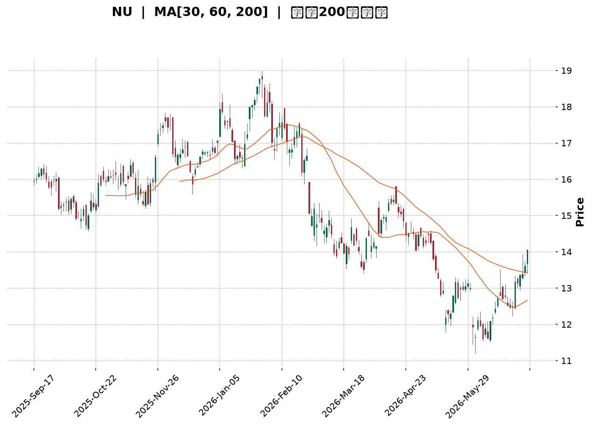
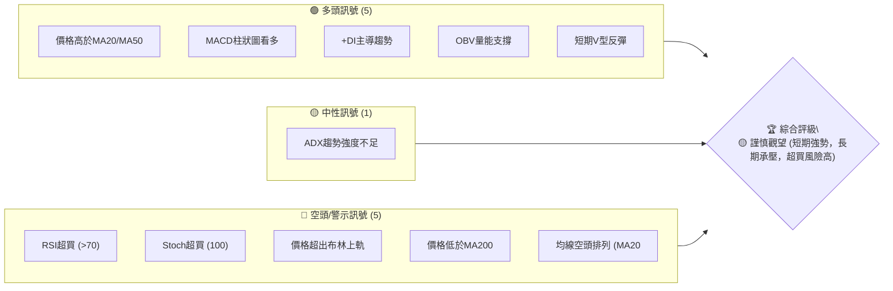
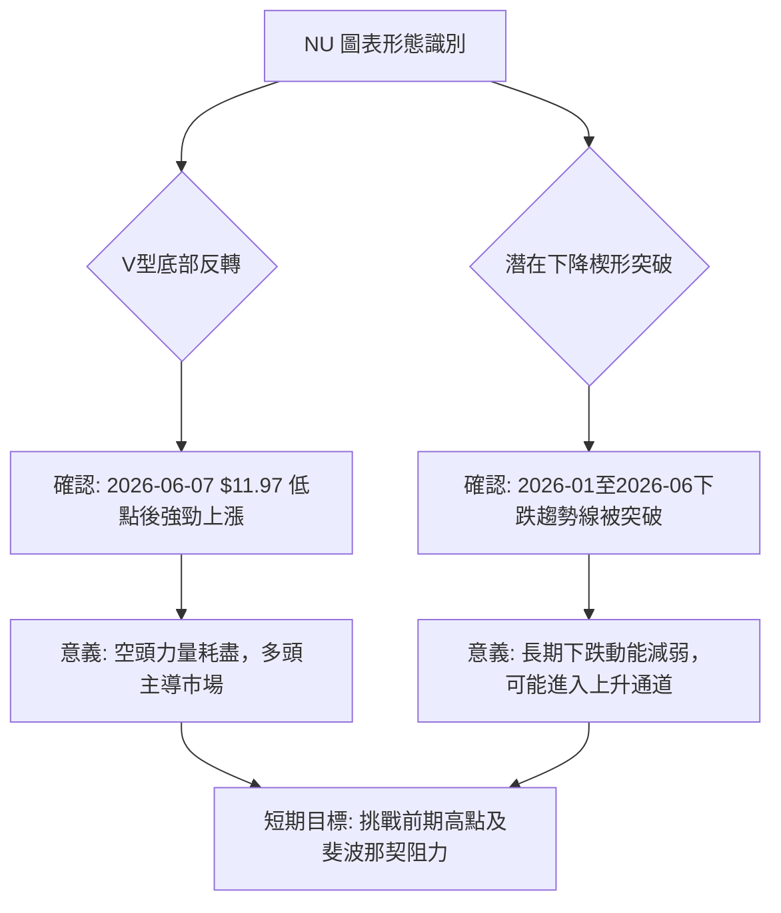
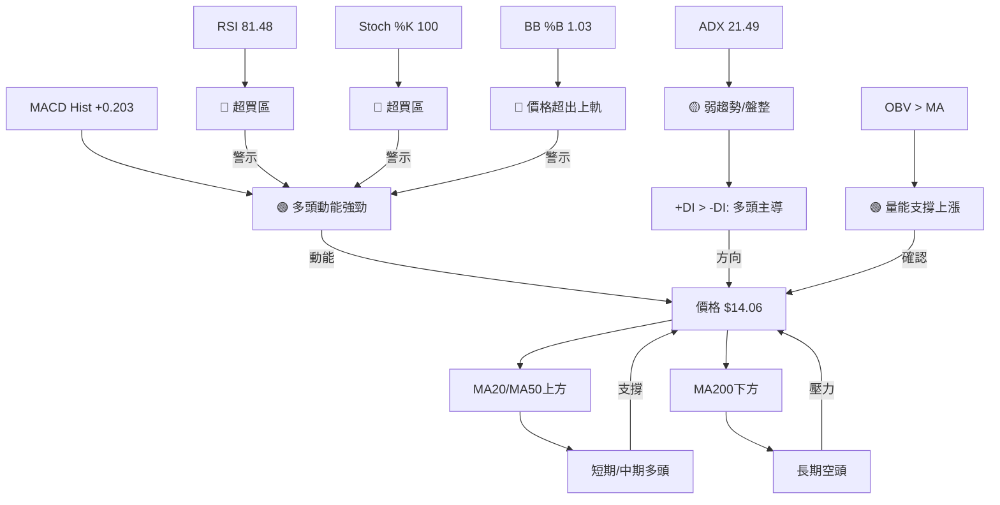
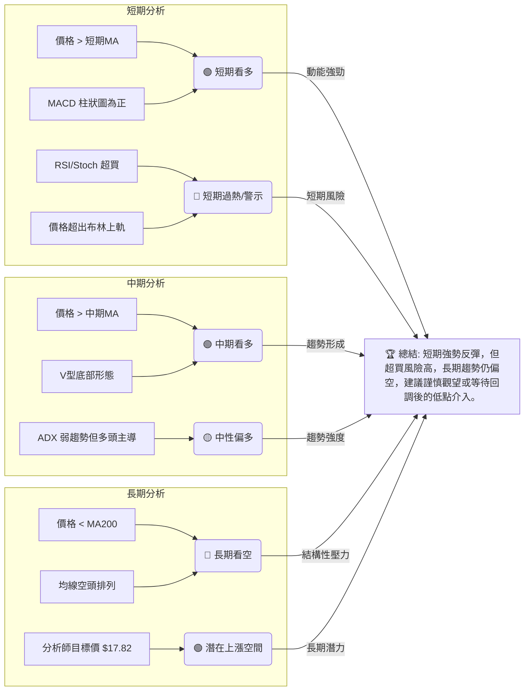

<details>
<summary>📊 靜態圖表 (點擊展開)</summary>

</details>

<html>
<head><meta charset="utf-8" /></head>
<body>
    <div style="height:500px; width:100%;">                        <script>window.PlotlyConfig = {MathJaxConfig: 'local'};</script>
        <script charset="utf-8" src="https://cdn.plot.ly/plotly-3.6.0.min.js" integrity="sha256-QaOVwtVY0T02VaHrr6pnoHLCwayMJp4O5n4YyaE3rJk=" crossorigin="anonymous"></script>                <div id="candlestick-chart" class="plotly-graph-div" style="height:100%; width:100%;"></div>            <script>                window.PLOTLYENV=window.PLOTLYENV || {};                                if (document.getElementById("candlestick-chart")) {                    Plotly.newPlot(                        "candlestick-chart",                        [{"close":{"dtype":"f8","bdata":"AAAAIIXrL0AAAABA4fovQAAAACCFKzBAAAAAwMxMMEAAAABgZiYwQAAAAGCPAjBAAAAAIFyPL0AAAAAgXI8vQAAAAGBm5i9AAAAAYI8CMEAAAACgR2EuQAAAAOCjcC5AAAAAYLieLkAAAABgj8IuQAAAAGCPQi5AAAAAIIXrLkAAAACgcL0uQAAAAEAK1y1AAAAAwPUoLkAAAACA69EtQAAAAAApXC5AAAAAgMJ1LUAAAAAAAAAuQAAAAIDr0S5AAAAAQOF6LkAAAACA61EuQAAAAMDMzC9AAAAAgBSuL0AAAAAAAAAwQAAAAAAp3C9AAAAAQAoXMEAAAAAgXA8wQAAAAAApHDBAAAAAoEchMEAAAACgmZkvQAAAACCFKzBAAAAAoEfhL0AAAACgcL0vQAAAAMAeBTBAAAAAANdjMEAAAACAFC4wQAAAAIAULi9AAAAAANejL0AAAABAMzMvQAAAAADXoy5AAAAAgOtRL0AAAAAA16MuQAAAACCuxy9AAAAAQArXL0AAAAAAKZwwQAAAAAAAQDFAAAAAANdjMUAAAABA4XoxQAAAAAApnDFAAAAA4KNwMUAAAABgZqYxQAAAAEAzszBAAAAAYLieMEAAAACAFK4wQAAAAOCjsDBAAAAAgOvRMEAAAABgZuYwQAAAAGBmpjBAAAAAQDMzMEAAAADgUbgvQAAAAMAeRTBAAAAAQApXMEAAAABguJ4wQAAAAGCPwjBAAAAAoHC9MEAAAABgj8IwQAAAAMD1qDBAAAAAoEfhMEAAAACgcL0wQAAAAMAeBTFAAAAA4KPwMUAAAAAAKdwxQAAAAAAAgDFAAAAAACmcMUAAAACAwnUxQAAAAIA9CjFAAAAAIFyPMEAAAAAA16MwQAAAAAApnDBAAAAAoJmZMEAAAADgUfgwQAAAAKBwPTFAAAAAAAAAMkAAAACAPQoyQAAAAIAULjJAAAAAwMyMMkAAAABgj8IyQAAAAGCPwjJAAAAAAADAMUAAAAAAKRwyQAAAAGC4HjJAAAAAwB4FMUAAAAAgXM8wQAAAAGBmZjFAAAAAwMyMMUAAAACA65ExQAAAAMD1aDFAAAAAgD0KMUAAAACA69EwQAAAAIDr0TBAAAAAIIUrMUAAAACA61ExQAAAACCuhzFAAAAA4KMwMEAAAAAgrocwQAAAAGBmpjBAAAAAYLgeLkAAAACAwvUtQAAAAKBHYS5AAAAAwB6FLUAAAAAAAAAuQAAAAADXoy1AAAAAwPUoLUAAAABAClctQAAAAGCPwi1AAAAAQOH6LEAAAADgo\u002fArQAAAACCuxytAAAAAgD2KLEAAAAAAAIAsQAAAAOCj8CtAAAAAgOtRLEAAAACgR+ErQAAAAAApXC1AAAAAoEdhLEAAAAAA16MsQAAAAIA9CixAAAAAQDMzK0AAAADAHgUrQAAAAKBwvSxAAAAAoEfhLEAAAADAzEwsQAAAAMAehSxAAAAAwMxMLEAAAADAHgUtQAAAAKBwvS1AAAAAIIXrLUAAAABgZuYtQAAAAEAzsy5AAAAAgBSuLkAAAAAAKdwuQAAAAIAUri5AAAAAQDMzLkAAAACgmRkuQAAAAEAzsy1AAAAAIIXrLEAAAADAHgUtQAAAACCuRy1AAAAAAAAALUAAAADgehQsQAAAAIDC9SxAAAAAoEfhLEAAAACA61EsQAAAAAAAgCxAAAAAgML1LEAAAADAHoUsQAAAAKCZmStAAAAAAAAAK0AAAACAPYoqQAAAAADXoylAAAAAACncKUAAAACgR2EoQAAAAOB6lChAAAAA4HqUKEAAAADgepQpQAAAAIDrUSpAAAAAgMJ1KUAAAACAwvUpQAAAACBcDypAAAAAoJkZKkAAAABgj0IqQAAAAEDh+ilAAAAAACncJ0AAAAAgrkcnQAAAAKBwPShAAAAA4KPwJ0AAAABAMzMnQAAAAGCPwidAAAAAoHA9J0AAAACAFC4oQAAAAKBHYShAAAAAACncKEAAAADgo3ApQAAAACCuxylAAAAAIIVrKUAAAADgepQpQAAAAIAULilAAAAAIIXrKEAAAAAghesoQAAAAEAKVypAAAAAYI9CKkAAAADgUbgqQAAAACCuxypAAAAA4FE4K0AAAABguB4sQA=="},"high":{"dtype":"f8","bdata":"AAAAwMwMMEAAAACgRyEwQAAAAKCZWTBAAAAAwMxMMEAAAADAzGwwQAAAAGC4XjBAAAAA4FEYMEAAAACgcP0vQAAAAKCZGTBAAAAA4KMwMEAAAADAzAwwQAAAAMDMzC5AAAAAAADALkAAAABA4fouQAAAAOB6FC9AAAAAAAAAL0AAAADA9SgvQAAAAGBm5i5AAAAAoHA9LkAAAACgR2EuQAAAAABWji5AAAAAYLieLkAAAABguB4uQAAAACCuRy9AAAAAgBQuL0AAAAAghesuQAAAAADXIzBAAAAAoEchMEAAAACgmVkwQAAAAIDrETBAAAAAwB5FMEAAAACgcD0wQAAAAMAeRTBAAAAAAACAMEAAAACgcB0wQAAAACCFazBAAAAAYGZmMEAAAAAAAMAvQAAAAOBRODBAAAAAwMyMMEAAAAAAAIAwQAAAAIDrMTBAAAAAYI9CMEAAAACgcL0vQAAAAKCZWS9AAAAA4KNwL0AAAABAMxMwQAAAAMAeBTBAAAAAIFwPMEAAAADAzKwwQAAAAKBHYTFAAAAAgBSOMUAAAAAgXI8xQAAAAEAK1zFAAAAA4FG4MUAAAADgo9AxQAAAAEDhujFAAAAAQDMTMUAAAABA4bowQAAAAKCZ2TBAAAAAACkcMUAAAAAgXA8xQAAAAIDrETFAAAAAwB6FMEAAAADA9SgwQAAAAOAiWzBAAAAA4FF4MEAAAACgR6EwQAAAAOB61DBAAAAAwPXIMEAAAABgj8IwQAAAACBczzBAAAAAQOEaMUAAAADAzOwwQAAAACBcDzFAAAAAgJUjMkAAAABguF4yQAAAAGCPwjFAAAAAgL6fMUAAAACA6xEyQAAAACCFazFAAAAAgOsRMUAAAADgo7AwQAAAAOBR+DBAAAAAYA6tMEAAAADgo1AxQAAAAIA9ijFAAAAAAAAAMkAAAADgoxAyQAAAAGCPQjJAAAAAIFyPMkAAAADA9cgyQAAAAEDh+jJAAAAAYLieMkAAAABACncyQAAAAGBmpjJAAAAAgD0qMkAAAABgjyIxQAAAACCFazFAAAAAQArXMUAAAAAAKbwxQAAAAKBw\u002fTFAAAAAwMyMMUAAAACgR+EwQAAAAAAAADFAAAAAQOF6MUAAAADgo3AxQAAAAEAKlzFAAAAAwPVoMUAAAABACpcwQAAAAKCZ2TBAAAAAoEfhL0AAAABgZmYuQAAAAECLrC5AAAAAYLgeLkAAAACAwrUuQAAAAMDMTC5AAAAAQDNzLUAAAACA65EtQAAAAIA9Si5AAAAAoEfhLUAAAABAM7MsQAAAAGC4nixAAAAAoHC9LEAAAADgehQtQAAAAMDMjCxAAAAAAACALEAAAADAzEwsQAAAAEAK1y1AAAAAwB4FLUAAAACgR2EtQAAAAGBmpixAAAAAYGbmK0AAAACA65ErQAAAAIDr0SxAAAAAoJmZLUAAAACAwvUsQAAAACCuxyxAAAAAgOtRLEAAAADAScwuQAAAAAAp3C1AAAAA4HoULkAAAAAgXA8uQAAAAOCj8C5AAAAAYLgeL0AAAACgRyEvQAAAAGC4ni9AAAAAQDOzLkAAAAAgXI8uQAAAAOCjcC5AAAAAANejLUAAAADgehQtQAAAACCFqy1AAAAAQApXLUAAAADAHgUtQAAAAGC4Hi1AAAAAgOtRLUAAAADgo\u002fAsQAAAAKBH4SxAAAAAoJkZLUAAAABAMzMtQAAAAMD1qCxAAAAAwPXoK0AAAAAAKRwrQAAAAIA9iipAAAAAQApXKkAAAAAgXM8oQAAAAMDMzChAAAAAwMzMKEAAAACgmZkpQAAAAKCZmSpAAAAAwB6FKkAAAACgRyEqQAAAAAApXCpAAAAAQOF6KkAAAAAAAIAqQAAAAMDMTCpAAAAAIIVrKEAAAABA4XonQAAAAIAUbihAAAAAQDOzKEAAAACgmRkoQAAAAIDrEShAAAAAgBQuKEAAAACAFC4oQAAAAOB6lChAAAAAYI9CKUAAAACgmZkpQAAAACCuBytAAAAAwPUoKkAAAACgcD0qQAAAAIDrkSlAAAAA4KNwKUAAAACAPUopQAAAAIAUripAAAAAoJmZKkAAAAAgrscqQAAAAAAp3CtAAAAAAACAK0AAAABguB4sQA=="},"hovertemplate":"\u003cb\u003e%{x|%Y-%m-%d}\u003c\u002fb\u003e\u003cbr\u003e\u958b: $%{open:.2f}\u003cbr\u003e\u9ad8: $%{high:.2f}\u003cbr\u003e\u4f4e: $%{low:.2f}\u003cbr\u003e\u6536: $%{close:.2f}\u003cextra\u003e\u003c\u002fextra\u003e","low":{"dtype":"f8","bdata":"AAAAYGamL0AAAADAHsUvQAAAAMAeBTBAAAAAgML1L0AAAAAgrgcwQAAAAKDx0i9AAAAAgMJ1L0AAAACgmRkvQAAAAMD1qC9AAAAAwMxML0AAAACA61EuQAAAAIA9Ci5AAAAA4FE4LkAAAAAAAEAuQAAAAIA9Ci5AAAAAoJkZLkAAAACAwnUuQAAAAGCPwi1AAAAAQArXLUAAAAAgrkctQAAAAOBRuC1AAAAAQF46LUAAAABguB4tQAAAAGC4Hi5AAAAAIFxPLkAAAACA6xEuQAAAAIDCdS5AAAAAIASWL0AAAABACtcvQAAAAADXoy9AAAAAACncL0AAAAAA1wMwQAAAAGCPwi9AAAAAgBTuL0AAAABgZmYvQAAAAOB6lC9AAAAAgBSuL0AAAABgZuYuQAAAAMDMzC9AAAAAwMwMMEAAAAAghQswQAAAAOBR+C5AAAAAANejLkAAAAAAAAAvQAAAAMAehS5AAAAAoEdhLkAAAACgmZkuQAAAAGCPgi5AAAAAIFyPL0AAAAAAKVwvQAAAAMD16DBAAAAAQDMzMUAAAAAgrkcxQAAAAEDhejFAAAAAgD1KMUAAAAAAKVwxQAAAAKCZmTBAAAAA4FF4MEAAAAAAAkswQAAAAEAKdzBAAAAAQDOzMEAAAACgmZkwQAAAAKBHoTBAAAAAgBQuMEAAAACAFC4vQAAAAMAgEDBAAAAAQGJQMEAAAACgmVkwQAAAACBcjzBAAAAAYGamMEAAAAAAKZwwQAAAAIA9ijBAAAAAgBSuMEAAAACAwrUwQAAAAGBmpjBAAAAAgD0qMUAAAAAgXM8xQAAAACCuZzFAAAAAYLheMUAAAAAA12MxQAAAAMAeBTFAAAAAgD1qMEAAAADAzGwwQAAAAIBBgDBAAAAAgBROMEAAAACgmVkwQAAAAIDrETFAAAAA4HpUMUAAAACAwrUxQAAAAGBm5jFAAAAAoJkZMkAAAAAAKVwyQAAAAKBwPTJAAAAAgMK1MUAAAACAwrUxQAAAAEAK1zFAAAAAAADgMEAAAADAzIwwQAAAAGCPwjBAAAAAQAo3MUAAAACAPQoxQAAAAKCZWTFAAAAAgMK1MEAAAABguF4wQAAAAEAKlzBAAAAAQArXMEAAAADAHuUwQAAAACCFKzFAAAAA4HoUMEAAAACgcL0vQAAAAADXgzBAAAAA4HoULkAAAABgZmYtQAAAAGC4nixAAAAAQApXLEAAAACgmZktQAAAAOBROC1AAAAA4FF4LEAAAACAwnUsQAAAACBcDy1AAAAAYI\u002fCLEAAAABgj8IrQAAAAKBHoStAAAAAYLgeLEAAAADgUXgsQAAAAOB61CtAAAAAIFwPK0AAAADgepQrQAAAAOCjcCxAAAAAgOtRLEAAAAAghWssQAAAAAAp3CtAAAAA4HoUK0AAAACA69EqQAAAAGBmZitAAAAAACncLEAAAAAAAqsrQAAAAMD1KCxAAAAAgBSuK0AAAACA69EsQAAAAMDMzCxAAAAAIFyPLUAAAABAMzMtQAAAAKBwPS5AAAAAoJmZLkAAAADgepQuQAAAAGC4ni5AAAAAACncLUAAAADgo\u002fAtQAAAAEAKVy1AAAAAgOuRLEAAAACgR2EsQAAAAKCZGS1AAAAAgMK1LEAAAADgehQsQAAAAKCZGSxAAAAAYI\u002fCLEAAAACAFC4sQAAAAEAKVyxAAAAAoHB9LEAAAADA9WgsQAAAAAAAgCtAAAAAQArXKkAAAADAHoUqQAAAACCuhylAAAAAgBSuKUAAAAAgXI8nQAAAAGC4HihAAAAAIIXrJ0AAAADA9agoQAAAAGC4HilAAAAAIIVrKUAAAADAzEwpQAAAAAAp3ClAAAAAIK7HKUAAAABA4fopQAAAAIDr0SlAAAAAoEfhJkAAAABgZmYmQAAAAADXoydAAAAAYLjeJ0AAAACgmRknQAAAACBcTydAAAAA4FE4J0AAAADAHgUnQAAAACCuByhAAAAAIFyPKEAAAADgo\u002fAoQAAAAOB6lClAAAAAAClcKUAAAABgZmYpQAAAAAAAAClAAAAAoEfhKEAAAACAwnUoQAAAAADX4yhAAAAAQOH6KUAAAACgR+EpQAAAAAAAgCpAAAAAYOOlKkAAAACA69EqQA=="},"name":"\u50f9\u683c","open":{"dtype":"f8","bdata":"AAAAYGbmL0AAAABgjwIwQAAAAIDrETBAAAAAACkcMEAAAADAzEwwQAAAAIAULjBAAAAAACncL0AAAAAAKdwvQAAAAGBm5i9AAAAAIIXrL0AAAADAzAwwQAAAAIA9ii5AAAAAIFyPLkAAAACgcL0uQAAAAIDr0S5AAAAAAClcLkAAAAAgXA8vQAAAAOBRuC5AAAAAwPUoLkAAAABAM7MtQAAAAAAAAC5AAAAA4HqULkAAAAAgrkctQAAAAGCPQi5AAAAAQDOzLkAAAAAA16MuQAAAAMAehS5AAAAAQAoXMEAAAABA4TowQAAAACCF6y9AAAAAYGbmL0AAAACA6xEwQAAAAAApHDBAAAAA4KMwMEAAAACgmZkvQAAAAOBRuC9AAAAAYLheMEAAAAAA16MvQAAAAKCZGTBAAAAAQAoXMEAAAACAwnUwQAAAAIA9CjBAAAAAACncLkAAAADgUXgvQAAAAMDMzC5AAAAAwMyMLkAAAACAFK4vQAAAAIDCtS5AAAAAAAAAMEAAAABACtcvQAAAAEDh+jBAAAAAANdjMUAAAACAFG4xQAAAAIDCtTFAAAAAQDOzMUAAAABgZqYxQAAAAEAzszFAAAAAYLjeMEAAAADAHmUwQAAAAKCZmTBAAAAAQOG6MEAAAAAgrucwQAAAAGBmBjFAAAAAAACAMEAAAABAChcwQAAAAGBmJjBAAAAAoJlZMEAAAAAghWswQAAAAOCjsDBAAAAAQDOzMEAAAACgcL0wQAAAAIA9qjBAAAAAwB7FMEAAAABguN4wQAAAACBcDzFAAAAAgBQuMUAAAABguB4yQAAAAGC4njFAAAAAQAqXMUAAAACAFK4xQAAAAKCZWTFAAAAAIFwPMUAAAADgo5AwQAAAAAAAwDBAAAAAgOuRMEAAAAAAKVwwQAAAAGCPIjFAAAAAgD2qMUAAAAAAAAAyQAAAAMDMDDJAAAAAAClcMkAAAABgj6IyQAAAAOB61DJAAAAAIK6HMkAAAACgcL0xQAAAACCuZzJAAAAA4HoUMkAAAADgetQwQAAAACCFKzFAAAAA4KNwMUAAAABgZiYxQAAAAIDr8TFAAAAAwPWIMUAAAACgcL0wQAAAAAAAwDBAAAAAQDPzMEAAAAAA1yMxQAAAAEAzMzFAAAAAAABAMUAAAADgozAwQAAAAADXgzBAAAAAQArXL0AAAADgo3AtQAAAACCF6yxAAAAAAClcLUAAAACgcP0tQAAAAAAp3C1AAAAAYI8CLUAAAACA69EsQAAAAEDhei1AAAAAAACALUAAAABgZmYsQAAAAADXIyxAAAAAoHA9LEAAAADAzMwsQAAAAOCjcCxAAAAAAClcK0AAAACgcD0sQAAAAKBHoSxAAAAA4FH4LEAAAABgj0ItQAAAAGCPQixAAAAAgMJ1K0AAAAAghWsrQAAAAKCZmStAAAAAgBQuLUAAAAAAAAAsQAAAAGCPQixAAAAAQDMzLEAAAAAghWsuQAAAAMAeBS1AAAAAACncLUAAAACAFK4tQAAAAGCPQi5AAAAAIIXrLkAAAAAgrscuQAAAAGC4ni9AAAAAQOF6LkAAAADgUTguQAAAAAApXC5AAAAAYLieLUAAAABACtcsQAAAACCuRy1AAAAA4HoULUAAAACAwvUsQAAAAOB6VCxAAAAAgOtRLUAAAAAgrscsQAAAAADXoyxAAAAAAAAALUAAAAAAAAAtQAAAAKCZmSxAAAAAYI\u002fCK0AAAABACtcqQAAAACCFaypAAAAAQDOzKUAAAABAiQEoQAAAAMDMzChAAAAA4HpUKEAAAACAFK4oQAAAAOBROClAAAAAwMxMKkAAAAAgrgcqQAAAACCF6ylAAAAA4KPwKUAAAACgmRkqQAAAAAAAACpAAAAAQOH6J0AAAADAzEwnQAAAAGCPwidAAAAAQDMzKEAAAADAHgUoQAAAAOCjcCdAAAAAoJmZJ0AAAAAA1yMnQAAAAEAKVyhAAAAAgBSuKEAAAADAHgUpQAAAAOB6lClAAAAAIFwPKkAAAAAgXI8pQAAAAIA9CilAAAAAoJkZKUAAAACAwvUoQAAAAADX4yhAAAAAwB6FKkAAAABguB4qQAAAACBcjypAAAAAoEfhKkAAAAAAKVwrQA=="},"x":["2025-09-17T00:00:00-04:00","2025-09-18T00:00:00-04:00","2025-09-19T00:00:00-04:00","2025-09-22T00:00:00-04:00","2025-09-23T00:00:00-04:00","2025-09-24T00:00:00-04:00","2025-09-25T00:00:00-04:00","2025-09-26T00:00:00-04:00","2025-09-29T00:00:00-04:00","2025-09-30T00:00:00-04:00","2025-10-01T00:00:00-04:00","2025-10-02T00:00:00-04:00","2025-10-03T00:00:00-04:00","2025-10-06T00:00:00-04:00","2025-10-07T00:00:00-04:00","2025-10-08T00:00:00-04:00","2025-10-09T00:00:00-04:00","2025-10-10T00:00:00-04:00","2025-10-13T00:00:00-04:00","2025-10-14T00:00:00-04:00","2025-10-15T00:00:00-04:00","2025-10-16T00:00:00-04:00","2025-10-17T00:00:00-04:00","2025-10-20T00:00:00-04:00","2025-10-21T00:00:00-04:00","2025-10-22T00:00:00-04:00","2025-10-23T00:00:00-04:00","2025-10-24T00:00:00-04:00","2025-10-27T00:00:00-04:00","2025-10-28T00:00:00-04:00","2025-10-29T00:00:00-04:00","2025-10-30T00:00:00-04:00","2025-10-31T00:00:00-04:00","2025-11-03T00:00:00-05:00","2025-11-04T00:00:00-05:00","2025-11-05T00:00:00-05:00","2025-11-06T00:00:00-05:00","2025-11-07T00:00:00-05:00","2025-11-10T00:00:00-05:00","2025-11-11T00:00:00-05:00","2025-11-12T00:00:00-05:00","2025-11-13T00:00:00-05:00","2025-11-14T00:00:00-05:00","2025-11-17T00:00:00-05:00","2025-11-18T00:00:00-05:00","2025-11-19T00:00:00-05:00","2025-11-20T00:00:00-05:00","2025-11-21T00:00:00-05:00","2025-11-24T00:00:00-05:00","2025-11-25T00:00:00-05:00","2025-11-26T00:00:00-05:00","2025-11-28T00:00:00-05:00","2025-12-01T00:00:00-05:00","2025-12-02T00:00:00-05:00","2025-12-03T00:00:00-05:00","2025-12-04T00:00:00-05:00","2025-12-05T00:00:00-05:00","2025-12-08T00:00:00-05:00","2025-12-09T00:00:00-05:00","2025-12-10T00:00:00-05:00","2025-12-11T00:00:00-05:00","2025-12-12T00:00:00-05:00","2025-12-15T00:00:00-05:00","2025-12-16T00:00:00-05:00","2025-12-17T00:00:00-05:00","2025-12-18T00:00:00-05:00","2025-12-19T00:00:00-05:00","2025-12-22T00:00:00-05:00","2025-12-23T00:00:00-05:00","2025-12-24T00:00:00-05:00","2025-12-26T00:00:00-05:00","2025-12-29T00:00:00-05:00","2025-12-30T00:00:00-05:00","2025-12-31T00:00:00-05:00","2026-01-02T00:00:00-05:00","2026-01-05T00:00:00-05:00","2026-01-06T00:00:00-05:00","2026-01-07T00:00:00-05:00","2026-01-08T00:00:00-05:00","2026-01-09T00:00:00-05:00","2026-01-12T00:00:00-05:00","2026-01-13T00:00:00-05:00","2026-01-14T00:00:00-05:00","2026-01-15T00:00:00-05:00","2026-01-16T00:00:00-05:00","2026-01-20T00:00:00-05:00","2026-01-21T00:00:00-05:00","2026-01-22T00:00:00-05:00","2026-01-23T00:00:00-05:00","2026-01-26T00:00:00-05:00","2026-01-27T00:00:00-05:00","2026-01-28T00:00:00-05:00","2026-01-29T00:00:00-05:00","2026-01-30T00:00:00-05:00","2026-02-02T00:00:00-05:00","2026-02-03T00:00:00-05:00","2026-02-04T00:00:00-05:00","2026-02-05T00:00:00-05:00","2026-02-06T00:00:00-05:00","2026-02-09T00:00:00-05:00","2026-02-10T00:00:00-05:00","2026-02-11T00:00:00-05:00","2026-02-12T00:00:00-05:00","2026-02-13T00:00:00-05:00","2026-02-17T00:00:00-05:00","2026-02-18T00:00:00-05:00","2026-02-19T00:00:00-05:00","2026-02-20T00:00:00-05:00","2026-02-23T00:00:00-05:00","2026-02-24T00:00:00-05:00","2026-02-25T00:00:00-05:00","2026-02-26T00:00:00-05:00","2026-02-27T00:00:00-05:00","2026-03-02T00:00:00-05:00","2026-03-03T00:00:00-05:00","2026-03-04T00:00:00-05:00","2026-03-05T00:00:00-05:00","2026-03-06T00:00:00-05:00","2026-03-09T00:00:00-04:00","2026-03-10T00:00:00-04:00","2026-03-11T00:00:00-04:00","2026-03-12T00:00:00-04:00","2026-03-13T00:00:00-04:00","2026-03-16T00:00:00-04:00","2026-03-17T00:00:00-04:00","2026-03-18T00:00:00-04:00","2026-03-19T00:00:00-04:00","2026-03-20T00:00:00-04:00","2026-03-23T00:00:00-04:00","2026-03-24T00:00:00-04:00","2026-03-25T00:00:00-04:00","2026-03-26T00:00:00-04:00","2026-03-27T00:00:00-04:00","2026-03-30T00:00:00-04:00","2026-03-31T00:00:00-04:00","2026-04-01T00:00:00-04:00","2026-04-02T00:00:00-04:00","2026-04-06T00:00:00-04:00","2026-04-07T00:00:00-04:00","2026-04-08T00:00:00-04:00","2026-04-09T00:00:00-04:00","2026-04-10T00:00:00-04:00","2026-04-13T00:00:00-04:00","2026-04-14T00:00:00-04:00","2026-04-15T00:00:00-04:00","2026-04-16T00:00:00-04:00","2026-04-17T00:00:00-04:00","2026-04-20T00:00:00-04:00","2026-04-21T00:00:00-04:00","2026-04-22T00:00:00-04:00","2026-04-23T00:00:00-04:00","2026-04-24T00:00:00-04:00","2026-04-27T00:00:00-04:00","2026-04-28T00:00:00-04:00","2026-04-29T00:00:00-04:00","2026-04-30T00:00:00-04:00","2026-05-01T00:00:00-04:00","2026-05-04T00:00:00-04:00","2026-05-05T00:00:00-04:00","2026-05-06T00:00:00-04:00","2026-05-07T00:00:00-04:00","2026-05-08T00:00:00-04:00","2026-05-11T00:00:00-04:00","2026-05-12T00:00:00-04:00","2026-05-13T00:00:00-04:00","2026-05-14T00:00:00-04:00","2026-05-15T00:00:00-04:00","2026-05-18T00:00:00-04:00","2026-05-19T00:00:00-04:00","2026-05-20T00:00:00-04:00","2026-05-21T00:00:00-04:00","2026-05-22T00:00:00-04:00","2026-05-26T00:00:00-04:00","2026-05-27T00:00:00-04:00","2026-05-28T00:00:00-04:00","2026-05-29T00:00:00-04:00","2026-06-01T00:00:00-04:00","2026-06-02T00:00:00-04:00","2026-06-03T00:00:00-04:00","2026-06-04T00:00:00-04:00","2026-06-05T00:00:00-04:00","2026-06-08T00:00:00-04:00","2026-06-09T00:00:00-04:00","2026-06-10T00:00:00-04:00","2026-06-11T00:00:00-04:00","2026-06-12T00:00:00-04:00","2026-06-15T00:00:00-04:00","2026-06-16T00:00:00-04:00","2026-06-17T00:00:00-04:00","2026-06-18T00:00:00-04:00","2026-06-22T00:00:00-04:00","2026-06-23T00:00:00-04:00","2026-06-24T00:00:00-04:00","2026-06-25T00:00:00-04:00","2026-06-26T00:00:00-04:00","2026-06-29T00:00:00-04:00","2026-06-30T00:00:00-04:00","2026-07-01T00:00:00-04:00","2026-07-02T00:00:00-04:00","2026-07-06T00:00:00-04:00"],"type":"candlestick"},{"hovertemplate":"MA30: $%{y:.2f}\u003cextra\u003e\u003c\u002fextra\u003e","line":{"color":"#2196F3","dash":"dash","width":2},"mode":"lines","name":"MA30","x":["2025-09-17T00:00:00-04:00","2025-09-18T00:00:00-04:00","2025-09-19T00:00:00-04:00","2025-09-22T00:00:00-04:00","2025-09-23T00:00:00-04:00","2025-09-24T00:00:00-04:00","2025-09-25T00:00:00-04:00","2025-09-26T00:00:00-04:00","2025-09-29T00:00:00-04:00","2025-09-30T00:00:00-04:00","2025-10-01T00:00:00-04:00","2025-10-02T00:00:00-04:00","2025-10-03T00:00:00-04:00","2025-10-06T00:00:00-04:00","2025-10-07T00:00:00-04:00","2025-10-08T00:00:00-04:00","2025-10-09T00:00:00-04:00","2025-10-10T00:00:00-04:00","2025-10-13T00:00:00-04:00","2025-10-14T00:00:00-04:00","2025-10-15T00:00:00-04:00","2025-10-16T00:00:00-04:00","2025-10-17T00:00:00-04:00","2025-10-20T00:00:00-04:00","2025-10-21T00:00:00-04:00","2025-10-22T00:00:00-04:00","2025-10-23T00:00:00-04:00","2025-10-24T00:00:00-04:00","2025-10-27T00:00:00-04:00","2025-10-28T00:00:00-04:00","2025-10-29T00:00:00-04:00","2025-10-30T00:00:00-04:00","2025-10-31T00:00:00-04:00","2025-11-03T00:00:00-05:00","2025-11-04T00:00:00-05:00","2025-11-05T00:00:00-05:00","2025-11-06T00:00:00-05:00","2025-11-07T00:00:00-05:00","2025-11-10T00:00:00-05:00","2025-11-11T00:00:00-05:00","2025-11-12T00:00:00-05:00","2025-11-13T00:00:00-05:00","2025-11-14T00:00:00-05:00","2025-11-17T00:00:00-05:00","2025-11-18T00:00:00-05:00","2025-11-19T00:00:00-05:00","2025-11-20T00:00:00-05:00","2025-11-21T00:00:00-05:00","2025-11-24T00:00:00-05:00","2025-11-25T00:00:00-05:00","2025-11-26T00:00:00-05:00","2025-11-28T00:00:00-05:00","2025-12-01T00:00:00-05:00","2025-12-02T00:00:00-05:00","2025-12-03T00:00:00-05:00","2025-12-04T00:00:00-05:00","2025-12-05T00:00:00-05:00","2025-12-08T00:00:00-05:00","2025-12-09T00:00:00-05:00","2025-12-10T00:00:00-05:00","2025-12-11T00:00:00-05:00","2025-12-12T00:00:00-05:00","2025-12-15T00:00:00-05:00","2025-12-16T00:00:00-05:00","2025-12-17T00:00:00-05:00","2025-12-18T00:00:00-05:00","2025-12-19T00:00:00-05:00","2025-12-22T00:00:00-05:00","2025-12-23T00:00:00-05:00","2025-12-24T00:00:00-05:00","2025-12-26T00:00:00-05:00","2025-12-29T00:00:00-05:00","2025-12-30T00:00:00-05:00","2025-12-31T00:00:00-05:00","2026-01-02T00:00:00-05:00","2026-01-05T00:00:00-05:00","2026-01-06T00:00:00-05:00","2026-01-07T00:00:00-05:00","2026-01-08T00:00:00-05:00","2026-01-09T00:00:00-05:00","2026-01-12T00:00:00-05:00","2026-01-13T00:00:00-05:00","2026-01-14T00:00:00-05:00","2026-01-15T00:00:00-05:00","2026-01-16T00:00:00-05:00","2026-01-20T00:00:00-05:00","2026-01-21T00:00:00-05:00","2026-01-22T00:00:00-05:00","2026-01-23T00:00:00-05:00","2026-01-26T00:00:00-05:00","2026-01-27T00:00:00-05:00","2026-01-28T00:00:00-05:00","2026-01-29T00:00:00-05:00","2026-01-30T00:00:00-05:00","2026-02-02T00:00:00-05:00","2026-02-03T00:00:00-05:00","2026-02-04T00:00:00-05:00","2026-02-05T00:00:00-05:00","2026-02-06T00:00:00-05:00","2026-02-09T00:00:00-05:00","2026-02-10T00:00:00-05:00","2026-02-11T00:00:00-05:00","2026-02-12T00:00:00-05:00","2026-02-13T00:00:00-05:00","2026-02-17T00:00:00-05:00","2026-02-18T00:00:00-05:00","2026-02-19T00:00:00-05:00","2026-02-20T00:00:00-05:00","2026-02-23T00:00:00-05:00","2026-02-24T00:00:00-05:00","2026-02-25T00:00:00-05:00","2026-02-26T00:00:00-05:00","2026-02-27T00:00:00-05:00","2026-03-02T00:00:00-05:00","2026-03-03T00:00:00-05:00","2026-03-04T00:00:00-05:00","2026-03-05T00:00:00-05:00","2026-03-06T00:00:00-05:00","2026-03-09T00:00:00-04:00","2026-03-10T00:00:00-04:00","2026-03-11T00:00:00-04:00","2026-03-12T00:00:00-04:00","2026-03-13T00:00:00-04:00","2026-03-16T00:00:00-04:00","2026-03-17T00:00:00-04:00","2026-03-18T00:00:00-04:00","2026-03-19T00:00:00-04:00","2026-03-20T00:00:00-04:00","2026-03-23T00:00:00-04:00","2026-03-24T00:00:00-04:00","2026-03-25T00:00:00-04:00","2026-03-26T00:00:00-04:00","2026-03-27T00:00:00-04:00","2026-03-30T00:00:00-04:00","2026-03-31T00:00:00-04:00","2026-04-01T00:00:00-04:00","2026-04-02T00:00:00-04:00","2026-04-06T00:00:00-04:00","2026-04-07T00:00:00-04:00","2026-04-08T00:00:00-04:00","2026-04-09T00:00:00-04:00","2026-04-10T00:00:00-04:00","2026-04-13T00:00:00-04:00","2026-04-14T00:00:00-04:00","2026-04-15T00:00:00-04:00","2026-04-16T00:00:00-04:00","2026-04-17T00:00:00-04:00","2026-04-20T00:00:00-04:00","2026-04-21T00:00:00-04:00","2026-04-22T00:00:00-04:00","2026-04-23T00:00:00-04:00","2026-04-24T00:00:00-04:00","2026-04-27T00:00:00-04:00","2026-04-28T00:00:00-04:00","2026-04-29T00:00:00-04:00","2026-04-30T00:00:00-04:00","2026-05-01T00:00:00-04:00","2026-05-04T00:00:00-04:00","2026-05-05T00:00:00-04:00","2026-05-06T00:00:00-04:00","2026-05-07T00:00:00-04:00","2026-05-08T00:00:00-04:00","2026-05-11T00:00:00-04:00","2026-05-12T00:00:00-04:00","2026-05-13T00:00:00-04:00","2026-05-14T00:00:00-04:00","2026-05-15T00:00:00-04:00","2026-05-18T00:00:00-04:00","2026-05-19T00:00:00-04:00","2026-05-20T00:00:00-04:00","2026-05-21T00:00:00-04:00","2026-05-22T00:00:00-04:00","2026-05-26T00:00:00-04:00","2026-05-27T00:00:00-04:00","2026-05-28T00:00:00-04:00","2026-05-29T00:00:00-04:00","2026-06-01T00:00:00-04:00","2026-06-02T00:00:00-04:00","2026-06-03T00:00:00-04:00","2026-06-04T00:00:00-04:00","2026-06-05T00:00:00-04:00","2026-06-08T00:00:00-04:00","2026-06-09T00:00:00-04:00","2026-06-10T00:00:00-04:00","2026-06-11T00:00:00-04:00","2026-06-12T00:00:00-04:00","2026-06-15T00:00:00-04:00","2026-06-16T00:00:00-04:00","2026-06-17T00:00:00-04:00","2026-06-18T00:00:00-04:00","2026-06-22T00:00:00-04:00","2026-06-23T00:00:00-04:00","2026-06-24T00:00:00-04:00","2026-06-25T00:00:00-04:00","2026-06-26T00:00:00-04:00","2026-06-29T00:00:00-04:00","2026-06-30T00:00:00-04:00","2026-07-01T00:00:00-04:00","2026-07-02T00:00:00-04:00","2026-07-06T00:00:00-04:00"],"y":{"dtype":"f8","bdata":"AAAAAAAA+H8AAAAAAAD4fwAAAAAAAPh\u002fAAAAAAAA+H8AAAAAAAD4fwAAAAAAAPh\u002fAAAAAAAA+H8AAAAAAAD4fwAAAAAAAPh\u002fAAAAAAAA+H8AAAAAAAD4fwAAAAAAAPh\u002fAAAAAAAA+H8AAAAAAAD4fwAAAAAAAPh\u002fAAAAAAAA+H8AAAAAAAD4fwAAAAAAAPh\u002fAAAAAAAA+H8AAAAAAAD4fwAAAAAAAPh\u002fAAAAAAAA+H8AAAAAAAD4fwAAAAAAAPh\u002fAAAAAAAA+H8AAAAAAAD4fwAAAAAAAPh\u002fAAAAAAAA+H8AAAAAAAD4f0RERNTqGC9A7+7uziIbL0BERESkVBwvQAAAAIBOGy9AIiIiwmcYL0BmZmaWbhIvQDMzM6MpFS9AAAAAsOQXL0B3d3fnbRkvQN7d3b2fGi9AvLu7+xshL0DNzMxcATIvQKuqqupROC9AMzMzIwZBL0BVVVVVx0QvQERERHQFSC9ARERERG9LL0AAAADQlEovQO\u002fu7s4iWy9AMzMz03hpL0De3d09fIYvQFVVVTXQqS9AzczM7DXXL0CrqqqaxAAwQERERJSKEzBA3t3djVAmMECrqqoKkDswQLy7u6tjQjBAvLu7mwtJMEB3d3cX2U4wQGZmZlZVVTBAvLu7C5BbMEDe3d0Nu2IwQDMzM7NWZzBA7+7unu9nMEARERGxcmgwQFVVVSVNaTBA3t3d9bZsMEDNzMxcHXMwQKuqqupteTBAERERgWp8MECJiIiIXYEwQLy7u\u002ft+ijBAZmZmloqTMEBERET0RJ0wQJqZmanGqzBAZmZmZju\u002fMEDe3d0d6NQwQO\u002fu7jal4jBAvLu7ExHxMEBVVVXtUfgwQFVVVS2H9jBAvLu7A3LvMECamZkBR+gwQBEREXm+3zBA7+7udpPYMEAzMzP7xdIwQImIiKBh1zBAAAAASCjjMEB3d3c\u002fw+4wQLy7uzN6+zBAmpmZcT0KMUBVVVWtHBoxQDMzMwseLDFAmpmZEVg5MUBVVVVFi0wxQImIiKhUXDFAREREJCJiMUAzMzMzwWMxQM3MzEw3aTFAVVVVxSBwMUDe3d09CncxQERERKRwfTFAvLu7K85+MUDv7u7ufH8xQGZmZgbIfTFA7+7u7jV3MUCJiIhImnIxQCIiItLbcjFAiYiIyL1mMUC8u7srzl4xQDMzMzN6WzFA7+7uZq1OMUC8u7sTg0AxQJqZmQllNDFA7+7ufrEkMUB3d3f34RMxQFVVVWU7\u002fzBAq6qqSgziMECamZlpSsUwQLy7u3MhqTBAd3d3P3yGMEBVVVVVnF0wQAAAAKgNNDBAMzMze1sWMEDNzMxc1uovQLy7u7sCpC9AMzMzMzNzL0Crqqr6N0IvQO\u002fu7h7MEy9A7+7uDnTaLkB3d3eX\u002fKIuQFVVVXUhaS5A3t3d3WsuLkAiIiJC7vUtQLy7uwsezC1A3t3dfYadLUDNzMyMbGctQDMzM7OdLy1AzczMzMwMLUCJiIhIU+osQImIiFjyyyxAAAAAcD3KLEDe3d1dusksQLy7u2t1zCxAq6qqelvWLEDe3d0tst0sQImIiBiS5ixAMzMzA3LvLEAiIiJC7vUsQAAAADBr9SxA3t3dHej0LECamZlpH\u002f4sQGZmZjbsCi1AiYiIGNkOLUB3d3eXQwstQAAAAND3Ey1AZmZmJr8YLUCJiIhYgBwtQFVVVaUpFS1AzczMrBwaLUCJiIiIFhktQGZmZlZVFS1A3t3dbaATLUCrqqrahw8tQM3MzMwT9SxAMzMzg07bLEBEREQk27ksQERERBQ8mCxA3t3dnX14LEAiIiLSIlssQHd3d7fzPSxAIiIisuQXLEAiIiKiRfYrQFVVVWWtzitAvLu7O5inK0ARERFhV4ArQCIiIhI8WCtAERERISIiK0DNzMyc7+cqQO\u002fu7g5YuSpAVVVVFdmOKkCamZkZL10qQJqZmXkULipAAAAAkO38KUAiIiLipdspQImIiLiQtClAZmZm5kKSKUAiIiJyr3kpQERERIR5YilAVVVVRUREKUDe3d29LSspQLy7uyuHFilAd3d3V8cEKUBVVVVl9PYoQCIiIpLt\u002fChAIiIiYlcAKUARERExTxQpQKuqqioVJylAVVVVVZw9KUDNzMwMSVMpQA=="},"type":"scatter"},{"hovertemplate":"MA60: $%{y:.2f}\u003cextra\u003e\u003c\u002fextra\u003e","line":{"color":"#9C27B0","dash":"dash","width":2},"mode":"lines","name":"MA60","x":["2025-09-17T00:00:00-04:00","2025-09-18T00:00:00-04:00","2025-09-19T00:00:00-04:00","2025-09-22T00:00:00-04:00","2025-09-23T00:00:00-04:00","2025-09-24T00:00:00-04:00","2025-09-25T00:00:00-04:00","2025-09-26T00:00:00-04:00","2025-09-29T00:00:00-04:00","2025-09-30T00:00:00-04:00","2025-10-01T00:00:00-04:00","2025-10-02T00:00:00-04:00","2025-10-03T00:00:00-04:00","2025-10-06T00:00:00-04:00","2025-10-07T00:00:00-04:00","2025-10-08T00:00:00-04:00","2025-10-09T00:00:00-04:00","2025-10-10T00:00:00-04:00","2025-10-13T00:00:00-04:00","2025-10-14T00:00:00-04:00","2025-10-15T00:00:00-04:00","2025-10-16T00:00:00-04:00","2025-10-17T00:00:00-04:00","2025-10-20T00:00:00-04:00","2025-10-21T00:00:00-04:00","2025-10-22T00:00:00-04:00","2025-10-23T00:00:00-04:00","2025-10-24T00:00:00-04:00","2025-10-27T00:00:00-04:00","2025-10-28T00:00:00-04:00","2025-10-29T00:00:00-04:00","2025-10-30T00:00:00-04:00","2025-10-31T00:00:00-04:00","2025-11-03T00:00:00-05:00","2025-11-04T00:00:00-05:00","2025-11-05T00:00:00-05:00","2025-11-06T00:00:00-05:00","2025-11-07T00:00:00-05:00","2025-11-10T00:00:00-05:00","2025-11-11T00:00:00-05:00","2025-11-12T00:00:00-05:00","2025-11-13T00:00:00-05:00","2025-11-14T00:00:00-05:00","2025-11-17T00:00:00-05:00","2025-11-18T00:00:00-05:00","2025-11-19T00:00:00-05:00","2025-11-20T00:00:00-05:00","2025-11-21T00:00:00-05:00","2025-11-24T00:00:00-05:00","2025-11-25T00:00:00-05:00","2025-11-26T00:00:00-05:00","2025-11-28T00:00:00-05:00","2025-12-01T00:00:00-05:00","2025-12-02T00:00:00-05:00","2025-12-03T00:00:00-05:00","2025-12-04T00:00:00-05:00","2025-12-05T00:00:00-05:00","2025-12-08T00:00:00-05:00","2025-12-09T00:00:00-05:00","2025-12-10T00:00:00-05:00","2025-12-11T00:00:00-05:00","2025-12-12T00:00:00-05:00","2025-12-15T00:00:00-05:00","2025-12-16T00:00:00-05:00","2025-12-17T00:00:00-05:00","2025-12-18T00:00:00-05:00","2025-12-19T00:00:00-05:00","2025-12-22T00:00:00-05:00","2025-12-23T00:00:00-05:00","2025-12-24T00:00:00-05:00","2025-12-26T00:00:00-05:00","2025-12-29T00:00:00-05:00","2025-12-30T00:00:00-05:00","2025-12-31T00:00:00-05:00","2026-01-02T00:00:00-05:00","2026-01-05T00:00:00-05:00","2026-01-06T00:00:00-05:00","2026-01-07T00:00:00-05:00","2026-01-08T00:00:00-05:00","2026-01-09T00:00:00-05:00","2026-01-12T00:00:00-05:00","2026-01-13T00:00:00-05:00","2026-01-14T00:00:00-05:00","2026-01-15T00:00:00-05:00","2026-01-16T00:00:00-05:00","2026-01-20T00:00:00-05:00","2026-01-21T00:00:00-05:00","2026-01-22T00:00:00-05:00","2026-01-23T00:00:00-05:00","2026-01-26T00:00:00-05:00","2026-01-27T00:00:00-05:00","2026-01-28T00:00:00-05:00","2026-01-29T00:00:00-05:00","2026-01-30T00:00:00-05:00","2026-02-02T00:00:00-05:00","2026-02-03T00:00:00-05:00","2026-02-04T00:00:00-05:00","2026-02-05T00:00:00-05:00","2026-02-06T00:00:00-05:00","2026-02-09T00:00:00-05:00","2026-02-10T00:00:00-05:00","2026-02-11T00:00:00-05:00","2026-02-12T00:00:00-05:00","2026-02-13T00:00:00-05:00","2026-02-17T00:00:00-05:00","2026-02-18T00:00:00-05:00","2026-02-19T00:00:00-05:00","2026-02-20T00:00:00-05:00","2026-02-23T00:00:00-05:00","2026-02-24T00:00:00-05:00","2026-02-25T00:00:00-05:00","2026-02-26T00:00:00-05:00","2026-02-27T00:00:00-05:00","2026-03-02T00:00:00-05:00","2026-03-03T00:00:00-05:00","2026-03-04T00:00:00-05:00","2026-03-05T00:00:00-05:00","2026-03-06T00:00:00-05:00","2026-03-09T00:00:00-04:00","2026-03-10T00:00:00-04:00","2026-03-11T00:00:00-04:00","2026-03-12T00:00:00-04:00","2026-03-13T00:00:00-04:00","2026-03-16T00:00:00-04:00","2026-03-17T00:00:00-04:00","2026-03-18T00:00:00-04:00","2026-03-19T00:00:00-04:00","2026-03-20T00:00:00-04:00","2026-03-23T00:00:00-04:00","2026-03-24T00:00:00-04:00","2026-03-25T00:00:00-04:00","2026-03-26T00:00:00-04:00","2026-03-27T00:00:00-04:00","2026-03-30T00:00:00-04:00","2026-03-31T00:00:00-04:00","2026-04-01T00:00:00-04:00","2026-04-02T00:00:00-04:00","2026-04-06T00:00:00-04:00","2026-04-07T00:00:00-04:00","2026-04-08T00:00:00-04:00","2026-04-09T00:00:00-04:00","2026-04-10T00:00:00-04:00","2026-04-13T00:00:00-04:00","2026-04-14T00:00:00-04:00","2026-04-15T00:00:00-04:00","2026-04-16T00:00:00-04:00","2026-04-17T00:00:00-04:00","2026-04-20T00:00:00-04:00","2026-04-21T00:00:00-04:00","2026-04-22T00:00:00-04:00","2026-04-23T00:00:00-04:00","2026-04-24T00:00:00-04:00","2026-04-27T00:00:00-04:00","2026-04-28T00:00:00-04:00","2026-04-29T00:00:00-04:00","2026-04-30T00:00:00-04:00","2026-05-01T00:00:00-04:00","2026-05-04T00:00:00-04:00","2026-05-05T00:00:00-04:00","2026-05-06T00:00:00-04:00","2026-05-07T00:00:00-04:00","2026-05-08T00:00:00-04:00","2026-05-11T00:00:00-04:00","2026-05-12T00:00:00-04:00","2026-05-13T00:00:00-04:00","2026-05-14T00:00:00-04:00","2026-05-15T00:00:00-04:00","2026-05-18T00:00:00-04:00","2026-05-19T00:00:00-04:00","2026-05-20T00:00:00-04:00","2026-05-21T00:00:00-04:00","2026-05-22T00:00:00-04:00","2026-05-26T00:00:00-04:00","2026-05-27T00:00:00-04:00","2026-05-28T00:00:00-04:00","2026-05-29T00:00:00-04:00","2026-06-01T00:00:00-04:00","2026-06-02T00:00:00-04:00","2026-06-03T00:00:00-04:00","2026-06-04T00:00:00-04:00","2026-06-05T00:00:00-04:00","2026-06-08T00:00:00-04:00","2026-06-09T00:00:00-04:00","2026-06-10T00:00:00-04:00","2026-06-11T00:00:00-04:00","2026-06-12T00:00:00-04:00","2026-06-15T00:00:00-04:00","2026-06-16T00:00:00-04:00","2026-06-17T00:00:00-04:00","2026-06-18T00:00:00-04:00","2026-06-22T00:00:00-04:00","2026-06-23T00:00:00-04:00","2026-06-24T00:00:00-04:00","2026-06-25T00:00:00-04:00","2026-06-26T00:00:00-04:00","2026-06-29T00:00:00-04:00","2026-06-30T00:00:00-04:00","2026-07-01T00:00:00-04:00","2026-07-02T00:00:00-04:00","2026-07-06T00:00:00-04:00"],"y":{"dtype":"f8","bdata":"AAAAAAAA+H8AAAAAAAD4fwAAAAAAAPh\u002fAAAAAAAA+H8AAAAAAAD4fwAAAAAAAPh\u002fAAAAAAAA+H8AAAAAAAD4fwAAAAAAAPh\u002fAAAAAAAA+H8AAAAAAAD4fwAAAAAAAPh\u002fAAAAAAAA+H8AAAAAAAD4fwAAAAAAAPh\u002fAAAAAAAA+H8AAAAAAAD4fwAAAAAAAPh\u002fAAAAAAAA+H8AAAAAAAD4fwAAAAAAAPh\u002fAAAAAAAA+H8AAAAAAAD4fwAAAAAAAPh\u002fAAAAAAAA+H8AAAAAAAD4fwAAAAAAAPh\u002fAAAAAAAA+H8AAAAAAAD4fwAAAAAAAPh\u002fAAAAAAAA+H8AAAAAAAD4fwAAAAAAAPh\u002fAAAAAAAA+H8AAAAAAAD4fwAAAAAAAPh\u002fAAAAAAAA+H8AAAAAAAD4fwAAAAAAAPh\u002fAAAAAAAA+H8AAAAAAAD4fwAAAAAAAPh\u002fAAAAAAAA+H8AAAAAAAD4fwAAAAAAAPh\u002fAAAAAAAA+H8AAAAAAAD4fwAAAAAAAPh\u002fAAAAAAAA+H8AAAAAAAD4fwAAAAAAAPh\u002fAAAAAAAA+H8AAAAAAAD4fwAAAAAAAPh\u002fAAAAAAAA+H8AAAAAAAD4fwAAAAAAAPh\u002fAAAAAAAA+H8AAAAAAAD4f4mIiMDK4S9AMzMzcyHpL0AAAABg5fAvQDMzM\u002fP99C9AAAAAgCP0L0BERET8qfEvQO\u002fu7vbh8y9A3t3dTan4L0CJiIhQ1P8vQM3MzOReAzBAd3d3P3wGMEB3d3cbLw0wQImIiPhTEzBAAAAA1AYaMEB3d3dP1B8wQN7d3bHkJzBAREREhHkyMEDv7u5CGT0wQDMzM08bSDBAq6qqvuZSMEAiIiIGyF0wQAAAAKS3ZTBAERERfYZtMEAiIiLOhXQwQKuqqoakeTBAZmZmAnJ\u002fMEDv7u4CK4cwQCIiIqbijDBA3t3d8RmWMEB3d3crzp4wQBEREcVnqDBAq6qqvuayMECamZnda74wQDMzM1+6yTBARERE2KPQMEAzMzP7ftowQO\u002fu7ubQ4jBAERERjWznMEAAAABIb+swQLy7u5tS8TBAMzMzo0X2MEAzMzPjM\u002fwwQAAAAND3AzFAERERYSwJMUCamZnxYA4xQAAAAFjHFDFAq6qqqjgbMUAzMzMzwSMxQImIiITAKjFAIiIibucrMUCJiIgMkCsxQERERLAAKTFAVVVVtQ8fMUCrqqoKZRQxQFVVVcERCjFA7+7ueqL+MEBVVVX5U\u002fMwQO\u002fu7oJO6zBAVVVVSZriMECJiIjUBtowQLy7u9NN0jBAiYiI2FzIMEBVVVWB3LswQJqZmdkVsDBAZmZmxtmnMEDe3d05+6AwQDMzMwMrlzBA7+7u3t2NMEBERESYboIwQCIiIq6OeTBAZmZmZq1uMEDNzMxERGQwQHd3d68AWTBAVVVVDQJLMEAAAAAIOj0wQCIiIobrMTBA7+7ulvwiMEB3d3dHKBMwQN7d3VVVBTBA7+7uLiTtL0AAAADQ99MvQHd3d19zwS9A7+7uHsyzL0CrqqpCYKUvQHd3d7+fmi9AREREPN+PL0BmZmYOu4IvQJqZmXGEci9ARERETMVZL0CrqqqKQUAvQLy7uwvXIy9AZmZmTvAAL0AiIiIKrNwuQDMzM8ODuS5Ad3d3B8idLkAiIiL6DHsuQN7d3UX9Wy5AzczMLPlFLkCamZkpXC8uQCIiIuJ6FC5A3t3dXUj6LUAAAACQCd4tQN7d3WU7vy1A3t3dJQahLUBmZmYOu4ItQEREROyYYC1AiYiIgGo8LUCJiIjYoxAtQLy7u+Ps4yxAVVVVNaXCLEBVVVUNu6IsQAAAAAjzhCxAERERERFxLEAAAAAAAGAsQImIiGiRTSxAMzMz2\u002fk+LEB3d3fHBC8sQFVVVRVnHyxAIiIiEsoILEB3d3fv7u4rQHd3d59h1ytAmpmZmeDBK0CamZlBp60rQAAAAFiAnCtAREREVOOFK0DNzMy8dHMrQEREREREZCtAZmZmBoFVK0BVVVXlF0srQM3MzJTROytAEREReTAvK0AzMzMjIiIrQBEREUHuFStAq6qq4jMMK0AAAAAgPgMrQHd3d68A+SpAq6qq8tLtKkCrqqoqFecqQHd3d5+o3ypAmpmZ+QzbKkB3d3fvNdcqQA=="},"type":"scatter"},{"hovertemplate":"MA200: $%{y:.2f}\u003cextra\u003e\u003c\u002fextra\u003e","line":{"color":"#FF6F00","dash":"solid","width":2},"mode":"lines","name":"MA200","x":["2025-09-17T00:00:00-04:00","2025-09-18T00:00:00-04:00","2025-09-19T00:00:00-04:00","2025-09-22T00:00:00-04:00","2025-09-23T00:00:00-04:00","2025-09-24T00:00:00-04:00","2025-09-25T00:00:00-04:00","2025-09-26T00:00:00-04:00","2025-09-29T00:00:00-04:00","2025-09-30T00:00:00-04:00","2025-10-01T00:00:00-04:00","2025-10-02T00:00:00-04:00","2025-10-03T00:00:00-04:00","2025-10-06T00:00:00-04:00","2025-10-07T00:00:00-04:00","2025-10-08T00:00:00-04:00","2025-10-09T00:00:00-04:00","2025-10-10T00:00:00-04:00","2025-10-13T00:00:00-04:00","2025-10-14T00:00:00-04:00","2025-10-15T00:00:00-04:00","2025-10-16T00:00:00-04:00","2025-10-17T00:00:00-04:00","2025-10-20T00:00:00-04:00","2025-10-21T00:00:00-04:00","2025-10-22T00:00:00-04:00","2025-10-23T00:00:00-04:00","2025-10-24T00:00:00-04:00","2025-10-27T00:00:00-04:00","2025-10-28T00:00:00-04:00","2025-10-29T00:00:00-04:00","2025-10-30T00:00:00-04:00","2025-10-31T00:00:00-04:00","2025-11-03T00:00:00-05:00","2025-11-04T00:00:00-05:00","2025-11-05T00:00:00-05:00","2025-11-06T00:00:00-05:00","2025-11-07T00:00:00-05:00","2025-11-10T00:00:00-05:00","2025-11-11T00:00:00-05:00","2025-11-12T00:00:00-05:00","2025-11-13T00:00:00-05:00","2025-11-14T00:00:00-05:00","2025-11-17T00:00:00-05:00","2025-11-18T00:00:00-05:00","2025-11-19T00:00:00-05:00","2025-11-20T00:00:00-05:00","2025-11-21T00:00:00-05:00","2025-11-24T00:00:00-05:00","2025-11-25T00:00:00-05:00","2025-11-26T00:00:00-05:00","2025-11-28T00:00:00-05:00","2025-12-01T00:00:00-05:00","2025-12-02T00:00:00-05:00","2025-12-03T00:00:00-05:00","2025-12-04T00:00:00-05:00","2025-12-05T00:00:00-05:00","2025-12-08T00:00:00-05:00","2025-12-09T00:00:00-05:00","2025-12-10T00:00:00-05:00","2025-12-11T00:00:00-05:00","2025-12-12T00:00:00-05:00","2025-12-15T00:00:00-05:00","2025-12-16T00:00:00-05:00","2025-12-17T00:00:00-05:00","2025-12-18T00:00:00-05:00","2025-12-19T00:00:00-05:00","2025-12-22T00:00:00-05:00","2025-12-23T00:00:00-05:00","2025-12-24T00:00:00-05:00","2025-12-26T00:00:00-05:00","2025-12-29T00:00:00-05:00","2025-12-30T00:00:00-05:00","2025-12-31T00:00:00-05:00","2026-01-02T00:00:00-05:00","2026-01-05T00:00:00-05:00","2026-01-06T00:00:00-05:00","2026-01-07T00:00:00-05:00","2026-01-08T00:00:00-05:00","2026-01-09T00:00:00-05:00","2026-01-12T00:00:00-05:00","2026-01-13T00:00:00-05:00","2026-01-14T00:00:00-05:00","2026-01-15T00:00:00-05:00","2026-01-16T00:00:00-05:00","2026-01-20T00:00:00-05:00","2026-01-21T00:00:00-05:00","2026-01-22T00:00:00-05:00","2026-01-23T00:00:00-05:00","2026-01-26T00:00:00-05:00","2026-01-27T00:00:00-05:00","2026-01-28T00:00:00-05:00","2026-01-29T00:00:00-05:00","2026-01-30T00:00:00-05:00","2026-02-02T00:00:00-05:00","2026-02-03T00:00:00-05:00","2026-02-04T00:00:00-05:00","2026-02-05T00:00:00-05:00","2026-02-06T00:00:00-05:00","2026-02-09T00:00:00-05:00","2026-02-10T00:00:00-05:00","2026-02-11T00:00:00-05:00","2026-02-12T00:00:00-05:00","2026-02-13T00:00:00-05:00","2026-02-17T00:00:00-05:00","2026-02-18T00:00:00-05:00","2026-02-19T00:00:00-05:00","2026-02-20T00:00:00-05:00","2026-02-23T00:00:00-05:00","2026-02-24T00:00:00-05:00","2026-02-25T00:00:00-05:00","2026-02-26T00:00:00-05:00","2026-02-27T00:00:00-05:00","2026-03-02T00:00:00-05:00","2026-03-03T00:00:00-05:00","2026-03-04T00:00:00-05:00","2026-03-05T00:00:00-05:00","2026-03-06T00:00:00-05:00","2026-03-09T00:00:00-04:00","2026-03-10T00:00:00-04:00","2026-03-11T00:00:00-04:00","2026-03-12T00:00:00-04:00","2026-03-13T00:00:00-04:00","2026-03-16T00:00:00-04:00","2026-03-17T00:00:00-04:00","2026-03-18T00:00:00-04:00","2026-03-19T00:00:00-04:00","2026-03-20T00:00:00-04:00","2026-03-23T00:00:00-04:00","2026-03-24T00:00:00-04:00","2026-03-25T00:00:00-04:00","2026-03-26T00:00:00-04:00","2026-03-27T00:00:00-04:00","2026-03-30T00:00:00-04:00","2026-03-31T00:00:00-04:00","2026-04-01T00:00:00-04:00","2026-04-02T00:00:00-04:00","2026-04-06T00:00:00-04:00","2026-04-07T00:00:00-04:00","2026-04-08T00:00:00-04:00","2026-04-09T00:00:00-04:00","2026-04-10T00:00:00-04:00","2026-04-13T00:00:00-04:00","2026-04-14T00:00:00-04:00","2026-04-15T00:00:00-04:00","2026-04-16T00:00:00-04:00","2026-04-17T00:00:00-04:00","2026-04-20T00:00:00-04:00","2026-04-21T00:00:00-04:00","2026-04-22T00:00:00-04:00","2026-04-23T00:00:00-04:00","2026-04-24T00:00:00-04:00","2026-04-27T00:00:00-04:00","2026-04-28T00:00:00-04:00","2026-04-29T00:00:00-04:00","2026-04-30T00:00:00-04:00","2026-05-01T00:00:00-04:00","2026-05-04T00:00:00-04:00","2026-05-05T00:00:00-04:00","2026-05-06T00:00:00-04:00","2026-05-07T00:00:00-04:00","2026-05-08T00:00:00-04:00","2026-05-11T00:00:00-04:00","2026-05-12T00:00:00-04:00","2026-05-13T00:00:00-04:00","2026-05-14T00:00:00-04:00","2026-05-15T00:00:00-04:00","2026-05-18T00:00:00-04:00","2026-05-19T00:00:00-04:00","2026-05-20T00:00:00-04:00","2026-05-21T00:00:00-04:00","2026-05-22T00:00:00-04:00","2026-05-26T00:00:00-04:00","2026-05-27T00:00:00-04:00","2026-05-28T00:00:00-04:00","2026-05-29T00:00:00-04:00","2026-06-01T00:00:00-04:00","2026-06-02T00:00:00-04:00","2026-06-03T00:00:00-04:00","2026-06-04T00:00:00-04:00","2026-06-05T00:00:00-04:00","2026-06-08T00:00:00-04:00","2026-06-09T00:00:00-04:00","2026-06-10T00:00:00-04:00","2026-06-11T00:00:00-04:00","2026-06-12T00:00:00-04:00","2026-06-15T00:00:00-04:00","2026-06-16T00:00:00-04:00","2026-06-17T00:00:00-04:00","2026-06-18T00:00:00-04:00","2026-06-22T00:00:00-04:00","2026-06-23T00:00:00-04:00","2026-06-24T00:00:00-04:00","2026-06-25T00:00:00-04:00","2026-06-26T00:00:00-04:00","2026-06-29T00:00:00-04:00","2026-06-30T00:00:00-04:00","2026-07-01T00:00:00-04:00","2026-07-02T00:00:00-04:00","2026-07-06T00:00:00-04:00"],"y":{"dtype":"f8","bdata":"AAAAAAAA+H8AAAAAAAD4fwAAAAAAAPh\u002fAAAAAAAA+H8AAAAAAAD4fwAAAAAAAPh\u002fAAAAAAAA+H8AAAAAAAD4fwAAAAAAAPh\u002fAAAAAAAA+H8AAAAAAAD4fwAAAAAAAPh\u002fAAAAAAAA+H8AAAAAAAD4fwAAAAAAAPh\u002fAAAAAAAA+H8AAAAAAAD4fwAAAAAAAPh\u002fAAAAAAAA+H8AAAAAAAD4fwAAAAAAAPh\u002fAAAAAAAA+H8AAAAAAAD4fwAAAAAAAPh\u002fAAAAAAAA+H8AAAAAAAD4fwAAAAAAAPh\u002fAAAAAAAA+H8AAAAAAAD4fwAAAAAAAPh\u002fAAAAAAAA+H8AAAAAAAD4fwAAAAAAAPh\u002fAAAAAAAA+H8AAAAAAAD4fwAAAAAAAPh\u002fAAAAAAAA+H8AAAAAAAD4fwAAAAAAAPh\u002fAAAAAAAA+H8AAAAAAAD4fwAAAAAAAPh\u002fAAAAAAAA+H8AAAAAAAD4fwAAAAAAAPh\u002fAAAAAAAA+H8AAAAAAAD4fwAAAAAAAPh\u002fAAAAAAAA+H8AAAAAAAD4fwAAAAAAAPh\u002fAAAAAAAA+H8AAAAAAAD4fwAAAAAAAPh\u002fAAAAAAAA+H8AAAAAAAD4fwAAAAAAAPh\u002fAAAAAAAA+H8AAAAAAAD4fwAAAAAAAPh\u002fAAAAAAAA+H8AAAAAAAD4fwAAAAAAAPh\u002fAAAAAAAA+H8AAAAAAAD4fwAAAAAAAPh\u002fAAAAAAAA+H8AAAAAAAD4fwAAAAAAAPh\u002fAAAAAAAA+H8AAAAAAAD4fwAAAAAAAPh\u002fAAAAAAAA+H8AAAAAAAD4fwAAAAAAAPh\u002fAAAAAAAA+H8AAAAAAAD4fwAAAAAAAPh\u002fAAAAAAAA+H8AAAAAAAD4fwAAAAAAAPh\u002fAAAAAAAA+H8AAAAAAAD4fwAAAAAAAPh\u002fAAAAAAAA+H8AAAAAAAD4fwAAAAAAAPh\u002fAAAAAAAA+H8AAAAAAAD4fwAAAAAAAPh\u002fAAAAAAAA+H8AAAAAAAD4fwAAAAAAAPh\u002fAAAAAAAA+H8AAAAAAAD4fwAAAAAAAPh\u002fAAAAAAAA+H8AAAAAAAD4fwAAAAAAAPh\u002fAAAAAAAA+H8AAAAAAAD4fwAAAAAAAPh\u002fAAAAAAAA+H8AAAAAAAD4fwAAAAAAAPh\u002fAAAAAAAA+H8AAAAAAAD4fwAAAAAAAPh\u002fAAAAAAAA+H8AAAAAAAD4fwAAAAAAAPh\u002fAAAAAAAA+H8AAAAAAAD4fwAAAAAAAPh\u002fAAAAAAAA+H8AAAAAAAD4fwAAAAAAAPh\u002fAAAAAAAA+H8AAAAAAAD4fwAAAAAAAPh\u002fAAAAAAAA+H8AAAAAAAD4fwAAAAAAAPh\u002fAAAAAAAA+H8AAAAAAAD4fwAAAAAAAPh\u002fAAAAAAAA+H8AAAAAAAD4fwAAAAAAAPh\u002fAAAAAAAA+H8AAAAAAAD4fwAAAAAAAPh\u002fAAAAAAAA+H8AAAAAAAD4fwAAAAAAAPh\u002fAAAAAAAA+H8AAAAAAAD4fwAAAAAAAPh\u002fAAAAAAAA+H8AAAAAAAD4fwAAAAAAAPh\u002fAAAAAAAA+H8AAAAAAAD4fwAAAAAAAPh\u002fAAAAAAAA+H8AAAAAAAD4fwAAAAAAAPh\u002fAAAAAAAA+H8AAAAAAAD4fwAAAAAAAPh\u002fAAAAAAAA+H8AAAAAAAD4fwAAAAAAAPh\u002fAAAAAAAA+H8AAAAAAAD4fwAAAAAAAPh\u002fAAAAAAAA+H8AAAAAAAD4fwAAAAAAAPh\u002fAAAAAAAA+H8AAAAAAAD4fwAAAAAAAPh\u002fAAAAAAAA+H8AAAAAAAD4fwAAAAAAAPh\u002fAAAAAAAA+H8AAAAAAAD4fwAAAAAAAPh\u002fAAAAAAAA+H8AAAAAAAD4fwAAAAAAAPh\u002fAAAAAAAA+H8AAAAAAAD4fwAAAAAAAPh\u002fAAAAAAAA+H8AAAAAAAD4fwAAAAAAAPh\u002fAAAAAAAA+H8AAAAAAAD4fwAAAAAAAPh\u002fAAAAAAAA+H8AAAAAAAD4fwAAAAAAAPh\u002fAAAAAAAA+H8AAAAAAAD4fwAAAAAAAPh\u002fAAAAAAAA+H8AAAAAAAD4fwAAAAAAAPh\u002fAAAAAAAA+H8AAAAAAAD4fwAAAAAAAPh\u002fAAAAAAAA+H8AAAAAAAD4fwAAAAAAAPh\u002fAAAAAAAA+H8AAAAAAAD4fwAAAAAAAPh\u002fAAAAAAAA+H9I4XqIhYouQA=="},"type":"scatter"}],                        {"template":{"data":{"barpolar":[{"marker":{"line":{"color":"rgb(17,17,17)","width":0.5},"pattern":{"fillmode":"overlay","size":10,"solidity":0.2}},"type":"barpolar"}],"bar":[{"error_x":{"color":"#f2f5fa"},"error_y":{"color":"#f2f5fa"},"marker":{"line":{"color":"rgb(17,17,17)","width":0.5},"pattern":{"fillmode":"overlay","size":10,"solidity":0.2}},"type":"bar"}],"carpet":[{"aaxis":{"endlinecolor":"#A2B1C6","gridcolor":"#506784","linecolor":"#506784","minorgridcolor":"#506784","startlinecolor":"#A2B1C6"},"baxis":{"endlinecolor":"#A2B1C6","gridcolor":"#506784","linecolor":"#506784","minorgridcolor":"#506784","startlinecolor":"#A2B1C6"},"type":"carpet"}],"choropleth":[{"colorbar":{"outlinewidth":0,"ticks":""},"type":"choropleth"}],"contourcarpet":[{"colorbar":{"outlinewidth":0,"ticks":""},"type":"contourcarpet"}],"contour":[{"colorbar":{"outlinewidth":0,"ticks":""},"colorscale":[[0.0,"#0d0887"],[0.1111111111111111,"#46039f"],[0.2222222222222222,"#7201a8"],[0.3333333333333333,"#9c179e"],[0.4444444444444444,"#bd3786"],[0.5555555555555556,"#d8576b"],[0.6666666666666666,"#ed7953"],[0.7777777777777778,"#fb9f3a"],[0.8888888888888888,"#fdca26"],[1.0,"#f0f921"]],"type":"contour"}],"heatmap":[{"colorbar":{"outlinewidth":0,"ticks":""},"colorscale":[[0.0,"#0d0887"],[0.1111111111111111,"#46039f"],[0.2222222222222222,"#7201a8"],[0.3333333333333333,"#9c179e"],[0.4444444444444444,"#bd3786"],[0.5555555555555556,"#d8576b"],[0.6666666666666666,"#ed7953"],[0.7777777777777778,"#fb9f3a"],[0.8888888888888888,"#fdca26"],[1.0,"#f0f921"]],"type":"heatmap"}],"histogram2dcontour":[{"colorbar":{"outlinewidth":0,"ticks":""},"colorscale":[[0.0,"#0d0887"],[0.1111111111111111,"#46039f"],[0.2222222222222222,"#7201a8"],[0.3333333333333333,"#9c179e"],[0.4444444444444444,"#bd3786"],[0.5555555555555556,"#d8576b"],[0.6666666666666666,"#ed7953"],[0.7777777777777778,"#fb9f3a"],[0.8888888888888888,"#fdca26"],[1.0,"#f0f921"]],"type":"histogram2dcontour"}],"histogram2d":[{"colorbar":{"outlinewidth":0,"ticks":""},"colorscale":[[0.0,"#0d0887"],[0.1111111111111111,"#46039f"],[0.2222222222222222,"#7201a8"],[0.3333333333333333,"#9c179e"],[0.4444444444444444,"#bd3786"],[0.5555555555555556,"#d8576b"],[0.6666666666666666,"#ed7953"],[0.7777777777777778,"#fb9f3a"],[0.8888888888888888,"#fdca26"],[1.0,"#f0f921"]],"type":"histogram2d"}],"histogram":[{"marker":{"pattern":{"fillmode":"overlay","size":10,"solidity":0.2}},"type":"histogram"}],"mesh3d":[{"colorbar":{"outlinewidth":0,"ticks":""},"type":"mesh3d"}],"parcoords":[{"line":{"colorbar":{"outlinewidth":0,"ticks":""}},"type":"parcoords"}],"pie":[{"automargin":true,"type":"pie"}],"scatter3d":[{"line":{"colorbar":{"outlinewidth":0,"ticks":""}},"marker":{"colorbar":{"outlinewidth":0,"ticks":""}},"type":"scatter3d"}],"scattercarpet":[{"marker":{"colorbar":{"outlinewidth":0,"ticks":""}},"type":"scattercarpet"}],"scattergeo":[{"marker":{"colorbar":{"outlinewidth":0,"ticks":""}},"type":"scattergeo"}],"scattergl":[{"marker":{"line":{"color":"#283442"}},"type":"scattergl"}],"scattermapbox":[{"marker":{"colorbar":{"outlinewidth":0,"ticks":""}},"type":"scattermapbox"}],"scattermap":[{"marker":{"colorbar":{"outlinewidth":0,"ticks":""}},"type":"scattermap"}],"scatterpolargl":[{"marker":{"colorbar":{"outlinewidth":0,"ticks":""}},"type":"scatterpolargl"}],"scatterpolar":[{"marker":{"colorbar":{"outlinewidth":0,"ticks":""}},"type":"scatterpolar"}],"scatter":[{"marker":{"line":{"color":"#283442"}},"type":"scatter"}],"scatterternary":[{"marker":{"colorbar":{"outlinewidth":0,"ticks":""}},"type":"scatterternary"}],"surface":[{"colorbar":{"outlinewidth":0,"ticks":""},"colorscale":[[0.0,"#0d0887"],[0.1111111111111111,"#46039f"],[0.2222222222222222,"#7201a8"],[0.3333333333333333,"#9c179e"],[0.4444444444444444,"#bd3786"],[0.5555555555555556,"#d8576b"],[0.6666666666666666,"#ed7953"],[0.7777777777777778,"#fb9f3a"],[0.8888888888888888,"#fdca26"],[1.0,"#f0f921"]],"type":"surface"}],"table":[{"cells":{"fill":{"color":"#506784"},"line":{"color":"rgb(17,17,17)"}},"header":{"fill":{"color":"#2a3f5f"},"line":{"color":"rgb(17,17,17)"}},"type":"table"}]},"layout":{"annotationdefaults":{"arrowcolor":"#f2f5fa","arrowhead":0,"arrowwidth":1},"autotypenumbers":"strict","coloraxis":{"colorbar":{"outlinewidth":0,"ticks":""}},"colorscale":{"diverging":[[0,"#8e0152"],[0.1,"#c51b7d"],[0.2,"#de77ae"],[0.3,"#f1b6da"],[0.4,"#fde0ef"],[0.5,"#f7f7f7"],[0.6,"#e6f5d0"],[0.7,"#b8e186"],[0.8,"#7fbc41"],[0.9,"#4d9221"],[1,"#276419"]],"sequential":[[0.0,"#0d0887"],[0.1111111111111111,"#46039f"],[0.2222222222222222,"#7201a8"],[0.3333333333333333,"#9c179e"],[0.4444444444444444,"#bd3786"],[0.5555555555555556,"#d8576b"],[0.6666666666666666,"#ed7953"],[0.7777777777777778,"#fb9f3a"],[0.8888888888888888,"#fdca26"],[1.0,"#f0f921"]],"sequentialminus":[[0.0,"#0d0887"],[0.1111111111111111,"#46039f"],[0.2222222222222222,"#7201a8"],[0.3333333333333333,"#9c179e"],[0.4444444444444444,"#bd3786"],[0.5555555555555556,"#d8576b"],[0.6666666666666666,"#ed7953"],[0.7777777777777778,"#fb9f3a"],[0.8888888888888888,"#fdca26"],[1.0,"#f0f921"]]},"colorway":["#636efa","#EF553B","#00cc96","#ab63fa","#FFA15A","#19d3f3","#FF6692","#B6E880","#FF97FF","#FECB52"],"font":{"color":"#f2f5fa"},"geo":{"bgcolor":"rgb(17,17,17)","lakecolor":"rgb(17,17,17)","landcolor":"rgb(17,17,17)","showlakes":true,"showland":true,"subunitcolor":"#506784"},"hoverlabel":{"align":"left"},"hovermode":"closest","mapbox":{"style":"dark"},"paper_bgcolor":"rgb(17,17,17)","plot_bgcolor":"rgb(17,17,17)","polar":{"angularaxis":{"gridcolor":"#506784","linecolor":"#506784","ticks":""},"bgcolor":"rgb(17,17,17)","radialaxis":{"gridcolor":"#506784","linecolor":"#506784","ticks":""}},"scene":{"xaxis":{"backgroundcolor":"rgb(17,17,17)","gridcolor":"#506784","gridwidth":2,"linecolor":"#506784","showbackground":true,"ticks":"","zerolinecolor":"#C8D4E3"},"yaxis":{"backgroundcolor":"rgb(17,17,17)","gridcolor":"#506784","gridwidth":2,"linecolor":"#506784","showbackground":true,"ticks":"","zerolinecolor":"#C8D4E3"},"zaxis":{"backgroundcolor":"rgb(17,17,17)","gridcolor":"#506784","gridwidth":2,"linecolor":"#506784","showbackground":true,"ticks":"","zerolinecolor":"#C8D4E3"}},"shapedefaults":{"line":{"color":"#f2f5fa"}},"sliderdefaults":{"bgcolor":"#C8D4E3","bordercolor":"rgb(17,17,17)","borderwidth":1,"tickwidth":0},"ternary":{"aaxis":{"gridcolor":"#506784","linecolor":"#506784","ticks":""},"baxis":{"gridcolor":"#506784","linecolor":"#506784","ticks":""},"bgcolor":"rgb(17,17,17)","caxis":{"gridcolor":"#506784","linecolor":"#506784","ticks":""}},"title":{"x":0.05},"updatemenudefaults":{"bgcolor":"#506784","borderwidth":0},"xaxis":{"automargin":true,"gridcolor":"#283442","linecolor":"#506784","ticks":"","title":{"standoff":15},"zerolinecolor":"#283442","zerolinewidth":2},"yaxis":{"automargin":true,"gridcolor":"#283442","linecolor":"#506784","ticks":"","title":{"standoff":15},"zerolinecolor":"#283442","zerolinewidth":2}}},"xaxis":{"rangeslider":{"visible":false},"title":{"text":"\u65e5\u671f"}},"font":{"size":11},"title":{"text":"NU  |  MA(30\u002f60\u002f200)  |  \u6700\u8fd1200\u4ea4\u6613\u65e5"},"yaxis":{"title":{"text":"\u80a1\u50f9 (USD)"}},"hovermode":"x unified","height":500},                        {"responsive": true}                    )                };            </script>        </div>
</body>
</html>

# NU 技術分析報告

> **報告日期**：2026-07-07 ｜ **語言**：繁體中文 ｜ **數據來源**：提供數據 ｜ **當前價格**：$14.06

---

## 目錄

| 章節 | 內容 |
|------|------|
| [1. 技術面概覽](#1-技術面概覽) | 訊號儀表板、核心指標、評分卡 |
| [2. 趨勢分析](#2-趨勢分析) | 多時框趨勢、長中短期走勢 |
| [3. 圖表形態分析](#3-圖表形態分析) | 形態識別、K線組合、目標價 |
| [4. 支撐與阻力](#4-支撐與阻力) | 關鍵價位、斐波那契回調 |
| [5. 技術指標深度解讀](#5-技術指標深度解讀) | MA/RSI/MACD/布林/成交量 |
| [6. 動能與波動率](#6-動能與波動率) | 動能評估、ATR、Beta |
| [7. 多時框架總結](#7-多時框架總結) | 時框架評分矩陣 |
| [8. 交易策略建議](#8-交易策略建議) | 多空策略、風險報酬比 |
| [9. 風險提示與監控](#9-風險提示與監控) | 監控指標、風險場景 |

---

## 1. 技術面概覽

### 🎯 技術訊號儀表板

NU 目前技術面呈現短期強勁反彈但長期結構偏空的複雜局面。多頭訊號主要來自於短期動能強勁及價格站上短期均線，但市場已處於超買狀態，且長期均線排列仍為空頭，暗示上方壓力沉重。



### 📊 核心指標速覽表

| 指標類別 | 指標名稱 | 當前數值 | 訊號 | 解讀 |
|----------|----------|----------|------|------|
| **價格** | 當前價格 | $14.06 | 🟡 | 位於52W區間36.8%，處於近期反彈高位 |
| **均線** | MA20 | $12.66 | 🟢 | 價格位於MA20上方，短期看多 |
| **均線** | MA50 | $13.08 | 🟢 | 價格位於MA50上方，中期看多 |
| **均線** | MA200 | $15.27 | 🔴 | 價格位於MA200下方，長期看空 |
| **動能** | RSI(14) | 81.48 | 🔴 | 嚴重超買，短期回調風險高 |
| **動能** | MACD | 0.199 | 🟢 | MACD線位於訊號線上方，柱狀圖為正，看多 |
| **趨勢** | ADX(14) | 21.49 | 🟡 | 趨勢強度較弱，處於盤整或弱趨勢階段 |
| **波動** | ATR(14) | $0.49 | 🟡 | 日均波動約3.47%，屬於中等波動 |

### 🏆 技術評分卡

NU 的技術評分反映了短期動能的強勁與長期結構的弱勢之間的矛盾。動能指標雖高，但超買風險顯著。均線排列顯示長期空頭趨勢未變。

```
╔══════════════════════════════════════════════════════════════╗
║             技術評分卡 — NU (2026-07-07)                     ║
╠══════════════════════════════════════════════════════════════╣
║ 趨勢強度      ████████░░░░░░░░░░░░  40/100  🟡 (ADX弱趨勢)    ║
║ 動能指標      ████████████░░░░░░░░  65/100  🟡 (強動能但超買)║
║ 支撐穩定度    ██████████████░░░░░░  70/100  🟢 (底部支撐穩固)║
║ 成交量配合    ████████░░░░░░░░░░░░  60/100  🟡 (OBV支撐，近期量縮)║
║ 形態完整度    ████████████░░░░░░░░  65/100  🟢 (V型反彈結構)║
║ 均線排列      ████░░░░░░░░░░░░░░░░  20/100  🔴 (長期空頭排列)║
╠══════════════════════════════════════════════════════════════╣
║ 綜合評分      ████████░░░░░░░░░░░░  55/100  🟡 謹慎觀望      ║
╚══════════════════════════════════════════════════════════════╝
```

---

## 2. 趨勢分析

### 🌐 多時框趨勢分析

NU 在不同時間框架下呈現出複雜且矛盾的趨勢特徵。長期來看，股價在經歷2026年初高點後進入調整，顯示出下行壓力。然而，近期股價從低點強勁反彈，展現出短期多頭動能。

```mermaid
graph TD
    A[長期趨勢: 2025-07 ~ 2026-07] --> B{高點$17.75(2026-01)後修正}
    B --> C[MA200下方 & 空頭排列]
    C --> D[長期趨勢判斷: 🔴 下行/盤整]

    E[中期趨勢: 近20週] --> F{從$11.97(2026-06)V型反彈至$14.06}
    F --> G[價格突破MA20/MA50]
    G --> H[中期趨勢判斷: 🟡 反彈/震盪]

    I[短期趨勢: 近期數日/週] --> J{強勁上漲，動能指標超買}
    J --> K[價格突破布林上軌]
    K --> L[短期趨勢判斷: 🟢 強勢上漲 (但超買)]

    D -- 矛盾 --> H
    H -- 矛盾 --> L
    L -- 警示 --> D
```

### 📈 長期趨勢 — 12個月走勢圖（Unicode）

NU 在過去12個月的走勢呈現先漲後跌再反彈的「M」型結構，最高點為2026年1月的$17.75，最低點為2026年6月7日的$11.97。當前價格$14.06位於近期的反彈高位，但仍顯著低於2026年初的高點。

```
NU 月線走勢圖（過去12個月）
價格軸 ($)
$18.00 ┤                               ● $17.75 (2026-01 高點)
$17.50 ┤                       ● $17.39
$17.00 ┤                     ● $16.74
$16.50 ┤
$16.00 ┤           ● $16.01  ● $16.11
$15.50 ┤
$15.00 ┤ ● $14.80                          ● $14.98
$14.50 ┤                                  ● $14.48
$14.00 ┤                                              ● $14.06 ← 現在
$13.50 ┤                                        ● $13.36
$13.00 ┤                                  ● $13.13
$12.50 ┤
$12.00 ┤● $12.22 (2025-07 低點) ─────────────────────────● $11.97 (2026-06 低點)
$11.50 ┤
     └───────────────────────────────────────────────────────────
      25-07 25-08 25-09 25-10 25-11 25-12 26-01 26-02 26-03 26-04 26-05 26-06 26-07
```

**走勢特徵分析表格**

| 階段區間 | 起始價 | 結束價 | 漲跌幅 | 趨勢特徵 | 訊號 |
|----------|--------|--------|--------|----------|------|
| 2025-07至2026-01 | $12.22 | $17.75 | +45.25% | 強勁多頭，創出歷史高點 | 🟢 |
| 2026-01至2026-06 | $17.75 | $11.97 | -32.56% | 顯著修正，形成下降趨勢通道 | 🔴 |
| 2026-06至2026-07 | $11.97 | $14.06 | +17.46% | 強勢反彈，V型底部確立 | 🟢 |

### 📊 中期趨勢（週線分析）

從近20週的數據來看，NU 在2026年3月初達到高點$14.98後，經歷了一輪持續的下跌，於2026年6月初觸及$11.97的低點。隨後，股價展開了強勁的V型反彈，目前已回到$14.06。這個反彈突破了多個短期壓力位，顯示出買盤力量的增強。然而，前期的下跌趨勢線和MA200仍構成潛在阻力。

```
NU 近期壓力與支撐示意圖 (週線)
$15.50 ┤               ▲ (近期高點 $15.34)
$15.00 ┤             /
$14.50 ┤           /  (MA200 $15.27, 斐波那契38.2% $14.18)
$14.06 ╠─────────●─── 現價
$13.50 ┤         / \
$13.00 ┤       /     \ (MA50 $13.08)
$12.50 ┤     /         \ (MA20 $12.66)
$12.00 ┤   ●─────────── 近期底部 $11.97
$11.50 ┤
     └───────────────────────────
      時間軸
```

### ⚡ 趨勢強度評估（ADX 解讀）

ADX 指標用於衡量趨勢的強度，而非方向。當前 ADX(14) 為 21.49，低於25的閾值，這表明市場目前處於**弱趨勢或盤整**狀態。儘管股價近期強勁反彈，但從 ADX 來看，這波反彈尚未發展成強勁的、持續性的趨勢。

然而，+DI (32.76) 顯著高於 -DI (15.95)，這明確指出**多頭力量在當前弱趨勢中佔據主導地位**。這意味著雖然整體趨勢不強，但買方正在積極推動價格上漲，賣方力量相對較弱。這種情況通常發生在價格從底部反彈或在盤整區間內向上突破的初期。

```mermaid
graph TD
    A[ADX 指標分析流程] --> B{ADX(14) = 21.49}
    B --> C{ADX < 25?}
    C -- 是 --> D[結論: 弱趨勢或盤整行情]
    D --> E{比較 +DI 與 -DI}
    E --> F{+DI (32.76) > -DI (15.95)?}
    F -- 是 --> G[結論: 多頭主導市場]
    G --> H[綜合判斷: 🟡 弱趨勢中的多頭主導反彈]
```

**ADX 趨勢強度對照表**

| ADX 數值範圍 | 趨勢強度 | 市場狀態 |
|--------------|----------|----------|
| 0-25         | 弱趨勢   | 盤整或趨勢形成初期 |
| 25-50        | 中等趨勢 | 明顯趨勢，動能良好 |
| 50-75        | 強趨勢   | 趨勢非常強勁，動能充沛 |
| 75-100       | 極強趨勢 | 趨勢過熱，可能面臨調整 |

---

## 3. 圖表形態分析

### 🔍 形態識別系統

NU 的近期價格走勢在2026年6月初形成了一個清晰的V型底部反轉形態，標誌著從前期下跌趨勢中的強勁逆轉。此外，若將時間拉長，從2026年1月高點到6月低點的下跌，再到目前的強勢反彈，也可能形成一個潛在的「杯柄形態」的初期階段，或更廣泛的「下降楔形」突破。



### 🕯️ 重要K線形態分析

從近20週的數據來看，NU 在關鍵轉折點出現了多個具有指示意義的K線形態：

| 月份 | 收盤價 | K線形態 | 解讀 | 訊號 |
|------|--------|---------|------|------|
| 2026-05-17 | $12.19 | 長陰線 | 伴隨巨量下跌，顯示恐慌性拋售，接近底部 | 🔴 |
| 2026-05-24 | $12.73 | 錘頭線/吞噬形態 | 在前週大跌後出現反彈，暗示底部買盤介入 | 🟢 |
| 2026-06-07 | $11.97 | 長下影線 | 創出新低但隨後強力拉升，確認底部支撐強勁 | 🟢 |
| 2026-06-21 | $12.71 | 大陽線 | 突破近期盤整區間，確立反彈趨勢 | 🟢 |
| 2026-07-05 | $13.61 | 大陽線 | 強勢上漲，伴隨RSI進入超買區，動能強勁 | 🟢 |
| 2026-07-12 | $14.06 | 大陽線 | 延續漲勢，但成交量較前週縮減，需警惕 | 🟡 |

### 📉 ASCII 走勢形態示意圖

以下示意圖展示了NU從2026年1月高點至6月低點的下降趨勢，以及隨後的V型反轉。

```
NU 走勢形態示意圖 (從2026-01高點至V型反轉)
$18.00 ┤
$17.75 ● (2026-01 高點)
$17.00 ┤ \
$16.00 ┤   \
$15.00 ┤     \
$14.06 ┤       ● (現價)
$13.00 ┤         /
$12.00 ┤       /
$11.97 ●─────/ (2026-06 低點)
$11.00 ┤
     └──────────────────────────
      時間軸 (2026-01 --> 2026-07)
```
**形態分析**：
圖中清晰呈現了從$17.75高點至$11.97低點的下跌趨勢，隨後在$11.97處形成了一個尖銳的V型反轉底部。此形態的確認，代表了短期內多頭力量的迅速集結，並成功扭轉了前期的下跌頹勢。目前價格正沿著V型反轉的右側快速上漲。

### 🎯 形態目標價計算

基於V型底部形態和潛在的下降楔形突破，我們可以估算幾個目標價。

1.  **V型反轉最小目標價**：
    *   從2026年6月7日低點 $11.97 到反彈前的近期高點（可視為形態頸線，例如2026年4月的$14.48）。
    *   形態高度 = $14.48 - $11.97 = $2.51
    *   目標價 = 形態頸線 + 形態高度 = $14.48 + $2.51 = $16.99
    *   這代表V型反轉至少有機會挑戰$16.99，接近2025年12月的高點。

2.  **斐波那契回調目標價**：
    *   根據2026年1月高點 ($17.75) 到2026年6月低點 ($11.97) 的下跌波段計算。
    *   38.2% 回調位：$14.18
    *   50% 回調位：$14.86
    *   61.8% 回調位：$15.54
    *   目前股價已接近38.2%回調位，下一個潛在目標是50%和61.8%回調位。

綜合來看，V型反轉的初期目標價位在**$14.86 (50%斐波那契回調)** 至 **$15.54 (61.8%斐波那契回調)** 之間，而更激進的目標則可望觸及**$16.99**。

---

## 4. 支撐與阻力

### 🗺️ 關鍵價位分布圖（Unicode）

NU 當前價格 $14.06 正處於近期反彈的高位，面臨上方多重阻力，同時下方有穩固的短期和長期支撐。

```
NU 價位結構分布圖 (2026-07-07)
═══════════════════════════════════════════════════════════════
$18.00 ║
$17.75 ║███████████████████████████████████████████████████████║ 強阻力 R3 (2026-01 歷史高點)
$17.50 ║
$17.00 ║
$16.50 ║
$16.11 ║███████████████████████████████████████████████████████║ 阻力 R2 (2025-10 高點, 接近V型反轉目標)
$15.54 ║███████████████████████████████████████████████████████║ 斐波那契 61.8% 回調位
$15.27 ║███████████████████████████████████████████████████████║ MA200 長期阻力
$14.98 ║███████████████████████████████████████████████████████║ 關鍵阻力 R1 (2026-02 高點, 斐波那契 50% 回調位 $14.86 附近)
$14.18 ║▓▓▓▓▓▓▓▓▓▓▓▓▓▓▓▓▓▓▓▓▓▓▓▓▓▓▓▓▓▓▓▓▓▓▓▓▓▓▓▓▓▓▓▓▓▓▓▓▓▓▓▓▓▓▓▓▓║ 斐波那契 38.2% 回調位
$14.06 ╠═══════════════════════════════════════════════════════════════╣ ◄ 現價
$13.51 ║▓▓▓▓▓▓▓▓▓▓▓▓▓▓▓▓▓▓▓▓▓▓▓▓▓▓▓▓▓▓▓▓▓▓▓▓▓▓▓▓▓▓▓▓▓▓▓▓▓▓▓▓▓▓▓▓▓║ 短期MA5 支撐
$13.36 ║▓▓▓▓▓▓▓▓▓▓▓▓▓▓▓▓▓▓▓▓▓▓▓▓▓▓▓▓▓▓▓▓▓▓▓▓▓▓▓▓▓▓▓▓▓▓▓▓▓▓▓▓▓▓▓▓▓║ 近期次級支撐 (2026-06 收盤價)
$13.08 ║▓▓▓▓▓▓▓▓▓▓▓▓▓▓▓▓▓▓▓▓▓▓▓▓▓▓▓▓▓▓▓▓▓▓▓▓▓▓▓▓▓▓▓▓▓▓▓▓▓▓▓▓▓▓▓▓▓║ MA50 中期支撐
$12.66 ║▓▓▓▓▓▓▓▓▓▓▓▓▓▓▓▓▓▓▓▓▓▓▓▓▓▓▓▓▓▓▓▓▓▓▓▓▓▓▓▓▓▓▓▓▓▓▓▓▓▓▓▓▓▓▓▓▓║ MA20 短期支撐 / 布林中軌
$12.01 ║▓▓▓▓▓▓▓▓▓▓▓▓▓▓▓▓▓▓▓▓▓▓▓▓▓▓▓▓▓▓▓▓▓▓▓▓▓▓▓▓▓▓▓▓▓▓▓▓▓▓▓▓▓▓▓▓▓║ 關鍵支撐 S1 (2025-05 低點附近)
$11.97 ║███████████████████████████████████████████████████████║ 強支撐 S2 (2026-06 底部)
$11.32 ║███████████████████████████████████████████████████████║ 布林下軌
$10.24 ║███████████████████████████████████████████████████████║ 強支撐 S3 (2025-03 歷史低點)
═══════════════════════════════════════════════════════════════
```

### 🚧 阻力位分析表

| 阻力級別 | 價位 | 形成原因 | 突破難度 | 重要性 |
|----------|------|----------|----------|--------|
| **R1 (近期阻力)** | $14.18 - $14.98 | 斐波那契38.2% ($14.18)、2026-02高點 ($14.98)、斐波那契50% ($14.86) | 中等偏高 | 🟢 |
| **R2 (中期阻力)** | $15.27 - $16.11 | MA200 ($15.27)、斐波那契61.8% ($15.54)、2025-10高點 ($16.11) | 高 | 🟡 |
| **R3 (強阻力)** | $17.75 | 2026-01歷史高點，強大心理及技術壓力 | 非常高 | 🔴 |

**分析**：當前股價 $14.06 已突破多個短期阻力，但正逼近 $14.18 的斐波那契38.2%回調位。若能有效突破並站穩 $14.98-$15.27 區間，則有望挑戰更高的阻力位。MA200 ($15.27)是長期趨勢的關鍵分水嶺。

### 🛡️ 支撐位分析表

| 支撐級別 | 價位 | 形成原因 | 守住機率 | 重要性 |
|----------|------|----------|----------|--------|
| **S1 (近期支撐)** | $13.51 - $12.66 | 短期MA5 ($13.51)、MA10 ($13.10)、MA50 ($13.08)、MA20 ($12.66)/布林中軌 | 中等偏高 | 🟢 |
| **S2 (關鍵支撐)** | $11.97 | 2026-06 V型反轉底部，近期市場共識低點 | 高 | 🟢 |
| **S3 (強支撐)** | $10.24 | 2025-03歷史低點，強大心理及技術支撐 | 非常高 | 🟢 |

**分析**：NU 在 $11.97 形成了強勁的V型底部，此價位是當前最關鍵的技術支撐。短期內，MA5、MA10、MA20和MA50構成了一層層的動態支撐，若價格回調，這些均線將提供買盤支撐。布林中軌 ($12.66) 也是一個重要的參考支撐。

### 📐 斐波那契回調位分析

我們採用2026年1月高點 $17.75 至2026年6月低點 $11.97 的下跌波段來計算斐波那契回調位，以評估反彈的潛在阻力。

*   **起點 (高點)**: $17.75
*   **終點 (低點)**: $11.97
*   **下跌幅度**: $17.75 - $11.97 = $5.78

| 回調比例 | 價位計算 ($11.97 + 下跌幅度 * 比例) | 實際價位 | 當前狀態 | 意義 |
|----------|---------------------------------------|----------|----------|------|
| **38.2%** | $11.97 + ($5.78 * 0.382)             | $14.18   | 🟡 接近 | 短期反彈的第一個重要阻力，若突破則動能增強 |
| **50.0%** | $11.97 + ($5.78 * 0.500)             | $14.86   | 🟡 中期 | 心理關卡，也是市場對反彈強度的重要衡量點 |
| **61.8%** | $11.97 + ($5.78 * 0.618)             | $15.54   | 🔴 較遠 | 強阻力區，若能突破通常代表趨勢反轉可能性大增 |
| **76.4%** | $11.97 + ($5.78 * 0.764)             | $16.39   | 🔴 較遠 | 接近前期高點的重要阻力，突破意味反轉確立 |

**視覺化斐波那契回調位**

```
NU 斐波那契回調位 (自 $17.75 至 $11.97)
$18.00 ┤
$17.75 ┤─────────────────▲ (高點 0%)
$17.00 ┤
$16.39 ┤─────────────────█ (76.4% 回調)
$16.00 ┤
$15.54 ┤─────────────────█ (61.8% 回調)
$15.00 ┤
$14.86 ┤─────────────────█ (50.0% 回調)
$14.18 ┤─────────────────█ (38.2% 回調)
$14.06 ╠═════════════════════╣ ◄ 現價
$13.00 ┤
$11.97 ┤─────────────────▼ (低點 100%)
$11.00 ┤
     └───────────────────────────
      價格軸 ($)
```
**分析**：當前價格 $14.06 略低於38.2%回調位 $14.18。這意味著股價正處於一個關鍵的測試點。成功突破 $14.18 將為挑戰 $14.86 (50%) 和 $15.54 (61.8%) 鋪平道路。這兩個價位在技術上具有顯著的阻力作用，也是判斷反彈能否演變為趨勢反轉的關鍵。

---

## 5. 技術指標深度解讀

### 🎛️ 指標訊號總覽

NU 的技術指標呈現多空交織的複雜訊號。短期動能指標（RSI, Stoch, MACD）顯示強勁的買盤力量，但已進入超買區，預示潛在回調。均線系統則揭示了短期看多與長期看空的矛盾。



### 📈 移動平均線排列分析

NU 的移動平均線系統呈現出一個**短期多頭，長期空頭**的矛盾局面。

*   **短期均線**：當前價格 $14.06 位於 MA20 ($12.66) 和 MA50 ($13.08) 之上，這是一個明確的**短期和中期看多訊號**。價格從底部反彈後，成功站穩了短期和中期均線，顯示買盤力量強勁。MA5 ($13.51) 和 MA10 ($13.10) 也呈向上發散，進一步確認短期上漲趨勢。
*   **長期均線**：然而，股價 $14.06 仍位於 MA200 ($15.27) 之下，且均線排列為 **MA20 ($12.66) < MA50 ($13.08) < MA200 ($15.27)**，這是一個典型的**空頭排列 (Death Cross)**。這表明儘管近期反彈強勁，但從更長期的角度來看，NU 仍處於下降趨勢中。MA200 將構成一個重要的長期阻力。

```mermaid
graph TD
    A["當前價格: $14.06"]
    B["MA20: $12.66"]
    C["MA50: $13.08"]
    D["MA200: $15.27"]

    A --> |高於| B
    A --> |高於| C
    A --> |低於| D

    B --> |低於| C
    C --> |低於| D

    subgraph 短期/中期
        B_C[短期/中期趨勢: 🟢 看多]
    end

    subgraph 長期
        D_C[長期趨勢: 🔴 看空]
        MA_Order[均線排列: MA20 < MA50 < MA200 (空頭排列)]
    end

    B --> B_C
    C --> B_C
    D --> D_C
    D --> MA_Order

    B_C --> |與之矛盾| D_C
```

### 📉 RSI(14) 分析

RSI(14) 當前數值為 **81.48**，這是一個明確的**🔴 超買訊號**。

**RSI 強度進度條**：
▓▓▓▓▓▓▓▓▓▓▓▓▓▓▓▓▓▓▓▓░░░░░░░░░░ 81.48% (超買區)

**超買超賣區間分析**：
*   RSI 高於70：超買區 (當前NU處於此區間)
*   RSI 30-70：中性區
*   RSI 低於30：超賣區

NU 的 RSI 數值已遠超70，表明近期上漲動能過於強勁，股價短期內可能面臨獲利回吐或技術性回調的壓力。歷史經驗顯示，當RSI進入超買區後，股價短期內往往會出現調整。

**RSI 背離判斷**：
根據提供的數據，**無明顯背離**。價格在近期持續上漲，RSI也隨之上升，兩者走勢一致。要判斷頂背離，需要觀察到價格創出新高，但RSI未能創出新高，形成背離，這通常是趨勢反轉的早期訊號。目前沒有這種情況。

### 📊 MACD(12/26/9) 訊號解讀

MACD 指標當前顯示強烈的**🟢 多頭動能**。

*   **MACD 線 (0.199)**：高於訊號線 (-0.005)，形成黃金交叉後持續向上。
*   **MACD 訊號線 (-0.005)**：仍為負值，但正快速向零軸靠攏。
*   **MACD 柱狀圖 (+0.203)**：為正值且持續放大，顯示多頭動能正在增強。

```mermaid
graph TD
    A[MACD 指標分析] --> B{MACD Line (0.199) > Signal Line (-0.005)}
    B -- 是 --> C[黃金交叉已形成]
    C --> D{MACD Hist (+0.203) 為正且放大}
    D -- 是 --> E[結論: 🟢 強勁的多頭動能]

    F[MACD 線與價格走勢] --> G{價格上漲}
    G --> H{MACD 線上漲}
    F --> I[結論: 無頂背離]
```
**MACD 背離判斷**：
根據提供的數據，**無明顯背離**。MACD 線和柱狀圖與價格走勢保持同步上漲，確認了當前的多頭動能。若未來價格創出新高但MACD線未能跟隨，則可能形成頂背離，預示上漲動能減弱。

**整合分析**：MACD 的強勁多頭訊號與RSI的超買狀態形成對比。MACD確認了當前上漲的動能和趨勢方向，但RSI的超買則提示這種動能可能無法持續太久，短期內存在回調風險。這是一個**動能與風險並存**的局面。

### 📦 布林通道分析

布林通道反映了股價的波動範圍和相對位置。

*   **BB上軌**: $13.99
*   **BB中軌(MA20)**: $12.66
*   **BB下軌**: $11.32
*   **當前收盤價**: $14.06
*   **BB %B**: 1.03 (表示價格超出上軌)

**ASCII 布林通道示意圖**：

```
NU 布林通道示意圖 (MA20=$12.66)
價格軸 ($)
$15.00 ┤
$14.50 ┤
$14.06 ╠═══════════════● 現價 (超出上軌)
$13.99 ║───────────────▲ 上軌
$13.50 ║
$13.00 ║
$12.66 ║───────────────● 中軌 (MA20)
$12.50 ║
$12.00 ║
$11.50 ║
$11.32 ║───────────────▼ 下軌
$11.00 ┤
     └───────────────────────────
      時間軸
```
**分析**：當前價格 $14.06 已**突破布林通道上軌** ($13.99)，BB %B 值達到 1.03。這是一個強烈的**🔴 超買訊號**，通常表明股價在短期內過度拉升，有很高的機率會回歸通道內部或進行盤整。雖然突破上軌是強勢的表現，但持續在通道外運行是不可持續的。這進一步確認了RSI和Stochastic的超買判斷，增加了短期回調的風險。

### 💹 成交量分析（量價配合度）

成交量是確認價格走勢的重要指標。

*   **最新成交量**: 54,895,500
*   **20日均量**: 51,746,970 (量比: 1.06x)
*   **50日均量**: 55,238,184
*   **OBV趨勢**: OBV > MA → 量能支撐上漲

**分析**：
1.  **量比 (1.06x)**：最新成交量略高於20日均量，顯示近期交易活躍度尚可。
2.  **OBV趨勢 (OBV > MA)**：數據顯示OBV趨勢向上且高於其移動平均線，這是一個**🟢 量能支撐價格上漲**的積極訊號。通常意味著在價格上漲期間，買盤累積多於賣盤，確認了當前的上漲趨勢。
3.  **近期週成交量分析**：然而，值得注意的是，最近一周的成交量 (54,895,500) 相較於前幾週 (207M, 199M, 287M, 236M) 大幅萎縮。雖然OBV趨勢仍為正，但**最新一週的縮量上漲是一個潛在的🟡 警示訊號**。這可能意味著當前的上漲缺乏足夠的市場參與度，買盤力量可能正在減弱，或是多頭在超買區間等待回調。如果價格在縮量後無法突破關鍵阻力，則回調的風險將會增加。

**綜合量價配合**：雖然OBV整體趨勢支持上漲，但最新一週的量能萎縮是一個需要警惕的矛盾點。這與RSI、Stoch和布林通道的超買訊號相互印證，暗示當前上漲的持續性可能面臨挑戰。

---

## 6. 動能與波動率

### ⚡ 動能評估四象限

NU 目前處於強動能但同時伴隨中等波動率的狀態，且動能指標已進入超買區。

| 象限 | 動能 | 波動 | 當前狀態 | 評估 |
|------|------|------|----------|------|
| Q1   | 強   | 低   | -        | 最佳機會 (趨勢明確，風險較低) |
| Q2   | 弱   | 低   | -        | 謹慎觀望 (缺乏方向，無交易價值) |
| Q3   | 強   | 高   | -        | 高風險高收益 (趨勢不明確，波動大) |
| Q4   | 弱   | 高   | -        | 避免進場 (最差組合，風險極高) |
| **NU** | **強 (超買)** | **中等** | **✓**      | **🟡 潛在獲利回吐風險 (動能強但過熱，波動中等)** |

**分析**：NU 的動能指標（RSI、MACD）顯示出強勁的上漲動能，使其歸類為「強動能」。然而，RSI和Stochastic已嚴重超買，價格也脫離布林上軌，這表示動能可能已達極限，隨時可能出現回調。ATR 顯示中等波動率，意味著每日價格波動幅度適中，但若發生回調，幅度也可能不小。因此，NU 目前處於一個需要**高度警惕**的狀態，強勁的動能背後隱藏著較高的短期回調風險。

### 📊 ATR 波動率分析

ATR(14) (Average True Range) 為 $0.49，佔當前價格 $14.06 的 3.47%。

**分析**：
*   **波動幅度**：每日平均波動範圍為 $0.49，這是一個中等水平的波動率。對於日內交易者而言，這提供了足夠的波動空間。
*   **止損距離建議**：根據ATR，一個合理的止損距離可以設定為ATR的1.5倍至3倍。
    *   保守止損：1.5 * $0.49 = $0.74
    *   標準止損：2 * $0.49 = $0.98
    *   寬鬆止損：3 * $0.49 = $1.47
    例如，如果以 $14.06 進場，標準止損點建議設在 $14.06 - $0.98 = $13.08 左右，這恰好接近MA50和MA10。這有助於在市場回調時保護資本，同時給予股價一定的波動空間。

### 📐 Beta 與市場相關性

提供的數據中未包含 NU 的 Beta 值和市場相關性數據。因此，我們無法對其與大盤（如S&P 500或NASDAQ）的聯動性進行量化分析。

**一般性推斷**：作為一家新興市場（巴西）的金融科技公司，NU 的股價波動可能同時受到全球宏觀經濟、新興市場風險偏好以及巴西當地經濟和監管政策的影響。其 Beta 值可能較高，顯示其波動性通常大於大盤，尤其是在市場情緒波動較大時。投資者應在缺乏具體 Beta 值的情況下，謹慎評估其與市場的相關性和潛在的系統性風險。

---

## 7. 多時框架總結

NU 在不同時間框架下的技術訊號呈現出顯著的差異，需要綜合評估以形成全面的交易視角。

### 📋 時框架評分表

| 時框架 | 趨勢方向 | 動能 | 均線排列 | 形態 | 綜合評分 | 建議 |
|--------|----------|------|----------|------|----------|------|
| **短期** | 🟢 強勢上漲 | 🟢 強勁 (超買) | 🟢 多頭 | 🟢 V型反轉 | 7/10     | 🟡 警惕回調 |
| **中期** | 🟡 反彈/震盪 | 🟢 增強 | 🟢 多頭 | 🟢 V型反轉 | 6/10     | 🟡 觀察持續性 |
| **長期** | 🔴 下行/盤整 | 🟡 改善 | 🔴 空頭 | 🟡 下跌後反彈 | 4/10     | 🔴 尋找趨勢反轉訊號 |

### 🔲 綜合訊號矩陣

綜合來看，NU 目前處於一個**短期動能強勁但長期趨勢仍偏空**的過渡階段。短期內，V型反轉形態和 MACD 的積極訊號支持價格繼續上漲，但 RSI 和布林通道的超買狀態強烈暗示短期回調風險極高。長期均線的空頭排列也提醒投資者，當前的反彈可能只是熊市中的一次強勁修正，而非趨勢的徹底反轉。



**結論**：投資者應警惕追高風險。若要進場，建議等待短期回調至關鍵支撐位，或等待股價有效突破長期阻力（如MA200和斐波那契61.8%回調位）並確認趨勢反轉後再考慮。

---

## 8. 交易策略建議

基於NU當前短期強勢反彈但多數指標超買，且長期均線排列仍為空頭的複雜情況，建議採取**謹慎的多頭策略**，等待回調或確認突破，並嚴格控制風險。目前不建議激進追高，空頭策略需有明確反轉訊號配合。

### 🗺️ 策略決策流程圖

```mermaid
graph TD
    A[當前NU狀態: 短期強勢超買，長期空頭排列] --> B{是否等待回調？}

    B -- 是 --> C[等待價格回落至關鍵支撐]
    C --> D[確認支撐有效性 (K線/量能)]
    D --> E[執行多頭策略 A (回調買入)]

    B -- 否 (若價格繼續上漲) --> F{價格是否突破關鍵阻力 ($14.98-$15.27)?}
    F -- 否 --> G[觀望，等待突破或回調]
    F -- 是 --> H[確認突破有效性 (放量/站穩)]
    H --> I[執行多頭策略 B (突破買入)]

    J[是否考慮空頭策略？] --> K{是否有明確頂部反轉訊號？}
    K -- 是 (且跌破支撐) --> L[執行空頭策略 A (超買反轉)]
    K -- 否 --> M[不建議空頭，短期動能仍強]
```

### 🟢 多頭策略詳情

**策略 A：回調買入策略 (等待技術性回調)**

此策略旨在利用當前超買狀態可能引發的短期回調，在更安全的價位介入。
| 策略要素 | 策略 A (回調買入) |
|----------|-------------------|
| 進場條件 | 價格回調至短期均線或斐波那契38.2%支撐，並出現止跌K線形態 (如錘頭線、陽線吞噬)。 |
| 進場價格 | **$13.50** (接近MA5/MA10/MA50，也是近期反彈的潛在支撐區) |
| 目標價 T1 | **$14.86** (斐波那契50%回調位，也是近期阻力區) |
| 目標價 T2 | **$15.54** (斐波那契61.8%回調位，也是MA200下方) |
| 止損價格 | **$12.90** (略低於MA50 $13.08，確保回調買入的風險可控) |
| 風險報酬比 | T1: (14.86 - 13.50) / (13.50 - 12.90) = 1.36 / 0.60 = **2.27:1** |
| 成功機率 | 60% (基於V型反轉動能與超買回調的平衡) |
| 建議倉位 | 5-10% (考慮到長期趨勢壓力，應控制倉位) |

**策略 B：突破買入策略 (確認突破關鍵阻力)**

此策略適用於股價消化超買後，能有效突破長期阻力，確認趨勢反轉動能。
| 策略要素 | 策略 B (突破買入) |
|----------|-------------------|
| 進場條件 | 價格放量突破並站穩斐波那契50%回調位 ($14.86) 和MA200 ($15.27) 的阻力區間。 |
| 進場價格 | **$15.30** (確認突破MA200和斐波那契61.8%的初期) |
| 目標價 T1 | **$16.11** (歷史高點阻力R2) |
| 目標價 T2 | **$16.99** (V型反轉形態目標價) |
| 止損價格 | **$14.70** (跌破斐波那契50%回調位 $14.86 下方，避免假突破) |
| 風險報酬比 | T1: (16.11 - 15.30) / (15.30 - 14.70) = 0.81 / 0.60 = **1.35:1** |
| 成功機率 | 55% (突破需放量確認，假突破風險較高) |
| 建議倉位 | 5% (突破策略風險較高，倉位宜輕) |

### 🔴 空頭策略詳情

**策略 A：超買反轉空頭策略 (利用超買回調)**

此策略旨在利用當前超買狀態可能引發的短期回調，進行高拋低吸。
| 策略要素 | 策略 A (超買反轉) |
|----------|-------------------|
| 進場條件 | 價格在超買區出現明確的頂部反轉K線形態 (如看跌吞噬、射擊之星)，並跌破布林上軌或近期小支撐。 |
| 進場價格 | **$13.90** (跌破布林上軌 $13.99 後確認) |
| 目標價 T1 | **$13.13** (近期次級支撐，接近MA50) |
| 目標價 T2 | **$12.66** (MA20 / 布林中軌) |
| 止損價格 | **$14.30** (高於斐波那契38.2%回調位 $14.18，避免過早止損) |
| 風險報酬比 | T1: (13.90 - 13.13) / (14.30 - 13.90) = 0.77 / 0.40 = **1.92:1** |
| 成功機率 | 50% (逆勢操作，短期動能仍強，風險較高) |
| 建議倉位 | 3-5% (高風險策略，極輕倉位) |

### ⭐ 整體訊號強度評星

基於當前市場的複雜性，短期動能與長期結構的矛盾，以及超買風險，整體訊號強度評級如下：

做多訊號強度：★★★☆☆ (3/5星) – 短期動能強勁，有V型反轉形態，但超買風險與長期趨勢壓力限制了潛在空間。
做空訊號強度：★★☆☆☆ (2/5星) – 短期動能仍強，逆勢操作風險較高，需等待更明確的反轉訊號。
整體可信度：  ★★★☆☆ (3/5星) – 需謹慎選擇策略，等待更明確的市場訊號，嚴格執行止損。

---

## 9. 風險提示與監控

### ✅ 關鍵監控指標 Checklist

投資者應密切關注以下關鍵指標，以應對NU股價的潛在變化：

```
╔══════════════════════════════════════════════════════════════╗
║               NU 關鍵監控指標 Checklist                      ║
╠══════════════════════════════════════════════════════════════╣
║ ├─ 價格行為：是否能站穩 $14.18 (斐波那契38.2%)？          ║
║ ├─ 阻力突破：能否放量突破 $14.98 (R1) 和 $15.27 (MA200)？  ║
║ ├─ 支撐測試：若回調，MA20 ($12.66) 和 MA50 ($13.08) 能否守住？║
║ ├─ RSI(14)：是否從超買區回落並保持在50以上？            ║
║ ├─ MACD：是否出現死叉或動能柱縮小？                      ║
║ ├─ 成交量：上漲是否伴隨放量，下跌是否縮量？              ║
║ ├─ 布林通道：價格是否回歸通道內部？通道是否收窄或擴張？  ║
║ ├─ ADX：趨勢強度是否增強 (ADX > 25)？+DI 和 -DI 的變化？ ║
║ └─ 產業消息：金融服務業或新興市場是否有重大政策或新聞？  ║
╚══════════════════════════════════════════════════════════════╝
```

### ⚠️ 風險場景分析

NU 當前處於一個多空力量拉鋸的關鍵時刻，可能出現以下三種情境：

```mermaid
graph TD
    A[當前狀態: $14.06，超買反彈，長期趨勢偏空] --> B(樂觀情境)
    A --> C(基本情境)
    A --> D(悲觀情境)

    B[樂觀情境: 🟢 突破上行] --> B1[觸發點: 價格放量突破MA200 ($15.27) 及斐波那契61.8% ($15.54)]
    B1 --> B2[結果: 成功扭轉長期空頭趨勢，開啟新一輪上漲，目標 $17.75 (歷史高點)]
    B2 --> B3[應對: 考慮激進多頭策略，加倉，提高止損]

    C[基本情境: 🟡 區間震盪] --> C1[觸發點: 價格在 $13.50-$15.00 區間內震盪，消化超買]
    C1 --> C2[結果: 缺乏足夠動能突破長期阻力，但在短期支撐位獲得支撐]
    C2 --> C3[應對: 高拋低吸，或等待明確方向後再入場]

    D[悲觀情境: 🔴 急劇回調] --> D1[觸發點: 超買導致獲利回吐，跌破MA20 ($12.66) 和V型反轉底部 ($11.97)]
    D1 --> D2[結果: 反彈失敗，重新回到前期下跌通道，目標 $10.24 (歷史低點)]
    D2 --> D3[應對: 立即止損，考慮輕倉空頭，或離場觀望]
```

### 🛡️ 風險管理重要提醒

1.  **嚴格止損**：鑑於當前股價的超買狀況和長期趨勢的壓力，任何多頭倉位都必須設定嚴格的止損點。止損點應基於技術分析的關鍵支撐位，例如MA20 ($12.66) 或V型反轉底部 ($11.97)。
2.  **倉位管理**：避免重倉單一股票，尤其是在市場存在不確定性時。建議採用分批建倉策略，並將單一股票倉位控制在總投資組合的5-10%以下。
3.  **避免追高**：RSI、Stoch和布林通道均顯示股價處於超買狀態，此時追高風險極大。應耐心等待股價回調至具備支撐的價位，或等待明確的突破訊號。
4.  **關注成交量**：近期上漲伴隨量能縮減是一個警示訊號。若價格突破阻力時未能伴隨放量，則突破的可靠性會大打折扣。
5.  **宏觀風險**：作為新興市場的金融科技公司，NU 容易受到巴西經濟、政治和監管政策變化的影響。投資者應留意相關新聞和宏觀經濟數據。

---

## 📋 報告總結

```
╔══════════════════════════════════════════════════════════════════════════════════╗
║                       NU 技術分析報告總結                                          ║
╠══════════════════════════════════════════════════════════════════════════════════╣
║ 報告日期：2026-07-07                                                               ║
║ 當前價格：$14.06                                                                   ║
║ 分析評級：⚖️ 謹慎觀望 (短期動能強勁但超買，長期趨勢仍偏空，多空矛盾)              ║
║                                                                                    ║
║ 關鍵結論：                                                                         ║
║ ├─ 長期趨勢：🔴 價格位於MA200下方，均線空頭排列，長期趨勢偏向下行。              ║
║ ├─ 中期趨勢：🟡 從$11.97低點強勢V型反彈，突破短期均線，中期動能改善。             ║
║ ├─ 短期趨勢：🟢 強勢上漲，動能指標如MACD顯示買盤活躍，但RSI、Stoch和布林通道嚴重超買。║
║ ├─ 關鍵支撐：$13.51 (MA5), $13.08 (MA50), $12.66 (MA20/布林中軌), 最強支撐 $11.97 (V型底部)。║
║ ├─ 關鍵阻力：$14.18 (斐波那契38.2%), $14.86 (斐波那契50%), $15.27 (MA200), $15.54 (斐波那契61.8%)。║
║ └─ 分析師目標：$17.82 (均值)，存在顯著潛在上漲空間，但需突破技術阻力。           ║
║                                                                                    ║
║ 最優策略組合：                                                                     ║
║ 1. 🥇 最佳機會：等待股價回調至 $13.50 附近支撐位，並出現止跌訊號後，執行多頭策略 A (回調買入)，止損 $12.90，目標 $14.86/$15.54。此策略風險報酬比更優。║
║ 2. 🥈 次選機會：若股價放量突破 $15.27 (MA200) 和 $15.54 (斐波那契61.8%) 阻力區，確認長期趨勢反轉，可考慮執行多頭策略 B (突破買入)，止損 $14.70，目標 $16.11/$16.99。此策略需極高確認度。║
║ 3. 🥉 保守選擇：短期內若超買訊號未能消化，且出現明確頂部反轉K線形態並跌破 $13.90，可考慮輕倉執行空頭策略 A (超買反轉)，止損 $14.30，目標 $13.13/$12.66。此為高風險逆勢操作，不建議新手。║
╚══════════════════════════════════════════════════════════════════════════════════╝
```

---

> ⚠️ **免責聲明**：本報告為 AI 自動生成之技術分析，所有數據及估算均基於提供的歷史價格資訊。本報告**僅供研究與學術參考**，**不構成任何投資建議**。投資有風險，入市需謹慎。

---

*報告生成時間：2026-07-07 ｜ 數據來源：提供數據 ｜ 分析框架：多時框技術分析*