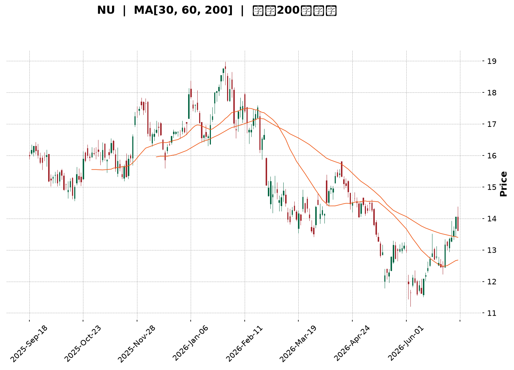
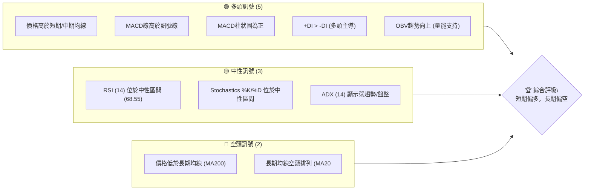
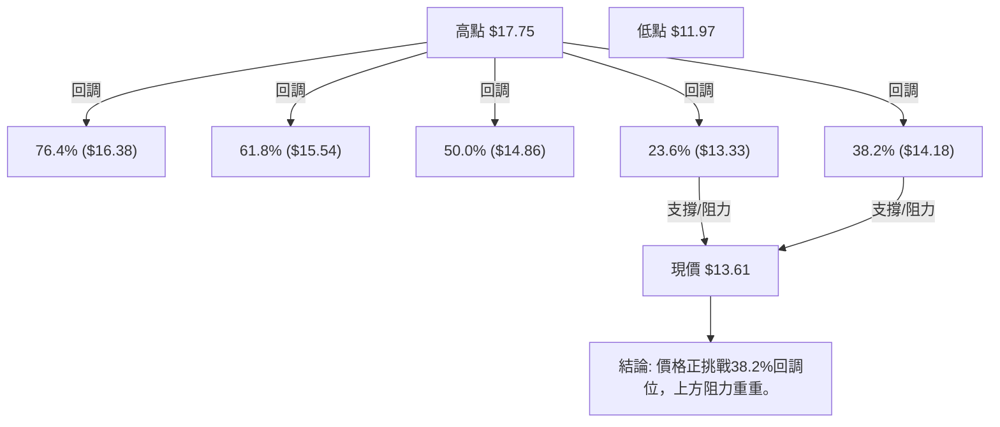
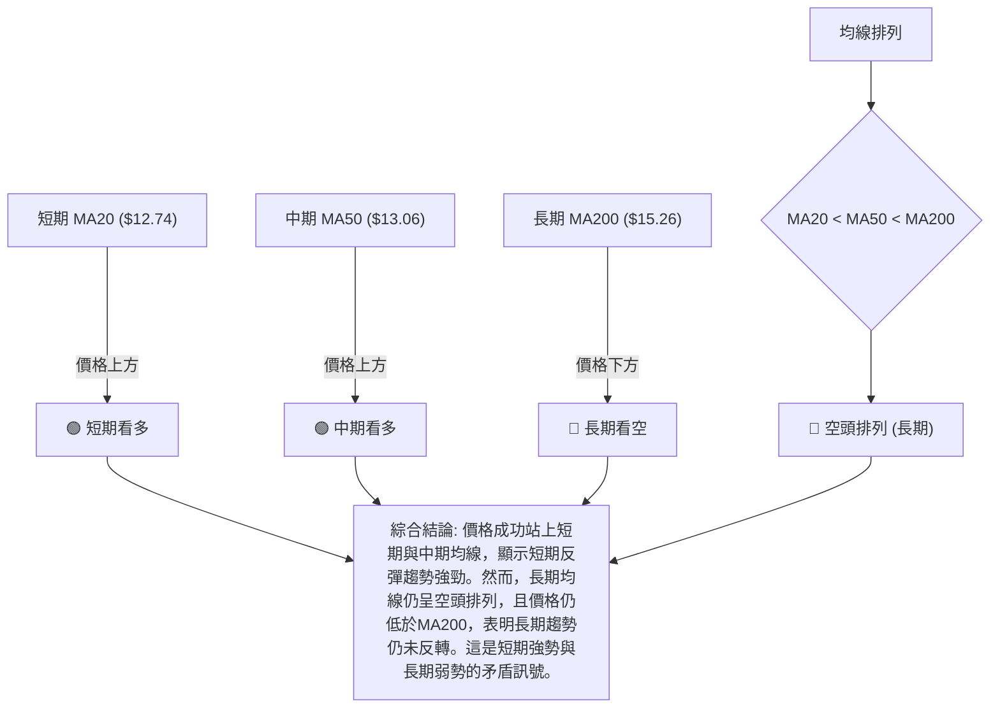

<details>
<summary>📊 靜態圖表 (點擊展開)</summary>

</details>

<html>
<head><meta charset="utf-8" /></head>
<body>
    <div style="height:500px; width:100%;">                        <script>window.PlotlyConfig = {MathJaxConfig: 'local'};</script>
        <script charset="utf-8" src="https://cdn.plot.ly/plotly-3.6.0.min.js" integrity="sha256-QaOVwtVY0T02VaHrr6pnoHLCwayMJp4O5n4YyaE3rJk=" crossorigin="anonymous"></script>                <div id="candlestick-chart" class="plotly-graph-div" style="height:100%; width:100%;"></div>            <script>                window.PLOTLYENV=window.PLOTLYENV || {};                                if (document.getElementById("candlestick-chart")) {                    Plotly.newPlot(                        "candlestick-chart",                        [{"close":{"dtype":"f8","bdata":"AAAAQOH6L0AAAAAghSswQAAAAMDMTDBAAAAAYGYmMEAAAABgjwIwQAAAACBcjy9AAAAAIFyPL0AAAABgZuYvQAAAAGCPAjBAAAAAoEdhLkAAAADgo3AuQAAAAGC4ni5AAAAAYI\u002fCLkAAAABgj0IuQAAAACCF6y5AAAAAoHC9LkAAAABACtctQAAAAMD1KC5AAAAAgOvRLUAAAAAAKVwuQAAAAIDCdS1AAAAAAAAALkAAAACA69EuQAAAAEDhei5AAAAAgOtRLkAAAADAzMwvQAAAAIAUri9AAAAAAAAAMEAAAAAAKdwvQAAAAEAKFzBAAAAAIFwPMEAAAAAAKRwwQAAAAKBHITBAAAAAoJmZL0AAAAAghSswQAAAAKBH4S9AAAAAoHC9L0AAAADAHgUwQAAAAADXYzBAAAAAgBQuMEAAAACAFC4vQAAAAADXoy9AAAAAQDMzL0AAAAAA16MuQAAAAIDrUS9AAAAAANejLkAAAAAgrscvQAAAAEAK1y9AAAAAACmcMEAAAAAAAEAxQAAAAADXYzFAAAAAQOF6MUAAAAAAKZwxQAAAAOCjcDFAAAAAYGamMUAAAABAM7MwQAAAAGC4njBAAAAAgBSuMEAAAADgo7AwQAAAAIDr0TBAAAAAYGbmMEAAAABgZqYwQAAAAEAzMzBAAAAA4FG4L0AAAADAHkUwQAAAAEAKVzBAAAAAYLieMEAAAABgj8IwQAAAAKBwvTBAAAAAYI\u002fCMEAAAADA9agwQAAAAKBH4TBAAAAAoHC9MEAAAADAHgUxQAAAAOCj8DFAAAAAACncMUAAAAAAAIAxQAAAAAApnDFAAAAAgMJ1MUAAAACAPQoxQAAAACBcjzBAAAAAANejMEAAAAAAKZwwQAAAAKCZmTBAAAAA4FH4MEAAAACgcD0xQAAAAAAAADJAAAAAgD0KMkAAAACAFC4yQAAAAMDMjDJAAAAAYI\u002fCMkAAAABgj8IyQAAAAAAAwDFAAAAAACkcMkAAAABguB4yQAAAAMAeBTFAAAAAIFzPMEAAAABgZmYxQAAAAMDMjDFAAAAAgOuRMUAAAADA9WgxQAAAAIA9CjFAAAAAgOvRMEAAAACA69EwQAAAACCFKzFAAAAAgOtRMUAAAAAgrocxQAAAAOCjMDBAAAAAIK6HMEAAAABgZqYwQAAAAGC4Hi5AAAAAgML1LUAAAACgR2EuQAAAAMAehS1AAAAAAAAALkAAAAAA16MtQAAAAMD1KC1AAAAAQApXLUAAAABgj8ItQAAAAEDh+ixAAAAA4KPwK0AAAAAgrscrQAAAAIA9iixAAAAAAACALEAAAADgo\u002fArQAAAAIDrUSxAAAAAoEfhK0AAAAAAKVwtQAAAAKBHYSxAAAAAANejLEAAAACAPQosQAAAAEAzMytAAAAAwB4FK0AAAACgcL0sQAAAAKBH4SxAAAAAwMxMLEAAAADAHoUsQAAAAMDMTCxAAAAAwB4FLUAAAACgcL0tQAAAACCF6y1AAAAAYGbmLUAAAABAM7MuQAAAAIAUri5AAAAAACncLkAAAACAFK4uQAAAAEAzMy5AAAAAoJkZLkAAAABAM7MtQAAAACCF6yxAAAAAwB4FLUAAAAAgrkctQAAAAAAAAC1AAAAA4HoULEAAAACAwvUsQAAAAKBH4SxAAAAAgOtRLEAAAAAAAIAsQAAAAIDC9SxAAAAAwB6FLEAAAACgmZkrQAAAAAAAACtAAAAAgD2KKkAAAAAA16MpQAAAAAAp3ClAAAAAoEdhKEAAAADgepQoQAAAAOB6lChAAAAA4HqUKUAAAACA61EqQAAAAIDCdSlAAAAAgML1KUAAAAAgXA8qQAAAAKCZGSpAAAAAYI9CKkAAAABA4fopQAAAAAAp3CdAAAAAIK5HJ0AAAACgcD0oQAAAAOCj8CdAAAAAQDMzJ0AAAABgj8InQAAAAKBwPSdAAAAAgBQuKEAAAACgR2EoQAAAAAAp3ChAAAAA4KNwKUAAAAAgrscpQAAAACCFaylAAAAA4HqUKUAAAACAFC4pQAAAACCF6yhAAAAAIIXrKEAAAABAClcqQAAAAGCPQipAAAAA4FG4KkAAAAAgrscqQAAAAOBROCtAAAAAYLgeLEAAAADgUTgrQA=="},"high":{"dtype":"f8","bdata":"AAAAoEchMEAAAACgmVkwQAAAAMDMTDBAAAAAwMxsMEAAAABguF4wQAAAAOBRGDBAAAAAoHD9L0AAAACgmRkwQAAAAOCjMDBAAAAAwMwMMEAAAADAzMwuQAAAAAAAwC5AAAAAQOH6LkAAAADgehQvQAAAAAAAAC9AAAAAwPUoL0AAAABgZuYuQAAAAKBwPS5AAAAAoEdhLkAAAAAAVo4uQAAAAGC4ni5AAAAAYLgeLkAAAAAgrkcvQAAAAIAULi9AAAAAIIXrLkAAAAAA1yMwQAAAAKBHITBAAAAAoJlZMEAAAACA6xEwQAAAAMAeRTBAAAAAoHA9MEAAAADAHkUwQAAAAAAAgDBAAAAAoHAdMEAAAAAghWswQAAAAGBmZjBAAAAAAADAL0AAAADgUTgwQAAAAMDMjDBAAAAAAACAMEAAAACA6zEwQAAAAGCPQjBAAAAAoHC9L0AAAACgmVkvQAAAAOCjcC9AAAAAQDMTMEAAAADAHgUwQAAAACBcDzBAAAAAwMysMEAAAACgR2ExQAAAAIAUjjFAAAAAIFyPMUAAAABACtcxQAAAAOBRuDFAAAAA4KPQMUAAAABA4boxQAAAAEAzEzFAAAAAQOG6MEAAAACgmdkwQAAAAAApHDFAAAAAIFwPMUAAAACA6xExQAAAAMAehTBAAAAAwPUoMEAAAADgIlswQAAAAOBReDBAAAAAoEehMEAAAADgetQwQAAAAMD1yDBAAAAAYI\u002fCMEAAAAAgXM8wQAAAAEDhGjFAAAAAwMzsMEAAAAAgXA8xQAAAAICVIzJAAAAAYLheMkAAAABgj8IxQAAAAIC+nzFAAAAAgOsRMkAAAAAghWsxQAAAAIDrETFAAAAA4KOwMEAAAADgUfgwQAAAAGAOrTBAAAAA4KNQMUAAAACAPYoxQAAAAAAAADJAAAAA4KMQMkAAAABgj0IyQAAAACBcjzJAAAAAwPXIMkAAAABA4foyQAAAAGC4njJAAAAAQAp3MkAAAABgZqYyQAAAAIA9KjJAAAAAYI8iMUAAAAAghWsxQAAAAEAK1zFAAAAAACm8MUAAAACgcP0xQAAAAMDMjDFAAAAAoEfhMEAAAAAAAAAxQAAAAEDhejFAAAAA4KNwMUAAAABACpcxQAAAAMD1aDFAAAAAQAqXMEAAAACgmdkwQAAAAKBH4S9AAAAAYGZmLkAAAABAi6wuQAAAAGC4Hi5AAAAAgMK1LkAAAADAzEwuQAAAAEAzcy1AAAAAgOuRLUAAAACAPUouQAAAAKBH4S1AAAAAQDOzLEAAAABguJ4sQAAAAKBwvSxAAAAA4HoULUAAAADAzIwsQAAAAAAAgCxAAAAAwMxMLEAAAABACtctQAAAAMAeBS1AAAAAoEdhLUAAAABgZqYsQAAAAGBm5itAAAAAgOuRK0AAAACA69EsQAAAAKCZmS1AAAAAgML1LEAAAAAgrscsQAAAAIDrUSxAAAAAwEnMLkAAAAAAKdwtQAAAAOB6FC5AAAAAIFwPLkAAAADgo\u002fAuQAAAAGC4Hi9AAAAAoEchL0AAAABguJ4vQAAAAEAzsy5AAAAAIFyPLkAAAADgo3AuQAAAAADXoy1AAAAA4HoULUAAAAAghastQAAAAEAKVy1AAAAAwB4FLUAAAABguB4tQAAAAIDrUS1AAAAA4KPwLEAAAACgR+EsQAAAAKCZGS1AAAAAQDMzLUAAAADA9agsQAAAAMD16CtAAAAAACkcK0AAAACAPYoqQAAAAEAKVypAAAAAIFzPKEAAAADAzMwoQAAAAMDMzChAAAAAoJmZKUAAAACgmZkqQAAAAMAehSpAAAAAoEchKkAAAAAAKVwqQAAAAEDheipAAAAAAACAKkAAAADAzEwqQAAAACCFayhAAAAAQOF6J0AAAACAFG4oQAAAAEAzsyhAAAAAoJkZKEAAAACA6xEoQAAAAIAULihAAAAAgBQuKEAAAADgepQoQAAAAGCPQilAAAAAoJmZKUAAAAAgrgcrQAAAAMD1KCpAAAAAoHA9KkAAAACA65EpQAAAAOCjcClAAAAAgD1KKUAAAACAFK4qQAAAAKCZmSpAAAAAIK7HKkAAAAAAKdwrQAAAAAAAgCtAAAAAYLgeLEAAAABgj8IsQA=="},"hovertemplate":"\u003cb\u003e%{x|%Y-%m-%d}\u003c\u002fb\u003e\u003cbr\u003e\u958b: $%{open:.2f}\u003cbr\u003e\u9ad8: $%{high:.2f}\u003cbr\u003e\u4f4e: $%{low:.2f}\u003cbr\u003e\u6536: $%{close:.2f}\u003cextra\u003e\u003c\u002fextra\u003e","low":{"dtype":"f8","bdata":"AAAAwB7FL0AAAADAHgUwQAAAAIDC9S9AAAAAIK4HMEAAAACg8dIvQAAAAIDCdS9AAAAAoJkZL0AAAADA9agvQAAAAMDMTC9AAAAAgOtRLkAAAACAPQouQAAAAOBROC5AAAAAAABALkAAAACAPQouQAAAAKCZGS5AAAAAgMJ1LkAAAABgj8ItQAAAAEAK1y1AAAAAIK5HLUAAAADgUbgtQAAAAEBeOi1AAAAAYLgeLUAAAABguB4uQAAAACBcTy5AAAAAgOsRLkAAAACAwnUuQAAAACAEli9AAAAAQArXL0AAAAAA16MvQAAAAAAp3C9AAAAAANcDMEAAAABgj8IvQAAAAIAU7i9AAAAAYGZmL0AAAADgepQvQAAAAIAUri9AAAAAYGbmLkAAAADAzMwvQAAAAMDMDDBAAAAAIIULMEAAAADgUfguQAAAAADXoy5AAAAAAAAAL0AAAADAHoUuQAAAAKBHYS5AAAAAoJmZLkAAAABgj4IuQAAAACBcjy9AAAAAAClcL0AAAADA9egwQAAAAEAzMzFAAAAAIK5HMUAAAABA4XoxQAAAAIA9SjFAAAAAAClcMUAAAACgmZkwQAAAAOBReDBAAAAAAAJLMEAAAABACncwQAAAAEAzszBAAAAAoJmZMEAAAACgR6EwQAAAAIAULjBAAAAAgBQuL0AAAADAIBAwQAAAAEBiUDBAAAAAoJlZMEAAAAAgXI8wQAAAAGBmpjBAAAAAACmcMEAAAACAPYowQAAAAIAUrjBAAAAAgMK1MEAAAABgZqYwQAAAAIA9KjFAAAAAIFzPMUAAAAAgrmcxQAAAAGC4XjFAAAAAANdjMUAAAADAHgUxQAAAAIA9ajBAAAAAwMxsMEAAAACAQYAwQAAAAIAUTjBAAAAAoJlZMEAAAACA6xExQAAAAOB6VDFAAAAAgMK1MUAAAABgZuYxQAAAAKCZGTJAAAAAAClcMkAAAACgcD0yQAAAAIDCtTFAAAAAgMK1MUAAAABACtcxQAAAAAAA4DBAAAAAwMyMMEAAAABgj8IwQAAAAEAKNzFAAAAAgD0KMUAAAACgmVkxQAAAAIDCtTBAAAAAYLheMEAAAABACpcwQAAAAEAK1zBAAAAAwB7lMEAAAAAghSsxQAAAAOB6FDBAAAAAoHC9L0AAAAAA14MwQAAAAOB6FC5AAAAAYGZmLUAAAABguJ4sQAAAAEAKVyxAAAAAoJmZLUAAAADgUTgtQAAAAOBReCxAAAAAgMJ1LEAAAAAgXA8tQAAAAGCPwixAAAAAYI\u002fCK0AAAACgR6ErQAAAAGC4HixAAAAA4FF4LEAAAADgetQrQAAAACBcDytAAAAA4HqUK0AAAADgo3AsQAAAAIDrUSxAAAAAIIVrLEAAAAAAKdwrQAAAAOB6FCtAAAAAgOvRKkAAAABgZmYrQAAAAAAp3CxAAAAAAAKrK0AAAADA9SgsQAAAAIAUritAAAAAgOvRLEAAAADAzMwsQAAAACBcjy1AAAAAQDMzLUAAAACgcD0uQAAAAKCZmS5AAAAA4HqULkAAAABguJ4uQAAAAAAp3C1AAAAA4KPwLUAAAABAClctQAAAAIDrkSxAAAAAoEdhLEAAAACgmRktQAAAAIDCtSxAAAAA4HoULEAAAACgmRksQAAAAGCPwixAAAAAgBQuLEAAAABAClcsQAAAAKBwfSxAAAAAwPVoLEAAAAAAAIArQAAAAEAK1ypAAAAAwB6FKkAAAAAgrocpQAAAAIAUrilAAAAAIFyPJ0AAAABguB4oQAAAACCF6ydAAAAAwPWoKEAAAABguB4pQAAAACCFaylAAAAAwMxMKUAAAAAAKdwpQAAAACCuxylAAAAAQOH6KUAAAACA69EpQAAAAKBH4SZAAAAAYGZmJkAAAAAA16MnQAAAAGC43idAAAAAoJkZJ0AAAAAgXE8nQAAAAOBROCdAAAAAwB4FJ0AAAAAgrgcoQAAAACBcjyhAAAAA4KPwKEAAAADgepQpQAAAAAApXClAAAAAYGZmKUAAAAAAAAApQAAAAKBH4ShAAAAAgMJ1KEAAAAAA1+MoQAAAAEDh+ilAAAAAoEfhKUAAAAAAAIAqQAAAAGDjpSpAAAAAgOvRKkAAAADgUTgrQA=="},"name":"\u50f9\u683c","open":{"dtype":"f8","bdata":"AAAAYI8CMEAAAACA6xEwQAAAAAApHDBAAAAAwMxMMEAAAACAFC4wQAAAAAAp3C9AAAAAACncL0AAAABgZuYvQAAAACCF6y9AAAAAwMwMMEAAAACAPYouQAAAACBcjy5AAAAAoHC9LkAAAACA69EuQAAAAAApXC5AAAAAIFwPL0AAAADgUbguQAAAAMD1KC5AAAAAQDOzLUAAAAAAAAAuQAAAAOB6lC5AAAAAIK5HLUAAAABgj0IuQAAAAEAzsy5AAAAAANejLkAAAADAHoUuQAAAAEAKFzBAAAAAQOE6MEAAAAAghesvQAAAAGBm5i9AAAAAgOsRMEAAAAAAKRwwQAAAAOCjMDBAAAAAoJmZL0AAAADgUbgvQAAAAGC4XjBAAAAAANejL0AAAACgmRkwQAAAAEAKFzBAAAAAgMJ1MEAAAACAPQowQAAAAAAp3C5AAAAA4FF4L0AAAADAzMwuQAAAAMDMjC5AAAAAgBSuL0AAAACAwrUuQAAAAAAAADBAAAAAQArXL0AAAABA4fowQAAAAADXYzFAAAAAgBRuMUAAAACAwrUxQAAAAEAzszFAAAAAYGamMUAAAABAM7MxQAAAAGC43jBAAAAAwB5lMEAAAACgmZkwQAAAAEDhujBAAAAAIK7nMEAAAABgZgYxQAAAAAAAgDBAAAAAQAoXMEAAAABgZiYwQAAAAKCZWTBAAAAAIIVrMEAAAADgo7AwQAAAAEAzszBAAAAAoHC9MEAAAACAPaowQAAAAMAexTBAAAAAYLjeMEAAAAAgXA8xQAAAAIAULjFAAAAAYLgeMkAAAABguJ4xQAAAAEAKlzFAAAAAgBSuMUAAAACgmVkxQAAAACBcDzFAAAAA4KOQMEAAAAAAAMAwQAAAAIDrkTBAAAAAAClcMEAAAABgjyIxQAAAAIA9qjFAAAAAAAAAMkAAAADAzAwyQAAAAAApXDJAAAAAYI+iMkAAAADgetQyQAAAACCuhzJAAAAAoHC9MUAAAAAgrmcyQAAAAOB6FDJAAAAA4HrUMEAAAAAghSsxQAAAAOCjcDFAAAAAYGYmMUAAAACA6\u002fExQAAAAMD1iDFAAAAAoHC9MEAAAAAAAMAwQAAAAEAz8zBAAAAAANcjMUAAAABAMzMxQAAAAAAAQDFAAAAA4KMwMEAAAAAA14MwQAAAAEAK1y9AAAAA4KNwLUAAAAAghessQAAAAAApXC1AAAAAoHD9LUAAAAAAKdwtQAAAAGCPAi1AAAAAgOvRLEAAAABA4XotQAAAAAAAgC1AAAAAYGZmLEAAAAAA1yMsQAAAAKBwPSxAAAAAwMzMLEAAAADgo3AsQAAAAAApXCtAAAAAoHA9LEAAAACgR6EsQAAAAOBR+CxAAAAAYI9CLUAAAABgj0IsQAAAAIDCdStAAAAAIIVrK0AAAACgmZkrQAAAAIAULi1AAAAAAAAALEAAAABgj0IsQAAAAEAzMyxAAAAAIIVrLkAAAADAHgUtQAAAAAAp3C1AAAAAgBSuLUAAAABgj0IuQAAAACCF6y5AAAAAIK7HLkAAAABguJ4vQAAAAEDhei5AAAAA4FE4LkAAAAAAKVwuQAAAAGC4ni1AAAAAQArXLEAAAAAgrkctQAAAAOB6FC1AAAAAgML1LEAAAADgelQsQAAAAIDrUS1AAAAAIK7HLEAAAAAA16MsQAAAAAAAAC1AAAAAAAAALUAAAACgmZksQAAAAGCPwitAAAAAQArXKkAAAAAghWsqQAAAAEAzsylAAAAAQIkBKEAAAADAzMwoQAAAAOB6VChAAAAAgBSuKEAAAADgUTgpQAAAAMDMTCpAAAAAIK4HKkAAAAAghespQAAAAOCj8ClAAAAAoJkZKkAAAAAAAAAqQAAAAEDh+idAAAAAwMxMJ0AAAABgj8InQAAAAEAzMyhAAAAAwB4FKEAAAADgo3AnQAAAAKCZmSdAAAAAANcjJ0AAAABAClcoQAAAAIAUrihAAAAAwB4FKUAAAADgepQpQAAAACBcDypAAAAAIFyPKUAAAACAPQopQAAAAKCZGSlAAAAAgML1KEAAAAAA1+MoQAAAAMAehSpAAAAAYLgeKkAAAAAgXI8qQAAAAKBH4SpAAAAAAClcK0AAAABguB4sQA=="},"x":["2025-09-18T00:00:00-04:00","2025-09-19T00:00:00-04:00","2025-09-22T00:00:00-04:00","2025-09-23T00:00:00-04:00","2025-09-24T00:00:00-04:00","2025-09-25T00:00:00-04:00","2025-09-26T00:00:00-04:00","2025-09-29T00:00:00-04:00","2025-09-30T00:00:00-04:00","2025-10-01T00:00:00-04:00","2025-10-02T00:00:00-04:00","2025-10-03T00:00:00-04:00","2025-10-06T00:00:00-04:00","2025-10-07T00:00:00-04:00","2025-10-08T00:00:00-04:00","2025-10-09T00:00:00-04:00","2025-10-10T00:00:00-04:00","2025-10-13T00:00:00-04:00","2025-10-14T00:00:00-04:00","2025-10-15T00:00:00-04:00","2025-10-16T00:00:00-04:00","2025-10-17T00:00:00-04:00","2025-10-20T00:00:00-04:00","2025-10-21T00:00:00-04:00","2025-10-22T00:00:00-04:00","2025-10-23T00:00:00-04:00","2025-10-24T00:00:00-04:00","2025-10-27T00:00:00-04:00","2025-10-28T00:00:00-04:00","2025-10-29T00:00:00-04:00","2025-10-30T00:00:00-04:00","2025-10-31T00:00:00-04:00","2025-11-03T00:00:00-05:00","2025-11-04T00:00:00-05:00","2025-11-05T00:00:00-05:00","2025-11-06T00:00:00-05:00","2025-11-07T00:00:00-05:00","2025-11-10T00:00:00-05:00","2025-11-11T00:00:00-05:00","2025-11-12T00:00:00-05:00","2025-11-13T00:00:00-05:00","2025-11-14T00:00:00-05:00","2025-11-17T00:00:00-05:00","2025-11-18T00:00:00-05:00","2025-11-19T00:00:00-05:00","2025-11-20T00:00:00-05:00","2025-11-21T00:00:00-05:00","2025-11-24T00:00:00-05:00","2025-11-25T00:00:00-05:00","2025-11-26T00:00:00-05:00","2025-11-28T00:00:00-05:00","2025-12-01T00:00:00-05:00","2025-12-02T00:00:00-05:00","2025-12-03T00:00:00-05:00","2025-12-04T00:00:00-05:00","2025-12-05T00:00:00-05:00","2025-12-08T00:00:00-05:00","2025-12-09T00:00:00-05:00","2025-12-10T00:00:00-05:00","2025-12-11T00:00:00-05:00","2025-12-12T00:00:00-05:00","2025-12-15T00:00:00-05:00","2025-12-16T00:00:00-05:00","2025-12-17T00:00:00-05:00","2025-12-18T00:00:00-05:00","2025-12-19T00:00:00-05:00","2025-12-22T00:00:00-05:00","2025-12-23T00:00:00-05:00","2025-12-24T00:00:00-05:00","2025-12-26T00:00:00-05:00","2025-12-29T00:00:00-05:00","2025-12-30T00:00:00-05:00","2025-12-31T00:00:00-05:00","2026-01-02T00:00:00-05:00","2026-01-05T00:00:00-05:00","2026-01-06T00:00:00-05:00","2026-01-07T00:00:00-05:00","2026-01-08T00:00:00-05:00","2026-01-09T00:00:00-05:00","2026-01-12T00:00:00-05:00","2026-01-13T00:00:00-05:00","2026-01-14T00:00:00-05:00","2026-01-15T00:00:00-05:00","2026-01-16T00:00:00-05:00","2026-01-20T00:00:00-05:00","2026-01-21T00:00:00-05:00","2026-01-22T00:00:00-05:00","2026-01-23T00:00:00-05:00","2026-01-26T00:00:00-05:00","2026-01-27T00:00:00-05:00","2026-01-28T00:00:00-05:00","2026-01-29T00:00:00-05:00","2026-01-30T00:00:00-05:00","2026-02-02T00:00:00-05:00","2026-02-03T00:00:00-05:00","2026-02-04T00:00:00-05:00","2026-02-05T00:00:00-05:00","2026-02-06T00:00:00-05:00","2026-02-09T00:00:00-05:00","2026-02-10T00:00:00-05:00","2026-02-11T00:00:00-05:00","2026-02-12T00:00:00-05:00","2026-02-13T00:00:00-05:00","2026-02-17T00:00:00-05:00","2026-02-18T00:00:00-05:00","2026-02-19T00:00:00-05:00","2026-02-20T00:00:00-05:00","2026-02-23T00:00:00-05:00","2026-02-24T00:00:00-05:00","2026-02-25T00:00:00-05:00","2026-02-26T00:00:00-05:00","2026-02-27T00:00:00-05:00","2026-03-02T00:00:00-05:00","2026-03-03T00:00:00-05:00","2026-03-04T00:00:00-05:00","2026-03-05T00:00:00-05:00","2026-03-06T00:00:00-05:00","2026-03-09T00:00:00-04:00","2026-03-10T00:00:00-04:00","2026-03-11T00:00:00-04:00","2026-03-12T00:00:00-04:00","2026-03-13T00:00:00-04:00","2026-03-16T00:00:00-04:00","2026-03-17T00:00:00-04:00","2026-03-18T00:00:00-04:00","2026-03-19T00:00:00-04:00","2026-03-20T00:00:00-04:00","2026-03-23T00:00:00-04:00","2026-03-24T00:00:00-04:00","2026-03-25T00:00:00-04:00","2026-03-26T00:00:00-04:00","2026-03-27T00:00:00-04:00","2026-03-30T00:00:00-04:00","2026-03-31T00:00:00-04:00","2026-04-01T00:00:00-04:00","2026-04-02T00:00:00-04:00","2026-04-06T00:00:00-04:00","2026-04-07T00:00:00-04:00","2026-04-08T00:00:00-04:00","2026-04-09T00:00:00-04:00","2026-04-10T00:00:00-04:00","2026-04-13T00:00:00-04:00","2026-04-14T00:00:00-04:00","2026-04-15T00:00:00-04:00","2026-04-16T00:00:00-04:00","2026-04-17T00:00:00-04:00","2026-04-20T00:00:00-04:00","2026-04-21T00:00:00-04:00","2026-04-22T00:00:00-04:00","2026-04-23T00:00:00-04:00","2026-04-24T00:00:00-04:00","2026-04-27T00:00:00-04:00","2026-04-28T00:00:00-04:00","2026-04-29T00:00:00-04:00","2026-04-30T00:00:00-04:00","2026-05-01T00:00:00-04:00","2026-05-04T00:00:00-04:00","2026-05-05T00:00:00-04:00","2026-05-06T00:00:00-04:00","2026-05-07T00:00:00-04:00","2026-05-08T00:00:00-04:00","2026-05-11T00:00:00-04:00","2026-05-12T00:00:00-04:00","2026-05-13T00:00:00-04:00","2026-05-14T00:00:00-04:00","2026-05-15T00:00:00-04:00","2026-05-18T00:00:00-04:00","2026-05-19T00:00:00-04:00","2026-05-20T00:00:00-04:00","2026-05-21T00:00:00-04:00","2026-05-22T00:00:00-04:00","2026-05-26T00:00:00-04:00","2026-05-27T00:00:00-04:00","2026-05-28T00:00:00-04:00","2026-05-29T00:00:00-04:00","2026-06-01T00:00:00-04:00","2026-06-02T00:00:00-04:00","2026-06-03T00:00:00-04:00","2026-06-04T00:00:00-04:00","2026-06-05T00:00:00-04:00","2026-06-08T00:00:00-04:00","2026-06-09T00:00:00-04:00","2026-06-10T00:00:00-04:00","2026-06-11T00:00:00-04:00","2026-06-12T00:00:00-04:00","2026-06-15T00:00:00-04:00","2026-06-16T00:00:00-04:00","2026-06-17T00:00:00-04:00","2026-06-18T00:00:00-04:00","2026-06-22T00:00:00-04:00","2026-06-23T00:00:00-04:00","2026-06-24T00:00:00-04:00","2026-06-25T00:00:00-04:00","2026-06-26T00:00:00-04:00","2026-06-29T00:00:00-04:00","2026-06-30T00:00:00-04:00","2026-07-01T00:00:00-04:00","2026-07-02T00:00:00-04:00","2026-07-06T00:00:00-04:00","2026-07-07T00:00:00-04:00"],"type":"candlestick"},{"hovertemplate":"MA30: $%{y:.2f}\u003cextra\u003e\u003c\u002fextra\u003e","line":{"color":"#2196F3","dash":"dash","width":2},"mode":"lines","name":"MA30","x":["2025-09-18T00:00:00-04:00","2025-09-19T00:00:00-04:00","2025-09-22T00:00:00-04:00","2025-09-23T00:00:00-04:00","2025-09-24T00:00:00-04:00","2025-09-25T00:00:00-04:00","2025-09-26T00:00:00-04:00","2025-09-29T00:00:00-04:00","2025-09-30T00:00:00-04:00","2025-10-01T00:00:00-04:00","2025-10-02T00:00:00-04:00","2025-10-03T00:00:00-04:00","2025-10-06T00:00:00-04:00","2025-10-07T00:00:00-04:00","2025-10-08T00:00:00-04:00","2025-10-09T00:00:00-04:00","2025-10-10T00:00:00-04:00","2025-10-13T00:00:00-04:00","2025-10-14T00:00:00-04:00","2025-10-15T00:00:00-04:00","2025-10-16T00:00:00-04:00","2025-10-17T00:00:00-04:00","2025-10-20T00:00:00-04:00","2025-10-21T00:00:00-04:00","2025-10-22T00:00:00-04:00","2025-10-23T00:00:00-04:00","2025-10-24T00:00:00-04:00","2025-10-27T00:00:00-04:00","2025-10-28T00:00:00-04:00","2025-10-29T00:00:00-04:00","2025-10-30T00:00:00-04:00","2025-10-31T00:00:00-04:00","2025-11-03T00:00:00-05:00","2025-11-04T00:00:00-05:00","2025-11-05T00:00:00-05:00","2025-11-06T00:00:00-05:00","2025-11-07T00:00:00-05:00","2025-11-10T00:00:00-05:00","2025-11-11T00:00:00-05:00","2025-11-12T00:00:00-05:00","2025-11-13T00:00:00-05:00","2025-11-14T00:00:00-05:00","2025-11-17T00:00:00-05:00","2025-11-18T00:00:00-05:00","2025-11-19T00:00:00-05:00","2025-11-20T00:00:00-05:00","2025-11-21T00:00:00-05:00","2025-11-24T00:00:00-05:00","2025-11-25T00:00:00-05:00","2025-11-26T00:00:00-05:00","2025-11-28T00:00:00-05:00","2025-12-01T00:00:00-05:00","2025-12-02T00:00:00-05:00","2025-12-03T00:00:00-05:00","2025-12-04T00:00:00-05:00","2025-12-05T00:00:00-05:00","2025-12-08T00:00:00-05:00","2025-12-09T00:00:00-05:00","2025-12-10T00:00:00-05:00","2025-12-11T00:00:00-05:00","2025-12-12T00:00:00-05:00","2025-12-15T00:00:00-05:00","2025-12-16T00:00:00-05:00","2025-12-17T00:00:00-05:00","2025-12-18T00:00:00-05:00","2025-12-19T00:00:00-05:00","2025-12-22T00:00:00-05:00","2025-12-23T00:00:00-05:00","2025-12-24T00:00:00-05:00","2025-12-26T00:00:00-05:00","2025-12-29T00:00:00-05:00","2025-12-30T00:00:00-05:00","2025-12-31T00:00:00-05:00","2026-01-02T00:00:00-05:00","2026-01-05T00:00:00-05:00","2026-01-06T00:00:00-05:00","2026-01-07T00:00:00-05:00","2026-01-08T00:00:00-05:00","2026-01-09T00:00:00-05:00","2026-01-12T00:00:00-05:00","2026-01-13T00:00:00-05:00","2026-01-14T00:00:00-05:00","2026-01-15T00:00:00-05:00","2026-01-16T00:00:00-05:00","2026-01-20T00:00:00-05:00","2026-01-21T00:00:00-05:00","2026-01-22T00:00:00-05:00","2026-01-23T00:00:00-05:00","2026-01-26T00:00:00-05:00","2026-01-27T00:00:00-05:00","2026-01-28T00:00:00-05:00","2026-01-29T00:00:00-05:00","2026-01-30T00:00:00-05:00","2026-02-02T00:00:00-05:00","2026-02-03T00:00:00-05:00","2026-02-04T00:00:00-05:00","2026-02-05T00:00:00-05:00","2026-02-06T00:00:00-05:00","2026-02-09T00:00:00-05:00","2026-02-10T00:00:00-05:00","2026-02-11T00:00:00-05:00","2026-02-12T00:00:00-05:00","2026-02-13T00:00:00-05:00","2026-02-17T00:00:00-05:00","2026-02-18T00:00:00-05:00","2026-02-19T00:00:00-05:00","2026-02-20T00:00:00-05:00","2026-02-23T00:00:00-05:00","2026-02-24T00:00:00-05:00","2026-02-25T00:00:00-05:00","2026-02-26T00:00:00-05:00","2026-02-27T00:00:00-05:00","2026-03-02T00:00:00-05:00","2026-03-03T00:00:00-05:00","2026-03-04T00:00:00-05:00","2026-03-05T00:00:00-05:00","2026-03-06T00:00:00-05:00","2026-03-09T00:00:00-04:00","2026-03-10T00:00:00-04:00","2026-03-11T00:00:00-04:00","2026-03-12T00:00:00-04:00","2026-03-13T00:00:00-04:00","2026-03-16T00:00:00-04:00","2026-03-17T00:00:00-04:00","2026-03-18T00:00:00-04:00","2026-03-19T00:00:00-04:00","2026-03-20T00:00:00-04:00","2026-03-23T00:00:00-04:00","2026-03-24T00:00:00-04:00","2026-03-25T00:00:00-04:00","2026-03-26T00:00:00-04:00","2026-03-27T00:00:00-04:00","2026-03-30T00:00:00-04:00","2026-03-31T00:00:00-04:00","2026-04-01T00:00:00-04:00","2026-04-02T00:00:00-04:00","2026-04-06T00:00:00-04:00","2026-04-07T00:00:00-04:00","2026-04-08T00:00:00-04:00","2026-04-09T00:00:00-04:00","2026-04-10T00:00:00-04:00","2026-04-13T00:00:00-04:00","2026-04-14T00:00:00-04:00","2026-04-15T00:00:00-04:00","2026-04-16T00:00:00-04:00","2026-04-17T00:00:00-04:00","2026-04-20T00:00:00-04:00","2026-04-21T00:00:00-04:00","2026-04-22T00:00:00-04:00","2026-04-23T00:00:00-04:00","2026-04-24T00:00:00-04:00","2026-04-27T00:00:00-04:00","2026-04-28T00:00:00-04:00","2026-04-29T00:00:00-04:00","2026-04-30T00:00:00-04:00","2026-05-01T00:00:00-04:00","2026-05-04T00:00:00-04:00","2026-05-05T00:00:00-04:00","2026-05-06T00:00:00-04:00","2026-05-07T00:00:00-04:00","2026-05-08T00:00:00-04:00","2026-05-11T00:00:00-04:00","2026-05-12T00:00:00-04:00","2026-05-13T00:00:00-04:00","2026-05-14T00:00:00-04:00","2026-05-15T00:00:00-04:00","2026-05-18T00:00:00-04:00","2026-05-19T00:00:00-04:00","2026-05-20T00:00:00-04:00","2026-05-21T00:00:00-04:00","2026-05-22T00:00:00-04:00","2026-05-26T00:00:00-04:00","2026-05-27T00:00:00-04:00","2026-05-28T00:00:00-04:00","2026-05-29T00:00:00-04:00","2026-06-01T00:00:00-04:00","2026-06-02T00:00:00-04:00","2026-06-03T00:00:00-04:00","2026-06-04T00:00:00-04:00","2026-06-05T00:00:00-04:00","2026-06-08T00:00:00-04:00","2026-06-09T00:00:00-04:00","2026-06-10T00:00:00-04:00","2026-06-11T00:00:00-04:00","2026-06-12T00:00:00-04:00","2026-06-15T00:00:00-04:00","2026-06-16T00:00:00-04:00","2026-06-17T00:00:00-04:00","2026-06-18T00:00:00-04:00","2026-06-22T00:00:00-04:00","2026-06-23T00:00:00-04:00","2026-06-24T00:00:00-04:00","2026-06-25T00:00:00-04:00","2026-06-26T00:00:00-04:00","2026-06-29T00:00:00-04:00","2026-06-30T00:00:00-04:00","2026-07-01T00:00:00-04:00","2026-07-02T00:00:00-04:00","2026-07-06T00:00:00-04:00","2026-07-07T00:00:00-04:00"],"y":{"dtype":"f8","bdata":"AAAAAAAA+H8AAAAAAAD4fwAAAAAAAPh\u002fAAAAAAAA+H8AAAAAAAD4fwAAAAAAAPh\u002fAAAAAAAA+H8AAAAAAAD4fwAAAAAAAPh\u002fAAAAAAAA+H8AAAAAAAD4fwAAAAAAAPh\u002fAAAAAAAA+H8AAAAAAAD4fwAAAAAAAPh\u002fAAAAAAAA+H8AAAAAAAD4fwAAAAAAAPh\u002fAAAAAAAA+H8AAAAAAAD4fwAAAAAAAPh\u002fAAAAAAAA+H8AAAAAAAD4fwAAAAAAAPh\u002fAAAAAAAA+H8AAAAAAAD4fwAAAAAAAPh\u002fAAAAAAAA+H8AAAAAAAD4f+\u002fu7s4iGy9AREREpFQcL0AAAACAThsvQCIiIsJnGC9AZmZmlm4SL0AzMzOjKRUvQAAAALDkFy9Ad3d3520ZL0De3d29nxovQLy7u\u002fsbIS9AzczMXAEyL0CrqqrqUTgvQDMzMyMGQS9AVVVVVcdEL0BERER0BUgvQERERERvSy9AAAAA0JRKL0Dv7u7OIlsvQDMzM9N4aS9A3t3dPXyGL0BVVVU10KkvQM3MzOw11y9Aq6qqmsQAMEBERESUihMwQN7d3Y1QJjBAq6qqCpA7MEC8u7urY0IwQLy7u5sLSTBAd3d3F9lOMEBmZmZWVVUwQLy7uwuQWzBA3t3dDbtiMEAzMzOzVmcwQO\u002fu7p7vZzBAERERsXJoMEBVVVUlTWkwQN7d3fW2bDBAzczMXB1zMECrqqrqbXkwQBEREYFqfDBAiYiIiF2BMEC8u7v7foowQGZmZpaKkzBARERE9ESdMECamZmpxqswQGZmZmY7vzBA3t3dHejUMEDv7u42peIwQLy7uxMR8TBAVVVV7VH4MEBVVVUth\u002fYwQLy7uwNy7zBAmpmZAUfoMEARERF5vt8wQO\u002fu7naT2DBAMzMz+8XSMECJiIigYdcwQAAAAEgo4zBAd3d3P8PuMEC8u7szevswQJqZmXE9CjFAVVVVrRwaMUAzMzMLHiwxQJqZmRFYOTFAVVVVRYtMMUCJiIioVFwxQERERCQiYjFAMzMzM8FjMUDNzMxMN2kxQFVVVcUgcDFA3t3dPQp3MUBERESkcH0xQLy7uyvOfjFA7+7u7nx\u002fMUBmZmYGyH0xQO\u002fu7u41dzFAiYiISJpyMUAiIiLS23IxQImIiMi9ZjFAvLu7K85eMUAzMzMzelsxQO\u002fu7matTjFAvLu7E4NAMUCamZkJZTQxQO\u002fu7n6xJDFAd3d39+ETMUBVVVVlO\u002f8wQKuqqkoM4jBAmpmZaUrFMEC8u7tzIakwQHd3dz98hjBAVVVVVZxdMEAAAACoDTQwQDMzM3tbFjBAzczMXNbqL0C8u7u7AqQvQDMzMzMzcy9Aq6qq+jdCL0Dv7u4ezBMvQO\u002fu7g502i5Ad3d3l\u002fyiLkBVVVV1IWkuQN7d3d1rLi5AIiIiQu71LUC8u7sLHswtQN7d3X2GnS1AzczMjGxnLUAzMzOznS8tQM3MzMzMDC1AiYiISFPqLECJiIhY8sssQAAAAHA9yixA3t3dXbrJLEC8u7trdcwsQKuqqnpb1ixA3t3dLbLdLECJiIgYkuYsQDMzMwNy7yxAIiIiQu71LEAAAAAwa\u002fUsQN7d3R3o9CxAmpmZaR\u002f+LEBmZmY27AotQImIiBjZDi1Ad3d3l0MLLUAAAADQ9xMtQGZmZia\u002fGC1AiYiIWIAcLUBVVVWlKRUtQM3MzKwcGi1AiYiIiBYZLUBmZmZWVRUtQN7d3W2gEy1Aq6qq2ocPLUDNzMzME\u002fUsQDMzM4NO2yxAREREJNu5LEBEREQUPJgsQN7d3Z19eCxAIiIi0iJbLEB3d3e38z0sQCIiIrLkFyxAIiIiokX2K0BVVVVlrc4rQLy7uzuYpytAERERYVeAK0AiIiISPFgrQBERESEiIitAzczMnO\u002fnKkDv7u4OWLkqQFVVVRXZjipAmpmZGS9dKkCamZl5FC4qQAAAAJDt\u002fClAIiIi4qXbKUCJiIi4kLQpQGZmZuZCkilAIiIicq95KUBERESEeWIpQFVVVUVERClA3t3dvS0rKUC8u7srhxYpQHd3d1fHBClAVVVVZfT2KEAiIiKS7fwoQCIiImJXAClAERERMU8UKUCrqqoqFScpQFVVVVWcPSlAzczMDElTKUAREREh91opQA=="},"type":"scatter"},{"hovertemplate":"MA60: $%{y:.2f}\u003cextra\u003e\u003c\u002fextra\u003e","line":{"color":"#9C27B0","dash":"dash","width":2},"mode":"lines","name":"MA60","x":["2025-09-18T00:00:00-04:00","2025-09-19T00:00:00-04:00","2025-09-22T00:00:00-04:00","2025-09-23T00:00:00-04:00","2025-09-24T00:00:00-04:00","2025-09-25T00:00:00-04:00","2025-09-26T00:00:00-04:00","2025-09-29T00:00:00-04:00","2025-09-30T00:00:00-04:00","2025-10-01T00:00:00-04:00","2025-10-02T00:00:00-04:00","2025-10-03T00:00:00-04:00","2025-10-06T00:00:00-04:00","2025-10-07T00:00:00-04:00","2025-10-08T00:00:00-04:00","2025-10-09T00:00:00-04:00","2025-10-10T00:00:00-04:00","2025-10-13T00:00:00-04:00","2025-10-14T00:00:00-04:00","2025-10-15T00:00:00-04:00","2025-10-16T00:00:00-04:00","2025-10-17T00:00:00-04:00","2025-10-20T00:00:00-04:00","2025-10-21T00:00:00-04:00","2025-10-22T00:00:00-04:00","2025-10-23T00:00:00-04:00","2025-10-24T00:00:00-04:00","2025-10-27T00:00:00-04:00","2025-10-28T00:00:00-04:00","2025-10-29T00:00:00-04:00","2025-10-30T00:00:00-04:00","2025-10-31T00:00:00-04:00","2025-11-03T00:00:00-05:00","2025-11-04T00:00:00-05:00","2025-11-05T00:00:00-05:00","2025-11-06T00:00:00-05:00","2025-11-07T00:00:00-05:00","2025-11-10T00:00:00-05:00","2025-11-11T00:00:00-05:00","2025-11-12T00:00:00-05:00","2025-11-13T00:00:00-05:00","2025-11-14T00:00:00-05:00","2025-11-17T00:00:00-05:00","2025-11-18T00:00:00-05:00","2025-11-19T00:00:00-05:00","2025-11-20T00:00:00-05:00","2025-11-21T00:00:00-05:00","2025-11-24T00:00:00-05:00","2025-11-25T00:00:00-05:00","2025-11-26T00:00:00-05:00","2025-11-28T00:00:00-05:00","2025-12-01T00:00:00-05:00","2025-12-02T00:00:00-05:00","2025-12-03T00:00:00-05:00","2025-12-04T00:00:00-05:00","2025-12-05T00:00:00-05:00","2025-12-08T00:00:00-05:00","2025-12-09T00:00:00-05:00","2025-12-10T00:00:00-05:00","2025-12-11T00:00:00-05:00","2025-12-12T00:00:00-05:00","2025-12-15T00:00:00-05:00","2025-12-16T00:00:00-05:00","2025-12-17T00:00:00-05:00","2025-12-18T00:00:00-05:00","2025-12-19T00:00:00-05:00","2025-12-22T00:00:00-05:00","2025-12-23T00:00:00-05:00","2025-12-24T00:00:00-05:00","2025-12-26T00:00:00-05:00","2025-12-29T00:00:00-05:00","2025-12-30T00:00:00-05:00","2025-12-31T00:00:00-05:00","2026-01-02T00:00:00-05:00","2026-01-05T00:00:00-05:00","2026-01-06T00:00:00-05:00","2026-01-07T00:00:00-05:00","2026-01-08T00:00:00-05:00","2026-01-09T00:00:00-05:00","2026-01-12T00:00:00-05:00","2026-01-13T00:00:00-05:00","2026-01-14T00:00:00-05:00","2026-01-15T00:00:00-05:00","2026-01-16T00:00:00-05:00","2026-01-20T00:00:00-05:00","2026-01-21T00:00:00-05:00","2026-01-22T00:00:00-05:00","2026-01-23T00:00:00-05:00","2026-01-26T00:00:00-05:00","2026-01-27T00:00:00-05:00","2026-01-28T00:00:00-05:00","2026-01-29T00:00:00-05:00","2026-01-30T00:00:00-05:00","2026-02-02T00:00:00-05:00","2026-02-03T00:00:00-05:00","2026-02-04T00:00:00-05:00","2026-02-05T00:00:00-05:00","2026-02-06T00:00:00-05:00","2026-02-09T00:00:00-05:00","2026-02-10T00:00:00-05:00","2026-02-11T00:00:00-05:00","2026-02-12T00:00:00-05:00","2026-02-13T00:00:00-05:00","2026-02-17T00:00:00-05:00","2026-02-18T00:00:00-05:00","2026-02-19T00:00:00-05:00","2026-02-20T00:00:00-05:00","2026-02-23T00:00:00-05:00","2026-02-24T00:00:00-05:00","2026-02-25T00:00:00-05:00","2026-02-26T00:00:00-05:00","2026-02-27T00:00:00-05:00","2026-03-02T00:00:00-05:00","2026-03-03T00:00:00-05:00","2026-03-04T00:00:00-05:00","2026-03-05T00:00:00-05:00","2026-03-06T00:00:00-05:00","2026-03-09T00:00:00-04:00","2026-03-10T00:00:00-04:00","2026-03-11T00:00:00-04:00","2026-03-12T00:00:00-04:00","2026-03-13T00:00:00-04:00","2026-03-16T00:00:00-04:00","2026-03-17T00:00:00-04:00","2026-03-18T00:00:00-04:00","2026-03-19T00:00:00-04:00","2026-03-20T00:00:00-04:00","2026-03-23T00:00:00-04:00","2026-03-24T00:00:00-04:00","2026-03-25T00:00:00-04:00","2026-03-26T00:00:00-04:00","2026-03-27T00:00:00-04:00","2026-03-30T00:00:00-04:00","2026-03-31T00:00:00-04:00","2026-04-01T00:00:00-04:00","2026-04-02T00:00:00-04:00","2026-04-06T00:00:00-04:00","2026-04-07T00:00:00-04:00","2026-04-08T00:00:00-04:00","2026-04-09T00:00:00-04:00","2026-04-10T00:00:00-04:00","2026-04-13T00:00:00-04:00","2026-04-14T00:00:00-04:00","2026-04-15T00:00:00-04:00","2026-04-16T00:00:00-04:00","2026-04-17T00:00:00-04:00","2026-04-20T00:00:00-04:00","2026-04-21T00:00:00-04:00","2026-04-22T00:00:00-04:00","2026-04-23T00:00:00-04:00","2026-04-24T00:00:00-04:00","2026-04-27T00:00:00-04:00","2026-04-28T00:00:00-04:00","2026-04-29T00:00:00-04:00","2026-04-30T00:00:00-04:00","2026-05-01T00:00:00-04:00","2026-05-04T00:00:00-04:00","2026-05-05T00:00:00-04:00","2026-05-06T00:00:00-04:00","2026-05-07T00:00:00-04:00","2026-05-08T00:00:00-04:00","2026-05-11T00:00:00-04:00","2026-05-12T00:00:00-04:00","2026-05-13T00:00:00-04:00","2026-05-14T00:00:00-04:00","2026-05-15T00:00:00-04:00","2026-05-18T00:00:00-04:00","2026-05-19T00:00:00-04:00","2026-05-20T00:00:00-04:00","2026-05-21T00:00:00-04:00","2026-05-22T00:00:00-04:00","2026-05-26T00:00:00-04:00","2026-05-27T00:00:00-04:00","2026-05-28T00:00:00-04:00","2026-05-29T00:00:00-04:00","2026-06-01T00:00:00-04:00","2026-06-02T00:00:00-04:00","2026-06-03T00:00:00-04:00","2026-06-04T00:00:00-04:00","2026-06-05T00:00:00-04:00","2026-06-08T00:00:00-04:00","2026-06-09T00:00:00-04:00","2026-06-10T00:00:00-04:00","2026-06-11T00:00:00-04:00","2026-06-12T00:00:00-04:00","2026-06-15T00:00:00-04:00","2026-06-16T00:00:00-04:00","2026-06-17T00:00:00-04:00","2026-06-18T00:00:00-04:00","2026-06-22T00:00:00-04:00","2026-06-23T00:00:00-04:00","2026-06-24T00:00:00-04:00","2026-06-25T00:00:00-04:00","2026-06-26T00:00:00-04:00","2026-06-29T00:00:00-04:00","2026-06-30T00:00:00-04:00","2026-07-01T00:00:00-04:00","2026-07-02T00:00:00-04:00","2026-07-06T00:00:00-04:00","2026-07-07T00:00:00-04:00"],"y":{"dtype":"f8","bdata":"AAAAAAAA+H8AAAAAAAD4fwAAAAAAAPh\u002fAAAAAAAA+H8AAAAAAAD4fwAAAAAAAPh\u002fAAAAAAAA+H8AAAAAAAD4fwAAAAAAAPh\u002fAAAAAAAA+H8AAAAAAAD4fwAAAAAAAPh\u002fAAAAAAAA+H8AAAAAAAD4fwAAAAAAAPh\u002fAAAAAAAA+H8AAAAAAAD4fwAAAAAAAPh\u002fAAAAAAAA+H8AAAAAAAD4fwAAAAAAAPh\u002fAAAAAAAA+H8AAAAAAAD4fwAAAAAAAPh\u002fAAAAAAAA+H8AAAAAAAD4fwAAAAAAAPh\u002fAAAAAAAA+H8AAAAAAAD4fwAAAAAAAPh\u002fAAAAAAAA+H8AAAAAAAD4fwAAAAAAAPh\u002fAAAAAAAA+H8AAAAAAAD4fwAAAAAAAPh\u002fAAAAAAAA+H8AAAAAAAD4fwAAAAAAAPh\u002fAAAAAAAA+H8AAAAAAAD4fwAAAAAAAPh\u002fAAAAAAAA+H8AAAAAAAD4fwAAAAAAAPh\u002fAAAAAAAA+H8AAAAAAAD4fwAAAAAAAPh\u002fAAAAAAAA+H8AAAAAAAD4fwAAAAAAAPh\u002fAAAAAAAA+H8AAAAAAAD4fwAAAAAAAPh\u002fAAAAAAAA+H8AAAAAAAD4fwAAAAAAAPh\u002fAAAAAAAA+H8AAAAAAAD4fzMzM3Mh6S9AAAAAYOXwL0AzMzPz\u002ffQvQAAAAIAj9C9ARERE\u002fKnxL0Dv7u724fMvQN7d3U2p+C9AiYiIUNT\u002fL0DNzMzkXgMwQHd3dz98BjBAd3d3Gy8NMECJiIj4UxMwQAAAANQGGjBAd3d3T9QfMEDe3d2x5CcwQERERIR5MjBA7+7uQhk9MEAzMzNPG0gwQKuqqr7mUjBAIiIiBshdMEAAAACkt2UwQBEREX2GbTBAIiIizoV0MECrqqqGpHkwQGZmZgJyfzBA7+7uAiuHMEAiIiKm4owwQN7d3fEZljBAd3d3K86eMEARERHFZ6gwQKuqqr7msjBAmpmZ3Wu+MEAzMzNfuskwQERERNij0DBAMzMz+37aMEDv7u7m0OIwQBEREY1s5zBAAAAASG\u002frMEC8u7ubUvEwQDMzM6NF9jBAMzMz4zP8MEAAAADQ9wMxQBEREWEsCTFAmpmZ8WAOMUAAAABYxxQxQKuqqqo4GzFAMzMzM8EjMUCJiIiEwCoxQCIiIm7nKzFAiYiIDJArMUBERESwACkxQFVVVbUPHzFAq6qqCmUUMUBVVVXBEQoxQO\u002fu7nqi\u002fjBAVVVV+VPzMEDv7u6CTuswQFVVVUma4jBAiYiI1AbaMEC8u7vTTdIwQImIiNhcyDBAVVVVgdy7MECamZnZFbAwQGZmZsbZpzBA3t3dOfugMEAzMzMDK5cwQO\u002fu7t7djTBAREREmG6CMEAiIiKujnkwQGZmZmatbjBAzczMRERkMEB3d3evAFkwQFVVVQ0CSzBAAAAACDo9MEAiIiKG6zEwQO\u002fu7pb8IjBAd3d3RygTMEDe3d1VVQUwQO\u002fu7i4k7S9AAAAA0PfTL0B3d3dfc8EvQO\u002fu7h7Msy9Aq6qqQmClL0B3d3e\u002fn5ovQERERDzfjy9AZmZmDruCL0CamZlxhHIvQEREREzFWS9Aq6qqikFAL0C8u7sL1yMvQGZmZk7wAC9AIiIiCqzcLkAzMzPDg7kuQHd3dwfInS5AIiIi+gx7LkDe3d1F\u002fVsuQM3MzCz5RS5AmpmZKVwvLkAiIiLiehQuQN7d3V1I+i1AAAAAkAneLUDe3d1lO78tQN7d3SUGoS1AZmZmDruCLUBERETsmGAtQImIiIBqPC1AiYiI2KMQLUC8u7vj7OMsQFVVVTWlwixAVVVVDbuiLEAAAAAI84QsQBERERERcSxAAAAAAABgLECJiIhokU0sQDMzM9v5PixAd3d3xwQvLEBVVVUVZx8sQCIiIhLKCCxAd3d37+7uK0B3d3efYdcrQJqZmZngwStAmpmZQaetK0AAAABYgJwrQERERFTjhStAzczMvHRzK0BERERERGQrQGZmZgaBVStAVVVV5RdLK0DNzMyU0TsrQBEREXkwLytAMzMzIyIiK0ARERFB7hUrQKuqquIzDCtAAAAAID4DK0B3d3evAPkqQKuqqvLS7SpAq6qqKhXnKkB3d3efqN8qQJqZmfkM2ypAd3d37zXXKkBERERsdcwqQA=="},"type":"scatter"},{"hovertemplate":"MA200: $%{y:.2f}\u003cextra\u003e\u003c\u002fextra\u003e","line":{"color":"#FF6F00","dash":"solid","width":2},"mode":"lines","name":"MA200","x":["2025-09-18T00:00:00-04:00","2025-09-19T00:00:00-04:00","2025-09-22T00:00:00-04:00","2025-09-23T00:00:00-04:00","2025-09-24T00:00:00-04:00","2025-09-25T00:00:00-04:00","2025-09-26T00:00:00-04:00","2025-09-29T00:00:00-04:00","2025-09-30T00:00:00-04:00","2025-10-01T00:00:00-04:00","2025-10-02T00:00:00-04:00","2025-10-03T00:00:00-04:00","2025-10-06T00:00:00-04:00","2025-10-07T00:00:00-04:00","2025-10-08T00:00:00-04:00","2025-10-09T00:00:00-04:00","2025-10-10T00:00:00-04:00","2025-10-13T00:00:00-04:00","2025-10-14T00:00:00-04:00","2025-10-15T00:00:00-04:00","2025-10-16T00:00:00-04:00","2025-10-17T00:00:00-04:00","2025-10-20T00:00:00-04:00","2025-10-21T00:00:00-04:00","2025-10-22T00:00:00-04:00","2025-10-23T00:00:00-04:00","2025-10-24T00:00:00-04:00","2025-10-27T00:00:00-04:00","2025-10-28T00:00:00-04:00","2025-10-29T00:00:00-04:00","2025-10-30T00:00:00-04:00","2025-10-31T00:00:00-04:00","2025-11-03T00:00:00-05:00","2025-11-04T00:00:00-05:00","2025-11-05T00:00:00-05:00","2025-11-06T00:00:00-05:00","2025-11-07T00:00:00-05:00","2025-11-10T00:00:00-05:00","2025-11-11T00:00:00-05:00","2025-11-12T00:00:00-05:00","2025-11-13T00:00:00-05:00","2025-11-14T00:00:00-05:00","2025-11-17T00:00:00-05:00","2025-11-18T00:00:00-05:00","2025-11-19T00:00:00-05:00","2025-11-20T00:00:00-05:00","2025-11-21T00:00:00-05:00","2025-11-24T00:00:00-05:00","2025-11-25T00:00:00-05:00","2025-11-26T00:00:00-05:00","2025-11-28T00:00:00-05:00","2025-12-01T00:00:00-05:00","2025-12-02T00:00:00-05:00","2025-12-03T00:00:00-05:00","2025-12-04T00:00:00-05:00","2025-12-05T00:00:00-05:00","2025-12-08T00:00:00-05:00","2025-12-09T00:00:00-05:00","2025-12-10T00:00:00-05:00","2025-12-11T00:00:00-05:00","2025-12-12T00:00:00-05:00","2025-12-15T00:00:00-05:00","2025-12-16T00:00:00-05:00","2025-12-17T00:00:00-05:00","2025-12-18T00:00:00-05:00","2025-12-19T00:00:00-05:00","2025-12-22T00:00:00-05:00","2025-12-23T00:00:00-05:00","2025-12-24T00:00:00-05:00","2025-12-26T00:00:00-05:00","2025-12-29T00:00:00-05:00","2025-12-30T00:00:00-05:00","2025-12-31T00:00:00-05:00","2026-01-02T00:00:00-05:00","2026-01-05T00:00:00-05:00","2026-01-06T00:00:00-05:00","2026-01-07T00:00:00-05:00","2026-01-08T00:00:00-05:00","2026-01-09T00:00:00-05:00","2026-01-12T00:00:00-05:00","2026-01-13T00:00:00-05:00","2026-01-14T00:00:00-05:00","2026-01-15T00:00:00-05:00","2026-01-16T00:00:00-05:00","2026-01-20T00:00:00-05:00","2026-01-21T00:00:00-05:00","2026-01-22T00:00:00-05:00","2026-01-23T00:00:00-05:00","2026-01-26T00:00:00-05:00","2026-01-27T00:00:00-05:00","2026-01-28T00:00:00-05:00","2026-01-29T00:00:00-05:00","2026-01-30T00:00:00-05:00","2026-02-02T00:00:00-05:00","2026-02-03T00:00:00-05:00","2026-02-04T00:00:00-05:00","2026-02-05T00:00:00-05:00","2026-02-06T00:00:00-05:00","2026-02-09T00:00:00-05:00","2026-02-10T00:00:00-05:00","2026-02-11T00:00:00-05:00","2026-02-12T00:00:00-05:00","2026-02-13T00:00:00-05:00","2026-02-17T00:00:00-05:00","2026-02-18T00:00:00-05:00","2026-02-19T00:00:00-05:00","2026-02-20T00:00:00-05:00","2026-02-23T00:00:00-05:00","2026-02-24T00:00:00-05:00","2026-02-25T00:00:00-05:00","2026-02-26T00:00:00-05:00","2026-02-27T00:00:00-05:00","2026-03-02T00:00:00-05:00","2026-03-03T00:00:00-05:00","2026-03-04T00:00:00-05:00","2026-03-05T00:00:00-05:00","2026-03-06T00:00:00-05:00","2026-03-09T00:00:00-04:00","2026-03-10T00:00:00-04:00","2026-03-11T00:00:00-04:00","2026-03-12T00:00:00-04:00","2026-03-13T00:00:00-04:00","2026-03-16T00:00:00-04:00","2026-03-17T00:00:00-04:00","2026-03-18T00:00:00-04:00","2026-03-19T00:00:00-04:00","2026-03-20T00:00:00-04:00","2026-03-23T00:00:00-04:00","2026-03-24T00:00:00-04:00","2026-03-25T00:00:00-04:00","2026-03-26T00:00:00-04:00","2026-03-27T00:00:00-04:00","2026-03-30T00:00:00-04:00","2026-03-31T00:00:00-04:00","2026-04-01T00:00:00-04:00","2026-04-02T00:00:00-04:00","2026-04-06T00:00:00-04:00","2026-04-07T00:00:00-04:00","2026-04-08T00:00:00-04:00","2026-04-09T00:00:00-04:00","2026-04-10T00:00:00-04:00","2026-04-13T00:00:00-04:00","2026-04-14T00:00:00-04:00","2026-04-15T00:00:00-04:00","2026-04-16T00:00:00-04:00","2026-04-17T00:00:00-04:00","2026-04-20T00:00:00-04:00","2026-04-21T00:00:00-04:00","2026-04-22T00:00:00-04:00","2026-04-23T00:00:00-04:00","2026-04-24T00:00:00-04:00","2026-04-27T00:00:00-04:00","2026-04-28T00:00:00-04:00","2026-04-29T00:00:00-04:00","2026-04-30T00:00:00-04:00","2026-05-01T00:00:00-04:00","2026-05-04T00:00:00-04:00","2026-05-05T00:00:00-04:00","2026-05-06T00:00:00-04:00","2026-05-07T00:00:00-04:00","2026-05-08T00:00:00-04:00","2026-05-11T00:00:00-04:00","2026-05-12T00:00:00-04:00","2026-05-13T00:00:00-04:00","2026-05-14T00:00:00-04:00","2026-05-15T00:00:00-04:00","2026-05-18T00:00:00-04:00","2026-05-19T00:00:00-04:00","2026-05-20T00:00:00-04:00","2026-05-21T00:00:00-04:00","2026-05-22T00:00:00-04:00","2026-05-26T00:00:00-04:00","2026-05-27T00:00:00-04:00","2026-05-28T00:00:00-04:00","2026-05-29T00:00:00-04:00","2026-06-01T00:00:00-04:00","2026-06-02T00:00:00-04:00","2026-06-03T00:00:00-04:00","2026-06-04T00:00:00-04:00","2026-06-05T00:00:00-04:00","2026-06-08T00:00:00-04:00","2026-06-09T00:00:00-04:00","2026-06-10T00:00:00-04:00","2026-06-11T00:00:00-04:00","2026-06-12T00:00:00-04:00","2026-06-15T00:00:00-04:00","2026-06-16T00:00:00-04:00","2026-06-17T00:00:00-04:00","2026-06-18T00:00:00-04:00","2026-06-22T00:00:00-04:00","2026-06-23T00:00:00-04:00","2026-06-24T00:00:00-04:00","2026-06-25T00:00:00-04:00","2026-06-26T00:00:00-04:00","2026-06-29T00:00:00-04:00","2026-06-30T00:00:00-04:00","2026-07-01T00:00:00-04:00","2026-07-02T00:00:00-04:00","2026-07-06T00:00:00-04:00","2026-07-07T00:00:00-04:00"],"y":{"dtype":"f8","bdata":"AAAAAAAA+H8AAAAAAAD4fwAAAAAAAPh\u002fAAAAAAAA+H8AAAAAAAD4fwAAAAAAAPh\u002fAAAAAAAA+H8AAAAAAAD4fwAAAAAAAPh\u002fAAAAAAAA+H8AAAAAAAD4fwAAAAAAAPh\u002fAAAAAAAA+H8AAAAAAAD4fwAAAAAAAPh\u002fAAAAAAAA+H8AAAAAAAD4fwAAAAAAAPh\u002fAAAAAAAA+H8AAAAAAAD4fwAAAAAAAPh\u002fAAAAAAAA+H8AAAAAAAD4fwAAAAAAAPh\u002fAAAAAAAA+H8AAAAAAAD4fwAAAAAAAPh\u002fAAAAAAAA+H8AAAAAAAD4fwAAAAAAAPh\u002fAAAAAAAA+H8AAAAAAAD4fwAAAAAAAPh\u002fAAAAAAAA+H8AAAAAAAD4fwAAAAAAAPh\u002fAAAAAAAA+H8AAAAAAAD4fwAAAAAAAPh\u002fAAAAAAAA+H8AAAAAAAD4fwAAAAAAAPh\u002fAAAAAAAA+H8AAAAAAAD4fwAAAAAAAPh\u002fAAAAAAAA+H8AAAAAAAD4fwAAAAAAAPh\u002fAAAAAAAA+H8AAAAAAAD4fwAAAAAAAPh\u002fAAAAAAAA+H8AAAAAAAD4fwAAAAAAAPh\u002fAAAAAAAA+H8AAAAAAAD4fwAAAAAAAPh\u002fAAAAAAAA+H8AAAAAAAD4fwAAAAAAAPh\u002fAAAAAAAA+H8AAAAAAAD4fwAAAAAAAPh\u002fAAAAAAAA+H8AAAAAAAD4fwAAAAAAAPh\u002fAAAAAAAA+H8AAAAAAAD4fwAAAAAAAPh\u002fAAAAAAAA+H8AAAAAAAD4fwAAAAAAAPh\u002fAAAAAAAA+H8AAAAAAAD4fwAAAAAAAPh\u002fAAAAAAAA+H8AAAAAAAD4fwAAAAAAAPh\u002fAAAAAAAA+H8AAAAAAAD4fwAAAAAAAPh\u002fAAAAAAAA+H8AAAAAAAD4fwAAAAAAAPh\u002fAAAAAAAA+H8AAAAAAAD4fwAAAAAAAPh\u002fAAAAAAAA+H8AAAAAAAD4fwAAAAAAAPh\u002fAAAAAAAA+H8AAAAAAAD4fwAAAAAAAPh\u002fAAAAAAAA+H8AAAAAAAD4fwAAAAAAAPh\u002fAAAAAAAA+H8AAAAAAAD4fwAAAAAAAPh\u002fAAAAAAAA+H8AAAAAAAD4fwAAAAAAAPh\u002fAAAAAAAA+H8AAAAAAAD4fwAAAAAAAPh\u002fAAAAAAAA+H8AAAAAAAD4fwAAAAAAAPh\u002fAAAAAAAA+H8AAAAAAAD4fwAAAAAAAPh\u002fAAAAAAAA+H8AAAAAAAD4fwAAAAAAAPh\u002fAAAAAAAA+H8AAAAAAAD4fwAAAAAAAPh\u002fAAAAAAAA+H8AAAAAAAD4fwAAAAAAAPh\u002fAAAAAAAA+H8AAAAAAAD4fwAAAAAAAPh\u002fAAAAAAAA+H8AAAAAAAD4fwAAAAAAAPh\u002fAAAAAAAA+H8AAAAAAAD4fwAAAAAAAPh\u002fAAAAAAAA+H8AAAAAAAD4fwAAAAAAAPh\u002fAAAAAAAA+H8AAAAAAAD4fwAAAAAAAPh\u002fAAAAAAAA+H8AAAAAAAD4fwAAAAAAAPh\u002fAAAAAAAA+H8AAAAAAAD4fwAAAAAAAPh\u002fAAAAAAAA+H8AAAAAAAD4fwAAAAAAAPh\u002fAAAAAAAA+H8AAAAAAAD4fwAAAAAAAPh\u002fAAAAAAAA+H8AAAAAAAD4fwAAAAAAAPh\u002fAAAAAAAA+H8AAAAAAAD4fwAAAAAAAPh\u002fAAAAAAAA+H8AAAAAAAD4fwAAAAAAAPh\u002fAAAAAAAA+H8AAAAAAAD4fwAAAAAAAPh\u002fAAAAAAAA+H8AAAAAAAD4fwAAAAAAAPh\u002fAAAAAAAA+H8AAAAAAAD4fwAAAAAAAPh\u002fAAAAAAAA+H8AAAAAAAD4fwAAAAAAAPh\u002fAAAAAAAA+H8AAAAAAAD4fwAAAAAAAPh\u002fAAAAAAAA+H8AAAAAAAD4fwAAAAAAAPh\u002fAAAAAAAA+H8AAAAAAAD4fwAAAAAAAPh\u002fAAAAAAAA+H8AAAAAAAD4fwAAAAAAAPh\u002fAAAAAAAA+H8AAAAAAAD4fwAAAAAAAPh\u002fAAAAAAAA+H8AAAAAAAD4fwAAAAAAAPh\u002fAAAAAAAA+H8AAAAAAAD4fwAAAAAAAPh\u002fAAAAAAAA+H8AAAAAAAD4fwAAAAAAAPh\u002fAAAAAAAA+H8AAAAAAAD4fwAAAAAAAPh\u002fAAAAAAAA+H8AAAAAAAD4fwAAAAAAAPh\u002fAAAAAAAA+H89CtdvgYQuQA=="},"type":"scatter"}],                        {"template":{"data":{"barpolar":[{"marker":{"line":{"color":"rgb(17,17,17)","width":0.5},"pattern":{"fillmode":"overlay","size":10,"solidity":0.2}},"type":"barpolar"}],"bar":[{"error_x":{"color":"#f2f5fa"},"error_y":{"color":"#f2f5fa"},"marker":{"line":{"color":"rgb(17,17,17)","width":0.5},"pattern":{"fillmode":"overlay","size":10,"solidity":0.2}},"type":"bar"}],"carpet":[{"aaxis":{"endlinecolor":"#A2B1C6","gridcolor":"#506784","linecolor":"#506784","minorgridcolor":"#506784","startlinecolor":"#A2B1C6"},"baxis":{"endlinecolor":"#A2B1C6","gridcolor":"#506784","linecolor":"#506784","minorgridcolor":"#506784","startlinecolor":"#A2B1C6"},"type":"carpet"}],"choropleth":[{"colorbar":{"outlinewidth":0,"ticks":""},"type":"choropleth"}],"contourcarpet":[{"colorbar":{"outlinewidth":0,"ticks":""},"type":"contourcarpet"}],"contour":[{"colorbar":{"outlinewidth":0,"ticks":""},"colorscale":[[0.0,"#0d0887"],[0.1111111111111111,"#46039f"],[0.2222222222222222,"#7201a8"],[0.3333333333333333,"#9c179e"],[0.4444444444444444,"#bd3786"],[0.5555555555555556,"#d8576b"],[0.6666666666666666,"#ed7953"],[0.7777777777777778,"#fb9f3a"],[0.8888888888888888,"#fdca26"],[1.0,"#f0f921"]],"type":"contour"}],"heatmap":[{"colorbar":{"outlinewidth":0,"ticks":""},"colorscale":[[0.0,"#0d0887"],[0.1111111111111111,"#46039f"],[0.2222222222222222,"#7201a8"],[0.3333333333333333,"#9c179e"],[0.4444444444444444,"#bd3786"],[0.5555555555555556,"#d8576b"],[0.6666666666666666,"#ed7953"],[0.7777777777777778,"#fb9f3a"],[0.8888888888888888,"#fdca26"],[1.0,"#f0f921"]],"type":"heatmap"}],"histogram2dcontour":[{"colorbar":{"outlinewidth":0,"ticks":""},"colorscale":[[0.0,"#0d0887"],[0.1111111111111111,"#46039f"],[0.2222222222222222,"#7201a8"],[0.3333333333333333,"#9c179e"],[0.4444444444444444,"#bd3786"],[0.5555555555555556,"#d8576b"],[0.6666666666666666,"#ed7953"],[0.7777777777777778,"#fb9f3a"],[0.8888888888888888,"#fdca26"],[1.0,"#f0f921"]],"type":"histogram2dcontour"}],"histogram2d":[{"colorbar":{"outlinewidth":0,"ticks":""},"colorscale":[[0.0,"#0d0887"],[0.1111111111111111,"#46039f"],[0.2222222222222222,"#7201a8"],[0.3333333333333333,"#9c179e"],[0.4444444444444444,"#bd3786"],[0.5555555555555556,"#d8576b"],[0.6666666666666666,"#ed7953"],[0.7777777777777778,"#fb9f3a"],[0.8888888888888888,"#fdca26"],[1.0,"#f0f921"]],"type":"histogram2d"}],"histogram":[{"marker":{"pattern":{"fillmode":"overlay","size":10,"solidity":0.2}},"type":"histogram"}],"mesh3d":[{"colorbar":{"outlinewidth":0,"ticks":""},"type":"mesh3d"}],"parcoords":[{"line":{"colorbar":{"outlinewidth":0,"ticks":""}},"type":"parcoords"}],"pie":[{"automargin":true,"type":"pie"}],"scatter3d":[{"line":{"colorbar":{"outlinewidth":0,"ticks":""}},"marker":{"colorbar":{"outlinewidth":0,"ticks":""}},"type":"scatter3d"}],"scattercarpet":[{"marker":{"colorbar":{"outlinewidth":0,"ticks":""}},"type":"scattercarpet"}],"scattergeo":[{"marker":{"colorbar":{"outlinewidth":0,"ticks":""}},"type":"scattergeo"}],"scattergl":[{"marker":{"line":{"color":"#283442"}},"type":"scattergl"}],"scattermapbox":[{"marker":{"colorbar":{"outlinewidth":0,"ticks":""}},"type":"scattermapbox"}],"scattermap":[{"marker":{"colorbar":{"outlinewidth":0,"ticks":""}},"type":"scattermap"}],"scatterpolargl":[{"marker":{"colorbar":{"outlinewidth":0,"ticks":""}},"type":"scatterpolargl"}],"scatterpolar":[{"marker":{"colorbar":{"outlinewidth":0,"ticks":""}},"type":"scatterpolar"}],"scatter":[{"marker":{"line":{"color":"#283442"}},"type":"scatter"}],"scatterternary":[{"marker":{"colorbar":{"outlinewidth":0,"ticks":""}},"type":"scatterternary"}],"surface":[{"colorbar":{"outlinewidth":0,"ticks":""},"colorscale":[[0.0,"#0d0887"],[0.1111111111111111,"#46039f"],[0.2222222222222222,"#7201a8"],[0.3333333333333333,"#9c179e"],[0.4444444444444444,"#bd3786"],[0.5555555555555556,"#d8576b"],[0.6666666666666666,"#ed7953"],[0.7777777777777778,"#fb9f3a"],[0.8888888888888888,"#fdca26"],[1.0,"#f0f921"]],"type":"surface"}],"table":[{"cells":{"fill":{"color":"#506784"},"line":{"color":"rgb(17,17,17)"}},"header":{"fill":{"color":"#2a3f5f"},"line":{"color":"rgb(17,17,17)"}},"type":"table"}]},"layout":{"annotationdefaults":{"arrowcolor":"#f2f5fa","arrowhead":0,"arrowwidth":1},"autotypenumbers":"strict","coloraxis":{"colorbar":{"outlinewidth":0,"ticks":""}},"colorscale":{"diverging":[[0,"#8e0152"],[0.1,"#c51b7d"],[0.2,"#de77ae"],[0.3,"#f1b6da"],[0.4,"#fde0ef"],[0.5,"#f7f7f7"],[0.6,"#e6f5d0"],[0.7,"#b8e186"],[0.8,"#7fbc41"],[0.9,"#4d9221"],[1,"#276419"]],"sequential":[[0.0,"#0d0887"],[0.1111111111111111,"#46039f"],[0.2222222222222222,"#7201a8"],[0.3333333333333333,"#9c179e"],[0.4444444444444444,"#bd3786"],[0.5555555555555556,"#d8576b"],[0.6666666666666666,"#ed7953"],[0.7777777777777778,"#fb9f3a"],[0.8888888888888888,"#fdca26"],[1.0,"#f0f921"]],"sequentialminus":[[0.0,"#0d0887"],[0.1111111111111111,"#46039f"],[0.2222222222222222,"#7201a8"],[0.3333333333333333,"#9c179e"],[0.4444444444444444,"#bd3786"],[0.5555555555555556,"#d8576b"],[0.6666666666666666,"#ed7953"],[0.7777777777777778,"#fb9f3a"],[0.8888888888888888,"#fdca26"],[1.0,"#f0f921"]]},"colorway":["#636efa","#EF553B","#00cc96","#ab63fa","#FFA15A","#19d3f3","#FF6692","#B6E880","#FF97FF","#FECB52"],"font":{"color":"#f2f5fa"},"geo":{"bgcolor":"rgb(17,17,17)","lakecolor":"rgb(17,17,17)","landcolor":"rgb(17,17,17)","showlakes":true,"showland":true,"subunitcolor":"#506784"},"hoverlabel":{"align":"left"},"hovermode":"closest","mapbox":{"style":"dark"},"paper_bgcolor":"rgb(17,17,17)","plot_bgcolor":"rgb(17,17,17)","polar":{"angularaxis":{"gridcolor":"#506784","linecolor":"#506784","ticks":""},"bgcolor":"rgb(17,17,17)","radialaxis":{"gridcolor":"#506784","linecolor":"#506784","ticks":""}},"scene":{"xaxis":{"backgroundcolor":"rgb(17,17,17)","gridcolor":"#506784","gridwidth":2,"linecolor":"#506784","showbackground":true,"ticks":"","zerolinecolor":"#C8D4E3"},"yaxis":{"backgroundcolor":"rgb(17,17,17)","gridcolor":"#506784","gridwidth":2,"linecolor":"#506784","showbackground":true,"ticks":"","zerolinecolor":"#C8D4E3"},"zaxis":{"backgroundcolor":"rgb(17,17,17)","gridcolor":"#506784","gridwidth":2,"linecolor":"#506784","showbackground":true,"ticks":"","zerolinecolor":"#C8D4E3"}},"shapedefaults":{"line":{"color":"#f2f5fa"}},"sliderdefaults":{"bgcolor":"#C8D4E3","bordercolor":"rgb(17,17,17)","borderwidth":1,"tickwidth":0},"ternary":{"aaxis":{"gridcolor":"#506784","linecolor":"#506784","ticks":""},"baxis":{"gridcolor":"#506784","linecolor":"#506784","ticks":""},"bgcolor":"rgb(17,17,17)","caxis":{"gridcolor":"#506784","linecolor":"#506784","ticks":""}},"title":{"x":0.05},"updatemenudefaults":{"bgcolor":"#506784","borderwidth":0},"xaxis":{"automargin":true,"gridcolor":"#283442","linecolor":"#506784","ticks":"","title":{"standoff":15},"zerolinecolor":"#283442","zerolinewidth":2},"yaxis":{"automargin":true,"gridcolor":"#283442","linecolor":"#506784","ticks":"","title":{"standoff":15},"zerolinecolor":"#283442","zerolinewidth":2}}},"xaxis":{"rangeslider":{"visible":false},"title":{"text":"\u65e5\u671f"}},"font":{"size":11},"title":{"text":"NU  |  MA(30\u002f60\u002f200)  |  \u6700\u8fd1200\u4ea4\u6613\u65e5"},"yaxis":{"title":{"text":"\u80a1\u50f9 (USD)"}},"hovermode":"x unified","height":500},                        {"responsive": true}                    )                };            </script>        </div>
</body>
</html>

# NU 技術分析報告

> **報告日期**：2026-07-08 ｜ **語言**：繁體中文 ｜ **數據來源**：Yahoo Finance ｜ **當前價格**：$13.61

---

## 目錄

| 章節 | 內容 |
|------|------|
| [1. 技術面概覽](#1-技術面概覽) | 訊號儀表板、核心指標、評分卡 |
| [2. 趨勢分析](#2-趨勢分析) | 多時框趨勢、長中短期走勢 |
| [3. 圖表形態分析](#3-圖表形態分析) | 形態識別、K線組合、目標價 |
| [4. 支撐與阻力](#4-支撐與阻力) | 關鍵價位、斐波那契回調 |
| [5. 技術指標深度解讀](#5-技術指標深度解讀) | MA/RSI/MACD/布林/成交量 |
| [6. 動能與波動率](#6-動能與波動率) | 動能評估、ATR、Beta |
| [7. 多時框架總結](#7-多時框架總結) | 時框架評分矩陣 |
| [8. 交易策略建議](#8-交易策略建議) | 多空策略、風險報酬比 |
| [9. 風險提示與監控](#9-風險提示與監控) | 監控指標、風險場景 |
| [10. 報告總結](#10-報告總結) | 報告總結 |

---

## 1. 技術面概覽

本章節旨在提供 NU 股票技術面狀況的宏觀視角，透過整合性儀表板、核心指標速覽及評分卡，迅速掌握當前多空訊號與市場定位。

### 🎯 技術訊號儀表板

以下 Mermaid 圖表展示了 NU 當前技術訊號的多空分布，為投資者提供快速的判斷依據。



**解讀**：
目前 NU 的技術面呈現短期多頭與長期空頭的拉鋸。短期內，價格成功站上多條短期及中期均線，且 MACD 指標顯示出明確的買入訊號，配合增長的成交量，顯示出較強的短期上攻動能。然而，長期趨勢依然受制於 MA200 的壓力，且整體均線排列仍為空頭，表明市場對於長期方向仍存疑慮。ADX 顯示的弱趨勢表明當前市場處於盤整或趨勢轉換的初期，而非強勁的單邊趨勢。

### 📊 核心指標速覽表

下表彙整了 NU 當前最重要的技術指標數值及其所發出的訊號，幫助投資者快速了解市場現況。

| 指標類別 | 指標名稱 | 當前數值 | 訊號 | 解讀 |
|:---------|:---------|:---------|:-----|:-----|
| **價格** | 當前價格 | $13.61 | 🟡 | 位於52週區間的31.0%，相對偏低，但近期有反彈 |
| **均線** | MA20 | $12.74 | 🟢 | 價格 ($13.61) 高於MA20，短期上漲動能強 |
| **均線** | MA50 | $13.06 | 🟢 | 價格 ($13.61) 高於MA50，中期支撐穩固 |
| **均線** | MA200 | $15.26 | 🔴 | 價格 ($13.61) 低於MA200，長期趨勢偏空 |
| **動能** | RSI(14) | 68.55 | 🟡 | 接近超買區 (70)，短期有回調需求，但尚未超買 |
| **動能** | MACD | 0.220 | 🟢 | MACD線高於訊號線 (0.040)，柱狀圖為正 (+0.180)，強烈看多 |
| **波動** | ATR | $0.51 | 🟡 | 日均波動幅度為 $0.51，佔價格 3.75%，屬於中等波動 |
| **趨勢** | ADX(14) | 22.85 | 🟡 | 趨勢強度較弱，市場處於盤整或趨勢不明期 |
| **量能** | OBV趨勢 | OBV > MA | 🟢 | 成交量能支持價格上漲，量價配合良好 |

### 🏆 技術評分卡

這張評分卡綜合考量了多個技術維度，以量化的方式呈現 NU 的整體技術面強弱。

```
╔══════════════════════════════════════════════════════════════╗
║                技術評分卡 — NU (2026-07-08)                  ║
╠══════════════════════════════════════════════════════════════╣
║ 趨勢強度      ██████░░░░░░░░░░░░░░  30/100  🔴 (ADX弱，長期均線空頭) ║
║ 動能指標      ██████████████░░░░░░  75/100  🟢 (MACD強勁看多，RSI偏強) ║
║ 支撐穩定度    ██████████░░░░░░░░░░  50/100  🟡 (短期支撐穩固，長期壓力大) ║
║ 成交量配合    ██████████████░░░░░░  70/100  🟢 (量能支持上漲)         ║
║ 形態完整度    ██████░░░░░░░░░░░░░░  30/100  🟡 (無明顯趨勢形態，處於盤整) ║
║ 均線排列      ██████░░░░░░░░░░░░░░  30/100  🔴 (長期空頭排列)         ║
╠══════════════════════════════════════════════════════════════╣
║ 綜合評分      ████████░░░░░░░░░░░░  48/100  ⚖️ 中性偏多             ║
╚══════════════════════════════════════════════════════════════╝
```
**評分說明**：
*   **趨勢強度**：ADX 數值低於 25，顯示當前趨勢較弱，且長期均線呈現空頭排列，因此評分較低。
*   **動能指標**：MACD 發出明確的買入訊號，RSI 接近超買但仍在中性區間，顯示短期動能強勁。
*   **支撐穩定度**：價格位於短期和中期均線之上，提供良好支撐，但上方長期均線壓力顯著，故為中性。
*   **成交量配合**：最新成交量高於平均量，且 OBV 趨勢向上，量價配合良好，支持短期上漲。
*   **形態完整度**：目前未識別出明顯的趨勢延續或反轉形態，市場處於消化階段。
*   **均線排列**：MA20 < MA50 < MA200，典型的空頭排列，對長期走勢構成壓力。

**綜合評級**：NU 綜合評分為 48/100，顯示其技術面處於中性偏多的狀態。短期動能強勁，但長期趨勢仍受阻，市場方向尚不明朗，需密切關注關鍵支撐與阻力位的突破情況。

---

## 2. 趨勢分析

對 NU 股價進行多時框架趨勢分析，可以幫助我們理解不同時間尺度下的市場力量。從長期到短期，每個時框架都提供了獨特的視角。

### 🌐 多時框趨勢分析

下圖展示了 NU 在不同時間框架下的趨勢判斷，從月線到日線層層遞進，描繪了當前的市場結構。

```mermaid
graph TD
    A[長期趨勢 (月線)] --> B{價格位於MA200下方};
    B --> B1[MA200: $15.26];
    B1 --> B2(長期趨勢: 🔴 偏空);
    
    C[中期趨勢 (週線)] --> D{價格位於MA50上方，MA120/240下方};
    D --> D1[MA50: $13.06];
    D --> D2[MA120: $14.64];
    D --> D3[MA240: $15.00];
    D --> D4(中期趨勢: 🟡 震盪築底);
    
    E[短期趨勢 (日線)] --> F{價格位於MA20/MA50上方};
    F --> F1[MA20: $12.74];
    F --> F2[MA50: $13.06];
    F --> F3(短期趨勢: 🟢 偏多);
    
    B2 --> G{綜合判斷};
    D4 --> G;
    F3 --> G;
    G --> H[NU 綜合趨勢: 短期反彈，中期盤整，長期弱勢];
```

**詳細解讀**：
*   **長期趨勢 (月線)**：目前股價 $13.61 遠低於 MA200 ($15.26)，且 MA200 趨勢向下，表明 NU 仍處於長期空頭市場。儘管近期有所反彈，但尚未改變其長期下跌格局。
*   **中期趨勢 (週線)**：股價 $13.61 位於 MA50 ($13.06) 和 MA60 ($13.40) 之上，顯示中期有築底反彈的跡象。然而，價格仍受制於 MA120 ($14.64) 和 MA240 ($15.00) 的壓力，未能形成明確的多頭趨勢，屬於震盪盤整區間。
*   **短期趨勢 (日線)**：股價 $13.61 站穩於 MA20 ($12.74) 和 MA50 ($13.06) 之上，且短期均線 (MA5, MA10, MA20) 呈現多頭排列，顯示短期內買盤力量佔優，股價處於反彈上升通道。

### 📈 長期趨勢 — 12個月走勢圖（Unicode）

以下 ASCII 圖表展示了 NU 過去 12 個月的月線收盤價走勢，並標注了關鍵的高點和低點，以視覺化方式呈現其長期波動。

```
NU 月線走勢圖（過去12個月）
價格軸 ($)
$18.98 ┤                                       ● (52W高點)
$17.75 ┤                          ●(2026-01高點)
$17.39 ┤                    ●
$16.74 ┤                      ●
$16.11 ┤                  ●
$16.01 ┤                ●
$14.98 ┤                           ●
$14.80 ┤              ●
$14.48 ┤                               ●
$14.37 ┤                             ●
$13.72 ┤            ●
$13.61 ┤                                     ●←現在 (2026-07)
$13.36 ┤                                   ●
$13.13 ┤                                 ●
$12.22 ┤            ●
$11.97 ┤                                   ●(2026-06低點)
$11.20 ┤●─────────────────────────────────── (52W低點)
       └────────────────────────────────────────────────────────
        2025-07 08  09  10  11  12  2026-01 02  03  04  05  06  07
```

**走勢特徵分析表格**：
| 區間 | 期間 | 起始價 | 結束價 | 漲跌幅 | 走勢特徵 |
|:-----|:-----|:-------|:-------|:-------|:---------|
| **上升期** | 2025-07 至 2026-01 | $12.22 | $17.75 | +45.25% | 自低點 $12.22 (2025-07) 穩步上漲，於 2026-01 達到 $17.75 的階段性高點，呈現強勁多頭趨勢。 |
| **下降期** | 2026-01 至 2026-06 | $17.75 | $11.97 | -32.56% | 觸及高點後，股價進入明顯的下跌通道，連續數月走低，於 2026-06 觸及 $11.97 的近期低點，顯示空頭主導。 |
| **反彈期** | 2026-06 至 2026-07 | $11.97 | $13.61 | +13.70% | 在 2026-06 探底後，股價開始溫和反彈，回到 $13.61。此反彈動能持續，但幅度有限，尚未突破關鍵阻力。 |

### 📊 中期趨勢（週線分析）

以下 ASCII 圖表展示了 NU 近期的週線走勢，標注了關鍵的壓力與支撐區間。

```
NU 近期週線壓力與支撐示意圖
價格軸 ($)
$17.00 ┤                                 R3 (長期壓力)
$16.00 ┤           ┌───┐                 R2
$15.00 ┤           │   │                 R1 ($15.26 MA200)
$14.00 ┤           ├───● (現價 $13.61)
$13.00 ┤           │   │                 S1 ($13.06 MA50)
$12.00 ┤           └───┘                 S2 ($11.97 近期低點)
$11.00 ┤                                 S3 (52W低點 $11.20)
       └───────────────────────────────────────────────────
        時間軸 (近幾週)
```
**分析**：
在中期週線圖上，NU 呈現出在 $12.00-$14.50 區間內震盪整理的格局。上方關鍵阻力位於 MA200 的 $15.26，以及斐波那契回調的 $14.18 和 $14.86。下方則有 MA50 的 $13.06 作為重要支撐，以及近期低點 $11.97。當前價格 $13.61 位於此區間中部偏上，顯示買盤正試圖向上挑戰壓力位。若能有效突破 $14.50 區域，則中期趨勢有望轉強。

### ⚡ 趨勢強度評估（ADX 解讀）

ADX (Average Directional Index) 指標用於衡量趨勢的強度，而非方向。+DI 和 -DI 則指示趨勢的方向。

```mermaid
graph TD
    A[ADX (14) = 22.85] --> B{趨勢強度判斷};
    B -- ADX < 25 --> C[趨勢強度: ▓▓▓▓▓░░░░░░░░░░░░░░░░ 22.85/100 (弱趨勢/盤整)];
    C --> D{市場狀態: 🟡 盤整或潛在趨勢轉變};
    
    E[+DI = 33.69] --> F{多頭力量判斷};
    F -- +DI > -DI --> G[多頭力量: ▓▓▓▓▓▓▓▓▓▓▓▓▓▓▓▓▓░░░ 33.69/100 (多頭主導)];
    
    H[-DI = 14.26] --> I{空頭力量判斷};
    I --> J[空頭力量: ▓▓▓▓▓▓▓░░░░░░░░░░░░░░ 14.26/100 (空頭較弱)];
    
    G --> K{方向判斷: 🟢 多頭暫時佔優};
    J --> K;
    
    D --> L[綜合結論: 市場處於弱勢盤整，但短期內多頭力量佔據主導地位，可能醞釀向上突破。];
    K --> L;
```

**ADX 強度對照表**：
| ADX 數值範圍 | 趨勢強度 | 市場解讀 |
|:-------------|:---------|:---------|
| 0-25 | 弱趨勢 | 價格處於盤整或區間震盪，趨勢不明顯，可能為趨勢反轉或整理階段。 |
| 25-50 | 中等趨勢 | 趨勢明確，動能穩定，適合順勢交易。 |
| 50-75 | 強趨勢 | 趨勢非常強勁，價格快速移動，追漲殺跌風險較高。 |
| 75-100 | 極強趨勢 | 市場極度超買/超賣，可能面臨回調或反轉。 |

**結論**：NU 的 ADX (14) 為 22.85，明確指出當前市場處於**弱趨勢或盤整狀態**。這意味著股價在一個較小的區間內波動，缺乏強勁的單邊動能。然而，+DI (33.69) 顯著高於 -DI (14.26)，表明在當前盤整格局中，**多頭力量佔據主導**。這可能預示著在盤整結束後，股價有機會向上突破。投資者應警惕假突破，並等待趨勢強度 (ADX) 重新上升至 25 以上，以確認新的趨勢方向。

---

## 3. 圖表形態分析

圖表形態是價格行為的重要線索，它們可以預示趨勢的延續、反轉或盤整。本章節將識別 NU 股價中可能存在的圖表形態，並據此推斷潛在的價格目標。

### 🔍 形態識別系統

根據提供的歷史價格數據及當前 ADX 指標顯示的弱趨勢，NU 目前可能處於一個整理或潛在反轉的形態中。由於 ADX 低於 25，強勁的趨勢延續形態（如旗形、三角旗形）較不顯著。相反，我們可能看到更多的是築底或盤整形態。

```mermaid
graph TD
    A[價格行為分析] --> B{識別潛在形態};
    B --> C{當前ADX < 25};
    C --> D[市場處於盤整或弱勢];
    D --> E{可能形態類型};
    E --> E1[矩形整理/區間震盪];
    E --> E2[潛在的雙底或頭肩底 (需確認)];
    E1 --> F{近期價格走勢};
    F --> G["2026-06低點 $11.97"];
    F --> H["近期高點 $13.61"];
    G --> I["形成區間 $11.97 - $13.61"];
    H --> I;
    I --> J[結論: 🟡 矩形整理形態 (Rectangle Consolidation)];
    E2 --> K[目前無明確雙底或頭肩底形態];
    J --> L{形態目標價推算};
```

**結論**：基於近期的價格走勢，NU 股價在經歷了從 $17.75 (2026-01) 到 $11.97 (2026-06) 的大幅下跌後，目前似乎在 $11.97 至 $13.61 之間形成一個**矩形整理形態 (Rectangle Consolidation)**。這個形態通常表示市場在決定下一步方向之前的盤整期。

### 🕯️ 重要K線形態分析

分析近 20 週的收盤走勢，識別關鍵的 K 線形態及其對後市的影響。

| 月份 | 收盤價 | K線形態 (週線) | 解讀 | 訊號 |
|:-----|:-------|:--------------|:-----|:-----|
| 2026-03-01 | $14.98 | 長陰線 | 股價跌破關鍵支撐，空頭力量強勁。 | 🔴 |
| 2026-03-15 | $13.89 | 實體較小陰線 | 賣壓減輕，跌勢放緩，可能築底。 | 🟡 |
| 2026-04-19 | $15.34 | 大陽線伴隨高RSI | 強勁上漲，RSI高達79.6，可能過熱。 | 🟡 |
| 2026-05-17 | $12.19 | 錘子線/長下影線 | 價格大幅下探後被拉回，底部買盤湧現，潛在反轉訊號。 | 🟢 |
| 2026-05-24 | $12.73 | 陽線 | 確認前週的底部買盤，股價開始反彈。 | 🟢 |
| 2026-06-07 | $11.97 | 底部測試/長下影線 | 再次測試低點，買盤再次介入，形成雙底潛力。 | 🟢 |
| 2026-07-05 | $13.61 | 大陽線伴隨高RSI | 再次強勁上漲，RSI再次高達79.0，短期動能強勁但需警惕超買。 | 🟡 |
| 2026-07-12 | $13.61 | 紡錘線 (RSI回落) | 股價橫盤整理，RSI從超買區回落，市場正在消化前期漲幅。 | 🟡 |

**綜合判斷**：從週線 K 線形態來看，2026 年 5 月中旬和 6 月初的低點附近出現了暗示底部買盤的 K 線形態（如錘子線或長下影線），這些都是潛在的底部反轉訊號。隨後的陽線確認了反彈的動能。然而，近期 7 月初的強勁陽線伴隨高 RSI，顯示短期超買風險，而本週的紡錘線則表明市場正在消化漲幅，等待方向選擇。

### 📉 ASCII 走勢形態示意圖

以下 ASCII 圖表描繪了 NU 近期的矩形整理形態，並標注了關鍵的支撐與阻力線。

```
NU 近期矩形整理形態示意圖
價格軸 ($)
$14.50 ║─────────────────────────────── R (形態阻力)
       ║           ┌───┐
$13.61 ╠───────────┤   ├─────────────── ◄ 現價
       ║           │   │
$11.97 ║───────────└───┘─────────────── S (形態支撐)
       ║
       └──────────────────────────────────
        時間軸 (近幾週/月)
```
**形態分析**：
這個矩形整理形態的頂部約在 $13.61 - $14.15 區間（結合布林上軌和斐波那契回調），底部約在 $11.97。股價在經歷大幅下跌後，目前在底部區間進行盤整，積蓄能量。這種形態通常會以突破形態的上下邊界來結束，並預示著新的趨勢方向。

### 🎯 形態目標價計算

基於上述識別出的矩形整理形態，我們可以推算出潛在的突破目標價。

*   **形態高點**：約 $14.15 (結合斐波那契38.2%回調位和布林上軌)
*   **形態低點**：$11.97 (2026-06 低點)
*   **形態高度 (H)**：$14.15 - $11.97 = $2.18

**多頭突破目標價**：
如果股價向上突破矩形阻力 $14.15，則目標價計算為：
*   **目標價 T1 (短線)**：形態高點 + 形態高度 = $14.15 + $2.18 = **$16.33**
    *   此目標價位於 MA200 ($15.26) 和斐波那契 61.8% 回調位 ($15.54) 之上，是一個較為激進的目標。
*   **目標價 T2 (中線)**：考量到上方 MA200 和斐波那契回調的阻力，更保守的目標可能在 $15.26 - $15.54 區間。

**空頭跌破目標價**：
如果股價向下跌破矩形支撐 $11.97，則目標價計算為：
*   **目標價 T1 (短線)**：形態低點 - 形態高度 = $11.97 - $2.18 = **$9.79**
    *   此目標價低於 52 週低點 $11.20 和分析師低目標 $10.00，表示跌勢將非常慘重。
*   **目標價 T2 (中線)**：考量到 52 週低點 $11.20 的強支撐，更保守的目標可能在 $11.20 附近。

**結論**：當前股價 $13.61 位於形態上沿附近，向上突破的可能性較大，但需確認量能配合。若能有效突破 $14.15，則上方空間可期。反之，若跌破 $11.97，則需警惕大幅下跌風險。

---

## 4. 支撐與阻力

識別關鍵的支撐與阻力位是技術分析的核心，它們是價格可能反轉或加速的區域。本章節將詳細分析 NU 的價位結構。

### 🗺️ 關鍵價位分布圖（Unicode）

以下 ASCII 圖表展示了 NU 股票的關鍵支撐與阻力位分布，以及當前價格相對於這些價位的位置。

```
NU 價位結構分布圖 (2026-07-08)
═══════════════════════════════════════════════════
$18.98 ║████████████████████████║ 強阻力 R3 (52週高點)
$17.75 ║████████████████████    ║ 阻力 R2 (2026-01高點)
$15.54 ║████████████████████████║ 阻力 R1 (斐波那契 61.8%)
$15.26 ║████████████████████████║ 關鍵阻力 R1 (MA200)
$14.86 ║████████████████████████║ 阻力 R1 (斐波那契 50%)
$14.18 ║████████████████████████║ 阻力 R1 (斐波那契 38.2%)
$14.09 ║████████████████████████║ 阻力 R1 (布林通道上軌)
$13.61 ╠════════════════════════╣ ◄ 現價
$13.40 ║▓▓▓▓▓▓▓▓▓▓▓▓▓▓▓▓        ║ 近期支撐 S1 (MA60)
$13.06 ║▓▓▓▓▓▓▓▓▓▓▓▓▓▓▓▓        ║ 近期支撐 S1 (MA50)
$12.74 ║▓▓▓▓▓▓▓▓▓▓▓▓▓▓▓▓        ║ 近期支撐 S1 (MA20)
$11.97 ║████████████████████████║ 強支撐 S2 (近期低點)
$11.38 ║████████████████████████║ 強支撐 S2 (布林通道下軌)
$11.20 ║████████████████████████║ 強支撐 S3 (52週低點)
═══════════════════════════════════════════════════
```

### 🚧 阻力位分析表

下表詳細分析了 NU 股價上方的關鍵阻力位及其重要性。

| 阻力級別 | 價位 | 形成原因 | 突破難度 | 重要性 |
|:---------|:-----|:---------|:---------|:-------|
| **R1 (即時)** | $14.09 | 布林通道上軌 | 中等偏高 | 股價需突破此位才能確認短期強勢，並挑戰更高阻力。 |
| **R1 (即時)** | $14.18 | 斐波那契 38.2% 回調位 | 中等偏高 | 這是從 2026-01 高點到 2026-06 低點跌幅的第一個重要回調位，突破具有心理意義。 |
| **R1 (關鍵)** | $14.86 | 斐波那契 50% 回調位 | 高 | 突破此位意味著從下跌趨勢中至少回調了一半，對多頭信心有顯著提振。 |
| **R1 (關鍵)** | $15.26 | MA200 | 極高 | 長期空頭趨勢的關鍵分水嶺，突破並站穩 MA200 預示長期趨勢可能反轉。 |
| **R2 (次要)** | $17.75 | 2026-01 階段性高點 | 極高 | 歷史高點，大量套牢籌碼區，突破需要極大買盤動能。 |
| **R3 (強大)** | $18.98 | 52週高點 | 極高 | 一年內最高價，突破將開啟新的上漲空間，但難度極大。 |

**解讀**：當前價格 $13.61 已經非常接近第一個阻力區 $14.09 - $14.18。若能帶量突破此區間，下一個目標將是斐波那契 50% 回調位 $14.86 和長期均線 MA200 的 $15.26。MA200 是目前最重要的中長期阻力，也是判斷長期趨勢是否反轉的關鍵。

### 🛡️ 支撐位分析表

下表詳細分析了 NU 股價下方的關鍵支撐位及其重要性。

| 支撐級別 | 價位 | 形成原因 | 守住機率 | 重要性 |
|:---------|:-----|:---------|:---------|:-------|
| **S1 (即時)** | $13.40 | MA60 | 中等 | 短期調整的潛在支撐，若跌破可能測試更低均線。 |
| **S1 (即時)** | $13.06 | MA50 | 中等偏高 | 中期趨勢的關鍵支撐，守住此位有利於維持中期反彈勢頭。 |
| **S1 (關鍵)** | $12.74 | MA20 | 高 | 短期上漲趨勢的生命線，若跌破表示短期動能減弱。 |
| **S2 (強大)** | $11.97 | 2026-06 近期低點 | 極高 | 近期多頭反彈的起始點，形成雙底形態的頸線，具有強烈心理支撐作用。 |
| **S2 (強大)** | $11.38 | 布林通道下軌 | 極高 | 極端超賣區的邊界，通常在此位附近會出現強勁反彈。 |
| **S3 (極強)** | $11.20 | 52週低點 | 極高 | 一年內最低價，具有極強的歷史和心理支撐，跌破可能引發恐慌性賣壓。 |

**解讀**：當前價格 $13.61 位於多條短期和中期均線之上，這些均線形成了一道堅實的支撐防線。MA50 ($13.06) 和 MA20 ($12.74) 是短期內最重要的動態支撐。若股價回調，這些均線有望提供買盤支撐。而 $11.97 的近期低點和 $11.20 的 52 週低點則是極為重要的心理和技術支撐位，若這些支撐被跌破，則可能預示著新一輪的下跌趨勢。

### 📐 斐波那契回調位分析

斐波那契回調位是技術分析中常用的工具，用於識別潛在的支撐和阻力區域。我們以 2026-01 高點 $17.75 作為波段頂部，2026-06 低點 $11.97 作為波段底部，計算其回調位。

*   **波段高點 (A)**：$17.75 (2026-01)
*   **波段低點 (B)**：$11.97 (2026-06)
*   **下跌幅度**：$17.75 - $11.97 = $5.78

**斐波那契回調位計算**：
*   **23.6% 回調**：$11.97 + ($5.78 * 0.236) = $11.97 + $1.36 = **$13.33**
*   **38.2% 回調**：$11.97 + ($5.78 * 0.382) = $11.97 + $2.21 = **$14.18**
*   **50.0% 回調**：$11.97 + ($5.78 * 0.500) = $11.97 + $2.89 = **$14.86**
*   **61.8% 回調**：$11.97 + ($5.78 * 0.618) = $11.97 + $3.57 = **$15.54**
*   **76.4% 回調**：$11.97 + ($5.78 * 0.764) = $11.97 + $4.41 = **$16.38**


**分析**：當前價格 $13.61 位於 23.6% 回調位 ($13.33) 之上，並正在挑戰 38.2% 回調位 ($14.18)。這表明股價正試圖從前期的下跌中恢復。
*   **$13.33 (23.6%)**：作為近期反彈的第一道支撐，若回調至此，可能會獲得買盤支撐。
*   **$14.18 (38.2%)**：這是當前價格上方最重要的即時阻力。若能有效突破並站穩此位，將增強反彈的信心。
*   **$14.86 (50%)**：此位與 MA200 ($15.26) 接近，形成一個強大的阻力區，是判斷中期趨勢能否轉強的關鍵。
*   **$15.54 (61.8%)**：若股價能突破 50% 回調位，則 61.8% 回調位將是下一個重要目標，這也將預示著趨勢反轉的可能性大大增加。

---

## 5. 技術指標深度解讀

技術指標提供量化的視角來評估價格動能、趨勢強度和市場情緒。本章節將深入分析各項指標，並探討它們之間的相互關係和確認訊號。

### 🎛️ 指標訊號總覽

以下 Mermaid 圖表展示了各主要技術指標的訊號關係，幫助我們形成全面的市場判斷。

```mermaid
graph TD
    A[價格 $13.61] --> B{動能指標};
    B --> C[RSI (14): 68.55];
    B --> D[MACD: 0.220 / Signal: 0.040 / Hist: +0.180];
    
    A --> E{趨勢指標};
    E --> F[MA20: $12.74, MA50: $13.06, MA200: $15.26];
    E --> G[ADX (14): 22.85, +DI: 33.69, -DI: 14.26];
    
    A --> H{波動率指標};
    H --> I[布林通道: 上 $14.09, 中 $12.74, 下 $11.38, %B: 0.82];
    H --> J[ATR (14): $0.51];
    
    A --> K{量能指標};
    K --> L[最新成交量: 66.58M, 20日均量: 52.66M];
    K --> M[OBV趨勢: OBV > MA];
    
    C --> N{RSI 解讀: 🟡 接近超買，動能強勁};
    D --> O{MACD 解讀: 🟢 強烈看多，金叉};
    F --> P{均線解讀: 🔴 短期多頭，長期空頭排列};
    G --> Q{ADX 解讀: 🟡 弱趨勢盤整，但多頭主導};
    I --> R{布林解讀: 🟢 價格觸及上軌，短期強勢};
    M --> S{量能解讀: 🟢 量能支持上漲};
    
    N --> T[綜合判斷];
    O --> T;
    P --> T;
    Q --> T;
    R --> T;
    S --> T;
    T --> U["短期多頭動能強勁，但長期趨勢仍偏空，市場處於關鍵轉折點。"];
```

### 📈 移動平均線排列分析

移動平均線 (MA) 的排列方式是判斷趨勢方向和強度的重要指標。


**分析**：
*   **短期均線 (MA5, MA10, MA20)**：當前價格 $13.61 高於 MA5 ($13.61), MA10 ($13.18), MA20 ($12.74)。短期均線呈現多頭排列 (MA5 > MA10 > MA20)，這是強烈的短期買入訊號，表明短期上漲動能充足。
*   **中期均線 (MA50, MA60)**：價格也高於 MA50 ($13.06) 和 MA60 ($13.40)，這進一步確認了中期反彈的趨勢。MA50 和 MA60 形成可靠的中期支撐。
*   **長期均線 (MA120, MA200, MA240)**：然而，價格 $13.61 仍低於 MA120 ($14.64), MA200 ($15.26), MA240 ($15.00)。更重要的是，MA20 < MA50 < MA200 這種「空頭排列」的長期均線系統，表明整體市場仍處於長期下跌趨勢中。

**綜合判斷**：NU 的均線系統呈現「短期多頭、長期空頭」的矛盾訊號。短期內，股價表現強勁，成功突破並站穩多條短期和中期均線。但上方長期均線的壓力巨大，尤其是 MA200，將是多頭能否扭轉長期趨勢的關鍵考驗。這種情況通常預示著市場可能在長期下跌趨勢中進行一次較大的反彈，但要確認趨勢反轉，還需突破 MA200 並形成多頭排列。

### 📉 RSI(14) 分析

相對強弱指數 (RSI) 用於衡量價格變動的速度和幅度，判斷市場是超買還是超賣。

*   **RSI (14) 值**：68.55
*   **RSI 超買區**：> 70
*   **RSI 超賣區**：< 30

**RSI 進度條**：
RSI (14) 強度：▓▓▓▓▓▓▓▓▓▓▓▓▓▓░░░░░░ 68.55/100 🟡

**分析**：
當前 RSI (14) 數值為 68.55，非常接近超買區 (70)。這表明近期買盤力量非常強勁，股價短期內上漲速度較快。
*   **超買/超賣區間分析**：雖然尚未進入超買區，但已處於超買邊緣。歷史經驗顯示，當 RSI 接近 70 時，股價面臨回調或盤整的風險增加。這可能意味著多頭動能可能在短期內有所放緩。
*   **背離判斷 (頂背離/底背離)**：
    *   **頂背離**：數據中明確指出「無明顯背離」。然而，我們注意到在 `近20週收盤走勢` 中，2026-07-05 收盤價 $13.61 時 RSI 為 79.0 (超買)，而 2026-07-12 收盤價仍為 $13.61 但 RSI 回落至 68.6。雖然價格未創新高，但 RSI 的回落暗示了動能的減弱。這雖然不是典型的頂背離（價格創新高而 RSI 不創新高），但可以理解為**短期動能衰竭的預警訊號**，需警惕隨後可能的回調。
    *   **底背離**：在 2026-05-17 股價 $12.19 (RSI 20.8) 和 2026-06-07 股價 $11.97 (RSI 47.2)。雖然 2026-06-07 價格略低，但 RSI 明顯高於 20.8，這形成了一個**隱性底背離**。這是一個看漲訊號，預示著股價在創下新低後，賣盤力量已大幅減弱，為隨後的反彈奠定了基礎。這也解釋了自 2026-06 以來的反彈。

**結論**：RSI 指標顯示短期動能強勁，但已接近超買區，短期內存在回調壓力。歷史上的隱性底背離成功預示了當前的反彈。當前 RSI 數值的回落需引起警惕，但尚未構成明確的頂背離反轉訊號。

### 📊 MACD(12/26/9) 訊號解讀

MACD (Moving Average Convergence Divergence) 指標用於判斷趨勢的方向和動能，以及潛在的買賣訊號。

*   **MACD 線**：0.220
*   **MACD Signal 線**：0.040
*   **MACD 柱狀圖 (Histogram)**：+0.180

```mermaid
graph TD
    A[MACD 線 (0.220)] -->|高於| B[MACD Signal 線 (0.040)];
    B --> C[MACD 柱狀圖 (+0.180)];
    C --> D[結論: 🟢 MACD 金叉，柱狀圖為正且擴大，看多訊號強勁];
```
**分析**：
*   **金叉訊號**：MACD 線 (0.220) 高於 MACD Signal 線 (0.040)，這形成了典型的「金叉」買入訊號。這表明短期動能已超越長期動能，預示著股價將繼續上漲。
*   **柱狀圖為正**：MACD 柱狀圖為 +0.180，且呈正值並可能擴大，這進一步確認了多頭動能的增強。柱狀圖的擴大表示多頭力量正在加速。
*   **背離判斷**：數據中未明確指出 MACD 背離。從提供的 `近20週收盤走勢` 來看，2026-05-17 股價 $12.19，MACD 柱狀圖為 -0.207；2026-06-07 股價 $11.97，MACD 柱狀圖為 -0.047。雖然價格創下新低，但 MACD 柱狀圖的負值收斂，且 MACD 線可能並未創出新低，這構成了一個**底背離**，成功預示了隨後的反彈。目前 MACD 柱狀圖為正值，且 MACD 線與價格同步上漲，無明顯頂背離跡象。

**結論**：MACD 指標發出強烈的看多訊號，金叉的形成和正值且擴大的柱狀圖都支持股價短期內將維持上漲勢頭。這與短期均線的多頭排列和量能配合的訊號互相印證，增加了短期多頭策略的可靠性。

### 📦 布林通道分析

布林通道 (Bollinger Bands) 用於衡量價格的波動範圍，並判斷價格是否處於超買或超賣狀態。

*   **布林上軌 (BB上軌)**：$14.09
*   **布林中軌 (MA20)**：$12.74
*   **布林下軌 (BB下軌)**：$11.38
*   **BB %B 值**：0.82 (0=下軌, 0.5=中軌, 1=上軌)

```
NU 布林通道示意圖
價格軸 ($)
$15.00 ┤              ┌──────────────────────┐ 上軌 ($14.09)
$14.09 ┤              │                      │
$13.61 ╠═════════════●══════════════════════╣ ◄ 現價
$13.00 ┤              │                      │
$12.74 ┤              ├──────────────────────┤ 中軌 (MA20)
$12.00 ┤              │                      │
$11.38 ┤              └──────────────────────┘ 下軌 ($11.38)
$11.00 ┤
       └────────────────────────────────────────
        時間軸 (近期)
```
**分析**：
當前價格 $13.61 位於布林通道中軌 ($12.74) 之上，且非常接近上軌 ($14.09)。BB %B 值為 0.82，表明價格位於通道的相對高位。
*   **價格觸及上軌**：價格接近上軌通常被視為短期超買的訊號，可能預示著短期內上漲動能將減緩，或面臨回調壓力。
*   **通道收窄/擴張**：數據中未直接提供通道寬度變化信息，但若通道在價格觸及上軌時擴張，則可能預示趨勢的延續；若通道收窄，則可能預示波動率降低，趨勢將趨於平穩或反轉。
*   **中軌支撐**：布林中軌 (MA20) 目前為 $12.74，對價格形成動態支撐。若價格回調，中軌將是重要的觀察點。

**結論**：布林通道顯示 NU 股價短期處於強勢上漲階段，已接近布林上軌。這與 RSI 接近超買區的訊號相符，提示短期內可能面臨回調或盤整。但只要價格維持在中軌之上，短期多頭趨勢仍將持續。

### 💹 成交量分析（量價配合度）

成交量是價格走勢的「燃料」，量價配合度可以幫助我們判斷價格變動的可靠性。

*   **最新成交量**：66,582,929 股
*   **20日均量**：52,660,596 股
*   **50日均量**：55,941,675 股
*   **量比 (最新/20日均量)**：1.26x
*   **OBV 趨勢**：OBV > MA → 量能支撐上漲

**分析**：
*   **成交量放大**：最新成交量 66,582,929 股顯著高於 20 日均量 (52,660,596 股) 和 50 日均量 (55,941,675 股)，量比達到 1.26x。這表明在當前價格上漲的過程中，有大量資金參與，買盤積極。
*   **量價配合良好**：在價格上漲的同時，成交量同步放大，這是典型的「量價齊揚」現象，表明當前上漲趨勢具有較高的可靠性。
*   **OBV (能量潮) 趨勢**：OBV 趨勢顯示 OBV 線高於其移動平均線，這是一個強烈的看多訊號。OBV 向上表明買入壓力大於賣出壓力，淨買入量正在增加，進一步確認了量能對價格上漲的支撐。

**結論**：成交量分析顯示出強勁的多頭訊號。量價配合良好，且 OBV 趨勢向上，都表明當前 NU 的上漲是健康的，有足夠的資金動能支持。這與 MACD 和短期均線的多頭訊勢互相確認，增強了短期上漲趨勢的信心。

---

## 6. 動能與波動率

本章節將評估 NU 股票的動能強度和波動率，這對於制定風險管理和交易策略至關重要。

### ⚡ 動能評估四象限

我們將 NU 的當前狀態置於動能與波動率的四象限中，以判斷其投資吸引力。

| 象限 | 動能 | 波動 | 當前狀態 | 評估 |
|:-----|:-----|:-----|:---------|:-----|
| Q1 | 強 | 低 | - | 最佳機會 (趨勢強勁，風險可控) |
| Q2 | 弱 | 低 | - | 謹慎觀望 (趨勢不明，風險低) |
| Q3 | 強 | 高 | ✓ | 高風險高收益 (趨勢強勁，波動大，需嚴格止損) |
| Q4 | 弱 | 高 | - | 避免進場 (趨勢不明，波動大，風險高) |

**分析**：
*   **動能評估**：
    *   MACD 線形成金叉，柱狀圖為正且擴大，顯示強勁的買入動能。
    *   RSI (14) 位於 68.55，接近超買區，表明價格上漲速度快。
    *   價格站穩於短期和中期均線之上，短期均線呈多頭排列。
    *   成交量放大，OBV 趨勢向上，量價配合良好。
    *   **結論**：NU 目前動能強勁。🟢
*   **波動率評估**：
    *   ATR (14) 為 $0.51，佔當前價格 $13.61 的 3.75%。相較於高波動股票（通常 >5%），NU 的波動率屬於中等偏高。
    *   布林通道 %B = 0.82，價格接近上軌，暗示短期波動可能加大。
    *   **結論**：NU 目前波動率中等偏高。🟡

**綜合判斷**：根據上述分析，NU 股票目前處於「**強動能，中等偏高波動**」的象限 (Q3)。這意味著該股票具有較高的短期上漲潛力，但同時伴隨著較大的價格波動風險。對於此類股票，交易者需要嚴格控制倉位，並設定明確的止損點，以應對潛在的快速反轉或大幅回調。

### 📊 ATR 波動率分析

平均真實波幅 (ATR) 衡量資產價格在特定時間段內的波動幅度，是設定止損和目標價的重要參考。

*   **ATR (14)**：$0.51
*   **佔當前價格比例**：3.75% ($0.51 / $13.61)

**分析**：
NU 的 ATR (14) 為 $0.51，意味著在過去 14 天內，NU 每天的平均波動範圍約為 $0.51。這個數值佔當前價格的 3.75%，表明 NU 的日常波動幅度屬於中等水平。
*   **止損距離建議**：
    *   基於 ATR 的止損通常設定為 1.5 倍至 3 倍 ATR。
    *   **保守止損 (1.5x ATR)**：$0.51 * 1.5 = $0.765。如果從當前價格 $13.61 買入，止損點約為 $13.61 - $0.765 = **$12.845**。
    *   **標準止損 (2x ATR)**：$0.51 * 2 = $1.02。如果從當前價格 $13.61 買入，止損點約為 $13.61 - $1.02 = **$12.59**。
    *   **激進止損 (3x ATR)**：$0.51 * 3 = $1.53。如果從當前價格 $13.61 買入，止損點約為 $13.61 - $1.53 = **$12.08**。
    *   這些止損點應與技術支撐位結合考慮，例如 $12.74 (MA20) 和 $13.06 (MA50)。

**結論**：ATR 數值為交易者提供了量化風險的工具。在制定交易策略時，應根據自身的風險承受能力，結合 ATR 和關鍵支撐位來設定合理的止損點。目前 ATR 顯示的中等波動率也提醒我們，股價可能在短期內出現較大的盤中波動。

### 📐 Beta 與市場相關性

Beta 值衡量單一證券相對於整個市場（通常是大盤指數如 S&P 500）的波動性。數據中未提供 NU 的 Beta 值，因此我們無法進行精確計算。

**推演與一般分析**：
*   **行業特性**：NU 屬於金融服務行業中的區域銀行 (Banks - Regional)，且主要業務在巴西、墨西哥、哥倫比亞等新興市場。新興市場的金融機構通常受到當地經濟政策、匯率波動和政治風險的影響較大。
*   **預期相關性**：由於其新興市場屬性，NU 的股價波動可能不會完全與美國大盤指數（如 S&P 500）高度同步。它可能表現出較高的行業特定風險和地理區域風險。
*   **潛在 Beta 值**：如果能獲取 Beta 值，預計其 Beta 值可能**大於 1**。新興市場的成長型銀行往往具有較高的成長性和波動性，因此其股價對市場變化的敏感度可能更高。高 Beta 值意味著在市場上漲時，NU 可能漲幅更大；在市場下跌時，跌幅也可能更大。

**結論**：由於缺乏具體 Beta 數據，我們無法量化 NU 與市場的相關性。但從其業務性質判斷，其波動性可能較大，且受新興市場宏觀經濟因素影響顯著。投資者應將其視為一個具有較高特質風險的標的，並在投資組合中適當分散風險。

---

## 7. 多時框架總結

本章節將彙總 NU 在不同時間框架下的技術訊號，提供一個全面且一致的評估，以形成最終的交易決策。

### 📋 時框架評分表

下表總結了 NU 在短期、中期和長期時間框架下的關鍵技術指標表現及其綜合評分。

| 時框架 | 趨勢方向 | 動能 | 均線排列 | 形態 | 綜合評分 | 建議 |
|:-------|:---------|:-----|:---------|:-----|:---------|:-----|
| **短期 (日線)** | 🟢 向上 | 🟢 強 | 🟢 多頭 | 🟡 整理 | 8/10 | 考慮做多 |
| **中期 (週線)** | 🟡 盤整 | 🟡 中 | 🟡 混沌 | 🟡 整理 | 6/10 | 觀望/區間交易 |
| **長期 (月線)** | 🔴 向下 | 🔴 弱 | 🔴 空頭 | 🔴 下跌 | 3/10 | 避免做多/謹慎 |

**詳細說明**：
*   **短期**：價格成功站上 MA20/MA50，RSI 偏強，MACD 金叉，成交量放大，OBV 向上。所有短期指標均指向多頭，顯示短期反彈動能強勁。
*   **中期**：價格在 MA50/MA60 之上，但仍受制於 MA120/MA240 壓力。ADX 顯示弱趨勢，處於盤整區間。RSI 從超買回落，動能有所減弱。
*   **長期**：價格遠低於 MA200，且均線呈現空頭排列。儘管短期反彈，但長期下跌趨勢尚未改變，上方壓力巨大。

### 🔲 綜合訊號矩陣

以下 Mermaid 圖表展示了 NU 在不同時間框架下各技術維度訊號的一致性分析，幫助投資者更清晰地理解多空力量的分布。

```mermaid
graph TD
    subgraph 短期 (日線)
        SD[趨勢方向: 🟢 向上]
        SM[動能: 🟢 強]
        SA[均線排列: 🟢 多頭]
        SF[形態: 🟡 整理]
    end
    
    subgraph 中期 (週線)
        MD[趨勢方向: 🟡 盤整]
        MM[動能: 🟡 中]
        MA[均線排列: 🟡 混沌]
        MF[形態: 🟡 整理]
    end
    
    subgraph 長期 (月線)
        LD[趨勢方向: 🔴 向下]
        LM[動能: 🔴 弱]
        LA[均線排列: 🔴 空頭]
        LF[形態: 🔴 下跌]
    end
    
    SD --> C[綜合一致性分析];
    SM --> C;
    SA --> C;
    SF --> C;
    MD --> C;
    MM --> C;
    MA --> C;
    MF --> C;
    LD --> C;
    LM --> C;
    LA --> C;
    LF --> C;
    
    C --> V{"整體結論: 短期多頭強勢，但中期盤整，長期空頭。\\n多空力量拉鋸，需警惕上方壓力。"};
```
**一致性分析**：
*   **短期訊號高度一致**：所有短期指標均指向多頭，顯示短期內有較高的上漲潛力。
*   **中期訊號中性偏弱**：中期指標顯示盤整和動能減弱，且均線排列混沌，表明中期方向不明，多空力量均衡。
*   **長期訊號高度一致**：所有長期指標均指向空頭，表明股價仍處於長期下跌趨勢中。

**總結**：NU 目前處於一個複雜的技術格局。短期強勁的反彈動能使其在日線圖上表現出色，但這種反彈面臨著中期盤整和長期下跌趨勢的巨大阻力。這是一個典型的「熊市反彈」或「下跌途中的技術性修復」情境。投資者若考慮做多，應將其視為短期交易機會，並嚴格控制風險；若考慮做空，則需等待短期反彈動能衰竭或關鍵支撐被跌破的訊號。

---

## 8. 交易策略建議

基於對 NU 股票的多時框架技術分析，本章節將提供具體的交易策略建議，包含進場點、止損點、目標價和風險報酬比。

### 🗺️ 策略決策流程圖

以下 Mermaid 圖表展示了針對 NU 股票的交易策略決策邏輯。

```mermaid
graph TD
    A[當前市場情境: 短期強勢反彈，長期空頭，弱勢盤整] --> B{評估風險偏好};
    
    B -- 激進型 --> C[選擇多頭突破策略];
    C --> C1[進場條件: 突破關鍵阻力 ($14.18) 並帶量];
    C1 --> D["🟢 多頭策略 A"];
    
    B -- 穩健型 --> E[選擇多頭回調策略];
    E --> E1[進場條件: 回調至關鍵支撐 ($13.06) 並止跌];
    E1 --> F["🟢 多頭策略 B"];
    
    B -- 謹慎型/看空 --> G[等待反彈結束或支撐跌破];
    G --> G1[進場條件: 跌破關鍵支撐 ($13.06) 或形成反轉形態];
    G1 --> H["🔴 空頭策略 C"];
    
    D --> I[風險管理: 嚴格止損，控制倉位];
    F --> I;
    H --> I;
```

### 🟢 多頭策略詳情

考慮到 NU 短期動能強勁，但上方阻力重重，我們提供兩種多頭策略。

| 策略要素 | 策略 A：激進突破追漲 | 策略 B：穩健回調買入 |
|:---------|:---------------------|:---------------------|
| **進場條件** | 股價帶量突破斐波那契 38.2% 回調位 $14.18 | 股價回調至 MA50 $13.06 附近，並出現止跌訊號 |
| **進場價格** | **$14.25** (確認突破 $14.18) | **$13.10** (MA50 附近) |
| **目標價 T1** | **$14.86** (斐波那契 50% 回調位) | **$13.61** (當前價格，近期阻力) |
| **目標價 T2** | **$15.26** (MA200 / 斐波那契 61.8% 附近) | **$14.09** (布林通道上軌 / 短期高點) |
| **止損價格** | **$13.60** (跌破近期支撐 $13.40 / MA60) | **$12.60** (跌破 MA20 $12.74) |
| **風險報酬比 (T1)** | (14.86-14.25) / (14.25-13.60) = $0.61 / $0.65 = **0.94:1** | (13.61-13.10) / (13.10-12.60) = $0.51 / $0.50 = **1.02:1** |
| **風險報酬比 (T2)** | (15.26-14.25) / (14.25-13.60) = $1.01 / $0.65 = **1.55:1** | (14.09-13.10) / (13.10-12.60) = $0.99 / $0.50 = **1.98:1** |
| **成功機率** | 55% | 60% |
| **建議倉位** | 中等偏低 (5-10%) | 中等 (10-15%) |

### 🔴 空頭策略詳情

鑑於 NU 的長期趨勢偏空，且短期動能可能在接近阻力位時衰竭，可以考慮以下空頭策略。

| 策略要素 | 策略 C：反彈衰竭做空 |
|:---------|:---------------------|
| **進場條件** | 股價無法有效突破 $14.18，並出現看跌 K 線形態 (如長上影線、烏雲蓋頂) 或跌破 $13.40 (MA60) |
| **進場價格** | **$13.90** (確認反彈受阻) |
| **目標價 T1** | **$13.06** (MA50 支撐) |
| **目標價 T2** | **$12.00** (近期低點 $11.97 附近) |
| **止損價格** | **$14.30** (突破 $14.18 阻力位) |
| **風險報酬比 (T1)** | (13.90-13.06) / (14.30-13.90) = $0.84 / $0.40 = **2.10:1** |
| **風險報酬比 (T2)** | (13.90-12.00) / (14.30-13.90) = $1.90 / $0.40 = **4.75:1** |
| **成功機率** | 50% |
| **建議倉位** | 中等偏低 (5-10%) |

### ⭐ 整體訊號強度評星

```
做多訊號強度：★★★★☆  (4/5星) - 短期動能強勁，但長期壓力仍在。
做空訊號強度：★★★☆☆  (3/5星) - 長期趨勢偏空，但短期反彈強勢，需等待明確反轉訊號。
整體可信度：  ★★★☆☆  (3/5星) - 短期機會明確，但中期方向不明，長期風險較高，需謹慎操作。
```

---

## 9. 風險提示與監控

任何投資都伴隨著風險，尤其在市場趨勢不明朗時。本章節將列出關鍵監控指標和潛在風險場景，以幫助投資者更好地管理風險。

### ✅ 關鍵監控指標 Checklist

以下 ASCII 方框圖列出了在交易 NU 股票時應密切關注的關鍵技術指標和價位。

```
╔══════════════════════════════════════════════════════════════╗
║               NU 技術監控指標 Checklist                      ║
╠══════════════════════════════════════════════════════════════╣
║ [ ] 價格是否能有效突破 $14.18 (斐波那契 38.2% 回調位)         ║
║ [ ] 價格是否能站穩於 MA20 ($12.74) 和 MA50 ($13.06) 之上     ║
║ [ ] MACD 線是否維持在訊號線之上，且柱狀圖是否繼續為正          ║
║ [ ] RSI 是否從超買區 (70) 回落，或形成頂背離                  ║
║ [ ] 成交量在價格上漲時是否持續放大，或在下跌時縮小             ║
║ [ ] ADX 值是否上升至 25 以上，確認新的趨勢方向                 ║
║ [ ] 布林通道是否擴張，支持趨勢延續                             ║
║ [ ] 股價是否跌破 $11.97 的近期低點 (重要支撐)                 ║
║ [ ] 關注 MA200 ($15.26) 附近價格反應，是否形成強阻力           ║
╚══════════════════════════════════════════════════════════════╝
```

### ⚠️ 風險場景分析

以下 Mermaid 圖表展示了 NU 股票未來可能的三種情境：樂觀、基本和悲觀。

```mermaid
graph TD
    A[當前價格 $13.61] --> B{市場情境分析};
    
    B --> C[🟢 樂觀情境 (機率 30%)];
    C --> C1[情境描述: 股價帶量突破 $14.18 和 $15.26 (MA200)，長期空頭趨勢反轉，形成新的上升通道。];
    C --> C2[目標價: $17.00 - $18.00 (挑戰歷史高點附近)];
    
    B --> D[🟡 基本情境 (機率 50%)];
    D --> D1[情境描述: 股價在 $14.18 - $15.26 區間受阻，未能突破 MA200，隨後回調至 $12.74 - $13.06 區間盤整，維持中期震盪格局。];
    D --> D2[目標價: $12.50 - $14.50 (區間波動)];
    
    B --> E[🔴 悲觀情境 (機率 20%)];
    E --> E1[情境描述: 股價反彈動能衰竭，跌破 $12.74 (MA20) 和 $11.97 (近期低點)，長期下跌趨勢加速，可能測試 52 週低點。];
    E --> E2[目標價: $11.20 - $10.00 (測試 52 週低點及分析師低目標)];
```

**分析**：
*   **樂觀情境**：雖然短期多頭動能強勁，但要扭轉長期空頭趨勢需要巨大的買盤力量，並有效突破 MA200 等多重阻力。此情境實現的機率相對較低。
*   **基本情境**：考慮到長期均線的空頭排列和 ADX 顯示的弱趨勢，股價最有可能在短期反彈後，於上方重要阻力位遇阻，隨後進入一個較大的區間震盪整理。
*   **悲觀情境**：若短期反彈動能無法持續，或全球宏觀經濟環境惡化，股價跌破關鍵支撐，則可能觸發止損盤，導致加速下跌。

### 🛡️ 風險管理重要提醒

*   **嚴格止損**：無論採取何種策略，務必設定明確的止損點並嚴格執行。ATR 指標可作為設定止損的參考。
*   **倉位控制**：在趨勢不明或波動較大的市場中，應採取較小的倉位，避免過度集中風險。
*   **多時框驗證**：在執行短期交易時，仍需關注中期和長期趨勢，避免逆勢而為。
*   **資金管理**：確保每次交易的潛在損失在可承受範圍內，並為最壞情況做好準備。
*   **消息面風險**：雖然本報告側重技術分析，但仍需警惕公司突發消息、行業政策變化或宏觀經濟數據對股價的影響。特別是 NU 作為新興市場的金融服務公司，其受地緣政治、匯率波動和當地監管政策的影響較大。
*   **流動性風險**：觀察成交量，確保在需要時可以順利進出市場。

---

## 📋 報告總結

```
NU 技術分析報告總結
════════════════════════════════════════════════════════
報告日期：2026-07-08
當前價格：$13.61
分析評級：⚖️ 中性偏多 (短期反彈強勁，但中期盤整，長期趨勢偏空，多空拉鋸)

關鍵結論：
├─ 長期趨勢：🔴 向下，價格低於MA200，均線空頭排列。
├─ 中期趨勢：🟡 盤整，價格在MA50上方，但ADX顯示弱勢，受上方均線壓力。
├─ 短期趨勢：🟢 向上，價格站穩MA20/MA50，MACD金叉，量能支持。
├─ 關鍵支撐：$13.06 (MA50)，$12.74 (MA20)，$11.97 (近期低點)。
├─ 關鍵阻力：$14.18 (斐波那契 38.2%)，$15.26 (MA200)。
└─ 分析師目標 (均值)：$17.82 (遠高於現價，顯示長期潛力，但需突破技術阻力)。

最優策略組合：
1. 🥇 **最佳機會 (穩健做多)**：等待股價回調至 $13.06 (MA50) 附近並確認止跌，進場買入，目標 $14.09，止損 $12.60。風險報酬比約 2:1。
2. 🥈 **次選機會 (激進做多)**：若股價帶量突破 $14.18 (斐波那契 38.2%)，可考慮追漲，目標 $15.26，止損 $13.60。風險報酬比約 1.5:1。
3. 🥉 **保守選擇 (觀望或做空)**：若股價反彈至 $14.18 或 $15.26 附近受阻，且出現看跌訊號或跌破 $13.40 (MA60)，可考慮小倉位做空，目標 $13.06 或 $12.00。
════════════════════════════════════════════════════════
```

---

> ⚠️ **免責聲明**：本報告為 AI 自動生成之技術分析，所有數據及估算均基於提供的歷史價格資訊。本報告**僅供研究與學術參考**，**不構成任何投資建議**。投資有風險，入市需謹慎。

---

*報告生成時間：2026-07-08 ｜ 數據來源：Yahoo Finance ｜ 分析框架：多時框技術分析*