<details>
<summary>📊 靜態圖表 (點擊展開)</summary>
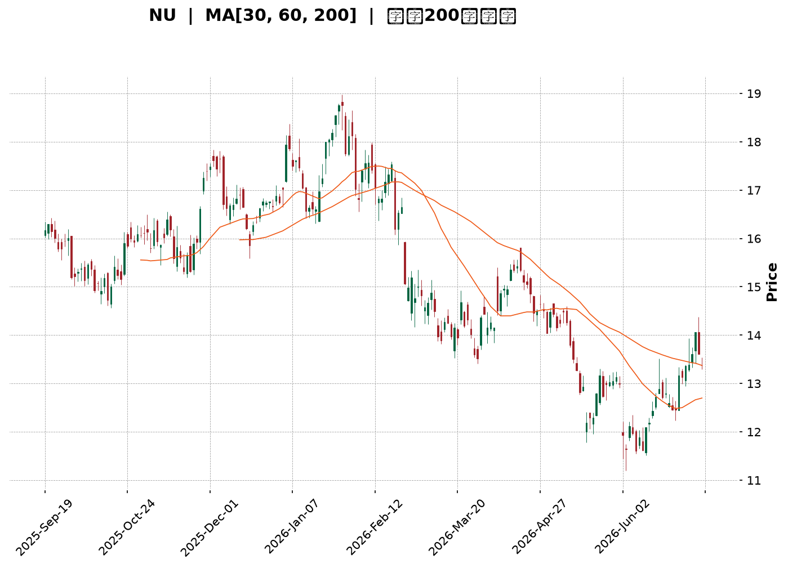
</details>

<html>
<head><meta charset="utf-8" /></head>
<body>
    <div style="height:500px; width:100%;">                        <script>window.PlotlyConfig = {MathJaxConfig: 'local'};</script>
        <script charset="utf-8" src="https://cdn.plot.ly/plotly-3.6.0.min.js" integrity="sha256-QaOVwtVY0T02VaHrr6pnoHLCwayMJp4O5n4YyaE3rJk=" crossorigin="anonymous"></script>                <div id="candlestick-chart" class="plotly-graph-div" style="height:100%; width:100%;"></div>            <script>                window.PLOTLYENV=window.PLOTLYENV || {};                                if (document.getElementById("candlestick-chart")) {                    Plotly.newPlot(                        "candlestick-chart",                        [{"close":{"dtype":"f8","bdata":"AAAAIIUrMEAAAADAzEwwQAAAAGBmJjBAAAAAYI8CMEAAAAAgXI8vQAAAACBcjy9AAAAAYGbmL0AAAABgjwIwQAAAAKBHYS5AAAAA4KNwLkAAAABguJ4uQAAAAGCPwi5AAAAAYI9CLkAAAAAghesuQAAAAKBwvS5AAAAAQArXLUAAAADA9SguQAAAAIDr0S1AAAAAAClcLkAAAACAwnUtQAAAAAAAAC5AAAAAgOvRLkAAAABA4XouQAAAAIDrUS5AAAAAwMzML0AAAACAFK4vQAAAAAAAADBAAAAAACncL0AAAABAChcwQAAAACBcDzBAAAAAACkcMEAAAACgRyEwQAAAAKCZmS9AAAAAIIUrMEAAAACgR+EvQAAAAKBwvS9AAAAAwB4FMEAAAAAA12MwQAAAAIAULjBAAAAAgBQuL0AAAAAA16MvQAAAAEAzMy9AAAAAANejLkAAAACA61EvQAAAAADXoy5AAAAAIK7HL0AAAABACtcvQAAAAAApnDBAAAAAAABAMUAAAAAA12MxQAAAAEDhejFAAAAAACmcMUAAAADgo3AxQAAAAGBmpjFAAAAAQDOzMEAAAABguJ4wQAAAAIAUrjBAAAAA4KOwMEAAAACA69EwQAAAAGBm5jBAAAAAYGamMEAAAABAMzMwQAAAAOBRuC9AAAAAwB5FMEAAAABAClcwQAAAAGC4njBAAAAAYI\u002fCMEAAAACgcL0wQAAAAGCPwjBAAAAAwPWoMEAAAACgR+EwQAAAAKBwvTBAAAAAwB4FMUAAAADgo\u002fAxQAAAAAAp3DFAAAAAAACAMUAAAAAAKZwxQAAAAIDCdTFAAAAAgD0KMUAAAAAgXI8wQAAAAADXozBAAAAAACmcMEAAAACgmZkwQAAAAOBR+DBAAAAAoHA9MUAAAAAAAAAyQAAAAIA9CjJAAAAAgBQuMkAAAADAzIwyQAAAAGCPwjJAAAAAYI\u002fCMkAAAAAAAMAxQAAAAAApHDJAAAAAYLgeMkAAAADAHgUxQAAAACBczzBAAAAAYGZmMUAAAADAzIwxQAAAAIDrkTFAAAAAwPVoMUAAAACAPQoxQAAAAIDr0TBAAAAAgOvRMEAAAAAghSsxQAAAAIDrUTFAAAAAIK6HMUAAAADgozAwQAAAACCuhzBAAAAAYGamMEAAAABguB4uQAAAAIDC9S1AAAAAoEdhLkAAAADAHoUtQAAAAAAAAC5AAAAAANejLUAAAADA9SgtQAAAAEAKVy1AAAAAYI\u002fCLUAAAABA4fosQAAAAOCj8CtAAAAAIK7HK0AAAACAPYosQAAAAAAAgCxAAAAA4KPwK0AAAACA61EsQAAAAKBH4StAAAAAAClcLUAAAACgR2EsQAAAAADXoyxAAAAAgD0KLEAAAABAMzMrQAAAAMAeBStAAAAAoHC9LEAAAACgR+EsQAAAAMDMTCxAAAAAwB6FLEAAAADAzEwsQAAAAMAeBS1AAAAAoHC9LUAAAAAghestQAAAAGBm5i1AAAAAQDOzLkAAAACAFK4uQAAAAAAp3C5AAAAAgBSuLkAAAABAMzMuQAAAAKCZGS5AAAAAQDOzLUAAAAAghessQAAAAMAeBS1AAAAAIK5HLUAAAAAAAAAtQAAAAOB6FCxAAAAAgML1LEAAAACgR+EsQAAAAIDrUSxAAAAAAACALEAAAACAwvUsQAAAAMAehSxAAAAAoJmZK0AAAAAAAAArQAAAAIA9iipAAAAAANejKUAAAAAAKdwpQAAAAKBHYShAAAAA4HqUKEAAAADgepQoQAAAAOB6lClAAAAAgOtRKkAAAACAwnUpQAAAAIDC9SlAAAAAIFwPKkAAAACgmRkqQAAAAGCPQipAAAAAQOH6KUAAAAAAKdwnQAAAACCuRydAAAAAoHA9KEAAAADgo\u002fAnQAAAAEAzMydAAAAAYI\u002fCJ0AAAACgcD0nQAAAAIAULihAAAAAoEdhKEAAAAAAKdwoQAAAAOCjcClAAAAAIK7HKUAAAAAghWspQAAAAOB6lClAAAAAgBQuKUAAAAAghesoQAAAACCF6yhAAAAAQApXKkAAAABgj0IqQAAAAOBRuCpAAAAAIK7HKkAAAADgUTgrQAAAAGC4HixAAAAA4FE4K0AAAACgcL0qQA=="},"high":{"dtype":"f8","bdata":"AAAAoJlZMEAAAADAzEwwQAAAAMDMbDBAAAAAYLheMEAAAADgURgwQAAAAKBw\u002fS9AAAAAoJkZMEAAAADgozAwQAAAAMDMDDBAAAAAwMzMLkAAAAAAAMAuQAAAAEDh+i5AAAAA4HoUL0AAAAAAAAAvQAAAAMD1KC9AAAAAYGbmLkAAAACgcD0uQAAAAKBHYS5AAAAAAFaOLkAAAABguJ4uQAAAAGC4Hi5AAAAAIK5HL0AAAACAFC4vQAAAACCF6y5AAAAAANcjMEAAAACgRyEwQAAAAKCZWTBAAAAAgOsRMEAAAADAHkUwQAAAAKBwPTBAAAAAwB5FMEAAAAAAAIAwQAAAAKBwHTBAAAAAIIVrMEAAAABgZmYwQAAAAAAAwC9AAAAA4FE4MEAAAADAzIwwQAAAAAAAgDBAAAAAgOsxMEAAAABgj0IwQAAAAKBwvS9AAAAAoJlZL0AAAADgo3AvQAAAAEAzEzBAAAAAwB4FMEAAAAAgXA8wQAAAAMDMrDBAAAAAoEdhMUAAAACAFI4xQAAAACBcjzFAAAAAQArXMUAAAADgUbgxQAAAAOCj0DFAAAAAQOG6MUAAAABAMxMxQAAAAEDhujBAAAAAoJnZMEAAAAAAKRwxQAAAACBcDzFAAAAAgOsRMUAAAADAHoUwQAAAAMD1KDBAAAAA4CJbMEAAAADgUXgwQAAAAKBHoTBAAAAA4HrUMEAAAADA9cgwQAAAAGCPwjBAAAAAIFzPMEAAAABA4RoxQAAAAMDM7DBAAAAAIFwPMUAAAACAlSMyQAAAAGC4XjJAAAAAYI\u002fCMUAAAACAvp8xQAAAAIDrETJAAAAAIIVrMUAAAACA6xExQAAAAOCjsDBAAAAA4FH4MEAAAABgDq0wQAAAAOCjUDFAAAAAgD2KMUAAAAAAAAAyQAAAAOCjEDJAAAAAYI9CMkAAAAAgXI8yQAAAAMD1yDJAAAAAQOH6MkAAAABguJ4yQAAAAEAKdzJAAAAAYGamMkAAAACAPSoyQAAAAGCPIjFAAAAAIIVrMUAAAABACtcxQAAAAAApvDFAAAAAoHD9MUAAAADAzIwxQAAAAKBH4TBAAAAAAAAAMUAAAABA4XoxQAAAAOCjcDFAAAAAQAqXMUAAAADA9WgxQAAAAEAKlzBAAAAAoJnZMEAAAACgR+EvQAAAAGBmZi5AAAAAQIusLkAAAABguB4uQAAAAIDCtS5AAAAAwMxMLkAAAABAM3MtQAAAAIDrkS1AAAAAgD1KLkAAAACgR+EtQAAAAEAzsyxAAAAAYLieLEAAAACgcL0sQAAAAOB6FC1AAAAAwMyMLEAAAAAAAIAsQAAAAMDMTCxAAAAAQArXLUAAAADAHgUtQAAAAKBHYS1AAAAAYGamLEAAAABgZuYrQAAAAIDrkStAAAAAgOvRLEAAAACgmZktQAAAAIDC9SxAAAAAIK7HLEAAAACA61EsQAAAAMBJzC5AAAAAACncLUAAAADgehQuQAAAACBcDy5AAAAA4KPwLkAAAABguB4vQAAAAKBHIS9AAAAAYLieL0AAAABAM7MuQAAAACBcjy5AAAAA4KNwLkAAAAAA16MtQAAAAOB6FC1AAAAAIIWrLUAAAABAClctQAAAAMAeBS1AAAAAYLgeLUAAAACA61EtQAAAAOCj8CxAAAAAoEfhLEAAAACgmRktQAAAAEAzMy1AAAAAwPWoLEAAAADA9egrQAAAAAApHCtAAAAAgD2KKkAAAABAClcqQAAAACBczyhAAAAAwMzMKEAAAADAzMwoQAAAAKCZmSlAAAAAoJmZKkAAAADAHoUqQAAAAKBHISpAAAAAAClcKkAAAABA4XoqQAAAAAAAgCpAAAAAwMxMKkAAAAAghWsoQAAAAEDheidAAAAAgBRuKEAAAABAM7MoQAAAAKCZGShAAAAAgOsRKEAAAACAFC4oQAAAAIAULihAAAAA4HqUKEAAAABgj0IpQAAAAKCZmSlAAAAAIK4HK0AAAADA9SgqQAAAAKBwPSpAAAAAgOuRKUAAAADgo3ApQAAAAIA9SilAAAAAgBSuKkAAAACgmZkqQAAAACCuxypAAAAAACncK0AAAAAAAIArQAAAAGC4HixAAAAAYI\u002fCLEAAAADgehQrQA=="},"hovertemplate":"\u003cb\u003e%{x|%Y-%m-%d}\u003c\u002fb\u003e\u003cbr\u003e\u958b: $%{open:.2f}\u003cbr\u003e\u9ad8: $%{high:.2f}\u003cbr\u003e\u4f4e: $%{low:.2f}\u003cbr\u003e\u6536: $%{close:.2f}\u003cextra\u003e\u003c\u002fextra\u003e","low":{"dtype":"f8","bdata":"AAAAwB4FMEAAAACAwvUvQAAAACCuBzBAAAAAoPHSL0AAAACAwnUvQAAAAKCZGS9AAAAAwPWoL0AAAADAzEwvQAAAAIDrUS5AAAAAgD0KLkAAAADgUTguQAAAAAAAQC5AAAAAgD0KLkAAAACgmRkuQAAAAIDCdS5AAAAAYI\u002fCLUAAAABACtctQAAAACCuRy1AAAAA4FG4LUAAAABAXjotQAAAAGC4Hi1AAAAAYLgeLkAAAAAgXE8uQAAAAIDrES5AAAAAgMJ1LkAAAAAgBJYvQAAAAEAK1y9AAAAAANejL0AAAAAAKdwvQAAAAADXAzBAAAAAYI\u002fCL0AAAACAFO4vQAAAAGBmZi9AAAAA4HqUL0AAAACAFK4vQAAAAGBm5i5AAAAAwMzML0AAAADAzAwwQAAAACCFCzBAAAAA4FH4LkAAAAAA16MuQAAAAAAAAC9AAAAAwB6FLkAAAACgR2EuQAAAAKCZmS5AAAAAYI+CLkAAAAAgXI8vQAAAAAApXC9AAAAAwPXoMEAAAABAMzMxQAAAACCuRzFAAAAAQOF6MUAAAACAPUoxQAAAAAApXDFAAAAAoJmZMEAAAADgUXgwQAAAAAACSzBAAAAAQAp3MEAAAABAM7MwQAAAAKCZmTBAAAAAoEehMEAAAACAFC4wQAAAAIAULi9AAAAAwCAQMEAAAABAYlAwQAAAAKCZWTBAAAAAIFyPMEAAAABgZqYwQAAAAAApnDBAAAAAgD2KMEAAAACAFK4wQAAAAIDCtTBAAAAAYGamMEAAAACAPSoxQAAAACBczzFAAAAAIK5nMUAAAABguF4xQAAAAADXYzFAAAAAwB4FMUAAAACAPWowQAAAAMDMbDBAAAAAgEGAMEAAAACAFE4wQAAAAKCZWTBAAAAAgOsRMUAAAADgelQxQAAAAIDCtTFAAAAAYGbmMUAAAACgmRkyQAAAAAApXDJAAAAAoHA9MkAAAACAwrUxQAAAAIDCtTFAAAAAQArXMUAAAAAAAOAwQAAAAMDMjDBAAAAAYI\u002fCMEAAAABACjcxQAAAAIA9CjFAAAAAoJlZMUAAAACAwrUwQAAAAGC4XjBAAAAAQAqXMEAAAABACtcwQAAAAMAe5TBAAAAAIIUrMUAAAADgehQwQAAAAKBwvS9AAAAAANeDMEAAAADgehQuQAAAAGBmZi1AAAAAYLieLEAAAABAClcsQAAAAKCZmS1AAAAA4FE4LUAAAADgUXgsQAAAAIDCdSxAAAAAIFwPLUAAAABgj8IsQAAAAGCPwitAAAAAoEehK0AAAABguB4sQAAAAOBReCxAAAAA4HrUK0AAAAAgXA8rQAAAAOB6lCtAAAAA4KNwLEAAAACA61EsQAAAACCFayxAAAAAACncK0AAAADgehQrQAAAAIDr0SpAAAAAYGZmK0AAAAAAKdwsQAAAAAACqytAAAAAwPUoLEAAAACAFK4rQAAAAIDr0SxAAAAAwMzMLEAAAAAgXI8tQAAAAEAzMy1AAAAAoHA9LkAAAACgmZkuQAAAAOB6lC5AAAAAYLieLkAAAAAAKdwtQAAAAOCj8C1AAAAAQApXLUAAAACA65EsQAAAAKBHYSxAAAAAoJkZLUAAAACAwrUsQAAAAOB6FCxAAAAAoJkZLEAAAABgj8IsQAAAAIAULixAAAAAQApXLEAAAACgcH0sQAAAAMD1aCxAAAAAAACAK0AAAABACtcqQAAAAMAehSpAAAAAIK6HKUAAAACAFK4pQAAAACBcjydAAAAAYLgeKEAAAAAghesnQAAAAMD1qChAAAAAYLgeKUAAAAAghWspQAAAAMDMTClAAAAAACncKUAAAAAgrscpQAAAAEDh+ilAAAAAgOvRKUAAAACgR+EmQAAAAGBmZiZAAAAAANejJ0AAAABguN4nQAAAAKCZGSdAAAAAIFxPJ0AAAADgUTgnQAAAAMAeBSdAAAAAIK4HKEAAAAAgXI8oQAAAAOCj8ChAAAAA4HqUKUAAAAAAKVwpQAAAAGBmZilAAAAAAAAAKUAAAACgR+EoQAAAAIDCdShAAAAAANfjKEAAAABA4fopQAAAAKBH4SlAAAAAAACAKkAAAABg46UqQAAAAIDr0SpAAAAA4FE4K0AAAABACpcqQA=="},"name":"\u50f9\u683c","open":{"dtype":"f8","bdata":"AAAAgOsRMEAAAAAAKRwwQAAAAMDMTDBAAAAAgBQuMEAAAAAAKdwvQAAAAAAp3C9AAAAAYGbmL0AAAAAghesvQAAAAMDMDDBAAAAAgD2KLkAAAAAgXI8uQAAAAKBwvS5AAAAAgOvRLkAAAAAAKVwuQAAAACBcDy9AAAAA4FG4LkAAAADA9SguQAAAAEAzsy1AAAAAAAAALkAAAADgepQuQAAAACCuRy1AAAAAYI9CLkAAAABAM7MuQAAAAADXoy5AAAAAwB6FLkAAAABAChcwQAAAAEDhOjBAAAAAIIXrL0AAAABgZuYvQAAAAIDrETBAAAAAACkcMEAAAADgozAwQAAAAKCZmS9AAAAA4FG4L0AAAABguF4wQAAAAADXoy9AAAAAoJkZMEAAAABAChcwQAAAAIDCdTBAAAAAgD0KMEAAAAAAKdwuQAAAAOBReC9AAAAAwMzMLkAAAADAzIwuQAAAAIAUri9AAAAAgMK1LkAAAAAAAAAwQAAAAEAK1y9AAAAAQOH6MEAAAAAA12MxQAAAAIAUbjFAAAAAgMK1MUAAAABAM7MxQAAAAGBmpjFAAAAAQDOzMUAAAABguN4wQAAAAMAeZTBAAAAAoJmZMEAAAABA4bowQAAAACCu5zBAAAAAYGYGMUAAAAAAAIAwQAAAAEAKFzBAAAAAYGYmMEAAAACgmVkwQAAAACCFazBAAAAA4KOwMEAAAABAM7MwQAAAAKBwvTBAAAAAgD2qMEAAAADAHsUwQAAAAGC43jBAAAAAIFwPMUAAAACAFC4xQAAAAGC4HjJAAAAAYLieMUAAAABACpcxQAAAAIAUrjFAAAAAoJlZMUAAAAAgXA8xQAAAAOCjkDBAAAAAAADAMEAAAACA65EwQAAAAAApXDBAAAAAYI8iMUAAAACAPaoxQAAAAAAAADJAAAAAwMwMMkAAAAAAKVwyQAAAAGCPojJAAAAA4HrUMkAAAAAgrocyQAAAAKBwvTFAAAAAIK5nMkAAAADgehQyQAAAAOB61DBAAAAAIIUrMUAAAADgo3AxQAAAAGBmJjFAAAAAgOvxMUAAAADA9YgxQAAAAKBwvTBAAAAAAADAMEAAAABAM\u002fMwQAAAAADXIzFAAAAAQDMzMUAAAAAAAEAxQAAAAOCjMDBAAAAAANeDMEAAAABACtcvQAAAAOCjcC1AAAAAIIXrLEAAAAAAKVwtQAAAAKBw\u002fS1AAAAAACncLUAAAABgjwItQAAAAIDr0SxAAAAAQOF6LUAAAAAAAIAtQAAAAGBmZixAAAAAANcjLEAAAACgcD0sQAAAAMDMzCxAAAAA4KNwLEAAAAAAKVwrQAAAAKBwPSxAAAAAoEehLEAAAADgUfgsQAAAAGCPQi1AAAAAYI9CLEAAAACAwnUrQAAAACCFaytAAAAAoJmZK0AAAACAFC4tQAAAAAAAACxAAAAAYI9CLEAAAABAMzMsQAAAACCFay5AAAAAwB4FLUAAAAAAKdwtQAAAAIAUri1AAAAAYI9CLkAAAAAghesuQAAAACCuxy5AAAAAYLieL0AAAABA4XouQAAAAOBROC5AAAAAAClcLkAAAABguJ4tQAAAAEAK1yxAAAAAIK5HLUAAAADgehQtQAAAAIDC9SxAAAAA4HpULEAAAACA61EtQAAAACCuxyxAAAAAANejLEAAAAAAAAAtQAAAAAAAAC1AAAAAoJmZLEAAAABgj8IrQAAAAEAK1ypAAAAAIIVrKkAAAABAM7MpQAAAAECJAShAAAAAwMzMKEAAAADgelQoQAAAAIAUrihAAAAA4FE4KUAAAADAzEwqQAAAACCuBypAAAAAIIXrKUAAAADgo\u002fApQAAAAKCZGSpAAAAAAAAAKkAAAABA4fonQAAAAMDMTCdAAAAAYI\u002fCJ0AAAABAMzMoQAAAAMAeBShAAAAA4KNwJ0AAAACgmZknQAAAAADXIydAAAAAQApXKEAAAACAFK4oQAAAAMAeBSlAAAAA4HqUKUAAAAAgXA8qQAAAACBcjylAAAAAgD0KKUAAAACgmRkpQAAAAIDC9ShAAAAAANfjKEAAAADAHoUqQAAAAGC4HipAAAAAIFyPKkAAAACgR+EqQAAAAAApXCtAAAAAYLgeLEAAAABgj8IqQA=="},"x":["2025-09-19T00:00:00-04:00","2025-09-22T00:00:00-04:00","2025-09-23T00:00:00-04:00","2025-09-24T00:00:00-04:00","2025-09-25T00:00:00-04:00","2025-09-26T00:00:00-04:00","2025-09-29T00:00:00-04:00","2025-09-30T00:00:00-04:00","2025-10-01T00:00:00-04:00","2025-10-02T00:00:00-04:00","2025-10-03T00:00:00-04:00","2025-10-06T00:00:00-04:00","2025-10-07T00:00:00-04:00","2025-10-08T00:00:00-04:00","2025-10-09T00:00:00-04:00","2025-10-10T00:00:00-04:00","2025-10-13T00:00:00-04:00","2025-10-14T00:00:00-04:00","2025-10-15T00:00:00-04:00","2025-10-16T00:00:00-04:00","2025-10-17T00:00:00-04:00","2025-10-20T00:00:00-04:00","2025-10-21T00:00:00-04:00","2025-10-22T00:00:00-04:00","2025-10-23T00:00:00-04:00","2025-10-24T00:00:00-04:00","2025-10-27T00:00:00-04:00","2025-10-28T00:00:00-04:00","2025-10-29T00:00:00-04:00","2025-10-30T00:00:00-04:00","2025-10-31T00:00:00-04:00","2025-11-03T00:00:00-05:00","2025-11-04T00:00:00-05:00","2025-11-05T00:00:00-05:00","2025-11-06T00:00:00-05:00","2025-11-07T00:00:00-05:00","2025-11-10T00:00:00-05:00","2025-11-11T00:00:00-05:00","2025-11-12T00:00:00-05:00","2025-11-13T00:00:00-05:00","2025-11-14T00:00:00-05:00","2025-11-17T00:00:00-05:00","2025-11-18T00:00:00-05:00","2025-11-19T00:00:00-05:00","2025-11-20T00:00:00-05:00","2025-11-21T00:00:00-05:00","2025-11-24T00:00:00-05:00","2025-11-25T00:00:00-05:00","2025-11-26T00:00:00-05:00","2025-11-28T00:00:00-05:00","2025-12-01T00:00:00-05:00","2025-12-02T00:00:00-05:00","2025-12-03T00:00:00-05:00","2025-12-04T00:00:00-05:00","2025-12-05T00:00:00-05:00","2025-12-08T00:00:00-05:00","2025-12-09T00:00:00-05:00","2025-12-10T00:00:00-05:00","2025-12-11T00:00:00-05:00","2025-12-12T00:00:00-05:00","2025-12-15T00:00:00-05:00","2025-12-16T00:00:00-05:00","2025-12-17T00:00:00-05:00","2025-12-18T00:00:00-05:00","2025-12-19T00:00:00-05:00","2025-12-22T00:00:00-05:00","2025-12-23T00:00:00-05:00","2025-12-24T00:00:00-05:00","2025-12-26T00:00:00-05:00","2025-12-29T00:00:00-05:00","2025-12-30T00:00:00-05:00","2025-12-31T00:00:00-05:00","2026-01-02T00:00:00-05:00","2026-01-05T00:00:00-05:00","2026-01-06T00:00:00-05:00","2026-01-07T00:00:00-05:00","2026-01-08T00:00:00-05:00","2026-01-09T00:00:00-05:00","2026-01-12T00:00:00-05:00","2026-01-13T00:00:00-05:00","2026-01-14T00:00:00-05:00","2026-01-15T00:00:00-05:00","2026-01-16T00:00:00-05:00","2026-01-20T00:00:00-05:00","2026-01-21T00:00:00-05:00","2026-01-22T00:00:00-05:00","2026-01-23T00:00:00-05:00","2026-01-26T00:00:00-05:00","2026-01-27T00:00:00-05:00","2026-01-28T00:00:00-05:00","2026-01-29T00:00:00-05:00","2026-01-30T00:00:00-05:00","2026-02-02T00:00:00-05:00","2026-02-03T00:00:00-05:00","2026-02-04T00:00:00-05:00","2026-02-05T00:00:00-05:00","2026-02-06T00:00:00-05:00","2026-02-09T00:00:00-05:00","2026-02-10T00:00:00-05:00","2026-02-11T00:00:00-05:00","2026-02-12T00:00:00-05:00","2026-02-13T00:00:00-05:00","2026-02-17T00:00:00-05:00","2026-02-18T00:00:00-05:00","2026-02-19T00:00:00-05:00","2026-02-20T00:00:00-05:00","2026-02-23T00:00:00-05:00","2026-02-24T00:00:00-05:00","2026-02-25T00:00:00-05:00","2026-02-26T00:00:00-05:00","2026-02-27T00:00:00-05:00","2026-03-02T00:00:00-05:00","2026-03-03T00:00:00-05:00","2026-03-04T00:00:00-05:00","2026-03-05T00:00:00-05:00","2026-03-06T00:00:00-05:00","2026-03-09T00:00:00-04:00","2026-03-10T00:00:00-04:00","2026-03-11T00:00:00-04:00","2026-03-12T00:00:00-04:00","2026-03-13T00:00:00-04:00","2026-03-16T00:00:00-04:00","2026-03-17T00:00:00-04:00","2026-03-18T00:00:00-04:00","2026-03-19T00:00:00-04:00","2026-03-20T00:00:00-04:00","2026-03-23T00:00:00-04:00","2026-03-24T00:00:00-04:00","2026-03-25T00:00:00-04:00","2026-03-26T00:00:00-04:00","2026-03-27T00:00:00-04:00","2026-03-30T00:00:00-04:00","2026-03-31T00:00:00-04:00","2026-04-01T00:00:00-04:00","2026-04-02T00:00:00-04:00","2026-04-06T00:00:00-04:00","2026-04-07T00:00:00-04:00","2026-04-08T00:00:00-04:00","2026-04-09T00:00:00-04:00","2026-04-10T00:00:00-04:00","2026-04-13T00:00:00-04:00","2026-04-14T00:00:00-04:00","2026-04-15T00:00:00-04:00","2026-04-16T00:00:00-04:00","2026-04-17T00:00:00-04:00","2026-04-20T00:00:00-04:00","2026-04-21T00:00:00-04:00","2026-04-22T00:00:00-04:00","2026-04-23T00:00:00-04:00","2026-04-24T00:00:00-04:00","2026-04-27T00:00:00-04:00","2026-04-28T00:00:00-04:00","2026-04-29T00:00:00-04:00","2026-04-30T00:00:00-04:00","2026-05-01T00:00:00-04:00","2026-05-04T00:00:00-04:00","2026-05-05T00:00:00-04:00","2026-05-06T00:00:00-04:00","2026-05-07T00:00:00-04:00","2026-05-08T00:00:00-04:00","2026-05-11T00:00:00-04:00","2026-05-12T00:00:00-04:00","2026-05-13T00:00:00-04:00","2026-05-14T00:00:00-04:00","2026-05-15T00:00:00-04:00","2026-05-18T00:00:00-04:00","2026-05-19T00:00:00-04:00","2026-05-20T00:00:00-04:00","2026-05-21T00:00:00-04:00","2026-05-22T00:00:00-04:00","2026-05-26T00:00:00-04:00","2026-05-27T00:00:00-04:00","2026-05-28T00:00:00-04:00","2026-05-29T00:00:00-04:00","2026-06-01T00:00:00-04:00","2026-06-02T00:00:00-04:00","2026-06-03T00:00:00-04:00","2026-06-04T00:00:00-04:00","2026-06-05T00:00:00-04:00","2026-06-08T00:00:00-04:00","2026-06-09T00:00:00-04:00","2026-06-10T00:00:00-04:00","2026-06-11T00:00:00-04:00","2026-06-12T00:00:00-04:00","2026-06-15T00:00:00-04:00","2026-06-16T00:00:00-04:00","2026-06-17T00:00:00-04:00","2026-06-18T00:00:00-04:00","2026-06-22T00:00:00-04:00","2026-06-23T00:00:00-04:00","2026-06-24T00:00:00-04:00","2026-06-25T00:00:00-04:00","2026-06-26T00:00:00-04:00","2026-06-29T00:00:00-04:00","2026-06-30T00:00:00-04:00","2026-07-01T00:00:00-04:00","2026-07-02T00:00:00-04:00","2026-07-06T00:00:00-04:00","2026-07-07T00:00:00-04:00","2026-07-08T00:00:00-04:00"],"type":"candlestick"},{"hovertemplate":"MA30: $%{y:.2f}\u003cextra\u003e\u003c\u002fextra\u003e","line":{"color":"#2196F3","dash":"dash","width":2},"mode":"lines","name":"MA30","x":["2025-09-19T00:00:00-04:00","2025-09-22T00:00:00-04:00","2025-09-23T00:00:00-04:00","2025-09-24T00:00:00-04:00","2025-09-25T00:00:00-04:00","2025-09-26T00:00:00-04:00","2025-09-29T00:00:00-04:00","2025-09-30T00:00:00-04:00","2025-10-01T00:00:00-04:00","2025-10-02T00:00:00-04:00","2025-10-03T00:00:00-04:00","2025-10-06T00:00:00-04:00","2025-10-07T00:00:00-04:00","2025-10-08T00:00:00-04:00","2025-10-09T00:00:00-04:00","2025-10-10T00:00:00-04:00","2025-10-13T00:00:00-04:00","2025-10-14T00:00:00-04:00","2025-10-15T00:00:00-04:00","2025-10-16T00:00:00-04:00","2025-10-17T00:00:00-04:00","2025-10-20T00:00:00-04:00","2025-10-21T00:00:00-04:00","2025-10-22T00:00:00-04:00","2025-10-23T00:00:00-04:00","2025-10-24T00:00:00-04:00","2025-10-27T00:00:00-04:00","2025-10-28T00:00:00-04:00","2025-10-29T00:00:00-04:00","2025-10-30T00:00:00-04:00","2025-10-31T00:00:00-04:00","2025-11-03T00:00:00-05:00","2025-11-04T00:00:00-05:00","2025-11-05T00:00:00-05:00","2025-11-06T00:00:00-05:00","2025-11-07T00:00:00-05:00","2025-11-10T00:00:00-05:00","2025-11-11T00:00:00-05:00","2025-11-12T00:00:00-05:00","2025-11-13T00:00:00-05:00","2025-11-14T00:00:00-05:00","2025-11-17T00:00:00-05:00","2025-11-18T00:00:00-05:00","2025-11-19T00:00:00-05:00","2025-11-20T00:00:00-05:00","2025-11-21T00:00:00-05:00","2025-11-24T00:00:00-05:00","2025-11-25T00:00:00-05:00","2025-11-26T00:00:00-05:00","2025-11-28T00:00:00-05:00","2025-12-01T00:00:00-05:00","2025-12-02T00:00:00-05:00","2025-12-03T00:00:00-05:00","2025-12-04T00:00:00-05:00","2025-12-05T00:00:00-05:00","2025-12-08T00:00:00-05:00","2025-12-09T00:00:00-05:00","2025-12-10T00:00:00-05:00","2025-12-11T00:00:00-05:00","2025-12-12T00:00:00-05:00","2025-12-15T00:00:00-05:00","2025-12-16T00:00:00-05:00","2025-12-17T00:00:00-05:00","2025-12-18T00:00:00-05:00","2025-12-19T00:00:00-05:00","2025-12-22T00:00:00-05:00","2025-12-23T00:00:00-05:00","2025-12-24T00:00:00-05:00","2025-12-26T00:00:00-05:00","2025-12-29T00:00:00-05:00","2025-12-30T00:00:00-05:00","2025-12-31T00:00:00-05:00","2026-01-02T00:00:00-05:00","2026-01-05T00:00:00-05:00","2026-01-06T00:00:00-05:00","2026-01-07T00:00:00-05:00","2026-01-08T00:00:00-05:00","2026-01-09T00:00:00-05:00","2026-01-12T00:00:00-05:00","2026-01-13T00:00:00-05:00","2026-01-14T00:00:00-05:00","2026-01-15T00:00:00-05:00","2026-01-16T00:00:00-05:00","2026-01-20T00:00:00-05:00","2026-01-21T00:00:00-05:00","2026-01-22T00:00:00-05:00","2026-01-23T00:00:00-05:00","2026-01-26T00:00:00-05:00","2026-01-27T00:00:00-05:00","2026-01-28T00:00:00-05:00","2026-01-29T00:00:00-05:00","2026-01-30T00:00:00-05:00","2026-02-02T00:00:00-05:00","2026-02-03T00:00:00-05:00","2026-02-04T00:00:00-05:00","2026-02-05T00:00:00-05:00","2026-02-06T00:00:00-05:00","2026-02-09T00:00:00-05:00","2026-02-10T00:00:00-05:00","2026-02-11T00:00:00-05:00","2026-02-12T00:00:00-05:00","2026-02-13T00:00:00-05:00","2026-02-17T00:00:00-05:00","2026-02-18T00:00:00-05:00","2026-02-19T00:00:00-05:00","2026-02-20T00:00:00-05:00","2026-02-23T00:00:00-05:00","2026-02-24T00:00:00-05:00","2026-02-25T00:00:00-05:00","2026-02-26T00:00:00-05:00","2026-02-27T00:00:00-05:00","2026-03-02T00:00:00-05:00","2026-03-03T00:00:00-05:00","2026-03-04T00:00:00-05:00","2026-03-05T00:00:00-05:00","2026-03-06T00:00:00-05:00","2026-03-09T00:00:00-04:00","2026-03-10T00:00:00-04:00","2026-03-11T00:00:00-04:00","2026-03-12T00:00:00-04:00","2026-03-13T00:00:00-04:00","2026-03-16T00:00:00-04:00","2026-03-17T00:00:00-04:00","2026-03-18T00:00:00-04:00","2026-03-19T00:00:00-04:00","2026-03-20T00:00:00-04:00","2026-03-23T00:00:00-04:00","2026-03-24T00:00:00-04:00","2026-03-25T00:00:00-04:00","2026-03-26T00:00:00-04:00","2026-03-27T00:00:00-04:00","2026-03-30T00:00:00-04:00","2026-03-31T00:00:00-04:00","2026-04-01T00:00:00-04:00","2026-04-02T00:00:00-04:00","2026-04-06T00:00:00-04:00","2026-04-07T00:00:00-04:00","2026-04-08T00:00:00-04:00","2026-04-09T00:00:00-04:00","2026-04-10T00:00:00-04:00","2026-04-13T00:00:00-04:00","2026-04-14T00:00:00-04:00","2026-04-15T00:00:00-04:00","2026-04-16T00:00:00-04:00","2026-04-17T00:00:00-04:00","2026-04-20T00:00:00-04:00","2026-04-21T00:00:00-04:00","2026-04-22T00:00:00-04:00","2026-04-23T00:00:00-04:00","2026-04-24T00:00:00-04:00","2026-04-27T00:00:00-04:00","2026-04-28T00:00:00-04:00","2026-04-29T00:00:00-04:00","2026-04-30T00:00:00-04:00","2026-05-01T00:00:00-04:00","2026-05-04T00:00:00-04:00","2026-05-05T00:00:00-04:00","2026-05-06T00:00:00-04:00","2026-05-07T00:00:00-04:00","2026-05-08T00:00:00-04:00","2026-05-11T00:00:00-04:00","2026-05-12T00:00:00-04:00","2026-05-13T00:00:00-04:00","2026-05-14T00:00:00-04:00","2026-05-15T00:00:00-04:00","2026-05-18T00:00:00-04:00","2026-05-19T00:00:00-04:00","2026-05-20T00:00:00-04:00","2026-05-21T00:00:00-04:00","2026-05-22T00:00:00-04:00","2026-05-26T00:00:00-04:00","2026-05-27T00:00:00-04:00","2026-05-28T00:00:00-04:00","2026-05-29T00:00:00-04:00","2026-06-01T00:00:00-04:00","2026-06-02T00:00:00-04:00","2026-06-03T00:00:00-04:00","2026-06-04T00:00:00-04:00","2026-06-05T00:00:00-04:00","2026-06-08T00:00:00-04:00","2026-06-09T00:00:00-04:00","2026-06-10T00:00:00-04:00","2026-06-11T00:00:00-04:00","2026-06-12T00:00:00-04:00","2026-06-15T00:00:00-04:00","2026-06-16T00:00:00-04:00","2026-06-17T00:00:00-04:00","2026-06-18T00:00:00-04:00","2026-06-22T00:00:00-04:00","2026-06-23T00:00:00-04:00","2026-06-24T00:00:00-04:00","2026-06-25T00:00:00-04:00","2026-06-26T00:00:00-04:00","2026-06-29T00:00:00-04:00","2026-06-30T00:00:00-04:00","2026-07-01T00:00:00-04:00","2026-07-02T00:00:00-04:00","2026-07-06T00:00:00-04:00","2026-07-07T00:00:00-04:00","2026-07-08T00:00:00-04:00"],"y":{"dtype":"f8","bdata":"AAAAAAAA+H8AAAAAAAD4fwAAAAAAAPh\u002fAAAAAAAA+H8AAAAAAAD4fwAAAAAAAPh\u002fAAAAAAAA+H8AAAAAAAD4fwAAAAAAAPh\u002fAAAAAAAA+H8AAAAAAAD4fwAAAAAAAPh\u002fAAAAAAAA+H8AAAAAAAD4fwAAAAAAAPh\u002fAAAAAAAA+H8AAAAAAAD4fwAAAAAAAPh\u002fAAAAAAAA+H8AAAAAAAD4fwAAAAAAAPh\u002fAAAAAAAA+H8AAAAAAAD4fwAAAAAAAPh\u002fAAAAAAAA+H8AAAAAAAD4fwAAAAAAAPh\u002fAAAAAAAA+H8AAAAAAAD4f0RERKRUHC9AAAAAgE4bL0AiIiLCZxgvQGZmZpZuEi9AMzMzoykVL0AAAACw5BcvQHd3d+dtGS9A3t3dvZ8aL0C8u7v7GyEvQM3MzFwBMi9Aq6qq6lE4L0AzMzMjBkEvQFVVVVXHRC9AREREdAVIL0BEREREb0svQAAAANCUSi9A7+7uziJbL0AzMzPTeGkvQN7d3T18hi9AVVVVNdCpL0DNzMzsNdcvQKuqqprEADBARERElIoTMEDe3d2NUCYwQKuqqgqQOzBAvLu7q2NCMEC8u7ubC0kwQHd3dxfZTjBAZmZmVlVVMEC8u7sLkFswQN7d3Q27YjBAMzMzs1ZnMEDv7u6e72cwQBEREbFyaDBAVVVVJU1pMEDe3d31tmwwQM3MzFwdczBAq6qq6m15MEARERGBanwwQImIiIhdgTBAvLu7+36KMEBmZmaWipMwQERERPREnTBAmpmZqcarMEBmZmZmO78wQN7d3R3o1DBA7+7uNqXiMEC8u7sTEfEwQFVVVe1R+DBAVVVVLYf2MEC8u7sDcu8wQJqZmQFH6DBAEREReb7fMEDv7u52k9gwQDMzM\u002fvF0jBAiYiIoGHXMEAAAABIKOMwQHd3dz\u002fD7jBAvLu7M3r7MECamZlxPQoxQFVVVa0cGjFAMzMzCx4sMUCamZkRWDkxQFVVVUWLTDFAiYiIqFRcMUBEREQkImIxQDMzMzPBYzFAzczMTDdpMUBVVVXFIHAxQN7d3T0KdzFAREREpHB9MUC8u7srzn4xQO\u002fu7u58fzFAZmZmBsh9MUDv7u7uNXcxQImIiEiacjFAIiIi0ttyMUCJiIjIvWYxQLy7uyvOXjFAMzMzM3pbMUDv7u5mrU4xQLy7uxODQDFAmpmZCWU0MUDv7u5+sSQxQHd3d\u002ffhEzFAVVVVZTv\u002fMECrqqpKDOIwQJqZmWlKxTBAvLu7cyGpMEB3d3c\u002ffIYwQFVVVVWcXTBAAAAAqA00MEAzMzN7WxYwQM3MzFzW6i9AvLu7uwKkL0AzMzMzM3MvQKuqqvo3Qi9A7+7uHswTL0Dv7u4OdNouQHd3d5f8oi5AVVVVdSFpLkDe3d3day4uQCIiIkLu9S1AvLu7Cx7MLUDe3d19hp0tQM3MzIxsZy1AMzMzs50vLUDNzMzMzAwtQImIiEhT6ixAiYiIWPLLLEAAAABwPcosQN7d3V26ySxAvLu7a3XMLECrqqp6W9YsQN7d3S2y3SxAiYiIGJLmLEAzMzMDcu8sQCIiIkLu9SxAAAAAMGv1LEDe3d0d6PQsQJqZmWkf\u002fixAZmZmNuwKLUCJiIgY2Q4tQHd3d5dDCy1AAAAA0PcTLUBmZmYmvxgtQImIiFiAHC1AVVVVpSkVLUDNzMysHBotQImIiIgWGS1AZmZmVlUVLUDe3d1toBMtQKuqqtqHDy1AzczMzBP1LEAzMzODTtssQERERCTbuSxAREREFDyYLEDe3d2dfXgsQCIiItIiWyxAd3d3t\u002fM9LEAiIiKy5BcsQCIiIqJF9itAVVVVZa3OK0C8u7s7mKcrQBEREWFXgCtAIiIiEjxYK0AREREhIiIrQM3MzJzv5ypA7+7uDli5KkBVVVUV2Y4qQJqZmRkvXSpAmpmZeRQuKkAAAACQ7fwpQCIiIuKl2ylAiYiIuJC0KUBmZmbmQpIpQCIiInKveSlAREREhHliKUBVVVVFREQpQN7d3b0tKylAvLu7K4cWKUB3d3dXxwQpQFVVVWX09ihAIiIiku38KEAiIiJiVwApQBERETFPFClAq6qqKhUnKUBVVVVVnD0pQM3MzAxJUylAERERIfdaKUBVVVVV42UpQA=="},"type":"scatter"},{"hovertemplate":"MA60: $%{y:.2f}\u003cextra\u003e\u003c\u002fextra\u003e","line":{"color":"#9C27B0","dash":"dash","width":2},"mode":"lines","name":"MA60","x":["2025-09-19T00:00:00-04:00","2025-09-22T00:00:00-04:00","2025-09-23T00:00:00-04:00","2025-09-24T00:00:00-04:00","2025-09-25T00:00:00-04:00","2025-09-26T00:00:00-04:00","2025-09-29T00:00:00-04:00","2025-09-30T00:00:00-04:00","2025-10-01T00:00:00-04:00","2025-10-02T00:00:00-04:00","2025-10-03T00:00:00-04:00","2025-10-06T00:00:00-04:00","2025-10-07T00:00:00-04:00","2025-10-08T00:00:00-04:00","2025-10-09T00:00:00-04:00","2025-10-10T00:00:00-04:00","2025-10-13T00:00:00-04:00","2025-10-14T00:00:00-04:00","2025-10-15T00:00:00-04:00","2025-10-16T00:00:00-04:00","2025-10-17T00:00:00-04:00","2025-10-20T00:00:00-04:00","2025-10-21T00:00:00-04:00","2025-10-22T00:00:00-04:00","2025-10-23T00:00:00-04:00","2025-10-24T00:00:00-04:00","2025-10-27T00:00:00-04:00","2025-10-28T00:00:00-04:00","2025-10-29T00:00:00-04:00","2025-10-30T00:00:00-04:00","2025-10-31T00:00:00-04:00","2025-11-03T00:00:00-05:00","2025-11-04T00:00:00-05:00","2025-11-05T00:00:00-05:00","2025-11-06T00:00:00-05:00","2025-11-07T00:00:00-05:00","2025-11-10T00:00:00-05:00","2025-11-11T00:00:00-05:00","2025-11-12T00:00:00-05:00","2025-11-13T00:00:00-05:00","2025-11-14T00:00:00-05:00","2025-11-17T00:00:00-05:00","2025-11-18T00:00:00-05:00","2025-11-19T00:00:00-05:00","2025-11-20T00:00:00-05:00","2025-11-21T00:00:00-05:00","2025-11-24T00:00:00-05:00","2025-11-25T00:00:00-05:00","2025-11-26T00:00:00-05:00","2025-11-28T00:00:00-05:00","2025-12-01T00:00:00-05:00","2025-12-02T00:00:00-05:00","2025-12-03T00:00:00-05:00","2025-12-04T00:00:00-05:00","2025-12-05T00:00:00-05:00","2025-12-08T00:00:00-05:00","2025-12-09T00:00:00-05:00","2025-12-10T00:00:00-05:00","2025-12-11T00:00:00-05:00","2025-12-12T00:00:00-05:00","2025-12-15T00:00:00-05:00","2025-12-16T00:00:00-05:00","2025-12-17T00:00:00-05:00","2025-12-18T00:00:00-05:00","2025-12-19T00:00:00-05:00","2025-12-22T00:00:00-05:00","2025-12-23T00:00:00-05:00","2025-12-24T00:00:00-05:00","2025-12-26T00:00:00-05:00","2025-12-29T00:00:00-05:00","2025-12-30T00:00:00-05:00","2025-12-31T00:00:00-05:00","2026-01-02T00:00:00-05:00","2026-01-05T00:00:00-05:00","2026-01-06T00:00:00-05:00","2026-01-07T00:00:00-05:00","2026-01-08T00:00:00-05:00","2026-01-09T00:00:00-05:00","2026-01-12T00:00:00-05:00","2026-01-13T00:00:00-05:00","2026-01-14T00:00:00-05:00","2026-01-15T00:00:00-05:00","2026-01-16T00:00:00-05:00","2026-01-20T00:00:00-05:00","2026-01-21T00:00:00-05:00","2026-01-22T00:00:00-05:00","2026-01-23T00:00:00-05:00","2026-01-26T00:00:00-05:00","2026-01-27T00:00:00-05:00","2026-01-28T00:00:00-05:00","2026-01-29T00:00:00-05:00","2026-01-30T00:00:00-05:00","2026-02-02T00:00:00-05:00","2026-02-03T00:00:00-05:00","2026-02-04T00:00:00-05:00","2026-02-05T00:00:00-05:00","2026-02-06T00:00:00-05:00","2026-02-09T00:00:00-05:00","2026-02-10T00:00:00-05:00","2026-02-11T00:00:00-05:00","2026-02-12T00:00:00-05:00","2026-02-13T00:00:00-05:00","2026-02-17T00:00:00-05:00","2026-02-18T00:00:00-05:00","2026-02-19T00:00:00-05:00","2026-02-20T00:00:00-05:00","2026-02-23T00:00:00-05:00","2026-02-24T00:00:00-05:00","2026-02-25T00:00:00-05:00","2026-02-26T00:00:00-05:00","2026-02-27T00:00:00-05:00","2026-03-02T00:00:00-05:00","2026-03-03T00:00:00-05:00","2026-03-04T00:00:00-05:00","2026-03-05T00:00:00-05:00","2026-03-06T00:00:00-05:00","2026-03-09T00:00:00-04:00","2026-03-10T00:00:00-04:00","2026-03-11T00:00:00-04:00","2026-03-12T00:00:00-04:00","2026-03-13T00:00:00-04:00","2026-03-16T00:00:00-04:00","2026-03-17T00:00:00-04:00","2026-03-18T00:00:00-04:00","2026-03-19T00:00:00-04:00","2026-03-20T00:00:00-04:00","2026-03-23T00:00:00-04:00","2026-03-24T00:00:00-04:00","2026-03-25T00:00:00-04:00","2026-03-26T00:00:00-04:00","2026-03-27T00:00:00-04:00","2026-03-30T00:00:00-04:00","2026-03-31T00:00:00-04:00","2026-04-01T00:00:00-04:00","2026-04-02T00:00:00-04:00","2026-04-06T00:00:00-04:00","2026-04-07T00:00:00-04:00","2026-04-08T00:00:00-04:00","2026-04-09T00:00:00-04:00","2026-04-10T00:00:00-04:00","2026-04-13T00:00:00-04:00","2026-04-14T00:00:00-04:00","2026-04-15T00:00:00-04:00","2026-04-16T00:00:00-04:00","2026-04-17T00:00:00-04:00","2026-04-20T00:00:00-04:00","2026-04-21T00:00:00-04:00","2026-04-22T00:00:00-04:00","2026-04-23T00:00:00-04:00","2026-04-24T00:00:00-04:00","2026-04-27T00:00:00-04:00","2026-04-28T00:00:00-04:00","2026-04-29T00:00:00-04:00","2026-04-30T00:00:00-04:00","2026-05-01T00:00:00-04:00","2026-05-04T00:00:00-04:00","2026-05-05T00:00:00-04:00","2026-05-06T00:00:00-04:00","2026-05-07T00:00:00-04:00","2026-05-08T00:00:00-04:00","2026-05-11T00:00:00-04:00","2026-05-12T00:00:00-04:00","2026-05-13T00:00:00-04:00","2026-05-14T00:00:00-04:00","2026-05-15T00:00:00-04:00","2026-05-18T00:00:00-04:00","2026-05-19T00:00:00-04:00","2026-05-20T00:00:00-04:00","2026-05-21T00:00:00-04:00","2026-05-22T00:00:00-04:00","2026-05-26T00:00:00-04:00","2026-05-27T00:00:00-04:00","2026-05-28T00:00:00-04:00","2026-05-29T00:00:00-04:00","2026-06-01T00:00:00-04:00","2026-06-02T00:00:00-04:00","2026-06-03T00:00:00-04:00","2026-06-04T00:00:00-04:00","2026-06-05T00:00:00-04:00","2026-06-08T00:00:00-04:00","2026-06-09T00:00:00-04:00","2026-06-10T00:00:00-04:00","2026-06-11T00:00:00-04:00","2026-06-12T00:00:00-04:00","2026-06-15T00:00:00-04:00","2026-06-16T00:00:00-04:00","2026-06-17T00:00:00-04:00","2026-06-18T00:00:00-04:00","2026-06-22T00:00:00-04:00","2026-06-23T00:00:00-04:00","2026-06-24T00:00:00-04:00","2026-06-25T00:00:00-04:00","2026-06-26T00:00:00-04:00","2026-06-29T00:00:00-04:00","2026-06-30T00:00:00-04:00","2026-07-01T00:00:00-04:00","2026-07-02T00:00:00-04:00","2026-07-06T00:00:00-04:00","2026-07-07T00:00:00-04:00","2026-07-08T00:00:00-04:00"],"y":{"dtype":"f8","bdata":"AAAAAAAA+H8AAAAAAAD4fwAAAAAAAPh\u002fAAAAAAAA+H8AAAAAAAD4fwAAAAAAAPh\u002fAAAAAAAA+H8AAAAAAAD4fwAAAAAAAPh\u002fAAAAAAAA+H8AAAAAAAD4fwAAAAAAAPh\u002fAAAAAAAA+H8AAAAAAAD4fwAAAAAAAPh\u002fAAAAAAAA+H8AAAAAAAD4fwAAAAAAAPh\u002fAAAAAAAA+H8AAAAAAAD4fwAAAAAAAPh\u002fAAAAAAAA+H8AAAAAAAD4fwAAAAAAAPh\u002fAAAAAAAA+H8AAAAAAAD4fwAAAAAAAPh\u002fAAAAAAAA+H8AAAAAAAD4fwAAAAAAAPh\u002fAAAAAAAA+H8AAAAAAAD4fwAAAAAAAPh\u002fAAAAAAAA+H8AAAAAAAD4fwAAAAAAAPh\u002fAAAAAAAA+H8AAAAAAAD4fwAAAAAAAPh\u002fAAAAAAAA+H8AAAAAAAD4fwAAAAAAAPh\u002fAAAAAAAA+H8AAAAAAAD4fwAAAAAAAPh\u002fAAAAAAAA+H8AAAAAAAD4fwAAAAAAAPh\u002fAAAAAAAA+H8AAAAAAAD4fwAAAAAAAPh\u002fAAAAAAAA+H8AAAAAAAD4fwAAAAAAAPh\u002fAAAAAAAA+H8AAAAAAAD4fwAAAAAAAPh\u002fAAAAAAAA+H8AAAAAAAD4fwAAAGDl8C9AMzMz8\u002f30L0AAAACAI\u002fQvQERERPyp8S9A7+7u9uHzL0De3d1NqfgvQImIiFDU\u002fy9AzczM5F4DMEB3d3c\u002ffAYwQHd3dxsvDTBAiYiI+FMTMEAAAADUBhowQHd3d0\u002fUHzBA3t3dseQnMEBERESEeTIwQO\u002fu7kIZPTBAMzMzTxtIMECrqqq+5lIwQCIiIgbIXTBAAAAApLdlMEARERF9hm0wQCIiIs6FdDBAq6qqhqR5MEBmZmYCcn8wQO\u002fu7gIrhzBAIiIipuKMMEDe3d3xGZYwQHd3dyvOnjBAERERxWeoMECrqqq+5rIwQJqZmd1rvjBAMzMzX7rJMEBERETYo9AwQDMzM\u002ft+2jBA7+7u5tDiMEARERGNbOcwQAAAAEhv6zBAvLu7m1LxMEAzMzOjRfYwQDMzM+Mz\u002fDBAAAAA0PcDMUARERFhLAkxQJqZmfFgDjFAAAAAWMcUMUCrqqqqOBsxQDMzMzPBIzFAiYiIhMAqMUAiIiJu5ysxQImIiAyQKzFAREREsAApMUBVVVW1Dx8xQKuqqgplFDFAVVVVwREKMUDv7u56ov4wQFVVVflT8zBA7+7ugk7rMEBVVVVJmuIwQImIiNQG2jBAvLu7003SMECJiIjYXMgwQFVVVYHcuzBAmpmZ2RWwMEBmZmbG2acwQN7d3Tn7oDBAMzMzAyuXMEDv7u7e3Y0wQERERJhugjBAIiIiro55MEBmZmZmrW4wQM3MzEREZDBAd3d3rwBZMEBVVVUNAkswQAAAAAg6PTBAIiIihusxMEDv7u6W\u002fCIwQHd3d0coEzBA3t3dVVUFMEDv7u4uJO0vQAAAAND30y9Ad3d3X3PBL0Dv7u4ezLMvQKuqqkJgpS9Ad3d3v5+aL0BEREQ8348vQGZmZg67gi9AmpmZcYRyL0BERERMxVkvQKuqqopBQC9AvLu7C9cjL0BmZmZO8AAvQCIiIgqs3C5AMzMzw4O5LkB3d3cHyJ0uQCIiIvoMey5A3t3dRf1bLkDNzMws+UUuQJqZmSlcLy5AIiIi4noULkDe3d1dSPotQAAAAJAJ3i1A3t3dZTu\u002fLUDe3d0lBqEtQGZmZg67gi1ARERE7JhgLUCJiIiAajwtQImIiNijEC1AvLu74+zjLEBVVVU1pcIsQFVVVQ27oixAAAAACPOELEAREREREXEsQAAAAAAAYCxAiYiIaJFNLEAzMzPb+T4sQHd3d8cELyxAVVVVFWcfLEAiIiISyggsQHd3d+\u002fu7itAd3d3n2HXK0CamZmZ4MErQJqZmUGnrStAAAAAWICcK0BERERU44UrQM3MzLx0cytARERERERkK0BmZmYGgVUrQFVVVeUXSytAzczMlNE7K0ARERF5MC8rQDMzMyMiIitAERERQe4VK0CrqqriMwwrQAAAACA+AytAd3d3rwD5KkCrqqry0u0qQKuqqioV5ypAd3d3n6jfKkCamZn5DNsqQHd3d+811ypAREREbHXMKkC8u7sD5L4qQA=="},"type":"scatter"},{"hovertemplate":"MA200: $%{y:.2f}\u003cextra\u003e\u003c\u002fextra\u003e","line":{"color":"#FF6F00","dash":"solid","width":2},"mode":"lines","name":"MA200","x":["2025-09-19T00:00:00-04:00","2025-09-22T00:00:00-04:00","2025-09-23T00:00:00-04:00","2025-09-24T00:00:00-04:00","2025-09-25T00:00:00-04:00","2025-09-26T00:00:00-04:00","2025-09-29T00:00:00-04:00","2025-09-30T00:00:00-04:00","2025-10-01T00:00:00-04:00","2025-10-02T00:00:00-04:00","2025-10-03T00:00:00-04:00","2025-10-06T00:00:00-04:00","2025-10-07T00:00:00-04:00","2025-10-08T00:00:00-04:00","2025-10-09T00:00:00-04:00","2025-10-10T00:00:00-04:00","2025-10-13T00:00:00-04:00","2025-10-14T00:00:00-04:00","2025-10-15T00:00:00-04:00","2025-10-16T00:00:00-04:00","2025-10-17T00:00:00-04:00","2025-10-20T00:00:00-04:00","2025-10-21T00:00:00-04:00","2025-10-22T00:00:00-04:00","2025-10-23T00:00:00-04:00","2025-10-24T00:00:00-04:00","2025-10-27T00:00:00-04:00","2025-10-28T00:00:00-04:00","2025-10-29T00:00:00-04:00","2025-10-30T00:00:00-04:00","2025-10-31T00:00:00-04:00","2025-11-03T00:00:00-05:00","2025-11-04T00:00:00-05:00","2025-11-05T00:00:00-05:00","2025-11-06T00:00:00-05:00","2025-11-07T00:00:00-05:00","2025-11-10T00:00:00-05:00","2025-11-11T00:00:00-05:00","2025-11-12T00:00:00-05:00","2025-11-13T00:00:00-05:00","2025-11-14T00:00:00-05:00","2025-11-17T00:00:00-05:00","2025-11-18T00:00:00-05:00","2025-11-19T00:00:00-05:00","2025-11-20T00:00:00-05:00","2025-11-21T00:00:00-05:00","2025-11-24T00:00:00-05:00","2025-11-25T00:00:00-05:00","2025-11-26T00:00:00-05:00","2025-11-28T00:00:00-05:00","2025-12-01T00:00:00-05:00","2025-12-02T00:00:00-05:00","2025-12-03T00:00:00-05:00","2025-12-04T00:00:00-05:00","2025-12-05T00:00:00-05:00","2025-12-08T00:00:00-05:00","2025-12-09T00:00:00-05:00","2025-12-10T00:00:00-05:00","2025-12-11T00:00:00-05:00","2025-12-12T00:00:00-05:00","2025-12-15T00:00:00-05:00","2025-12-16T00:00:00-05:00","2025-12-17T00:00:00-05:00","2025-12-18T00:00:00-05:00","2025-12-19T00:00:00-05:00","2025-12-22T00:00:00-05:00","2025-12-23T00:00:00-05:00","2025-12-24T00:00:00-05:00","2025-12-26T00:00:00-05:00","2025-12-29T00:00:00-05:00","2025-12-30T00:00:00-05:00","2025-12-31T00:00:00-05:00","2026-01-02T00:00:00-05:00","2026-01-05T00:00:00-05:00","2026-01-06T00:00:00-05:00","2026-01-07T00:00:00-05:00","2026-01-08T00:00:00-05:00","2026-01-09T00:00:00-05:00","2026-01-12T00:00:00-05:00","2026-01-13T00:00:00-05:00","2026-01-14T00:00:00-05:00","2026-01-15T00:00:00-05:00","2026-01-16T00:00:00-05:00","2026-01-20T00:00:00-05:00","2026-01-21T00:00:00-05:00","2026-01-22T00:00:00-05:00","2026-01-23T00:00:00-05:00","2026-01-26T00:00:00-05:00","2026-01-27T00:00:00-05:00","2026-01-28T00:00:00-05:00","2026-01-29T00:00:00-05:00","2026-01-30T00:00:00-05:00","2026-02-02T00:00:00-05:00","2026-02-03T00:00:00-05:00","2026-02-04T00:00:00-05:00","2026-02-05T00:00:00-05:00","2026-02-06T00:00:00-05:00","2026-02-09T00:00:00-05:00","2026-02-10T00:00:00-05:00","2026-02-11T00:00:00-05:00","2026-02-12T00:00:00-05:00","2026-02-13T00:00:00-05:00","2026-02-17T00:00:00-05:00","2026-02-18T00:00:00-05:00","2026-02-19T00:00:00-05:00","2026-02-20T00:00:00-05:00","2026-02-23T00:00:00-05:00","2026-02-24T00:00:00-05:00","2026-02-25T00:00:00-05:00","2026-02-26T00:00:00-05:00","2026-02-27T00:00:00-05:00","2026-03-02T00:00:00-05:00","2026-03-03T00:00:00-05:00","2026-03-04T00:00:00-05:00","2026-03-05T00:00:00-05:00","2026-03-06T00:00:00-05:00","2026-03-09T00:00:00-04:00","2026-03-10T00:00:00-04:00","2026-03-11T00:00:00-04:00","2026-03-12T00:00:00-04:00","2026-03-13T00:00:00-04:00","2026-03-16T00:00:00-04:00","2026-03-17T00:00:00-04:00","2026-03-18T00:00:00-04:00","2026-03-19T00:00:00-04:00","2026-03-20T00:00:00-04:00","2026-03-23T00:00:00-04:00","2026-03-24T00:00:00-04:00","2026-03-25T00:00:00-04:00","2026-03-26T00:00:00-04:00","2026-03-27T00:00:00-04:00","2026-03-30T00:00:00-04:00","2026-03-31T00:00:00-04:00","2026-04-01T00:00:00-04:00","2026-04-02T00:00:00-04:00","2026-04-06T00:00:00-04:00","2026-04-07T00:00:00-04:00","2026-04-08T00:00:00-04:00","2026-04-09T00:00:00-04:00","2026-04-10T00:00:00-04:00","2026-04-13T00:00:00-04:00","2026-04-14T00:00:00-04:00","2026-04-15T00:00:00-04:00","2026-04-16T00:00:00-04:00","2026-04-17T00:00:00-04:00","2026-04-20T00:00:00-04:00","2026-04-21T00:00:00-04:00","2026-04-22T00:00:00-04:00","2026-04-23T00:00:00-04:00","2026-04-24T00:00:00-04:00","2026-04-27T00:00:00-04:00","2026-04-28T00:00:00-04:00","2026-04-29T00:00:00-04:00","2026-04-30T00:00:00-04:00","2026-05-01T00:00:00-04:00","2026-05-04T00:00:00-04:00","2026-05-05T00:00:00-04:00","2026-05-06T00:00:00-04:00","2026-05-07T00:00:00-04:00","2026-05-08T00:00:00-04:00","2026-05-11T00:00:00-04:00","2026-05-12T00:00:00-04:00","2026-05-13T00:00:00-04:00","2026-05-14T00:00:00-04:00","2026-05-15T00:00:00-04:00","2026-05-18T00:00:00-04:00","2026-05-19T00:00:00-04:00","2026-05-20T00:00:00-04:00","2026-05-21T00:00:00-04:00","2026-05-22T00:00:00-04:00","2026-05-26T00:00:00-04:00","2026-05-27T00:00:00-04:00","2026-05-28T00:00:00-04:00","2026-05-29T00:00:00-04:00","2026-06-01T00:00:00-04:00","2026-06-02T00:00:00-04:00","2026-06-03T00:00:00-04:00","2026-06-04T00:00:00-04:00","2026-06-05T00:00:00-04:00","2026-06-08T00:00:00-04:00","2026-06-09T00:00:00-04:00","2026-06-10T00:00:00-04:00","2026-06-11T00:00:00-04:00","2026-06-12T00:00:00-04:00","2026-06-15T00:00:00-04:00","2026-06-16T00:00:00-04:00","2026-06-17T00:00:00-04:00","2026-06-18T00:00:00-04:00","2026-06-22T00:00:00-04:00","2026-06-23T00:00:00-04:00","2026-06-24T00:00:00-04:00","2026-06-25T00:00:00-04:00","2026-06-26T00:00:00-04:00","2026-06-29T00:00:00-04:00","2026-06-30T00:00:00-04:00","2026-07-01T00:00:00-04:00","2026-07-02T00:00:00-04:00","2026-07-06T00:00:00-04:00","2026-07-07T00:00:00-04:00","2026-07-08T00:00:00-04:00"],"y":{"dtype":"f8","bdata":"AAAAAAAA+H8AAAAAAAD4fwAAAAAAAPh\u002fAAAAAAAA+H8AAAAAAAD4fwAAAAAAAPh\u002fAAAAAAAA+H8AAAAAAAD4fwAAAAAAAPh\u002fAAAAAAAA+H8AAAAAAAD4fwAAAAAAAPh\u002fAAAAAAAA+H8AAAAAAAD4fwAAAAAAAPh\u002fAAAAAAAA+H8AAAAAAAD4fwAAAAAAAPh\u002fAAAAAAAA+H8AAAAAAAD4fwAAAAAAAPh\u002fAAAAAAAA+H8AAAAAAAD4fwAAAAAAAPh\u002fAAAAAAAA+H8AAAAAAAD4fwAAAAAAAPh\u002fAAAAAAAA+H8AAAAAAAD4fwAAAAAAAPh\u002fAAAAAAAA+H8AAAAAAAD4fwAAAAAAAPh\u002fAAAAAAAA+H8AAAAAAAD4fwAAAAAAAPh\u002fAAAAAAAA+H8AAAAAAAD4fwAAAAAAAPh\u002fAAAAAAAA+H8AAAAAAAD4fwAAAAAAAPh\u002fAAAAAAAA+H8AAAAAAAD4fwAAAAAAAPh\u002fAAAAAAAA+H8AAAAAAAD4fwAAAAAAAPh\u002fAAAAAAAA+H8AAAAAAAD4fwAAAAAAAPh\u002fAAAAAAAA+H8AAAAAAAD4fwAAAAAAAPh\u002fAAAAAAAA+H8AAAAAAAD4fwAAAAAAAPh\u002fAAAAAAAA+H8AAAAAAAD4fwAAAAAAAPh\u002fAAAAAAAA+H8AAAAAAAD4fwAAAAAAAPh\u002fAAAAAAAA+H8AAAAAAAD4fwAAAAAAAPh\u002fAAAAAAAA+H8AAAAAAAD4fwAAAAAAAPh\u002fAAAAAAAA+H8AAAAAAAD4fwAAAAAAAPh\u002fAAAAAAAA+H8AAAAAAAD4fwAAAAAAAPh\u002fAAAAAAAA+H8AAAAAAAD4fwAAAAAAAPh\u002fAAAAAAAA+H8AAAAAAAD4fwAAAAAAAPh\u002fAAAAAAAA+H8AAAAAAAD4fwAAAAAAAPh\u002fAAAAAAAA+H8AAAAAAAD4fwAAAAAAAPh\u002fAAAAAAAA+H8AAAAAAAD4fwAAAAAAAPh\u002fAAAAAAAA+H8AAAAAAAD4fwAAAAAAAPh\u002fAAAAAAAA+H8AAAAAAAD4fwAAAAAAAPh\u002fAAAAAAAA+H8AAAAAAAD4fwAAAAAAAPh\u002fAAAAAAAA+H8AAAAAAAD4fwAAAAAAAPh\u002fAAAAAAAA+H8AAAAAAAD4fwAAAAAAAPh\u002fAAAAAAAA+H8AAAAAAAD4fwAAAAAAAPh\u002fAAAAAAAA+H8AAAAAAAD4fwAAAAAAAPh\u002fAAAAAAAA+H8AAAAAAAD4fwAAAAAAAPh\u002fAAAAAAAA+H8AAAAAAAD4fwAAAAAAAPh\u002fAAAAAAAA+H8AAAAAAAD4fwAAAAAAAPh\u002fAAAAAAAA+H8AAAAAAAD4fwAAAAAAAPh\u002fAAAAAAAA+H8AAAAAAAD4fwAAAAAAAPh\u002fAAAAAAAA+H8AAAAAAAD4fwAAAAAAAPh\u002fAAAAAAAA+H8AAAAAAAD4fwAAAAAAAPh\u002fAAAAAAAA+H8AAAAAAAD4fwAAAAAAAPh\u002fAAAAAAAA+H8AAAAAAAD4fwAAAAAAAPh\u002fAAAAAAAA+H8AAAAAAAD4fwAAAAAAAPh\u002fAAAAAAAA+H8AAAAAAAD4fwAAAAAAAPh\u002fAAAAAAAA+H8AAAAAAAD4fwAAAAAAAPh\u002fAAAAAAAA+H8AAAAAAAD4fwAAAAAAAPh\u002fAAAAAAAA+H8AAAAAAAD4fwAAAAAAAPh\u002fAAAAAAAA+H8AAAAAAAD4fwAAAAAAAPh\u002fAAAAAAAA+H8AAAAAAAD4fwAAAAAAAPh\u002fAAAAAAAA+H8AAAAAAAD4fwAAAAAAAPh\u002fAAAAAAAA+H8AAAAAAAD4fwAAAAAAAPh\u002fAAAAAAAA+H8AAAAAAAD4fwAAAAAAAPh\u002fAAAAAAAA+H8AAAAAAAD4fwAAAAAAAPh\u002fAAAAAAAA+H8AAAAAAAD4fwAAAAAAAPh\u002fAAAAAAAA+H8AAAAAAAD4fwAAAAAAAPh\u002fAAAAAAAA+H8AAAAAAAD4fwAAAAAAAPh\u002fAAAAAAAA+H8AAAAAAAD4fwAAAAAAAPh\u002fAAAAAAAA+H8AAAAAAAD4fwAAAAAAAPh\u002fAAAAAAAA+H8AAAAAAAD4fwAAAAAAAPh\u002fAAAAAAAA+H8AAAAAAAD4fwAAAAAAAPh\u002fAAAAAAAA+H8AAAAAAAD4fwAAAAAAAPh\u002fAAAAAAAA+H8AAAAAAAD4fwAAAAAAAPh\u002fAAAAAAAA+H\u002fNzMxkzH0uQA=="},"type":"scatter"}],                        {"template":{"data":{"barpolar":[{"marker":{"line":{"color":"rgb(17,17,17)","width":0.5},"pattern":{"fillmode":"overlay","size":10,"solidity":0.2}},"type":"barpolar"}],"bar":[{"error_x":{"color":"#f2f5fa"},"error_y":{"color":"#f2f5fa"},"marker":{"line":{"color":"rgb(17,17,17)","width":0.5},"pattern":{"fillmode":"overlay","size":10,"solidity":0.2}},"type":"bar"}],"carpet":[{"aaxis":{"endlinecolor":"#A2B1C6","gridcolor":"#506784","linecolor":"#506784","minorgridcolor":"#506784","startlinecolor":"#A2B1C6"},"baxis":{"endlinecolor":"#A2B1C6","gridcolor":"#506784","linecolor":"#506784","minorgridcolor":"#506784","startlinecolor":"#A2B1C6"},"type":"carpet"}],"choropleth":[{"colorbar":{"outlinewidth":0,"ticks":""},"type":"choropleth"}],"contourcarpet":[{"colorbar":{"outlinewidth":0,"ticks":""},"type":"contourcarpet"}],"contour":[{"colorbar":{"outlinewidth":0,"ticks":""},"colorscale":[[0.0,"#0d0887"],[0.1111111111111111,"#46039f"],[0.2222222222222222,"#7201a8"],[0.3333333333333333,"#9c179e"],[0.4444444444444444,"#bd3786"],[0.5555555555555556,"#d8576b"],[0.6666666666666666,"#ed7953"],[0.7777777777777778,"#fb9f3a"],[0.8888888888888888,"#fdca26"],[1.0,"#f0f921"]],"type":"contour"}],"heatmap":[{"colorbar":{"outlinewidth":0,"ticks":""},"colorscale":[[0.0,"#0d0887"],[0.1111111111111111,"#46039f"],[0.2222222222222222,"#7201a8"],[0.3333333333333333,"#9c179e"],[0.4444444444444444,"#bd3786"],[0.5555555555555556,"#d8576b"],[0.6666666666666666,"#ed7953"],[0.7777777777777778,"#fb9f3a"],[0.8888888888888888,"#fdca26"],[1.0,"#f0f921"]],"type":"heatmap"}],"histogram2dcontour":[{"colorbar":{"outlinewidth":0,"ticks":""},"colorscale":[[0.0,"#0d0887"],[0.1111111111111111,"#46039f"],[0.2222222222222222,"#7201a8"],[0.3333333333333333,"#9c179e"],[0.4444444444444444,"#bd3786"],[0.5555555555555556,"#d8576b"],[0.6666666666666666,"#ed7953"],[0.7777777777777778,"#fb9f3a"],[0.8888888888888888,"#fdca26"],[1.0,"#f0f921"]],"type":"histogram2dcontour"}],"histogram2d":[{"colorbar":{"outlinewidth":0,"ticks":""},"colorscale":[[0.0,"#0d0887"],[0.1111111111111111,"#46039f"],[0.2222222222222222,"#7201a8"],[0.3333333333333333,"#9c179e"],[0.4444444444444444,"#bd3786"],[0.5555555555555556,"#d8576b"],[0.6666666666666666,"#ed7953"],[0.7777777777777778,"#fb9f3a"],[0.8888888888888888,"#fdca26"],[1.0,"#f0f921"]],"type":"histogram2d"}],"histogram":[{"marker":{"pattern":{"fillmode":"overlay","size":10,"solidity":0.2}},"type":"histogram"}],"mesh3d":[{"colorbar":{"outlinewidth":0,"ticks":""},"type":"mesh3d"}],"parcoords":[{"line":{"colorbar":{"outlinewidth":0,"ticks":""}},"type":"parcoords"}],"pie":[{"automargin":true,"type":"pie"}],"scatter3d":[{"line":{"colorbar":{"outlinewidth":0,"ticks":""}},"marker":{"colorbar":{"outlinewidth":0,"ticks":""}},"type":"scatter3d"}],"scattercarpet":[{"marker":{"colorbar":{"outlinewidth":0,"ticks":""}},"type":"scattercarpet"}],"scattergeo":[{"marker":{"colorbar":{"outlinewidth":0,"ticks":""}},"type":"scattergeo"}],"scattergl":[{"marker":{"line":{"color":"#283442"}},"type":"scattergl"}],"scattermapbox":[{"marker":{"colorbar":{"outlinewidth":0,"ticks":""}},"type":"scattermapbox"}],"scattermap":[{"marker":{"colorbar":{"outlinewidth":0,"ticks":""}},"type":"scattermap"}],"scatterpolargl":[{"marker":{"colorbar":{"outlinewidth":0,"ticks":""}},"type":"scatterpolargl"}],"scatterpolar":[{"marker":{"colorbar":{"outlinewidth":0,"ticks":""}},"type":"scatterpolar"}],"scatter":[{"marker":{"line":{"color":"#283442"}},"type":"scatter"}],"scatterternary":[{"marker":{"colorbar":{"outlinewidth":0,"ticks":""}},"type":"scatterternary"}],"surface":[{"colorbar":{"outlinewidth":0,"ticks":""},"colorscale":[[0.0,"#0d0887"],[0.1111111111111111,"#46039f"],[0.2222222222222222,"#7201a8"],[0.3333333333333333,"#9c179e"],[0.4444444444444444,"#bd3786"],[0.5555555555555556,"#d8576b"],[0.6666666666666666,"#ed7953"],[0.7777777777777778,"#fb9f3a"],[0.8888888888888888,"#fdca26"],[1.0,"#f0f921"]],"type":"surface"}],"table":[{"cells":{"fill":{"color":"#506784"},"line":{"color":"rgb(17,17,17)"}},"header":{"fill":{"color":"#2a3f5f"},"line":{"color":"rgb(17,17,17)"}},"type":"table"}]},"layout":{"annotationdefaults":{"arrowcolor":"#f2f5fa","arrowhead":0,"arrowwidth":1},"autotypenumbers":"strict","coloraxis":{"colorbar":{"outlinewidth":0,"ticks":""}},"colorscale":{"diverging":[[0,"#8e0152"],[0.1,"#c51b7d"],[0.2,"#de77ae"],[0.3,"#f1b6da"],[0.4,"#fde0ef"],[0.5,"#f7f7f7"],[0.6,"#e6f5d0"],[0.7,"#b8e186"],[0.8,"#7fbc41"],[0.9,"#4d9221"],[1,"#276419"]],"sequential":[[0.0,"#0d0887"],[0.1111111111111111,"#46039f"],[0.2222222222222222,"#7201a8"],[0.3333333333333333,"#9c179e"],[0.4444444444444444,"#bd3786"],[0.5555555555555556,"#d8576b"],[0.6666666666666666,"#ed7953"],[0.7777777777777778,"#fb9f3a"],[0.8888888888888888,"#fdca26"],[1.0,"#f0f921"]],"sequentialminus":[[0.0,"#0d0887"],[0.1111111111111111,"#46039f"],[0.2222222222222222,"#7201a8"],[0.3333333333333333,"#9c179e"],[0.4444444444444444,"#bd3786"],[0.5555555555555556,"#d8576b"],[0.6666666666666666,"#ed7953"],[0.7777777777777778,"#fb9f3a"],[0.8888888888888888,"#fdca26"],[1.0,"#f0f921"]]},"colorway":["#636efa","#EF553B","#00cc96","#ab63fa","#FFA15A","#19d3f3","#FF6692","#B6E880","#FF97FF","#FECB52"],"font":{"color":"#f2f5fa"},"geo":{"bgcolor":"rgb(17,17,17)","lakecolor":"rgb(17,17,17)","landcolor":"rgb(17,17,17)","showlakes":true,"showland":true,"subunitcolor":"#506784"},"hoverlabel":{"align":"left"},"hovermode":"closest","mapbox":{"style":"dark"},"paper_bgcolor":"rgb(17,17,17)","plot_bgcolor":"rgb(17,17,17)","polar":{"angularaxis":{"gridcolor":"#506784","linecolor":"#506784","ticks":""},"bgcolor":"rgb(17,17,17)","radialaxis":{"gridcolor":"#506784","linecolor":"#506784","ticks":""}},"scene":{"xaxis":{"backgroundcolor":"rgb(17,17,17)","gridcolor":"#506784","gridwidth":2,"linecolor":"#506784","showbackground":true,"ticks":"","zerolinecolor":"#C8D4E3"},"yaxis":{"backgroundcolor":"rgb(17,17,17)","gridcolor":"#506784","gridwidth":2,"linecolor":"#506784","showbackground":true,"ticks":"","zerolinecolor":"#C8D4E3"},"zaxis":{"backgroundcolor":"rgb(17,17,17)","gridcolor":"#506784","gridwidth":2,"linecolor":"#506784","showbackground":true,"ticks":"","zerolinecolor":"#C8D4E3"}},"shapedefaults":{"line":{"color":"#f2f5fa"}},"sliderdefaults":{"bgcolor":"#C8D4E3","bordercolor":"rgb(17,17,17)","borderwidth":1,"tickwidth":0},"ternary":{"aaxis":{"gridcolor":"#506784","linecolor":"#506784","ticks":""},"baxis":{"gridcolor":"#506784","linecolor":"#506784","ticks":""},"bgcolor":"rgb(17,17,17)","caxis":{"gridcolor":"#506784","linecolor":"#506784","ticks":""}},"title":{"x":0.05},"updatemenudefaults":{"bgcolor":"#506784","borderwidth":0},"xaxis":{"automargin":true,"gridcolor":"#283442","linecolor":"#506784","ticks":"","title":{"standoff":15},"zerolinecolor":"#283442","zerolinewidth":2},"yaxis":{"automargin":true,"gridcolor":"#283442","linecolor":"#506784","ticks":"","title":{"standoff":15},"zerolinecolor":"#283442","zerolinewidth":2}}},"xaxis":{"rangeslider":{"visible":false},"title":{"text":"\u65e5\u671f"}},"font":{"size":11},"title":{"text":"NU  |  MA(30\u002f60\u002f200)  |  \u6700\u8fd1200\u4ea4\u6613\u65e5"},"yaxis":{"title":{"text":"\u80a1\u50f9 (USD)"}},"hovermode":"x unified","height":500},                        {"responsive": true}                    )                };            </script>        </div>
</body>
</html>

# NU 技術分析報告

> **報告日期**：2026-07-09 ｜ **語言**：繁體中文 ｜ **數據來源**：Yahoo Finance ｜ **當前價格**：$13.37

---

## 目錄

| 章節 | 內容 |
|------|------|
| [1. 技術面概覽](#1-技術面概覽) | 訊號儀表板、核心指標、評分卡 |
| [2. 趨勢分析](#2-趨勢分析) | 多時框趨勢、長中短期走勢 |
| [3. 圖表形態分析](#3-圖表形態分析) | 形態識別、K線組合、目標價 |
| [4. 支撐與阻力](#4-支撐與阻力) | 關鍵價位、斐波那契回調 |
| [5. 技術指標深度解讀](#5-技術指標深度解讀) | MA/RSI/MACD/布林/成交量 |
| [6. 動能與波動率](#6-動能與波動率) | 動能評估、ATR、Beta |
| [7. 多時框架總結](#7-多時框架總結) | 時框架評分矩陣 |
| [8. 交易策略建議](#8-交易策略建議) | 多空策略、風險報酬比 |
| [9. 風險提示與監控](#9-風險提示與監控) | 監控指標、風險場景 |

---

## 1. 技術面概覽

### 🎯 技術訊號儀表板

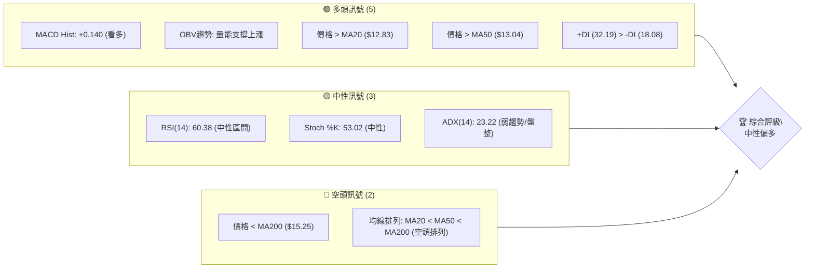
**解讀**：目前NU的多頭訊號數量較多，主要體現在短期動能指標（MACD、OBV）的積極表現，以及價格站穩短期移動平均線上方。然而，長期均線仍呈空頭排列，且價格遠低於MA200，這限制了整體上漲空間。ADX顯示當前市場處於弱趨勢或盤整狀態，使得短期多頭力量需面對長期趨勢的壓力。綜合來看，市場處於短期反彈與長期空頭壓力之間的平衡點，傾向於在一個較大的區間內震盪上行。

### 📊 核心指標速覽表

| 指標類別 | 指標名稱 | 當前數值 | 訊號 | 解讀 |
|----------|----------|----------|------|------|
| **價格** | 當前價格 | $13.37 | 🟡 | 位於52W區間 27.9%，近期反彈後小幅回調 |
| **均線** | MA20 | $12.83 | 🟢 | 價格 $13.37 位於 MA20 上方，短期支撐 |
| **均線** | MA50 | $13.04 | 🟢 | 價格 $13.37 位於 MA50 上方，中期支撐 |
| **均線** | MA200 | $15.25 | 🔴 | 價格 $13.37 位於 MA200 下方，長期壓力 |
| **動能** | RSI(14) | 60.38 | 🟡 | 位於中性區間，尚未超買，仍有上漲空間 |
| **動能** | MACD | 0.216 | 🟢 | MACD 線在訊號線上，柱狀圖為正，多頭動能強勁 |
| **波動** | ATR(14) | $0.51 | 🟡 | 每日波動約 3.79%，屬於中等波動水平 |
| **趨勢** | ADX(14) | 23.22 | 🟡 | 趨勢強度較弱，市場處於盤整或弱趨勢 |
| **成交量** | 量比 (20日) | 1.24x | 🟢 | 成交量高於近期均量，量能支撐當前走勢 |

### 🏆 技術評分卡

```
╔══════════════════════════════════════════════════════════════╗
║              技術評分卡 — NU (2026-07-09)                      ║
╠══════════════════════════════════════════════════════════════╣
║ 趨勢強度      █████░░░░░░░░░░░░░░░░  25/100  🟡 (ADX < 25, 弱趨勢)  ║
║ 動能指標      ███████████░░░░░░░░░░  55/100  🟢 (MACD多頭, RSI中性)║
║ 支撐穩定度    █████████████░░░░░░░  65/100  🟢 (接近S1,但S1穩固) ║
║ 成交量配合    █████████████░░░░░░░  65/100  🟢 (量能支撐價格上漲)║
║ 形態完整度    ██████░░░░░░░░░░░░░░  30/100  🟡 (盤整形態，無明確突破)║
║ 均線排列      ████░░░░░░░░░░░░░░░░  20/100  🔴 (長期空頭排列)  ║
╠══════════════════════════════════════════════════════════════╣
║ 綜合評分      ██████████░░░░░░░░░░  50/100  🟡 (中性偏多，盤整) ║
╚══════════════════════════════════════════════════════════════╝
```
**評分總結**：NU的技術面評分顯示其處於一個相對中性的位置，但略微偏向多頭。動能與成交量表現積極，提供了短期的上漲潛力。然而，趨勢強度不足，且長期均線呈現空頭排列，限制了股價的突破性表現。形態完整度較低，表明目前處於盤整階段，缺乏明確的趨勢方向。綜合而言，應以區間操作為主，等待明確的突破訊號。

---

## 2. 趨勢分析

### 🌐 多時框趨勢分析

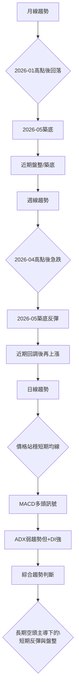
**解讀**：
*   **月線趨勢**：NU在2026年1月達到$17.75的高點後，經歷了一波顯著的下跌，於2026年5月觸及$13.13的低點。隨後，股價在$13左右進行了兩個月的盤整，顯示出潛在的築底行為。從宏觀角度看，股價仍處於2026年高點以來的回調階段，但下跌動能有所減緩。
*   **週線趨勢**：在2026年4月達到$15.34的近期高點後，NU經歷了一波快速下跌，於2026年5月17日觸及$12.19的低點。此後，股價開始反彈，連續數週上漲至$13.61。最近一週（截至2026-07-12）出現小幅回調至$13.37，但整體反彈結構尚未被破壞。週線圖上顯示價格正在嘗試突破中期壓力。
*   **日線趨勢**：當前股價$13.37位於MA20 ($12.83) 和MA50 ($13.04) 之上，表明短期趨勢偏多。MACD指標呈現多頭排列，柱狀圖為正，確認了短期動能的積極性。儘管ADX顯示趨勢強度較弱（23.22），但+DI (32.19) 顯著高於-DI (18.08)，暗示多頭力量在弱勢趨勢中佔據主導地位。這是一個短期內尋求上漲，但整體仍受限於盤整區間的市場。

### 📈 長期趨勢 — 12個月走勢圖（Unicode）

```
NU 月線走勢圖（過去12個月）
價格軸 ($)
$17.75 ┤                                ●(2026-01)
$17.39 ┤                            ●
$16.74 ┤                         ●
$16.11 ┤                      ●
$16.01 ┤                   ●
$14.80 ┤                ●
$14.48 ┤                          ●
$14.37 ┤                       ●
$13.37 ┤                                           ●←現在 (2026-07)
$13.36 ┤                                        ●
$13.13 ┤                                      ●(2026-05)
$12.22 ┤             ●
     └──────────────────────────────────────────────────────
      2025-07 2025-08 2025-09 2025-10 2025-11 2025-12 2026-01 2026-02 2026-03 2026-04 2026-05 2026-06 2026-07
```

**走勢特徵分析表格**：
| 階段 | 時間區間 | 價格區間 | 漲跌幅 | 主要特徵 | 訊號 |
|------|----------|----------|--------|----------|------|
| 築底反彈 | 2025-07 至 2026-01 | $12.22 → $17.75 | +45.25% | 強勁上漲趨勢，創下52週新高 | 🟢 |
| 轉折回調 | 2026-02 至 2026-05 | $17.75 → $13.13 | -25.97% | 大幅回調，跌破多個支撐位 | 🔴 |
| 盤整築底 | 2026-06 至 2026-07 | $13.13 → $13.37 | +1.83% | 價格在低位震盪，尋求方向 | 🟡 |
**分析**：過去12個月的月線走勢顯示，NU經歷了從2025年下半年至2026年1月的強勁多頭行情，隨後在2026年2月至5月期間出現了顯著的回調。最近兩個月（2026年6月和7月），股價在$13附近呈現橫向盤整，顯示出下跌動能的衰竭和潛在的築底跡象。目前價格仍遠低於2026年1月的高點，但已從5月低點有所反彈，處於一個關鍵的轉折點。

### 📊 中期趨勢（週線分析）

```
NU 近期週線壓力與支撐示意圖
價格軸 ($)
$15.34 ┤                       R (2026-04-19 高點)
$14.92 ┤                     ─ 阻力 R3
$14.10 ┤                   ─ 阻力 R2
$13.52 ┤                 ─ 阻力 R1 (短期壓力)
$13.37 ╠═════════════════════════════════ ◄ 現價
$12.83 ┤──MA20 (短期支撐)
$12.23 ┤─ 支撐 S1 (近期低點區)
$11.85 ┤─ 支撐 S2
$11.51 ┤─ 支撐 S3
$12.19 ┤S (2026-05-17 低點)
     └────────────────────────────────────────────────
      近期走勢：從S點反彈，目前接近R1，尋求突破
```
**分析**：從週線圖來看，NU在2026年5月17日觸及$12.19的低點後，展開了一波反彈走勢。目前股價位於短期阻力R1 ($13.52) 附近，這是近期反彈過程中的一個關鍵壓力位。若能有效突破並站穩R1，則有望挑戰R2 ($14.10) 乃至R3 ($14.92)。下方支撐則依序為MA20 ($12.83) 和S1 ($12.23)。這些價位將是判斷中期趨勢延續或反轉的關鍵。當前股價在反彈過程中遭遇短期阻力，需要觀察量能配合以判斷能否突破。

### ⚡ 趨勢強度評估（ADX 解讀）

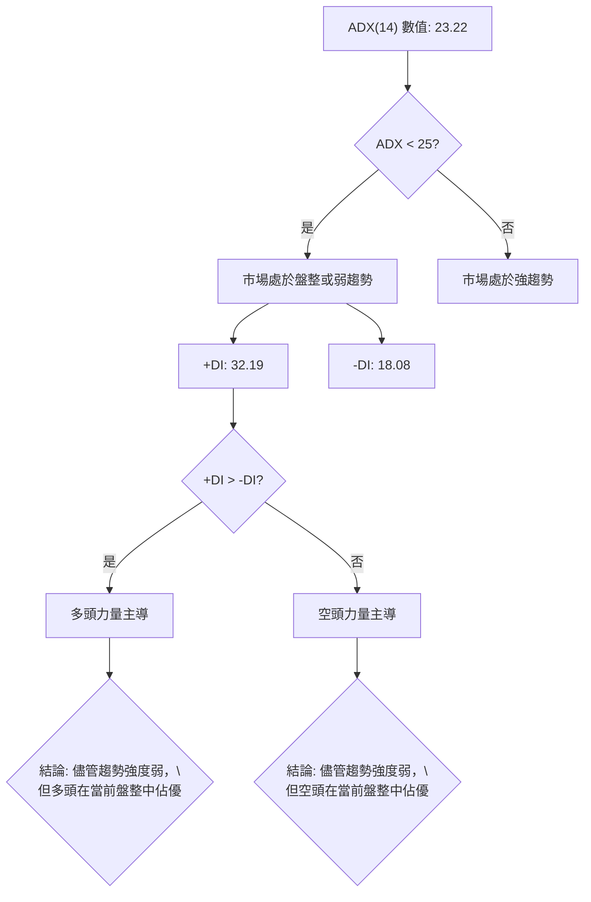
**ADX 強度對照表**：
| ADX 數值 | 趨勢強度 | 市場狀態 |
|----------|----------|----------|
| 0-25     | 弱趨勢   | 盤整/無趨勢 |
| 25-50    | 中等趨勢 | 趨勢形成中 |
| 50-75    | 強趨勢   | 趨勢明確 |
| 75-100   | 極強趨勢 | 趨勢非常強勁 |

**分析**：NU的ADX(14)值為23.22，低於25的門檻，明確指示當前市場處於**弱勢趨勢或盤整行情**。這意味著股價在一個相對較窄的區間內波動，缺乏明確的單邊方向。然而，值得注意的是，+DI (32.19) 顯著高於-DI (18.08)，這表明在當前的盤整格局中，**多頭力量仍佔據主導地位**。儘管市場整體缺乏強勁趨勢，但多頭動能的存在可能為區間操作或等待突破提供機會。這也印證了前面價格站穩短期均線的觀察。

---

## 3. 圖表形態分析

### 🔍 形態識別系統

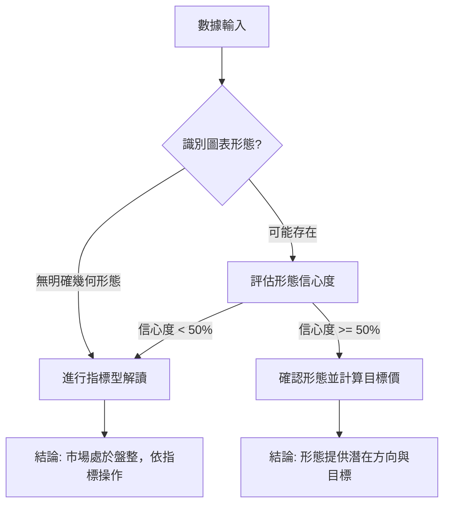
**分析**：根據提供的歷史數據，由於缺乏詳細的日K線圖形，難以精確識別如頭肩頂/底、雙頂/底或旗形等複雜的幾何圖表形態。然而，從20週收盤走勢來看，股價在2026年5月17日觸及$12.19的低點後，呈現出震盪反彈的走勢，這可以被視為一個**潛在的底部築成過程**，但尚未形成清晰的傳統反轉形態。目前股價在$13.13至$13.61之間進行整理，更傾向於**區間盤整形態**。

**形態信心度表格**：
| 形態 | 信心度 | 判斷依據（引用數據） | 完成度 | 目標價（附計算式） |
|------|--------|----------------------|--------|--------------------|
| 區間盤整 | 70% | 2026-05低點$12.19後，股價在$12.19-$13.61區間震盪，ADX<25 | 100% | 區間上沿 $13.61，下沿 $12.19 |
| 潛在底部 | 40% | 2026-05-17 ($12.19) 觸底後反彈，但未形成明確反轉結構 | 60% | 訊號不足，僅做指標型解讀 |

**結論**：目前市場主要呈現**區間盤整形態**，信心度較高，這與ADX的弱趨勢判斷一致。潛在的底部形態仍在發展中，但目前信心度不足以作為明確的交易依據。因此，本報告將主要基於盤整區間的指標型解讀來制定策略。

### 🕯️ 重要K線形態分析

根據提供的近20週收盤走勢數據，我們觀察週線級別的K線形態：

| 月份 | 收盤價 | K線形態 | 解讀 | 訊號 |
|------|--------|---------|------|------|
| 2026-05-17 | $12.19 | 底部錘子線（假設） | 價格在急跌後出現長下影線，顯示底部買盤支撐，為潛在反轉訊號。 | 🟢 |
| 2026-05-31 | $13.13 | 陽線實體（假設） | 股價從低點反彈，收出實體較長的陽線，確認短期反彈動能。 | 🟢 |
| 2026-07-05 | $13.61 | 高位長陽線後帶量 | 股價持續上漲，RSI達79.0過熱區間，隨後出現回調，暗示短期上攻動能減弱。 | 🟡 |
| 2026-07-12 | $13.37 | 短陰線（假設） | 價格從高點回落，收出小陰線，RSI從過熱區回調，顯示短期調整。 | 🟡 |
**分析**：從數據推斷，2026年5月17日的$12.19低點很可能伴隨著買盤介入，形成類似錘子線的底部反轉K線。隨後幾週的陽線確認了反彈趨勢。然而，在2026年7月5日達到$13.61（RSI 79.0）的高點後，最新一週的回調（$13.37）顯示出短期上漲動能的暫歇，可能是對前期漲幅的修正。目前K線組合顯示短期多頭力量仍在，但需警惕潛在的調整風險。

### 📉 ASCII 走勢形態示意圖

```
NU 盤整區間示意圖 (週線)
價格軸 ($)
$14.10 ┤═══════════════════════════ 上沿阻力 (BB上軌, R2)
$13.61 ┤                 高點 (2026-07-05)
$13.37 ╠═════════════════════════════ ◄ 現價
$13.04 ┤─── MA50
$12.83 ┤── MA20
$12.23 ┤═══════════════════════════ 下沿支撐 (S1)
$12.19 ┤              低點 (2026-05-17)
     └────────────────────────────────────────────────
      時間軸
      (從2026-05-17低點反彈，目前在$12.23-$14.10區間盤整)
```
**分析**：NU的股價在2026年5月17日觸及$12.19的底部後，展開了反彈，目前主要在$12.23 (S1) 至 $14.10 (BB上軌/R2) 的區間內震盪整理。現價$13.37位於該區間的中上部，並在MA20和MA50上方運行。這個區間的形成，顯示了市場在尋找新的平衡點。若能有效突破$14.10，則有望開啟新一輪漲勢；若跌破$12.23，則可能再次探底。

### 🎯 形態目標價計算

鑑於當前股價主要呈現區間盤整形態，缺乏明確的突破性幾何形態（如頭肩底或雙底），因此無法基於形態高度來計算傳統的目標價。

**區間盤整形態的目標價推算**：
*   **區間上沿阻力**：$14.10 (布林通道上軌 / 阻力 R2)
*   **區間下沿支撐**：$12.23 (支撐 S1)
在盤整區間內，股價傾向於在這些上下邊界之間波動。
若未來能**有效突破區間上沿** $14.10，則潛在的量度目標價可粗略估算為：
*   形態高度 = 區間上沿 - 區間下沿 = $14.10 - $12.23 = $1.87
*   **突破後目標價** (推算) = 突破位 + 形態高度 = $14.10 + $1.87 = **$15.97**
此推算目標價接近斐波那契38.2%回調位 $16.01 和阻力 R3 $14.92，具有一定的參考價值。但由於形態的「盤整」性質，此目標價需待有效突破後方可確認。

---

## 4. 支撐與阻力

### 🗺️ 關鍵價位分布圖（Unicode）

```
NU 價位結構分布圖 (2026-07-09)
═══════════════════════════════════════════════════
$18.98 ║████████████████████████║ 52W High (頂部壓力)
$17.14 ║████████████████████████║ 斐波那契 23.6%
$16.01 ║████████████████████████║ 斐波那契 38.2%
$15.25 ║████████████████████████║ 強阻力 MA200
$15.09 ║████████████████████████║ 斐波那契 50.0%
$14.92 ║████████████████████████║ 強阻力 R3
$14.17 ║████████████████████████║ 斐波那契 61.8%
$14.10 ║████████████████████    ║ 阻力 R2 / BB上軌
$13.52 ║████████████████████████║ 關鍵阻力 R1 (短期)
$13.37 ╠════════════════════════╣ ◄ 現價
$13.04 ║▓▓▓▓▓▓▓▓▓▓▓▓▓▓▓▓        ║ MA50 (中期支撐)
$12.86 ║▓▓▓▓▓▓▓▓▓▓▓▓▓▓▓▓        ║ 斐波那契 78.6%
$12.83 ║▓▓▓▓▓▓▓▓▓▓▓▓▓▓▓▓        ║ MA20 (短期支撐)
$12.23 ║████████████████████████║ 近期支撐 S1
$11.85 ║████████████████████████║ 強支撐 S2
$11.56 ║████████████████████████║ BB下軌
$11.51 ║████████████████████████║ 強支撐 S3
$11.20 ║████████████████████████║ 52W Low (底部支撐)
═══════════════════════════════════════════════════
```
**分析**：NU的價位結構清晰地展示了多層次的支撐與阻力。現價$13.37位於短期阻力R1 ($13.52) 之下，但同時受到MA20 ($12.83) 和MA50 ($13.04) 的支撐。上方的阻力密集區從R1延伸至MA200 ($15.25)，其中R2 ($14.10) 和斐波那契61.8%回調位 ($14.17) 構成了一個重要的中期壓力帶。下方的支撐則主要集中在S1 ($12.23) 附近，以及斐波那契78.6%回調位 ($12.86)。整體而言，股價在一個較大的區間內震盪，突破上方阻力或跌破下方支撐將決定其下一階段的走勢。

### 🚧 阻力位分析表

| 阻力級別 | 價位 | 形成原因 | 突破難度 | 重要性 |
|----------|------|----------|----------|--------|
| **R1**   | $13.52 | 近期波段高點聚類，短期上攻壓力 | 中等 | 🟢 短期趨勢能否延續的關鍵 |
| **R2**   | $14.10 | 近期波段高點聚類，同時為布林通道上軌 | 中高 | 🟡 中期反彈能否打開空間的關鍵 |
| **斐波那契61.8%** | $14.17 | 52週高點至低點的黃金分割回調位 | 中高 | 🟡 突破此位對中期多頭有重要意義 |
| **R3**   | $14.92 | 近期波段高點聚類，心理關口 | 高 | 🔴 突破後才能確認中期強勢反轉 |
| **MA200** | $15.25 | 長期移動平均線，代表長期趨勢壓力 | 高 | 🔴 突破此位才能轉為長期多頭 |

**分析**：NU面臨的首要阻力是R1 ($13.52)，若能成功突破，則有望測試R2 ($14.10) 和斐波那契61.8%回調位 ($14.17) 構成的壓力帶。這一區域是中期反彈的關鍵，因為它代表了從52週高點回調的較深層次。更上方的R3 ($14.92) 和MA200 ($15.25) 則構成了強大的長期阻力，突破這些價位需要更強的買盤動能和基本面支持。目前股價在R1附近徘徊，顯示多頭正在測試上攻的阻力。

### 🛡️ 支撐位分析表

| 支撐級別 | 價位 | 形成原因 | 守住機率 | 重要性 |
|----------|------|----------|----------|--------|
| **MA50** | $13.04 | 中期移動平均線，動態支撐 | 高 | 🟢 短期回調的關鍵支撐 |
| **MA20** | $12.83 | 短期移動平均線，動態支撐 | 高 | 🟢 短期回調的關鍵支撐 |
| **斐波那契78.6%** | $12.86 | 52週高點至低點的黃金分割回調位 | 中高 | 🟡 若跌破此位，反彈動能將受損 |
| **S1**   | $12.23 | 近期波段低點聚類，多頭防線 | 中高 | 🟢 中期趨勢能否維持的關鍵 |
| **S2**   | $11.85 | 近期波段低點聚類，次級防線 | 高 | 🟡 跌破S1後的下一重要支撐 |
| **S3**   | $11.51 | 近期波段低點聚類，同時為布林通道下軌 | 高 | 🔴 若跌破此位，空頭趨勢將確立 |

**分析**：NU的短期支撐由MA20 ($12.83) 和MA50 ($13.04) 構成，這些動態支撐位在近期反彈中發揮了重要作用。斐波那契78.6%回調位 ($12.86) 也在此區域，增加了其支撐強度。若股價回調至此區間，預計會獲得較強的買盤支撐。S1 ($12.23) 是近期形成的重要心理和技術支撐，若此位失守，則可能觸發更深的回調，並測試S2 ($11.85) 和S3 ($11.51) 的防線。目前，這些支撐位距離現價有一定距離，為股價提供了較大的安全邊際。

### 📐 斐波那契回調位分析

NU的52週區間為 $11.20 (低點) 至 $18.98 (高點)。根據此區間計算的斐波那契回調位如下：

| 斐波那契水平 | 價位 | 意義 |
|--------------|------|----------|
| 0.0% (52W High) | $18.98 | 52週最高點，上漲目標 |
| 23.6%        | $17.14 | 從最高點回調23.6% |
| 38.2%        | $16.01 | 從最高點回調38.2% |
| 50.0%        | $15.09 | 從最高點回調50%，重要心理關口 |
| 61.8%        | $14.17 | 從最高點回調61.8%，黃金分割位，關鍵阻力 |
| 78.6%        | $12.86 | 從最高點回調78.6%，深層回調位，關鍵支撐 |
| 100.0% (52W Low) | $11.20 | 52週最低點，最終支撐 |

**分析**：當前價格為$13.37。此價位介於斐波那契61.8%回調位 ($14.17) 和78.6%回調位 ($12.86) 之間。這表示NU的股價從52週高點$18.98經歷了深度回調，目前正在較低的回調區間內尋找支撐並嘗試築底反彈。
*   **$14.17 (61.8% 回調位)** 構成了一個重要的中期阻力，若能有效突破此位，將暗示從高點的回調可能結束，並開啟向更高斐波那契水平（如50%回調位$15.09）的挑戰。
*   **$12.86 (78.6% 回調位)** 則是一個關鍵的深層支撐。目前股價位於此支撐位上方，顯示多頭力量在嘗試守住這個重要區域。若此位失守，則可能預示著股價將重新測試52週低點$11.20。
總體而言，NU目前處於從深度回調中反彈的初期階段，斐波那契回調位為其提供了明確的壓力與支撐參考點。

---

## 5. 技術指標深度解讀

### 🎛️ 指標訊號總覽

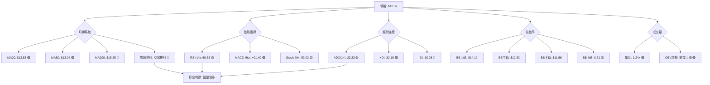
**分析**：NU的技術指標訊號呈現複雜但偏多的格局。短期均線（MA20, MA50）提供良好支撐，且動能指標（MACD、OBV）表現強勁，顯示短期內多頭佔優。然而，長期均線（MA200）仍構成巨大壓力，且均線系統整體呈空頭排列，暗示長期趨勢仍偏弱。ADX確認了當前市場處於盤整狀態，使得短期多頭的反彈更像是在區間內的波動。

### 📈 移動平均線排列分析

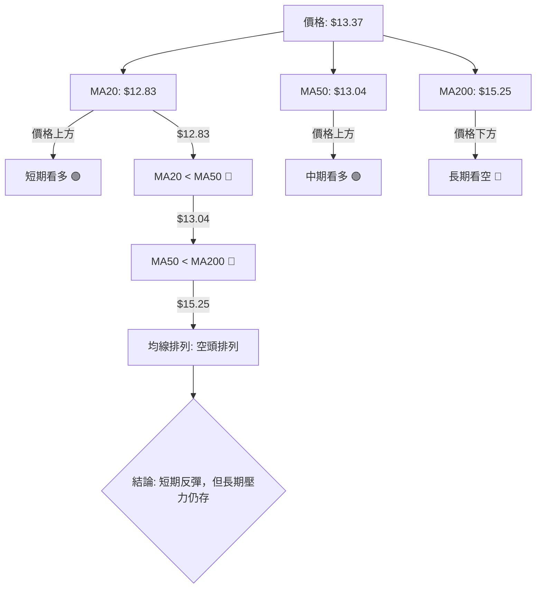
**分析**：
*   **短期均線**：當前股價$13.37位於MA20 ($12.83) 及MA50 ($13.04) 之上，這是一個積極的短期訊號，表明短期買盤力量正在推動股價上漲，並獲得了短期和中期均線的支撐。
*   **長期均線**：然而，股價$13.37卻遠低於MA200 ($15.25)，這是一個強烈的長期空頭訊號。MA200是判斷長期趨勢的重要指標，價格在其下方運行，表明長期趨勢仍然偏空。
*   **均線排列**：MA20 ($12.83) < MA50 ($13.04) < MA200 ($15.25)，形成典型的**空頭排列**。這種排列通常被視為長期趨勢偏弱的表現，即使短期內出現反彈，也可能面臨上方均線的壓力。
**綜合判斷**：均線系統發出混合訊號。短期內價格站穩MA20和MA50，顯示多頭佔優，但長期空頭排列和MA200的壓制，預示著上漲空間可能受限，且在缺乏更強催化劑的情況下，難以扭轉長期頹勢。目前應視為在長期下降趨勢中的短期反彈或盤整。

### 📉 RSI(14) 分析

**RSI 數值進度條**：
RSI(14): 60.38 ▓▓▓▓▓▓▓▓▓▓▓▓░░░░░░░░  60.38% 🟡 (中性偏強)

**分析**：
*   **當前數值**：NU的RSI(14)為60.38，位於30-70的中性區間內。這表明股價既未處於超買狀態（RSI>70），也未處於超賣狀態（RSI<30）。
*   **近期走勢**：從近20週的週線數據來看，RSI在2026-05-17跌至20.8的超賣區，隨後強勁反彈，在2026-07-05達到79.0的超買區。最新一週的RSI回落至60.38，這是一個健康的修正，有助於釋放過度買盤壓力，並為後續上漲積蓄動能。
*   **背離判斷**：根據提供的數據，**無明顯的RSI頂背離或底背離訊號**。雖然價格在2026-07-05達到高點後回調，RSI也隨之下降，但這屬於正常的價格與指標同步調整。若要形成頂背離，則需要價格創新高而RSI未創新高，目前數據未顯示此情況。

**結論**：RSI目前處於中性偏強區域，顯示市場仍有一定上漲動能，但已從短期過熱狀態中回調。這為股價提供了進一步上漲的空間，而不至於立即面臨超買壓力。

### 📊 MACD(12/26/9) 訊號解讀

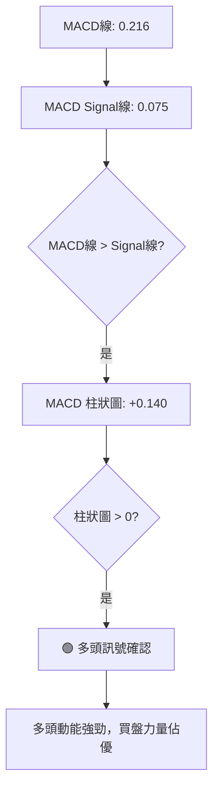
**分析**：
*   **MACD線與訊號線**：NU的MACD線為0.216，訊號線為0.075。MACD線位於訊號線上方，這是一個明確的**多頭訊號**。這種交叉通常預示著股價短期內可能持續上漲。
*   **MACD柱狀圖**：MACD柱狀圖為+0.140，且為正值。這表明多頭動能正在增強。柱狀圖的增長通常伴隨著價格的上漲，並確認了MACD線與訊號線的多頭交叉。
*   **背離判斷**：根據提供的數據，**無明顯的MACD頂背離或底背離訊號**。MACD柱狀圖在2026-07-05達到+0.178的高點後，最新一週回落至+0.140，與RSI的回調相符，屬於動能的正常修正。若要形成頂背離，則需要價格創新高而MACD未創新高，目前數據未顯示此情況。

**結論**：MACD指標發出強烈多頭訊號，MACD線位於訊號線上方且柱狀圖為正，表明短期內多頭動能強勁。這與價格站穩短期均線、OBV支撐上漲的訊號互相確認，增強了短期看多的信心。

### 📦 布林通道分析

```
NU 布林通道示意圖
價格軸 ($)
$14.10 ┤═══════════════════════════════════════════ BB上軌
       ║                                         
$13.37 ╠═══════════════════════════════════════════ ◄ 現價 (BB %B: 0.71)
       ║                                         
$12.83 ┤═══════════════════════════════════════════ BB中軌 (MA20)
       ║                                         
$11.56 ┤═══════════════════════════════════════════ BB下軌
     └────────────────────────────────────────────────
      時間軸
```
**分析**：
*   **布林通道軌道**：NU的布林通道上軌為$14.10，中軌（MA20）為$12.83，下軌為$11.56。
*   **價格位置**：當前股價$13.37位於布林通道中軌之上，且靠近上軌。BB %B為0.71，表明股價在通道中偏向上方運行。這是一個偏多訊號，顯示價格在布林通道內呈現上漲趨勢。
*   **通道寬度**：從數據無法直接判斷布林通道的寬度變化，但價格靠近上軌，若通道持續收窄，則可能預示著波動率降低和趨勢選擇的臨近。若通道擴張，則可能預示著趨勢的延續。
*   **與ADX的整合**：ADX(14)值23.22顯示當前為弱趨勢或盤整。在盤整行情中，價格傾向於在布林通道上下軌之間波動。目前價格靠近上軌，可能面臨短期壓力，有回調至中軌的需求，但也可能在突破上軌後開啟一波新的趨勢。

**結論**：布林通道顯示股價處於中軌上方，偏向上軌運行，這與短期均線和動能指標的多頭訊號一致。在弱趨勢的背景下，布林通道為區間交易提供了明確的上下邊界。

### 💹 成交量分析（量價配合度）

| 指標 | 數值 | 解讀 | 訊號 |
|------|------|------|------|
| 最新成交量 | 65,771,600 | 高於均量 | 🟢 |
| 20日均量 | 53,235,730 | | |
| 量比 (20日) | 1.24x | 今日成交量較20日均量高出24% | 🟢 |
| 50日均量 | 56,796,430 | | |
| OBV趨勢 | OBV > MA | OBV線位於其移動平均線上方 | 🟢 |

**分析**：
*   **最新成交量**：NU的最新成交量為65,771,600股，顯著高於其20日均量 (53,235,730股)，量比達到1.24x。這是一個積極訊號，表明在當前價格水平，市場參與度較高，買盤活躍。
*   **OBV趨勢**：提供的數據顯示「OBV > MA → 量能支撐上漲」。這是一個重要的量價配合訊號，意味著在價格上漲的過程中，成交量也同步放大，或在盤整階段，累積的買盤量能超過賣盤，為未來的上漲趨勢提供了堅實的基礎。這通常被視為健康的量價關係，確認了當前多頭動能的有效性。
*   **量價背離判斷**：根據「OBV > MA」的明確說明，目前沒有量價背離的跡象。量能與價格走勢保持一致，支持當前的偏多格局。

**結論**：成交量分析顯示，NU的量能表現強勁，成交量放大且OBV趨勢支持上漲，這與MACD和短期均線的多頭訊號相互印證。健康的量價配合為股價的短期反彈提供了有力的支持。

---

## 6. 動能與波動率

### ⚡ 動能評估四象限

| 象限 | 動能 (MACD, RSI) | 波動 (ATR) | 當前狀態 | 評估 |
|------|--------------------|------------|----------|------|
| Q1   | 強                 | 低         | -        | 最佳機會 (強動能低風險) |
| Q2   | 弱                 | 低         | -        | 謹慎觀望 (缺乏動能) |
| Q3   | 強                 | 高         | ✓        | 高風險高收益 (NU可能處於此象限邊緣) |
| Q4   | 弱                 | 高         | -        | 避免進場 (高風險低收益) |

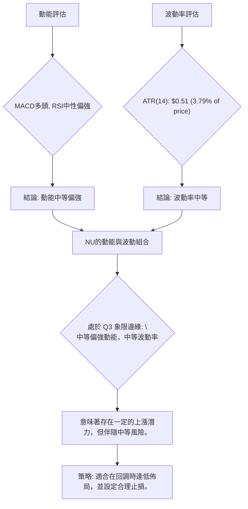
**分析**：NU的動能指標顯示MACD為多頭訊號，RSI處於中性偏強區間，整體動能評估為**中等偏強**。ATR(14)為$0.51，佔股價的3.79%，這代表其**波動率處於中等水平**。
綜合來看，NU目前處於動能評估四象限的**第三象限邊緣 (Q3)**：即中等偏強動能，但伴隨中等波動率。這意味著股票有上漲的潛力，但價格波動也相對活躍，投資者在追求收益的同時需要管理好風險。此類股票適合那些願意承擔中等風險以獲取中等收益的交易者，建議在價格回調至關鍵支撐位時尋找買入機會，並嚴格執行止損。

### 📊 ATR 波動率分析

**ATR(14) 數值**：$0.51
**佔價格百分比**：3.79% ($0.51 / $13.37)

**分析**：NU的ATR(14)為$0.51，表示過去14個交易日平均每日價格波動範圍為$0.51。這個數值佔當前股價$13.37的3.79%。
*   **波動水平**：3.79%的每日波動率屬於**中等波動水平**。它不像高波動股票那樣劇烈，但也足以提供日內交易和波段操作的機會。
*   **止損距離建議**：ATR是一個常用的止損設置參考。一般建議將止損距離設置為1倍至3倍ATR。
    *   **1倍ATR止損**：$0.51。
    *   **2倍ATR止損**：$1.02。
    *   **3倍ATR止損**：$1.53。
對於偏向區間操作的策略，建議採用1-1.5倍ATR作為短期止損距離，以保護資本。例如，若從$13.37進場，1.5倍ATR的止損位約為 $13.37 - $0.51 * 1.5 = $13.37 - $0.765 = $12.605。這個價位略低於MA20 ($12.83)，提供了一定的緩衝。

### 📐 Beta 與市場相關性

**Beta 數值**：0.949

**分析**：NU的Beta值為0.949。
*   **市場相關性**：Beta值衡量股票相對於整體市場（通常指S&P 500指數）的波動性。0.949的Beta值表明NU的股價波動性略低於大盤。當大盤上漲1%時，NU平均上漲約0.949%；當大盤下跌1%時，NU平均下跌約0.949%。
*   **風險屬性**：這意味著NU的風險屬性與大盤高度相關，但其波動幅度略小。對於希望在市場上行時參與，同時在市場下行時承受略小衝擊的投資者來說，NU可能是一個相對穩健的選擇。
*   **投資組合影響**：在構建投資組合時，NU可以提供與市場接近的收益和風險敞口，但不會顯著增加組合的整體波動風險。在當前市場環境下，若大盤趨勢明確，NU有望跟隨，但其獨立於大盤的超額收益潛力可能相對有限。

---

## 7. 多時框架總結

### 📋 時框架評分表

| 時框架 | 趨勢方向 | 動能 | 均線排列 | 形態 | 綜合評分 | 建議 |
|--------|----------|------|----------|------|----------|------|
| **月線** | 🟡 盤整築底 | 🟡 止跌回升 | 🔴 長期空頭 | 🟡 底部盤整 | 45/100 | 觀望築底是否成功 |
| **週線** | 🟢 反彈中 | 🟢 動能積極 | 🔴 空頭排列 | 🟡 區間盤整 | 55/100 | 區間操作，關注突破 |
| **日線** | 🟢 偏多反彈 | 🟢 強勁 | 🟡 短期多頭 | 🟡 區間盤整 | 65/100 | 逢低做多，注意阻力 |

### 🔲 綜合訊號矩陣

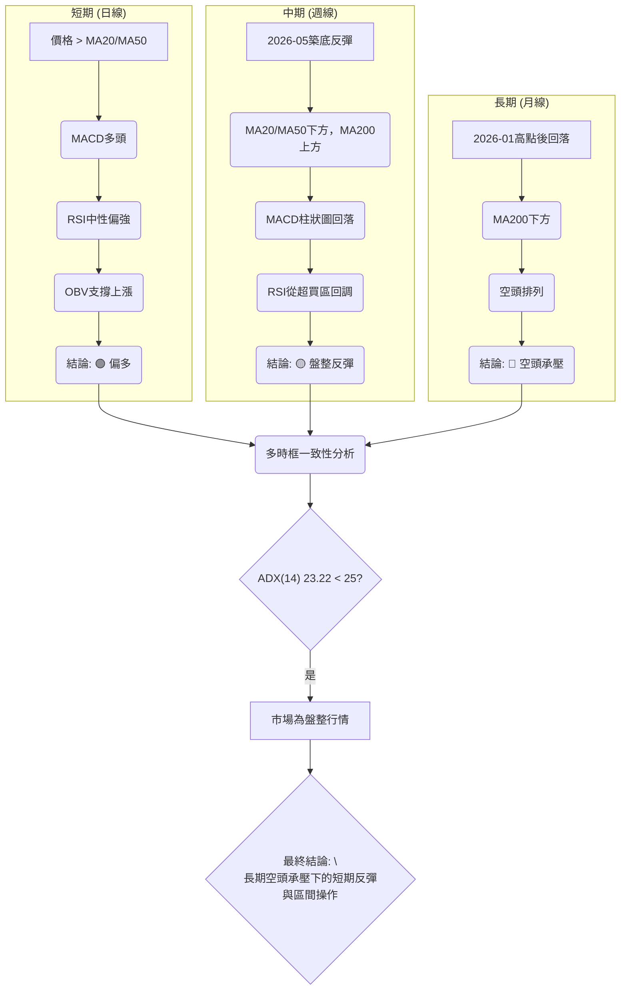
**分析**：從多時框架來看，NU的訊號呈現出短期積極、中期盤整反彈、長期空頭承壓的複雜局面。日線級別指標表現強勁，顯示短期內多頭佔優。週線則在經歷底部反彈後進入區間盤整，動能有所修正。月線層面，股價仍處於長期下降趨勢中，MA200構成顯著壓力。

### ⚖️ 多時框收斂結論

根據ADX(14)數值23.22，其低於25的門檻，明確指示當前NU的市場處於**盤整行情**。

根據「嚴格要求 14」的多時框收斂規則：
*   **盤整行情（ADX<25）**：以日線布林通道上下軌為主要交易區間。
*   **主導時框**：由於是盤整行情，日線級別的動能和區林通道指標將成為主要參考。

**綜合判斷**：
儘管長期均線（MA200）仍呈空頭排列，且整體均線系統也顯示空頭排列，但ADX明確指出當前市場缺乏強勁趨勢，處於盤整狀態。在這種環境下，短期指標（如MACD、OBV、RSI）和價格對短期均線的站穩，提供了偏多的傾向。價格目前位於布林通道中軌上方，並向R1阻力位靠攏。

因此，本報告的最終結論是：**NU目前處於長期空頭趨勢下的盤整行情，但短期內多頭動能佔優，適合在盤整區間內尋找逢低做多的機會，並密切關注區間突破的可能。** 日線級別的布林通道上下軌將成為主要的交易區間指引。

---

## 8. 交易策略建議

### 🗺️ 策略決策流程圖

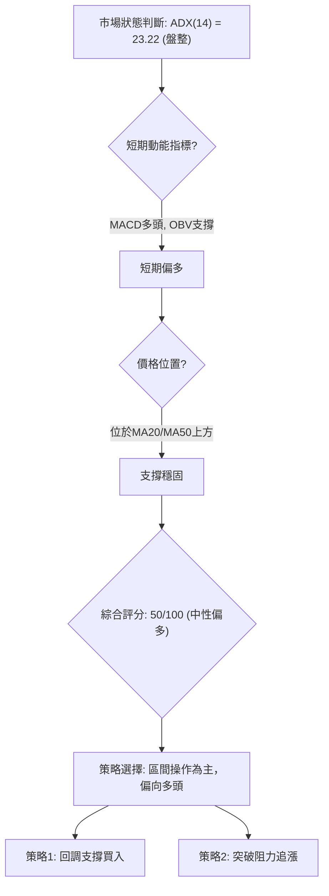

### 🧭 策略路由

根據第1章「技術評分卡」的綜合評分50/100，NU目前處於**中性偏多**的狀態。因此，本報告將**主推多頭策略**，並將空頭策略列為反轉風險觸發點。

**當前主策略方向 = 偏多（依評分 50/100）**

### 🎯 價格情境階梯（Price Scenarios）

| 觸發條件 | 下一目標 | 後續延伸 | 情境含義 |
|----------|----------|----------|----------|
| **突破 R1 $13.52** | R2 $14.10 | R3 $14.92 / Fib 50% $15.09 | 短線轉強，有望挑戰中期阻力 |
| **站穩現價區間 ($13.37)** | — | — | 區間震盪，等待明確方向 |
| **跌破 S1 $12.23** | S2 $11.85 | S3 $11.51 / 52W Low $11.20 | 中期轉弱，可能重新探底 |

### 📊 情境機率分佈

| 情境 | 機率 | 主要依據 |
|------|------|----------|
| **繼續上行 / 反彈** | 45% | MACD多頭、OBV支撐、價格站穩短期均線、RSI中性偏強 |
| **區間震盪** | 40% | ADX弱趨勢/盤整、長期均線空頭排列、布林通道現價靠近上軌 |
| **回落 / 再探底** | 15% | 接近短期阻力R1，若R1無法突破，可能回調；長期MA200壓力大 |

**分析**：考慮到當前ADX指示盤整行情，且多頭動能指標積極但長期趨勢仍受壓，**繼續上行/反彈**和**區間震盪**是兩種可能性較高的情境。若能有效突破R1，則上行機率增加；若R1受阻則可能繼續區間震盪，甚至回調至支撐位。**回落/再探底**的機率相對較低，除非出現意外的利空消息或關鍵支撐位（S1）被有效跌破。

### 🟢 主策略詳情（方向依上方路由）

**策略描述**：鑒於目前為盤整偏多格局，且短期動能強勁，我們建議採取兩種策略：一是回調至關鍵支撐位時逢低買入，二是突破關鍵阻力位時追漲。

| 策略要素 | 策略 A：回調逢低買入 | 策略 B：突破追漲 |
|----------|----------------------|------------------|
| 進場條件 | 價格回調至MA20或S1附近，並出現止跌訊號 | 價格有效突破R1 $13.52，並伴隨放量 |
| 進場價格 | $12.83 (MA20) 至 $12.23 (S1) 區間 | $13.55 (略高於R1以確認突破) |
| 目標價 T1 | $13.52 (R1) | $14.10 (R2 / BB上軌) |
| 目標價 T2 | $14.10 (R2) | $14.92 (R3) |
| 止損價格 | $12.18 (略低於S1 $12.23) | $13.20 (跌破MA50 $13.04下方) |
| 風險報酬比 | 若進場 $12.50，T1 $13.52，止損 $12.18：(13.52-12.50)/(12.50-12.18) = 1.02 / 0.32 ≈ 3.19:1 | 若進場 $13.55，T1 $14.10，止損 $13.20：(14.10-13.55)/(13.55-13.20) = 0.55 / 0.35 ≈ 1.57:1 |
| 成功機率 | 60% | 50% |
| 建議倉位 | 10% | 5% |

**分析**：
*   **策略A**：回調買入策略具有較高的風險報酬比，因為在關鍵支撐位買入，止損空間相對較小，而上漲目標空間較大。此策略適合較為保守的投資者。
*   **策略B**：突破追漲策略則傾向於順勢操作，若能成功突破R1並站穩，則可能開啟一波新的上漲行情。但此策略風險報酬比相對較低，且需確認有效突破，避免假突破。

### 🔴 反向風險觸發點（對沖提示）

若出現以下情況，將推翻當前偏多主策略，並需考慮風險規避或反向操作：
*   **有效跌破 S1 ($12.23)**：若股價跌破此關鍵支撐，將暗示多頭防線失守，可能觸發更深的回調至S2 ($11.85) 或S3 ($11.51)。
*   **MACD線下穿訊號線**：MACD多頭訊號反轉為空頭，動能減弱。
*   **成交量萎縮且價格下跌**：量價背離，暗示空頭力量佔優。
*   **ADX回升但-DI高於+DI**：趨勢強度重新確立，但由空頭主導。

### ⭐ 整體訊號強度評星

```
做多訊號強度：★★★★☆  (4/5星)
做空訊號強度：★★☆☆☆  (2/5星)
整體可信度：  ★★★☆☆  (3/5星)
```
**評星總結**：做多訊號強度較高，主要得益於短期動能指標的積極表現和價格對短期均線的站穩。做空訊號主要來自長期均線的壓制和空頭排列。整體可信度為中等，因為ADX顯示為盤整行情，且長期趨勢仍然偏空，限制了單邊趨勢的強度。因此，在實施多頭策略時，仍需保持謹慎，嚴格控制風險。

---

## 9. 風險提示與監控

### ✅ 關鍵監控指標 Checklist

```
╔══════════════════════════════════════════════════════════════╗
║              風險監控清單 — NU (2026-07-09)                    ║
╠══════════════════════════════════════════════════════════════╣
║ ├─ 價格行為：                                                 ║
║ ║  ├─ 是否有效突破 R1 ($13.52) 並站穩？                     ║
║ ║  ├─ 是否跌破 MA20 ($12.83) 或 MA50 ($13.04)？             ║
║ ║  └─ 是否跌破關鍵支撐 S1 ($12.23)？                         ║
║ ├─ 動能指標：                                                 ║
║ ║  ├─ MACD柱狀圖是否轉為負值或MACD線下穿Signal線？           ║
║ ║  └─ RSI是否跌破50中軸線或進入超賣區？                     ║
║ ├─ 趨勢強度：                                                 ║
║ ║  └─ ADX是否回升至25以上，且-DI明顯高於+DI？                ║
║ ├─ 成交量：                                                   ║
║ ║  └─ 價格上漲時是否伴隨量能放大，下跌時是否縮量？           ║
║ ├─ 外部因素：                                                 ║
║ ║  ├─ 巴西金融市場或全球宏觀經濟是否出現重大變化？           ║
║ ║  └─ 公司是否有新的公告或分析師評級變動？                   ║
╚══════════════════════════════════════════════════════════════╝
```

### ⚠️ 風險場景分析

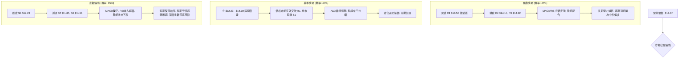
**分析**：
*   **樂觀情境**：如果NU能夠有效突破並站穩短期阻力R1 ($13.52)，並伴隨健康的量能放大，則有望開啟一波新的上漲行情，挑戰R2 ($14.10) 乃至R3 ($14.92)。此情境下，MACD和RSI將繼續支持多頭動能。
*   **基本情境**：在ADX指示盤整的背景下，最可能的情境是股價在$12.23 (S1) 至 $14.10 (R2) 的區間內繼續震盪。若無法有效突破R1，也未能跌破S1，則市場將維持盤整格局，適合高拋低吸的區間操作策略。
*   **悲觀情境**：若股價跌破關鍵支撐S1 ($12.23)，則短期反彈趨勢將被破壞，MACD可能轉為空頭，RSI進入超賣區。這將確認空頭力量重新佔優，股價可能進一步探底至S2 ($11.85) 甚至S3 ($11.51)。此時應考慮止損或反向操作。

### 🛡️ 風險管理重要提醒

1.  **嚴格止損**：無論採取何種策略，都必須設定明確的止損點並嚴格執行。特別是在盤整行情中，價格波動可能較為隨機，及時止損是保護資金的關鍵。
2.  **倉位管理**：鑑於長期趨勢仍受MA200壓制且ADX指示弱趨勢，不建議投入過大倉位。建議採用分批建倉或輕倉操作，以降低單次交易的風險敞口。
3.  **多指標確認**：在做出交易決策前，務必等待多個技術指標（價格行為、動能、成交量）發出一致訊號。避免僅憑單一指標進行判斷。
4.  **關注宏觀環境**：NU作為巴西金融科技公司，其股價易受巴西國內經濟政策、利率環境以及全球新興市場情緒的影響。需密切關注相關新聞和宏觀數據。
5.  **耐心等待**：在盤整行情中，價格可能長時間在區間內波動。投資者應保持耐心，等待明確的突破訊號或回調至理想的支撐位再入場。避免盲目追高殺跌。

---

## 📋 報告總結

```
NU 技術分析報告總結
════════════════════════════════════════════════════════
報告日期：2026-07-09
當前價格：$13.37
分析評級：⚖️ 中性偏多 (綜合評分 50/100，盤整行情中多頭佔優)

關鍵結論：
├─ 長期趨勢：🔴 空頭承壓，價格遠低於MA200，均線空頭排列。
├─ 中期趨勢：🟡 築底反彈後進入區間盤整，MACD/RSI顯示動能積極。
├─ 短期趨勢：🟢 偏多反彈，價格站穩MA20/MA50，成交量支撐。
├─ 關鍵支撐：$12.83 (MA20/Fib 78.6%) / $12.23 (S1)
└─ 關鍵阻力：$13.52 (R1) / $14.10 (R2/BB上軌/Fib 61.8%)

最優策略組合：
1. 🥇 最佳機會：**回調逢低買入**。在MA20 ($12.83) 或S1 ($12.23) 附近等待止跌訊號後進場，止損設於S1下方，目標R1 ($13.52) 及R2 ($14.10)。此策略風險報酬比高。
2. 🥈 次選機會：**突破追漲**。若股價能放量有效突破R1 ($13.52) 並站穩，可輕倉追漲，止損設於突破位下方，目標R2 ($14.10) 及R3 ($14.92)。
3. 🥉 保守選擇：**區間操作觀望**。在$12.23至$14.10的區間內高拋低吸，或等待明確的突破/跌破訊號出現後再做大方向判斷。
════════════════════════════════════════════════════════
```

---

> ⚠️ **免責聲明**：本報告為 AI 自動生成之技術分析，所有數據及估算均基於提供的歷史價格資訊。本報告**僅供研究與學術參考**，**不構成任何投資建議**。投資有風險，入市需謹慎。

---

*報告生成時間：2026-07-09 ｜ 數據來源：Yahoo Finance ｜ 分析框架：多時框技術分析*