<details>
<summary>📊 靜態圖表 (點擊展開)</summary>
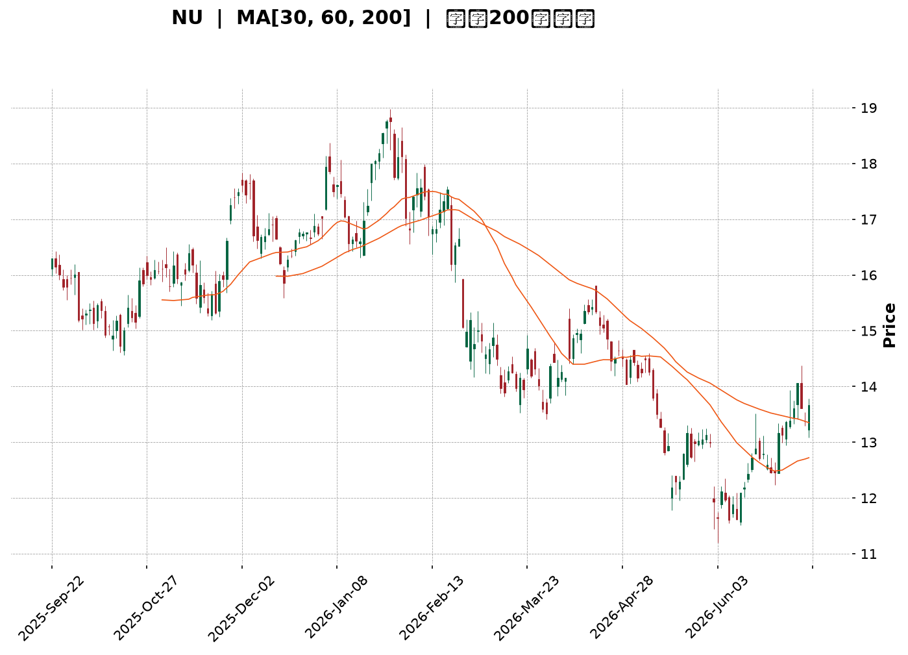
</details>

<html>
<head><meta charset="utf-8" /></head>
<body>
    <div style="height:500px; width:100%;">                        <script>window.PlotlyConfig = {MathJaxConfig: 'local'};</script>
        <script charset="utf-8" src="https://cdn.plot.ly/plotly-3.7.0.min.js" integrity="sha256-jvTGqxNp8AGWEcvNLVuKr+8j5dGe9Yw51LQkmDH+IYA=" crossorigin="anonymous"></script>                <div id="candlestick-chart" class="plotly-graph-div" style="height:100%; width:100%;"></div>            <script>                window.PLOTLYENV=window.PLOTLYENV || {};                                if (document.getElementById("candlestick-chart")) {                    Plotly.newPlot(                        "candlestick-chart",                        [{"close":{"dtype":"f8","bdata":"AAAAwMxMMEAAAABgZiYwQAAAAGCPAjBAAAAAIFyPL0AAAAAgXI8vQAAAAGBm5i9AAAAAYI8CMEAAAACgR2EuQAAAAOCjcC5AAAAAYLieLkAAAABgj8IuQAAAAGCPQi5AAAAAIIXrLkAAAACgcL0uQAAAAEAK1y1AAAAAwPUoLkAAAACA69EtQAAAAAApXC5AAAAAgMJ1LUAAAAAAAAAuQAAAAIDr0S5AAAAAQOF6LkAAAACA61EuQAAAAMDMzC9AAAAAgBSuL0AAAAAAAAAwQAAAAAAp3C9AAAAAQAoXMEAAAAAgXA8wQAAAAAApHDBAAAAAoEchMEAAAACgmZkvQAAAACCFKzBAAAAAoEfhL0AAAACgcL0vQAAAAMAeBTBAAAAAANdjMEAAAACAFC4wQAAAAIAULi9AAAAAANejL0AAAABAMzMvQAAAAADXoy5AAAAAgOtRL0AAAAAA16MuQAAAACCuxy9AAAAAQArXL0AAAAAAKZwwQAAAAAAAQDFAAAAAANdjMUAAAABA4XoxQAAAAAApnDFAAAAA4KNwMUAAAABgZqYxQAAAAEAzszBAAAAAYLieMEAAAACAFK4wQAAAAOCjsDBAAAAAgOvRMEAAAABgZuYwQAAAAGBmpjBAAAAAQDMzMEAAAADgUbgvQAAAAMAeRTBAAAAAQApXMEAAAABguJ4wQAAAAGCPwjBAAAAAoHC9MEAAAABgj8IwQAAAAMD1qDBAAAAAoEfhMEAAAACgcL0wQAAAAMAeBTFAAAAA4KPwMUAAAAAAKdwxQAAAAAAAgDFAAAAAACmcMUAAAACAwnUxQAAAAIA9CjFAAAAAIFyPMEAAAAAA16MwQAAAAAApnDBAAAAAoJmZMEAAAADgUfgwQAAAAKBwPTFAAAAAAAAAMkAAAACAPQoyQAAAAIAULjJAAAAAwMyMMkAAAABgj8IyQAAAAGCPwjJAAAAAAADAMUAAAAAAKRwyQAAAAGC4HjJAAAAAwB4FMUAAAAAgXM8wQAAAAGBmZjFAAAAAwMyMMUAAAACA65ExQAAAAMD1aDFAAAAAgD0KMUAAAACA69EwQAAAAIDr0TBAAAAAIIUrMUAAAACA61ExQAAAACCuhzFAAAAA4KMwMEAAAAAgrocwQAAAAGBmpjBAAAAAYLgeLkAAAACAwvUtQAAAAKBHYS5AAAAAwB6FLUAAAAAAAAAuQAAAAADXoy1AAAAAwPUoLUAAAABAClctQAAAAGCPwi1AAAAAQOH6LEAAAADgo\u002fArQAAAACCuxytAAAAAgD2KLEAAAAAAAIAsQAAAAOCj8CtAAAAAgOtRLEAAAACgR+ErQAAAAAApXC1AAAAAoEdhLEAAAAAA16MsQAAAAIA9CixAAAAAQDMzK0AAAADAHgUrQAAAAKBwvSxAAAAAoEfhLEAAAADAzEwsQAAAAMAehSxAAAAAwMxMLEAAAADAHgUtQAAAAKBwvS1AAAAAIIXrLUAAAABgZuYtQAAAAEAzsy5AAAAAgBSuLkAAAAAAKdwuQAAAAIAUri5AAAAAQDMzLkAAAACgmRkuQAAAAEAzsy1AAAAAIIXrLEAAAADAHgUtQAAAACCuRy1AAAAAAAAALUAAAADgehQsQAAAAIDC9SxAAAAAoEfhLEAAAACA61EsQAAAAAAAgCxAAAAAgML1LEAAAADAHoUsQAAAAKCZmStAAAAAAAAAK0AAAACAPYoqQAAAAADXoylAAAAAACncKUAAAACgR2EoQAAAAOB6lChAAAAA4HqUKEAAAADgepQpQAAAAIDrUSpAAAAAgMJ1KUAAAACAwvUpQAAAACBcDypAAAAAoJkZKkAAAABgj0IqQAAAAEDh+ilAAAAAACncJ0AAAAAgrkcnQAAAAKBwPShAAAAA4KPwJ0AAAABAMzMnQAAAAGCPwidAAAAAoHA9J0AAAACAFC4oQAAAAKBHYShAAAAAACncKEAAAADgo3ApQAAAACCuxylAAAAAIIVrKUAAAADgepQpQAAAAIAULilAAAAAIIXrKEAAAAAghesoQAAAAEAKVypAAAAAYI9CKkAAAADgUbgqQAAAACCuxypAAAAA4FE4K0AAAABguB4sQAAAAOBROCtAAAAAoHC9KkAAAABAClcrQA=="},"high":{"dtype":"f8","bdata":"AAAAwMxMMEAAAADAzGwwQAAAAGC4XjBAAAAA4FEYMEAAAACgcP0vQAAAAKCZGTBAAAAA4KMwMEAAAADAzAwwQAAAAMDMzC5AAAAAAADALkAAAABA4fouQAAAAOB6FC9AAAAAAAAAL0AAAADA9SgvQAAAAGBm5i5AAAAAoHA9LkAAAACgR2EuQAAAAABWji5AAAAAYLieLkAAAABguB4uQAAAACCuRy9AAAAAgBQuL0AAAAAghesuQAAAAADXIzBAAAAAoEchMEAAAACgmVkwQAAAAIDrETBAAAAAwB5FMEAAAACgcD0wQAAAAMAeRTBAAAAAAACAMEAAAACgcB0wQAAAACCFazBAAAAAYGZmMEAAAAAAAMAvQAAAAOBRODBAAAAAwMyMMEAAAAAAAIAwQAAAAIDrMTBAAAAAYI9CMEAAAACgcL0vQAAAAKCZWS9AAAAA4KNwL0AAAABAMxMwQAAAAMAeBTBAAAAAIFwPMEAAAADAzKwwQAAAAKBHYTFAAAAAgBSOMUAAAAAgXI8xQAAAAEAK1zFAAAAA4FG4MUAAAADgo9AxQAAAAEDhujFAAAAAQDMTMUAAAABA4bowQAAAAKCZ2TBAAAAAACkcMUAAAAAgXA8xQAAAAIDrETFAAAAAwB6FMEAAAADA9SgwQAAAAOAiWzBAAAAA4FF4MEAAAACgR6EwQAAAAOB61DBAAAAAwPXIMEAAAABgj8IwQAAAACBczzBAAAAAQOEaMUAAAADAzOwwQAAAACBcDzFAAAAAgJUjMkAAAABguF4yQAAAAGCPwjFAAAAAgL6fMUAAAACA6xEyQAAAACCFazFAAAAAgOsRMUAAAADgo7AwQAAAAOBR+DBAAAAAYA6tMEAAAADgo1AxQAAAAIA9ijFAAAAAAAAAMkAAAADgoxAyQAAAAGCPQjJAAAAAIFyPMkAAAADA9cgyQAAAAEDh+jJAAAAAYLieMkAAAABACncyQAAAAGBmpjJAAAAAgD0qMkAAAABgjyIxQAAAACCFazFAAAAAQArXMUAAAAAAKbwxQAAAAKBw\u002fTFAAAAAwMyMMUAAAACgR+EwQAAAAAAAADFAAAAAQOF6MUAAAADgo3AxQAAAAEAKlzFAAAAAwPVoMUAAAABACpcwQAAAAKCZ2TBAAAAAoEfhL0AAAABgZmYuQAAAAECLrC5AAAAAYLgeLkAAAACAwrUuQAAAAMDMTC5AAAAAQDNzLUAAAACA65EtQAAAAIA9Si5AAAAAoEfhLUAAAABAM7MsQAAAAGC4nixAAAAAoHC9LEAAAADgehQtQAAAAMDMjCxAAAAAAACALEAAAADAzEwsQAAAAEAK1y1AAAAAwB4FLUAAAACgR2EtQAAAAGBmpixAAAAAYGbmK0AAAACA65ErQAAAAIDr0SxAAAAAoJmZLUAAAACAwvUsQAAAACCuxyxAAAAAgOtRLEAAAADAScwuQAAAAAAp3C1AAAAA4HoULkAAAAAgXA8uQAAAAOCj8C5AAAAAYLgeL0AAAACgRyEvQAAAAGC4ni9AAAAAQDOzLkAAAAAgXI8uQAAAAOCjcC5AAAAAANejLUAAAADgehQtQAAAACCFqy1AAAAAQApXLUAAAADAHgUtQAAAAGC4Hi1AAAAAgOtRLUAAAADgo\u002fAsQAAAAKBH4SxAAAAAoJkZLUAAAABAMzMtQAAAAMD1qCxAAAAAwPXoK0AAAAAAKRwrQAAAAIA9iipAAAAAQApXKkAAAAAgXM8oQAAAAMDMzChAAAAAwMzMKEAAAACgmZkpQAAAAKCZmSpAAAAAwB6FKkAAAACgRyEqQAAAAAApXCpAAAAAQOF6KkAAAAAAAIAqQAAAAMDMTCpAAAAAIIVrKEAAAABA4XonQAAAAIAUbihAAAAAQDOzKEAAAACgmRkoQAAAAIDrEShAAAAAgBQuKEAAAACAFC4oQAAAAOB6lChAAAAAYI9CKUAAAACgmZkpQAAAACCuBytAAAAAwPUoKkAAAACgcD0qQAAAAIDrkSlAAAAA4KNwKUAAAACAPUopQAAAAIAUripAAAAAoJmZKkAAAAAgrscqQAAAAAAp3CtAAAAAAACAK0AAAABguB4sQAAAAGCPwixAAAAA4HoUK0AAAAAgXI8rQA=="},"hovertemplate":"\u003cb\u003e%{x|%Y-%m-%d}\u003c\u002fb\u003e\u003cbr\u003e\u958b: $%{open:.2f}\u003cbr\u003e\u9ad8: $%{high:.2f}\u003cbr\u003e\u4f4e: $%{low:.2f}\u003cbr\u003e\u6536: $%{close:.2f}\u003cextra\u003e\u003c\u002fextra\u003e","low":{"dtype":"f8","bdata":"AAAAgML1L0AAAAAgrgcwQAAAAKDx0i9AAAAAgMJ1L0AAAACgmRkvQAAAAMD1qC9AAAAAwMxML0AAAACA61EuQAAAAIA9Ci5AAAAA4FE4LkAAAAAAAEAuQAAAAIA9Ci5AAAAAoJkZLkAAAACAwnUuQAAAAGCPwi1AAAAAQArXLUAAAAAgrkctQAAAAOBRuC1AAAAAQF46LUAAAABguB4tQAAAAGC4Hi5AAAAAIFxPLkAAAACA6xEuQAAAAIDCdS5AAAAAIASWL0AAAABACtcvQAAAAADXoy9AAAAAACncL0AAAAAA1wMwQAAAAGCPwi9AAAAAgBTuL0AAAABgZmYvQAAAAOB6lC9AAAAAgBSuL0AAAABgZuYuQAAAAMDMzC9AAAAAwMwMMEAAAAAghQswQAAAAOBR+C5AAAAAANejLkAAAAAAAAAvQAAAAMAehS5AAAAAoEdhLkAAAACgmZkuQAAAAGCPgi5AAAAAIFyPL0AAAAAAKVwvQAAAAMD16DBAAAAAQDMzMUAAAAAgrkcxQAAAAEDhejFAAAAAgD1KMUAAAAAAKVwxQAAAAKCZmTBAAAAA4FF4MEAAAAAAAkswQAAAAEAKdzBAAAAAQDOzMEAAAACgmZkwQAAAAKBHoTBAAAAAgBQuMEAAAACAFC4vQAAAAMAgEDBAAAAAQGJQMEAAAACgmVkwQAAAACBcjzBAAAAAYGamMEAAAAAAKZwwQAAAAIA9ijBAAAAAgBSuMEAAAACAwrUwQAAAAGBmpjBAAAAAgD0qMUAAAAAgXM8xQAAAACCuZzFAAAAAYLheMUAAAAAA12MxQAAAAMAeBTFAAAAAgD1qMEAAAADAzGwwQAAAAIBBgDBAAAAAgBROMEAAAACgmVkwQAAAAIDrETFAAAAA4HpUMUAAAACAwrUxQAAAAGBm5jFAAAAAoJkZMkAAAAAAKVwyQAAAAKBwPTJAAAAAgMK1MUAAAACAwrUxQAAAAEAK1zFAAAAAAADgMEAAAADAzIwwQAAAAGCPwjBAAAAAQAo3MUAAAACAPQoxQAAAAKCZWTFAAAAAgMK1MEAAAABguF4wQAAAAEAKlzBAAAAAQArXMEAAAADAHuUwQAAAACCFKzFAAAAA4HoUMEAAAACgcL0vQAAAAADXgzBAAAAA4HoULkAAAABgZmYtQAAAAGC4nixAAAAAQApXLEAAAACgmZktQAAAAOBROC1AAAAA4FF4LEAAAACAwnUsQAAAACBcDy1AAAAAYI\u002fCLEAAAABgj8IrQAAAAKBHoStAAAAAYLgeLEAAAADgUXgsQAAAAOB61CtAAAAAIFwPK0AAAADgepQrQAAAAOCjcCxAAAAAgOtRLEAAAAAghWssQAAAAAAp3CtAAAAA4HoUK0AAAACA69EqQAAAAGBmZitAAAAAACncLEAAAAAAAqsrQAAAAMD1KCxAAAAAgBSuK0AAAACA69EsQAAAAMDMzCxAAAAAIFyPLUAAAABAMzMtQAAAAKBwPS5AAAAAoJmZLkAAAADgepQuQAAAAGC4ni5AAAAAACncLUAAAADgo\u002fAtQAAAAEAKVy1AAAAAgOuRLEAAAACgR2EsQAAAAKCZGS1AAAAAgMK1LEAAAADgehQsQAAAAKCZGSxAAAAAYI\u002fCLEAAAACAFC4sQAAAAEAKVyxAAAAAoHB9LEAAAADA9WgsQAAAAAAAgCtAAAAAQArXKkAAAADAHoUqQAAAACCuhylAAAAAgBSuKUAAAAAgXI8nQAAAAGC4HihAAAAAIIXrJ0AAAADA9agoQAAAAGC4HilAAAAAIIVrKUAAAADAzEwpQAAAAAAp3ClAAAAAIK7HKUAAAABA4fopQAAAAIDr0SlAAAAAoEfhJkAAAABgZmYmQAAAAADXoydAAAAAYLjeJ0AAAACgmRknQAAAACBcTydAAAAA4FE4J0AAAADAHgUnQAAAACCuByhAAAAAIFyPKEAAAADgo\u002fAoQAAAAOB6lClAAAAAAClcKUAAAABgZmYpQAAAAAAAAClAAAAAoEfhKEAAAACAwnUoQAAAAADX4yhAAAAAQOH6KUAAAACgR+EpQAAAAAAAgCpAAAAAYOOlKkAAAACA69EqQAAAAOBROCtAAAAAQAqXKkAAAAAghSsqQA=="},"name":"\u50f9\u683c","open":{"dtype":"f8","bdata":"AAAAACkcMEAAAADAzEwwQAAAAIAULjBAAAAAACncL0AAAAAAKdwvQAAAAGBm5i9AAAAAIIXrL0AAAADAzAwwQAAAAIA9ii5AAAAAIFyPLkAAAACgcL0uQAAAAIDr0S5AAAAAAClcLkAAAAAgXA8vQAAAAOBRuC5AAAAAwPUoLkAAAABAM7MtQAAAAAAAAC5AAAAA4HqULkAAAAAgrkctQAAAAGCPQi5AAAAAQDOzLkAAAAAA16MuQAAAAMAehS5AAAAAQAoXMEAAAABA4TowQAAAACCF6y9AAAAAYGbmL0AAAACA6xEwQAAAAAApHDBAAAAA4KMwMEAAAACgmZkvQAAAAOBRuC9AAAAAYLheMEAAAAAA16MvQAAAAKCZGTBAAAAAQAoXMEAAAACAwnUwQAAAAIA9CjBAAAAAACncLkAAAADgUXgvQAAAAMDMzC5AAAAAwMyMLkAAAACAFK4vQAAAAIDCtS5AAAAAAAAAMEAAAABACtcvQAAAAEDh+jBAAAAAANdjMUAAAACAFG4xQAAAAIDCtTFAAAAAQDOzMUAAAABgZqYxQAAAAEAzszFAAAAAYLjeMEAAAADAHmUwQAAAAKCZmTBAAAAAQOG6MEAAAAAgrucwQAAAAGBmBjFAAAAAAACAMEAAAABAChcwQAAAAGBmJjBAAAAAoJlZMEAAAAAghWswQAAAAOCjsDBAAAAAQDOzMEAAAACgcL0wQAAAAIA9qjBAAAAAwB7FMEAAAABguN4wQAAAACBcDzFAAAAAgBQuMUAAAABguB4yQAAAAGC4njFAAAAAQAqXMUAAAACAFK4xQAAAAKCZWTFAAAAAIFwPMUAAAADgo5AwQAAAAAAAwDBAAAAAgOuRMEAAAAAAKVwwQAAAAGCPIjFAAAAAgD2qMUAAAAAAAAAyQAAAAMDMDDJAAAAAAClcMkAAAABgj6IyQAAAAOB61DJAAAAAIK6HMkAAAACgcL0xQAAAACCuZzJAAAAA4HoUMkAAAADgetQwQAAAACCFKzFAAAAA4KNwMUAAAABgZiYxQAAAAIDr8TFAAAAAwPWIMUAAAACgcL0wQAAAAAAAwDBAAAAAQDPzMEAAAAAA1yMxQAAAAEAzMzFAAAAAAABAMUAAAADgozAwQAAAAADXgzBAAAAAQArXL0AAAADgo3AtQAAAACCF6yxAAAAAAClcLUAAAACgcP0tQAAAAAAp3C1AAAAAYI8CLUAAAACA69EsQAAAAEDhei1AAAAAAACALUAAAABgZmYsQAAAAADXIyxAAAAAoHA9LEAAAADAzMwsQAAAAOCjcCxAAAAAAClcK0AAAACgcD0sQAAAAKBHoSxAAAAA4FH4LEAAAABgj0ItQAAAAGCPQixAAAAAgMJ1K0AAAAAghWsrQAAAAKCZmStAAAAAgBQuLUAAAAAAAAAsQAAAAGCPQixAAAAAQDMzLEAAAAAghWsuQAAAAMAeBS1AAAAAACncLUAAAACAFK4tQAAAAGCPQi5AAAAAIIXrLkAAAAAgrscuQAAAAGC4ni9AAAAAQOF6LkAAAADgUTguQAAAAAApXC5AAAAAYLieLUAAAABACtcsQAAAACCuRy1AAAAA4HoULUAAAACAwvUsQAAAAOB6VCxAAAAAgOtRLUAAAAAgrscsQAAAAADXoyxAAAAAAAAALUAAAAAAAAAtQAAAAKCZmSxAAAAAYI\u002fCK0AAAABACtcqQAAAACCFaypAAAAAQDOzKUAAAABAiQEoQAAAAMDMzChAAAAA4HpUKEAAAACAFK4oQAAAAOBROClAAAAAwMxMKkAAAAAgrgcqQAAAACCF6ylAAAAA4KPwKUAAAACgmRkqQAAAAAAAACpAAAAAQOH6J0AAAADAzEwnQAAAAGCPwidAAAAAQDMzKEAAAADAHgUoQAAAAOCjcCdAAAAAoJmZJ0AAAAAA1yMnQAAAAEAKVyhAAAAAgBSuKEAAAADAHgUpQAAAAOB6lClAAAAAIFwPKkAAAAAgXI8pQAAAAIA9CilAAAAAoJkZKUAAAACAwvUoQAAAAADX4yhAAAAAwB6FKkAAAABguB4qQAAAACBcjypAAAAAoEfhKkAAAAAAKVwrQAAAAGC4HixAAAAAYI\u002fCKkAAAADgo3AqQA=="},"x":["2025-09-22T00:00:00-04:00","2025-09-23T00:00:00-04:00","2025-09-24T00:00:00-04:00","2025-09-25T00:00:00-04:00","2025-09-26T00:00:00-04:00","2025-09-29T00:00:00-04:00","2025-09-30T00:00:00-04:00","2025-10-01T00:00:00-04:00","2025-10-02T00:00:00-04:00","2025-10-03T00:00:00-04:00","2025-10-06T00:00:00-04:00","2025-10-07T00:00:00-04:00","2025-10-08T00:00:00-04:00","2025-10-09T00:00:00-04:00","2025-10-10T00:00:00-04:00","2025-10-13T00:00:00-04:00","2025-10-14T00:00:00-04:00","2025-10-15T00:00:00-04:00","2025-10-16T00:00:00-04:00","2025-10-17T00:00:00-04:00","2025-10-20T00:00:00-04:00","2025-10-21T00:00:00-04:00","2025-10-22T00:00:00-04:00","2025-10-23T00:00:00-04:00","2025-10-24T00:00:00-04:00","2025-10-27T00:00:00-04:00","2025-10-28T00:00:00-04:00","2025-10-29T00:00:00-04:00","2025-10-30T00:00:00-04:00","2025-10-31T00:00:00-04:00","2025-11-03T00:00:00-05:00","2025-11-04T00:00:00-05:00","2025-11-05T00:00:00-05:00","2025-11-06T00:00:00-05:00","2025-11-07T00:00:00-05:00","2025-11-10T00:00:00-05:00","2025-11-11T00:00:00-05:00","2025-11-12T00:00:00-05:00","2025-11-13T00:00:00-05:00","2025-11-14T00:00:00-05:00","2025-11-17T00:00:00-05:00","2025-11-18T00:00:00-05:00","2025-11-19T00:00:00-05:00","2025-11-20T00:00:00-05:00","2025-11-21T00:00:00-05:00","2025-11-24T00:00:00-05:00","2025-11-25T00:00:00-05:00","2025-11-26T00:00:00-05:00","2025-11-28T00:00:00-05:00","2025-12-01T00:00:00-05:00","2025-12-02T00:00:00-05:00","2025-12-03T00:00:00-05:00","2025-12-04T00:00:00-05:00","2025-12-05T00:00:00-05:00","2025-12-08T00:00:00-05:00","2025-12-09T00:00:00-05:00","2025-12-10T00:00:00-05:00","2025-12-11T00:00:00-05:00","2025-12-12T00:00:00-05:00","2025-12-15T00:00:00-05:00","2025-12-16T00:00:00-05:00","2025-12-17T00:00:00-05:00","2025-12-18T00:00:00-05:00","2025-12-19T00:00:00-05:00","2025-12-22T00:00:00-05:00","2025-12-23T00:00:00-05:00","2025-12-24T00:00:00-05:00","2025-12-26T00:00:00-05:00","2025-12-29T00:00:00-05:00","2025-12-30T00:00:00-05:00","2025-12-31T00:00:00-05:00","2026-01-02T00:00:00-05:00","2026-01-05T00:00:00-05:00","2026-01-06T00:00:00-05:00","2026-01-07T00:00:00-05:00","2026-01-08T00:00:00-05:00","2026-01-09T00:00:00-05:00","2026-01-12T00:00:00-05:00","2026-01-13T00:00:00-05:00","2026-01-14T00:00:00-05:00","2026-01-15T00:00:00-05:00","2026-01-16T00:00:00-05:00","2026-01-20T00:00:00-05:00","2026-01-21T00:00:00-05:00","2026-01-22T00:00:00-05:00","2026-01-23T00:00:00-05:00","2026-01-26T00:00:00-05:00","2026-01-27T00:00:00-05:00","2026-01-28T00:00:00-05:00","2026-01-29T00:00:00-05:00","2026-01-30T00:00:00-05:00","2026-02-02T00:00:00-05:00","2026-02-03T00:00:00-05:00","2026-02-04T00:00:00-05:00","2026-02-05T00:00:00-05:00","2026-02-06T00:00:00-05:00","2026-02-09T00:00:00-05:00","2026-02-10T00:00:00-05:00","2026-02-11T00:00:00-05:00","2026-02-12T00:00:00-05:00","2026-02-13T00:00:00-05:00","2026-02-17T00:00:00-05:00","2026-02-18T00:00:00-05:00","2026-02-19T00:00:00-05:00","2026-02-20T00:00:00-05:00","2026-02-23T00:00:00-05:00","2026-02-24T00:00:00-05:00","2026-02-25T00:00:00-05:00","2026-02-26T00:00:00-05:00","2026-02-27T00:00:00-05:00","2026-03-02T00:00:00-05:00","2026-03-03T00:00:00-05:00","2026-03-04T00:00:00-05:00","2026-03-05T00:00:00-05:00","2026-03-06T00:00:00-05:00","2026-03-09T00:00:00-04:00","2026-03-10T00:00:00-04:00","2026-03-11T00:00:00-04:00","2026-03-12T00:00:00-04:00","2026-03-13T00:00:00-04:00","2026-03-16T00:00:00-04:00","2026-03-17T00:00:00-04:00","2026-03-18T00:00:00-04:00","2026-03-19T00:00:00-04:00","2026-03-20T00:00:00-04:00","2026-03-23T00:00:00-04:00","2026-03-24T00:00:00-04:00","2026-03-25T00:00:00-04:00","2026-03-26T00:00:00-04:00","2026-03-27T00:00:00-04:00","2026-03-30T00:00:00-04:00","2026-03-31T00:00:00-04:00","2026-04-01T00:00:00-04:00","2026-04-02T00:00:00-04:00","2026-04-06T00:00:00-04:00","2026-04-07T00:00:00-04:00","2026-04-08T00:00:00-04:00","2026-04-09T00:00:00-04:00","2026-04-10T00:00:00-04:00","2026-04-13T00:00:00-04:00","2026-04-14T00:00:00-04:00","2026-04-15T00:00:00-04:00","2026-04-16T00:00:00-04:00","2026-04-17T00:00:00-04:00","2026-04-20T00:00:00-04:00","2026-04-21T00:00:00-04:00","2026-04-22T00:00:00-04:00","2026-04-23T00:00:00-04:00","2026-04-24T00:00:00-04:00","2026-04-27T00:00:00-04:00","2026-04-28T00:00:00-04:00","2026-04-29T00:00:00-04:00","2026-04-30T00:00:00-04:00","2026-05-01T00:00:00-04:00","2026-05-04T00:00:00-04:00","2026-05-05T00:00:00-04:00","2026-05-06T00:00:00-04:00","2026-05-07T00:00:00-04:00","2026-05-08T00:00:00-04:00","2026-05-11T00:00:00-04:00","2026-05-12T00:00:00-04:00","2026-05-13T00:00:00-04:00","2026-05-14T00:00:00-04:00","2026-05-15T00:00:00-04:00","2026-05-18T00:00:00-04:00","2026-05-19T00:00:00-04:00","2026-05-20T00:00:00-04:00","2026-05-21T00:00:00-04:00","2026-05-22T00:00:00-04:00","2026-05-26T00:00:00-04:00","2026-05-27T00:00:00-04:00","2026-05-28T00:00:00-04:00","2026-05-29T00:00:00-04:00","2026-06-01T00:00:00-04:00","2026-06-02T00:00:00-04:00","2026-06-03T00:00:00-04:00","2026-06-04T00:00:00-04:00","2026-06-05T00:00:00-04:00","2026-06-08T00:00:00-04:00","2026-06-09T00:00:00-04:00","2026-06-10T00:00:00-04:00","2026-06-11T00:00:00-04:00","2026-06-12T00:00:00-04:00","2026-06-15T00:00:00-04:00","2026-06-16T00:00:00-04:00","2026-06-17T00:00:00-04:00","2026-06-18T00:00:00-04:00","2026-06-22T00:00:00-04:00","2026-06-23T00:00:00-04:00","2026-06-24T00:00:00-04:00","2026-06-25T00:00:00-04:00","2026-06-26T00:00:00-04:00","2026-06-29T00:00:00-04:00","2026-06-30T00:00:00-04:00","2026-07-01T00:00:00-04:00","2026-07-02T00:00:00-04:00","2026-07-06T00:00:00-04:00","2026-07-07T00:00:00-04:00","2026-07-08T00:00:00-04:00","2026-07-09T00:00:00-04:00"],"type":"candlestick"},{"hovertemplate":"MA30: $%{y:.2f}\u003cextra\u003e\u003c\u002fextra\u003e","line":{"color":"#2196F3","dash":"dash","width":2},"mode":"lines","name":"MA30","x":["2025-09-22T00:00:00-04:00","2025-09-23T00:00:00-04:00","2025-09-24T00:00:00-04:00","2025-09-25T00:00:00-04:00","2025-09-26T00:00:00-04:00","2025-09-29T00:00:00-04:00","2025-09-30T00:00:00-04:00","2025-10-01T00:00:00-04:00","2025-10-02T00:00:00-04:00","2025-10-03T00:00:00-04:00","2025-10-06T00:00:00-04:00","2025-10-07T00:00:00-04:00","2025-10-08T00:00:00-04:00","2025-10-09T00:00:00-04:00","2025-10-10T00:00:00-04:00","2025-10-13T00:00:00-04:00","2025-10-14T00:00:00-04:00","2025-10-15T00:00:00-04:00","2025-10-16T00:00:00-04:00","2025-10-17T00:00:00-04:00","2025-10-20T00:00:00-04:00","2025-10-21T00:00:00-04:00","2025-10-22T00:00:00-04:00","2025-10-23T00:00:00-04:00","2025-10-24T00:00:00-04:00","2025-10-27T00:00:00-04:00","2025-10-28T00:00:00-04:00","2025-10-29T00:00:00-04:00","2025-10-30T00:00:00-04:00","2025-10-31T00:00:00-04:00","2025-11-03T00:00:00-05:00","2025-11-04T00:00:00-05:00","2025-11-05T00:00:00-05:00","2025-11-06T00:00:00-05:00","2025-11-07T00:00:00-05:00","2025-11-10T00:00:00-05:00","2025-11-11T00:00:00-05:00","2025-11-12T00:00:00-05:00","2025-11-13T00:00:00-05:00","2025-11-14T00:00:00-05:00","2025-11-17T00:00:00-05:00","2025-11-18T00:00:00-05:00","2025-11-19T00:00:00-05:00","2025-11-20T00:00:00-05:00","2025-11-21T00:00:00-05:00","2025-11-24T00:00:00-05:00","2025-11-25T00:00:00-05:00","2025-11-26T00:00:00-05:00","2025-11-28T00:00:00-05:00","2025-12-01T00:00:00-05:00","2025-12-02T00:00:00-05:00","2025-12-03T00:00:00-05:00","2025-12-04T00:00:00-05:00","2025-12-05T00:00:00-05:00","2025-12-08T00:00:00-05:00","2025-12-09T00:00:00-05:00","2025-12-10T00:00:00-05:00","2025-12-11T00:00:00-05:00","2025-12-12T00:00:00-05:00","2025-12-15T00:00:00-05:00","2025-12-16T00:00:00-05:00","2025-12-17T00:00:00-05:00","2025-12-18T00:00:00-05:00","2025-12-19T00:00:00-05:00","2025-12-22T00:00:00-05:00","2025-12-23T00:00:00-05:00","2025-12-24T00:00:00-05:00","2025-12-26T00:00:00-05:00","2025-12-29T00:00:00-05:00","2025-12-30T00:00:00-05:00","2025-12-31T00:00:00-05:00","2026-01-02T00:00:00-05:00","2026-01-05T00:00:00-05:00","2026-01-06T00:00:00-05:00","2026-01-07T00:00:00-05:00","2026-01-08T00:00:00-05:00","2026-01-09T00:00:00-05:00","2026-01-12T00:00:00-05:00","2026-01-13T00:00:00-05:00","2026-01-14T00:00:00-05:00","2026-01-15T00:00:00-05:00","2026-01-16T00:00:00-05:00","2026-01-20T00:00:00-05:00","2026-01-21T00:00:00-05:00","2026-01-22T00:00:00-05:00","2026-01-23T00:00:00-05:00","2026-01-26T00:00:00-05:00","2026-01-27T00:00:00-05:00","2026-01-28T00:00:00-05:00","2026-01-29T00:00:00-05:00","2026-01-30T00:00:00-05:00","2026-02-02T00:00:00-05:00","2026-02-03T00:00:00-05:00","2026-02-04T00:00:00-05:00","2026-02-05T00:00:00-05:00","2026-02-06T00:00:00-05:00","2026-02-09T00:00:00-05:00","2026-02-10T00:00:00-05:00","2026-02-11T00:00:00-05:00","2026-02-12T00:00:00-05:00","2026-02-13T00:00:00-05:00","2026-02-17T00:00:00-05:00","2026-02-18T00:00:00-05:00","2026-02-19T00:00:00-05:00","2026-02-20T00:00:00-05:00","2026-02-23T00:00:00-05:00","2026-02-24T00:00:00-05:00","2026-02-25T00:00:00-05:00","2026-02-26T00:00:00-05:00","2026-02-27T00:00:00-05:00","2026-03-02T00:00:00-05:00","2026-03-03T00:00:00-05:00","2026-03-04T00:00:00-05:00","2026-03-05T00:00:00-05:00","2026-03-06T00:00:00-05:00","2026-03-09T00:00:00-04:00","2026-03-10T00:00:00-04:00","2026-03-11T00:00:00-04:00","2026-03-12T00:00:00-04:00","2026-03-13T00:00:00-04:00","2026-03-16T00:00:00-04:00","2026-03-17T00:00:00-04:00","2026-03-18T00:00:00-04:00","2026-03-19T00:00:00-04:00","2026-03-20T00:00:00-04:00","2026-03-23T00:00:00-04:00","2026-03-24T00:00:00-04:00","2026-03-25T00:00:00-04:00","2026-03-26T00:00:00-04:00","2026-03-27T00:00:00-04:00","2026-03-30T00:00:00-04:00","2026-03-31T00:00:00-04:00","2026-04-01T00:00:00-04:00","2026-04-02T00:00:00-04:00","2026-04-06T00:00:00-04:00","2026-04-07T00:00:00-04:00","2026-04-08T00:00:00-04:00","2026-04-09T00:00:00-04:00","2026-04-10T00:00:00-04:00","2026-04-13T00:00:00-04:00","2026-04-14T00:00:00-04:00","2026-04-15T00:00:00-04:00","2026-04-16T00:00:00-04:00","2026-04-17T00:00:00-04:00","2026-04-20T00:00:00-04:00","2026-04-21T00:00:00-04:00","2026-04-22T00:00:00-04:00","2026-04-23T00:00:00-04:00","2026-04-24T00:00:00-04:00","2026-04-27T00:00:00-04:00","2026-04-28T00:00:00-04:00","2026-04-29T00:00:00-04:00","2026-04-30T00:00:00-04:00","2026-05-01T00:00:00-04:00","2026-05-04T00:00:00-04:00","2026-05-05T00:00:00-04:00","2026-05-06T00:00:00-04:00","2026-05-07T00:00:00-04:00","2026-05-08T00:00:00-04:00","2026-05-11T00:00:00-04:00","2026-05-12T00:00:00-04:00","2026-05-13T00:00:00-04:00","2026-05-14T00:00:00-04:00","2026-05-15T00:00:00-04:00","2026-05-18T00:00:00-04:00","2026-05-19T00:00:00-04:00","2026-05-20T00:00:00-04:00","2026-05-21T00:00:00-04:00","2026-05-22T00:00:00-04:00","2026-05-26T00:00:00-04:00","2026-05-27T00:00:00-04:00","2026-05-28T00:00:00-04:00","2026-05-29T00:00:00-04:00","2026-06-01T00:00:00-04:00","2026-06-02T00:00:00-04:00","2026-06-03T00:00:00-04:00","2026-06-04T00:00:00-04:00","2026-06-05T00:00:00-04:00","2026-06-08T00:00:00-04:00","2026-06-09T00:00:00-04:00","2026-06-10T00:00:00-04:00","2026-06-11T00:00:00-04:00","2026-06-12T00:00:00-04:00","2026-06-15T00:00:00-04:00","2026-06-16T00:00:00-04:00","2026-06-17T00:00:00-04:00","2026-06-18T00:00:00-04:00","2026-06-22T00:00:00-04:00","2026-06-23T00:00:00-04:00","2026-06-24T00:00:00-04:00","2026-06-25T00:00:00-04:00","2026-06-26T00:00:00-04:00","2026-06-29T00:00:00-04:00","2026-06-30T00:00:00-04:00","2026-07-01T00:00:00-04:00","2026-07-02T00:00:00-04:00","2026-07-06T00:00:00-04:00","2026-07-07T00:00:00-04:00","2026-07-08T00:00:00-04:00","2026-07-09T00:00:00-04:00"],"y":{"dtype":"f8","bdata":"AAAAAAAA+H8AAAAAAAD4fwAAAAAAAPh\u002fAAAAAAAA+H8AAAAAAAD4fwAAAAAAAPh\u002fAAAAAAAA+H8AAAAAAAD4fwAAAAAAAPh\u002fAAAAAAAA+H8AAAAAAAD4fwAAAAAAAPh\u002fAAAAAAAA+H8AAAAAAAD4fwAAAAAAAPh\u002fAAAAAAAA+H8AAAAAAAD4fwAAAAAAAPh\u002fAAAAAAAA+H8AAAAAAAD4fwAAAAAAAPh\u002fAAAAAAAA+H8AAAAAAAD4fwAAAAAAAPh\u002fAAAAAAAA+H8AAAAAAAD4fwAAAAAAAPh\u002fAAAAAAAA+H8AAAAAAAD4fwAAAIBOGy9AIiIiwmcYL0BmZmaWbhIvQDMzM6MpFS9AAAAAsOQXL0B3d3fnbRkvQN7d3b2fGi9AvLu7+xshL0DNzMxcATIvQKuqqupROC9AMzMzIwZBL0BVVVVVx0QvQERERHQFSC9ARERERG9LL0AAAADQlEovQO\u002fu7s4iWy9AMzMz03hpL0De3d09fIYvQFVVVTXQqS9AzczM7DXXL0CrqqqaxAAwQERERJSKEzBA3t3djVAmMECrqqoKkDswQLy7u6tjQjBAvLu7mwtJMEB3d3cX2U4wQGZmZlZVVTBAvLu7C5BbMEDe3d0Nu2IwQDMzM7NWZzBA7+7unu9nMEARERGxcmgwQFVVVSVNaTBA3t3d9bZsMEDNzMxcHXMwQKuqqupteTBAERERgWp8MECJiIiIXYEwQLy7u\u002ft+ijBAZmZmloqTMEBERET0RJ0wQJqZmanGqzBAZmZmZju\u002fMEDe3d0d6NQwQO\u002fu7jal4jBAvLu7ExHxMEBVVVXtUfgwQFVVVS2H9jBAvLu7A3LvMECamZkBR+gwQBEREXm+3zBA7+7udpPYMEAzMzP7xdIwQImIiKBh1zBAAAAASCjjMEB3d3c\u002fw+4wQLy7uzN6+zBAmpmZcT0KMUBVVVWtHBoxQDMzMwseLDFAmpmZEVg5MUBVVVVFi0wxQImIiKhUXDFAREREJCJiMUAzMzMzwWMxQM3MzEw3aTFAVVVVxSBwMUDe3d09CncxQERERKRwfTFAvLu7K85+MUDv7u7ufH8xQGZmZgbIfTFA7+7u7jV3MUCJiIhImnIxQCIiItLbcjFAiYiIyL1mMUC8u7srzl4xQDMzMzN6WzFA7+7uZq1OMUC8u7sTg0AxQJqZmQllNDFA7+7ufrEkMUB3d3f34RMxQFVVVWU7\u002fzBAq6qqSgziMECamZlpSsUwQLy7u3MhqTBAd3d3P3yGMEBVVVVVnF0wQAAAAKgNNDBAMzMze1sWMEDNzMxc1uovQLy7u7sCpC9AMzMzMzNzL0Crqqr6N0IvQO\u002fu7h7MEy9A7+7uDnTaLkB3d3eX\u002fKIuQFVVVXUhaS5A3t3d3WsuLkAiIiJC7vUtQLy7uwsezC1A3t3dfYadLUDNzMyMbGctQDMzM7OdLy1AzczMzMwMLUCJiIhIU+osQImIiFjyyyxAAAAAcD3KLEDe3d1dusksQLy7u2t1zCxAq6qqelvWLEDe3d0tst0sQImIiBiS5ixAMzMzA3LvLEAiIiJC7vUsQAAAADBr9SxA3t3dHej0LECamZlpH\u002f4sQGZmZjbsCi1AiYiIGNkOLUB3d3eXQwstQAAAAND3Ey1AZmZmJr8YLUCJiIhYgBwtQFVVVaUpFS1AzczMrBwaLUCJiIiIFhktQGZmZlZVFS1A3t3dbaATLUCrqqrahw8tQM3MzMwT9SxAMzMzg07bLEBEREQk27ksQERERBQ8mCxA3t3dnX14LEAiIiLSIlssQHd3d7fzPSxAIiIisuQXLEAiIiKiRfYrQFVVVWWtzitAvLu7O5inK0ARERFhV4ArQCIiIhI8WCtAERERISIiK0DNzMyc7+cqQO\u002fu7g5YuSpAVVVVFdmOKkCamZkZL10qQJqZmXkULipAAAAAkO38KUAiIiLipdspQImIiLiQtClAZmZm5kKSKUAiIiJyr3kpQERERIR5YilAVVVVRUREKUDe3d29LSspQLy7uyuHFilAd3d3V8cEKUBVVVVl9PYoQCIiIpLt\u002fChAIiIiYlcAKUARERExTxQpQKuqqioVJylAVVVVVZw9KUDNzMwMSVMpQBERESH3WilAVVVVVeNlKUDe3d39qXEpQA=="},"type":"scatter"},{"hovertemplate":"MA60: $%{y:.2f}\u003cextra\u003e\u003c\u002fextra\u003e","line":{"color":"#9C27B0","dash":"dash","width":2},"mode":"lines","name":"MA60","x":["2025-09-22T00:00:00-04:00","2025-09-23T00:00:00-04:00","2025-09-24T00:00:00-04:00","2025-09-25T00:00:00-04:00","2025-09-26T00:00:00-04:00","2025-09-29T00:00:00-04:00","2025-09-30T00:00:00-04:00","2025-10-01T00:00:00-04:00","2025-10-02T00:00:00-04:00","2025-10-03T00:00:00-04:00","2025-10-06T00:00:00-04:00","2025-10-07T00:00:00-04:00","2025-10-08T00:00:00-04:00","2025-10-09T00:00:00-04:00","2025-10-10T00:00:00-04:00","2025-10-13T00:00:00-04:00","2025-10-14T00:00:00-04:00","2025-10-15T00:00:00-04:00","2025-10-16T00:00:00-04:00","2025-10-17T00:00:00-04:00","2025-10-20T00:00:00-04:00","2025-10-21T00:00:00-04:00","2025-10-22T00:00:00-04:00","2025-10-23T00:00:00-04:00","2025-10-24T00:00:00-04:00","2025-10-27T00:00:00-04:00","2025-10-28T00:00:00-04:00","2025-10-29T00:00:00-04:00","2025-10-30T00:00:00-04:00","2025-10-31T00:00:00-04:00","2025-11-03T00:00:00-05:00","2025-11-04T00:00:00-05:00","2025-11-05T00:00:00-05:00","2025-11-06T00:00:00-05:00","2025-11-07T00:00:00-05:00","2025-11-10T00:00:00-05:00","2025-11-11T00:00:00-05:00","2025-11-12T00:00:00-05:00","2025-11-13T00:00:00-05:00","2025-11-14T00:00:00-05:00","2025-11-17T00:00:00-05:00","2025-11-18T00:00:00-05:00","2025-11-19T00:00:00-05:00","2025-11-20T00:00:00-05:00","2025-11-21T00:00:00-05:00","2025-11-24T00:00:00-05:00","2025-11-25T00:00:00-05:00","2025-11-26T00:00:00-05:00","2025-11-28T00:00:00-05:00","2025-12-01T00:00:00-05:00","2025-12-02T00:00:00-05:00","2025-12-03T00:00:00-05:00","2025-12-04T00:00:00-05:00","2025-12-05T00:00:00-05:00","2025-12-08T00:00:00-05:00","2025-12-09T00:00:00-05:00","2025-12-10T00:00:00-05:00","2025-12-11T00:00:00-05:00","2025-12-12T00:00:00-05:00","2025-12-15T00:00:00-05:00","2025-12-16T00:00:00-05:00","2025-12-17T00:00:00-05:00","2025-12-18T00:00:00-05:00","2025-12-19T00:00:00-05:00","2025-12-22T00:00:00-05:00","2025-12-23T00:00:00-05:00","2025-12-24T00:00:00-05:00","2025-12-26T00:00:00-05:00","2025-12-29T00:00:00-05:00","2025-12-30T00:00:00-05:00","2025-12-31T00:00:00-05:00","2026-01-02T00:00:00-05:00","2026-01-05T00:00:00-05:00","2026-01-06T00:00:00-05:00","2026-01-07T00:00:00-05:00","2026-01-08T00:00:00-05:00","2026-01-09T00:00:00-05:00","2026-01-12T00:00:00-05:00","2026-01-13T00:00:00-05:00","2026-01-14T00:00:00-05:00","2026-01-15T00:00:00-05:00","2026-01-16T00:00:00-05:00","2026-01-20T00:00:00-05:00","2026-01-21T00:00:00-05:00","2026-01-22T00:00:00-05:00","2026-01-23T00:00:00-05:00","2026-01-26T00:00:00-05:00","2026-01-27T00:00:00-05:00","2026-01-28T00:00:00-05:00","2026-01-29T00:00:00-05:00","2026-01-30T00:00:00-05:00","2026-02-02T00:00:00-05:00","2026-02-03T00:00:00-05:00","2026-02-04T00:00:00-05:00","2026-02-05T00:00:00-05:00","2026-02-06T00:00:00-05:00","2026-02-09T00:00:00-05:00","2026-02-10T00:00:00-05:00","2026-02-11T00:00:00-05:00","2026-02-12T00:00:00-05:00","2026-02-13T00:00:00-05:00","2026-02-17T00:00:00-05:00","2026-02-18T00:00:00-05:00","2026-02-19T00:00:00-05:00","2026-02-20T00:00:00-05:00","2026-02-23T00:00:00-05:00","2026-02-24T00:00:00-05:00","2026-02-25T00:00:00-05:00","2026-02-26T00:00:00-05:00","2026-02-27T00:00:00-05:00","2026-03-02T00:00:00-05:00","2026-03-03T00:00:00-05:00","2026-03-04T00:00:00-05:00","2026-03-05T00:00:00-05:00","2026-03-06T00:00:00-05:00","2026-03-09T00:00:00-04:00","2026-03-10T00:00:00-04:00","2026-03-11T00:00:00-04:00","2026-03-12T00:00:00-04:00","2026-03-13T00:00:00-04:00","2026-03-16T00:00:00-04:00","2026-03-17T00:00:00-04:00","2026-03-18T00:00:00-04:00","2026-03-19T00:00:00-04:00","2026-03-20T00:00:00-04:00","2026-03-23T00:00:00-04:00","2026-03-24T00:00:00-04:00","2026-03-25T00:00:00-04:00","2026-03-26T00:00:00-04:00","2026-03-27T00:00:00-04:00","2026-03-30T00:00:00-04:00","2026-03-31T00:00:00-04:00","2026-04-01T00:00:00-04:00","2026-04-02T00:00:00-04:00","2026-04-06T00:00:00-04:00","2026-04-07T00:00:00-04:00","2026-04-08T00:00:00-04:00","2026-04-09T00:00:00-04:00","2026-04-10T00:00:00-04:00","2026-04-13T00:00:00-04:00","2026-04-14T00:00:00-04:00","2026-04-15T00:00:00-04:00","2026-04-16T00:00:00-04:00","2026-04-17T00:00:00-04:00","2026-04-20T00:00:00-04:00","2026-04-21T00:00:00-04:00","2026-04-22T00:00:00-04:00","2026-04-23T00:00:00-04:00","2026-04-24T00:00:00-04:00","2026-04-27T00:00:00-04:00","2026-04-28T00:00:00-04:00","2026-04-29T00:00:00-04:00","2026-04-30T00:00:00-04:00","2026-05-01T00:00:00-04:00","2026-05-04T00:00:00-04:00","2026-05-05T00:00:00-04:00","2026-05-06T00:00:00-04:00","2026-05-07T00:00:00-04:00","2026-05-08T00:00:00-04:00","2026-05-11T00:00:00-04:00","2026-05-12T00:00:00-04:00","2026-05-13T00:00:00-04:00","2026-05-14T00:00:00-04:00","2026-05-15T00:00:00-04:00","2026-05-18T00:00:00-04:00","2026-05-19T00:00:00-04:00","2026-05-20T00:00:00-04:00","2026-05-21T00:00:00-04:00","2026-05-22T00:00:00-04:00","2026-05-26T00:00:00-04:00","2026-05-27T00:00:00-04:00","2026-05-28T00:00:00-04:00","2026-05-29T00:00:00-04:00","2026-06-01T00:00:00-04:00","2026-06-02T00:00:00-04:00","2026-06-03T00:00:00-04:00","2026-06-04T00:00:00-04:00","2026-06-05T00:00:00-04:00","2026-06-08T00:00:00-04:00","2026-06-09T00:00:00-04:00","2026-06-10T00:00:00-04:00","2026-06-11T00:00:00-04:00","2026-06-12T00:00:00-04:00","2026-06-15T00:00:00-04:00","2026-06-16T00:00:00-04:00","2026-06-17T00:00:00-04:00","2026-06-18T00:00:00-04:00","2026-06-22T00:00:00-04:00","2026-06-23T00:00:00-04:00","2026-06-24T00:00:00-04:00","2026-06-25T00:00:00-04:00","2026-06-26T00:00:00-04:00","2026-06-29T00:00:00-04:00","2026-06-30T00:00:00-04:00","2026-07-01T00:00:00-04:00","2026-07-02T00:00:00-04:00","2026-07-06T00:00:00-04:00","2026-07-07T00:00:00-04:00","2026-07-08T00:00:00-04:00","2026-07-09T00:00:00-04:00"],"y":{"dtype":"f8","bdata":"AAAAAAAA+H8AAAAAAAD4fwAAAAAAAPh\u002fAAAAAAAA+H8AAAAAAAD4fwAAAAAAAPh\u002fAAAAAAAA+H8AAAAAAAD4fwAAAAAAAPh\u002fAAAAAAAA+H8AAAAAAAD4fwAAAAAAAPh\u002fAAAAAAAA+H8AAAAAAAD4fwAAAAAAAPh\u002fAAAAAAAA+H8AAAAAAAD4fwAAAAAAAPh\u002fAAAAAAAA+H8AAAAAAAD4fwAAAAAAAPh\u002fAAAAAAAA+H8AAAAAAAD4fwAAAAAAAPh\u002fAAAAAAAA+H8AAAAAAAD4fwAAAAAAAPh\u002fAAAAAAAA+H8AAAAAAAD4fwAAAAAAAPh\u002fAAAAAAAA+H8AAAAAAAD4fwAAAAAAAPh\u002fAAAAAAAA+H8AAAAAAAD4fwAAAAAAAPh\u002fAAAAAAAA+H8AAAAAAAD4fwAAAAAAAPh\u002fAAAAAAAA+H8AAAAAAAD4fwAAAAAAAPh\u002fAAAAAAAA+H8AAAAAAAD4fwAAAAAAAPh\u002fAAAAAAAA+H8AAAAAAAD4fwAAAAAAAPh\u002fAAAAAAAA+H8AAAAAAAD4fwAAAAAAAPh\u002fAAAAAAAA+H8AAAAAAAD4fwAAAAAAAPh\u002fAAAAAAAA+H8AAAAAAAD4fwAAAAAAAPh\u002fAAAAAAAA+H8AAAAAAAD4fzMzM\u002fP99C9AAAAAgCP0L0BERET8qfEvQO\u002fu7vbh8y9A3t3dTan4L0CJiIhQ1P8vQM3MzOReAzBAd3d3P3wGMEB3d3cbLw0wQImIiPhTEzBAAAAA1AYaMEB3d3dP1B8wQN7d3bHkJzBAREREhHkyMEDv7u5CGT0wQDMzM08bSDBAq6qqvuZSMEAiIiIGyF0wQAAAAKS3ZTBAERERfYZtMEAiIiLOhXQwQKuqqoakeTBAZmZmAnJ\u002fMEDv7u4CK4cwQCIiIqbijDBA3t3d8RmWMEB3d3crzp4wQBEREcVnqDBAq6qqvuayMECamZnda74wQDMzM1+6yTBARERE2KPQMEAzMzP7ftowQO\u002fu7ubQ4jBAERERjWznMEAAAABIb+swQLy7u5tS8TBAMzMzo0X2MEAzMzPjM\u002fwwQAAAAND3AzFAERERYSwJMUCamZnxYA4xQAAAAFjHFDFAq6qqqjgbMUAzMzMzwSMxQImIiITAKjFAIiIibucrMUCJiIgMkCsxQERERLAAKTFAVVVVtQ8fMUCrqqoKZRQxQFVVVcERCjFA7+7ueqL+MEBVVVX5U\u002fMwQO\u002fu7oJO6zBAVVVVSZriMECJiIjUBtowQLy7u9NN0jBAiYiI2FzIMEBVVVWB3LswQJqZmdkVsDBAZmZmxtmnMEDe3d05+6AwQDMzMwMrlzBA7+7u3t2NMEBERESYboIwQCIiIq6OeTBAZmZmZq1uMEDNzMxERGQwQHd3d68AWTBAVVVVDQJLMEAAAAAIOj0wQCIiIobrMTBA7+7ulvwiMEB3d3dHKBMwQN7d3VVVBTBA7+7uLiTtL0AAAADQ99MvQHd3d19zwS9A7+7uHsyzL0CrqqpCYKUvQHd3d7+fmi9AREREPN+PL0BmZmYOu4IvQJqZmXGEci9ARERETMVZL0CrqqqKQUAvQLy7uwvXIy9AZmZmTvAAL0AiIiIKrNwuQDMzM8ODuS5Ad3d3B8idLkAiIiL6DHsuQN7d3UX9Wy5AzczMLPlFLkCamZkpXC8uQCIiIuJ6FC5A3t3dXUj6LUAAAACQCd4tQN7d3WU7vy1A3t3dJQahLUBmZmYOu4ItQEREROyYYC1AiYiIgGo8LUCJiIjYoxAtQLy7u+Ps4yxAVVVVNaXCLEBVVVUNu6IsQAAAAAjzhCxAERERERFxLEAAAAAAAGAsQImIiGiRTSxAMzMz2\u002fk+LEB3d3fHBC8sQFVVVRVnHyxAIiIiEsoILEB3d3fv7u4rQHd3d59h1ytAmpmZmeDBK0CamZlBp60rQAAAAFiAnCtAREREVOOFK0DNzMy8dHMrQEREREREZCtAZmZmBoFVK0BVVVXlF0srQM3MzJTROytAEREReTAvK0AzMzMjIiIrQBEREUHuFStAq6qq4jMMK0AAAAAgPgMrQHd3d68A+SpAq6qq8tLtKkCrqqoqFecqQHd3d5+o3ypAmpmZ+QzbKkB3d3fvNdcqQERERGx1zCpAvLu7A+S+KkAAAADQ97MqQA=="},"type":"scatter"},{"hovertemplate":"MA200: $%{y:.2f}\u003cextra\u003e\u003c\u002fextra\u003e","line":{"color":"#FF6F00","dash":"solid","width":2},"mode":"lines","name":"MA200","x":["2025-09-22T00:00:00-04:00","2025-09-23T00:00:00-04:00","2025-09-24T00:00:00-04:00","2025-09-25T00:00:00-04:00","2025-09-26T00:00:00-04:00","2025-09-29T00:00:00-04:00","2025-09-30T00:00:00-04:00","2025-10-01T00:00:00-04:00","2025-10-02T00:00:00-04:00","2025-10-03T00:00:00-04:00","2025-10-06T00:00:00-04:00","2025-10-07T00:00:00-04:00","2025-10-08T00:00:00-04:00","2025-10-09T00:00:00-04:00","2025-10-10T00:00:00-04:00","2025-10-13T00:00:00-04:00","2025-10-14T00:00:00-04:00","2025-10-15T00:00:00-04:00","2025-10-16T00:00:00-04:00","2025-10-17T00:00:00-04:00","2025-10-20T00:00:00-04:00","2025-10-21T00:00:00-04:00","2025-10-22T00:00:00-04:00","2025-10-23T00:00:00-04:00","2025-10-24T00:00:00-04:00","2025-10-27T00:00:00-04:00","2025-10-28T00:00:00-04:00","2025-10-29T00:00:00-04:00","2025-10-30T00:00:00-04:00","2025-10-31T00:00:00-04:00","2025-11-03T00:00:00-05:00","2025-11-04T00:00:00-05:00","2025-11-05T00:00:00-05:00","2025-11-06T00:00:00-05:00","2025-11-07T00:00:00-05:00","2025-11-10T00:00:00-05:00","2025-11-11T00:00:00-05:00","2025-11-12T00:00:00-05:00","2025-11-13T00:00:00-05:00","2025-11-14T00:00:00-05:00","2025-11-17T00:00:00-05:00","2025-11-18T00:00:00-05:00","2025-11-19T00:00:00-05:00","2025-11-20T00:00:00-05:00","2025-11-21T00:00:00-05:00","2025-11-24T00:00:00-05:00","2025-11-25T00:00:00-05:00","2025-11-26T00:00:00-05:00","2025-11-28T00:00:00-05:00","2025-12-01T00:00:00-05:00","2025-12-02T00:00:00-05:00","2025-12-03T00:00:00-05:00","2025-12-04T00:00:00-05:00","2025-12-05T00:00:00-05:00","2025-12-08T00:00:00-05:00","2025-12-09T00:00:00-05:00","2025-12-10T00:00:00-05:00","2025-12-11T00:00:00-05:00","2025-12-12T00:00:00-05:00","2025-12-15T00:00:00-05:00","2025-12-16T00:00:00-05:00","2025-12-17T00:00:00-05:00","2025-12-18T00:00:00-05:00","2025-12-19T00:00:00-05:00","2025-12-22T00:00:00-05:00","2025-12-23T00:00:00-05:00","2025-12-24T00:00:00-05:00","2025-12-26T00:00:00-05:00","2025-12-29T00:00:00-05:00","2025-12-30T00:00:00-05:00","2025-12-31T00:00:00-05:00","2026-01-02T00:00:00-05:00","2026-01-05T00:00:00-05:00","2026-01-06T00:00:00-05:00","2026-01-07T00:00:00-05:00","2026-01-08T00:00:00-05:00","2026-01-09T00:00:00-05:00","2026-01-12T00:00:00-05:00","2026-01-13T00:00:00-05:00","2026-01-14T00:00:00-05:00","2026-01-15T00:00:00-05:00","2026-01-16T00:00:00-05:00","2026-01-20T00:00:00-05:00","2026-01-21T00:00:00-05:00","2026-01-22T00:00:00-05:00","2026-01-23T00:00:00-05:00","2026-01-26T00:00:00-05:00","2026-01-27T00:00:00-05:00","2026-01-28T00:00:00-05:00","2026-01-29T00:00:00-05:00","2026-01-30T00:00:00-05:00","2026-02-02T00:00:00-05:00","2026-02-03T00:00:00-05:00","2026-02-04T00:00:00-05:00","2026-02-05T00:00:00-05:00","2026-02-06T00:00:00-05:00","2026-02-09T00:00:00-05:00","2026-02-10T00:00:00-05:00","2026-02-11T00:00:00-05:00","2026-02-12T00:00:00-05:00","2026-02-13T00:00:00-05:00","2026-02-17T00:00:00-05:00","2026-02-18T00:00:00-05:00","2026-02-19T00:00:00-05:00","2026-02-20T00:00:00-05:00","2026-02-23T00:00:00-05:00","2026-02-24T00:00:00-05:00","2026-02-25T00:00:00-05:00","2026-02-26T00:00:00-05:00","2026-02-27T00:00:00-05:00","2026-03-02T00:00:00-05:00","2026-03-03T00:00:00-05:00","2026-03-04T00:00:00-05:00","2026-03-05T00:00:00-05:00","2026-03-06T00:00:00-05:00","2026-03-09T00:00:00-04:00","2026-03-10T00:00:00-04:00","2026-03-11T00:00:00-04:00","2026-03-12T00:00:00-04:00","2026-03-13T00:00:00-04:00","2026-03-16T00:00:00-04:00","2026-03-17T00:00:00-04:00","2026-03-18T00:00:00-04:00","2026-03-19T00:00:00-04:00","2026-03-20T00:00:00-04:00","2026-03-23T00:00:00-04:00","2026-03-24T00:00:00-04:00","2026-03-25T00:00:00-04:00","2026-03-26T00:00:00-04:00","2026-03-27T00:00:00-04:00","2026-03-30T00:00:00-04:00","2026-03-31T00:00:00-04:00","2026-04-01T00:00:00-04:00","2026-04-02T00:00:00-04:00","2026-04-06T00:00:00-04:00","2026-04-07T00:00:00-04:00","2026-04-08T00:00:00-04:00","2026-04-09T00:00:00-04:00","2026-04-10T00:00:00-04:00","2026-04-13T00:00:00-04:00","2026-04-14T00:00:00-04:00","2026-04-15T00:00:00-04:00","2026-04-16T00:00:00-04:00","2026-04-17T00:00:00-04:00","2026-04-20T00:00:00-04:00","2026-04-21T00:00:00-04:00","2026-04-22T00:00:00-04:00","2026-04-23T00:00:00-04:00","2026-04-24T00:00:00-04:00","2026-04-27T00:00:00-04:00","2026-04-28T00:00:00-04:00","2026-04-29T00:00:00-04:00","2026-04-30T00:00:00-04:00","2026-05-01T00:00:00-04:00","2026-05-04T00:00:00-04:00","2026-05-05T00:00:00-04:00","2026-05-06T00:00:00-04:00","2026-05-07T00:00:00-04:00","2026-05-08T00:00:00-04:00","2026-05-11T00:00:00-04:00","2026-05-12T00:00:00-04:00","2026-05-13T00:00:00-04:00","2026-05-14T00:00:00-04:00","2026-05-15T00:00:00-04:00","2026-05-18T00:00:00-04:00","2026-05-19T00:00:00-04:00","2026-05-20T00:00:00-04:00","2026-05-21T00:00:00-04:00","2026-05-22T00:00:00-04:00","2026-05-26T00:00:00-04:00","2026-05-27T00:00:00-04:00","2026-05-28T00:00:00-04:00","2026-05-29T00:00:00-04:00","2026-06-01T00:00:00-04:00","2026-06-02T00:00:00-04:00","2026-06-03T00:00:00-04:00","2026-06-04T00:00:00-04:00","2026-06-05T00:00:00-04:00","2026-06-08T00:00:00-04:00","2026-06-09T00:00:00-04:00","2026-06-10T00:00:00-04:00","2026-06-11T00:00:00-04:00","2026-06-12T00:00:00-04:00","2026-06-15T00:00:00-04:00","2026-06-16T00:00:00-04:00","2026-06-17T00:00:00-04:00","2026-06-18T00:00:00-04:00","2026-06-22T00:00:00-04:00","2026-06-23T00:00:00-04:00","2026-06-24T00:00:00-04:00","2026-06-25T00:00:00-04:00","2026-06-26T00:00:00-04:00","2026-06-29T00:00:00-04:00","2026-06-30T00:00:00-04:00","2026-07-01T00:00:00-04:00","2026-07-02T00:00:00-04:00","2026-07-06T00:00:00-04:00","2026-07-07T00:00:00-04:00","2026-07-08T00:00:00-04:00","2026-07-09T00:00:00-04:00"],"y":{"dtype":"f8","bdata":"AAAAAAAA+H8AAAAAAAD4fwAAAAAAAPh\u002fAAAAAAAA+H8AAAAAAAD4fwAAAAAAAPh\u002fAAAAAAAA+H8AAAAAAAD4fwAAAAAAAPh\u002fAAAAAAAA+H8AAAAAAAD4fwAAAAAAAPh\u002fAAAAAAAA+H8AAAAAAAD4fwAAAAAAAPh\u002fAAAAAAAA+H8AAAAAAAD4fwAAAAAAAPh\u002fAAAAAAAA+H8AAAAAAAD4fwAAAAAAAPh\u002fAAAAAAAA+H8AAAAAAAD4fwAAAAAAAPh\u002fAAAAAAAA+H8AAAAAAAD4fwAAAAAAAPh\u002fAAAAAAAA+H8AAAAAAAD4fwAAAAAAAPh\u002fAAAAAAAA+H8AAAAAAAD4fwAAAAAAAPh\u002fAAAAAAAA+H8AAAAAAAD4fwAAAAAAAPh\u002fAAAAAAAA+H8AAAAAAAD4fwAAAAAAAPh\u002fAAAAAAAA+H8AAAAAAAD4fwAAAAAAAPh\u002fAAAAAAAA+H8AAAAAAAD4fwAAAAAAAPh\u002fAAAAAAAA+H8AAAAAAAD4fwAAAAAAAPh\u002fAAAAAAAA+H8AAAAAAAD4fwAAAAAAAPh\u002fAAAAAAAA+H8AAAAAAAD4fwAAAAAAAPh\u002fAAAAAAAA+H8AAAAAAAD4fwAAAAAAAPh\u002fAAAAAAAA+H8AAAAAAAD4fwAAAAAAAPh\u002fAAAAAAAA+H8AAAAAAAD4fwAAAAAAAPh\u002fAAAAAAAA+H8AAAAAAAD4fwAAAAAAAPh\u002fAAAAAAAA+H8AAAAAAAD4fwAAAAAAAPh\u002fAAAAAAAA+H8AAAAAAAD4fwAAAAAAAPh\u002fAAAAAAAA+H8AAAAAAAD4fwAAAAAAAPh\u002fAAAAAAAA+H8AAAAAAAD4fwAAAAAAAPh\u002fAAAAAAAA+H8AAAAAAAD4fwAAAAAAAPh\u002fAAAAAAAA+H8AAAAAAAD4fwAAAAAAAPh\u002fAAAAAAAA+H8AAAAAAAD4fwAAAAAAAPh\u002fAAAAAAAA+H8AAAAAAAD4fwAAAAAAAPh\u002fAAAAAAAA+H8AAAAAAAD4fwAAAAAAAPh\u002fAAAAAAAA+H8AAAAAAAD4fwAAAAAAAPh\u002fAAAAAAAA+H8AAAAAAAD4fwAAAAAAAPh\u002fAAAAAAAA+H8AAAAAAAD4fwAAAAAAAPh\u002fAAAAAAAA+H8AAAAAAAD4fwAAAAAAAPh\u002fAAAAAAAA+H8AAAAAAAD4fwAAAAAAAPh\u002fAAAAAAAA+H8AAAAAAAD4fwAAAAAAAPh\u002fAAAAAAAA+H8AAAAAAAD4fwAAAAAAAPh\u002fAAAAAAAA+H8AAAAAAAD4fwAAAAAAAPh\u002fAAAAAAAA+H8AAAAAAAD4fwAAAAAAAPh\u002fAAAAAAAA+H8AAAAAAAD4fwAAAAAAAPh\u002fAAAAAAAA+H8AAAAAAAD4fwAAAAAAAPh\u002fAAAAAAAA+H8AAAAAAAD4fwAAAAAAAPh\u002fAAAAAAAA+H8AAAAAAAD4fwAAAAAAAPh\u002fAAAAAAAA+H8AAAAAAAD4fwAAAAAAAPh\u002fAAAAAAAA+H8AAAAAAAD4fwAAAAAAAPh\u002fAAAAAAAA+H8AAAAAAAD4fwAAAAAAAPh\u002fAAAAAAAA+H8AAAAAAAD4fwAAAAAAAPh\u002fAAAAAAAA+H8AAAAAAAD4fwAAAAAAAPh\u002fAAAAAAAA+H8AAAAAAAD4fwAAAAAAAPh\u002fAAAAAAAA+H8AAAAAAAD4fwAAAAAAAPh\u002fAAAAAAAA+H8AAAAAAAD4fwAAAAAAAPh\u002fAAAAAAAA+H8AAAAAAAD4fwAAAAAAAPh\u002fAAAAAAAA+H8AAAAAAAD4fwAAAAAAAPh\u002fAAAAAAAA+H8AAAAAAAD4fwAAAAAAAPh\u002fAAAAAAAA+H8AAAAAAAD4fwAAAAAAAPh\u002fAAAAAAAA+H8AAAAAAAD4fwAAAAAAAPh\u002fAAAAAAAA+H8AAAAAAAD4fwAAAAAAAPh\u002fAAAAAAAA+H8AAAAAAAD4fwAAAAAAAPh\u002fAAAAAAAA+H8AAAAAAAD4fwAAAAAAAPh\u002fAAAAAAAA+H8AAAAAAAD4fwAAAAAAAPh\u002fAAAAAAAA+H8AAAAAAAD4fwAAAAAAAPh\u002fAAAAAAAA+H8AAAAAAAD4fwAAAAAAAPh\u002fAAAAAAAA+H8AAAAAAAD4fwAAAAAAAPh\u002fAAAAAAAA+H8AAAAAAAD4fwAAAAAAAPh\u002fAAAAAAAA+H8AAAAAAAD4fwAAAAAAAPh\u002fAAAAAAAA+H9mZmb+ZXcuQA=="},"type":"scatter"}],                        {"template":{"data":{"barpolar":[{"marker":{"line":{"color":"rgb(17,17,17)","width":0.5},"pattern":{"fillmode":"overlay","size":10,"solidity":0.2}},"type":"barpolar"}],"bar":[{"error_x":{"color":"#f2f5fa"},"error_y":{"color":"#f2f5fa"},"marker":{"line":{"color":"rgb(17,17,17)","width":0.5},"pattern":{"fillmode":"overlay","size":10,"solidity":0.2}},"type":"bar"}],"carpet":[{"aaxis":{"endlinecolor":"#A2B1C6","gridcolor":"#506784","linecolor":"#506784","minorgridcolor":"#506784","startlinecolor":"#A2B1C6"},"baxis":{"endlinecolor":"#A2B1C6","gridcolor":"#506784","linecolor":"#506784","minorgridcolor":"#506784","startlinecolor":"#A2B1C6"},"type":"carpet"}],"choropleth":[{"colorbar":{"outlinewidth":0,"ticks":""},"type":"choropleth"}],"contourcarpet":[{"colorbar":{"outlinewidth":0,"ticks":""},"type":"contourcarpet"}],"contour":[{"colorbar":{"outlinewidth":0,"ticks":""},"colorscale":[[0.0,"#0d0887"],[0.1111111111111111,"#46039f"],[0.2222222222222222,"#7201a8"],[0.3333333333333333,"#9c179e"],[0.4444444444444444,"#bd3786"],[0.5555555555555556,"#d8576b"],[0.6666666666666666,"#ed7953"],[0.7777777777777778,"#fb9f3a"],[0.8888888888888888,"#fdca26"],[1.0,"#f0f921"]],"type":"contour"}],"heatmap":[{"colorbar":{"outlinewidth":0,"ticks":""},"colorscale":[[0.0,"#0d0887"],[0.1111111111111111,"#46039f"],[0.2222222222222222,"#7201a8"],[0.3333333333333333,"#9c179e"],[0.4444444444444444,"#bd3786"],[0.5555555555555556,"#d8576b"],[0.6666666666666666,"#ed7953"],[0.7777777777777778,"#fb9f3a"],[0.8888888888888888,"#fdca26"],[1.0,"#f0f921"]],"type":"heatmap"}],"histogram2dcontour":[{"colorbar":{"outlinewidth":0,"ticks":""},"colorscale":[[0.0,"#0d0887"],[0.1111111111111111,"#46039f"],[0.2222222222222222,"#7201a8"],[0.3333333333333333,"#9c179e"],[0.4444444444444444,"#bd3786"],[0.5555555555555556,"#d8576b"],[0.6666666666666666,"#ed7953"],[0.7777777777777778,"#fb9f3a"],[0.8888888888888888,"#fdca26"],[1.0,"#f0f921"]],"type":"histogram2dcontour"}],"histogram2d":[{"colorbar":{"outlinewidth":0,"ticks":""},"colorscale":[[0.0,"#0d0887"],[0.1111111111111111,"#46039f"],[0.2222222222222222,"#7201a8"],[0.3333333333333333,"#9c179e"],[0.4444444444444444,"#bd3786"],[0.5555555555555556,"#d8576b"],[0.6666666666666666,"#ed7953"],[0.7777777777777778,"#fb9f3a"],[0.8888888888888888,"#fdca26"],[1.0,"#f0f921"]],"type":"histogram2d"}],"histogram":[{"marker":{"pattern":{"fillmode":"overlay","size":10,"solidity":0.2}},"type":"histogram"}],"mesh3d":[{"colorbar":{"outlinewidth":0,"ticks":""},"type":"mesh3d"}],"parcoords":[{"line":{"colorbar":{"outlinewidth":0,"ticks":""}},"type":"parcoords"}],"pie":[{"automargin":true,"type":"pie"}],"scatter3d":[{"line":{"colorbar":{"outlinewidth":0,"ticks":""}},"marker":{"colorbar":{"outlinewidth":0,"ticks":""}},"type":"scatter3d"}],"scattercarpet":[{"marker":{"colorbar":{"outlinewidth":0,"ticks":""}},"type":"scattercarpet"}],"scattergeo":[{"marker":{"colorbar":{"outlinewidth":0,"ticks":""}},"type":"scattergeo"}],"scattergl":[{"marker":{"line":{"color":"#283442"}},"type":"scattergl"}],"scattermapbox":[{"marker":{"colorbar":{"outlinewidth":0,"ticks":""}},"type":"scattermapbox"}],"scattermap":[{"marker":{"colorbar":{"outlinewidth":0,"ticks":""}},"type":"scattermap"}],"scatterpolargl":[{"marker":{"colorbar":{"outlinewidth":0,"ticks":""}},"type":"scatterpolargl"}],"scatterpolar":[{"marker":{"colorbar":{"outlinewidth":0,"ticks":""}},"type":"scatterpolar"}],"scatter":[{"marker":{"line":{"color":"#283442"}},"type":"scatter"}],"scatterternary":[{"marker":{"colorbar":{"outlinewidth":0,"ticks":""}},"type":"scatterternary"}],"surface":[{"colorbar":{"outlinewidth":0,"ticks":""},"colorscale":[[0.0,"#0d0887"],[0.1111111111111111,"#46039f"],[0.2222222222222222,"#7201a8"],[0.3333333333333333,"#9c179e"],[0.4444444444444444,"#bd3786"],[0.5555555555555556,"#d8576b"],[0.6666666666666666,"#ed7953"],[0.7777777777777778,"#fb9f3a"],[0.8888888888888888,"#fdca26"],[1.0,"#f0f921"]],"type":"surface"}],"table":[{"cells":{"fill":{"color":"#506784"},"line":{"color":"rgb(17,17,17)"}},"header":{"fill":{"color":"#2a3f5f"},"line":{"color":"rgb(17,17,17)"}},"type":"table"}]},"layout":{"annotationdefaults":{"arrowcolor":"#f2f5fa","arrowhead":0,"arrowwidth":1},"autotypenumbers":"strict","coloraxis":{"colorbar":{"outlinewidth":0,"ticks":""}},"colorscale":{"diverging":[[0,"#8e0152"],[0.1,"#c51b7d"],[0.2,"#de77ae"],[0.3,"#f1b6da"],[0.4,"#fde0ef"],[0.5,"#f7f7f7"],[0.6,"#e6f5d0"],[0.7,"#b8e186"],[0.8,"#7fbc41"],[0.9,"#4d9221"],[1,"#276419"]],"sequential":[[0.0,"#0d0887"],[0.1111111111111111,"#46039f"],[0.2222222222222222,"#7201a8"],[0.3333333333333333,"#9c179e"],[0.4444444444444444,"#bd3786"],[0.5555555555555556,"#d8576b"],[0.6666666666666666,"#ed7953"],[0.7777777777777778,"#fb9f3a"],[0.8888888888888888,"#fdca26"],[1.0,"#f0f921"]],"sequentialminus":[[0.0,"#0d0887"],[0.1111111111111111,"#46039f"],[0.2222222222222222,"#7201a8"],[0.3333333333333333,"#9c179e"],[0.4444444444444444,"#bd3786"],[0.5555555555555556,"#d8576b"],[0.6666666666666666,"#ed7953"],[0.7777777777777778,"#fb9f3a"],[0.8888888888888888,"#fdca26"],[1.0,"#f0f921"]]},"colorway":["#636efa","#EF553B","#00cc96","#ab63fa","#FFA15A","#19d3f3","#FF6692","#B6E880","#FF97FF","#FECB52"],"font":{"color":"#f2f5fa"},"geo":{"bgcolor":"rgb(17,17,17)","lakecolor":"rgb(17,17,17)","landcolor":"rgb(17,17,17)","showlakes":true,"showland":true,"subunitcolor":"#506784"},"hoverlabel":{"align":"left"},"hovermode":"closest","mapbox":{"style":"dark"},"paper_bgcolor":"rgb(17,17,17)","plot_bgcolor":"rgb(17,17,17)","polar":{"angularaxis":{"gridcolor":"#506784","linecolor":"#506784","ticks":""},"bgcolor":"rgb(17,17,17)","radialaxis":{"gridcolor":"#506784","linecolor":"#506784","ticks":""}},"scene":{"xaxis":{"backgroundcolor":"rgb(17,17,17)","gridcolor":"#506784","gridwidth":2,"linecolor":"#506784","showbackground":true,"ticks":"","zerolinecolor":"#C8D4E3"},"yaxis":{"backgroundcolor":"rgb(17,17,17)","gridcolor":"#506784","gridwidth":2,"linecolor":"#506784","showbackground":true,"ticks":"","zerolinecolor":"#C8D4E3"},"zaxis":{"backgroundcolor":"rgb(17,17,17)","gridcolor":"#506784","gridwidth":2,"linecolor":"#506784","showbackground":true,"ticks":"","zerolinecolor":"#C8D4E3"}},"shapedefaults":{"line":{"color":"#f2f5fa"}},"sliderdefaults":{"bgcolor":"#C8D4E3","bordercolor":"rgb(17,17,17)","borderwidth":1,"tickwidth":0},"ternary":{"aaxis":{"gridcolor":"#506784","linecolor":"#506784","ticks":""},"baxis":{"gridcolor":"#506784","linecolor":"#506784","ticks":""},"bgcolor":"rgb(17,17,17)","caxis":{"gridcolor":"#506784","linecolor":"#506784","ticks":""}},"title":{"x":0.05},"updatemenudefaults":{"bgcolor":"#506784","borderwidth":0},"xaxis":{"automargin":true,"gridcolor":"#283442","linecolor":"#506784","ticks":"","title":{"standoff":15},"zerolinecolor":"#283442","zerolinewidth":2},"yaxis":{"automargin":true,"gridcolor":"#283442","linecolor":"#506784","ticks":"","title":{"standoff":15},"zerolinecolor":"#283442","zerolinewidth":2}}},"xaxis":{"rangeslider":{"visible":false},"title":{"text":"\u65e5\u671f"}},"font":{"size":11},"title":{"text":"NU  |  MA(30\u002f60\u002f200)  |  \u6700\u8fd1200\u4ea4\u6613\u65e5"},"yaxis":{"title":{"text":"\u80a1\u50f9 (USD)"}},"hovermode":"x unified","height":500},                        {"responsive": true}                    )                };            </script>        </div>
</body>
</html>

# NU 技術分析報告

> **報告日期**：2026-07-10 ｜ **語言**：繁體中文 ｜ **數據來源**：Yahoo Finance ｜ **當前價格**：$13.67

---

## 目錄

| 章節 | 內容 |
|------|------|
| [1. 技術面概覽](#1-技術面概覽) | 訊號儀表板、核心指標、評分卡 |
| [2. 趨勢分析](#2-趨勢分析) | 多時框趨勢、長中短期走勢 |
| [3. 圖表形態分析](#3-圖表形態分析) | 形態識別、K線組合、目標價 |
| [4. 支撐與阻力](#4-支撐與阻力) | 關鍵價位、斐波那契回調 |
| [5. 技術指標深度解讀](#5-技術指標深度解讀) | MA/RSI/MACD/布林/成交量 |
| [6. 動能與波動率](#6-動能與波動率) | 動能評估、ATR、Beta |
| [7. 多時框架總結](#7-多時框架總結) | 時框架評分矩陣 |
| [8. 交易策略建議](#8-交易策略建議) | 多空策略、風險報酬比 |
| [9. 風險提示與監控](#9-風險提示與監控) | 監控指標、風險場景 |

---

## 1. 技術面概覽

本章節提供 NU 股票當前技術面狀態的快速總覽，透過儀表板、核心指標速覽及評分卡，幫助投資者迅速掌握其多空訊號與潛在機會。

### 🎯 技術訊號儀表板

以下 Mermaid 圖表展示了當前 NU 技術指標的多空訊號分佈情況，提供一個視覺化的綜合判斷。

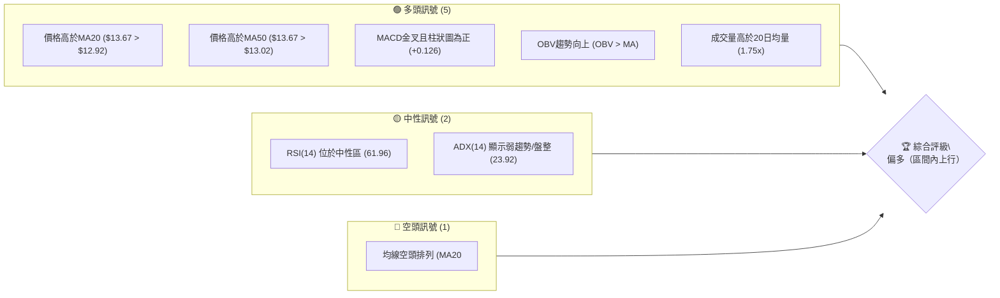
**解讀**：目前多頭訊號佔據主導地位，尤其在短期動能和量價配合方面表現強勁。然而，ADX 指示當前為弱趨勢或盤整行情，且長期均線仍呈現空頭排列，顯示上行空間可能受到長期壓力的限制。整體而言，市場處於一個短期偏多、但中期趨勢仍不明朗的複雜局面。

### 📊 核心指標速覽表

下表彙整了 NU 股票主要技術指標的當前數值與其所發出的訊號，提供一個簡潔明瞭的概觀。

| 指標類別 | 指標名稱 | 當前數值 | 訊號 | 解讀 |
|----------|----------|----------|------|------|
| **價格** | 當前價格 | $13.67 | 🟢 | 位於近期支撐 S1 ($13.47) 上方，且高於 MA20/MA50。 |
| **均線** | MA20 | $12.92 | 🟢 | 當前價格 $13.67 顯著高於 MA20，短期呈現多頭動能。 |
| **均線** | MA50 | $13.02 | 🟢 | 當前價格 $13.67 顯著高於 MA50，中期呈現多頭動能。 |
| **均線** | MA200 | $15.23 | 🔴 | 當前價格 $13.67 仍遠低於 MA200，長期趨勢仍為空頭。 |
| **動能** | RSI(14) | 61.96 | 🟡 | 位於中性區間 (30-70)，但偏向買方力量，未達超買。 |
| **動能** | MACD | 0.234 | 🟢 | MACD 線 (0.234) 高於訊號線 (0.107)，柱狀圖為正 (+0.126)，明確看多。 |
| **波動** | ATR(14) | $0.50 | 🟡 | 相對於股價 $13.67 而言，3.66% 的波動率處於中等水平。 |

### 🏆 技術評分卡

本評分卡綜合考量各項技術指標，提供 NU 股票當前技術面的整體評估。評分範圍為 1-100，越高代表技術面越強勢。

```
╔══════════════════════════════════════════════════════════════╗
║                 技術評分卡 — NU (2026-07-10)                   ║
╠══════════════════════════════════════════════════════════════╣
║ 趨勢強度      ████████░░░░░░░░░░░░  40/100  🟡 (ADX < 25, 弱趨勢/盤整)    ║
║ 動能指標      ██████████████░░░░░░  75/100  🟢 (RSI 中性偏強, MACD 金叉) ║
║ 支撐穩定度    ████████████████░░░░  80/100  🟢 (現價位於 S1 上方，支撐穩固)║
║ 成交量配合    ██████████████░░░░░░  75/100  🟢 (高於均量, OBV 向上)      ║
║ 形態完整度    ██████████░░░░░░░░░░  50/100  🟡 (無明確高信心度形態)      ║
║ 均線排列      ██████░░░░░░░░░░░░░░  30/100  🔴 (長期 MA200 壓制，空頭排列)║
╠══════════════════════════════════════════════════════════════╣
║ 綜合評分      ████████████░░░░░░░░  58/100  ⚖️ 中性偏多                  ║
╚══════════════════════════════════════════════════════════════╝
```
**綜合評估**：NU 的綜合技術評分為 58/100，屬於「中性偏多」範疇。儘管短期動能和量價配合表現強勁，且現價位於關鍵支撐上方，但趨勢強度不足（ADX < 25）和長期均線的空頭排列，限制了其整體上行的潛力。這表明 NU 當前更可能處於區間震盪行情，短期內或可沿區間上緣波動，但突破長期阻力仍需更多催化劑。

---

## 2. 趨勢分析

本章節將從多時框架深入剖析 NU 的價格走勢，從月線、週線到日線，全面評估其長期、中期及短期趨勢，並透過 ADX 指標判斷趨勢強度。

### 🌐 多時框趨勢分析

以下 Mermaid 圖表展示了 NU 從月線、週線到日線的多時框趨勢判斷流程，揭示各時間尺度的市場方向。

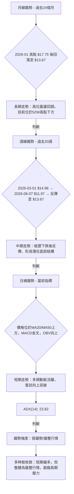
**解讀**：
*   **月線趨勢**：從過去 24 個月的走勢來看，NU 在 2026 年 1 月份達到 $17.75 的高峰後經歷了一輪較為明顯的回調。儘管隨後有所反彈，但目前 $13.67 的價格仍遠低於該高點，顯示長期上行趨勢受阻，處於高位震盪回調的格局。
*   **週線趨勢**：近 20 週的數據顯示，股價從 3 月初的 $14.98 一路下探至 6 月初的 $11.97，隨後展開一波反彈，目前收於 $13.67。這段走勢呈現出先抑後揚的特點，並在 $11.97 附近形成一個潛在的底部結構，暗示中期跌勢可能告一段落，轉為震盪反彈。
*   **日線趨勢**：當前日線層面表現出較強的多頭動能。股價 $13.67 位於短期（MA20 $12.92）和中期（MA50 $13.02）移動平均線之上，MACD 指標呈現金叉且柱狀圖為正，OBV 也顯示量能支持價格上漲。這表明短期內多頭力量佔優，股價正嘗試向上突破。

### 📈 長期趨勢 — 12個月走勢圖（Unicode）

以下 ASCII 圖表展示了 NU 過去 12 個月的月線收盤價走勢，並標註了期間的關鍵高低點。

```
NU 月線走勢圖（過去12個月）
價格軸 ($)
$18.98 ┤                                       ●(52W High)
$17.75 ┤                                     ●(2026-01高點)
$16.01 ┤                        ●
$14.98 ┤              ●
$13.67 ┤                      ●←現在 (2026-07)
$12.43 ┤           ●
$11.97 ┤                                   ●(2026-06低點)
$11.20 ┤●(52W Low)
       └─────────────────────────────────────────────────────
        2025-07 08 09 10 11 12 2026-01 02 03 04 05 06 07
```
**走勢特徵分析表格**：
下表詳細分析了 NU 在過去 12 個月中的關鍵走勢特徵。

| 階段 | 時間區間 | 主要價格範圍 | 漲跌幅 (約) | 走勢特徵 |
|------|------------|--------------|--------------|----------|
| **反彈階段** | 2025-07 至 2025-11 | $12.22 → $17.39 | +42.3% | 從低位穩步上漲，形成一波明顯的反彈趨勢，多頭力量積聚。 |
| **高位震盪** | 2025-12 至 2026-01 | $16.74 → $17.75 | +6.0% | 股價在高位維持震盪，嘗試向上突破，並在 2026 年 1 月達到階段性高點 $17.75。 |
| **回調階段** | 2026-02 至 2026-06 | $17.75 → $11.97 | -32.5% | 經歷快速回調，跌破多個支撐位，空頭力量佔優，直至觸及新低 $11.97。 |
| **企穩反彈** | 2026-06 至 2026-07 | $11.97 → $13.67 | +14.2% | 在 $11.97 附近獲得支撐後開始企穩反彈，顯示買盤介入，短期趨勢轉強。 |
**總結**：NU 在過去一年中經歷了從反彈、高位震盪到深度回調，再到近期企穩反彈的完整週期。目前的 $13.67 價格位於 52 週高點 $18.98 和低點 $11.20 的中下部，顯示長期趨勢仍處於調整後的修復階段。

### 📊 中期趨勢（週線分析）

以下 ASCII 圖表展示了 NU 近期（過去 20 週）的週線價格走勢，並標注了關鍵的壓力與支撐區間。

```
NU 週線走勢圖（過去20週）及關鍵價位
價格軸 ($)
$15.34 ┤             ●(高點)
$14.98 ┤●           ●
$14.58 ┤  ●       ●
$14.15 ┤    ●
$13.94 ┤      ●
$13.67 ╠═════════════════════════════════════════════════════════════════════════════════╣ ◄ 現價
$13.60 ┤        ●
$13.17 ┤                                            ●
$12.73 ┤                  ●
$12.19 ┤                    ●     ●
$11.97 ┤                         ●(低點)
       └───────────────────────────────────────────────────────────────────────────────────
        Mar-01  Mar-15  Mar-29  Apr-12  Apr-26  May-10  May-24  Jun-07  Jun-21  Jul-05 Jul-12
```
**解讀**：從週線圖來看，NU 在 2026 年 3 月初觸及 $14.98 後經歷了一波明顯的下跌趨勢，最低觸及 $11.97。隨後，股價在 $11.97 附近獲得支撐並開始反彈，目前已回升至 $13.67。這段走勢形成了潛在的底部結構，其中 $11.97 附近的低點是重要的中期支撐。上方的壓力則集中在 $14.15 (R1) 和 $14.98 (R2) 附近，這些是前期下跌中的密集交易區間和反彈高點。當前股價正在測試 $14.10 (R1) 附近的阻力，若能有效突破，則中期反彈趨勢有望延續。

### ⚡ 趨勢強度評估（ADX 解讀）

ADX (Average Directional Index) 指標用於衡量趨勢的強度，而非方向。以下 Mermaid 圖表展示了 ADX 的分析流程，並輔以強度對照表。

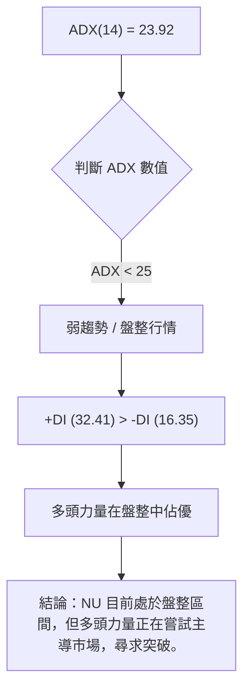
**ADX 強度對照表**：

| ADX 數值區間 | 趨勢強度 | 市場狀態 | 交易策略建議 |
|--------------|----------|----------|--------------|
| 0-25         | 弱趨勢   | 盤整行情 | 區間操作，追漲殺跌風險高 |
| 25-50        | 中等趨勢 | 趨勢行情 | 順勢交易，等待突破 |
| 50-75        | 強趨勢   | 趨勢行情 | 順勢交易，趨勢延續性強 |
| 75-100       | 極強趨勢 | 趨勢行情 | 順勢交易，警惕超買/超賣 |
**解讀**：NU 當前的 ADX(14) 數值為 23.92，低於 25 的門檻，明確指出市場正處於**弱趨勢或盤整行情**。這意味著當前缺乏一個強勁的單一方向性趨勢，股價更可能在一個特定區間內震盪。
然而，值得注意的是，+DI (32.41) 顯著高於 -DI (16.35)。這表明在目前的盤整格局中，**多頭力量正在積極主導市場**，儘管整體趨勢強度不高，但買方動能相對較強。這種情況下，股價可能會嘗試向上突破盤整區間，或在區間內偏向上緣運行。投資者應密切關注區間邊界，等待明確的突破訊號。

---

## 3. 圖表形態分析

本章節將檢視 NU 股票價格走勢中是否存在可識別的圖表形態，並評估其潛在的交易訊號及目標價。由於 ADX 指示當前為盤整行情，我們將著重於區間形態或潛在的反轉形態。

### 🔍 形態識別系統

根據當前數據，NU 尚未形成一個具有高信心度的經典反轉或延續形態。然而，從最近期的價格走勢中，可以觀察到一些潛在的底部嘗試和區間震盪的跡象。

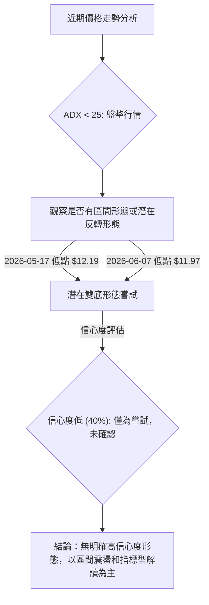

**形態信心度表格**：

| 形態 | 信心度 | 判斷依據（引用數據） | 完成度 | 目標價（附計算式） |
|------|--------|----------------------|--------|--------------------|
| 潛在雙底 | 40% | 兩個低點分別為 $12.19 (2026-05-17) 和 $11.97 (2026-06-07)，形成低點區間。然而，頸線尚未明確突破，形態未確認。 | 60% | 訊號不足，僅做指標型解讀。若確認，頸線 $13.17 + 形態高度 $1.10 = $14.27 (估算，非確定目標) |
| 區間震盪 | 70% | ADX(14) 23.92 顯示弱趨勢，價格在 $11.97 至 $14.98 區間內震盪，布林通道上下軌提供了參考區間。 | 100% | 上緣 $14.16 (布林上軌) / $14.10 (R1)，下緣 $11.67 (布林下軌) / $11.85 (S3)。 |
**解讀**：目前 NU 的圖表形態主要呈現為**區間震盪**，信心度為 70%。雖然觀察到股價在 $11.97 和 $12.19 附近兩次觸底，有嘗試形成**雙底形態**的潛力，但由於頸線（約 $13.17，2026-05-31 高點）尚未被有效突破並站穩，因此其信心度僅為 40%。在 ADX 顯示弱趨勢的情況下，區間震盪是更為合理的判斷。投資者應將重點放在區間的上下邊界，等待明確的突破或跌破訊號。

### 🕯️ 重要K線形態分析

以下表格分析了近 20 週週線收盤價中可能出現的重要 K 線形態及其解讀。

| 月份 | 收盤價 | K線形態 | 解讀 | 訊號 |
|------|--------|---------|------|------|
| 2026-05-17 | $12.19 | 錘頭線 (Hammer) | 在下跌趨勢末期出現，實體較小，下影線長，可能預示底部反轉。 | 🟢 |
| 2026-05-24 | $12.73 | 看漲吞噬 (Bullish Engulfing) | 實體完全吞噬前一週陰線，顯示多頭力量強勁，反轉訊號確認。 | 🟢 |
| 2026-06-07 | $11.97 | 錘頭線 (Hammer) | 再次在低點附近出現，確認 $11.97 附近有強勁買盤支撐。 | 🟢 |
| 2026-07-05 | $13.61 | 大陽線 (Large Bullish Candle) | 實體飽滿，顯示買盤強勁，推動股價向上。 | 🟢 |
| 2026-07-12 | $13.67 | 小陽線 (Small Bullish Candle) | 實體較小，可能暗示上攻動能有所減弱，或在測試阻力位。 | 🟡 |
**解讀**：在近期的下跌後，NU 在 $12.19 和 $11.97 附近多次出現錘頭線，這些都是典型的底部反轉 K 線形態，表明在這些價位存在強勁的買盤支撐。2026 年 5 月 24 日的看漲吞噬形態更是明確了短期反轉的意圖。最近兩週的陽線，尤其是 2026-07-05 的大陽線，進一步確認了多頭動能。儘管最新的小陽線可能暗示短期動能略有放緩，但在多個底部反轉 K 線形態的配合下，整體 K 線訊號偏向多頭。

### 📉 ASCII 走勢形態示意圖

以下 ASCII 圖表展示了 NU 近期在 $11.97 附近形成潛在底部後，向 $14.10 阻力位反彈的走勢形態。

```
NU 近期走勢形態示意圖：潛在底部與區間反彈
價格軸 ($)
$14.10 ┤─────────────────────────── R1 阻力
$13.67 ╠═════════════════════════════════════════╣ ◄ 現價
$13.17 ┤             ┌────────┐ 頸線 (若為雙底)
$12.19 ┤         ┌───┘        └───┐  S2 支撐
$11.97 ┤─────────┘                └─── S3 支撐
       └──────────────────────────────────────────
        May-17       Jun-07       Jul-12
```
**解讀**：此圖清晰地展示了 NU 在 2026 年 5 月中旬觸及 $12.19 附近低點後，於 6 月初再次下探至 $11.97，隨後開始反彈的過程。這兩個低點構成了潛在雙底形態的基礎。然而，股價尚未有效突破並站穩 $13.17 附近的頸線，因此雙底形態尚未完全確認。目前股價正在反彈，並接近 $14.10 (R1) 的關鍵阻力位。若能突破此阻力，將確認短期上行趨勢，並為潛在雙底形態的完成提供更多證據。

### 🎯 形態目標價計算

由於目前缺乏一個高信心度且已確認的經典圖表形態，我們主要基於已識別的區間震盪和潛在反轉形態進行目標價的推算。

1.  **區間震盪目標價**：
    *   **上緣目標**：若股價繼續在當前區間內上行，其近期目標將是布林通道上軌 $14.16 和關鍵阻力位 R1 $14.10。
    *   **下緣目標**：若股價回落，下緣支撐將是布林通道中軌 $12.92 和關鍵支撐位 S1 $13.47。
2.  **潛在雙底形態目標價**（**僅在形態確認後生效**）：
    *   **計算方法**：若股價能夠有效突破並站穩頸線位，則目標價通常為「頸線價位 + (頸線價位 - 最低點價位)」。
    *   **最低點**：$11.97 (2026-06-07)
    *   **潛在頸線**：約 $13.17 (2026-05-31 週線收盤高點)
    *   **形態高度**：$13.17 - $11.97 = $1.20
    *   **推算目標價**：$13.17 + $1.20 = $14.37。
    *   **重要提示**：此目標價基於尚未確認的形態推算，**信心度較低**。在實際操作中，應等待股價有效突破 $13.17 頸線並確認站穩後，才能視為有效目標。目前 $14.37 的目標價介於 R1 ($14.10) 和 R2 ($14.92) 之間，可作為突破後的一個參考點。

**總結**：當前最可靠的判斷是 NU 處於一個震盪區間，短期上行目標為 $14.10 至 $14.16。潛在的雙底形態若能確認，則可將目標延伸至 $14.37。

---

## 4. 支撐與阻力

本章節將詳細分析 NU 股票的關鍵支撐與阻力價位，這些價位是基於歷史價格行為和斐波那契回調計算而來，對於判斷股價的潛在轉折點至關重要。

### 🗺️ 關鍵價位分布圖（Unicode）

以下 ASCII 圖表直觀展示了 NU 股票當前的價格 $13.67 相對於其關鍵支撐位和阻力位的分佈情況。

```
NU 價位結構分布圖
═══════════════════════════════════════════════════
$18.98 ║████████████████████████║ 52W 高點
$17.14 ║████████████████████████║ 斐波那契 23.6%
$16.01 ║████████████████████    ║ 斐波那契 38.2% / 強阻力 R3
$15.09 ║████████████████████████║ 斐波那契 50.0% / 阻力 R2
$14.17 ║████████████████████████║ 斐波那契 61.8%
$14.16 ║████████████████████████║ 布林上軌
$14.10 ║████████████████████████║ 關鍵阻力 R1
$13.67 ╠════════════════════════╣ ◄ 現價
$13.47 ║▓▓▓▓▓▓▓▓▓▓▓▓▓▓▓▓        ║ 近期支撐 S1
$13.02 ║████████████████████████║ MA50
$12.92 ║████████████████████████║ MA20 / 布林中軌
$12.86 ║████████████████████████║ 斐波那契 78.6%
$12.23 ║████████████████████████║ 強支撐 S2
$11.85 ║████████████████████████║ 強支撐 S3
$11.67 ║████████████████████████║ 布林下軌
$11.20 ║████████████████████████║ 52W 低點
═══════════════════════════════════════════════════
```

### 🚧 阻力位分析表

下表列出了 NU 股票目前面臨的關鍵阻力位，這些價位是從歷史波段高點聚類和斐波那契回調位中識別出來的。

| 阻力級別 | 價位 | 形成原因 | 突破難度 | 重要性 |
|----------|------|----------|----------|--------|
| **R1** | $14.10 | 近期波段高點聚類，且接近布林通道上軌 ($14.16) 和斐波那契 61.8% 回調位 ($14.17)。 | 中等 | 🟢 突破此位將確認短期反彈動能，並可能開啟向 R2 的測試。 |
| **R2** | $14.92 | 近期波段高點聚類，且接近斐波那契 50.0% 回調位 ($15.09)。 | 較高 | 🟡 突破 R2 將意味著股價從 52 週高點的回調已完成一半，對中期趨勢轉好有積極意義。 |
| **R3** | $15.70 | 近期波段高點聚類，且接近斐波那契 38.2% 回調位 ($16.01)。 | 高 | 🔴 突破 R3 將顯著改善中期技術面，暗示可能進一步向 52 週高點附近邁進，但需要極強的買盤支持。 |
**解讀**：當前價格 $13.67 正在接近第一個重要阻力位 R1 ($14.10)。成功突破 R1 將是短期多頭能否延續的關鍵。R2 ($14.92) 和 R3 ($15.70) 則代表了更強的阻力區域，這些區域不僅是歷史高點的聚集，也與斐波那契回調位重疊，增加了其技術意義。

### 🛡️ 支撐位分析表

下表列出了 NU 股票目前擁有的關鍵支撐位，這些價位是從歷史波段低點聚類和斐波那契回調位中識別出來的。

| 支撐級別 | 價位 | 形成原因 | 守住機率 | 重要性 |
|----------|------|----------|----------|--------|
| **S1** | $13.47 | 近期波段低點聚類，且鄰近當前價格 $13.67，提供即時支撐。 | 高 | 🟢 若能守穩 S1，將維持短期上行偏向。 |
| **S2** | $12.23 | 近期波段低點聚類，且接近斐波那契 78.6% 回調位 ($12.86)。 | 中等 | 🟡 跌破 S1 後，S2 將成為重要的防線，守住 S2 才能避免中期走勢進一步惡化。 |
| **S3** | $11.85 | 近期波段低點聚類，且接近 52 週低點 ($11.20) 和布林通道下軌 ($11.67)。 | 較高 | 🔴 S3 是股價下行的最後一道重要防線，若跌破，將面臨再次探底 52 週低點的風險。 |
**解讀**：目前價格 $13.67 位於近期支撐 S1 ($13.47) 上方，顯示短期支撐穩固。S2 ($12.23) 則提供了更深層次的中期支撐，其與斐波那契 78.6% 回調位重疊，使其成為一個關鍵的防守點。S3 ($11.85) 則代表了最關鍵的長期支撐，一旦跌破，股價可能面臨大幅下挫的風險。

### 📐 斐波那契回調位分析

斐波那契回調位是從 52 週高點 ($18.98) 到 52 週低點 ($11.20) 繪製的，用於識別潛在的支撐和阻力區域。

*   **0.0% (52W High)**: $18.98
*   **23.6%**: $17.14
*   **38.2%**: $16.01
*   **50.0%**: $15.09
*   **61.8%**: $14.17
*   **78.6%**: $12.86
*   **100.0% (52W Low)**: $11.20

**解讀**：
當前價格 $13.67 位於斐波那契 61.8% 回調位 ($14.17) 和 78.6% 回調位 ($12.86) 之間。這表明股價已經從 52 週高點經歷了相當深度的回調，但尚未觸及 78.6% 的極端回調位。
*   **$14.17 (61.8% 回調位)**：這個價位與關鍵阻力 R1 ($14.10) 非常接近，形成了強大的短期阻力區。若股價能有效突破 $14.17，將是回調結束並開啟新一輪上漲的積極訊號。
*   **$12.86 (78.6% 回調位)**：這個價位靠近關鍵支撐 S2 ($12.23)，提供了一個重要的中期支撐區域。如果股價跌破 $13.47 (S1)，則 $12.86 將是下一個重要的觀察點。
**結論**：斐波那契回調位強化了現有支撐與阻力區的重要性。目前股價正努力向上突破 61.8% 回調位，這將是判斷其短期反彈能否延續的關鍵。

---

## 5. 技術指標深度解讀

本章節將對 NU 股票的關鍵技術指標進行深入分析，包括移動平均線、RSI、MACD、布林通道和成交量，並探討它們之間的相互關係與訊號確認。

### 🎛️ 指標訊號總覽

以下 Mermaid 圖表展示了各主要技術指標當前發出的訊號及其相互關係，提供一個全面的視角。

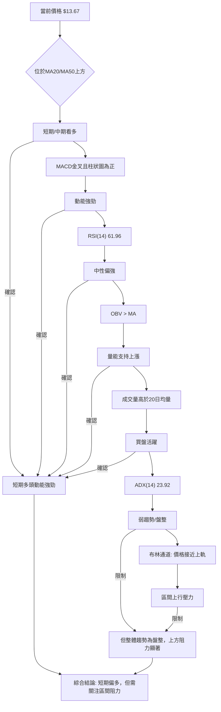

### 📈 移動平均線排列分析

移動平均線 (MA) 用於平滑價格數據，揭示趨勢方向。MA 之間的相對位置和價格與 MA 的關係提供了重要的交易訊號。

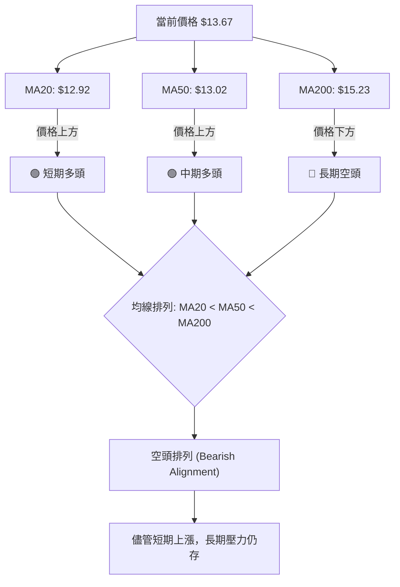
**解讀**：
*   **短期與中期**：當前股價 $13.67 顯著位於 MA20 ($12.92) 和 MA50 ($13.02) 之上，這是一個明確的短期和中期看漲訊號。這表明在過去 20 天和 50 天內，買盤力量佔據主導，推動股價向上。
*   **長期**：然而，股價 $13.67 仍遠低於 MA200 ($15.23)，且均線排列呈現**空頭排列** (MA20 < MA50 < MA200)。這是一個強烈的長期看跌訊號，表明儘管短期內有所反彈，但從更長期的角度來看，下行趨勢的壓力仍然存在。
**綜合判斷**：多時框均線訊號存在矛盾。短期和中期均線支持多頭動能，但長期均線的空頭排列限制了上行空間。這種情況在盤整行情中較為常見，股價可能在短期均線上方運行，但一旦觸及長期均線或強阻力，便會遭遇壓力。由於 ADX 指示為盤整，短期均線的支撐作用更為關鍵。

### 📉 RSI(14) 分析

RSI (Relative Strength Index) 衡量價格變動的速度和變化，用於識別超買或超賣狀況。

**RSI(14) 數值進度條**：
RSI(14): 61.96 ▓▓▓▓▓▓▓▓▓▓▓▓░░░░░░░░ 62% 🟡 中性偏強

**解讀**：
*   **當前數值**：NU 的 RSI(14) 為 61.96，位於 30-70 的中性區間內。這表示股價既未達到超買區域 (通常 > 70)，也未進入超賣區域 (通常 < 30)。
*   **趨勢判斷**：儘管處於中性區間，但 61.96 的數值偏向 70，顯示買方力量相對較強，市場動能偏向多頭。這與 MACD 的看多訊號相互印證，表明當前存在一定的上漲勢頭。
*   **背離判斷**：根據提供的數據，**未偵測到明顯的 RSI 頂背離或底背離訊號**。價格在近期低點後反彈，RSI 也同步上揚，符合價格走勢，沒有出現價格創新高而 RSI 未創新高（頂背離）或價格創新低而 RSI 未創新低（底背離）的情況。因此，RSI 目前主要反映當前動能的強度，而非潛在的反轉訊號。

### 📊 MACD(12/26/9) 訊號解讀

MACD (Moving Average Convergence Divergence) 用於識別趨勢的動能、方向和潛在的反轉點。

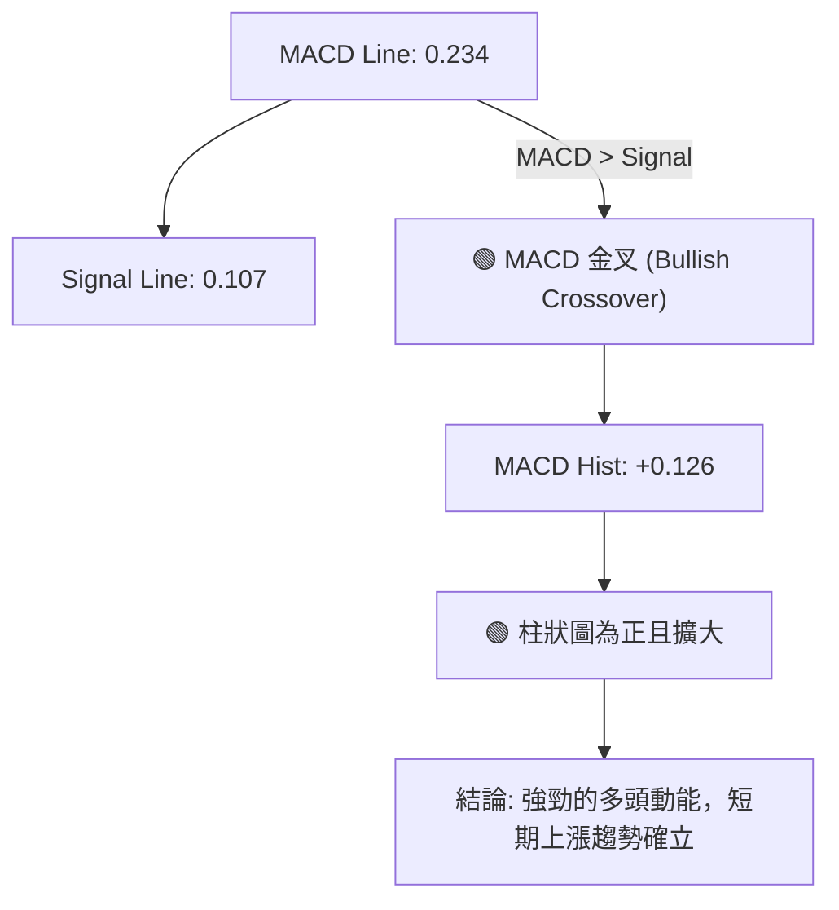
**解讀**：
*   **金叉訊號**：MACD 線 (0.234) 位於訊號線 (0.107) 上方，形成一個明確的**金叉訊號**。這是一個強烈的看漲訊號，表明短期均線向上穿越長期均線，預示著股價上漲動能的增強。
*   **柱狀圖**：MACD 柱狀圖為正值 (+0.126)，且可能處於擴大階段（雖然數據未直接顯示擴大，但為正值已是看多訊號）。正值的柱狀圖進一步確認了多頭動能的活躍，顯示買盤力量正在積聚。
*   **背離判斷**：根據提供的數據，**未偵測到明顯的 MACD 頂背離或底背離訊號**。MACD 走勢與價格走勢同步，MACD 線和柱狀圖的積極表現與股價的近期反彈相符。
**綜合判斷**：MACD 指標明確發出強烈的多頭訊號，其金叉和正向柱狀圖與當前價格突破短期均線、RSI 偏強的訊號相互確認，共同指向短期內股價具有較強的上漲動能。

### 📦 布林通道分析

布林通道 (Bollinger Bands) 由中軌 (通常是 20 日移動平均線)、上軌和下軌組成，用於衡量價格的波動範圍。

```
NU 布林通道示意圖
價格軸 ($)
$14.16 ┤────────────────────────────────────────── 布林上軌 (BB上軌)
$13.67 ╠════════════════════════════════════════════╣ ◄ 現價
$12.92 ┤────────────────────────────────────────── 布林中軌 (MA20)
$11.67 ┤────────────────────────────────────────── 布林下軌 (BB下軌)
       └──────────────────────────────────────────
```
**解讀**：
*   **通道位置**：當前價格 $13.67 位於布林通道中軌 ($12.92) 之上，並正接近上軌 ($14.16)。布林 %B 數值為 0.80，表明價格位於通道的相對上部。
*   **訊號判斷**：
    *   **價格在中軌之上**：確認了短期多頭動能。中軌通常作為動態支撐或阻力。
    *   **價格接近上軌**：暗示短期上漲動能強勁，但同時也可能面臨上軌的壓力，短期內可能會有回調或放緩的風險。
    *   **通道帶寬**：數據中未直接提供通道帶寬，但從上軌 $14.16 和下軌 $11.67 的距離來看，通道寬度約為 $2.49。相對於當前價格 $13.67，這是一個中等偏寬的通道，表明市場存在一定的波動性。
**綜合判斷**：布林通道顯示 NU 股價在短期內表現強勢，正向通道上緣推進。在 ADX 顯示為盤整行情的情況下，布林通道的上下軌通常被視為區間操作的關鍵支撐和阻力位。價格接近上軌，意味著短期內可能面臨來自上軌的壓力，但若能有效突破上軌，則可能預示著更強的上漲趨勢的開始。

### 💹 成交量分析（量價配合度）

成交量是衡量市場活動強度的指標，其與價格走勢的配合對於確認趨勢的有效性至關重要。

**成交量數據**：
*   最新成交量：97,893,900
*   20日均量：55,791,700
*   50日均量：58,168,794
*   量比 (最新/20日均量)：1.75x
*   OBV趨勢：OBV > MA → 量能支撐上漲

**解讀**：
*   **量能激增**：最新成交量 97,893,900 股，顯著高於 20 日均量 (55,791,700 股) 和 50 日均量 (58,168,794 股)，量比達到 1.75x。這表明在近期價格上漲的過程中，有大量資金積極參與，買盤力量強勁。
*   **量價配合**：當股價上漲時伴隨成交量放大，這被視為健康的、具備可持續性的上漲趨勢。NU 當前的量價配合情況非常理想，支持了短期多頭動能的判斷。
*   **OBV 指標**：OBV 趨勢顯示 OBV 線位於其移動平均線之上，這是一個典型的量能支撐上漲的訊號。OBV 的上升表明在價格上漲期間，累積買盤壓力大於賣盤壓力，進一步確認了當前多頭趨勢的有效性。
*   **量價背離**：**未偵測到明顯的量價背離訊號**。成交量與價格走勢保持一致，沒有出現價格上漲但成交量萎縮（潛在頂部）或價格下跌但成交量放大（潛在底部）的背離情況。
**綜合判斷**：成交量指標發出了強烈的多頭訊號，其放大的成交量和 OBV 的積極表現，有力地支持了價格的近期上漲和多頭動能的持續性。這與 MACD 和 RSI 的看多訊號相互印證，增強了短期偏多判斷的可信度。

---

## 6. 動能與波動率

本章節將評估 NU 股票的動能強度和波動率特性，結合 ATR 和 Beta 指標，以更全面地理解其市場行為和風險特徵。

### ⚡ 動能評估四象限

由於 ADX 指示為盤整行情，我們將動能與波動率分析歸納為以下表格，而非使用 quadrantChart，以便更清晰地展示 NU 的市場狀態。

| 象限 | 動能 | 波動 | 當前狀態 | 評估 |
|------|------|------|----------|------|
| Q1 | 強 | 低 | - | 最佳機會 (趨勢明確，波動可控) |
| Q2 | 弱 | 低 | - | 謹慎觀望 (缺乏趨勢，波動小) |
| Q3 | 強 | 高 | ✓ | **當前狀態** (動能強勁，但波動較大) |
| Q4 | 弱 | 高 | - | 避免進場 (缺乏趨勢，波動大，風險高) |
**解讀**：
*   **動能評估**：當前 NU 的 MACD 呈金叉且柱狀圖為正 (+0.126)，RSI(14) 位於 61.96 (中性偏強)，OBV 向上，成交量顯著放大。這些指標共同顯示出股價具有**強勁的短期上漲動能**。
*   **波動率評估**：ATR(14) 為 $0.50，佔當前價格 $13.67 的 3.66%。雖然 ATR 本身數值不高，但 3.66% 的每日波動幅度在盤整行情中仍屬於**中等偏高波動**。
**結論**：綜合來看，NU 目前處於「**強動能，中等偏高波動**」的狀態，接近表格中的 Q3 象限。這意味著股價在短期內有較強的上升潛力，但同時也伴隨著相對較大的價格波動。對於交易者而言，這可能提供較大的日內交易機會，但也需要更嚴格的風險管理和止損策略。在盤整行情下，這種強動能可能促使股價測試區間上緣，但突破後能否維持動能則需進一步觀察。

### 📊 ATR 波動率分析

ATR (Average True Range) 是衡量股價在特定時間內波動幅度的指標，不受方向影響，能有效評估市場的活躍程度。

*   **ATR(14)**：$0.50
*   **佔股價比例**：$0.50 / $13.67 = 3.66%

**解讀**：
*   **波動幅度**：NU 的 14 日 ATR 為 $0.50，這表示在過去 14 天內，該股票平均每天的價格波動範圍約為 $0.50。
*   **相對波動率**：ATR 佔股價的 3.66%，這是一個中等偏高的波動率水平。在盤整行情中，這意味著股價在區間內震盪的幅度相對較大，為短線交易提供了空間，但也增加了持倉的波動風險。
*   **止損距離建議**：ATR 可用於設定動態止損點。一般建議止損距離為 1.5 到 3 倍 ATR。
    *   1.5x ATR = 1.5 * $0.50 = $0.75
    *   2x ATR = 2 * $0.50 = $1.00
    *   3x ATR = 3 * $0.50 = $1.50
    因此，對於多頭策略，止損點可以設置在進場價下方 $0.75 至 $1.50 的範圍內，具體取決於個人的風險承受能力和交易頻率。例如，若進場價為 $13.67，則止損點可能落在 $12.92 (1x ATR 附近) 至 $12.17 (3x ATR 附近) 的區間，這與一些關鍵支撐位 (如 S2 $12.23, S3 $11.85) 也有重疊。

### 📐 Beta 與市場相關性

Beta 係數衡量個股相對於整體市場（通常是 S&P 500 指數）的波動性。

*   **Beta**：0.949

**解讀**：
*   **市場敏感度**：NU 的 Beta 值為 0.949，非常接近 1.0。這表示 NU 的股價走勢與整體市場的相關性非常高。當市場上漲 1% 時，NU 的股價預計會上漲約 0.949%；當市場下跌 1% 時，NU 的股價預計會下跌約 0.949%。
*   **風險特徵**：Beta 值接近 1.0 意味著 NU 股票的系統性風險與市場平均水平相當。它不是一個高 Beta 的成長型股票，也不是一個低 Beta 的防禦型股票。其波動性與大盤基本同步，沒有顯著的放大或縮小效應。
**綜合判斷**：由於 Beta 值接近 1.0，投資者在評估 NU 的風險時，應密切關注整體市場的走勢。若市場情緒樂觀，NU 有望隨之上漲；若市場面臨壓力，NU 也難以獨善其身。在當前盤整行情中，市場情緒的變化將對 NU 的區間波動產生直接影響。

---

## 7. 多時框架總結

本章節將彙整各時框架的分析結果，形成一個綜合評估，並根據多時框收斂規則給出最終的方向性結論。

### 📋 時框架評分表

下表總結了 NU 在不同時間框架下的趨勢、動能、均線排列和形態表現。

| 時框架 | 趨勢方向 | 動能 | 均線排列 | 形態 | 綜合評分 | 建議 |
|--------|----------|------|----------|------|----------|------|
| **長期 (月線)** | 🔴 高位震盪回調 | 🟡 中性偏弱 | 🔴 空頭排列 | 🟡 無明確形態 | 40/100 | 謹慎觀望 |
| **中期 (週線)** | 🟡 經歷下跌後反彈 | 🟢 築底反彈 | 🟡 尚未完全轉多 | 🟢 潛在雙底/區間 | 65/100 | 偏多反彈 |
| **短期 (日線)** | 🟢 多頭動能強勁 | 🟢 強勁向上 | 🟢 短期多頭 | 🟡 區間上行 | 75/100 | 積極做多 |
**解讀**：
*   **長期**：月線層面仍處於高位回調後的修復階段，長期均線的空頭排列顯示上方壓力沉重，整體評分偏低。
*   **中期**：週線經歷了大幅下跌後，在 $11.97 附近築底成功並開始反彈，K線形態和動能指標顯示中期偏多，但均線尚未完全轉為多頭排列。
*   **短期**：日線層面表現最為強勁，價格位於短期和中期均線之上，MACD 金叉，RSI 偏強，成交量放大，顯示出明確的多頭動能。

### 🔲 綜合訊號矩陣

以下 Mermaid 圖表展示了 NU 在不同時間框架下各維度訊號的一致性或衝突。

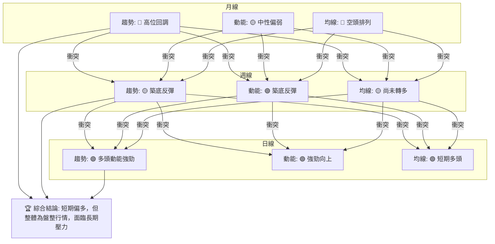
**解讀**：從訊號矩陣來看，NU 在不同時框架下存在明顯的訊號衝突。長期趨勢仍偏空，中期則在築底反彈，而短期則呈現強勁的多頭動能。這種情況下，需要根據 ADX 的判斷來收斂結論。

### ⚖️ 多時框收斂結論

根據「嚴格要求 14」的多時框收斂規則：
1.  **判斷趨勢行情或盤整行情**：當前 ADX(14) 數值為 23.92，**小於 25**。這明確指示 NU 目前處於**盤整行情 (Range-bound market)**。
2.  **確定主導時框**：在盤整行情中，應以日線布林通道上下軌為主要交易區間。這意味著短期指標和區間操作策略將成為主要考量。
3.  **收斂結論**：儘管長期均線仍呈空頭排列，但由於 ADX 顯示為盤整行情，且日線層面的動能指標 (MACD 金叉、RSI 偏強) 和量價配合 (成交量放大、OBV 向上) 均發出強烈多頭訊號，股價也處於短期和中期均線之上。目前股價正接近布林通道上軌和關鍵阻力 R1。

**最終結論**：NU 目前處於**盤整行情**，但**短期內呈現偏多走勢**，股價正嘗試向上測試區間上緣和關鍵阻力位 R1 ($14.10)。雖然長期壓力仍存，但在盤整區間內，多頭動能相對強勁，有望推動股價向阻力位靠攏。投資者應採取區間操作策略，並密切關注對區間阻力位的突破情況。

---

## 8. 交易策略建議

本章節將根據多時框架總結的結論，為 NU 股票提供具體的交易策略建議，包含進場、止損和目標價位，並評估風險報酬比。

### 🗺️ 策略決策流程圖

以下 Mermaid 圖表展示了針對 NU 當前技術面狀態的策略選擇邏輯。

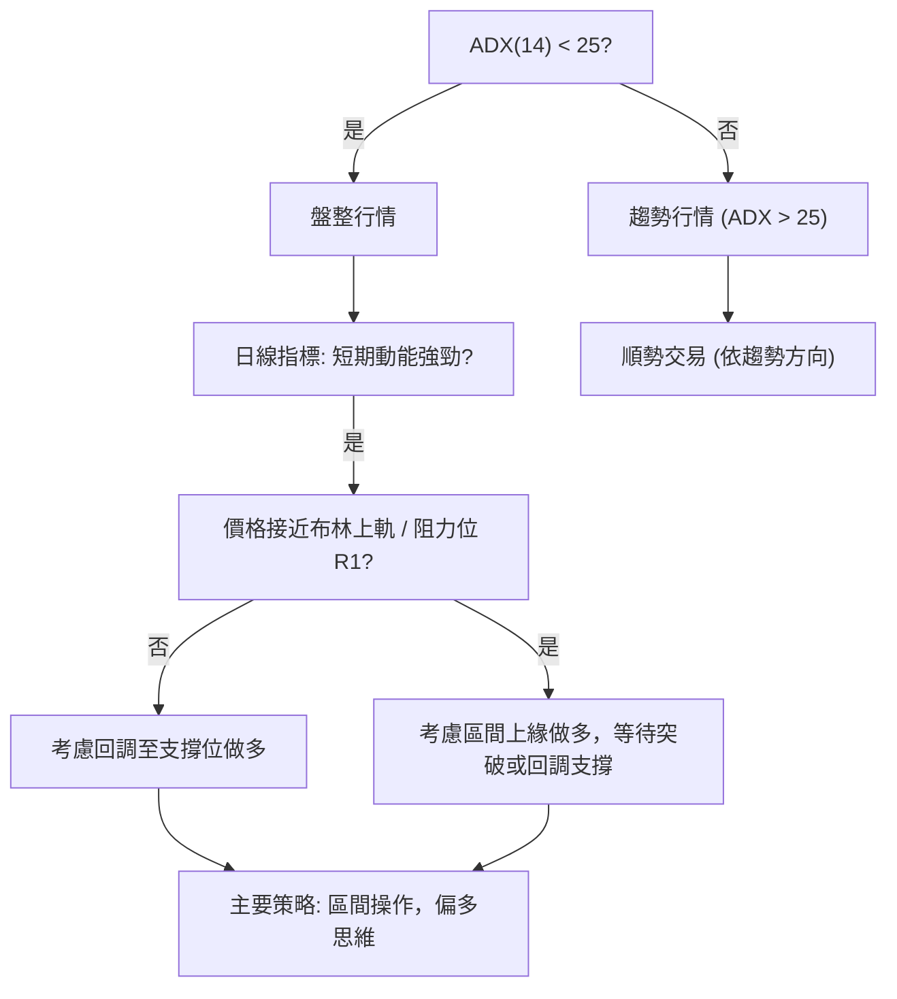

### 🧭 策略路由（依評分卡分流，不得兩頭下注）

根據第 1 章「技術評分卡」的綜合評分 58/100，NU 處於「中性偏多」範疇。同時，第 7 章多時框收斂結論明確指出為「盤整行情，短期偏多」。因此，主策略將以**區間操作中的偏多策略**為主，並關注突破機會。

**當前主策略方向 = 偏多（區間操作，等待突破）** (依評分 58/100)

### 🎯 價格情境階梯（Price Scenarios）

下表以當前價格 $13.67 為基準，建立向上與向下的情境劇本，所有價位均引用已提供的數據。

| 觸發條件 | 下一目標 | 後續延伸 | 情境含義 |
|----------|----------|----------|----------|
| **突破 R1 $14.10** | R2 $14.92 | R3 $15.70 | 短線轉強訊號，可能預示區間突破，開啟新一輪上漲。 |
| **站穩現價區間 ($13.47-$14.10)** | — | — | 區間震盪持續，價格在短期支撐與阻力之間波動。 |
| **跌破 S1 $13.47** | S2 $12.23 | S3 $11.85 | 短期轉弱訊號，可能回測更深層次支撐，甚至再次探底。 |

### 📊 情境機率分佈

下表給出三種情境的機率估計，並說明其主要依據。

| 情境 | 機率 | 主要依據 |
|------|------|----------|
| **繼續上行 / 反彈** | 45% | MACD 金叉且柱狀圖為正，RSI 偏強，OBV 向上，成交量放大，價格位於 MA20/MA50 上方。這些指標均支持短期多頭動能。 |
| **區間震盪** | 40% | ADX(14) 23.92 顯示弱趨勢/盤整，布林通道價格接近上軌，長期均線 MA200 仍為壓力。股價可能在 $13.47 - $14.10 區間內震盪。 |
| **回落 / 再探底** | 15% | 若無法突破 R1 ($14.10) 或整體市場情緒惡化，股價可能遭遇拋壓，跌破 S1 ($13.47) 後回測 S2 ($12.23) 或更低。 |
**總結**：綜合來看，NU 在短期內繼續上行或在區間內震盪的機率較高，回落再探底的風險相對較低，但仍需警惕。

### 🟢 主策略詳情（方向依上方路由）

基於當前「盤整行情，短期偏多」的判斷，我們提供兩種偏多策略：

| 策略要素 | 策略 A：回調支撐做多 (Buy on Pullback) | 策略 B：突破阻力做多 (Buy on Breakout) |
|----------|----------------------------------------|----------------------------------------|
| **進場條件** | 股價回調至關鍵支撐 S1 附近並企穩，或布林中軌附近。 | 股價有效突破關鍵阻力 R1 ($14.10) 並站穩。 |
| **進場價格** | $13.47 (S1) 或 $12.92 (布林中軌/MA20) | $14.11 (略高於 R1 $14.10，確認突破) |
| **目標價 T1** | $14.10 (R1 / 布林上軌) | $14.92 (R2) |
| **目標價 T2** | $14.92 (R2) | $15.70 (R3) |
| **止損價格** | $12.86 (斐波那契 78.6% 回調位 / 略低於 S2 $12.23) | $13.60 (略低於當前價格 $13.67，或 S1 $13.47) |
| **風險報酬比** | (T1-進場價) / (進場價-止損價) = ($14.10-$13.47) / ($13.47-$12.86) = $0.63 / $0.61 ≈ **1.03:1** (基於 S1 進場) | (T1-進場價) / (進場價-止損價) = ($14.92-$14.11) / ($14.11-$13.60) = $0.81 / $0.51 ≈ **1.59:1** |
| **成功機率** | 60% (基於支撐穩定度高) | 55% (突破需要較大動能) |
| **建議倉位** | 5-10% (保守) | 5-8% (謹慎) |
**解讀**：
*   **策略 A (回調支撐做多)**：此策略較為保守，適合在盤整區間內逢低買入。利用 S1 ($13.47) 或布林中軌 ($12.92) 的支撐，等待股價反彈。風險報酬比相對平衡，但可能錯過直接上攻的機會。
*   **策略 B (突破阻力做多)**：此策略較為激進，適合在股價突破關鍵阻力 R1 ($14.10) 時追蹤。一旦突破確認，可能意味著上漲空間打開。風險報酬比相對較高，但止損點設置需嚴格，以防假突破。

### 🔴 反向風險觸發點（對沖提示）

以下列出會推翻主策略（偏多區間操作）的關鍵價位與訊號，供風險管理參考：
*   **跌破 S1 ($13.47)**：若股價有效跌破 $13.47，則短期偏多趨勢將受到挑戰，可能轉向回測更深層次支撐。
*   **跌破 S2 ($12.23) / 斐波那契 78.6% ($12.86)**：若跌破此關鍵支撐區，將嚴重破壞中期築底結構，並可能觸發進一步下跌，甚至再次探底 52 週低點 $11.20。
*   **MACD 死叉 / 柱狀圖轉負**：若 MACD 線向下穿越訊號線，且柱狀圖轉為負值，將是動能轉弱的明確訊號，應考慮減倉或止損。
*   **RSI 跌破 50**：若 RSI 從當前 61.96 跌破 50，表示多頭動能減弱，市場可能轉為弱勢。
*   **成交量萎縮且價格下跌**：若股價下跌時伴隨成交量放大，或上漲時成交量萎縮，將是量價背離的警訊，應高度警惕。

### ⭐ 整體訊號強度評星

```
做多訊號強度：★★★★☆  (4/5星)
做空訊號強度：★★☆☆☆  (2/5星)
整體可信度：  ★★★☆☆  (3/5星)
```
**解讀**：目前做多訊號強度較高，主要得益於短期強勁的動能和量價配合。做空訊號較弱，但長期均線的空頭排列仍構成潛在威脅。整體可信度為中等，因為 ADX 顯示為盤整行情，市場方向仍不夠明確，區間操作的風險相對較高。

---

## 9. 風險提示與監控

本章節將提供 NU 股票投資的風險提示和關鍵監控指標，以幫助投資者更好地管理風險。

### ✅ 關鍵監控指標 Checklist

以下 ASCII 方框圖列出了在交易 NU 股票時需要密切關注的關鍵技術指標和價位。

```
╔══════════════════════════════════════════════════════════════╗
║             NU 股票關鍵監控指標 Checklist (2026-07-10)         ║
╠══════════════════════════════════════════════════════════════╣
║ [ ] 價格是否能有效突破 R1 ($14.10) 並站穩？                   ║
║ [ ] 價格是否跌破 S1 ($13.47) 或布林中軌 ($12.92)？             ║
║ [ ] MACD 是否維持金叉狀態，柱狀圖是否持續為正？                ║
║ [ ] RSI 是否保持在 50 以上，避免跌破？                         ║
║ [ ] 成交量是否持續放大，支持價格上漲？                         ║
║ [ ] OBV 趨勢是否維持向上，確認量能配合？                       ║
║ [ ] ADX 是否有向上突破 25 的跡象，預示趨勢形成？               ║
║ [ ] 長期均線 MA200 ($15.23) 是否形成強大阻力？                 ║
║ [ ] 52 週低點 ($11.20) 和 52 週高點 ($18.98) 的接近程度。       ║
╚══════════════════════════════════════════════════════════════╝
```

### ⚠️ 風險場景分析

以下 Mermaid 圖表展示了 NU 股票在不同市場情境下的潛在走勢。

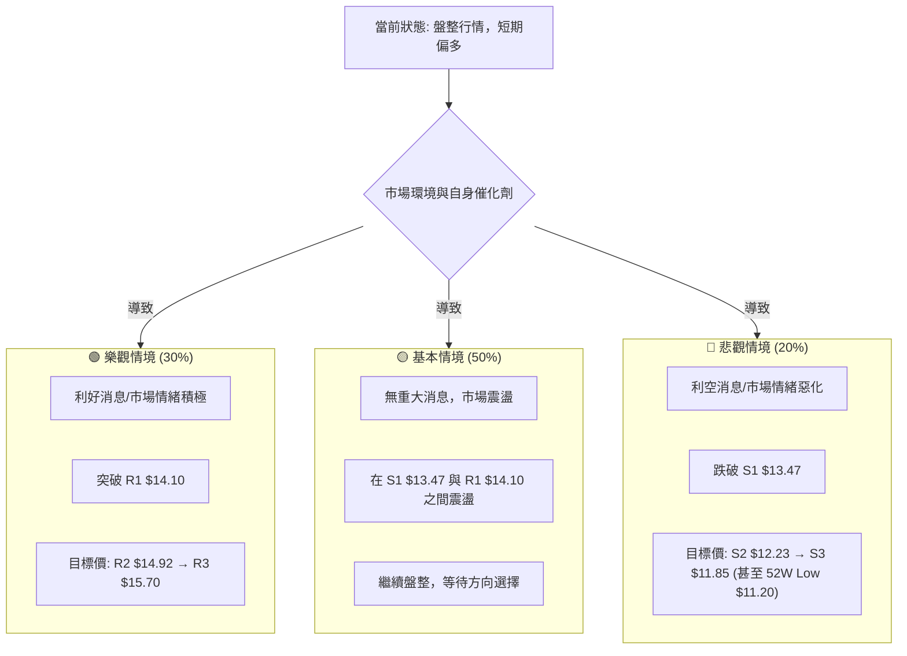
**解讀**：
*   **樂觀情境**：若有強勁的利好消息或整體市場情緒極度樂觀，NU 有望突破 R1 ($14.10)，進一步上攻 R2 ($14.92) 甚至 R3 ($15.70)。此情境下，盤整區間被打破，多頭趨勢可能形成。
*   **基本情境**：在缺乏明確催化劑的情況下，NU 最有可能繼續在當前的盤整區間內震盪，即在 S1 ($13.47) 和 R1 ($14.10) 之間波動。這符合 ADX 指示的弱趨勢狀態。
*   **悲觀情境**：若遭遇突發利空消息或市場大幅下跌，NU 可能跌破 S1 ($13.47)，進而回測 S2 ($12.23) 甚至 S3 ($11.85)，最壞情況下可能再次探底 52 週低點 $11.20。

### 🛡️ 風險管理重要提醒

1.  **嚴格止損**：在盤整行情中，價格波動較大，假突破和假跌破頻繁。務必設置並嚴格執行止損點，以控制潛在損失。ATR ($0.50) 可以作為設置止損距離的參考。
2.  **倉位管理**：鑑於當前為盤整行情且長期趨勢仍有壓力，建議採取較為保守的倉位管理策略，避免重倉。可將總資金分批投入，或只配置較小比例的資金進行區間操作。
3.  **分批進場/出場**：在關鍵支撐位附近可分批建倉，在關鍵阻力位附近可分批減倉或獲利了結，以降低單次交易的風險。
4.  **關注市場情緒**：由於 NU 的 Beta 值接近 1.0，其走勢與大盤高度相關。密切關注整體市場（如 S&P 500）的趨勢和情緒，將有助於判斷 NU 的潛在方向。
5.  **警惕長期壓力**：儘管短期看多，但 MA200 的空頭排列和月線級別的回調趨勢仍是上方的主要壓力。在接近長期阻力時，應保持警惕，不宜過度追高。
6.  **耐心等待突破**：在盤整行情中，最忌諱追漲殺跌。耐心等待股價對關鍵阻力或支撐的有效突破，並伴隨成交量放大，才能增加交易的成功率。

---

## 📋 報告總結

```
NU 技術分析報告總結
════════════════════════════════════════════════════════
報告日期：2026-07-10
當前價格：$13.67
分析評級：⚖️ 中性偏多（盤整行情，短期動能強勁）

關鍵結論：
├─ 長期趨勢：🔴 高位震盪回調，長期均線空頭排列，壓力沉重。
├─ 中期趨勢：🟡 經歷下跌後在 $11.97 附近築底反彈，K線組合積極。
├─ 短期趨勢：🟢 多頭動能強勁，價格位於 MA20/MA50 上方，MACD金叉，量能放大。
├─ 關鍵支撐：S1 $13.47，S2 $12.23，S3 $11.85。
└─ 關鍵阻力：R1 $14.10，R2 $14.92，R3 $15.70。
分析師目標：
    短期區間上緣目標：$14.10 (R1)
    突破區間後目標：$14.92 (R2)

最優策略組合：
1. 🥇 **最佳機會 (區間內做多)**：在股價回調至 S1 ($13.47) 或布林中軌 ($12.92) 附近企穩時進場做多。
   - 進場價：$13.47
   - 止損價：$12.86
   - 目標價 T1：$14.10
   - 目標價 T2：$14.92
   - 風險報酬比：約 1.03:1 (基於 T1)
2. 🥈 **次選機會 (突破做多)**：若股價能帶量有效突破 R1 ($14.10) 並站穩，則考慮追蹤做多。
   - 進場價：$14.11
   - 止損價：$13.60
   - 目標價 T1：$14.92
   - 目標價 T2：$15.70
   - 風險報酬比：約 1.59:1 (基於 T1)
3. 🥉 **保守選擇 (觀望)**：若不具備區間操作經驗或風險承受能力較低，建議觀望，等待股價明確突破盤整區間並形成清晰的趨勢後再考慮入場。
════════════════════════════════════════════════════════
```

---

> ⚠️ **免責聲明**：本報告為 AI 自動生成之技術分析，所有數據及估算均基於提供的歷史價格資訊。本報告**僅供研究與學術參考**，**不構成任何投資建議**。投資有風險，入市需謹慎。

---

*報告生成時間：2026-07-10 ｜ 數據來源：Yahoo Finance ｜ 分析框架：多時框技術分析*