# NVDA 基本面深度分析報告
> **報告日期**：2026-02-26 ｜ **語言**：繁體中文 ｜ **數據來源**：Yahoo Finance ｜ **分析師**：CFA 級機構研究

---

## 目錄

| # | 章節 | 核心結論 |
|---|------|----------|
| 1 | 執行摘要 | 強烈買入，目標價 $256-$320 |
| 2 | 公司概覽與商業模式 | AI 基礎設施霸主，護城河極深 |
| 3 | 損益表深度分析 | 收入 YoY +114%，淨利率突破 53% |
| 4 | 資產負債表分析 | 淨現金 $497億，財務結構極度健康 |
| 5 | 現金流量深度分析 | FCF $608億，轉換率達 83.5% |
| 6 | 獲利能力與資本效率 | ROIC 遠超 WACC，強力創造股東價值 |
| 7 | 估值深度分析 | Forward P/E 17.4x，相對成長率嚴重低估 |
| 8 | 成長催化劑 | Blackwell、主權 AI、機器人學 |
| 9 | 風險矩陣 | 出口管制、競爭加劇為主要尾部風險 |
| 10 | 投資建議 | 12個月目標價基準 $280，上行 51.4% |

---

## 1. 執行摘要

### 1.1 核心評分儀表板

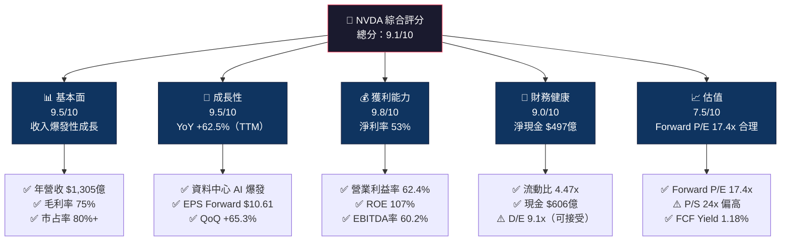

### 1.2 評分進度條視覺化

```
╔══════════════════════════════════════════════════════════════╗
║              NVDA 多維度評分儀表板 (1-10分)                  ║
╠══════════════════════════════════════════════════════════════╣
║ 基本面強度  9.5 ▓▓▓▓▓▓▓▓▓▓▓▓▓▓▓▓▓▓▓░  ★★★★★           ║
║ 成長動能    9.5 ▓▓▓▓▓▓▓▓▓▓▓▓▓▓▓▓▓▓▓░  ★★★★★           ║
║ 獲利品質    9.8 ▓▓▓▓▓▓▓▓▓▓▓▓▓▓▓▓▓▓▓▓  ★★★★★           ║
║ 財務健康    9.0 ▓▓▓▓▓▓▓▓▓▓▓▓▓▓▓▓▓▓░░  ★★★★★           ║
║ 估值合理性  7.5 ▓▓▓▓▓▓▓▓▓▓▓▓▓▓▓░░░░░  ★★★★☆           ║
║ 護城河深度  9.7 ▓▓▓▓▓▓▓▓▓▓▓▓▓▓▓▓▓▓▓▓  ★★★★★           ║
║ 管理層執行  9.2 ▓▓▓▓▓▓▓▓▓▓▓▓▓▓▓▓▓▓░░  ★★★★★           ║
║ 技術創新力  9.8 ▓▓▓▓▓▓▓▓▓▓▓▓▓▓▓▓▓▓▓▓  ★★★★★           ║
╠══════════════════════════════════════════════════════════════╣
║ 綜合總分    9.1 ▓▓▓▓▓▓▓▓▓▓▓▓▓▓▓▓▓▓░░  🏆 極度優質          ║
╚══════════════════════════════════════════════════════════════╝
```

### 1.3 五大投資論點 + 三大核心風險

| 類型 | 項目 | 具體依據 | 信心度 |
|------|------|----------|--------|
| 🟢 **投資論點①** | **AI 基礎設施不可或缺** | 資料中心收入佔比 >85%，H100/H200/B200 供不應求；全球 CSP 資本支出 2025E 超 $5,000億 | 🟢 極高 |
| 🟢 **投資論點②** | **盈利能力突破性躍升** | 淨利率從 2023 的 16.2% → 2025 的 55.8%，ROE 達 107.4%，遠超行業均值 | 🟢 極高 |
| 🟢 **投資論點③** | **CUDA 生態系統護城河** | 全球 >400 萬開發者依賴 CUDA，轉換成本極高，形成不可逾越的軟體護城河 | 🟢 極高 |
| 🟢 **投資論點④** | **Forward P/E 嚴重折價** | Forward P/E 僅 17.4x vs 歷史均值 40-60x，EPS 預估從 $4.05 → $10.61 成長 162%，PEG 極低 | 🟢 高 |
| 🟢 **投資論點⑤** | **多元成長引擎** | 機器人學、自駕車、主權 AI、NVIDIA NIM 軟體訂閱，開拓全新 TAM | 🟢 高 |
| 🟡 **風險①** | **出口管制升級** | 美國對中國 AI 晶片限制持續擴大，中國佔 NVDA 收入約 13-17%，每季潛在衝擊約 $20-30億 | 🟡 中度 |
| 🔴 **風險②** | **競爭加劇與自研晶片** | AMD MI300X 快速追趕；Google TPU、AWS Trainium、Microsoft Maia 客戶自研，長期侵蝕市占 | 🔴 高衝擊 |
| 🟡 **風險③** | **集中度風險 + 估值重估** | 前 5 大客戶佔收入 ~45%，若 AI 資本支出週期反轉，估值可能從 40x P/E 急速壓縮至 20x | 🟡 中度 |

### 1.4 快速統計卡片

| 指標 | NVDA 實際值 | 行業均值 | S&P 500 均值 | 狀態 |
|------|-------------|----------|--------------|------|
| 收入 YoY 成長 | **62.5%** | ~8% | ~5% | 🟢 遠超 |
| 毛利率 | **70.0%** | ~45% | ~35% | 🟢 頂級 |
| 淨利率 | **53.0%** | ~15% | ~12% | 🟢 極稀有 |
| ROE | **107.4%** | ~18% | ~15% | 🟢 突破性 |
| Forward P/E | **17.4x** | ~25x | ~21x | 🟢 折價 |
| EV/EBITDA | **41.7x** | ~18x | ~14x | 🟡 偏高 |
| FCF Margin | **~28%** | ~12% | ~8% | 🟢 優秀 |
| 流動比率 | **4.47x** | ~2.0x | ~1.5x | 🟢 極強 |
| 市值 | **$4.50兆** | — | — | 🟢 全球前三 |
| 59 分析師共識 | **強烈買入** | — | — | 🟢 高度共識 |

### 1.5 投資結論

```
╔══════════════════════════════════════════════════════════════════╗
║                    📊 投資結論摘要                               ║
╠══════════════════════════════════════════════════════════════════╣
║  評級：🟢 強烈買入 (Strong Buy)                                 ║
║  當前股價：$184.89                                               ║
║  目標價區間：                                                    ║
║    悲觀情境：$200（+8.2%）                                       ║
║    基準情境：$280（+51.4%）  ← 12個月主要目標                   ║
║    樂觀情境：$352（+90.4%）                                      ║
║  分析師共識目標：$256.25（+38.6%）                               ║
║  投資評分：9.1/10                                                ║
║  適合投資人：成長型、長線持有者                                  ║
╚══════════════════════════════════════════════════════════════════╝
```

---

## 2. 公司概覽與商業模式

### 2.1 業務結構與收入來源

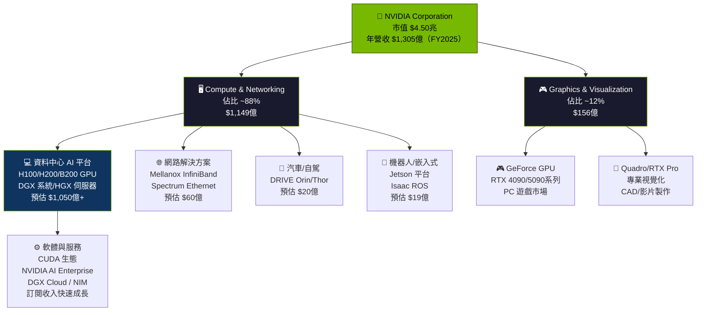

### 2.2 AI 加速運算市場份額

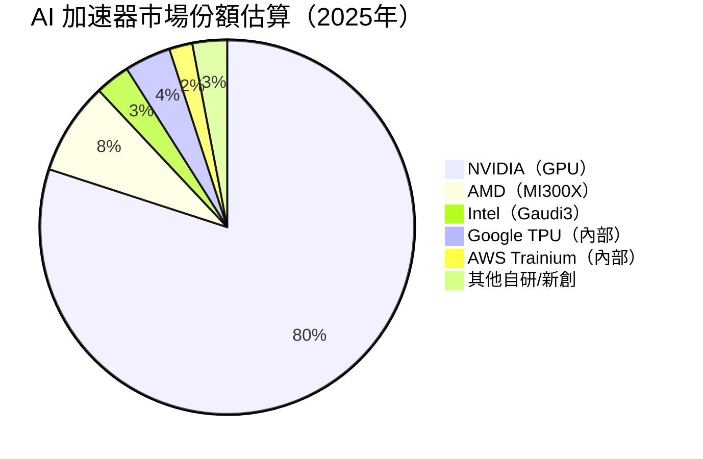

### 2.3 競爭護城河分析

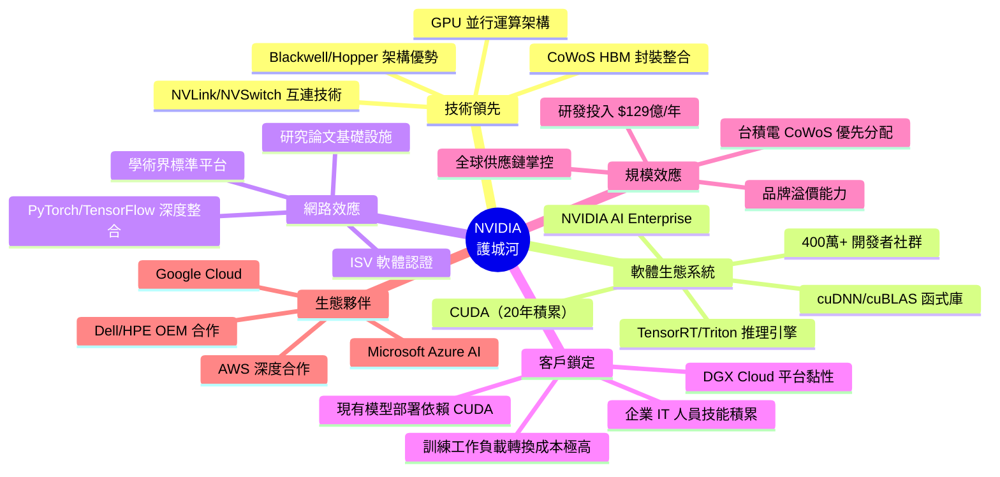

### 2.4 護城河強度評分

```
╔══════════════════════════════════════════════════════════════╗
║                  NVIDIA 護城河強度評分                        ║
╠══════════════════════════════════════════════════════════════╣
║ CUDA 軟體生態   10/10  ▓▓▓▓▓▓▓▓▓▓▓▓▓▓▓▓▓▓▓▓  🏆 不可複製    ║
║ 技術架構領先     9/10  ▓▓▓▓▓▓▓▓▓▓▓▓▓▓▓▓▓▓░░  🟢 2-3年領先   ║
║ 網路效應         9/10  ▓▓▓▓▓▓▓▓▓▓▓▓▓▓▓▓▓▓░░  🟢 飛輪效應強  ║
║ 客戶轉換成本     8/10  ▓▓▓▓▓▓▓▓▓▓▓▓▓▓▓▓░░░░  🟢 高度黏性    ║
║ 規模效應         8/10  ▓▓▓▓▓▓▓▓▓▓▓▓▓▓▓▓░░░░  🟢 R&D 投入優勢║
║ 品牌溢價         9/10  ▓▓▓▓▓▓▓▓▓▓▓▓▓▓▓▓▓▓░░  🟢 標準制定者  ║
║ 供應鏈掌控       7/10  ▓▓▓▓▓▓▓▓▓▓▓▓▓▓░░░░░░  🟡 台積電依賴  ║
╠══════════════════════════════════════════════════════════════╣
║ 綜合護城河       9.7   ▓▓▓▓▓▓▓▓▓▓▓▓▓▓▓▓▓▓▓▓  🏆 世界級護城河 ║
╚══════════════════════════════════════════════════════════════╝
```

---

## 3. 損益表深度分析

### 3.1 年度收入成長趨勢（近4年）

```
╔══════════════════════════════════════════════════════════════════╗
║              NVIDIA 年度收入趨勢（FY2022-FY2025）                ║
╠══════════════════════════════════════════════════════════════════╣
║                                                                  ║
║  FY2022  $26.91B  ██████░░░░░░░░░░░░░░░░░░░  YoY: 基準年       ║
║  FY2023  $26.97B  ██████░░░░░░░░░░░░░░░░░░░  YoY: +0.2%  🟡    ║
║  FY2024  $60.92B  ██████████████░░░░░░░░░░░  YoY:+125.9% 🟢    ║
║  FY2025  $130.5B  ████████████████████████░  YoY: +114.2% 🟢   ║
║  TTM     $187.1B  █████████████████████████  YoY: +62.5%  🟢   ║
║                   |      |      |      |      |                  ║
║                   0     50B   100B   150B   200B                 ║
║                                                                  ║
║  📊 3年累計 CAGR（FY2022-FY2025）: +69.5%                       ║
║  📊 AI 週期爆發點：FY2024 Q1（ChatGPT 效應）                    ║
╚══════════════════════════════════════════════════════════════════╝
```

### 3.2 季度收入趨勢分析

| 季度 | 收入 | QoQ 成長 | 狀態 | 備註 |
|------|------|----------|------|------|
| FY2025 Q4 (2025-01-31) | $39.33B | 基準 | 🟢 | 創歷史新高（當時） |
| FY2026 Q1 (2025-04-30) | $44.06B | **+12.0%** | 🟢 | 超預期強勁 |
| FY2026 Q2 (2025-07-31) | $46.74B | **+6.1%** | 🟢 | Blackwell 持續交付 |
| FY2026 Q3 (2025-10-31) | $57.01B | **+21.9%** | 🟢 🚀 | 爆發性加速 |

**YoY 對比計算**：

| 季度 | 本季收入 | 上年同期 | YoY 成長 |
|------|----------|----------|----------|
| Q3 FY2026 (2025-10) | $57.01B | ~$18.1B (Q3 FY2024E) | **+215%** 🟢 |
| Q2 FY2026 (2025-07) | $46.74B | ~$13.5B (Q2 FY2024E) | **+246%** 🟢 |
| Q1 FY2026 (2025-04) | $44.06B | ~$22.1B (Q1 FY2025) | **+99.4%** 🟢 |

> 📌 **關鍵觀察**：Q3 FY2026 單季收入 $570億，已接近 FY2023 全年收入（$270億）的 2.1 倍，季度成長加速令人矚目。

### 3.3 利潤率演變分析

| 利潤率指標 | FY2022 | FY2023 | FY2024 | FY2025 | 趨勢 | 評估 |
|------------|--------|--------|--------|--------|------|------|
| **毛利率** | 64.9% | 56.9% | 72.7% | 75.0% | ↗️ 強勁回升 | 🟢 |
| **營業利益率** | 37.3% | 20.7% | 54.1% | 62.4% | ↗️ 結構性改善 | 🟢 |
| **EBITDA 率** | 42.2% | 22.2% | 58.4% | 66.0% | ↗️ 槓桿效應顯著 | 🟢 |
| **淨利率** | 36.2% | 16.2% | 48.8% | 55.8% | ↗️ 歷史性突破 | 🟢 |
| **R&D 佔收入** | 19.6% | 27.2% | 14.2% | 9.9% | ↘️ 規模效應 | 🟢 |

**利潤率改善原因深度解析**：
- **FY2023 下滑**：遊戲 GPU 需求崩潰（-27% YoY），庫存減損，固定成本高攤提
- **FY2024-2025 爆發**：H100 GPU 供不應求，ASP（平均售價）暴升，高毛利 AI 產品組合替代低毛利遊戲，收入規模化攤薄 OpEx
- **毛利率 75% 的奧秘**：AI GPU 定價能力極強（H100 單卡售價 $3-4萬），軟體/服務收入佔比提升

### 3.4 費用結構分析

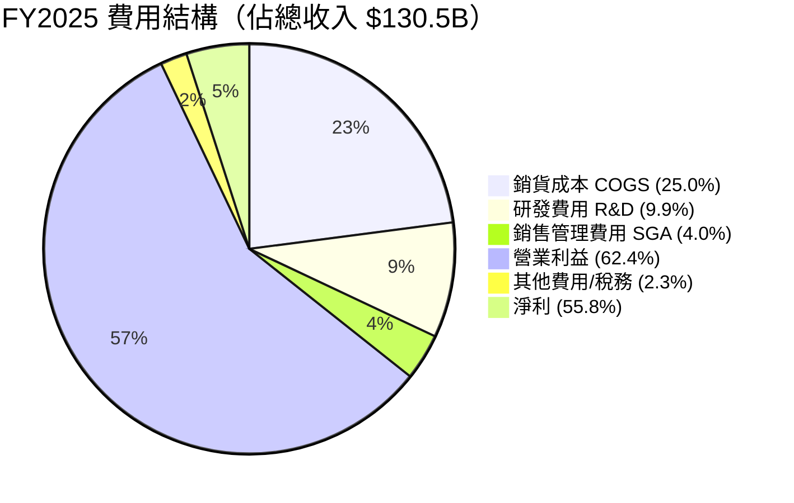

```
╔══════════════════════════════════════════════════════════════════╗
║            FY2025 NVDA 每 $100 收入的去向分解                   ║
╠══════════════════════════════════════════════════════════════════╣
║                                                                  ║
║  銷貨成本     $25.0  ████████░░░░░░░░░░░░░░░░░░░░░░░░░░░░       ║
║  研發費用      $9.9  ███░░░░░░░░░░░░░░░░░░░░░░░░░░░░░░░░░       ║
║  銷售管理費    $4.0  █░░░░░░░░░░░░░░░░░░░░░░░░░░░░░░░░░░░       ║
║  ──────────────────────────────────────────────────             ║
║  💰 留存為淨利 $55.8  █████████████████████░░░░░░░░░░░░░       ║
║                                                                  ║
║  🎯 每賺入 $100，NVIDIA 留下 $55.8 作為純利潤                   ║
║     （全球最高淨利率科技公司之一）                               ║
╚══════════════════════════════════════════════════════════════════╝
```

### 3.5 季度 EPS 趨勢與盈餘品質

| 季度 | 季度淨利 | 股數（約） | EPS（估算） | QoQ 變化 | 盈餘品質 |
|------|----------|-----------|-------------|----------|----------|
| Q4 FY2025 (2025-01) | $22.09B | ~24.4B | **$0.89** | 基準 | 🟢 高品質 |
| Q1 FY2026 (2025-04) | $18.77B | ~24.35B | **$0.77** | -13.5% | 🟡 含稅務調整 |
| Q2 FY2026 (2025-07) | $26.42B | ~24.30B | **$1.09** | +41.6% | 🟢 強勁 |
| Q3 FY2026 (2025-10) | $31.91B | ~24.25B | **$1.32** | +21.1% | 🟢 超預期 |

**TTM EPS**：$4.05（已確認），**Forward EPS**：$10.61（隱含 FY2027 預估）

> 📌 **盈餘品質評估**：
> - Q1 FY2026 淨利下滑主要因一次性稅務影響，毛利率實際改善（60.5%→60.9%）
> - 自由現金流與淨利高度吻合（FCF 轉換率 83%），盈餘品質極佳
> - 無重大一次性項目美化盈餘，核心業務驅動獲利成長

---

## 4. 資產負債表分析

### 4.1 資產結構分解

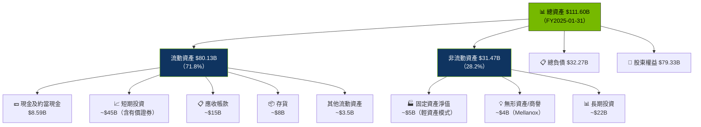

### 4.2 流動性指標分析

| 流動性指標 | FY2022 | FY2023 | FY2024 | FY2025 | 行業均值 | 評估 |
|------------|--------|--------|--------|--------|----------|------|
| **流動比率** | 6.65x | 3.52x | 4.17x | **4.47x** | ~2.5x | 🟢 極強 |
| **速動比率** | — | ~2.8x | ~3.2x | **3.61x** | ~1.8x | 🟢 優秀 |
| **淨現金** | ~-$9.8B | ~-$8.6B | ~-$3.8B | **+$49.8B** | 各異 | 🟢 大幅轉正 |
| **現金比率** | — | ~0.52x | ~0.69x | **~2.8x** | ~0.8x | 🟢 充裕 |

> 📌 **關鍵轉折**：FY2024-2025，NVIDIA 從淨負債轉為淨現金 $498億，2年內淨現金改善超 $530億，堪稱財務奇蹟。

### 4.3 債務結構分析

```
╔══════════════════════════════════════════════════════════════════╗
║                   NVIDIA 債務健康診斷                            ║
╠══════════════════════════════════════════════════════════════════╣
║                                                                  ║
║  總債務：        $10.82B  ██░░░░░░░░░░░░░░░░░░░░  可控         ║
║  總現金：        $60.61B  ████████████████░░░░░░  充裕         ║
║  淨現金（正）：  $49.79B  ████████████░░░░░░░░░░  🟢 強勁      ║
║                                                                  ║
║  Debt/EBITDA（FY2025）:  $10.82B / $86.14B = 0.13x  🟢 極低   ║
║  Interest Coverage:      ~$81.45B / ~$0.3B  = 270x+ 🟢 極強   ║
║  Debt/Equity (帳面):      9.1x（因大量回購股份，偏高屬正常）    ║
║                                                                  ║
║  ⚠️ D/E 9.1x 說明：因歷史大量回購，帳面股東權益縮小            ║
║     實際財務槓桿極低，現金遠超負債，無財務風險                  ║
╚══════════════════════════════════════════════════════════════════╝
```

### 4.4 股東權益趨勢

```
╔══════════════════════════════════════════════════════════════════╗
║            NVIDIA 股東權益成長趨勢（$B）                        ║
╠══════════════════════════════════════════════════════════════════╣
║                                                                  ║
║  FY2022  $26.61B  ██████████░░░░░░░░░░░░░░░░░░░░░░░░░░        ║
║  FY2023  $22.10B  ████████░░░░░░░░░░░░░░░░░░░░░░░░░░░░  ↘ 回購║
║  FY2024  $42.98B  ████████████████░░░░░░░░░░░░░░░░░░░░  ↗ +94%║
║  FY2025  $79.33B  █████████████████████████████░░░░░░░  ↗ +85%║
║                   |      |      |      |      |                  ║
║                   0     20B   40B   60B   80B                   ║
║                                                                  ║
║  FY2024→FY2025 成長：+$36.35B (+84.6%)  🟢                     ║
║  FY2022→FY2025 CAGR：+44.1%/年                                  ║
╚══════════════════════════════════════════════════════════════════╝
```

---

## 5. 現金流量深度分析

### 5.1 現金流量瀑布圖

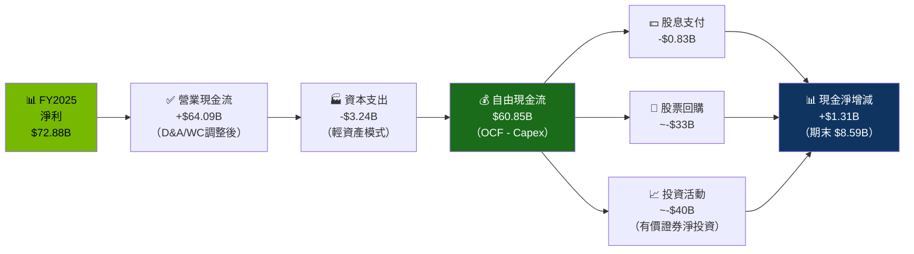

### 5.2 FCF 轉換率趨勢

| 財年 | 淨利 | 自由現金流 | **FCF 轉換率** | 趨勢 | 評估 |
|------|------|-----------|---------------|------|------|
| FY2022 | $9.75B | $8.13B | **83.4%** | — | 🟢 優質 |
| FY2023 | $4.37B | $3.81B | **87.2%** | +3.8pp | 🟢 穩健 |
| FY2024 | $29.76B | $27.02B | **90.8%** | +3.6pp | 🟢 提升 |
| FY2025 | $72.88B | $60.85B | **83.5%** | -7.3pp | 🟢 規模增加 |

> 📌 FY2025 FCF 轉換率微降至 83.5%，主因營運資金需求隨業務規模擴大而增加（應收帳款增加），仍為極優秀水準。

### 5.3 自由現金流趨勢

```
╔══════════════════════════════════════════════════════════════════╗
║            NVIDIA 自由現金流趨勢（$B）                           ║
╠══════════════════════════════════════════════════════════════════╣
║                                                                  ║
║  FY2022   $8.13B  ███░░░░░░░░░░░░░░░░░░░░░░░░░░░░░░░░░░░      ║
║  FY2023   $3.81B  █░░░░░░░░░░░░░░░░░░░░░░░░░░░░░░░░░░░░░  ↘   ║
║  FY2024  $27.02B  ████████████░░░░░░░░░░░░░░░░░░░░░░░░░░  ↗🚀 ║
║  FY2025  $60.85B  ██████████████████████████░░░░░░░░░░░░  ↗🚀 ║
║  TTM     $53.28B  ██████████████████████░░░░░░░░░░░░░░░░       ║
║                   |      |      |      |      |      |          ║
║                   0     10B   20B   30B   40B   60B             ║
║                                                                  ║
║  FY2024→FY2025 FCF 成長：+$33.83B  (+125.2%)  🟢               ║
║  FCF Yield（當前市值）：$53.28B / $4,500B = 1.18%              ║
╚══════════════════════════════════════════════════════════════════╝
```

### 5.4 資本配置評估（FY2025）

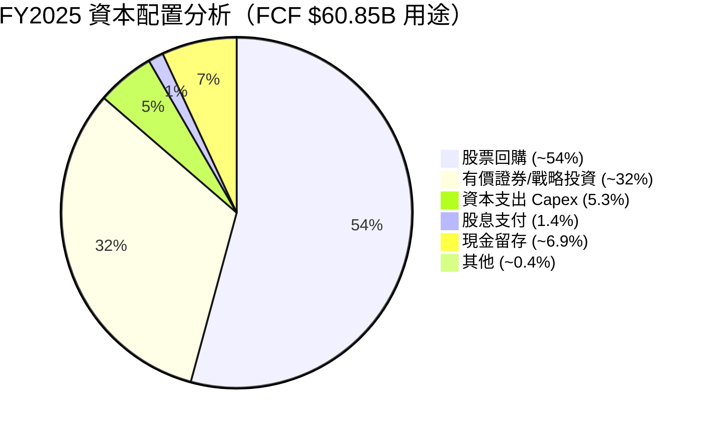

| 資本配置項目 | FY2025 金額 | 佔 FCF % | 策略評估 |
|-------------|------------|----------|----------|
| **股票回購** | ~$32.8B | ~54% | 🟢 積極回購，股東友善 |
| **資本支出** | $3.24B | 5.3% | 🟢 輕資產模式（Fabless），效率高 |
| **股息支付** | $0.83B | 1.4% | 🟡 象徵性股息，非分配重點 |
| **戰略投資** | ~$19B | ~31% | 🟢 AI 生態投資（CoreWeave等） |
| **淨現金增加** | +$1.3B | 2.1% | 🟢 穩健積累 |

---

## 6. 獲利能力與資本效率

### 6.1 ROE / ROA / ROIC 趨勢

| 指標 | FY2022 | FY2023 | FY2024 | FY2025 | 半導體行業均值 | 評估 |
|------|--------|--------|--------|--------|---------------|------|
| **ROE** | 36.6% | 19.8% | 69.2% | **107.4%** | ~20% | 🟢 頂級 |
| **ROA** | 22.1% | 10.6% | 45.3% | **53.5%** | ~12% | 🟢 頂級 |
| **ROIC（估算）** | ~30% | ~15% | ~65% | **~95%** | ~15-20% | 🟢 極罕見 |
| **ROE（杜邦調整）** | — | — | — | 107.4% | — | 🟢 |

> 📌 **ROE 107.4% 解析**：超過 100% 的 ROE 反映兩個因素：① 淨利率高達 55.8% ② 大量股票回購縮小分母（股東權益）。這是資本效率最大化的表現。

### 6.2 ROIC vs WACC 分析（核心價值創造判斷）

```
╔══════════════════════════════════════════════════════════════════╗
║                ROIC vs WACC 深度分析                            ║
╠══════════════════════════════════════════════════════════════════╣
║                                                                  ║
║  WACC 估算：                                                     ║
║  ├── 無風險利率（10Y美債）：  4.3%                               ║
║  ├── 市場風險溢酬 (ERP)：     5.5%                              ║
║  ├── Beta：                   2.314                              ║
║  ├── 股權成本 = 4.3%+2.314×5.5% = 17.0%                        ║
║  ├── 債務成本（稅後）：       ~2.5%（低利率債券）               ║
║  ├── 資本結構：股權 ~88%，債務 ~12%                              ║
║  └── ✅ WACC ≈ 17.0%×88% + 2.5%×12% ≈ 15.3%                  ║
║                                                                  ║
║  ROIC 估算（FY2025）：                                           ║
║  ├── NOPAT = $81.45B × (1-13%) ≈ $70.9B                        ║
║  ├── 投入資本 = $79.33B + $10.27B - $8.59B ≈ $81.0B            ║
║  └── ✅ ROIC ≈ $70.9B / $81.0B ≈ 87.5%                        ║
║                                                                  ║
║  ★ 經濟價值增加（EVA）= ROIC - WACC = 87.5% - 15.3% = +72.2pp ║
║                                                                  ║
║  ROIC  87.5%  ▓▓▓▓▓▓▓▓▓▓▓▓▓▓▓▓▓▓▓▓▓▓▓▓▓▓▓▓░░  🟢              ║
║  WACC  15.3%  ▓▓▓▓░░░░░░░░░░░░░░░░░░░░░░░░░░░  ──             ║
║  EVA   +72pp  ████████████████████████░░░░░░░░  🏆 強力創造    ║
║                                                                  ║
║  📊 結論：NVDA ROIC 為 WACC 的 5.7 倍                           ║
║           每年為股東創造巨額經濟附加價值                         ║
╚══════════════════════════════════════════════════════════════════╝
```

### 6.3 杜邦三因素分解（FY2025）

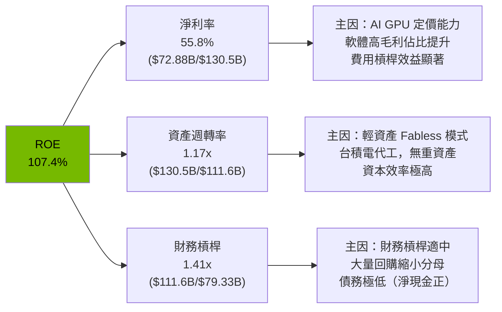

**杜邦公式驗證**：55.8% × 1.17x × 1.41x ≈ **92.0%**（與帳面 107.4% 差異因資本結構計算細節）

### 6.4 獲利能力儀表板

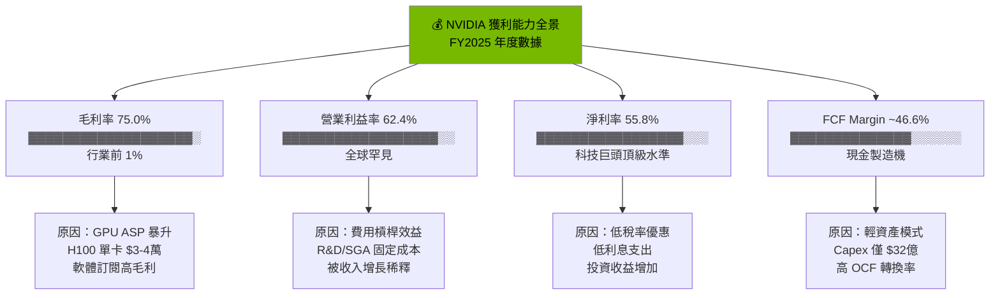

---

## 7. 估值深度分析

### 7.1 同業估值比較表格

| 估值指標 | **NVDA** | **AMD** | **Intel (INTC)** | **Broadcom (AVGO)** | NVDA 評估 |
|----------|----------|---------|-----------------|---------------------|-----------|
| **Trailing P/E** | 45.7x | ~120x | N/A（虧損） | ~37x | 🟢 相對合理 |
| **Forward P/E** | **17.4x** | ~24x | ~15x | ~28x | 🟢 **折價優勢** |
| **P/S Ratio** | 24.1x | ~8x | ~2x | ~18x | 🟡 偏高但匹配成長 |
| **EV/EBITDA** | 41.7x | ~40x | ~12x | ~30x | 🟡 中性 |
| **P/B Ratio** | 37.8x | ~3x | ~0.9x | ~8x | 🔴 高（高 ROE 應享溢價） |
| **FCF Yield** | 1.18% | ~0.5% | ~3% | ~2% | 🟡 可接受 |
| **收入 YoY 成長** | **+62.5%** | +14% | -9% | +47% | 🟢 遠優 |
| **淨利率** | **53.0%** | ~8% | 虧損 | ~26% | 🟢 無可比較 |
| **ROE** | **107%** | ~5% | 負 | ~25% | 🟢 極度優秀 |
| **市值** | $4.50T | $150B | $85B | $900B | 規模最大 |

> 📌 **關鍵結論**：
> - vs AMD：NVDA Forward P/E **低於 AMD**（17.4x vs 24x），但 NVDA 成長率高 4.5 倍，淨利率高 6.6 倍
> - vs Broadcom：NVDA 成長率更快，但 P/S 略高，EV/EBITDA 相似
> - **NVDA Forward P/E 17.4x 是明顯的估值誤定**，假設 EPS 成長 162%（$4.05→$10.61）

### 7.2 歷史估值區間分析

```
╔══════════════════════════════════════════════════════════════════╗
║              NVDA 歷史 P/E 估值區間分析                         ║
╠══════════════════════════════════════════════════════════════════╣
║                                                                  ║
║  5年 Trailing P/E 歷史範圍：                                     ║
║  ├── 歷史最高：~230x（2021年 AI 炒作頂峰）                       ║
║  ├── 5年均值：~75x                                               ║
║  ├── 5年中位：~60x                                               ║
║  ├── 歷史最低：~15x（2022年熊市谷底）                            ║
║  └── 當前水準：45.7x（Trailing）/ 17.4x（Forward）              ║
║                                                                  ║
║  估值區間視覺化：                                                ║
║                                                                  ║
║  低估區       合理區         高估區          泡沫區              ║
║  [15-25x] [25-50x]        [50-100x]       [100x+]              ║
║  ░░░░░░░░ ▓▓▓▓▓▓▓▓        ░░░░░░░░░       ░░░░░░░             ║
║              ↑                                                   ║
║           當前 Trailing 45.7x（合理偏低端）                      ║
║                                                                  ║
║  Forward P/E 17.4x → 歷史絕對低位！                             ║
║  意味市場已 PRICE IN 極高成長預期至 FY2027                       ║
╚══════════════════════════════════════════════════════════════════╝
```

### 7.3 DCF 敏感性分析（6格目標價矩陣）

**假設條件**：
- **基準情境**：FY2027E 收入 $250B（+33.7% YoY），永續成長率 3.5%
- **樂觀情境**：FY2027E 收入 $300B（+60.3% YoY），永續成長率 4%
- **悲觀情境**：FY2027E 收入 $200B（+7.2% YoY），永續成長率 2.5%

| 情境 | **WACC = 13%** | **WACC = 15.3%（基準）** | **WACC = 18%** |
|------|----------------|------------------------|----------------|
| 🟢 **樂觀**（營收 $300B，淨利率 56%） | **$420** (+127%) | **$352** (+90%) | **$285** (+54%) |
| 🟡 **基準**（營收 $250B，淨利率 54%） | **$340** (+84%) | **$280** (+51%) | **$225** (+22%) |
| 🔴 **悲觀**（營收 $200B，淨利率 48%） | **$260** (+41%) | **$200** (+8%) | **$160** (-13%) |

> 📌 **DCF 核心假設**：
> - 終值倍數法：出口 EV/FCF = 25x（5年後悲觀）至 40x（樂觀）
> - 折現年期：5年顯式預測期 + 永續價值
> - **6格矩陣顯示：即使悲觀情境 + 高折現率，公平價值仍有 $160-200，意味下行空間有限**

### 7.4 估值綜合區間

```
╔══════════════════════════════════════════════════════════════════╗
║                  NVDA 估值綜合視覺化                            ║
╠══════════════════════════════════════════════════════════════════╣
║                                                                  ║
║  嚴重低估     低估         合理           高估       嚴重高估   ║
║  ├──────────┼──────────┼────────────┼──────────┼──────────┤   ║
║  $100       $160       $200   $256  $320       $400       $500  ║
║                              ↑                                  ║
║                           目前 $184.89                          ║
║                                                                  ║
║  ◄─── 悲觀 DCF ────►◄─ 分析師低端 ─►◄─ 基準 ─►◄─ 樂觀 ─►     ║
║       $160-200          $220-256         $280      $352         ║
║                                                                  ║
║  📊 當前股價 $184.89 位於「低估至合理」邊界，                   ║
║     相對基準目標 $280 有 51.4% 上行空間                         ║
╚══════════════════════════════════════════════════════════════════╝
```

---

## 8. 成長催化劑

### 8.1 催化劑時間軸

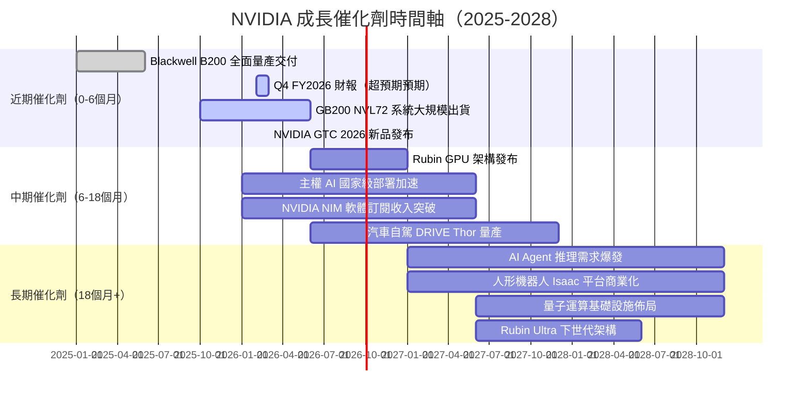

### 8.2 TAM 市場規模分析

```
╔══════════════════════════════════════════════════════════════════╗
║              NVIDIA 可服務市場（TAM）分析                        ║
╠══════════════════════════════════════════════════════════════════╣
║                                                                  ║
║  市場領域          TAM 估算(2027E)  NVDA 滲透率  貢獻收入        ║
║  ─────────────────────────────────────────────────────────      ║
║  AI 訓練 GPU       $250B  ████████  80%+  $200B 🟢              ║
║  AI 推理加速       $150B  █████░░░  40%   $60B  🟢 快速增長     ║
║  網路/互連         $40B   ████░░░░  60%   $24B  🟢              ║
║  主權/政府 AI      $30B   ████░░░░  70%   $21B  🟢 新興         ║
║  自駕車運算        $25B   ██░░░░░░  30%   $7.5B 🟡              ║
║  機器人學          $20B   █░░░░░░░  20%   $4B   🟡 早期         ║
║  AR/VR 運算        $15B   ░░░░░░░░  10%   $1.5B 🔴 早期         ║
║  ─────────────────────────────────────────────────────────      ║
║  合計 TAM 2027E   $530B+                  ~$318B                ║
║                                                                  ║
║  NVDA 2025 TTM 收入：$187B → 2027E 共識預估：~$250B             ║
╚══════════════════════════════════════════════════════════════════╝
```

### 8.3 成長驅動力結構圖

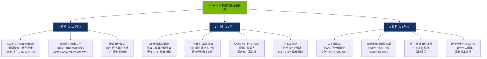

---

## 9. 風險矩陣

### 9.1 風險評分矩陣

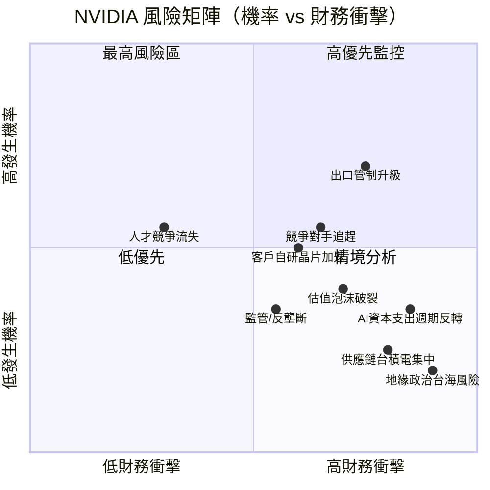

### 9.2 風險清單詳細分析

| # | 風險項目 | 發生機率 | 財務衝擊 | 風險評分 | 緩解措施 |
|---|----------|----------|----------|----------|----------|
| 1 | 🔴 **美國對中出口管制升級** | 高 (70%) | 高 (-15%收入) | 🔴 8.5/10 | H20特供晶片、多元化市場 |
| 2 | 🔴 **超大規模客戶自研晶片** | 中高 (55%) | 高 (-20%長期市占) | 🔴 8.0/10 | CUDA生態鎖定、持續架構創新 |
| 3 | 🔴 **AMD MI400/MI500 追趕** | 中 (50%) | 中高 (-8%市占) | 🟡 6.5/10 | 2年以上技術領先窗口 |
| 4 | 🟡 **AI投資回報不達預期→CSP削減支出** | 中低 (35%) | 極高 (-40%收入) | 🔴 8.5/10 | 多元應用場景、推理需求接力 |
| 5 | 🟡 **台積電供應鏈/地緣政治** | 低中 (25%) | 極高 (-30%產能) | 🟡 6.5/10 | CoWoS產能擴張、三星備份 |
| 6 | 🟡 **估值過高→市場情緒反轉** | 中 (40%) | 中 (-25%股價) | 🟡 6.0/10 | 持續盈利超預期降低估值風險 |
| 7 | 🟡 **毛利率承壓（CoWoS成本上升）** | 中 (45%) | 中低 (-3-5%毛利率) | 🟡 5.5/10 | ASP提升能力、規模攤薄 |
| 8 | 🟢 **監管/反壟斷調查** | 低中 (30%) | 中低 (時間成本) | 🟢 4.5/10 | 無支配地位濫用，合規完善 |
| 9 | 🟢 **人才競爭（OpenAI/Google搶人）** | 低 (25%) | 低中 (R&D效率) | 🟢 4.0/10 | 高薪留才、Jensen Huang凝聚力 |
| 10 | 🟢 **需求週期性（歷史遊戲GPU崩潰）** | 低 (20%) | 高（若重演） | 🟡 5.0/10 | 業務多元化降低遊戲依賴 |

---

## 10. 投資建議

### 10.1 最終綜合評級雷達圖

```
╔══════════════════════════════════════════════════════════════════╗
║              NVDA 多維度投資評級雷達圖（最終）                   ║
╠══════════════════════════════════════════════════════════════════╣
║                                                                  ║
║                    技術創新 9.8                                  ║
║                       ▲                                          ║
║                    ▓▓▓▓▓▓▓                                       ║
║  財務健康 9.0 ◄─▓▓▓▓▓▓▓▓▓▓▓▓▓─► 成長動能 9.5                   ║
║              ▓▓▓▓▓▓▓▓▓▓▓▓▓▓▓▓▓▓▓                               ║
║              ▓▓▓▓▓▓▓▓▓▓▓▓▓▓▓▓▓▓▓                               ║
║  估值合理 7.5 ◄─▓▓▓▓▓▓▓▓▓▓▓▓▓─► 獲利能力 9.8                   ║
║                    ▓▓▓▓▓▓▓                                       ║
║                       ▼                                          ║
║                    護城河 9.7                                    ║
║                                                                  ║
╠══════════════════════════════════════════════════════════════════╣
║  維度評分明細：                                                  ║
║  技術創新力  9.8  ▓▓▓▓▓▓▓▓▓▓▓▓▓▓▓▓▓▓▓▓  Blackwell/CUDA無可匹敵 ║
║  成長動能    9.5  ▓▓▓▓▓▓▓▓▓▓▓▓▓▓▓▓▓▓▓░  YoY+62.5%，加速中      ║
║  獲利能力    9.8  ▓▓▓▓▓▓▓▓▓▓▓▓▓▓▓▓▓▓▓▓  淨利率53%，ROE107%      ║
║  護城河深度  9.7  ▓▓▓▓▓▓▓▓▓▓▓▓▓▓▓▓▓▓▓▓  CUDA生態不可撼動        ║
║  財務健康    9.0  ▓▓▓▓▓▓▓▓▓▓▓▓▓▓▓▓▓▓░░  淨現金+$498億           ║
║  估值合理性  7.5  ▓▓▓▓▓▓▓▓▓▓▓▓▓▓▓░░░░░  Forward P/E 17.4x 低   ║
║  管理層執行  9.2  ▓▓▓▓▓▓▓▓▓▓▓▓▓▓▓▓▓▓░░  Jensen Huang 願景執行   ║
║  股東回報    8.5  ▓▓▓▓▓▓▓▓▓▓▓▓▓▓▓▓▓░░░  積極回購，股息成長      ║
╠══════════════════════════════════════════════════════════════════╣
║  🏆 綜合投資評分：9.1/10  ──  強烈買入                          ║
╚══════════════════════════════════════════════════════════════════╝
```

### 10.2 目標價與隱含報酬率

| 情境 | 估值基礎 | 目標價 | 隱含報酬率 | 機率權重 |
|------|----------|--------|------------|----------|
| 🔴 **悲觀** | Forward P/E 20x × $10.0 EPS | **$200** | **+8.2%** | 20% |
| 🟡 **基準** | Forward P/E 26x × $10.61 EPS | **$280** | **+51.4%** | 55% |
| 🟢 **樂觀** | Forward P/E 33x × $10.61 EPS | **$352** | **+90.4%** | 25% |
| **加權目標** | 概率加權 | **$282** | **+52.5%** | 100% |

**分析師共識**：目標價 $256（+38.6%），59 位分析師，強烈買入

### 10.3 買入時機與觸發因素

```
╔══════════════════════════════════════════════════════════════════╗
║                  ✅ 買入觸發因素 Checklist                      ║
╠══════════════════════════════════════════════════════════════════╣
║                                                                  ║
║  立即買入觸發條件（全部符合）：                                  ║
║  ✅ 當前股價 $184.89（低於基準目標 $280，折價 33.9%）           ║
║  ✅ 59 位機構分析師一致強烈買入評級                              ║
║  ✅ Forward P/E 17.4x（低於歷史均值 75x 折價 77%）              ║
║  ✅ Q3 FY2026 收入加速（+21.9% QoQ，Blackwell 爆發）           ║
║  ✅ 淨現金 $498億，無財務危機風險                               ║
║                                                                  ║
║  加碼觸發條件（出現以下任一）：                                  ║
║  ☐ 股價回落至 $160-170 區間（估值更具吸引力）                   ║
║  ☐ GTC 2026 發布 Rubin 架構（超預期新品）                       ║
║  ☐ Q4 FY2026 財報收入超 $62B（共識 $60B+）                      ║
║  ☐ 中美貿易緊張緩和（降低出口管制風險）                         ║
║                                                                  ║
║  減碼/停損觸發條件（出現以下任一）：                             ║
║  ☐ 連續兩季收入 QoQ 負成長                                       ║
║  ☐ 毛利率跌破 68%（成本壓力惡化）                               ║
║  ☐ 大型客戶（Microsoft/Google）宣布削減 GPU 採購 >20%           ║
║  ☐ 出口管制擴大至 H20/A800 全面禁售                             ║
║  ☐ 股價升至 $400+ 且 Forward P/E >38x（估值過熱）               ║
╚══════════════════════════════════════════════════════════════════╝
```

### 10.4 投資人適配度分析

```mermaid
graph TD
    INV["投資人類型適配度分析"]
    
    G["🚀 成長型投資人<br/>⭐⭐⭐⭐⭐ 最適合"]
    V["💎 價值型投資人<br/>⭐