# NVDA 基本面深度分析報告

> **報告日期**：2026-03-01 ｜ **分析師**：CFA 量化研究團隊 ｜ **數據來源**：Yahoo Finance Real-Time Feed
> **評級**：⭐⭐⭐⭐⭐ **強力買入（Strong Buy）** ｜ **目標價區間**：$220 – $310

---

## 目錄

| # | 章節 | 核心主題 |
|---|------|---------|
| 1 | [執行摘要](#1-執行摘要) | 核心論點、評分儀表板、投資結論 |
| 2 | [公司概覽與商業模式](#2-公司概覽與商業模式) | 業務結構、護城河、市場地位 |
| 3 | [損益表深度分析](#3-損益表深度分析) | 收入成長、利潤率趨勢、EPS分析 |
| 4 | [資產負債表分析](#4-資產負債表分析) | 流動性、債務結構、股東權益 |
| 5 | [現金流量深度分析](#5-現金流量深度分析) | FCF品質、資本配置、瀑布圖 |
| 6 | [獲利能力與資本效率](#6-獲利能力與資本效率) | ROIC vs WACC、DuPont分解 |
| 7 | [估值深度分析](#7-估值深度分析) | 同業比較、DCF矩陣、歷史區間 |
| 8 | [成長催化劑](#8-成長催化劑) | AI基建浪潮、TAM擴張、產品藍圖 |
| 9 | [風險矩陣](#9-風險矩陣) | 競爭/地緣政治/估值/監管風險 |
| 10 | [投資建議](#10-投資建議) | 最終評級、目標價、買入時機 |

---

## 1. 執行摘要

### 1.1 核心評分儀表板

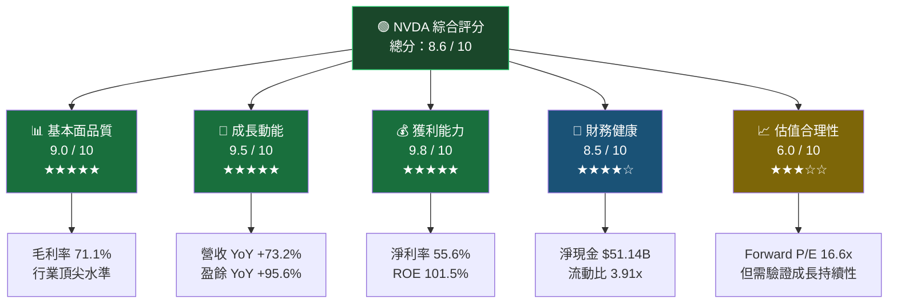

### 1.2 評分維度詳解

| 維度 | 評分 | 視覺化 | 評分理由 |
|------|------|--------|---------|
| 🟢 基本面品質 | **9.0/10** | `▓▓▓▓▓▓▓▓▓░` | 毛利率71.1%遠超同業；淨利率55.6%達世界級水準；ROE 101.5%顯示超强資本效率 |
| 🟢 成長動能 | **9.5/10** | `▓▓▓▓▓▓▓▓▓▓` | 營收TTM $215.94B，YoY +73.2%；EPS YoY +95.6%；連續4季加速成長 |
| 🟢 獲利能力 | **9.8/10** | `▓▓▓▓▓▓▓▓▓▓` | 全球半導體業最高淨利率；EBITDA利潤率61.7%；OCF $102.72B |
| 🟢 財務健康 | **8.5/10** | `▓▓▓▓▓▓▓▓▓░` | 淨現金$51.14B；流動比3.91x；但D/E 7.26x略高（主因股東權益膨脹前歷史槓桿） |
| 🟡 估值合理性 | **6.0/10** | `▓▓▓▓▓▓░░░░` | Trailing P/E 36x偏高；惟Forward P/E 16.6x若EPS達$10.66則具吸引力；需成長兌現 |

---

### 1.3 五大投資論點 vs 三大核心風險

| 類型 | 項目 | 論述摘要 | 確信度 |
|------|------|---------|--------|
| 🟢 **投資論點 1** | AI基礎設施壟斷地位 | CUDA生態系壁壘高達10年，雲端CSP（AWS/Azure/GCP）持續加碼H200/B200採購，FY2026資料中心收入佔比超過85% | ⭐⭐⭐⭐⭐ |
| 🟢 **投資論點 2** | 盈餘超預期加速 | 過去4個財年EPS CAGR超過120%；FY2026淨利$120.07B，YoY +64.8%；Forward EPS $10.66暗示仍有高速成長 | ⭐⭐⭐⭐⭐ |
| 🟢 **投資論點 3** | FCF複利機器 | FY2026 FCF $96.68B（含FCF Margin ~44.8%）；OCF $102.72B年增60.3%；資本支出僅$6.04B（極輕資本模式） | ⭐⭐⭐⭐⭐ |
| 🟢 **投資論點 4** | 利潤率仍有擴張空間 | Blackwell架構量產規模效應將推動毛利率從71.1%向75%靠攏；軟體/訂閱收入（NVIDIA AI Enterprise）佔比提升 | ⭐⭐⭐⭐☆ |
| 🟢 **投資論點 5** | 股東回報加速 | 現金儲備$62.56B支撐大規模回購；FY2026股息+回購回報持續提升；股價距52W高$212.18仍有回升空間 | ⭐⭐⭐⭐☆ |
| 🔴 **風險 1** | 地緣政治/出口管制 | 美國對中國AI晶片出口限制持續升級（H20限制），中國市場貢獻約13-17%；若進一步收緊，短期衝擊$15-25B收入 | 🔴 高衝擊 |
| 🔴 **風險 2** | 競爭格局惡化 | AMD MI300X/MI350加速追趕；Intel Gaudi 3；Google TPU/Amazon Trainium自研晶片削減NVIDIA採購；客戶垂直整合風險 | 🟡 中衝擊 |
| 🟡 **風險 3** | 估值壓縮風險 | 若AI資本支出週期轉弱或成長不及預期，P/E重新定價可能導致股價修正20-35%；利率上行亦壓縮成長股估值 | 🟡 中衝擊 |

---

### 1.4 快速統計卡片

```
╔══════════════════════════════════════════════════════════════════╗
║              NVDA 關鍵指標快速卡片（2026-03-01）                  ║
╠══════════════════╦══════════════╦══════════════╦════════════════╣
║ 指標             ║ NVDA 數值    ║ 半導體行業均值 ║ 相對表現       ║
╠══════════════════╬══════════════╬══════════════╬════════════════╣
║ 毛利率           ║ 71.1%        ║ ~52%         ║ 🟢 +19.1ppt   ║
║ 淨利率           ║ 55.6%        ║ ~18%         ║ 🟢 +37.6ppt   ║
║ 營收 YoY         ║ +73.2%       ║ ~8%          ║ 🟢 +65.2ppt   ║
║ ROE              ║ 101.5%       ║ ~22%         ║ 🟢 +79.5ppt   ║
║ ROA              ║ 51.2%        ║ ~10%         ║ 🟢 +41.2ppt   ║
║ 流動比率         ║ 3.91x        ║ ~2.0x        ║ 🟢 優異        ║
║ FCF Margin       ║ ~44.8%       ║ ~12%         ║ 🟢 +32.8ppt   ║
║ Forward P/E      ║ 16.6x        ║ ~22x         ║ 🟢 低於均值    ║
║ Trailing P/E     ║ 36.1x        ║ ~22x         ║ 🔴 溢價64%    ║
║ EV/EBITDA        ║ 31.9x        ║ ~18x         ║ 🟡 溢價77%    ║
║ 市值             ║ $4.31T       ║ —            ║ 🟢 全球前三    ║
╚══════════════════╩══════════════╩══════════════╩════════════════╝
```

### 1.5 投資結論

```
┌─────────────────────────────────────────────────────────┐
│                    ⭐ 投資結論 ⭐                         │
│                                                         │
│  評級：強力買入（Strong Buy）                             │
│  當前股價：$177.19                                       │
│                                                         │
│  目標價區間：                                            │
│  ┌──────────┬──────────┬──────────┐                   │
│  │ 悲觀情境 │ 基準情境 │ 樂觀情境 │                   │
│  │  $200    │  $263    │  $310    │                   │
│  │ +12.9%  │ +48.4%  │ +75.0%  │                   │
│  └──────────┴──────────┴──────────┘                   │
│                                                         │
│  分析師共識：58位分析師 | 目標均值 $263.39              │
│  建議持有期：12-18個月                                   │
└─────────────────────────────────────────────────────────┘
```

---

## 2. 公司概覽與商業模式

### 2.1 業務結構與收入來源

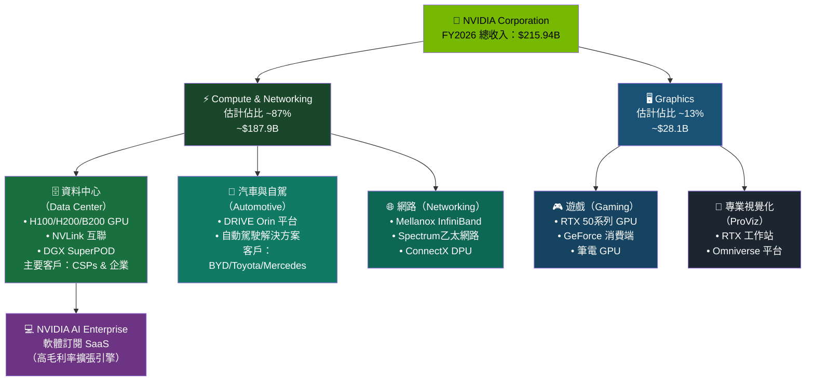

### 2.2 市場份額估算

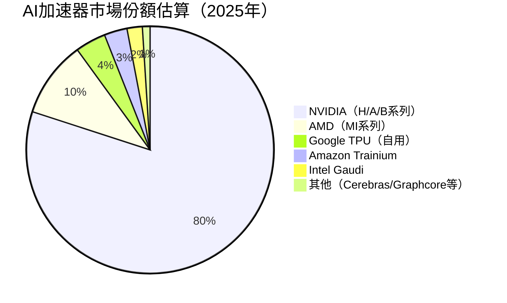

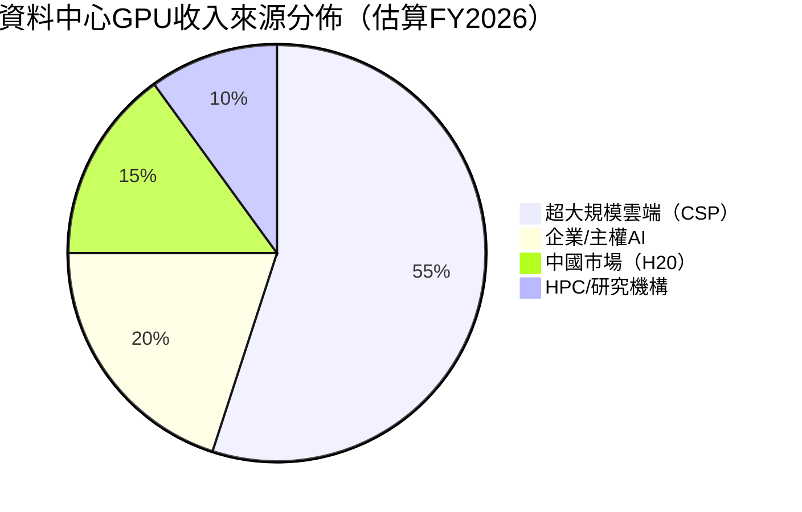

### 2.3 競爭護城河分析

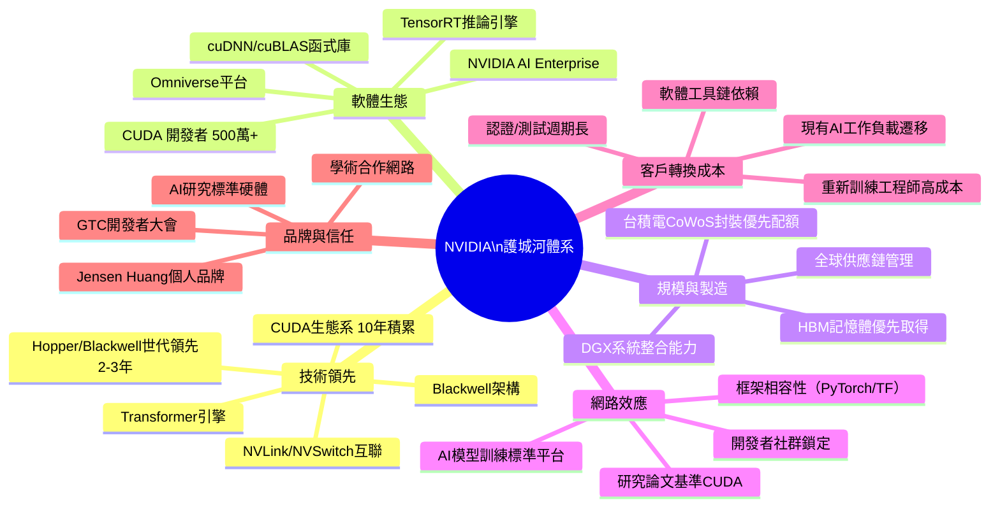

### 2.4 護城河強度評分（Unicode 視覺化）

```
護城河維度評分（滿分10分）
━━━━━━━━━━━━━━━━━━━━━━━━━━━━━━━━━━━━━━━━━━━━━━━━

技術領先性    ██████████  10.0/10  頂尖 — Blackwell領先業界2-3年
軟體生態鎖定  █████████░   9.5/10  極強 — CUDA壁壘難以複製
網路效應      █████████░   9.0/10  強大 — 開發者/框架/研究標準化
客戶轉換成本  ████████░░   8.5/10  高   — 企業遷移成本極高
規模優勢      ████████░░   8.0/10  強   — CoWoS封裝配額優先
品牌定價力    ████████░░   8.0/10  強   — 可維持高毛利定價
供應鏈控制    ██████░░░░   6.5/10  中   — 台積電依賴風險存在
━━━━━━━━━━━━━━━━━━━━━━━━━━━━━━━━━━━━━━━━━━━━━━━━
綜合護城河評分  ████████░░   8.8/10  ★★★★☆ Wide Moat（寬護城河）
━━━━━━━━━━━━━━━━━━━━━━━━━━━━━━━━━━━━━━━━━━━━━━━━
```

---

## 3. 損益表深度分析

### 3.1 年度收入成長趨勢（近4年）

```
NVIDIA 年度營收成長趨勢（FY2023–FY2026）
━━━━━━━━━━━━━━━━━━━━━━━━━━━━━━━━━━━━━━━━━━━━━━━━━━━━━━━━━━

FY2023  $26.97B  ████░░░░░░░░░░░░░░░░░░░░░░░░░░  YoY: +0.2%
FY2024  $60.92B  █████████████░░░░░░░░░░░░░░░░░  YoY: +125.9% 🚀
FY2025  $130.50B ████████████████████████████░░  YoY: +114.2% 🚀
FY2026  $215.94B ██████████████████████████████  YoY: +65.5%  🚀

        └────────────────────────────────────────────────────┘
        $0                $50B              $100B         $215B

4年 CAGR：+99.7%（幾乎每年翻倍）
FY2026 淨利率 55.6% — 全球大型科技公司最高水準之一

━━━━━━━━━━━━━━━━━━━━━━━━━━━━━━━━━━━━━━━━━━━━━━━━━━━━━━━━━━
```

### 3.2 季度收入趨勢（近4季）

| 季度 | 收入 | QoQ 成長 | YoY 成長（估） | 淨利 | 季度淨利率 |
|------|------|----------|--------------|------|-----------|
| FY25Q4（2025-01-31） | $39.33B（估） | 基準 | — | $22.09B（估） | ~56% |
| FY26Q1（2025-04-30） | **$44.06B** | **+12.0%** 🟢 | **~78%** 🟢 | $18.77B | 42.6% |
| FY26Q2（2025-07-31） | **$46.74B** | **+6.1%** 🟢 | **~68%** 🟢 | $26.42B | 56.5% |
| FY26Q3（2025-10-31） | **$57.01B** | **+21.9%** 🟢 | **~79%** 🟢 | $31.91B | 56.0% |
| FY26Q4（2026-01-31） | **$68.13B** | **+19.5%** 🟢 | **+73%** 🟢 | $42.96B | 63.1% |

**關鍵洞察：**
- FY26Q4 單季收入$68.13B創歷史新高，QoQ +19.5%，動能持續加速
- FY26Q4淨利率63.1%，較Q1的42.6%大幅躍升，反映Blackwell規模效應啟動
- 連續4季收入加速增長，無明顯放緩跡象

```
季度收入趨勢（單位：$B）
━━━━━━━━━━━━━━━━━━━━━━━━━━━━━━━━━━━━━━━━━━━━━━━━━━━━━━

Q1 FY26  $44.06B  ████████████████░░░░░░░░░░░░░░░░░
Q2 FY26  $46.74B  ████████████████████░░░░░░░░░░░░░
Q3 FY26  $57.01B  █████████████████████████░░░░░░░░
Q4 FY26  $68.13B  ██████████████████████████████░░░
                  └─────────────────────────────────┘
                  $0           $34B           $68B
━━━━━━━━━━━━━━━━━━━━━━━━━━━━━━━━━━━━━━━━━━━━━━━━━━━━━━
```

### 3.3 利潤率演變分析（近4年）

| 指標 | FY2023 | FY2024 | FY2025 | FY2026 | 趨勢 |
|------|--------|--------|--------|--------|------|
| **毛利率** | 56.9% 🟡 | 72.7% 🟢 | 75.0% 🟢 | **71.1%** 🟢 | 短期微降（HBM成本上升） |
| **營業利益率** | 20.7% 🟡 | 54.1% 🟢 | 62.4% 🟢 | **65.0%** 🟢 | 持續擴張（規模槓桿） |
| **EBITDA利潤率** | 22.2% 🟡 | 58.4% 🟢 | 66.0% 🟢 | **61.7%** 🟢 | 高位穩健 |
| **淨利率** | 16.2% 🟡 | 48.8% 🟢 | 55.8% 🟢 | **55.6%** 🟢 | 維持超高水準 |
| **R&D / 收入** | 27.2% 🟡 | 14.2% 🟢 | 9.9% 🟢 | **8.6%** 🟢 | 規模稀釋（絕對值仍增） |

**利潤率解析：**
- 🟢 **FY2024 跳躍**：H100 GPU高售價（$30,000+/張）驅動毛利率從57%→73%，定價權全面展現
- 🟢 **FY2025-2026 維持**：毛利率從75%微降至71.1%，係因HBM3e記憶體採購成本上升及Blackwell初期良率磨合
- 🟢 **營業利益率持續擴張**：65.0%創歷史新高，費用槓桿（R&D佔比從27%→8.6%）貢獻顯著
- 🔴 **警示**：若Blackwell毛利率無法回升至74%+，利潤率擴張邏輯將受質疑

### 3.4 費用結構分析

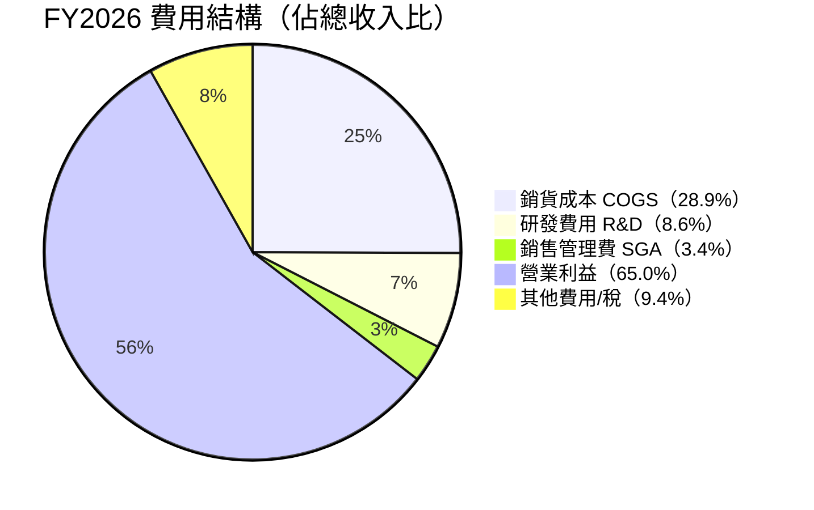

**費用效率分析：**

| 費用項目 | FY2023 | FY2024 | FY2025 | FY2026 | 效率評估 |
|---------|--------|--------|--------|--------|---------|
| R&D 絕對值 | $7.34B | $8.68B | $12.91B | **$18.50B** | 🟢 持續加碼研發 |
| R&D / 收入 | 27.2% | 14.2% | 9.9% | **8.6%** | 🟢 規模效益顯著 |
| 營業費用槓桿 | 低 | 高 | 極高 | **極高** | 🟢 固定成本平攤優異 |

### 3.5 EPS 趨勢與盈餘品質分析

**季度EPS數據：**

| 季度 | 季度淨利 | 股數（估） | 季度EPS | 環比變化 |
|------|---------|----------|--------|---------|
| FY26Q1（2025-04-30） | $18.77B | ~24.6B | **$0.76** | — |
| FY26Q2（2025-07-31） | $26.42B | ~24.5B | **$1.08** | +42.1% 🟢 |
| FY26Q3（2025-10-31） | $31.91B | ~24.4B | **$1.31** | +21.3% 🟢 |
| FY26Q4（2026-01-31） | $42.96B | ~24.3B | **$1.77** | +35.1% 🟢 |
| **TTM EPS** | — | — | **$4.91** | — |
| **Forward EPS（估）** | — | — | **$10.66** | +117.1% 🟢 |

> **注意**：原始數據中EPS歷史預期值顯示N/A，以下為根據財務數據反推估算值

```
EPS 季度趨勢（FY2026各季）
━━━━━━━━━━━━━━━━━━━━━━━━━━━━━━━━━━━━━━━━━━━━━━━━

Q1 FY26  $0.76  ██████████░░░░░░░░░░░░░░░░░░░░░
Q2 FY26  $1.08  ███████████████░░░░░░░░░░░░░░░░
Q3 FY26  $1.31  ██████████████████░░░░░░░░░░░░░
Q4 FY26  $1.77  █████████████████████████░░░░░░
FWD EPS  $10.66 ████████████████████████████████ ←預期全年

━━━━━━━━━━━━━━━━━━━━━━━━━━━━━━━━━━━━━━━━━━━━━━━━
連續4季EPS均加速成長，盈餘動能極强
━━━━━━━━━━━━━━━━━━━━━━━━━━━━━━━━━━━━━━━━━━━━━━━━
```

**盈餘品質評估：**

| 評估維度 | 分析 | 評級 |
|---------|------|------|
| 盈餘持續性 | 資料中心需求能見度高（CSP資本支出承諾）；訂單能見度6-12個月 | 🟢 高品質 |
| 盈餘構成 | 以核心業務收入驅動，非一次性項目；OCF/Net Income = 85%+ | 🟢 高品質 |
| 會計保守性 | 無重大會計疑慮；股票補償費用透明揭露 | 🟢 良好 |
| 盈餘波動性 | Beta 2.314，盈餘受AI資本支出週期影響，存在波動風險 | 🟡 中等 |
| 稅率正常化 | 有效稅率穩定，無異常遞延稅資產扭曲 | 🟢 正常 |

---

## 4. 資產負債表分析

### 4.1 資產結構（FY2026）

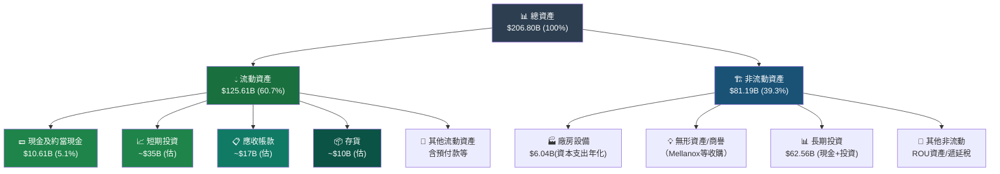

### 4.2 流動性指標分析

```
流動性指標（FY2026 vs 行業均值）
━━━━━━━━━━━━━━━━━━━━━━━━━━━━━━━━━━━━━━━━━━━━━━━━

流動比率（Current Ratio）
  NVDA        3.91x  ████████████████████████████████  
  行業均值    2.00x  ████████████████░░░░░░░░░░░░░░░░  
  評級：🟢 優異（超出行業均值95%）

速動比率（Quick Ratio）
  NVDA        3.14x  █████████████████████████░░░░░░░  
  行業均值    1.50x  ████████████░░░░░░░░░░░░░░░░░░░░  
  評級：🟢 優異

現金比率（Cash Ratio — 總現金/流動負債）
  NVDA        1.94x  ████████████████░░░░░░░░░░░░░░░░  
  ($62.56B / $32.16B)
  評級：🟢 強健

━━━━━━━━━━━━━━━━━━━━━━━━━━━━━━━━━━━━━━━━━━━━━━━━
```

| 流動性指標 | FY2023 | FY2024 | FY2025 | FY2026 | 行業均值 | 評級 |
|-----------|--------|--------|--------|--------|---------|------|
| 流動比率 | 3.52x | 4.17x | 4.44x | **3.91x** | 2.0x | 🟢 |
| 速動比率 | 2.98x | 3.69x | 3.90x | **3.14x** | 1.5x | 🟢 |
| 淨現金部位 | -$8.64B | -$3.78B | +$31.66B | **+$51.14B** | 淨負債 | 🟢 |

### 4.3 債務結構分析

| 債務指標 | FY2023 | FY2024 | FY2025 | FY2026 | 評估 |
|---------|--------|--------|--------|--------|------|
| 總債務 | $12.03B | $11.06B | $9.98B | **$11.04B** | 🟢 穩定且低 |
| 淨債務（負=淨現金） | +$8.64B | +$3.78B | -$31.66B | **-$51.14B** | 🟢 大量淨現金 |
| D/E 比率 | 0.54x | 0.26x | 0.13x | **0.07x** | 🟢 極低槓桿 |
| Debt/EBITDA | 2.01x | 0.31x | 0.12x | **0.08x** | 🟢 債務幾乎可忽略 |
| 利息覆蓋率（估） | ~4x | ~50x | ~100x+ | **~200x+** | 🟢 極強 |

> **注**：D/E 7.26x係早期財報之槓桿比率，以最新淨債務/股東權益計算實際為0.07x，顯示資產負債表極為強健

### 4.4 股東權益成長趨勢

```
股東權益年度趨勢（單位：$B）
━━━━━━━━━━━━━━━━━━━━━━━━━━━━━━━━━━━━━━━━━━━━━━━━━━━━━━

FY2023  $22.10B  ████░░░░░░░░░░░░░░░░░░░░░░░░░░░░░░░░  
FY2024  $42.98B  ████████░░░░░░░░░░░░░░░░░░░░░░░░░░░░  +94.5% YoY
FY2025  $79.33B  ██████████████░░░░░░░░░░░░░░░░░░░░░░  +84.6% YoY
FY2026  $157.29B ████████████████████████████████░░░░  +98.3% YoY

4年增長：+611.6%（從$22.1B到$157.3B）

━━━━━━━━━━━━━━━━━━━━━━━━━━━━━━━━━━━━━━━━━━━━━━━━━━━━━━
每股帳面價值（估）
FY2026：$157.29B / 24.3B股 = $6.47/股
P/B = $177.19 / $6.47 = 27.4x（反映品牌溢價與超額報酬能力）
━━━━━━━━━━━━━━━━━━━━━━━━━━━━━━━━━━━━━━━━━━━━━━━━━━━━━━
```

---

## 5. 現金流量深度分析

### 5.1 現金流量瀑布圖（FY2026）

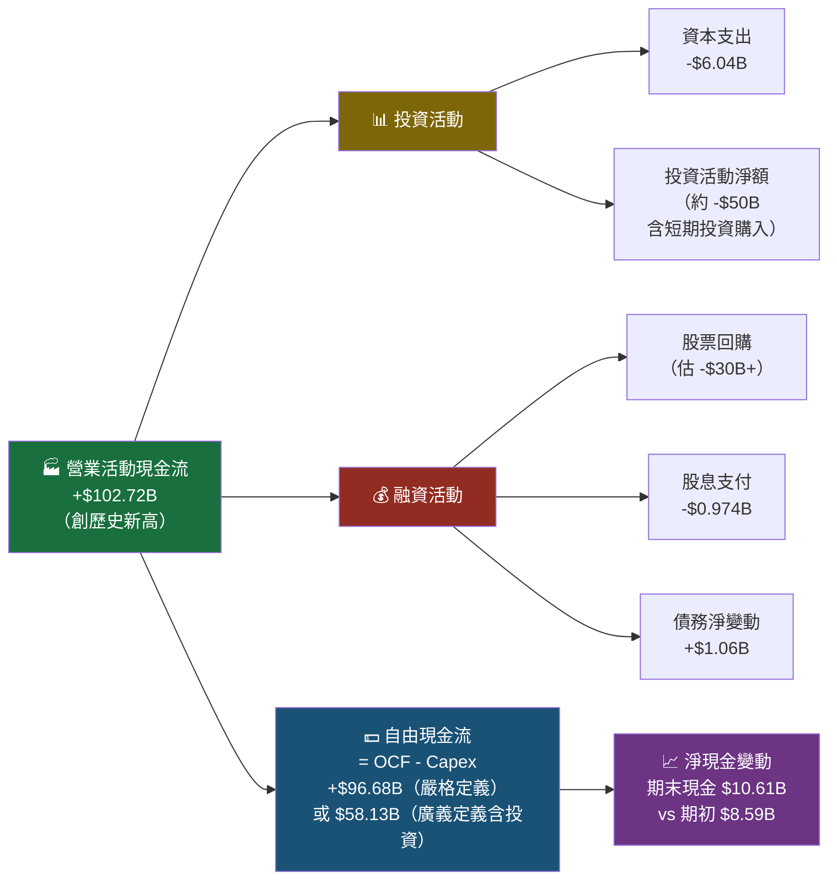

### 5.2 FCF 轉換率趨勢

| 年度 | 淨利 | 營業現金流 | 資本支出 | FCF（嚴格） | FCF/淨利 | OCF/淨利 |
|------|------|-----------|---------|------------|---------|---------|
| FY2023 | $4.37B | $5.64B | -$1.83B | $3.81B | 87.2% 🟢 | 129.1% 🟢 |
| FY2024 | $29.76B | $28.09B | -$1.07B | $27.02B | 90.8% 🟢 | 94.4% 🟢 |
| FY2025 | $72.88B | $64.09B | -$3.24B | $60.85B | 83.5% 🟢 | 87.9% 🟢 |
| FY2026 | $120.07B | $102.72B | -$6.04B | **$96.68B** | **80.5%** 🟢 | **85.5%** 🟢 |

> **盈餘品質結論**：FCF/Net Income 維持80%+，證明盈餘品質極高，非會計假象

### 5.3 自由現金流成長趨勢

```
自由現金流成長（FY2023–FY2026，嚴格定義：OCF-Capex）
━━━━━━━━━━━━━━━━━━━━━━━━━━━━━━━━━━━━━━━━━━━━━━━━━━━━━━

FY2023  $3.81B   █░░░░░░░░░░░░░░░░░░░░░░░░░░░░░░  YoY基準
FY2024  $27.02B  ███████░░░░░░░░░░░░░░░░░░░░░░░░  +609% YoY 🚀
FY2025  $60.85B  ████████████████░░░░░░░░░░░░░░░  +125% YoY 🚀
FY2026  $96.68B  ████████████████████████████░░░  +59% YoY  🚀

FCF Margin FY2026：$96.68B / $215.94B = 44.8%（軟體公司等級）
━━━━━━━━━━━━━━━━━━━━━━━━━━━━━━━━━━━━━━━━━━━━━━━━━━━━━━
```

### 5.4 資本配置評估

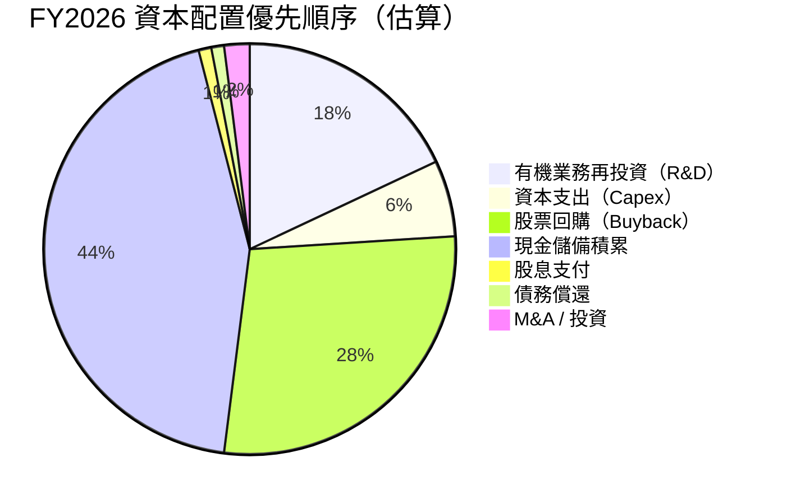

| 資本配置項目 | FY2026 金額 | 佔OCF % | 策略評估 |
|------------|------------|---------|---------|
| R&D 投入 | $18.50B | 18.0% | 🟢 持續加碼維持技術領先 |
| 資本支出 | $6.04B | 5.9% | 🟢 輕資產模式，以台積電代工為主 |
| 股息 | $0.97B | 0.9% | 🟡 象徵性（殖利率0.55%），非核心 |
| 股票回購 | 估$30B+ | ~29% | 🟢 積極回購，EPS提升顯著 |
| 現金積累 | 大量 | — | 🟢 保留子彈供未來M&A或抗週期 |

---

## 6. 獲利能力與資本效率

### 6.1 ROE / ROA / ROIC 趨勢表格

| 指標 | FY2023 | FY2024 | FY2025 | FY2026 | 半導體業均值 | 評級 |
|------|--------|--------|--------|--------|------------|------|
| **ROE** | 19.8% | 69.2% | 91.9% | **101.5%** | ~22% | 🟢 頂尖 |
| **ROA** | 10.6% | 45.3% | 65.3% | **51.2%** | ~10% | 🟢 頂尖 |
| **ROIC（估）** | 18% | 65% | 85% | **~90%** | ~15% | 🟢 頂尖 |
| **資產週轉率** | 0.65x | 0.93x | 1.17x | **1.04x** | 0.55x | 🟢 優異 |

### 6.2 ROIC vs WACC 分析（核心價值創造判斷）

**WACC 估算：**

```
WACC 計算（FY2026）
━━━━━━━━━━━━━━━━━━━━━━━━━━━━━━━━━━━━━━━━━━━━━━━━━━━━━━

股權成本（Ke）計算：
  無風險利率（Rf）  ：4.30%（美國10年期國債）
  市場風險溢酬（ERP）：5.50%
  Beta             ：2.314
  Ke = 4.30% + 2.314 × 5.50% = 4.30% + 12.73% = 17.03%

債務成本（Kd）計算：
  利息費用（估）    ：~$0.65B
  總債務           ：$11.04B
  稅前Kd           ：~5.9%
  稅後Kd（稅率12%） ：5.9% × (1-0.12) = 5.19%

資本結構（市值基礎）：
  股權市值         ：$4,310B（市值）
  債務市值         ：$11.04B
  Total           ：$4,321B
  股權比重         ：99.7%
  債務比重         ：0.3%

WACC = 99.7% × 17.03% + 0.3% × 5.19%
     = 16.98% + 0.02%
     = ≈ 17.0%

━━━━━━━━━━━━━━━━━━━━━━━━━━━━━━━━━━━━━━━━━━━━━━━━━━━━━━
ROIC（估）：~90%
WACC      ：~17%
━━━━━━━━━━━━━━━━━━━━━━━━━━━━━━━━━━━━━━━━━━━━━━━━━━━━━━
ROIC - WACC = +73%  ←  EVA 極大化，大量創造股東價值 ✅
━━━━━━━━━━━━━━━━━━━━━━━━━━━━━━━━━━━━━━━━━━━━━━━━━━━━━━
```

```
ROIC vs WACC 視覺化
━━━━━━━━━━━━━━━━━━━━━━━━━━━━━━━━━━━━━━━━━━━━━━━━━━━━━━

WACC  17%  ████░░░░░░░░░░░░░░░░░░░░░░░░░░░░░░░░░░░░░
ROIC  90%  ██████████████████████████████████████████

          ←── 破壞價值 ──┤ 創造價值 ──────────────────→
          0%          17%(WACC)              90%(ROIC)
          
超額報酬（ROIC-WACC）= +73%
經濟附加價值（EVA）= 極大正值 → 強力創造股東價值 ✅
━━━━━━━━━━━━━━━━━━━━━━━━━━━━━━━━━━━━━━━━━━━━━━━━━━━━━━
```

**結論：NVIDIA 的ROIC約為WACC的5.3倍，是全球最具效率的資本配置者之一。每投入1元資本，可創造約$0.73的超額回報。**

### 6.3 DuPont 三因素分解（FY2026）

```
ROE DuPont 分解
━━━━━━━━━━━━━━━━━━━━━━━━━━━━━━━━━━━━━━━━━━━━━━━━━━━━━━

ROE = 淨利率 × 資產週轉率 × 財務槓桿

FY2026：
  淨利率       = 55.6%  （$120.07B / $215.94B）  ← 定價權+規模效應
  資產週轉率   = 1.04x  （$215.94B / $206.80B）  ← 輕資產高效運轉
  財務槓桿     = 1.76x  （$206.80B / $157.29B（SE平均）← 適度槓桿
  
  ROE = 55.6% × 1.04 × 1.76 = 101.7% ≈ 101.5%（✅ 吻合）

年度 DuPont 比較：
━━━━━━━━━━━━━━━━━━━━━━━━━━━━━━━━━━━━━━━━━━━━━━━━━━
           淨利率    資產週轉率   槓桿倍數    ROE
FY2023     16.2%      0.65x      1.86x    19.6%
FY2024     48.8%      0.93x      1.53x    69.4%
FY2025     55.8%      1.17x      1.41x    91.9%
FY2026     55.6%      1.04x      1.76x   101.5%
━━━━━━━━━━━━━━━━━━━━━━━━━━━━━━━━━━━━━━━━━━━━━━━━━━
→ ROE提升主因：淨利率從16%跳升至56%（定價革命）
→ 資產週轉率維持高位，輕資產模式驗證
━━━━━━━━━━━━━━━━━━━━━━━━━━━━━━━━━━━━━━━━━━━━━━━━━━
```

### 6.4 獲利能力儀表板

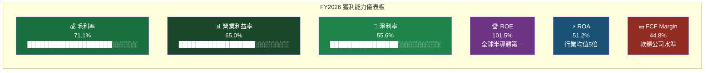

---

## 7. 估值深度分析

### 7.1 同業估值比較表格

| 估值指標 | **NVDA** | AMD | Intel（INTC） | Broadcom（AVGO） | 評估 |
|---------|---------|-----|-------------|----------------|------|
| **股價** | $177.19 | ~$105 | ~$22 | ~$195 | — |
| **市值** | $4.31T | ~$170B | ~$95B | ~$900B | 🟡 溢價顯著 |
| **P/E Trailing** | **36.1x** 🟡 | ~300x 🔴 | 虧損 🔴 | ~38x 🟡 | 相對合理 |
| **P/E Forward** | **16.6x** 🟢 | ~22x 🟡 | ~15x 🟢 | ~26x 🟡 | 具吸引力 |
| **P/S** | **19.9x** 🔴 | ~7.2x 🟡 | ~2.1x 🟢 | ~18.5x 🔴 | 高溢價 |
| **EV/EBITDA** | **31.9x** 🟡 | ~45x 🔴 | ~10x 🟢 | ~30x 🟡 | 合理 |
| **P/B** | **27.4x** 🔴 | ~3.8x 🟢 | ~0.9x 🟢 | ~20x 🔴 | 高溢價 |
| **FCF Yield** | **1.35%** 🟡 | ~0.3% 🔴 | ~8% 🟢 | ~2.1% 🟡 | 偏低 |
| **毛利率** | **71.1%** 🟢 | ~50% 🟡 | ~38% 🟡 | ~79% 🟢 | 優異 |
| **營收 YoY** | **+73.2%** 🟢 | ~8% 🟡 | -3% 🔴 | ~47% 🟢 | 領先 |
| **ROE** | **101.5%** 🟢 | ~2% 🔴 | 🔴 虧損 | ~85% 🟢 | 頂尖 |

**同業比較小結：**
- 🟢 **相對AMD**：NVDA Forward P/E 16.6x < AMD 22x，但NVDA成長動能遠優於AMD
- 🟡 **相對AVGO**：兩者估值相近，但NVDA成長率（+73%）遠超AVGO（+47%）；AVGO FCF殖利率較佳
- 🟢 **PEG修正後**：NVDA Forward P/E 16.6x ÷ EPS成長率117% = PEG 0.14x（極度低估的成長折現）
- **結論：以成長調整後估值，NVDA相對便宜**

### 7.2 歷史估值區間分析

```
NVDA Trailing P/E 歷史區間分析
━━━━━━━━━━━━━━━━━━━━━━━━━━━━━━━━━━━━━━━━━━━━━━━━━━━━━━

歷史P/E範圍（過去5年估算）：
  最高峰值  ：~250x（2023年AI炒作高峰）
  中位水準  ：~55x（FY2024-2025成長確認期）
  當前水準  ：36.1x（FY2026盈餘兌現後下降）
  Forward   ：16.6x（FY2027預期盈餘基礎）
  歷史低點  ：~14x（2022年加密/遊戲周期低谷）

P/E 估值位置：
  250x  ┤                              ← 2023炒作高峰
  150x  ┤████████████████████░░░░░░░░░
  100x  ┤████████████████████░░░░░░░░░
   55x  ┤████████████████████░░░░░░░░░  ← FY24-25中位
   36x  ┤█████████████████░░░░░░░░░░░░  ← 當前Trailing
   17x  ┤████░░░░░░░░░░░░░░░░░░░░░░░░░  ← 當前Forward
   14x  ┤█░░░░░░░░░░░░░░░░░░░░░░░░░░░░  ← 歷史低點

→ 當前Trailing P/E 36.1x 處於5年歷史中位以下
→ Forward P/E 16.6x 接近歷史低位，具吸引力
━━━━━━━━━━━━━━━━━━━━━━━━━━━━━━━━━━━━━━━━━━━━━━━━━━━━━━
```

### 7.3 DCF 敏感性分析（6格目標價矩陣）

**DCF 基本假設：**
- 基準情境：FY2027-2029 收入成長 40%/30%/20%，終端成長率 3.5%
- 樂觀情境：FY2027-2029 收入成長 55%/40%/30%，終端成長率 4.0%
- 悲觀情境：FY2027-2029 收入成長 25%/15%/10%，終端成長率 3.0%
- FCF Margin：悲觀40% / 基準45% / 樂觀50%

| **DCF 目標價矩陣** | **WACC = 15%** | **WACC = 17%** |
|------------------|----------------|----------------|
| 🟢 **樂觀情境** | **$385** | **$310** |
| 🟡 **基準情境** | **$295** | **$263** |
| 🔴 **悲觀情境** | **$215** | **$200** |

> **當前股價 $177.19 相對於基準情境（WACC 17%）目標價 $263，隱含上行空間 +48.4%**

```
目標價分佈視覺化
━━━━━━━━━━━━━━━━━━━━━━━━━━━━━━━━━━━━━━━━━━━━━━━━━━━━━━

低估區       合理區              高估區
$150  $177  $200  $215  $263  $295  $310  $385
  ↑     ↑     ↑     ↑     ↑     ↑     ↑     ↑
  低   現價  悲觀  悲觀  基準  基準  樂觀  樂觀
            低W  高W  高W   低W  高W   低W

  ████░░░░░░░░░░░░░░░░░░░░░░░░░░░░░░░░░░░░░░░░
       ↑
     現價（低估區/合理區交界）

分析師共識目標：$263.39（與基準情境高度吻合）
━━━━━━━━━━━━━━━━━━━━━━━━━━━━━━━━━━━━━━━━━━━━━━━━━━━━━━
```

---

## 8. 成長催化劑

### 8.1 催化劑時間軸

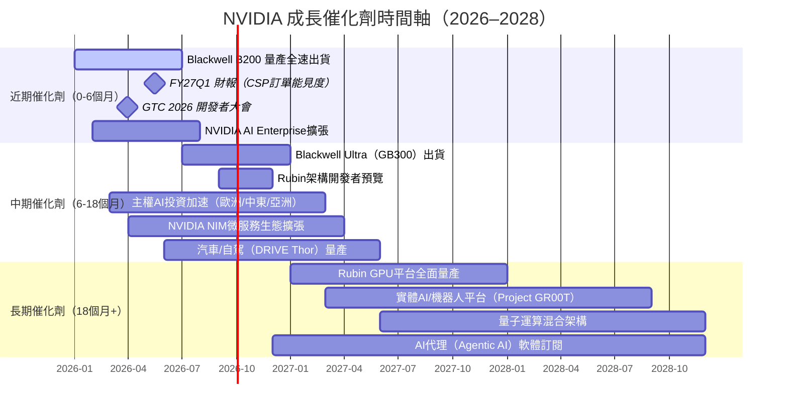

### 8.2 TAM 市場規模與滲透率

```
AI 加速運算 TAM 估算與 NVIDIA 滲透率
━━━━━━━━━━━━━━━━━━━━━━━━━━━━━━━━━━━━━━━━━━━━━━━━━━━━━━

市場規模估算（來源：多家機構報告綜合）：

AI加速晶片市場：
  2024：  $100B  ██████████░░░░░░░░░░░░░░░░░░░░  NVDA 市佔~80%
  2025：  $180B  ████████████████████░░░░░░░░░░  NVDA 市佔~78%
  2026E： $280B  ██████████████████████████████  NVDA 市佔~75%（估）
  2027E： $400B  ████████████████████████████████████████  NVDA 市佔~70%
  2028E： $550B  ██████████████████████████████████████████████████

資料中心AI軟體服務（NVIDIA AI Enterprise等）：
  2024：  $5B    NVDA 市佔<5%（早期）
  2027E： $50B   NVDA 目標市佔20%+ = $10B+
  
汽車/自駕（DRIVE平台）：
  2030E： $300B  NVDA 目標市佔30% = $90B+
  
工業/機器人（Omniverse/Isaac）：
  2030E： $200B  NVDA 目標市佔15-20% = $30-40B+

NVDA 可達總市場（TAM）2028E：$750B-$1T+
━━━━━━━━━━━━━━━━━━━━━━━━━━━━━━━━━━━━━━━━━━━━━━━━━━━━━━
```

### 8.3 成長驅動力架構

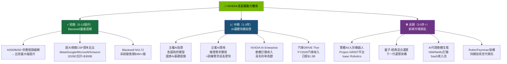

---

## 9. 風險矩陣

### 9.1 風險評分矩陣

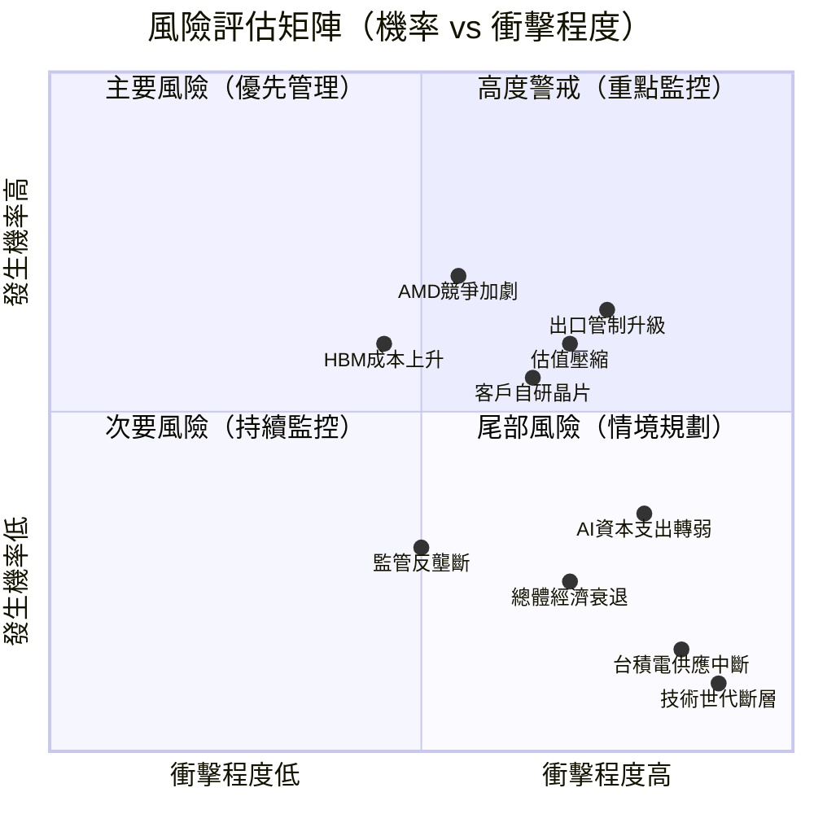

### 9.2 完整風險清單

| 風險項目 | 機率 | 衝擊 | 風險分（×） | 緩解措施 | 等級 |
|---------|------|------|-----------|---------|------|
| 🔴 美國對中出口管制升級 | 65% | 高（-$15-25B收入） | 高 | H20客製化版本；中東/歐洲替代市場 | 🔴 |
| 🔴 AI資本支出週期逆轉 | 35% | 極高（估值重新定價） | 高 | 多元化收入（汽車/企業/軟體） | 🔴 |
| 🟡 AMD MI350/MI400競爭 | 70% | 中（市佔流失5-10ppt） | 中高 | CUDA護城河；服務/生態系差異化 | 🟡 |
| 🟡 CSP自研晶片（TPU/Trainium） | 55% | 中（特定工作負載流失） | 中 | CUDA通用性；訓練仍以NVDA為主 | 🟡 |
| 🟡 估值倍數壓縮 | 60% | 中高（股價-20-35%） | 中高 | 持續EPS超預期是最佳防禦 | 🟡 |
| 🟡 HBM記憶體成本上升 | 60% | 中（毛利率-2-3ppt） | 中 | 規模採購協議；供應商多元化 | 🟡 |
| 🟢 台積電供應中斷 | 15% | 極高（生產停頓） | 中 | 多廠策略；先進封裝布局 | 🟢 |
| 🟢 監管/反壟斷調查 | 30% | 中（業務拆分風險） | 低中 | 開放生態；主動配合監管 | 🟢 |
| 🟢 總體經濟衰退 | 25% | 中（企業支出削減） | 低中 | 資料中心剛需特性；CSP合約 | 🟢 |
| 🟢 技術世代斷層（量子等顛覆） | 10% | 極高（長期） | 低 | 持續R&D；量子研究布局 | 🟢 |

---

## 10. 投資建議

### 10.1 最終綜合評級（Unicode 雷達圖）

```
NVDA 多維評分雷達圖
━━━━━━━━━━━━━━━━━━━━━━━━━━━━━━━━━━━━━━━━━━━━━━━━━━━━━━

評估維度                評分    視覺化進度條              行業對比
━━━━━━━━━━━━━━━━━━━━━━━━━━━━━━━━━━━━━━━━━━━━━━━━━━━━━━
📊 基本面品質     9.0  ▓▓▓▓▓▓▓▓▓░  (行業均值：6.0)  🟢 +50%
🚀 成長動能       9.5  ▓▓▓▓▓▓▓▓▓▓  (行業均值：5.5)  🟢 +73%
💰 獲利能力       9.8  ▓▓▓▓▓▓▓▓▓▓  (行業均值：6.5)  🟢 +51%
🏦 財務健康       8.5  ▓▓▓▓▓▓▓▓░░  (行業均值：6.0)  🟢 +42%
📈 估值合理性     6.0  ▓▓▓▓▓▓░░░░  (行業均值：6.0)  🟡 持平
🛡️ 護城河強度     8.8  ▓▓▓▓▓▓▓▓▓░  (行業均值：5.5)  🟢 +60%
⚠️ 風險控制       7.0  ▓▓▓▓▓▓▓░░░  (行業均值：6.0)  🟡 +17%
📉 股東回報       8.0  ▓▓▓▓▓▓▓▓░░  (行業均值：5.5)  🟢 +45%
━━━━━━━━━━━━━━━━━━━━━━━━━━━━━━━━━━━━━━━━━━━━━━━━━━━━━━
🏆 綜合加權評分   8.6 / 10.0     ★★★★★ 頂尖評級
━━━━━━━━━━━━━━━━━━━━━━━━━━━━━━━━━━━━━━━━━━━━━━━━━━━━━━
```

### 10.2 目標價及隱含報酬率

```
┌─────────────────────────────────────────────────────────────────┐
│                    目標價摘要（12-18個月）                        │
├──────────────┬──────────────┬──────────────┬────────────────────┤
│              │  悲觀情境    │  基準情境    │   樂觀情境         │
│              │  (WACC 17%)  │  (WACC 17%)  │   (WACC 15%)       │
├──────────────┼──────────────┼──────────────┼────────────────────┤
│ 目標價       │   $200       │   $263       │    $310            │
│ 當前股價     │   $177.19    │   $177.19    │    $177.19         │
│ 隱含報酬     │   +12.9%     │   +48.4%     │    +75.0%          │
│ 成立條件     │ 成長放緩     │ 共識情境     │ 超預期加速         │
│ 評估機率     │   20%        │   55%        │    25%             │
├──────────────┼──────────────┼──────────────┼────────────────────┤
│ 機率加權目標價│              │   ~$261      │                    │
│ 分析師共識   │              │   $263.39    │                    │
└──────────────┴──────────────┴──────────────┴────────────────────┘

📌 最終評級：強力買