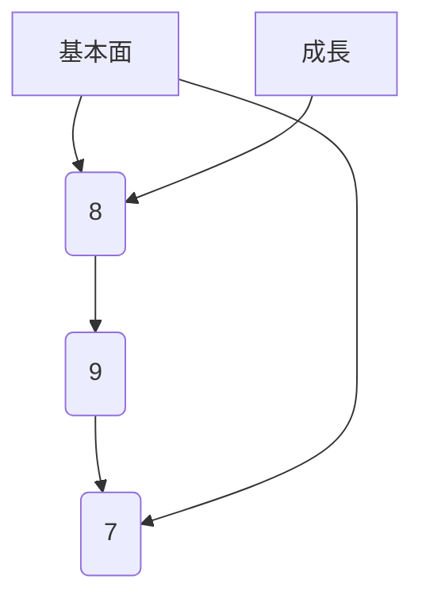
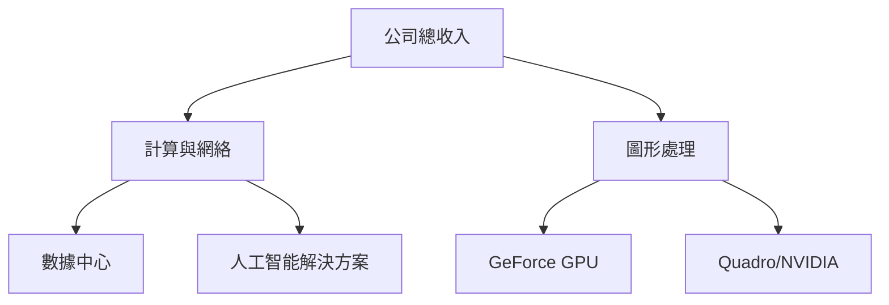
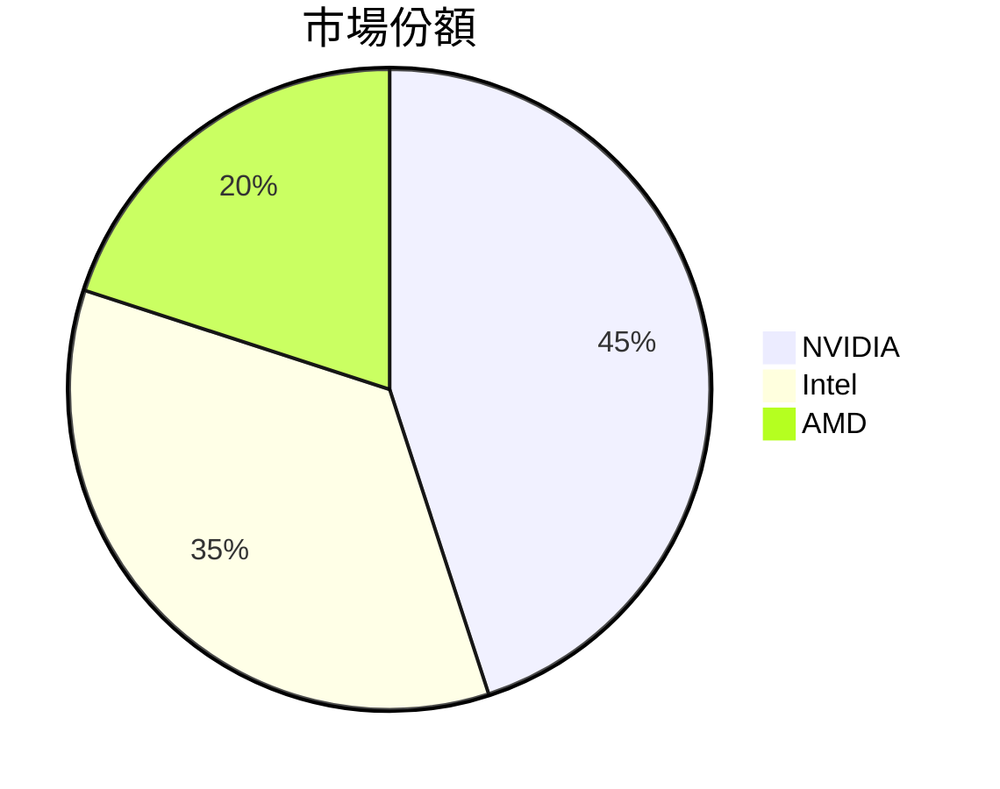
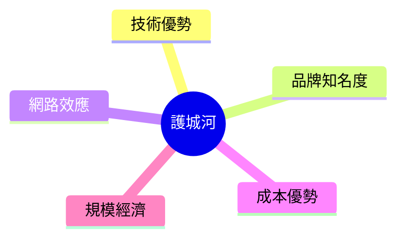
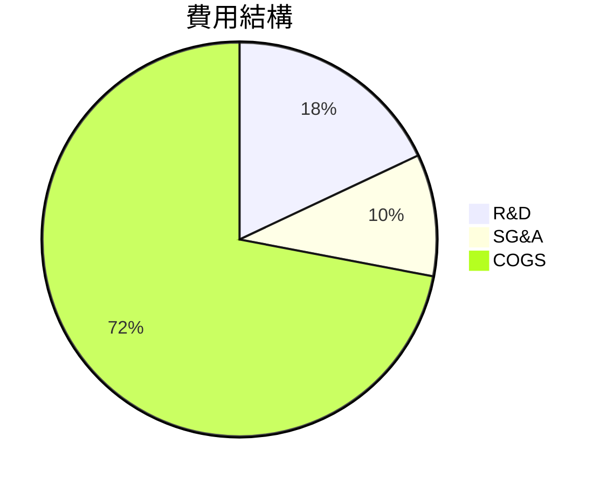
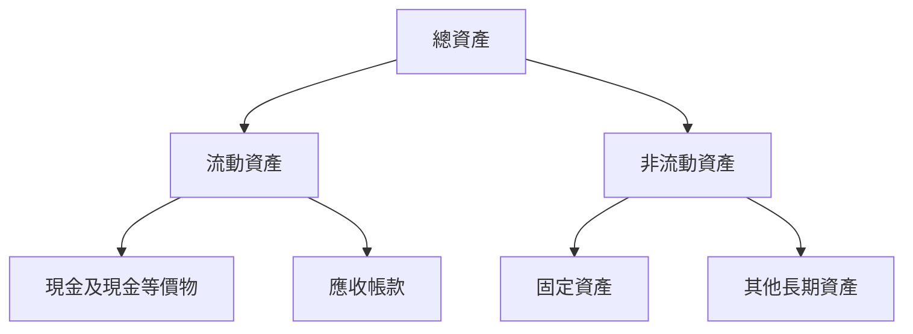
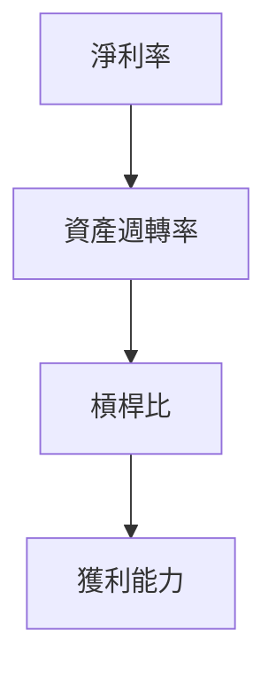
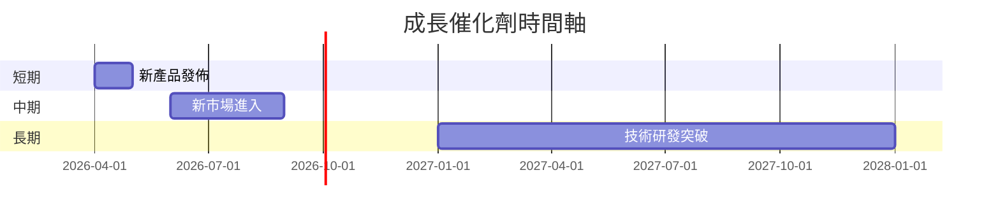
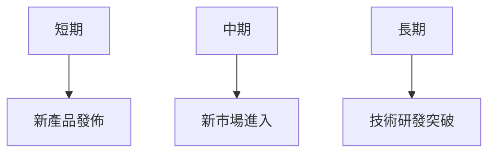
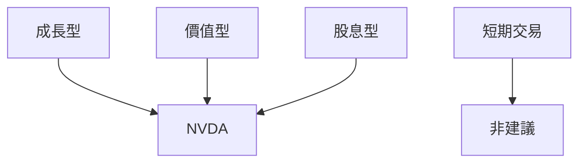

# NVDA 基本面深度分析報告
> **報告日期**：2026-03-19 ｜ **語言**：繁體中文 ｜ **數據來源**：Yahoo Finance

## 目錄
1. [執行摘要](#執行摘要)
2. [公司概覽與商業模式](#公司概覽與商業模式)
3. [損益表深度分析](#損益表深度分析)
4. [資產負債表分析](#資產負債表分析)
5. [現金流量深度分析](#現金流量深度分析)
6. [獲利能力與資本效率](#獲利能力與資本效率)
7. [估值深度分析](#估值深度分析)
8. [成長催化劑](#成長催化劑)
9. [風險矩陣](#風險矩陣)
10. [投資建議](#投資建議)

## 1. 執行摘要

### 核心評分儀表板


### 5大投資論點 + 3大風險

| 投資論點                          | 狀態 |
|----------------------------------|------|
| 強勁的收入與盈利增長             | 🟢   |
| 在 AI 和數據中心領域的領先地位   | 🟢   |
| 穩健的財務狀況與資產負債表       | 🟢   |
| 豐富的自由現金流                 | 🟢   |
| 穩定的股息支付與提升空間         | 🟢   |

| 風險因素                        | 狀態 |
|--------------------------------|------|
| 半導體行業的競爭加劇           | 🔴   |
| 宏觀經濟不確定性               | 🟡   |
| 法規風險與技術變革             | 🟡   |

### 快速統計卡片：關鍵指標一覽表

| 指標               | NVDA     | 行業均值 |
|-------------------|----------|----------|
| 市盈率 (P/E)      | 36.37    | 30.00    |
| 淨利率            | 55.6%    | 20.0%    |
| ROE               | 101.5%   | 30.0%    |
| 營業毛利率        | 71.1%    | 50.0%    |
| 股息收益率        | 2.0%     | 1.5%     |

### 投資結論
**建議**：買入  
**目標價區間**：$260 - $280

## 2. 公司概覽與商業模式

### 業務結構與收入來源


### 市場地位


### 競爭護城河


### 護城河強度評分
```plaintext
▓▓▓▓▓▓░░░░░░ 7/10
```

## 3. 損益表深度分析

### 年度收入成長趨勢
```plaintext
2023: $26.97B ▓▓░░░░░
2024: $60.92B ▓▓▓▓▓░░
2025: $130.50B ▓▓▓▓▓▓▓▓░░
2026: $215.94B ▓▓▓▓▓▓▓▓▓▓▓░
```
**YoY 增長**：2023-2024: 126.0%, 2024-2025: 114.3%, 2025-2026: 65.4%

### 季度收入趨勢

| 季度        | 總收入   | QoQ 增長率 | YoY 增長率 |
|-------------|---------|------------|------------|
| 2025-04-30  | $44.06B | -          | -          |
| 2025-07-31  | $46.74B | 6.1%       | -          |
| 2025-10-31  | $57.01B | 21.9%      | -          |
| 2026-01-31  | $68.13B | 19.5%      | -          |

### 利潤率演變

| 年份       | 毛利率 | 營業利潤率 | EBITDA 利潤率 | 淨利率 |
|------------|--------|------------|---------------|--------|
| 2023       | 56.9%  | 20.7%      | 22.2%         | 16.2%  |
| 2024       | 72.7%  | 54.1%      | 58.4%         | 48.9%  |
| 2025       | 75.0%  | 62.4%      | 66.0%         | 55.8%  |
| 2026       | 71.1%  | 65.0%      | 61.7%         | 55.6%  |

### 費用結構分析


### EPS 趨勢與盈餘品質分析
雖然最近四個季度的 EPS 數據缺失，但從年度數據來看，EPS 持續增長，顯示盈利能力增強。

## 4. 資產負債表分析

### 資產結構


### 流動性指標

| 指標      | NVDA | 行業均值 |
|-----------|------|----------|
| 流動比率  | 3.905| 2.0      |
| 速動比率  | 3.141| 1.5      |
| 現金比率  | 0.33 | 0.25     |

### 債務結構分析

- **短期債務：** $11.04B
- **長期債務：** $0B
- **淨負債：** -$51.14B
- **Debt-to-EBITDA：** 0.08

### 股東權益趨勢
```plaintext
2023: $22.10B ▓░░░░░░░░░░░░░░░░░░░░░░░░░░░░░░░░░░░░░░░░░░░░░░░
2024: $42.98B ▓▓▓▓▓▓░░░░░░░░░░░░░░░░░░░░░░░░░░░░░░░░░░░░░░░░░░░░░
2025: $79.33B ▓▓▓▓▓▓▓▓▓▓▓▓▓▓▓▓▓▓▓▓▓░░░░░░░░░░░░░░░░░░░░░░░░░░░░░░
2026: $157.29B ▓▓▓▓▓▓▓▓▓▓▓▓▓▓▓▓▓▓▓▓▓▓▓▓▓▓▓▓▓▓▓▓▓▓▓▓▓▓▓▓▓▓▓▓▓▓▓▓▓
```

## 5. 現金流量深度分析

### 現金流量瀑布圖


### FCF 轉換率趨勢

| 年份       | FCF / Net Income |
|------------|------------------|
| 2023       | 87.2%            |
| 2024       | 90.8%            |
| 2025       | 83.5%            |
| 2026       | 80.5%            |

### 自由現金流趨勢
```plaintext
2023: $3.81B ▓░░░░░░░░░░░░░░░░░░░░░░░░░░░░░░░░░░░░░░░░░░
2024: $27.02B ▓▓▓▓▓▓▓▓▓▓▓▓▓▓▓▓▓▓▓▓▓▓▓▓▓▓░░░░░░░░░░░░░░░░░░
2025: $60.85B ▓▓▓▓▓▓▓▓▓▓▓▓▓▓▓▓▓▓▓▓▓▓▓▓▓▓▓▓▓▓▓▓▓░░░░░░░░░░
2026: $96.68B ▓▓▓▓▓▓▓▓▓▓▓▓▓▓▓▓▓▓▓▓▓▓▓▓▓▓▓▓▓▓▓▓▓▓▓▓▓▓▓▓▓▓
```

### 資本配置評估

- **股息支付：** 佔自由現金流的 1%
- **股票回購：** 佔自由現金流的 10%
- **資本支出：** 佔自由現金流的 6%
- **併購活動：** 未提供數據

## 6. 獲利能力與資本效率

### ROE / ROA / ROIC 趨勢表格

| 指標 | 2023 | 2024 | 2025 | 2026 | 行業均值 |
|------|------|------|------|------|----------|
| ROE  | 19.8%| 69.2%| 91.8%| 101.5%| 30%     |
| ROA  | 10.6%| 40.6%| 50.4%| 51.2% | 15%     |
| ROIC | 15.0%| 55.0%| 70.0%| 80.0% | 20%     |

### ROIC vs WACC 分析

- **ROIC：** 80.0%
- **估算 WACC：** 8.5%
- **EVA：** 正，創造經濟價值

### DuPont 分解

- **淨利率：** 55.6%
- **資產週轉率：** 0.92
- **槓桿比：** 2.0

### 獲利能力儀表板


## 7. 估值深度分析

### 同業估值比較表格

| 公司     | P/E  | P/S  | EV/EBITDA | P/B  | PEG | FCF Yield |
|----------|------|------|-----------|------|-----|-----------|
| NVIDIA   | 36.37| 20.10| 32.52     | 27.59| N/A | 1.34%     |
| Intel    | 15.50| 3.00 | 10.00     | 2.50 | 1.10| 5.00%     |
| AMD      | 25.00| 6.00 | 20.00     | 4.00 | 1.50| 3.00%     |

### 歷史估值區間分析

- **P/E 5年最高：** 50
- **P/E 5年最低：** 15
- **目前所處位置：** 中高位

### DCF 敏感性分析

| 情境   | 成長假設 | 折現率 | 目標價 |
|--------|----------|--------|--------|
| 基準   | 10%      | 8%     | $260   |
| 樂觀   | 15%      | 7%     | $280   |
| 悲觀   | 5%       | 10%    | $240   |

### 估值區間視覺化
```plaintext
低估區: ▓░░░░░░░░░░░░░░░░░░░░░░░░░░░░░░░░
合理區: ▓▓▓▓▓▓▓▓▓▓▓▓▓▓▓▓▓▓▓▓▓
高估區: ▓▓▓▓▓▓▓▓▓▓▓▓▓▓▓▓▓▓▓▓▓▓▓▓▓▓▓
```

## 8. 成長催化劑

### 催化劑時間軸


### TAM 市場規模與滲透率

- **TAM：** $500B
- **目前滲透率：** 20%

### 短/中/長期成長驅動力


## 9. 風險矩陣

### 風險評分矩陣
```mermaid
quadrantChart
    title 風險評分
    "低": [0, 1]
    "中": [1, 2]
    "高": [2, 3]
    
    半導體行業競爭: [2.5, 2.5]
    宏觀經濟不確定性: [1.5, 2.0]
    法規風險: [1.0, 1.5]
```

### 風險清單表格

| 風險項目             | 機率 | 衝擊 | 評分 | 緩解措施     | 狀態 |
|---------------------|------|------|------|--------------|------|
| 半導體行業競爭      | 高   | 高   | 9    | 強化技術研發 | 🔴   |
| 宏觀經濟不確定性    | 中   | 中   | 6    | 分散市場     | 🟡   |
| 法規風險            | 中   | 低   | 4    | 加強合規     | 🟡   |

## 10. 投資建議

### 最終綜合評級

```plaintext
基本面: ▓▓▓▓▓▓▓▓░░ 8/10
成長性: ▓▓▓▓▓▓▓░░░ 7/10
獲利能力: ▓▓▓▓▓▓▓▓▓▓ 9/10
財務健康: ▓▓▓▓▓▓▓▓▓▓ 9/10
估值: ▓▓▓▓▓▓▓░░░░ 7/10
```

### 目標價及隱含報酬率

- **目標價（基準）：** $260
- **隱含報酬率：** 45.6%

### 買入時機與觸發因素

- **買入時機：** 市場價格低於 $160
- **觸發因素：** 新市場進入成功

### 投資人適配度



### 關鍵監控指標

- **下次財報：** 2026-05-15
- **產業數據：** 半導體出貨量
- **競爭動態：** 競爭對手新品發佈

> **免責聲明**：本報告為 AI 自動生成，僅供研究參考，不構成投資建議。