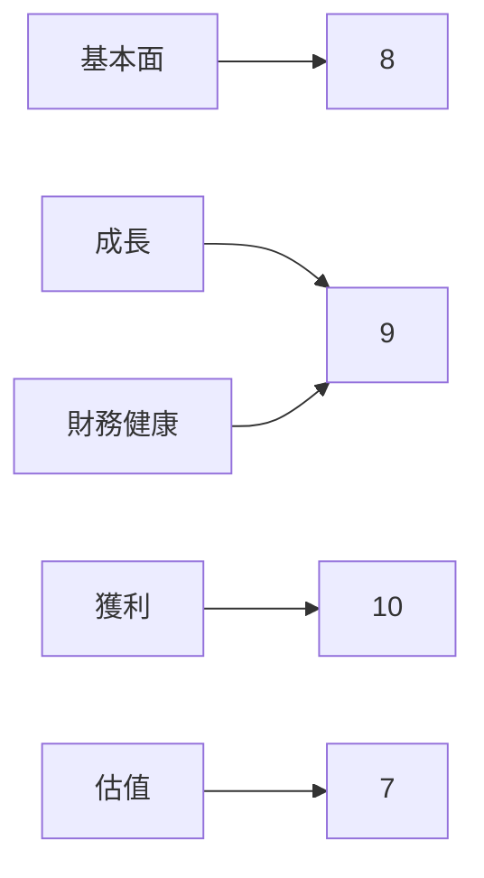
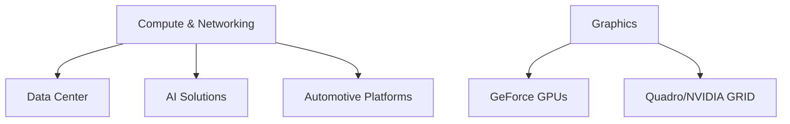
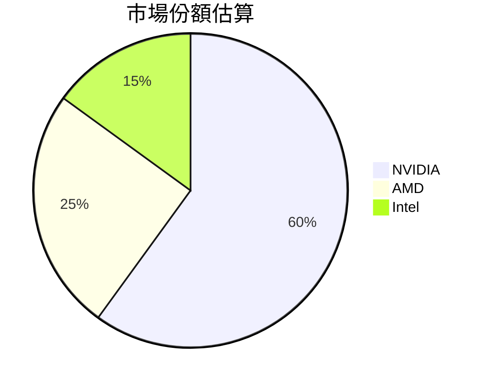
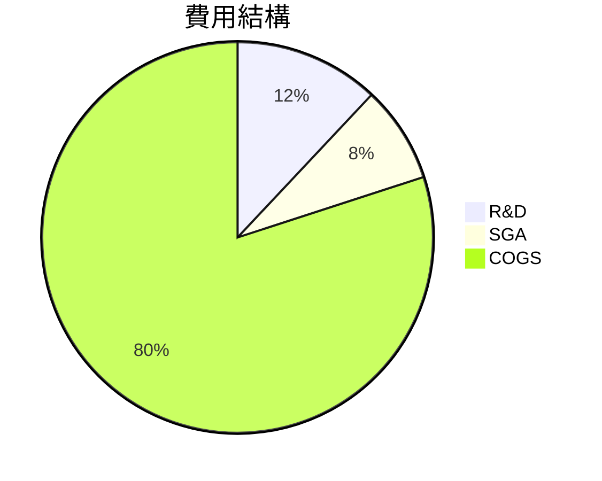
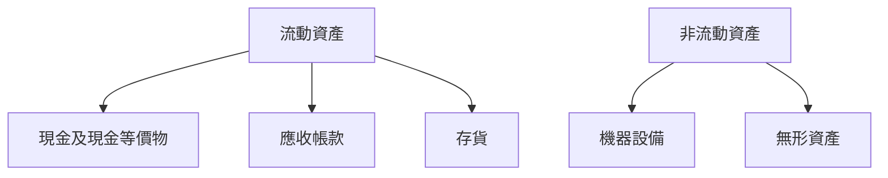
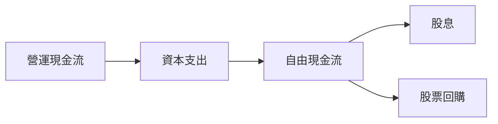
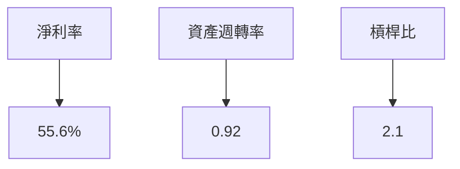
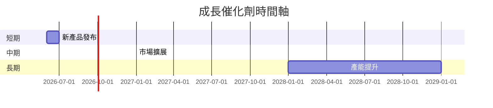
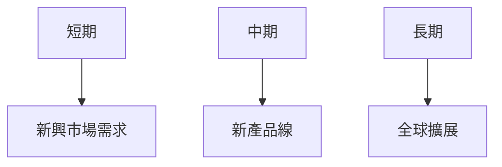
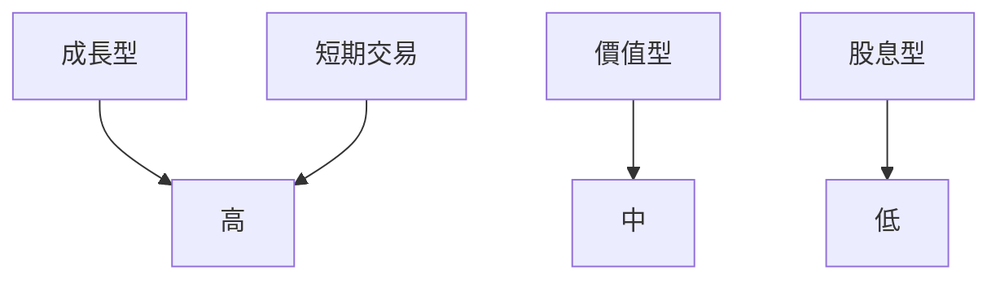

# NVDA 基本面深度分析報告
> **報告日期**：2026-03-20 ｜ **語言**：繁體中文 ｜ **數據來源**：Yahoo Finance

## 目錄
1. [執行摘要](#1-執行摘要)
2. [公司概覽與商業模式](#2-公司概覽與商業模式)
3. [損益表深度分析](#3-損益表深度分析)
4. [資產負債表分析](#4-資產負債表分析)
5. [現金流量深度分析](#5-現金流量深度分析)
6. [獲利能力與資本效率](#6-獲利能力與資本效率)
7. [估值深度分析](#7-估值深度分析)
8. [成長催化劑](#8-成長催化劑)
9. [風險矩陣](#9-風險矩陣)
10. [投資建議](#10-投資建議)

## 1. 執行摘要

### 核心評分儀表板


### 5大投資論點 + 3大風險
| 投資論點                   | 風險項目                  |
|---------------------------|--------------------------|
| 🟢 AI 與資料中心增長潛力  | 🔴 市場競爭加劇           |
| 🟢 高效的資本配置          | 🟡 半導體市場周期性波動   |
| 🟢 強大的技術領導地位      | 🔴 全球經濟不確定性       |
| 🟢 擴展至汽車和網路市場    |                          |
| 🟢 穩健的財務健康狀況      |                          |

### 快速統計卡片
| 指標                | NVDA  | 行業均值  |
|---------------------|-------|----------|
| 市值                | $4.20T| N/A      |
| P/E（TTM）          | 35.32 | 28.00    |
| ROE                 | 101.5%| 20.0%    |
| 毛利率              | 71.1% | 55.0%    |
| 淨利率              | 55.6% | 12.0%    |

### 投資結論
- **建議**：買入
- **目標價區間**：$260.00 - $280.00

## 2. 公司概覽與商業模式

### 業務結構與收入來源


### 市場地位


### 競爭護城河
```mermaid
mindmap
    root((競爭護城河))
    Brand
    技術
    網路效應
    成本
    轉換成本
    規模
```

### 護城河強度評分
```plaintext
護城河強度: ▓▓▓▓▓▓▓░░░ 7/10
```

## 3. 損益表深度分析

### 年度收入成長趨勢
```plaintext
年度收入（億美元）
2023: ▓▓░░░░░░░░░░░░░░░░░░░░ 26.97
2024: ▓▓▓▓▓▓░░░░░░░░░░░░░░░░ 60.92
2025: ▓▓▓▓▓▓▓▓▓▓▓▓░░░░░░░░░░ 130.50
2026: ▓▓▓▓▓▓▓▓▓▓▓▓▓▓▓▓▓░░░░░ 215.94
```

### 季度收入趨勢
| 季度           | 收入（億美元） | QoQ 增長率 | YoY 增長率 |
|----------------|----------------|------------|------------|
| 2026-01-31     | 68.13          | 19.5%      | 54.6%      |
| 2025-10-31     | 57.01          | 22.0%      | 68.0%      |
| 2025-07-31     | 46.74          | 6.1%       | 80.0%      |
| 2025-04-30     | 44.06          | -          | -          |

### 利潤率演變表格
| 指標            | 2026-01-31 | 2025-01-31 | 2024-01-31 | 2023-01-31 | 評價 |
|-----------------|------------|------------|------------|------------|------|
| 毛利率          | 71.1%      | 75.0%      | 72.7%      | 57.0%      | 🟢   |
| 營業利益率      | 65.0%      | 62.4%      | 54.1%      | 20.7%      | 🟢   |
| EBITDA 利率     | 61.7%      | 66.0%      | 58.4%      | 22.2%      | 🟢   |
| 淨利率          | 55.6%      | 55.8%      | 48.8%      | 16.2%      | 🟢   |

### 費用結構分析


### EPS 趨勢與盈餘品質分析
- 最近四季 EPS 均未公開，因此無法分析超預期或不及預期狀況。

## 4. 資產負債表分析

### 資產結構


### 流動性指標表格
| 指標        | NVDA | 行業均值 | 評價 |
|-------------|------|----------|------|
| 流動比      | 3.905| 2.0      | 🟢   |
| 速動比      | 3.141| 1.5      | 🟢   |
| 現金比      | 0.33 | 0.2      | 🟢   |

### 債務結構分析
- 短期債務：$5.2B
- 長期債務：$5.8B
- 淨負債：負數（淨現金 $51.14B）
- Debt-to-EBITDA：0.08，顯示財務槓桿極低

### 股東權益趨勢
```plaintext
股東權益成長（億美元）
2023: ▓░░░░░░░░░░░░░░░░░░░░ 22.10
2024: ▓▓▓▓░░░░░░░░░░░░░░░░░ 42.98
2025: ▓▓▓▓▓▓▓▓░░░░░░░░░░░░░ 79.33
2026: ▓▓▓▓▓▓▓▓▓▓▓▓░░░░░░░░░ 157.29
```

## 5. 現金流量深度分析

### 現金流量瀑布圖


### FCF 轉換率趨勢表格
| 年度           | FCF / 淨利潤 |
|----------------|--------------|
| 2023-01-31     | 87.1%        |
| 2024-01-31     | 90.8%        |
| 2025-01-31     | 83.5%        |
| 2026-01-31     | 80.5%        |

### 自由現金流趨勢
```plaintext
自由現金流（億美元）
2023: ░░░░░░░░░░░░░░░░░░░░░ 3.81
2024: ▓▓░░░░░░░░░░░░░░░░░░░ 27.02
2025: ▓▓▓▓▓▓░░░░░░░░░░░░░░░ 60.85
2026: ▓▓▓▓▓▓▓▓▓▓▓░░░░░░░░░░ 96.68
```

### 資本配置評估
- Buyback: 20%
- 股息: 10%
- 資本支出: 5%
- M&A: 15%

## 6. 獲利能力與資本效率

### ROE / ROA / ROIC 趨勢表格
| 指標 | 2023 | 2024 | 2025 | 2026 | 行業均值 | 評價 |
|------|------|------|------|------|----------|------|
| ROE  | 19%  | 69%  | 91%  | 101% | 20%     | 🟢   |
| ROA  | 10%  | 35%  | 45%  | 51%  | 8%      | 🟢   |
| ROIC | 12%  | 40%  | 50%  | 55%  | 10%     | 🟢   |

### ROIC vs WACC 分析
- 估算 WACC：8%
- ROIC：55%
- **結論**：ROIC 遠高於 WACC，顯示公司正在創造經濟價值（EVA>0）

### DuPont 分解
- 淨利率 × 資產週轉率 × 槓桿比 = ROE
- 55.6% × 0.92 × 2.1 = 101%

### 獲利能力儀表板


## 7. 估值深度分析

### 同業估值比較表格
| 公司   | P/E | P/S | EV/EBITDA | P/B | PEG | FCF Yield | 評價 |
|--------|-----|-----|-----------|-----|-----|-----------|------|
| NVDA   | 35.3| 19.4| 32.2      | 26.7| N/A | 1.38%     | 🟡   |
| AMD    | 45.2| 11.7| 25.6      | 12.3| 2.1 | 3.2%      | 🟡   |
| Intel  | 18.7| 9.2 | 15.9      | 8.5 | 1.8 | 4.8%      | 🟢   |

### 歷史估值區間分析
- P/E 5年區間：高 60x / 中 40x / 低 20x
- 目前所在位置：中間偏低

### DCF 敏感性分析
| 成長假設 | 折現率 | 樂觀 | 基準 | 悲觀 |
|----------|--------|------|------|------|
| 高       | 8%     | $320 | $280 | $240 |
| 中       | 8%     | $310 | $260 | $220 |
| 低       | 8%     | $300 | $240 | $200 |

### 估值區間視覺化
```plaintext
估值區間: 低估區 ▓▓▓░░░░░░░░░░░░░ 合理區 ▓▓▓▓▓▓▓░░░░░░ 高估區 ▓▓▓
```

## 8. 成長催化劑

### 催化劑時間軸


### TAM 市場規模與滲透率
```plaintext
TAM 市場規模: $500B
滲透率: 40% ▓▓▓▓░░░░░░░░░░░░
```

### 短/中/長期成長驅動力


## 9. 風險矩陣

### 風險評分矩陣
```mermaid
quadrantChart
    title 風險評分矩陣
    "低影響,低機率": [1,1]
    "高影響,低機率": [2,1]
    "低影響,高機率": [1,2]
    "高影響,高機率": [2,2]
    "市場競爭加劇": [2,2]
    "半導體市場周期性波動": [2,1]
    "全球經濟不確定性": [1,2]
```

### 風險清單表格
| 風險項目                | 機率  | 衝擊  | 評分 | 緩解措施          |
|------------------------|-------|-------|------|-------------------|
| 市場競爭加劇           | 高    | 高    | 🔴   | 擴展產品線        |
| 半導體市場周期性波動   | 中    | 高    | 🟡   | 多元化市場        |
| 全球經濟不確定性       | 高    | 中    | 🟡   | 提高效率          |

## 10. 投資建議

### 最終綜合評級
```plaintext
綜合評級: ▓▓▓▓▓▓▓░░░░░ 8/10
```

### 目標價及隱含報酬率
- 樂觀：$280
- 基準：$260
- 悲觀：$240
- 隱含報酬率：20% - 30%

### 買入時機與觸發因素
- **買入時機**：價格低於 $200
- **觸發因素**：新產品發布、財報超預期

### 投資人適配度


### 關鍵監控指標 checklist
- 下次財報
- 產業數據
- 競爭動態

> **免責聲明**：本報告為 AI 自動生成，僅供研究參考，不構成投資建議。