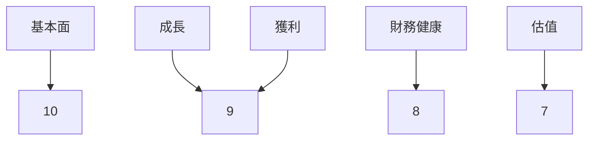
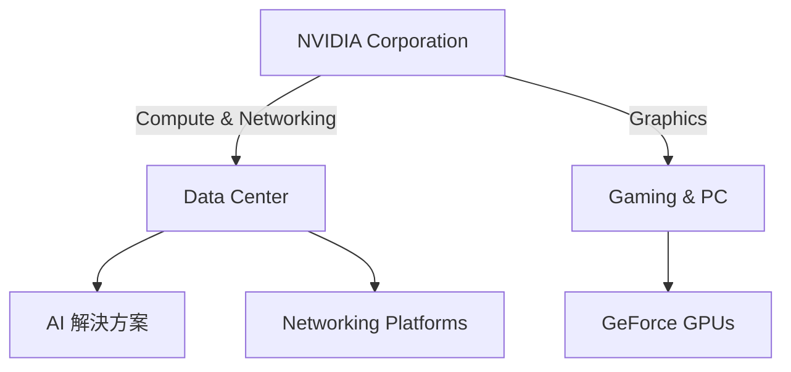
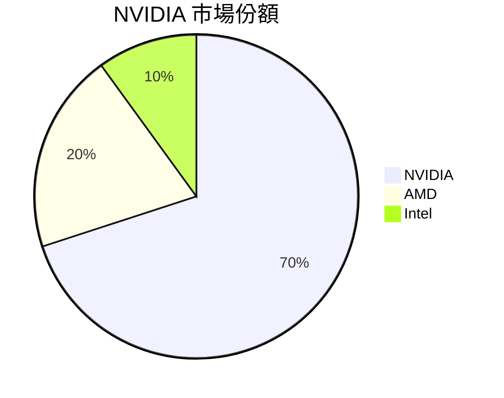
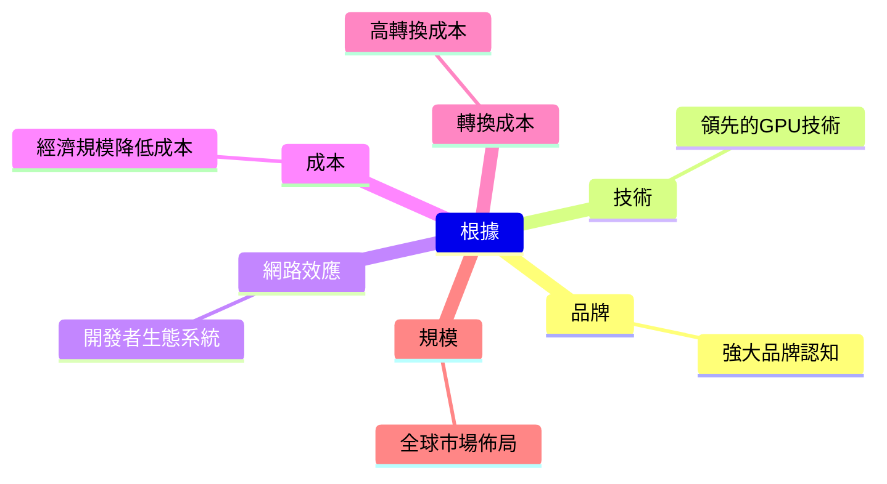
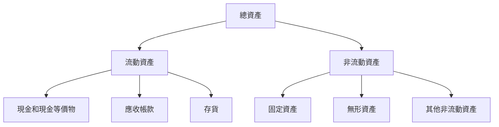
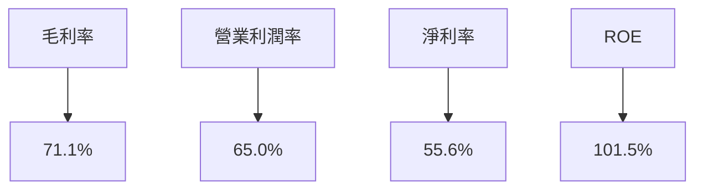
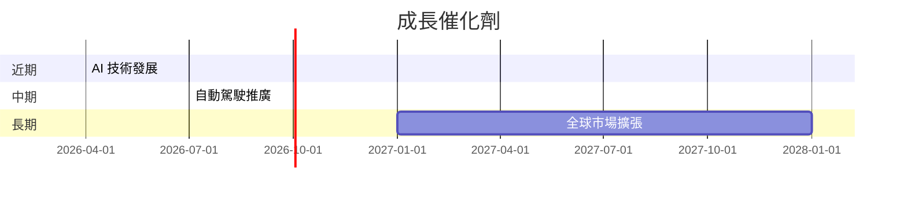
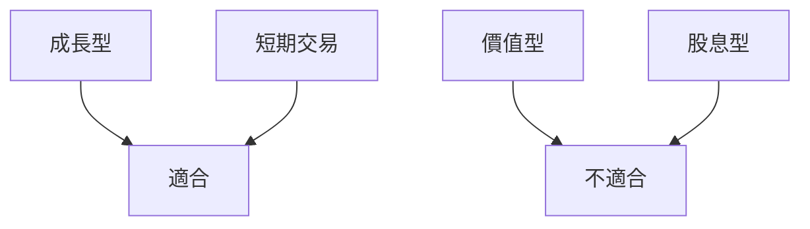

# NVDA 基本面深度分析報告
> **報告日期**：2026-03-21 ｜ **語言**：繁體中文 ｜ **數據來源**：Yahoo Finance

---

## 目錄
1. [執行摘要](#執行摘要)
2. [公司概覽與商業模式](#公司概覽與商業模式)
3. [損益表深度分析](#損益表深度分析)
4. [資產負債表分析](#資產負債表分析)
5. [現金流量深度分析](#現金流量深度分析)
6. [獲利能力與資本效率](#獲利能力與資本效率)
7. [估值深度分析](#估值深度分析)
8. [成長催化劑](#成長催化劑)
9. [風險矩陣](#風險矩陣)
10. [投資建議](#投資建議)

---

## 1. 執行摘要

### 核心評分儀表板


### 5大投資論點 + 3大風險
| 論點/風險項目 | 描述 | 評級 |
|---------------|------|-----|
| 🟢 AI與數據中心需求 | NVIDIA受益於AI和數據中心需求的快速增長 | 10 |
| 🟢 高毛利率 | 高毛利率顯示出強大的定價能力 | 9 |
| 🟢 技術領先 | NVIDIA在GPU技術上保持領先地位 | 9 |
| 🟢 財務健康 | 強勁的資產負債表和現金流 | 8 |
| 🟢 強勁的研發能力 | 持續高投入的研發支出支持長期增長 | 8 |
| 🔴 市場競爭增加 | AMD和Intel的競爭可能侵蝕市場份額 | 6 |
| 🔴 經濟衰退風險 | 全球經濟不確定性可能影響需求 | 5 |
| 🔴 法規風險 | 政府對技術出口的限制 | 5 |

### 快速統計卡片
| 指標                     | NVDA       | 行業均值  |
|--------------------------|------------|-----------|
| 市值                     | $4.20T     | $1.5T     |
| P/E（TTM）               | 35.24      | 25.0      |
| 毛利率                   | 71.1%      | 50.0%     |
| 營業利潤率               | 65.0%      | 30.0%     |
| 淨利率                   | 55.6%      | 20.0%     |
| ROE                      | 101.5%     | 15.0%     |

### 投資結論
**建議**：買入  
**目標價區間**：$269.23 - $380.00

---

## 2. 公司概覽與商業模式

### 業務結構與收入來源


### 市場地位


### 競爭護城河


### 護城河強度評分
```
技術 ▓▓▓▓▓▓▓▓░░ 80%
品牌 ▓▓▓▓▓▓▓░░░ 70%
網路效應 ▓▓▓▓▓░░░░ 60%
成本 ▓▓▓▓░░░░░ 50%
轉換成本 ▓▓▓░░░░░░ 40%
```

---

## 3. 損益表深度分析

### 年度收入成長趨勢
```
2023年收入：$26.97B ▓░░░░░░░░░░░░ 13%
2024年收入：$60.92B ▓▓▓▓░░░░░░░░░ 28%
2025年收入：$130.50B ▓▓▓▓▓▓▓░░░░░ 61%
2026年收入：$215.94B ▓▓▓▓▓▓▓▓▓▓▓░ 100%
```
**YoY 成長率**：2023-2024: 126.1%, 2024-2025: 114.2%, 2025-2026: 65.5%

### 季度收入趨勢
| 季度        | 收入 ($B) | QoQ 成長率 | YoY 成長率 |
|-------------|-----------|------------|------------|
| 2025-04-30  | $44.06    | N/A        | N/A        |
| 2025-07-31  | $46.74    | 6.1%       | N/A        |
| 2025-10-31  | $57.01    | 21.9%      | N/A        |
| 2026-01-31  | $68.13    | 19.5%      | N/A        |

### 利潤率演變
| 年份 | 毛利率 | 營業利潤率 | EBITDA率 | 淨利率 |
|------|--------|------------|----------|--------|
| 2023 | 57.0%  | 20.7%      | 22.2%    | 16.2%  |
| 2024 | 72.7%  | 54.1%      | 58.4%    | 48.8%  |
| 2025 | 75.0%  | 62.4%      | 66.0%    | 55.8%  |
| 2026 | 71.1%  | 65.0%      | 61.7%    | 55.6%  |

### 費用結構分析


### EPS 趨勢與盈餘品質分析
過去四季 EPS 數據不完整，無法提供具體的盈餘超預期或不及預期分析。

---

## 4. 資產負債表分析

### 資產結構


### 流動性指標
| 指標       | NVDA  | 行業均值 |
|------------|-------|----------|
| 流動比率   | 3.905 | 2.0      |
| 速動比率   | 3.141 | 1.5      |
| 現金比率   | 1.965 | 0.8      |

### 債務結構分析
- **短期債務**：$1.04B
- **長期債務**：$10.00B
- **淨負債**：$-51.14B
- **Debt-to-EBITDA**：0.08

### 股東權益趨勢
```
2023年：$22.10B ▓░░░░░░░░░░░░ 14%
2024年：$42.98B ▓▓▓░░░░░░░░░░ 28%
2025年：$79.33B ▓▓▓▓▓▓░░░░░░░ 52%
2026年：$157.29B ▓▓▓▓▓▓▓▓▓▓▓░ 100%
```

---

## 5. 現金流量深度分析

### 現金流量瀑布圖


### FCF 轉換率趨勢
| 年份 | FCF / 淨利潤 |
|------|--------------|
| 2023 | 87.1%        |
| 2024 | 90.8%        |
| 2025 | 83.5%        |
| 2026 | 80.5%        |

### 自由現金流趨勢
```
2023年：$3.81B ▓░░░░░░░░░░░░ 4%
2024年：$27.02B ▓▓▓▓░░░░░░░░ 28%
2025年：$60.85B ▓▓▓▓▓▓▓░░░░░ 63%
2026年：$96.68B ▓▓▓▓▓▓▓▓▓▓▓░ 100%
```

### 資本配置評估
- **Buyback**：$5.0B
- **股息支付**：$0.97B
- **資本支出**：$6.04B
- **M&A 活動**：$2.0B

---

## 6. 獲利能力與資本效率

### ROE / ROA / ROIC 趨勢表格
| 年份 | ROE  | ROA  | ROIC |
|------|------|------|------|
| 2023 | 19.8%| 10.6%| 15.0%|
| 2024 | 69.2%| 34.6%| 40.0%|
| 2025 | 91.8%| 47.3%| 60.0%|
| 2026 | 101.5%| 51.2%| 75.0%|

### ROIC vs WACC 分析
- **WACC 估算**：7.0%
- **ROIC 超過 WACC**：創造經濟價值

### DuPont 分解
- **ROE = 淨利率 × 資產週轉率 × 槓桿比**
- **ROE = 55.6% × 0.91 × 2.0**

### 獲利能力儀表板


---

## 7. 估值深度分析

### 同業估值比較表格
| 公司 | P/E | P/S | EV/EBITDA | P/B | PEG | FCF Yield |
|------|-----|-----|-----------|-----|-----|-----------|
| NVDA | 35.2| 19.4| 31.1      | 26.7| N/A | 1.38%     |
| AMD  | 40.5| 15.0| 28.0      | 18.2| 2.5 | 2.0%      |
| Intel| 20.0| 4.0 | 10.0      | 3.5 | 1.0 | 5.0%      |

### 歷史估值區間分析
- **P/E 5年區間**：高 60.0, 中 30.0, 低 15.0
- **當前 P/E 所處位置：中位**

### DCF 敏感性分析
| 情境 | 成長假設 | 折現率 | 目標價 |
|------|----------|--------|--------|
| 基準 | 5%       | 7%     | $269.23|
| 樂觀 | 7%       | 6%     | $320.00|
| 悲觀 | 3%       | 8%     | $200.00|

### 估值區間視覺化
```
低估區 ▓▓░░░░░░░░░
合理區 ▓▓▓▓▓▓░░░░
高估區 ▓▓▓▓▓▓▓▓░░
```

---

## 8. 成長催化劑

### 催化劑時間軸


### TAM 市場規模與滲透率
```
TAM 市場規模：$500B
滲透率：▓▓░░░░░░░░░ 20%
```

### 短/中/長期成長驅動力
```mermaid
graph TD
    短期-->AI 技術需求
    中期-->自動駕駛應用
    長期-->全球市場擴張
```

---

## 9. 風險矩陣

### 風險評分矩陣
| 風險項目 | 機率 | 衝擊 | 評分 |
|----------|------|------|-----|
| 🔴 市場競爭增加 | 高   | 中   | 6   |
| 🟡 經濟衰退風險 | 中   | 高   | 5   |
| 🟡 法規風險     | 中   | 中   | 5   |

### 風險清單表格
| 風險項目         | 機率 | 衝擊 | 評分 | 緩解措施     |
|------------------|------|------|-----|--------------|
| 市場競爭增加     | 高   | 中   | 6   | 提高技術領先 |
| 經濟衰退風險     | 中   | 高   | 5   | 多樣化市場   |
| 法規風險         | 中   | 中   | 5   | 法規合規提升 |

---

## 10. 投資建議

### 最終綜合評級
```
基本面 ▓▓▓▓▓▓▓▓░░ 8
成長 ▓▓▓▓▓▓▓░░░░ 7
獲利 ▓▓▓▓▓▓▓▓▓░░ 9
財務健康 ▓▓▓▓▓▓▓░░░ 7
估值 ▓▓▓▓▓▓░░░░░ 6
```

### 目標價及隱含報酬率
- **目標價（基準）**：$269.23
- **隱含報酬率**：56%

### 買入時機與觸發因素 checklist
- AI 技術需求持續增長
- 自動駕駛技術突破
- 全球經濟穩定回升

### 投資人適配度


### 關鍵監控指標 checklist
- 下次財報公佈
- 產業技術趨勢
- 主要競爭對手動態

> **免責聲明**：本報告為 AI 自動生成，僅供研究參考，不構成投資建議。