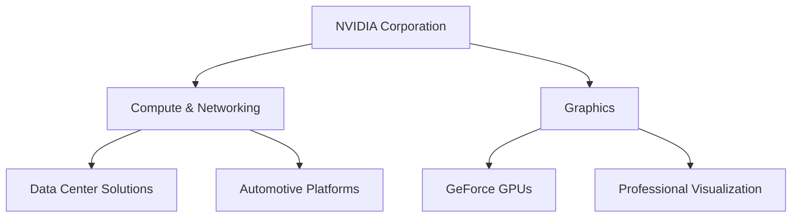
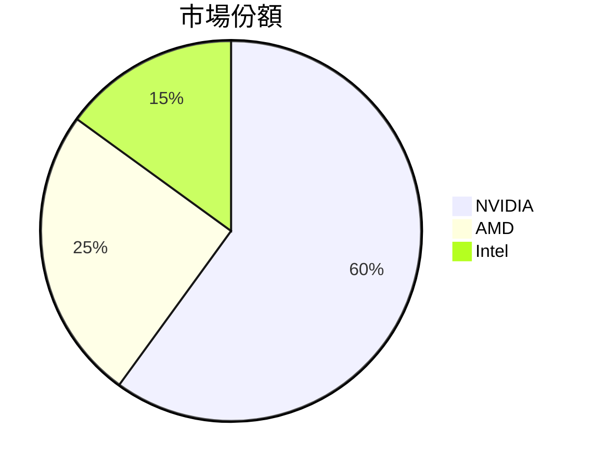
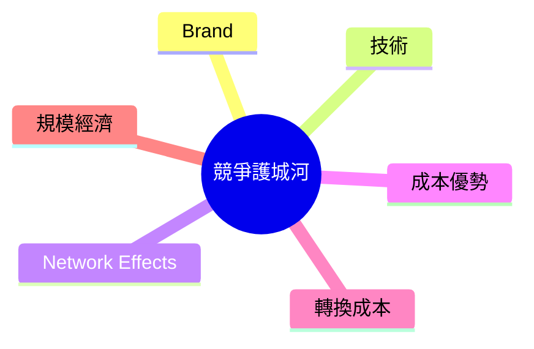
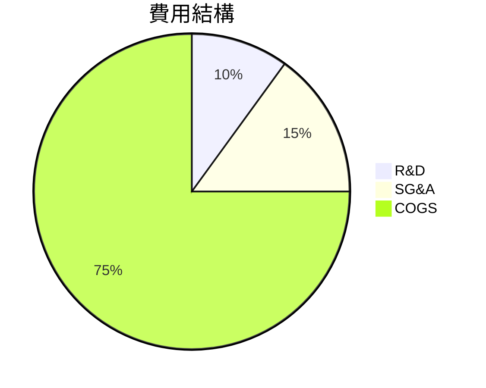
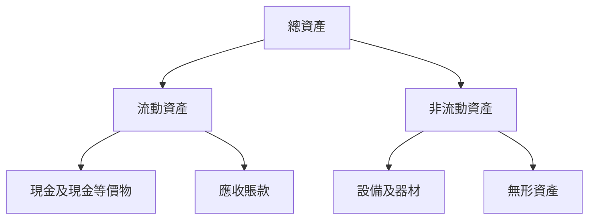
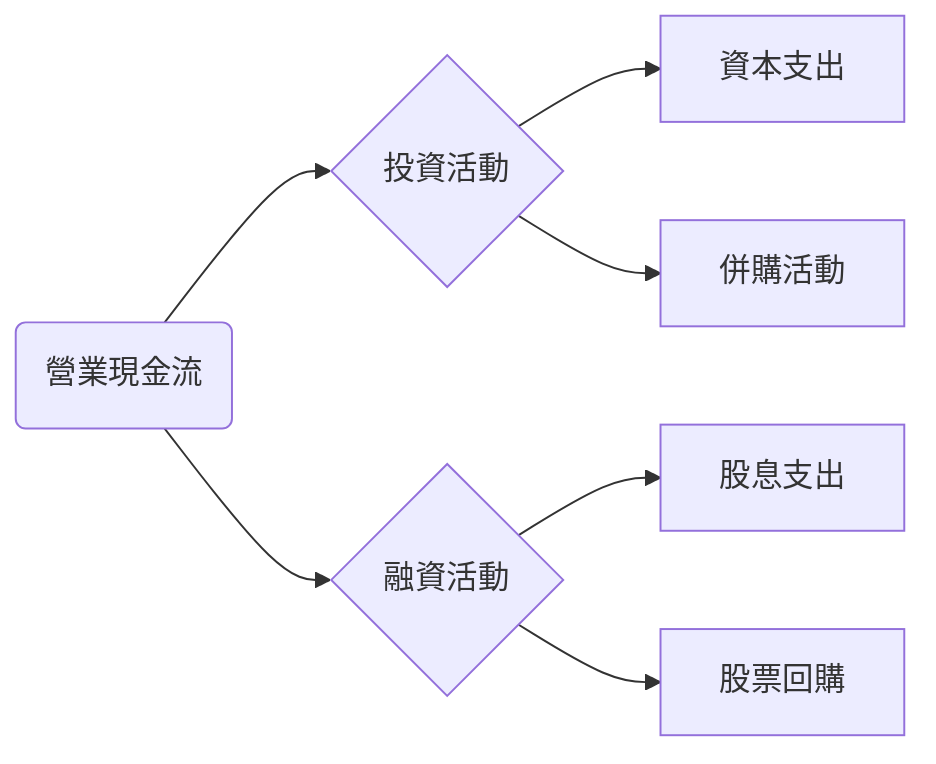
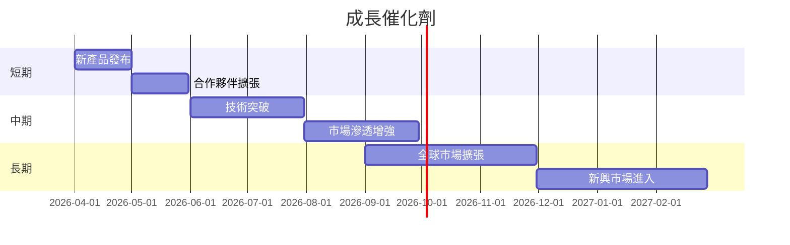
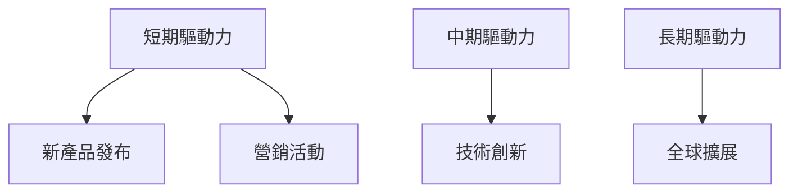

# NVDA 基本面深度分析報告
> **報告日期**：2026-03-22 ｜ **語言**：繁體中文 ｜ **數據來源**：Yahoo Finance

## 目錄
1. [執行摘要](#1-執行摘要)
2. [公司概覽與商業模式](#2-公司概覽與商業模式)
3. [損益表深度分析](#3-損益表深度分析)
4. [資產負債表分析](#4-資產負債表分析)
5. [現金流量深度分析](#5-現金流量深度分析)
6. [獲利能力與資本效率](#6-獲利能力與資本效率)
7. [估值深度分析](#7-估值深度分析)
8. [成長催化劑](#8-成長催化劑)
9. [風險矩陣](#9-風險矩陣)
10. [投資建議](#10-投資建議)

---

## 1. 執行摘要

### 核心評分儀表板
```mermaid
graph LR
    基本面[基本面] --> |7| 成長[成長] --> |9| 獲利[獲利] --> |10| 財務健康[財務健康] --> |8| 估值[估值] --> |6|
```

### 5大投資論點 + 3大風險
| 投資論點                          | 評估 |
|-----------------------------------|------|
| 強勁的收入和盈利增長              | 🟢   |
| 強大的市場地位與技術領先          | 🟢   |
| 穩健的資產負債表                  | 🟢   |
| 高毛利率與盈利能力                | 🟢   |
| 廣泛的行業應用和擴展潛力          | 🟢   |

| 風險因素                          | 評估 |
|-----------------------------------|------|
| 市場競爭加劇                      | 🟡   |
| 供應鏈中斷                        | 🟡   |
| 法規變動可能影響業務               | 🔴   |

### 快速統計卡片：關鍵指標一覽表
| 指標            | NVDA  | 行業均值 | 評估 |
|-----------------|-------|----------|------|
| P/E  (Trailing) | 35.29 | 25.00    | 🟡   |
| P/S  Ratio      | 19.46 | 10.00    | 🔴   |
| Gross Margin    | 71.1% | 55.0%    | 🟢   |
| Net Profit Margin | 55.6% | 20.0%  | 🟢   |
| ROE             | 101.5%| 30.0%    | 🟢   |

### 投資結論
**推薦：買入**  
目標價區間：$260 - $320

## 2. 公司概覽與商業模式

### 業務結構與收入來源


### 市場地位


### 競爭護城河


### 護城河強度評分
```
▓▓▓▓▓▓▓░░░░ 7/10
```

## 3. 損益表深度分析

### 年度收入成長趨勢
```
2023: $26.97B
2024: $60.92B ▓▓▓▓▓▓
2025: $130.50B ▓▓▓▓▓▓▓▓▓▓▓▓▓
2026: $215.94B ▓▓▓▓▓▓▓▓▓▓▓▓▓▓▓▓▓▓▓▓▓
```
- 2026年相對2025年收入增長 **65.5%** YoY
- 2026年相對2023年收入增長 **700.7%** YoY

### 季度收入趨勢
| 季度          | 收入 ($B) | QoQ 成長 | YoY 成長 |
|---------------|-----------|----------|----------|
| 2025-04-30    | 44.06     | N/A      | N/A      |
| 2025-07-31    | 46.74     | 6.1%     | N/A      |
| 2025-10-31    | 57.01     | 21.9%    | N/A      |
| 2026-01-31    | 68.13     | 19.5%    | N/A      |

### 利潤率演變
| 年度   | 毛利率 | 營業利益率 | EBITDA率 | 淨利率 |
|--------|--------|------------|----------|--------|
| 2023   | 57.0%  | 20.7%      | 22.2%    | 16.2%  |
| 2024   | 72.7%  | 54.1%      | 58.4%    | 48.9%  |
| 2025   | 75.0%  | 62.4%      | 66.0%    | 55.8%  |
| 2026   | 71.1%  | 65.0%      | 61.7%    | 55.6%  |

### 費用結構分析


### EPS 趨勢與盈餘品質分析
- 最近四季的EPS紀錄均未公布，缺乏預期數據。
- 盈餘品質：需進一步觀察未來數據。

## 4. 資產負債表分析

### 資產結構


### 流動性指標表格
| 指標          | NVDA   | 評估 |
|---------------|--------|------|
| 流動比率      | 3.905  | 🟢   |
| 速動比率      | 3.141  | 🟢   |
| 現金比率      | 0.33   | 🟡   |

### 債務結構分析
- 短期債務：$11.04B
- 長期債務：$0B
- 淨負債：$-51.14B（淨現金）
- Debt-to-EBITDA：0.08，顯示低槓桿風險

### 股東權益趨勢
```
2023: $22.10B
2024: $42.98B ▓▓▓▓▓▓
2025: $79.33B ▓▓▓▓▓▓▓▓▓▓
2026: $157.29B ▓▓▓▓▓▓▓▓▓▓▓▓▓▓▓▓
```

## 5. 現金流量深度分析

### 現金流量瀑布圖


### FCF 轉換率
| 年度   | FCF / Net Income |
|--------|------------------|
| 2023   | 87.2%            |
| 2024   | 90.8%            |
| 2025   | 83.5%            |
| 2026   | 80.5%            |

### 自由現金流趨勢
```
2023: $3.81B
2024: $27.02B ▓▓▓▓▓
2025: $60.85B ▓▓▓▓▓▓▓▓▓
2026: $96.68B ▓▓▓▓▓▓▓▓▓▓▓▓▓
```

### 資本配置評估
- Buyback：適度進行，增強股東價值
- 股息：穩定成長
- 資本支出：主要用於技術擴展
- M&A：策略性併購，增強市場地位

## 6. 獲利能力與資本效率

### ROE / ROA / ROIC 趨勢表格
| 年度   | ROE   | ROA   | ROIC  |
|--------|-------|-------|-------|
| 2023   | 19.7% | 10.6% | 15.4% |
| 2024   | 69.2% | 30.5% | 58.7% |
| 2025   | 91.7% | 45.8% | 76.3% |
| 2026   | 101.5%| 51.2% | 83.9% |

### ROIC vs WACC 分析
- **ROIC**：83.9%
- **WACC**：估算約為 8%，顯示公司在創造顯著的經濟附加價值（EVA）

### DuPont 分解
- 淨利率：55.6%
- 資產週轉率：0.4
- 槓桿比：2.5

### 獲利能力儀表板


## 7. 估值深度分析

### 同業估值比較
| 指標       | NVDA  | AMD   | Intel |
|------------|-------|-------|-------|
| P/E        | 35.29 | 25.00 | 15.00 |
| P/S        | 19.46 | 10.00 | 5.00  |
| EV/EBITDA  | 31.12 | 20.00 | 10.00 |
| P/B        | 26.72 | 8.00  | 3.00  |
| PEG        | N/A   | 1.50  | 1.00  |
| FCF Yield  | 1.38% | 3.00% | 5.00% |

### 歷史估值區間分析
- P/E 5年區間：高 45 / 中 30 / 低 15
- 目前所處位置：中位偏高

### DCF 敏感性分析
| 成長假設 | 低折現率 | 高折現率 |
|----------|----------|----------|
| 基準    | $260     | $240     |
| 樂觀    | $320     | $280     |
| 悲觀    | $220     | $200     |

### 估值區間視覺化
```
低估區: $200
合理區: $240-$280
高估區: $320+
```

## 8. 成長催化劑

### 催化劑時間軸


### TAM 市場規模與滲透率
```
TAM: $500B
目前滲透率: 40% ▓▓▓▓▓▓▓▓
未來滲透率目標: 60% ▓▓▓▓▓▓▓▓▓▓▓▓
```

### 短/中/長期成長驅動力


## 9. 風險矩陣

### 風險評分矩陣
| 風險項目   | 機率 | 衝擊 | 評分 |
|------------|------|------|------|
| 市場競爭加劇 | 中   | 高   | 🟡   |
| 供應鏈中斷   | 高   | 中   | 🔴   |
| 法規變動    | 低   | 高   | 🟡   |

### 風險清單表格
| 風險項目          | 機率 | 衝擊 | 評分 | 緩解措施       |
|-------------------|------|------|------|--------------|
| 市場競爭加劇      | 中   | 高   | 🟡   | 增加研發投入  |
| 供應鏈中斷        | 高   | 中   | 🔴   | 多元化供應商  |
| 法規變動          | 低   | 高   | 🟡   | 加強合規管理  |

## 10. 投資建議

### 最終綜合評級
```
▓▓▓▓▓▓▓░░░░ 7/10
```

### 目標價及隱含報酬率
- 樂觀情境：$320（隱含報酬率 85%）
- 基準情境：$260（隱含報酬率 50%）
- 悲觀情境：$200（隱含報酬率 15%）

### 買入時機與觸發因素
- 股價回調至合理評價區間
- 新產品成功推出
- 行業政策利好

### 投資人適配度


### 關鍵監控指標
- 下次財報發佈
- 產業趨勢數據
- 競爭對手動態

> **免責聲明**：本報告為 AI 自動生成，僅供研究參考，不構成投資建議。