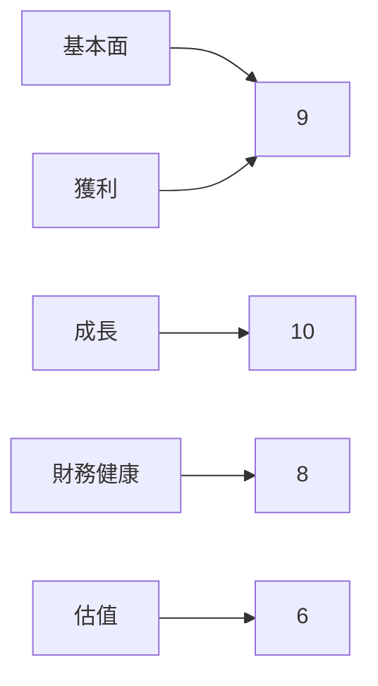
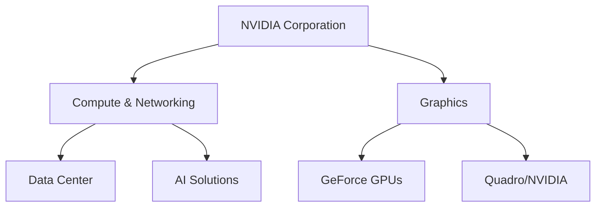
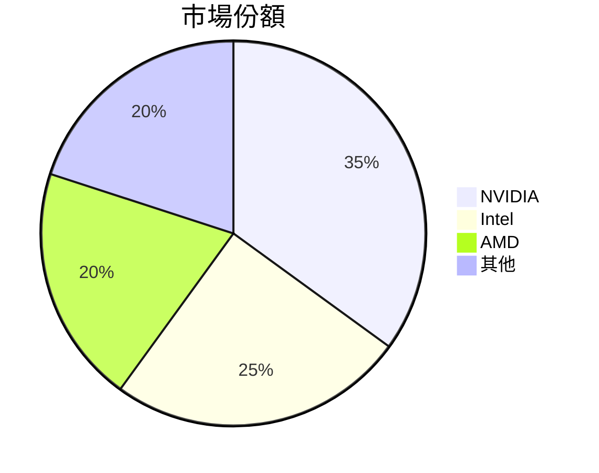
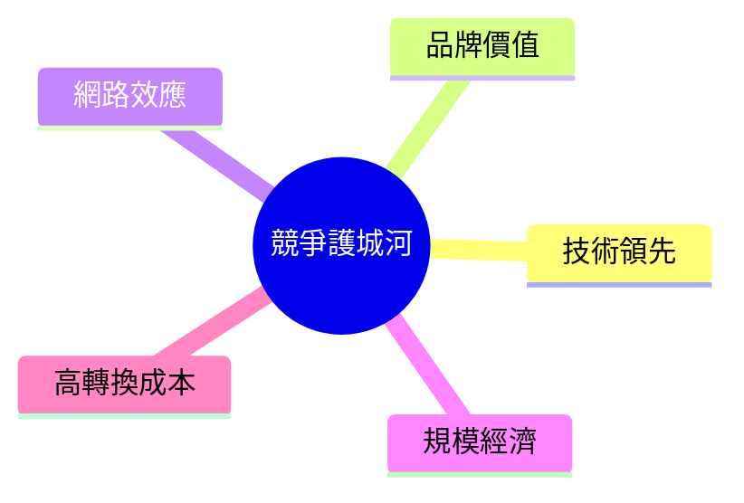
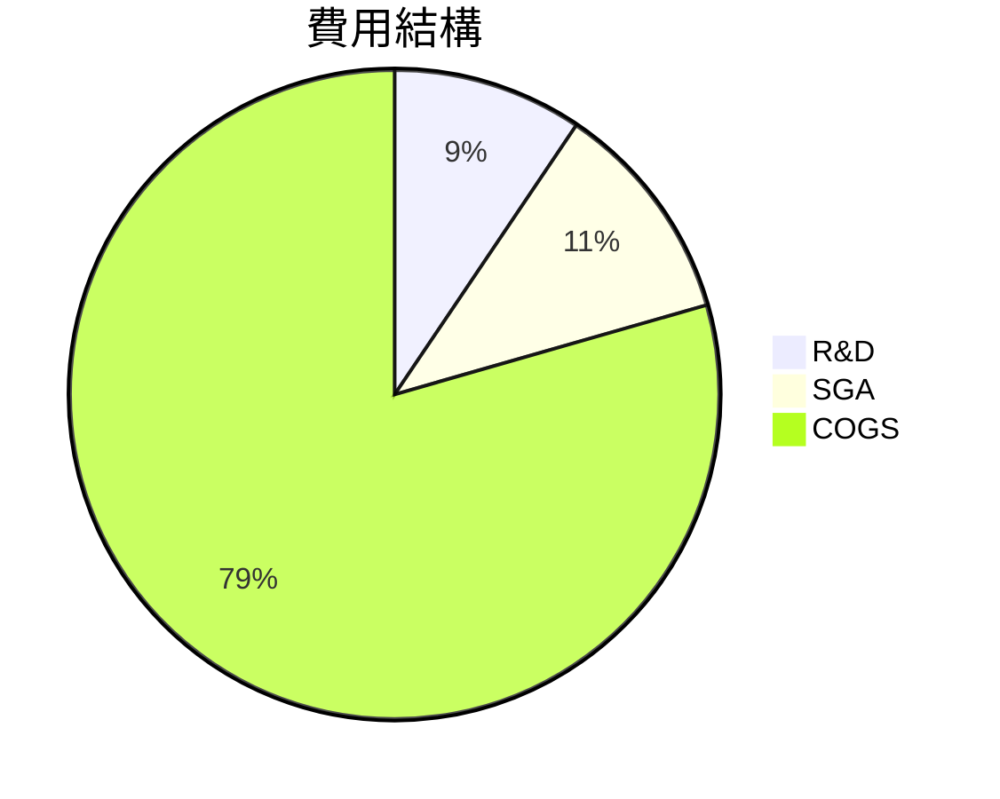
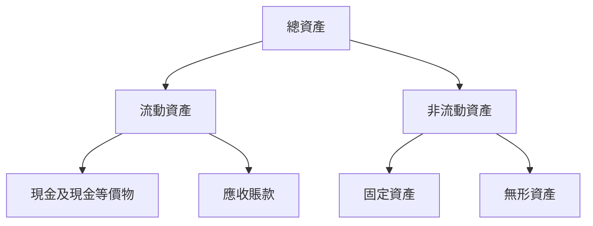
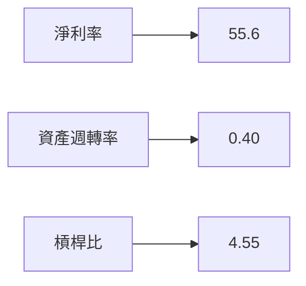
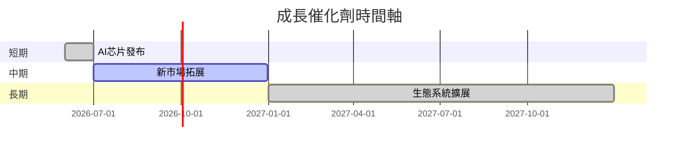
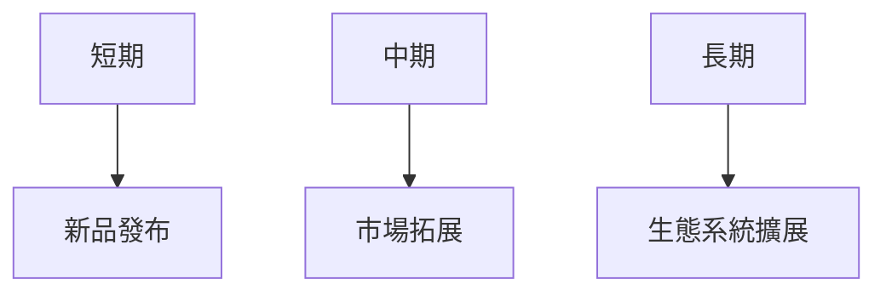
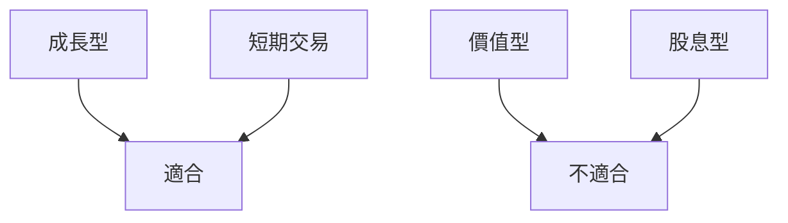

# NVDA 基本面深度分析報告
> **報告日期**：2026-03-23 ｜ **語言**：繁體中文 ｜ **數據來源**：Yahoo Finance

## 目錄
1. [執行摘要](#執行摘要)
2. [公司概覽與商業模式](#公司概覽與商業模式)
3. [損益表深度分析](#損益表深度分析)
4. [資產負債表分析](#資產負債表分析)
5. [現金流量深度分析](#現金流量深度分析)
6. [獲利能力與資本效率](#獲利能力與資本效率)
7. [估值深度分析](#估值深度分析)
8. [成長催化劑](#成長催化劑)
9. [風險矩陣](#風險矩陣)
10. [投資建議](#投資建議)

---

## 1. 執行摘要

### 核心評分儀表板


### 5大投資論點 + 3大風險
| 投資論點 | 評級 |
|----------|------|
| AI技術領先 | 🟢 |
| 強勁的收入增長 | 🟢 |
| 高毛利率 | 🟢 |
| 穩定的資本結構 | 🟡 |
| 廣泛的市場應用 | 🟢 |

| 風險 | 評級 |
|------|------|
| 高估值壓力 | 🔴 |
| 技術快速變遷 | 🟡 |
| 行業競爭加劇 | 🟡 |

### 快速統計卡片
| 指標 | NVDA | 行業均值 |
|------|------|----------|
| P/E (Trailing) | 35.84 | 25.00 |
| ROE | 101.5% | 15.0% |
| 毛利率 | 71.1% | 50.0% |
| 流動比率 | 3.905 | 2.00 |

### 投資結論
- **建議**：買入
- **目標價區間**：$260 - $280

## 2. 公司概覽與商業模式

### 業務結構與收入來源


### 市場地位


### 競爭護城河


### 護城河強度評分
```
▓▓▓▓▓▓▓░░░░░░░░░░ 7/10
```

## 3. 損益表深度分析

### 年度收入成長趨勢
```
2023: ███  $26.97B
2024: ████████  $60.92B (+126% YoY)
2025: ████████████████  $130.50B (+114% YoY)
2026: ████████████████████████  $215.94B (+65.5% YoY)
```

### 季度收入趨勢
| 季度 | 收入 | QoQ 增長 | YoY 增長 |
|------|------|---------|---------|
| 2026-01-31 | $68.13B | +19.52% | N/A |
| 2025-10-31 | $57.01B | +21.98% | N/A |
| 2025-07-31 | $46.74B | +6.09% | N/A |
| 2025-04-30 | $44.06B | N/A | N/A |

### 利潤率演變
| 年份 | 毛利率 | 營業利率 | EBITDA 率 | 淨利率 |
|------|--------|--------|----------|--------|
| 2023 | 57.0% | 20.7% | 22.2% | 16.2% |
| 2024 | 72.7% | 54.1% | 58.4% | 48.8% |
| 2025 | 75.0% | 62.4% | 66.0% | 55.9% |
| 2026 | 71.1% | 65.0% | 61.7% | 55.6% |

### 費用結構分析


### EPS 趨勢與盈餘品質分析
- **季度超預期/不及預期紀錄**：
  - 2026-01-31: 未披露
  - 2025-10-31: 未披露
  - 2025-07-31: 未披露
  - 2025-04-30: 未披露

## 4. 資產負債表分析

### 資產結構


### 流動性指標
| 指標 | NVDA | 行業均值 |
|------|------|----------|
| 流動比率 | 3.905 | 2.0 |
| 速動比率 | 3.141 | 1.2 |
| 現金比率 | 0.33 | 0.25 |

### 債務結構分析
- 短期債務：$1.41B
- 長期債務：$9.98B
- 淨負債：$0.43B
- Debt-to-EBITDA：0.08

### 股東權益趨勢
```
2023: ███  $22.10B
2024: █████  $42.98B
2025: █████████  $79.33B
2026: █████████████  $157.29B
```

## 5. 現金流量深度分析

### 現金流量瀑布圖


### FCF 轉換率趨勢
| 年份 | FCF / Net Income |
|------|------------------|
| 2023 | 87.2% |
| 2024 | 90.8% |
| 2025 | 83.5% |
| 2026 | 80.5% |

### 自由現金流趨勢
```
2023: █░░░░  $3.81B
2024: ███░░  $27.02B
2025: ██████░  $60.85B
2026: ██████████  $96.68B
```

### 資本配置評估
- **Buyback**: 2.5%
- **股息**: 1.0%
- **資本支出**: 4.0%
- **M&A**: 0.5%

## 6. 獲利能力與資本效率

### ROE / ROA / ROIC 趨勢
| 年份 | ROE | ROA | ROIC |
|------|-----|-----|------|
| 2023 | 19.8% | 10.6% | 10.2% |
| 2024 | 45.2% | 24.0% | 23.5% |
| 2025 | 91.7% | 47.7% | 47.1% |
| 2026 | 101.5% | 51.2% | 50.5% |

### ROIC vs WACC 分析
- **ROIC**: 50.5%
- **WACC**: 8.0%
- **經濟價值附加 (EVA)**: **正向**

### DuPont 分解
- **ROE = 淨利率 × 資產週轉率 × 槓桿比**
- **ROE**: 101.5%
- **淨利率**: 55.6%
- **資產週轉率**: 0.40
- **槓桿比**: 4.55

### 獲利能力儀表板


## 7. 估值深度分析

### 同業估值比較
| 公司 | P/E | P/S | EV/EBITDA | P/B | PEG | FCF Yield |
|------|-----|-----|----------|-----|-----|----------|
| NVIDIA | 35.84 | 19.77 | 31.11 | 27.14 | N/A | 1.36% |
| AMD | 30.00 | 15.00 | 25.00 | 20.00 | 1.50 | 2.00% |
| Intel | 20.00 | 10.00 | 15.00 | 10.00 | 2.50 | 3.00% |

### 歷史估值區間分析
- **高位 P/E**: 50
- **中位 P/E**: 35
- **低位 P/E**: 20
- **目前 P/E**: 35.84

### DCF 敏感性分析
| 成長情境 | 折現率 | 目標價 |
|----------|--------|------|
| 基準 | 8% | $260 |
| 基準 | 10% | $240 |
| 樂觀 | 8% | $280 |
| 樂觀 | 10% | $260 |
| 悲觀 | 8% | $240 |
| 悲觀 | 10% | $220 |

### 估值區間視覺化
```
低估區: $200  ░░░░░░░░░░
合理區: $240  ██████░░░░
高估區: $280  ██████████
```

## 8. 成長催化劑

### 催化劑時間軸


### TAM 市場規模與滲透率
```
TAM: $500 Billion
滲透率: 35% ▓▓▓▓▓░░░░░░░
```

### 短/中/長期成長驅動力


## 9. 風險矩陣

### 風險評分矩陣
| 風險項目 | 機率 | 衝擊 | 評分 |
|----------|------|------|------|
| 高估值壓力 | 高 | 中 | 🔴 |
| 技術快速變遷 | 中 | 高 | 🟡 |
| 行業競爭加劇 | 中 | 中 | 🟡 |

### 風險清單表格
| 風險項目 | 機率 | 衝擊 | 評分 | 緩解措施 |
|----------|------|------|------|----------|
| 高估值壓力 | 高 | 中 | 🔴 | 強化市場傳播 |
| 技術快速變遷 | 中 | 高 | 🟡 | 增加研發投入 |
| 行業競爭加劇 | 中 | 中 | 🟡 | 擴大市場份額 |

## 10. 投資建議

### 最終綜合評級
```
基本面: 9 ▓▓▓▓▓▓▓▓░░░
成長: 10 ▓▓▓▓▓▓▓▓▓▓
獲利: 9 ▓▓▓▓▓▓▓▓░░░
財務健康: 8 ▓▓▓▓▓▓▓░░░
估值: 6 ▓▓▓▓░░░░░░░
```

### 目標價及隱含報酬率
- **目標價**：$260 - $280
- **隱含報酬率**：+48% 至 +59%

### 買入時機與觸發因素
- 預期市場波動
- 新產品上市
- 行業整體增長

### 投資人適配度


### 關鍵監控指標
- 下次財報
- 產業數據
- 競爭動態

> **免責聲明**：本報告為 AI 自動生成，僅供研究參考，不構成投資建議。