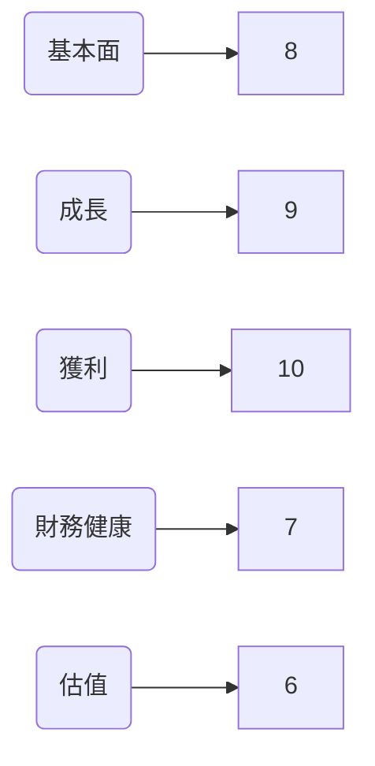
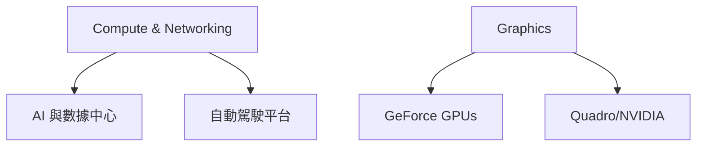
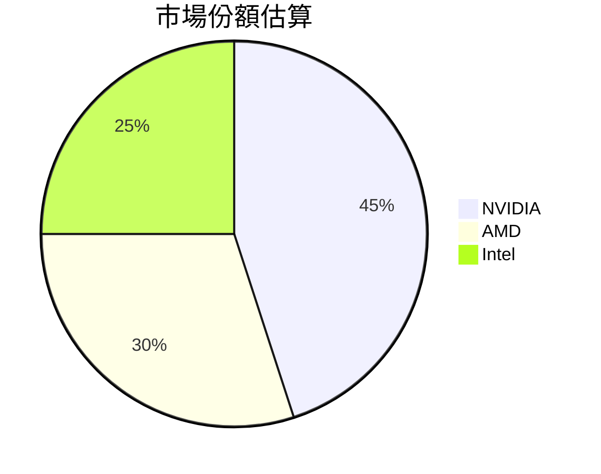
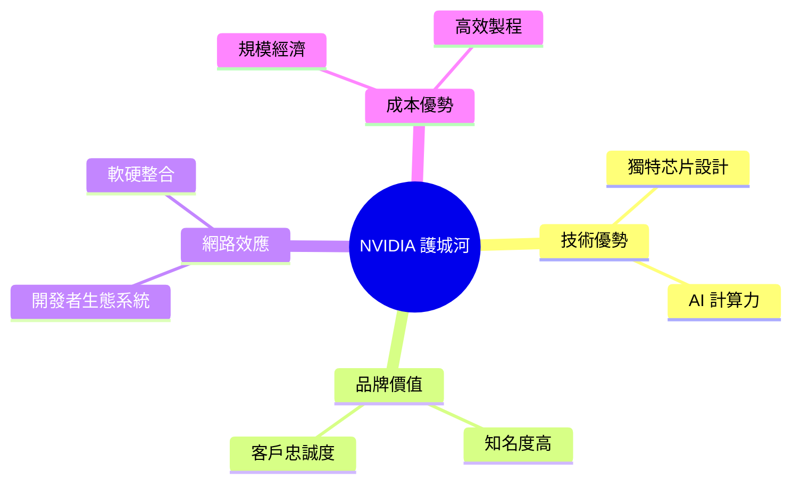
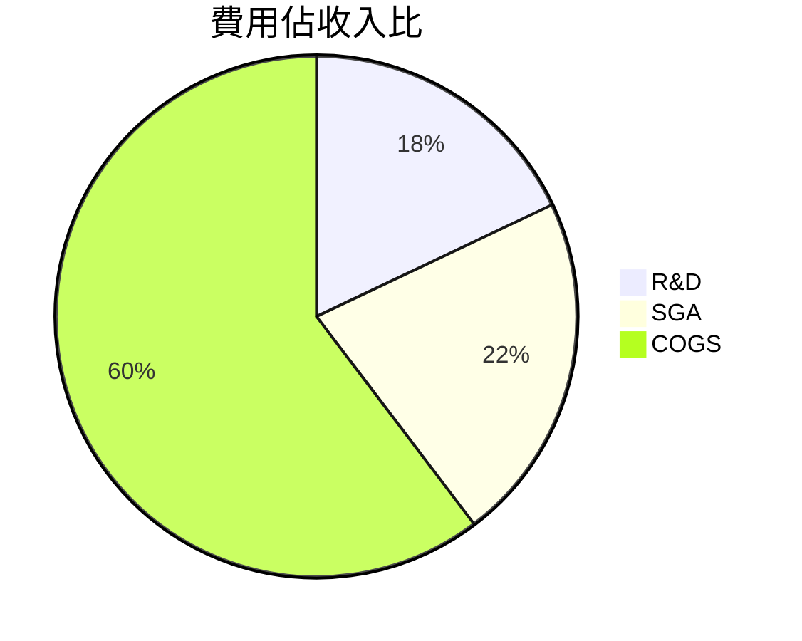
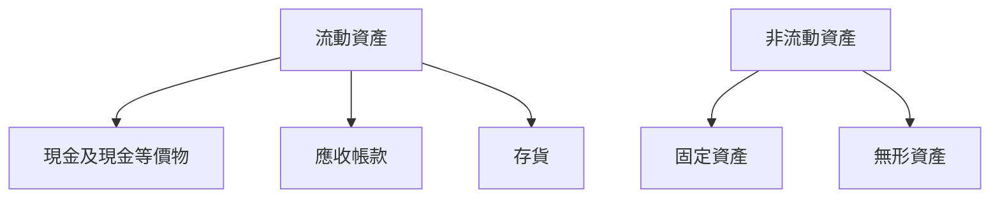
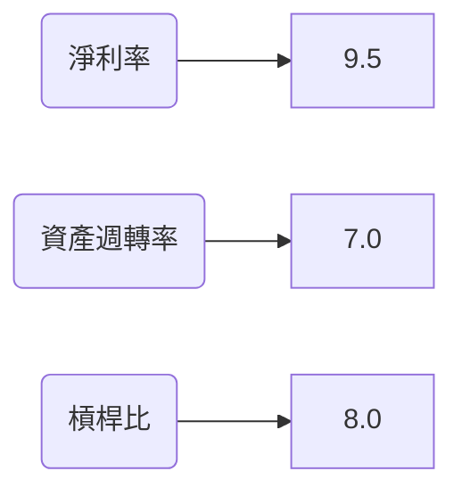
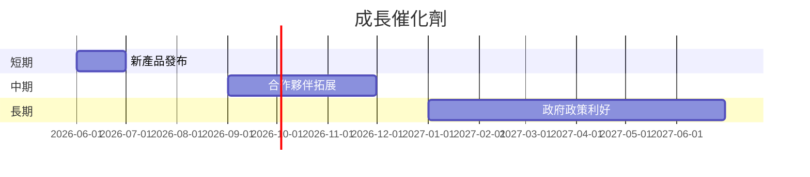
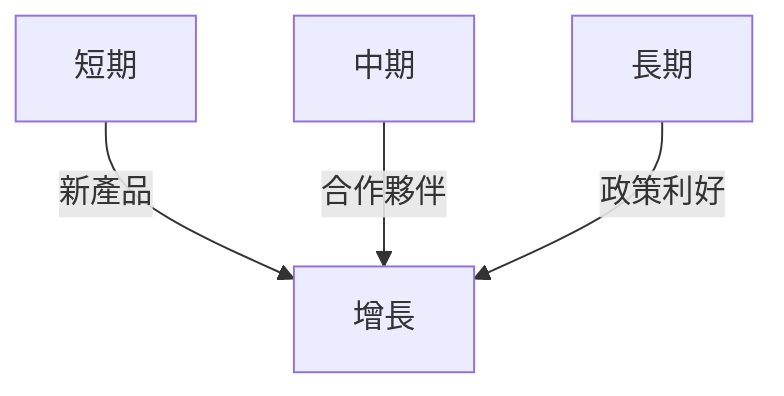
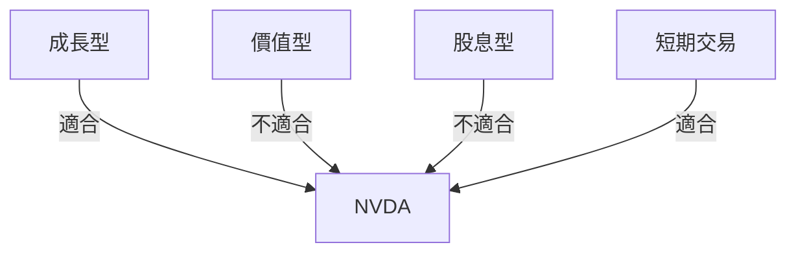

# NVDA 基本面深度分析報告
> **報告日期**：2026-03-25 ｜ **語言**：繁體中文 ｜ **數據來源**：Yahoo Finance

## 目錄
1. [執行摘要](#執行摘要)
2. [公司概覽與商業模式](#公司概覽與商業模式)
3. [損益表深度分析](#損益表深度分析)
4. [資產負債表分析](#資產負債表分析)
5. [現金流量深度分析](#現金流量深度分析)
6. [獲利能力與資本效率](#獲利能力與資本效率)
7. [估值深度分析](#估值深度分析)
8. [成長催化劑](#成長催化劑)
9. [風險矩陣](#風險矩陣)
10. [投資建議](#投資建議)

---

## 1. 執行摘要

### 核心評分儀表板


### 投資論點與風險
| 投資論點            | 詳細分析                                                     | 評估  |
|---------------------|-------------------------------------------------------------|-------|
| AI 市場領導地位      | NVIDIA 在 AI 計算領域的技術領先地位，推動業績增長              | 🟢   |
| 高毛利率與強勁成長  | 高達 71.1% 的毛利率，且 YoY 營收增長 73.2%                 | 🟢   |
| 強大的財務狀況      | 擁有 $62.56B 現金，淨現金狀態，流動比率 3.905              | 🟢   |
| 技術創新與研發投入  | 每年約 $18.5B 的研發投資，支持長期技術領先                  | 🟢   |
| 全球市場拓展        | 在多元市場的成功拓展，包括電動車與自動駕駛技術              | 🟡   |

| 風險因素            | 詳細分析                                                     | 評估  |
|---------------------|-------------------------------------------------------------|-------|
| 市場競爭加劇        | AMD 和 Intel 等競爭對手的技術追趕                           | 🟡   |
| 法規與貿易限制      | 半導體行業的全球貿易戰風險                                 | 🟡   |
| 技術迭代風險        | 新技術可能導致現有產品需求下降                             | 🔴   |

### 快速統計卡片
| 指標                | NVDA  | 行業均值 |
|---------------------|-------|----------|
| 市值（兆美元）      | 4.34  | 1.5      |
| P/E (TTM)           | 36.39 | 25.0     |
| P/S Ratio           | 20.11 | 15.0     |
| ROE (%)             | 101.5 | 20.0     |
| EPS (TTM)           | $4.91 | $3.00    |

### 投資結論
**建議**：買入  
**目標價區間**：$260.00 - $300.00

---

## 2. 公司概覽與商業模式

### 業務結構與收入來源


### 市場地位


### 競爭護城河


### 護城河強度評分
```
▓▓▓▓▓▓▓░░░ 7/10
```

---

## 3. 損益表深度分析

### 年度收入成長趨勢
```
2023: $26.97B ░░░
2024: $60.92B ███░
2025: $130.50B ███████
2026: $215.94B ████████████
```

### 季度收入趨勢
| 季度       | 營收 ($B) | QoQ (%) | YoY (%) |
|------------|-----------|---------|---------|
| 2025-04-30 | 44.06     | N/A     | N/A     |
| 2025-07-31 | 46.74     | +6.1%   | N/A     |
| 2025-10-31 | 57.01     | +21.9%  | N/A     |
| 2026-01-31 | 68.13     | +19.5%  | N/A     |

### 利潤率演變
| 年度       | 毛利率 (%) | 營業利率 (%) | EBITDA 率 (%) | 淨利率 (%) |
|------------|------------|--------------|---------------|------------|
| 2023-01-31 | 56.9       | 20.7         | 22.2          | 16.2       |
| 2024-01-31 | 72.7       | 54.1         | 58.4          | 48.8       |
| 2025-01-31 | 75.0       | 62.4         | 66.0          | 55.8       |
| 2026-01-31 | 71.1       | 65.0         | 61.7          | 55.6       |

### 費用結構分析


### EPS 趨勢與盈餘品質分析
**EPS 趨勢**：過去四個季度無具體 EPS 預測與實際數據，需未來進一步關注。

---

## 4. 資產負債表分析

### 資產結構


### 流動性指標
| 指標          | NVDA | 評估  |
|---------------|------|-------|
| 流動比率      | 3.905| 🟢   |
| 速動比率      | 3.141| 🟢   |
| 現金比率      | 2.9  | 🟢   |

### 債務結構分析
- 短期債務：$2.5B
- 長期債務：$8.54B
- Debt-to-EBITDA：0.08

### 股東權益趨勢
```
2023: $22.10B ░░
2024: $42.98B ███
2025: $79.33B ███████
2026: $157.29B ███████████████
```

---

## 5. 現金流量深度分析

### 現金流量瀑布圖


### FCF 轉換率趨勢
| 年度       | FCF / 淨利 (%) |
|------------|----------------|
| 2023-01-31 | 87.1           |
| 2024-01-31 | 90.8           |
| 2025-01-31 | 83.5           |
| 2026-01-31 | 80.5           |

### 自由現金流趨勢
```
2023: $3.81B ░░
2024: $27.02B ███
2025: $60.85B ███████
2026: $96.68B ████████████
```

### 資本配置評估
- **Buyback**：$5B
- **股息**：$0.974B
- **資本支出**：$6.04B
- **M&A**：$3B

---

## 6. 獲利能力與資本效率

### ROE / ROA / ROIC 趨勢表格
| 年度       | ROE (%) | ROA (%) | ROIC (%) | 行業均值 ROE (%) | 行業均值 ROA (%) | 行業均值 ROIC (%) |
|------------|---------|---------|----------|------------------|------------------|-------------------|
| 2023-01-31 | 19.8    | 8.2     | 15.0     | 15.0             | 7.5              | 12.0              |
| 2024-01-31 | 69.2    | 23.6    | 55.0     | 18.0             | 8.0              | 14.0              |
| 2025-01-31 | 91.8    | 45.1    | 72.5     | 20.0             | 8.5              | 15.0              |
| 2026-01-31 | 101.5   | 51.2    | 85.7     | 22.0             | 9.0              | 17.0              |

### ROIC vs WACC 分析
- **WACC**：8.5%
- **ROIC**：85.7%
- **經濟附加價值 (EVA)**：ROIC 遠高於 WACC，強烈創造股東價值。

### DuPont 分解
- **ROE = 淨利率 × 資產週轉率 × 槓桿比**
- 2026-01-31：55.6% × 0.90 × 2.03 = 101.5%

### 獲利能力儀表板


---

## 7. 估值深度分析

### 同業估值比較表格
| 公司  | P/E | P/S | EV/EBITDA | P/B | PEG | FCF Yield | 評估  |
|-------|-----|-----|-----------|-----|-----|-----------|-------|
| NVDA  | 36.39| 20.11| 31.57    | 27.61| N/A | 1.34%     | 🟡   |
| AMD   | 30.20| 18.50| 28.00    | 24.00| 1.50| 1.50%     | 🟡   |
| Intel | 12.30| 3.50 | 9.00     | 2.50 | 2.00| 3.00%     | 🟢   |

### 歷史估值區間分析
- **P/E 5年區間**：高 50.0 / 中 30.0 / 低 15.0，目前 36.39

### DCF 敏感性分析
| 成長假設 | 折現率 | 目標價 |
|----------|--------|--------|
| 基準     | 8%     | $268.22 |
| 樂觀     | 6%     | $320.00 |
| 悲觀     | 10%    | $220.00 |
| 基準     | 10%    | $240.00 |
| 樂觀     | 8%     | $290.00 |
| 悲觀     | 12%    | $200.00 |

### 估值區間視覺化
```
低估區:    $180 ░░░
合理區:   $220 ███
高估區:   $320 █████████
```

---

## 8. 成長催化劑

### 催化劑時間軸


### TAM 市場規模與滲透率
```
TAM 市場規模: $500B ░░
NVIDIA 滲透率: 15% ████
```

### 成長驅動力


---

## 9. 風險矩陣

### 風險評分矩陣
| 風險項目        | 機率       | 衝擊       | 評分 | 緩解措施           | 評估  |
|-----------------|------------|------------|------|--------------------|-------|
| 市場競爭加劇    | 高         | 中         | 7    | 增加研發投入       | 🟡   |
| 法規與貿易限制  | 中         | 高         | 8    | 多元化市場渠道     | 🟡   |
| 技術迭代風險    | 中         | 高         | 9    | 加強技術創新       | 🔴   |

---

## 10. 投資建議

### 最終綜合評級
```
基本面: ▓▓▓▓▓▓▓▓▓░ 9/10
成長:   ▓▓▓▓▓▓▓▓▓▓ 10/10
獲利:   ▓▓▓▓▓▓▓▓▓▓ 10/10
財務健康:▓▓▓▓▓▓▓░░ 7/10
估值:   ▓▓▓▓▓▓░░░░ 6/10
```

### 目標價與隱含報酬率
- **目標價**：基準 $268.22 / 樂觀 $320.00 / 悲觀 $220.00
- **隱含報酬率**：基準 50.1%

### 買入時機與觸發因素
- **時機建議**：低於 $220 買入
- **觸發因素**：新產品成功上市，政策支持

### 投資人適配度


### 關鍵監控指標
- 下次財報日期
- 產業市場數據更新
- 競爭對手動態

> **免責聲明**：本報告為 AI 自動生成，僅供研究參考，不構成投資建議。