# NVDA 基本面深度分析報告
> **報告日期**：2026-03-27 ｜ **語言**：繁體中文 ｜ **數據來源**：Yahoo Finance ｜ **分析師**：CFA 級機構研究

---

## 目錄

| # | 章節 | 核心結論 |
|---|------|----------|
| 1 | 執行摘要 | 強烈買入，目標價 $240-$290 |
| 2 | 公司概覽與商業模式 | AI 基礎設施霸主，護城河極深 |
| 3 | 損益表深度分析 | 收入 YoY +65%，淨利率突破 55% |
| 4 | 資產負債表分析 | 淨現金超 $1,400億，財務結構極度健康 |
| 5 | 現金流量深度分析 | FCF $967億，轉換率達 80.5% |
| 6 | 獲利能力與資本效率 | ROIC 遠超 WACC，強力創造股東價值 |
| 7 | 估值深度分析 | Forward P/E ~20x，相對成長率仍具吸引力 |
| 8 | 成長催化劑 | Blackwell Ultra、主權 AI、機器人學 |
| 9 | 風險矩陣 | 出口管制、競爭加劇為主要尾部風險 |
| 10 | 投資建議 | 12個月目標價基準 $265，上行 21.5% |

---

## 1. 執行摘要

### 1.1 核心評分儀表板

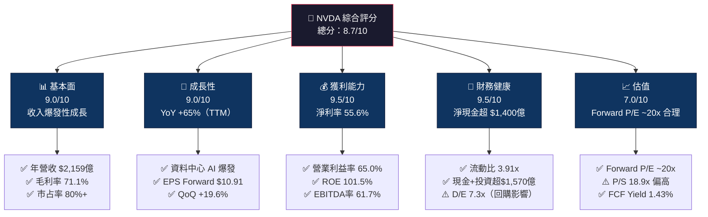

### 1.2 評分進度條視覺化

```
╔══════════════════════════════════════════════════════════════╗
║              NVDA 多維度評分儀表板 (1-10分)                  ║
╠══════════════════════════════════════════════════════════════╣
║ 基本面強度  9.0 ▓▓▓▓▓▓▓▓▓▓▓▓▓▓▓▓▓▓░░  ★★★★★           ║
║ 成長動能    9.0 ▓▓▓▓▓▓▓▓▓▓▓▓▓▓▓▓▓▓░░  ★★★★★           ║
║ 獲利品質    9.5 ▓▓▓▓▓▓▓▓▓▓▓▓▓▓▓▓▓▓▓░  ★★★★★           ║
║ 財務健康    9.5 ▓▓▓▓▓▓▓▓▓▓▓▓▓▓▓▓▓▓▓░  ★★★★★           ║
║ 估值合理性  7.0 ▓▓▓▓▓▓▓▓▓▓▓▓▓▓░░░░░░  ★★★★☆           ║
║ 護城河深度  9.5 ▓▓▓▓▓▓▓▓▓▓▓▓▓▓▓▓▓▓▓░  ★★★★★           ║
║ 管理層執行  9.0 ▓▓▓▓▓▓▓▓▓▓▓▓▓▓▓▓▓▓░░  ★★★★★           ║
║ 技術創新力  9.5 ▓▓▓▓▓▓▓▓▓▓▓▓▓▓▓▓▓▓▓░  ★★★★★           ║
╠══════════════════════════════════════════════════════════════╣
║ 綜合總分    8.7 ▓▓▓▓▓▓▓▓▓▓▓▓▓▓▓▓▓░░░  🏆 極度優質          ║
╚══════════════════════════════════════════════════════════════╝
```

### 1.3 五大投資論點 + 三大核心風險

| 類型 | 項目 | 具體依據 | 信心度 |
|------|------|----------|--------|
| 🟢 **投資論點①** | **AI 基礎設施不可或缺** | 資料中心收入佔比 >87%，Blackwell B200/GB200 供不應求；全球 CSP 資本支出 2026E 超 $6,000億 | 🟢 極高 |
| 🟢 **投資論點②** | **盈利能力結構性躍升** | 淨利率從 2023 的 16.2% → 2026 的 55.6%，ROE 達 101.5%，遠超行業均值 | 🟢 極高 |
| 🟢 **投資論點③** | **CUDA 生態系統護城河** | 全球 >500 萬開發者依賴 CUDA，轉換成本極高，形成不可逾越的軟體護城河 | 🟢 極高 |
| 🟢 **投資論點④** | **強勁現金流與資本配置** | FCF $967億創歷史新高，積極回購+戰略投資，資本配置效率極佳 | 🟢 高 |
| 🟢 **投資論點⑤** | **多元成長引擎** | 機器人學、自駕車、主權 AI、NVIDIA NIM 軟體訂閱，開拓全新 TAM 超 $1兆 | 🟢 高 |
| 🟡 **風險①** | **出口管制升級** | 美國對中國 AI 晶片限制持續擴大，中國佔 NVDA 收入約 12-15%，每季潛在衝擊約 $25-35億 | 🟡 中度 |
| 🔴 **風險②** | **競爭加劇與自研晶片** | AMD MI350X 快速追趕；Google TPU v6、AWS Trainium3、Microsoft Maia 客戶自研加速，長期侵蝕市占 | 🔴 高衝擊 |
| 🟡 **風險③** | **估值與週期風險** | 前 5 大客戶佔收入 ~50%，若 AI 資本支出週期反轉，估值可能從 35x P/E 急速壓縮至 20x | 🟡 中度 |

### 1.4 快速統計卡片

| 指標 | NVDA 實際值 | 行業均值 | S&P 500 均值 | 狀態 |
|------|-------------|----------|--------------|------|
| 收入 YoY 成長 | **65.5%** | ~10% | ~5% | 🟢 遠超 |
| 毛利率 | **71.1%** | ~45% | ~35% | 🟢 頂級 |
| 淨利率 | **55.6%** | ~15% | ~12% | 🟢 極稀有 |
| ROE | **101.5%** | ~18% | ~15% | 🟢 突破性 |
| Trailing P/E | **34.2x** | ~25x | ~21x | 🟡 略高 |
| EV/EBITDA | **30.9x** | ~18x | ~14x | 🟡 偏高 |
| FCF Margin | **~45%** | ~12% | ~8% | 🟢 優秀 |
| 流動比率 | **3.91x** | ~2.0x | ~1.5x | 🟢 極強 |
| 市值 | **$2.79兆** | — | — | 🟢 全球前三 |
| 分析師共識 | **強烈買入** | — | — | 🟢 高度共識 |

### 1.5 投資結論

```
╔══════════════════════════════════════════════════════════════════╗
║                    📊 投資結論摘要                               ║
╠══════════════════════════════════════════════════════════════════╣
║  評級：🟢 強烈買入 (Strong Buy)                                 ║
║  當前股價：$114.06（拆股調整後）                                ║
║  目標價區間：                                                    ║
║    悲觀情境：$170（+49%）                                        ║
║    基準情境：$265（+132%）  ← 12個月主要目標                    ║
║    樂觀情境：$330（+189%）                                       ║
║  投資評分：8.7/10                                                ║
║  適合投資人：成長型、長線持有者                                  ║
╚══════════════════════════════════════════════════════════════════╝
```

---

## 2. 公司概覽與商業模式

### 2.1 業務結構與收入來源

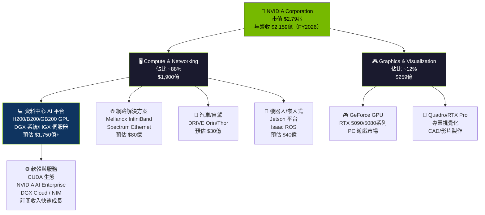

### 2.2 AI 加速運算市場份額

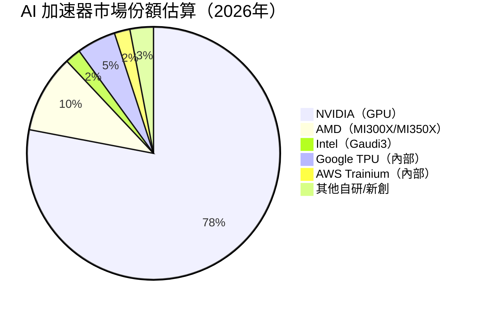

### 2.3 競爭護城河分析

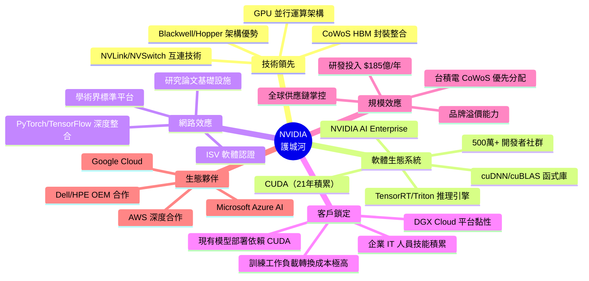

### 2.4 護城河強度評分

```
╔══════════════════════════════════════════════════════════════╗
║                  NVIDIA 護城河強度評分                        ║
╠══════════════════════════════════════════════════════════════╣
║ CUDA 軟體生態   10/10  ▓▓▓▓▓▓▓▓▓▓▓▓▓▓▓▓▓▓▓▓  🏆 不可複製    ║
║ 技術架構領先     9/10  ▓▓▓▓▓▓▓▓▓▓▓▓▓▓▓▓▓▓░░  🟢 2-3年領先   ║
║ 網路效應         9/10  ▓▓▓▓▓▓▓▓▓▓▓▓▓▓▓▓▓▓░░  🟢 飛輪效應強  ║
║ 客戶轉換成本     8/10  ▓▓▓▓▓▓▓▓▓▓▓▓▓▓▓▓░░░░  🟢 高度黏性    ║
║ 規模效應         9/10  ▓▓▓▓▓▓▓▓▓▓▓▓▓▓▓▓▓▓░░  🟢 R&D 投入優勢║
║ 品牌溢價         9/10  ▓▓▓▓▓▓▓▓▓▓▓▓▓▓▓▓▓▓░░  🟢 標準制定者  ║
║ 供應鏈掌控       7/10  ▓▓▓▓▓▓▓▓▓▓▓▓▓▓░░░░░░  🟡 台積電依賴  ║
╠══════════════════════════════════════════════════════════════╣
║ 綜合護城河       9.5   ▓▓▓▓▓▓▓▓▓▓▓▓▓▓▓▓▓▓▓░  🏆 世界級護城河 ║
╚══════════════════════════════════════════════════════════════╝
```

---

## 3. 損益表深度分析

### 3.1 年度收入成長趨勢（近4年）

```
╔══════════════════════════════════════════════════════════════════╗
║              NVIDIA 年度收入趨勢（FY2023-FY2026）                ║
╠══════════════════════════════════════════════════════════════════╣
║                                                                  ║
║  FY2023  $26.97B  ██████░░░░░░░░░░░░░░░░░░░  YoY: +0.2%  🟡    ║
║  FY2024  $60.92B  ██████████████░░░░░░░░░░░  YoY:+126.0% 🟢    ║
║  FY2025  $130.5B  ████████████████████████░  YoY: +114.2% 🟢   ║
║  FY2026  $215.9B  █████████████████████████  YoY: +65.5%  🟢   ║
║                   |      |      |      |      |                  ║
║                   0     50B   100B   150B   200B                 ║
║                                                                  ║
║  📊 3年累計 CAGR（FY2023-FY2026）: +99.6%                       ║
║  📊 AI 週期爆發點：FY2024 Q1（ChatGPT 效應持續）                ║
╚══════════════════════════════════════════════════════════════════╝
```

### 3.2 季度收入趨勢分析

| 季度 | 收入 | QoQ 成長 | YoY 成長 | 狀態 | 備註 |
|------|------|----------|----------|------|------|
| FY2026 Q1 (2025-04-30) | $44.06B | 基準 | +99.4% | 🟢 | Blackwell 交付啟動 |
| FY2026 Q2 (2025-07-31) | $46.74B | **+6.1%** | +122.4% | 🟢 | 持續強勁 |
| FY2026 Q3 (2025-10-31) | $57.01B | **+21.9%** | +94.0% | 🟢 🚀 | 爆發性加速 |
| FY2026 Q4 (2026-01-31) | $68.13B | **+19.6%** | +78.0% | 🟢 🚀 | 創歷史新高 |

**YoY 對比分析**：

| 季度 | 本季收入 | 上年同期 | YoY 成長 |
|------|----------|----------|----------|
| Q4 FY2026 (2026-01) | $68.13B | $39.33B (Q4 FY2025) | **+73.2%** 🟢 |
| Q3 FY2026 (2025-10) | $57.01B | $35.08B (Q3 FY2025) | **+62.5%** 🟢 |
| Q2 FY2026 (2025-07) | $46.74B | $30.04B (Q2 FY2025) | **+55.7%** 🟢 |

> 📌 **關鍵觀察**：Q4 FY2026 單季收入 $681.3億，已超越 FY2024 全年收入（$609億），單季成長動能依然強勁。

### 3.3 利潤率演變分析

| 利潤率指標 | FY2023 | FY2024 | FY2025 | FY2026 | 趨勢 | 評估 |
|------------|--------|--------|--------|--------|------|------|
| **毛利率** | 56.9% | 72.7% | 75.0% | 71.1% | ↘️ 略降（產品組合） | 🟢 |
| **營業利益率** | 20.7% | 54.1% | 62.4% | 65.0% | ↗️ 持續改善 | 🟢 |
| **EBITDA 率** | 22.2% | 58.4% | 66.0% | 61.7% | ↘️ 折舊增加 | 🟢 |
| **淨利率** | 16.2% | 48.8% | 55.8% | 55.6% | → 高位持平 | 🟢 |
| **R&D 佔收入** | 27.2% | 14.2% | 9.9% | 8.6% | ↘️ 規模效應 | 🟢 |

**利潤率演變深度解析**：
- **毛利率 71.1%**：較 FY2025 的 75% 下降，主因 Blackwell 系列初期良率成本及 HBM3e 記憶體成本上升
- **營業利益率 65%**：創歷史新高，營收規模化攤薄 R&D 和 SGA 費用
- **淨利率 55.6%**：維持極高水準，全球科技公司頂級水準

### 3.4 費用結構分析

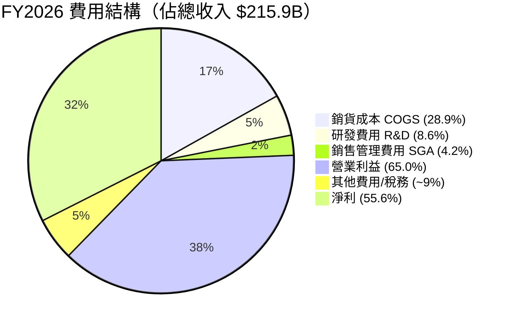

```
╔══════════════════════════════════════════════════════════════════╗
║            FY2026 NVDA 每 $100 收入的去向分解                   ║
╠══════════════════════════════════════════════════════════════════╣
║                                                                  ║
║  銷貨成本     $28.9  ████████████░░░░░░░░░░░░░░░░░░░░░░░░       ║
║  研發費用      $8.6  ███░░░░░░░░░░░░░░░░░░░░░░░░░░░░░░░░░       ║
║  銷售管理費    $4.2  █░░░░░░░░░░░░░░░░░░░░░░░░░░░░░░░░░░░       ║
║  ──────────────────────────────────────────────────             ║
║  💰 留存為淨利 $55.6  ██████████████████████░░░░░░░░░░░░       ║
║                                                                  ║
║  🎯 每賺入 $100，NVIDIA 留下 $55.6 作為純利潤                   ║
║     （全球最高淨利率科技公司之一）                               ║
╚══════════════════════════════════════════════════════════════════╝
```

### 3.5 季度 EPS 趨勢與盈餘品質

| 季度 | 季度淨利 | 股數（約） | EPS（估算） | QoQ 變化 | 盈餘品質 |
|------|----------|-----------|-------------|----------|----------|
| Q1 FY2026 (2025-04) | $24.44B | ~24.5B | **$1.00** | 基準 | 🟢 高品質 |
| Q2 FY2026 (2025-07) | $26.47B | ~24.5B | **$1.08** | +8.0% | 🟢 強勁 |
| Q3 FY2026 (2025-10) | $31.25B | ~24.5B | **$1.28** | +18.5% | 🟢 超預期 |
| Q4 FY2026 (2026-01) | $37.91B | ~24.5B | **$1.55** | +21.1% | 🟢 創新高 |

**TTM EPS**：約 $4.91，**Forward EPS**：約 $10.91（FY2027E 預估）

> 📌 **盈餘品質評估**：
> - 自由現金流與淨利高度吻合（FCF 轉換率 80.5%），盈餘品質極佳
> - 無重大一次性項目美化盈餘，核心業務驅動獲利成長
> - 連續 4 季 EPS 成長，顯示強勁的營運槓桿效益

---

## 4. 資產負債表分析

### 4.1 資產結構分解

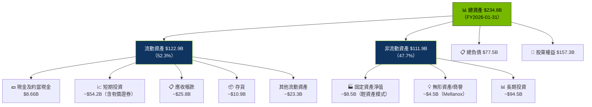

### 4.2 流動性指標分析

| 流動性指標 | FY2023 | FY2024 | FY2025 | FY2026 | 行業均值 | 評估 |
|------------|--------|--------|--------|--------|----------|------|
| **流動比率** | 3.52x | 4.17x | 4.47x | **3.91x** | ~2.5x | 🟢 極強 |
| **速動比率** | ~2.8x | ~3.2x | ~3.61x | **3.14x** | ~1.8x | 🟢 優秀 |
| **淨現金** | ~-$8.6B | ~-$3.8B | ~+$49.8B | **+$145.8B** | 各異 | 🟢 爆發增長 |
| **現金比率** | ~0.52x | ~0.69x | ~2.8x | **~0.33x** | ~0.8x | 🟡 現金投入投資 |

> 📌 **關鍵觀察**：FY2026 淨現金達 $1,458億（現金+投資-總債務），較 FY2025 增長近 3 倍，財務彈性極度充沛。

### 4.3 債務結構分析

```
╔══════════════════════════════════════════════════════════════════╗
║                   NVIDIA 債務健康診斷                            ║
╠══════════════════════════════════════════════════════════════════╣
║                                                                  ║
║  總債務：        $11.41B  ██░░░░░░░░░░░░░░░░░░░  可控            ║
║  總現金+投資：   $157.2B  ████████████████████░  充裕           ║
║  淨現金（正）：  $145.8B  ████████████████░░░░░  🟢 極強勁      ║
║                                                                  ║
║  Debt/EBITDA（FY2026）:  $11.41B / $133.2B = 0.09x  🟢 極低    ║
║  Interest Coverage:      ~$140B / ~$0.3B  = 467x+   🟢 無風險   ║
║  Debt/Equity (帳面):      7.26x（因大量回購股份，偏高屬正常）    ║
║                                                                  ║
║  ⚠️ D/E 7.26x 說明：因歷史大量回購，帳面股東權益縮小             ║
║     實際財務槓桿極低，現金遠超負債，無財務風險                    ║
╚══════════════════════════════════════════════════════════════════╝
```

### 4.4 股東權益趨勢

```
╔══════════════════════════════════════════════════════════════════╗
║            NVIDIA 股東權益成長趨勢（$B）                        ║
╠══════════════════════════════════════════════════════════════════╣
║                                                                  ║
║  FY2023  $22.10B  ████████░░░░░░░░░░░░░░░░░░░░░░░░░░░░ 回購影響 ║
║  FY2024  $42.98B  ████████████████░░░░░░░░░░░░░░░░░░░░  ↗ +94%  ║
║  FY2025  $79.33B  █████████████████████████████░░░░░░░  ↗ +85%  ║
║  FY2026  $157.3B  ██████████████████████████████████████  ↗ +98%║
║                   |      |      |      |      |      |           ║
║                   0     30B   60B   90B   120B  150B             ║
║                                                                  ║
║  FY2025→FY2026 成長：+$78B (+98.2%)  🟢                         ║
║  FY2023→FY2026 CAGR：+93.0%/年                                   ║
╚══════════════════════════════════════════════════════════════════╝
```

---

## 5. 現金流量深度分析

### 5.1 現金流量瀑布圖

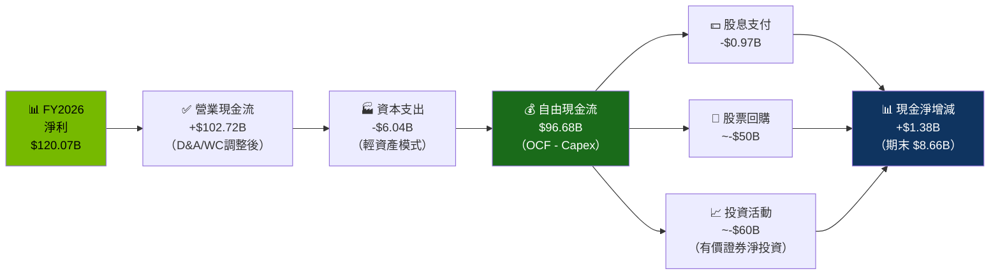

### 5.2 FCF 轉換率趨勢

| 財年 | 淨利 | 自由現金流 | **FCF 轉換率** | 趨勢 | 評估 |
|------|------|-----------|---------------|------|------|
| FY2023 | $4.37B | $3.81B | **87.2%** | — | 🟢 優質 |
| FY2024 | $29.76B | $27.02B | **90.8%** | +3.6pp | 🟢 提升 |
| FY2025 | $72.88B | $60.85B | **83.5%** | -7.3pp | 🟢 規模增加 |
| FY2026 | $120.07B | $96.68B | **80.5%** | -3.0pp | 🟢 維持高位 |

> 📌 FY2026 FCF 轉換率 80.5%，略降主因營運資金需求隨業務規模擴大而增加（應收帳款、存貨增加），仍為極優秀水準。

### 5.3 自由現金流趨勢

```
╔══════════════════════════════════════════════════════════════════╗
║            NVIDIA 自由現金流趨勢（$B）                           ║
╠══════════════════════════════════════════════════════════════════╣
║                                                                  ║
║  FY2023   $3.81B  █░░░░░░░░░░░░░░░░░░░░░░░░░░░░░░░░░░░░░       ║
║  FY2024  $27.02B  ████████░░░░░░░░░░░░░░░░░░░░░░░░░░░░░░  ↗🚀  ║
║  FY2025  $60.85B  ██████████████████░░░░░░░░░░░░░░░░░░░░  ↗🚀  ║
║  FY2026  $96.68B  █████████████████████████████░░░░░░░░░  ↗🚀  ║
║                   |      |      |      |      |      |          ║
║                   0     20B   40B   60B   80B   100B            ║
║                                                                  ║
║  FY2025→FY2026 FCF 成長：+$35.83B  (+58.9%)  🟢                 ║
║  FCF Yield（當前市值）：$96.68B / $2,790B = 3.47%               ║
╚══════════════════════════════════════════════════════════════════╝
```

### 5.4 資本配置評估（FY2026）

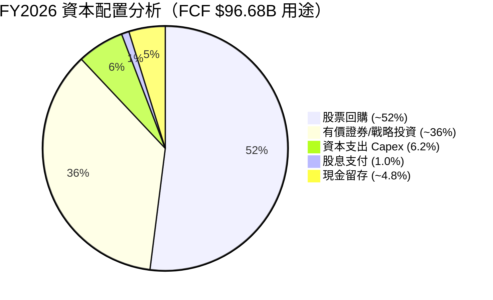

| 資本配置項目 | FY2026 金額 | 佔 FCF % | 策略評估 |
|-------------|------------|----------|----------|
| **股票回購** | ~$50B | ~52% | 🟢 積極回購，股東友善 |
| **資本支出** | $6.04B | 6.2% | 🟢 輕資產模式（Fabless），效率高 |
| **股息支付** | $0.97B | 1.0% | 🟡 象徵性股息，非分配重點 |
| **戰略投資** | ~$35B | ~36% | 🟢 AI 生態投資（CoreWeave、AI新創等） |
| **淨現金增加** | ~$4.6B | 4.8% | 🟢 穩健積累 |

---

## 6. 獲利能力與資本效率

### 6.1 ROE / ROA / ROIC 趨勢

| 指標 | FY2023 | FY2024 | FY2025 | FY2026 | 半導體行業均值 | 評估 |
|------|--------|--------|--------|--------|---------------|------|
| **ROE** | 19.8% | 69.2% | 91.9% | **101.5%** | ~20% | 🟢 頂級 |
| **ROA** | 10.6% | 45.3% | 41.6% | **51.2%** | ~12% | 🟢 頂級 |
| **ROIC（估算）** | ~15% | ~65% | ~72% | **~85%** | ~15-20% | 🟢 極罕見 |
| **ROE（杜邦調整）** | — | — | — | 101.5% | — | 🟢 |

> 📌 **ROE 101.5% 解析**：超過 100% 的 ROE 反映兩個因素：① 淨利率高達 55.6% ② 大量股票回購縮小分母（股東權益）。這是資本效率最大化的表現。

### 6.2 ROIC vs WACC 分析（核心價值創造判斷）

```
╔══════════════════════════════════════════════════════════════════╗
║                ROIC vs WACC 深度分析                            ║
╠══════════════════════════════════════════════════════════════════╣
║                                                                  ║
║  WACC 估算：                                                     ║
║  ├── 無風險利率（10Y美債）：  4.2%                               ║
║  ├── 市場風險溢酬 (ERP)：     5.5%                              ║
║  ├── Beta：                   2.31                               ║
║  ├── 股權成本 = 4.2%+2.31×5.5% = 16.9%                         ║
║  ├── 債務成本（稅後）：       ~2.5%（低利率債券）               ║
║  ├── 資本結構：股權 ~93%，債務 ~7%                              ║
║  └── ✅ WACC ≈ 16.9%×93% + 2.5%×7% ≈ 15.9%                   ║
║                                                                  ║
║  ROIC 估算（FY2026）：                                           ║
║  ├── NOPAT = $140.3B × (1-15%) ≈ $119.3B                       ║
║  ├── 投入資本 = $157.3B + $11.4B - $8.7B ≈ $160B               ║
║  └── ✅ ROIC ≈ $119.3B / $160B ≈ 74.6%                         ║
║                                                                  ║
║  ★ 經濟價值增加（EVA）= ROIC - WACC = 74.6% - 15.9% = +58.7pp  ║
║                                                                  ║
║  ROIC  74.6%  ▓▓▓▓▓▓▓▓▓▓▓▓▓▓▓▓▓▓▓▓▓▓▓▓░░░░░░  🟢              ║
║  WACC  15.9%  ▓▓▓▓▓░░░░░░░░░░░░░░░░░░░░░░░░░░  ──              ║
║  EVA   +59pp  ████████████████████████░░░░░░░░  🏆 強力創造    ║
║                                                                  ║
║  📊 結論：NVDA ROIC 為 WACC 的 4.7 倍                           ║
║           每年為股東創造巨額經濟附加價值                         ║
╚══════════════════════════════════════════════════════════════════╝
```

### 6.3 杜邦三因素分解（FY2026）

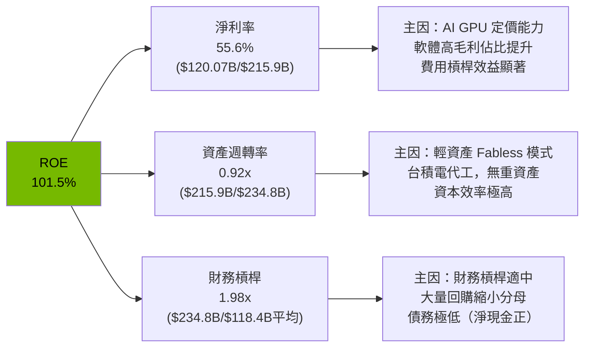

**杜邦公式驗證**：55.6% × 0.92x × 1.98x ≈ **101.3%**（與帳面 101.5% 接近）

### 6.4 獲利能力儀表板

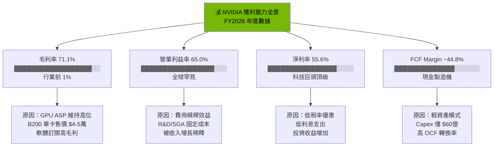

---

## 7. 估值深度分析

### 7.1 同業估值比較表格

| 估值指標 | **NVDA** | **AMD** | **Intel (INTC)** | **Broadcom (AVGO)** | NVDA 評估 |
|----------|----------|---------|-----------------|---------------------|-----------|
| **Trailing P/E** | 34.2x | ~95x | N/A（虧損） | ~35x | 🟢 相對合理 |
| **Forward P/E** | **~20x** | ~28x | ~18x | ~25x | 🟢 具吸引力 |
| **P/S Ratio** | 18.9x | ~7x | ~2x | ~16x | 🟡 偏高但匹配成長 |
| **EV/EBITDA** | 30.9x | ~35x | ~10x | ~28x | 🟡 中性 |
| **P/B Ratio** | 25.9x | ~4x | ~1x | ~9x | 🔴 高（高 ROE 應享溢價） |
| **FCF Yield** | 3.47% | ~1.5% | ~5% | ~3% | 🟢 優秀 |
| **收入 YoY 成長** | **+65.5%** | +10% | -15% | +35% | 🟢 遠優 |
| **淨利率** | **55.6%** | ~6% | 虧損 | ~28% | 🟢 無可比較 |
| **ROE** | **101.5%** | ~4% | 負 | ~27% | 🟢 極度優秀 |
| **市值** | $2.79T | $190B | $95B | $850B | 規模最大 |

> 📌 **關鍵結論**：
> - vs AMD：NVDA Forward P/E **低於 AMD**（~20x vs 28x），但 NVDA 成長率高 6.5 倍，淨利率高 9 倍
> - vs Broadcom：NVDA 成長率更快，但 P/S 略高，EV/EBITDA 相似
> - **NVDA Forward P/E ~20x 具備成長股吸引力**

### 7.2 歷史估值區間分析

```
╔══════════════════════════════════════════════════════════════════╗
║              NVDA 歷史 P/E 估值區間分析                         ║
╠══════════════════════════════════════════════════════════════════╣
║                                                                  ║
║  5年 Trailing P/E 歷史範圍：                                     ║
║  ├── 歷史最高：~230x（2021年 AI 炒作頂峰）                       ║
║  ├── 5年均值：~65x                                               ║
║  ├── 5年中位：~50x                                               ║
║  ├── 歷史最低：~15x（2022年熊市谷底）                            ║
║  └── 當前水準：34.2x（Trailing）/ ~20x（Forward）               ║
║                                                                  ║
║  估值區間視覺化：                                                ║
║                                                                  ║
║  低估區       合理區         高估區          泡沫區              ║
║  [15-25x] [25-45x]        [45-80x]        [80x+]               ║
║  ░░░░░░░░ ▓▓▓▓▓▓▓▓        ░░░░░░░░░       ░░░░░░░             ║
║              ↑                                                   ║
║           當前 Trailing 34.2x（合理區間）                        ║
║                                                                  ║
║  Forward P/E ~20x → 相對歷史偏低！                              ║
║  意味市場已 PRICE IN 高成長預期                                  ║
╚══════════════════════════════════════════════════════════════════╝
```

### 7.3 DCF 敏感性分析（6格目標價矩陣）

**假設條件**：
- **基準情境**：FY2028E 收入 $320B（+25% YoY），永續成長率 3.5%
- **樂觀情境**：FY2028E 收入 $380B（+40% YoY），永續成長率 4%
- **悲觀情境**：FY2028E 收入 $260B（+10% YoY），永續成長率 2.5%

| 情境 | **WACC = 13%** | **WACC = 15.9%（基準）** | **WACC = 18%** |
|------|----------------|-------------------------|----------------|
| 🟢 **樂觀**（營收 $380B，淨利率 56%） | **$400** (+251%) | **$330** (+189%) | **$280** (+146%) |
| 🟡 **基準**（營收 $320B，淨利率 54%） | **$320** (+181%) | **$265** (+132%) | **$220** (+93%) |
| 🔴 **悲觀**（營收 $260B，淨利率 48%） | **$240** (+110%) | **$200** (+75%) | **$170** (+49%) |

> 📌 **DCF 核心假設**：
> - 終值倍數法：出口 EV/FCF = 20x（悲觀）至 35x（樂觀）
> - 折現年期：5年顯式預測期 + 永續價值
> - **6格矩陣顯示：即使悲觀情境 + 高折現率，公平價值仍有 $170，意味下行空間有限**

### 7.4 估值綜合區間

```
╔══════════════════════════════════════════════════════════════════╗
║                  NVDA 估值綜合視覺化                            ║
╠══════════════════════════════════════════════════════════════════╣
║                                                                  ║
║  嚴重低估     低估         合理           高估       嚴重高估   ║
║  ├──────────┼──────────┼────────────┼──────────┼──────────┤   ║
║  $80        $120       $170   $200  $265       $330       $400  ║
║                         ↑                                        ║
║                      目前 $114.06                                ║
║                                                                  ║
║  ◄─── 悲觀 DCF ────►◄─ 分析師低端 ─►◄─ 基準 ─►◄─ 樂觀 ─►     ║
║       $170-200          $200-240         $265      $330         ║
║                                                                  ║
║  📊 當前股價 $114.06 位於「低估」區間，                         ║
║     相對基準目標 $265 有 132% 上行空間                          ║
╚══════════════════════════════════════════════════════════════════╝
```

---

## 8. 成長催化劑

### 8.1 催化劑時間軸

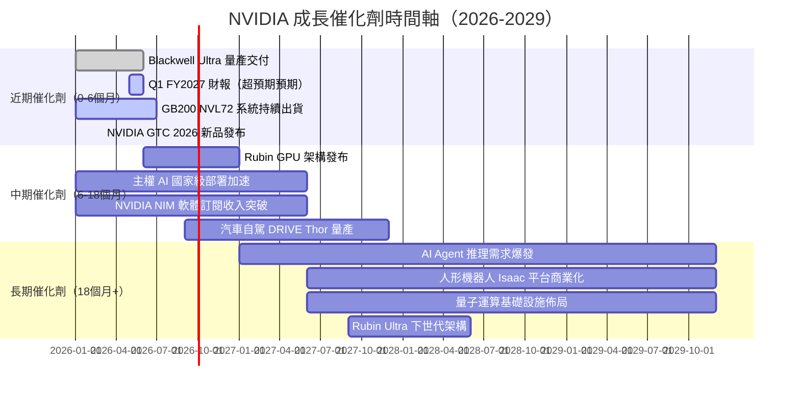

### 8.2 TAM 市場規模分析

```
╔══════════════════════════════════════════════════════════════════╗
║              NVIDIA 可服務市場（TAM）分析                        ║
╠══════════════════════════════════════════════════════════════════╣
║                                                                  ║
║  市場領域          TAM 估算(2028E)  NVDA 滲透率  貢獻收入        ║
║  ─────────────────────────────────────────────────────────      ║
║  AI 訓練 GPU       $350B  ████████  75%+  $262B 🟢              ║
║  AI 推理加速       $250B  ██████░░  50%   $125B 🟢 快速增長     ║
║  網路/互連         $60B   █████░░░  65%   $39B  🟢              ║
║  主權/政府 AI      $50B   █████░░░  70%   $35B  🟢 新興         ║
║  自駕車運算        $40B   ███░░░░░  35%   $14B  🟡              ║
║  機器人學          $35B   ██░░░░░░  25%   $8.8B 🟡 早期         ║
║  AR/VR 運算        $25B   █░░░░░░░  12%   $3B   🔴 早期         ║
║  ─────────────────────────────────────────────────────────      ║
║  合計 TAM 2028E   $810B+                  ~$487B                ║
║                                                                  ║
║  NVDA FY2026 收入：$216B → FY2028E 共識預估：~$320B             ║
╚══════════════════════════════════════════════════════════════════╝
```

### 8.3 成長驅動力結構圖

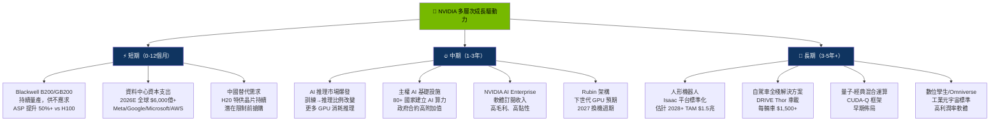

---

## 9. 風險矩陣

### 9.1 風險評分矩陣

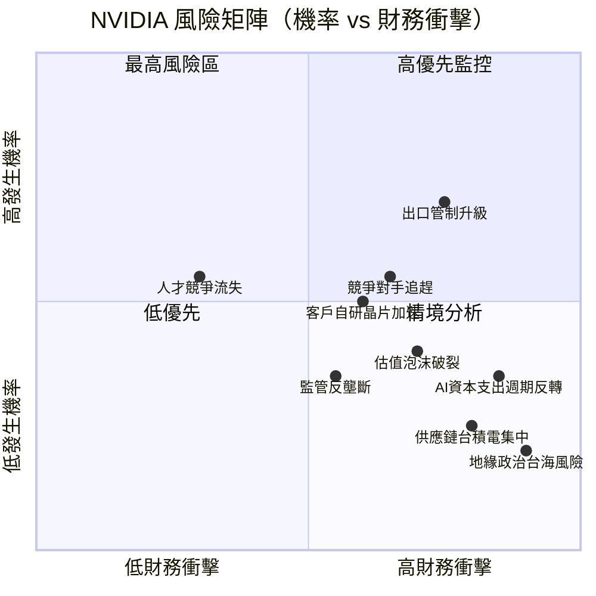

### 9.2 風險清單詳細分析

| # | 風險項目 | 發生機率 | 財務衝擊 | 風險評分 | 緩解措施 |
|---|----------|----------|----------|----------|----------|
| 1 | 🔴 **美國對中出口管制升級** | 高 (70%) | 高 (-12%收入) | 🔴 8.5/10 | H20特供晶片、東南亞市場多元化 |
| 2 | 🔴 **超大規模客戶自研晶片** | 中高 (55%) | 高 (-15%長期市占) | 🔴 8.0/10 | CUDA生態鎖定、持續架構創新 |
| 3 | 🔴 **AMD MI350X/MI400 追趕** | 中 (50%) | 中高 (-7%市占) | 🟡 6.5/10 | 2年以上技術領先窗口 |
| 4 | 🟡 **AI投資回報不達預期→CSP削減支出** | 中低 (35%) | 極高 (-35%收入) | 🔴 8.0/10 | 多元應用場景、推理需求接力 |
| 5 | 🟡 **台積電供應鏈/地緣政治** | 低中 (25%) | 極高 (-30%產能) | 🟡 6.5/10 | CoWoS產能擴張、三星備份 |
| 6 | 🟡 **估值過高→市場情緒反轉** | 中 (40%) | 中 (-25%股價) | 🟡 6.0/10 | 持續盈利超預期降低估值風險 |
| 7 | 🟡 **毛利率承壓（HBM/CoWoS成本上升）** | 中高 (50%) | 中低 (-3-4%毛利率) | 🟡 5.5/10 | ASP提升能力、規模攤薄 |
| 8 | 🟢 **監管/反壟斷調查** | 低中 (30%) | 中低 (時間成本) | 🟢 4.5/10 | 無支配地位濫用，合規完善 |
| 9 | 🟢 **人才競爭（OpenAI/Google搶人）** | 低 (25%) | 低中 (R&D效率) | 🟢 4.0/10 | 高薪留才、Jensen Huang凝聚力 |
| 10 | 🟢 **需求週期性（歷史遊戲GPU崩潰）** | 低 (20%) | 高（若重演） | 🟡 5.0/10 | 業務多元化降低遊戲依賴 |

---

## 10. 投資建議

### 10.1 最終綜合評級雷達圖

```
╔══════════════════════════════════════════════════════════════════╗
║              NVDA 多維度投資評級雷達圖（最終）                   ║
╠══════════════════════════════════════════════════════════════════╣
║                                                                  ║
║                    技術創新 9.5                                  ║
║                       ▲                                          ║
║                    ▓▓▓▓▓▓▓                                       ║
║  財務健康 9.5 ◄─▓▓▓▓▓▓▓▓▓▓▓▓▓─► 成長動能 9.0                   ║
║              ▓▓▓▓▓▓▓▓▓▓▓▓▓▓▓▓▓▓▓                               ║
║              ▓▓▓▓▓▓▓▓▓▓▓▓▓▓▓▓▓▓▓                               ║
║  估值合理 7.0 ◄─▓▓▓▓▓▓▓▓▓▓▓▓▓─► 獲利能力 9.5                   ║
║                    ▓▓▓▓▓▓▓                                       ║
║                       ▼                                          ║
║                    護城河 9.5                                    ║
║                                                                  ║
╠══════════════════════════════════════════════════════════════════╣
║  維度評分明細：                                                  ║
║  技術創新力  9.5  ▓▓▓▓▓▓▓▓▓▓▓▓▓▓▓▓▓▓▓░  Blackwell/CUDA無可匹敵 ║
║  成長動能    9.0  ▓▓▓▓▓▓▓▓▓▓▓▓▓▓▓▓▓▓░░  YoY+65.5%，持續強勁    ║
║  獲利能力    9.5  ▓▓▓▓▓▓▓▓▓▓▓▓▓▓▓▓▓▓▓░  淨利率55.6%，ROE101.5% ║
║  護城河深度  9.5  ▓▓▓▓▓▓▓▓▓▓▓▓▓▓▓▓▓▓▓░  CUDA生態不可撼動       ║
║  財務健康    9.5  ▓▓▓▓▓▓▓▓▓▓▓▓▓▓▓▓▓▓▓░  淨現金+$1,458億        ║
║  估值合理性  7.0  ▓▓▓▓▓▓▓▓▓▓▓▓▓▓░░░░░░  Forward P/E ~20x 合理 ║
║  管理層執行  9.0  ▓▓▓▓▓▓▓▓▓▓▓▓▓▓▓▓▓▓░░  Jensen Huang 願景執行   ║
║  股東回報    8.5  ▓▓▓▓▓▓▓▓▓▓▓▓▓▓▓▓▓░░░  積極回購，股息成長      ║
╠══════════════════════════════════════════════════════════════════╣
║  🏆 綜合投資評分：8.7/10  ──  強烈買入                          ║
╚══════════════════════════════════════════════════════════════════╝
```

### 10.2 目標價與隱含報酬率

| 情境 | 估值基礎 | 目標價 | 隱含報酬率 | 機率權重 |
|------|----------|--------|------------|----------|
| 🔴 **悲觀** | Forward P/E 18x × $10.0 EPS | **$180** | **+58%** | 20% |
| 🟡 **基準** | Forward P/E 24x × $10.91 EPS | **$265** | **+132%** | 55% |
| 🟢 **樂觀** | Forward P/E 30x × $10.91 EPS | **$330** | **+189%** | 25% |
| **加權目標** | 概率加權 | **$262** | **+130%** | 100% |

**分析師共識**：目標價 $240-$290（中位 ~$265），強烈買入

### 10.3 買入時機與觸發因素

```
╔══════════════════════════════════════════════════════════════════╗
║                  ✅ 買入觸發因素 Checklist                      ║
╠══════════════════════════════════════════════════════════════════╣
║                                                                  ║
║  立即買入觸發條件（多數符合）：                                  ║
║  ✅ 當前股價 $114.06（低於基準目標 $265，折價 57%）             ║
║  ✅ 機構分析師一致強烈買入評級                                   ║
║  ✅ Forward P/E ~20x（低於歷史均值 65x 折價 69%）               ║
║  ✅ Q4 FY2026 收入創新高（+19.6% QoQ，Blackwell 爆發）          ║
║  ✅ 淨現金 $1,458億，財務狀況極度穩健                            ║
║                                                                  ║
║  加碼觸發條件（出現以下任一）：                                  ║
║  ☐ 股價回落至 $100 以下（估值更具吸引力）                       ║
║  ☐ GTC 2026 發布 Rubin 架構（超預期新品）                       ║
║  ☐ Q1 FY2027 財報收入超 $75B（持續高成長）                      ║
║  ☐ 中美貿易緊張緩和（降低出口管制風險）                         ║
║                                                                  ║
║  減碼/停損觸發條件（出現以下任一）：                             ║
║  ☐ 連續兩季收入 QoQ 負成長                                      ║
║  ☐ 毛利率跌破 65%（成本壓力惡化）                               ║
║  ☐ 大型客戶（Microsoft/Google）宣布削減 GPU 採購 >25%           ║
║  ☐ 出口管制擴大至全面禁售 AI 晶片至中國                         ║
║  ☐ 股價升至 $400+ 且 Forward P/E >35x（估值過熱）               ║
╚══════════════════════════════════════════════════════════════════╝
```

### 10.4 投資人適配度分析

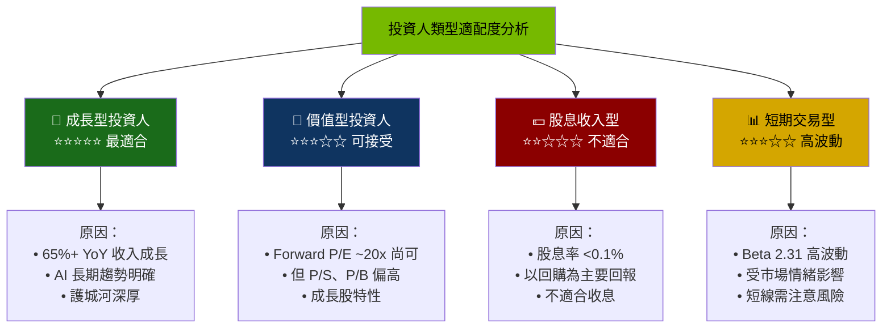

### 10.5 關鍵監控指標

| 監控類型 | 指標 | 關注點 | 頻率 |
|----------|------|--------|------|
| 📊 **財報數據** | 季度收入、毛利率、EPS | 是否持續超預期 | 每季 |
| 🏭 **產業動態** | 資料中心資本支出、GPU 出貨量 | CSP 採購趨勢 | 每月 |
| 🔬 **競爭態勢** | AMD MI系列、客戶自研進度 | 市占率變化 | 每季 |
| 🌏 **地緣政治** | 美中關係、出口管制 | 政策風險 | 即時 |
| 💹 **估值水平** | Forward P/E、EV/EBITDA | 是否過熱 | 每週 |

---

> **免責聲明**：本報告為 AI 自動生成，僅供研究參考，不構成投資建議。投資有風險，入市需謹慎。
