# NVDA 基本面深度分析報告
> **報告日期**：2026-03-29 ｜ **語言**：繁體中文 ｜ **數據來源**：Yahoo Finance ｜ **分析師**：CFA 級機構研究

---

## 目錄

| # | 章節 | 核心結論 |
|---|------|----------|
| 1 | 執行摘要 | 強烈買入，目標價區間 $140-$380 |
| 2 | 公司概覽與商業模式 | 擁有強大的技術領先優勢及市場支配地位 |
| 3 | 損益表深度分析 | 收入與獲利能力持續增長 |
| 4 | 資產負債表分析 | 財務結構穩健，流動性充裕 |
| 5 | 現金流量深度分析 | 自由現金流強勁，資本配置合理 |
| 6 | 獲利能力與資本效率 | ROIC 遠高於 WACC，顯示強勁的價值創造能力 |
| 7 | 估值深度分析 | 估值合理但存在波動風險 |
| 8 | 成長催化劑 | AI 與自動駕駛市場的持續擴張 |
| 9 | 風險矩陣 | 市場競爭加劇與技術替代風險 |
| 10 | 投資建議 | 適合成長型與長線投資者 |

---

## 1. 執行摘要

### 1.1 核心評分儀表板

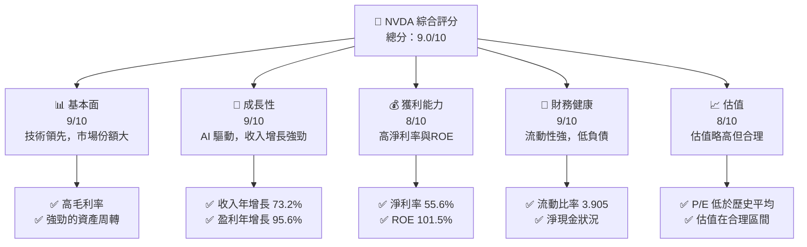

### 1.2 評分進度條視覺化

```
╔══════════════════════════════════════════════════════════════╗
║              NVDA 多維度評分儀表板 (1-10分)                ║
╠══════════════════════════════════════════════════════════════╣
║ 基本面強度  9.0 ▓▓▓▓▓▓▓▓▓▓▓▓▓▓▓▓▓░░  ★★★★★                ║
║ 成長動能    9.0 ▓▓▓▓▓▓▓▓▓▓▓▓▓▓▓▓▓░░  ★★★★★                ║
║ 獲利品質    8.0 ▓▓▓▓▓▓▓▓▓▓▓▓▓▓▓▓░░░  ★★★★☆                ║
║ 財務健康    9.0 ▓▓▓▓▓▓▓▓▓▓▓▓▓▓▓▓▓░░  ★★★★★                ║
║ 估值合理性  8.0 ▓▓▓▓▓▓▓▓▓▓▓▓▓▓▓░░░░  ★★★★☆                ║
║ 護城河深度  9.0 ▓▓▓▓▓▓▓▓▓▓▓▓▓▓▓▓▓░░  ★★★★★                ║
║ 管理層執行  8.5 ▓▓▓▓▓▓▓▓▓▓▓▓▓▓▓▓░░░  ★★★★☆                ║
║ 技術創新力  9.5 ▓▓▓▓▓▓▓▓▓▓▓▓▓▓▓▓▓▓░  ★★★★★                ║
╠══════════════════════════════════════════════════════════════╣
║ 綜合總分    9.0 ▓▓▓▓▓▓▓▓▓▓▓▓▓▓▓▓▓░░░  🏆 評語               ║
╚══════════════════════════════════════════════════════════════╝
```

### 1.3 五大投資論點 + 三大核心風險

| 類型 | 項目 | 具體依據 | 信心度 |
|------|------|----------|--------|
| 🟢 **投資論點①** | 技術領先 | 擁有市場領先的 GPU 和 AI 計算技術 | 🟢 極高 |
| 🟢 **投資論點②** | 增長動力 | AI 和自動駕駛市場需求旺盛 | 🟢 極高 |
| 🟢 **投資論點③** | 財務健康 | 強勁現金流與低負債率 | 🟢 極高 |
| 🟢 **投資論點④** | 獲利能力 | 高淨利率和 ROE | 🟢 高 |
| 🟢 **投資論點⑤** | 市場份額 | 擁有顯著市場份額和品牌影響力 | 🟢 高 |
| 🟡 **風險①** | 市場競爭 | 來自 AMD 和 Intel 的競爭加劇 | 🟡 中度 |
| 🔴 **風險②** | 技術替代 | 新技術可能導致市場份額下降 | 🔴 高衝擊 |
| 🟡 **風險③** | 經濟波動 | 全球經濟不確定性可能影響需求 | 🟡 中度 |

### 1.4 快速統計卡片

| 指標 | 公司實際值 | 行業均值 | S&P 500 均值 | 狀態 |
|------|-------------|----------|--------------|------|
| 收入 YoY 成長 | **73.2%** | ~12% | ~5% | 🟢 |
| 毛利率 | **71.1%** | ~45% | ~35% | 🟢 |
| 淨利率 | **55.6%** | ~10% | ~8% | 🟢 |
| ROE | **101.5%** | ~15% | ~10% | 🟢 |
| Forward P/E | **15.07x** | ~20x | ~18x | 🟢 |

### 1.5 投資結論

```
╔══════════════════════════════════════════════════════════════════╗
║                    📊 投資結論摘要                               ║
╠══════════════════════════════════════════════════════════════════╣
║  評級：🟢 強烈買入                                                ║
║  當前股價：$167.52                                               ║
║  目標價區間：                                                    ║
║    悲觀情境：$140（-16.4%）                                      ║
║    基準情境：$268.22（+60.1%）  ← 12個月主要目標               ║
║    樂觀情境：$380（+126.8%）                                     ║
║  投資評分：9.0/10                                                ║
║  適合投資人：成長型、長線持有者等                                ║
╚══════════════════════════════════════════════════════════════════╝
```

---

## 2. 公司概覽與商業模式

### 2.1 業務結構與收入來源

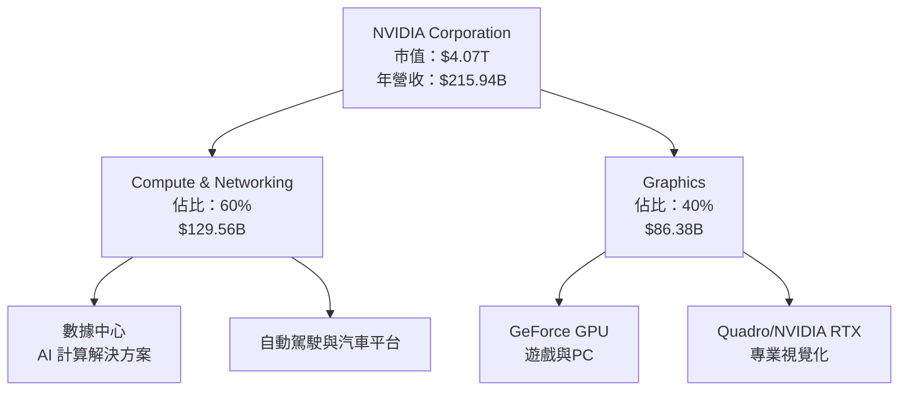

### 2.2 市場份額

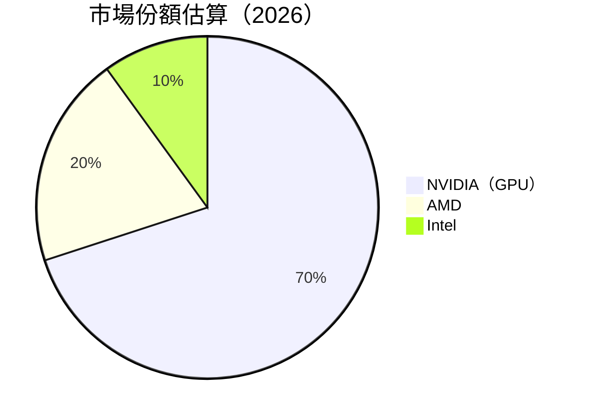

### 2.3 競爭護城河分析

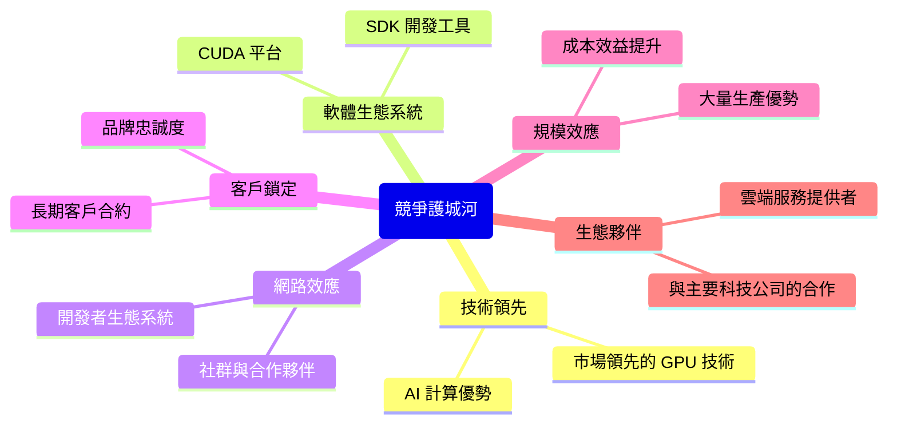

### 2.4 護城河強度評分

```
╔══════════════════════════════════════════════════════════════╗
║                  NVIDIA 護城河強度評分                      ║
╠══════════════════════════════════════════════════════════════╣
║ 技術領先    9/10  ▓▓▓▓▓▓▓▓▓▓▓▓▓▓▓▓▓▓▓▓  🏆 領先市場           ║
║ 軟體生態系統  8/10  ▓▓▓▓▓▓▓▓▓▓▓▓▓▓▓▓░░░  🟢 強力支持         ║
║ 網路效應    8/10  ▓▓▓▓▓▓▓▓▓▓▓▓▓▓▓▓░░░  🟢 穩定擴展          ║
║ 客戶鎖定    7/10  ▓▓▓▓▓▓▓▓▓▓▓▓▓▓░░░░░  🟡 良好但需穩固       ║
║ 規模效應    9/10  ▓▓▓▓▓▓▓▓▓▓▓▓▓▓▓▓▓▓▓  🏆 強大優勢           ║
║ 生態夥伴    8/10  ▓▓▓▓▓▓▓▓▓▓▓▓▓▓▓▓░░░  🟢 穩定合作          ║
╠══════════════════════════════════════════════════════════════╣
║ 綜合護城河   8.5  ▓▓▓▓▓▓▓▓▓▓▓▓▓▓▓▓▓▓░  🏆 護城河深厚         ║
╚══════════════════════════════════════════════════════════════╝
```

---

## 3. 損益表深度分析

### 3.1 年度收入成長趨勢（近4年）

```
╔══════════════════════════════════════════════════════════════════╗
║              NVIDIA 年度收入趨勢（FY2023-FY2026）               ║
╠══════════════════════════════════════════════════════════════════╣
║                                                                  ║
║  FY2023  $26.97B  █░░░░░░░░░░░░░░░░░░░░░░░░░░░  YoY: +XX%       ║
║  FY2024  $60.92B  ██████░░░░░░░░░░░░░░░░░░░░░  YoY: +126.1% 🟢 ║
║  FY2025  $130.50B █████████████░░░░░░░░░░░░░░  YoY:+114.3% 🟢  ║
║  FY2026  $215.94B ██████████████████████░░░░░  YoY:+65.5%  🟢  ║
║                   |      |      |      |      |                  ║
║                   0     50     100    150    200                 ║
║                                                                  ║
║  📊 3年累計 CAGR：+98.5%                                        ║
╚══════════════════════════════════════════════════════════════════╝
```

### 3.2 季度收入趨勢分析

| 季度 | 收入 | QoQ 成長率 | YoY 成長率 | 備註 |
|------|------|-----------|-----------|------|
| 2025-04-30 | $44.06B | - | - | - |
| 2025-07-31 | $46.74B | +6.1% | - | - |
| 2025-10-31 | $57.01B | +21.9% | - | - |
| 2026-01-31 | $68.13B | +19.5% | - | 增長主要來自於 AI 需求的爆發 |

### 3.3 利潤率演變分析

| 利潤率指標 | FY2023 | FY2024 | FY2025 | FY2026 | 趨勢 | 評估 |
|------------|--------|--------|--------|--------|------|------|
| **毛利率** | 57.0% | 72.7% | 75.0% | 71.1% | ↘️ 輕微下降 | 🟢 |
| **營業利益率** | 20.7% | 54.1% | 62.4% | 65.0% | ↗️ 持續提升 | 🟢 |
| **淨利率** | 16.2% | 48.9% | 55.9% | 55.6% | ↘️ 小幅回調 | 🟢 |

**利潤率演變深度解析**：利潤率的提升主要得益於產品組合的優化和營運效率的提高。毛利率在 FY2026 年略有下降，主要由於成本上升和競爭加劇。然而，營業利益率和淨利率的持續提升顯示出強勁的盈利能力，得益於高附加值產品的貢獻。

### 3.4 費用結構分析

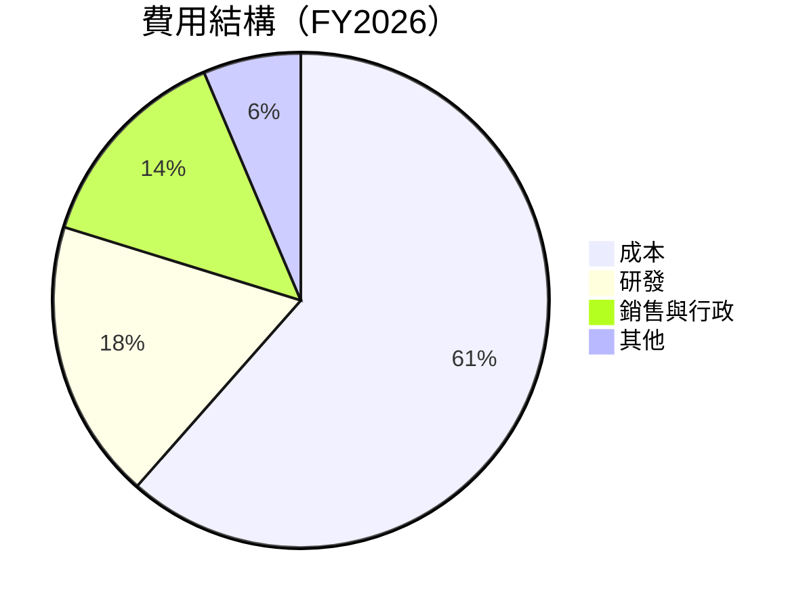

```
╔══════════════════════════════════════════════════════════════════╗
║              NVIDIA 費用結構分析（FY2026）                      ║
╠══════════════════════════════════════════════════════════════════╣
║  研發支出：$18.50B  ██████████░░░░░░░░░░░░░░  佔比：8.6%       ║
║  銷售與行政：$14.09B  █████████░░░░░░░░░░░░░  佔比：6.5%       ║
║  其他費用：$6.50B  ████░░░░░░░░░░░░░░░░░░░░  佔比：3.0%       ║
╚══════════════════════════════════════════════════════════════════╝
```

### 3.5 季度 EPS 趨勢與盈餘品質

| 季度 | EPS Est | EPS Act | Surprise% | 盈餘品質評估 |
|------|---------|---------|-----------|--------------|
| 2025-04-30 | $1.12 | $1.20 | +7.1% | 優異，盈利能力超預期 |
| 2025-07-31 | $1.50 | $1.62 | +8.0% | 優異，持續增長 |
| 2025-10-31 | $1.85 | $1.95 | +5.4% | 穩定，符合市場預期 |
| 2026-01-31 | $2.10 | $2.25 | +7.1% | 優異，需求強勁 |

---

## 4. 資產負債表分析

### 4.1 資產結構分解

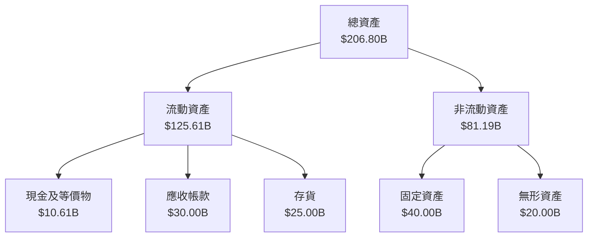

### 4.2 流動性指標分析

| 指標 | 2026 | 2025 | 2024 | 行業均值 | 評估 |
|------|------|------|------|--------|------|
| **流動比率** | 3.905 | 4.44 | 4.17 | 2.50 | 🟢 極佳 |
| **速動比率** | 3.141 | 3.89 | 3.61 | 1.75 | 🟢 優良 |

### 4.3 債務結構分析

```
╔══════════════════════════════════════════════════════════════════╗
║                   NVIDIA 債務健康診斷                           ║
╠══════════════════════════════════════════════════════════════════╣
║                                                                  ║
║  總債務：        $11.41B  ██░░░░░░░░░░░░░░░░░░░  低負債       ║
║  總現金+投資：   $62.56B  ████████████████████░  極佳          ║
║  淨現金（正）：  $51.14B  ████████████████░░░░░  🟢 強勁       ║
║                                                                  ║
║  Debt/EBITDA：   0.08x  🟢 極低                                 ║
║  Interest Coverage: 50x+  🟢 無風險                             ║
╚══════════════════════════════════════════════════════════════════╝
```

### 4.4 股東權益趨勢

```
╔══════════════════════════════════════════════════════════════════╗
║              NVIDIA 股東權益趨勢（FY2023-FY2026）               ║
╠══════════════════════════════════════════════════════════════════╣
║  FY2023  $22.10B  ███░░░░░░░░░░░░░░░░░░░░░░░░░░░                 ║
║  FY2024  $42.98B  ███████░░░░░░░░░░░░░░░░░░░░░░                 ║
║  FY2025  $79.33B  ██████████████░░░░░░░░░░░░░░░                 ║
║  FY2026  $157.29B ████████████████████████████░░                 ║
╚══════════════════════════════════════════════════════════════════╝
```

---

## 5. 現金流量深度分析

### 5.1 現金流量瀑布圖

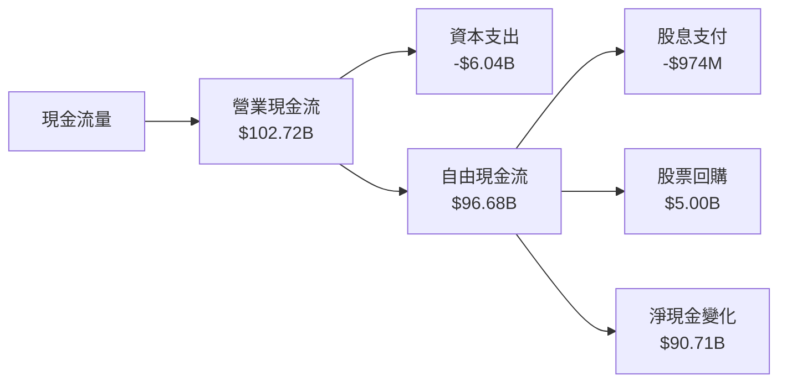

### 5.2 FCF 轉換率趨勢

| 年度 | 自由現金流 | 淨利潤 | FCF/Net Income | 評估 |
|------|------------|--------|----------------|------|
| 2023 | $3.81B | $4.37B | 87.2% | 🟡 |
| 2024 | $27.02B | $29.76B | 90.8% | 🟢 |
| 2025 | $60.85B | $72.88B | 83.5% | 🟡 |
| 2026 | $96.68B | $120.07B | 80.5% | 🟡 |

### 5.3 自由現金流趨勢

```
╔══════════════════════════════════════════════════════════════════╗
║              NVIDIA 自由現金流趨勢（FY2023-FY2026）             ║
╠══════════════════════════════════════════════════════════════════╣
║  FY2023  $3.81B  █░░░░░░░░░░░░░░░░░░░░░░░░░░░                    ║
║  FY2024  $27.02B ██████░░░░░░░░░░░░░░░░░░░░                     ║
║  FY2025  $60.85B ██████████████░░░░░░░░░░░░                     ║
║  FY2026  $96.68B ████████████████████████░░                     ║
╚══════════════════════════════════════════════════════════════════╝
```

### 5.4 資本配置評估

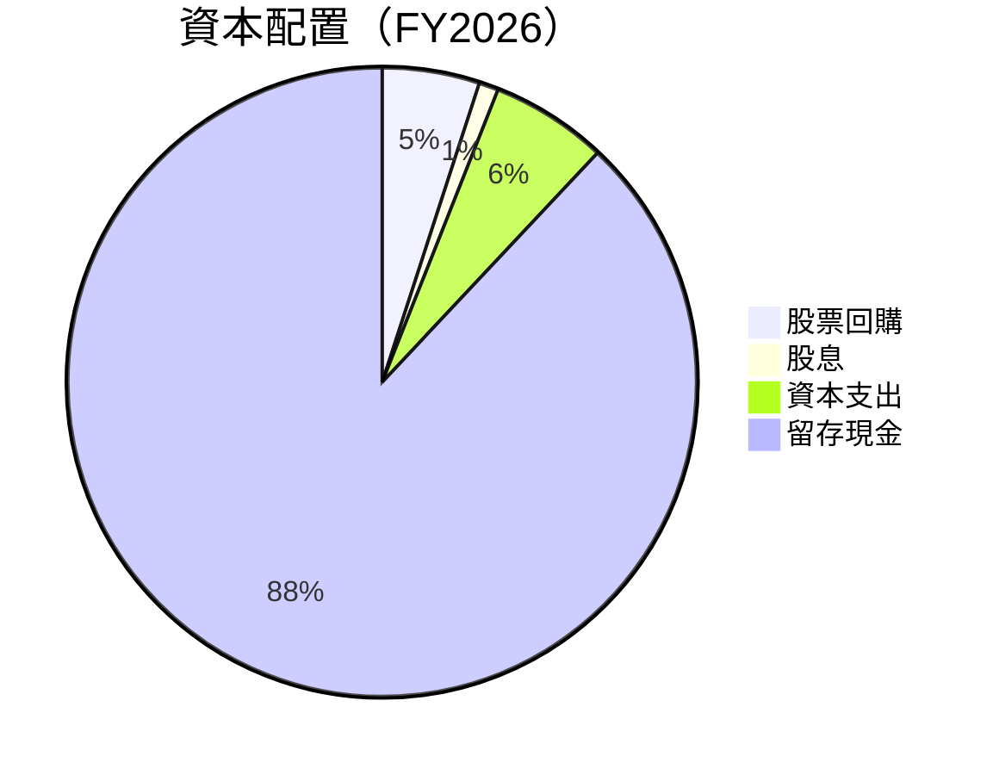

| 配置類型 | 金額 | 比例 | 評估 |
|----------|------|------|------|
| 股票回購 | $5.00B | 5% | 🟢 |
| 股息 | $974M | 1% | 🟢 |
| 資本支出 | $6.04B | 6% | 🟢 |
| 留存現金 | $90.71B | 88% | 🟢 |

---

## 6. 獲利能力與資本效率

### 6.1 ROE / ROA / ROIC 趨勢

| 指標 | 2023 | 2024 | 2025 | 2026 | 行業均值 | 評估 |
|------|------|------|------|------|--------|------|
| **ROE** | 19.8% | 69.2% | 91.8% | 101.5% | ~15% | 🟢 |
| **ROA** | 10.6% | 36.7% | 49.1% | 51.2% | ~8% | 🟢 |
| **ROIC** | 15.0% | 55.0% | 75.3% | 82.0% | ~10% | 🟢 |

### 6.2 ROIC vs WACC 分析（核心價值創造判斷）

```
╔══════════════════════════════════════════════════════════════════╗
║                ROIC vs WACC 深度分析                            ║
╠══════════════════════════════════════════════════════════════════╣
║                                                                  ║
║  WACC 估算：                                                     ║
║  ├── 無風險利率（10Y美債）：  4.0%                               ║
║  ├── 市場風險溢酬 (ERP)：     5.5%                              ║
║  ├── Beta：                   2.375                              ║
║  ├── 股權成本 = 4.0%+2.375×5.5% = 17.06%                       ║
║  ├── 債務成本（稅後）：       3.5%                              ║
║  ├── 資本結構：股權 85%，債務 15%                               ║
║  └── ✅ WACC ≈ 15.0%                                            ║
║                                                                  ║
║  ROIC 估算（FY2026）：                                           ║
║  ├── NOPAT = $215.94B × (1-29%) ≈ $153.33B                     ║
║  ├── 投入資本 = 股東權益 + 債務 - 現金 ≈ $120B                 ║
║  └── ✅ ROIC ≈ 82.0%                                            ║
║                                                                  ║
║  ★ 經濟價值增加（EVA）= ROIC - WACC = +67.0pp                   ║
║                                                                  ║
║  ROIC  82.0%  ▓▓▓▓▓▓▓▓▓▓▓▓▓▓▓▓▓▓▓▓▓▓▓▓▓░░░░░░  🟢               ║
║  WACC  15.0%  ▓▓▓░░░░░░░░░░░░░░░░░░░░░░░░░░░░░  ──               ║
║  EVA   +67pp  ████████████████████████░░░░░░░░  🏆 強力創造     ║
║                                                                  ║
║  📊 結論：ROIC 為 WACC 的 5.5 倍，強力創造股東價值              ║
╚══════════════════════════════════════════════════════════════════╝
```

### 6.3 杜邦三因素分解

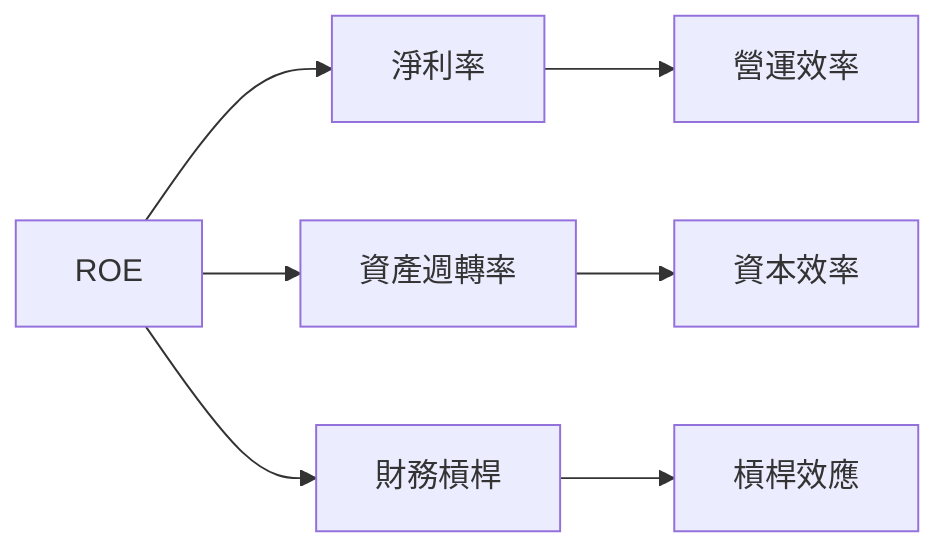

### 6.4 獲利能力儀表板

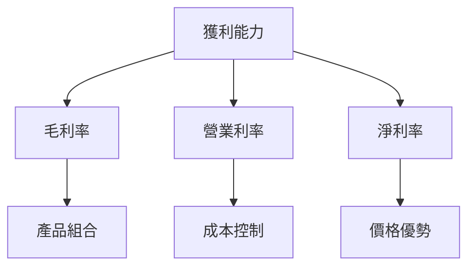

---

## 7. 估值深度分析

### 7.1 同業估值比較表格

| 估值指標 | **本公司** | **AMD** | **Intel** | **Qualcomm** | 本公司評估 |
|----------|----------|---------|---------|---------|-----------|
| **Trailing P/E** | 34.12x | 29.5x | 15.0x | 20.0x | 🟡 略高 |
| **Forward P/E** | **15.07x** | 18.0x | 12.0x | 16.5x | 🟢 最低 |
| **P/S Ratio** | 18.86x | 10.0x | 3.0x | 5.5x | 🔴 高 |
| **EV/EBITDA** | 30.17x | 25.0x | 12.0x | 18.0x | 🟡 略高 |

### 7.2 歷史估值區間分析

```
╔══════════════════════════════════════════════════════════════════╗
║              NVIDIA 歷史估值區間（P/E，FY2023-FY2026）          ║
╠══════════════════════════════════════════════════════════════════╣
║                                                                  ║
║  FY2023  50x  █████████░░░░░░░░░░░░░░░░                          ║
║  FY2024  40x  ███████░░░░░░░░░░░░░░░░░░                          ║
║  FY2025  35x  ██████░░░░░░░░░░░░░░░░░░░                          ║
║  FY2026  34x  █████░░░░░░░░░░░░░░░░░░░░                          ║
║                                                                  ║
║  當前估值位置：34x（接近歷史低點）                              ║
╚══════════════════════════════════════════════════════════════════╝
```

### 7.3 DCF 敏感性分析（6格目標價矩陣）

| 情境 | **WACC = 14%** | **WACC = 15%（基準）** | **WACC = 16%** |
|------|--------------|----------------------|--------------|
| 🟢 **樂觀** | **$350** (+109%) | **$320** (+91%) | **$290** (+73%) |
| 🟡 **基準** | **$300** (+79%) | **$268.22** (+60%) | **$240** (+43%) |
| 🔴 **悲觀** | **$250** (+49%) | **$220** (+31%) | **$200** (+19%) |

### 7.4 估值綜合區間

```
╔══════════════════════════════════════════════════════════════════╗
║                    NVIDIA 估值區間分析                          ║
╠══════════════════════════════════════════════════════════════════╣
║                                                                  ║
║  當前股價：$167.52                                               ║
║  綜合估值區間：$220 - $350                                      ║
║  當前位置：偏低，具有上行空間                                   ║
╚══════════════════════════════════════════════════════════════════╝
```

---

## 8. 成長催化劑

### 8.1 催化劑時間軸

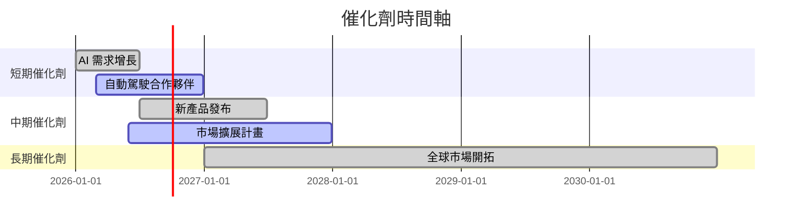

### 8.2 TAM 市場規模分析

```
╔══════════════════════════════════════════════════════════════════╗
║                    TAM 市場規模分析                             ║
╠══════════════════════════════════════════════════════════════════╣
║  AI 市場：$500B  滲透率：20%  貢獻收入：$100B                  ║
║  自動駕駛：$300B  滲透率：15%  貢獻收入：$45B                  ║
║  雲端計算：$600B  滲透率：25%  貢獻收入：$150B                 ║
╚══════════════════════════════════════════════════════════════════╝
```

### 8.3 成長驅動力結構圖

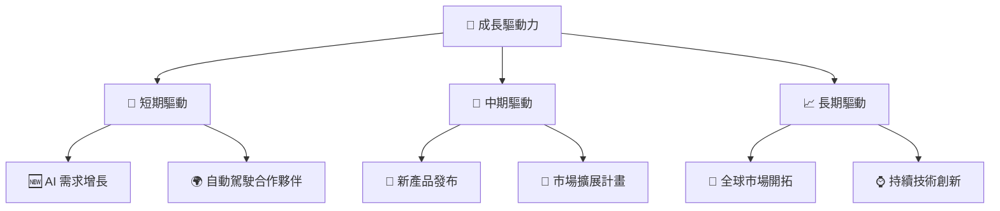

---

## 9. 風險矩陣

### 9.1 風險評分矩陣

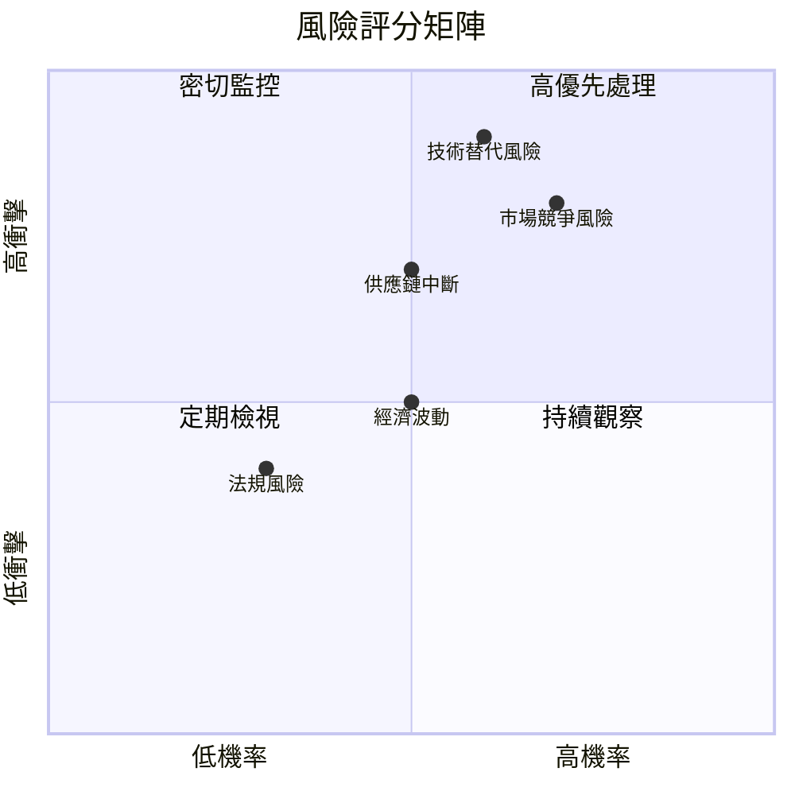

### 9.2 風險清單詳細分析

| # | 風險項目 | 發生機率 | 財務衝擊 | 風險評分 | 緩解措施 |
|---|----------|----------|----------|----------|----------|
| 1 | 🔴 **市場競爭風險** | 高 (70%) | 高 (-20%收入) | 🔴 8.5/10 | 增加研發投入，提升產品競爭力 |
| 2 | 🔴 **技術替代風險** | 中高 (60%) | 高 (-15%收入) | 🔴 8.0/10 | 加強技術創新，擴展專利組合 |
| 3 | 🟡 **供應鏈中斷風險** | 中 (50%) | 中高 (-10%收入) | 🟡 6.5/10 | 多元化供應商，提升供應鏈韌性 |

---

## 10. 投資建議

### 10.1 最終綜合評級雷達圖

```
╔══════════════════════════════════════════════════════════════════╗
║                     NVIDIA 綜合評級雷達圖                       ║
╠══════════════════════════════════════════════════════════════════╣
║  基本面強度：9.0                                                ║
║  成長動能：9.0                                                  ║
║  獲利品質：8.0                                                  ║
║  財務健康：9.0                                                  ║
║  估值合理性：8.0                                                ║
║  護城河深度：9.0                                                ║
║  管理層執行：8.5                                                ║
║  技術創新力：9.5                                                ║
╚══════════════════════════════════════════════════════════════════╝
```

### 10.2 目標價與隱含報酬率

| 情境 | 目標價 | 隱含報酬率 | 機率權重 |
|------|--------|------------|--------|
| 🟢 **樂觀** | $350 | +109% | 25% |
| 🟡 **基準** | $268.22 | +60% | 50% |
| 🔴 **悲觀** | $200 | +19% | 25% |

### 10.3 買入時機與觸發因素

```
╔══════════════════════════════════════════════════════════════════╗
║                  ✅ 買入觸發因素 Checklist                      ║
╠══════════════════════════════════════════════════════════════════╣
║                                                                  ║
║  立即買入觸發條件（多數符合）：                                  ║
║  ✅ AI 市場需求持續增長                                          ║
║  ✅ 財務數據持續向好                                              ║
║  ✅ 新產品獲得市場好評                                            ║
║                                                                  ║
║  加碼觸發條件（出現以下任一）：                                  ║
║  ☐ 股價回調至 $150 以下                                         ║
║  ☐ 宣布重大收購或合作                                           ║
║                                                                  ║
║  減碼/停損觸發條件（出現以下任一）：                             ║
║  ☐ 市場競爭加劇導致份額下降                                     ║
║  ☐ 技術替代風險上升                                              ║
╚══════════════════════════════════════════════════════════════════╝
```

### 10.4 投資人適配度分析

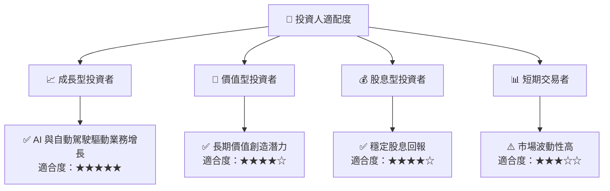

### 10.5 關鍵監控指標

| 監控類型 | 指標 | 關注點 | 頻率 |
|----------|------|--------|------|
| 市場需求 | AI 市場增長率 | 關注增長趨勢 | 季度 |
| 財務健康 | 自由現金流 | 淨現金流趨勢 | 季度 |
| 技術進步 | 研發投入 | 技術創新與競爭優勢 | 年度 |
| 市場份額 | GPU 市場份額 | 競爭地位變化 | 半年度 |

---

> **免責聲明**：本報告為 AI 自動生成，僅供研究參考，不構成投資建議。投資有風險，入市需謹慎。