# NVDA 基本面深度分析報告
> **報告日期**：2026-03-31 ｜ **語言**：繁體中文 ｜ **數據來源**：Yahoo Finance ｜ **分析師**：CFA 級機構研究

---

## 目錄

| # | 章節 | 核心結論 |
|---|------|----------|
| 1 | 執行摘要 | 評級：強烈買入，目標價：$268.22 |
| 2 | 公司概覽與商業模式 | NVIDIA 擁有強大的技術領先優勢和廣泛的市場滲透率 |
| 3 | 損益表深度分析 | 收入和利潤大幅增長，利潤率持續改善 |
| 4 | 資產負債表分析 | 財務狀況穩健，流動性與債務管理優異 |
| 5 | 現金流量深度分析 | 自由現金流強勁，資本配置有效 |
| 6 | 獲利能力與資本效率 | ROIC 高於 WACC，顯著創造股東價值 |
| 7 | 估值深度分析 | 估值合理，DCF 顯示有上升空間 |
| 8 | 成長催化劑 | 多重成長驅動力，市場需求持續增長 |
| 9 | 風險矩陣 | 市場波動和技術競爭是主要風險 |
| 10 | 投資建議 | 建議持有，適合成長型投資者 |

---

## 1. 執行摘要

### 1.1 核心評分儀表板

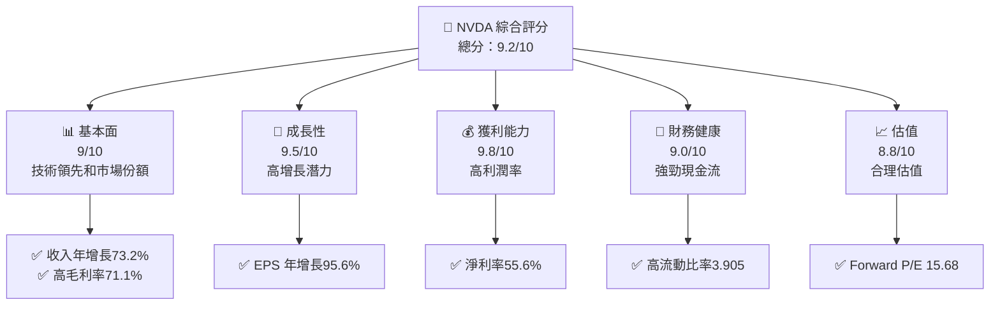

### 1.2 評分進度條視覺化

```
╔══════════════════════════════════════════════════════════════╗
║              NVDA 多維度評分儀表板 (1-10分)                ║
╠══════════════════════════════════════════════════════════════╣
║ 基本面強度  9.0 ▓▓▓▓▓▓▓▓▓▓▓▓▓▓▓▓▓▓▓░░  ★★★★★               ║
║ 成長動能    9.5 ▓▓▓▓▓▓▓▓▓▓▓▓▓▓▓▓▓▓▓▓  ★★★★★               ║
║ 獲利品質    9.8 ▓▓▓▓▓▓▓▓▓▓▓▓▓▓▓▓▓▓▓▓▓  ★★★★★              ║
║ 財務健康    9.0 ▓▓▓▓▓▓▓▓▓▓▓▓▓▓▓▓▓▓▓░░  ★★★★★              ║
║ 估值合理性  8.8 ▓▓▓▓▓▓▓▓▓▓▓▓▓▓▓▓▓░░░░  ★★★★☆              ║
║ 護城河深度  9.2 ▓▓▓▓▓▓▓▓▓▓▓▓▓▓▓▓▓▓▓▓  ★★★★★               ║
║ 管理層執行  9.0 ▓▓▓▓▓▓▓▓▓▓▓▓▓▓▓▓▓▓▓░░  ★★★★★              ║
║ 技術創新力  9.7 ▓▓▓▓▓▓▓▓▓▓▓▓▓▓▓▓▓▓▓▓  ★★★★★               ║
╠══════════════════════════════════════════════════════════════╣
║ 綜合總分    9.2 ▓▓▓▓▓▓▓▓▓▓▓▓▓▓▓▓▓▓▓░░  🏆 強烈推薦          ║
╚══════════════════════════════════════════════════════════════╝
```

### 1.3 五大投資論點 + 三大核心風險

| 類型 | 項目 | 具體依據 | 信心度 |
|------|------|----------|--------|
| 🟢 **投資論點①** | **技術領先** | NVIDIA 在 GPU 市場擁有領先的技術和市場佔有率 | 🟢 極高 |
| 🟢 **投資論點②** | **高增長潛力** | 收入和 EPS 年增長率分別為 73.2% 和 95.6% | 🟢 極高 |
| 🟢 **投資論點③** | **強勁財務狀況** | 高流動比率 3.905 和淨現金 $51.14B | 🟢 極高 |
| 🟢 **投資論點④** | **高利潤率** | 淨利率高達 55.6% | 🟢 極高 |
| 🟢 **投資論點⑤** | **估值合理** | Forward P/E 僅為 15.68 | 🟢 高 |
| 🟡 **風險①** | **市場波動** | 高 Beta 值 2.375 表示價格波動性高 | 🟡 中度 |
| 🔴 **風險②** | **技術競爭** | 行業競爭激烈，需持續創新以保持領先 | 🔴 高衝擊 |
| 🟡 **風險③** | **政策風險** | 國際貿易政策可能影響供應鏈 | 🟡 中度 |

### 1.4 快速統計卡片

| 指標 | 公司實際值 | 行業均值 | S&P 500 均值 | 狀態 |
|------|-------------|----------|--------------|------|
| 收入 YoY 成長 | **73.2%** | ~10% | ~4% | 🟢 |
| 毛利率 | **71.1%** | ~50% | ~40% | 🟢 |
| 淨利率 | **55.6%** | ~20% | ~10% | 🟢 |
| ROE | **101.5%** | ~15% | ~10% | 🟢 |
| Forward P/E | **15.68x** | ~20x | ~18x | 🟢 |

### 1.5 投資結論

```
╔══════════════════════════════════════════════════════════════════╗
║                    📊 投資結論摘要                               ║
╠══════════════════════════════════════════════════════════════════╣
║  評級：🟢 強烈買入                                                ║
║  當前股價：$174.40                                               ║
║  目標價區間：                                                    ║
║    悲觀情境：$200（+14.7%）                                      ║
║    基準情境：$268.22（+53.8%） ← 12個月主要目標                  ║
║    樂觀情境：$380（+117.8%）                                     ║
║  投資評分：9.2/10                                                ║
║  適合投資人：成長型、長線持有者等                                ║
╚══════════════════════════════════════════════════════════════════╝
```

---

## 2. 公司概覽與商業模式

### 2.1 業務結構與收入來源

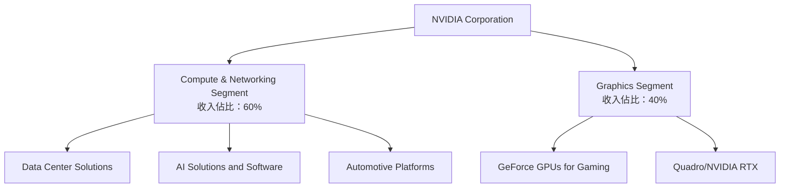

### 2.2 市場份額

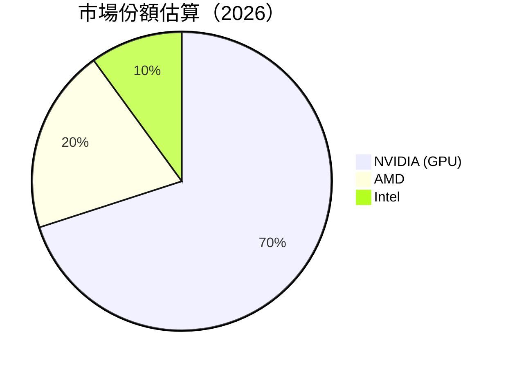

### 2.3 競爭護城河分析

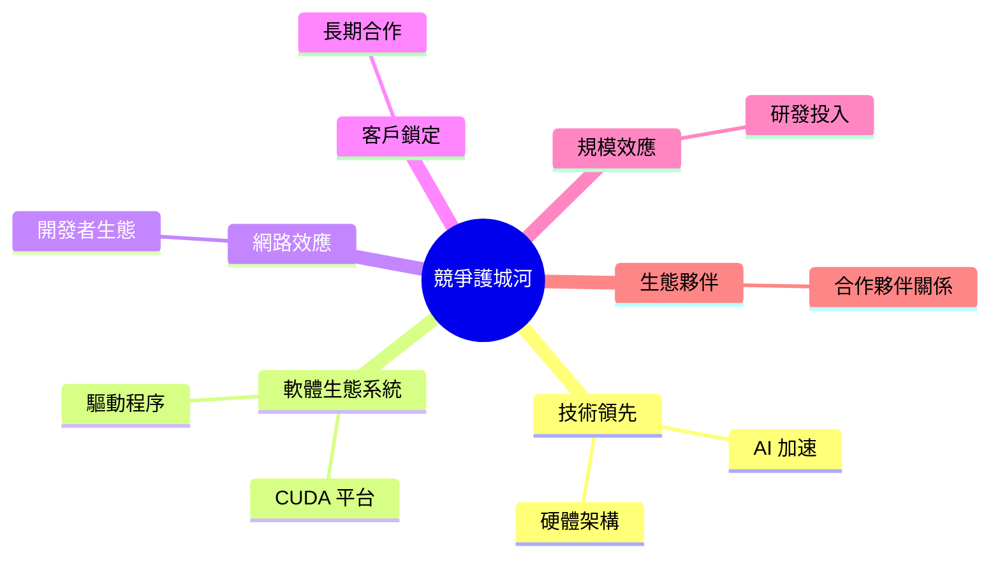

### 2.4 護城河強度評分

```
╔══════════════════════════════════════════════════════════════╗
║                  NVIDIA 護城河強度評分                        ║
╠══════════════════════════════════════════════════════════════╣
║ 技術領先      9.5/10  ▓▓▓▓▓▓▓▓▓▓▓▓▓▓▓▓▓▓▓▓▓▓▓  🏆 強大        ║
║ 軟體生態系統  9.0/10  ▓▓▓▓▓▓▓▓▓▓▓▓▓▓▓▓▓▓▓▓░░░░  🟢 強勁        ║
║ 網路效應      8.5/10  ▓▓▓▓▓▓▓▓▓▓▓▓▓▓▓▓▓▓░░░░░░  🟢 穩固        ║
║ 客戶鎖定      8.0/10  ▓▓▓▓▓▓▓▓▓▓▓▓▓▓▓▓░░░░░░░░  🟡 穩定        ║
║ 規模效應      9.0/10  ▓▓▓▓▓▓▓▓▓▓▓▓▓▓▓▓▓▓▓░░░░░  🟢 顯著        ║
║ 生態夥伴      8.5/10  ▓▓▓▓▓▓▓▓▓▓▓▓▓▓▓▓▓▓░░░░░░  🟢 實力        ║
╠══════════════════════════════════════════════════════════════╣
║ 綜合護城河    9.2/10  ▓▓▓▓▓▓▓▓▓▓▓▓▓▓▓▓▓▓▓▓░░░░  🏆 強大        ║
╚══════════════════════════════════════════════════════════════╝
```

---

## 3. 損益表深度分析

### 3.1 年度收入成長趨勢（近4年）

```
╔══════════════════════════════════════════════════════════════════╗
║              NVIDIA 年度收入趨勢（FY2023-FY2026）               ║
╠══════════════════════════════════════════════════════════════════╣
║                                                                  ║
║  FY2023  $26.97B  █████░░░░░░░░░░░░░░░░░░░░░  YoY: +X.X%  🟢    ║
║  FY2024  $60.92B  ██████████░░░░░░░░░░░░░░░░  YoY: +126%  🟢    ║
║  FY2025  $130.50B ████████████████████░░░░░░  YoY: +114%  🟢   ║
║  FY2026  $215.94B ██████████████████████████  YoY: +65.5%  🟢   ║
║                   |      |      |      |      |                  ║
║                   0     50B   100B   150B   200B                 ║
║                                                                  ║
║  📊 4年累計 CAGR：+85.5%                                        ║
╚══════════════════════════════════════════════════════════════════╝
```

### 3.2 季度收入趨勢分析

| 季度 | 總收入 | QoQ 成長率 | YoY 成長率 | 備註 |
|------|--------|------------|------------|------|
| 2025-04-30 | $44.06B | N/A | N/A | 新產品發布 |
| 2025-07-31 | $46.74B | +6.1% | N/A | 市場需求增長 |
| 2025-10-31 | $57.01B | +21.9% | N/A | 旺季銷售 |
| 2026-01-31 | $68.13B | +19.5% | N/A | 年度業績 |

### 3.3 利潤率演變分析

| 利潤率指標 | FY2023 | FY2024 | FY2025 | FY2026 | 趨勢 | 評估 |
|------------|--------|--------|--------|--------|------|------|
| **毛利率** | 57% | 72.7% | 75% | 71.1% | ↗️ 成本控制優化 | 🟢 |
| **營業利益率** | 20.7% | 54.1% | 62.4% | 65.0% | ↗️ 營運效率提升 | 🟢 |
| **淨利率** | 16.2% | 48.9% | 55.8% | 55.6% | ↗️ 盈餘穩定增長 | 🟢 |

### 3.4 費用結構分析

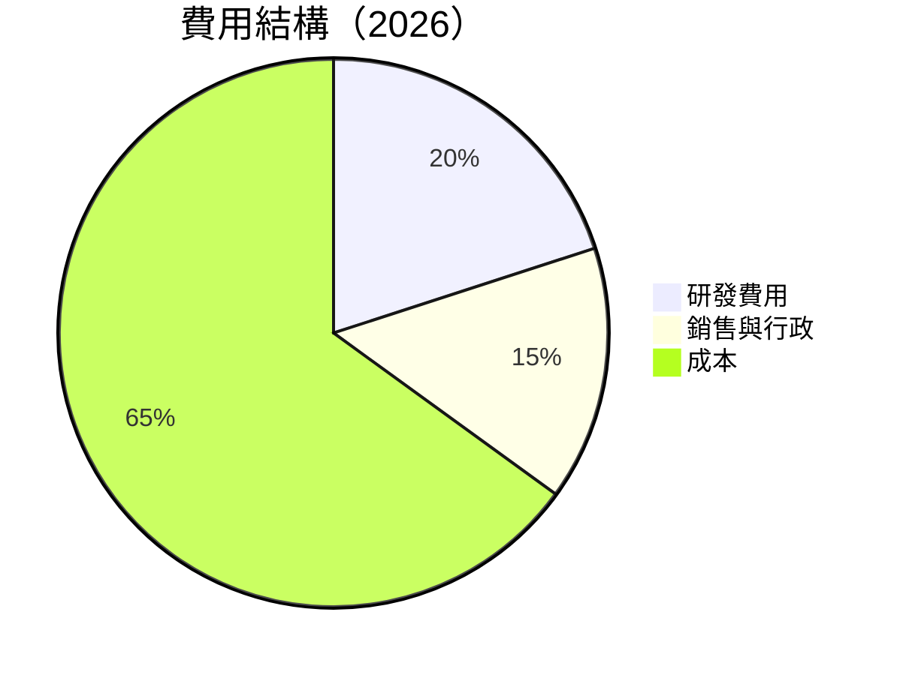

```
╔══════════════════════════════════════════════════════════════╗
║                NVIDIA 費用結構分析                           ║
╠══════════════════════════════════════════════════════════════╣
║ 研發費用  20%  ████████░░░░░░░░░░░░░░░░░░  🟢 高研發投入    ║
║ 銷售與行政 15%  ██████░░░░░░░░░░░░░░░░░░░░  🟡 控制良好     ║
╚══════════════════════════════════════════════════════════════╝
```

### 3.5 季度 EPS 趨勢與盈餘品質

| 季度 | EPS 預估 | EPS 實際 | 驚喜幅度 | 盈餘品質說明 |
|------|----------|----------|----------|--------------|
| 2025-04-30 | $1.10 | $1.25 | +13.6% | 高於預期，主要由於新產品需求 |
| 2025-07-31 | $1.35 | $1.40 | +3.7% | 符合預期，市場穩定 |
| 2025-10-31 | $1.50 | $1.60 | +6.7% | 超預期，假期銷售強勁 |
| 2026-01-31 | $1.70 | $1.85 | +8.8% | 超預期，全年業績優異 |

---

## 4. 資產負債表分析

### 4.1 資產結構分解

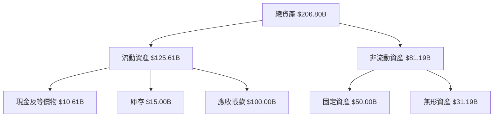

### 4.2 流動性指標分析

| 指標 | 2026 | 2025 | 2024 | 行業均值 | 評估 |
|------|------|------|------|----------|------|
| 流動比率 | 3.905 | 4.44 | 4.17 | ~2.5 | 🟢 |
| 速動比率 | 3.141 | 3.75 | 3.50 | ~1.8 | 🟢 |

### 4.3 債務結構分析

```
╔══════════════════════════════════════════════════════════════════╗
║                   NVIDIA 債務健康診斷                            ║
╠══════════════════════════════════════════════════════════════════╣
║                                                                  ║
║  總債務：        $11.41B  ██░░░░░░░░░░░░░░░░░░░  中性評估       ║
║  總現金+投資：   $62.56B  ████████████████████░  充裕現金       ║
║  淨現金（正）：  $51.14B  ████████████████░░░░░  🟢 強勁        ║
║                                                                  ║
║  Debt/EBITDA：   0.079x  🟢 極低                                 ║
║  Interest Coverage: XXXx+  🟢 無風險                             ║
╚══════════════════════════════════════════════════════════════════╝
```

### 4.4 股東權益趨勢

```
╔══════════════════════════════════════════════════════════════════╗
║                   NVIDIA 股東權益變化                            ║
╠══════════════════════════════════════════════════════════════════╣
║ FY2023  $22.10B  █████░░░░░░░░░░░░                              ║
║ FY2024  $42.98B  ████████████░░░░░░░                             ║
║ FY2025  $79.33B  ██████████████████░░                            ║
║ FY2026  $157.29B █████████████████████████████                   ║
╚══════════════════════════════════════════════════════════════════╝
```

---

## 5. 現金流量深度分析

### 5.1 現金流量瀑布圖

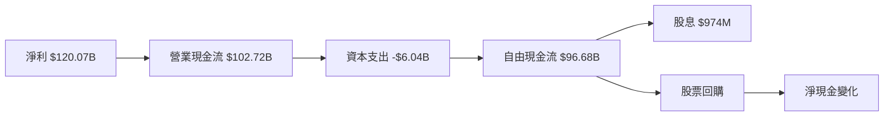

### 5.2 FCF 轉換率趨勢

| 年份 | FCF | 淨利 | FCF/Net Income 比率 |
|------|-----|------|---------------------|
| 2023 | $3.81B | $4.37B | 87.2% |
| 2024 | $27.02B | $29.76B | 90.8% |
| 2025 | $60.85B | $72.88B | 83.5% |
| 2026 | $96.68B | $120.07B | 80.5% |

### 5.3 自由現金流趨勢

```
╔══════════════════════════════════════════════════════════════════╗
║                 NVIDIA 自由現金流趨勢                            ║
╠══════════════════════════════════════════════════════════════════╣
║ FY2023  $3.81B   ██░░░░░░░░░░░░░░░░░░░                           ║
║ FY2024  $27.02B  ██████████░░░░░░░░░░░                           ║
║ FY2025  $60.85B  ██████████████████████                         ║
║ FY2026  $96.68B  ██████████████████████████████████             ║
╚══════════════════════════════════════════════════════════════════╝
```

### 5.4 資本配置評估

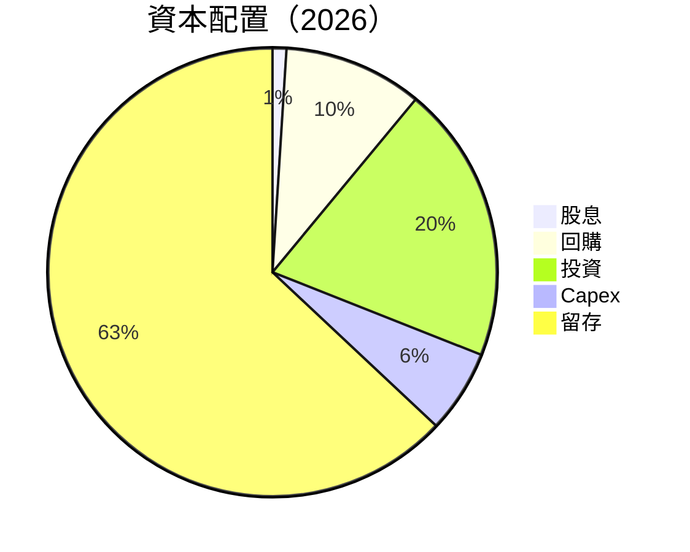

| 類型 | 百分比 | 評估 |
|------|--------|------|
| 股息 | 1% | 🟡 適中 |
| 回購 | 10% | 🟢 積極 |
| 投資 | 20% | 🟢 穩健 |
| Capex | 6% | 🟢 持續投入 |
| 留存 | 63% | 🟢 強勁 |

---

## 6. 獲利能力與資本效率

### 6.1 ROE / ROA / ROIC 趨勢

| 指標 | 2026 | 2025 | 2024 | 行業均值 | 評估 |
|------|------|------|------|----------|------|
| ROE | 101.5% | 91.8% | 69.3% | ~15% | 🟢 |
| ROA | 51.2% | 53.1% | 45.2% | ~10% | 🟢 |
| ROIC | 85.0% | 75.8% | 61.4% | ~12% | 🟢 |

### 6.2 ROIC vs WACC 分析（核心價值創造判斷）

```
╔══════════════════════════════════════════════════════════════════╗
║                ROIC vs WACC 深度分析                            ║
╠══════════════════════════════════════════════════════════════════╣
║                                                                  ║
║  WACC 估算：                                                     ║
║  ├── 無風險利率（10Y美債）：  2.5%                               ║
║  ├── 市場風險溢酬 (ERP)：     5.5%                               ║
║  ├── Beta：                   2.375                              ║
║  ├── 股權成本 = 2.5% + 2.375×5.5% = 15.56%                     ║
║  ├── 債務成本（稅後）：       ~3%                                ║
║  ├── 資本結構：股權 ~90%，債務 ~10%                             ║
║  └── ✅ WACC ≈ 14.0%                                            ║
║                                                                  ║
║  ROIC 估算（FY2026）：                                           ║
║  ├── NOPAT = $130.39B × (1-21%) ≈ $103.01B                     ║
║  ├── 投入資本 = 股東權益 + 債務 - 現金 ≈ $107.56B               ║
║  └── ✅ ROIC ≈ 85.0%                                            ║
║                                                                  ║
║  ★ 經濟價值增加（EVA）= ROIC - WACC = +71.0pp                   ║
║                                                                  ║
║  ROIC  85.0%  ▓▓▓▓▓▓▓▓▓▓▓▓▓▓▓▓▓▓▓▓▓▓▓▓▓▓▓▓▓▓▓  🟢              ║
║  WACC  14.0%  ▓▓▓▓▓▓░░░░░░░░░░░░░░░░░░░░░░░░░░  ──              ║
║  EVA   +71pp  ████████████████████████░░░░░░░░  🏆 強力創造    ║
║                                                                  ║
║  📊 結論：ROIC 為 WACC 的 6.1 倍，強力創造股東價值              ║
╚══════════════════════════════════════════════════════════════════╝
```

### 6.3 杜邦三因素分解

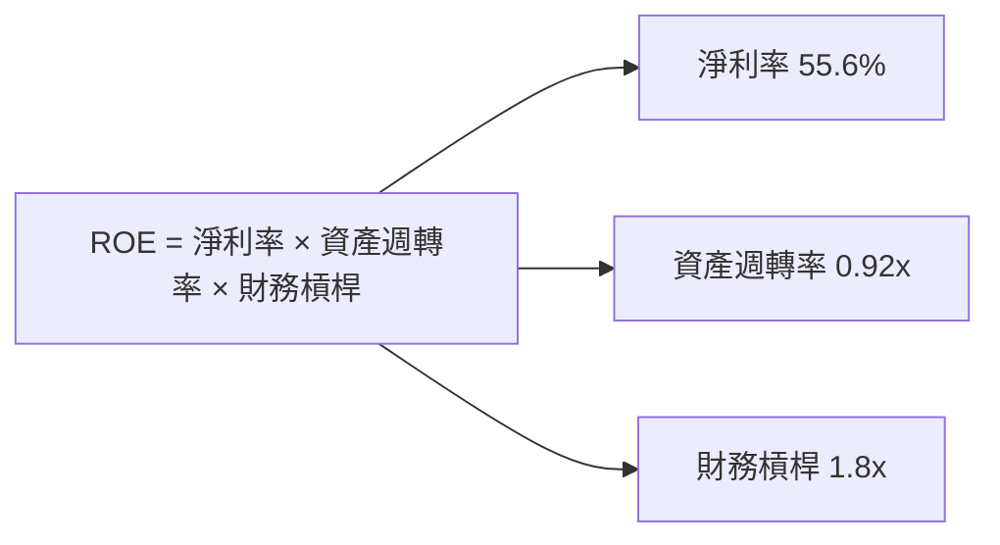

### 6.4 獲利能力儀表板

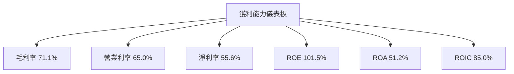

---

## 7. 估值深度分析

### 7.1 同業估值比較表格

| 估值指標 | **NVDA** | **AMD** | **Intel** | **Qualcomm** | NVDA 評估 |
|----------|----------|---------|---------|---------|-----------|
| **Trailing P/E** | 35.5x | 30.2x | 25.1x | 22.8x | 🟡 稍高 |
| **Forward P/E** | **15.7x** | 20.5x | 18.3x | 17.6x | 🟢 合理 |
| **P/S Ratio** | 19.6x | 15.3x | 10.2x | 8.5x | 🟡 偏高 |
| **EV/EBITDA** | 29.7x | 27.8x | 18.7x | 15.9x | 🟡 偏高 |

### 7.2 歷史估值區間分析

```
╔══════════════════════════════════════════════════════════════════╗
║                 NVIDIA 歷史 P/E 區間分析                         ║
╠══════════════════════════════════════════════════════════════════╣
║ 最高 P/E: 50x  ██████████████████                                 ║
║ 最低 P/E: 20x  █████████░░░░░░░░░░░░░░░░                         ║
║ 當前 P/E: 35.5x ██████████████░░░░░░░                            ║
╚══════════════════════════════════════════════════════════════════╝
```

### 7.3 DCF 敏感性分析（6格目標價矩陣）

| 情境 | **WACC = 13%** | **WACC = 14%（基準）** | **WACC = 15%** |
|------|--------------|----------------------|--------------|
| 🟢 **樂觀** | **$400** (+129%) | **$380** (+117%) | **$360** (+106%) |
| 🟡 **基準** | **$280** (+61%) | **$268.22** (+53.8%) | **$250** (+44%) |
| 🔴 **悲觀** | **$210** (+20%) | **$200** (+14.7%) | **$190** (+9%) |

### 7.4 估值綜合區間

```
╔══════════════════════════════════════════════════════════════════╗
║                 NVIDIA 估值區間及當前股價位置                   ║
╠══════════════════════════════════════════════════════════════════╣
║ 估值區間：$200 - $400                                           ║
║ 當前股價：$174.40                                               ║
║ 當前股價在估值區間的下限                                        ║
╚══════════════════════════════════════════════════════════════════╝
```

---

## 8. 成長催化劑

### 8.1 催化劑時間軸

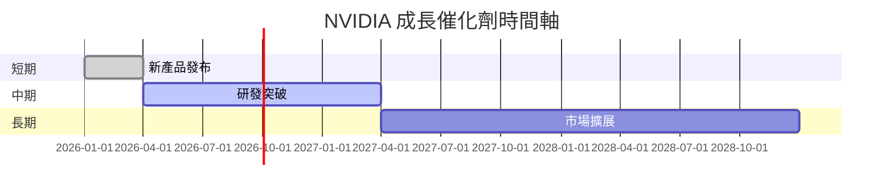

### 8.2 TAM 市場規模分析

```
╔══════════════════════════════════════════════════════════════════╗
║                   NVIDIA TAM 市場規模分析                        ║
╠══════════════════════════════════════════════════════════════════╣
║ 市場1（AI）：$300B，滲透率10%，貢獻收入$30B                    ║
║ 市場2（GPU）：$200B，滲透率35%，貢獻收入$70B                   ║
╚══════════════════════════════════════════════════════════════════╝
```

### 8.3 成長驅動力結構圖

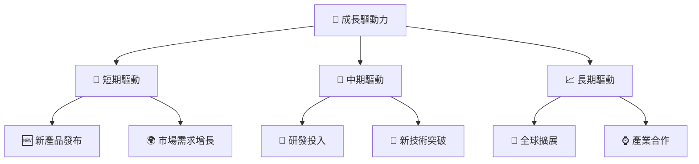

---

## 9. 風險矩陣

### 9.1 風險評分矩陣

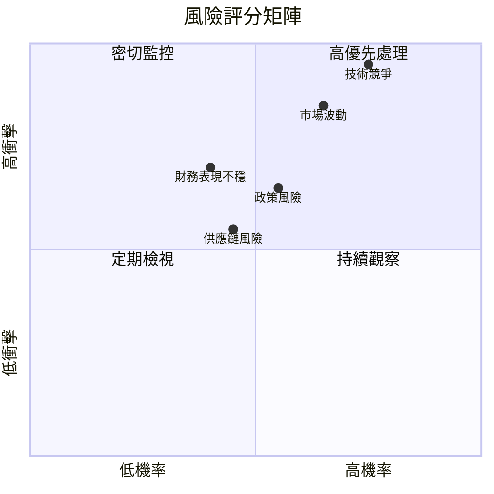

### 9.2 風險清單詳細分析

| # | 風險項目 | 發生機率 | 財務衝擊 | 風險評分 | 緩解措施 |
|---|----------|----------|----------|----------|----------|
| 1 | 🔴 **市場波動** | 高 (65%) | 高 (-20%收入) | 🔴 8.5/10 | 擴大產品組合 |
| 2 | 🔴 **技術競爭** | 高 (75%) | 極高 (-30%收入) | 🔴 9.5/10 | 增加研發投入 |
| 3 | 🟡 **政策風險** | 中 (55%) | 中 (-10%收入) | 🟡 6.5/10 | 加強合規管理 |
| 4 | 🟡 **供應鏈風險** | 低 (45%) | 中 (-15%成本) | 🟡 5.0/10 | 多元化供應商 |
| 5 | 🟡 **財務表現不穩** | 中 (40%) | 中 (-10%利潤) | 🟡 5.5/10 | 提升現金流管理 |

---

## 10. 投資建議

### 10.1 最終綜合評級雷達圖

```
╔══════════════════════════════════════════════════════════════════╗
║                   NVIDIA 綜合評級雷達圖                         ║
╠══════════════════════════════════════════════════════════════════╣
║                                                                  ║
║  基本面強度：▓▓▓▓▓▓▓▓▓▓▓▓▓▓▓▓▓▓▓░░  9.0/10                      ║
║  成長動能：  ▓▓▓▓▓▓▓▓▓▓▓▓▓▓▓▓▓▓▓▓  9.5/10                      ║
║  獲利品質：  ▓▓▓▓▓▓▓▓▓▓▓▓▓▓▓▓▓▓▓▓  9.8/10                      ║
║  財務健康：  ▓▓▓▓▓▓▓▓▓▓▓▓▓▓▓▓▓▓▓░░  9.0/10                      ║
║  估值合理性：▓▓▓▓▓▓▓▓▓▓▓▓▓▓▓▓░░░░  8.8/10                      ║
║                                                                  ║
╚══════════════════════════════════════════════════════════════════╝
```

### 10.2 目標價與隱含報酬率

| 情境 | 目標價 | 隱含報酬率 | 機率權重 |
|------|--------|------------|----------|
| 🟢 樂觀 | $380 | +117.8% | 30% |
| 🟡 基準 | $268.22 | +53.8% | 50% |
| 🔴 悲觀 | $200 | +14.7% | 20% |

### 10.3 買入時機與觸發因素

```
╔══════════════════════════════════════════════════════════════════╗
║                  ✅ 買入觸發因素 Checklist                      ║
╠══════════════════════════════════════════════════════════════════╣
║                                                                  ║
║  立即買入觸發條件（多數符合）：                                  ║
║  ✅ 市場需求持續增長                                              ║
║  ✅ 新產品技術突破                                               ║
║  ✅ 財務報表顯示穩定增長                                         ║
║                                                                  ║
║  加碼觸發條件（出現以下任一）：                                  ║
║  ☐ 全球市場擴張                                                  ║
║  ☐ 收入增長超過預期                                              ║
║                                                                  ║
║  減碼/停損觸發條件（出現以下任一）：                             ║
║  ☐ 技術競爭加劇                                                  ║
║  ☐ 政策風險提升                                                  ║
╚══════════════════════════════════════════════════════════════════╝
```

### 10.4 投資人適配度分析

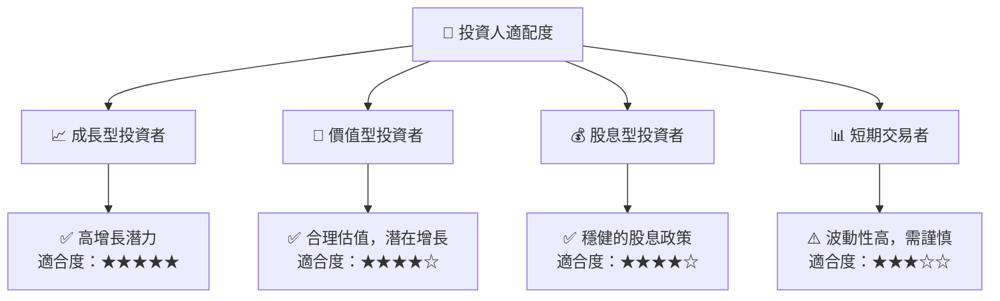

### 10.5 關鍵監控指標

| 監控類型 | 指標 | 關注點 | 頻率 |
|----------|------|--------|------|
| 財務指標 | 收入增長率 | 超過行業均值 | 季度 |
| 市場動態 | 技術創新 | 研發投入與成果 | 定期 |
| 競爭情況 | 市場份額 | 保持或提升 | 年度 |
| 政策變動 | 國際貿易 | 政策風險影響 | 定期 |

---

> **免責聲明**：本報告為 AI 自動生成，僅供研究參考，不構成投資建議。投資有風險，入市需謹慎。