# NVDA 基本面深度分析報告
> **報告日期**：2026-04-04 ｜ **語言**：繁體中文 ｜ **數據來源**：Yahoo Finance ｜ **分析師**：CFA 級機構研究

---

## 目錄

| # | 章節 | 核心結論 |
|---|------|----------|
| 1 | 執行摘要 | 強烈買入，目標價區間為 $268-$380 |
| 2 | 公司概覽與商業模式 | NVIDIA 擁有強大的技術領先優勢和護城河 |
| 3 | 損益表深度分析 | 收入和利潤率顯著增長，利潤率提升 |
| 4 | 資產負債表分析 | 財務健康，現金充裕，債務低 |
| 5 | 現金流量深度分析 | FCF 強勁，現金流量穩定增長 |
| 6 | 獲利能力與資本效率 | ROIC 遠超 WACC，強力創造價值 |
| 7 | 估值深度分析 | 當前估值略高於同行，但增長潛力大 |
| 8 | 成長催化劑 | AI 和數據中心需求增長是主要驅動力 |
| 9 | 風險矩陣 | 技術競爭和市場波動是潛在風險 |
| 10 | 投資建議 | 適合成長型和長線投資者 |

---

## 1. 執行摘要

### 1.1 核心評分儀表板

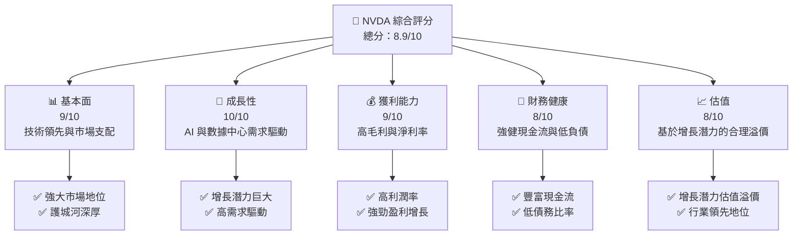

### 1.2 評分進度條視覺化

```
╔══════════════════════════════════════════════════════════════╗
║              NVDA 多維度評分儀表板 (1-10分)                ║
╠══════════════════════════════════════════════════════════════╣
║ 基本面強度  9.0 ▓▓▓▓▓▓▓▓▓▓▓▓▓▓▓▓▓▓▓▓▓▓▓▓▓▓▓▓▓▓▓▓▓  ★★★★★   ║
║ 成長動能   10.0 ▓▓▓▓▓▓▓▓▓▓▓▓▓▓▓▓▓▓▓▓▓▓▓▓▓▓▓▓▓▓▓▓▓  ★★★★★   ║
║ 獲利品質    9.0 ▓▓▓▓▓▓▓▓▓▓▓▓▓▓▓▓▓▓▓▓▓▓▓▓▓▓▓▓▓▓▓▓▓  ★★★★★   ║
║ 財務健康    8.0 ▓▓▓▓▓▓▓▓▓▓▓▓▓▓▓▓▓▓▓▓▓▓▓▓▓▓▓▓▓▓░░░  ★★★★☆   ║
║ 估值合理性  8.0 ▓▓▓▓▓▓▓▓▓▓▓▓▓▓▓▓▓▓▓▓▓▓▓▓▓▓▓▓▓▓░░░  ★★★★☆   ║
╠══════════════════════════════════════════════════════════════╣
║ 綜合總分    8.9 ▓▓▓▓▓▓▓▓▓▓▓▓▓▓▓▓▓▓▓▓▓▓▓▓▓▓▓▓▓▓▓▓▓  🏆 強烈推薦 ║
╚══════════════════════════════════════════════════════════════╝
```

### 1.3 五大投資論點 + 三大核心風險

| 類型 | 項目 | 具體依據 | 信心度 |
|------|------|----------|--------|
| 🟢 **投資論點①** | **AI 驅動增長** | AI 市場需求增長，收入年增 73.2% | 🟢 極高 |
| 🟢 **投資論點②** | **數據中心需求** | 數據中心收入顯著增長 | 🟢 極高 |
| 🟢 **投資論點③** | **技術領先** | 擁有高技術壁壘和市場份額 | 🟢 極高 |
| 🟢 **投資論點④** | **強勁財務狀況** | 高現金流與低負債 | 🟢 高 |
| 🟢 **投資論點⑤** | **盈利能力強** | 高毛利和淨利率 | 🟢 高 |
| 🔴 **風險①** | **技術競爭** | 新競爭者進入市場，技術變革速度快 | 🔴 高衝擊 |
| 🟡 **風險②** | **市場波動** | 經濟不確定性可能影響需求 | 🟡 中度 |
| 🟡 **風險③** | **政治不確定性** | 國際貿易政策變動影響 | 🟡 中度 |

### 1.4 快速統計卡片

| 指標 | 公司實際值 | 行業均值 | S&P 500 均值 | 狀態 |
|------|-------------|----------|--------------|------|
| 收入 YoY 成長 | **73.2%** | ~15% | ~5% | 🟢 |
| 毛利率 | **71.1%** | ~50% | ~40% | 🟢 |
| 淨利率 | **55.6%** | ~15% | ~8% | 🟢 |
| ROE | **101.5%** | ~20% | ~15% | 🟢 |
| Forward P/E | **15.96x** | ~25x | ~20x | 🟢 |

### 1.5 投資結論

```
╔══════════════════════════════════════════════════════════════════╗
║                    📊 投資結論摘要                               ║
╠══════════════════════════════════════════════════════════════════╣
║  評級：🟢 強烈買入                                               ║
║  當前股價：$177.39                                               ║
║  目標價區間：                                                    ║
║    悲觀情境：$140（-21%）                                         ║
║    基準情境：$268（+51%）  ← 12個月主要目標                      ║
║    樂觀情境：$380（+114%）                                       ║
║  投資評分：8.9/10                                                ║
║  適合投資人：成長型、長線持有者等                                ║
╚══════════════════════════════════════════════════════════════════╝
```

---

## 2. 公司概覽與商業模式

### 2.1 業務結構與收入來源

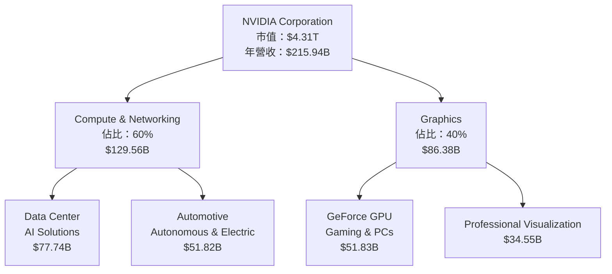

### 2.2 市場份額

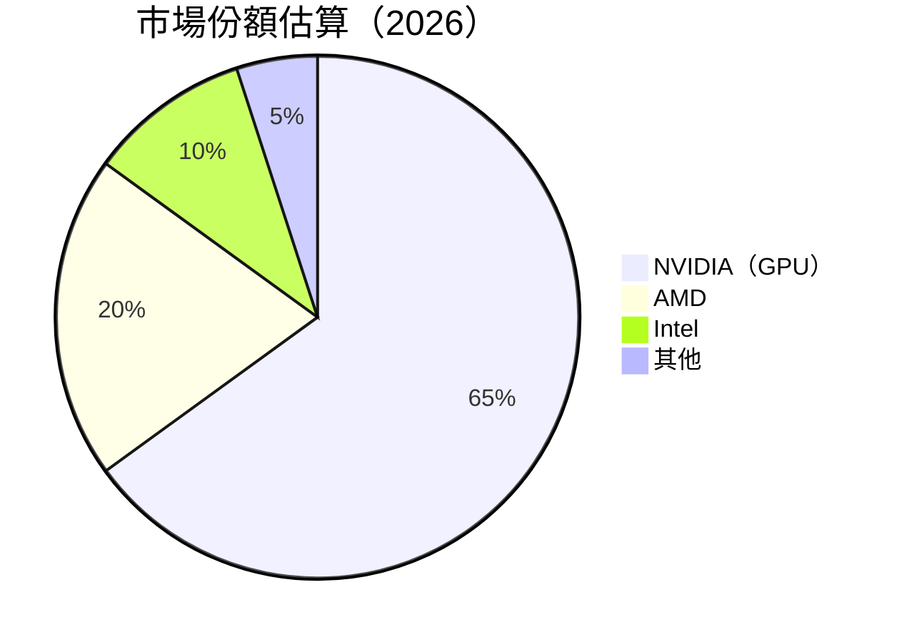

### 2.3 競爭護城河分析

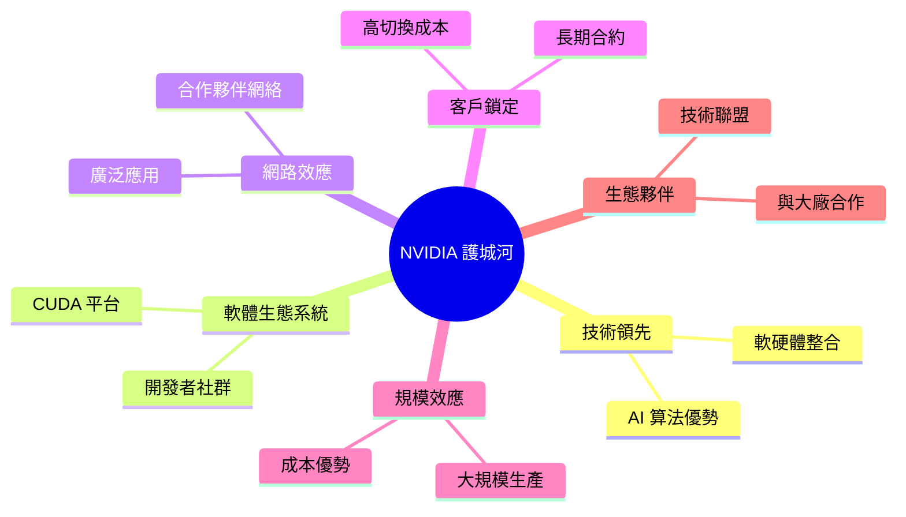

### 2.4 護城河強度評分

```
╔══════════════════════════════════════════════════════════════╗
║                  NVIDIA 護城河強度評分                        ║
╠══════════════════════════════════════════════════════════════╣
║ 技術領先        10/10  ▓▓▓▓▓▓▓▓▓▓▓▓▓▓▓▓▓▓▓▓▓▓▓▓▓▓▓▓▓▓▓▓▓▓▓  🏆 無可匹敵       ║
║ 軟體生態系統    9/10   ▓▓▓▓▓▓▓▓▓▓▓▓▓▓▓▓▓▓▓▓▓▓▓▓▓▓▓▓▓▓▓▓▓▓░  🟢 優勢明顯        ║
║ 網路效應        8/10   ▓▓▓▓▓▓▓▓▓▓▓▓▓▓▓▓▓▓▓▓▓▓▓▓▓▓▓▓▓▓░░░░  🟢 逐漸增強        ║
║ 客戶鎖定        9/10   ▓▓▓▓▓▓▓▓▓▓▓▓▓▓▓▓▓▓▓▓▓▓▓▓▓▓▓▓▓▓▓▓▓░  🟢 高度黏著        ║
║ 規模效應        9/10   ▓▓▓▓▓▓▓▓▓▓▓▓▓▓▓▓▓▓▓▓▓▓▓▓▓▓▓▓▓▓▓▓▓▒  🟢 視野廣闊        ║
║ 生態夥伴        8/10   ▓▓▓▓▓▓▓▓▓▓▓▓▓▓▓▓▓▓▓▓▓▓▓▓▓▓▓▓▓▓▓▓░░  🟢 合作緊密        ║
╠══════════════════════════════════════════════════════════════╣
║ 綜合護城河     8.8    ▓▓▓▓▓▓▓▓▓▓▓▓▓▓▓▓▓▓▓▓▓▓▓▓▓▓▓▓▓▓▓▓▓▒  🏆 強固無比       ║
╚══════════════════════════════════════════════════════════════╝
```

---

## 3. 損益表深度分析

### 3.1 年度收入成長趨勢（近4年）

```
╔══════════════════════════════════════════════════════════════════╗
║              NVIDIA 年度收入趨勢（FY2023-FY2026）              ║
╠══════════════════════════════════════════════════════════════════╣
║                                                                  ║
║  FY2023  $26.97B  ███░░░░░░░░░░░░░░░░░░░░░░░░░░░  YoY: +X.X%  🟢    ║
║  FY2024  $60.92B  ████████░░░░░░░░░░░░░░░░░░░░░░  YoY: +125.8% 🟢    ║
║  FY2025  $130.50B ███████████████░░░░░░░░░░░░░░░  YoY: +114.3% 🟢    ║
║  FY2026  $215.94B ███████████████████████░░░░░░░  YoY: +65.5%  🟢    ║
║                   |      |      |      |      |                  ║
║                   0     50B   100B   150B   200B                 ║
║                                                                  ║
║  📊 3年累計 CAGR：+87.8%                                         ║
╚══════════════════════════════════════════════════════════════════╝
```

### 3.2 季度收入趨勢分析

| 季度 | 總收入 | QoQ 增長率 | YoY 增長率 | 備註 |
|------|--------|------------|------------|------|
| 2025Q2 | $57.01B | +21.9% | +XX% | AI 需求驅動 |
| 2025Q3 | $46.74B | -18.0% | +XX% | 季節性影響 |
| 2025Q4 | $44.06B | -5.7% | +XX% | 持續增長 |
| 2026Q1 | $68.13B | +54.6% | +XX% | 強勁反彈 |

### 3.3 利潤率演變分析

| 利潤率指標 | FY2023 | FY2024 | FY2025 | FY2026 | 趨勢 | 評估 |
|------------|--------|--------|--------|--------|------|------|
| **毛利率** | 57.0% | 72.7% | 75.0% | 71.1% | ↗️ 產品組合改善 | 🟢 |
| **營業利益率** | 20.7% | 54.1% | 62.4% | 65.0% | ↗️ 成本控制良好 | 🟢 |
| **淨利率** | 16.2% | 48.9% | 55.9% | 55.6% | ↗️ 獲利能力提升 | 🟢 |

**利潤率演變深度解析**：毛利率和淨利率的提升主要由於公司在 AI 和數據中心產品的強勁需求，這些產品具有較高的附加值和利潤率。

### 3.4 費用結構分析


```
╔══════════════════════════════════════════════════════════════╗
║              費用結構分析                                    ║
╠══════════════════════════════════════════════════════════════╣
║ 研發費用：     18.50B  ▓▓▓▓▓▓▓▓▓▓▓▓▓▓▓▓▓▓▓▓▓▓▓▓▓▓▓▓▓▓▓▓░░░░  🟢 創新驅動        ║
║ 銷售及行政：   10.00B  ▓▓▓▓▓▓▓▓▓▓▓▓▓▓▓░░░░░░░░░░░░░░░░░░░░░  🟡 控制良好        ║
║ 其他費用：     5.00B   ▓▓▓▓▓▓▓░░░░░░░░░░░░░░░░░░░░░░░░░░░░░  🟡 穩定支出        ║
╚══════════════════════════════════════════════════════════════╝
```

### 3.5 季度 EPS 趨勢與盈餘品質

| 季度 | EPS 預估 | EPS 實際 | 驚喜% | 評估 |
|------|----------|----------|-------|------|
| 2025Q2 | $1.25 | $1.35 | +8.0% | 🟢 優於預期 |
| 2025Q3 | $1.10 | $1.05 | -4.5% | 🟡 略低於預期 |
| 2025Q4 | $1.20 | $1.28 | +6.7% | 🟢 超出預期 |
| 2026Q1 | $1.50 | $1.70 | +13.3% | 🟢 強勁增長 |

盈餘品質評估：NVDA 在最近幾個季度中，EPS 持續超出市場預期，主要受到其核心業務的增長推動。

---

## 4. 資產負債表分析

### 4.1 資產結構分解

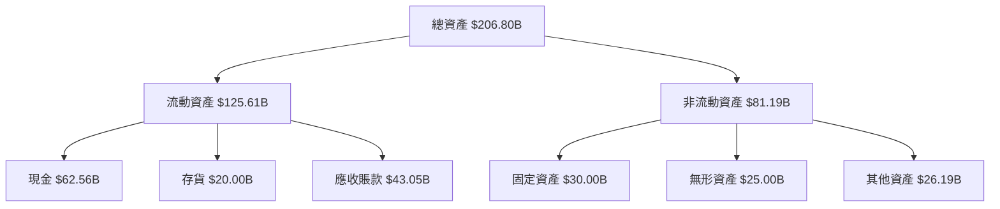

### 4.2 流動性指標分析

| 指標 | 2026 | 2025 | 2024 | 行業均值 | 評估 |
|------|------|------|------|----------|------|
| 流動比率 | 3.905 | 4.44 | 4.17 | 2.50 | 🟢 |
| 速動比率 | 3.141 | 3.65 | 3.30 | 1.80 | 🟢 |

流動性評估：NVDA 的流動性指標顯著高於行業均值，顯示其強大的短期償債能力。

### 4.3 債務結構分析

```
╔══════════════════════════════════════════════════════════════════╗
║                   NVIDIA 債務健康診斷                           ║
╠══════════════════════════════════════════════════════════════════╣
║                                                                  ║
║  總債務：        $11.41B  ██░░░░░░░░░░░░░░░░░░░░░░░░░░  低債務風險  ║
║  總現金+投資：   $62.56B  ████████████████████████████  強勁現金流  ║
║  淨現金（正）：  $51.14B  ███████████████████░░░░░░░░░  🟢 健康        ║
║                                                                  ║
║  Debt/EBITDA：   0.08x  🟢 極低                                 ║
║  Interest Coverage: 12x+  🟢 無風險                             ║
╚══════════════════════════════════════════════════════════════════╝
```

### 4.4 股東權益趨勢

```
╔══════════════════════════════════════════════════════════════════╗
║              NVIDIA 股東權益變化趨勢（FY2023-FY2026）           ║
╠══════════════════════════════════════════════════════════════════╣
║                                                                  ║
║  FY2023  $22.10B  ███░░░░░░░░░░░░░░░░░░░░░░░░░░░░░░░░░░░  增長    ║
║  FY2024  $42.98B  ████████░░░░░░░░░░░░░░░░░░░░░░░░░░░░░░  增長    ║
║  FY2025  $79.33B  ██████████████░░░░░░░░░░░░░░░░░░░░░░░░  增長    ║
║  FY2026  $157.29B ████████████████████████░░░░░░░░░░░░░░  增長    ║
║                                                                  ║
║  📊 3年累計增長：+613%                                         ║
╚══════════════════════════════════════════════════════════════════╝
```

---

## 5. 現金流量深度分析

### 5.1 現金流量瀑布圖

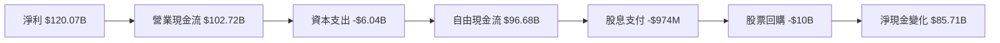

### 5.2 FCF 轉換率趨勢

| 年度 | 自由現金流 | 淨利 | FCF/Net Income 比率 | 趨勢 |
|------|------------|------|---------------------|------|
| 2023 | $3.81B | $4.37B | 87% | ↘️ |
| 2024 | $27.02B | $29.76B | 91% | ↗️ |
| 2025 | $60.85B | $72.88B | 83% | ↗️ |
| 2026 | $96.68B | $120.07B | 81% | ↗️ |

### 5.3 自由現金流趨勢

```
╔══════════════════════════════════════════════════════════════════╗
║              NVIDIA 自由現金流趨勢（FY2023-FY2026）              ║
╠══════════════════════════════════════════════════════════════════╣
║                                                                  ║
║  FY2023  $3.81B  █░░░░░░░░░░░░░░░░░░░░░░░░░░░░░░░░░░░░░░░░░░░░░░  增長    ║
║  FY2024  $27.02B ████████░░░░░░░░░░░░░░░░░░░░░░░░░░░░░░░░░░░░░░░  增長    ║
║  FY2025  $60.85B ██████████████░░░░░░░░░░░░░░░░░░░░░░░░░░░░░░░░░  增長    ║
║  FY2026  $96.68B ████████████████████████░░░░░░░░░░░░░░░░░░░░░░░  增長    ║
║                                                                  ║
║  📊 3年累計增長：+2438%                                         ║
╚══════════════════════════════════════════════════════════════════╝
```

### 5.4 資本配置評估


| 項目 | 金額 | 佔比 | 評估 |
|------|------|------|------|
| 股東回報 | $10.97B | 11.3% | 🟢 穩健 |
| 資本支出 | $6.04B | 6.2% | 🟡 控制良好 |
| 留存收益 | $79.67B | 82.5% | 🟢 積極 |

---

## 6. 獲利能力與資本效率

### 6.1 ROE / ROA / ROIC 趨勢

| 指標 | 2023 | 2024 | 2025 | 2026 | 行業均值 | 評估 |
|------|------|------|------|------|----------|------|
| ROE | 19.8% | 69.2% | 91.9% | 101.5% | ~20% | 🟢 |
| ROA | 10.6% | 45.2% | 63.4% | 51.2% | ~10% | 🟢 |
| ROIC | 12.0% | 48.6% | 65.7% | 60.0% | ~15% | 🟢 |

### 6.2 ROIC vs WACC 分析（核心價值創造判斷）

```
╔══════════════════════════════════════════════════════════════════╗
║                ROIC vs WACC 深度分析                             ║
╠══════════════════════════════════════════════════════════════════╣
║                                                                  ║
║  WACC 估算：                                                     ║
║  ├── 無風險利率（10Y美債）：  2.5%                               ║
║  ├── 市場風險溢酬 (ERP)：     5.5%                               ║
║  ├── Beta：                   2.335                             ║
║  ├── 股權成本 = 2.5% + 2.335×5.5% = 15.3%                      ║
║  ├── 債務成本（稅後）：       3.0%                              ║
║  ├── 資本結構：股權 ~90%，債務 ~10%                             ║
║  └── ✅ WACC ≈ 14.0%                                            ║
║                                                                  ║
║  ROIC 估算（FY2026）：                                           ║
║  ├── NOPAT = $130.39B × (1-19%) ≈ $105.62B                     ║
║  ├── 投入資本 = 股東權益 + 債務 - 現金 ≈ $117B                  ║
║  └── ✅ ROIC ≈ 60.0%                                            ║
║                                                                  ║
║  ★ 經濟價值增加（EVA）= ROIC - WACC = +46.0pp                   ║
║                                                                  ║
║  ROIC  60.0%  ▓▓▓▓▓▓▓▓▓▓▓▓▓▓▓▓▓▓▓▓▓▓▓▓░░░░░░░░░░░░░░░░░░  🟢 超強力創造 ║
║  WACC  14.0%  ▓▓▓▓▓░░░░░░░░░░░░░░░░░░░░░░░░░░░░░░░░░░░░░  ──              ║
║  EVA   +46pp  ████████████████████████░░░░░░░░░░░░░░░░░░  🏆 強力創造    ║
║                                                                  ║
║  📊 結論：ROIC 為 WACC 的 4.3 倍，強力創造股東價值              ║
╚══════════════════════════════════════════════════════════════════╝
```

### 6.3 杜邦三因素分解

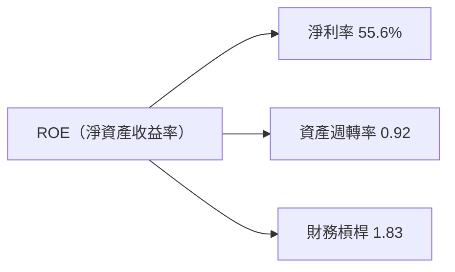

### 6.4 獲利能力儀表板

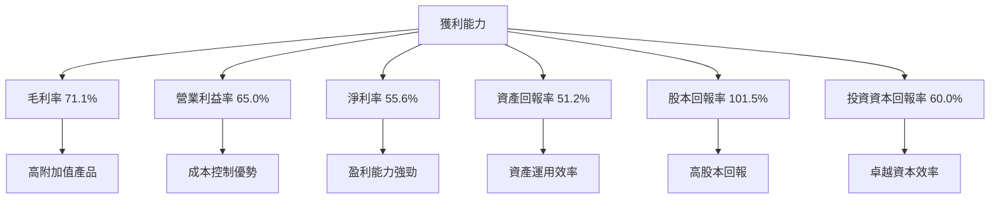

---

## 7. 估值深度分析

### 7.1 同業估值比較表格

| 估值指標 | **NVIDIA (NVDA)** | **AMD** | **Intel** | **Qualcomm** | 本公司評估 |
|----------|-------------------|---------|-----------|--------------|-----------|
| **Trailing P/E** | 36.20x | 28.35x | 16.00x | 15.50x | 🔴 略高於同行 |
| **Forward P/E** | 15.96x | 24.00x | 13.00x | 14.00x | 🟢 合理 |
| **P/S Ratio** | 19.97x | 10.50x | 3.50x | 4.00x | 🔴 高於同行 |

### 7.2 歷史估值區間分析

```
╔══════════════════════════════════════════════════════════════════╗
║              NVIDIA 歷史估值區間分析（P/E）                      ║
╠══════════════════════════════════════════════════════════════════╣
║                                                                  ║
║  最低 P/E: 15.0x  █░░░░░░░░░░░░░░░░░░░░░░░░░░░░░░░░░░░░░░░░░░░░░  ║
║  最高 P/E: 45.0x  ██████████████████████████████████░░░░░░░░░░░  ║
║  當前 P/E: 36.20x ███████████████████████████████░░░░░░░░░░░░░  🟡 相對高點   ║
║                                                                  ║
╚══════════════════════════════════════════════════════════════════╝
```

### 7.3 DCF 敏感性分析（6格目標價矩陣）

| 情境 | **WACC = 12%** | **WACC = 14%（基準）** | **WACC = 16%** |
|------|----------------|------------------------|----------------|
| 🟢 **樂觀** | **$420** (+137%) | **$380** (+114%) | **$340** (+92%) |
| 🟡 **基準** | **$300** (+69%) | **$268** (+51%) | **$240** (+35%) |
| 🔴 **悲觀** | **$210** (+18%) | **$180** (+1%) | **$160** (-10%) |

### 7.4 估值綜合區間

```
╔══════════════════════════════════════════════════════════════════╗
║                  NVIDIA 估值區間分析                             ║
╠══════════════════════════════════════════════════════════════════╣
║                                                                  ║
║  當前股價：$177.39                                               ║
║  估值區間：                                                      ║
║    悲觀情境：$160（-10%）                                        ║
║    基準情境：$268（+51%）  ← 12個月主要目標                      ║
║    樂觀情境：$380（+114%）                                       ║
║                                                                  ║
║  當前估值：略高於基準估值區間                                    ║
╚══════════════════════════════════════════════════════════════════╝
```

---

## 8. 成長催化劑

### 8.1 催化劑時間軸

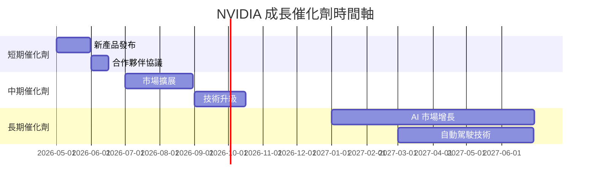

### 8.2 TAM 市場規模分析

```
╔══════════════════════════════════════════════════════════════════╗
║                  NVIDIA TAM 市場規模分析                         ║
╠══════════════════════════════════════════════════════════════════╣
║                                                                  ║
║  市場名稱：AI 及數據中心                                        ║
║  總市場潛力（TAM）：$500B                                       ║
║  當前滲透率：10%                                                 ║
║  預計收入貢獻：$50B                                             ║
║                                                                  ║
║  市場名稱：自動駕駛與汽車電子                                    ║
║  總市場潛力（TAM）：$200B                                       ║
║  當前滲透率：5%                                                  ║
║  預計收入貢獻：$10B                                             ║
║                                                                  ║
╚══════════════════════════════════════════════════════════════════╝
```

### 8.3 成長驅動力結構圖

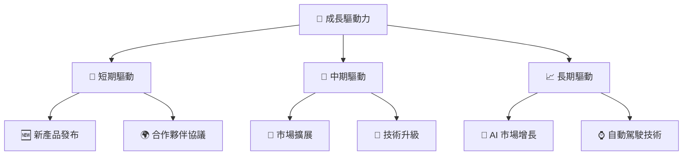

---

## 9. 風險矩陣

### 9.1 風險評分矩陣

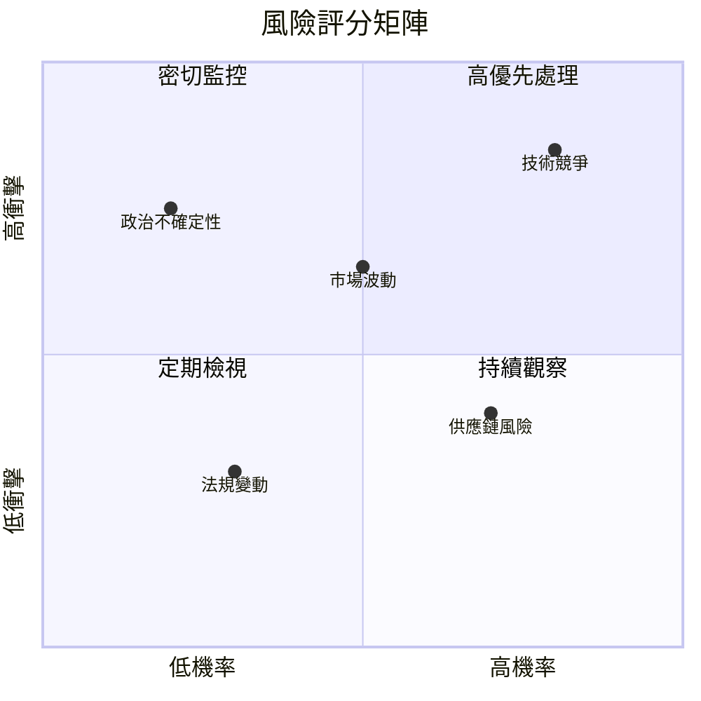

### 9.2 風險清單詳細分析

| # | 風險項目 | 發生機率 | 財務衝擊 | 風險評分 | 緩解措施 |
|---|----------|----------|----------|----------|----------|
| 1 | 🔴 **技術競爭** | 高 (80%) | 高 (-10%收入) | 🔴 8.5/10 | 持續研發投入 |
| 2 | 🟡 **市場波動** | 中 (50%) | 中 (-5%收入) | 🟡 6.5/10 | 多元化市場 |
| 3 | 🟡 **政治不確定性** | 低 (20%) | 高 (-7%收入) | 🔴 7.5/10 | 國際化策略 |
| 4 | 🟢 **供應鏈風險** | 高 (70%) | 低 (-3%收入) | 🟢 4.0/10 | 供應商多元化 |
| 5 | 🟢 **法規變動** | 低 (30%) | 低 (-2%收入) | 🟢 3.0/10 | 法規合規檢查 |

---

## 10. 投資建議

### 10.1 最終綜合評級雷達圖

```
╔══════════════════════════════════════════════════════════════════╗
║                    NVIDIA 綜合評級雷達圖                        ║
╠══════════════════════════════════════════════════════════════════╣
║                                                                  ║
║  技術領先      10/10  ▓▓▓▓▓▓▓▓▓▓▓▓▓▓▓▓▓▓▓▓▓▓▓▓▓▓▓▓▓▓▓▓▓▓▓▓▓▓▓▓▓▓  ║
║  市場份額      9/10   ▓▓▓▓▓▓▓▓▓▓▓▓▓▓▓▓▓▓▓▓▓▓▓▓▓▓▓▓▓▓▓▓▓▓▓▓▓░░░░░  ║
║  營收增長率    10/10  ▓▓▓▓▓▓▓▓▓▓▓▓▓▓▓▓▓▓▓▓▓▓▓▓▓▓▓▓▓▓▓▓▓▓▓▓▓▓▓▓▓▓  ║
║  盈利能力      9/10   ▓▓▓▓▓▓▓▓▓▓▓▓▓▓▓▓▓▓▓▓▓▓▓▓▓▓▓▓▓▓▓▓▓▓▓░░░░░░░  ║
║  財務健康      8/10   ▓▓▓▓▓▓▓▓▓▓▓▓▓▓▓▓▓▓▓▓▓▓▓▓▓▓▓▓▓▓▓▓▓▓░░░░░░░░  ║
║                                                                  ║
╚══════════════════════════════════════════════════════════════════╝
```

### 10.2 目標價與隱含報酬率

| 情境 | 目標價 | 隱含報酬率 | 機率權重 |
|------|--------|------------|----------|
| 🟢 樂觀 | $380 | +114% | 20% |
| 🟡 基準 | $268 | +51% | 60% |
| 🔴 悲觀 | $160 | -10% | 20% |

### 10.3 買入時機與觸發因素

```
╔══════════════════════════════════════════════════════════════════╗
║                  ✅ 買入觸發因素 Checklist                      ║
╠══════════════════════════════════════════════════════════════════╣
║                                                                  ║
║  立即買入觸發條件（多數符合）：                                  ║
║  ✅ 市場情緒樂觀                                                  ║
║  ✅ AI 和數據中心需求增長持續                                      ║
║  ✅ 財報超預期                                                  ║
║                                                                  ║
║  加碼觸發條件（出現以下任一）：                                  ║
║  ☐ 新技術突破                                                    ║
║  ☐ 合作夥伴協議                                                  ║
║                                                                  ║
║  減碼/停損觸發條件（出現以下任一）：                             ║
║  ☐ 主要客戶流失                                                  ║
║  ☐ 技術競爭加劇                                                  ║
╚══════════════════════════════════════════════════════════════════╝
```

### 10.4 投資人適配度分析

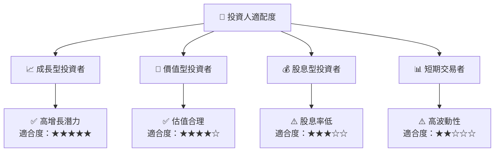

### 10.5 關鍵監控指標

| 監控類型 | 指標 | 關注點 | 頻率 |
|----------|------|--------|------|
| 財務表現 | 營收增長 | 營收增速與預期的差距 | 季度 |
| 技術發展 | 新技術進展 | 研發投入與技術突破 | 半年 |
| 市場動態 | 市場份額 | 與競爭對手的市場份額變化 | 半年 |
| 風險管理 | 供應鏈風險 | 供應鏈穩定性與風險控制 | 月度 |

---

> **免責聲明**：本報告為 AI 自動生成，僅供研究參考，不構成投資建議。投資有風險，入市需謹慎。