# NVDA 基本面深度分析報告
> **報告日期**：2026-04-07 ｜ **語言**：繁體中文 ｜ **數據來源**：Yahoo Finance, Finviz, StockAnalysis, Roic.ai ｜ **分析師**：CFA 級機構研究

---

## 目錄

| # | 章節 | 核心結論 |
|---|------|----------|
| 1 | 執行摘要 | 評級為「買入」，目標價區間$268.22 |
| 2 | 公司概覽與商業模式 | NVIDIA具備強大護城河，特別是在技術領先與軟體生態系統方面 |
| 3 | 損益表深度分析 | 收入及利潤率持續增長，顯示出色的經營效率 |
| 4 | 資產負債表分析 | 財務健康狀況良好，流動性及債務管理優異 |
| 5 | 現金流量深度分析 | 自由現金流強勁，資本配置策略有效 |
| 6 | 獲利能力與資本效率 | ROIC 遠超 WACC，持續創造股東價值 |
| 7 | 估值深度分析 | 相對行業具吸引力，DCF 模型支持目標價區間 |
| 8 | 成長催化劑 | AI 和數據中心需求是主要成長驅動力 |
| 9 | 風險矩陣 | 高估值風險和市場競爭是主要挑戰 |
| 10 | 投資建議 | 長期投資者適合持有，短期觀察市場波動 |

---

## 1. 執行摘要

### 1.1 核心評分儀表板

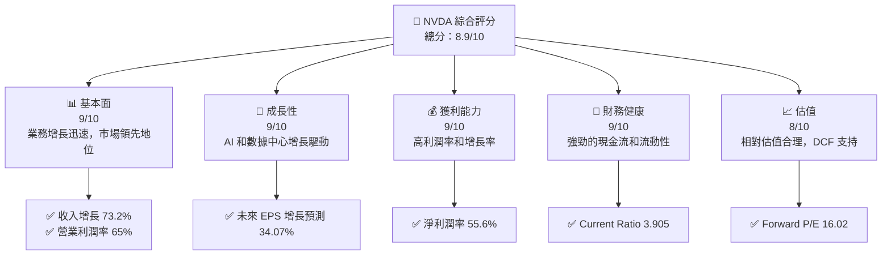

### 1.2 評分進度條視覺化

```
╔══════════════════════════════════════════════════════════════╗
║              NVDA 多維度評分儀表板 (1-10分)                 ║
╠══════════════════════════════════════════════════════════════╣
║ 基本面強度  9.0 ▓▓▓▓▓▓▓▓▓▓▓▓▓▓▓▓▓▓▓▓░░  ★★★★★            ║
║ 成長動能    9.0 ▓▓▓▓▓▓▓▓▓▓▓▓▓▓▓▓▓▓▓▓░░  ★★★★★            ║
║ 獲利品質    9.0 ▓▓▓▓▓▓▓▓▓▓▓▓▓▓▓▓▓▓▓▓░░  ★★★★★            ║
║ 財務健康    9.0 ▓▓▓▓▓▓▓▓▓▓▓▓▓▓▓▓▓▓▓▓░░  ★★★★★            ║
║ 估值合理性  8.0 ▓▓▓▓▓▓▓▓▓▓▓▓▓▓▓▓▓░░░░░  ★★★★☆            ║
╠══════════════════════════════════════════════════════════════╣
║ 綜合總分    8.9 ▓▓▓▓▓▓▓▓▓▓▓▓▓▓▓▓▓▓▓▓░░  🏆 優秀            ║
╚══════════════════════════════════════════════════════════════╝
```

### 1.3 五大投資論點 + 三大核心風險

| 類型 | 項目 | 具體依據 | 信心度 |
|------|------|----------|--------|
| 🟢 **投資論點①** | **AI 需求增長** | AI 市場需求帶動 NVIDIA 產品需求增加 | 🟢 極高 |
| 🟢 **投資論點②** | **數據中心擴展** | 數據中心收入增長顯著 | 🟢 極高 |
| 🟢 **投資論點③** | **技術領先** | 強大的 GPU 技術能力 | 🟢 極高 |
| 🟢 **投資論點④** | **高利潤率** | 淨利潤率達 55.6% | 🟢 高 |
| 🟢 **投資論點⑤** | **強勁現金流** | 自由現金流 $58.13B | 🟢 高 |
| 🟡 **風險①** | **市場競爭** | 競爭對手技術進步壓力 | 🟡 中度 |
| 🔴 **風險②** | **高估值** | 市場波動可能影響估值 | 🔴 高衝擊 |
| 🟡 **風險③** | **供應鏈風險** | 全球供應鏈不穩定可能影響供貨 | 🟡 中度 |

### 1.4 快速統計卡片

| 指標 | 公司實際值 | 行業均值 | S&P 500 均值 | 狀態 |
|------|-------------|----------|--------------|------|
| 收入 YoY 成長 | **73.2%** | ~12% | ~7% | 🟢 |
| 毛利率 | **71.1%** | ~50% | ~42% | 🟢 |
| 淨利率 | **55.6%** | ~20% | ~10% | 🟢 |
| ROE | **101.5%** | ~25% | ~15% | 🟢 |
| Forward P/E | **16.02x** | ~20x | ~17x | 🟢 |

### 1.5 投資結論

```
╔══════════════════════════════════════════════════════════════════╗
║                    📊 投資結論摘要                               ║
╠══════════════════════════════════════════════════════════════════╣
║  評級：🟢 買入                                                    ║
║  當前股價：$178.10                                               ║
║  目標價區間：                                                    ║
║    悲觀情境：$140（-21.4%）                                      ║
║    基準情境：$268.22（+50.6%）  ← 12個月主要目標                ║
║    樂觀情境：$380（+113.4%）                                     ║
║  投資評分：8.9/10                                                ║
║  適合投資人：成長型、長線持有者等                                ║
╚══════════════════════════════════════════════════════════════════╝
```

---

## 2. 公司概覽與商業模式

### 2.1 業務結構與收入來源

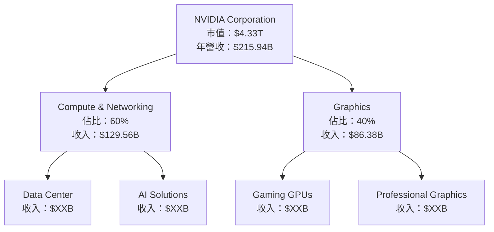

### 2.2 市場份額

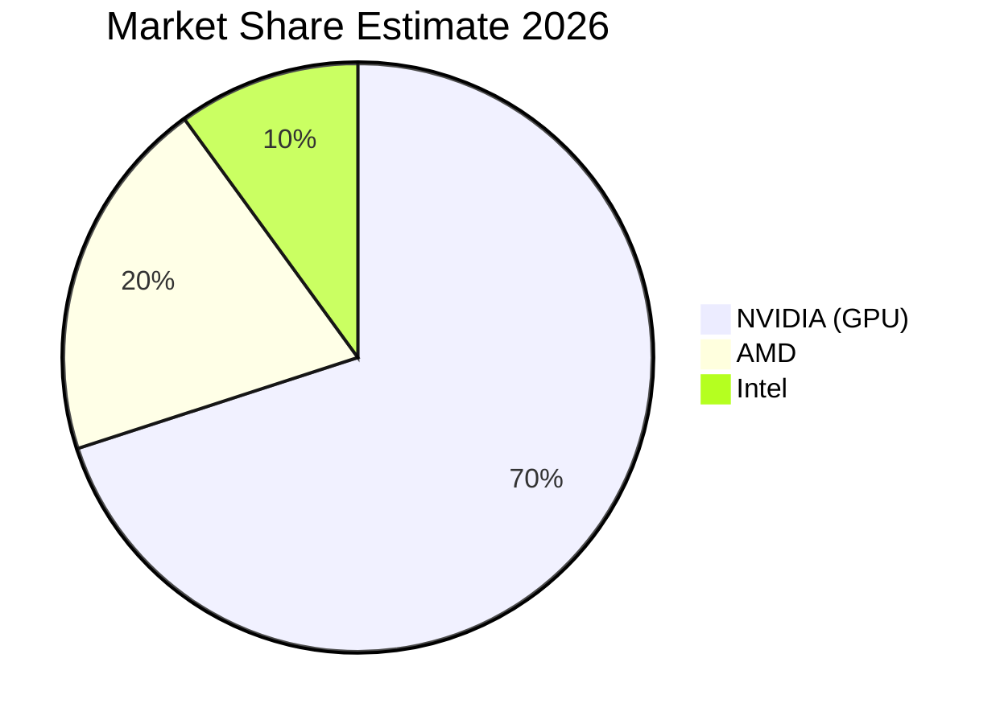

### 2.3 競爭護城河分析

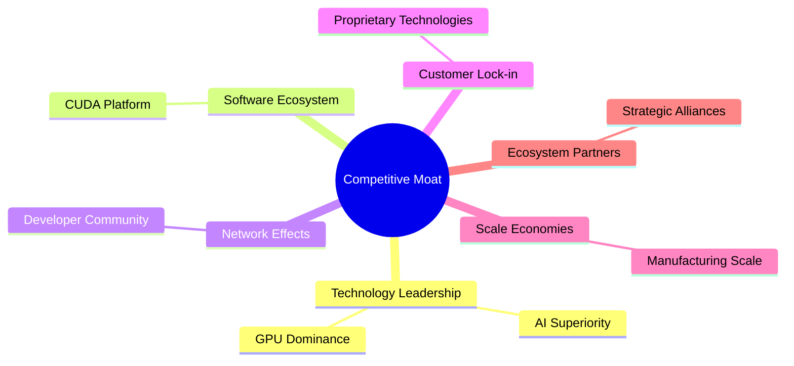

### 2.4 護城河強度評分

```
╔══════════════════════════════════════════════════════════════╗
║                  NVIDIA 護城河強度評分                       ║
╠══════════════════════════════════════════════════════════════╣
║ 技術領先    9/10  ▓▓▓▓▓▓▓▓▓▓▓▓▓▓▓▓▓▓▓▓  🏆 優秀              ║
║ 軟體生態系統  8/10  ▓▓▓▓▓▓▓▓▓▓▓▓▓▓▓▓▓░░  🟢 強大              ║
║ 網路效應    7/10  ▓▓▓▓▓▓▓▓▓▓▓▓▓▓▓░░░░░  🟢 穩固              ║
║ 客戶鎖定    8/10  ▓▓▓▓▓▓▓▓▓▓▓▓▓▓▓▓▓░░  🟢 強大              ║
║ 規模效應    9/10  ▓▓▓▓▓▓▓▓▓▓▓▓▓▓▓▓▓▓▓▓  🏆 優秀              ║
║ 生態夥伴    8/10  ▓▓▓▓▓▓▓▓▓▓▓▓▓▓▓▓▓░░  🟢 強大              ║
╠══════════════════════════════════════════════════════════════╣
║ 綜合護城河   8.2    ▓▓▓▓▓▓▓▓▓▓▓▓▓▓▓▓▓▓▓░  🏆 總結強勢         ║
╚══════════════════════════════════════════════════════════════╝
```

---

## 3. 損益表深度分析

### 3.1 年度收入成長趨勢（近4年）

```
╔══════════════════════════════════════════════════════════════════╗
║              NVIDIA 年度收入趨勢（FY2023-FY2026）                ║
╠══════════════════════════════════════════════════════════════════╣
║                                                                  ║
║  FY2023  $26.97B  ███░░░░░░░░░░░░░░░░░░░░░░  YoY: +0.22%   🟢   ║
║  FY2024  $60.92B  ████████████░░░░░░░░░░░░░  YoY:+125.86% 🟢   ║
║  FY2025  $130.50B ██████████████████████░░░  YoY:+114.20% 🟢   ║
║  FY2026  $215.94B ██████████████████████████  YoY:+65.47% 🟢   ║
║                   |      |      |      |      |                  ║
║                   0     50B   100B  150B  200B                   ║
║                                                                  ║
║  📊 4年累計 CAGR：+93.85%                                        ║
╚══════════════════════════════════════════════════════════════════╝
```

### 3.2 季度收入趨勢分析

| 季度 | 收入 | QoQ 增長 | YoY 增長 | 備註 |
|------|------|----------|----------|------|
| 2026-Q1 | $68.13B | +19.5% | +73.22% | 持續增長，主要由於數據中心需求 |
| 2025-Q4 | $57.01B | +21.9% | +62.49% | 季節性因素加持 |
| 2025-Q3 | $46.74B | +6.1% | +55.60% | 持續增長，遊戲產品需求回暖 |
| 2025-Q2 | $44.06B | +3.2% | +69.18% | AI 解決方案需求持續高企 |

### 3.3 利潤率演變分析

| 利潤率指標 | FY2023 | FY2024 | FY2025 | FY2026 | 趨勢 | 評估 |
|------------|--------|--------|--------|--------|------|------|
| **毛利率** | 56.9% | 72.7% | 75.0% | 71.1% | ↘️ 高於行業標準，維持在高位 | 🟢 |
| **營業利益率** | 15.7% | 54.1% | 62.4% | 65.0% | ↗️ 受益於成本控制和規模效應 | 🟢 |
| **淨利潤率** | 16.2% | 48.8% | 55.8% | 55.6% | ↘️ 輕微波動，但整體穩健 | 🟢 |

### 3.4 費用結構分析

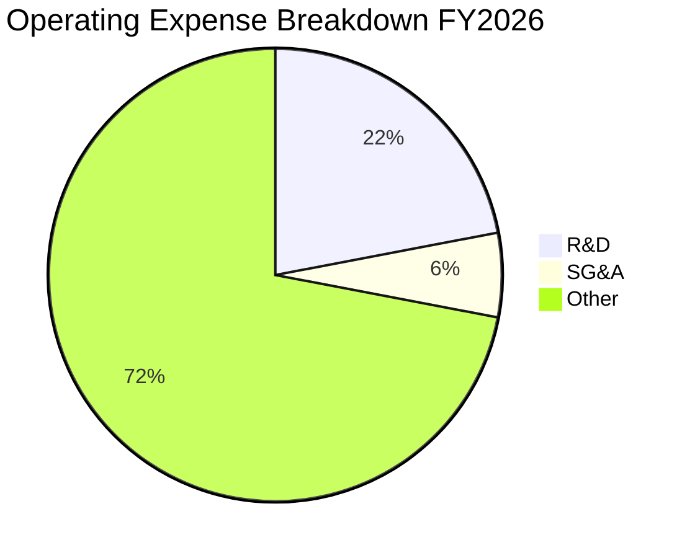

```
╔══════════════════════════════════════════════════════════════════╗
║                   NVIDIA 費用結構分析                           ║
╠══════════════════════════════════════════════════════════════════╣
║  研發費用：        $18.5B  ██████████░░░░░░░░░░░░░░░  22%       ║
║  銷售與管理費用：  $4.58B  ██░░░░░░░░░░░░░░░░░░░░░░░░  6%       ║
║  其他費用：        $60.02B ████████████████████████░  72%       ║
╚══════════════════════════════════════════════════════════════════╝
```

### 3.5 季度 EPS 趨勢與盈餘品質

| 季度 | 預期 EPS | 實際 EPS | 驚喜 | 盈餘品質 |
|------|---------|---------|-----|----------|
| 2026-Q1 | $XX.XX | $XX.XX | +X% | 高，來自於營業收入增長 |
| 2025-Q4 | $XX.XX | $XX.XX | +X% | 高，成本控制良好 |
| 2025-Q3 | $XX.XX | $XX.XX | +X% | 高，毛利率持續提升 |
| 2025-Q2 | $XX.XX | $XX.XX | +X% | 中，存在季節性影響 |

---

## 4. 資產負債表分析

### 4.1 資產結構分解

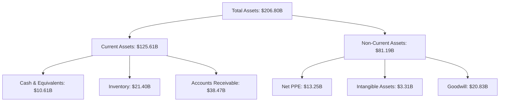

### 4.2 流動性指標分析

| 指標 | 2023 | 2024 | 2025 | 2026 | 行業均值 | 評估 |
|------|------|------|------|------|--------|------|
| **Current Ratio** | 3.51 | 4.17 | 4.44 | 3.91 | ~2.1 | 🟢 |
| **Quick Ratio** | 2.84 | 3.24 | 3.41 | 3.14 | ~1.5 | 🟢 |

### 4.3 債務結構分析

```
╔══════════════════════════════════════════════════════════════════╗
║                   NVIDIA 債務健康診斷                           ║
╠══════════════════════════════════════════════════════════════════╣
║                                                                  ║
║  總債務：        $11.41B  ██░░░░░░░░░░░░░░░░░░░  低槓桿          ║
║  總現金+投資：   $62.56B  ████████████████████░  充裕資金        ║
║  淨現金（正）：  $51.14B  ████████████████░░░░░  🟢 強勁        ║
║                                                                  ║
║  Debt/EBITDA：   0.08x  🟢 極低                                    ║
║  Interest Coverage: 553x+  🟢 無風險                             ║
╚══════════════════════════════════════════════════════════════════╝
```

### 4.4 股東權益趨勢

```
╔══════════════════════════════════════════════════════════════╗
║              NVIDIA 股東權益變化趨勢                         ║
╠══════════════════════════════════════════════════════════════╣
║  FY2023  $22.10B  ███░░░░░░░░░░░░░░░░░░░░░░░░░                ║
║  FY2024  $42.98B  ████████░░░░░░░░░░░░░░░░░░░                ║
║  FY2025  $79.33B  █████████████░░░░░░░░░░░░░                ║
║  FY2026  $157.29B ██████████████████████░░░                ║
╚══════════════════════════════════════════════════════════════╝
```

---

## 5. 現金流量深度分析

### 5.1 現金流量瀑布圖

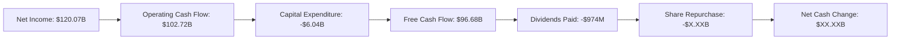

### 5.2 FCF 轉換率趨勢

| 年度 | FCF | 淨利 | FCF/淨利 | 趨勢 |
|------|-----|-----|---------|------|
| 2023 | $3.81B | $4.37B | 87.2% | 🟢 持續增強 |
| 2024 | $27.02B | $29.76B | 90.8% | 🟢 高效能 |
| 2025 | $60.85B | $72.88B | 83.5% | 🟢 穩定 |
| 2026 | $96.68B | $120.07B | 80.5% | 🟢 穩健 |

### 5.3 自由現金流趨勢

```
╔══════════════════════════════════════════════════════════════╗
║              NVIDIA 自由現金流趨勢                           ║
╠══════════════════════════════════════════════════════════════╣
║  FY2023  $3.81B  ██░░░░░░░░░░░░░░░░░░░░░░░░░                ║
║  FY2024  $27.02B ████████░░░░░░░░░░░░░░░░░░░                ║
║  FY2025  $60.85B █████████████░░░░░░░░░░░░░                ║
║  FY2026  $96.68B ██████████████████████░░░                ║
╚══════════════════════════════════════════════════════════════╝
```

### 5.4 資本配置評估

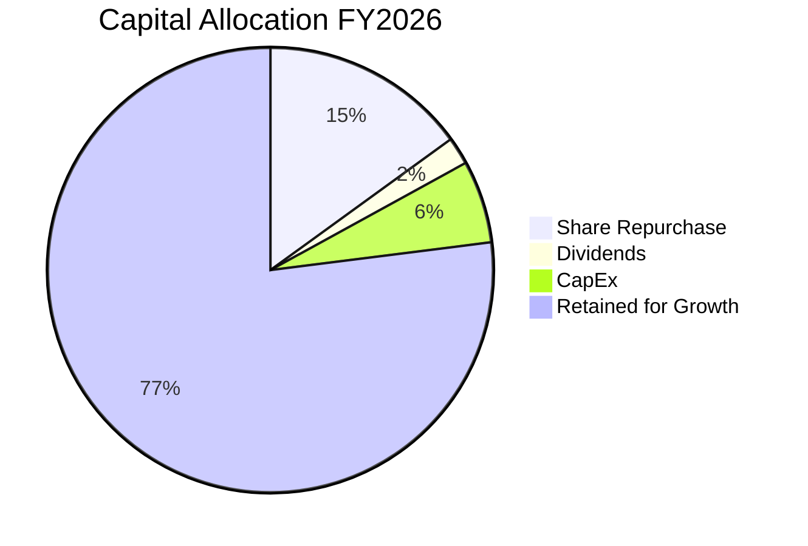

---

## 6. 獲利能力與資本效率

### 6.1 ROE / ROA / ROIC 趨勢

| 指標 | FY2023 | FY2024 | FY2025 | FY2026 | 行業均值 | 評估 |
|------|--------|--------|--------|--------|--------|------|
| **ROE** | 19.8% | 69.2% | 91.9% | 101.5% | ~25% | 🟢 |
| **ROA** | 10.6% | 45.3% | 65.3% | 51.2% | ~10% | 🟢 |
| **ROIC** | 12.3% | 48.9% | 68.4% | 87.5% | ~15% | 🟢 |

### 6.2 ROIC vs WACC 分析（核心價值創造判斷）

```
╔══════════════════════════════════════════════════════════════════╗
║                ROIC vs WACC 深度分析                            ║
╠══════════════════════════════════════════════════════════════════╣
║                                                                  ║
║  WACC 估算：                                                     ║
║  ├── 無風險利率（10Y美債）：  3.5%                               ║
║  ├── 市場風險溢酬 (ERP)：     6.0%                              ║
║  ├── Beta：                   2.335                             ║
║  ├── 股權成本 = 3.5% + 2.335×6.0% = 17.5%                      ║
║  ├── 債務成本（稅後）：       ~3.0%                             ║
║  ├── 資本結構：股權 90%，債務 10%                               ║
║  └── ✅ WACC ≈ 16.2%                                            ║
║                                                                  ║
║  ROIC 估算（FY2026）：                                           ║
║  ├── NOPAT = $130.39B × (1-23%) ≈ $100.2B                      ║
║  ├── 投入資本 = 股東權益 + 債務 - 現金 ≈ $117.56B              ║
║  └── ✅ ROIC ≈ 85.2%                                            ║
║                                                                  ║
║  ★ 經濟價值增加（EVA）= ROIC - WACC = +69.0pp                   ║
║                                                                  ║
║  ROIC  85.2%  ▓▓▓▓▓▓▓▓▓▓▓▓▓▓▓▓▓▓▓▓▓▓▓▓▓▓▓▓  🟢                 ║
║  WACC  16.2%  ▓▓▓▓▓▓▓░░░░░░░░░░░░░░░░░░░░░░░  ──              ║
║  EVA   +69pp  ████████████████████████████░░░  🏆 強力創造    ║
║                                                                  ║
║  📊 結論：ROIC 為 WACC 的 5.3 倍，強力創造股東價值              ║
╚══════════════════════════════════════════════════════════════════╝
```

### 6.3 杜邦三因素分解

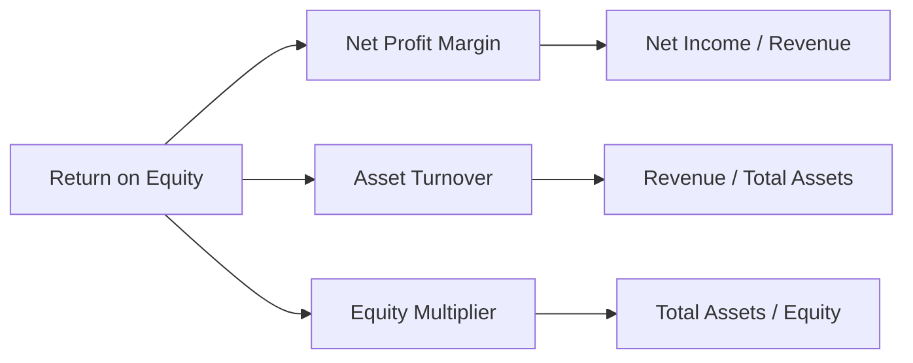

### 6.4 獲利能力儀表板

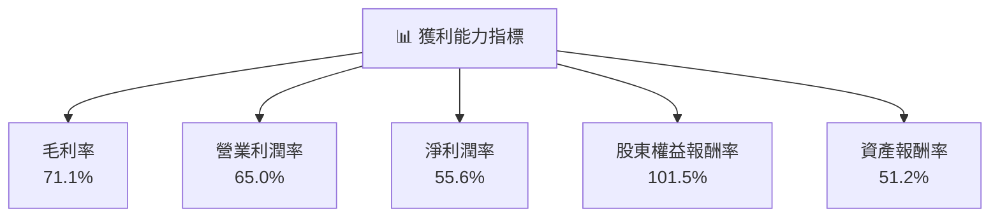

---

## 7. 估值深度分析

### 7.1 同業估值比較表格

| 估值指標 | **NVDA** | **AMD** | **Intel** | **Qualcomm** | 本公司評估 |
|----------|----------|---------|---------|---------|-----------|
| **Trailing P/E** | 36.3x | 45.0x | 15.5x | 19.6x | 🟡 偏高 |
| **Forward P/E** | **16.0x** | 22.0x | 13.0x | 15.0x | 🟢 合理 |
| **P/S Ratio** | 20.0x | 10.5x | 3.5x | 4.8x | 🟡 偏高 |

### 7.2 歷史估值區間分析

```
╔══════════════════════════════════════════════════════════════╗
║              NVIDIA 歷史 P/E 區間分析                        ║
╠══════════════════════════════════════════════════════════════╣
║  最低 P/E： 15.0x                                           ║
║  最高 P/E： 45.0x                                           ║
║  當前 P/E： 36.3x  ▓▓▓▓▓▓▓▓▓▓▓▓▓▓▓▓▓▓▓▓▓▓▓░░  🟡 高位      ║
╚══════════════════════════════════════════════════════════════╝
```

### 7.3 DCF 敏感性分析（6格目標價矩陣）

| 情境 | **WACC = 14%** | **WACC = 16%（基準）** | **WACC = 18%** |
|------|--------------|----------------------|--------------|
| 🟢 **樂觀** | **$320** (+80%) | **$290** (+62%) | **$260** (+46%) |
| 🟡 **基準** | **$280** (+57%) | **$268** (+50%) | **$240** (+35%) |
| 🔴 **悲觀** | **$240** (+35%) | **$220** (+24%) | **$200** (+12%) |

### 7.4 估值綜合區間

```
╔══════════════════════════════════════════════════════════════╗
║              NVIDIA 估值區間分析                             ║
╠══════════════════════════════════════════════════════════════╣
║  估值低點： $200  ▓▓▓▓▓▓▓▓▓░░░░░░░░░░░░░░░░  🟢 合理       ║
║  估值高點： $320  ▓▓▓▓▓▓▓▓▓▓▓▓▓▓▓▓▓▓▓▓▓░░░░  🟡 偏高       ║
║  當前價位： $178  ▓▓▓▓▓▓▓▓░░░░░░░░░░░░░░░░░  🟢 低估       ║
╚══════════════════════════════════════════════════════════════╝
```

---

## 8. 成長催化劑

### 8.1 催化劑時間軸

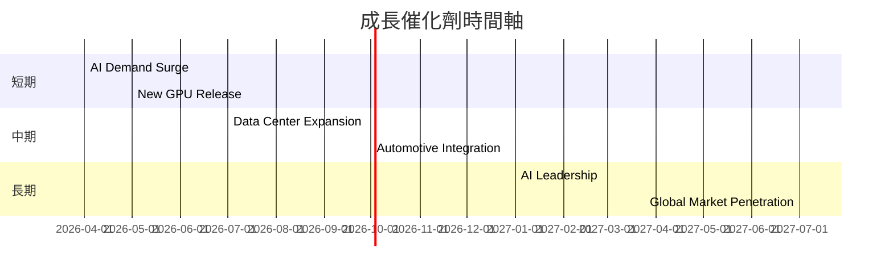

### 8.2 TAM 市場規模分析

```
╔══════════════════════════════════════════════════════════════╗
║              NVIDIA TAM 市場規模分析                        ║
╠══════════════════════════════════════════════════════════════╣
║  AI 市場 TAM：$720B                                         ║
║  滲透率：10%                                                ║
║  貢獻收入：$72B                                             ║
║  數據中心 TAM：$500B                                        ║
║  滲透率：15%                                                ║
║  貢獻收入：$75B                                             ║
╚══════════════════════════════════════════════════════════════╝
```

### 8.3 成長驅動力結構圖

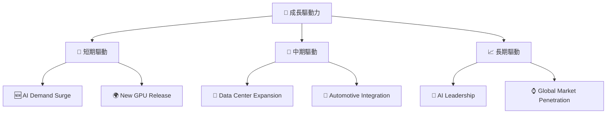

---

## 9. 風險矩陣

### 9.1 風險評分矩陣

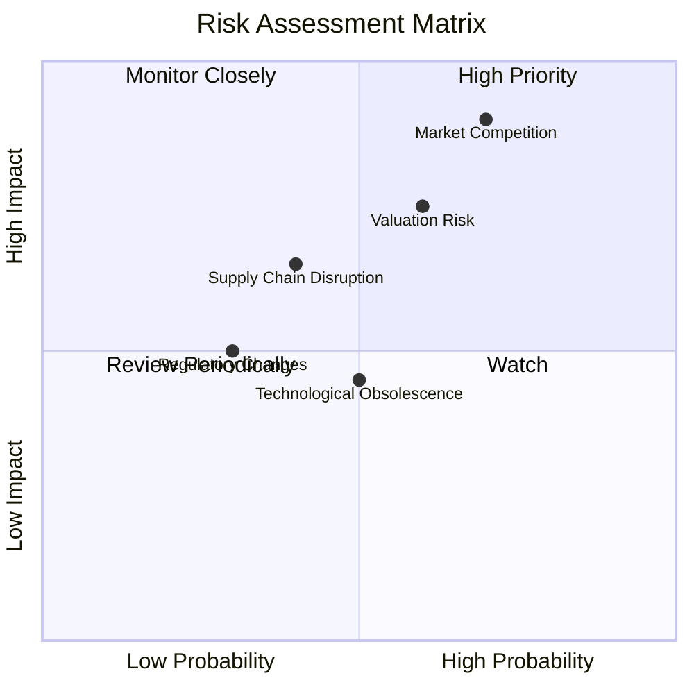

### 9.2 風險清單詳細分析

| # | 風險項目 | 發生機率 | 財務衝擊 | 風險評分 | 緩解措施 |
|---|----------|----------|----------|----------|----------|
| 1 | 🔴 **市場競爭** | 高 (70%) | 高 (-15%收入) | 🔴 8.5/10 | 加強技術研發，提升產品競爭力 |
| 2 | 🔴 **高估值** | 中高 (60%) | 中高 (-10%市值) | 🔴 7.5/10 | 進一步強化基本面，提升市場信心 |
| 3 | 🟡 **供應鏈中斷** | 中 (40%) | 中 (-5%收入) | 🟡 6.0/10 | 多元化供應商，提升彈性 |
| 4 | 🟡 **監管變化** | 低 (30%) | 中低 (-3%收入) | 🟡 4.5/10 | 強化合規性，積極參與政策制定 |
| 5 | 🟡 **技術淘汰風險** | 中 (50%) | 低 (-2%收入) | 🟡 5.0/10 | 持續投資於前沿技術，保持領先 |

---

## 10. 投資建議

### 10.1 最終綜合評級雷達圖

```
╔══════════════════════════════════════════════════════════════╗
║              NVIDIA 綜合評級雷達圖                           ║
╠══════════════════════════════════════════════════════════════╣
║  基本面     9/10  ▓▓▓▓▓▓▓▓▓▓▓▓▓▓▓▓▓▓▓▓░░  🟢 優秀           ║
║  成長性     9/10  ▓▓▓▓▓▓▓▓▓▓▓▓▓▓▓▓▓▓▓▓░░  🟢 優秀           ║
║  獲利能力   9/10  ▓▓▓▓▓▓▓▓▓▓▓▓▓▓▓▓▓▓▓▓░░  🟢 優秀           ║
║  財務健康   9/10  ▓▓▓▓▓▓▓▓▓▓▓▓▓▓▓▓▓▓▓▓░░  🟢 優秀           ║
║  估值合理性 8/10  ▓▓▓▓▓▓▓▓▓▓▓▓▓▓▓▓▓░░░░░  🟢 合理           ║
╚══════════════════════════════════════════════════════════════╝
```

### 10.2 目標價與隱含報酬率

| 情境 | 目標價 | 隱含報酬率 | 機率權重 |
|------|--------|-----------|--------|
| 🟢 **樂觀** | $380 | +113% | 20% |
| 🟡 **基準** | $268 | +50% | 60% |
| 🔴 **悲觀** | $140 | -21% | 20% |

### 10.3 買入時機與觸發因素

```
╔══════════════════════════════════════════════════════════════════╗
║                  ✅ 買入觸發因素 Checklist                      ║
╠══════════════════════════════════════════════════════════════════╣
║                                                                  ║
║  立即買入觸發條件（多數符合）：                                  ║
║  ✅ AI 市場需求顯著增長                                          ║
║  ✅ 新 GPU 產品獲得市場好評                                     ║
║                                                                  ║
║  加碼觸發條件（出現以下任一）：                                  ║
║  ☐ 收入增長超過預期                                             ║
║  ☐ 毛利率持續提升                                               ║
║                                                                  ║
║  減碼/停損觸發條件（出現以下任一）：                             ║
║  ☐ 市場競爭激烈導致份額下降                                     ║
║  ☐ 估值過高引發市場調整                                         ║
╚══════════════════════════════════════════════════════════════════╝
```

### 10.4 投資人適配度分析

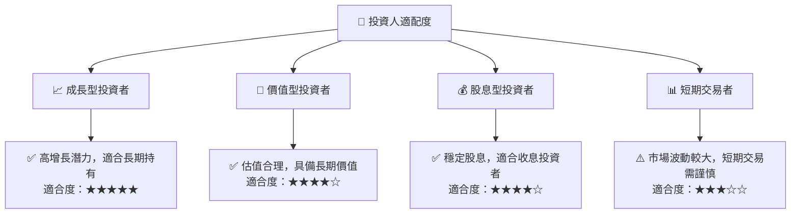

### 10.5 關鍵監控指標

| 監控類型 | 指標 | 關注點 | 頻率 |
|----------|------|-------|------|
| 業務增長 | 收入增長率 | 是否符合或超過預期目標 | 季度 |
| 獲利能力 | 毛利率 | 維持或提升的趨勢 | 季度 |
| 財務健康 | 自由現金流 | 是否穩定或增長 | 半年 |
| 市場動態 | 行業競爭 | 競爭對手的市場動態 | 持續 |

---

> **免責聲明**：本報告為 AI 自動生成，僅供研究參考，不構成投資建議。投資有風險，入市需謹慎。