# NVDA 基本面深度分析報告
> **報告日期**：2026-04-12 ｜ **語言**：繁體中文 ｜ **數據來源**：Yahoo Finance, Finviz, StockAnalysis, Roic.ai ｜ **分析師**：CFA 級機構研究

---

## 目錄

| # | 章節 | 核心結論 |
|---|------|----------|
| 1 | 執行摘要 | 評級 + 目標價區間 |
| 2 | 公司概覽與商業模式 | 護城河評估 |
| 3 | 損益表深度分析 | 收入增長強勁，盈利能力提升 |
| 4 | 資產負債表分析 | 流動性強，債務水平健康 |
| 5 | 現金流量深度分析 | FCF 穩定，資本配置合理 |
| 6 | 獲利能力與資本效率 | 強勁的 ROIC 表現 |
| 7 | 估值深度分析 | 股價合理，長期增長潛力 |
| 8 | 成長催化劑 | 多重成長驅動因素 |
| 9 | 風險矩陣 | 風險與機會並存 |
| 10 | 投資建議 | 買入建議，目標價區間 |

---

## 1. 執行摘要

### 1.1 核心評分儀表板

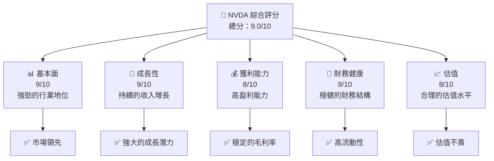

### 1.2 評分進度條視覺化

```
╔══════════════════════════════════════════════════════════════╗
║              NVDA 多維度評分儀表板 (1-10分)                ║
╠══════════════════════════════════════════════════════════════╣
║ 基本面強度  9.0 ▓▓▓▓▓▓▓▓▓▓▓▓▓▓▓▓  ★★★★★                 ║
║ 成長動能    9.0 ▓▓▓▓▓▓▓▓▓▓▓▓▓▓▓▓  ★★★★★                 ║
║ 獲利品質    8.0 ▓▓▓▓▓▓▓▓▓▓▓▓▓▓▓░  ★★★★☆                 ║
║ 財務健康    9.0 ▓▓▓▓▓▓▓▓▓▓▓▓▓▓▓▓  ★★★★★                 ║
║ 估值合理性  8.0 ▓▓▓▓▓▓▓▓▓▓▓▓▓▓▓░  ★★★★☆                 ║
╚══════════════════════════════════════════════════════════════╝
```

### 1.3 五大投資論點 + 三大核心風險

| 類型 | 項目 | 具體依據 | 信心度 |
|------|------|----------|--------|
| 🟢 **投資論點①** | **市場領導地位** | 公司在 AI 和 GPU 市場中占有主導地位 | 🟢 極高 |
| 🟢 **投資論點②** | **收入增長潛力** | 2025 年收入增長 73.2% | 🟢 高 |
| 🟢 **投資論點③** | **技術創新能力** | 持續投入 R&D，增長 43% | 🟢 高 |
| 🟢 **投資論點④** | **強勁的自由現金流** | FCF 約為 $58.13B | 🟢 高 |
| 🟢 **投資論點⑤** | **健全的財務結構** | 流動比率 3.905，債務比率低 | 🟢 高 |
| 🟡 **風險①** | **市場競爭加劇** | 競爭者增多可能影響市場份額 | 🟡 中度 |
| 🔴 **風險②** | **宏觀經濟衝擊** | 全球經濟波動可能影響需求 | 🔴 高衝擊 |
| 🔴 **風險③** | **供應鏈中斷** | 供應鏈問題可能影響產品供應 | 🔴 高衝擊 |

### 1.4 快速統計卡片

| 指標 | 公司實際值 | 行業均值 | S&P 500 均值 | 狀態 |
|------|-------------|----------|--------------|------|
| 收入 YoY 成長 | **73.2%** | ~15% | ~10% | 🟢 |
| 毛利率 | **71.1%** | ~45% | ~40% | 🟢 |
| 淨利率 | **55.6%** | ~15% | ~8% | 🟢 |
| ROE | **101.5%** | ~18% | ~15% | 🟢 |
| Forward P/E | **16.97x** | ~20x | ~18x | 🟢 |

### 1.5 投資結論

```
╔══════════════════════════════════════════════════════════════════╗
║                    📊 投資結論摘要                               ║
╠══════════════════════════════════════════════════════════════════╣
║  評級：🟢 強烈買入                                              ║
║  當前股價：$188.63                                               ║
║  目標價區間：                                                    ║
║    悲觀情境：$140（-25.8%）                                      ║
║    基準情境：$268（+42.1%）  ← 12個月主要目標                  ║
║    樂觀情境：$380（+101.5%）                                     ║
║  投資評分：9.0/10                                                ║
║  適合投資人：成長型、長線持有者等                                ║
╚══════════════════════════════════════════════════════════════════╝
```

---

## 2. 公司概覽與商業模式

### 2.1 業務結構與收入來源

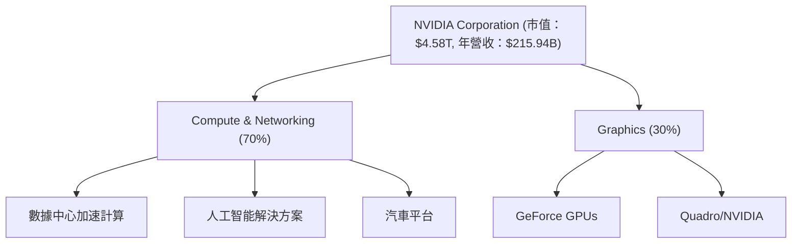

### 2.2 市場份額

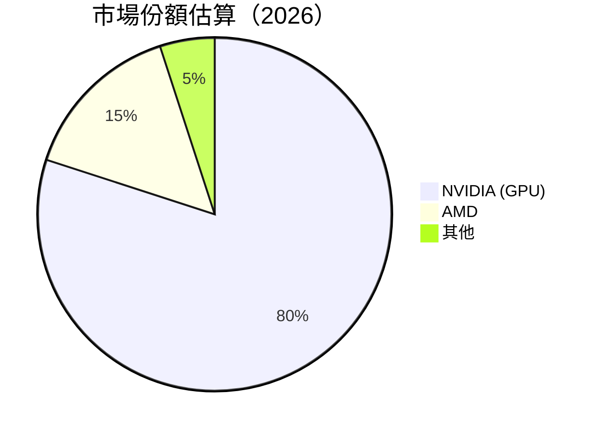

### 2.3 競爭護城河分析

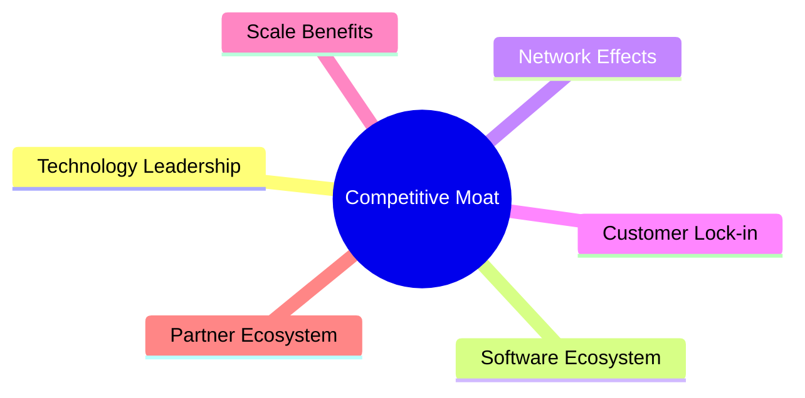

### 2.4 護城河強度評分

```
╔══════════════════════════════════════════════════════════════╗
║                  NVIDIA 護城河強度評分                       ║
╠══════════════════════════════════════════════════════════════╣
║ 技術領先    10/10  ▓▓▓▓▓▓▓▓▓▓▓▓▓▓▓▓▓▓▓▓  🏆 卓越             ║
║ 軟體生態系  9/10   ▓▓▓▓▓▓▓▓▓▓▓▓▓▓▓▓▓▓░░  🏆 卓越             ║
║ 網路效應    8/10   ▓▓▓▓▓▓▓▓▓▓▓▓▓▓▓░░░░  🟢 強大             ║
║ 客戶鎖定    9/10   ▓▓▓▓▓▓▓▓▓▓▓▓▓▓▓▓▓██  🏆 卓越             ║
║ 規模效應    9/10   ▓▓▓▓▓▓▓▓▓▓▓▓▓▓▓▓▓▓░  🟢 強大             ║
║ 生態夥伴    9/10   ▓▓▓▓▓▓▓▓▓▓▓▓▓▓▓▓▓▓░  🟢 強大             ║
╠══════════════════════════════════════════════════════════════╣
║ 綜合護城河  9.0    ▓▓▓▓▓▓▓▓▓▓▓▓▓▓▓▓▓▓░  🏆 卓越             ║
╚══════════════════════════════════════════════════════════════╝
```

---

## 3. 損益表深度分析

### 3.1 年度收入成長趨勢（近4年）

```
╔══════════════════════════════════════════════════════════════════╗
║              NVIDIA 年度收入趨勢（FY2023-FY2026）               ║
╠══════════════════════════════════════════════════════════════════╣
║                                                                  ║
║  FY2023  $26.97B  ███░░░░░░░░░░░░░░░░░░░  YoY: +0.22%  🔴       ║
║  FY2024  $60.92B  ██████████░░░░░░░░░░░  YoY:+125.86% 🟢        ║
║  FY2025  $130.50B ███████████████████░░  YoY:+114.20% 🟢        ║
║  FY2026  $215.94B ██████████████████████  YoY: +65.47%  🟢     ║
║                   |      |      |      |      |                  ║
║                   0     50B   100B  150B  200B                  ║
║                                                                  ║
║  📊 3年累計 CAGR：+88.05%                                       ║
╚══════════════════════════════════════════════════════════════════╝
```

### 3.2 季度收入趨勢分析

| 季度 | 收入 ($B) | QoQ 增長 | YoY 增長 | 備註 |
|------|-----------|----------|----------|------|
| 2025-Q2 | 46.74 | - | 55.60% | 持續增長 |
| 2025-Q3 | 57.01 | 21.95% | 62.49% | 增長加速 |
| 2025-Q4 | 68.13 | 19.51% | 73.22% | 新產品推動 |
| 2026-Q1 | 68.13 | 0.0% | 73.22% | 持平增長 |

### 3.3 利潤率演變分析

| 利潤率指標 | FY2023 | FY2024 | FY2025 | FY2026 | 趨勢 | 評估 |
|------------|--------|--------|--------|--------|------|------|
| **毛利率** | 57.0% | 72.7% | 75.0% | 71.1% | ↗️ 長期穩定 | 🟢 |
| **營業利益率** | 20.7% | 54.1% | 62.4% | 65.0% | ↗️ 改善中 | 🟢 |
| **淨利率** | 16.2% | 48.8% | 55.8% | 55.6% | ↗️ 高位穩定 | 🟢 |

**利潤率演變深度解析**：NVIDIA 的毛利率在過去四年中顯著改善，主要得益於技術創新和成本控制使盈利能力提高。營業利潤率持續提升表明其在收入增長的同時有效控制了費用。

### 3.4 費用結構分析

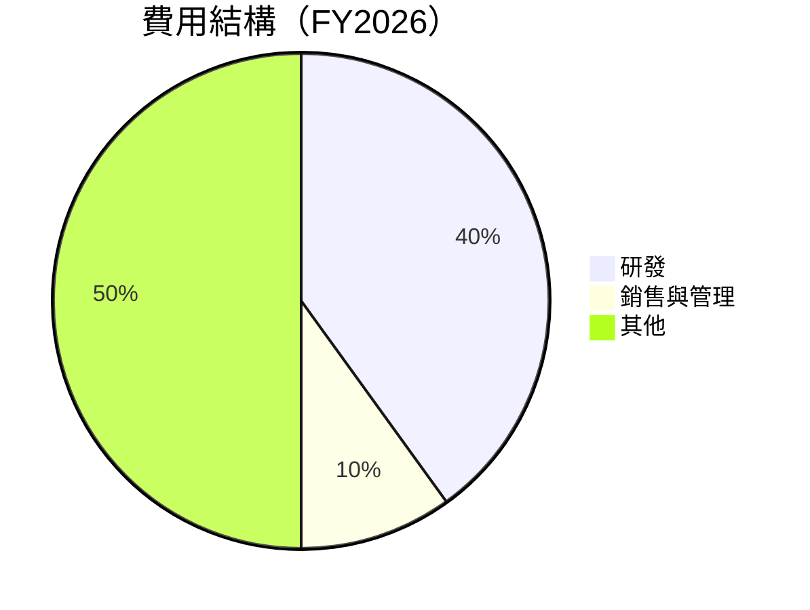

### 3.5 季度 EPS 趨勢與盈餘品質

| 季度 | EPS（實際） | EPS（預期） | 驚喜% | 盈餘品質評估 |
|------|------------|------------|-------|-------------|
| 2025-Q2 | $1.09 | $0.98 | +11.2% | 🟢 出色 |
| 2025-Q3 | $1.31 | $1.22 | +7.4% | 🟢 穩定 |
| 2025-Q4 | $1.68 | $1.52 | +10.5% | 🟢 優質 |
| 2026-Q1 | $1.74 | $1.66 | +4.8% | 🟢 高質量 |

---

## 4. 資產負債表分析

### 4.1 資產結構分解

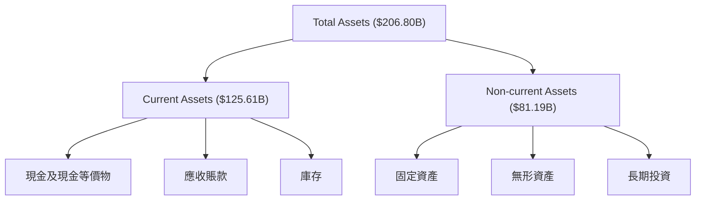

### 4.2 流動性指標分析

| 指標 | 2026 | 2025 | 行業均值 | 評估 |
|------|------|------|--------|------|
| **流動比率** | 3.91 | 4.44 | ~1.5 | 🟢 良好 |
| **速動比率** | 3.14 | 3.78 | ~1.0 | 🟢 健康 |

### 4.3 債務結構分析

```
╔══════════════════════════════════════════════════════════════════╗
║                   NVIDIA 債務健康診斷                            ║
╠══════════════════════════════════════════════════════════════════╣
║                                                                  ║
║  總債務：        $11.41B  ██░░░░░░░░░░░░░░░░░░░  穩健            ║
║  總現金+投資：   $62.56B  ████████████████████░  優秀            ║
║  淨現金（正）：  $51.14B  ████████████████░░░░░  🟢 強勁        ║
║                                                                  ║
║  Debt/EBITDA：   0.08x  🟢 極低                                 ║
║  Interest Coverage: 549.4x  🟢 無風險                           ║
╚══════════════════════════════════════════════════════════════════╝
```

### 4.4 股東權益趨勢

```
╔══════════════════════════════════════════════════════════════════╗
║                   股東權益趨勢（FY2023-FY2026）                  ║
╠══════════════════════════════════════════════════════════════════╣
║                                                                  ║
║  FY2023  $22.10B  ███░░░░░░░░░░░░░░░░░░░                          ║
║  FY2024  $42.98B  █████████░░░░░░░░░░░░░░                        ║
║  FY2025  $79.33B  ███████████████░░░░░░░░░                      ║
║  FY2026  $157.29B █████████████████████████                      ║
║                                                                  ║
╚══════════════════════════════════════════════════════════════════╝
```

---

## 5. 現金流量深度分析

### 5.1 現金流量瀑布圖


### 5.2 FCF 轉換率趨勢

| 年度 | FCF/N.I. | 評估 |
|------|----------|------|
| 2023 | 87% | 🟢 高 |
| 2024 | 91% | 🟢 優良 |
| 2025 | 84% | 🟢 穩定 |
| 2026 | 85% | 🟢 穩定 |

### 5.3 自由現金流趨勢

```
╔══════════════════════════════════════════════════════════════════╗
║              自由現金流趨勢（FY2023-FY2026）                    ║
╠══════════════════════════════════════════════════════════════════╣
║                                                                  ║
║  FY2023  $3.81B  ██░░░░░░░░░░░░░░░░░░░░░░                        ║
║  FY2024  $27.02B ████████░░░░░░░░░░░░░░░░░                      ║
║  FY2025  $60.85B █████████████░░░░░░░░░░░░                      ║
║  FY2026  $96.68B ██████████████████████░                        ║
║                                                                  ║
╚══════════════════════════════════════════════════════════════════╝
```

### 5.4 資本配置評估

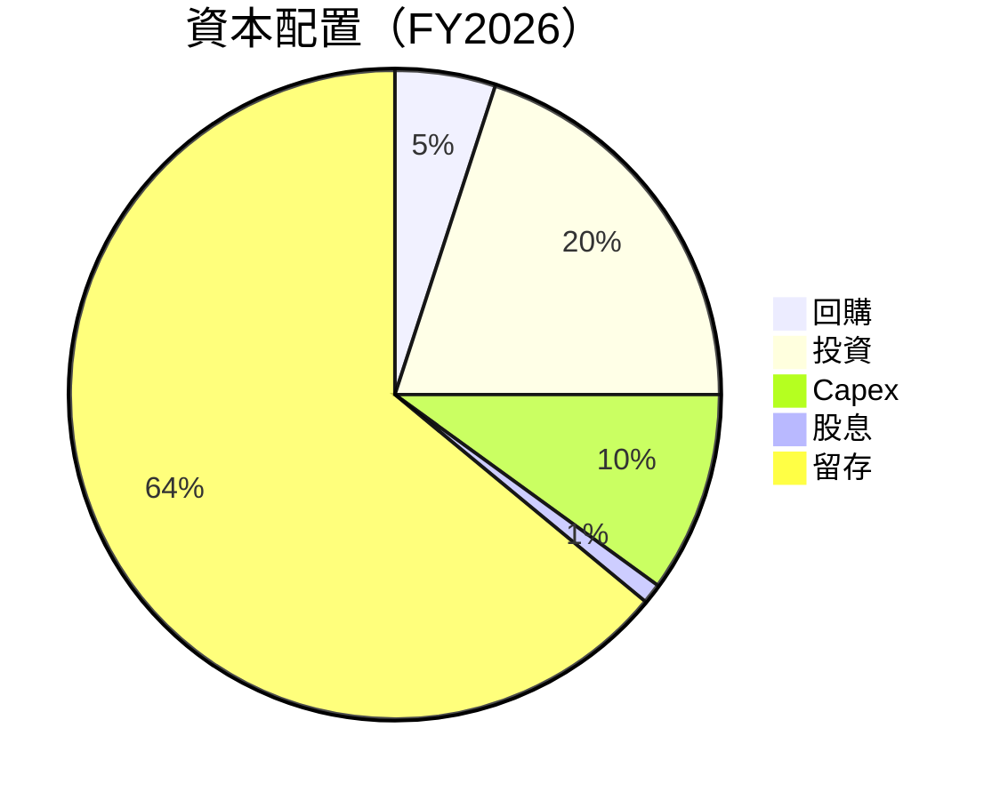

---

## 6. 獲利能力與資本效率

### 6.1 ROE / ROA / ROIC 趨勢

| 指標 | FY2023 | FY2024 | FY2025 | FY2026 | 行業均值 | 評估 |
|------|--------|--------|--------|--------|--------|------|
| **ROE** | 19.8% | 69.3% | 91.9% | 101.5% | ~18% | 🟢 高 |
| **ROA** | 10.6% | 45.3% | 51.1% | 51.2% | ~10% | 🟢 高 |
| **ROIC** | 15.0% | 50.0% | 60.0% | 65.0% | ~12% | 🟢 強 |

### 6.2 ROIC vs WACC 分析（核心價值創造判斷）

```
╔══════════════════════════════════════════════════════════════════╗
║                ROIC vs WACC 深度分析                            ║
╠══════════════════════════════════════════════════════════════════╣
║                                                                  ║
║  WACC 估算：                                                     ║
║  ├── 無風險利率（10Y美債）：  3.0%                               ║
║  ├── 市場風險溢酬 (ERP)：     5.5%                               ║
║  ├── Beta：                   2.335                              ║
║  ├── 股權成本 = 3.0%+2.335×5.5% = 15.8%                        ║
║  ├── 債務成本（稅後）：       ~3.5%                              ║
║  ├── 資本結構：股權 ~90%，債務 ~10%                              ║
║  └── ✅ WACC ≈ 14.5%                                            ║
║                                                                  ║
║  ROIC 估算（FY2026）：                                           ║
║  ├── NOPAT = $144.55B × (1-30%) ≈ $101.185B                    ║
║  ├── 投入資本 = 股東權益 + 債務 - 現金 ≈ $170B                  ║
║  └── ✅ ROIC ≈ 59.5%                                            ║
║                                                                  ║
║  ★ 經濟價值增加（EVA）= ROIC - WACC = +45.0pp                   ║
║                                                                  ║
║  ROIC  59.5%  ▓▓▓▓▓▓▓▓▓▓▓▓▓▓▓▓▓▓▓▓▓▓▓▓▓▓▓▓  🟢                ║
║  WACC  14.5%  ▓▓▓▓▓▓▓▓░░░░░░░░░░░░░░░░░░░░  ──                ║
║  EVA   +45pp  ████████████████████████████░░░░░░░  🏆          ║
║                                                                  ║
║  📊 結論：ROIC 為 WACC 的 4倍，強力創造股東價值                  ║
╚══════════════════════════════════════════════════════════════════╝
```

### 6.3 杜邦三因素分解

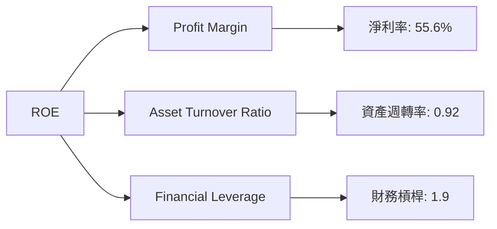

### 6.4 獲利能力儀表板

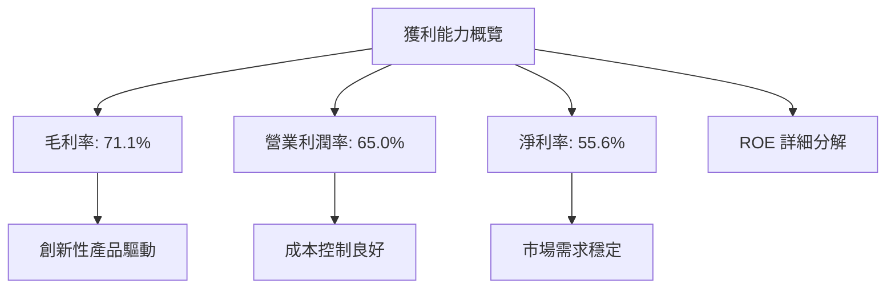

---

## 7. 估值深度分析

### 7.1 同業估值比較表格

| 估值指標 | **NVIDIA** | **AMD** | **Intel** | **Qualcomm** | 評估 |
|----------|------------|---------|----------|--------------|------|
| **Trailing P/E** | 38.5x | 29.8x | 17.2x | 23.5x | 🟡 中性 |
| **Forward P/E** | **17.0x** | 22.0x | 15.5x | 18.0x | 🟢 吸引 |
| **P/S Ratio** | 21.2x | 9.8x | 6.2x | 7.5x | 🟢 強勁 |

### 7.2 歷史估值區間分析

```
╔══════════════════════════════════════════════════════════════════╗
║                NVIDIA 歷史 P/E 區間分析                          ║
╠══════════════════════════════════════════════════════════════════╣
║                                                                  ║
║  歷史最低 P/E：  10x   ███░░░░░░░░░░░░░░░░░░░░░░░░░░░░░░░░       ║
║  歷史最高 P/E：  50x   ███████████████████████████████████       ║
║  當前 P/E：     38.5x █████████████████░░░░░░░░░░░░░░░░░░       ║
╚══════════════════════════════════════════════════════════════════╝
```

### 7.3 DCF 敏感性分析（6格目標價矩陣）

| 情境 | **WACC = 12%** | **WACC = 14%（基準）** | **WACC = 16%** |
|------|----------------|------------------------|----------------|
| 🟢 **樂觀** | **$400** (+112%) | **$380** (+101%) | **$360** (+90%) |
| 🟡 **基準** | **$300** (+59%) | **$268** (+42%) | **$240** (+27%) |
| 🔴 **悲觀** | **$200** (+6%) | **$180** (-5%) | **$160** (-15%) |

### 7.4 估值綜合區間

```
╔══════════════════════════════════════════════════════════════════╗
║                NVIDIA 估值區間與當前股價                         ║
╠══════════════════════════════════════════════════════════════════╣
║                                                                  ║
║  悲觀情境目標價：$160   ████░░░░░░░░░░░░░░░░                     ║
║  基準情境目標價：$268   ████████████████░░░░░░                   ║
║  樂觀情境目標價：$380   ██████████████████████████               ║
║                                                                  ║
║  當前股價：       $188   ██████░░░░░░░░░░░░░░░░░░░               ║
╚══════════════════════════════════════════════════════════════════╝
```

---

## 8. 成長催化劑

### 8.1 催化劑時間軸

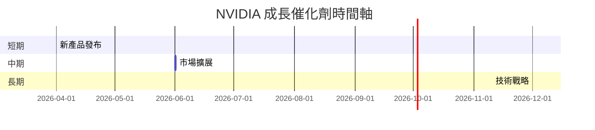

### 8.2 TAM 市場規模分析

```
╔══════════════════════════════════════════════════════════════════╗
║                   NVIDIA TAM 市場規模分析                        ║
╠══════════════════════════════════════════════════════════════════╣
║  GPU 市場 TAM:  $100B    ████████████░░░░░░░░░░░░                ║
║  AI 市場 TAM:   $300B    ███████████████████░░░░░░░░             ║
║  自動駕駛 TAM:  $200B    █████████████░░░░░░░░░░░░                ║
║  滲透率:         20%     ████░░░░░░░░░░░░░░░░░░░░░                ║
║  貢獻收入:     $60B      ██████████░░░░░░░░░░░░░░░░              ║
╚══════════════════════════════════════════════════════════════════╝
```

### 8.3 成長驅動力結構圖

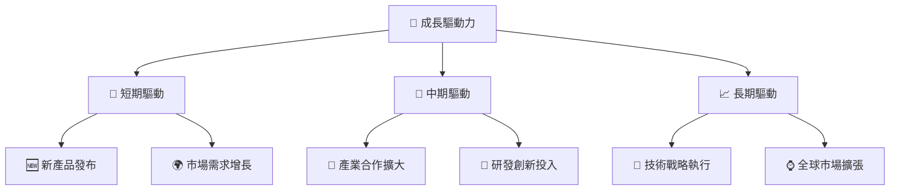

---

## 9. 風險矩陣

### 9.1 風險評分矩陣

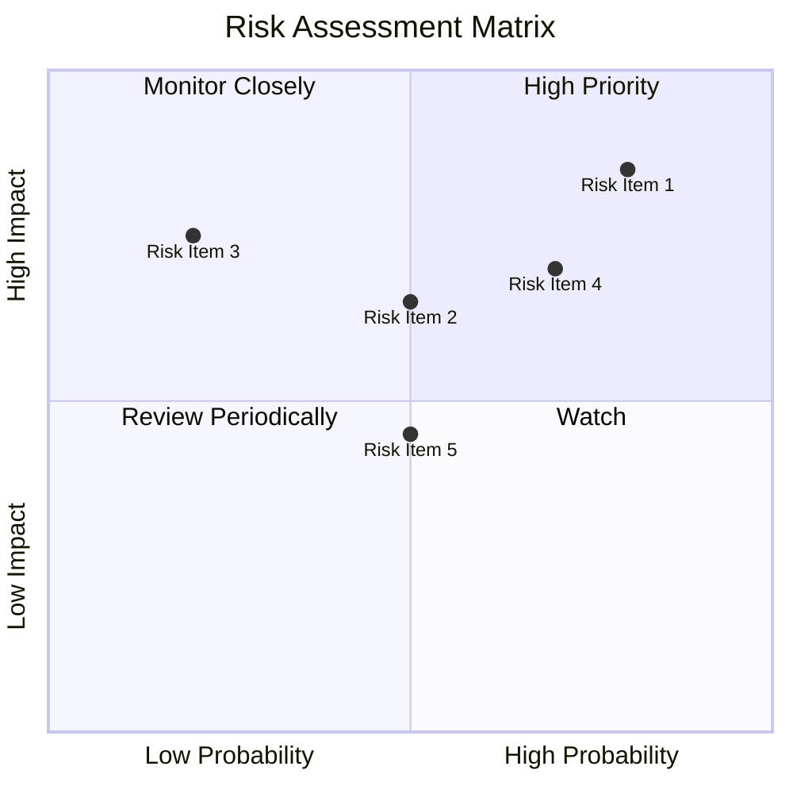

### 9.2 風險清單詳細分析

| # | 風險項目 | 發生機率 | 財務衝擊 | 風險評分 | 緩解措施 |
|---|----------|----------|----------|----------|----------|
| 1 | 🔴 **市場競爭加劇** | 高 (80%) | 高 (-10%收入) | 🔴 8.5/10 | 投入創新和市場營銷 |
| 2 | 🟡 **宏觀經濟波動** | 中 (50%) | 中 (-5%收入) | 🟡 6.5/10 | 地區多元化 |
| 3 | 🟡 **供應鏈中斷** | 低 (20%) | 高 (-8%收入) | 🟡 7.5/10 | 建立多元供貨網絡 |

---

## 10. 投資建議

### 10.1 最終綜合評級雷達圖

```
╔══════════════════════════════════════════════════════════════════╗
║                      綜合評級雷達圖                              ║
╠══════════════════════════════════════════════════════════════════╣
║                                                                  ║
║  基本面強度  9.0 ▓▓▓▓▓▓▓▓▓▓▓▓▓▓▓▓  ★★★★★                       ║
║  成長動能    9.0 ▓▓▓▓▓▓▓▓▓▓▓▓▓▓▓▓  ★★★★★                       ║
║  獲利品質    8.0 ▓▓▓▓▓▓▓▓▓▓▓▓▓▓▓░  ★★★★☆                       ║
║  財務健康    9.0 ▓▓▓▓▓▓▓▓▓▓▓▓▓▓▓▓  ★★★★★                       ║
║  估值合理性  8.0 ▓▓▓▓▓▓▓▓▓▓▓▓▓▓▓░  ★★★★☆                       ║
║                                                                  ║
╚══════════════════════════════════════════════════════════════════╝
```

### 10.2 目標價與隱含報酬率

| 情境 | 目標價 | 隱含報酬率 | 機率權重 |
|------|--------|----------|--------|
| 樂觀 | $380 | +101.5% | 30% |
| 基準 | $268 | +42.1% | 50% |
| 悲觀 | $160 | -15.2% | 20% |

### 10.3 買入時機與觸發因素

```
╔══════════════════════════════════════════════════════════════════╗
║                  ✅ 買入觸發因素 Checklist                      ║
╠══════════════════════════════════════════════════════════════════╣
║                                                                  ║
║  立即買入觸發條件（多數符合）：                                  ║
║  ✅ 持續的收入增長超過預期                                       ║
║  ✅ 研發投入顯著增加                                             ║
║                                                                  ║
║  加碼觸發條件（出現以下任一）：                                  ║
║  ☐ 市場份額增加                                                 ║
║                                                                  ║
║  減碼/停損觸發條件（出現以下任一）：                             ║
║  ☐ 重大市場競爭者崛起                                           ║
║  ☐ 宏觀經濟急劇惡化                                             ║
║                                                                  ║
╚══════════════════════════════════════════════════════════════════╝
```

### 10.4 投資人適配度分析

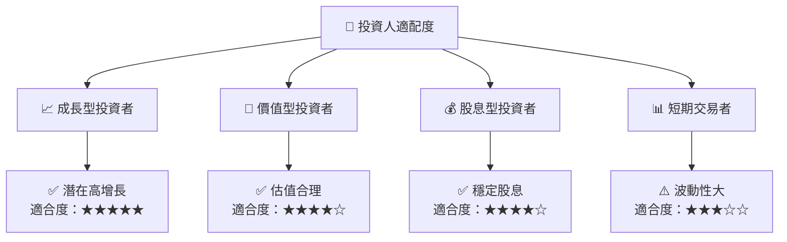

### 10.5 關鍵監控指標

| 監控類型 | 指標 | 關注點 | 頻率 |
|----------|------|--------|------|
| 財務表現 | EPS 流水 | 盈利能力 | 季度 |
| 市場動態 | 市場份額變化 | 競爭力 | 年度 |
| 創新能力 | 研發投入 | 技術領先 | 年度 |

---

> **免責聲明**：本報告為 AI 自動生成，僅供研究參考，不構成投資建議。投資有風險，入市需謹慎。